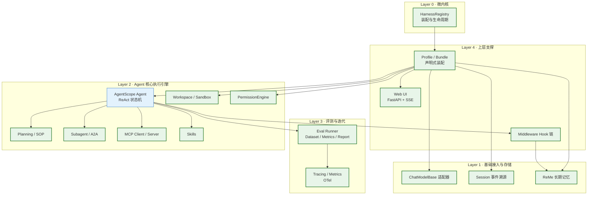

# 《20 天 Harness 工程契约》

> 本文件是整个 `harness_` 系列教程的**内部工程契约**，不是给读者看的正文，而是作者写 20 讲时的**真值来源**。
> 任何一讲的正文、代码、目录结构、命名，只要与本文件冲突，以本文件为准。
> 本文件中出现的每一条关于 AgentScope / ReMe 的结论，都必须能追溯到真实源码的 `路径:行号`；凡未经核实的，一律显式标注「**未验证**」。

本契约由 11 个部分组成：

| 编号 | 章节 | 作用 |
| --- | --- | --- |
| 1 | harness_kit 定位与关系图 | 说清楚"我们到底在造什么、不造什么" |
| 2 | 完整目录树 | 20 讲共用的唯一目录事实 |
| 3 | 各模块对外接口契约 | 类名、方法签名、语义 |
| 4 | 各模块真实依赖的 agentscope / reme API 清单 | 反臆造 |
| 5 | 关键数据结构字段级定义 | 序列化边界 |
| 6 | Profile / Bundle YAML 结构、继承与合并规则、3 个完整示例 | 装配层 |
| 7 | 编码规范 | 全局约束 |
| 8 | 教程写作模板（严格） | 20 讲格式统一 |
| 9 | 每讲知识点自测题要求 | 5~10 题规则 |
| 10 | "不要做什么"边界 | 防跑偏 |
| 11 | 参考实现路径 | 真值目录 |

---

## 一、harness_kit 的定位

### 1.1 一句话定位

**`harness_kit` 是一个"Harness 装配层"，不是一个 Agent 内核。**

它建立在 AgentScope 2.0.8 与 ReMe 0.4.1.13 **已有**的能力之上，只做三件事：

1. **装配**：把 AgentScope 的 Agent / Toolkit / Model / Workspace / PermissionEngine / Middleware 与 ReMe 的 Application / Job / Component **按声明式的 Profile/Bundle 装配起来**；
2. **补齐**：补上 AgentScope 与 ReMe 在真实生产场景中**确实缺失**的那几块（事件溯源不可变日志、事件总线、评测引擎、记忆中间件的 token 预算、Docker 沙箱配额、声明式 Profile 等）；
3. **服务化**：把装配结果暴露为 CLI / FastAPI / SSE / MCP Server。

### 1.2 明确不做什么（最高优先级约束）

**严禁**重写内核。以下行为一律视为任务失败：

- 从零手写 Agent Loop（AgentScope 已有 ReAct 状态机，见 `third_party/agentscope/src/agentscope/agent/_agent.py:117` 的 `Agent` 与 `:904` 的 `_reply`）；
- 手写 `ChatModelBase` 子类去"实现一个模型层"——我们只写**适配器**，且必须继承 `ChatModelBase`（`third_party/agentscope/src/agentscope/model/_base.py:37`），只覆写唯一的抽象方法 `_call_api`（同文件 `:292`）；
- 手写 `Toolkit` / `ToolBase`（`third_party/agentscope/src/agentscope/tool/_toolkit.py:66`、`third_party/agentscope/src/agentscope/tool/_base.py:100`）；
- 手写"迷你 harness"（`mini_harness` 之类的玩具内核）；
- 以"讲原理"为名，把 AgentScope 已经写好的东西再抄一遍。

**唯一正确的姿势**：读真实源码 → 定位真实扩展点 → 在扩展点上写生产级组件。

### 1.3 harness_kit 补齐的 6 个真实缺口

这 6 个缺口全部由侦察报告交叉验证得出，每一个都对应教程中的具体讲次。

| # | 缺口 | 证据 | 对应讲次 | harness_kit 模块 |
| --- | --- | --- | --- | --- |
| 1 | **没有不可变事件日志**：`AgentState.context` 是唯一的持久化边界，且会被 `compress_context` **原地替换**；`app/` 层的 replay 只是一个**有界内存窗口**（`_SESSION_REPLAY_MAX_LEN = 1000`），不落盘、不可回溯 | `third_party/agentscope/src/agentscope/state/_state.py:209`（`AgentState`，`context` 字段可被覆盖）；`third_party/agentscope/src/agentscope/agent/_agent.py:434`（`on_compress_context` 调用点）；`third_party/agentscope/src/agentscope/app/message_bus/_base.py:576`、`third_party/agentscope/src/agentscope/app/message_bus/_keys.py:126` | 03 / 09 | `harness_kit/events/`、`harness_kit/session/` |
| 2 | **没有 pub/sub 事件总线**（事件只能在一个 Agent 的 reply 流里被消费） | `_recon/03_messages_events_state.md` | 03 | `harness_kit/events/bus.py` |
| 3 | **没有 Layer 3 评测引擎**（无 benchmark engine） | `_recon/12_reme_storage_graph.md`「不存在的能力」清单 | 20 | `harness_kit/eval/` |
| 4 | **官方 ReMe 中间件没有 token 预算 / 不传 `min_score` / 不传 `tool_context_id`** | `_recon/15_integration_agentscope_reme.md`（grep 确认全文无 truncate） | 19 | `harness_kit/memory/budget.py`、`middleware.py` |
| 5 | **没有声明式 Profile/Bundle 装配**（`create_app` 是硬编码的） | `third_party/agentscope/src/agentscope/app/_app.py:78` | 02 / 20 | `harness_kit/config/`、`harness_kit/profiles/` |
| 6 | **Docker 沙箱没有配额与策略层**；无通用沙箱（ReMe 侧无沙箱） | `_recon/12_reme_storage_graph.md`；`third_party/agentscope/src/agentscope/workspace/_base.py:223` | 10 | `harness_kit/sandbox/` |

另有两块**锦上添花但同样有真实扩展点**的能力：

- **权限规则文件 + 审计日志**：AgentScope 有 `PermissionEngine`（`third_party/agentscope/src/agentscope/permission/_engine.py:17`）与 `PermissionRule`（`_rule.py:8`），但没有"从磁盘加载规则文件"与"落盘审计"这两件事 → `harness_kit/permission/`。
- **把 harness_kit 自身暴露为 MCP Server**：AgentScope 有 `MCPClient`（`mcp/_mcp_client.py:33`）但没有 server 侧 → `harness_kit/mcp/server.py`。

### 1.4 关系图



> 图注：`classDef base` 的 `Agent` 是 **AgentScope 原生**的，我们**不重写**；其余节点是 `harness_kit` 负责装配或补齐的部分。任何一个节点被划到 `ours` 不等于"我们要从零实现它"——例如 `Model` 的实现方式是"继承 `ChatModelBase`、只覆写 `_call_api`"，`Mem` 的实现方式是"装配并扩展 `ReMeMiddleware`"。

---

## 二、完整目录树

参考实现根：`tutorial_agsc_reme/reference/`。
本节是 20 讲共用的**唯一目录事实**，任何一讲不得私自增删文件。

```
tutorial_agsc_reme/reference/
├── pyproject.toml                          # 依赖声明：agentscope==2.0.8 / reme==0.4.1.13 / fastapi / pydantic>=2 / loguru / numpy / mcp
├── .env.example                            # LLM_API_KEY / LLM_BASE_URL / LLM_MODEL_NAME / LLM_BACKEND 模板（ReMe as_llm 只读这四个）
├── README.md                               # 参考实现速览与运行方式
├── scripts/
│   ├── 00_smoke.py                         # 第1讲：环境自检 + 首个 Agent + 首次 ReMe 检索
│   ├── 01_reme_doctor.py                   # 第15讲：ReMe 配置体检
│   └── mcp_demo_server.py                  # 第7讲：harness_kit 暴露为 MCP Server 的演示入口
└── harness_kit/
    ├── __init__.py                         # 包入口：__version__ + 对外仅导出 HarnessBuilder / Settings / load_profile
    ├── settings.py                         # Settings：pydantic-settings 全局设置（路径、env、开关）
    ├── registry.py                         # HarnessRegistry：组件注册 / 解析 / 生命周期（对应 Layer 0）
    ├── cli.py                              # harness-kit 命令行：run / doctor / eval / serve
    │
    ├── config/
    │   ├── __init__.py                     # 导出 Profile / Bundle / ResolvedProfile / load_profile / resolve_profile
    │   ├── schema.py                       # Profile / Bundle / ResolvedProfile 的 pydantic v2 模型 + 合并算法
    │   ├── loader.py                       # YAML 读取 + ${VAR:-default} 环境插值 + extends 链解析
    │   └── builder.py                      # HarnessBuilder：把 ResolvedProfile 变成真实的 Agent / Toolkit / Model 等对象
    │
    ├── events/
    │   ├── __init__.py
    │   ├── types.py                        # EventRecord / EventKind：不可变事件记录（区别于 agentscope 的 AgentEvent）
    │   ├── bus.py                          # EventBus：asyncio pub/sub，订阅者按 topic 过滤
    │   └── translate.py                    # StreamTranslator：把 agentscope AgentEvent 流翻译成 EventRecord
    │
    ├── session/
    │   ├── __init__.py
    │   ├── models.py                       # SessionMeta / SessionEvent / SessionSnapshot
    │   ├── store.py                        # SessionStoreBase 抽象基类
    │   ├── jsonl_store.py                  # JsonlSessionStore：追加写 jsonl.zst
    │   ├── sqlite_store.py                 # SqliteSessionStore：SQL 表结构 + blob 外置
    │   ├── snapshot.py                     # Snapshotter：AgentState 快照
    │   ├── replay.py                       # SessionReplayer：按事件重建状态
    │   └── resume.py                       # SessionResumer：从快照 + 尾部事件恢复 Agent
    │
    ├── models/
    │   ├── __init__.py
    │   ├── factory.py                      # build_chat_model：按 Profile 造模型
    │   ├── pricing.py                      # cost_of：token → 费用
    │   ├── ratelimit.py                    # TokenBucket / RateLimitedModel：包装 ChatModelBase
    │   └── adapters/
    │       ├── __init__.py
    │       ├── base.py                     # HarnessChatModelAdapter：ChatModelBase 的公共底座（只覆写 _call_api）
    │       └── echo.py                     # EchoChatModel：无网络可跑的确定性适配器，供测试与离线教学
    │
    ├── tools/
    │   ├── __init__.py                     # 导出 ToolPackBase / ToolPackManifest / build_toolkit
    │   ├── pack.py                         # ToolPackBase / ToolPackManifest：工具包契约
    │   ├── builtin_pack.py                 # BuiltinToolPack：文件 / 时间 / 计算等基础工具
    │   ├── repo_pack.py                    # RepoToolPack：仓库读写 / grep / 搜索
    │   └── utils.py                        # schema 修补 / 参数校验失败修复
    │
    ├── skills/
    │   ├── __init__.py
    │   ├── manifest.py                     # SkillManifest：SKILL.md front matter 模型
    │   ├── loader.py                       # HarnessSkillLoader：继承 LocalSkillLoader，加 front matter 解析与索引
    │   └── builtin/                        # 内置技能：SKILL.md 文件
    │       ├── code_review/SKILL.md
    │       └── repo_explore/SKILL.md
    │
    ├── mcp/
    │   ├── __init__.py
    │   ├── registry.py                     # MCPServerSpec / MCPServerRegistry：声明式 MCP 装配
    │   ├── adapter.py                      # to_tool_base：把 MCP tool 描述暴露为 ToolBase 视图
    │   └── server.py                       # build_mcp_server：把 harness_kit 工具包暴露为 MCP Server
    │
    ├── middleware/
    │   ├── __init__.py
    │   ├── base.py                         # HarnessMiddleware：MiddlewareBase 的公共基类与工具函数
    │   ├── logging.py                      # LoggingMiddleware
    │   ├── budget.py                       # BudgetMiddleware：token / 调用次数预算
    │   ├── redact.py                       # RedactMiddleware：敏感信息脱敏
    │   ├── tracing.py                      # TracingMiddleware：把 hook 事件打到 EventBus
    │   └── guards.py                       # GuardsMiddleware：循环 / 重复调用保护
    │
    ├── sandbox/
    │   ├── __init__.py
    │   ├── policy.py                       # SandboxPolicy：路径 / 网络 / 资源策略模型
    │   ├── local.py                        # PolicyLocalWorkspace：本地工作区 + 策略校验
    │   ├── docker.py                       # QuotaDockerWorkspace：Docker 工作区 + 配额
    │   ├── offload.py                      # HarnessOffloader：实现 Offloader Protocol
    │   └── guard.py                        # PathGuard：路径逃逸检测
    │
    ├── permission/
    │   ├── __init__.py
    │   ├── rules.py                        # RuleSet：从 YAML 加载 PermissionRule
    │   ├── policy.py                       # HarnessPermissionEngine：包装 PermissionEngine
    │   ├── hitl.py                         # HITLBridge：RequireUserConfirmEvent ↔ 外部确认
    │   └── audit.py                        # AuditLog：权限决策落盘
    │
    ├── planning/
    │   ├── __init__.py
    │   ├── graph.py                        # TaskGraph / TaskNode：目标分解
    │   ├── planner.py                      # HarnessPlanner：包 pipeline / sop
    │   ├── sop.py                          # HarnessSOP：SOP 状态机封装
    │   └── resume.py                       # PlanStore：计划持久化
    │
    ├── multiagent/
    │   ├── __init__.py
    │   ├── team.py                         # AgentTeam：多 Agent 编排
    │   ├── router.py                       # CapabilityRouter：按能力路由
    │   ├── handoff.py                      # HandoffTool：交接工具
    │   └── limits.py                       # SpawnLimiter：派生数量 / 深度限制
    │
    ├── reasoning/
    │   ├── __init__.py
    │   ├── structured.py                   # CallStructured：结构化输出工具
    │   ├── critique.py                     # CritiqueLoop：自我批判循环
    │   └── prompt.py                       # PromptAssembler：system prompt 装配（KV Cache 友好）
    │
    ├── memory/
    │   ├── __init__.py
    │   ├── workspace.py                    # ReMeWorkspace：工作区路径与元数据
    │   ├── config.py                       # HarnessMemoryConfig：ReMe app config 构建
    │   ├── client.py                       # MemoryClient：嵌入式 run_job 客户端
    │   ├── doctor.py                       # 配置体检
    │   ├── ingest.py                       # 写入路径：文档入库
    │   ├── distill.py                      # 写入路径：会话蒸馏
    │   ├── catalog.py                      # file_catalog / 目录管理
    │   ├── frontmatter.py                  # front matter 读写
    │   ├── search.py                       # 检索：SearchStep 封装
    │   ├── hybrid.py                       # 混合检索：RRF 封装与权重
    │   ├── citations.py                    # 引用抽取与渲染
    │   ├── budget.py                       # 检索结果 token 预算（缺口 4）
    │   ├── maintenance.py                  # 自演化：auto_memory
    │   ├── jobs.py                         # 后台 / cron job 封装
    │   ├── forget.py                       # 遗忘策略
    │   ├── proactive.py                    # 主动读取
    │   ├── middleware.py                   # LongTermMemoryMiddleware（扩展官方 _reme）
    │   ├── gating.py                       # 记忆注入门控
    │   ├── tenant.py                       # 多租户隔离
    │   └── metrics.py                      # 记忆侧指标
    │
    ├── eval/
    │   ├── __init__.py
    │   ├── dataset.py                      # EvalCase / EvalDataset / 数据合成
    │   ├── runner.py                       # EvalRunner
    │   ├── metrics.py                      # 指标函数
    │   └── report.py                       # EvalReport
    │
    ├── observe/
    │   ├── __init__.py
    │   ├── tracing.py                      # OTel Span 封装
    │   └── metrics.py                      # 指标注册
    │
    ├── service/
    │   ├── __init__.py
    │   ├── app.py                          # create_harness_app：FastAPI + SSE
    │   └── webui/
    │       └── index.html                  # 单文件 Web UI
    │
    ├── profiles/
    │   ├── default.yaml                    # 最小可运行 Profile
    │   ├── coding.yaml                     # 代码助手 Profile
    │   └── research.yaml                   # 研究助手 Profile
    │
    └── demo/
        └── code_assistant/
            ├── __init__.py
            ├── agent.py                    # 端到端 demo 组装
            ├── Dockerfile
            └── deployment.yaml             # 部署清单
```

**目录与讲次的唯一映射**（一讲只拥有它的模块，跨讲引用只能引用**已交付**的模块）：

| 讲次 | 交付模块 |
| --- | --- |
| 01 | `harness_kit/__init__.py`、`harness_kit/settings.py`、`scripts/00_smoke.py` |
| 02 | `harness_kit/config/{schema,loader,builder}.py`、`harness_kit/registry.py` |
| 03 | `harness_kit/events/{bus,types,translate}.py`、`harness_kit/session/models.py` |
| 04 | `harness_kit/models/{factory,pricing,ratelimit}.py`、`harness_kit/models/adapters/` |
| 05 | `harness_kit/tools/{pack,builtin_pack,repo_pack,utils}.py` |
| 06 | `harness_kit/skills/{loader,manifest}.py`、`harness_kit/skills/builtin/` |
| 07 | `harness_kit/mcp/{registry,adapter,server}.py`、`scripts/mcp_demo_server.py` |
| 08 | `harness_kit/middleware/{base,logging,budget,redact,tracing,guards}.py` |
| 09 | `harness_kit/session/{store,jsonl_store,sqlite_store,snapshot,replay,resume}.py` |
| 10 | `harness_kit/sandbox/{policy,local,docker,offload,guard}.py` |
| 11 | `harness_kit/permission/{rules,policy,hitl,audit}.py` |
| 12 | `harness_kit/planning/{graph,planner,sop,resume}.py` |
| 13 | `harness_kit/multiagent/{team,router,handoff,limits}.py` |
| 14 | `harness_kit/reasoning/{structured,critique,prompt}.py` |
| 15 | `harness_kit/memory/{workspace,config,client,doctor}.py`、`scripts/01_reme_doctor.py` |
| 16 | `harness_kit/memory/{ingest,distill,catalog,frontmatter}.py` |
| 17 | `harness_kit/memory/{search,hybrid,citations,budget}.py` |
| 18 | `harness_kit/memory/{maintenance,jobs,forget,proactive}.py` |
| 19 | `harness_kit/memory/{middleware,gating,tenant,metrics}.py` |
| 20 | `harness_kit/eval/*`、`harness_kit/observe/*`、`harness_kit/service/*`、`harness_kit/profiles/*`、`harness_kit/cli.py`、`harness_kit/demo/code_assistant/*` |

---

## 三、各模块对外接口契约

> 规则：
> 1. 本节列出的**每一个**类名、方法名、参数名、返回类型，都是 20 讲正文必须逐字使用的；
> 2. 标注「**未验证**」的签名表示作者尚未在源码里核实，正文中若要使用必须先核实并回填本契约；
> 3. 所有 `async` 都是真异步，禁止在协程里调用 `time.sleep` / `requests`。

### 3.1 第 1 讲：包入口与设置

```python
# harness_kit/__init__.py
__version__: str = "0.1.0"
def get_version() -> str: ...                     # 返回 __version__
```

```python
# harness_kit/settings.py
class Settings(BaseSettings):
    """全局设置，来源优先级：显式入参 > 环境变量 > .env > 默认值。"""
    model_config = SettingsConfigDict(env_prefix="HARNESS_", env_file=".env", extra="ignore")

    repo_root: Path                               # 仓库根，用于把所有相对路径钉死
    workspace_dir: Path = Path("./.harness/workspace")
    session_dir: Path = Path("./.harness/sessions")
    profile_dir: Path = Path("./harness_kit/profiles")
    log_level: str = "INFO"
    llm_api_key: str | None = None                # 从 LLM_API_KEY 读（复用 ReMe 的变量名）
    llm_base_url: str | None = None
    llm_model_name: str | None = None
    llm_backend: str | None = None

    @classmethod
    def from_env(cls, **overrides: object) -> "Settings":
        """构造 Settings 并做一次存在性校验（目录存在、env 齐备）。语义：唯一入口。"""

    def ensure_dirs(self) -> None: ...             # 幂等创建 workspace_dir / session_dir
    def redacted(self) -> dict[str, object]: ...   # 日志用：key 打码为 "sk-***"
```

```python
# scripts/00_smoke.py
async def main() -> int: ...
# 语义：① 断言 sys.path 里解析到的 reme 版本为 0.4.1.13（防 0.3.1.10 污染）
#       ② 起一个最小 AgentScope Agent（含 ToolKit），跑一次 reply
#       ③ 用 reme.ReMe(**config) 嵌入式装配跑一次 run_job("search") 
#       ④ 打印 PASS/FAIL 汇总，FAIL 返回非 0
```

### 3.2 第 2 讲：配置装配（Profile / Bundle / Registry）

```python
# harness_kit/config/schema.py
class Bundle(BaseModel):
    model_config = ConfigDict(extra="forbid")
    name: str
    description: str = ""
    model: ModelSpec | None = None
    tools: ToolsSpec | None = None
    skills: SkillsSpec | None = None
    mcp: MCPSpec | None = None
    middleware: list[MiddlewareSpec] = Field(default_factory=list)
    workspace: WorkspaceSpec | None = None
    permission: PermissionSpec | None = None
    memory: MemorySpec | None = None
    agent: AgentSpec | None = None

class Profile(BaseModel):
    model_config = ConfigDict(extra="forbid")
    name: str
    description: str = ""
    extends: str | None = None                   # 单继承
    bundles: list[str] = Field(default_factory=list)
    # 以下字段与 Bundle 同构，表示"本 Profile 自己的覆盖"
    model: ModelSpec | None = None
    ...
class ResolvedProfile(BaseModel):
    """合并并冻结后的结果。所有字段非 Optional（有默认值），不会被再修改。"""
    name: str
    source_chain: list[str]                       # 记录合并来源，便于 --explain
    model: ModelSpec
    tools: ToolsSpec
    ...
    def explain(self) -> str: ...                 # 逐字段打印"值来自哪个文件"
```

```python
# harness_kit/config/loader.py
def load_yaml(path: Path) -> dict[str, Any]: ...          # 原始读取 + ${VAR} 插值
def interpolate_env(raw: Any, environ: Mapping[str, str]) -> Any:
    """支持 ${VAR} 与 ${VAR:-default}；未定义且无默认值 → ConfigInterpolationError。"""
def load_profile(name_or_path: str | Path, *, search_dir: Path) -> Profile: ...
def load_bundle(name: str, *, search_dir: Path) -> Bundle: ...
class ConfigCycleError(Exception): ...                     # extends/bundles 成环
class ConfigInterpolationError(Exception): ...             # ${VAR} 无法解析
```

```python
# harness_kit/config/schema.py（合并算法，必须独立可测）
def merge_dicts(base: dict[str, Any], override: dict[str, Any]) -> dict[str, Any]:
    """深合并：map 递归合并、叶子覆盖；list 默认整体替换；显式 null 删除继承来的键；
       带 YAML 标签 !append 的 list 追加到 base 之后。"""
def resolve_profile(profile: Profile, *, search_dir: Path) -> ResolvedProfile:
    """顺序：resolve extends 链 → 合并 bundles（从左到右，后者胜）→ 自身覆盖
             → 环境插值 → pydantic 校验 → 冻结。"""
```

```python
# harness_kit/config/builder.py
class HarnessBuilder:
    """把 ResolvedProfile 变成真实运行对象。唯一装配出口。"""
    def __init__(self, profile: ResolvedProfile, *, settings: Settings,
                 registry: HarnessRegistry | None = None) -> None: ...
    async def build_model(self) -> ChatModelBase: ...
    async def build_toolkit(self) -> Toolkit: ...
    async def build_middlewares(self) -> list[MiddlewareBase]: ...
    async def build_workspace(self) -> WorkspaceBase | None: ...
    async def build_permission_engine(self) -> PermissionEngine | None: ...
    async def build_agent(self) -> Agent: ...
    async def build_all(self) -> BuiltHarness: ...
    async def aclose(self) -> None: ...            # 逆序释放
```

```python
# harness_kit/registry.py
class HarnessRegistry:
    """Layer 0：把"名字 → 工厂"登记起来，支持 Profile 里按名字引用。"""
    def register_model(self, name: str, factory: Callable[[ModelSpec], Awaitable[ChatModelBase]]) -> None: ...
    def register_tool_pack(self, name: str, factory: Callable[[ToolsSpec], Awaitable[list[ToolBase]]]) -> None: ...
    def register_middleware(self, name: str, factory: Callable[[MiddlewareSpec], MiddlewareBase]) -> None: ...
    def register_workspace(self, name: str, factory: Callable[[WorkspaceSpec], Awaitable[WorkspaceBase]]) -> None: ...
    def register_memory(self, name: str, factory: Callable[[MemorySpec], Awaitable[Any]]) -> None: ...
    def freeze(self) -> None: ...                  # 冻结后禁止再注册，未登记的名字立即报 UnknownComponentError
    def get(self, kind: str, name: str) -> Callable[..., Any]: ...
    @classmethod
    def default(cls) -> "HarnessRegistry": ...     # 内置全部 harness_kit 组件
class UnknownComponentError(KeyError): ...
```

### 3.3 第 3 讲：事件、事件总线、会话模型

```python
# harness_kit/events/types.py
class EventKind(StrEnum):
    SESSION_START = "session_start"
    REPLY_START = "reply_start"
    MODEL_CALL = "model_call"
    TOOL_CALL = "tool_call"
    TOOL_RESULT = "tool_result"
    PERMISSION = "permission"
    MEMORY_HIT = "memory_hit"
    REPLY_END = "reply_end"
    CUSTOM = "custom"

class EventRecord(BaseModel):
    """不可变事件记录：与 agentscope 的 AgentEvent 不同，它可序列化、可落盘、永不修剪。"""
    model_config = ConfigDict(frozen=True)
    event_id: str                                  # uuid4 hex
    session_id: str
    seq: int                                       # 会话内单调递增
    kind: EventKind
    ts: datetime                                   # UTC
    payload: dict[str, Any]
    source: str = "harness_kit"
```

```python
# harness_kit/events/bus.py
Handler = Callable[[EventRecord], Awaitable[None]]

class EventBus:
    """进程内 asyncio pub/sub。语义：publish 不阻塞；订阅者异常被捕获并计入 errors。"""
    def __init__(self, *, max_queue: int = 1024) -> None: ...
    def subscribe(self, topic: str | EventKind, handler: Handler) -> Subscription: ...
    async def publish(self, topic: str | EventKind, record: EventRecord) -> int: ...   # 返回投递数
    async def start(self) -> None: ...
    async def aclose(self) -> None: ...
    @property
    def errors(self) -> int: ...

class Subscription:
    def unsubscribe(self) -> None: ...
```

```python
# harness_kit/events/translate.py
class StreamTranslator:
    """把 AgentScope 的 AgentEvent 异步流翻译成 EventRecord 并投递到 EventBus。"""
    def __init__(self, bus: EventBus, *, session_id: str) -> None: ...
    def _next_seq(self) -> int: ...                                  # 复用 events/types.EventRecord.seq
    def to_record(self, event: AgentEvent) -> EventRecord | None: ... # 未识别的返回 None
    async def consume(self, stream: AsyncGenerator[AgentEvent, None]) -> int: ...
        """耗尽流、逐条翻译并 publish；返回记录条数。必须用 async for，禁止 list() 整个流。"""
```

```python
# harness_kit/session/models.py
class SessionMeta(BaseModel):
    session_id: str
    profile_name: str
    created_at: datetime
    updated_at: datetime
    event_count: int = 0
    tags: list[str] = Field(default_factory=list)

class SessionEvent(BaseModel):
    """落盘形态：EventRecord + 版本号（便于将来迁移）。"""
    v: int = 1
    record: EventRecord

class SessionSnapshot(BaseModel):
    session_id: str
    seq: int                                       # 快照覆盖到的 seq
    agent_state: dict[str, Any]                    # AgentState.model_dump(mode="json")
    created_at: datetime
```

### 3.4 第 4 讲：模型适配层

```python
# harness_kit/models/adapters/base.py
class HarnessChatModelAdapter(ChatModelBase):
    """ChatModelBase 的公共底座。
       铁律：只覆写 _call_api（ChatModelBase 唯一 @abstractmethod）；绝不覆写 __call__。"""
    def __init__(self, *, model_name: str, stream: bool = True,
                 pricing: PriceTable | None = None, **kwargs: Any) -> None: ...
    async def _call_api(self, model_name: str, messages: list[Msg],
                        tools: list[dict] | None = None,
                        tool_choice: ToolChoice | None = None,
                        **kwargs: Any) -> ChatResponse: ...
    def _accumulate(self, chunks: Iterable[ChatResponse]) -> ChatResponse:
        """流式增量累积：text / thinking / tool_call 三段分别按 index 合并；usage 取最后一次非空。"""
```

```python
# harness_kit/models/adapters/echo.py
class EchoChatModel(HarnessChatModelAdapter):
    """完全离线、确定性的适配器：把最后一条 user 文本原样回显（带 [echo] 前缀）。
       用途：评测、单测、离线教学；stream=True 时按字符切块。"""
```

```python
# harness_kit/models/factory.py
def build_chat_model(spec: ModelSpec, *, settings: Settings) -> ChatModelBase:
    """按 spec.provider 分派：deepseek/openai → OpenAI 兼容适配器；echo → EchoChatModel；
       未注册 provider → UnknownProviderError。必须校验 spec.api_key 非空。"""
class UnknownProviderError(ValueError): ...
async def health_check(model: ChatModelBase, *, timeout: float = 10.0) -> ModelHealth: ...
class ModelHealth(BaseModel):
    ok: bool
    latency_ms: float
    error: str | None = None
```

```python
# harness_kit/models/pricing.py
class Price(BaseModel):
    input_per_mtok: float
    output_per_mtok: float
    cache_read_per_mtok: float | None = None
class PriceTable(BaseModel):
    prices: dict[str, Price]
    def lookup(self, model_name: str) -> Price: ...   # 未命中 → UnknownPriceError
def cost_of(usage: ChatUsage, price: Price) -> float:
    """语义：按 input_tokens / output_tokens 计价，单位美元；cache 字段为 None 时按普通输入价。"""
```

```python
# harness_kit/models/ratelimit.py
class TokenBucket:
    def __init__(self, *, rate: float, capacity: int) -> None: ...
    async def acquire(self, tokens: int = 1) -> None: ...   # 不足则 await 到可得为止
    @property
    def available(self) -> float: ...
class RateLimitedModel(ChatModelBase):
    """包装任意 ChatModelBase，在 _call_api 前 acquire。
       注意：它仍是 ChatModelBase，因此必须继续覆写 _call_api 而非 __call__。"""
    def __init__(self, inner: ChatModelBase, bucket: TokenBucket) -> None: ...
```

### 3.5 第 5 讲：工具系统与生产工具包

```python
# harness_kit/tools/pack.py
class ToolPackManifest(BaseModel):
    name: str
    version: str = "0.1.0"
    description: str = ""
    requires: list[str] = Field(default_factory=list)     # 需要的其它 pack 名
    groups: dict[str, list[str]] = Field(default_factory=dict)  # group 名 → 工具名列表

class ToolPackBase(ABC):
    """一个"生产工具包"= 若干 ToolBase + 清单 + 装配钩子。"""
    manifest: ToolPackManifest
    @abstractmethod
    async def build_tools(self, spec: ToolsSpec) -> list[ToolBase]: ...
    async def build_toolkit(self, spec: ToolsSpec) -> Toolkit: ...
        """默认实现：build_tools → Toolkit(tools=..., tool_groups=...)。
           注意 tool_groups 里不能出现保留组名 "basic"。"""
    def describe(self) -> str: ...
```

```python
# harness_kit/tools/utils.py
def ensure_strict_schema(schema: dict[str, Any]) -> dict[str, Any]:
    """把 JSON Schema 补齐 additionalProperties / required，降低模型乱填参数的概率。"""
def repair_arguments(raw: str, schema: dict[str, Any]) -> dict[str, Any]:
    """参数修复：先 json.loads，失败则尝试常见修补（单引号、尾逗号、缺右括号）；
       仍失败 → ArgumentRepairError（工具应把它变成 ToolChunk(state=ERROR) 而不是抛异常）。"""
class ArgumentRepairError(ValueError): ...
def summarize_tool_result(text: str, *, max_chars: int) -> str: ...
```

### 3.6 第 6 讲：Skills

```python
# harness_kit/skills/manifest.py
class SkillManifest(BaseModel):
    """SKILL.md 的 front matter 模型。"""
    name: str
    description: str
    version: str = "0.1.0"
    tags: list[str] = Field(default_factory=list)
    path: Path
    body: str                                     # SKILL.md 正文（渐进披露时才注入）
    @property
    def summary(self) -> str: ...                 # 只给 name+description，用于第一层披露
```

```python
# harness_kit/skills/loader.py
class HarnessSkillLoader(SkillLoaderBase):
    """继承 AgentScope 的 SkillLoaderBase/LocalSkillLoader，增加 front matter 解析与索引。
       已知坑：LocalSkillLoader(directory, scan_subdir=False) —— 默认不递归子目录。"""
    def __init__(self, directory: Path, *, scan_subdir: bool = True) -> None: ...
    def load_manifests(self) -> list[SkillManifest]: ...
    def index_text(self) -> str: ...              # 供 Toolkit 注入的"技能索引"文本
    def get(self, name: str) -> SkillManifest: ...  # 未命中 → UnknownSkillError
class UnknownSkillError(KeyError): ...
```

### 3.7 第 7 讲：MCP

```python
# harness_kit/mcp/registry.py
class MCPServerSpec(BaseModel):
    name: str
    transport: Literal["stdio", "sse", "streamable_http"]
    command: str | None = None
    args: list[str] = Field(default_factory=list)
    url: str | None = None
    env: dict[str, str] = Field(default_factory=dict)
    enabled: bool = True
    namespace: str | None = None                  # 工具名前缀，默认取 name

class MCPServerRegistry:
    def add(self, spec: MCPServerSpec) -> None: ...
    def to_clients(self) -> list[MCPClient]: ...   # 只转换 enabled 的
    def namespaced_name(self, spec: MCPServerSpec, tool_name: str) -> str: ...
```

```python
# harness_kit/mcp/adapter.py
def to_tool_base(client: MCPClient, tool_desc: Mapping[str, Any],
                 *, namespace: str) -> ToolBase:
    """把 MCP tools/list 的描述包装成 ToolBase 视图，供 Toolkit 使用。
       语义：name = f"{namespace}__{tool_name}"；input_schema 原样透传。"""
async def list_remote_tools(client: MCPClient) -> list[dict[str, Any]]: ...
def inject_into_toolkit(toolkit: Toolkit, tools: list[ToolBase], *, group: str = "mcp") -> None: ...
    """注意：Toolkit.add_tool 是 async 的且未知 group 会 ValueError，因此这里必须是 async 实现。
       未验证：Toolkit 是否提供同步的批量注册入口 —— 正文须核实后再写。"""
```

```python
# harness_kit/mcp/server.py
def build_mcp_server(name: str, *, tools: list[ToolBase],
                     host: str = "127.0.0.1", port: int = 18100) -> Any:
    """把 harness_kit 的工具暴露为 MCP Server。
       铁律：必须 from mcp.server.fastmcp import FastMCP（from fastmcp import FastMCP 在本环境会失败）。
       端口规则：≥ 18000，演示完立即关闭。"""
```

### 3.8 第 8 讲：中间件与 Hook 链

```python
# harness_kit/middleware/base.py
class HarnessMiddleware(MiddlewareBase):
    """MiddlewareBase 的公共基类。
       铁律：绝不重写 execute_chain。
       execute_chain 是 Agent._reply / _reasoning 内部的局部嵌套函数
       （third_party/agentscope/src/agentscope/agent/_agent.py:410 等），不可导入、不可复用。"""
    def is_implemented(self, hook: str) -> bool: ...   # 用恒等比较判断，性能友好
    def name(self) -> str: ...                          # 默认类名
```

各具体中间件（均继承 `HarnessMiddleware`）：

```python
class LoggingMiddleware(HarnessMiddleware):
    def __init__(self, *, logger: Logger | None = None, level: str = "INFO") -> None: ...
    # on_reply / on_acting / on_model_call 三个 hook 打结构化日志

class BudgetMiddleware(HarnessMiddleware):
    def __init__(self, *, max_prompt_tokens: int, max_completion_tokens: int,
                 max_tool_calls: int, on_exceed: Literal["raise", "truncate"] = "raise") -> None: ...
    @property
    def used(self) -> BudgetUsage: ...
    # on_model_call 累计 token；on_acting 累计工具调用；超限 raise BudgetExceededError

class RedactMiddleware(HarnessMiddleware):
    def __init__(self, *, patterns: list[RedactPattern]) -> None: ...
    # on_system_prompt（唯一 transformer hook）里脱敏；输出侧在 on_acting 处理 tool_result

class TracingMiddleware(HarnessMiddleware):
    def __init__(self, *, bus: EventBus, session_id: str) -> None: ...
    # 每个 hook 往 bus.publish 一条 EventRecord

class GuardsMiddleware(HarnessMiddleware):
    def __init__(self, *, max_repeat_tool_calls: int = 3) -> None: ...
    # 连续相同的 (tool_name, input) 超过阈值 → 注入提示或抛 GuardTrippedError
```

辅助模型：

```python
class BudgetUsage(BaseModel):
    prompt_tokens: int = 0
    completion_tokens: int = 0
    tool_calls: int = 0
    def is_within(self, m: BudgetMiddleware) -> bool: ...
class RedactPattern(BaseModel):
    name: str
    regex: str
    replacement: str = "***"
class BudgetExceededError(RuntimeError): ...
class GuardTrippedError(RuntimeError): ...
```

### 3.9 第 9 讲：会话事件溯源与回放

```python
# harness_kit/session/store.py
class SessionStoreBase(ABC):
    """不可变追加日志。语义：一旦 append 成功，任何接口都不能修改或删除已有事件。"""
    @abstractmethod
    async def append(self, record: EventRecord) -> None: ...
    @abstractmethod
    async def read(self, session_id: str, *, since_seq: int = 0,
                   limit: int | None = None) -> list[SessionEvent]: ...
    @abstractmethod
    async def list_sessions(self) -> list[SessionMeta]: ...
    @abstractmethod
    async def latest_seq(self, session_id: str) -> int: ...
    @abstractmethod
    async def aclose(self) -> None: ...
    async def append_many(self, records: Sequence[EventRecord]) -> None:
        """默认实现：逐条 append。子类可覆写为批量提交。"""
```

```python
# harness_kit/session/jsonl_store.py
class JsonlSessionStore(SessionStoreBase):
    """按 session_id 分文件：{session_dir}/{session_id}.jsonl.zst。
       复用 ReMe 的 jsonl.zst 约定（third_party/ReMe/reme/utils/jsonl_zst.py）。
       写入必须"追加 + flush"，崩溃后最多丢最后一行。"""
    def __init__(self, session_dir: Path, *, compress: bool = True) -> None: ...
```

```python
# harness_kit/session/sqlite_store.py
class SqliteSessionStore(SessionStoreBase):
    """SQLite：sessions / events / blobs 三张表。
       events(session_id, seq, kind, ts, payload_json, PRIMARY KEY(session_id, seq))
       blobs(sha256, size, content)  —— 大于 blob_threshold 的 payload 外置成 blob。"""
    def __init__(self, db_path: Path, *, blob_threshold: int = 32 * 1024) -> None: ...
    async def vacuum(self) -> None: ...
```

```python
# harness_kit/session/snapshot.py
class Snapshotter:
    """AgentState → SessionSnapshot。注意 AgentState 是 AgentScope 唯一的持久化边界。"""
    def __init__(self, store: SessionStoreBase, *, every_n_events: int = 200) -> None: ...
    async def maybe_snapshot(self, agent_state: AgentState) -> SessionSnapshot | None: ...
    async def force_snapshot(self, agent_state: AgentState) -> SessionSnapshot: ...
```

```python
# harness_kit/session/replay.py
class SessionReplayer:
    """按事件流重建"当时发生了什么"。语义：纯读、无副作用。"""
    def __init__(self, store: SessionStoreBase) -> None: ...
    async def timeline(self, session_id: str) -> list[EventRecord]: ...
    async def fold(self, session_id: str) -> ReplayResult: ...
    async def diff(self, session_id: str, seq_a: int, seq_b: int) -> dict[str, Any]: ...
class ReplayResult(BaseModel):
    session_id: str
    event_count: int
    tool_calls: list[dict[str, Any]]
    token_usage: TokenUsage
    errors: list[str]
```

```python
# harness_kit/session/resume.py
class SessionResumer:
    """从最近的 SessionSnapshot + 其后的尾部事件恢复出一个可用 AgentState。"""
    def __init__(self, store: SessionStoreBase, snapshotter: Snapshotter) -> None: ...
    async def resume(self, session_id: str, *, profile: ResolvedProfile) -> AgentState: ...
    async def list_resumable(self) -> list[SessionMeta]: ...
```

### 3.10 第 10 讲：Workspace 与安全沙箱

```python
# harness_kit/sandbox/policy.py
class SandboxPolicy(BaseModel):
    model_config = ConfigDict(extra="forbid")
    workspace_root: Path
    read_paths: list[str] = Field(default_factory=list)     # 允许读的额外绝对/相对路径
    write_paths: list[str] = Field(default_factory=list)
    deny_paths: list[str] = Field(default_factory=lambda: [".git/", ".env", "**/*.pem"])
    network: Literal["none", "allowlist", "full"] = "none"
    network_allowlist: list[str] = Field(default_factory=list)
    cpu: float = 1.0
    memory_mb: int = 1024
    pids: int = 128
    timeout_s: int = 60
    max_output_bytes: int = 1_000_000
    def is_readable(self, path: Path) -> bool: ...
    def is_writable(self, path: Path) -> bool: ...
```

```python
# harness_kit/sandbox/local.py
class PolicyLocalWorkspace(WorkspaceBase):
    """本地工作区 + 策略校验。WorkspaceBase 已有 8 种 backend，
       本地实现应尽量复用原生 LocalWorkspace 而非重造。"""
    def __init__(self, *, policy: SandboxPolicy, base_workspace: WorkspaceBase | None = None) -> None: ...
    async def read_file(self, path: str, **kwargs: Any) -> str: ...
    async def write_file(self, path: str, content: str, **kwargs: Any) -> None: ...
    async def run_command(self, command: str, **kwargs: Any) -> str: ...
    # 每一次 read/write/run 都必须先过 policy；越界 → PathEscapeError
```

```python
# harness_kit/sandbox/docker.py
class QuotaDockerWorkspace(WorkspaceBase):
    """Docker 工作区 + 配额。在 AgentScope 的 Docker 后端之上做两层事：
       ① 把 SandboxPolicy 翻译成 docker run 的 --cpus/--memory/--pids-limit/--network；
       ② 超时与输出截断。"""
    def __init__(self, *, policy: SandboxPolicy, image: str = "python:3.11-slim") -> None: ...
    async def start(self) -> None: ...
    async def aclose(self) -> None: ...
```

```python
# harness_kit/sandbox/offload.py
class HarnessOffloader(Offloader):
    """实现 agent 侧的 Offloader Protocol（三个方法，签名必须逐字一致）：
       offload_data_block(block: DataBlock) -> DataBlock
       offload_context(session_id: str, msgs: list[Msg]) -> str
       offload_tool_result(session_id: str, tool_result: ToolResultBlock) -> str
       语义：大块内容落盘，消息里只留一个可寻址的引用句柄。"""
```

```python
# harness_kit/sandbox/guard.py
class PathGuard:
    """路径逃逸检测。已知坑：macOS 的 /tmp 是 /private/tmp 的符号链接，
       直接用 str.startswith 比较会误判，必须先 Path.resolve()。"""
    def __init__(self, root: Path) -> None: ...
    def resolve_within(self, path: str | Path) -> Path: ...   # 越界 → PathEscapeError
    def is_within(self, path: str | Path) -> bool: ...
class PathEscapeError(PermissionError): ...
```

### 3.11 第 11 讲：权限引擎与危险操作拦截

```python
# harness_kit/permission/rules.py
class RuleSet(BaseModel):
    """从 YAML 加载的权限规则集合。语义：按 order 从小到大匹配，首条命中即返回。"""
    order: int = 100
    default_behavior: PermissionBehavior = PermissionBehavior.ASK
    rules: list[PermissionRule] = Field(default_factory=list)
    @classmethod
    def from_yaml(cls, path: Path) -> "RuleSet": ...
    def merge(self, other: "RuleSet") -> "RuleSet": ...   # other.order 更小则 other 优先
```

```python
# harness_kit/permission/policy.py
class HarnessPermissionEngine(PermissionEngine):
    """在 AgentScope 的 PermissionEngine 之上补两件事：
       ① 从磁盘加载 RuleSet（原生没有规则文件）；
       ② 每次决策后写审计日志。
       必须保持原生签名：check_permission(tool: ToolBase, tool_input: dict[str, Any])
       -> PermissionDecision。"""
    def __init__(self, *, rulesets: list[RuleSet], mode: PermissionMode,
                 audit: AuditLog | None = None, inner: PermissionEngine | None = None) -> None: ...
    @classmethod
    def from_profile(cls, spec: PermissionSpec, *,
                     audit: AuditLog | None = None) -> "HarnessPermissionEngine": ...
```

```python
# harness_kit/permission/hitl.py
class HITLBridge:
    """AgentScope 用 RequireUserConfirmEvent / UserConfirmResultEvent 表达人机确认。
       本类把这两个事件桥接到外部（CLI 提问 / WebSocket / HTTP），并保证：
       ① 超时未确认 → 拒绝（fail-closed，不是放行）；
       ② 复用 AgentScope 的 HITL resume 流程，不自己实现事件循环。"""
    def __init__(self, *, bus: EventBus, timeout_s: float = 300.0,
                 prompter: Prompter | None = None) -> None: ...
    async def request(self, event: RequireUserConfirmEvent) -> UserConfirmResultEvent: ...
Prompter = Callable[[str], Awaitable[bool]]
class ConfirmationTimeout(RuntimeError): ...
```

```python
# harness_kit/permission/audit.py
class AuditLog:
    """权限决策落盘。语义：只追加、每条记录带 tool_input 的 hash（不落原始敏感值）。"""
    def __init__(self, path: Path, *, hash_inputs: bool = True) -> None: ...
    async def record(self, *, tool_name: str, tool_input: dict[str, Any],
                     decision: PermissionDecision, session_id: str) -> None: ...
    async def read(self, *, session_id: str | None = None,
                   limit: int = 100) -> list[AuditEntry]: ...
class AuditEntry(BaseModel):
    ts: datetime
    session_id: str
    tool_name: str
    input_digest: str
    behavior: PermissionBehavior
    reason: str
```

### 3.12 第 12 讲：Planning 与 SOP

```python
# harness_kit/planning/graph.py
class TaskNode(BaseModel):
    id: str
    goal: str
    status: Literal["pending", "running", "done", "failed", "skipped"] = "pending"
    depends_on: list[str] = Field(default_factory=list)
    artifacts: list[str] = Field(default_factory=list)
class TaskGraph(BaseModel):
    nodes: dict[str, TaskNode]
    def ready(self) -> list[TaskNode]: ...        # 依赖全部 done 的 pending 节点
    def mark(self, node_id: str, status: str, *, artifact: str | None = None) -> None: ...
    def validate(self) -> None: ...               # 成环/悬空依赖 → TaskGraphError
class TaskGraphError(ValueError): ...
```

```python
# harness_kit/planning/planner.py
class HarnessPlanner:
    """包 AgentScope 的 pipeline / sop 引擎，不自己写调度。
       必须复用 pipeline/_base.py 与 pipeline/_goal_pipeline.py 的真实抽象。"""
    def __init__(self, *, agent: Agent, max_steps: int = 20) -> None: ...
    async def decompose(self, goal: str) -> TaskGraph: ...
    async def execute(self, graph: TaskGraph) -> PlanResult: ...
class PlanResult(BaseModel):
    graph: TaskGraph
    steps_used: int
    summary: str
    failed_nodes: list[str]
```

```python
# harness_kit/planning/sop.py
class HarnessSOP:
    """SOP 状态机封装。复用 sop/_engine.py / _schema.py / _state.py 的真实抽象。"""
    def __init__(self, *, sop_path: Path, agent: Agent) -> None: ...
    async def run(self, *, initial_input: str) -> SOPResult: ...
    @property
    def current_state(self) -> str: ...
```

```python
# harness_kit/planning/resume.py
class PlanStore:
    """计划状态持久化（落盘到 session_dir/plans/{plan_id}.json）。"""
    def __init__(self, path: Path) -> None: ...
    async def save(self, plan_id: str, graph: TaskGraph) -> None: ...
    async def load(self, plan_id: str) -> TaskGraph: ...
```

### 3.13 第 13 讲：Subagent 与多智能体

```python
# harness_kit/multiagent/team.py
class AgentTeam:
    """多 Agent 编排。语义：每个成员是一个独立 Agent（独立 AgentState），
       编排者只负责派活与收集，不共享消息历史。"""
    def __init__(self, *, members: dict[str, Agent], router: CapabilityRouter,
                 limits: SpawnLimiter) -> None: ...
    async def dispatch(self, task: str, *,
                       required_capability: str | None = None) -> TeamResult: ...
    async def broadcast(self, task: str, *,
                        members: list[str] | None = None) -> list[TeamResult]: ...
class TeamResult(BaseModel):
    member: str
    ok: bool
    output: str
    elapsed_ms: float
    error: str | None = None
```

```python
# harness_kit/multiagent/router.py
class CapabilityRouter:
    """按能力路由。语义：score 由 capability 命中数 + 历史成功率共同决定，确定性可复现。"""
    def __init__(self, capabilities: dict[str, list[str]], *,
                 history_weight: float = 0.3) -> None: ...
    def route(self, task: str, *, required: str | None = None) -> str: ...
    def record(self, member: str, *, ok: bool) -> None: ...
class NoRouteError(LookupError): ...
```

```python
# harness_kit/multiagent/handoff.py
class HandoffTool(ToolBase):
    """交接工具。铁律：ToolBase 自定义工具的默认行为是 ASK（需要用户确认），
       因此本工具必须在 check_permissions 里显式声明自己的行为，不能依赖默认值。
       已知坑：ToolBase.__call__ 必须先 await 才能迭代其结果（async generator）。"""
    def __init__(self, *, team: AgentTeam, self_name: str) -> None: ...
```

```python
# harness_kit/multiagent/limits.py
class SpawnLimiter:
    """派生数量与深度限制，防止 Agent 自我复制爆炸。"""
    def __init__(self, *, max_spawn: int = 8, max_depth: int = 3,
                 max_concurrent: int = 4) -> None: ...
    def try_acquire(self, *, depth: int) -> "SpawnTicket": ...
class SpawnTicket:
    def release(self) -> None: ...
class SpawnLimitExceeded(RuntimeError): ...
```

### 3.14 第 14 讲：Reasoning 与结构化输出

```python
# harness_kit/reasoning/structured.py
class CallStructured:
    """结构化输出：不靠"解析模型自由文本"，而是注册一个函数工具，
       用 ToolChoice 强制模型调用它。
       已知坑：改变 tools=[...] 会破坏 prompt cache，所以这里不改 tools，只改 tool_choice。"""
    def __init__(self, *, model: ChatModelBase, schema: type[BaseModel],
                 tool_name: str = "emit_result") -> None: ...
    def as_tool(self) -> ToolBase: ...
    async def run(self, messages: list[Msg]) -> BaseModel: ...
class StructuredOutputError(RuntimeError): ...
```

```python
# harness_kit/reasoning/critique.py
class CritiqueLoop:
    """自我批判循环：generate → critique → revise，最多 max_rounds 轮。
       语义：只有 critique 判定不通过才进入下一轮；达上限则返回最后一版并置 finished=False。"""
    def __init__(self, *, agent: Agent, max_rounds: int = 3,
                 acceptance_score: float = 0.8) -> None: ...
    async def run(self, task: str) -> CritiqueResult: ...
class CritiqueResult(BaseModel):
    output: str
    rounds: int
    finished: bool
    scores: list[float]
```

```python
# harness_kit/reasoning/prompt.py
class PromptAssembler:
    """system prompt 装配，目标是 KV Cache 友好：
       ① 固定段落顺序（角色 → 约束 → 工具 → 技能 → 记忆 → 动态）；
       ② 动态内容一律走 HintBlock 注入消息流，不改 system prompt 文本；
       ③ 跨 reply 保持段落字节级稳定（compute_fingerprint 可断言这一点）。"""
    def __init__(self, *, sections: list[PromptSection]) -> None: ...
    def render(self) -> str: ...
    def compute_fingerprint(self) -> str: ...
    def hint(self, text: str) -> HintBlock: ...
class PromptSection(BaseModel):
    key: str
    title: str
    body: str
    volatile: bool = False                        # volatile 段落不得进入 system prompt
class VolatileSectionError(ValueError): ...
```

### 3.15 第 15 讲：ReMe 架构总览与配置

```python
# harness_kit/memory/workspace.py
class ReMeWorkspace(BaseModel):
    """ReMe 工作区路径与元数据。目录语义（依据源码）：
       metadata/ 组件元数据 | session/ 会话 | mem_session/ 记忆会话 | resource/ 原始资源
       daily/ 日志 | digest/ 摘要。"""
    root: Path
    def metadata_path(self) -> Path: ...
    def session_path(self) -> Path: ...
    def mem_session_path(self) -> Path: ...
    def resource_path(self) -> Path: ...
    def daily_path(self) -> Path: ...
    def digest_path(self) -> Path: ...
    def ensure(self) -> None: ...
```

```python
# harness_kit/memory/config.py
class HarnessMemoryConfig:
    """构建 ReMe 的 app config。
       三条硬约束（均来自源码验证）：
       ① 必须显式调用 resolve_app_config()，ReMe(**config) 不会自动读 default.yaml；
       ② as_llm 只读 LLM_API_KEY / LLM_BASE_URL / LLM_MODEL_NAME / LLM_BACKEND 四个环境变量；
       ③ embedding 组件只有在 embedding_dimensions is not None 时才被加入配置。"""
    def __init__(self, *, workspace: ReMeWorkspace, embedding_dimensions: int | None = None,
                 llm_model: str | None = None) -> None: ...
    def build(self) -> dict[str, Any]: ...            # 返回可直接喂给 reme.ReMe 的 config
    def with_jobs(self, *job_names: str) -> "HarnessMemoryConfig": ...
    def with_components(self, **overrides: Any) -> "HarnessMemoryConfig": ...
```

```python
# harness_kit/memory/client.py
class MemoryClient:
    """嵌入式 ReMe 客户端。
       铁律：一律嵌入式装配（reme.ReMe(**config) 或 reme.application.Application），
             不起 HTTP 服务；需要端口时用 ≥ 18000 并及时关闭。
       已知坑：run_job 的 name 是 positional-only，run_job(name="x") 会失败；
               Application.__init__ 之后必须显式 await app._start() 才可用。"""
    def __init__(self, config: dict[str, Any]) -> None: ...
    async def start(self) -> None: ...
    async def aclose(self) -> None: ...
    async def run_job(self, name: str, /, **kwargs: Any) -> Response: ...
        """位置参数传递 name；success=False 必须 raise，不能静默返回空。"""
    @property
    def started(self) -> bool: ...
class MemoryJobError(RuntimeError): ...
```

```python
# harness_kit/memory/doctor.py
class MemoryDoctor:
    """体检：版本、config 可解析性、job/component 是否全部登记、工作区可写。"""
    def __init__(self, config: dict[str, Any]) -> None: ...
    def check(self) -> list[CheckResult]: ...
    def report(self) -> str: ...
class CheckResult(BaseModel):
    name: str
    ok: bool
    detail: str = ""
    hint: str = ""
```

### 3.16 第 16 讲：ReMe 记忆写入与文件原生存储

```python
# harness_kit/memory/frontmatter.py
class FrontMatter(BaseModel):
    """FileFrontMatter 的 harness 侧视图。
       注意：ReMe 原生只有 name / description 是一等字段，其余全进 __pydantic_extra__。"""
    name: str | None = None
    description: str | None = None
    extra: dict[str, Any] = Field(default_factory=dict)
    @classmethod
    def parse(cls, text: str) -> tuple["FrontMatter", str]: ...   # 返回 (fm, 正文)
    def render(self, body: str) -> str: ...
def split_front_matter(text: str) -> tuple[dict[str, Any], str]: ...
```

```python
# harness_kit/memory/ingest.py
class MemoryIngestor:
    """写入路径：资源 → FileNode/FileChunk。
       必须复用 ReMe 已有的分块器，不自己写 chunker：
         DefaultFileChunker.chunk_content  —— 字节窗口 + bisect 行映射 + wikilink 边界避让
         MarkdownFileChunker              —— 标题树 + envelope/breadcrumb + 表格/代码切分"""
    def __init__(self, client: MemoryClient, *, workspace: ReMeWorkspace,
                 chunker: Literal["markdown", "default"] = "markdown") -> None: ...
    async def add_file(self, path: Path, *, tags: list[str] | None = None,
                       catalog: str = "default") -> IngestResult: ...
    async def add_directory(self, root: Path, *, pattern: str = "**/*.md",
                            tags: list[str] | None = None) -> list[IngestResult]: ...
    async def add_text(self, text: str, *, name: str,
                       tags: list[str] | None = None) -> IngestResult: ...
class IngestResult(BaseModel):
    path: str
    added: bool
    chunk_count: int
    skipped_reason: str | None = None
```

```python
# harness_kit/memory/distill.py
class SessionDistiller:
    """把 AgentScope 会话蒸馏成 ReMe 记忆条目。
       必须复用 auto_memory 的既有能力（AutoMemoryStep），只在其上做"输入整形"。
       已知坑：_sanitize_msg_for_save 会丢掉 tool_result 与 base64 data 块；
               Msg(content="纯文本") 会 ValidationError，content 必须是 list。"""
    def __init__(self, client: MemoryClient, *, workspace: ReMeWorkspace) -> None: ...
    async def distill(self, msgs: list[Msg], *, session_id: str,
                      catalog: str = "mem_session") -> DistillResult: ...
class DistillResult(BaseModel):
    path: str | None
    created: bool
    content: str
```

```python
# harness_kit/memory/catalog.py
class CatalogManager:
    """file_catalog 与目录管理，以及 tag_index 的规范化。
       tag 写入限制：whitespace→_、最长 64、必须含字母数字、casefold、每文件默认最多 3 个；
       查询侧 normalize_query_tags() 不设上限 —— 写入限制 ≠ 查询限制。"""
    def __init__(self, client: MemoryClient) -> None: ...
    async def ensure_catalog(self, name: str) -> None: ...
    async def list_catalogs(self) -> list[str]: ...
    async def set_tags(self, path: str, tags: list[str]) -> list[str]: ...  # 返回实际生效的 tag
```

### 3.17 第 17 讲：ReMe 混合检索

```python
# harness_kit/memory/search.py
class MemorySearch:
    """检索封装：直接调 ReMe 的 search job，不做二次实现。
       默认值来自源码：candidate_multiplier 在 job 默认 3.0，
       而 SearchStep 内部公式为 candidates = min(200, max(1, int(limit * multiplier)))。"""
    def __init__(self, client: MemoryClient) -> None: ...
    async def search(self, query: str, *, limit: int = 10,
                     min_score: float = 0.0, tags: list[str] | None = None,
                     expand_links: bool = False,
                     candidate_multiplier: float = 3.0) -> SearchResult: ...
    async def traverse(self, *, start: str, depth: int = 1) -> list[FileChunk]: ...
class SearchResult(BaseModel):
    query: str
    hits: list[MemoryHit]
    counts: dict[str, int]
    hybrid: bool
    elapsed_ms: float
```

```python
# harness_kit/memory/hybrid.py
class HybridRetriever:
    """混合检索的权重与融合控制。
       RRF 公式（与源码一致，K = 60）：
         fused(d) = w_v / (K + rank_v(d)) + (1 - w_v) / (K + rank_k(d))
       三态融合：两路都命中 → RRF；只有 keyword → 原始 BM25 分；只有 vector → 原始 cosine 分。"""
    RRF_K: int = 60
    def __init__(self, *, vector_weight: float = 0.5) -> None: ...
    def fuse(self, keyword: list[tuple[str, float]],
             vector: list[tuple[str, float]]) -> list[tuple[str, float]]: ...
    def explain(self) -> str: ...
```

```python
# harness_kit/memory/citations.py
class CitationBuilder:
    """把 FileChunk 变成可渲染的引用。
       注意 FileChunk 的 hash_id 是 path+range+text 的确定性哈希，可跨会话稳定引用。"""
    def __init__(self, *, max_quote_chars: int = 240) -> None: ...
    def build(self, chunks: Sequence[FileChunk]) -> list[Citation]: ...
    def render_lines(self, citations: Sequence[Citation]) -> list[str]: ...
def merge_intervals(chunks: Sequence[FileChunk]) -> list[tuple[int, int]]: ...
```

```python
# harness_kit/memory/budget.py
class MemoryBudget:
    """补齐官方中间件的缺口 4：检索结果按 token 预算裁剪。
       官方 _reme 中间件不做任何 token 预算与截断（已由 grep 全文确认）。"""
    def __init__(self, *, max_tokens: int = 1200,
                 estimator: TokenEstimator | None = None) -> None: ...
    def fit(self, hits: Sequence[MemoryHit]) -> MemoryBudgetResult: ...
class MemoryBudgetResult(BaseModel):
    kept: list[MemoryHit]
    dropped: list[MemoryHit]
    estimated_tokens: int
    truncated: bool
TokenEstimator = Callable[[str], int]
```

### 3.18 第 18 讲：ReMe 自演化

```python
# harness_kit/memory/maintenance.py
class MemoryMaintainer:
    """自演化入口：封装 auto_memory 的既有 run_job（不重写）。
       已知坑：AutoMemoryStep 的 create 分支与 update 分支以模板/工具两条路径分流；
               创建分支会再次查询（re-query）以确认落地。"""
    def __init__(self, client: MemoryClient) -> None: ...
    async def auto_memory(self, *, session_id: str, msgs: list[Msg],
                          allowed_paths: list[str] | None = None) -> MaintenanceResult: ...
    async def update_frontmatter(self, *, path: str, name: str | None = None,
                                 description: str | None = None) -> None: ...
class MaintenanceResult(BaseModel):
    action: Literal["created", "updated", "skipped", "failed"]
    path: str | None
    detail: str = ""
```

```python
# harness_kit/memory/jobs.py
class MemoryJobs:
    """后台 / cron job 的封装。
       已知坑：BackgroundJob 在本环境会永久挂起（必须加超时或改用前台 run_job）；
               跳过 await app._start() 会得到 success=True / answer="" / metadata={} 的假成功。"""
    def __init__(self, client: MemoryClient) -> None: ...
    async def run_once(self, job: str, *, timeout_s: float = 60.0, **kwargs: Any) -> Response: ...
    async def run_all(self, jobs: Sequence[str]) -> dict[str, Response]: ...
    async def reindex(self) -> Response: ...
    async def daily_list(self) -> Response: ...
class JobTimeout(RuntimeError): ...
```

```python
# harness_kit/memory/forget.py
class ForgetPolicy(BaseModel):
    """遗忘策略：按年龄 / 访问次数 / 显式标签决定删除或降权。"""
    max_age_days: int | None = None
    min_hits: int = 0
    protected_tags: list[str] = Field(default_factory=lambda: ["pinned"])
class MemoryForgetter:
    def __init__(self, client: MemoryClient, policy: ForgetPolicy) -> None: ...
    async def plan(self) -> ForgetPlan: ...        # 只算不删（dry-run）
    async def apply(self, plan: ForgetPlan) -> int: ...
class ForgetPlan(BaseModel):
    delete: list[str]
    demote: list[str]
    protected: list[str]
```

```python
# harness_kit/memory/proactive.py
class ProactiveReader:
    """主动读取：在用户没问之前，按置信度阈值把可能有用的记忆准备好。
       已知坑：min_confidence 过滤会导致"看起来什么都没发生"，必须把被过滤项计入 metrics。"""
    def __init__(self, search: MemorySearch, *, min_confidence: float = 0.35,
                 lookback_days: int = 7) -> None: ...
    async def suggest(self, *, session_id: str, limit: int = 5) -> list[MemoryHit]: ...
```

### 3.19 第 19 讲：长期记忆中间件集成

```python
# harness_kit/memory/middleware.py
class LongTermMemoryMiddleware(ReMeMiddleware):
    """在官方 ReMeMiddleware 之上补三件事（官方没有的）：
       ① token 预算裁剪（MemoryBudget）；
       ② 显式传 min_score（官方从不传）；
       ③ 显式传 tool_context_id（官方从不传）。
       必须保留官方语义：write-back 在 finally 中执行、name != _MEMORY_MSG_NAME 过滤、
       单次 reply 内只注入一条 AssistantMsg(name="memory", content=[HintBlock(...)])。"""
    def __init__(self, **params: Any) -> None:
        """参数继承官方 Parameters，额外增加：
           budget: MemoryBudget | None = None
           min_score: float = 0.0
           tool_context_id: str | None = None
           mode: Literal["static_control", "agent_control", "both"] = "static_control"
        """
```

```python
# harness_kit/memory/gating.py
class MemoryGate:
    """记忆注入门控：什么时候允许把记忆塞进上下文。
       默认策略：本轮已有用户显式引用 / 相似度够高 / 预算够 / 不在敏感会话。"""
    def __init__(self, *, budget: MemoryBudget, min_score: float = 0.2,
                 sensitive_tags: list[str] = Field(default_factory=list)) -> None: ...
    def allow(self, hits: Sequence[MemoryHit], *, session_tags: Sequence[str] = ()) -> bool: ...
class GateDecision(BaseModel):
    allow: bool
    reason: str
    kept: list[str]
```

```python
# harness_kit/memory/tenant.py
class TenantRouter:
    """多租户隔离：每个租户一个独立 ReMe 工作区，互不串记忆。"""
    def __init__(self, root: Path) -> None: ...
    def workspace_for(self, tenant_id: str) -> ReMeWorkspace: ...
    def validate_tenant_id(self, tenant_id: str) -> str: ...   # 非法字符 → TenantError
class TenantError(ValueError): ...
```

```python
# harness_kit/memory/metrics.py
class MemoryMetrics:
    """记忆侧指标：检索命中率、注入 token、被门控拒绝次数、写回成功率。"""
    def record_search(self, *, session_id: str, hits: int, elapsed_ms: float) -> None: ...
    def record_injection(self, *, session_id: str, tokens: int, gated: bool) -> None: ...
    def snapshot(self) -> dict[str, float]: ...
```

### 3.20 第 20 讲：评测、可观测、服务化与 demo

```python
# harness_kit/eval/dataset.py
class EvalCase(BaseModel):
    id: str
    input: str
    expected: str | None = None
    tags: list[str] = Field(default_factory=list)
    context: list[str] = Field(default_factory=list)
    metadata: dict[str, Any] = Field(default_factory=dict)
class EvalDataset(BaseModel):
    name: str
    cases: list[EvalCase]
    @classmethod
    def from_jsonl(cls, path: Path) -> "EvalDataset": ...
    def to_jsonl(self, path: Path) -> None: ...
def synthesize_cases(seed: list[EvalCase], *, n: int,
                     rewriter: Callable[[EvalCase], Awaitable[EvalCase]]) -> list[EvalCase]: ...
```

```python
# harness_kit/eval/runner.py
class EvalRunner:
    """评测执行器。语义：并发跑用例，单用例失败不中断整体。"""
    def __init__(self, *, agent_factory: Callable[[], Awaitable[Agent]],
                 concurrency: int = 4, timeout_s: float = 120.0) -> None: ...
    async def run(self, dataset: EvalDataset,
                  metrics: Sequence[MetricFn]) -> EvalReport: ...
    async def run_case(self, case: EvalCase,
                       metrics: Sequence[MetricFn]) -> EvalResult: ...
class EvalResult(BaseModel):
    case_id: str
    output: str
    ok: bool
    scores: dict[str, float]
    latency_ms: float
    error: str | None = None
MetricFn = Callable[[EvalCase, str], Awaitable[float]]
```

```python
# harness_kit/eval/metrics.py
async def exact_match(case: EvalCase, output: str) -> float: ...
async def contains(case: EvalCase, output: str) -> float: ...
async def citation_coverage(case: EvalCase, output: str) -> float: ...
async def tool_call_accuracy(case: EvalCase, output: str) -> float: ...
async def latency_score(case: EvalCase, output: str) -> float: ...
```

```python
# harness_kit/eval/report.py
class EvalReport(BaseModel):
    dataset: str
    started_at: datetime
    finished_at: datetime
    results: list[EvalResult]
    def summary(self) -> dict[str, float]: ...     # 各 metric 的均值 / 通过率
    def to_markdown(self) -> str: ...
    def to_json(self) -> str: ...
```

```python
# harness_kit/observe/tracing.py
class Tracer:
    """OTel span 封装。语义：没有配置 exporter 时退化为 no-op，绝不因此报错。"""
    def __init__(self, *, service_name: str = "harness-kit",
                 exporter: str | None = None) -> None: ...
    def span(self, name: str, **attrs: Any) -> ContextManager[Span]: ...
```

```python
# harness_kit/observe/metrics.py
class MetricsRegistry:
    def counter(self, name: str, *, unit: str = "1") -> Counter: ...
    def histogram(self, name: str, *, unit: str = "ms") -> Histogram: ...
    def render_prometheus(self) -> str: ...
```

```python
# harness_kit/service/app.py
def create_harness_app(*, profile: ResolvedProfile, settings: Settings) -> Any:
    """FastAPI 应用：POST /chat（SSE 流式）、GET /sessions、GET /sessions/{id}、
       GET /healthz、GET /（Web UI）。
       铁律：默认端口 ≥ 18000；起服务后必须能被优雅关闭。
       必须复用 AgentScope 的 app/_app.py:78 create_app 的思路，而不是另起一套事件循环。"""
```

```python
# harness_kit/cli.py
def main(argv: Sequence[str] | None = None) -> int: ...
# 子命令：run（跑一次对话）/ doctor（体检）/ eval（跑评测）/ serve（起服务）/ profile explain（打印合并来源）
```

---

## 四、各模块真实依赖的 agentscope / reme API 清单

> **反臆造条款**：本节每一条都必须有真实 `路径:行号`。正文中若需要用到本节之外的 API，
> 必须先在源码中核实并把新的行号回填到本节，否则不许写进教程。
> 路径一律相对仓库根 `/Users/a/PycharmProjects/VsCode_Projects/Agentscope-Learning`。

### 4.1 AgentScope（`third_party/agentscope/src/agentscope/`）

| 讲次 | harness_kit 模块 | 依赖的真实 API | `路径:行号` |
| --- | --- | --- | --- |
| 01 | `settings.py` | 无（纯 stdlib + pydantic-settings） | — |
| 02 | `config/builder.py` | `class Agent`（`reply` / `reply_stream` / `observe`） | `third_party/agentscope/src/agentscope/agent/_agent.py:117` |
| 02 | `config/builder.py` | `class AgentState`（`session_id: str = Field(default_factory=_generate_id)`） | `third_party/agentscope/src/agentscope/state/_state.py:209` |
| 02 | `config/builder.py` | `class Toolkit` | `third_party/agentscope/src/agentscope/tool/_toolkit.py:66` |
| 02 | `registry.py` | 无原生对应（Layer 0 是我们补的） | — |
| 03 | `events/translate.py` | 事件基类与 30 个 `^class .*Event`（28 具体 + 2 基类） | `third_party/agentscope/src/agentscope/event/_event.py:83`（`ReplyStartEvent`）、`:443`（`RequireUserConfirmEvent`）、`:483`（`UserConfirmResultEvent`）、`:534`（`CustomEvent`） |
| 03 | `session/models.py` | `class Msg` | `third_party/agentscope/src/agentscope/message/_base.py:71` |
| 03 | `session/models.py` | 块类型：`TextBlock` / `ThinkingBlock` / `DataBlock` / `HintBlock` / `ToolCallState` / `ToolCallBlock` / `ToolResultState` / `ToolResultBlock` | `third_party/agentscope/src/agentscope/message/_block.py:11 / :26 / :83 / :101 / :128 / :138 / :185 / :195` |
| 04 | `models/adapters/base.py` | `class ChatModelBase`，唯一 `@abstractmethod` 是 `_call_api` | `third_party/agentscope/src/agentscope/model/_base.py:37`、`:292` |
| 04 | `models/adapters/base.py` | `ChatResponse` / `ChatUsage` / `FinishedReason` | `third_party/agentscope/src/agentscope/model/_model_response.py:33 / :22`、`third_party/agentscope/src/agentscope/model/_model_usage.py:10` |
| 04 | `models/pricing.py` | `TokenUsage`（ReMe 侧同名类型，`model_validator(mode="after")` 让 total = input + output） | `third_party/ReMe/reme/schema/token_usage.py:8` |
| 04 | `models/adapters/base.py` | `ToolChoice`（`mode` 支持 `"auto"` / `"none"` / `"required"` / 具体工具名） | `third_party/agentscope/src/agentscope/tool/_types.py:178` |
| 04 | `models/adapters/base.py` | `FormatterBase`（消息 → provider 格式） | `third_party/agentscope/src/agentscope/formatter/_formatter_base.py:20` |
| 04 | `models/factory.py` | `EmbeddingModelBase`（泛型 `Generic[InputT]`） | `third_party/agentscope/src/agentscope/embedding/_embedding_base.py:34` |
| 05 | `tools/pack.py` | `class ToolBase(ABC)` | `third_party/agentscope/src/agentscope/tool/_base.py:100` |
| 05 | `tools/pack.py` | `ToolChunk` / `ToolResponse` | `third_party/agentscope/src/agentscope/tool/_response.py:28 / :50` |
| 05 | `tools/pack.py` | `RegisteredTool` | `third_party/agentscope/src/agentscope/tool/_types.py:25` |
| 05 | `tools/pack.py` | `Toolkit(tools, skills_or_loaders, mcps, tool_groups, ...)`；`add_tool` 是 async 且未知名会 `ValueError`，`"basic"` 为保留组名 | `third_party/agentscope/src/agentscope/tool/_toolkit.py:66`、`:88`、`:640` |
| 06 | `skills/loader.py` | `SkillLoaderBase` / `Skill` | `third_party/agentscope/src/agentscope/skill/_base.py:23 / :8` |
| 06 | `skills/loader.py` | `LocalSkillLoader(directory: str, scan_subdir: bool = False)` | `third_party/agentscope/src/agentscope/skill/_local_loader.py:16`、`:19` |
| 07 | `mcp/registry.py` | `class MCPClient(BaseModel)`（`name` / `is_stateful` / `mcp_config`） | `third_party/agentscope/src/agentscope/mcp/_mcp_client.py:33` |
| 07 | `mcp/registry.py` | `StdioMCPConfig` / `HttpMCPConfig` | `third_party/agentscope/src/agentscope/mcp/_config.py:9 / :44` |
| 07 | `mcp/server.py` | 第三方 `mcp` 包的 `mcp.server.fastmcp.FastMCP`（**不是** `fastmcp.FastMCP`） | 见 `_recon/10_agentscope_mcp_rag_skill.md` 的验证记录 |
| 08 | `middleware/base.py` | `class MiddlewareBase`；8 个 hook：`on_reply:68` / `on_reasoning:101` / `on_acting:124` / `on_check_permission:170` / `on_model_call:213` / `on_compress_context:241` / `on_system_prompt:264` / `list_tools:286`；另有 `is_implemented:55` / `get_middleware_key:296` | `third_party/agentscope/src/agentscope/middleware/_base.py:13` |
| 08 | `middleware/budget.py` | 参考（不重写）`ReplyBudgetControlMiddleware`（`token_budget` / `input_token_weight` / `output_token_weight`，状态存 `AgentState.middle_context`） | `third_party/agentscope/src/agentscope/middleware/_budget.py:21` |
| 08 | `middleware/base.py` | 反例锚点：`execute_chain` 是 `Agent._reply` 等内部的**局部嵌套函数**，不可 import | `third_party/agentscope/src/agentscope/agent/_agent.py:434`（`on_compress_context` 调用点，可见内层 `async def next_handler` 模式） |
| 09 | `session/snapshot.py` | `AgentState` 是唯一持久化边界；`summary` / `context` 可被压缩覆盖 | `third_party/agentscope/src/agentscope/state/_state.py:209` |
| 09 | `session/store.py` | 反例锚点：原生 replay 上限 1000 且只在 `app/` 层 | `third_party/agentscope/src/agentscope/app/message_bus/_keys.py:126`、`.../app/message_bus/_base.py:576` |
| 10 | `sandbox/local.py` | `class WorkspaceBase`（含 local / docker / bubblewrap / applecontainer / e2b / daytona / k8s / opensandbox 8 种 backend） | `third_party/agentscope/src/agentscope/workspace/_base.py:223` |
| 10 | `sandbox/offload.py` | `class Offloader(Protocol)`，三个方法 | `third_party/agentscope/src/agentscope/workspace/_offload_protocol.py:8` |
| 10 | `sandbox/offload.py` | `DataBlock` / `ToolResultBlock` | `third_party/agentscope/src/agentscope/message/_block.py:83 / :195` |
| 11 | `permission/policy.py` | `class PermissionEngine`；`check_permission` 是 async | `third_party/agentscope/src/agentscope/permission/_engine.py:17`、`:77` |
| 11 | `permission/rules.py` | `PermissionRule` | `third_party/agentscope/src/agentscope/permission/_rule.py:8` |
| 11 | `permission/rules.py` | `PermissionMode`（5 个值：`DEFAULT` / `ACCEPT_EDITS` / `EXPLORE` / `BYPASS` / `DONT_ASK`）；`PermissionBehavior`（`ALLOW` / `DENY` / `ASK` / `PASSTHROUGH`） | `third_party/agentscope/src/agentscope/permission/_types.py:18`、`:88` |
| 11 | `permission/audit.py` | `PermissionDecision` / `PermissionContext` / `AdditionalWorkingDirectory` | `third_party/agentscope/src/agentscope/permission/_decision.py:11`、`_context.py:24 / :9` |
| 11 | `permission/hitl.py` | HITL 事件对 | `third_party/agentscope/src/agentscope/event/_event.py:443 / :483` |
| 12 | `planning/planner.py` | `PipelineProtocol`（Protocol，不是基类） | `third_party/agentscope/src/agentscope/pipeline/_base.py:15` |
| 12 | `planning/planner.py` | `GoalPipeline` | `third_party/agentscope/src/agentscope/pipeline/_goal_pipeline.py:55` |
| 12 | `planning/sop.py` | `SOPEngine` / `SOP` / `SOPStepBase` / `SOPStep` | `third_party/agentscope/src/agentscope/sop/_engine.py:24`、`_schema.py:415 / :65 / :193` |
| 12 | `planning/sop.py` | `SOPRunState` / `SOPStepRunState` / `SOPPhase` / `VerificationResult` | `third_party/agentscope/src/agentscope/sop/_state.py:104 / :68 / :23 / :46` |
| 14 | `reasoning/structured.py` | `ToolChoice`（`_types.py:178` 的 docstring 明确写了：**优先用 `mode=<tool_name>` 而不是 `tools=["<tool_name>"]`，因为前者不改变 schema 列表、不会让 prompt cache 失效**） | `third_party/agentscope/src/agentscope/tool/_types.py:199` |
| 14 | `reasoning/prompt.py` | `HintBlock`（注入动态内容的正确姿势） | `third_party/agentscope/src/agentscope/message/_block.py:101` |
| 20 | `service/app.py` | `create_app` | `third_party/agentscope/src/agentscope/app/_app.py:78` |
| （RAG 参考） | 不直接使用 | `KnowledgeBase` / `Chunk` / `Section` / `ChunkerBase` / `ParserBase` | `third_party/agentscope/src/agentscope/rag/_knowledge.py:44`、`_document.py:71 / :31`、`_chunker/_base.py:26`、`_parser/_base.py:22` |

### 4.2 ReMe（`third_party/ReMe/`）

| 讲次 | harness_kit 模块 | 依赖的真实 API | `路径:行号` |
| --- | --- | --- | --- |
| 01 | `scripts/00_smoke.py` | `__version__ = "0.4.1.13"`（自检锚点） | `third_party/ReMe/reme/__init__.py:3` |
| 01 | `scripts/00_smoke.py` | `class ReMe(Application)` | `third_party/ReMe/reme/reme.py:18` |
| 15 | `memory/client.py` | `class Application(BaseComponent)`；`await app._start()`；`async def run_job(self, name: str, /, **kwargs) -> Response`（**name 是 positional-only**） | `third_party/ReMe/reme/application.py:23`、`:187`、`:370` |
| 15 | `memory/config.py` | `resolve_app_config(*, log_config=True, **kwargs)`（**必须显式调用**，`ReMe(**config)` 不会自动读 `default.yaml`） | `third_party/ReMe/reme/config/config_parser.py:262` |
| 15 | `memory/config.py` | `expand_env_vars` / `parse_dot_notation`（dot-notation 覆盖，如 `components.as_llm.params.model=...`） | `third_party/ReMe/reme/config/config_parser.py:53 / :75` |
| 15 | `memory/workspace.py` | `class BaseComponent(ComponentMixin, ABC)`：`bind()`、`workspace_metadata_path`、`start()`（失败会 rollback） | `third_party/ReMe/reme/components/base_component.py:85 / :116 / :197 / :225` |
| 15 | `memory/doctor.py` | `class ComponentRegistry` 与全局 `R`、`create_application_registry()` | `third_party/ReMe/reme/components/component_registry.py:14 / :151` |
| 15 | `memory/config.py` | 组件上下文：`ApplicationContext` / `RuntimeContext` | `third_party/ReMe/reme/components/application_context.py:15`、`runtime_context.py:9` |
| 15 | `memory/config.py` | `class BaseStep(ComponentMixin, ABC)` 与 `Ref` | `third_party/ReMe/reme/steps/base_step.py:98`、`:28` |
| 16 | `memory/ingest.py` | `class LocalFileStore(BaseFileStore)` | `third_party/ReMe/reme/components/file_store/local_file_store.py:35` |
| 16 | `memory/ingest.py` | `class DefaultFileChunker(BaseFileChunker)`（字节窗口 + `bisect_right` 行映射 + wikilink 边界避让） | `third_party/ReMe/reme/components/file_chunker/default_file_chunker.py:19` |
| 16 | `memory/ingest.py` | `class MarkdownFileChunker(DefaultFileChunker)`（标题树 + envelope/breadcrumb + 表格/代码切分） | `third_party/ReMe/reme/components/file_chunker/markdown_file_chunker.py:100` |
| 16 | `memory/frontmatter.py` | `class FileFrontMatter`（只有 `name` / `description` 是一等字段，其余进 `__pydantic_extra__`） | `third_party/ReMe/reme/schema/file_front_matter.py:8` |
| 16 | `memory/catalog.py` | `class FileNode` / `FileChunk(EmbNode)` / `FileLink`（`predicate` 已废弃且 `exclude=True`） | `third_party/ReMe/reme/schema/file_node.py:9`、`file_chunk.py:8`、`file_link.py:6` |
| 17 | `memory/search.py` | `class SearchStep(BaseStep)`（RRF 融合、`candidates = min(200, max(1, int(limit*multiplier)))`、`_RRF_K = 60`） | `third_party/ReMe/reme/steps/index/search.py:38` |
| 17 | `memory/hybrid.py` | `class BM25Index(BaseKeywordIndex)`（`retrieve` / `retrieve_filtered` / `optimize_index`；`_top_k` 只取严格正分） | `third_party/ReMe/reme/components/keyword_index/bm25_index.py:37` |
| 17 | `memory/search.py` | `class Response`（`answer` 给 LLM、`metadata` 给程序） | `third_party/ReMe/reme/schema/response.py:8` |
| 18 | `memory/jobs.py` | `class BaseJob(BaseComponent)`；`__call__` 遍历 `step_specs`；跳过 `await app._start()` 会得到 `success=True, answer="", metadata={}` 的假成功 | `third_party/ReMe/reme/components/job/base_job.py:36`、`:56`、`:86` |
| 18 | `memory/maintenance.py` | `AutoMemoryStep`（`_sanitize_msg_for_save` 丢 `tool_result` 与 base64 `data` 块；`Msg(content="文本")` 会 `ValidationError`） | `third_party/ReMe/reme/steps/evolve/auto_memory.py:67`、`:332`、`:27` |
| 19 | `memory/middleware.py` | `class ReMeMiddleware(MiddlewareBase)`；`on_reply:312` / `on_reasoning:385` / `on_system_prompt:421` / `list_tools:443` / `_run_job:459` / `_search:475` / `_write_back:489` / `_build_memory_message:529` / `close:286` | `third_party/agentscope/src/agentscope/middleware/_longterm_memory/_reme/_middleware.py:88` |
| 19 | `memory/middleware.py` | 官方 `_config.py` 的 job 白名单（`_memory_jobs`：index_update_loop / search / reindex / auto_memory / dream_cron / auto_dream / node_search / daily_list / frontmatter_update / frontmatter_read / move / read / write / daily_write / edit）与组件白名单（`_memory_components`） | `third_party/agentscope/src/agentscope/middleware/_longterm_memory/_reme/_config.py:77`、`:271`、`:363` |
| 19 | `memory/middleware.py` | `_MemorySearchTool`（只有 search、**没有 add 工具**；`check_permissions` 无条件 ALLOW；错误 → `ToolChunk(state=ToolResultState.ERROR)`） | `third_party/agentscope/src/agentscope/middleware/_longterm_memory/_reme/_tools.py:73`、`:28`、`:175` |
| 19 | `memory/middleware.py` | **兼容性缺口**：`_config.py:54` 的 `_dream_steps()` 指向比 0.4.1.13 更新的 ReMe，直接跑会 `ValueError: Unregistered backend 'dream_topics_step' of type 'ComponentEnum.STEP'`；修复方式是 3 行 monkeypatch（详见 `_recon/15_integration_agentscope_reme.md`） | `third_party/agentscope/src/agentscope/middleware/_longterm_memory/_reme/_config.py:54` |

### 4.3 本环境已知的装配陷阱（全部已实测）

| 陷阱 | 现象 | 规避 |
| --- | --- | --- |
| `PYTHONPATH` 未隔离 | `import reme` 静默拿到 site-packages 里的 0.3.1.10 | 一律 `PYTHONPATH=third_party/ReMe` |
| 未调 `resolve_app_config()` | `ReMe(**config)` 不读 `default.yaml`，job/component 缺失 | 显式 `resolve_app_config()` 后再 `ReMe(**cfg)` |
| 未 `await app._start()` | `success=True, answer=""` 的假成功 | 必须先 `await app._start()` |
| `run_job(name="x")` | `TypeError`（positional-only） | `run_job("x", **kwargs)` |
| `BackgroundJob` | 本环境永久挂起 | 加超时或改前台 `run_job` |
| `from fastmcp import FastMCP` | `ImportError` | `from mcp.server.fastmcp import FastMCP` |
| `Msg(content="文本")` | `ValidationError: Input should be a valid list` | `Msg(content=[TextBlock(...)])` |
| `role="user"` 装 `tool_result` | 校验失败 | 用正确的 role |
| `LocalSkillLoader` 默认 | `scan_subdir=False`，子目录技能扫不到 | 显式 `scan_subdir=True` |
| macOS `/tmp` | `to_workspace_relative()` 因 `/tmp → /private/tmp` 误判越界 | 先 `Path.resolve()` |
| 独立组件写 `metadata/` | 写进了 cwd | 显式指定 workspace |
| `ToolBase.__call__` | 必须先 `await` 才能迭代结果（async generator） | 不要直接 `for ... in tool(...)` |
| 自定义 `FunctionTool` | 默认行为是 ASK | 在 `check_permissions` 里显式声明 |
| OOM | `model(msg)` 传单个 `Msg` 会报错 | 必须传 `list[Msg]` |

---

## 五、关键数据结构字段级定义

> 规则：本节定义的类型是**跨讲共享的契约**，字段名与类型一旦写定，20 讲不得改名。
> 所有模型一律 pydantic v2，`model_config = ConfigDict(extra="forbid")`（除非显式说明要 `extra="allow"`）。

### 5.1 Profile / Bundle（`harness_kit/config/schema.py`）

```python
class ModelSpec(BaseModel):
    provider: Literal["deepseek", "openai", "echo"]
    model_name: str
    api_key_env: str = "LLM_API_KEY"        # 存的是"环境变量名"，不是明文 key
    base_url_env: str = "LLM_BASE_URL"
    temperature: float = 0.0
    max_tokens: int | None = None
    stream: bool = True
    timeout_s: float = 60.0
    extra: dict[str, Any] = Field(default_factory=dict)

class ToolsSpec(BaseModel):
    packs: list[str] = Field(default_factory=list)          # 工具包名，走 HarnessRegistry
    groups: dict[str, list[str]] = Field(default_factory=dict)  # 额外的 tool_group 定义
    disabled: list[str] = Field(default_factory=list)        # 按工具名禁用
    max_result_chars: int = 8000

class SkillsSpec(BaseModel):
    directories: list[str] = Field(default_factory=list)
    enabled: list[str] = Field(default_factory=list)         # 空 = 全部
    scan_subdir: bool = True
    disclosure: Literal["index", "full"] = "index"           # 渐进披露层级

class MCPSpec(BaseModel):
    servers: list[MCPServerSpec] = Field(default_factory=list)
    group: str = "mcp"

class MiddlewareSpec(BaseModel):
    name: str                                                # 走 HarnessRegistry
    params: dict[str, Any] = Field(default_factory=dict)

class WorkspaceSpec(BaseModel):
    kind: Literal["local", "docker"] = "local"
    root: str = "./.harness/workspace"
    policy: SandboxPolicy | None = None

class PermissionSpec(BaseModel):
    mode: str = "default"                                    # → PermissionMode
    rule_files: list[str] = Field(default_factory=list)
    audit_path: str = "./.harness/audit.jsonl"
    hitl_timeout_s: float = 300.0

class MemorySpec(BaseModel):
    enabled: bool = False
    workspace_root: str = "./.harness/reme"
    embedding_dimensions: int | None = None                  # None ⇒ 不装配 embedding 组件
    catalog: str = "default"
    mode: Literal["static_control", "agent_control", "both"] = "static_control"
    top_k: int = 5
    min_score: float = 0.0
    inject_budget_tokens: int = 1200
    jobs: list[str] = Field(default_factory=list)

class AgentSpec(BaseModel):
    name: str = "harness-agent"
    sys_prompt: str = ""
    max_iters: int = 20
    parallel_tool_calls: bool = True
    enable_hitl: bool = True
```

`Bundle` 与 `Profile` 的字段是上面这些 `*Spec` 的**可选**组合；`Profile` 额外有 `name` / `description` / `extends` / `bundles`。

`ResolvedProfile` 是合并冻结后的结果，所有字段**非 Optional**：`model: ModelSpec`、`tools: ToolsSpec`、`skills: SkillsSpec`、`mcp: MCPSpec`、`middleware: list[MiddlewareSpec]`、`workspace: WorkspaceSpec`、`permission: PermissionSpec`、`memory: MemorySpec`、`agent: AgentSpec`，外加 `source_chain: list[str]`。

### 5.2 会话事件记录（`harness_kit/events/types.py` + `session/models.py`）

```python
class EventRecord(BaseModel):
    model_config = ConfigDict(frozen=True)      # 不可变
    event_id: str                                # uuid4().hex
    session_id: str
    seq: int                                     # 从 0 开始，会话内严格单调递增
    kind: EventKind                              # 见 3.3
    ts: datetime                                 # 一律 UTC，tz-aware
    payload: dict[str, Any]                      # kind 决定其 schema，见下表
    source: str = "harness_kit"
```

`payload` 按 `kind` 的字段约定（**这是本契约的硬约定**）：

| `kind` | `payload` 字段 | 类型 |
| --- | --- | --- |
| `SESSION_START` | `profile` / `agent_name` / `cwd` | `str` / `str` / `str` |
| `REPLY_START` | `reply_id` / `input_preview` | `str` / `str`（截断到 500 字符） |
| `MODEL_CALL` | `model` / `prompt_tokens` / `completion_tokens` / `latency_ms` / `finished_reason` | `str` / `int` / `int` / `float` / `str` |
| `TOOL_CALL` | `tool_name` / `tool_input_digest` / `call_id` | `str` / `str` / `str` |
| `TOOL_RESULT` | `call_id` / `state` / `chars` / `error` | `str` / `str` / `int` / `str \| None` |
| `PERMISSION` | `tool_name` / `behavior` / `reason` | `str` / `str` / `str` |
| `MEMORY_HIT` | `query` / `chunk_ids` / `kept` / `tokens` | `str` / `list[str]` / `list[str]` / `int` |
| `REPLY_END` | `reply_id` / `iterations` / `tool_calls` | `str` / `int` / `int` |
| `CUSTOM` | `name` / `data` | `str` / `dict[str, Any]` |

```python
class SessionSnapshot(BaseModel):
    session_id: str
    seq: int                                     # 快照覆盖到（含）的 seq
    agent_state: dict[str, Any]                  # AgentState.model_dump(mode="json")
    created_at: datetime
```

**不变式**（正文必须断言）：
1. 同一 `session_id` 内 `seq` 严格递增且无洞；
2. `EventRecord` 一经 append 永不修改、永不删除；
3. `SessionSnapshot.seq` 必须等于某个已存在的 `EventRecord.seq`；
4. 从 `snapshot.seq + 1` 开始重放尾部事件，必须能重建出与 `snapshot.agent_state` 同构的状态。

### 5.3 检索结果与引用（`harness_kit/memory/citations.py`）

```python
class MemoryHit(BaseModel):
    chunk_id: str                                # FileChunk.hash_id（path+range+text 的确定性哈希）
    path: str                                    # 相对工作区的路径
    start_line: int
    end_line: int
    text: str
    score: float
    source: Literal["keyword", "vector", "fused"]
    rank_keyword: int | None = None
    rank_vector: int | None = None
    tags: list[str] = Field(default_factory=list)

class Citation(BaseModel):
    index: int                                   # 从 1 开始，渲染成 [1] [2]
    path: str
    start_line: int
    end_line: int
    quote: str                                   # 截断到 max_quote_chars
    score: float

class SearchResult(BaseModel):
    query: str
    hits: list[MemoryHit]
    counts: dict[str, int]                       # 如 {"keyword": 38, "vector": 0}
    hybrid: bool
    elapsed_ms: float
```

**必须注意**：`counts["vector"] == 0` 且 `hybrid=True` 是**合法**状态（没有 embedding 时
`vector_weight=1.0` 仍然 `success=True`，只是答空），正文不得把它当成错误。

### 5.4 工具包清单（`harness_kit/tools/pack.py`）

```python
class ToolPackManifest(BaseModel):
    name: str
    version: str = "0.1.0"
    description: str = ""
    requires: list[str] = Field(default_factory=list)
    groups: dict[str, list[str]] = Field(default_factory=dict)
    tags: list[str] = Field(default_factory=list)
    dangerous_tools: list[str] = Field(default_factory=list)   # 需权限引擎显式放行
```

### 5.5 权限规则（`harness_kit/permission/rules.py`）

```python
class RuleSet(BaseModel):
    order: int = 100                             # 越小越先匹配
    default_behavior: PermissionBehavior = PermissionBehavior.ASK
    rules: list[PermissionRule] = Field(default_factory=list)

# PermissionRule 直接用 AgentScope 原生类型（不自定义，避免与引擎不兼容）
# third_party/agentscope/src/agentscope/permission/_rule.py:8
```

YAML 规则文件形态：

```yaml
order: 10
default_behavior: ask
rules:
  - tool: "read_file"
    behavior: allow
    # 可选：路径类限制
    allow_paths: ["src/**", "docs/**"]
  - tool: "run_command"
    behavior: ask
    # 危险命令检测交给 harness_kit/permission/policy.py 的 bash 解析器
  - tool: "run_command"
    behavior: deny
    deny_patterns: ["rm -rf /", "git push --force", "curl * | sh"]
```

### 5.6 评测用例与结果（`harness_kit/eval/`）

```python
class EvalCase(BaseModel):
    id: str
    input: str
    expected: str | None = None
    tags: list[str] = Field(default_factory=list)
    context: list[str] = Field(default_factory=list)     # 预先塞进上下文的参考资料
    metadata: dict[str, Any] = Field(default_factory=dict)
    # 评测评测专用的可选期望
    expected_tools: list[str] = Field(default_factory=list)
    expected_citations: list[str] = Field(default_factory=list)

class EvalResult(BaseModel):
    case_id: str
    output: str
    ok: bool                                     # 所有 metric 通过门槛
    scores: dict[str, float]
    latency_ms: float
    tokens: TokenUsage
    error: str | None = None

class EvalReport(BaseModel):
    dataset: str
    profile: str
    started_at: datetime
    finished_at: datetime
    results: list[EvalResult]
```

---

## 六、Profile / Bundle 的 YAML 结构、继承与合并规则

### 6.1 加载顺序（`harness_kit/config/loader.py`）

1. 读取 YAML 原文；
2. 对**字符串值**做环境插值（`${VAR}` / `${VAR:-default}`），实现参照 ReMe 的
   `expand_env_vars`（`third_party/ReMe/reme/config/config_parser.py:53`）；
3. 解析 `extends` 链（单继承，沿链向上递归，检测成环 → `ConfigCycleError`）；
4. 合并 `bundles` 列表（**从左到右**，**后者覆盖前者**）；
5. 应用 Profile 自身的字段覆盖；
6. pydantic 校验 → 冻结为 `ResolvedProfile`。

### 6.2 合并规则（`merge_dicts`，必须单测覆盖）

| 情形 | 规则 |
| --- | --- |
| 两边都是 map | **深合并**，递归下去 |
| 叶子字段冲突 | **override 胜** |
| 两边都是 list | **默认整体替换**（不做元素级合并） |
| list 需要追加 | 在 YAML 里写 `!append` 标签，如 `packs: !append [extra_pack]` |
| override 显式写 `null` | **删除**继承来的那个键（用于"关掉某个继承能力"） |
| 键只在 base 里有 | 保留 |
| 键只在 override 里有 | 新增 |
| `extends` 成环 | `ConfigCycleError` |
| `bundles` 里有不存在的名字 | `ConfigNotFoundError` |

### 6.3 三个完整示例 Profile

**`harness_kit/profiles/default.yaml`** —— 最小可运行：

```yaml
name: default
description: 最小可运行 Profile：本地工作区、只读工具、无记忆、无沙箱。
model:
  provider: deepseek
  model_name: ${LLM_MODEL_NAME:-deepseek-chat}
  api_key_env: LLM_API_KEY
  base_url_env: LLM_BASE_URL
  temperature: 0.0
  stream: true
tools:
  packs: [builtin]
  max_result_chars: 8000
skills:
  directories: []
mcp:
  servers: []
middleware:
  - name: logging
    params: { level: INFO }
workspace:
  kind: local
  root: ./.harness/workspace
permission:
  mode: default
  rule_files: []
  audit_path: ./.harness/audit.jsonl
memory:
  enabled: false
agent:
  name: default-agent
  sys_prompt: "你是一个严谨的助手。回答前先确认事实，不确定就直说。"
  max_iters: 20
```

**`harness_kit/profiles/coding.yaml`** —— 代码助手（继承 default，加仓库工具、技能、记忆、预算）：

```yaml
name: coding
description: 代码助手：仓库读写 + grep、代码审查技能、ReMe 长期记忆、token 预算中间件。
extends: default
tools:
  packs: !append [repo]
  disabled: []
skills:
  directories: ["./harness_kit/skills/builtin"]
  enabled: [code_review, repo_explore]
  scan_subdir: true
  disclosure: index
middleware:
  - name: budget
    params:
      max_prompt_tokens: 60000
      max_completion_tokens: 16000
      max_tool_calls: 40
      on_exceed: raise
  - name: guards
    params: { max_repeat_tool_calls: 3 }
memory:
  enabled: true
  workspace_root: ./.harness/reme/coding
  catalog: coding
  mode: agent_control
  top_k: 5
  min_score: 0.2
  inject_budget_tokens: 1200
  jobs: [search, auto_memory]
permission:
  mode: accept_edits
  rule_files: ["./harness_kit/permission/rules/coding.yaml"]
agent:
  name: coding-agent
  sys_prompt: "你是一名资深工程师。改代码前先读代码；改完必须给出验证方式。"
  max_iters: 30
```

**`harness_kit/profiles/research.yaml`** —— 研究助手（向量权重更高、引用强制、沙箱只读网络）：

```yaml
name: research
description: 研究助手：高向量权重混合检索、强制引用、只读沙箱、Docker 配额。
extends: default
model:
  temperature: 0.2
workspace:
  kind: docker
  root: ./.harness/workspace/research
  policy:
    read_paths: ["./docs"]
    write_paths: []
    deny_paths: [".git/", ".env"]
    network: allowlist
    network_allowlist: ["pypi.org", "raw.githubusercontent.com"]
    cpu: 1.0
    memory_mb: 2048
    pids: 128
    timeout_s: 120
memory:
  enabled: true
  workspace_root: ./.harness/reme/research
  catalog: research
  mode: both
  top_k: 8
  min_score: 0.05
  inject_budget_tokens: 2000
  jobs: [search, node_search, auto_memory]
permission:
  mode: explore
  rule_files: ["./harness_kit/permission/rules/research.yaml"]
agent:
  name: research-agent
  sys_prompt: "你是研究员。每个结论都必须给出可核查的引用；找不到出处就写"无来源"。"
  max_iters: 40
```

> 注意：上面 `research.yaml` 里的 `sys_prompt` 含中文引号，YAML 双引号字符串里再嵌 `"` 会非法——
> 教程正文中的实际文件必须改成中文书名号或转义，此处仅示意 Profile 结构。

---

## 七、编码规范

以下规则对 20 讲的**每一段代码**生效，违反即视为该讲不合格。

1. **Python 3.11**。允许 `X | None`、`Self`、`StrEnum`、`match`、`TaskGroup`。不允许 `Optional[X]`。
2. **全异步**。所有 IO 一律 `async def`；禁止在协程里 `time.sleep`、`requests.get`；禁止 `asyncio.run()` 出现在库代码里（只允许出现在 `scripts/` 与 `cli.py`）。
3. **类型注解完整**。所有函数（含 `__init__`、私有方法、测试函数）都写全参数与返回类型；`-> None` 也必须写。
4. **pydantic v2**。数据模型一律 `BaseModel`；需要冻结用 `ConfigDict(frozen=True)`；未知字段拒绝用 `extra="forbid"`；兼容旧数据用 `model_validator(mode="before")`；序列化特殊处理用 `field_serializer`；需要判别联合用 `Field(discriminator=...)`。
5. **日志用 loguru**，不用 `print`（`scripts/` 里的最终结果汇总除外）。日志必须带 `session_id` 与 `trace_id`，用 `logger.bind(...)`。
6. **不引入未安装的第三方库**。可用清单：`agentscope`、`reme`、`pydantic`、`pydantic-settings`、`loguru`、`numpy`、`fastapi`、`uvicorn`、`mcp`、`httpx`、`pyyaml`、`pytest`、`pytest-asyncio`、`zstandard`（随 reme 装）。其余一律先确认已安装再写。
7. **不重新实现 AgentScope / ReMe 已有的东西**。具体红线：
   - 不重写 Agent Loop（`Agent._reply` 已有）；
   - 不重写上下文压缩（`compress_context` + `on_compress_context` hook 已有）；
   - 不重写 middleware 链（`execute_chain` 是 `Agent._reply` 内部的局部函数，
     `third_party/agentscope/src/agentscope/agent/_agent.py:434` 附近可看到这种
     `async def next_handler` 的嵌套模式——它**不可 import**，所以我们只实现
     `MiddlewareBase` 的 hook，永远不自己串链）；
   - 不重写 `Toolkit` / `ToolBase` / `FunctionTool`；
   - 不重写 `PermissionEngine` 的模式判定（我们只在它外面加"规则文件 + 审计"）；
   - 不重写 ReMe 的 chunker / BM25 / RRF / tag_index（我们只调用）；
   - 不重写 `WorkspaceBase` 的 8 种 backend（我们只在外面加 policy 与配额）。
8. **自定义 ChatModel 只覆写 `_call_api`**。`ChatModelBase.__call__` 是模板方法，
   `third_party/agentscope/src/agentscope/model/_base.py:292` 是唯一的 `@abstractmethod`。
9. **自定义 Tool 的 `check_permissions` 必须显式声明行为**，不依赖默认值（默认是 ASK）。
10. **不臆造 API**。写教程时，每一个 AgentScope / ReMe 的类名与方法名都必须能在
    `third_party/` 里 `grep` 到，并把 `路径:行号` 写进正文。
11. **文件引用一律相对仓库根**，如 `third_party/ReMe/reme/application.py:370`。
12. **不许出现占位**：不允许「略」「同上」「此处省略」「自行补充」。

---

## 八、教程写作模板（严格）

每一讲的正文件名形如 `harness_XX_标题.md`，标题用 `# 第 XX 讲：标题`。

**结构固定为：开篇 blockquote + 七个编号章节，一字不差。**

````markdown
# 第 XX 讲：标题

> **本讲目标**：一句话说清学完能做什么。
> **前置要求**：需要先完成的讲次，以及需要已装好的环境。
> **本讲交付物**：列出的文件清单（相对仓库根路径）。
> **预计时长**：XX 分钟。
>
> 本讲的完整可运行代码位于 `tutorial_agsc_reme/reference/harness_kit/...`，
> 你可以直接对照，也可以跟着正文一行一行写。

---

## 一、这一讲要解决的问题

用 2~4 段说明"没有它会怎样"，并给出一个**具体**的失败场景（真实报错更好）。

## 二、源码侦察

必须给出真实 `路径:行号`，格式统一：

```
third_party/agentscope/src/agentscope/model/_base.py:37   class ChatModelBase:
third_party/agentscope/src/agentscope/model/_base.py:292      @abstractmethod
```

每条结论后跟一句"这说明什么"。不允许出现没有行号的断言。

## 三、扩展点定位与设计

明确回答三个问题：
1. 官方**已经**给了什么（引用上一节的行号）？
2. 还缺什么（缺口编号，对应本契约 1.3 的 1~6）？
3. 我们准备在哪个扩展点上做（继承哪个类 / 实现哪个 Protocol / 实现哪个 hook）？

附一张 mermaid 图（节点 id 用英文，标签用中文，`<br/>` 换行）。

## 四、harness_kit 实现

逐个文件给出**完整代码**（不是片段），文件名用二级标题：

### 4.1 `harness_kit/xxx/yyy.py`

```python
# 完整文件内容
```

每段代码后解释"为什么这么写"，重点解释与官方扩展点的咬合处。

## 五、运行验证

给出**可以直接复制粘贴**的命令与**真实的**输出：

```bash
cd /Users/a/PycharmProjects/VsCode_Projects/Agentscope-Learning/tutorial_agsc_reme/reference
PYTHONPATH=third_party/ReMe:. python scripts/XX_yyy.py
```

```
<真实输出，原样粘贴>
```

若某段代码在本环境**跑不通**，必须写清楚：跑不通的原因、报错原文、以及替代验证方式。

## 六、踩坑与排查

用表格给出本讲相关的坑（取自本契约 4.3 与对应侦察报告的踩坑表）：

| 现象 | 原因 | 解决 |
| --- | --- | --- |

## 七、本讲小结与知识点自测

先 5~8 条小结，再给出本讲的自测题（见本契约第九节），
题干后附 `<details><summary>参考答案</summary>` 折叠块。
````

---

## 九、每讲知识点自测题要求

### 9.1 出题规则

1. 每讲 **5~10 题**，不能少于 5 题，多于 10 题不算错但不推荐。
2. 每题必须落在**本讲自己的教学要点**上（教学要点来自对应侦察报告的"教学要点"小节），不许跨讲出题。
3. 每题必须**可判定对错**：要么是"给出代码/命令输出，问结论"，要么是"给出行号，问它在做什么"，不许出"谈谈你的理解"这类开放题。
4. **至少 1 题**必须是"本讲某个模块的职责边界题"（即：这件事该不该由我们做？为什么？）——用于反复强化"不重写内核"。
5. 题型配比建议：源码理解题 ≥ 2 题、接口/签名题 ≥ 1 题、行为预测题（给输入问输出）≥ 1 题、边界/职责题 ≥ 1 题。
6. 答案必须写在 `<details><summary>参考答案</summary>` 折叠块里，答案里**必须带 `路径:行号` 或可复现命令**。

### 9.2 示例题集一：第 1 讲

**题 1（源码理解）**：本环境里 `import reme` 之后 `reme.__version__` 是多少？为什么会出现"看起来装了两个版本"的现象？

<details><summary>参考答案</summary>

在 `site-packages` 里存在一个旧的 0.3.1.10，Python 的导入顺序会让它抢在本地克隆之前。本地克隆的版本在
`third_party/ReMe/reme/__init__.py:3`：`__version__ = "0.4.1.13"`。因此所有脚本必须以
`PYTHONPATH=third_party/ReMe` 运行，并在 `scripts/00_smoke.py` 里显式断言版本号。

</details>

**题 2（接口题）**：`Application.run_job` 的第一个参数能不能用关键字传？为什么？

<details><summary>参考答案</summary>

不能。`third_party/ReMe/reme/application.py:370` 的签名是
`async def run_job(self, name: str, /, **kwargs) -> Response:`，`/` 表示 `name` 是
positional-only。写 `run_job(name="search")` 会 `TypeError`。

</details>

**题 3（行为预测）**：构造完 `Application` 但**不**调用 `await app._start()`，直接 `await app.run_job("search", ...)`，返回的 `Response` 长什么样？

<details><summary>参考答案</summary>

`success=True`、`answer=""`、`metadata={}` —— 一个**假成功**。因为
`third_party/ReMe/reme/components/base_component.py` 的 `start()` 才是真正建立依赖的地方，
而 `run_job` 在不启动的情况下会走到空实现。这正是必须显式 `await app._start()` 的原因。

</details>

**题 4（职责边界）**：`scripts/00_smoke.py` 里"第一个 Agent"这一步，我们为什么直接 `from agentscope.agent import Agent`，而不是自己写一个 `MiniAgent`？

<details><summary>参考答案</summary>

因为 `third_party/agentscope/src/agentscope/agent/_agent.py:117` 已经提供了完整的
`Agent`（含 ReAct 状态机、工具并发执行、HITL）。本系列的最高优先级约束是
"在 agentscope + reme 之上构建，不从零重写内核"。自己写 `MiniAgent` 属于被明令禁止的
"重写内核 / mini_harness"。

</details>

**题 5（源码理解）**：ReMe 的 `as_llm` 组件会读哪些环境变量？

<details><summary>参考答案</summary>

只读 `LLM_API_KEY` / `LLM_BASE_URL` / `LLM_MODEL_NAME` / `LLM_BACKEND` 四个
（见 `third_party/agentscope/src/agentscope/middleware/_longterm_memory/_reme/_config.py` 的
`_memory_components`），所以 `.env` 必须按这四个名字写，写 `DEEPSEEK_API_KEY` 是不会被读到的。

</details>

### 9.3 示例题集二：第 19 讲

**题 1（源码理解）**：官方 `ReMeMiddleware` 在 `on_reply` 里怎么保证"即使中途抛异常，也会写回记忆"？

<details><summary>参考答案</summary>

写回放在 `try/finally` 的 `finally` 里，并且用 `on_reply` 一开始就快照的 `pre_ids` 做差集，
只写回本轮新增的消息。见
`third_party/agentscope/src/agentscope/middleware/_longterm_memory/_reme/_middleware.py:312`
（`on_reply`）与 `:489`（`_write_back`）。

</details>

**题 2（行为预测）**：`mode="static_control"` 时，Agent 能不能主动调用记忆检索工具？为什么？

<details><summary>参考答案</summary>

不能。`static_control` 模式下中间件**自动注入**记忆，但不给 Agent 挂 `[memory_search]` 工具；
`agent_control` 才是"给工具、不自动注入"。两者都开的模式是 `both`。
关键点：**三种模式下 write-back 都会执行**，写回与注入是两件独立的事。

</details>

**题 3（源码理解）**：官方中间件有没有对注入的记忆做 token 预算与截断？

<details><summary>参考答案</summary>

没有。对 `_longterm_memory/_reme/` 全文检索 `truncat` / `budget` 均无命中，
`_build_memory_message`（`:529`）只是把记忆拼成一条
`AssistantMsg(name="memory", content=[HintBlock(...)])`。这正是本讲
`harness_kit/memory/budget.py` 要补的缺口 4。

</details>

**题 4（边界题）**：`harness_kit` 为什么不去改 `agentscope` 里的 `_config.py`，而是用 monkeypatch？

<details><summary>参考答案</summary>

因为 `third_party/` 是**只读**的（本契约的硬规则）。`_config.py:54` 的 `_dream_steps()`
指向了比 0.4.1.13 更新的 ReMe，直接跑会
`ValueError: Unregistered backend 'dream_topics_step' of type 'ComponentEnum.STEP'`；
我们只能在**自己的代码里**替换这个函数（3 行 monkeypatch），并且要在教程里明确交代
"这是兼容垫片、ReMe 升级后应当删掉"。

</details>

**题 5（接口题）**：`on_system_prompt` 为什么是唯一一个"transformer"型 hook？

<details><summary>参考答案</summary>

其余 6 个 hook 是 onion 型（`input_kwargs` + `next_handler`，必须调用 `next_handler` 才能继续链），
`on_system_prompt` 的语义是"把 system prompt 交给你改，返回改后的字符串"，没有 `next_handler`。
见 `third_party/agentscope/src/agentscope/middleware/_base.py:264`，与之对应的调用点在
`third_party/agentscope/src/agentscope/agent/_agent.py` 的 `_get_system_prompt`。

</details>

### 9.4 各讲出题主题清单

| 讲次 | 出题必须覆盖的主题 |
| --- | --- |
| 01 | PYTHONPATH 隔离、`resolve_app_config`、`await app._start()`、`run_job` positional-only、四个 `LLM_*` 变量 |
| 02 | `Agent` 的 `reply` / `reply_stream`、`max_iters`、middleware 分桶、`AgentState` 是持久化边界、Profile 合并规则 |
| 03 | `Msg` 与块类型、`ToolCallState` / `ToolResultState`、事件类型、`AgentState` 序列化、`HintBlock` 的 role |
| 04 | `ChatModelBase` 只覆写 `_call_api`、`ChatResponse` 流式累积、`FinishedReason`、`ToolChoice` 与 prompt cache 的关系 |
| 05 | `ToolBase` 的 `check_permissions` 默认 ASK、`Toolkit.add_tool` 是 async 且 `"basic"` 保留、`ToolChunk` 错误态、JSON Schema 自动生成 |
| 06 | `LocalSkillLoader(scan_subdir=False)` 默认、渐进披露的两层、`disclosure` 选择 |
| 07 | `MCPClient` 三个 transport、命名空间、`mcp.server.fastmcp` 而非 `fastmcp`、端口 ≥ 18000 |
| 08 | 8 个 hook 的签名与 onion vs transformer、`execute_chain` 不可 import、`ReplyBudgetControlMiddleware` 的状态存哪 |
| 09 | 不可变日志的不变式、`compress_context` 会覆盖 context、原生 replay 上限 1000、快照 + 尾部重放 |
| 10 | `WorkspaceBase` 的 8 种 backend、`Offloader` 三个方法、`/tmp → /private/tmp` 与 `resolve()`、配额参数 |
| 11 | `PermissionMode` 五个值、`PermissionBehavior` 四个值、`bypass_immune`、fail-closed 超时 |
| 12 | `PipelineProtocol` 是 Protocol 不是基类、`GoalPipeline`、`SOPEngine` / `SOPRunState` |
| 13 | 独立 AgentState、`SpawnLimiter`、交接工具的默认 ASK、失败传播 |
| 14 | `mode=<tool_name>` 不破坏 prompt cache、`HintBlock` 注入、volatile 段落禁入 system prompt |
| 15 | CLI→Client→Service→Application→Job→Step→Component→Workspace、`R` 与 `freeze()`、`as_llm` 只读四个变量 |
| 16 | `FileFrontMatter` 只有两个一等字段、`hash_id` 确定性、`DefaultFileChunker` 的 `bisect_right` 行映射、tag 写入限制 ≠ 查询限制 |
| 17 | RRF 公式与 `K=60`、三态融合、`candidates` 上限 200、`optimize_index` 与惰性删除、`counts` 为空仍是 success |
| 18 | `_sanitize_msg_for_save` 丢哪些块、`auto_memory` 的 create/update 分支、`BackgroundJob` 挂起、假成功 |
| 19 | 三种 mode 与 write-back 的独立性、官方无 token 预算、`HintBlock` 渲染成 user 消息、monkeypatch 的边界 |
| 20 | `EvalCase` / `EvalRunner` 的失败隔离、Profile/Bundle 合并、`create_app` 的复用点、SSE 与端口 |

---

## 十、"不要做什么"边界

这一节是**红线清单**。20 讲中任何一处触碰红线，该讲必须重写。

### 10.1 绝不重写内核

| 禁止 | 理由 / 已有的真实实现 |
| --- | --- |
| 从零写 Agent Loop | `third_party/agentscope/src/agentscope/agent/_agent.py:117` 的 `Agent` 已含 ReAct 状态机、`max_iters`、并发工具执行、HITL |
| 手写 `ChatModelBase` | `third_party/agentscope/src/agentscope/model/_base.py:37`；自定义只覆写 `_call_api`（`:292`） |
| 手写 `Toolkit` / `ToolBase` | `third_party/agentscope/src/agentscope/tool/_toolkit.py:66`、`tool/_base.py:100` |
| 手写 middleware 链 / `execute_chain` | 它是 `Agent._reply` 等内部的局部嵌套函数（`agent/_agent.py:434` 附近可见），**不可 import** |
| 写 `mini_harness` 之类的玩具内核 | 本系列的最高优先级约束 |
| 手写 chunker / BM25 / RRF / tag_index | `third_party/ReMe/reme/components/file_chunker/`、`keyword_index/bm25_index.py`、`steps/index/search.py` 都已有 |
| 手写上下文压缩 | `compress_context` 与 `on_compress_context` hook 已有 |

### 10.2 绝不修改 `third_party/`

- `third_party/` **只读**。包括 AgentScope 的 `_config.py` 里那个过时的 `_dream_steps()`。
- 遇到不兼容（如 `dream_topics_step` 未注册），正确做法是**在自己的代码里做兼容垫片**，
  并在教程里明确写清"这是垫片、上游修好后应删除"。

### 10.3 绝不起常驻服务 / 不裸奔端口

- ReMe 一律**嵌入式装配**（`reme.ReMe(**config)` 或 `reme.application.Application`）跑 `run_job`，
  **不要起 HTTP 服务**。
- 确实需要端口时用 **≥ 18000**，并且演示结束立即关闭。
- 唯一允许的常驻服务是第 20 讲的 FastAPI 演示，也必须能被优雅关闭。

### 10.4 绝不浪费 LLM 调用

- 每个验证脚本的 LLM 调用**控制在 6 次以内**。
- 能用 `EchoChatModel` / 假 embedder / BM25-only 验证的，就不调真模型。
- 教程里凡是有真实调用的地方，都要把"这次调用消耗几次"写清楚。

### 10.5 绝不臆造

- 任何 AgentScope / ReMe 的结论都必须有 `路径:行号`。
- 没核实的一律显式标注「**未验证**」。
- 不能运行的代码片段必须标注原因。

### 10.6 绝不写"空心"内容

- 不允许「略」「同上」「此处省略」「自行补充」。
- 不允许用"读者可以自行完善"来代替完整代码。
- 每一讲的第四节必须是**逐文件完整代码**。

### 10.7 绝不让读者只"跑通"而没"学会"

- 每讲必须有"源码侦察"一节，且行号是真的。
- 每讲必须有"扩展点定位与设计"，明确回答"官方有什么、缺什么、我们在哪做"。
- 每讲必须有"踩坑与排查"，坑要来自真实的 `_recon/` 记录。

---

## 十一、参考实现路径

参考实现的唯一真值目录：

```
/Users/a/PycharmProjects/VsCode_Projects/Agentscope-Learning/tutorial_agsc_reme/reference/harness_kit
```

配套：

- 运行脚本：`tutorial_agsc_reme/reference/scripts/`（`00_smoke.py`、`01_reme_doctor.py`、`mcp_demo_server.py`）
- 依赖声明：`tutorial_agsc_reme/reference/pyproject.toml`
- 环境模板：`tutorial_agsc_reme/reference/.env.example`
- 配置文件：`tutorial_agsc_reme/reference/harness_kit/profiles/`、`harness_kit/permission/rules/`

**使用规则**：

1. 作者写每一讲时，先写 `reference/harness_kit/` 下的真实文件，跑通，再把代码贴进教程。
   **参考实现是先于教程存在的**，不是教程写完再补。
2. 教程正文中的代码必须与参考实现**逐字一致**（除了解释性注释可以更详细）。
3. 若参考实现与教程冲突，以参考实现为准，并回填修改教程。
4. 建立 `reference/` 时**先建目录与文件骨架，再逐讲填内容**；任何一讲不得引入
   本契约第二节目录树之外的顶层文件。

**与 `_recon/` 的关系**：

- `tutorial_agsc_reme/_recon/*.md`（16 份）是设计素材，记录了所有真实源码结论与实测输出；
- 本契约（`_contract.md`）是从素材中提炼出的**工程约束**；
- 参考实现是契约的**代码化**；
- 教程正文（`harness_00`~`harness_20`）是契约的**教学化**。

四者自上而下的真值顺序是：
`third_party/` 源码 **>** `_recon/` **>** `_contract.md` **>** 参考实现 **>** 教程正文。

即：**任何冲突都以真实源码为准**；本契约如果与源码冲突，必须修本契约。

---

## 附：纪律检查清单（每讲交稿前自查）

- [ ] 文件名为 `harness_XX_标题.md`，标题为 `# 第 XX 讲：标题`；
- [ ] 开篇 blockquote 含"本讲目标 / 前置要求 / 本讲交付物 / 预计时长"四项；
- [ ] 七个编号章节齐全，标题文字与第八节模板逐字一致；
- [ ] "源码侦察"一节里的每个 `路径:行号` 都真实存在（已 `grep` 验证）；
- [ ] "扩展点定位与设计"明确写出缺口编号（1~6）与扩展点；
- [ ] "实现"一节是逐文件完整代码，无占位；
- [ ] "运行验证"一节的命令可直接复制运行，输出是真实的（非编造）；
- [ ] 跑不通的片段标注了原因与替代验证方式；
- [ ] "踩坑与排查"至少 3 行；
- [ ] 自测题 5~10 道，含 ≥1 道职责边界题，答案带行号或命令；
- [ ] LLM 调用次数 ≤ 6；
- [ ] 未修改 `third_party/` 下任何文件；
- [ ] 未引入未安装的第三方库；
- [ ] 目录树与本契约第二节一致；
