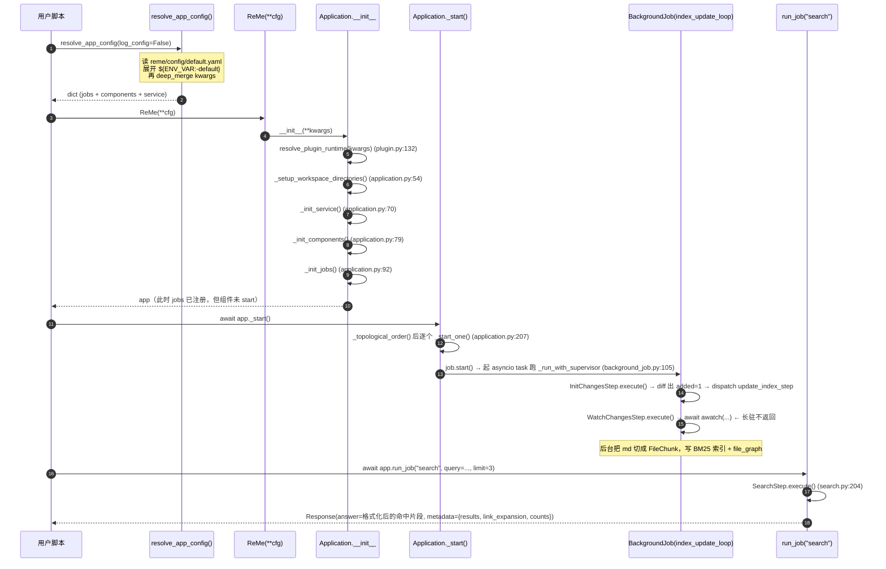
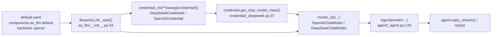

# 第 1 讲 侦察报告：环境修复与最小可运行样例（id: `00_environment_and_smoke`）

> 本报告所有结论都来自真实读源码 + 真实跑代码。所有代码片段的运行环境：
> `PYTHONPATH=/Users/a/PycharmProjects/VsCode_Projects/Agentscope-Learning/third_party/ReMe /Users/a/miniconda3/envs/agentscope_reme_pip_env/bin/python`（Python 3.11.13）。
> 路径一律相对仓库根 `/Users/a/PycharmProjects/VsCode_Projects/Agentscope-Learning`。

---

## 子系统职责（这段代码到底在解决什么问题）

本子系统不写业务代码，它解决的是**「让后面 19 天的教程有地基」**这件事：

1. **把两个版本的 ReMe 冲突钉死。** 环境里同时存在 `third_party/ReMe` 的 **0.4.1.13** 和 site-packages 里 PyPI 装的 `reme_ai==0.3.1.10`（它一口气占了 `reme/`、`reme4/`、`reme_ai/` 三个顶层包名）。如果不处理，`import reme` 拿到的是 0.3.1.10，而它内部 `from agentscope.token import HuggingFaceTokenCounter` 在 AgentScope 2.0.8 里**根本不存在**，直接 ImportError。
2. **给出「AgentScope Agent + ReMe 记忆」这条主线的最小闭环。** 20 天教程最终要读者自己写 harness_kit，读者必须先看见一次「能跑通的完整数据流」长什么样，才有模仿对象。
3. **把 LLM 出口钉死。** 用 `deepseek-flash @ https://api.deepseek.com`，密钥在仓库根 `.env`。
4. **把三个致命认知误区的「正确写法」写下来**：`ReMe(**config)` 不会自动加载 `default.yaml`；`run_job("index_update_loop")` 会永久阻塞；`model(msg)` 传单个 `Msg` 会 `TypeError`。这三点主控 agent 都亲自踩过。

一句话：**本子系统是整本教程的「第 0 层」，它保证后面每一讲的代码都能跑。**

---

## 关键文件表

| 文件路径:行号 | 核心类 | 核心函数 | 一句话职责 |
|---|---|---|---|
| `third_party/ReMe/reme/__init__.py:3` | — | — | `__version__ = "0.4.1.13"`，判定「导对了没」的唯一依据 |
| `third_party/ReMe/reme/__init__.py:22` | — | `R.freeze()` | 导入末尾冻结组件注册表，之后不能再注册新 backend |
| `third_party/ReMe/reme/application.py:23` | `Application` | `__init__:26` | 装配总入口：解析 config → 建 service → 建 components → 建 jobs |
| `third_party/ReMe/reme/application.py:187` | `Application` | `_start()` | 拓扑排序后逐个 `start()`，**这是组件真正加载磁盘索引的地方** |
| `third_party/ReMe/reme/application.py:370` | `Application` | `run_job(name, **kw)` | 按名字跑 job；名字不存在直接 `KeyError`（`:373`） |
| `third_party/ReMe/reme/application.py:376` | `Application` | `run_stream_job()` | 跑流式 job，返回 `AsyncGenerator[StreamChunk, None]` |
| `third_party/ReMe/reme/reme.py:18` | `ReMe(Application)` | — | 对 `Application` 的空子类，官方对外名字 |
| `third_party/ReMe/reme/reme.py:101` | — | `main()` | CLI 入口；`:112` 处 `load_env()` 是**全仓库唯一**加载 .env 的地方 |
| `third_party/ReMe/reme/config/config_parser.py:262` | — | `resolve_app_config()` | 加载 `default.yaml` + 合并 kwargs，**库模式必须自己调** |
| `third_party/ReMe/reme/plugin.py:132` | `PluginRuntime` | `resolve_plugin_runtime()` | 装配 plugin 并合并配置，`Application.__init__` 内部调它（不含 default.yaml） |
| `third_party/ReMe/reme/config/default.yaml` | — | — | 全部 job 名 / 全部 component backend 的权威清单 |
| `third_party/ReMe/reme/components/as_llm/__init__.py:21` | `BaseAsLLM` | `_start():34` | ReMe 侧的 LLM 适配器：把 config 变成 AgentScope 的 `ChatModelBase` |
| `third_party/ReMe/reme/components/job/background_job.py:16` | `BackgroundJob` | `__call__:124` | 后台 job，`_start():55` 起 task 常驻 |
| `third_party/ReMe/reme/steps/index/watch_changes.py:45` | `WatchChangesStep` | `execute():73` | `awatch` 长驻文件监听循环——**阻塞元凶** |
| `third_party/ReMe/reme/steps/index/init_changes.py:14` | `InitChangesStep` | `execute():64` | 一次性扫描，diff 出 added/modified/deleted 后 dispatch |
| `third_party/ReMe/reme/steps/index/search.py:38` | `SearchStep` | `execute():204` | `search` job 的实现，RRF 融合 vector + BM25 |
| `third_party/ReMe/reme/schema/application_config.py:29` | `ApplicationConfig` | — | 根配置 pydantic 模型（`workspace_dir` 在 `:37`） |
| `third_party/ReMe/reme/schema/response.py:8` | `Response` | — | 统一返回信封 `{answer, success, metadata}` |
| `third_party/ReMe/reme/utils/env_utils.py:35` | — | `load_env()` | 从 cwd 向上找 5 层 `.env`（**只在 CLI 模式被调用**） |
| `third_party/agentscope/src/agentscope/_version.py:4` | — | — | `__version__ = "2.0.8"` |
| `third_party/agentscope/src/agentscope/agent/_agent.py:117` | `Agent` | `__init__:120`、`reply:332`、`reply_stream:288` | AgentScope 的核心 Agent |
| `third_party/agentscope/src/agentscope/model/_base.py:37` | `ChatModelBase` | `__init__:62`、`__call__:182` | 所有 ChatModel 的基类；`__call__` 收 `list[Msg]` |
| `third_party/agentscope/src/agentscope/model/_deepseek/_model.py:26` | `DeepSeekChatModel` | `__init__:79` | DeepSeek 适配器（官方的独立实现，非 OpenAI 别名） |
| `third_party/agentscope/src/agentscope/credential/_deepseek.py:15` | `DeepSeekCredential` | `get_chat_model_class():37` | 凭据对象，且反向告诉 ReMe「我该配哪个 model 类」 |
| `third_party/agentscope/src/agentscope/message/_base.py:71` | `Msg` | `UserMsg:539` | 统一消息模型（pydantic） |

---

## 调用链

### 图 1：ReMe 库模式装配与运行（本报告验证过的主链路）



**逐段讲解：**

- **`resolve_app_config` 是必须的一步。** 它（`config_parser.py:262`）先看你传没传 `config=<path>`；没传就退回内置的 `default`（`_CONFIG_REGISTRY` 由 `_discover_configs()` 扫 `reme/config/` 目录得到），然后用 `deep_merge_config` 把你的 kwargs 盖上去。而 `Application.__init__` 内部的 `resolve_plugin_runtime`（`plugin.py:132`）**只做 plugin 合并，不碰 default.yaml**。这就是主控 agent `run_job("index_update_loop")` 报 `KeyError: Job 'index_update_loop' not found` 的根因——jobs 字典是空的。
- **`__init__` 与 `_start()` 是两件事。** `__init__` 只做 wiring（建对象），真正读磁盘、加载持久化索引、起后台 task 的是 `_start()`（`application.py:187`）。日志里能清楚看到 `local_file_store.py:105 | _start | default: file store load complete`。**不 start 就跑 search，会返回成功但结果为空**（本报告早先的实验就复现了这个「静默失败」）。
- **`index_update_loop` 是 `BackgroundJob`，不能 `run_job`。** 它的第二个 step 是 `WatchChangesStep`，`execute()` 内部是 `async for raw_changes in awatch(...)`（`watch_changes.py:93`），永不返回。直接 `await app.run_job("index_update_loop")` 会**永久挂死**。正确做法是让 `_start()` 把它当后台 task 跑，然后 `await asyncio.sleep(...)` 等它把文件吃进索引。
- **`search` 是 `base` job，可以安全 `run_job`。** 返回的 `Response.answer` 已经是给人看/给 LLM 看的格式化文本，`metadata` 里才是结构化 `results`。

### 图 2：ReMe → AgentScope 的 LLM 适配（`chat` job 用的路径）



**讲解：** 这一段是理解「第 1 层 LLM 模型适配器插件」的最佳实物教材。ReMe 没有自己写 LLM 抽象，而是**完全复用 AgentScope 的 `ChatModelBase`**：`credential_cls` 决定用哪家凭据，`credential.get_chat_model_class()` 反向决定用哪个 model 类（**凭据与模型类的双向绑定**，见 `credential/_deepseek.py:37`）。这正好对应参考架构里「屏蔽不同大模型接口差异、做模型与 Harness 之间的双向适配」。

---

## 关键数据结构

### 1. `ApplicationConfig`（ReMe 的根配置，pydantic）

真实定义在 `third_party/ReMe/reme/schema/application_config.py:29`（节选字段级说明）：

```python
class ApplicationConfig(BaseModel):
    app_name: str = Field(default=os.getenv("APP_NAME", "ReMe"))
    environment: dict[str, str] = Field(default_factory=dict)   # 传给子进程 agent 的环境变量
    workspace_dir: str = Field(default=".reme", validate_default=True)   # 记忆工作区根目录
    metadata_dir: str = Field(default="metadata")    # 所有持久化索引落这里
    session_dir: str = Field(default="session")      # agent 会话
    mem_session_dir: str = Field(default="mem_session")
    resource_dir: str = Field(default="resource")
    daily_dir: str = Field(default="daily")          # 日记记忆（index_update_loop 的 watch_dirs 之一）
    digest_dir: str = Field(default="digest")        # 摘要记忆
    enable_logo: bool = Field(default=True)
    timezone: str | None = Field(default="Asia/Shanghai")
    log_to_console: bool = Field(default=True)
    log_to_file: bool = Field(default=True)
    plugins: list[str] = Field(default_factory=list)
    service: ComponentConfig = Field(default_factory=ComponentConfig)
    jobs: dict[str, JobConfig] = Field(default_factory=dict)                 # job 名 → 配置
    components: dict[str, dict[str, ComponentConfig]] = Field(default_factory=dict)  # 类型 → 名字 → 配置
```

注意 `:74` 的 `normalize_workspace_dir` validator：它会 `Path(value).expanduser().resolve(strict=False)`，所以你在脚本里写 `/tmp/xxx` 最后会变成 `/private/tmp/xxx`（macOS 上 `/tmp` 是软链）。日志里出现的 `/private/tmp/...` 就是这个原因，**不是 bug**。

### 2. `Response`（统一返回信封，`third_party/ReMe/reme/schema/response.py:8`）

```python
class Response(BaseModel):
    answer: str | Any = Field(default="")   # 主结果，设计上要求「够 LLM 下一步直接用」
    success: bool = Field(default=True)
    metadata: dict = Field(default_factory=dict)   # 给程序看的结构化辅助信息
```

`model_config` 是 `additionalProperties: true`，所以 job 可以往里塞自己的字段。

### 3. `Msg`（AgentScope 的统一消息，`third_party/agentscope/src/agentscope/message/_base.py:71`）

```python
class Msg(BaseModel):
    name: str
    content: list[ContentBlock]      # TextBlock / ThinkingBlock / ToolCallBlock / ToolResultBlock / DataBlock
    role: Literal["user", "assistant", "system"]
    id: str = Field(default_factory=_generate_id)
    metadata: dict = Field(default_factory=dict)
    created_at: str = ...
    usage: Usage | None = None
    finished_reason: ReplyFinishedReason | None = None
    structured_output: dict | None = None
    error: ErrorInfo | None = None
```

构造用工厂函数（`UserMsg:539` / `AssistantMsg` / `SystemMsg`），**不要手搓 `Msg(...)`**——工厂函数会帮你把字符串自动包成 `TextBlock`（`_to_blocks`）。

### 4. `AgentState`（`third_party/agentscope/src/agentscope/state/_state.py:209`）

```python
class AgentState(BaseModel):
    session_id: str = Field(default_factory=_generate_id)
    summary: str | list[TextBlock | DataBlock] = ""   # 上下文压缩后的摘要
    context: list[Msg] = Field(default_factory=list)  # 未压缩的会话上下文
```

这就是参考架构第 1 层「短期记忆：会话内上下文窗口管理」在 AgentScope 里的落点。验证脚本里 `len(agent.state.context)` 问到 **2**（1 条 user + 1 条 assistant）。

---

## 源码精读

### 片段 1：`Application.__init__` — 装配顺序不可颠倒

`third_party/ReMe/reme/application.py:26-46`

```python
def __init__(self, **kwargs) -> None:
    runtime = resolve_plugin_runtime(kwargs)
    self.context = ApplicationContext(registry=runtime.registry, **runtime.config)
    self._started_components: list[BaseComponent] = []
    self._component_mutation_lock = asyncio.Lock()

    self._setup_workspace_directories()
    logger = get_logger(..., force_init=True)
    super().__init__()
    self._init_service()

    if self.config.enable_logo:
        print_logo(self.config, self.context.service)
    logger.info(f"Initializing {self.config.app_name} Application v{__version__}")
    self._init_components()
    self._init_jobs()
```

**在干什么：** 先把 config 变成 `ApplicationConfig`（`ApplicationContext.__init__` 里 `ApplicationConfig(**kwargs)`），建目录，再按 **service → components → jobs** 的顺序实例化。

**为什么这么设计：** 顺序是有依赖的。`_init_components`（`:79`）里 `_instantiate` 会用 `expected_type=BaseComponent` 去做类型校验；`_init_jobs`（`:92`）之后，job 的 step 才能通过 `app_context.components` 找到 `file_store`、`as_llm` 这些组件（`base_job.py` 里 step 是懒构建的，所以组件必须先就位）。`resolve_plugin_runtime` 放在第一行，是因为 plugin 可能往 registry 里注册新 backend，而 `_instantiate` 全靠 registry 查表。

**注意 `R.freeze()`：** `third_party/ReMe/reme/__init__.py:22` 在导入结束时就冻结了注册表，所以**运行时不能再注册新 backend**，加插件只能走 `plugins=[...]` 配置项。这对应参考架构「插件挂载/卸载」在 Python 里的一个务实变体：**进程内静态注册 + 配置期动态启用**。

### 片段 2：`Application._start` — 生命周期与关机顺序

`third_party/ReMe/reme/application.py:187-216`

```python
async def _start(self) -> None:
    """Start components, then jobs as base > stream > background > cron."""
    async with self._component_mutation_lock:
        pool_size = self.config.thread_pool_max_workers
        if pool_size > 0:
            self.context.thread_pool = ThreadPoolExecutor(max_workers=pool_size)
        try:
            components = self._topological_order()
            jobs = list(self.context.jobs.values())
            base_jobs = [j for j in jobs if not isinstance(j, (StreamJob, BackgroundJob))]
            stream_jobs = [j for j in jobs if isinstance(j, StreamJob)]
            background_jobs = [j for j in jobs if isinstance(j, BackgroundJob) and not isinstance(j, CronJob)]
            cron_jobs = [j for j in jobs if isinstance(j, CronJob)]
            for c in components + base_jobs + stream_jobs + background_jobs + cron_jobs:
                await self._start_one(c)
        except Exception:
            await self._close_started_components()
            raise
```

**在干什么：** 组件按**拓扑序**启动，job 按 `base → stream → background → cron` 分四类依次启动。失败会回滚已启动的组件。

**为什么这么设计：** 拓扑序解决组件间依赖（`file_store` 依赖 `keyword_index`、`file_graph`、`tag_index`，见 `default.yaml` 末尾的 `file_store.default` 配置）；job 的分类启动是为了让「一次性的 base job」先可用，再去起那些**会开后台 task 的** background/cron job——否则用户可能遇到「job 还没 ready 后台就开始跑了」。

`_close()`（`:218`）按 `reversed(self._started_components)` 逆序关，保证「每个 peer 比它的依赖后死」。

### 片段 3：`WatchChangesStep.execute` — 为什么 `run_job` 会挂死

`third_party/ReMe/reme/steps/index/watch_changes.py:73-95`（节选）

```python
async def execute(self):
    if self.context is None:
        raise RuntimeError("watch_changes_step requires 'context'")
    if self.context.stop_event is None:
        raise RuntimeError("watch_changes_step requires 'stop_event' on context")
    stop_event: asyncio.Event = self.context.stop_event

    self._rules = self._get_watch_rules()
    if not self._rules:
        raise RuntimeError("No watch rules configured (watch_dirs empty or app_config missing?)")

    valid_paths = list(dict.fromkeys(r.path for r in self._rules if r.path.exists()))
    if not valid_paths:
        raise RuntimeError(f"No valid watch paths exist: {[str(r.path) for r in self._rules]}")

    self.logger.info(f"Watching: {[str(p) for p in valid_paths]} ...")
    async for raw_changes in awatch(...):   # ← 永不返回
        ...
```

**在干什么：** 用 `watchfiles.awatch` 做文件监听，把变化批量丢给下游 step。

**为什么这么设计：** 文件监听天然是「进程活着就一直在听」的语义。这也解释了 `BackgroundJob` 的存在意义——`_run_with_supervisor`（`background_job.py:105`）把它包成一个可重启的长驻 task，而不是一次调用。

**教学价值（小白最容易踩）：** `run_job(name)` 的语义是「跑一次并等结果」，**只能用于 `backend: base` 的 job**。`BackgroundJob` 和 `StreamJob` 都必须走 `_start()` / `run_stream_job()`。判断方法：读 `default.yaml`，`backend: background` / `backend: stream` / `backend: cron` 的都不能直接 `run_job`。

### 片段 4：`run_job` 与 `run_stream_job` 的真身

`third_party/ReMe/reme/application.py:370-390`

```python
async def run_job(self, name: str, /, **kwargs) -> Response:
    """Execute a registered job by name and return its final Response."""
    if name not in self.context.jobs:
        raise KeyError(f"Job '{name}' not found")
    return await self.context.jobs[name](**kwargs)

async def run_stream_job(self, name: str, /, **kwargs) -> AsyncGenerator[StreamChunk, None]:
    """Execute a streaming job, yielding chunks as it is produced."""
    if name not in self.context.jobs:
        raise KeyError(f"Job '{name}' not found")
    stream_queue: asyncio.Queue = asyncio.Queue()
    task = asyncio.create_task(self.context.jobs[name](stream_queue=stream_queue, **kwargs))
    async for chunk in execute_stream_task(stream_queue=stream_queue, task=task, task_name=name, output_format="chunk"):
        assert isinstance(chunk, StreamChunk)
        yield chunk
```

**在干什么：** `name` 是**位置-only 参数**（`/` 之后），只能 `run_job("search", query=...)`，不能 `run_job(name="search")`。**job 名就是 `default.yaml` 里 `jobs:` 下面的一级 key**，取值方式是 `app.context.jobs.keys()`。

**为什么这么设计：** 流式 job 用 `asyncio.Queue` 做解耦——job 和消费端跑在不同 task 上，`execute_stream_task` 负责在 job 崩了的时候把异常传回来。

**可用的 job 名（实测，`sorted(app.context.jobs)` 共 40 个，全部注册成功）：**
`app_config, auto_dream, auto_memory, auto_memory_cc, auto_resource, chat, daily_list, daily_reindex, daily_write, delete, digest_watch_loop, dream_cron, edit, frontmatter_delete, frontmatter_read, frontmatter_update, graph_snapshot, health_check, help, index_update_loop, list, list_tags, load, move, node_search, optimize_index_cron, proactive_read, proactive_refresh, proactive_refresh_cron, read, read_image, reindex, resource_watch_loop, save, search, stat, status, traverse, version, write`

> **别把两个数字搞混：** `len(app.context.jobs)` = **40**（进程内全部 job）；但 `await app.run_job("help")` 只报 **32**（`[HelpStep] returning 32 jobs`），因为一部分 job 标了 `enable_serve: false`（如 `proactive_refresh`），不暴露给 HTTP/MCP 客户端，只在进程内可用。写代码时以 `app.context.jobs` 为准。

### 片段 5：AgentScope 的 `ChatModelBase.__call__` — 参数必须是 `list[Msg]`

`third_party/agentscope/src/agentscope/model/_base.py:182-188`

```python
async def __call__(
    self,
    messages: list[Msg],
    tools: list[dict] | None = None,
    tool_choice: ToolChoice | None = None,
    **kwargs: Any,
) -> ChatResponse | AsyncGenerator[ChatResponse, None]:
```

**在干什么：** 统一模型入口，内部带重试（`_get_retryable_exceptions()`）。

**为什么这么设计：** `tools` / `tool_choice` 直接在这里暴露，意味着**Tool Use 是模型层的一等公民**，而不是 Agent 层的补丁——这正是「Harness 与模型协同进化」的接口设计。

**踩坑实录：** 我第一版写成 `await model(UserMsg("user", "…"))`，直接报
`TypeError: Input must be a list of Msg objects.`（抛自 `formatter/_formatter_base.py:60`）。**正确写法是 `await model([msg])`。**

### 片段 6：`BaseAsLLM._start` — ReMe 如何把配置变成模型对象

`third_party/ReMe/reme/components/as_llm/__init__.py:21-42`

```python
class BaseAsLLM(BaseComponent):
    component_type = ComponentEnum.AS_LLM
    credential_cls: type[CredentialBase]

    def __init__(self, **kwargs) -> None:
        super().__init__(**kwargs)
        self.model: ChatModelBase | None = None

    async def _start(self) -> None:
        if self.model is not None:
            return
        kwargs = dict(self.kwargs)
        credential = self.credential_cls(**kwargs.pop("credential", {}))
        model_cls = credential.get_chat_model_class()
        params_dict = kwargs.pop("parameters", None)
        parameters = model_cls.Parameters(**params_dict) if params_dict else None
        self.model = model_cls(credential=credential, parameters=parameters, **kwargs)

@R.register("openai")
class OpenAIAsLLM(BaseAsLLM):
    credential_cls = OpenAICredential
```

**在干什么：** 用 `credential_cls` → `get_chat_model_class()` 的**双跳**决定具体模型类，把 yaml 里的 `parameters` dict 直接喂给 `model_cls.Parameters(**...)`。

**为什么这么设计：** yaml 里只写 `backend: openai` / `backend: dashscope`，模型类的选择完全由 credential 决定。这是**依赖倒置 + 配置驱动**的教科书用法，也是 min_harness kernel 里「服务路由」的现成参考实现。**副作用**：`default.yaml` 里 `parameters: {max_tokens: 65536, thinking_enable: false}` 之所以不报错，是因为 `OpenAIChatModel.Parameters` 确实有 `thinking_enable` 字段（`model/_openai_chat/_model.py:47`）。

---

## 可运行代码片段

> 所有脚本都在 `tutorial_agsc_reme/_recon/code/` 下。运行前缀统一为：
> ```bash
> cd /Users/a/PycharmProjects/VsCode_Projects/Agentscope-Learning
> PYTHONPATH=$PWD/third_party/ReMe /Users/a/miniconda3/envs/agentscope_reme_pip_env/bin/python -u <脚本>
> ```

### 片段 A【已验证】环境自检（`code/05_env_check.py`）

```python
import asyncio, os, sys
from pathlib import Path
REPO = Path("/Users/a/PycharmProjects/VsCode_Projects/Agentscope-Learning")
sys.path.insert(0, str(REPO / "third_party" / "ReMe"))
from dotenv import load_dotenv
load_dotenv(REPO / ".env")

import agentscope
print("agentscope", agentscope.__version__, agentscope.__file__)
import reme
print("reme", reme.__version__, reme.__file__)
assert reme.__version__ == "0.4.1.13", f"版本不对：{reme.__version__}，你可能漏了 PYTHONPATH"

from agentscope.credential import DeepSeekCredential
from agentscope.message import UserMsg
from agentscope.model import DeepSeekChatModel

async def ping() -> str:
    model = DeepSeekChatModel(
        credential=DeepSeekCredential(api_key=os.environ["OPENAI_API_KEY"], base_url=os.environ["OPENAI_BASE_URL"]),
        model=os.environ["LLM_MODEL"], stream=False,
        parameters=DeepSeekChatModel.Parameters(max_tokens=256),
    )
    res = await model([UserMsg("user", "只回答两个字：收到")])   # 必须 list[Msg]
    return res.content[0].text

print("LLM ->", repr(asyncio.run(ping())))
```

**真实输出：**

```
✅ agentscope 2.0.8 -> /Users/a/PycharmProjects/VsCode_Projects/Agentscope-Learning/third_party/agentscope/src/agentscope/__init__.py
✅ reme 0.4.1.13 -> /Users/a/PycharmProjects/VsCode_Projects/Agentscope-Learning/third_party/ReMe/reme/__init__.py
✅ LLM deepseek-flash @ https://api.deepseek.com -> '收到'

环境自检全部通过。
```

### 片段 B【已验证】AgentScope 最小 Agent（`code/02_agentscope_min_agent.py`）

```python
import asyncio, os
from pathlib import Path
from dotenv import load_dotenv
load_dotenv(Path("/Users/a/PycharmProjects/VsCode_Projects/Agentscope-Learning/.env"))
import agentscope
from agentscope.agent import Agent
from agentscope.credential import DeepSeekCredential
from agentscope.message import UserMsg
from agentscope.model import DeepSeekChatModel

async def main() -> None:
    model = DeepSeekChatModel(
        credential=DeepSeekCredential(api_key=os.environ["OPENAI_API_KEY"], base_url=os.environ["OPENAI_BASE_URL"]),
        model=os.environ["LLM_MODEL"], stream=False,
        parameters=DeepSeekChatModel.Parameters(max_tokens=512),
    )
    agent = Agent(name="assistant", system_prompt="你是一个简洁的中文助手，每次只回答一句话。", model=model)
    reply = await agent.reply(UserMsg("user", "用一句中文解释什么是 Agent Harness。"))
    print(reply.get_text_content())
    print(reply.usage)
    print(len(agent.state.context))

asyncio.run(main())
```

**真实输出：**

```
=== reply.role: assistant
=== reply.name: assistant
=== reply text: Agent Harness 是一种用于测试和评估 AI Agent 的框架，负责管理任务执行、环境交互与结果记录。
=== usage: input_tokens=100 output_tokens=26 cache_input_tokens=0 cache_creation_input_tokens=0
=== len(agent.state.context): 2
```

> **与官方文档的不一致（教学亮点）：** AgentScope 2.0.8 的 `Agent.__init__` **没有** `requires_model` / `requires_toolkit` 之类参数（我全仓库 grep `requires_model|requires_toolkit` **零命中**，那是 1.x 的写法）。2.0.8 的构造签名是 `Agent(name, system_prompt, model, toolkit=None, middlewares=None, state=None, offloader=None, model_config=None, context_config=None, react_config=None, injection_config=None)`（`agent/_agent.py:120-134`）。**以源码为准。**
> 另外 `agentscope.__all__` 只有 `['logger', 'setup_logger', 'set_id_factory', 'set_timestamp_factory', '__version__']`，顶层几乎不导出东西，**必须显式 `from agentscope.agent import Agent`**。

### 片段 C【已验证】流式 reply 的事件序列（`code/03_agentscope_stream.py`）

```python
async for item in agent.reply_stream(UserMsg("user", "什么是 ReAct？")):
    print("Msg" if isinstance(item, Msg) else type(item).__name__)
```

**真实输出（节选，TextBlockDeltaEvent 共 28 个）：**

```
TextBlockDeltaEvent  ×28
TextBlockEndEvent
ModelCallEndEvent
ReplyEndEvent
```

**讲解：** `reply_stream` 产出的是**事件 + 消息混合流**，`reply()`（`_agent.py:332`）内部就是把这一串消费完只留最后一个 `Msg`。想接 Web UI / SSE 就用 `reply_stream`——这正是参考架构第 4 层「Web UI 调试插件」的接入点。

### 片段 D【已验证】ReMe 最小闭环：写 md → 索引 → 检索（`code/01_reme_smoke.py`）

```python
import asyncio, os, shutil, sys
from datetime import date
from pathlib import Path
REPO = Path("/Users/a/PycharmProjects/VsCode_Projects/Agentscope-Learning")
sys.path.insert(0, str(REPO / "third_party" / "ReMe"))
from dotenv import load_dotenv
load_dotenv(REPO / ".env")
from reme import ReMe
from reme.config import resolve_app_config

WORKSPACE = Path("/tmp/harness_smoke_reme_ws")
if WORKSPACE.exists():
    shutil.rmtree(WORKSPACE)
WORKSPACE.mkdir(parents=True)

def build_app() -> ReMe:
    cfg = resolve_app_config(log_config=False)          # ← 关键：自己加载 default.yaml
    cfg["workspace_dir"] = str(WORKSPACE)
    cfg["enable_logo"] = False
    cfg["service"] = {**cfg["service"], "web_enabled": False, "mcp_enabled": False}  # 不占端口
    cfg["components"]["as_llm"]["default"].update({     # .env 的 OPENAI_* → ReMe 的 LLM_*
        "model": os.environ["LLM_MODEL"],
        "credential": {"api_key": os.environ["OPENAI_API_KEY"],
                       "base_url": os.environ["OPENAI_BASE_URL"]},
    })
    return ReMe(**cfg)

async def main() -> None:
    app = build_app()
    print("jobs registered:", sorted(app.context.jobs))

    today = date.today().isoformat()
    d = WORKSPACE / app.config.daily_dir / today
    d.mkdir(parents=True, exist_ok=True)
    (d / "harness_intro.md").write_text(
        "---\nname: harness_intro\ndescription: Agent Harness 第一条笔记\n"
        "memory_tags: [agent, harness]\n---\n# Hello Harness\n\n"
        "Agent Harness 是模型外围的运行管控基础设施，负责 Agent Loop 与 Tool Use。\n",
        encoding="utf-8",
    )

    await app._start()          # ← 关键：启动组件 + 后台 index_update_loop
    await asyncio.sleep(3)      # 等 watcher 把 md 吃进索引

    resp = await app.run_job("search", query="Agent Harness 是什么", limit=3)
    print(resp.success, resp.answer)
    print(list(resp.metadata))
    await app._close()

asyncio.run(main())
```

**真实输出（关键行）：**

```
jobs registered: ['app_config', 'auto_dream', 'auto_memory', 'auto_memory_cc', 'auto_resource', 'chat', 'daily_list', 'daily_reindex', 'daily_write', 'delete', 'digest_watch_loop', 'dream_cron', 'edit', 'frontmatter_delete', 'frontmatter_read', 'frontmatter_update', 'graph_snapshot', 'health_check', 'help', 'index_update_loop', 'list', 'list_tags', 'load', 'move', 'node_search', 'optimize_index_cron', 'proactive_read', 'proactive_refresh', 'proactive_refresh_cron', 'read', 'read_image', 'reindex', 'resource_watch_loop', 'save', 'search', 'stat', 'status', 'traverse', 'version', 'write']
（上面共 40 个；`print(sorted(app.context.jobs))` 的真实输出）
[InitChangesStep] scan file_store:default: {'added': 1, 'modified': 0, 'deleted': 0}
[SearchStep] query='Agent Harness 是什么' candidates=15 vector_hits=0 keyword_hits=1
[search] success = True
[search] answer  =
 ========== daily/2026-09-21/harness_intro.md:6-8 [score=0.8219] ==========
# Hello Harness

Agent Harness 是模型外围的运行管控基础设施，负责 Agent Loop 与 Tool Use。
[search] metadata keys = ['results', 'link_expansion', 'counts']
```

**讲解：** 注意 `vector_hits=0 keyword_hits=1`——因为 `default.yaml` 里 `file_store.default.embedding_store` 被显式设成 `""`（即 `# embedding_store: default` 被注释掉了），所以默认只有 **BM25 关键词索引**在工作，**不需要 embedding API 就能跑通**。这对小白极其友好：第一课不用配第二家 API。日志里 `local_file_store.py:345 | embedding backfill skipped: reason=embedding_disabled` 就是证据。

### 片段 E【已验证】ReMe ↔ AgentScope 端到端闭环（`code/04_reme_chat_integration.py`）

在片段 D 的基础上，往 `daily/<date>/project.md` 写一句「我的项目代号是 Bluewhale」，然后：

```python
await app._start()
await asyncio.sleep(2)
async for chunk in app.run_stream_job("chat", query="我的项目代号是什么？"):
    print(chunk, end="", flush=True)
await app._close()
```

**真实输出统计：**

```
ChunkEnum.REPLY_START ×1   THINK ×27   TOOL_CALL ×59   TOOL_RESULT ×9
CONTENT ×35   USAGE ×6     REPLY_END ×1   DONE ×1
tool_call_name='search' ×2   tool_call_name='list' ×2   tool_call_name='read' ×2
```

最终回答里出现了：

```
...「Bluewhale」——指你的 Agent Harness 项目。
来源：`daily/2026-09-21/project.md`
```

**讲解：这是本子系统最有价值的一个用例。** 它完整跑通了「用户请求 → Agent Loop → 模型推理 → 工具调用（search/list/read）→ 观测结果回灌 → 再推理 → 带出处的最终答案」这条链路，也就是参考架构「一句话数据流」的 1:1 复刻。`THINK ×27` 说明 `deepseek-flash` 通过 `OpenAIChatModel` 仍然吐了 native reasoning（`reasoning_content`），被 AgentScope 映射成了 `ThinkingBlock`。

### 片段 F【已验证】pytest 最小样例（`code/pytest_demo/`）

`code/pytest_demo/conftest.py`：

```python
import os
from pathlib import Path
import pytest
from dotenv import load_dotenv

REPO = Path(__file__).resolve().parents[4]   # pytest_demo → code → _recon → tutorial_agsc_reme → repo
load_dotenv(REPO / ".env")

@pytest.fixture(scope="session")
def llm_env() -> dict[str, str]:
    keys = ("OPENAI_API_KEY", "OPENAI_BASE_URL", "LLM_MODEL")
    missing = [k for k in keys if not os.environ.get(k)]
    if missing:
        pytest.skip(f"missing env: {missing}")
    return {k: os.environ[k] for k in keys}
```

`code/pytest_demo/test_env_smoke.py`：

```python
import agentscope, pytest
from agentscope.credential import DeepSeekCredential
from agentscope.message import UserMsg
from agentscope.model import DeepSeekChatModel

def test_agentscope_version() -> None:
    assert agentscope.__version__ == "2.0.8"

@pytest.mark.asyncio
async def test_llm_call(llm_env: dict) -> None:
    model = DeepSeekChatModel(
        credential=DeepSeekCredential(api_key=llm_env["OPENAI_API_KEY"], base_url=llm_env["OPENAI_BASE_URL"]),
        model=llm_env["LLM_MODEL"], stream=False,
        parameters=DeepSeekChatModel.Parameters(max_tokens=256),
    )
    res = await model([UserMsg("user", "只回答两个字：收到")])
    assert res.content and res.content[0].text
```

**运行命令与真实输出：**

```bash
cd tutorial_agsc_reme/_recon/code/pytest_demo
/Users/a/miniconda3/envs/agentscope_reme_pip_env/bin/python -m pytest -q -p no:cacheprovider -o asyncio_mode=auto
# ..                                                                       [100%]
# 2 passed in 3.77s
```

### 片段 G【已验证】跑仓库自带的测试用例

```bash
# ReMe（必须带 PYTHONPATH，否则 import 到 0.3.1.10 直接炸）
cd third_party/ReMe
PYTHONPATH=$PWD /Users/a/miniconda3/envs/agentscope_reme_pip_env/bin/python -m pytest tests/unit/test_common_steps.py -q -p no:cacheprovider
# .................                                                        [100%]
# 17 passed in 1.53s

# AgentScope（-e 安装，不需要 PYTHONPATH）
cd third_party/agentscope
/Users/a/miniconda3/envs/agentscope_reme_pip_env/bin/python -m pytest tests/agent_basic_test.py -q -p no:cacheprovider
# .................                                                        [100%]
# 17 passed in 1.92s
```

---

## 教学要点（按「小白最容易卡住」排序）

1. **`import reme` 会导错版本，而且不会给你任何提示。** 没有 `PYTHONPATH` 时它会去 site-packages 拿 0.3.1.10，然后 `from agentscope.token import ...` 直接 `ModuleNotFoundError`。**第一行代码就该 `assert reme.__version__ == "0.4.1.13"`。**
2. **`ReMe(**config)` 不会自动加载 `default.yaml`。** 必须自己 `resolve_app_config()`，否则 `jobs` 是空 dict，`run_job` 报 `KeyError: Job 'xxx' not found`。这是「配置驱动框架」最常见的认知陷阱。
3. **`__init__` 不等于「能用」。** `_start()` 才加载磁盘索引、才起后台 watcher。不 start 直接 search，会「成功但返回空」——静默失败最难查。
4. **`run_job` 只适用于 `backend: base` 的 job。** `index_update_loop` / `resource_watch_loop` / `digest_watch_loop` / `dream_cron` / `optimize_index_cron` / `proactive_refresh_cron` 都是长驻的，`run_job` 会永久挂住。
5. **`model(...)` 的参数是 `list[Msg]`，不是 `Msg`。** 传单个 Msg 报 `TypeError: Input must be a list of Msg objects.`
6. **AgentScope 2.0.8 顶层几乎不导出东西**（`__all__` 只有 5 个 logger/version 符号）。要写 `from agentscope.agent import Agent` / `from agentscope.model import DeepSeekChatModel`。
7. **`Credential` 与 `ChatModel` 是双向绑定的。** `DeepSeekCredential.get_chat_model_class()` 返回 `DeepSeekChatModel` —— 这就是「模型适配器插件」应该长成的样子，读者写 harness_kit 时可以直接抄这个模式。
8. **`.env` 里的变量名和 ReMe 期望的对不上。** 仓库根 `.env` 是 `OPENAI_API_KEY / OPENAI_BASE_URL / LLM_MODEL`，ReMe 的 `default.yaml` 要的是 `LLM_API_KEY / LLM_BASE_URL / LLM_MODEL_NAME`。**且 `load_env()` 全仓库只在 `reme/reme.py:112` 被调用**，库模式完全不会读 `.env`。必须自己 `load_dotenv()` 然后手工映射进 `components.as_llm.default`。
9. **`/tmp` 在 macOS 上会被 resolve 成 `/private/tmp`**（`application_config.py:74` 的 validator）。日志里路径对不上不是 bug。
10. **默认没有 embedding，只有 BM25。** `file_store.default.embedding_store = ""`。第一课不要碰向量库，等读者跑通 BM25 闭环再引入。
11. **`run_job` 的 `name` 是 positional-only。** `run_job("search", query=...)` 对；`run_job(name="search")` 错。
12. **`Response.answer` 是给人/LLM 看的文本，结构化数据在 `metadata`。** 拿到 `answer` 别去 `json.loads`，要看 `metadata["results"]`。
13. **`R.freeze()` 意味着运行时不能注册新 backend。** 想扩能力只能走 `plugins=[...]` 配置项。
14. **CLI 与库是两套东西。** `reme` / `reme2` / `remecli` 三个 console script **全部指向旧版 0.3.1.10**，本地 0.4.1.13 **没有装任何 console script**。用 `python -m reme.reme <action>`（且要 PYTHONPATH）。而且 `reme version` 这种是 **client 命令**，会去连本地 server，没起 server 就 `httpx.ConnectError`。

---

## 坑与注意事项

| 现象 | 原因 | 解决 |
|---|---|---|
| `ModuleNotFoundError: No module named 'agentscope.token'` | `import reme` 命中了 site-packages 的 `reme` 0.3.1.10（它依赖 AgentScope 1.x API） | 运行时加 `PYTHONPATH=<repo>/third_party/ReMe`，或在脚本头 `sys.path.insert(0, "<repo>/third_party/ReMe")`；并 `assert reme.__version__ == "0.4.1.13"` |
| `KeyError: "Job 'index_update_loop' not found"` | `Application.__init__` 里的 `resolve_plugin_runtime` 不加载 `default.yaml`；没调 `resolve_app_config()` 时 `jobs={}` | `cfg = resolve_app_config(log_config=False)`，改完再 `ReMe(**cfg)` |
| `ValueError: Service is missing the required 'backend' field` | 裸调 `ReMe(workspace_dir=...)`，`service` 没配 `backend`；该异常抛自 `application.py:121` | 用 `resolve_app_config()` 兜住；或显式传 `service={"backend":"http","web_enabled":False,"mcp_enabled":False}` |
| `run_job("index_update_loop")` 永久挂住不返回 | 该 job 是 `BackgroundJob`，第二个 step `WatchChangesStep.execute()` 里是 `async for ... in awatch(...)` 长驻循环 | 改用 `await app._start()` + `await asyncio.sleep(N)`，让它以后台 task 跑；只有 `backend: base` 的 job 才能 `run_job` |
| `search` 返回 `success=True` 但 `answer` 是空串 | 组件没 `_start()`，内存里的 BM25 索引是空的（磁盘索引也没加载） | 先 `await app._start()`；或确认 `metadata.file_store/…/_v1.jsonl.zst` 与 `metadata/keyword_index/bm25_*.pkl` 已生成 |
| `TypeError: Input must be a list of Msg objects.` | `ChatModelBase.__call__(messages: list[Msg])` 收的是列表 | `await model([msg])` |
| `ImportError: cannot import name 'GenericAlias' from partially initialized module 'types'` | **在 `third_party/agentscope/src/agentscope/` 目录里启动 python**，包内 `types/` 子包把 stdlib `types` 顶掉了（circular import） | 永远不要在包目录里当 cwd 跑 python；从仓库根跑 |
| ReMe 报 `api_key=''` / 认证失败 | 库模式不读 `.env`；且变量名是 `LLM_API_KEY/LLM_BASE_URL/LLM_MODEL_NAME`，仓库 `.env` 是 `OPENAI_*` | 自己 `load_dotenv()`，再把值写进 `cfg["components"]["as_llm"]["default"]["credential"]` |
| 模型名变成了 `qwen3.7-plus` | `default.yaml` 里是 `${LLM_MODEL_NAME:-qwen3.7-plus}`，没设环境变量就落到默认值 | 显式 `cfg["components"]["as_llm"]["default"]["model"] = os.environ["LLM_MODEL"]` |
| `PytestConfigWarning: Unknown config option: asyncio_default_fixture_loop_scope` | 没装 `pytest-asyncio` | `pip install "pytest-asyncio>=0.23"`（本报告已验证装上后消失） |
| `Path('/tmp/x')` 日志里变成 `/private/tmp/x` | macOS `/tmp` 是软链，`ApplicationConfig` 会 `resolve(strict=False)` | 属正常行为，把断言用 `Path(...).resolve()` 比较 |
| 端口被占 / 不想起 web | `default.yaml` 里 `service.web_enabled: true`、`mcp_enabled: true` | 传 `service={"web_enabled": False, "mcp_enabled": False}`（`Application.__init__` 只建对象不起服务，`run_app()` 才起） |

---

## 与参考架构的映射

| 参考架构层 | 本子系统覆盖到什么 | 实物落点 |
|---|---|---|
| **第 0 层 Cordis 微内核** | **部分覆盖。** ReMe 的 `R` 注册表 + `@R.register("backend名")` + `resolve_plugin_runtime()` + `plugins=[...]` 配置，等价于「插件注册表 + 服务路由 + 声明式装配」；`ComponentEnum` 是插件分类；`ApplicationContext` 是共享 Context | `third_party/ReMe/reme/plugin.py:132`、`reme/components/component_registry.py`、`reme/schema/application_config.py:29`、`reme/__init__.py:22` (`R.freeze()`) |
| 第 1 层 LLM 模型适配器 | **完全覆盖。** 10 个 ChatModel + 10 个 Credential，`stream` / `max_retries` / `retry_delay` / `context_size` 全在 `ChatModelBase.__init__` | `third_party/agentscope/src/agentscope/model/_base.py:62`、`model/__init__.py`、`third_party/ReMe/reme/components/as_llm/__init__.py:21` |
| 第 1 层 Session / 事件溯源存储 | **本子系统只擦到边。** ReMe 有 `session_dir` / `mem_session_dir` 与 `session` 概念（`ApplicationConfig:43-45`），AgentScope 有 `AgentState(session_id, summary, context)` | `third_party/agentscope/src/agentscope/state/_state.py:209` |
| 第 1 层 持久化记忆 | **完全覆盖（ReMe 的主战场）。** `daily/` 日记 + `digest/` 摘要 + `metadata/` 下的 BM25 / file_chunk / file_graph / tag 四类索引 | `third_party/ReMe/reme/config/default.yaml`、`reme/steps/index/*` |
| 第 2 层 Agent Loop | **完全覆盖。** `Agent._reply` / `_reasoning` / `_acting` 就是 ReAct 闭环；`ReActConfig.max_iters` 默认 50 | `third_party/agentscope/src/agentscope/agent/_agent.py:1027`、`agent/_config.py:362` |
| 第 2 层 Tool Use / Skills | **覆盖（本子系统未展开）。** ReMe 的 chat agent 已实测调用 `search`/`read`/`list` 三个工具 | `third_party/ReMe/reme/components/job/stream_job.py:10` + `steps/index/search.py:38` |
| 第 2 层 Sandbox | **本环境不存在独立沙箱。** 最近似替代物：ReMe `agent_wrapper` 里的 `permission_mode: bypass`（`default.yaml`）与 AgentScope 的 `permission/` 子包 | `third_party/agentscope/src/agentscope/permission/` |
| 第 2 层 MCP | **存在但未验证。** ReMe 有 `mcp_service.py` / `mcp_tools.py` 和 `mcp_enabled` 开关；本次按任务要求**显式关闭**了，故标「未验证」 | `third_party/ReMe/reme/components/service/mcp_service.py` |
| 第 3 层 评测引擎 | **不存在。** AgentScope 2.0.8 **没有独立评测引擎**（无 `evaluation` 子包），ReMe 只有一个抽象接口文件 `reme/utils/evaluation_interface.py` | 最近似替代物：`third_party/ReMe/reme/utils/evaluation_interface.py` + `benchmark/` 目录 |
| 第 4 层 中间件 Hook | **存在（本子系统未展开）。** AgentScope `Agent.middlewares` 支持 reply / reasoning / permission / acting / model call / context compression / system prompt 七个切点 | `third_party/agentscope/src/agentscope/agent/_agent.py:126`、`middleware/` |
| 第 4 层 Web UI 调试 | **存在但未验证。** ReMe 有 `reme_studio/`、`http_service.py`、`web_static.py`；本次关掉了 `web_enabled` | `third_party/ReMe/reme/components/service/http_service.py` |

**结论：第 0、1、2 层在 AgentScope + ReMe 里有真实、可跑的对应物；第 3 层（评测）是空缺，读者需要在 harness_kit 里自己补——这恰好是本教程后段留给读者的「原创空间」。**

---

## 附：本报告产出的可运行文件清单

| 文件 | 状态 |
|---|---|
| `tutorial_agsc_reme/_recon/code/01_reme_smoke.py` | 已验证（ReMe 装配 + 索引 + 检索） |
| `tutorial_agsc_reme/_recon/code/02_agentscope_min_agent.py` | 已验证（最小 Agent + reply） |
| `tutorial_agsc_reme/_recon/code/03_agentscope_stream.py` | 已验证（reply_stream 事件序列） |
| `tutorial_agsc_reme/_recon/code/04_reme_chat_integration.py` | 已验证（ReMe chat job → AgentScope tool use 闭环） |
| `tutorial_agsc_reme/_recon/code/05_env_check.py` | 已验证（一键环境自检） |
| `tutorial_agsc_reme/_recon/code/pytest_demo/conftest.py` | 已验证（.env 注入） |
| `tutorial_agsc_reme/_recon/code/pytest_demo/test_env_smoke.py` | 已验证（2 passed） |
