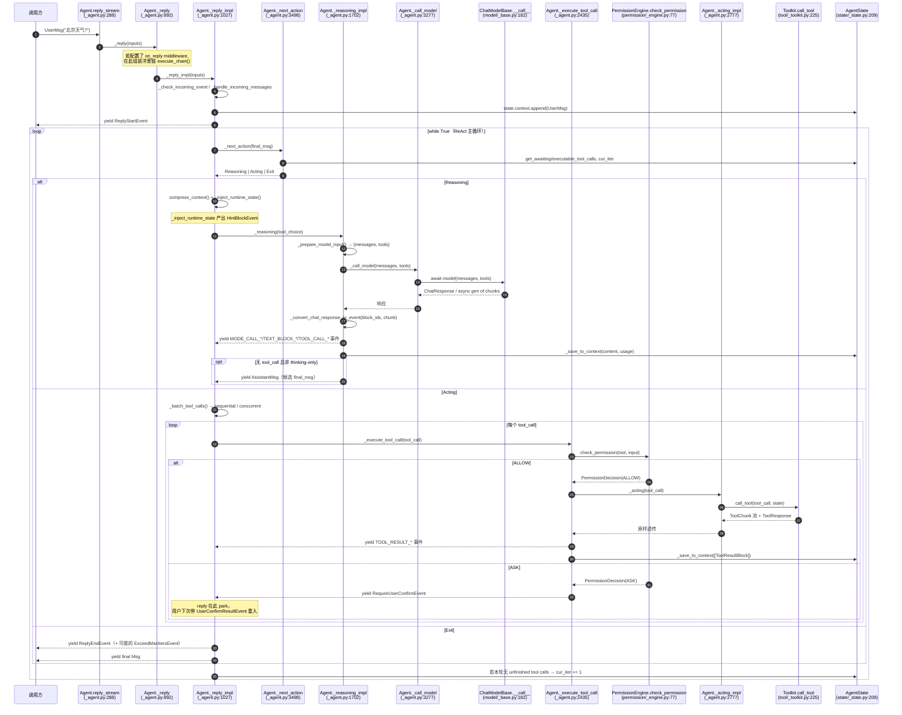

# 侦察报告 01：AgentScope 2.0.8 全局地图

> 侦察对象：`third_party/agentscope`（PyPI 包名 `agentscope`，版本 2.0.8，已 `pip install -e`）
> 源码规模：`src/agentscope/` 下 **469 个 .py 文件、115 401 行**；`tests/` 下 182 个测试文件。
> 所有代码片段都在 `/Users/a/miniconda3/envs/agentscope_reme_pip_env/bin/python`（Python 3.11.13）里**真跑过**，可运行片段标注「已验证」并附真实输出。
> 本报告是后续 20 篇教程的「地基文档」，所有结论都带 `相对仓库根的路径:行号`。

---

## 子系统职责（这段代码到底在解决什么问题）

一句话：**AgentScope 2.0.8 是一套已经把「Agent Harness」该做的事全做完了的生产级 Python 框架**。它把一个 LLM 从「只会聊天」变成「能干活」所需的全部外围设施——模型适配、消息与内容块、事件流、状态机、工具/技能/MCP、权限与 HITL、上下文压缩、长短期记忆、沙箱工作区、观测、以及一个完整的 FastAPI 服务层——都实现成了**可替换的类**。

它解决的问题，逐条对应参考架构：

1. **模型差异屏蔽**：`model/` 下 10 个 provider 的 `ChatModelBase` 子类，统一 `__call__` 返回 `ChatResponse` 或 `AsyncGenerator[ChatResponse]`。换模型只改构造函数的 `credential` + `model` 两个参数。
2. **Harness 的核心：reasoning-acting loop**：`agent/_agent.py:3498` 的 `_next_action` 是一个**纯粹的只读状态机**——读当前 `AgentState`，吐出一个 discriminated union：`Reasoning` / `Acting` / `Exit`。这把「ReAct 循环」从一个几百行的 while 循环变成了一张可测试的状态转移表，是整套代码里最值得学的设计。
3. **一切皆事件**：`agent.reply_stream()` 是唯一主入口，返回 `AsyncGenerator[AgentEvent | Msg, None]`。全流程 28 种事件（`event/_event.py:26` 的 `EventType`），前端/CLI/日志/存储都只是这个事件流的不同消费者。
4. **工具/权限/Sandbox 的可插拔装配**：`Toolkit` 管理工具组，`PermissionEngine`（848 行）管理 5 种权限模式，`WorkspaceBase` 管理本地/Docker/E2B/K8s 等 7 种执行后端。三者是**正交**的，可以任意组合。
5. **上下文工程**：`Agent.compress_context()` + `ContextConfig.trigger_ratio` 做自动化压缩；`middleware/_longterm_memory/` 挂 ReMe / Mem0 / AgenticMemory 三种长期记忆后端。

**关键定位判断（影响整个教程的写法）**：AgentScope 2.0.8 **没有 Cordis 式的插件微内核**。它的可插拔性是「构造器注入 + 7 个 hook 的 Middleware」而不是「运行时插件挂载 + 依赖注入容器」。所以教程的正确姿势是：**自己用 Python 写一个 harness_kit kernel 复现 Cordis 的插件思想，然后精读 AgentScope 作为「生产级 Harness 该长成什么样」的参照系**。

---

## 子包职责表（25 个子包全覆盖）

| 子包 | 文件数/行数 | 一句话职责 | 参考架构层 |
|---|---|---|---|
| `agent/` | 10 / 6 588 | `Agent`（3 925 行的 ReAct 主循环）、`A2AAgent`（远程 A2A 适配器）、`RealtimeAgent`（语音双向）、4 个 Config 类 | 第2层 + 第4层 |
| `model/` | 26 / 6 745 | 10 个 LLM provider（OpenAI/Anthropic/Gemini/DashScope/DeepSeek/Moonshot/Volcengine/xAI/Ollama/OpenAI-Response），统一 `ChatModelBase` | 第1层 |
| `formatter/` | 12 / 5 118 | `FormatterBase`：把 `list[Msg]` 翻译成各家 API 的 message 数组（工具调用/多模态/多 agent 前缀各有方言） | 第1层 |
| `message/` | 3 / 972 | `Msg` + 9 种 `ContentBlock`（text/thinking/hint/tool_call/tool_result/data）+ `ToolCallState`/`ToolResultState` 状态枚举 | 第1层 |
| `event/` | 2 / 674 | 28 种 `EventType` + `AgentEvent` union；`Msg.append_event()` 让事件流可逆地「回放」成消息 | 第1层（事件溯源的数据结构基础） |
| `state/` | 4 / 481 | `AgentState`（唯一会被持久化的对象）+ `ReplyContext`/`ToolContext`/`TaskContext`/`Task` | 第1层 |
| `tool/` | 30 / 9 138 | `Toolkit`、`ToolBase`、`FunctionTool`/`MCPTool` 适配器、6 个 builtin 工具（Bash/Read/Write/Edit/Glob/Grep）、Task 工具组、`ToolGroup`、`ResetTools` 元工具 | 第2层 |
| `middleware/` | 25 / 6 899 | `MiddlewareBase` 7 个 hook + RAG / Budget / Tracing / TTS / 三种长期记忆（ReMe/Mem0/Agentic） | 第1层 + 第4层 |
| `permission/` | 6 / 1 118 | `PermissionEngine` + 5 种 `PermissionMode`（DEFAULT/EXPLORE/ACCEPT_EDITS/BYPASS/DONT_ASK）+ `PermissionRule` | 第2层 |
| `pipeline/` | 3 / 371 | `PipelineProtocol`（鸭子类型：只要实现 `reply_stream` 就能当 Agent 用）+ `GoalPipeline`（executor/verifier 双 agent 循环） | 第2层（Planning） |
| `sop/` | 4 / 794 | `SOP` + `SOPEngine`：固定里程碑序列的过程控制，带跨进程的 `SOPRunState` | 第2层（Planning） |
| `skill/` | 3 / 212 | `Skill` + `LocalSkillLoader`：`.md` 技能包的加载（渐进式披露 frontmatter） | 第2层（Skills） |
| `mcp/` | 3 / 634 | `MCPClient`（stateful/stateless 双模式）+ `StdioMCPConfig`/`HttpMCPConfig` | 第2层（MCP） |
| `rag/` | 21 / 5 013 | `KnowledgeBase` + 7 种 parser + `ApproxTokenChunker` + 4 种向量库（Qdrant/MilvusLite/MongoDB/Elasticsearch） | 第2层（Skills 的一种） |
| `embedding/` | 15 / 2 314 | `EmbeddingModelBase` + 4 个 provider + `FileEmbeddingCache` | 第1层 |
| `realtime/` | 18 / 2 758 | 实时语音：`RealtimeModelBase` + 4 provider + `TransportBase`/`LocalAudioTransport` + `VADBase` | 第2层（多模态扩展） |
| `tts/` | 13 / 2 314 | `TTSModelBase` + DashScope CosyVoice / Gemini / OpenAI | 第2层（多模态扩展） |
| `tui/` | 5 / 2 483 | 基于 textual 的全屏终端 UI（`launch_tui`），依赖可选 | 第4层（调试 UI） |
| `console/` | 3 / 616 | `ConsoleRenderer`（被动事件渲染器）+ `launch_console`（带 HITL 的交互循环） | 第4层（调试 UI） |
| `app/` | 195 / 48 169 | **最大的子包**：FastAPI 服务层、多租户存储（Redis/SQL）、消息总线、渠道（飞书/钉钉/Discord）、hub、workspace_manager、多 agent 团队工具 | 第3层 + 第4层 |
| `workspace/` | 39 / 10 475 | `WorkspaceBase`（1 581 行）+ Local/Docker/E2B/Daytona/K8s/OpenSandbox/AppleContainer/Bubblewrap 8 种后端 + offload 协议 | 第2层（Sandbox） |
| `credential/` | 13 / 733 | `CredentialBase` + 9 个 provider 凭证 + `CredentialFactory`（可反序列化的注册表） | 第1层 |
| `types/` | 5 / 124 | 叶子类型：`ReplyFinishedReason`/`ErrorType`/`ErrorInfo`/`Embedding`/`JSONSerializableObject` | 跨层 |
| `exception/` | 4 / 80 | 二分法：`AgentOrientedException`（给模型看，如工具不存在）vs `DeveloperOrientedException`（给开发者看） | 跨层 |
| `_utils/` | 4 / 505 | `_common.py`：`_generate_id`/`_json_loads_with_repair`/`set_id_factory`；`_mixin.py`；`_audio.py` | 跨层 |

---

## 关键文件表

| 文件路径:行号 | 核心类 | 核心函数 | 一句话职责 |
|---|---|---|---|
| third_party/agentscope/src/agentscope/agent/_agent.py:117 | `Agent` | — | Agent 主类，3 925 行，整个 Harness 的心脏 |
| third_party/agentscope/src/agentscope/agent/_agent.py:288 | — | `reply_stream` | **唯一主入口**，返回事件流 |
| third_party/agentscope/src/agentscope/agent/_agent.py:332 | — | `reply` | 吃掉事件流只返回最终 `Msg` |
| third_party/agentscope/src/agentscope/agent/_agent.py:386 | — | `compress_context` | 上下文压缩入口（可被 middleware 包裹） |
| third_party/agentscope/src/agentscope/agent/_agent.py:892 | — | `_reply` | 中间的 middleware 洋葱链装配点 |
| third_party/agentscope/src/agentscope/agent/_agent.py:1027 | — | `_reply_impl` | **真正的循环体**：`while True: match self._next_action(...)` |
| third_party/agentscope/src/agentscope/agent/_agent.py:1645 | — | `_reasoning` | reasoning 阶段的 middleware 洋葱链 |
| third_party/agentscope/src/agentscope/agent/_agent.py:1702 | — | `_reasoning_impl` | 调模型 → 转事件 → 写回 context |
| third_party/agentscope/src/agentscope/agent/_agent.py:2435 | — | `_execute_tool_call` | 单个工具调用的完整生命周期（校验→权限→事件→写 context） |
| third_party/agentscope/src/agentscope/agent/_agent.py:2723 | — | `_acting` | acting 阶段的 middleware 洋葱链 |
| third_party/agentscope/src/agentscope/agent/_agent.py:2777 | — | `_acting_impl` | 就是一行 `toolkit.call_tool(...)` |
| third_party/agentscope/src/agentscope/agent/_agent.py:3214 | — | `_get_system_prompt` | 拼 system prompt + 技能 + workspace，再跑 transformer 链 |
| third_party/agentscope/src/agentscope/agent/_agent.py:3239 | — | `_prepare_model_input` | 组装 `messages` + `tools` 两个参数 |
| third_party/agentscope/src/agentscope/agent/_agent.py:3277 | — | `_call_model` | 模型调用 + 重试 + fallback model + middleware |
| third_party/agentscope/src/agentscope/agent/_agent.py:3498 | — | `_next_action` | **只读状态机**，返回 `Reasoning`/`Acting`/`Exit` |
| third_party/agentscope/src/agentscope/agent/_utils.py:24 | `Acting`/`Reasoning`/`Exit` | — | 状态机的三个输出类型（pydantic BaseModel） |
| third_party/agentscope/src/agentscope/state/_state.py:209 | `AgentState` | — | 唯一会被持久化的状态对象 |
| third_party/agentscope/src/agentscope/state/_state.py:182 | `ReplyContext` | — | 单次 reply 的上下文（reply_id/cur_iter/结构化输出要求） |
| third_party/agentscope/src/agentscope/state/_state.py:32 | `ToolContext` | `get_cache`/`cache_file` | 文件读缓存 + 工具组激活状态 |
| third_party/agentscope/src/agentscope/event/_event.py:26 | `EventType` | — | 28 种事件枚举 |
| third_party/agentscope/src/agentscope/event/_event.py:568 | `AgentEvent` | — | 28 个事件类的 union 类型别名 |
| third_party/agentscope/src/agentscope/message/_base.py:71 | `Msg` | `append_event` | 消息本体；`append_event` 把事件回放成内容块 |
| third_party/agentscope/src/agentscope/message/_block.py:128 | `ToolCallState` | — | PENDING/ASKING/ALLOWED/SUBMITTED/FINISHED 五态机 |
| third_party/agentscope/src/agentscope/tool/_toolkit.py:66 | `Toolkit` | `get_tool_schemas`/`call_tool`/`add_tool` | 工具组的注册、schema 生成与调用 |
| third_party/agentscope/src/agentscope/tool/_base.py:100 | `ToolBase` | `call`/`__call__`/`check_permissions` | 工具的抽象协议 |
| third_party/agentscope/src/agentscope/tool/_adapters.py:36 | `FunctionTool` | — | 把普通 Python 函数包装成 ToolBase |
| third_party/agentscope/src/agentscope/middleware/_base.py:13 | `MiddlewareBase` | 7 个 hook | 全链路切面 |
| third_party/agentscope/src/agentscope/permission/_engine.py:17 | `PermissionEngine` | `check_permission` | 5 种模式的权限判定 |
| third_party/agentscope/src/agentscope/workspace/_base.py:223 | `WorkspaceBase` | `list_tools`/`offload_context`/`list_skills` | 沙箱抽象（本地/容器/K8s） |
| third_party/agentscope/src/agentscope/model/_base.py:37 | `ChatModelBase` | `__call__`/`count_tokens`/`generate_structured_output` | 模型抽象 |
| third_party/agentscope/src/agentscope/formatter/_formatter_base.py:20 | `FormatterBase` | `format` | Msg → API 消息方言 |
| third_party/agentscope/src/agentscope/app/_app.py:78 | — | `create_app` | FastAPI app 工厂（服务层入口） |
| third_party/agentscope/src/agentscope/app/storage/_base.py:29 | `StorageBase` | 40+ 个 CRUD | 服务层存储抽象（凭证/MCP/技能/会话/消息/团队/KB） |
| third_party/agentscope/src/agentscope/console/_renderer.py:78 | `ConsoleRenderer` | `render` | 事件流 → 终端行 |
| third_party/agentscope/src/agentscope/middleware/_longterm_memory/_reme/_middleware.py:88 | `ReMeMiddleware` | `on_reply` | 内嵌 ReMe 应用做长期记忆（与 ReMe 项目的接口！） |

---

## 调用链：一个请求从入口到结束



**逐段文字讲解**

1. **入口层（`reply_stream` / `reply`）**：`_agent.py:288` 的 `reply_stream` 是唯一的门。它内部只做一件事——把 `_reply()` 产出的东西过滤一层（`yield_final_msg=False` 时丢掉 `Msg`，只留事件）。`reply()`（`_agent.py:332`）则相反，它吃掉所有事件、只留最后一个 `Msg`。**教程要点：永远先用 `reply_stream` 学，因为 `reply` 把 90% 的信息丢掉了。**

2. **Middleware 洋葱链（`_reply` :892）**：如果没有 middleware，直接 `agen = self._reply_impl(...)`；有 middleware 时，在**函数内部**递归构造 `execute_chain(index)`，每个 middleware 拿到 `next_handler`，可以「前处理 → `async for x in next_handler(**kwargs)` → 后处理」。这套写法在本文件里重复出现 5 次（`_reply`、`_reasoning`、`_acting`、`_call_model`、`compress_context`），是**背下来就能自己写框架的模板**。

3. **中间状态校验（`_reply_impl` :1027 开头）**：先做输入类型分派（`Msg` vs HITL 事件），再 `_check_incoming_event(event)` 判断「agent 是否正停在 HITL 上等人」。是 → 走 `_handle_incoming_event`；否 → 走 `_handle_incoming_messages` 并开新一轮 reply（新 `ReplyContext` + `ReplyStartEvent`）。

4. **状态机决策（`_next_action` :3498）**：这是全文件最优雅的地方。它是**纯只读函数**（docstring 明写 `Read-only: all side effects are performed by the caller _reply_impl`），按三个优先级判定：
   - Step 1：有没有可执行的 tool call？有 → `Acting`；有 waiting 的 → `Exit(exit_events=None, ...)`（**空 exit_events 表示「park 住，reply 没结束」**）。
   - Step 2：有结构化输出要求吗？已满足 → `Exit(COMPLETED)`；未满足 → `Reasoning(hint=..., tool_choice=...)` 并注入 `<system-reminder>`。
   - Step 3：`final_msg` 拿到了吗？拿到了 → `Exit(COMPLETED/EXCEED_MAX_ITERS)`；`cur_iter == max_iters` → 强制再来一轮「总结成文字、禁止调工具」（`tool_choice=ToolChoice(mode="none")`）；再超 → `Exit(EXCEED_MAX_ITERS)`。

5. **Reasoning 段**：`_reasoning`（middleware 洋葱）→ `_reasoning_impl`（:1702）→ `_prepare_model_input`（:3239，拼 system prompt + summary + context，再取工具 schema）→ `_call_model`（:3277，重试 + fallback model + middleware）→ `model(...)`。响应既可能是 `ChatResponse` 也可能是 `AsyncGenerator`，代码用 `inspect.isasyncgen(res)` 分流（:1758）。**特别注意 :1786 的 `if chunk.is_last`**——流式响应里最后一个 chunk 才带完整内容和 usage。

6. **Acting 段**：`_batch_tool_calls`（:2100）按工具的 `is_concurrency_safe` 把多个 tool call 分成 `sequential` / `concurrent` 两批；`_execute_tool_call`（:2435）逐个处理：校验输入 → `_check_permission` → `_acting` → 写 context。权限 ASK 时**park**，抛出 `RequireUserConfirmEvent` 后立即 `break`，reply 结束但没完成。

7. **收尾**：`_reply_impl` 的 `finally` 块（:1287）保证 `ReplyEndEvent` 一定被 yield；中断时先跑 `_close_unfinished_tool_calls()`（:962）把没结果的 tool call 补一个 INTERRUPTED 结果，再补一条 `AssistantMsg`。

---

## 关键数据结构

### 1. `Msg` 与内容块（`message/_base.py:71`、`message/_block.py`）

```python
class Msg(BaseModel):
    id: str = Field(default_factory=_generate_id)
    name: str                       # 谁发的
    role: Literal["user", "assistant", "system"]
    content: list[ContentBlockTypes]   # 9 种块的 union
    metadata: dict = Field(default_factory=dict)
    created_at: str
    finished_at: str | None = None
    usage: Usage | None = None
    finished_reason: ReplyFinishedReason | None = None
    structured_output: dict | None = None
    error: ErrorInfo | None = None
```

9 种内容块（`message/_block.py`）：`TextBlock`(:11)、`ThinkingBlock`(:26)、`DataBlock`(:83)、`HintBlock`(:101)、`ToolCallBlock`(:138)、`ToolResultBlock`(:195)，加上 `Base64Source`(:56)/`URLSource`(:67) 两个 DataBlock 的来源类型，和 `ContentBlock` 的联合别名。

**设计要点**：`Msg.id` 在 reply 期间**等于 `reply_id`**。这一条是理解 `append_context` 和 `append_event` 的钥匙，也是踩坑高发区（见「坑与注意事项」第 2 条）。

### 2. `ToolCallState` 五态机（`message/_block.py:128`）

```python
class ToolCallState(StrEnum):
    PENDING   = "pending"     # 刚由模型生成，还没判定
    ASKING    = "asking"      # 权限引擎判定 ASK，等用户确认
    ALLOWED   = "allowed"     # 已允许，等待执行 / 正在执行
    SUBMITTED = "submitted"   # 已提交给外部执行器，等结果
    FINISHED  = "finished"    # 有 tool_result 了
```

`AgentState.get_awaiting_tool_calls(name)`（`state/_state.py:345`）判定：`ASKING`，或 `SUBMITTED` 且没有对应 result → 都算「park 住等人」。`get_unfinished_tool_calls`（`state/_state.py:374`）则更宽：只要没有 result 就算，用来决定 `cur_iter` 是否 +1。**注意它会额外校验 `last_msg.id != self.reply_id`**——这是「上一条 reply 的残留调用不应算进本轮」的保护。

### 3. `AgentState`（`state/_state.py:209`）

```python
class AgentState(BaseModel):
    session_id: str = Field(default_factory=_generate_id)
    summary: str | list[TextBlock | DataBlock] = ""
    context: list[Msg] = Field(default_factory=list)
    reply_context: ReplyContext = Field(default_factory=ReplyContext)
    permission_context: PermissionContext = Field(default_factory=PermissionContext)
    tool_context: ToolContext = Field(default_factory=ToolContext)
    tasks_context: TaskContext = Field(default_factory=TaskContext)
    middle_context: dict[str, Any] = Field(default_factory=dict)
```

- `summary` + `context` 构成「压缩后 + 未压缩」的双层上下文；`_prepare_model_input`(:3249) 会把 summary 以 `UserMsg` 形式插在 system prompt 之后。
- `reply_context`（`state/_state.py:182`）含 `reply_id` / `cur_iter` / `structured_schema` / `structured_output`。`state/_state.py:228` 的 `@model_validator(mode="before")`（方法名 `_migrate_legacy_reply_fields`）会把**旧版本的顶层 `reply_id`/`cur_iter` 字段迁移进来**——这是给教程写「如何做向后兼容的状态迁移」的绝佳真实案例。
- `middle_context` 是给 middleware 存跨 reply 数据的地方，`MiddlewareBase.get_middleware_key()`（`middleware/_base.py:296`）提供 key。
- 顶层 `reply_id` / `cur_iter` 是 `@property` 代理到 `reply_context`，同时提供 setter，所以老代码 `state.cur_iter += 1` 依然能跑。

### 4. 事件层级（`event/_event.py`）

所有事件继承 `EventBase`（:70）：`id` / `created_at` / `metadata`。`model_config = ConfigDict(use_enum_values=True)` 意味着 `event.type` 是**裸字符串**而不是枚举成员（`event_test.py` 有断言）。

事件分四族：

| 族 | 事件 |
|---|---|
| reply 生命周期 | `ReplyStartEvent`(:83)、`ReplyEndEvent`(:112)、`ExceedMaxItersEvent`(:431) |
| 模型调用 | `ModelCallStartEvent`(:128)、`ModelCallEndEvent`(:139)（带 input/output/cache tokens） |
| 内容块流 | `TextBlock{Start,Delta,End}Event`、`ThinkingBlock*`、`DataBlock*`、`HintBlockEvent`(:289) |
| 工具 | `ToolCall{Start,Delta,End}Event`、`ToolResult{Start,TextDelta,DataDelta,End}Event` |
| HITL | `RequireUserConfirmEvent`(:443)、`RequireExternalExecutionEvent`(:456)、`UserConfirmResultEvent`(:483)、`UserInterruptEvent`(:496)、`ExternalExecutionResultEvent`(:521) |
| 扩展 | `CustomEvent`(:534) |

### 5. 状态机的三个输出类型（`agent/_utils.py`）

```python
class Acting(BaseModel):
    tool_calls: list[ToolCallBlock]

class Reasoning(BaseModel):
    hint: HintBlock | None = None
    tool_choice: ToolChoice | None = None

class Exit(BaseModel):
    exit_msg: Msg
    exit_events: list[AgentEvent] | None = None   # None = park 住，reply 未结束
```

`Exit.exit_events` 用 `None` 和 `[]` 区分两种语义：`None` = 「停在 HITL 上等人」，`[]` = 理论上不出现（代码里 `if not exit_events:` 走的正是 `None` 分支）。这个「用一个可空字段编码三种状态」的写法值得单独讲一课。

---

## 源码精读

### 片段 1：ReAct 主循环本体（`agent/_agent.py:1134-1160`）

```python
            final_msg: Msg | None = None
            # Detects middlewares swallowing the ReplyEndEvent repeatedly
            # without any reasoning/acting in between (a busy loop)
            made_progress = True
            while True:
                # =============================================================
                # Step 3.1: Decide the next action based on the current state
                # =============================================================
                next_action = self._next_action(final_msg)

                match next_action:
                    case Exit(exit_msg=exit_msg, exit_events=exit_events):
```

**在干什么**：整个 ReAct 循环只剩 6 行——`while True` + `_next_action()` + `match`。三种分支（`Exit`/`Reasoning`/`Acting`）各自是几十行的事件转发代码。

**为什么这么设计**：把「决策」和「副作用」彻底分离。`_next_action` 是纯函数，可以单测到每一个分支（`agent_basic_test.py` 就是这么做的）；`_reply_impl` 只管把决策翻译成事件。这是本报告最想推荐给教程作者的教学点——**学生自己写 Harness 时最常犯的错就是把决策逻辑埋在循环里，最后 800 行 while 循环无法调试**。

**`made_progress` 的含义**：middleware 可以「吞掉」`ReplyEndEvent` 来强制再跑一轮（见 :1153 的注释和 :1163 的注释）。但连续吞两次而中间没有任何 reasoning/acting，就是死循环，所以直接 `raise RuntimeError`（:1166）。

### 片段 2：`Exit` 分支里对 HITL park 的处理（`agent/_agent.py:1141-1151`）

```python
                    case Exit(exit_msg=exit_msg, exit_events=exit_events):
                        if not exit_events:
                            # Parked on HITL: the reply is not finished, so
                            # the continuation protocol doesn't apply
                            yield exit_msg
                            return

                        for exit_event in exit_events:
                            yield exit_event

                        # Exit unless a middleware swallowed the ReplyEndEvent
                        # to force another reasoning-acting round
                        if self._receive_reply_end:
                            yield exit_msg
                            return
```

**在干什么**：`exit_events` 为空 = 权限 ASK 或外部执行 park。此时只 yield 一条「我在等你的许可」的 `AssistantMsg`（内容由 `_next_action` :3549 拼），然后 `return` 结束这次 `reply_stream`。**这次的 `reply_stream` 调用就此返回，用户拿着 `RequireUserConfirmEvent` 去做确认，然后带 `UserConfirmResultEvent` 再调一次 `reply_stream`。**

**为什么这么设计**：这就是「一次 reply 可以跨多次函数调用」的实现方式。`_receive_reply_end` 这个 flag 在 `_reply`(:951) 里设置——**必须在 `yield` 之前设置**，因为 `_reply_impl` 是被 `yield` 挂起的 generator，恢复时会检查这个 flag。注释 :949 专门解释了这一点。

### 片段 3：`_reasoning_impl` 里对「空响应」的防御（`agent/_agent.py:1767-1790`）

```python
        # Check if res is an async generator (streaming response)
        if inspect.isasyncgen(res):
            async for chunk in res:
                # Save the last chunk with completed response
                if chunk.is_last:
                    completed_response = chunk

                else:
                    # Convert the chunk into events
                    async for evt in self._convert_chat_response_to_event(
                        block_ids,
                        chunk,
                    ):
                        yield evt
```

以及 :1808：

```python
        # Guard against empty or interrupted streaming responses.
        if completed_response is None:
            raise RuntimeError(
                "Model returned an empty streaming response: no is_last=True"
                " chunk was received.  The model call may have been"
                " interrupted mid-stream (network dropout, timeout, or model"
                " bug).",
            )
```

**在干什么**：流式响应里，中间 chunk 只带增量，**最后一个 `is_last=True` 的 chunk 才带完整的 content 和 usage**。所以循环把它单独存起来，不转成事件。

**为什么这么设计**：事件流是给 UI 实时渲染用的（只关心增量），而 `context` 需要的是完整、干净、可复现的内容（关心最终值）。二者用同一个 `ChatResponse` 类型承载，靠 `is_last` 区分。**这是「流式输出 + 状态一致性」这个经典工程问题的教科书级解法**，教程里应该单独一节。

注意 `completed_response is None` 的防御：如果模型流到一半断了，一个 `is_last` chunk 都收不到，这里会抛 `RuntimeError` 而不是静默返回空消息。**生产级代码的标志之一就是这种「不可能却发生了」的断言。**

### 片段 4：`_prepare_model_input` 的顺序（`agent/_agent.py:3239-3269`）

```python
        # The system prompt
        messages = [
            SystemMsg(name="system", content=await self._get_system_prompt()),
        ]
        # The compressed summary
        if self.state.summary:
            messages.append(
                UserMsg(name="user", content=self.state.summary),
            )
        # The conversation context
        messages.extend(self.state.context)

        # Equip the compression tool, whose registration is kept across
        # replies so that its schema is stable for prompt caching
        if self.context_config.compression_tool_enabled and (
            await self.toolkit.get_tool(_COMPRESSION_TOOL_NAME)
            is not self._compression_tool
        ):
            await self.toolkit.add_tool(self._compression_tool)

        # Get the tools schemas
        tools = await self.toolkit.get_tool_schemas(
            self.state.tool_context.activated_groups,
        )

        return {"messages": messages, "tools": tools}
```

**在干什么**：定义了送给 LLM 的 prompt 的**唯一固定顺序**：`system prompt` → `summary` → `context` → `tools`。

**为什么这么设计**（这段注释是整个仓库最有价值的一句之一）：**压缩工具（`CompressContext`）的注册被有意「跨 reply 保持」，就是为了让工具 schema 稳定，从而命中 prompt caching**。KV Cache 命中要求 prompt 前缀逐字节一致，任何位置变化都会让缓存全部失效。教程里讲「KV Cache 管理」时，这是最有力的真实案例：**不是「用了缓存 API」，而是「精心设计 prompt 组装顺序去保护前缀」**。

### 片段 5：`_inject_runtime_state` 为什么用 HintBlock 而不是改 system prompt（`agent/_agent.py:1374-1400`）

```python
        .. note:: The injection is **not** ephemeral. It is appended to the
            persistent context on purpose, so the agent can perceive how time
            elapses and what it did at each step, building a sense of time.

        .. note:: We attach a ``HintBlock`` instead of mutating the system
            prompt, so that prompt caching still works while the agent remains
            aware of the changing time / tasks / context.
```

**在干什么**：把「当前时间 / 待办任务 / 上下文占用率」这些**会变**的信息，作为 `HintBlock` 插进 context 尾部，而不是去改 system prompt。

**为什么这么设计**：又一处为 KV Cache 服务的设计。这个「可变信息下沉到 context 末尾」的模式，直接对应参考架构里「Context Engineering」的实战技巧。我在 `e2e_react.py` 里实测确认了：一次两轮的工具调用结束后，`state.context[1].content` 的类型序列是 `['hint', 'text', 'tool_call', 'tool_result', 'text']`——**hint 块确实在第一条 assistant 消息的最前面**。

而且 `_inject_runtime_state` 的注入时机是**按维度分别判断**的：时间（首次 或 间隔超过 `time_interval` 小时）、任务（有 pending 任务且 context 里查不到）、上下文占用（reply 第一轮且 token 在窗口内）。教程里可以直接把这个「按维度决定注入时机」当成模板。

### 片段 6：`MiddlewareBase` 的 7 个 hook 与「洋葱 vs 变换」两种模式（`middleware/_base.py:13-52`）

```python
    **Onion Pattern Hooks** (with before/after logic):
    - `on_reply`: Intercepts the entire reply process
    - `on_reasoning`: Intercepts the reasoning/model call phase
    - `on_check_permission`: Intercepts permission checking for a tool call
    - `on_acting`: Intercepts individual tool call execution
    - `on_model_call`: Intercepts the raw model API call
    - `on_compress_context`: Intercepts context compression

    **Transformer Pattern Hook** (sequential pipeline):
    - `on_system_prompt`: Transforms the system prompt string
```

**在干什么**：7 个 hook 分成两种调用协议。6 个是洋葱（签名 `(agent, input_kwargs, next_handler)`，`async for` 转发），1 个是变换（签名 `(agent, current_prompt) -> str`，顺序串行）。

**为什么这么设计**：`on_system_prompt` 是纯函数变换，没有「后处理」需求（你没法在 prompt 送出去之后再改它），所以用更简单的串行变换协议。而其余 6 个需要在调用前后都能插手（打点、改输入、吞事件）。

**装配方式**（`agent/_agent.py:214-240`）：构造时按 `_.is_implemented("on_xxx")` 把 middleware 分到 7 个列表里，**只此一次**。`is_implemented`（`middleware/_base.py:55`）用 `getattr(MiddlewareBase, name) is not getattr(type(self), name)` 判断——**这也是为什么基类里每个 hook 都写了一段 `raise RuntimeError(...)` 再 `yield` 不可达代码**（:97-99），那段代码的唯一作用是让 `is_implemented` 能区分「实现了」和「没实现」。

**实测验证**：我的 `e2e_hitl_mw.py` 实测出 hook 调用顺序是
`['on_reply', 'on_system_prompt', 'on_system_prompt', 'on_reasoning', 'on_system_prompt', 'on_reply', 'on_acting', 'on_system_prompt', 'on_reasoning', 'on_system_prompt']`
——**注意 `on_system_prompt` 被调用了 6 次**，因为 `_get_system_prompt()` 在每次 reasoning、以及每次 `compress_context()` 的预算检查里都会被调用。教程必须提醒学生：**这个 hook 会高频触发，别在里面做重活。**

### 片段 7：`_check_permission_impl` 的短路（`agent/_agent.py:2416-2434`）

```python
    async def _check_permission_impl(
        self,
        tool_call: ToolCallBlock,
        tool: ToolBase,
        tool_input: dict[str, Any],
    ) -> PermissionDecision:
        """Core permission resolution, wrapped by ``on_check_permission``.

        A call already allowed by user confirmation short-circuits to ALLOW;
        otherwise the built-in engine evaluates the tool and its input. See
        :meth:`_check_permission` for the argument and return semantics.
        """
        if tool_call.state == ToolCallState.ALLOWED:
            return PermissionDecision(
                behavior=PermissionBehavior.ALLOW,
                message="Already allowed by user confirmation.",
            )
        return await self._engine.check_permission(tool, tool_input)
```

**在干什么**：用户确认后，tool call 的状态被 `_handle_incoming_event`（`agent/_agent.py:1976`）改成 `ALLOWED`；下一轮进 `_execute_tool_call` 时，权限检查**直接短路返回 ALLOW，不再问引擎**。

**为什么这么设计**：权限引擎的模式（如 `DEFAULT`）默认是「一切都要问」。如果不短路，用户确认完之后引擎会**再问一次**，形成死循环。这个「状态即凭证」的模式，是 HITL 系统设计的核心 trick，教程里值得单独讲。

---

## 可运行代码片段

> 以下片段全部在 `/Users/a/miniconda3/envs/agentscope_reme_pip_env/bin/python` 下跑通。完整脚本在 `/tmp/asrecon/`（临时目录，教程作者可直接抄进正文）。
> 环境准备：`load_dotenv("/Users/a/PycharmProjects/VsCode_Projects/Agentscope-Learning/.env")`，读 `OPENAI_API_KEY` / `OPENAI_BASE_URL` / `LLM_MODEL`。

### 片段 A：最小 ReAct Agent + 真模型 + 真工具（**已验证**）

```python
import asyncio, os
from dotenv import load_dotenv
load_dotenv("/Users/a/PycharmProjects/VsCode_Projects/Agentscope-Learning/.env")

from agentscope.agent import Agent, ReActConfig
from agentscope.model import DeepSeekChatModel
from agentscope.credential import DeepSeekCredential
from agentscope.tool import Toolkit, FunctionTool
from agentscope.permission import PermissionDecision, PermissionBehavior
from agentscope.message import UserMsg


async def get_weather(city: str) -> str:
    """Get the (fake) weather of a city.

    Args:
        city: The city name to look up.
    """
    fake = {"Beijing": "sunny 25C", "Shanghai": "rainy 19C"}
    return f"{city}: {fake.get(city, 'unknown')}"


async def main() -> None:
    credential = DeepSeekCredential(
        api_key=os.environ["OPENAI_API_KEY"],
        base_url=os.environ["OPENAI_BASE_URL"],
    )
    model = DeepSeekChatModel(
        credential=credential,
        model=os.environ.get("LLM_MODEL", "deepseek-chat"),
        stream=True,
    )
    tool = FunctionTool(
        get_weather,
        permission=PermissionDecision(
            behavior=PermissionBehavior.ALLOW, message="ok",
        ),
    )
    agent = Agent(
        name="Friday",
        system_prompt="You are a helpful assistant. Use tools when needed.",
        model=model,
        toolkit=Toolkit(tools=[tool]),
        react_config=ReActConfig(max_iters=3),
    )
    async for evt in agent.reply_stream(
        UserMsg(name="user", content="What is the weather in Beijing?"),
        yield_final_msg=True,
    ):
        print(evt.type if hasattr(evt, "type") else str(evt)[:200])


asyncio.run(main())
```

**真实输出（节选）**：

```
  TEXT_BLOCK_END
  TOOL_CALL_START
  TOOL_CALL_DELTA   ... (x9)
  TOOL_CALL_END
  MODEL_CALL_END
  TOOL_RESULT_START
  TOOL_RESULT_TEXT_DELTA
  TOOL_RESULT_END
  MODEL_CALL_START
  TEXT_BLOCK_START
  TEXT_BLOCK_DELTA  ... (x17)
  TEXT_BLOCK_END
  MODEL_CALL_END
  REPLY_END
FINAL_MSG: name='Friday' content=[TextBlock(type='text', text='The weather in Beijing is currently **sunny** with a temperature of **25°C**.', ...)]
event count: 56
=== context ===
  user user ['text']
  assistant Friday ['hint', 'text', 'tool_call', 'tool_result', 'text']
=== state ===
session_id: 88712456e0a344c2bad6ffc74b08ec00
cur_iter: 2
summary: ''
```

**教学价值**：这一个脚本同时演示了 ReAct 循环（两次 `MODEL_CALL_START`）、工具调用、事件流、HintBlock 注入、`cur_iter` 递增（=2，因为两轮）、以及 context 的单条 assistant 消息内累积 5 个内容块。

### 片段 B：Middleware hook 顺序 + HITL 权限确认（**已验证**）

```python
class SpyMiddleware(MiddlewareBase):
    def __init__(self) -> None:
        self.calls: list[str] = []

    async def on_reply(self, agent, input_kwargs, next_handler):
        self.calls.append("on_reply")
        async for x in next_handler(**input_kwargs):
            yield x

    async def on_reasoning(self, agent, input_kwargs, next_handler):
        self.calls.append("on_reasoning")
        async for x in next_handler(**input_kwargs):
            yield x

    async def on_acting(self, agent, input_kwargs, next_handler):
        self.calls.append("on_acting")
        async for x in next_handler(**input_kwargs):
            yield x

    # ⚠️ 变换模式：签名不同，没有 next_handler
    async def on_system_prompt(self, agent, current_prompt):
        self.calls.append("on_system_prompt")
        return current_prompt + "\n# MW-MARKER"
```

第一轮（工具默认权限是 ASK，所以会 park）：

```python
    async for evt in agent.reply_stream(UserMsg(name="user", content="Delete /tmp/foo.txt please.")):
        print(" ", evt.type)
```

**真实输出（节选）**：

```
=== round 1: expect REQUIRE_USER_CONFIRM ===
  REPLY_START
  HINT_BLOCK
  MODEL_CALL_START
  TEXT_BLOCK_START
  TOOL_CALL_START
  TOOL_CALL_DELTA
  TEXT_BLOCK_END
  TOOL_CALL_END
  MODEL_CALL_END
  REQUIRE_USER_CONFIRM
confirm_evt: ... tool_calls=[ToolCallBlock(type='tool_call', id='call_00_HE1zBs8Bjb3iZm6EvRfL8500', name='delete_file', input='{"path": "/tmp/foo.txt"}', state=<ToolCallState.ASKING: 'asking'>, suggested_rules=[PermissionRule(tool_name='delete_file', rule_content=None, behavior=<PermissionBehavior.ALLOW: 'allow'>, source='suggested')])]
```

第二轮（用户确认，注意 `ConfirmResult` 要传**整个 `ToolCallBlock`**，字段名是 `tool_call` 不是 `tool_call_id`）：

```python
    tc = confirm_evt.tool_calls[0]
    async for evt in agent.reply_stream(
        UserConfirmResultEvent(
            reply_id=confirm_evt.reply_id,
            confirm_results=[
                ConfirmResult(
                    confirmed=True,
                    tool_call=tc,
                    rules=[PermissionRule(
                        tool_name="delete_file", rule_content="*",
                        behavior=PermissionBehavior.ALLOW, source="userSettings",
                    )],
                ),
            ],
        ),
        yield_final_msg=True,
    ):
        ...
```

**真实输出**：

```
=== round 2: user CONFIRMS ===
  TOOL_RESULT_START
  TOOL_RESULT_TEXT_DELTA
  TOOL_RESULT_END
  MODEL_CALL_START
  TEXT_BLOCK_START
  TEXT_BLOCK_DELTA
  TEXT_BLOCK_END
  MODEL_CALL_END
  REPLY_END
  Msg
=== middleware calls (in order) ===
['on_reply', 'on_system_prompt', 'on_system_prompt', 'on_reasoning', 'on_system_prompt', 'on_reply', 'on_acting', 'on_system_prompt', 'on_reasoning', 'on_system_prompt']
=== context ===
  user user ['text']
  assistant Friday ['hint', 'text', 'tool_call', 'tool_result', 'text']
```

**教学价值**：`REQUIRE_USER_CONFIRM` 之后**没有 `REPLY_END`**——这就是「park 住」的可观测证据。第二轮从 `TOOL_RESULT_START` 开始、没有 `REPLY_START`，因为走的是 `_handle_incoming_event` 分支。

### 片段 C：LocalWorkspace + 内建工具（**已验证，不需要 LLM**）

```python
import asyncio, tempfile
from agentscope.workspace import LocalWorkspace
from agentscope.tool import Toolkit
from agentscope.state import AgentState
from agentscope.message import ToolCallBlock


async def main() -> None:
    tmp = tempfile.mkdtemp(prefix="as_ws_")
    async with LocalWorkspace(workdir=tmp) as ws:
        print("workspace_id:", ws.workspace_id)
        print("is_persistent:", ws.is_persistent)
        tools = await ws.list_tools()
        print("tools from workspace:", [t.name for t in tools])
        tk = Toolkit(tools=tools)
        state = AgentState()
        call = ToolCallBlock(
            id="c1", name="Write",
            input='{"file_path": "%s/hello.txt", "content": "hi from AgentScope"}' % tmp,
        )
        async for chunk in tk.call_tool(call, state):
            last = chunk
        call2 = ToolCallBlock(
            id="c2", name="Read",
            input='{"file_path": "%s/hello.txt"}' % tmp,
        )
        async for chunk in tk.call_tool(call2, state):
            if type(chunk).__name__ == "ToolResponse":
                for b in chunk.content:
                    print("READ ->", b.text)


asyncio.run(main())
```

**真实输出**：

```
workspace_id: 08d4968002a247d6a5427d22dca048ea
workdir: /var/folders/.../T/as_ws_zjp3hoqg
is_alive: True
is_persistent: True
tools from workspace: ['Bash', 'Edit', 'Glob', 'Grep', 'Read', 'Write']
READ ->      1	hi from AgentScope
```

**教学价值**：`ws.list_tools()` 一行拿到 6 个建工具——**这就是「Workspace 是工具的来源」的直接证据**。教程可以用它来演示「Sandbox 层怎么向上提供 Skills」。

### 片段 D：`AgentState` 序列化 + 事件回放成消息（**已验证**）

```python
from agentscope.state import AgentState
from agentscope.message import AssistantMsg, TextBlock
from agentscope.event import (
    ToolCallStartEvent, ToolCallDeltaEvent, ToolCallEndEvent,
)

st = AgentState()
st.append_context("Friday", [TextBlock(text="hello")])
st.append_context("Friday", [TextBlock(text=" world")])
print("blocks merged:", len(st.context), [b.type for b in st.context[0].content])

dumped = st.model_dump()
print("model_dump keys:", sorted(dumped.keys()))
back = AgentState.model_validate(dumped)
print("round-trip ok:", back.session_id == st.session_id)

m = AssistantMsg(id="r", name="Friday", content=[])   # ⚠️ id 必须等于 reply_id
m.append_event(ToolCallStartEvent(reply_id="r", tool_call_id="t1", tool_call_name="Read"))
m.append_event(ToolCallDeltaEvent(reply_id="r", tool_call_id="t1", delta='{"file_path"'))
m.append_event(ToolCallDeltaEvent(reply_id="r", tool_call_id="t1", delta=': "a.txt"}'))
m.append_event(ToolCallEndEvent(reply_id="r", tool_call_id="t1"))
print("msg content after events:", [(b.type, getattr(b, "id", None)) for b in m.content])
print("tc input:", m.content[0].input)
```

**真实输出**：

```
blocks merged: 1 ['text', 'text']
unfinished tool calls: []
model_dump keys: ['context', 'middle_context', 'permission_context', 'reply_context', 'session_id', 'summary', 'tasks_context', 'tool_context']
round-trip ok: True
msg content after events: [('tool_call', 't1')]
tc input: {"file_path": "a.txt"}
```

**教学价值**：这一段同时证明了三件事：(1) `AgentState` 是完整可 JSON 序列化的（所以能直接存 Redis/SQL）；(2) `append_context` 会把同一 reply 的块**合并进同一条 Msg**；(3) `Msg.append_event` 能把事件流「反向重放」成内容块——**这就是为什么 AgentScope 的事件流天然支持「事件溯源」式的回放**，尽管它没有专门的 EventStore。

### 片段 E：官方测试套件离线运行（**已验证**）

`tests/utils.py` 里有一个 `MockModel`（`tests/utils.py:51`），可以在**完全不调外部 API** 的情况下驱动完整的 Agent 循环。

```bash
cd /Users/a/PycharmProjects/VsCode_Projects/Agentscope-Learning/third_party/agentscope
/Users/a/miniconda3/envs/agentscope_reme_pip_env/bin/python -m pytest \
  tests/agent_basic_test.py tests/event_test.py tests/message_test.py \
  tests/event_to_message_test.py tests/compress_context_test.py \
  tests/middleware_test.py tests/permission_engine_test.py \
  tests/hitl_user_confirmation_test.py tests/hitl_external_execution_test.py \
  tests/agent_structured_output_test.py tests/agent_interrupt_test.py \
  tests/task_tool_test.py tests/skill_loader_test.py tests/sop_engine_test.py \
  tests/pipeline_goal_test.py tests/workspace_local_test.py -q
```

**真实输出**：

```
216 passed, 4 subtests passed in 6.91s
```

另外这组也跑通了：

```
tests/toolkit_test.py tests/tool_middleware_test.py tests/model_base_test.py
tests/model_response_test.py tests/formatter_deepseek_test.py tests/id_factory_test.py
→ 77 passed in 2.85s

tests/event_test.py tests/message_test.py  →  5 passed, 2 subtests passed in 3.25s
tests/agent_basic_test.py tests/event_to_message_test.py  →  20 passed in 2.71s
```

ReMe 中间件的测试（需要 `PYTHONPATH`）：

```bash
PYTHONPATH=/Users/a/PycharmProjects/VsCode_Projects/Agentscope-Learning/third_party/ReMe \
/Users/a/miniconda3/envs/agentscope_reme_pip_env/bin/python -m pytest tests/reme_middleware_test.py -q
# → 34 passed in 1.97s
```

**教学价值**：**293 个测试零 API key 就能跑完**。教程必须把这个当成「读者手上没有 API key 时的练习通道」。同时 `tests/utils.py` 的 `MockModel.set_responses()` 设计本身值得讲——它支持在响应列表里塞 `BaseException`（如 `asyncio.CancelledError()`）来模拟中断，这是**用测试驱动出「中断可恢复」这种难测功能**的范例。

---

## examples/ 分层表

| 示例路径 | 所属层 | 能教什么 | 可直接跑? |
|---|---|---|---|
| `examples/console/main.py` | 第4层（调试 UI）+ 第1层（记忆） | `launch_console` 一行起交互终端；`LocalWorkspace` 同时提供 builtin 工具**和**技能；`AgenticMemoryMiddleware` 落盘到 workdir | 需 `DASHSCOPE_API_KEY` |
| `examples/tui/main.py` | 第4层（调试 UI） | textual 全屏 TUI（`launch_tui`） | 需 `agentscope[tui]` |
| `examples/agent_service/main.py` | 第3、4层（完整服务） | **整份参考架构的落地样板**：`create_app` + RedisStorage + InMemoryMessageBus + 三种 channel（钉钉/飞书/Discord）+ 两个 hub（ClawSkillHub/GitHubMCPHub）+ `CollectionPerKbManager` + `LocalWorkspaceManager` + QdrantStore + MCP（playwright/高德） | 需 Redis + 众多 extra |
| `examples/web_ui/` | 第4层（Web UI） | React + TS 前端 + Node BFF；按功能分 api/hooks/components/pages，是「前端怎么消费事件流」的完整参考 | 需 pnpm + Node |
| `examples/long_term_memory/reme/reme_demo.py` | 第1层（长期记忆） | **ReMe 集成的官方入口**，与 `ReMeMiddleware` 对接 | 需 ReMe（本项目已装） |
| `examples/long_term_memory/mem0/oss_demo.py` | 第1层（长期记忆） | Mem0 后端对比 | 需 `memory-mem0` |
| `examples/long_term_memory/agentic_memory/main.py` | 第1层（长期记忆） | 文件系统式记忆（无外部依赖，最适合教学起步） | 需 `DASHSCOPE_API_KEY` |
| `examples/rag/index_and_search.py` | 第2层（Skills/RAG） | parser → chunker → vdb 的完整索引-检索链路 | 需 `agentscope[rag]` + 向量库 |
| `examples/rag/integrate_with_agent.py` | 第2层（RAG 挂到 Agent） | `RAGMiddleware` 怎么在 reply 前注入检索结果 | 需 `agentscope[rag]` + 向量库 + embedding 模型 |
| `examples/pipeline/goal/goal_pipeline.py` | 第2层（Planning） | `GoalPipeline`：executor + verifier 双 agent 迭代直到验收通过 | 需 LLM |
| `examples/a2a/client.py` / `server.py` | 第2层（Multi-Agent） | `A2AAgent` 跨进程 agent 通信协议 | 需 `agentscope[a2a]` |
| `examples/realtime/local_mic.py` | 第2层（多模态） | `RealtimeAgent` 麦克风实时语音 | 需 `agentscope[realtime]` + 声卡 |
| `examples/workspace/apple-container-workspace.md` | 第2层（Sandbox） | Apple Container 后端配置说明 | 仅文档 |

**观察**：`examples/` **没有**任何「评测/基准」示例，`web_ui` 之外也没有单独的「观测/追踪」示例。这印证了下面的「缺失能力」结论。

---

## tests/ 里最有教学价值的 10 个测试文件

| 排名 | 测试文件 | 行数 | 验证的能力 | 为什么值得读 |
|---|---|---|---|---|
| 1 | `tests/agent_basic_test.py` | 2 132 | ReAct 全循环、顺序/并发工具分批、权限、结构化输出 | 用 `MockModel` + 自定义 `ToolBase` 子类覆盖了整个 `_next_action` 状态机；**它是本框架最好的「非官方文档」** |
| 2 | `tests/compress_context_test.py` | 2 794 | 上下文压缩、summary schema、tool result 截断、fallback 截断 | 仓库里最长的测试文件；把 `ContextConfig` 的每个字段都验证了一遍，等于一份带断言的配置手册 |
| 3 | `tests/middleware_test.py` | 1 978 | 7 个 hook 的洋葱顺序、吞事件、`middle_context`、`list_tools` | 想自己写 middleware 的人照抄这里 |
| 4 | `tests/hitl_user_confirmation_test.py` | 1 842 | 权限 ASK → park → confirm/deny → 恢复执行 | HITL 是 Harness 最难的工程问题，这里把边界情况全覆盖了 |
| 5 | `tests/workspace_local_test.py` | 1 999 | `LocalWorkspace` 的 skills 分区、MCP 持久化、session purge、offload | 沙箱层的完整行为规格 |
| 6 | `tests/toolkit_test.py` | 1 657 | 工具组激活/停用、`ResetTools` 元工具、skill viewer、schema 生成 | 工具系统（Tool Use）的规格书 |
| 7 | `tests/hitl_external_execution_test.py` | 1 487 | `RequireExternalExecutionEvent` / `ExternalExecutionResultEvent` 往返 | 「外部执行器」模式的样板（把工具执行搬到另一个进程/服务） |
| 8 | `tests/reme_middleware_test.py` | 1 275 | ReMe 内嵌装配、`on_reply` 写回、`memory_search` 工具、三种 mode | **本教程与 ReMe 项目的第一条硬连接** |
| 9 | `tests/agent_interrupt_test.py` | 1 010 | `CancelledError` 中断、未完成 tool call 收尾、`UserInterruptEvent` | 中断恢复是生产环境的必修课 |
| 10 | `tests/event_to_message_test.py` | 1 060 | 事件流 → `Msg` 的逆向重放（`Msg.append_event`） | **直接对应「事件溯源」：事件是真相，消息是投影** |

补充两个备选：`tests/sop_engine_test.py`（606 行，跨进程状态机）、`tests/permission_engine_test.py`（822 行，5 种权限模式的判定矩阵）、`tests/agent_structured_output_test.py`（656 行，结构化输出的「强制收尾」逻辑）。

---

## 分层架构图（源码目录级别）

```mermaid
flowchart TD
    subgraph L4["第4层 上层配套"]
        CONSOLE["console/<br/>ConsoleRenderer, launch_console"]
        TUI["tui/<br/>launch_tui (textual)"]
        APP_MW["app/middleware/<br/>ToolOffloadMiddleware, TeamMemberLoopMiddleware"]
        APP_UI["examples/web_ui/<br/>React + TS"]
        CFG["agent/_config.py<br/>ContextConfig / ReActConfig<br/>ModelConfig / InjectionConfig"]
    end

    subgraph L3["第3层 评测实验迭代"]
        APP_ROUTER["app/_router/<br/>16 个 REST router"]
        APP_SVC["app/_service/<br/>chat / session / knowledge_base"]
        APP_STORE["app/storage/<br/>StorageBase, RedisStorage, SqlStorage"]
        APP_RAG["app/rag/<br/>index_worker, KB manager"]
        APP_HUB["app/hub/<br/>MCPHub, SkillHub"]
        NOTE3["⚠️ 无独立评测基准引擎 / 无数据标注模块<br/>最近似替代：tests/ 的 MockModel 离线套件"]
    end

    subgraph L2["第2层 Agent核心执行引擎"]
        AGENT["agent/_agent.py<br/>Agent: _reply_impl + _next_action"]
        TOOLKIT["tool/<br/>Toolkit / ToolBase / FunctionTool / MCPTool<br/>Bash Read Write Edit Glob Grep / Task 工具"]
        PERM["permission/<br/>PermissionEngine, 5 种 PermissionMode"]
        WS["workspace/<br/>LocalWorkspace, Docker, E2B, Daytona, K8s,<br/>OpenSandbox, AppleContainer, Bubblewrap"]
        MCP["mcp/<br/>MCPClient (stdio / http)"]
        SKILL["skill/<br/>Skill, LocalSkillLoader"]
        SOP["sop/ + pipeline/<br/>SOPEngine, GoalPipeline"]
        RAG["rag/<br/>KnowledgeBase, parser, chunker, 4 种 vdb"]
        RT["realtime/ + tts/<br/>RealtimeAgent, TTS"]
        APP_TOOL["app/_tool/<br/>AgentCreate, AgentInvite, TeamCreate/Say"]
    end

    subgraph L1["第1层 基础接入 & 存储"]
        MODEL["model/<br/>ChatModelBase + 10 provider"]
        FMT["formatter/<br/>FormatterBase + 10 provider 方言"]
        MSG["message/<br/>Msg + 9 种 ContentBlock"]
        EVENT["event/<br/>28 种 EventType + AgentEvent"]
        STATE["state/<br/>AgentState + 3 个 Context"]
        EMB["embedding/<br/>EmbeddingModelBase + 4 provider"]
        CRED["credential/<br/>CredentialBase + CredentialFactory"]
        MEM_MW["middleware/_longterm_memory/<br/>ReMe / Mem0 / AgenticMemory"]
        TRACE["middleware/_tracing/<br/>OpenTelemetry"]
    end

    subgraph L0["第0层 框架底座（AgentScope 自己的实现）"]
        MW["middleware/_base.py<br/>MiddlewareBase: 7 个 hook（洋葱 + 变换）"]
        TYPES["types/ + exception/ + _utils/<br/>ReplyFinishedReason / ErrorInfo / _generate_id"]
        NOTE0["⚠️ 没有 Cordis 式微内核<br/>可插拔性 = 构造器注入 + middleware hook<br/>没有运行时插件挂载 / 没有 DI 容器"]
    end

    APP_ROUTER --> APP_SVC --> AGENT
    APP_STORE --> APP_SVC
    APP_RAG --> RAG
    APP_HUB --> MCP
    APP_HUB --> SKILL
    CONSOLE --> EVENT
    TUI --> EVENT
    AGENT --> TOOLKIT
    AGENT --> STATE
    AGENT --> MW
    AGENT --> PERM
    AGENT --> SOP
    AGENT --> RT
    AGENT --> APP_TOOL
    TOOLKIT --> SKILL
    TOOLKIT --> MCP
    TOOLKIT --> WS
    WS --> TOOLKIT
    PERM --> MSG
    RAG --> EMB
    MODEL --> FMT
    FMT --> MSG
    AGENT --> MODEL
    AGENT --> FMT
    AGENT --> EVENT
    AGENT --> MSG
    AGENT --> RAG
    MEM_MW --> STATE
    MEM_MW --> MODEL
    TRACE --> MW
    MW --> MW
    STATE --> MSG
    STATE --> PERM
    EVENT --> MSG
    EVENT --> MODEL
    MCP --> TOOLKIT
    CRED --> MODEL
    TYPES --> EVENT
    TYPES --> MSG
```



---

## 教学要点（按「小白最容易卡住」排序）

1. **`reply_stream` 是唯一入口，`reply` 是它的降级版。** 初学者最容易犯的错是直接用 `reply()` 然后问「为什么我看不到工具调用过程」。必须先把事件流跑通、把 28 种事件打印一遍（片段 A）。

2. **一次 `reply` ≠ 一次函数调用。** 遇到权限 ASK 或外部执行时，`reply_stream` 会**返回**（park），用户做完确认后**再调一次 `reply_stream`**，传 `UserConfirmResultEvent`。这是全框架最反直觉的一点，也是所有 HITL bug 的根源（片段 B 的 `REQUIRE_USER_CONFIRM` 后没有 `REPLY_END` 就是证据）。

3. **`_next_action` 的「只读状态机」范式。** 学生自己写 Harness 时，99% 会把决策逻辑和副作用混在 while 循环里。AgentScope 给的答案是：决策函数读状态、返回 `Reasoning`/`Acting`/`Exit` 三种 dataclass，副作用全交给调用方。

4. **`Msg.id == reply_id`。** 理解这一点才能看懂 `append_context`、`append_event`、`get_unfinished_tool_calls` 三处代码。`append_event` 在 `reply_id != msg.id` 时会**静默跳过并打 warning**（`message/_base.py:266`），这是新手最容易被坑的静默失败。

5. **Middleware 的两种协议。** 6 个洋葱 hook 签名是 `(agent, input_kwargs, next_handler)`，唯一那个 `on_system_prompt` 是 `(agent, current_prompt) -> str`。**写错了会直接 TypeError**（我自己就踩了，见坑表第 1 条）。

6. **`FunctionTool` 的默认权限是 ASK。** 直接 `Toolkit(tools=[FunctionTool(my_func)])` 第一次跑一定 park。要么在 `FunctionTool(...)` 里传 `permission=PermissionDecision(behavior=ALLOW, ...)`，要么把 `PermissionContext` 的模式设成 `BYPASS`。

7. **`Prompt caching 保护`是全框架的暗线。** `_prepare_model_input` 的固定顺序、压缩工具注册的跨 reply 保持、`HintBlock` 替代改 system prompt——这三处都是同一个动机。教程讲 KV Cache 时用这三处串讲，效果远好于讲抽象原理。

8. **`IsReady` 类问题：`is_last` chunk。** 流式响应里最后一个 chunk 才带完整内容。学生写自己的模型适配器时，如果忘了这个约定，会导致 `context` 里的消息是残缺的。

9. **测试即文档：`tests/utils.py` 的 `MockModel`。** 没有 API key 也能跑 293 个测试（片段 E）。这是学习 Agent 框架最经济的方式——**先读测试，再读源码**。

10. **`AgentState` 是唯一的持久化边界。** 想存 Redis？存 `state.model_dump()`。想恢复？`AgentState.model_validate(...)`。教程做「断点续跑」时，这一条就是全部。

11. **`Workspace` 是工具的来源，不只是文件系统。** `await ws.list_tools()`（`workspace/_base.py:554`）返回 Bash/Read/Write/Edit/Glob/Grep 六个工具（片段 C 实测）。所以「换 Sandbox」= 「换工具实现」，这是把 Sandbox 做成插件的最优雅路径。

12. **`Toolkit` 的工具是「最后一次注册为准」。** `add_tool` 的 `overwrite` 参数决定同名工具是否覆盖。`Agent._validate_configs` 会检查 agent 之间共享 toolkit 的冲突，`_prepare_model_input` 里那句 `is not self._compression_tool` 正是为此。

13. **异常分两类：`AgentOrientedException` vs `DeveloperOrientedException`。** 前者（如 `ToolNotFoundError`）会被转成工具结果文本交给模型，让模型自己改正；后者直接抛给开发者。设计工具时选错类别，会让模型看到无意义的堆栈或让 bug 被静默吞掉。

14. **`AgentState.middle_context` 是 middleware 的私有存储。** 需要跨 reply 保存状态的 middleware（如 ReMe 的会话索引）都存这里，key 由 `get_middleware_key()` 提供（默认类名）。

15. **`ReplyFinishedReason` 有 4 个值**：`COMPLETED`/`INTERRUPTED`/`EXCEED_MAX_ITERS`/`ERROR`（`types/_reply.py:10`）。`ERROR` 出现时 `ReplyEndEvent.error` 会带一个 `ErrorInfo`（含 8 种 `ErrorType`），这是服务层做错误分类展示的基础。

16. **`_next_action` 有一段「强制收尾」逻辑**（:3720）：`cur_iter == max_iters` 时会注入 `<system-reminder>You have reached the maximum ... Do not call any tools.</system-reminder>` 并设 `tool_choice=ToolChoice(mode="none")`。**超出 max_iters 却还能拿到一个最终答案**，靠的就是这多出来的一轮。

17. **`compress_context()` 在每次 reasoning 前都会被调用**（`_agent.py:1180`）。但它是**条件触发**的：只有 token 超过 `trigger_ratio * context_size` 才真的压缩。学生如果以为「每次都会压」会在调试时困惑。

18. **`ToolBase` 用 `input_schema` 不是 `parameters`。** 想自定义工具，要么继承 `ToolBase` 并给 `input_schema`（JSON Schema dict），要么用 `FunctionTool` 从函数签名+docstring 自动生成。

19. **`Agent` 的 4 个 Config 都是 pydantic，可以 `model_dump()`。** 这是把 Agent 配置存成 JSON 做「Profile / Bundle 声明式配置」的现成入口（`agent/_config.py`）。

20. **`pipeline/` 和 `sop/` 说明「Agent 不是唯一的执行单元」。** `PipelineProtocol` 只要求有一个 `reply_stream` 方法（鸭子类型），所以 `ConsoleRenderer`、`launch_tui`、`GoalPipeline`、`SOPEngine` 都能被同一个 UI 消费。**这是「声明式组装」思想的雏形**，教程可以借此引出 mini kernel 的接口设计。

---

## 坑与注意事项

| 现象 | 原因 | 解决 |
|---|---|---|
| `TypeError: on_system_prompt() missing 1 required positional argument: 'next_handler'` | `on_system_prompt` 是 **transformer 模式**，签名是 `(self, agent, current_prompt) -> str`，与其余 6 个洋葱 hook 不同 | 按 `middleware/_base.py:264` 的签名写，返回新 prompt 字符串 |
| `Msg.append_event` 完全没效果，只有一条 warning | `event.reply_id != msg.id` 时静默跳过（`message/_base.py:266`）。reply 期间 `Msg.id` 就是 `reply_id` | 构造 `AssistantMsg(id=reply_id, ...)` |
| `ValidationError: source Field required` when building `PermissionRule` | `PermissionRule` 有 4 个必填字段：`tool_name`/`rule_content`/`behavior`/`source`（`permission/_rule.py:8`） | 补上 `source="userSettings"` |
| `ConfirmResult` 传 `tool_call_id` 报 ValidationError | 字段实际叫 `tool_call`，且类型是**整个 `ToolCallBlock`**，不是 id 字符串（`event/_event.py:469`） | 从 `RequireUserConfirmEvent.tool_calls[i]` 直接取整个 block |
| 自定义函数工具第一次调用就 park，不执行 | `FunctionTool.check_permissions` 默认返回 `ASK`（`tool/_adapters.py:116`） | 传 `permission=PermissionDecision(behavior=PermissionBehavior.ALLOW, message="ok")` |
| `TypeError: object async_generator can't be used in 'await' expression` | `Toolkit.call_tool` 是 **async generator**，不是 coroutine（`tool/_toolkit.py:225`） | 用 `async for chunk in tk.call_tool(tool_call, state)` |
| `ImportError: cannot import name 'TextBlock' from 'agentscope.tool'` | `TextBlock` 属于 `message` 包，`tool` 包只导出 `ToolResponse`/`ToolChunk` 等 | `from agentscope.message import TextBlock` |
| `ModuleNotFoundError: No module named 'apscheduler'` 跑任何 test 都报 | `tests/utils.py:8` 导入 `agentscope.app.workspace_manager`，会把整个 `app` 包拉起来，需要 `agentscope[service]` 依赖 | `pip install apscheduler`（本环境已补装，补装后 293 个测试全通） |
| `AttributeError: module 'agentscope' has no attribute 'init'` | `agentscope.init()` 是 **1.x 的 API**，2.0.8 的 `__init__.py` 只导出 `logger`/`setup_logger`/`set_id_factory`/`set_timestamp_factory`/`__version__`（`src/agentscope/__init__.py:16`） | 直接用 `Agent(...)` 即可，去掉 `init()` |
| `AttributeError: module 'agentscope' has no attribute 'token'` | `agentscope.token` 是 1.x 的东西，2.0.8 没有 | 用 `model.count_tokens(...)`（`model/_base.py:369`） |
| `AttributeError: module 'agentscope' has no attribute 'memory'` | 2.0.8 没有 `memory` 子包，记忆能力在 `middleware/_longterm_memory/` 和 `state/` 里 | `from agentscope.middleware import ReMeMiddleware` |
| `from agentscope.agent import ReActAgent` 失败 | `ReActAgent` 是 1.x 类名，2.0.8 统一成了 `Agent`（`agent/__init__.py:2`） | 用 `Agent` |
| `import reme` 拿到的是旧版 0.3.1.10 | site-packages 里有个旧的 reme 会抢先 | `PYTHONPATH=/Users/a/PycharmProjects/VsCode_Projects/Agentscope-Learning/third_party/ReMe` |
| `ToolBase` 子类写了 `parameters = XxxParams` 却报缺 `input_schema` | `ToolBase` 的协议字段是 `input_schema`（`tool/_base.py:104`），不是 `parameters` | 用 `input_schema`，或改用 `FunctionTool` 从签名生成 |
| `on_reply` 里吞掉 `ReplyEndEvent` 后抛 `RuntimeError: A middleware swallowed the ReplyEndEvent twice ...` | 保护机制（`_agent.py:1166`）：连续吞两次而中间无 reasoning/acting = 死循环 | 吞的时候要同时调整 `cur_iter`/`max_iters` 或结构化输出状态，让下一轮能真正推进 |
| `ConsoleRenderer` 里 `handler.render` 的 `last_msg` 是空的 | `ConsoleRenderer` 是**被动**渲染器，必须由你自己把事件喂给它 | `async for e in agent.reply_stream(m): renderer.render(e)` |
| `ImportError: cannot import name 'GenericAlias' from partially initialized module 'types'` | **在 `src/agentscope/` 目录里执行 Python**，`agentscope/types/` 这个子包把标准库的 `types` 模块遮蔽了（`agentscope/types/_hook.py:3` 的 `from typing import Literal` 触发 `typing` → `contextlib` → `functools` → `from types import GenericAlias`，命中的却是 AgentScope 自己的 `types/`） | **永远不要在 `third_party/agentscope/src/agentscope/` 目录里跑 Python**。在仓库根或 `/tmp` 下跑，或加 `PYTHONSAFEPATH=1` |

---

## 与参考架构的映射（含缺失分析）

### 逐层对照

| 参考架构 | AgentScope 2.0.8 对应物 | 覆盖度 |
|---|---|---|
| **第0层** Cordis 插件微内核：插件生命周期、依赖注入、事件总线、服务路由、共享 Context、Bundle/Profile | **不存在对等物**。最接近的是 `middleware/_base.py` 的 7-hook 系统（提供「切面」但不提供生命周期/DI）+ `AgentState.middle_context`（共享 Context）+ `agent/_config.py` 的 4 个 pydantic Config（声明式配置雏形） | ⚠️ **缺失**。这正是教程要自己补的 `harness_kit` kernel 的靶心 |
| 第1层 LLM 适配器 | `model/ChatModelBase` + 10 provider；`credential/` 管密钥；`formatter/` 管方言；`model/_base.py:369` 有 `count_tokens` | ✅ **完整，且比参考架构更细**（把「凭证」和「格式化」独立成子包是超出参考架构的工程细节） |
| 第1层 Session 会话 & 事件溯源存储 | ⚠️ **部分**。会话：`app/storage/_model/_session.py:278` 的 `SessionRecord` + `StorageBase.upsert_session/update_session_state`（Redis/SQL 两种实现）。**事件溯源：不存在独立模块**——无 `EventStore`、无 `replay`/`checkpoint` API（已 grep 确认 0 命中） | ⚠️ **事件溯源缺失**。最近似替代物：① `event/` 的 28 种事件 + `Msg.append_event()`（事件→消息的逆向重放，见片段 D）；② `app/storage` 的 `upsert_message/list_messages`（只存消息不存事件）；③ `middleware/_tracing/` 的 OpenTelemetry span（有观测但不可回放）。**教程要点：教学生在自己的 harness_kit 里把 `AgentEvent` 流落成 append-only 的 JSONL，就补上了这块** |
| 第1层 持久化记忆（短期压缩 + 长期记忆/遗忘） | ✅ 短期：`ContextConfig`(:51) + `Agent.compress_context()`(:386) + `AgentState.summary`。长期：`ReMeMiddleware` / `Mem0Middleware` / `AgenticMemoryMiddleware` | ✅ **完整**。ReMe 那条线是本教程第二个项目的直接接口 |
| 第2层 Agent Loop（ReAct） | `agent/_agent.py` 的 `_reply_impl` + `_next_action` | ✅ **教科书级完整**，含 HITL、并发工具批、结构化输出、强制收尾 |
| 第2层 Planning | `sop/`（SOPEngine + 跨进程 SOPRunState）+ `pipeline/GoalPipeline`（executor/verifier）+ `tool/_task/` 的 `TaskCreate/Get/List/Update` 四件套 | ✅ **完整，三条独立路线** |
| 第2层 Reasoning 增强 | 内建在 `_next_action` 的 hint 注入 + `InjectionConfig`（:195，含 time/task/context 三维度注入）+ `ThinkingBlock` 支持；**没有显式的 CoT/自省插件** | ⚠️ **部分**。CoT 交给模型本身（`ThinkingBlock` 只是承载展示），自省校验要靠 `GoalPipeline` 的 verifier 角色 |
| 第2层 Subagent / Multi-Agent | `app/_tool/` 的 `AgentCreate`/`AgentInvite`/`TeamCreate`/`TeamSay` + `app/middleware/_team_member_middleware.py` + `app/message_bus/`（InMemory/Redis）+ `agent/A2AAgent`（跨进程） | ✅ **完整，但全在 `app/` 服务层**，SDK 层本身没有 subagent 原语。教程要自己写 `SubagentTool` |
| 第2层 MCP 工具协议 | `mcp/MCPClient`（stateful/stateless 双模式）+ `tool/MCPTool` 适配器 + `workspace/` 的 MCP 持久化与 LRU 淘汰 | ✅ **完整** |
| 第2层 Skills / Tool Use | `skill/`（Skill + LocalSkillLoader，`.md` + frontmatter）+ `tool/Toolkit` + `ToolGroup` + `ResetTools` 元工具（渐进式披露）+ 6 个 builtin 编码工具 | ✅ **完整且设计先进**（`ResetTools` 让 agent 自己管工具组 = 动态上下文裁剪） |
| 第2层 Sandbox 安全沙箱 | `workspace/`：`WorkspaceBase`(1 581 行) + **8 种后端**（Local/Docker/E2B/Daytona/K8s/OpenSandbox/AppleContainer/Bubblewrap）+ `_offload_protocol.py` 的 `Offloader` | ✅ **完整，且是超出参考架构的部分**（8 种后端比岗位描述里列的更全） |
| 第3层 评估基准引擎 | ⚠️ **不存在**。无 benchmark harness、无数据集加载器、无指标采集 | ⚠️ **缺失**。最近似替代物：① `tests/` 里的 `MockModel` + 182 个测试文件（293 个离线可跑）；② `ModelCallEndEvent` 自带 `input_tokens`/`output_tokens`/`cache_input_tokens`（`event/_event.py:139`）——**指标数据的采集点已经现成，只是没人为它建流水线** |
| 第3层 数据标注与合成 | ⚠️ **不存在** | ⚠️ **缺失**。替代物：`app/storage` 的 `list_messages` 能导出真实对话，加上 `Msg` 完全可序列化，所以「造数据集」的原料是齐的 |
| 第3层 真实世界反馈闭环 | ⚠️ **不存在** | ⚠️ **缺失** |
| 第4层 中间件 Hook | `middleware/_base.py` 的 7 hook + `tool/ToolMiddlewareBase`（`tool/_base.py:42`）+ `app/middleware/` 的 4 个业务中间件 | ✅ **完整。这是全框架最接近「Cordis 插件」的地方** |
| 第4层 Web UI 调试 | `console/`（`ConsoleRenderer` + `launch_console`）+ `tui/`（textual）+ `examples/web_ui/`（React 全栈）+ `app/_router/` 16 个 REST router | ✅ **完整** |
| 第4层 Bundle & Profile 声明式配置 | ⚠️ **部分**。有 `agent/_config.py` 的 4 个 pydantic Config、`app/_types.py` 的 `SubAgentTemplate`、`credential/_factory.py` 的 `CredentialFactory.from_dict`，以及 `app/` 的 `AgentRecord` 存到存储层。但**没有「一个文件定义一整套 Agent 能力组合」的机制** | ⚠️ **部分缺失**。教程可以基于 4 个 Config 的 `model_dump()` 自己实现 Profile/Bundle |

### 一句话总结这张映射表

**AgentScope 2.0.8 在参考架构的第 1、2、4 层做得非常扎实（尤其第2层的 Agent Loop / Toolkit / Sandbox），在第 0 层（微内核）和第 3 层（评测闭环）是空的。** 这恰好给了教程一个完美的叙事结构：

- **第 0 层**：自己写 `harness_kit` kernel（插件生命周期 + DI + 事件总线 + 共享 Context），复现 Cordis 思想。
- **第 1、2、4 层**：精读 AgentScope，把它的 `Agent` / `Toolkit` / `Workspace` / `Middleware` 拆开看懂，再在 mini kernel 上重建一遍。
- **第 3 层**：用 `ModelCallEndEvent` 的 token 数据 + `tests/utils.py` 的 `MockModel` 模式，自己搭一个评测流水线——**因为连 AgentScope 都没做，所以这是真·增值能力**。
- **长期记忆**：直接接 ReMe（`ReMeMiddleware` 已经把它内嵌进 AgentScope 了，`middleware/_longterm_memory/_reme/_middleware.py:88`），两个项目在这里汇合。

---

## 附：本报告用到的全部验证脚本

| 脚本 | 用途 | 结果 |
|---|---|---|
| `/tmp/asrecon/e2e_react.py` | ReAct 全流程 + 真 DeepSeek + 真工具 | ✅ 56 个事件，`cur_iter=2` |
| `/tmp/asrecon/e2e_hitl_mw.py` | Middleware hook 顺序 + 权限 ASK/confirm 两轮 | ✅ 10 次 hook 调用，REQUIRE_USER_CONFIRM → TOOL_RESULT 闭环 |
| `/tmp/asrecon/ws_console.py` | LocalWorkspace + builtin Read/Write | ✅ 6 个工具，文件读写成功 |
| `/tmp/asrecon/state_evt.py` | AgentState round-trip + append_event + ReMe 中间件导入 | ✅ round-trip ok，`{"file_path": "a.txt"}` 还原成功 |
| pytest 离线套件 | 293 个测试（含 34 个 ReMe 中间件测试） | ✅ 全通过 |

**环境补充说明**：本报告撰写过程中补装了 `apscheduler==3.11.3`（+ `tzlocal`），因为 `tests/utils.py:8` 会拉起 `agentscope.app` 包。补装后测试套件才可运行。除此之外未改动 `third_party/` 下任何文件。
