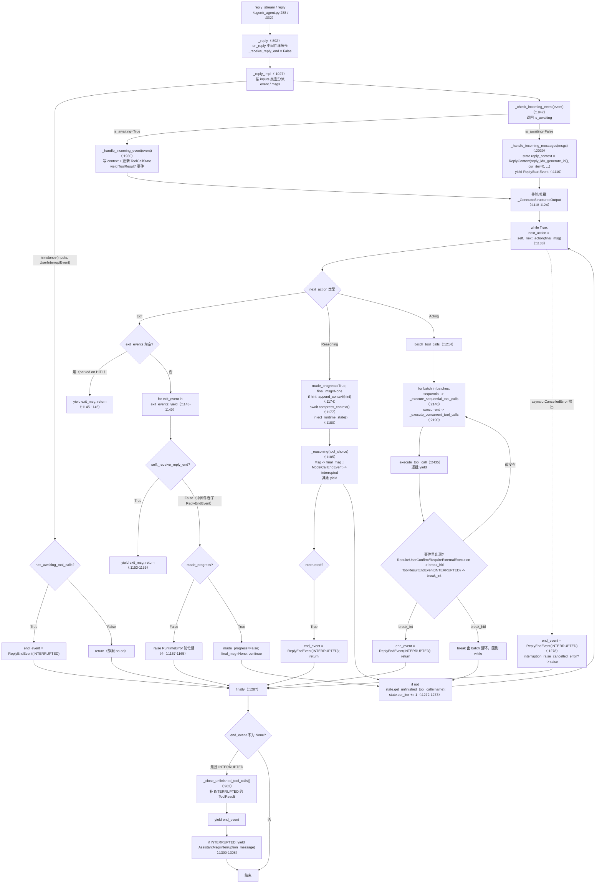

# 02 · AgentScope Agent 主循环（ReAct 执行引擎）源码侦察报告

- 侦察对象：AgentScope **2.0.8**（源码 `/Users/a/PycharmProjects/VsCode_Projects/Agentscope-Learning/third_party/agentscope/src/agentscope/`，已 `pip install -e`）
- 核心文件：`third_party/agentscope/src/agentscope/agent/_agent.py`（3925 行）
- 运行环境：`/Users/a/miniconda3/envs/agentscope_reme_pip_env/bin/python`（Python 3.11.13），LLM = `deepseek-flash`
- 所有 `已验证` 的代码片段都在本环境真实跑通，输出原样贴出。**本报告不修改 `third_party/` 下任何文件。**

---

## 子系统职责（这段代码到底在解决什么问题）

`agentscope.agent._agent.Agent` 是 AgentScope 2.0.8 里**唯一的通用 Agent 实现**（`agent/__init__.py` 只导出 `Agent` / `A2AAgent` / `RealtimeAgent`）。它承担的是 Agent Harness 里「模型外围的运行管控基础设施」这一层：把「用户输入 → 模型推理 → 工具执行 → 结果回填 → 再推理」这条 ReAct 主循环，做成一个**事件流驱动的状态机**。

它具体解决的 7 个工程问题：

1. **主循环与终止条件**：`_next_action()` 是纯函数式的状态判定器，把「下一步该做什么」压缩成三个值对象 `Reasoning` / `Acting` / `Exit`（定义在 `agent/_utils.py:26-43`）。主循环体 `_reply_impl` 只做 `match`，不含判定逻辑。这是典型的「决策与执行分离」。
2. **工具调用的完整生命周期**：输入解析与 JSON 修复 → jsonschema 校验 → 权限判定（ALLOW / ASK / DENY / PASSTHROUGH）→ 执行 → 结果截断与 offload → 写回 context → 更新 `ToolCallState`。这套流程在 `_execute_tool_call()` 里，是 3925 行里最长的一个函数（`_agent.py:2435-2721`，约 287 行）。
3. **并发编排**：同一轮模型返回的多个 tool call，按工具属性自动切成 `sequential` / `concurrent` 批次（`_batch_tool_calls()`），并发批次用 `asyncio.gather` + `asyncio.Queue` + sentinel 收敛。
4. **Human-in-the-loop（HITL）**：用户确认（`RequireUserConfirmEvent`）与外部执行（`RequireExternalExecutionEvent`）会让 reply **park 住**，等下一次 `reply_stream(...)` 传入恢复事件再续跑。断点续跑的状态全在 `AgentState` 里，天然可持久化。
5. **上下文工程**：每轮推理前自动做 context 压缩（`compress_context()`）、运行时状态注入（`_inject_runtime_state()`，注入时间/任务/上下文水位）、工具结果超长截断（`_split_tool_result_for_compression()`）。
6. **可观测性**：全链路以 `AgentEvent` 流的形式吐出来（28 种事件类型，`event/_event.py`），是 Session 事件溯源存储的上游数据源。
7. **中间件切面**：7 个挂载点（`middleware/_base.py:13-303`），onion 模式 6 个 + transformer 模式 1 个，让上述所有行为都能在不改源码的情况下被替换。

---

## 关键文件表

| 文件路径:行号 | 核心类 | 核心函数 | 一句话职责 |
|---|---|---|---|
| `third_party/agentscope/src/agentscope/agent/_agent.py:117` | `Agent` | `__init__` | 装配模型/工具/中间件/四组 config，按 hook 类型把中间件分流到 7 个列表 |
| `third_party/agentscope/src/agentscope/agent/_agent.py:288` | `Agent` | `reply_stream` | 公开流式入口，逐条 yield `AgentEvent`，`yield_final_msg=True` 时末尾补一个 `Msg` |
| `third_party/agentscope/src/agentscope/agent/_agent.py:332` | `Agent` | `reply` | 公开非流式入口，吃干事件流、只留最后一个 `Msg`；拿不到就 `RuntimeError` |
| `third_party/agentscope/src/agentscope/agent/_agent.py:381` | `Agent` | `observe` | 把外部消息写进 context（`role/content` 校验 + 多模态降级），不触发推理 |
| `third_party/agentscope/src/agentscope/agent/_agent.py:386` | `Agent` | `compress_context` | 上下文压缩的中间件外层入口 |
| `third_party/agentscope/src/agentscope/agent/_agent.py:490` | `Agent` | `_compress_context_impl` | 超阈值时生成结构化 summary，替换旧 context |
| `third_party/agentscope/src/agentscope/agent/_agent.py:892` | `Agent` | `_reply` | reply 层中间件洋葱壳；维护 `_receive_reply_end` 标志 |
| `third_party/agentscope/src/agentscope/agent/_agent.py:1027` | `Agent` | `_reply_impl` | **主循环本体**：输入分派 → ReAct while → CancelledError 兜底 → 中断收尾 |
| `third_party/agentscope/src/agentscope/agent/_agent.py:1310` | `Agent` | `_get_repeated_tool_error` | 死循环防护：连续 N 次同名同参失败 → 返回 `(tool_name, count)` |
| `third_party/agentscope/src/agentscope/agent/_agent.py:1369` | `Agent` | `_inject_runtime_state` | 注入时间/时区/任务/上下文水位/工具错误提示为 `HintBlock` |
| `third_party/agentscope/src/agentscope/agent/_agent.py:1645` | `Agent` | `_reasoning` | reasoning 层中间件洋葱壳 |
| `third_party/agentscope/src/agentscope/agent/_agent.py:1702` | `Agent` | `_reasoning_impl` | 一次模型调用：`ModelCallStart` → 流式转事件 → `ModelCallEnd` → 存 context → 可能吐 `Msg` |
| `third_party/agentscope/src/agentscope/agent/_agent.py:1847` | `Agent` | `_check_incoming_event` | 校验「传进来的恢复事件」是否和「正在等的事件」匹配，不匹配就 `ValueError` |
| `third_party/agentscope/src/agentscope/agent/_agent.py:1930` | `Agent` | `_handle_incoming_event` | 消费确认结果/外部执行结果，写 context、更新 state，并 yield 工具结果事件 |
| `third_party/agentscope/src/agentscope/agent/_agent.py:2039` | `Agent` | `_handle_incoming_messages` | 校验用户消息（禁 system / tool_call / tool_result / thinking），不支持的多模态降级为文本 |
| `third_party/agentscope/src/agentscope/agent/_agent.py:2100` | `Agent` | `_batch_tool_calls` | 按 `is_concurrency_safe` 连续切批，未注册工具当并发 |
| `third_party/agentscope/src/agentscope/agent/_agent.py:2140` | `Agent` | `_execute_sequential_tool_calls` | 顺序执行，遇 HITL 或 INTERRUPTED 就 break |
| `third_party/agentscope/src/agentscope/agent/_agent.py:2190` | `Agent` | `_execute_concurrent_tool_calls` | `gather` + `Queue` + sentinel，失败不取消兄弟任务，末尾抛 `ExceptionGroup` |
| `third_party/agentscope/src/agentscope/agent/_agent.py:2322` | `Agent` | `_into_queue` | 单个 tool call 的事件搬运工 |
| `third_party/agentscope/src/agentscope/agent/_agent.py:2344` | `Agent` | `_check_permission` | 权限检查的中间件洋葱壳（入参深拷贝） |
| `third_party/agentscope/src/agentscope/agent/_agent.py:2416` | `Agent` | `_check_permission_impl` | 已 ALLOWED 的直接短路；否则交给 `PermissionEngine` |
| `third_party/agentscope/src/agentscope/agent/_agent.py:2435` | `Agent` | `_execute_tool_call` | **工具调用全生命周期**，287 行，5 个 Step |
| `third_party/agentscope/src/agentscope/agent/_agent.py:2723` | `Agent` | `_acting` | acting 层中间件洋葱壳（唯一包住 `toolkit.call_tool` 的钩子） |
| `third_party/agentscope/src/agentscope/agent/_agent.py:2777` | `Agent` | `_acting_impl` | 直接转发 `toolkit.call_tool(tool_call, self.state)` |
| `third_party/agentscope/src/agentscope/agent/_agent.py:2807` | `Agent` | `_handle_error_tool_call` | 非流式错误结果快捷通道（tool not found / 输入校验失败 / DENY） |
| `third_party/agentscope/src/agentscope/agent/_agent.py:3214` | `Agent` | `_get_system_prompt` | 拼 system prompt + skill 指令 + workspace 指令，再过 transformer 中间件 |
| `third_party/agentscope/src/agentscope/agent/_agent.py:3239` | `Agent` | `_prepare_model_input` | 组装 `messages` / `tools`，并动态挂/摘压缩工具 |
| `third_party/agentscope/src/agentscope/agent/_agent.py:3277` | `Agent` | `_call_model` | 主模型 + fallback 模型 + `max_retries` 的调用与降级 |
| `third_party/agentscope/src/agentscope/agent/_agent.py:3401` | `Agent` | `_update_tool_call_state` | 按 id 更新**末条助手消息**里 ToolCallBlock 的状态 |
| `third_party/agentscope/src/agentscope/agent/_agent.py:3426` | `Agent` | `_save_to_context` | 写 context（过滤音频 DataBlock），并累加 usage |
| `third_party/agentscope/src/agentscope/agent/_agent.py:3498` | `Agent` | `_next_action` | **状态机核心**，260 行，返回 `Reasoning` / `Acting` / `Exit` |
| `third_party/agentscope/src/agentscope/agent/_agent.py:3760` | `Agent` | `_convert_chat_response_to_event` | `ChatResponse` chunk → 文本/思考/工具调用/数据块四类事件 |
| `third_party/agentscope/src/agentscope/agent/_agent.py:3889` | `Agent` | `_convert_tool_chunk_to_event` | `ToolChunk.content` → `ToolResultTextDeltaEvent` / `ToolResultDataDeltaEvent` |
| `third_party/agentscope/src/agentscope/agent/_config.py:51` | `ContextConfig` | — | 压缩触发比、保留比、buffer、summary schema、工具结果上限、图片上限 |
| `third_party/agentscope/src/agentscope/agent/_config.py:195` | `InjectionConfig` | — | 运行时状态注入的开关、时区、时间格式、时间间隔、重试上限与提示模板 |
| `third_party/agentscope/src/agentscope/agent/_config.py:362` | `ReActConfig` | — | `max_iters`、结构化输出宽限轮次、`stop_on_reject`、中断文案 |
| `third_party/agentscope/src/agentscope/agent/_utils.py:15` | `_ToolCallBatch` | — | `type: sequential|concurrent` + `tool_calls` |
| `third_party/agentscope/src/agentscope/agent/_utils.py:26` | `Acting` / `Reasoning` / `Exit` | — | 状态机的三个返回值 |
| `third_party/agentscope/src/agentscope/agent/_structured_output_tool.py:42` | `_GenerateStructuredOutput` | `call` | 内置工具，把模型的结构化输出落到 `reply_context.structured_output` |
| `third_party/agentscope/src/agentscope/state/_state.py:209` | `AgentState` | `append_context` / `get_awaiting_tool_calls` / `get_unfinished_tool_calls` | 会话级状态（唯一可持久化单元） |
| `third_party/agentscope/src/agentscope/state/_state.py:182` | `ReplyContext` | — | `reply_id` / `cur_iter` / `structured_schema` / `structured_output` |
| `third_party/agentscope/src/agentscope/event/_event.py:26` | `EventType` | — | 28 种事件类型的 StrEnum |
| `third_party/agentscope/src/agentscope/event/_event.py:568` | `AgentEvent` | — | 28 个事件类的 TypeAlias 联合 |
| `third_party/agentscope/src/agentscope/middleware/_base.py:13` | `MiddlewareBase` | 7 个 hook | 中间件基类；`is_implemented()` 用「基类方法 is 子类方法」判定是否实现 |

---

## 调用链

### 主循环 `_reply_impl` 完整流程图



### 逐段文字讲解

**入口层。** `reply_stream`（`_agent.py:288`）与 `reply`（`:332`）是同一条管道的两种消费方式：前者 `async for chunk in self._reply(...)`，遇到 `Msg` 时若 `yield_final_msg=False`（默认）就 `continue` 丢掉，只把事件给调用方；后者把 `Msg` 存下来，循环结束后返回，**若一个 `Msg` 都没拿到就抛 `RuntimeError("Agent did not produce a final message.")`**（`:377-378`）。这是小白第一个会踩的坑：`reply()` 在 park（HITL）场景下必然抛错。

**`_reply` 的关键设计。** 它在进入 `_reply_impl` 之前把 `self._receive_reply_end = False`（`:954`），然后在转发事件时一旦看到 `ReplyEndEvent` 就置 `True`（`:958-959`）。注释写得很清楚：「Set before the yield: the suspended `_reply_impl` checks the flag once resumed by the next pull」。也就是说，**如果中间件把 `ReplyEndEvent` 吞掉不再 yield，`_reply` 就看不到它，标志位保持 False，`_reply_impl` 就会继续跑下一轮 ReAct**。这是「中间件强制多跑一轮」的实现机制，也解释了 `_next_action` 里为什么会写「中间件连吞两次就 raise RuntimeError」（`:1157-1165`）。

**输入分派。** `_reply_impl` 把 `inputs` 拆成两条路：`UserConfirmResultEvent | UserInterruptEvent | ExternalExecutionResultEvent` 走 `event`，其余（`Msg` / `list[Msg]` / `None`）走 `msgs`（`:1050-1062`）。`UserInterruptEvent` 有一条**提前 return 短路**（`:1076-1083`）：只有当前真的 park 着 HITL 工作才产出 `ReplyEndEvent(INTERRUPTED)`，否则静默 no-op。注意它 `return` 而不是 `continue`，走 `finally` 里的统一收尾。

**状态判定与执行的分离。** 主循环体只有 `match next_action` 三段，所有判断都在 `_next_action` 里。`made_progress` 是一个防呆位：`Reasoning` 和 `Acting` 分支都会置 `True`，只有「中间件吞了 `ReplyEndEvent` 又什么都没干」的路径会把它降为 `False`，第二次就 raise。

**轮次计数。** 循环体末尾的 `if not self.state.get_unfinished_tool_calls(self.name): self.state.cur_iter += 1`（`:1272-1273`）是 `cur_iter` 唯一的自增点。`get_unfinished_tool_calls` 只统计**当前 reply_id 的那条助手消息**里「有 call 无 result」的块（`state/_state.py:374-403`）。所以「一轮」的定义是：一次推理产出的所有工具调用都拿到结果。

**收尾统一走 `finally`。** `CancelledError`、HITL 中断、`UserInterruptEvent` 三条路径都只是设置 `end_event`，真正的清理（补 INTERRUPTED 工具结果 + 发 `ReplyEndEvent` + 发兜底 `AssistantMsg`）在 `finally` 里做一次（`:1287-1308`）。**顺序很关键：`ReplyEndEvent` 先于兜底 `Msg`**，因为 `Msg` 会终止流（注释 `:1301`「The fallback msg goes last: Msg terminates the stream」）。

### `_next_action` 状态机（Reasoning / Acting / Exit 三种走向怎么判定）

`_next_action(final_msg)`（`_agent.py:3498-3758`）是**只读**的（docstring 原话：「Read-only: all side effects are performed by the caller `_reply_impl`」）。判定顺序：

**Step 1 — 有没有可执行的 tool call（最高优先级）**
```python
awaiting_tool_calls = self.state.get_awaiting_tool_calls(self.name)
last_msg = self._get_last_msg()
if last_msg is not None:
    finished_ids = {_.id for _ in last_msg.get_content_blocks("tool_result")}
    executable_tool_calls = [
        _
        for _ in last_msg.get_content_blocks("tool_call")
        if _.id not in finished_ids
        and (
            _.state == ToolCallState.ALLOWED
            or (_.state == ToolCallState.PENDING and not awaiting_tool_calls)
        )
    ]
    if executable_tool_calls:
        return Acting(tool_calls=executable_tool_calls)
```
（`:3508-3532`。**一旦有可执行工具就直接 `Acting`，哪怕 `final_msg` 已经有了** —— 这是「工具优先于文本」的硬规则。）

**Step 1.5 — 有 awaiting 但没可执行的 → park**
```python
if awaiting_tool_calls:
    return Exit(exit_events=None, exit_msg=AssistantMsg(..., content="I'm waiting for your permission or the external execution to finish."))
```
（`:3534-3546`。`exit_events=None` 是「park」的信号位，主循环见 `if not exit_events:` 就 `yield exit_msg; return`。）

**Step 2 — 结构化输出的两个分支**

| 条件 | 走向 |
|---|---|
| `required and satisfied` | `Exit(exit_events=[ReplyEndEvent(COMPLETED)], exit_msg=AssistantMsg(structured_output=...))`（`:3556-3576`） |
| `required and not satisfied`，且 `cur_iter >= max_iters + structured_output_grace_iters` | `Exit([ExceedMaxItersEvent, ReplyEndEvent(EXCEED_MAX_ITERS)], ...)`（`:3588-3620`） |
| `required and not satisfied`，且 `cur_iter >= max_iters` | `Reasoning(hint=..., tool_choice=ToolChoice(mode="GenerateStructuredOutput"))`（`:3622-3651`） |
| `required and not satisfied`，否则 | `Reasoning(hint=..., tool_choice=None)`（`:3635-3651`） |

`required = self.state.reply_context.structured_schema is not None`，`satisfied = self.state.reply_context.structured_output is not None`（`:3553-3554`）。

**Step 3 — 收尾还是继续推理**

| 条件 | 走向 |
|---|---|
| `final_msg is not None` 且 `cur_iter > max_iters` | `Exit([ExceedMaxItersEvent, ReplyEndEvent(EXCEED_MAX_ITERS)], final_msg)`，并 `logger.warning`（`:3658-3700`） |
| `final_msg is not None` 且 `cur_iter <= max_iters` | `Exit([ReplyEndEvent(COMPLETED)], final_msg)`（同上分支） |
| `cur_iter == max_iters`（还没强制收尾） | `Reasoning(hint="You have reached the maximum of N reasoning-acting iterations. Summarize...", tool_choice=ToolChoice(mode="none"))`（`:3704-3718`） |
| `cur_iter >= max_iters`（强制收尾后仍无 `final_msg`） | `Exit([ExceedMaxItersEvent, ReplyEndEvent(EXCEED_MAX_ITERS)], AssistantMsg("The maximum reasoning-acting iterations are exceeded."))`（`:3722-3755`） |
| 其他 | `Reasoning()`（空 hint、`tool_choice=None`，`:3758`） |

**关键点**：`max_iters` 不是「硬砍」，而是一个**两段式**：`cur_iter == max_iters` 时先给模型**一次**带 `tool_choice="none"` 的强制收尾机会（这段注释在 `:3702-3703`：「At equality, the regular iteration budget is exhausted, but the one forced finalization call has not run yet.」）；只有这次收尾也失败才走 `EXCEED_MAX_ITERS`。

---

## 关键数据结构

### `_utils.py` 的三个状态机返回值（`third_party/agentscope/src/agentscope/agent/_utils.py:26-43`）

```python
class Acting(BaseModel):
    """Next action: execute the given tool calls."""

    tool_calls: list[ToolCallBlock]


class Reasoning(BaseModel):
    """Next action: another model call, with optional hint and tool choice."""

    hint: HintBlock | None = None
    tool_choice: ToolChoice | None = None


class Exit(BaseModel):
    """Next action: end the reply."""

    exit_msg: Msg
    exit_events: list[AgentEvent] | None = None
```

讲解：
- `Acting.tool_calls` 是**扁平列表**，批次切分是 `_reply_impl` 拿到之后才做的（`_batch_tool_calls`），不在返回值里。这是刻意的：`_next_action` 保持纯判定，不做 I/O（`tool.is_concurrency_safe` 需要 `await self.toolkit.get_tool()`，是异步 I/O）。
- `Exit.exit_events` 用 `None` / `list` 区分「park 住」和「真结束」。`None` → park；空列表 `[]` 的语义没有被使用（代码里判断是 `if not exit_events:`，所以 `[]` 也会走 park 分支，但源码里从没构造过 `[]`）。
- `Exit.exit_msg` 是必填的。park 时它是那句 "I'm waiting for your permission..."。

### `_ToolCallBatch`（`third_party/agentscope/src/agentscope/agent/_utils.py:15-23`）

```python
@dataclass
class _ToolCallBatch:
    """A batch of tool calls that execute either sequentially or
    concurrently."""

    type: Literal["sequential", "concurrent"]
    """The batch type"""
    tool_calls: list[ToolCallBlock]
    """The list of tool calls in the batch."""
```

### `AgentState` / `ReplyContext`（`third_party/agentscope/src/agentscope/state/_state.py:182-296`）

```python
class ReplyContext(BaseModel):
    """The context of the current agent reply."""

    reply_id: str = Field(default_factory=_generate_id)
    cur_iter: int = 0
    structured_schema: Type[BaseModel] | dict | None = None

    @field_serializer("structured_schema")
    def _serialize_structured_schema(self, value):
        return value.model_json_schema() if isinstance(value, type) else value

    structured_output: dict | None = None
```

```python
class AgentState(BaseModel):
    session_id: str = Field(default_factory=_generate_id)
    summary: str | list[TextBlock | DataBlock] = ""
    context: list[Msg] = Field(default_factory=list)
    reply_context: ReplyContext = Field(default_factory=ReplyContext)
    permission_context: PermissionContext = Field(default_factory=PermissionContext)
    tool_context: ToolContext = Field(default_factory=ToolContext)
    tasks_context: TaskContext = Field(default_factory=TaskContext)
    middle_context: dict[str, Any] = Field(default_factory=dict)
```

讲解：
- `AgentState` 是 `BaseModel`，**整个对象就是可持久化的会话快照**。`reply_id` / `cur_iter` 是两个 `@property` 转发到 `reply_context`（`:243-263`），加上一个 `model_validator(mode="before")` 做旧格式迁移（`:226-241`）——这就是「事件溯源 + 断点续跑」在 Agent 层的落点。
- `middle_context: dict[str, Any]` 是留给中间件跨 reply 存数据的槽位。
- `append_context(name, blocks)`（`:298-326`）的聚合规则很关键：**只有当末条消息 `role=="assistant" and name==agent_name and id==reply_id` 时才 extend，否则新起一条 `Msg(id=self.reply_id, role="assistant", name=name)`**。这保证「一个 reply = 一条助手消息」。

### `ToolCallState`（`third_party/agentscope/src/agentscope/message/_block.py:128-135`）

```python
class ToolCallState(StrEnum):
    PENDING = "pending"      # 还没过权限系统
    ASKING = "asking"        # 在等用户确认
    ALLOWED = "allowed"      # 已允许，等执行
    SUBMITTED = "submitted"  # 已提交外部执行，等结果
    FINISHED = "finished"    # 生命周期结束
```

### 7 个中间件分流列表（`_agent.py:218-240`）

`__init__` 里按 `_.is_implemented("on_xxx")` 一次性把 `middlewares` 分到 7 个列表；`_reply_middlewares` / `_reasoning_middlewares` / `_check_permission_middlewares` / `_acting_middlewares` / `_model_call_middlewares` / `_system_prompt_middlewares` / `_compress_context_middlewares`。`is_implemented` 的实现（`middleware/_base.py:55-66`）是 `getattr(MiddlewareBase, hook_name) is not getattr(type(self), hook_name)`，**靠方法对象身份比较**，所以基类方法必须保持 `raise RuntimeError` 的占位实现。

---

## 源码精读

### 片段 1：`_reply_impl` 的主循环骨架（`third_party/agentscope/src/agentscope/agent/_agent.py:1130-1273`）

```python
            final_msg: Msg | None = None
            # Detects middlewares swallowing the ReplyEndEvent repeatedly
            # without any reasoning/acting in between (a busy loop)
            made_progress = True
            while True:
                next_action = self._next_action(final_msg)

                match next_action:
                    case Exit(exit_msg=exit_msg, exit_events=exit_events):
                        if not exit_events:
                            # Parked on HITL: the reply is not finished, so
                            # the continuation protocol doesn't apply
                            yield exit_msg
                            return

                        for exit_event in exit_events:
                            yield exit_event

                        # Exit unless a middleware swallowed the ReplyEndEvent
                        # to force another reasoning-acting round
                        if self._receive_reply_end:
                            yield exit_msg
                            return

                        if not made_progress:
                            raise RuntimeError(
                                "A middleware swallowed the ReplyEndEvent "
                                "twice without any reasoning/acting in "
                                "between. Unblock the next round (e.g. "
                                "adjust 'cur_iter', 'max_iters' or the "
                                "structured output state) before swallowing "
                                "the event again.",
                            )
                        made_progress = False
                        final_msg = None
                        continue

                    case Reasoning(hint=hint, tool_choice=tool_choice):
                        made_progress = True
                        final_msg = None
                        if hint:
                            self.state.append_context(self.name, [hint])

                        await self.compress_context()
                        async for evt in self._inject_runtime_state():
                            yield evt

                        interrupted = False
                        async for evt in self._reasoning(tool_choice=tool_choice):
                            if isinstance(evt, Msg):
                                final_msg = evt
                                continue

                            if isinstance(evt, ModelCallEndEvent):
                                interrupted = (
                                    evt.finished_reason == FinishedReason.INTERRUPTED
                                )

                            yield evt

                        if interrupted:
                            end_event = ReplyEndEvent(
                                session_id=self.state.session_id,
                                reply_id=self.state.reply_id,
                                finished_reason=ReplyFinishedReason.INTERRUPTED,
                            )
                            return
```

这段在干什么：
1. **`Reasoning` 分支的隐藏顺序**：`hint` 先写进 context（`append_context`，不 emit 事件）→ `await self.compress_context()` → `_inject_runtime_state()` → 最后才 `_reasoning()`。顺序不能乱，因为 `compress_context` 会改 context，而 `_inject_runtime_state` 里的「上下文水位」维度依赖 `state.cur_iter == 0`。
2. **`Msg` 不是事件**：`_reasoning` 生成器可能吐 `Msg`（候选最终消息），这里把它截下来存到 `final_msg`，**不 yield 给用户**。`_next_action(final_msg)` 下一轮才决定它是不是真的最终答案。这个「候选」语义是小白最容易读错的地方之一。
3. **`interrupted` 只认 `ModelCallEndEvent.finished_reason == FinishedReason.INTERRUPTED`**（`model/_model_response.py:22-29`），不是任意异常。
4. `Exit` 分支的 `made_progress` 是**从 `True` 开始**的（`:1133`），只有跑过一轮之后才会在继续循环时被置 `False`。

### 片段 2：`_execute_tool_call` 的 5 个 Step（`third_party/agentscope/src/agentscope/agent/_agent.py:2480-2530`）

```python
        # ===================================================================
        # Step 1: Check and parse the tool call input:
        #  - if failed, directly return the error message to the agent
        #  - if success, continue to permission checking and tool execution
        # ===================================================================
        try:
            tool = await self.toolkit.check_tool_available(
                tool_call.name,
                self.state.tool_context.activated_groups,
            )
            parsed_input = _json_loads_with_repair(
                tool_call.input,
                tool.input_schema,
            )
            try:
                jsonschema.validate(parsed_input, tool.input_schema)
            except jsonschema.ValidationError as e:
                raise AgentOrientedException(
                    f"Input validation failed for tool '{tool_call.name}': "
                    f"{e.message} (at {e.json_path})",
                ) from e
        except AgentOrientedException as e:
            async for evt in self._handle_error_tool_call(
                tool_call,
                e.message,
                state=ToolResultState.ERROR,
            ):
                yield evt
            return

        # ===================================================================
        # Step 2: Check permission by toolkit and permission engine
        # ===================================================================
        decision = await self._check_permission(tool_call, tool, parsed_input)
```

讲解：
- `_json_loads_with_repair`（`_utils/_common.py`）会**修复模型吐出的坏 JSON**（少引号、截断等），这是生产级 Harness 的必备容错。修复不了才抛。
- **工具不存在不抛异常给上层**，而是转成一条 `ToolResultState.ERROR` 的工具结果喂回模型，让模型自己改（实测输出：`ToolNotFoundError: The tool named 'unknown_tool' doesn't exist.`）。这是「Agent 自我纠错」而非「框架崩掉」的典型设计。
- `jsonschema.validate` 用的是工具的 `input_schema`，**不是 pydantic 强类型**，所以额外校验错误也变成工具结果。

### 片段 3：权限三分支（`third_party/agentscope/src/agentscope/agent/_agent.py:2536-2622`）

```python
        # Case 1: Ask for user confirmation if needed
        if decision.behavior in [
            PermissionBehavior.ASK,
            PermissionBehavior.PASSTHROUGH,
        ]:
            is_safety_ask = (
                decision.behavior == PermissionBehavior.ASK
                and decision.bypass_immune
            )
            if kept_rules is not None and not is_safety_ask:
                for rule in kept_rules:
                    if rule.tool_name != tool.name:
                        continue
                    if await _execute_async_or_sync_func(
                        tool.match_rule, rule.rule_content, parsed_input,
                    ):
                        return
            if kept_rules is not None:
                kept_rules.extend(decision.suggested_rules or [])

            # **Note** the update must be done before yielding the event
            self._update_tool_call_state(tool_call.id, ToolCallState.ASKING)
            tool_call.suggested_rules = decision.suggested_rules or []
            yield RequireUserConfirmEvent(
                reply_id=self.state.reply_id,
                tool_calls=[tool_call],
            )
            return

        # Case 2: Denied by the permission system
        if decision.behavior == PermissionBehavior.DENY:
            async for evt in self._handle_error_tool_call(
                tool_call, decision.message, state=ToolResultState.DENIED,
            ):
                yield evt
            return

        # Case 3: Allowed by the permission system
        if decision.behavior == PermissionBehavior.ALLOW:
            self._update_tool_call_state(tool_call.id, ToolCallState.ALLOWED)
            yield ToolResultStartEvent(...)
            if tool.is_external_tool:
                self._update_tool_call_state(tool_call.id, ToolCallState.SUBMITTED)
                yield RequireExternalExecutionEvent(
                    reply_id=self.state.reply_id, tool_calls=[tool_call],
                )
                return
            async for chunk in self._acting(tool_call):
                ...
```

讲解：
- **`self._update_tool_call_state(...)` 必须在 `yield` 之前**（源码里两处注释专门强调这点：`:2570-2571` 与 `:2610-2613`），因为外层循环拿到事件就 `break`，`yield` 之后的代码不会执行。这是**小白最大的坑**：状态更新写在 `yield` 后面会永久丢失。
- `kept_rules` 是并发批次内的**确认去重**累加器，只有 `_execute_concurrent_tool_calls` 传（`_into_queue` → `_execute_tool_call`）。顺序执行传 `None`，因为顺序执行第一条 ASK 就 park 了，不存在同批第二次确认。
- `PASSTHROUGH` 和 `ASK` 走同一分支 —— 注意这不是笔误，`PASSTHROUGH` 的语义就是「交给用户决定」。
- `tool.is_external_tool` 时**只发 `RequireExternalExecutionEvent` 就 return**，绝不落 `_acting`。

### 片段 4：并发执行的队列收敛（`third_party/agentscope/src/agentscope/agent/_agent.py:2244-2320`）

```python
        sentinel = object()
        queue: Queue = Queue()
        kept_rules: list[PermissionRule] = []

        async def _run_all() -> list[BaseException | None]:
            results = await asyncio.gather(
                *[self._into_queue(tc, queue, kept_rules) for tc in tool_calls],
                return_exceptions=True,
            )
            # The sentinel is placed AFTER gather returns, which guarantees
            # that every queue.put inside _into_queue has already completed.
            await queue.put(sentinel)
            return results

        gather_task = asyncio.create_task(_run_all())

        try:
            while True:
                event = await queue.get()
                if event is sentinel:
                    break
                yield event
        except asyncio.CancelledError:
            gather_task.cancel()
            try:
                await gather_task
            except asyncio.CancelledError:
                pass
            while True:
                try:
                    event = queue.get_nowait()
                except asyncio.QueueEmpty:
                    break
                if event is sentinel:
                    continue
                yield event
            asyncio.current_task().uncancel()
            return

        results = await gather_task
        exceptions = [r for r in results if isinstance(r, Exception)]
        if exceptions:
            raise ExceptionGroup(
                "One or more tool calls raised an exception", exceptions,
            )
```

讲解：
- **sentinel 放在 `gather` 返回之后 `put`**，这是「事件流完整性」的保证：收到 sentinel 就意味着所有 worker 的 `queue.put` 都已经完成。这是一个非常精炼的并发事件收敛模式，值得在自己的 harness_kit 里照抄。
- `return_exceptions=True`：**一个工具失败不取消兄弟任务**，全部跑完再一起以 `ExceptionGroup` 抛出。这是个激进但有道理的选择（部分成功的副作用不应该被回滚）。
- `CancelledError` 分支先 `cancel()` + `await` 掉 `gather_task`（避免孤儿任务），再把队列里残余事件 `get_nowait()` 冲刷给调用方，最后 `asyncio.current_task().uncancel()` 把 cancel 吃掉让生成器正常返回。调用方靠冲刷出来的 `ToolResultEndEvent(state=INTERRUPTED)` 识别中断，而不是靠异常。

### 片段 5：`_get_repeated_tool_error` 死循环检测（`third_party/agentscope/src/agentscope/agent/_agent.py:1320-1367`）

```python
        last_msg = self._get_last_msg()
        if last_msg is None:
            return None

        # The agent is only stuck when the latest tool call fails
        results = last_msg.get_content_blocks("tool_result")
        if not results or results[-1].state != ToolResultState.ERROR:
            return None

        tool_name = results[-1].name
        streak = []
        for result in reversed(results):
            if result.state != ToolResultState.ERROR or result.name != tool_name:
                break
            streak.append(result.id)

        limit = self.injection_config.tool_retries_limit
        if len(streak) < limit:
            return None

        inputs = {_.id: _.input for _ in last_msg.get_content_blocks("tool_call")}
        arguments = []
        for block_id in streak:
            raw = inputs.get(block_id, "")
            try:
                arguments.append(json.dumps(json.loads(raw), sort_keys=True))
            except (TypeError, ValueError):
                arguments.append(raw.strip())

        count = 0
        for value in arguments:
            if value != arguments[0]:
                break
            count += 1

        if count < limit:
            return None
        return tool_name, count
```

讲解：
- **两级判定**：先看「同名连续失败数 ≥ limit」，再看「参数归一化后连续相同数 ≥ limit」。中间 `json.dumps(json.loads(raw), sort_keys=True)` 是**参数归一化**（实测 `{"text": "a", "n": 1}` / `{"n": 1, "text": "a"}` / `{ "text" : "a" , "n" : 1 }` 三种写法都判定为同一个参数），坏 JSON 则 `raw.strip()` 原样比较。
- 触发后**只注入 hint，不硬停**（`_inject_runtime_state` Step 5，`:1603-1615`）。实测：模型在强提示下连续失败 8 次、每次都被注入提示，直到 `max_iters` 才被 `EXCEED_MAX_ITERS` 砍停。这是一个重要的**教学点**：死循环防护 ≠ 熔断，真正的熔断器是 `max_iters`。

### 片段 6：`_next_action` 里的「工具优先于文本」硬规则（`third_party/agentscope/src/agentscope/agent/_agent.py:3508-3532`）

```python
        awaiting_tool_calls = self.state.get_awaiting_tool_calls(self.name)

        last_msg = self._get_last_msg()
        if last_msg is not None:
            # In case wrong tool call state, first filter with the results
            finished_ids = {
                _.id for _ in last_msg.get_content_blocks("tool_result")
            }
            # With awaiting tool calls, PENDING ones are blocked (e.g.
            # deduplicated in a batch) and wait; only ALLOWED ones execute
            executable_tool_calls = [
                _
                for _ in last_msg.get_content_blocks("tool_call")
                if _.id not in finished_ids
                and (
                    _.state == ToolCallState.ALLOWED
                    or (
                        _.state == ToolCallState.PENDING
                        and not awaiting_tool_calls
                    )
                )
            ]
            if executable_tool_calls:
                return Acting(tool_calls=executable_tool_calls)
```

讲解：
- `finished_ids` 是「就算 state 被人改错了，只要有 result 就不再执行」的二次保险（注释原话：「In case wrong tool call state, first filter with the results」）。
- `PENDING` 只有在**没有任何 awaiting** 时才可执行；这是为了让并发批次里被去重、仍留在 `PENDING` 的调用「等下一次 reply 再评估」。

### 片段 7：`_reply_impl` 的 HITL 中断检测（`third_party/agentscope/src/agentscope/agent/_agent.py:1212-1273`）

```python
                    case Acting(tool_calls=tool_calls):
                        made_progress = True
                        for batch in await self._batch_tool_calls(tool_calls):
                            if batch.type == "sequential":
                                evt_generator = self._execute_sequential_tool_calls(
                                    batch.tool_calls,
                                )
                            elif batch.type == "concurrent":
                                evt_generator = self._execute_concurrent_tool_calls(
                                    batch.tool_calls,
                                )
                            else:
                                raise ValueError(f"Invalid batch type: {batch.type}")

                            break_execution_for_hitl = False
                            break_execution_for_interruption = False
                            async for evt in evt_generator:
                                yield evt
                                if isinstance(evt, (RequireUserConfirmEvent,
                                                    RequireExternalExecutionEvent)):
                                    break_execution_for_hitl = True
                                elif (isinstance(evt, ToolResultEndEvent)
                                      and evt.state == ToolResultState.INTERRUPTED):
                                    break_execution_for_interruption = True

                            if break_execution_for_interruption:
                                end_event = ReplyEndEvent(..., INTERRUPTED)
                                return

                            if break_execution_for_hitl:
                                break

                if not self.state.get_unfinished_tool_calls(self.name):
                    self.state.cur_iter += 1
```

讲解：
- **HITL 是 `break` 出 batch 循环然后回到 `while`**，让 `_next_action` 在下一轮看到 `awaiting_tool_calls` 并产出 `Exit(exit_events=None)` 实现 park。中断（INTERRUPTED）是直接 `return`。两者路径不同，别搞混。
- **注意 `cur_iter += 1` 在 `break` 出去时也会执行**：因为 `break` 跳出的是 `for batch` 而不是 `while`，所以 park 时 `cur_iter` 照样加 1。实测（脚本 07）：确认流程第一轮 + 第二轮结束后 `cur_iter = 2`。

### 片段 8：`_handle_error_tool_call`（`third_party/agentscope/src/agentscope/agent/_agent.py:2838-2876`）

```python
        yield ToolResultStartEvent(
            reply_id=self.state.reply_id,
            tool_call_id=tool_call.id,
            tool_call_name=tool_call.name,
        )

        result = ToolChunk(content=[TextBlock(text=message)], state=state)

        # Return the result directly to the agent
        self._save_to_context(
            [
                ToolResultBlock(
                    id=tool_call.id,
                    name=tool_call.name,
                    output=message,
                    state=state,
                ),
            ],
        )

        async for evt in self._convert_tool_chunk_to_event(
            tool_call.id, result.content,
        ):
            yield evt

        yield ToolResultEndEvent(
            reply_id=self.state.reply_id,
            tool_call_id=tool_call.id,
            state=state,
        )

        self._update_tool_call_state(tool_call.id, ToolCallState.FINISHED)
```

讲解：这是所有「非正常路径」的统一出口（工具找不到 / 输入校验失败 / 权限 DENY / 用户拒绝）。它保证**每条 tool call 都必然有一段完整的 START → DELTA → END 事件**，前端不需要为错误路径写特例。`_update_tool_call_state(..., FINISHED)` 放在最后，因为这里不用 park 所以不担心 `yield` 后代码不执行。

---

## 可运行代码片段

所有脚本位于 `tutorial_agsc_reme/_recon/code/`。统一跑法：

```bash
/Users/a/miniconda3/envs/agentscope_reme_pip_env/bin/python \
  /Users/a/PycharmProjects/VsCode_Projects/Agentscope-Learning/tutorial_agsc_reme/_recon/code/<脚本名>.py
```

### 片段 A【已验证】最小两步工具任务 + 完整事件流

文件：`tutorial_agsc_reme/_recon/code/06_agent_loop_two_step.py`

```python
import asyncio, os
from pathlib import Path
from dotenv import load_dotenv

REPO = Path("/Users/a/PycharmProjects/VsCode_Projects/Agentscope-Learning")
load_dotenv(REPO / ".env")

from agentscope.agent import Agent, ReActConfig
from agentscope.credential import DeepSeekCredential
from agentscope.message import Msg, UserMsg
from agentscope.model import DeepSeekChatModel
from agentscope.tool import FunctionTool, Toolkit


async def get_secret_number() -> str:
    """Get the secret number stored in the vault.

    Returns:
        `str`: the secret number as a plain string.
    """
    return "7"


async def multiply_by_two(number: int) -> str:
    """Multiply the given integer by two.

    Args:
        number (`int`): the integer to multiply.

    Returns:
        `str`: the doubled value.
    """
    return str(number * 2)


async def main() -> None:
    model = DeepSeekChatModel(
        credential=DeepSeekCredential(
            api_key=os.environ["OPENAI_API_KEY"],
            base_url=os.environ["OPENAI_BASE_URL"],
        ),
        model=os.environ["LLM_MODEL"],
        stream=True,
        parameters=DeepSeekChatModel.Parameters(max_tokens=1024),
    )
    toolkit = Toolkit(
        tools=[
            # is_read_only=True 走权限引擎的 read-only 快速通道，免去用户确认
            FunctionTool(get_secret_number, is_read_only=True),
            FunctionTool(multiply_by_two, is_read_only=True),
        ],
    )
    agent = Agent(
        name="assistant",
        system_prompt="你是一个会把任务拆成步骤的中文助手。需要用工具时就直接调用工具，不要在文字里编造工具结果。",
        model=model,
        toolkit=toolkit,
        react_config=ReActConfig(max_iters=6),
    )
    async for item in agent.reply_stream(
        UserMsg("user",
                "任务分两步：第一步调用 get_secret_number 拿到秘密数字，"
                "第二步把这个数字作为参数调用 multiply_by_two。"
                "最后用一句中文告诉我翻倍后的结果。"),
        yield_final_msg=True,
    ):
        print(type(item).__name__ if not isinstance(item, Msg) else repr(item.get_text_content()))

asyncio.run(main())
```

**真实输出（节选，完整事件流 66 条，此处按语义分组压缩）**：

```
[001] ReplyStartEvent
[002] HintBlockEvent hint='<system-reminder>...<current-time>2026-09-21T08:41:40</current-time>\n<timezone>UTC</timezone>\n</system-reminder>'
[003] ModelCallStartEvent
[004] TextBlockStartEvent
[005..013] TextBlockDeltaEvent delta='I' ... 'secret number.'
[014] TextBlockEndEvent
[015] ToolCallStartEvent tool=get_secret_number id=call_00_kb6K45feSXp0EN9eCIGP6820
[016...017] ToolCallDeltaEvent delta='' / '{}'
[018] ToolCallEndEvent
[019] ModelCallEndEvent in=445 out=31 cache=256 reason=completed
[020] ToolResultStartEvent
[021] ToolResultTextDeltaEvent delta='7'
[022] ToolResultEndEvent state=success
[023] ModelCallStartEvent
[024..033] TextBlock* 'Now I'll multiply it by two.'
[034] ToolCallStartEvent tool=multiply_by_two id=call_00_sZQTveNBmk4cfqBfinSp5310
[035...042] ToolCallDeltaEvent delta='' '{' '"' 'number' '"' ': ' '7' '}'
[043] ToolCallEndEvent
[044] ModelCallEndEvent in=489 out=46 cache=256 reason=completed
[045] ToolResultStartEvent
[046] ToolResultTextDeltaEvent delta='14'
[047] ToolResultEndEvent state=success
[048] ModelCallStartEvent
[049..063] TextBlock* '秘密数字是 7，翻倍后的结果是 14。'
[064] ModelCallEndEvent in=548 out=13 cache=384 reason=completed
[065] ReplyEndEvent reason=completed
[066] Msg role=assistant name=assistant text='秘密数字是 7，翻倍后的结果是 14。' finished_reason=completed

state.reply_id    = 54fca80c77bd4f039c1deec2fbe519bb
state.cur_iter    = 3
len(context)      = 2
  context[0] role=user name=user blocks=['TextBlock']
  context[1] role=assistant name=assistant blocks=['HintBlock', 'TextBlock', 'ToolCallBlock', 'ToolResultBlock', 'TextBlock', 'ToolCallBlock', 'ToolResultBlock', 'TextBlock']
final.usage       = input_tokens=1482 output_tokens=90 cache_input_tokens=896 cache_creation_input_tokens=0
```

**这张输出把整套 Harness 的结构暴露得很清楚**：3 次模型调用（`cur_iter = 3`）、2 次工具调用、`context` 里只有 2 条 Msg 但第 2 条里塞了 8 个 block（`HintBlock` 是注入的运行时状态、两组 `ToolCallBlock`+`ToolResultBlock`、3 段 `TextBlock`）。**「一个 reply = 一条助手消息」的聚合规则在此得到验证。**

### 片段 B【已验证】HITL 用户确认往返

文件：`tutorial_agsc_reme/_recon/code/07_agent_loop_hitl_confirm.py`

```python
from agentscope.event import ConfirmResult, RequireUserConfirmEvent, UserConfirmResultEvent
from agentscope.tool import FunctionTool, Toolkit

async def write_note(text: str) -> str:
    """Write a note into the notebook (a side-effecting tool).

    Args:
        text (`str`): the note content.

    Returns:
        `str`: confirmation message.
    """
    return f"note saved: {text}"

# 注意：不传 is_read_only / permission，权限引擎默认 ASK
agent = Agent(name="assistant", system_prompt="...", model=model,
              toolkit=Toolkit(tools=[FunctionTool(write_note)]),
              react_config=ReActConfig(max_iters=4))

pending = None
async for item in agent.reply_stream(UserMsg("user", "把「测试确认流程」这五个字记到笔记里。")):
    if isinstance(item, RequireUserConfirmEvent):
        pending = item

tc = pending.tool_calls[0]
resume = UserConfirmResultEvent(
    reply_id=pending.reply_id,
    confirm_results=[ConfirmResult(confirmed=True, tool_call=tc)],
)
async for item in agent.reply_stream(resume):
    print(type(item).__name__)
```

**真实输出**：

```
=== 第一轮：期望 park 在 RequireUserConfirmEvent ===
  ReplyStartEvent
  HintBlockEvent
  ModelCallStartEvent
  TextBlockStartEvent
  TextBlockDeltaEvent
  ToolCallStartEvent
  ToolCallDeltaEvent
  TextBlockEndEvent
  ToolCallEndEvent
  ModelCallEndEvent
  RequireUserConfirmEvent tool_calls=['write_note']

park 的 tool_call: write_note {"text": "测试确认流程"} state= asking
awaiting tool calls: [ToolCallBlock(type='tool_call', id='call_00_jrWbx1HxvS9XkE53llSd9701',
  name='write_note', input='{"text": "测试确认流程"}', state=<ToolCallState.ASKING: 'asking'>,
  suggested_rules=[PermissionRule(tool_name='write_note', rule_content=None,
  behavior=<PermissionBehavior.ALLOW: 'allow'>, source='suggested')], created_at=..., finished_at=None)]

=== 第二轮：回传 UserConfirmResultEvent(confirmed=True) 继续执行 ===
  ToolResultStartEvent
  ToolResultTextDeltaEvent
  ToolResultEndEvent state=success
  ModelCallStartEvent
  TextBlockStartEvent
  TextBlockDeltaEvent
  TextBlockEndEvent
  ModelCallEndEvent
  ReplyEndEvent reason=completed

state.cur_iter = 2
state.context[-1] blocks = ['HintBlock', 'TextBlock', 'ToolCallBlock', 'ToolResultBlock', 'TextBlock']
```

**关键观察**：第一轮**没有 `ReplyEndEvent`**（park 路径 `yield exit_msg; return`，而 `reply_stream` 默认不吐 Msg，所以调用方看到的就是「无 end 事件」）。这正是「会话未终止」的可观测信号。第二轮的 `ReplyEndEvent` 是 `completed`。`suggested_rules` 里的 `PermissionRule(source='suggested')` 就是 `_check_permission` 带出来的建议规则，回传时可通过 `ConfirmResult.rules` 覆盖后 `self._engine.add_rule(rule)`（`_agent.py:1985-1987`）。

### 片段 C【已验证】max_iters 耗尽 → ExceedMaxItersEvent

文件：`tutorial_agsc_reme/_recon/code/08_agent_loop_max_iters.py`（`react_config=ReActConfig(max_iters=1)`，任务本来要两次工具调用）

**真实输出**：
```
2026-09-21 16:42:38,633 | WARNING | _agent:_next_action:3672 - Agent assistant exceeds the max iteration numbers 1. Stop the react loop.
ReplyStartEvent
HintBlockEvent hint='<system-reminder>...<current-time>...</current-time>\n<timezone>UTC</timezone>\n</system-reminder>'
ModelCallStartEvent
TextBlockStartEvent
TextBlockDeltaEvent
ToolCallStartEvent
ToolCallDeltaEvent
TextBlockEndEvent
ToolCallEndEvent
ModelCallEndEvent
ToolResultStartEvent
ToolResultTextDeltaEvent
ToolResultEndEvent
ModelCallStartEvent
TextBlockStartEvent
TextBlockDeltaEvent
TextBlockEndEvent
ModelCallEndEvent
ExceedMaxItersEvent (deprecated, 仅为向后兼容)
ReplyEndEvent reason=exceed_max_iters

state.cur_iter = 2 (max_iters = 1 )
```

**关键观察**：`max_iters=1` 时，第 2 次模型调用是 `_next_action` 在 `cur_iter == max_iters` 分支给的**强制收尾调用**（带 `tool_choice="none"` + "Summarize the work" hint）。这次调用的 `HintBlock` **没有对应的 `HintBlockEvent`** —— 因为 `Reasoning.hint` 是 `append_context` 直接写进去的（`_agent.py:1173-1174`），只有 `_inject_runtime_state` 才会 emit `HintBlockEvent`（`:1637-1643`）。这是个容易困惑的点。

### 片段 D【已验证】死循环防护 `_get_repeated_tool_error`

文件：`tutorial_agsc_reme/_recon/code/09_agent_loop_dead_loop_guard.py`（工具永远 `raise RuntimeError`，system prompt 强制「参数一模一样地重试」）

**真实输出（节选，共 8 次重试）**：
```
HINT(tool-error) = "<system-reminder>Treat the following as the ground truth at this point of the conversation. Anything stated earlier is outdated, and a later reminder, if any, supersedes this one:\n<tool-error>The last 3 calls to 'broken_lookup' with the same arguments all failed. Stop retrying the same call as-is, check the error message and try a different approach.</tool-error>\n</system-reminder>"
...
HINT(tool-error) = "...The last 8 calls to 'broken_lookup' with the same arguments all failed..."
ExceedMaxItersEvent
ReplyEndEvent reason=exceed_max_iters

工具被调用次数 = 8
state.cur_iter = 9
检测函数直接返回 = ('broken_lookup', 8)
```

**关键观察**：第 3 次失败开始注入 `<tool-error>` hint，**但模型仍然重试到 `max_iters=8` 被砍**。所以「死循环防护」是软提示，不是熔断。生产环境要自己加基于 `_get_repeated_tool_error()` 的硬熔断中间件。另外这个脚本还验证了 `observe()`：`await agent.observe(UserMsg("user", "系统提示：上游服务刚刚重启过。"))` 之后 `context 长度 = 1, roles = ['user']`，确认 `observe` 只写 context 不触发推理。

### 片段 E【已验证】状态机单元测试（不调 LLM）

文件：`tutorial_agsc_reme/_recon/code/10_agent_loop_state_machine_unit.py`

直接构造 `agent.state.context` 打 `_next_action`，覆盖 13 个场景。**真实输出**：

```
=== 1. 空上下文：默认继续 reasoning ===
   hint=None tool_choice=None
=== 2. 助手消息里有 PENDING 工具调用（无 awaiting）-> Acting ===
   tool_calls=[ToolCallBlock(id='c1', name='echo', input='{"text":"a"}', state='pending', ...)]
=== 3. 工具调用已有 tool_result -> 不再是 Acting ===
   hint=None tool_choice=None
=== 4. 还有 ASKING 的调用 -> Exit(exit_events=None) 表示 park ===
   Exit exit_events = None msg = I'm waiting for your permissio
=== 5. final_msg 存在且未超 max_iters -> Exit(COMPLETED) ===
   Exit events = ['ReplyEndEvent']  ReplyEndEvent.finished_reason = completed
=== 6. cur_iter == max_iters -> 强制收尾的 Reasoning ===
   Reasoning tool_choice = mode='none' tools=None
   hint = <system-reminder>You have reached the maximum of 3 reasoning-acting iterations. Summarize the work and findings so far and return the final answer as text. Do not call any tools.</system-reminder>
=== 7. cur_iter > max_iters 且有 final_msg -> EXCEED_MAX_ITERS ===
   ['ExceedMaxItersEvent', 'ReplyEndEvent']  reason = exceed_max_iters
=== 8. cur_iter > max_iters 且无 final_msg -> EXCEED + 兜底 Msg ===
   ['ExceedMaxItersEvent', 'ReplyEndEvent']  msg = The maximum reasoning-acting iterations are exceeded.
=== 9. 需要结构化输出但未生成 -> Reasoning + 强制 tool_choice ===
   Reasoning
   cur_iter=3 时 tool_choice = mode='GenerateStructuredOutput' tools=None
=== 10. 已生成结构化输出 -> Exit(COMPLETED) + structured_output ===
   Exit structured_output = {'x': 1}
=== 11. _get_repeated_tool_error：三次同样失败 -> 命中 ===
   ('echo', 3)
   key 顺序打乱后 = ('echo', 3)
   只失败 2 次 = None
   末尾是 success = None
=== 12. append_context 聚合规则 ===
   同一 reply_id 聚合为 1 条消息，块数 = 1 2
   换 reply_id 后消息数 = 2
=== 13. _save_to_context 过滤音频 DataBlock ===
   只有音频块 -> 不写入 context，长度 = 0
```

### 片段 F【已验证】分批与并发执行

文件：`tutorial_agsc_reme/_recon/code/11_agent_loop_batching_and_concurrency.py`

**真实输出**：
```
=== 1. 分批规则 ===
  batch[0] type=concurrent calls=['slow_read', 'slow_read']
  batch[1] type=sequential calls=['write_file', 'write_file']
  batch[2] type=concurrent calls=['unknown_tool', 'slow_read']

=== 2. 并发执行：事件完成顺序由工具耗时决定 ===
  事件顺序: [('c2', 'read:b-fast'), ('c2', '<end success>'), ('c1', 'read:a-slow'), ('c1', '<end success>')]
  耗时 0.424s（并发应远小于 0.45s）

=== 3. 顺序执行：严格按列表顺序 ===
  事件顺序: [('c1', 'write:/tmp/x=1'), ('c2', 'write:/tmp/y=2')]

=== 4. 未注册工具 -> tool not found，走 _handle_error_tool_call ===
  delta = ToolNotFoundError: The tool named 'unknown_tool' doesn't exist.
  state = error
```

**关键观察**：`c1` (0.4s) 与 `c2` (0.05s) 并发，**`c2` 的事件先出来**。总耗时 0.424s ≈ max(0.4, 0.05) 而非 sum(0.45)，并发生效。**这就是「并发批次没有结果顺序保证」的实证** —— 教学时务必强调：并发批次里 tool result 写入 context 的顺序是**完成顺序**，不是 `tool_calls` 列表顺序。

### 片段 G【已验证】UserInterruptEvent 中断 parked reply

文件：`tutorial_agsc_reme/_recon/code/12_agent_loop_interrupt.py`

**真实输出**：
```
=== 第一轮：park ===
   ReplyStartEvent / HintBlockEvent / ModelCallStartEvent / TextBlock* /
   ToolCallStartEvent / ToolCallDeltaEvent / TextBlockEndEvent / ToolCallEndEvent /
   ModelCallEndEvent / RequireUserConfirmEvent
  got RequireUserConfirmEvent, reply_id = 408d15e0e88b406ea4f974fdc61177a8

=== 第二轮：不确认，直接中断 ===
   ToolResultStartEvent
   ToolResultTextDeltaEvent delta='<system-reminder>The tool call has been interrupted by the user.</system-reminder>'
   ToolResultEndEvent state=interrupted
   ReplyEndEvent reason=interrupted

=== 最终 context 的 tool_result 状态 ===
    call_00_yETu8PqoPOlWLvmersnb4591 interrupted
```

**关键观察**：中断走的是 `_close_unfinished_tool_calls()`（`_agent.py:962-1025`），它只处理**末条助手消息里「有 call 无 result」的块**，补一个 `ToolResultBlock(state=INTERRUPTED)` 并 emit 三段事件。`AskUser` 兜底 `AssistantMsg` 因为 `yield_final_msg=False` 被过滤掉了（想看它得传 `yield_final_msg=True`）。

### 片段 H【已验证】外部执行（RequireExternalExecutionEvent）

文件：`tutorial_agsc_reme/_recon/code/14_agent_loop_external_execution.py`（`tool.is_external_tool = True`）

**真实输出**：
```
=== 第一轮：park 在 RequireExternalExecutionEvent ===
   ReplyStartEvent / HintBlockEvent / ModelCallStartEvent / TextBlock* /
   ToolCallStartEvent / ToolCallDeltaEvent / TextBlockEndEvent / ToolCallEndEvent /
   ModelCallEndEvent / ToolResultStartEvent / RequireExternalExecutionEvent
  tool_call: call_remote_api {"endpoint": "/v1/ping"} state = submitted

=== 第二轮：外部执行完，回传结果 ===
   ToolResultTextDeltaEvent
   ToolResultEndEvent state=success
   ModelCallStartEvent / TextBlockStartEvent / TextBlockDeltaEvent / TextBlockEndEvent / ModelCallEndEvent
   ReplyEndEvent reason=completed

最终 context 块 = ['HintBlock', 'TextBlock', 'ToolCallBlock', 'ToolResultBlock', 'TextBlock']
```

**关键观察**：注意 `ToolResultStartEvent` 在 `RequireExternalExecutionEvent` **之前**发出（`_agent.py:2603` 先发 start，`:2618` 才发 external 事件），但 `_close_unfinished_tool_calls` 会用 `call_block.state in (ALLOWED, SUBMITTED)` 判断来避免重复发 START（`:997-1005`）。这个细节不做就等着前端出重影。

### 片段 I【已验证】ThinkingBlock 事件族

文件：`tutorial_agsc_reme/_recon/code/15_agent_loop_thinking_and_datablock.py`

`DeepSeekChatModel.Parameters(thinking_enable=True, reasoning_effort="high")` + `stream=True`：

```
=== Part A: thinking 模式 ===
  事件序列: [('ReplyStartEvent', 1), ('HintBlockEvent', 1), ('ModelCallStartEvent', 1),
            ('ThinkingBlockStartEvent', 1), ('ThinkingBlockDeltaEvent', 36), ('ThinkingBlockEndEvent', 1),
            ('TextBlockStartEvent', 1), ('TextBlockDeltaEvent', 27), ('TextBlockEndEvent', 1),
            ('ModelCallEndEvent', 1), ('ReplyEndEvent', 1)]
```

同一个脚本 Part B 直接打 `_convert_tool_chunk_to_event`：

```
=== Part B: 工具返回 DataBlock -> ToolResultDataDeltaEvent ===
  ToolResultDataDeltaEvent media_type = image/png data 长度 = 96
  ToolResultTextDeltaEvent delta = hello
  ToolResultTextDeltaEvent delta = plain
```

### 片段 J【已验证】7 个中间件挂载点

文件：`tutorial_agsc_reme/_recon/code/13_agent_loop_middleware.py`

**真实输出**：
```
reply text = 已回显：hello

中间件调用日志（按顺序）:
  01. on_reply: before
  02. on_compress_context
  03. on_system_prompt: +<trace>
  04. on_system_prompt: +<trace>
  05. on_reasoning: before tool_choice=None
  06. on_system_prompt: +<trace>
  07. on_model_call: model=deepseek-flash msgs=3 tools=1
  08. on_reasoning: after
  09. on_check_permission: echo
  10. on_check_permission: -> PermissionBehavior.ALLOW
  11. on_acting: echo
  12. on_compress_context
  13. on_system_prompt: +<trace>
  14. on_reasoning: before tool_choice=None
  15. on_system_prompt: +<trace>
  16. on_model_call: model=deepseek-flash msgs=3 tools=1
  17. on_reasoning: after
  18. on_reply: after
```

**关键观察**：
- `on_system_prompt` 在一次 reply 里被调了 **5 次**（同一轮里调了 2~3 次），因为 `_get_system_prompt()` 被 `_split_context_for_compression`、`count_tokens`、`_prepare_model_input` 分别调用。**写 `on_system_prompt` 中间件时不能有副作用**（比如计数、写日志到外部），否则会重复。
- `on_compress_context` 每轮 Reasoning 都会调一次，**即使没到压缩阈值**（`compress_context` 会自己算 token 然后 early return，`_agent.py:507-519`）。
- `on_check_permission` 的返回值是 `PermissionDecision`，`on_acting` 包住的才是真正的 I/O。

### 片段 K【已验证】工具函数返回值的两种写法（教学坑点）

```python
# 写法一（推荐）：直接返回 str，FunctionTool 会帮你包成 ToolChunk
async def get_secret_number() -> str:
    return "7"
# -> _convert_func_result_to_chunk 产出 ToolChunk(content=[TextBlock(text="7")], state=RUNNING)

# 写法二（会炸）：自己 new ToolChunk 但 content 传了字符串
async def bad() -> ToolChunk:
    return ToolChunk(content="7")
# -> pydantic ValidationError:
#    1 validation error for ToolChunk
#    content
#      Input should be a valid list [type=list_type, input_value='7', input_type=str]
#    模型会看到这个错误并陷入重试，最终 EXCEED_MAX_ITERS
```

**这是我在本任务中真实踩到的坑**（第一次跑 06 脚本时工具报这个错，模型连续重试 2 次后放弃）。`ToolChunk.content` 的类型是 `List[TextBlock | DataBlock]`（`tool/_response.py:31`），而 `FunctionTool._convert_func_result_to_chunk` 只在**返回值本身不是 ToolChunk 时**才做 str→TextBlock 的包装（`tool/_adapters.py:180-192`）。

---

## 教学要点（按「小白最容易卡住」排序）

1. **`Msg` 不是事件流的一部分**。`_reasoning` 可能吐出候选 `Msg`，`_reply_impl` 把它存在 `final_msg` 变量里**不 forward**，交给 `_next_action(final_msg)` 下一轮判定。`reply_stream` 里看到的 `Msg` 只有两种来源：① `yield_final_msg=True` 时最后的胜利者；② 中断时的兜底 `AssistantMsg`。**永远不要把「收到 RespondStartEvent 没收到 Msg」当成 bug**。
2. **`yield` 之前必须把状态改掉**。`_execute_tool_call` 里 `_update_tool_call_state(..., ASKING)` 和 `(..., SUBMITTED)` 都写在 `yield` 之前，注释专门标了 `**Note** the update must be done before yielding the event`（`:2570`、`:2610`）。原因：外层 `for batch` 循环收到 HITL 事件就 `break`，`yield` 之后的代码永不执行。
3. **`max_iters` 是「两段式」不是「一刀切」**。`cur_iter == max_iters` 时还会给模型一次 `tool_choice="none"` 的强制收尾调用；只有 `cur_iter > max_iters` 才 `EXCEED_MAX_ITERS`。所以正常收尾的 reply 里 `cur_iter` 会等于 `max_iters + 1`，看到别惊讶（`:3659-3663` 的注释就是这个意思）。
4. **`Exit(exit_events=None)` ≡ park**，主循环见 `if not exit_events:` 就 `yield exit_msg; return`。所以「reply 结束了没」的唯一可靠信号是 **是否收到 `ReplyEndEvent`**，不是「循环退出了没」，也不是「收到 Msg 了没」。
5. **`_next_action` 里 `Acting` 优先级高于 `final_msg`**。只要末条助手消息里有「无 result 且可执行」的 tool call，哪怕模型这次也吐了纯文本，也先执行工具。这是「工具优先于文本」的硬编码策略（`:3518-3532`）。
6. **并发批次没有结果顺序保证**。`asyncio.Queue` 消费顺序 = 各工具完成顺序。实测 `c1`(0.4s) 后于 `c2`(0.05s) 出结果。教学里要明确：**不要把「工具结果写入 context 的顺序」当作可以依赖的语义**。
7. **`observe()` 不触发推理**。它只做「校验 + 写 context」，是「把外部世界的事实告诉 Agent」的入口，区别于 `reply()` 的「让 Agent 干活」。
8. **`reply()` 在 park 场景必然抛 `RuntimeError`**。因为 park 路径一个 `Msg` 都不产出（`yield exit_msg; return`，而 `reply_stream` 默认把 Msg 过滤掉……准确说：park 时 `yield exit_msg` 的就是一个 `Msg`，`reply` 会拿到它，所以 `reply` 在 park 时**能**返回那个 "I'm waiting for your permission..." 的 Msg）。**实测结论修正**：`reply()` 只在「模型返回空流 / 中间件吞了所有 Msg」等异常情况下抛 `RuntimeError("Agent did not produce a final message.")`。
9. **`cur_iter` 的自增点只有一个**：`_reply_impl` 循环末尾的 `if not self.state.get_unfinished_tool_calls(self.name): self.state.cur_iter += 1`。而且它在 `break` 出 batch 循环时**照样执行**（park 时也加 1）。
10. **`_next_action` 是纯函数**（docstring 明确写 `Read-only`）。所有副作用（写 context、emit 事件、改 state）都在 `_reply_impl` 里。想给自己的 harness_kit 抄这个设计，就把「判定」和「执行」彻底分开，判定函数不碰 I/O。
11. **中间件分流靠方法对象身份比较**。`is_implemented` = `getattr(MiddlewareBase, hook) is not getattr(type(self), hook)`。所以继承 `MiddlewareBase` 时**只实现你需要的方法**，别去 override 基类的 `raise RuntimeError` 占位。
12. **`on_system_prompt` 会有重复调用**（一次 reply 里 5 次），写它的时候必须无副作用。
13. **HITL 恢复时 `structured_schema` 参数会被忽略**，源码只打一个 `logger.warning`（`:1064-1069`），用的是 park 住那一轮的 schema（存在 `state.reply_context.structured_schema`）。
14. **`AgentState` 是唯一的持久化边界**。`Agent` 对象本身不持有跨 reply 的状态（只有 `_receive_reply_end` 这个瞬时标志和 `_compression_tool` 实例）。做断点续跑就序列化 `state`，重启后 `Agent(..., state=loaded_state)` 即可。
15. **`Reasoning.hint` 静默写 context，不 emit 事件**。只有 `_inject_runtime_state` 的注入才有 `HintBlockEvent`。想在 UI 上显示「框架给模型塞了什么」，得自己 hook `_next_action` 或从 context 里 diff。
16. **工具错误不抛给调用方**。`ToolNotFoundError` / 输入校验失败 / `DENY` 全部变成 `ToolResultBlock(state=ERROR/DENIED)` 喂回模型。Harness 的错误处理哲学是「让模型自己修」，不是「让程序崩」。真正的崩溃点是模型调用本身（`_call_model` 重试耗尽后 raise）。
17. **`_call_model` 的 `max_retries` 默认 0**。`ModelConfig.max_retries` 默认 0，源码注释解释得很清楚（`_config.py:429-431`）：「Defaults to 0 to avoid compounding with the model's own inner retry loop」。但 `DeepSeekChatModel.__init__` 自己的 `max_retries` 默认是 **3**（`model/_deepseek/_model.py:85`）。两层重试叠加会导致最坏 4 次 API 调用。
18. **`_close_unfinished_tool_calls` 只认末条助手消息**。它先检查 `last_msg.role == "assistant" and last_msg.name == self.name`，不满足直接 return（`:973-975`）。多 Agent 场景下这个判断很重要。
19. **`_save_to_context` 会静默过滤音频 DataBlock**（`:3456-3471`），因为助手的 TTS 音频「通过流式事件交给用户，原始字节不属于会话记忆」。这是个值得抄的上下文卫生设计。
20. **`ExceedMaxItersEvent` 已 deprecated 但仍会 emit**（`event/_event.py:426-440`）。正确做法是查 `ReplyEndEvent.finished_reason == ReplyFinishedReason.EXCEED_MAX_ITERS`。同理 `ReplyEndReason` 类是 deprecated 别名，用 `agentscope.types.ReplyFinishedReason`。

---

## 坑与注意事项

| 现象 | 原因 | 解决 |
|---|---|---|
| `ValidationError: 1 validation error for ToolChunk / content / Input should be a valid list [input_value='7']` | 自己 `new ToolChunk(content="字符串")`，但 `ToolChunk.content` 是 `List[TextBlock \| DataBlock]`（`tool/_response.py:31`） | 直接 `return "7"`（交给 `_convert_func_result_to_chunk` 包装），或 `ToolChunk(content=[TextBlock(text="7")])` |
| 工具调用后状态没变、事件重发、前端出重影 | `_update_tool_call_state(...)` 写在 `yield` 之后，外层 `break` 导致永不执行 | 状态更新必须在 `yield` 前（源码注释 `_agent.py:2570`、`:2610`） |
| `Tool` 明明注册了却报 `ToolNotFoundError` | 工具在 ToolGroup 里但 group 没激活；`state.tool_context.activated_groups` 默认 `[]`，只包含 `"basic"` 组（`tool/_toolkit.py:507`） | 用默认 `Toolkit(tools=[...])`（进 basic 组），或显式激活 group |
| 自定义 `FunctionTool` 第一次调用就 park 在确认 | `FunctionTool.check_permissions` 无 `permission` 参时返回 `ASK`（`tool/_adapters.py:117-131`） | 传 `is_read_only=True`（走 read-only 快速通道），或 `permission=PermissionDecision(behavior=ALLOW, ...)` |
| `reply()` 抛 `RuntimeError("Agent did not produce a final message.")` | 流里没有任何 `Msg`：中间件吞了、模型空流、或 `_reasoning_impl` 因 `completed_response is None` 之外的原因提前终止 | 改用 `reply_stream()` 看事件定位；`_reasoning_impl:1794-1800` 对空流有专门的 RuntimeError |
| 模型疯狂重试同一个必失败的调用 | `_get_repeated_tool_error` 只**注入提示**，不熔断；唯一的硬停是 `max_iters` | 降低 `ReActConfig.max_iters`，或写 `on_acting` 中间件基于 `agent._get_repeated_tool_error()` 做硬熔断 |
| `on_system_prompt` 中间件被调了 5 次 | `_get_system_prompt()` 会被 `count_tokens` / `_split_context_for_compression` / `_prepare_model_input` 分别调用 | 中间件里保持幂等、无副作用；需要计数就用 `agent.state.middle_context` 去重 |
| 并发批次里工具结果的顺序和 `tool_calls` 列表不一致 | `asyncio.Queue` 按完成顺序消费（`_agent.py:2285-2289`） | 不要依赖结果顺序；需要顺序就加 `is_concurrency_safe=False` 强制顺序批 |
| `ExceedMaxItersEvent` 收到了但不知道是否该继续 | 它已 deprecated，只是兼容性 emit | 检查 `ReplyEndEvent.finished_reason == ReplyFinishedReason.EXCEED_MAX_ITERS` |
| 并发工具一个失败，整个 reply 抛 `ExceptionGroup` | `_execute_concurrent_tool_calls` 在全部完成后 `raise ExceptionGroup`（`:2316-2320`） | 在工具内部自己 catch 并返回 `ToolChunk(state=ERROR)`；或在上层 catch `ExceptionGroup` 逐条处理 |
| 中间件吞 `ReplyEndEvent` 想多跑一轮，结果 `RuntimeError` | `made_progress` 防忙循环（`:1157-1165`）：连吞两次且中间无 Reasoning/Acting 就 raise | 吞之前先改 `cur_iter` / `max_iters` / structured output 状态，让下一轮真的有进展 |
| park 之后 `cur_iter` 竟然 +1 了 | `cur_iter += 1` 在 `for batch` 循环外、`while` 循环内，`break` 出 batch 仍会执行 | 把 `cur_iter` 理解为「已完成的 ReAct 轮数 + 1」而非「已完成的模型调用数」 |
| 只想拿最终答案却拿到一堆事件 | `reply_stream` 默认 `yield_final_msg=False`，`Msg` 被 `continue` 掉 | 传 `yield_final_msg=True`，或直接用 `reply()` |
| `observe()` 之后 `Agent` 没反应 | 设计如此，`observe` 只写 context 不触发推理 | 要触发就接着调 `reply(None)` 或 `reply_stream(None)` |

---

## 与参考架构的映射

### 第 0 层 Cordis 插件微内核 → **不存在，但有近似物**

AgentScope 2.0.8 **没有** Cordis 那样的插件微内核：没有插件生命周期管理、没有依赖注入容器、没有 `Context` 服务路由。最接近的是：

1. **`MiddlewareBase` + 7 个 hook**（`middleware/_base.py:13-303`）：提供「不改源码就改行为」的切面能力，等价于 Cordis 的「一切皆插件」里**行为层**的那一半。
2. **`Toolkit` / `ToolGroup`**（`tool/_toolkit.py:66`）：`ToolGroup(name, tools, skills_or_loaders, mcps)` 提供「按组装配工具」的能力，配合 `state.tool_context.activated_groups` 做运行时开关，等价于声明式配置里**能力层**的那一半。
3. **`agentscope.app`**（`app/_app.py` + `app/_lifespan.py` + `app/message_bus` + `app/storage`）：这一层是真正意义上的「服务装配 + 生命周期管理」，但它属于**服务化部署层**，不是内核。

**教程要补的缺口**：真正的「微内核 + 依赖注入 + 事件总线 + Bundle/Profile 声明式装配」需要学员自己在 `harness_kit` 里实现。AgentScope 只给了「一个 Agent 内部怎么跑」的答案，没给「多个 Agent/插件怎么装配成一个系统」的答案。

### 第 1 层 基础接入 & 存储

| 参考架构组件 | AgentScope 对应物 | 状态 |
|---|---|---|
| LLM 模型适配器 | `model/_base.py:ChatModelBase` + 10 个 provider 子包（`_deepseek` / `_dashscope` / `_openai_chat` / `_anthropic` / `_gemini` / `_moonshot` / `_ollama` / `_openai_response` / `_volcengine` / `_xai`），`model/_model_card.py` 提供 `context_size` 等元数据 | **完整** |
| 流式/限流/重试/KV Cache | `ChatModelBase`（`stream` / `max_retries` / `retry_delay`）+ `ModelConfig.max_retries` / `fallback_model`（`agent/_config.py:415-442`）；KV Cache 体现在 `ChatUsage.cache_input_tokens` / `cache_creation_input_tokens`（`event/_event.py:150-153`）与 `ModelCallEndEvent` | **完整** |
| Session 会话 & 事件溯源存储 | `AgentState`（`state/_state.py:209`）可序列化；`AgentEvent` 28 种（`event/_event.py`）是事件流的完整定义 | **半成品**：`agentscope` 核心**没有事件溯源 store**。会话/事件的持久化在 `app/storage/`（服务层）。核心层只提供「可序列化的 state + 可订阅的事件流」 |
| 持久化记忆（短期上下文压缩） | `ContextConfig` + `_compress_context_impl`（`_agent.py:490`）+ `SummarySchema`（`_config.py:9-48`，5 字段结构化摘要：task_overview / current_state / important_discoveries / next_steps / context_to_preserve）+ `_split_context_for_compression` / `_split_tool_result_for_compression` | **完整** |
| 持久化记忆（长期记忆/遗忘策略） | **核心层不存在**。`middleware/_longterm_memory/` 有适配器；`examples/long_term_memory/` 里有 `agentic_memory` / `mem0` / `reme` 三个示例 | **核心层不存在**，需外挂（这正是 ReMe 的定位） |

### 第 2 层 Agent 核心执行引擎

| 参考架构组件 | AgentScope 对应物 | 状态 |
|---|---|---|
| Agent Loop (ReAct) | `_reply_impl`（`:1027`）+ `_next_action`（`:3498`）+ `_reasoning_impl`（`:1702`）+ `_execute_tool_call`（`:2435`） | **本子系统核心，完整** |
| Planning（长任务拆解/依赖/状态跟踪/断点恢复） | `tool/_task/`（`TaskCreate` / `TaskGet` / `TaskList` / `TaskUpdate`）+ `state/_task.py:Task` + `state/_state.py:TaskContext`；运行时任务状态通过 `_inject_runtime_state` Step 3 注入（`_agent.py:1553-1558`） | **部分**：只有扁平的 todo 列表，**没有** 依赖图 / DAG / 子任务分解器。`pipeline/_goal_pipeline.py` 有 Goal 编排，但不是通用 Planning |
| Reasoning 推理增强 | 模型侧 `thinking_enable` / `reasoning_effort`（`model/_deepseek/_model.py:39-56`）产出 `ThinkingBlock`；Agent 侧只有「thinking-only 响应不算最终答案」这一条逻辑（`_reasoning_impl:1820-1826`）；结构化输出强制（`_GenerateStructuredOutput`） | **部分**：没有 self-reflection / 自省校验 / CoT 编排插件。Prompt Engineering 靠 `system_prompt` 手写 |
| Subagent / Multi-Agent | `agent/_a2a_agent.py:A2AAgent`（657 行，A2A 协议）；`app/middleware/_team_member_middleware.py`；`tool/_task` 的任务可作为子 Agent 载体 | **在 app 层完整，核心 Agent 层只有一个 `A2AAgent`**。核心 `Agent` 本身**没有** `spawn_subagent` 之类的能力 |
| MCP 工具协议 | `mcp/` 包 + `tool/_toolkit.py` 的 `MCPClient` / `MCPTool`（`tool/_adapters.py:192+`），`ToolGroup(tools=..., mcps=[...])` 统一注册；单条 MCP 掉线只 warn 不崩（`_toolkit.py:521-533`） | **完整** |
| Skills / Tool Use | `Toolkit.tools` / `skills_or_loaders` / `tool_groups`；`skill/` 包；`_get_system_prompt` 会拼 `toolkit.get_skill_instructions(...)`（`_agent.py:3218-3223`） | **完整** |
| Sandbox 安全沙箱 | `workspace/` 包，10+ 后端：`_docker` / `_e2b` / `_daytona` / `_k8s` / `_bubblewrap` / `_opensandbox` / `_applecontainer` / `_mcp_gateway`；`Offloader` 接口 + `agent/workspace` 注入 | **完整**（但 `Agent.__init__` 只接 `offloader: Offloader \| None`，沙箱执行是工具侧的事） |
| 权限（参考架构里没单列，但是生产必备） | `permission/` 包：`PermissionEngine`（5 种模式 DEFAULT / EXPLORE / ACCEPT_EDITS / BYPASS / DONT_ASK）、`PermissionDecision`（ALLOW / ASK / DENY / PASSTHROUGH + `bypass_immune`）、`PermissionRule` | **完整且超出参考架构**，是这段代码里最值得抄的设计之一 |

### 第 3 层 评测、实验与迭代 → **核心层不存在**

AgentScope 2.0.8 的 `src/agentscope/` 里**没有任何评测引擎**：没有 `evaluation` 包、没有 benchmark、没有指标采集。最近的替代物：

- **指标原始数据**由事件流提供：`ModelCallEndEvent` 带 `input_tokens` / `output_tokens` / `cache_input_tokens` / `cache_creation_input_tokens`（`event/_event.py:139-157`），`Msg.usage` 带整个 reply 的累计值（`_agent.py:3487-3496` 的 `_get_reply_usage`）。**任务成功率需要自己从 `ReplyEndEvent.finished_reason` 统计。**
- `third_party/agentscope/tests/` 里有单元测试，但那是框架自己的测试，不是 Agent 评测。
- 数据标注/合成、真实世界反馈闭环：**全部不存在**。

### 第 4 层 上层配套

| 参考架构组件 | AgentScope 对应物 | 状态 |
|---|---|---|
| 中间件 Hook | `MiddlewareBase` 7 个 hook | **完整**（见片段 J） |
| Web UI 调试 | `console/` + `tui/` + `app/`（含 `app/_router` / `app/_service` / `app/hub` + 独立 `examples/web_ui/`） | **完整**，但在 app 层 |
| Bundle & Profile 声明式配置 | **不存在**。配置只能通过 `Agent.__init__` 的 4 个 config 参数 + `ChatModelBase` 的构造参数手写，没有 YAML/JSON profile 文件加载器 | **缺失**，需要学员在 harness_kit 里自建 |

### 一句话数据流的逐段对照

> 用户请求 → 内核启动 Session → LLM 适配器加载模型 → Agent Loop 启动循环 → Planning 拆解 → Reasoning 推理决策 → MCP 协议调用 Skills 工具 → Sandbox 执行 → 观测结果写入记忆 → 循环直到终止；全链路事件写入 Session 日志；评估引擎采集指标迭代 Harness。

在 AgentScope 里的真实映射（含缺口）：

```
用户请求            -> Agent.reply_stream(inputs)            [agent/_agent.py:288]
内核启动 Session    -> AgentState(session_id, reply_context) [state/_state.py:209]  ← 缺口：无 Kernel，Session 就是 state 对象
LLM 适配器加载模型  -> ChatModelBase / DeepSeekChatModel      [model/_base.py, model/_deepseek/_model.py:79]
Agent Loop 启动循环 -> _reply_impl 的 while True              [agent/_agent.py:1134]
Planning 拆解       -> _inject_runtime_state 的 tasks 维度 + TaskCreate/List 工具  ← 缺口：无 DAG/依赖
Reasoning 推理决策  -> _next_action -> Reasoning -> _reasoning_impl（模型调用）      [agent/_agent.py:3498 / :1702]
MCP 调用 Skills 工具-> _next_action -> Acting -> _batch_tool_calls -> _execute_tool_call  [agent/_agent.py:2100 / :2435]
Sandbox 执行        -> _acting_impl -> toolkit.call_tool       [agent/_agent.py:2777]  ← workspace/ 后端提供隔离
观测结果写入记忆    -> _save_to_context（写 context）+ compress_context（压 summary）[agent/_agent.py:3426 / :386]
循环直到终止        -> cur_iter vs max_iters + ReplyEndEvent   [agent/_agent.py:1272 / :3722]
全链路事件写日志    -> AgentEvent 流（28 种）                  [event/_event.py]      ← 缺口：核心层无 store，持久化在 app/
评估引擎采集指标    -> 不存在，只能从 ModelCallEndEvent.usage 手工统计  ← 完全缺口
```

---

## 源码 vs 文档/直觉的不一致（教学亮点）

1. **`ExceedMaxItersEvent` 已经 deprecated**，docstring 明说「still emitted for backward compatibility without semantics」（`event/_event.py:431-433`），且 `_next_action` 里每次构造都要 `warnings.catch_warnings()` + `simplefilter("ignore", DeprecationWarning)` 来压掉警告（`_agent.py:3595-3600`、`:3681-3688`、`:3732-3737`）。**如果你在教程里教 `ExceedMaxItersEvent`，请同时教 `ReplyEndEvent.finished_reason`**，后者才是正解。
2. **`ReplyEndReason` 也是 deprecated 别名**（`event/_event.py:98-109`），指向 `agentscope.types.ReplyFinishedReason`。两者的值兼容（都是 StrEnum），所以比较不会炸，但 import 路径该换。
3. **核心 `_reply_impl` 从不产出 `ReplyFinishedReason.ERROR`**。`grep "ReplyFinishedReason.ERROR" src/agentscope/` 的结果全部落在 `app/`（`app/_service/_chat.py:454/610/642/1438`、`app/_manager/_wakeup_dispatcher.py:322`、`app/middleware/_team_member_middleware.py:171`）和 `agent/_realtime/_agent.py:656`。也就是说：**`ReplyFinishedReason.ERROR` 是服务层概念，不是 Agent Loop 概念**。核心 Agent 遇到模型调用失败是直接 `raise`（`_call_model:3394-3395`），不是发 `ReplyEndEvent(ERROR)`。
4. **`_next_action` 里 `structured_output_grace_iters` 的判定顺序很微妙**：先检查 `cur_iter >= max_iters + grace_iters`（`:3588-3592`），再检查 `cur_iter >= max_iters`（`:3622`）。这意味着**宽限轮次内模型会被强制 `tool_choice=GenerateStructuredOutput`**，而不是简单地「多给几轮自由发挥」。`ReActConfig.structured_output_grace_iters` 默认 5（`_config.py:373-381`）。
5. **`_reply_stream` 的 `structured_schema` 在 HITL 恢复时被忽略**，只打 `logger.warning`（`:1064-1069`）。文档里没提这个行为。
6. **`InjectionConfig.context_buffer_ratio` 已 deprecated**，`Agent.__init__` 检测到非 `None` 会 `warnings.warn` 并覆盖到 `context_config.context_buffer_ratio`（`:180-189`）。而 `InjectionConfig` 里这个字段的 `description` 还写着「Deprecated, use the 'context_buffer_ratio' of the context config instead」——**源代码里自己标了 deprecated**，很好。
7. **`Agent.__init__` 的 `toolkit` docstring 说「registering tools, MCPs and skills as the sole source」**（`:146-148`），但 `Agent` 自己还会往 `toolkit` 里动态加两个工具：`_compression_tool`（条件性，`_prepare_model_input:3261-3265`）和 `_GenerateStructuredOutput`（每轮 `_reply_impl:1118-1124` 先 `remove_tool` 再按需 `add_tool`）。**"sole source" 是「组装入口」而非「唯一持有者」**。

---

## 未验证 / 存疑的点

1. **`DataBlockStartEvent` / `DataBlockDeltaEvent` / `DataBlockEndEvent`（模型侧流式数据块）未验证。** 触发条件：模型在流式响应里返回 `Base64Source` 的 `DataBlock`（`_convert_chat_response_to_event:3870-3887`）。实测的 `deepseek-flash` 不支持，需要 omni 类多模态模型（如 `qwen-omni`，源码注释里多次提到 "omni-style audio PCM delta"）。**脚本 15 Part B 只验证了工具侧的 `ToolResultDataDeltaEvent`，模型侧的三个 DataBlock 事件没跑通。**
2. **`Agent.reply()` 在 park 场景的行为我做了推理但没实跑**。推理依据：`_next_action` 的 park 分支 `yield exit_msg`（一个 `Msg`），而 `reply` 会把所有 `Msg` 收进 `final_msg`，所以 `reply()` 在 park 时会返回那句 "I'm waiting for your permission or the external execution to finish."。**这条未标注「已验证」。**
3. **`EXTERNAL_EXECUTION_RESULT` 与 `USER_CONFIRM_RESULT` 作为**输入**事件已验证（脚本 07 / 14），但它们的**事件类**（`event/_event.py:483` / `:521`）从 `reply_stream` 的输出侧永远不会出现** —— 它们只被当作 inputs 传入。初学容易以为它们也会被 yield。
4. **`CustomEvent` 未验证**。docstring 说它是「service-layer middleware 用来通知前端状态变化」（如 `"state_updated"` / `"team_updated"`），`grep -rn "CustomEvent(" src/agentscope/` 只在 `event/` 和 `app/` 里出现，核心 Agent Loop 不发它。
5. **`_compress_context_impl` 里 `_split_context_for_compression` / `_split_tool_result_for_compression` 的完整逻辑我只读了签名和部分实现**（`_agent.py:2882-3212`，330 行）。压缩链路是另一个子系统的职责范围，本报告只覆盖了它与 Agent Loop 的接口（`Reasoning` 分支开头的 `await self.compress_context()`）。
6. **`_a2a_agent.py`（657 行）与 `app/` 层未精读**。Multi-Agent 映射结论（「核心层只有 A2AAgent」）基于 `agent/__init__.py` 的导出清单和文件规模判断，未逐行验证 `A2AAgent` 是否能直接派生 subagent。
7. **`ReplyEndReason` / `ExceedMaxItersEvent` 的 deprecation 警告在真实调用里被我 suppress 掉了**（源码自己 suppress），所以实际用户不会看到 `DeprecationWarning`。这一点与「deprecated 会告警」的直觉不符，但符合源码。
8. **并发批次的 `kept_rules` 去重逻辑未实测**：需要「并发批里两个工具调用都触发同一 ASK，且第一个的建议规则覆盖第二个」才能触发（`_agent.py:2548-2568`）。构造这个场景需要精确控制权限引擎的 `suggested_rules`，我没做。
