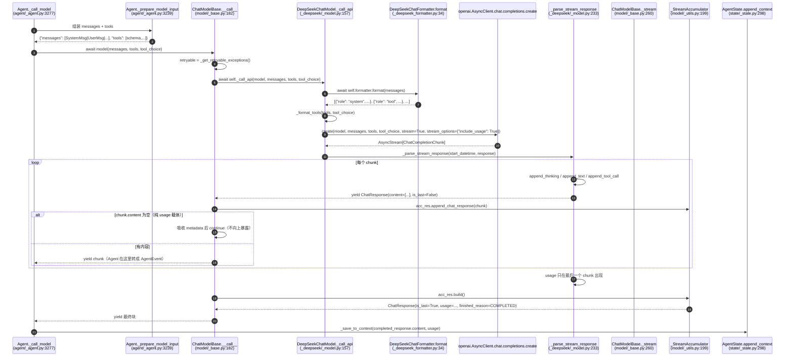
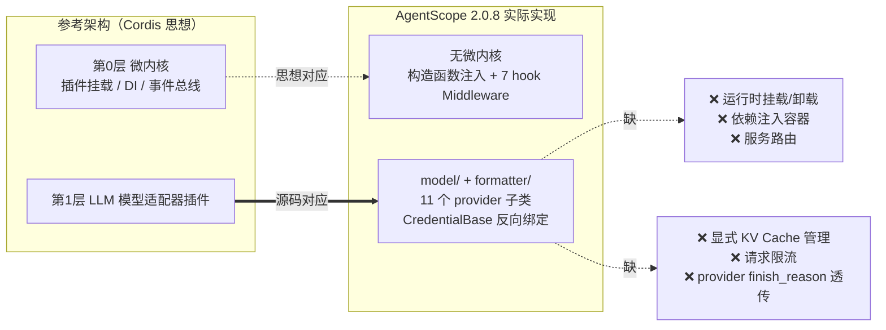

# 侦察报告 03：AgentScope 模型适配器层与 Formatter

> 侦察对象：`third_party/agentscope/src/agentscope/model/`（26 个 .py，6 745 行）与 `third_party/agentscope/src/agentscope/formatter/`（12 个 .py，5 118 行）
> 版本：AgentScope 2.0.8（已 `pip install -e`，可直接 `import agentscope`）
> 所有代码片段都在 `/Users/a/miniconda3/envs/agentscope_reme_pip_env/bin/python`（Python 3.11.13）里**真跑过**，可运行片段标注「已验证」并附真实输出，脚本存放在 `tutorial_agsc_reme/_recon/code/` 下。
> 所有结论都带 `相对仓库根的路径:行号`。

---

## 子系统职责（这段代码到底在解决什么问题）

对应参考架构的**第 1 层「LLM 模型适配器插件」**，这段代码解决三个问题：

**问题一：10 个 LLM provider 的 API 各不相同，上层不能感知。**
`ChatModelBase`（`third_party/agentscope/src/agentscope/model/_base.py:37`）定义了唯一入口 `__call__(messages, tools, tool_choice, **kwargs)`，返回 `ChatResponse`（非流式）或 `AsyncGenerator[ChatResponse, None]`（流式）。上层 Agent 只认这两种返回类型，完全不关心背后是 OpenAI SDK、Anthropic SDK 还是 httpx 直连。11 个实现类分别在 `model/_openai_chat/`、`_deepseek/`、`_anthropic/`、`_gemini/`、`_dashscope/`、`_moonshot/`、`_xai/`、`_volcengine/`、`_ollama/`、`_openai_response/`。

**问题二：AgentScope 自己的消息模型（`Msg` + 内容块）和各家 API 的 message 结构不同，需要一个双向翻译层。**
这就是 `formatter/`。`FormatterBase.format(msgs) -> list[dict]`（`formatter/_formatter_base.py:47`）是一个纯函数式的翻译器：输入 `list[Msg]`（可能含 text/thinking/tool_call/tool_result/data/hint 六种块），输出 provider 能吃的 JSON 数组。翻译层要吃掉的所有方言差异：工具调用放哪、工具结果用什么 role、图片怎么编码、thinking 能不能回传、多 Agent 会话怎么把多个说话人塞进一个无名字的 API。

**问题三：流式输出的分片必须被重新拼装成一个语义完整的响应。**
流式 API 吐出来的是「一个 token / 一段 JSON / 一个工具参数片段」，而 Agent 需要的是「一个完整的 `ToolCallBlock`，`input` 是合法 JSON」。`_StreamAccumulator`（`model/_utils.py:199`）负责这件事，且被特意设计成 **O(n) 而不是 O(n²)**（见下面的源码精读）。

**一句话定位**：这是 Agent Harness 里「模型与 Harness 的双向适配层」——向下屏蔽 10 个 provider 的协议差异，向上提供一个稳定的 `ChatResponse` 契约。换模型只需要换 `credential` 和 `model` 两个构造参数，其余代码一行不改。

**明确不存在的部分**（后面「与参考架构的映射」小节会展开）：模型层没有 KV Cache 的显式管理、没有任何「请求限流」实现、没有把 provider 的 `finish_reason`（如 `length` / `tool_calls`）透传给上层。

---

## 关键文件表

| 文件路径:行号 | 核心类 | 核心函数 | 一句话职责 |
|---|---|---|---|
| third_party/agentscope/src/agentscope/model/_base.py:37 | `ChatModelBase` | — | 全部 provider 的抽象基类，定义契约与重试/中断/结构化输出策略 |
| third_party/agentscope/src/agentscope/model/_base.py:40 | `ChatModelBase.Parameters` | — | 空的内嵌 `BaseModel`，每个子类覆盖它以声明自己的超参 schema |
| third_party/agentscope/src/agentscope/model/_base.py:182 | — | `__call__` | **唯一入口**：重试循环 + 流式聚合包装 |
| third_party/agentscope/src/agentscope/model/_base.py:260 | — | `_stream` | 内层生成器：吸收 usage 载体 chunk、产出 `is_last=True` 的汇总块 |
| third_party/agentscope/src/agentscope/model/_base.py:292 | — | `_call_api` | 抽象方法，子类必须实现（真正的 provider 调用） |
| third_party/agentscope/src/agentscope/model/_base.py:316 | — | `_validate_tool_choice` | 本地校验 `tool_choice` 的工具名是否存在 |
| third_party/agentscope/src/agentscope/model/_base.py:369 | — | `count_tokens` | UTF-8 字节数 / 4 的粗估 token 计数 |
| third_party/agentscope/src/agentscope/model/_base.py:457 | — | `generate_structured_output` | 四段式 fallback 阶梯拿结构化输出 |
| third_party/agentscope/src/agentscope/model/_base.py:595 | — | `_call_api_with_structured_output` | 单次结构化输出尝试（造一个假工具强制调用） |
| third_party/agentscope/src/agentscope/model/_model_response.py:22 | `FinishedReason` | — | **只有 2 个值**的结束原因枚举 |
| third_party/agentscope/src/agentscope/model/_model_response.py:32 | `ChatResponse` | — | 统一响应结构（dataclass + DictMixin） |
| third_party/agentscope/src/agentscope/model/_model_response.py:69 | — | `append_text` / `append_thinking` / `append_tool_call` / `append_data_block` | 按 block id 累加增量 |
| third_party/agentscope/src/agentscope/model/_model_response.py:241 | — | `append_chat_response` | 纯 Python 版累加（O(n²)，已被 `_StreamAccumulator` 取代） |
| third_party/agentscope/src/agentscope/model/_model_response.py:321 | `StructuredResponse` | — | 结构化输出响应（`content` 是 dict） |
| third_party/agentscope/src/agentscope/model/_model_usage.py:9 | `ChatUsage` | — | token 用量 + 耗时 + prompt cache 命中统计 |
| third_party/agentscope/src/agentscope/model/_model_card.py:11 | `ModelCard` | — | 模型目录卡片（上下文长度、输出上限、支持的输入类型） |
| third_party/agentscope/src/agentscope/model/_model_card.py:72 | — | `from_yaml` | 读 `_models/*.yaml` 并把参数 schema 合并进去 |
| third_party/agentscope/src/agentscope/model/_utils.py:199 | `_StreamAccumulator` | — | **O(n) 流式聚合器**，本报告最值得学的一段 |
| third_party/agentscope/src/agentscope/model/_utils.py:21/43/73/102/134 | `_AccTextBlock` / `_AccThinkingBlock` / `_AccToolCallBlock` / `_AccBase64Source` / `_AccDataBlock` | `append` / `build` | 五种块的「碎片列表」累加器 |
| third_party/agentscope/src/agentscope/model/_openai_chat/_model.py:35 | `OpenAIChatModel` | — | OpenAI Chat Completions 实现（含 omni 音频输出） |
| third_party/agentscope/src/agentscope/model/_openai_chat/_model.py:195 | — | `_call_api` | 组 kwargs + 调 SDK + 分派到流式/非流式解析 |
| third_party/agentscope/src/agentscope/model/_openai_chat/_model.py:300 | — | `_parse_stream_response` | 把 OpenAI 的 chunk 翻译成 `ChatResponse` delta |
| third_party/agentscope/src/agentscope/model/_openai_chat/_model.py:431 | — | — | 工具调用分片 + `tool_call_mapping` 按 index 记忆 id/name |
| third_party/agentscope/src/agentscope/model/_openai_chat/_model.py:601 | — | `_flatten_tool_schemas` | 内联 `$ref`/`$defs`，兼容不支持 JSON Schema 引用的 provider |
| third_party/agentscope/src/agentscope/model/_deepseek/_model.py:26 | `DeepSeekChatModel` | — | DeepSeek 实现（本教程实际使用的 provider） |
| third_party/agentscope/src/agentscope/model/_deepseek/_model.py:207 | — | — | thinking 开关走 `extra_body.thinking.type` |
| third_party/agentscope/src/agentscope/model/_deepseek/_model.py:270 | — | — | usage 里读 `prompt_cache_hit_tokens` 作为 cache 命中 |
| third_party/agentscope/src/agentscope/model/_deepseek/_model.py:439 | — | `_get_disable_thinking_kwargs` | 结构化输出 fallback 用的「关思考」kwargs |
| third_party/agentscope/src/agentscope/formatter/_formatter_base.py:20 | `FormatterBase` | — | formatter 抽象基类（pydantic BaseModel） |
| third_party/agentscope/src/agentscope/formatter/_formatter_base.py:47 | — | `format` | 抽象方法：`list[Msg] -> list[dict]` |
| third_party/agentscope/src/agentscope/formatter/_formatter_base.py:105 | — | `convert_tool_result_to_string` | 把工具结果里的多模态数据「提升」成独立的 user 消息 |
| third_party/agentscope/src/agentscope/formatter/_formatter_base.py:190 | — | `_group_messages` | 把消息流切成 `tool_sequence` / `agent_message` 两类组 |
| third_party/agentscope/src/agentscope/formatter/_openai_formatter.py:26 | `_OpenAIFormatterBase` | `_format_openai_data_block` | OpenAI 系多模态编码（image_url / input_audio / file） |
| third_party/agentscope/src/agentscope/formatter/_openai_formatter.py:229 | `OpenAIChatFormatter` | `format` | 单/双人对话：用 `name` 字段区分说话人 |
| third_party/agentscope/src/agentscope/formatter/_openai_formatter.py:423 | `OpenAIMultiAgentFormatter` | `format` | 多 Agent：把非工具消息压进 `<history>` 标签当 user 消息发 |
| third_party/agentscope/src/agentscope/formatter/_dashscope_formatter.py:26 | `_DashScopeFormatterBase` | — | DashScope 专属：多一个 `video_url`，多一个 thinking 开关 |
| third_party/agentscope/src/agentscope/formatter/_dashscope_formatter.py:57 | — | `supports_thinking_input` | 只有当 `application/x-thinking` 在 `input_types` 里才回传 reasoning |
| third_party/agentscope/src/agentscope/formatter/_dashscope_formatter.py:219 | `DashScopeChatFormatter` | `format` | 单/双人对话（OpenAI 兼容格式 + reasoning_content） |
| third_party/agentscope/src/agentscope/formatter/_deepseek_formatter.py:20 | `DeepSeekChatFormatter` | `format` | DeepSeek：单条消息里 flush 出 tool 消息 + 强制带 `reasoning_content` |
| third_party/agentscope/src/agentscope/formatter/_anthropic_formatter.py:27 | `_AnthropicFormatterBase` | `_format_messages` | Anthropic：thinking 必须带 `signature`，否则只能丢弃 |
| third_party/agentscope/src/agentscope/formatter/_openai_response_formatter.py:162 | `OpenAIResponseFormatter` | `format` | Responses API：输出的是 `input items`（`input_text`/`output_text`）而不是 messages |
| third_party/agentscope/src/agentscope/message/_block.py:219 | `ContentBlock` | — | 六种块的联合类型（模型层的输入输出都用它表达） |
| third_party/agentscope/src/agentscope/message/_base.py:120 | `Msg.validate_role_content` | — | 按 role 校验允许的块类型（**重要的装配约束**） |
| third_party/agentscope/src/agentscope/state/_state.py:298 | `AgentState.append_context` | — | 工具调用与工具结果被写进**同一条 assistant 消息** |
| third_party/agentscope/src/agentscope/credential/_base.py:17 | `CredentialBase` | `get_chat_model_class` | 凭证反向指回它对应的模型类（可反序列化注册表） |
| third_party/agentscope/src/agentscope/tool/_types.py:178 | `ToolChoice` | — | `mode`（auto/none/required/工具名）+ `tools` 白名单 |

---

## 调用链

### 消息 → formatter → provider payload → 响应 → ChatResponse → Agent



逐段讲解：

1. **Agent 侧只做装配，不做协议翻译**。`Agent._prepare_model_input`（`third_party/agentscope/src/agentscope/agent/_agent.py:3239`）把 system prompt、压缩摘要、`state.context` 拼成 `list[Msg]`，再从 `Toolkit` 拿 `tools` schema，返回一个 dict。它完全不知道 provider 是谁。
2. **`__call__` 是唯一的「策略层」**。重试策略（`max_retries + 1` 次、只重试白名单异常、`retry_delay` 秒间隔）、`asyncio.CancelledError` → `FinishedReason.INTERRUPTED`、流式聚合，全在这一个方法里（`model/_base.py:206-290`）。子类只需要实现 `_call_api`，**不需要重复实现重试**。
3. **`_call_api` 是唯一的「协议层」**。它做四件事：`formatter.format()`、把 `self.parameters` 翻译成 provider kwargs、`_format_tools()` 处理工具与 `tool_choice`、调 SDK 后分派到流式/非流式解析器。注意 `stream` 是实例属性（`self.stream`），`_call_api` 每次读它，所以运行时改 `model.stream = False` 会立刻生效（侦察脚本 07 就是靠这招同时测了两种模式）。
4. **formatter 是纯函数，没有状态**。`Format` 不访问网络、不访问 `self.parameters`，只做结构与编码转换。这让它可以被单测轻松覆盖，也让它能离线跑（侦察脚本 08 全程无网络）。
5. **`_parse_stream_response` 负责「provider chunk → ChatResponse」**，把 `delta.reasoning_content` 变成 `ThinkingBlock`、`delta.content` 变成 `TextBlock`、`delta.tool_calls[]` 变成 `ToolCallBlock`。它产出的每个块都带一个**稳定的 block id**（thinking/text 的 id 在流开始时生成一次，tool call 用 provider 给的 `tool_call.id`），这是后面聚合能对齐的前提。
6. **`_stream` 做两件事**：把空内容 chunk（OpenAI 兼容 API 在流末尾发的「只有 usage 没有 choices」的载体 chunk）吸收进 `acc_res` 但**不向上暴露**（`model/_base.py:278-279`）；在流结束时 `yield acc_res.build()` 补一个 `is_last=True` 的完整块。
7. **`_StreamAccumulator` 是真正的拼装器**：按 block id 归类，每种块有自己的「碎片列表」，最后一次性 `"".join()`。
8. **回到 Agent**：`Agent` 拿到的是「一串 delta + 一个 final」，它把 delta 转成 `TextBlockDelta` 等事件流式推给前端，把 final 的内容写回 `state.context`——写回时工具调用与工具结果会落到**同一条 assistant 消息**里（`third_party/agentscope/src/agentscope/state/_state.py:298`），这正是 formatter 里「遇到 tool_result 要先 flush」逻辑存在的原因。

### AgentScope 层 ↔ 参考架构「Cordis 微内核」的对照



---

## 关键数据结构

### `ChatResponse`：统一响应结构

`third_party/agentscope/src/agentscope/model/_model_response.py:22-67`：

```python
class FinishedReason(StrEnum):
    """The finished reason of the model response."""

    INTERRUPTED = "interrupted"
    """The model response is interrupted by the asyncio.CancelledError."""

    COMPLETED = "completed"
    """The model response is completed."""


@dataclass
class ChatResponse(DictMixin):
    """The response of chat models."""

    content: List[TextBlock | ToolCallBlock | ThinkingBlock | DataBlock]
    """The content of the chat response, which can include text blocks,
    tool use blocks, or thinking blocks."""

    is_last: bool
    """Whether this response is the last response, if `Ture`, the content will
    be the complete response, otherwise the content is a partial response"""

    id: str = field(default_factory=_generate_id)
    """The unique identifier."""

    created_at: str = field(default_factory=lambda: datetime.now().isoformat())
    """When the response was created"""

    type: Literal["chat_response"] = field(
        default_factory=lambda: "chat_response",
    )
    """The type of the response, which is always 'chat_response'."""

    usage: ChatUsage | None = field(default_factory=lambda: None)
    """The usage information of the chat response, if available."""

    finished_reason: FinishedReason = field(
        default_factory=lambda: FinishedReason.COMPLETED,
    )
    """The finished reason of the chat response, available when `is_last`
    is `True`."""

    metadata: dict[str, JSONSerializableObject] = field(
        default_factory=lambda: {},
    )
    """The metadata of the chat response"""
```

字段级说明：

| 字段 | 类型 | 语义 | 教学要点 |
|---|---|---|---|
| `content` | 4 种块的列表 | 本次（增量或最终）产出的内容块 | **注意没有 `HintBlock`**：hint 是 Harness 内部注入的，不是模型产出的 |
| `is_last` | bool | `True` 表示这是本轮的完整响应 | 流式下只有最后一个块是 `True`；非流式下永远是 `True` |
| `id` | str | 响应 id | 流式下会被每个 chunk 覆写成 provider 的 response id，保证整条流的 id 一致 |
| `created_at` | ISO 字符串 | 创建时间 | 用的是**本地 `datetime.now()`**，不是 provider 给的时间戳 |
| `type` | `"chat_response"` | 判别式 | 便于 union 反序列化 |
| `usage` | `ChatUsage \| None` | token 用量 | 流式下只出现在尾部 chunk（DeepSeek/OpenAI 都要求显式打开 `stream_options.include_usage`） |
| `finished_reason` | 只有 2 个值 | 结束原因 | **provider 的 finish_reason 完全没有被读取**，见「坑」小节 |
| `metadata` | dict | 给中间件/存储留的自由字段 | 模型层自己不写它 |

`DictMixin`（`third_party/agentscope/src/agentscope/_utils/_mixin.py:5`）把 `__setattr__` 重定向到 `dict.__setitem__`，于是 `@dataclass` 的 `__init__`（内部执行 `self.input_tokens = ...`）实际是在往 dict 里塞键。所以 `ChatUsage` / `ChatResponse` **本身就是 dict**——`dict(usage)` 能直接用，但**没有 `to_dict()` 方法**（侦察脚本 07 第一次跑就踩了这个 `AttributeError`）。

### `ChatUsage`：token 与 prompt cache 统计

`third_party/agentscope/src/agentscope/model/_model_usage.py:9-32`：

```python
@dataclass
class ChatUsage(DictMixin):
    """The usage of a chat model API invocation."""

    input_tokens: int
    """The number of input tokens."""

    output_tokens: int
    """The number of output tokens."""

    time: float
    """The time used in seconds."""

    cache_creation_input_tokens: int = field(default_factory=lambda: 0)
    """The number of input tokens used to create the prompt cache."""

    cache_input_tokens: int = field(default_factory=lambda: 0)
    """The number of input tokens read from the prompt cache."""

    type: Literal["chat"] = field(default_factory=lambda: "chat")
    """The type of the usage, must be `chat`."""

    metadata: dict[str, Any] | None = field(default_factory=lambda: None)
    """Optional metadata associated with the usage."""
```

**prompt cache 命中统计落在哪里**（这是教程里必须讲清的一个点）：

| provider | 源字段 | 落到 `ChatUsage` 的 | 代码位置 |
|---|---|---|---|
| DeepSeek | `usage.prompt_cache_hit_tokens` | `cache_input_tokens` | `model/_deepseek/_model.py:276`、`:382` |
| OpenAI Chat | `usage.prompt_tokens_details.cached_tokens` | `cache_input_tokens` | `model/_openai_chat/_model.py:356`、`:534` |
| DashScope | `usage.prompt_tokens_details.cached_tokens`（先 `hasattr` 判断） | `cache_input_tokens` | `model/_dashscope/_model.py:327` |
| Moonshot / xAI / Volcengine / Gemini / OpenAI Responses | `*.cached_tokens` | `cache_input_tokens` | 各自 `_parse_*` 内 |
| Anthropic | `usage.cache_read_input_tokens` | `cache_input_tokens` | `model/_anthropic/_model.py:373` |
| Anthropic | `usage.cache_creation_input_tokens` | `cache_creation_input_tokens` | `model/_anthropic/_model.py:367` |

**除 Anthropic 外，没有任何 provider 填 `cache_creation_input_tokens`**——它永远是 0。这意味着如果你想在教程的 harness_kit 里统一统计「缓存写入成本」，只能对 Anthropic 生效；对 DeepSeek/OpenAI 你要自己按「上一轮 miss 的 token 数」推算。

真实观测（侦察脚本 07，第二轮同前缀请求）：`cache_input_tokens: 128`，即命中 128 个 token 的公共前缀；第一轮同请求是 0。

### `StructuredResponse`

`third_party/agentscope/src/agentscope/model/_model_response.py:321-350`：与 `ChatResponse` 平行，但 `content: dict`（校验过的结构化数据）、`type="structured_response"`，**没有 `is_last` 字段**。

### `ModelCard`

`third_party/agentscope/src/agentscope/model/_model_card.py:11-70`：`name` / `label` / `status`(active|deprecated|sunset) / `deprecated_at` / `input_types` / `output_types` / `context_size` / `output_size` / `parameter_schema` / `parameters_overrides`。

`from_yaml`（`_model_card.py:72`）做了三件「自动裁剪」：把 `parameter_class.model_json_schema()` 当基底；若 `output_types` 不含 `application/x-thinking` 就**删掉** `thinking_enable`/`thinking_budget`/`thinking_mode`/`thinking_display` 四个参数（`:101-107`）；若 `output_types` 不含任何 `audio/*` 就删掉 `voice`（`:112-115`）；最后用 `output_size` 覆写 `max_tokens.maximum`（`:117-119`）。

### `ToolChoice`

`third_party/agentscope/src/agentscope/tool/_types.py:178-203`：

```python
class ToolChoice(BaseModel):
    mode: Literal["auto", "none", "required"] | str
    tools: list[str] | None = None
```

`mode` 除了三个字面量，还可以直接填一个**工具名**表示「强制调这一个」。源码注释（`:195-199`）明确推荐用 `mode=<tool_name>` 而不是 `tools=[<tool_name>]`，因为后者会改动发给模型的 tools 数组，**会让 prompt cache 失效**。这是「Harness Engineering 不只是改提示词」的一个具体例证。

### 内容块（模型层的输入输出单元）

`third_party/agentscope/src/agentscope/message/_block.py`：`TextBlock`(:11)、`ThinkingBlock`(:26)、`Base64Source`(:56)、`URLSource`(:67)、`DataBlock`(:83)、`HintBlock`(:101)、`ToolCallBlock`(:138)、`ToolResultBlock`(:195)。联合类型 `ContentBlock` 在 `:219`。

两个关键设计：

- `ThinkingBlock` 带 `model_config = ConfigDict(extra="allow")`（`:42`），所以 provider 私有字段（Anthropic 的 `signature`、`redacted_thinking_data`，OpenAI Responses 的 `reasoning_item_id`）可以**不继承子类**就挂上去。`_StreamAccumulator` 靠 `block.model_extra` 把这些字段搬运到累加器上（`model/_utils.py:62-64`）。
- `ToolCallBlock.input` 的类型是 `str`（`:149`），注释写着「The raw JSON string input of the tool, **accumulated during streaming**」。**这里存的是字符串不是 dict**——这是流式拼接的必然结果，也是「什么时候解析 JSON」这个设计决策的体现：AgentScope 把它推迟到真正执行工具时（`_utils/_common.py:95` 的 `_json_loads_with_repair` 会修复不完整/类型错误的 JSON）。

---

## 源码精读

### 1. `ChatModelBase.__call__`：把重试、中断、流式聚合全部收进一个方法

`third_party/agentscope/src/agentscope/model/_base.py:206-290`：

```python
        retryable = self._get_retryable_exceptions()
        last_error: Exception | None = None
        for attempt in range(self.max_retries + 1):
            # The accumulated chat response
            try:
                res = await self._call_api(
                    self.model,
                    messages=messages,
                    tools=tools,
                    tool_choice=tool_choice,
                    **kwargs,
                )
                break
            except asyncio.CancelledError:
                return ChatResponse(
                    content=[],
                    is_last=True,
                    finished_reason=FinishedReason.INTERRUPTED,
                )

            except Exception as e:
                if not isinstance(e, retryable):
                    raise
                last_error = e
                if attempt < self.max_retries:
                    logger.warning(
                        "Attempt %d failed for model %s: %s. "
                        "Retrying in %.1fs...",
                        attempt + 1,
                        self.model,
                        str(e),
                        self.retry_delay,
                    )
                    await asyncio.sleep(self.retry_delay)
                else:
                    logger.warning(
                        "All %d attempt(s) failed for model %s.",
                        self.max_retries + 1,
                        self.model,
                    )
```

它在干什么 / 为什么这么设计：

- **只重试白名单异常**（`model/_base.py:226-228`）。白名单由子类的 `_get_retryable_exceptions()` 返回，DeepSeek/OpenAI 返回的是 `APIConnectionError / APITimeoutError / RateLimitError / InternalServerError`（`model/_deepseek/_model.py:139-147`）。**`BadRequestError` 不在里面**——参数写错这种错误重试一万次也没用，直接抛。
- **异常类型在子类里懒导入**（`model/_base.py:100-109` 的 docstring 明说 "SDK exception types should be imported lazily inside the override so the SDK stays an optional dependency"）。这是「可选依赖」的写法，安装 AgentScope 不需要装全部 10 个 SDK。
- **`asyncio.CancelledError` 被转成返回值而不是重新抛出**。这一分支只在「`_call_api` 尚未返回、正在 await SDK 时被 cancel」时触发。如果取消发生在消费者正在 `async for` 时，则是下面 `_stream` 里的分支接管。
- `_call_api` 返回的可能是流对象，所以下面还有半段：

`model/_base.py:260-290`：

```python
        async def _stream() -> AsyncGenerator[ChatResponse, None]:
            """The wrapper around model calling."""
            # For backward compatibility
            yield_acc_res = True
            acc_res = _StreamAccumulator()
            try:
                async for chunk in res:
                    if not chunk.is_last:
                        acc_res.append_chat_response(chunk)
                        acc_res.id = chunk.id
                        # Empty-content deltas are "carrier" chunks used
                        # by subclasses to propagate usage / id metadata
                        # (e.g. OpenAI-compatible APIs emit a trailing
                        # usage-only chunk with no choices). We absorb
                        # their metadata into ``acc_res`` above but do
                        # not surface them to the consumer, which keeps
                        # the visible stream free of spurious empty
                        # deltas.
                        if not chunk.content:
                            continue
                    else:
                        yield_acc_res = False
                    yield chunk
            except asyncio.CancelledError:
                acc_res.finished_reason = FinishedReason.INTERRUPTED
                yield_acc_res = True

            if yield_acc_res:
                yield acc_res.build()

        return _stream()
```

这段是**整个模型层最精巧的 30 行**，值得逐行讲：

1. `acc_res` 是 O(n) 聚合器，它在同一遍循环里既做「向上转发」又做「向下沉淀」——**流式消费者拿到的是原始 delta，而聚合器同时在后台拼完整版**。所以 Agent 不需要自己写聚合代码。
2. **空内容 chunk 的处理是「吸收但不暴露」**：DeepSeek 的流末尾会发一个 `choices == []` 的 chunk 只带 usage（`model/_deepseek/_model.py:283-292` 会把这个 chunk 转成 `content=[]` 且带 usage 的 delta yield 出来）。基类在这里把它吃进 `acc_res.usage` 后 `continue`，**不 yield**。如果没有这一步，前端会在流末尾收到一个「看起来像新消息但内容为空」的 delta。
3. **`yield_acc_res` 这个标志是「谁来收尾」的开关**：如果子类已经自己产出了 `is_last=True` 的块（`yield_acc_res = False`），基类就不再补一个；如果整条流没有任何 `is_last`（子类全都只 yield `is_last=False`，DeepSeek/OpenAI 都是这样），基类在最后补一个 `acc_res.build()`。
4. **`except asyncio.CancelledError` 把中断变成一个「正常的最终块」**。侦察脚本 09 第 7 节实测：消费者 task 被 `cancel()` 后，`await task` **没有抛 CancelledError**，而是收到了一个 `finished_reason=interrupted` 的 `is_last=True` 块。这是一个**非直觉但有意为之**的设计：中断不等于异常，中断意味着「这是一次合法但未完成的回复」，上层可以把它当成正常终止处理并落盘。

### 2. `_StreamAccumulator`：从 O(n²) 到 O(n)

`third_party/agentscope/src/agentscope/model/_utils.py:199-266`：

```python
class _StreamAccumulator:
    """Accumulates the streaming ``ChatResponse`` deltas of one model call.

    Each block keeps its deltas in a fragment list that is joined exactly
    once in ``build``, which makes the accumulation O(n) in the total
    payload size. The ``ChatResponse.append_chat_response`` it replaces
    grows the blocks with ``block.field += delta`` instead, which is
    O(n^2) for large payloads (e.g. tool call arguments of 100k+ chars)
    and can block the event loop long enough to drop the connection.
    """

    def __init__(self) -> None:
        """Initialize an empty accumulator."""
        # Keyed by block id, the insertion order is the block order
        self._blocks: dict[str, _AccBlock] = {}

        self.id: str | None = None
        """The id of the latest delta, if any."""

        self.usage: ChatUsage | None = None
        """The usage of the latest delta that reported one, if any."""

        self.finished_reason: FinishedReason = FinishedReason.COMPLETED
        """The finished reason to report in ``build``."""

    def append_chat_response(self, chat_response: ChatResponse) -> Self:
        """Collect one delta chunk in constant time per block.

        Args:
            chat_response (`ChatResponse`):
                The streaming delta chunk to collect.
        """
        for block in chat_response.content:
            acc = self._blocks.get(block.id)
            if acc is not None and acc.type != block.type:
                logger.warning(
                    "Block %s changed its type from %s to %s during "
                    "streaming, dropping the accumulated fragments.",
                    block.id,
                    acc.type,
                    block.type,
                )
                acc = None

            if acc is None:
                # Seed the accumulator with every field of the delta, so
                # that the ones it does not accumulate are carried over.
                fields = block.model_dump()
                if isinstance(block, TextBlock):
                    acc = _AccTextBlock(**{**fields, "text": []})
                elif isinstance(block, ThinkingBlock):
                    acc = _AccThinkingBlock(**{**fields, "thinking": []})
                elif isinstance(block, ToolCallBlock):
                    acc = _AccToolCallBlock(**{**fields, "input": []})
                else:
                    # ``source`` is not emptied here, ``append`` replaces
                    # it with a byte accumulator for audio streams.
                    acc = _AccDataBlock(**fields)
                self._blocks[block.id] = acc

            # The type check above guarantees the accumulator and the
            # delta block are of the same kind.
            acc.append(block)  # type: ignore[arg-type]

        if chat_response.usage:
            self.usage = chat_response.usage

        return self
```

配套的累加器（`model/_utils.py:73-99`，`_AccToolCallBlock`）：

```python
class _AccToolCallBlock(ToolCallBlock):
    """The accumulating counterpart of ``ToolCallBlock``, whose ``input``
    field holds the incremental JSON fragments until they are joined in
    ``build``."""

    input: list[str] = Field(  # type: ignore[assignment]
        default_factory=list,
    )

    def append(self, block: ToolCallBlock) -> None:
        """Collect one delta block in constant time.

        Args:
            block (`ToolCallBlock`):
                The delta block to collect.
        """
        self.input.append(block.input)
        # Most providers carry ``name`` on the opening delta only, but some
        # send an empty one first and fill the name in afterwards.
        if not self.name and block.name:
            self.name = block.name

    def build(self) -> ToolCallBlock:
        """Join the fragments into a plain ``ToolCallBlock``."""
        return ToolCallBlock(
            **{**self.model_dump(), "input": "".join(self.input)},
        )
```

它在干什么 / 为什么这么设计：

- **「碎片列表 + 一次 join」是核心技巧**。Python 里 `s += x` 是 O(len(s)) 的拷贝，100k 字符的参数被切成 1000 片就是 5×10⁷ 次字符拷贝；改成 `list.append` + `"".join()` 就是 O(n)。docstring 里直接写出了这个权衡的**后果**："can block the event loop long enough to drop the connection"——这是生产事故级的理由，非常适合拿来教「为什么性能优化在 Agent Harness 里是正确性问题」。
- **累加器是原块的子类，不是独立类**。`_AccToolCallBlock(ToolCallBlock)` 把 `input` 字段的类型从 `str` 改成 `list[str]`（用 `# type: ignore` 压住 mypy）。这样 `model_dump()` 能带出所有其他字段（id、state、suggested_rules…），`build()` 里 `{**self.model_dump(), "input": "".join(...)}` 一行就还原成正常块。代价是类型系统被绕过了，所以有 `type: ignore`。
- **`if not self.name and block.name: self.name = block.name`** 处理的是「首片带 name、后续片 name 为 None」以及反过来「首片 name 为空字符串、后面才补上」两种 provider 行为。侦察脚本 07 的实测输出里，第一个 ToolCallBlock delta 就带着 `name='get_weather'`，后续 9 片都没有 name——如果不做这个记忆，最终拼接出的工具名会是空。
- **类型变化防御**（`:233-242`）：如果同一个 block id 先报 `text` 后报 `tool_call`，记一条 warning 并丢弃已积累的碎片重建。这是一个「宁可丢数据也不要拼出脏数据」的选择。
- **`usage` 用「最后一次非空胜出」而不是累加**（`:263-264`）：因为 provider 的 usage 是**累计值**（每次报的都是总量），累加会得到垃圾。

### 3. 工具调用参数如何在流中被分片与拼装（真实数据）

侦察脚本 07 的实测输出（真实 DeepSeek 流，已截取）：

```
--- [delta] #33 id='9d7097e7' usage=none blocks=1
        ToolCallBlock(id='call_00_', name='get_weather', input='')
--- [delta] #34 id='9d7097e7' usage=none blocks=1
        ToolCallBlock(id='call_00_', name='get_weather', input='{')
--- [delta] #35 id='9d7097e7' usage=none blocks=1
        ToolCallBlock(id='call_00_', name='get_weather', input='"')
--- [delta] #36 id='9d7097e7' usage=none blocks=1
        ToolCallBlock(id='call_00_', name='get_weather', input='city')
--- [delta] #37 id='9d7097e7' usage=none blocks=1
        ToolCallBlock(id='call_00_', name='get_weather', input='"')
--- [delta] #38 id='9d7097e7' usage=none blocks=1
        ToolCallBlock(id='call_00_', name='get_weather', input=': ')
--- [delta] #39 id='9d7097e7' usage=none blocks=1
        ToolCallBlock(id='call_00_', name='get_weather', input='"')
--- [delta] #40 id='9d7097e7' usage=none blocks=1
        ToolCallBlock(id='call_00_', name='get_weather', input='北京')
--- [delta] #41 id='9d7097e7' usage=none blocks=1
        ToolCallBlock(id='call_00_', name='get_weather', input='"')
--- [delta] #42 id='9d7097e7' usage=none blocks=1
        ToolCallBlock(id='call_00_', name='get_weather', input='}')
--- [FINAL] #43 id='9d7097e7' usage=yes blocks=3
        ThinkingBlock(id='53c0a350', thinking="The user asks about Beijing's weather today, and wants me to call the tool. Let me call get_weather for Beijing.")
        TextBlock(id='3f8380f3', text='我来为您查询北京的天气。')
        ToolCallBlock(id='call_00_', name='get_weather', input='{"city": "北京"}')
        usage: {'input_tokens': 306, 'output_tokens': 66, 'time': 1.698333,
                'cache_creation_input_tokens': 0, 'cache_input_tokens': 128,
                'type': 'chat', 'metadata': None}
```

要点：

1. 参数被切成十几片（上面这次运行是 11 片：一个空串开场片，然后 `{`、`"`、`city`、`"`、`: `、`"`、`北京`、`"`、`}` 逐字吐出）。**`input` 永远不是合法 JSON 直到最后一片拼完**——所以任何「收到 tool_call 就立刻 `json.loads`」的写法都会炸。切分粒度由 provider 决定，同样的请求两次运行分片数可能不同（本脚本两次运行分别得到 11 片和 10 片），所以任何依赖分片边界的代码都是错的。
2. **所有分片共享同一个 block id**（`call_00_...`，provider 给的 `tool_call.id`），这就是聚合能对齐的唯一依据。
3. 拼装代码在 provider 侧有两层保险（`model/_deepseek/_model.py:312-332`）：

```python
                for tool_call in getattr(delta, "tool_calls", None) or []:
                    index = tool_call.index
                    fn = getattr(tool_call, "function", None)
                    delta_name = getattr(fn, "name", None) if fn else None
                    delta_args = getattr(fn, "arguments", None) if fn else None

                    # Record the id and name in case following deltas
                    # don't provide them
                    if index not in tool_call_mapping:
                        tool_call_mapping[index] = (
                            tool_call.id,
                            delta_name or "unknown",
                        )

                    stored_id, stored_name = tool_call_mapping[index]

                    delta_res.append_tool_call(
                        block_id=tool_call.id or stored_id,
                        name=delta_name or stored_name,
                        input=delta_args or "",
                    )
```

`tool_call_mapping` 是一个 `OrderedDict[int, tuple[str, str]]`，按 `tool_call.index` 记住第一次见到的 `(id, name)`。这是为了对付**并行工具调用**：两个工具一起被调用时，provider 用 `index=0/1` 区分，但后续分片可能不带 id。`OrderedDict` 的插入顺序还顺带保证了最终块里工具调用的顺序与 provider 报出的顺序一致（`_StreamAccumulator._blocks` 也是 dict 保序，同样依赖这一点）。
4. 最终块里 `ThinkingBlock` 在前、`TextBlock` 居中、`ToolCallBlock` 在后——这个顺序不是排序出来的，而是**首次出现顺序**。DeepSeek 先吐 reasoning 再吐正文最后吐工具调用。

### 4. Formatter：把 10 家方言吃掉的翻译层

`FormatterBase` 本体（`third_party/agentscope/src/agentscope/formatter/_formatter_base.py:20-49`）：

```python
class FormatterBase(BaseModel):
    """The base class for formatters."""

    input_types: list[str] = Field(
        default_factory=lambda: ["text/plain"],
        description=(
            "The supported input types, aligned with the model card's "
            "``input_types`` field. Entries other than ``text/plain`` and "
            "``application/x-thinking`` are treated as media-type patterns "
            "(glob-style, e.g. ``image/*``, ``audio/mp3``) that control which "
            "``DataBlock``\\s are forwarded to the API."
        ),
    )
    """The supported input types for this formatter, aligned with the model
    card's ``input_types`` field."""

    @property
    def supported_input_media_types(self) -> list[str]:
        """Derive the accepted media-type patterns from :attr:`input_types` by
        excluding ``text/plain`` and ``application/x-thinking``."""
        return [
            t
            for t in self.input_types
            if t not in ("text/plain", "application/x-thinking")
        ]

    @abstractmethod
    async def format(self, *args: Any, **kwargs: Any) -> list[dict[str, Any]]:
        """Format the Msg objects to a list of dictionaries that satisfy the
        API requirements."""
```

**源码与文档的不一致（教学亮点）**：`input_types` 的 docstring 说它「aligned with the model card's `input_types` field」，但实际上**库里没有任何代码去做这个对齐**。全仓库唯一一处赋值是服务层 `third_party/agentscope/src/agentscope/app/_service/_model.py:67` 的 `model.formatter.input_types = card.input_types`。也就是说，如果你按教程直接用 `DeepSeekChatModel(...)`，formatter 的 `input_types` 就是类默认值 `["text/plain"]`，**跟模型卡里写的 `["text/plain", "application/x-thinking"]` 无关**。这是「官方文档/注释说的能力」与「实际代码行为」不一致的典型案例，很适合作为第 1 天的「以源码为准」训练。

**`convert_tool_result_to_string`：工具结果里的多模态怎么处理**（`formatter/_formatter_base.py:105-187`）

工具返回的可能是 `[TextBlock("25C 晴"), DataBlock(image/png)]`。但 OpenAI 兼容 API 的 `role="tool"` 消息**只能放字符串**（`tool` 消息的 content 不接受数组）。所以这里的策略是「**提升（promote）**」：

- 文本块 → 拼进 tool 消息的 content 字符串。
- 媒体类型被 formatter 支持（`fnmatch` 匹配 `supported_input_media_types`）→ 在 tool 消息里留一句 `A(n) image file is returned and will be presented to you with the identifier [<block.id>]`，然后把 DataBlock 收集起来。
- 媒体类型不被支持 → 落盘到临时文件，在 tool 消息里写下**本地文件路径**（`_convert_unsupported_data_block_to_string`，`:69-103`），让模型至少知道有这么个东西。

收集到的块会被包上 `<system-reminder>...` 再作为**一条独立的 user 消息**发出去（`:174-185`）。侦察脚本 08 的真实输出验证了这条链路：

```json
{
  "role": "tool",
  "tool_call_id": "call_1",
  "content": "25C 晴\n<system-reminder>A(n) image file is returned and will be presented to you with the identifier [f9e0de7b0654458b912569710be57dc7].</system-reminder>",
  "name": "get_weather"
},
{
  "role": "user",
  "name": "system-reminder",
  "content": [
    {"type": "text", "text": "<system-reminder>The multimodal data and their identifiers are listed as follows:"},
    {"type": "text", "text": "- f9e0de7b0654458b912569710be57dc7 (image file): "},
    {"type": "image_url", "image_url": {"url": "data:image/png;base64,iVBORw0..."}},
    {"type": "text", "text": "</system-reminder>"}
  ]
}
```

而 DeepSeek（不支持多模态）走的是另一条路——实测输出：

```json
{
  "role": "tool",
  "tool_call_id": "call_1",
  "content": "25C 晴\n<system-reminder>A(n) image file is returned and saved locally at: /var/folders/.../tmp0bdtzecq.png.</system-reminder>",
  "name": "get_weather"
}
```

同时打了一条 warning：`Unsupported block type <class 'agentscope.message._block.DataBlock'> in the message, skipped.`

**`_group_messages`：多 Agent 分组的通用算法**（`formatter/_formatter_base.py:190-231`）

```python
    @staticmethod
    async def _group_messages(msgs: list[Msg]) -> AsyncGenerator:
        """Group messages into tool sequences and agent messages.

        Args:
            msgs (`list[Msg]`):
                A list of Msg objects to be grouped.
        """
        group_type = None
        group = []
        for msg in msgs:
            if group_type is None:
                if msg.get_content_blocks(
                    "tool_call",
                ) or msg.get_content_blocks("tool_result"):
                    group_type = "tool_sequence"
                else:
                    group_type = "agent_message"
                group.append(msg)
                continue

            if group_type == "tool_sequence":
                if msg.has_content_blocks(
                    "tool_call",
                ) or msg.has_content_blocks("tool_result"):
                    group.append(msg)
                else:
                    yield group_type, group
                    group = [msg]
                    group_type = "agent_message"

            elif group_type == "agent_message":
                if msg.has_content_blocks(
                    "tool_call",
                ) or msg.has_content_blocks("tool_result"):
                    yield group_type, group
                    group = [msg]
                    group_type = "tool_sequence"
                else:
                    group.append(msg)

        if group_type:
            yield group_type, group
```

这是一个「把一维消息流按类型切成连续段」的**游程编码（run-length）**状态机：含工具块的消息必须保持原子性（不能拆散 tool_call 与它的 tool_result），不含工具块的「纯对话」消息可以被压成人类可读的历史文本。`tool_sequence` 直接委托给对应的 ChatFormatter，`agent_message` 走 `<history>` 拼接。所有 MultiAgentFormatter（OpenAI / DashScope / DeepSeek / Gemini）都共用这一个分组器，**方言差异只在 `_format_tool_sequence` / `_format_agent_message` 两个钩子上**。这是「模板方法模式」在真实框架里的教科书级应用。

`<history>` 的拼接逻辑（`formatter/_openai_formatter.py:525-562`）：

```python
        if accumulated_text:
            conversation_blocks.append(
                {"text": "\n".join(accumulated_text)},
            )

        if conversation_blocks:
            if conversation_blocks[0].get("text"):
                conversation_blocks[0]["text"] = (
                    conversation_history_prompt
                    + "<history>\n"
                    + conversation_blocks[0]["text"]
                )
            else:
                conversation_blocks.insert(
                    0,
                    {"text": conversation_history_prompt + "<history>\n"},
                )

            if conversation_blocks[-1].get("text"):
                conversation_blocks[-1]["text"] += "\n</history>"
            else:
                conversation_blocks.append({"text": "</history>"})
```

实测输出（侦察脚本 08）：

```json
[
  {"role": "system", "content": "你是 Bob。"},
  {"role": "user", "content": [
    {"type": "text", "text": "# Conversation History\nThe content between <history></history> tags contains your conversation history\n<history>\nalice: 你好\nbob: 你好呀\nalice: 天气?\n</history>"}
  ]}
]
```

注意 `alice:` / `bob:` 前缀来自 `f"{msg.name}: {block.text}"`（`formatter/_openai_formatter.py:516`）——**多 Agent 场景下 `msg.name` 会直接进入 prompt**，所以给 agent 起名要小心，名字里的特殊字符会污染 prompt。

### 5. provider 差异的具体清单

| 维度 | OpenAI Chat | DeepSeek | DashScope | Anthropic | OpenAI Responses | Ollama |
|---|---|---|---|---|---|---|
| SDK | `openai.AsyncClient` | `openai.AsyncClient` | httpx/兼容 SDK | `anthropic` SDK | `openai.AsyncClient`（`.responses`） | `ollama` SDK |
| 消息字段 | `role` + `name` | `role`（无 name） | `role`（无 name） | system 抽出来单独传 | `input items`（`input_text`/`output_text`） | `role` |
| 工具结果 role | `tool` + `tool_call_id` | `tool` + `tool_call_id` + `name` | `tool` + `tool_call_id` + `name` | `user`（tool_result block） | `function_call_output` item | `tool` |
| thinking 回传 | **静默丢弃**（`_openai_formatter.py:391-394`） | 强制带 `reasoning_content`（空串也带） | 仅当 `application/x-thinking` 在 `input_types` 里 | 必须带 `signature`，无签名就丢弃 | `reasoning` item | 不适用 |
| 多模态 | image_url / input_audio / file | 不支持（落盘 + 给路径） | image_url / **video_url** / input_audio | source block | image_url / file | image_url |
| thinking 开关 | `reasoning_effort` | `extra_body.thinking.type` | `extra_body.enable_thinking` | 顶层 `thinking.type` + `budget_tokens` | — | 顶层 `think: bool` |
| tool_choice | 支持 auto/none/required/强制 | 同 OpenAI | 同 OpenAI | 支持 | 支持 | **完全不支持**（`_format_tools` 里只 `logger.warning`，`model/_ollama/_model.py:193-216`） |
| max_tokens 字段名 | `max_completion_tokens` | `max_tokens` | — | `max_tokens`（必填，默认 8192） | — | `options.num_predict` |
| cache 命中字段 | `prompt_tokens_details.cached_tokens` | `prompt_cache_hit_tokens` | `prompt_tokens_details.cached_tokens` | `cache_read_input_tokens` | `*.cached_tokens` | — |

**「差异怎么被 formatter 吃掉」的具体答案只有三条**：

1. **消息结构差异** → `FormatterBase` 的子类各自 `format()`。同一个 `list[Msg]` 进，`list[dict]` 出，形状完全不同。
2. **多模态编码差异** → `_format_openai_data_block` / `_format_dashscope_data_block` / `_format_gemini_data_block` 各写一份（都不在基类，基类只提供「不支持时怎么办」的兜底 `_convert_unsupported_data_block_to_string`）。
3. **其余差异（thinking 开关、max_tokens 字段名、tool_choice 支持度）不在 formatter 里，在模型类的 `_call_api` 里**——这是理解 AgentScope 分层的关键：**formatter 只管消息，不管请求参数**。

### 6. `generate_structured_output`：四段式 fallback 阶梯

`third_party/agentscope/src/agentscope/model/_base.py:498-514`：

```python
        user_tool_choice = kwargs.pop("tool_choice", None)
        if user_tool_choice is None:
            forced_tc = ToolChoice(mode="generate_structured_output")
            disable_kwargs = self._get_disable_thinking_kwargs()
            # (name, extra `_call_api` kwargs, tool_choice), best first.
            # The no-think strategy only applies when the provider can
            # toggle it.
            strategies = (
                ("forced", {}, forced_tc),
                ("auto", {}, ToolChoice(mode="auto")),
                *(
                    (("no_think", disable_kwargs, forced_tc),)
                    if disable_kwargs
                    else ()
                ),
                ("none", {}, None),
            )
        else:
            strategies = (("explicit", {}, user_tool_choice),)
```

为什么要四段？源码注释（`:466-479`）给了原因：**有些 provider 在 thinking 模式下拒绝强制 `tool_choice`**，于是需要依次尝试「强制 → auto → 关掉 thinking 再强制 → 完全不指定」。降级条件由两个集合决定（`:518-522`）：`retryable`（瞬时错误 → 同一策略重试）与 `fallback`（`StructuredOutputError` + provider 的 bad-request 类 → 换下一策略）。

**「再关掉 thinking 重试一次」这个策略非常真实**——DeepSeek 的 `_get_disable_thinking_kwargs` 返回 `{"extra_body": {"thinking": {"type": "disabled"}}}`（`model/_deepseek/_model.py:439-443`），而 `extra_body` 的合并是**嵌套合并**而不是覆盖（`model/_base.py:528-531`）：

```python
            merged = {**kwargs, **extra_kwargs}
            for key, val in extra_kwargs.items():
                if isinstance(val, dict) and isinstance(kwargs.get(key), dict):
                    merged[key] = {**kwargs[key], **val}
```

这个细节值得单独讲：如果直接 `{**kwargs, **extra_kwargs}`，调用方传的 `extra_body={"foo": 1}` 会被整个冲掉。教程里写 harness_kit 时可以直接抄这段。

实现机制（`model/_base.py:626-667`）：把 pydantic schema 当成一个名为 `generate_structured_output` 的假工具，在最后一条 user 消息后面**追加一段 `<system-reminder>Now you **MUST** call the tool named 'generate_structured_output' ...</system-reminder>`**，然后从返回的 `ToolCallBlock.input` 里 `_json_loads_with_repair` 出 dict，再用 `jsonschema.validate` 或 `model_validate` 校验。

**结构化输出完全复用了 tool call 通道**——这是业界最常见的省事做法，也解释了为什么它需要处理「thinking 模式不允许强制 tool_choice」这种边角。

### 7. 流式聚合的「另一份实现」：`ChatResponse.append_chat_response`

`third_party/agentscope/src/agentscope/model/_model_response.py:241-318` 里还留着一份**纯 Python 版**的聚合（`block.text += delta.text`）。它现在只在 `_StreamAccumulator` 缺席的场景用（比如用户手动构造 delta）。阅读时要注意它和新版的语义差异：

- 旧版：就地 `+=`，O(n²)。
- 旧版：`DataBlock` 的 `audio/*` 会字节拼接，非 audio 类型「最新一片胜出」（`:272-305`）。
- 新版 `_AccDataBlock`（`model/_utils.py:134-191`）保留同样语义，但额外处理了「base64 不能直接字符串拼接」这个坑——`_AccBase64Source` 的 docstring（`model/_utils.py:105-110`）写得非常清楚：

```python
class _AccBase64Source(Base64Source):
    """The accumulating counterpart of ``Base64Source`` for audio streams,
    whose ``data`` field holds the raw decoded bytes of each delta.

    Base64 strings cannot be concatenated directly: a delta whose byte
    length is not a multiple of three is padded with ``=``, and everything
    after that padding is silently dropped on decoding. So each delta is
    decoded on arrival and the bytes are encoded once in ``build``.
    """
```

「base64 分片不能字符串拼接」是一个**极好的教学范例**：它违反直觉（字符串拼接看起来天经地义），但会静默丢数据（`=` padding 之后的字节被解码时丢弃）。

---

## 可运行代码片段

三个脚本都已真实跑通，源码在 `tutorial_agsc_reme/_recon/code/` 下。全部用
`/Users/a/miniconda3/envs/agentscope_reme_pip_env/bin/python` 执行。

### 片段 1【已验证】直接调用 ChatModel 做带工具的流式调用，打印每个 delta 的类型

脚本：`tutorial_agsc_reme/_recon/code/07_model_stream_deltas.py`

```python
import asyncio
import os

from dotenv import load_dotenv

load_dotenv(
    "/Users/a/PycharmProjects/VsCode_Projects/Agentscope-Learning/.env",
)

from agentscope.credential import DeepSeekCredential
from agentscope.message import TextBlock, UserMsg
from agentscope.model import DeepSeekChatModel
from agentscope.tool import ToolChoice

TOOLS = [
    {
        "type": "function",
        "function": {
            "name": "get_weather",
            "description": "Query the weather of a city.",
            "parameters": {
                "type": "object",
                "properties": {
                    "city": {"type": "string", "description": "city name"},
                },
                "required": ["city"],
            },
        },
    },
]


def describe(block) -> str:
    """把一个 content block 压缩成一行可读描述。"""
    kind = block.type
    bid = block.id[:8]
    if kind == "text":
        return f"TextBlock(id={bid!r}, text={block.text!r})"
    if kind == "thinking":
        return f"ThinkingBlock(id={bid!r}, thinking={block.thinking!r})"
    if kind == "tool_call":
        return (
            f"ToolCallBlock(id={bid!r}, name={block.name!r}, "
            f"input={block.input!r})"
        )
    return f"{kind}(id={bid!r})"


async def main() -> None:
    credential = DeepSeekCredential(
        api_key=os.environ["OPENAI_API_KEY"],
        base_url=os.environ["OPENAI_BASE_URL"],
    )
    model = DeepSeekChatModel(
        credential=credential,
        model=os.environ["LLM_MODEL"],
        stream=True,
        parameters=DeepSeekChatModel.Parameters(
            temperature=0.0,
            thinking_enable=True,
        ),
    )
    print("=" * 78)
    print("model =", model.model, "| formatter =", type(model.formatter).__name__)
    print("stream =", model.stream, "| max_retries =", model.max_retries)
    print("context_size =", model.context_size)
    print("=" * 78)

    messages = [
        UserMsg(
            name="user",
            content=[TextBlock(text="北京今天天气怎么样？请调用工具查询。")],
        ),
    ]

    print("\n########## 流式调用（stream=True） ##########")
    stream = await model(
        messages=messages,
        tools=TOOLS,
        tool_choice=ToolChoice(mode="auto"),
    )

    n_delta = 0
    n_final = 0
    tool_arg_fragments: list[str] = []
    async for delta in stream:
        n_delta += 1
        if delta.is_last:
            n_final += 1
            tag = "FINAL"
        else:
            tag = "delta"
        print(
            f"\n--- [{tag}] #{n_delta} id={delta.id[:8]!r} "
            f"usage={'yes' if delta.usage else 'none'} "
            f"blocks={len(delta.content)}",
        )
        for block in delta.content:
            print("       ", describe(block))
            if block.type == "tool_call" and not delta.is_last:
                # 只统计真正的增量分片；FINAL 块里的是已经拼好的完整参数
                tool_arg_fragments.append(block.input)
        if delta.usage:
            # ChatUsage 继承自 DictMixin(dict)，所以它本身就是个 dict
            print("        usage:", dict(delta.usage))

    print("\n总 delta 数 =", n_delta, "| is_last=True 的块数 =", n_final)
    print("工具参数被切成", len(tool_arg_fragments), "片")
    print("拼装后的完整参数 =", "".join(tool_arg_fragments))


if __name__ == "__main__":
    asyncio.run(main())
```

真实输出（节选，EXIT=0；**分片数量与 token 数每次运行都会变**，因为 LLM 的流式切分点不确定，下面是一次真实运行的快照）：

```
model = deepseek-flash | formatter = DeepSeekChatFormatter
stream = True | max_retries = 3
context_size = 65536
########## 流式调用（stream=True） ##########
--- [delta] #1 id='75e66197' usage=none blocks=1
        ThinkingBlock(id='44fe82c9', thinking='The')
--- [delta] #2 ... #18 全是 ThinkingBlock 分片
--- [delta] #33 ToolCallBlock(name='get_weather', input='')
--- [FINAL] #39 id='75e66197' usage=yes blocks=3
        ThinkingBlock(id='44fe82c9', thinking='The user wants me to query the weather in Beijing. I should call the get_weather tool.')
        TextBlock(id='9b078ae1', text='我来帮您查询北京今天的天气。')
        ToolCallBlock(id='call_00_', name='get_weather', input='{"city": "北京"}')
        usage: {'input_tokens': 306, 'output_tokens': 66, 'time': 1.698333,
                'cache_creation_input_tokens': 0, 'cache_input_tokens': 128,
                'type': 'chat', 'metadata': None}
总 delta 数 = 39 | is_last=True 的块数 = 1
工具参数被切成 11 片
```

（脚本还会把 `model.stream = False` 再跑一次；实测返回单个 `ChatResponse`，`is_last=True`，`finished_reason=completed`，`usage={'input_tokens': 306, 'output_tokens': 57, ..., 'cache_input_tokens': 128}`。）

### 片段 2【已验证】离线对比三个 formatter + `_StreamAccumulator` 拼装演示

脚本：`tutorial_agsc_reme/_recon/code/08_formatter_compare.py`（**无需 API key，纯本地**）

关键构造部分：

```python
def build_messages() -> list[Msg]:
    """构造一份覆盖全部 block 类型的对话历史。"""
    png_b64 = (
        "iVBORw0KGgoAAAANSUhEUgAAAAEAAAABCAYAAAAfFcSJAAAADUlEQVR4"
        "nGP4z8DwHwAFAAH/q842iQAAAABJRU5ErkJggg=="
    )
    return [
        SystemMsg(name="system", content=[TextBlock(text="你是助手。")]),
        UserMsg(name="alice", content=[TextBlock(text="北京天气?")]),
        AssistantMsg(
            name="agent",
            content=[
                ThinkingBlock(thinking="先查天气工具。"),
                TextBlock(text="我来查。"),
                ToolCallBlock(
                    id="call_1",
                    name="get_weather",
                    input='{"city": "北京"}',
                ),
                # 关键：ToolResultBlock 和 ToolCallBlock 在**同一条 assistant
                # 消息**里（AgentScope 的 AgentState.append_context 就是这么做的），
                # 所以 formatter 必须在遇到 tool_result 时「把之前的 content 先
                # flush 成一条 assistant 消息」，再单独发 tool 消息。
                ToolResultBlock(
                    id="call_1",
                    name="get_weather",
                    output=[
                        TextBlock(text="25C 晴"),
                        DataBlock(
                            source=Base64Source(
                                data=png_b64,
                                media_type="image/png",
                            ),
                            name="weather.png",
                        ),
                    ],
                ),
            ],
        ),
        UserMsg(
            name="user",
            content=[
                TextBlock(text="再看这张图"),
                DataBlock(
                    source=Base64Source(data=png_b64, media_type="image/png"),
                    name="fig.png",
                ),
            ],
        ),
        AssistantMsg(
            name="system-reminder",
            content=[
                HintBlock(hint="<system-reminder>还剩 3 轮</system-reminder>"),
            ],
        ),
    ]
```

执行与对比：

```python
    for formatter in (
        DeepSeekChatFormatter(),
        OpenAIChatFormatter(),
        DashScopeChatFormatter(),
    ):
        print("#", type(formatter).__name__)
        print("#  input_types =", formatter.input_types)
        print("#  supported_input_media_types =",
              formatter.supported_input_media_types)
        payload = await formatter.format(msgs)
        print(json.dumps(payload, ensure_ascii=False, indent=2)[:4000])
        print("--- 共", len(payload), "条 provider message")
```

真实输出（EXIT=0，节选；三个 formatter 对**同一份输入**产出）：

```
# DeepSeekChatFormatter   input_types = ['text/plain']
  -> 6 条 provider message
  1 {"role": "system", "content": "你是助手。"}
  2 {"role": "user", "content": "北京天气?"}
  3 {"role": "assistant", "content": "我来查。",
     "reasoning_content": "先查天气工具。",
     "tool_calls": [{"id": "call_1", "type": "function",
                     "function": {"name": "get_weather",
                                  "arguments": "{\"city\": \"北京\"}"}}]}
  4 {"role": "tool", "tool_call_id": "call_1",
     "content": "25C 晴\n<system-reminder>A(n) image file is returned and saved locally at: /var/folders/.../tmp0bdtzecq.png.</system-reminder>",
     "name": "get_weather"}
  5 {"role": "user", "content": "再看这张图"}
  6 {"role": "user", "content": "<system-reminder>还剩 3 轮</system-reminder>"}
```

```
# OpenAIChatFormatter   input_types = ['text/plain', 'image/*', 'audio/*', 'application/pdf']
  -> 7 条 provider message
  3 {"role": "assistant", "name": "agent",
     "content": [{"type": "text", "text": "我来查。"}],
     "tool_calls": [...]}          <-- 注意：ThinkingBlock 被静默丢弃
  4 {"role": "tool", "tool_call_id": "call_1",
     "content": "25C 晴\n<system-reminder>A(n) image file is returned and will be presented to you with the identifier [f9e0de7b0654458b912569710be57dc7].</system-reminder>",
     "name": "get_weather"}
  5 {"role": "user", "name": "system-reminder",
     "content": [
        {"type": "text", "text": "<system-reminder>The multimodal data and their identifiers are listed as follows:"},
        {"type": "text", "text": "- f9e0de7b0654458b912569710be57dc7 (image file): "},
        {"type": "image_url", "image_url": {"url": "data:image/png;base64,iVBORw0..."}},
        {"type": "text", "text": "</system-reminder>"}]}
```

```
# DashScopeChatFormatter  input_types = ['text/plain', 'image/*', 'audio/*', 'video/*']
  -> 7 条 provider message（结构与 OpenAI 一致，但没有 name 字段，
     且 assistant 消息里**没有** reasoning_content —— 因为默认 input_types
     不含 application/x-thinking）
```

多 Agent 场景实测：

```
-- OpenAIMultiAgentFormatter
[
  {"role": "system", "content": "你是 Bob。"},
  {"role": "user", "content": [
    {"type": "text", "text": "# Conversation History\nThe content between <history></history> tags contains your conversation history\n<history>\nalice: 你好\nbob: 你好呀\nalice: 天气?\n</history>"}
  ]}
]
-- DashScopeMultiAgentFormatter  输出与上面逐字节一致
```

`_StreamAccumulator` 离线拼装实测：

```python
    acc = _StreamAccumulator()
    deltas = [
        ChatResponse(content=[TextBlock(id="t1", text="你")], is_last=False, id="resp"),
        ChatResponse(content=[TextBlock(id="t1", text="好"),
                              ThinkingBlock(id="k1", thinking="想")], is_last=False, id="resp"),
        ChatResponse(content=[ThinkingBlock(id="k1", thinking="一下"),
                              ToolCallBlock(id="c1", name="get_weather", input='{"ci')], is_last=False, id="resp"),
        ChatResponse(content=[ToolCallBlock(id="c1", name="", input='ty": "北京"}')], is_last=False, id="resp"),
        ChatResponse(content=[], is_last=False, id="resp"),  # 空载体 chunk
    ]
    for d in deltas:
        acc.append_chat_response(d)
    final = acc.build()
```

真实输出：

```
最终 ChatResponse.is_last = True
finished_reason = completed
  - TextBlock id= t1 | {'type': 'text', 'text': '你好', 'id': 't1', 'created_at': '2026-09-21T16:43:41.927338', 'finished_at': None}
  - ThinkingBlock id= k1 | {'type': 'thinking', 'thinking': '想一下', 'id': 'k1', ...}
  - ToolCallBlock id= c1 | {'type': 'tool_call', 'id': 'c1', 'name': 'get_weather', 'input': '{"city": "北京"}', 'state': 'pending', 'suggested_rules': [], ...}
FinishedReason 取值 = [<FinishedReason.INTERRUPTED: 'interrupted'>, <FinishedReason.COMPLETED: 'completed'>]
```

第 4 片 delta 的 `name=""`，但最终块里是 `'get_weather'`——证明 `_AccToolCallBlock.append` 的 `if not self.name and block.name` 记忆逻辑生效。

### 片段 3【已验证】模型层各项契约的实测

脚本：`tutorial_agsc_reme/_recon/code/09_model_contracts.py`

```python
class Weather(BaseModel):
    """结构化输出的 schema。"""

    city: str = Field(description="城市名")
    temperature_c: int = Field(description="摄氏温度")
    condition: str = Field(description="天气状况")
```

```python
    structured = await model.generate_structured_output(
        messages=[
            UserMsg(
                name="user",
                content=[TextBlock(text="北京现在 25 度，晴天。请结构化输出。")],
            ),
        ],
        structured_model=Weather,
    )
    print("返回类型 =", type(structured).__name__)
    print("content =", structured.content)
    print("model_validate 通过 =", Weather.model_validate(structured.content))
```

真实输出（EXIT=0）：

```
1. ChatModelBase 的公开契约
__call__             : ChatModelBase.__call__
_call_api (abstract) : ChatModelBase._call_api
count_tokens         : ChatModelBase.count_tokens
generate_structured_output : ChatModelBase.generate_structured_output
list_models (classmethod)   : ChatModelBase.list_models
可重试异常白名单(deepseek) = ['APIConnectionError', 'APITimeoutError', 'RateLimitError', 'InternalServerError']
结构化输出 fallback 异常   = ['BadRequestError']
禁用 thinking 的 kwargs    = {'extra_body': {'thinking': {'type': 'disabled'}}}

2. count_tokens：字节数 / 4 的粗估
短消息 messages： 4
长消息(1000 个汉字)： 750          <-- 3000 字节 / 4
带工具 schema： 55

3. list_models()：从 _models/*.yaml 读出的模型卡
  deepseek-v4-pro        status=active     ctx=1000000   out=384000   in=['text/plain', 'application/x-thinking']
  deepseek-v4-flash      status=active     ctx=1000000   out=384000   in=['text/plain', 'application/x-thinking']
  deepseek-chat          status=sunset     ctx=1000000   out=384000   in=['text/plain']
  deepseek-reasoner      status=sunset     ctx=1000000   out=384000   in=['text/plain']
当前 .env 里配的 LLM_MODEL = deepseek-flash

4. tool_choice 的本地校验（不发请求）
非法工具名 -> ValueError : Invalid tool name 'not_exist' in tool_choice.mode. Available tools: get_weather
合法工具名 -> 通过
_format_tools(mode='get_weather') = {'type': 'function', 'function': {'name': 'get_weather'}}
_format_tools(mode='auto') = auto

5. generate_structured_output：走 forced tool_choice 的 fallback 阶梯
返回类型 = StructuredResponse
content = {'city': '北京', 'temperature_c': 25, 'condition': '晴天'}
id = 4fd81c16 | type = structured_response
usage = {'input_tokens': 413, 'output_tokens': 67, 'time': 1.682287, 'cache_creation_input_tokens': 0, 'cache_input_tokens': 0, 'type': 'chat', 'metadata': None}
model_validate 通过 = city='北京' temperature_c=25 condition='晴天'

6. 边界：空 messages
ValueError: The input messages cannot be empty for the `generate_structured_output` method.
FinishedReason 枚举 = ['interrupted', 'completed']

7. 取消一次流式调用，观察 FinishedReason.INTERRUPTED
await task 的结果 = 正常返回，没有抛 CancelledError
已经收到的 delta 数 = 5 | is_last 块数 = 1
finish reason 记录 = interrupted
```

**第 3 节产出了一个重要的「文档 vs 现实」发现**：`.env` 里配的 `LLM_MODEL=deepseek-flash` **不在** `_deepseek/_models/*.yaml` 的模型卡目录里（目录里只有 `deepseek-v4-pro` / `deepseek-v4-flash` / `deepseek-chat` / `deepseek-reasoner`），但 API 侧真实接受 `deepseek-flash` 并且调用成功。所以 `ModelCard` 是**给前端下拉框用的推荐目录**，不是「可用模型白名单」，`list_models()` 也不能用来做启动期校验。

**第 7 节的实测结果推翻了直觉**：`await task` 没有抛 `CancelledError`。原因见前面「源码精读 1」——`ChatModelBase._stream` 里的 `except asyncio.CancelledError` 把中断转换成了一个 `finished_reason=interrupted` 的 `is_last=True` 块，然后生成器正常结束。

---

## 教学要点（按「小白最容易卡住」排序）

1. **`ChatModelBase.__call__` 的返回类型是「二选一」，不是「永远流式」**。`stream=False` 时返回 `ChatResponse`，`stream=True` 时返回 `AsyncGenerator`。写调用代码必须 `isinstance` 判断或先读 `self.stream`——这是小白第一个必踩的坑。`Agent._call_model`（`agent/_agent.py:3277`）就是先拿到 `ChatResponse | AsyncGenerator`，再由调用方 `_reasoning_impl` 分派。
2. **`is_last` 是唯一可靠的「流结束」信号**。不能用「迭代器耗尽」当结束条件——因为 `_stream` 在耗尽时会补一个块，且 `except CancelledError` 分支也会补块。必须 `if delta.is_last: 用它当最终结果`。
3. **工具调用的 `input` 是字符串，且流中间永远不是合法 JSON**。必须等 `is_last=True` 再 parse。想提前用？用 `_json_loads_with_repair`（`_utils/_common.py:95`）——它会容忍 `'{"key'` 这种残缺输入。
4. **`Msg` 的 role 有块类型约束**（`message/_base.py:31-51`）：user 只能放 `text`/`data`；system 只能放 `text`；assistant 不限制。工具调用**和**工具结果要放进**同一条 assistant 消息**（`state/_state.py:298` 的 `append_context`），不能把 `ToolResultBlock` 塞进 user 消息。侦察脚本 08 第一版就是栽在这里，报错原文：`ValueError: User message can only contain text blocks or data blocks.`
5. **`input_types` 是 formatter 的类属性，不是从模型卡同步来的**。切模型时要检查 `formatter.input_types` 是否匹配（例如想让 DashScope 回传 reasoning，得手动 `input_types` 里加 `"application/x-thinking"`）。
6. **`reasoning_effort` 只跟 `thinking_enable=True` 一起生效**（OpenAI：`model/_openai_chat/_model.py:240-244` 的 `if thinking_enable and reasoning_effort`）。只设 `reasoning_effort` 不设开关等于没设。
7. **DeepSeek 的 thinking 开关走 `extra_body`**（`model/_deepseek/_model.py:207-212`），不是顶层参数。写通用代码时要区分「顶层 kwargs」和「extra_body kwargs」。
8. **provider 的 `finish_reason` 完全丢失**。`FinishedReason` 只有 `interrupted` / `completed`。想知道「是不是被 max_tokens 截断了」，从 `ChatResponse` 里看不出来。这是教程里做 harness_kit 时**应该改进**的地方。
9. **`ChatUsage` / `ChatResponse` 本身就是 dict**（`DictMixin`），所以 `dict(x)` 能用，`x.to_dict()` 会 `AttributeError`，`x["input_tokens"]` 也能用。
10. **`count_tokens` 是字节数 ÷ 4，不是真 tokenizer**。中文实测 1000 字 → 750，而真实 tokenizer 大约 600。源码 docstring（`model/_base.py:374-383`）自己承认这只是 "a quick and unified method"，并邀请子类覆盖。
11. **多模态块的 token 是硬编码 2000**（`model/_base.py:34` 的 `_MULTIMODAL_DATA_BLOCK_TOKEN_ESTIMATE`）。一张 1×1 的 PNG 和一张 4K 图都算 2000。
12. **prompt cache 命中只看 `cache_input_tokens`**；`cache_creation_input_tokens` 只有 Anthropic 会填。
13. **formatter 的 `format` 是 async 方法**（`async def format`），尽管内部常常没有 await。调用时必须 `await`，忘了会拿到协程对象并报「'coroutine' object is not subscriptable」。
14. **`ToolChoice(mode="<tool_name>")` 优于 `ToolChoice(tools=["<tool_name>"])`**（`tool/_types.py:195-199`）：前者不改 tools 数组，缓存不失效；后者会过滤数组，直接废掉 prompt cache。
15. **`_group_messages` 是 MultiAgentFormatter 的共享基础设施**。自定义 formatter 时不要重写分组逻辑，只重写 `_format_tool_sequence` / `_format_agent_message` 两个钩子。
16. **`assembleToolCallBlock` 的顺序 = 首次出现顺序**（`_StreamAccumulator._blocks` 是 dict 保序）。thinking → text → tool_call 的顺序由 provider 的吐字顺序决定，不要假设。
17. **多 Agent 场景下 `msg.name` 会进入 prompt**（`f"{msg.name}: {block.text}"`），agent 名字里的特殊字符会污染上下文。
18. **`_call_api` 里 `stream` 是从 `self.stream` 读的**，所以运行时改 `model.stream` 会立刻改变行为——侦察脚本 07 靠这个技巧用一个模型实例测了两种模式。这也意味着**模型实例不是并发安全的**：同一个实例被两个并发任务用，其中一个改了 `stream` 会互相影响。

---

## 坑与注意事项

| 现象 | 原因 | 解决 |
|---|---|---|
| `AttributeError: to_dict` | `ChatUsage`/`ChatResponse` 继承 `DictMixin(dict)`，是 dataclass 但**没有** `to_dict` | 用 `dict(obj)`；或直接 `obj["input_tokens"]`（`_utils/_mixin.py:5`） |
| `pydantic ValidationError: User message can only contain text blocks or data blocks` | `Msg` 按 role 校验块类型（`message/_base.py:120-130`），`ToolResultBlock`/`HintBlock` 不能放 user 消息 | 放进 `AssistantMsg`；工具结果的正确位置是「和 tool_call 同一条 assistant 消息」 |
| `'coroutine' object is not subscriptable` / `'coroutine' object is not iterable` | `formatter.format()` 是 `async def`，忘了 `await` | `await self.formatter.format(messages)` |
| `json.JSONDecodeError` 解析工具参数 | 流式分片中途的 `ToolCallBlock.input` 不是合法 JSON | 只在 `is_last=True` 时 parse；或 `_json_loads_with_repair(str, schema)` |
| 前端收到「内容为空的消息」 | OpenAI 兼容 API 流末尾发 `choices=[]` 的 usage 载体 chunk | 库内已处理（`model/_base.py:278-279`）；自研时要在消费侧过滤空 content |
| 中断后没收到 `CancelledError`，反而收到一个 `interrupted` 的块 | `_stream` 的 `except asyncio.CancelledError` 把中断转成正常返回值（`model/_base.py:283-285`） | 想真正取消：不要依赖异常冒泡，检查 `finished_reason == FinishedReason.INTERRUPTED` |
| `thinking_enable=True` 但模型不思考 | 有些 provider 要求 `reasoning_effort` 同时设置（OpenAI `_openai_chat/_model.py:240`）；DeepSeek 要求走 `extra_body`（`_deepseek/_model.py:207`） | 按 provider 文档同时设开关与强度 |
| 结构化输出在 thinking 模型上报 400 | 部分 provider 拒绝「thinking 开 + 强制 tool_choice」 | 库内已实现 `no_think` 降级策略（`model/_base.py:505-514`）；自研时要复刻这个阶梯 |
| tools schema 被 provider 拒绝（提到 `$ref`/`$defs`） | Pydantic 给嵌套类型生成 `$defs`，部分 provider（GLM-5.x 等）不支持 | OpenAI/DeepSeek 实现里有 `_flatten_tool_schemas`（`_openai_chat/_model.py:601`）自动内联；自研时复用 `_utils/_common.py:313` 的 `_flatten_json_schema` |
| 图片/音频被静默丢弃 | `formatter` 的 `supported_input_media_types` 不含该类型，且 provider 不支持 | 预处理阶段就统一成 `image/png` 等标准 media type；或改 `formatter.input_types` |
| DashScope 里 reasoning 没被回传 | `application/x-thinking` 不在 `input_types` 里，`supports_thinking_input` 为 False（`_dashscope_formatter.py:57-61`） | 构造 formatter 时显式传 `input_types=[..., "application/x-thinking"]` |
| `list_models()` 里找不到自己在用的模型名 | 模型卡 YAML 是人工维护的推荐目录，不是可用模型清单 | 不要用它做启动校验；直接构造模型并捕获 API 异常 |
| 同一个 `model` 实例并发调用结果错乱 | `stream` / `parameters` 是**可变实例属性**，`_call_api` 每次读 `self.stream` | 每个并发流用独立实例，或不要在运行时改 `stream` |
| 长工具参数（10 万字符）导致连接断开 | 旧版 `ChatResponse.append_chat_response` 用 `+=` 累加字符串，O(n²)，会阻塞事件循环（`model/_utils.py:203-208` 明说） | 用 `_StreamAccumulator`（O(n)） |

---

## 与参考架构的映射

| 参考架构条目 | 本子系统对应实现 | 状态 |
|---|---|---|
| **第 1 层 LLM 模型适配器：对接第三方 LLM API** | `ChatModelBase` + 11 个 provider 子类 | ✅ 完整，是 AgentScope 做得最扎实的一层之一 |
| 屏蔽不同大模型接口差异 | `FormatterBase` 子类 + `_call_api` 里各 provider 的参数翻译 | ✅ 完整 |
| 管理流式输出 | `_StreamAccumulator` + `ChatModelBase._stream` | ✅ 完整，且做了 O(n) 优化 |
| 重试 | `__call__` 里的 `max_retries` 循环 + `_get_retryable_exceptions()` 白名单 | ✅ 完整（指数退避没有，是固定 `retry_delay`） |
| **请求限流（rate limit）** | — | ❌ **不存在**。没有 token bucket / 并发信号量 / 请求间隔控制。只有「撞到 `RateLimitError` 后 sleep 重试」这被动一手 |
| **KV Cache 管理** | — | ⚠️ **只有统计，没有管理**。能读到 `cache_input_tokens`，但不做任何「为了命中缓存而固定前缀」的主动优化（那部分散在 `ToolChoice` 的注释和 Agent 的 context 管理里） |
| 模型与 Harness 双向适配（协同进化） | `ChatModelBase.Parameters` 每 provider 一套 schema；`ModelCard.parameter_schema` 反向给前端渲染表单 | ⚠️ 部分实现。参数 schema 是双向的，但「根据模型能力自动降级」（如 `generate_structured_output` 的 fallback 阶梯）只做了结构化输出这一处 |
| **第 4 层：Bundle & Profile 声明式配置系统** | 无。装模型靠 `credential` + `model` 两个构造参数 | ❌ 不存在（参考架构第 4 层的 Bundle/Profile 在 AgentScope 里最接近的替代物是 `CredentialBase` 的注册表机制 `credential/_factory.py` + `ModelCard`，但那是「凭证/模型目录」不是「能力组合包」） |
| **第 3 层：评测基准引擎** | — | ❌ **不存在于本子系统**（AgentScope 全仓库也没有独立评测引擎）。最接近的替代物是 `middleware/_tracing/` 的 OpenTelemetry 埋点（`middleware/_tracing/_extractor.py:324`），它把 `ChatResponse` 转成 GenAI span attributes，可以喂给外部评测系统 |
| **第 0 层：Cordis 微内核（插件挂载 / DI / 事件总线 / 服务路由）** | — | ❌ **不存在**。本子系统的「可插拔」是**构造函数注入**：`formatter: FormatterBase \| None = None`（`_openai_chat/_model.py:120`）——传入自定义 formatter 就换掉了消息翻译层。没有运行时挂载/卸载，没有依赖注入容器，没有服务路由。这正是教程要「用 Python 复刻 Cordis 思想」的动机 |

**两个必须显式写进教程的「不存在」**：

1. **模型层不读取 provider 的 `finish_reason`**。`grep` 全仓库确认：`model/` 下 26 个文件里没有一处 `finish_reason` / `stop_reason`。唯一提到这个字段的地方是 `middleware/_tracing/_extractor.py:324-334`，而它是**凭空造**的：

```python
def _get_chat_response_finish_reason(
    chat_response: ChatResponse | None,
) -> str:
    """Get the finish reason to record for a chat response."""
    if not isinstance(chat_response, ChatResponse):
        return "unknown"

    if chat_response.finished_reason == FinishedReason.INTERRUPTED:
        return "interrupted"

    return "stop"
```

也就是说 **OpenTelemetry 里上报的 `finish_reason` 恒为 `"stop"` 或 `"interrupted"` 或 `"unknown"`，永远不会是 `"length"`**。这是一个「观测数据被上游信息丢失污染」的真实案例——教程里可以直接拿它当「为什么 Harness 的可观测性要从数据源头设计」的反面教材。

2. **模型层没有任何限流实现**。`grep -rn "semaphore\|rate_limit\|token_bucket" model/` 无结果；唯一的速率相关代码是 `await asyncio.sleep(self.retry_delay)`（`model/_base.py:239`）。企业级 Harness 必须自己补这一层。

---

## 附：本次侦察生成的验证脚本清单

| 脚本 | 是否联网 | 验证内容 |
|---|---|---|
| `tutorial_agsc_reme/_recon/code/07_model_stream_deltas.py` | 需要 API key | 流式 delta 类型/顺序、工具参数分片与拼装、非流式返回、usage 与 cache 命中 |
| `tutorial_agsc_reme/_recon/code/08_formatter_compare.py` | **不需要** | 三个 formatter 对同一输入的输出对比、MultiAgent `<history>` 压缩、`_StreamAccumulator` 离线拼装 |
| `tutorial_agsc_reme/_recon/code/09_model_contracts.py` | 部分需要 API key | 抽象接口清单、`count_tokens` 语义、`list_models()`、`tool_choice` 校验、结构化输出、空输入报错、取消语义 |
