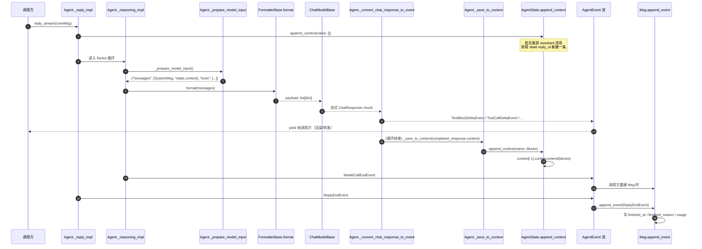

# 侦察报告 04：AgentScope 消息 / 事件 / 状态

> 侦察对象：
> - `third_party/agentscope/src/agentscope/message/`（`_base.py` 698 行 + `_block.py` 235 行 + `__init__.py` 39 行）
> - `third_party/agentscope/src/agentscope/event/`（`_event.py` 597 行 + `__init__.py` 77 行）
> - `third_party/agentscope/src/agentscope/state/`（`_state.py` 403 行 + `_task.py` 39 行 + `_a2a_state.py` 23 行 + `__init__.py` 16 行）
>
> 版本：AgentScope 2.0.8（已 `pip install -e`，可直接 `import agentscope`）
> 所有代码片段都在 `/Users/a/miniconda3/envs/agentscope_reme_pip_env/bin/python`（Python 3.11.13）里**真跑过**，可运行片段标注「已验证」并附真实输出，脚本存放在 `tutorial_agsc_reme/_recon/code/` 下（`04_` 前缀）。
> 所有结论都带 `相对仓库根的路径:行号`。
> 本报告不修改 `third_party/` 下任何文件。

---

## 子系统职责（这段代码到底在解决什么问题）

这段代码回答一个**整个 Harness 都要反复问的问题**：Agent 在跑的过程中，产生的信息到底以什么形状存在？

AgentScope 给的答案是**三种形状、两条转换边**：

| 形状 | 类 | 生命周期 | 谁在乎它 |
|---|---|---|---|
| **事件（Event）** | `AgentEvent` 联合类型，28 个子类（实测 `len(typing.get_args(AgentEvent)) == 28`） | 一次 reply 内，逐 token 产生，**用完即弃**（只在 MessageBus 的 replay log 里留最多 1000 条） | 前端 UI、IM Channel、Console 渲染器 |
| **消息（Msg）** | `Msg` + 6 种 `ContentBlock` | 跨 reply、跨 session 持久 | LLM API、压缩器、评估器 |
| **状态（State）** | `AgentState` | 一个 session 一份，整体 JSON 落库 | 存储层、断点续跑、HITL 恢复 |

两条转换边：

- **事件 → 消息**：`Msg.append_event(event)`（`third_party/agentscope/src/agentscope/message/_base.py:244`）。这是**唯一**的事件聚合入口，把「流」折叠成「对象」。
- **消息 → 上下文 → 模型输入**：`Agent._prepare_model_input()`（`third_party/agentscope/src/agentscope/agent/_agent.py:3239`）拼出 `[SystemMsg] + [summary UserMsg] + state.context`，再交给 `FormatterBase.format()`（`third_party/agentscope/src/agentscope/formatter/_formatter_base.py:47`）翻译成 provider 能吃的 `list[dict]`。

**为什么要有三套而不是一套？**

- 只有 `Msg` 不够：流式输出必须能被**增量**消费（首 token 延迟是产品指标），而 `Msg` 是整体对象。所以需要事件。
- 只有事件不够：事件洪流里 90% 是 `TEXT_BLOCK_DELTA` 这种碎片，模型下一轮要的是「上一条 assistant 说了什么」，必须是折叠后的对象。所以需要消息。
- 只有消息不够：一次 reply 会被 HITL（用户确认 / 外部执行）打断，被打断后进程可能重启。重启时要恢复的不只是「聊了什么」，还有「哪一步卡住了、迭代到第几轮、权限规则是什么」。所以需要状态。

**这段代码在参考架构里的位置**：主要对应**第 0 层（共享 Context）+ 第 1 层（Session 会话 & 事件溯源存储）+ 第 4 层（中间件 Hook 的埋点载体）**。它是所有上层插件的数据契约——Agent Loop、Memory、Subagent、MCP、Sandbox、评估引擎，没有一个能绕开 `Msg`。

**明确不存在的东西**（后面「与参考架构的映射」会展开）：
- 代码库里**没有** `event_to_message` 这个符号（全仓库 grep 无结果）。最接近的实现就是 `Msg.append_event`；文件名 `tests/event_to_message_test.py` 只是历史命名残留，它测的是 `Msg.append_event`。
- 代码库里**没有** `Msg.to_dict()` / `Msg.from_dict()` 这类方法。序列化完全交给 pydantic 的 `model_dump()` / `model_validate()`。
- `AgentState` **没有**独立的「事件溯源日志表」。事件只进 MessageBus 的有界 replay log（上限 1000 条，`third_party/agentscope/src/agentscope/app/message_bus/_keys.py:126`），真正的持久化对象是折叠后的 `Msg`。

---

## 关键文件表

| 文件路径:行号 | 核心类 | 核心函数 | 一句话职责 |
|---|---|---|---|
| third_party/agentscope/src/agentscope/message/_block.py:11 | `TextBlock` | — | 纯文本块，最小信息单元 |
| third_party/agentscope/src/agentscope/message/_block.py:26 | `ThinkingBlock` | — | 思维链块，`extra="allow"` 让 Anthropic 的 `signature` 等字段透传 |
| third_party/agentscope/src/agentscope/message/_block.py:56 | `Base64Source` | — | 内联二进制数据源（base64 + media_type） |
| third_party/agentscope/src/agentscope/message/_block.py:67 | `URLSource` | — | 外链二进制数据源，`url` 有 `field_serializer` 转 str |
| third_party/agentscope/src/agentscope/message/_block.py:83 | `DataBlock` | — | 二进制内容块（图/音/视频），source 二选一 |
| third_party/agentscope/src/agentscope/message/_block.py:101 | `HintBlock` | — | **不进 LLM 的 assistant 内容**，格式化时降级成 user 消息 |
| third_party/agentscope/src/agentscope/message/_block.py:128 | `ToolCallState` | — | 工具调用状态机枚举：pending/asking/allowed/submitted/finished |
| third_party/agentscope/src/agentscope/message/_block.py:138 | `ToolCallBlock` | — | 工具调用块，`input` 是**流式累积的原始 JSON 字符串** |
| third_party/agentscope/src/agentscope/message/_block.py:185 | `ToolResultState` | — | 工具结果状态：success/error/interrupted/denied/running |
| third_party/agentscope/src/agentscope/message/_block.py:195 | `ToolResultBlock` | — | 工具结果块，`id` 与 `ToolCallBlock.id` 相同（配对靠 id） |
| third_party/agentscope/src/agentscope/message/_block.py:219 | `ContentBlock` | — | 六种子块的 `TypeAlias` 联合，靠 `type` Literal 判别 |
| third_party/agentscope/src/agentscope/message/_base.py:58 | `Usage` | — | 单次模型调用的 token 账本，含 cache 两个字段 |
| third_party/agentscope/src/agentscope/message/_base.py:71 | `Msg` | — | **全系统核心数据结构**：一次说话记录 |
| third_party/agentscope/src/agentscope/message/_base.py:120 | — | `Msg.validate_role_content` | 角色-内容合法性校验（user/system 只能放特定块） |
| third_party/agentscope/src/agentscope/message/_base.py:156 | — | `Msg.get_text_content` | 拼所有 TextBlock，无文本时返回 `None`（不是空串！） |
| third_party/agentscope/src/agentscope/message/_base.py:210 | — | `Msg.get_content_blocks` | 按 type 过滤内容块，7 个 `@overload` 只服务于类型提示 |
| third_party/agentscope/src/agentscope/message/_base.py:244 | — | `Msg.append_event` | **事件→消息的唯一折叠函数**，约 275 行的 match 大分发 |
| third_party/agentscope/src/agentscope/message/_base.py:520 | — | `Msg.append_usage` | 累加 token 用量（同一条 Msg 上的多次模型调用求和） |
| third_party/agentscope/src/agentscope/message/_base.py:539/592/649 | — | `UserMsg` / `AssistantMsg` / `SystemMsg` | 三个**函数**（不是类！）式的构造器，自动填时间戳 |
| third_party/agentscope/src/agentscope/event/_event.py:26 | `EventType` | — | 28 个事件类型常量，`StrEnum` |
| third_party/agentscope/src/agentscope/event/_event.py:70 | `EventBase` | — | 所有事件的基类，`use_enum_values=True` |
| third_party/agentscope/src/agentscope/event/_event.py:83 | `ReplyStartEvent` | — | 一次 reply 开始，携带 session_id / reply_id / name |
| third_party/agentscope/src/agentscope/event/_event.py:112 | `ReplyEndEvent` | — | 一次 reply 结束，携带 `finished_reason` 与 `error` |
| third_party/agentscope/src/agentscope/event/_event.py:139 | `ModelCallEndEvent` | — | 一次模型调用结束，携带 token 用量 → 折叠进 `Msg.usage` |
| third_party/agentscope/src/agentscope/event/_event.py:289 | `HintBlockEvent` | — | **一次性**事件（不流式），整块 HintBlock 一次到达 |
| third_party/agentscope/src/agentscope/event/_event.py:426 | `ExceedMaxItersEvent` | — | **已废弃**，语义搬到 `ReplyEndEvent.finished_reason` |
| third_party/agentscope/src/agentscope/event/_event.py:443/456/483/496/521 | `RequireUserConfirmEvent` 等 | — | 5 个 HITL / 中断事件，是「断点续跑」的协议 |
| third_party/agentscope/src/agentscope/event/_event.py:534 | `CustomEvent` | — | 逃生舱：应用层自定义通知，不污染核心枚举 |
| third_party/agentscope/src/agentscope/event/_event.py:568 | `AgentEvent` | — | 28 个子类的 `TypeAlias` 联合（**不是类**，不能直接 `.model_validate`） |
| third_party/agentscope/src/agentscope/state/_state.py:209 | `AgentState` | — | **一个 session 的全部可变状态**，整体 JSON 落库 |
| third_party/agentscope/src/agentscope/state/_state.py:182 | `ReplyContext` | — | 当前 reply 的 id / 迭代轮次 / 结构化输出 schema |
| third_party/agentscope/src/agentscope/state/_state.py:32 | `ToolContext` | — | 工具层状态：文件读缓存（LRU）+ 已激活工具组 |
| third_party/agentscope/src/agentscope/state/_state.py:175 | `TaskContext` | — | 计划任务的容器（Planning 的落点） |
| third_party/agentscope/src/agentscope/state/_state.py:298 | — | `AgentState.append_context` | **reply 累积的核心**：把块追加到尾部 assistant 消息，没有就新建 |
| third_party/agentscope/src/agentscope/state/_state.py:345 | — | `AgentState.get_awaiting_tool_calls` | 判断 session 是否「停在等用户/等外部执行」 |
| third_party/agentscope/src/agentscope/state/_state.py:374 | — | `AgentState.get_unfinished_tool_calls` | 判断当前 reply 这一轮还有没有没拿到结果的工具调用 |
| third_party/agentscope/src/agentscope/state/_task.py:11 | `Task` | — | 子任务节点（subject/state/owner/blocked_by），Planning 用 |
| third_party/agentscope/src/agentscope/state/_a2a_state.py:10 | `A2AAgentState` | — | A2A 协议专用状态，与 `AgentState` **平行**的另一套 |

---

## 调用链

### 图 1：完整数据流（事件 → 消息 → 上下文 → 模型输入）



**逐段讲解**

1. `Agent._reply_impl`（`third_party/agentscope/src/agentscope/agent/_agent.py:1027`）拿到 `UserMsg` 后，先 `_save_to_context` 把用户消息落进 `state.context`，然后进 ReAct 循环。
2. `_prepare_model_input`（`_agent.py:3239`）是**「上下文 → 模型输入」的唯一出口**。它拼三样东西：`SystemMsg`（来自 `_get_system_prompt`）、可选的 `state.summary` 包装成的 `UserMsg`、以及 `state.context` 本体。注意它返回的是 **`list[Msg]`**，不是 `list[dict]`——翻译成 dict 是 formatter 的活。
3. `FormatterBase.format`（`formatter/_formatter_base.py:47`）把 `list[Msg]` 翻成 provider payload。`_group_messages`（`_formatter_base.py:190`）先把消息按「tool_sequence / agent_message」分组，这是为了让「工具结果消息」在 Anthropic 那种要求 user/assistant 严格交替的 API 里也能合法。
4. 模型流式吐 chunk，`_convert_chat_response_to_event`（`_agent.py:3760`）把它翻译成事件。**关键设计**：它维护一个 `block_ids` dict 来记住「当前正在流式输出的 text / thinking / data / tool call 分别是什么 id」，只有当 chunk 里第一次出现某类块时才发 `*_START`，之后发 `*_DELTA`， chunk 里消失了才发 `*_END`。这样前端只需要 `START → DELTA*n → END` 三段式就能稳定重建一个块。
5. **注意这里有两条并行路径**（教学重点，也是坑）：
   - **事件路径**：`CV` → `EV` → 调用方。事件里的 `block_id` 是 `_convert_chat_response_to_event` **新生成**的 id。
   - **落库路径**：`CV` → `SC` → `ST`。落进 context 的块是 `completed_response.content`，其 id 由 **模型实现**自己生成（如 `third_party/agentscope/src/agentscope/model/_openai_chat/_model.py:491` 的 `TextBlock(text=choice.message.content)`，没传 id → 自动 `_generate_id()`）。
   - 两条路径的 id **不是同一批**（见下面「坑与注意事项」第 2 条，这是实测出来的）。
6. `Msg.append_event`（`_base.py:244`）是给**外部消费者**用的折叠器。典型用法在 `third_party/agentscope/src/agentscope/app/channel/_base.py:419` 和 `third_party/agentscope/src/agentscope/console/_renderer.py:202`：收到事件流后一边渲染一边折叠出一个本地 `Msg`，用于「展示」和「转发到 IM」。它**不会**写进 `agent.state.context`。

### 图 2：事件 → 消息 的折叠规则（`Msg.append_event` 的 match 分支）

```mermaid
flowchart TD
    E[AgentEvent] --> CHK{event.reply_id == self.id ?}
    CHK -- 否 --> SKIP[logger.warning + 原样返回]
    CHK -- 是 --> SW{event.type}

    SW -->|REPLY_END| R1["finished_at = event.created_at<br/>finished_reason 字符串→枚举<br/>error = event.error"]
    SW -->|MODEL_CALL_END| R2["append_usage(Usage(...))<br/>同一条 Msg 上累加"]

    SW -->|TEXT_BLOCK_START| T0["content.append(TextBlock(id=block_id, text=''))"]
    SW -->|TEXT_BLOCK_DELTA| T1["_find_block('text', block_id).text += delta"]
    SW -->|TEXT_BLOCK_END| T2["可选覆盖 text + finished_at"]

    SW -->|THINKING_BLOCK_*| K1["同 text，但走 thinking 字段"]
    SW -->|DATA_BLOCK_*| D1["base64 解码→拼接字节→重新编码"]
    SW -->|HINT_BLOCK| H1["一次性 append 整个 HintBlock"]

    SW -->|TOOL_CALL_START| C0["append(ToolCallBlock(id, name, input=''))"]
    SW -->|TOOL_CALL_DELTA| C1["block.input += delta（拼 JSON 字符串）"]
    SW -->|TOOL_CALL_END| C2["finished_at = created_at"]

    SW -->|TOOL_RESULT_START| X0["append(ToolResultBlock(output=[], state=RUNNING))"]
    SW -->|TOOL_RESULT_TEXT_DELTA| X1["output 转 list，末位 TextBlock 累加"]
    SW -->|TOOL_RESULT_DATA_DELTA| X2["output.append(DataBlock(base64 或 URL))"]
    SW -->|TOOL_RESULT_END| X3["写 state/metadata/finished_at<br/>并把配对的 ToolCallBlock 翻成 FINISHED"]

    SW -->|REQUIRE_USER_CONFIRM| P1["ToolCallBlock.state = ASKING<br/>并记录 suggested_rules"]
    SW -->|USER_CONFIRM_RESULT| P2["仅当当前是 ASKING 才迁移<br/>→ ALLOWED 或 FINISHED"]
    SW -->|REQUIRE_EXTERNAL_EXECUTION| P3["ToolCallBlock.state = SUBMITTED"]
    SW -->|EXTERNAL_EXECUTION_RESULT| P4["跳过 id 已存在的<br/>否则 append ToolResultBlock"]
```



**逐段讲解**

- **第一道闸门是 `reply_id`**（`_base.py:264`）。`Msg.id` 在 AgentScope 里被复用为「reply id」——一条 assistant 消息 = 一次 reply。所以事件里带的 `reply_id` 正好就是目标 `Msg` 的 `id`。不匹配就跳过并 warning，这是防止 HITL 后重放旧事件串台的保护。
- **`ToolResultEndEvent` 顺手关掉 `ToolCallBlock`**（`_base.py:463-470`）。源码注释写得很清楚：「so the SSE-rebuilt reply_msg matches `agent.state.context`, which `_update_tool_call_state` mutates directly」。也就是说 Agent 主循环里是靠 `_update_tool_call_state`（`_agent.py:3401`）直接改 context 上的块，而外部消费者不知道这件事，所以折叠器要自己补上。
- **`USER_CONFIRM_RESULT` 有状态守卫**（`_base.py:486-494`）：只有 `ASKING` 状态才迁移，否则忽略。注释说这是为了处理「interrupt 已经把工具调用解决了，确认结果姗姗来迟」的竞态。
- **`EXTERNAL_EXECUTION_RESULT` 按 id 去重**（`_base.py:505-516`）：已经在 content 里的 `ToolResultBlock.id` 不再重复 append。
- **`HINT_BLOCK` 是一次性事件**（`_base.py:373-383`），没有 START/DELTA/END 三段。原因见 `HintBlockEvent` 的 docstring（`_event.py:289-300`）：hint 在创建时内容就完整（团队消息、后台工具结果、用户打断），没有流式必要。

---

## 关键数据结构

### 1. `Msg`——全系统核心（`third_party/agentscope/src/agentscope/message/_base.py:71-118`）

```python
class Msg(BaseModel):
    # ===== 会被喂进 context 的字段 =====
    name: str
    content: list[ContentBlock]
    role: Literal["user", "assistant", "system"]
    id: str = Field(default_factory=_generate_id)

    # ===== 元数据字段 =====
    metadata: dict = Field(default_factory=dict)
    created_at: str = Field(default_factory=lambda: datetime.now().isoformat())
    usage: Usage | None = Field(default=None)

    # ===== 工作流控制字段 =====
    finished_at: str | None = Field(default=None)
    finished_reason: ReplyFinishedReason | None = Field(default=None)
    structured_output: dict | None = Field(default=None)
    error: ErrorInfo | None = Field(default=None)
```

源码里三段被注释分隔得很清楚（`_base.py:75-77`、`88-91`、`100-103`）：**「给模型看的」和「给工程用的」严格分开**。这是很值得学的设计——`metadata`/`usage`/`finished_at`/`error` 从来不进 payload，但会被持久化，让运维能做归因。

`id` 的三重身份值得单独说：
1. `Msg.id` 就是消息唯一标识；
2. 当 `role == "assistant"` 时，它同时是**这一次 reply 的 id**，事件流里所有 `reply_id` 都指向它；
3. `AgentState.append_context` 用它判断「这是不是同一次 reply 的延续」。

### 2. 六种内容块（`third_party/agentscope/src/agentscope/message/_block.py`）

共同骨架：`type`（Literal 判别字段）+ `id`（`default_factory=_generate_id`）+ `created_at` + `finished_at`。

| 块 | 关键字段 | 设计意图 |
|---|---|---|
| `TextBlock`(:11) | `text: str` | 最小单元。所有 provider 都支持 |
| `ThinkingBlock`(:26) | `thinking: str`，`model_config = ConfigDict(extra="allow")` | **允许厂商私有字段**。docstring 明确说 Anthropic 的 `redacted_thinking` 也存成 `ThinkingBlock`（`thinking=""` + `redacted_thinking_data` 塞进 extra 字段），调用方按 `type=="thinking"` 过滤时会同时拿到可见和 redacted 两类。这是「不为每一个 provider 建子类」的取舍 |
| `Base64Source`(:56) | `data: str` + `media_type: str` | 内联二进制 |
| `URLSource`(:67) | `url: AnyUrl` + `media_type: str`，带 `@field_serializer("url")` | 外链。`AnyUrl` 不能直接 JSON 化，所以显式转 str |
| `DataBlock`(:83) | `source: Base64Source \| URLSource`，`name: str \| None` | 图片/音频/视频的统一容器。**注意：这里没有用判别联合**，靠 pydantic 智能 union 按字段形状选 |
| `HintBlock`(:101) | `hint: str \| list[TextBlock \| DataBlock]`，`source: str \| None` | **最反直觉的块**。它是 assistant 消息里的内容，但格式化时会被降级成 **user 消息**（见 `formatter/_deepseek_formatter.py:72-108`）。用途：运行时状态注入、团队消息、记忆检索结果、结构化输出要求。`source` 是个自由字符串，实际用的时候塞的是 JSON 文本，例如 `'{"label": "System", "sublabel": "Structured Output Requirement"}'`（`_agent.py:3647-3648`） |
| `ToolCallBlock`(:138) | `id`/`name`/`input: str`/`state: ToolCallState`/`suggested_rules` | `input` 是**原始 JSON 字符串**，不是 dict。因为流式输出时参数是一个片段一个片段来的，拼完才 parse |
| `ToolResultBlock`(:195) | `id`/`name`/`output: str \| list[TextBlock \| DataBlock]`/`state`/`metadata` | `id` 与配对的 `ToolCallBlock.id` **相同**，配对靠 id 而不是靠顺序 |

**两个 `model_config` 差异**（教学易错点）：
- `ToolCallBlock` 和 `ToolResultBlock` 带 `ConfigDict(use_enum_values=True)`（`_block.py:141`、`:198`），所以 `block.state` 存的是**裸字符串** `'asking'` / `'success'`，不是枚举实例。用 `==` 比较仍然成立（枚举继承 `StrEnum`），但 `repr()` 出来是 `'asking'`。
- `ThinkingBlock` 用 `extra="allow"`，其余块默认 `extra="ignore"`。

**`HintBlock.finished_at` 的异常默认值**：其他所有块的 `finished_at` 都是 `None`，但 `HintBlock` 是 `Field(default_factory=_generate_timestamp)`（`_block.py:124`）。因为 hint 是一次性块，创建即完成。`Msg.append_event` 里还专门把它对齐成 `created_at`（`_base.py:382`）。

### 3. `ToolCallState` 状态机（`_block.py:128-135`，docstring 里的迁移图是官方给的）

```python
class ToolCallState(StrEnum):
    PENDING = "pending"      # 初始态，还没过权限系统
    ASKING = "asking"        # 正在等用户确认
    ALLOWED = "allowed"      # 权限通过，等待执行
    SUBMITTED = "submitted"  # 已交给外部执行器，等结果事件
    FINISHED = "finished"    # 终态
```

源码 docstring（`_block.py:160-174`）画了完整迁移图：

```
pending
  ├── permission DENY / 入参校验失败 ──────────► finished
  ├── permission ASK ─────────────────────────► asking
  │       ├── 用户拒绝 ───────────────────────► finished
  │       └── 用户同意 ───────────────────────► allowed
  └── permission ALLOW ───────────────────────► allowed

allowed
  ├── 本地工具 ── (执行) ─────────────────────► finished
  └── 外部工具 ───────────────────────────────► submitted

submitted
  └── 收到 ExternalExecutionResultEvent ──────► finished
```

`ToolResultState`（`_block.py:185-192`）是**另一条正交轴**：`SUCCESS` / `ERROR` / `INTERRUPTED` / `DENIED` / `RUNNING`。`RUNNING` 是 `TOOL_RESULT_START` 时的初始值，`TOOL_RESULT_END` 时被覆盖成终态。**两个枚举不要混**：`ToolCallState` 管「流程走到哪」，`ToolResultState` 管「结果好不好」。

### 4. `Usage`（`_base.py:58-68`）

```python
class Usage(BaseModel):
    input_tokens: int
    output_tokens: int
    cache_input_tokens: int = 0              # 从 prompt cache 读的
    cache_creation_input_tokens: int = 0     # 写进 prompt cache 的
```

两个 cache 字段直接对应参考架构第 1 层里说的「KV Cache 管理」——但注意，AgentScope 只是**统计**，不做主动的 cache 控制。

### 5. `AgentState`（`third_party/agentscope/src/agentscope/state/_state.py:209-296`）

```python
class AgentState(BaseModel):
    session_id: str = Field(default_factory=_generate_id)
    summary: str | list[TextBlock | DataBlock] = ""
    context: list[Msg] = Field(default_factory=list)

    reply_context: ReplyContext = Field(default_factory=ReplyContext)
    permission_context: PermissionContext = Field(default_factory=PermissionContext)
    tool_context: ToolContext = Field(default_factory=ToolContext)
    tasks_context: TaskContext = Field(default_factory=TaskContext)
    middle_context: dict[str, Any] = Field(default_factory=dict)
```

实测的顶层字段（`04_state_agentstate.py` 输出）：
`['session_id', 'summary', 'context', 'reply_context', 'permission_context', 'tool_context', 'tasks_context', 'middle_context']`

逐个说：

- `summary`：**压缩后的上下文**，`_prepare_model_input` 会把它包成一条 `UserMsg` 插在 system prompt 之后、context 之前（`_agent.py:581-583`）。`str | list[...]` 的双类型是为了支持多模态摘要。
- `context`：**未压缩的对话上下文本体**。
- `reply_context`（`_state.py:182-206`）：`reply_id` / `cur_iter` / `structured_schema` / `structured_output`。其中 `structured_schema` 有个 `@field_serializer` 把 pydantic 类转成 JSON schema dict——因为「进程内是类，落盘是 schema」。
- `permission_context`：权限规则集，交给 `PermissionEngine`（`_agent.py:193`）。
- `tool_context`：`ToolContext`（`_state.py:32`）含 `read_file_cache`（LRU 文件读缓存，`get_cache`/`cache_file`/`clean_file_cache` 三个方法处理 mtime 失效和字节上限）与 `activated_groups`（已激活的工具组名）。
- `tasks_context`：`TaskContext` 包 `list[Task]`。
- `middle_context`：`dict[str, Any]`，**给中间件跨 reply 存数据的抽屉**。源码注释（`_state.py:295-296`）说得很直白：「the context that allow the middlewares to store/get data across different replies」。这是参考架构第 4 层 Hook 系统的落点。

**向后兼容的写法很值得学**：`_migrate_legacy_reply_fields`（`_state.py:226-241`）是一个 `@model_validator(mode="before")`，把旧版扁平存的 `reply_id` / `cur_iter` 自动折叠进 `reply_context`，同时暴露 `reply_id` / `cur_iter` 两个 `@property`（`_state.py:243-263`）让旧代码继续读写。**状态格式演进的标准做法**：加 `mode="before"` 迁移器 + 保留 property 别名。

### 6. `Task`（`third_party/agentscope/src/agentscope/state/_task.py:11-39`）

```python
class Task(BaseModel):
    subject: str
    description: str
    metadata: dict[str, Any]
    created_at: str = Field(default_factory=lambda: datetime.now().isoformat())
    state: Literal["pending", "in_progress", "completed"] = "pending"
    id: str = Field(default_factory=_generate_id)
    owner: str | None = None
    blocks: list[str] = Field(default_factory=lambda: [])
    blocked_by: list[str] = Field(default_factory=lambda: [])
```

这是**参考架构第 2 层 Planning 插件的落点**：`blocks` / `blocked_by` 是任务依赖图的两条边（双向冗余存，读的时候不用反查）。注意 `state` 用的是裸 `Literal` 而不是 `StrEnum`——和 `ToolCallState` 的风格不统一，是代码库里真实存在的不一致。

### 7. `EventBase` 与 `AgentEvent`（`third_party/agentscope/src/agentscope/event/_event.py`）

```python
class EventBase(BaseModel):
    model_config = ConfigDict(use_enum_values=True)
    id: str = Field(default_factory=_generate_id)
    created_at: str = Field(default_factory=lambda: datetime.now().isoformat())
    metadata: Dict[str, Any] = Field(default_factory=dict)
```

**`AgentEvent` 是 `TypeAlias` 不是类**（`_event.py:568-597`）：

```python
AgentEvent: TypeAlias = (
    ReplyStartEvent | ReplyEndEvent | ExceedMaxItersEvent
    | RequireUserConfirmEvent | RequireExternalExecutionEvent
    | ModelCallStartEvent | ModelCallEndEvent
    | TextBlockStartEvent | TextBlockDeltaEvent | TextBlockEndEvent
    | DataBlockStartEvent | DataBlockDeltaEvent | DataBlockEndEvent
    | ThinkingBlockStartEvent | ThinkingBlockDeltaEvent | ThinkingBlockEndEvent
    | HintBlockEvent | ToolCallStartEvent | ToolCallDeltaEvent | ToolCallEndEvent
    | ToolResultStartEvent | ToolResultTextDeltaEvent | ToolResultDataDeltaEvent
    | ToolResultEndEvent | UserConfirmResultEvent | UserInterruptEvent
    | ExternalExecutionResultEvent | CustomEvent
)
```

所以**不能**写 `AgentEvent.model_validate(...)`。要反序列化必须 `TypeAdapter(AgentEvent).validate_python(dict)`——AgentScope 自己就是这么做的（`third_party/agentscope/src/agentscope/app/channel/_base.py:54`）：

```python
# Deserialize a bus event dict back into its typed AgentEvent.
_EVENT_ADAPTER: TypeAdapter = TypeAdapter(AgentEvent)
```

---

## 源码精读

### 片段 A：`Msg` 的角色-内容校验（`_base.py:120-130`）

```python
@model_validator(mode="after")
def validate_role_content(self) -> Self:
    """Validate content blocks according to the role."""
    match self.role:
        case "user":
            _assert_user_content_blocks(self.content)
        case "system":
            _assert_system_content_blocks(self.content)
        case "assistant":
            pass
    return self
```

配合 `_base.py:33-48` 的两个断言函数：user 只允许 `text`/`data`，system 只允许 `text`，assistant 不管。

**为什么这么设计？** 因为下游 formatter 是**假设**了这个不变式的。DeepSeek formatter 遇到 `ToolResultBlock` 会 flush 缓冲并单独产出一条 `{"role": "tool", ...}` 消息（`_deepseek_formatter.py:143-152`）；如果 user 消息里混进 tool_result，payload 顺序就乱了。**把不变式放在数据模型上，而不是放在 formatter 里**——这是「数据契约守卫」胜过「下游防御」的范例。

**副作用（实测）**：ToolResultBlock 不能放在 `role="user"` 的消息里。AgentScope 的做法是**把工具结果追加到 assistant 消息内部**（这就是 `_save_to_context` → `append_context` 的路径），由 formatter 在翻译时把它拆成独立的 `role="tool"` 消息。这跟 OpenAI 原生「tool 结果必须是单独一条 role=tool 消息」的心智模型**完全不同**，是小白最容易卡住的地方。

### 片段 B：`Msg.append_event` 的 REPLY_END / MODEL_CALL_END（`_base.py:274-295`）

```python
match event.type:
    case EventType.REPLY_END:
        self.finished_at = event.created_at
        # ``event.finished_reason`` is a bare string (EventBase sets
        # ``use_enum_values``); coerce back to the enum so this
        # field serializes cleanly.
        self.finished_reason = ReplyFinishedReason(
            event.finished_reason,
        )
        self.error = event.error

    case EventType.MODEL_CALL_END:
        self.append_usage(
            Usage(
                input_tokens=event.input_tokens,
                output_tokens=event.output_tokens,
                cache_input_tokens=event.cache_input_tokens,
                cache_creation_input_tokens=(
                    event.cache_creation_input_tokens
                ),
            ),
        )
```

**为什么 `event.finished_reason` 要手动转回枚举？** 因为 `EventBase` 设了 `use_enum_values=True`（`_event.py:73`），所以 `event.finished_reason` 是裸字符串 `'completed'`。而 `Msg.finished_reason` 声明成 `ReplyFinishedReason | None`，虽然 pydantic 也能接受字符串自动转，但源码注释说手动转是为了「serializes cleanly」——即避免 pydantic 在 `model_dump()` 时把 `ReplyFinishedReason` 当普通 str 丢掉枚举语义。

**`match` 用 `StrEnum` 做模式**是能工作的，因为 `StrEnum` 的成员 `==` 就等于它的字符串值。

**`append_usage` 是累加而非覆盖**（`_base.py:527-535`）：一次 reply 里模型可能被调多次（每一轮 ReAct 都调一次），所以 `input_tokens += ...`。实测验证：两次 `ModelCallEndEvent`(100+150 / 10+20) → `Usage(input_tokens=250, output_tokens=30)`。

### 片段 C：`DataBlock` 分片的 base64 拼接（`_base.py:340-352`）

```python
elif event.type == EventType.DATA_BLOCK_DELTA and event.data:
    # Each delta is an independently base64-encoded chunk
    # (with its own padding); naive string concat would
    # corrupt the byte stream. Decode, concat bytes, re-encode.
    existing = (
        base64.b64decode(block.source.data)
        if block.source.data
        else b""
    )
    incoming = base64.b64decode(event.data)
    block.source.data = base64.b64encode(
        existing + incoming,
    ).decode("ascii")
```

**这是全文件最容易被忽略、后果最严重的一段**。流式音频/图片的每个 chunk 都被**独立** base64 编码（各自带 `=` padding）。如果直接字符串相加会得到非法 base64。源码必须先解码再拼字节再重新编码。

实测（`04_msg_append_event_replay.py`）：`"aGVs"` + `"bG8="` → 结果解码回 `b"hello"`。如果字符串直接拼会得到 `"aGVsbG8="`——**这个例子恰好碰巧对了**，但真实场景里第一个 chunk 的 padding 会导致中间出现 `=`，解码直接报错。这就是为什么源码要注释解释。

### 片段 D：`ToolResultEndEvent` 顺带关闭配对 ToolCall（`_base.py:455-470`）

```python
else:
    assert isinstance(block, ToolResultBlock)
    block.state = event.state
    block.metadata = event.metadata
    block.finished_at = event.created_at
    # The paired ToolCallBlock's lifecycle ends with its
    # result — flip it to FINISHED here so the SSE-rebuilt
    # reply_msg matches ``agent.state.context``, which
    # ``_update_tool_call_state`` mutates directly.
    call_block = self._find_block(
        "tool_call",
        event.tool_call_id,
    )
    if call_block is not None:
        assert isinstance(call_block, ToolCallBlock)
        call_block.state = ToolCallState.FINISHED
```

**这一段的注释直接点破了这套架构的核心张力**：Agent 内部走的是「直接改 context 对象」的路径（`_update_tool_call_state`，`_agent.py:3401`），而外部消费者走的是「订阅事件流、自己折叠」的路径。两条路径必须**殊途同归**，否则 UI 显示的工具状态会和真实状态不一致。所以折叠器必须主动补做 Agent 侧悄悄做过的状态迁移。

> 教学价值：这是「事件溯源」在真实工程里的经典妥协——**你不是从事件重放推导状态，你是让事件流去追平状态**。

### 片段 E：`AgentState.append_context`——一次 reply = 一条消息（`_state.py:298-326`）

```python
def append_context(
    self,
    name: str,
    blocks: list[
        TextBlock | DataBlock | HintBlock | ToolCallBlock | ToolResultBlock
    ],
) -> None:
    """Append the given blocks to the agent's own message with the current
    `reply_id`. If such message doesn't exist, a new assistant message
    with agent's name and current reply ID will be created.
    """
    # If append to the latest message
    if (
        self.context
        and self.context[-1].role == "assistant"
        and self.context[-1].name == name
        and self.context[-1].id == self.reply_id
    ):
        self.context[-1].content.extend(blocks)
    else:
        # Create a new assistant message with the current reply ID
        self.context.append(
            Msg(
                id=self.reply_id,
                role="assistant",
                name=name,
                content=blocks,
            ),
        )
```

**三条件判断**：尾部是 assistant + 名字匹配 + id 等于当前 reply_id。三者缺一就新建。

这个设计的结果是实测出来的（`04_evt_stream_vs_context.py`）：一次包含「注入 hint → 思考 → 调工具 → 拿结果 → 出文本」的完整 reply，在 `state.context` 里是**一条** assistant 消息，content 是 `['hint', 'tool_call', 'tool_result', 'text']`。ReAct 循环跑了 2 轮模型调用，但只产生 1 条消息。

**为什么按 reply 而不是按模型调用切消息？** 因为 LLM 的多轮工具调用协议要求：一条 assistant 消息里可以有多个 `tool_calls`，紧跟着若干条 tool 结果消息。如果按模型调用切，就会出现「assistant(tool_call#1) / tool_result#1 / assistant(tool_call#2) / tool_result#2」这种碎片，压缩（summarization）和评估（trajectory 分析）都会很难受。

**代价**：`get_unfinished_tool_calls`（`_state.py:374-403`）必须先检查 `last_msg.id != self.reply_id`，因为「尾部 assistant 消息可能是上一次 reply 的」。

### 片段 F：`AgentState` 的 HITL 断点判定（`_state.py:345-372`）

```python
def get_awaiting_tool_calls(self, name: str) -> list[ToolCallBlock]:
    if not self.context:
        return []
    last_msg = self.context[-1]
    if last_msg.role != "assistant" or last_msg.name != name:
        return []
    result_ids = {b.id for b in last_msg.get_content_blocks("tool_result")}
    return [
        tc
        for tc in last_msg.get_content_blocks("tool_call")
        if tc.state == ToolCallState.ASKING
        or (
            tc.state == ToolCallState.SUBMITTED and tc.id not in result_ids
        )
    ]
```

**只检查尾部消息**。理由是「被打断的 reply 一定停在 context 的最后」。这在 `SessionStatus` 里被生产化使用（`third_party/agentscope/src/agentscope/app/_service/_session.py:207-240`）：服务层靠 `derive_parked_status(context)` 判断 session 是 `AWAITING_PERMISSION` / `AWAITING_EXTERNAL_RESULT` / `IDLE`，和分布式锁给的 `RUNNING` 合成一个四值枚举。

**这是「状态即真相」的漂亮案例**：HITL 断点不存单独的 flag，而是从 `context` 尾部的工具调用状态**推导**出来。进程重启后照样能推导出正确结果——比存一个会和现实漂移的 `is_waiting_for_user` 布尔值健壮得多。

`get_unfinished_tool_calls`（`_state.py:374-403`）的语义**不同**：它不管状态，只看「有没有 `ToolResultBlock` 与之配对」，且额外要求 `last_msg.id == self.reply_id`（只看当前 reply）。它在主循环里用来判断「这一轮 ReAct 是不是该 `cur_iter += 1`」（`_agent.py:1272-1273`）。

### 片段 G：`AgentState` 的持久化边界（`third_party/agentscope/src/agentscope/app/storage/_model/_session.py:411`）

```python
state: AgentState = Field(default_factory=AgentState)
"""Mutable runtime state, updated after each chat turn."""
```

`AgentState` 是 `SessionRecord` 的一个字段，而 `SessionRecord` 在 SQL 后端里是**一行一 JSON payload**（`third_party/agentscope/src/agentscope/app/storage/_sql/_storage.py:1061-1097`），在 Redis 后端里是一个 string value（`_redis_storage.py:871-922`）。

**持久化边界 = `SessionRecord` 的边界**。整个 `AgentState`（含完整 `context`）序列化成一个 JSON blob，随 session 行一起写。`update_session_state(user_id, agent_id, session_id, state)` 是热路径的专用方法（`storage/_base.py:437-451`），只改 payload 不碰其他列。

实测（`04_state_in_session_record.py`）：`SessionRecord` 顶层字段 `['id','updated_at','created_at','user_id','agent_id','origin','team_id','config','state']`，`state` 里嵌套 8 个字段，`state.context[0]` 是完整展开的 `Msg` dict。两条消息的 state JSON 长度 1161 字节。

**事件存在哪里？** 事件**不落** `SessionRecord`。它们进 MessageBus 的有界 replay log：

```python
# third_party/agentscope/src/agentscope/app/_bus_ops.py:44-66
async def publish_session_event(bus, session_id, event) -> str:
    """Append event to replay log + fan out live."""
    key = MessageBusKeys.session_events(session_id)
    entry_id = await bus.log_append(
        key, event, max_len=MessageBusKeys.SESSION_REPLAY_MAX_LEN,
    )
    await bus.publish(key, {**event, "_entry_id": entry_id})
    return entry_id
```

`SESSION_REPLAY_MAX_LEN = 1000`（`third_party/agentscope/src/agentscope/app/message_bus/_keys.py:126`），注释写明「older events are trimmed on append」。

**结论（重要，与参考架构的说法有出入）**：参考架构第 1 层说「Session 会话 & 事件溯源存储……支持回放、断点续跑」。AgentScope 2.0.8 的实际实现是：
- **回放**：只支持最近 1000 条事件的短窗口回放（给「客户端断线重连」用），不是完整事件溯源。
- **断点续跑**：靠 `AgentState.context` 尾部的工具调用状态推导，不是靠重放事件。
- 真正的「完整事件日志 + 从零重放」在这版源码里**不存在**。

### 片段 H：`EventBase.use_enum_values` 的连锁反应

`_event.py:73` 的 `model_config = ConfigDict(use_enum_values=True)` 让**所有**事件的枚举字段落成裸字符串。实测（`04_evt_serde.py`）：

```
序列化: {'id': '...', 'created_at': '...', 'metadata': {}, 'type': 'TEXT_BLOCK_DELTA',
        'reply_id': 'r1', 'block_id': 'b1', 'delta': 'hi'}
type 字段的真实类型: str -> 'TEXT_BLOCK_DELTA'
反序列化类型: TextBlockDeltaEvent | 相等: True

{'...', 'type': 'TOOL_RESULT_END', 'reply_id': 'r1', 'tool_call_id': 'tc1', 'state': 'success'}
反序列化: ToolResultEndEvent | state 类型: str 'success'
```

**好处**：事件可以直接 `json.dumps` 上 Redis / WebSocket，不需要 `mode="json"` 之外的额外处理。
**代价**：反序列化后 `event.state` 是 `str` 而不是 `ToolResultState`。因为 `StrEnum` 的 `==` 透明，大部分代码感知不到；但 `isinstance(event.state, ToolResultState)` 会**返回 False**。

### 片段 I：废弃 API 的真实状态（`_event.py:98-109`、`426-441`）

```python
@deprecated(
    "ReplyEndReason is deprecated and will be removed; "
    "use agentscope.types.ReplyFinishedReason instead.",
)
class ReplyEndReason(StrEnum):
    COMPLETED = "completed"
    INTERRUPTED = "interrupted"
    EXCEED_MAX_ITERS = "exceed_max_iters"
```

```python
@deprecated(
    "ExceedMaxItersEvent is deprecated and will be removed; check the "
    "'finished_reason' field of ReplyEndEvent against "
    "ReplyFinishedReason.EXCEED_MAX_ITERS instead.",
)
class ExceedMaxItersEvent(EventBase):
    """Deprecated exceeded max iteration event, still emitted for backward
    compatibility without semantics; use ``ReplyEndEvent.finished_reason``."""
```

两个重要的**源码 vs 直觉**的不一致：

1. `ReplyEndReason` **少了 `ERROR`**，而权威定义 `ReplyFinishedReason`（`third_party/agentscope/src/agentscope/types/_reply.py:10-16`）有 4 个成员：`COMPLETED` / `INTERRUPTED` / `EXCEED_MAX_ITERS` / `ERROR`。过渡期的别名枚举漏了一个成员——**不要用它**。
2. `ExceedMaxItersEvent` 的 docstring 明确说「still emitted for backward compatibility **without semantics**」——也就是说它还会被 yield 出来，但**语义已经搬到 `ReplyEndEvent.finished_reason`**。教学时如果只读事件类型列表不看 docstring，会以为要靠它判断超轮次。

实测（`04_blk_edges.py`）：实例化 `ExceedMaxItersEvent` 会触发 `DeprecationWarning`；`ReplyEndReason.COMPLETED` 只是类属性访问，**不触发**（`typing_extensions.deprecated` 的告警挂在实例化/调用上）。

### 片段 J：ReMe 中间件怎么把记忆塞进 `Msg`（`third_party/agentscope/src/agentscope/middleware/_longterm_memory/_reme/_middleware.py:529-551`）

```python
@staticmethod
def _build_memory_message(memories: list[str]) -> Msg:
    """Format retrieved ``memories`` as a synthetic hint message.

    The context entry uses an assistant-role ``Msg`` container because
    user messages cannot carry ``HintBlock`` content. Formatters convert
    the ``HintBlock`` itself into a user message before the model call.
    """
    bullets = "\n".join(f"- {m}" for m in memories)
    content = (
        f"{_MEMORY_SECTION_HEADER}\n"
        f"{_MEMORY_SECTION_INTRO}\n"
        f"{bullets}"
    )
    return AssistantMsg(
        name=_MEMORY_MSG_NAME,
        content=[HintBlock(hint=content)],
    )
```

**这段是「消息/事件/状态」子系统和 ReMe 的接缝**，教学时是绝佳的桥：

- ReMe 检索出来的长期记忆，最终**必须**变成一条 `Msg` 才能进 LLM。AgentScope 没给记忆留特殊通道——记忆就是一个块。
- 选 `HintBlock` 而不是 `TextBlock`，是为了**语义上区分**「这是系统注入的」和「这是模型自己说的」。
- 用 `AssistantMsg` 而不是 `UserMsg` 承载，纯粹是被片段 A 的角色校验逼的（user 只收 text/data）。
- 而 formatter 会在翻译时把它降级成 user 消息——所以模型看到的仍然是「用户侧信息」，语义正确。

ReMe 侧的写回也依赖 `state.context`（`_middleware.py:347`）：

```python
pre_ids = {m.id for m in agent.state.context if isinstance(m, Msg)}
```

用**消息 id 差集**算出「本轮新增的消息」，而不是重发整个 context。注释解释（`_middleware.py:341-346`）：「Taking the increment (not just the final message) still captures every step of the turn — user input, each assistant step, and every tool call / tool result — which the agent records on ``state.context`` via ``_save_to_context`` but does not all yield on the stream (only the final answer is yielded).」

**这句话精确说清了三条路径的差异**：
| 路径 | 内容 |
|---|---|
| 事件流 yield 出来的 | 只有最终的 assistant 文本消息（`yield_final_msg=True` 时） |
| `state.context` 记录的 | 一整轮的全部块（hint/tool_call/tool_result/text） |
| ReMe 需要的 | `state.context` 的增量 |

---

## 可运行代码片段

全部脚本在 `tutorial_agsc_reme/_recon/code/`，用
`/Users/a/miniconda3/envs/agentscope_reme_pip_env/bin/python <脚本>` 运行。

### 片段 1：「构造带工具的 Msg → formatter 转 payload → 反序列化回来断言一致」【已验证】

脚本：`tutorial_agsc_reme/_recon/code/04_msg_roundtrip_and_payload.py`

```python
# -*- coding: utf-8 -*-
"""侦察代码片段 1：手工构造带 tool 的 Msg 列表 -> formatter 转 payload -> 反序列化回来断言一致"""
import asyncio, json

from agentscope.message import (
    Msg, UserMsg, AssistantMsg, SystemMsg,
    TextBlock, ThinkingBlock, ToolCallBlock, ToolResultBlock,
    ToolCallState, ToolResultState, DataBlock, Base64Source, HintBlock, Usage,
)
from agentscope.formatter import DeepSeekChatFormatter

# ---------- 1) 手工构造 Msg 列表 ----------
sys_msg = SystemMsg(name="system", content="You are a helpful agent.")
user_msg = UserMsg(name="user", content="北京现在几点？请调用工具查询。", id="msg_user_001")

# 关键：AgentScope 2.x 把 ToolResultBlock 也放在 assistant 消息里（一次 reply 累积成一条消息）
assistant_msg = AssistantMsg(
    name="assistant",
    content=[
        ThinkingBlock(thinking="用户要的是当前时间，我应该调用 get_time 工具。", id="b_think_001"),
        ToolCallBlock(id="tc_001", name="get_time", input='{"city": "Beijing"}',
                      state=ToolCallState.ALLOWED),
        ToolResultBlock(id="tc_001", name="get_time", output="2026-09-21T16:00:00+08:00",
                        state=ToolResultState.SUCCESS, metadata={"elapsed_ms": 12}),
        TextBlock(text="北京时间 2026-09-21 16:00。", id="b_text_001"),
    ],
    id="msg_asst_001",
    usage=Usage(input_tokens=120, output_tokens=18),
)
msgs = [sys_msg, user_msg, assistant_msg]

# ---------- 2) formatter 转成 payload ----------
payload = asyncio.run(DeepSeekChatFormatter().format(msgs))
print("=== payload ===")
print(json.dumps(payload, ensure_ascii=False, indent=2))

# ---------- 3) 序列化 / 反序列化 ----------
raw = [m.model_dump() for m in msgs]
back = [Msg.model_validate(d) for d in raw]
assert back == msgs, "roundtrip failed"
print("\n=== roundtrip OK ===")
print("block types after roundtrip:", [type(b).__name__ for b in back[2].content])
print("block type tags:", [b.type for b in back[2].content])
print("\n=== assistant msg json ===")
print(back[2].model_dump_json(indent=2))
```

**真实输出（节选）**：

```
=== payload ===
[
  { "role": "system", "content": "You are a helpful agent." },
  { "role": "user", "content": "北京现在几点？请调用工具查询。" },
  {
    "role": "assistant",
    "content": null,
    "reasoning_content": "用户要的是当前时间，我应该调用 get_time 工具。",
    "tool_calls": [
      { "id": "tc_001", "type": "function",
        "function": { "name": "get_time", "arguments": "{\"city\": \"Beijing\"}" } }
    ]
  },
  { "role": "tool", "tool_call_id": "tc_001",
    "content": "2026-09-21T16:00:00+08:00", "name": "get_time" },
  { "role": "assistant", "content": "北京时间 2026-09-21 16:00。", "reasoning_content": "" }
]

=== roundtrip OK ===
block types after roundtrip: ['ThinkingBlock', 'ToolCallBlock', 'ToolResultBlock', 'TextBlock']
block type tags: ['thinking', 'tool_call', 'tool_result', 'text']
```

**这张 payload 图就是「上下文 → 模型输入」转换的完整证据**，教学时必须逐条讲：

1. **1 条 assistant `Msg` → 2 条 payload 消息**。`ToolResultBlock` 被拆成独立的 `role="tool"` 消息，位置紧跟在带 `tool_calls` 的 assistant 消息之后。这是 `_deepseek_formatter.py:110-152` 的 flush 逻辑：遇到 `ToolResultBlock` 时先把缓冲区里的 text/thinking/tool_calls 打包成一条 assistant 消息 append，再 append tool 消息。
2. **`content` 是 `null` 而不是 `""`**。源码 `_deepseek_formatter.py:136`：`"content": content_text or (None if tool_calls else "")`——有 tool_calls 时 content 用 `None`，因为 DeepSeek API 要求这种组合。
3. **`reasoning_content` 无条件出现**（`_deepseek_formatter.py:172-181`）。源码注释解释了原因：「DeepSeek requires `reasoning_content` to be present on ALL assistant messages in multi-turn conversations that use thinking mode」，就连没有 ThinkingBlock 的历史消息也要给空串。
4. **`arguments` 是字符串不是对象**。`ToolCallBlock.input` 原样透传——因为在流式场景下 Agent 从不 parse 它。
5. **4 种块、4 种去向**：`ThinkingBlock` → `reasoning_content`；`ToolCallBlock` → `tool_calls[].function`；`ToolResultBlock` → 独立 `role="tool"` 消息；`TextBlock` → `content`。
6. **roundtrip 无损**：`Msg.model_dump()` → `Msg.model_validate()` 后 `back == msgs` 成立，且块的**具体子类**被正确恢复（说明 `ContentBlock` 联合类型靠 `type` Literal 判别成功）。

### 片段 2：事件流重建 Msg（事件溯源回放）【已验证】

脚本：`tutorial_agsc_reme/_recon/code/04_msg_append_event_replay.py`

```python
from agentscope.event import (
    ReplyStartEvent, ReplyEndEvent, TextBlockStartEvent, TextBlockDeltaEvent, TextBlockEndEvent,
    ThinkingBlockStartEvent, ThinkingBlockDeltaEvent, ThinkingBlockEndEvent,
    ToolCallStartEvent, ToolCallDeltaEvent, ToolCallEndEvent,
    ToolResultStartEvent, ToolResultTextDeltaEvent, ToolResultEndEvent,
    RequireUserConfirmEvent, UserConfirmResultEvent, ConfirmResult,
    ModelCallEndEvent, DataBlockStartEvent, DataBlockDeltaEvent, DataBlockEndEvent,
)
from agentscope.message import Msg, ToolCallBlock, ToolCallState, ToolResultState
from agentscope.types import ReplyFinishedReason
RID = "reply_001"
events = [ ... 22 个事件 ... ]
msg = Msg(id=RID, name="assistant", role="assistant", content=[])
for ev in events:
    msg.append_event(ev)
```

**真实输出**：

```
blocks: [('thinking', '我在想要不要调工具'), ('text', '好，我查一下。'),
         ('tool_call', <ToolCallState.FINISHED: 'finished'>),
         ('tool_result', 'success'), ('data', None)]
usage: input_tokens=250 output_tokens=30 cache_input_tokens=0 cache_creation_input_tokens=0
finished_at: 2026-09-21T16:50:28.499960 finished_reason: completed
tool_call state: finished | input: {"city": "Beijing"}
tool_result state: success | metadata: {'elapsed_ms': 8}
data block bytes: b'hello' | media: image/png

=== 全部断言通过 ===
```

四个断言覆盖了四条最容易写错的行为：
1. `tc.state == ToolCallState.FINISHED` —— `ToolResultEnd` 顺带关掉了配对的 `ToolCallBlock`；
2. `usage.input_tokens == 250`（100+150）—— 两次 `MODEL_CALL_END` 累加；
3. `base64.b64decode(...) == b"hello"` —— 分片 base64 解码-拼接-重编码；
4. `finished_reason == COMPLETED` —— 字符串被强制转回枚举。

另有两个保护性测试也验证过（跑官方测试得到，见下）：
- 事件 `reply_id` 与 `Msg.id` 不匹配 → warning + 原样返回，不抛异常；
- `TEXT_BLOCK_DELTA` 找不到目标 block → warning + 跳过，不抛异常。

### 片段 3：`AgentState` 的字段、累积、序列化与 HITL 判定【已验证】

脚本：`tutorial_agsc_reme/_recon/code/04_state_agentstate.py`

**真实输出**：

```
session_id: sess_001
reply_id (property -> reply_context): 1945cdd544414cfeb4ec07e5a6a3371f
顶层字段: ['session_id', 'summary', 'context', 'reply_context', 'permission_context',
          'tool_context', 'tasks_context', 'middle_context']

context 长度: 1 | role: assistant | id == reply_id: True
合并后的文本: 你好，
我是助手。
has_awaiting_tool_calls: True
get_unfinished_tool_calls: ['delete_file']

=== AgentState roundtrip OK ===
middle_context: {}
tasks_context: {'tasks': []}
tool_context.activated_groups: []

迁移后 reply_id: r-legacy cur_iter: 7
=== legacy 迁移 OK ===
```

要点：
- 两次 `append_context("Friday", [...])` 只产出 **1 条**消息（同 reply_id 就 extend）；
- `state.reply_id` 是 `@property` 代理到 `reply_context.reply_id`；
- `AgentState.model_dump_json()` → `model_validate()` 完全无损；
- 旧格式 `{"reply_id": ..., "cur_iter": ...}` 被 `mode="before"` 校验器自动迁移。

### 片段 4：事件序列化 / 反序列化必须用 `TypeAdapter`【已验证】

脚本：`tutorial_agsc_reme/_recon/code/04_evt_serde.py`。真实输出见上文「源码精读 片段 H」。

### 片段 5：`AgentState` 在 `SessionRecord` 里的持久化形状【已验证】

脚本：`tutorial_agsc_reme/_recon/code/04_state_in_session_record.py`

```
SessionRecord 顶层字段: ['id','updated_at','created_at','user_id','agent_id',
                         'origin','team_id','config','state']
state 内字段: ['session_id','summary','context','reply_context','permission_context',
               'tool_context','tasks_context','middle_context']
state.context[0]: {"name":"user","content":[{"type":"text","text":"你好",...}],
                   "role":"user","id":"...","metadata":{},"created_at":"...",
                   "usage":null,"finished_at":"...","finished_reason":null,
                   "structured_output":null,"error":null}
roundtrip OK: True
整个 state 的 JSON 长度: 1161
```

注意 `SessionConfig(workspace_id=...)` 是必填——直接 `SessionConfig()` 会 pydantic 报错。

### 片段 6：真实 Agent 跑一轮，对比「事件流重建的 Msg」和「落库的 Msg」【已验证，需要真实 LLM】

脚本：`tutorial_agsc_reme/_recon/code/04_evt_stream_vs_context.py`（读 `.env` 里的 `OPENAI_API_KEY` / `OPENAI_BASE_URL` / `LLM_MODEL`，用 `DeepSeekChatModel` + 一个 `get_time` 工具，权限设为 `ALLOW`）

**真实输出**：

```
context[-1]  id=4052e3f4 blocks=['hint', 'tool_call', 'tool_result', 'text'] usage=input_tokens=786 output_tokens=59 cache_input_tokens=384 cache_creation_input_tokens=0
rebuilt      id=4052e3f4 blocks=['hint', 'tool_call', 'tool_result', 'text'] usage=input_tokens=786 output_tokens=59 cache_input_tokens=384 cache_creation_input_tokens=0
yielded Msg  id=4052e3f4 blocks=['text'] usage=input_tokens=786 output_tokens=59 cache_input_tokens=384 cache_creation_input_tokens=0

context[-1] vs rebuilt 差异字段: ['content', 'created_at', 'finished_at', 'finished_reason']
block 2 (tool_result) diff:
  ctx: {"type": "tool_result", ..., "output": [{"type": "text", "text": "北京: 2026-09-21 16:00:00+08:00",
        "id": "00f4a10c...", ...}], "state": "success", "metadata": {}}
  new: {"type": "tool_result", ..., "output": [{"type": "text", "text": "北京: 2026-09-21 16:00:00+08:00",
        "id": "5298c47e...", ...}], "state": "success", "metadata": {}}
block 3 (text) diff:
  ctx: {"type": "text", "text": "北京现在是 **2026年9月21日 16:00**（北京时间，UTC+8）。", "id": "2ab57e29..."}
  new: {"type": "text", "text": "北京现在是 **2026年9月21日 16:00**（北京时间，UTC+8）。", "id": "5c748cb6..."}
```

**三条结论（这是本报告最有教学价值的一组实测数据）**：

1. **`reply_stream(..., yield_final_msg=True)` yield 出来的 `Msg` 不是落库的那条**。它只有最后一个模型调用的文本块（`content=list(completed_response.content)`，见 `_agent.py:1837-1845`），但**复用了同一个 id**（`self.state.reply_id`）。**id 相同、内容不同**——如果拿它去做「按 id 去重」或「按 id 合并」，会静默丢数据。
2. **事件流重建的 Msg 与 `state.context[-1]` 结构一致**（块类型序列完全相同、usage 相同），但**自动生成的 block id 不同**：
   - `tool_call` 块的 id 一致（来自 API 的 `tool_call.id`）；
   - `tool_result` 块的 id 一致（复用 `tool_call_id`），但它**内部嵌套的 `TextBlock.id` 不同**；
   - `text` 块的 id **不同**：事件路径用 `_convert_chat_response_to_event` 生成的 `block_id`，落库路径用模型实现自己 `TextBlock(text=...)` 自动生成的 id。
   - 原因：`_convert_chat_response_to_event`（`_agent.py:3821`）里 `block_ids["text"] = _generate_id()` 是**新造**的 id；而 `_save_to_context(list(completed_response.content))`（`_agent.py:1815-1818`）存的是模型给的块。**两条路径各自生成 id，没有对齐**。
3. **系统注入的 HintBlock 会进入 `state.context`**，且是 assistant 消息里的**第一个**块（`_inject_runtime_state`，`_agent.py:1622-1635`）。格式化时它会变成一条独立的 user 消息插在 payload 中间——片段 6 的 payload 里可以看到那条 `<system-reminder>...<current-time>2026-09-21T08:51:50</current-time>...` 消息。

因此教程里必须明确写：**「事件流重建」用于展示和转发，不能当作持久化的替代品**；如果要做精确的轨迹回放，要读 `AgentState.context`，不能读事件流。

### 片段 7：内容块的边界行为【已验证】

脚本：`tutorial_agsc_reme/_recon/code/04_blk_edges.py`

**真实输出（节选）**：

```
1) ThinkingBlock extra 字段: {'type': 'thinking', 'thinking': '...', 'id': '...',
   'created_at': '...', 'finished_at': None, 'signature': 'abc123', 'redacted_thinking_data': 'xxx'}
   往返后 signature 还在: abc123

2) tool_call state 字段类型: str 'asking'
   state == ToolCallState.ASKING ? True
   tool_result state 类型: str 'success'

3) HintBlock.finished_at 默认值: 2026-09-21T16:58:32.438665 | created_at: 2026-09-21T16:58:32.436149
   TextBlock.finished_at 默认值: None

4) user 消息塞 tool_call -> ValidationError:
   Value error, User message can only contain text blocks or data blocks.
   system 消息塞 hint -> ValidationError:
   Value error, System message can only contain text blocks.
   assistant 消息随便塞: ['text', 'tool_call']

5) 未知块类型 -> ValidationError: content.0.TextBlock.type

6) 废弃告警条数: 1
   - ExceedMaxItersEvent is deprecated and will be removed; check the 'finished_reaso...
```

### 片段 8：官方测试全绿（作为「这些行为是被 CI 保证的」的证据）【已验证】

```
$ /Users/a/miniconda3/envs/agentscope_reme_pip_env/bin/python -m pytest \
    tests/message_test.py tests/event_test.py tests/event_to_message_test.py -v

tests/event_to_message_test.py::EventToMessageTest::test_append_event_stream PASSED
tests/event_to_message_test.py::EventToMessageTest::test_missing_block_does_not_crash PASSED
tests/event_to_message_test.py::EventToMessageTest::test_wrong_reply_id_is_skipped PASSED
tests/message_test.py::MessageTest::test_creating_message PASSED
tests/message_test.py::MessageTest::test_invalid_message PASSED
tests/event_test.py::EventTest::test_model_dump PASSED
tests/event_test.py::EventTest::test_model_validate PASSED
tests/event_test.py::EventTest::test_tool_result_data_delta_source_validation PASSED

8 passed, 2 subtests passed
```

`tests/event_to_message_test.py`（1060 行）的模块 docstring 自己声明了覆盖面：

```
"""Unit tests for Msg.append_event – event-stream-to-Msg accumulation.

The test drives a single Msg object through a full, realistic streaming
sequence and asserts the complete model_dump() after every individual event.
...
* Wrong reply_id → event silently skipped
* Missing block  → warning, no crash
"""
```

**注意它测的是 `Msg.append_event`，不是任何叫 `event_to_message` 的东西。** 教学时可以直接引用这个测试文件作为「事件折叠器的规格说明」。

### 未验证的部分

- **`ToolCallBlock.suggested_rules`** 的端到端行为（`PermissionRule` 的 `rule_content` 语义匹配）没有在本次侦察中跑通。需要构造带 `ASK` 权限的工具 + 用户确认流程。属于「HITL」主题，建议由负责 HITL/sandbox 的侦察报告覆盖。
- **`A2AAgentState`**（`state/_a2a_state.py:10`）只读了源码没跑，它有 `context_id` / `task_id` / `observed_context` 三个字段，是 A2A 协议专用，与 `AgentState` **平行**的另一套。需要 A2A server 才能跑。
- **`RedisMessageBus` 的 replay log 上限行为**（1000 条 trim）只读了源码常量，没实测。
- **`state/_state.py:46-172` 的 `ToolContext` 文件缓存**（LRU 淘汰、mtime 失效、字节上限）只读了源码，没有实测。需要真实的文件系统操作。

---

## 教学要点（按「小白最容易卡住」排序）

1. **「一条 assistant 消息 = 一次 reply，不是一次模型调用」**。这是全套设计的地基。ReAct 循环跑 5 轮模型调用、调 3 个工具，在 `state.context` 里仍然只是**一条** assistant 消息，content 是 `[hint, thinking, tool_call, tool_result, text, tool_call, tool_result, text, ...]`。学生如果按「一次模型调用一条消息」的心智去读，会在 `append_context` 的三条件判断处彻底迷失，也会误以为 `get_unfinished_tool_calls` 是多余的。

2. **工具结果块放在 assistant 消息里，不是放在 user/tool 消息里**。这是被 `_assert_user_content_blocks`（`_base.py:33-39`）强制的，也是和 OpenAI 原生 API 心智模型最大的分歧。payload 里看到的独立 `role="tool"` 消息是 formatter **现场拆出来**的，不是存储形态。

3. **`Msg.id` 的三重身份**：消息 id / reply id / 事件流的 `reply_id`。理解这一点，`append_event` 开头的 `if event.reply_id != self.id` 和 `append_context` 的 `self.context[-1].id == self.reply_id` 就不再神秘。同时也要知道它的副作用：`reply_stream(yield_final_msg=True)` 出来的 `Msg` 用了同一个 id 但内容不全（片段 6 实测）。

4. **事件是「瘦」的，消息是「胖」的**。事件只有 id / created_at / metadata / type + 各自的业务字段，**不带内容块对象**（除了 `RequireUserConfirmEvent.tool_calls` 和 `ToolResultEndEvent` 等少数几个）。`Msg.append_event` 是**累加器**，它必须自己 new 出 `TextBlock` / `ToolCallBlock` 等对象。学生如果以为事件里带了现成的块，会找不到「块是从哪来的」。

5. **`ToolCallState` 和 `ToolResultState` 是两条正交轴**。前者是「流程状态」（pending→asking→allowed→submitted→finished），后者是「结果状态」（success/error/interrupted/denied/running）。一个工具调用可以「流程 finished 且结果 error」。混用会写出错误的判定逻辑。

6. **`AgentEvent` 是 `TypeAlias` 不是类**。要反序列化必须 `TypeAdapter(AgentEvent)`。直接写 `AgentEvent.model_validate(d)` 会 `AttributeError`。

7. **`use_enum_values=True` 让所有枚举字段落成字符串**。`event.state` 是 `'success'` 不是 `ToolResultState.SUCCESS`；`block.state` 同理。`StrEnum` 的 `==` 透明所以大部分代码无感，但 `isinstance` 判断、`repr()`、`json.dumps` 输出的形态会不一样。

8. **`Msg.get_text_content()` 在没有文本时返回 `None` 而不是 `''`**。`_base.py:159`：`return separator.join(gathered) if gathered else None`。写 `if msg.get_text_content():` 是对的，写 `len(msg.get_text_content()) > 0` 会 `TypeError`。

9. **`append_event` 的 `TOOL_RESULT_TEXT_DELTA` 会就地改 `output` 的类型**。`output` 一开始可能是 `str`，第一个 delta 到来时被 `block.output = [TextBlock(text=block.output)]` 换成 list（`_base.py:430-431`）。所以「工具输出是 str 还是 list」取决于「流式还是非流式」，消费方必须两边都处理。

10. **`append_usage` 是累加，`Msg.usage` 是一条 reply 的总账**。而 `ReplyEndEvent` 不携带 usage——想要「这次 reply 花了多少 token」，得读 `Msg.usage`。

11. **`AgentState` 的 `reply_context` / `permission_context` / `tool_context` / `tasks_context` / `middle_context` 五个子上下文是「插件注册表」**。想加一个新插件（Planning、Memory、Sandbox 策略），正确的做法是**往这五个抽屉里加字段**，而不是塞进 `Msg.metadata`。`middle_context: dict[str, Any]` 就是给还不想定 schema 的中间件用的。

12. **`AgentState` 的序列化靠 pydantic，没有手写 `to_dict` / `from_dict`**。所以「加字段」=「加一个带 default 的 pydantic 字段」，向后兼容自动成立（旧 JSON 缺字段就用 default）。这跟很多框架手写序列化器的做法完全不同，是 pydantic-native 架构的红利。

13. **`Task` 有 `blocks` / `blocked_by` 双向冗余**。要建依赖图时两边都要写，读的时候不用反查。这是「空间换查询简单」的取舍。

14. **`HintBlock` 是「伪装成 assistant 内容的 user 消息」**。`hint` 字段既可以是 `str` 也可以是 `list[TextBlock | DataBlock]`。`source` 是自由字符串（实际是 JSON 文本）。用途覆盖：运行时状态注入、记忆检索结果、团队消息、结构化输出要求、后台工具结果。

15. **`AgentState` 的 HITL 判定完全从 `context` 尾部推导，没有独立 flag**。这是「状态即真相」的范例：进程重启后照样能推出「在等用户确认」。学生如果想加一个 `is_waiting` 布尔字段，要先想清楚怎么保证它和 context 不漂移。

16. **`ReplyContext.structured_schema` 用 `@field_serializer` 在落盘时把类转成 JSON schema**。这是「进程内用类、存储用 schema」的通用模式。

17. **`copy` 语义的坑**：`_update_tool_call_state`（`_agent.py:3401`）的 docstring 明说这个函数存在的理由是「avoid the update not reflected in the context due to the shallow copy of the content blocks somewhere in the code」。也就是说**改块的字段不一定生效**，必须通过专门函数改 `state.context[-1]` 上的对象。

---

## 坑与注意事项

| 现象 | 原因 | 解决 |
|---|---|---|
| `Msg(role="user", content=[ToolResultBlock(...)])` 抛 `ValidationError: User message can only contain text blocks or data blocks.` | `_assert_user_content_blocks`（`message/_base.py:33-39`）在 `mode="after"` 校验器里强制 | 把 `ToolResultBlock` 放进 `role="assistant"` 的消息（用 `AssistantMsg` 或 `AgentState.append_context`）；要单独成条消息交给 formatter 拆 |
| `AgentEvent.model_validate(d)` 报 `AttributeError` | `AgentEvent` 是 `TypeAlias` 不是类（`event/_event.py:568`） | `from pydantic import TypeAdapter; TypeAdapter(AgentEvent).validate_python(d)` |
| 拿 `reply_stream(yield_final_msg=True)` 出来的 `Msg` 当「这一轮的完整消息」，结果只有最后一段文本 | 它是 `_agent.py:1837` 里现造的 `AssistantMsg(content=list(completed_response.content))`，只含**最后一个模型调用**的块，但 id 复用了 `state.reply_id` | 要完整消息读 `agent.state.context[-1]`；要 `structured_output` 才用这个 yield 出来的对象 |
| 事件流重建的 `Msg` 和 `state.context[-1]` 用 `==` 比较不相等 | 自动生成的 block id 两套：事件路径在 `_convert_chat_response_to_event`（`_agent.py:3821`）新造，落库路径用模型给的 id（`third_party/agentscope/src/agentscope/model/_openai_chat/_model.py:491`）。`created_at` / `finished_at` 也天然不同 | 别做全等比较。要比结构就剔除 id 与时间戳字段；要精确轨迹就读 `context` 而不是事件流 |
| 流式图片/音频拼出来的 base64 解码失败 | 每个 delta 是**独立** base64 编码（各自带 `=` padding），字符串直接相加非法 | 见 `message/_base.py:340-352` 的正确写法：`b64decode → 字节拼接 → b64encode`。自己写折叠器时照抄 |
| `event.state` / `block.state` 打出来是 `'success'` 而不是 `ToolResultState.SUCCESS` | `EventBase`（`event/_event.py:73`）和 `ToolCallBlock`/`ToolResultBlock`（`message/_block.py:141`、`:198`）都设了 `use_enum_values=True` | `==` 比较照常用（`StrEnum`）；要枚举实例就显式 `ToolResultState(event.state)`；注意 `isinstance` 会 False |
| `Msg.append_event` 静默什么都不做 | 事件 `reply_id` 与 `Msg.id` 不匹配时会 `logger.warning` 后 `return self`（`_base.py:264-272`） | 用 `ReplyStartEvent.reply_id`（或 `state.reply_id`）作为重建 Msg 的 id；打开 logging 看 warning |
| `Msg.append_event` 报 block 找不到的 warning | `*_DELTA` / `*_END` 对应的 `*_START` 事件没被处理（例如从流中间开始订阅） | 保证订阅从 `ReplyStartEvent` 开始；或者容忍 warning，delta 丢弃 |
| `AgentState` 读旧 JSON 报字段缺失 | 状态格式演进过 | `_migrate_legacy_reply_fields`（`state/_state.py:226-241`）已经处理 `reply_id`/`cur_iter` 的旧扁平格式。自己加字段时**必须给 default** |
| `session_id` 每个 `AgentState()` 都不一样 | `session_id: str = Field(default_factory=_generate_id)`（`state/_state.py:212`） | 要「可续跑」的 session 必须显式 `Agent(state=AgentState(session_id="..."))`。ReMe 中间件就是这么约定 session 的（`middleware/_longterm_memory/_reme/_middleware.py:193-197`） |
| 升级到新版本后 `ReplyEndReason` 少了 `ERROR` | 它是废弃别名（`event/_event.py:98-109`），权威定义是 `types.ReplyFinishedReason`，有 4 个成员 | 统一 import `from agentscope.types import ReplyFinishedReason` |
| 以为靠 `ExceedMaxItersEvent` 判断超轮次 | 它已废弃且 docstring 写明「emitted for backward compatibility **without semantics**」 | 判断 `ReplyEndEvent.finished_reason == ReplyFinishedReason.EXCEED_MAX_ITERS`（`_agent.py:1272` 附近的 `cur_iter` 逻辑才是真正的轮次控制） |
| `SessionConfig()` 直接构造报 `workspace_id Field required` | `workspace_id` 是必填字段 | `SessionConfig(workspace_id="...")` |
| 直接在 `agent.state.context` 上改块的字段，改了不生效 | `_update_tool_call_state` 的 docstring（`_agent.py:3406-3409`）明说是为了绕开「content blocks 被浅拷贝导致更新丢失」 | 改 `state.context[-1]` 上的对象本身，或用框架提供的更新函数 |
| 自己写的事件反序列化拿不到正确子类 | `AgentEvent` 联合类型**没有显式 discriminator**，靠每个子类的 `type` Literal 字段 + pydantic 智能 union | 用 `TypeAdapter(AgentEvent)`；未知 `type` 会抛 `ValidationError`（实测） |

---

## 与参考架构的映射

| 参考架构分层 | 本子系统对应物 | 状态 |
|---|---|---|
| **第 0 层** Cordis 微内核：共享 `Context` | `AgentState` + 五个子上下文（`reply_context`/`permission_context`/`tool_context`/`tasks_context`/`middle_context`）就是「共享 Context」的数据化实现；但没有 Cordis 那种「插件生命周期 / 依赖注入 / 服务路由」的运行时内核 | **部分具备**。AgentScope 用的是 Python 的组合而非微内核——`Agent.__init__`（`_agent.py:120-200`）直接持有 model/toolkit/middlewares/offloader，没有服务注册表 |
| **第 1 层** Session 会话 & 事件溯源存储 | `Msg` + `AgentState` 落 `SessionRecord`（`app/storage/_model/_session.py:411`）；事件进 MessageBus 的有界 replay log（`_bus_ops.py:44-66`，上限 1000 条） | **具备但名不符实**。真正的「完整事件溯源 + 回放」**不存在**——持久真相是折叠后的 `Msg`，事件只服务「客户端断线重连」的短窗口回放 |
| **第 1 层** 持久化记忆（短期上下文压缩） | `AgentState.summary` + `Agent._compress_context_impl`（`_agent.py:490`）；`HintBlock` 是记忆注入的载体 | **具备**。注意「记忆」在本子系统里没有独立类型——它就是一个内容块。ReMe 桥接见「源码精读 片段 J」 |
| **第 1 层** LLM 模型适配器 | `Msg` / `ContentBlock` → payload 的翻译在 `formatter/`，本子系统只提供**输入契约** | **具备**（产出方） |
| **第 2 层** Agent Loop（ReAct） | 事件流是本子系统给 Agent Loop 提供的**输出协议**；`ToolCallState` 状态机是循环的骨架 | **具备**（协议方） |
| **第 2 层** Planning | `Task` + `TaskContext`（`state/_task.py`、`state/_state.py:175-179`），含 `blocks`/`blocked_by` 依赖图 | **具备**（数据结构）。真正的调度逻辑在 `tool/_task/`（`_create_task.py:25` TaskCreate / `_update_task.py:54` TaskUpdate / `_get_task.py:18` TaskGet / `_list_task.py:16` TaskList） |
| **第 2 层** Subagent / Multi-Agent | 没有专属数据结构。多 Agent 会话靠 `Msg.name` 区分说话人，formatter 的 `_group_messages`（`_formatter_base.py:190`）和多 Agent formatter 负责渲染「谁说的」 | **不在本子系统**。`Msg.name` 是唯一的多 Agent 支撑点 |
| **第 2 层** MCP / Skills / Tool Use | `ToolCallBlock` / `ToolResultBlock` / `ToolCallState` / `ToolResultState` 是工具调用的**通用契约**，MCP 工具和本地工具都用它 | **具备**（契约层） |
| **第 2 层** Sandbox 安全沙箱 | `ToolCallBlock.suggested_rules`（`_block.py:176-178`）+ `PermissionContext` 是权限系统的数据载体；`TOOL_RESULT_END` 的 `state=DENIED` 是拒绝的落点 | **具备**（数据载体）。执行隔离本身不在本子系统 |
| **第 3 层** 评估基准引擎 | **不存在**。没有「轨迹 → 指标」的数据结构。最接近的替代物是 `Msg.usage`（token 账本）+ `Msg.finished_reason`/`Msg.error`（终止归因）+ `AgentState`（可序列化的完整会话，可直接喂给评估器） | **不存在**。想自建评估引擎的读者，把 `AgentState.model_dump()` 当评估输入是最省事的路径 |
| **第 3 层** 数据标注与合成 | **不存在** | **不存在**。可从 `AgentState.context` 导轨迹数据自建 |
| **第 3 层** 真实世界反馈闭环 | **不存在** | **不存在** |
| **第 4 层** 中间件 Hook | `AgentState.middle_context`（`state/_state.py:294-296`，跨 reply 的中间件抽屉）+ `Msg.metadata`（自由字典）+ 事件流（天然埋点） | **具备**。`middleware/_base.py:298` 明确说中间件通过 `AgentState` 存状态 |
| **第 4 层** Web UI 调试 | 事件流就是给 UI 的协议；`_render` 在 `app/channel/_base.py:429` 把折叠后的 `Msg` 渲染成可发送的块 | **具备**（协议层） |
| **第 4 层** Bundle & Profile 声明式配置 | `SessionConfig`（在 `SessionRecord` 里）+ `Agent` 的四个 config 对象（`ModelConfig`/`ContextConfig`/`ReActConfig`/`InjectionConfig`，`_agent.py:176-179`） | **部分具备**。是「配置对象组合」而不是「插件 Bundle」 |

**一句话总结映射**：本子系统是 AgentScope 的**数据契约层**——它把参考架构里第 0 层的「共享 Context」、第 1 层的「Session + 记忆载体」、第 4 层的「Hook 埋点载体」三件事用三种 Python 类型（`AgentEvent` / `Msg` / `AgentState`）一次性解决了，但**缺少第 3 层的评测/标注/反馈闭环**，也没有 Cordis 式的插件内核。

---

## 给后续 20 篇教程作者的三条具体建议

1. **第 0～2 天必须死磕 `Msg` 的「一条 assistant 消息 = 一次 reply」**。建议画一张对比图：OpenAI 原生 API 的 message 列表（assistant/tool/assistant/tool/...）vs AgentScope 的 `state.context`（user / assistant[hint, tool_call, tool_result, text, tool_call, tool_result, text] / user）。这张图能预防后面 18 天里一大半的困惑。

2. **事件 → 消息 → payload 的三段式，建议做成「读者自己动手补完」的练习**。给出事件列表，让读者手写折叠器，再和 `Msg.append_event` 对答案。坑点（base64 拼接、`TOOL_RESULT_END` 顺带关 call、`reply_id` 不匹配跳过）正好是练习的价值所在。

3. **每讲一个上层插件（Memory / Planning / Sandbox / Subagent），都回头指一次「它用了本子系统的哪个类型」**。Memory 用 `HintBlock`（片段 J）；Planning 用 `Task` + `TaskContext`；Sandbox 用 `ToolCallState` + `ToolCallBlock.suggested_rules`；Subagent 用 `Msg.name` + `middle_context`。这样读者才会明白：**这些插件之所以能插拔，是因为底下有一层稳定的数据契约**。
