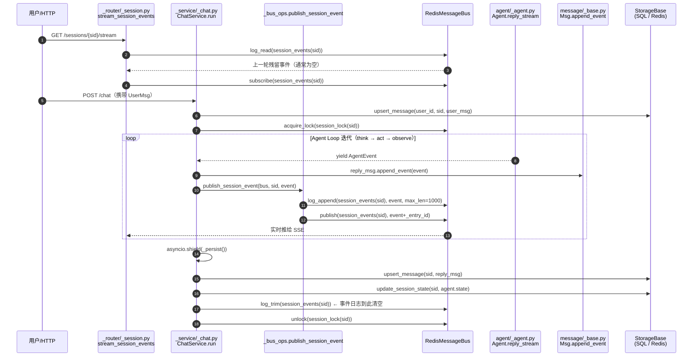
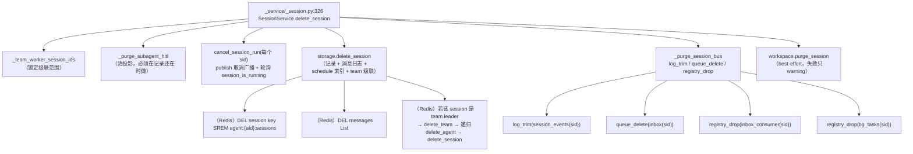
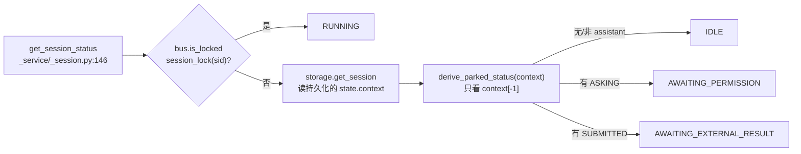

# 05 · AgentScope 会话、存储与事件溯源 —— 源码侦察报告

> 目标读者：后续 20 篇《Agent Harness 全栈教程》的作者。
> 所有结论都来自真实源码，引用格式 `相对仓库根路径:行号`。
> AgentScope 版本 2.0.8（`pip install -e` 于 `third_party/agentscope`）。

---

## 一、子系统职责（这段代码到底在解决什么问题）

参考架构第 1 层写着两个插件：**「Session 会话 & 事件溯源存储插件」** 和 **「持久化记忆存储插件」**。
AgentScope 对这两个插件的实现是**分裂的**，而且分裂得很彻底——这是本报告最重要的一句话：

| 关注点 | AgentScope 放在哪 | 是否落盘 |
| --- | --- | --- |
| 一次会话的**身份与配置** | `SessionRecord`（app/storage） | ✅ 落盘（SQL / Redis） |
| 一次会话的**可恢复状态** | `SessionRecord.state: AgentState` | ✅ 落盘 |
| **消息历史**（给人看的） | `messages` 表 / Redis List | ✅ 落盘 |
| **事件流**（给机器看的） | `agentscope:session:events:{sid}`（Redis Stream） | ⚠️ 只在「一轮 reply 之内」落盘 |
| **上下文压缩 / 长期记忆** | `agentscope.middleware`（不是 `state/`，也不是 `app/storage/`） | 依赖外部库（ReMe / mem0） |

所以：

- 会话模型是 **`SessionRecord` + `AgentState`** 的两层结构：外层是「谁、属于哪个 agent、什么配置、从哪来」，内层 `state` 是整个可续跑的运行时快照。
- 消息历史存在两个地方（**双写**）：`AgentState.context`（喂给 LLM 的真相）与 `messages` 表 / Redis List（给 UI 翻页看的）。
- 事件流**不是**事件溯源（event sourcing）意义上的持久日志。它是 Redis Stream，用来给 SSE 做「断线重连回放」，**每轮 reply 的收尾 `_persist()` 里会被 `log_trim` 整条删掉**（`third_party/agentscope/src/agentscope/app/_service/_chat.py:1425`）。真正的「可回放」靠的是 fold 之后的消息，不是事件本身。
- **AgentScope 没有提供**：独立的评测引擎（第 3 层）、事件表的持久化、跨会话的记忆库。前者在源码里完全不存在；后两者要用 `middleware/` + ReMe 补。

一句话给教程作者的定位：**这一子系统教的是「Harness 怎么让一次会话可中断、可续跑、可多节点协作」，而不是「怎么把 Agent 的每一步都写进不可变日志」。后者需要读者在自己的 `harness_kit` 里补。**

---

## 二、关键文件表

| 文件路径:行号 | 核心类 | 核心函数 | 一句话职责 |
| --- | --- | --- | --- |
| `third_party/agentscope/src/agentscope/state/_state.py:209` | `AgentState` | — | 一次会话的全部可恢复运行时快照（context/summary/reply_context/tool_context/tasks_context/permission_context/middle_context） |
| `third_party/agentscope/src/agentscope/state/_state.py:182` | `ReplyContext` | — | 当前这一轮 reply 的 id 与迭代计数 —— 断点续跑的锚点 |
| `third_party/agentscope/src/agentscope/state/_state.py:23` | `ReadCacheEntry` | — | Read/Write/Edit 工具的读文件 LRU 缓存条目（会随 state 一起落盘） |
| `third_party/agentscope/src/agentscope/state/_state.py:32` | `ToolContext` | `get_cache` / `cache_file` / `clean_file_cache` | 工具侧上下文：文件缓存 + 激活的 tool group |
| `third_party/agentscope/src/agentscope/state/_state.py:175` | `TaskContext` | — | Planning 的任务清单（`Task` 列表） |
| `third_party/agentscope/src/agentscope/state/_state.py:298` | `AgentState` | `append_context` | 把流式产生的内容块追加进「当前 reply_id 的那条 assistant 消息」 |
| `third_party/agentscope/src/agentscope/state/_state.py:345` | `AgentState` | `get_awaiting_tool_calls` | 判断会话是不是「卡在等人工确认 / 等外部执行结果」 |
| `third_party/agentscope/src/agentscope/state/_task.py:11` | `Task` | — | 单个任务：subject/state/blocks/blocked_by |
| `third_party/agentscope/src/agentscope/state/_a2a_state.py:10` | `A2AAgentState` | — | A2A 协议专用状态（session_id / context_id / task_id / observed_context） |
| `third_party/agentscope/src/agentscope/message/_base.py:71` | `Msg` | `append_event` | **事件流 fold 成消息** 的地方 —— 事件溯源的真正落点 |
| `third_party/agentscope/src/agentscope/message/_base.py:539/592` | （工厂函数） | `UserMsg` / `AssistantMsg` | 注意：是**函数**不是类，grep `class UserMsg` 找不到 |
| `third_party/agentscope/src/agentscope/event/_event.py:26` | `EventType` | — | 26 种事件的枚举（REPLY_START / TEXT_BLOCK_DELTA / TOOL_CALL_END / REQUIRE_USER_CONFIRM …） |
| `third_party/agentscope/src/agentscope/event/_event.py:70` | `EventBase` | — | 事件基类：id / created_at / metadata + `use_enum_values=True` |
| `third_party/agentscope/src/agentscope/app/storage/_model/_session.py:278` | `SessionRecord` | `_fold_legacy_source` | 会话记录 = user_id + agent_id + origin + team_id + config + **state** |
| `third_party/agentscope/src/agentscope/app/storage/_model/_session.py:210` | `SessionConfig` | — | 会话创建时固定的配置：workspace_id / name / naming / cwd / chat_model_config / knowledge_config |
| `third_party/agentscope/src/agentscope/app/storage/_model/_session.py:87` | `SessionOrigin` | — | 会话从哪来：`UserOrigin` / `ScheduleOrigin` / `ChannelOrigin` / `TeamOrigin` 的可判别联合 |
| `third_party/agentscope/src/agentscope/app/storage/_base.py:366` | `StorageBase` | `upsert_session` | 建/改会话记录（抽象方法，SQL 与 Redis 各一份实现） |
| `third_party/agentscope/src/agentscope/app/storage/_base.py:432` | `StorageBase` | `update_session_state` | **热路径**：只更新 state，不动 config |
| `third_party/agentscope/src/agentscope/app/storage/_base.py:735` | `StorageBase` | `upsert_message` | 写消息日志（尾条 id 相同则替换，否则追加） |
| `third_party/agentscope/src/agentscope/app/storage/_base.py:772` | `StorageBase` | `list_messages` | 游标分页读消息（`before` 游标，返回 `(列表, has_more)`） |
| `third_party/agentscope/src/agentscope/app/storage/_sql/_tables.py:58` | `_JsonRecordMixin` | `get_indexed_fields` | 所有 SQL 表的统一形状：id/created_at/updated_at + 提升列 + 一个 `payload` JSON |
| `third_party/agentscope/src/agentscope/app/storage/_sql/_tables.py:143` | `SessionRow` | — | `sessions` 表：promote user_id/agent_id/team_id，`source` 从 `origin.type` 取 |
| `third_party/agentscope/src/agentscope/app/storage/_sql/_tables.py:399` | `MessageRow` | — | `messages` 表：**复合主键 `(session_id, msg_id)`**，没有 user_id |
| `third_party/agentscope/src/agentscope/app/storage/_sql/_mappers.py:53` | — | `_from_record` | record → row：dump 后把提升列 pop 出来，剩下的塞 payload（不重复存） |
| `third_party/agentscope/src/agentscope/app/storage/_sql/_mappers.py:92` | — | `_to_record` | row → record：把提升列 merge 回 payload，再 `model_validate` |
| `third_party/agentscope/src/agentscope/app/storage/_redis_storage.py:56` | `RedisStorage.KeyConfig` | — | **全套 Redis key 模板**（会话/消息/索引/锁/通道），教学时直接照抄 |
| `third_party/agentscope/src/agentscope/app/storage/_redis_storage.py:871` | `RedisStorage` | `upsert_session` | 会话记录写单键 + SADD 进 `agent:{aid}:sessions` 索引 |
| `third_party/agentscope/src/agentscope/app/storage/_redis_storage.py:1434` | `RedisStorage` | `upsert_message` | 用 `LINDEX -1` + `LSET` 实现「同 id 替换尾条」 |
| `third_party/agentscope/src/agentscope/app/storage/_redis_storage.py:1499` | `RedisStorage` | `list_messages` | `LLEN` + 反向分块扫（`_find_message_index`）实现游标分页 |
| `third_party/agentscope/src/agentscope/app/message_bus/_keys.py:124` | `MessageBusKeys` | `session_events`（key 模板常量在 `:124`，方法在 `:130`） | 事件回放日志 key：`agentscope:session:events:{sid}` |
| `third_party/agentscope/src/agentscope/app/message_bus/_keys.py:126` | `MessageBusKeys` | — | `SESSION_REPLAY_MAX_LEN = 1000`（回放上限） |
| `third_party/agentscope/src/agentscope/app/message_bus/_keys.py:144` | `MessageBusKeys` | `session_lock` | 会话运行分布式锁：`agentscope:session:lock:{sid}`（key 模板常量在 `:138`） |
| `third_party/agentscope/src/agentscope/app/message_bus/_base.py:176` | `MessageBus` | `log_append` | Mode C「回放日志」抽象：append-only，多读者各持游标 |
| `third_party/agentscope/src/agentscope/app/message_bus/_redis_message_bus.py:307` | `RedisMessageBus` | `log_append` | 落地实现 = **Redis Stream 的 `XADD MAXLEN ~N`** |
| `third_party/agentscope/src/agentscope/app/_bus_ops.py:40` | — | `publish_session_event` | 「追加进回放日志 + pub/sub 广播」的合体操作，全项目唯一入口 |
| `third_party/agentscope/src/agentscope/app/_service/_chat.py:1215` | `ChatService` | `run`（内层循环） | Agent Loop 与存储的**接线处**：每个事件先 fold 再广播 |
| `third_party/agentscope/src/agentscope/app/_service/_chat.py:1411` | `ChatService` | `_persist` | 一轮结束的原子落库：写 reply 消息 → 写 state → **trim 掉事件日志** |
| `third_party/agentscope/src/agentscope/app/_service/_chat.py:323` | `ChatService` | `_auto_name_session` | 首轮对话后调模型生成会话标题（尊重 `naming.auto` 归属） |
| `third_party/agentscope/src/agentscope/app/_service/_session.py:61` | `SessionStatus` | — | 四值统一状态：RUNNING / IDLE / AWAITING_PERMISSION / AWAITING_EXTERNAL_RESULT |
| `third_party/agentscope/src/agentscope/app/_service/_session.py:98` | `SessionService` | `delete_session` | `cancel + storage.delete + bus.purge` 的原子级联 |
| `third_party/agentscope/src/agentscope/app/_service/_session.py:212` | `SessionService` | `derive_parked_status` | 从持久化的 `context` 尾部推断「停在哪」 |
| `third_party/agentscope/src/agentscope/app/_service/_session.py:653` | `SessionService` | `_purge_session_bus` | 删会话时清掉事件日志 / inbox / 消费者注册 / BG 任务 |
| `third_party/agentscope/src/agentscope/app/_service/_session_projection.py:45` | `SessionProjection` | `upsert` / `list` / `purge` | 跨会话 UI 投影原语（子 agent 的 HITL 卡片投影到 leader 会话） |
| `third_party/agentscope/src/agentscope/app/_router/_session.py:781` | — | `stream_session_events` | SSE 端点：**先回放日志、再订阅实时**，这是回放机制的出口 |
| `third_party/agentscope/src/agentscope/app/_router/_session.py:826` | — | `_sse_generator` | 逐条 `log_read` 吐 `data: {...}`，再挂 pub/sub |
| `third_party/agentscope/src/agentscope/app/rag/blob_store/_base.py:46` | `BlobStoreBase` | `write_stream` / `open` | blob 字节层：知识库文档的原始字节（**跟会话无关**） |
| `third_party/agentscope/src/agentscope/middleware/_longterm_memory/_reme/_middleware.py:88` | `ReMeMiddleware` | `on_reply` | AgentScope ↔ ReMe 的桥：监听每轮 reply 做长期记忆写回 |

---

## 三、调用链

### 3.1 一轮对话：从用户输入到落盘（含事件流）



**逐段讲解**

1. **`stream_session_events` 先回放再订阅**（`app/_router/_session.py:781`）。这是整个回放机制的**唯一出口**：客户端断线重连后，先从 Redis Stream 把当前这一轮已经产生的事件按原样（相同顺序、相同 payload）补发，再挂上 pub/sub 接后续。所以「回放」的语义是**「补齐当前这一轮」**，不是「重放整个会话历史」。
2. **`ChatService.run` 是 Agent Loop 与存储的接线处**（`app/_service/_chat.py:1215`）。`agent.reply_stream()` 是一个异步生成器，每 yield 一个事件，`run` 做两件事，且顺序严格：先 `reply_msg.append_event(event)`（**同步、不可被中断**），再 `await publish_session_event(...)`（异步）。源码注释明说这个顺序的理由：`# Apply to reply_msg FIRST (sync — never interrupted), so an interrupt in the awaits below can't lose this event.`
3. **`publish_session_event` 是唯一入口**（`app/_bus_ops.py:40`）。它把「追加进回放日志（`log_append`，带 `max_len=1000`）」和「pub/sub 广播（带 `_entry_id`）」绑成一个动作，返回 entry_id 作为游标。
4. **`_persist()` 是原子落库点**（`app/_service/_chat.py:1411`）。它在 `finally` 里被 `asyncio.shield` 包住，**必须在释放 session lock 之前完成**——源码注释解释了原因：否则另一个 worker 会拿到锁、从 storage 读到旧 state。落库内容三件：reply 消息（可能多条）、`agent.state`、**以及 `log_trim(events_key)`**。
5. **`log_trim` 是本节最反直觉的一点**。`MessageBus.log_trim(key)` 在不传 `before_id` 时表示「删掉整条日志」（`app/message_bus/_base.py:244`）。也就是说，**AgentScope 的事件流是「一次 reply 用完即焚」的**。它不是审计日志，不是事件溯源存储，只是一个给 SSE 断线重连用的临时缓冲。

### 3.2 会话删除：跨进程级联



**逐段讲解**

`SessionService` 的设计原则写在文件头注释里（`app/_service/_session.py:40`）：**「storage 与 message bus 是两个独立后端，service 是唯一同时碰两者的组件」**。这是很值得抄进 `harness_kit` 的分层纪律：storage 不 import bus，bus 不 import storage。

级联的层级也很讲究（`app/_service/_session.py:19`）：
`delete_session` 是原子原语，`delete_team` → `delete_agent` → `delete_session`、`delete_schedule` → `delete_session`。
storage 内部自己也有一份级联，但 service 先把记录删掉了，所以 storage 那一层跑起来是**幂等空操作**。源码注释直接点破：`# those calls are now idempotent no-ops (records already removed above)`。

`cancel_session_run`（`app/_service/_session.py:256`）的跨进程做法值得单独学：**发一条取消广播，然后轮询分布式锁直到它消失**，超时（默认 10s）就返回 `False` 让调用方继续（「进程可能已经死了，不能挂起」）。

### 3.3 会话状态查询：两个真相源合成一个



**逐段讲解**

这个设计极其漂亮，值得整段抄进教程：**「集群活性」来自 message bus 的分布式锁（cluster-wide），「停在哪」来自落盘的 `context` 尾部（durable）**。两者正交，但前端只想渲染一个指示灯，所以在 service 层压成一个四值枚举。

优先级顺序也有硬理由（`app/_service/_session.py:193` 的注释）：`RUNNING` 先判，因为**worker 持锁期间，落盘的 snapshot 按定义就是过期的**；而且这样在热路径上省掉一次 storage 往返。

`derive_parked_status`（`:212`）只看 `context[-1]`——因为暂停的 reply 只可能把 pending tool call 停在最末尾。`AWAITING_PERMISSION` 压过 `AWAITING_EXTERNAL_RESULT`，理由是「有同伴还在等用户确认时，任何 SUBMITTED 都不可能完成」。

---

## 四、关键数据结构

### 4.1 `AgentState` —— 会话的可恢复快照

`third_party/agentscope/src/agentscope/state/_state.py:209`（真实定义，节选字段注释）：

```python
class AgentState(BaseModel):
    """The agent state that should be saved and loaded from storage."""

    session_id: str = Field(default_factory=_generate_id)
    """The session id of the agent. Normally, each session will maintain one
    independent agent state for each agent."""

    summary: str | list[TextBlock | DataBlock] = ""
    """The compressed summary of the context, which will be prepended to the
    context when fed into the LLM."""

    context: list[Msg] = Field(default_factory=list)
    """The uncompressed conversation context, which will be fed into the LLM"""

    reply_context: ReplyContext = Field(default_factory=ReplyContext)
    permission_context: PermissionContext = Field(default_factory=PermissionContext)
    tool_context: ToolContext = Field(default_factory=ToolContext)
    tasks_context: TaskContext = Field(default_factory=TaskContext)
    middle_context: dict[str, Any] = Field(default_factory=dict)
    """The context that allow the middlewares to store/get data across
    different replies."""
```

**字段级说明**

| 字段 | 类型 | 落盘后在哪 | 用途 |
| --- | --- | --- | --- |
| `session_id` | `str` | `payload.state.session_id` | 与 `SessionRecord.id` 是**两个不同的 id**（见坑表） |
| `summary` | `str \| list[block]` | 同上 | 上下文压缩的结果，喂 LLM 时前置 |
| `context` | `list[Msg]` | 同上 | **真正的对话真相**（未压缩） |
| `reply_context.reply_id` | `str` | `payload.state.reply_context` | 当前 reply 的 id，也是最终消息的 id |
| `reply_context.cur_iter` | `int` | 同上 | Agent Loop 当前迭代次数 —— 续跑时从这里接着数 |
| `reply_context.structured_schema` | `Type[BaseModel] \| dict` | 同上 | 有 `field_serializer`，把类序列化成 JSON schema |
| `permission_context` | `PermissionContext` | 同上 | 工具权限判定的依据 |
| `tool_context.read_file_cache` | `list[ReadCacheEntry]` | 同上 | 文件读取 LRU（默认 100 个文件 / 25000 KB） |
| `tasks_context.tasks` | `list[Task]` | 同上 | Planning 的任务清单 |
| `middle_context` | `dict[str, Any]` | 同上 | **中间件的跨轮持久化抽屉** |

`middle_context` 是中间件系统与存储子系统的接口（`middleware/_base.py:298` 提到「states in `AgentState` instances」，`middleware/_budget.py:36` 说明它用 `middle_context` 存预算）。

`AgentState` 里还有一段**向后兼容迁移**代码，非常有教学价值（`state/_state.py:228`）：

```python
    @model_validator(mode="before")
    @classmethod
    def _migrate_legacy_reply_fields(cls, data: Any) -> Any:
        """Migrate the top-level ``reply_id``/``cur_iter`` fields (the
        pre-``reply_context`` storage format) into ``reply_context``, so
        that the states saved by previous versions load correctly."""
```

配套的是 `reply_id` / `cur_iter` 两个 property 转发到 `reply_context`（`:243`、`:253`）。**这就是「存储格式演进」的教科书做法：旧数据在 `mode="before"` 校验器里就地折叠成新形状，下一次保存自动写成新格式，不需要数据库迁移脚本。**

### 4.2 `ReplyContext` / `ToolContext` / `TaskContext`

```python
class ReplyContext(BaseModel):                       # state/_state.py:182
    reply_id: str = Field(default_factory=_generate_id)
    cur_iter: int = 0
    structured_schema: Type[BaseModel] | dict | None = None
    structured_output: dict | None = None
```

`ToolContext`（`:32`）的三个字段：`max_cache_files=100`、`max_cache_bytes=25000`、`read_file_cache`、`activated_groups`。它的 `cache_file`（`:90`）手写了 LRU 淘汰：先删同路径旧条目 → 单条超过 `max_cache_bytes` 直接不缓存 → 按 `max_cache_files` 淘汰 → 按字节数淘汰。**为什么这个属于「会话存储」？因为它随 `AgentState` 一起落盘**：续跑后文件缓存还在，Agent 不会重复读文件。

`TaskContext`（`:175`）就是 `tasks: list[Task]`，`Task`（`state/_task.py:11`）带 `blocks` / `blocked_by` 两个依赖字段——这就是参考架构第 2 层「Planning 子任务依赖管理」的数据结构。

### 4.3 `SessionRecord` / `SessionConfig` / `SessionOrigin`

`third_party/agentscope/src/agentscope/app/storage/_model/_session.py:278`：

```python
class SessionRecord(_RecordBase):
    """The session record."""

    user_id: str
    agent_id: str
    origin: SessionOrigin = Field(default_factory=UserOrigin)
    team_id: str | None = None
    config: SessionConfig
    state: AgentState = Field(default_factory=AgentState)   # :411
    """Mutable runtime state, updated after each chat turn."""
```

`_RecordBase`（`_model/_base.py:10`）提供 `id` / `created_at` / `updated_at`（都是 pydantic `default_factory`）。

`SessionOrigin`（`:87`）是个 **可判别联合（discriminated union）**：

```python
SessionOrigin = Annotated[
    Union[UserOrigin, ScheduleOrigin, ChannelOrigin, TeamOrigin],
    Field(discriminator="type"),
]
```

源码注释解释了为什么不写成「一个 kind 字符串 + 一堆 nullable 的 id 列」（`:290`）：`once the tag says channel the channel and chat ids are there, and no reader has to ask whether the combination makes sense.` —— **类型系统代替运行时断言**。教程里做 `harness_kit` 的 Session 模型时，这是可以直接抄的模式。

`SessionConfig`（`:210`）里有 `workspace_id`（会话绑定的工作区）、`name` + `naming: SessionNaming`（谁拥有这个名字）、`cwd`、`chat_model_config` / `fallback_chat_model_config` / `tts_model_config` / `knowledge_config`。

`SessionNaming.auto`（`:187`）是个很细的工程细节：`auto=True` 表示「服务器有权用对话内容覆盖这个名字」；用户手动改名或自动命名落地后清成 `False`。默认 `False` 是**为了让这个字段能安全地加到已有部署上**——老记录没有 `naming` 块，读出来就是 `False`，保持原名。

### 4.4 SQL 侧的行结构：`_JsonRecordMixin` 的「提升列 + payload」模式

`third_party/agentscope/src/agentscope/app/storage/_sql/_tables.py:58`：

```python
class _JsonRecordMixin(_Base):
    __abstract__ = True

    id: Mapped[str] = mapped_column(String(_ID_LEN), primary_key=True)
    created_at: Mapped[datetime] = mapped_column(DateTime(), index=True, nullable=False)
    updated_at: Mapped[datetime] = mapped_column(DateTime(), index=True, nullable=False)
    payload: Mapped[dict[str, Any]] = mapped_column(JSON, nullable=False)

    _record_cls: ClassVar[type]
    _indexed_fields: ClassVar[tuple[str, ...]] = ()
    _index_paths: ClassVar[dict[str, str]] = {}
```

我实际建库后 dump 出来的 DDL（**已验证**）：

```sql
CREATE TABLE sessions (
	user_id VARCHAR(255) NOT NULL,
	agent_id VARCHAR(255) NOT NULL,
	source VARCHAR(16) NOT NULL,
	source_schedule_id VARCHAR(255),
	team_id VARCHAR(255),
	id VARCHAR(255) NOT NULL,
	created_at DATETIME NOT NULL,
	updated_at DATETIME NOT NULL,
	payload JSON NOT NULL,
	PRIMARY KEY (id)
)
```

`SessionRow`（`:143`）的 `_index_paths` 是这套机制里最巧的一处：

```python
    # Fed from inside ``source``, which is a tagged union rather than a
    # flat field. Same column names and same indexes as before the
    # nesting, so no migration is needed.
    _index_paths: ClassVar[dict[str, str]] = {
        "source": "origin.type",
        "source_schedule_id": "origin.schedule_id",
    }
```

**列名叫 `source`，值却从 `origin.type` 里取**——这样把扁平字段重构成可判别联合时，数据库 schema 和索引一行都不用改。教程里讲「怎么在不写迁移脚本的前提下演进存储格式」时，这是最好的例子。

`MessageRow`（`:399`）是唯一不继承 `_JsonRecordMixin` 的表，理由写在它的 docstring 里：

```python
class MessageRow(_Base):
    __tablename__ = "messages"

    session_id: Mapped[str] = mapped_column(String(_ID_LEN), primary_key=True)
    msg_id: Mapped[str] = mapped_column(String(_ID_LEN), primary_key=True)
    created_at: Mapped[datetime] = mapped_column(DateTime(), nullable=False)
    payload: Mapped[dict[str, Any]] = mapped_column(JSON, nullable=False)
```

「`Msg.id` 只在会话内唯一，所以用**复合主键** `(session_id, msg_id)`，而不是拼成 `session_id:msg_id` 字符串」——因为两个 id 都来自用户可覆盖的 id 工厂，拼接会撑爆长度上限（测试 `storage_sql_test.py:465` 专门验证了 64 字符 id 不截断）。

---

## 五、源码精读

### 5.1 `Msg.append_event` —— 事件溯源的真正落点

`third_party/agentscope/src/agentscope/message/_base.py:244`：

```python
    def append_event(  # pylint: disable=too-many-branches,too-many-statements
        self,
        event: AgentEvent,
    ) -> Self:
        """Update the message by applying a streaming event.

        Mutates ``self.content``, ``self.finished_at``, and ``self.usage``:
        content blocks are appended/updated by block-level events,
        ``finished_at`` is stamped by ``REPLY_END``, and ``usage`` is
        initialized then accumulated across each ``MODEL_CALL_END``.
        ...
        """
        from ..event import EventType  # local import to avoid circular dep

        if event.reply_id != self.id:
            logger.warning(
                "Event %s with reply_id %r does not match message id %r, "
                "skipping.",
                event.__class__.__name__, event.reply_id, self.id,
            )
            return self

        match event.type:
            case EventType.REPLY_END:
                self.finished_at = event.created_at
                self.finished_reason = ReplyFinishedReason(event.finished_reason)
                self.error = event.error

            case EventType.MODEL_CALL_END:
                self.append_usage(Usage(...))
```

**它在干什么、为什么这么设计**

这是整个子系统最重要的一处：**AgentScope 的 assistant 消息不是「先有消息、再有事件」，而是事件流 fold（折叠）出来的**。

- 一个 `reply` 对应**一条** assistant 消息（id == `reply_id`）。整轮 ReAct 循环里所有迭代产生的文本块、思考块、工具调用、工具结果，全都 `extend` 进这条消息的 `content` 列表。
- `append_event` 用 `match event.type` 做**折叠函数**。`REPLY_END` 落 `finished_at`/`finished_reason`/`error`；`MODEL_CALL_END` 累加 token 用量；块级事件负责 append/update content block。
- 第一行守卫 `if event.reply_id != self.id` 非常关键：事件流是**多路复用**的（一个 session 里可能有 leader、worker、子 agent 的事件混在一个 channel 里），所以折叠前必须按 `reply_id` 过滤。

理解了这一层，就能理解 `state/_state.py:298` 的 `append_context` 为什么不叫「append message」：

```python
    def append_context(self, name, blocks) -> None:
        """Append the given blocks to the agent's own message with the current
        `reply_id`. If such message doesn't exist, a new assistant message
        with agent's name and current reply ID will be created."""
        if (
            self.context
            and self.context[-1].role == "assistant"
            and self.context[-1].name == name
            and self.context[-1].id == self.reply_id
        ):
            self.context[-1].content.extend(blocks)
        else:
            self.context.append(
                Msg(id=self.reply_id, role="assistant", name=name, content=blocks),
            )
```

**「同一个 reply_id 的所有内容合并在一条消息里」**这条不变量被写死在两个地方。这就是为什么 `upsert_message` 的语义是「尾条 id 相同则替换」而不是「无条件追加」——重新落库时永远是同一条消息在更新。

### 5.2 Redis 的 `upsert_message` —— 用 `LINDEX -1` 实现「就地替换尾条」

`third_party/agentscope/src/agentscope/app/storage/_redis_storage.py:1434`（**已验证可运行**）：

```python
    async def upsert_message(self, user_id: str, session_id: str, msg: Msg) -> None:
        """Persist a message to the session's message list."""
        key = self._message_key(user_id, session_id)
        last_raw = await self._client.lindex(key, -1)
        if last_raw:
            last_msg = Msg.model_validate_json(last_raw)
            if last_msg.id == msg.id:
                await self._client.lset(key, -1, msg.model_dump_json())
                await self._refresh_key_ttl(key)
                return
        await self._client.rpush(key, msg.model_dump_json())
        await self._refresh_key_ttl(key)
```

**它在干什么、为什么这么设计**

- 会话消息历史在 Redis 里是一条 **List**（`agentscope:user:{uid}:session:{sid}:messages`），按时间顺序 `RPUSH`。
- 「同一 reply 的消息会被反复落库」（因为 `_persist` 可能拿到的是 fold 到一半的消息，续跑后还会再写一次），所以必须支持**就地替换**。
- 生产实现选择了「先看尾条」而不是「先查索引」：因为要替换的**永远是最新那条**（reply 是最后追加的），`LINDEX -1` + `LSET` 是 O(1) 的两条命令，不需要为了找位置遍历整个 List。
- 注意与 SQL 后端的**语义差异**（这是源码自己承认的）：SQL 版的 docstring 写着 `the Redis version only replaces when the *tail* message matches; ours replaces on any matching id. The looser rule is safe because callers never reuse a message id across turns.`（`app/storage/_sql/_storage.py:1526`）。

同样机制也用在了事件回放日志上——`MessageBus.log_append` 在 Redis 下是 `XADD`（`_redis_message_bus.py:341`），entry_id 是 Redis Stream 原生的 `时间戳-序号`（我实测得到 `1789981036812-0` 这种形状）。**所以「回放日志」在 Redis 里就是一个 Stream，`log_read` 就是 `XRANGE`，`max_len` 就是 `XADD MAXLEN ~N`（近似裁剪，O(1)）。**

### 5.3 `_persist()` —— 一轮结束的原子落库

`third_party/agentscope/src/agentscope/app/_service/_chat.py:1406`：

```python
                # All persistence in a single coroutine, shielded from
                # outer cancellation.  Must complete BEFORE the session
                # lock is released — otherwise another worker could
                # acquire the lock and load a stale state from storage
                # before this write lands.
                async def _persist() -> None:
                    try:
                        for msg in reply_msgs:
                            await self._storage.upsert_message(
                                user_id, session_id, msg,
                            )
                        await self._storage.update_session_state(
                            user_id=user_id,
                            agent_id=agent_id,
                            session_id=session_id,
                            state=agent.state,
                        )
                        await self._message_bus.log_trim(events_key)
                    finally:
                        for msg in reply_msgs:
                            if msg.finished_reason in (
                                ReplyFinishedReason.ERROR,
                                ReplyFinishedReason.INTERRUPTED,
                            ):
                                await self._notify_leader_of_failure(...)

                persist_task = asyncio.create_task(_persist())
                try:
                    await asyncio.shield(persist_task)
                except asyncio.CancelledError:
                    await persist_task
                    raise
```

**它在干什么、为什么这么设计**

这里有三个可以直接搬进 `harness_kit` 的工程技巧：

1. **「落库必须在释放锁之前完成」**。多 worker 部署下，如果先放锁再落库，另一个 worker 会立刻拿到锁、从 storage 读到一个**落后的 state**，然后基于旧上下文继续推理——上下文就裂了。源码把这条不变量写成了注释，而不是靠 review 记住。
2. **`asyncio.shield` + `finally` 里再 `await persist_task`**。中断（`CancelledError`）会从任何 `await` 点炸出来，落库如果被中断就是数据丢失。做法是：把落库包装成独立 task，用 `shield` 挡掉取消，捕获 `CancelledError` 后**先 await 完这个 task 再重新抛出**——既保证一致性，又不破坏 asyncio 语义。
3. **失败通知写在 `finally` 里**。因为「worker 的 turn 死了」这件事必须让 leader 知道，**storage 写失败也不能让它丢**。

### 5.4 `SessionService.delete_session` —— 级联的顺序敏感

`third_party/agentscope/src/agentscope/app/_service/_session.py:370`：

```python
        # Identify all bus-purge targets before storage mutates anything.
        worker_sids = await self._team_worker_session_ids(user_id, agent_id, session_id)
        all_sids = [session_id, *worker_sids]

        # Resolve the workspace binding while the record still exists.
        record = await self._storage.get_session(user_id, agent_id, session_id)
        workspace_id = record.config.workspace_id if record else None

        # Clean leader-side subagent HITL projections before storage
        # cascades remove the records we need to resolve roles from.
        await self._purge_subagent_hitl(user_id, agent_id, session_id)

        await asyncio.gather(*(self.cancel_session_run(sid) for sid in all_sids))
        deleted = await self._storage.delete_session(user_id, agent_id, session_id)
        await asyncio.gather(*(self._purge_session_bus(sid) for sid in all_sids))
```

**它在干什么、为什么这么设计**

整个方法的精髓是**「所有需要在删除后失效的信息，必须在删除前先取出来」**：worker session id 列表、workspace_id、HITL 投影的角色归属——全都在 `delete` 之前算好。源码用注释把每一条都标了原因（`while the record still exists` / `before storage cascades remove the records`）。

另外 `cancel_session_run` 被 `asyncio.gather` 并行发出，`_purge_session_bus` 也是——因为它们是网络往返，串行做会线性拖长删除延迟。

### 5.5 SSE 回放出口 —— 事件流真正被消费的地方

`third_party/agentscope/src/agentscope/app/_router/_session.py:824`：

```python
    async def _sse_generator() -> AsyncGenerator[str, None]:
        # 1. Replay buffered events from the current run (if any).
        for _entry_id, event in await message_bus.log_read(
            MessageBusKeys.session_events(session_id),
            max_count=MessageBusKeys.SESSION_REPLAY_MAX_LEN,
        ):
            yield f"data: {json.dumps(event, ensure_ascii=False)}\n\n"
        ...
        # 2. Live subscribe via a background feeder task that pushes
        #    events into a queue. The main loop reads from the queue
        #    with a timeout so we can interleave heartbeat frames.
```

**它在干什么、为什么这么设计**

- 「先 `log_read` 全量补发，再 `subscribe` 接实时」——这是**所有自研 SSE 断线重连的正确写法**。
- 实时订阅为什么绕一层 `asyncio.Queue`？注释解释了：直接对异步生成器调 `wait_for(__anext__())`，一旦取消，生成器会停在「running」状态，`aclose()` 再也不工作。所以用后台 feeder task + 带超时的队列读，好处是**能插入心跳帧**（每 30s 一个 `:\n\n`，防反向代理掐连接）。
- 注意 `_entry_id` 被丢弃、`_sse_generator` 里还过滤掉了它（`:894`）：entry_id 只是**服务端游标**，不是给客户端的协议字段。

---

## 六、可运行代码片段

以下 4 段全部在 `/Users/a/miniconda3/envs/agentscope_reme_pip_env/bin/python`（Python 3.11.13）下实测通过，脚本落在
`tutorial_agsc_reme/_recon/code/`，可直接被 20 篇教程引用。

为运行片段 2/3/4，本机新增安装了 `aiosqlite==0.22.1` 与 `fakeredis==2.38.0`（不涉及修改 `third_party/`）。

### 片段 1（已验证）`s01_agentstate_roundtrip.py` —— AgentState 序列化 → 落盘 → 读回 → 继续对话

纯库路径，**不需要 SQL / Redis**，只需要 DeepSeek API。

```python
import asyncio, json, os, pathlib
from dotenv import load_dotenv
from agentscope.agent import Agent
from agentscope.credential import DeepSeekCredential
from agentscope.model import DeepSeekChatModel
from agentscope.message import UserMsg
from agentscope.state import AgentState

load_dotenv(".env")
STATE_FILE = pathlib.Path("/tmp/agentscope_state_demo.json")

def build_agent(state: AgentState) -> Agent:
    # 用同一份 state 组装 Agent —— 就是这个模式让会话可续跑
    model = DeepSeekChatModel(
        credential=DeepSeekCredential(
            api_key=os.environ["OPENAI_API_KEY"],
            base_url=os.environ["OPENAI_BASE_URL"],
        ),
        model=os.environ["LLM_MODEL"], stream=False,
    )
    return Agent(name="demo_agent", system_prompt="你是一个只会用一句话回答的用户助手。",
                 model=model, state=state)

async def main() -> None:
    agent = build_agent(AgentState())                     # 第一轮
    print("[1] 新建 session_id =", agent.state.session_id)
    reply1 = await agent.reply(UserMsg(name="user", content="我叫小明，请记住。"))
    print("[1] reply1 =", reply1.get_text_content())

    STATE_FILE.write_text(agent.state.model_dump_json(indent=2), encoding="utf-8")   # 落盘
    print("[2] 落盘字段:", sorted(json.loads(STATE_FILE.read_text()).keys()))

    restored = AgentState.model_validate_json(STATE_FILE.read_text(encoding="utf-8"))  # 读回
    print("[3] 读回 context 条数 =", len(restored.context))

    agent2 = build_agent(restored)                        # 续跑
    reply2 = await agent2.reply(UserMsg(name="user", content="我叫什么名字？"))
    print("[4] reply2 =", reply2.get_text_content())

asyncio.run(main())
```

**真实输出**（DeepSeek 实际返回）：

```
[1] 新建 session_id = 063f14460a234b839b1fa4ce985fef7a
[1] reply1 = 好的，小明。
[2] 已落盘: /tmp/agentscope_state_demo.json 字节数 2484
[2] 落盘字段: ['context', 'middle_context', 'permission_context', 'reply_context', 'session_id', 'summary', 'tasks_context', 'tool_context']
[3] 读回 session_id = 063f14460a234b839b1fa4ce985fef7a
[3] 读回 context 条数 = 2
     - user | user | 我叫小明，请记住。
     - assistant | demo_agent | 好的，小明。
[4] reply2 = 你叫小明。
[4] 续跑后 context 条数 = 4
```

**教学点**：`AgentState` 就是「会话」的全部可恢复状态，2484 字节。整个「断点续跑」在库层面就是 `model_dump_json` / `model_validate_json` 两个方法。第 5 讲让读者先手写这两个方法，再引入 `StorageBase` 抽象。

### 片段 2（已验证）`s02_session_sqlite_roundtrip.py` —— SQL 后端的会话落库 + 进程重启 + 断点续跑

需要 `aiosqlite`。用文件型 SQLite（不是 `:memory:`），这样第二个 `AsyncSQLAlchemyStorage` 实例能读到第一个写的库。

关键片段：

```python
from agentscope.app.storage import (
    AgentData, AgentRecord, AsyncSQLAlchemyStorage,
    ChatModelConfig, SessionConfig, UserOrigin,
)

DB_URL = "sqlite+aiosqlite:////tmp/agentscope_session_demo.db"

async def phase_1_turn_one():
    async with AsyncSQLAlchemyStorage(DB_URL, create_tables=True) as storage:
        # 注意：SQL 后端的 upsert_agent 返回的是 agent_id (str)，不是 record
        agent_id = await storage.upsert_agent("user-1", AgentRecord(
            user_id="user-1",
            data=AgentData(name="demo_agent",
                           context_config=ContextConfig(),
                           react_config=ReActConfig()),
        ))
        session = await storage.upsert_session(
            user_id="user-1", agent_id=agent_id,
            config=SessionConfig(workspace_id="ws-demo", name="demo session",
                                 chat_model_config=ChatModelConfig(
                                     type="deepseek_credential", credential_id="cred-1",
                                     model=os.environ["LLM_MODEL"], parameters={})),
            origin=UserOrigin(),
        )
        agent = build_agent(session.state)
        user_msg = UserMsg(name="user", content="我叫小明，我的工位在 3 楼。")
        await storage.upsert_message("user-1", session.id, user_msg)
        reply = await agent.reply(user_msg)
        await storage.upsert_message("user-1", session.id, reply)
        await storage.update_session_state("user-1", agent_id, session.id, agent.state)
        return agent_id, session.id

async def phase_2_restart_and_resume(agent_id, session_id):
    async with AsyncSQLAlchemyStorage(DB_URL, create_tables=True) as storage:
        record = await storage.get_session("user-1", agent_id, session_id)   # 读回 state
        msgs, has_more = await storage.list_messages("user-1", session_id, limit=50)
        assert len(msgs) == len(record.state.context)
        agent = build_agent(record.state)                                    # 重建 Agent
        reply = await agent.reply(UserMsg(name="user", content="我的工位在哪一层？"))
        print(reply.get_text_content())
```

**真实输出**：

```
[1] 新建 session: c2a9a8c292cf4f8bb367cdfd31546a10 origin = user
[2] 第 1 轮完成，reply = 你好小明，3 楼的工位已记录。
[2] state.context 条数 = 2
[3] 恢复 session: c2a9a8c292cf4f8bb367cdfd31546a10 creator = demo session
[3] 恢复 state.context 条数 = 2
     - user | user | 我叫小明，我的工位在 3 楼。
     - assistant | demo_agent | 你好小明，3 楼的工位已记录。
[4] 消息日志条数 = 2 has_more = False
[4] 最后一页 = ['48b9a9f4f4f14b6cb3a0373769e3ffb0'] has_more = True
[5] 续跑 reply = 你的工位在 3 楼。
[5] 续跑后 context 条数 = 4
```

**教学点**：`SessionRecord.state` 与 `messages` 表是**两份数据**。本实验里 `len(msgs) == len(state.context)` 成立，但源码里**没有任何一致性约束**（没有外键、没有事务把它们绑在一起）。第 5 讲的动手点就是让读者自己决定：是「单写 state、消息表只做投影」，还是「双写 + 定期校验」。

### 片段 3（已验证）`s03_redis_session_and_eventlog.py` —— Redis 键空间 + 事件回放日志

需要 `fakeredis`。用子类替换 `__aenter__` 里的连接，**生产环境换成真实 `redis.asyncio` 连接池，代码路径完全一致**。

```python
class FakeRedisStorage(RedisStorage):
    def __init__(self, client, **kwargs):
        super().__init__(**kwargs); self._fake = client
    async def __aenter__(self):
        self._client = self._fake; return self
    async def aclose(self):
        self._client = None

async with FakeRedisStorage(client) as storage:
    session = await storage.upsert_session(
        user_id="user-1", agent_id="agent-1", config=session_config(),
        state=AgentState(), origin=ScheduleOrigin(schedule_id="sch-1"),
    )
    await storage.upsert_message("user-1", session.id, UserMsg(name="u", content="hi"))
    await storage.upsert_message("user-1", session.id, AssistantMsg(name="a", content="hello"))
    print(sorted(await client.keys("agentscope:*")))
```

**真实输出**：

```
[a1] session id = 44f30f5ce5b94fdb8be7e0ba87724826 | origin = schedule
[a2] list_messages -> [('user', 'hi'), ('assistant', 'hello')] False
[a3] 回读 summary = 用户打了招呼
[a4] 生成的 Redis key:
       agentscope:user:user-1:agent:agent-1:sessions
       agentscope:user:user-1:schedule:sch-1:sessions
       agentscope:user:user-1:session:44f30f5ce5b94fdb8be7e0ba87724826
       agentscope:user:user-1:session:44f30f5ce5b94fdb8be7e0ba87724826:messages
[a5] 消息 List 长度 = 2
[a6] list_sessions_by_schedule -> ['44f30f5ce5b94fdb8be7e0ba87724826']

[b1] replay log key = agentscope:session:events:sess-evt-1
[b2] 回放长度上限 SESSION_REPLAY_MAX_LEN = 1000
[b3] entry ids = ['1789981036812-0', '1789981036813-0', '1789981036813-1', '1789981036813-2']
[b4] 全量回放 = 4 条 ...
[b5] since=e2 增量 = ['TEXT_BLOCK_DELTA', 'REPLY_END']
[b6] log_trim 后日志条数 = 0
```

**教学点**：entry_id 的形状（`1789981036812-0`）直接暴露了实现——这是 **Redis Stream 的 ID**，不是自增序号。「回放」= `XRANGE`，「游标续读」= `XRANGE (last_id +`。

### 片段 4（已验证）`s04_event_fold_and_replay.py` —— 事件流 fold 成消息，再从回放日志重建

这段是给「事件溯源」这一讲的最强证据。

```python
events = [
    ReplyStartEvent(session_id=session_id, reply_id=reply_id, name="demo_agent"),
    TextBlockStartEvent(reply_id=reply_id, block_id=block_id),
    TextBlockDeltaEvent(reply_id=reply_id, block_id=block_id, delta="你"),
    TextBlockDeltaEvent(reply_id=reply_id, block_id=block_id, delta="好"),
    TextBlockDeltaEvent(reply_id=reply_id, block_id=block_id, delta="呀"),
    TextBlockEndEvent(reply_id=reply_id, block_id=block_id),
    ReplyEndEvent(session_id=session_id, reply_id=reply_id,
                  finished_reason=ReplyFinishedReason.COMPLETED),
]

persisted = AssistantMsg(id=reply_id, name="demo_agent", content=[])
for evt in events:
    persisted.append_event(evt)                                  # fold
    await publish_session_event(bus, session_id, evt.model_dump(mode="json"))

entries = await bus.log_read(MessageBusKeys.session_events(session_id), max_count=1000)
rebuilt = AssistantMsg(id=reply_id, name="demo_agent", content=[])
for _entry_id, payload in entries:
    if payload.get("reply_id") == reply_id:
        rebuilt.append_event(_rehydrate(payload))                # 回放重建
```

**真实输出**：

```
[1] fold 出的消息文本 = '你好呀'
[1] finished_reason = completed
[1] content blocks = ['text']
[2] 回放日志条数 = 7
[2] 事件类型序列 = ['REPLY_START', 'TEXT_BLOCK_START', 'TEXT_BLOCK_DELTA', 'TEXT_BLOCK_DELTA', 'TEXT_BLOCK_DELTA', 'TEXT_BLOCK_END', 'REPLY_END']
[2] 回放 fold 出的文本 = '你好呀'
[2] 与原始消息一致 = True
[3] log_trim 后回放日志条数 = 0
[3] 但 fold 结果仍在内存/DB 里 = '你好呀'
```

**教学点**：`[3]` 这两行就是本报告的核心结论。**AgentScope 有 fold（事件 → 消息），但事件本身不留档。** 读者要在自己的 `harness_kit` 里补的，正是「把这条 fold 的输入也存下来，并且不 trim」。

### 附：可复用的官方测试（已验证全部通过）

```bash
cd third_party/agentscope/tests
PYTHONPATH=$PWD /Users/a/miniconda3/envs/agentscope_reme_pip_env/bin/python \
    -m pytest storage_sql_test.py -k "sessions or messages" -q     # 4 passed
PYTHONPATH=$PWD ... -m pytest storage_redis_test.py -k "session or message" -q  # 36 passed
PYTHONPATH=$PWD ... -m pytest session_auto_naming_test.py -q       # 10 passed
```

三个测试文件都是自包含的（`storage_sql_test.py` 用 `:memory:` SQLite，`storage_redis_test.py` / `session_auto_naming_test.py` 用 `fakeredis`），**不需要任何外部服务**，非常适合教程里当「照着跑」的素材。

---

## 七、教学要点（按「小白最容易卡住」排序）

1. **「AgentState 就是会话」这个心智模型要先立住。** 小白最容易以为「会话 = 数据库里的一行」。实际是：`SessionRecord`（元数据，基本不变）+ `AgentState`（运行时快照，每轮都变）。教程第 5 讲开头应该先用片段 1 证明「2484 字节的 JSON 就能完整续跑一次对话」，再引出为什么要上数据库。
2. **两个 id 不要混。** `SessionRecord.id`（会话 id）与 `AgentState.session_id`（state 自带的 id）。它们**默认是各自 `_generate_id()` 生成的，不保证相等**。测试里必须显式设置（`agent_state.session_id = session_id`，见 `app/_service/_chat.py:1126`）。小白在这里踩坑的概率极高。
3. **`Msg.append_event` 是理解一切的钥匙。** 先讲「一条 reply = 一条 assistant 消息」，再讲「所有迭代的块都 extend 进这一条」。这样 `upsert_message` 的「尾条同 id 则替换」语义、`append_context` 的合并逻辑、`_persist` 为什么循环写 `reply_msgs`，就全都顺了。
4. **`reply_id` 是贯穿全链路的锚。** 事件的 `reply_id`、消息的 `id`、`AgentState.reply_context.reply_id` 是**同一个值**。断点续跑的本质就是「拿着这个 id 把消息找回来接着 fold」。片段 3a 里 `_persist` 的注释和 `_chat.py:1256` 的 `get_message(..., agent.state.reply_id)` 是最好的证据。
5. **「热路径 vs 冷路径」的接口切分。** `upsert_session`（建会话，含 config）与 `update_session_state`（每轮都调，只写 state）分开，是性能设计。小白写第一版时通常只有一个 `save_session()`。第 5 讲应该让读者自己发现「每轮都重写 config 是浪费」。
6. **存储抽象要跟着「消费语义」分，而不是跟着业务分。** `MessageBus` 的三种模式（drain queue / replay log / transient broadcast，见 `app/message_bus/_base.py:18` 的对照表）是按「payload 的生命周期怎么结束」切的，不是按「agent inbox / SSE / 唤醒」切的。这是极好的架构教学素材：**抽象按语义切，key 和 schema 交给调用方**。
7. **`payload` JSON 列 + 提升列的组合模式。** 小白做企业级项目时最纠结「关系型还是要 JSON」。AgentScope 的答案是「都要」：可查询/可索引的字段提升成列，剩下的塞 `payload`，用 `_indexed_fields` / `_index_paths` 声明映射。**新增字段只改 pydantic 模型，不改表结构。**
8. **格式演进不写迁移脚本。** `AgentState._migrate_legacy_reply_fields`（`state/_state.py:228`）与 `SessionRecord._fold_legacy_source`（`_model/_session.py:312`）是两个范例：老形状在 `model_validator(mode="before")` 里就地折叠，写回时自动变新形状。
9. **`SessionOrigin` 用可判别联合代替 nullable 字段堆。** `Field(discriminator="type")` 让「是 channel 就一定有 chat_id」变成类型保证。教程里 `harness_kit` 的 Session 模型应该照抄。
10. **四值状态机合两个真相源。** `SessionStatus`（`_service/_session.py:61`）把「集群活性（bus 锁）」和「停留位置（落盘 context）」压成一个枚举，并明确了优先级。这是「可观测性面向使用者设计」的范例。
11. **落库必须在释放分布式锁之前完成。** 这是多 worker 部署下最容易出的正确性 bug，源码用注释把它固化（`_chat.py:1406`）。
12. **`asyncio.shield` + 在 `CancelledError` 里 await 完再抛。** 可中断系统里「关键写不能被取消」的标准做法。
13. **删除级联的顺序敏感性。** 「所有需要的信息在删除前取出来」（`_service/_session.py:370`）。以及「service 层做跨后端级联，storage 层的重复级联保持幂等」的分工纪律。
14. **SSE 断线重连的正确写法**：「先 `log_read` 全量、再 `subscribe` 实时」，且实时部分要绕 `asyncio.Queue` + 心跳。`_router/_session.py:824` 那段可以直接当模板。
15. **事件流不等于事件溯源。** 这是全报告最希望读者带走的判断力：AgentScope 有事件、有 fold、有回放，但**回放范围只有当前一轮且用完即焚**（`log_trim`）。真正的 event sourcing 要求「append-only + 不可变 + 可重建全部状态」。教程要明确区分，并让读者在 `harness_kit` 里实现后者。
16. **记忆不在 `state/` 里。** AgentScope 2.0.8 **没有 `agentscope.memory` 子包**（1.x 有，2.x 删了）。长期记忆是 `middleware/_longterm_memory/` 下的三个中间件：`ReMeMiddleware`（`:88`）、`Mem0Middleware`（`_mem0/_middleware.py:86`）、`AgenticMemoryMiddleware`（`_agentic_memory/_middleware.py:359`）。短期上下文压缩走 `ContextConfig` + `CompressContext` 工具（`agent/_agent.py:109`）。**教程里「记忆插件」这一讲要把它们和 `state/` 明确切开讲。**
17. **ReMe 的接入方式是「中间件 + `on_reply` 钩子」，不是「存储后端」。** `ReMeMiddleware` 在每轮 reply 后调 ReMe 的 `auto_memory` job 写回，`session_id` 从 `agent.state.session_id` 实时读取（`_middleware.py:194` 的注释）。**会话 id 是记忆分区的键**——这个连接点很重要，把第 1 层的两个插件（Session 存储 / 记忆）串起来了。

---

## 八、坑与注意事项

| 现象 | 原因 | 解决 |
| --- | --- | --- |
| `AttributeError: 'str' object has no attribute 'id'` | SQL 后端的 `upsert_agent` 返回 `str`（agent_id），不是 `AgentRecord` | 直接用返回值当 id；要 record 就再 `list_agents` / `get_agent` |
| 断点续跑后记忆丢失 / 上下文重复 | `AgentState.session_id` 与 `SessionRecord.id` 是两个独立生成的 id，不一致 | 组装 Agent 前显式赋值：`agent_state.session_id = session_id`（照抄 `app/_service/_chat.py:1126`） |
| `list_messages` 报 `TypeError: unexpected keyword 'offset'`（或不报错但结果不对） | `offset` 已废弃，只在旧版有意义 | 用 `before=<message_id>` 游标；传 `offset` 会发 `DeprecationWarning` 但被忽略 |
| SQL 后端下 `messages` 表查不到用户隔离 | **`messages` 表根本没有 `user_id` 列**，源码里写死 `_ = user_id  # scoping enforced by caller`（`_sql/_storage.py:1532`） | 别指望 storage 帮你做越权校验；必须在调用前用 `get_session` 校验 session 归属 |
| Redis 里 `session_lookup` 键始终不存在 | `KeyConfig.session_lookup`（`_redis_storage.py:89`）**是死配置**，全仓库没有任何代码读它 | 无视它；需要 `(user,agent) → session` 映射时自己建索引 |
| `session.state` 读回来是空的 / 少了字段 | `update_session_state` 对不存在的会话抛 `KeyError`（`_base.py:442`），被上层吞掉 | 落库前先用 `get_session` 确认存在；捕获 `KeyError` 时显式告警 |
| 事件日志回放为空，但 UI 明明刚在流式输出 | 每轮 reply 结束 `_persist()` 会 `log_trim(events_key)`（`_chat.py:1425`）——**把整条 Stream 删掉**，不只是裁剪 | 这是设计使然（回放只为「本轮断线重连」）。要审计日志请自己写一份 append-only 的落库 |
| Redis 下同时写同一会话可能丢消息 | `upsert_message` 是「读尾条 → 判断 → 写」的**非原子**序列（`_redis_storage.py:1442`） | 依赖 `session_lock` 串行化。脱离 `ChatService` 单独调 storage 时必须自己加锁 |
| `storage_sql_test` / `storage_redis_test` import 报错 `No module named 'utils'` | 测试依赖 `tests/utils.py`，不在包里 | 跑测试时把 tests 目录加进 `PYTHONPATH`（见第六节命令） |
| `import aiosqlite` 失败 | `sqlalchemy` 的 `sql` extra 只装 SQLAlchemy 本体，**具体驱动要自己装** | `pip install aiosqlite`（SQLite）/ `asyncpg`（Postgres） |
| `ImportError: redis package is required` | Redis 后端把 `redis` 当可选依赖，延迟到 `__aenter__` 才 import | `pip install redis`；或按片段 3 的写法注入 `fakeredis` client |
| Python 里 `return self._client` 返回 `None` | `RedisStorage.get_client()`（`_redis_storage.py:255`）在未 `__aenter__` 时返回 None | 必须在 `async with` 块内使用 storage |
| `AssistantMsg` / `UserMsg` 是函数不是类 | 它们是工厂函数（`message/_base.py:539`/`592`），返回 `Msg` | 别写 `isinstance(m, UserMsg)`（会 TypeError）；判断用 `m.role == "user"` |
| 会话删除时报 workspace 相关 warning | 最后一步 `workspace.purge_session` 是 best-effort，失败只 log | 这是有意设计（「一个取不到的 workspace 不能回滚已提交的删除」），不要当 bug |

---

## 九、与参考架构的映射

| 参考架构层 / 插件 | AgentScope 2.0.8 对应物 | 结论 |
| --- | --- | --- |
| **第 1 层 · Session 会话 & 事件溯源存储插件** | `SessionRecord` + `AgentState`（`app/storage/_model/_session.py:278`、`state/_state.py:209`）<br>SQL 表 `sessions` / `messages`（`app/storage/_sql/_tables.py:143`、`:399`）<br>Redis 键空间（`app/storage/_redis_storage.py:56`） | ✅ **有，且是生产级**。会话建模、多后端存储、游标分页、级联删除都完整 |
| **事件溯源的那一半** | 事件类型完备：`EventType` 26 种（`event/_event.py:26`）<br>fold 机制完备：`Msg.append_event`（`message/_base.py:244`）<br>回放机制：Redis Stream + `log_read`/`log_trim`（`app/message_bus/`）<br>SSE 出口：`_router/_session.py:781` | ⚠️ **半有**。「事件 → 状态」的 fold 有；「不可变、持久、可重建全量状态的事件日志」**没有**。`SESSION_REPLAY_MAX_LEN = 1000`（`_keys.py:126`）只是 Stream 上限，且每轮 `log_trim` 清零。**教程第 5 讲的动手点就在这里：让读者补一个 append-only 的 `event_log` 表。** |
| **第 1 层 · 持久化记忆存储插件（短期：上下文压缩）** | `AgentState.summary` + `ContextConfig` + `CompressContext` 工具（`agent/_agent.py:109`） | ✅ 有，但**不在 `state/` 也不在 `app/storage/`**，而是散在 agent + middleware。`summary` 随 state 落盘，但压缩动作发生在 agent 运行期 |
| **第 1 层 · 持久化记忆存储插件（长期：向量库 / 遗忘策略）** | `middleware/_longterm_memory/` 三个中间件（ReMe / mem0 / AgenticMemory） | ⚠️ **外包给第三方库**。AgentScope 只提供中间件适配层。这与「ReMe 是独立项目」的事实一致——**教程要把第 5 讲（会话存储）和第 6+ 讲（记忆）明确分成两个子系统讲** |
| **第 0 层 · 微内核 / 依赖注入 / 事件总线** | `MessageBus`（三种消费模式的抽象，`app/message_bus/_base.py:18`）+ `app/deps.py` 的 `Depends` 注入 + `app/_lifespan.py` | ✅ 有，但**是 FastAPI 风格的依赖注入，不是 Cordis 的插件微内核**。没有「一切皆插件」的显式插件注册/卸载表。**教程需要用 `harness_kit` 自己补 Cordis 那一层** |
| **第 2 层 · Planning（任务依赖管理）** | `TaskContext.tasks` + `Task.blocks` / `blocked_by`（`state/_state.py:175`、`state/_task.py:11`） | ✅ 数据结构有；规划算法（拆解逻辑）由模型 + prompt 承担 |
| **第 2 层 · HITL / 沙箱** | `ToolCallState.ASKING` / `SUBMITTED` + `derive_parked_status` + `RequireUserConfirmEvent` / `RequireExternalExecutionEvent` | ✅ 有，而且「暂停—持久化—跨进程恢复」这条链路是 AgentScope 的强项（`_manager/_wakeup_dispatcher.py` 负责 resume 派发） |
| **第 3 层 · 评估基准引擎** | — | ❌ **不存在**。`src/agentscope/` 下没有任何 evaluation / benchmark / metric 子包。最近似的替代物：`middleware/_tracing/`（链路追踪，可用来手工采集 token/延迟）+ `tests/` 目录下的测试套件（可当「回归基准」用）。**教程里这一讲必须让读者从 0 写评测引擎，不能指望抄 AgentScope** |
| **第 3 层 · 数据标注与合成 / 真实反馈闭环** | — | ❌ **不存在**。`ChatService` 里对失败的处理只有 `_notify_leader_of_failure`，没有任何反馈采集回流 |
| **第 4 层 · 中间件 Hook** | `MiddlewareBase`（`middleware/_base.py:13`）+ 7 个实现（RAG / Budget / Tracing / TTS / 3 个 memory） | ✅ 有，且 hook 点比我预想的多（`agent/_agent.py:148` 列出了 reply / reasoning / permission / acting / model call / context compression / system prompt） |
| **第 4 层 · Web UI 调试** | `app/_router/`（FastAPI 全套 REST）+ SSE 流 + `app/tui/`、`app/console/` | ✅ 有。SSE 端点 `GET /sessions/{sid}/stream` 就是「会话可视化 + 轨迹查看」的后端 |
| **第 4 层 · Bundle & Profile 声明式配置** | `app/lifespan` + `create_app(storage=..., message_bus=..., workspace_manager=...)`（见 `session_auto_naming_test.py:75`） | ⚠️ **半有**：能在 Python 里换后端实现，但没有 YAML/JSON 声明式 profile，也没有「打包一套能力组合」的概念。**教程要自己补 Profile 系统** |

**一句话总结这张表**：AgentScope 把**第 1 层的会话存储**和**第 2 层的 HITL 暂停恢复**做成了工业级；把**第 3 层的评测**整个留白了；而**第 0 层的插件微内核**它是用「FastAPI 依赖注入 + 抽象基类」近似实现的，**不是真正的 Cordis 式微内核**。教程的叙事主线应该顺势而为：**「AgentScope 是生产级 Harness 的样板间，但微内核和评测引擎要你自己盖」**——这样读者既学到了工业级实现，又有明确的动手目标。

---

## 附：本次侦察产生的可复用文件

| 路径 | 说明 |
| --- | --- |
| `tutorial_agsc_reme/_recon/05_agentscope_session_storage.md` | 本报告 |
| `tutorial_agsc_reme/_recon/code/s01_agentstate_roundtrip.py` | 已验证 · AgentState 落盘/读回/续跑（纯库 + DeepSeek） |
| `tutorial_agsc_reme/_recon/code/s02_session_sqlite_roundtrip.py` | 已验证 · SQL 后端会话落库 + 进程重启续跑 |
| `tutorial_agsc_reme/_recon/code/s03_redis_session_and_eventlog.py` | 已验证 · Redis 键空间 + 事件回放日志（fakeredis） |
| `tutorial_agsc_reme/_recon/code/s04_event_fold_and_replay.py` | 已验证 · 事件 fold 成消息 + 从回放日志重建 |
