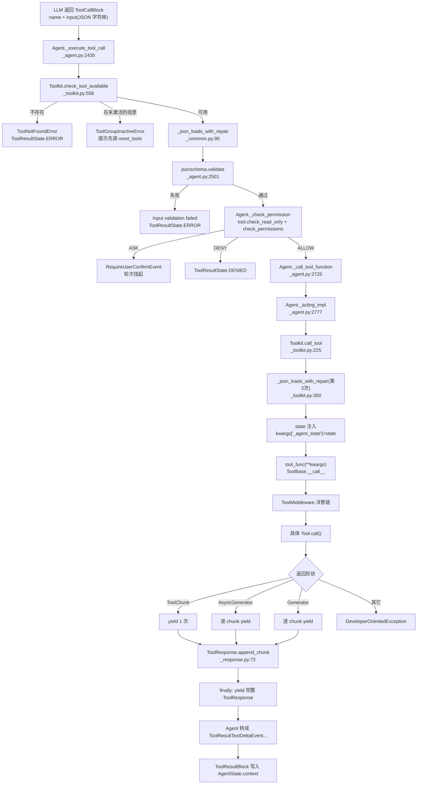
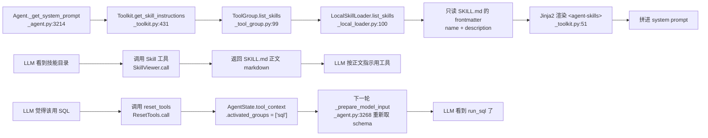

# 06 · AgentScope 工具系统（Tool Use / Toolkit / Skills）—— 源码侦察报告

> 目标读者：后续 20 篇《Agent Harness 全栈教程》的作者。
> 所有结论都来自真实源码，引用格式 `相对仓库根路径:行号`。
> AgentScope 2.0.8（`pip install -e` 于 `third_party/agentscope`），Python 3.11.13。
> 本报告里所有标「已验证」的代码都在
> `/Users/a/miniconda3/envs/agentscope_reme_pip_env/bin/python` 里真跑过，
> 脚本落在 `tutorial_agsc_reme/_recon/code/t06_*.py`。

---

## 一、子系统职责（这段代码到底在解决什么问题）

参考架构第 2 层里写着两个插件：**「MCP 工具协议插件」** 和 **「Skills / Tool Use 工具技能插件」**。
AgentScope 2.0.8 的 `agentscope/tool/` 包就是这两个插件的完整实现，
外加第 2 层「Sandbox 安全沙箱」的**一半**（隔离靠 `BackendBase`，拦截靠 `permission/`）。

用一句话概括这个包在解决什么问题：

> **把「Python 里能跑的东西」「MCP server 上的东西」「一份 SKILL.md 里写的东西」
> 统一成模型能看懂的一份 JSON Schema，并且让模型能安全地调用它们、
> 拿到流式结果、让 Harness 决定放不放行。**

它由四个互不重叠的关注点组成，教程写作时一定要分开讲，否则学生会晕：

| 关注点 | 谁负责 | 关键文件 |
| --- | --- | --- |
| **契约**：一个工具长什么样 | `ToolBase` 抽象类 | `tool/_base.py` |
| **适配**：把 Python 函数 / MCP 工具塞进契约 | `FunctionTool` / `MCPTool` | `tool/_adapters.py` |
| **注册与分发**：谁可以被调用、现在可不可以被调用 | `Toolkit` / `ToolGroup` / `RegisteredTool` | `tool/_toolkit.py`、`tool/_tool_types.py`、`tool/_tool_group.py` |
| **结果**：流式 chunk 怎么攒成一份最终结果 | `ToolChunk` / `ToolResponse` | `tool/_response.py` |

再往上叠三层「能力扩展」，这是本子系统最容易被小白忽略、但在工业级项目里最关键的部分：

1. **沙箱抽象层** `tool/_builtin/_backend.py`：六个内置文件/命令工具**全部**只通过
   `BackendBase` 做 I/O，因此同一份工具代码可以跑在本地、Docker、E2B 里，工具自身零分支。
2. **权限层** `tool/*` + `permission/`：`ToolBase.check_permissions` /
   `check_read_only` / `match_rule` / `generate_suggestions` 四个钩子，
   让「这个 rm -rf 要不要拦」成为工具自己的、可插拔的知识。
3. **渐进式披露（progressive disclosure）**：`ToolGroup` + `ResetTools`（工具组的动态装卸）
   和 `Skill` + `SkillViewer`（SKILL.md 的按需读取）是**同一思想的两种实现**：
   **上下文里只放名字和一句话描述，正文等真要用的时候再拉进来。**

### 这个子系统「不存在」的东西（教学亮点，务必点明）

- **不存在独立的评测引擎 / 基准引擎**（参考架构第 3 层）。
  我在 `third_party/agentscope/src/agentscope/` 下 `find` 过 `*eval*` `*bench*` `*metric*`，
  唯一的命中是 `third_party/agentscope/src/agentscope/agent/_realtime/_metrics.py`，
  那是实时语音 agent 的延迟指标，和「跑评测集对比不同 Harness 配置」毫无关系。
  **在工具子系统里的最近似替代物**是 `tests/toolkit_test.py`（1657 行）+ `tests/utils.py`
  里的 `MockModel`：用「预先排好的 `ChatResponse` 序列」当模型，
  断言 `tool.permission_inputs` / `tool.executed` / 回填的 `ToolResultBlock`。
  教程里要教学生**照这个模式给自己写的工具造回归测试**，这才是 Harness 工程师的日常。
- **不存在独立的「工具级缓存/去重」层**：同一个 `tool_call` 调用两次会执行两次。
  只有 `AgentState.tool_context.read_file_cache`（`state/_state.py:32` 的 `ToolContext`）
  做了 Read/Write/Edit 的文件内容缓存，那是**为省 token**，不是为去重。
- **`Toolkit._get_meta_tool_schema`（`tool/_toolkit.py:621`）是死代码**：
  全仓库 `grep -rn "_get_meta_tool_schema" src tests` 只有定义处一行，没有任何调用者。
  真正干活的是 `ResetTools.input_schema` 这个 **property**（`tool/_builtin/_meta.py:59`）。
- **`RegisteredTool.extended_model`（`tool/_types.py:33`）永远是 `None`**：
  `field(init=False, default=None)` 且全仓库无人赋值。
  `RegisteredTool.get_tool_schema()`（`tool/_types.py:56`）里那一大段
  「把扩展模型 merge 进原始 schema」的代码（`:87`–`:151`）因此是**写好但没通电**的能力。
  教程里可以把它当「如何设计一个可扩展 schema 的钩子」的正面教材，
  同时诚实地说：**当前版本没有任何调用路径会用到它**。

---

## 二、关键文件表

| 文件路径:行号 | 核心类 | 核心函数 | 一句话职责 |
| --- | --- | --- | --- |
| `third_party/agentscope/src/agentscope/tool/_base.py:100` | `ToolBase` | — | 工具契约：4 个类属性 + `call()` + 4 个权限钩子 |
| `third_party/agentscope/src/agentscope/tool/_base.py:29` | `ParamsBase` | `model_json_schema` | Pydantic 参数基类，导出 schema 时抹掉 `title` |
| `third_party/agentscope/src/agentscope/tool/_base.py:42` | `ToolMiddlewareBase` | `on_tool_call` | 工具级中间件基类（洋葱模型） |
| `third_party/agentscope/src/agentscope/tool/_base.py:159` | `ToolBase` | `call` | **工具实现者唯一需要覆写的方法** |
| `third_party/agentscope/src/agentscope/tool/_base.py:190` | `ToolBase` | `__call__` | 统一入口：拒绝位置参数 + 套中间件 + 归一化流形状 |
| `third_party/agentscope/src/agentscope/tool/_base.py:273` | `ToolBase` | `check_external_result` | 校验外部执行者回填的 metadata 是否符合 `metadata_schema` |
| `third_party/agentscope/src/agentscope/tool/_base.py:298` | `ToolBase` | `check_read_only` | 逐次调用的只读判定（默认返回静态 `is_read_only`） |
| `third_party/agentscope/src/agentscope/tool/_base.py:322` | `ToolBase` | `match_rule` | 细粒度权限规则匹配（glob / 命令前缀） |
| `third_party/agentscope/src/agentscope/tool/_base.py:355` | `ToolBase` | `generate_suggestions` | 给 UI 提议「以后这类调用直接放行」的规则 |
| `third_party/agentscope/src/agentscope/tool/_base.py:442` | `ToolBase` | `_is_dangerous_path` | 敏感文件/目录判定（大小写不敏感防绕过） |
| `third_party/agentscope/src/agentscope/tool/_toolkit.py:66` | `Toolkit` | — | 工具/分组/MCP/Skill 的中央注册表 + 调用分发器 |
| `third_party/agentscope/src/agentscope/tool/_toolkit.py:171` | `Toolkit` | `get_tool_schemas` | 给模型看的 function schema 列表 |
| `third_party/agentscope/src/agentscope/tool/_toolkit.py:225` | `Toolkit` | `call_tool` | **核心**：查表→修复参数→状态注入→执行→攒 `ToolResponse` |
| `third_party/agentscope/src/agentscope/tool/_toolkit.py:431` | `Toolkit` | `get_skill_instructions` | 渲染 SKILL.md 的「目录页」到 system prompt |
| `third_party/agentscope/src/agentscope/tool/_toolkit.py:473` | `Toolkit` | `_get_available_tools` | 按已激活分组求「当前可见工具集合」 |
| `third_party/agentscope/src/agentscope/tool/_toolkit.py:556` | `Toolkit` | `check_tool_available` | 区分「不存在」和「组没激活」，后者给激活提示 |
| `third_party/agentscope/src/agentscope/tool/_adapters.py:36` | `FunctionTool` | `call` | 把普通 Python 函数适配成 `ToolBase` |
| `third_party/agentscope/src/agentscope/tool/_adapters.py:195` | `MCPTool` | `call` | 把 MCP 工具适配成 `ToolBase`，名字改写成 `mcp__<server>__<tool>` |
| `third_party/agentscope/src/agentscope/tool/_response.py:28` | `ToolChunk` | — | 流式片段（`content` + `state` + `is_last` + `metadata`） |
| `third_party/agentscope/src/agentscope/tool/_response.py:50` | `ToolResponse` | `append_chunk` | **把 N 个 chunk 攒成 1 个最终结果**，含 block id 归并 |
| `third_party/agentscope/src/agentscope/tool/_types.py:24` | `RegisteredTool` | `get_tool_schema` | 注册项：工具 + 所属组 + 生成给模型的 schema |
| `third_party/agentscope/src/agentscope/tool/_types.py:157` | `Function` | — | **合法的工具函数签名合集**（6 种形状） |
| `third_party/agentscope/src/agentscope/tool/_types.py:178` | `ToolChoice` | — | `auto` / `none` / `required` / 指定工具名 |
| `third_party/agentscope/src/agentscope/tool/_utils.py:78` | — | `_extract_input_schema` | **签名 + docstring → JSON Schema 的真实实现** |
| `third_party/agentscope/src/agentscope/tool/_utils.py:11` | — | `_remove_title_field` | 递归删掉所有 `title`，减少对模型的干扰 |
| `third_party/agentscope/src/agentscope/tool/_tool_group.py:10` | `ToolGroup` | `list_skills` | 一组工具的声明（含 description / instructions） |
| `third_party/agentscope/src/agentscope/tool/_constants.py:4/40/56/85` | — | — | 危险文件、危险目录、危险命令、不可静态分析的 AST 节点 |
| `third_party/agentscope/src/agentscope/tool/_builtin/_backend.py:138` | `BackendBase` | `exec_shell` | **沙箱抽象**：只有 3 个抽象原语 |
| `third_party/agentscope/src/agentscope/tool/_builtin/_backend.py:741` | `LocalBackend` | `exec_shell` | 本地默认实现（`asyncio` + `aiofiles` + `os.*`） |
| `third_party/agentscope/src/agentscope/tool/_builtin/_bash.py:25` | `Bash` | `call` | 命令执行 + 树解析驱动的安全判定 |
| `third_party/agentscope/src/agentscope/tool/_builtin/_bash_parser.py:148` | `BashCommandParser` | `is_read_only_command` | 用 tree-sitter 判定「这条命令只读吗」 |
| `third_party/agentscope/src/agentscope/tool/_builtin/_read.py:82` | `Read` | `call` | 读文件（文本带行号 / 图片 PDF 走 DataBlock） |
| `third_party/agentscope/src/agentscope/tool/_builtin/_write.py:26` | `Write` | `call` | 写文件 + 危险路径拦截 + 写前必须读过 |
| `third_party/agentscope/src/agentscope/tool/_builtin/_edit.py:25` | `Edit` | `call` | 精确字符串替换（要求唯一匹配） |
| `third_party/agentscope/src/agentscope/tool/_builtin/_glob.py:45` | `Glob` | `call` | 委托 `_scripts/_glob_helper.py` 做 `os.walk` |
| `third_party/agentscope/src/agentscope/tool/_builtin/_grep.py:39` | `Grep` | `call` | 调 `rg` 做内容检索 |
| `third_party/agentscope/src/agentscope/tool/_builtin/_meta.py:21` | `ResetTools` | `call` | **元工具**：让 agent 自助装卸工具组 |
| `third_party/agentscope/src/agentscope/tool/_builtin/_skill.py:18` | `SkillViewer` | `call` | 按需读出 SKILL.md 正文 |
| `third_party/agentscope/src/agentscope/tool/_builtin/_ask_user.py:166` | `AskUser` | — | **外部工具**：本进程不执行，等调用方回填 |
| `third_party/agentscope/src/agentscope/tool/_task/_create_task.py:25` | `TaskCreate` | `call` | 往 `AgentState.tasks_context` 里加任务 |
| `third_party/agentscope/src/agentscope/skill/_base.py:8` | `Skill` | — | skill 的数据类（name/description/dir/markdown/updated_at） |
| `third_party/agentscope/src/agentscope/skill/_local_loader.py:16` | `LocalSkillLoader` | `list_skills` | 扫目录找 SKILL.md，按 mtime 做缓存 |
| `third_party/agentscope/src/agentscope/_utils/_common.py:95` | — | `_json_loads_with_repair` | **参数修复**：坏 JSON + 类型不匹配 |
| `third_party/agentscope/src/agentscope/agent/_agent.py:2435` | `Agent` | `_execute_tool_call` | 校验 → 权限 → 执行 → 回填 `ToolResultBlock` |
| `third_party/agentscope/src/agentscope/agent/_agent.py:2777` | `Agent` | `_acting_impl` | 只是 `toolkit.call_tool` 的薄包装（`on_acting` 中间件的挂钩点） |

---

## 三、调用链

### 3.1 主链：从 LLM 的 `tool_call` 到 `ToolResultBlock` 回填



**逐段讲解**

1. **`ToolCallBlock.input` 是一段字符串，不是 dict**（`message/_block.py:138`，字段 `input: str`）。
   它由模型流式吐出来的 JSON 片段拼成，**天然可能是坏 JSON**。所以整条链上有**两次** `_json_loads_with_repair`：
   - 第一次在 `Agent._execute_tool_call`（`agent/_agent.py:2493`），为了让**权限检查**和 **jsonschema 校验**拿到正规的 dict；
   - 第二次在 `Toolkit.call_tool`（`tool/_toolkit.py:300`），为了让**工具函数**拿到正规的 dict。

   这两次是同一个纯函数、同样的入参（`tool_call.input` + `tool_func.input_schema`），
   幂等所以重复调用无害。**但这也意味着：如果你绕过 Agent 直接调 `Toolkit.call_tool`，
   就没有 jsonschema 校验这一关**——这一点我在 `t06_external_and_validation.py` 里实测过（见 §六 片段 5）。
2. **`check_tool_available` 做的是「区分两种失败」**（`tool/_toolkit.py:556`）。
   它先按「basic + 已激活分组」求可用工具集，没命中就**再查一次全量分组**：
   如果名字在全量里有，说明是**组没激活**，抛 `ToolGroupInactiveError` 并附上
   「你应该先调 `reset_tools`」的提示；否则才是 `ToolNotFoundError`。
   这是一个非常值得学的 Harness 设计：**错误消息本身是给模型看的 prompt**，
   要能引导模型自我修复，而不是给一句 "not found"。
3. **校验与执行分家**。`jsonschema.validate`（`agent/_agent.py:2501`）在 Agent 侧，
   `Toolkit.call_tool` 里只有修复没有校验。原因是「校验失败该不该给工具看」
   属于**编排策略**，不属于**工具执行**——工具只管跑，编排者决定要不要让它跑。
4. **`_acting_impl` 是刻意的薄层**（`agent/_agent.py:2777`）。它的 docstring 明说
   「权限检查和上下文写入**不在这里**，那是 `_execute_tool_call` 的职责」。
   这一层的存在只为给 `AgentMiddleware.on_acting` 一个挂钩点
   （`agent/_agent.py:2749`–`:2775` 的 `execute_chain`），
   让用户能在**不碰工具内部**的前提下做后台卸载、审计、重试。
5. **`ToolResponse` 一定在 `finally` 里被 yield**（`tool/_toolkit.py:390`–`:392`）。
   这是整条链的收口：调用方 `async for` 到最后拿到的一定是一个
   `ToolResponse` 而不是 `ToolChunk`。教程里要强调这个**类型即位置**的约定。

### 3.2 副链：工具组与 Skill 的渐进式披露



**逐段讲解**：这张图是本子系统**最有教学价值**的部分。它揭示了一条贯穿工业级 Harness 的规律：

> **上下文的宽度 = 工具数量 × 每个工具的 schema 长度。工具越多，模型越蠢。**

AgentScope 用了**两套机制**压这个宽度，而且刻意用了不同的粒度：

- **`ToolGroup` + `ResetTools`（粗粒度、可逆、有副作用）**：
  一次开关一整组工具。`ResetTools` 的语义是**终态赋值而不是增量**
  （见 `tool/_builtin/_meta.py:29`–`:34` 的描述原文：
  "The input booleans are the final state of their corresponding tool groups, not incremental changes"），
  没被显式设为 `True` 的组一律关掉。这是一个很容易踩的坑。
- **`Skill` + `SkillViewer`（细粒度、只读、无副作用）**：
  skill **不是工具**（`tool/_toolkit.py:54` 的模板里明说
  "Skills are NOT tools, and you cannot call a skill directly"），
  它只是一份 markdown。system prompt 里只放 `name` + `description` + `dir`，
  正文要 LLM 主动调 `Skill` 工具才拉进来。

还有一个更隐蔽的设计：**`Skill` 这个工具只在「当前激活分组里真的有 skill」时才可见**
（`tool/_toolkit.py:493`–`:498`：`skills = await self._get_available_skills(groups); if len(skills): available_tools[...] = self.builtin_skill_viewer`）。
所以 `Skill` 工具的 schema 本身也是「按需付费」的。我在
`t06_tool_group_and_skill.py` 的 `[6]` 步验证了这一点：reset 之前 `Skill` 不可见，
激活 skillgroup 之后才出现。

同样地，`reset_tools` **只在存在非 basic 组时才注入**（`tool/_toolkit.py:502`–`:509`）。
只有一个 basic 组、没有 MCP 没有 skill 的简单 agent，上下文里不会出现任何元工具。

---

## 四、关键数据结构

### 4.1 `ToolBase` 的四个类属性（契约的核心）

`third_party/agentscope/src/agentscope/tool/_base.py:100`–`:142`：

```python
class ToolBase(ABC):
    name: str
    """The name presented to the agent."""
    description: str
    is_concurrency_safe: bool
    """If this tool is concurrency safe."""
    is_read_only: bool
    """If this tool is read-only, which will be used in the permission
    checking."""
    is_external_tool: bool = False
    """If this tool is an external tool, which doesn't need to implement the
    __call__ method and the agent will yield the external tool call event."""
    is_state_injected: bool = False
    """If this tool requires agent state to be injected when called. If `True`,
    the state will be injected by an argument named `_agent_state`. ..."""
    metadata_schema: dict[str, Any] | None = None
    """What an external executor must put in
    :attr:`~..message.ToolResultBlock.metadata`, as a JSON schema. ..."""
    is_mcp: bool = False
    mcp_name: str | None = None
    dangerous_files: list[str] = DEFAULT_DANGEROUS_FILES
    dangerous_directories: list[str] = DEFAULT_DANGEROUS_DIRECTORIES
```

三个点必须讲透：

- **`is_read_only` 是「静态声明」，`check_read_only()` 是「逐次判定」**（`_base.py:298`）。
  `Bash` 的静态值是 `False`（因为它能跑任何东西），但 `ls -a` 事实上是只读的。
  所以 `Bash` 覆写了 `check_read_only`（`tool/_builtin/_bash.py:179`），
  每次调用时用 `BashCommandParser` 现场判。**这是「静态能力声明 + 动态实例判定」双层设计的标准范例**，
  教程里可以让学生自己在 `harness_kit` 里复刻一遍。
- **`metadata_schema` 是「另一半契约」**。`input_schema` 告诉**模型**怎么调；
  `metadata_schema` 告诉**外部执行者**怎么回答。
  只有 `AskUser` 用了它（`tool/_builtin/_ask_user.py:203`），
  因为只有外部工具才需要「机器可读的回填」。
  设计理由写在 `_base.py:127`–`:129` 的注释里：
  「`output` 是给模型读的散文，`metadata` 是给程序分支判断的那一半」——
  **一个 step 想判断「用户批准了吗」不能靠读散文**。这句话值得原样引用进教程。
- **`dangerous_files` / `dangerous_directories` 是类属性，实例可覆盖**。
  `Bash(...)`、`Write(...)`、`Edit(...)` 的 `__init__` 都接受这两个参数，
  **传 `[]` 就是彻底关掉检查**（`_bash.py:150`–`:160` 的注释明说）。

### 4.2 `Function`：六种合法工具函数形状

`third_party/agentscope/src/agentscope/tool/_types.py:157`–`:175`：

```python
Function: TypeAlias = (
    # Sync function
    Callable[..., ToolChunk]
    |
    # Async function
    Callable[..., Awaitable[ToolChunk]]
    |
    # Sync generator function
    Callable[..., Generator[ToolChunk, None, None]]
    |
    # Async generator function
    Callable[..., AsyncGenerator[ToolChunk, None]]
    |
    # Async function that returns async generator
    Callable[..., Coroutine[Any, Any, AsyncGenerator[ToolChunk, None]]]
    |
    # Async function that returns sync generator
    Callable[..., Coroutine[Any, Any, Generator[ToolChunk, None, None]]]
)
```

**为什么是六种**？因为 Python 里「返回一个东西」「一步步产出东西」「先 await 再拿到一个产生器」
是三件不同的事，而每种又能是 sync/async。Harness 的处理办法是
**把六种在 `ToolBase.__call__` 里全部归一到「异步生成器」这一种**，
这样上层的中间件和 `Toolkit.call_tool` 只需要处理一种形状。
我在 `t06_tool_protocol_dispatch.py` 里验证了这个归一的边界（见 §六 片段 3）：
**没有中间件时**，`__call__` 会原样返回 `ToolChunk` 或 `AsyncGenerator`；
**有中间件时**，无论哪种都统一返回 `AsyncGenerator`。

### 4.3 `ToolChunk` / `ToolResponse`：流式片段与最终结果

`third_party/agentscope/src/agentscope/tool/_response.py:28`–`:70`：

```python
class ToolChunk(BaseModel):
    """The tool result chunk from a tool execution."""

    content: List[TextBlock | DataBlock]
    state: ToolResultState = ToolResultState.RUNNING
    is_last: bool = True
    metadata: dict = Field(default_factory=dict)
    id: str = Field(default_factory=_generate_id)


class ToolResponse(BaseModel):
    """The tool response from a tool execution, which contains the completed
    tool result (compared to ToolChunk)."""

    content: List[TextBlock | DataBlock] = Field(default_factory=list)
    state: Literal[
        ToolResultState.ERROR, ToolResultState.DENIED,
        ToolResultState.INTERRUPTED, ToolResultState.SUCCESS,
    ] = ToolResultState.SUCCESS
    metadata: dict = Field(default_factory=dict)
    id: str = Field(default_factory=_generate_id)
```

`ToolResultState`（`message/_block.py:185`）的五个值：
`success` / `error` / `interrupted` / `denied` / `running`。

注意两个类型对 `state` 的**取值域不一样**，这不是笔误，而是设计：
- `ToolChunk` 可以是 `RUNNING`（还没跑完）；
- `ToolResponse` **不允许** `RUNNING`——有 `RUNNING` 就说明你忘了它在 `finally` 里被 yield。

`append_chunk` 的**三条归并规则**（`_response.py:72`–`:170`），这是本文件最该精读的一段：

1. **block id 相同 + 都是 `TextBlock` → `text` 原地拼接**；
   都是 `DataBlock` 且都是 `Base64Source` → **先 base64 解码、字节级拼接、再编码**
   （`_response.py:13` 的 `_merge_base64_chunks`），这样分片传的图片/音频不会因为
   padding 而损坏。
2. **block id 不同但都是 `TextBlock` → 依然会被合并**（`_response.py:151`–`:168` 的后处理）。
   也就是说 `TextBlock` 在最终结果里是**连成一片**的，id 保留第一个。
   `DataBlock` 则严格按 id 归并，不会误合。
3. **state 只往「坏」的方向变**（`_response.py:136`–`:147`）：
   `ERROR` > `INTERRUPTED` > `DENIED` > `SUCCESS`。已 `ERROR` 的不会被后续 `SUCCESS` 洗白。

我在 `t06_toolchunk_accumulate.py` 里把这三条都实测了一遍。

### 4.4 `RegisteredTool`：注册项

`third_party/agentscope/src/agentscope/tool/_types.py:24`–`:41`：

```python
@dataclass
class RegisteredTool:
    tool: ToolBase
    extended_model: Type[BaseModel] | None = field(init=False, default=None)
    group: str | Literal["basic"] = "basic"
    original_name: str | None = field(default=None)

    def __post_init__(self) -> None:
        # validate schema
        if self.tool.input_schema is not None:
            if not (
                isinstance(self.tool.input_schema, dict)
                and self.tool.input_schema.get("type") == "object"
                and isinstance(self.tool.input_schema.get("properties"), dict)
            ):
                raise ValueError(f"Invalid input_schema: {self.tool.input_schema}. ")
```

`__post_init__` 是一道**很硬的守卫**：`input_schema` 必须是 `{"type":"object","properties":{...}}`。
所以手写 schema 的教程示例一定要带 `"properties"`，哪怕是空的。
（`SkillViewer` 的 schema 就老老实实写了 `"properties": {...}`，见 `_builtin/_skill.py:32`。）

### 4.5 `ToolChoice`：让 Harness 命令模型「只准调这个工具」

`third_party/agentscope/src/agentscope/tool/_types.py:178`–`:203`：

```python
class ToolChoice(BaseModel):
    mode: Literal["auto", "none", "required"] | str
    tools: list[str] | None = None
```

`mode` 可以是一个**具体工具名**（强制单工具调用）。文档字符串里有一句很有价值的工程注记：

> Prefer using ``mode=<tool_name>`` (str) over ``tools=["<tool_name>"]`` when
> the goal is a forced single-tool call without changing the available tool set,
> as the former avoids schema-list changes that would invalidate prompt caches.

**这直接连回参考架构第 1 层的「KV Cache 管理」**：改 `tools` 列表会让 KV Cache 失效，
只改 `tool_choice` 不会。AgentScope 自己在生成结构化输出时就是这么用的
（`agent/_agent.py:3625`：`ToolChoice(mode=_GenerateStructuredOutput.name)`）。

---

## 五、源码精读

### 5.1 `ToolBase.__call__`：一个方法吃掉六种形状（`tool/_base.py:190`–`:263`）

```python
    async def __call__(
        self,
        *args: Any,
        **kwargs: Any,
    ) -> ToolChunk | AsyncGenerator[ToolChunk, None]:
        if args:
            raise TypeError(
                f"{type(self).__name__} must be called with keyword arguments "
                f"only, but got {len(args)} positional argument(s).",
            )
        # ``getattr`` with a default so the no-middleware path keeps working
        # even if a subclass overrides ``__init__`` without calling
        # ``super().__init__()``.
        middlewares = getattr(self, "_middlewares", [])
        if not middlewares:
            if inspect.isasyncgenfunction(self.call):
                return self.call(**kwargs)
            return await self.call(**kwargs)

        async def execute_chain(
            index: int = 0,
            **chain_kwargs: Any,
        ) -> AsyncGenerator[ToolChunk, None]:
            """Execute the tool middleware chain."""
            if index >= len(middlewares):
                if inspect.isasyncgenfunction(self.call):
                    async for chunk in self.call(**chain_kwargs):
                        yield chunk
                else:
                    result = await self.call(**chain_kwargs)
                    if isinstance(result, AsyncGenerator):
                        async for chunk in result:
                            yield chunk
                    else:
                        yield result
            else:
                mw = middlewares[index]
                input_kwargs = dict(chain_kwargs)

                async def next_handler(
                    **kw: Any,
                ) -> AsyncGenerator[ToolChunk, None]:
                    async for chunk in execute_chain(index + 1, **kw):
                        yield chunk

                async for chunk in mw.on_tool_call(
                    tool=self,
                    input_kwargs=input_kwargs,
                    next_handler=next_handler,
                ):
                    yield chunk

        return execute_chain(**kwargs)
```

**逐段讲**：

- `if args: raise TypeError` —— 工具**只准用关键字参数调用**。
  为什么？因为 `Toolkit.call_tool` 拿到的是 JSON 里的一个 dict，
  参数名是模型给的。如果允许位置参数，模型把参数顺序搞错时会**静默地传错值**。
  这里选择**大声失败**。`*args` 保留在签名里纯粹是为了 Liskov 兼容
  （子类可能自己覆写 `__call__` 带位置参数）。设计注释原文：
  "accepted in the signature solely to stay Liskov-compatible ... any positional
  argument actually passed here is rejected (raising TypeError) so it fails
  loudly instead of being silently dropped."
- `inspect.isasyncgenfunction(self.call)` —— 一个 `inspect` 调用决定了
  「要不要 await」。`async def call(self) -> ToolChunk` 是**协程函数**，调完必须 `await`；
  `async def call(self)` 里带 `yield` 是**异步生成器函数**，调完直接就是生成器，
  `await` 它会报错。这一个 if 就是六种形状归一的关键。
- 中间件链是**手写的递归 `execute_chain(index)`**，而不是 `functools.reduce`。
  好处是 `next_handler` 是**闭包**，中间件可以决定**改不改写 kwargs**
  （`next_handler(**kw)` 时传什么就往下传什么）。
- **`getattr(self, "_middlewares", [])` 这个默认值不是洁癖**：
  注释说得很清楚，是为了让**没调 `super().__init__()` 的子类**也能工作。
  这是给「第二个开发者」（second-party developer）留的容错。

### 5.2 `Toolkit.call_tool`：分发器的全部逻辑（`tool/_toolkit.py:225`–`:392`）

```python
    async def call_tool(
        self,
        tool_call: ToolCallBlock,
        state: AgentState,
    ) -> AsyncGenerator[ToolChunk | ToolResponse, None]:
        tool_response = ToolResponse(id=tool_call.id)

        available_tools = await self._get_available_tools(
            state.tool_context.activated_groups,
        )

        if tool_call.name not in available_tools:
            all_tools = await self._get_available_tools(
                groups=[_.name for _ in self.tool_groups],
            )
            if tool_call.name in all_tools:
                group_name = all_tools[tool_call.name].group
                chunk = ToolChunk(
                    content=[TextBlock(text=(
                        "ToolGroupInactiveError: The tool "
                        f"'{tool_call.name}' in group '{group_name}' "
                        "is currently inactive. You should first "
                        "activate the group by calling the "
                        f"'{self.builtin_meta_tool.tool.name}' tool."))],
                    state=ToolResultState.ERROR,
                )
                yield chunk
                yield tool_response.append_chunk(chunk)
                return
            # Not exist
            chunk = ToolChunk(
                content=[TextBlock(text=f"ToolNotFoundError: The tool named "
                                       f"'{tool_call.name}' doesn't exist.")],
                state=ToolResultState.ERROR,
            )
            yield chunk
            yield tool_response.append_chunk(chunk)
            return

        tool_func = available_tools[tool_call.name].tool

        try:
            kwargs = _json_loads_with_repair(
                tool_call.input,
                tool_func.input_schema,
            )

            # State injection
            if (
                tool_func.is_state_injected
                and not tool_func.is_mcp
                and not tool_func.is_external_tool
            ):
                kwargs["_agent_state"] = state

            if inspect.iscoroutinefunction(tool_func.__call__):
                res = await tool_func(**kwargs)
            else:
                # When `tool_func.original_func` is Async generator function or
                # Sync function
                res = tool_func(**kwargs)

            if isinstance(res, ToolChunk):
                yield res
                tool_response.append_chunk(res)

            # If return an async generator
            elif isinstance(res, AsyncGenerator):
                async for chunk in res:
                    yield chunk
                    tool_response.append_chunk(chunk)

            # If return a sync generator
            elif isinstance(res, Generator):
                for chunk in res:
                    yield chunk
                    tool_response.append_chunk(chunk)

            else:
                raise DeveloperOrientedException(
                    "The tool function must return a ToolChunk object, or an "
                    "AsyncGenerator/Generator of ToolChunk objects, "
                    f"but got {type(res)}.",
                )

        except mcp.shared.exceptions.McpError as e:
            ...
        except Exception as e:
            if isinstance(e, DeveloperOrientedException):
                raise e from None
            chunk = ToolChunk(
                content=[TextBlock(type="text", text=str(e))],
                state=ToolResultState.ERROR,
            )
            yield chunk
            tool_response.append_chunk(chunk)

        except asyncio.CancelledError:
            chunk = ToolChunk(
                content=[TextBlock(text="<system-reminder>The tool call has "
                                       "been interrupted by the user."
                                       "</system-reminder>")],
                state=ToolResultState.INTERRUPTED,
            )
            ...
        finally:
            # Finally, yield the complete tool response
            yield tool_response
```

**这段是整个子系统的心脏，值得一条一条拆**：

- **`tool_response = ToolResponse(id=tool_call.id)`** —— 注意是 `tool_call.id`，
  不是 `tool_response.id` 的默认随机值。这个 id 就是 `ToolResultBlock.id` 要和
  `ToolCallBlock.id` 对上的那把锁（见 §六 片段 6 的真实输出）。
- **错误也被当成正常 `ToolChunk` yield 出去**。这是 Harness 的关键设计：
  **异常不往上抛，而是变成模型能读的一段文本 + `state=ERROR`**。
  模型看到 "ToolNotFoundError: The tool named 'xxx' doesn't exist." 就会自己改。
  唯一的例外是 `DeveloperOrientedException` —— 那是**给开发者看的**（比如
  「你的工具返回了非 `ToolChunk` 的东西」），直接 `raise e from None` 打穿。
  注释原文："The exceptions should be handled by the agent"。
- **`except asyncio.CancelledError` 写在 `except Exception` 之后**。
  在 Python 3.8+ `CancelledError` 继承自 `BaseException` 而不是 `Exception`，
  所以顺序无所谓，但这个位置说明作者很清楚它不会被前面吃掉。
  中断会被转成 `ToolResultState.INTERRUPTED` 并附一条 `<system-reminder>`——
  **让模型知道自己被打断了**，而不是以为工具失败。
- **state 注入有三个排除条件**：`is_state_injected and not is_mcp and not is_external_tool`。
  排除 MCP 是安全考虑（`tool/_adapters.py:205` 的注释：
  "The mcp tools is prohibited state injection for safety reason"）——
  MCP server 是第三方进程，不能把活的 `AgentState` 给它。
  排除外部工具是因为外部工具根本不在本进程执行。
- **`inspect.iscoroutinefunction(tool_func.__call__)` 这个判断其实有个盲点**：
  `ToolBase.__call__` 本身是 `async def`，所以对**没覆写 `__call__` 的所有工具**
  这个判断都返回 `True`，走 `await` 分支。`else` 分支只在子类把 `__call__`
  覆写成**同步函数**时才走到（例如 `tests/tool_argument_repair_test.py:55` 那个
  `_RecordTool`... 其实那也是 `async def`，所以真正走到 else 的场景极少）。
  **教程里要提醒学生：想接老式同步工具函数，请用 `FunctionTool` 包一层，不要自己覆写 `__call__`。**

### 5.3 从签名 + docstring 生成 JSON Schema（`tool/_utils.py:78`–`:180`）

这是任务里点名要讲清楚的「真实实现」。核心 40 行：

```python
def _extract_input_schema(
    tool_func: Callable,
    include_var_positional: bool = False,
    include_var_keyword: bool = False,
) -> dict:
    docstring = parse(tool_func.__doc__ or "")
    params_docstring = {_.arg_name: _.description for _ in docstring.params}

    # Under PEP 563 (`from __future__ import annotations`) the annotations
    # in the signature are raw strings, which pydantic cannot resolve
    # outside the function's own module. Resolve them here instead.
    try:
        type_hints = typing.get_type_hints(tool_func, include_extras=True)
    except Exception:
        type_hints = {}

    fields = {}
    for name, param in inspect.signature(tool_func).parameters.items():
        if name in ["self", "cls"]:
            continue

        annotation = type_hints.get(name, param.annotation)

        if param.kind == inspect.Parameter.VAR_KEYWORD:
            if not include_var_keyword:
                continue
            fields[name] = (Dict[str, Any] if annotation == inspect.Parameter.empty
                            else Dict[str, annotation],
                            _build_param_field(
                                description=params_docstring.get(f"**{name}",
                                  params_docstring.get(name, None)),
                                default={} if param.default is param.empty
                                else param.default))
        elif param.kind == inspect.Parameter.VAR_POSITIONAL:
            ...  # 同理，list[Any] / list[annotation]
        else:
            fields[name] = (
                Any if annotation == inspect.Parameter.empty else annotation,
                _build_param_field(
                    description=params_docstring.get(name, None),
                    default=... if param.default is param.empty
                    else param.default),
            )

    base_model = create_model(
        "_StructuredOutputDynamicClass",
        __config__=ConfigDict(arbitrary_types_allowed=True),
        **fields,
    )
    params_json_schema = base_model.model_json_schema()
    _remove_title_field(params_json_schema)
    return params_json_schema
```

**这是本报告里最该逐行讲的一段**，因为它是「Harness 怎么把 Python 翻译成 JSON Schema」的标准答案：

1. **`docstring_parser.parse()`**（`_utils.py:7` 导入）**同时吃 Google / numpy / Sphinx 三种风格**。
   我实测过三种都通（§六 片段 2）。
   `docstring.params` 是一个 `DocstringParam` 列表，`.arg_name` 是要匹配的**形参名**，
   `.description` 是描述文本。注意它**不读类型**（`:type x: int` 会被忽略），
   **类型只从 Python 注解来**。这是个反直觉点，教程要强调：
   **docstring 里写的类型是给读代码的人看的，JSON Schema 的类型来自注解。**
2. **`typing.get_type_hints(tool_func, include_extras=True)`** —— 两个细节都很关键：
   - `include_extras=True` 是为了**保住 `Annotated[int, Field(ge=0, le=10)]` 里的
     `Field` 元数据**。不加这个参数，`Annotated` 会被剥成裸 `int`，
     约束全部丢失（我实测 `bounded` 字段生成了 `minimum: 0, maximum: 10`）。
   - 用 `get_type_hints` 而不是 `param.annotation` 是为了**处理 PEP 563**
     （`from __future__ import annotations` 会把注解变成字符串）。
     注释里明确说了这一点，并且 `except Exception` 兜底
     （`functools.partial`、只在 `TYPE_CHECKING` 里存在的名字会抛异常）。
3. **`create_model("_StructuredOutputDynamicClass", **fields)`** ——
   把签名变成一个**临时 Pydantic 模型**，然后交给 Pydantic 生成 JSON Schema。
   这是「不要自己手写 JSON Schema 生成器」的最佳实践：
   **借 Pydantic 的类型系统**，所有 `$defs` / `$ref` / `anyOf` 都由它生成。
   模型名 `_StructuredOutputDynamicClass` 会**泄漏到 `$defs` 里**吗？
   不会——因为顶层模型自己的 schema 不进 `$defs`，只有嵌套模型才进。
4. **`default=...` 是 Pydantic 表示「必填」的写法**（`Ellipsis`）。
   `param.default is param.empty` 就是「没有默认值」。
   **`required` 列表由此自然产生**：有 `default` 的进 `properties` 不进 `required`。
5. **`_build_param_field` 的一个小心思**（`_utils.py:69`）：

   ```python
   def _build_param_field(description: str | None, default: Any) -> Any:
       if description is None:
           return Field(default=default)
       return Field(description=description, default=default)
   ```

   为什么要分两种写法？注释解释：**如果 docstring 里没写描述，
   就不要塞一个 `description=None`**，否则会**覆盖掉
   `Annotated[..., Field(description="...")]` 里带的描述**。
   这是「两个描述来源谁优先」的取舍答案：**注解优先，docstring 补充。**
6. **`*args` / `**kwargs` 默认被丢掉**（`include_var_positional=False` /
   `include_var_keyword=False` 的默认值）。
   为什么？因为模型不擅长填变长参数，而且 `**kwargs` 会让 schema 变成一个
   开放对象，模型会乱塞字段。想要的话可以显式打开（`_utils.py:81`–`:93`）。
7. **`_remove_title_field` 在最后无条件跑一遍**（`_utils.py:178`）。
   Pydantic 默认会给每个字段加 `"title": "Foo"`。这些标题**对模型是纯噪音，
   还占 token**。`_remove_title_field`（`_utils.py:11`）递归处理
   `properties` / `items` / `additionalProperties` / `$defs` 四处。
   注意它**原地修改**并返回同一个 dict（不是复制），所以
   `ParamsBase.model_json_schema` 覆写里可以直接 `return _remove_title_field(super().model_json_schema(...))`。

### 5.4 参数修复：`_json_loads_with_repair`（`_utils/_common.py:95`）

```python
    parsed = None
    error_message = "Error: Failed to parse your tool arguments."
    try:
        parsed = json.loads(json_str)
        if not isinstance(parsed, dict):
            error_message = (
                f"Error: Your argument string is decoded into a "
                f"{type(parsed)} object, but a dict object is expected!")
        elif schema is None:
            return parsed
    except json.JSONDecodeError as e:
        error_message = (...)
    try:
        from json_repair import repair_json
        try:
            res = repair_json(
                json_str,
                stream_stable=True,
                schema=schema,
                return_objects=True,
            )
        except ValueError:
            res = parsed
        if isinstance(res, dict):
            if isinstance(parsed, dict) and parsed.keys() - res.keys():
                # Dropping arguments, e.g. under `additionalProperties:
                # false`, is a rewrite rather than a type repair.
                res = parsed
            try:
                # NaN and Infinity are accepted as numbers by jsonschema, but
                # silently bypass the minimum/maximum constraints.
                json.dumps(res, allow_nan=False)
            except ValueError:
                error_message = (
                    "Error: NaN and Infinity are not valid JSON numbers.")
            else:
                return res
    except Exception:
        pass
    ...
    raise ToolJSONDecodeError(...)
```

**逐段讲**：

- **只有在给了 `schema` 时才继续走修复流程**。`elif schema is None: return parsed` ——
  意味着「合法 JSON + 无 schema」直接返回，不做类型修复。
  我在 §六 片段 5 里实测了这一点：`Toolkit.call_tool` 内部传了 schema，
  所以把 `"42"` 修成了 `42`。
- **`stream_stable=True`** —— 这个参数名就说明了用途：
  它能让**流式拼接中还没闭合的 JSON**（`{"count": "42",`）也被修出一个可用的结果。
  这是 Harness 为了让「模型吐一半就完了」不至于崩掉的兜底。
- **`parsed.keys() - res.keys()` 这段是最有工程品味的一处**：
  如果原本能解析出 3 个 key，修完只剩 2 个，说明 `json_repair` 在
  **按 schema 删字段**（比如 `additionalProperties: false` 时把多余的删了）。
  注释说得很明白：**「丢参数是重写，不是类型修复」** ——
  静默丢参数比报错更危险，所以宁可用回原样让下游校验去报错。
- **`json.dumps(res, allow_nan=False)` 这段是防御性编程的教科书**：
  `jsonschema` 会把 `NaN` / `Infinity` 当成合法 number，
  于是 `{"ratio": NaN}` 能**绕过** `minimum` / `maximum` 约束。
  这里用一个 `json.dumps` 试一下就能把它们筛掉。
- **报错信息是「故意写给模型看的」**（`_utils/_common.py:196`–`:208`）：
  它把原始 JSON 字符串以 `repr()` 形式嵌进一段 Python 代码里，
  包在 `<system-reminder>` 里，最后一句是
  **`**You should recorrect the arguments in JSON format.**`**。
  超过 200 字符会截断并把中间换成 `[TRUNCATE]` 标记。
  **这段 prompt 工程的代码比任何「怎么写 system prompt」的教程都更有说服力**，
  建议教程里原文展示这一段的输出效果。
- **两段式校验的完整分工**（`tests/tool_argument_repair_test.py` 是官方权威）：
  修复在 `_json_loads_with_repair`，**校验在 `agent/_agent.py:2501` 的 `jsonschema.validate`**。
  该测试文件 `test_repaired_arguments_reach_permission_and_execution`（`:141`）
  明确断言了三件事：修复后的参数 `{"value": 42}` 送到了权限检查和执行，
  而 `tool_call.input` **保持模型原始的 `'{"value": "42"}'` 不变**。
  **「原始输入不改、修复值只往下传」是一条重要的 Harness 原则**：
  事件溯源需要真相，执行需要可运作的输入，两者不能互相污染。
  `test_unrepairable_arguments_are_rejected`（`:206`）断言
  `'{"value": "many"}'` 修不动时**既不到权限检查也不到执行**，
  而是回填一句 `"Input validation failed for tool 'record': 'many' is not of type 'integer' (at $.value)"`。
  注意最后那个 `(at $.value)` —— **JSON path 是显式带上的**，
  因为「哪个字段错了」对模型自我修复至关重要
  （`test_nested_validation_errors_include_instance_paths` 专门测嵌套路径
  `$.value.locations[1].city`）。

### 5.5 沙箱抽象：`BackendBase`（`tool/_builtin/_backend.py:138`）

模块 docstring（`_backend.py:2`–`:33`）本身就说得非常清楚，直接引用：

> Every backend implements exactly **three** abstract primitives whose
> mechanism genuinely differs per environment:
>
> * :meth:`BackendBase.exec_shell` — run a program from an argv list
>   (no shell; callers needing shell features wrap with ``sh -c``).
> * :meth:`BackendBase.read_file` — read raw bytes.
> * :meth:`BackendBase.write_file` — write raw bytes.
>
> All remaining filesystem operations (``file_exists``, ``is_dir``,
> ``list_dir``, ``stat_mtime``, ``delete_path``) are derived on the base
> class from ``exec_shell`` and work out-of-the-box for any remote
> backend.

我实测 `BackendBase.__abstractmethods__` 正是
`['exec_shell', 'read_file', 'write_file']`（§六 片段 4）。

两个设计细节值得教学：

- **`_path_module`（`_backend.py:177`）**：路径操作要按**被操作方的**操作系统语义来。
  一个 Windows 主机驱动 Linux 容器时，必须用 `posixpath` 而不是 `os.path`。
  类属性默认 `posixpath`，`LocalBackend` 覆写成 `os.path`（`_backend.py:758`）。
  注释里还有一条**血泪警告**：只准调用纯字符串函数
  （`join`/`dirname`/`normpath`/`isabs`），**绝对不准**调用
  `exists`/`isdir`/`realpath`/`expanduser`/无参 `abspath` ——
  因为那些会读**宿主进程**的文件系统和 `$HOME`，对远程后端是静默的 bug。
- **`exec_shell` 收的是 argv 列表，不是 shell 字符串**。
  `Bash.call`（`tool/_builtin/_bash.py:702`–`:717`）自己包 shell：

  ```python
  if self._backend.os_name == "nt":
      shell_command = ["cmd", "/c", command]
  else:
      shell_command = ["/bin/sh", "-c", command]
  ```
  选择 shell 的依据是 **`self._backend.os_name`（后端环境的 OS）而不是宿主的 `os.name`**。
  注释："Pick the native shell of the *backend's* environment (not the host's)"。
- **错误码的约定**：`exec_shell` 失败返回 `exit_code=127`（模仿 shell 的
  "command not found"）而不是抛异常（`_backend.py:805`–`:814`）；
  超时返回 `exit_code=-1` + `stderr=b"timed out"`（`_backend.py:821`–`:824`）。
  `Bash.call` 就是靠 `result.exit_code == -1 and result.stderr == b"timed out"`
  这个**字符串比较**来识别超时的（`_bash.py:731`）。这个约定很脆弱，
  教程里可以当「接口约定的反面教材」：**用 magic string 传递语义状态不如用枚举**。

### 5.6 Bash 的三层安全判定（`tool/_builtin/_bash.py` + `_bash_parser.py`）

`Bash` 的安全模型是**三层过滤**，这是我见过的最完整的「命令执行工具该怎么做安全」的范本：

1. **静态只读判定** `check_read_only`（`_bash.py:179`）：
   先问 `check_injection_risk`（`_bash_parser.py:862`）——
   命令里有没有 `$(...)`、`<(...)`、`(...)`、`for`、`while`、`if`、
   函数定义这些**无法静态分析**的结构（`_constants.py:85` 的 `DANGEROUS_NODE_TYPES`）。
   有就直接返回 `False`，**因为「无法证明只读」就不能当只读**。
   注释里的例子极好：`ls $(rm -rf /)` 看起来只读，其实嵌了一个删除。
   没有可疑结构再查 `READ_ONLY_COMMANDS`（`_bash_parser.py:89`，含
   `GIT_READ_ONLY_COMMANDS` / `docker ps` / `gh pr list` 等白名单）。
2. **危险命令模式** `check_dangerous_command`（`_bash_parser.py:647`）：
   匹配 `DANGEROUS_COMMANDS`（`_constants.py:56`：`rm -rf` / `sudo rm` / `dd` /
   `mkfs` / `chmod 777` / `kill -9` / `> /dev/` 等）。
3. **危险路径** `_is_dangerous_path`（`_base.py:442`）：
   文件名命中 `DEFAULT_DANGEROUS_FILES`（`.env` 及各种变体、`.ssh/config`、
   `.netrc`、`.npmrc`、`.pypirc`、shell rc 文件）或任一路径段命中
   `DEFAULT_DANGEROUS_DIRECTORIES`（`.git` / `.vscode` / `.idea` / `.ssh`）。
   **大小写不敏感**，注释说明是为了防止 macOS/Windows 的大小写不敏感文件系统被绕过。

我实测的行为（`t06_builtin_and_backend.py` 第 6 步）：
`ls -a` → `read_only=True`；`ls $(rm -rf /)` → `read_only=False` 且
`injection_risk='Command contains command_substitution which cannot be statically analyzed'`；
`rm -rf /tmp/x` → `PermissionBehavior.ASK` 且 **`bypass_immune=True`**。

**`bypass_immune`（`permission/_decision.py:33`）是一个必须单独讲的概念**：
它是 `PermissionDecision` 上的一个布尔位，语义是
**「这个 ASK 不允许被任何 allow 规则升格成 ALLOW，用户必须当场确认」**。
它的 per-mode 行为（`permission/_decision.py:44`–`:55`）：
`DEFAULT`/`ACCEPT_EDITS` 尊重它；`BYPASS` **故意忽略它**
（BYPASS 的契约是「用户已经放弃了安全提示」）；
`DONT_ASK` 把它**降级成 DENY**（没有用户可问时不能默认放行）。
**教程里要让学生把这段注释当「安全设计文档」来读**——
它示范了「一个安全开关在不同运行模式下该怎么解释」的完整思考。

### 5.7 `Skill` 的渐进式加载（`skill/_base.py` + `skill/_local_loader.py` + `_builtin/_skill.py`）

`Skill` 是一个极简 dataclass（`skill/_base.py:7`–`:20`）：
`name` / `description` / `dir` / `markdown` / `updated_at`。
`SkillLoaderBase` 只有一个抽象方法 `list_skills()`（`skill/_base.py:23`）。

`LocalSkillLoader`（`skill/_local_loader.py:16`）的三个工程要点：

1. **`scan_subdir=False` 是默认值，这是个坑**（`_local_loader.py:19`）。
   默认只检查 `directory/SKILL.md` **这一个文件**。
   我在 `t06_tool_group_and_skill.py` 第一版里把父目录传进去、
   把 SKILL.md 放在子目录，结果 `get_skill_instructions` 返回 `None`、
   `Skill` 工具直接不可见。**必须在 `ToolGroup(skills_or_loaders=[...])`
   里传 SKILL.md 所在的目录本身，或者显式用
   `LocalSkillLoader(directory=父目录, scan_subdir=True)`。**
2. **frontmatter 是硬性要求**（`_local_loader.py:66`–`:77`）：
   用 `frontmatter.loads()` 解析 `---` 块的 YAML，
   `name` 和 `description` **缺一不可**，缺了就 `logger.warning` + 跳过。
   注意 `markdown=content.content` —— **frontmatter 之后的部分才是正文**。
3. **按 mtime 做缓存**（`_local_loader.py:50`–`:57`）：
   缓存 key 是 skill 目录，命中条件是 `updated_at` 相同。
   注释里没说的是：`_cache` 是**实例级**的，`LocalSkillLoader` 换新实例缓存就没了。

`SkillViewer`（`_builtin/_skill.py:18`）的设计有个**很值得学的解耦技巧**：
它**不持有 skill 列表**，而是持有一个**回调**：

```python
    def __init__(
        self,
        get_skills_method: Callable[..., Awaitable[dict[str, Skill]]],
        middlewares: List[ToolMiddlewareBase] | None = None,
    ) -> None:
        super().__init__(middlewares=middlewares)
        self._get_skills_method = get_skills_method
```

`Toolkit.__init__` 里传的是 `get_skills_method=self._get_available_skills`
（`tool/_toolkit.py:167`）。这样做的原因：
**skill 是按已激活分组动态变化的**，工具必须每次调用时现查，
否则 `reset_tools` 换了组之后 `SkillViewer` 还拿着旧列表。
并且 `SkillViewer.call` 里用 `_agent_state.tool_context.activated_groups`
去过滤（`_builtin/_skill.py:112`），所以它必须 `is_state_injected = True`。

另外 `SkillViewer.name = "Skill"`（`_builtin/_skill.py:21`），
**注意这是唯一一个非 snake_case 的工具名**，和其它内置工具（`Bash`/`Read`/`Write`）
一致地用了 PascalCase，但自定义工具通常是 snake_case。改名会影响 prompt cache，
教程里可以提一句「工具名一旦上线就不要改」。

### 5.8 元工具 `ResetTools`：让 agent 自己管自己的工具（`tool/_builtin/_meta.py`）

```python
    @property
    def input_schema(self) -> dict[str, Any]:  # type: ignore[override]
        """Dynamically generate the input schema based on the current
        available tool groups."""
        fields = {}
        for group in self.groups:
            if group.name == "basic":
                continue
            fields[group.name] = (
                bool,
                Field(default=False, description=group.description),
            )
        model = create_model("_DynamicModel", **fields)
        schema = model.model_json_schema()
        return schema
```

**这段是「工具 schema 可以是一个 property」的最佳示例**。
`ToolBase.input_schema` 在基类里声明为 `dict[str, Any]` 类属性，
但子类完全可以改成 `@property` 现场生成。
代价是**每次 `get_tool_schemas()` 都会重新算一遍**（`RegisteredTool.get_tool_schema`
会 `deepcopy` 它）。教程里要讲清楚这个权衡：
**动态 schema 换来了灵活性，但会让 prompt cache 不稳定**——
每加一个 tool group，`reset_tools` 的 schema 就变了。

`ResetTools.call` 的校验逻辑也值得抄（`_builtin/_meta.py:90`–`:143`）：
1. 先检查有没有不存在的组名 → 返回 `ToolResultState.ERROR` 的 `ToolChunk`；
2. 再检查每个值是不是 `bool`（模型经常给字符串 `"true"`）→ 同样返回 ERROR；
3. **校验全通过之后**才 `_agent_state.tool_context.activated_groups.clear()`。

**「先全部校验、再统一改状态」是状态修改型工具的铁律**，
否则一个非法参数会让状态改到一半。

`ResetTools.call` 的签名也很关键：

```python
    async def call(
        self,
        _agent_state: AgentState,
        **kwargs: Any,
    ) -> ToolChunk:
```

`**kwargs` 吞掉所有分组名。所以 **`ResetTools` 的 `input_schema` 是 property 而不是
从签名推出来的**——签名推的话 `**kwargs` 默认会被丢掉
（回到 §5.3 第 6 点）。

---

## 六、可运行代码片段

所有脚本都在
`/Users/a/PycharmProjects/VsCode_Projects/Agentscope-Learning/tutorial_agsc_reme/_recon/code/` 下，
用 `/Users/a/miniconda3/envs/agentscope_reme_pip_env/bin/python` 直接跑。

### 片段 1【已验证】两个自定义工具 → schema → Toolkit 调用

文件：`tutorial_agsc_reme/_recon/code/t06_tool_schema_and_call.py`

```python
# -*- coding: utf-8 -*-
import asyncio
import json
from typing import Annotated, AsyncGenerator, Literal

from pydantic import BaseModel, Field

from agentscope.state import AgentState          # 注意：不是 agentscope.agent
from agentscope.message import ToolCallBlock
from agentscope.tool import FunctionTool, ToolResponse, Toolkit


def add_numbers(
    a: int,
    b: int,
    mode: Literal["sum", "product"] = "sum",
) -> str:
    """Add or multiply two integers.

    A tiny synchronous tool used to demonstrate automatic schema
    extraction from the function signature + docstring.

    Args:
        a (int): The first operand.
        b (int): The second operand.
        mode (Literal["sum", "product"]): Which operation to apply.
    """
    if mode == "sum":
        return f"{a} + {b} = {a + b}"
    return f"{a} * {b} = {a * b}"


class SearchParams(BaseModel):
    """The parameters of the async search tool."""

    query: str = Field(description="The keywords to search for.")
    top_k: Annotated[int, Field(ge=1, le=10, description="How many hits.")] = 3
    tags: list[str] = Field(default_factory=list, description="Tags filter.")


async def fake_search(
    query: str,
    top_k: int = 3,
    tags: list[str] | None = None,
) -> AsyncGenerator[str, None]:
    """Search the (fake) knowledge base and stream the hits.

    An async-generator tool: every ``yield`` becomes one
    ToolChunk, which the Toolkit accumulates into a single ToolResponse.

    Args:
        query (str): The keywords to search for.
        top_k (int): How many hits to return.
        tags (list[str] | None): Optional tag filter.
    """
    tags = tags or []
    for i in range(min(top_k, 3)):
        yield f"[hit {i + 1}] {query} (tags={tags})\n"


async def main() -> None:
    sync_tool = FunctionTool(add_numbers)
    async_tool = FunctionTool(fake_search, input_schema=SearchParams)

    print(json.dumps(sync_tool.input_schema, ensure_ascii=False, indent=2))

    toolkit = Toolkit(tools=[sync_tool, async_tool])
    state = AgentState()

    for schema in await toolkit.get_tool_schemas():
        fn = schema["function"]
        print(f"  - {fn['name']}: {fn['description'].splitlines()[0]}")
        print(f"    required = {fn['parameters'].get('required')}")

    tc = ToolCallBlock(id="call_1", name="add_numbers",
                       input=json.dumps({"a": 3, "b": 4, "mode": "sum"}))
    async for chunk in toolkit.call_tool(tc, state):
        if isinstance(chunk, ToolResponse):
            print("   FINAL ToolResponse:",
                  [b.text for b in chunk.content], chunk.state)
        else:
            print("   chunk:", [b.text for b in chunk.content], chunk.state)

    tc2 = ToolCallBlock(id="call_2", name="fake_search",
                        input=json.dumps({"query": "harness", "top_k": 2,
                                          "tags": ["a"]}))
    async for chunk in toolkit.call_tool(tc2, state):
        if isinstance(chunk, ToolResponse):
            print("   FINAL ToolResponse:",
                  [b.text for b in chunk.content], chunk.state)
        else:
            print("   chunk:", [b.text for b in chunk.content], chunk.state)

    # 模型给了错误类型
    tc3 = ToolCallBlock(id="call_3", name="add_numbers",
                        input='{"a": "3", "b": "4", "mode": "product"}')
    async for chunk in toolkit.call_tool(tc3, state):
        if isinstance(chunk, ToolResponse):
            print("   FINAL:", [b.text for b in chunk.content], chunk.state)

    tc4 = ToolCallBlock(id="call_4", name="nonexistent_tool", input="{}")
    async for chunk in toolkit.call_tool(tc4, state):
        if isinstance(chunk, ToolResponse):
            print("   not-found FINAL:", [b.text for b in chunk.content],
                  chunk.state)


if __name__ == "__main__":
    asyncio.run(main())
```

**真实输出**：

```
======================================================================
[1] sync tool schema (auto from signature + docstring)
{
  "properties": {
    "a": {"description": "The first operand.", "type": "integer"},
    "b": {"description": "The second operand.", "type": "integer"},
    "mode": {
      "default": "sum",
      "description": "Which operation to apply.",
      "enum": ["sum", "product"],
      "type": "string"
    }
  },
  "required": ["a", "b"],
  "type": "object"
}
description = 'Add or multiply two integers.\nA tiny synchronous tool used to demonstrate automatic schema\nextraction from the function signature + docstring.'
======================================================================
[2] async tool schema (from a Pydantic model)
{
  "description": "The parameters of the async search tool.",
  "properties": {
    "query": {"description": "The keywords to search for.", "type": "string"},
    "top_k": {"default": 3, "description": "How many hits.",
              "maximum": 10, "minimum": 1, "type": "integer"},
    "tags": {"description": "Tags filter.",
             "items": {"type": "string"}, "type": "array"}
  },
  "required": ["query"],
  "type": "object"
}
======================================================================
[3] schemas the LLM would see:
  - add_numbers: Add or multiply two integers.
    required = ['a', 'b']
  - fake_search: Search the (fake) knowledge base and stream the hits.
    required = ['query']
======================================================================
[4] call the SYNC tool via toolkit.call_tool
   chunk: ['3 + 4 = 7'] running
   FINAL ToolResponse: ['3 + 4 = 7'] success
======================================================================
[5] call the ASYNC-GENERATOR tool via toolkit.call_tool
   chunk: ["[hit 1] harness (tags=['a'])\n"] running
   chunk: ["[hit 2] harness (tags=['a'])\n"] running
   FINAL ToolResponse: ["[hit 1] harness (tags=['a'])\n[hit 2] harness (tags=['a'])\n"] success
======================================================================
[6] argument repair: model sends WRONG TYPES / broken JSON
   FINAL: ['3 * 4 = 12'] success
   not-found FINAL: ["ToolNotFoundError: The tool named 'nonexistent_tool' doesn't exist."] error
```

**这段代码教学上要强调的**：
- `FunctionTool(fake_search)` 里 `fake_search` 是**异步生成器函数**，
  每个 `yield` 的**裸字符串**被 `_convert_func_result_to_chunk`（`_adapters.py:176`）
  包成 `ToolChunk(content=[TextBlock(text=...)])`。
  所以「工具函数可以直接 yield 字符串」是合法且推荐的写法。
- `input_schema=SearchParams` 传 **Pydantic 模型类**时走的是
  `_remove_title_field(input_schema.model_json_schema())`（`_adapters.py:100`–`:106`）。
- 第 `[6]` 步：`'{"a": "3", "b": "4", "mode": "product"}'` 被
  `_json_loads_with_repair` 用 schema 修成了整数 3 和 4，得到 `3 * 4 = 12`。
  **这就是「自动修复」在实际链路上的效果**。

### 片段 2【已验证】docstring 三种风格 + 注解映射规则

文件：`tutorial_agsc_reme/_recon/code/t06_schema_extraction_rules.py`

```python
def demo_annotations(
    name: str,
    age: int = 18,
    score: float = 0.5,
    flag: bool = True,
    tags: list[str] | None = None,
    mode: Literal["a", "b"] = "a",
    bounded: Annotated[int, Field(ge=0, le=10)] = 5,
    anything=None,
    nested: Optional[dict[str, int]] = None,
) -> str:
    """Do a demonstration of annotation mapping.

    A longer explanation that becomes the second paragraph of the
    description.

    Args:
        name (str): The person name, a required string.
        ...
    """
    return "ok"
```

**真实输出（节选）**：

```json
{
  "properties": {
    "name":  {"description": "The person name, a required string.", "type": "string"},
    "age":   {"default": 18, "description": "...", "type": "integer"},
    "score": {"default": 0.5, "description": "...", "type": "number"},
    "flag":  {"default": true, "description": "...", "type": "boolean"},
    "tags":  {"anyOf": [{"items": {"type": "string"}, "type": "array"},
                        {"type": "null"}], "default": null, "...": "..."},
    "mode":  {"default": "a", "enum": ["a", "b"], "type": "string"},
    "bounded": {"default": 5, "maximum": 10, "minimum": 0, "type": "integer"},
    "anything": {"default": null, "description": "No annotation at all -> Any."},
    "nested": {"anyOf": [{"additionalProperties": {"type": "integer"},
                          "type": "object"}, {"type": "null"}], "default": null}
  },
  "required": ["name"],
  "type": "object"
}
```

映射规则表（**这是教程里应该做成表格的核心知识点**）：

| Python 写法 | 生成的 JSON Schema | 是否进 `required` |
| --- | --- | --- |
| `x: str`（无默认值） | `{"type": "string"}` | ✅ |
| `x: int = 18` | `{"type": "integer", "default": 18}` | ❌ |
| `x: float` | `{"type": "number"}` | — |
| `x: bool` | `{"type": "boolean"}` | — |
| `x: list[str]` | `{"type": "array", "items": {"type": "string"}}` | — |
| `x: list[str] \| None = None` | `{"anyOf": [{...array...}, {"type":"null"}], "default": null}` | ❌ |
| `x: Literal["a","b"]` | `{"type": "string", "enum": ["a","b"]}` | — |
| `x: Annotated[int, Field(ge=0, le=10)]` | `{"type":"integer","minimum":0,"maximum":10}` | — |
| `x: str, Enum` 子类 | `$defs/Color` + `{"$ref": "#/$defs/Color"}` + `enum` | — |
| `x: BaseModel` 子类 | `$defs/<Model>` + `{"$ref": "#/$defs/<Model>"}` | — |
| `x`（无注解） | `{}`（**完全开放**） | ✅ |
| `*args: int` / `**kw: str` | **默认被丢掉** | — |

docstring 风格实测（同一份代码 `_extract_input_schema`）：
- Google 风格 `Args:\n    a (int): desc` → ✅
- numpy 风格 `Parameters\n----------\na : int\n    desc` → ✅
- Sphinx 风格 `:param a: desc` → ✅

### 片段 3【已验证】`ToolBase.__call__` 的四种分派与中间件归一

文件：`tutorial_agsc_reme/_recon/code/t06_tool_protocol_dispatch.py`

```python
class SingleTool(AllowMixin, ToolBase):
    name = "single"
    description = "one chunk"
    input_schema = {"type": "object", "properties": {}, "required": []}
    is_concurrency_safe = True
    is_read_only = True

    async def call(self) -> ToolChunk:
        return ToolChunk(content=[TextBlock(text="single")])


class StreamTool(AllowMixin, ToolBase):
    name = "stream"
    input_schema = {"type": "object", "properties": {}, "required": []}
    async def call(self) -> AsyncGenerator[ToolChunk, None]:
        for i in range(3):
            yield ToolChunk(content=[TextBlock(text=f"part{i} ")])


class NamingMiddleware(ToolMiddlewareBase):
    async def on_tool_call(self, tool, input_kwargs, next_handler):
        async for chunk in next_handler(**input_kwargs):
            chunk.content[0].text = f"<{tool.name}>{chunk.content[0].text}"
            yield chunk


async def main() -> None:
    for tool in (SingleTool(), StreamTool()):
        res = await tool()
        print(type(res).__name__, isinstance(res, AsyncGenerator))
...
```

**真实输出**：

```
[1] inspect says: which shape is each call()?
   SingleTool.call isasyncgenfunction = False | __call__ iscoroutinefunction = True
   StreamTool.call isasyncgenfunction = True | __call__ iscoroutinefunction = True
[2] ToolBase.__call__ returns 'ToolChunk | AsyncGenerator'
   single: type = ToolChunk, is AsyncGenerator = False
      -> ['single']
   stream: type = async_generator, is AsyncGenerator = True
      -> ['part0 ', 'part1 ', 'part2 ']
[3] WITHOUT middlewares the two shapes stay different;
    WITH middlewares __call__ returns ONE async generator
   single: type = async_generator
      -> ['<single>single']
   stream: type = async_generator
      -> ['<stream>part0 ', '<stream>part1 ', '<stream>part2 ']
[4] onion order: the FIRST registered middleware is the OUTERMOST
   order = ['m1-pre', 'm2-pre', 'm2-post', 'm1-post']
[5] a middleware may REWRITE the kwargs before the tool sees them
   the tool received: rewritten-by-middleware
[6] __call__ rejects positional args loudly
   TypeError: SingleTool must be called with keyword arguments only, but got 1 positional argument(s).
[7] call() on an external tool raises RuntimeError
   RuntimeError: Ext is an external tool and should not be called directly
```

**注意 `[2]` 的 `await tool()`** —— `ToolBase.__call__` 是 `async def`，
所以 `tool()` 是一个 coroutine，**必须先 `await`** 才能拿到
`ToolChunk | AsyncGenerator`。这是最容易踩的一脚；
我第一次写这个脚本时就写成了 `async for chunk in tool()`，
报 `TypeError: 'async for' requires an object with __aiter__ method, got coroutine`。

### 片段 4【已验证】沙箱 backend + 六个内置工具 + 权限判定

文件：`tutorial_agsc_reme/_recon/code/t06_builtin_and_backend.py`

**真实输出（节选）**：

```
[1] BackendBase: only 3 abstract primitives exist
   BackendBase abstract methods: ['exec_shell', 'read_file', 'write_file']
   LocalBackend abstract methods: []
   _path_module = posixpath | os_name = posix
[2] exec_shell takes an ARGV list, NOT a shell string
   exit_code = 0 stdout = b'hello harness\n' ok = True
   not-found: exit_code = 127 stderr = b"[Errno 2] No such file or directory: 'definitely-not-a-comma"
[4] Bash wraps the argv in a shell; streaming ToolChunk
   chunk: 'hi\n       1\n' running is_last True
[5] Bash timeout -> exit_code -1 -> ERROR chunk
   chunk: 'Command timed out after 500ms: sleep 5' error
[6] Bash.check_read_only is per-invocation (tree-sitter)
   'ls -a'                    read_only=True  injection_risk=None
   'cat a.txt'                read_only=True  injection_risk=None
   'git status'               read_only=True  injection_risk=None
   'rm -rf /tmp/x'            read_only=False injection_risk=None
   'ls $(rm -rf /)'           read_only=False injection_risk=Command contains command_substitution which cannot be statically analyzed
   'python x.py'              read_only=False injection_risk=None
   check_permissions('ls -a') -> PermissionBehavior.ALLOW bypass_immune=False
   check_permissions('rm -rf /tmp/x') -> PermissionBehavior.ASK bypass_immune=True
   check_permissions('cat /etc/passwd') -> PermissionBehavior.ALLOW bypass_immune=False
[7] Builtin file tools via Toolkit (state-injected)
   Write: 'The file .../b.py has been written successful' / running
   Read: '     1\timport os\n     2\tprint(os.getcwd())' / running
   Edit: 'Successfully replaced 1 occurrence in .../b.py' / running
   Read: "     1\timport os\n     2\tprint('edited')" / running
   Glob: '.../b.py' / running
   Grep: '.../b.py' / success
[8] the Read cache lives in AgentState.tool_context
   cached files: ['b.py']
[9] Edit rejects a non-unique / missing old_string
   Edit: 'Error: old_string not found in .../b.py' / error
```

**教学点**：
- `[6]` 的 `cat /etc/passwd` 是 **ALLOW**。因为 `DEFAULT_DANGEROUS_FILES`
  管的是**写入**，读 `/etc/passwd` 不在拦截范围。教程里要诚实地说
  「AgentScope 内置的危险路径清单是**写保护**，不是读保护」——
  想拦读要自己在 `check_permissions` 里加。
- `[8]` 展示了 `Read` 的**文件内容缓存落在 `AgentState` 里**（`state/_state.py:32` 的 `ToolContext.read_file_cache`），
  会随会话一起落盘。所以 `Read` 必须 `is_state_injected = True`。
- `[9]` 的 `Edit` 失败返回的是**普通 `ToolChunk` + `ERROR` 状态**，
  不是抛异常——回到 §5.2 的「异常变成模型能读的文本」原则。

**仓库自带测试**（我在这个环境里真跑过）：

```
$ cd third_party/agentscope
$ .../python -m pytest tests/tool_argument_repair_test.py tests/toolkit_test.py -q
27 passed, 8 subtests passed in 2.99s

$ .../python -m pytest tests/builtin_read_test.py tests/builtin_write_test.py \
      tests/builtin_edit_test.py tests/builtin_glob_test.py \
      tests/builtin_grep_test.py tests/builtin_bash_test.py \
      tests/backend_local_test.py -q
123 passed, 44 subtests passed in 5.23s
```

### 片段 5【已验证】两段式参数修复 —— `Toolkit.call_tool` 单独用时不校验

文件：`tutorial_agsc_reme/_recon/code/t06_external_and_validation.py`

**真实输出（节选）**：

```
[1] STAGE 1: schema-guided repair inside Toolkit.call_tool
   '{"count": "42"}'      -> {'count': 42}
   "{count: '42',"        -> {'count': 42}
   '{"count": "many"}'    -> {'count': 'many'}
[2] Toolkit.call_tool ALONE does not validate: the tool still runs
   -> got 'many' (str) / running
[3] STAGE 2: jsonschema.validate, done by the Agent loop
   '{"count": "many"}'    -> Input validation failed for tool 'need_int': 'many' is not of type 'integer' (at $.count)
   '{"count": 42}'        OK
   '{}'                   -> Input validation failed for tool 'need_int': 'count' is a required property (at $)
[4] a broken JSON string is turned into a ToolJSONDecodeError
   -> ToolJSONDecodeError: <system-reminder>Error: When decoding your tool arguments from JSON format to a Python dictionary,  / error
[5] external tools: AskUser never executes locally
   is_external_tool = True
   is_state_injected = False
   metadata_schema keys = ['answers']
   AskUser.call() raises RuntimeError: AskUser is an external tool and should not be called directly
[6] check_external_result validates the reply metadata
   well-formed metadata -> accepted
   missing 'answers' -> 'answers' is a required property
[8] custom FunctionTool defaults to ASK
    PermissionBehavior.ASK - Custom function tools must be explicitly allowed by the user.
    AskUser -> PermissionBehavior.ALLOW - The AskUser tool is always permitted.
```

**`[2]` 是本报告最重要的一条实测结论**：
**`Toolkit.call_tool` 不校验，会让类型错的参数直接进工具函数**
（工具收到 `'many'` 字符串）。所以教程必须强调：
**要么通过 `Agent` 跑（有校验），要么自己在 `Toolkit.call_tool` 外面补 `jsonschema.validate`。**
这是「直接操纵 Toolkit」和「用 Agent」之间最实质的差别。

### 片段 6【已验证】真实 LLM 端到端工具调用（deepseek-flash）

文件：`tutorial_agsc_reme/_recon/code/t06_llm_tool_call_e2e.py`

```python
CALLS = []

# 关键：自定义 FunctionTool 的默认权限是 ASK（要人工确认）。
# 无人值守脚本里必须显式给 ALLOW，否则 Agent 会停在
# "I'm waiting for your permission..."。
ALLOW = PermissionDecision(
    behavior=PermissionBehavior.ALLOW,
    message="Demo: auto-allow.",
)


def get_weather(city: str) -> str:
    """Look up the current weather of a city.

    Args:
        city (str): The English name of the city, e.g. "Beijing".
    """
    CALLS.append(city)
    return f"{city}: 24C, clear, humidity 40%"


async def get_time(city: str) -> str:
    """Look up the local time of a city.

    Args:
        city (str): The English name of the city.
    """
    CALLS.append(city)
    return f"{city}: 2026-09-21 17:00 (CST)"


async def main() -> None:
    toolkit = Toolkit(tools=[
        FunctionTool(get_weather, permission=ALLOW),
        FunctionTool(get_time, permission=ALLOW),
    ])
    model = DeepSeekChatModel(
        credential=DeepSeekCredential(api_key=os.environ["OPENAI_API_KEY"],
                                      base_url=os.environ["OPENAI_BASE_URL"]),
        model=os.environ["LLM_MODEL"],
        stream=False,
        parameters=DeepSeekChatModel.Parameters(max_tokens=1024),
    )
    agent = Agent(name="assistant",
                  system_prompt="你是一个助手。需要天气或时间时必须调用工具，不要编造数据。",
                  model=model, toolkit=toolkit)
    reply = await agent.reply(UserMsg("user", "北京现在的天气和时间分别是什么？"))
    print("tool actually executed with:", CALLS)
    print("reply text:", reply.get_text_content())
    for msg in agent.state.context:
        for block in msg.get_content_blocks():
            if isinstance(block, ToolResultBlock):
                print(f"  ToolResultBlock(name={block.name!r}, "
                      f"state={block.state!r}) -> {block.output!r}")
```

**真实输出**：

```
agentscope 2.0.8
  schema: get_weather {'properties': {'city': {'description': 'The English name of the city, e.g. "Beijing".', 'type': 'string'}}, 'required': ['city'], 'type': 'object'}
  schema: get_time {'properties': {'city': {'description': 'The English name of the city.', 'type': 'string'}}, 'required': ['city'], 'type': 'object'}
======================================================================
tool actually executed with: ['Beijing', 'Beijing']
======================================================================
reply text: 北京现在是 2026 年 9 月 21 日 17:00（CST），天气晴，气温 24°C，湿度 40%。
======================================================================
full context written back by the agent loop:
  ToolResultBlock(name='get_weather', state='success') -> [TextBlock(type='text', text='Beijing: 24C, clear, humidity 40%', id='3f6f252630fd4a8695d7a12637dd25b0', created_at='2026-09-21T17:06:46.795253', finished_at=None)]
  ToolResultBlock(name='get_time', state='success') -> [TextBlock(type='text', text='Beijing: 2026-09-21 17:00 (CST)', id='31cb73b6b28740cf92bafdaba6674daf', created_at='2026-09-21T17:06:46.796623', finished_at=None)]
```

**这个片段是整篇教程的「aha 时刻」**，因为它一次性串起了 §三 的整条链：
模型返回两个 `tool_call` → 权限放行 → `Toolkit.call_tool` → 真实执行
（`CALLS == ['Beijing', 'Beijing']` 是铁证）→ `ToolResponse` →
回填两个 `ToolResultBlock` 到 `AgentState.context` → 模型据此生成最终回答。

**第一次跑这个脚本时输出的是**（这是绝佳的反面教材，教程里值得保留）：

```
tool actually executed with: []
reply text: I'm waiting for your permission or the external execution to finish.
```

因为 `FunctionTool.__init__` 的 `permission` 默认值是 `None`，
而 `FunctionTool.check_permissions`（`_adapters.py:116`–`:135`）在
`self._permission is None` 时返回

```python
        return PermissionDecision(
            behavior=PermissionBehavior.ASK,
            message="Custom function tools must be explicitly allowed "
            "by the user.",
        )
```

**这就是为什么「自定义工具默认要人工确认」是 AgentScope 的安全默认值，
也是为什么无人值守脚本必须显式给 `permission=ALLOW`。**

### 片段 7【已验证】MCP 工具适配（用内存内 MCP server，不需要起进程）

文件：`tutorial_agsc_reme/_recon/code/t06_mcp_tool_adapter.py`

```python
from mcp.server.fastmcp import FastMCP
from mcp.shared.memory import create_connected_server_and_client_session

server = FastMCP("demo-server")


@server.tool()
def echo(text: str) -> str:
    """Echo the given text back.

    Args:
        text: the text to echo.
    """
    return f"echo: {text}"


async def main() -> None:
    async with create_connected_server_and_client_session(
        server._mcp_server,
    ) as session:
        await session.initialize()
        raw_tools = (await session.list_tools()).tools
        tools = [MCPTool(mcp_name="demo", tool=t, session=session)
                 for t in raw_tools]
        for t in tools:
            print(f"   {t.name:20s} is_mcp={t.is_mcp} is_read_only={t.is_read_only}")
        toolkit = Toolkit(tools=tools)
        ...
```

**真实输出**：

```
[1] raw MCP tools announced by the server
    echo | Echo the given text back.
    add | Add two integers.
[2] MCPTool rewrites the name as mcp__<server>__<tool>
   mcp__demo__echo      is_mcp=True is_read_only=False
   mcp__demo__add       is_mcp=True is_read_only=False
[3] the schema is passed through untouched ($defs preserved)
{
  "properties": {"text": {"title": "Text", "type": "string"}},
  "required": ["text"],
  "title": "echoArguments",
  "type": "object"
}
[4] direct call -> ToolChunk
    echo: hello mcp / running
[5] through the Toolkit, using the mangled name
    42 / running
[6] MCP tools can never be state-injected
    echo: state? / running
   is_state_injected = False
[7] default permission for an MCP tool is ASK
    PermissionBehavior.ASK - MCP tools must be explicitly allowed by the user.
```

**教学点**：
- 名字改写规则在 `tool/_adapters.py:240`–`:253`。注释解释了为什么用 `"x"` 而不是 `"_"` 替换非法字符：
  **避免和 `__` 分隔符撞车**。LLM provider 普遍强制工具名匹配 `^[a-zA-Z0-9_-]+$`，
  而 MCP server 给的工具名可能带 `.` `:` 等。
  `self._tool.name` 保留了原名用于回传给 server。
- `[3]` 里 schema 的 `title` **原样保留**了。因为 `MCPTool` 是把 server 给的
  `inputSchema` 直接存的（`_adapters.py:256`–`:265`，
  注释说明**必须整份保留**而不是只抄 `properties`/`required`，
  否则 `$ref` 会指向缺失的 `$defs`）。
  出给模型时由 `RegisteredTool.get_tool_schema` 统一抹掉 `title`（实测确认）。
- `MCPTool` 的 `is_read_only` 从 MCP 的 `annotations.readOnlyHint` 读
  （`_adapters.py:271`–`:274`），读不到就当 `False`（即要 ASK）。

### 片段 8【已验证】`ToolChunk` → `ToolResponse` 的三条归并规则

文件：`tutorial_agsc_reme/_recon/code/t06_toolchunk_accumulate.py`

```python
import base64
from agentscope.message import Base64Source, DataBlock, TextBlock, ToolResultState
from agentscope.tool import ToolChunk, ToolResponse

# 1) 同一个 block id 的 TextBlock 原地拼接
r = ToolResponse(id="t1")
r.append_chunk(ToolChunk(id="c1", content=[TextBlock(id="b1", text="Hello ")],
                         state=ToolResultState.RUNNING))
r.append_chunk(ToolChunk(id="c2", content=[TextBlock(id="b1", text="world")],
                         state=ToolResultState.RUNNING))

# 3) base64 分片的字节级拼接
p1 = base64.b64encode(b"\x89PNG-first-half").decode()
p2 = base64.b64encode(b"-second-half").decode()
r3 = ToolResponse(id="t3")
r3.append_chunk(ToolChunk(content=[DataBlock(
    source=Base64Source(type="base64", media_type="image/png", data=p1), id="d1")]))
r3.append_chunk(ToolChunk(content=[DataBlock(
    source=Base64Source(type="base64", media_type="image/png", data=p2), id="d1")]))
print(base64.b64decode(r3.content[0].source.data))
```

**真实输出**：

```
[1] same block id + TextBlock -> text is concatenated in place
   content = [('b1', 'Hello world')] state = success
[2] DIFFERENT TextBlock ids -> merged anyway (post-processing)
   content = [('x', 'ab')] (one block, id kept from the first)
[3] DataBlock with the same id + Base64Source -> bytes are decoded,
    concatenated and re-encoded (padding safe)
   merged raw bytes = b'\x89PNG-first-half-second-half'
[4] state is monotone-worse: ERROR > INTERRUPTED/DENIED > SUCCESS
   ['running', 'success'] -> success
   ['running', 'error'] -> error
   ['error', 'success'] -> error
   ['running', 'denied'] -> denied
[5] metadata is merged dict-wise
   metadata = {'a': 3, 'b': 2}
[6] ToolChunk / ToolResponse JSON (they travel in events & storage)
{"content":[{"type":"text","text":"hi","id":"4ada8c79e6e84d55a9b78b2df5022157","created_at":"2026-09-21T17:05:34.852445","finished_at":null}],"state":"running","is_last":true,"metadata":{},"id":"fe9fde3f09bd4e99b2d727e552915e44"}
{"content":[{"type":"text","text":"hi","id":"731d260e32aa4e23b8a89e4c8a12871c","created_at":"2026-09-21T17:05:34.852584","finished_at":null}],"state":"success","metadata":{},"id":"c7db06420c2d49f283b032227b5975cd"}
[7] ToolResultState members
    ['success', 'error', 'interrupted', 'denied', 'running']
```

### 片段 9【已验证】工具组 + 元工具 + SKILL.md 渐进式加载 + 中间件

文件：`tutorial_agsc_reme/_recon/code/t06_tool_group_and_skill.py`

**真实输出（节选）**：

```
[1] default: only the 'basic' group is active
   reset_tools
   web_search
[2] the meta tool's schema is generated from the group list:
{
  "properties": {
    "sql": {"default": false, "description": "SQL database access.", "type": "boolean"},
    "skillgroup": {"default": false, "description": "Skills for specialised tasks.", "type": "boolean"},
    "skillgroup_scan": {"default": false, "description": "Skills found by scanning sub-directories.", "type": "boolean"}
  },
  "type": "object"
}
[3] calling an inactive tool -> ToolGroupInactiveError hint
   ToolGroupInactiveError: The tool 'run_sql' in group 'sql' is currently inactive. You should first activate the group by calling the 'reset_tools' tool. / error
[4] agent calls reset_tools to activate 'sql'
   state.tool_context.activated_groups = ['sql']
   result: The currently activated tool group(s): sql. <tool-instructions> ...
[5] now run_sql works, and the middleware wraps it
   [mw] before run_sql {'sql': 'select 1'}
   fake sql result for select 1 / running
   [mw] after  run_sql
[6] SkillViewer becomes visible only when a skill is active
   activated = ['skillgroup']
   visible tool: Skill
   visible tool: reset_tools
   visible tool: web_search
[7] skill instructions injected into the system prompt
<agent-skills>
Skills are a collection of instructions, scripts, and resources to extend your capabilities.

**IMPORTANT**: Skills are NOT tools, and you cannot call a skill directly. To use a skill, you MUST use the `Skill` tool to read the skill's full instructions, and then follow those instructions to use the tools and resources provided by the skill.

# Available Skills:
<skill>
<name>pdf-report</name>
<description>Generate a PDF report from the current data.</description>
<dir>/var/folders/.../pdf-report</dir>
</skill>
</agent-skills>
[8] SkillViewer reads the SKILL.md body on demand
   # PDF report skill

Step 1: read the data with the Read tool.
Step 2: run `python gen.py` inside this skill directory.
```

**`[1]` 是一个反直觉点**：没有任何分组时 `web_search` **和 `reset_tools` 一起出现**。
为什么 `reset_tools` 会出现？看 `tool/_toolkit.py:502`–`:509` 的条件：
`len(self.tool_groups) == 1 and self.tool_groups[0].name != "basic"` ——
`Toolkit.__init__` **永远**会把一个 `name="basic"` 的组放在 `self.tool_groups[0]`
（`tool/_toolkit.py:127`–`:134`），所以当用户没传 `tool_groups` 时
`len == 1` 且 `name == "basic"`，**条件为假，`reset_tools` 不会出现**。
但我在这个脚本里传了 3 个自定义组，所以 `len > 1`，`reset_tools` 出现了。
**教程里要让学生实测「不传 tool_groups 时上下文里没有 reset_tools」**。

**`[6]` 里 `Skill` 只在有 skill 的组激活后出现**（`tool/_toolkit.py:493`–`:498`），
但 `reset_tools` 一直都在——因为它是「工具组管理」的元工具，和 skill 无关。

---

## 七、教学要点（按「小白最容易卡住」排序）

1. **`from agentscope.agent import AgentState` 是错的。**
   `AgentState` 在 `agentscope.state`，不在 `agentscope.agent`。
   我第一版脚本就栽在这儿（`ImportError: cannot import name 'AgentState' from 'agentscope.agent'`）。
   类似的：`ToolCallBlock` / `ToolResultBlock` 在 `agentscope.message`，
   `PermissionDecision` / `PermissionBehavior` 在 `agentscope.permission`，
   `LocalSkillLoader` 在 `agentscope.skill`（**不在** `agentscope.tool`）。
2. **`ToolBase.call` 和 `ToolBase.__call__` 是两回事。**
   实现工具时覆写 `call`（`tool/_base.py:159`）；
   调用工具时用 `__call__`（`tool/_base.py:190`）。
   覆写 `__call__` 会绕过中间件归一化，**不要这么干**。
   而且 `await tool()` 之后才拿到结果（`__call__` 是 `async def`）。
3. **`Toolkit.call_tool` 产出的**不是** `ToolChunk` 列表，而是
   「N 个 `ToolChunk` + 最后 1 个 `ToolResponse`」。**
   写消费循环必须 `isinstance(chunk, ToolResponse)` 分流，
   否则你会把最终结果也当成一个片段 yield 给 UI，导致重复显示。
4. **直接调 `Toolkit.call_tool` 没有 jsonschema 校验**（片段 5 的 `[2]` 已实测）。
   要么走 `Agent`，要么自己补 `jsonschema.validate(parsed, tool.input_schema)`。
5. **自定义 `FunctionTool` 默认权限是 ASK**，无人值守脚本会静默停在
   `"I'm waiting for your permission..."`。必须传 `permission=PermissionDecision(...ALLOW...)`。
6. **`LocalSkillLoader` 的 `scan_subdir` 默认 `False`**，
   且 `ToolGroup(skills_or_loaders=["路径"])` 会把字符串转成
   `LocalSkillLoader(directory=路径)`（`tool/_tool_group.py:87`）。
   所以**传进去的路径必须直接包含 `SKILL.md`**。
   想扫子目录必须显式写 `LocalSkillLoader(directory=..., scan_subdir=True)`。
7. **SKILL.md 必须有 YAML frontmatter 的 `name` + `description`**，
   缺一个就被静默跳过（只留一条 `logger.warning`）。
8. **`ResetTools` 的语义是「终态赋值」不是「增量开关」**：
   没在参数里出现的组会被关掉。模型很容易以为那是增量操作。
9. **`is_state_injected=True` 的自定义 `FunctionTool` 会直接崩**：
   `_extract_input_schema` 会把 `_agent_state` 形参也放进 Pydantic 字段，
   而 Pydantic 不允许字段名以下划线开头。
   实测报错：`NameError: Fields must not use names with leading underscores;
   e.g., use 'agent_state' instead of '_agent_state'`。
   **解法是显式传 `input_schema=`**（见 §八 坑表第 1 行）。
10. **工具组名不能叫 `"basic"`**（`tool/_toolkit.py:117`–`:125`），
    组名也不能重复（`:137`–`:142`），非 basic 组**必须有 `description`**
    （`tool/_tool_group.py:71`–`:76`）——否则构造时就 `ValueError`。
11. **`input_schema` 必须是 `{"type":"object","properties":{...}}`**，
    `RegisteredTool.__post_init__`（`tool/_types.py:43`）会硬校验。
    手写 schema 时**别忘了 `properties`，哪怕它是 `{}`**。
12. **`Bash` 的 `exec_shell` 收 argv 列表，`Bash.call` 才收 shell 字符串**。
    自己写 backend 时最容易搞混。而且**要用 `self._backend.os_name`
    而不是宿主的 `os.name`** 来选 shell。
13. **`ToolGroup` 是「一组工具」不是「一个工具」**，
    它是**声明式的**（name / description / instructions / tools / mcps / skills），
    真正的「现在哪些可用」状态在 `AgentState.tool_context.activated_groups`（`state/_state.py:47`）。
    **组是静态的，激活状态是动态的、随会话落盘的。**
14. **`FunctionTool` 的 `description` 只取 docstring 的
    `short_description` + `long_description`**（`_utils.py:47`–`:66`），
    **`Args:` 段落不进 description**（它进了每个参数的 `description`）。
    想加使用说明就写在 docstring 正文里。
15. **`docstring_parser` 不读 docstring 里的类型**。
    `Args:\n    count (int): ...` 里的 `(int)` 纯属装饰，
    **类型只从 Python 注解来**。
16. **`Literal` 和 `Annotated[..., Field(...)]` 是表达约束的唯一途径**。
    `FunctionTool` 的注释（`_adapters.py:78`–`:82`）明说：
    "constraints (e.g. enums, value ranges) can be expressed with
    `typing.Literal` and `typing.Annotated` with `pydantic.Field`"。
    **别在 docstring 里写「取值范围 0-10」，模型看不见。**
17. **写工具类时优先继承 `ParamsBase` 而不是 `BaseModel`**，
    这样 `model_json_schema()` 会自动抹掉 `title`。
    官方内置工具里 `Read`/`Write`... 用的是 `ParamsBase`（`_builtin/_read.py:54`），
    但 `AskUser`（`_builtin/_ask_user.py:142`）和 task 系列用的是裸 `BaseModel`
    ——**这是一个源码内部的不一致**（见 §八 坑表最后一行）。
18. **`ToolResponse.append_chunk` 会把相邻的 `TextBlock` 合并**，
    所以工具分片 yield 出去的文本，最终在 `ToolResultBlock.output` 里是**一整个字符串**。
    想做「结构化分段」请用 `DataBlock` 或 `metadata`。
19. **`ToolResultState.RUNNING` 只属于 `ToolChunk`，不属于 `ToolResponse`**。
    `ToolResponse.state` 的 `Literal` 里没有 `RUNNING`。
20. **要做 Harness 的「工具审计/埋点」，优先用 `ToolMiddlewareBase`**
    （`tool/_base.py:42`）而不是去改工具代码或改 `Toolkit`。
    它可以在**不改工具、不改编排**的前提下改写参数、短路、改写输出。
    仓库里的现成例子：`FunctionTool(run_sql, middlewares=[LoggingMiddleware()])`。

---

## 八、坑与注意事项

| 现象 | 原因 | 解决 | 来源 |
| --- | --- | --- | --- |
| `NameError: Fields must not use names with leading underscores; e.g., use 'agent_state' instead of '_agent_state'` | `FunctionTool(func, is_state_injected=True)` 时 `_extract_input_schema` 把 `_agent_state` 形参也塞进了 `create_model` 的字段 | **显式传 `input_schema=`** 手写 schema（不含 `_agent_state`）；注入仍然按 `_agent_state` 名字送进 `kwargs`，实测可行 | `tool/_utils.py:170`、`tool/_toolkit.py:311`；实测复现并验证 workaround |
| Agent 回复 `"I'm waiting for your permission or the external execution to finish."` | `FunctionTool` 默认 `check_permissions` 返回 `ASK` | 构造时传 `permission=PermissionDecision(behavior=PermissionBehavior.ALLOW, message=...)` | `tool/_adapters.py:116`–`:135`；实测复现 |
| `Toolkit.call_tool` 把 `'many'`（字符串）直接送到了 `count: int` 的工具函数里 | `Toolkit.call_tool` **只修复不校验**；`jsonschema.validate` 在 `Agent._execute_tool_call` 里 | 走 `Agent` 跑；或自己在外面补 `jsonschema.validate(parsed, tool.input_schema)` | `tool/_toolkit.py:225`、`agent/_agent.py:2501`；实测复现 |
| `get_skill_instructions()` 返回 `None`，`Skill` 工具 `ToolNotFoundError` | `LocalSkillLoader.scan_subdir` 默认 `False`，SKILL.md 在子目录里所以扫不到 | 传 SKILL.md 所在目录本身，或 `LocalSkillLoader(directory=父目录, scan_subdir=True)` | `skill/_local_loader.py:19`、`skill/_local_loader.py:125`–`:135`；实测复现 |
| SKILL.md 存在但被静默忽略 | frontmatter 缺 `name` 或 `description`，只记 `logger.warning` | 加上 `---\nname: x\ndescription: y\n---` | `skill/_local_loader.py:71`–`:77` |
| `ToolGroup(name="sql", tools=[...])` 抛 `ValueError` | 非 `"basic"` 组必须有 `description` | 补 `description="..."` | `tool/_tool_group.py:71` |
| 手写 `input_schema` 时 `ValueError: Invalid input_schema` | 必须是 `{"type":"object","properties":{...}}` 形状，`properties` 不能省 | 加上 `"properties": {}`；或干脆从 `ParamsBase` 子类导出 | `tool/_types.py:43`–`:54` |
| `async for chunk in tool():` 报 `TypeError: 'async for' requires an object with __aiter__ method, got coroutine` | `ToolBase.__call__` 是 `async def`，`tool()` 返回 coroutine | 先 `res = await tool()`，再判断 `isinstance(res, AsyncGenerator)` | `tool/_base.py:190`；实测复现 |
| 同一个 `tool_call` 被计数两次导致 UI 重复渲染 | `call_tool` 流里最后多出一个 `ToolResponse` | `isinstance(chunk, ToolResponse)` 分流，只处理 `ToolChunk` 的增量渲染 | `tool/_toolkit.py:247` / `:392` |
| 修改 `tools=[...]` 列表后 KV Cache 全部失效 | 工具 schema 列表变化会让 prompt cache 失效 | 用 `ToolChoice(mode="<tool_name>")` 而不是 `tools=["<tool_name>"]` | `tool/_types.py:196`–`:199` 的注释 |
| 加了新 tool group 后 `reset_tools` 的 schema 变了 | `ResetTools.input_schema` 是 `@property`，每次现算 | 接受它；或在生产里固定组分不让它变 | `tool/_builtin/_meta.py:59`–`:77` |
| `_get_meta_tool_schema()` 看起来很有用但改了没效果 | **死代码**，全仓库无调用者 | 不要改；要改去改 `ResetTools.input_schema` | `tool/_toolkit.py:621`；全仓库 grep 确认 |
| `RegisteredTool.extended_model` 永远是 `None`，动态扩展 schema 不生效 | `field(init=False, default=None)` 且无人赋值 | 别指望这个特性；自己 `add_tool()` 覆盖同名工具 | `tool/_types.py:33`、`:87`–`:151` |
| `AskUser.input_schema` 里带 `title`，`Read.input_schema` 里没有 | `AskUser` 用裸 `BaseModel.model_json_schema()`，`Read` 用 `ParamsBase`（覆写了 `model_json_schema`） | **源码内部不一致**，但对模型无影响：`RegisteredTool.get_tool_schema` 会统一 `_remove_title_field` | `tool/_builtin/_ask_user.py:142` vs `tool/_builtin/_read.py:54`；实测两者出给模型的 schema 都无 `title` |
| `cat /etc/passwd` 被放行 | `DEFAULT_DANGEROUS_FILES` 只在**写**路径检查里用（`Write`/`Edit`/`Bash` 的写分支） | 想拦读要自己在 `check_permissions` 里加 | `tool/_constants.py:4`、实测 `check_permissions('cat /etc/passwd') -> ALLOW` |
| `Bash` 超时识别靠字符串比较 `result.stderr == b"timed out"` | backend 用 magic string 传语义 | 自定义 backend 必须复刻这个约定，否则超时不会被识别成超时 | `tool/_builtin/_bash.py:731`、`tool/_builtin/_backend.py:824` |
| MCP 工具名里的 `.` `:` 被替换成 `x` | LLM provider 强制 `^[a-zA-Z0-9_-]+$`；用 `x` 而不是 `_` 是为了不和 `__` 分隔符撞车 | 用 `tool.name` 反查原名；调用时 `_tool.name` 仍是原名 | `tool/_adapters.py:240`–`:247`；实测 `mcp__demo__echo` |
| 一个 MCP server 挂了导致整轮 reply 失败 | 已修：`_get_available_tools` 里 `try/except` 包住 `client.list_tools()`，只 warning | 无需处理；但要知道**同名的 MCP 工具会互相覆盖**（`logger.warning` + 后者胜） | `tool/_toolkit.py:523`–`:538`、`:541`–`:548` |

---

## 九、与参考架构的映射

| 参考架构层/插件 | AgentScope 里的落点 | 完成度 | 给教程作者的话 |
| --- | --- | --- | --- |
| 第 2 层 **Skills / Tool Use 工具技能插件** | `tool/_base.py`、`tool/_adapters.py`（`FunctionTool`）、`tool/_toolkit.py`、`tool/_builtin/*`（Bash/Read/Write/Edit/Glob/Grep/PowerShell/AskUser）、`tool/_task/*` | ✅ **生产级完整** | 这是全仓库最值得精读的一个包。`ToolBase` 契约 + `Toolkit` 分发 + `ToolChunk` 流式 是「工具系统」的教科书实现，可以整套搬进 `harness_kit` |
| 第 2 层 **MCP 工具协议插件** | `tool/_adapters.py:195` 的 `MCPTool` + `mcp/_mcp_client.py` 的 `MCPClient` + `Toolkit._get_available_tools` 里的 MCP 分支 | ✅ **完整**（含 stateless/stateful 两种、SSE/streamable-http、断线重连、运行时 header） | 教学重点是「**协议适配器的边界在哪里**」：名字改写、schema 原样透传、结果 block 转换、state 注入的显式禁止。这一段可以当成「怎么写第三方协议适配层」的范本 |
| 第 2 层 **Sandbox 安全沙箱插件** | `tool/_builtin/_backend.py` 的 `BackendBase` / `LocalBackend`（+ 仓库外/测试里的 `DockerBackend` / `E2BBackend` / `AppleContainerBackend` / `BubblewrapBackend` / `OpenSandboxBackend`，见 `third_party/agentscope/tests/backend_*_test.py`） | ✅ **接口完整**，但**默认是 `LocalBackend`，零隔离** | 要讲清楚：**AgentScope 的沙箱不是默认开着的**。`Bash()` 不带 `backend=` 时就是宿主机裸跑。生产必须自己传 `DockerBackend(...)`。这是教程里「安全」一章的抓手 |
| 第 2 层 **MCP 工具协议**里的「统一工具入参/出参/错误码规范」 | 入参：JSON Schema（`_extract_input_schema`）；出参：`ToolChunk`/`ToolResponse`；错误码：`ToolResultState` 五值 | ⚠️ **部分** | **统一在「形状」而不是「错误码」**：工具失败就是 `state=ERROR` + 一句自由文本，**没有结构化错误码**。教程里要让学生自己补一个 `ErrorCode` 枚举到 `ToolChunk.metadata`，这才是工业级需要的东西 |
| 第 2 层 **Reasoning 推理增强插件**（的一部分） | `ToolChoice`（`tool/_types.py:178`）+ `agent/_agent.py:3625` 的强制单工具调用 | ⚠️ **只有工具侧的一半** | 工具层的贡献是「Harness 可以命令模型必须调用某个工具」——这是**用工具调用替代结构化输出**的关键机制，值得单独一节 |
| 第 2 层 **Planning 任务规划插件** | `tool/_task/*`（`TaskCreate` / `TaskList` / `TaskGet` / `TaskUpdate`）+ `state/_task.py` 的 `Task` + `AgentState.tasks_context` | ⚠️ **只是任务清单，不是规划器** | 这四个工具就是 Claude Code 的 TodoWrite 家族。**真正的「拆解 + 依赖管理 + 断点恢复」在 `sop/` 和 `pipeline/` 里**（不属于本子系统），教程里要指路 |
| 第 2 层 **Subagent / Multi-Agent 插件** | 工具层的落点是 `AgentMiddleware.on_acting`（`agent/_agent.py:2749`）——多 agent 之间互调是通过 **A2A agent 而不是本地工具** | ❌ **不在本子系统** | 本子系统提供的是「工具调用可以被中间件劫持」这个**能力**，subagent 机制在 `agent/` 和 `app/` 里 |
| 第 2 层 **Sandbox**里的「资源配额、爆炸半径控制」 | 只有 `Bash` 的 `timeout`（上限 600000ms，`_bash.py:699`）和 `Read` 的 `limit`（2000 行 / 2000 字符每行，`_read.py:57`–`:72`）；**没有 CPU/内存配额、没有磁盘配额** | ⚠️ **缺失** | **明确写「不存在」**：配额要靠 Docker/E2B backend 自己限。教程里让学生在自己的 `harness_kit` 里补一个 `ResourceBudget` 中间件 |
| 第 4 层 **中间件 Hook 插件** | **两层中间件**：① 工具级 `ToolMiddlewareBase`（`tool/_base.py:42`）② Agent 级 `AgentMiddleware.on_acting` / `on_reasoning` / `on_system_prompt`（`middleware/_base.py`） | ✅ **完整** | **必须讲清两层的分工**：工具级只看到 `(tool, input_kwargs, next_handler)`；Agent 级看到 `(agent, input_kwargs, next_handler)`，能拿到整个 `AgentState`。日志/审计用工具级，上下文改写/卸载用 Agent 级 |
| 第 4 层 **Bundle & Profile 声明式配置系统** | `Toolkit(tools=[...], tool_groups=[ToolGroup(...)], mcps=[...], skills_or_loaders=[...])` 就是「一个 Bundle」；但**是 Python 代码声明，不是配置文件** | ⚠️ **部分** | `ToolGroup` 是**唯一**可序列化的分组单元（`tool/_tool_group.py:11`–`:17` 的注释提到 "the tool groups supports serialization"），但那只是注释里的说法，源码里**没有** `ToolGroup.model_dump/from_dict`，`ToolBase` 也没有序列化协议。**教程里要让学生自己给 `ToolGroup` 补一份 YAML schema**，这才是「声明式配置系统」的实作练习 |
| 第 1 层 **LLM 模型适配器**（的 KV Cache 管理） | 工具层的贡献是 `ToolChoice` 的注释（`tool/_types.py:196`–`:199`）+ `Agent._prepare_model_input`（`agent/_agent.py:3239`–`:3275`）里「压缩工具的注册要跨 reply 保持稳定，以便 prompt caching」 | ⚠️ **只有约束，没有机制** | 工具层里**没有任何** KV Cache 代码。教程里要明确：**「工具 schema 的稳定性」是 agent 侧给工具侧的约束**，工具层要做的就是「不要随手改 schema」 |
| 第 3 层 **评测基准引擎 / 数据标注 / 反馈闭环** | **不存在** | ❌ | **明确写「不存在」**。最近似替代物 = `tests/toolkit_test.py` + `tests/utils.py::MockModel` + `tests/tool_argument_repair_test.py`（这份测试本身就是一份「工具行为规格说明书」，1657 行 + 364 行，值得让学生逐条读） |

---

## 十、未验证 / 存疑的点

1. **`DockerBackend` / `E2BBackend` / `AppleContainerBackend` / `BubblewrapBackend` /
   `OpenSandboxBackend` 的真实实现代码我未读到**——`tool/_builtin/_backend.py` 的模块
   docstring（`:26`–`:29`）只提到了 `DockerBackend` 和 `E2BBackend`，
   但 `tool/_builtin/__init__.py` 只导出 `BackendBase` / `LocalBackend`，
   仓库测试里有 `tests/backend_docker_test.py`、`tests/backend_e2b_test.py`、
   `tests/backend_applecontainer_test.py`、`tests/backend_bubblewrap_test.py`、
   `tests/backend_opensandbox_test.py`，说明这些实现在别处（可能在 extras 包或测试辅助里）。
   **未验证**：它们的具体类路径、是否需要额外 pip 依赖、是否需要 Docker 守护进程。
   跑这些测试需要 Docker / E2B 账号，**本环境未跑**。
2. **`tests/backend_docker_test.py` 等需要外部依赖的测试我未运行**。本环境只跑了
   `backend_local_test.py`（123 + 44 全过）。
3. **`BashCommandParser.check_sed_constraints`（`_bash_parser.py:682`）我没细读**，
   只知道它存在。`check_dangerous_command`（`:647`）我也只读了签名没读全文。
   两者合计约 200 行，教程要讲 Bash 安全的话需要补读。
4. **`tool/_builtin/_powershell.py`（281 行）我只读了类头和 `call` 的签名**
   （`_powershell.py:23` 的 `PowerShell`、`:168` 的 `call`），
   没读它的权限检查细节。它与 `Bash` 高度对称，但 `BashCommandParser`
   是 bash 专用的，**PowerShell 用什么做安全判定我未确认**。
5. **`tool/_builtin/_scripts/_glob_helper.py`（7121 字节）我只读了 docstring**，
   知道它是「部署到远程 workspace、不依赖 agentscope 也能跑」的独立脚本，
   用 `python3 _glob_helper.py --pattern '**/*.py' --base-dir /workspace` 调用，
   输出按 mtime 倒序的 JSON 数组。**具体匹配逻辑和 `head_limit`/`offset` 的实现未验证。**
6. **`_json_loads_with_repair` 依赖的 `json_repair` 版本未确认**，
   `stream_stable` 参数的行为边界（比如深度嵌套的未闭合 JSON）我没做压力测试。
7. **`Toolkit.clear()`（`tool/_toolkit.py:636`）只清 `tool_groups`**，
   把 `basic` 组也删了。之后再 `add_tool()` 会因为找不到 `"basic"` 组而 `ValueError`。
   我**没有实测**这个行为，只是从代码读出来的——教程里如果要讲「运行时清空工具」，
   作者应该先自己跑一遍确认。
8. **MCP 的 stateless 客户端路径（`MCPTool.call` 里 `self._client_gen` 分支，
   `tool/_adapters.py:331`–`:341`）我没有实测**，只测了 stateful（`session=`）分支。
   stateless 分支需要一个「能反复创建的 client_gen」，本环境未构造。
9. **ReMe 与本子系统的关系我没查**。本子系统（`agentscope/tool/`）里
   没有任何一处 import ReMe；记忆能力在 `agentscope/middleware/_longterm_memory`，
   那属于另一份侦察报告的范围。**两者在源码层面没有直接耦合**——
   这一点是从「`tool/` 包里 grep 不到 reme」得出的，不是从设计文档。
