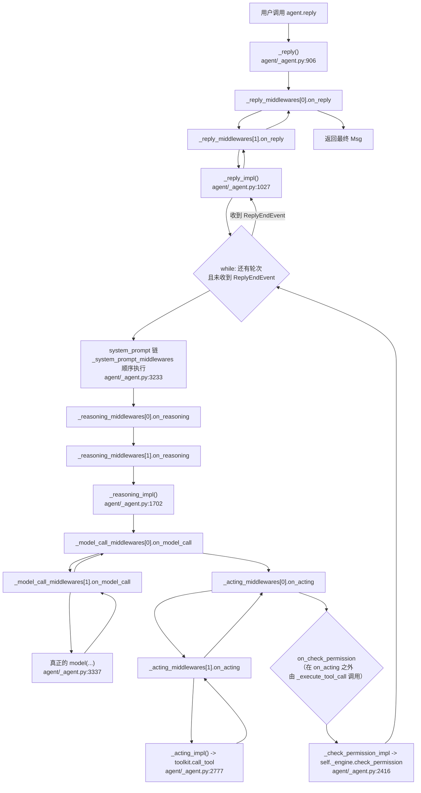
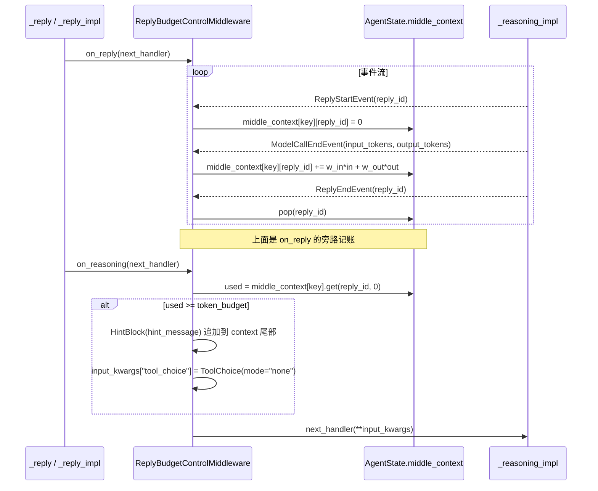

# 07 AgentScope 中间件 / Hook / 权限 / 预算 侦察报告

> 侦察对象：`third_party/agentscope/src/agentscope/`（AgentScope 2.0.8）
> 侦察范围：`middleware/`、`permission/`、`app/middleware/`，以及它们在 `agent/_agent.py` 里的挂载点
> 环境：`/Users/a/miniconda3/envs/agentscope_reme_pip_env/bin/python`（Python 3.11.13），LLM = deepseek-flash
> 验证脚本：`tutorial_agsc_reme/_recon/code/07_mw_*.py`（全部实跑通过）

---

## 子系统职责（这段代码到底在解决什么问题）

参考架构第 4 层写着「中间件 Hook 插件：在 Agent 执行全链路埋点，做校验、日志、上下文修改、告警等切面逻辑」。AgentScope 2.0.8 的 `middleware/` + `permission/` 就是这一层在 Python 里的真实落点，而且它同时兼任了两件不同性质的事：

1. **横向切面（AOP）**：不改 `Agent` 源码，就能在「reply / reasoning / 模型调用 / 工具执行 / 权限判定 / 上下文压缩 / system prompt 生成」这 7 个点上插逻辑。这是 `MiddlewareBase` 的职责。
2. **安全策略与预算治理**：`permission/` 是一个独立的、可单测的策略引擎（5 种模式 + 3 类规则 + 4 种 decision），`_budget.py` 是把它做成中间件形态的 token 预算熔断器。

关键定位一句话：**中间件是 Agent 的「外挂脊柱」，它不拥有 Agent 的循环，而是把循环的每一步包起来。** Agent 自己没有 `if middleware:` 之外的任何业务判断——所有策略都在链上。

需要特别强调一个容易踩的坑：AgentScope 里「middleware」这个词被用了两次，指的是两个完全无关的东西：

| 概念 | 基类 | 位置 | 性质 |
|---|---|---|---|
| Agent 中间件 | `MiddlewareBase` | `middleware/_base.py:13` | 纯 Python 对象，包住 Agent 生命周期 7 个点 |
| HTTP 协议中间件 | `ProtocolMiddlewareBase(BaseHTTPMiddleware, ABC)` | `app/middleware/_protocol/_base.py:17` | 是 **Starlette/FastAPI 的 ASGI 中间件**，把 SSE 流里的 `AgentEvent` 转成 AGUI/A2A 协议 |

`app/middleware/` 目录下这两种混着放：`InboxMiddleware`/`StateChangeMiddleware`/`ToolOffloadMiddleware`/`TeamMemberLoopMiddleware` 继承 `MiddlewareBase`（Agent 中间件），而 `_protocol/` 里的继承 `ProtocolMiddlewareBase`（ASGI 中间件）。教程里必须先把这条线划清楚，否则小白一定会把两个 `dispatch` 和 `next_handler` 搞混。

---

## 关键文件表

| 文件路径:行号 | 核心类 | 核心函数 | 一句话职责 |
|---|---|---|---|
| `third_party/agentscope/src/agentscope/middleware/_base.py:13` | `MiddlewareBase` | — | 全部 Agent 中间件的基类，定义 7 hook + 2 辅助方法 |
| `.../middleware/_base.py:55` | — | `is_implemented` | 用 `base_method is not sub_method` 判断子类是否真的覆写了该 hook |
| `.../middleware/_base.py:286` | — | `list_tools` | 中间件向 Agent 注入工具的**唯一通道** |
| `.../middleware/_base.py:296` | — | `get_middleware_key` | 状态存 `AgentState.middle_context` 时用的 key，默认类名 |
| `.../middleware/_budget.py:21` | `ReplyBudgetControlMiddleware` | — | 单次 reply 的加权 token 预算熔断 |
| `.../middleware/_budget.py:98` | — | `on_reply` | 按事件维护预算计数（start 初始化 / model_call_end 累加 / end 清理） |
| `.../middleware/_budget.py:150` | — | `on_reasoning` | 超预算时插 `HintBlock` + 强制 `tool_choice="none"` |
| `.../middleware/_rag.py:626` | `RAGMiddleware` | — | 知识库检索中间件，static / agentic 双模式 |
| `.../middleware/_rag.py:834` | — | `list_tools` | agentic 模式暴露 `search_knowledge` 工具，static 模式返回 `[]` |
| `.../middleware/_rag.py:929` | — | `on_reasoning` | static 模式在 `cur_iter==0` 注入一次性 hint，`finally` 里再摘掉 |
| `.../middleware/_longterm_memory/_reme/_middleware.py:88` | `ReMeMiddleware` | — | 进程内嵌 ReMe 做长期记忆，写回自动、检索三态 |
| `.../middleware/_longterm_memory/_reme/_middleware.py:312` | — | `on_reply` | 起后台检索 task + `finally` 里 diff 出本轮增量写回 ReMe |
| `.../middleware/_longterm_memory/_reme/_middleware.py:385` | — | `on_reasoning` | 轮询后台检索 task，完成则把记忆注入 context |
| `.../middleware/_longterm_memory/_mem0/_middleware.py:86` | `Mem0Middleware` | — | mem0 后端的长期记忆（**有 add 工具**，与 ReMe 不同） |
| `.../middleware/_longterm_memory/_agentic_memory/_middleware.py:359` | `AgenticMemoryMiddleware` | — | 文件后端（MEMORY.md）长期记忆，靠 system prompt 注入 |
| `.../middleware/_tracing/_trace.py:117` | `TracingMiddleware` | — | 用 OpenTelemetry 给 reply / model_call / tool 打 span |
| `.../middleware/_tracing/_trace.py:59` | — | `_check_tracing_enabled` | 判据是「provider 是不是 SDK 的 TracerProvider」 |
| `.../middleware/_tracing/_setup.py:11` | — | `_get_tracer` | `trace.get_tracer("agentscope", __version__)` |
| `.../middleware/_tracing/_extractor.py:170/458/547` | — | `_get_llm/agent/tool_request_attributes` | 把 AgentScope 对象翻译成 GenAI 语义约定属性 |
| `.../middleware/_tts_middleware.py:21` | `TTSMiddleware` | — | 把 reasoning 的文本块合成语音，以 `DataBlock*` 事件注入流 |
| `.../permission/_engine.py:17` | `PermissionEngine` | — | 权限策略引擎，5 模式分发 |
| `.../permission/_engine.py:77` | — | `check_permission` | 模式分发器 |
| `.../permission/_engine.py:117/214/297/395/491` | — | `_check_default/_explore/_accept_edits/_bypass/_dont_ask` | 每个模式一份自洽的判定顺序 |
| `.../permission/_engine.py:659` | — | `_check_read_only_fast_path` | 所有模式共享的只读快路径 |
| `.../permission/_engine.py:594` | — | `_convert_ask_to_deny` | DONT_ASK 的 ASK→DENY 转换，保留原始 reason |
| `.../permission/_types.py:18` | `PermissionMode` | — | DEFAULT / ACCEPT_EDITS / EXPLORE / BYPASS / DONT_ASK |
| `.../permission/_types.py:88` | `PermissionBehavior` | — | ALLOW / DENY / ASK / PASSTHROUGH |
| `.../permission/_rule.py:8` | `PermissionRule` | — | pydantic 模型：tool_name + rule_content + behavior + source |
| `.../permission/_decision.py:10` | `PermissionDecision` | — | dataclass：behavior + message + reason + updated_input + suggested_rules + bypass_immune |
| `.../permission/_context.py:24` | `PermissionContext` | — | 模式 + 工作目录 + 三类规则字典，挂在 `AgentState.permission_context` |
| `.../app/middleware/_protocol/_base.py:17` | `ProtocolMiddlewareBase` | — | **ASGI** 中间件基类，SSE → 协议转换 |
| `.../app/middleware/_tool_offload_middleware.py:46` | `ToolOffloadMiddleware` | — | 工具超时后甩到后台任务，用合成 `ToolResponse` 解阻塞 |
| `.../app/middleware/_state_change_middleware.py:42` | `StateChangeMiddleware` | — | 哈希比对 state/team 变化，直接往 bus 推 `CustomEvent` |
| `.../app/middleware/_inbox_middleware.py:24` | `InboxMiddleware` | — | 每次 reasoning 前把会话 inbox 排空成 `HintBlock` |
| `.../app/middleware/_team_member_middleware.py:21` | `TeamMemberLoopMiddleware` | — | 强制队员必须调 `TeamSay` 汇报，否则最多 nudge `max_nudges` 次 |
| `.../agent/_agent.py:218` | `Agent` | — | 构造时按 hook 把中间件分流到 7 条链 |
| `.../agent/_agent.py:193` | — | — | `self._engine = PermissionEngine(self.state.permission_context)` |

---

## 调用链

### 1. 一次 `reply` 里中间件链的嵌套顺序



**逐段讲解**：

- **`_reply` 是总闸（`agent/_agent.py:906-960`）**。它先看 `self._reply_middlewares` 是否为空：空就直接拿 `_reply_impl(...)` 的 generator，不空就现场用闭包构造一个 `execute_chain(index=0)`。注意 `agen = execute_chain()` 只是拿到 generator，**并没有启动**；真正的启动在下面 `async for item in agen` 那一句（`_agent.py:955`）。这个细节很重要，因为 `self._receive_reply_end = False` 必须在循环开始前设好。
- **`execute_chain` 的递归结构（`_agent.py:913-950`）**：`index >= len(...)` 时调用真正的 `_reply_impl`，否则取 `middlewares[index]`，构造 `next_handler`（把 `index+1` 和合并后的 kwargs 再喂进 `execute_chain`），然后 `async for item in mw.on_reply(agent=self, input_kwargs=..., next_handler=...)`。因此 **`middlewares[0]` 是最外层**：它的 `before` 最先跑，`after` 最后跑。这一点我在 `07_mw_chain_order.py` 里实测确认（见下面的运行输出）。
- **`next_handler(**kwargs)` 的参数覆盖机制**：`next_handler` 里写的是 `execute_chain(index + 1, **{**input_kwargs, **kwargs})`——先展开这一层的 `input_kwargs`，再用调用方传的关键字覆盖。这就是预算中间件能在 `on_reasoning` 里写一行 `input_kwargs["tool_choice"] = ToolChoice(mode="none")` 就把 `tool_choice` 改掉、并且下游看得见的原因：它改的是**这一层的 dict**，然后 `next_handler(**input_kwargs)` 会把改名后的值传下去。
- **7 条链是彼此独立的，不是一个大洋葱**。`on_reasoning` 的链里**不含** `on_reply` 的中间件（除非该中间件也实现了 `on_reasoning`）。分流发生在构造期（`_agent.py:218-240`）：

```python
self._reply_middlewares = [_ for _ in middlewares if _.is_implemented("on_reply")]
self._reasoning_middlewares = [_ for _ in middlewares if _.is_implemented("on_reasoning")]
self._check_permission_middlewares = [_ for _ in middlewares if _.is_implemented("on_check_permission")]
self._acting_middlewares = [_ for _ in middlewares if _.is_implemented("on_acting")]
self._model_call_middlewares = [_ for _ in middlewares if _.is_implemented("on_model_call")]
self._system_prompt_middlewares = [_ for _ in middlewares if _.is_implemented("on_system_prompt")]
self._compress_context_middlewares = [_ for _ in middlewares if _.is_implemented("on_compress_context")]
```

  这 7 行就是「插件化」在 Agent 侧的全部成本。每条链只在被触发时才走，链为空时直接短路到 `_xxx_impl`，所以**没写 hook 的中间件在运行期是零开销的**（连一次函数调用都没有）。

- **`on_system_prompt` 是唯一的 transformer，不是 onion（`_agent.py:3233-3235`）**：

```python
result = "\n".join(prompt)
# Apply system_prompt middlewares sequentially (transformer pattern)
for mw in self._system_prompt_middlewares:
    result = await mw.on_system_prompt(self, result)
return result
```

  它是个 `for` 循环，没有 `next_handler`——每个中间件拿到上一个的输出，返回新字符串。所以它**不能**在「之后」做事，只能在「之前」追加/改写。教学时要明确点出：7 个 hook 里 6 个是 `next_handler` 洋葱，只有这 1 个是管道。

- **`on_check_permission` 不在 `on_acting` 里面**（`_agent.py:2344-2414`）。权限检查由 `_execute_tool_call` 调用，早于 `_acting`。中间件在 `on_acting` 里看到的是「已经校验过、已经拿到许可」的 tool_call（`_base.py:151-155` 的 docstring 明说）。这个顺序保证了 `on_acting` 里的 `next_handler` 协程可以安全地甩到后台 task——它自身不会改 Agent context。`ToolOffloadMiddleware` 正是吃这个保证。

- **`on_check_permission` 是唯一返回「单个对象」的 hook**（其余 6 个要么是 async generator，要么返回 str/None）。`_agent.py:2377-2379` 在进链前会 `deepcopy` 一遍 `tool_call` 和 `tool_input`：

```python
# Copy so middleware cannot mutate what the agent consumes later.
tool_call = deepcopy(tool_call)
tool_input = deepcopy(tool_input)
```

  docstring 也写了「The chain receives copies of `tool_call` and `tool_input`; changes to these copies do not alter the eventual tool invocation.」——中间件**不能**用「改 input」的方式改写工具入参。

- **`_receive_reply_end` 是 `on_reply` 的「续命开关」（`_agent.py:954-960`）**：

```python
self._receive_reply_end = False
async for item in agen:
    # Set before the yield: the suspended `_reply_impl` checks the
    # flag once resumed by the next pull
    if isinstance(item, ReplyEndEvent):
        self._receive_reply_end = True
    yield item
```

  中间件如果**收到 `ReplyEndEvent` 但不 yield 它**，这个标志位就永远是 `False`，挂起的 `_reply_impl` 下一轮 pull 时看到 `False` 就再走一轮 reasoning-acting。我在 `07_mw_tools_and_swallow.py` 里实测了这条路径：`SwallowOnceMiddleware` 吞掉第一个 `ReplyEndEvent` 后，Agent 确实多走了一轮。`_base.py:75-82` 的 docstring 补了两个约束：**吞掉 max_iters 结束事件时，必须先把 `cur_iter` 或 `max_iters` 调好再放行**；**interrupted 结束不能吞**。

### 2. 权限判定的调用链

```mermaid
sequenceDiagram
    participant AL as Agent Loop (_reply_impl)
    participant ETC as _execute_tool_call (agent/_agent.py:2435)
    participant CP as _check_permission (agent/_agent.py:2344)
    participant MWS as _check_permission_middlewares
    participant CPI as _check_permission_impl (agent/_agent.py:2416)
    participant ENG as PermissionEngine (permission/_engine.py:77)
    participant TOOL as ToolBase (tool/_base.py)

    AL->>ETC: tool_call
    ETC->>ETC: 解析 + jsonschema 校验 tool_input
    ETC->>CP: _check_permission(tool_call, tool, tool_input)
    CP->>CP: deepcopy(tool_call), deepcopy(tool_input)
    loop 每个 on_check_permission 中间件
        CP->>MWS: on_check_permission(agent, input_kwargs, next_handler)
    end
    MWS->>CPI: next_handler(**input_kwargs) 最终落到这里
    CPI->>CPI: tool_call.state == ALLOWED ? -> 直接 ALLOW
    CPI->>ENG: check_permission(tool, tool_input)
    ENG->>ENG: 按 mode 分发 _check_default/_check_explore/...
    ENG->>ENG: _check_deny_rules -> _check_ask_rules -> _check_read_only_fast_path
    ENG->>TOOL: tool.check_permissions(tool_input, context)
    TOOL-->>ENG: PermissionDecision
    ENG->>TOOL: tool.match_rule(rule_content, input_data)（匹配规则时）
    TOOL-->>ENG: bool
    ENG->>TOOL: tool.generate_suggestions(tool_input)（需要时）
    TOOL-->>ENG: list[PermissionRule]
    ENG-->>CPI: PermissionDecision
    CPI-->>MWS: PermissionDecision
    MWS-->>CP: 可替换的 PermissionDecision
    CP-->>ETC: PermissionDecision
    ETC->>ETC: ALLOW -> _acting; ASK -> RequireUserConfirmEvent; DENY -> 写错误 ToolResult
```

**逐段讲解**：

- 引擎**不做任何实际的隔离**。它只产出 `PermissionDecision`（一个 dataclass）。真正的「不能为所欲为」有两道互补防线：`permission/` 是**事前策略**（要不要允许这次调用），`workspace/` 是**事中隔离**（把执行关进 Docker/E2B/K8s/bubblewrap 里）。分工见最后一节。
- 匹配策略**委托给工具自己**（`_engine.py:775` 的 `_rule_matches`）：`Bash` 用子串/前缀通配，`Write`/`Read` 用 glob，其他工具用各自的 `match_rule`。`rule_content` 为空字符串或 `None` → `_engine.py:799` 直接 `return True`（匹配一切）。这是个隐蔽但很有用的写法，也有风险。
- 用一个 helper `_execute_async_or_sync_func` 包住 `tool.match_rule` / `tool.generate_suggestions`，是为兼容第三方工具仍然用同步 `def` 覆写的情况（`_engine.py:783-791` 的注释）。
- `_check_permission_impl` 里有个短路（`_agent.py:2427-2432`）：`tool_call.state == ToolCallState.ALLOWED`（用户在 HITL 里已经确认过）时直接 ALLOW，**不再**跑引擎。但注意 `_check_permission` 的 docstring 明确说「A call already allowed by user confirmation **still traverses the middleware chain**, but skips re-evaluation by the built-in engine」——中间件链还是会走一遍的。
- 用户在确认时附加的规则会被持久化进引擎（`_agent.py:1985-1987`）：

```python
# Update the permission rule if accepted
if confirmation.rules:
    for rule in confirmation.rules:
        self._engine.add_rule(rule)
```

  `add_rule` 按 `behavior` 把规则分到 `allow_rules` / `deny_rules` / `ask_rules` 三个字典里，key 是 `tool_name`（`_engine.py:49-75`）。

### 3. 预算熔断链



**逐段讲解**：

- `on_reply` 里的记账是**纯旁路**：`async for event in next_handler(**input_kwargs)` 之后逐个 `isinstance` 判断，然后 `yield event` 原样转发。它不改流里的任何东西，只读事件。
- 计数键是 `agent.state.middle_context[middleware_key][reply_id]`（`_budget.py:128-146`），其中 `middleware_key` 来自 `await self.get_middleware_key()`（默认类名）。**状态挂在 Agent 上、不在中间件实例上**——`_budget.py:41-44` 的 docstring 明说「the same middleware instance can safely be shared across multiple agents」，也顺带解决了 HITL 打断/恢复的续跑问题（进程重启后事件重放时计数仍在）。
- 清理发生在 `ReplyEndEvent` 上（`_budget.py:132-137`），所以正常情况下 `middle_context[key]` 最后会退化成空 dict（我的实测输出正是 `'ReplyBudgetControlMiddleware' -> {}`）。
- `on_reasoning` 的超预算分支里有个防御式判断（`_budget.py:189-203`）：如果 context 最后一条就是本 Agent 的 assistant 消息，就把 `HintBlock` **追加到那条消息的 content 里**；否则新建一条 `AssistantMsg`。这样避免把 hint 挂到别人的消息上。
- 熔断手段是 `ToolChoice(mode="none")`——**不是**杀进程、不是抛异常，而是「以礼相劝」：既塞一条系统提示让模型收尾，又把工具开关关掉。实测效果：第一轮模型还是调了一次工具（因为预算判定发生在第二轮 reasoning 之前），之后被强插 hint 并 `tool_choice=none`，模型直接给最终答案。

---

## 关键数据结构

### `PermissionDecision`（`permission/_decision.py:10`，dataclass）

```python
@dataclass
class PermissionDecision:
    behavior: PermissionBehavior
    message: str
    decision_reason: str | None = None
    updated_input: dict[str, Any] | None = None
    suggested_rules: list[PermissionRule] | None = None
    bypass_immune: bool = False
```

| 字段 | 含义 | 谁用 |
|---|---|---|
| `behavior` | ALLOW / DENY / ASK / PASSTHROUGH | Agent Loop 决定执行 / 拒绝 / 发 HITL 事件 |
| `message` | 给人看的短句 | 会被写进 `ToolResultBlock`，模型能看到（实测：DENY 后模型回答「被中间件层拦下了」） |
| `decision_reason` | 给日志/审计看的原因 | `Rule: npm` / `Mode: default` / `Read-only operations are auto-allowed` |
| `updated_input` | 改写后的入参 | `_check_allow_rules` 会填 `input_data` |
| `suggested_rules` | 建议用户加的规则 | 由 `tool.generate_suggestions` 产出，送进 HITL 的 `RequireUserConfirmEvent` |
| `bypass_immune` | 是否「安全 ASK」——任何 allow 规则都压不过 | 只对 ASK 有意义；见下 |

`bypass_immune` 是本子系统设计得最细致的一个点，`_decision.py:36-67` 的 docstring 把各模式行为列全了。我的实测结果与文档逐条吻合：

| mode | 安全 ASK + 有 allow 规则 | 实测 |
|---|---|---|
| DEFAULT | ASK 保留（allow 压不过） | `bypass_immune` ask 保留 |
| ACCEPT_EDITS | ASK 保留 | 同上 |
| EXPLORE | 不适用（不调 `tool.check_permissions`） | — |
| BYPASS | **故意忽略** `bypass_immune` → ALLOW | 实测 `allow` |
| DONT_ASK | 转 DENY | 实测 `deny`，reason 里带原始原因 |

### `PermissionRule`（`permission/_rule.py:8`，pydantic）

```python
class PermissionRule(BaseModel):
    tool_name: str
    rule_content: str | None
    behavior: PermissionBehavior
    source: str
```

`rule_content` 的语义**随工具而变**（docstring 明写）：Bash 是子串模式（`"npm install"` 匹配 `"npm install express"`），Write/Read 是 glob（`"src/**"` 匹配 `"src/main.py"`），其他工具自定义。`source` 记录来源（`userSettings` / `projectSettings` / `session`），用于审计和 UI 展示。

### `PermissionContext`（`permission/_context.py:24`，pydantic）

```python
class PermissionContext(BaseModel):
    mode: PermissionMode = PermissionMode.DEFAULT
    working_directories: dict[str, AdditionalWorkingDirectory] = Field(default_factory=dict)
    allow_rules: dict[str, list[PermissionRule]] = Field(default_factory=dict)
    deny_rules: dict[str, list[PermissionRule]] = Field(default_factory=dict)
    ask_rules: dict[str, list[PermissionRule]] = Field(default_factory=dict)
```

这是**唯一一份**权限状态，挂在 `AgentState.permission_context`（`state/_state.py:274`），引擎在 `Agent.__init__` 里用 `PermissionEngine(self.state.permission_context)`（`_agent.py:193`）**按引用**持有它。因此：改 `agent.state.permission_context` 就是改引擎的输入；`add_rule` 也是原地改这份 context。三个规则字典都是按 `tool_name` 分桶的——这也是为什么 `add_rule` 里要写 `if rule.tool_name not in self.context.allow_rules` 再 append。

### `AgentState.middle_context`（`state/_state.py:295`）

```python
middle_context: dict[str, Any] = Field(default_factory=dict)
"""The context that allow the middlewares to store/get data across
different replies."""
```

类型是 `dict[str, Any]`——**没有 schema**。约定是 `middle_context[await mw.get_middleware_key()] = <你自己定的结构>`。预算中间件用的结构是 `{reply_id: float}`。这是框架留给中间件的「挂载点存储」，也是中间件之间唯一能共享状态的通道。

---

## 源码精读

### 精读 1：`is_implemented` —— 插件化分流的基石（`middleware/_base.py:55-66`）

```python
def is_implemented(self, hook_name: str) -> bool:
    base_method = getattr(MiddlewareBase, hook_name, None)
    sub_method = getattr(type(self), hook_name, None)
    return base_method is not sub_method
```

**为什么这么设计**：`MiddlewareBase` 里 7 个 hook 全都有实现（函数体是 `raise RuntimeError(...)` + 一句死的 `yield`），而不是 `...` 或 `raise NotImplementedError`。这是故意的——因为要能用 `is not` 做**身份比较**。子类没覆写，`type(self).on_reply` 拿到的是基类那个函数对象，`is` 判定为相等 → `False`；覆写了就是子类的函数对象 → `True`。

**对比 naive 写法**：如果用 `raise NotImplementedError`，就必须 try/except 或者检查 `hasattr`，而 `hasattr` 永远为真（基类定义了），没法区分。如果用 `abc.abstractmethod`，中间件就只能实现全部 7 个 hook，完全违背「只实现你需要的」这一设计目标（`_base.py:30-31`："Each hook is optional - only implement the ones you need. The middleware system will automatically detect which hooks are implemented at runtime."）。

**再对比另一种 naive 写法**：`lookup` hook 名到方法名再 `getattr` 看是否 `callable`——一样失效。所以 `is not` 是这里唯一正确的做法。代价是无法用猴子补丁动态加 hook，但这本来也不是需求。

**副作用（重要）**：因为基类方法会 `raise RuntimeError`，如果一个中间件**不实现** `on_reply` 却在别处被误当成实现了（比如手工把实例塞进 `agent._reply_middlewares`），会得到一个 `RuntimeError: MyMw does not implement on_reply`。而那句 `yield  # pylint: disable=unreachable` 是必须的——没有它，函数体里就没有 `yield`，`on_reply` 就不是 async generator function，调用它就不会返回 generator，链上的 `async for` 会直接报 TypeError。这是**函数级「假装是 generator」的语法技巧**，非常值得在教程里讲。

### 精读 2：`execute_chain` 的「闭包 + 默认参数」技巧（`agent/_agent.py:913-952`）

```python
async def execute_chain(
    index: int = 0,
    inputs: Msg | list[Msg] | ... | None = inputs,
    structured_schema: Type[BaseModel] | None = structured_schema,
) -> AsyncGenerator[AgentEvent | Msg, None]:
    if index >= len(self._reply_middlewares):
        async for item in self._reply_impl(inputs=inputs, structured_schema=structured_schema):
            yield item
    else:
        mw = self._reply_middlewares[index]
        input_kwargs = {"inputs": inputs, "structured_schema": structured_schema}

        async def next_handler(**kwargs: Any) -> AsyncGenerator[AgentEvent | Msg, None]:
            async for item in execute_chain(index + 1, **{**input_kwargs, **kwargs}):
                yield item

        async for item in mw.on_reply(agent=self, input_kwargs=input_kwargs, next_handler=next_handler):
            yield item
```

**为什么用默认参数而不是闭包捕获**：`index + 1` 在 `next_handler` 里是**晚绑定**的，如果 `index` 是外层变量（闭包），递归调用时会被后续轮次改写。把它做成 `execute_chain` 的形参，每次调用都在自己的栈帧里 frozen 住。这是 Python 里写递归闭包的经典防坑手法。

**为什么 `next_handler` 要重新合并 kwargs**：`{**input_kwargs, **kwargs}` 让中间件可以用 `await next_handler(tool_choice=X)` 只覆盖一个键，其余保持。这既是方便，也是隐患——见「坑」那一节。

**为什么链尾调 `_xxx_impl` 而不是 `_xxx`**：`_reply` 本身是「链的入口」，`_reply_impl` 才是「链尾」。命名约定是 `_<hook>_impl`。

**同一份代码被复制了 7 遍**：`_agent.py:410/913/1672/2381/2749/3328` 各有一份 `execute_chain`。它们不是泛型化的，各有微调（比如 `on_reply` 的默认参数多了 `structured_schema`，`on_model_call` 的是 `return await` 而不是 `async for`）。教学时可以点出：这是**刻意的重复**——每一处都贴着它包裹的那个方法的签名，泛型化反而会让类型提示和可读性变差。

### 精读 3：`TracingMiddleware.on_reply` 的「跨 yield 不持有 OTel context」（`middleware/_tracing/_trace.py:158-215`）

```python
span = tracer.start_span(name=span_name, attributes={**request_attributes, **common_attrs})
# Keep the reply span as parent for downstream spans, but do NOT hold
# it as the current OTel context across ``yield`` boundaries.  The
# context is only attached while advancing ``next_handler`` and is
# detached again within the same ``__anext__`` step, so the token is
# always detached in the context it was created in even when this
# async generator is closed from another asyncio task (issue #2076).
span_context = otel_trace.set_span_in_context(span)
...
gen = next_handler(**input_kwargs)
try:
    while True:
        token = otel_context.attach(span_context)
        try:
            item = await anext(gen)
        except StopAsyncIteration:
            break
        finally:
            otel_context.detach(token)
        ...
        yield item
```

**为什么不用 `with tracer.start_as_current_span(...)`**：`with` 会在整个 `async for` 期间（跨多次 `yield`）持有 current context。OTel 的 `attach`/`detach` 必须在**同一个 context 里成对**。如果这个 async generator 被另一个 asyncio task 关闭（`aclose()`），`detach` 会在错误的 context 里执行，抛 `ValueError: Token was created in a different Context`。作者在 `yield` 的边界外把 attach/detach 收成一进一出，就把这个跨任务问题消掉了。注释里直接写了 issue #2076。

**另一个细节**：`on_model_call` 用了 `with tracer.start_as_current_span(..., end_on_exit=False)`，然后把 span 交给 `_trace_async_generator_wrapper`（`_trace.py:86-109`）去结束——因为流式响应要等**最后一个 chunk** 才能拿到 `usage`，不能在 `with` 退出时就 `end()`。而 `aioitertools.iter(res)` 只是给 `async for` 加一个 `anext` 的包装。

**短路路径**：`_check_tracing_enabled()` 在每个 hook 开头都判一次，没配 provider 就 `async for item in next_handler(**input_kwargs): yield item; return`。代价是一次 `isinstance` 加一个 `async for`。我的实测：`ProxyTracerProvider` 时返回 `False`，注册 `TracerProvider` 后返回 `True`。

### 精读 4：`ReMeMiddleware.on_reply` 的「增量快照 + 后台检索 + finally 收尾」（`middleware/_longterm_memory/_reme/_middleware.py:312-380`）

```python
pre_ids = {m.id for m in agent.state.context if isinstance(m, Msg)}

try:
    async for item in next_handler(**input_kwargs):
        yield item
finally:
    task = self._retrieval_tasks.pop(session_id, None)
    if task is not None and not task.done():
        task.cancel()
    if task is not None:
        try:
            await task
        except (asyncio.CancelledError, Exception):
            pass
    increment = [
        m for m in agent.state.context
        if isinstance(m, Msg)
        and m.id not in pre_ids
        and getattr(m, "name", None) != _MEMORY_MSG_NAME
    ]
    if query_text and any(
        m.role == "assistant" and m.get_text_content() for m in increment
    ):
        await self._write_back(increment, session_id)
```

**四个设计决定，每个都值得讲**：

1. **用 message id 做差集，而不是「拿最后一条消息」**。源码注释（`_middleware.py:337-346`）解释了原因：`auto_memory` 要的是**本轮增量**，而 `agent.state.context` 是**累积全history**。直接把整个 context 发过去会把前几轮重新喂一遍。而只拿最后一条也不够——因为中间的工具调用/工具结果都记在 `state.context` 上，但它们**不会**出现在 reply 的 yield 流里（`_reply_impl` 只 yield 最终答案）。所以差集是唯一能同时满足「完整」和「不重复」的做法。
2. **用 `finally` 而不是 `else`**。检索 task 可能在 reply 结束前就完成，也可能永远没完成（单轮 reply 一句话就答完）。`finally` 保证：无论正常结束、异常结束、还是被 `GeneratorExit` 关掉，这个 session 的 task 一定被 pop + cancel + await，不会泄漏。源码注释直接写了 "a previous turn that never reached its finally is unexpected, but never leak one."
3. **`session_id` 从 agent 现读，绝不存到实例上**（`_session_id_of`，`_middleware.py:297-307`）。因为一个中间件实例可能被多个 Agent 共享（`_middleware.py:102-109` 的 docstring 明说）。检索 task 的字典也是 `dict[session_id, Task]`，保证并发 session 不互相踩。
4. **「真实的一轮」判定**：`if query_text and any(assistant 有文本)` —— 两个条件都满足才写回。防止把纯工具调用轮、或空回复也当成记忆写进去。

**另一个注意点**：构造时**不**读 `session_id`（`__init__` docstring，`_middleware.py:190-197`），而是从 `agent.state.session_id` 现读。想固定一个可续跑的 session 就设 `Agent(state=AgentState(session_id=...))`。这和 `TracingMiddleware` 的做法一致。

### 精读 5：`PermissionEngine._check_default` 的 6 级判定（`permission/_engine.py:117-212`）

```python
deny = await self._check_deny_rules(tool, tool_input)          # 1
if deny: return deny
ask = await self._check_ask_rules(tool, tool_input)            # 2
if ask: ask.suggested_rules = await self._generate_suggestions(...); return ask
read_only = await self._check_read_only_fast_path(tool, tool_input)   # 3
if read_only: return read_only
tool_decision = await tool.check_permissions(tool_input, self.context)  # 4
if tool_decision.behavior in (ALLOW, DENY): return tool_decision
if self._is_safety_ask(tool_decision):
    tool_decision.suggested_rules = await self._generate_suggestions(...)
    return tool_decision
allow = await self._check_allow_rules(tool, tool_input)        # 5
if allow: return allow
default = PermissionDecision(ASK, f"Permission required for {tool.name}",
                             f"Mode: {self.context.mode.value}")        # 6
default.suggested_rules = await self._generate_suggestions(...)
return default
```

**顺序本身就是策略**。逐条的理由：

1. **deny 最高优先**：用户明确禁掉的操作，任何模式、任何 allow 规则都不能翻案。这是「用户意志 > 框架智能」。
2. **ask 规则排第二**：用户说「这个先问我」，优先于一切自动放行（包括只读快路径）。
3. **只读快路径排第三**：只读没有副作用，所以「所有模式都放行」。源码注释（`_engine.py:659-686`）专门解释了这个 helper 为什么要抽出来——**因为之前 DEFAULT 和 DONT_ASK 没有这条快路径，而 ACCEPT_EDITS/EXPLORE 有，导致各模式行为漂移**（"the exact divergence that previously left `DEFAULT` and `DONT_ASK` without a read-only fast path"）。我的实测确认 5 个模式对只读工具全部 ALLOW。这是一个「抽象是重构出来的、不是一开始就设计对的」的真实案例。
4. **工具自己的 `check_permissions` 排第四**：让工具能表达「我这个调用的具体入参很危险」。ALLOW/DENY 直接采纳；**安全 ASK** 也直接采纳（不往下走 allow 规则）；**普通 ASK / PASSTHROUGH** 才继续往下。
5. **allow 规则排第五**：注意它在工具自己之后。也就是「工具说这很危险（安全 ASK）」能压过「用户配了 allow」。
6. **兜底 ASK**：什么都不匹配就问用户，并附带 `suggested_rules` 方便用户一键加规则。`suggested_rules` 的生成逻辑在工具侧（`_engine.py:812-847`），策略是「Bash 抽命令前缀 `npm run` → `npm run:*`；文件操作抽目录 `src/file.py` → `src/**`；其他工具精确匹配，复合命令最多 5 条」。

**EXPLORE 的「两个 not applicable」**（`_engine.py:214-296`）也很有意思：注释明写 Step 4 和 Step 5 **故意不执行**——

- 不调 `tool.check_permissions`：因为任何非只读操作最后都会被 DENY，安全问题被更宽的 DENY 吞掉了，问了也是白问。
- 不查 allow 规则：「EXPLORE 的只读保证**不能**被用户配置的 allow 规则送掉」。我的实测确认：EXPLORE + 有 allow 规则 + 非只读 → `deny`。

**`_check_dont_ask` 的类不变量**：docstring（`_engine.py:499-503`）说 "Invariant: this method must never return `PermissionBehavior.ASK`"。每个可能 ASK 的分支都要走 `_convert_ask_to_deny`，而 `_convert_ask_to_deny`（`_engine.py:594-632`）会**保留原标题和 suggested_rules**：

```python
return PermissionDecision(
    behavior=PermissionBehavior.DENY,
    message=f"Permission denied for {tool.name} (dont_ask mode - ASK converted to DENY, user not available)",
    decision_reason=(f"DONT_ASK mode converted ASK to DENY. "
                     f"Original reason: {ask_decision.decision_reason}"),
    suggested_rules=ask_decision.suggested_rules,
)
```

保留 `decision_reason` 和 `suggested_rules` 是为了**可追溯性**：定时任务失败后，UI 还能告诉用户「你加这条规则就能让它下次跑通」。

### 精读 6：`RAGMiddleware` 的 static 模式「一次性注入并回收」（`middleware/_rag.py:859-1015`）

```python
async def on_reply(self, agent, input_kwargs, next_handler):
    inputs = input_kwargs.get("inputs")
    ...  # 把 inputs 转成 blocks，并在首块文本前加 "{msg.name}: " 前缀
    self._cached_inputs = blocks
    try:
        async for evt in next_handler(**input_kwargs):
            yield evt
    finally:
        self._cached_inputs = None
```

```python
async def on_reasoning(self, agent, input_kwargs, next_handler):
    hint = None
    if (self._parameters.mode == "static"
            and agent.state.cur_iter == 0
            and self._cached_inputs):
        try:
            results = await _search_across(...)
        except Exception:
            logger.exception("Knowledge-base search failed; proceeding without matched context.")
            results = []
        blocks = _format_results(results)
        if blocks:
            hint = HintBlock(hint=_wrap_hint(...), source=_HINT_SOURCE)
            agent.state.append_context(agent.name, [hint])
            if self._parameters.emit_hint_event:
                yield HintBlockEvent(reply_id=agent.state.reply_id, block_id=hint.id, ...)
    try:
        async for evt in next_handler(**input_kwargs):
            yield evt
    finally:
        if hint is not None and not self._parameters.persist_hint:
            for msg in reversed(agent.state.context):
                if msg.id != agent.state.reply_id:
                    continue
                msg.content = [b for b in msg.content if b.id != hint.id]
                break
```

**四个设计点**：

1. **为什么要在 `on_reply` 里缓存输入**（`_rag.py:865-871` 的 docstring）：`on_reasoning` 跑的时候，Agent 可能已经把 `inputs` 消费掉了（进了 `state.context`、甚至已经发过工具调用），**不能**可靠地从 `agent.state.context` 反推原始查询。所以在 `on_reply` 里抓一把，`finally` 里清掉。
2. **为什么要 `deepcopy(msgs)`**（`_rag.py:898-902`）：要在每段文本前加 `"{name}: "` 前缀，绝不能改调用方传进来的原始 Msg 对象。注释还带一个 TODO：「一条消息应该只 embed 成一个向量；但 embedding API 现在一个 block 一个向量」。
3. **`cur_iter == 0` 的限制**：只在**第一轮** reasoning 检索。否则每次工具调用轮都会重新 embed + 重新注入，纯烧钱。
4. **`finally` 里按 block id 精确回收**（`_rag.py:1006-1015`）：`persist_hint=False` 时把刚注入的 hint 摘掉，让 RAG 的上下文开销只作用在那一轮模型调用上。回收时反向扫描找「自己 reply_id 的最新消息」，并且**按 `hint.id` 过滤 content 而不是清空整条**——注释解释这是为了「让别的中间件也能往同一条 carrier 消息上追加自己的 block 而不互相干扰」。这是多个中间件协作时的正确姿势。

**`list_tools` 的双模式**（`_rag.py:834-853`）：agentic 模式返回一个 `_SearchKnowledgeTool(name="search_knowledge")`，static 模式返回 `[]`。实测确认。

---

## 可运行代码片段

### 片段 1：【已验证】自定义中间件：模型调用前后打日志 + 统计 token

`tutorial_agsc_reme/_recon/code/07_mw_custom_token_logger.py`

```python
class TokenLoggingMiddleware(MiddlewareBase):
    """只实现 on_model_call 和 on_reasoning。"""

    def __init__(self) -> None:
        self.calls = 0
        self.input_tokens = 0
        self.output_tokens = 0

    async def on_model_call(self, agent, input_kwargs, next_handler):
        model = input_kwargs["current_model"]
        self.calls += 1
        print(f"[mw] >>> model_call #{self.calls} agent={agent.name} "
              f"model={model.model} msgs={len(input_kwargs['messages'])} "
              f"tools={len(input_kwargs['tools'])}")
        response = await next_handler(**input_kwargs)
        usage = getattr(response, "usage", None)
        print(f"[mw] <<< model_call #{self.calls} done usage={usage}")
        return response

    async def on_reasoning(self, agent, input_kwargs, next_handler):
        async for event in next_handler(**input_kwargs):
            if isinstance(event, ModelCallEndEvent):
                self.input_tokens += event.input_tokens
                self.output_tokens += event.output_tokens
            yield event
```

挂载与运行：

```python
agent = Agent(
    name="assistant",
    system_prompt="你是中文助手，回答尽量简短。",
    model=model,
    toolkit=Toolkit(tools=[FunctionTool(get_time, is_read_only=True)]),
    middlewares=[mw],
    react_config=ReActConfig(max_iters=3),
)
```

**真实输出**（省略模型回复正文的部分）：

```
====================================================================
A. 不带中间件
reply = 我是中文助手，回答简洁明了。

====================================================================
B. 带 TokenLoggingMiddleware
[mw] >>> model_call #1 agent=assistant model=deepseek-flash msgs=3 tools=1
[mw] <<< model_call #1 done usage=ChatUsage(input_tokens=333, output_tokens=8, time=0.846086,
        cache_creation_input_tokens=0, cache_input_tokens=128, type='chat', metadata=None)
reply = 我是中文助手，回答尽量简短。

====================================================================
C. 分流结果（agent/_agent.py:218-240 的 is_implemented 过滤）
  _reply_middlewares               = []
  _reasoning_middlewares           = ['TokenLoggingMiddleware']
  _check_permission_middlewares    = []
  _acting_middlewares              = []
  _model_call_middlewares          = ['TokenLoggingMiddleware']
  _system_prompt_middlewares       = []
  _compress_context_middlewares    = []

====================================================================
D. 中间件实例自身的统计（跨 reply 累加）
  model calls           = 1
  input tokens (累计)    = 333
  output tokens (累计)   = 8
[mw] >>> model_call #2 agent=assistant model=deepseek-flash msgs=4 tools=1
[mw] <<< model_call #2 done usage=ChatUsage(input_tokens=348, output_tokens=15, ...)
  第二次 reply 后 calls  = 2
  第二次 reply 后 tokens = 681/23
```

**这段证明了什么**：只实现 2 个 hook 的中间件，在其余 5 条链上是 `[]`——**完全不参与**，没有任何运行时开销；同时 `A` 与 `B` 都正常回复，说明包一层不影响默认行为。

### 片段 2：【已验证】链的嵌套顺序与 hook 分流

`tutorial_agsc_reme/_recon/code/07_mw_chain_order.py`（用 `type()` 动态生成只实现指定 hook 的子类）

```python
LOG: list[str] = []
DEPTH = {"n": 0}

def _mark(name: str, phase: str, hook: str) -> None:
    LOG.append(f"{'  ' * DEPTH['n']}[{name}] {hook}:{phase}")

def make_middleware(name: str, hooks: set[str]) -> MiddlewareBase:
    namespace: dict[str, Any] = {"__init__": lambda self: None}
    if "on_model_call" in hooks:
        async def on_model_call(self, agent, input_kwargs, next_handler):
            _mark(name, "enter", "on_model_call")
            DEPTH["n"] += 1
            try:
                return await next_handler(**input_kwargs)
            finally:
                DEPTH["n"] -= 1
                _mark(name, "exit ", "on_model_call")
        namespace["on_model_call"] = on_model_call
    ...
    cls = type(f"MW_{name}", (MiddlewareBase,), namespace)
    return cls()
```

**真实输出**：

```
分流结果（middlewares=[A, B]，A 只实现 on_model_call）:
  _reply_middlewares               = ['MW_B']
  _reasoning_middlewares           = ['MW_B']
  _model_call_middlewares          = ['MW_A', 'MW_B']
  （其余四条链都是 []）

调用顺序日志（缩进 = 嵌套深度）:
  01. [B] on_reply:enter
  02.   [B] on_reasoning:enter
  03.     [A] on_model_call:enter
  04.       [B] on_model_call:enter
  05.       [B] on_model_call:exit
  06.     [A] on_model_call:exit
  07.   [B] on_reasoning:exit
  08. [B] on_reply:exit
```

**这段证明了什么**：`on_model_call` 链是 `[A, B]`，A 在外层；`on_reply` / `on_reasoning` 链只有 B。这也顺带证明了 `is_implemented` 确实是 `MiddlewareBase` 与子类的函数对象身份比较。

### 片段 3：【已验证】`on_check_permission` 的三种用法

`tutorial_agsc_reme/_recon/code/07_mw_permission_hook.py`

```python
class DelegateAndLogMiddleware(MiddlewareBase):
    """委托给下游拿到 decision，再把这个 decision 替换掉。"""

    def __init__(self, override_to: PermissionBehavior | None) -> None:
        self.override_to = override_to

    async def on_check_permission(self, agent, input_kwargs, next_handler):
        decision = await next_handler(**input_kwargs)
        print(f"   [mw] 委托结果 tool={input_kwargs['tool_call'].name} "
              f"-> {decision.behavior.value} (reason={decision.decision_reason})")
        if self.override_to is not None and self.override_to is not decision.behavior:
            print(f"   [mw] 把 decision 从 {decision.behavior.value} "
                  f"替换成 {self.override_to.value}")
            return PermissionDecision(
                behavior=self.override_to,
                message="overridden by recon middleware",
                decision_reason="middleware policy override",
            )
        return decision
```

**真实输出**：

```
A1. 纯委托：不改 decision（DEFAULT 模式会 fallback 到 ASK -> 走 HITL）
   [mw] 委托结果 tool=write_note -> ask (reason=Mode: default)
  reply = I'm waiting for your permission or the external execution to finish.
  实际执行的工具调用 = []   <- 空：ASK 需要用户确认

A2. 委托 + 替换：把内置引擎给的 ASK 改成 ALLOW
   [mw] 委托结果 tool=write_note -> ask (reason=Mode: default)
   [mw] 把 decision 从 ask 替换成 allow
  reply = 已把 'hello' 写入 /tmp/n.txt（5 字节）。
  实际执行的工具调用 = ['write_note(/tmp/n.txt, hello)']

B. 拦截型中间件：不调 next_handler，直接 DENY
   [mw] on_check_permission tool=write_note -> 直接 DENY
  reply = I tried to write "hello" to /tmp/n.txt, but the write was blocked by a
          middleware layer (it returned "blocked by reconnaissance middleware").
  实际执行的工具调用 = []   <- 空，工具被拦下
  中间件看到的内容:
    tool_call.name=write_note tool_input={'path': '/tmp/n.txt', 'text': 'hello'}
    tool_class=FunctionTool
```

**这段证明了什么**：`on_check_permission` 是全链唯一能**完全接管**权限决策的点；`input_kwargs` 里三件东西齐备（`tool_call` / `tool` / `tool_input`）；不调 `next_handler` 就等于绕过内置引擎。另外注意 A1 的输出——DENY/ASK 的 `message` 会被写进 `ToolResultBlock` 喂回模型，模型能看懂并在最终答案里描述它。

### 片段 4：【已验证】`ReplyBudgetControlMiddleware` 的熔断行为

`tutorial_agsc_reme/_recon/code/07_mw_budget.py`

```python
spy = SpyMiddleware()          # 记录每次 reasoning 时的 tool_choice
budget = ReplyBudgetControlMiddleware(
    token_budget=50,           # 故意设得极小，第一轮就超
    input_token_weight=1.0,
    output_token_weight=1.0,
)
agent = build([budget, spy], "budgeted")   # budget 在外层，就地改写后才能被 spy 看到
msg = await agent.reply(UserMsg("user", "请用工具查看 /tmp 目录，然后告诉我文件名。"))
```

**真实输出**：

```
A. 基线：不加预算中间件
reply = /tmp 目录下有以下文件：  - a.txt - b.txt
工具调用次数 = 1 ['list_dir']

B. token_budget=50（第一轮就超）
  _reply_middlewares   = ['ReplyBudgetControlMiddleware']
  _reasoning_middlewares = ['ReplyBudgetControlMiddleware', 'SpyMiddleware']
reply = /tmp 目录中包含以下文件：  - a.txt - b.txt
工具调用次数 = 1 ['list_dir']
Spy 观察到的 tool_choice 序列 = ['None', 'none']     <- 第 2 轮被强制 none
Spy 观察到的模型调用次数 = 2
context 里的 HintBlock 数 = 2
   hint = <system-reminder>Treat the following as the ground truth at this point ...
   hint = <system-reminder>You have reached the maximum token budget set by the user. Now you MUST w
  >>> 预算中间件把 hint 直接写进 agent.state.context，不经过事件流

C. middle_context 的 key 与结构（state/_state.py:295）
  middle_context keys = ['ReplyBudgetControlMiddleware']
    ReplyBudgetControlMiddleware -> {}
  >>> ReplyEndEvent 已把该 reply_id 的计数清空，所以是空 dict

D. 手工构造一次 reply 内的中间态，验证记分公式
  get_middleware_key() = 'ReplyBudgetControlMiddleware'
  in=100 out=30 weight=(1,3) -> cost = 190.0
  >>> cost = input_token_weight*input_tokens + output_token_weight*output_tokens
```

`SpyMiddleware` 的定义：

```python
class SpyMiddleware(MiddlewareBase):
    def __init__(self) -> None:
        self.tool_choices: list[str] = []
        self.model_calls = 0

    async def on_reasoning(self, agent, input_kwargs, next_handler):
        tc = input_kwargs.get("tool_choice")
        self.tool_choices.append(str(getattr(tc, "mode", tc)))
        async for evt in next_handler(**input_kwargs):
            if isinstance(evt, ModelCallEndEvent):
                self.model_calls += 1
            yield evt
```

**这段证明了什么**：`tool_choice` 从 `None` 变成 `'none'` 是**跨中间件可见**的；预算状态在 reply 结束后被清空；hint 是**直接写 `agent.state.context`** 而不走事件流（这一点很关键——前端通过事件流看不到这条 hint，除非你自己再 yield 一个 `HintBlockEvent`，就像 `RAGMiddleware` 做的那样）。

### 片段 5：【已验证】PermissionEngine 全模式单测

`tutorial_agsc_reme/_recon/code/07_mw_permission_engine.py`（纯单元，不调用 LLM，秒级完成）

```python
class FakeTool(ToolBase):
    def __init__(self, name="FakeTool", is_read_only=False, check_perm=None):
        super().__init__()
        self.name = name
        self._read_only = is_read_only
        self._check_perm = check_perm

    async def check_read_only(self, tool_input): return self._read_only

    async def check_permissions(self, tool_input, context):
        if self._check_perm is None:
            return PermissionDecision(behavior=PermissionBehavior.PASSTHROUGH,
                                      message="defer to engine")
        return self._check_perm

    async def match_rule(self, rule_content, tool_input):
        return rule_content in str(tool_input.get("command", ""))
```

**真实输出摘要**：

```
1. DEFAULT 模式：6 级判定顺序
  无规则 + 非只读 + tool PASSTHROUGH              -> ask   | reason=Mode: default
      suggested_rules = [('npm instal:*', 'allow')]
  allow 规则命中 'npm'                            -> allow
  deny 'npm' 命中（压过 allow 'npm'）              -> deny  | reason=Rule: npm

2. read-only 快路径：所有模式都放行
  mode=default       tool=只读  -> allow | reason=Read-only operations are auto-allowed
  mode=accept_edits  tool=只读  -> allow | reason=Read-only operations are auto-allowed
  mode=explore       tool=只读  -> allow | reason=Read-only operations are auto-allowed
  mode=bypass        tool=只读  -> allow | reason=Read-only operations are auto-allowed
  mode=dont_ask      tool=只读  -> allow | reason=Read-only operations are auto-allowed

3. EXPLORE + 有 allow 规则 + 非只读  -> deny | reason=Explore mode does not allow modifications

4. DONT_ASK
  DONT_ASK + ask 规则命中              -> deny | reason=DONT_ASK mode converted ASK to DENY. Original reason: Rule: npm
  DONT_ASK + 无规则 + 非只读（fallback） -> deny | reason=User is not available to answer permission prompts

5. bypass_immune：安全 ASK + allow 规则
  mode=default       -> ask   | reason=safety check
  mode=accept_edits  -> ask   | reason=safety check
  mode=bypass        -> allow | reason=None
  mode=dont_ask      -> deny  | reason=DONT_ASK mode converted ASK to DENY. Original reason: safety check

6. add_rule() 的分发
  allow_rules = ['FakeTool']   deny_rules = ['FakeTool']   ask_rules = ['FakeTool']

7. 空 rule_content = 匹配一切
  rule_content=None  -> allow
```

**这段证明了什么**：权限引擎是**纯粹的函数**——给定 `PermissionContext` + `ToolBase` + `tool_input`，产出一个 `PermissionDecision`。完全可以不启动 Agent、不连 LLM 就做完整单测。这对教程（和真实工程）都极有价值：安全策略是整个 Harness 里最该被测试覆盖的部分，而它恰好是最容易测的部分。

### 片段 6：【已验证】TracingMiddleware + OpenTelemetry

`tutorial_agsc_reme/_recon/code/07_mw_tracing.py`

```python
from opentelemetry import trace as otel_trace
from opentelemetry.sdk.trace import TracerProvider
from opentelemetry.sdk.trace.export import SimpleSpanProcessor
from opentelemetry.sdk.trace.export.in_memory_span_exporter import InMemorySpanExporter
from agentscope.middleware._tracing._trace import _check_tracing_enabled

exporter = InMemorySpanExporter()
provider = TracerProvider()
provider.add_span_processor(SimpleSpanProcessor(exporter))
otel_trace.set_tracer_provider(provider)
print("_check_tracing_enabled() =", _check_tracing_enabled())   # -> True
```

**真实输出**：

```
A. 未注册 TracerProvider
  provider = <opentelemetry.trace.ProxyTracerProvider object at 0x108d40390>
  _check_tracing_enabled() = False
  reply = 今天是 2026 年 9 月 21 日。
  同链的 CountingMiddleware 收到事件数 = 17
  >>> 短路路径：docstring 里的 setup_tracing 不存在，但逻辑仍然正确

B. 注册 InMemorySpanExporter 后重跑
  _check_tracing_enabled() = True
  产生 span 数 = 4
  01. name='chat deepseek-flash' kind=INTERNAL parent=6941947581525089188 status=OK
        gen_ai.operation.name = chat
        gen_ai.provider.name = deepseek
        gen_ai.request.model = deepseek-flash
        gen_ai.usage.input_tokens = 339
        gen_ai.usage.output_tokens = 21
  02. name='execute_tool get_time' kind=INTERNAL parent=6941947581525089188 status=OK
        gen_ai.operation.name = execute_tool
        gen_ai.tool.name = get_time
        gen_ai.tool.call.id = call_00_ejTakeXiqMOAVe5csjaF6398
  03. name='chat deepseek-flash' kind=INTERNAL parent=6941947581525089188 status=OK
        gen_ai.usage.input_tokens = 378
  04. name='invoke_agent traced' kind=INTERNAL parent=None status=OK
        agentscope.agent.reply_id = dcf9300eedb94067a7638e2b2cbb14ca
        gen_ai.agent.name = traced
        gen_ai.conversation.id = 214b30590dd440e496e427c0f893df68
        gen_ai.operation.name = invoke_agent
```

**这段证明了什么**：span 有一条清晰的父子关系——`invoke_agent` 是根，`chat` 和 `execute_tool` 都是它的子 span（`parent=6941947581525089188`）。属性名全部对齐 OTel 的 **GenAI 语义约定**（`gen_ai.*`），另加 AgentScope 私有的 `agentscope.*`。这意味着接 Jaeger/Grafana Tempo/Langfuse 之类的后端是**零适配成本**的。

### 片段 7：【已验证】中间件注入工具 + `on_reply` 吞事件续命

`tutorial_agsc_reme/_recon/code/07_mw_tools_and_swallow.py`

**真实输出**：

```
A. 中间件 list_tools() 契约
  MiddlewareBase().list_tools()           = []
  RAGMiddleware(默认 agentic).list_tools() = ['_SearchKnowledgeTool:search_knowledge']
  RAGMiddleware(mode=static).list_tools()  = []
  RAGMiddleware.Parameters 字段 = ['mode', 'top_k', 'score_threshold', 'rerank_candidate_k',
                                   'emit_hint_event', 'persist_hint', 'hint_template', 'rerank_prompt']
  MiddlewareBase.get_middleware_key() = 'PlainMw'
  budget.get_middleware_key() = 'ReplyBudgetControlMiddleware'
  tracing.get_middleware_key() = 'TracingMiddleware'

B. on_reply 吞 ReplyEndEvent -> 强制多走一轮
   [swallow] 收到第 1 个 ReplyEndEvent，不 yield 它
  reply = 您好，欢迎随时提问！
  吞掉的 ReplyEndEvent 数 = 1
```

`list_tools` 在服务化场景的收集点（`app/_service/_toolkit.py:231-233`）：

```python
# Tools from middleware
for mw in middlewares:
    tools.extend(await mw.list_tools())
```

**这段证明了什么**：`list_tools()` 是中间件给 Agent 注入工具的**唯一通道**。裸 Agent **不会**自动收集——你必须自己写 `Toolkit(tools=await mw.list_tools())`（`ReMeMiddleware` 的 class docstring，`_middleware.py:124-128` 就是这么示范的）。服务化（`agentscope.app`）才帮你做这一步。

### 片段 8：【已验证】三个记忆中间件的 mode 契约对比

`tutorial_agsc_reme/_recon/code/07_mw_memory_list_tools.py`（**必须加 `PYTHONPATH` 指向本地 ReMe**）

```bash
PYTHONPATH=/Users/a/PycharmProjects/VsCode_Projects/Agentscope-Learning/third_party/ReMe \
/Users/a/miniconda3/envs/agentscope_reme_pip_env/bin/python \
tutorial_agsc_reme/_recon/code/07_mw_memory_list_tools.py
```

**真实输出**：

```
ReMeMiddleware：mode 三态
  ReMe(mode=static_control)  key=ReMeMiddleware  tools=[]
  ReMe(mode=agent_control)   key=ReMeMiddleware  tools=[('_MemorySearchTool', 'memory_search')]
  ReMe(mode=both)            key=ReMeMiddleware  tools=[('_MemorySearchTool', 'memory_search')]

  on_system_prompt 差异：
    mode=static_control  -> 'BASE'
    mode=both            -> 'BASE\n\n## Long-term memory\n\nYou have a `memory_search` tool available. '

Mem0Middleware（用 dummy client 绕过 mem0 安装）
  mem0(mode=static_control) key=Mem0Middleware tools=[]
  mem0(mode=agent_control)  key=Mem0Middleware tools=[('_SearchMemoryTool', 'search_memory'),
                                                      ('_AddMemoryTool', 'add_memory')]
  mem0(mode=both)           key=Mem0Middleware tools=[('_SearchMemoryTool', 'search_memory'),
                                                      ('_AddMemoryTool', 'add_memory')]

AgenticMemoryMiddleware
  key=AgenticMemoryMiddleware  tools=[]
  Parameters 字段 = ['memory_max_tokens', 'memory_instructions', 'retrieval_async',
                     'retrieval_model', 'retrieval_max_tokens_per_md', 'retrieval_max_files',
                     'retrieval_max_tokens_per_frontmatter', 'retrieval_instructions']
```

**这段证明了什么（一个重要的源码级差异）**：ReMe 和 Mem0 都实现了同一套 `mode` 三态，但**工具集不同**：ReMe 只有 `search_memory` 语义的检索工具，而 Mem0 **额外暴露了 `add_memory`**。这与 `ReMeMiddleware` 模块 docstring（`_middleware.py:14-18`）的说法互相印证——ReMe 的记忆写入是**自动**的（`on_reply` 里 `auto_memory` job），所以「没有 add tool」；Mem0 则把「加记忆」也做成一个 Agent 可调用的工具。教程里讲「记忆写入该自动还是该由模型决定」时，这两个实现正好是两种立场。同时注意 `AgenticMemoryMiddleware` 的 `tools=[]`——它把记忆直接拼进 **system prompt**（`_middleware.py:513` 的 `on_system_prompt`），走的是完全不同的路径。**这是「同一个功能，三种 Harness 编排法」的绝佳对照案例。**

---

## 教学要点（按「小白最容易卡住」排序）

1. **先分清两个 Middleware。** `MiddlewareBase`（Agent 中间件，洋葱 hook 链）vs `ProtocolMiddlewareBase`（Starlette ASGI 中间件，`dispatch(call_next)`）。两者都在 `app/middleware/` 目录下，都叫 middleware，但签名、生命周期、出错行为完全不同。第一天就要划清。
2. **`next_handler` 是「继续往下」的唯一方式，忘了调就是拦腰截断。** 一个 `on_reply` 里忘了 `next_handler`，`reply` 会**静默返回空**——不报错，只是没有任何事件。反过来，不调它也是合法用法（`on_check_permission` 里就是「直接 DENY，绕过引擎」）。所以要养成习惯：**先写 `async for item in next_handler(**input_kwargs): yield item`，再在里面加逻辑。**
3. **`next_handler(**input_kwargs)` 里的 `**` 不能省。** 参数是关键字传的（`inputs=...`、`tool_choice=...`）。写成 `next_handler(input_kwargs)` 会 `TypeError`。同时注意 `input_kwargs` 是**约定名字**，不是固定 schema——每个 hook 里的键都不一样（见 `_base.py` 各 hook 的 docstring）。
4. **链的嵌套方向是「列表第一个在最外层」。** `middlewares=[A, B]` → A 的 before 先跑、after 后跑。想「包住别人的日志」就把自己放前面；想「看到别人改写后的值」就放后面（我的预算实测就是这么把 `budget` 放外层、`spy` 放内层才看到 `none`）。
5. **7 个 hook 里 6 个是洋葱，只有 `on_system_prompt` 是管道。** 管道是 `for mw in ...: result = await mw.on_system_prompt(self, result)`，没有 `next_handler`，所以它不能做「之后」的事。
6. **`on_check_permission` 是唯一返回单值、且唯一收到 deepcopy 的 hook。** 中间件的改动**不会**影响真实工具调用；想改行为必须改 `decision`，想拦就返回 `DENY`，想放就返回 `ALLOW`。
7. **工具超时/权限/沙箱是三件不同的事。** 权限 = 事前策略（要不要允许）；沙箱/workspace = 事中隔离（关在容器里）；工具超时 = `ToolOffloadMiddleware`（甩后台）。不要混着讲。
8. **中间件实例要无状态，状态放 `agent.state.middle_context`。** 这样实例可以跨 Agent 共享（`_budget.py:41-44` 的 docstring 明说），也天然解决了 HITL 打断后的续跑。反例：把计数写在 `self.xxx` 上（我的 `TokenLoggingMiddleware` 就是反例，它不能跨 Agent 共享——但作为教学演示足够）。
9. **`list_tools` 是中间件注入工具的唯一通道，裸 Agent 不自动收集。** 你必须 `Toolkit(tools=await mw.list_tools())`。
10. **`middle_context` 的 key 用 `await self.get_middleware_key()`，不要硬编码类名。** 默认实现是 `self.__class__.__name__`，子类可以覆写以保证跨版本稳定（比如你重命名了类，旧 session 的恢复数据还在用旧 key）。
11. **能在事件流里看到的东西和能在 context 里看到的东西不一样。** 预算中间件往 `context` 塞 `HintBlock`，事件流里**没有**对应事件。想让前端看到就得自己 `yield HintBlockEvent(...)`——`RAGMiddleware`（`_rag.py:994-1000`）和 `InboxMiddleware` 都这么做。
12. **写中间件前先判断「我该做 hook，还是该做工具」。** 钩子是**无条件**触发的切面；工具是**由模型决定**要不要调的。ReMe 的 `mode` 三态本质就是「同一功能，这两种形态全给」。这也是参考架构里 `Skills / Tool Use` 和「中间件 Hook」的边界。
13. **`get_text_content()` / `Msg.role` / `HintBlock` 这些消息层的细节要先预习。** 中间件里大量出现 `agent.state.context[-1].role == "assistant"` 这种判断（`_budget.py:191`）。不熟 Message 结构会读不下去。
14. **权限引擎是可以单测的纯函数。** 先写权限引擎、再写 Agent Loop——这是低风险高回报的顺序。`07_mw_permission_engine.py` 就是模板。
15. **Tracing 的正确接法是「先在进程里 `set_tracer_provider(TracerProvider())`」，而不是找一个叫 `setup_tracing` 的函数。** 见下面的「坑」。
16. **`bypass_immune` 是「工具说不许自动放行」的唯一手段。** 用错了（给「我只是想问问用户」的场景打上它）会让用户被无意义地打断，且 allow 规则完全失效。
17. **`rule_content=None` 会匹配一切。** 写规则时如果不小心把 `rule_content` 留空，一条 `allow + tool_name="Bash"` 就等于「Bash 随便跑」。
18. **`EXPLORE` 模式不查 allow 规则，是有意的。** 别想着「给 EXPLORE 加条 allow 规则就能写文件」——那是设计目标之外。
19. **一个 `on_reasoning` 会被调用多轮。** 一次 reply 里工具调用几轮，`on_reasoning` 就走几次。想「只做一次」必须自己判断，比如 RAG 用 `agent.state.cur_iter == 0`（`_rag.py:967`），ReMe 用「task 是否 done」（`_middleware.py:403`）。
20. **`ReMeMiddleware` 需要 `PYTHONPATH` 指向本地源码才能 import。** 环境里 site-packages 有个旧 reme 0.3.1.10 会抢先，报 `No module named 'agentscope.token'`（那是 AgentScope 1.x 的模块）。

---

## 坑与注意事项

| 现象 | 原因 | 解决 |
|---|---|---|
| `on_reply` 中间件写完后 `reply` 返回空、无报错 | 忘了 `async for item in next_handler(**input_kwargs): yield item`，或忘了 `yield` | 先写好转发骨架，再往里面加逻辑；或者干脆用 `try/finally` 包住转发 |
| `TypeError: next_handler() takes 0 positional arguments` | `next_handler(**input_kwargs)` 的 `**` 漏了 | 必须 `**` 展开成关键字参数 |
| 中间件里改了 `input_kwargs["tool_choice"]`，下游看不到 | 中间件在下游之后才改（顺序反了），或者改的不是同一个 dict | 改 `input_kwargs` 必须在 `next_handler(...)` **之前**；链上的 `input_kwargs` 是**每层各一份**（`{**input_kwargs, **kwargs}`） |
| 中间件里改了 `input_kwargs["tool_input"]`，工具调用没变 | `on_check_permission` 链上收到的是 `deepcopy`（`_agent.py:2378-2379`） | 想改行为必须改 `decision`（`ALLOW`/`DENY`/`ASK`），或者用 `PermissionDecision.updated_input` |
| 在 `on_check_permission` 里 `await next_handler(...)` 之外的路径忘了 return，拿到 `None` | 该 hook 返回单值不带 `yield`，漏 return 就是隐式 `None` | 每条分支都要显式 `return decision` |
| `RuntimeError: MyMw does not implement on_reply` | 基类方法体是 `raise RuntimeError`；中间件没覆写却被塞进了 `_reply_middlewares` | 不要手工改 `agent._reply_middlewares`；让它由 `Agent.__init__` 的 `is_implemented` 分流 |
| 预算中间件在 context 里留了一堆 hint，越跑越长 | `on_reasoning` 的 hint 是直接 append 进 `agent.state.context` 的，不自动回收 | 想一次性就自己按 block id 回收（抄 `RAGMiddleware` 的 `finally`，`_rag.py:1006-1015`） |
| `_check_tracing_enabled()` 一直 `False`，span 一个都不出 | 进程里没注册 `opentelemetry-sdk` 的 `TracerProvider`（默认是 `ProxyTracerProvider`） | `from opentelemetry.sdk.trace import TracerProvider; otel_trace.set_tracer_provider(TracerProvider())`，并挂上 exporter |
| 跟着 docstring 找 `setup_tracing` 找不到 | **这个函数在 AgentScope 2.0.8 里根本不存在**，只出现在 `_trace.py:61` 和 `:121` 的 docstring 里 | 按上面的 `set_tracer_provider` 自己接；见下一节的「文档不一致」 |
| OpenTelemetry 报 `Token was created in a different Context` | 在 async generator 里用 `with start_as_current_span` 跨 `yield` 持有 current context | `TracingMiddleware` 已经用「只在 `anext` 期间 attach/detach」绕开了（`_trace.py:207-215`）；自己写中间件时别用 `with` 跨 `yield` |
| `import reme` 报 `No module named 'agentscope.token'` | site-packages 里的旧 reme 0.3.1.10 抢先（它依赖 AgentScope 1.x） | `PYTHONPATH=<repo>/third_party/ReMe` 指到本地 0.4.1.13 源码 |
| `ReMeMiddleware` 装了 `middlewares=[mw]` 但 Agent 用不了 `memory_search` | 裸 Agent 不收集 `list_tools()` | `toolkit=Toolkit(tools=await mw.list_tools())`；或走服务化（`app/_service/_toolkit.py:231`） |
| `Mem0Middleware` 构造报 `needs one of: a pre-built client, a mem0_config, or both chat_model and embedding_model` | 三种后端来源必须给一种 | 传 `client=<mem0.AsyncMemory>`，或 `mem0_config`，或同时传 `chat_model` + `embedding_model` |
| `agent.reply("你好")`（裸字符串）报 `Invalid message in the input: 请` | `reply` 只接受 `Msg` / `list[Msg]` / 那几种 Event / `None`（`_agent.py:2050-2062`） | 用 `UserMsg("user", "...")` |
| 用户配的 allow 规则压不过某次工具的 ASK | 该工具把这次 ASK 标了 `bypass_immune=True`（安全 ASK） | DEFAULT / ACCEPT_EDITS 下这是**故意**的；要放开只能用 deny 规则反向操作，或换 BYPASS |
| `EXPLORE` 下加了 allow 规则还是 DENY | EXPLORE **故意不查** allow 规则（`_engine.py:214-296`） | 换模式，别跟设计目标对抗 |

---

## 与参考架构的映射

| 参考架构分层 | AgentScope 2.0.8 里的落点 | 状态 |
|---|---|---|
| **第 4 层 · 中间件 Hook 插件** | `middleware/_base.py` 的 7 hook + `agent/_agent.py:218-240/410/913/1672/2381/2749/3233/3328` 的 7 条链；`app/middleware/*` 的服务化中间件 | **有，且相当完整**。洋葱 + 管道两种模式、按 hook 分流、零开销短路、`middle_context` 跨轮状态，参考架构里的描述基本都能对上号 |
| **第 4 层 · Web UI 调试插件** | `agentscope.console` / `agentscope.tui` / `app/`（FastAPI + SSE） | **有**，但**不在本子系统**。和中间件的接点是 `app/middleware/_protocol/`（把 `AgentEvent` 流转成 AGUI/A2A 协议）+ `StateChangeMiddleware`（往前端推 `CustomEvent`） |
| **第 4 层 · Bundle & Profile 声明式配置系统** | **不存在**。AgentScope 的组装方式就是 Python 构造参数（`Agent(..., middlewares=[...])`）+ `app/` 侧的 session/agent 记录（`app/storage/_model/_session.py`）。`RAGMiddleware.Parameters` / `ReMeMiddleware.Parameters` / `AgenticMemoryMiddleware.Parameters` 是一批 pydantic 模型，服务化时由前端渲染成配置表单（`Parameters` 里的 `title` / `description` 就是给 UI 用的） | **缺失**。最近似替代物是「每个中间件自带一个 pydantic `Parameters` 类 + 构造时传 `parameters=`」，但**没有**「一个 YAML 声明整套能力组合」的 Bundle/Profile 抽象。教程里这一块要自己设计（这正好是 harness_kit 的发挥空间） |
| **第 2 层 · Sandbox 安全沙箱** | `agentscope.workspace`（`_local_workspace.py` / `_docker` / `_e2b` / `_k8s` / `_bubblewrap` / `_opensandbox` / `_sandboxed_base.py`）+ `app/workspace_manager/` | **有**。与 `permission/` 的分工见下 |
| **第 2 层 · Skills / Tool Use** | `agentscope.tool`（`Toolkit` / `ToolBase` / `FunctionTool`）+ `agentscope.skill` + `MiddlewareBase.list_tools()` | **有**。中间件是其中一条工具注入通道 |
| **第 2 层 · MCP 工具协议** | `agentscope.mcp` + `WorkspaceBase.add_mcp/list_mcps/remove_mcp`（`workspace/_base.py:603-717`） | **有**，依赖 `workspace` 的生命周期 |
| **第 3 层 · 评测基准引擎 / 数据标注 / 反馈闭环** | — | **不存在**。本子系统里最近似的替代物是 `TracingMiddleware`：它产出的 span 含 `gen_ai.usage.input_tokens` / `output_tokens` / `gen_ai.response.finish_reasons` / `agentscope.agent.reply_id`，足以支撑「按 reply 采集 token、延迟、工具调用序列」的指标管线，但「加载基准数据集、跑批、对比不同 Harness 配置」的框架要自己搭 |
| **第 1 层 · Session 会话 & 事件溯源** | `AgentState` + `agentscope.event`（`ReplyStartEvent` / `ModelCallEndEvent` / `ReplyEndEvent` / `HintBlockEvent` / `ToolCall*` | **有**。中间件正是**事件流的消费者**——这是本子系统与第 1 层的强耦合点 |
| **第 1 层 · 持久化记忆（长期）** | `middleware/_longterm_memory/` 下三条实现：`_agentic_memory`（文件 / MEMORY.md）、`_mem0`、`_reme` | **有，三套并存**。注意 AgentScope **没有** `memory` 子包——记忆能力散在 `middleware/` 和 `state/` 里 |
| **第 0 层 · Cordis 插件微内核** | **不存在直接对应**。AgentScope 用「Python 构造参数 + `is_implemented` 分流 + `ContextVar`/显式传参」替代了依赖注入和事件总线。没有插件生命周期、没有服务路由、没有声明式 Bundle | **缺失**，这是教程里 harness_kit kernel 要补的核心 |

### 权限引擎 与 Sandbox/Workspace 的分工（专门回答）

这两者**不重叠，是纵深防御的两层**：

| 维度 | `agentscope.permission.PermissionEngine` | `agentscope.workspace` / Sandbox |
|---|---|---|
| 时机 | **事前**：工具执行**之前**，在 `_check_permission` 里（`_agent.py:2344`） | **事中/事前**：`WorkspaceBase.initialize` 起容器/沙箱（`workspace/_base.py:492`），之后所有文件/命令都在里面跑 |
| 产出 | 一个 `PermissionDecision`（纯数据） | 一个活着的执行后端（`_backend`，`workspace/_base.py:512` 的 `get_backend`） |
| 语义 | 「这次调用**要不要**允许，要不要问用户」 | 「就算允许了，它**能碰到**什么」 |
| 粒度 | 按 tool_name + rule_content（子串 / glob） | 按进程 / 文件系统 / 网络命名空间 |
| 可绕过性 | 中间件可以整条绕过（不调 `next_handler`），`BYPASS` 模式基本全放行 | 后端是硬边界，绕不过（除非逃逸） |
| 适用 | 人机协作（HITL 确认、审计）、策略配置 | 无人值守、不可信代码执行、多租户 |
| 依赖 | 无（纯逻辑，可单测） | Docker / E2B / K8s / bubblewrap 等外部环境 |

**两者的接点**：`PermissionEngine` 在 `_check_accept_edits` 等模式里大量依赖 `PermissionContext.working_directories` 来判断「这个文件路径在不在工作目录内」（`_context.py:9-21` 的 `AdditionalWorkingDirectory`）。这个「工作目录」正是 workspace 提供的沙箱内可见根（`WorkspaceBase.workdir`）。所以二者的协作是：**workspace 划定边界，permission 在边界内做细粒度策略。** 一个类似 `rm -rf /` 的安全 ASK（`bypass_immune=True`）之所以存在，恰恰是因为纯靠 permission 拦不住所有危险命令——最终兜底还是得靠沙箱。

### 源码与官方文档/README 的不一致（教学亮点）

1. **`setup_tracing` 不存在。** `middleware/_tracing/_trace.py:61` 写 "i.e. ``setup_tracing`` was called"，`:121` 写 "When tracing has not been configured (``setup_tracing`` was not called)"。我在整个仓库（含所有 `.py` / `.md` / `.rst`，排除 `third_party/ReMe/`）grep `setup_tracing`，**只命中这两处 docstring**，没有任何定义、没有任何 `__init__.py` 导出。真实生效条件就是「进程里有没有注册 sdk 的 `TracerProvider`」（`_trace.py:59-70`）。教程里要么教读者自己写一个 `setup_tracing`，要么直接 `set_tracer_provider`——但**不能**让读者去 `from agentscope.middleware import setup_tracing`。

2. **`MiddlewareBase` 的 docstring 说 `on_reply` 的 `input_kwargs` 只有 `inputs` 一个键**（`_base.py:86-89`），但代码里实际传了两个：`{"inputs": ..., "structured_schema": ...}`（`_agent.py:931-934`）。以源码为准。

3. **`ReMeMiddleware` 的模块 docstring 强调「there is no add tool」**（`_middleware.py:16-18`、`:84`），这一点在源码里成立；但**同为长期记忆的 `Mem0Middleware` 明确暴露 `add_memory` 工具**（实测 `tools=[('_SearchMemoryTool','search_memory'), ('_AddMemoryTool','add_memory')]`）。「记忆写入自动 / 手动」不是 AgentScope 的框架级约定，而是每个后端实现自己的选择。写教程时如果把 ReMe 的说法当成通用规律去描述 Mem0，就错了。

4. **`on_compress_context` 的 docstring（`_base.py:247`）只有一句话**："Onion hook for `compress_context` function in `Agent` class"。它对应的 Agent 侧方法是 `compress_context`（`_agent.py:386-440`），实现体是 `_compress_context_impl`（`_agent.py:490`）。这个 hook 在整个 `middleware/` 目录里**没有任何内置实现**用（`RAGMiddleware` / `budget` / `tracing` / 三个记忆中间件都不碰它），只在 `07_agent_loop` 的侦察脚本里被手工测过。也就是说：**这是一个公开但框架内无人使用的扩展点**，教程里应如实说明。

---

## 附：本报告所有验证脚本清单

| 脚本（相对仓库根） | 覆盖内容 | 是否需要 LLM |
|---|---|---|
| `tutorial_agsc_reme/_recon/code/07_mw_custom_token_logger.py` | 自定义中间件 + token 统计 + hook 分流 | 是 |
| `tutorial_agsc_reme/_recon/code/07_mw_chain_order.py` | 链嵌套顺序 + `is_implemented` 过滤 | 是 |
| `tutorial_agsc_reme/_recon/code/07_mw_budget.py` | 预算熔断 + `middle_context` + `HintBlock` 注入 | 是 |
| `tutorial_agsc_reme/_recon/code/07_mw_tracing.py` | OTel span 结构 + 短路路径 + `SpanAttributes` 全量 | 是 |
| `tutorial_agsc_reme/_recon/code/07_mw_permission_engine.py` | 5 模式 × 6 级判定 + `bypass_immune` | **否** |
| `tutorial_agsc_reme/_recon/code/07_mw_permission_hook.py` | `on_check_permission` 三种用法 | 是 |
| `tutorial_agsc_reme/_recon/code/07_mw_tools_and_swallow.py` | `list_tools` 契约 + 吞 `ReplyEndEvent` 续命 | 是 |
| `tutorial_agsc_reme/_recon/code/07_mw_memory_list_tools.py` | 三个记忆中间件的 mode 三态对比 | 否（需 PYTHONPATH） |

## 附：未验证 / 存疑的点

1. **`ToolOffloadMiddleware`（`app/middleware/_tool_offload_middleware.py:46`）未实跑。** 它依赖 `BackgroundTaskManager`、`MessageBus`、`deliver_to_inbox`、`WakeupDispatcher`（跨进程唤醒），需要起完整的 `agentscope.app` 服务。本报告只精读了源码：逻辑是「工具超时 → 不 cancel 后台 task → yield 合成占位 `ToolResponse` 解阻塞 → task 完成后把真结果作为 `HintBlock` 推进 session inbox → `InboxMiddleware` 下一轮 reasoning 排空」。**未验证**。
2. **`StateChangeMiddleware`（`app/middleware/_state_change_middleware.py:42`）未实跑**，同样依赖 `MessageBus` + `SessionRecord`。源码逻辑：`on_acting` / `on_reply` 里对 `tasks_context` 和 `permission_context` 做 hash 比对（`hashlib`），变化则 `session_publish_event(CustomEvent(name="state_updated", ...))`；团队工具（`TeamCreate`/`AgentCreate`/`AgentInvite`/`TeamDelete`）执行则推 `team_updated`。注意它**绕过事件链**，直接往 bus 推——因为 `on_acting` yield 的是 `ToolChunk | ToolResponse`，不是 `AgentEvent`。**未验证**。
3. **`TeamMemberLoopMiddleware`（`app/middleware/_team_member_middleware.py:21`）未实跑。** 需要 team/multi-agent 场景。源码逻辑：要求队员必须用 `TeamSay(to=leader_name)` 汇报，否则 nudge，超过 `max_nudges`（默认 3）就把 reply 以 `ERROR` 释放。
4. **`InboxMiddleware`（`app/middleware/_inbox_middleware.py:24`）未实跑**，需 `MessageBus`。
5. **`TTSMiddleware`（`middleware/_tts_middleware.py:21`）未实跑**，需要一个 `TTSModelBase` 实例（如 DashScope TTS）。源码逻辑已完整精读：非 realtime 走 `TextBlockEndEvent` → `synthesize(text)`；realtime 走 `TextBlockDeltaEvent` → `push(delta)` + `TextBlockEndEvent` → `synthesize()` 排空，音频以 `DataBlockStart/Delta/End` 注入流。
6. **`Mem0Middleware` 只用一个 dummy client 测了 `list_tools` / `get_middleware_key` / `on_system_prompt`。** 环境里**没装 mem0**（`import mem0` → `ModuleNotFoundError`），所以真实的记忆读写、`AsyncMemory` 装配、向量库路径**全部未验证**。上面的 `mode` → 工具集映射是源码 + dummy client 双重确认的，可信。
7. **`ReMeMiddleware` 只测了 `list_tools` / `get_middleware_key` / `on_system_prompt`，没跑端到端记忆写入。** `on_reply` 的 `auto_memory` job 会真调 ReMe 的 LLM，需要 workspace 初始化，成本和时间都不小。`_write_back` 的差集逻辑、`_search` 的检索结果注入**未端到端验证**（逻辑已逐行精读，见「源码精读 4」）。
8. **`_check_accept_edits`（`permission/_engine.py:297`）和 `_check_bypass`（`:395`）的行为没有逐分支实测。** 我的权限单测覆盖了 DEFAULT 的 6 级顺序、EXPLORE 的 deny 兜底、DONT_ASK 的 ASK→DENY、BYPASS 对 `bypass_immune` 的忽略，以及 5 模式的只读快路径。ACCEPT_EDITS 的「工作目录内自动放行」和 BYPASS 的「deny/ask 规则仍生效」这两条没单独测（需要构造 `working_directories` + 带 glob 语义的真实文件工具）。**部分未验证**。
9. **`_agent.py` 里 `on_compress_context` 的实际触发路径未实跑。** 需要把 context 撑到 `trigger_ratio` 以上。本报告只读了 `_agent.py:403-440` 的 chain 构造和 `_agent.py:490` 的 impl。
10. **HITL（`RequireUserConfirmEvent` → `UserConfirmResultEvent`）与 `on_check_permission` 的完整交互未端到端验证。** 我在 `07_mw_permission_hook.py` 的 A1 用例里观察到了 ASK 会走到 HITL 分支（模型回复「I'm waiting for your permission」），以及 `_agent.py:1985-1987` 会把确认时附加的规则 `add_rule` 进引擎——但「用户确认后中间件链会**再走一遍**」（`_agent.py:2352-2355` 的 docstring 声称）这条**没有实测**。
