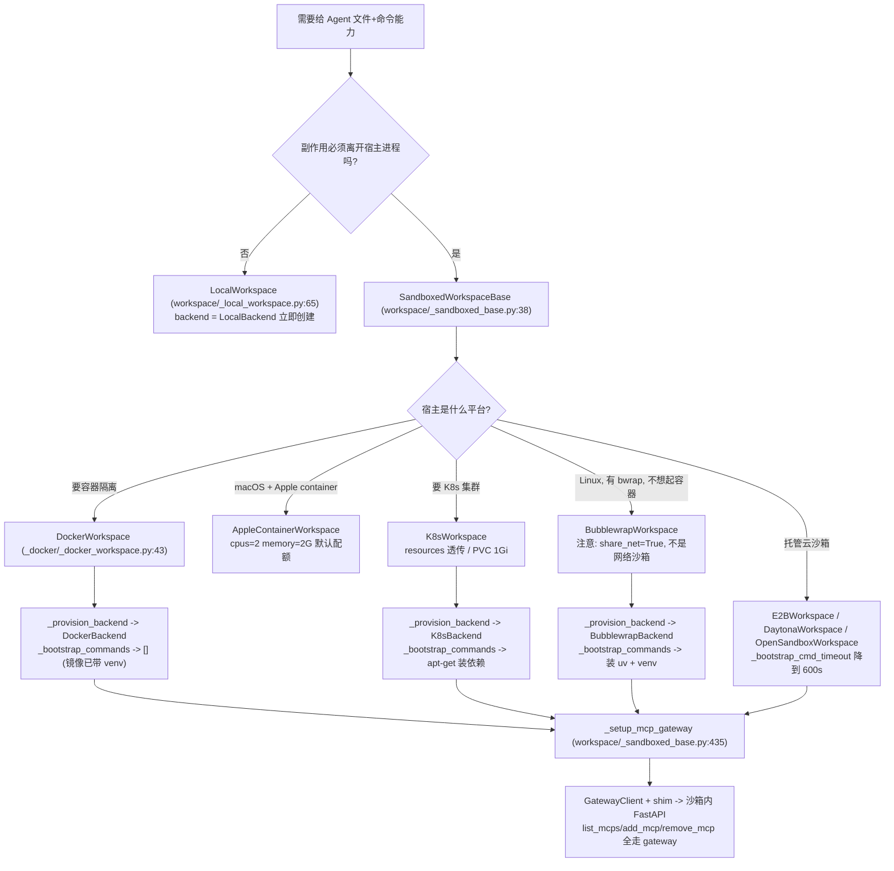
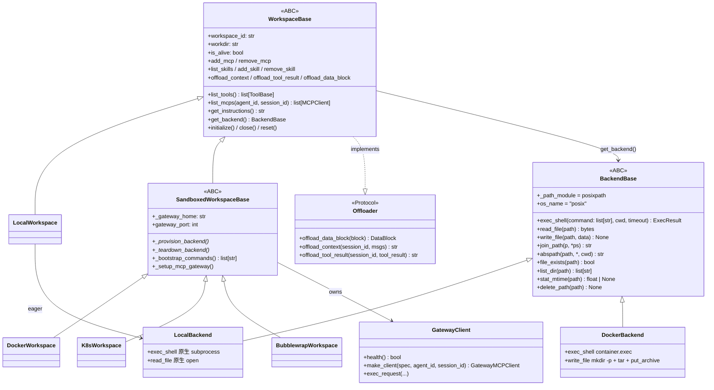
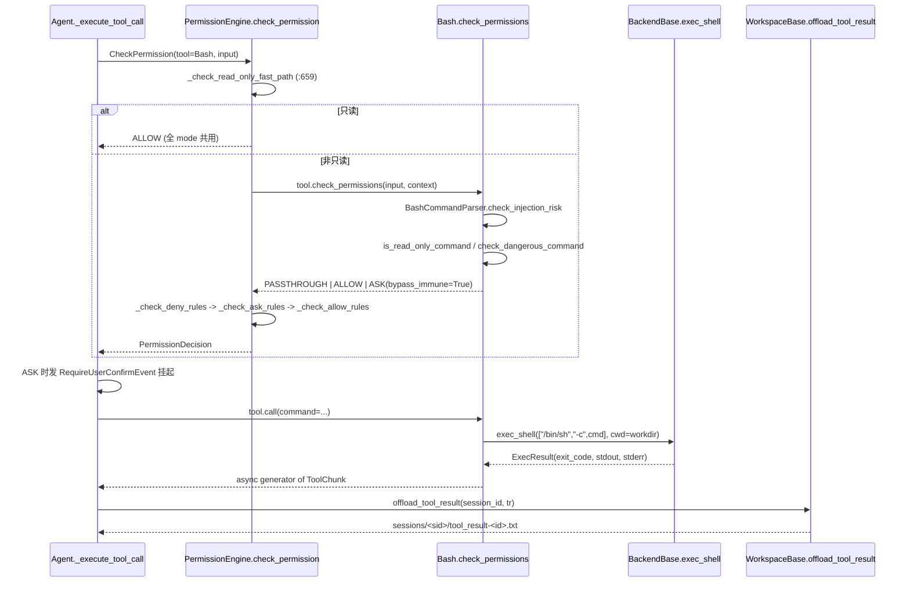

# 08 · AgentScope 工作区与安全沙箱（Workspace & Sandbox）侦察报告

> 侦察范围：`third_party/agentscope/src/agentscope/workspace/` 全部 15 个文件 + `tool/_builtin/_backend.py`、`tool/_base.py`、`tool/_builtin/_bash*.py`、`permission/`、`app/workspace_manager/`，以及 `tests/` 下 6 个相关测试文件。
> 环境：`/Users/a/miniconda3/envs/agentscope_reme_pip_env/bin/python`（3.11.13），AgentScope 2.0.8。所有代码片段均在本环境实跑。**未修改 `third_party/` 下任何文件。**

---

## 一、子系统职责

这个子系统回答一个 Harness 工程里最要命的问题：**Agent 要读写文件和执行命令，这些副作用应该发生在哪里、以什么权限发生、产生的大对象怎么不撑爆 context。**

AgentScope 把它拆成三个正交的关注点，分别由三个基类承担：

| 关注点 | 承载者 | 一句话 |
| --- | --- | --- |
| **在哪执行** | `BackendBase`（`tool/_builtin/_backend.py:138`） | 只抽象 3 个原语：`exec_shell` / `read_file` / `write_file`；全后端可换，其余文件系统助手都由这 3 个派生 |
| **给 Agent 什么** | `WorkspaceBase`（`workspace/_base.py:223`） | 资源（skills）+ 工具（6 个 builtin + MCP）+ offload 持久化，一个对象三顶帽子 |
| **允许干什么** | `PermissionEngine`（`permission/_engine.py:17`） | 5 种 mode × allow/deny/ask 规则 × 工具自带 `check_permissions`，产出 ALLOW/DENY/ASK |

关键事实（源码可查）：

1. **`LocalWorkspace` 不是文件系统 jail。** 它直接继承 `WorkspaceBase`，在 `__init__` 里就 `self._backend = LocalBackend()`（`workspace/_local_workspace.py:127`），跑在宿主进程里。实跑证明：`Glob(pattern="**/*.py")` 不传 `path` 时用的是**宿主进程 cwd**，`Bash` 可以 `cd /`（见第六节 [7b] 实测输出）。隔离完全靠 permission engine 的 `working_directories` + 规则匹配，不靠内核。
2. **沙箱侧 8 个后端共用一套模板方法。** `SandboxedWorkspaceBase`（`workspace/_sandboxed_base.py:38`）把「起沙箱 → 写 venv/脚本 → 拉 MCP gateway → 健康轮询 → skills 落地」写死，子类只需实现 3 个钩子：`_provision_backend`（:147）、`_teardown_backend`（:156）、`_bootstrap_commands`（:163），外加 `workdir` / `_gateway_home` / `gateway_port` 三个属性。
3. **offload 协议解决的是「大对象不进 context」。** `WorkspaceBase` 实现 `Offloader` Protocol（`workspace/_offload_protocol.py:8`），把 base64 数据落盘成 `data/<sha256>.<ext>`，上下文里只留可移植的 `workspace:///data/...` URL。
4. **沙箱内 MCP gateway 解决的是「宿主不直连沙箱网络」。** 沙箱里跑一个 FastAPI（`_mcp_gateway/_mcp_gateway_app.py`）监听 127.0.0.1，宿主侧用 `exec_shell` 驱动一个纯标准库 shim（`_gateway_shim.py:48`）去 curl 它。宿主 → 沙箱不需要开任何入向端口。

**明确「不存在」的能力**（源码 grep 为空，非我推断）：

- **Docker 后端没有任何资源配额。** 对 `src/agentscope/workspace/` grep `mem_limit|nano_cpus|cpu_quota|pids_limit|storage_opt|ReadonlyRootfs|NetworkMode` 结果为空；`_docker/_docker_workspace.py:284` 的容器 config 只有 `Image` / `Cmd: ["sleep","infinity"]` / `WorkingDir` / `Labels` / 可选 `Env` / 可选 `HostConfig.Binds`。实物沙箱内实测 `cgroup memory limit = max`、`nproc = 4`（宿主核数，非配额）。最接近的类比是 `_applecontainer/_constants.py:18` 的 `DEFAULT_CPUS = 2` / `:21` `DEFAULT_MEMORY = "2G"`（唯一带默认配额的后端）和 `_k8s/_k8s_workspace.py:444` 的 `V1ResourceRequirements(**self._resources)` 透传（配额由调用方给，框架不给默认值）。
- **Bubblewrap 后端明确不是网络沙箱。** `_bubblewrap/_bubblewrap_workspace.py:51` 的 docstring 原文写着：TCP MCP gateway 需要 `share_net=True`，"Sandboxed code therefore shares the host network namespace and can reach any service the host can — other loopback services, internal endpoints, and cloud metadata (e.g. `169.254.169.254`)." 实测 `_bwrap_argv`（`_bubblewrap/_bubblewrap_backend.py:398`）里 `--unshare-all` 与 `--share-net` 同时出现。
- **本子系统没有评测引擎。** 最近的类比是 `tests/` 下 6 个测试文件（`workspace_local_test.py` 等），用 pytest 做行为断言，不是评测框架。

---

## 二、关键文件表

| 文件路径:行号 | 核心类 | 核心函数 | 一句话职责 |
| --- | --- | --- | --- |
| `third_party/agentscope/src/agentscope/workspace/_base.py:223` | `WorkspaceBase` | `list_tools`(:554) `list_mcps`(:603) `offload_context`(:1004) `offload_tool_result`(:1060) `offload_data_block`(:1119) `list_skills`(:1170) `add_skill`(:1234) `reset`(:499) | 工作区总契约：资源 + 工具 + offload，全后端共用 |
| `third_party/agentscope/src/agentscope/workspace/_local_workspace.py:65` | `LocalWorkspace` | `initialize`(:164) `list_tools`(:141) `list_skills`(:449) `_reconcile_skills_dir`(:528) | 宿主进程内的工作区实现（非 jail），含 skills 分区 |
| `third_party/agentscope/src/agentscope/workspace/_sandboxed_base.py:38` | `SandboxedWorkspaceBase` | `initialize`(:174) `close`(:216) `reset`(:239) `_ensure_workspace_layout`(:414) `_setup_mcp_gateway`(:435) | 沙箱工作区模板：gateway 生命周期全在这里，子类只填 3 个钩子 |
| `third_party/agentscope/src/agentscope/workspace/_offload_protocol.py:8` | `Offloader`(Protocol) | `offload_data_block`(:11) `offload_context`(:25) `offload_tool_result`(:43) | 大对象落盘协议，`WorkspaceBase` 即其实现 |
| `third_party/agentscope/src/agentscope/workspace/_gateway_client.py:57` | `GatewayMCPTool` / `GatewayMCPClient`(:173) / `GatewayClient`(:449) | `check_permissions`(:121) `make_client`(:600) `exec_request`(:640) `health`(:519) | 沙箱侧 MCP 的宿主代理：工具名加 `mcp__{mcp}__{tool}` 前缀 |
| `third_party/agentscope/src/agentscope/workspace/_gateway_shim.py:48` | （模块常量） | `SHIM_SCRIPT` | 纯标准库 shim，宿主用 `exec_shell` 跑它去 curl 沙箱内 gateway |
| `third_party/agentscope/src/agentscope/workspace/_mcp_gateway/_mcp_gateway_app.py:76` | `_State`(:46) | `_build_app`(:76) `_call_tool`(:191) `_run`(:246) | 沙箱内 FastAPI，绑 127.0.0.1，把 MCP 调用转给 `agentscope.mcp.MCPClient` |
| `third_party/agentscope/src/agentscope/workspace/_docker/_docker_workspace.py:43` | `DockerWorkspace` | `_provision_backend`(:141) `_build_or_reuse_image`(:202) `_create_and_start_container`(:284) | Docker 后端；按内容 hash 打镜像 tag 复用 |
| `third_party/agentscope/src/agentscope/workspace/_docker/_docker_backend.py:25` | `DockerBackend` | `exec_shell`(:68) `read_file`(:136) `write_file`(:172) | 只实现 3 原语，其余全靠基类派生 |
| `third_party/agentscope/src/agentscope/workspace/_bubblewrap/_bubblewrap_backend.py:398` | （模块函数） | `_bwrap_argv`(:398) `_validate_mount_sources`(:459) | Linux 无 root 沙箱；`--unshare-all` + 可选 `--share-net` |
| `third_party/agentscope/src/agentscope/workspace/_applecontainer/_constants.py:18` | （模块常量） | `DEFAULT_CPUS=2`(:18) `DEFAULT_MEMORY="2G"`(:21) | 唯一带默认资源配额的后端 |
| `third_party/agentscope/src/agentscope/workspace/_k8s/_k8s_workspace.py:71` | `K8sWorkspace` | `resources` 透传(:444) `storage_size="1Gi"`(:299) | K8s Pod 后端；配额与 PVC 容量由调用方指定 |
| `third_party/agentscope/src/agentscope/workspace/_utils.py:18` | （模块常量） | `DEFAULT_WORKSPACE_INSTRUCTIONS`(:18) `_read_gateway_script_bytes`(:118) | 注入 system prompt 的工作区说明模板 + 内嵌脚本读取 |
| `third_party/agentscope/src/agentscope/tool/_builtin/_backend.py:138` | `BackendBase` / `LocalBackend`(:741) | `exec_shell`(:293) `read_file`(:330) `write_file`(:343) `join_path`(:190) `abspath`(:263) | 后端抽象：3 个原语 + 全派生助手；`_path_module`/`os_name` 描述**后端**环境 |
| `third_party/agentscope/src/agentscope/tool/_builtin/_bash.py:204` | `Bash` | `check_permissions`(:204) `check_read_only`(:179) `call`(:681) | 命令执行工具；7 级权限检查 + 注入检测 |
| `third_party/agentscope/src/agentscope/tool/_builtin/_bash_parser.py:148` | `BashCommandParser` | `check_injection_risk` `is_read_only_command` `check_dangerous_command` | tree-sitter 语法树分析，判定只读/危险/注入 |
| `third_party/agentscope/src/agentscope/permission/_engine.py:17` | `PermissionEngine` | `check_permission`(:77) `_check_default`(:117) `_check_explore`(:214) `_check_bypass`(:395) `_check_dont_ask`(:491) `_check_read_only_fast_path`(:659) | 5 mode 决策器；只读快路径全模式共用 |
| `third_party/agentscope/src/agentscope/app/workspace_manager/_base.py:28` | `WorkspaceManagerBase` / `IsolationPolicy`(:18) | `assign_workspace_id`(:83) `bind_storage`(:70) | 工作区分配与隔离策略（PER_SESSION/PER_AGENT/PER_USER） |
| `third_party/agentscope/src/agentscope/app/workspace_manager/_local_workspace_manager.py:15` | `LocalWorkspaceManager` | `get_workspace`(:70) `_pop_expired`(:58) | TTL 缓存 + 双检锁的工作区池 |

---

## 三、调用链

### 3.1 后端选择决策图



### 3.2 统一接口类图



### 3.3 一次 Agent 工具调用的完整链路



**逐段讲解**

- **第一段（读写分离的快路径）**：`PermissionEngine.check_permission`（`permission/_engine.py:77`）第一件事就是调 `_check_read_only_fast_path`（:659）。它统一调 `tool.check_read_only(tool_input)`，为真就 ALLOW，注释里写明「Keeping this in a single helper ... guarantees the modes cannot drift apart on read-only handling」。实测 5 个 mode 下 `ls -la` 全是 `allow`。
- **第二段（工具自己的判断）**：非只读才会把控制权交给工具的 `check_permissions`。`Bash.check_permissions`（`tool/_builtin/_bash.py:204`）的 docstring 把 7 步写得非常清楚，第 0 步（注入检测）必须早于第 1 步只读判定，否则 `ls $(rm -rf /)` 会被当成只读放行。返回值有两类：确定的 ALLOW/ASK，或者 `PASSTHROUGH`（"engine continues with rule matching"）。
- **第三段（rule 匹配的固定顺序）**：engine 收到 PASSTHROUGH 后按 `_check_deny_rules`(:694) → `_check_ask_rules`(:721) → `_check_allow_rules`(:748) 的顺序匹配，deny 优先于 ask 优先于 allow。
- **第四段（bypass_immune 是安全底线）**：`PermissionDecision.bypass_immune`（`permission/_decision.py:33`）为 True 时，DEFAULT 模式下 allow 规则消不掉这个 ASK；`_check_bypass`(:395) 是唯一会忽略 bypass-immune ASK 的 mode。实测：给 engine 加了 `Bash/rm/ALLOW` 规则后，`rm build.log -> allow`，但 `rm -rf / -> ask | bypass_immune = True`。
- **第五段（真正执行与落盘）**：ASK 在 Agent 层变成 `RequireUserConfirmEvent` 挂起；确认后 `Bash.call`（:681）产出异步生成器，每轮 `ToolChunk`（`tool/_response.py:27`）带 `state: ToolResultState`。结果过大时 Agent 调 `offload_tool_result`（`workspace/_base.py:1060`）落盘。

---

## 四、关键数据结构

### 4.1 `ExecResult`（`tool/_builtin/_backend.py:61`）

后端唯一的命令返回值载体，frozen slots dataclass：

```python
@dataclass(frozen=True, slots=True)
class ExecResult:
    exit_code: int
    stdout: bytes
    stderr: bytes
```

配套 `ok()`（:76）判定 `exit_code == 0`。约定：**超时时 `exit_code == -1` 且 `stderr == b"timed out"`**——`_docker_backend.py:68` 和 `Bash.call` 都靠这个约定识别超时。

### 4.2 `BackendBase` 的两个「环境描述字段」（`tool/_builtin/_backend.py:177` / `:186`）

```python
    _path_module: ModuleType = posixpath

    os_name: str = "posix"
```

字段级说明（这段注释是整个后端抽象最容易读错的地方）：

- `_path_module` 的 docstring 明确警告：**只允许纯字符串操作**（`join`/`split`/`dirname`/`normpath`/`isabs`/`splitext`）。**禁止**调 `exists`/`isfile`/`getmtime`/`realpath`/`expanduser`/无参 `abspath`——这些会去读**宿主进程**的文件系统与 `$HOME`/`cwd`，对远程后端是静默 bug。要判存在请用异步的 `file_exists`/`is_dir`/`stat_mtime`。
- `os_name` 描述的是**命令真正跑在哪里**，不是宿主。所以「Windows 宿主驱动 Linux 沙箱」时它是 `"posix"`，工具据此选 `/bin/sh` 而不是 `cmd.exe`。

### 4.3 `PermissionDecision`（`permission/_decision.py:10`）

```python
@dataclass
class PermissionDecision:
    behavior: PermissionBehavior
    message: str
    decision_reason: str
    updated_input: dict | None
    suggested_rules: list[PermissionRule] | None
    bypass_immune: bool
```

- `behavior`：`ALLOW` / `DENY` / `ASK` / `PASSTHROUGH`（`_types.py:99-102`）。
- `decision_reason`：实测输出如 `"Read-only operations are auto-allowed"`、`"Safety check: dangerous command pattern detected"`——这是排查权限问题最快的一行。
- `bypass_immune`：见 3.3 第四段。
- `suggested_rules`：实测 `rm -rf /` 会给出 `[('Bash', 'rm -rf:*', 'allow')]`。

### 4.4 `_SkillsFile` / `_SkillEntry`（`workspace/_local_workspace.py:29` / `:38`）

```python
class _SkillEntry(TypedDict):
    """A single entry in the .skills index file."""

    hash: str
    """SHA-256 hash of the skill's SKILL.md content."""
    skill_name: str
    """The name exposed to the agent (may differ from the directory name)."""


class _SkillsFile(TypedDict):
    """Schema of the .skills index file stored inside a partition."""

    skills_dir_mtime: float
    """mtime of the partition at the time the index was last written."""
    skills: dict[str, _SkillEntry]
    """Mapping from directory name (relative to the partition) to entry."""
```

字段级说明：

- `_SkillEntry.hash`：**skill 的 `SKILL.md` 内容的 SHA-256**（由 `_validate_and_hash_skill`（:384）算），不是整个目录的 hash。改 `SKILL.md` 就会变，改同目录其它文件不会。
- `_SkillEntry.skill_name`：暴露给 agent 的名字，可以跟目录名不同（`_sanitize_dir_name`(:47) 会把非法字符 `re.sub(r"[^\w一-鿿-]", "_", name)` 换掉，所以目录名常常是原名的转义版）。
- `_SkillsFile.skills_dir_mtime`：**分区的 mtime**，`_reconcile_skills_dir`（:528）用它判断「用户有没有在 workspace 背后手改 `skills/` 目录」；`_list_partition_skills`（:474）由 mtime 驱动，mtime 没变就吃索引缓存。这是典型的「目录指纹 + 索引」缓存模式，值得抄。
- `_SkillsFile.skills`：`目录名（相对分区根） → _SkillEntry` 的映射。

---

## 五、源码精读

### 5.1 三个原语就是全部契约

`third_party/agentscope/src/agentscope/tool/_builtin/_backend.py:293`：

```python
    @abstractmethod
    async def exec_shell(
        self,
        command: list[str],
        *,
        cwd: str | None = None,
        timeout: float | None = None,
    ) -> ExecResult:
        """Run a program directly from an argument vector.

        *command* is an executable followed by its arguments — it is
        **not** passed through a shell, so callers never have to quote
        or escape arguments and there is no platform-specific quoting
        bug. ...
        Callers that genuinely need shell features (pipes, redirects,
        ``&&``) must wrap their command line explicitly, e.g.
        ``["/bin/sh", "-c", command_line]``.
        """
```

**讲解**：`exec_shell` 收的是 argv `list[str]`，不是命令行字符串。这个设计让「Windows 宿主 → cmd.exe」也不会踩 `shlex.quote` 的引号坑。需要管道重定向必须显式写 `["/bin/sh", "-c", line]`——`DockerBackend.exec_shell`（`_docker_backend.py:68`）自己就是这么把 `sh` 拼进去的。注意剩下的 `read_file`(:330) / `write_file`(:343) 也是抽象；而 `file_exists`(:464)、`list_dir`(:492)、`scandir`(:542)、`stat`(:578)、`stat_mtime`(:669)、`delete_path`(:702)、`write_stream`(:354)、`read_stream`(:377) 全部是**基类派生**实现（默认走去执行 `find`/读取整块），`LocalBackend`(:741) 才给它们做了原生覆盖（:832–1073）。新增一个后端 = 实现 3 个方法。

### 5.2 `list_tools` 是「工作区即工具工厂」的落点

`third_party/agentscope/src/agentscope/workspace/_base.py:554`：

```python
        from ..tool import Bash, Edit, Glob, Grep, Read, Write

        backend = self.get_backend()
        glob_kwargs: dict = {"backend": backend}
        if self._glob_helper_path is not None:
            glob_kwargs["glob_helper_path"] = self._glob_helper_path
        return [
            Bash(cwd=self.workdir, backend=backend),
            Edit(backend=backend),
            Glob(**glob_kwargs),
            Grep(backend=backend),
            Read(backend=backend),
            Write(backend=backend),
        ]
```

**讲解**：6 个工具**共用一个 backend 实例**，所以「工具在哪里执行」这个决策在 workspace 层一次做完，工具层不用管。注意两个细节：(1) 只有 `Bash` 拿到 `cwd=self.workdir`，`Glob` 拿不到——这就是实测里 `Glob` 默认落在宿主 cwd 的直接原因；(2) `_glob_helper_path` 在 `LocalWorkspace` 里是 `None`（基类默认 `_base.py:284`），在沙箱后端里是沙箱内的 `_glob_helper.py` 路径（`_sandboxed_base.py:106`）。

### 5.3 offload 的三段式与 `workspace://` 的可移植性

`third_party/agentscope/src/agentscope/workspace/_base.py:1119`：

```python
        if not isinstance(block.source, Base64Source):
            return block

        backend = self.get_backend()
        hash_str = hashlib.sha256(block.source.data.encode()).hexdigest()
        ext = mimetypes.guess_extension(block.source.media_type) or ".bin"
        rel = f"{DEFAULT_DATA_DIR}/{hash_str}{ext}"
        path = backend.join_path(self._data_dir, f"{hash_str}{ext}")

        if not await backend.file_exists(path):
            await backend.write_file(
                path,
                base64.b64decode(block.source.data),
            )
```

docstring 里点明了关键设计：「Hashing the *base64* text rather than the decoded bytes lets a second offload of the same block short-circuit」——哈希的是 base64 文本而非解码字节，所以第二次 offload 同一 block 完全命中、不重复写盘。返回的 URL 注释里写明与 `file://` 的区别：「A ``workspace://`` reference (workspace-relative path). Unlike a node-local ``file://`` path it is portable: a serving endpoint resolves the actual workspace from the request's session context and reads the relative path.」

实测：两次 offload 得到同一个 `workspace:///data/57afe788...c468.png`，且文件 mtime 未变；`offload_context` 会把内联 base64 就地替换为 `workspace://`，并且**深拷贝**所以调用方传入的 msgs 不被就地修改（实测 `原 msgs 未被就地修改 = True`）。

### 5.4 沙箱 gateway 的启动是「先杀后起 + 健康轮询」

`third_party/agentscope/src/agentscope/workspace/_sandboxed_base.py:435` 的 `_setup_mcp_gateway`，注释里有一条硬核经验：

```python
        # Clear any gateway left running by a previous resume so the
        # new one can bind the port cleanly. Keep this in a separate
        # shell command from launch: some providers expose the full
        # launch shell command line to ``pkill -f``, which would also
        # contain the gateway script path and terminate the launch
        # before ``nohup`` starts.
        await backend.exec_shell(
            ["sh", "-c", "pkill -f '[_]mcp_gateway_app.py' || true"],
        )

        launch_cmd = (
            f"nohup {shlex.quote(self._gateway_python)} -u "
            f"{shlex.quote(self._gateway_script)} "
            f"--port {self.gateway_port} "
            f"> {shlex.quote(self._gateway_log)} 2>&1 &"
        )
        await backend.exec_shell(["sh", "-c", launch_cmd])
```

**讲解**：`pkill -f '[_]mcp_gateway_app.py'` 用字符类把模式写成不会匹配自身的形式（否则 pkill 会把自己那条命令行也匹配上）。更重要的是**必须拆成两条 exec_shell**：某些沙箱 provider 会把整条 launch 命令行暴露给 `pkill -f`，里面有 gateway 脚本路径，会把尚未 nohup 起来的启动命令自己杀掉。杀掉之后的健康轮询是 30 秒 deadline、0.1→1.0 秒退避（:509-516），超时就把 `gateway.log` 尾部 2000 字符塞进异常消息。

### 5.5 Docker 容器创建：只给了 4 个字段

`third_party/agentscope/src/agentscope/workspace/_docker/_docker_workspace.py:284` 的 `_create_and_start_container`，容器配置只有 `Image` / `Cmd: ["sleep","infinity"]` / `WorkingDir` / `Labels`（`agentscope.workspace=true`、`agentscope.workspace.id`），加上可选的 `Env` 和 `HostConfig.Binds`。**没有内存、CPU、pids、磁盘、只读根、网络模式任何一项。** 实测沙箱内 `cgroup memory limit = max`。

同时这条路径有个值得学的工程细节：`_build_or_reuse_image`（:202）按构建上下文内容 hash 打 tag（实测 tag 为 `agentscope-workspace:404aaeb8aa99`），并且**手工 tar 构建上下文**——注释说明 aiodocker 不会自动打包，且要用 `encoding="identity"`。构建失败时保留 200 行日志尾部用于报错。

### 5.6 Bubblewrap 的 argv 与它的诚实说明

`third_party/agentscope/src/agentscope/workspace/_bubblewrap/_bubblewrap_backend.py:398` 生成的参数序列（截取核心）：

```python
        args = [
            "bwrap",
            "--die-with-parent",
            "--new-session",
            "--unshare-all",
            "--proc", "/proc",
            "--dev", "/dev",
            "--bind", self._host_workdir, SANDBOX_WORKDIR,
            "--bind", self._host_tmpdir, SANDBOX_TMPDIR,
            "--tmpfs", "/run",
            "--dir", "/var",
            "--tmpfs", "/var/tmp",
        ]
        ...
        if self._share_net:
            args.append("--share-net")
```

**讲解**：`bwrap` 用 `exec_shell` 的第一个参数直接作为可执行文件——正是 5.1 里「argv 不经过 shell」的用法。`--unshare-all` 会 unshare 所有命名空间，但 `--share-net` 又单独把网络加回来，这是 `_bubblewrap_workspace.py:51` 那段「This is not a network sandbox」docstring 的具体落地。`_validate_mount_sources`(:459) 负责校验 bind 源没被删改（否则 bwrap 会静默挂到别处）。

---

## 六、可运行代码片段

全部脚本位于 `/tmp/recon_ws/`（在工作区之外，**未写入仓库**），用 `/Users/a/miniconda3/envs/agentscope_reme_pip_env/bin/python` 执行。四段全部 **已验证**，下面附真实输出。

### 6.1 【已验证】最小 demo：Agent 在受控目录写文件 + 执行命令

用户要求的「最小可跑 demo（本地工作区，不依赖 Docker）」完整实现是 `demo2_agent_deepseek.py`，核心装配与 `third_party/agentscope/examples/console/main.py:54-91` 一致：

```python
async with LocalWorkspace(workdir=workdir) as workspace:
    agent = Agent(
        name="Friday",
        system_prompt=("You are a helpful assistant named Friday.\n\n"
                       + await workspace.get_instructions()),
        model=DeepSeekChatModel(
            credential=DeepSeekCredential(api_key=api_key, base_url=base_url),
            model=model_name, stream=True),
        toolkit=Toolkit(
            tools=await workspace.list_tools(),
            skills_or_loaders=await workspace.list_skills()),
        state=AgentState(permission_context=PermissionContext(
            mode=PermissionMode.DEFAULT)),
        offloader=workspace,          # 工作区同时就是 offloader
    )
```

注意 `workspace` 一个对象顶三个角色：`tools=await workspace.list_tools()`（工具提供者）、`skills_or_loaders=await workspace.list_skills()`（skill 提供者）、`offloader=workspace`（大对象落盘）。

**真实输出**（`out2.txt`，DeepSeek 实测）：

```
model = deepseek-flash @ https://api.deepseek.com
    [模型请求工具] Bash
    [工具执行完毕] call_00_BZag2RN2e8QYq4dHIHEu5477 state=success
    [模型请求工具] Write
    [HITL] 拦截到 1 个待确认调用: Write
    [工具执行完毕] call_00_dbg0AvTP0YeJc4eO72HU6668 state=success
    [模型请求工具] Bash
    [HITL] 拦截到 1 个待确认调用: Bash
    [工具执行完毕] call_00_hMTbZQL9FiXqe19naxss1761 state=success
AGENT 最终回答:
文件已创建，绝对路径是 `.../as_agent_ws_g57dvxbw/notes/demo.txt`，用 `wc -l` 统计出共 3 行（内容为 line-1 / line-2 / line-3）。
notes/demo.txt 内容:
line-1
line-2
line-3
```

结论：**DEFAULT 模式下 `Write` 与 `Bash` 都会被拦成 HITL 确认**，必须实现 `RequireUserConfirmEvent → UserConfirmResultEvent(ConfirmResult(confirmed=True, tool_call=tc))` 的回环才能跑通。这就是企业级产品里「人在回路」的位置。

### 6.2 【已验证】LocalWorkspace 不是 jail（必须知道的事实）

`demo1_local_workspace.py` 的 [7] / [7b]：

```
[7] Glob / Grep 只在 workdir 内生效
    Glob('**/*.py') -> /private/tmp/recon_ws/demo4_offload_and_rules.py
/private/tmp/recon_ws/demo3_docker_workspace.py
...
    Grep('hello') -> .../as_ws_demo_29r9lozh/hello.py
[7b] 关键事实：LocalWorkspace 不是文件系统 jail
    Glob 默认 base_dir = /private/tmp/recon_ws （= 宿主进程 cwd，不是 workdir）
    -- cd / 也行 --
     /
```

`Glob` 不传 `path` 时落在**宿主 cwd**（`/private/tmp/recon_ws`，即脚本所在目录），`Bash` 可以 `cd /` 成功。同一脚本里 `Grep(pattern="hello", path=workdir)` 因为显式传了 path 才留在 workdir 内。**结论：`LocalWorkspace` 的安全性 100% 来自 permission engine，不来自文件系统。**

### 6.3 【已验证】Docker 沙箱实起 + 资源配额实测

`demo3_docker_workspace.py` 真实起容器（Docker 27.4.0，镜像构建耗时约 3 分钟）：

```
container workdir = /workspace | gateway_port = 5600 | is_persistent = True
gateway_home = /root/.agentscope
backend = DockerBackend
--- exec_shell ---
/workspace
drwx------ 5 root root  160 Sep 21 09:33 data
drwxr-xr-x 2 root root   64 Sep 21 09:33 sessions
drwxr-xr-x 2 root root   64 Sep 21 09:33 skills
uid=0(root) gid=0(root) groups=0(root)
tools = ['Bash', 'Edit', 'Glob', 'Grep', 'Read', 'Write']
--- sandbox cat ---
docker-sandbox
--- host-side view of the bind mount ---
['data', 'hello.txt', 'sessions', 'skills']
--- 沙箱内有没有资源配额？ ---
cgroup memory limit = max
nproc = 4
--- git worktree / 大文件 offload 目录 ---
gateway home 内容 = ['_glob_helper.py', '_mcp_gateway_app.py', 'gateway.log', 'requirements.txt']
after close: is_alive = False
```

三个从实测得到的硬结论：
1. `is_persistent = True`（有 bind mount），宿主目录能看到沙箱里写的 `hello.txt`。
2. `cgroup memory limit = max`、`nproc = 4`（= 宿主核数）——**沙箱没有内存/CPU 配额**。
3. 沙箱内**以 root 运行**（`uid=0(root)`），且 `workdir` 权限是 `drwx------`。

### 6.4 【已验证】offload 三接口 + 5 mode × 12 用例权限矩阵

`demo4_offload_and_rules.py`：

```
[A] offload_data_block：base64 大图落盘 -> workspace:// URL
    url = workspace:///data/57afe7884ced5457c55b8e12aee0ffbd192df7e6f1df20430d94ebf4dfd7c468.png
[B] 同一个 block 再 offload 一次 -> 命中 hash，不重复写
    两次 URL 相同 = True | mtime 未变 = True
[C] 已经是 URLSource 的 block 直接原样返回
[D] offload_context： role= assistant -> [{"type": "data", ..., "source": {"type": "url", "url": "workspace:///dat...
    原 msgs 未被就地修改 = True
[E] offload_tool_result -> sessions/sess-1/tool_result-call_9.txt
    内容 = "screenshot:<data url='workspace:///data/57afe...c468.png' name='a.png' media_type='image/png'/>"
[F] 同名 tool_result 再 offload -> 第二次 = sessions/sess-1/tool_result-call_9(1).txt
[G] reset() 后 workdir 内容 = []
```

权限矩阵：

```
调用                                 DEFAULT    ACCEPT_EDITS   EXPLORE   BYPASS    DONT_ASK
ls -la                             allow      allow          allow     allow     allow
git status                         allow      allow          allow     allow     allow
git push                           ask        ask            deny      allow     deny
rm -rf /                           ask*       ask*           deny      allow     deny
cat > /root/.bashrc                ask*       ask*           deny      allow     deny
ls $(rm -rf /)                     ask*       ask*           deny      allow     deny
rm /tmp/perm_ws/a                  ask        allow          deny      allow     allow
rm /etc/hosts                      ask        ask            deny      allow     deny
Write /tmp/perm_ws/x               ask        allow          deny      allow     allow
Write /etc/passwd                  ask        ask            deny      allow     deny
  * = bypass_immune（allow 规则无法消掉的强制确认）
```

以及 `Bash.match_rule` 的语义（规则匹配的四种形态）：

```
    rule=None      cmd=rm -rf /             -> True
    rule=git:*     cmd=git status           -> True
    rule=git:*     cmd=github push          -> False     # "git:*" 不吃 "github"
    rule=rm        cmd=rm build.log         -> True
    rule=rm*       cmd=rm build.log         -> True
    rule=rm*       cmd=npm rm build.log     -> False     # 前缀锚定
    rule=rm\*      cmd=rm* x                -> True      # 转义后按字面 rm* 匹配
```

### 6.5 【已验证】skills 分区：seed 模板 → 每 agent 独立副本

```
[2] agentA 第一次 list_skills() 触发 equip_partition()：
    agentA skills = ['demo-skill']
    skills/ 下现在有: ['.seed', 'agentA']
[3] agentA 删掉自己分区里的副本，seed 与 agentB 不受影响：
    agentA after remove = []   .seed 仍在 = True | agentB 副本仍在 = True
[4] 非法 agent_id（路径穿越）被拒绝：
    ValueError: Agent id '../escape' is not usable as a skill partition name.
```

### 6.6 【未验证】E2B / Daytona / K8s / OpenSandbox 后端

**未跑通，原因：无对应云账号或集群**（E2B 与 Daytona 需要 API key，K8s 需要可达集群，OpenSandbox 需要外部服务）。对这四个后端的理解来自源码阅读，未经运行验证：`_bootstrap_commands` 会通过 `apt-get`/`uv` 在沙箱内建 venv（`_sandboxed_base.py:163` 起），E2B 把 `_bootstrap_cmd_timeout` 从 1800 降到 600（`_sandboxed_base.py:67` docstring），K8s 走 PVC 持久化（`_k8s_workspace.py:299`）。

---

## 七、教学要点（按「小白最容易卡住」排序）

1. **`ToolBase.__call__` 是 `async def`，必须 `async for chunk in await tool(...)`。** 直接 `async for chunk in tool(...)` 报 `TypeError: 'async for' requires an object with __aiter__ method, got coroutine`。权威证据：`third_party/agentscope/tests/builtin_bash_test.py:155`。这是全篇第一号坑。
2. **`Msg` 是 pydantic 模型，必须全关键字构造**：`Msg(name="user", role="user", content=[TextBlock(text=...)])`。位置参数会报 `BaseModel.__init__() takes 1 positional argument but 4 were given`。
3. **`Agent` 不可调用**：是 `await agent.reply(msg)` 或 `agent.reply_stream(inp)`，不是 `await agent(msg)`。
4. **事件对象的字段别猜。** `ToolCallEndEvent` 只有 `tool_call_id`（没有 `tool_call`）；工具名在 `ToolCallStartEvent.tool_call_name`（`event/_event.py:314/:340`）。`ToolResultEndEvent.state` 是**裸字符串**不是枚举，因为 `model_config = ConfigDict(use_enum_values=True)`（`event/_event.py:409`）——写 `evt.state.value` 会报 `'str' object has no attribute 'value'`。
5. **`LocalWorkspace` 不隔离文件系统。** 别以为有了 workspace 就安全了（见 6.2 实测）。真正的边界在 permission engine。
6. **DEFAULT 模式下 Agent 会「卡住不动」。** `agent.reply()` 遇到权限 ASK 会直接返回「I'm waiting for your permission」这类文本。必须写 HITL 回环：捕获 `RequireUserConfirmEvent`（`event/_event.py:443`，带 `reply_id` + `tool_calls`），回 `UserConfirmResultEvent(reply_id=..., confirm_results=[ConfirmResult(confirmed=True, tool_call=tc)])`（:483）。
7. **skill_paths 要指向「含 SKILL.md 的那个目录」本身**，不是它的父目录；否则报 `Invalid skill ... SKILL.md not found`。skills 的 frontmatter 必须有 `name` 和 `description`（`_local_workspace.py:331` 的 `_validate_skill`）。
8. **`workspace` 对象一物三用**：`tools=` / `skills_or_loaders=` / `offloader=`。三者都指同一个 `LocalWorkspace` 实例，这是设计而非巧合（`workspace/_base.py:223` 同时继承 `Offloader` Protocol）。
9. **offload 的 `workspace://` 不是 `file://`。** 前者是工作区相对路径，由服务端按 session 上下文解析；后者是节点本地路径，容器/远端场景会失效。
10. **skill 分区（partition）是「每 agent 一份副本」。** `skills/.seed/` 是模板，`skills/<agent_id>/` 是该 agent 的独立副本；删 agentA 的副本不影响 seed 和 agentB（6.5 实测）。`agent_id` 以 `.` 开头或含 `/`、`\` 会被 `_skill_partition`（`_base.py:379`）直接拒绝。
11. **`list_tools()` 里的 `Glob` 拿不到 `cwd`。** 只有 `Bash(cwd=self.workdir)`（`_base.py:570`）。所以调 `Glob` 想限定目录必须显式传 `path`。
12. **后端超时靠约定识别**：`exit_code == -1 and stderr == b"timed out"`，不是异常。
13. **`_path_module` / `os_name` 描述后端环境，不是宿主。** 写自定义后端时用 `os.path.exists` 会踩坑（`_backend.py:161-176` 的警告块原文）。
14. **`pkill -f` 和 launch 必须分成两条 `exec_shell`**（5.4 的注释）。这是给「自己实现沙箱后端」的人看的经验。
15. **`reset()` 不重新 seed skills**（`_sandboxed_base.py:239` docstring 明说），但 `default_mcps` 会重新生效——因为 `.mcp` 被删了。

---

## 八、坑与注意事项

| 现象 | 原因 | 解决 |
| --- | --- | --- |
| `TypeError: 'async for' requires an object with __aiter__ method, got coroutine` | `ToolBase.__call__` 是 `async def`（`tool/_base.py:190`），返回的是协程，协程里才是异步生成器 | 改成 `async for c in await tool(...)`；参照 `tests/builtin_bash_test.py:155` |
| `BaseModel.__init__() takes 1 positional argument but 4 were given` | `Msg` 是 pydantic 模型（`message/_base.py:71`） | 全部用关键字：`Msg(name=..., role=..., content=[...])` |
| `TypeError: 'Agent' object is not callable` | `Agent` 没实现 `__call__` | `await agent.reply(msg)` 或 `for e in agent.reply_stream(inp)` |
| `AttributeError: 'ToolCallEndEvent' object has no attribute 'tool_call'` | `ToolCallEndEvent` 只带 `tool_call_id`（`event/_event.py:340`） | 名字从 `ToolCallStartEvent.tool_call_name`（:314）取 |
| `AttributeError: 'str' object has no attribute 'value'` | `ToolResultEndEvent.model_config = ConfigDict(use_enum_values=True)`（:409） | 直接打印 `evt.state`，不要 `.value` |
| `agent.reply()` 只返回一句 "I'm waiting for your permission..." | DEFAULT 模式下 ASK 会挂起等确认 | 实现 HITL 回环：`RequireUserConfirmEvent` → `UserConfirmResultEvent` |
| `Invalid skill ... SKILL.md not found` | `skill_paths` 传了 skill 的父目录 | 传「含 `SKILL.md` 的那层目录」本身 |
| `Glob` 结果跑到宿主 cwd 而不是 workdir | `list_tools()` 只给 `Bash` 传 `cwd`（`_base.py:570`），`Glob` 没传 | 显式传 `path=workdir`，或改用 `Grep(path=...)` |
| `ValueError: Agent id '...' is not usable as a skill partition name.` | `_skill_partition`（`_base.py:379`）拒绝 `.` 开头或含 `/`、`\` 的 id | 用合法目录名做 agent_id |
| Docker 沙箱内进程是 root、无内存/CPU 上限 | `_create_and_start_container`（`_docker_workspace.py:284`）不设任何 quota；实测 `cgroup memory limit = max` | 框架不管，自己在外层加：Docker 用 `--memory/--cpus`，K8s 传 `resources=`（`_k8s_workspace.py:444`），AppleContainer 用 `cpus=`/`memory=` |
| Bubblewrap 沙箱能访问宿主内网服务与云元数据 | `_bwrap_argv` 加了 `--share-net`（`_bubblewrap_backend.py:398`），docstring 自陈「This is not a network sandbox」（`_bubblewrap_workspace.py:51`） | 不要在同一台机器上跑不可信代码；需要真隔离就换 Docker/K8s 并配 NetworkPolicy |
| `aiodocker` 不是默认依赖 | Docker 后端按需 import | `pip install aiodocker`（本次已验证 0.27.0 可用） |
| 首次 `DockerWorkspace.initialize()` 卡住数分钟 | 需要构建镜像（本次约 3 分 11 秒），按内容 hash 打 tag | 属正常；镜像按 hash 复用，第二次秒起 |
| `initialize()` 报 gateway 30 秒不健康 | `_setup_mcp_gateway` 轮询超时，异常消息里带 `gateway.log` 尾部 | 看异常里的 log tail；常见于 bootstrap 未装齐 `mcp<2.0.0 / uvicorn / fastapi / httpx`（`_utils.py:107`） |

---

## 九、与参考架构的映射

| 参考架构层 | 本子系统覆盖情况 | 对应源码 |
| --- | --- | --- |
| **第 0 层 Cordis 插件微内核** | **部分对应**。8 个后端就是 8 个可插拔插件，`workspace/__init__.py` 是插件注册表；但没有真正的微内核容器/依赖注入，只有硬编码的 import 导出 | `workspace/__init__.py` |
| **第 1 层 基础接入 & 存储** | **对应**。`data/`（offload 二进制）、`sessions/`（context.jsonl + tool_result-*.txt）、`skills/`（含 `.seed` 模板 + 分区副本 + `.index` 指纹）、`.mcp`（v2 嵌套 JSON）；持久化与版本迁移（v1→v2）都在 `_base.py:926` `_restore_mcp_specs` | `workspace/_base.py:1119`、`:889`、`:926` |
| **第 2 层 Agent 核心执行引擎 —— Sandbox 安全沙箱** | **本子系统的主战场**。工具执行环境（8 后端 + 3 原语）、权限引擎（5 mode × 3 规则类型）、MCP gateway、skills、offload 全在这一层 | `workspace/_base.py`、`_sandboxed_base.py`、`permission/_engine.py` |
| **第 2 层 —— Planning / Reasoning / Subagent** | **不涉及**。本子系统不含 plan 生成、subagent 编排。最近的类比是 `WorkspaceManagerBase`（`app/workspace_manager/_base.py:28`）按 `IsolationPolicy` 给多 agent 分发不同工作区 | `app/workspace_manager/` |
| **第 3 层 评测、实验与迭代** | **缺失**。源码里没有评测引擎、benchmark、指标上报。最近的类比是 `tests/workspace_local_test.py`（1999 行，7 个测试类）等 6 个 pytest 文件，以及 `DockerWorkspace` 的构建耗时日志 | `tests/workspace_*_test.py` |
| **第 4 层 中间件 Hook / Web UI / Bundle** | **少量对应**。`ToolBase` 有中间件洋葱（`tool/_base.py:224-263`）；`Agent` 侧有 `_check_permission` 中间件洋葱（`agent/_agent.py:2344`）。Web UI、Bundle/Profile 不在本子系统 | `tool/_base.py:224`、`agent/_agent.py:2344` |

**能力缺口汇总（明确「不存在」+ 最近类比）**

1. **资源配额（CPU/内存/pids/磁盘）**：Docker/Bubblewrap/E2B 后端**不存在**。最近类比：AppleContainer 的 `DEFAULT_CPUS=2`/`DEFAULT_MEMORY="2G"`（`_applecontainer/_constants.py:18`/`:21`）、K8s 的 `resources=` 透传（`_k8s_workspace.py:444`）。要企业级必须自己在外层补齐。
2. **网络隔离**：Bubblewrap **明确不做**（`_bubblewrap_workspace.py:51`）。Docker 后端也没设 `NetworkMode`。最近类比：无——需要用户自己用 Docker network / K8s NetworkPolicy。
3. **文件系统 jail（本地模式）**：`LocalWorkspace` **不存在**（6.2 实测）。最近类比：`PermissionEngine` 的 `working_directories` + `_path_in_allowed_working_path`（`tool/_base.py:390`）——这是「策略隔离」而非「机制隔离」。
4. **评测引擎**：本子系统**不存在**。最近类比：`tests/` 下 6 个 pytest 文件。
5. **运行时审计日志/监控**：**不存在**。唯一的可观测面是 `gateway.log`（`_utils.py` 的 `DEFAULT_GATEWAY_LOG`）和 `logger` 输出，以及每个决定自带的 `decision_reason` 字符串。

**给教程读者的落地建议**：要做出企业级 Harness，本子系统需要补的三件事是 —— (a) 在 `_create_and_start_container` 之外套一层资源配额（或直接用 AppleContainer/K8s 后端的配额参数）；(b) 给不可信代码换掉 Bubblewrap、关掉 `share_net` 或加网络策略；(c) 把 `decision_reason` + `tool_call_id` + `session_id` 汇成审计流，这是「工业级」和「能跑」的分界线。
