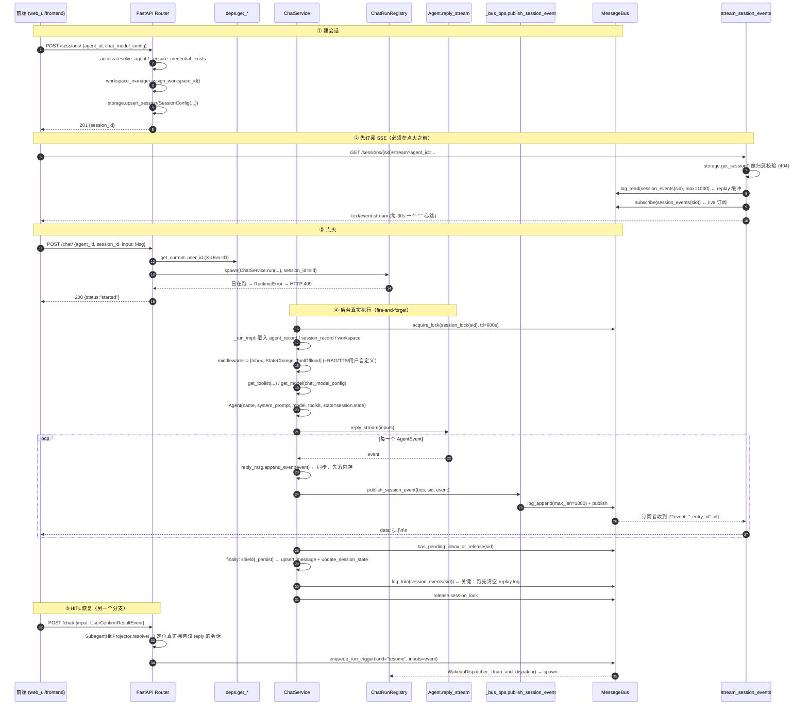
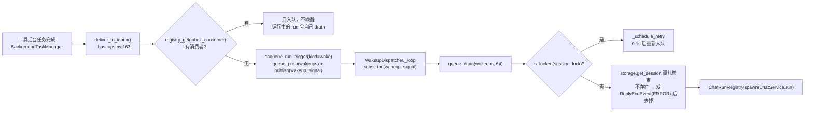

# 09 AgentScope 服务化、Web UI、Console、TUI、A2A —— 源码侦察报告

> 侦察对象：`third_party/agentscope/src/agentscope/app/`（约 48169 行 / 195 个 py 文件）、
> `third_party/agentscope/src/agentscope/console/`（616 行）、
> `third_party/agentscope/src/agentscope/tui/`（2483 行）、
> `third_party/agentscope/src/agentscope/agent/_a2a_agent.py`（657 行）、
> `third_party/agentscope/examples/{agent_service,console,tui,web_ui,a2a}/`
> 环境：Python 3.11.13 / agentscope 2.0.8 / fastapi 0.141.1 / uvicorn 0.53.0 / httpx 0.28.1
> 本报告中所有标注「已验证」的代码片段都在 `/Users/a/miniconda3/envs/agentscope_reme_pip_env/bin/python` 下真实跑过。

---

## 子系统职责（这段代码到底在解决什么问题）

`agentscope/agent/_agent.py` 里的 `Agent` 只解决一件事：**在内存里跑一个 ReAct 循环**。
它没有用户、没有会话、没有数据库、没有并发、没有 HTTP、没有断线重连、没有鉴权。
一旦要把它变成「一个能被多人同时使用、能跨进程重启、能在浏览器里看到字一个个蹦出来」的系统，
缺的就是 `agentscope/app/` 这一层。

`app/` 是 AgentScope 的 **Harness 服务化外壳（serving shell）**。它回答的是下面这些问题，
每一个问题对应这一层里的一组文件：

| 生产问题 | 这一层的答案 |
| --- | --- |
| 模型怎么调？密钥存哪？ | 凭证（credential）+ 会话级 `ChatModelConfig`，运行时由 `get_model()` 装配（`app/_service/_model.py:9`） |
| 一次对话的状态存哪？ | `SessionRecord` + `AgentState`，落 `StorageBase`（Redis 或 SQLAlchemy） |
| 用户消息进来后，谁来跑 Agent？ | `POST /chat/` 只做「点火」，真正的运行在 `ChatRunRegistry` 里的后台 asyncio 任务（`app/_router/_chat.py:54`） |
| 一次运行产生的几十个事件怎么推给浏览器？ | 消息总线 replay log + pub/sub，`GET /sessions/{sid}/stream` 用 SSE 推（`app/_router/_session.py:781`） |
| 两个人同时给同一个会话发消息怎么办？ | 跨进程分布式锁 `MessageBusKeys.session_lock(sid)`，TTL 600s（`app/_service/_chat.py:783`，`app/message_bus/_keys.py:140`） |
| 多个副本部署时，谁来跑那个后台任务？ | 单例 dispatcher：`WakeupDispatcher` 是本进程唯一 spawn 点（`app/_manager/_wakeup_dispatcher.py:65`） |
| 进程挂了、跑了一半的 run 怎么办？ | 锁是带 TTL 的租约；worker lease + 心跳续约（`app/_service/_index_worker.py:242`） |
| Agent 要等用户点「允许」才能调工具，用户三分钟后来点，怎么接上？ | HITL：park 在 `ToolCallState.ASKING`，`SessionStatus.AWAITING_PERMISSION`，`POST /chat/` 带 `UserConfirmResultEvent` 恢复（`app/_router/_chat.py:113`） |
| 用户 A 的凭证能不能给用户 B 用？ | `ResourceAccessPolicyBase`，默认 `DenyAllResourceAccessPolicy`（`app/access/_policy.py:79`/`:153`） |
| 一个 Agent 要收飞书/钉钉/Discord 的消息怎么办？ | `channel/`（8290 行）：平台适配器 + 无状态网关 + 长连接 dispatcher |
| Agent 写文件写到宿主上怎么办？ | `workspace_manager/`（3228 行）：Local / Docker / K8s / E2B / Daytona / bubblewrap / AppleContainer / OpenSandbox 八种后端 |

一句话：**`app/` 把「一个 Agent 对象」变成「一个多租户、可跨进程、可观测、可中断、可恢复的 Agent 服务」**。
这正是参考架构里第 4 层「上层配套模块」+ 第 0 层「微内核/服务路由」思想在 Python 里的落地形态。

副作用：这一层的**体量远大于 Agent 本体**。`app/` 48169 行 vs `agent/` 多少行，可以自己 `wc -l` 感受一下——
教学上这是一个重要信号：**工业级 Harness 的成本几乎全部在「运行管控基础设施」上，而不在「推理循环」上**。

---

## 关键文件表

| 文件路径:行号 | 核心类 | 核心函数 | 一句话职责 |
| --- | --- | --- | --- |
| `third_party/agentscope/src/agentscope/app/_app.py:78` | — | `create_app()` | 唯一装配入口：收 storage/bus/workspace_manager，注册 15 个 router，挂 `app.state` |
| `third_party/agentscope/src/agentscope/app/_lifespan.py:35` | — | `lifespan()` | 用 `AsyncExitStack` 顺序启停所有有生命周期的资源，保证部分失败不泄漏 |
| `third_party/agentscope/src/agentscope/app/deps.py:33` | — | `get_current_user_id()` | 从 `X-User-ID` 头取身份（源码自述「临时方案，将由 JWT 取代」） |
| `third_party/agentscope/src/agentscope/app/_router/_chat.py:54` | — | `chat()` | 点火端点：新消息直接 spawn；HITL 恢复走队列（两条路故意不对称） |
| `third_party/agentscope/src/agentscope/app/_router/_session.py:781` | — | `stream_session_events()` | SSE 端点：先 replay 缓冲事件，再 live 订阅，30s 一个心跳帧 |
| `third_party/agentscope/src/agentscope/app/_router/_session.py:662` | — | `get_session_status()` | 探测会话统一状态（running / idle / awaiting_*） |
| `third_party/agentscope/src/agentscope/app/_router/_health.py:34` | — | `get_health()` | 零 I/O 健康检查：只查 `app.state` 上的组件是否就位 |
| `third_party/agentscope/src/agentscope/app/_service/_chat.py:131` | `ChatService` | `run()` / `_run_impl()` | 全系统唯一「跑一个 Agent」的地方，HTTP 和后台 dispatcher 共用 |
| `third_party/agentscope/src/agentscope/app/_service/_errors.py:157` | — | `_classify_error()` | 不 import 任何厂商 SDK，靠状态码 + 类名把异常映射成 `ErrorInfo` |
| `third_party/agentscope/src/agentscope/app/_service/_session.py:61` | `SessionStatus` | `derive_parked_status()` | 把「锁状态 + 持久化 context 尾部」两个正交信号压成一个四值枚举 |
| `third_party/agentscope/src/agentscope/app/_service/_download_token.py:27` | — | `sign_download_token()` | HMAC 签名短时下载令牌，解决「浏览器原生下载带不了自定义头」 |
| `third_party/agentscope/src/agentscope/app/_service/_index_worker.py:214` | `IndexWorker` | `process()` | 知识库文档索引流水线：租约 CAS → 信号量限流 → parse/chunk/embed → 心跳续约 |
| `third_party/agentscope/src/agentscope/app/_manager/_chat_run_registry.py:23` | `ChatRunRegistry` | `spawn()` | 进程内 asyncio 任务索引；同会话第二次 spawn 抛 `RuntimeError`（重复提交守卫） |
| `third_party/agentscope/src/agentscope/app/_manager/_wakeup_dispatcher.py:65` | `WakeupDispatcher` | `_dispatch_one()` | 进程内唯一的 run spawn 点，串行化所有跨会话触发 |
| `third_party/agentscope/src/agentscope/app/_manager/_background_task_manager.py` | `BackgroundTaskManager` | — | 长耗时工具的后台化 + 注册表（`bg_tasks:{sid}`，TTL 86400） |
| `third_party/agentscope/src/agentscope/app/_bus_ops.py:40` | — | `publish_session_event()` | 业务语义的路由层：log_append + publish 一次做完 |
| `third_party/agentscope/src/agentscope/app/_bus_ops.py:163` | — | `deliver_to_inbox()` | 投递 + 「没有消费者才唤醒」协议 |
| `third_party/agentscope/src/agentscope/app/_bus_ops.py:230` | — | `has_pending_inbox_or_release()` | 一次 run 结束前的「还有活吗」检查，决定要不要再转一圈 |
| `third_party/agentscope/src/agentscope/app/message_bus/_base.py:53` | `MessageBus` | — | 抽象总线：把消费语义分成 A/C/D/E/F 五种模式 |
| `third_party/agentscope/src/agentscope/app/message_bus/_in_memory_message_bus.py:30` | `InMemoryMessageBus` | — | 纯 Python 实现，单进程；**源码明说「不适合生产多进程」** |
| `third_party/agentscope/src/agentscope/app/message_bus/_redis_message_bus.py:21` | `RedisMessageBus` | — | Lua 脚本把 XRANGE+XDEL 合成原子操作，实现「恰好一次读取」 |
| `third_party/agentscope/src/agentscope/app/message_bus/_keys.py:19` | `MessageBusKeys` | — | 所有业务键格式的中央注册表，总线本身保持无语义 |
| `third_party/agentscope/src/agentscope/app/access/_policy.py:153` | `DenyAllResourceAccessPolicy` | `list_accessible()` | 默认策略：跨用户资源一律不可见（保守优先） |
| `third_party/agentscope/src/agentscope/app/storage/_sql/_storage.py:90` | `AsyncSQLAlchemyStorage` | — | 任意 SQLAlchemy 异步 URL；`create_tables=True` 可免 Alembic 直接建表 |
| `third_party/agentscope/src/agentscope/app/middleware/_protocol/_agui.py:44` | `AGUIProtocolMiddleware` | `_to_agui_event()` | 把 AgentScope 事件翻译成 AG-UI 协议，让现成前端框架直接消费 |
| `third_party/agentscope/src/agentscope/console/_console.py:99` | — | `launch_console()` | 最小交互式终端：stdin 读消息、渲染事件、y/n 确认、Ctrl+C 中断 |
| `third_party/agentscope/src/agentscope/console/_renderer.py:78` | `ConsoleRenderer` | `render()` | 把事件流渲染成行式终端输出，三档 verbosity |
| `third_party/agentscope/src/agentscope/tui/_launcher.py:44` | `_ChatAppBase` | — | Textual 全屏 TUI，把事件流折进「未完成的 reply」 |
| `third_party/agentscope/src/agentscope/agent/_a2a_agent.py:189` | `A2AAgent` | `reply_stream()` | 把远端 A2A 1.0 Agent 包装成本地 Agent 的样子（不继承 `Agent`） |
| `third_party/agentscope/examples/agent_service/main.py:75` | — | `app = create_app(...)` | 官方推荐的「生产装配范本」 |

---

## 调用链

### 主链路：Web 请求 → 路由 → 服务 → Agent → 事件流 → SSE → 前端



逐段讲解：

**① 建会话不是建 Agent 实例。** `create_session`（`app/_router/_session.py:293`）只做三件事：校验可见性
（`access.resolve_agent` → 404）、解析 workspace 绑定、写一条 `SessionRecord`。它**不构造 `Agent`**。
`Agent` 是在每一次 run 开始时**重新装配**的——这一点决定了后面所有的设计：会话配置在 run 开始时被快照，
所以 `PATCH /sessions/{id}` 在 run 进行中直接返回 409（`app/_router/_session.py:500-509`）。

**② SSE 必须比点火先到。** 注释里写得很清楚（`app/_router/_chat.py:1-22`）：`POST /chat/` 不再返回事件流，
它只负责「把 run 排上」。事件全部走 `GET /sessions/{sid}/stream`。这个「点火的返回值不携带结果」的非对称设计，
是后端从「请求-响应」模型退化成「任务-事件流」模型的标志，也是小白最容易写错的地方。

**③ 两条触发路径故意不对称。** 新用户消息**直接 spawn**（走 `ChatRunRegistry`，靠它的单会话唯一性做 409 重复提交守卫）；
HITL 恢复则是**入队等 dispatcher**（`enqueue_run_trigger(kind="resume")`）。为什么？因为恢复事件可能落在
一个**刚刚 park、但还没释放锁**的 run 上；直接 spawn 会和那个 run 抢 slot → 假 409。
走队列就把它排到 dispatcher 后面，天然串行化。

**④ 整个 run 在分布式锁里。** `_run_impl` 的第一行就是 `async with self._message_bus.acquire_lock(...)`
（`app/_service/_chat.py:783`）。注释解释了为什么「会话记录必须在拿到锁之后才读」：
否则一个等待者可能基于**前一个持有者即将替换掉的快照**装配 Agent。

事件发布顺序也有讲究（`app/_service/_chat.py:1215-1241`）：
**先同步 `reply_msg.append_event(event)`，再 await 发布**。因为发布是 await 点，中断可能在这里落下；
先落内存保证「中断不会丢掉这个已经产生的事件」。

**⑤ 收尾用 `asyncio.shield`。** `_persist()`（`app/_service/_chat.py:1411`）包了
`upsert_message` + `update_session_state` + `log_trim`，并在 `finally` 里做团队失败通知。
外面用 `asyncio.shield(persist_task)` 挡住外部取消，且**必须在释放会话锁之前写完**——
否则另一个 worker 拿到锁后会从存储里读到旧状态。

### 辅助链路：跨进程唤醒



这条链路是整套系统里最微妙的部分。它解决的核心问题是：

> 「push 进 inbox 之后，怎么保证**一定有某个 run 会消费它**？」

朴素做法「push → 看起来忙就不唤醒」会**丢消息**：一个 run 已经做完最后一次 drain、但还在 streaming / persist / 释放锁，
从外部看它「还忙」，于是生产者跳过唤醒，而这个 run 永远不会再回头看 inbox。

AgentScope 的修法（注释写在 `app/_bus_ops.py:139-160`）是把两个极小的临界区放进同一把 `inbox_lock` 互斥：

```text
producer:  push entry            → 读 consumer flag
consumer:  drain 剩余 entry       → 清 consumer flag
```

谁先跑都覆盖得住。生产者先跑 → 消费者的 drain 会看到这条；消费者先跑 → flag 已清，生产者就会发唤醒信号。
而唤醒只在「没有注册消费者」时才产生，所以永远不会 spawn 一个无事可做的 run。

---

## 关键数据结构

### 1. `MessageBus` 的五种消费模式（`app/message_bus/_base.py:18-42`）

这是整套设计的**概念骨架**，源码用一张表直接写出来了：

```text
============================  ===========================================
Mode A — drain queue          Mode C — replay log
``queue_push`` /              ``log_append`` /
``queue_drain``               ``log_read`` / ``log_trim``

Single-consumer, ack-on-read. Multi-consumer, externally bounded.
Each entry returned at most       Each reader tracks its own cursor;
once; storage drops it the        entries persist until trimmed,
moment it is read. TTL bounds     ``max_len`` truncates from the head,
orphaned data when the consumer   or TTL expires the whole key.
disappears.
============================  ===========================================
```

加上另外三个：

- **Mode D — transient broadcast**：`publish` / `subscribe`，纯 pub/sub，**没有历史**。用于唤醒信号（错过也无所谓）。
- **Mode E — distributed lock**：`acquire_lock`（阻塞，带心跳续约）/ `is_locked` / `try_lock`（非阻塞）/ `unlock`。
- **Mode F — registry map**：`registry_set` / `registry_set_if`（CAS）/ `registry_pop`（读+删原子）/ `registry_getall` / `registry_drop`。

源码里还有一句非常硬的设计声明（`app/message_bus/_base.py:36-41`）：

> Counted broadcast (one entry consumed by N distinct readers) is intentionally not exposed as a primitive...
> Producers wanting "fan out to N members" should fan out at write time — push one entry per recipient inbox using Mode A.
> The bus stays simple; deduplication is the producer's responsibility.

即：**总线不做「广播给 N 个成员」这件事**，要广播就在写入时写 N 份。这个取舍值得在教程里专门讲——
它把复杂度从「总线需要消费者组」推给了「生产者需要多写几行」，换来了实现的大幅简化。

### 2. `MessageBusKeys`（`app/message_bus/_keys.py:19`）

总线本身**只认字符串 key，不认业务语义**。所有业务 key 集中在 `MessageBusKeys`：

| 键构造 | 字面量 | 语义 |
| --- | --- | --- |
| `session_events(sid)` | `agentscope:session:events:{sid}` | Mode C replay log + Mode D 频道（同一个 key 两种用途） |
| `session_lock(sid)` | `agentscope:session:lock:{sid}` | Mode E 分布式锁，`SESSION_RUN_TTL_SECS = 600` |
| `inbox(sid)` | `agentscope:inbox:{sid}` | Mode A 会话收件箱 |
| `inbox_lock(sid)` | `agentscope:inbox:lock:{sid}` | 只保护两次极小临界区，`INBOX_LOCK_TTL_SECS = 30` |
| `inbox_consumer(sid)` | `agentscope:inbox:consumer:{sid}` | Mode F，记录「当前有没有 run 在消费这个 inbox」 |
| `wakeup_queue()` | `agentscope:wakeups` | 全局 run 触发队列 |
| `wakeup_signal()` | `agentscope:wakeup_signal` | 「有新触发，去 drain」的 pub/sub 信号 |
| `bg_tasks(sid)` | `agentscope:bg_tasks:{sid}` | 后台任务注册表，TTL 86400 |
| `session_cancel_channel()` | `agentscope:session:cancel` | 硬取消（删会话） |
| `session_interrupt_channel()` | `agentscope:session:interrupt` | 软中断（用户点停止） |
| `index_tasks_queue()` | `agentscope:index:tasks` | 知识库索引任务持久队列 |
| `projection_namespace(sid)` | `agentscope:session:projection:{sid}` | 跨会话 UI 投影存储 |
| `channel_liveness(cid)` | `agentscope:channel:liveness:{cid}` | 每个节点对每个 channel 的心跳 |

`SESSION_REPLAY_MAX_LEN = 1000`（`_keys.py:126`）是 replay log 的硬上限。
**注意**：`inbox_consumer` 的 key 故意**不是**从 `session_lock` 派生的——
注释说明原因是「锁在 run 结束持久化期间仍然持有，那个窗口里不会再有 drain，
所以生产者必须把会话当成『没有消费者』来处理」（`_keys.py:184-193`）。这是一个非常容易写错、但作者想到了的细节。

### 3. `ChatTriggerResponse` / `ChatRequest`（`app/_router/_schema/_chat.py`）

```python
class ChatRequest(BaseModel):
    agent_id: str
    session_id: str
    input: (Msg | list[Msg] | UserConfirmResultEvent
            | ExternalExecutionResultEvent | None)

class ChatTriggerResponse(BaseModel):
    status: str = "started"
    session_id: str
```

`input` 的联合类型就是全部触发语义：`Msg`/`list[Msg]` = 新用户消息；`None` = 从现状继续（唤醒）；
两个 `*ResultEvent` = HITL 恢复。**注意响应体里没有 reply**——这是刻意的。

### 4. `SessionStatus`（`app/_service/_session.py:61`）

```python
class SessionStatus(StrEnum):
    RUNNING = "running"                          # 集群里某个 worker 持有 run 租约
    IDLE = "idle"                                # 没人在跑，context 尾部也没挂着的工具调用
    AWAITING_PERMISSION = "awaiting_permission"  # 没人在跑，尾部有 ASKING 的工具调用
    AWAITING_EXTERNAL_RESULT = "awaiting_external_result"  # 尾部有 SUBMITTED 的工具调用
```

派生规则在 `derive_parked_status()`（`_session.py:212`）：**只看 `state.context[-1]`**（尾部 assistant 消息），
且 `ASKING` 优先于 `SUBMITTED`。注释解释了优先级理由：
「一个正在等用户确认的调用旁边，不可能有已提交的调用能完成，所以调用方看到的应该是那个阻塞者」。

这个「把两个正交信号（总线上的锁 + 持久化 context 尾部）压成一个四值枚举」的设计，
是前端「一个指示灯」需求倒逼出来的，值得当作「API 形状由消费者决定」的案例。

### 5. `InstanceStatus` —— 健康检查响应（`app/_router/_schema/_health.py`）

`get_health()`（`app/_router/_health.py:34`）把组件分成四类：
`_EAGER_COMPONENTS = ("storage", "message_bus", "workspace_manager")`、
`_LIFESPAN_COMPONENTS = ("background_task_manager", "chat_run_registry", "scheduler_manager",
"resource_access_service", "chat_service", "session_service")`、
`_OPTIONAL_HUBS = ("mcp_hubs", "skill_hubs")`、以及单独的 `knowledge_base` 三分支。
**关键设计：这个检查「deliberately I/O-free」**——只 `getattr(app.state, name, None)`，
不碰 Redis / DB / workspace 后端。理由写在 docstring 里：真正要抓的场景是
「把 agentscope app 挂成子应用时 Starlette 不会跑挂载子应用的 lifespan」，
这时所有 lifespan 组件都缺失、业务端点全坏，一个 503 把静默配置错误变成一个明确信号。

已验证输出：

```text
[health] 200 {"status": "ok", "version": "2.0.8", "components": {"storage": "ok", "message_bus": "ok",
"workspace_manager": "ok", "background_task_manager": "ok", "chat_run_registry": "ok",
"scheduler_manager": "ok", "resource_access_service": "ok", "chat_service": "ok", "session_service": "ok",
"mcp_hubs": "disabled", "skill_hubs": "disabled", "knowledge_base": "disabled"}}
```

---

## 源码精读

### 精读 1：`create_app` 的 `app.state` 集中挂载（`app/_app.py:291-313`）

```python
    app = FastAPI(title=title, version=version, lifespan=lifespan)

    # Attach shared state that lifespan and dependencies read from app.state
    app.state.storage = storage
    app.state.message_bus = message_bus
    workspace_manager.bind_storage(storage)
    app.state.workspace_manager = workspace_manager
    app.state.knowledge_base_manager = knowledge_base_manager
    app.state.extra_agent_middlewares = extra_agent_middlewares
    app.state.extra_agent_tools = extra_agent_tools
    app.state.custom_agent_cls = custom_agent_cls
    app.state.resource_access_policy = (
        resource_access_policy or DenyAllResourceAccessPolicy()
    )
```

**它在干什么**：`create_app` 不构造任何「服务对象」，只把**依赖**挂到 `app.state`。
`ChatService`、`SessionService`、`WorkspaceService` 这些真正的服务对象是在 `lifespan` 里构造的。

**为什么这么设计**：这是「服务对象需要生命周期、依赖不需要」的划分。`storage` / `message_bus` 由调用方
构造（因为它知道要 Redis 还是 SQLite），lifespan 只负责 `__aenter__`/`__aexit__`；
而 `ChatService` 内部持有 12 个依赖，让调用方自己拼 12 个参数是灾难，所以由 lifespan 用自己的
`app.state` 拼装。教程可以把这个当作「**构造函数注入 vs 生命周期注入**」的分界线讲。

**注意最后一行**：`resource_access_policy or DenyAllResourceAccessPolicy()` ——
默认是**全部拒绝**。这是「安全默认值」原则：不配置策略时不会意外泄露跨用户资源。

### 精读 2：`lifespan` 的 `AsyncExitStack`（`app/_lifespan.py:57-91`）

```python
    async with AsyncExitStack() as stack:
        await stack.enter_async_context(storage)
        await stack.enter_async_context(message_bus)
        await stack.enter_async_context(workspace_manager)
        if knowledge_base_manager is not None:
            # ``KnowledgeBaseManagerBase.__aenter__`` enters the bound
            # vector store too, so a single context covers both.
            await stack.enter_async_context(knowledge_base_manager)
        if blob_store is not None:
            await stack.enter_async_context(blob_store)

        # Hubs live as long as the process so each can hold one client
        # to its registry, instead of re-handshaking per catalog page.
        for hub in (
            *app.state.mcp_hubs.values(),
            *app.state.skill_hubs.values(),
        ):
            await stack.enter_async_context(hub)

        bg_manager = await stack.enter_async_context(
            BackgroundTaskManager(message_bus=message_bus),
        )
        app.state.background_task_manager = bg_manager

        # Per-process registry of in-flight chat-run asyncio tasks.
        # Entered before the wake-up + cancel dispatchers so they can
        # share the same registry; exited last so its shutdown can
        # cancel any leftover runs after the dispatchers stop.
        chat_run_registry = await stack.enter_async_context(ChatRunRegistry())
        app.state.chat_run_registry = chat_run_registry
```

**它在干什么**：一个 `AsyncExitStack` 顺序进入所有资源，退出时**自动逆序**释放。

**为什么这么设计**：docstring 明确说了两点——(1) 逆序释放保证依赖关系正确；
(2) **启动过程中后面某个资源抛异常时，前面已进入的也会被回滚**，不会泄漏。
这是 Python 里做「多资源生命周期编排」的标准范式，比手写 try/finally 嵌套可靠得多。

**顺序不是随意的**，源码用注释标了因果关系：
- `ChatRunRegistry` 必须在 `WakeupDispatcher` / `CancelDispatcher` **之前**进入（它们共用它），
  且在两者**之后**退出（dispatcher 停了才能取消遗留 run）。
- `SchedulerManager` 必须在 `ChatService` 之前构造，因为它被**构造函数注入**给 `ChatService`
  （注释：`# Scheduler is independent of ChatService now ... so we build it before ChatService and inject it via the constructor.`）。
- Channel 相关（`ChannelClients` / `ChannelGateway`）也必须在 `ChatService` 之前，
  因为 `ChatService` 需要拿到 `channel_clients` 才能让渠道来源的会话拿到平台工具。

**这一段是「依赖顺序」最好的教学材料**：把 20 多个组件的启动顺序画成 DAG，
让读者自己推理为什么 `chat_run_registry` 在 `wakeup_dispatcher` 前面。

### 精读 3：SSE 生成器（`app/_router/_session.py:824-932`）

```python
    async def _sse_generator() -> AsyncGenerator[str, None]:
        # 1. Replay buffered events from the current run (if any).
        for _entry_id, event in await message_bus.log_read(
            MessageBusKeys.session_events(session_id),
            max_count=MessageBusKeys.SESSION_REPLAY_MAX_LEN,
        ):
            yield f"data: {json.dumps(event, ensure_ascii=False)}\n\n"
        ...
        # 2. Live subscribe via a background feeder task that pushes
        #    events into a queue. The main loop reads from the queue
        #    with a timeout so we can interleave heartbeat frames.
        #
        #    We avoid calling ``wait_for(__anext__())`` on the async
        #    generator directly because cancelling a suspended
        #    ``__anext__`` leaves the generator in a "running" state
        #    that prevents ``aclose()`` from working.
        queue: asyncio.Queue[dict | None] = asyncio.Queue()

        async def _feeder() -> None:
            try:
                async for evt in message_bus.subscribe(
                    MessageBusKeys.session_events(session_id),
                ):
                    await queue.put(
                        {k: v for k, v in evt.items() if k != "_entry_id"},
                    )
            except asyncio.CancelledError:
                pass
            finally:
                await queue.put(None)

        feeder_task = asyncio.create_task(_feeder(), name=f"sse-feeder:{session_id}")

        try:
            while True:
                try:
                    item = await asyncio.wait_for(
                        queue.get(), timeout=_HEARTBEAT_INTERVAL_SECS,
                    )
                    if item is None:
                        break
                    yield f"data: {json.dumps(item, ensure_ascii=False)}\n\n"
                except asyncio.TimeoutError:
                    yield ":\n\n"
        finally:
            feeder_task.cancel()
            ...
    return StreamingResponse(
        _sse_generator(),
        media_type="text/event-stream",
        headers={"Cache-Control": "no-cache", "X-Accel-Buffering": "no"},
    )
```

**它在干什么**：先把 replay log 全量吐一遍（让「刷新页面/断线重连」不丢事件），
再切换成 live 订阅；用「feeder task → asyncio.Queue → 带 timeout 的 get」三段式，
让心跳帧（`: \n\n`）可以插进等待里。

**三个值得单独讲的点**：

1. **为什么不直接 `wait_for(agen.__anext__())`**？源码给了明确理由：
   取消一个挂起的 `__anext__` 会让 async generator 卡在 "running" 状态，
   之后 `aclose()` 就无效了。这是一个**真实的 asyncio 陷阱**，必须用 feeder task 绕开。
   教程里可以让读者自己踩一次。
2. **`X-Accel-Buffering: no`**：这是给 Nginx 看的头，告诉它别缓冲这个响应。
   没有它，SSE 会被 Nginx 攒成一坨再发，「流式」当场失效。生产环境必踩的坑。
3. **`_HEARTBEAT_INTERVAL_SECS = 30`**（`_session.py:717`）：心跳不是可选项。
   反向代理通常 60s 空闲就断连，没有心跳的 SSE 在生产里活不过一分钟。

**replay 段之后还有一段投影注入**（`_session.py:841-871`）：把「子 agent 停在 ASKING」的 HITL 卡片
从 Redis hash 投影到 leader 会话上，并且做 **reconcile-on-read**：
`_worker_still_asking()`（`_session.py:721`）检查 worker 会话自己的 context 是否还在 ASKING，
不是就删掉这条幽灵记录。这是「durable 状态 + 读时对账」对抗「写时不一致」的经典手法。

### 精读 4：错误分类器（`app/_service/_errors.py:114-176`）

```python
def _classify_type(e: Exception) -> ErrorType:
    """Map an exception to an :class:`ErrorType` without importing any
    provider SDK."""
    status = _extract_status(e)
    if status is not None:
        if status in _STATUS_MAP:
            return _STATUS_MAP[status]
        if status >= 500:
            return ErrorType.UPSTREAM
        return ErrorType.INVALID_REQUEST

    if _is_network_error(e):
        return ErrorType.CONNECTION
    if isinstance(e, DeveloperOrientedException):
        return ErrorType.INTERNAL
    return ErrorType.UNKNOWN
```

以及它依赖的 `_causes()`：

```python
def _causes(e: BaseException) -> Iterator[BaseException]:
    """Yield ``e`` then everything it wraps, guarding against cycles.
    ...
    for an ``ExceptionGroup``, its members: async transports run inside task
    groups, so a provider's 401 arrives as a leaf of a group whose own
    message is ``"unhandled errors in a TaskGroup"``. Without descending
    into it every such failure classifies as ``UNKNOWN``.
    """
```

**它在干什么**：把任意异常映射成 8 个稳定枚举值之一，并配一句**通用**的中文/英文提示。

**为什么这么设计**（这是整个 `app/` 里我最推荐精读的一段）：

1. **不 import 任何厂商 SDK**。`_NETWORK_EXC_NAMES` 是一个**类名字符串集合**：
   `{"TransportError", "APIConnectionError", "APITimeoutError", "ClientConnectionError", "ClientConnectorError"}`，
   匹配方式是 `any(c.__name__ in _NETWORK_EXC_NAMES for c in type(exc).__mro__)`。
   模块 docstring 说这是为了「httpx / openai / anthropic / aiohttp 无论是否安装都能覆盖」。
   Harness 必须支持「用户还没装某个 provider SDK」的场景，这个技巧非常实用。
2. **必须钻 `ExceptionGroup`**。asyncio 的 task group 会把 provider 的 401 包成
   `ExceptionGroup("unhandled errors in a TaskGroup", [...])` 的一片叶子。
   不递归进去，所有这类错误都会退化成 `UNKNOWN`。
3. **第 127 行 `isinstance(e, DeveloperOrientedException) → INTERNAL`**：
   框架自己抛的异常 vs provider 抛的异常，走不同分支。这是「区分错误来源」的工程化落点，
   正好对应岗位描述里「Agent 全链路问题定位：区分错误来源是模型本身、提示词、记忆模块、工具调用，还是 Harness 编排逻辑」。
4. **返回通用消息而不是原始异常文本**。`_classify_error` 的 docstring：
   「``message`` is a generic per-type string (not the raw exception text) so no provider-internal
   details or credentials leak to the UI；the frontend localizes off the stable ``type`` key.」
   即：**错误文本不进前端，前端拿稳定 key 自己本地化**。这一条同时解决了「不泄漏密钥」和「i18n」。

已验证的分类结果：

```text
K1 401            -> authentication: Authentication failed — check the model's API key / credential.
K1 429            -> rate_limit: Rate limit or quota exceeded — try again later.
K1 503            -> upstream: The upstream model service returned an error.
K1 ConnectError   -> connection: Could not reach the model service — network error or timeout.
K1 ValueError     -> unknown: The reply failed with an unknown error.
```

### 精读 5：`ChatService._run_impl` 的收尾三件套（`app/_service/_chat.py:1384-1472`）

```python
            finally:
                # An interrupt unwinds past the loop's own exit check, so
                # the run may still be registered as the inbox consumer.
                if not released:
                    await abandon_inbox_consumer(
                        self._message_bus, user_id=user_id,
                        session_id=session_id, agent_id=agent_id,
                    )
                ...
                # All persistence in a single coroutine, shielded from
                # outer cancellation.  Must complete BEFORE the session
                # lock is released — otherwise another worker could
                # acquire the lock and load a stale state from storage
                # before this write lands.
                async def _persist() -> None:
                    try:
                        for msg in reply_msgs:
                            await self._storage.upsert_message(user_id, session_id, msg)
                        await self._storage.update_session_state(
                            user_id=user_id, agent_id=agent_id,
                            session_id=session_id, state=agent.state,
                        )
                        await self._message_bus.log_trim(events_key)
                    finally:
                        for msg in reply_msgs:
                            if msg.finished_reason in (
                                ReplyFinishedReason.ERROR,
                                ReplyFinishedReason.INTERRUPTED,
                            ):
                                await self._notify_leader_of_failure(...)

                persist_task = asyncio.create_task(_persist())
                try:
                    await asyncio.shield(persist_task)
                except asyncio.CancelledError:
                    await persist_task
                    raise
```

**三个必须在教程里讲透的点**：

1. **`log_trim(events_key)` 为什么要在这里？** 因为 replay log 的语义是「给**当前这一轮**的迟到订阅者补课」，
   不是「历史记录」。run 一结束就该清空，历史由 `GET /sessions/{sid}/messages` 提供。
   这个决定直接影响前端：**断线重连时如果 run 已结束，SSE 不会补任何东西，必须自己去拉 messages**。
   我在 `demo_replay.py` 里实测了这一点（见下文「坑」）。
2. **`asyncio.shield` + `except CancelledError: await persist_task; raise`**：
   外部取消（用户点中断）落下时，`shield` 保护内层不被取消；但外层还是要先把内层 await 完，
   再重新抛出 `CancelledError` 以尊从 asyncio 语义。**「数据一致性优先于取消及时性」**的取舍。
3. **`_notify_leader_of_failure` 放在 `finally` 里**：注释说
   「The leader has to learn about the dead turn even when recording it went wrong.」
   队友崩了这件事本身必须通知 leader，哪怕「记录这次崩溃」失败了。这是分布式系统里
   「通知优先于记录」的取舍，很反直觉，正是教学亮点。

### 精读 6：`_worker_still_asking` —— 读时对账（`app/_router/_session.py:760-773`）

```python
    session = await storage.get_session(user_id, worker_agent_id, worker_session_id)
    if session is None or not session.state.context:
        return False
    last_msg = session.state.context[-1]
    if last_msg.role != "assistant" or last_msg.id != reply_id:
        return False
    return any(
        tc.state in (ToolCallState.ASKING, ToolCallState.SUBMITTED)
        for tc in last_msg.get_content_blocks("tool_call")
    )
```

**它在干什么**：SSE 端点每次订阅时，会把 leader 会话上投影着的「子 agent 待确认」卡片重新发一遍。
但投影记录可能已经过时（worker 那边已经解决/取消了），所以要**现读 worker 会话的 context** 来对账。

**为什么这么设计**：docstring 里写得极好——
「the worker session's own ``state.context`` is the single source of truth for
'does this confirmation still need answering'. A leader-side pending projection whose worker
has already resolved / cancelled the call is a ghost and must not be replayed.」

即：**投影（缓存）可以有，但真相只有一个来源（worker 的持久化 context）；读的时候拿真相校一遍，
发现是幽灵就顺手删掉。** 这是「最终一致性 + 读时修复」在 Agent Harness 里的具体形态，强烈建议单列一节讲。

### 精读 7：索引 worker 的租约 + 心跳竞争（`app/_service/_index_worker.py:242-326`）

```python
        acquired = await self._storage.acquire_knowledge_document_lease(
            user_id=user_id, knowledge_base_id=knowledge_base_id,
            document_id=document_id, processing_node=self._node_id,
            lease_ttl=self._lease_ttl,     # 默认 timedelta(seconds=90)
        )
        if not acquired:
            logger.debug("Skipping %s — another worker holds the lease.", document_id)
            return

        pipeline_task = asyncio.create_task(self._guarded_pipeline(...))
        heartbeat_task = asyncio.create_task(self._heartbeat(...))
        try:
            # Race the pipeline against the heartbeat: if the heartbeat
            # returns first, the lease was stolen mid-flight ...
            await asyncio.wait(
                {pipeline_task, heartbeat_task},
                return_when=asyncio.FIRST_COMPLETED,
            )
            if not pipeline_task.done():
                pipeline_task.cancel()
                ...
                raise RuntimeError(
                    f"Lost lease on {document_id} during processing; "
                    "another worker has taken over.",
                )
            heartbeat_task.cancel()
            ...
```

**它在干什么**：这是「至少一次投递（at-least-once queue）」+「租约 CAS」组合出「实际恰好一次处理」的标准写法：

- `queue_drain` 是 at-least-once（Mode A 的注释承认：调用者可能在处理前挂掉，条目就丢了）；
- 所以重复投递必须靠**存储层的租约 CAS** 挡住（`acquire_knowledge_document_lease` 返回 `False` 说明别人在做）；
- 租约 90s，心跳在「还剩一半」时续约（`self._renew_interval = max(lease_ttl / 2, timedelta(seconds=5))`）；
- 最漂亮的是 `asyncio.wait(FIRST_COMPLETED)` 那段：**心跳先结束 = 租约被抢走**，
  必须立刻取消 pipeline，否则「刚接手的 worker 和这个 worker 会把同样的 chunk 插两遍」。

注释直接把这个后果写出来了：
「otherwise the worker that just took over and this one will both insert the same chunks.」

这一段是「分布式幂等」的极佳教材。教程里可以让读者自己尝试**去掉** `asyncio.wait` 改成
`await pipeline_task`，然后讨论会出什么问题。

### 精读 8：`ConsoleRenderer.render` 的事件分派（`console/_renderer.py:130-186`）

```python
    def render(self, event: AgentEvent) -> None:
        self._accumulate(event)

        if isinstance(event, ReplyStartEvent):
            self._render_reply_start(event)
        elif isinstance(event, ThinkingBlockStartEvent):
            self._render_thinking_start()
        elif isinstance(event, ThinkingBlockDeltaEvent):
            self._stream(event.delta, style="dim")
        ...
        elif isinstance(event, ToolCallEndEvent):
            self._render_tool_call(event)
        elif isinstance(event, ToolResultEndEvent):
            self._render_tool_result(event)
        ...
        else:
            evt_type = str(getattr(event, "type", type(event).__name__))
            # Delta events are noise even under debug — their content is
            # rendered as a whole block on the corresponding end event.
            if not evt_type.endswith("_DELTA"):
                self._debug_line(evt_type)
```

**它在干什么**：`render()` 做两件事——先 `_accumulate(event)` 把事件折叠进一条 `AssistantMsg`
（复用了 `Msg.append_event`，和服务端 `ChatService` 里用的是同一个方法），再按类型打印。

**三个设计要点**：

1. **`_accumulate` 复用 `Msg.append_event`**：这意味着「事件流 → 消息对象」的还原逻辑在
   `message` 模块里只有一份实现，服务端和客户端共享。**这是事件溯源（event sourcing）能成立的关键**：
   事件是唯一真相，消息是从事件重建的视图。
2. **delta 事件直接打、block 事件换行**：`_stream(delta, end="")` 让字一个个蹦出来，
   `_break_line()` 收尾。三档 verbosity（`quiet`/`default`/`debug`）用一个 `_VERBOSITY_LEVELS` 字典
   `{"quiet": 0, "default": 1, "debug": 2}` + `_show(level)` 比较大小来控制。
3. **`else` 分支的兼容策略**：未知事件类型**不报错**，`debug` 档下打一行 dim 提示。
   docstring：「so that the renderer keeps working when new event types are introduced.」
   这是「渲染器对未知事件必须宽容」的原则——教程作者应该强调：**事件类型会不断新增，
   任何 switch-on-event 的代码都必须有兜底分支**。

已验证的真实渲染输出（`demo_console.py`，DeepSeek + 自定义 `multiply` 工具，stdin 喂入 `y`）：

```text
user> ──────────────────────────────────── Friday ────────────────────────────────────
╭─ ◈ hint from {"label": "System", "sublabel": "Runtime State"} ───────────────╮
│ <system-reminder>Treat the following as the ground truth at this point of    │
│ ...
✻ Thinking…
The user wants me to multiply 12 by 34 using the multiply tool.

→ multiply {"a": 12, "b": 34}
· tokens: 416 in / 70 out
⚠ Tool calls awaiting user confirmation:
  • multiply {"a": 12, "b": 34}
    suggested rule: allow multiply
Allow 'multiply'? [y]es / [N]o / [a]lways ✓ multiply · success
  408

12 × 34 = 408
→ multiply {"a": 12, "b": 34}
· tokens: 499 in / 61 out
```

注意 `✓ multiply · success` 这一行来自 `_render_tool_result`（`_renderer.py:279`），
图标/颜色表是：

```python
_RESULT_STATE_STYLES = {
    "success":     ("✓", "green"),
    "error":       ("✗", "red"),
    "denied":      ("⊘", "yellow"),
    "interrupted": ("⚠", "yellow"),
    "running":     ("…", "dim"),
}
```

拒绝时同一行会变成 `⊘ multiply · denied`（我另外跑了一次喂 `exit` 作为回答，已验证）。

### 精读 9：`A2AAgent` 为什么**不继承** `Agent`（`agent/_a2a_agent.py:189-205`）

```python
class A2AAgent:
    """A stateful client-side adapter for an A2A 1.0 agent.

    This class intentionally provides Agent-like interaction methods without
    inheriting :class:`agentscope.agent.Agent`. A local ``Agent`` owns a model,
    toolkit, state, and reasoning loop; this adapter delegates those concerns
    to the remote A2A server and owns only the remote conversation
    (``context_id``) and the Task the next message continues (``task_id``),
    both held in :class:`agentscope.state.A2AAgentState`.
```

**它在干什么**：把远端 A2A Agent 包装成「长得像 Agent」的对象：有 `reply_stream()` / `reply()` /
`observe()` / `compress_context()`（后者是 no-op），可以被 `Pipeline` 等上层组合。

**为什么「故意不继承」**：这是**组合优于继承**的教科书案例。
本地 `Agent` 拥有 model / toolkit / state / ReAct 循环；A2A 适配器这四样**一样都没有**，
它只拥有两个 id。硬继承会得到一个 API 上有一堆方法但全都语义不对的类。
Docstring 明确用 "intentionally" 标注了这个决定——**教程里应该把它当作「什么时候不该继承」的范例**。

A2A 协议本身解决了什么：**跨厂商的 Agent 互联**。它定义了 Agent Card（能力自描述）、
Task（有状态的远程调用）、Message/Part（多模态载荷）、artifact streaming。
`_parts_to_events()`（`_a2a_agent.py:53`）负责把 A2A 的 `Part` 流翻译成 AgentScope 的
`TextBlockDeltaEvent` / `DataBlockDeltaEvent`，其中有一段很细的注释解释为什么文字块要合并：

```text
Text Parts stream into that one block, because reopening a block per chunk fragments one reply
into many; every other Part is a block of its own.
```

即：**跨协议的适配器必须自己决定「块边界」，而这个决定直接影响前端渲染效果**。

> **未验证**：`a2a` 包在本环境**未安装**（`import a2a` → `ModuleNotFoundError`）。
> `A2AAgent.__init__` 自己写了显式守卫：
> ```python
>         try:
>             import a2a  # noqa: F401
>         except ImportError as error:
>             raise ImportError(
>                 "A2AAgent requires the A2A extra. Install it with "
>                 "`pip install 'agentscope[a2a]'`.",
>             ) from error
> ```
> 因此本报告中所有 A2A 相关片段都标注为「未验证（缺 a2a 依赖）」。
> 该守卫本身是已验证的源码事实（我读到了它，且 `import a2a` 确实失败）。

---

## 可运行代码片段

### 片段 1【已验证】最小生产形态：`create_app` + SSE + 流式对话

**环境事实**：本机 **没有 Redis**（`localhost:6379` connection refused，`redis-server` 命令不存在，
尝试 `docker run redis:7-alpine` 因镜像拉取卡住而失败）。
因此我没有使用 `RedisStorage` + `RedisMessageBus`（官方 example 的配置），
而是**退化为纯内存组合**，这个组合是源码 docstring 里**官方认可**的：

```text
AsyncSQLAlchemyStorage("sqlite+aiosqlite:///./as.db")   # 见 app/storage/_sql/_storage.py:96-101
InMemoryMessageBus()                                    # 见 app/message_bus/_in_memory_message_bus.py:30
LocalWorkspaceManager(...)
```

`AsyncSQLAlchemyStorage` 的 docstring 原话：

```text
    .. code-block:: python

        storage = AsyncSQLAlchemyStorage("sqlite+aiosqlite:///./as.db")
        async with storage:
            ...

    ``__aenter__`` builds the engine and (optionally) provisions the schema;
    ``aclose`` disposes the engine.
```

**这是本报告最有价值的发现之一**：很多读者以为「跑 AgentScope 服务必须先起 Redis」，
其实**只要换掉 storage，SQLite + 进程内总线就能跑通完整服务**（单进程、无多副本、无 Redis）。
代价是 `InMemoryMessageBus` 的源码警告：

```text
   **Not suitable for production multiprocess deployments.** All state
   lives inside the process; there is no persistence, no cross-process
   pub/sub, and the "distributed" lock is just an :class:`asyncio.Lock`.
   For real deployments use :class:`RedisMessageBus` (or another
   networked backend).
```

代码（完整可运行文件在 `/tmp/recon09/demo_app_service.py`）：

```python
import asyncio, json, os
import httpx, uvicorn
from dotenv import load_dotenv
load_dotenv("/Users/a/PycharmProjects/VsCode_Projects/Agentscope-Learning/.env")

from agentscope.app import create_app
from agentscope.app.message_bus import InMemoryMessageBus
from agentscope.app.storage import AsyncSQLAlchemyStorage
from agentscope.app.workspace_manager import LocalWorkspaceManager

app = create_app(
    storage=AsyncSQLAlchemyStorage("sqlite+aiosqlite:////tmp/recon09/recon_app.db"),
    message_bus=InMemoryMessageBus(),
    workspace_manager=LocalWorkspaceManager(basedir="/tmp/recon09/workspaces"),
)

async def main() -> None:
    cfg = uvicorn.Config(app, host="127.0.0.1", port=8765, log_level="warning")
    srv = uvicorn.Server(cfg)
    t = asyncio.create_task(srv.serve())
    while not srv.started:
        await asyncio.sleep(0.05)                     # 等 uvicorn 完成 lifespan 启动

    H = {"X-User-ID": "recon-user"}
    async with httpx.AsyncClient(base_url="http://127.0.0.1:8765", headers=H, timeout=120) as c:
        cid = (await c.post("/credential/", json={"data": {
            "type": "openai_credential",
            "api_key": os.environ["OPENAI_API_KEY"],
            "base_url": os.environ["OPENAI_BASE_URL"]}})).json()["credential_id"]
        aid = (await c.post("/agent/", json={
            "name": "Friday",
            "system_prompt": "You are a helpful assistant named Friday."})).json()["agent_id"]
        sid = (await c.post("/sessions/", json={"agent_id": aid, "chat_model_config": {
            "type": "openai_credential", "credential_id": cid,
            "model": os.environ.get("LLM_MODEL", "deepseek-chat"),
            "parameters": {}}})).json()["session_id"]

        async def listen():                            # ① 先订阅
            async with c.stream("GET", f"/sessions/{sid}/stream",
                                params={"agent_id": aid}) as resp:
                async for line in resp.aiter_lines():
                    if not line.startswith("data: "):
                        continue
                    ev = json.loads(line[6:])
                    print("   SSE <-", ev.get("type"))
                    if ev.get("type") == "REPLY_END":
                        return
        task = asyncio.create_task(listen())
        await asyncio.sleep(0.2)
        await c.post("/chat/", json={                  # ② 再点火
            "agent_id": aid, "session_id": sid,
            "input": {"role": "user", "name": "user",
                      "content": [{"type": "text", "text": "用一句话介绍你自己"}]}})
        await asyncio.wait_for(task, timeout=90)

    srv.should_exit = True
    await t

asyncio.run(main())
```

**真实输出**（节选）：

```text
[ok] server up on http://127.0.0.1:8765
[health] 200 {"status": "ok", "version": "2.0.8", "components": {...}}
[credential] ae1981e27c67494a9ee80c6ab31b60d2
[agent] a682e46c2fbd43459bd2c2bc39f9cdef
[session] eb46df9fba6a4e2fb0c9492ba7b80c09
[chat trigger] 200 {'status': 'started', 'session_id': 'eb46df9fba6a4e2fb0c9492ba7b80c09'}
   SSE <- REPLY_START
   SSE <- HINT_BLOCK
   SSE <- MODEL_CALL_START
   SSE <- TEXT_BLOCK_START
   SSE <- TEXT_BLOCK_DELTA   (×24)
   SSE <- TEXT_BLOCK_END
   SSE <- MODEL_CALL_END
   SSE <- REPLY_END
[event count] 30
[messages] 2
```

从 SQLite 里解出来的持久化消息（直接查 `messages` 表，列是 `session_id / msg_id / created_at / payload`）：

```text
[user/user] 用一句话介绍你自己
   finished_reason: None | blocks: ['text']
[assistant/Friday] 我是 Friday，一个帮助你管理本地工作区、执行任务并协调多智能体协作的 AI 助手。
   finished_reason: completed | blocks: ['hint', 'text']
```

注意 assistant 消息的第一个 block 是 `hint`（运行时状态提示，由 `HintBlock` 注入，
内容是 `<system-reminder>...<current-time>...`），第二个才是 `text`。
**这正是消息不能简单按 `content[0]` 取文本的原因**——教程里要提醒读者按 `block.type` 过滤。

### 片段 2【已验证】HITL 全流程：park → `awaiting_permission` → resume

这是我认为对教程最有价值的一段：它把「Agent 停下来等人」「HTTP 怎么表达这个停」「人点完怎么接上」
三个环节串成一条真实可跑的链路。`/tmp/recon09/demo_hitl.py` 的关键部分：

```python
from agentscope.tool import FunctionTool, ToolBase
from agentscope.app import create_app

def multiply(a: int, b: int) -> int:
    """Multiply two integers.

    Args:
        a: first factor
        b: second factor
    """
    return a * b

async def extra_tools(user_id: str, agent_id: str, session_id: str) -> list[ToolBase]:
    return [FunctionTool(multiply)]

app = create_app(
    storage=AsyncSQLAlchemyStorage("sqlite+aiosqlite:////tmp/recon09/hitl.db"),
    message_bus=InMemoryMessageBus(),
    workspace_manager=LocalWorkspaceManager(basedir="/tmp/recon09/ws2"),
    extra_agent_tools=extra_tools,          # 每次 run 装配时注入的用户自定义工具
)
```

流程与输出：

```text
[setup] agent: 54695cf7 session: 61b0f4ea
[turn1 events] ['REPLY_START', 'HINT_BLOCK', 'MODEL_CALL_START', 'THINKING_BLOCK_*',
                'TOOL_CALL_START', 'TOOL_CALL_DELTA' ×13, 'TOOL_CALL_END',
                'MODEL_CALL_END', 'REQUIRE_USER_CONFIRM']
[status after park] {'session_id': '61b0f4ea...', 'status': 'awaiting_permission'}
[pending reply_id] 16e99785 tool_calls: [('multiply', '{"a": 12, "b": 34}')]
[resume trigger] 200 {'status': 'started', 'session_id': '61b0f4ea...'}
[turn2 events] ['CUSTOM', 'USER_CONFIRM_RESULT', 'REPLY_START', 'TOOL_RESULT_START',
                'TOOL_RESULT_TEXT_DELTA', 'TOOL_RESULT_END', 'MODEL_CALL_START',
                'TEXT_BLOCK_START', 'TEXT_BLOCK_DELTA' ×8, 'TEXT_BLOCK_END',
                'MODEL_CALL_END', 'REPLY_END']
   user | None | 用 multiply 算 12*34
   assistant | completed | 12 × 34 = **408**
[status after resume] {'session_id': '61b0f4ea...', 'status': 'idle'}
```

恢复请求体（注意 `tool_call` 字段要原样回传服务端发来的那个对象）：

```python
await c.post("/chat/", json={
    "agent_id": aid, "session_id": sid,
    "input": {
        "type": "USER_CONFIRM_RESULT",
        "reply_id": conf["reply_id"],                 # 来自 REQUIRE_USER_CONFIRM 事件
        "confirm_results": [{
            "confirmed": True,
            "tool_call": conf["tool_calls"][0],       # 原样回传
        }],
    }})
```

**三个必须讲的观察**：

1. **park 时**turn1 的事件流**没有 `REPLY_END`**。事件流停在 `REQUIRE_USER_CONFIRM`。
   前端不能等到 `REPLY_END` 才收尾，必须以 `REQUIRE_USER_CONFIRM` 作为「这一轮暂停了」的信号。
2. **`status` 查询有竞态**。我第一次没轮询，直接查得到的是 `running`；
   加了「poll 直到非 running」的循环后才稳定拿到 `awaiting_permission`
   （因为 run 结束到锁释放之间有个持久化窗口）。**这是必须写进教程的坑**。
3. **turn2 的第一个事件是 `USER_CONFIRM_RESULT`，然后是 `REPLY_START`**。
   服务端在恢复时会**合成一个 `ReplyStartEvent`**（`app/_service/_chat.py:1300-1309`），
   源码在注释里给了前端一条硬性提醒：
   > IMPORTANT: The frontend SSE handler must NOT clear its accumulated message buffer
   > upon receiving a REPLY_START with the same reply_id as the current message.
   > This event signals a continuation (e.g. after an approval flow), not a fresh reply.

   前端如果按「看到 REPLY_START 就清空消息缓冲区」写，HITL 恢复会把已经渲染好的文字清掉。
   **这是文档级的不一致点**：REST 是自解释的，但 SSE 的语义完全靠源码注释传达。

### 片段 3【已验证】消息总线五种模式的逐条验证

`/tmp/recon09/demo_bus_and_tokens.py`，输出：

```text
A1 drain#1: [('1-0', {'n': 1}), ('2-0', {'n': 2})]
A2 drain#2: [] (each entry read at most once)
C1 read since None   : [('3-0', {'type': 'REPLY_START'}), ('4-0', {'type': 'TEXT_BLOCK_DELTA'})]
C2 read since e1     : [('4-0', {'type': 'TEXT_BLOCK_DELTA'})]
C3 after log_trim    : []
D1 broadcast received: [{'hello': 'world'}]
E1 is_locked before  : False
E2 try_lock          : True | is_locked: True
E3 try_lock again    : False
E4 after unlock      : False
F1 getall            : {'running': '1'}
F2 pop (once)        : 1
F3 pop again         : None
G1 publish_session_event -> 5-0
H1 pending inbox     : True (True => the run loops once more)
I1 second spawn raised: Session 's3' already has an active chat run in this process.
I2 after shutdown, tasks: None
J1 token             : 1789983282.dTE.Wp5PPBAO9iJhBUcrbEdhUOJ-d ... exp: 1789983282
J2 verify ok         : u1
J3 wrong path: Invalid download token.
J3 expired: Expired download token.
K1 401            -> authentication: Authentication failed — check the model's API key / credential.
K1 429            -> rate_limit: Rate limit or quota exceeded — try again later.
K1 503            -> upstream: The upstream model service returned an error.
K1 ConnectError   -> connection: Could not reach the model service — network error or timeout.
K1 ValueError     -> unknown: The reply failed with an unknown error.
```

这一段一次性验证了：Mode A 的「读一次就没了」、Mode C 的「游标 + 非破坏读 + trim」、
Mode D 的「无历史」、Mode E 的 `try_lock` 幂等、Mode F 的 `registry_pop` 只成功一次、
`ChatRunRegistry` 的重复提交守卫、下载令牌的签名/路径绑定/过期，以及错误分类器。

### 片段 4【已验证】SSE replay log 在 run 结束后被清空

`/tmp/recon09/demo_replay.py` 输出：

```text
[live] events: 13 | last: REPLY_END
[bus] replay log immediately after the run: 13 entries
[bus] replay log 1s later (post log_trim): []
[reconnect after finish] events: [] -> the frontend must load history from GET /sessions/{id}/messages
```

这一次实测把「replay log 的生命周期」钉死了：**run 结束的瞬间日志还在（因为 `_persist` 还没跑完），
一秒后被 `log_trim` 清空，此后重连拿不到任何东西**。
前端必须把「历史」和「实时」分成两个来源：`/sessions/{id}/messages` 拿历史，SSE 拿增量。

### 片段 5【已验证】`launch_console` + 自定义工具 + HITL 确认

见「精读 8」的输出版本。文件在 `/tmp/recon09/demo_console.py`，用 `printf '...' | python demo_console.py`
管道喂 stdin 的方式跑，完全无需交互式终端。

**注意**：`agentscope.tool` 里**没有** `execute_python_code`（1.x 的名字），
2.0.8 的可用工具是 `['AskUser', 'BackendBase', 'Bash', 'DirEntry', 'Edit', 'Function',
'FunctionTool', 'Glob', 'Grep', 'LocalBackend', 'MCPTool', 'PowerShell', 'Read', 'RegisteredTool',
'ResetTools', 'TaskCreate', 'TaskGet', 'TaskList', 'TaskUpdate', 'ToolBase', 'ToolChoice',
'ToolChunk', 'ToolGroup', 'ToolMiddlewareBase', 'ToolResponse', 'Toolkit', 'Write']`。
这是我实际踩到的坑（第一次写 `from agentscope.tool import execute_python_code` 直接 ImportError）。

### 片段 6【已验证】路由清单（67 个 path）

用 `app.openapi()["paths"]` 枚举，得到 67 个 path。分组如下（完整清单见本节末）：

| 前缀 | path 数 | 说明 |
| --- | --- | --- |
| `/agent` | 4 | Agent 定义 CRUD + 两份 JSON Schema |
| `/sessions` | 6 | 会话 CRUD、`/messages`、`/status`、`/stream`、`/interrupt` |
| `/chat/` | 1 | 唯一端点：点火 + HITL 恢复 |
| `/credential` | 4 | 凭证 CRUD + 类型 schema 列表 |
| `/model`, `/embedding-model`, `/tts-model` | 各 1 | 可用模型枚举 |
| `/knowledge_bases` | 14 | KB CRUD、文档上传/下载令牌/分块查看/向量检索 |
| `/mcp`, `/skill`, `/hub/*` | 11 | 工作区 MCP/Skill 与外部 Hub 卡片安装 |
| `/workspace` | 12 | 文件列表/下载令牌/状态/目录/MCP/Skill 上传 |
| `/channels` | 12 | 渠道 CRUD、启停、状态、会话列表、凭证绑定流程 |
| `/schedule` | 4 | 定时任务 CRUD + 关联会话 |
| `/health` | 1 | 健康检查 |

完整 path 列表（供教程作者直接引用，来自真实 `app.openapi()`）：

```text
GET,POST               /agent/
GET                    /agent/schema
GET                    /agent/schema/v2
DELETE,PATCH           /agent/{agent_id}
GET,POST               /channels/
POST                   /channels/bindings
GET                    /channels/bindings/{binding_id}
POST                   /channels/bindings/{binding_id}/cancel
GET                    /channels/types
DELETE,GET,PATCH       /channels/{channel_id}
GET                    /channels/{channel_id}/chat_ids
POST                   /channels/{channel_id}/disable
POST                   /channels/{channel_id}/enable
GET                    /channels/{channel_id}/sessions
GET                    /channels/{channel_id}/status
POST                   /chat/
GET,POST               /credential/
GET                    /credential/schemas
DELETE,PATCH           /credential/{credential_id}
GET                    /embedding-model/
GET                    /health
GET                    /hub/mcp
GET                    /hub/mcp/{hub_id}/cards
GET                    /hub/mcp/{hub_id}/cards/{card_id}
POST                   /hub/mcp/{hub_id}/cards/{card_id}/install
GET                    /hub/skill
GET                    /hub/skill/{hub_id}/cards
GET                    /hub/skill/{hub_id}/cards/{card_id}
POST                   /hub/skill/{hub_id}/cards/{card_id}/install
GET,POST               /knowledge_bases/
GET                    /knowledge_bases/chunkers
GET                    /knowledge_bases/embedding_models
GET                    /knowledge_bases/middleware/parameters_schema
GET                    /knowledge_bases/supported_content_types
DELETE,PATCH           /knowledge_bases/{knowledge_base_id}
GET,POST               /knowledge_bases/{knowledge_base_id}/documents
GET                    /knowledge_bases/{knowledge_base_id}/documents/status
DELETE,GET             /knowledge_bases/{knowledge_base_id}/documents/{document_id}
GET                    /knowledge_bases/{knowledge_base_id}/documents/{document_id}/chunks
POST                   /knowledge_bases/{knowledge_base_id}/documents/{document_id}/download_token
POST                   /knowledge_bases/{knowledge_base_id}/search
GET                    /mcp
DELETE,PATCH           /mcp/{mcp_id}
GET                    /model/
GET,POST               /schedule/
DELETE,PATCH           /schedule/{schedule_id}
GET                    /schedule/{schedule_id}/sessions
GET,POST               /sessions/
DELETE,PATCH           /sessions/{session_id}
POST                   /sessions/{session_id}/interrupt
GET                    /sessions/{session_id}/messages
GET                    /sessions/{session_id}/status
GET                    /sessions/{session_id}/stream
GET                    /skill
DELETE,GET             /skill/{skill_id}
GET                    /tts-model/
GET                    /workspace/directories
GET                    /workspace/files
POST                   /workspace/files/download-token
GET,POST               /workspace/mcp
POST                   /workspace/mcp/from-library
DELETE                 /workspace/mcp/{mcp_name}
GET,POST               /workspace/skill
POST                   /workspace/skill/from-library
POST                   /workspace/skill/upload
DELETE                 /workspace/skill/{skill_name}
GET                    /workspace/status
```

**一个值得注意的不一致**：`/channels` 和 `/hub` 路由**永远注册**，但只有
`create_app(channels=[...])` 传了渠道类、或传了 `mcp_hubs` / `skill_hubs` 时才有实际内容。
源码用 `app.state.channel_type_registry = ChannelTypeRegistry(channels or [])`（`_app.py:310`）控制，
注释说明「Empty by default: the channel feature is off until the caller passes at least one class.」
——即**路由存在 ≠ 功能存在**，前端要做能力探测（`/health` 的 `mcp_hubs: "disabled"` 就是这个用途）。

---

## 教学要点（按「小白最容易卡住」排序）

1. **`POST /chat/` 不返回结果。** 这是第一个也是最容易卡住的认知转弯。
   读者会本能地写 `resp = await client.post("/chat/", ...)` 然后期望 `resp.text` 里有答案。
   实际上要：**先建立 SSE 订阅，再 POST 点火，再从 SSE 读事件**。顺序反了就丢事件。

2. **事件 → 消息的还原只有一份实现。** `Msg.append_event(event)`。
   服务端（`ChatService._run_impl`）和客户端（`ConsoleRenderer._accumulate`）都调它。
   理解这一点才能理解为什么 AgentScope 敢宣称「事件是唯一真相」。
   自己写 Harness 时，如果事件还原逻辑写了两份，一定会不一致。

3. **`session_lock` 是一把跨进程锁，不是 asyncio.Lock。** 在 `InMemoryMessageBus` 里它退化成
   `asyncio.Lock`，在 `RedisMessageBus` 里它是 `SET NX EX` + 心跳。**换 bus 实现会改变并发语义**——
   本地测试通过不等于生产通过。这是最隐蔽的一类 bug。

4. **「inbox 一定有 run 消费」这个不变式靠两把小锁，不靠感觉。**
   初学者会写 `if not session_running: enqueue_wakeup()`，然后遇到「消息卡在收件箱里没人处理」。
   正确做法是 `deliver_to_inbox` 那套协议（`_bus_ops.py:141-204`）。
   教程必须让读者先写出错误版本、观察到丢消息、再给出正确版本。

5. **park 和 `REPLY_END` 不是一回事。** HITL 暂停时 `REPLY_END` 不会发出。
   前端收尾条件应该是 `{REPLY_END, REQUIRE_USER_CONFIRM, REQUIRE_EXTERNAL_EXECUTION}` 三个之一。

6. **`_run_impl` 里事件必须先 `append_event` 再 `await publish`。** 因为 `await` 是中断点。
   自己写的时候如果先 publish 再 append，用户中断就会丢掉正在发布的那条事件。

7. **持久化必须在释放锁之前完成，且要 shield。** 这是「数据一致性 vs 取消及时性」的取舍，
   教程里应该让读者亲手删掉 `asyncio.shield` 然后制造一个「中断后重连读到旧状态」的 bug。

8. **`log_trim` 在 run 结束时清空 SSE replay log。** 重连拿不到历史是**设计如此**，不是 bug。
   前端必须有两条数据来源。

9. **`X-Accel-Buffering: no` 和 30s 心跳是生产 SSE 的必需品，不是优化。**
   本地直连看不出问题，上了 Nginx 就「不流式」或者 60s 断连。

10. **replay log 的 `max_len=1000` 是「近似」上限。** `MessageBus.log_append` 的 docstring 说
    「The cap is approximate so the operation can use the backend's efficient near-trim mode
    (e.g. ``XADD MAXLEN ~N``)」。少写一个 `~` 会变成精确 trim（每次 O(N)）。

11. **`AsyncSQLAlchemyStorage(..., create_tables=True)` 是唯一的「零运维」起步方式。**
    生产必须 `auto_migrate=False` + 独立跑 `alembic upgrade head`，
    源码注释明确说「two replicas racing on the same migration is unsafe」。

12. **「路由存在 ≠ 功能存在」。** 默认 `create_app()` 出来 67 个 path，
    但 channel / KB / hub 全是 disabled。能力探测看 `/health`。

13. **默认权限策略是 `DenyAllResourceAccessPolicy`，默认权限模式是 `PermissionMode.DEFAULT`（每次操作都问）。**
    两者都是「默认安全」。教程里要指出：`PermissionMode.BYPASS` 的 docstring 明确警告
    「Safety ASKs from tools are NOT enforced — including ``rm -rf /``」，只适合沙箱环境。

14. **`FunctionTool` 是最便宜的「让 Agent 有个工具」的方式。**
    只要一个带类型注解和 docstring 的普通函数：
    `Toolkit(tools=[FunctionTool(multiply)])`。
    schema 从签名和 docstring 自动生成，**docstring 的 Args 段是必要的**（模型靠它理解参数）。

15. **`agentscope.tool` 里没有 `execute_python_code`（1.x 的名字）。**
    2.0.8 是 `Bash` / `Read` / `Write` / `Edit` / `Glob` / `Grep` / `Task*` 等。**1.x 教程不能直接抄。**

16. **`extra_agent_tools` / `extra_agent_middlewares` 是「每轮装配时注入」的钩子。**
    签名 `(user_id, agent_id, session_id[, workspace]) -> awaitable[list[...]]`。
    第四个 `workspace` 参数是**可选**的——`ChatService.__init__` 用
    `inspect.signature(...).bind("", "", "", None)` 探测一次（`_chat.py:238-249`），
    兼容旧的三参数工厂。**教程应提醒：写三参数版本仍然能跑，但拿不到 workspace。**

17. **`SubAgentTemplate` 是纯数据（无 callable），可以完全序列化。**
    docstring 明说这是为「将来配置驱动启动」留的接口。这是「声明式配置（Bundle/Profile）」
    在 AgentScope 里的立足点——但**它只有模板，没有整套能力组合的 Bundle**（见最后一节）。

---

## 坑与注意事项

| 现象 | 原因 | 解决 |
| --- | --- | --- |
| 先 `POST /chat/` 再订阅 SSE，什么事件都收不到 | run 结束时会 `log_trim` 清空 replay log；点火已完成、订阅太晚 | **永远先订阅 SSE，再点火**。`await asyncio.sleep(0.2)` 之类的等待不可靠，应确保 HTTP 流已建立 |
| SSE 在生产环境「不流式」，一次性吐出全部内容 | 反向代理（Nginx）缓冲了响应 | 源码已设 `X-Accel-Buffering: no` + `Cache-Control: no-cache`（`_router/_session.py:928-931`）；自建服务时要照抄 |
| SSE 连接 60s 后被断开 | 代理的空闲超时 | 30s 心跳帧 `yield ":\n\n"`（`_HEARTBEAT_INTERVAL_SECS = 30`）|
| `PATCH /sessions/{id}` 返回 409 | 会话正被某个 run 持有锁；Agent 在 run 开始时快照配置 | 先 `POST /sessions/{id}/interrupt` 或等 run 结束 |
| `POST /chat/` 返回 409 `already has an active chat run` | `ChatRunRegistry.spawn` 的同会话唯一性守卫 | 这是**期望行为**（重复提交守卫）。注意只有「直接 spawn」路径会 409，「HITL 恢复」走队列不会 |
| HITL 恢复时前端把已渲染的文字清空 | 服务端合成 `ReplyStartEvent`（同 `reply_id`），前端误判为新回复 | 阅读 `_chat.py:1292-1299` 的 IMPORTANT 注释；前端对同 id 的 REPLY_START 不清缓冲 |
| 查询 `/sessions/{id}/status` 偶尔返回 `running` 但实际已 park | run 结束到释放锁之间有一段持久化窗口 | **轮询直到非 running**（我实测过：不轮询拿到 `running`，轮询后稳定拿到 `awaiting_permission`）|
| `InMemoryMessageBus` 本地全绿，多副本部署后消息乱序/丢失/锁失效 | 它只是 `asyncio.Lock` + 进程内 dict，源码明确警告「Not suitable for production multiprocess deployments」 | 多进程必须换 `RedisMessageBus`（`XRANGE`+`XDEL` 走 Lua 原子化，见 `_redis_message_bus.py:21-27`）|
| `AsyncSQLAlchemyStorage(..., auto_migrate=True)` 在多副本下偶发失败 | 两个副本同时跑 `alembic upgrade head` 不安全 | 源码注释建议：生产 `auto_migrate=False`，迁移作为独立部署步骤 |
| `create_app` 挂成子应用后所有业务端点 503 | Starlette 不运行 mounted sub-app 的 lifespan，所有 lifespan 组件都没建 | `/health` 就是为抓这个场景设计的（`_health.py:45-53`）；改回顶层 app，或自己手动跑 lifespan |
| `create_app(unknown_kwarg=...)` 静默无效 | 未知参数只 `logger.warning`（`_app.py:319-324`） | 注意日志；`knowledge_chunker`（单数）是已废弃别名，只会取它的 class |
| `from agentscope.tool import execute_python_code` → ImportError | 那是 1.x 的工具名 | 2.0.8 用 `Bash` / `FunctionTool` / `Read` 等；自定义工具用 `FunctionTool(fn)` |
| `from agentscope.agent import A2AAgent` 报 `ImportError: A2AAgent requires the A2A extra` | `a2a` 包未安装（**本环境实测确认未安装**） | `pip install 'agentscope[a2a]'` |
| `agentscope.tui` 导入报 `No module named 'textual'` | **本环境未装 textual** | `pip install textual`；本报告的 TUI 部分因此全部为静态阅读，未运行 |
| `AGUIProtocolMiddleware` 导入报 `No module named 'ag_ui'` | **本环境未装 ag-ui 协议包** | `pip install ag-ui-protocol`；未验证 |
| Agent 每次调工具都停下来问 | `PermissionMode.DEFAULT` 的语义就是「每个操作都问，除非有 allow 规则匹配」 | 给工具加 allow 规则，或用 `PermissionMode.ACCEPT_EDITS` / `BYPASS`（BYPASS 有安全代价，见其 docstring）|
| 从 `messages` 表按 `content[0]` 取文本，取到的是 system-reminder | assistant 消息的第一个 block 常常是 `hint`（`HintBlock`），不是 `text` | 按 `block.type == "text"` 过滤（我实测的 payload：`blocks: ['hint', 'text']`）|

---

## 与参考架构的映射

### 覆盖情况

| 参考架构层 | 本子系统对应物 | 覆盖度 |
| --- | --- | --- |
| **第 0 层** Cordis 插件微内核（生命周期 / 依赖注入 / 事件总线 / 服务路由 / 共享 Context） | `_app.create_app` + `_lifespan.lifespan` + `deps.py` + `message_bus/` + `app.state` | **部分覆盖**。有生命周期编排（`AsyncExitStack`）、有依赖注入（`deps.get_*` + `app.state`）、有事件总线（五种模式的 `MessageBus`）、有服务路由（15 个 router）；**但「一切皆插件」不成立** |
| **第 1 层** LLM 适配器 / Session 事件溯源存储 / 持久化记忆 | 模型层在 `agentscope/model/`（本子系统只做 `get_model()` 装配，`_service/_model.py:9`）；Session 见 `app/storage/` + `app/_service/_session.py`；记忆见 `app/middleware/` + `agentscope/middleware/AgenticMemoryMiddleware` | **覆盖**。Session 的「完整事件流 + 回放 + 断点续跑」是这一层做得最扎实的部分 |
| **第 2 层** Agent Loop / Planning / Reasoning / Subagent / MCP / Skills / Sandbox | Loop 在 `agentscope/agent/`（这个 app 层只是驱动器）；Subagent 见 `app/_tool/_agent_create.py` + `_manager/_scheduler/` + `app/middleware/_team_member_middleware.py`；MCP/Skills 见 `app/hub/` + `_service/_toolkit.py`；Sandbox 见 `app/workspace_manager/`（8 种后端） | **覆盖**（部分能力在 `agent/` 包，不属本子系统）|
| **第 3 层** 评估基准引擎 / 数据标注与合成 / 真实世界反馈闭环 | — | **不存在**。见下文 |
| **第 4 层** 中间件 Hook / Web UI 调试 / Bundle & Profile 声明式配置 | Hook：`app/middleware/`（`InboxMiddleware` / `StateChangeMiddleware` / `ToolOffloadMiddleware` / `TeamMemberLoopMiddleware` / `AGUIProtocolMiddleware`）+ `canonical extra_agent_middlewares`；Web UI：`examples/web_ui/`（React + Vite 前端 + Express 后端）；声明式配置：`SubAgentTemplate` + `create_app(...)` 参数 | **部分覆盖**。见下文 |

### 明确「不存在」的能力

**1. 没有独立的评估基准引擎。**
`grep -rniE "benchmark|evaluation pipeline|eval_dataset" app/` 返回空。
整个 `agentscope/src/agentscope/` 下也没有 `eval` / `benchmark` 子包。

**最近的替代物**（教程里要明确写出「没有评测引擎，只有这些零散的可观测物料」）：
- `ModelCallEndEvent` 携带 `input_tokens` / `output_tokens` / `cache_input_tokens` / `cache_creation_input_tokens` / `finished_reason`
  （我在 `demo_replay.py` 里实测到：`{'input_tokens': 8066, 'output_tokens': 7, ..., 'finished_reason': 'completed'}`）
  —— 这是**唯一**在内建事件流里携带的指标，做成本/延迟统计只能从这里抠。
- `ReplyEndEvent.finished_reason`（`completed` / `interrupted` / `exceed_max_iters` / `error`）
  —— 这是**唯一**内建的「任务结局」标记，可以当作最粗的成功率口径。
- `ReplyEndEvent.error: ErrorInfo`（8 个稳定 `ErrorType`）—— 可以做错误分布统计。
- `StorageBase.list_messages` / `GET /sessions/{id}/messages` —— 轨迹数据的事实来源，
  但**没有标注（annotation）字段、没有导出格式、没有数据集划分**。
- `ChatService`/`ChatRunRegistry` 都没有记录墙上时间；`SessionRecord` 里有没有时间戳需要另查。

结论：**想做评测引擎，必须自己在 `extra_agent_middlewares` 或 `extra_projectors` 上挂一个
事件采集器，自己定义数据集格式和指标。AgentScope 只给了你事件流和持久化，不给评测。**
这正是教程里一个很好的「动手补齐参考架构第 3 层」的练习。

**2. 没有链路追踪 / OpenTelemetry 集成。**
`grep -rn "trace_id|opentelemetry|Otel|tracing" app/` 只命中一条注释里出现 "tracing" 这个词
（`message_bus/_base.py:126`，说的是 entry id「对 tracing 有用」）。
`agentscope/_logging.py` 就是一个 `logging.getLogger("as")` 加一个 `setup_logger(level, filepath)`。
**全链路可观测性在 AgentScope 里 = 事件流 + 日志文件**，没有 trace_id 贯穿、没有 span、没有 exporter。

**3. 「一切皆插件」不成立，`create_app` 是硬编码装配。**
这是本子系统与参考架构第 0 层**最大的偏差**，必须写进教程：

- 15 个 router 是在 `_app.py:388-405` 里**写死的 tuple**：
  ```python
      for router in (
          agent_router, chat_router, credential_router, health_router,
          hub_router, knowledge_base_router, mcp_router, schedule_router,
          session_router, skill_router, workspace_router,
          model_router, tts_model_router, embedding_model_router, channel_router,
      ):
          app.include_router(router)
```
  想加一个 router，必须改源码或拿到 `app` 后自己 `include_router`——**没有注册表、没有插件发现**。
- 服务对象是在 `lifespan` 里**逐个 `new` 出来**的（`_lifespan.py:164-190` 等），
  不是从配置里查出来的。
- 扩展点是**命名参数**（`extra_credentials` / `extra_middlewares` / `extra_agent_middlewares` /
  `extra_agent_tools` / `custom_subagent_templates` / `custom_agent_cls` / `ext...projectors` /
  `resource_access_policy` / `channels` / `mcp_hubs` / `skill_hubs`），
  数量有限且需要改 `create_app` 签名才能增加。
- **没有 Bundle / Profile 类似的「一套能力组合」声明式配置**。
  最接近的是 `examples/agent_service/main.py`——那就是一个**普通的 Python 文件**，
  所有配置都是 Python 表达式（`os.getenv`、列表字面量、函数引用）。
  `SubAgentTemplate` 是唯一一个「纯数据可序列化」的组件级模板
  （docstring：`All fields are pure data (no callables), so the template is fully serializable
  for future config-driven startup.`）——注意 "for future"，说明**还没做**。

**这恰好是教程的核心教学机会**：参考架构第 0 层想要的「微内核 + 插件 + 声明式 Bundle」，
在 AgentScope 里**只做到了一半**（有生命周期编排和依赖注入，没有插件注册表和 Bundle）。
读者的 harness_kit 正好可以把这一半补上——用 Python 实现一个注册表 + entry-point 风格的插件发现 +
YAML/TOML 的 Bundle 描述，然后**把 AgentScope 的组件当作插件挂进去**。
这个「对照生产级实现，补齐它没做的事」的练习，比单纯读源码有价值得多。

### 数据流对照

参考架构给的一句话数据流：

> 用户请求 → 内核启动 Session → LLM 适配器加载模型 → Agent Loop 启动循环 → Planning 拆解任务
> → Reasoning 推理决策 → MCP 协议调用 Skills 工具 → Sandbox 执行 → 返回观测结果写入记忆模块
> → 循环迭代直到任务完成/终止；全链路事件写入 Session 日志；评估引擎采集指标用于迭代 Harness。

在 AgentScope 里的**实际**数据流（每一步都标了源码位置）：

```text
用户请求
  → POST /sessions/            建会话   (_router/_session.py:293)
  → POST /chat/                点火     (_router/_chat.py:54)
  → ChatRunRegistry.spawn      spawn    (_manager/_chat_run_registry.py:36)
  → acquire_lock(session_lock) 上锁     (_service/_chat.py:783)
  → storage.get_session        载入     (_service/_chat.py:817)
  → get_model(chat_model_config) 装配模型 (_service/_model.py:9)
  → get_toolkit(...)           装配工具 (_service/_toolkit.py)
  → Agent(...)                 装配 Agent (_service/_chat.py:1127)
  → agent.reply_stream(inputs) 启动循环 (_service/_chat.py:1215)
      ↕ ToolUse / Planning / MCP / Skills  （都在 agentscope/agent/ + tool/ 里）
      ↕ Sandbox = workspace_manager（8 种后端）
  → publish_session_event      每事件入 log + pubsub (_bus_ops.py:40)
  → SSE                        推给前端 (_router/_session.py:781)
  → 循环继续 / 直到 ReplyEndEvent
  → has_pending_inbox_or_release 还有活吗 (_bus_ops.py:230)
  → shield(_persist)           写消息 + 写 state + log_trim (_service/_chat.py:1411)
  → release lock
  ✗ 评估引擎采集指标 —— 不存在
```

**对比结论**：参考架构里从「用户请求」到「事件写入 Session 日志」这条主干，AgentScope 全部实现了，
而且比架构图更细（多了分布式锁、worker lease、inbox 协议、HITL park/resume、跨进程唤醒、
读时对账、错误分类这些架构图里没有的东西）。
**唯一整段缺失的是最后一句**：`评估引擎采集指标用于迭代 Harness`。
教程里可以作为「第 20 天」的扩展作业：用 `extra_projectors` / `extra_agent_middlewares`
自己搭一个最小的指标采集 + 离线评测脚本，把参考架构第 3 层补上。
