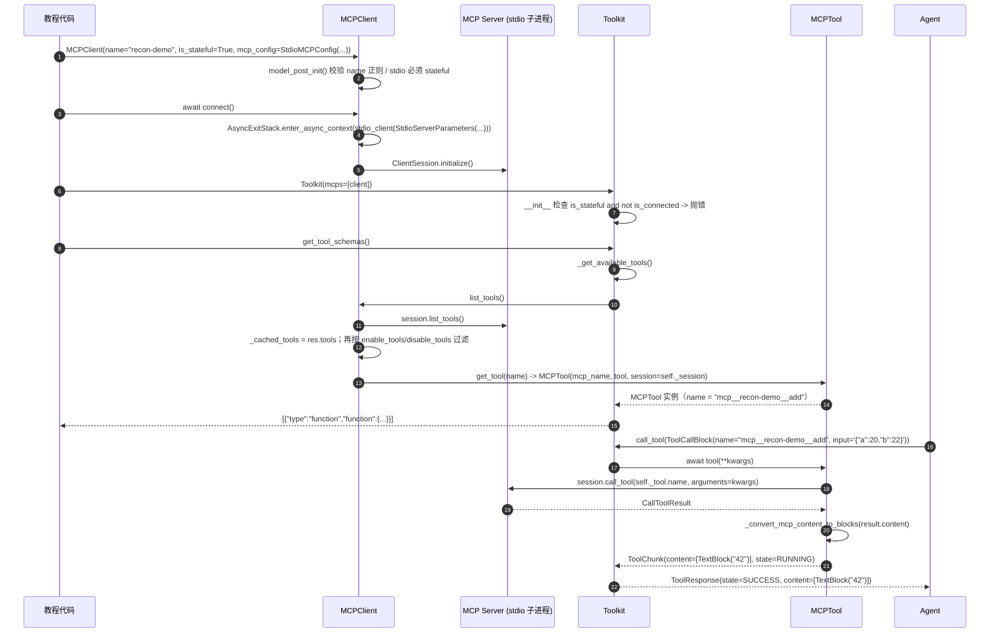
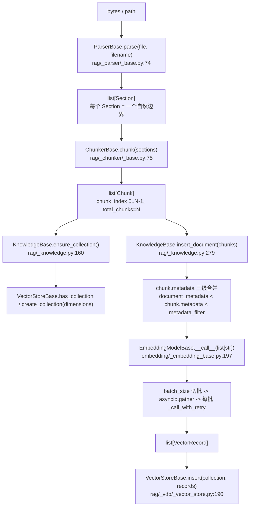
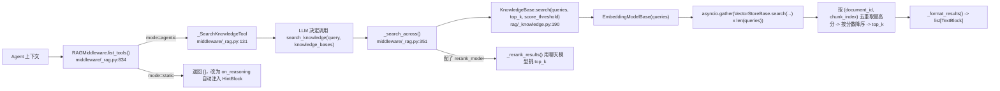
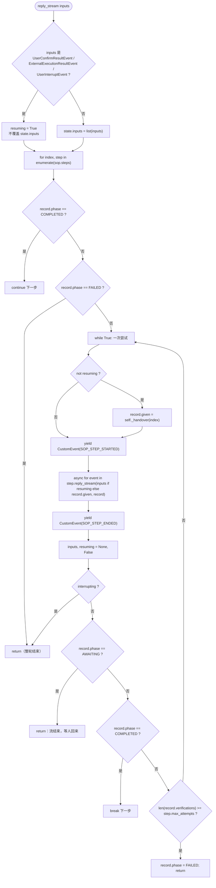
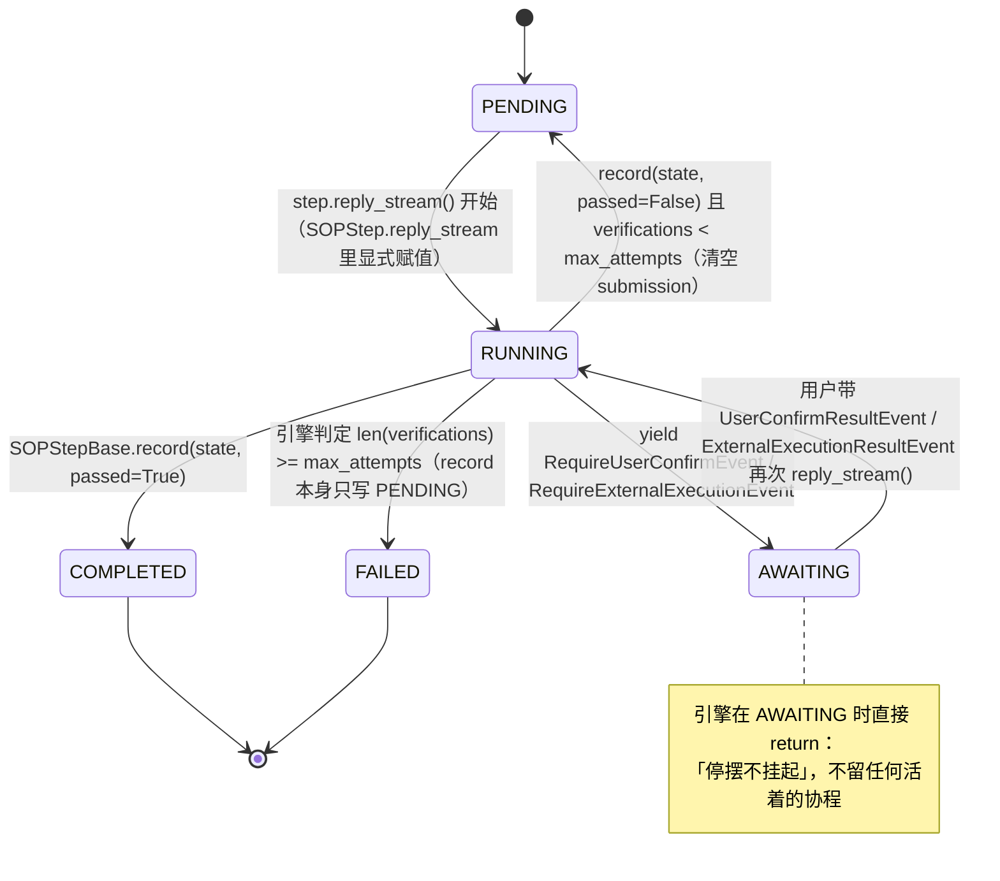

# 侦察报告 10：AgentScope 的 MCP / RAG / 多模态 / 流程引擎

> 侦察对象：AgentScope **2.0.8**（`third_party/agentscope`，已 `pip install -e`）
> 侦察范围：`mcp/`、`rag/`、`embedding/`、`realtime/`、`tts/`、`pipeline/`、`sop/` + 对应 tests 与 examples
> 环境：`/Users/a/miniconda3/envs/agentscope_reme_pip_env/bin/python`（Python 3.11.13），已实测 `import agentscope` → `2.0.8`
> 本报告所有「已验证」代码均在上述解释器中真实跑通，输出为真实终端输出。

---

## 子系统职责

这段代码在解决 **「Agent Harness 怎么和外部世界打交道」** 这一个问题，具体分成四条独立的管线：

1. **MCP 工具协议接入**（`src/agentscope/mcp/`）：把远端的 MCP Server（stdio 子进程 / SSE / Streamable HTTP）变成 Agent 可以像调用本地函数一样调用的工具。注意一个反直觉的设计选择：**AgentScope 不用官方 `mcp` SDK 的 `ClientSession` 当一等公民，而是自己写了一个 `MCPClient`（pydantic `BaseModel`）去管连接生命周期，再把每个远端工具包成一个 `MCPTool`（`tool/_adapters.py:195`）**。`Toolkit` 从头到尾只认识 `ToolBase`，完全不知道 MCP 的存在——这是「协议适配器 + 统一工具契约」的教科书实现。

2. **RAG 三层抽象**（`src/agentscope/rag/`）：`ParserBase`（字节 → `Section[]`）→ `ChunkerBase`（`Section[]` → `Chunk[]`）→ `VectorStoreBase`（`Chunk` + 向量 → 向量库）。三层之间靠两个纯数据对象 `Section` / `Chunk` 解耦，任何一层都可替换。`KnowledgeBase`（`rag/_knowledge.py:44`）是唯一的运行时门面，把「embedding 模型 + 向量库 + collection + metadata_filter」绑在一起。

3. **流程引擎**：`pipeline/` 只有一个 `GoalPipeline`（执行者 + 验证者互相拉扯直到目标达成）；`sop/` 是 `SOPEngine`（标准作业程序：一串必须逐个通过验证的里程碑，支持中途「停摆等人」）。两者都是 **AgentShape**——都实现 `reply_stream()`，所以能塞进任何接受 `Agent` 的地方（连 console 都能直接驱动）。

4. **多模态接入层**：`embedding/`（文本/多模态向量，RAG 的发动机）、`realtime/`（双向音频流模型）、`tts/`（流式/非流式语音合成）。三者共享同一套「credential + model card + Parameters + batching/retry 基类」范式。

**一句话**：`mcp/` 是 Agent 的「手」，`rag/` 是 Agent 的「外部记忆」，`pipeline/` + `sop/` 是 Harness 把「一个 Agent」升级为「一套受控流程」的编排器，`embedding/realtime/tts` 是模型适配器的多模态延伸。

---

## 关键文件表

| 文件路径:行号 | 核心类 | 核心函数 | 一句话职责 |
| --- | --- | --- | --- |
| `third_party/agentscope/src/agentscope/mcp/_config.py:9` | `StdioMCPConfig` | — | stdio MCP 配置：command / args / env / cwd / encoding_error_handler |
| `third_party/agentscope/src/agentscope/mcp/_config.py:44` | `HttpMCPConfig` | — | HTTP MCP 配置：url / headers / timeout |
| `third_party/agentscope/src/agentscope/mcp/_mcp_client.py:33` | `MCPClient` | `model_post_init:144`、`connect:317`、`close:374` | 统一 MCP 客户端：有状态/无状态两种连接模式 |
| `third_party/agentscope/src/agentscope/mcp/_mcp_client.py:222` | — | `_is_sse` | 只按 URL **路径**判断走 SSE 还是 Streamable HTTP |
| `third_party/agentscope/src/agentscope/mcp/_mcp_client.py:231` | — | `_create_streamable_http_client` | 自建 httpx client，使 runtime header 可在不重连的情况下生效 |
| `third_party/agentscope/src/agentscope/mcp/_mcp_client.py:260` | — | `set_runtime_headers` | 运行时替换出站 HTTP header，带保留头/非法头校验 |
| `third_party/agentscope/src/agentscope/mcp/_mcp_client.py:422` | — | `list_raw_tools` | 拿原始 `mcp.types.Tool`，应用 enable/disable 过滤，全量缓存 |
| `third_party/agentscope/src/agentscope/mcp/_mcp_client.py:483` | — | `get_tool` | 把 `mcp.types.Tool` 包成 `MCPTool`（有状态传 session，无状态传 client_gen） |
| `third_party/agentscope/src/agentscope/tool/_adapters.py:195` | `MCPTool` | `__init__:208`、`call:317`、`check_permissions:294` | MCP → ToolBase 适配器；工具名清洗、inputSchema 透传、结果转 `ToolChunk` |
| `third_party/agentscope/src/agentscope/tool/_adapters.py:359` | — | `_convert_mcp_content_to_blocks` | MCP content（Text/Image/Audio/EmbeddedResource/ResourceContents）→ AgentScope blocks |
| `third_party/agentscope/src/agentscope/tool/_toolkit.py:146` | `Toolkit` | `__init__:88` | 构造时校验：有状态 MCP 必须已 connect |
| `third_party/agentscope/src/agentscope/tool/_toolkit.py:473` | — | `_get_available_tools:473` | 把 python 工具 + MCP 工具 + skill 汇总成 `{name: RegisteredTool}` |
| `third_party/agentscope/src/agentscope/tool/_toolkit.py:523` | — | — | 单个 MCP 掉线不得拖垮整轮回复（try/except 包住 `list_tools`） |
| `third_party/agentscope/src/agentscope/rag/_document.py:31` | `Section` | — | 解析器的输出：一个「自然边界」（PDF 页 / PPT 页 / 整篇文本） |
| `third_party/agentscope/src/agentscope/rag/_document.py:71` | `Chunk` | — | 切块器的输出：向量库的一条记录，带 `chunk_index` / `total_chunks` |
| `third_party/agentscope/src/agentscope/rag/_parser/_base.py:22` | `ParserBase` | `parse:74`、`supported_extensions:44` | 一种文件格式一个 parser；只切边界，**不切文本** |
| `third_party/agentscope/src/agentscope/rag/_chunker/_base.py:26` | `ChunkerBase` | `chunk:75` | 切块策略基类；五条硬性保证（不跨 Section 合并等） |
| `third_party/agentscope/src/agentscope/rag/_chunker/_approx_token_chunker.py:20` | `ApproxTokenChunker` | `chunk:129` | 唯一内置切块器；token 数 ≈ `len(utf8)//4` |
| `third_party/agentscope/src/agentscope/rag/_vdb/_vector_store.py:104` | `VectorStoreBase` | `insert:190`、`delete:206`、`search:231`、`list_documents:269`、`list_chunks:302` | 向量库抽象：4 个抽象方法 + 1 个非抽象 `list_chunks` |
| `third_party/agentscope/src/agentscope/rag/_vdb/_vector_store.py:28/53/78` | `VectorRecord` / `VectorSearchResult` / `DocumentSummary` | — | 三件纯数据载体 |
| `third_party/agentscope/src/agentscope/rag/_vdb/_qdrant.py:31` | `QdrantStore` | `search:283`、`list_chunks:392` | Qdrant 后端，`:memory:` 本地模式可用 |
| `third_party/agentscope/src/agentscope/rag/_vdb/_milvus_lite.py:26` | `MilvusLiteStore` | `search:275` | Milvus Lite 后端（需 `pymilvus`） |
| `third_party/agentscope/src/agentscope/rag/_vdb/_elasticsearch.py` | `ElasticsearchStore` | — | ES 后端（需 ES 服务） |
| `third_party/agentscope/src/agentscope/rag/_vdb/_mongodb.py` | `MongoDBStore` | — | MongoDB Atlas 向量检索后端（需 `pymongo`） |
| `third_party/agentscope/src/agentscope/rag/_knowledge.py:44` | `KnowledgeBase` | `ensure_collection:160`、`search:190`、`insert_document:279`、`delete_document:358`、`list_documents:371`、`list_chunks:387` | RAG 运行时门面：绑 embedding + vdb + collection + metadata_filter |
| `third_party/agentscope/src/agentscope/embedding/_embedding_base.py:34` | `EmbeddingModelBase` | `__call__:197`、`_call_with_retry:307`、`_call_api:366` | 向量模型基类：子类只写一个 batch 的 `_call_api` |
| `third_party/agentscope/src/agentscope/embedding/_file_cache.py:1` | `FileEmbeddingCache` | — | 文件级 embedding 缓存（省 API 费用） |
| `third_party/agentscope/src/agentscope/middleware/_rag.py:131` | `_SearchKnowledgeTool` | `call:280` | agentic 模式暴露给 LLM 的 `search_knowledge` 工具 |
| `third_party/agentscope/src/agentscope/middleware/_rag.py:626` | `RAGMiddleware` | `__init__:800`、`list_tools:834` | 把 RAG 接进 Agent 的中间件（static 注入 / agentic 工具两种模式） |
| `third_party/agentscope/src/agentscope/pipeline/_base.py:15` | `PipelineProtocol` | `reply_stream` | 一个 `Protocol`：凡是能 `reply_stream` 的都能当 Agent 用 |
| `third_party/agentscope/src/agentscope/pipeline/_goal_pipeline.py:55` | `GoalPipeline` | `reply_stream:93` | 执行者 ↔ 验证者循环，直到 goal 达成/判死/预算耗尽 |
| `third_party/agentscope/src/agentscope/sop/_engine.py:24` | `SOPEngine` | `reply_stream:76`、`_handover:155` | 顺序走步骤、把恢复事件交给「停摆的那一步」、扣减尝试预算 |
| `third_party/agentscope/src/agentscope/sop/_schema.py:65` | `SOPStepBase` | `record:127` | 步骤基类：一次调用 = 一次尝试 |
| `third_party/agentscope/src/agentscope/sop/_schema.py:193` | `SOPStep` | `reply_stream:229`、`_brief:331`、`_question:372` | 最常见形态：executor 干活 + verifier 判分 |
| `third_party/agentscope/src/agentscope/sop/_schema.py:415` | `SOP` | — | 流程定义（name + steps + description），**不持有运行状态** |
| `third_party/agentscope/src/agentscope/sop/_state.py:23` | `SOPPhase` | — | `StrEnum`：PENDING / RUNNING / AWAITING / COMPLETED / FAILED |
| `third_party/agentscope/src/agentscope/sop/_state.py:68` | `SOPStepRunState` | — | 单步运行状态：phase / given / submission / verifications |
| `third_party/agentscope/src/agentscope/sop/_state.py:104` | `SOPRunState` | `phase:130`（computed） | 整轮运行状态：唯一值得持久化的那一半 |
| `third_party/agentscope/src/agentscope/realtime/_base.py:33` | `RealtimeModelBase` | — | 双向实时语音模型基类（audio in / audio + tool call out） |
| `third_party/agentscope/src/agentscope/tts/_tts_base.py:18` | `TTSModelBase` | `synthesize` / `push` | TTS 基类，`realtime` 开关区分流式输入 |
| `third_party/agentscope/src/agentscope/app/rag/knowledge_base_manager/_base.py:39` | `KnowledgeBaseManagerBase` | `create_knowledge_base:125`、`get_knowledge:279` | 服务侧的 KB 管理层（解析/切块/维度校验都在这一层） |

---

## 调用链

### 链 1：MCP 远端工具 → Agent 的一次 Tool Use



逐段讲解：

- **`connect()` 之前什么都不会发生**。`MCPClient` 是 pydantic `BaseModel`，构造时只做校验和「预制」stdio 的 context manager（`_initialize_client:193`），不建连接。
- **有状态 vs 无状态是这套设计的核心分水岭**。stdio 必须 stateful（`model_post_init:156` 直接抛 `ValueError`），HTTP 可以 stateless。无状态模式下 `get_tool` 传的是 `self._get_client_gen`（一个返回新 context manager 的函数），`MCPTool.call` 每次调用都临时起一个 session（`tool/_adapters.py:331`）——代价是每次调用都要重建连接，好处是可以无脑水平扩展。有状态模式传的是 `self._session`，复用长连接。
- **`Toolkit` 只认识 `ToolBase`**。`_get_available_tools:523` 里 `cache_tools.extend(await client.list_tools())`，拿到的就是 `list[ToolBase]`。Agent 侧的 Tool Use 循环完全不知道自己在调 MCP。
- **`ToolChunk` → `ToolResponse` 的累加发生在 `Toolkit.call_tool` 里**，工具实现本身只需要 yield/return `ToolChunk`。

### 链 2：RAG 索引（写入）



### 链 3：RAG 检索（读取，agentic 模式）



### 链 4：SOP 引擎主循环



### SOP 步骤状态机（`SOPPhase`）



整轮（`SOPRunState.phase`，`sop/_state.py:130`）的推导规则是：全 PENDING → PENDING；有任意 FAILED → FAILED；全 COMPLETED → COMPLETED；有任意 AWAITING → AWAITING；否则 RUNNING。

---

## 关键数据结构

### MCP 配置（互斥联合，靠 `discriminator` 区分）

`third_party/agentscope/src/agentscope/mcp/_config.py:9` 与 `:44`：

```python
class StdioMCPConfig(BaseModel):
    type: Literal["stdio_mcp"] = "stdio_mcp"
    command: str
    args: list[str] | None = None
    env: dict[str, str] | None = None
    cwd: str | Path | None = None
    encoding_error_handler: Literal["strict", "ignore", "replace"] = "strict"

class HttpMCPConfig(BaseModel):
    type: Literal["http_mcp"] = "http_mcp"
    url: str
    headers: dict[str, str] | None = None
    timeout: float | None = 30.0
```

`MCPClient.mcp_config` 用 `Field(discriminator="type")` 声明（`mcp/_mcp_client.py:107`），所以传 dict 也能自动判别成正确子类——这是 pydantic v2 的标签联合，教学时可以当作「声明式配置」的最小示例。

### RAG 的两个载体

`third_party/agentscope/src/agentscope/rag/_document.py:31` 与 `:71`：

```python
class Section(BaseModel):
    content: TextBlock | DataBlock
    source: str
    metadata: dict[str, Any] = Field(default_factory=dict)
    # PDFParser 写 {"page": 3}；PPTXParser 写 {"slide": 2}；ExcelParser 写 {"sheet": "Q3 Sales"}

class Chunk(BaseModel):
    content: TextBlock | DataBlock
    source: str
    chunk_index: int       # 文档内 0-based，跨 Section 连续
    total_chunks: int      # 同一源文件的块总数
    metadata: dict[str, Any] = Field(default_factory=dict)
```

设计要点（源码注释里明说的）：`Chunk` 故意**不带** `embedding` 字段，向量放在 `VectorRecord` 包装里；`VectorSearchResult` 也故意**不带** `score` 之外的东西。目的是「业务载荷」与「向量库关注点」彻底分离。

### 向量库三件套

`third_party/agentscope/src/agentscope/rag/_vdb/_vector_store.py:28`、`:53`、`:78`：

```python
class VectorRecord(BaseModel):
    vector: list[float]
    document_id: str
    chunk: Chunk

class VectorSearchResult(BaseModel):
    score: float          # 恒为「越高越相似」；距离度量的后端必须取负
    document_id: str
    chunk: Chunk

class DocumentSummary(BaseModel):
    document_id: str
    source: str
    chunk_count: int
    metadata: dict[str, Any] = Field(default_factory=dict)
```

### SOP 状态（唯一值得持久化的那一半）

`third_party/agentscope/src/agentscope/sop/_state.py:23`~`:151`：

```python
class SOPPhase(StrEnum):
    PENDING = "pending"      # 未开始，或被退回重试
    RUNNING = "running"
    AWAITING = "awaiting"    # 停摆：必须外部有人回答才能继续
    COMPLETED = "completed"
    FAILED = "failed"        # 被拒到 max_attempts 用尽

class VerificationResult(BaseModel):
    passed: bool
    message: str = ""        # 拒绝理由，原样回灌给 executor
    verifier: str = ""       # 谁判的：模型 / 人 / 外部系统
    created_at: str = Field(default_factory=_generate_timestamp)

class SOPStepRunState(BaseModel):
    model_config = ConfigDict(extra="allow")   # ★ 允许子类加字段
    phase: SOPPhase = SOPPhase.PENDING
    given: list[Msg] = Field(default_factory=list)          # 引擎写，步骤读
    submission: list[TextBlock | DataBlock] | None = None   # 本轮尝试交出的东西
    verifications: list[VerificationResult] = Field(default_factory=list)

class SOPRunState(BaseModel):
    id: str = Field(default_factory=_generate_id)
    inputs: list[Msg] = Field(default_factory=list)
    steps: list[SerializeAsAny[SOPStepRunState]] = Field(default_factory=list)
    created_at: str = Field(default_factory=_generate_timestamp)

    @computed_field
    @property
    def phase(self) -> SOPPhase: ...
```

两个细节很关键：`submission` 用 `None` 而不是空列表表示「这一轮还没产出任何东西」——这正是步骤在恢复时**区分「停摆在做工时」还是「停摆在判分时」**的依据（`sop/_schema.py:244`）。`steps: list[SerializeAsAny[...]]` 是为了让子类字段在序列化时被完整写出而不是被裁剪回基类。

### 结构化输出契约（藏在流程引擎里的四个小 schema）

| 位置 | 类 | 字段 |
| --- | --- | --- |
| `pipeline/_goal_pipeline.py:22` | `_ExecutionReport` | `report: str` |
| `pipeline/_goal_pipeline.py:34` | `_VerificationResult` | `result: Literal["pass","fail","impossible"]`、`message: str` |
| `sop/_schema.py:165` | `_Handover` | `handover: str` |
| `sop/_schema.py:177` | `_Verdict` | `passed: bool`、`message: str` |

这四个类整体是一份「Agent 间通信协议」——注意它们的字段描述全是**写给模型看的提示词**（例如 `_Handover.handover` 的描述里写「They cannot see your files, your tools' output or this conversation — only this」）。教学时应当指出：**在 Harness 里，数据结构的 docstring 就是 prompt**。

---

## 源码精读

### 1. `MCPClient.connect()`：一次性的 transport 与取消安全（`mcp/_mcp_client.py:317`）

```python
        # Transports are one-shot context managers. Recreate them before every
        # connection so connect() -> close() -> connect() starts a fresh one.
        if self._client is None:
            if self.mcp_config.type == "http_mcp":
                self._client = self._create_http_client()
            else:
                self._initialize_client()

        assert self._client is not None
        stack = AsyncExitStack()
        self._stack = stack

        try:
            context = await stack.enter_async_context(self._client)
            read_stream, write_stream = context[0], context[1]
            self._session = ClientSession(read_stream, write_stream)
            await stack.enter_async_context(self._session)
            await self._session.initialize()

            self._is_connected = True
            logger.info("MCP connected: %s", self.name)
        except BaseException:
            # asyncio.CancelledError inherits BaseException, so a cancelled
            # initialization must close every context entered so far. The
            # close is shielded because an anyio cancel scope (a cancelled
            # FastAPI request, for one) keeps cancelling every await inside
            # it, which would otherwise abandon a live stdio subprocess.
            try:
                await asyncio.shield(stack.aclose())
            finally:
                self._client = None
                self._stack = None
                self._session = None
                self._is_connected = False
            raise
```

讲解：三件事。

1. **`transport` 只能用一次**。anyio 的 `stdio_client()` 返回的 context manager 是不可重入的，所以 `close()` 里把 `self._client = None` 清掉，下次 `connect()` 重新构造。`tests/mcp_client_reconnect_test.py:12` 的 `_OneShotTransport` 就是专门为了验证这条语义写的。
2. **`except BaseException` 而不是 `except Exception`**。`asyncio.CancelledError` 继承自 `BaseException`——如果用 `except Exception`，一旦初始化过程中被取消（例如 FastAPI 请求被客户端掐断），已经拉起的 stdio 子进程就永远没人回收。
3. **`asyncio.shield(stack.aclose())`**。如果外层在 anyio 的 cancel scope 里，`aclose()` 里的每个 await 都会被立刻重新取消，导致清理逻辑半途而废。`shield` 把 aclose 保护起来跑完。

这三条是「生产级 vs 玩具级」MCP 客户端的真正分界线，非常值得在教程里逐行讲。

### 2. `_is_sse`：只按路径判断传输类型（`mcp/_mcp_client.py:222`）

```python
    @property
    def _is_sse(self) -> bool:
        """Whether the configured URL points at the SSE transport. Only
        the path is inspected, so a query string (``/sse?key=...``) still
        resolves to SSE rather than falling through to streamable HTTP.
        """
        path = urlsplit(self.mcp_config.url).path
        return path.endswith("/sse") or path.endswith("/messages/")
```

讲解：MCP 的两种 HTTP 传输（旧 SSE 与 2025 版 Streamable HTTP）协议不同，客户端必须自己判断。AgentScope 的办法是**约定俗成的路径判据**，而不是让用户显式声明。看 `urlsplit(...).path` 而不是整个 URL，是为了让 `/sse?key=xxx` 这种带鉴权 query 的写法仍然走 SSE。实测：`/sse` → True，`/sse?key=1` → True，`/messages/` → True，`/mcp` → False。

**代价**：如果远端把 Streamable HTTP 端点也放在 `/sse` 路径下，客户端会误判。教程里应提示「路径就是契约」。

### 3. `set_runtime_headers`：不重连换 header，以及它换不到的东西（`mcp/_mcp_client.py:260`）

```python
        # httpx derives these from the request URL and body with setdefault,
        # so a client-level value silently wins and breaks routing or framing.
        # The headers MCP itself sends are set per request and need no guard.
        _RESERVED_HEADERS: ClassVar[frozenset[str]] = frozenset(
            {"connection", "content-length", "host", "transfer-encoding"},
        )
        ...
        # httpx accepts illegal names and CRLF in values, and only h11
        # rejects them mid-request, so validate before storing.
        for name, value in headers.items():
            if (
                not isinstance(name, str)
                or not isinstance(value, str)
                or not self._HEADER_NAME.fullmatch(name)
                or not self._HEADER_VALUE.fullmatch(value)
            ):
                raise ValueError(f"Runtime header {name!r} is invalid.")
            if name.lower() in self._RESERVED_HEADERS:
                raise ValueError(
                    f"Runtime header {name!r} is owned by the HTTP layer.",
                )
```

讲解：这是「多租户 MCP 网关」场景的关键能力——同一个远端 MCP，不同用户要带不同的鉴权 header。实现要点：**自己 new 一个 `httpx.AsyncClient`**（`_create_streamable_http_client:231`），因为 MCP SDK 自带的 `create_mcp_http_client()` 不给你在连接建立后换 header 的口子。`_static_headers` 存配置里的原始头，`_runtime_headers` 是运行时覆盖，清空覆盖就恢复原状（实测：`set_runtime_headers({})` 后 `_runtime_headers` 变回 `{}`）。

**文档里诚实写明的两个换不到的地方**（`_mcp_client.py:271-278`）：已经在途的调用保持它开始时的 header 快照；Streamable HTTP 的长连 GET 流在建立时就把 header 定死了。

实测的四条护栏：`host` → `ValueError: Runtime header 'host' is owned by the HTTP layer.`；`"bad name"` → `Runtime header 'bad name' is invalid.`；`{"x-a": "1\r\nx-b: 2"}` → `Runtime header 'x-a' is invalid.`（CRLF 注入被 `_HEADER_VALUE` 正则挡掉）；stdio 客户端调用 → `ValueError: Runtime headers require a Streamable HTTP MCP client.`。

### 4. `MCPTool.__init__`：工具名清洗与 inputSchema 透传（`tool/_adapters.py:240`）

```python
        # LLM providers enforce ^[a-zA-Z0-9_-]+$ on tool names.
        # mcp_name is validated in MCPClient.model_post_init;
        # tool.name comes from the MCP server and may contain dots,
        # colons, etc. — replace illegal chars with "x" (not "_")
        # to avoid collisions with the "__" separator.
        # self._tool.name retains the original for server-side calls.
        sanitized_tool = re.sub(r"[^a-zA-Z0-9_-]", "x", tool.name)
        self.name = f"mcp__{mcp_name}__{sanitized_tool}"
        ...
        # Preserve the full inputSchema (including $defs, anyOf, oneOf, etc.)
        # rather than only copying "properties" and "required", which would
        # silently drop any nested type definitions that the LLM needs to
        # resolve $ref pointers.
        _schema = dict(tool.inputSchema) if tool.inputSchema else {}
        _schema.setdefault("type", "object")
        _schema.setdefault("properties", {})
        _schema.setdefault("required", [])
        self.input_schema = _schema
```

讲解：两个都是踩过坑才会有的写法。

- 命名规则 `mcp__{server}__{tool}` 是 **Claude Code / 多家 LLM provider 的事实标准**。非法字符替换成 `x` 而不是 `_`，因为 `_` 是分隔符，替换成 `_` 会和 `mcp__a_b__c` 这种名字产生歧义。**给模型看的名字被清洗了，但真正发给远端 server 的还是 `self._tool.name`（原始名）**——这个双名制是极易写错的地方。
- `inputSchema` 整体深拷贝而不是只挑 `properties`/`required`：因为工具参数里嵌套的 pydantic 子模型会生成 `$defs` + `$ref`，只挑两个键会让 `$ref` 悬空，模型根本无法生成合法参数。`tests/mcp_sse_client_test.py` 里有一个专门的 `tool_with_model` 测试就是为这个写的。

### 5. `MCPTool.check_permissions`：用 MCP 注解换默认权限（`tool/_adapters.py:294`）

```python
    async def check_permissions(self, *_args, **_kwargs) -> PermissionDecision:
        if self.is_read_only:
            return PermissionDecision(
                behavior=PermissionBehavior.ALLOW,
                message="This is a read-only MCP tool. Allowing execution.",
            )
        return PermissionDecision(
            behavior=PermissionBehavior.ASK,
            message="MCP tools must be explicitly allowed by the user.",
        )
```

而 `is_read_only` 从 MCP 协议的 `annotations.readOnlyHint` 读取（`tool/_adapters.py:272`）：

```python
        self.is_read_only = False
        if tool.annotations and hasattr(tool.annotations, "readOnlyHint"):
            self.is_read_only = tool.annotations.readOnlyHint or False
```

讲解：**默认 ASK 是正确的安全立场**——远端 MCP 服务器是不可信代码，默认必须弹窗确认。但只读工具（搜索、读文件）不该每次都烦用户，于是用协议自带的 `readOnlyHint` 作为降级依据。教程里要提醒：`readOnlyHint` 是 **server 自己声明的**，不可信，生产环境应加白名单/签名。另外 `MCPTool` 上写死了 `is_state_injected = False`（`tool/_adapters.py:205`，注释：`The mcp tools is prohibited state injection for safety reason.`）——第三方工具拿不到 Agent 的内部状态。

### 6. `Toolkit._get_available_tools`：一个 MCP 掉线不能杀死整轮对话（`tool/_toolkit.py:523`）

```python
            # MCP tools
            for client in group.mcps:
                try:
                    cache_tools.extend(await client.list_tools())
                except Exception as e:
                    # One unreachable MCP must not take the reply down
                    # with it: an expired token or a server that is
                    # simply down would otherwise end the conversation
                    # rather than just withdraw that server's tools.
                    logger.warning(
                        "Skipping MCP '%s' in group '%s': listing its "
                        "tools failed with %s",
                        client.name,
                        group.name,
                        _describe_exception(e),
                    )
```

讲解：**降级而非失败**。10 个 MCP 里挂 1 个，用户应该只是少几个工具，而不是整轮回复报错。这条和 `connect()` 里的取消安全合起来，构成 MCP 的韧性设计。教学时注意对比：`Toolkit.__init__:146` 对「有状态但未连接」是**直接抛错**（配置错误要早失败），而运行期 `list_tools` 失败是**吞掉并警告**（运行期故障要能降级）。这是「fail fast vs fail soft」边界划分的范例。

### 7. `KnowledgeBase.insert_document`：metadata 三级合并 = 安全边界（`rag/_knowledge.py:330`）

```python
        # Precedence: metadata_filter wins (security boundary), then
        # chunk metadata, then document_metadata.  See docstring.
        for chunk in chunks:
            chunk.metadata = {
                **(document_metadata or {}),
                **chunk.metadata,
                **(self._metadata_filter or {}),
            }
```

讲解：`metadata_filter` 放最后是**故意的**。多租户共用一张物理表时，每个 KB 带 `{"tenant_id": "t1"}`，如果让 parser 或 doc metadata 覆盖它，一条记录就能「逃逸」到别的租户视野里。检索时 `search()` / `list_documents()` 也永远带上这个过滤（`rag/_knowledge.py:246`、`:384`），形成 insert 侧「fail closed」+ read 侧「强制收窄」的双保险。

### 8. `KnowledgeBase.search`：去重键为什么是 `(document_id, chunk_index)`（`rag/_knowledge.py:262`）

```python
                # ``(document_id, chunk_index)`` is the stable identity
                # of a chunk: it survives reindex (block UUIDs do not)
                # and uniquely names "this slice of that document"
                # regardless of which query surfaced it.
                key = (result.document_id, result.chunk.chunk_index)
                if key not in best or result.score > best[key].score:
                    best[key] = result
```

讲解：多查询并发检索后必须合并。用块自己的 `id`（一个随机 UUID）去重是不行的——重新索引后 UUID 会变，历史缓存/引用就失效了。`(document_id, chunk_index)` 是语义稳定的身份。另外注意 `DataBlock`（图片等）在 embedding 模型不支持多模态时会被**静默丢弃**（`rag/_knowledge.py:232`），这让调用方可以传混合列表而不必自己过滤。

### 9. `SOPEngine.reply_stream`：停摆而不挂起（`sop/_engine.py:109`）

```python
        for index, step in enumerate(self.sop.steps):
            record = self.state.steps[index]
            if record.phase is SOPPhase.COMPLETED:
                continue
            if record.phase is SOPPhase.FAILED:
                return

            while True:
                # The answer goes to the step that parked; a fresh
                # attempt gets what the run knows so far.
                if not resuming:
                    record.given = self._handover(index)
                yield CustomEvent(
                    name="SOP_STEP_STARTED",
                    value={
                        "step": step.subject,
                        "attempt": len(record.verifications) + 1,
                    },
                )
                async for event in step.reply_stream(
                    inputs if resuming else record.given,
                    record,
                ):
                    yield event
                ...
                if record.phase is SOPPhase.AWAITING:
                    # Let go of the stream rather than hold a coroutine
                    # open; the caller comes back with an answer.
                    return
                if record.phase is SOPPhase.COMPLETED:
                    break
                if len(record.verifications) >= step.max_attempts:
                    record.phase = SOPPhase.FAILED
                    return
```

讲解：整个 SOP 引擎只有 174 行，却把「长任务状态机」的三件难事都做对了。

1. **`return` 而不是 `await` 等待**。需要人类确认时，引擎直接结束这个 async generator——不保留任何活着的协程、不占连接、跨进程/跨天恢复都行。代价是调用方必须再调一次 `reply_stream(答案)`。这是「无状态可恢复流程」的经典取舍，也是它和普通 `asyncio.Event` 式等待的本质区别。
2. **预算由引擎扣，不由步骤管**。`len(record.verifications) >= step.max_attempts` — 步骤只负责 `record()` 写verdict，重试与否是引擎的判断。步骤无法「求饶」也不会「赖账」。
3. **`attempt` 号是算出来的**：`len(record.verifications) + 1`，不需要额外字段。

### 10. `SOPEngine._handover`：步骤之间只传「交接单」（`sop/_engine.py:155`）

```python
    def _handover(self, index: int) -> list[Msg]:
        """What a step is given to work from.

        The run's own inputs for the first step, and what the one before
        handed over for the rest. Nothing else crosses: a step reads its
        predecessor's account, not its files or its conversation.
        """
        if index == 0:
            return list(self.state.inputs)
        previous = self.sop.steps[index - 1]
        return [
            UserMsg(
                name="sop",
                content=[
                    TextBlock(text=f'<handover from="{previous.subject}">'),
                    *(self.state.steps[index - 1].submission or []),
                    TextBlock(text="</handover>"),
                ],
            ),
        ]
```

讲解：**步骤之间是强隔离的**。第 N 步看不到第 N-1 步的对话历史、文件、工具输出，只能看到它显式 `handover` 的那段文字。这是「上下文工程」在流程层面的应用：把不可控的上下文增长，换成可控的、人写的交接单。`_Handover` schema 的描述里专门叮嘱模型「Write it for someone who has seen none of your work」。

### 11. `GoalPipeline` vs `SOPEngine` 的分工

`pipeline/_goal_pipeline.py:55` 的 `GoalPipeline`：

```python
        self._iters = 0
        self._goal: None | list[TextBlock | DataBlock] = None
        ...
        # Start the pipeline loop
        while True:
            # Executor step
            ...
                    if final_msg.structured_output.get("result") in ("pass", "impossible"):
                        ...
                        break_loop = True
                    else:
                        self._iters += 1
                        if self.verifier_reset_context:
                            # Only the conversation, tool/task state stays
                            self.verifier.state.context.clear()
                            self.verifier.state.summary = ""
                        if self._iters >= self.max_iters:
                            break_loop = True
                            break
                        feedback = final_msg.structured_output.get("message")
                        executor_inputs = UserMsg(
                            name="system",
                            content=(
                                "<system-reminder>You've failed to pass the "
                                "verification. Now recorrect your work based on "
                                f"the following feedback:\n{feedback}"
                                "</system-reminder>",
                            ),
                        )
```

分工对比：

| 维度 | `GoalPipeline` | `SOPEngine` |
| --- | --- | --- |
| 目标形态 | **一个**目标反复打磨 | **一串**里程碑顺序推进 |
| 循环粒度 | 固定 2 个 Agent（executor / verifier） | N 个任意 `SOPStepBase` |
| 重试预算 | `max_iters`（全局） | 每步独立 `max_attempts` |
| 结束条件 | verifier 判 `pass` 或 `impossible` | 全部 COMPLETED / 任一步 FAILED |
| 步骤间传递 | 同一对话上下文里持续迭代 | 只传 `handover`，强隔离 |
| 状态可持久化 | 弱（`_iters` 只在实例上，靠 HITL resume 不失忆） | 强（`SOPRunState` 完整可存可恢复） |
| 适用 | 「把这个 bug 修到通过测试」 | 「按公司流程走完一次发布」 |

两者都实现 `PipelineProtocol`（`pipeline/_base.py:15`），都能直接丢给 `launch_console(agent=pipe)`（见 `examples/pipeline/goal/goal_pipeline.py`）。

还要注意 `GoalPipeline.__init__` 里的注释：`# Rounds already judged. On the instance rather than in reply_stream, so a HITL resume does not restart the budget.`——**预算计数器挂在实例上而不是局部变量**，否则用户回答一次确认就会把预算刷满。这是流程引擎里极容易被忽略的坑。

---

## 可运行代码片段

全部脚本在 `/tmp/recon_mcp/` 下（侦察用，不属于交付物，但内容可直接抄进教程）。

### 片段 1（已验证）最小 MCP stdio server

```python
# -*- coding: utf-8 -*-
"""Minimal MCP stdio server used by the recon report."""
from mcp.server.fastmcp import FastMCP

mcp = FastMCP("recon-demo")


@mcp.tool()
def add(a: int, b: int) -> int:
    """Add two integers and return the sum."""
    return a + b


@mcp.tool()
def echo(text: str) -> str:
    """Echo the given text back."""
    return f"echo: {text}"


if __name__ == "__main__":
    mcp.run(transport="stdio")
```

**注意这里踩到了一个真实的依赖坑**：任务简报说「用 fastmcp，环境里已装」，但环境里的独立包 `fastmcp 4.0.5` 与 SDK `mcp 1.30.0` **不兼容**：

```text
ImportError: FastMCP server support is not installed. Install `fastmcp` or `fastmcp-slim[server]`.
（根因：fastmcp/server/server.py:33 -> ModuleNotFoundError: No module named 'mcp.server.request_state')
```

所以正确写法是 `from mcp.server.fastmcp import FastMCP`（官方 SDK 内置的 FastMCP，1.30.0 里可用，签名 `run(self, transport: Literal['stdio','sse','streamable-http'] = 'stdio')`）。教程里必须写这一条，否则读者第一步就卡死。

### 片段 2（已验证）AgentScope `MCPClient` 连 stdio、列工具、调用

```python
import asyncio
import sys

from agentscope.mcp import MCPClient, StdioMCPConfig
from agentscope.tool import Toolkit


async def main() -> None:
    server = "/tmp/recon_mcp/server.py"
    client = MCPClient(
        name="recon-demo",
        is_stateful=True,
        mcp_config=StdioMCPConfig(
            command=sys.executable,
            args=[server],
        ),
    )

    await client.connect()
    print("is_connected:", client.is_connected)

    raw = await client.list_raw_tools()
    print("raw tool names:", [_.name for _ in raw])
    print("raw tool #0 schema:", raw[0].inputSchema)

    tools = await client.list_tools()
    print("wrapped tool names:", [_.name for _ in tools])

    add_tool = await client.get_tool("add")
    print("add_tool type:", type(add_tool).__name__, "name:", add_tool.name)
    chunk = await add_tool(a=3, b=4)
    print("direct call add(3,4) ->", chunk)

    echo_tool = await client.get_tool("echo")
    chunk2 = await echo_tool(text="hello harness")
    print("direct call echo ->", chunk2.content[0].text)

    toolkit = Toolkit(mcps=[client])
    schemas = await toolkit.get_tool_schemas()
    print("toolkit schema names:", [s["function"]["name"] for s in schemas])

    await client.close()
    print("closed, is_connected:", client.is_connected)


asyncio.run(main())
```

真实输出（节选，`MCP connected: recon-demo` 等日志行来自 AgentScope logger）：

```text
is_connected: True
raw tool names: ['add', 'echo']
raw tool #0 schema: {'properties': {'a': {'title': 'A', 'type': 'integer'}, 'b': {'title': 'B', 'type': 'integer'}}, 'required': ['a', 'b'], 'title': 'addArguments', 'type': 'object'}
wrapped tool names: ['mcp__recon-demo__add', 'mcp__recon-demo__echo']
add_tool type: MCPTool name: mcp__recon-demo__add
direct call add(3,4) -> content=[TextBlock(type='text', text='7', id='f3663bd6538245c887d07372726eeb87', created_at='2026-09-21T17:38:39.541501', finished_at=None)] state=<ToolResultState.RUNNING: 'running'> is_last=True metadata={} id='6d4afdb61b764e9e93453e220cb1eaec'
direct call echo -> echo: hello harness
toolkit schema names: ['mcp__recon-demo__add', 'mcp__recon-demo__echo']
closed, is_connected: False
```

要点：`list_raw_tools()` 给的是 `add` / `echo`（原名），`list_tools()` 给的是 `mcp__recon-demo__add`（模型看到的名字）。**两个 API 的存在本身就是教学点**：调试时用 raw，喂模型时用 wrapped。

### 片段 3（已验证）走完整 Tool Use 通路：`Toolkit.call_tool` → `ToolResponse`

```python
import asyncio
import sys

from agentscope.mcp import MCPClient, StdioMCPConfig
from agentscope.message import ToolCallBlock
from agentscope.state import AgentState
from agentscope.tool import Toolkit


async def main() -> None:
    client = MCPClient(
        name="recon-demo",
        is_stateful=True,
        mcp_config=StdioMCPConfig(
            command=sys.executable,
            args=["/tmp/recon_mcp/server.py"],
        ),
    )
    await client.connect()

    toolkit = Toolkit(mcps=[client])
    state = AgentState()
    call = ToolCallBlock(
        type="tool_call",
        id="call-1",
        name="mcp__recon-demo__add",
        input='{"a": 20, "b": 22}',
    )

    final = None
    async for item in toolkit.call_tool(call, state):
        print(" chunk/response:", type(item).__name__)
        final = item
    print("final type:", type(final).__name__)
    print("final state:", final.state)
    print("final content:", [b.text for b in final.content])

    await client.close()


asyncio.run(main())
```

真实输出：

```text
toolkit schemas: ['mcp__recon-demo__add', 'mcp__recon-demo__echo']
 chunk/response: ToolChunk
 chunk/response: ToolResponse
final type: ToolResponse
final state: success
final content: ['42']
```

这就是 Agent Tool Use 循环内部真正发生的事：`ToolChunk`（增量）→ `ToolResponse`（累积完成态）。

### 片段 4（已验证）MCP 客户端的四条护栏 + SSE 路由判定

```python
import asyncio
from agentscope.mcp import HttpMCPConfig, MCPClient, StdioMCPConfig

# 1) 名字必须满足 ^[a-zA-Z0-9_-]+$
MCPClient(name="bad.name", is_stateful=True,
          mcp_config=StdioMCPConfig(command="python"))     # ValidationError
# 2) stdio 必须 stateful
MCPClient(name="demo", is_stateful=False,
          mcp_config=StdioMCPConfig(command="python"))     # ValidationError
# 3) enable/disable 不得重叠
MCPClient(name="demo", is_stateful=True,
          mcp_config=StdioMCPConfig(command="python"),
          enable_tools=["a"], disable_tools=["a"])         # ValidationError

# 4) SSE 只按 path 判定
for url in ["http://h/sse", "http://h/sse?key=1", "http://h/messages/", "http://h/mcp"]:
    c = MCPClient(name="demo", is_stateful=False, mcp_config=HttpMCPConfig(url=url))
    print(url, "->", c._is_sse)

# 5) runtime header 三条护栏
async def check():
    c = MCPClient(name="demo", is_stateful=False, mcp_config=HttpMCPConfig(url="http://h/mcp"))
    await c.set_runtime_headers({"host": "evil.example"})   # ValueError（保留头）
    await c.set_runtime_headers({"bad name": "x"})          # ValueError（非法名）
    await c.set_runtime_headers({"x-a": "1\r\nx-b: 2"})     # ValueError（CRLF）
    await c.set_runtime_headers({"x-tenant": "t1"})         # OK
    await c.set_runtime_headers({})                          # 清空 -> 恢复静态头

asyncio.run(check())
```

真实输出：

```text
bad name 'bad.name': ValidationError: 1 validation error for MCPClient
  Value error, MCPClient name 'bad.name' contains characters not allowed by LLM providers (only [a-zA-Z0-9_-] are permitted). Please rename it.
stdio + stateless: ValidationError: Value error, STDIO MCP must be stateful (is_stateful=True).
enable/disable overlap: ValidationError: Value error, The tools in enable_tools and disable_tools should not overlap, but got {'a'}.
url=http://h/sse             is_sse=True  (path ends /sse)
url=http://h/sse?key=1       is_sse=True  (query string ignored)
url=http://h/messages/       is_sse=True  (path ends /messages/)
url=http://h/mcp             is_sse=False (streamable http)
reserved header 'host': ValueError: Runtime header 'host' is owned by the HTTP layer.
invalid name 'bad name': ValueError: Runtime header 'bad name' is invalid.
CRLF injection: ValueError: Runtime header 'x-a' is invalid.
accepted override stored: {'x-tenant': 't1'}
cleared: {}
stdio client: ValueError: Runtime headers require a Streamable HTTP MCP client.
```

### 片段 5（已验证）SSE 传输 + `close()` 后重连

```python
import asyncio, multiprocessing, time
from agentscope.mcp import HttpMCPConfig, MCPClient

PORT = 8123

def serve() -> None:
    from mcp.server import FastMCP
    server = FastMCP("sse-demo", port=PORT)

    @server.tool(description="Multiply two integers.")
    def mul(a: int, b: int) -> int:
        return a * b

    server.run(transport="sse")

async def main() -> None:
    client = MCPClient(
        name="sse-demo", is_stateful=True,
        mcp_config=HttpMCPConfig(url=f"http://127.0.0.1:{PORT}/sse", timeout=30.0),
    )
    await client.connect()
    print("tools:", [_.name for _ in await client.list_tools()])
    print("mul(6,7) ->", (await (await client.get_tool("mul"))(a=6, b=7)).content[0].text)
    await client.close()
    await client.connect()                       # 重连
    print("mul(2,9) after reconnect ->",
          (await (await client.get_tool("mul"))(a=2, b=9)).content[0].text)

if __name__ == "__main__":
    proc = multiprocessing.Process(target=serve, daemon=True)
    proc.start(); time.sleep(3)
    try:
        asyncio.run(main())
    finally:
        proc.terminate(); proc.join(timeout=5)
```

真实输出：

```text
routing: is_sse = True
connected: True
tools: ['mcp__sse-demo__mul']
mul(6,7) -> 42
after close: False
reconnected: True
mul(2,9) after reconnect -> 18
```

### 片段 6（已验证）离线跑通 RAG 三层 + 检索

不需要任何外部 API：自己实现一个确定性 hash embedding 模型（**这正是框架开放的扩展点：只写 `_call_api`**），向量库用 `QdrantStore(location=":memory:")`。

```python
import asyncio, hashlib
from datetime import datetime
from typing import Any

from agentscope.credential import CredentialBase
from agentscope.embedding import EmbeddingModelBase, EmbeddingResponse, EmbeddingUsage
from agentscope.message import TextBlock
from agentscope.rag import ApproxTokenChunker, KnowledgeBase, QdrantStore, TextParser


class HashEmbeddingModel(EmbeddingModelBase[str | TextBlock]):
    """A deterministic, offline bag-of-words hashing embedding model."""

    def __init__(self, dimensions: int = 64) -> None:
        super().__init__(
            credential=CredentialBase(name="offline"),
            model="hash-embedding",
            dimensions=dimensions,
            parameters=None,
            context_size=8192,
            batch_size=64,
            max_retries=0,
            retry_delay=0.0,
        )

    def _embed_one(self, text: str) -> list[float]:
        vec = [0.0] * self.dimensions
        for token in text.lower().split():
            token = token.strip(".,!?;:()[]\"'#*`")
            if not token:
                continue
            idx = int(hashlib.md5(token.encode()).hexdigest(), 16)
            vec[idx % self.dimensions] += 1.0
        norm = sum(_ * _ for _ in vec) ** 0.5 or 1.0
        return [_ / norm for _ in vec]

    async def _call_api(self, inputs: list[Any], **kwargs: Any) -> EmbeddingResponse:
        start = datetime.now()
        embeddings = [self._embed_one(_) for _ in inputs]
        return EmbeddingResponse(
            embeddings=embeddings,
            usage=EmbeddingUsage(
                tokens=sum(len(_.split()) for _ in inputs),
                time=(datetime.now() - start).total_seconds(),
            ),
        )


CORPUS = {
    "agentscope.md": (b"# AgentScope\n\nAgentScope is a developer-centric framework for "
                      b"building multi-agent LLM applications. It ships an MCP client "
                      b"that turns remote MCP tools into local tools.\n"),
    "reme.md": (b"# ReMe\n\nReMe is a memory management library. It provides "
                b"long-term memory, memory summarization and forgetting policies "
                b"for agents.\n"),
}


async def main() -> None:
    store = QdrantStore(location=":memory:")
    async with store:
        kb = KnowledgeBase(
            name="demo-kb",
            description="AgentScope and ReMe notes.",
            embedding_model=HashEmbeddingModel(dimensions=64),
            vector_store=store,
            collection="demo",
        )
        parser = TextParser()
        chunker = ApproxTokenChunker(chunk_size=32, overlap=8)

        for filename, raw in CORPUS.items():
            sections = await parser.parse(file=raw, filename=filename)
            print(f"{filename}: {len(sections)} section(s), meta={sections[0].metadata}")
            chunks = await chunker.chunk(sections)
            doc_id = await kb.insert_document(
                chunks, document_metadata={"filename": filename},
            )
            print(f"  inserted doc_id={doc_id} chunks="
                  f"{[(c.chunk_index, c.total_chunks) for c in chunks]}")

        print("list_documents ->",
              [(d.source, d.chunk_count) for d in await kb.list_documents()])

        for q in ["memory forgetting policy", "MCP client tools framework"]:
            hits = await kb.search(queries=[q], top_k=2)
            print(f"\nQ: {q!r}")
            for r in hits:
                text = r.chunk.content.text if isinstance(r.chunk.content, TextBlock) else "<data>"
                print(f"  score={r.score:.4f} src={r.chunk.source} "
                      f"idx={r.chunk.chunk_index} :: {text[:60]!r}")


asyncio.run(main())
```

真实输出：

```text
2026-09-21 17:39:43,054 | WARNING | _approx_token_chunker:__init__:109 - Passing ``chunk_size``, ``overlap`` to ApproxTokenChunker directly is deprecated, use ApproxTokenChunker.Parameters instead.
agentscope.md: 1 section(s), meta={}
  inserted doc_id=0570bd8ca9204423a3b2763c671ad480 chunks=[(0, 2), (1, 2)]
reme.md: 1 section(s), meta={}
  inserted doc_id=e3f75e2ebea44c4e98ccb3bdbcd83ccd chunks=[(0, 2), (1, 2)]

list_documents -> [('agentscope.md', 2), ('reme.md', 2)]

Q: 'memory forgetting policy'
  score=0.5270 src=reme.md idx=0 :: '# ReMe\n\nReMe is a memory management library. It provides lon'
  score=0.2582 src=reme.md idx=1 :: 'and forgetting policies for agents.\n'

Q: 'MCP client tools framework'
  score=0.5222 src=agentscope.md idx=1 :: 'ons. It ships an MCP client that turns remote MCP tools into'
  score=0.4256 src=agentscope.md idx=0 :: '# AgentScope\n\nAgentScope is a developer-centric framework fo'
```

检索正确命中了对应文档，`score` 是余弦相似度（哈希 bag-of-words，所以数值不高但排序正确）。**注意那条 WARNING**：`ApproxTokenChunker(chunk_size=..., overlap=...)` 已经废弃，正确写法是 `ApproxTokenChunker(ApproxTokenChunker.Parameters(chunk_size=32, overlap=8))`。

### 片段 7（已验证）RAGMiddleware agentic 模式：把 RAG 变成模型的工具

```python
import asyncio
from agentscope.middleware import RAGMiddleware
from agentscope.tool import RegisteredTool
from agentscope.rag import ApproxTokenChunker, KnowledgeBase, QdrantStore, TextParser
# HashEmbeddingModel / CORPUS 见片段 6

async def main() -> None:
    store = QdrantStore(location=":memory:")
    async with store:
        kb = KnowledgeBase(
            name="demo-kb", description="AgentScope and ReMe notes.",
            embedding_model=HashEmbeddingModel(dimensions=64),
            vector_store=store, collection="demo",
        )
        parser, chunker = TextParser(), ApproxTokenChunker()
        for filename, raw in CORPUS.items():
            sections = await parser.parse(file=raw, filename=filename)
            await kb.insert_document(await chunker.chunk(sections),
                                     document_metadata={"filename": filename})

        mw = RAGMiddleware(
            knowledge_bases=[kb],
            parameters=RAGMiddleware.Parameters(mode="agentic", top_k=2),
        )
        tools = await mw.list_tools()
        print("exposed tools:", [t.name for t in tools])
        tool = tools[0]
        print("tool schema:", RegisteredTool(tool=tool).get_tool_schema())
        print("is_read_only:", tool.is_read_only)

        chunk = await tool(query="long-term memory and forgetting")
        for block in chunk.content:
            print(" ", block.text[:120].replace("\n", " "))

        static_mw = RAGMiddleware(
            knowledge_bases=[kb],
            parameters=RAGMiddleware.Parameters(mode="static"),
        )
        print("static-mode tools:", await static_mw.list_tools())


asyncio.run(main())
```

真实输出（schema 已截断展示关键部分）：

```text
mode: agentic
exposed tools: ['search_knowledge']
tool schema: {'type': 'function', 'function': {'name': 'search_knowledge',
  'description': "Search the agent's equipped knowledge bases by semantic similarity and
   return the most relevant chunks.\n\n## When to Use\n- ...\n## Equipped Knowledge Bases\n
   The agent is currently equipped with 1 knowledge base(s):\n- **demo-kb**: AgentScope and ReMe notes.",
  'parameters': {'properties': {'query': {...,'type':'string'},
   'knowledge_bases': {'anyOf': [{'items': {'type':'string','enum':['demo-kb']},'type':'array'},
   {'type':'null'}], 'default': None, ...}}, 'required': ['query'], 'type': 'object'}}}
is_read_only: True

search_knowledge ->
  [1] (source: reme.md) # ReMe  ReMe is a memory management library. It provides long-term memory, memory summarization an

static-mode tools: []
```

两个教学点：**（a）`knowledge_bases` 的 enum 是根据绑定的 KB 名字动态生成的**——LLM 只能从合法集合里选；**（b）static 模式 `list_tools()` 返回空列表**，它不暴露工具，而是在 `on_reasoning` 里自动把命中片段作为 `HintBlock` 注入。

### 片段 8（已验证）SOP 状态机：停摆 → 恢复 → 拒绝 → 重试 → 通过 → 持久化

```python
class DeployState(SOPStepRunState):
    """Extra per-step memory: has the step already asked the human?"""
    asked: bool = False


class DeployStep(SOPStepBase):
    """Ask a human once, then refuse the first judged attempt."""

    state_type = DeployState

    async def reply_stream(self, inputs: Any, state: SOPStepRunState) -> AsyncGenerator[Any, None]:
        state.phase = SOPPhase.RUNNING

        if isinstance(inputs, UserConfirmResultEvent):
            state.submission = [TextBlock(text="deployed v1")]      # 人已回答
        elif state.submission is None:
            if not state.asked:
                state.asked = True
                yield RequireUserConfirmEvent(
                    reply_id="reply-1",
                    tool_calls=[ToolCallBlock(type="tool_call", id="call-1",
                                              name="deploy", input="{}")],
                )
                state.phase = SOPPhase.AWAITING
                return
            state.submission = [TextBlock(text="deployed v1")]      # 拒绝后重试

        if len(state.verifications) == 0:
            self.record(state, False,
                        "Artifact checksum missing; rebuild with --checksum.", "sop")
            return
        self.record(state, True, verifier="sop")
```

驱动代码与真实输出：

```text
--- run 1: starts and parks ---
events: ['CustomEvent(SOP_STEP_STARTED, step=deploy, attempt=1)', 'RequireUserConfirmEvent', 'CustomEvent(SOP_STEP_ENDED, step=deploy, attempt=awaiting)']
run phase: awaiting | step phase: awaiting | asked: True

--- run 2: resume with the human answer ---
events: ['CustomEvent(SOP_STEP_STARTED, ...attempt=1)', 'CustomEvent(SOP_STEP_ENDED, ...pending)', 'CustomEvent(SOP_STEP_STARTED, ...attempt=2)', 'CustomEvent(SOP_STEP_ENDED, ...completed)']
run phase: completed | step phase: completed
verifications: [(False, 'Artifact checksum missing; rebuild with --checksum.', 'sop'), (True, '', 'sop')]
submission: ['deployed v1']

--- run 3: already finished, so it is a no-op ---
events: []
run phase: completed

--- resume in a fresh engine from the stored state ---
restored phase: completed | asked kept: True

--- a brand-new run of the same SOP definition ---
fresh phase: pending | asked: False
```

**这一段是整个 SOP 设计的浓缩**：run 1 停摆（引擎 return，不留协程）；run 2 带着答案恢复，并在同一次调用里完成「拒绝 → 自动重试 → 通过」；run 3 幂等空转；`SerializeAsAny` 让自定义字段 `asked` 幸存于序列化往返；同一份 `SOP` 定义可以开任意多轮互不干扰的运行。

### 片段 9（已验证）GoalPipeline 接真 LLM（deepseek-flash）

```python
def make_agent(name: str, system_prompt: str) -> Agent:
    return Agent(
        name=name,
        system_prompt=system_prompt,
        model=DeepSeekChatModel(
            credential=DeepSeekCredential(
                api_key=os.environ["OPENAI_API_KEY"],
                base_url=os.environ["OPENAI_BASE_URL"],
            ),
            model=os.environ["LLM_MODEL"],
        ),
        toolkit=Toolkit(),
    )


async def main() -> None:
    load_dotenv(".../.env")
    executor = make_agent("Executor", "You are a terse assistant. Answer directly.")
    verifier = make_agent("Verifier", "You judge whether the executor's report answers the goal.")
    pipe = GoalPipeline(executor=executor, verifier=verifier, max_iters=2)

    seen: dict[str, int] = {}
    async for event in pipe.reply_stream(
        UserMsg(name="user", content="1+1 等于几？给出简短结论即可。"),
    ):
        name = type(event).__name__
        seen[name] = seen.get(name, 0) + 1
        if name == "Msg":
            print(f"  Msg({event.name}) structured_output={event.structured_output}")
    print("event tally:", seen)


asyncio.run(main())
```

真实输出：

```text
--- executor/verifier rounds ---
  Msg(Executor) structured_output={'report': '1+1 = 2'}
event tally: {'ReplyStartEvent': 2, 'HintBlockEvent': 2, 'ModelCallStartEvent': 2, 'TextBlockStartEvent': 1, 'TextBlockDeltaEvent': 1, 'TextBlockEndEvent': 1, 'ToolCallStartEvent': 2, 'ToolCallDeltaEvent': 55, 'ToolCallEndEvent': 2, 'ModelCallEndEvent': 2, 'ToolResultStartEvent': 2, 'ToolResultTextDeltaEvent': 2, 'ToolResultEndEvent': 2, 'ReplyEndEvent': 2, 'Msg': 1}
--- done ---
```

要点：`ReplyStartEvent ×2` 说明确实跑了两轮（executor + verifier）；`ToolCallStartEvent ×2` 说明两个 Agent 都调用了自动注入的 `GenerateStructuredOutput` 工具；verifier 判 pass 后循环结束，没有进入第二轮迭代。

### 未验证的片段（明确标注原因）

| 片段 | 原因 |
| --- | --- |
| `examples/rag/index_and_search.py`、`examples/rag/integrate_with_agent.py` | 需要 `DASHSCOPE_API_KEY`，本环境只有 DeepSeek 兼容端点，无 DashScope 凭据 |
| `MilvusLiteStore` | 需要 `pymilvus`，本环境 `ModuleNotFoundError` |
| `MongoDBStore` | 需要 `pymongo`，本环境 `ModuleNotFoundError` |
| `ElasticsearchStore` | 需要运行中的 ES 服务（`elasticsearch` 客户端 9.5.1 已装，服务未起） |
| `realtime/*`（DashScope / Gemini / OpenAI realtime） | 需要各家 realtime API 凭据与音频设备 |
| `tts/*` | 需要 TTS 供应商凭据 |
| `mcp_streamable_http_client_test.py` 之外的 Streamable HTTP 真实链路 | 只验证了 SSE 与 stdio；Streamable HTTP 的 `set_runtime_headers` 只验证了护栏分支，未起真实 Streamable HTTP server |

---

## 教学要点（按「小白最容易卡住」排序）

1. **MCP 的三种传输各自的硬约束**。stdio 必须 `is_stateful=True`（否则构造就抛 `ValidationError`）；HTTP 可以是 stateless，但 stateless 每次调用都要重建连接；SSE vs Streamable HTTP 只按 URL 路径判断。这三条不讲清楚，读者写的第一行配置就会报错。

2. **`list_raw_tools()` vs `list_tools()` / 原始名 vs 包装名**。远端工具叫 `add`，模型看到的是 `mcp__recon-demo__add`。调试和报错信息里出现的是后者，去 MCP server 日志里找的是前者。这个「双名制」是排障时第一个绊脚石。

3. **`fastmcp` 包与 `mcp` SDK 的版本冲突**（本环境实测）。写 MCP server 要用 `from mcp.server.fastmcp import FastMCP`，不要用 `from fastmcp import FastMCP`。教程必须给出这条，否则第一个 demo 就崩。

4. **async 上下文管理器的「一次性」语义**。`stdio_client()` / `sse_client()` 返回的 context manager 用一次就废，必须每次 `connect()` 重建。很多实现直接把它缓存在 `__init__` 里，结果第二次连接就炸。

5. **`RAGMiddleware` 的文档是过期的**（见「坑」表第 1 条）。照着 docstring 写 `SearchConfig(...)` 会 `NameError`，正确写法是 `parameters=RAGMiddleware.Parameters(...)`。

6. **ApproxTokenChunker 的位置参数陷阱**。`ApproxTokenChunker(chunk_size=32, overlap=8)` 仍然能跑，但会打 deprecation WARNING；新写法必须用 `Parameters`。而且 `overlap >= chunk_size` 会被 pydantic model_validator 拒绝。

7. **RAG 三层的分工边界**：Parser 只切「自然边界」，Chunker 才切「token 长度」。初学者常把「按页切」和「按 token 切」混在一层里做，这样换文件格式就要重写切块策略。`ChunkerBase` 的注释里明写了五条硬性保证（不跨 Section 合并、DataBlock 直通、`chunk_index` 连续、`total_chunks` 一致、metadata 继承），教程应当逐条对照代码验证。

8. **`SOPPhase.AWAITING` 时引擎 `return` 而不是 await**。「停摆不挂起」是这套设计最反直觉也最重要的点。要讲清：为什么不用 `asyncio.Event` 等？因为那样会占住一个协程、跨进程/跨天就废了。

9. **`SOPStepRunState.submission is None` 的语义**。「还没产出」用 `None`，不是空列表。这个区分是恢复时判断「停摆在做工还是停摆在判分」的唯一依据（`sop/_schema.py:244`）。

10. **`SOPStepBase.state_type` + `SerializeAsAny`**。要往步骤状态里加字段，必须（a）子类化 `SOPStepRunState`（基类开了 `extra="allow"`），（b）在步骤类上声明 `state_type`，否则序列化往返会丢字段——`SOPRunState.steps` 上的 `SerializeAsAny` 就是为此存在的。

11. **`GoalPipeline` 的迭代预算挂在实例上**（`self._iters`），不是局部变量。原因是 HITL 恢复（用户回答确认）会重入 `reply_stream`，局部变量会被重置。

12. **`PipelineProtocol` 是一个「裸 def 返回 async generator」的 Protocol**，不是 `async def`。`pipeline/_base.py:16-22` 的注释专门解释了：`async def` 的签名既不被 `Agent` 满足也不被任何 pipeline 满足，因为这类函数是「调用的」而不是「await 的」。这是 Python 类型系统的一个坑，值得单讲。

13. **AgentScope 的第 3 层（评测）是缺失的**。见下一节。

14. **`GoalPipeline` / `SOPEngine` 都能直接进 console**。因为它们实现 `PipelineProtocol`，所以 `launch_console(agent=pipe)` 直接可用（`examples/pipeline/goal/goal_pipeline.py`）。这是「接口收敛」带来的复用红利。

---

## 坑与注意事项

| 现象 | 原因 | 解决 |
| --- | --- | --- |
| 按 `RAGMiddleware` docstring 写 `RAGMiddleware(knowledge_bases=[kb], search_config=SearchConfig(mode="static"))` → `NameError: name 'SearchConfig' is not defined` | 模块 docstring（`middleware/_rag.py:10`、`:23`）和类 docstring（`:639`）仍写着 `SearchConfig` / `search_config=`，但源码里 `SearchConfig` **根本不存在**（全仓 grep 只命中这三处 docstring）；实际类名是 `RAGMiddleware.Parameters`，构造参数名是 `parameters`（`middleware/_rag.py:800`） | 照 `examples/rag/integrate_with_agent.py:159` 的写法：`RAGMiddleware(knowledge_bases=[kb], parameters=RAGMiddleware.Parameters(mode="static"))` |
| `from fastmcp import FastMCP` → `ImportError: FastMCP server support is not installed` | 环境里独立包 `fastmcp 4.0.5` 需要 `mcp.server.request_state`，而 SDK `mcp 1.30.0` 没有这个模块 | 用 `from mcp.server.fastmcp import FastMCP`（SDK 内置）；或在隔离环境里对齐两包版本 |
| `ApproxTokenChunker(chunk_size=32, overlap=8)` 每次都打 WARNING | 位置/关键字直传已废弃（`rag/_chunker/_approx_token_chunker.py:103-115`），旧参数会被合并进 `Parameters` 但仍警告 | 用 `ApproxTokenChunker(ApproxTokenChunker.Parameters(chunk_size=32, overlap=8))`；`overlap` 必须 `< chunk_size`，否则 `model_validator` 抛 `ValueError` |
| `MCPClient(name="my.server", ...)` → `ValidationError` | 名字要拼进 `mcp__{name}__{tool}` 并送给 LLM provider，必须满足 `^[a-zA-Z0-9_-]+$`（`mcp/_mcp_client.py:148`） | 用下划线替代点号等非法字符 |
| `Toolkit(mcps=[client])` → `ValueError: The MCP client 'x' is stateful, but not connected.` | `Toolkit.__init__` 会检查有状态 MCP 是否已连接（`tool/_toolkit.py:146`） | 先 `await client.connect()`，再构造 `Toolkit` |
| 调用 MCP 工具时页面弹确认框 | `MCPTool.check_permissions` 对非只读工具默认返回 `PermissionBehavior.ASK`（`tool/_adapters.py:312`） | 需要自动化时把 `state.permission_context.mode` 设为 `PermissionMode.BYPASS`；或让 MCP server 正确声明 `readOnlyHint` |
| 工具参数里有嵌套 pydantic 模型时，模型生成的参数总是错的 | 若只复制 `properties`/`required`，`$defs` 里的定义会丢，`$ref` 悬空 | AgentScope 已修（`tool/_adapters.py:257-265` 整体保留 `inputSchema`）；自己实现适配器时必须注意 |
| 用户回答一次确认后，GoalPipeline 的重试预算被刷满 | 预算若写成 `reply_stream` 内的局部变量，HITL 恢复重入时会被重置 | 照 `pipeline/_goal_pipeline.py:88-90` 把 `self._iters` 挂在实例上 |
| 多租户场景下能搜到别人的文档 | `metadata_filter` 没有同时用在 insert 与 search 两侧 | `KnowledgeBase` 已保证两侧都强制带上（`rag/_knowledge.py:246`、`:331`、`:384`）；自建 RAG 时要自己保证 |
| SOP 步骤之间想共享文件/对话，发现拿不到 | 引擎故意只传 `handover`（`sop/_engine.py:155`），或让多个步骤共用同一个 executor 实例（此时它们共享 executor 的上下文） | 要么在 `handover` 文本里写清楚，要么复用同一 executor（`sop/_schema.py:216` 的注释明说「Reuse one across steps and they share its context」） |
| 改了 SOP 步骤数后恢复历史运行状态报 `ValueError` | 状态里的步数与 SOP 定义不匹配（`sop/_engine.py:51`） | 流程定义变更后不要复用旧的 `SOPRunState`；生产环境应给 SOP 定义加版本号 |
| 找不到「评测基准引擎」 | AgentScope 2.0.8 源码里**没有**评测子包 | 见下一节 |
| 找不到 `agentscope.token` | 那是 1.x 的模块，2.0.8 已无 | 用 `EmbeddingModelBase` / `model` 侧的 usage 计数，或中间件里自建 token 统计 |
| `examples/` 里没有 SOP 示例 | `examples/` 只有 `pipeline/goal`，**没有** `examples/sop/` | 只能以 `tests/sop_engine_test.py` 为范本；教程里需要自己补一个完整示例（本报告片段 8 即是） |

---

## 与参考架构的映射

| 参考架构层 | 本子系统对应物 | 状态 |
| --- | --- | --- |
| **第 0 层 Cordis 插件微内核** | 无直接对应。AgentScope 没有插件微内核，它靠「类继承 + 构造注入 + `middleware` 洋葱链」实现可替换性。最接近「内核」的是 `Agent` 的 `reply_stream` 主循环 + `AgentState` 共享状态 | **缺失（架构范式不同）** |
| **第 1 层 LLM 模型适配器** | `embedding/`（`EmbeddingModelBase` + 4 家 provider + `FileEmbeddingCache`）、`realtime/`（`RealtimeModelBase`）、`tts/`（`TTSModelBase`）。共同的「credential + model card + Parameters + batching/retry」范式是本层最值得学的部分 | 部分覆盖（文本 chat 侧在 `model/`，不在本子系统） |
| **第 1 层 会话 & 事件溯源存储** | 本子系统贡献的是「事件」的一半：`AgentEvent` 家族（`ReplyStartEvent` / `ModelCallStartEvent` / `ToolCallStartEvent` / `ToolResultEndEvent` / `CustomEvent` …）、`SOPEngine` 主动 yield 的 `CustomEvent("SOP_STEP_STARTED")`。存储侧在 `app/storage/` | 部分覆盖 |
| **第 1 层 持久化记忆（短期压缩 + 长期记忆）** | 短期：`middleware/_budget.py`（token 预算）、`KnowledgeBase.search` 的 top_k 收窄；长期：`middleware/_longterm_memory/` 下的 `AgenticMemoryMiddleware` / `Mem0Middleware` / **`ReMeMiddleware`**。`ReMeMiddleware`（`middleware/_longterm_memory/_reme/_middleware.py:88`）是 AgentScope 与 ReMe 的官方桥接，教程把两个项目接起来时应从这里入手 | 覆盖（长期记忆委托给 ReMe） |
| **第 2 层 MCP 工具协议** | `mcp/_mcp_client.py` + `mcp/_config.py` + `tool/_adapters.py:MCPTool` + `tool/_toolkit.py` 的 MCP 分支 | **完整覆盖** |
| **第 2 层 Skills / Tool Use** | `Toolkit`（工具组 `ToolGroup` + `RegisteredTool` + 元工具 `ResetTools`/`SkillViewer`）；本子系统贡献的是「RAG 工具化」范式：`_SearchKnowledgeTool`（`middleware/_rag.py:131`），把检索做成模型自主决定调用的工具 | 完整覆盖 |
| **第 2 层 Planning** | `SOPEngine`（里程碑式规划 + 断点恢复）、`GoalPipeline`（目标导向的执行-验证循环）。两者都不做「自动任务分解」，分解靠 `SOPStep` 的人工编排 | 覆盖（偏「流程编排」而非「自动规划」） |
| **第 2 层 Reasoning** | 无独立模块。推理增强靠 prompt（`_brief` / `_question` / `<system-reminder>` 片段）与 `GenerateStructuredOutput` 强制结构化 | 缺失（以 prompt 替代） |
| **第 2 层 Subagent / Multi-Agent** | 本子系统只有「多 Agent 协作」的雏形：`GoalPipeline` 的 executor/verifier 双角色、`SOPStep` 的 executor/verifier 对偶。真正的子 Agent 派生在**另一层**：`app/_tool/_agent_create.py`（`AgentCreate` 工具）+ `app/_types.py:89` 的 `SubAgentTemplate`（以 `subagent_type` 作路由键，把模板变成暴露给 LLM 的 enum），由 leader agent 按模板创建 worker，再用 `TeamSay(to=name)` 通信。注意区分：`tool/_task/`（`TaskCreate` / `TaskGet` / `TaskList` / `TaskUpdate`）是**任务清单工具**，与子 Agent 无关 | 部分覆盖（不在本子系统内） |
| **第 2 层 Sandbox 安全沙箱** | 本子系统贡献「权限门」的一环：`MCPTool.check_permissions` + `is_state_injected=False` + `metadata_filter` 的租户隔离。真正的沙箱后端（docker / e2b / bubblewrap / daytona）在 `workspace/` 与 `tool/_builtin/` | 部分覆盖 |
| **第 3 层 评估基准引擎** | **不存在。** 全仓 `grep -rn "benchmark\|EvalEngine"` 只命中 `app/_types.py:172`（模板规则的 evalu 顺序）和 `permission/_engine.py:30`（权限判断顺序），与评测无关。没有 `agentscope/eval/`、没有 benchmark 数据集加载器、没有指标采集器、没有 A/B 对比实验框架 | **缺失 —— 教程第 20 讲的动手点** |
| **第 3 层 数据标注与合成** | 不存在 | 缺失 |
| **第 3 层 真实世界反馈闭环** | 不存在 | 缺失 |
| **第 4 层 中间件 Hook** | `middleware/`（`MiddlewareBase` + `RAGMiddleware` + `TracingMiddleware` + `ReplyBudgetControlMiddleware` + `TTSMiddleware` + 三个记忆中间件）。`RAGMiddleware` 的 `on_reply` / `on_reasoning` 是「同一份输入在链路不同位置取用」的实战范例 | **完整覆盖** |
| **第 4 层 Web UI 调试** | `console/`、`tui/`、`examples/web_ui/`（含 MCP 管理面板 `McpPanel.tsx` / `MCPConfigForm.tsx`）。`launch_console(agent=pipe)` 可以直接驱动 `GoalPipeline` | 覆盖 |
| **第 4 层 Bundle & Profile 声明式配置** | 最接近的是 `embedding`/`realtime`/`tts` 的 **model card YAML**（`embedding/_dashscope/_models/*.yaml`）+ `Parameters` pydantic schema：用 YAML 描述一个「模型能力包」，前端通过 `model_json_schema()` 渲染参数表单。但**没有**「一套 Agent 能力的组合包」这种 Profile 概念 | 部分覆盖（只有模型级 YAML，没有 Agent 级 Bundle） |

### 关于第 3 层缺失的补法（教程第 20 讲）

AgentScope 里离「评测」最近的三个零件，可以在 `harness_kit` 的 `eval/` 层里拼出一套评测引擎：

1. **事件流即轨迹**：`Agent.reply_stream` 吐出的 `AgentEvent` 序列（`ReplyStartEvent` → `ModelCallStartEvent` → `ToolCallStartEvent` → `ToolResultEndEvent` → …）本身就是完整执行轨迹，直接序列化就是评测要的 raw data。
2. **token 计量已现成**：`middleware/_budget.py:140-146` 里的 `event.input_tokens` / `event.output_tokens` 就是每次模型调用的用量，把它按 reply 累加即是「token 消耗」指标。
3. **链路追踪是现成的埋点位置**：`middleware/_tracing/`（`TracingMiddleware` + OTel `_setup.py`）已经在做全链路 span，评测引擎可以作为另一个中间件挂在同一位置采集延迟。

也就是说：**AgentScope 给了评测所需的全部原料（事件流 / token / span），但没有给汇总成「基准引擎」的那一层**。教程应当在 `harness_kit/eval/` 里补：`DatasetLoader`（加载基准集）→ `Runner`（跑一遍并收事件流）→ `Metrics`（成功率 / token / 延迟 / 工具调用次数）→ `Reporter`（批量配置对比表）。这就是参考架构第 3 层的落地位置。

---

## 附：本次侦察的实际命令与产物

- 侦察脚本目录（临时）：`/tmp/recon_mcp/`，含 `server.py`、`client.py`、`mcp_toolkit_call.py`、`mcp_guards.py`、`mcp_sse_demo.py`、`rag_offline.py`、`rag_middleware_tool.py`、`sop_demo.py`、`goal_pipeline_demo.py`。
- 运行方式：`/Users/a/miniconda3/envs/agentscope_reme_pip_env/bin/python <script>`。
- 本报告未修改 `third_party/` 下任何文件。
