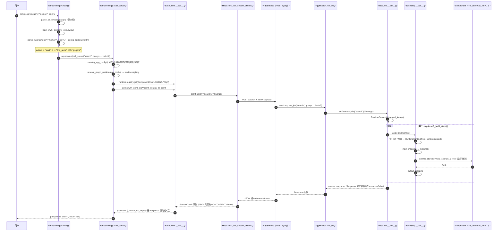
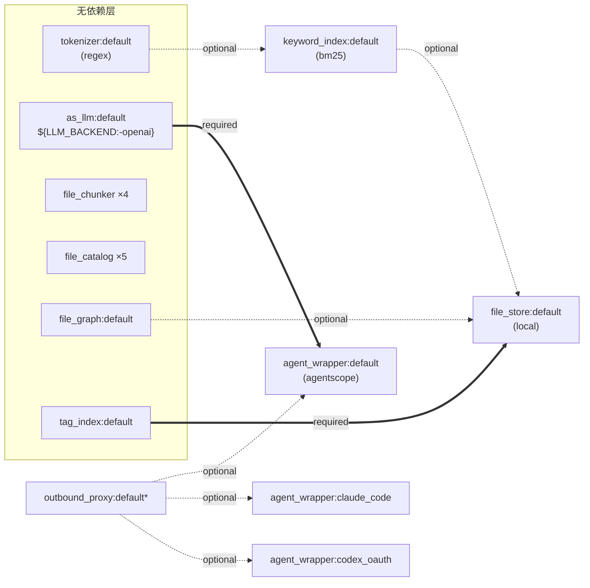
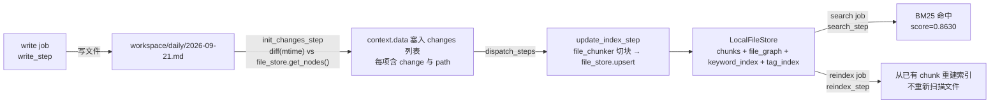
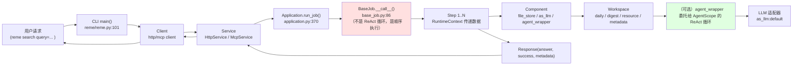

# 侦察报告 11：ReMe 0.4.1.13 全局架构

> 侦察对象：`third_party/ReMe`（PyPI 包名 `reme_ai`，源码版本 `reme/__init__.py:3` = `0.4.1.13`）
> 源码规模：`reme/` 下 **202 个 .py 文件、27 868 行**（`find reme -name '*.py' | xargs wc -l` 实测）。
> 全部结论都带 `相对仓库根的路径:行号`。所有代码片段都在
> `PYTHONPATH=/Users/a/PycharmProjects/VsCode_Projects/Agentscope-Learning/third_party/ReMe /Users/a/miniconda3/envs/agentscope_reme_pip_env/bin/python`（Python 3.11.13）里**真跑过**，标注「已验证」并附真实输出。
> 本报告是后续 20 篇教程里「ReMe 记忆子系统」部分的地基文档。

---

## 子系统职责（这段代码到底在解决什么问题）

一句话：**ReMe 是一个「配置驱动的 Application 装配器 + 一切皆可注册的插件注册表」，它把「长期记忆」这件业务做成了 40 个 Job × 68 个 Step 的可插拔组合。**

### 它到底管什么

ReMe v4 的能力边界写得很直白（`third_party/ReMe/docs/en/framework.md:19`）：

> ReMe v4 focuses on long-term memory: it distills conversations and resources into `daily/`, organizes them into
> `digest/`, and exposes write, retrieval, and proactive-read capabilities through the CLI, HTTP, and MCP.
> **Single-session context-window management is outside the scope of ReMe v4.**

也就是说，参考架构里的「第1层 持久化记忆」被拆成了两半：

| 参考架构里的描述 | 谁负责 | 在 ReMe 里的位置 |
|---|---|---|
| 短期记忆：会话内上下文窗口管理、上下文压缩 | **不作为服务提供**，归宿主 Agent 框架（AgentScope） | ReMe 确实有一个 `compressor_step`（`reme/steps/evolve/compressor.py`），它的 prompt 就是压缩「一段对话 transcript」；但它只在 `reme/config/benchmark.yaml:93` 被 benchmark 工具链用，**没有出现在 `default.yaml` 的任何 Job 里**，也没有 `/compact` 这类会话级接口（`framework.md:22`） |
| 长期记忆：向量库、记忆检索、记忆摘要、记忆遗忘策略 | **ReMe 的全部职责** | `reme/steps/index/`（检索）+ `reme/steps/evolve/`（摘要/提炼）+ `daily/` `digest/` 两级文件记忆 |

### 它真正解决的两个工程问题

**问题一：把「难维护的 if-else 工作流」变成「声明式 YAML 装配」。**

传统写法是写一个 `MemoryService` 类，里面几十个 `async def`，加一个能力就要改类。ReMe 的做法是：把它拆成
`Job（编排单元）→ Step（原子业务）→ Component（基础设施）` 三层，**全部通过字符串名字在 YAML 里连线**：

```yaml
# third_party/ReMe/reme/config/default.yaml:167-170
  auto_memory:
    backend: base                  # Job 后端类，注册名 "base"
    description: "Auto-memory: record conversation facts into a daily note"
    steps:
      - backend: auto_memory_step  # Step 后端类，注册名 "auto_memory_step"
      - backend: auto_tag_step     # 第二个 Step，共享同一个 RuntimeContext
```

加一个新能力 = 写一个新的 `@R.register("xxx_step")` 类 + 在 YAML 里加几行，**不用改任何框架代码**。这正是
Cordis「一切皆插件」思想在 Python 里的等价物——只不过 Cordis 靠 TypeScript 的 `Context` 做运行时挂载，ReMe 靠
`(component_type, name) -> class` 的字符串注册表 + Pydantic 配置解析。

**问题二：用一条统一的拓扑排序把「组件之间的依赖」变成启动顺序。**

`file_store` 依赖 `keyword_index`、`file_graph`、`tag_index`；`keyword_index` 依赖 `tokenizer`；
`agent_wrapper.default` 依赖 `as_llm.default`。这些依赖不是在代码里 `import` 出来的，而是用
`BaseComponent.bind()` 声明的**运行期依赖**，由 `Application._topological_order()` 用 Kahn 算法算出一个确定顺序后再启动。

**关键定位判断（影响教程写法）**：ReMe 里的「第0层 Cordis 微内核」是一个**功能等价但机制不同的 Python 版本**：

| Cordis 微内核（TypeScript） | ReMe 的 Python 等价物 | 文件:行号 |
|---|---|---|
| `Context`（插件共享上下文） | `ApplicationContext` | `reme/components/application_context.py:15` |
| `ctx.plugin(...)` 插件挂载 | `PluginManager.register(registry)` | `reme/plugin.py:125` |
| 服务路由 / `ctx.set('service.x', ...)` | `ComponentRegistry` 的 `(type, name) -> class` | `reme/components/component_registry.py:14` |
| 依赖注入容器 | `BaseComponent.bind()` + `Dependency` 占位符 | `reme/components/base_component.py:53` |
| 声明式 Bundle / Profile | `reme/config/*.yaml` + `extends` + `plugins: [...]` | `reme/config/config_parser.py:178` |
| 插件 npm 包 + `cordis.yml` | Python entry point `reme.plugins` + 包内 `plugin.yaml` | `reme/entry_point.py:6`、`reme/plugin_manifest.py:13` |

**教程最重要的落点**：这一套东西只有 ~1 454 行（`reme.py` 123 + `application.py` 394 + `plugin.py` 137 +
`plugin_manifest.py` 56 + `plugin_cli.py` 358 + `entry_point.py` 35 + `constants.py` 36 + `config/*.py` 315）。
**小白完全可以在一天内读完并自己复刻一个 mini 版**，这就是「自己写 harness_kit kernel」那几篇教程最合适的抄写对象。

---

## 关键文件表

### 内核（第0层，必读，合计 ~1 454 行）

| 文件路径:行号 | 核心类 | 核心函数 | 一句话职责 |
|---|---|---|---|
| `third_party/ReMe/reme/__init__.py:1` | — | `R.freeze()`（第18行） | 包入口：import 所有子包完成装饰器注册，然后**冻结全局注册表** |
| `third_party/ReMe/reme/reme.py:101` | `ReMe`（第18行） | `main()` | CLI 入口：分流 `start` / `find_reme` / `plugins` / 其他动作 |
| `third_party/ReMe/reme/reme.py:37` | — | `call_server(action, **kwargs)` | 客户端路径：读运行中服务的真实配置 → 构造 Client → 打印 chunk |
| `third_party/ReMe/reme/reme.py:30` | `CliInvocation`（第22行） | `parse_cli_invocation(argv)` | 只解析所有命令族共享的语法：`action + 剩余参数` |
| `third_party/ReMe/reme/application.py:23` | `Application(BaseComponent)` | `__init__`（26） | **装配中枢**：建目录 → 建 Service → 建 Components → 建 Jobs |
| `third_party/ReMe/reme/application.py:103` | — | `_instantiate(ctype, cfg, ...)` | 把一份 `ComponentConfig` 变成实例：查注册表 + 注入 `app_context` + 类型校验 |
| `third_party/ReMe/reme/application.py:138` | — | `_topological_order(replacement=None)` | Kahn 算法求组件启动顺序；有环/缺依赖直接抛 |
| `third_party/ReMe/reme/application.py:167` | — | `_build_dependency_graph(nodes)` | 算 in-degree 与邻接表，缺非可选依赖就抛 |
| `third_party/ReMe/reme/application.py:187` | — | `_start()` | 启动顺序：components(拓扑序) → base job → stream job → background job → cron job |
| `third_party/ReMe/reme/application.py:370` | — | `run_job(name, **kwargs)` | 按名字取 Job 并执行，未注册直接 `KeyError("Job 'x' not found")` |
| `third_party/ReMe/reme/application.py:376` | — | `run_stream_job(name, **kwargs)` | 流式 Job：建 queue + task，用 `execute_stream_task` 转成 `AsyncGenerator[StreamChunk]` |
| `third_party/ReMe/reme/application.py:271` | — | `replace_component(...)` | **热插拔**：不停机换掉一个组件并重连所有消费者引用 |
| `third_party/ReMe/reme/components/component_registry.py:14` | `ComponentRegistry` | `register`（62）/`add`（58）/`get`（84） | 两级注册表 `type -> name -> class`，防重复 provider，支持 freeze/preserve/copy |
| `third_party/ReMe/reme/components/component_registry.py:151` | `R`（模块级单例） | `create_application_registry()`（154） | 进程级只读模板 + 每个 Application 一份可变副本 |
| `third_party/ReMe/reme/components/base_component.py:17` | `ComponentMixin` | `workspace_path`（38） | 所有组件的共享身份：name / backend / app_context / logger / 工作区路径 |
| `third_party/ReMe/reme/components/base_component.py:53` | `Dependency` | `__getattr__`（78） | **未解析依赖的占位符**，被提前访问会抛清晰的 RuntimeError |
| `third_party/ReMe/reme/components/base_component.py:85` | `BaseComponent` | `start`（225）/`close`（262） | 带回滚的异步生命周期：`_resolve_bindings` → owned → `_start()` |
| `third_party/ReMe/reme/components/base_component.py:116` | — | `bind(name, base_cls, ...)` | 声明依赖的静态方法，返回 `Dependency` 占位符 |
| `third_party/ReMe/reme/components/application_context.py:15` | `ApplicationContext` | `__init__`（23） | 纯被动状态容器：`app_config` / `registry` / `components` / `jobs` / `thread_pool` / `metadata` |
| `third_party/ReMe/reme/plugin.py:89` | `PluginManager` | `discover`（96）/`merge_config`（118）/`register`（125） | 插件三件事：发现、配置降级合并、backend 注册 |
| `third_party/ReMe/reme/plugin.py:132` | `PluginRuntime`（41） | `resolve_plugin_runtime(config)` | 一次调用产出「合并后配置 + 应用级注册表」 |
| `third_party/ReMe/reme/plugin_manifest.py:13` | `PluginManifest` | `parse_plugin_manifest`（20）/`load_package_manifest`（49） | 插件契约：只允许 `backends` 与 `application_defaults` 两个 key |
| `third_party/ReMe/reme/entry_point.py:6` | — | `find_entry_points` / `unique_entry_point` / `load_entry_point` | entry point 的安全加载边界；`R.preserve` 包住 import 副作用 |
| `third_party/ReMe/reme/plugin_cli.py:351` | — | `plugin_cli(argv)` | `reme plugins list/install/uninstall/show/validate` 的本地 pip 管理 |

### 配置系统

| 文件路径:行号 | 核心类 | 核心函数 | 一句话职责 |
|---|---|---|---|
| `third_party/ReMe/reme/config/default.yaml:1` | — | — | 959 行默认配置：`service` / `jobs`(40) / `components`(9组 19实例) |
| `third_party/ReMe/reme/config/config_parser.py:72` | `_CONFIG_REGISTRY` | `_discover_configs()`（58） | 扫描 `reme/config/` 得到 `stem -> Path`，扩展名优先级 yaml > yml > json |
| `third_party/ReMe/reme/config/config_parser.py:75` | — | `parse_dot_notation(list)` | `"service.port=8181"` → `{'service': {'port': 8181}}` |
| `third_party/ReMe/reme/config/config_parser.py:41` | — | `_expand_env_vars` / `expand_env_vars`（53） | 递归展开 `${VAR}` / `${VAR:-default}`，未定义且无默认值就抛 |
| `third_party/ReMe/reme/config/config_parser.py:178` | — | `_load_config_path` | 处理 `extends` 继承（支持内置名 / 相对路径 / 绝对路径） |
| `third_party/ReMe/reme/config/config_parser.py:209` | — | `deep_merge_config` | 递归深合并，不改原对象 |
| `third_party/ReMe/reme/config/config_parser.py:262` | — | `resolve_app_config(**kwargs)` | **启动配置的唯一权威入口**：载 `config=` 或 `default`，再叠 CLI 覆盖 |
| `third_party/ReMe/reme/schema/application_config.py:31` | `ApplicationConfig` | field_validator（63/69/76） | 全应用配置的 Pydantic 模型：工作区目录、LLM 语言、plugins、jobs、components |

### 业务分层（第2层）

| 文件路径:行号 | 核心类 | 核心函数 | 一句话职责 |
|---|---|---|---|
| `third_party/ReMe/reme/components/job/base_job.py:36` | `BaseJob`（注册名 `base`） | `__call__`（86） | 顺序执行 Steps，异常吞进 `response.success=False` |
| `third_party/ReMe/reme/components/job/background_job.py:17` | `BackgroundJob`（`background`） | `_run_with_supervisor`（103） | 长驻循环 + 指数退避重启 + stop_event 优雅关闭 |
| `third_party/ReMe/reme/components/job/cron_job.py:10` | `CronJob`（`cron`） | `_next_fire_delay`（28） | 用 `croniter` 算下次触发；时区取 `app_config.timezone` |
| `third_party/ReMe/reme/components/job/stream_job.py:7` | `StreamJob`（`stream`） | `__call__`（13） | 流式 Job：出错发 ERROR chunk，结尾必发 DONE |
| `third_party/ReMe/reme/steps/base_step.py:98` | `BaseStep` | `__call__`（146）/`execute`（142 抽象） | Step 基类：清 Ref 缓存 → 建 RuntimeContext → input_mapping → execute → output_mapping |
| `third_party/ReMe/reme/steps/base_step.py:28` | `Ref`（描述符） | `_resolve`（73） | 三步回退解析组件：`kwargs` → `context.data` → `app_context.components[type][name]` |
| `third_party/ReMe/reme/components/runtime_context.py:9` | `RuntimeContext` | `from_context`（52）/`add_stream_string`（71） | 一次 Job 调用的共享草稿纸：`response` / `data` / `stream_queue` / `stop_event` |
| `third_party/ReMe/reme/components/service/base_service.py:18` | `BaseService` | `run_app`（100）/`add_jobs`（73） | 服务骨架：build → add_jobs → finalize → start（阻塞） |
| `third_party/ReMe/reme/components/service/http_service.py:37` | `HttpService`（`http`） | `build_service`（68） | FastAPI + 可选 FastMCP：`POST /<job>` JSON 或 SSE |
| `third_party/ReMe/reme/components/service/cli_service.py:63` | `CliService`（`cli`） | `_run_job`（95） | 单次本地执行后退出，不占端口（最适合教学/测试） |
| `third_party/ReMe/reme/components/client/base_client.py:18` | `BaseClient` | `_resolve_service_address`（27） | 客户端基类：从 `REME_SERVICE_INFO` 环境变量发现服务地址 |
| `third_party/ReMe/reme/components/client/http_client.py:15` | `HttpClient`（`http`） | `_iter_stream_chunks`（38） | 靠 Content-Type 自动区分 JSON / `text/event-stream` |

> 注：`reme/components/service/mcp_service.py` 的 `McpService`（`mcp`）与 `reme/components/client/mcp_client.py` 的 `McpClient` 本次未逐行精读，**标注为未验证**。

### 全局注册表实测内容「已验证」

```python
R.get_all(ComponentEnum.STEP)   # 68 个
R.get_all(ComponentEnum.AS_LLM) # 8 个
R.get_all(ComponentEnum.JOB)    # 4 个（base/background/cron/stream）
```

真实输出（`/tmp/t5.py`）：

```text
base             (0): []
as_llm           (8): ['anthropic', 'dashscope', 'deepseek', 'gemini', 'moonshot', 'ollama', 'openai', 'xai']
as_embedding     (5): ['dashscope', 'dashscope_multimodal', 'gemini', 'ollama', 'openai']
embedding_store  (1): ['local']
file_chunker     (4): ['default', 'json', 'jsonl', 'markdown']
file_store       (3): ['faiss', 'local', 'zvec']
file_graph       (3): ['local', 'neo4j', 'nx']
file_catalog     (1): ['local']
keyword_index    (1): ['bm25']
tag_index        (1): ['local']
service          (3): ['cli', 'http', 'mcp']
client           (2): ['http', 'mcp']
step            (68): ['add_draft_step', 'add_step', 'app_config_step', ...]
job              (4): ['background', 'base', 'cron', 'stream']
tokenizer        (2): ['jieba', 'regex']
agent_wrapper    (3): ['agentscope', 'claude_code', 'codex']
mail             (0): []
outbound_proxy   (2): ['fixed_http', 'ssh_http']
```

> 注意 `mail` 是 0 个、`agent_wrapper` 只注册了 3 个名字，但 `default.yaml` 里配置了 4 个实例
> （`default` / `claude_code` / `codex` / `codex_oauth`）——因为 YAML 里的 key 是**实例名**，`backend:` 才是注册名。
> `codex` 和 `codex_oauth` 两个实例共用同一个 `codex` backend 类。这是 ReMe「一个 backend 类可以实例化多份」的直接证据。

---

## 调用链

### 链路 A：CLI → Client → Service → Application（服务模式）



**逐段讲解**

1. **`main()` 只做三分支**（`reme/reme.py:101-119`）：`plugins` 走本地 pip 管理（明确注释「must not load application
   config, environment files, or a running service」）；`start` 起服务；`find_reme` 探测端口；其余全部走 `call_server`。
   这里体现了 ReMe 的一条设计纪律：**包管理与业务执行彻底分离**，`reme plugins install` 不会去连 HTTP 服务。
2. **`call_server` 的关键技巧**（`reme/reme.py:49-72`）：它不是直接用本地配置造 Client，而是先调
   `running_app_config()`（`reme/utils/service_utils.py:96`）拿到**正在跑的那个服务进程的完整启动参数**，再用
   `resolve_plugin_runtime` 重放一遍。这样才能支持 `reme start service.port=8181` 之后 `reme version` 能自动找到 8181，
   而且能支持服务端启用了某个插件后客户端也能拿到对应的 client backend。**这是「客户端与服务端配置同源」的优雅解法**，
   也是小白最容易忽略的一环。
3. **`_CLIENT_KWARGS` 与 tool 参数分离**（`reme/reme.py:15,70-72`）：`host/port/timeout/transport/command/args/show_metadata`
   是客户端构造参数，**绝不会**被塞进请求 payload。`backend != service.backend` 时 `seed` 为空，避免把 HTTP 的
   host/port 传给 MCP client。这个细节在教程「MCP 工具协议」那篇可以直接讲。
4. **`Application.run_job` 只有 4 行**（`reme/application.py:370-374`）：查 `context.jobs` → 直接 `await job(**kwargs)`。
   所以 **`KeyError: Job 'x' not found` 只可能来自三件事**：① 名字拼错；② Application 装配时 `jobs` 为空；
   ③ Job 配了 `enable_serve: false` 且你以为服务里能调到（服务白名单校验在 `BaseService.add_jobs`）。
   **实测复现见本报告「可运行代码片段」第 3 段。**
5. **`BaseJob.__call__` 吞异常**（`reme/components/job/base_job.py:94-97`）：任何 Step 抛异常都被转成
   `response.success=False` + `response.answer=_describe_exception(e)`，`_describe_exception` 会沿 `__cause__` /
   `__context__` 链拼成 `"B <- A"` 形式。这对教学很重要：**Agent 任务失败时不会直接炸到客户端，而是返回一个
   success=False 的 Response**，这是「Agent 必须把失败也当成一种正常输出」的工程化体现。

### 链路 B：`reme start`（服务模式，本地装配）

```mermaid
flowchart LR
    A["main()<br/>reme/reme.py:101"] --> B["_start_application(kwargs, environment)<br/>reme/reme.py:92"]
    B --> C["prepare_start_config(kwargs)<br/>cli_service.py:21"]
    C --> D{"kwargs 里有 job= ?"}
    D -->|有| E["_prepare_job_start_config<br/>→ service.backend='cli'"]
    D -->|没有| F["resolve_app_config(**kwargs)<br/>config_parser.py:262"]
    E --> G["config = resolve_app_config(...)"]
    G --> H["should_precheck_start(config)"]
    H --> I["precheck_start(service)<br/>utils/service_utils.py:136"]
    I --> J["ReMe(**kwargs).run_app()"]
    J --> K["Application.__init__<br/>application.py:26"]
    K --> L["ApplicationContext(registry=runtime.registry, **runtime.config)"]
    L --> M["_setup_workspace_directories()  :54"]
    M --> N["_init_service()  :70"]
    N --> O["_init_components()  :79"]
    O --> P["_init_jobs()  :92"]
    P --> Q["run_app()  :391 → service.run_app(app)"]
    Q --> R["BaseService.run_app  base_service.py:100<br/>build_service → add_jobs → finalize_service → start_service"]
    R --> S["_lifespan → await app.start()<br/>application.py:187"]
    S --> T["组件拓扑排序启动 → base/stream/background/cron Job 依次启动"]
```



**逐段讲解**

1. **`Application.__init__` 的顺序是刻意的**（`reme/application.py:26-45`）：
   `resolve_plugin_runtime(kwargs)` → `ApplicationContext` → **先建工作区目录** → 再建 logger → 再建 Service →
   再建 Components → 最后建 Jobs。目录必须最先建，因为 `_init_components` 里的 `LocalFileStore` 等组件在 `__init__`
   阶段就可能要读工作区路径；Service 必须早于 Components，因为 `print_logo(self.config, self.context.service)`
   要用它打印后端名。
2. **`resolve_plugin_runtime` 在 Application 里是硬编码调用**（`reme/application.py:27`）：
   这意味着**你无法通过传 `registry=` 绕过插件发现**（实测：传进去会被 `ApplicationConfig` 忽略，然后
   `PluginManager.discover(["你的插件"])` 会抛 `Plugin 'x' is not installed`）。要激活一个插件，只有一条正路：
   `pip install` 让 `reme.plugins` entry point 存在。**这是本报告实测撞到的坑，见「坑与注意事项」。**
3. **`_instantiate` 是配置→实例的唯一出口**（`reme/application.py:103-134`）：
   `registry.get(ctype, cfg.backend)` → 找不到抛 `Unregistered backend 'x' for Job 'y'` →
   `params = cfg.model_dump()` + `params["app_context"] = self.context` → `backend_cls(**params)` →
   **`isinstance` 二次校验**（防止插件把一个 Step 注册到 job 类型下）。这 30 行是「依赖注入容器」最朴素的形态，
   教程里可以直接对比 Spring 的 `getBean`。
4. **启动顺序在 `_start()` 里写死为 5 段**（`reme/application.py:195-202`）：
   `components(拓扑序)` → `base_jobs` → `stream_jobs` → `background_jobs` → `cron_jobs`。
   分类逻辑很直白：`StreamJob` 和 `BackgroundJob` 用 `isinstance` 判，`CronJob` 是 `BackgroundJob` 的子类所以要先排除。
   **为什么是这个顺序**：background/cron 会立刻开循环去读写组件状态，必须等组件都热了才能起。
5. **关闭是严格的逆序**（`reme/application.py:223-233`）：`reversed(self._started_components)`，保证
   「dependents 先于 dependencies 关闭」。而且**启动过程中任一步失败会调用 `_close_started_components()` 回滚**
   （`reme/application.py:203-205`），不会留下半个运行的应用。

### 链路 C：组件依赖图与拓扑启动（实测）

> 图中 `outbound_proxy:default*` 带星号表示**它在 `default.yaml` 里根本没有被配置**——
> 这正是「可选依赖缺失 → 解析为 `None`」的实例，也是为什么拓扑输出里没有 `outbound_proxy` 这一行。



真实输出（`/tmp/t7.py`，`app._topological_order()` 的返回顺序与依赖声明）：

```text
拓扑序 (19):
  agent_wrapper    claude_code deps=[('outbound_proxy', 'default', True)]
  agent_wrapper    codex      deps=[('outbound_proxy', 'default', True)]
  agent_wrapper    codex_oauth deps=[('outbound_proxy', 'default', True)]
  as_llm           default    deps=[]
  agent_wrapper    default    deps=[('outbound_proxy', 'default', True), ('as_llm', 'default', False)]
  file_catalog     default    deps=[]
  file_catalog     digest     deps=[]
  file_catalog     dream      deps=[]
  file_catalog     proactive  deps=[]
  file_catalog     resource   deps=[]
  file_chunker     default    deps=[]
  file_chunker     json       deps=[]
  file_chunker     jsonl      deps=[]
  file_chunker     markdown   deps=[]
  file_graph       default    deps=[]
  tag_index        default    deps=[]
  tokenizer        default    deps=[]
  keyword_index    default    deps=[('tokenizer', 'default', True)]
  file_store       default    deps=[('tag_index', 'default', False), ('keyword_index', 'default', True), ('file_graph', 'default', True)]
```

**逐段讲解**

1. 输出**只有 19 个节点**，而注册表里有 19 个**已配置实例**（不是 68 个 Step）。`Step` 和 `Job` **不参与**
   拓扑启动——Step 是每次 Job 调用临时 `_build_steps()` 出来的（`reme/components/job/base_job.py:78`）。
2. **依赖三元组 `(ctype, name, optional)`**：`tag_index` 对 `file_store` 是 `False`（必需），
   `keyword_index` / `file_graph` / `outbound_proxy` 是 `True`（可选）。可选依赖缺失时
   `_resolve_from_context` 会把它设成 `None`（`reme/components/base_component.py:191`），
   必需依赖缺失则 `_build_dependency_graph` 在**拓扑排序阶段**就抛
   `Component file_store:default depends on unregistered tag_index:default`。
3. **Kahn 算法用最小堆做平局打破**（`reme/application.py:150-159`）：`ready` 是 `list`，`heapify` 后每次
   `heappop` 取最小的 `(ctype, name)` 元组。所以**启动顺序是确定性可复现的**，这对企业级运维很重要
   （不会因为字典遍历顺序变化导致启动顺序抖动）。
4. **环检测**（`reme/application.py:161-163`）：`len(ordered) != len(nodes)` 时把 `in_degree > 0` 的节点
   报成 `Circular dependency detected among: [...]`。教程可以布置一个作业：故意写两个互相依赖的组件，看这个报错。
5. **`_replacement_shutdown_order`（`reme/application.py:251`）用 `id()` 而不是 `__hash__`**：
   因为组件可能重载了 `__eq__`/`__hash__`，用身份比较才不会误判。这是热插拔 `replace_component` 的正确性关键，
   也是教程「组件热替换」那篇最有嚼头的 20 行。

### 链路 D：一笔写入如何变成可检索的记忆「已验证」

这条链路是 ReMe 记忆能力的核心，实测跑通了：



实测输出：

```text
index_once -> True {'counts': {'added': 1, 'modified': 0, 'deleted': 0}}
[SearchStep] query='微内核' candidates=15 vector_hits=0 keyword_hits=1
search     -> True ========== daily/2026-09-21.md:5-6 [score=0.8630] ========== Cordis 微内核一切皆插件；ReMe 用 Application 装配 Job 与 Step。
```

**这是小白最容易误解的一点**：`write` 只写文件，**不会自动进索引**。索引由
`index_update_loop`（background Job，`default.yaml:8`）里的文件监控循环负责；`reindex` 只是
「从已经灌进 file_store 的 chunk 重建 BM25/向量/标签索引」，它的 docstring 写得很清楚：
`Rebuild BM25, embeddings, and/or tags **without scanning workspace files**`（`reme/steps/index/reindex.py:1`）。
所以实测中先跑 `reindex` 会得到 `indexed: 0`，必须跑 `init_changes_step → update_index_step` 才会真正入库。

---

## 关键数据结构

### 1. `ApplicationConfig`（全应用配置，Pydantic）

`third_party/ReMe/reme/schema/application_config.py:31`

```python
class ApplicationConfig(BaseModel):
    """Root config for the ReMe application."""

    app_name: str = Field(default=os.getenv("APP_NAME", "ReMe"), description="Application display name")
    environment: dict[str, str] = Field(
        default_factory=dict,
        description="Environment variables loaded once at startup and passed to agent subprocesses",
    )
    workspace_dir: str = Field(default=".reme", description="Workspace root directory for runtime files",
                               validate_default=True)
    metadata_dir: str = Field(default="metadata", description="Subdirectory for ReMe persistent state")
    session_dir: str = Field(default="session", description="Subdirectory for persisted agent sessions")
    mem_session_dir: str = Field(default="mem_session", description="Subdirectory for persisted agent sessions")
    resource_dir: str = Field(default="resource", description="Subdirectory for external assets")
    daily_dir: str = Field(default="daily", description="Subdirectory for daily memory")
    digest_dir: str = Field(default="digest", description="Subdirectory for digest memory")
    enable_logo: bool = Field(default=True, description="Show ASCII logo on startup")
    timezone: str | None = Field(default="Asia/Shanghai", description="IANA timezone; None uses local time")
    language: str = Field(default="", description="Default language for LLM interactions")
    log_to_console: bool = Field(default=True, description="Log to console")
    log_to_file: bool = Field(default=True, description="Log to file")
    mcp_servers: dict[str, dict] = Field(default_factory=dict, description="MCP server configs by name")
    plugins: list[str] = Field(default_factory=list, description="Installed plugins enabled for this app")
    service: ComponentConfig = Field(default_factory=ComponentConfig, description="Service endpoint config")
    jobs: dict[str, JobConfig] = Field(default_factory=dict, description="Job definitions keyed by job name")
    thread_pool_max_workers: int = Field(default=0, description="Max worker threads; 0 to disable")
    components: dict[str, dict[str, ComponentConfig]] = Field(
        default_factory=dict, description="Component registry keyed by type then name")
```

三个 validator 值得单独讲：

- `normalize_component_types`（第63行，`mode="before"`）：把 `components` 的 key 走一遍 `component_type_name()`，
  所以 YAML 里写 `as_llm` 或写 `ComponentEnum.AS_LLM` 都能归一到 `"as_llm"`，插件也能用 `"example.reranker"`
  这种自定义类型名。
- `normalize_workspace_dir`（第69行）：`Path(value).expanduser().resolve(strict=False)`，**只做一次**，
  保证所有组件看到的都是同一个绝对路径（避免 cwd 变化导致工作区漂移）。
- `validate_session_dir`（第76行）：**拒绝绝对路径**，必须工作区相对。这是安全性/可移植性的硬约束，
  教程讲「工作区沙箱」时可以直接引用。

### 2. `ComponentConfig` / `JobConfig`

`third_party/ReMe/reme/schema/application_config.py:12`

```python
class ComponentConfig(BaseModel):
    """Base config for a component; extra fields allowed for backend-specific options."""

    model_config = ConfigDict(extra="allow")

    backend: str = Field(default="", description="Backend implementation class name")


class JobConfig(ComponentConfig):
    """Config for a job — an ordered sequence of step components. Keyed by name in ApplicationConfig.jobs."""

    description: str = Field(default="", description="Human-readable description")
    parameters: dict = Field(default_factory=dict, description="Job-level parameters")
    steps: list[ComponentConfig] = Field(default_factory=list, description="Ordered step configs")
    enable_serve: bool = Field(default=True, description="Whether to expose this job through the service layer")
```

`extra="allow"` 是整套配置系统的**关键开关**：YAML 里 `backend: background` 下面的 `watch_dirs` / `watch_suffixes`
/ `supervisor` / `backoff_base` / `cron` 等字段全部落进 `model_dump()`，再作为 `**kwargs` 传给
`backend_cls(**params)`，最终进 `ComponentMixin.kwargs` → `BaseJob.__call__` 的 `merged = {**self.kwargs, **kwargs}`
→ `RuntimeContext(**merged)` → `context.data`。**这就是「YAML 里的任意字段都能被 Step 用 `self.context.get()` 读到」
的完整机制**，一条不看源码绝对猜不到的链路。

### 3. `Dependency`（依赖占位符）

`third_party/ReMe/reme/components/base_component.py:53`

```python
class Dependency:
    """Placeholder returned by ``BaseComponent.bind`` for an unresolved dependency."""

    __slots__ = ("ctype", "name", "default_factory", "optional")

    def __init__(self, ctype, name, default_factory=None, optional=True) -> None:
        self.ctype = component_type_name(ctype)
        self.name = name
        self.default_factory = default_factory
        self.optional = optional

    def __repr__(self) -> str:
        suffix = "?" if self.optional else ""
        return f"<unresolved {self.ctype}:{self.name}{suffix}>"

    def __getattr__(self, item: str) -> Any:
        # Catches accidental use of the placeholder before start() resolves it.
        raise RuntimeError(
            f"Dependency {self.ctype}:{self.name} accessed before start() "
            f"(attribute '{item}')",
        )
```

`__getattr__` 只在**正常属性查找失败时**触发，所以占位符一旦被 `Dependency` 类自己定义的属性（`ctype`/`name`
等）之外的东西访问，就会抛出精确的「你在 start() 之前用了它」错误。这是**教学价值极高的一段设计**：
用 Python 的数据模型把一个「忘记 await start()」的 bug 变成了自解释的错误信息。

### 4. `RuntimeContext`（一次执行的共享草稿纸）

`third_party/ReMe/reme/components/runtime_context.py:9`

```python
class RuntimeContext:
    def __init__(self, response=None, stream_queue=None, stop_event=None, **kwargs):
        self.response: Response = response or Response()
        self.stream_queue: asyncio.Queue | None = stream_queue
        self.stop_event: asyncio.Event | None = stop_event
        self.data: dict = kwargs
```

四个字段的用途：

| 字段 | 类型 | 谁写 | 谁读 |
|---|---|---|---|
| `response` | `Response` | 每个 Step 写答案 | Service / Client / 调用方 |
| `data` | `dict`（`ctx[key]` 语法糖） | Step 之间传中间结果 | 后续 Step |
| `stream_queue` | `asyncio.Queue \| None` | `add_stream_string()` / `add_stream_done()` | `Application.run_stream_job` 的消费者 |
| `stop_event` | `asyncio.Event \| None` | `BackgroundJob` 创建 | 长循环 Step 检查退出 |

`from_context()`（第51行）的语义很微妙：`context` 为 None 时新建，否则**直接复用同一个对象**并把 kwargs
merge 进去（`RuntimeContext.update` 原地改 `self.data` 后 `return self`）。所以一条 Job 里所有 Step
共享同一个 `data`——这正是「Step 之间传数据」的实现方式，也是**为什么 Step 不允许把请求态存在实例上**
（Step 每次调用重建，见 `_build_steps`）。

### 5. `Response` / `StreamChunk`

`third_party/ReMe/reme/schema/response.py:8`：

```python
class Response(BaseModel):
    model_config = ConfigDict(extra="allow")

    answer: str | Any = Field(default="", description="Primary response content or result data exposed to tool callers")
    success: bool = Field(default=True, description="Whether the operation succeeded")
    metadata: dict = Field(default_factory=dict, description="Auxiliary request context and diagnostics")
```

`StreamChunk`（`reme/schema/stream_chunk.py:10`）共 12 个字段，覆盖 AgentScope / Claude Code SDK / Codex 三套流式协议：
`chunk_type`(`ChunkEnum`) / `chunk` / `done` / `session_id` / `block_id` / `tool_call_id` / `tool_call_name` /
`media_type` / `input_tokens` / `output_tokens` / `metadata`。`ChunkEnum`（`reme/enumeration/chunk_enum.py:6`）
有 11 个值：`REPLY_START` / `REPLY_END` / `THINK` / `CONTENT` / `DATA` / `TOOL_CALL` / `TOOL_RESULT` / `APPROVAL` /
`USAGE` / `ERROR` / `DONE`，并且**在 docstring 里给出了三套外部协议到这个枚举的完整映射表**——
这是教程「事件流统一」那篇最好的素材。

### 6. `PluginManifest`（插件契约）

`third_party/ReMe/reme/plugin_manifest.py:13`

```python
@dataclass(frozen=True)
class PluginManifest:
    """The two contributions an installed plugin may declare."""

    backends: dict[str, str]
    application_defaults: dict[str, Any]
```

**只有两个字段**，且 `parse_plugin_manifest`（第20行）会显式拒绝其它 key：

```python
unknown = set(value) - {"backends", "application_defaults"}
if unknown:
    raise ValueError(f"Plugin '{plugin_name}' manifest has unknown keys: {', '.join(sorted(unknown))}")
```

---

## 源码精读

### 片段 1：`ComponentRegistry` 的两级注册 + 冻结 + 保留

`third_party/ReMe/reme/components/component_registry.py:32-56`（节选核心）

```python
    def _do_register(self, cls: type[T], name: str, *, owner: str | None = None) -> type[T]:
        """Insert ``cls`` under its component type and reject ambiguous providers."""
        try:
            component_type = component_type_name(getattr(cls, "component_type", None))
        except (TypeError, ValueError) as exc:
            raise TypeError(f"{cls.__name__} must have a non-empty string 'component_type' attribute") from exc
        if not name:
            raise ValueError("Component name cannot be empty")

        with self._lock:
            self._ensure_mutable()
            group = self._registry.setdefault(component_type, {})
            key = (component_type, name)
            if name in group:
                existing = group[name]
                existing_owner = self._owners[key]
                new_owner = owner or cls.__module__
                if existing is cls and existing_owner == new_owner:
                    return cls
                raise ValueError(
                    f"Backend '{component_type}:{name}' is provided by both "
                    f"'{existing_owner}' and '{new_owner}'",
                )
            group[name] = cls
            self._owners[key] = owner or cls.__module__
        return cls
```

**它在干什么**：这是「服务路由表」的全部。`_registry` 是 `dict[str, dict[str, type]]`，外层 key 是组件类型
（`"step"` / `"job"` / `"as_llm"` ...），内层 key 是注册名（`"search_step"` / `"base"` / `"openai"` ...）。

**为什么这么设计**：

1. **`owner` 记录**是防冲突的关键。两个不同的插件（或插件 vs 内置）注册同名 backend 时，
   `_do_register` 会抛 `Backend 'step:foo' is provided by both 'reme_foo' and 'reme_bar'`。
   **「宁可启动失败，也不静默覆盖」**——这是生产级插件系统必须的纪律，教程里要重点强调。
   `if existing is cls and existing_owner == new_owner: return cls` 是幂等保护（同一个类被 import 两次不会炸）。
2. **`freeze()` / `preserve()` 这对组合**（第112行 / 第132行）解决了 Python 装饰器注册的一个经典难题：
   **import 时副作用**。`reme/__init__.py:18` 在所有内置子包 import 完后调 `R.freeze()`，从此任何
   `@R.register(...)` 都会抛 `Component registry is frozen`。但插件加载又必须临时解冻：
   `entry_point.py:29` 和 `plugin.py:80` 用 `with R.preserve(allow_mutation=True):` 包住，**yield 结束后无条件恢复
   快照**——所以插件里写的 `@R.register` 不会污染全局模板。
3. **`copy()`（第123行）与 `create_application_registry()`（第154行）**：每个 Application 拿到的是
   `R.copy()`，**应用级注册完全隔离**。这就是「插件启用是 per-application，而不是进程级全局开关」的实现基础
   （`docs/en/plugin_development.md:99`）。

**实测踩坑**：因为 `R` 已冻结，教程里想让读者「自己写一个 Step 然后跑起来」，**不能**用
`@R.register("xxx_step")`（会抛 frozen）——正确姿势是注册到 `app.context.registry`（实测见后文代码片段 4）。

### 片段 2：`bind()` 与 `_resolve_bindings()` —— Python 版的依赖注入

`third_party/ReMe/reme/components/base_component.py:116-141`（`bind`）

```python
    @staticmethod
    def bind(
        name: str | None,
        base_cls: type[T],
        *,
        default_factory: Callable[[], T] | None = None,
        optional: bool = True,
    ) -> T | None:
        """Declare a dependency on another component."""
        if not name:
            return None
        ctype = getattr(base_cls, "component_type", None)
        try:
            ctype = component_type_name(ctype)
        except (TypeError, ValueError) as exc:
            raise TypeError(
                f"{base_cls.__name__} must declare a non-BASE string 'component_type'",
            ) from exc
        if ctype == ComponentEnum.BASE.value:
            raise TypeError(f"{base_cls.__name__} must declare a non-BASE 'component_type'")
        return cast(T, Dependency(ctype, name, default_factory, optional))
```

`third_party/ReMe/reme/components/base_component.py:157-193`（解析）

```python
    async def _resolve_bindings(self) -> None:
        """Replace every ``Dependency`` attribute with its resolved target."""
        for attr, dep in list(self.__dict__.items()):
            if isinstance(dep, Dependency):
                self._binding_specs[attr] = dep
                self._resolve_one(attr, dep)

    def _resolve_one(self, attr: str, dep: Dependency) -> None:
        """Resolve a single dependency, dispatching by mode."""
        if self.app_context is None:
            self._resolve_standalone(attr, dep)
        else:
            self._resolve_from_context(attr, dep)

    def _resolve_from_context(self, attr: str, dep: Dependency) -> None:
        """Context-bound mode: look up the component from ``app_context.components``."""
        target = self.app_context.components.get(dep.ctype, {}).get(dep.name)
        if target is not None:
            setattr(self, attr, target)
        elif dep.optional:
            setattr(self, attr, None)
        else:
            raise ValueError(f"{dep.ctype} '{dep.name}' not found.")
```

**它在干什么**：组件在自己的 `__init__` 里写

```python
self.keyword_index = self.bind("default", BaseKeywordIndex, optional=True)
```

拿到的是一个 `Dependency("keyword_index", "default", None, True)` 占位符；`start()` 时
`_resolve_bindings()` 遍历 `self.__dict__`，把占位符换成真的组件实例（或 `None`）。

**为什么这么设计**：

1. **用「实例字典扫描」而不是「显式注册表」**：只要能拿到 `self.__dict__` 里是 `Dependency` 的属性，就自动算依赖。
   这样组件作者**只需要赋值，不需要在别处再登记一次**，极大减少样板代码。
2. **`_binding_specs` 保存原始 spec**（`base_component.py:104`）：解析后 `self.__dict__` 里已经是真组件了，
   但热替换 `replace_component` 需要知道「这个属性原本绑定的是哪个 `(ctype, name)`」，所以必须留一份 spec。
   `dependency_bindings`（第151行）就是给 `replace_component` 用的（`application.py:335`）。
3. **standalone 模式**（`_resolve_standalone`，第171行）：`app_context is None` 时用 `default_factory()` 自造一个
   私有组件并纳入 `self._owned` 生命周期管理。**这让组件的单元测试可以完全脱离 Application**——教程写测试时直接用。
4. **`start()` 的回滚语义**（`base_component.py:225-242`）：`_start_hook_entered` 标记保证只有真正进了 `_start()`
   才回滚 `_close()`；`started_owned` 记录已启动的私有组件，逆序关掉。**「启动失败不留半成品」是企业级框架的底线**。

### 片段 3：`PluginManager` 与配置优先级

`third_party/ReMe/reme/plugin.py:118-137`

```python
    def merge_config(self, application_config: Mapping[str, Any]) -> dict[str, Any]:
        """Place plugin application defaults below the user's resolved config."""
        merged: dict[str, Any] = {}
        for plugin in self.plugins:
            merged = deep_merge_config(merged, expand_env_vars(plugin.config))
        return deep_merge_config(merged, application_config)

    def register(self, registry: ComponentRegistry) -> None:
        """Register every backend into an application-local registry."""
        for plugin in self.plugins:
            for backend in plugin.backends:
                registry.add(backend.name, backend.implementation, owner=plugin.name)


def resolve_plugin_runtime(application_config: Mapping[str, Any]) -> PluginRuntime:
    """Build one local registry, with user config overriding plugin application defaults."""
    manager = PluginManager.discover(application_config.get("plugins") or ())
    registry = create_application_registry()
    manager.register(registry)
    return PluginRuntime(config=manager.merge_config(application_config), registry=registry)
```

**它在干什么**：13 行代码实现了完整的三层优先级。

**为什么这么设计**：

1. **`deep_merge_config(merged, application_config)` 的参数顺序就是优先级**：插件默认值在前（低优先级），
   用户配置在后（覆盖）。所以完整优先级是
   `plugin.application_defaults < default.yaml/自定义 config < CLI 点号覆盖`，
   与 `docs/en/configuration.md:12-16` 完全一致。
2. **`expand_env_vars(plugin.config)` 是必须的**：插件的 `application_defaults` 里可能写 `${MY_PLUGIN_KEY}`，
   如果不展开就会把字面量塞进配置。**内置 YAML 的展开发生在 `_read_config_file`（`config_parser.py:206`），
   但插件 manifest 走的是另一条路径**——这个不对称很容易漏，教程要提醒。
3. **`PluginManager.discover` 只接受「显式启用」**（第96行）：`for name in specs` 遍历的是配置里的 `plugins`
   列表，**一个都没配就一个都不加载**。注释里的 `if name in seen: raise ValueError(f"Plugin '{name}' is enabled more than once")`
   体现了同样的「宁可报错」哲学。
4. **legacy 兼容边界**（第74-86行）：`entry.value` 里没 `:` 就当 package 走 `plugin.yaml`；有 `:` 就按老式
   `module:PluginInstance` 加载。**这是渐进式迁移的标准做法**，教程可以拿来做「如何给生产框架做不破坏性升级」的案例。

### 片段 4：`resolve_app_config` —— 启动配置的唯一权威

`third_party/ReMe/reme/config/config_parser.py:262-296`

```python
def resolve_app_config(*, log_config: bool = True, **kwargs) -> dict:
    """Resolve full app-start config: load `config=path` file, fall back to
    `default`, then deep-merge with the remaining kwargs as overrides.
    """
    from ..utils import get_logger

    logger = get_logger(log_to_file=False)
    configs: list[dict] = []

    # `config=path` arrives as a string here; `config.foo=bar` arrives as a
    # nested dict and is left in `kwargs` to be merged as a normal override.
    config_value = kwargs.get("config")
    if isinstance(config_value, str):
        kwargs.pop("config")
        if log_config:
            logger.info(f"Loading config: {config_value}")
        configs.append(_load_config(config_value))
    elif "default" in _CONFIG_REGISTRY:
        if log_config:
            logger.info("No config specified, loading 'default'")
        configs.append(_load_config("default"))

    configs.append(kwargs)

    merged: dict = {}
    for cfg in configs:
        merged = deep_merge_config(merged, cfg)

    return merged
```

**它在干什么**：把「文件里的 YAML」和「命令行里的 kwargs」合并成一份 dict，交给 `Application(**dict)`。

**为什么这么设计**：

1. **`isinstance(config_value, str)` 的分支非常讲究**：`reme start config=demo` 里的 `config` 是字符串（要当文件名）；
   而 `reme start config.service.port=8181` 会被 `parse_dot_notation` 变成 `{"config": {"service": {"port": 8181}}}`
   ——**一个 dict**，于是走 `kwargs` 的普通覆盖路径，而不是被当成文件名。**这是「点号覆盖」和「选择配置文件」共存
   的关键**，也是本报告实测过的一个极易读错的地方。
2. **`configs.append(kwargs)` 放最后** = CLI 覆盖优先级最高。
3. **`log_config=False` 开关**：给 `call_server` 这种「只想打印业务结果」的场景用，避免配置日志污染 stdout
   （`reme/reme.py:60`）。

### 片段 5：`BaseJob.__call__` —— 4 行的主循环

`third_party/ReMe/reme/components/job/base_job.py:86-98`

```python
    async def __call__(self, **kwargs) -> Response:
        """Run all steps in order, capturing any failure into the response."""
        self._record_call()
        merged = {**self.kwargs, **kwargs}
        context = RuntimeContext(**merged)
        try:
            for step in self._build_steps():
                await step(context)
        except Exception as e:
            self.logger.exception(f"Failed to execute job: {e}")
            context.response.success = False
            context.response.answer = _describe_exception(e)
        return context.response
```

**它在干什么**：`Agent Loop` 的最简形态——**串行执行 + 统一上下文 + 异常收敛**。

**为什么这么设计**（对比参考架构）：

1. `{**self.kwargs, **kwargs}`：**调用方参数覆盖配置参数**。所以 `default.yaml` 里 `search` job 默认
   `limit: 5`，`reme search query=x limit=20` 能覆盖成 20。
2. **每次调用重建 Steps**（`_build_steps` 第76行）：`return [step_cls(**dict(params)) for step_cls, params in self.step_specs]`。
   `dict(params)` 是为了**防止 Step 改到共享的 spec 字典**（原注释：「dict(params) copies kwargs so steps cannot
   mutate the shared spec」）。这保证了 **Step 无状态 + 并发安全**——两个请求同时进同一个 Job，各自有一批新 Step 实例。
3. **Step 是「类 + 参数」的二元组**（`self.step_specs: list[tuple[type[BaseStep], dict]]`，`_start()` 第56行填充）：
   校验和查注册表只在启动时做一次，热路径上只有 `构造 + await`。这是性能与可观测性的权衡。

---

## 可运行代码片段

> 统一约定：所有片段都用
> `PYTHONPATH=/Users/a/PycharmProjects/VsCode_Projects/Agentscope-Learning/third_party/ReMe /Users/a/miniconda3/envs/agentscope_reme_pip_env/bin/python` 运行。
> `pwd` 是仓库根 `/Users/a/PycharmProjects/VsCode_Projects/Agentscope-Learning`。

### 片段 1【已验证】最小装配：打印 job 列表与组件列表

```python
# /tmp/reme_demo/minimal_assemble.py
import asyncio, os, tempfile
from dotenv import load_dotenv
load_dotenv("/Users/a/PycharmProjects/VsCode_Projects/Agentscope-Learning/.env")
# ReMe 认 LLM_* 前缀；把 .env 里的 OPENAI_* 映射过来（不映射会在 as_llm._start 里报
# openai.OpenAIError: Missing credentials）
os.environ.setdefault("LLM_API_KEY", os.environ["OPENAI_API_KEY"])
os.environ.setdefault("LLM_BASE_URL", os.environ["OPENAI_BASE_URL"])
os.environ.setdefault("LLM_MODEL_NAME", os.environ["LLM_MODEL"])
os.environ.setdefault("LLM_BACKEND", "openai")

from reme.application import Application
from reme.config import resolve_app_config


async def main():
    cfg = resolve_app_config(log_config=False)          # 载 reme/config/default.yaml
    cfg["service"] = {"backend": "cli"}                 # cli 后端不占端口、不注册路由
    cfg["workspace_dir"] = tempfile.mkdtemp(prefix="reme_ws_")
    cfg["enable_logo"] = False
    app = Application(**cfg)                            # ← 装配（不启动）
    print("JOBS(%d):" % len(app.context.jobs), sorted(app.context.jobs))
    print("COMPONENTS:", {k: sorted(v) for k, v in app.context.components.items()})
    print("SERVICE:", type(app.context.service).__name__)
    await app.start()                                   # ← 启动（拓扑序 + 各类 Job）
    resp = await app.run_job("version")
    print("version ->", resp.success, resp.answer)
    await app.close()


asyncio.run(main())
```

真实输出（已跑通，节选）：

```text
JOBS(40): ['app_config', 'auto_dream', 'auto_memory', 'auto_memory_cc', 'auto_resource', 'chat',
 'daily_list', 'daily_reindex', 'daily_write', 'delete', 'digest_watch_loop', 'dream_cron',
 'edit', 'frontmatter_delete', 'frontmatter_read', 'frontmatter_update', 'graph_snapshot',
 'health_check', 'help', 'index_update_loop', 'list', 'list_tags', 'load', 'move',
 'node_search', 'optimize_index_cron', 'proactive_read', 'proactive_refresh',
 'proactive_refresh_cron', 'read', 'read_image', 'reindex', 'resource_watch_loop',
 'save', 'search', 'stat', 'status', 'traverse', 'version', 'write']
COMPONENTS: {'tokenizer': ['default'], 'as_llm': ['default'],
 'agent_wrapper': ['claude_code', 'codex', 'codex_oauth', 'default'],
 'file_graph': ['default'], 'file_catalog': ['default', 'digest', 'dream', 'proactive', 'resource'],
 'file_chunker': ['default', 'json', 'jsonl', 'markdown'], 'keyword_index': ['default'],
 'tag_index': ['default'], 'file_store': ['default']}
SERVICE: CliService
version -> True 0.4.1.13
```

> 注意 `service` **不在** `context.components` 里，它是 `context.service`（单独字段）。
> 因为 Service 是单例（`_instantiate` 时 `name=None`），不参与「按名字查找」的两级注册表。

### 片段 2【已验证】用 `config=demo` 跑一个不依赖 LLM 的完整 Job

```python
# /tmp/reme_demo/demo_jobs.py
import asyncio, os, tempfile
from dotenv import load_dotenv
load_dotenv("/Users/a/PycharmProjects/VsCode_Projects/Agentscope-Learning/.env")
os.environ.setdefault("LLM_API_KEY", os.environ["OPENAI_API_KEY"])
os.environ.setdefault("LLM_BASE_URL", os.environ["OPENAI_BASE_URL"])
os.environ.setdefault("LLM_MODEL_NAME", os.environ["LLM_MODEL"])

from reme import ReMe
from reme.config import resolve_app_config


async def main():
    cfg = resolve_app_config(config="demo", log_config=False)   # 载 reme/config/demo.yaml
    cfg["service"] = {"backend": "cli"}
    cfg["workspace_dir"] = tempfile.mkdtemp(prefix="reme_ws_")
    cfg["enable_logo"] = False
    app = ReMe(**cfg)
    await app.start()
    print("add :", (await app.run_job("add", a=1, b=2)).answer)
    print("demo:", (await app.run_job("demo", query="Hello Memory")).answer)
    await app.close()


asyncio.run(main())
```

真实输出：

```text
[AddStep] add(1.0, 2.0) = 3.0
add : 3.0
[DemoEchoStep2] query='Hello Memory', min_score=0.5, processed_query='hello memory', adjusted_min_score=0.45
demo: echo: hello memory (min_score=0.45)
```

> `demo` job 有 2 个 Step（`demo_echo_step1` → `demo_echo_step2`），第一个写
> `context["processed_query"]`，第二个读它——**这就是 Step 间通信的最小可运行样本**。

### 片段 3【已验证】复现并解释 `Job not found`

```python
# /tmp/reme_demo/job_not_found.py
import asyncio, os
from dotenv import load_dotenv
load_dotenv("/Users/a/PycharmProjects/VsCode_Projects/Agentscope-Learning/.env")
os.environ.setdefault("LLM_API_KEY", os.environ["OPENAI_API_KEY"])
os.environ.setdefault("LLM_BASE_URL", os.environ["OPENAI_BASE_URL"])
os.environ.setdefault("LLM_MODEL_NAME", os.environ["LLM_MODEL"])

from reme.application import Application


async def main():
    # 陷阱：直接把 config="default" 传给 Application。Application 不会去 load YAML！
    app = Application(config="default", service={"backend": "cli"})
    print("jobs =", len(app.context.jobs))          # 0
    try:
        await app.run_job("version")
    except KeyError as e:
        print("KeyError ->", e)


asyncio.run(main())
```

真实输出（**这就是主控 agent 撞到的那个报错的根因**）：

```text
jobs = 0
KeyError -> "Job 'version' not found"
```

**根因**：`Application.__init__(**kwargs)` 的第一个动作是
`resolve_plugin_runtime(kwargs)`（`reme/application.py:27`），它把 `kwargs` **当作已经解析好的应用配置**，
而不是「配置选择器」。`config="default"` 这行字符串会落进 `ApplicationConfig` 的一个多余字段里被丢掉，
`jobs` 保持 `default_factory=dict` 的空字典。**正确姿势永远是先 `resolve_app_config(...)`，
再把返回的 dict 展开给 `Application`。**

### 片段 4【已验证】自定义 Step + 自定义 Job（避开 frozen 的 `R`）

```python
# /tmp/reme_demo/uppercase_demo.py
import asyncio, os, tempfile
from dotenv import load_dotenv
load_dotenv("/Users/a/PycharmProjects/VsCode_Projects/Agentscope-Learning/.env")
os.environ.setdefault("LLM_API_KEY", os.environ["OPENAI_API_KEY"])
os.environ.setdefault("LLM_BASE_URL", os.environ["OPENAI_BASE_URL"])
os.environ.setdefault("LLM_MODEL_NAME", os.environ["LLM_MODEL"])

from reme import ReMe
from reme.config import resolve_app_config
from reme.steps.base_step import BaseStep


class UppercaseStep(BaseStep):          # 注意：这里故意不写 @R.register —— R 已经 freeze 了
    async def execute(self):
        assert self.context is not None
        text = str(self.context.get("text", ""))
        self.context["uppercase_text"] = text.upper()
        self.context.response.answer = text.upper()
        self.context.response.metadata["length"] = len(text)
        return self.context.response


async def main():
    cfg = resolve_app_config(config="demo", log_config=False)
    cfg["service"] = {"backend": "cli"}
    cfg["workspace_dir"] = tempfile.mkdtemp(prefix="reme_ws_")
    cfg["enable_logo"] = False
    cfg["jobs"]["uppercase"] = {
        "backend": "base",
        "description": "Convert text to uppercase.",
        "parameters": {"type": "object",
                       "properties": {"text": {"type": "string"}},
                       "required": ["text"]},
        "steps": [{"backend": "uppercase_step"}],
    }
    app = ReMe(**cfg)                                        # ① 先装配，拿到 app-local registry 快照
    app.context.registry.add("uppercase_step", UppercaseStep, owner="demo")
    await app.start()                                        # ② 再启动，BaseJob._start 才能查到后端
    r = await app.run_job("uppercase", text="hello harness")
    print("success=%s answer=%r metadata=%s" % (r.success, r.answer, r.metadata))
    await app.close()


asyncio.run(main())
```

真实输出：

```text
success=True answer='HELLO HARNESS' metadata={'length': 13}
```

> **顺序不能反**：① 装配时必须先于 ② `start()`；`BaseJob._start()`（`base_job.py:56`）在启动时才通过
> `self.app_context.registry.get(ComponentEnum.STEP, config.backend)` 解析 step 类，启动之后再加就来不及了。
> 同理，如果在 `ReMe(**cfg)` **之前**写 `@R.register("uppercase_step")`，会抛
> `RuntimeError: Component registry is frozen`（因为 `reme/__init__.py:18` 已经冻结）。

### 片段 5【已验证】完整插件：`plugin.yaml` + entry point

三步（本报告实测做过一遍，验证完已 `pip uninstall` 还原环境）：

```bash
# ① 目录结构与 plugin.yaml
mkdir -p /tmp/plug/reme_demo_plugin
```

`/tmp/plug/reme_demo_plugin/plugin.yaml`：

```yaml
backends:
  shout_step: reme_demo_plugin.steps:ShoutStep

application_defaults:
  jobs:
    shout:
      backend: base
      description: "Uppercase the input text."
      parameters:
        type: object
        properties:
          text: {type: string}
        required: [text]
      steps:
        - backend: shout_step
```

`/tmp/plug/reme_demo_plugin/steps.py`：

```python
from reme.steps.base_step import BaseStep


class ShoutStep(BaseStep):
    async def execute(self):
        assert self.context is not None
        self.context.response.answer = str(self.context.get("text", "")).upper() + "!"
        return self.context.response
```

`/tmp/plug/pyproject.toml`：

```toml
[project]
name = "reme-demo-plugin"
version = "0.0.1"
requires-python = ">=3.11"

[project.entry-points."reme.plugins"]
demo-plugin = "reme_demo_plugin"        # ← 入口点名字 = 插件身份

[tool.setuptools]
packages = ["reme_demo_plugin"]
include-package-data = true

[tool.setuptools.package-data]
reme_demo_plugin = ["*.yaml"]

[build-system]
requires = ["setuptools>=77", "wheel"]
build-backend = "setuptools.build_meta"
```

```bash
# ② 安装（生产环境用 `reme plugins install /tmp/plug`，底层就是 pip）
/Users/a/miniconda3/envs/agentscope_reme_pip_env/bin/pip install --no-deps --no-build-isolation -q /tmp/plug
```

```python
# ③ 只声明启用，Job 与 Step 都来自 plugin.yaml
# /tmp/reme_demo/plugin_demo.py
import asyncio, os, tempfile
from dotenv import load_dotenv
load_dotenv("/Users/a/PycharmProjects/VsCode_Projects/Agentscope-Learning/.env")
os.environ.setdefault("LLM_API_KEY", os.environ["OPENAI_API_KEY"])
os.environ.setdefault("LLM_BASE_URL", os.environ["OPENAI_BASE_URL"])
os.environ.setdefault("LLM_MODEL_NAME", os.environ["LLM_MODEL"])

from reme.application import Application
from reme.config import resolve_app_config


async def main():
    cfg = resolve_app_config(config="demo", log_config=False)
    cfg["service"] = {"backend": "cli"}
    cfg["workspace_dir"] = tempfile.mkdtemp(prefix="reme_ws_")
    cfg["enable_logo"] = False
    cfg["plugins"] = ["demo-plugin"]
    app = Application(**cfg)
    print("shout in jobs:", "shout" in app.context.jobs)
    print("description   :", app.context.jobs["shout"].description)
    await app.start()
    r = await app.run_job("shout", text="hello plugin")
    print("shout ->", r.success, repr(r.answer))
    await app.close()


asyncio.run(main())
```

真实输出：

```text
shout in jobs: True
description   : Uppercase the input text.
shout -> True 'HELLO PLUGIN!'
```

`reme plugins list` 的真实输出（包已安装时）：

```text
PLUGIN       DISTRIBUTION      VERSION  FORMAT
-----------  ----------------  -------  --------
demo-plugin  reme-demo-plugin  0.0.1    manifest
```

> 验证完执行 `/Users/a/miniconda3/envs/agentscope_reme_pip_env/bin/pip uninstall -y reme-demo-plugin`，
> `reme plugins list` 恢复为 `No ReMe plugins installed.`

### 片段 6【已验证】配置解析三件套

```python
# /tmp/reme_demo/config_demo.py
import os
os.environ["MY_KEY"] = "from-env"
from reme.config import expand_env_vars, deep_merge_config, parse_kwargs
from reme.config.config_parser import parse_dot_notation      # 注意：没有从 reme.config 导出
from reme.plugin_manifest import parse_plugin_manifest

print("parse_kwargs:", parse_kwargs("service.port=8181", "--service.web_enabled=false"))
print("dot:", parse_dot_notation(["service.port=8181",
                                  "components.as_llm.default.model=deepseek-v4",
                                  'plugins=["auto-fin"]']))
print("env:", expand_env_vars({"a": "${MY_KEY}", "b": "${NOPE:-fallback}", "c": "007", "d": "true"}))
print("merge:", deep_merge_config({"service": {"backend": "http", "port": 2333}}, {"service": {"port": 8181}}))
try:
    expand_env_vars({"x": "${UNDEFINED_VAR}"})
except ValueError as e:
    print("raise:", e)
print("manifest ok:", parse_plugin_manifest("backends:\n  s: m:C\n", plugin_name="p"))
try:
    parse_plugin_manifest("name: p\nbackends:\n  s: m:C\n", plugin_name="p")
except ValueError as e:
    print("manifest reject name:", e)
```

真实输出：

```text
parse_kwargs: {'service': {'port': 8181, 'web_enabled': False}}
dot: {'service': {'port': 8181}, 'components': {'as_llm': {'default': {'model': 'deepseek-v4'}}}, 'plugins': ['auto-fin']}
env: {'a': 'from-env', 'b': 'fallback', 'c': '007', 'd': 'true'}
merge: {'service': {'backend': 'http', 'port': 8181}}
raise: Config references undefined env var: UNDEFINED_VAR
manifest ok: PluginManifest(backends={'s': 'm:C'}, application_defaults={})
manifest reject name: Plugin 'p' manifest has unknown keys: name
```

最后一行直接暴露了**官方文档与源码的不一致**（见下一节）。

### 片段 7【已验证】写入 → 建索引 → 检索

```python
# /tmp/reme_demo/search_pipeline.py
import asyncio, os, tempfile
from dotenv import load_dotenv
load_dotenv("/Users/a/PycharmProjects/VsCode_Projects/Agentscope-Learning/.env")
os.environ.setdefault("LLM_API_KEY", os.environ["OPENAI_API_KEY"])
os.environ.setdefault("LLM_BASE_URL", os.environ["OPENAI_BASE_URL"])
os.environ.setdefault("LLM_MODEL_NAME", os.environ["LLM_MODEL"])

from reme import ReMe
from reme.config import resolve_app_config


async def main():
    cfg = resolve_app_config(log_config=False)
    cfg["service"] = {"backend": "cli"}
    cfg["workspace_dir"] = tempfile.mkdtemp(prefix="reme_ws_")
    cfg["enable_logo"] = False
    cfg["jobs"] = {k: v for k, v in cfg["jobs"].items() if k in ("write", "read", "search", "reindex")}
    # 把 default.yaml 里 index_update_loop 的「一次性版本」抽出来
    cfg["jobs"]["index_once"] = {
        "backend": "base",
        "description": "One-shot: diff watched dirs and ingest changes into file_store.",
        "watch_dirs": ["daily_dir"],
        "watch_suffixes": ["md"],
        "steps": [{"backend": "init_changes_step", "monitor_type": "file_store",
                   "monitor_name": "default", "dispatch_steps": ["update_index_step"]}],
    }
    app = ReMe(**cfg)
    await app.start()
    await app.run_job("write", path="daily/2026-09-21.md", name="ReMe 架构笔记",
                      description="ReMe 是 Agent 的长期记忆库",
                      content="Cordis 微内核一切皆插件；ReMe 用 Application 装配 Job 与 Step。")
    r = await app.run_job("index_once")
    print("index_once ->", r.success, r.metadata)
    r = await app.run_job("search", query="微内核", limit=3)
    print("search     ->", r.success, str(r.answer)[:200].replace("\n", " "))
    await app.close()


asyncio.run(main())
```

真实输出：

```text
index_once -> True {'counts': {'added': 1, 'modified': 0, 'deleted': 0}}
[SearchStep] query='微内核' candidates=15 vector_hits=0 keyword_hits=1
search     -> True ========== daily/2026-09-21.md:5-6 [score=0.8630] ========== Cordis 微内核一切皆插件；ReMe 用 Application 装配 Job 与 Step。
```

### 片段 8【已验证】CLI 端到端

```bash
cd /Users/a/PycharmProjects/VsCode_Projects/Agentscope-Learning
set -a && . ./.env && set +a
export LLM_API_KEY="$OPENAI_API_KEY" LLM_BASE_URL="$OPENAI_BASE_URL" LLM_MODEL_NAME="$LLM_MODEL"
PYTHONPATH=/Users/a/PycharmProjects/VsCode_Projects/Agentscope-Learning/third_party/ReMe \
  /Users/a/miniconda3/envs/agentscope_reme_pip_env/bin/python -m reme.reme \
  start job=version workspace_dir=/tmp/reme_cli_ws
```

真实输出：

```text
<frozen runpy>:128: RuntimeWarning: 'reme.reme' found in sys.modules after import of package 'reme',
but prior to execution of 'reme.reme'; this may result in unpredictable behaviour
0.4.1.13
```

### 【未验证】的片段

| 片段 | 未验证原因 |
|---|---|
| `reme start`（默认 http 服务）后 `reme search ...` | 需要长期占用 2333 端口跑一个常驻进程；本次只验证了 `service.backend=cli` 的本地执行路径与 `call_server` 的代码路径 |
| `reme start` + `config=cookbook` | `cookbook.yaml` 的 `extends: default` + 三个插件，且需要 `DINGTALK_*` 等环境变量，本次未配置 |
| MCP 服务（`service.backend: mcp`）与 `McpClient` | 需要 MCP 传输（stdio/sse/streamable-http）的完整握手，本次未跑 |
| `auto_memory` / `auto_dream` / `auto_resource` / `proactive_*` | 会真实调用 LLM 产生费用与不确定性；本次只验证了它们的 Job/Step 装配路径 |
| 向量检索（`vector_hits > 0`） | `default.yaml` 的 `file_store.default.embedding_store` 默认为空，需要额外配置 `as_embedding` + `embedding_store`（`docs/en/configuration.md:98`） |
| `agentscope` / `claude_code` / `codex` 三个 agent_wrapper 的真实对话 | 需要对应 SDK 的会话环境（Claude Code 需要 `.claude` 目录与凭据；Codex 需要 `CODEX_HOME`） |

---

## 教学要点（按「小白最容易卡住」排序）

1. **【第 1 个卡点】`Application(**cfg)` 不会帮你读 YAML。** 必须 `cfg = resolve_app_config(config="demo")`
   再 `Application(**cfg)`。直接 `Application(config="demo")` 会得到一个 `jobs={}` 的空应用，
   然后 `run_job` 抛 `KeyError: Job 'xxx' not found`——**这个报错极具误导性**，看起来像「job 名字写错了」，
   实际是「配置根本没加载」。实测复现见片段 3。
2. **【第 2 个卡点】`R` 是冻结的只读模板。** 想加自己的 Step，不能 `@R.register(...)`（抛
   `RuntimeError: Component registry is frozen`），要么走完整的 pip 插件路径，要么
   `app.context.registry.add(name, cls, owner="me")`，而且**必须紧跟在 `ReMe(**cfg)` 之后、`await app.start()` 之前**。
3. **【第 3 个卡点】`run_job` 之前必须 `await app.start()`。** 不 start 的话，`BaseJob.step_specs` 是空列表
   （在 `_start()` 里才填），Job 会「成功」返回一个空的 `Response`——**静默错误比报错更可怕**。
4. **【第 4 个卡点】环境变量名对不上。** ReMe 读 `LLM_API_KEY` / `LLM_BASE_URL` / `LLM_MODEL_NAME` / `LLM_BACKEND`；
   本仓库的 `.env` 里是 `OPENAI_API_KEY` / `OPENAI_BASE_URL` / `LLM_MODEL`。不映射的后果是
   `openai.OpenAIError: Missing credentials`（在 `as_llm._start` 里，堆栈很深，不好定位）。
   `docs/en/quick_start.md:41-44` 给的 `.env` 模板用的就是 `LLM_*` 前缀。
5. **【第 5 个卡点】理解「实例名」vs「注册名」。** `default.yaml` 里 `components.agent_wrapper.claude_code.backend: claude_code`
   ——左边的 `claude_code` 是**实例名**（可以被 Step 用 `agent_wrapper: claude_code` 选中），
   右边的 `claude_code` 是**注册名**（`R.get_all(ComponentEnum.AGENT_WRAPPER)` 里的 key）。
   `codex` 与 `codex_oauth` 两个实例共用同一个 `codex` backend，就是最直观的例子。
6. **【第 6 个卡点】「配置里的任意字段」怎么到 Step 里？** 完整链路必须能背下来：
   `JobConfig`(extra="allow") → `cfg.model_dump()` → `backend_cls(**params)` → `ComponentMixin.kwargs` →
   `{**self.kwargs, **kwargs}` → `RuntimeContext(**merged)` → `context.data` → `self.context.get("watch_dirs")`。
   理解这条链，就能解释「为什么 YAML 里凭空加一个 `scan_days: 2` 就能被 Step 读到」。
7. **【第 7 个卡点】Step 是无状态的，状态只能放 `context`。** `_build_steps()` 每次都 `new` 一批 Step 实例，
   所以**任何写在 `self.xxx` 上的请求级状态都会丢/串**。文档也明确说了
   （`docs/en/framework.md:630`）：「Do not store request-scoped state on a Step instance.」
8. **【第 8 个卡点】`optional` 依赖解析成 `None` 而不是报错。** `bind("default", BaseFileCatalog, optional=True)`
   在缺少 `file_catalog` 时得到 `None`，访问 `self.file_catalog.get_nodes()` 就是
   `AttributeError: 'NoneType' object has no attribute 'get_nodes'`。
   正确写法是先判空（ReMe 自己的代码里到处是 `if self.file_catalog is None: raise RuntimeError(...)`）。
9. **【第 9 个卡点】`_topological_order()` 排的是「组件」，不包括 Step 和 Job。** 输出只有 19 个节点，
   而 `default.yaml` 里有 40 个 Job + 68 个 Step 类。Step 是每次调用新建的临时对象，不参与生命周期。
10. **【第 10 个卡点】「写文件 ≠ 可检索」。** `write` job 只写盘；进索引要靠 `init_changes_step` + `update_index_step`
    （也就是 `index_update_loop` 那个 background job 干的事）。`reindex` 只从**已入库的 chunk** 重建索引，
   不做文件扫描（`reme/steps/index/reindex.py:1` 的 docstring 写得很清楚）。实测中先 `reindex` 会得到 `indexed: 0`。
11. **【第 11 个卡点】`reversed(self._started_components)` 才是正确的关闭顺序。** 自己写 harness_kit 时，
    如果按启动顺序关，会出现在依赖还活着时先关掉被依赖者，`file_store` 关掉后 `keyword_index` 还在往它里面写。
12. **【第 12 个卡点】`plugin.yaml` 里不能写 `name:`。** 官方 `docs/en/plugin_development.md:31` 的示例里有 `name: my-plugin`，
    但 `parse_plugin_manifest`（`reme/plugin_manifest.py:27`）会拒绝任何非 `backends` / `application_defaults` 的 key，
    真实的 `plugins/*/plugin.yaml` 里也没有 `name:`。**文档错了，以源码为准。**
13. **【第 13 个卡点】`ApplicationContext.metadata` 是「应用生命周期」级的内存字典**，不是持久化存储。
    `application_context.py:34-38` 的注释明确写了：「This is in-memory state, not durable storage;
    use workspace files or a store when state must survive an Application restart.」
    `BaseJob._record_call()`（`base_job.py:80`）就是用它数调用次数的。
14. **【第 14 个卡点】`BackgroundJob` 会强制关掉 `enable_serve`。**
    `default.yaml` 里 `index_update_loop` 写着 `backend: background`，虽然 `enable_serve` 默认为 True，
    但 `BackgroundJob.__init__` 里有 `kwargs.pop("enable_serve", None)` 然后 `enable_serve=False`（`background_job.py:44-45`）。
    所以「为什么我的 background job 没有 HTTP 端点」的答案在这里。
15. **【第 15 个卡点】`reme` 这个 console script 是坏的，但源码是好的。**
    site-packages 里装的是旧版 `reme_ai 0.3.1.10`，它 `import agentscope.token` 而 AgentScope 2.0.8 已经没有这个模块，
    所以 `reme` / `reme2` / `remecli` 三个命令都会 `ModuleNotFoundError`。**必须用
    `PYTHONPATH=.../third_party/ReMe python -m reme.reme`**。

---

## 坑与注意事项

| 现象 | 原因 | 解决 |
|---|---|---|
| `KeyError: "Job 'version' not found"` | 把 `config="default"` 直接传给 `Application` / `ReMe`，`jobs` 为空 | 先 `resolve_app_config(config="default")`，再 `Application(**cfg)`。见片段 3 |
| `ValueError: Service is missing the required 'backend' field` | 裸 `Application()`，没有任何配置 | 先 `resolve_app_config(config=...)` 再 `Application(**cfg)`；最少也要传 `service={"backend": "cli"}` |
| `RuntimeError: Component registry is frozen` | 全局 `R` 在 `reme/__init__.py:18` 被 `R.freeze()` 了 | 用 `app.context.registry.add(name, cls, owner="me")`（必须在 `start()` 之前） |
| `ValueError: Plugin 'demo-plugin' is not installed` | 只把插件目录 push 进 `sys.path`，但没有 `reme.plugins` entry point | 必须 pip 安装该 distribution（`reme plugins install <path>`）；`Application` 无法用传参绕过插件发现 |
| `openai.OpenAIError: Missing credentials` | ReMe 读 `LLM_API_KEY` 而不是 `OPENAI_API_KEY` | 映射环境变量，或直接按 `quick_start.md` 写 `LLM_*` 到 `.env` |
| `ModuleNotFoundError: No module named 'agentscope.token'`（跑 `reme` 命令时） | PATH 里的 `reme` 命令是旧版 0.3.1.10 的 console script | `PYTHONPATH=<repo>/third_party/ReMe <python> -m reme.reme ...` |
| `RuntimeWarning: 'reme.reme' found in sys.modules after import of package 'reme'` | `python -m reme.reme` 与包 `reme/__init__.py` 的 import 顺序冲突 | 无害，可忽略；或写一个 3 行启动脚本 `from reme.reme import main; main()` |
| `ValueError: Config references undefined env var: XXX` | YAML 里有 `${XXX}` 但环境变量不存在且没写 `:-默认值` | 补 `.env`，或改成 `${XXX:-}`（默认空串） |
| `AttributeError: 'NoneType' object has no attribute ...` | `bind(..., optional=True)` 的组件没配，解析成了 `None` | 在 YAML 里补上该组件，或先判空 |
| `AttributeError: Plugin 'p' manifest has unknown keys: name` | 照抄了 `docs/en/plugin_development.md` 里带 `name:` 的示例 | 删掉 `plugin.yaml` 的 `name:`，只留 `backends` + `application_defaults` |
| `reindex` 返回 `{'bm25': {'indexed': 0}}` | 文件还没被 `update_index_step` 灌进 `file_store` | 先跑 `init_changes_step → update_index_step`（或让 `index_update_loop` 跑起来），再 `reindex` |
| `search` 返回空但文件明明存在 | 文件还没被 `update_index_step` 灌进 `file_store`，索引未建立；或 `search` 的 `min_score` 太高 | 先建索引；调低 `min_score`（`default.yaml` 的 `search` job 参数） |
| `ValueError: Circular dependency detected among: [...]` | 两个组件互相 `bind` | 检查 `bind` 声明；把其中一条改成 `optional=True` 或引入中间层 |
| `ValueError: Unregistered backend 'x' for Job 'y'` | YAML 写的 `backend:` 名字不在注册表里 | `R.get_all(ComponentEnum.JOB/STEP)` 查合法名字；插件要 pip 安装 |
| `ValueError: Backend 'step:foo' is provided by both 'reme_a' and 'reme_b'` | 两个插件注册了同名 backend | 改名，或只启用其中一个插件 |
| 工作区被写到仓库根 `.reme/` | `workspace_dir` 默认是 `.reme`（相对 cwd） | 测试/教程里显式传 `workspace_dir=tempfile.mkdtemp()` |

---

## 与参考架构的映射

### 对照表

| 参考架构层 | 参考条目 | ReMe 对应物 | 状态 |
|---|---|---|---|
| **第0层 Cordis 微内核** | 插件生命周期 | `BaseComponent.start/close/restart`（`base_component.py:225/262/285`） | ✅ 有，且带启动回滚 |
| | 依赖注入 | `bind()` + `Dependency` + `_resolve_bindings()` | ✅ 有，Kahn 拓扑排序 |
| | 事件总线 | **不存在**。ReMe 没有 pub/sub；数据流是 Step 间显式读写同一个 `RuntimeContext` | ⚠️ **缺失**。最近似替代物：`RuntimeContext.data` + `context.stop_event`（只做单向信号） |
| | 服务路由 | `ComponentRegistry`（`(type, name) -> class`） | ✅ 有，且区分「全局冻结模板」与「应用级可变副本」 |
| | 共享 Context | `ApplicationContext` | ✅ 有 |
| | 声明式 Bundle/Profile | `reme/config/*.yaml` + `extends` + `plugins: [...]` | ✅ 有（`default` / `demo` / `cookbook` / `benchmark` 四份内置） |
| | 插件热挂载/卸载 | `Application.replace_component()`（`application.py:271`） | ✅ 有热替换；⚠️ 没有运行期「新增」组件的能力（`update_component` 只能改已有组件的属性） |
| **第1层 LLM 适配器** | 多 provider 适配 | `reme/components/as_llm/`：`openai/anthropic/dashscope/deepseek/gemini/moonshot/ollama/xai` 8 个 | ✅ 有（薄封装，实际模型类是 AgentScope 的） |
| | 流式输出 | `as_llm.default.stream: true` + `StreamChunk` + `StreamJob` | ✅ 有 |
| | 请求限流/重试 | `as_llm.default.max_retries: 3`；`agent_wrapper.default.model_config.max_retries: 1` | ✅ 有（配置透传，无独立限流器） |
| | KV Cache 管理 | **不存在**（ReMe 不做推理侧优化） | ❌ **不存在**。最近似替代物：无——ReMe 明确把这块留给模型层 |
| **第1层 Session & 事件溯源** | 会话存储 | `session_dir` / `mem_session_dir`；`reme/components/agent_wrapper/cc_session_store.py` | ⚠️ 部分：ReMe 存的是「Agent 会话产物」而非事件溯源日志 |
| | 事件溯源 / 回放 | **不存在**。ReMe 没有 append-only 事件流 | ❌ **不存在**。最近似替代物：`metadata/*.jsonl.zst` 的索引快照（`reme/utils/jsonl_zst.py`），但那是**状态快照**不是**事件日志** |
| | 断点续跑 | `file_catalog` 的 change checkpoint（`reme/components/file_catalog/local_file_catalog.py`） | ⚠️ 只有「文件变更检查点」，不是「任务断点续跑」 |
| **第1层 持久化记忆** | 短期记忆/上下文压缩 | 明确排除（`framework.md:22`）；只有 `compressor_step` 做长文档压缩 | ⚠️ 边界外，见「子系统职责」 |
| | 长期记忆/向量库 | `embedding_store`（`local`/`faiss`/`zvec`）+ `as_embedding`（5 provider） | ✅ 有（默认关闭，需显式配置） |
| | 记忆检索 | `search` / `node_search` / `bm25_search` / `vector_search` steps；RRF 融合 | ✅ 有 |
| | 记忆摘要 | `auto_memory` / `auto_dream` / `dream_extract_step` / `dream_integrate_step` | ✅ 有 |
| | 记忆遗忘策略 | `dream`（把 daily 提炼进 digest）+ `optimize_index_step` + `delete`/`frontmatter_delete` | ✅ 有（以「提炼+整理」实现，没有 TTL 式自动遗忘） |
| **第2层 Agent Loop** | ReAct 主循环 | **不在 ReMe**，在 `as_agent_wrapper` 里委托给 AgentScope 的 Agent | ⚠️ ReMe 的 `BaseJob.__call__` 是「顺序执行 steps」，不是 ReAct 循环 |
| | 最大轮次/超时/终止 | `react_config.max_iters: 30`（透传给 AgentScope）；`BaseStep` 有 `llm_timeout_seconds` 等 | ⚠️ 透传为主 |
| **第2层 Planning** | 长任务拆解/子任务依赖 | **不存在**独立 Planning 模块。`dispatch_steps` 是「事件分发」不是「任务规划」 | ❌ **不存在**。最近似替代物：`dream_extract → dream_integrate → dream_finish` 这类固定 Step 序列 |
| **第2层 Reasoning** | 思维链/自省校验 | 靠 prompt（`reme/steps/evolve/*.yaml`）+ AgentScope；`ChunkEnum.THINK` 能透出思维块 | ⚠️ 无独立模块 |
| **第2层 Subagent / Multi-Agent** | 子 Agent 派生/角色编排 | `agent_wrapper`（`agentscope` / `claude_code` / `codex`）可多实例并存，Step 用 `agent_wrapper: codex` 选择 | ⚠️ 有「多后端」，没有「多 Agent 协商/移交」 |
| **第2层 MCP 工具协议** | MCP 客户端 | `mcp_servers` 配置字段（`ApplicationConfig`）+ `codex_mcp_server.py` | ⚠️ 有限 |
| | MCP 服务端 | `McpService`（`mcp`）+ `HttpService` 的 `mcp_enabled/mcp_path`（FastMCP，streamable-http） | ✅ 有 |
| **第2层 Skills / Tool Use** | 工具集合 | **68 个 Step** + `parameters` JSON Schema → 自动成为 MCP tool（`mcp_tools.py:add_mcp_job`） | ✅ 有，且「Job 即工具」是核心设计 |
| | 工具打包为 Skill | **不存在** `.md` 技能包机制 | ❌ **不存在**。最近似替代物：`plugin.yaml` 的 `backends` + `application_defaults`（打包粒度是插件不是技能） |
| **第2层 Sandbox** | 隔离执行环境/资源配额 | 只有 `python_execute_step` / `shell_step`（默认配置里**未启用**）；真正的沙箱在 AgentScope 的 `workspace/` 里 | ⚠️ ReMe 自身无沙箱；`BackgroundJob` 有 `batch_available_memory_ratio` 这类内存预算控制 |
| **第3层 评估基准引擎** | 自动化评测 | `reme/steps/benchmark/base_agentic_answer.py` + `plugins/beam` / `plugins/lme` / `plugins/beam-judge` / `plugins/lme-judge`；`reme/config/benchmark.yaml` | ✅ 有，但**以插件形式外置**（LongMemEval / BEAM） |
| | 指标采集（成功率/token/延迟） | `Response.metadata`、`StreamChunk.input_tokens/output_tokens`、`global_counter_*`（`reme/utils/counter.py`）、`status` job（进程 RSS） | ✅ 有分散实现，无统一 metrics 引擎 |
| | 批量实验对比 | **不存在** | ❌ **不存在** |
| **第3层 数据标注与合成** | 轨迹采集/标注 | `session_dir` / `mem_session_dir` 留存会话；`auto_memory_cc` 从 Claude Code 会话提炼记忆 | ⚠️ 只有「采集」，无标注 UI |
| **第3层 真实世界反馈闭环** | 用户反馈回收 | **不存在** | ❌ **不存在** |
| **第4层 中间件 Hook** | 全链路埋点/切面 | **不存在**通用 Hook 机制。最近似替代物：`dispatch_steps()`（Step 内部分发）+ `logger` | ❌ **不存在**。对比 AgentScope 的 7 个 middleware hook，这是 ReMe 明确的短板 |
| **第4层 Web UI 调试** | 会话可视化/在线调试 | `reme_studio/`（独立 SPA，`service.web_enabled` 挂载到 FastAPI） | ✅ 有（本次未深入侦察） |
| **第4层 Bundle & Profile** | 声明式配置组装 | ✅ `default.yaml` / `demo.yaml` / `cookbook.yaml` / `benchmark.yaml` + `extends` + `plugins` | ✅ 有，且是整套框架的**入口** |

### 一句话数据流的 ReMe 版本

参考架构给的是：

> 用户请求 → Cordis内核启动Session → LLM适配器加载模型 → Agent Loop启动循环 → Planning拆解任务 →
> Reasoning推理决策 → MCP协议调用Skills工具 → Sandbox沙箱执行 → 返回观测结果写入记忆模块 →
> 循环迭代直到任务完成/终止；全链路事件写入Session日志；评估引擎采集指标用于迭代Harness。

ReMe 实际的数据流（**只有后半段**）：



红色部分 = ReMe 自己实现的（简单串行执行）；绿色部分 = ReMe **外包**给 AgentScope 的实现。
**教程的关键结论**：ReMe 不重复造 Agent Loop，它把「记忆」做成了一套独立于 Agent Loop 的
**Job/Step 编排系统**，然后通过 `agent_wrapper` 反向调用 Agent 框架。所以 ReMe 在参考架构里的定位是：

> **第1层（持久化记忆）+ 第0层（微内核）+ 第4层（配置组装）** 的完整实现，
> **第2层的 MCP 服务端 / Tool Use** 的部分实现，
> **第2层的 Agent Loop / Planning / Reasoning / Subagent / Sandbox** 与 **第3层的评估/反馈闭环** 基本外包或缺失。

---

## 附：`default.yaml` 的 40 个 Job 全清单「已验证」

（从 `third_party/ReMe/reme/config/default.yaml` 用 `yaml.safe_load` 实读后打印）

| Job 名 | backend | cron | 用途（取自 `description`） |
|---|---|---|---|
| `index_update_loop` | background | — | 【循环】监控 `daily_dir`/`digest_dir` 的 md，变更时 `update_index_step` |
| `resource_watch_loop` | background | — | 【循环】监控 `resource_dir`（含图片），变更时更新 catalog + `auto_resource_step` |
| `digest_watch_loop` | background | — | 【循环】监控 daily/digest，更新 digest catalog + 记录变更日志 |
| `dream_cron` | cron | `0 23 * * *` | 【定时】每天 23:00 做 dream 提炼（extract → integrate → finish → auto_tag） |
| `optimize_index_cron` | cron | `0 2 * * *` | 【定时】每天 02:00 优化索引 |
| `proactive_refresh_cron` | cron | `0 18 * * *` | 【定时】每天 18:00 刷新主动阅读主题 |
| `proactive_refresh` | base | — | 【手动】`enable_serve: false`，本地维护/调试用的一次性 proactive 刷新，不暴露给 HTTP/MCP |
| `auto_dream` | base | — | 扫描当日 day-index 与 daily 笔记，全局提炼合并单元 |
| `auto_memory` | base | — | 把对话事实记录进当日 daily 笔记 |
| `auto_memory_cc` | base | — | 把 Claude Code 会话记录进 daily 笔记 |
| `auto_resource` | base | — | 把资源文件解读进 daily 笔记 |
| `proactive_read` | base | — | 读 `daily/<date>/interests.yaml`，暴露最新用户兴趣 |
| `version` | base | — | 返回 reme 包版本 |
| `app_config` | base | — | 返回脱敏后的有效配置 |
| `chat` | **stream** | — | 对 ReMe 工作区做只读流式对话 |
| `health_check` | base | — | 组件健康快照 |
| `status` | base | — | 有状态组件的内存估算 + 进程 RSS |
| `help` | base | — | 列出所有已注册 Job 及其元数据 |
| `traverse` | base | — | 返回有界 wikilink 图（nodes + edges） |
| `graph_snapshot` | base | — | 返回以 category 为根的 digest 图，daily 笔记为叶子 |
| `list_tags` | base | — | 列出活跃标签及文件数（分页） |
| `reindex` | base | — | 从已入库 chunk 重建 BM25/向量/标签索引（**不扫描文件**） |
| `search` | base | — | 混合检索（向量 + BM25，RRF 融合） |
| `node_search` | base | — | 给 candidate abstraction 的 name+description，召回 digest 节点 |
| `daily_list` | base | — | 列出某一天的笔记 |
| `daily_reindex` | base | — | 重建 day-index 页 `daily/<date>.md` |
| `daily_write` | base | — | 写带 conversation source frontmatter 的 daily 笔记 |
| `stat` | base | — | 路径信息（size/mtime/exists/is_dir/is_file） |
| `list` | base | — | 列出工作区路径下的文件 |
| `read` | base | — | 读工作区下的 markdown |
| `load` | base | — | 读完整文本文件（不做 agent-output 截断，给本地编辑器用） |
| `read_image` | base | — | 读图片为 base64 |
| `write` | base | — | 写 markdown（create/overwrite），带 name/description frontmatter |
| `save` | base | — | 逐字保存文本，可选拒绝外部修改冲突 |
| `edit` | base | — | markdown 里做查找替换（全部occurrence） |
| `move` | base | — | 移动/重命名，默认重写入站 wikilink |
| `delete` | base | — | 删除文件/目录，返回存活的入站 wikilink |
| `frontmatter_read` | base | — | 读 frontmatter 为 dict |
| `frontmatter_update` | base | — | 合并键值对进 frontmatter，保留正文 |
| `frontmatter_delete` | base | — | 从 frontmatter 删除 key |

统计：`background` 3 个、`cron` 3 个、`stream` 1 个、`base` 33 个，共 **40 个**。
三个 background Job 的 `enable_serve` 在 YAML 里写的是 True，但运行时被强制为 False。

### components 段落的 9 组 19 个实例「已验证」

| 组件类型 | 实例名 → backend |
|---|---|
| `tokenizer` | `default` → `regex` |
| `as_llm` | `default` → `${LLM_BACKEND:-openai}` |
| `agent_wrapper` | `default`→`agentscope`、`claude_code`→`claude_code`、`codex`→`codex`、`codex_oauth`→`codex` |
| `file_graph` | `default` → `local` |
| `file_catalog` | `default`/`resource`/`digest`/`dream`/`proactive` 全部 → `local` |
| `file_chunker` | `markdown`→`markdown`、`json`→`json`、`jsonl`→`jsonl`、`default`→`default` |
| `keyword_index` | `default` → `bm25` |
| `tag_index` | `default` → `local` |
| `file_store` | `default` → `local` |

`service` 段：`backend: http`、`web_enabled: true`、`mcp_enabled: true`、`mcp_path: /mcp`。
`as_embedding` 与 `embedding_store` 在 `default.yaml` 里**没有配置实例**（文档里说需要显式启用才会有向量检索，
`framework.md:553`：「Vector retrieval is available only when the runtime configuration enables an embedding store」）。

---

## 源码与文档的不一致（教学亮点）

| # | 文档说法 | 源码事实 | 证据 |
|---|---|---|---|
| 1 | `docs/en/plugin_development.md:31` 的 `plugin.yaml` 示例带 `name: my-plugin` | `parse_plugin_manifest` 只允许 `backends` 与 `application_defaults`；带 `name:` 会抛 `Plugin 'x' manifest has unknown keys: name` | `reme/plugin_manifest.py:27-29`；实测见片段 6 最后一行 |
| 2 | `docs/en/framework.md:197` | 「ReMe uses the process-wide singleton `R = ComponentRegistry()`」 | 源码里 `R` 在 `reme/__init__.py:18` **被 freeze**，注释明说「Runtime code should use `create_application_registry` rather than mutate this template」（`component_registry.py:149-151`）。文档只讲了 `R` 的存在，没讲**冻结语义**这一关键约束 |
| 3 | `docs/en/framework.md:442` 用 `stream` 标了 `chat` 是唯一 StreamJob | 源码里还有 `demo.yaml` 的 `stream_demo` / `stream_llm_demo` 也是 stream backend | `reme/config/demo.yaml:61,80` |
| 4 | `reme.py:116` 的 `find_reme` 分支在文档的流程图中位置不清 | `find_reme` 只调 `cli_find_reme()` 探测端口，**不经过 Client** | `reme/reme.py:116-117` vs `docs/en/framework.md:122` |
| 5 | `docs/en/framework.md:116` 写 `B["parse_args(*sys.argv[1:])"]` | 实际函数名是 `parse_cli_invocation`（`parse_args` 仍在 `config_parser.py:250` 但 CLI 不用它） | `reme/reme.py:103` |
| 6 | `docs/en/framework.md:106` 说 `Application.__init__()` 先建目录再初始化 | 顺序还漏了一步：**先 `resolve_plugin_runtime`（插件发现+配置合并）**，然后才是 `ApplicationContext` → 目录 → logger → Service | `reme/application.py:26-45` |

---

## 未验证 / 存疑清单

1. **`reme start`（默认 HTTP 服务）的完整运行**：本次只验证了 `service.backend=cli` 的本地执行路径；
   `HttpService` 的 FastAPI/FastMCP 装配、`reme_studio` 静态挂载、`REME_SERVICE_INFO` 的地址发现
   （`base_service.py:52`）均**未实际运行**，仅做了源码阅读。
2. **`McpService` / `McpClient`**：`reme/components/service/mcp_service.py`（66 行）、
   `reme/components/service/mcp_tools.py`（52 行）、`reme/components/client/mcp_client.py`（112 行）
   只做了粗略阅读，未跑通任何 MCP 传输。
3. **`call_server` 的端到端**：`reme version`（不带 server）实测报 `httpx.ConnectError: All connection attempts failed`
   ——这符合预期（默认 client backend 是 `http`，2333 端口没有服务）。但「服务起着时 `reme version` 能否正确拿到
   2333/host」未实测。
4. **`replace_component` 热替换**：源码精读到位（`application.py:271-366`），但**未实测**运行期替换组件。
   教程里如果要讲这一节，作者需要补一次实测。
5. **`agentscope` / `claude_code` / `codex` 三个 agent_wrapper 的实际对话**：未跑。`llm_demo` job
   （`reme/config/demo.yaml:42`）需要 `agent_wrapper: codex`，本次未验证。
6. **向量检索**：`vector_hits` 实测恒为 0（默认无 `embedding_store`）。要跑通需要配
   `as_embedding` + `embedding_store` + `file_store.embedding_store`，本次未做。
7. **`benchmark` / `beam` / `lme` 插件**：只看了目录结构与 `reme/config/benchmark.yaml` 的存在，
   未读 `reme/steps/benchmark/base_agentic_answer.py`（未逐行读）。
8. **`reme_studio/`**（33 个顶层条目）：完全未侦察，只是确认了它存在且通过 `web_enabled` 挂载。
9. **`reme/steps/evolve/proactive/` 与 `dream/` 子目录**：只拿到了 Job/Step 名与 YAML 参数，
   未逐行读实现。
10. **`file_store` 内部的 729 行 `local_file_store.py`**：只看了 `dump`/`_dump_owned_state` 的日志输出，
    未精读；这部分应该由「记忆检索」子系统的侦察报告覆盖。
11. **`auto_memory` 等 LLM 类 Job 的真实输出格式**：未跑，因此教程里这些 Job 的「期望输出」需要作者实测后再写。
12. **`_load_backend` 对 `module:Class.inner` 的支持**（`plugin.py:56-57` 有 `for part in attribute.split(".")`）：
    说明 backend target 支持嵌套属性路径（如 `module:Outer.Inner`），但**没有插件实测过**这个语法。
