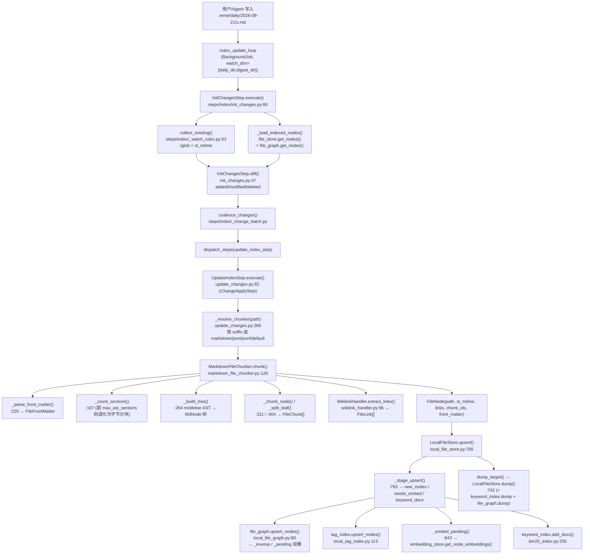
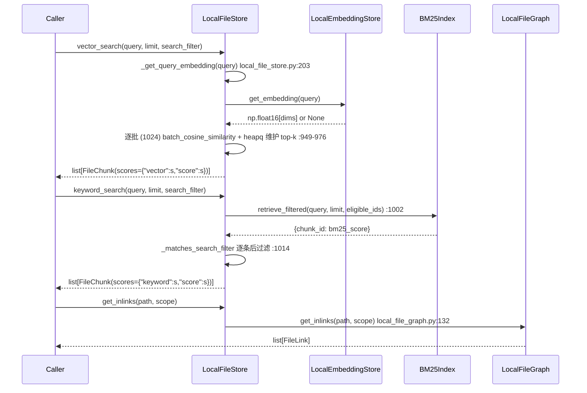
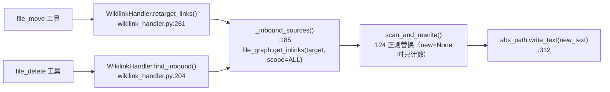

# 12 ReMe 存储层：文件、图、分块、标签 — 源码侦察报告

> 侦察范围：`third_party/ReMe/reme/components/`（file_store / file_graph / file_chunker / file_catalog / tag_index / embedding_store / tokenizer / 组件基座）、`third_party/ReMe/reme/schema/`、`third_party/ReMe/reme/steps/index/`、`third_party/ReMe/reme/utils/wikilink_handler.py`、`docs/en/memory_as_file.md`、`docs/en/auto_link.md`
> 版本：ReMe 0.4.1.13（本地源码树）
> 环境：`PYTHONPATH=/Users/a/PycharmProjects/VsCode_Projects/Agentscope-Learning/third_party/ReMe /Users/a/miniconda3/envs/agentscope_reme_pip_env/bin/python`（Python 3.11.13）
> 本报告所有标注「已验证」的代码均在上述环境真实跑通，输出为真实输出。

---

## 子系统职责（这段代码到底在解决什么问题）

ReMe 的核心口号是 **Memory as File, File as Memory**（`third_party/ReMe/docs/en/memory_as_file.md:3`）。它把「长期记忆」存成用户可读可编辑的 Markdown 文件，而不是藏在黑盒数据库里；索引、图、快照只是**派生状态（derived state）**，坏了可以重建。

本子系统正是这句口号的**落地机器**，它回答四个问题：

1. **一个 md 文件怎么变成可检索的碎片？** → `file_chunker/` 把文件切成 `FileChunk`（带行号范围与 `[Part X/N]` 标记），并顺手抽出 frontmatter 与 wikilink。
2. **文件之间的关系怎么存？** → `file_graph/` 把每个文件存成 `FileNode`，把 `[[...]]` 存成 `FileLink` 有向边，并维护「正向 + 反向」两个邻接索引，支持 REAL / VIRTUAL / ALL 三种边的可见性范围。
3. **哪些文件还没被索引？** → `file_catalog/` 与 `InitChangesStep` 用 `st_mtime` 做增量 diff，只处理 added / modified / deleted。
4. **怎么按标签和关键词找到它们？** → `tag_index/`（frontmatter→标签双向倒排）、`keyword_index/`（BM25 倒排 + 懒删除 + pickle 持久化）、`file_store/`（把上面四者组装成一个统一门面）。

一个必须先记住的分工（教学时最容易讲错的地方）：

| 组件 | 存什么 | 是否必备 |
|---|---|---|
| `FileNode` | 文件级元数据：path / st_mtime / links / chunk_ids / front_matter | 图与目录都存它 |
| `FileChunk` | 块级文本 + 行号范围 + 检索得分 | 只有 file_store 存 |
| `FileLink` | 有向边：source_path → target_path (+ anchor) | 存在 FileNode.links 里 |
| `file_graph` | FileNode 的持久化 + 邻接索引 | LocalFileStore 强制要求 |
| `file_catalog` | 仅 `path + st_mtime` 的轻量 FileNode | 只服务变更检测，不服务检索 |

**关键设计取舍**：`file_graph` 是**唯一真相源（authoritative）**，`file_catalog` 只是「轻量目录」。`LocalFileStore._rebuild_tag_index` 从 `file_graph.get_nodes()` 重建标签索引（`reme/components/file_store/local_file_store.py:656`），而不是从 catalog 重建 —— catalog 里根本没有 frontmatter。

---

## 关键文件表

| 文件路径:行号 | 核心类 | 核心函数 | 一句话职责 |
|---|---|---|---|
| `reme/components/base_component.py:85` | `BaseComponent` | `start/close/dump/load` | 异步生命周期基座，串行化启动+失败回滚 |
| `reme/components/base_component.py:116` | — | `bind()` | 声明式依赖注入：返回 `Dependency` 占位符，start 时解析成真组件 |
| `reme/components/base_component.py:197` | — | `workspace_metadata_path` | 推导 `<workspace>/<metadata_dir>/<ctype>` 作为组件私有落盘目录 |
| `reme/components/component_registry.py:14` | `ComponentRegistry` | `register/get/freeze/copy` | 二级注册表 `component_type -> name -> class`，支持装饰器与冻结模板 |
| `reme/components/component_registry.py:151` | — | `R` | 模块级内置实现注册表模板 |
| `reme/components/application_context.py:15` | `ApplicationContext` | — | 被动状态容器：app_config + components + jobs + thread_pool |
| `reme/components/runtime_context.py:9` | `RuntimeContext` | `add_stream_string` | 单次请求的临时草稿纸（response / stream_queue / data dict） |
| `reme/components/prompt_handler.py:14` | `PromptHandler` | `prompt_format` | 从 YAML/JSON 载入提示词，支持 `key_zh` 本地化与 `[flag]` 条件行 |
| `reme/schema/file_node.py:9` | `FileNode` | — | 文件级图节点 |
| `reme/schema/file_chunk.py:8` | `FileChunk` | `set_hash_id` | 块级记录，id 是 (path,行范围,text) 的确定性哈希 |
| `reme/schema/file_link.py:6` | `FileLink` | — | wikilink 有向边 |
| `reme/schema/file_front_matter.py:8` | `FileFrontMatter` | `model_extra` | frontmatter，`extra="allow"` 保留未知字段 |
| `reme/schema/emb_node.py:9` | `EmbNode` | — | 带 float16 向量的基类，JSON 序列化成 list |
| `reme/schema/graph_snapshot.py:27` | `GraphSnapshot` | — | 面向 UI 的 digest 图快照 schema |
| `reme/schema/traverse_graph.py:28` | `TraverseGraph` | — | 面向 UI 的有界 BFS 遍历结果 schema |
| `reme/components/file_store/base_file_store.py:14` | `BaseFileStore` | `serialized` | file_store 抽象契约 + `@serialized` 维护锁装饰器 |
| `reme/components/file_store/local_file_store.py:35` | `LocalFileStore` | `upsert/delete/vector_search/keyword_search/load/dump` | 组装 embedding+keyword+graph+tag 的门面 |
| `reme/components/file_store/local_file_store.py:765` | — | `upsert()` | 事务式 upsert：先 stage 再写图/标签/向量/关键词 |
| `reme/components/file_store/local_file_store.py:279` | — | `_repair_graph_chunk_consistency()` | 图与 chunk 撕裂时清空派生状态触发全量重建 |
| `reme/components/file_graph/base_file_graph.py:10` | `BaseFileGraph` | `get_outlinks/get_inlinks` | 图后端契约 + REAL/VIRTUAL/ALL 语义文档 |
| `reme/components/file_graph/local_file_graph.py:13` | `LocalFileGraph` | `upsert_nodes/rebuild_links` | 纯 Python dict 图，`_inverse`/`_pending` 双桶邻接 |
| `reme/components/file_graph/nx_file_graph.py:13` | `NxFileGraph` | — | networkx MultiDiGraph 后端，pickle 持久化 |
| `reme/components/file_graph/neo4j_file_graph.py:61` | `Neo4jFileGraph` | — | Neo4j 后端（未验证，需外部数据库） |
| `reme/components/file_catalog/local_file_catalog.py:12` | `LocalFileCatalog` | `upsert/delete/get_nodes` | 内存 dict + jsonl.zst 持久化的轻量目录 |
| `reme/components/file_chunker/default_file_chunker.py:19` | `DefaultFileChunker` | `chunk_content/_parse_front_matter` | 字节窗口 + overlap 分块，避开 wikilink 边界 |
| `reme/components/file_chunker/markdown_file_chunker.py:99` | `MarkdownFileChunker` | `_build_tree/_chunk_node/_emit_packed` | mistletoe AST 语义分块 + 面包屑 + Part 标记 |
| `reme/components/file_chunker/json_file_chunker.py:15` | `JsonFileChunker` | `_node_to_chunks` | JSON 结构感知分块，保留 key 路径 |
| `reme/components/file_chunker/jsonl_file_chunker.py:11` | `JsonlFileChunker` | `_chunk_lines` | JSONL 行对齐滑窗分块 |
| `reme/components/tag_index/base_tag_index.py:26` | `BaseTagIndex` | `normalize_tags` | 标签索引契约 + 保留字校验 |
| `reme/components/tag_index/local_tag_index.py:12` | `LocalTagIndex` | `rebuild/paths_for_tags/list_tags` | path↔tag 双向倒排 |
| `reme/components/embedding_store/base_embedding_store.py:13` | `BaseEmbeddingStore` | `_truncate/get_embeddings` | 向量存储契约 + CJK 感知截断 |
| `reme/components/embedding_store/local_embedding_store.py:19` | `LocalEmbeddingStore` | `get_embeddings` | LRU 缓存 + 按 vector space 分文件的 npz 持久化 |
| `reme/components/tokenizer/base_tokenizer.py:12` | `BaseTokenizer` | `tokenize/_postprocess` | 分词基座（小写化 + 停用词） |
| `reme/components/tokenizer/regex_tokenizer.py:10` | `RegexTokenizer` | `_tokenize_one` | CJK 逐字 + 非 CJK 词边界 |
| `reme/components/tokenizer/jieba_tokenizer.py:10` | `JiebaTokenizer` | `_tokenize_one` | rjieba/jieba 中文分词 |
| `reme/components/keyword_index/bm25_index.py:33` | `BM25Index` | `add_docs/retrieve/optimize_index` | BM25 倒排 + 懒删除 + pickle 原子落盘 |
| `reme/utils/wikilink_handler.py:54` | `WikilinkHandler` | `extract_links/scan_and_rewrite/retarget_links` | `[[...]]` 语法的唯一真相源 |
| `reme/steps/index/init_changes.py:14` | `InitChangesStep` | `diff/execute` | 一次性扫描，产出 `context["changes"]` |
| `reme/steps/index/update_changes.py:319` | `UpdateIndexStep` | `chunk_file/_resolve_chunker` | 把变更批次切成 chunk 写进 file_store |
| `reme/steps/index/update_changes.py:294` | `UpdateCatalogStep` | `build_item` | 把变更批次写进 file_catalog |
| `reme/steps/index/traverse.py:60` | — | `_traverse/_build_graph` | 从 seed 出发的有界 BFS |
| `reme/steps/index/graph_snapshot.py:16` | `GraphSnapshotStep` | `execute` | 构造以 digest 三分类为根的 UI 图快照 |

---

## 调用链

### 链路 A：一个 md 落盘 → 建索引 → 建图（真实生产路径）



逐段讲解：

1. **谁触发扫描**：生产环境不是「写文件时同步建索引」，而是 `reme/config/default.yaml` 里的 `index_update_loop`（BackgroundJob）。它先跑一次 `init_changes_step` 做全量首扫，再跑 `watch_changes_step` 进入增量监听。这就是「增量变更检测」的全部机制。
2. **变更检测靠 mtime，不靠 hash**：`diff()`（`init_changes.py:47`）把 `{绝对路径: st_mtime}` 与图里的 `FileNode.st_mtime` 做集合运算。`existing - indexed` = added，`indexed - existing` = deleted，交集里 mtime 不等 = modified。**注意这里用的是绝对路径做 key**（`init_changes.py:52-54`），而 `FileNode.path` 是 workspace 相对路径 —— 转换发生在这一行。
3. **`file_store` 既当「索引目标」又当「已索引快照」**：`_load_indexed_nodes()`（`init_changes.py:37`）在 `monitor_type="file_store"` 时直接返回 `file_store.get_nodes()`，而它内部就是 `file_graph.get_nodes()`（`local_file_store.py:892`）。这正是 `_repair_graph_chunk_consistency()` 存在的原因（见「坑与注意事项」第 1 条）。
4. **分块器按后缀路由**：`UpdateIndexStep._resolve_chunker()`（`update_changes.py:366`）遍历 `app_context.components["file_chunker"]`，比对 `chunker.supported_extensions`；无匹配则回落到名为 `default` 的分块器，都没有就抛 `RuntimeError`。这是「一切皆插件」在存储层的直接体现。
5. **upsert 是「先规划后落盘」两阶段**：`_stage_upsert()`（`local_file_store.py:783`）先在内存里改 `self.file_chunks`、算出三张清单（新图节点、待向量化的 chunk、待索引的 keyword 文档），再按固定顺序执行副作用（图 → 标签 → 向量 → 关键词）。顺序不是随意的：图先写，标签索引与关键词索引才能引用到真实存在的节点。
6. **落盘是显式动作**：`ChangeApplyStep.execute()`（`update_changes.py:82`）在批次全部成功后才 `dump_target()`。这就是默认配置里 `watch_changes_step` 的 `update_index_step` 带 `persist: False` 的含义 —— 实时监听期间只改内存，等一个完整批次结束再统一落盘。

### 链路 B：一次检索请求



路径语义的关键点：`_get_query_embedding()`（`local_file_store.py:203`）在三种情况下**返回 None 而不是抛异常** —— embedding 未配置、正在重建（`_embedding_rebuild_pending`）、或者文本为空。上层 `vector_search` 拿到 None 就返回 `[]`。这是「keyword 检索必须能在 embedding 挂掉时继续工作」的设计（`_mark_embedding_unhealthy` 的注释：`keyword search remains active`，`local_file_store.py:142`）。

### 链路 C：wikilink 维护（move / delete 时的反向查询）



`_inbound_sources()`（`wikilink_handler.py:185`）**刻意用 `scope=ALL` 而不是默认的 `REAL`**，因为 move/delete 发生时目标路径通常已经不在图里，边被降级到 `_pending`（virtual）桶里；只用 REAL 会漏掉所有引用。

---

## 关键数据结构

### FileNode（`reme/schema/file_node.py:9`，真实定义）

```python
class FileNode(BaseModel):
    """A workspace file as a graph node."""

    path: str = Field(default=..., description="Path relative to the workspace")
    st_mtime: float = Field(default=..., description="Filesystem mtime (seconds)")
    links: list[FileLink] = Field(default_factory=list, description="Outgoing wikilinks")
    chunk_ids: list[str] = Field(default_factory=list, description="Owned FileChunk ids")
    front_matter: FileFrontMatter = Field(default_factory=FileFrontMatter, description="Parsed front matter")
```

要点：
- `path` 是 **workspace 相对 POSIX 路径**，由 `ComponentMixin.to_workspace_relative()`（`base_component.py:44`）算出。
- `st_mtime` **不是**装饰：它既是增量检测的判据，也是唯一能判断「文件是否被改动」的信号。
- `chunk_ids` 是**所有权声明**，不是引用计数。`_repair_graph_chunk_consistency()` 正是靠它的集合差来判断一致性。

### FileChunk（`reme/schema/file_chunk.py:8`）

```python
class FileChunk(EmbNode):
    """A chunk of a file with positional info and per-stage retrieval scores."""

    path: str = Field(default="", description="Path relative to the workspace")
    start_line: int = Field(default=0, description="Inclusive start line (1-based)")
    end_line: int = Field(default=0, description="Inclusive end line (1-based)")
    scores: dict[str, float] = Field(default_factory=dict, description="Retrieval scores keyed by stage")

    @property
    def score(self) -> float:
        """Final aggregated score; 0.0 if not yet computed."""
        return self.scores.get("score", 0.0)

    def set_hash_id(self):
        """Replace ``id`` with a deterministic hash of (path, range, text)."""
        from ..utils import hash_text

        self.id = hash_text(" ".join([self.path, str(self.start_line), str(self.end_line), self.text]))
        return self
```

要点：
- `scores` 是**分阶段字典**（`{"vector":..., "keyword":..., "score":...}`），为后面的 RRF/加权融合预留。融合逻辑不在本子系统（在 `reme/steps/` 的 search 侧）。
- `set_hash_id()` 是**幂等去重的核心**：同一个文件同一行范围同一文本 → 同一个 id。`_evict_prior_chunks()`（`local_file_store.py:806`）靠它做「文本没变就复用旧向量」的优化。

### EmbNode（`reme/schema/emb_node.py:9`）与 float16 存储

```python
    id: str = Field(default_factory=lambda: uuid4().hex, description="Unique node id")
    text: str = Field(default="", description="Text content")
    embedding: np.ndarray | None = Field(default=None, description="Embedding vector (float16)")
    metadata: dict = Field(default_factory=dict, description="Arbitrary metadata")

    @field_validator("embedding", mode="before")
    @classmethod
    def validate_embedding(cls, v):
        """Coerce list/tuple to float16 ndarray."""
        if v is None:
            return v
        return np.array(v, dtype=np.float16)

    @field_serializer("embedding")
    def serialize_embedding(self, v: np.ndarray | None, _info):
        """Serialize ndarray to a JSON-friendly list."""
        if v is None:
            return None
        return v.tolist()
```

`LocalFileStore` 不走 pydantic 的默认序列化，而是**自己 base64 编码 float16 原始字节**（`local_file_store.py:307-329`），避免 `v.tolist()` 把 1024 维向量膨胀成上千行 JSON：

```python
        payload = chunk.model_dump(mode="json", exclude={"embedding"})
        if chunk.embedding is not None:
            embedding = np.asarray(chunk.embedding, dtype=_EMBEDDING_F16_DTYPE)
            if embedding.ndim != 1:
                raise ValueError("FileChunk embedding must be one-dimensional")
            raw = np.ascontiguousarray(embedding).tobytes()
            payload[_EMBEDDING_F16_B64_FIELD] = base64.b64encode(raw).decode("ascii")
```

### FileLink（`reme/schema/file_link.py:6`）

```python
class FileLink(BaseModel):
    """file link
    [[target_path]]
    [[target_path#target_anchor]]
    """

    model_config = ConfigDict(extra="forbid")
    source_path: str = Field(default=..., description="source file path relative to working dir")
    target_path: str = Field(default=..., description="target file path relative to working dir")
    target_anchor: str | None = Field(default=None, description="Heading, block, or line anchor (text after '#')")
    predicate: str | None = Field(
        default=None,
        exclude=True,
        description="Deprecated compatibility field; accepted when loading legacy indexes but otherwise unused",
    )
```

`predicate` 是历史遗留字段：`exclude=True` 表示**不再写出**，但读旧索引时仍接受。这是「文档 / 旧数据兼容」的常见手法，教学时值得点出。

### FileFrontMatter（`reme/schema/file_front_matter.py:8`）

```python
class FileFrontMatter(BaseModel):
    """Markdown front matter; unknown keys are preserved as extras."""

    model_config = ConfigDict(extra="allow")

    name: str = Field(default="", description="Document name")
    description: str = Field(default="", description="Document description")

    @property
    def model_extra(self) -> dict[str, Any] | None:
        return self.__pydantic_extra__
```

**只有 `name` 和 `description` 是一等公民**，其余全部进 `__pydantic_extra__`。`LocalTagIndex` 正是通过 `node.front_matter.model_extra or {}` 拿到 `memory_tags`（`local_tag_index.py:77`）。文档 `memory_as_file.md:161` 说得很直白：「The current code recognizes `name` and `description` explicitly. Other fields are preserved as additional metadata.」

### GraphSnapshot / TraverseGraph（`reme/schema/graph_snapshot.py:27`、`traverse_graph.py:28`）

这两个是**面向 UI 的 DTO**，不是存储结构：

```python
class GraphSnapshot(BaseModel):
    """A category-rooted snapshot of digest wikilinks and their daily-note leaves."""

    version: Literal[1] = 1
    nodes: list[GraphSnapshotNode]
    edges: list[GraphSnapshotEdge]
```

```python
class TraverseGraph(BaseModel):
    """A bounded wikilink graph rooted at one or more workspace paths."""

    version: Literal[1] = 1
    seeds: list[str] = Field(description="Normalized workspace-relative traversal roots")
    depth: int = Field(ge=0, description="Requested hop limit")
    direction: Literal["forward", "backward", "both"]
    nodes: list[TraverseGraphNode]
    edges: list[TraverseGraphEdge]
```

`GraphSnapshotNode` 有 `indexed: bool` 与 `virtual: bool` 两个标志位 —— 这正是 REAL/VIRTUAL 边语义在 UI 层的投影。

---

## 源码精读

### 1. 依赖注入：`bind()` 是「声明」，`start()` 才是「解析」

`reme/components/base_component.py:116`：

```python
    @staticmethod
    def bind(
        name: str | None,
        base_cls: type[T],
        *,
        default_factory: Callable[[], T] | None = None,
        optional: bool = True,
    ) -> T | None:
        """Declare a dependency on another component.

        Returns a ``Dependency`` placeholder resolved into the real component
        (or None / a factory-produced instance) when ``start`` runs. An empty
        `name` short-circuits to None so callers can skip optional wiring.
        """
        if not name:
            return None
        ctype = getattr(base_cls, "component_type", None)
        try:
            ctype = component_type_name(ctype)
        except (TypeError, ValueError) as exc:
            raise TypeError(
                f"{base_cls.__name__} must declare a non-BASE string 'component_type'",
            ) from exc
        if ctype == ComponentEnum.BASE.value:
            raise TypeError(f"{base_cls.__name__} must declare a non-BASE 'component_type'")
        return cast(T, Dependency(ctype, name, default_factory, optional))
```

为什么这么设计：
- `bind("", ...)` **短路返回 None**，让 `LocalFileStore.__init__` 能用一行代码表达「embedding_store 可关闭」：`self.embedding_store = self.bind(embedding_store, BaseEmbeddingStore, default_factory=LocalEmbeddingStore)`（`local_file_store.py:66`）。默认配置里 `embedding_store: ""` 就走这条路。
- 类型校验在**声明期**完成：`base_cls` 必须声明非 BASE 的 `component_type`，否则立即 `TypeError`。这把「配置写错」从运行期提前到导入期。
- `Dependency.__getattr__`（`base_component.py:78`）在解析前访问任何属性都会抛 `RuntimeError: Dependency X:Y accessed before start()`。**这是本报告踩到的真实错误**，见「坑与注意事项」第 3 条。

解析逻辑分两条路（`base_component.py:164-193`）：

```python
    def _resolve_one(self, attr: str, dep: Dependency) -> None:
        """Resolve a single dependency, dispatching by mode."""
        if self.app_context is None:
            self._resolve_standalone(attr, dep)
        else:
            self._resolve_from_context(attr, dep)

    def _resolve_standalone(self, attr: str, dep: Dependency) -> None:
        if dep.default_factory is not None:
            instance = dep.default_factory()
            setattr(self, attr, instance)
            if isinstance(instance, BaseComponent):
                self._owned.append(instance)
        elif dep.optional:
            setattr(self, attr, None)

    def _resolve_from_context(self, attr: str, dep: Dependency) -> None:
        """Context-bound mode: look up the component from ``app_context.components``."""
        target = self.app_context.components.get(dep.ctype, {}).get(dep.name)
        if target is not None:
            setattr(self, attr, target)
        elif dep.optional:
            setattr(self, attr, None)
        else:
            raise ValueError(f"{dep.ctype} '{dep.name}' not found.")
```

**教学重点**：挂载 `app_context` 后，组件**不再自己 new 依赖**，而是从 `app_context.components[ctype][name]` 里查。这就是「插件微内核」的 Python 版：配置（`default.yaml` 的 `components:` 段）决定谁被实例化，`bind()` 决定谁被接线。教程里的 `harness_kit` 应该照抄这个两段式。

### 2. 注册表：二级结构 + 冻结模板 + 按 owner 查重

`reme/components/component_registry.py:32`：

```python
    def _do_register(self, cls: type[T], name: str, *, owner: str | None = None) -> type[T]:
        """Insert ``cls`` under its component type and reject ambiguous providers."""
        try:
            component_type = component_type_name(getattr(cls, "component_type", None))
        except (TypeError, ValueError) as exc:
            raise TypeError(f"{cls.__name__} must have a non-empty string 'component_type' attribute") from exc
        if not name:
            raise ValueError("Component name cannot be empty")

        with self._lock:
            self._ensure_mutable()
            group = self._registry.setdefault(component_type, {})
            key = (component_type, name)
            if name in group:
                existing = group[name]
                existing_owner = self._owners[key]
                new_owner = owner or cls.__module__
                if existing is cls and existing_owner == new_owner:
                    return cls
                raise ValueError(
                    f"Backend '{component_type}:{name}' is provided by both " f"'{existing_owner}' and '{new_owner}'",
                )
            group[name] = cls
            self._owners[key] = owner or cls.__module__
        return cls
```

为什么记录 `owner`：插件系统必须能回答「这个 `backend: local` 到底是谁提供的」。同一 `(ctype, name)` 被两个不同模块注册 → 立即报错；同一个类被重复注册 → 幂等返回。

模板与实例分离（`component_registry.py:151-156`）：

```python
# Import-time registry for built-in implementations. Runtime code should use
# ``create_application_registry`` rather than mutate this template.
R = ComponentRegistry()


def create_application_registry() -> ComponentRegistry:
    """Return a mutable registry initialized from the frozen built-in template."""
    return R.copy()
```

`R` 是**进程级模板**，各 `ApplicationContext` 拿 `R.copy()`。`preserve()` 上下文管理器（`:132`）用于「临时允许导入副作用注册，退出后恢复快照」。

### 3. 启动事务：失败必回滚

`reme/components/base_component.py:225`：

```python
    async def start(self) -> None:
        """Start once, rolling back partial resources when any startup stage fails."""
        async with self._lock:
            if self._is_started:
                return
            started_owned: list[BaseComponent] = []
            start_hook_entered = False
            try:
                await self._resolve_bindings()
                for owned in self._owned:
                    await owned.start()
                    started_owned.append(owned)
                start_hook_entered = True
                await self._start()
                self._is_started = True
            except BaseException:
                await self._rollback_start(start_hook_entered, started_owned)
                raise
```

教学要点（企业级 Harness 必备）：用 `BaseException` 而不是 `Exception` 捕获 —— `asyncio.CancelledError` 继承自 `BaseException`，CTRL-C 取消时也必须回滚。`_rollback_start()`（`:244`）按**逆序**关闭已启动的 owned 组件，并把回滚异常只记日志、不覆盖原始异常。

### 4. 图后端：REAL / VIRTUAL 双桶邻接

`reme/components/file_graph/local_file_graph.py:16` 的构造：

```python
    def __init__(self, **kwargs):
        super().__init__(**kwargs)
        self._nodes: dict[str, FileNode] = {}
        self._inverse: dict[str, set[str]] = {}  # real target → sources
        self._pending: dict[str, set[str]] = {}  # virtual target → sources
        self._graph_file: Path = self.component_metadata_path / f"{self.name}.jsonl.zst"
```

`_add_edge()` 做**动态桶选择**（`local_file_graph.py:55`）：

```python
    def _add_edge(self, src: str, target: str) -> None:
        bucket = self._inverse if target in self._nodes else self._pending
        bucket.setdefault(target, set()).add(src)
```

边落在哪个桶取决于**边的写入时刻** target 是否已被索引。因此 target 后来被 upsert 时，必须把 `_pending` 里的条目**提升**到 `_inverse`（`upsert_nodes`，`:80`）：

```python
    async def upsert_nodes(self, nodes: list[FileNode]) -> None:
        for node in nodes:
            path = node.path
            old = self._nodes.get(path)
            if old is not None:
                for target in self._targets(old):
                    self._remove_edge(path, target)
            self._nodes[path] = node
            for target in self._targets(node):
                self._add_edge(path, target)
            promoted = self._pending.pop(path, None)
            if promoted:
                self._inverse.setdefault(path, set()).update(promoted)
```

`delete_nodes()`（`:94`）做对称的**降级**：删掉的节点从 `_inverse` 移到 `_pending`，这样指向它的边仍然可查（改为 virtual scope）。

`get_inlinks()`（`:132`）按 scope 合并两个桶：

```python
    async def get_inlinks(self, path: str, scope: LinkScopeEnum | str = LinkScopeEnum.REAL) -> list[FileLink]:
        scope = self._normalize_scope(scope)
        sources: set[str] = set()
        if scope in (LinkScopeEnum.REAL, LinkScopeEnum.ALL):
            sources |= self._inverse.get(path, set())
        if scope in (LinkScopeEnum.VIRTUAL, LinkScopeEnum.ALL):
            sources |= self._pending.get(path, set())
        return [
            link
            for src in sorted(sources)
            if src in self._nodes
            for link in self._nodes[src].links
            if link.target_path == path
        ]
```

注意 `if src in self._nodes` 这个守卫：`_pending` 里可能有已删除的源文件残留，返回前会被过滤掉。**同时**这个设计也解释了为什么 `_inbound_sources()` 要用 `scope=ALL` —— 只要源文件还在，即使目标已删，也能找到引用。

持久化格式（`local_file_graph.py:42`）：**一行一个 `FileNode.model_dump_json()`，整体 zstd 压缩**：

```python
    async def dump(self) -> None:
        try:
            write_jsonl_zst(self._graph_file, (n.model_dump_json() for n in self._nodes.values()))
            self.logger.info(f"Saved {len(self._nodes)} nodes to {self._graph_file}")
        except Exception as e:
            self.logger.exception(f"Failed to write {self._graph_file}: {e}")
```

**注意：dump 出去的是 `_nodes`，不含 `_inverse`/`_pending`。** 邻接索引在 `_start()` 里通过 `rebuild_links()` 从 `links` 字段重建（`local_file_graph.py:25-28`）。这就是「图结构只存一份真相，索引纯派生」的体现。

### 5. 默认分块器：字节窗口 + 保护 wikilink 边界

`reme/components/file_chunker/default_file_chunker.py:138`：

```python
    def chunk_content(self, content: str, rel_path: str, parse_links: bool = True) -> list[FileChunk]:
        """Split content into overlapping byte-range chunks, avoiding cuts inside wikilinks.

        When ``parse_links`` is False, skip wikilink span computation and boundary checks
        — used for non-markdown files where wikilink semantics don't apply.
        """
        content_bytes = content.encode(self.encoding)
        n = len(content_bytes)
        newline_positions = [i for i, b in enumerate(content_bytes) if b == ord("\n")]
        if parse_links:
            link_spans = self._link_byte_spans(content)
            link_starts = [s for s, _ in link_spans]
        else:
            link_spans: list[tuple[int, int]] = []
            link_starts: list[int] = []
        # Refuse to retreat past half of chunk_byte_size; falls back to hard cut
        # for pathologically long links so we always make forward progress.
        min_chunk = self.chunk_byte_size // 2
        chunks: list[FileChunk] = []
        start = 0

        while start < n:
            end = min(start + self.chunk_byte_size, n)
            if end < n:
                span = self._span_containing(end, link_spans, link_starts)
                if span is not None and span[0] - start >= min_chunk:
                    end = span[0]

            chunk_text = content_bytes[start:end].decode(self.encoding, errors="ignore")
            start_line = bisect_right(newline_positions, start - 1) + 1
            end_line = bisect_right(newline_positions, end - 1) + 1
            if content_bytes[end - 1] == ord("\n"):
                end_line -= 1
            chunks.append(
                FileChunk(path=rel_path, start_line=start_line, end_line=end_line, text=chunk_text).set_hash_id(),
            )
            if end >= n:
                break

            next_start = end - self.overlap_byte_size
            span = self._span_containing(next_start, link_spans, link_starts)
            if span is not None:
                next_start = span[1]
            if next_start <= start:
                next_start = end
            start = next_start

        return chunks
```

四个精妙点：
1. **先 encode 成 bytes 再按字节切**，不是按字符。这样 chunk 大小对 UTF-8 中文是稳定的（不会因为「一个中文字符 = 3 字节」而爆表）。
2. **`bisect_right(newline_positions, ...)` 反推行号**：`newline_positions` 是排序好的换行符字节偏移，用二分 O(log n) 把字节偏移映射成 1-based 行号。这是本文件里最值得学的技巧。
3. **`_span_containing(pos, ...)` 只在 `s < pos < e` 时返回**：`bisect_right(starts, pos) - 1` 找到最后一个起点 ≤ pos 的 span，再检查 pos 是否严格落在里面。切点正好等于 span 起点不算「切在链接里」。
4. **`min_chunk = chunk_byte_size // 2` 防死循环**：如果一个 wikilink 比半个 chunk 还长，就放弃避让、硬切。这保证了 `start` 一定前进。

**overlap 的实现是「回退起点」而不是「重复内容」**：`next_start = end - self.overlap_byte_size`，然后如果 `next_start` 落在某个 wikilink 内部，就把它推到该链接的**末尾**（`span[1]`），而不是开头。这保证下一个 chunk 不会从一个链接中间开始。

### 6. Markdown 分块器：AST + 面包屑 + Part 标记

模块 docstring（`markdown_file_chunker.py:1-16`）写清了整个流水线：

> Pipeline: count headings without an AST → use plain-text byte chunks when the configured section limit is exceeded; otherwise build a mistletoe AST → ``MdNode`` tree (sections nest by heading level) → recursively chunk children and merge adjacent small subtrees at their parent. Leaf blocks (table / code / list / paragraph) split on internal boundaries and each piece is annotated ``[Part X/N]``.

`MdNode` 定义（`:43`）：

```python
@dataclass
class MdNode:
    """``root`` / ``section`` (heading + children until equal-or-shallower
    heading) / ``body`` (one mistletoe block; ``block`` keeps the original).

    ``text`` is the rendered subtree (own heading excluded for sections).
    Line ranges span the full subtree.
    """

    kind: str  # "root" | "section" | "body"
    heading: str | None = None
    level: int = 0
    children: list["MdNode"] = field(default_factory=list)
    block: Any = None
    text: str = ""
    start_line: int = 0
    end_line: int = 0
```

**两级降级策略**（`_count_sections` + `chunk`，`:167` / `:126`）：先不建 AST，用纯文本正则数标题（跳过 fenced code）。若节数 > `max_ast_sections`（默认 100），直接退化成 `DefaultFileChunker` 的字节分块（`_chunk_plain_text`，`:215`）—— 因为超多节的文档建 AST + 递归会非常慢。这是**生产级才有的防御**，教学价值极高。

`_build_tree()`（`:264`）用**标题层级栈**把 mistletoe 的扁平 children 折成嵌套 section：

```python
            if isinstance(child, (Heading, SetextHeading)):
                level = max(1, getattr(child, "level", 1))
                while len(stack) > 1 and stack[-1].level >= level:
                    stack.pop()
                sec = MdNode(
                    kind="section",
                    heading=_heading_text(child, renderer),
                    level=level,
                    start_line=line,
                )
                stack[-1].children.append(sec)
                stack.append(sec)
                continue
```

`_chunk_node()`（`:311`）是**贪心装填 + 只对超大树递归**：

```python
        if subtree_text and self._byte_len(self._compose_text(prefix, subtree_text)) <= self.chunk_byte_size:
            return [
                self._make_chunk(
                    prefix,
                    subtree_text,
                    node.start_line,
                    node.end_line,
                    path,
                ),
            ]

        if node.kind == "body":
            return self._split_leaf(node, prefix, path, renderer)
```

**能装下就整棵子树一个 chunk**（这是「优先一个完整 section」的规则）；装不下且是叶子才 `_split_leaf`；否则递归子节点，并把能装下的兄弟用 `append_to_cache` 合并（`:361`），装满就 `flush_cache()`。

`_emit_packed()`（`:524`）是最终打包器，**把信封开销、面包屑开销、Part 标记开销全部计入预算**：

```python
        envelope = self._byte_len(wrap.replace("{inner}", ""))
        breadcrumb_overhead = self._breadcrumb_overhead(breadcrumb)
        part_marker = len(units) > 1
        marker_overhead = self._byte_len(f"[Part {len(units)}/{len(units)}]\n\n") if part_marker else 0
        budget = self.chunk_byte_size - envelope - breadcrumb_overhead - marker_overhead
```

`_breadcrumb_overhead()`（`:607`）的算法很巧：算 `len(breadcrumb + "\n\n" + "x") - 1`，即「面包屑 + 分隔符」的准确字节数，避免手写常量写错。

`_compose_text()`（`:613`）在面包屑挤爆预算时**从最外层祖先开始丢弃**：

```python
        breadcrumb_parts = breadcrumb.split("\n\n")
        for start in range(len(breadcrumb_parts)):
            retained = "\n\n".join(breadcrumb_parts[start:])
            candidate = _toc_join(retained, content)
            if self._byte_len(candidate) <= self.chunk_byte_size:
                return candidate
        return content
```

**与官方文档的差异（教学亮点）**：`docs/en/memory_as_file.md:376-386` 说「By default, every chunk includes its heading skeleton」，并给出示例里同时含 `# Top-level heading`、`## Current section`、`## Following section heading`。**源码不是这样**：`markdown_file_chunker.py:1-7` 的 docstring 明确说

> a chunk that starts inside a section carries only that section's ancestor heading breadcrumb. **Sibling headings remain in the document stream and are stored once**, avoiding the quadratic growth caused by repeating the complete document outline in every chunk.

我的验证输出也证实了这一点：chunk 4 只有 `# Top / ## Section A / ### Sub A1` 三级祖先面包屑，**没有**包含 `## Section B`、`## Section C` 这些「后续兄弟标题」。文档给的示例是旧版本行为，**以源码为准**。

### 7. 懒加载依赖的目录约定

`reme/components/base_component.py:197`：

```python
    @property
    def workspace_metadata_path(self) -> Path:
        """Workspace metadata directory: ``<workspace>/<metadata_dir>``."""
        if self.app_context is None:
            return Path.cwd() / "metadata"
        return self.workspace_path / self.app_context.app_config.metadata_dir

    @property
    def component_metadata_path(self) -> Path:
        """Per-component metadata directory under the workspace."""
        return self.workspace_metadata_path / component_type_name(self.component_type)
```

所以「组件私有落盘目录」= `<workspace>/metadata/<component_type>/`。各后端的文件名：

| 组件 | 文件名模式 | 代码位置 |
|---|---|---|
| file_graph (local) | `default.jsonl.zst` | `local_file_graph.py:21` |
| file_graph (nx) | `default.pkl` | `nx_file_graph.py:27` |
| file_store | `file_chunks_<name>_<store_version>.jsonl.zst` | `local_file_store.py:79` |
| file_catalog | `<name>.jsonl.zst` | `local_file_catalog.py:21` |
| keyword_index (bm25) | `bm25_<name>_<Tokenizer>_<fingerprint>_v1.pkl` | `bm25_index.py:71` |
| embedding_store (local) | `<name>_<cache_version>_<vector_space_id>.npz` | `local_embedding_store.py:64` |

`component_type_name(self.component_type)` 统一用 `ComponentEnum` 的值（`file_store` / `file_graph` / `keyword_index` …，见 `reme/enumeration/component_enum.py:6`），从类名自动推导，**不需要每个子类手写路径**。

### 8. 增量变更检测：`InitChangesStep.diff()`

`reme/steps/index/init_changes.py:46`：

```python
    @staticmethod
    def diff(existing: dict[str, float], nodes: Iterable[FileNode], workspace_path: Path) -> tuple[
        list[dict],
        dict[str, int],
    ]:
        """Compute added/modified/deleted vs ``nodes`` and return (changes, counts)."""
        indexed: dict[str, float] = {
            str(Path(n.path) if Path(n.path).is_absolute() else workspace_path / n.path): n.st_mtime for n in nodes
        }
        to_delete = list(indexed.keys() - existing.keys())
        to_add = list(existing.keys() - indexed.keys())
        to_modify = [p for p in existing.keys() & indexed.keys() if existing[p] != indexed[p]]
        changes: list[dict] = (
            [{"change": "added", "path": p} for p in to_add]
            + [{"change": "modified", "path": p} for p in to_modify]
            + [{"change": "deleted", "path": p} for p in to_delete]
        )
        counts = {"added": len(to_add), "modified": len(to_modify), "deleted": len(to_delete)}
        return changes, counts
```

**这就是「checkpoint 机制」的全部真相，而且它不是你以为的样子。**

任务书里问「file_catalog 的增量变更检测（checkpoint）机制」—— **源码里没有一个叫 checkpoint 的通用增量游标**。真实机制是：

1. `init_changes_step` **每次全量 walk 磁盘**（`collect_existing()` 用 `rule.path.rglob("*")`，`_watch_rules.py:69`），拿到 `{绝对路径: st_mtime}`。
2. 再拿**已索引快照**（`monitor_type` 决定是 file_store 还是 file_catalog）。
3. 两个 dict 做集合运算。**「checkpoint」= 已索引快照本身**，落在磁盘上就是 `metadata/file_graph/default.jsonl.zst`（file_store 模式）或 `metadata/file_catalog/<name>.jsonl.zst`（file_catalog 模式）。
4. 全量 walk 的成本被 `watch_suffixes` 白名单（`default.yaml` 里是 `[md]`）和 `watch_dirs` 限定范围压下去。

`schema/proactive.py:104`、`schema/dream.py:66` 里的 `checkpoint_paths` 是 **agent 工作流层面**的字段（「这一轮成功处理了哪些路径，下轮不要再处理」），和这里的文件索引 checkpoint **不是同一件事**。教程里必须区分清楚，否则读者会把两层混成一层。

### 9. tag_index：frontmatter → 双向倒排

`reme/components/tag_index/local_tag_index.py:12`：

```python
@R.register("local")
class LocalTagIndex(BaseTagIndex):
    """Maintain bidirectional path/tag relationships without separate source I/O."""

    reserved_tag_keys = frozenset(FileFrontMatter.model_fields) | {
        "kind",
        "session_id",
        "source_conversation",
        "source_resource",
        "status",
    }

    def __init__(self, **kwargs):
        super().__init__(**kwargs)
        self.path_to_tags: dict[str, tuple[str, ...]] = {}
        self.tag_to_paths: dict[str, set[str]] = {}
        self._maintenance_lock = asyncio.Lock()
```

`reserved_tag_keys` 是**用 `FileFrontMatter.model_fields` 动态算出**的 —— 不能把 `name`/`description` 当标签字段用。这是「用类型系统当配置校验」的范例。

归一化 `_normalize_tags()`（`:33`）规则非常具体：

```python
        for item in value:
            if isinstance(item, bool) or not isinstance(item, (str, int)):
                continue
            raw = "_".join(str(item).split())
            if not raw or len(raw) > self.max_tag_length:
                continue
            if not any(char.isalnum() for char in raw):
                continue
            canonical = raw.casefold()
```

- 空白折叠成 `_`（`"new energy"` → `new_energy`）
- 超长丢弃（> `max_tag_length` 默认 64）
- **必须含至少一个字母或数字**（`any(char.isalnum())`）—— 纯标点/emoji 标签被丢弃
- `casefold()` 归一（比 `lower()` 更彻底，能处理德语 ß 等）
- 去重，并按 `max_tags_per_file`（默认 3）截断

**查/写限额不对称**：`paths_for_tags()`（`:129`）用 `normalize_query_tags()`（`limit=None`），注释解释了原因：

```python
        # ``max_tags_per_file`` constrains indexed documents, not lookup
        # expressions. Truncating here would silently weaken AND queries and
        # omit valid matches from OR queries.
```

这个「写入限额 ≠ 查询限额」的细节是**小白最容易写错的地方**，教程应该单独做一个「故意写错会怎样」的对比实验。

`_validate_path()`（`:64`）也值得一提：拒绝反斜杠、拒绝绝对路径、拒绝 `.` / `..` / 空段 —— **防止标签索引被路径穿越攻击写入非法键**。

### 10. BM25 索引：懒删除 + tokenizer 指纹

`reme/components/keyword_index/bm25_index.py:1-17` 的模块 docstring 直接给出了磁盘真相源：

```
On-disk truth source (see `_snapshot` / `_restore`):
    vocab               : dict[token, token_id]
    _doc_ids            : list[doc_id], indexed by doc_idx
    _doc_id_to_idx      : dict[doc_id, doc_idx]
    _doc_lens           : np.int32[n], indexed by doc_idx
    _deleted            : np.bool[n], lazy-delete flag per doc_idx
    _doc_token_ids      : list[np.int32[]], unique token_ids per doc
    _posting_doc_idxs   : dict[token_id, np.int32[]], posting list (doc_idx)
    _posting_tfs        : dict[token_id, np.int32[]], aligned term frequencies

Deletion is lazy: setting `_deleted[idx] = True` retires the slot. The posting
lists keep the stale entries until `optimize_index` rewrites them. Updating an
existing doc_id retires the old slot first, then allocates a fresh idx.
```

`index_file`（`:68`）把 tokenizer 的指纹编进文件名，**换 tokenizer 就换文件**：

```python
    @property
    def index_file(self) -> Path:
        """Path of the persisted index, namespaced by component/tokenizer config."""
        if self.tokenizer is None:
            raise RuntimeError("Tokenizer not initialized. Call start() first.")
        name = type(self.tokenizer).__name__.replace("Tokenizer", "").lower()
        component_name = self._safe_filename_part(self.name)
        fingerprint = self._tokenizer_fingerprint()
        return self.component_metadata_path / f"bm25_{component_name}_{name}_{fingerprint}_{self.index_version}.pkl"
```

`_restore()`（`:408`）加载时**再次校验指纹**，不一致就拒绝加载：

```python
        expected = self._tokenizer_fingerprint()
        actual = data.get("tokenizer_fingerprint")
        if actual is not None and actual != expected:
            raise ValueError(f"Tokenizer fingerprint mismatch: expected {expected}, got {actual}")
```

**我的验证输出里真实文件名是** `bm25_default_regex_7748e1d5a050_v1.pkl` —— 三段信息 `default`(组件名) + `regex`(tokenizer) + `7748e1d5a050`(配置指纹) 全在文件名里。这是「用文件名代替 schema 版本表」的轻量做法。

落盘用**临时文件 + 原子 rename**（`_dump_sync`，`:439`），并 `complete_in_thread` 把阻塞 pickle 挪出事件循环。

### 11. 图与 chunk 的一致性自愈

`reme/components/file_store/local_file_store.py:279`：

```python
    async def _repair_graph_chunk_consistency(self) -> bool:
        """Clear torn graph/chunk state so the filesystem scan rebuilds it.

        ``InitChangesStep`` uses file-graph nodes as the indexed-file snapshot.
        A graph that survives a missing, truncated, or stale chunk store would
        otherwise make the source files look up to date and permanently hide
        the broken search index.
        """
        assert self.file_graph is not None
        nodes = await self.file_graph.get_nodes()
        graph_chunk_ids = {chunk_id for node in nodes for chunk_id in node.chunk_ids}
        stored_chunk_ids = set(self.file_chunks)
        missing = graph_chunk_ids - stored_chunk_ids
        orphaned = stored_chunk_ids - graph_chunk_ids
        if not missing and not orphaned:
            return False

        self.logger.warning(
            f"{self.name}: graph/chunk mismatch: nodes={len(nodes)}, graph_chunks={len(graph_chunk_ids)}, "
            f"stored_chunks={len(stored_chunk_ids)}, missing={len(missing)}, orphaned={len(orphaned)}; "
            "clearing derived index state for automatic rebuild",
        )
        # Clearing graph nodes is required: the next InitChangesStep scan will
        # then classify every watched source file as added and rebuild graph,
        # chunks, and search indexes from the user-owned files.
        await self.clear()
        return True
```

**这是整个子系统最值得讲的一段「企业级防御」**：两个文件（graph.jsonl.zst 与 file_chunks_*.jsonl.zst）是分开写的，进程被 kill 可能只写成功一个。若只留图不留 chunk，`InitChangesStep` 会认为文件「已是最新」，索引**永久损坏且无法自愈**。解法是**主动清空、触发全量重建** —— 因为源文件（用户自己的 md）永远在，派生状态可以随便扔。

---

## 可运行代码片段

### 片段 1【已验证】手写 md → 建索引 → dump file_graph / keyword_index

完整脚本见 `/tmp/recon_12_demo.py`。核心部分：

```python
import asyncio, json, shutil
from pathlib import Path

from reme.components.application_context import ApplicationContext
from reme.components.file_chunker.markdown_file_chunker import MarkdownFileChunker
from reme.components.file_graph.local_file_graph import LocalFileGraph
from reme.components.file_store.local_file_store import LocalFileStore
from reme.components.keyword_index.bm25_index import BM25Index
from reme.components.tag_index.local_tag_index import LocalTagIndex
from reme.components.tokenizer.regex_tokenizer import RegexTokenizer

# 关键：macOS 上 /tmp 是 /private/tmp 的软链，ApplicationConfig 会 resolve()
# workspace，所以测试目录也必须先 resolve()，否则 to_workspace_relative 剥不掉前缀
WS = Path("/tmp/reme_recon_ws").resolve()


def write_workspace() -> Path:
    shutil.rmtree(WS, ignore_errors=True)
    for sub in ["metadata", "daily/2026-09-21", "digest/wiki", "session/dialog"]:
        (WS / sub).mkdir(parents=True, exist_ok=True)
    (WS / "daily/2026-09-21/hybrid-search.md").write_text(
        """---
name: Hybrid Search Notes
description: notes about combining BM25 and vector recall
memory_tags: [Retrieval, memory_as_file]
---

# Hybrid Search

ReMe fuses BM25 and vector recall with RRF.

## Related

This extends [[digest/wiki/rrf.md|RRF]] and depends on
[[digest/wiki/not-created-yet.md]].

## Sources

Recorded in [[session/dialog/local-test.md]].
""",
        encoding="utf-8",
    )
    (WS / "digest/wiki/rrf.md").write_text(
        """---
name: Reciprocal Rank Fusion
description: rank fusion method used to merge keyword and vector results
---

# RRF

Reciprocal Rank Fusion merges ranked lists by summing 1/(k + rank).

Back-reference: [[daily/2026-09-21/hybrid-search.md]].
""",
        encoding="utf-8",
    )
    return WS / "daily/2026-09-21/hybrid-search.md"


async def main() -> None:
    md_path = write_workspace()
    ctx = ApplicationContext(workspace_dir=str(WS), enable_logo=False,
                             log_to_console=False, log_to_file=False)
    # 手工接线，等价于 Application._init_components 读 default.yaml 的行为
    ctx.components = {
        "tokenizer": {"default": RegexTokenizer(name="default", app_context=ctx)},
        "keyword_index": {"default": BM25Index(name="default", tokenizer="default", app_context=ctx)},
        "file_graph": {"default": LocalFileGraph(name="default", app_context=ctx)},
        "tag_index": {"default": LocalTagIndex(name="default", app_context=ctx)},
        "file_store": {"default": LocalFileStore(
            name="default", embedding_store="", keyword_index="default",
            file_graph="default", tag_index="default", app_context=ctx)},
    }
    # 必须按依赖顺序 start：bind() 只登记占位符，start() 才解析
    for ctype in ("tokenizer", "file_graph", "keyword_index", "tag_index"):
        for comp in ctx.components[ctype].values():
            await comp.start()
    store = ctx.components["file_store"]["default"]
    chunker = MarkdownFileChunker(name="markdown", app_context=ctx)
    await chunker.start()
    await store.start()

    node, chunks = await chunker.chunk(md_path)
    await store.upsert([(node, chunks)])
    node_b, chunks_b = await chunker.chunk(WS / "digest/wiki/rrf.md")
    await store.upsert([(node_b, chunks_b)])

    await store.dump()   # 必须显式：LocalFileStore._close 只写自己的 chunk 文件
    print("graph nodes:", [n.path for n in await store.file_graph.get_nodes()])
    print("n_docs:", store.keyword_index.n_docs)


asyncio.run(main())
```

**真实输出（关键片段）**：

```
=== chunker output (daily/2026-09-21/hybrid-search.md) ===
FileNode.model_dump():
{
  "path": "daily/2026-09-21/hybrid-search.md",
  "st_mtime": 1789984399.399068,
  "links": [
    {"source_path": "daily/2026-09-21/hybrid-search.md", "target_path": "digest/wiki/rrf.md", "target_anchor": null},
    {"source_path": "daily/2026-09-21/hybrid-search.md", "target_path": "digest/wiki/not-created-yet.md", "target_anchor": null},
    {"source_path": "daily/2026-09-21/hybrid-search.md", "target_path": "session/dialog/local-test.md", "target_anchor": null}
  ],
  "chunk_ids": ["a3f331cb537126fb8d6dce6c6bd7af2f3ab41b3d6b9cf80e077af3aebcc72fdd"],
  "front_matter": {
    "name": "Hybrid Search Notes",
    "description": "notes about combining BM25 and vector recall",
    "memory_tags": ["Retrieval", "memory_as_file"]
  }
}

chunks: 1
{
  "id": "a3f331cb537126fb8d6dce6c6bd7af2f3ab41b3d6b9cf80e077af3aebcc72fdd",
  "text": "# Hybrid Search\n\nReMe fuses BM25 and vector recall with RRF.\n\n## Related\n\nThis extends [[digest/wiki/rrf.md|RRF]] and depends on\n[[digest/wiki/not-created-yet.md]].\n\n## Sources\n\nRecorded in [[session/dialog/local-test.md]].",
  "metadata": {},
  "path": "daily/2026-09-21/hybrid-search.md",
  "start_line": 6,
  "end_line": 18,
  "scores": {}
}

=== file_graph edges / scope demo ===
outlinks[real] of daily/2026-09-21/hybrid-search.md -> [('digest/wiki/rrf.md', None)]
outlinks[virtual] of daily/2026-09-21/hybrid-search.md -> [('digest/wiki/not-created-yet.md', None), ('session/dialog/local-test.md', None)]
outlinks[all] of daily/2026-09-21/hybrid-search.md -> [('digest/wiki/rrf.md', None), ('digest/wiki/not-created-yet.md', None), ('session/dialog/local-test.md', None)]
inlinks[real] of digest/wiki/rrf.md -> ['daily/2026-09-21/hybrid-search.md']
inlinks[virtual] of digest/wiki/rrf.md -> []
inlinks[virtual] of digest/wiki/not-created-yet.md -> ['daily/2026-09-21/hybrid-search.md']

=== tag_index ===
tags_for_path(daily/.../hybrid-search.md) = ['retrieval', 'memory_as_file']
paths_for_tags(['retrieval']) = ['daily/2026-09-21/hybrid-search.md']
list_tags() = {'total_tags': 2, 'total_pages': 1, 'page': 1, 'range': (1, 2),
               'items': [('memory_as_file', 1), ('retrieval', 1)]}

=== keyword_index (BM25) ===
type: BM25Index n_docs: 2
retrieve('Reciprocal Rank Fusion') -> {'5558d757b7ea37b82350a0ef32d82f86ff157b51ec1332cdc8f6661efc74c7ca': 2.5816402435302734}
  keyword_search hit: path=digest/wiki/rrf.md lines=5-10 scores={'keyword': 2.0202934741973877, 'score': 2.0202934741973877}
  keyword_search hit: path=daily/2026-09-21/hybrid-search.md lines=6-18 scores={'keyword': 0.28939932584762573, 'score': 0.28939932584762573}

=== vector_search with embedding disabled ===
[]

=== on-disk metadata tree ===
  metadata/file_graph/default.jsonl.zst  (464 bytes)
  metadata/file_store/file_chunks_default_v1.jsonl.zst  (450 bytes)
  metadata/keyword_index/bm25_default_regex_7748e1d5a050_v1.pkl  (3767 bytes)
```

**真实落盘内容（graph 文件逐行）**：

```
{"path":"daily/2026-09-21/hybrid-search.md","st_mtime":1789984399.399068,"links":[{"source_path":"daily/2026-09-21/hybrid-search.md","target_path":"digest/wiki/rrf.md","target_anchor":null},{"source_path":"daily/2026-09-21/hybrid-search.md","target_path":"digest/wiki/not-created-yet.md","target_anchor":null},{"source_path":"daily/2026-09-21/hybrid-search.md","target_path":"session/dialog/local-test.md","target_anchor":null}],"chunk_ids":["a3f331cb537126fb8d6dce6c6bd7af2f3ab41b3d6b9cf80e077af3aebcc72fdd"],"front_matter":{"name":"Hybrid Search Notes","description":"notes about combining BM25 and vector recall","memory_tags":["Retrieval","memory_as_file"]}}
{"path":"digest/wiki/rrf.md","st_mtime":1789984399.3993022,"links":[{"source_path":"digest/wiki/rrf.md","target_path":"daily/2026-09-21/hybrid-search.md","target_anchor":null}],"chunk_ids":["5558d757b7ea37b82350a0ef32d82f86ff157b51ec1332cdc8f6661efc74c7ca"],"front_matter":{"name":"Reciprocal Rank Fusion","description":"rank fusion method used to merge keyword and vector results"}}
```

**真实冷启动重载（新 context 从磁盘恢复）**：

```
reloaded graph nodes: ['daily/2026-09-21/hybrid-search.md', 'digest/wiki/rrf.md']
reloaded chunks: 2
reloaded keyword docs: 2
reloaded inlinks(rrf.md): ['daily/2026-09-21/hybrid-search.md']
```

这个输出同时验证了：`_start()` → `load()` 会**自动重建**邻接索引（file_graph 从 links 字段重建 `_inverse`）、tag_index 从 graph 全量 rebuild（日志 `Rebuilt tag index: files=1, tags=2`）、keyword_index 从 `.pkl` 恢复（日志 `Loaded 2 docs`）并做一致性校验后**跳过重建**。

### 片段 2【已验证】wikilink 语法、chunker overlap、日期过滤、BFS 遍历

完整脚本见 `/tmp/recon_12_demo2.py`。**真实输出**：

```
=== WikilinkHandler.extract_links ===
  {'source_path': 'daily/2026-09-21/x.md', 'target_path': 'notes/example.md', 'target_anchor': 'L9-L10,L15-L20'}
  {'source_path': 'daily/2026-09-21/x.md', 'target_path': 'digest/wiki/rrf.md', 'target_anchor': None}
  {'source_path': 'daily/2026-09-21/x.md', 'target_path': 'resource/2026-09-21/chart.png', 'target_anchor': None}

=== iter_matches spans ===
  WikilinkMatch(target='notes/example.md', anchor='L9-L10,L15-L20', start=4, end=39)
  WikilinkMatch(target='notes/example.md', anchor='L9-L10,L15-L20', start=44, end=79)
  WikilinkMatch(target='digest/wiki/rrf.md', anchor=None, start=86, end=112)
  WikilinkMatch(target='resource/2026-09-21/chart.png', anchor=None, start=119, end=153)

=== DefaultFileChunker.chunk_content: 17 chunks ===
  id=774e2f0020ababc0... lines=1-20 bytes=1000
  id=69702f35940c6070... lines=18-38 bytes=1000
  id=80dfa6fc82b7cb5a... lines=36-55 bytes=1000

=== wikilink boundary avoidance: 3 chunks ===
  lines=1-1 bytes=800 starts='PPPPPPPPPPPP' ends='PPPPPPPPPPPP'
  lines=1-1 bytes=1000 starts='PPPPPPPPPPPP' ends='aaaaaaaaaaaa'
  lines=1-1 bytes=800 starts='QQQQQQQQQQQQ' ends='QQQQQQQQQQQQ'

=== LocalFileStore._extract_date_from_path ===
  daily/2026-05-18/note.md -> 2026-05-18
  resource/2026-06-06/report.pdf -> 2026-06-06
  daily/2026-05-18.md -> 2026-05-18
  digest/wiki/solar.md -> None
  daily/not-a-date/x.md -> None

=== traverse helpers (real BFS) ===
  forward adjacency: {'daily/2026-09-21/a.md': ['digest/wiki/b.md'], 'digest/wiki/b.md': ['digest/wiki/c.md']}
  node depths: {'daily/2026-09-21/a.md': 0, 'digest/wiki/b.md': 1, 'digest/wiki/c.md': 2}
  edge depths: {('daily/2026-09-21/a.md', 'digest/wiki/b.md', None): 1, ('digest/wiki/b.md', 'digest/wiki/c.md', 'L3'): 2}
  TraverseGraph: {'version': 1, 'seeds': ['daily/2026-09-21/a.md'], 'depth': 5, 'direction': 'forward',
    'nodes': [{'id': 'daily/2026-09-21/a.md', 'path': 'daily/2026-09-21/a.md', 'name': '', 'description': '', 'depth': 0, 'indexed': True},
              {'id': 'digest/wiki/b.md', 'path': 'digest/wiki/b.md', 'name': '', 'description': '', 'depth': 1, 'indexed': True},
              {'id': 'digest/wiki/c.md', 'path': 'digest/wiki/c.md', 'name': '', 'description': '', 'depth': 2, 'indexed': True}],
    'edges': [{'source': 'daily/2026-09-21/a.md', 'target': 'digest/wiki/b.md', 'target_anchor': None, 'depth': 1},
              {'source': 'digest/wiki/b.md', 'target': 'digest/wiki/c.md', 'target_anchor': 'L3', 'depth': 2}]}
```

三个值得在教程里展开的观察：

1. **两次 `[[notes/example.md#L9-L10,L15-L20]]` 只产出一条 FileLink** —— `extract_links` 按 `(target_path, target_anchor)` 去重（`wikilink_handler.py:106-111`）。但 `iter_matches` 仍然报告**两个 span**（start=4 与 start=44），因为分块器需要知道所有出现位置。
2. **`anchor` 原样保留字符串 `'L9-L10,L15-L20'`**：图解析器**不校验**行锚语法。`docs/en/memory_as_file.md:215-218` 明确说 `#L0`、`#L10-L9`、`#L9,` 也会被存下来，`read` 工具不会解释 `path` 里的 anchor。
3. **wikilink 保护真的生效**：900 字符的长链接被完整保留在中间那个 chunk（`ends='aaaaaaaaaaaa'`），前后各切成 800 字节 —— 切点被推到链接的两端而不是切在 `[[` 里。

### 片段 3【已验证】Markdown AST 分块：面包屑 + `[Part X/N]` + 表头/围栏重复

完整脚本见 `/tmp/recon_12_demo3.py`（用 `chunk_byte_size=1200` 强制拆分一个含标题/表格/代码块/长段落的文档）。**真实输出（节选）**：

```
=== MarkdownFileChunker: 9 chunks for 3697 chars ===
front_matter: {'name': 'AST Chunking Demo',
               'description': 'shows breadcrumbs, part markers, table header and code fence repetition',
               'memory_tags': ['chunking', 'ast']}

--- chunk 4 lines=17-62 bytes=1184 id=eab644cd3af7e179... ---
    # Top

    ## Section A

    ### Sub A1

    [Part 1/2]

    sub-a1 paragraph line 0
    ...
--- chunk 5 lines=63-76 bytes=394 id=1e9b4159a6c8bac7... ---
    # Top

    ## Section A

    ### Sub A1

    [Part 2/2]

    sub-a1 paragraph line 46
    ...
--- chunk 7 lines=82-117 bytes=1172 id=d798fa7559a6ca55... ---
    # Top

    ## Section B

    [Part 1/2]

    | col1  | col2    | col3    |
    | ----- | ------- | ------- |
    | row0  | value0  | note-0  |
    ...
--- chunk 8 lines=118-121 bytes=212 id=fa24cf9400427091... ---
    # Top

    ## Section B

    [Part 2/2]

    | col1  | col2    | col3    |
    | ----- | ------- | ------- |
    | row36 | value36 | note-36 |
    ...
--- chunk 9 lines=123-170 bytes=756 id=f3e8d581cb2a06a5... ---
    # Top

    ## Section C

    ```python
    print('line 0')
    ...
    print('line 35')
    ```
```

逐点确认：
- **面包屑**：chunk 4/5 带 `# Top` + `## Section A` + `### Sub A1` 三层**祖先**标题；chunk 7/8 只带 `# Top` + `## Section B`。`### Sub A1` **没有**出现在 Section B 的 chunk 里 → 证实「只带祖先，不带兄弟」。
- **`[Part X/N]`**：只在被拆开的 section 出现，且位于面包屑之后、正文之前。`_emit_packed` 里 `part_marker = len(units) > 1` 保证了「没被拆就不加标记」。
- **表头重复**：chunk 7 与 chunk 8 都带完整的 `| col1 | col2 | col3 |` 表头 + 分隔行（`_split_table`，`:426`，`wrap=f"{header}\n{{inner}}"`）。
- **围栏重复**：chunk 9 的 ```` ```python ```` 开头与结尾 ```` ``` ```` 都完整（`_split_code`，`:453`，`wrap=f"{opener}\n{{inner}}\n{fence}"`）。
- **chunk 1/2/3/6 只有几十字节**（39/39/31/19）—— 它们是被 `_chunk_node` 用 `append_to_cache` 贪心装填时**提前 flush 的碎块**（因为下一个子树太大必须先 flush）。这是可优化的点，教程里可以留作读者的「改进练习」。

---

## 教学要点（按「小白最容易卡住」排序）

1. **`bind()` 只是声明，不解析。** 新手会写 `self.file_graph = LocalFileGraph()` 直接 new，然后发现配置里换 backend 换不动。必须让学生看到：`bind()` 返回 `Dependency` 占位符，`start()` 里 `_resolve_bindings()` 才替换成真对象。**在 `start()` 之前访问任何属性都会抛 `RuntimeError`**。
2. **手工接线必须自己按依赖顺序 `start()`。** `Application._init_components()` 只是实例化，真正的 `start()` 顺序由 `Application` 在 job 运行时编排。手写实验代码时忘了 start 子组件，第一次调用就会报 `Dependency tokenizer:default accessed before start()`。**这是本报告真实踩到的坑（见「坑」第 3 条）**。
3. **`to_workspace_relative()` 依赖 workspace 是「同一条绝对路径」。** macOS 上 `/tmp` → `/private/tmp` 的符号链接会让前缀匹配失败，`FileNode.path` 变成绝对路径，随后 `LocalTagIndex._validate_path()` 直接拒绝。**排查方法**：打印 `ComponentMixin.workspace_path`，和你的文件路径对比。
4. **`REAL` / `VIRTUAL` / `ALL` 三个 scope 不是可有可无的参数。** 默认是 `REAL`，意味着**指向未索引文件的边查不到**。`WikilinkHandler._inbound_sources()` 特意用 `ALL`（`wikilink_handler.py:200`），因为 move/delete 时目标已经在 `_pending` 桶里了。
5. **`FileNode.chunk_ids` 是所有权声明，不是缓存。** 改图不改 chunk 会产生撕裂，`_repair_graph_chunk_consistency()` 检测到差异时会**直接 `clear()` 整库**，代价是一次全量重建。学生要理解「源文件才是真相，派生状态可以随便扔」这个前提。
6. **「每 chunk 带完整标题骨架」是文档的旧行为。** 真实源码只带**祖先**面包屑（`markdown_file_chunker.py:1-7`），兄弟标题留在文档流里只存一次，避免 O(n²) 膨胀。文档 `memory_as_file.md:376-386` 的示例已过时。
7. **`max_ast_sections` 是性能熔断阀，不是功能开关。** 超过 100 个标题的文档会**静默退化**成字节分块（`markdown_file_chunker.py:135-140`）。学生如果发现「我的大文档分了块但没有面包屑」，答案就在这里。
8. **BM25 的删除是懒的。** `_deleted[idx] = True` 只是退休槽位，posting list 里仍有陈旧条目。不调 `optimize_index()` 不回收空间。这是「索引文件越用越大」的常见原因。
9. **tag 写入限额 ≠ 查询限额。** `max_tags_per_file=3` 只截断**被索引的文档**；`paths_for_tags()` 用 `normalize_query_tags()`（无限制）。写错会让 AND 查询静默变弱。
10. **「checkpoint」有两个完全不同的含义。** 文件索引层：已索引快照 = `FileNode` 集合（`init_changes.py:47`）；Agent 工作流层：`state.checkpoint_paths`（`schema/dream.py:66`）表示「本轮已处理、下轮跳过」。混在一起讲学生会彻底晕。
11. **wikilink 是字面路径，不做任何解析。** `[[X]]` → `target_path="X"`，**不会**自动补 `.md`、不会按文件名全局搜索、不做 Obsidian 式同名解析。普通 Markdown 链接 `[label](path.md)` 完全不产生边。
12. **`FileChunk.id` 是内容哈希，不是随机 id。** `set_hash_id()` 把 `(path, start_line, end_line, text)` 拼起来哈希。文本没变 → id 不变 → `_evict_prior_chunks()` 能复用旧向量，省一次 embedding 调用。这是「改一个字的代价远小于改一段话」的优化基础。
13. **`file_graph` 是检索的**，**`file_catalog` 只服务变更检测**。catalog 里的 FileNode 只有 `path` + `st_mtime`（`update_changes.py:300-302`），没有 frontmatter、没有 links、没有 chunk_ids。所以标签索引只能从 graph 重建。
14. **组件私有落盘目录由 `component_type` 自动推导**，不需要每个子类手写路径。`<workspace>/metadata/<component_type_name>/<自定义文件名>`。
15. **Embedding 挂掉不该让检索整体挂掉。** `_get_query_embedding()` 失败返回 `None`，`vector_search` 返回 `[]`，但 `keyword_search` 继续工作。这是「降级可用」的工程范式，`LocalFileStore` 里到处是这种防御（`is_healthy` 旗标、`_embedding_rebuild_pending` 闸门、backfill 后台任务）。
16. **`jsonl.zst` 三件套是 ReMe 的持久化惯例。** `reme/utils/jsonl_zst.py` 提供 `read_jsonl_zst` / `write_jsonl_zst`：一行一个 JSON，整体 zstd。图、catalog、chunk 全用它；只有 BM25 用 pickle（因为要存 numpy 数组）。
17. **`model_extra` 是 frontmatter 扩展字段的唯一入口。** 想给文件加自定义标签字段，就写 `memory_tags: [a, b]`，然后 `list(LocalTagIndex.reserved_tag_keys)` 里**不能**包含它。
18. **`ComponentRegistry` 的 owner 追踪是插件系统的地基。** 没有它，两个插件注册同一个 `backend: local` 时无法报错，只会后者静默覆盖前者。
19. **`BaseComponent.start()` 用 `BaseException` 而非 `Exception`。** `asyncio.CancelledError` 继承自 `BaseException`，这是企业级代码和教学代码的分水岭。
20. **`LocalFileStore._close()` 刻意不 dump 依赖。** 它检查 `type(self).dump is LocalFileStore.dump` 来决定调 `_dump_owned_state()` 还是子类的 `dump()`（`local_file_store.py:129-133`）。依赖组件由 `Application` 按逆拓扑序单独关闭。

---

## 坑与注意事项

| 现象 | 原因 | 解决 |
|---|---|---|
| `ValueError: Invalid workspace-relative tag-index path: '/tmp/.../x.md'` | macOS `/tmp` 是 `/private/tmp` 软链；`ApplicationConfig.normalize_workspace_dir` 做了 `Path.resolve()`（`schema/application_config.py:78`），而测试代码用未 resolve 的路径，`to_workspace_relative` 剥不掉前缀返回绝对路径 | 测试目录统一 `Path(...).resolve()`；或直接 `print(comp.workspace_path)` 对齐 |
| `RuntimeError: Dependency tokenizer:default accessed before start()` | 手工接线的组件图没有 `start()` 子依赖；`bind()` 只登记占位符（`base_component.py:157`） | 按 `tokenizer → file_graph → keyword_index → tag_index → file_store` 顺序逐个 `await start()` |
| `metadata/file_graph/default.jsonl.zst` 一直不存在 | `LocalFileStore._close()` 只写自己的 chunk 文件（`local_file_store.py:129-133`），图由依赖组件自己关；`Application` 才负责按逆拓扑序关闭依赖 | 显式 `await store.dump()`（它内部会串起 chunk + keyword + graph，`:742`） |
| 大文档分块后**没有**面包屑 | 标题数超过 `max_ast_sections`（默认 100）触发静默降级（`markdown_file_chunker.py:135-140`） | 调大 `max_ast_sections`，或确认这是预期行为（大文档本来就不该建 AST） |
| 指向未创建文件的 wikilink 查 `get_inlinks` 返回空 | `get_inlinks` 默认 `scope=REAL`，而该边落在 `_pending`（virtual）桶 | 显式传 `scope="all"` 或 `scope="virtual"`；参考 `WikilinkHandler._inbound_sources` 的用法 |
| 改了 frontmatter 但标签没更新 | 标签索引从 **file_graph 的 FileNode** 重建（`local_file_store.py:656`），图没更新则标签也不会更新 | 确保走 `InitChangesStep` 的 mtime 检测；或手工 `await store.reindex("tag")` |
| `keyword_index.dump()` 被调用但 BM25 文件是旧的 | 只有 `ChangeApplyStep` 批次全部成功且 `persist=True` 才 `dump_target()`；`watch_changes_step` 的 `update_index_step` 默认 `persist: False` | 等待一轮完整批次结束，或手工 `await store.dump()` |
| BM25 索引文件越来越大 | 懒删除：`_deleted[idx]=True` 只退休槽位，posting list 保留陈旧条目（`bm25_index.py:12-15`） | 空闲时调 `optimize_index()`（`local_file_store.py:752` 会委派给 keyword_index） |
| 换 embedding 模型后检索结果混乱 | 旧向量维度不匹配；`_embedding_dim_matches` 会丢弃它们（`local_file_store.py:167`） | 调 `reindex(scope="embedding")` 全量重建；`LocalEmbeddingStore` 按 `vector_space_id` 分文件也有保护 |
| `[[note]]` 找不到 `note.md` | ReMe wikilink 是**字面路径**，不补后缀、不按 basename 搜 | 写全 `[[digest/wiki/note.md]]` |
| 普通 Markdown 链接 `[x](note.md)` 不产生图边 | `WIKILINK_RE` 只匹配 `[[...]]`（`wikilink_handler.py:62`），文档 `memory_as_file.md:212` 明确说明 | 想建边必须用 wikilink 语法 |
| 进程被 kill 后索引「看起来是最新的」但搜不到 | graph 写成功、chunk store 写失败 → 撕裂状态 | 已内建自愈：`_repair_graph_chunk_consistency()`（`:279`）检测到集合差异会 `clear()` 触发全量重建；手动场景可删 `metadata/` 强制重建 |
| `filename` 里出现 `bm25_default_regex_7748e1d5a050_v1.pkl` 这种怪名字 | 设计如此：`{组件名}_{Tokenizer类名}_{配置指纹}_{版本}`（`bm25_index.py:71`） | 不用改，这是「换 tokenizer 自动换索引文件」的实现 |

---

## 与参考架构的映射

| 参考架构层 | 本子系统对应 | 状态 |
|---|---|---|
| **第0层 Cordis 插件微内核** | `BaseComponent` + `ComponentRegistry`（`R` / `create_application_registry`）+ `ApplicationContext` + `bind()` 依赖注入 + `RuntimeContext` 事件/流 | **完全对应**。ReMe 的 `@R.register("local")` 就是 Cordis 的「一切皆插件」；`ApplicationConfig.components` 就是 Bundle/Profile 声明式配置（`schema/application_config.py:59`）。**教程应以此为 harness_kit kernel 的蓝本** |
| 第0层「事件总线 / 服务路由」 | `RuntimeContext.stream_queue` + `add_stream_string/add_stream_done`（`runtime_context.py:71-84`）+ `ComponentEnum.SERVICE`（http/mcp/cli 三种 service 后端） | **部分对应**。流式是有的事件机制；但没有通用 pub/sub 事件总线，`Application` 直接持有组件引用 |
| **第1层 LLM 模型适配器** | `components/as_llm/`（不在本子系统侦察范围） | 存在，由其他侦察任务覆盖 |
| **第1层 Session 会话 & 事件溯源存储** | `session/` 目录 + `session/dialog/<session_id>.jsonl`（`docs/en/memory_as_file.md:82-86`）；`ApplicationConfig.session_dir` / `mem_session_dir` | **部分对应**。会话是 **JSONL 事件流**，天然可回放；但没有独立的「事件溯源插件」抽象，写入逻辑在 steps 层 |
| **第1层 持久化记忆（短期上下文压缩）** | **不存在于本子系统** | 最近似替代物：`agent_wrapper` 的 `context_config`（`default.yaml:876-879` 的 `trigger_ratio` / `reserve_ratio` / `tool_result_limit`），它在 Agent 编排层做上下文压缩，与本存储层解耦 |
| **第1层 持久化记忆（长期记忆/遗忘策略）** | `file_store` + `file_graph` + `tag_index` + `keyword_index` + `embedding_store`；workspace 的 `daily/` → `digest/` 分层（`docs/en/memory_as_file.md:38-45`） | **完全对应，且是 ReMe 的强项**。「遗忘策略」体现为 `digest/` 的**再蒸馏**（`auto_dream`）而不是删除；`_repair_graph_chunk_consistency` 是「派生状态可丢弃」的另一种遗忘 |
| **第2层 Agent Loop / Planning / Reasoning / Subagent / MCP / Skills / Sandbox** | 不在本子系统 | 由 ReMe 的 `steps/`（`dream` / `proactive` / `evolve`）与 `agent_wrapper/` 覆盖；AgentScope 侧由其他侦察任务覆盖 |
| 第3层 评测基准引擎 | **不存在** | ReMe 仓库有 `reme/config/benchmark.yaml`（本报告未精读），但没有独立的「评测基准引擎插件」抽象。最近似替代物：`reme/config/benchmark.yaml` + `reme/reference/`（如有） |
| 第3层 真实世界反馈闭环 | **不存在于本子系统**。ReMe 的对应物是 `auto_dream` 的 `dream_extract_step` → `dream_integrate_step`（把 daily 蒸馏进 digest，并回写 Sources 链接，见 `docs/en/auto_link.md:14-23`） | 存在但形态不同：是「记忆再加工」而非「用户反馈采集」 |
| **第4层 中间件 Hook** | `steps/` 的 `Step` 链 + `dispatch_steps`（`init_changes.py:76`）+ `RuntimeContext.apply_mapping`（`runtime_context.py:88`） | **部分对应**。用「step 编排」代替通用切面 Hook，没有 AOP 式 `before/after` 拦截器 |
| **第4层 Web UI 调试** | `components/service/`（`http_service.py` / `cli_service.py` / `mcp_service.py`）+ `GraphSnapshotStep` / `TraverseStep` 专门为前端产出图 | **对应**。`GraphSnapshot` / `TraverseGraph` 两个 schema 就是「给 UI 看的数据契约」 |
| **第4层 Bundle & Profile 声明式配置** | `reme/config/*.yaml`（`default.yaml` / `demo.yaml` / `benchmark.yaml` / `cookbook.yaml`）+ `ApplicationConfig.components` / `.jobs` + `plugins:` 字段 | **完全对应**。换一个 yaml 就是换一套 Harness 能力组合 |

### 明确「不存在」的能力清单

1. **通用事件总线（pub/sub）**：不存在。组件之间通过 `ApplicationContext.components` 直接引用，step 之间通过 `RuntimeContext.data` 传值。
2. **独立的事件溯源（event sourcing）存储引擎**：不存在。只有 append-only 的 JSONL 会话文件，没有事件重放 API。
3. **短期上下文压缩模块**：不存在于 `components/`。在 `agent_wrapper` 的 `context_config` 里做。
4. **评估基准引擎插件**：不存在。`benchmark.yaml` 只是配置，不是引擎。
5. **Sandbox 安全沙箱**：不存在。危险操作拦截依赖 `agent_wrapper` 的 `permission_mode`（`default.yaml:873` `bypass`）。
6. **MCP 工具协议**：`components/service/mcp_service.py` + `mcp_tools.py` 存在，但那是**把 ReMe 暴露成 MCP server**，不是 Agent 侧消费 MCP 工具。Agent 侧在 `agent_wrapper` 里。

---

## 附：workspace 目录语义速查（源码 + 文档交叉验证）

`ApplicationConfig`（`reme/schema/application_config.py:37-48`）定义了全部目录字段，`Application._setup_workspace_directories()`（`reme/application.py:51-66`）在启动时全部 `mkdir(parents=True, exist_ok=True)`。真实仓库里 `.reme/` 已经生成了 `metadata/`、`session/`、`mem_session/`、`resource/`、`daily/`、`digest/` 六个目录（已实测确认）。

| 目录 | 层 | 存什么 | 谁写 | 用户可否手改 |
|---|---|---|---|---|
| `metadata/` | 系统索引层 | 各组件的派生索引：`file_graph/default.jsonl.zst`、`file_store/file_chunks_default_v1.jsonl.zst`、`keyword_index/bm25_*.pkl`、`file_catalog/*.jsonl.zst`、`embedding_store/*.npz` | 各组件 `dump()` | **否**（可删，会触发重建） |
| `session/` | 源记录层 | `dialog/<session_id>.jsonl`（auto_memory 保存的原始消息，**刻意剔除 tool-result 与 base64**，见 doc:50-52）；`claude_code/<session_id>.jsonl` | `auto_memory` / `auto_memory_cc` | 可读，不建议改 |
| `mem_session/` | 生成态 | `agentscope/`、`claude_config/`、`codex/` —— Agent wrapper 的运行态与会话配置，**不是用户记忆** | `agent_wrapper` | 否 |
| `resource/` | 源记录层 | `resource/<file>.<ext>`（根级输入按今天日期归档）或 `resource/YYYY-MM-DD/<file>.<ext>`；**文件保持原路径不变** | `auto_resource` | **是** |
| `daily/` | 轻度加工层 | `daily/YYYY-MM-DD.md`（当日索引页）+ `daily/YYYY-MM-DD/<generated_name>.md`（主题化卡片）+ `daily/YYYY-MM-DD/interests.yaml` | `auto_memory` / `auto_resource` / proactive refresh | **是**（主要编辑面） |
| `digest/` | 深度加工层 | `digest/personal/*.md`（用户偏好与耐久事实）、`digest/procedure/*.md`（流程方法）、`digest/wiki/*.md`（通用知识与决策先例） | `auto_dream` | **是**（主要编辑面） |

**两个必须讲清的语义点**：

1. **`daily/YYYY-MM-DD/` 的日期在第 2 段**，这被 `LocalFileStore._extract_date_from_path()`（`local_file_store.py:1036`）硬编码为检索过滤的依据。所以 `search_filter={"start_date": "2026-05-01", "end_date": "2026-06-30"}` 能工作，但只对符合这个目录约定的路径生效。我实测验证了五种路径形态的解析结果（见片段 2）。
2. **`digest/` 的三个分类是硬编码的**：`GraphSnapshotStep._CATEGORY_BUCKETS = (WIKI, PERSONAL, PROCEDURE)`（`steps/index/graph_snapshot.py:8-12`），配合 `DreamBucketEnum`。这不是配置项，改分类要改代码。

**生成的 daily 文件名来自 frontmatter 的 `name` 字段**（doc:126-128），而 `session_id` / `source_conversation` / `source_resource` 提供的是**溯源标识**而非文件名 —— 这三个 key 同时也在 `LocalTagIndex.reserved_tag_keys` 里被保留（`local_tag_index.py:15-21`），防止被误当标签字段。
