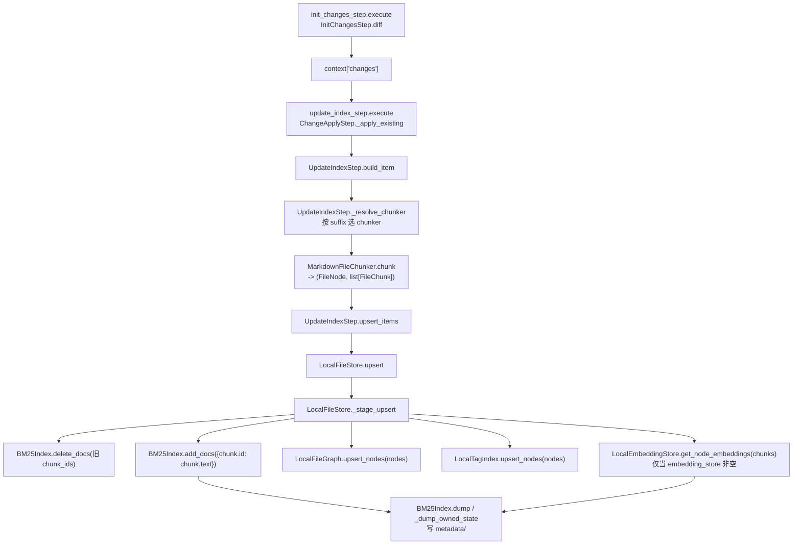
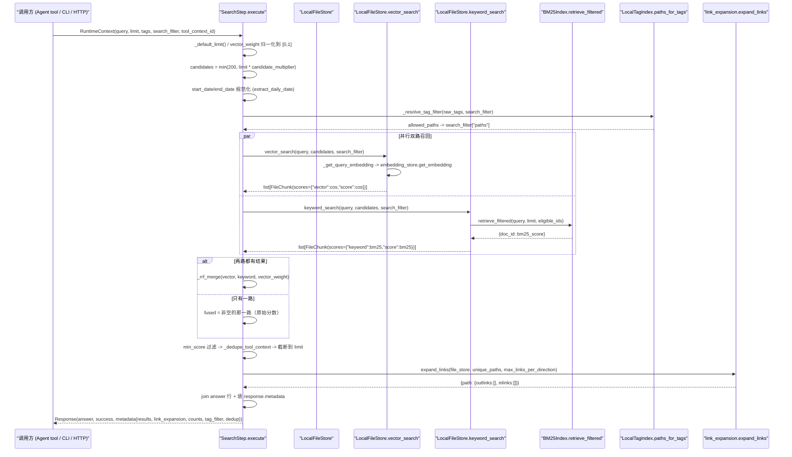
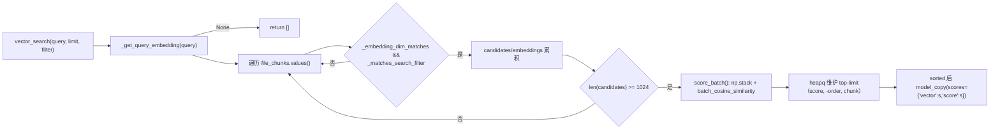
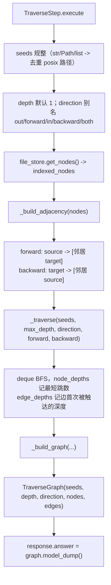

# 13 ReMe 混合检索与记忆搜索（id: 13_reme_search）

> 侦察对象：`third_party/ReMe`（本地 0.4.1.13）
> 运行环境：`/Users/a/miniconda3/envs/agentscope_reme_pip_env/bin/python`（3.11.13），必须带
> `PYTHONPATH=/Users/a/PycharmProjects/VsCode_Projects/Agentscope-Learning/third_party/ReMe`
> 全部结论均来自真实读码 + 真实运行；未跑通的片段显式标「未验证」并说明原因。

---

## 子系统职责（这段代码到底在解决什么问题）

这一块代码解决的是 **Agent Harness 第 1 层的「持久化记忆」里"取"的那一半**：把已经落盘为 Markdown 的记忆文件（`daily/` 日报、`digest/` 长期摘要节点），变成一个**可以被 Agent 在毫秒级调用的检索服务**。它要回答三个问题：

1. **"和我这次 query 最相关的记忆碎片在哪？"** —— 关键词（BM25）+ 向量（可选）双路召回，再用 RRF 按排名融合，返回 `limit` 条候选。
2. **"这段碎片在哪个文件的哪几行？"** —— 返回的不是整文件，而是 `FileChunk`（**行级 passage**），带 `path:start_line-end_line`，让 Agent 能只读回那几行，而不是把整个文件塞进 context。
3. **"这条记忆还连着谁？"** —— 每个命中块还会沿 wikilink 图做一层邻居扩展（`expand_links`），另有一个独立 step（`traverse_step`）做有界 BFS，把整个 wikilink 子图以 `TraverseGraph` 结构返回给前端/Agent。

它**不负责**"写"（文件怎么产生、怎么被 chunk、怎么被 watcher 感知入库，那是 12_reme_storage_graph 的范围），也**不负责**上下文窗口内的短期记忆压缩（那是 ReMe 的 `as_llm`/Auto Memory 那一侧）。但在**检索这个局部**，它和写侧共享同一套 `FileChunk` / `FileNode` / `FileLink` 数据契约，这是"读写一致"的关键。

一句话：**这是 ReMe 的"读路径"（read path）**——把 Markdown 记忆库做成一个带来源引用、可渐进展开的 hybrid retriever。

---

## 关键文件表

| 文件路径:行号 | 核心类 | 核心函数 | 一句话职责 |
|---|---|---|---|
| `third_party/ReMe/reme/components/keyword_index/bm25_index.py:37` | `BM25Index` | `add_docs` / `retrieve` / `score_documents` / `retrieve_filtered` / `dump` / `load` / `optimize_index` | 自己实现的 BM25 倒排索引（**不用 rank_bm25 等库**），带惰性删除、IDF 缓存、pickle 原子落盘、压缩重整 |
| `third_party/ReMe/reme/components/keyword_index/base_keyword_index.py:11` | `BaseKeywordIndex` | `score_documents` / `retrieve_filtered` / `reset_index` / `optimize_index` | 关键词索引抽象契约；给第三方后端留的 O(n) 兼容回退实现 |
| `third_party/ReMe/reme/components/tokenizer/regex_tokenizer.py:10` | `RegexTokenizer` | `_tokenize_one` | 默认分词器：**每个 CJK 汉字自成一个 token**，非 CJK 按 `\b\w\w+\b` |
| `third_party/ReMe/reme/components/tokenizer/jieba_tokenizer.py:10` | `JiebaTokenizer` | `_tokenize_one` | 中文分词器（`rjieba` 默认 / `jieba` 纯 Python） |
| `third_party/ReMe/reme/components/tokenizer/base_tokenizer.py:12` | `BaseTokenizer` | `tokenize` / `_postprocess` | 小写化 + stopwords 过滤（默认词表 1393 条） |
| `third_party/ReMe/reme/components/embedding_store/base_embedding_store.py:13` | `BaseEmbeddingStore` | `get_embedding` / `get_embeddings` / `get_node_embeddings` / `health_check` | 向量存储抽象；含 CJK 感知的 `_truncate` |
| `third_party/ReMe/reme/components/embedding_store/local_embedding_store.py:19` | `LocalEmbeddingStore` | `get_embeddings` / `_sync_cache_space` / `_call_with_retry` / `dump` / `load` | LRU + 磁盘 npz 缓存、按 vector space 分文件、指数退避重试、向量空间切换自动作废 |
| `third_party/ReMe/reme/components/as_embedding/__init__.py:23` | `BaseAsEmbedding` | `__call__` / `vector_space` / `vector_space_id` / `_ensure_model` | 把 AgentScope 的 `EmbeddingModelBase` 包成 ReMe 组件；定义"向量空间指纹" |
| `third_party/ReMe/reme/components/as_embedding/__init__.py:163` | `OpenAIAsEmbedding` 等 5 个 | — | openai / dashscope / dashscope_multimodal / gemini / ollama 五种后端注册 |
| `third_party/ReMe/reme/components/tag_index/local_tag_index.py:12` | `LocalTagIndex` | `normalize_tags` / `paths_for_tags` / `list_tags` / `upsert_nodes` / `rebuild` | 从 `FileNode.front_matter.model_extra[tag_key]` 抽出双向标签索引（path↔tag） |
| `third_party/ReMe/reme/components/tag_index/base_tag_index.py:26` | `BaseTagIndex` | `normalize_query_tags` / `paths_for_tags` | 标签索引契约；`reserved_tag_keys` 防止占用 `name`/`description` |
| `third_party/ReMe/reme/steps/index/search.py:38` | `SearchStep` | `execute` / `_rrf_merge` / `_resolve_tag_filter` / `_dedupe_tool_context` | **主检索入口**：并行双路召回 → RRF → min_score → 去重 → 截断 → wikilink 扩展 → 组装 answer/metadata |
| `third_party/ReMe/reme/steps/index/bm25_search.py:16` | `Bm25SearchStep` | `execute` | 纯 BM25 检索（注册但**默认配置里没有任何 Job 使用**） |
| `third_party/ReMe/reme/steps/index/vector_search.py:16` | `VectorSearchStep` | `execute` | 纯向量检索（同上，未挂载） |
| `third_party/ReMe/reme/steps/index/node_search.py:59` | `NodeSearchStep` | `execute` / `_rrf_merge_nodes` | **节点级**（按 path 聚合）检索，只搜 `digest_dir/`，供 dream 的 synapse 构造用，刻意不返回正文 |
| `third_party/ReMe/reme/steps/index/traverse.py:142` | `TraverseStep` | `execute` / `_build_adjacency` / `_traverse` / `_build_graph` | 从 seed 路径出发的有界 BFS，返回 `TraverseGraph(nodes, edges)` |
| `third_party/ReMe/reme/steps/index/_source_format.py:134` | — | `merge_session_chunk_intervals` / `render_chunk_entries` / `join_chunk_entries` | 会话 jsonl 的行级渲染 + 同文件区间合并（containment/intersection/adjacency 三种重叠） |
| `third_party/ReMe/reme/steps/index/_dedup.py:27` | `_ToolContextDedupMixin` | `_dedupe_tool_context` | 按**行区间**去重的 tool_context 去重（被 vector/bm25 search 复用） |
| `third_party/ReMe/reme/steps/index/init_changes.py:14` | `InitChangesStep` | `execute` / `diff` | 启动时扫描 watched 目录，用 mtime 比对 `FileNode.st_mtime` 算出 added/modified/deleted |
| `third_party/ReMe/reme/steps/index/watch_changes.py:45` | `WatchChangesStep` | `execute` / `_filter` | `watchfiles.awatch()` 长驻循环，按 quiet window 批处理变更 |
| `third_party/ReMe/reme/steps/index/update_changes.py:321` | `UpdateIndexStep` | `build_item` / `upsert_items` / `_resolve_chunker` / `chunk_file` | 把变更文件 chunk 成 `(FileNode, [FileChunk])` 写入 file_store，带内存预算分批 |
| `third_party/ReMe/reme/steps/index/optimize_index.py:8, reindex.py:8, clear_store.py:8, clear_paths.py:18, log_changes.py:8, list_tags.py:8, graph_snapshot.py:16, wait_for_paths.py:12, draft.py:10` | `OptimizeIndexStep` / `ReindexStep` / `ClearStoreStep` / `ClearPathsStep` / `LogChangesStep` / `ListTagsStep` / `GraphSnapshotStep` / `WaitForPathsStep` / `AddDraftStep`,`ReadAllDraftStep` | `execute` | 索引维护与辅助 step（压缩 / 按 scope 重建 / 清空 / 列标签 / 出图 / 等文件 / 草稿累积） |
| `third_party/ReMe/reme/components/file_store/local_file_store.py:936` | `LocalFileStore` | `vector_search` / `keyword_search` / `_matches_search_filter` / `upsert` / `optimize_index` | 检索的**实现层**：chunk 内存表 + BM25 + 可选向量 + 图 + 标签的组合体 |
| `third_party/ReMe/reme/components/file_store/base_file_store.py:14` | `BaseFileStore` | 抽象 `vector_search`/`keyword_search`/`upsert`/`get_nodes`/`get_outlinks`/`get_inlinks` | file_store 的语义契约（三个后端：`local` / `faiss` / `zvec`） |
| `third_party/ReMe/reme/schema/file_chunk.py:8` | `FileChunk` | `score` / `set_hash_id` | **行级**记忆片段：`path` + `start_line` + `end_line` + `scores` |
| `third_party/ReMe/reme/schema/emb_node.py:9` | `EmbNode` | `validate_embedding` / `serialize_embedding` | `id` + `text` + `embedding(float16)` + `metadata` |
| `third_party/ReMe/reme/schema/file_node.py:9` | `FileNode` | — | 图节点：`path` + `st_mtime` + `links` + `chunk_ids` + `front_matter` |
| `third_party/ReMe/reme/schema/file_link.py:6` | `FileLink` | — | `source_path` + `target_path` + `target_anchor`（wikilink 边） |
| `third_party/ReMe/reme/schema/traverse_graph.py:8,19,28` | `TraverseGraphNode/Edge/Graph` | — | traverse 的对外结构（`version=1`） |
| `third_party/ReMe/reme/schema/request.py:6` / `response.py:8` / `stream_chunk.py:10` / `token_usage.py:8` | `Request` / `Response` / `StreamChunk` / `TokenUsage` | `from_provider` / `combine` | 统一请求/响应信封；`Response.answer` 是给 LLM 看的主结果，`Response.metadata` 给程序化客户端 |
| `third_party/ReMe/reme/utils/link_expansion.py:58,97` | — | `expand_links` / `render_expansion_lines` | 数据层/视图层分离的邻居扩展 |
| `third_party/ReMe/reme/utils/similarity_utils.py:21` | — | `batch_cosine_similarity` | 批量余弦（零范数保护 1e-10） |
| `third_party/ReMe/reme/utils/wikilink_handler.py:96` | `WikilinkHandler` | `extract_links` / `scan_and_rewrite` | wikilink 唯一真相源；**target 字面量，不补 `.md`** |
| `third_party/ReMe/reme/components/file_chunker/markdown_file_chunker.py:100` | `MarkdownFileChunker` | `chunk` / `_chunk_node` / `_make_chunk` / `_compose_text` | 产出「行级」`FileChunk` 的地方：按 AST 子树贪心装箱，记录 start/end line |
| `third_party/ReMe/docs/en/memory_search.md:1-249` | — | — | 官方检索文档（与源码有若干不一致，见下文「坑」） |

---

## 调用链

### 索引侧（写路径，检索的前提）



逐段讲解：

- `InitChangesStep.diff`（`reme/steps/index/init_changes.py:47`）把磁盘上扫描到的 `{绝对路径: mtime}` 与 file_store 里已有的 `FileNode.st_mtime` 做集合差，得到 `added` / `modified` / `deleted` 三类变更，写进 `context["changes"]`，再 `dispatch_steps` 给下游。
- `UpdateIndexStep`（`reme/steps/index/update_changes.py:321`）继承 `ChangeApplyStep`，用一套基于 `psutil` 的**内存预算分批**（`_batch_memory_budget` / `_batch_is_full`）防止一次 index 几百个大文件把内存打爆——这是生产级 Harness 的典型细节。
- `_resolve_chunker`（`:362`）按后缀在 `app_context.components[ComponentEnum.FILE_CHUNKER]` 里找 chunker，找不到 `.md` 就退回 `default`。
- `LocalFileStore.upsert`（`local_file_store.py:765`）是**先删后加**：`_evict_prior_chunks` 把该 path 旧 chunk 从 `file_chunks` 摘掉并把旧向量暂存，`_stage_upsert` 再写新 chunk，然后 `BM25Index.delete_docs(旧 id)` + `add_docs(新文档)`。注意 BM25 的删除是**惰性**的，见下文。
- `@BaseFileStore.serialized` 装饰器（`base_file_store.py:61`）用 `_maintenance_guard` 保证「维护/变更」互斥，且允许**嵌套重入**（同一 task 直接放行），避免 `reindex` 里再调 `upsert` 时死锁。

### 查询侧（本子系统的主线）



逐段讲解（对照 `reme/steps/index/search.py:204-377`）：

1. **入口参数**（`:204-231`）：`query`/`limit`/`min_score`/`vector_weight`/`candidate_multiplier`/`expand_links`/`max_links_per_direction`/`tags`/`tool_context_id`/`max_search_calls`/`strict_date_filter`。`query` 空串直接 `success=False`。`limit` 用 `assert limit > 0`（非法输入是**断言**，不是友好错误——见「坑」）。
2. **搜索预算**（`:239-258`）：如果传了 `max_search_calls`，会在 `app_context.metadata["__search_call_budgets"][tool_context_id]` 里记数并用 `asyncio.Lock` 保护，超限返回 `success=False` + `"Error: search call limit of N reached"`。这是防 Agent Loop 里"无限搜索"的 Harness 级护栏。
3. **候选池**（`:260`）：`candidates = min(200, max(1, int(limit * candidate_multiplier)))`。默认 `candidate_multiplier=5.0`、`limit=5` → 25 条候选，最多 200。
4. **日期过滤**（`:264-299`）：把顶层 `start_date`/`end_date` 提升进 `search_filter`，并用 `extract_daily_date` 规范化（拒绝 `"2026-2-28"` 之外的脏值，`"abc"` 直接删掉并 warning）。`strict_date_filter=True` 时，路径里提取不出日期的 chunk 会被**排除**而不是放行。
5. **标签过滤**（`:144-202` `_resolve_tag_filter`）：`tag_index.paths_for_tags(normalized_tags, match_all=False)`——注意是 **OR** 语义；如果同时传了 `path`/`paths`，取交集；结果写回 `search_filter["paths"]`，让下游两路召回都在这个白名单内检索。**tag_index 不可用时不会报错**，只是 warning 并在 metadata 里标 `{"requested": True, "applied": False, "reason": "tag_index_unavailable"}`。
6. **双路并行**（`:309-338`）：`use_vector = vector_weight > 0`，`use_keyword = (1-vector_weight) > 0`，用 `asyncio.gather` 并发跑。融合策略是**三态**的：
   - 两路都有 → `_rrf_merge`；
   - 只有 keyword → `fused = keyword_results`（**保留原始 BM25 分数**）；
   - 只有 vector → `fused = vector_results`（**保留原始 cosine 分数**）；
   - 都空 → `fused = []`。
7. **后处理**（`:340-347`）：`min_score` 过滤 → `tool_context` 去重（见「坑」：这里是**按 chunk id** 去重，和 vector/bm25 step 的**按行区间**去重不是同一套）→ 截断到 `limit`。
8. **链接扩展**（`:349-352`）：只对**最终返回的路径**做 `expand_links`，每方向最多 `max_links_per_direction` 个。
9. **组装**（`:354-377`）：`answer` 是给人/LLM 看的文本块；`metadata` 里放 `results`（`FileChunk.model_dump(exclude_none=True, exclude={"embedding"})`——显式剔掉 embedding，避免把 1024 维向量序列化进响应）、`link_expansion`、`counts`。

### 向量检索内部（`local_file_store.py:936-982`）



这是一次**线性扫描**（`local` 后端），每 1024 条一批算余弦；`faiss` 后端（`faiss_local_file_store.py`）换成 HNSW，`zvec` 后端换另一种向量库。三者对外契约完全一致（`BaseFileStore`），这就是「一切皆插件」的收益。

### traverse（图扩展检索，`reme/steps/index/traverse.py`）



`_traverse`（`:60-97`）有两点值得学：

- 它**不区分正反向的语义**，而是把 `forward` / `backward` 两张邻接表当作"可选的方向过滤器"，`direction="both"` 就两张都查；但边本身始终以 `(source, target, anchor)` **原始方向**记录，所以前端拿到的边方向不会被"反向遍历"污染。
- 深度是**最短跳数**（`if next_depth < previous`），不是"第几次被访问"。因此同一个节点不会因为不同路径重复入队。

---

## 关键数据结构

### `FileChunk` —— 为什么是「行级」

```python
# third_party/ReMe/reme/schema/emb_node.py:9
class EmbNode(BaseModel):
    model_config = ConfigDict(arbitrary_types_allowed=True)
    id: str = Field(default_factory=lambda: uuid4().hex, description="Unique node id")
    text: str = Field(default="", description="Text content")
    embedding: np.ndarray | None = Field(default=None, description="Embedding vector (float16)")
    metadata: dict = Field(default_factory=dict, description="Arbitrary metadata")

# third_party/ReMe/reme/schema/file_chunk.py:8
class FileChunk(EmbNode):
    """A chunk of a file with positional info and per-stage retrieval scores."""
    path: str = Field(default="", description="Path relative to the workspace")
    start_line: int = Field(default=0, description="Inclusive start line (1-based)")
    end_line: int = Field(default=0, description="Inclusive end line (1-based)")
    scores: dict[str, float] = Field(default_factory=dict, description="Retrieval scores keyed by stage")

    @property
    def score(self) -> float:
        return self.scores.get("score", 0.0)

    def set_hash_id(self):
        from ..utils import hash_text
        self.id = hash_text(" ".join([self.path, str(self.start_line), str(self.end_line), self.text]))
        return self
```

字段级说明与设计意图：

- **`path` + `start_line` + `end_line` 三元组**是"引用"的全部：Agent 拿到命中后可以只 `read path=... start_line=... end_line=...` 打开这几行。**为什么不是整文件**：记忆文件（尤其 `daily/` 会话卡）动辄几千行，整文件塞进 context 会直接吃掉预算，而且相关性只集中在少数段落；行级引用还让"同一文件不同段落"能作为独立候选参与排序。`docs/en/memory_search.md:208-211` 明确要求调用 `read` 时把区间作为**独立参数**传，而不是拼进 `path`。
- **`id` 是 (path, start_line, end_line, text) 的确定性哈希**（`set_hash_id`，`markdown_file_chunker.py:601`）：内容不变则 id 不变。这带来两个好处：(a) upsert 时"同 id 同 text"的 chunk 可以直接复用旧 embedding（`_reuse_or_queue_embedding`，`local_file_store.py:819`），省一次远程调用；(b) tool_context 去重可以按 id 记账。
- **`scores` 是 dict 而非单个 float**：这是整个融合链路的"可解释性"载体。同一 chunk 在 vector 分支里 `scores["vector"]` 是余弦相似度，在 keyword 分支里 `scores["keyword"]` 是 BM25 原始分，融合后 `scores["score"]` 变成 RRF 分。`SearchStep._format_scores`（`search.py:87-95`）就把它渲染成 `score=0.0317 keyword=4.8120` 这种可诊断的行。
- **`embedding` 用 float16**（`validate_embedding` 强制转换）：显存/内存省一半，而检索精度损失可忽略——这是生产级取舍，教程里值得点出。
- **反序列化时 embeddding 会被序列化成 list**（`field_serializer`），因为 `ndarray` 不能进 JSON；`SearchStep` 在写 metadata 时干脆 `exclude={"embedding"}` 彻底丢掉。

### `FileNode` / `FileLink` / `TraverseGraph`

```python
# third_party/ReMe/reme/schema/file_node.py:9
class FileNode(BaseModel):
    path: str = Field(default=..., description="Path relative to the workspace")
    st_mtime: float = Field(default=..., description="Filesystem mtime (seconds)")
    links: list[FileLink] = Field(default_factory=list, description="Outgoing wikilinks")
    chunk_ids: list[str] = Field(default_factory=list, description="Owned FileChunk ids")
    front_matter: FileFrontMatter = Field(default_factory=FileFrontMatter, description="Parsed front matter")

# third_party/ReMe/reme/schema/file_link.py:6
class FileLink(BaseModel):
    model_config = ConfigDict(extra="forbid")
    source_path: str = Field(default=..., description="source file path relative to working dir")
    target_path: str = Field(default=..., description="target file path relative to working dir")
    target_anchor: str | None = Field(default=None, description="Heading, block, or line anchor (text after '#')")
    predicate: str | None = Field(default=None, exclude=True, description="Deprecated compatibility field")
```

`FileNode.st_mtime` 是增量索引的**唯一比较依据**（`InitChangesStep.diff`），`chunk_ids` 是删旧 chunk 的抓手，`links` 同时供 `expand_links`（一跳邻居）和 `traverse`（多跳 BFS）使用——**一份图数据，两种消费方式**。

```python
# third_party/ReMe/reme/schema/traverse_graph.py:28
class TraverseGraph(BaseModel):
    version: Literal[1] = 1
    seeds: list[str] = Field(description="Normalized workspace-relative traversal roots")
    depth: int = Field(ge=0, description="Requested hop limit")
    direction: Literal["forward", "backward", "both"]
    nodes: list[TraverseGraphNode]   # id/path/name/description/depth/indexed
    edges: list[TraverseGraphEdge]   # source/target/target_anchor/depth
```

`TraverseGraphNode.indexed` 是很有意思的字段：wikilink 的 target 是**字面量**（可能指向不存在的文件），所以图里会同时出现"已索引节点"和"未解析的悬空节点"，前端可以据此把死链标灰。这一点在下面「坑」里实测到了。

### 请求/响应信封

```python
# third_party/ReMe/reme/schema/response.py:8
class Response(BaseModel):
    model_config = ConfigDict(extra="allow")
    answer: str | Any = Field(default="", description="Primary response content or result data exposed to tool callers")
    success: bool = Field(default=True, description="Whether the operation succeeded")
    metadata: dict = Field(default_factory=dict, description="Auxiliary request context and diagnostics")
```

`answer` / `metadata` 的分工是整个 Harness 的关键设计：**`answer` 是给模型（tool result）看的**，所以 `SearchStep` 把它拼成带 `path:start-end` 和邻居链接的可读文本；**`metadata` 是给程序化客户端（前端、评测引擎）看的**，所以放结构化 `results`/`counts`。`Response` 和 `Request` 都开了 `extra="allow"`，让不同 Job 自由扩展字段而不改 schema。

`TokenUsage`（`token_usage.py:8`）用 `model_validator(mode="after")` 强制 `total = input + output`，`from_provider` 同时兼容 `input_tokens/prompt_tokens` 两套命名——这是"屏蔽不同大模型接口差异"的具体落点。

---

## 源码精读

### 1) BM25 打分：自己实现的，公式与教科书一致

```python
# third_party/ReMe/reme/components/keyword_index/bm25_index.py:171
def _get_idf(self, token_id: int, n_docs: int | None = None) -> float:
    """Return the cached IDF for a token, computing it on miss."""
    if token_id in self._idf_cache:
        return self._idf_cache[token_id]
    doc_idxs = self._posting_doc_idxs.get(token_id)
    if doc_idxs is None or doc_idxs.size == 0:
        self._idf_cache[token_id] = 0.0
        return 0.0
    df = int((~self._deleted[doc_idxs]).sum())
    if n_docs is None:
        n_docs = self.n_docs
    idf = math.log(1 + (n_docs - df + 0.5) / (df + 0.5)) if df else 0.0
    self._idf_cache[token_id] = idf
    return idf
```

```python
# third_party/ReMe/reme/components/keyword_index/bm25_index.py:283
def _score_query(self, query_ids: list[int], candidate_idxs: np.ndarray | None = None) -> np.ndarray:
    """Compute BM25 scores globally or for selected live document indexes."""
    n_docs = self.n_docs
    if n_docs == 0:
        size = self._doc_lens.size if candidate_idxs is None else candidate_idxs.size
        return np.zeros(size, dtype=np.float32)

    avg_len = self.total_len / n_docs
    k1, b = self.k1, self.b
    denom_base = k1 * (1.0 - b)
    denom_norm = k1 * b / avg_len if avg_len > 0 else 0.0

    size = self._doc_lens.size if candidate_idxs is None else candidate_idxs.size
    scores = np.zeros(size, dtype=np.float32)
    for tid in query_ids:
        posting_idxs = self._posting_doc_idxs.get(tid)
        if posting_idxs is None or posting_idxs.size == 0:
            continue
        idf = self._get_idf(tid, n_docs)
        if idf == 0.0:
            continue

        if candidate_idxs is None:
            posting_positions = slice(None)
            score_positions = posting_idxs
        else:
            _common, posting_positions, score_positions = np.intersect1d(
                posting_idxs, candidate_idxs, assume_unique=True, return_indices=True,
            )
            if score_positions.size == 0:
                continue

        doc_idxs = posting_idxs[posting_positions]
        tfs = self._posting_tfs[tid][posting_positions].astype(np.float32)
        doc_lens = self._doc_lens[doc_idxs].astype(np.float32)
        # Each doc_idx appears at most once per posting list (Counter dedups
        # within a doc, and updates allocate fresh idxs), so fancy-index
        # accumulation is safe here.
        scores[score_positions] += idf * tfs * (k1 + 1.0) / (tfs + denom_base + denom_norm * doc_lens)

    if candidate_idxs is None and self._deleted.any():
        scores[self._deleted] = 0.0
    return scores
```

讲解：

- **不用第三方库**。`pyproject.toml` 的依赖里没有 `rank_bm25`；整个倒排索引是手写的，用 `np.ndarray` 存 posting list（`_posting_doc_idxs` / `_posting_tfs` 两条**平行数组**），用 `np.intersect1d(..., return_indices=True)` 在"只对候选集打分"时做集合求交。这是为了性能：纯 Python dict 打分会在大语料上拖慢检索。
- **公式**（与 `docs/en/memory_search.md` 里写的 RRF 公式无关，BM25 公式文档里没写，此处以源码为准）：

$$
\text{IDF}(t) = \ln\!\left(1 + \frac{N - df(t) + 0.5}{df(t) + 0.5}\right), \qquad
\text{score}(q,d) = \sum_{t \in q \cap d} \text{IDF}(t)\cdot
\frac{tf(t,d)\cdot (k_1+1)}{tf(t,d) + k_1\!\left(1 - b + b\cdot \frac{|d|}{\text{avgdl}}\right)}
$$

  默认 `k1=1.5`、`b=0.75`（`bm25_index.py:40`）。注意 IDF 用的是 **`ln(1+...)` 变体**（即 BM25+ 常用的"永不为负"形式），且分母上是 `k1*(1-b)` 与 `k1*b*len/avg_len` 拆开预算的（`denom_base` / `denom_norm`），省掉每次循环里的除法。
- **`_get_idf` 里 `n_docs` 是"活文档数"**：`df = (~self._deleted[doc_idxs]).sum()`，`n_docs = self.n_docs = len(self._doc_id_to_idx)`。这意味着**删除会立刻改变全局 IDF 与 avg_len**——我在实测中观察到了这一点（见下文「坑」：删掉 c1 后 c2 的分数从 2.5727 变 3.5729）。
- **IDF 缓存 `_idf_cache`** 只在 `add_docs` / `delete_docs` / `optimize_index` / `_restore` / `clear` 时清空——用空间换时间，避免每次查询重复 `log`。
- **只对候选集打分**靠 `candidate_idxs` 分支：`retrieve_filtered` / `score_documents` 走这条路，`retrieve` 走全局路。

### 2) 惰性删除 + 原子落盘 + 压缩重整

```python
# third_party/ReMe/reme/components/keyword_index/bm25_index.py:162
def _remove_doc(self, doc_id: str) -> None:
    """Lazy-delete a doc: flip `_deleted` and drop the id mapping."""
    idx = self._doc_id_to_idx.get(doc_id)
    if idx is None or self._deleted[idx]:
        return
    self._deleted[idx] = True
    self._doc_id_to_idx.pop(doc_id, None)
    self._idf_cache = {}
```

```python
# third_party/ReMe/reme/components/keyword_index/bm25_index.py:436
def _dump_sync(self, snapshot: dict) -> None:
    self.index_file.parent.mkdir(parents=True, exist_ok=True)
    tmp = self.index_file.with_name(f".{self.index_file.name}.{uuid4().hex}.tmp")
    try:
        with open(tmp, "wb") as file:
            pickle.dump(snapshot, file)
        tmp.replace(self.index_file)
    finally:
        tmp.unlink(missing_ok=True)
```

```python
# third_party/ReMe/reme/components/keyword_index/bm25_index.py:63
@property
def index_file(self) -> Path:
    """Path of the persisted index, namespaced by component/tokenizer config."""
    if self.tokenizer is None:
        raise RuntimeError("Tokenizer not initialized. Call start() first.")
    name = type(self.tokenizer).__name__.replace("Tokenizer", "").lower()
    component_name = self._safe_filename_part(self.name)
    fingerprint = self._tokenizer_fingerprint()
    return self.component_metadata_path / f"bm25_{component_name}_{name}_{fingerprint}_{self.index_version}.pkl"
```

讲解：

- **删除是"退休槽位"**：`_deleted[idx]=True` + 从 `_doc_id_to_idx` 摘掉，posting list 里的旧条目**保留**（打分时靠 `scores[self._deleted] = 0.0` 兜底）。这样删除是 O(1)，代价是查询时多算一点、文件体积膨胀；所以配了 `optimize_index_cron`（`default.yaml:77`，cron `0 2 * * *`）在凌晨物理重整。
- `optimize_index`（`:534-560`）四步走：`_build_idx_remap`（旧 idx → 新 idx，退休槽位记为 -1）→ `_compact_vocab`（丢弃无人引用的 token 并**重新连续编号**）→ `_compact_postings`（按掩码过滤 + 重编号）→ `_compact_docs`（重建 doc_id 列表与每文档唯一 token 数组）。这是一次完整的"vacuum"。
- **落盘用 temp + `Path.replace`**（POSIX 上原子）+ `asyncio.Lock`（`_dump_lock`）防并发写；`load()`（`:446`）在文件损坏时**删除文件并清空内存状态**，而不是带着半截状态跑——"fail loud, fail clean"。
- **`index_file` 名字里带 tokenizer 指纹**（`_tokenizer_fingerprint`，`:96-99`：对 `{class, filter_stopwords, stopwords_sha256}` 做 sha256 取前 12 位），`_restore`（`:401`）还会校验指纹不符就抛 `ValueError`。**这是本子系统最值得抄的一个设计**：换分词器不会误用旧索引，也不会静默地把两套打分混在一起。实测文件名：`bm25_demo_regex_7748e1d5a050_v1.pkl`。

### 3) 三种"-search"的差异：`retrieve` / `score_documents` / `retrieve_filtered`

```python
# third_party/ReMe/reme/components/keyword_index/bm25_index.py:342
async def retrieve(self, query: str, limit: int = 3) -> dict[str, float]:
    """BM25 retrieval; returns {doc_id: score} sorted by score descending."""
    n_docs = self.n_docs
    if n_docs == 0:
        return {}
    query_ids = self._encode_query(query)
    if not query_ids:
        return {}
    scores = self._score_query(query_ids)
    top_idxs = self._top_k(scores, limit)
    return {self._doc_ids[int(i)]: float(scores[int(i)]) for i in top_idxs}

# third_party/ReMe/reme/components/keyword_index/bm25_index.py:364
async def retrieve_filtered(self, query: str, limit: int, document_ids: Collection[str]) -> dict[str, float]:
    """Return exact BM25 top-k within selected documents."""
    if limit <= 0:
        return {}
    query_ids = self._encode_query(query)
    if not query_ids:
        return {}
    candidate_idxs, scores = self._score_query_documents(query_ids, document_ids)
    ranked = self._top_k(scores, limit)
    return {self._doc_ids[int(candidate_idxs[i])]: float(scores[i]) for i in ranked}
```

- `retrieve` = 全库 top-k；`score_documents` = 只对给定文档打分并返回**所有正分**（不截断）；`retrieve_filtered` = 只对给定文档打分并取 top-k。
- **关键**：`_score_query_documents` 仍然用**全库的 `n_docs` / `avg_len` / `df`**（`_get_idf(tid, n_docs)` 里显式传了全局 `n_docs`）——这是对的，否则"过滤后的小语料"会把 IDF 算歪，导致同一个文件在带过滤和不带过滤时分数不可比。
- `BaseKeywordIndex.score_documents`（`base_keyword_index.py:57-67`）给了第三方后端一个**O(n) 兼容实现**：先 `retrieve(query, limit=len(self.document_ids))` 再过滤。这解释了 `local_file_store.keyword_search` 里那个 `except NotImplementedError` 分支存在的意义。
- `_top_k`（`:232-243`）有个容易忽略的语义：**只取"严格正分"的 top-k**（`positive_count = (scores > 0).sum()`），并用 `np.argpartition` 做部分排序。所以"分数为 0 的文档"永远不会被返回——这解释了为什么 `min_score` 的默认值是 `0.0` 而不是负无穷。

### 4) embedding 可选：三层降级

**第一层：组件可空。**

```python
# third_party/ReMe/reme/components/file_store/local_file_store.py:44
def __init__(
    self,
    embedding_store: str = "default",
    keyword_index: str = "default",
    file_graph: str = "default",
    tag_index: str = "",
    ...
):
    ...
    if not embedding_store and not keyword_index:
        raise ValueError("At least one of embedding_store or keyword_index must be set.")
```

`default.yaml:956` 里默认就是 `embedding_store: ""`——空名字在 `bind()` 里短路成 `None`（`base_component.py:137-139`），于是 `self.embedding_store is None`。

**第二层：向量检索静默返回空。**

```python
# third_party/ReMe/reme/components/file_store/local_file_store.py:203
async def _get_query_embedding(self, query: str) -> np.ndarray | None:
    """Embed a query only while its provider and vector space remain current."""
    embedding_store = self.embedding_store
    if embedding_store is None or self._embedding_rebuild_pending or not query:
        return None
    ...
    query_embedding = await embedding_store.get_embedding(query)
    ...
    if query_embedding is None or not self._embedding_request_is_current(...):
        return None
    if not self._embedding_dim_matches(query_embedding):
        self._mark_embedding_unhealthy(...)
        return None
```

`vector_search`（`:936`）拿到 `None` 就 `return []`，**不抛异常**。

**第三层：`SearchStep` 用 `counts` 与 `hybrid` 标记把降级显式化。**

```python
# third_party/ReMe/reme/steps/index/search.py:330
hybrid = bool(vector_results) and bool(keyword_results)
if not vector_results and not keyword_results:
    fused: list[FileChunk] = []
elif not keyword_results:
    fused = vector_results
elif not vector_results:
    fused = keyword_results
else:
    fused = self._rrf_merge(vector_results, keyword_results, vector_weight)
```

`metadata["counts"] = {"vector": ..., "keyword": ..., "returned": ..., "hybrid": ...}` 让调用方能一眼看出"这次到底是混合检索还是纯 BM25"。实测（无 embedding、`vector_weight=0.7`）：`counts={'vector': 0, 'keyword': 2, 'returned': 2, 'hybrid': False}`。

**但降级不彻底**（见「坑」）：`vector_weight` 是**用户可传参数**，如果 Agent 传了 `1.0`，`use_keyword` 就是 `False`，于是两路都不跑 → 返回空结果但 `success=True`。实测 `vector_weight=1.0` + 无 embedding → `answer=''`、`counts={'vector': 0, 'keyword': 0, 'returned': 0, 'hybrid': False}`。

### 5) 向量缓存：按「vector space」分文件

```python
# third_party/ReMe/reme/components/as_embedding/__init__.py:46
@property
def vector_space(self) -> tuple[str, ...]:
    if self.model is not None:
        return (
            self.backend or self.credential_cls.__name__,
            str(getattr(self.model, "model", self.kwargs.get("model") or "")),
            str(self.dimensions),
            self._model_endpoint(),
        )
    return (
        self.backend or self.credential_cls.__name__,
        str(self.kwargs.get("model") or ""),
        str(self.dimensions),
        self._configured_endpoint(),
    )

@property
def vector_space_id(self) -> str:
    return hashlib.sha256("\x1f".join(self.vector_space).encode()).hexdigest()[:12]
```

```python
# third_party/ReMe/reme/components/embedding_store/local_embedding_store.py:54
@property
def cache_path(self) -> Path:
    """Return the disk cache file for the current vector space.

    Each vector space owns its own file, so switching the embedding model cannot
    read or overwrite vectors that belong to a different model.
    """
    return self._cache_path(self.vector_space_id)
```

讲解：这是 `bm25_index` 里 tokenizer 指纹思路的**同构设计**，只是换成了"后端名 + 模型名 + 维度 + endpoint"四元组的哈希。`_sync_cache_space`（`:252-276`）在检测到向量空间变化时，先把旧空间缓存 flush 到它自己的 npz，再载入新空间的 npz；因为整个切换过程要 await I/O，`vector_space_id` 可能**中途又变了**，所以每步都重新校验（`while True` + 二次校验 + `_MAX_VECTOR_SPACE_ATTEMPTS=3`）。`get_embeddings`（`:107-126`）在最后还要 `vector_space_id == self._cache_space` 才肯把结果交出去——**宁可全丢也不返回跨空间污染的向量**。这是工业级缓存该有的偏执。

### 6) wikilink 扩展：`expand_links` 与 `traverse` 的分工

```python
# third_party/ReMe/reme/utils/link_expansion.py:58
async def expand_links(file_store, paths: list[str], max_per_direction: int = 10) -> dict[str, dict]:
    if not paths:
        return {}
    out_lists, in_lists = await asyncio.gather(
        asyncio.gather(*(file_store.get_outlinks(p) for p in paths)),
        asyncio.gather(*(file_store.get_inlinks(p) for p in paths)),
    )
    out_grouped = [dict(list(_group_by_neighbor(outs, "target_path").items())[:max_per_direction]) for outs in out_lists]
    in_grouped = [dict(list(_group_by_neighbor(ins, "source_path").items())[:max_per_direction]) for ins in in_lists]
    neighbor_paths = sorted({n for g in out_grouped for n in g} | {n for g in in_grouped for n in g})
    nodes = await file_store.get_nodes(neighbor_paths) if neighbor_paths else []
    meta_by_path = {n.path: _node_meta(n) for n in nodes}
    ...
```

- `expand_links` 是**一跳、双向、每个方向截断**的邻居扩展，只做数据；`render_expansion_lines`（`:97-119`）单独负责渲染成 `  → path  name="..."  description="..."` 的文本。**数据层与视图层分离**，所以 `SearchStep` 能同时把结构化 `link_expansion` 写进 metadata、把渲染文本拼进 answer。
- `max_per_direction` 是在 **`get_nodes` 之前**截断的（注释里明确写了"so we don't fetch nodes that won't be displayed"）——避免为了展示 10 个邻居去查 500 个节点的 frontmatter。
- `traverse_step` 则是**多跳、有向、返回完整子图**，两者互补：`SearchStep` 结束时提示"如果想继续追，用 `traverse path=... depth=2`"（`docs/en/memory_search.md:225-227`）。

### 7) 行级 passage 的两种来源：Markdown AST 与 会话 jsonl

Markdown 侧（`markdown_file_chunker.py:311-402` `_chunk_node`）：按 AST 子树贪心装箱，每个 `FileChunk` 记 `node.start_line` / `node.end_line`，并且会把**祖先标题作为 breadcrumb 前缀**拼进 `text`（`_compose_text`，`:613`），让孤立的段落也带上下文。

会话侧（`_source_format.py:134-182`）：

```python
def merge_session_chunk_intervals(chunks: list[FileChunk], session_dir: str) -> list[FileChunk]:
    ...
    for _, c in items:
        if group and group_end is not None and c.start_line <= group_end + 1:
            group.append(c); group_end = max(group_end, c.end_line)
        else:
            if group: ordered.append((path_rank, group[0].start_line, _finalize_group(group)))
            group = [c]; group_end = c.end_line
```

会话 transcript 是 `session/dialog/*.jsonl`（一行一个序列化 `Msg`），chunker 按行切，所以 `start_line + i` 就是文件第 `start_line + i` 行。检索命中同一文件的多个重叠/相邻 chunk 时，`merge_session_chunk_intervals` 把它们**合并成并集**（`_build_union_chunk` 按绝对行号去重后升序拼回），避免同一段对话在答案里出现两遍。渲染时 `render_chunk_body` 会把每个 `Msg` 压成**一行** `[speaker @ created_at] content`，从而**保持行号映射不破**。

---

## 可运行代码片段

### 片段 A（已验证）最小可用检索：3 个 md 记忆文件 → 索引 → 中文 query → top-k 带来源 → traverse

脚本 `/tmp/recon13/demo_search.py`，运行命令：

```bash
PYTHONPATH=/Users/a/PycharmProjects/VsCode_Projects/Agentscope-Learning/third_party/ReMe \
/Users/a/miniconda3/envs/agentscope_reme_pip_env/bin/python demo_search.py
```

核心代码（已在上述环境中真实跑通）：

```python
import asyncio, contextlib, os, shutil, tempfile
from pathlib import Path

from reme.components.file_chunker import MarkdownFileChunker
from reme.components.file_store import LocalFileStore
from reme.components.runtime_context import RuntimeContext
from reme.steps.index import Bm25SearchStep, SearchStep, TraverseStep

FILES = {
    "daily/2026-09-21/retrieval-regression.md": (
        "---\nname: 检索回归排查\nmemory_tags: [retrieval, regression]\n---\n\n"
        "# 检索回归排查\n\n## 现象\n\n线上 RAG 的 top-5 命中率从 0.82 掉到 0.61。\n\n"
        "## 定位\n\n把 BM25 的 tokenizer 从 jieba 换回 regex 后，中文长词被拆成单字，"
        "逆文档频率被稀释。参见 [[digest/memory-compression.md]]。\n"
    ),
    "digest/memory-compression.md": (
        "---\nname: 上下文压缩\nmemory_tags: [memory, compression]\n---\n\n"
        "# 上下文压缩\n\n## 压缩与检索的关系\n\n压缩后的摘要是长期记忆的候选，"
        "由 [[daily/2026-09-21/retrieval-regression.md]] 里的混合检索链路召回。"
        "另见 [[digest/not-exist.md]]。\n"
    ),
    "daily/2026-09-20/planning.md": (
        "---\nname: 长任务规划\nmemory_tags: [planning]\n---\n\n"
        "# 长任务规划\n\n## 断点恢复\n\n状态机持久化到事件日志。参见 [[digest/memory-compression]]。\n"
    ),
}

@contextlib.contextmanager
def chdir(path):
    old = os.getcwd()
    os.chdir(path)
    try:
        yield
    finally:
        os.chdir(old)

async def run():
    tmp = Path(tempfile.mkdtemp(prefix="reme_demo_"))
    for rel, content in FILES.items():
        p = tmp / rel
        p.parent.mkdir(parents=True, exist_ok=True)
        p.write_text(content, encoding="utf-8")

    with chdir(tmp):                                   # 组件在 standalone 模式下以 cwd 为 workspace
        store = LocalFileStore(name="demo", backend="local", embedding_store="",
                               keyword_index="default", file_graph="default", tag_index="default")
        await store.start()
        chunker = MarkdownFileChunker(name="md", backend="markdown")
        await store.upsert([await chunker.chunk(Path(rel)) for rel in FILES])

        resp = await SearchStep(file_store=store, vector_weight=0.7, candidate_multiplier=5.0,
                                expand_links=True, max_links_per_direction=10)(
            RuntimeContext(query="上下文压缩 怎么和检索配合", limit=3))
        print(resp.answer)
        print("counts:", resp.metadata["counts"])

        resp3 = await TraverseStep(file_store=store)(
            RuntimeContext(path="digest/memory-compression.md", depth=2, direction="both"))
        for n in resp3.answer["nodes"]:
            print(f"  node depth={n['depth']} indexed={n['indexed']} {n['path']} name={n['name']!r}")

        await store.close()
    shutil.rmtree(tmp, ignore_errors=True)

asyncio.run(run())
```

真实输出（节选，已删日志行）：

```text
=== 索引规模 ===
chunks: 3 bm25 docs: 3

=== 每个 chunk 的行级来源 ===
  daily/2026-09-21/retrieval-regression.md:6-20  text 前 24 字 = '# 检索回归排查\n\n## 现象\n\n线上 RAG '
  digest/memory-compression.md:6-17  text 前 24 字 = '# 上下文压缩\n\n## 为什么要压缩\n\n会话上下'
  daily/2026-09-20/planning.md:6-16  text 前 24 字 = '# 长任务规划\n\n## 拆解\n\n把一个长任务拆成'

[SearchStep] query='上下文压缩 怎么和检索配合' candidates=15 vector_hits=0 keyword_hits=2
========== digest/memory-compression.md:6-17 [score=8.5082] ==========
...（命中块正文）...
  outlinks (1):
    → daily/2026-09-21/retrieval-regression.md  name="检索回归排查"  description="2026-09-21 混合检索召回变差的排查记录"
  inlinks (1):
    ← daily/2026-09-21/retrieval-regression.md  name="检索回归排查"  description="2026-09-21 混合检索召回变差的排查记录"
========== daily/2026-09-21/retrieval-regression.md:6-20 [score=3.0447] ==========
...（命中块正文）...
  outlinks (1):
    → digest/memory-compression.md  name="上下文压缩"  description="短期记忆压缩与长期记忆落盘的边界"
counts: {'vector': 0, 'keyword': 2, 'returned': 2, 'hybrid': False}

[TraverseStep] seeds=['digest/memory-compression.md'] depth=2 direction=both nodes=3 edges=3
  node depth=0 indexed=True digest/memory-compression.md name='上下文压缩'
  node depth=1 indexed=True daily/2026-09-21/retrieval-regression.md name='检索回归排查'
  node depth=1 indexed=False digest/not-exist.md name=''
  edge depth=1 daily/2026-09-21/retrieval-regression.md -> digest/memory-compression.md anchor=None
  edge depth=1 digest/memory-compression.md -> daily/2026-09-21/retrieval-regression.md anchor=None
  edge depth=1 digest/memory-compression.md -> digest/not-exist.md anchor=None
```

注意三件事：
1. `'# 检索回归排查...'` 说明 chunk 的 `text` 里**包含 breadcrumb 标题**（不只是正文）。
2. `→ ...  name="检索回归排查"` 的邻居元数据来自 `FileNode.front_matter.name/description`，是**图里查出来的**（`get_nodes`），不是重新读文件。
3. `digest/not-exist.md` 以 `indexed=False` 出现在图里，且 `daily/2026-09-20/planning.md` 里那个**没写 `.md` 的 `[[digest/memory-compression]]` 没有连上**（见「坑」）。

### 片段 B（已验证）BM25 公式逐项复算 + 惰性删除 / optimize

脚本 `/tmp/recon13/demo_bm25.py`。手写一遍公式并与库内实现比对：

```python
import asyncio, math
from reme.components.keyword_index import BM25Index

DOCS = {"c1": "上下文压缩 上下文窗口 摘要", "c2": "上下文压缩 与 检索", "c3": "长任务 规划 断点 恢复"}

async def main():
    idx = BM25Index(name="demo", k1=1.5, b=0.75)
    await idx.start()
    await idx.add_docs(DOCS)
    q = "上下文压缩"
    qids = idx._encode_query(q)
    n, avg_len, k1, b = idx.n_docs, idx.avg_len, idx.k1, idx.b
    for doc_id in DOCS:
        didx = idx._doc_id_to_idx[doc_id]
        dl = int(idx._doc_lens[didx]); s = 0.0
        for tid in qids:
            posting = idx._posting_doc_idxs.get(tid)
            tf = 0
            if posting is not None:
                pos = (posting == didx).nonzero()[0]
                if pos.size: tf = int(idx._posting_tfs[tid][pos[0]])
            if tf == 0: continue
            df = int((~idx._deleted[idx._posting_doc_idxs[tid]]).sum())
            idf = math.log(1 + (n - df + 0.5) / (df + 0.5))
            s += idf * tf * (k1 + 1) / (tf + k1 * (1 - b + b * dl / avg_len))
        print(doc_id, round(s, 6))
    print(await idx.retrieve(q, limit=3))

asyncio.run(main())
```

真实输出：

```text
== tokenizer ==
RegexTokenizer stopwords: 1393
  c1: ['上', '下', '文', '压', '缩', '上', '下', '文', '窗', '口', '摘']
  c3: ['长', '务', '规', '划', '断', '点', '恢', '复']

== 语料统计 ==
n_docs = 3  total_len = 26  avg_len = 8.666666666666666
doc_lens = [11, 7, 8]

query_ids = [0, 1, 2, 3, 4] -> {'上': 0, '下': 1, '文': 2, '压': 3, '缩': 4}
  c1 term_id=0 tf=2 df=2 idf=0.470004 len=11
  ...
手算 = {'c1': 2.692299, 'c2': 2.572651, 'c3': 0.0}
retrieve = {'c1': 2.692299, 'c2': 2.572652}
手算 == 库内实现 ✓

== score_documents / retrieve_filtered ==
score_documents(c1,c3) = {'c1': 2.692299}
retrieve_filtered(c2,c3,limit=5) = {'c2': 2.5726518630981445}

== 惰性删除 + optimize ==
after delete: n_docs = 2  _deleted = [True, False, False]  doc_ids = ['c1', 'c2', 'c3']
retrieve = {'c2': 3.572923183441162}          # 注意：分数变了！
after optimize: n_docs = 2  _deleted = [False, False]  doc_ids = ['c2', 'c3']  vocab_size = 15
retrieve = {'c2': 3.572923183441162}
```

**`c2` 的分数从 2.5727 变成 3.5729**：因为删掉 `c1` 后 `n_docs: 3→2`、`df: 2→1`、`avg_len: 8.667→7.5`，IDF 从 `0.470` 涨到 `0.693`。这不是 bug，是 BM25 的固有性质——但也意味着**"分数"在语料变动后不可跨时间比较**。

### 片段 C（已验证）RRF 公式复算

```python
from reme.schema import FileChunk
from reme.steps.index.search import _RRF_K, SearchStep

def mk(cid, path, score, key):
    return FileChunk(id=cid, path=path, start_line=1, end_line=2, text="x", scores={key: score, "score": score})

vector  = [mk("a", "p/a.md", 0.91, "vector"), mk("b", "p/b.md", 0.88, "vector"), mk("c", "p/c.md", 0.71, "vector")]
keyword = [mk("b", "p/b.md", 12.5, "keyword"), mk("d", "p/d.md", 9.1, "keyword")]
for i, c in enumerate(SearchStep._rrf_merge(vector, keyword, 0.7), 1):
    print(i, c.id, round(c.score, 6), c.scores)
```

真实输出：

```text
RRF_K = 60
1. id=b score=0.016208 branch={'vector': 0.88, 'score': 0.016208355367530406, 'keyword': 12.5}
2. id=a score=0.011475 branch={'vector': 0.91, 'score': 0.011475409836065573}
3. id=c score=0.011111 branch={'vector': 0.71, 'score': 0.01111111111111111}
4. id=d score=0.004839 branch={'keyword': 9.1, 'score': 0.004838709677419356}

预期 b = 0.7/(60+2)+0.3/(60+1) = 0.016208
预期 a = 0.7/(60+1) = 0.011475
RRF 与手算一致 ✓
```

**RRF 公式（源码 `reme/steps/index/search.py:54-85`）**：

$$
\text{fused}(d) = \underbrace{\frac{w_v}{K + \text{rank}_v(d)}}_{\text{vector 分支}} + \underbrace{\frac{1-w_v}{K + \text{rank}_k(d)}}_{\text{keyword 分支}},\qquad K = 60,\; w_v = \texttt{vector\_weight}
$$

设计要点：
- **只用排名、不用分数**。所以 BM25 的 `12.5` 和 cosine 的 `0.88` 不需要任何归一化就能直接融合——这就是 RRF 的核心价值（不同量纲的分数量级差异被彻底消掉）。
- **只有出现在该分支里才加分**：`b` 同时出现在两路（rank 2 + rank 1）所以夺冠；`a` 只出现在向量路（rank 1）反而输给 `b`。
- **`K=60` 是平滑常数**：rank 差 1 带来的分差是 `w*(1/(K+r) - 1/(K+r+1))`，`K` 越大越"钝"。注意 `rank` 从 1 开始（`enumerate(..., start=1)`），所以理论最大值是 `w/(K+1)`。
- **合并是"取首现对象 + 累加分数"**：`merged: dict[str, FileChunk]`，第二次遇到同一个 `id` 时 `model_copy(deep=False)` 已经在第一次存好了，只是 `scores` 字典更新。注意 `model_copy(deep=False)` 是浅拷贝——`scores` 被**整体替换**成新 dict（`c.scores = {**chunk.scores, ...}`），所以不会污染入参对象。
- **输入必须已排序**：`_rrf_merge` 用 `enumerate` 的序号当 rank，**完全不看分数大小**。`vector_search`/`keyword_search` 内部保证降序，但如果你自己传乱序列表进来，排名会被静默算错。

### 片段 D（已验证）embedding 三档降级实测

```python
for vw in (0.7, 1.0, 0.0):
    st = SearchStep(file_store=store, vector_weight=vw, expand_links=False)
    r = await st(RuntimeContext(query="上下文压缩 摘要", limit=2))
    print(f"vector_weight={vw} success={r.success} counts={r.metadata['counts']}")
    print("  answer:", repr(r.answer[:70]))
```

真实输出（`embedding_store=""`）：

```text
embedding_store is None -> True
vector_search 直调 -> []

vector_weight=0.7 success=True counts={'vector': 0, 'keyword': 1, 'returned': 1, 'hybrid': False}
  answer: '========== digest/memory-compression.md:1-5 [score=5.4452] ==========\n'

vector_weight=1.0 success=True counts={'vector': 0, 'keyword': 0, 'returned': 0, 'hybrid': False}
  answer: ''

vector_weight=0.0 success=True counts={'vector': 0, 'keyword': 1, 'returned': 1, 'hybrid': False}
  answer: '========== digest/memory-compression.md:1-5 [score=5.4452] ==========\n'
```

### 片段 E（已验证）用确定性假 embedder 打通真实向量通路 + RRF 混合

真实 embedding 供应商不可用（见下），所以注入一个字符哈希 embedder，验证的是 **harness 侧代码**（`vector_search` → `_rrf_merge` → metadata）：

```python
class FakeEmbedder:
    DIM = 64
    def __init__(self): self._space = "fake-hash-embedder-v1"; self.calls = 0
    @property
    def dimensions(self): return self.DIM
    @property
    def vector_space_id(self): return hashlib.sha256(self._space.encode()).hexdigest()[:12]
    def initialize_model(self): return None
    async def __call__(self, inputs, **kwargs):
        self.calls += 1
        out = []
        for text in inputs:
            vec = np.zeros(self.DIM, dtype=np.float32)
            for ch in text:
                if ch.strip():
                    vec[int(hashlib.md5(ch.encode()).hexdigest(), 16) % self.DIM] += 1.0
            norm = np.linalg.norm(vec)
            out.append((vec / norm).tolist() if norm else vec.tolist())
        return out

emb = LocalEmbeddingStore(name="emb", max_batch_size=4)
emb.as_embedding = FakeEmbedder()
store.embedding_store = emb
```

真实输出：

```text
embedder 调用次数 = 1  chunk 数 = 3
  digest/memory-compression.md:1-5 embed_dim=64
  digest/retrieval.md:1-5 embed_dim=64
  daily/2026-09-20/planning.md:1-5 embed_dim=64

vector_search -> [('digest/memory-compression.md', 0.6479), ('daily/2026-09-20/planning.md', 0.1287), ('digest/retrieval.md', 0.0327)]
keyword_search -> [('digest/memory-compression.md', 9.5226)]

hybrid SearchStep counts = {'vector': 3, 'keyword': 1, 'returned': 3, 'hybrid': True}
  digest/memory-compression.md:1-5 scores={'vector': 0.64794921875, 'score': 0.01639344262295082, 'keyword': 9.522598266601562}
  daily/2026-09-20/planning.md:1-5 scores={'vector': 0.128662109375, 'score': 0.01129032258064516}
  digest/retrieval.md:1-5 scores={'vector': 0.032745361328125, 'score': 0.01111111111111111}

vector_weight=1.0 counts = {'vector': 3, 'keyword': 0, 'returned': 3, 'hybrid': False} -> 纯向量
vector_weight=0.0 counts = {'vector': 0, 'keyword': 1, 'returned': 1, 'hybrid': False} -> 纯 BM25

embedding 缓存命中复测（同 query 再搜一次）:
  embedder 调用次数 = 2 （query 向量走 LRU 缓存） 3
```

三个值得注意的点：
1. **3 个 chunk 只发了 1 次 embedder 调用**（`max_batch_size=4`），说明 chunk 向量是**批处理**的。
2. **同一个 query 的 4 次 `vector_search` 只消耗了 1 次 embedder 调用**（总计 2 - 1 = 1）→ query 向量走了 LRU 缓存（`_cache_key` = `sha256(text)`，`local_embedding_store.py:278`）。
3. 混合模式下 `scores["score"]` 是 **RRF 分（0.0164）**，而 `scores["keyword"]` 仍是原始 BM25 的 `9.52`——**`min_score` 比较的是 RRF 分**，见「坑」。

### 片段 F（已验证）标签过滤 + tool_context 去重 + min_score

真实输出：

```text
tag_index: LocalTagIndex  n_files = 3
path_to_tags = {'digest/a.md': ('memory', 'retrieval', 'third'), 'digest/b.md': ('memory',), 'daily/c.md': ('planning',)}
tag_to_paths = {'memory': ['digest/a.md', 'digest/b.md'], 'retrieval': ['digest/a.md'], 'third': ['digest/a.md'], 'planning': ['daily/c.md']}
paths_for_tags(['memory'], match_all=False) = ['digest/a.md', 'digest/b.md']
normalize_query_tags('Memory') = ['memory']
list_tags -> {'total_tags': 4, 'total_pages': 1, 'page': 1, 'range': (1, 4), 'items': [('memory', 2), ('planning', 1), ('retrieval', 1), ('third', 1)]}

-- 无标签过滤 --
counts: {'vector': 0, 'keyword': 3, 'returned': 3, 'hybrid': False} paths: ['daily/c.md', 'digest/b.md', 'digest/a.md']

-- tags=['memory'] 过滤 --
counts: {'vector': 0, 'keyword': 2, 'returned': 2, 'hybrid': False} tag_filter: {'requested': True, 'applied': True, 'tags': ['memory'], 'matched_paths': 2}
paths: ['digest/b.md', 'digest/a.md']

-- tags=['nonexistent'] --
counts: {'vector': 0, 'keyword': 0, 'returned': 0, 'hybrid': False} paths: []

-- min_score=6.0 --
counts: {'vector': 0, 'keyword': 3, 'returned': 0, 'hybrid': False} paths: []

-- tool_context 去重：同一 tool_context_id 连搜三次 --
  call#1 paths=['daily/c.md', 'digest/b.md'] dedup={'tool_context_id': 't1', 'seen_before': 0, 'skipped_seen': 0, 'seen_after': 2, 'expired': 0, 'ttl_seconds': 86400.0}
  call#2 paths=['digest/a.md'] dedup={'tool_context_id': 't1', 'seen_before': 2, 'skipped_seen': 2, 'seen_after': 3, 'expired': 0, 'ttl_seconds': 86400.0}
  call#3 paths=[] dedup={'tool_context_id': 't1', 'seen_before': 3, 'skipped_seen': 3, 'seen_after': 3, 'expired': 0, 'ttl_seconds': 86400.0}
```

注意第 4 组：`min_score=6.0` 时 `counts.keyword` 仍是 **3**（过滤前的召回数），`returned` 才是 0——**`counts` 记录的是分支召回量，不是最终返回量**。这里 `from` 的 frontmatter 写的是 `memory_tags: [Memory, retrieval, Third, Fourth]`，`Fourth` 被 `max_tags_per_file=3` 截掉了。

### 片段 G（已验证）持久化重载 + traverse 选项

```text
写入后 bm25 docs = 2  chunks = 2
写入后检索 -> ['digest/memory.md']

-- 新建一个 store 从 metadata/ 重载 --
重载后 bm25 docs = 2  chunks = 2
重载后检索 -> ['digest/memory.md']

-- traverse 方向别名与 depth 默认值 --
  ctx={} -> depth=1 dir=both nodes=[('daily/2026-09-20.md', 0), ('digest/memory.md', 1)]
  ctx={'depth': 0} -> depth=0 dir=both nodes=[('daily/2026-09-20.md', 0)]
  ctx={'direction': 'forward'} -> depth=1 dir=forward nodes=[('daily/2026-09-20.md', 0)]
  ctx={'direction': 'in', 'depth': 2} -> depth=2 dir=backward nodes=[('daily/2026-09-20.md', 0), ('digest/memory.md', 1)]

-- file_store.optimize_index() --
  delete 后 _deleted = [True, False]  bm25 docs = 1
  optimize 后 _deleted = [False]  bm25 docs = 1  doc_ids = ['0154d1e9...']
```

关键事实：**`depth` 不传时默认是 `1`**（`traverse.py:154`：`max_depth = 1 if raw_depth is None else int(raw_depth)`），而 `docs` 里的 CLI 例子没有写默认值——教程里必须点出。`depth=0` 只返回 seed 自己。

### 片段 H（已验证）会话 jsonl 的行级渲染与区间合并

```python
from agentscope.message import Msg, TextBlock
from reme.schema import FileChunk
from reme.steps.index._source_format import merge_session_chunk_intervals, render_chunk_entries, join_chunk_entries

lines = [Msg(name="user", role="user", content=[TextBlock(text="帮我把\n这段对话\n压缩一下")]).model_dump_json(),
         Msg(name="assistant", role="assistant", content=[TextBlock(text="好的，正在压缩。")]).model_dump_json()]
c1 = FileChunk(path="session/dialog/a.jsonl", start_line=1, end_line=1, text=lines[0], scores={"score": 1.0})
c2 = FileChunk(path="session/dialog/a.jsonl", start_line=2, end_line=2, text=lines[1], scores={"score": 0.9})
c3 = FileChunk(path="session/dialog/a.jsonl", start_line=1, end_line=2, text="\n".join(lines)+"\n", scores={"score": 1.5})
```

真实输出：

```text
is_session_chunk(c1) = True
render_chunk_body(c1) = '[user @ 2026-09-21T18:07:06.319954] 帮我把 这段对话 压缩一下'
render_chunk_body(plain) = '普通文件内容'

merge 前 4 个 chunk -> 合并后 2 个

join_chunk_entries 结果:
========== session/dialog/a.jsonl:1-2 [score=1.5000] ==========
[user @ 2026-09-21T18:07:06.319954] 帮我把 这段对话 压缩一下
[assistant @ 2026-09-21T18:07:06.321051] 好的，正在压缩。

========== digest/x.md:3-4 [score=0.5000] ==========
普通文件内容
```

注意 `Msg` 的构造：**AgentScope 2.x 的 `Msg.content` 必须是 block 列表**（`[TextBlock(text=...)]`），传裸字符串会抛 `ValidationError: Input should be a valid list`。这是 AgentScope 2.0 与 1.x 的一个显著差异，教程里必须写清。

### 片段 I（已验证）配置层：`search` Job 的真实定义

```python
import yaml
cfg = yaml.safe_load(open("third_party/ReMe/reme/config/default.yaml", encoding="utf-8"))
print(list(cfg["jobs"]["search"]["steps"]))
print(list(cfg["jobs"]["search"]["parameters"]["properties"]))
```

真实输出（由 `sed -n '442,478p' reme/config/default.yaml` 核对）：

```text
steps     = [{'backend': 'search_step', 'vector_weight': 0.7, 'candidate_multiplier': 5.0,
              'expand_links': True, 'max_links_per_direction': 10}]
parameters= {query, limit, min_score, tags, start_date, end_date}   # 注意：文档里漏了 tags
```

### 未验证的片段

- **真实 embedding 供应商的端到端检索**：未验证。原因——环境只有 DeepSeek 的 key（`OPENAI_BASE_URL=https://api.deepseek.com`），实测 `POST {base}/embeddings` 返回 **HTTP 404**，即 DeepSeek 不提供 embeddings 端点。要走真实向量检索需要 DashScope（`text-embedding-v4`，见 `default.yaml:828-833`）或 Ollama（`nomic-embed-text`）之类的供应商。所以只有片段 E 那种"注入假 embedder 验证 harness 侧代码"的做法可行。
- **`faiss` / `zvec` 向量后端**：未验证。`faiss_local_file_store.py`（725 行）需要 `faiss-cpu`，`zvec_local_file_store.py`（497 行）需要 `zvec`，它们不在本次安装范围内。
- **`reme search query=...` CLI 端到端**：未验证。`reme/reme.py` 的 CLI 是**连到运行中的 server**（HTTP / MCP）再转成 Job 调用，需要 `reme start` 起服务；本报告的所有验证都走 **step 级调用**（`SearchStep(...)(RuntimeContext(...))`），这也是写教程时更可控的入口。
- **`Bm25SearchStep` / `VectorSearchStep` 作为 Job 被调用**：未验证（它们没有被任何 Job 装配，见「坑」）。但作为**类**调用是验证过的（片段 A 的 `bm25_search_step` 段真实跑通并打印了 `[score=8.5082]` 的结果）。

---

## 教学要点（按「小白最容易卡住」排序）

1. **`Agent = LLM + Harness` 在检索这一层的落点**：模型负责"我要找什么"，Harness 负责"去哪儿找、怎么排序、返回什么形状、怎么引用来源"。本子系统全部代码都在做后四件事，**没有一行在推理**。
2. **"行级 chunk"是 Harness 的一个契约，不是实现细节**。`FileChunk.start_line/end_line` 决定了 Agent 后续能 `read path start_line end_line` 精准回读；如果返回整文件，context 会被吃光。教程第一天就该把这个契约画出来。
3. **RRF 的意义是"消灭量纲"**。BM25 的 12.5 和 cosine 的 0.88 无法直接比大小；RRF 只看 `rank`，所以两路可以各自用最适合自己的打分函数。手算 `w/(K+rank)` 是理解它的最快方式（片段 C）。
4. **BM25 是手写实现**（不是 `rank_bm25`）。`_posting_doc_idxs` / `_posting_tfs` 平行数组 + `np.intersect1d` 做候选集求交，是"用 numpy 写倒排索引"的标准范式。
5. **IDF 是全局量，会被删除影响**。删文档后 `n_docs`/`df`/`avg_len` 全变，同一个 query 的分数会变（片段 B 实测 2.5727 → 3.5729）。所以**分数不能跨时间比较，也不能拿来当阈值**——这直接引出下面第 11 条的 `min_score` 陷阱。
6. **embedding 可选靠"三层降级"实现，而不是 if-else 分支**：组件可空（`embedding_store=""`）→ `_get_query_embedding` 返回 `None` → `vector_search` 返回 `[]` → `SearchStep` 自动走单路融合并在 `counts.hybrid=False` 里声明。**但 `vector_weight` 是用户可控的，能把这个降级打破**（见坑 2）。
7. **"指纹"是这套代码里出现两次的核心模式**：BM25 的 `_tokenizer_fingerprint()`（分词器变了就换索引文件名 + 载入时校验）和 embedding 的 `vector_space_id`（模型/维度/endpoint 变了就换缓存文件）。教程应当把这个模式抽出来单独讲一节："**任何派生产物都必须带自己的生成参数指纹**"。
8. **惰性删除是"写快读慢"的取舍**，必须配 `optimize_index` 才有闭环。三处呼应：`BM25Index._remove_doc` → `optimize_index_step`（cron 02:00）→ `docs` 里"tombstone 过多会拖慢检索"的说明。
9. **`expand_links` 与 `traverse` 是两种图消费方式**：前者一跳、双向、截断、只给 `name/description`（省 context），后者多跳、有界 BFS、给完整 `TraverseGraph`（给前端画图）。教程可以顺着"渐进式扩展（progressive expansion）"这条线讲：chunk → 文件定位 → 邻居 → 子图。
10. **wikilink target 是字面量，不补 `.md`**（`wikilink_handler.py:19-24` 明确写了）。所以 `[[digest/memory-compression]]` 和 `[[digest/memory-compression.md]]` 是**两条不同的边**，前者永远解析不到已索引节点（实测 `indexed=False`）。这是最容易让新手"明明写了链接却连不上"的原因。
11. **`min_score` 的语义会随融合模式静默变化**：纯 BM25 时比的是 BM25 原始分（5.44），双路融合后比的是 RRF 分（0.0164）。同一个数字在两模式下含义完全不同 —— 教程应该建议"要么别用 `min_score`，要么先看 `counts.hybrid`"。
12. **`tool_context` 去重是"Agent 层面"的护栏而不是检索技巧**：它让同一个 Agent 会话里重复搜索不会反复拿到同样内容（实测第 3 次搜索返回空 + `skipped_seen=3`），避免 Agent Loop 陷入"读同样的东西、做同样的判断"的空转。
13. **`Response.answer` vs `Response.metadata` 的双通道设计**：`answer` 给模型看（文本、带 `path:start-end` 和邻居），`metadata` 给程序看（`results` 原样 `FileChunk` dump）。写自己的 Harness 时坚持这个分工，能让"给 LLM 的 prompt"和"给前端的 JSON"各自演进。
14. **组件 `bind()` + `default_factory` 就是 Python 版的依赖注入**：`LocalFileStore.__init__` 声明 `embedding_store` / `keyword_index` / `file_graph` / `tag_index` 四个依赖，用 `bind(name, BaseCls, default_factory=...)` 表达"名字为空则不要，名字给了但注册表里没有则用默认实现"。standalone（无 `app_context`）走 `default_factory`，有 `app_context` 走注册表——这正是参考架构「第 0 层 Cordis 插件微内核」的 Python 对应物。
15. **`@R.register("...")` + `@BaseFileStore.serialized` 两级装饰器**：前者是插件注册（名字即配置里的 `backend`），后者是并发护栏。教程可以把 `component_registry.py` 的 `R` 讲成"Cordis 的 register"。
16. **`asyncio.gather` 并行双路召回**（`search.py:314`）是"延迟取 min"的经典手法：总延迟 ≈ max(向量延迟, BM25 延迟)，而不是两者之和。
17. **`_resolve_tag_filter` 用的是 OR 语义（`match_all=False`）**，而 `LocalTagIndex.paths_for_tags` 的**默认参数是 `match_all=True`**（AND）。同一个 API 两处默认不同，读代码时容易看反。
18. **候选池是"超采样"**：`candidates = min(200, limit * 5)`。因为过滤（tag/date/`min_score`）和去重都会掉量，直接取 top-`limit` 会不够。教程里可以对照"召回-排序-过滤"三段式的标准 RAG 架构。
19. **`MarkdownFileChunker` 会把祖先标题当 breadcrumb 拼进 chunk text**（`_compose_text`，`:613`），且当 breadcrumb 太长时会**从最外层开始裁剪**。这是"让孤立段落自带上下文"的实用技巧，也是为什么 chunk 文本以 `# 检索回归排查` 开头。
20. **`test_search_step.py` 里 `FakeSearchStore(BaseFileStore)` 的写法值得抄**：继承抽象基类、只实现用得到的几个方法、`calls` 列表记录调用参数——这是不依赖真实 embedding / LLM 也能做集成测试的范式（`search.py:63` 的 `Ref` 解析要求 `isinstance(value, self.base_cls)`，所以**假实现必须真的继承 `BaseFileStore`**，否则 `RuntimeError: app_context is not set when resolving 'file_store'`——这一点我踩过）。

---

## 坑与注意事项

| 现象 | 原因 | 解决 |
|---|---|---|
| `import reme` 拿到的是旧版 0.3.1.10，API 对不上 | site-packages 里有一个旧的 `reme` 抢先 | 运行时加 `PYTHONPATH=<repo>/third_party/ReMe`（本报告所有验证均如此） |
| `LocalFileStore(app_context=ctx)` 后 `store.file_graph is None`，`_start` 抛 `AssertionError` 于 `_repair_graph_chunk_consistency` | `_resolve_from_context` 只查 `app_context.components` 注册表；传了 `app_context` 但没往注册表里塞组件，所有 `bind` 都解析成 `None`（`base_component.py:183-188`） | 要么**不传** `app_context`（standalone 模式走 `default_factory`，但此时 workspace = cwd，需 `chdir`），要么手工把子组件塞进 `app_context.components` |
| `SearchStep(file_store=SomeFakeStore())` 报 `RuntimeError: app_context is not set when resolving 'file_store'` | `BaseStep.Ref._resolve` 要求 `isinstance(value, self.base_cls)`（`base_step.py:79-89`），纯鸭子类型的假对象不算 | 假 store **必须继承 `BaseFileStore`**（照抄 `tests/unit/test_search_step.py:35` 的 `FakeSearchStore`） |
| 传 `vector_weight=1.0` 但没配 embedding，检索**静默返回空**、`success=True` | `use_keyword = (1-vector_weight) > 0` 为 False，两路都不跑；`fused=[]` 且不报错 | 显式检查 `metadata["counts"]["vector"]/["keyword"]`；或把 `vector_weight` 钳制在 `(0,1)` 开区间；教程里教"降级要显式化" |
| `[[digest/memory-compression]]`（不写 `.md`）链接在 `traverse` 里显示 `indexed=False`，`expand_links` 也拿不到邻居元数据 | `WikilinkHandler` 的 target 是**字面量**，不补扩展名、不做 basename 搜索（`wikilink_handler.py:19-24`） | 一律写全 `[[digest/memory-compression.md]]`；或写个迁移脚本统一补 `.md` |
| `frontmatter` 里写 `tags: [memory]` 后标签索引 `n_files=0` | 默认 `tag_key` 是 **`memory_tags`**（`constants.py:34`、`default.yaml:946`），不是 `tags`；且读的是 `front_matter.model_extra`（`local_tag_index.py:77`） | 用 `memory_tags:`；如果要沿用 `tags:`，把 `tag_index.default.tag_key` 改成 `tags`（注意 `reserved_tag_keys` 禁止用 `name`/`description`/`kind`/`session_id`/`status` 等） |
| 一个文件写了 4 个标签，索引里只有 3 个 | `max_tags_per_file` 默认 3（`constants.py:35`），`_normalize_tags` 里 `break` | 调大 `max_tags_per_file`；注意 `normalize_query_tags` **不截断**（查询表达式不设限） |
| 混合模式下 `min_score=0.5` 把所有结果都干掉了 | 融合后 `scores["score"]` 是 RRF 分（理论上限 `w/(K+1)≈0.0115`），不是余弦/BM25 分 | 混合模式用 `min_score` 要按 RRF 量纲设（比如 `0.005`）；先看 `counts.hybrid` 再决定阈值 |
| 删了一个文件后，另一个文件的检索分数变了 | BM25 的 `n_docs`/`df`/`avg_len` 是全局统计量，删除会立刻改变它们 | 别把分数写成跨时间的常量阈值；用分数时只在**同一次语料快照内**比较 |
| `metadata["counts"]["keyword"]=3` 但 `results` 里 0 条 | `counts` 记录的是**分支召回量**（`min_score`/去重之前），不是最终返回量 | 看 `counts["returned"]`；两者差额 = 被过滤/去重的量 |
| 同一 tool_context 连搜第 3 次返回空字符串，`dedup.skipped_seen` 等于总数 | tool_context 去重把已返回过的 chunk 全部跳过；`SearchStep` 在这种情况下**不改写 answer**（不像 bm25/vector step 会写 `ALL_RETURNED_MESSAGE`） | 用 `Bm25SearchStep`/`VectorSearchStep` 时会看到 `"All retrieved content has already been returned..."` 提示；用 `SearchStep` 时要自己看 `metadata["dedup"]` |
| `TraverseStep` 不传 `depth` 却返回了 2 个节点 | `traverse.py:154` 的默认值是 **1**，不是 0 | 想只看 seed 自己传 `depth=0` |
| `.gitignore` 之外，standalone 跑组件会在 **cwd** 下生成 `metadata/` 目录（含 `bm25_*.pkl`、`file_chunks_*.jsonl.zst`、`file_graph/*.jsonl.zst`） | `ComponentMixin.workspace_path` 在无 `app_context` 时返回 `Path.cwd()` | 在临时目录里 `chdir` 后再建组件，或在 `ApplicationContext(workspace_dir=...)` 里指定 |
| `Msg(content="文本")` 抛 `ValidationError: Input should be a valid list` | AgentScope 2.x 的 `Msg.content` 是 block 列表 | 用 `Msg(content=[TextBlock(text="...")])`（`third_party/agentscope/src/agentscope/message/_block.py:11`） |
| `docs/en/memory_search.md` 里的 `search.parameters` 是扁平 map，且**没有 `tags`** | 文档滞后于源码 | 以源码 `reme/config/default.yaml:442-478` 为准：`parameters` 是 JSON-Schema 形状，多了 `tags`（"contains at least one valid tag"，即 OR 语义） |
| 官方文档只在配置片段里出现 `search_step` 和 `traverse_step`，但仓里有 `bm25_search_step` / `vector_search_step` / `node_search_step` | 这三个 step 有 `@R.register` 注册，但**全仓（`reme/`、`plugins/`、`tests/`）没有任何 yaml Job 引用它们**（grep 确认） | 它们只是可插拔的构建块（`node_search_step` 的 docstring 明说"给 dream 用，不是 `search` 的替代品"），要用得自己写 Job 配置 |
| `docs/en/memory_search.md` 里的 `index_update_loop` 配置片段少了 `persist: False` | 文档滞后 | 以 `reme/config/default.yaml:8-20` 为准：watcher 分发的 `update_index_step` 带 `persist: False`（实时写盘由 watcher 循环自己控） |
| 同一份"去重"逻辑在仓里有**两套不同的粒度** | `SearchStep._dedupe_tool_context`（`search.py:109-142`）按 **chunk id** 记账（`search_seen_chunk_ids`）；`_ToolContextDedupMixin._dedupe_tool_context`（`_dedup.py:80-159`）按 **行区间**记账（`search_seen_chunk_ranges`，区间会先 merge 再判"是否被完全覆盖"） | 这是代码演进留下的分叉：`SearchStep` 没复用 mixin。写教程时应指出差异，并说明"区间去重更准（能识别分割方式变化但内容相同的块），id 去重更省" |
| embedding 的 `dimensions` 在 provider 构造前就要可用 | `BaseAsEmbedding.dimensions` 在 `self.model is None` 时读 `kwargs["dimensions"]`，否则抛 `RuntimeError("Embedding dimensions are required before provider initialization.")` | 配置里必须显式写 `dimensions: 1024` 之类；否则 `_ensure_model` 里会炸 |
| `POST {OPENAI_BASE_URL}/embeddings` 返回 404 | DeepSeek 不提供 embeddings 端点 | 向量检索换成 DashScope / Gemini / Ollama 后端（`as_embedding` 已注册 5 个 backend），或用假 embedder 只验证 harness 侧通路 |

---

## 与参考架构的映射

| 参考架构层 | 本子系统的对应物 | 状态 |
|---|---|---|
| **第 0 层 Cordis 插件微内核** | `ComponentRegistry` + `@R.register("bm25"/"local"/"search_step"/"traverse_step"/...)`；`BaseComponent.bind()` 的依赖注入（`default_factory` = 单机默认装配）；`ApplicationContext.components[ComponentType][name]` = 服务路由；`Application._init_components/_init_jobs` = 由 `default.yaml` 声明式组装 | **有，且是 Python 版微内核**。差异：Cordis 是 TS + Profile/Bundle 概念，ReMe 用 `plugins/`（`beam`/`lme`/`daily_paper`/`dingtalk`/`auto-fin`）+ `resolve_plugin_runtime` 达到同样效果 |
| **第 0 层 事件总线** | `dispatch_steps(self.dispatch_step_specs, changes=...)`（step 之间的上下文传递）+ `RuntimeContext` 的 data dict，是"step 链"而非 pub/sub 事件总线 | **部分有**。没有独立的 pub/sub 总线；教程可以把这个缺口标出来，让读者在自己的 harness_kit 里补 |
| **第 1 层 LLM 模型适配器** | `components/as_llm`（本子系统只用到 `as_embedding`：`BaseAsEmbedding` 包装 AgentScope 的 `EmbeddingModelBase`，`vector_space` 屏蔽供应商差异） | **有**（在自己负责的范围内：embedding 适配器 + `vector_space_id` 双向指纹） |
| **第 1 层 Session 会话 & 事件溯源存储** | `session/dialog/*.jsonl`（一行一个 `Msg`）+ `_source_format.py` 的行级渲染 + `merge_session_chunk_intervals` 的区间并集 | **有**（本子系统负责**读取与渲染**这一侧；写入归属 12_reme_storage_graph） |
| **第 1 层 持久化记忆（长期）** | 本子系统整体：BM25 倒排索引 + 行级 `FileChunk` + 可选向量 + 标签索引 + wikilink 图；`memory_tags` 就是"实体标签" | **有（这是本子系统的主场）** |
| **第 1 层 持久化记忆（短期上下文压缩 / 遗忘策略）** | **不存在**于检索子系统。最接近的替代物有两个：`reindex(scope=...)` 与 `optimize_index`（索引级"遗忘/重整"），以及 `FileChunk` 的行区间裁剪（把长文件切成小块，本身就是一种"只留相关部分"的上下文工程）。真正的对话历史压缩在 ReMe 的 Auto Memory / Auto Dream 侧（`reme/steps/evolve/`） | **缺失**。教程里要明确：**检索只负责"取"，不负责"压"** |
| **第 2 层 Agent Loop / Planning / Reasoning / Subagent** | **不存在**于本子系统 | **缺失**（归属其他子系统） |
| **第 2 层 MCP 工具协议** | 检索能力通过 Job → `BaseService`（HTTP / MCP streamable-http / SSE / stdio，见 `reme/reme.py:call_server` 与 `config/service`）暴露；`search` / `traverse` / `list_tags` / `reindex` 各是一个 Job | **有**（协议层是 `fastmcp` + FastAPI，配置驱动） |
| **第 2 层 Skills / Tool Use** | `SearchStep` 就是一个"工具"：`Response.answer` 是 tool result，`docs/en/memory_search.md` 里 `reme search query="..." limit=5` 的调用形态与 MCP tool call 同构 | **有** |
| **第 2 层 Sandbox 安全沙箱** | 本子系统没有沙箱。仅有：`clear_paths_step` 的 **workspace 越界拒绝**（`clear_paths.py:38`）、`wait_for_paths_step` 的同类拒绝、`LocalTagIndex._validate_path` 的路径形状校验 | **缺失**（最小化的越界防护不算沙箱；沙箱归属其他子系统） |
| **第 3 层 评测、实验与迭代** | **不存在**（ReMe 有 `benchmark/` 与 `plugins/beam-judge` / `lme-judge`，但检索子系统本身不含评测流水线） | **缺失**。最接近的替代物是：`SearchStep.metadata` 里结构化的 `results`/`counts`/`dedup`/`tag_filter` —— 这些正是评测引擎需要的原料（召回数、是否 hybrid、命中来源、跳过量），可在上层自己造评测集算 `recall@k` / `MRR` |
| **第 3 层 数据标注与合成 / 真实反馈闭环** | `AddDraftStep` / `ReadAllDraftStep`（`draft.py`）：在 tool_context 内累积草稿文本，算是"轨迹采集"的最小基元 | **部分有**（真正闭环不存在） |
| **第 4 层 中间件 Hook** | `BaseStep.__call__` 的 `input_mapping` / `output_mapping` + `dispatch_steps` 链 | **部分有**（没有 AOP 式全局 hook；教程可把 `@BaseFileStore.serialized` 当成"切面装饰器"的范例） |
| **第 4 层 Web UI 调试** | `graph_snapshot_step` 输出的 `GraphSnapshot`、`traverse_step` 输出的 `TraverseGraph`、`list_tags_step` 的分页结构 —— 都是"给前端直接渲染"的形状；`reme_studio/` 是配套 UI | **有（数据侧）** |
| **第 4 层 Bundle & Profile 声明式配置** | `reme/config/default.yaml`（Job/Step/Component 三段声明）+ `resolve_plugin_runtime` + `plugins/*/`（`beam`/`lme`/`auto-fin`/`dingtalk` 各带自己的 yaml 与 step） | **有**。教程里可以用"打开/关闭 `embedding_store`、切换 `keyword_index` 后端、新增一个自定义 `*_search_step`"来演示 Profile 的效果 |

**一句话数据流对照**：`用户请求 → Session → LLM → Agent Loop → Planning → Reasoning → MCP 调用 Skills → Sandbox → 观测写入记忆 → 循环`。本子系统位于"**MCP 协议调用 Skills 工具**"这一跳的**被调用方**：Agent 的 `search` tool call 落到 `SearchStep.execute`，返回行级 passage + 来源引用 + 邻居线索；结果是否写回记忆、写回哪种记忆，由 Agent 自己决定——**检索子系统只读不写**。
