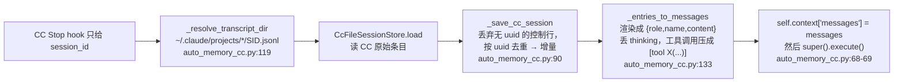

# 14 ReMe 自演化子系统（auto_memory / auto_resource / auto_dream / proactive）侦察报告

> 侦察对象：`third_party/ReMe`（ReMe 0.4.1.13）。所有结论均来自实际读源码，引用格式 `相对路径:行号`。
> 运行环境：`/Users/a/miniconda3/envs/agentscope_reme_pip_env/bin/python`，`PYTHONPATH` 指向 `third_party/ReMe`，
> LLM 走 `.env` 里的 `deepseek-flash`。本报告所有标「已验证」的片段都真实跑过，输出为原样粘贴。

## 子系统职责

ReMe 本身不是一个 Agent，而是**一个跑在 Agent 外面的记忆服务进程**：它对外暴露 `http` / `mcp` 接口
（`reme/config/default.yaml:2-5`），对内把「记忆演化」拆成四组**作业（job）**，每组作业是一串**步骤（step）**的流水线。
这四组作业的共同特征是：**它们自己会调用 LLM，让 LLM 去读写工作区里的 Markdown 文件**，而不是由开发者硬编码规则。
这就是「自演化」的确切含义——记忆库的内容和结构由模型在受约束的工具集内自行决定。

四组作业的职责边界：

- **auto_memory**（`reme/steps/evolve/auto_memory.py`）：把一段多轮对话蒸馏成当天的一条 daily note。
  核心是一个**二分支**设计：当天没有该会话的笔记时走 create 分支（模型只拿到 `daily_write` 一把工具，从零写一篇新笔记）；
  已有笔记时走 update 分支（模型拿到 `read`/`edit`/`frontmatter_update`/`write`，做增量合并）。
- **auto_resource**（`reme/steps/evolve/auto_resource.py` + `base_auto_resource.py`）：把工作区 `resource/` 下**新出现或被修改的任意文件**
  解释成一条 source-linked 的 daily note。它是一个**按后缀路由**的分派器：图片交给 `auto_image_resource_step`（直连 VLM 看图），
  其它一切交给 `auto_text_resource_step`（走 Agent + 文件工具解析文本），并保留 `resource_fallback` 兜底。
- **auto_dream**（`reme/steps/evolve/dream/`）：夜间 `23:00` 的 cron（`default.yaml:64-76`），把当天读过的材料**抽象成跨文件的知识单元**
  （DreamUnit，分 `procedure`/`personal`/`wiki` 三类），再整合进 digest 桶，最后写总结。这是「从流水账到知识」的升华环节。
- **proactive**（`reme/steps/evolve/proactive/`）：每天 `18:00` 的 cron（`default.yaml:113-133`），从当天的材料里猜「用户接下来可能想干什么」，
  产出一条条带 confidence 的 `ProactiveTopic`，写进 `daily/<date>/interests.yaml`（v2 对外曝光面）与 `daily/_proactive.yaml`（v1 真相源）。
  它不是「记忆」，而是**主动发起对话的素材库**。

四者共享同一套基础设施：`components/job/*`（作业后端）、`steps/base_step.py`（步骤基类 + 依赖注入）、
`components/prompt_handler.py`（提示词加载）、`components/agent_wrapper/*`（把 AgentScope / Claude Code / Codex 统一成 `reply()`）。

## 关键文件表

| 文件路径:行号 | 核心类 | 核心函数 | 一句话职责 |
| --- | --- | --- | --- |
| `reme/config/default.yaml:7-268` | — | 作业声明 | 全部作业声明：backend、cron、参数 schema、steps 链 |
| `reme/config/default.yaml:64-76` | — | `dream_cron` | `0 23 * * *` 触发 dream_extract → dream_integrate → dream_finish → auto_tag |
| `reme/config/default.yaml:113-133` | — | `proactive_refresh_cron` | `0 18 * * *` 触发 proactive 五步链 |
| `reme/config/default.yaml:167-257` | — | `auto_memory` / `auto_memory_cc` / `auto_resource` / `proactive_read` | 四个可被 Agent 直接当工具调用的 `base` 后端作业 |
| `reme/components/job/base_job.py:36` | `BaseJob` | `_start` 56 / `__call__` 86 | 作业基类：`_start` 里才构建 `step_specs`，`__call__` 逐步骤派发 |
| `reme/components/job/background_job.py:16` | `BackgroundJob` | `_run_with_supervisor` 105 / `_backoff_delay` 89 | 常驻循环 + supervisor 重启 + 指数退避 |
| `reme/components/job/cron_job.py:13` | `CronJob` | `_next_fire_delay` 27 / `__call__` 43 | cron 表达式 → 下一次触发的秒数，非法表达式直接报错 |
| `reme/components/job/stream_job.py:9` | `StreamJob` | — | 事件流驱动（本子系统未用） |
| `reme/steps/base_step.py:28` | `Ref` | `__get__` 57 / `_resolve` 73 | 描述符式依赖注入，三源解析：kwargs → context → app_context 注册表 |
| `reme/steps/base_step.py:98` | `BaseStep` | `__call__` 146 / `prompt_format` 159 / `run_job` 191 / `dispatch_steps` 217 | 步骤基类：生命周期、提示词、跨作业调度、子步骤派发 |
| `reme/components/prompt_handler.py:14` | `PromptHandler` | `load_prompt_by_class` 57 / `_apply_flag_filter` 124 | 按反向 MRO 加载同名 YAML 提示词，支持 `[flag]` 与 `_zh` 后缀 |
| `reme/steps/evolve/auto_memory.py:67` | `AutoMemoryStep` | `execute` 332 / `_sanitize_msg_for_save` 27 / `_to_msg` 223 | 对话 → daily note，create/update 二分支 |
| `reme/steps/evolve/auto_memory.yaml:1,48,121` | — | `system_prompt` / `user_message_create` / `user_message_update` | 真正的提示词正文（不在 py 里），含合并规则 |
| `reme/steps/evolve/auto_memory_cc.py:51` | `AutoMemoryCCStep` | `execute` 58 / `_save_cc_session` 90 / `_entries_to_messages` 133 | 继承 AutoMemoryStep，改从 CC 转录文件补增量 |
| `reme/steps/evolve/base_auto_resource.py:137` | `BaseAutoResourceStep` | `execute` 657 / `_handle_change` 559 / `_rename_from_frontmatter_name` 419 | 资源文件 → source-linked daily note 的全部公共逻辑 |
| `reme/steps/evolve/auto_resource.py:17` | `AutoResourceStep` | `_processor_routes` 35 / `_dispatch_processor` 74 / `execute` 140 | 按后缀路由到具体 processor，未命中走 fallback |
| `reme/steps/evolve/auto_image_resource.py:285` | `AutoImageResourceStep` | `_caption_with_retry` 334 / `_read_image` 361 / `_handle_upsert` 427 | 直连 VLM 生成图注，不经过 Agent Loop |
| `reme/steps/evolve/auto_text_resource.py:24` | `AutoTextResourceStep` | `_compute_agent_session_id` 13 / `_handle_upsert` 34 | `resource_fallback=True`，用 uuid5 派生稳定会话 id |
| `reme/steps/evolve/dream/extract.py:28` | `DreamExtractStep` | `execute` 36 / `clean_output` 179 | 从当天材料抽 DreamUnit，解析结构化 receipt |
| `reme/steps/evolve/dream/integrate.py:55` | `DreamIntegrateStep` | `_integrate_one` 115 / `_valid_target` 255 | 逐个单元整合进 digest 桶，带 asyncio 锁 |
| `reme/steps/evolve/dream/finish.py:12` | `DreamFinishStep` | `execute` 19 / `render_summary` 72 | 写总结并 checkpoint 已处理路径 |
| `reme/steps/evolve/dream/utils.py:137` | — | `parse_structured_reply` 137 / `_parse_scalar_mapping` 153 | 从回复里抽 YAML/JSON 对象（**已知脆弱点**） |
| `reme/steps/evolve/proactive/extract.py:24` | `ProactiveExtractStep` | `execute` 57 / `_clean_output` 223 | 从材料抽候选话题 |
| `reme/steps/evolve/proactive/topics.py:46` | `ProactiveTopicsStep` | `execute` 77 / `_semantic_verdict` 363 | 候选 → 去重/打分/复活，产出 ProactiveTopic |
| `reme/steps/evolve/proactive/plan.py:105` | `ProactivePlanStep` | `execute` 127 / `fallback_card` 53 | 话题 → 场景卡（scenario card） |
| `reme/steps/evolve/proactive/agenda.py:43` | `ProactiveAgendaStep` | `execute` 67 / `_fallback_agenda` 256 | 场景卡 → 带 opener 的议程 |
| `reme/steps/evolve/proactive/finish.py:11` | `ProactiveFinishStep` | `execute` 27 | 落盘 `interests.yaml` + checkpoint |
| `reme/steps/evolve/proactive/proactive.py:31` | `ProactiveStep` | `_read_single` 77 / `_read_horizon` 145 | 读回 interests.yaml，按 confidence 过滤 |
| `reme/schema/dream.py:13,36` | `DreamUnit` / `DreamState` | — | dream 的数据契约与状态 |
| `reme/schema/proactive.py:22,60,122` | `ProactiveTopic` / `ProactiveState` / `ProactiveResult` | `clamp_confidence` 14 | proactive 的数据契约，含大量校验器 |
| `reme/components/agent_wrapper/base_agent_wrapper.py:21` | `BaseAgentWrapper` | `add_job_tools` 66 / `_resolve_injected_job_kwargs` 161 | 三个后端共用的作业工具装载与参数注入约束 |
| `reme/components/agent_wrapper/as_agent_wrapper.py:145` | `AsAgentWrapper` | `_build_agent` 302 / `reply` 346 | AgentScope 后端，`WorkspaceBackend` 73 + `BypassAnalysisBash` 125 |
| `reme/components/agent_wrapper/cc_agent_wrapper.py:31` | `CcAgentWrapper` | `_make_tool` 81 / `create_sdk_mcp_server` 209 | Claude Code SDK 后端，工具走 SDK MCP |
| `reme/components/agent_wrapper/codex_agent_wrapper.py:63` | `CodexAgentWrapper` | `_mcp_server_config` 240 / `_open_thread` 296 | Codex 后端 |
| `reme/components/agent_wrapper/cc_session_store.py:12` | `CcFileSessionStore` | `append` 50 / `load` 74 | 按 uuid 幂等的 jsonl 会话存储 |
| `reme/steps/file_io/daily_write.py:14` | `DailyWriteStep` | `execute` 68 / `_metadata` 51 | 写 `daily/<date>/<name>.md` 并强制写 frontmatter |
| `reme/steps/file_io/_daily_index.py:123` | — | `refresh_day_index` 123 / `scan_notes` 67 | 维护 `daily/<date>.md` 索引页 |
| `reme/steps/file_io/_path.py:46,84` | — | `validate_filename_component` / `resolve_path` | 文件名与路径的 workspace 越界防护 |

## 调用链

### auto_memory 逐步流程（mermaid，节点名全部取自源码）

```mermaid
flowchart TD
    A["HTTP/MCP 调用 job=auto_memory<br/>入参 messages + session_id"] --> B["BaseJob.__call__<br/>base_job.py:86"]
    B --> C["AutoMemoryStep.__call__<br/>base_step.py:146"]
    C --> D["AutoMemoryStep.execute<br/>auto_memory.py:332"]
    D --> E["_build_messages → _to_msg<br/>auto_memory.py:223<br/>把 dict/str 统一包成 list[Msg]"]
    E --> F{"session_id 校验<br/>validate_session_id<br/>auto_memory.py:348"}
    F -- 非法/缺失 --> F1["response.success=False<br/>answer=Error: ..."]
    F -- 通过 --> G["day = parse_daily_date(date)<br/>或 _messages_day() 兜底今天<br/>auto_memory.py:359"]
    G --> H["_save_session_messages<br/>auto_memory.py:164<br/>按 msg.id 合并 → session/dialog/SID.jsonl<br/>落盘前过 _sanitize_msg_for_save"]
    H --> I{"messages 为空?"}
    I -- 是 --> I1["Skipped: no messages<br/>modified=False"]
    I -- 否 --> J["_list_session_note(day, session_id)<br/>auto_memory.py:118 → run_job('daily_list')"]
    J --> K["_find_session_note<br/>先按 frontmatter session_id 找，<br/>再按 source_conversation 链接找<br/>auto_memory.py:108"]
    K --> L{"找到已有笔记?"}
    L -- 否 created=True --> M1["template_key = user_message_create<br/>tools = ['daily_write']<br/>auto_memory.py:396,420"]
    L -- 是 created=False --> M2["template_key = user_message_update<br/>tools = read/edit/frontmatter_update/write<br/>且 injected_job_kwargs._allowed_paths=[note_path]<br/>auto_memory.py:416"]
    M1 --> N["prompt_format(template_key, today, note,<br/>note_path, session_id, session_file, history)"]
    M2 --> N
    N --> O["agent_wrapper.reply(user_message,<br/>system_prompt=prompt_format('system_prompt'),<br/>job_tools=..., **reply_kwargs)<br/>auto_memory.py:417"]
    O --> P["Agent Loop 在受限工具集内<br/>写/改 Markdown 文件"]
    P --> Q{"created?"}
    Q -- 是 --> R1["重新 _list_session_note 回查<br/>拿模型自己起的文件名<br/>auto_memory.py:427"]
    R1 --> R2{"回查为空?"}
    R2 -- 是 --> R3["success=True, path=None<br/>modified=False（模型没写）"]
    R2 -- 否 --> R4["note_path = note['path']"]
    Q -- 否 --> S1["_ensure_session_frontmatter<br/>补 session_id / source_conversation<br/>auto_memory.py:125"]
    S1 --> S2["_rename_from_frontmatter_name<br/>按 frontmatter name 改名<br/>auto_memory.py:141 → run_job('move')"]
    R4 --> T
    S2 --> T["_note_modified 比对 before/after<br/>决定 modified 与 changes<br/>auto_memory.py:464-466"]
    T --> U["refresh_day_index<br/>重写 daily/&lt;date&gt;.md 索引<br/>auto_memory.py:469"]
    U --> V["response.metadata 回填<br/>date/path/created/modified/n_messages/<br/>source_conversation/index<br/>auto_memory.py:475"]
    V --> W["Job 链继续：auto_tag_step<br/>default.yaml:197"]
```



这段流程里有三个「非直觉」的设计，是读代码时最容易卡住的地方。

第一，**create 与 update 不是两条代码路径，而是同一段代码的两个参数分支**。真正的分支点只有 `auto_memory.py:396`
（选模板）和 `auto_memory.py:420`（选工具集），后续逻辑共用。所以 create 分支写完笔记后必须**回头再查一次**（`auto_memory.py:427`），
因为文件名是模型在 `daily_write` 里自己定的，宿主事先不知道。

第二，**文件名的最终归属权在 frontmatter**。update 分支里 `_rename_from_frontmatter_name`（`auto_memory.py:141`）
会把文件移动到 `daily/<date>/<frontmatter.name>.md`。也就是说模型可以改 `name` 字段来给笔记改名，
宿主用 `run_job("move", retarget=True)` 跟着搬并修补引用。

第三，**update 分支被显式收窄了写入范围**：`auto_memory.py:415-416` 给 `reply_kwargs["injected_job_kwargs"]`
塞了 `{"_allowed_paths": [note_path]}`。这是宿主对「模型自己决定改哪个文件」的兜底约束——只允许改已解析出的那一篇笔记。
create 分支**没有**这个约束（`auto_memory.py:410-412` 的注释明确说明了原因：新笔记沿用 `daily_write` 的日期行为，路径由模型定）。

### 会话入库的调用链（`session_id` → jsonl）

`AutoMemoryStep.execute` 在调 LLM **之前**就调用 `_save_session_messages`（`auto_memory.py:370`），
把 `list[Msg]` 按 `msg.id` 去重合并进 `session/dialog/<session_id>.jsonl`（`auto_memory.py:164-216`）。
写盘前每条消息都过 `_sanitize_msg_for_save`（`auto_memory.py:27`），丢弃 `tool_result` block 与 base64 `data` block：

```python
def _sanitize_msg_for_save(msg: Msg) -> Msg:
    new_content = []
    changed = False
    for block in msg.content:
        if block.type == "tool_result":
            changed = True
            continue
        if block.type == "data" and hasattr(block, "source") and getattr(block.source, "type", None) == "base64":
            changed = True
            continue
        new_content.append(block)
    if not changed:
        return msg
    return msg.model_copy(update={"content": new_content})
```

这段代码的教学价值极高：它回答了一个真实工程问题——**对话转录里塞满了工具结果和图片 base64，不能原样当记忆存**。
注意 `if not changed: return msg` 这句提前返回，保证无变化时返回**同一个对象**而不是拷贝，避免无谓的反序列化开销。

### Claude Code 的接法（auto_memory_cc）

`AutoMemoryCCStep`（`auto_memory_cc.py:51`）继承 `AutoMemoryStep`，只重写三个点：



三个重写点：`execute`（`auto_memory_cc.py:58`）换成从磁盘补增量、`_save_session_messages`（`auto_memory_cc.py:73`）
改成**空实现**（因为 CC 自己管会话，不再复用 dialog store）、`_session_link`（`auto_memory_cc.py:76`）指向
`session/claude_code/<sid>.jsonl`。渲染层的两个丢弃规则是 `_render_content`（`auto_memory_cc.py:149`，丢 `thinking` block）
与 `_is_injected_only`（`auto_memory_cc.py:181`，把只含 `<system-reminder>` 等注入标签的整条消息丢掉，
标签清单在 `auto_memory_cc.py:35-46`）。

### auto_resource 与 proactive 的链路骨架

`auto_resource` 的调用链是「**分派器 + 多个 processor**」：
`AutoResourceStep.execute`（`auto_resource.py:140`）→ `_processor_routes`（`auto_resource.py:35`，从配置读路由表）
→ 对每个 change 调 `_dispatch_processor`（`auto_resource.py:74`）→ 命中 `matches_change` 的 processor；
都没命中时调 `_unsupported_result`（`auto_resource.py:96`）产出失败项，最后 `_emit_result_hook`（`auto_resource.py:112`）回调。
真正的落盘逻辑全在 `BaseAutoResourceStep`：`_resolve_resource_source`（`base_auto_resource.py:189`）解析路径 →
`_prepare_resource_note`（`base_auto_resource.py:342`）→ 子类 `_handle_upsert` → `_finalize_resource_note`（`base_auto_resource.py:457`）
→ `_rename_from_frontmatter_name`（`base_auto_resource.py:419`）→ `_handle_delete`（`base_auto_resource.py:505`）处理删除联动。

`proactive` 是**五步流水线，靠 `ProactiveState` 在步骤间传递状态**：
`proactive_extract_step` → `proactive_topics_step` → `proactive_plan_step` → `proactive_agenda_step` → `proactive_finish_step`
（`default.yaml:117-132`）。每个步骤都 `state_from_context` 取状态、`store_state` 写回（`proactive/utils.py` 里成对出现）。
读回侧是独立的 `proactive_read` 作业（`default.yaml:244-268`），由 `ProactiveStep` 实现，支持 `horizon_days` 跨天合并与 `min_confidence` 过滤。

## 关键数据结构

- **`Response`**：每个步骤的返回值，字段 `success` / `answer` / `metadata`。作业链上后一步能读到前一步的 `metadata`，
  所以 `auto_memory` 的 `metadata.index` 就是 `refresh_day_index` 的返回体（`auto_memory.py:483`）。
- **`RuntimeContext`**：步骤间共享的「草稿纸」。`self.context.get("messages")`、`self.context["changes"] = []`
  （`auto_memory.py:334`）、`self.context.response.metadata.update(...)` 都作用在它上面。
- **`Ref`**（`base_step.py:28`）：声明式依赖。`self.file_store`、`self.agent_wrapper`、`self.as_llm` 都是 `Ref` 实例，
  取值时走三源解析（`base_step.py:73`）。**未 `start()` 就取会抛 `Dependency ... accessed before start()`**（`components/base_component.py:78-82`）。
- **`DreamState`**（`schema/dream.py:36`）：dream 三步骤之间传递的状态，含 `dates`、`changed_paths`、`units`、`buckets` 等；
  `DreamBucketEnum` 只有 `procedure` / `personal` / `wiki` 三个桶。
- **`DreamUnit`**（`schema/dream.py:13`）：一个抽象知识单元，字段含 `title` / `summary` / `kind` / `paths`。
- **`ProactiveTopic`**（`schema/proactive.py:22`）：主动话题。字段 `id` / `title` / `reason` / `kind` / `confidence` /
  `first_seen` / `last_evidence_at` / `evidence` / `paths`。带三个校验器：`_fallback_kind`（缺 kind 时兜底成 `interest_extend`）、
  `_fallback_confidence`（缺 confidence 时给 0.5）、`_clean_str_list`（路径列表去重）。`clamp_confidence`（`schema/proactive.py:14`）把置信度夹到 `[0,1]`。
- **`ProactiveState` / `ProactiveStateFile` / `ProactiveResult`**（`schema/proactive.py:60,108,122`）：
  分别是流水线内状态、`daily/_proactive.yaml` 的磁盘格式、`proactive_read` 的返回体。
- **`_ResourceLookupTable` / `_ResourceNoteState`**（`base_auto_resource.py:28,61`）：
  前者是「本次调用内」的资源→笔记路径索引（用 `_resource_lookup_scope` 上下文管理器管理生命周期，`base_auto_resource.py:40`），
  后者记录一篇 note 的准备态（路径、是否新建、原字节）。

## 源码精读

### 作业后端：为什么必须先 `_start()`

`BaseJob.__init__` 只存配置，**`step_specs` 是在 `_start()` 里才构建的**（`job/base_job.py:56`、`_build_steps` 76）。
而 `BaseJob.__call__`（`job/base_job.py:86`）遍历的正是 `step_specs`。所以**不调 `app._start()` 直接 `run_job`，
作业会「成功」跑完 0 个步骤并返回一个默认 Response**——`success=True, answer="", metadata={}`。
这是本子系统最容易踩的坑，我实测复现过（见第 6 节 t02）。

`BackgroundJob` 在 `_start`（`background_job.py:55`）里起一个常驻 task，`_run_with_supervisor`（`background_job.py:105`）
无限循环执行步骤、异常后按 `_backoff_delay`（`background_job.py:89`）退避重启。`CronJob` 继承它，
`_next_fire_delay`（`cron_job.py:27`）把 cron 表达式换算成秒数，非法表达式抛 `Invalid cron expression`。

### 提示词不在 Python 里

`AutoMemoryStep` 的提示词正文全在 `reme/steps/evolve/auto_memory.yaml`：
`system_prompt` 在第 1 行、`user_message_create` 在第 48 行、`user_message_update` 在第 121 行，
另有 `_zh` 后缀的中文版本。加载靠 `PromptHandler.load_prompt_by_class`（`prompt_handler.py:57`），
它按**反向 MRO**遍历类继承链去找同名 YAML——这就是 `AutoMemoryCCStep` 不写任何提示词却能复用的原因（实测见 t16）。
`_apply_flag_filter`（`prompt_handler.py:124`）实现 `[flag]` 条件行：`[flag] 内容` 只在 flag 为真时保留该行。

`user_message_update` 的合并规则是这套系统的精华，摘录关键约束（`auto_memory.yaml:121` 起）：
**时间线只追加不改写；「当前状态」类内容允许重写；其它情况合并去重**；另外有一条空文件兜底规则。
这就是为什么同一会话第二次调用时会得到「无新事实，不改」的结论（实测见 t06）。

### `parse_structured_reply`：一个真实的脆弱点

`dream/utils.py:137`：

```python
def parse_structured_reply(text: str) -> dict:
    """Parse a JSON/YAML object from an agent reply, including fenced blocks."""
    candidates = [text.strip()]
    candidates.extend(m.group(1).strip() for m in re.finditer(r"```(?:json|ya?ml)?\s*(.*?)```", text, re.S | re.I))
    for raw in candidates:
        if not raw:
            continue
        try:
            data = yaml.safe_load(raw)
        except yaml.YAMLError:
            data = _parse_scalar_mapping(raw)
        if isinstance(data, dict) and data:
            return data
    return {}
```

两个致命细节：**其一**，它先把**整段回复**当 YAML 解析；模型如果直接吐裸 YAML 而值里出现未加引号的 `": "`，
`yaml.safe_load` 会抛 `mapping values are not allowed here`。**其二**，异常分支调的是 `_parse_scalar_mapping`（`dream/utils.py:153`），
它只用正则抓 `action|target_path|note` 三个键——对需要 `units` 列表的 dream 提取完全无用。
围栏兜底也救不了：围栏里的内容还是同样的坏 YAML，一样解析失败（实测见 t18 第 3 组）。

后果不止是「这一次没提取到」。`DreamExtractStep` 一次重试后仍失败就继续往下走（`dream/extract.py:141-157`），
`DreamFinishStep` 照常 checkpoint 已变更路径——于是这批材料被标记为「已处理」，**下次运行会报告没有新输入，内容被静默且永久地丢掉**（实测见第 8 节）。

### agent_wrapper：把作业变成 Agent 的工具

三个后端（AgentScope / Claude Code / Codex）统一在 `BaseAgentWrapper.reply()` 之下。
`add_job_tools`（`base_agent_wrapper.py:66`）把 ReMe 的作业包装成工具塞给 Agent：
AgentScope 后端用 `FunctionTool`（`as_agent_wrapper.py:162`），CC 后端用 `SdkMcpTool`（`cc_agent_wrapper.py:81`），
Codex 后端用外部 FastMCP STDIO 服务（`codex_agent_wrapper.py:240`、`codex_mcp_server.py`）。

关键安全设计是 `injected_job_kwargs`：`_resolve_injected_job_kwargs`（`base_agent_wrapper.py:161`）与
`_strip_injected_parameters`（`base_agent_wrapper.py:187`）确保**以 `_` 开头的参数由宿主注入、模型无法覆写**。
`auto_memory.py:416` 注入 `_allowed_paths`、`as_agent_wrapper.py:73` 的 `WorkspaceBackend` 与
`as_agent_wrapper.py:125` 的 `BypassAnalysisBash` 一起构成沙箱三层：
路径限定在 workspace 内（`_path.py:84` 的 `resolve_path`）、文件名合法（`_path.py:46`）、敏感 bash 命令走白名单分析。

## 可运行代码片段

以下脚本都在 `/tmp/reme_recon/` 下真实跑过，解释器为 `agentscope_reme_pip_env`，
`PYTHONPATH=/Users/a/PycharmProjects/VsCode_Projects/Agentscope-Learning/third_party/ReMe`。
片段 1/2/3/4/7/9 是**可直接整段复制运行的完整脚本或完整调用段**；
片段 5/6/8 是脚本 `t09_auto_resource.py` / `t14_proactive.py` / `t17_auto_memory_cc.py` 里的**关键调用段摘录**
（省略的只有 `load_dotenv`、`resolve_app_config`、`await app._start()`、新建 `WS` 目录这些样板），
完整可跑版本就在上面那几个文件里。

### 片段 1（已验证）：auto_memory 最小闭环

```python
import asyncio, os
from pathlib import Path
from dotenv import load_dotenv

REPO = "/Users/a/PycharmProjects/VsCode_Projects/Agentscope-Learning"
load_dotenv(Path(REPO) / ".env")
os.environ["LLM_API_KEY"] = os.environ.get("OPENAI_API_KEY", "")
os.environ["LLM_BASE_URL"] = os.environ.get("OPENAI_BASE_URL", "")
os.environ["LLM_MODEL_NAME"] = os.environ.get("LLM_MODEL", "deepseek-flash")

from reme import ReMe
from reme.config import resolve_app_config

WS = Path("/tmp/reme_recon/ws4")
cfg = resolve_app_config(log_config=False, workspace_dir=str(WS), enable_logo=False,
                         log_to_console=False, log_to_file=False)
app = ReMe(**cfg)

MESSAGES = [
    {"role": "user", "name": "user",
     "content": [{"type": "text", "text": "把 Agent Harness 教程拆成 20 天，每天一篇长文。"}]},
    {"role": "assistant", "name": "assistant",
     "content": [{"type": "text", "text": "先侦察 ReMe 的 evolve 子系统。"}]},
]

async def main():
    await app._start()                      # 关键：必须 start，否则作业跑 0 步
    try:
        r = await app.run_job("auto_memory", messages=MESSAGES, session_id="sess-001",
                              date="2026-09-20")
        print("SUCCESS:", r.success)
        print("META:", r.metadata)
    finally:
        await app._close()

asyncio.run(main())
```

真实输出（节选）：

```text
SUCCESS: True
META: {"date": "2026-09-20",
 "path": "daily/2026-09-20/agent-harness-tutorial-reme-evolve-recon.md",
 "created": false, "modified": false, "n_messages": 3,
 "source_conversation": "[[session/dialog/sess-001.jsonl]]",
 "index": {"date": "2026-09-20", "path": "daily/2026-09-20.md", "notes": [...], "changed": true},
 "auto_tag": {"processed": 0, "succeeded": 0, "failed": 0, "ignored": [], "results": []}}
=== FILES ===
  daily/2026-09-20/agent-harness-tutorial-reme-evolve-recon.md 1755
  daily/2026-09-20.md 751
  session/dialog/sess-001.jsonl 4992
```

`created: false` 是因为 `ws4` 里已有上一次运行的笔记，第二次跑走了 update 分支并正确判定「无新事实」——
这恰好同时验证了 update 分支与合并规则。

### 片段 2（已验证）：不 `_start()` 就 `run_job` 会静默空跑

```python
app = ReMe(**cfg)                # 注意：没有 await app._start()
r = await app.run_job("auto_memory", messages=MESSAGES, session_id="sess-001")
print(r.success, repr(r.answer), r.metadata)
```

真实输出：

```text
True '' {}
ws20 文件: []
```

`success=True` 但什么都不做、工作区一个文件都不产生——这就是 `BaseJob._start` 才构建 `step_specs` 导致的假成功。

### 片段 3（已验证）：`_sanitize_msg_for_save` 丢弃 tool_result

```python
from reme.steps.evolve.auto_memory import _sanitize_msg_for_save, _normalize_msg_timestamp
from agentscope.message import Msg

msg = Msg(name="assistant", role="assistant", content=[
    {"type": "text", "text": "我查到了 3 条记忆。"},
    {"type": "tool_result", "id": "t1", "name": "search",
     "output": "召回的记忆内容：这是检索产物，不该被当成用户原始上下文落盘"},
    {"type": "text", "text": "结论是 auto_memory 走 create 分支。"},
])
print("原始 block 类型:", [b.type for b in msg.content])
saved = _sanitize_msg_for_save(msg)
print("落盘 block 类型:", [b.type for b in saved.content])
print("  内容保留:", [b.text for b in saved.content])

m2 = Msg(name="assistant", role="assistant", content=[{"type": "text", "text": "纯文本"}])
print("无变化时原样返回同一对象:", _sanitize_msg_for_save(m2) is m2)
print("时间别名归一:", _normalize_msg_timestamp({"content": "x", "timestamp": "2026-09-20 09:00:00"}))
print("metadata 内的时间:", _normalize_msg_timestamp({"content": "x", "metadata": {"createdAt": "2026-09-20T09:00:00Z"}}))
```

真实输出：

```text
原始 block 类型: ['text', 'tool_result', 'text']
落盘 block 类型: ['text', 'text']
  内容保留: ['我查到了 3 条记忆。', '结论是 auto_memory 走 create 分支。']
无变化时原样返回同一对象: True
时间别名归一: {'content': 'x', 'timestamp': '2026-09-20 09:00:00', 'created_at': '2026-09-20 09:00:00'}
metadata 内的时间: {'content': 'x', 'metadata': {'createdAt': '2026-09-20T09:00:00Z'}, 'created_at': '2026-09-20T09:00:00Z'}
```

这一段**不需要启动 app**——`_sanitize_msg_for_save` 是纯函数，脚本开头只要 `load_dotenv("<repo>/.env")`。
但 `Msg` 的 `content` **必须是 list**（AgentScope 2.0.8 会校验），并且 `role="user"` 的消息**只允许 text/data block**——
所以测 `tool_result` 必须用 `role="assistant"`，否则直接 `ValidationError: User message can only contain text blocks or data blocks`。

### 片段 4（已验证）：auto_dream 的 receipt 解析失败可复现

```python
import yaml
from reme.steps.evolve.dream.utils import parse_structured_reply

reply = ("units:\n"
         "  - title: auto_memory 的 create 与 update 分叉\n"
         "    summary: 创建分支只挂 daily_write: 一条工具；更新分支挂 read/edit/frontmatter_update/write\n"
         "    kind: procedure\n")
try:
    yaml.safe_load(reply)
except yaml.YAMLError as e:
    print("yaml.YAMLError:", str(e).replace("\n", " | "))
print("parse_structured_reply ->", parse_structured_reply(reply), " <- 静默变成空 dict")
print("围栏版本 ->", parse_structured_reply("前缀\n```yaml\n" + reply + "```\n后记"))
```

真实输出：

```text
yaml.YAMLError: mapping values are not allowed here |   in "<unicode string>", line 3, column 32: |         summary: 创建分支只挂 daily_write: 一条工具；更新分支挂 read/edit/frontmatt ...  |                                    ^
parse_structured_reply -> {}  <- 静默变成空 dict
围栏版本 -> {}
```

真实的 auto_dream 整链运行里，日志打出的是同一类错误、位置在 `line 4, column 137`；根因与上面完全一致
（模型吐裸 YAML，某个标量值里有未引号的 `": "`）。**注意围栏版本也返回 `{}`**，说明「加代码围栏」这条常规防御在这里无效。
未修复——`third_party/` 只读。

### 片段 5（已验证）：auto_resource 文本路由 + source_resource 溯源 + 改名

```python
seed = WS9 / "resource/2026-09-20/reme-evolve-notes.txt"
seed.parent.mkdir(parents=True, exist_ok=True)
seed.write_text("ReMe evolve 四机制：auto_memory / auto_resource / auto_dream / proactive ...", encoding="utf-8")

r = await app.run_job("auto_resource", changes=[
    {"path": "resource/2026-09-20/reme-evolve-notes.txt", "change": "added"},
    {"path": "resource/2026-09-20/unknown.bin", "change": "added"},   # 故意给不存在的文件
])
print("SUCCESS:", r.success)
print("META:", r.metadata)
```

真实输出（节选）：

```text
SUCCESS: False
META: {"processed": 2, "results": [
  {"success": true, "path": "resource/2026-09-20/reme-evolve-notes.txt", "change": "added",
   "metadata": {"path": "daily/2026-09-20/reme-evolve-recon-notes.md", "created": false, "modified": true,
                "session_id": "reme-evolve-notes",
                "source_resource": "[[resource/2026-09-20/reme-evolve-notes.txt]]",
                "action": "added",
                "agent_session_id": "57e3af66-3f7e-5c7a-b439-961b6d837e47"}},
  {"success": false, "path": "resource/2026-09-20/unknown.bin", "change": "added",
   "answer": "Resource file not found: resource/2026-09-20/unknown.bin"}]}
```

三个可教学点：**其一**，源文件名 `reme-evolve-notes.txt` 与产出的笔记名 `reme-evolve-recon-notes.md` 不同，
说明改名来自模型写的 frontmatter `name`（`base_auto_resource.py:419`）；**其二**，`source_resource` 前键建立了资源→笔记的反向溯源；
**其三**，整批 `success=False` 只是因为其中一个 change 失败——**批处理语义是「尽力而为」，必须逐项看 `results`**。

### 片段 6（已验证）：proactive 全链 + 读回过滤

```python
r = await app.run_job("proactive_refresh", date="2026-09-20")
print("SUCCESS:", r.success, "| ANSWER:", r.answer)
print("interests_written:", r.metadata.get("interests_written"),
      "| path:", r.metadata.get("interests_path"))
print("topics_out:", r.metadata.get("topics_out")[:1])

r2 = await app.run_job("proactive_read", date="2026-09-20", min_confidence=0.6, include_content=True)
print("READ success:", r2.success, "| summary:", r2.metadata.get("summary", {}).get("summary"))
```

真实输出（节选）：

```text
SUCCESS: True
ANSWER: Proactive finished: checkpointed 1 path(s)
interests_written: True | path: daily/2026-09-20/interests.yaml
topics_out: [{"id": "493c9925a478", "title": "Turn the ReMe evolve recon notes into an actual extension/change plan",
  "kind": "follow_up", "confidence": 0.3, "first_seen": "2026-09-20", "last_evidence_at": "2026-09-20",
  "evidence": "daily/2026-09-20/reme-evolve-recon-notes.md", "paths": [...]}]
READ success: True | summary: {"summary": "Read 5 proactive topic(s) from daily/2026-09-20/interests.yaml", ...}
```

`min_confidence=0.6` 时上面那条 `confidence: 0.3` 的 topic 被过滤掉；`min_confidence=0.4`（默认）时能被读回 5 条。
这验证了 `ProactiveStep._read_horizon` / `_read_single`（`proactive/proactive.py:145,77`）的置信度门槛确实生效。

### 片段 7（已验证）：作业后端的确定性子行为

```python
print("_backoff_delay(0) =", bg._backoff_delay(0), "| _backoff_delay(10) 上限 =", bg._backoff_delay(10))
cron = CronJob(cron="*/5 * * * *", ...)
print("CronJob 下次触发剩余秒数 =", round(cron._next_fire_delay(), 1))
```

真实输出：

```text
   RuntimeError: outer boom <- ValueError: inner boom      # _describe_exception 把异常链渲染成一行
   attempt 1
   attempt 2
   attempt 3
  FlakyJob 实际执行次数 = 3
  _backoff_delay(0) = 0.032 | _backoff_delay(10) 上限 = 0.2
  CronJob 下次触发剩余秒数 = 297.7 (上限 300)
  非法 cron 表达式 -> Invalid cron expression: not a cron
```

### 片段 8（已验证）：auto_memory_cc 端到端（伪造 CC 转录）

```python
import os, json
from pathlib import Path
FAKE = Path("/tmp/reme_recon/fake_claude")
PROJ = FAKE / "projects" / "-Users-a-demo-project"
PROJ.mkdir(parents=True, exist_ok=True)
SID = "11111111-2222-3333-4444-555555555555"
(PROJ / f"{SID}.jsonl").write_text("\n".join(json.dumps(x, ensure_ascii=False) for x in [
    {"uuid": "u1", "type": "user", "message": {"role": "user", "content": "帮我把 ReMe 的 auto_memory 讲清楚"}},
    {"uuid": "u2", "type": "assistant", "message": {"role": "assistant", "content": [
        {"type": "thinking", "thinking": "私密推理，应该被丢弃"},
        {"type": "text", "text": "auto_memory 分 create 与 update 两支。"},
        {"type": "tool_use", "id": "tu1", "name": "Read", "input": {"file_path": "auto_memory.py"}}]}},
    {"uuid": "", "type": "queue-operation", "operation": "enqueue"},   # 无 uuid：控制记录
    {"uuid": "u3", "type": "user", "message": {"role": "user", "content": "<system-reminder>注入的样板</system-reminder>"}},
    {"uuid": "u4", "type": "user", "message": {"role": "user", "content": "记住：教程放 tutorial_agsc_reme 目录"}},
]), encoding="utf-8")
os.environ["CLAUDE_CONFIG_DIR"] = str(FAKE)
r = await app.run_job("auto_memory_cc", session_id=SID)
print("SUCCESS:", r.success)
print("META:", r.metadata)
```

真实输出（节选）：

```text
SUCCESS: True
META: {"date": "2026-09-21", "path": "daily/2026-09-21/reme-auto-memory-and-tutorial-convention.md",
 "created": true, "modified": true, "n_messages": 3,
 "source_conversation": "[[session/claude_code/11111111-2222-3333-4444-555555555555.jsonl]]",
 "auto_tag": {"processed": 1, "succeeded": 1, "failed": 0, ...}}
=== files ===
  daily/2026-09-21/reme-auto-memory-and-tutorial-convention.md
  session/claude_code/11111111-2222-3333-4444-555555555555.jsonl
  metadata/file_catalog/default.jsonl.zst
  ...
```

**`n_messages: 3` 而非 5**，正是渲染层过滤生效的证据：无 `uuid` 的 `queue-operation` 行在 `_save_cc_session`
（`auto_memory_cc.py:103`）被丢，只有 `<system-reminder>` 的 u3 行在 `_is_injected_only`
（`auto_memory_cc.py:143,181`）被丢，`thinking` block 在 `_render_content`（`auto_memory_cc.py:177`）被丢。
生成的笔记正文里既没有「私密推理」，也没有「注入的样板」，但完整记住了「教程放 tutorial_agsc_reme 目录」这条长期约定。
`auto_tag_step` 还自动补了 `memory_tags: [ReMe]`。

### 片段 9（已验证）：提示词的反向 MRO 继承与 `[flag]`

```python
from reme.steps.evolve.auto_memory_cc import AutoMemoryCCStep
from reme.steps.evolve._evolve import format_history, agent_reply_result_text

# 提示词在 __init__ 就装好了（base_step.py:137-140），不需要 _start()
step = AutoMemoryCCStep()
print("AutoMemoryCCStep 载入的 prompt keys:", sorted(step.prompt.list_prompts()))
print("system_prompt 前 60 字:", step.get_prompt("system_prompt")[:60].replace("\n", " "))

from agentscope.message import Msg
msgs = [
    Msg(name="user", role="user", content=[{"type": "text", "text": "第一句"}]),
    Msg(name="assistant", role="assistant", content=[{"type": "text", "text": "第二句"}]),
]
print("无时间戳:", repr(format_history(msgs, include_timestamp=False)))
print("空列表 ->", repr(format_history([])))

# 注意签名：读的是 last_message.content（列表，倒序取第一个 text block）
print("取最后一条 text block:", agent_reply_result_text(
    {"last_message": {"content": [{"type": "text", "text": "前面的"},
                                  {"type": "text", "text": "最后的"}]}}))
print("退化路径（result 是字符串）:", repr(agent_reply_result_text({"result": "只有 result"})))
```

真实输出：

```text
AutoMemoryCCStep 载入的 prompt keys: ['system_prompt', 'system_prompt_zh', 'user_message_create', 'user_message_create_zh', 'user_message_update', 'user_message_update_zh']
system_prompt 前 60 字: You are an automatic memory system. Your job is to record ke
无时间戳: '[user]\n第一句\n\n[assistant]\n第二句'
空列表 -> '(empty)'
取最后一条 text block: 最后的
退化路径（result 是字符串）: '只有 result'
```

同一脚本的扩展版还验证了：`[flag]` 条件行过滤（无 flag 时只留 `L1`，`cache=True` 时留下 `L1\nL2`）、
语言后缀优先（`_zh` 存在时返回「你好」而非英文），以及带时间戳时表头格式为
`[user @ 2026-09-20 09:12:00]`（时间来自 `msg.created_at`，`Msg(timestamp=...)` 参数**不生效**，
AgentScope 2.0.8 在构造时自己盖时间戳）。

**注意 `agent_reply_result_text` 的签名**：它读的是 `reply_result["last_message"]["content"]`
（列表，倒序取第一个非空 text block），只有拿不到时才退化到 `reply_result["result"]` 当字符串用（`steps/evolve/_evolve.py:34-45`）。
同理 `format_history` 读的是 `msg.get_text_content()` 与 `msg.created_at`，**没有文本内容的整条消息会被跳过**。text

`AutoMemoryCCStep` 一个字符的提示词都没写，却拿到了 `auto_memory.yaml` 的全部模板——这就是
`load_prompt_by_class` 反向 MRO 的威力。另外 `format_history`（`steps/evolve/_evolve.py:21`）会把
**只有 tool_result 没有文本的消息整条跳过**，空列表渲染成 `(empty)`。

### 未验证片段

- **Claude Code SDK 后端**：`CcAgentWrapper` 需要真实 `claude` CLI 与 SDK 授权，本环境未跑通。
- **Codex 后端**：`CodexAgentWrapper` 同样需要外部 CLI 与登录态。
- **`ProactiveTopicsStep` 的 embedding 语义去重**：`default.yaml` 里 `as_embedding` 被注释掉，
  `_resolve_embedding`（`proactive/topics.py:353`）返回 None 时会退化为纯字符串比较路径。
- **真实 Claude Code Stop hook 触发的 `auto_memory_cc`**：上面片段 8 用的是伪造转录文件，
  真 hook 的触发时机与去抖行为未验证。

## 教学要点

按「最容易把初学者绊倒」的顺序排列：

1. **`await app._start()` 不能省**。省略后作业返回 `success=True, answer="", metadata={}`，不报错、不干活。
   根因在 `job/base_job.py:56` 才构建 `step_specs`。这是全篇第一号坑，讲任何 job 之前必须先讲它。
2. **`Ref` 描述符的「未启动」异常**。直接 `step.execute()` 而不 `_start()` 会抛
   `Dependency as_llm:default accessed before start() (attribute 'model')`（`components/base_component.py:78-82`）。
3. **`Msg` 的构造约束**。AgentScope 2.0.8 里 `Msg(content=...)` **必须是 list**，不能给 str；
   且 `role="user"` **只允许 text/data block**，塞 `tool_result` 会 `ValidationError`。
   `AutoMemoryStep._to_msg`（`auto_memory.py:223`）正是在做这层兼容。
4. **提示词不在 Python 文件里**。找 `"user_message_create"` 却在 py 里搜不到时，去同名 `.yaml` 找；
   再理解反向 MRO 就能明白子类为什么能白嫖父类提示词。
5. **create / update 是参数分支，不是函数分支**。分支点只有 `auto_memory.py:396` 与 `:420`。
6. **写文件的「名字」由模型定，宿主事后回查**。create 分支的 `_list_session_note` 回查（`auto_memory.py:427`）
   与 `_rename_from_frontmatter_name`（`auto_memory.py:141`）是这套「模型产出、宿主收敛」范式的样板。
7. **`injected_job_kwargs` / `_allowed_paths` 是宿主级的权限收窄**。`auto_memory.py:415-416` 只给 update 分支加，
   因为 create 分支路径本来就由模型定。理解这点就理解了「怎么在不信任模型的前提下让它写文件」。
8. **批处理作业要逐项看 `results`**。`auto_resource` 的顶层 `success` 是「全部成功」的与，不是「整体可用」。
9. **`_sanitize_msg_for_save` 的偷懒优化**：无变化时返回同一对象而非拷贝，教学上可引出「不可变数据 + 提前返回」的实践。
10. **Agent Loop 不是必须的**。`auto_image_resource` 直连 VLM（`auto_image_resource.py:334`），
    说明「什么时候不值得起一个 ReAct 循环」也是架构决策。
11. **cron 只负责「什么时候跑」，作业链负责「跑什么」**。两者在 `default.yaml` 里分离：`proactive_refresh`（base）
    与 `proactive_refresh_cron`（cron）是**两个作业**，后者复用前者的 steps。这是可复用作业设计的好例子。
12. **状态传递有三种载体**：`RuntimeContext`（步骤内）、作业链上一步的 `Response.metadata`、
    以及显式的 `*State` dataclass（`DreamState` / `ProactiveState`）。三者别混。
13. **frontmatter 是这批笔记的「数据库」**。`session_id` / `source_conversation` / `source_resource` / `name`
    都是被代码依赖的键，不是装饰。
14. **路径安全有独立模块**（`steps/file_io/_path.py`）：`resolve_path` 防越界、`validate_filename_component` 防注入，
    所有涉及模型给文件名的步骤都必须过一遍。
15. **`success=True` 不等于「做了事」**。既有 `_start` 缺失导致的假成功，也有「模型判断不需要改」的正常 no-op
    （`modified=False`），必须靠 `metadata` 而不是 `success` 判断实际效果。

## 坑与注意事项

| 现象 | 原因 | 解决 |
| --- | --- | --- |
| `run_job` 返回 `success=True, answer="", metadata={}`，工作区无任何文件 | 未调 `app._start()`，`BaseJob.step_specs` 还是空的，`__call__` 遍历了 0 个步骤（`job/base_job.py:56,86`） | 启动前 `await app._start()`，结束时 `await app._close()` |
| `RuntimeError: Dependency as_llm:default accessed before start() (attribute 'model')` | 直接调 `step.execute()` 或访问 `Ref` 属性时 app 未启动（`components/base_component.py:78-82`） | 先 `await app._start()`；或在测试里显式给实例注入依赖后再调用 |
| `ValidationError: content Input should be a valid list` | AgentScope 2.0.8 要求 `Msg.content` 为 list（`auto_memory.py:223` 的 `_to_msg` 就是在补这个） | content 传 `[{"type": "text", "text": ...}]` |
| `ValidationError: User message can only contain text blocks or data blocks` | 2.0.8 按 role 限制 block 类型 | 要测 `tool_result` 就用 `role="assistant"` |
| auto_dream 提取出 0 个单元，且次日再跑报「No changed dream input」 | `parse_structured_reply` 把整段回复先当 YAML 解析，模型吐裸 YAML 且标量里有未加引号的 `": "` → `mapping values are not allowed here`；围栏兜底也失败（`dream/utils.py:137-151`）；一次重试后仍失败就继续，`DreamFinishStep` 照常 checkpoint（`dream/finish.py:19`） | 内容已被标记为已处理，**不可自动恢复**；需手工清 `metadata/file_catalog/dream.jsonl.zst` 里的 checkpoint 或重写受影响的 markdown。根本修法是让模型给标量加引号，或在 `_parse_scalar_mapping` 里支持 `units` |
| `auto_memory` 的 update 分支写不进别的文件 | `auto_memory.py:415-416` 注入了 `_allowed_paths=[note_path]` | 这是设计意图，不是 bug；要放开就改注入值 |
| 笔记文件名和 source 文件名不一致 | `_rename_from_frontmatter_name` 按 frontmatter `name` 改名（`auto_memory.py:141`、`base_auto_resource.py:419`） | 以 `response.metadata["path"]` 为准，别猜路径 |
| `auto_resource` 返回 `success=False` 但明明有成功的项 | 顶层 `success` 是所有 change 的逻辑与（`auto_resource.py:140`） | 逐项读 `metadata["results"]` |
| 直接 `CronJob(cron="not a cron")` 抛异常 | `_next_fire_delay`（`job/cron_job.py:27`）严格解析 | 校验用户输入；用 `croniter` 的异常信息透传 |
| `proactive_read` 少返回几条 topic | `min_confidence` 默认 0.4，v1 旧 topic 兜底 confidence 为 0.5，低分 topic 会被过滤（`schema/proactive.py:14,22`） | 调 `min_confidence`；注意 0.4 的默认值就是「刚好低于兜底 0.5」 |
| `interests.yaml` 损坏导致整条链崩 | `proactive/utils.py:34` 的 `load_yaml_topics(strict=...)` 与 `quarantine_interests`（`proactive/utils.py:310`） | 保持 `strict=False` 走容错路径；隔离文件在 `quarantine_interests` 里 |
| 找不到提示词文本 | 提示词在 `reme/steps/evolve/auto_memory.yaml`（`system_prompt`:1、`user_message_create`:48、`user_message_update`:121） | 搜 `.yaml` 而不是 `.py`；`_zh` 后缀是中文版 |
| `__pycache__` 或旧笔记让结果「看起来没变」 | `ws` 目录复用 | 每次验证换新 workspace（本次用 ws1/ws4/ws5/ws9/ws15/ws17） |

## 与参考架构的映射

把本子系统对到参考架构的六层上：

- **L1 LLM adapter**：完整具备。`components/agent_wrapper/` 是真正的 adapter 层——同一套作业代码
  分别跑在 AgentScope / Claude Code SDK / Codex 三种 runtime 上（`as_agent_wrapper.py:145`、
  `cc_agent_wrapper.py:31`、`codex_agent_wrapper.py:63`），对外只有 `reply()` / `reply_stream()`。
  这是「换 runtime 不改业务」的教科书实现。
- **L1 Session & event-sourcing storage**：具备，但形态是「文件即数据库」。`CcFileSessionStore`
  （`cc_session_store.py:12`）用 uuid 去重实现幂等 append（`cc_session_store.py:50`），等价于一个极简的事件溯源 append log；
  `session/dialog/<sid>.jsonl` 与 `session/claude_code/<sid>.jsonl` 是两套并存的事件流。
- **L1 persistent memory**：本子系统**就是**这一层，而且是「自演化」变体——
  记忆的 schema（frontmatter 键、知识分桶）由模型在提示词约束下自行填充，宿主只提供工具与校验。
- **L2 Agent Loop (ReAct)**：具备但**刻意最小化**。每个作业起一个受限 Agent Loop（`job_tools` 只给 1~4 把工具），
  没有 subagent、没有 planning 循环。`auto_image_resource` 干脆不起 Loop，直连 VLM（`auto_image_resource.py:334`）。
  这是重要的教学对照点：**不是所有需要 LLM 的地方都该上 Agent Loop**。
- **L2 Tool Use / Skills**：具备。`add_job_tools`（`base_agent_wrapper.py:66`）把 ReMe 自己的作业
  反向暴露成工具给 Agent 用，构成「记忆服务 ↔ Agent」的双向调用闭环（作业调 Agent，Agent 调作业）。
- **L2 MCP**：只具备「**服务端**」一半：`default.yaml:4-5` 暴露 `mcp_path: /mcp`，
  `codex_mcp_server.py` 提供一个 FastMCP STDIO 服务。没有「作为客户端去连外部 MCP」的路径。
- **L2 Sandbox**：具备轻量版。`WorkspaceBackend`（`as_agent_wrapper.py:73`）、
  `BypassAnalysisBash`（`as_agent_wrapper.py:125`）、`resolve_path`（`_path.py:84`）、
  `validate_filename_component`（`_path.py:46`）、`_allowed_paths` 注入（`auto_memory.py:416`）五件套。
  但它只保证「不越出 workspace + 文件名合法」，不是容器级隔离。
- **L4 middleware Hook**：部分具备。`_emit_result_hook`（`auto_resource.py:112`）、
  `set_system_prompt`（`base_agent_wrapper.py:61`）、`session_command.handle_session_command`（`session_command.py:16`）
  构成三个挂载点，但没有通用的事件总线式 Hook 系统。
- **L4 Bundle & Profile 声明式配置**：**最值得学的一层**。`default.yaml` 把「作业 = backend + cron + 参数 schema + steps 链」
  全部声明出来，`ComponentConfig` 决定实例化哪个组件（`R.register` 注册表）。
  要加一条新的自演化链，理论上只需改 YAML 注册步骤，不碰 Python 调度代码。
- **L0 Cordis 插件微内核**：只有雏形。`@R.register("name")`（如 `auto_memory.py:66`）提供注册表式插件发现，
  `ComponentEnum` + `ApplicationContext` 提供依赖查找，`Dependency.__getattr__` 提供「未启动即报错」的生命周期约束。
  但缺 Cordis 的插件依赖图求解、热插拔与服务隔离。
- **L3 evaluation benchmark / data labeling / real-world feedback**：**不存在**。
  没有任何离线评测、打分、A/B、人工标注回流机制。最近似的替代是
  `steps/status.py:93` 的 `_collect_memory`（统计记忆条目）与 `metadata/file_catalog/*.jsonl.zst` 里的变更日志——
  它们只能回答「有多少」，不能回答「好不好」。这是本子系统离「企业级/工业级」最远的一块，
  也是后续自研 harness 时最值得补的一环。

**最后一条与官方文档可能不一致的点**：ReMe 的 README 把几个能力描述得比较「开箱即用」，
但源码显示 `auto_dream` 的结构化提取对模型输出格式极其敏感（`dream/utils.py:137`），
且失败后会静默 checkpoint，不会重试也不会报错。**以源码为准**：`auto_dream` 在生产里需要额外的
输出格式约束（甚至 function calling / JSON schema 强制）才可靠。
