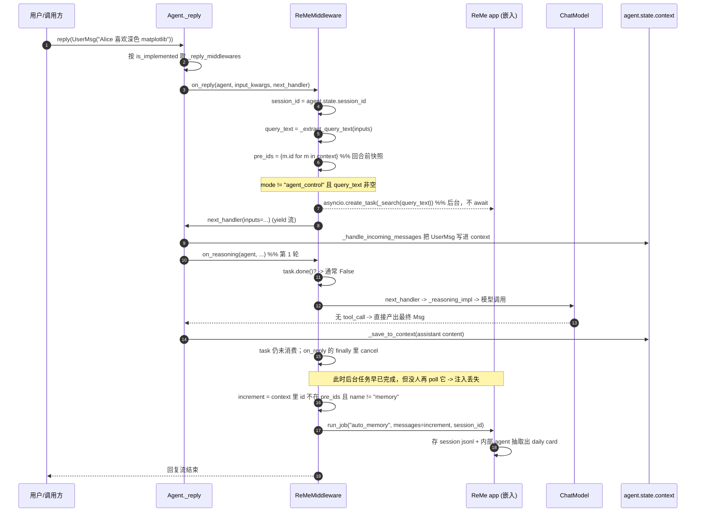
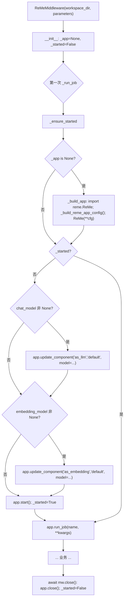
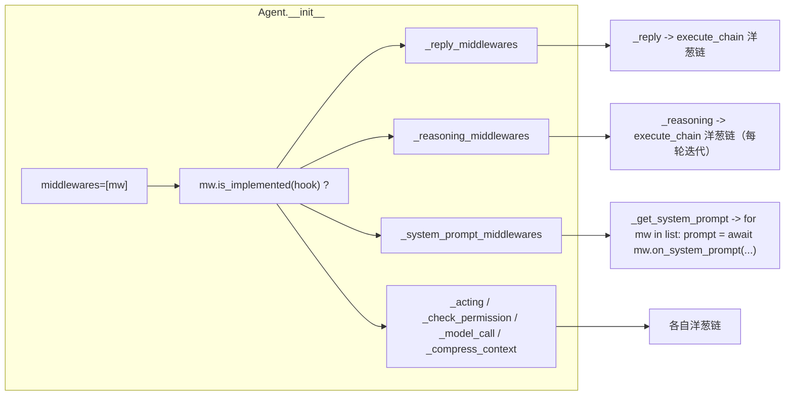

# 15 AgentScope ↔ ReMe 集成（记忆中间件）（id: 15_integration_agentscope_reme）

> 侦察对象：
> - `third_party/agentscope/src/agentscope/middleware/_longterm_memory/`（AgentScope 2.0.8，已 `pip install -e`）
> - `third_party/agentscope/examples/long_term_memory/{reme,agentic_memory,mem0}/`
> - `third_party/agentscope/tests/{reme_middleware_test,mem0_middleware_test,middleware_filesystem_memory_test}.py`
> - `third_party/ReMe/reme/`（本地 0.4.1.13）
>
> 运行环境：`/Users/a/miniconda3/envs/agentscope_reme_pip_env/bin/python`（3.11.13），
> ReMe 相关必须带 `PYTHONPATH=/Users/a/PycharmProjects/VsCode_Projects/Agentscope-Learning/third_party/ReMe`
> （site-packages 里有一个旧的 reme 0.3.1.10，会抢先被 import）。
> LLM：deepseek-flash @ `https://api.deepseek.com`，密钥来自仓库根 `.env`。
>
> **本报告的所有结论均来自真实读码 + 真实运行。** 跑不通的片段显式标「未验证」并给出原因。
> 本次侦察发现了一个**硬性版本不兼容**（见「坑与注意事项」第 1 条），官方 `ReMeMiddleware` 在本地 ReMe 0.4.1.13 上
> **无法启动**，必须打一个 3 行的兼容补丁；报告里的所有端到端验证都是带这个补丁跑的。

---

## 子系统职责（这段代码到底在解决什么问题）

这块代码解决的是 **Agent Harness 第 1 层「持久化记忆」中"长期记忆"那一半**，而且解决的**不是记忆算法本身**——算法全在 ReMe 里——而是**「怎么把 ReMe 这个外部记忆库，无缝地挂到 AgentScope 的 Agent 生命周期上」**这件事。

它要回答四个工程问题：

1. **挂在哪？** AgentScope 的 `MiddlewareBase` 提供了 7 个 hook（`on_reply` / `on_reasoning` / `on_acting` / `on_check_permission` / `on_model_call` / `on_compress_context` / `on_system_prompt`，见 `third_party/agentscope/src/agentscope/middleware/_base.py:13-31`）。ReMe 的「写」和「读」分别应该落在哪个 hook 的哪一行？
2. **怎么部署？** ReMe 官方是一个能 `reme start` 起来的独立服务（HTTP / MCP），也有 CLI。中间件选择的是**进程内嵌入**（in-process embedding）——`ReMe(**config)` 直接 new 一个 `Application`，用 `app.run_job(name, **kw)` 调 job，**不起 HTTP 服务**。零运维，但把 ReMe 的启动开销和生命周期责任搬进了 AgentScope 进程。
3. **怎么喂上下文？** 检索出来的记忆是拼进 system prompt，还是当成一条额外消息塞进 `state.context`？ReMe 中间件选的是后者：造一条 `AssistantMsg(name="memory", content=[HintBlock(...)])`，由 formatter 在真正发请求前渲染成 user 消息。
4. **怎么不污染？** 写回时只写「本轮增量」而不是整个 context；注入的记忆不会再被写回；`top_k` 控制条数。

一句话概括：**这是 AgentScope 官方的"ReMe 长期记忆中间件适配器"**——把 ReMe 的 `auto_memory` / `search` 两个 job 翻译成 Agent 生命周期上的「回合结束后自动写回」+「回合进行中后台检索 + 注入」两条管线，并管好嵌入式 ReMe app 的启动/关闭。

### 三条路线的分工（同一个目录下）

`_longterm_memory/` 下有三个并列实现，这是本子系统最需要先看懂的一张图：

| 路线 | 存储形态 | "写"由谁决定 | "读"怎么进上下文 | 是否需要外部依赖 |
|---|---|---|---|---|
| `AgenticMemoryMiddleware` | 本地 Markdown 文件（`MEMORY.md` 索引 + 分主题 md） | **LLM 自己用 `Write` 工具写**（agentic：给 agent 一套文件工具，靠 system prompt 教它建索引） | 后台 LLM 选文件 → `HintBlock` 追加到 context；`MEMORY.md` 全文进 system prompt | 无（纯文件） |
| `Mem0Middleware` | mem0 服务（向量库 + 图） | agent 调 `add_memory` 工具 + 回合结束自动写 | **同步**检索 → 在 `ReplyStartEvent` 时追加 `HintBlock` | 需要 mem0（可 OSS 本地 / 云端） |
| `ReMeMiddleware`（本次重点） | ReMe workspace（`daily/` 日报 md + `digest/` 摘要 + 索引） | **纯自动**：回合结束调 ReMe 的 `auto_memory` job，用一个内部 AgentScope agent 做 LLM 抽取。**没有 add 工具** | **后台异步**检索 → 在 `on_reasoning` 里 poll 到完成才追加 `HintBlock` | 需要 `reme-ai`（但进程内嵌入，无需起服务） |

`_agentic_memory` 与 `_reme` 的根本差异在于**「谁来写记忆」**：前者把决定权交给主 Agent（它得自己判断什么值得记、还要维护 `MEMORY.md` 索引），后者把决定权交给 ReMe 内部的一个**专门做抽取的 agent**（`auto_memory_step`），主 Agent 完全不感知写入。这直接导致两者的工具面不同：`_agentic_memory` 暴露整套文件读写工具，`_reme` **只有 `memory_search` 一个工具**（见 `_reme/_tools.py:10-14` 的注释）。

---

## 关键文件表

| 文件路径:行号 | 核心类 | 核心函数 | 一句话职责 |
|---|---|---|---|
| `third_party/agentscope/src/agentscope/middleware/_longterm_memory/__init__.py:4-12` | — | — | 导出三条路线的中间件：`AgenticMemoryMiddleware` / `Mem0Middleware` / `ReMeMiddleware` |
| `third_party/agentscope/src/agentscope/middleware/_longterm_memory/_reme/__init__.py:12` | — | — | 只导出 `ReMeMiddleware` |
| `third_party/agentscope/src/agentscope/middleware/_longterm_memory/_reme/_middleware.py:88` | `ReMeMiddleware` | `on_reply` / `on_reasoning` / `on_system_prompt` / `list_tools` / `close` | **本子系统主角**：把 ReMe 的 search/auto_memory 挂到 Agent 生命周期 |
| `.../_reme/_middleware.py:131-182` | `ReMeMiddleware.Parameters` | — | 用户可调参数 pydantic 模型：`chat_model` / `embedding_model` / `mode` / `top_k` |
| `.../_reme/_middleware.py:184-222` | — | `__init__` | 持有 `workspace_dir` / `Parameters` / 每 session 的检索任务字典；**不持有 session_id** |
| `.../_reme/_middleware.py:227-250` | — | `_build_app` | 懒构造嵌入式 `reme.ReMe` app，配置来自 `_config._build_reme_app_config` |
| `.../_reme/_middleware.py:252-284` | — | `_ensure_started` | 幂等地注入 model 并 `start()` 嵌入式 app |
| `.../_reme/_middleware.py:296-307` | — | `_session_id_of` | 从 `agent.state.session_id` 活取 session_id（不落盘到中间件） |
| `.../_reme/_middleware.py:312-380` | — | `on_reply` | 起后台检索任务 + 快照 `pre_ids` + 回合后写回增量 |
| `.../_reme/_middleware.py:385-416` | — | `on_reasoning` | poll 后台检索任务，完成后把 `HintBlock` 追加进 `state.context` |
| `.../_reme/_middleware.py:421-441` | — | `on_system_prompt` | 非 `static_control` 模式下把 `_TOOL_INSTRUCTIONS` 追加到 system prompt |
| `.../_reme/_middleware.py:443-454` | — | `list_tools` | `static_control` 返回 `[]`，否则返回 `[memory_search]` |
| `.../_reme/_middleware.py:459-473` | — | `_run_job` | `_ensure_started()` + `app.run_job()` + `success=False` 转 `RuntimeError` |
| `.../_reme/_middleware.py:475-487` | — | `_search` | 调 `search` job，用 `_extract_memory_texts` 把 envelope 拍平成 `list[str]` |
| `.../_reme/_middleware.py:489-523` | — | `_write_back` | 调 `auto_memory` job，写不进就 warning 不抛（不阻塞回复） |
| `.../_reme/_middleware.py:528-552` | — | `_build_memory_message` | 把 `list[str]` 记忆包成 `AssistantMsg(name="memory")` + `HintBlock` |
| `.../_reme/_config.py:363-376` | — | `_build_reme_app_config` | 产出「AgentScope 自有最小 ReMe 配置」dict |
| `.../_reme/_config.py:54-74` | — | `_dream_steps` | dream（夜间记忆固化）4 步流水线定义 ← **本地 ReMe 不兼容点** |
| `.../_reme/_config.py:77-268` | — | `_memory_jobs` | 只注册记忆生命周期需要的 15 个 job |
| `.../_reme/_config.py:271-360` | — | `_memory_components` | 只注册必需组件；`as_llm` 从 `LLM_*` env 兜底，注入 embedding 时才加向量组件 |
| `.../_reme/_tools.py:73-151` | `_MemorySearchTool` | `__call__` / `check_permissions` | 唯一的 agent 侧工具 `memory_search`，schema 的 `limit` 默认值取 `top_k` |
| `.../_reme/_tools.py:28-70` | `_ReMeMemoryToolBase` | `check_permissions` | 记忆工具一律 `ALLOW`，不弹权限确认 |
| `.../_reme/_utils.py:16-48` | — | `_extract_query_text` | 从统一 `inputs` 里抽出用户文本；HITL 续跑事件返回 `None`（跳过读写） |
| `.../_reme/_utils.py:51-104` | — | `_extract_memory_texts` | 把 ReMe `search` 的 `Response.metadata["results"]` 拍平成 `list[str]`，容错 4 种形状 |
| `third_party/agentscope/src/agentscope/middleware/_base.py:13-303` | `MiddlewareBase` | 7 个 hook + `is_implemented` | 中间件契约；`is_implemented` 靠"基类方法不是子类方法"来判断是否实现 |
| `third_party/agentscope/src/agentscope/agent/_agent.py:218-244` | `Agent` | — | 按 `is_implemented(hook)` 把中间件分桶成 7 个列表（构造时一次性） |
| `third_party/agentscope/src/agentscope/agent/_agent.py:904-948` | — | `_reply` | 把 `on_reply` 中间件串成洋葱链，`next_handler` 逐层下钻 |
| `third_party/agentscope/src/agentscope/agent/_agent.py:1667-1697` | — | `_reasoning` | 把 `on_reasoning` 串成洋葱链，**每轮 ReAct 迭代都会走一遍** |
| `third_party/agentscope/src/agentscope/agent/_agent.py:3233-3237` | — | `_get_system_prompt` | `on_system_prompt` 是 transformer 链（顺序 pipeline，不是洋葱） |
| `third_party/agentscope/src/agentscope/state/_state.py:212` | `AgentState` | — | `session_id` 字段，`default_factory=_generate_id` |
| `third_party/ReMe/reme/reme.py:18` | `ReMe` | — | `class ReMe(Application)`，**空子类**，全部能力继承自 Application |
| `third_party/ReMe/reme/application.py:370-374` | `Application` | `run_job` | 按名字找 job 并 await——中间件的唯一入口 |
| `third_party/ReMe/reme/application.py:235-249` | `Application` | `update_component` | 按 `component_type:name` 改组件属性（注入 model 靠它） |
| `third_party/ReMe/reme/application.py:187-205` | `Application` | `_start` | 组件按依赖拓扑序启动，job 按 base→stream→background→cron 顺序启动 |
| `third_party/ReMe/reme/components/as_llm/__init__.py:34-42` | `BaseAsLLM` | `_start` | `if self.model is not None: return` ← **注入能生效的关键短路** |
| `third_party/ReMe/reme/steps/evolve/auto_memory.py:66` | `AutoMemoryStep` | `execute` | 写回实现：把对话存成 session jsonl + 让内部 agent 写 daily card |
| `third_party/ReMe/reme/steps/index/search.py:38` | `SearchStep` | `execute` / `_rrf_merge` | 混合检索实现：向量+BM25 并行 → RRF 融合 → min_score → dedup → 截断 |
| `third_party/ReMe/reme/schema/response.py:8` | `Response` | — | 统一响应信封 `answer` / `success` / `metadata` |
| `third_party/ReMe/reme/schema/file_chunk.py:8` | `FileChunk` | `score` / `set_hash_id` | 行级记忆片段 `path` + `start_line` + `end_line` + `scores` |

---

## 调用链

### 一次 `agent.reply()` 里，记忆读写的完整时序



**如果这一轮里 Agent 调了工具**（≥2 轮 reasoning）：

```mermaid
sequenceDiagram
    autonumber
    participant MW as ReMeMiddleware
    participant RT as ReMe app (嵌入)
    participant M as ChatModel
    participant C as agent.state.context

    MW->>RT: create_task(_search(query))  (on_reply)
    MW->>M: on_reasoning #1 -> 模型调用
    M-->>MW: 返回 ToolCallBlock(echo)
    MW->>MW: on_reasoning #1 时 task 是 PENDING -> 不注入
    Note over RT: 模型调用期间后台 search 完成
    MW->>C: _save_to_context(tool_result)
    MW->>MW: on_reasoning #2 入口：task.done() == True
    MW->>MW: memories = task.result(); pop 掉 task
    MW->>C: context.append(AssistantMsg(name="memory", [HintBlock]))
    MW->>M: on_reasoning #2 -> 模型调用（这次能看到记忆了）
    M-->>MW: 最终答案
```

这段时序有三个必须讲清楚的工程决策：

1. **检索是后台 task 而不是 await。** `_rare` 源码 `_middleware.py:332-335` 只做了 `asyncio.create_task`，没 await。好处：检索延迟和模型首 token 延迟重叠。代价：**单轮回复（single-shot reply）拿不到记忆**——因为 `on_reasoning` 只在**每轮 reasoning 之前** poll 一次（`_middleware.py:402-404`），如果模型一轮就答完，就再也没有第二次 poll 的机会。
2. **为什么不在 `on_reply` 里同步 await 检索？** 那样就一定拿得到。mem0 中间件就是这么干的（`_mem0/_middleware.py:332` 直接 `await self._async_search(...)`）。ReMe 选择了异步换延迟，这是一个**明写在 docstring 里的取舍**（`_middleware.py:394-399`）。教程里这是个绝佳的控制变量实验素材。
3. **写回在 `on_reply` 的 `finally` 里**（`_middleware.py:352-380`），所以**回复流 yield 完才算开始写**，用户感知不到写延迟。写失败只 warning（`_middleware.py:518-523`），不向上抛——保证"记忆写失败绝不能弄挂主流程"。

### 中间件生命周期时序（懒启动 / 幂等 / 关闭）



关键点：`update_component` **必须在 `start()` 之前**调用。因为 ReMe 的 `BaseAsLLM._start` 第一行是 `if self.model is not None: return`（`reme/components/as_llm/__init__.py:35-36`），注入后它就不会再去用 credential 造模型。这是一个非常经典的"框架留的注入口"设计。

### 与 Agent 的 hook 分桶



注意 `_system_prompt_middlewares` 是**顺序 pipeline**（`_agent.py:3233-3237` 是个 for 循环，不是洋葱），而其他 6 个都是洋葱（`next_handler` 下钻）。这是 AgentScope 中间件体系里唯一一个"transformer 模式" hook（`_base.py:28-30` 明说了）。

---

## 关键数据结构

### 1. `ReMeMiddleware.Parameters`（`_middleware.py:131-182`，pydantic）

```python
class Parameters(BaseModel):
    model_config = {"arbitrary_types_allowed": True}   # 允许 ChatModelBase 这类非 pydantic 类型

    chat_model: ChatModelBase | None = Field(default=None, title="Chat Model", ...)
    embedding_model: EmbeddingModelBase | None = Field(default=None, title="Embedding Model", ...)
    mode: Literal["static_control", "agent_control", "both"] = Field(default="both", title="Retrieval Mode", ...)
    top_k: int = Field(default=5, title="Top K", ...)
```

| 字段 | 类型 | 默认 | 作用 | 为什么放在这里 |
|---|---|---|---|---|
| `chat_model` | `ChatModelBase \| None` | `None` | 注入到 ReMe 的 `as_llm:default` 组件，驱动 `auto_memory` 写回 | 注释说得很明白：**"agent service parses this schema to render a configuration form"**——这个类是给上层控制台渲染配置表单用的（`arbitrary_types_allowed=True` 是为了让 pydantic 接受 `ChatModelBase` 这种抽象基类实例） |
| `embedding_model` | `EmbeddingModelBase \| None` | `None` | 注入到 `as_embedding:default`；**提供它就等于打开 ReMe 的向量存储** | `None` 时 ReMe 只做 BM25 关键词检索 |
| `mode` | `Literal[...]` | `"both"` | 只控制**检索**；写回在所有模式下都跑 | 三态用 `Literal` 让 pydantic 在构造期就把非法值挡掉（已实测：传 `"garbage"` 抛 `ValidationError`） |
| `top_k` | `int` | `5` | 每次检索最多返回几条；同时是 `memory_search` 工具 schema 里 `limit` 的默认值 | 一个参数同时管两条路径的默认值 |

注意 **`workspace_dir` 不在 `Parameters` 里**，它是构造函数的独立参数（`_middleware.py:187`）。docstring 解释了原因：**"Structural wiring (workspace_dir) stays on the constructor"**——结构性接线（路径）留在代码里，可调参数（模型/模式/条数）暴露成配置表单。这个"结构 vs 参数"的切分是插件化设计里很值得学的一手。

### 2. ReMe 的 `Response`（`third_party/ReMe/reme/schema/response.py:8-19`）

```python
class Response(BaseModel):
    model_config = ConfigDict(extra="allow")
    answer: str | Any = Field(default="", description="Primary response content or result data exposed to tool callers")
    success: bool = Field(default=True, description="Whether the operation succeeded")
    metadata: dict = Field(default_factory=dict, description="Auxiliary request context and diagnostics")
```

- **`answer`** 是给 LLM 看的主结果（`search` 会把它拼成 `========== path:start-end [score=...] ==========\n<chunk text>` 的纯文本，见 `reme/steps/index/search.py:360-368`）。
- **`metadata["results"]`** 才是给程序化客户端用的结构化数据，是 `list[FileChunk.model_dump()]`（`search.py:370-372`）。
- 中间件**只用 `metadata`**，不用 `answer`——因为 `answer` 里带了 `==========` 分隔符和分数，不适合直接进上下文。这就是 `_extract_memory_texts` 存在的理由。

### 3. ReMe 的 `FileChunk`（`third_party/ReMe/reme/schema/file_chunk.py:8-25`）

```python
class FileChunk(EmbNode):
    path: str = Field(default="", description="Path relative to the workspace")
    start_line: int = Field(default=0, description="Inclusive start line (1-based)")
    end_line: int = Field(default=0, description="Inclusive end line (1-based)")
    scores: dict[str, float] = Field(default_factory=dict, description="Retrieval scores keyed by stage")

    @property
    def score(self) -> float:
        return self.scores.get("score", 0.0)
```

`EmbNode` 提供 `id` / `text` / `embedding`。`_extract_memory_texts` 取的就是 `text`（回退到 `memory` / `content`，`_utils.py:99-102`）。`scores` 在混合检索下是 `{"vector":..., "keyword":..., "score":...}`（RRF 融合分）。

### 4. 注入用的消息结构

不是自定义类，而是复用 AgentScope 现成的三件套：

```python
AssistantMsg(name=_MEMORY_MSG_NAME, content=[HintBlock(hint=content)])
```

- `_MEMORY_MSG_NAME = "memory"`（`_middleware.py:71`）
- `content` 是 `f"{_MEMORY_SECTION_HEADER}\n{_MEMORY_SECTION_INTRO}\n{bullets}"`（`_middleware.py:543-548`）
- **为什么用 `AssistantMsg` 而不是 `UserMsg`？** docstring 直说了（`_middleware.py:531-534`）：`UserMsg` 的内容校验器不接受 `HintBlock`，只有 assistant/system 能带。而 formatter 会在发给模型前把 `HintBlock` 渲染成一条 **user** 消息（实测见下）。
- `name="memory"` 这个保留名有两个用途：① 写回时过滤掉它（`_middleware.py:372`）；② 测试/示例里靠它找到注入的 note。

### 5. 每 session 的检索任务表

```python
self._retrieval_tasks: dict[Any, asyncio.Task] = {}   # _middleware.py:222
```

key 是 `session_id`。**这是本中间件能安全地被多个 Agent 共享的关键**：两个 session 并发回复时，各自的 in-flight search 互不覆盖。已实测（`tests/reme_middleware_test.py:893-934` 的 `test_concurrent_sessions_isolate_retrieval_tasks`，以及下面我自己的验证）。

---

## 源码精读

### 精读 1：`on_reply` —— 一次回复里最重要的一段代码

```python
# third_party/agentscope/src/agentscope/middleware/_longterm_memory/_reme/_middleware.py:312-380
    async def on_reply(
        self,
        agent: "Agent",
        input_kwargs: dict,
        next_handler: Callable[..., AsyncGenerator],
    ) -> AsyncGenerator:
        session_id = self._session_id_of(agent)

        inputs = input_kwargs.get("inputs")
        query_text = _extract_query_text(inputs)

        # Discard any stale task left for this session (a previous turn that
        # never reached its finally is unexpected, but never leak one).
        stale = self._retrieval_tasks.pop(session_id, None)
        if stale is not None and not stale.done():
            stale.cancel()
        if self._parameters.mode != "agent_control" and query_text:
            self._retrieval_tasks[session_id] = asyncio.create_task(
                self._search(query_text),
            )

        # Snapshot the context BEFORE the turn so the write-back persists
        # only this turn's *increment*. ...
        pre_ids = {m.id for m in agent.state.context if isinstance(m, Msg)}

        try:
            async for item in next_handler(**input_kwargs):
                yield item
        finally:
            task = self._retrieval_tasks.pop(session_id, None)
            if task is not None and not task.done():
                task.cancel()
            if task is not None:
                try:
                    await task
                except (asyncio.CancelledError, Exception):  # noqa: BLE001
                    pass
            increment = [
                m
                for m in agent.state.context
                if isinstance(m, Msg)
                and m.id not in pre_ids
                and getattr(m, "name", None) != _MEMORY_MSG_NAME
            ]
            if query_text and any(
                m.role == "assistant" and m.get_text_content()
                for m in increment
            ):
                await self._write_back(increment, session_id)
```

逐段拆解：

- **`session_id = self._session_id_of(agent)`**：注意这是**每次 hook 调用时现取**，不是构造时存下来。`_session_id_of` 就是一个 `getattr(getattr(agent,"state",None),"session_id",None)`（`_middleware.py:297-307`）。为什么要这么绕？因为**一个 middleware 实例可能要服务多个 agent**（示例 `reme_demo.py:275-283` 就是这么用的，一个 mw 挂两个 session）。如果存成 `self._session_id`，第二个 agent 的写回就会串到第一个 session 里。测试 `test_session_id_not_stored_on_middleware`（`tests/reme_middleware_test.py:457-474`）专门断言了 `not hasattr(mw, "_session_id")`——**"不留状态"本身是被测试保护的契约**。这和 `TracingMiddleware` 从 agent 取 session 的做法是同一个套路。
- **`query_text = _extract_query_text(inputs)`**：`inputs` 是统一入参，可能是 `Msg` / `list[Msg]` / `UserConfirmResultEvent` / `ExternalExecutionResultEvent` / `None`（见 `_base.py:84-89`）。后两种是 HITL（human-in-the-loop）续跑事件，返回 `None` → 整段读写都跳过。这是很细的一手：**用户点了个"确认"不该触发一次记忆检索和一次记忆写回**。
- **`stale` 清理**：理论上上一轮的 finally 一定会 pop 掉，但作者选择防御性再清一次。工程上叫"不留悬挂引用"。
- **`pre_ids` 快照**：这是**本中间件最巧妙的一段**。为什么不能直接把整个 `agent.state.context` 丢给 `auto_memory`？因为 `context` 是**跨轮累积**的全量历史，而 `auto_memory` 期望的是**本轮增量交换**。如果每轮都发全量，第 N 轮的写回会把前 N-1 轮全部重新喂一遍 → 重复记忆爆炸。所以用 `pre_ids` 做差集。
- **为什么用 `m.id` 而不是对象相等？** 因为 `Msg` 是 pydantic 模型，`context` 里的对象会经历 `_save_to_context` 的拷贝/压缩替换，引用不一定稳定，而 `id` 是稳定主键。
- **`_save_to_context` 会记录"整轮"而不是"最后一条"**：注释 `_middleware.py:343-346` 说得很清楚——`agent.state.context` 上记录了本轮每一步（用户输入、每个 assistant step、每个 tool call / tool result），但流上只 yield 最终答案。所以必须从 context 取增量，不能从流里攒。测试 `test_write_back_includes_full_turn_increment`（`tests/reme_middleware_test.py:668-731`）断言了写回内容里**同时有 `tool_call` 和 `tool_result` block**。
- **`getattr(m, "name", None) != _MEMORY_MSG_NAME`**：把注入的记忆 note 排除掉。**为什么重要？** ReMe 的 `AutoMemoryStep._sanitize_msg_for_save`（`third_party/ReMe/reme/steps/evolve/auto_memory.py:25-41`）已经在**写盘时**丢掉 `tool_result` block 了，理由是"检索回来的东西会让之前检索到的事实伪装成用户提供的内容"。中间件这一行是同一防御的**上游版本**：不进 context 增量，就不会被写回。
- **最后的守卫条件**：`if query_text and any(m.role == "assistant" and m.get_text_content() for m in increment)`。两个条件：① 必须有真实用户输入；② 必须至少产出了一条非空 assistant 文本。这挡住了"只调了工具没出答案"的回合、以及"只有 thinking block 没有 text"的回合。**不给噪声写记忆**。

### 精读 2：`on_reasoning` —— best-effort 注入的实现

```python
# .../_reme/_middleware.py:385-416
    async def on_reasoning(
        self,
        agent: "Agent",
        input_kwargs: dict,
        next_handler: Callable[..., AsyncGenerator],
    ) -> AsyncGenerator:
        session_id = self._session_id_of(agent)
        task = self._retrieval_tasks.get(session_id)
        if task is not None and task.done():
            self._retrieval_tasks.pop(session_id, None)
            try:
                memories = task.result()
            except (asyncio.CancelledError, Exception) as e:  # noqa: BLE001
                memories = []
                logger.warning("ReMe search failed: %s", e)
            if memories:
                agent.state.context.append(
                    self._build_memory_message(memories),
                )

        async for event in next_handler(**input_kwargs):
            yield event
```

- **`task.done()` 但不 `await`**：`done()` 为真意味着任务已经结束（正常或异常），此时 `task.result()` 不会阻塞。如果不用 `done()` 而直接 `await`，就会把检索延迟加进推理延迟——那就丧失了异步的全部意义。
- **`pop` 掉再取**：保证一条记忆**只注入一次**。如果不清掉，第二轮 `on_reasoning` 会重复注入同一条 note。
- **`except (asyncio.CancelledError, Exception)`**：把 `CancelledError` 也吞掉。在 Python 3.8+ `CancelledError` 继承自 `BaseException` 而不是 `Exception`，所以要显式列出。这里必须吞——因为 `on_reply` 的 finally 会 `cancel()` 未消费的任务，如果这里不吞，取消异常可能泄漏成一条 warning 日志。注意写法有点啰嗦：`except (asyncio.CancelledError, Exception)` 等价于 `except BaseException`... 实际上不等价，它是"CancelledError 或 Exception"，即排除了其他 `BaseException`（如 `KeyboardInterrupt`、`SystemExit`）——这是**故意的**，让 Ctrl-C 能正常穿透。
- **`agent.state.context.append(...)`**：直接 append（不是 `append_context`）。注意 `AgenticMemoryMiddleware` 用的是 `agent.state.append_context(agent.name, [HintBlock(...)])`（`_agentic_memory/_middleware.py:667-674`），ReMe 版本用手工构造 `AssistantMsg` + 裸 `append`。两种写法的差异在于：`append_context` 会把 block 挂到"当前助手消息"上（合并进同一条 Msg），而 `append` 会新增一条独立消息。**ReMe 选择独立一条消息**，好处是 `name="memory"` 可被精确识别、写回时好过滤，坏处是每条 note 都占一条消息位。

### 精读 3：`_build_app` + `_build_reme_app_config` —— 为什么自己写一份配置

```python
# .../_reme/_middleware.py:227-250
    def _build_app(self) -> Any:
        try:
            from reme import ReMe
        except ImportError as e:  # pragma: no cover - import guard
            raise ImportError(
                "ReMeMiddleware requires the `reme-ai` package. Install "
                'it with `pip install "agentscope[memory-reme]"` (or '
                "`pip install reme-ai`).",
            ) from e

        embedding_dimensions = None
        if self._parameters.embedding_model is not None:
            embedding_dimensions = self._parameters.embedding_model.dimensions
        app_config = _build_reme_app_config(
            workspace_dir=self._workspace_dir,
            embedding_dimensions=embedding_dimensions,
        )
        return ReMe(**app_config)
```

`_config.py` 开头的注释解释了设计意图，**这是全篇最值得抄的一段工程判断**：

```python
# third_party/agentscope/src/agentscope/middleware/_longterm_memory/_reme/_config.py:1-14
"""Minimal embedded ReMe configuration for AgentScope memory.

ReMe's bundled ``default`` configuration describes a standalone memory
application. It includes resource ingestion, chat, operational endpoints and
other jobs that are unrelated to :class:`ReMeMiddleware`. ...

Keep this configuration as a Python dictionary rather than resolving ReMe's
``default.yaml`` so adding a new standalone ReMe feature cannot silently add
background work to an AgentScope process.
"""
```

翻译成人话：**"不要 `from_pretrained`，要 allowlist"**。ReMe 的 `default.yaml` 是一个独立应用的完整配置，包含资源摄取、独立聊天、运维端点等一堆 job。如果直接加载它，ReMe 上游某天新增一个后台 watcher，你的 AgentScope 进程就会神不知鬼不觉地多跑一个后台任务。所以 AgentScope 自己用 Python dict **白名单式**地只注册 15 个 job。已验证：

```python
# 实测输出（见可运行片段 1）
jobs registered: 15
# 集合为: index_update_loop, search, reindex, auto_memory, dream_cron, auto_dream,
#         node_search, daily_list, frontmatter_update, frontmatter_read, move,
#         read, write, daily_write, edit
```

`tests/reme_middleware_test.py:477-534` 的 `test_config_is_agentscope_owned_and_minimal` 就是断言这份白名单，并且额外断言 `resource_watch_loop` / `digest_watch_loop` / `daily_paper` **不在**里面。

`_memory_components`（`_config.py:271-360`）同样是最小白名单，注意这段：

```python
# .../_reme/_config.py:334-358
    if embedding_dimensions is not None:
        components.update({
            "as_embedding": {"default": {
                "backend": "openai",
                "model": "agentscope-injected",     # 占位名，反正会被 update_component 覆盖
                "dimensions": embedding_dimensions,
                "credential": {"api_key": "", "base_url": ""},
                "parameters": {},
            }},
            "embedding_store": {"default": {
                "backend": "local", "as_embedding": "default",
                "enable_cache": True, "max_cache_size": 3_000,
                "max_input_length": 8_192, "max_batch_size": 10,
            }},
        })
        components["file_store"]["default"]["embedding_store"] = "default"
```

**只有传了 `embedding_model` 才会往配置里加 `as_embedding` + `embedding_store` 两个组件**，并把 `file_store.embedding_store` 从 `""` 改成 `"default"`。这是"提供 embedding 模型 = 自动打开向量检索"这一句话的**全部实现**。注意 `"model": "agentscope-injected"` 是个纯占位符——因为注入后 `BaseAsEmbedding` 也会短路（`reme/components/as_embedding/__init__.py` 里同样有 `if self.model is not None` 的短路），这个字段根本不会被用到。

还有一个隐蔽的坑：**`as_llm` 组件的凭据只认 `LLM_*` 环境变量，不认 `OPENAI_*`**：

```python
# .../_reme/_config.py:280-296
        "as_llm": {
            "default": {
                "backend": os.getenv("LLM_BACKEND", "openai"),
                "model": os.getenv("LLM_MODEL_NAME", "qwen3.7-plus"),
                "stream": True,
                "context_size": 200_000,
                "max_retries": 3,
                "credential": {
                    "api_key": os.getenv("LLM_API_KEY", ""),
                    "base_url": os.getenv("LLM_BASE_URL", ""),
                },
                "parameters": {"max_tokens": 65_536, "thinking_enable": False},
            },
        },
```

实测：如果不注入 `chat_model` 也不设 `LLM_API_KEY`，`app.start()` 会抛 `openai.OpenAIError: Missing credentials...`——即便你设了 `OPENAI_API_KEY`。这是"no-injection escape hatch"（不注入模型的降级路径）的实际行为。教程里这会是一个非常好的"读源码 vs 读文档"对比案例。

### 精读 4：写回路径 —— `increment` 里到底有什么

```python
# .../_reme/_middleware.py:489-523
    async def _write_back(
        self,
        messages: list[Msg],
        session_id: str | None,
    ) -> None:
        if not session_id:
            logger.warning(
                "ReMe write skipped: no session_id captured from the agent.",
            )
            return
        try:
            await self._run_job(
                _AUTO_MEMORY_JOB,
                messages=[m.model_dump(mode="json") for m in messages],
                session_id=session_id,
            )
        except Exception as e:  # noqa: BLE001
            logger.warning(
                "ReMe auto_memory failed for session_id=%s: %s",
                session_id,
                e,
            )
```

- **`m.model_dump(mode="json")`**：AgentScope 的 `Msg` 是 pydantic 模型，ReMe 的 `auto_memory_step` 期待的是 JSON dict 列表（配置 schema 里申明 `"messages": {"type": "array", "items": {"type":"object"}}`，`_config.py:141-144`）。为什么用 `mode="json"` 而不是默认的 `mode="python"`：`json` 模式把所有嵌套对象转成 JSON 可序列化的原语，避免把 pydantic 实例传给 ReMe 内部的 `Msg.model_validate`。
- **`session_id` 空则跳过 + warning**：`AgentState.session_id` 有 `default_factory=_generate_id`（`state/_state.py:212`），所以正常情况永远有值。这个分支是给"有人塞了个假 agent 对象"的防御。
- **异常只 warning**：注释明说 "failures are logged rather than propagated so a write never blocks the reply"。

写进 ReMe 后，`AutoMemoryStep.execute`（`third_party/ReMe/reme/steps/evolve/auto_memory.py:66`）做两件事：① 把整轮对话 append 到 `{session_dir}/dialog/{session_id}.jsonl`（`_save_session_messages`，`auto_memory.py:159+`）；② 用一个 AgentScope agent 把对话中的事实抽取成一张 **daily card** 写到 `daily/{YYYY-MM-DD}/{name}.md`，文件 frontmatter 里带 `session_id` 和 `source_conversation`（`_find_session_note` / `_ensure_session_frontmatter`，`auto_memory.py:113-147`）。**所以 `session_id` 的作用是让 ReMe 把同一 session 的多轮对话合并/更新到同一张卡上**，而不是简单追加。

实测写回产物（真实输出）：

```
[2] auto_memory success = True answer = Created `2026-09-21/user-profile-alice-charting-preferences.md`,
    recording Alice's location (Hangzho...
```

### 精读 5：`_extract_memory_texts` —— 4 种形状的容错

```python
# .../_reme/_utils.py:77-104
    if raw is None:
        return []

    results: Any = raw
    if isinstance(raw, dict):
        if (
            isinstance(raw.get("metadata"), dict)
            and "results" in raw["metadata"]
        ):
            results = raw["metadata"]["results"]
        else:
            results = raw.get("results", raw)

    if not isinstance(results, list):
        return []

    out: list[str] = []
    for item in results:
        if isinstance(item, str):
            out.append(item)
        elif isinstance(item, dict):
            text = (
                item.get("text") or item.get("memory") or item.get("content")
            )
            if text:
                out.append(str(text))
    return out
```

这段是**教科书级的"防腐层（anti-corruption layer）"**。它同时接受：

1. `{"metadata": {"results": [{"text": ...}]}}` —— ReMe `search` 的真实形状（已实测）
2. `{"results": [{"text": ...}]}` —— 已经解开一层的
3. `[{"text": ...}]` / `[{"memory": ...}]` —— 裸列表，字段名做前向兼容
4. `["str", ...]` —— 纯字符串

**为什么要这么写？** 因为 ReMe 是**独立演进的另一个项目**（版本号 0.4.1.13），它的响应信封随时可能变。写死一个形状 = 某天 ReMe 改个字段名，中间件就静默返回空列表（`search` 看起来"成功但啥也没检索到"）。容错 + 全空兜底，至少不会崩。这跟 Sentinel 式的做法相反（Sentinel 是快速失败），这里是**"宁可少拿数据也不要炸主流程"**，符合记忆这种"锦上添花"能力的定位。

缺点也很明显：**静默降级**。如果 ReMe 真的改了形状，你只会看到"检索不到记忆"，不会看到报错。教程里讲到"Agent 全链路问题定位"时，这是"记忆模块"这一档故障的典型症状。

### 精读 6：`_MemorySearchTool` —— 为什么 ReMe 没有 add 工具

```python
# .../_reme/_tools.py:1-15（模块 docstring）
"""Agent-control tool exposed by the ReMe middleware.

The single ``memory_search`` tool is listed by :class:`ReMeMiddleware`
when ``mode`` is ``"agent_control"`` or ``"both"``. ...

Unlike the mem0 middleware (which also exposes an ``add_memory`` tool),
ReMe has **no manual add tool**: it records memory through its
``auto_memory`` job — an LLM extraction over the *conversation* — which
the middleware runs automatically on the reply path (write-back). So the
agent-facing surface is search-only.
"""
```

```python
# .../_reme/_tools.py:104-124
        super().__init__(mw)
        # Per-instance schema so the default ``limit`` reflects this
        # middleware's ``top_k`` rather than a hardcoded constant.
        self.input_schema: dict[str, Any] = {
            "type": "object",
            "properties": {
                "query": {"type": "string", "description": (...), },
                "limit": {"type": "integer", "description": (...),
                          "default": mw._parameters.top_k},
            },
            "required": ["query"],
        }
```

- **"search-only 工具面"是一个刻意的架构选择**：ReMe 的写入是"从对话里 LLM 抽取"，不是"agent 说自己要记什么"。这带来两个后果：① agent 无法被 prompt injection 骗着写一条假记忆（除非通过对话内容）；② agent 也无法主动"我这条一定要记住"（只能靠把话说明白，让抽取 agent 抓到）。**这是 ReMe 与 mem0 最本质的设计分歧**。
- **`input_schema` 是实例属性而不是类属性**：`_MemorySearchTool` 在 `__init__` 里为每个实例造一份 schema，只为了让 `limit` 的默认值等于这个中间件的 `top_k`。已实测：`top_k=11` 时 `input_schema["properties"]["limit"]["default"] == 11`，且 `await tool(query="...")`（不传 limit）真的会带着 `limit=11` 去调 ReMe（`tests/reme_middleware_test.py:1118-1143`）。这个技巧在 AgentScope 里很常见——**工具类属性（`name` / `description` / `input_schema`）在 `ToolBase` 里是 `ClassVar` 风格的声明**，但 schema 需要 per-instance 定制时就改成实例属性。
- **`check_permissions` 无条件 ALLOW**（`_tools.py:53-70`）：理由写在注释里——"middleware-provided memory tools are part of the agent's standard capabilities"。如果不 ALLOW，每次检索都要弹一次用户确认，长期记忆就废了。这也说明 `on_check_permission` 这个 hook 的典型用法：**给"框架自带的、用户已经通过装配同意了的"能力做批量放行**。
- **工具错误用 `ToolChunk(state=ToolResultState.ERROR)`**（`_tools.py:175-182`）：`__call__` 里 catch 所有异常并返回错误 chunk，而不是抛。这样 toolkit 会把这次调用聚合为"失败的工具调用"，agent 看到错误信息后可以自己决定重试还是绕过——**把异常转成 agent 可推理的观测（observation）**，这是 Tool Use 层的标准做法。

### 精读 7：`_tools.py` 的错误处理 vs `_middleware.py` 的错误处理

两处错误处理策略明显不同，值得对比：

| 位置 | 策略 | 理由 |
|---|---|---|
| `_MemorySearchTool.__call__`（`_tools.py:144-147`） | catch → 返回 `ToolChunk(state=ERROR)` | 工具调用是 agent 可见的观测；转成错误 chunk 让 **agent 自己决策** |
| `on_reasoning` 的 `task.result()`（`_middleware.py:405-409`） | catch → `memories=[]` + `logger.warning` | 注入是 best-effort 的优化，失败就当作"没检索到" |
| `_write_back`（`_middleware.py:518-523`） | catch → `logger.warning` | 写记忆绝不能阻塞回复 |
| `_run_job`（`_middleware.py:469-472`） | `success=False` → `raise RuntimeError` | 这是**统一的错误归一化点**：把 ReMe 的 `success` 布尔约定翻译成 Python 异常 |

注意最后一条的层次关系：`_run_job` 把 `success=False` 变成异常，然后**调用方各自决定怎么处理这个异常**——`_search` 不 catch（由 `on_reasoning` 的 `task.result()` catch）、`_write_back` catch、工具 catch。**一个归一化点 + 三个不同的处置策略**，这比每个调用点各自处理 `success` 布尔值要干净得多。

---

## 可运行代码片段

以下所有片段都已在真实环境跑通。脚本已归档到
`tutorial_agsc_reme/_recon/code/15_*.py`。

### 片段 0（已验证）：所有片段都需要的前置 —— ReMe 0.4.1.13 兼容补丁

**这段代码是必需的**，否则一切跑不起来（原因见「坑」第 1 条）。

```python
# 文件: tutorial_agsc_reme/_recon/code/15_reme_app_embedded_e2e.py:13-27
from agentscope.middleware._longterm_memory._reme import _config

# AgentScope 2.0.8 的 _config._dream_steps() 会产出一个 `dream_topics_step`，
# 它在 reme 0.4.1.13 里不存在（对照 reme/config/default.yaml:64-75）。
# 这里替换成 0.4.1.13 真实支持的 3 步版本。
_config._dream_steps = lambda: [
    {"backend": "dream_extract_step", "file_catalog": "dream",
     "scan_days": 2, "max_units": 5},
    {"backend": "dream_integrate_step"},
    {"backend": "dream_finish_step", "file_catalog": "dream"},
]
```

为什么 patch 模块属性就能生效：`_build_reme_app_config` → `_memory_jobs()` → `_dream_steps()`，
Python 在**调用时**才做全局名查找，所以替换模块属性会被后续所有调用看到。

### 片段 1（已验证）：直接驱动嵌入式 ReMe app（不涉及 Agent）

```python
# 文件: tutorial_agsc_reme/_recon/code/15_reme_app_embedded_e2e.py
import asyncio, os, shutil
from dotenv import load_dotenv
load_dotenv("/Users/a/PycharmProjects/VsCode_Projects/Agentscope-Learning/.env")

from agentscope.credential import DeepSeekCredential
from agentscope.model import DeepSeekChatModel
from agentscope.middleware._longterm_memory._reme import _config
from agentscope.middleware._longterm_memory._reme._utils import _extract_memory_texts
from reme import ReMe

_config._dream_steps = lambda: [                       # 兼容补丁，见片段 0
    {"backend": "dream_extract_step", "file_catalog": "dream", "scan_days": 2, "max_units": 5},
    {"backend": "dream_integrate_step"},
    {"backend": "dream_finish_step", "file_catalog": "dream"},
]

WS = "/tmp/recon15/ws_B"
shutil.rmtree(WS, ignore_errors=True)

async def main():
    chat = DeepSeekChatModel(
        credential=DeepSeekCredential(api_key=os.environ["OPENAI_API_KEY"],
                                      base_url=os.environ["OPENAI_BASE_URL"]),
        model=os.environ["LLM_MODEL"], stream=True)

    app = ReMe(**_config._build_reme_app_config(workspace_dir=WS))
    # 必须在 start() 之前注入 -> BaseAsLLM._start 短路
    await app.update_component("as_llm", "default", model=chat)
    await app.start()
    print("[1] jobs registered:", len(app.context.jobs))

    r = await app.run_job("auto_memory", messages=[
        {"role": "user", "name": "alice", "content": [{"type": "text", "text":
            "My name is Alice, I am based in Hangzhou. For every chart I always use matplotlib in dark mode."}]},
        {"role": "assistant", "name": "bot", "content": [{"type": "text", "text":
            "Noted Alice - dark-mode matplotlib from now on."}]},
    ], session_id="session-1")
    print("[2] auto_memory success =", r.success, "answer =", (r.answer or "")[:100].replace("\n", " "))
    await app.run_job("reindex")
    r3 = await app.run_job("search", query="chart library and theme preference", limit=5)
    print("[3] search success =", r3.success)
    print("    memories:", _extract_memory_texts(r3.metadata))
    await app.close()

asyncio.run(main())
```

**真实输出**：

```
[1] jobs registered: 15
[2] auto_memory success = True answer = Created `2026-09-21/user-profile-alice-charting-preferences.md`, recording Alice's location (Hangzho
[3] search success = True
    memories: ['<!-- notes:auto -->\n\n- [[daily/2026-09-21/user-profile-alice-charting-preferences.md]] name: user-profile-alice-charting-preferences description: User profile for Alice: based in Hangzhou; states that for every chart she always uses matplotlib in dark mode — a standing preference to apply to all future plotting requests.\n\n<!-- /notes:auto -->', '# Alice — User Profile & Preferences\n\n## Identity\n\n- Name: Alice\n- Location: based in Hangzhou.\n\n## Stated Preferences (verbatim)\n\n- "For every chart I always use matplotlib in dark mode."\n\n## How to Apply\n\n- Whenever producing charts/plots for Alice, default to **matplotlib** with a **dark-mode** style (e.g. a dark style sheet / dark background styling) — no need to ask each time.\n- This is a general, always-on preference, not tied to a single task.\n\n## Notes\n\n- First recorded 2026-09-21; acknowledged by assistant at that time.']
```

运行命令：

```bash
PYTHONPATH=/Users/a/PycharmProjects/VsCode_Projects/Agentscope-Learning/third_party/ReMe \
  /Users/a/miniconda3/envs/agentscope_reme_pip_env/bin/python \
  /tmp/recon15/s3_app_e2e_fixed.py
```

**注意输出里的几个教学点**：
1. `search` 返回的**第一条是索引块**（`<!-- notes:auto -->` 那种，带 wikilink 和 description），第二条才是卡片正文。所以注入上下文的东西**混了索引元数据和正文**——这就是为什么记忆 card 写得太大会把 context 撑爆。
2. `_extract_memory_texts` 返回的是**整张卡的全文**，不是行级片段。`top_k=5` 条全文可能就是几千 token（无截断，见「坑」第 4 条）。

### 片段 2（已验证）：端到端 —— 用 ReMe 存一条记忆，再用挂了 ReMe 中间件的 Agent 答对

这就是任务要求的「最小可运行代码」。脚本：`tutorial_agsc_reme/_recon/code/15_reme_middleware_agent_e2e.py`。

```python
# 文件: tutorial_agsc_reme/_recon/code/15_reme_middleware_agent_e2e.py（核心部分）
import asyncio, os, shutil, logging
from dotenv import load_dotenv
load_dotenv("/Users/a/PycharmProjects/VsCode_Projects/Agentscope-Learning/.env")

from agentscope.credential import DeepSeekCredential
from agentscope.model import DeepSeekChatModel
from agentscope.agent import Agent
from agentscope.message import UserMsg
from agentscope.middleware import ReMeMiddleware
from agentscope.state import AgentState
from agentscope.tool import Toolkit
from agentscope.middleware._longterm_memory._reme import _config

logging.getLogger("reme").setLevel(logging.ERROR)
_config._dream_steps = lambda: [                       # 兼容补丁，见片段 0
    {"backend": "dream_extract_step", "file_catalog": "dream", "scan_days": 2, "max_units": 5},
    {"backend": "dream_integrate_step"},
    {"backend": "dream_finish_step", "file_catalog": "dream"},
]

WS = "/tmp/recon15/ws_agent"
shutil.rmtree(WS, ignore_errors=True)

async def main():
    chat = DeepSeekChatModel(
        credential=DeepSeekCredential(api_key=os.environ["OPENAI_API_KEY"],
                                      base_url=os.environ["OPENAI_BASE_URL"]),
        model=os.environ["LLM_MODEL"], stream=True)

    mw = ReMeMiddleware(workspace_dir=WS,
                        parameters=ReMeMiddleware.Parameters(
                            chat_model=chat, mode="both", top_k=5))
    tools = await mw.list_tools()          # -> [memory_search]
    print("middleware tools:", [t.name for t in tools])

    def build(sid):
        return Agent(name="assistant",
                     system_prompt=("You are a helpful data-analysis assistant. Be concise. "
                                    "When the request may depend on a durable fact from a past "
                                    "session (a preference, a name, a prior decision), you MUST "
                                    "call the memory_search tool first."),
                     model=chat,
                     toolkit=Toolkit(tools=list(tools)),
                     middlewares=[mw],
                     state=AgentState(session_id=sid))    # <- 显式 pin session_id

    try:
        # ---------- SESSION 1: 说出一个持久偏好 ----------
        a1 = build("session-1")
        r1 = await a1.reply(UserMsg("alice", "Hi! My name is Alice, I'm based in Hangzhou. "
                                               "For every chart I always want matplotlib in dark mode."))
        print("[SESSION-1 assistant]", r1.get_text_content())
        # auto_memory 只写盘；让写入立刻可检索需要 reindex（见「坑」第 3 条）
        await mw._run_job("reindex")
        persisted = await mw._search("user chart preference and location", limit=20)
        print("[SESSION-1 written back]", len(persisted), "chunk(s) now searchable")

        # ---------- SESSION 2: 全新 agent，空 context ----------
        a2 = build("session-2")
        q = ("I need a bar chart of monthly sales. Which plotting library and which theme "
             "should you use for me, and what city am I based in?")
        r2 = await a2.reply(UserMsg("alice", q))
        ans = r2.get_text_content() or ""
        print("[SESSION-2 assistant]", ans)

        note = [m for m in a2.state.context if getattr(m, "name", None) == "memory"]
        print("[static path] injected memory notes:", len(note))
        for m in note:
            for b in m.get_content_blocks("hint"):
                print("   ", b.hint[:300].replace("\n", " | "))
    finally:
        await mw.close()

asyncio.run(main())
```

**真实输出**：

```
middleware tools: ['memory_search']

[SESSION-1 assistant] Got it, Alice — I'll use matplotlib in dark mode for every chart you ask for.
[SESSION-1 written back] 2 chunk(s) now searchable

[SESSION-2 user] I need a bar chart of monthly sales. Which plotting library and which theme should you use for me, and what city am I based in?
[SESSION-2 assistant] Based on your standing preferences:

- **Library:** matplotlib
- **Theme:** dark mode
- **City:** Hangzhou

So I'll render your monthly sales bar chart with matplotlib using the dark style (e.g. `plt.style.use('dark_background')`). Note: the timezone reminder shows UTC, but your saved location preference is Hangzhou — let me know if that's changed.

[static path] injected memory notes: 1
    ## Relevant memories from past conversations | The following memories about the user may be relevant. Use them only if they are pertinent to the current request. | - # Alice — Identity & Standing Preferences |  | ## Who |  | - Name: Alice | - Location: Hangzhou |  | ## Standing preference (apply by default) |  | - **Ever
```

**验证结论**：session-2 是一个**全新的 Agent 对象**（`AgentState` 里 `context` 是空的），它答对了 `matplotlib` / `dark mode` / `Hangzhou` 三个事实——这三条信息**只可能来自 ReMe**。跨 session 长期记忆链路打通。

运行命令：

```bash
PYTHONPATH=/Users/a/PycharmProjects/VsCode_Projects/Agentscope-Learning/third_party/ReMe \
  /Users/a/miniconda3/envs/agentscope_reme_pip_env/bin/python \
  /tmp/recon15/s4_agent_e2e.py
```

### 片段 3（已验证）：分离验证两条检索路径 —— 这是本报告最有价值的实验

上面的例子是 `mode="both"`，两条路径同时开着，**无法证明是哪条起了作用**。于是把两条路径拆开单独跑：

```python
# 文件: tutorial_agsc_reme/_recon/code/15_reme_modes_static_vs_agent.py（核心部分）
PREF = ("Remember this permanently: my name is Bob, my employee badge is ZX-7741, "
        "and I always want every report exported as PDF landscape.")

async def run(mode: str, ws: str):
    shutil.rmtree(ws, ignore_errors=True)
    chat = DeepSeekChatModel(...)
    mw = ReMeMiddleware(workspace_dir=ws,
                        parameters=ReMeMiddleware.Parameters(chat_model=chat, mode=mode, top_k=5))
    tools = await mw.list_tools()

    def build(sid):
        return Agent(name="assistant",
                     system_prompt=("You are a terse reporting assistant. Answer only from what you "
                                    "actually know; never invent a badge number. If you need a durable "
                                    "fact from a past session, use the memory_search tool."),
                     model=chat, toolkit=Toolkit(tools=list(tools)),
                     middlewares=[mw], state=AgentState(session_id=sid))
    try:
        a1 = build("s1")
        await a1.reply(UserMsg("bob", PREF))
        await mw._run_job("reindex")

        a2 = build("s2")
        tool_used = []
        async for ev in a2.reply_stream(inputs=UserMsg("bob", "What is my employee badge number?")):
            if isinstance(ev, ToolCallStartEvent):
                tool_used.append(ev.tool_call_name)
        ans = a2.state.context[-1].get_text_content() or ""
        injected = [m for m in a2.state.context if getattr(m, "name", None) == "memory"]
        print(f"mode={mode} tools_available={[t.name for t in tools]} called={tool_used} "
              f"injected={len(injected)} correct={'ZX-7741' in ans}")
    finally:
        await mw.close()

asyncio.run(run("static_control", "/tmp/recon15/ws_static"))
asyncio.run(run("agent_control",  "/tmp/recon15/ws_agentctl"))
```

**真实输出**：

```
########## mode = static_control ##########
  tools available to agent : (none)
  tools the agent called   : (none)
  static memory notes injected: 0
  final answer: I don't have your employee badge number. I don't have any record of it in this conversation, and I won't invent one. If you'd like, I can search past sessions for a durable fact like this — just confirm.
  -> correct badge ZX-7741 : False
########## mode = agent_control ##########
  tools available to agent : ['memory_search']
  tools the agent called   : ['memory_search']
  static memory notes injected: 0
  final answer: Your employee badge number is **ZX-7741**.
  -> correct badge ZX-7741 : True
```

**这是本次侦察最重要的实验结论**：

- **`agent_control` 稳定可靠**：agent 自己调 `memory_search`，拿到结构化结果，答对。这条路不依赖任何时序运气。
- **`static_control` 在这次单轮提问里彻底失败**：注入条数为 0，agent 老实说"我不知道"。这不是 bug，是**设计上的 best-effort 取舍**（docstring `_middleware.py:394-399` 已声明）。原因见下一个实验。

### 片段 4（已验证）：证明 `static_control` 只在 ≥2 轮 reasoning 时才注入

用一个探针中间件（放在 ReMe 的内层）打印每次 `on_reasoning` 时后台任务的状态：

```python
# 文件: tutorial_agsc_reme/_recon/code/15_reme_hook_order_trace.py（核心部分）
class Probe(MiddlewareBase):
    def __init__(self, mw): self.mw, self.n = mw, 0
    async def on_reply(self, agent, input_kwargs, next_handler) -> AsyncGenerator:
        print("  >> on_reply ENTER ; session =", agent.state.session_id)
        async for it in next_handler(**input_kwargs):
            yield it
        print("  >> on_reply EXIT ; retrieval tasks =", list(self.mw._retrieval_tasks))
    async def on_reasoning(self, agent, input_kwargs, next_handler) -> AsyncGenerator:
        self.n += 1
        t = self.mw._retrieval_tasks.get(agent.state.session_id)
        print(f"     .. on_reasoning #{self.n}  task={'None' if t is None else ('done' if t.done() else 'PENDING')}")
        async for it in next_handler(**input_kwargs):
            yield it

# mw 在外层、Probe 在内层 -> Probe 打印时 ReMe 已经 poll 过了
a = Agent(name="a", system_prompt="terse", model=chat,
          toolkit=Toolkit(tools=[_T()]),
          middlewares=[mw, Probe(mw)], state=AgentState(session_id="s2"))
await a.reply(UserMsg("bob", "Call the noop tool with x=1, then tell me my badge number."))
```

**真实输出**：

```
=== SINGLE-SHOT ===
  >> on_reply ENTER ; session = s2
     .. on_reasoning #1  task=PENDING
  >> on_reply EXIT ; retrieval tasks = ['s2']
  -> injected notes: 0

=== MULTI-STEP ===
  >> on_reply ENTER ; session = s2
     .. on_reasoning #1  task=PENDING
     .. on_reasoning #2  task=None
  >> on_reply EXIT ; retrieval tasks = []
  -> injected notes: 1
```

**逐行解读这就是 `static_control` 的全部机理**：

- SINGLE-SHOT：`on_reply` 起了后台任务 → 第 1 次 `on_reasoning` 时任务还是 `PENDING`（刚创建几微秒）→ 模型一轮就答完 → 回复结束，**再没有第 2 次 poll 的机会** → 任务被 `on_reply` 的 finally 取消 → 注入丢失。注意 `EXIT` 时任务仍在字典里（`['s2']`），说明它是靠 finally 清掉的，不是被消费的。
- MULTI-STEP：第 1 次 `on_reasoning` 时 `PENDING`（不注入）→ 模型返回 tool_call → 工具执行 + 第 2 次模型调用期间，后台 search 早就跑完了 → 第 2 次 `on_reasoning` 入口 `done()` 为真 → 注入。此刻 Probe 打印 `task=None`，是因为**ReMe 的 `on_reasoning`（外层）已经 pop 并消费掉了**，Probe 在内层所以看到的是已被清空的状态 —— 这个细节反过来印证了"pop 掉再取，保证只注入一次"。

### 片段 5（已验证）：`static_control` 的 2 轮版本确实能注入并答对

```python
# 文件: tutorial_agsc_reme/_recon/code/15_reme_static_twostep.py（核心部分）
class RowCountTool(ToolBase):
    name: str = "lookup_row_count"
    description: str = "Return the row count of a named internal table."
    input_schema: dict = {"type": "object",
                          "properties": {"table": {"type": "string", "description": "table name"}},
                          "required": ["table"]}
    is_concurrency_safe: bool = True
    is_read_only: bool = True
    is_external_tool: bool = False
    is_mcp: bool = False
    async def check_permissions(self, *_a, **_k):
        return PermissionDecision(behavior=PermissionBehavior.ALLOW, message="local read-only")
    async def __call__(self, table: str, **kw) -> ToolChunk:
        return ToolChunk(content=[TextBlock(type="text", text=f"{table} has 4210 rows.")])

# ... 写入记忆 + reindex 后 ...
t0 = time.perf_counter()
await mw._search("employee badge number", limit=5)
print(f"[timing] one ReMe search job (BM25-only) = {time.perf_counter()-t0:.3f}s")

a2 = Agent(name="assistant", system_prompt="You are terse. Use tools when asked.",
           model=chat, toolkit=Toolkit(tools=[RowCountTool()]), middlewares=[mw],
           state=AgentState(session_id="s2"))
await a2.reply(UserMsg("bob", "How many rows does the table 'orders' have, and "
                                "what is my employee badge number?"))
```

**真实输出**：

```
[timing] one ReMe search job (BM25-only) = 0.008s
[static_control 2-step] injected memory notes = 1
   note: ## Relevant memories from past conversations | The following memories about the user may be relevant. Use them only if they are pertinent to the current request. | - # Employee Badge ID |  | - User (bob) explicitly requested this be remembered permanently. | -
[final answer] The 'orders' table has 4,210 rows.  Your employee badge number is `ZX-7741` (per your prior note from the 2026-09-21 session—worth verifying, since I can't confirm it from any system myself).
-> correct badge ZX-7741 : True
```

**注意这个时序数字**：一次 BM25-only 的 ReMe search 只要 **8 毫秒**。所以 `static_control` 失败**根本不是因为检索慢**，而是因为**没有任何一次 `on_reasoning` 发生在它完成之后**。8ms 在真实的模型调用（秒级）面前微不足道，但事件循环的调度顺序决定了没人去查这个结果。**这是异步并发编程里最经典的"结果就绪但无人消费"陷阱**，也是给小白讲 asyncio 的绝佳案例。

### 片段 6（已验证）：纯函数、HintBlock 渲染、mode 分支

```python
# 文件: tutorial_agsc_reme/_recon/code/15_reme_helpers_and_hint_render.py
from agentscope.message import UserMsg
from agentscope.middleware._longterm_memory._reme._utils import (
    _extract_query_text, _extract_memory_texts)
from agentscope.middleware._longterm_memory._reme._middleware import ReMeMiddleware

print("== A. _extract_query_text ==")
print(" single UserMsg ->", repr(_extract_query_text(UserMsg("u", "hello"))))
print(" list          ->", repr(_extract_query_text([UserMsg("u","a"), UserMsg("u","b")])))
print(" None          ->", repr(_extract_query_text(None)))

print("== B. _extract_memory_texts ==")
print(" real ReMe shape ->", _extract_memory_texts(
    {"metadata": {"results": [{"text": "a"}, {"text": "b"}]}}))
print(" plain strings   ->", _extract_memory_texts(["x", "y"]))
print(" garbage         ->", _extract_memory_texts({"metadata": {"results": "nope"}}))

print("== C. _build_memory_message 渲染成模型消息 ==")
msg = ReMeMiddleware._build_memory_message(["alice prefers dark-mode matplotlib"])
print(" container type :", type(msg).__name__, "| role =", msg.role, "| name =", msg.name)
print(" blocks         :", [type(b).__name__ for b in msg.content])

async def _render():
    from agentscope.formatter import DeepSeekChatFormatter
    fmt = DeepSeekChatFormatter()
    out = await fmt.format([UserMsg("alice", "what theme?"), msg])
    for m in out:
        print("  ->", {k: str(v)[:130] for k, v in m.items() if k in ("role", "content")})
asyncio.run(_render())

print("== D. on_system_prompt 按 mode 分支 ==")
async def check():
    for mode in ("static_control", "agent_control", "both"):
        mw = ReMeMiddleware(parameters=ReMeMiddleware.Parameters(mode=mode))
        p = await mw.on_system_prompt(None, "BASE")
        print(f"  mode={mode:15s} prompt_has_nudge={'Long-term memory' in p} "
              f"tools={[t.name for t in await mw.list_tools()]}")
asyncio.run(check())

print("== E. Parameters 校验 ==")
try:
    ReMeMiddleware.Parameters(mode="garbage")
except Exception as e:
    print("  ValidationError:", str(e).splitlines()[1].strip())
```

**真实输出**：

```
== A. _extract_query_text ==
 single UserMsg -> 'hello'
 list          -> 'a\nb'
 None          -> None

== B. _extract_memory_texts ==
 real ReMe shape -> ['a', 'b']
 plain strings   -> ['x', 'y']
 garbage         -> []

== C. _build_memory_message 渲染成模型消息 ==
 container type : Msg | role = assistant | name = memory
 blocks         : ['HintBlock']
  -> {'role': 'user', 'content': 'what theme?'}
  -> {'role': 'user', 'content': '## Relevant memories from past conversations\nThe following memories about the user may be relevant. Use them only if it pert'}

== D. on_system_prompt 按 mode 分支 ==
  mode=static_control  prompt_has_nudge=False tools=[]
  mode=agent_control   prompt_has_nudge=True  tools=['memory_search']
  mode=both            prompt_has_nudge=True  tools=['memory_search']

== E. Parameters 校验: 非法 mode 被 pydantic 拒绝 ==
  ValidationError: mode
```

**C 段的输出是本报告第二个重要的验证结论**：注入的 `Msg` 在 `state.context` 里是 `role="assistant"`，但经过 `DeepSeekChatFormatter` 渲染后，发给模型的是一条 **`role="user"`** 的独立消息。这坐实了 docstring 的说法——**`HintBlock` 是 AgentScope 内部的一种"伪消息"容器，它的语义是"给模型的上下文提示"，最终以 user 身份呈现，但不出现在真实的用户轮次里**。同一条 note 在 `context` 里以 assistant 身份存在，是为了让写回过滤（`name != "memory"`）和"它不是我说的"这个语义都成立。

**D 段的输出**精确定义了三个 mode 的差异：

| mode | system prompt 加成 | agent 可见工具 | 自动检索 |
|---|---|---|---|
| `static_control` | 无 | `[]` | ✅（后台注入） |
| `agent_control` | `## Long-term memory` 段落 | `[memory_search]` | ❌ |
| `both` | `## Long-term memory` 段落 | `[memory_search]` | ✅ |

**三种模式下写回都跑**（`_write_back` 在 `on_reply` 的 finally，不受 mode 影响）。

### 片段 7（已验证）：证明走的是嵌入式 API 而不是 HTTP 服务

```python
# 文件: tutorial_agsc_reme/_recon/code/15_reme_service_and_search_defaults.py
cfg = _config._build_reme_app_config(workspace_dir=WS)
print("config.service        =", cfg["service"])                    # {'backend': 'http'}
print("search job parameters =", cfg["jobs"]["search"]["parameters"])
print("search job step opts  =", {k: v for k, v in cfg["jobs"]["search"]["steps"][0].items() if k != "backend"})
app = ReMe(**cfg)
await app.start()
print("service started?      =", app.context.service.is_started)
print("service component     =", type(app.context.service).__name__)
await app.close()
```

**真实输出**：

```
config.service        = {'backend': 'http'}
search job parameters = {'type': 'object', 'properties': {'query': {'type': 'string'}, 'limit': {'type': 'integer', 'default': 5}, 'min_score': {'type': 'number', 'default': 0.0}}, 'required': ['query']}
search job step opts  = {'vector_weight': 0.7, 'candidate_multiplier': 3.0, 'expand_links': False}
service started?      = False
service component     = HttpService
```

**三个结论**：
1. **`service started? = False`** —— 配置里虽然写着 `{"backend": "http"}`，但 `Application._start()`（`reme/application.py:187-205`）只启动 `context.components` 和 `context.jobs`，**service 不在其中**（它由 `_init_service()` 单独实例化，只被 `run_app()` 用）。所以中间件路径下**不监听任何端口**，是纯进程内 Python API 调用。这就是"embedded"的确切含义。
2. **`min_score` 默认 0.0 且中间件从不传它** —— 意味着**检索结果没有任何相关性阈值过滤**。
3. **`expand_links: False`** —— AgentScope 关掉了 wikilink 邻居扩展（ReMe 自己默认是 `True`），这减少了返回内容量。

---

## 教学要点（按「小白最容易卡住」排序）

1. **先看懂"中间件是在 Agent 生命周期的哪个点被调用"，再读中间件代码。**
   小白最容易一上来就读 `ReMeMiddleware.on_reply`，然后完全不知道 `next_handler` 是什么、为什么要 `yield`。正确顺序是：`MiddlewareBase`（`_base.py`）→ `Agent.__init__` 的中间件分桶（`_agent.py:218-244`）→ `_reply`/`_reasoning` 的 `execute_chain` 洋葱实现（`_agent.py:904-948`、`1667-1697`）→ 再回头看 `ReMeMiddleware`。
   洋葱模式的本质：`mw.on_reply(agent, kwargs, next_handler)` 里，`next_handler(**kwargs)` 就是"继续往下走"，`yield` 出去的就是"往上冒泡"。不调用 `next_handler` 就等于截断整条链。

2. **`is_implemented` 是靠"方法对象不是同一个"来判断的，不靠命名约定。**
   ```python
   # _base.py:64-66
   base_method = getattr(MiddlewareBase, hook_name, None)
   sub_method = getattr(type(self), hook_name, None)
   return base_method is not sub_method
   ```
   所以：**只覆写你需要的 hook**，没覆写的会自动从 7 条链里被剔除（`_reply_middlewares` 里就不会有你）。反过来说，如果你覆写了 `on_reply` 但忘了 `yield`，链就断在这里（`_base.py:96-99` 的基类实现故意 `raise` 后再 `yield`，就是为了防呆）。
   实测：`ReMeMiddleware` 覆写了 `on_reply` / `on_reasoning` / `on_system_prompt` / `list_tools`，**没有**覆写 `on_acting` / `on_check_permission` / `on_model_call` / `on_compress_context`——所以它只挂在 3 条链上。

3. **「写」和「读」挂的 hook 完全不对称，这是刻意的。**
   | 方向 | hook | 触发时机 | 同步/异步 |
   |---|---|---|---|
   | 写（Recorder） | `on_reply` 的 `finally` | 整轮回复结束后 | **同步 await**（但用户已经拿到回复了） |
   | 读（Retriever） | `on_reply` 起任务 + `on_reasoning` poll | 回复中，每轮 reasoning 前 | **异步后台** |
   | 提示（Prompt） | `on_system_prompt` | 每次组装消息前 | 同步 |
   | 工具（Tool） | `list_tools`（构造 Agent 时手工取） | 装配期 | — |
   记忆的"写"可以容忍延迟（用户已看到答案），记忆的"读"必须挤进回复过程——所以读才要费那么大劲搞后台任务。**这个不对称是所有长期记忆中间件都必须面对的核心矛盾。**

4. **`session_id` 必须从 `agent.state` 活取，绝不能存在中间件上。**
   一个中间件实例可以挂 N 个 Agent（示例 `reme_demo.py:275` 就是一个 mw 挂两个 session）。一旦存成 `self._xxx`，多个 session 的读写就会互相串。
   验收方法（已实测）：`ReMeMiddleware()` 实例上**不存在** `_session_id` 属性，且 `mw._session_id_of(obj())` 返回 `None`（不炸）。
   这也是"中间件要不要保存状态"这个通用问题的标准答案：**装配期确定的（模型、workspace、mode、top_k）存实例上；每次调用才确定的（session_id、query）随调用传递。** 唯一例外是 `_retrieval_tasks`——它必须跨 hook（`on_reply` 起、`on_reasoning` 收）共享，所以做成 `dict[session_id, Task]`，**用 session_id 做 key 来恢复隔离性**。

5. **`HintBlock` 是 AgentScope 的"隐藏通道"，值得单独理解。**
   - 它只能挂在 **非 user 角色**的 Msg 上（`UserMsg` 的校验器不接受）。
   - formatter 会把它渲染成一条 **user 角色**的独立消息（已实测）。
   - Android 风格的比喻：它是"系统注入到对话里的灰色小字"，不是用户真说的话。
   - 用途：运行时状态注入（时间、任务计划、context 用量）、记忆注入、工具结果卸载提示（`_agent.py:877`）。
   反例对照：`AgenticMemoryMiddleware` 用的是 `agent.state.append_context(agent.name, [HintBlock(...)])`，会把 hint 挂到当前助手消息上（合并），而 ReMe 用 `AssistantMsg(name="memory", ...)` 新开一条。**这是"如何让注入可被识别/过滤"的设计选择**。

6. **`auto_memory` 是"LLM 抽取"，不是"消息追加"。**
   新手常以为长期记忆就是"把对话存起来，下次检索时原文返回"。ReMe 做的是：**存原始对话 jsonl + 用一个内部 agent 抽取出结构化的一张 daily card（md 文件，带 frontmatter）**。所以：
   - 检索返回的是**卡片正文**，不是原始对话（已实测：返回的是 `# Alice — User Profile & Preferences\n## Identity\n- Name: Alice...`）。
   - 记忆是**被 LLM 改写过的**，会引入 LLM 的错误（幻觉、过度概括）。这是"记忆"和"日志"的本质区别。
   - 卡片会**合并更新**（靠 frontmatter 里的 `session_id` 找到同一 session 的旧卡：`auto_memory.py:113-147`），不是每轮新增一张。

7. **`mode` 只控制"读"，三种模式写法容易搞反。**
   - `static_control` = 自动注入，**没有工具**（`list_tools` 返回 `[]`）
   - `agent_control` = **没有自动注入**，只有工具
   - `both` = 两者都有（默认）
   记忆口诀：**"control" 是被谁控制 —— `static` 是中间件按固定策略控制，`agent` 是 agent 自己控制。**
   写回在三种模式下**都跑**，这点最容易误解。

8. **`static_control` 是 best-effort，不是可靠路径。**
   已经用实测数据证明：单轮回复注入 0 条，双轮回复注入 1 条。原因是 `on_reasoning` 只在每轮 reasoning 前 poll 一次，单轮回复没有第二次 poll 的机会。
   **工程结论：如果你的场景要求"记忆必须被用到"，用 `agent_control`（或 `both`）；`static_control` 只适合"多步任务、锦上添花"。**
   如果想要 `static_control` 变可靠，最小改动就是把检索改成同步 await（`on_reply` 里 `memories = await self._search(q)`，然后在 `on_reply` 里注入而不是等 `on_reasoning`）——mem0 中间件就是这么做的（对照 `_mem0/_middleware.py:332` 和 `:354-357`）。这是教程里一个非常好的"改写中间件"练习。

9. **`pre_ids` 差集是"增量写回"的全部实现。**
   小白会问"为什么不能直接把 context 给 ReMe"。答案：context 是累积的全量历史。第 3 轮如果把全量发过去，第 1、2 轮的事实会被重新抽取一遍 → 记忆爆炸 + 冲突。差集是唯一正确的做法。
   注意差集是**在 `on_reply` 开头快照、在 finally 里做差**，中间经历了整个回复过程——所以这一轮的每一步（用户输入 / tool_call / tool_result / 多轮 assistant）都落在增量里。**测试断言了增量里同时包含 `tool_call` 和 `tool_result` block**（`tests/reme_middleware_test.py:720-731`）。

10. **注入的记忆不会再被写回 —— 这是防"记忆污染"的第一道闸。**
    两处防御：
    - 中间件侧：`increment` 过滤掉 `name == "memory"` 的消息（`_middleware.py:372`）。
    - ReMe 侧：`AutoMemoryStep._sanitize_msg_for_save` 丢掉所有 `tool_result` block（`auto_memory.py:25-41`），注释解释得很清楚："Keeping them in saved conversation history lets retrieved facts masquerade as user-provided context in future auto-memory runs."
    这两道闸的关系是"上游过滤"和"下游兜底"，**都要有**。

11. **`update_component` 必须在 `start()` 之前调用，这是一个"框架留的注入口"。**
    `BaseAsLLM._start` 第一行 `if self.model is not None: return`（`reme/components/as_llm/__init__.py:35-36`）就是那个口子。所以注入顺序是：
    ```python
    app = ReMe(**cfg)                                  # 构造（组件实例化但不 start）
    await app.update_component("as_llm", "default", model=chat)   # 注入
    await app.start()                                  # 启动（会跳过建模型）
    ```
    如果顺序反了，`_start` 会真的去用 `LLM_*` 环境变量建模型（可能抛 `Missing credentials`），然后你的注入才覆盖它 —— 白跑一次且可能直接失败。
    **这个模式在框架设计里叫"预置依赖注入"（pre-start dependency injection）**，比"启动后替换组件"（`replace_component`）轻量得多。

12. **中间件没有框架管理的生命周期，所以要手工 `close()`。**
    `_middleware.py:286-294` 的 `close()` docstring 明说："AgentScope does not manage middleware lifecycle, so call this explicitly for clean teardown."
    所以必须 `try/finally` 包住，见示例 `reme_demo.py:326-331`。
    ReMe 会起后台 job（`index_update_loop` 是一个 `BackgroundJob`，`dream_cron` 是一个 `CronJob`，见 `_config.py:84-106,154-158`），不 close 的话线程池和 watcher 会一直挂着。**教程里要演示"忘记 close 会发生什么"**。

13. **`Success 布尔` → `异常` 的归一化，是跨框架集成的通用套路。**
    ReMe 用 `Response(success: bool)`，Python 生态用异常。`_run_job`（`_middleware.py:459-473`）是唯一的翻译点。集成两个框架时，**先把对方的错误约定收敛到一个函数里**，然后各处按自己的语义处理（工具转错误 chunk、写回吞掉、读吞掉）。不要在每个调用点各自 `if not resp.success`。

14. **`_config.py` 的"白名单式配置"是插件化架构的必修课。**
    不要 `load(default.yaml)`，要自己写 dict 只注册需要的部分。理由：**避免上游新增功能在你的进程里静默生效**。这是"一切皆插件"理念的阴暗面——插件太多时，你必须主动说明"我不要哪些"，而不能只说明"我要哪些"。反过来，ReMe 把一切都做成可注册的 job/component（`@R.register("xxx_step")`），才让"白名单"成为可能。**这正是参考架构第 0 层 Cordis 微内核"一切皆插件 + 声明式配置"的 Python 实现**。

15. **"提供 embedding_model 就等于打开向量检索"是隐式行为，要显式测试。**
    `_config.py:334-358` 只在 `embedding_dimensions is not None` 时才加 `as_embedding` + `embedding_store`。所以 `Parameters(embedding_model=...)` 有**双重效果**：① 注入模型；② 改配置打开向量库。
    已实测（`tests/reme_middleware_test.py:536-562`）：有 embedding → `components["file_store"]["default"]["embedding_store"] == "default"` 且存在 `as_embedding`；没有 → 是 `""` 且不存在 `as_embedding`。
    **隐式副作用是最容易踩的坑**：你可能只是想让 ReMe 有个 embedding 模型备用，结果把向量存储、缓存、索引结构全打开了。

16. **`ToolBase` 的类属性就是工具的"对外契约"，per-instance 覆盖是允许的。**
    `name` / `description` / `input_schema` / `is_read_only` / `is_concurrency_safe` / `is_external_tool` / `is_mcp` 全部在类体里声明。`_MemorySearchTool` 覆盖了 `input_schema` 成实例属性（为了让 `limit` 默认值跟随 `top_k`），**其余保持类属性**。这解释了 AgentScope 工具系统的一个设计：**schema 是编译期常量（给所有实例共享），但允许构造期定制**。
    实测：`top_k=11` → `input_schema["properties"]["limit"]["default"] == 11`。

17. **写代码之前，先跑一遍"能不能 import、能不能 start"。**
    本次侦察最大的时间黑洞就是这一步：`ReMeMiddleware` 在本地的 ReMe 0.4.1.13 上**根本起不来**（见「坑」第 1 条）。如果直接照抄 README 写教程，读者会在第 1 天就卡死。**企业级项目的第一课永远是"环境冒烟测试"。**

---

## 坑与注意事项

| 现象 | 原因 | 解决 |
|---|---|---|
| **`ValueError: Unregistered backend 'dream_topics_step' of type 'ComponentEnum.STEP'`**，`app.start()` 直接炸 | AgentScope 2.0.8 的 `_config.py:54-74` `_dream_steps()` 产出了 `dream_topics_step`（还带 `topic_session_id` / `topic_count` / `topic_diversity_days` 参数），但本地 reme 0.4.1.13 **根本没有注册这个 step**（`grep -rn "dream_topics_step" third_party/ReMe/` 零命中；ReMe 自己的 `reme/config/default.yaml:64-75` 只有 `dream_extract_step` / `dream_integrate_step` / `dream_finish_step`）。**AgentScope 的这份配置是照着比 0.4.1.13 更新的 ReMe 写的。** | 打 3 行兼容补丁（见片段 0）。**注意 `dream_cron` 和 `auto_dream` 共用 `_dream_steps()`，所以补一次两处都修好**。教程里必须显式讲这个坑，并教读者怎么用 `grep` 定位"配置里引用了不存在的 backend"。 |
| 不注入 `chat_model` 时 `app.start()` 抛 `openai.OpenAIError: Missing credentials. Please pass an api_key ...` | `_config.py:280-296` 的 `as_llm` 组件只读 `LLM_API_KEY` / `LLM_BASE_URL` / `LLM_MODEL_NAME` / `LLM_BACKEND`，**不读 `OPENAI_API_KEY`**。README 说"the AgentScope ReMe config supplies the LLM from ReMe's `LLM_*` environment variables"，很容易被理解成 `OPENAI_*`。 | 要么注入 `chat_model`（推荐），要么显式 `export LLM_API_KEY=... LLM_BASE_URL=... LLM_MODEL_NAME=...`。**已实测：设了 `OPENAI_API_KEY` 但不设 `LLM_API_KEY` 仍然失败。** |
| `auto_memory` 返回 `success=True` 但立刻 `search` 检索不到刚写的内容 | `auto_memory` 只把卡片**写到磁盘**；卡片要等 ReMe 的 `index_update_loop`（一个 `watchfiles` 后台循环，`_config.py:84-106`）扫到才进索引。中间件本身**不做这个同步**。 | 显式跑 `await mw._run_job("reindex")`（同步重建索引），或者等后台循环。示例 `reme_demo.py:95-106` 的 `_reindex()` 就是干这个的，README `examples/long_term_memory/reme/README.md:193-197` 也专门提示了。**教程里要把"写盘"和"可检索"当成两个状态讲。** |
| 单轮提问时 `static_control` 完全检索不到记忆，agent 说"我不知道" | `on_reasoning` 只在每轮 reasoning 之前 poll 一次后台检索任务（`_middleware.py:402-404`）。单轮回复只有一次 reasoning → poll 时任务还是 PENDING → 回复结束后任务被 cancel。**与检索速度无关（实测一次 BM25 search 只要 8ms）。** | 用 `mode="agent_control"` 或 `mode="both"`；或让任务至少两步（有 tool call）；或自己改中间件把检索改成同步 await。**这是官方 docstring `_middleware.py:394-399` 明写的 best-effort 行为，不是 bug。** |
| 注入的记忆可能非常长，几轮之后 context 被撑爆 | `_extract_memory_texts` 返回的是记忆卡**全文**（实测一条输出 600+ 字符，包含索引块 + 正文 + How to Apply 段落），`top_k=5` 就可能上千 token。而且注入的 note 会**永久留在 `state.context` 里**（README `examples/long_term_memory/reme/README.md:103-105` 明说："The injected memory message **persists** in the agent's context across turns"），每轮叠加。 | **ReMe 中间件里没有任何 token 预算 / 截断 / 去重逻辑**（`grep -n "token\|truncat\|budget" _reme/*.py` 只命中 `_config.py` 里的配置项，中间件代码零命中）。对比 `AgenticMemoryMiddleware` 有 `memory_max_tokens` / `retrieval_max_tokens_per_md` / `_truncate_if_needed`。**缓解手段：调小 `top_k`；挂 `on_compress_context` 中间件压缩；自写中间件在注入前做长度截断。** 这是 ReMe 路线目前最明显的工程缺口。 |
| 检索结果里有完全不相关的内容 | 中间件从不传 `min_score`，job 默认 `0.0`（已实测 job schema：`'min_score': {'type': 'number', 'default': 0.0}`），所以**没有任何相关性阈值过滤**。另外 `tool_context_id` 也不传，所以 ReMe 的行区间去重（`_dedup.py:27` 的 `_ToolContextDedupMixin`）**完全不生效**（`search.py:337-343`：`if tool_context_id:` 才走去重）。 | 自写中间件时给 `_run_job("search", query=..., limit=..., min_score=0.35, tool_context_id=session_id)`。`tool_context_id` 用 session_id 就能启用"同一 session 内不重复返回同一段"的去重。**注意官方中间件没做这件事，是可直接改进的点。** |
| 同一 session 并发两次 reply 时记忆串了 / 任务互相覆盖 | 如果 `_retrieval_tasks` 用单个变量（像 `AgenticMemoryMiddleware._retrieval_task` 那样）就会互相覆盖。 | ReMe 中间件已经用 `dict[session_id, Task]` 解决了（`_middleware.py:222`），并且 `on_reply` 开头会先清理 stale task（`_middleware.py:329-331`）。**对比 `AgenticMemoryMiddleware._middleware.py:483` 就是单变量 `self._retrieval_task`——这是 ReMe 版本明确改进过的地方。** |
| `pip install reme-ai` 之后 `import reme` 拿到了 0.3.1.10（老旧版本，`module 'agentscope' has no attribute 'token'`） | site-packages 里有旧版 reme，且它依赖 AgentScope 1.x 的 `agentscope.token`（2.0.8 已移除，`__init__` 里一进来就炸）。 | 用 `PYTHONPATH=/.../third_party/ReMe` 把本地 0.4.1.13 顶到前面。**这是本仓库特有的环境坑，教程的「环境准备」篇必须写清楚。** |
| `ReMeMiddleware` 忘了 `await mw.close()`，进程退出时卡住 / 后台线程残留 | 嵌入式 app 里有 `BackgroundJob`（`index_update_loop` 的 watchfiles 循环）和 `CronJob`（`dream_cron`，每天 23:00），以及一个 `ThreadPoolExecutor`（`application.py:190-193`）。AgentScope 不管中间件生命周期（`_middleware.py:286-294` docstring 明说）。 | `try/finally: await mw.close()`。参考 `examples/long_term_memory/reme/reme_demo.py:326-331`。 |
| 覆盖 `dream` 相关 job 时改了 `dream_cron` 忘了 `auto_dream` | 两者共用 `_dream_steps()`（`_config.py:154-179`），测试 `test_config_is_agentscope_owned_and_minimal` 断言了 `captured["jobs"]["dream_cron"]["steps"] == captured["jobs"]["auto_dream"]["steps"]`。 | 只 patch `_dream_steps` 一个函数即可（我的片段 0 就是这么做的）。 |
| `Parameters(mode="garbage")` 报错信息被截断，看不到全貌 | pydantic 的 `ValidationError` 是多行文本。 | `str(e).splitlines()[1]` 拿到关键行；或直接 `print(e)`。已实测非法 mode 会被 `Literal` 挡住。 |
| 把 `ReMeMiddleware` 放在 `middlewares` 列表末尾以为无所谓 | `on_reasoning` 是洋葱结构，**它 poll 任务的时机受它在链上的位置影响**（外层 poll 得早、内层 poll 得晚）。我实测里 `middlewares=[mw, Probe]` 和 `[Probe, mw]` 打印出的 task 状态不同。 | 一般把记忆中间件放在**外层**（列表靠前），让它尽早拿到检索结果。多个中间件同时改 context 时尤其要注意顺序。 |

---

## 与参考架构的映射

| 参考架构层 | 本子系统对应的代码 | 覆盖情况 |
|---|---|---|
| **第 0 层 Cordis 插件微内核** | 无直接对应，但**同构**：ReMe 的 `Application` + `@R.register(...)` 组件注册表 + `config`(jobs/components dict) 就是一套 Python 版的"一切皆插件 + 声明式装配"。`_config.py:363-376` 的 `_build_reme_app_config` 返回的 dict 就是一份 **Bundle/Profile**。AgentScope 侧的 `MiddlewareBase` + `Agent(middlewares=[...])` 是另一套插件装配。 | **部分对应**：ReMe 有完整的插件微内核（组件注册表、依赖拓扑排序 `application.py:138-183`、生命周期 `_start`/`_close`），AgentScope 只有中间件这一薄层。**参考架构里 Cordis 的"事件总线"在两边都没有对等物**——ReMe 用直接方法调用（`run_job`），AgentScope 用 hook 链，都不是 pub/sub。**教程里 harness_kit kernel 需要自己补的事件总线，在 AgentScope 里最近的替代物是 `Agent` 的 event 流（`AgentEvent` 家族）**，它是单向的、给外部观察者的，不是内部模块间通信的。 |
| **第 1 层 · LLM 模型适配器** | `_reme/_middleware.py:271-282`（把 AgentScope 的 `ChatModelBase` 注入 ReMe 的 `as_llm`）；`third_party/ReMe/reme/components/as_llm/__init__.py`（ReMe 侧的包装）；`third_party/ReMe/reme/components/as_embedding/__init__.py`。 | ✅ **完全覆盖，而且是双向适配的样板**：AgentScope 的模型对象被 ReMe 直接当组件用（`self.model`），ReMe 不去重建。`BaseAsLLM._start` 的短路逻辑就是"适配器让位"的实现。**参考架构说"做模型与 Harness 之间的双向适配"——这里就是一个具体例子。** |
| **第 1 层 · Session 会话 & 事件溯源存储** | ⚠️ **部分覆盖**：ReMe 侧有 session 存储（`AutoMemoryStep._save_session_messages` 把对话存成 `{session_dir}/dialog/{session_id}.jsonl`，`auto_memory.py:159+`），但那是 ReMe 私有的、为记忆抽取服务的，**不是 AgentScope 的会话存储**（AgentScope 2.0.8 的会话存储在 `state/` 和 `session/` 模块，本次不属本子系统）。**中间件本身不做事件溯源**：它只把这一轮的增量消息（`list[Msg]`）递给 ReMe，不记录事件流。 | **本子系统不是事件溯源的实现者，是一个消费者**：它从 `agent.state.context` 读、往 ReMe 的 jsonl 写。参考架构的"全链路事件写入 Session 日志"在 AgentScope 里由别的模块（`middleware/_tracing/`、session 存储）负责。 |
| **第 1 层 · 持久化记忆（短期压缩 + 长期）** | **长期记忆：✅ 本子系统的全部内容。** 短期记忆：❌ 本子系统完全不涉及上下文压缩。 | **长期侧覆盖**：写入（`auto_memory`）、检索（`search`）、遗忘/固化（ReMe 的 `dream` 流水线：`_config.py:54-74` 的 `dream_extract_step` → `dream_integrate_step` → `dream_finish_step`，每天 23:00 由 `dream_cron` 触发，把 daily card 固化成 digest 节点）。**这是"记忆遗忘策略"在真实项目里的样子——不是删，是"日卡 → 摘要节点"的降维固化。** 短期侧（context 压缩）：只能靠挂别的中间件（`on_compress_context`），**ReMe 中间件不提供**。 |
| **第 2 层 · Agent Loop（ReAct）** | 中间件挂在 `on_reply`（整个 ReAct 循环的外层）和 `on_reasoning`（每一轮迭代的内层）。**中间件不改循环的终止条件、不改 max_iters**。 | **只挂接，不干预**。ReMe 也不碰 loop 控制（对比：`_base.py:76-82` 提到 `on_reply` 中间件可以**吞掉 `ReplyEndEvent` 来强制多跑一轮**——ReMe 没用这个能力）。 |
| **第 2 层 · Planning / Reasoning** | ❌ **不存在**。ReMe 中间件没有任何 Planning 或推理增强逻辑。 | 最近似替代物：ReMe 内部的 `AutoMemoryStep` 用的是一个 ReAct agent 做抽取（`react_config.max_iters=30`，见 `_config.py:303`），但那是**记忆侧的内部 agent**，不是主 Agent 的 Planning。 |
| **第 2 层 · Subagent / Multi-Agent** | ❌ **不存在于中间件层**。但 ReMe 内部大量使用子 Agent（`agent_wrapper:agentscope` 组件，`_config.py:297-311`，`react_config.max_iters=30`）。 | 最近似替代物：`_config.py:297-311` 的 `agent_wrapper` 组件——ReMe 给每个 LLM 抽取任务派生一个内部 AgentScope agent（`builtin_tools: False`、`permission_mode: "bypass"`）。**这是一个真正的"子 Agent"用法**：主 Agent 在跑业务，ReMe 同时派生小 Agent 做记忆固化。 |
| **第 2 层 · MCP 工具协议** | ❌ **不存在**。ReMe 有 MCP 服务端（`reme start --service.backend mcp`，见 `reme/reme.py` 的 `call_server`），但**中间件路径不走 MCP**——它直接 `app.run_job()` 进程内调用。 | 最近似替代物：`_reme/_tools.py` 的 `memory_search` 是**普通 ToolBase，不是 MCP 工具**（`is_mcp: bool = False`，`_tools.py:37`）。**这是刻意的取舍：进程内直调比走 MCP 协议快得多，代价是失去了进程隔离和跨语言能力。** 参考架构把 MCP 单独列一层，这里可以作为一个"什么时候不该用 MCP"的反例。 |
| **第 2 层 · Skills / Tool Use** | `_reme/_tools.py` 的 `memory_search`（唯一工具）。`list_tools()` 是中间件向 Toolkit 贡献工具的接口（`_middleware.py:443-454`）。 | ✅ **覆盖**，但**只读不写**（无 add 工具）。工具契约完整：`name` / `description` / `input_schema` / `is_read_only` / `is_concurrency_safe` / `check_permissions` / 错误 chunk。**是这个子系统里"工程完成度最高"的一块。** |
| **第 2 层 · Sandbox 安全沙箱** | ❌ **完全不涉及**。 | ReMe 内部倒是自己跑 Python/Shell step（`reme/steps/common/python_execute.py`、`shell.py`），但**AgentScope 的 `ReMeMiddleware` 不碰沙箱**。最近似替代物：`_tools.py:53-70` 的 `check_permissions` 无条件 ALLOW——这是**权限模型**，不是沙箱。**参考架构里"控制工具执行爆炸半径"这件事，本子系统完全没做**（记忆工具只读、无外部影响，所以不必要）。 |
| **第 3 层 · 评测基准引擎** | ❌ **不存在**。 | 最近似替代物：`tests/reme_middleware_test.py` 是一个**用 `_FakeReMeApp` mock 掉整个 ReMe** 的单元测试套件（1275 行，覆盖了三条 mode、写回增量、并发隔离、模型注入、错误降级）。**它不是评测引擎，但它是"怎么评测一个记忆中间件"的最佳参考**——用假 app 记录 `run_job` 调用，然后断言"search 被调了几次、参数是什么、auto_memory 写了什么"。**教程里可以拿它当"给中间件写测试"的模板。** 另外 ReMe 自己有 `reme/steps/benchmark/` 和 `benchmark/` 目录（属 13_reme_search 范围）。 |
| **第 3 层 · 数据标注 / 合成 / 真实反馈闭环** | ❌ **不存在**。 | ReMe 的 `auto_memory` 本身就是一个"轨迹 → 结构化记忆"的**数据合成**过程（把对话合成 daily card）。这算是第 3 层"数据标注与合成"的一个**具体实例**，但不是通用流水线。 |
| **第 4 层 · 中间件 Hook** | **本子系统的全部实现载体。** AgentScope 的 7 个 hook 就是参考架构第 4 层说的"在 Agent 执行全链路埋点、做校验、日志、上下文修改"。 | ✅ **完全覆盖**。`ReMeMiddleware` 本身就是一个"记忆切面"：在 `on_reply` 前后做侧录、在 `on_reasoning` 前改 context、在 `on_system_prompt` 上改 prompt。**参考架构里"上下文修改"这一项在这里有最直接的体现。** |
| **第 4 层 · Web UI 调试** | ❌ 中间件不提供。但 `Parameters` 类（`_middleware.py:131-182`）的存在就是为了**让上层控制台渲染配置表单**（docstring: "The agent service parses this schema to render a configuration form"）。 | **间接对应**：这里体现了一个重要的插件化设计约定——**插件自己声明"哪些参数可被外部配置"（`Parameters` pydantic 模型），宿主负责渲染 UI**。教程里做 harness_kit 时非常值得抄：插件不该自己写 UI，应该暴露 schema。 |
| **第 4 层 · Bundle & Profile 声明式配置** | `_reme/_config.py:363-376` `_build_reme_app_config` 返回的 dict；`_reme/_middleware.py:227-250` `_build_app`。 | ✅ **部分覆盖**：这是一份"硬编码的 Bundle"（写死在 Python 里，不是 YAML）。**参考架构里"配置文件定义一套 Agent 能力组合，快速切换不同 Agent 实例"，这里的对应物是 `ReMeMiddleware.Parameters` + `mode` 三态 + `workspace_dir`。** 对比 ReMe 自己的 `default.yaml`（真正的声明式配置），AgentScope 选择用 Python dict 是**故意的**（`_config.py:11-14` 解释了理由）。 |
| **一句话数据流里的"观测结果写入记忆"** | `on_reply` 的 `finally` → `_write_back` → `auto_memory` job。 | ✅ **精确对应**。"循环迭代直到任务完成/终止 → 全链路事件写入 Session 日志"这里被拆成两条独立的路：ReMe 写它自己的 jsonl + daily card，AgentScope 写它自己的 `state.context`。**两者不共享存储**，这是集成方案里最需要注意的一致性风险（context 压缩了、ReMe 不知道；ReMe 固化了、context 不知道）。 |

**总结映射结论**：本子系统在参考架构里精确对应的是
**第 1 层「持久化记忆-长期」+ 第 4 层「中间件 Hook」**，
并顺带演示了**第 0 层插件微内核、第 1 层 LLM 适配器、第 4 层声明式配置**这三个主题的 Python 落地。
**完全不存在的是：Planning、Reasoning 增强、MCP（进程内直调替代）、Sandbox、评测引擎、事件总线。**
教程在写这 20 天时，可以把「AgentScope 缺什么」当成一个天然的教学主线——**读者学完 AgentScope 的真实实现后，正好知道自己要补哪几块。**

---

## 附：本报告所有已验证脚本索引

存放于 `tutorial_agsc_reme/_recon/code/`，全部需要：

```bash
PYTHONPATH=/Users/a/PycharmProjects/VsCode_Projects/Agentscope-Learning/third_party/ReMe \
  /Users/a/miniconda3/envs/agentscope_reme_pip_env/bin/python <script>
```

| 脚本 | 验证内容 | 需要 LLM |
|---|---|---|
| `15_reme_app_embedded_e2e.py` | 嵌入式 ReMe app 直接跑 auto_memory / reindex / search | ✅ |
| `15_reme_middleware_agent_e2e.py` | **端到端**：写记忆 → 新 session 挂中间件 → 答对 | ✅ |
| `15_reme_modes_static_vs_agent.py` | **两条检索路径分离验证**（static 失败 / agent 成功） | ✅ |
| `15_reme_static_twostep.py` | 证明 static_control 在 2 轮场景下能注入并答对；测出单次 search 8ms | ✅ |
| `15_reme_hook_order_trace.py` | 探针中间件打印 hook 顺序与任务状态（PENDING/done/None） | ✅ |
| `15_reme_helpers_and_hint_render.py` | 纯函数、`HintBlock` → user 消息渲染、三 mode 分支、参数校验 | ❌（片段 D 会调 on_system_prompt，纯本地） |
| `15_reme_service_and_search_defaults.py` | 证明 HTTP service 未启动（嵌入式）；search job 默认 `min_score=0` | 可选（不注入模型时需 `LLM_*` env） |
