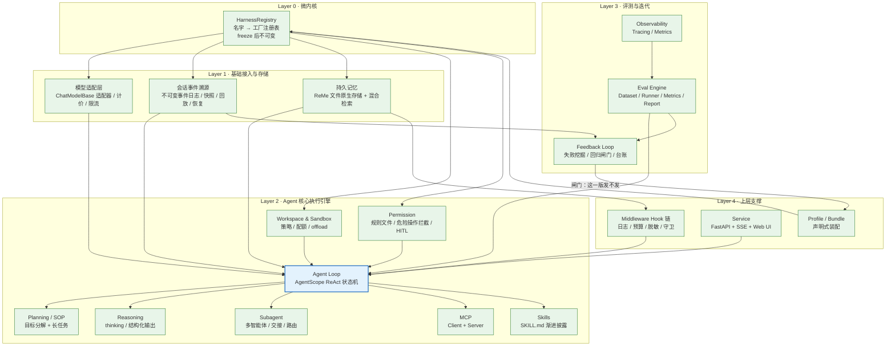
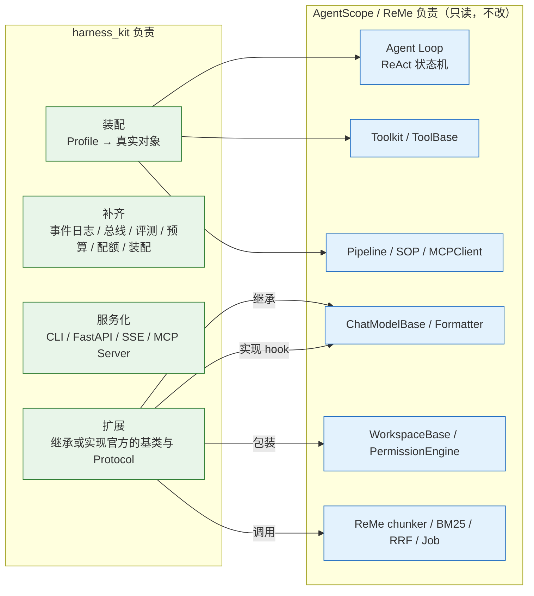

# 系列总览：从零构建企业级 Agent Harness（AgentScope 2.0.8 + ReMe 0.4.1.13）

> 本系列是一套**面向生产、可逐文件复刻、每步可验证**的 Agent Harness 构建教程。目标只有一个：你在一个空白目录里，完全照着教程一步步写代码，最终搭出一套**建立在 AgentScope 与 ReMe 之上**的企业级 Agent Harness —— `harness_kit`，并且**不修改 `third_party/` 下任何一行代码**。
>
> 这不是"再写一个 Agent 框架"，而是**学会如何装配与补齐一个成熟框架**。

---

## 一、这套教程要解决什么问题

很多人拿到 AgentScope 或 ReMe 之后，会经历同一条弯路：**照着 example 跑通一个 demo，然后卡死在"下一步该做什么"**。原因是 demo 与生产之间隔着一整层东西：

- 一个 demo 只有一个 Agent、一个 prompt、几个工具；
- 一套生产 Harness 要回答：会话怎么持久化？上下文超了怎么办？工具调错了谁拦？记忆什么时候注入、注入多少？跑一次花了多少钱？出问题怎么回放？换个模型要改几处？多租户怎么隔离？

这层东西就是 **Agent Harness**：模型之外的一切运行时控制设施。

本系列反其道而行之：**不让你 clone 任何东西，让你从空白目录开始，逐个文件把 `harness_kit` 写出来**，每写完一个模块就有一步可运行的验证。

同时，本系列有一条**优先级最高的纪律**，它决定了整套教程的写法：

> **一切都在 AgentScope + ReMe 之上构建。绝不重写内核。**
> 严禁：从零手写 Agent Loop、手写 `ChatModelBase`、手写 `Toolkit`、写 `mini_harness`、以"讲原理"为名把框架已有的东西再抄一遍。
>
> 正确姿势只有一条：**读真实源码 → 定位真实扩展点 → 在扩展点上写生产级组件。**

所以每一讲的第二节永远是"源码侦察"，给出**真实的 `路径:行号`**；第三节永远是"扩展点定位与设计"，回答"官方已经有什么、还缺什么、我们在哪做"。

---

## 二、Agent Harness 的五层架构

本系列采用的分层参考架构如下。它来自两条线索的交叉：DeepSeek Harness 的工程分层，以及 Cordis 的插件微内核思想；但**实现一律落在 Python 侧的真实扩展点上**（Cordis 是 TypeScript 项目，本系列不移植它，只借它的"微内核 + 插件"思路）。



> 图注（**这一节的图注是整套教程最重要的说明**）：
> - **蓝色节点 = AgentScope 原生**，我们不重写，只调用。它只有一个：`Agent Loop`。
> - **绿色节点 = `harness_kit` 负责装配或补齐**。注意"绿色"不等于"从零实现"：
>   - `Model` 的实现方式是**继承 `ChatModelBase`、只覆写 `_call_api`**；
>   - `Mem` 的实现方式是**装配 ReMe 并扩展官方 `ReMeMiddleware`**；
>   - `Box` / `Perm` 的实现方式是**在 `WorkspaceBase` / `PermissionEngine` 外面加策略与审计**；
>   - `Session` / `Eval` / `Reg` / `Prof` / `Fb` 是**真正新增**的部分（框架里确实没有）。其中 `Fb` 是 Layer 3 的**收口**：它把 `Session` 里的事实变成回归集、再把"这一版发不发"送回 `Prof`，是整张图里唯一一条回到起点的边（第 20 讲 §7 补遗）。

### 2.1 六个真实缺口

`harness_kit` 的存在理由就是补上这六个缺口。每一个都有真实证据，并对应具体讲次。

| # | 缺口 | 真实证据（相对仓库根） | 讲次 |
| --- | --- | --- | --- |
| 1 | 没有不可变事件日志：`AgentState.context` 是唯一持久化边界且会被原地覆盖 | `third_party/agentscope/src/agentscope/state/_state.py:209`；`agent/_agent.py:434` | 03 / 09 |
| 2 | 没有进程内 pub/sub 事件总线 | `third_party/agentscope/src/agentscope/event/_event.py:83` 起（事件只在单次 reply 流内被消费） | 03 |
| 3 | 没有评测引擎 / benchmark 引擎；更没有"线上失败 → 回归集 → 回归闸门"的反馈闭环 | 各侦察报告的"不存在的能力"清单；`grep -rn "RegressionGate\|regression_dataset\|feedback_ledger" third_party/` 命中 **0**（第 20 讲 §7.2） | 20 |
| 4 | 官方 ReMe 中间件没有 token 预算、不传 `min_score`、不传 `tool_context_id` | `third_party/agentscope/src/agentscope/middleware/_longterm_memory/_reme/_middleware.py:88` | 19 |
| 5 | 没有声明式装配：`create_app` 是硬编码的 | `third_party/agentscope/src/agentscope/app/_app.py:78` | 02 / 20 |
| 6 | Docker 沙箱没有配额与策略层 | `third_party/agentscope/src/agentscope/workspace/_base.py:223` | 10 |

---

## 三、参考架构 ↔ 教程 ↔ 学习目标的映射

本系列服务**两个学习目标**：

- **目标 A（会用）**：能独立搭出一套可跑、可评测、可服务化、可运维的 Agent 系统；
- **目标 B（会改）**：能在读懂真实源码的前提下，为框架补上它缺的能力，而不是绕开它自己造。

| 参考架构层 | 对应讲次 | 交付的 harness_kit 模块 | 主要服务的目标 |
| --- | --- | --- | --- |
| Layer 0 微内核 | 02 | `registry.py`、`config/` | B（装配思想） |
| Layer 1 模型接入 | 04 | `models/` | A |
| Layer 1 事件与会话 | 03 / 09 | `events/`、`session/` | B（补齐缺口 1、2） |
| Layer 1 持久记忆 | 15~19 | `memory/` | A + B（补齐缺口 4） |
| Layer 2 Agent 核心 | 01 / 02 | 直接使用 AgentScope `Agent` | A（学会用） |
| Layer 2 工具与技能 | 05 / 06 / 07 | `tools/`、`skills/`、`mcp/` | A |
| Layer 2 沙箱与权限 | 10 / 11 | `sandbox/`、`permission/` | A + B（补齐缺口 6） |
| Layer 2 规划与多智能体 | 12 / 13 | `planning/`、`multiagent/` | A |
| Layer 2 推理与结构化 | 14 | `reasoning/` | A |
| Layer 3 评测与可观测 | 20 | `eval/`（含 `feedback.py`）、`observe/` | A + B（补齐缺口 3） |
| Layer 4 中间件 | 08 | `middleware/` | A + B |
| Layer 4 服务化与装配 | 02 / 20 | `service/`、`profiles/`、`cli.py` | A + B（补齐缺口 5） |

---

## 四、harness_kit 完整目录与各讲交付物

参考实现根：`tutorial_agsc_reme/reference/`。下面这棵树是 20 讲的**唯一目录事实**。

```
reference/
├── pyproject.toml                    # 依赖：agentscope==2.0.8 / reme==0.4.1.13 / fastapi / pydantic v2 / loguru / numpy / mcp
├── .env.example                      # LLM_API_KEY / LLM_BASE_URL / LLM_MODEL_NAME / LLM_BACKEND
├── README.md                         # 参考实现速览
├── scripts/                          # 每讲一个可运行验证脚本（跑出与教程一致的真实输出）
│   ├── 00_smoke.py                   # 第 1 讲：环境自检 + 首个 Agent + 首次 ReMe 检索
│   ├── 01_reme_doctor.py             # 第 15 讲：ReMe 配置体检
│   ├── 02_config_and_registry.py     # 第 2 讲：Profile 合并 + Registry
│   ├── 02_build_from_profile.py      # 第 2 讲：从 Profile 装出 Agent
│   ├── 03_events_and_state.py        # 第 3 讲：消息块 / 事件 / 状态
│   ├── 03_event_bus_from_agent.py    # 第 3 讲：把 Agent 的事件接进总线
│   ├── 04_model_adapters.py          # 第 4 讲：自定义适配器
│   ├── 05_tool_packs.py              # 第 5 讲：生产工具包
│   ├── 06_skills.py                  # 第 6 讲：技能加载与渐进披露
│   ├── 07_mcp.py                     # 第 7 讲：MCP client ↔ server
│   ├── 08_middleware.py              # 第 8 讲：Hook 链
│   ├── 08_context_compaction.py      # 第 8 讲补遗：短期上下文压缩
│   ├── 09_session_replay_resume.py   # 第 9 讲：事件溯源 / 回放 / 恢复
│   ├── 10_sandbox.py                 # 第 10 讲：沙箱与配额
│   ├── 11_permission.py              # 第 11 讲：权限与审计
│   ├── 12_planning.py                # 第 12 讲：Planning / SOP
│   ├── 13_multiagent.py              # 第 13 讲：Subagent
│   ├── 14_reasoning.py               # 第 14 讲：结构化输出
│   ├── 16_memory_write.py            # 第 16 讲：记忆写入
│   ├── 17_hybrid_search.py           # 第 17 讲：混合检索
│   ├── 18_evolve.py                  # 第 18 讲：自演化
│   ├── 19_memory_middleware.py       # 第 19 讲：记忆中间件
│   ├── 20_eval_observe_service.py    # 第 20 讲：评测 / 观测 / 服务化 / demo 六段验证
│   ├── 20_feedback_loop.py           # 第 20 讲 §7 补遗：生产反馈闭环（0 次模型调用）
│   └── mcp_demo_server.py            # 第 7 讲：harness_kit 暴露为 MCP Server
├── tests/                            # 每讲一套 pytest（第 20 讲是 68 个用例）
│   ├── conftest.py
│   ├── test_lesson01_env.py
│   ├── ...
│   └── test_lesson20_eval_observe.py
└── harness_kit/
    ├── __init__.py                   # 第 1 讲：包入口
    ├── settings.py                   # 第 1 讲：全局设置
    ├── registry.py                   # 第 2 讲：Layer 0 注册表
    ├── cli.py                        # 第 20 讲：命令行（8 个子命令）
    ├── config/                       # 第 2 讲：schema / loader / builder
    ├── events/                       # 第 3 讲：bus / types / translate
    ├── session/                      # 第 3、9 讲：models / store / jsonl_store / sqlite_store / snapshot / replay / resume / __init__
    ├── models/                       # 第 4 讲：factory / formatter / pricing / ratelimit / adapters
    ├── tools/                        # 第 5 讲：pack / builtin_pack / repo_pack / utils
    ├── skills/                       # 第 6 讲：loader / manifest / builtin
    ├── mcp/                          # 第 7 讲：registry / adapter / server
    ├── middleware/                   # 第 8 讲：base / logging / budget / redact / tracing / guards / compact（补遗）
    ├── sandbox/                      # 第 10 讲：policy / local / docker / offload / guard
    ├── permission/                   # 第 11 讲：rules / policy / hitl / audit
    ├── planning/                     # 第 12 讲：graph / planner / sop / resume
    ├── multiagent/                   # 第 13 讲：team / router / handoff / limits
    ├── reasoning/                    # 第 14 讲：structured / critique / prompt
    ├── memory/                       # 第 15~19 讲：21 个文件，见下
    ├── eval/                         # 第 20 讲：dataset / runner / metrics / report / synthesize / feedback（§7 补遗）
    ├── observe/                      # 第 20 讲：tracing / metrics
    ├── service/                      # 第 20 讲：app.py + webui/index.html
    ├── profiles/                     # 第 20 讲：default / coding / research / readonly_coder / researcher_with_memory
    └── demo/code_assistant/          # 第 20 讲：端到端 demo + Dockerfile + 部署清单
```

`harness_kit/memory/` 单独展开（第 15~19 讲）：

```
memory/
├── workspace.py    # 15：工作区路径与元数据
├── config.py       # 15：ReMe app config 构建
├── client.py       # 15：嵌入式 run_job 客户端
├── doctor.py       # 15：配置体检
├── ingest.py       # 16：文档入库（复用 ReMe 的 chunker）
├── distill.py      # 16：会话蒸馏
├── catalog.py      # 16：file_catalog 与 tag 规范化
├── frontmatter.py  # 16：front matter 读写
├── search.py       # 17：search job 封装
├── hybrid.py       # 17：RRF 融合与权重
├── citations.py    # 17：引用抽取与渲染
├── budget.py       # 17：检索结果 token 预算（补缺口）
├── maintenance.py  # 18：auto_memory 封装
├── jobs.py         # 18：后台 / cron job
├── forget.py       # 18：遗忘策略
├── proactive.py    # 18：主动读取
├── middleware.py   # 19：LongTermMemoryMiddleware
├── gating.py       # 19：注入门控
├── tenant.py       # 19：多租户隔离
└── metrics.py      # 19：记忆侧指标
```

### 4.1 各讲交付物一览

| 讲次 | 文件名 | 交付的 harness_kit 模块 | 验证方式 |
| --- | --- | --- | --- |
| 01 | `harness_01_学习路线与环境准备.md` | `__init__.py`、`settings.py`、`scripts/00_smoke.py` | 跑通 smoke，打印 PASS |
| 02 | `harness_02_AgentScope核心解剖_Agent与主循环.md` | `config/{schema,loader,builder}.py`、`registry.py` | 三次 Profile 合并结果可解释 |
| 03 | `harness_03_消息块事件与状态.md` | `events/{bus,types,translate}.py`、`session/models.py` | 事件被翻译并投递到订阅者 |
| 04 | `harness_04_模型适配层与自定义适配器.md` | `models/*`、`adapters/*` | `EchoChatModel` 离线跑通 + 真模型一次 |
| 05 | `harness_05_工具系统与生产工具包.md` | `tools/*` | 工具被正确注册、参数修复生效 |
| 06 | `harness_06_Skills技能包.md` | `skills/*` | 技能索引出现在 system prompt，正文按需注入 |
| 07 | `harness_07_MCP工具协议.md` | `mcp/*`、`scripts/mcp_demo_server.py` | 自己的 MCP Server 被自己的 Client 调通 |
| 08 | `harness_08_中间件与Hook链.md` | `middleware/*` | 预算超限被拦、脱敏生效 |
| 09 | `harness_09_会话事件溯源与回放.md` | `session/{models,store,jsonl_store,sqlite_store,snapshot,replay,resume}.py` | 回放重建出同样的工具调用序列 |
| 10 | `harness_10_Workspace与安全沙箱.md` | `sandbox/*` | 越界路径被拒；Docker 配额生效 |
| 11 | `harness_11_权限引擎与危险操作拦截.md` | `permission/*` | 危险命令被拦、审计落盘 |
| 12 | `harness_12_Planning与SOP长任务.md` | `planning/*` | 多步任务可从中间状态续跑 |
| 13 | `harness_13_Subagent与多智能体.md` | `multiagent/*` | 派生上限生效、失败可传播 |
| 14 | `harness_14_Reasoning与结构化输出.md` | `reasoning/*` | 结构化输出必为合法 JSON；prompt 指纹稳定 |
| 15 | `harness_15_ReMe架构总览与配置.md` | `memory/{workspace,config,client,doctor}.py` | doctor 全绿 |
| 16 | `harness_16_ReMe记忆写入与文件原生存储.md` | `memory/{ingest,distill,catalog,frontmatter}.py` | 文件入库、chunk 与 tag 可查 |
| 17 | `harness_17_ReMe混合检索.md` | `memory/{search,hybrid,citations,budget}.py` | RRF 手算与代码结果一致 |
| 18 | `harness_18_ReMe自演化.md` | `memory/{maintenance,jobs,forget,proactive}.py` | auto_memory 跑出 create/update |
| 19 | `harness_19_长期记忆中间件集成.md` | `memory/{middleware,gating,tenant,metrics}.py` | 三种 mode 行为差异可观测 |
| 20 | `harness_20_评测可观测服务化与代码助手demo.md` | `eval/*`（含 `feedback.py`）、`observe/*`、`service/*`、`profiles/*`、`cli.py`、`demo/*`、`scripts/20_feedback_loop.py` | 端到端 demo + 评测报告 + 反馈闭环脚本（离线 26 项断言） |

### 4.2 职责边界



**边界判据（任何一讲遇到"这个要不要我们自己写"时，用这三问）**：

1. 官方有没有现成的基类 / Protocol / hook？**有 → 继承或实现它。**
2. 官方有但缺"文件化 / 声明式 / 可审计"的外层？**有 → 在外层做包装，不动内核。**
3. 官方完全没有（如事件溯源日志、评测引擎）？**才允许新写，并且必须说明它不依赖内核内部细节。**

---

## 五、20 天学习路线

每天一讲，每讲 90~150 分钟（第 20 讲较长，约 240 分钟）。前 4 讲把地基与模型层打通，第 5~14 讲建 Agent 核心执行引擎，第 15~19 讲做持久记忆，第 20 讲收口到评测、服务化与端到端 demo。

| 天 | 讲次与文件名 | 内容要点 | 时长 |
| --- | --- | --- | --- |
| 01 | `harness_01_学习路线与环境准备.md` | 环境自检与修复（PYTHONPATH 隔离、缺依赖、`.env`、pytest）、项目地图、第一个 AgentScope Agent、第一次 ReMe 检索、`harness_kit` 骨架 | 120 min |
| 02 | `harness_02_AgentScope核心解剖_Agent与主循环.md` | `Agent` 类、`reply` / `reply_stream` / `observe`、`_reply_impl`、`_next_action` 状态机、`max_iters`、并发工具执行、HITL；Profile/Bundle 装配与 `HarnessRegistry` | 150 min |
| 03 | `harness_03_消息块事件与状态.md` | `Msg` 与各类块、`ToolCallState` / `ToolResultState`、事件类型、`AgentState` 序列化；事件总线与事件翻译 | 120 min |
| 04 | `harness_04_模型适配层与自定义适配器.md` | `ChatModelBase`、`ChatResponse` / `ChatUsage` / `FinishedReason`、流式增量累积、formatter、模型能力、token 计数、prompt cache | 150 min |
| 05 | `harness_05_工具系统与生产工具包.md` | `ToolBase`、JSON Schema 自动生成、`ToolResponse` / `ToolChunk`、`Toolkit`、tool group、参数校验修复、内置工具 | 150 min |
| 06 | `harness_06_Skills技能包.md` | SKILL.md 规范、技能加载器、渐进披露 | 90 min |
| 07 | `harness_07_MCP工具协议.md` | MCP client、三种 transport、握手、`tools/list` + `tools/call` → `ToolBase`、命名空间、注入 Toolkit；把 harness_kit 暴露为 MCP Server | 150 min |
| 08 | `harness_08_中间件与Hook链.md` | `MiddlewareBase` 与 onion hook 链、预算 / 追踪 / 脱敏 / 守卫中间件 | 120 min |
| 09 | `harness_09_会话事件溯源与回放.md` | `AgentState`、SQL / Redis 表结构、blob 存储；不可变日志、快照、回放、恢复；诚实交代框架缺什么 | 150 min |
| 10 | `harness_10_Workspace与安全沙箱.md` | `WorkspaceBase`、本地与沙箱、Docker / E2B / K8s、offload 协议、MCP 网关、配额 | 150 min |
| 11 | `harness_11_权限引擎与危险操作拦截.md` | 权限规则、决策类型、模式、bash 解析、危险命令检测、HITL 桥接、审计 | 120 min |
| 12 | `harness_12_Planning与SOP长任务.md` | pipeline 与 SOP 引擎、目标分解、状态机持久化与续跑 | 150 min |
| 13 | `harness_13_Subagent与多智能体.md` | sub-agent、A2A、派生与隔离、路由、失败传播 | 120 min |
| 14 | `harness_14_Reasoning与结构化输出.md` | thinking 块、结构化输出工具、system prompt 装配、formatter 对 thinking 的处理 | 120 min |
| 15 | `harness_15_ReMe架构总览与配置.md` | CLI→Client→Service→Application→Job→Step→Component→Workspace、配置系统与体检 | 120 min |
| 16 | `harness_16_ReMe记忆写入与文件原生存储.md` | `FileNode` / `FileChunk` / `FileLink` / `FileFrontMatter`、Markdown 分块、wikilink、file_catalog、tag_index | 150 min |
| 17 | `harness_17_ReMe混合检索.md` | BM25、向量、tag、图扩展、RRF、passage 抽取与引用 | 150 min |
| 18 | `harness_18_ReMe自演化.md` | `auto_memory`、`auto_dream`、主动读取、cron / 后台 job、agent_wrapper | 150 min |
| 19 | `harness_19_长期记忆中间件集成.md` | 官方 `middleware/_longterm_memory/_reme`、Recorder / Retriever、门控与预算 | 150 min |
| 20 | `harness_20_评测可观测服务化与代码助手demo.md` | 评测引擎、数据合成、生产反馈闭环（失败挖掘 → 回归集 → 回归闸门 → 台账）、OTel、FastAPI + SSE + Web UI、Profile/Bundle、端到端 demo、容器化 | 240 min |

**阶段划分与验收点**：

| 阶段 | 讲次 | 学完你应该能独立做到 |
| --- | --- | --- |
| 地基 | 01~04 | 在任何新项目里 30 分钟内起一个可跑的 Agent，并且知道它每一步走的是框架的哪段代码 |
| 执行引擎 | 05~14 | 给 Agent 装上工具、技能、MCP、沙箱、权限、规划、子智能体，并且每一样都能说清"官方给了什么、我加了什么" |
| 记忆 | 15~19 | 让 Agent 拥有可检索、可演化、可隔离的长期记忆，并能控制注入成本 |
| 收口 | 20 | 把整套东西评测、观测、服务化，让线上失败回流成回归集并交给闸门判定，最后用一个真实 demo 收尾 |

---

## 六、一句话数据流，逐步展开

**一句话**：用户输入经过 Profile 装配出的 Agent，在中间件链内调用模型、按需调用工具与检索记忆，全过程落成事件日志，最后输出答案与引用。

下面把这句话拆成 11 步，每一步都标出它发生在**哪个真实扩展点**上。前 10 步是"一次请求的一生"，第 11 步是**回流期** —— 它不属于任何一次请求，却决定下一版能不能发。

| 步 | 发生了什么 | 发生在哪 |
| --- | --- | --- |
| 1 | 读 Profile → 解析 `extends` → 合并 Bundle → 冻结 | `harness_kit/config/loader.py`（第 2 讲） |
| 2 | 按冻结结果从注册表取工厂，造出 Model / Toolkit / Workspace / Engine | `harness_kit/registry.py` + `config/builder.py`（第 2 讲） |
| 3 | 构造 AgentScope `Agent`，把 middleware 传进去（Agent 内部会按 hook 分桶） | `Agent.__init__`，`third_party/agentscope/src/agentscope/agent/_agent.py:117`（第 2 讲） |
| 4 | 用户消息进来，投一条 `ReplyStartEvent`，事件被翻译成 `EventRecord` 落日志 | `event/_event.py:83` + `harness_kit/events/translate.py`（第 3 / 9 讲） |
| 5 | 中间件链前置段执行（预算、脱敏、追踪） | `MiddlewareBase.on_reply`，`middleware/_base.py:68`（第 8 讲） |
| 6 | 装配 system prompt：角色 → 约束 → 工具 → 技能索引；**动态内容走 `HintBlock` 注入消息流**，不改 system prompt | `Agent._get_system_prompt` + `middleware/_base.py:264`（第 14 讲） |
| 7 | 记忆检索（若开启）：调 ReMe 的 search job，RRF 融合，按 token 预算裁剪，注入一条 `AssistantMsg(name="memory", content=[HintBlock(...)])` | `middleware/_longterm_memory/_reme/_middleware.py:88`（第 17 / 19 讲） |
| 8 | 调模型：`ChatModelBase.__call__` → 我们适配器的 `_call_api` → 流式累积成 `ChatResponse`；usage 计入预算 | `model/_base.py:292` + `harness_kit/models/adapters/base.py`（第 4 讲） |
| 9 | 若模型要调工具：先过权限引擎（规则文件 → 决策 → 审计），再并发执行 `ToolBase.__call__`，结果转成 `ToolResultBlock`；全过程落事件 | `permission/_engine.py:77` + `tool/_base.py:100`（第 5 / 11 讲） |
| 10 | 收尾：一条 `ReplyEndEvent`；记忆在 `finally` 里写回；快照按需生成；本轮指标上报 | `_middleware.py:489` + `harness_kit/session/snapshot.py`（第 9 / 18 / 20 讲） |
| 11 | **回流期**（离线，与请求无关）：读第 3 步落下的那份 JSONL，挑出"出过事"的会话 → 合成回归集 → 对着基线跑闸门 → 台账留痕 → 决定这一版发不发 | `harness_kit/eval/feedback.py` + `harness_kit/cli.py feedback`（第 20 讲 §7 补遗） |

---

## 七、环境准备清单

### 7.1 已确认可用的环境（实测）

| 项 | 值 | 备注 |
| --- | --- | --- |
| Python | 3.11.13 | 环境路径 `/Users/a/miniconda3/envs/agentscope_reme_pip_env` |
| AgentScope | 2.0.8 | `import agentscope` 直接可用 |
| ReMe | 0.4.1.13 | **必须** `PYTHONPATH=third_party/ReMe` |
| pydantic / pydantic-settings | 2.13.5 / 2.15.0 | v2 |
| loguru | 0.7.3 | |
| numpy | 2.4.6 | 手写 BM25 用 |
| fastapi / uvicorn | 0.141.1 / 0.53.0 | 第 20 讲服务化 |
| mcp | 1.30.0 | 第 7 讲 |
| httpx | 0.28.1 | |
| pyyaml | 6.0.3 | Profile 解析 |
| pytest / pytest-asyncio | 9.1.1 / 1.4.0 | |
| zstandard | 0.25.0 | `jsonl.zst` |

### 7.2 必须做的三件事

**① 隔离 PYTHONPATH（否则 ReMe 会静默解析到坏版本）**

实测：不设 `PYTHONPATH` 时，`import reme` 会拿到 `site-packages` 下的 `reme` shim（其 dist-info 为 `reme_ai-0.3.1.10`），并在导入期直接炸：

```
File ".../site-packages/reme/core/utils/hf_token_counter_utils.py", line 3, in <module>
    from agentscope.token import HuggingFaceTokenCounter
ModuleNotFoundError: No module named 'agentscope.token'
```

加上 `PYTHONPATH` 后正常：

```bash
$ PYTHONPATH=third_party/ReMe python -c "import reme; print(reme.__version__, reme.__file__)"
0.4.1.13 /Users/a/PycharmProjects/VsCode_Projects/Agentscope-Learning/third_party/ReMe/reme/__init__.py
```

所以**所有脚本一律以 `PYTHONPATH=third_party/ReMe` 运行**，并且第 1 讲的 `scripts/00_smoke.py` 里要有一步显式断言版本号等于 `0.4.1.13`（真值在 `third_party/ReMe/reme/__init__.py:3`）。

**② 准备 `.env`**

ReMe 的 `as_llm` 组件**只读四个**环境变量：`LLM_API_KEY`、`LLM_BASE_URL`、`LLM_MODEL_NAME`、`LLM_BACKEND`。
写 `DEEPSEEK_API_KEY` 是不会被读到的。`.env.example` 模板：

```bash
LLM_API_KEY=sk-xxxxxxxxxxxxxxxx
LLM_BASE_URL=https://api.deepseek.com
LLM_MODEL_NAME=deepseek-chat
LLM_BACKEND=openai
```

**③ 一条铁律：`third_party/` 只读**

不允许修改 `third_party/` 下任何文件。遇到不兼容（见下）也只能在**自己的代码里**做兼容垫片。

### 7.3 已实测的环境陷阱（第 1 讲会逐个复现并修掉）

| 现象 | 原因 | 解决 |
| --- | --- | --- |
| `ModuleNotFoundError: No module named 'agentscope.token'` | `import reme` 拿到了 site-packages 的旧版 shim | 统一 `PYTHONPATH=third_party/ReMe` |
| Profile 里写的模型没生效 | `ReMe(**config)` 不会自动读 `default.yaml` | 先显式 `resolve_app_config()` |
| `success=True` 但 `answer=""` | 跳过了 `await app._start()` | 显式启动 |
| `run_job(name="search")` 报 `TypeError` | `name` 是 positional-only | `run_job("search", **kwargs)` |
| `BackgroundJob` 永久挂起 | 本环境的后台 job 不返回 | 加超时或改前台 |
| `from fastmcp import FastMCP` 报 `ImportError: FastMCP server support is not installed` | 顶层 `fastmcp` 包（4.0.5）未装 server extra | `from mcp.server.fastmcp import FastMCP` |
| `Msg(content="文本")` 报 `ValidationError` | `content` 必须是 list | `Msg(content=[TextBlock(...)])` |
| 子目录下的技能扫不到 | `LocalSkillLoader` 默认 `scan_subdir=False` | 显式传 `True` |
| 路径明明在工作区内却被判越界 | macOS `/tmp` 是 `/private/tmp` 的符号链接 | 先 `Path.resolve()` |
| `ValueError: Unregistered backend 'dream_topics_step'` | AgentScope `_config.py` 的 `_dream_steps()` 指向比 0.4.1.13 更新的 ReMe | 在自己的代码里 3 行 monkeypatch（第 19 讲） |

### 7.4 自检命令

```bash
cd /Users/a/PycharmProjects/VsCode_Projects/Agentscope-Learning/tutorial_agsc_reme/reference
PYTHONPATH=../third_party/ReMe:. python scripts/00_smoke.py
```

输出末尾必须是 `PASS`（第 1 讲会给出这个脚本的完整代码与真实输出）。
该脚本的 LLM 调用控制在 **6 次以内**，其余步骤一律用离线方式验证。

---

## 八、如何使用本教程

1. **按顺序读，不要跳。** 第 2 讲建立的 Profile/Bundle 与 Registry 是后面 18 讲的装配底座；第 3 讲的事件模型是第 9、19 讲的输入。
2. **每讲的代码要自己敲一遍。** 教程里的代码与 `reference/harness_kit/` 逐字一致，但"复制粘贴"和"手敲一遍"的收获差一个量级。参考实现是用来**对照纠错**的，不是用来抄的。
3. **每读到一个 `路径:行号`，就去把那段源码打开看。** 这是本系列的核心训练：把"框架是个黑盒"变成"框架是一排可验证的文件"。
4. **每讲的"第五节 运行验证"必须真的跑。** 跑出与教程不同的输出，先假设是自己环境的问题，按"第六节 踩坑与排查"逐条排查；排查不出来再看参考实现。
5. **每讲末尾的自测题要闭卷做。** 做不出来的题，回到对应小节重读。题目里的"职责边界题"尤其重要——它考的是你有没有真的理解"什么该我们做、什么不该"。
6. **遇到教程与源码冲突，一律以源码为准**，并在笔记里记下来（那说明教程有 bug，值得反馈）。
7. **不要修改 `third_party/`。** 这不是洁癖：一旦你改了框架源码，你就失去了"升级框架"的能力，也失去了本系列真正想训练的东西——**在既有框架上做扩展，而不是 fork 一个自己的分支**。
8. **第 20 讲的 demo 是终点不是起点。** 建议学完后再用它去接一个你自己的工作场景，那才是这套 Harness 真正开始产生价值的地方。

---

## 附录 A：能力自查表（Agent Harness 系统工程师能力清单）

学完全部 20 讲后，逐项自查。**"能"的标准是：不看教程、不查参考实现，能自己写出来并解释为什么。**

### A.1 装配与配置

| # | 能力 | 对应讲次 | 自查 |
| --- | --- | --- | --- |
| A1 | 用一份 YAML 声明式地定义出一个 Agent 的全部依赖，并解释每个字段落到哪个真实对象 | 02 / 20 | ☐ |
| A2 | 说清 `extends` 链与 `bundles` 的合并顺序，以及 list 默认替换、`!append` 追加、`null` 删除的差别 | 02 | ☐ |
| A3 | 说清 `HarnessRegistry` 的"名字 → 工厂"注册与 freeze 语义 | 02 | ☐ |
| A4 | 给出一份 Profile 的 `--explain`，说清每个值来自哪个文件 | 02 / 20 | ☐ |

### A.2 Agent 内核理解（会读，不改）

| # | 能力 | 对应讲次 | 自查 |
| --- | --- | --- | --- |
| B1 | 指着源码说清一次 `reply` 从进到出经过哪些阶段、`max_iters` 在哪里生效 | 02 | ☐ |
| B2 | 说清 `Msg` 与各类 block 的关系，以及 `ToolCallState` / `ToolResultState` 的状态取值 | 03 | ☐ |
| B3 | 说清 `AgentState` 为什么是"唯一持久化边界"，以及 `compress_context` 为什么会破坏历史 | 09 | ☐ |
| B4 | 说清 middleware 的 8 个 hook，哪些是 onion 型、哪个是 transformer 型 | 08 | ☐ |
| B5 | 说清 `execute_chain` 为什么不能 import，以及这对我们的实现方式意味着什么 | 08 | ☐ |

### A.3 扩展能力（本系列的核心产出）

| # | 能力 | 对应讲次 | 自查 |
| --- | --- | --- | --- |
| C1 | 写一个自定义 ChatModel 适配器，并说清为什么只覆写 `_call_api` | 04 | ☐ |
| C2 | 写一个生产工具包，让工具正确注册进 `Toolkit` 并落入指定 group | 05 | ☐ |
| C3 | 写一个 SKILL.md 并实现渐进披露，只有索引常驻、正文按需注入 | 06 | ☐ |
| C4 | 接一个 MCP server，并把自己的工具包反向暴露成 MCP server | 07 | ☐ |
| C5 | 写一个中间件，正确实现 hook 而不重写链 | 08 | ☐ |
| C6 | 写一个 `Offloader` 实现，满足协议三方法 | 10 | ☐ |
| C7 | 从磁盘加载权限规则文件，并把每次决策写入审计日志 | 11 | ☐ |
| C8 | 用 `ToolChoice(mode=<tool_name>)` 做强制结构化输出，并解释为什么不改 `tools=[...]` | 14 | ☐ |
| C9 | 用 `HintBlock` 注入动态内容，并解释为什么不能改 system prompt | 14 | ☐ |
| C10 | 说清"生产反馈闭环"为什么不需要新埋点：从第 09 讲的事件日志里挑失败会话、合成回归集、落只追加台账 | 20（§7 补遗） | ☐ |

### A.4 记忆系统

| # | 能力 | 对应讲次 | 自查 |
| --- | --- | --- | --- |
| D1 | 画出 ReMe 的 CLI→Client→Service→Application→Job→Step→Component→Workspace 链路 | 15 | ☐ |
| D2 | 说清 `resolve_app_config()` 为什么必须显式调用、`_start()` 为什么必须显式 await | 15 | ☐ |
| D3 | 说清 `FileFrontMatter` 为什么只有两个一等字段、其余进 `__pydantic_extra__` | 16 | ☐ |
| D4 | 手算一次 RRF 融合结果，并与代码结果对上 | 17 | ☐ |
| D5 | 说清 BM25 的惰性删除与 `optimize_index` | 17 | ☐ |
| D6 | 说清官方 `ReMeMiddleware` 三种 mode 的差别，以及 write-back 在哪些模式下执行 | 19 | ☐ |
| D7 | 为记忆注入加 token 预算，并说清官方缺这一块的具体证据 | 17 / 19 | ☐ |

### A.5 生产化

| # | 能力 | 对应讲次 | 自查 |
| --- | --- | --- | --- |
| E1 | 用不可变事件日志记录一次完整会话，并能从快照 + 尾部事件恢复状态 | 09 | ☐ |
| E2 | 写一条沙箱策略并让 Docker 工作区真正生效配额 | 10 | ☐ |
| E3 | 拦住一条危险命令，并给出审计记录 | 11 | ☐ |
| E4 | 让一个多步长任务从中断处续跑 | 12 | ☐ |
| E5 | 限制子智能体的派生数量与深度 | 13 | ☐ |
| E6 | 跑一次评测并生成报告，能说清每个指标在测什么 | 20 | ☐ |
| E7 | 把 Harness 起成 SSE 服务并在 Web UI 里跑通一轮对话 | 20 | ☐ |
| E8 | 用回归闸门回答"这一版能不能发"：说清它为什么只比相对基线、为什么排除延迟 / token / 成本这类开销指标，以及"没有基线时默认放行"凭什么不算隐形的 | 20（§7 补遗） | ☐ |

### A.6 纪律（最重要的一栏）

| # | 能力 | 自查 |
| --- | --- | --- |
| F1 | 面对任何一个需求，先问"官方有没有现成的基类 / Protocol / hook"，而不是先动手写 | ☐ |
| F2 | 任何一个关于 AgentScope / ReMe 的结论，都能给出 `路径:行号` | ☐ |
| F3 | 没核实过的东西，会明确说"未验证"，而不是猜 | ☐ |
| F4 | 全程没有修改 `third_party/` 下任何文件 | ☐ |
| F5 | 能说清"哪些缺口是真缺口、为什么框架不做"，而不是逢缺就补 | ☐ |

---

> **下一步**：进入 [`harness_01_学习路线与环境准备.md`](./harness_01_学习路线与环境准备.md)，把环境跑起来。

