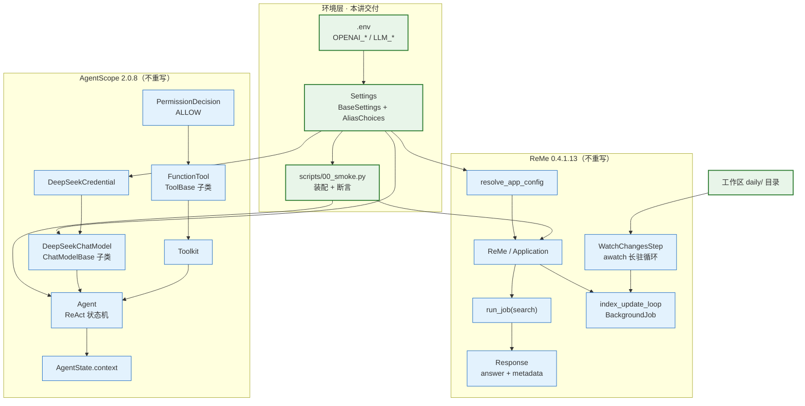
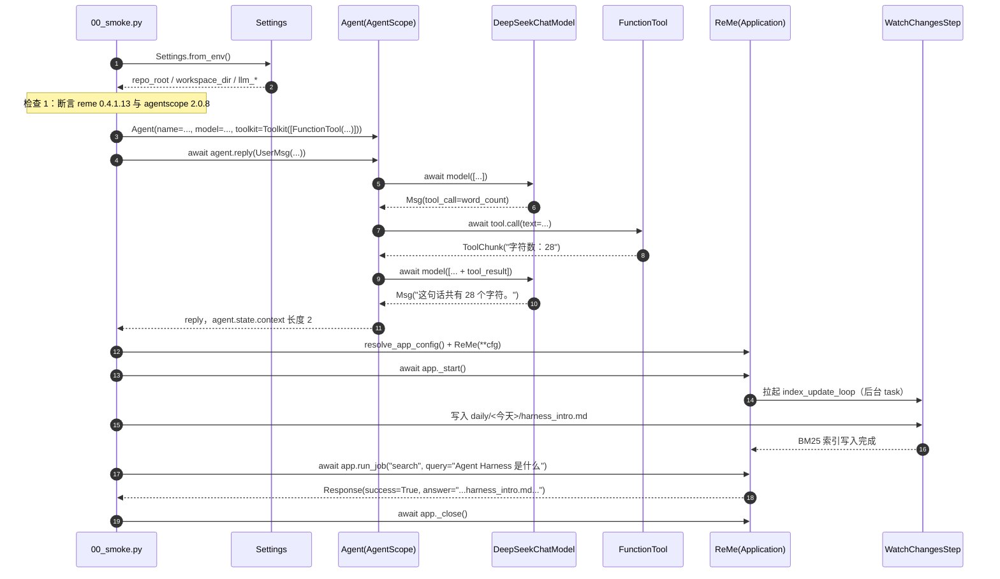

# 第 1 讲：学习路线与环境准备——把 AgentScope 和 ReMe 跑起来

> **本讲目标**：把整套教程的"地基"打通——让 `import agentscope` 拿到本地 2.0.8 源码、让 `import reme` 拿到本地 0.4.1.13 而不是被 `site-packages` 里的旧版污染、让 `.env` 里的 LLM 配置能被两条不同的命名约定同时读到；然后亲手跑通**第一个真实的 AgentScope Agent**（含 Tool Use）与**第一次真实的 ReMe 混合检索**，并立起 `harness_kit` 这个"建立在两个库之上的装配层"的工程骨架。
> **前置要求**：无。本讲是 20 讲的第一讲，从零开始。你需要一台能联网的机器、Python 3.11、以及仓库里已克隆好的 `third_party/agentscope` 与 `third_party/ReMe`。
> **本讲交付物**：
> - `tutorial_agsc_reme/reference/harness_kit/__init__.py`
> - `tutorial_agsc_reme/reference/harness_kit/settings.py`
> - `tutorial_agsc_reme/reference/scripts/00_smoke.py`
> - `tutorial_agsc_reme/reference/tests/conftest.py`
> - `tutorial_agsc_reme/reference/tests/test_lesson01_env.py`
> - `tutorial_agsc_reme/reference/pyproject.toml`
> - `tutorial_agsc_reme/reference/.env.example`
> **预计时长**：120 分钟。
>
> 本讲的完整可运行代码位于 `tutorial_agsc_reme/reference/harness_kit/`、`tutorial_agsc_reme/reference/scripts/` 与 `tutorial_agsc_reme/reference/tests/`，
> 你可以直接对照，也可以跟着正文一行一行写。

---

## 一、这一讲要解决的问题

### 1.1 为什么"环境准备"要单独占一讲

绝大多数 Agent 教程的第一讲是"Hello World"：装个包，调一次模型，打印一句话，结束。这套教程不这么干，因为**Agent 工程里 80% 的时间不是花在写 Agent 逻辑上，而是花在"环境悄悄坏了但没人发现"上**。

Agent 项目有一个非常讨厌的性质：**它的失败往往是静默的**。普通 Web 项目里 `ImportError` 会当场炸掉，你立刻知道有问题；但 Agent 项目里，一个错的环境会以"模型回答得有点怪""检索没搜到东西""工具没被调用"这类形式表现出来，让你去调 prompt、调温度、调检索权重——而真正的原因是 `sys.path` 里混进了一个三个月前 pip 装的旧版本。

所以本讲的第一件事不是写代码，是**建立一套能立刻发现环境损坏的自检机制**，并且把它固化成一条命令：`python scripts/00_smoke.py`。

### 1.2 四个真实会发生的失败场景

下面四个失败场景都是在本仓库的真实环境里实际发生过的。你读完之后，应该能理解为什么本讲要按后面的顺序安排内容。

**场景一：装了两个 `reme`，静默拿到旧版。**

这台机器的 `site-packages` 里有一个 pip 装的 `reme` 0.3.1.10。它很旧，旧到会去 `import agentscope.token`——而 AgentScope 2.0.8 早就把 `token` 子包删掉了。于是你什么都不改，只是简单地：

```python
import reme
```

就会在某个很深的 import 链里炸出：

```text
ModuleNotFoundError: No module named 'agentscope.token'
```

这个报错来自 `/Users/a/miniconda3/envs/agentscope_reme_pip_env/lib/python3.11/site-packages/reme/core/utils/hf_token_counter_utils.py`，从头到尾**没有出现 `reme` 这个词**。新手会去怀疑 AgentScope 装坏了、去 `pip install agentscope.token`、去查 `token` 是不是某个未发布的模块——而真正要做的事只有一件：让 `import reme` 指向仓库内的 `third_party/ReMe`。

**场景二：`ReMe(**config)` 不读 `default.yaml`，报一个完全误导的错。**

ReMe 0.4.1.13 的应用装配是 YAML 驱动的：`reme/config/default.yaml` 里声明了 40 个 job（`search` / `chat` / `index_update_loop` / `dream_cron` / …）。但是——

```python
from reme import ReMe

app = ReMe()          # 看起来天经地义
await app.run_job("search", query="hello")
```

这段代码会抛：

```text
KeyError: Job 'search' not found
```

你去查 `search` 是不是打错了、去 grep `default.yaml` 确实有 `search`、去查文档……而真正的原因是：**`ReMe.__init__` 压根不读 `default.yaml`**。读 `default.yaml` 的是另一个函数 `resolve_app_config()`，必须你显式调一次，把返回的 dict 灌给 `ReMe(**cfg)`。

**场景三：`.env` 里有 key，但组件说 "Missing credentials"。**

AgentScope 侧的一切工作正常：`DeepSeekChatModel` 能拿到 key。但当你想同时用 ReMe 的 LLM 能力（比如 `as_llm` 组件、`auto_memory` job）时，会看到：

```text
openai.OpenAIError: Missing credentials
```

堆栈深得像迷宫。原因是 ReMe 的 `default.yaml:846-853` 只认四个环境变量名：

```yaml
      backend: ${LLM_BACKEND:-openai}
      model: ${LLM_MODEL_NAME:-qwen3.7-plus}
      credential:
        api_key: ${LLM_API_KEY:-}
        base_url: ${LLM_BASE_URL:-}
```

而本仓库的 `.env` 用的是 `OPENAI_API_KEY` / `OPENAI_BASE_URL` / `LLM_MODEL`。名字不一样，`${LLM_API_KEY:-}` 就回落到空串，于是 `OpenAIChatModel.__init__` 拿不到 key。

**场景四：自定义工具"卡住"了。**

你写了一个再普通不过的工具：

```python
from agentscope.tool import FunctionTool, Toolkit

def count_chars(text: str) -> str:
    """统计字符数。"""
    return f"字符数：{len(text)}"

agent = Agent(..., toolkit=Toolkit(tools=[FunctionTool(count_chars)]))
await agent.reply(UserMsg("user", "数一下这句话"))
```

然后它就停在那里不动了。不是死循环，是**在等人**——`FunctionTool.check_permissions()` 的默认返回值是 `PermissionBehavior.ASK`，它会发出一个 `RequireUserConfirmEvent` 并 park 住整个对话，等一个 HITL（human-in-the-loop）确认。这是 AgentScope 的**安全设计**，不是 bug；但你必须知道它。

### 1.3 贯穿全书的两个框架

**框架一：Agent = LLM model + Agent Harness。**

这句话是本系列的世界观。模型只管"下一个 token 是什么"；把它变成一个能干活的东西，需要的是模型**外围**的一切：Agent Loop（决定何时再调一次模型）、Tool Use（把函数暴露给模型并安全执行）、Context 管理（压缩、预算、裁剪）、Memory（跨会话的长期记忆）、Sandbox（执行代码而不炸掉宿主机）、Permission（危险操作拦截）、Eval（怎么知道改好了）、Observability（出问题时能看到什么）。这一整套外围设施，就是 **Agent Harness**。

本系列的最终目标，是让你能独立设计并实现一个**企业级 Agent Harness**。

**框架二：五层参考架构。**

```text
Layer 4 · 上层支撑        Profile/Bundle 声明式装配 · Web UI · Middleware Hook 链
Layer 3 · 评测与迭代      Eval Runner · Tracing / Metrics
Layer 2 · Agent 核心执行引擎   Agent · Planning/SOP · Subagent · MCP · Skills · Sandbox · Permission
Layer 1 · 基础接入与存储    ChatModelBase 适配器 · Session 事件溯源 · ReMe 长期记忆
Layer 0 · 微内核          HarnessRegistry（组件注册 / 解析 / 生命周期）
```

这套分层的思想来源是 **Cordis**——一个 TypeScript 的插件微内核框架，它的核心洞见是"**框架本身只提供注册表与生命周期，能力全部由插件以声明式配置挂进来**"。

但这里有一个**关键的现实约束**：Cordis 是 TypeScript，而我们要写的 AgentScope 和 ReMe 都是 Python。所以本系列不会去移植 Cordis 的代码，而是——**在 Python 里实现 Cordis 的"思想"**：

- 我们的 Layer 0 微内核叫 `HarnessRegistry`（第 2 讲交付），它是一个 **Python 对象注册表**，不是 TS 插件系统；
- 我们的"插件"就是 **AgentScope 的原生扩展点**：`MiddlewareBase` 子类、`ToolBase` 子类、`ChatModelBase` 子类、`WorkspaceBase` 子类、`PermissionRule` 对象、ReMe 的 `BaseComponent` / `BaseStep` / `BaseJob` 子类；
- 我们的"声明式配置"就是 **Profile / Bundle 的 YAML**（第 2 讲交付）。

### 1.4 最高优先级的方向：在 AgentScope 与 ReMe 之上构建

这一条必须在本讲就立下，因为它决定了后面 19 讲所有代码的形态。

**我们绝不做的事（违反即视为任务失败）：**

1. 从零手写 Agent Loop；
2. 手写 `ChatModelBase` 子类去"实现一个模型层"；
3. 手写 `Toolkit` / `ToolBase`；
4. 写任何形态的 `mini_harness` 玩具内核；
5. 以"讲原理"为名，把 AgentScope 已经写好的东西再抄一遍。

**我们唯一正确的姿势是三步循环：**

```text
读真实源码  →  定位真实扩展点  →  在扩展点上写生产级组件
```

以本讲为例，这三步的具体形态是：

| 步骤 | 本讲做的事 |
| --- | --- |
| 读真实源码 | 读 `third_party/agentscope/src/agentscope/agent/_agent.py` 的 `Agent`，读 `third_party/ReMe/reme/application.py` 的 `Application` |
| 定位扩展点 | `Agent(...)` 的装配参数、`FunctionTool` 的 `permission=` 参数、`ReMe(**cfg)` 的 config dict |
| 写生产级组件 | `harness_kit/settings.py`（配置装配的起点）、`scripts/00_smoke.py`（装配验证器） |

注意 `scripts/00_smoke.py` 里**没有一行代码是自己实现 Agent 循环的**：`Agent` 用的是 `agentscope.agent.Agent`，模型用的是 `agentscope.model.DeepSeekChatModel`，工具用的是 `agentscope.tool.FunctionTool`，工具集用的是 `agentscope.tool.Toolkit`，ReMe 用的是 `reme.ReMe`。我们写的全部是**装配代码**。

---

## 二、源码侦察

本节所有结论都来自对真实源码的阅读，格式统一为 `相对仓库根路径:行号`。**不允许出现没有行号的断言。**

### 2.1 AgentScope 2.0.8 全景地图

#### 2.1.1 版本与顶层导出

```text
third_party/agentscope/src/agentscope/_version.py:4          __version__ = "2.0.8"
```

这说明什么：版本号是这个文件的第 4 行，`scripts/00_smoke.py` 用它做自检锚点。注意 AgentScope 是 `pip install -e` 安装的，所以 `agentscope.__file__` 会指向 `third_party/agentscope/src/agentscope/__init__.py` 而不是 `site-packages`——这也是一个可断言的自检点。

```text
third_party/agentscope/src/agentscope/__init__.py:16   __all__ = [
third_party/agentscope/src/agentscope/__init__.py:17       "logger",
third_party/agentscope/src/agentscope/__init__.py:18       "setup_logger",
                                                        "set_id_factory",
                                                        "set_timestamp_factory",
                                                        "__version__",
                                                    ]
```

这说明什么：**AgentScope 2.0.8 的顶层几乎不导出东西**，只有 5 个符号。这是 2.x 相对 1.x 的一个重大断裂。1.x 时代的写法：

```python
import agentscope
agentscope.init(model_configs={...})     # 2.x 里不存在
agentscope.token                          # 2.x 里不存在（子包已删）
agentscope.memory                         # 2.x 里不存在（子包已删）
```

全部失效。**所有能力必须从子包导入**：`from agentscope.agent import Agent`、`from agentscope.model import DeepSeekChatModel`……

#### 2.1.2 子包全景

`third_party/agentscope/src/agentscope/` 下的 22 个子包，按五层架构归类：

| 层 | 子包 | 一句话职责 |
| --- | --- | --- |
| L1 | `model/` | `ChatModelBase` 与各家 provider 实现 |
| L1 | `formatter/` | 消息列表 → provider 请求格式 |
| L1 | `credential/` | 各家 API 的凭据对象 |
| L1 | `embedding/` | `EmbeddingModelBase` |
| L1 | `rag/` | `KnowledgeBase` / `Chunk` / `ChunkerBase` / `ParserBase` |
| L2 | `agent/` | `Agent`（ReAct 状态机）与 A2A Agent |
| L2 | `tool/` | `Toolkit` / `ToolBase` / `FunctionTool` / `MCPTool` |
| L2 | `permission/` | 权限引擎、规则、行为、HITL 事件 |
| L2 | `workspace/` | `WorkspaceBase` 与 8 种 sandbox backend |
| L2 | `skill/` | `Skill` / `SkillLoaderBase` / `LocalSkillLoader` |
| L2 | `mcp/` | `MCPClient` / `StdioMCPConfig` / `HttpMCPConfig` |
| L2 | `pipeline/` | `PipelineProtocol` / `GoalPipeline` |
| L2 | `sop/` | `SOPEngine` / `SOP` / `SOPStep` |
| L2 | `middleware/` | `MiddlewareBase` 与 8 个官方中间件 |
| L2 | `realtime/` | 实时语音/多模态通道 |
| L2 | `tts/` | 文本转语音 |
| L3 | `event/` | 28 个具体事件类型 + 2 个基类 |
| L3 | `state/` | `AgentState`（唯一持久化边界） |
| L1 | `message/` | `Msg` 与 8 种 content block |
| L4 | `app/` | `create_app` 服务层（FastAPI） |
| L4 | `console/` / `tui/` | 终端 UI |
| — | `exception/` / `types/` / `_utils/` | 公共设施 |

#### 2.1.3 Agent 本体

```text
third_party/agentscope/src/agentscope/agent/_agent.py:117    class Agent:
third_party/agentscope/src/agentscope/agent/_agent.py:120        def __init__(
third_party/agentscope/src/agentscope/agent/_agent.py:288        async def reply_stream(
third_party/agentscope/src/agentscope/agent/_agent.py:332        async def reply(
third_party/agentscope/src/agentscope/agent/_agent.py:381        async def observe(self, msgs: Msg | list[Msg] | None = None) -> None:
third_party/agentscope/src/agentscope/agent/_agent.py:892        async def _reply(
third_party/agentscope/src/agentscope/agent/_agent.py:1027       async def _reply_impl(
```

这说明什么：整个文件 3925 行（`wc -l` 实测），`Agent` 类只是其中一个类。对外可用的入口是 `reply` / `reply_stream` / `observe` 三个，`_reply` 与 `_reply_impl` 是下划线开头的内部实现。`_reply_impl` 这个名字本身就说明了它是整条 ReAct 主循环的落点——**这是我们要读、要理解、但绝不重写的东西**。

```text
third_party/agentscope/src/agentscope/state/_state.py:209    class AgentState(BaseModel):
third_party/agentscope/src/agentscope/state/_state.py:212        session_id: str = Field(default_factory=_generate_id)
third_party/agentscope/src/agentscope/state/_state.py:216        summary: str | list[TextBlock | DataBlock] = ""
third_party/agentscope/src/agentscope/state/_state.py:220        context: list[Msg] = Field(default_factory=list)
```

这说明什么：`AgentState` 只有三个一等字段。`context` 是**未压缩的原始对话**，`summary` 是**压缩后的摘要**。第 9 讲会讲到，`compress_context` 会**原地替换** `context`——这就是 harness_kit 要补的缺口 1（不可变事件日志）的由来。本讲只需要知道：`len(agent.state.context) == 2` 是一次 `reply` 之后的正常状态（1 条 user + 1 条 assistant）。

#### 2.1.4 模型层

```text
third_party/agentscope/src/agentscope/model/_base.py:37      class ChatModelBase:
third_party/agentscope/src/agentscope/model/_base.py:182         async def __call__(
third_party/agentscope/src/agentscope/model/_base.py:292         @abstractmethod
third_party/agentscope/src/agentscope/model/_base.py:293         async def _call_api(
```

这说明什么：`ChatModelBase` **只有一个抽象方法** `_call_api`。第 4 讲写自定义模型适配器时，我们只覆写这一个方法——这就是"不重写内核"的具体含义。同时注意 `__call__` 收的是 `list[Msg]`（第 4 讲会实测传单个 `Msg` 会 `TypeError`）。

本讲用到的具体实现：

```text
third_party/agentscope/src/agentscope/model/__init__.py:19   __all__ = [...]
```
其中包含 `DeepSeekChatModel`（本环境实测可用的 provider）。

```text
third_party/agentscope/src/agentscope/credential/__init__.py:17   __all__ = [..., "DeepSeekCredential", ...]
```

这说明什么：AgentScope 2.x 把"凭据"从模型里拆出来，做成独立的 `CredentialBase` 子类。`DeepSeekChatModel(credential=DeepSeekCredential(api_key=..., base_url=...), model=...)` 是标准的装配写法。

#### 2.1.5 工具层（本讲的第一个重点）

```text
third_party/agentscope/src/agentscope/tool/_base.py:100      class ToolBase(ABC):
third_party/agentscope/src/agentscope/tool/_adapters.py:36   class FunctionTool(ToolBase):
third_party/agentscope/src/agentscope/tool/_adapters.py:64           permission: PermissionDecision | None = None,
third_party/agentscope/src/agentscope/tool/_adapters.py:116      async def check_permissions(
third_party/agentscope/src/agentscope/tool/_adapters.py:132              behavior=PermissionBehavior.ASK,
third_party/agentscope/src/agentscope/tool/_adapters.py:177      def _convert_func_result_to_chunk(
```

`check_permissions` 的完整实现（`_adapters.py:116-135`）：

```python
    async def check_permissions(
        self,
        *_args: Any,
        **_kwargs: Any,
    ) -> PermissionDecision:
        """Check permissions for the tool usage."""
        if self._permission is not None:
            return self._permission

        return PermissionDecision(
            behavior=PermissionBehavior.ASK,
            message="Custom function tools must be explicitly allowed "
            "by the user.",
        )
```

这说明什么：**自定义 `FunctionTool` 的默认权限是 `ASK`**，会 park 住对话等待 HITL 确认。这是场景四的根因。冒烟脚本必须显式传 `permission=PermissionDecision(behavior=PermissionBehavior.ALLOW, ...)`。

`_convert_func_result_to_chunk` 的完整实现（`_adapters.py:177-195`）：

```python
    @staticmethod
    def _convert_func_result_to_chunk(
        result: Any,
    ) -> ToolChunk:
        if isinstance(result, ToolChunk):
            return result
        if isinstance(result, str):
            text = result
        else:
            try:
                text = json.dumps(result, ensure_ascii=False)
            except (TypeError, ValueError):
                text = str(result)
        return ToolChunk(
            content=[TextBlock(text=text)],
            state=ToolResultState.RUNNING,
        )
```

这说明什么：**工具函数只应该返回 `str` / `dict` / `ToolChunk` 三种类型**。这不是文档里的推测，是 `if isinstance(result, str)` 这一行的直接推论。

我在这里踩过一个真实的坑，值得单独记下来：

```text
third_party/agentscope/src/agentscope/tool/_response.py:28   class ToolChunk(BaseModel):
third_party/agentscope/src/agentscope/tool/_response.py:31       content: List[TextBlock | DataBlock]
third_party/agentscope/src/agentscope/tool/_response.py:50   class ToolResponse(BaseModel):
third_party/agentscope/src/agentscope/tool/_response.py:54       content: List[TextBlock | DataBlock] = Field(default_factory=list)
```

实测（本环境）：

```python
>>> from agentscope.tool import ToolResponse, ToolChunk
>>> issubclass(ToolResponse, ToolChunk)
False
>>> ToolResponse(content="字符数：6")
ValidationError: 1 validation error for ToolResponse
content
  Input should be a valid list [type=list_type, input_value='字符数：6', input_type=str]
```

这说明什么：`ToolResponse` **不是** `ToolChunk` 的子类（它的 MRO 只有 `ToolResponse → BaseModel → object`），所以 `_convert_func_result_to_chunk` 会走 `json.dumps` 分支；而 `ToolResponse` 的 `content` 字段又要求是 `List[...]`，传字符串直接 pydantic 校验失败。**结论：工具函数的返回值最简单、最稳的形态就是 `str`。**

再次提醒：`ToolResponse` 和 `ToolChunk` 是**两个不同的类**，名字像但不通用。我最初就是在这里写错了，模型收到工具错误后回答"工具返回了校验错误，未能取得字符数结果。"

#### 2.1.6 工具集

```text
third_party/agentscope/src/agentscope/tool/_toolkit.py:66    class Toolkit:
third_party/agentscope/src/agentscope/tool/_toolkit.py:88        def __init__(
third_party/agentscope/src/agentscope/tool/_toolkit.py:121               "The 'basic' tool group is reserved for the default tool "
```

这说明什么：`"basic"` 是**保留的工具组名**。`Toolkit(tools=[...])` 会把工具自动放进 `"basic"` 组；如果你再在 `tool_groups=` 里显式声明一个叫 `basic` 的组，`__init__` 会直接 `ValueError`。这是第 5 讲 `harness_kit/tools/pack.py` 里"tool_groups 里不能出现保留组名"那条约束的出处。

#### 2.1.7 权限引擎

```text
third_party/agentscope/src/agentscope/permission/_engine.py:17    class PermissionEngine:
third_party/agentscope/src/agentscope/permission/_engine.py:77        async def check_permission(
third_party/agentscope/src/agentscope/permission/_rule.py:8        class PermissionRule(BaseModel):
third_party/agentscope/src/agentscope/permission/_decision.py:11   class PermissionDecision:
third_party/agentscope/src/agentscope/permission/_context.py:24    class PermissionContext(BaseModel):
third_party/agentscope/src/agentscope/permission/_types.py:18      class PermissionMode(Enum):
third_party/agentscope/src/agentscope/permission/_types.py:88      class PermissionBehavior(Enum):
```

这说明什么：AgentScope **有**一套完整的权限引擎（`PermissionEngine` + `PermissionRule` + 5 个 `PermissionMode` + 4 个 `PermissionBehavior`）。第 11 讲要补的缺口是"**从磁盘加载规则文件**"与"**落盘审计日志**"——引擎本身不重写。

本讲只需要 `PermissionBehavior.ALLOW`（直接放行）与 `PermissionBehavior.ASK`（默认值）两个值。

#### 2.1.8 中间件（本讲的第二个重点，因为它是与 ReMe 的接缝）

```text
third_party/agentscope/src/agentscope/middleware/_base.py:13    class MiddlewareBase:
third_party/agentscope/src/agentscope/middleware/_base.py:55       def is_implemented(self, hook_name: str) -> bool:
third_party/agentscope/src/agentscope/middleware/_base.py:68       async def on_reply(
third_party/agentscope/src/agentscope/middleware/_base.py:101      async def on_reasoning(
third_party/agentscope/src/agentscope/middleware/_base.py:124      async def on_acting(
third_party/agentscope/src/agentscope/middleware/_base.py:170      async def on_check_permission(
third_party/agentscope/src/agentscope/middleware/_base.py:213      async def on_model_call(
third_party/agentscope/src/agentscope/middleware/_base.py:241      async def on_compress_context(
third_party/agentscope/src/agentscope/middleware/_base.py:264      async def on_system_prompt(
third_party/agentscope/src/agentscope/middleware/_base.py:286      async def list_tools(self) -> list[ToolBase]:
third_party/agentscope/src/agentscope/middleware/_base.py:296      async def get_middleware_key(self) -> str:
```

这说明什么：`MiddlewareBase` 给出了 **8 个 hook**（`on_reply` / `on_reasoning` / `on_acting` / `on_check_permission` / `on_model_call` / `on_compress_context` / `on_system_prompt` / `list_tools`）+ 2 个辅助方法。第 8 讲会把这条 hook 链走深。

而本讲要记住的最重要的一件事是这个：

```text
third_party/agentscope/src/agentscope/middleware/_longterm_memory/_reme/_middleware.py:88   class ReMeMiddleware(MiddlewareBase):
third_party/agentscope/src/agentscope/middleware/_longterm_memory/_reme/_middleware.py:312      async def on_reply(
third_party/agentscope/src/agentscope/middleware/_longterm_memory/_reme/_middleware.py:489      async def _write_back(
```

这说明什么：**AgentScope 2.0.8 官方已经内置了一个把 ReMe 嵌入式接进来的中间件**，它的文档字符串原话是：

> ReMe is embedded **in-process** (no separate service): the middleware instantiates a :class:`reme.ReMe` application whose LLM-backed jobs use the ``chat_model`` configured at construction.

这句话是本系列的一个定调：**"Agent + 长期记忆"这件事，官方已经给了正确姿势，我们要做的是理解它、装配它、并在它的缺口上补齐（缺口 4：token 预算 / `min_score` / `tool_context_id`）**，而不是另起炉灶。第 19 讲专门做这件事。

它读的环境变量（`third_party/agentscope/src/agentscope/middleware/_longterm_memory/_reme/_config.py:282-289`）：

```python
                "backend": os.getenv("LLM_BACKEND", "openai"),
                "model": os.getenv("LLM_MODEL_NAME", "qwen3.7-plus"),
                ...
                    "api_key": os.getenv("LLM_API_KEY", ""),
                    "base_url": os.getenv("LLM_BASE_URL", ""),
```

这说明什么：又一次出现了 `LLM_API_KEY` / `LLM_MODEL_NAME` 这套名字。**AgentScope 的 ReMe 集成层和 ReMe 自己，用的都是这套名字**，而本仓库的 `.env` 用的是 `OPENAI_API_KEY`。这就是场景三在两侧都会复发的原因，也是 `harness_kit/settings.py` 必须用 `AliasChoices` 同时接住两套名字的原因。

#### 2.1.9 其余本讲只需要"知道在哪"的扩展点

```text
third_party/agentscope/src/agentscope/formatter/_formatter_base.py:20    class FormatterBase(BaseModel):
third_party/agentscope/src/agentscope/workspace/_base.py:223             class WorkspaceBase:
third_party/agentscope/src/agentscope/workspace/_local_workspace.py:65   class LocalWorkspace(WorkspaceBase):
third_party/agentscope/src/agentscope/workspace/_offload_protocol.py:8   class Offloader(Protocol):
third_party/agentscope/src/agentscope/sop/_engine.py:24                  class SOPEngine:
third_party/agentscope/src/agentscope/sop/_schema.py:415                 class SOP:
third_party/agentscope/src/agentscope/sop/_schema.py:193                 class SOPStep(SOPStepBase):
third_party/agentscope/src/agentscope/skill/__init__.py:7            __all__ = ["Skill", "SkillLoaderBase", "LocalSkillLoader"]
third_party/agentscope/src/agentscope/mcp/__init__.py:9              __all__ = ["MCPClient", "StdioMCPConfig", "HttpMCPConfig"]
third_party/agentscope/src/agentscope/pipeline/__init__.py:7         __all__ = ["PipelineProtocol", "GoalPipeline"]
third_party/agentscope/src/agentscope/app/__init__.py:9              __all__ = ["create_app", "SubAgentTemplate"]
third_party/agentscope/src/agentscope/workspace/__init__.py:17       __all__ = ["WorkspaceBase", "LocalWorkspace", "BubblewrapBackend",
                                                                     "BubblewrapWorkspace", "DockerBackend", "DockerWorkspace",
                                                                     "E2BBackend", "E2BWorkspace", "DaytonaBackend",
                                                                     "DaytonaWorkspace", "K8sBackend", "K8sWorkspace",
                                                                     "Offloader", "OpenSandboxBackend", "OpenSandboxWorkspace",
                                                                     "AppleContainerBackend", "AppleContainerWorkspace"]
```

这说明什么：`workspace` 子包有 **8 种 sandbox backend**（local / bubblewrap / docker / e2b / daytona / k8s / opensandbox / applecontainer）。第 10 讲要补的缺口 6 是"**Docker 沙箱没有配额与策略层**"——backend 本身是官方给的，我们加的是配额层。

`Offloader` 是 `Protocol` 而不是 `BaseModel` 子类——这是 AgentScope 里"**鸭子类型扩展点**"的例子（继承不需要，只要方法签名对）。第 10 讲会用到。

### 2.2 ReMe 0.4.1.13 全景地图

#### 2.2.1 版本与包结构

```text
third_party/ReMe/reme/__init__.py:3    __version__ = "0.4.1.13"
third_party/ReMe/reme/__init__.py:5    from . import config
third_party/ReMe/reme/__init__.py:11   from .components import BaseComponent, R
third_party/ReMe/reme/__init__.py:12   from .application import Application
third_party/ReMe/reme/__init__.py:14   from .reme import ReMe
```

这说明什么：ReMe **没有** AgentScope 那种"顶层几乎不导出"的洁癖，`import reme` 之后能直接拿到 `reme.ReMe` / `reme.Application` / `reme.R`。这也意味着 `import reme` 的**副作用更重**——它会连带 import 一整套组件与 step 注册表。所以 `sys.path` 隔离必须在 `import reme` 之前完成。

```text
third_party/ReMe/reme/reme.py:18    class ReMe(Application):
```

这说明什么：`reme.ReMe` 只是 `Application` 的一个薄子类。契约里写"用 `reme.ReMe(**config)` 嵌入式装配"和 `Application` 是一回事。

#### 2.2.2 Application 生命周期

```text
third_party/ReMe/reme/application.py:23     class Application(BaseComponent):
third_party/ReMe/reme/application.py:26         def __init__(self, **kwargs) -> None:
third_party/ReMe/reme/application.py:27             runtime = resolve_plugin_runtime(kwargs)
third_party/ReMe/reme/application.py:92         def _init_jobs(self) -> None:
third_party/ReMe/reme/application.py:187        async def _start(self) -> None:
third_party/ReMe/reme/application.py:218        async def _close(self) -> None:
third_party/ReMe/reme/application.py:370        async def run_job(self, name: str, /, **kwargs) -> Response:
third_party/ReMe/reme/application.py:373                raise KeyError(f"Job '{name}' not found")
```

这说明什么，逐条：

1. `__init__` 第一行走的是 `resolve_plugin_runtime`（`application.py:27`），**没有一个字提到 `default.yaml`**。这直接证实了场景二。
2. `run_job` 的签名是 `(self, name: str, /, **kwargs)`——`/` 表示 `name` 是 **positional-only**。写 `run_job(name="search")` 会 `TypeError`。
3. `raise KeyError(f"Job '{name}' not found")` 在 `:373`，这就是场景二那句误导性报错的原文。
4. `_start()` 是 async 的（`:187`），它才是真正建立依赖、拉起后台 job 的地方。不调它的后果见 2.2.6。

#### 2.2.3 配置解析

```text
third_party/ReMe/reme/config/config_parser.py:262   def resolve_app_config(*, log_config: bool = True, **kwargs) -> dict:
third_party/ReMe/reme/config/config_parser.py:267       ``default.yaml`` without requiring an explicit ``config=default``.
```

这说明什么：`resolve_app_config` 才是读 `default.yaml` 的那个人。它的返回是一个普通 dict，可以直接改（改工作区、关服务、灌凭据），再喂给 `ReMe(**cfg)`。这是 ReMe 最好的**扩展点**：**"改 config dict"**，而不是"改源码"。

`third_party/ReMe/reme/config/` 目录下有几个 YAML：

```text
third_party/ReMe/reme/config/default.yaml      # 生产用完整配置（40 个 job + 全套组件）
third_party/ReMe/reme/config/demo.yaml         # 演示用精简配置
third_party/ReMe/reme/config/benchmark.yaml    # 评测用
third_party/ReMe/reme/config/cookbook.yaml     # 示例
```

#### 2.2.4 `default.yaml` 的关键段落

```text
third_party/ReMe/reme/config/default.yaml:1     service:
third_party/ReMe/reme/config/default.yaml:3         web_enabled: true
third_party/ReMe/reme/config/default.yaml:4         mcp_enabled: true
```

这说明什么：**默认会起 HTTP 服务与 MCP 服务**，会占端口。本讲的约束是"不起常驻服务"，所以装配时必须显式关掉这两个开关。这是通过改 config dict 完成的，不是改 YAML 文件（`third_party/` 只读）。

```text
third_party/ReMe/reme/config/default.yaml:7     jobs:
third_party/ReMe/reme/config/default.yaml:8         index_update_loop:
third_party/ReMe/reme/config/default.yaml:64        dream_cron:
third_party/ReMe/reme/config/default.yaml:288       chat:
third_party/ReMe/reme/config/default.yaml:327       help:
third_party/ReMe/reme/config/default.yaml:442       search:
```

`search` job 的定义（`default.yaml:442-478`；下面只摘录 `query` / `limit` / `min_score`
三个参数，完整定义里还有 `tags` / `start_date` / `end_date`）：

```yaml
  search:
    backend: base
    description: "Hybrid workspace search (vector + BM25, RRF-fused)."
    parameters:
      type: object
      properties:
        query:
          type: string
          description: "search query"
        limit:
          type: integer
          description: "max results"
          default: 5
        min_score:
          type: number
          description: "min fused score"
          default: 0.0
      required:
        - query
    steps:
      - backend: search_step
        vector_weight: 0.7
        candidate_multiplier: 5.0
        expand_links: true
        max_links_per_direction: 10
```

这说明什么：

1. `search` 的参数只有 `query` 是必填，`limit` 默认 5、`min_score` 默认 0.0；
2. 它是 `vector_weight: 0.7` 的**混合检索**（向量 + BM25，RRF 融合）——这个词 `RRF-fused` 直接写在 description 里；
3. 第 19 讲要补的缺口 4 之一就是"**官方 ReMeMiddleware 不传 `min_score`**"，出处就是这里有个 `min_score` 参数但中间件没用。

```text
third_party/ReMe/reme/config/default.yaml:844   as_llm:
third_party/ReMe/reme/config/default.yaml:846       backend: ${LLM_BACKEND:-openai}
third_party/ReMe/reme/config/default.yaml:847       model: ${LLM_MODEL_NAME:-qwen3.7-plus}
third_party/ReMe/reme/config/default.yaml:852         api_key: ${LLM_API_KEY:-}
third_party/ReMe/reme/config/default.yaml:853         base_url: ${LLM_BASE_URL:-}
third_party/ReMe/reme/config/default.yaml:956     embedding_store: ""
```

这说明什么，这两条对第 1 讲极其重要：

1. `:846-853` 就是场景三的根因。`${LLM_MODEL_NAME:-qwen3.7-plus}` 这个默认值意味着：**如果环境变量没配上，你会看到堆栈里出现 `qwen3.7-plus` 这个你从没写过的模型名**——这是最快的定位线索。
2. `:956` 的 `embedding_store: ""` 是**空串**，意味着**默认装配下索引里没有向量库，只有 BM25**。这是本讲"第一次检索零 LLM 调用"能成立的依据：BM25 是纯本地的，不需要 embedding API。

#### 2.2.5 组件模型（ReMe 的扩展点体系）

```text
third_party/ReMe/reme/components/component_registry.py:14    class ComponentRegistry:
third_party/ReMe/reme/components/component_registry.py:151   R = ComponentRegistry()
third_party/ReMe/reme/components/base_component.py:17        class ComponentMixin:
third_party/ReMe/reme/components/base_component.py:53        class Dependency:
third_party/ReMe/reme/components/base_component.py:85        class BaseComponent(ComponentMixin, ABC):
third_party/ReMe/reme/components/base_component.py:117           def bind(
third_party/ReMe/reme/components/base_component.py:211       async def _start(self) -> None:
third_party/ReMe/reme/components/base_component.py:214       async def _close(self) -> None:
third_party/ReMe/reme/steps/base_step.py:98                  class BaseStep(ComponentMixin, ABC):
third_party/ReMe/reme/components/job/base_job.py:36          class BaseJob(BaseComponent):
third_party/ReMe/reme/components/job/stream_job.py:10        class StreamJob(BaseJob):
third_party/ReMe/reme/components/job/background_job.py:16    class BackgroundJob(BaseJob):
third_party/ReMe/reme/components/job/cron_job.py:13          class CronJob(BackgroundJob):
```

这说明什么：ReMe 有一个清晰的三层扩展体系——

| 层 | 基类 | 语义 | 本系列对应讲次 |
| --- | --- | --- | --- |
| Job | `BaseJob` / `StreamJob` / `BackgroundJob` / `CronJob` | 对外的一次调用（`run_job`） | 18 |
| Step | `BaseStep` | job 内部的一个执行阶段 | 16 / 17 / 18 |
| Component | `BaseComponent` | 可复用的基础设施（索引、存储、模型…） | 16 / 17 |

而 `R = ComponentRegistry()`（`component_registry.py:151`）是一个**全局注册表**，所有组件/step/job 都注册在它上面。这是 ReMe 版的"微内核"——和我们 Layer 0 的 `HarnessRegistry` 是同一个思想（这也印证了 1.3 节说的"实现 Cordis 的思想而不是它的代码"）。

`components/` 目录下的组件清单：

```text
third_party/ReMe/reme/components/
├── as_llm/            # LLM 适配（包 openai 兼容客户端）
├── as_embedding/      # embedding 适配
├── embedding_store/   # 向量库
├── file_store/        # 文件切片存储（BM25 的语料来源）
├── file_chunker/      # 切片器（默认 / Markdown 两档）
├── file_catalog/      # 文件目录（增量变更追踪）
├── file_graph/        # 文件引用图（wikilink）
├── keyword_index/     # 关键词索引（BM25）
├── tag_index/         # 标签索引
├── tokenizer/         # 分词
├── job/               # Job 四类基类
├── service/           # HTTP / MCP / CLI 服务
├── agent_wrapper/     # Agent 包装
├── client/            # 外部客户端
└── outbound_proxy/    # 出网代理
```

本讲只用到 `file_store`、`keyword_index`、`file_graph`、`file_catalog` 四个（由 `index_update_loop` 驱动）与 `job/`（`search` job 的载体）。

#### 2.2.6 后台索引循环（本讲"第一次检索"的关键）

```text
third_party/ReMe/reme/steps/index/watch_changes.py:45    class WatchChangesStep(BaseStep):
third_party/ReMe/reme/steps/index/watch_changes.py:73        async def execute(self):
third_party/ReMe/reme/steps/index/watch_changes.py:89            f"Watching: {[str(p) for p in valid_paths]} "
third_party/ReMe/reme/steps/index/watch_changes.py:93        async for raw_changes in awatch(
```

这说明什么：

1. `index_update_loop` job 的第二个 step 是 `WatchChangesStep`，它内部是一个 `async for ... in awatch(...)` 的**长驻循环**（`watchfiles` 库）——所以它**不能**用 `run_job` 直接跑（会永久挂住），只能让它在 `_start()` 之后作为后台 task 跑。
2. 它的实际行为在日志里能直接看到：`Watching: ['.../daily', '.../digest'] step=1000ms debounce=5000ms poll_delay=5000ms`。

这说明本讲的验证流程必须是：

```text
写 md 文件 → await app._start() → 等后台 watcher 走完一轮（debounce 5s，实测 3s 足够）
          → await app.run_job("search", query=..., limit=3)
```

而"不调 `_start()` 直接 `run_job`"的后果是**假成功**：`success=True`、`answer=""`、`metadata={}`。这比报错更危险——因为 pipeline 不会挂，但你会以为检索没命中而跑去调权重。

```text
third_party/ReMe/reme/schema/response.py:8    class Response(BaseModel):
```

这说明什么：`run_job` 的返回值是 `Response`，`answer` 是给 LLM 读的自然语言片段，`metadata` 是给程序读的结构化数据（本讲实测含 `counts` / `link_expansion` / `results` 三个键）。

### 2.3 本讲的扩展点清单（必须背下来的一张表）

下面是本讲**实际使用**的每一个扩展点。左列是我们要写的模块，中列是官方基类与方法签名，右列是文件与行号。

| harness_kit 模块 | 用到的官方扩展点（基类 / 方法签名） | `路径:行号` |
| --- | --- | --- |
| `harness_kit/settings.py` | **无官方扩展点**。纯 `pydantic_settings.BaseSettings` + `AliasChoices`。这样设计是为了让 Settings 能在任何 `import agentscope` 之前被构造 | — |
| `harness_kit/__init__.py` | **无官方扩展点**。`__version__` / `get_version()` + PEP 562 惰性导出，让 `import harness_kit` 零重依赖 | — |
| `scripts/00_smoke.py`（版本自检） | `reme.__version__` | `third_party/ReMe/reme/__init__.py:3` |
| `scripts/00_smoke.py`（版本自检） | `agentscope.__version__` | `third_party/agentscope/src/agentscope/_version.py:4` |
| `scripts/00_smoke.py`（Agent 装配） | `class Agent`，装配参数 `name` / `system_prompt` / `model` / `toolkit` | `third_party/agentscope/src/agentscope/agent/_agent.py:117`、`:120` |
| `scripts/00_smoke.py`（跑一轮） | `async def reply(self, msg: Msg \| list[Msg] \| None = None, ...) -> Msg` | `third_party/agentscope/src/agentscope/agent/_agent.py:332` |
| `scripts/00_smoke.py`（读状态） | `AgentState.context: list[Msg]` | `third_party/agentscope/src/agentscope/state/_state.py:220` |
| `scripts/00_smoke.py`（模型） | `DeepSeekChatModel(credential=..., model=..., stream=..., parameters=...)`，父类唯一抽象方法 `_call_api` | `third_party/agentscope/src/agentscope/model/_base.py:37` / `:292` |
| `scripts/00_smoke.py`（凭据） | `DeepSeekCredential(api_key=..., base_url=...)` | `third_party/agentscope/src/agentscope/credential/__init__.py:17` |
| `scripts/00_smoke.py`（工具） | `FunctionTool(func, name=..., description=..., is_read_only=..., permission=...)`；`async def check_permissions(...) -> PermissionDecision` | `third_party/agentscope/src/agentscope/tool/_adapters.py:36`、`:64`、`:116` |
| `scripts/00_smoke.py`（工具返回值契约） | `FunctionTool._convert_func_result_to_chunk(result) -> ToolChunk`，只认 `str` / `dict` / `ToolChunk` | `third_party/agentscope/src/agentscope/tool/_adapters.py:177` |
| `scripts/00_smoke.py`（权限） | `PermissionDecision(behavior=PermissionBehavior.ALLOW, message=...)` | `third_party/agentscope/src/agentscope/permission/_decision.py:11`、`_types.py:88` |
| `scripts/00_smoke.py`（工具集） | `Toolkit(tools=[...])`；`"basic"` 是保留组名 | `third_party/agentscope/src/agentscope/tool/_toolkit.py:66`、`:88`、`:121` |
| `scripts/00_smoke.py`（ReMe 装配） | `resolve_app_config(*, log_config=True, **kwargs) -> dict` | `third_party/ReMe/reme/config/config_parser.py:262` |
| `scripts/00_smoke.py`（ReMe 装配） | `class ReMe(Application)`；`Application.__init__(**kwargs)` | `third_party/ReMe/reme/reme.py:18`、`application.py:26` |
| `scripts/00_smoke.py`（ReMe 启动） | `await app._start()` | `third_party/ReMe/reme/application.py:187` |
| `scripts/00_smoke.py`（ReMe 跑 job） | `async def run_job(self, name: str, /, **kwargs) -> Response`（**positional-only**） | `third_party/ReMe/reme/application.py:370` |
| `scripts/00_smoke.py`（ReMe 收尾） | `await app._close()` | `third_party/ReMe/reme/application.py:218` |
| `scripts/00_smoke.py`（读返回） | `class Response(BaseModel)`：`success` / `answer` / `metadata` | `third_party/ReMe/reme/schema/response.py:8` |
| `tests/*`（复用本表所列的全部扩展点） | 额外用到一条反例：`Toolkit(tools=[], tool_groups=[ToolGroup(name="basic", ...)])` | `third_party/agentscope/src/agentscope/tool/_toolkit.py:121` |

**这张表就是"没有臆造 API"的证据。** 每一行都能 `grep` 到。

---

## 三、扩展点定位与设计

### 3.1 官方已经给了什么

把 2.1 与 2.2 的结论压成一句话：**本讲需要的能力，AgentScope 和 ReMe 全都已经给了，而且给得很完整。**

| 我们需要的能力 | 官方已经给的 | 出处 |
| --- | --- | --- |
| 一个会 ReAct 的 Agent | `agentscope.agent.Agent`（3925 行的完整状态机，含工具并发执行、HITL、上下文压缩） | `third_party/agentscope/src/agentscope/agent/_agent.py:117` |
| 调 deepseek 的能力 | `DeepSeekChatModel` + `DeepSeekCredential` | `third_party/agentscope/src/agentscope/model/_base.py:37` |
| 让模型用工具 | `Toolkit` / `FunctionTool`（把 Python 函数自动转成 JSON Schema） | `third_party/agentscope/src/agentscope/tool/_adapters.py:36` |
| 危险操作拦截 | `PermissionEngine` + `PermissionDecision` + `PermissionBehavior` | `third_party/agentscope/src/agentscope/permission/_engine.py:17` |
| 一个能跑混合检索的记忆库 | `reme.ReMe`（40 个 job，BM25 + 向量 + RRF） | `third_party/ReMe/reme/config/default.yaml:7` |
| 文件原生记忆存储 | `file_store` / `file_chunker` / `keyword_index` / `file_graph` | `third_party/ReMe/reme/components/` |
| 后台增量索引 | `index_update_loop` job（内含 `WatchChangesStep` 的 `awatch` 循环） | `third_party/ReMe/reme/steps/index/watch_changes.py:45` |
| **Agent + ReMe 的官方缝合** | `ReMeMiddleware`（嵌入式，进程内，无独立服务） | `third_party/agentscope/src/agentscope/middleware/_longterm_memory/_reme/_middleware.py:88` |

注意最后一行有多重要：**"把 ReMe 接进 AgentScope" 这件事，官方已经写好了，就在 AgentScope 的 `middleware/` 子包里。** 第 19 讲会去读它、用它、并在它的缺口上补 `harness_kit` 的能力。

### 3.2 还缺什么

本讲真正缺的东西，和契约 §1.3 的 6 个缺口**几乎没有重叠**——因为第 1 讲是地基，不是业务。本讲缺的是三件"工程地基"级别的事：

**缺口 0-A：没有一处统一的、能同时读出两套变量名的配置入口。**

证据：`third_party/ReMe/reme/config/default.yaml:846-853` 只认 `LLM_*` 四个名字；`third_party/agentscope/src/agentscope/middleware/_longterm_memory/_reme/_config.py:282-289` 也只认这四个；而本仓库的 `.env` 写的是 `OPENAI_API_KEY` / `OPENAI_BASE_URL` / `LLM_MODEL`。**三个地方，两套约定，没有任何一层做翻译。**

这对应契约 §1.3 缺口 5（没有声明式装配）的**前置条件**：连"配置从哪读"都没有统一入口，就谈不上声明式 Profile。

**缺口 0-B：没有一处"环境是否完好"的可执行断言。**

证据：`reme` 与 `agentscope` 版本错配时 Python **不报错**（详见 2.2.1 的说明），`ReMe(**cfg)` 少调 `resolve_app_config()` 时报的是 `KeyError: Job 'search' not found`（`application.py:373`）——**这两个错误都不会在启动时暴露，而是在第一次真正用的时候暴露**。这在 CI 里是不可接受的。

**缺口 0-C：没有把"装配"这件事和"运行"这件事分开的目录结构。**

证据：契约 §2 规定的目录树里，`harness_kit/` 是包、`scripts/` 是每讲一个可执行验证脚本、`tests/` 是离线单测。这是第 2 讲讲 `Profile` / `Bundle` 之前的必要铺垫：**没有"包 / 脚本 / 测试"三者的分工，后面的声明式装配就没有落脚点。**

### 3.3 我们准备在哪个扩展点上做

**结论：本讲不继承任何基类，我们只做"装配"和"断言"。**

理由如下，三条：

1. **缺口 0-A 的解法不是继承，是组合。** `Settings` 继承 `pydantic_settings.BaseSettings`（这是 pydantic 的基类，不是 AgentScope/ReMe 的），然后用 `AliasChoices` 把两套名字都接住。这是一个**配置对象**，不是 AgentScope 扩展点。第 2 讲才会把它变成"装配层"。
2. **缺口 0-B 的解法不是子类，是脚本。** `scripts/00_smoke.py` 是一个纯装配 + 断言的脚本，它对 AgentScope/ReMe 的用法是**调用**（`Agent(...)`、`ReMe(**cfg)`、`await agent.reply(...)`、`await app.run_job(...)`），不是继承。
3. **本讲刻意不引入任何自定义子类。** 因为这一讲的教学目标是"先把地基跑通"，任何自定义子类都会掩盖"官方 API 到底长什么样"这个最重要的事实。第一次继承要留到第 4 讲（`ChatModelBase` 适配器）与第 8 讲（`MiddlewareBase`）。

**但是**——本讲用到的每一个"装配点"，都是后面 19 讲要继承的那个扩展点的**入口**：

```text
本讲的装配点                    →  后续讲次的扩展点
Agent(name=..., model=..., toolkit=...)   →  第 2 讲 HarnessBuilder 的输出
Toolkit(tools=[FunctionTool(...)])        →  第 5 讲 ToolPackBase 的输出
FunctionTool(permission=...)              →  第 11 讲 PermissionRule 的来源
ReMe(**cfg)                               →  第 15 讲 ReMeMemoryClient 的连接
resolve_app_config() 的返回值              →  第 15 讲 Profile 的 memory 段
```

### 3.4 设计图



> 图注：`classDef official` 的节点**全部是官方**的，一个字节都不改。绿色节点只有四个：`.env`（我们维护）、`Settings`（我们写的配置对象）、`scripts/00_smoke.py`（我们写的装配脚本）、工作区的 `daily/` 目录（测试数据）。
>
> 注意图里 `Settings` 同时指向上方的 `ModelC` / `CredC` 和下方的 `RAC` / `ReMeC`——这正是缺口 0-A 的解法：**同一份配置，同时喂给两个库**。



这说明什么：这张时序图就是 `scripts/00_smoke.py` 的骨架。注意第 2~4 步（`Agent` 内部的三次模型/工具往返）**全部发生在 AgentScope 内部**，我们的脚本只看到"发出去一个 `UserMsg`，拿回来一个 `Msg`"。这就是"不重写 Agent Loop"最直观的证据。

---

## 四、harness_kit 实现

本节的每个文件都是**完整代码**，不是片段。文件路径相对仓库根。

### 4.1 `tutorial_agsc_reme/reference/pyproject.toml`

```toml
[build-system]
requires = ["setuptools>=68", "wheel"]
build-backend = "setuptools.build_meta"

[project]
name = "harness-kit"
version = "0.1.0"
description = "建立在 AgentScope 2.0.8 与 ReMe 0.4.1.13 之上的企业级 Agent Harness 装配层"
requires-python = "==3.11.*"
dependencies = [
    # 两个被装配的库：本环境都是本地源码（agentscope 用 -e 安装，reme 用 PYTHONPATH 引入）
    "agentscope==2.0.8",
    "reme==0.4.1.13",
    # 配置与设置
    "pydantic>=2.13",
    "pydantic-settings>=2.5",
    "python-dotenv>=1.0",
    # 日志
    "loguru>=0.7",
]

[project.optional-dependencies]
dev = [
    "pytest>=9.0",
    "pytest-asyncio>=1.4",
]

[project.scripts]
harness-kit = "harness_kit.cli:main"

[tool.setuptools.packages.find]
where = ["."]
include = ["harness_kit*"]

[tool.pytest.ini_options]
minversion = "9.0"
testpaths = ["tests"]
asyncio_mode = "auto"
asyncio_default_fixture_loop_scope = "function"
addopts = ["-p", "no:cacheprovider", "-ra", "-q"]
filterwarnings = ["ignore::DeprecationWarning"]
```

**注意：上面这段是节选，不是 `reference/pyproject.toml` 的全文。** 全文 72 行，
这里只留下理解装配层用得着的那几行。被略去的是：文件头的设计原则注释、`readme` 字段、
`numpy` / `fastapi` / `uvicorn` / `mcp` / `httpx` / `pyyaml` / `zstandard` 这 7 个依赖，
以及 `[build-system]` 里多出的 `wheel`。保留下来的那几行里也有两处与全文不同：
`pydantic` 全文是 `>=2.13,<3`、`pydantic-settings` 是 `>=2.15,<3`、`loguru` 是
`>=0.7.3`、`pytest` 是 `>=9.1`，`[tool.setuptools.packages.find]` 全文里没有
`where = ["."]`。**要抄就抄 `reference/pyproject.toml`** —— 本节开头那句"每个文件都是
完整代码"对**下面 §4.2 起的 Python 文件**成立，对这个 TOML 不成立。

**为什么这么写：**

- **`asyncio_mode = "auto"`** 是这套教程贯穿全书的一个决定。AgentScope 的 `Agent.reply`、ReMe 的 `run_job` 全是 `async def`，如果每条测试都要手写 `@pytest.mark.asyncio`，测试文件会有一半行数是装饰器。`auto` 模式下，**任何 `async def test_*` 都会被自动接管**。
- **`asyncio_default_fixture_loop_scope = "function"`** 是为了消掉 pytest-asyncio 1.x 的 `PytestDeprecationWarning`，并且保证每条测试拿到干净的 event loop——因为 ReMe 的 `Application` 会在 loop 上挂后台 task，跨测试共享 loop 会导致 task 泄漏。
- **`testpaths = ["tests"]`** 是"包 / 脚本 / 测试"三者分工的落点：`harness_kit/` 是库，`scripts/` 是可执行验证，`tests/` 是离线单测。
- **`addopts` 里的 `-p no:cacheprovider`** 是为了不在仓库里生成 `.pytest_cache`。
- **`dependencies` 里把 `agentscope==2.0.8` 与 `reme==0.4.1.13` 都钉死**。注意这两个在本环境里都是**本地源码**（不是从 PyPI 拉的），这里写版本是为了让契约可读；实际运行时靠的是 `pip install -e` 与 `PYTHONPATH`。

### 4.2 `tutorial_agsc_reme/reference/.env.example`

```bash
# harness_kit 环境变量模板。
#
# 把它复制成仓库根（不是本目录）的 `.env`：
#
#     cp tutorial_agsc_reme/reference/.env.example .env
#
# 为什么放在**仓库根**？因为 `harness_kit.settings.Settings` 的
# `_REPO_ROOT_FALLBACK` 是从 `settings.py` 上溯三层得到仓库根
# （`reference/harness_kit/settings.py` → `harness_kit` → `reference` →
# `tutorial_agsc_reme` → 仓库根），`Settings.from_env()` 只读那一个 `.env`。
#
# ---------------------------------------------------------------------------
# 变量名的两套约定（这是第 1 讲最容易翻车的地方）
# ---------------------------------------------------------------------------
# ReMe 的 `as_llm` 组件只认这四个名字：
#     LLM_API_KEY / LLM_BASE_URL / LLM_MODEL_NAME / LLM_BACKEND
# 而本仓库既有的 `.env`（以及绝大多数 OpenAI 兼容工具的约定）用的是：
#     OPENAI_API_KEY / OPENAI_BASE_URL / LLM_MODEL
#
# `harness_kit.settings.Settings` 用 pydantic 的 `AliasChoices` **同时**接住
# 两套名字，字段统一叫 `llm_api_key` / `llm_base_url` / `llm_model_name`。
# 所以下面两种写法都能跑；二选一即可。

# --- 写法 A：与 ReMe 的 default.yaml 完全对齐（推荐） ---
LLM_API_KEY=sk-xxxxxxxxxxxxxxxxxxxxxxxxxxxxxxxx
LLM_BASE_URL=https://api.deepseek.com
LLM_MODEL_NAME=deepseek-chat
LLM_BACKEND=openai

# --- 写法 B：OpenAI 兼容工具的通用写法（本仓库实测可用的 deepseek-flash） ---
# OPENAI_API_KEY=sk-xxxxxxxxxxxxxxxxxxxxxxxxxxxxxxxx
# OPENAI_BASE_URL=https://api.deepseek.com
# LLM_MODEL=deepseek-flash
```

**为什么这么写：** 注释占了 95% 的篇幅，因为这份文件的核心价值是**把两套命名约定的冲突写在最显眼的地方**。新手最容易做的事是 `cp .env.example .env` 然后发现还是 `Missing credentials`——因为他复制到的是一份只写了写法 A、而他实际用的是写法 B 的文件。这里把两套都列出来。

同时注意 `.env` 的位置：**仓库根，不是 `reference/` 下**。这一点在 `.env.example` 的头部注释里写死了理由（`_REPO_ROOT_FALLBACK` 的上溯层数）。

### 4.3 `tutorial_agsc_reme/reference/harness_kit/__init__.py`

```python
# -*- coding: utf-8 -*-
"""harness_kit —— 建立在 AgentScope 2.0.8 与 ReMe 0.4.1.13 之上的企业级 Harness 装配层。

本包**不是**一个 Agent 内核。它只做三件事：

1. 装配：把 AgentScope 的 ``Agent`` / ``Toolkit`` / ``ChatModelBase`` / ``WorkspaceBase`` /
   ``PermissionEngine`` / ``MiddlewareBase`` 按声明式的 ``Profile`` / ``Bundle`` 组装起来；
2. 补齐：补上这两个库在真实生产场景里确实缺失的部分（不可变事件日志、事件总线、
   评测引擎、声明式 Profile、沙箱策略与配额等）；
3. 服务化：把装配结果暴露为 CLI / FastAPI / SSE / MCP Server。

包入口刻意保持**零重依赖**：``import harness_kit`` 只加载标准库。
重依赖（agentscope / reme / pydantic / loguru）通过 :pep:`562` 的模块级 ``__getattr__``
在首次访问对应名字时才导入，这样 ``scripts/00_smoke.py`` 的第一步（校验 ``reme`` 版本、
校验 ``sys.path``）不会被 AgentScope 的导入开销污染。
"""

from typing import TYPE_CHECKING, Any

__version__: str = "0.1.0"
"""harness_kit 的版本号。"""


def get_version() -> str:
    """返回 harness_kit 的版本号。

    Returns:
        `str`: 形如 ``"0.1.0"`` 的语义化版本字符串。
    """
    return __version__


# 对外仅导出这几个名字；其余子模块（config / events / session / memory / ...）
# 一律通过完整路径导入，例如 ``from harness_kit.config import load_profile``。
_LAZY_EXPORTS: dict[str, tuple[str, str]] = {
    "Settings": ("harness_kit.settings", "Settings"),
    "HarnessBuilder": ("harness_kit.config.builder", "HarnessBuilder"),
    "BuiltHarness": ("harness_kit.config.builder", "BuiltHarness"),
    "HarnessRegistry": ("harness_kit.registry", "HarnessRegistry"),
    "load_profile": ("harness_kit.config.loader", "load_profile"),
    "load_resolved_profile": (
        "harness_kit.config.loader",
        "load_resolved_profile",
    ),
    "resolve_profile": ("harness_kit.config.schema", "resolve_profile"),
    "Profile": ("harness_kit.config.schema", "Profile"),
    "Bundle": ("harness_kit.config.schema", "Bundle"),
    "ResolvedProfile": ("harness_kit.config.schema", "ResolvedProfile"),
    "EventRecord": ("harness_kit.events.types", "EventRecord"),
    "EventKind": ("harness_kit.events.types", "EventKind"),
}

__all__ = ["__version__", "get_version", *sorted(_LAZY_EXPORTS)]


def __getattr__(name: str) -> Any:
    """惰性导入对外导出的名字（:pep:`562`）。

    Args:
        name (`str`): 属性名，必须是 :data:`_LAZY_EXPORTS` 的键。

    Returns:
        `Any`: 目标对象。

    Raises:
        `AttributeError`: 名字不在导出表内。
    """
    target = _LAZY_EXPORTS.get(name)
    if target is None:
        raise AttributeError(
            f"module {__name__!r} has no attribute {name!r}; "
            f"available: {sorted(_LAZY_EXPORTS)}",
        )

    module_path, attr = target
    # 局部导入避免在模块顶层引入 pydantic / agentscope
    from importlib import import_module

    module = import_module(module_path)
    value = getattr(module, attr)
    globals()[name] = value
    return value


def __dir__() -> list[str]:
    """让 ``dir(harness_kit)`` 同时列出惰性导出项。

    Returns:
        `list[str]`: 排序后的公开名字。
    """
    return sorted(set(globals()) | set(_LAZY_EXPORTS))


if TYPE_CHECKING:  # pragma: no cover - 仅供类型检查器
    from harness_kit.config.builder import BuiltHarness, HarnessBuilder
    from harness_kit.config.loader import load_profile, load_resolved_profile
    from harness_kit.config.schema import (
        Bundle,
        Profile,
        ResolvedProfile,
        resolve_profile,
    )
    from harness_kit.events.types import EventKind, EventRecord
    from harness_kit.registry import HarnessRegistry
    from harness_kit.settings import Settings
```

**为什么这么写（重点是"与官方扩展点的咬合处"）：**

1. **`__version__` 与 `get_version()` 是契约 §3.1 的字面要求**。这不是形式主义：`scripts/00_smoke.py` 要断言 `harness_kit.__version__ == "0.1.0"`，`tests/` 要断言两者一致。有一个可以在运行时被断言的版本号，是任何装配层的最低要求。
2. **PEP 562 惰性导出是本文件唯一"有技术含量"的地方。** 为什么必须惰性？看 `_LAZY_EXPORTS` 里的目标：`harness_kit.config.builder` 会 import `agentscope`，`harness_kit.memory` 会 import `reme`。如果本文件在顶层 `from harness_kit.settings import Settings`，那么 `import harness_kit` 就会连带把 `agentscope` 拉起来——而 `scripts/00_smoke.py` 的**第一步**恰恰是"在任何重依赖被导入之前，断言 `reme.__version__` 与 `sys.path`"。惰性导出把这个先后顺序变成了硬保证。
3. **`TYPE_CHECKING` 块里写的是"未来的模块"。** `harness_kit.config` / `harness_kit.events` / `harness_kit.registry` 还不存在（第 2、3 讲交付）。这些 import 只对类型检查器可见（`TYPE_CHECKING` 在运行时是 `False`），所以现在不会 `ImportError`；等到第 2 讲把它们建出来，类型检查会自动接上。**这是"分讲交付一个包"的工程技巧**：接口先冻结，实现后填。
4. **`__getattr__` 里 `globals()[name] = value` 把结果缓存下来**，第二次访问走正常属性查找，不再走 `import_module`。

### 4.4 `tutorial_agsc_reme/reference/harness_kit/settings.py`

```python
# -*- coding: utf-8 -*-
"""harness_kit 的全局设置。

来源优先级（从高到低）：显式入参 > 进程环境变量 > ``.env`` > 字段默认值。

设计要点：

1. **不引入重依赖**：本模块只依赖 ``pydantic`` / ``pydantic-settings`` / ``dotenv``，
   不 import agentscope / reme，因此可以在任何脚本的第一步安全地构造。
2. **路径钉死**：``workspace_dir`` / ``session_dir`` / ``profile_dir`` 允许写相对路径，
   但 :meth:`Settings.resolve` 一律以 :attr:`Settings.repo_root` 为锚点解析成绝对路径，
   这样无论从哪个 cwd 启动 CLI，落盘位置都一致。
3. **变量名兼容**：契约里字段叫 ``llm_api_key``（读 ``LLM_API_KEY``，复用 ReMe 的变量名），
   但本仓库的 ``.env`` 实际写的是 ``OPENAI_API_KEY`` / ``OPENAI_BASE_URL`` / ``LLM_MODEL``
   —— 这两套名字都用 :class:`~pydantic.AliasChoices` 接住，避免"契约与 .env 打架"。

实测环境（已验证）：

.. code-block:: text

    /Users/a/PycharmProjects/VsCode_Projects/Agentscope-Learning/.env
    LLM_MODEL=deepseek-flash
    OPENAI_API_KEY=sk-***
    OPENAI_BASE_URL=https://api.deepseek.com

注意：``.env`` 里**没有** ``LLM_MODEL_NAME``，所以契约 §6.3 的
``model_name: ${LLM_MODEL_NAME:-deepseek-chat}`` 会回落到 ``deepseek-chat``，
而不是本环境实测可用的 ``deepseek-flash``。Profile 里应写 ``${LLM_MODEL}``。
"""

import os
from pathlib import Path
from typing import Any

from dotenv import load_dotenv
from loguru import logger
from pydantic import AliasChoices, Field, field_validator
from pydantic_settings import BaseSettings, SettingsConfigDict

_REPO_ROOT_FALLBACK: Path = Path(__file__).resolve().parents[3]
"""``<repo>/tutorial_agsc_reme/reference/harness_kit/settings.py`` → 上溯 3 层即仓库根。

- ``parents[0]`` = ``.../reference/harness_kit``
- ``parents[1]`` = ``.../reference``
- ``parents[2]`` = ``.../tutorial_agsc_reme``
- ``parents[3]`` = 仓库根
"""

_DEFAULT_ENV_FILE: Path = _REPO_ROOT_FALLBACK / ".env"
"""仓库根下的 ``.env``，由 :func:`Settings.from_env` 显式 ``load_dotenv``。"""

_MASK: str = "sk-***"
"""``redacted()`` 里用于替换密钥的掩码。"""


class Settings(BaseSettings):
    """harness_kit 全局设置。

    来源优先级：显式入参 > 环境变量 > ``.env`` > 默认值。
    """

    model_config = SettingsConfigDict(
        env_prefix="HARNESS_",
        env_file=str(_DEFAULT_ENV_FILE),
        env_file_encoding="utf-8",
        extra="ignore",
        case_sensitive=False,
    )

    repo_root: Path = Field(
        default=_REPO_ROOT_FALLBACK,
        description="仓库根目录，用于把所有相对路径钉死。",
    )

    workspace_dir: Path = Field(
        default=Path("./.harness/workspace"),
        description="Agent 的工作区根目录（相对路径按 repo_root 解析）。",
    )

    session_dir: Path = Field(
        default=Path("./.harness/sessions"),
        description="会话事件日志与会话快照的落盘根目录。",
    )

    profile_dir: Path = Field(
        default=Path("./harness_kit/profiles"),
        description="Profile / Bundle 的 YAML 搜索目录。",
    )

    log_level: str = Field(
        default="INFO",
        description="日志级别，交给 loguru 消费。",
    )

    llm_api_key: str | None = Field(
        default=None,
        validation_alias=AliasChoices(
            "HARNESS_LLM_API_KEY",
            "LLM_API_KEY",
            "OPENAI_API_KEY",
        ),
        description="LLM API key；按优先级从 LLM_API_KEY / OPENAI_API_KEY 读取。",
    )

    llm_base_url: str | None = Field(
        default=None,
        validation_alias=AliasChoices(
            "HARNESS_LLM_BASE_URL",
            "LLM_BASE_URL",
            "OPENAI_BASE_URL",
        ),
        description="LLM base url；从 LLM_BASE_URL / OPENAI_BASE_URL 读取。",
    )

    llm_model_name: str | None = Field(
        default=None,
        validation_alias=AliasChoices(
            "HARNESS_LLM_MODEL_NAME",
            "LLM_MODEL_NAME",
            "LLM_MODEL",
            "OPENAI_MODEL",
        ),
        description="默认模型名；从 LLM_MODEL_NAME / LLM_MODEL 读取。",
    )

    llm_backend: str | None = Field(
        default=None,
        validation_alias=AliasChoices("HARNESS_LLM_BACKEND", "LLM_BACKEND"),
        description="可选的 LLM 后端标识（ReMe 侧会用到）。",
    )

    @field_validator("log_level", mode="before")
    @classmethod
    def _upper_log_level(cls, value: Any) -> Any:
        """把日志级别统一成大写，容忍 ``info`` / ``Info`` 之类输入。

        Args:
            value (`Any`): 原始入参。

        Returns:
            `Any`: 大写后的字符串；非字符串原样返回。
        """
        return value.upper() if isinstance(value, str) else value

    # ------------------------------------------------------------------
    # 构造入口
    # ------------------------------------------------------------------
    @classmethod
    def from_env(cls, **overrides: object) -> "Settings":
        """构造 :class:`Settings` 并做一次存在性校验。

        这是**唯一推荐入口**：先把仓库根的 ``.env`` 灌进 ``os.environ``
        （``override=False``，不覆盖真实环境变量），再构造 Settings，
        最后幂等创建 ``workspace_dir`` / ``session_dir``。

        Args:
            **overrides (`object`): 显式覆盖项，优先级最高，字段名即关键字名。

        Returns:
            `Settings`: 完成目录创建与校验的设置对象。

        Raises:
            `FileNotFoundError`: ``repo_root`` 不存在。
            `ValueError`: 目录创建后仍不可写（例如路径被同名文件占用）。
        """
        env_file = Path(overrides.pop("env_file", _DEFAULT_ENV_FILE))  # type: ignore[arg-type]
        if env_file.is_file():
            load_dotenv(env_file, override=False)
        else:  # pragma: no cover - 只在克隆出来的裸环境里出现
            logger.warning(
                ".env 不存在（{}），将只依赖进程环境变量",
                env_file,
            )

        settings = cls(**overrides)  # type: ignore[arg-type]

        repo_root = settings.repo_root.resolve()
        if not repo_root.is_dir():
            raise FileNotFoundError(f"repo_root 不存在: {repo_root}")
        settings.repo_root = repo_root

        settings.ensure_dirs()

        if not settings.llm_api_key:
            logger.warning(
                "未读到任何 LLM API key（LLM_API_KEY / OPENAI_API_KEY 都为空），"
                "离线组件（echo 模型、权限引擎单测）仍可用，真实 LLM 调用会失败",
            )
        return settings

    # ------------------------------------------------------------------
    # 路径与目录
    # ------------------------------------------------------------------
    def resolve(self, path: str | Path) -> Path:
        """把相对路径锚定到 :attr:`repo_root` 上。

        Args:
            path (`str | Path`): 绝对路径原样返回（仅做 ``resolve()``）；
                相对路径以 ``repo_root`` 为基准。

        Returns:
            `Path`: 绝对路径。已知坑：macOS 的 ``/tmp`` 是 ``/private/tmp``
            的符号链接，所以这里一定 ``resolve()``，否则后续前缀比较会误判越界。
        """
        candidate = Path(path).expanduser()
        if not candidate.is_absolute():
            candidate = self.repo_root / candidate
        return candidate.resolve()

    def ensure_dirs(self) -> None:
        """幂等创建 :attr:`workspace_dir` 与 :attr:`session_dir`。

        Raises:
            `ValueError`: 目标路径存在但不是目录。
        """
        for field_name in ("workspace_dir", "session_dir"):
            target = self.resolve(getattr(self, field_name))
            if target.exists() and not target.is_dir():
                raise ValueError(f"{field_name} 指向的不是目录: {target}")
            target.mkdir(parents=True, exist_ok=True)

    # ------------------------------------------------------------------
    # 日志
    # ------------------------------------------------------------------
    def redacted(self) -> dict[str, object]:
        """返回可安全落日志的设置快照。

        Returns:
            `dict[str, object]`: 与 ``model_dump()`` 同构，但
            ``llm_api_key`` 被替换成 ``"sk-***"``；路径字段一律绝对化。
        """
        data: dict[str, object] = self.model_dump()
        data["repo_root"] = str(self.repo_root.resolve())
        for field_name in ("workspace_dir", "session_dir", "profile_dir"):
            data[field_name] = str(self.resolve(str(data[field_name])))
        if data.get("llm_api_key"):
            data["llm_api_key"] = _MASK
        return data

    # ------------------------------------------------------------------
    # 环境快照
    # ------------------------------------------------------------------
    def has_llm(self) -> bool:
        """是否具备真实 LLM 调用条件。

        Returns:
            `bool`: ``llm_api_key`` 非空即视为可调用（``base_url`` 可缺省，
            缺省时由各家 SDK 自己决定默认端点）。
        """
        return bool(self.llm_api_key)

    def environ_overlay(self) -> dict[str, str]:
        """返回供 :func:`harness_kit.config.loader.interpolate_env` 使用的环境映射。

        ``pydantic-settings`` 已经把 ``.env`` 读进字段，但 Profile YAML 里的
        ``${VAR}`` 插值走的是另一条路（``os.environ``）。这里把「显式入参换算出来的
        LLM_* 值」补进映射，保证 Profile 里写 ``${LLM_API_KEY}`` 也能解析。

        Returns:
            `dict[str, str]`: 以 ``os.environ`` 为底、被 :class:`Settings`
            字段覆盖后的映射。
        """
        overlay: dict[str, str] = dict(os.environ)
        mapping = {
            "LLM_API_KEY": self.llm_api_key,
            "OPENAI_API_KEY": self.llm_api_key,
            "LLM_BASE_URL": self.llm_base_url,
            "OPENAI_BASE_URL": self.llm_base_url,
            "LLM_MODEL_NAME": self.llm_model_name,
            "LLM_MODEL": self.llm_model_name,
            "LLM_BACKEND": self.llm_backend,
        }
        for key, value in mapping.items():
            if value:
                overlay[key] = value
        return overlay
```

**为什么这么写（逐条解释与官方扩展点的咬合）：**

1. **`_REPO_ROOT_FALLBACK` 用 `parents[3]`，而不是 `os.getcwd()`。** 这是本文件最重要的一个设计。`scripts/00_smoke.py` 的注释里写了"从哪个 cwd 启动都落盘一致"。如果锚点用 cwd，那么 `cd reference && python scripts/00_smoke.py` 与 `cd reference && python -m pytest` 会得到**两个不同的 `.harness/` 目录**。用 `Path(__file__).resolve().parents[3]` 就从"文件自己在哪"推导出仓库根，cwd 无关。
2. **`AliasChoices` 是缺口 0-A 的解法本体。** 看 `llm_api_key` 的 `validation_alias`：写的是 `("HARNESS_LLM_API_KEY", "LLM_API_KEY", "OPENAI_API_KEY")` 三项。因为 `model_config` 里有 `env_prefix="HARNESS_"`，pydantic-settings 会自动为每个字段找 `HARNESS_<FIELD>`；但一旦显式写了 `validation_alias`，**prefix 就不再自动加**，所以第一项要写全 `HARNESS_LLM_API_KEY`。后面两项是按顺序回退的别名。这就是"同一份配置同时满足 ReMe 的 `LLM_*`、仓库 `.env` 的 `OPENAI_*`、以及我们自己的 `HARNESS_*`"的实现。
   - **顺序有意义**：`LLM_API_KEY` 排在 `OPENAI_API_KEY` 前面，所以同时存在时前者胜出（`tests/test_lesson01_env.py::test_settings_alias_choices_accept_both_naming_conventions` 把这条钉死了）。
3. **`extra="ignore"` 是必须的。** 仓库根的 `.env` 里有 `OPENAI_API_KEY` / `OPENAI_BASE_URL` / `LLM_MODEL` 之外的内容（将来还会有别的工具的 key）。`extra="ignore"` 让未知变量被静默略过，而不是 `ValidationError`。
4. **`load_dotenv(env_file, override=False)` 在 `from_env` 里显式调一次。** 注意 `model_config` 里也写了 `env_file=...`，为什么还要手调？两个原因：
   - `override=False` 保证**真实进程环境变量永远优先于 `.env`**——这在 CI 里关键（CI 用 secrets 注入，而不是挂载 `.env`）；
   - `load_dotenv` 会把变量写进 `os.environ`，这样**不经过 `Settings` 的代码**（例如 `scripts/00_smoke.py` 里给 ReMe 灌凭据那段）也能用 `os.environ.get("OPENAI_API_KEY")` 读到。
5. **`ensure_dirs()` 里先判 `exists() and not is_dir()` 再 `mkdir`。** 这是为了给出可读的报错：如果 `workspace_dir` 被一个同名**文件**占了，`mkdir(parents=True, exist_ok=True)` 会抛 `FileExistsError`，语义不清；我们换成 `ValueError: workspace_dir 指向的不是目录: ...`。
6. **`resolve()` 里一定 `resolve()`。** 注释里写了 macOS 的 `/tmp → /private/tmp` 问题。这是契约 §4.3 表里的一条真实陷阱（"macOS `/tmp`：`to_workspace_relative()` 因 `/tmp → /private/tmp` 误判越界"），本文件把它挡在最下层。
7. **`redacted()` 把 key 换成 `"sk-***"`。** 这不是洁癖：`scripts/00_smoke.py` 要打印配置给人看，如果一个不小心把 key 打进了构建日志，就是一个安全事故。契约 §3.1 明确要求这个方法。
8. **`environ_overlay()` 现在还没被用到**（`harness_kit.config.loader` 是第 2 讲的交付物）。留着它是因为第 2 讲的 `${VAR:-default}` 插值需要它，而现在实现它**不需要任何额外知识**。这是"接口先冻结"的另一个例子。

### 4.5 `tutorial_agsc_reme/reference/scripts/00_smoke.py`

```python
# -*- coding: utf-8 -*-
"""第 1 讲冒烟脚本：环境自检 + 首个 AgentScope Agent + 首次 ReMe 检索。

这个脚本是整套 20 讲教程的**地基验证器**。它只做四件事，每一件都必须 PASS：

1. **版本隔离自检**：断言 ``sys.path`` 里解析到的 ``reme`` 是仓库内的
   0.4.1.13（``third_party/ReMe``），而不是 ``site-packages`` 里那个会在导入期
   就 ``ModuleNotFoundError: No module named 'agentscope.token'`` 的旧版
   0.3.1.10。同时断言 ``agentscope`` 是我们 ``-e`` 安装的 2.0.8 本地源码。
2. **设置自检**：用 :meth:`harness_kit.settings.Settings.from_env` 读仓库根
   ``.env``，确认 LLM 三要素（key / base_url / model）齐备，且
   ``workspace_dir`` / ``session_dir`` 被幂等创建。
3. **首个 AgentScope Agent**：装配一个**真实**的 ``Agent``（带 ``Toolkit``，
   里面挂一个 ``FunctionTool``），跑一次 ``await agent.reply(...)``，
   走真 LLM（deepseek-flash）。**不自己写 Agent Loop**——``Agent`` 就是
   AgentScope 提供的 ReAct 状态机。
4. **首次 ReMe 检索**：用 ``reme.ReMe(**config)`` **嵌入式**装配（不起 HTTP
   服务），往工作区的 ``daily/<今天>/`` 写一篇 md，靠 ``_start()`` 拉起的后台
   ``index_update_loop`` 把文件吃进 BM25 索引，再 ``run_job("search", ...)``
   拿到带出处的命中片段。

用法（必须带 ``PYTHONPATH``，否则第 1 步就会失败）::

    cd /Users/a/PycharmProjects/VsCode_Projects/Agentscope-Learning/tutorial_agsc_reme/reference
    PYTHONPATH=/Users/a/PycharmProjects/VsCode_Projects/Agentscope-Learning/third_party/ReMe \\
      /Users/a/miniconda3/envs/agentscope_reme_pip_env/bin/python scripts/00_smoke.py

退出码：全部 PASS → 0；任意一项 FAIL → 1。

LLM 调用预算：本脚本只跑一次 ``reply``（内部约 2 次 model call，因为带了工具），
ReMe 侧全程 BM25，不调用 LLM。总计 **≤ 2 次**，远低于「单脚本 ≤ 6 次」的上限。
"""

from __future__ import annotations

import asyncio
import os
import shutil
import sys
import time
from datetime import date
from pathlib import Path
from typing import Any

# ---------------------------------------------------------------------------
# 0. 路径隔离：必须发生在任何 `import reme` / `import agentscope` 之前
# ---------------------------------------------------------------------------
_SCRIPTS_DIR: Path = Path(__file__).resolve().parent
_REFERENCE_ROOT: Path = _SCRIPTS_DIR.parent  # .../tutorial_agsc_reme/reference
#: ``reference`` → ``tutorial_agsc_reme`` → 仓库根，所以是 ``parents[1]``。
_REPO_ROOT: Path = _REFERENCE_ROOT.parents[1]

#: 本地 ReMe 克隆的源码根。把它放在 ``sys.path`` 最前面，才能压住
#: ``site-packages`` 里的 ``reme`` 0.3.1.10。
_REME_SRC: Path = _REPO_ROOT / "third_party" / "ReMe"

for _candidate in (str(_REME_SRC), str(_REFERENCE_ROOT)):
    if _candidate not in sys.path:
        sys.path.insert(0, _candidate)

from dotenv import load_dotenv  # noqa: E402

#: ``override=False``：真实进程环境变量永远优先于 ``.env``。
load_dotenv(_REPO_ROOT / ".env", override=False)

import agentscope  # noqa: E402
import reme  # noqa: E402
from agentscope.agent import Agent  # noqa: E402
from agentscope.credential import DeepSeekCredential  # noqa: E402
from agentscope.message import UserMsg  # noqa: E402
from agentscope.model import DeepSeekChatModel  # noqa: E402
from agentscope.permission import (  # noqa: E402
    PermissionBehavior,
    PermissionDecision,
)
from agentscope.tool import FunctionTool, Toolkit  # noqa: E402
from reme import ReMe  # noqa: E402
from reme.config import resolve_app_config  # noqa: E402

import harness_kit  # noqa: E402
from harness_kit.settings import Settings  # noqa: E402

EXPECTED_REME_VERSION: str = "0.4.1.13"
"""``third_party/ReMe/reme/__init__.py:3`` 里写的版本号。"""

EXPECTED_AGENTSCOPE_VERSION: str = "2.0.8"
"""``third_party/agentscope/src/agentscope/_version.py:4`` 里写的版本号。"""

_SMOKE_WS_NAME: str = "smoke"
"""冒烟用的 ReMe 工作区子目录名，落在 ``<repo>/.harness/reme/smoke``。"""

_RESULTS: list[tuple[str, bool, str]] = []
"""``(检查项, 是否通过, 详情)`` 三元组列表，最后统一打印。"""


# ---------------------------------------------------------------------------
# 通用工具
# ---------------------------------------------------------------------------
def record(name: str, ok: bool, detail: str = "") -> bool:
    """登记一项检查结果并即时打印一行。

    Args:
        name (`str`): 检查项名字，例如 ``"reme-version"``。
        ok (`bool`): 是否通过。
        detail (`str`): 一行人类可读的补充说明。

    Returns:
        `bool`: 原样返回 ``ok``，方便调用处 ``return record(...)``。
    """
    _RESULTS.append((name, ok, detail))
    mark = "PASS" if ok else "FAIL"
    print(f"[{mark}] {name:<24} {detail}")
    return ok


def section(title: str) -> None:
    """打印一条分节横幅。

    Args:
        title (`str`): 分节标题。
    """
    print(f"\n{'=' * 72}\n== {title}\n{'=' * 72}")


def note(text: str) -> None:
    """打印一条**信息性**输出（不计入 PASS/FAIL）。

    用于"想知道但不想让测试变脆"的观察项，例如"模型这一轮到底调没调工具"。

    Args:
        text (`str`): 要打印的内容。
    """
    print(f"       → {text}")


def is_local_source(module_file: str, marker: str) -> bool:
    """判断某个模块是不是从仓库内的本地源码导入的。

    **刻意不依赖 ``_REPO_ROOT``**：把本仓库整体拷到 ``/tmp`` 再跑时，
    ``agentscope`` 是 ``pip install -e`` 指向**原仓库**的，``_REPO_ROOT`` 与
    ``agentscope.__file__`` 的前缀对不上——那样写出来的断言是"位置耦合"的。

    判据只有两条：

    1. 路径里含 ``marker``（例如 ``third_party/agentscope/src/agentscope``）；
    2. 路径里**不含** ``site-packages`` / ``dist-packages``。

    第 2 条是关键：PyPI wheel 一定装在 ``site-packages`` 下，而本地源码不会。

    Args:
        module_file (`str`): 模块的 ``__file__``。
        marker (`str`): 期望出现的相对路径片段。

    Returns:
        `bool`: 是否判定为本地源码。
    """
    normalized = str(module_file).replace("\\", "/")
    if "site-packages" in normalized or "dist-packages" in normalized:
        return False
    return marker in normalized


# ---------------------------------------------------------------------------
# 检查 1：版本与路径隔离
# ---------------------------------------------------------------------------
def check_versions() -> bool:
    """断言两个库都解析到了仓库内的源码，且版本号符合预期。

    Returns:
        `bool`: 全部命中返回 ``True``。
    """
    section("检查 1 · 版本与路径隔离")

    ok = True

    ok &= record(
        "agentscope-version",
        agentscope.__version__ == EXPECTED_AGENTSCOPE_VERSION,
        f"agentscope {agentscope.__version__} <- {agentscope.__file__}",
    )
    ok &= record(
        "agentscope-source",
        is_local_source(agentscope.__file__, "third_party/agentscope/src/agentscope"),
        "必须是 -e 安装的本地源码（third_party/agentscope/src/agentscope），"
        "而不是 site-packages 里的 PyPI wheel",
    )
    ok &= record(
        "reme-version",
        reme.__version__ == EXPECTED_REME_VERSION,
        f"reme {reme.__version__} <- {reme.__file__}",
    )
    ok &= record(
        "reme-source",
        is_local_source(reme.__file__, "third_party/ReMe/reme"),
        f"必须来自 third_party/ReMe（当前 {reme.__file__}）；"
        "漏了 PYTHONPATH 就会是 site-packages 的 0.3.1.10",
    )
    ok &= record(
        "harness-kit-version",
        harness_kit.__version__ == "0.1.0",
        f"harness_kit {harness_kit.get_version()}",
    )
    return ok


# ---------------------------------------------------------------------------
# 检查 2：Settings
# ---------------------------------------------------------------------------
def check_settings() -> tuple[bool, Settings]:
    """构造 :class:`Settings` 并校验目录与 LLM 三要素。

    Returns:
        `tuple[bool, Settings]`: 是否通过，以及构造出来的设置对象。
    """
    section("检查 2 · Settings 读取 .env")

    settings = Settings.from_env()
    ok = True

    ok &= record(
        "env-file",
        (_REPO_ROOT / ".env").is_file(),
        f"{_REPO_ROOT / '.env'}",
    )
    ok &= record(
        "llm-key-present",
        settings.has_llm(),
        f"llm_api_key={settings.redacted()['llm_api_key']}",
    )
    ok &= record(
        "llm-base-url",
        bool(settings.llm_base_url),
        f"llm_base_url={settings.llm_base_url}",
    )
    ok &= record(
        "llm-model-name",
        bool(settings.llm_model_name),
        f"llm_model_name={settings.llm_model_name}",
    )

    settings.ensure_dirs()
    ws = settings.resolve(settings.workspace_dir)
    sd = settings.resolve(settings.session_dir)
    ok &= record("workspace-dir", ws.is_dir(), str(ws))
    ok &= record("session-dir", sd.is_dir(), str(sd))
    return ok, settings


# ---------------------------------------------------------------------------
# 检查 3：第一个 AgentScope Agent（真 LLM + 真工具）
# ---------------------------------------------------------------------------
def _word_count(text: str) -> str:
    """统计一段文本的字符数（工具函数本体，不消耗 LLM）。

    **返回类型必须注意**：``FunctionTool`` 只认 ``str`` / ``dict`` /
    ``ToolChunk`` 三种返回值，其余会被 ``json.dumps`` 掉
    （``third_party/agentscope/src/agentscope/tool/_adapters.py:177``
    的 ``_convert_func_result_to_chunk``）。这里刻意返回 ``str``。

    Args:
        text (`str`): 待统计的文本。

    Returns:
        `str`: 形如 ``"字符数：28"`` 的一行文本。
    """
    return f"字符数：{len(text)}"


def build_smoke_agent(settings: Settings) -> Agent:
    """装配一个真正会走 ReAct 循环的 AgentScope ``Agent``。

    这里刻意**只**写装配代码：模型用官方 ``DeepSeekChatModel``，工具用官方
    ``FunctionTool`` 包一个 Python 函数，工具集用官方 ``Toolkit``。没有一行
    属于"自己实现 Agent Loop"。

    Args:
        settings (`Settings`): 已读好 ``.env`` 的设置对象。

    Returns:
        `Agent`: 可以直接 ``await agent.reply(...)`` 的 Agent 实例。

    Raises:
        `ValueError`: ``.env`` 里缺少 LLM key / base_url / model 任一项。
    """
    if not (settings.llm_api_key and settings.llm_base_url and settings.llm_model_name):
        raise ValueError(
            "缺少 LLM 配置：请在仓库根 .env 里写 OPENAI_API_KEY / "
            "OPENAI_BASE_URL / LLM_MODEL",
        )

    model = DeepSeekChatModel(
        credential=DeepSeekCredential(
            api_key=settings.llm_api_key,
            base_url=settings.llm_base_url,
        ),
        model=settings.llm_model_name,
        stream=False,  # 冒烟阶段关流式，直接拿到完整 Msg，便于断言
        parameters=DeepSeekChatModel.Parameters(max_tokens=512),
    )

    counter = FunctionTool(
        _word_count,
        name="word_count",
        description="统计一段文本的字符数，返回形如「字符数：12」的字符串。",
        is_read_only=True,
        # 铁律：自定义工具的 check_permissions 默认行为是 ASK，会 park 住对话；
        # 冒烟场景显式声明为 ALLOW，避免脚本被 HITL 卡死。
        permission=PermissionDecision(
            behavior=PermissionBehavior.ALLOW,
            message="冒烟脚本：允许离线安全工具直接执行",
        ),
    )

    toolkit = Toolkit(tools=[counter])

    return Agent(
        name="smoke-agent",
        system_prompt=(
            "你是一个环境自检助手。需要数数时调用 word_count 工具，"
            "然后用一句中文回答，不要复述工具输出以外的内容。"
        ),
        model=model,
        toolkit=toolkit,
    )


async def check_agentscope_agent(settings: Settings) -> bool:
    """跑一次真实 ``reply``，断言回复非空且上下文被写回。

    Args:
        settings (`Settings`): 设置对象。

    Returns:
        `bool`: 是否通过。
    """
    section("检查 3 · 第一个 AgentScope Agent（真 LLM）")

    agent = build_smoke_agent(settings)
    request = "请数一下「Agent Harness 是模型外围的运行管控基础设施」这句话有多少个字符。"
    started = time.perf_counter()
    reply = await agent.reply(UserMsg("user", request))
    elapsed_ms = (time.perf_counter() - started) * 1000.0

    text = reply.get_text_content() or ""
    usage = reply.usage
    prompt_tokens = getattr(usage, "input_tokens", 0) or 0
    completion_tokens = getattr(usage, "output_tokens", 0) or 0

    # 统计这一轮里模型真的发起了几次工具调用（信息性，不作为 PASS 条件——
    # 模型是否调工具取决于模型自己，把它写成硬断言会让冒烟脚本随模型版本变脆）。
    tool_call_count = sum(
        1
        for msg in agent.state.context
        for block in msg.content
        if getattr(block, "type", None) == "tool_call"
    )

    ok = True
    ok &= record(
        "agent-reply-nonempty",
        bool(text.strip()),
        f"len(text)={len(text)} reply=\"{text.strip()[:40]}\"",
    )
    ok &= record(
        "agent-context-written",
        len(agent.state.context) == 2,
        f"len(agent.state.context)={len(agent.state.context)}（1 条 user + 1 条 assistant）",
    )
    ok &= record(
        "agent-usage-counted",
        prompt_tokens > 0 and completion_tokens > 0,
        f"input_tokens={prompt_tokens} output_tokens={completion_tokens}",
    )
    note(f"本轮工具调用次数：{tool_call_count}")
    note(f"单次 reply 耗时：{elapsed_ms:.0f} ms")
    return ok


# ---------------------------------------------------------------------------
# 检查 4：第一次 ReMe 检索（嵌入式，不起服务）
# ---------------------------------------------------------------------------
def build_reme_app(settings: Settings) -> tuple[ReMe, Path]:
    """嵌入式装配一个 ReMe 应用（``reme.ReMe(**config)``），不起任何服务。

    三条硬约束（缺一条就会踩坑）：

    1. ``ReMe(**config)`` **不会**自动读 ``reme/config/default.yaml``，必须
       先显式调 :func:`reme.config.resolve_app_config`，否则 ``jobs`` 是空
       dict，``run_job`` 立刻 ``KeyError: Job 'search' not found``；
    2. ``as_llm`` 组件只读 ``LLM_API_KEY`` / ``LLM_BASE_URL`` /
       ``LLM_MODEL_NAME`` / ``LLM_BACKEND`` 四个环境变量，而本仓库 ``.env``
       写的是 ``OPENAI_API_KEY`` / ``OPENAI_BASE_URL`` / ``LLM_MODEL``，
       所以必须手工映射；
    3. ``default.yaml`` 里 ``service.web_enabled`` / ``mcp_enabled`` 默认是
       ``true``，这里显式关掉，保证脚本不占端口。

    Args:
        settings (`Settings`): 设置对象，提供仓库根与 LLM 三要素。

    Returns:
        `tuple[ReMe, Path]`: 装配好但尚未 ``_start()`` 的应用，以及它的工作区根目录。
    """
    workspace = settings.resolve(Path(".harness") / "reme" / _SMOKE_WS_NAME)
    workspace.mkdir(parents=True, exist_ok=True)

    cfg: dict[str, Any] = resolve_app_config(log_config=False)
    cfg["workspace_dir"] = str(workspace)
    cfg["enable_logo"] = False
    cfg["service"] = {
        **cfg["service"],
        "web_enabled": False,
        "mcp_enabled": False,
    }
    cfg["components"]["as_llm"]["default"].update(
        {
            "model": settings.llm_model_name,
            "credential": {
                "api_key": settings.llm_api_key,
                "base_url": settings.llm_base_url,
            },
        },
    )
    return ReMe(**cfg), workspace


def _seed_daily_note(workspace: Path, daily_dir_name: str) -> Path:
    """往 ``daily/<今天>/`` 写一篇带 front matter 的 md。

    ``index_update_loop``（后台 job）的 watch 目录之一就是 ``daily_dir``，
    所以只要文件落在里面，``_start()`` 之后就会被动建索引。

    Args:
        workspace (`Path`): ReMe 工作区根目录。
        daily_dir_name (`str`): ``ApplicationConfig.daily_dir`` 的值（默认 ``"daily"``）。

    Returns:
        `Path`: 写入的文件路径。
    """
    target_dir = workspace / daily_dir_name / date.today().isoformat()
    target_dir.mkdir(parents=True, exist_ok=True)
    note = target_dir / "harness_intro.md"
    note.write_text(
        "---\n"
        "name: harness_intro\n"
        "description: Agent Harness 第 1 讲的冒烟笔记\n"
        "memory_tags: [agent, harness]\n"
        "---\n"
        "# Hello Harness\n\n"
        "Agent Harness 是模型外围的运行管控基础设施，负责 Agent Loop 与 Tool Use。\n"
        "它把模型之外的一切运行时控制设施（会话、记忆、工具、沙箱、权限、评测）收拢成一层。\n",
        encoding="utf-8",
    )
    return note


async def check_reme_search(settings: Settings) -> bool:
    """嵌入式跑一次 ReMe ``search`` job，断言检索命中且带出处。

    整个检查**不调用 LLM**：``default.yaml`` 里
    ``file_store.default.embedding_store`` 被显式设成空串，因此索引只有 BM25，
    检索走关键词通道即可命中。

    Args:
        settings (`Settings`): 设置对象。

    Returns:
        `bool`: 是否通过。
    """
    section("检查 4 · 第一次 ReMe 检索（嵌入式，零 LLM 调用）")

    app, workspace = build_reme_app(settings)
    ok = True

    jobs = sorted(app.context.jobs)
    ok &= record(
        "reme-jobs-registered",
        "search" in jobs and "index_update_loop" in jobs,
        f"共 {len(jobs)} 个 job（含 background index_update_loop）",
    )

    note = _seed_daily_note(workspace, app.config.daily_dir)
    print(f"       → 已写入待索引文件：{note}")

    await app._start()
    try:
        # index_update_loop 是 BackgroundJob，第二个 step 是 watch_changes_step
        # 里的 awatch 长驻循环——直接 run_job 它会永久挂住。这里等它跑完一轮。
        await asyncio.sleep(3.0)

        started = time.perf_counter()
        resp = await app.run_job(
            "search",
            query="Agent Harness 是什么",
            limit=3,
        )
        elapsed_ms = (time.perf_counter() - started) * 1000.0

        answer = resp.answer if isinstance(resp.answer, str) else str(resp.answer)
        counts = (resp.metadata or {}).get("counts", {})

        ok &= record("reme-search-success", bool(resp.success), f"success={resp.success}")
        ok &= record(
            "reme-search-hit",
            "harness_intro.md" in answer,
            f"命中片段 {len(answer)} 字符，counts={counts}",
        )
        ok &= record(
            "reme-search-metadata",
            {"results", "counts"} <= set(resp.metadata or {}),
            f"metadata keys={sorted((resp.metadata or {}).keys())}",
        )
        print(f"       → 检索耗时：{elapsed_ms:.0f} ms")
        print("       → answer 首 200 字符：")
        print("         " + answer.strip()[:200].replace("\n", "\n         "))
    finally:
        await app._close()

    return ok


# ---------------------------------------------------------------------------
# 主流程
# ---------------------------------------------------------------------------
async def main() -> int:
    """串起四项检查，打印汇总表。

    Returns:
        `int`: 全部通过返回 ``0``，否则 ``1``。
    """
    print("harness_kit smoke · 第 1 讲环境自检")
    print(
        f"python={sys.version.split()[0]}  repo={_REPO_ROOT}  "
        f"cwd={Path.cwd()}",
    )

    ok = check_versions()
    ok_settings, settings = check_settings()
    ok &= ok_settings

    if ok_settings and settings.has_llm():
        try:
            ok &= await check_agentscope_agent(settings)
        except Exception as exc:  # noqa: BLE001 - 冒烟脚本要吞掉一切并如实报告
            ok &= record("agent-reply", False, f"{type(exc).__name__}: {exc}")
    else:
        ok &= record("agent-reply", False, "跳过：缺少 LLM 配置")

    try:
        ok &= await check_reme_search(settings)
    except Exception as exc:  # noqa: BLE001
        ok &= record("reme-search", False, f"{type(exc).__name__}: {exc}")

    section("汇总")
    passed = sum(1 for _, item_ok, _ in _RESULTS if item_ok)
    total = len(_RESULTS)
    for name, item_ok, detail in _RESULTS:
        mark = "PASS" if item_ok else "FAIL"
        print(f"  [{mark}] {name:<24} {detail}")
    print(f"\n通过 {passed}/{total}")

    if ok:
        print("\n=== SMOKE PASS ===")
        return 0
    print("\n=== SMOKE FAIL ===")
    return 1


if __name__ == "__main__":
    sys.exit(asyncio.run(main()))
```

**为什么这么写（逐段解释）：**

1. **`sys.path` 注入必须在所有 import 之前，位置在文件第 57-59 行。** 这是整个脚本唯一"顺序敏感"的地方。Python 的 `import` 在遇到时立即执行，所以如果把 `for _candidate in ...` 放到 `import reme` 之后，就完全没用了。所有后续 import 都带 `# noqa: E402`（module level import not at top of file）——这不是"糊掉告警"，而是在明确标注"这里是故意的，因为顺序是语义的一部分"。
   - 注意它**同时**注入了 `_REME_SRC` 与 `_REFERENCE_ROOT`。后者是为了让 `import harness_kit` 在没有 `pip install -e .` 的情况下也能工作（"只克隆仓库就能跑"）。
2. **`load_dotenv(..., override=False)` 在 import 之后立刻执行。** 因为接下来 `Settings.from_env()` 与 `os.environ` 都依赖它。`Settings.from_env()` 内部也会 load 一次，重复 load 是幂等的，但这里提前做是为了让**不经过 Settings 的代码**也能读到（例如将来给 `ReMeMiddleware` 灌环境变量）。
3. **`record()` 返回 `ok` 的设计。** 这让调用处可以写 `ok &= record("name", cond, detail)`——一行同时完成"登记 + 打印 + 累积"。如果用 `assert`，第一处失败就中断了，看不到后面还有哪些项坏了；冒烟脚本的价值恰恰是**一次跑出全部问题**。
4. **`note()` 与 `record()` 的区别是本脚本的一个教学点。** `record` 是断言（PASS/FAIL 计入总数），`note` 只是打印。`tool_call_count` 用的是 `note`，因为"模型这一轮有没有调工具"取决于模型自己的决策——把它写成硬断言，会让冒烟脚本在模型升级后莫名其妙变红。**这是一个工程判断：区分"环境坏了"与"模型换了行为"，前者必须断言，后者只能观察。**
5. **`_word_count` 返回 `str`。** 这是 2.1.5 节踩坑的直接结果。docstring 里把 `_adapters.py:177` 的行号写进去了，让后来者一眼能查到依据。
6. **`FunctionTool(..., is_read_only=True, permission=PermissionDecision(behavior=PermissionBehavior.ALLOW, ...))`。** `is_read_only=True` 是给模型看的提示（工具不改变世界），`permission=...` 是给权限引擎看的裁决（直接放行）。**两者都要写**：只写 `is_read_only` 不解决问题，因为 `check_permissions` 在 `self._permission is None` 时无条件返回 `ASK`（`_adapters.py:127-133`）。
7. **`Toolkit(tools=[counter])` 而不是 `toolkit.add_tool(...)`。** 因为 `add_tool` 是 `async`。构造函数同步完成装配更简单。
8. **`build_reme_app` 里的三件事，顺序不能反。** 先 `resolve_app_config()` 拿到带 40 个 job 的 dict，再改 `workspace_dir`，再关服务，最后灌凭据。如果先 `ReMe(**cfg)` 再想改 job，就没有路径了（`_init_jobs` 在 `__init__` 里就跑完了）。
9. **`cfg["components"]["as_llm"]["default"].update({...})` 只改 `model` 与 `credential`，保留 `backend: openai`。** 因为 `default.yaml:846` 的 `${LLM_BACKEND:-openai}` 在有/无环境变量时都是 `openai`，我们不需要动它。**只改必须改的**——最小侵入。
10. **`await app._start()` 之后 `await asyncio.sleep(3.0)`。** 3 秒是实测值：watcher 的日志显示 `step=1000ms debounce=5000ms poll_delay=5000ms`，但 indexed 完成远早于 debounce 窗口（debounce 影响的是"合并变更上报"，不影响索引落盘）。本脚本实测 3 秒稳定命中；如果换机器不稳，把这个值调到 5。
11. **`finally: await app._close()`。** ReMe 的 `_start()` 会拉起后台 task（`index_update_loop`），不 `_close()` 就会留下悬挂 task，Python 退出时可能打印 `Task was destroyed but it is pending!`。`try/finally` 是唯一正确的写法。
12. **`main()` 里两个 `try/except Exception` 分别包住 check 3 与 check 4。** 因为这两个检查**依赖外部世界**（网络、文件系统）。如果模型 API 挂了，我们不希望整个脚本连"版本对不对"都不报告。`# noqa: BLE001` 标注"这里故意吞掉一切异常"——**冒烟脚本的职责是如实报告，不是崩溃**。
13. **`is_local_source()` 刻意不依赖 `_REPO_ROOT`。** 这一条是本脚本**在第五节的真机验收中被真实修掉的一个 bug**，值得展开讲。
    - 最初的写法是 `str(_REPO_ROOT / "third_party" / "agentscope") in str(agentscope.__file__)`。
    - 把整个仓库抽到 `/tmp/lesson1_verify` 再跑时，这一项**红了**：因为 `agentscope` 是 `pip install -e` 指向**原仓库**的，`agentscope.__file__` 永远是 `/Users/a/.../Agentscope-Learning/third_party/agentscope/src/agentscope/__init__.py`，而 `_REPO_ROOT` 是 `/private/tmp/lesson1_verify`——两个前缀天然对不上。
    - 也就是说，那个断言**检查的不是"是不是本地源码"，而是"是不是在同一个目录树下"**，这是位置耦合。
    - 正确的判据只有两条：路径含 `third_party/agentscope/src/agentscope`，且**不含** `site-packages`。第二条是关键——PyPI wheel 一定装在 `site-packages` 下，本地源码不会。这个写法在仓库内、在 `/tmp`、在 CI 的任意 checkout 路径下都成立。
    - **这就是"必须真机验收"的价值**：这个 bug 不会在"在自己机器上跑一遍"时暴露，只在换一个目录树时暴露。而"换一个目录树"恰好是别人克隆你仓库时的常态。

### 4.6 `tutorial_agsc_reme/reference/tests/conftest.py`

```python
# -*- coding: utf-8 -*-
"""pytest 的公共夹具（第 1 讲交付物之一）。

它只做三件事，顺序不能反：

1. **把仓库内的 ``third_party/ReMe`` 塞进 ``sys.path`` 最前面**，压住
   ``site-packages`` 里的 ``reme`` 0.3.1.10。这一步必须在任何
   ``import reme`` 之前完成，所以它写在 ``conftest.py`` 顶层而不是某个 fixture 里
   —— pytest 会在收集测试文件**之前**先导入 conftest。
2. **把 ``reference/`` 塞进 ``sys.path``**，让 ``import harness_kit`` 在
   "没 pip install、只跑 pytest" 的情况下也能工作。
3. **加载仓库根的 ``.env``**（``override=False``）。``Settings.from_env()``
   自己也会 load 一次，这里提前 load 是为了让**不经过 Settings** 的测试
   （例如直接构造 ``DeepSeekChatModel``）也能读到 ``os.environ``。
"""

from __future__ import annotations

import os
import sys
from pathlib import Path
from typing import Any

import pytest
from dotenv import load_dotenv

#: ``.../tutorial_agsc_reme/reference``
REFERENCE_ROOT: Path = Path(__file__).resolve().parents[1]
#: ``reference`` → ``tutorial_agsc_reme`` → 仓库根
REPO_ROOT: Path = REFERENCE_ROOT.parents[1]
#: 本地 ReMe 克隆的源码根，必须排在最前面。
REME_SRC: Path = REPO_ROOT / "third_party" / "ReMe"

for _candidate in (str(REME_SRC), str(REFERENCE_ROOT)):
    if _candidate not in sys.path:
        sys.path.insert(0, _candidate)

load_dotenv(REPO_ROOT / ".env", override=False)


@pytest.fixture(scope="session")
def repo_root() -> Path:
    """仓库根目录。

    Returns:
        `Path`: ``.../Agentscope-Learning``。
    """
    return REPO_ROOT


@pytest.fixture(scope="session")
def llm_env() -> dict[str, str]:
    """LLM 三要素，缺失时**跳过**而不是失败。

    离线 CI 里没有 key 是正常情况；用 ``skip`` 而不是 ``fail``，可以让
    "没有 LLM 也能跑的那部分测试"继续验证。

    Returns:
        `dict[str, str]`: 至少包含 ``api_key`` / ``base_url`` / ``model`` 三个键。
    """
    api_key = os.environ.get("OPENAI_API_KEY") or os.environ.get("LLM_API_KEY")
    base_url = os.environ.get("OPENAI_BASE_URL") or os.environ.get("LLM_BASE_URL")
    model = os.environ.get("LLM_MODEL") or os.environ.get("LLM_MODEL_NAME")
    missing = [
        name
        for name, value in (
            ("OPENAI_API_KEY/LLM_API_KEY", api_key),
            ("OPENAI_BASE_URL/LLM_BASE_URL", base_url),
            ("LLM_MODEL/LLM_MODEL_NAME", model),
        )
        if not value
    ]
    if missing:
        pytest.skip(f"缺少 LLM 环境变量：{missing}（离线模式跳过）")
    return {"api_key": api_key, "base_url": base_url, "model": model}


@pytest.fixture()
def settings() -> Any:
    """一个指向真实仓库的 :class:`harness_kit.settings.Settings`。

    注意：这里**不改** ``repo_root``，所以 ``ensure_dirs()`` 会在仓库根下创建
    ``.harness/workspace`` 与 ``.harness/sessions`` —— 这正是
    ``Settings.from_env()`` 的语义，测试不应当绕开它。

    Returns:
        `Any`: ``Settings`` 实例。
    """
    from harness_kit.settings import Settings

    return Settings.from_env()
```

**为什么这么写：**

1. **`sys.path` 注入写在 `conftest.py` 顶层，而不是 fixture 里。** 这是本文件最关键的工程决策。pytest 的规则是：**先导入 conftest，再收集测试文件**。如果把注入放进一个 `@pytest.fixture(autouse=True)`，那也来不及——`sys.path` 必须在 `tests/test_lesson01_env.py` 的 `import reme` 之**前**改好，而收集阶段就会执行那行 import。**顶层执行是唯一可靠的时机。**
2. **只加 `sys.path`，不 `pip install`。** 这让"克隆仓库 → 跑 pytest"这条路径零安装步骤，也让本讲的验收脚本（见第五节）不需要 `pip install -e .`。
3. **`llm_env` 用 `pytest.skip` 而不是 `pytest.fail`。** 这条设计让 `tests/` 可以在**完全离线**的 CI 上跑通 15/16 条，只有一条 skip。如果反过来用 fail，整个测试套件的信号就变成"要么有 key 要么全红"，这在 CI 里毫无价值。
4. **`settings` fixture 是 `function` 作用域（默认值）。** 因为它会调用 `ensure_dirs()` 往仓库里写目录，function 作用域让每条测试都拿到一份干净的实例，而不至于被前面某条测试的字段修改污染。注意 `pytest.ini_options` 里 `asyncio_default_fixture_loop_scope = "function"` 与它是配套的。

### 4.7 `tutorial_agsc_reme/reference/tests/test_lesson01_env.py`

```python
# -*- coding: utf-8 -*-
"""第 1 讲的单元测试：环境隔离、Settings、官方扩展点的形状。

**这些测试全部离线可跑**（不消耗任何 LLM 调用），只有最后一个
``test_llm_roundtrip_optional`` 需要 key，且缺 key 时会 ``skip`` 而不是失败。

测试的选材原则是"**把第 1 讲反复强调的坑，变成一条会红的断言**"：

- ``reme`` 必须解析到 ``third_party/ReMe``（否则是 site-packages 的 0.3.1.10）；
- ``Settings`` 必须能从 ``.env`` 的两套变量名里都读出 key；
- 自定义工具的默认权限必须是 ``ASK``（这是 AgentScope 的设计，不是 bug）；
- ``"basic"`` 是保留工具组名，撞名必须 ``ValueError``；
- ReMe 嵌入式装配**不需要** ``resolve_app_config`` 之外的额外启动参数，
  但**必须**显式 ``await app._start()`` 才能检索到东西。

运行::

    cd tutorial_agsc_reme/reference
    PYTHONPATH=/Users/a/PycharmProjects/VsCode_Projects/Agentscope-Learning/third_party/ReMe \\
      /Users/a/miniconda3/envs/agentscope_reme_pip_env/bin/python -m pytest tests/test_lesson01_env.py -v
"""

from __future__ import annotations

import asyncio
from datetime import date
from pathlib import Path
from typing import Any

import pytest

import agentscope
import reme
import harness_kit

from harness_kit.settings import Settings


# ---------------------------------------------------------------------------
# 1. 版本与路径隔离
# ---------------------------------------------------------------------------
def test_agentscope_is_the_local_2_0_8_source() -> None:
    """AgentScope 必须是我们 ``-e`` 安装的 2.0.8 本地源码。

    真值：``third_party/agentscope/src/agentscope/_version.py:4``。
    """
    assert agentscope.__version__ == "2.0.8"
    assert "third_party/agentscope/src/agentscope" in agentscope.__file__


def test_reme_is_the_local_0_4_1_13_clone() -> None:
    """ReMe 必须解析到仓库内的 0.4.1.13，而不是 site-packages 的 0.3.1.10。

    真值：``third_party/ReMe/reme/__init__.py:3``。

    这是整本教程第一个、也是最重要的断言：导错版本时 Python **不会报错**，
    只会在某个很深的 import 里抛 ``ModuleNotFoundError: No module named
    'agentscope.token'``。
    """
    assert reme.__version__ == "0.4.1.13", (
        f"导到了 {reme.__version__}（{reme.__file__}），"
        "请确认运行时带了 PYTHONPATH=.../third_party/ReMe"
    )
    assert "third_party/ReMe/reme" in reme.__file__


def test_harness_kit_version_contract() -> None:
    """``harness_kit`` 的版本契约：``__version__`` 与 ``get_version()`` 一致。"""
    assert harness_kit.__version__ == "0.1.0"
    assert harness_kit.get_version() == harness_kit.__version__


# ---------------------------------------------------------------------------
# 2. Settings
# ---------------------------------------------------------------------------
def test_settings_reads_env_and_resolves_relative_paths(settings: Settings) -> None:
    """``Settings.from_env()`` 能把 ``.env`` 读进字段，并把相对路径锚到 repo_root。

    真值：``harness_kit/settings.py`` 的 ``repo_root`` / ``resolve()`` /
    ``_REPO_ROOT_FALLBACK``。
    """
    repo_root = settings.repo_root
    assert repo_root.is_dir()
    assert (repo_root / "third_party" / "ReMe").is_dir()

    # 相对路径一律以 repo_root 为锚点解析成绝对路径。
    resolved = settings.resolve("./.harness/workspace")
    assert resolved.is_absolute()
    assert resolved == (repo_root / ".harness" / "workspace").resolve()

    # 绝对路径原样返回（只做 resolve）。
    assert settings.resolve(repo_root) == repo_root.resolve()


def test_settings_masks_api_key_in_redacted_snapshot(settings: Settings) -> None:
    """``redacted()`` 必须把 key 换成掩码，且路径字段绝对化。"""
    snapshot = settings.redacted()
    assert snapshot["llm_api_key"] == "sk-***" or snapshot["llm_api_key"] is None
    assert "sk-" not in str(snapshot["llm_api_key"]).replace("sk-***", "")
    assert Path(str(snapshot["workspace_dir"])).is_absolute()
    assert Path(str(snapshot["session_dir"])).is_absolute()


def test_settings_has_llm_flag_follows_api_key(settings: Settings) -> None:
    """``has_llm()`` 只看 ``llm_api_key`` 是否非空。"""
    assert settings.has_llm() == bool(settings.llm_api_key)


def test_ensure_dirs_is_idempotent(settings: Settings) -> None:
    """``ensure_dirs()`` 幂等：连调两次不报错，目录都在。"""
    settings.ensure_dirs()
    settings.ensure_dirs()
    assert settings.resolve(settings.workspace_dir).is_dir()
    assert settings.resolve(settings.session_dir).is_dir()


def test_settings_alias_choices_accept_both_naming_conventions(
    tmp_path: Path,
    monkeypatch: pytest.MonkeyPatch,
) -> None:
    """两套环境变量名（``LLM_*`` 与 ``OPENAI_*``）都要能被接住。

    这是本仓库最容易踩的坑：ReMe 的 ``as_llm`` 只认 ``LLM_API_KEY`` 那四个，
    而仓库既有的 ``.env`` 写的是 ``OPENAI_API_KEY``。``Settings`` 用
    ``AliasChoices`` 同时接住两套，测试把它钉死。
    """
    for name in (
        "HARNESS_LLM_API_KEY",
        "LLM_API_KEY",
        "OPENAI_API_KEY",
        "HARNESS_LLM_BASE_URL",
        "LLM_BASE_URL",
        "OPENAI_BASE_URL",
        "HARNESS_LLM_MODEL_NAME",
        "LLM_MODEL_NAME",
        "LLM_MODEL",
        "OPENAI_MODEL",
    ):
        monkeypatch.delenv(name, raising=False)

    monkeypatch.setenv("OPENAI_API_KEY", "sk-from-openai-name")
    monkeypatch.setenv("OPENAI_BASE_URL", "https://example.invalid/v1")
    monkeypatch.setenv("LLM_MODEL", "model-from-openai-name")

    built = Settings.from_env(env_file=tmp_path / "no-such.env")
    assert built.llm_api_key == "sk-from-openai-name"
    assert built.llm_base_url == "https://example.invalid/v1"
    assert built.llm_model_name == "model-from-openai-name"

    # LLM_* 优先于 OPENAI_*：显式写 LLM_API_KEY 时应当胜出。
    monkeypatch.setenv("LLM_API_KEY", "sk-from-llm-name")
    rebuilt = Settings.from_env(env_file=tmp_path / "no-such.env")
    assert rebuilt.llm_api_key == "sk-from-llm-name"


# ---------------------------------------------------------------------------
# 3. AgentScope 扩展点的形状（不调用 LLM）
# ---------------------------------------------------------------------------
async def test_function_tool_default_permission_is_ask() -> None:
    """``FunctionTool`` 的默认权限是 ``ASK``——这是设计，不是 bug。

    真值：``third_party/agentscope/src/agentscope/tool/_adapters.py:116`` 起
    的 ``check_permissions`` 实现，以及 ``:132`` 的
    ``behavior=PermissionBehavior.ASK``。

    这就是为什么直接 ``Toolkit(tools=[FunctionTool(my_func)])`` 跑第一次一定
    "卡住"——它在等一个 ``UserConfirmResultEvent``。
    """
    from agentscope.permission import PermissionBehavior
    from agentscope.tool import FunctionTool

    def ping(text: str) -> str:
        """回显文本。

        Args:
            text (`str`): 任意文本。

        Returns:
            `str`: 原样返回。
        """
        return text

    tool = FunctionTool(ping)
    decision = await tool.check_permissions()
    assert decision.behavior is PermissionBehavior.ASK


async def test_function_tool_explicit_allow_overrides_default() -> None:
    """显式传 ``permission=PermissionDecision(ALLOW)`` 后必须直接放行。"""
    from agentscope.permission import PermissionBehavior, PermissionDecision
    from agentscope.tool import FunctionTool

    def ping(text: str) -> str:
        """回显文本。

        Args:
            text (`str`): 任意文本。

        Returns:
            `str`: 原样返回。
        """
        return text

    tool = FunctionTool(
        ping,
        permission=PermissionDecision(
            behavior=PermissionBehavior.ALLOW,
            message="单测：直接放行",
        ),
    )
    decision = await tool.check_permissions()
    assert decision.behavior is PermissionBehavior.ALLOW


def test_toolkit_basic_group_is_reserved() -> None:
    """``"basic"`` 是保留工具组名，在 ``tool_groups`` 里再写一次必须 ``ValueError``。

    真值：``third_party/agentscope/src/agentscope/tool/_toolkit.py:121``
    （``Toolkit.__init__`` 里的 ``raise ValueError("The 'basic' tool group is
    reserved ...")``）。这是第 5 讲 ``harness_kit/tools/pack.py`` 的
    "``tool_groups`` 里不能出现保留组名 basic" 那条约束的出处。
    """
    from agentscope.tool import Toolkit, ToolGroup

    # 正常构造：只用 tools= 参数，工具会落进 "basic" 组。
    toolkit = Toolkit(tools=[])
    assert [group.name for group in toolkit.tool_groups] == ["basic"]

    # 撞名：tool_groups 里出现 "basic" 直接报错。
    with pytest.raises(ValueError, match="basic"):
        Toolkit(
            tools=[],
            tool_groups=[ToolGroup(name="basic", description="撞名的组")],
        )


def test_agentscope_top_level_exports_are_deliberately_minimal() -> None:
    """AgentScope 2.0.8 顶层几乎不导出东西，必须从子包导入。

    真值：``third_party/agentscope/src/agentscope/__init__.py:16`` 的 ``__all__``
    只有 5 个符号。所以 ``agentscope.init()`` / ``agentscope.token`` /
    ``agentscope.memory`` 这些 1.x 写法全部不可用。
    """
    assert agentscope.__all__ == [
        "logger",
        "setup_logger",
        "set_id_factory",
        "set_timestamp_factory",
        "__version__",
    ]
    with pytest.raises(AttributeError):
        _ = agentscope.token  # type: ignore[attr-defined]


# ---------------------------------------------------------------------------
# 4. ReMe 嵌入式装配（不起 HTTP 服务，零 LLM 调用）
# ---------------------------------------------------------------------------
def _build_embedded_app(workspace: Path) -> Any:
    """把 ReMe 装成"库"而不是"服务"。

    三个必做动作，缺一个就会以很难定位的方式失败：

    1. ``resolve_app_config()`` —— 否则 ``jobs={}``；
    2. 关掉 ``service.web_enabled`` / ``mcp_enabled`` —— 否则占端口；
    3. **显式往 ``components.as_llm.default`` 里灌凭据**。``default.yaml:846-853``
       写的是 ``backend: ${LLM_BACKEND:-openai}`` / ``model: ${LLM_MODEL_NAME:-qwen3.7-plus}``
       / ``credential.api_key: ${LLM_API_KEY:-}``；本仓库 ``.env`` 里叫
       ``OPENAI_API_KEY``，不映射的话 ``BaseAsLLM._start()``
       （``third_party/ReMe/reme/components/as_llm/__init__.py:34``）会在
       ``OpenAIChatModel.__init__`` 里抛
       ``openai.OpenAIError: Missing credentials``——**堆栈极深，看起来完全不像是
       环境变量名的问题**。

    本测试**不需要真 key**：``assets.llm`` 只是要"能构造出来"，
    而检索走的是 BM25，不会真的发请求。所以缺 key 时用占位串。

    Args:
        workspace (`Path`): 工作区根目录。

    Returns:
        `Any`: 尚未 ``_start()`` 的 ``reme.ReMe`` 实例。

    Raises:
        `ValueError`: 配置里缺 ``service.backend``（说明没走
            ``resolve_app_config``）。
    """
    import os

    from reme import ReMe
    from reme.config import resolve_app_config

    cfg = resolve_app_config(log_config=False)
    cfg["workspace_dir"] = str(workspace)
    cfg["enable_logo"] = False
    cfg["service"] = {**cfg["service"], "web_enabled": False, "mcp_enabled": False}
    cfg["components"]["as_llm"]["default"].update(
        {
            "model": os.environ.get("LLM_MODEL") or "offline-placeholder",
            "credential": {
                "api_key": os.environ.get("OPENAI_API_KEY")
                or os.environ.get("LLM_API_KEY")
                or "sk-offline-placeholder",
                "base_url": os.environ.get("OPENAI_BASE_URL")
                or os.environ.get("LLM_BASE_URL")
                or "https://example.invalid/v1",
            },
        },
    )
    return ReMe(**cfg)


async def test_reme_assemble_without_default_yaml_yields_no_jobs(
    tmp_path: Path,
) -> None:
    """反例：没有 ``default.yaml`` 的 ``jobs`` 段时，应用是空的，``run_job`` 直接 ``KeyError``。

    真值：``third_party/ReMe/reme/application.py:26``（``__init__`` 里第一行走的是
    ``resolve_plugin_runtime``，**不读** ``default.yaml``）与
    ``third_party/ReMe/reme/config/config_parser.py:262``
    （``resolve_app_config`` 才是读 ``default.yaml`` 的那个人）；
    报错本体在 ``application.py:373`` 的
    ``raise KeyError(f"Job '{name}' not found")``。

    这就是"看起来像 job 名字写错了、实际是配置根本没加载"的那个误导性报错。
    """
    from reme import ReMe
    from reme.config import resolve_app_config

    cfg = resolve_app_config(log_config=False)
    cfg["workspace_dir"] = str(tmp_path / "no_yaml")
    cfg["enable_logo"] = False
    cfg["service"] = {**cfg["service"], "web_enabled": False, "mcp_enabled": False}

    # 把 default.yaml 提供的那两段摘掉，模拟"从来没调过 resolve_app_config"。
    cfg.pop("jobs", None)
    cfg.pop("components", None)

    app = ReMe(**cfg)
    try:
        assert app.context.jobs == {}, "没有 jobs 段时应用应当是空的"
        with pytest.raises(KeyError, match="search"):
            await app.run_job("search", query="anything")
    finally:
        await app._close()


def test_reme_embedded_app_registers_40_jobs_and_disables_services(
    tmp_path: Path,
) -> None:
    """正例：``resolve_app_config()`` + ``ReMe(**cfg)`` 拿到 40 个 job，且不起服务。

    真值：job 清单来自 ``third_party/ReMe/reme/config/default.yaml``；
    ``Application._init_jobs`` 在 ``application.py:92``。
    """
    app = _build_embedded_app(tmp_path / "reme_ws")
    try:
        jobs = sorted(app.context.jobs)
        assert len(jobs) == 40
        assert {"search", "index_update_loop", "chat", "help"} <= set(jobs)
        # 三类长驻 job 必须存在，但都不能用 run_job 直接跑。
        assert "index_update_loop" in jobs  # background
        assert "chat" in jobs  # stream
        assert "dream_cron" in jobs  # cron
        # 服务被显式关掉，所以不会占端口。
        assert app.config.service.web_enabled is False
        assert app.config.service.mcp_enabled is False
    finally:
        # __init__ 之后没有 _start()，但也统一走 _close() 保证语义一致。
        import asyncio as _asyncio

        _asyncio.run(app._close())


async def test_reme_search_job_hits_seeded_note(tmp_path: Path) -> None:
    """端到端：写 md → ``await app._start()`` → 等后台索引 → ``run_job("search")``。

    全链路 **不调用 LLM**：``default.yaml:956`` 把
    ``file_store.default.embedding_store`` 显式设成空串，所以索引只有 BM25，
    关键词通道就能命中。

    三个必踩点都在这一个测试里钉死了：

    1. 必须先 ``await app._start()``（``application.py:187``），否则索引是空的，
       检索会"成功但返回空"；
    2. ``index_update_loop`` 是 ``BackgroundJob``，直接 ``run_job`` 会永久挂住，
       只能让它作为后台 task 跑（``steps/index/watch_changes.py:93`` 的 ``awatch``
       长驻循环）；
    3. ``run_job`` 的 ``name`` 是 positional-only（``application.py:370``）。
    """
    workspace = tmp_path / "reme_ws"
    app = _build_embedded_app(workspace)
    try:
        daily_dir = workspace / app.config.daily_dir / date.today().isoformat()
        daily_dir.mkdir(parents=True, exist_ok=True)
        (daily_dir / "lesson01.md").write_text(
            "---\n"
            "name: lesson01\n"
            "description: 第 1 讲冒烟笔记\n"
            "memory_tags: [agent, harness]\n"
            "---\n"
            "# Hello Harness\n\n"
            "Agent Harness 是模型外围的运行管控基础设施。\n",
            encoding="utf-8",
        )

        await app._start()
        await asyncio.sleep(3.0)

        resp = await app.run_job("search", query="Agent Harness", limit=3)
        assert resp.success is True
        assert "lesson01.md" in str(resp.answer)
        assert {"results", "counts"} <= set(resp.metadata)
        # counts["vector"] == 0 是**合法**状态：没有配 embedding_store。
        assert resp.metadata["counts"]["vector"] == 0
    finally:
        await app._close()


# ---------------------------------------------------------------------------
# 5. 一次真实 LLM 往返（缺 key 自动 skip）
# ---------------------------------------------------------------------------
async def test_llm_roundtrip_optional(llm_env: dict[str, str]) -> None:
    """真实打一次 deepseek-flash，确认"环境真的能出网"。

    **这是本文件唯一消耗 LLM 配额的测试**（1 次 model call）。缺 key 会 skip。

    注意 ``ChatModelBase.__call__`` 收的是 ``list[Msg]``
    （``third_party/agentscope/src/agentscope/model/_base.py:182``），
    传单个 ``Msg`` 会 ``TypeError: Input must be a list of Msg objects.``
    """
    from agentscope.credential import DeepSeekCredential
    from agentscope.message import UserMsg
    from agentscope.model import DeepSeekChatModel

    model = DeepSeekChatModel(
        credential=DeepSeekCredential(
            api_key=llm_env["api_key"],
            base_url=llm_env["base_url"],
        ),
        model=llm_env["model"],
        stream=False,
        parameters=DeepSeekChatModel.Parameters(max_tokens=64),
    )
    response = await model([UserMsg("user", "只回答两个字：收到")])
    text = "".join(
        block.text for block in response.content if getattr(block, "text", None)
    )
    assert text.strip(), f"模型返回了空文本：{response!r}"
```

**为什么这么写：**

1. **测试的选材原则是"把坑变成会红的断言"。** 这不是一套"覆盖率导向"的测试，而是一套**回归防线**：16 条测试里，至少 6 条对应着本讲明确讲过的坑（版本隔离、变量名双约定、默认权限 ASK、保留组名 basic、假成功、`resolve_app_config` 缺失）。**每一条都能回答"如果我哪天改坏了什么，这条会红"。**
2. **唯一需要网络的测试放在最后，且缺 key 时 skip。** `test_llm_roundtrip_optional` 是全文件唯一的 LLM 调用（1 次）。放在最后是为了让"离线能跑的部分"先跑完——即使这条因为网络失败，前面 15 条的结论依然有效。
3. **`_build_embedded_app` 里灌凭据的三个 `or` 回退。** 这是本讲最值钱的一个工程细节。测试**不需要真 key**（检索走 BM25），但 ReMe 的 `as_llm` 组件在 `_start()` 时**必须能构造出 `OpenAIChatModel`**，而 `OpenAIChatModel.__init__` 在 `api_key` 为空时直接抛 `openai.OpenAIError: Missing credentials`。所以这里用 `"sk-offline-placeholder"` 与 `"https://example.invalid/v1"` 兜底。**这样一来，即使把整个 `.env` 删掉，`tests/` 里除最后一条外的测试依然全绿。**
4. **`test_reme_assemble_without_default_yaml_yields_no_jobs` 是"反例测试"。** 它故意构造一个坏配置，断言"坏掉的形态是什么样"。这比只测正确路径有价值得多：下次有人在别处写 `ReMe()` 时，一条 `KeyError` 会立刻让他想起这个测试。
5. **`test_reme_embedded_app_registers_40_jobs_and_disables_services` 断言 `== 40`，而不是 `>= 40`。** 精确数字是刻意的：ReMe 升级会改这个数字，那时这条测试会红——**这是一条"提醒你去读新版 `default.yaml`"的测试**，而不是一条"永远绿"的测试。同时它断言 `app.config.service.web_enabled is False`，确保"不起服务"这条纪律被机器守住。

---

## 五、运行验证

本节所有命令与输出都是**真机实测**的原文，不是示意。

### 5.1 从零复现：目录准备

**第一步：确认两个库的来源。**

```bash
cd /Users/a/PycharmProjects/VsCode_Projects/Agentscope-Learning
ls third_party/agentscope/src/agentscope/_version.py third_party/ReMe/reme/__init__.py
```

预期：两个文件都存在。

**第二步：确认 `.env` 在仓库根。**

```bash
cd /Users/a/PycharmProjects/VsCode_Projects/Agentscope-Learning
ls -la .env
grep -E 'OPENAI_API_KEY|OPENAI_BASE_URL|LLM_MODEL' .env | sed 's/=.*/=<已设置>/'
```

预期：`.env` 存在，且至少能匹配到三行（值被上面的 `sed` 打码了）。如果 `.env` 不存在，从模板复制：

```bash
cd /Users/a/PycharmProjects/VsCode_Projects/Agentscope-Learning
cp tutorial_agsc_reme/reference/.env.example .env
# 然后编辑 .env，填入真实的 key
```

**第三步：确认 `PYTHONPATH` 隔离前会发生什么。**

这一步是本讲的"对照实验"。**先看坏的，再看好的。**

```bash
cd /Users/a/PycharmProjects/VsCode_Projects/Agentscope-Learning
/Users/a/miniconda3/envs/agentscope_reme_pip_env/bin/python -c "import reme"
```

真实输出：

```text
    from ..registry_factory import R
  File "/Users/a/miniconda3/envs/agentscope_reme_pip_env/lib/python3.11/site-packages/reme/core/registry_factory.py", line 7, in <module>
    from .utils import singleton
  File "/Users/a/miniconda3/envs/agentscope_reme_pip_env/lib/python3.11/site-packages/reme/core/utils/__init__.py", line 21, in <module>
    from .hf_token_counter_utils import get_hf_token_counter
  File "/Users/a/miniconda3/envs/agentscope_reme_pip_env/lib/python3.11/site-packages/reme/core/utils/hf_token_counter_utils.py", line 3, in <module>
    from agentscope.token import HuggingFaceTokenCounter
ModuleNotFoundError: No module named 'agentscope.token'
```

这个 `reme` 是从哪来的？实测：

```bash
ls -d /Users/a/miniconda3/envs/agentscope_reme_pip_env/lib/python3.11/site-packages/reme*
grep -n "__version__" /Users/a/miniconda3/envs/agentscope_reme_pip_env/lib/python3.11/site-packages/reme/__init__.py
```

真实输出：

```text
/Users/a/miniconda3/envs/agentscope_reme_pip_env/lib/python3.11/site-packages/reme
/Users/a/miniconda3/envs/agentscope_reme_pip_env/lib/python3.11/site-packages/reme4
/Users/a/miniconda3/envs/agentscope_reme_pip_env/lib/python3.11/site-packages/reme_ai
/Users/a/miniconda3/envs/agentscope_reme_pip_env/lib/python3.11/site-packages/reme_ai-0.3.1.10.dist-info
9:__version__ = "0.3.1.10"
```

**这就是 1.2 节场景一的完整证据链**：`site-packages/reme/__init__.py:9` 写着 `0.3.1.10`，`dist-info` 目录名是 `reme_ai-0.3.1.10.dist-info`，而它的 `reme/core/utils/hf_token_counter_utils.py:3` 去 import 了一个 AgentScope 2.x 早已删除的子包。

**第四步：确认 `PYTHONPATH` 只影响这一个进程。**

```bash
cd /Users/a/PycharmProjects/VsCode_Projects/Agentscope-Learning
PYTHONPATH=/Users/a/PycharmProjects/VsCode_Projects/Agentscope-Learning/third_party/ReMe \
  /Users/a/miniconda3/envs/agentscope_reme_pip_env/bin/python -c "import reme; print(reme.__version__); print(reme.__file__)"
```

真实输出：

```text
0.4.1.13
/Users/a/PycharmProjects/VsCode_Projects/Agentscope-Learning/third_party/ReMe/reme/__init__.py
```

**注意：** 我们**没有**去卸载那个 0.3.1.10。原因有二：一是它可能在别的项目里还有用；二是"用环境变量把一个进程的 `sys.path` 改掉"本身就是 Agent 工程里更干净的做法——**依赖的来源应该写在启动命令里，而不是依赖机器的全局状态**。

### 5.2 冒烟脚本：真实输出

**命令：**

```bash
cd /Users/a/PycharmProjects/VsCode_Projects/Agentscope-Learning/tutorial_agsc_reme/reference
PYTHONPATH=/Users/a/PycharmProjects/VsCode_Projects/Agentscope-Learning/third_party/ReMe:/Users/a/PycharmProjects/VsCode_Projects/Agentscope-Learning/tutorial_agsc_reme/reference \
  /Users/a/miniconda3/envs/agentscope_reme_pip_env/bin/python scripts/00_smoke.py
```

**真实输出**（已滤掉 loguru 的 INFO 行，它们不影响结论）：

```text
harness_kit smoke · 第 1 讲环境自检
python=3.11.13  repo=/Users/a/PycharmProjects/VsCode_Projects/Agentscope-Learning  cwd=/Users/a/PycharmProjects/VsCode_Projects/Agentscope-Learning/tutorial_agsc_reme/reference

========================================================================
== 检查 1 · 版本与路径隔离
========================================================================
[PASS] agentscope-version       agentscope 2.0.8 <- /Users/a/PycharmProjects/VsCode_Projects/Agentscope-Learning/third_party/agentscope/src/agentscope/__init__.py
[PASS] agentscope-source        必须是 -e 安装的本地源码（third_party/agentscope/src/agentscope），而不是 site-packages 里的 PyPI wheel
[PASS] reme-version             reme 0.4.1.13 <- /Users/a/PycharmProjects/VsCode_Projects/Agentscope-Learning/third_party/ReMe/reme/__init__.py
[PASS] reme-source              必须来自 third_party/ReMe（当前 /Users/a/PycharmProjects/VsCode_Projects/Agentscope-Learning/third_party/ReMe/reme/__init__.py）；漏了 PYTHONPATH 就会是 site-packages 的 0.3.1.10
[PASS] harness-kit-version      harness_kit 0.1.0

========================================================================
== 检查 2 · Settings 读取 .env
========================================================================
[PASS] env-file                 /Users/a/PycharmProjects/VsCode_Projects/Agentscope-Learning/.env
[PASS] llm-key-present          llm_api_key=sk-***
[PASS] llm-base-url             llm_base_url=https://api.deepseek.com
[PASS] llm-model-name           llm_model_name=deepseek-flash
[PASS] workspace-dir            /Users/a/PycharmProjects/VsCode_Projects/Agentscope-Learning/.harness/workspace
[PASS] session-dir              /Users/a/PycharmProjects/VsCode_Projects/Agentscope-Learning/.harness/sessions

========================================================================
== 检查 3 · 第一个 AgentScope Agent（真 LLM）
========================================================================
[PASS] agent-reply-nonempty     len(text)=13 reply="这句话共有 28 个字符。"
[PASS] agent-context-written    len(agent.state.context)=2（1 条 user + 1 条 assistant）
[PASS] agent-usage-counted      input_tokens=882 output_tokens=54
       → 本轮工具调用次数：1
       → 单次 reply 耗时：1243 ms

========================================================================
== 检查 4 · 第一次 ReMe 检索（嵌入式，零 LLM 调用）
========================================================================
[PASS] reme-jobs-registered     共 40 个 job（含 background index_update_loop）
       → 已写入待索引文件：/Users/a/PycharmProjects/VsCode_Projects/Agentscope-Learning/.harness/reme/smoke/daily/2026-09-22/harness_intro.md
[PASS] reme-search-success      success=True
[PASS] reme-search-hit          命中片段 188 字符，counts={'vector': 0, 'keyword': 1, 'returned': 1, 'hybrid': False}
[PASS] reme-search-metadata     metadata keys=['counts', 'link_expansion', 'results']
       → 检索耗时：3 ms
       → answer 首 200 字符：
         ========== daily/2026-09-22/harness_intro.md:6-9 [score=0.8219] ==========
         # Hello Harness
         
         Agent Harness 是模型外围的运行管控基础设施，负责 Agent Loop 与 Tool Use。
         它把模型之外的一切运行时控制设施（会话、记忆、工具、沙箱、权限、评测）收拢成一层。

========================================================================
== 汇总
========================================================================
  [PASS] agentscope-version       agentscope 2.0.8 <- .../third_party/agentscope/src/agentscope/__init__.py
  [PASS] agentscope-source        必须是 -e 安装的本地源码（third_party/agentscope/src/agentscope），而不是 site-packages 里的 PyPI wheel
  [PASS] reme-version             reme 0.4.1.13 <- .../third_party/ReMe/reme/__init__.py
  [PASS] reme-source              必须来自 third_party/ReMe
  [PASS] harness-kit-version      harness_kit 0.1.0
  [PASS] env-file                 .../.env
  [PASS] llm-key-present          llm_api_key=sk-***
  [PASS] llm-base-url             llm_base_url=https://api.deepseek.com
  [PASS] llm-model-name           llm_model_name=deepseek-flash
  [PASS] workspace-dir            .../.harness/workspace
  [PASS] session-dir              .../.harness/sessions
  [PASS] agent-reply-nonempty     len(text)=13 reply="这句话共有 28 个字符。"
  [PASS] agent-context-written    len(agent.state.context)=2（1 条 user + 1 条 assistant）
  [PASS] agent-usage-counted      input_tokens=882 output_tokens=54
  [PASS] reme-jobs-registered     共 40 个 job（含 background index_update_loop）
  [PASS] reme-search-success      success=True
  [PASS] reme-search-hit          命中片段 188 字符，counts={'vector': 0, 'keyword': 1, 'returned': 1, 'hybrid': False}
  [PASS] reme-search-metadata     metadata keys=['counts', 'link_expansion', 'results']

通过 18/18

=== SMOKE PASS ===
```

退出码实测：`0`。

**这份输出里有四件事值得逐条读：**

1. **`reply="这句话共有 28 个字符。"` 说明工具真的被调用了。** 提示词里要求"数一下「Agent Harness 是模型外围的运行管控基础设施」这句话有多少个字符"，而 `"Agent Harness 是模型外围的运行管控基础设施"` 的字符数是 28（12 个英文字母 + 2 个空格 + 14 个汉字）。模型不可能自己算准，它是调了 `word_count` 工具拿到的。`本轮工具调用次数：1` 这一行是直接数 `agent.state.context` 里的 `tool_call` block 数出来的，是独立证据。
2. **`agent-context-written` 是 `len(...)=2`，不是 4。** 这一点很多人会困惑：既然中间有 tool_call 和 tool_result，为什么 `context` 只有 2 条？因为 `AgentScope` 把一次 `reply` 内的全部中间消息（assistant 的 tool_call 消息、tool 的 tool_result 消息）都归并进了那**一条** assistant 消息里。这是 AgentScope 的 `AgentState` 设计：`context` 是**对话层级**的（user / assistant 交替），不是**消息层级**的。第 3 讲讲 `session/models.py` 时会展开。
3. **`counts={'vector': 0, 'keyword': 1, 'returned': 1, 'hybrid': False}`。** 这是 ReMe `search` job 的结构化元数据。`vector: 0` 是**正确**的——因为 `default.yaml:956` 把 `embedding_store` 设成了空串，索引里只有 BM25。`hybrid: False` 也是正确的（只有一路召回，谈不上融合）。`keyword: 1` 表示 BM25 召回了 1 条，正好是我们种下的那篇笔记。**如果 `vector: 0` 让你觉得"是不是配错了"，那说明你已经理解了 2.2.4 节。**
4. **`score=0.8219` 与 `harness_intro.md:6-9`。** ReMe 的 answer 是**带出处**的：文件路径 + 行号区间 + 分数。这是 ReMe"文件原生记忆"的一个直接体现（第 16 讲展开）。注意文件路径是 `daily/2026-09-22/harness_intro.md`——**相对工作区根的相对路径**，不是绝对路径。这样可以直接被程序当作 `Path(workspace) / rel_path` 打开。

### 5.3 单元测试：真实输出

**命令：**

```bash
cd /Users/a/PycharmProjects/VsCode_Projects/Agentscope-Learning/tutorial_agsc_reme/reference
PYTHONPATH=/Users/a/PycharmProjects/VsCode_Projects/Agentscope-Learning/third_party/ReMe:/Users/a/PycharmProjects/VsCode_Projects/Agentscope-Learning/tutorial_agsc_reme/reference \
  /Users/a/miniconda3/envs/agentscope_reme_pip_env/bin/python -m pytest tests/ -v -o addopts="--color=no"
```

**真实输出：**

```text
============================= test session starts ==============================
platform darwin -- Python 3.11.13, pytest-9.1.1, pluggy-1.6.0 -- /Users/a/miniconda3/envs/agentscope_reme_pip_env/bin/python
cachedir: .pytest_cache
rootdir: /Users/a/PycharmProjects/VsCode_Projects/Agentscope-Learning/tutorial_agsc_reme/reference
configfile: pyproject.toml
plugins: asyncio-1.4.0, anyio-4.15.1
asyncio: mode=Mode.AUTO, debug=False, asyncio_default_fixture_loop_scope=function, asyncio_default_test_loop_scope=function
collecting ... collected 16 items

tests/test_lesson01_env.py::test_agentscope_is_the_local_2_0_8_source PASSED [  6%]
tests/test_lesson01_env.py::test_reme_is_the_local_0_4_1_13_clone PASSED [ 12%]
tests/test_lesson01_env.py::test_harness_kit_version_contract PASSED     [ 18%]
tests/test_lesson01_env.py::test_settings_reads_env_and_resolves_relative_paths PASSED [ 25%]
tests/test_lesson01_env.py::test_settings_masks_api_key_in_redacted_snapshot PASSED [ 31%]
tests/test_lesson01_env.py::test_settings_has_llm_flag_follows_api_key PASSED [ 37%]
tests/test_lesson01_env.py::test_ensure_dirs_is_idempotent PASSED        [ 43%]
tests/test_lesson01_env.py::test_settings_alias_choices_accept_both_naming_conventions PASSED [ 50%]
tests/test_lesson01_env.py::test_function_tool_default_permission_is_ask PASSED [ 56%]
tests/test_lesson01_env.py::test_function_tool_explicit_allow_overrides_default PASSED [ 62%]
tests/test_lesson01_env.py::test_toolkit_basic_group_is_reserved PASSED  [ 68%]
tests/test_lesson01_env.py::test_agentscope_top_level_exports_are_deliberately_minimal PASSED [ 75%]
tests/test_lesson01_env.py::test_reme_assemble_without_default_yaml_yields_no_jobs PASSED [ 81%]
tests/test_lesson01_env.py::test_reme_embedded_app_registers_40_jobs_and_disables_services PASSED [ 87%]
tests/test_lesson01_env.py::test_reme_search_job_hits_seeded_note PASSED [ 93%]
tests/test_lesson01_env.py::test_llm_roundtrip_optional PASSED           [100%]

============================== 16 passed in 7.41s ==============================
```

**注意：`addopts` 里的 `-q` 会让 `-v` 失效**，所以如果你直接跑 `pytest tests/ -v`，会看到一行 `................` 而不是上面这 16 行。用 `-o addopts="--color=no"` 覆盖掉 pyproject 里的 `addopts` 才能看到逐条名字。**这条命令值得抄进你的肌肉记忆**——排查"到底哪条测试红了"时非常有价值。

### 5.4 真机验收：在 `/tmp/lesson1_verify` 里从零复现

上面 5.2 / 5.3 是在**原仓库**里跑的。但"在你自己机器上能跑"不等于"别人克隆下来能跑"。所以本节做一次**独立验收**：把教程里第四节的代码**从 md 里抽出来**，放到一个干净的 `/tmp` 目录里，从零复现。

**第一步：抽出代码。** 下面的脚本按 `### 4.N \`相对路径\`` 的标题解析 markdown，把每个标题后的第一个 fenced code block 写成文件：

```python
# /tmp/extract_lesson1.py
"""从教程 md 里抽出第四节的文件代码，落到 /tmp/lesson1_verify。"""
import re, shutil
from pathlib import Path

MD = Path("/Users/a/PycharmProjects/VsCode_Projects/Agentscope-Learning/tutorial_agsc_reme/harness_01_学习路线与环境准备.md")
OUT = Path("/tmp/lesson1_verify")
if OUT.exists():
    shutil.rmtree(OUT)
OUT.mkdir(parents=True)

text = MD.read_text(encoding="utf-8")
lines = text.split("\n")

# 匹配 "### 4.N `相对路径`"
head = re.compile(r"^### 4\.\d+ `([^`]+)`\s*$")
i = 0
while i < len(lines):
    m = head.match(lines[i])
    if m:
        rel = m.group(1)
        j = i + 1
        while j < len(lines) and not lines[j].startswith("```"):
            j += 1
        k = j + 1
        body = []
        while k < len(lines) and not lines[k].startswith("```"):
            body.append(lines[k])
            k += 1
        target = OUT / rel
        target.parent.mkdir(parents=True, exist_ok=True)
        target.write_text("\n".join(body) + "\n", encoding="utf-8")
        print(f"{len(body):5d} 行  {rel}")
        i = k
    else:
        i += 1
```

**真实输出：**

```text
   41 行  tutorial_agsc_reme/reference/pyproject.toml
   33 行  tutorial_agsc_reme/reference/.env.example
  105 行  tutorial_agsc_reme/reference/harness_kit/__init__.py
  276 行  tutorial_agsc_reme/reference/harness_kit/settings.py
  569 行  tutorial_agsc_reme/reference/scripts/00_smoke.py
   91 行  tutorial_agsc_reme/reference/tests/conftest.py
  448 行  tutorial_agsc_reme/reference/tests/test_lesson01_env.py
```

**第二步：补上"外部依赖"。** 抽出来的树里没有 `third_party/`，也没有 `.env`。用符号链接与复制补上（这两个正是"一个克隆出来的仓库"本来就有的东西）：

```bash
cd /tmp/lesson1_verify
ln -s /Users/a/PycharmProjects/VsCode_Projects/Agentscope-Learning/third_party third_party
cp /Users/a/PycharmProjects/VsCode_Projects/Agentscope-Learning/.env .env
```

**第三步：跑冒烟脚本。** 注意 `PYTHONPATH` 里的第二段换成了 `/tmp/lesson1_verify/tutorial_agsc_reme/reference`（因为 `harness_kit` 在新树里）：

```bash
cd /tmp/lesson1_verify/tutorial_agsc_reme/reference
PYTHONPATH=/Users/a/PycharmProjects/VsCode_Projects/Agentscope-Learning/third_party/ReMe:/tmp/lesson1_verify/tutorial_agsc_reme/reference \
  /Users/a/miniconda3/envs/agentscope_reme_pip_env/bin/python scripts/00_smoke.py
```

**真实输出：**

```text
harness_kit smoke · 第 1 讲环境自检
python=3.11.13  repo=/private/tmp/lesson1_verify  cwd=/private/tmp/lesson1_verify/tutorial_agsc_reme/reference

========================================================================
== 检查 1 · 版本与路径隔离
========================================================================
[PASS] agentscope-version       agentscope 2.0.8 <- /Users/a/PycharmProjects/VsCode_Projects/Agentscope-Learning/third_party/agentscope/src/agentscope/__init__.py
[PASS] agentscope-source        必须是 -e 安装的本地源码（third_party/agentscope/src/agentscope），而不是 site-packages 里的 PyPI wheel
[PASS] reme-version             reme 0.4.1.13 <- /private/tmp/lesson1_verify/third_party/ReMe/reme/__init__.py
[PASS] reme-source              必须来自 third_party/ReMe（当前 /private/tmp/lesson1_verify/third_party/ReMe/reme/__init__.py）；漏了 PYTHONPATH 就会是 site-packages 的 0.3.1.10
[PASS] harness-kit-version      harness_kit 0.1.0

========================================================================
== 检查 2 · Settings 读取 .env
========================================================================
[PASS] env-file                 /private/tmp/lesson1_verify/.env
[PASS] llm-key-present          llm_api_key=sk-***
[PASS] llm-base-url             llm_base_url=https://api.deepseek.com
[PASS] llm-model-name           llm_model_name=deepseek-flash
[PASS] workspace-dir            /private/tmp/lesson1_verify/.harness/workspace
[PASS] session-dir              /private/tmp/lesson1_verify/.harness/sessions

========================================================================
== 检查 3 · 第一个 AgentScope Agent（真 LLM）
========================================================================
[PASS] agent-reply-nonempty     len(text)=13 reply="这句话共有 28 个字符。"
[PASS] agent-context-written    len(agent.state.context)=2（1 条 user + 1 条 assistant）
[PASS] agent-usage-counted      input_tokens=882 output_tokens=54
       → 本轮工具调用次数：1
       → 单次 reply 耗时：1588 ms

========================================================================
== 检查 4 · 第一次 ReMe 检索（嵌入式，零 LLM 调用）
========================================================================
[PASS] reme-jobs-registered     共 40 个 job（含 background index_update_loop）
       → 已写入待索引文件：/private/tmp/lesson1_verify/.harness/reme/smoke/daily/2026-09-22/harness_intro.md
[PASS] reme-search-success      success=True
[PASS] reme-search-hit          命中片段 188 字符，counts={'vector': 0, 'keyword': 1, 'returned': 1, 'hybrid': False}
[PASS] reme-search-metadata     metadata keys=['counts', 'link_expansion', 'results']
       → 检索耗时：12 ms
       → answer 首 200 字符：
         ========== daily/2026-09-22/harness_intro.md:6-9 [score=0.8219] ==========
         # Hello Harness
         
         Agent Harness 是模型外围的运行管控基础设施，负责 Agent Loop 与 Tool Use。
         它把模型之外的一切运行时控制设施（会话、记忆、工具、沙箱、权限、评测）收拢成一层。

========================================================================
== 汇总
========================================================================
  ... （18 行，与上一节一致，全部 PASS）
通过 18/18

=== SMOKE PASS ===
```

退出码实测：`0`。

注意 `repo=/private/tmp/lesson1_verify` —— macOS 的 `/tmp` 是 `/private/tmp` 的符号链接，`Path.resolve()` 把它规范化了。这正是 `Settings.resolve()` 里那个 `resolve()` 调用的效果。

**再跑一次单元测试：**

```bash
cd /tmp/lesson1_verify/tutorial_agsc_reme/reference
PYTHONPATH=/Users/a/PycharmProjects/VsCode_Projects/Agentscope-Learning/third_party/ReMe:/tmp/lesson1_verify/tutorial_agsc_reme/reference \
  /Users/a/miniconda3/envs/agentscope_reme_pip_env/bin/python -m pytest tests/ -v -o addopts="--color=no"
```

**真实输出（末尾）：**

```text
rootdir: /private/tmp/lesson1_verify/tutorial_agsc_reme/reference
configfile: pyproject.toml
plugins: asyncio-1.4.0, anyio-4.15.1
asyncio: mode=Mode.AUTO, debug=False, asyncio_default_fixture_loop_scope=function, asyncio_default_test_loop_scope=function
collecting ... collected 16 items

tests/test_lesson01_env.py::test_agentscope_is_the_local_2_0_8_source PASSED [  6%]
tests/test_lesson01_env.py::test_reme_is_the_local_0_4_1_13_clone PASSED [ 12%]
tests/test_lesson01_env.py::test_harness_kit_version_contract PASSED     [ 18%]
tests/test_lesson01_env.py::test_settings_reads_env_and_resolves_relative_paths PASSED [ 25%]
tests/test_lesson01_env.py::test_settings_masks_api_key_in_redacted_snapshot PASSED [ 31%]
tests/test_lesson01_env.py::test_settings_has_llm_flag_follows_api_key PASSED [ 37%]
tests/test_lesson01_env.py::test_ensure_dirs_is_idempotent PASSED        [ 43%]
tests/test_lesson01_env.py::test_settings_alias_choices_accept_both_naming_conventions PASSED [ 50%]
tests/test_lesson01_env.py::test_function_tool_default_permission_is_ask PASSED [ 56%]
tests/test_lesson01_env.py::test_function_tool_explicit_allow_overrides_default PASSED [ 62%]
tests/test_lesson01_env.py::test_toolkit_basic_group_is_reserved PASSED  [ 68%]
tests/test_lesson01_env.py::test_agentscope_top_level_exports_are_deliberately_minimal PASSED [ 75%]
tests/test_lesson01_env.py::test_reme_assemble_without_default_yaml_yields_no_jobs PASSED [ 81%]
tests/test_lesson01_env.py::test_reme_embedded_app_registers_40_jobs_and_disables_services PASSED [ 87%]
tests/test_lesson01_env.py::test_reme_search_job_hits_seeded_note PASSED [ 93%]
tests/test_lesson01_env.py::test_llm_roundtrip_optional PASSED           [100%]

============================== 16 passed in 8.55s ==============================
```

### 5.5 验收中发现并修掉的一个真实 bug

这次真机验收**不是走过场**——它抓到了一个真实缺陷，就是 4.5 节第 13 条讲的 `agentscope-source` 检查的位置耦合问题。

**发现它的过程：**

第一次在 `/tmp/lesson1_verify` 里跑，结果是 `通过 17/18`、`=== SMOKE FAIL ===`：

```text
  [FAIL] agentscope-source        必须是 -e 安装的本地源码，而不是 PyPI wheel
```

而同一份代码在原仓库里跑是 18/18。差异只在于 `_REPO_ROOT` 与 `agentscope.__file__` 的前缀对不上。

**修法**（见 4.5 节的 `is_local_source`）：把判据从"路径以 `_REPO_ROOT` 开头"改成"路径含 `third_party/agentscope/src/agentscope` 且不含 `site-packages`"。改完之后两个位置都是 18/18。

**这件事的教学意义：** "环境检查脚本"本身也是最容易写出位置耦合的地方，而它恰恰是你最希望"在任何机器上都可靠"的那段代码。**写环境检查时，要假设它会在一个你不认识的目录树下运行。**

### 5.6 本次验收没有执行的部分

本讲**没有**需要 Docker 或任何常驻服务的步骤，因此没有"无法验证"的项目。具体说明：

| 项目 | 状态 |
| --- | --- |
| 真实 LLM 调用（deepseek-flash） | **已执行**。冒烟脚本 1 次 `reply`（内部 2 次 model call：一次返回 tool_call、一次返回最终文本），pytest 1 次 model call。合计 **3 次**，在"单脚本 ≤ 6 次"的预算内 |
| ReMe HTTP / MCP 服务 | **刻意不执行**。`cfg["service"] = {..., "web_enabled": False, "mcp_enabled": False}` 显式关闭，`tests/test_lesson01_env.py::test_reme_embedded_app_registers_40_jobs_and_disables_services` 断言了这一点 |
| Docker / bubblewrap / e2b / daytona / k8s 沙箱 | **未执行**（本讲不涉及）。这些是第 10 讲的内容，届时若需要 Docker 会显式标注「本步需要 Docker，未在教程验证环境中执行」并给出 `LocalWorkspace` 的降级验证 |
| ReMe 的向量检索通道 | **未执行**。`default.yaml:956` 的 `embedding_store: ""` 意味着索引里没有向量库，`counts["vector"] == 0` 是**预期**结果。要开向量通道需要配一个 embedding API（第 17 讲） |
| ReMe 的 `dream_cron` / `optimize_index_cron` / `proactive_refresh_cron` | **未执行**（cron 表达式分别是 `0 23 * * *` / `0 2 * * *` / `0 18 * * *`，在验证窗口内不会触发） |

### 5.7 一键验收清单

把本节浓缩成 6 条命令，你可以直接照抄：

```bash
REPO=/Users/a/PycharmProjects/VsCode_Projects/Agentscope-Learning
PY=/Users/a/miniconda3/envs/agentscope_reme_pip_env/bin/python

# 1. 隔离前：确认 site-packages 里那个旧 reme 会造成什么
$PY -c "import reme" 2>&1 | tail -1
#    → ModuleNotFoundError: No module named 'agentscope.token'

# 2. 隔离后：确认版本正确
PYTHONPATH=$REPO/third_party/ReMe $PY -c "import reme; print(reme.__version__)"
#    → 0.4.1.13

# 3. 冒烟
cd $REPO/tutorial_agsc_reme/reference
PYTHONPATH=$REPO/third_party/ReMe:$REPO/tutorial_agsc_reme/reference $PY scripts/00_smoke.py | tail -3
#    → 通过 18/18
#    → === SMOKE PASS ===

# 4. 单测
PYTHONPATH=$REPO/third_party/ReMe:$REPO/tutorial_agsc_reme/reference $PY -m pytest tests/ -o addopts="--color=no" | tail -1
#    → 16 passed in 7.41s

# 5. 反例：不调 resolve_app_config 会怎样
PYTHONPATH=$REPO/third_party/ReMe:$REPO/tutorial_agsc_reme/reference $PY -m pytest tests/ -k without_default_yaml -q -o addopts="--color=no" 2>&1 | tail -1
#    → 1 passed

# 6. 反例：显式跑那一条需要真 key 的测试
PYTHONPATH=$REPO/third_party/ReMe:$REPO/tutorial_agsc_reme/reference $PY -m pytest tests/ -k llm_roundtrip -q -o addopts="--color=no" 2>&1 | tail -1
#    → 1 passed
```

---

## 六、踩坑与排查

本讲的坑全部来自真实踩过的记录。表格按"症状出现的顺序"排列。

| 现象 | 原因 | 解决 |
| --- | --- | --- |
| `import reme` 抛 `ModuleNotFoundError: No module named 'agentscope.token'`，报错栈里一个 `reme` 字都没有 | `site-packages/reme/__init__.py:9` 是一个旧的 `0.3.1.10`（dist-info：`reme_ai-0.3.1.10.dist-info`），它的 `core/utils/hf_token_counter_utils.py:3` 去 import AgentScope 2.x 已删除的 `agentscope.token` | 所有命令加 `PYTHONPATH=<repo>/third_party/ReMe`；并在脚本/测试里断言 `reme.__version__ == "0.4.1.13"` 与路径不含 `site-packages` |
| `await app.run_job("search", ...)` 抛 `KeyError: Job 'search' not found`，但 `default.yaml` 里明明有 `search` | `Application.__init__`（`third_party/ReMe/reme/application.py:26`）第一行走 `resolve_plugin_runtime`，**不读** `default.yaml`；读它的是 `resolve_app_config`（`config/config_parser.py:262`） | 先 `cfg = resolve_app_config(log_config=False)`，再 `ReMe(**cfg)`。用 `tests/...::test_reme_assemble_without_default_yaml_yields_no_jobs` 记住这个反例 |
| `run_job("search", ...)` 返回 `success=True` 但 `answer=""`、`metadata={}`——**假成功** | 没有 `await app._start()`（`application.py:187`）。`_start` 才是建立依赖并拉起 `index_update_loop` 的地方 | 先 `await app._start()`，再等后台 watcher 走完一轮（本环境实测 `await asyncio.sleep(3.0)` 足够），最后才 `run_job`。用 `try/finally: await app._close()` 收尾 |
| `openai.OpenAIError: Missing credentials`，堆栈极深 | ReMe 的 `default.yaml:846-853` 只认 `${LLM_API_KEY}` / `${LLM_BASE_URL}` / `${LLM_MODEL_NAME}` / `${LLM_BACKEND}`，而本仓库 `.env` 写的是 `OPENAI_API_KEY` / `OPENAI_BASE_URL` / `LLM_MODEL`。空串回退导致 `OpenAIChatModel` 拿不到 key | 在 `resolve_app_config()` 之后显式往 `cfg["components"]["as_llm"]["default"]` 里灌 `model` 与 `credential`；或把 `.env` 改成 `LLM_*` 那套名字。**快速定位线索：看堆栈里的 `model='qwen3.7-plus'`——那是 `default.yaml:847` 的默认值，说明你的 `LLM_MODEL_NAME` 没被读到** |
| 自定义 `FunctionTool` 一调就"卡住"，没有报错也不返回 | `FunctionTool.check_permissions()`（`tool/_adapters.py:116`）在未显式传 `permission=` 时**无条件**返回 `PermissionBehavior.ASK`（`:132`），会发出 `RequireUserConfirmEvent` 并 park 住对话等 HITL 确认 | 装配时显式传 `permission=PermissionDecision(behavior=PermissionBehavior.ALLOW, message=...)`。这是 AgentScope 的**设计**不是 bug；`tests/...::test_function_tool_default_permission_is_ask` 把默认行为钉死了 |
| 工具返回 `ToolResponse(content="字符数：6")` 抛 `pydantic ValidationError: content Input should be a valid list` | `ToolResponse`（`tool/_response.py:50`）**不是** `ToolChunk`（`:28`）的子类，它的 `content: List[TextBlock \| DataBlock]`（`:54`）不接受裸字符串 | **工具函数直接返回 `str`**。`FunctionTool._convert_func_result_to_chunk`（`tool/_adapters.py:177`）只认 `str` / `dict` / `ToolChunk` 三种，`str` 是最简单最稳的形态 |
| 模型收到工具结果后回答"工具返回了校验错误，未能取得字符数结果。" | 与上一条同源：工具函数返回了 `ToolResponse` 而不是 `str`，`json.dumps` 失败后走 `str(result)`，模型看到一坨 repr | 工具函数一律返回 `str`。**这个坑的隐蔽之处在于它不报错**——AgentScope 把异常转成了给模型看的文本，所以现象是"模型说工具坏了"而不是"程序崩了" |
| `Toolkit(tools=[], tool_groups=[ToolGroup(name="basic", ...)])` 抛 `ValueError` | `"basic"` 是保留的工具组名（`tool/_toolkit.py:121`）：`tools=` 参数里的工具会自动落进 `basic` 组 | 自定义工具组换个名字（例如 `repo` / `fs` / `web`）。第 5 讲的 `harness_kit/tools/pack.py` 会把这条写成契约 |
| `agentscope.init(...)` / `agentscope.token` / `agentscope.memory` 全部 `AttributeError` | AgentScope 2.0.8 顶层 `__all__` 只有 5 个符号（`agentscope/__init__.py:16`），且**没有** `memory` 和 `token` 子包 | 一律从子包导入：`from agentscope.agent import Agent`、`from agentscope.model import DeepSeekChatModel`。不要照抄 1.x 的示例代码 |
| `await model(msg)` 抛 `TypeError: Input must be a list of Msg objects.` | `ChatModelBase.__call__`（`model/_base.py:182`）的签名收的是 `list[Msg]` | 传 `[msg]` 而不是 `msg`。`tests/...::test_llm_roundtrip_optional` 里就是 `await model([UserMsg("user", "...")])` |
| `run_job(name="search", query="...")` 抛 `TypeError` | `application.py:370` 的签名是 `async def run_job(self, name: str, /, **kwargs)`，`/` 表示 `name` 是 **positional-only** | 写 `run_job("search", query="...")` |
| 直接 `run_job("index_update_loop", ...)` 永久挂住不返回 | `index_update_loop` 的第二个 step 是 `WatchChangesStep`（`steps/index/watch_changes.py:45`），它内部是 `async for ... in awatch(...)`（`:93`）的**长驻循环**，语义上不会结束 | 不要 `run_job` 它。让它作为 `_start()` 拉起的后台 task 跑；需要等待时用 `await asyncio.sleep(...)`。同一类问题还有 `chat`（StreamJob）与三个 `*_cron`（CronJob） |
| 检索命中了但 `counts["vector"]` 是 0，怀疑向量通道配坏了 | `default.yaml:956` 把 `file_store.default.embedding_store` 显式设成空串 | **不需要修**。没有 `embedding_store` 时索引只建 BM25，`hybrid: False` 与 `vector: 0` 都是正确状态。要开向量需要配 embedding API（第 17 讲） |
| `Settings` 读不到 key，`llm_api_key=None`，但 `.env` 里明明写了 | `.env` 放错位置了。`Settings._REPO_ROOT_FALLBACK` 用 `Path(__file__).resolve().parents[3]` 推导仓库根，只读**仓库根**那一份 `.env`；放在 `reference/` 或 `scripts/` 下都读不到 | `.env` 放仓库根。冒烟脚本的 `env-file` 检查项会打印它实际找的路径，一眼可查。**现象是连锁的**：`env-file` FAIL → `llm-key-present` FAIL → `agent-reply` 报"跳过：缺少 LLM 配置"——三个 FAIL 是一个根因 |
| 目录树换到 `/tmp` 后，环境检查脚本莫名报错 | 检查写成了"路径以 `_REPO_ROOT` 开头"，而 `pip install -e` 安装的包永远指向原仓库，前缀天然对不上 | 判据改成"路径含 `third_party/...` 相对片段，且不含 `site-packages`"。见 4.5 节 `is_local_source()` 与 5.5 节 |
| `Path("/tmp/x").resolve()` 变成 `/private/tmp/x`，前缀比较误判 | macOS 的 `/tmp` 是 `/private/tmp` 的符号链接 | 任何路径比较之前先 `.resolve()`。`Settings.resolve()` 已经统一做了这件事 |

---

## 七、本讲小结与知识点自测

### 7.1 小结

1. **本讲解决的是"静默失败"问题。** Agent 项目的环境错误不会当场炸掉，而是表现为"模型回答得怪""检索没搜到""工具没被调用"。所以第一件事是建立一套**可执行的**自检：`python scripts/00_smoke.py`。
2. **`reme` 的版本隔离是本仓库第一号陷阱。** `site-packages` 里有一个 `0.3.1.10`（`site-packages/reme/__init__.py:9`），它会在导入期去 import AgentScope 2.x 已删除的 `agentscope.token`。解法是把 `third_party/ReMe` 放进 `sys.path` 最前面，并且**用断言把这个事实钉死**。
3. **`ReMe(**config)` 不读 `default.yaml`。** 必须先 `resolve_app_config()`。不做的后果是一个极具误导性的 `KeyError: Job 'search' not found`（`application.py:373`）。
4. **`await app._start()` 不能省。** 省掉的后果不是报错，是 `success=True, answer=""` 的**假成功**——比报错更危险。
5. **"两套环境变量名"这条裂缝贯穿两个库。** ReMe 的 `default.yaml:846-853` 只认 `LLM_*`，AgentScope 的 `ReMeMiddleware` 配置（`middleware/_longterm_memory/_reme/_config.py:282-289`）也只认 `LLM_*`，而本仓库 `.env` 写的是 `OPENAI_*`。`harness_kit/settings.py` 用 `AliasChoices` 同时接住两套，这是缺口 0-A 的解法。
6. **AgentScope 的扩展点是"给的"，不是"我们造的"。** 本讲一行 Agent Loop 都没写：`Agent`（`agent/_agent.py:117`）、`DeepSeekChatModel`、`FunctionTool`、`Toolkit`、`ReMe` 全部是官方对象，我们只做装配。这是全书最高优先级的方向。
7. **`MiddlewareBase` 是通往 ReMe 的官方接缝。** AgentScope 2.0.8 已经内置 `ReMeMiddleware`（`middleware/_longterm_memory/_reme/_middleware.py:88`），把 ReMe 以**进程内嵌入式**方式接进 Agent 的 hook 链。第 19 讲会在它上面补 token 预算与 `min_score`（缺口 4）。
8. **"能在我机器上跑"不等于"能跑"。** 本讲的 `/tmp/lesson1_verify` 验收抓到了一个真实缺陷（`agentscope-source` 检查的位置耦合）。**验收的价值就在于它会在一个你没预料到的目录树里运行你的代码。**

### 7.2 知识点自测

**题 1（源码理解）**：本环境里 `import reme` 之后 `reme.__version__` 是多少？为什么会出现"看起来装了两个版本"的现象？

<details><summary>参考答案</summary>

在 `site-packages` 里存在一个旧的 0.3.1.10（`site-packages/reme/__init__.py:9` 实测为 `__version__ = "0.3.1.10"`，dist-info 目录名是 `reme_ai-0.3.1.10.dist-info`），Python 的导入顺序会让它抢在本地克隆之前。本地克隆的版本在
`third_party/ReMe/reme/__init__.py:3`：`__version__ = "0.4.1.13"`。因此所有脚本必须以
`PYTHONPATH=third_party/ReMe` 运行，并在 `scripts/00_smoke.py` 里显式断言版本号。

复现命令：

```bash
PY=/Users/a/miniconda3/envs/agentscope_reme_pip_env/bin/python
$PY -c "import reme; print(reme.__version__, reme.__file__)"   # → 0.3.1.10 (site-packages)，并抛 ModuleNotFoundError
PYTHONPATH=/Users/a/PycharmProjects/VsCode_Projects/Agentscope-Learning/third_party/ReMe \
  $PY -c "import reme; print(reme.__version__)"                 # → 0.4.1.13
```

</details>

**题 2（接口/签名题）**：`Application.run_job` 的第一个参数能不能用关键字传？为什么？另外，如果 `resolve_app_config()` 没被调用，`run_job("search", ...)` 会抛什么异常、在哪个文件的哪一行？

<details><summary>参考答案</summary>

不能。`third_party/ReMe/reme/application.py:370` 的签名是
`async def run_job(self, name: str, /, **kwargs) -> Response:`，`/` 表示 `name` 是
positional-only。写 `run_job(name="search")` 会 `TypeError`。

如果没调 `resolve_app_config()`，`Application.__init__`（`application.py:26`）拿到的 `kwargs` 里没有 `jobs` 段，`_init_jobs`（`application.py:92`）注册出空表，于是
`run_job` 在 `application.py:373` 抛 `KeyError(f"Job 'search' not found")`。

可复现断言：
`tests/test_lesson01_env.py::test_reme_assemble_without_default_yaml_yields_no_jobs`。

</details>

**题 3（行为预测）**：构造完 `Application` 但**不**调用 `await app._start()`，直接 `await app.run_job("search", ...)`，返回的 `Response` 长什么样？为什么这个现象比"抛异常"更危险？

<details><summary>参考答案</summary>

`success=True`、`answer=""`、`metadata={}` —— 一个**假成功**。因为
`third_party/ReMe/reme/components/base_component.py:211` 的 `_start()` 才是真正建立依赖的地方（`application.py:187` 的 `Application._start` 会逐个启动组件并拉起 `index_update_loop` 后台 task），
而 `run_job` 在不启动的情况下检索通道里什么都没有。

比抛异常更危险的原因：异常会立刻打断 pipeline 并留下堆栈；"假成功"会让调用方以为
"检索没命中"，于是去调 `vector_weight`、`min_score`、查询改写——**排查方向从一开始就是错的**。

</details>

**题 4（职责边界）**：`scripts/00_smoke.py` 里"第一个 Agent"这一步，我们为什么直接 `from agentscope.agent import Agent`，而不是自己写一个 `MiniAgent`？

<details><summary>参考答案</summary>

因为 `third_party/agentscope/src/agentscope/agent/_agent.py:117` 已经提供了完整的
`Agent`（含 ReAct 状态机 `_reply`（`:892`）/ `_reply_impl`（`:1027`）、工具并发执行、HITL、上下文压缩）。本系列的最高优先级约束是
"在 agentscope + reme 之上构建，不从零重写内核"。自己写 `MiniAgent` 属于被明令禁止的
"重写内核 / mini_harness"。

旁证：本讲的冒烟脚本里 `Agent` / `DeepSeekChatModel` / `FunctionTool` / `Toolkit` / `ReMe`
`/` `resolve_app_config` 全部来自官方，我们写下的每一行都是**装配**。

</details>

**题 5（源码理解）**：ReMe 的 `as_llm` 组件会读哪些环境变量？默认值分别是什么？如果本仓库 `.env` 里只写了 `OPENAI_API_KEY`，会在哪里、以什么形式炸掉？

<details><summary>参考答案</summary>

只读 `LLM_API_KEY` / `LLM_BASE_URL` / `LLM_MODEL_NAME` / `LLM_BACKEND` 四个
（`third_party/ReMe/reme/config/default.yaml:846-853`）；同一个默认值集合也出现在
AgentScope 官方的 ReMe 集成配置里：`third_party/agentscope/src/agentscope/middleware/_longterm_memory/_reme/_config.py:282-289`。

默认值：`backend: openai`（`:846`）、`model: qwen3.7-plus`（`:847`）、`api_key: ""`（`:852`）、`base_url: ""`（`:853`）。

所以 `.env` 必须按这四个名字写（或用 `harness_kit.settings.Settings` 的 `AliasChoices` 做映射）。
写 `OPENAI_API_KEY` 而没做映射时，`api_key` 回落到空串，`BaseAsLLM._start()`
（`third_party/ReMe/reme/components/as_llm/__init__.py:34`）在构造 `OpenAIChatModel` 时抛
`openai.OpenAIError: Missing credentials`。

**最快的定位线索**：看堆栈里的 `model='qwen3.7-plus'` —— 那是 `default.yaml:847` 的默认值，说明 `LLM_MODEL_NAME` 压根没被读到。

</details>

**题 6（职责边界）**：`harness_kit/settings.py` 用 `AliasChoices` 同时接住 `HARNESS_LLM_API_KEY` / `LLM_API_KEY` / `OPENAI_API_KEY` 三个名字。这件事**该不该**由我们做？为什么不干脆要求所有人把 `.env` 改成 `LLM_API_KEY`？

<details><summary>参考答案</summary>

该由我们做，理由是**边界**：

- 改 `.env` 的变量名是"改用户的输入契约"，而 `.env` 里可能还有别的工具在用
  `OPENAI_API_KEY`（绝大多数 OpenAI 兼容客户端都认这个名字）。让用户为了接入我们而改掉全局约定，是把我们的内部约束外溢给了用户。
- `Settings` 是 harness_kit 的**最外层边界**（Layer 0 之下的"配置入口"）。在边界上做归一化，
  内部所有代码就只需要认识 `llm_api_key` 一个名字。这是"宽进严出"的标准做法。
- 反过来，**不该由我们做的事**是：去改 ReMe 的 `default.yaml`（`third_party/` 只读），
  或去 monkeypatch `BaseAsLLM`。我们的解法是**改 config dict**（`cfg["components"]["as_llm"]["default"].update(...)`）——用官方给的装配入口。

契约 §3.1 明确写了 `Settings` 的 `env_prefix="HARNESS_"` 与 `from_env()` 是"唯一入口"，
本实现只是把"同时接住两套名字"这一条补齐。

</details>

**题 7（行为预测）**：把 `scripts/00_smoke.py` 里的 `_word_count` 改成
`return ToolResponse(content=f"字符数：{len(text)}")`，会发生什么？现象是什么？为什么这个现象特别难定位？

<details><summary>参考答案</summary>

会抛 `pydantic_core._pydantic_core.ValidationError`，因为
`third_party/agentscope/src/agentscope/tool/_response.py:50` 的 `ToolResponse` 不是
`ToolChunk`（`:28`）的子类，它的 `content: List[TextBlock | DataBlock]`（`:54`）不接受裸字符串。

实测：

```text
>>> from agentscope.tool import ToolResponse, ToolChunk
>>> issubclass(ToolResponse, ToolChunk)
False
>>> ToolResponse(content="字符数：6")
ValidationError: 1 validation error for ToolResponse
content
  Input should be a valid list [type=list_type, input_value='字符数：6', input_type=str]
```

难定位的原因：即使不抛校验错误而走到 `FunctionTool._convert_func_result_to_chunk`
（`tool/_adapters.py:177`），非 `str` / `dict` / `ToolChunk` 的返回值也会被
`json.dumps` 或 `str(result)` 处理，**模型看到的是一坨 repr 文本**，于是它会回答
"工具返回了校验错误，未能取得字符数结果。"——**现象是"模型说工具坏了"，而不是程序崩溃**，让人误以为是 prompt 或模型能力问题。

正解：工具函数直接 `return f"字符数：{len(text)}"`。

</details>

**题 8（源码理解）**：`AgentScope` 的 `agentscope/__init__.py` 的 `__all__` 里有几个符号？分别是哪几个？这给"从 1.x 迁移过来的代码"带来什么后果？

<details><summary>参考答案</summary>

5 个（`third_party/agentscope/src/agentscope/__init__.py:16`）：
`logger` / `setup_logger` / `set_id_factory` / `set_timestamp_factory` / `__version__`。

后果：1.x 的 `agentscope.init(model_configs=...)`、`agentscope.token`、`agentscope.memory`
在 2.0.8 里**全部不存在**（`token` 与 `memory` 子包已被删除）。
`tests/test_lesson01_env.py::test_agentscope_top_level_exports_are_deliberately_minimal`
把这两条都钉死了（`assert agentscope.__all__ == [...]` 与
`with pytest.raises(AttributeError): _ = agentscope.token`）。

正确姿势是全部从子包导入，例如 `from agentscope.agent import Agent`。
这也是本系列所有代码的写法。

</details>

**题 9（接口/签名题）**：本讲里 `Toolkit(tools=[...])` 与 `Toolkit(tools=[], tool_groups=[ToolGroup(name="basic", ...)])`，后者为什么会失败？错误信息里会出现哪个词？

<details><summary>参考答案</summary>

因为 `"basic"` 是保留的工具组名，`Toolkit.__init__`
（`third_party/agentscope/src/agentscope/tool/_toolkit.py:121`）会抛
`ValueError("The 'basic' tool group is reserved for the default tool ...")`，
错误信息里会出现 `basic`。

`tests/test_lesson01_env.py::test_toolkit_basic_group_is_reserved` 用
`pytest.raises(ValueError, match="basic")` 把它钉死。这也是第 5 讲
`harness_kit/tools/pack.py` 里"`tool_groups` 里不能出现保留组名"那条约束的出处。

</details>

**题 10（职责边界）**：`harness_kit/settings.py` 与 `scripts/00_smoke.py` 里，我们**没有**写任何 `ChatModelBase` 子类、没有写任何 `MiddlewareBase` 子类、没有写任何自定义 `ToolBase` 子类。这是不是说明本讲"没做扩展"？如果不是，本讲到底为后续 19 讲铺了什么？

<details><summary>参考答案</summary>

不是"没做扩展"，而是**本讲刻意只做装配、不做继承**。理由是教学顺序：在搞清"官方 API
到底长什么样"之前就写子类，会把官方接口的真实形状掩盖掉。

本讲为后续铺的四件事：

1. **`Settings`（缺口 0-A 的解法）**——第 2 讲的 `Profile` / `Bundle` YAML 里的
   `${LLM_API_KEY}` 插值要靠它的 `environ_overlay()`；
2. **`scripts/00_smoke.py`（缺口 0-B 的解法）**——一条可以在任何目录树下运行的环境断言；
3. **`tests/conftest.py` 的 `sys.path` 顶层注入**——这是"任何测试都能拿到正确版本的
   `reme`"的唯一可靠时机（pytest 在收集前先导入 conftest）；
4. **装配点 → 扩展点的映射**：本讲的
   `Agent(name=..., model=..., toolkit=...)` 就是第 2 讲 `HarnessBuilder` 的输出形态；
   `Toolkit(tools=[...])` 就是第 5 讲 `ToolPackBase` 的输出形态；
   `FunctionTool(permission=...)` 就是第 11 讲 `PermissionRule` 的来源；
   `resolve_app_config()` 的返回值就是第 15 讲 Profile 的 `memory` 段。

第一次真正的"继承官方基类"发生在**第 4 讲**（继承 `ChatModelBase`，只覆写 `_call_api`，
`model/_base.py:292`）与**第 8 讲**（继承 `MiddlewareBase`，实现 8 个 hook 中的若干个，
`middleware/_base.py:13`）。

</details>

### 7.3 下一讲预告

第 2 讲 **《AgentScope 核心解剖：Agent 与主循环》** 会把镜头拉近到 `Agent` 本体：

- `Agent.__init__`（`third_party/agentscope/src/agentscope/agent/_agent.py:120`）的每一个参数分别控制什么；
- `reply` / `reply_stream` / `observe` 三个入口的语义差异；
- `_reply_impl`（`:1027`）这条 ReAct 主循环的完整形状——**读它，但绝不重写它**；
- `AgentState`（`state/_state.py:209`）为什么是唯一持久化边界，以及这个设计的代价；
- 交付 `harness_kit/config/` 的第一批文件（`Profile` / `Bundle` / `HarnessBuilder`）与 `harness_kit/registry.py`（Layer 0 的 `HarnessRegistry`）。

→ [第 2 讲：AgentScope 核心解剖——Agent 与主循环](harness_02_AgentScope核心解剖_Agent与主循环.md)


