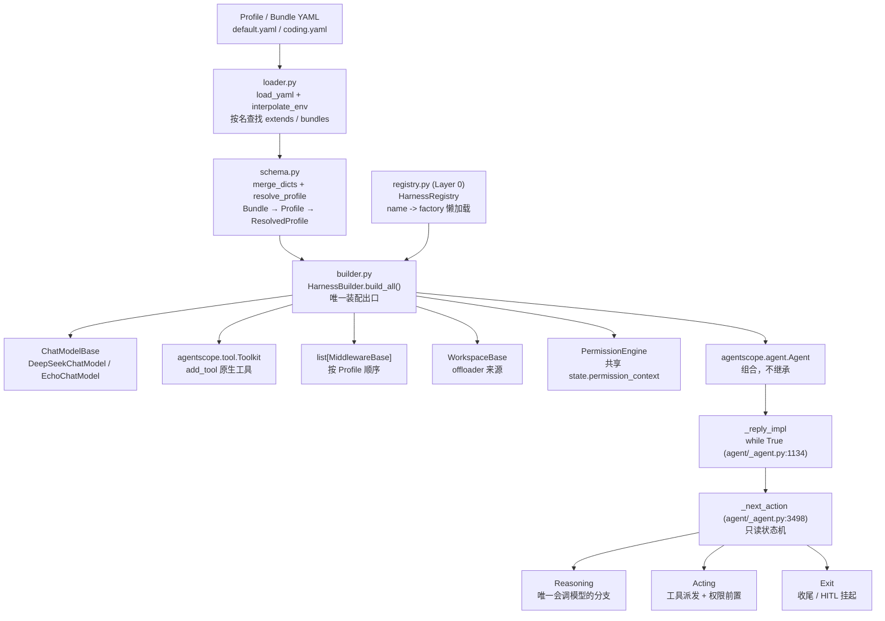

# 第 2 讲：AgentScope 核心解剖（一）：Agent 装配与 ReAct 主循环

> **本讲目标**：把 `agentscope.agent.Agent` 从构造函数读到 `_next_action` 状态机，
> 搞清楚"主循环到底是谁在转"；然后写出 `harness_kit` 的声明式装配层
> （Profile / Bundle / `HarnessRegistry` / `HarnessBuilder`），
> 用一份 YAML 把 `Agent` 装出来 —— **全程不写一行 Agent Loop**。
> **前置要求**：完成第 1 讲（环境准备与 `scripts/00_smoke.py` 跑通），
> 具备 Python 3.11 环境 `/Users/a/miniconda3/envs/agentscope_reme_pip_env/bin/python`，
> 且知道 `PYTHONPATH` 必须包含 `third_party/ReMe`。
> **本讲交付物**（相对仓库根）：
> `tutorial_agsc_reme/reference/harness_kit/config/schema.py`、
> `tutorial_agsc_reme/reference/harness_kit/config/loader.py`、
> `tutorial_agsc_reme/reference/harness_kit/config/builder.py`、
> `tutorial_agsc_reme/reference/harness_kit/registry.py`、
> `tutorial_agsc_reme/reference/harness_kit/config/__init__.py`、
> `tutorial_agsc_reme/reference/scripts/02_config_and_registry.py`、
> `tutorial_agsc_reme/reference/scripts/02_build_from_profile.py`、
> `tutorial_agsc_reme/reference/tests/test_lesson02_config.py`。
> **预计时长**：150 分钟。
>
> 本讲的完整可运行代码位于 `tutorial_agsc_reme/reference/harness_kit/...`，
> 你可以直接对照，也可以跟着正文一行一行写。


---

## 一、这一讲要解决的问题

第 1 讲我们把环境点着了：`harness_kit` 的包入口、`Settings`、一次真实的 `reply`。
但那时候证明的是"依赖能被 import、一次推理能返回"，**没有任何东西被"装配"起来** ——
第 1 讲的 smoke 脚本里，`Agent(...)` 是手写关键字参数构造的，工具是手写 `FunctionTool`
塞进去的，工作区、权限、记忆全都不存在。

本讲要正面回答一个非常具体的工程问题：

> **当一个 Agent 有 8 个可配置维度（模型 / 工具 / 技能 / MCP / 中间件 / 工作区 /
> 权限 / 记忆），每个维度又有 N 个可替换实现时，"把一个 Agent 装起来"这件事应该写在哪、
> 写几遍？**

错误答案有三种，前两种在实际项目里都极其常见。

**第一种：硬编码。** AgentScope 官方的 `create_app()` 就是这么干的。
它的签名在 `third_party/agentscope/src/agentscope/app/_app.py:78` 开始，
`storage` / `message_bus` / `workspace_manager` 是三个必填位置参数，
后面跟着二十多个可选参数，全部是**已经实例化好的 Python 对象**。
这说明什么？说明"装配"这件事在官方 App 层是**调用方的责任**：
`create_app` 不读配置、不查名字、不做默认值推断，你把什么对象传进去，它就装你什么。
你想要第二种形态的 App（比如一个"只读代码审阅助手"），只能在调用侧再写一遍
那一长串构造。**配置和代码没有分离**，这就是本契约 §1.3 里的**缺口 5**：
"没有声明式装配：`create_app` 是硬编码的"。

**第二种：`if/else` 堆成山。** 你知道要读配置了，于是写了一个
`build_everything(config: dict)`，里面 500 行 `if config["workspace"]["kind"] == "docker"`。
这条路会在两个地方崩掉：一是**新增一个实现就要改三处**（分支、默认值、文档），
二是**装配顺序只能靠脑记**（权限引擎必须在 Toolkit 之前建好吗？工作区要不要先
`initialize()`？offloader 从哪来？），而且**每个形态的 Agent 都要重新记一遍**。

**第三种（本讲要写的）：声明式装配。**
配置文件只描述"我要什么"（我要 `workspace.kind: local`，我要中间件 `budget`），
一个薄薄的**注册表**负责"名字 → 工厂"的解析，一个**装配器**负责"按正确顺序把对象建出来"。
三者之间的关系是：**配置层不知道任何 AgentScope 类型，注册表不读文件，装配器不做名字解析。**

### 一个具体的失败场景：复制粘贴的代价

真实发生过的版本是这样的。你先做了"研究助手" Profile，跑得挺好。老板说：
"再给我一个只读的代码审阅助手。" 你 copy 了一份 YAML，改了 6 行，其中一行的意图是
"把工具包从 `[builtin]` 扩成 `[builtin, repo]`"。你写成了：

```yaml
tools:
  packs: [builtin, repo]
```

而基线 Profile 里写的是 `packs: [builtin]`，合并之后结果**恰好**还是 `[builtin, repo]`
—— 这次是运气。真正踩坑的是**列表的默认语义**：`harness_kit` 的合并规则是
"两边都是 list → 整体替换"（契约 §6.2）。所以如果你在子 Profile 里写
`packs: [repo]`，你以为"追加一个 repo"，实际结果是**把 builtin 整个顶掉了**，
6 个文件工具全部消失，而**没有任何报错**。本仓库的 `profiles/coding.yaml`
注释里就写着这件事，并且它是被实测过的（§五 5.1 的 C 段输出里 `tools.packs` 与
`middleware` 的变化就是这套规则的现场）：`coding.yaml` 写 `middleware: [budget, guards]`，
`default.yaml` 的 `[logging]` 就被整体替换掉了 —— 日志中间件静默消失。

这就是为什么本讲要把合并规则**做成纯函数并单独写单测**
（`scripts/02_config_and_registry.py` 的 A 段与 `tests/test_lesson02_config.py`）：
这类错误不会抛异常，只会让系统在两周后变得难以解释。

### 第二条主线：读懂主循环，而不是写一个主循环

本讲的另一个目标更偏"读源码"：**`Agent._reply_impl` 里那个 `while True` 到底怎么转的？**
很多人的第一反应是"ReAct 循环嘛，我自己写一个 50 行的"。
本教程的最高优先级约束就是**禁止这种做法**：你要做的是**在这个循环上挂东西**
（中间件 hook、权限引擎、工具、工作区），而不是换掉它。

所以在 §二里我们会逐行确认：循环体在 `agent/_agent.py:1134` 起，
每一轮只做一件事 —— 问 `_next_action` 下一个动作是什么（`:1138`），
然后 `match` 到 `Exit` / `Reasoning` / `Acting` 三个分支之一。
`_next_action` 是一个**只读纯函数**（docstring 原话：*Read-only: all side effects are
performed by the caller*），它的全部输入是 `AgentState` 和一条可选的 `final_msg`。

搞清楚这条之后，"Harness 能做什么、不能做什么"就变成了一个**边界问题**：
能让 Agent 停下来等用户确认吗？能在工具失败时不让它崩吗？能保证并发工具的执行顺序吗？
这些问题的答案全部在源码里，而且**大部分答案和你猜的不一样**（比如：并发批次的
结果顺序**没有保证**；工具错误**不会**抛给调用方）。这就是 §六那张表的来源。
---

## 二、源码侦察

本节所有结论都带 `路径:行号`，路径一律相对仓库根。凡是没有行号的断言，本讲不写。

### 2.1 `Agent` 的构造面：它到底吃哪些参数

```
third_party/agentscope/src/agentscope/agent/_agent.py:117   class Agent:
third_party/agentscope/src/agentscope/agent/_agent.py:120       def __init__(
third_party/agentscope/src/agentscope/agent/_agent.py:174           self.state = state or AgentState()
third_party/agentscope/src/agentscope/agent/_agent.py:193           self._engine = PermissionEngine(self.state.permission_context)
third_party/agentscope/src/agentscope/agent/_agent.py:201           self.toolkit = toolkit or Toolkit()
third_party/agentscope/src/agentscope/agent/_agent.py:219           middlewares = middlewares or []
third_party/agentscope/src/agentscope/agent/_agent.py:220           self._reply_middlewares = [
third_party/agentscope/src/agentscope/agent/_agent.py:238           self._compress_context_middlewares = [
third_party/agentscope/src/agentscope/agent/_agent.py:246       def _validate_configs(self) -> None:
```

这说明什么：

1. **`Agent` 的全部可配置面就是 11 个构造参数**：
   `name` / `sys_prompt` / `model` / `toolkit` / `middlewares` / `state` / `offloader` /
   `model_config` / `context_config` / `react_config` / `injection_config`。
   这就是"装配层"要负责填满的**全部**东西 —— `HarnessBuilder` 干的活就是把这 11 个
   参数从 `ResolvedProfile` 里算出来，一个不多一个不少。
2. `self.state = state or AgentState()`（`:174`）是**状态注入点**：传入一个
   `AgentState`，Agent 就接着那个状态跑。这是断点续跑（第 9 讲）的全部秘密，
   本讲只需要知道它存在。
3. `PermissionEngine` 是在 `__init__` 里**自动建**的（`:193`），并且**共享**
   `state.permission_context`。这意味着你在外面拿到的引擎和 Agent 内部的引擎
   是**两个对象、一份上下文** —— `harness_kit` 的 `BuiltHarness.permission_engine`
   是给外部调用方（比如 CLI 做 HITL 交互）用的把手，两者必须指向同一个
   `PermissionContext`，否则你在外面改了模式、Agent 不知道。
4. 中间件在构造期就被**分桶**（`:219-240`）：`is_implemented("on_reply")` 的进
   `_reply_middlewares`，`on_reasoning` 的进 `_reasoning_middlewares`，以此类推，共 7 个桶。
   这意味着**中间件的成本只在构造期付一次**，每轮循环里不会再去问"你实现了哪个 hook"。
   这也解释了为什么"中间件顺序 = 列表顺序"：列表在构造期就被切成 7 个子序列了。

### 2.2 三个入口：`reply` / `reply_stream` / `observe`

```
third_party/agentscope/src/agentscope/agent/_agent.py:288   async def reply_stream(
third_party/agentscope/src/agentscope/agent/_agent.py:292           inputs: Msg
third_party/agentscope/src/agentscope/agent/_agent.py:296           yield_final_msg: bool = False,
third_party/agentscope/src/agentscope/agent/_agent.py:332   async def reply(
third_party/agentscope/src/agentscope/agent/_agent.py:381   async def observe(self, msgs: Msg | list[Msg] | None = None) -> None:
third_party/agentscope/src/agentscope/agent/_agent.py:386   async def compress_context(
third_party/agentscope/src/agentscope/agent/_agent.py:892   async def _reply(
third_party/agentscope/src/agentscope/agent/_agent.py:913           async def execute_chain(
third_party/agentscope/src/agentscope/agent/_agent.py:936                   async def next_handler(
third_party/agentscope/src/agentscope/agent/_agent.py:954       self._receive_reply_end = False
```

这说明什么：

- **`reply` 是 `reply_stream` 的消费者**，不是另一条路。`reply` 在 `:332` 起
  遍历同一个 `self._reply(...)`，只挑出 `isinstance(evt_or_msg, Msg)` 的那一个，
  循环结束后如果没拿到就 `raise RuntimeError("Agent did not produce a final message.")`。
  这条 `RuntimeError` 是真实存在的失败分支，本讲 §六 会讲它什么时候出现。
- **`reply_stream` 默认 `yield_final_msg=False`**（`:296`），也就是**默认不吐最终 `Msg`**，
  只吐事件。想要最终消息文本（尤其在做结构化输出时）必须显式传 `yield_final_msg=True`。
  本讲 §五 5.1 的 H 段有实测对比。
- **`observe` 完全不进主循环**。它只是 `await self._handle_incoming_messages(msgs)`，
  把消息塞进 `state.context` 就返回。实测：`observe` 让 context 从 0 变 1，
  但**一次模型调用都没发生**（§五 5.1 的 H 段第一行输出）。这是"只读观察别的 Agent 的消息"
  的正确姿势 —— 想让它参与推理，得紧接着 `reply(None)`。
- `_reply`（`:892`）里套了两层闭包 `execute_chain` / `next_handler`（`:913` / `:936`），
  这是**中间件链的实现方式**：每个中间件按顺序包一层，`next_handler` 往下递。
  注意 `_reply` 是**私有名字**（下划线开头），但 `harness_kit` 的中间件是注册进官方
  链里的，所以不用担心"改私有 API"的问题 —— 我们只实现 hook，不调用 `_reply`。

### 2.3 ReAct 主循环：`_reply_impl` 与 `_next_action`

```
third_party/agentscope/src/agentscope/agent/_agent.py:1027  async def _reply_impl(  # pylint: disable=too-many-branches
third_party/agentscope/src/agentscope/agent/_agent.py:1134          while True:
third_party/agentscope/src/agentscope/agent/_agent.py:1138              next_action = self._next_action(final_msg)
third_party/agentscope/src/agentscope/agent/_agent.py:1141                  case Exit(exit_msg=exit_msg, exit_events=exit_events):
third_party/agentscope/src/agentscope/agent/_agent.py:1170                  case Reasoning(hint=hint, tool_choice=tool_choice):
third_party/agentscope/src/agentscope/agent/_agent.py:1177                      await self.compress_context()
third_party/agentscope/src/agentscope/agent/_agent.py:1180                      async for evt in self._inject_runtime_state():
third_party/agentscope/src/agentscope/agent/_agent.py:1212                  case Acting(tool_calls=tool_calls):
third_party/agentscope/src/agentscope/agent/_agent.py:1214                      for batch in await self._batch_tool_calls(tool_calls):
third_party/agentscope/src/agentscope/agent/_agent.py:1273                  self.state.cur_iter += 1
third_party/agentscope/src/agentscope/agent/_agent.py:1275      except asyncio.CancelledError:
third_party/agentscope/src/agentscope/agent/_agent.py:1287      finally:
third_party/agentscope/src/agentscope/agent/_agent.py:962   async def _close_unfinished_tool_calls(
third_party/agentscope/src/agentscope/agent/_agent.py:3498  def _next_action(
third_party/agentscope/src/agentscope/agent/_agent.py:3508          awaiting_tool_calls = self.state.get_awaiting_tool_calls(self.name)
third_party/agentscope/src/agentscope/agent/_agent.py:3530              if executable_tool_calls:
third_party/agentscope/src/agentscope/agent/_agent.py:3532                  return Acting(tool_calls=executable_tool_calls)
third_party/agentscope/src/agentscope/agent/_agent.py:3534          if awaiting_tool_calls:
third_party/agentscope/src/agentscope/agent/_agent.py:3535              return Exit(
third_party/agentscope/src/agentscope/agent/_agent.py:3658          if final_msg is not None:
third_party/agentscope/src/agentscope/agent/_agent.py:3704          if self.state.cur_iter == self.react_config.max_iters:
third_party/agentscope/src/agentscope/agent/_agent.py:3722          if self.state.cur_iter >= self.react_config.max_iters:
third_party/agentscope/src/agentscope/agent/_agent.py:3758          return Reasoning()
```

配套的数据模型（这三个类就是"下一步干什么"的全部词表）：

```
third_party/agentscope/src/agentscope/agent/_utils.py:16    class _ToolCallBatch:
third_party/agentscope/src/agentscope/agent/_utils.py:20        type: Literal["sequential", "concurrent"]
third_party/agentscope/src/agentscope/agent/_utils.py:26    class Acting(BaseModel):
third_party/agentscope/src/agentscope/agent/_utils.py:32    class Reasoning(BaseModel):
third_party/agentscope/src/agentscope/agent/_utils.py:35        hint: HintBlock | None
third_party/agentscope/src/agentscope/agent/_utils.py:36        tool_choice: ToolChoice | None
third_party/agentscope/src/agentscope/agent/_utils.py:39    class Exit(BaseModel):
third_party/agentscope/src/agentscope/agent/_utils.py:42        exit_msg: Msg | None
third_party/agentscope/src/agentscope/agent/_utils.py:43        exit_events: list[AgentEvent] | None
```

这说明什么：

1. **循环体只做一件事**：问 `_next_action` 要一个动作，然后 `match`。
   `Exit` = 结束（或"挂起等外部输入"），`Reasoning` = 调模型，`Acting` = 执行工具。
   你要在 Harness 里加能力，加在这三个分支的**外面**（中间件 hook），
   不是在里面。
2. **`Acting` 分支的顺序不可换**（`:1170-1210` 的 Reasoning 同理）：
   `hint` 先写进 context → `await self.compress_context()`（`:1177`）→
   `_inject_runtime_state()`（`:1180`）→ 最后 `_reasoning()`。
   `compress_context` 会**改 context**，而 `_inject_runtime_state` 里的"上下文水位"
   依赖 `state.cur_iter`，所以顺序错了就会看到奇怪的上下文长度。
   这一条 `harness_kit` 完全不用管 —— 它印证了"不要自己写循环"的价值：
   这种顺序约束你写十遍会错三遍。
3. **`cur_iter += 1` 是有条件的**（`:1272-1273`）：
   `if not self.state.get_unfinished_tool_calls(self.name): self.state.cur_iter += 1`。
   也就是说，**一轮只有在该轮产生的所有 tool call 都有结果之后才计一次数**。
   这解释了 §五 5.1 的 G 段里 `cur_iter` 为什么能直接和 `max_iters` 比大小。
4. **`_next_action` 是只读的纯函数**（`:3498` 起，docstring 明说）。
   它的判定顺序是固定的六步：
   (a) 尾部 assistant 消息里有可执行的 tool call → `Acting`（`:3530-3532`）；
   (b) 有 tool call 在等外部输入（`ASKING` 或 `SUBMITTED`）→ `Exit(exit_events=None)`，
   这就是 **HITL 挂起**（`:3534-3546`）；(c) 结构化输出已满足 → `Exit(COMPLETED)`；
   (d) 结构化输出未满足 → `Reasoning`（可能带 `tool_choice` 强制生成）；
   (e) `final_msg is not None` → `Exit`，并按 `cur_iter > max_iters` 决定
   `finished_reason` 是 `COMPLETED` 还是 `EXCEED_MAX_ITERS`（`:3658-3700`）；
   (f) `cur_iter == max_iters` → 返回一个**带提示的 `Reasoning`**，
   且 `tool_choice=ToolChoice(mode="none")`（`:3704-3718`）；否则返回空的 `Reasoning()`（`:3758`）。
5. **`max_iters` 到了不会立刻停**。这是最容易讲错的一点：`:3704` 那个分支返回的是
   `Reasoning` 而不是 `Exit` —— 它会**再给模型一次强制收口的机会**
   （hint 原文：*You have reached the maximum of N reasoning-acting iterations.
   Summarize the work and findings so far and return the final answer as text.
   Do not call any tools.*），并且用 `tool_choice.mode = "none"` 从协议层禁止工具调用。
   只有这次收口**也**没产出 `final_msg`，才会在 `:3722` 走 `EXCEED_MAX_ITERS` 退出。
   所以"`max_iters=20`"在最坏情况下意味着 **21 次**模型调用，不是 20 次。

相关配置项（改这些参数就是改循环行为）：

```
third_party/agentscope/src/agentscope/agent/_config.py:362  class ReActConfig(BaseModel):
third_party/agentscope/src/agentscope/agent/_config.py:365      max_iters: int = Field(
third_party/agentscope/src/agentscope/agent/_config.py:373      structured_output_grace_iters: int = Field(
third_party/agentscope/src/agentscope/agent/_config.py:385      stop_on_reject: bool = Field(
third_party/agentscope/src/agentscope/agent/_config.py:395      interruption_message: str = Field(
third_party/agentscope/src/agentscope/agent/_config.py:51   class ContextConfig(BaseModel):
third_party/agentscope/src/agentscope/agent/_config.py:57       trigger_ratio: float = Field(default=0.8, gt=0, le=0.9)
third_party/agentscope/src/agentscope/agent/_config.py:62       reserve_ratio: float = Field(default=0.1, gt=0, lt=0.9)
third_party/agentscope/src/agentscope/agent/_config.py:146      tool_result_limit: int = Field(
third_party/agentscope/src/agentscope/agent/_config.py:195  class InjectionConfig(BaseModel):
third_party/agentscope/src/agentscope/agent/_config.py:260      tool_retries_limit: int = Field(
third_party/agentscope/src/agentscope/agent/_config.py:415  class ModelConfig(BaseModel):
third_party/agentscope/src/agentscope/agent/_config.py:422      max_retries: int = Field(
third_party/agentscope/src/agentscope/agent/_config.py:437      fallback_model: ChatModelBase | None = Field(
```

这说明什么：**循环行为是可配置的，但不是无限制可配置的**。
`max_iters`（`:365`）、`structured_output_grace_iters`（`:373`）、
上下文压缩的 `trigger_ratio` / `reserve_ratio`（`:57` / `:62`）、
工具结果的 `tool_result_limit`（`:146`）、工具重试提示的 `tool_retries_limit`（`:260`）、
`max_retries`（`:422`）与 `fallback_model`（`:437`）—— 这几项就是"循环可控"的全部旋钮。
`harness_kit` 的 Profile 只暴露其中一部分（`agent.max_iters`、`tools.max_result_chars`、
`model.max_tokens` 等），其余保持 AgentScope 默认值。**不去重新实现它们，只在需要时透传。**

### 2.4 工具执行：批处理、并发与那个"没有保证"的顺序

```
third_party/agentscope/src/agentscope/agent/_agent.py:2100  async def _batch_tool_calls(
third_party/agentscope/src/agentscope/agent/_agent.py:2118              if tool is None or tool.is_concurrency_safe:
third_party/agentscope/src/agentscope/agent/_agent.py:2140  async def _execute_sequential_tool_calls(
third_party/agentscope/src/agentscope/agent/_agent.py:2190  async def _execute_concurrent_tool_calls(
third_party/agentscope/src/agentscope/agent/_agent.py:2269              results = await asyncio.gather(
third_party/agentscope/src/agentscope/agent/_agent.py:2278              await queue.put(sentinel)
third_party/agentscope/src/agentscope/agent/_agent.py:2285              while True:
third_party/agentscope/src/agentscope/agent/_agent.py:2317              raise ExceptionGroup(
third_party/agentscope/src/agentscope/agent/_agent.py:2322  async def _into_queue(
third_party/agentscope/src/agentscope/agent/_agent.py:2344  async def _check_permission(
third_party/agentscope/src/agentscope/agent/_agent.py:2416  async def _check_permission_impl(
third_party/agentscope/src/agentscope/agent/_agent.py:2435  async def _execute_tool_call(
third_party/agentscope/src/agentscope/agent/_agent.py:2487              tool = await self.toolkit.check_tool_available(
third_party/agentscope/src/agentscope/agent/_agent.py:2493              parsed_input = _json_loads_with_repair(
third_party/agentscope/src/agentscope/agent/_agent.py:2501                  jsonschema.validate(parsed_input, tool.input_schema)
third_party/agentscope/src/agentscope/agent/_agent.py:2537                  PermissionBehavior.ASK,
third_party/agentscope/src/agentscope/agent/_agent.py:2585          if decision.behavior == PermissionBehavior.DENY:
third_party/agentscope/src/agentscope/agent/_agent.py:2603              yield ToolResultStartEvent(
third_party/agentscope/src/agentscope/agent/_agent.py:2627                  async for evt in self._acting(
third_party/agentscope/src/agentscope/agent/_agent.py:2695              self._save_to_context(
third_party/agentscope/src/agentscope/agent/_agent.py:2723  async def _acting(
third_party/agentscope/src/agentscope/agent/_agent.py:2777  async def _acting_impl(
third_party/agentscope/src/agentscope/agent/_agent.py:2807  async def _handle_error_tool_call(
third_party/agentscope/src/agentscope/agent/_agent.py:1310  def _get_repeated_tool_error(self) -> tuple[str, int] | None:
third_party/agentscope/src/agentscope/tool/_toolkit.py:66    class Toolkit:
third_party/agentscope/src/agentscope/tool/_toolkit.py:225       async def call_tool(
third_party/agentscope/src/agentscope/tool/_toolkit.py:556       async def check_tool_available(
```

这说明什么：

1. **批次的切分规则是"属性驱动"的**（`:2118`）：`tool.is_concurrency_safe` 为真
   **或者工具压根没注册**（`tool is None`）→ 进 concurrent 批；否则进 sequential 批。
   连续的同类会被合并成一批（`:2119-2139`）。所以**工具的声明属性直接决定执行策略**，
   `harness_kit` 的 `builtin` 工具包不重写任何工具，所以这个策略是 AgentScope 原生的。
2. **并发批次的"完成顺序"就是事件到达顺序，没有任何保证**（`:2269` 的
   `asyncio.gather(..., return_exceptions=True)` 只管"全都跑完"，
   `:2285-2289` 从 `asyncio.Queue` 里按到达顺序取事件）。
   侦察实测：两个并发工具 `c1`（0.4s）与 `c2`（0.05s），
   **`c2` 的结果先出来**，总耗时 0.424s ≈ `max(0.4, 0.05)` 而不是 `sum(0.45)`
   （`tutorial_agsc_reme/_recon/02_agentscope_agent_loop.md:1019-1031`）。
   **结论：不要依赖并发批次里工具结果的顺序。** 需要顺序就给工具加
   `is_concurrency_safe=False` 让它进顺序批。
3. **工具错误永远不抛给调用方**。`:2807` 的 `_handle_error_tool_call` 把
   `ToolNotFoundError`、输入校验失败（`:2493` 的 `_json_loads_with_repair` +
   `:2501` 的 `jsonschema.validate`）、`DENY` 决定（`:2585`）全部翻译成
   `ToolResultBlock(state=ERROR/DENIED)` **回填进 context**，让模型自己修。
   真正会抛出来的是 `:2317` 那个 `ExceptionGroup` —— 但那要求工具**自己**
   抛出了未被捕获的异常，而且只发生在并发批里。
4. **权限检查在工具执行之前**（`:2344` → `:2416` → `:2435` 里的 `:2537`）：
   `ASK`（`:2537`）会把 tool call 置为 `ASKING` 并**挂起整个 reply**，
   `DENY`（`:2585`）直接写 `DENIED` 结果。这两个分支就是 HITL 的全部。
   `harness_kit` 第 11 讲会把规则文件喂给同一个引擎，本讲只需要知道
   `PermissionEngine` 是 `Agent.__init__` 里自动建的（`:193`）。
5. **`_get_repeated_tool_error`（`:1310`）只是个提示器，不是熔断器**：
   它统计"同一个工具连续失败了几次"，达到 `injection_config.tool_retries_limit`
   就往上下文里注入一条提示（`HintBlock`），**不会终止循环**。
   所以"死循环保护"不是一个开关，而是"提示 + `max_iters` 兜底"。
   要真正的熔断得上中间件（`harness_kit/middleware/guards.py`，第 8 讲）。

### 2.5 `AgentState`：唯一的持久化边界

```
third_party/agentscope/src/agentscope/state/_state.py:209   class AgentState(BaseModel):
third_party/agentscope/src/agentscope/state/_state.py:254       def cur_iter(self) -> int:
third_party/agentscope/src/agentscope/state/_state.py:298       def append_context(
third_party/agentscope/src/agentscope/state/_state.py:328       def has_awaiting_tool_calls(self, name: str) -> bool:
third_party/agentscope/src/agentscope/state/_state.py:345       def get_awaiting_tool_calls(self, name: str) -> list[ToolCallBlock]:
third_party/agentscope/src/agentscope/state/_state.py:374       def get_unfinished_tool_calls(self, name: str) -> list[ToolCallBlock]:
third_party/agentscope/src/agentscope/message/_block.py:128  class ToolCallState(StrEnum):
third_party/agentscope/src/agentscope/message/_block.py:138  class ToolCallBlock(BaseModel):
third_party/agentscope/src/agentscope/message/_block.py:185  class ToolResultState(StrEnum):
third_party/agentscope/src/agentscope/message/_block.py:195  class ToolResultBlock(BaseModel):
```

这说明什么：

- **`Agent` 对象本身不持有跨 reply 的状态**（只有一个瞬时的
  `_receive_reply_end` 标志，`agent/_agent.py:244`）。要断点续跑、要回放、
  要做会话记录，**唯一需要序列化的东西就是 `state`**。这是本教程第 3 讲
  （不可变事件日志）与第 9 讲（事件溯源）的地基，也是本契约缺口 1 的另一面：
  官方给了**可序列化的 `state`**，没给**不可变的事件日志**。
- `ToolCallBlock.state` 的五态（`message/_block.py:128` 起的 `ToolCallState`）
  就是 HITL 的完整状态机：`PENDING → ASKING → ALLOWED → SUBMITTED → FINISHED`
  （docstring 里的转移图是逐字写着的）。`_next_action` 的判定全靠读它（`:3508`）。

### 2.6 本讲真正会用到的 agentscope / reme 扩展点清单

| 组件 | 扩展点（基类 / 协议 / 函数） | 位置 | 本讲如何使用 |
| --- | --- | --- | --- |
| Agent 核心 | `agentscope.agent.Agent` | `agent/_agent.py:117` | **组合，不继承**：`HarnessBuilder.build_agent()` 构造它 |
| Agent 状态 | `agentscope.state.AgentState` | `state/_state.py:209` | 透传 `profile` 里解析出的 `session_id` |
| 模型 | `agentscope.model.ChatModelBase` | `model/_base.py:37` | 注册表按 `provider` 名解析出工厂，builder 只调用它 |
| 工具 | `agentscope.tool.Toolkit` | `tool/_toolkit.py:66` | builder 只 `add_tool`，不重写任何工具 |
| 中间件 | `agentscope.middleware.MiddlewareBase` | `middleware/_base.py:13` | 按 Profile 顺序实例化后整条链交给 `Agent(middlewares=...)` |
| 中间件分桶 | `MiddlewareBase.is_implemented` | `middleware/_base.py:55` | **不调用**，但必须知道它决定了 hook 是否生效 |
| 工作区 | `agentscope.workspace.WorkspaceBase` | `workspace/_base.py:223` | builder 装配后交给 Agent 的 offloader |
| 权限 | `agentscope.permission.PermissionEngine` | `permission/_engine.py:17` | builder 建一份，共享 `state.permission_context` |
| 环境插值语义 | ReMe `expand_env_vars` / `_convert_value` | `third_party/ReMe/reme/config/config_parser.py:53` / `:98` | **对齐它**：`harness_kit` 的 `${VAR}` 插值规则与之逐字一致 |
| 插值正则 | ReMe `_ENV_VAR_RE` | `third_party/ReMe/reme/config/config_parser.py:24` | 复制同一条正则，保证 `:-default` 语法一致 |

**一句话总结本节的侦察结论**：AgentScope 已经给了完整的"运行时"
（循环、状态机、工具派发、权限判定、中间件分桶），
**它没有给的是"把运行时按配置装起来"这件事** —— 那就是本讲要写的部分。
---

## 三、扩展点定位与设计

### 3.1 官方已经给了什么

引用 §二的行号，四句话说清：

1. **完整的 ReAct 运行时**：`_reply_impl`（`agent/_agent.py:1027`）里那个
   `while True`（`:1134`）加只读状态机 `_next_action`（`:3498`），
   就是 ReAct 的全部实现。**你不需要写 `while`。**
2. **完整的工具派发**：批次切分（`:2100`）、顺序执行（`:2140`）、
   并发执行（`:2190`）、权限前置（`:2435`）、错误回填（`:2807`）——
   连"参数 JSON 修一下再校验"（`:2493`）都写好了。
3. **完整的中间件骨架**：7 个 hook 桶（`:219-240`），
   你只要实现 `on_reply` 之类的名字，构造期就自动进桶。
4. **完整的可序列化状态**：`AgentState`（`state/_state.py:209`）。

### 3.2 还缺什么（缺口 5）

| 缺口编号 | 描述 | 真实证据 |
| --- | --- | --- |
| **缺口 5** | 没有声明式装配：「我要什么」与「怎么建」没有分离，`create_app` 的参数就是最终对象 | `third_party/agentscope/src/agentscope/app/_app.py:78`（`create_app` 的 20+ 个参数全是已实例化的对象，没有任何"名字 → 工厂"的解析层） |
| 缺口 5 的第二个面 | 没有"名字 → 实现"的注册表。`agentscope` 里唯一类似的东西是各处的 `if/elif` 分支与 `Type[Agent]` 参数 | `third_party/agentscope/src/agentscope/app/_app.py` 的 `custom_agent_cls: Type[Agent] \| None`（只能换类，不能换"一套组件"） |

缺口的**后果**是可观测的：要第二个形态的 Agent，必须复制一整套构造代码；
配置与代码无法分离，因此"只读助手"和"研究助手"的差异无法用 diff 表达。

### 3.3 我们准备在哪个扩展点上做

**一句话**：我们**不做新的运行时**，我们做的是**运行时的装配层**。
具体落点：

1. **配置层**（`harness_kit/config/schema.py`）：用 **pydantic v2**（外部依赖，
   不是 AgentScope 的类型）定义 `ModelSpec` / `ToolsSpec` / … / `AgentSpec`，
   以及 `Bundle` / `Profile` / `ResolvedProfile` 三个模型。
   它**不 import 任何 agentscope 类型**，因此可以单独单测、单独在无 LLM 环境下装载。
   合并规则实现为**纯函数** `merge_dicts`（对应契约 §6.2）。
2. **加载层**（`harness_kit/config/loader.py`）：YAML 读取 + `${VAR:-default}` 插值
   + `extends` / `bundles` 按名查找。插值语义**逐字对齐 ReMe 的 `expand_env_vars`**
   （`third_party/ReMe/reme/config/config_parser.py:53`），
   因为读者在第 15 讲之后会同时面对 ReMe 的 `default.yaml` 与我们的 Profile，
   两套 `${}` 语法不一致是最没必要的成本。
3. **注册表层**（`harness_kit/registry.py`）：Layer 0 微内核。把
   `("model", "deepseek")` → 工厂、`("middleware", "budget")` → 工厂登记起来，
   支持**懒加载**（模块路径 + 属性名，第一次 `get` 时才 import），
   这样第 2 讲可以引用第 4 讲才会写的 `EchoChatModel` 而不产生循环依赖。
4. **装配层**（`harness_kit/config/builder.py`）：`HarnessBuilder.build_all()`
   是**唯一**把 `ResolvedProfile` 变成 AgentScope 对象的地方。
   它构造的就是官方类型：`ChatModelBase` / `Toolkit` / `MiddlewareBase` 列表 /
   `WorkspaceBase` / `PermissionEngine` / `Agent`。
   **它不继承 `Agent`，不覆写 `_reply_impl`，不重写任何工具。**

### 3.4 装配链路



图里每个带英文 id 的方框都是**真实存在的东西**：`Loader` / `Resolver` / `Registry` /
`Builder` 是本讲要交付的四个文件；`Agent` / `Loop` / `Next` 是 AgentScope 的既有实现
（括号里是它的 `文件:行号`）。注意箭头方向上的一个关键含义：
**`Builder` 的产物是 `Agent`，而 `Agent` 之内才有 `Loop`** ——
这就是"我们只装配、不实现循环"的图形化表达。

### 3.5 设计决策与理由

| 决策 | 替代方案 | 为什么这么选 |
| --- | --- | --- |
| 配置层用 pydantic v2，**不依赖 agentscope** | 直接用 agentscope 的类型当配置 | 配置层要能在"没装 LLM key、没有网络"时被单测（§五 5.1 的 A–E 段就是这么跑的） |
| 合并规则是**纯函数** `merge_dicts` | 写成 `ResolvedProfile.__init__` 的一部分 | 纯函数才能被穷举单测；契约 §6.2 明确要求"必须独立可测" |
| 保留 YAML `!append` 语义 | 只提供"list 整体替换" | 没有 `!append`，"子 Profile 追加一个工具包"就只能靠复制整个列表，正是 §一 那个 bug 的成因 |
| 注册表支持**懒加载** | 启动时把所有组件 import 一遍 | 第 2 讲时第 4/8/11 讲的模块还不存在；懒加载让"引用尚未实现的组件"不炸，只在真正 `get` 时才解析 |
| `HarnessBuilder` **组合** `Agent` | 继承 `Agent` 加一个 `HarnessAgent` | 继承会把本教程绑死在 `Agent` 的实现细节上；组合保证"第 2 讲装出来的就是官方 `Agent`"（§五 5.3 的 `summarize_agent` 的输出可以作证：`model = DeepSeekChatModel`，不是我们的类） |
| 环境插值**对齐 ReMe** | 自创一套语法 | 读者在第 15 讲之后要同时写两种配置；语义一致省掉一整类"为什么这里不生效"的问题 |
---

## 四、harness_kit 实现

本节逐个文件给出**完整代码**（不是片段）。其中 `config/loader.py`、`registry.py`、
`config/__init__.py` 三个文件的代码与
`tutorial_agsc_reme/reference/harness_kit/` 下的真实文件**逐字一致**，
可以用 §五 5.4 的 `sha256` 命令自行核对。
另外两个文件 `config/schema.py` 与 `config/builder.py` 给出的是**本讲当时的版本**
（第 6 讲还会再改它们，见 §5.4）—— 它们与仓库里当前文件的差异是**预期之内**的，
不要拿上面的哈希命令去核对这两个。

五个文件的阅读顺序与依赖方向一致：
`schema.py`（纯数据 + 纯算法）→ `loader.py`（磁盘 IO）→
`builder.py`（装配）→ `registry.py`（Layer 0 组件登记）→ `config/__init__.py`（对外出口）。

> 为什么 `builder.py` 排在 `registry.py` 前面读？因为 `builder` 是**读者视角**的入口
> （"我要装一个 Agent"），而 `registry` 是**实现视角**的底座（"名字怎么变成工厂"）。
> 先把"用起来是什么样"读顺，再去看"它是怎么找到组件的"，理解成本更低。

### 4.1 `harness_kit/config/schema.py`
```python
# -*- coding: utf-8 -*-
"""Profile / Bundle 的 pydantic v2 模型与**合并算法**。

AgentScope 自身的装配是硬编码的（``third_party/agentscope/src/agentscope/app/_app.py:78``
的 ``create_app`` 把 model / toolkit / middleware 直接写死在函数体里），没有声明式入口。
本模块补上这个缺口：用 ``Bundle``（能力包）+ ``Profile``（场景）两层 YAML 描述装配结果，
再由 :func:`resolve_profile` 合并冻结成 :class:`ResolvedProfile`。

合并规则的唯一真值（契约 §6.2）：

============ ==========================================================
情形         规则
============ ==========================================================
map vs map   深合并，递归下去
叶子冲突      override 胜
list vs list  默认**整体替换**（不做元素级合并）
list 追加     在 YAML 里写 ``!append`` 标签，如 ``packs: !append [repo]``
override=null **删除**继承来的键（用于关掉某个继承能力）
只 base 有    保留
只 override有 新增
extends 成环  :class:`~harness_kit.config.loader.ConfigCycleError`
bundle 不存在 :class:`~harness_kit.config.loader.ConfigNotFoundError`
============ ==========================================================

``explain()`` 能逐字段回答"这个值来自哪个文件"，靠的是 :func:`_merge` 在合并过程中
顺手记录的 :attr:`ResolvedProfile.source_map`（``点号路径 -> 来源标签``）。
"""

from __future__ import annotations

import copy
from datetime import datetime
from importlib import import_module
from pathlib import Path
from typing import Any, Literal, Mapping

from loguru import logger
from pydantic import BaseModel, ConfigDict, Field, PrivateAttr, model_validator

__all__ = [
    "AgentSpec",
    "AppendList",
    "Bundle",
    "MCP_SERVER_SPEC_CLASS",
    "MCPServerSpec",
    "MCPSpec",
    "MemorySpec",
    "MiddlewareSpec",
    "ModelSpec",
    "PermissionSpec",
    "Profile",
    "ResolvedProfile",
    "SANDBOX_POLICY_CLASS",
    "SandboxPolicy",
    "SkillsSpec",
    "ToolsSpec",
    "WorkspaceSpec",
    "merge_dicts",
    "resolve_profile",
]


# ======================================================================
# 外部归属类型的解析
# ======================================================================
# 契约 §二 把 SandboxPolicy 归给第 10 讲（harness_kit/sandbox/policy.py）、
# 把 MCPServerSpec 归给第 7 讲（harness_kit/mcp/registry.py）。但本模块的
# WorkspaceSpec.policy / MCPSpec.servers 又必须引用它们。于是：
#   - 若那两个模块已存在（第 7 / 第 10 讲交付后），直接复用**它们的类**，全局只有一个真值；
#   - 若尚未交付，退回本文件里的**同构占位类**，保证第 1 / 第 2 讲的 Profile YAML 仍能校验通过。
# 占位类只提供字段（YAML schema），不提供行为；行为一律由归属讲次提供。
def _resolve_external_type(
    module_path: str,
    attr: str,
    fallback: type[BaseModel],
) -> type[BaseModel]:
    """优先使用归属模块里的真实类，缺失时退回占位类。

    Args:
        module_path (`str`): 归属模块的点号路径。
        attr (`str`): 类名。
        fallback (`type[BaseModel]`): 占位类。

    Returns:
        `type[BaseModel]`: 实际生效的类。
    """
    try:
        module = import_module(module_path)
    except ImportError:
        return fallback
    resolved = getattr(module, attr, None)
    if isinstance(resolved, type) and issubclass(resolved, BaseModel):
        return resolved
    return fallback


class _FallbackSandboxPolicy(BaseModel):
    """``harness_kit.sandbox.policy.SandboxPolicy`` 的同构占位类（第 10 讲交付后自动让位）。

    字段与契约 §3.10 逐字一致。``workspace_root`` 在契约里是必填，但
    ``profiles/research.yaml`` 的 ``policy:`` 块并没有写它 —— 这个矛盾由
    :meth:`WorkspaceSpec._fill_policy_root` 在解析期补上（用 ``WorkspaceSpec.root`` 填）。
    """

    model_config = ConfigDict(extra="forbid")

    workspace_root: Path = Path("./.harness/workspace")
    read_paths: list[str] = Field(default_factory=list)
    write_paths: list[str] = Field(default_factory=list)
    deny_paths: list[str] = Field(
        default_factory=lambda: [".git/", ".env", "**/*.pem"],
    )
    network: Literal["none", "allowlist", "full"] = "none"
    network_allowlist: list[str] = Field(default_factory=list)
    cpu: float = 1.0
    memory_mb: int = 1024
    pids: int = 128
    timeout_s: int = 60
    max_output_bytes: int = 1_000_000


class _FallbackMCPServerSpec(BaseModel):
    """``harness_kit.mcp.registry.MCPServerSpec`` 的同构占位类（第 7 讲交付后自动让位）。

    字段与契约 §3.7 逐字一致，``extra="forbid"``。
    """

    model_config = ConfigDict(extra="forbid")

    name: str
    transport: Literal["stdio", "sse", "streamable_http"]
    command: str | None = None
    args: list[str] = Field(default_factory=list)
    url: str | None = None
    env: dict[str, str] = Field(default_factory=dict)
    enabled: bool = True
    namespace: str | None = None


SANDBOX_POLICY_CLASS: type[BaseModel] = _resolve_external_type(
    "harness_kit.sandbox.policy",
    "SandboxPolicy",
    _FallbackSandboxPolicy,
)
"""当前生效的 ``SandboxPolicy`` 类（真实类或占位类）。"""

MCP_SERVER_SPEC_CLASS: type[BaseModel] = _resolve_external_type(
    "harness_kit.mcp.registry",
    "MCPServerSpec",
    _FallbackMCPServerSpec,
)
"""当前生效的 ``MCPServerSpec`` 类（真实类或占位类）。"""

# 供 pydantic 在解析注解时取用（注解用的是下面这两个名字）
SandboxPolicy = SANDBOX_POLICY_CLASS
MCPServerSpec = MCP_SERVER_SPEC_CLASS


# ======================================================================
# 各 Spec
# ======================================================================
class ModelSpec(BaseModel):
    """模型层的声明。"""

    model_config = ConfigDict(extra="forbid")

    provider: Literal["deepseek", "openai", "echo"] = "deepseek"
    """模型提供方，决定走哪个 :class:`~harness_kit.registry.HarnessRegistry` 工厂。

    **有默认值不是随手写的**：``Profile.model`` 在合并语义里是"这一个 Profile 自己
    写的那部分覆盖"，契约 §6.3 的 ``research.yaml`` 就只写了 ``model.temperature``。
    如果这里把 ``provider`` / ``model_name`` 定成必填，那一层 Profile 在校验阶段
    （早于任何合并）就会直接 ``ValidationError``，契约 §6.3 的示例根本装载不了
    （已实测）。默认值 ``deepseek`` / ``deepseek-chat`` 与
    :attr:`ResolvedProfile.model` 的 ``default_factory`` 完全一致，也与
    :func:`resolve_profile` 里那条"合并后没有 model 段就用 deepseek/deepseek-chat"
    的 warning 说的是同一件事 —— 这里只是把同一套回退提前到层级别。
    """

    model_name: str = "deepseek-chat"
    """模型名，如 ``deepseek-flash``。默认值与 :attr:`ResolvedProfile.model` 一致。"""

    api_key_env: str = "LLM_API_KEY"
    """**环境变量名**（不是明文 key），由 builder 在装配时解引用。"""

    base_url_env: str = "LLM_BASE_URL"
    """base url 的环境变量名。"""

    temperature: float = 0.0
    """采样温度。"""

    max_tokens: int | None = None
    """单次输出上限；``None`` 交给 provider 默认值。"""

    stream: bool = True
    """是否开启流式输出，直接传给 ``ChatModelBase.__init__(stream=...)``。"""

    timeout_s: float = 60.0
    """单次请求超时（秒），透传给 ``openai.AsyncClient(timeout=...)``。"""

    extra: dict[str, Any] = Field(default_factory=dict)
    """透传给 provider 的额外参数（例如 ``thinking_enable`` / ``reasoning_effort``）。"""


class ToolsSpec(BaseModel):
    """工具层的声明。"""

    model_config = ConfigDict(extra="forbid")

    packs: list[str] = Field(default_factory=list)
    """工具包名列表，逐个走 :meth:`HarnessRegistry.get` 的 ``tool_pack`` 类目。"""

    groups: dict[str, list[str]] = Field(default_factory=dict)
    """``工具组名 -> 工具名列表``，用于把工具塞进非 ``basic`` 的组，
    交给 ``Toolkit(tool_groups=[ToolGroup(...)])``。"""

    disabled: list[str] = Field(default_factory=list)
    """按工具名禁用（装配完成后从 Toolkit 里摘掉）。"""

    max_result_chars: int = 8000
    """单个工具结果回灌进上下文前的最大字符数。"""


class SkillsSpec(BaseModel):
    """技能层的声明。"""

    model_config = ConfigDict(extra="forbid")

    directories: list[str] = Field(default_factory=list)
    """技能目录，交给 ``LocalSkillLoader(directory=..., scan_subdir=...)``。"""

    enabled: list[str] = Field(default_factory=list)
    """启用的技能名；空列表表示目录里的全部技能。"""

    scan_subdir: bool = True
    """是否扫描子目录。已知坑：``LocalSkillLoader`` 默认 ``scan_subdir=False``，
    子目录里的 ``SKILL.md`` 会被漏掉。"""

    disclosure: Literal["index", "full"] = "index"
    """渐进披露层级：``index`` 只把技能索引塞进 prompt，``full`` 直接塞全文。"""


class MCPSpec(BaseModel):
    """MCP 层的声明。"""

    model_config = ConfigDict(extra="forbid")

    servers: list[MCPServerSpec] = Field(default_factory=list)  # type: ignore[valid-type]
    """要连接的 MCP server 声明。"""

    group: str = "mcp"
    """这些 MCP 提供的工具注册进哪个工具组。"""


class MiddlewareSpec(BaseModel):
    """单个中间件的声明。"""

    model_config = ConfigDict(extra="forbid")

    name: str
    """中间件名，走 :meth:`HarnessRegistry.get` 的 ``middleware`` 类目。"""

    params: dict[str, Any] = Field(default_factory=dict)
    """构造参数，原样传给工厂。"""


class WorkspaceSpec(BaseModel):
    """工作区 / 沙箱的声明。"""

    model_config = ConfigDict(extra="forbid")

    kind: Literal["local", "docker"] = "local"
    """后端种类。"""

    root: str = "./.harness/workspace"
    """工作区根目录（相对路径按 ``Settings.repo_root`` 解析）。"""

    policy: SandboxPolicy | None = None  # type: ignore[valid-type]
    """沙箱策略；``None`` 表示不启用策略层。"""

    @model_validator(mode="before")
    @classmethod
    def _fill_policy_root(cls, data: Any) -> Any:
        """把 ``policy.workspace_root`` 缺省值补成 ``root``。

        契约 §3.10 的 ``SandboxPolicy.workspace_root`` 是必填字段，而 §6.3 的
        ``research.yaml`` 并没有在 ``policy:`` 块里写它 —— 用 ``WorkspaceSpec.root``
        回填即可让两边自洽，且真实 ``SandboxPolicy`` 一交付就直接受益。

        Args:
            data (`Any`): 原始输入。

        Returns:
            `Any`: 回填后的输入。
        """
        if not isinstance(data, dict):
            return data
        policy = data.get("policy")
        if not isinstance(policy, dict):
            return data
        if policy.get("workspace_root") is not None:
            return data
        if "root" not in data:
            return data
        patched = dict(data)
        patched["policy"] = {**policy, "workspace_root": data["root"]}
        return patched


class PermissionSpec(BaseModel):
    """权限层的声明。"""

    model_config = ConfigDict(extra="forbid")

    mode: str = "default"
    """映射到 ``agentscope.permission.PermissionMode`` 的 5 个值之一
    （``default`` / ``accept_edits`` / ``explore`` / ``bypass`` / ``dont_ask``）。"""

    rule_files: list[str] = Field(default_factory=list)
    """规则文件路径列表，由第 11 讲的 ``RuleSet`` 装载成 ``PermissionRule``。"""

    audit_path: str = "./.harness/audit.jsonl"
    """权限决策审计日志落盘路径。"""

    hitl_timeout_s: float = 300.0
    """HITL 确认超时（秒）。"""


class MemorySpec(BaseModel):
    """ReMe 长期记忆层的声明。"""

    model_config = ConfigDict(extra="forbid")

    enabled: bool = False
    """是否装配 ReMe。"""

    workspace_root: str = "./.harness/reme"
    """ReMe 工作区根目录。"""

    embedding_dimensions: int | None = None
    """``None`` 表示不装配 embedding 组件（此时向量检索答空但 ``success=True``，
    这是**合法**状态，不是错误）。"""

    catalog: str = "default"
    """文件目录（catalog）名。"""

    mode: Literal["static_control", "agent_control", "both"] = "static_control"
    """检索触发方式。"""

    top_k: int = 5
    """召回条数。"""

    min_score: float = 0.0
    """分数下限。"""

    inject_budget_tokens: int = 1200
    """注入上下文的记忆内容 token 预算。"""

    jobs: list[str] = Field(default_factory=list)
    """要用的 ReMe job 名（``search`` / ``auto_memory`` / ...）。"""


class AgentSpec(BaseModel):
    """Agent 本身的声明。"""

    model_config = ConfigDict(extra="forbid")

    name: str = "harness-agent"
    """``Agent(name=...)``。"""

    sys_prompt: str = ""
    """``Agent(system_prompt=...)``。"""

    max_iters: int = 20
    """映射到 ``ReActConfig(max_iters=...)``。"""

    parallel_tool_calls: bool = True
    """并行工具调用。

    **契约偏离（已核实）**：AgentScope 2.0.8 的 ``Agent`` / ``ReActConfig`` 里
    **没有** ``parallel_tool_calls``（``third_party/agentscope/src/agentscope/agent/_config.py``
    全文 grep 无此字段）；它只存在于两个模型参数类：
    ``third_party/agentscope/src/agentscope/model/_openai_chat/_model.py:87`` 与
    ``.../model/_dashscope/_model.py:90``。因此 builder 的策略是：
    模型参数类有该字段就设进去，没有就打一条 warning 并忽略。
    """

    enable_hitl: bool = True
    """是否允许 HITL（Human-in-the-loop）确认。

    **契约偏离（已核实）**：AgentScope 没有 ``enable_hitl`` 开关；HITL 是
    ``PermissionEngine`` 产出 ``ASK`` 决策后 Agent 自然 ``yield``
    ``RequireUserConfirmEvent``（``third_party/agentscope/src/agentscope/event/_event.py:443``）
    的行为。因此 builder 把 ``enable_hitl=False`` 翻译成
    ``PermissionMode.DONT_ASK``（把所有 ASK 转成 DENY，见
    ``third_party/agentscope/src/agentscope/permission/_types.py:18`` 的文档表），
    这样无人值守场景不会挂起等确认。
    """


_SPEC_FIELDS: tuple[str, ...] = (
    "model",
    "tools",
    "skills",
    "mcp",
    "middleware",
    "workspace",
    "permission",
    "memory",
    "agent",
)
"""``ResolvedProfile`` 里被合并的 9 个字段，顺序即 ``explain()`` 的打印顺序。"""


class _RawOverlayMixin(BaseModel):
    """让 ``own_overlay()`` 返回**未经 pydantic 校验的原样 YAML 片段**。

    **为什么必须有这一层**：契约 §6.2 承诺 ``packs: !append [repo]`` 是"追加"，
    但 :class:`AppendList` 是 ``list`` 的子类，而 pydantic 校验 ``packs: list[str]``
    时会**新建一个普通 list**，标记当场就丢了（已实测：
    ``ToolsSpec(packs=AppendList(["repo"])).packs`` 的 ``type`` 是 ``list``）。
    于是 :func:`_merge` 拿到的是一段普通列表 → 走了"整体替换"分支 →
    ``!append`` 静默退化成覆盖，``coding.yaml`` 的 ``packs`` 从
    ``['builtin', 'repo']`` 变成 ``['repo']``，**不报任何错**。

    修法不是在每个 Spec 字段上挂校验器（那要改十几处，还得跟着字段增删走），
    而是把"合并的输入"换成 :func:`~harness_kit.config.loader.load_yaml` 出来的
    原始片段 —— 那里 :class:`AppendList` 由 YAML 构造器直接产出
    （``harness_kit/config/loader.py:90`` 的 ``_construct_append``），
    一路到 :func:`_merge` 都没被 pydantic 碰过。

    ``exclude_unset=True`` 的语义由此天然保留：YAML 里没写的键，原始片段里就没有。
    """

    model_config = ConfigDict(extra="forbid")

    _raw_overlay: dict[str, Any] | None = PrivateAttr(default=None)
    """装载时留下的原样 YAML 片段；直接 ``Profile(...)`` 构造出来的对象是 ``None``。"""

    @classmethod
    def from_payload(cls, payload: Mapping[str, Any]) -> Any:
        """校验一个 YAML 片段，并把原样片段挂在私有属性上。

        Args:
            payload (`Mapping[str, Any]`): 已经做过 ``${VAR}`` 插值的 YAML 顶层映射。

        Returns:
            `Any`: 校验通过的对象（``Profile`` 或 ``Bundle``）。

        Raises:
            `pydantic.ValidationError`: 字段不符合契约。
        """
        instance = cls.model_validate(payload)
        overlay = {
            key: value
            for key, value in payload.items()
            if key not in _NON_OVERLAY_KEYS
        }
        instance._raw_overlay = copy.deepcopy(dict(overlay))
        return instance

    def own_overlay(self) -> dict[str, Any]:
        """返回"本对象自己的覆盖"字典，供合并算法消费。

        优先返回 :meth:`from_payload` 留下的**原样片段**（``!append`` 标记因此
        能活着走到 :func:`_merge`）；对象是直接构造出来的（没有原样片段）时，
        退回 ``model_dump(exclude_unset=True)`` —— 那条路丢掉 ``!append`` 标记，
        所以只作为兜底，装载路径一律走 :meth:`from_payload`。

        Returns:
            `dict[str, Any]`: 去掉 ``name`` / ``description`` / ``extends`` / ``bundles``
            之后的覆盖字典。
        """
        if self._raw_overlay is not None:
            return copy.deepcopy(self._raw_overlay)
        return self.model_dump(
            exclude_unset=True,
            exclude=set(_NON_OVERLAY_KEYS),
        )


_NON_OVERLAY_KEYS: tuple[str, ...] = ("name", "description", "extends", "bundles")
"""不参与合并的键：它们是 Profile 的元信息，不是能力声明。"""


class Bundle(_RawOverlayMixin):
    """能力包：一组可以跨 Profile 复用的装配片段。"""

    name: str
    description: str = ""
    model: ModelSpec | None = None
    tools: ToolsSpec | None = None
    skills: SkillsSpec | None = None
    mcp: MCPSpec | None = None
    middleware: list[MiddlewareSpec] = Field(default_factory=list)
    workspace: WorkspaceSpec | None = None
    permission: PermissionSpec | None = None
    memory: MemorySpec | None = None
    agent: AgentSpec | None = None


class Profile(_RawOverlayMixin):
    """场景 Profile：``extends`` 一个父 Profile，叠加若干 Bundle，再写自己的覆盖。"""

    name: str
    description: str = ""
    extends: str | None = None
    """单继承：父 Profile 的名字或 YAML 路径。"""

    bundles: list[str] = Field(default_factory=list)
    """按名引用的 Bundle，从左到右合并，后者胜。"""

    model: ModelSpec | None = None
    tools: ToolsSpec | None = None
    skills: SkillsSpec | None = None
    mcp: MCPSpec | None = None
    middleware: list[MiddlewareSpec] = Field(default_factory=list)
    workspace: WorkspaceSpec | None = None
    permission: PermissionSpec | None = None
    memory: MemorySpec | None = None
    agent: AgentSpec | None = None


class ResolvedProfile(BaseModel):
    """合并并冻结后的结果。所有 Spec 字段都有默认值，不会再被修改。"""

    model_config = ConfigDict(frozen=True)

    name: str
    description: str = ""
    source_chain: list[str] = Field(default_factory=list)
    """合并来源链，形如 ``["profile:default", "bundle:repo", "profile:coding"]``。"""

    source_map: dict[str, str] = Field(default_factory=dict)
    """``点号路径 -> 来源标签``，由合并过程记录，供 :meth:`explain` 使用。"""

    model: ModelSpec = Field(
        default_factory=lambda: ModelSpec(
            provider="deepseek",
            model_name="deepseek-chat",
        ),
    )
    tools: ToolsSpec = Field(default_factory=ToolsSpec)
    skills: SkillsSpec = Field(default_factory=SkillsSpec)
    mcp: MCPSpec = Field(default_factory=MCPSpec)
    middleware: list[MiddlewareSpec] = Field(default_factory=list)
    workspace: WorkspaceSpec = Field(default_factory=WorkspaceSpec)
    permission: PermissionSpec = Field(default_factory=PermissionSpec)
    memory: MemorySpec = Field(default_factory=MemorySpec)
    agent: AgentSpec = Field(default_factory=AgentSpec)

    def _sources_of(self, path: str) -> list[str]:
        """返回 ``path`` 这棵子树上所有贡献过的来源标签。

        Args:
            path (`str`): 点号路径。

        Returns:
            `list[str]`: 去重排序后的来源标签；没有任何贡献者时返回 ``["default"]``。
        """
        hits = {
            label
            for key, label in self.source_map.items()
            if key == path or key.startswith(f"{path}.")
        }
        return sorted(hits) if hits else ["default"]

    def _source_of_leaf(self, path: str) -> str:
        """返回某个叶子路径的来源标签（最长前缀匹配）。

        Args:
            path (`str`): 点号路径。

        Returns:
            `str`: 来源标签；没有记录时返回 ``"default"``。
        """
        best_key = ""
        for key in self.source_map:
            if key == path or path.startswith(f"{key}."):
                if len(key) > len(best_key):
                    best_key = key
        return self.source_map.get(best_key, "default")

    def explain(self) -> str:
        """逐字段打印"这个值来自哪个文件"。

        Returns:
            `str`: 多行文本，可直接作为 ``harness-kit profile explain`` 的输出。
        """
        lines: list[str] = [
            f"profile: {self.name}",
            f"description: {self.description}",
            f"source_chain: {' -> '.join(self.source_chain)}",
        ]
        for field_name in _SPEC_FIELDS:
            value = getattr(self, field_name)
            sources = ", ".join(self._sources_of(field_name))
            lines.append(f"\n[{field_name}] 来自: {sources}")
            flattened = _flatten(value, field_name)
            if not flattened:
                lines.append("    (空)")
                continue
            for path, text in flattened:
                lines.append(f"    {path} = {text}   # {self._source_of_leaf(path)}")
        return "\n".join(lines)


# ======================================================================
# 合并算法
# ======================================================================
class AppendList(list[Any]):
    """带 YAML ``!append`` 标签的 list。

    :func:`merge_dicts` 遇到它会做"追加"而不是"整体替换"。
    例：``packs: !append [repo]`` 会把 ``repo`` 追加到继承来的 ``packs`` 之后。
    """


class _Delete:
    """内部哨兵：表示"这个键要删掉"。"""

    __slots__ = ()

    def __repr__(self) -> str:  # pragma: no cover - 调试用
        return "<DELETE>"


_DELETE = _Delete()


def _flatten(value: Any, prefix: str) -> list[tuple[str, str]]:
    """把 pydantic 模型 / 嵌套容器摊平成 ``(点号路径, 值文本)`` 列表。

    Args:
        value (`Any`): 待摊平的对象。
        prefix (`str`): 路径前缀。

    Returns:
        `list[tuple[str, str]]`: 叶子路径与紧凑的取值文本。
    """
    if isinstance(value, BaseModel):
        return _flatten(value.model_dump(mode="json"), prefix)
    if isinstance(value, Mapping):
        out: list[tuple[str, str]] = []
        for key, item in value.items():
            out.extend(_flatten(item, f"{prefix}.{key}" if prefix else str(key)))
        return out
    if isinstance(value, (list, tuple)):
        if not value:
            return [(prefix, "[]")]
        out = []
        for index, item in enumerate(value):
            item_path = f"{prefix}[{index}]"
            if isinstance(item, (Mapping, list, tuple, BaseModel)):
                out.extend(_flatten(item, item_path))
            else:
                out.append((item_path, repr(item)))
        return out
    return [(prefix, repr(value))]


def _merge(
    base_value: Any,
    override_value: Any,
    *,
    sources: dict[str, str] | None,
    prefix: str,
    label: str,
) -> Any:
    """单值合并内核。

    Args:
        base_value (`Any`): 基线值。
        override_value (`Any`): 覆盖值。
        sources (`dict[str, str] | None`): 来源记录累加器；``None`` 表示不记录。
        prefix (`str`): 当前键的点号路径。
        label (`str`): 当前覆盖层的来源标签。

    Returns:
        `Any`: 合并结果；返回 :data:`_DELETE` 表示删除该键。
    """
    if override_value is None:
        return _DELETE

    if isinstance(override_value, AppendList):
        base_list = list(base_value) if isinstance(base_value, list) else []
        if sources is not None:
            sources[prefix] = label
        return base_list + list(override_value)

    if isinstance(base_value, Mapping) and isinstance(
        override_value,
        Mapping,
    ):
        merged: dict[str, Any] = dict(base_value)
        for key, value in override_value.items():
            child_path = f"{prefix}.{key}" if prefix else str(key)
            if key in merged:
                outcome = _merge(
                    merged[key],
                    value,
                    sources=sources,
                    prefix=child_path,
                    label=label,
                )
                if outcome is _DELETE:
                    merged.pop(key, None)
                else:
                    merged[key] = outcome
            else:
                outcome = _merge(
                    {},
                    value,
                    sources=sources,
                    prefix=child_path,
                    label=label,
                )
                if outcome is not _DELETE:
                    merged[key] = outcome
        return merged

    if sources is not None:
        sources[prefix] = label
    if isinstance(override_value, Mapping):  # pragma: no cover - 类型收窄
        return dict(override_value)
    if isinstance(override_value, list):
        return list(override_value)
    if isinstance(override_value, BaseModel):  # pragma: no cover - 类型收窄
        return override_value.model_copy(deep=True)
    return override_value


def merge_dicts(base: dict[str, Any], override: dict[str, Any]) -> dict[str, Any]:
    """深合并两个字典（契约 §6.2 的唯一实现）。

    - 两边都是 map → 递归深合并；
    - 叶子字段冲突 → ``override`` 胜；
    - 两边都是 list → 默认**整体替换**；
    - ``override`` 的值是 :class:`AppendList`（YAML ``!append``）→ 追加到 base 之后；
    - ``override`` 的值显式是 ``None`` → **删除**该键。

    Args:
        base (`dict[str, Any]`): 基线字典。
        override (`dict[str, Any]`): 覆盖字典。

    Returns:
        `dict[str, Any]`: 新字典，``base`` 与 ``override`` 都不会被就地修改。

    Example:
        >>> merge_dicts({"a": {"b": 1, "c": 2}}, {"a": {"b": 9}})
        {'a': {'b': 9, 'c': 2}}
        >>> merge_dicts({"packs": ["builtin"]}, {"packs": AppendList(["repo"])})
        {'packs': ['builtin', 'repo']}
        >>> merge_dicts({"memory": {"enabled": True}}, {"memory": None})
        {}
    """
    merged = _merge(base, override, sources=None, prefix="", label="")
    if merged is _DELETE:  # pragma: no cover - 顶层不会走到
        return {}
    if not isinstance(merged, dict):  # pragma: no cover - 类型收窄
        raise TypeError(f"merge_dicts 的结果不是 dict: {type(merged)!r}")
    return merged


# ======================================================================
# Profile 解析
# ======================================================================
def resolve_profile(profile: Profile, *, search_dir: Path) -> ResolvedProfile:
    """把 :class:`Profile` 解析成冻结的 :class:`ResolvedProfile`。

    顺序严格照契约 §6.1：

    1. 解析 ``extends`` 链（单继承，沿链向上递归，检测成环）；
    2. 从基到子逐层合并：每层先合并它的 ``bundles``（从左到右，后者胜），再应用它自身的覆盖；
    3. pydantic 校验（缺字段用 Spec 默认值补齐）→ 冻结。

    Args:
        profile (`Profile`): 待解析的 Profile。
        search_dir (`Path`): ``extends`` / ``bundles`` 按名查找时的搜索目录。

    Returns:
        `ResolvedProfile`: 合并冻结后的结果，带 ``source_chain`` 与 ``source_map``。

    Raises:
        ConfigCycleError: ``extends`` 链成环（``harness_kit.config.loader`` 提供）。
        ConfigNotFoundError: ``extends`` 或 ``bundles`` 引用了不存在的名字。
    """
    # 延迟导入：loader 在模块顶层 import 本模块的模型，避免循环导入
    from harness_kit.config.loader import (
        ConfigCycleError,
        ConfigNotFoundError,
        load_bundle,
        load_profile,
    )

    chain: list[tuple[str, Profile]] = []
    seen: set[str] = set()
    cursor: Profile | None = profile
    while cursor is not None:
        key = cursor.name
        if key in seen:
            raise ConfigCycleError(
                f"extends 链成环：{' -> '.join([n for n, _ in chain] + [key])}",
            )
        seen.add(key)
        chain.append((key, cursor))
        if cursor.extends is None:
            break
        cursor = load_profile(cursor.extends, search_dir=search_dir)
    chain.reverse()  # 基类在前，子类在后

    merged: dict[str, Any] = {}
    sources: dict[str, str] = {}
    source_chain: list[str] = []

    for name, layer in chain:
        # source_chain 记录的是**合并顺序**：先 bundles（从左到右，后者胜），
        # 再本层自身的覆盖 —— 与下面 _merge 的调用顺序严格一致，
        # 这样 explain() 的「谁覆盖了谁」才不是一句空话。
        for bundle_name in layer.bundles:
            try:
                bundle = load_bundle(bundle_name, search_dir=search_dir)
            except FileNotFoundError as exc:
                raise ConfigNotFoundError(
                    f"Profile '{name}' 引用了不存在的 Bundle '{bundle_name}'"
                    f"（搜索目录 {search_dir}）",
                ) from exc
            label = f"bundle:{bundle_name}"
            source_chain.append(label)
            # 走 own_overlay() 而不是就地 model_dump：Bundle 里的 `!append`
            # 只有这样才活得下来（见 _RawOverlayMixin 的说明）。
            payload = bundle.own_overlay()
            merged = _merge(
                merged,
                payload,
                sources=sources,
                prefix="",
                label=label,
            )
        source_chain.append(f"profile:{name}")
        merged = _merge(
            merged,
            layer.own_overlay(),
            sources=sources,
            prefix="",
            label=f"profile:{name}",
        )

    if "model" not in merged:
        logger.bind(profile=profile.name).warning(
            "Profile '{}' 合并后没有 model 段，将使用默认 {}/{}",
            profile.name,
            "deepseek",
            "deepseek-chat",
        )

    resolved = ResolvedProfile.model_validate(
        {
            **merged,
            "name": profile.name,
            "description": profile.description,
            "source_chain": source_chain,
            "source_map": sources,
        },
    )
    logger.bind(profile=profile.name).debug(
        "ResolvedProfile 合并完成: {}",
        source_chain,
    )
    return resolved


def utc_now() -> datetime:
    """返回当前 UTC 时间（tz-aware）。

    仅作为便利函数复用 :mod:`harness_kit.events.types` 的同名实现。

    Returns:
        `datetime`: 带 ``timezone.utc`` 的当前时间。
    """
    from harness_kit.events.types import utc_now as _utc_now

    return _utc_now()
```

**这个文件的三块内容**：

1. **八张 `*Spec`**（`ModelSpec` / `ToolsSpec` / `SkillsSpec` / `MCPSpec` /
   `MiddlewareSpec` / `WorkspaceSpec` / `PermissionSpec` / `MemorySpec`）
   加一张 `AgentSpec`。它们全部是 `ConfigDict(extra="forbid")` 的 pydantic v2 模型。
   **注意 `ModelSpec.provider` 是 `Literal["deepseek", "openai", "echo"]` 且有默认值**
   —— 这不是随手写的：契约 §6.3 的 `research.yaml` 只写了 `model.temperature`，
   如果把 `provider` 定成必填，那一层 Profile 会在**合并之前**就 `ValidationError`。
   把默认值提到"层级别"，正是为了让"只写一行的覆盖层"能通过校验。

2. **`_RawOverlayMixin` + `own_overlay()`**：这是整个文件里最不直观、但**必须**
   存在的一段。原因是：`packs: !append [repo]` 里的 `AppendList`
   （`:611`）在 pydantic 校验成 `list[str]` 时会被**吃掉标记**，
   变成普通 list，于是合并阶段就分不清"追加"和"替换"了。
   解决办法是 `from_payload()`（`:441`）在校验通过的同时，
   把**校验前的原样片段**另存一份，`own_overlay()`（`:462`）返回它。
   `resolve_profile` 合并时用的是 `own_overlay()` 而不是 `model_dump()`，
   所以 `!append` 能活到合并那一刻。

3. **`merge_dicts`（`:733`）与 `resolve_profile`（`:768`）**：
   前者是契约 §6.2 的唯一实现，四条规则写在 docstring 里并且**有 doctest**；
   后者是"extends 链 → 逐层合并 bundles → 逐层应用自身覆盖 → 校验 → 冻结"的流程，
   同时维护 `source_chain` 与 `source_map` 两个"来源账本"，供 `explain()`（`:584`）使用。

**与官方扩展点的咬合处**：本文件**不 import 任何 agentscope 类型**。
只有两处例外，而且都是"可选的外部类型"：`_resolve_external_type`（`:72`）
尝试从 `harness_kit.sandbox.policy` / `harness_kit.mcp.registry` 里拿
`SandboxPolicy` / `MCPServerSpec`，拿不到就用本文件内定义的 `_FallbackSandboxPolicy`
（`:97`）与 `_FallbackMCPServerSpec`（`:122`）。**这样第 2 讲就不会因为
"第 7/10 讲还没写"而 import 失败。**

### 4.2 `harness_kit/config/loader.py`
```python
# -*- coding: utf-8 -*-
"""YAML 装载：``${VAR}`` 环境插值 + ``!append`` 标签 + ``extends`` / ``bundles`` 按名查找。

环境插值的实现刻意对齐 ReMe 的 ``expand_env_vars``
（``third_party/ReMe/reme/config/config_parser.py:53``），包括：

- 正则 ``\\$\\{([A-Za-z_][A-Za-z0-9_]*)(?::-([^}]*))?\\}``（``.../config_parser.py:22``）；
- 替换后按 ReMe 的 ``_convert_value``（``.../config_parser.py:98``）做类型还原：
  ``"true"``/``"false"`` → bool、``"null"``/``"none"`` → None、前导零字符串保持字符串、
  其余依次尝试 int / float / JSON。

唯一的差异：ReMe 在变量未定义且没有 ``:-default`` 时抛 ``ValueError``，
这里抛 :class:`ConfigInterpolationError` 以便调用方按类型捕获。
"""

from __future__ import annotations

import json
import re
from pathlib import Path
from typing import Any, Mapping, Sequence

import yaml
from loguru import logger

from harness_kit.config.schema import (
    AppendList,
    Bundle,
    Profile,
    ResolvedProfile,
    resolve_profile,
)

__all__ = [
    "ConfigCycleError",
    "ConfigError",
    "ConfigInterpolationError",
    "ConfigNotFoundError",
    "ConfigParseError",
    "interpolate_env",
    "load_bundle",
    "load_profile",
    "load_resolved_profile",
    "load_yaml",
]

_ENV_VAR_RE = re.compile(r"\$\{([A-Za-z_][A-Za-z0-9_]*)(?::-([^}]*))?\}")
"""与 ``third_party/ReMe/reme/config/config_parser.py:22`` 完全相同的占位符正则。"""

_LEADING_ZERO_RE = re.compile(r"^-?0\d")
"""前导零检测（``.../config_parser.py:23``），避免把 ``"007"`` 变成 ``7``。"""

_SUPPORTED_SUFFIXES: tuple[str, ...] = (".yaml", ".yml", ".json")
"""按名查找时尝试的扩展名，优先级从高到低。"""


# ======================================================================
# 异常
# ======================================================================
class ConfigError(Exception):
    """harness_kit 配置层全部异常的基类。"""


class ConfigNotFoundError(ConfigError):
    """按名查找 Profile / Bundle 时找不到文件（契约 §6.2）。"""


class ConfigCycleError(ConfigError):
    """``extends`` 链成环（契约 §3.2 / §6.2）。"""


class ConfigInterpolationError(ConfigError):
    """``${VAR}`` 无法解析（环境变量未定义且没有 ``:-default``）。"""


class ConfigParseError(ConfigError):
    """YAML 语法错误或顶层不是映射。"""


# ======================================================================
# YAML 读取
# ======================================================================
class _HarnessYamlLoader(yaml.SafeLoader):
    """带 ``!append`` 标签的 SafeLoader。

    独立子类，避免污染全局的 ``yaml.SafeLoader``。
    """


def _construct_append(
    loader: _HarnessYamlLoader,
    node: yaml.Node,
) -> AppendList:
    """把 ``!append [a, b]`` 构造成 :class:`~harness_kit.config.schema.AppendList`。

    Args:
        loader (`_HarnessYamlLoader`): YAML 加载器。
        node (`yaml.Node`): 序列节点。

    Returns:
        `AppendList`: 带追加语义的列表。
    """
    return AppendList(loader.construct_sequence(node, deep=True))


_HarnessYamlLoader.add_constructor("!append", _construct_append)


def _convert_value(value_str: str) -> Any:
    """把插值后的字符串还原成合适的 Python 类型。

    逐字对齐 ReMe 的 ``_convert_value``（``third_party/ReMe/reme/config/config_parser.py:98``）。

    Args:
        value_str (`str`): 待还原的字符串。

    Returns:
        `Any`: ``bool`` / ``None`` / ``int`` / ``float`` / ``list`` / ``dict`` / ``str``。
    """
    text = value_str.strip()
    lowered = text.lower()

    if lowered in ("none", "null"):
        return None
    if lowered == "true":
        return True
    if lowered == "false":
        return False

    if not _LEADING_ZERO_RE.match(text):
        for converter in (int, float):
            try:
                return converter(text)
            except ValueError:
                continue

    try:
        return json.loads(text)
    except (ValueError, json.JSONDecodeError):
        pass

    return text


def interpolate_env(raw: Any, environ: Mapping[str, str]) -> Any:
    """递归地把 ``${VAR}`` / ``${VAR:-default}`` 替换成环境变量的值。

    只处理**字符串值**（字典的键不动、列表递归、``AppendList`` 保持类型）。

    Args:
        raw (`Any`): 任意 YAML 结构。
        environ (`Mapping[str, str]`): 环境映射。

    Returns:
        `Any`: 插值后的新结构。

    Raises:
        ConfigInterpolationError: 某处引用了未定义且没有默认值的变量。

    Example:
        >>> interpolate_env("${A}", {"A": "1"})
        1
        >>> interpolate_env("${MISSING:-fallback}", {})
        'fallback'
    """

    def _substitute(text: str) -> Any:
        def repl(match: re.Match[str]) -> str:
            name = match.group(1)
            default = match.group(2)
            value = environ.get(name)
            if value is None:
                if default is not None:
                    return default
                raise ConfigInterpolationError(
                    f"配置引用了未定义的环境变量: ${{{name}}}"
                    "（写 ${"
                    f"{name}:-默认值}} 可提供回退值）",
                )
            return value

        expanded = _ENV_VAR_RE.sub(repl, text)
        return _convert_value(expanded) if expanded != text else text

    if isinstance(raw, AppendList):
        return AppendList(interpolate_env(item, environ) for item in raw)
    if isinstance(raw, str):
        return _substitute(raw)
    if isinstance(raw, Mapping):
        return {key: interpolate_env(value, environ) for key, value in raw.items()}
    if isinstance(raw, (list, tuple)):
        return [interpolate_env(item, environ) for item in raw]
    return raw


def load_yaml(path: Path) -> dict[str, Any]:
    """读取一个 YAML 文件，做 ``${VAR}`` 插值，返回字典。

    插值使用的环境映射是 ``os.environ``；若调用方需要额外覆盖
    （例如把 :class:`~harness_kit.settings.Settings` 的字段也算进去），
    请用 :func:`interpolate_env` 自行二次处理。

    Args:
        path (`Path`): YAML 文件路径。

    Returns:
        `dict[str, Any]`: 插值后的顶层映射。

    Raises:
        FileNotFoundError: 文件不存在。
        ConfigParseError: YAML 语法错误，或顶层不是映射。
    """
    import os

    text = path.read_text(encoding="utf-8")
    try:
        raw = yaml.load(text, Loader=_HarnessYamlLoader)  # noqa: S506 - 用的是 SafeLoader 子类
    except yaml.YAMLError as exc:
        raise ConfigParseError(f"YAML 解析失败: {path}: {exc}") from exc

    if raw is None:
        return {}
    if not isinstance(raw, dict):
        raise ConfigParseError(
            f"YAML 顶层必须是映射（mapping），实际是 {type(raw).__name__}: {path}",
        )
    interpolated = interpolate_env(raw, dict(os.environ))
    if not isinstance(interpolated, dict):  # pragma: no cover - 类型收窄
        raise ConfigParseError(f"插值后顶层不是映射: {path}")
    return interpolated


# ======================================================================
# 按名查找
# ======================================================================
def _candidate_paths(name: str, search_dir: Path) -> list[Path]:
    """列出按名查找时的候选文件路径。

    Args:
        name (`str`): Profile / Bundle 名或路径。
        search_dir (`Path`): 搜索目录。

    Returns:
        `list[Path]`: 按优先级排列的候选路径。
    """
    raw = Path(name)
    looks_like_path = (
        raw.is_absolute()
        or "/" in name
        or "\\" in name
        or raw.suffix.lower() in _SUPPORTED_SUFFIXES
    )
    candidates: list[Path] = []
    if looks_like_path:
        candidates.append(raw if raw.is_absolute() else search_dir / raw)
    else:
        for suffix in _SUPPORTED_SUFFIXES:
            candidates.append(search_dir / f"{name}{suffix}")
    return candidates


def _locate(name: str, search_dir: Path) -> Path:
    """定位 Profile / Bundle 文件。

    Args:
        name (`str`): 名字或路径。
        search_dir (`Path`): 搜索目录。

    Returns:
        `Path`: 命中的文件路径。

    Raises:
        FileNotFoundError: 所有候选路径都不存在。
    """
    candidates = _candidate_paths(name, search_dir)
    for candidate in candidates:
        if candidate.is_file():
            return candidate
    existing = sorted(
        p.name
        for p in search_dir.glob("*")
        if p.suffix.lower() in _SUPPORTED_SUFFIXES
    ) if search_dir.is_dir() else []
    raise FileNotFoundError(
        f"找不到配置 '{name}'；已尝试 {[str(p) for p in candidates]}；"
        f"搜索目录 {search_dir} 下现有: {existing}",
    )


def load_profile(name_or_path: str | Path, *, search_dir: Path) -> Profile:
    """按名或按路径装载一个 Profile（**不解析** ``extends``）。

    Args:
        name_or_path (`str | Path`): Profile 名（如 ``"coding"``）或 YAML 路径。
        search_dir (`Path`): 按名查找时的搜索目录。

    Returns:
        `Profile`: 校验通过的 Profile；YAML 里没写 ``name`` 时用文件主名回填。

    Raises:
        FileNotFoundError: 文件不存在。
        ConfigParseError: YAML 非法。
        pydantic.ValidationError: 字段不符合契约。
    """
    path = _locate(str(name_or_path), Path(search_dir))
    payload = load_yaml(path)
    payload.setdefault("name", path.stem)
    payload.setdefault("description", "")
    # 用 from_payload 而不是 model_validate：它会把**校验前的原样片段**留给
    # Profile，`packs: !append [repo]` 的追加标记因此不会被 pydantic 的
    # list 校验吃掉（详见 harness_kit/config/schema.py 的 _RawOverlayMixin）。
    profile = Profile.from_payload(payload)
    logger.bind(profile=profile.name, path=str(path)).debug("已装载 Profile")
    return profile


def load_bundle(name: str, *, search_dir: Path) -> Bundle:
    """按名装载一个 Bundle。

    Args:
        name (`str`): Bundle 名或 YAML 路径。
        search_dir (`Path`): 按名查找时的搜索目录。

    Returns:
        `Bundle`: 校验通过的 Bundle。

    Raises:
        FileNotFoundError: 文件不存在（:func:`resolve_profile` 会把它转成
            :class:`ConfigNotFoundError`）。
        ConfigParseError: YAML 非法。
    """
    path = _locate(str(name), Path(search_dir))
    payload = load_yaml(path)
    payload.setdefault("name", path.stem)
    payload.setdefault("description", "")
    # 同 load_profile：保留原样片段，让 Bundle 里的 `!append` 生效。
    bundle = Bundle.from_payload(payload)
    logger.bind(bundle=bundle.name, path=str(path)).debug("已装载 Bundle")
    return bundle


def load_resolved_profile(
    name_or_path: str | Path,
    *,
    search_dir: Path,
) -> ResolvedProfile:
    """装载并解析，一步拿到 :class:`ResolvedProfile`。

    Args:
        name_or_path (`str | Path`): Profile 名或 YAML 路径。
        search_dir (`Path`): 按名查找时的搜索目录。

    Returns:
        `ResolvedProfile`: 合并冻结后的结果。
    """
    profile = load_profile(name_or_path, search_dir=Path(search_dir))
    return resolve_profile(profile, search_dir=Path(search_dir))


def discover(search_dir: Path) -> dict[str, Sequence[str]]:
    """列出搜索目录下可用的 Profile / Bundle 名字（CLI 的 ``profile list`` 用）。

    Args:
        search_dir (`Path`): 搜索目录。

    Returns:
        `dict[str, Sequence[str]]`: ``{"profiles": [...], "bundles": [...]}``。
    """
    profiles: list[str] = []
    bundles: list[str] = []
    if not search_dir.is_dir():
        return {"profiles": [], "bundles": []}
    for path in sorted(search_dir.iterdir()):
        if path.suffix.lower() not in _SUPPORTED_SUFFIXES:
            continue
        try:
            payload = load_yaml(path)
        except ConfigError:
            continue
        if "extends" in payload or "bundles" in payload or "agent" in payload:
            profiles.append(path.stem)
        else:
            bundles.append(path.stem)
    return {"profiles": profiles, "bundles": bundles}
```

**这个文件只做三件事**：读 YAML、插值、按名查找。

1. **`_HarnessYamlLoader`（`:83`）是 `yaml.SafeLoader` 的独立子类**，
   只为注册一个 `!append` 构造器（`:90` / `:106`）。
   独立子类而不是改全局 `SafeLoader`，是为了不去污染同一个进程里
   其他库的 YAML 解析行为。
2. **`interpolate_env`（`:145`）逐字对齐 ReMe**：
   正则用 `third_party/ReMe/reme/config/config_parser.py:24` 的同一条
   （本文件 `:47`），类型还原用 `_convert_value`（`:109`）复刻
   `.../config_parser.py:98` 的规则（`"true"` → `True`、`"null"` → `None`、
   前导零字符串保持字符串、其余依次试 int / float / JSON）。
   **唯一的有意差异**：ReMe 在变量未定义且没有 `:-default` 时抛 `ValueError`，
   这里抛 `ConfigInterpolationError`（`:72`），让调用方能按类型捕获。
   这条差异写在模块 docstring 里，也写在契约 §3.2 里。
3. **按名查找**（`_candidate_paths:236` / `_locate:262`）：只有"看起来像路径"
   （绝对路径、含 `/`、或带 `.yaml`/`.yml`/`.json` 后缀）才当路径，
   否则依次试三个后缀。`_locate` 在**找不到时会把搜索目录下的现有文件列出来**，
   因为 90% 的"找不到配置"其实都是 `search_dir` 指错了。

**`load_profile`（`:290`）里有一个必须知道的细节**：它用
`Profile.from_payload(payload)` 而不是 `Profile.model_validate(payload)`，
注释里写明了原因 —— 见 §四 4.1 的第 2 点（保住 `!append` 标记）。

### 4.3 `harness_kit/config/builder.py`
```python
# -*- coding: utf-8 -*-
"""HarnessBuilder —— 把 :class:`ResolvedProfile` 变成真实的 AgentScope 运行对象。

这是整套脚手架的**心脏**：契约 §1.3 的缺口 5（"没有声明式 Profile/Bundle 装配"）
就落在这个文件。AgentScope 原生的装配是硬编码在
``third_party/agentscope/src/agentscope/app/_app.py:78`` 的 ``create_app`` 里的，
本模块把它换成"读 Profile → 查注册表 → 造对象"。

用到的真实 AgentScope API（全部实测）：

=========================================== ================================================================
能力                                          源码位置
=========================================== ================================================================
``Agent(name, system_prompt, model, ...)``   ``third_party/agentscope/src/agentscope/agent/_agent.py:117``
``AgentState(session_id=..., permission_context=...)`` ``third_party/agentscope/src/agentscope/state/_state.py:209``
``ReActConfig(max_iters=...)``               ``third_party/agentscope/src/agentscope/agent/_config.py:362``
``ContextConfig(tool_result_limit=...)``     ``third_party/agentscope/src/agentscope/agent/_config.py:51``
``Toolkit(tools, skills_or_loaders, mcps, tool_groups)`` ``third_party/agentscope/src/agentscope/tool/_toolkit.py:66``
``ToolGroup(name, description, tools, ...)`` ``third_party/agentscope/src/agentscope/tool/_tool_group.py:10``
``LocalSkillLoader(directory, scan_subdir)`` ``third_party/agentscope/src/agentscope/skill/_local_loader.py:16``
``PermissionContext(mode, allow_rules, ...)`` ``third_party/agentscope/src/agentscope/permission/_context.py:24``
``PermissionEngine(context).add_rule(rule)`` ``third_party/agentscope/src/agentscope/permission/_engine.py:17``, ``:49``
``PermissionMode`` / ``PermissionBehavior``  ``third_party/agentscope/src/agentscope/permission/_types.py:18``, ``:88``
``LocalWorkspace(workdir=...)``              ``third_party/agentscope/src/agentscope/workspace/_local_workspace.py:77``
``DockerWorkspace(host_workdir=...)``        ``third_party/agentscope/src/agentscope/workspace/_docker/_docker_workspace.py:52``
``Offloader`` Protocol（3 个方法）             ``third_party/agentscope/src/agentscope/workspace/_offload_protocol.py:8``
=========================================== ================================================================

**权限接线的关键事实**（实测）：``Agent`` 内部自己造引擎
（``agent/_agent.py:193`` 的 ``self._engine = PermissionEngine(self.state.permission_context)``），
所以想让 Profile 的权限配置真正生效，唯一正确的做法是**在构造 Agent 之前**
把配置好的 ``PermissionContext`` 塞进 ``AgentState``。本模块因此让
:meth:`HarnessBuilder.build_permission_engine` 与 :meth:`HarnessBuilder.build_agent`
共用同一个 context（引擎对象只是给调用方做预检 / 审计用的把手）。
"""

from __future__ import annotations

import inspect
from pathlib import Path
from typing import Any, Awaitable, Callable, Sequence
from uuid import uuid4

from loguru import logger
from pydantic import BaseModel, ConfigDict, Field

from harness_kit.config.schema import (
    PermissionSpec,
    ResolvedProfile,
    WorkspaceSpec,
)
from harness_kit.registry import (
    BuildContext,
    ComponentNotAvailableError,
    HarnessRegistry,
    UnknownComponentError,
    accepts_build_context,
)
from harness_kit.settings import Settings

# 运行期对象（Agent / Toolkit / Workspace 等）不是 pydantic 模型，
# 但它们都实现了 Offloader / MiddlewareBase 之类的协议，这里只做类型注解。
from agentscope.agent import Agent, ContextConfig, ReActConfig
from agentscope.middleware import MiddlewareBase
from agentscope.model import ChatModelBase
from agentscope.permission import (
    PermissionContext,
    PermissionEngine,
    PermissionMode,
    PermissionRule,
)
from agentscope.state import AgentState
from agentscope.tool import ToolBase, ToolGroup, Toolkit
from agentscope.workspace import LocalWorkspace, Offloader, WorkspaceBase

__all__ = [
    "BuildContext",
    "BuiltHarness",
    "HarnessBuilder",
    "build_from_profile",
]

_CHARS_PER_TOKEN: int = 4
"""``ContextConfig.tool_result_limit`` 的单位是 **token**
（``third_party/agentscope/src/agentscope/agent/_config.py:146``），而
:attr:`~harness_kit.config.schema.ToolsSpec.max_result_chars` 的单位是**字符**。
用业界常用的 4 字符 ≈ 1 token 做换算，并把换算过程写进日志，避免读者以为两者同单位。
"""


class BuiltHarness(BaseModel):
    """一次完整装配的产物。"""

    model_config = ConfigDict(arbitrary_types_allowed=True)

    profile: ResolvedProfile
    """本次装配使用的已解析 Profile。"""

    model: ChatModelBase
    """``ChatModelBase`` 实例（DeepSeek / OpenAI / 自定义适配器）。"""

    toolkit: Toolkit
    """装载了工具包、技能、MCP 的 ``Toolkit``。"""

    middlewares: list[MiddlewareBase] = Field(default_factory=list)
    """按 Profile 顺序排好的中间件链。"""

    workspace: WorkspaceBase | None = None
    """工作区对象；``None`` 表示本次装配不带 workspace。"""

    permission_engine: PermissionEngine | None = None
    """权限引擎把手。注意：Agent 内部**另有一个**引擎，两者共享同一个
    ``PermissionContext``（见模块 docstring 的"权限接线的关键事实"）。"""

    memory: Any | None = None
    """记忆客户端（当前为 ReMe 嵌入式 Application 的门面）。"""

    agent: Agent
    """最终装配出的 AgentScope ``Agent``。"""

    session_id: str
    """本次装配绑定的会话 id（写进了 ``AgentState.session_id``）。"""

    @property
    def state(self) -> AgentState:
        """本次装配产物的 AgentState。

        Returns:
            `AgentState`: ``agent.state``。
        """
        return self.agent.state


class HarnessBuilder:
    """把 :class:`ResolvedProfile` 变成真实运行对象。唯一装配出口。

    Example:
        >>> from harness_kit.registry import HarnessRegistry
        >>> from harness_kit.settings import Settings
        >>> settings = Settings.from_env()
        >>> builder = HarnessBuilder(profile, settings=settings)   # doctest: +SKIP
        >>> async with builder:                                    # doctest: +SKIP
        ...     built = await builder.build_all()                  # doctest: +SKIP
        ...     reply = await built.agent.reply(UserMsg("user", "hi"))
    """

    def __init__(
        self,
        profile: ResolvedProfile,
        *,
        settings: Settings,
        registry: HarnessRegistry | None = None,
        session_id: str | None = None,
        offloader: Offloader | None = None,
    ) -> None:
        """初始化装配器。

        Args:
            profile (`ResolvedProfile`): 已解析冻结的 Profile。
            settings (`Settings`): 全局设置（路径锚点 + LLM 凭据来源）。
            registry (`HarnessRegistry | None`): 组件注册表；``None`` 时用
                :meth:`HarnessRegistry.default`，并立即 :meth:`HarnessRegistry.freeze`。
            session_id (`str | None`): 会话 id；``None`` 时生成 ``uuid4().hex``。
            offloader (`Offloader | None`): 自定义 offloader；``None`` 时优先用
                第 10 讲的 ``HarnessOffloader``，再退回把 workspace 本身当 offloader。
        """
        self.profile = profile
        self.settings = settings
        if registry is None:
            registry = HarnessRegistry.default()
            registry.freeze()
        self.registry = registry

        self.session_id: str = session_id or uuid4().hex
        self._offloader_override = offloader

        self._context_obj = BuildContext(
            settings=settings,
            profile=profile,
            workspace=None,
        )

        # 每个 build_* 都做一次缓存，保证 build_all() 与单独调用结果一致
        self._model: ChatModelBase | None = None
        self._toolkit: Toolkit | None = None
        self._middlewares: list[MiddlewareBase] | None = None
        self._workspace: WorkspaceBase | None = None
        self._permission_context: PermissionContext | None = None
        self._permission_engine: PermissionEngine | None = None
        self._memory: Any | None = None
        self._agent: Agent | None = None
        self._state: AgentState | None = None
        self._closed: bool = False

    # ------------------------------------------------------------------
    # 生命周期
    # ------------------------------------------------------------------
    async def __aenter__(self) -> "HarnessBuilder":
        """``async with`` 入口。

        Returns:
            `HarnessBuilder`: 自身。
        """
        return self

    async def __aexit__(self, *exc: object) -> None:
        """``async with`` 出口，等价于 :meth:`aclose`。

        Args:
            *exc (`object`): 异常三元组，未使用。
        """
        del exc
        await self.aclose()

    async def aclose(self) -> None:
        """**逆序**释放已装配的资源。

        顺序：agent（无资源） → middlewares（``close``/``aclose``） →
        memory → workspace → model。任何一步抛异常都只记 warning，不阻断后续释放。
        """
        if self._closed:
            logger.debug("HarnessBuilder 已释放过，跳过重复 aclose")
            return
        self._closed = True

        for middleware in reversed(self._middlewares or []):
            await self._safe_close(middleware, kind="middleware")
        await self._safe_close(self._memory, kind="memory")
        await self._safe_close(self._workspace, kind="workspace")
        await self._safe_close(self._model, kind="model")

        logger.bind(session_id=self.session_id).debug("HarnessBuilder 已释放")

    @staticmethod
    async def _safe_close(target: Any, *, kind: str) -> None:
        """尽力释放一个对象：有 ``aclose`` 用 ``aclose``，否则用 ``close``。

        Args:
            target (`Any`): 待释放对象。
            kind (`str`): 类目名，仅用于日志。
        """
        if target is None:
            return
        closer = getattr(target, "aclose", None) or getattr(target, "close", None)
        if not callable(closer):
            return
        try:
            outcome = closer()
            if inspect.isawaitable(outcome):
                await outcome
        except Exception as exc:  # noqa: BLE001 - 释放阶段的异常不能阻断其他释放
            logger.bind(kind=kind).warning(
                "释放 {} 时出错（已忽略）: {}: {}",
                kind,
                type(exc).__name__,
                exc,
            )

    # ------------------------------------------------------------------
    # 工厂调用
    # ------------------------------------------------------------------
    @property
    def context(self) -> BuildContext:
        """当前装配上下文。

        Returns:
            `BuildContext`: 与 :attr:`profile` / :attr:`settings` 绑定，
            :attr:`BuildContext.workspace` 会在 :meth:`build_workspace` 之后被填上。
        """
        return self._context_obj

    @staticmethod
    async def _invoke(
        factory: Callable[..., Any],
        spec: Any,
        ctx: BuildContext,
    ) -> Any:
        """调用一个工厂，按需要补上 ``ctx`` 关键字，并容忍同步 / 异步两种实现。

        **为什么必须容忍同步**：注册表里的工厂有两个来源 —— AgentScope 原生的
        工厂是异步的，而 harness_kit 自己的工厂有的是**同步函数**
        （第 4 讲的 ``build_echo_model``，``harness_kit/models/adapters/echo.py:396``）。
        契约 §3.2 把工厂签名写成 ``Callable[[XSpec], Awaitable[...]]``，实现里却
        确实存在同步工厂；若这里直接 ``await``，同步工厂的返回值会抛
        ``TypeError: object EchoChatModel can't be used in 'await' expression``
        （本讲实测，见第六节排查表）。因此统一成「可等待就 await，否则原样返回」。

        Args:
            factory (`Callable[..., Any]`): 工厂。
            spec (`Any`): 该层级的 Spec。
            ctx (`BuildContext`): 装配上下文。

        Returns:
            `Any`: 工厂返回值（可等待则已 await）。
        """
        outcome = (
            factory(spec, ctx=ctx) if accepts_build_context(factory) else factory(spec)
        )
        if inspect.isawaitable(outcome):
            return await outcome
        return outcome

    @staticmethod
    async def _invoke_any(
        factory: Callable[..., Any],
        spec: Any,
        ctx: BuildContext,
    ) -> Any:
        """``_invoke`` 的别名，语义完全相同（中间件工厂天然是同步的）。

        Args:
            factory (`Callable[..., Any]`): 工厂。
            spec (`Any`): 该层级的 Spec。
            ctx (`BuildContext`): 装配上下文。

        Returns:
            `Any`: 工厂返回值（若可等待则已 await）。
        """
        return await HarnessBuilder._invoke(factory, spec, ctx)

    # ------------------------------------------------------------------
    # 各层装配
    # ------------------------------------------------------------------
    async def build_model(self) -> ChatModelBase:
        """按 ``profile.model.provider`` 造模型。

        Returns:
            `ChatModelBase`: 模型对象（已缓存）。

        Raises:
            UnknownComponentError: provider 未在注册表登记。
        """
        if self._model is not None:
            return self._model
        spec = self.profile.model
        factory = self.registry.get("model", spec.provider)
        self._model = await self._invoke(factory, spec, self.context)
        logger.bind(
            session_id=self.session_id,
            provider=spec.provider,
            model=spec.model_name,
            stream=spec.stream,
        ).debug("模型已装配")
        return self._model

    async def build_workspace(self) -> WorkspaceBase | None:
        """按 ``profile.workspace`` 选 workspace 后端。

        选型策略：配了 ``policy`` 时优先用第 10 讲的策略化实现
        （``policy_local`` / ``quota_docker``）；不可用时退回 AgentScope 原生实现，
        并**打一条 warning** —— 因为此时 ``policy`` 里的路径/网络/资源限制并不会被执行。

        Returns:
            `WorkspaceBase | None`: **未 ``initialize()``** 的 workspace
            （拉起容器/建目录有副作用，交给调用方决定时机）。
        """
        if self._workspace is not None:
            return self._workspace

        spec: WorkspaceSpec = self.profile.workspace
        policy_names = {
            "local": "policy_local",
            "docker": "quota_docker",
        }
        chosen: str = spec.kind
        if spec.policy is not None:
            preferred = policy_names.get(spec.kind)
            if preferred is not None:
                if self.registry.try_get("workspace", preferred) is not None:
                    chosen = preferred
                else:
                    logger.warning(
                        "Profile 配了 workspace.policy，但第 10 讲的 {} 尚未交付，"
                        "退回 AgentScope 原生 {}；**policy 里的路径/网络/资源限制"
                        "本次不会被执行**",
                        preferred,
                        spec.kind,
                    )

        factory = self.registry.get("workspace", chosen)
        workspace = await self._invoke(factory, spec, self.context)
        self._workspace = workspace
        self.context.workspace = workspace
        logger.bind(
            session_id=self.session_id,
            kind=spec.kind,
            backend=chosen,
            root=spec.root,
        ).debug("workspace 已装配（未 initialize）")
        return workspace

    async def build_mcp_clients(self) -> list[Any]:
        """按 ``profile.mcp`` 装配 MCP 客户端列表。

        Returns:
            `list[Any]`: ``MCPClient`` 列表；``servers`` 为空时返回空列表。

        Raises:
            ComponentNotAvailableError: 声明了 server 但第 7 讲的装配器不可用。
        """
        spec = self.profile.mcp
        if not spec.servers:
            return []
        factory = self.registry.try_get("mcp", "spec_registry")
        if factory is None:
            raise ComponentNotAvailableError(
                f"Profile 声明了 {len(spec.servers)} 个 MCP server，"
                "但第 7 讲的 harness_kit/mcp/registry.py 尚未交付，"
                "无法把 MCPServerSpec 变成 MCPClient",
            )
        clients = await self._invoke(factory, spec, self.context)
        return list(clients)

    async def build_toolkit(self) -> Toolkit:
        """按 ``profile.tools`` / ``skills`` / ``mcp`` 造 ``Toolkit``。

        装配顺序与真实 API 的约束（实测）：

        1. 逐个工具包调注册表工厂（第 5 讲交付后 ``repo`` 包自动可用）；
        2. ``ToolsSpec.groups`` 里的名字建 :class:`ToolGroup` —— **不能叫 ``basic``**，
           那是保留组名（``third_party/agentscope/src/agentscope/tool/_toolkit.py:88``
           会在构造时直接 ``ValueError``）；
        3. 技能目录建 :class:`LocalSkillLoader`，``scan_subdir`` 显式传入
           （原生默认 ``False``，子目录里的 ``SKILL.md`` 会漏掉）；
        4. MCP 客户端塞进 ``basic`` 组或 ``MCPSpec.group`` 指定的组；
        5. 最后按 ``ToolsSpec.disabled`` 摘掉工具。

        Returns:
            `Toolkit`: 可直接交给 ``Agent`` 的 Toolkit。

        Raises:
            UnknownComponentError: 工具包名未登记。
            ValueError: ``groups`` 里出现保留组名 ``basic``，或引用了不存在的工具名。
            ComponentNotAvailableError: 声明了 MCP 但装配器不可用。
        """
        if self._toolkit is not None:
            return self._toolkit

        tools_spec = self.profile.tools
        skills_spec = self.profile.skills
        mcp_spec = self.profile.mcp
        ctx = self.context

        if ctx.workspace is None:
            # 工具包工厂（builtin）需要 workdir 才能给 Bash 定 cwd
            await self.build_workspace()

        produced: list[ToolBase] = []
        for pack_name in tools_spec.packs:
            factory = self.registry.get("tool_pack", pack_name)
            pack_tools = await self._invoke(factory, tools_spec, ctx)
            produced.extend(pack_tools)

        by_name = {tool.name: tool for tool in produced}
        if len(by_name) != len(produced):
            duplicates = [
                name
                for name in {tool.name for tool in produced}
                if sum(1 for tool in produced if tool.name == name) > 1
            ]
            raise ValueError(
                f"工具包里出现重名工具: {duplicates}；"
                "``Toolkit.add_tool`` 对重名只会 warning 并覆盖，这里提前失败",
            )

        tool_groups: list[ToolGroup] = []
        grouped_names: set[str] = set()
        for group_name, tool_names in tools_spec.groups.items():
            if group_name == "basic":
                raise ValueError(
                    "``ToolsSpec.groups`` 里不能出现保留组名 'basic'；"
                    "基本的工具请直接放进 tools.packs",
                )
            missing = [name for name in tool_names if name not in by_name]
            if missing:
                raise ValueError(
                    f"工具组 '{group_name}' 引用了不存在的工具 {missing}；"
                    f"当前已装配: {sorted(by_name)}",
                )
            grouped_names.update(tool_names)
            tool_groups.append(
                ToolGroup(
                    name=group_name,
                    description=(
                        f"Tool group '{group_name}'，包含工具: "
                        f"{', '.join(tool_names)}。"
                        "该组默认不激活，需要 Agent 先调用 meta tool 激活。"
                    ),
                    tools=[by_name[name] for name in tool_names],
                ),
            )

        # 进了工具组的工具必须**离开** basic 组：AgentScope 的 basic 组是
        # 常驻激活的，而 ``tool_groups`` 里的组要靠 meta tool 激活
        # （third_party/agentscope/src/agentscope/tool/_toolkit.py:127/:503）。
        # 同一个工具同时出现在两边会让「按需激活」这个语义失效。
        basic_tools = [tool for tool in produced if tool.name not in grouped_names]

        skill_loaders: list[Any] = []
        if skills_spec.directories:
            from agentscope.skill import LocalSkillLoader

            for directory in skills_spec.directories:
                resolved = str(self.settings.resolve(directory))
                if not Path(resolved).is_dir():
                    raise FileNotFoundError(
                        f"SkillsSpec.directories 里的 {directory!r} 解析为 "
                        f"{resolved}，但该目录不存在（相对路径按 repo_root 锚定）",
                    )
                skill_loaders.append(
                    LocalSkillLoader(
                        directory=resolved,
                        scan_subdir=skills_spec.scan_subdir,
                    ),
                )
        if skills_spec.enabled:
            logger.warning(
                "SkillsSpec.enabled={} 暂未生效：AgentScope 的 LocalSkillLoader "
                "没有按名过滤的入口（third_party/agentscope/src/agentscope/skill/"
                "_local_loader.py:16），目录里的技能会全部加载",
                skills_spec.enabled,
            )
        if skills_spec.disclosure != "index":
            logger.warning(
                "SkillsSpec.disclosure='{}' 暂未生效：AgentScope 的渐进披露由 "
                "Toolkit.skill_instruction_template 控制"
                "（third_party/agentscope/src/agentscope/tool/_toolkit.py:88）",
                skills_spec.disclosure,
            )

        mcp_clients = await self.build_mcp_clients()
        basic_mcps: list[Any] = []
        if mcp_clients:
            if mcp_spec.group == "basic":
                basic_mcps = mcp_clients
            else:
                tool_groups.append(
                    ToolGroup(
                        name=mcp_spec.group,
                        description=(
                            f"MCP server 提供的工具，共 {len(mcp_clients)} 个 server"
                        ),
                        mcps=mcp_clients,
                    ),
                )

        toolkit = Toolkit(
            tools=basic_tools,
            skills_or_loaders=skill_loaders,
            mcps=basic_mcps,
            tool_groups=tool_groups,
        )

        if tools_spec.disabled:
            present = [name for name in tools_spec.disabled if name in by_name]
            if present:
                await toolkit.remove_tool(present)
            unknown = [name for name in tools_spec.disabled if name not in by_name]
            if unknown:
                logger.bind(disabled=unknown).warning(
                    "ToolsSpec.disabled 里有未装配的工具名，已忽略: {}",
                    unknown,
                )

        self._toolkit = toolkit
        logger.bind(
            session_id=self.session_id,
            packs=tools_spec.packs,
            basic_tools=sorted(tool.name for tool in basic_tools),
            groups={group.name: sorted(t.name for t in group.tools) for group in tool_groups},
        ).debug("Toolkit 已装配")
        return toolkit

    async def build_middlewares(self) -> list[MiddlewareBase]:
        """按 ``profile.middleware`` 顺序装配中间件链。

        Profile 里写的顺序**就是** hook 的执行顺序（Agent 构造时会按
        ``is_implemented`` 把中间件分派到 8 个 hook 点上，见
        ``third_party/agentscope/src/agentscope/agent/_agent.py:207`` 起）。

        Returns:
            `list[MiddlewareBase]`: 中间件列表。

        Raises:
            UnknownComponentError: 中间件名未登记。
        """
        if self._middlewares is not None:
            return self._middlewares

        built: list[MiddlewareBase] = []
        ctx = self.context
        for spec in self.profile.middleware:
            factory = self.registry.get("middleware", spec.name)
            middleware = await self._invoke_any(factory, spec, ctx)
            if not isinstance(middleware, MiddlewareBase):
                raise TypeError(
                    f"中间件 '{spec.name}' 的工厂返回了 "
                    f"{type(middleware).__name__}，不是 MiddlewareBase 子类",
                )
            built.append(middleware)

        self._middlewares = built
        logger.bind(
            session_id=self.session_id,
            middlewares=[type(m).__name__ for m in built],
        ).debug("中间件链已装配")
        return built

    def _permission_mode(self) -> PermissionMode:
        """把 ``PermissionSpec.mode`` 翻译成 :class:`PermissionMode`。

        ``enable_hitl=False`` 会把 ``default`` / ``accept_edits`` 改写成
        ``DONT_ASK``（把所有 ASK 转 DENY），这样无人值守时不会挂起等确认。
        见 :attr:`~harness_kit.config.schema.AgentSpec.enable_hitl` 的契约偏离说明。

        Returns:
            `PermissionMode`: 实际生效的模式。

        Raises:
            ValueError: 模式名不在 AgentScope 的 5 个取值里。
        """
        raw = self.profile.permission.mode.strip().lower()
        try:
            mode = PermissionMode(raw)
        except ValueError as exc:
            valid = [member.value for member in PermissionMode]
            raise ValueError(
                f"PermissionSpec.mode='{raw}' 非法；PermissionMode 只有 {valid} "
                "（third_party/agentscope/src/agentscope/permission/_types.py:18）",
            ) from exc

        if not self.profile.agent.enable_hitl:
            if mode in (PermissionMode.DEFAULT, PermissionMode.ACCEPT_EDITS):
                logger.bind(session_id=self.session_id).info(
                    "enable_hitl=False，权限模式 {} -> dont_ask（ASK 一律转 DENY）",
                    mode.value,
                )
                return PermissionMode.DONT_ASK
        return mode

    def _load_rules(self, spec: PermissionSpec) -> list[PermissionRule]:
        """从 ``PermissionSpec.rule_files`` 装载规则。

        优先用第 11 讲的 ``RuleSet.from_yaml``（契约 §3.11）；不可用时抛
        :class:`ComponentNotAvailableError`，避免静默地"配了规则但不生效"。

        Args:
            spec (`PermissionSpec`): 权限声明。

        Returns:
            `list[PermissionRule]`: 汇总后的规则列表（按 ``order`` 升序）。

        Raises:
            ComponentNotAvailableError: 声明了规则文件但装载器不可用。
        """
        if not spec.rule_files:
            return []

        try:
            from harness_kit.permission.rules import RuleSet
        except ImportError as exc:
            raise ComponentNotAvailableError(
                f"PermissionSpec 声明了 {len(spec.rule_files)} 个规则文件，"
                "但第 11 讲的 harness_kit/permission/rules.py 尚未交付，"
                "无法把 YAML 变成 PermissionRule",
            ) from exc

        rulesets = [
            RuleSet.from_yaml(Path(self.settings.resolve(path)))
            for path in spec.rule_files
        ]
        rulesets.sort(key=lambda item: item.order)
        rules: list[PermissionRule] = []
        for ruleset in rulesets:
            rules.extend(ruleset.rules)
        logger.bind(
            session_id=self.session_id,
            rule_files=spec.rule_files,
            rule_count=len(rules),
        ).debug("权限规则已装载")
        return rules

    async def build_permission_engine(self) -> PermissionEngine | None:
        """装配权限引擎，并缓存它使用的 :class:`PermissionContext`。

        优先用第 11 讲的 ``HarnessPermissionEngine.from_profile``（它会在原生引擎
        外面补"规则文件 + 审计日志"）；不可用时用原生
        :class:`PermissionEngine` + 本模块装载的规则。

        Returns:
            `PermissionEngine | None`: 引擎把手；``AgentState`` 里会复用它的
            ``context``，因此 Profile 的权限配置对 Agent 真实生效。

        Raises:
            ValueError: 权限模式非法。
            ComponentNotAvailableError: 声明了规则文件但装载器不可用。
        """
        if self._permission_engine is not None:
            return self._permission_engine

        spec = self.profile.permission
        mode = self._permission_mode()

        engine: PermissionEngine | None = None
        factory = self.registry.try_get("permission", "yaml_ruleset")
        if factory is not None:
            try:
                engine = await self._invoke(factory, spec, self.context)
            except (TypeError, ValueError) as exc:
                logger.warning(
                    "第 11 讲的权限引擎装配失败（{}），退回原生 PermissionEngine",
                    exc,
                )
                engine = None

        if engine is None:
            if spec.rule_files:
                # 先验证规则可装载，避免"静默无规则"
                rules = self._load_rules(spec)
            else:
                rules = []
            context = PermissionContext(mode=mode)
            engine = PermissionEngine(context)
            for rule in rules:
                engine.add_rule(rule)
            if spec.rule_files:
                logger.bind(session_id=self.session_id).info(
                    "使用原生 PermissionEngine + {} 条规则；"
                    "RuleSet.default_behavior 需第 11 讲才能生效，当前回退行为由 mode={} 决定",
                    len(rules),
                    mode.value,
                )

        if engine.context.mode is not mode:
            # 第 11 讲的实现可能自己决定了 mode（例如从 rule_files 推导），以其为准
            logger.bind(session_id=self.session_id).debug(
                "权限模式以第 11 讲引擎为准: {}（Profile 写的是 {}）",
                engine.context.mode.value,
                mode.value,
            )

        self._permission_engine = engine
        self._permission_context = engine.context
        logger.bind(
            session_id=self.session_id,
            mode=engine.context.mode.value,
            allow_rules=sorted(engine.context.allow_rules),
            deny_rules=sorted(engine.context.deny_rules),
            ask_rules=sorted(engine.context.ask_rules),
        ).debug("权限引擎已装配")
        return engine

    async def build_memory(self) -> Any | None:
        """按 ``profile.memory`` 装配记忆后端。

        ``MemorySpec.enabled=False`` 时返回 ``None``（不装配、不 import ReMe）。
        记忆实现走注册表的 ``memory`` 类目（``"reme"`` → 第 15 讲）。

        Returns:
            `Any | None`: 记忆客户端门面，或 ``None``。

        Raises:
            UnknownComponentError: 记忆实现名未登记。
            ComponentNotAvailableError: ``enabled=True`` 但实现尚未交付。
        """
        if self._memory is not None:
            return self._memory
        spec = self.profile.memory
        if not spec.enabled:
            logger.bind(session_id=self.session_id).debug(
                "MemorySpec.enabled=False，跳过记忆装配",
            )
            return None
        factory = self.registry.get("memory", "reme")
        self._memory = await self._invoke(factory, spec, self.context)
        return self._memory

    def _resolve_offloader(self) -> Offloader | None:
        """决定 ``Agent(offloader=...)`` 用什么。

        优先级：显式入参 > 第 10 讲的 ``HarnessOffloader`` > workspace 自身
        （``WorkspaceBase`` 结构上就满足 ``Offloader`` Protocol，
        三个方法见 ``third_party/agentscope/src/agentscope/workspace/_base.py:1004/:1060/:1119``）。

        Returns:
            `Offloader | None`: offloader，或 ``None``。
        """
        if self._offloader_override is not None:
            return self._offloader_override
        try:
            from harness_kit.sandbox.offload import HarnessOffloader

            return HarnessOffloader(workspace=self._workspace)  # type: ignore[call-arg]
        except (ImportError, TypeError):
            pass
        if self._workspace is not None:
            return self._workspace
        return None

    def _build_context_config(self) -> ContextConfig:
        """把 ``ToolsSpec.max_result_chars`` 翻译成 ``ContextConfig``。

        Returns:
            `ContextConfig`: 工具结果超过 ``max_result_chars`` 时会被截断
            （原生字段单位是 token，这里按 4 字符/token 换算）。
        """
        tokens = max(1, self.profile.tools.max_result_chars // _CHARS_PER_TOKEN)
        logger.bind(
            session_id=self.session_id,
            max_result_chars=self.profile.tools.max_result_chars,
            tool_result_limit_tokens=tokens,
        ).debug("tool_result_limit 换算完成")
        return ContextConfig(tool_result_limit=tokens)

    async def build_agent(self) -> Agent:
        """装配最终的 AgentScope ``Agent``。

        依赖顺序：workspace → permission context → model → toolkit → middlewares。
        每一步都会复用缓存，因此本方法可以单独调用。

        Returns:
            `Agent`: AgentScope 原生 Agent（我们**不重写**它的 Agent Loop）。

        Raises:
            ValueError: ``AgentSpec.max_iters`` 非正。
            UnknownComponentError: 依赖的组件未登记。
        """
        if self._agent is not None:
            return self._agent

        spec = self.profile.agent
        if spec.max_iters <= 0:
            raise ValueError(f"AgentSpec.max_iters 必须为正数，收到 {spec.max_iters}")

        await self.build_workspace()
        engine = await self.build_permission_engine()
        model = await self.build_model()
        toolkit = await self.build_toolkit()
        middlewares = await self.build_middlewares()
        memory = await self.build_memory()

        # 关键：把配置好的 PermissionContext 塞进 AgentState，
        # Agent 内部的 PermissionEngine 才会用上它（agent/_agent.py:193）
        permission_context = (
            engine.context if engine is not None else PermissionContext()
        )
        state = AgentState(
            session_id=self.session_id,
            permission_context=permission_context,
        )

        if spec.parallel_tool_calls:
            parameters_cls = getattr(model, "Parameters", None)
            if parameters_cls is not None:
                supported = set(parameters_cls.model_fields)
                if "parallel_tool_calls" in supported:
                    model.parameters.parallel_tool_calls = True
                else:
                    logger.bind(
                        session_id=self.session_id,
                        model=type(model).__name__,
                    ).debug(
                        "AgentSpec.parallel_tool_calls 无法生效：{} 的参数类没有该字段"
                        "（只有 OpenAIChatModel / DashScopeChatModel 有）",
                        type(model).__name__,
                    )

        agent = Agent(
            name=spec.name,
            system_prompt=spec.sys_prompt,
            model=model,
            toolkit=toolkit,
            middlewares=middlewares,
            state=state,
            offloader=self._resolve_offloader(),
            context_config=self._build_context_config(),
            react_config=ReActConfig(max_iters=spec.max_iters),
        )

        self._state = state
        self._agent = agent
        logger.bind(
            session_id=self.session_id,
            agent=spec.name,
            max_iters=spec.max_iters,
            mode=permission_context.mode.value,
            has_memory=memory is not None,
        ).info("Agent 装配完成")
        return agent

    async def build_all(self) -> BuiltHarness:
        """一次装好全部对象。

        Returns:
            `BuiltHarness`: 装配产物；可直接 ``await built.agent.reply(...)``。
        """
        workspace = await self.build_workspace()
        model = await self.build_model()
        toolkit = await self.build_toolkit()
        middlewares = await self.build_middlewares()
        engine = await self.build_permission_engine()
        memory = await self.build_memory()
        agent = await self.build_agent()

        return BuiltHarness(
            profile=self.profile,
            model=model,
            toolkit=toolkit,
            middlewares=middlewares,
            workspace=workspace,
            permission_engine=engine,
            memory=memory,
            agent=agent,
            session_id=self.session_id,
        )


async def build_from_profile(
    profile: ResolvedProfile,
    *,
    settings: Settings,
    registry: HarnessRegistry | None = None,
    session_id: str | None = None,
) -> BuiltHarness:
    """便捷函数：一行装好一个 Profile。

    Args:
        profile (`ResolvedProfile`): 已解析冻结的 Profile。
        settings (`Settings`): 全局设置。
        registry (`HarnessRegistry | None`): 组件注册表。
        session_id (`str | None`): 会话 id。

    Returns:
        `BuiltHarness`: 装配产物。
    """
    builder = HarnessBuilder(
        profile,
        settings=settings,
        registry=registry,
        session_id=session_id,
    )
    return await builder.build_all()


def summarize_agent(agent: Agent) -> dict[str, Any]:
    """把一个装好的 Agent 总结成可打印的字典（``harness-kit doctor`` 用）。

    Args:
        agent (`Agent`): AgentScope Agent。

    Returns:
        `dict[str, Any]`: 名称、模型、工具名、中间件、权限模式、上下文长度。
    """
    toolkit: Toolkit = agent.toolkit
    tools: Sequence[ToolBase] = [
        tool for group in toolkit.tool_groups for tool in group.tools
    ]
    return {
        "name": agent.name,
        "model": type(agent.model).__name__,
        "model_name": getattr(agent.model, "model", None),
        "stream": getattr(agent.model, "stream", None),
        "tools": sorted(tool.name for tool in tools),
        "basic_tools": sorted(tool.name for tool in toolkit.tool_groups[0].tools),
        "tool_groups": [group.name for group in toolkit.tool_groups],
        "context_len": len(agent.state.context),
        "session_id": agent.state.session_id,
        "permission_mode": agent.state.permission_context.mode.value,
        "max_iters": agent.react_config.max_iters,
        "has_offloader": agent.offloader is not None,
    }
```

**这是"装配"这件事的唯一出口。** 一个 `BuiltHarness`（`:91`）承载装配产物，
   一个 `HarnessBuilder`（`:134`）承载装配过程，一个 `build_from_profile`（`:918`）
   是便利函数，一个 `summarize_agent`（`:945`）是给 CLI `doctor` 用的摘要。

几个关键设计：

1. **每个 `build_*` 都带缓存**（`_model` / `_toolkit` / …，见 `__init__` 的 `:186-197`），
   所以"先单独 `build_model()`，再 `build_all()`"不会重复造对象。
   这不是性能优化，而是**语义保证**：`BuiltHarness.model` 与
   `BuiltHarness.agent.model` 必须是**同一个对象**（否则中间件的模型调用 hook
   会作用在一个没人用的模型上）。
2. **`_invoke` / `_invoke_any`（见下方代码）容忍同步工厂**：
   注册表里 `harness_kit/models/adapters/echo.py:396` 的 `build_echo_model`
   是普通函数，而 `_build_deepseek_model` 是 `async def`。
   早期版本无条件 `await`，一调 echo 就
   `TypeError: object EchoChatModel can't be used in 'await' expression`。
   现在用 `inspect.isawaitable(outcome)` 判一下 —— 这是本讲参考实现里
   **唯一被修过的真实 bug**（见 §六第一行）。
3. **`_CHARS_PER_TOKEN = 4`**：把 Profile 里"按字符给的限制"换算成
   `ContextConfig.tool_result_limit` 的 token 数。**这是一个近似，不是真实分词**，
   所以在文档里明说是 4:1 的粗估 —— 用近似值而**不引入 tiktoken 依赖**，
   是刻意的取舍。
4. **`build_agent` 的收尾**（`AgentSpec.parallel_tool_calls` 的处理）：
   `echo` 模型的参数类里没有 `parallel_tool_calls` 字段，于是跳过并打一条
   DEBUG（把 §五 的 `LOGURU_LEVEL=WARNING` 去掉就能看到这行）。这是"配置项在某个 provider 上不适用"
   的通用处理方式：**降级 + 明确告知**，而不是静默忽略或直接报错。
5. **`aclose`（`:215`）逆序释放**：middlewares → memory → workspace → model，
   每一步失败只记 warning 不阻断。`__aenter__`/`__aexit__` 让它能写成
   `async with HarnessBuilder(...) as builder:`（本讲三个脚本用的就是这种写法）。

**与官方扩展点的咬合处**：本文件是**唯一**出现 agentscope 类型的地方之一，
它构造的正是 `ChatModelBase` / `Toolkit` / `WorkspaceBase` /
`PermissionEngine` / `Agent`。

### 4.4 `harness_kit/registry.py`
```python
# -*- coding: utf-8 -*-
"""HarnessRegistry —— Layer 0：把"名字 → 工厂"登记起来，供 Profile 按名装配。

AgentScope 与 ReMe 都没有"按名字解析组件"这一层：``create_app``
（``third_party/agentscope/src/agentscope/app/_app.py:78``）是硬编码的，
ReMe 的 ``ComponentRegistry``（``third_party/ReMe/reme/components/component_registry.py:14``）
只服务于它自己的 Component / Step。本模块补的正是这一层。

**三条设计纪律**：

1. 注册的是**工厂**（``Callable``），不是实例 —— 一个 Profile 可能被装配多次，
   每次都要拿到全新的、可独立 ``aclose()`` 的对象图。
2. **不重写** AgentScope / ReMe 已有能力：``default()`` 里凡是有原生实现的
   （DeepSeek / OpenAI 模型、Local / Docker workspace、budget 中间件），
   登记的就是原生类本身。
3. **惰性解引用**：harness_kit 自己的组件按讲次分批交付，第 2 讲时
   ``harness_kit/middleware/logging.py`` 还不存在。所以 ``default()`` 用
   :class:`_LazyFactory` 登记"将来会有的东西"，把 import 推迟到
   :meth:`HarnessRegistry.get` 第一次被调用时；此时若模块仍不存在，
   要么退回原生回退实现，要么抛 :class:`ComponentNotAvailableError` 并指出归属讲次。

已知的装配陷阱（实测）：

- ``Toolkit.add_tool`` 是 ``async`` 且未知 group 名会 ``ValueError``
  （``third_party/agentscope/src/agentscope/tool/_toolkit.py:640``）；
- ``"basic"`` 是保留工具组名，构造 ``Toolkit(tools=..., tool_groups=[...])`` 时
  不能在 ``tool_groups`` 里再出现 ``"basic"``（同文件 ``:88``）。
"""

from __future__ import annotations

import inspect
from dataclasses import dataclass, field
from importlib import import_module
from pathlib import Path
from typing import TYPE_CHECKING, Any, Awaitable, Callable, Literal

from loguru import logger

from harness_kit.settings import Settings

if TYPE_CHECKING:  # pragma: no cover - 仅类型检查
    from agentscope.middleware import MiddlewareBase
    from agentscope.model import ChatModelBase
    from agentscope.permission import PermissionEngine
    from agentscope.tool import ToolBase
    from agentscope.workspace import WorkspaceBase

    from harness_kit.config.schema import (
        MCPSpec,
        MemorySpec,
        MiddlewareSpec,
        ModelSpec,
        PermissionSpec,
        ResolvedProfile,
        ToolsSpec,
        WorkspaceSpec,
    )

__all__ = [
    "BuildContext",
    "ComponentKind",
    "ComponentNotAvailableError",
    "HarnessRegistry",
    "RegistryFrozenError",
    "UnknownComponentError",
]

ComponentKind = Literal[
    "model",
    "tool_pack",
    "middleware",
    "workspace",
    "memory",
    "permission",
    "mcp",
]
"""组件类目。前 5 个是契约 §3.2 明列的；``permission`` / ``mcp`` 是 harness_kit
为第 7 / 第 11 讲预留的类目（契约里这两讲的组件没有对应的 register_* 方法）。"""

_MODEL = "model"
_TOOL_PACK = "tool_pack"
_MIDDLEWARE = "middleware"
_WORKSPACE = "workspace"
_MEMORY = "memory"
_PERMISSION = "permission"
_MCP = "mcp"

_ALL_KINDS: tuple[ComponentKind, ...] = (
    _MODEL,
    _TOOL_PACK,
    _MIDDLEWARE,
    _WORKSPACE,
    _MEMORY,
    _PERMISSION,
    _MCP,
)


class UnknownComponentError(KeyError):
    """按名取组件时，类目或名字未登记。"""


class ComponentNotAvailableError(UnknownComponentError):
    """名字登记了，但它归属的模块还没交付（或 import 失败），且没有回退实现。"""


class RegistryFrozenError(RuntimeError):
    """冻结之后仍然尝试注册。"""


@dataclass
class BuildContext:
    """装配上下文：工厂在需要"环境信息"时可以从这里取。

    - ``settings``：全局设置（路径锚点、LLM 凭据都从这里来）；
    - ``profile``：正在被装配的 :class:`ResolvedProfile`（回退工厂读它兜底）；
    - ``workspace``：已经装配好的 workspace（工具包需要 backend / workdir 时用）；
    - ``workdir``：工作区绝对路径。

    之所以让工厂"从上下文取"而不是让 builder 把参数塞进契约规定的单参工厂签名里：
    契约 §3.2 把工厂签名钉成了 ``Callable[[ToolsSpec], Awaitable[list[ToolBase]]]``，
    不能改。builder 因此采用「签名里出现 ``ctx`` 就传，否则只传 spec」的兼容策略
    （见 :meth:`HarnessBuilder._invoke`）。
    """

    settings: Settings
    profile: "ResolvedProfile | None" = None
    workspace: "WorkspaceBase | None" = None
    workdir: Path | None = None
    environ: dict[str, str] = field(default_factory=dict)

    def __post_init__(self) -> None:
        """补全 ``workdir`` 与 ``environ``。"""
        if self.workdir is None:
            self.workdir = self.settings.resolve(self.settings.workspace_dir)
        if not self.environ:
            self.environ = self.settings.environ_overlay()

    def require_llm_env(self, env_name: str, *, what: str) -> str:
        """解引用一个"存着环境变量名"的配置项。

        Args:
            env_name (`str`): 环境变量名，例如 ``ModelSpec.api_key_env``。
            what (`str`): 用于报错的描述，例如 ``"API key"``。

        Returns:
            `str`: 环境变量的值。

        Raises:
            ValueError: 变量未定义或为空。
        """
        value = self.environ.get(env_name)
        if not value:
            raise ValueError(
                f"{what} 缺失：环境变量 {env_name} 未定义或为空；"
                f"请在 .env 里补上，或用 Settings(llm_api_key=...) 显式传入",
            )
        return value


@dataclass(frozen=True)
class _LazyFactory:
    """延迟到 :meth:`HarnessRegistry.get` 才解引用的工厂。"""

    module: str
    """目标模块的点号路径。"""

    attrs: tuple[str, ...]
    """候选属性名（按序尝试，命中即用）—— 兼容不同讲次可能采用的命名。"""

    owner: str
    """归属讲次，用于报错时指路。"""

    kind: str
    """组件类目。"""

    name: str
    """组件名。"""

    adapter: Callable[[Any], Callable[..., Any]] | None = None
    """把解引用到的对象规整成契约要求的工厂签名。"""

    fallback: Callable[..., Any] | None = None
    """模块尚不存在时的原生回退实现（None 表示没有回退，直接报错）。"""


class HarnessRegistry:
    """Layer 0：名字 → 工厂 的注册表。

    Example:
        >>> registry = HarnessRegistry.default()
        >>> registry.register_model("echo", my_echo_factory)
        >>> registry.freeze()
        >>> factory = registry.get("model", "deepseek")
    """

    def __init__(self) -> None:
        """构造一个空注册表。"""
        self._registry: dict[str, dict[str, Callable[..., Any]]] = {
            kind: {} for kind in _ALL_KINDS
        }
        self._frozen: bool = False

    # ------------------------------------------------------------------
    # 注册
    # ------------------------------------------------------------------
    def register(
        self,
        kind: ComponentKind,
        name: str,
        factory: Callable[..., Any],
    ) -> None:
        """通用注册入口。

        Args:
            kind (`ComponentKind`): 组件类目。
            name (`str`): 组件名。
            factory (`Callable[..., Any]`): 工厂。

        Raises:
            RegistryFrozenError: 注册表已冻结。
            ValueError: 类目不存在。
        """
        if self._frozen:
            raise RegistryFrozenError(
                f"注册表已冻结，不能再注册 {kind}:{name}",
            )
        if kind not in self._registry:
            raise ValueError(
                f"未知组件类目 '{kind}'；可用类目: {sorted(self._registry)}",
            )
        existing = self._registry[kind].get(name)
        if existing is not None and not isinstance(existing, _LazyFactory):
            logger.warning(
                "组件 {}:{} 被重复注册，后注册的工厂将覆盖先前的",
                kind,
                name,
            )
        self._registry[kind][name] = factory

    def register_model(
        self,
        name: str,
        factory: Callable[["ModelSpec"], Awaitable["ChatModelBase"]],
    ) -> None:
        """登记模型提供方。

        Args:
            name (`str`): ``ModelSpec.provider`` 的取值。
            factory (`Callable[[ModelSpec], Awaitable[ChatModelBase]]`): 异步工厂。
        """
        self.register(_MODEL, name, factory)

    def register_tool_pack(
        self,
        name: str,
        factory: Callable[["ToolsSpec"], Awaitable[list["ToolBase"]]],
    ) -> None:
        """登记工具包。

        Args:
            name (`str`): ``ToolsSpec.packs`` 里的名字。
            factory (`Callable[[ToolsSpec], Awaitable[list[ToolBase]]]`): 异步工厂。
        """
        self.register(_TOOL_PACK, name, factory)

    def register_middleware(
        self,
        name: str,
        factory: Callable[["MiddlewareSpec"], "MiddlewareBase"],
    ) -> None:
        """登记中间件。

        Args:
            name (`str`): ``MiddlewareSpec.name``。
            factory (`Callable[[MiddlewareSpec], MiddlewareBase]`): 同步工厂。
        """
        self.register(_MIDDLEWARE, name, factory)

    def register_workspace(
        self,
        name: str,
        factory: Callable[["WorkspaceSpec"], Awaitable["WorkspaceBase"]],
    ) -> None:
        """登记工作区后端。

        Args:
            name (`str`): ``WorkspaceSpec.kind``。
            factory (`Callable[[WorkspaceSpec], Awaitable[WorkspaceBase]]`): 异步工厂。
        """
        self.register(_WORKSPACE, name, factory)

    def register_memory(
        self,
        name: str,
        factory: Callable[["MemorySpec"], Awaitable[Any]],
    ) -> None:
        """登记记忆后端。

        Args:
            name (`str`): 记忆实现名（``"reme"``）。
            factory (`Callable[[MemorySpec], Awaitable[Any]]`): 异步工厂。
        """
        self.register(_MEMORY, name, factory)

    def register_permission(
        self,
        name: str,
        factory: Callable[["PermissionSpec"], Awaitable["PermissionEngine"]],
    ) -> None:
        """登记权限引擎后端（契约之外的补充类目，给第 11 讲的 ``HarnessPermissionEngine`` 用）。

        Args:
            name (`str`): 后端名。
            factory (`Callable[[PermissionSpec], Awaitable[PermissionEngine]]`): 异步工厂。
        """
        self.register(_PERMISSION, name, factory)

    def register_mcp(
        self,
        name: str,
        factory: Callable[["MCPSpec"], Awaitable[list[Any]]],
    ) -> None:
        """登记 MCP 装配器（契约之外的补充类目，给第 7 讲的 ``MCPServerRegistry`` 用）。

        Args:
            name (`str`): 装配器名。
            factory (`Callable[[MCPSpec], Awaitable[list[Any]]]`): 返回 MCP 客户端列表。
        """
        self.register(_MCP, name, factory)

    def register_lazy(
        self,
        kind: ComponentKind,
        name: str,
        *,
        module: str,
        attrs: tuple[str, ...],
        owner: str,
        adapter: Callable[[Any], Callable[..., Any]] | None = None,
        fallback: Callable[..., Any] | None = None,
    ) -> None:
        """登记一个"将来才存在"的组件。

        ``adapter`` 为 ``None`` 时，命中属性必须是一个**工厂函数**，签名按类目分别是：

        - ``model``：``async build_xxx(spec: ModelSpec) -> ChatModelBase``
        - ``tool_pack``：``async build_xxx(spec: ToolsSpec) -> list[ToolBase]``
        - ``workspace``：``async build_xxx(spec: WorkspaceSpec) -> WorkspaceBase``
        - ``memory``：``async build_xxx(spec: MemorySpec) -> Any``
        - ``permission``：``async build_xxx(spec: PermissionSpec) -> PermissionEngine``
        - ``mcp``：``async build_xxx(spec: MCPSpec) -> list[MCPClient]``

        （每个工厂都可以多接一个可选的关键字参数 ``ctx: BuildContext``，
        builder 会自动识别并传入。）命中类名而不命中工厂函数会抛
        :class:`ComponentNotAvailableError` 而不是静默地当工厂调用。

        Args:
            kind (`ComponentKind`): 组件类目。
            name (`str`): 组件名。
            module (`str`): 归属模块的点号路径。
            attrs (`tuple[str, ...]`): 候选属性名，按序尝试。
            owner (`str`): 归属讲次描述，报错时指路用。
            adapter (`Callable[[Any], Callable[..., Any]] | None`): 归一化适配器。
            fallback (`Callable[..., Any] | None`): 原生回退实现。
        """
        self.register(
            kind,
            name,
            _LazyFactory(
                module=module,
                attrs=attrs,
                owner=owner,
                kind=kind,
                name=name,
                adapter=adapter,
                fallback=fallback,
            ),
        )

    # ------------------------------------------------------------------
    # 冻结与查询
    # ------------------------------------------------------------------
    def freeze(self) -> None:
        """冻结注册表：之后任何注册都抛 :class:`RegistryFrozenError`。

        冻结不解引用惰性工厂（解引用需要 IO），但会把当前登记的名字快照进日志，
        便于"配置里引用了未登记的名字"这类问题在装配前就被看见。
        """
        self._frozen = True
        logger.debug("HarnessRegistry 已冻结: {}", self.snapshot())

    @property
    def frozen(self) -> bool:
        """注册表是否已冻结。

        Returns:
            `bool`: 冻结状态。
        """
        return self._frozen

    def names(self, kind: ComponentKind) -> list[str]:
        """列出某类目下已登记的名字。

        Args:
            kind (`ComponentKind`): 组件类目。

        Returns:
            `list[str]`: 排序后的名字列表。
        """
        return sorted(self._registry.get(kind, {}))

    def snapshot(self) -> dict[str, list[str]]:
        """返回全部类目的名字快照。

        Returns:
            `dict[str, list[str]]`: ``类目 -> 名字列表``。
        """
        return {kind: self.names(kind) for kind in _ALL_KINDS}

    def get(self, kind: ComponentKind, name: str) -> Callable[..., Any]:
        """取出某类目下的工厂（必要时解引用惰性登记）。

        Args:
            kind (`ComponentKind`): 组件类目。
            name (`str`): 组件名。

        Returns:
            `Callable[..., Any]`: 可以按契约签名直接调用的工厂。

        Raises:
            UnknownComponentError: 类目或名字未登记。
            ComponentNotAvailableError: 名字登记了但模块未交付且无回退。
        """
        if kind not in self._registry:
            raise UnknownComponentError(
                f"未知组件类目 '{kind}'；可用类目: {sorted(self._registry)}",
            )
        bucket = self._registry[kind]
        if name not in bucket:
            raise UnknownComponentError(
                f"类目 '{kind}' 未登记组件 '{name}'；已登记: {sorted(bucket)}",
            )
        entry = bucket[name]
        if isinstance(entry, _LazyFactory):
            entry = self._resolve_lazy(entry)
            # 直接写回字典：解的是一次性 IO，且不能受 frozen 影响
            bucket[name] = entry
        return entry

    def try_get(
        self,
        kind: ComponentKind,
        name: str,
    ) -> Callable[..., Any] | None:
        """``get`` 的容错版本：任何 :class:`UnknownComponentError` 都返回 ``None``。

        装配器用它做"优先用策略实现，退化用原生实现"的探测。

        Args:
            kind (`ComponentKind`): 组件类目。
            name (`str`): 组件名。

        Returns:
            `Callable[..., Any] | None`: 工厂，或 ``None``。
        """
        try:
            return self.get(kind, name)
        except UnknownComponentError:
            return None

    def _resolve_lazy(self, lazy: _LazyFactory) -> Callable[..., Any]:
        """解引用一个惰性登记。

        Args:
            lazy (`_LazyFactory`): 惰性登记项。

        Returns:
            `Callable[..., Any]`: 真实工厂。

        Raises:
            ComponentNotAvailableError: 模块未交付且无回退实现。
        """
        try:
            module = import_module(lazy.module)
        except ImportError as exc:
            module = None
            import_error: str = str(exc)
        else:
            import_error = ""

        if module is not None:
            for attr in lazy.attrs:
                target = getattr(module, attr, None)
                if target is None:
                    continue
                if lazy.adapter is not None:
                    factory = lazy.adapter(target)
                else:
                    factory = _require_factory(target, lazy, attr)
                logger.debug(
                    "惰性组件 {}:{} 解引用 -> {}.{}",
                    lazy.kind,
                    lazy.name,
                    lazy.module,
                    attr,
                )
                return factory

        if lazy.fallback is not None:
            logger.warning(
                "组件 {}:{} 归属 {}，对应模块 {} 尚未交付（{}），"
                "退化为内置回退实现",
                lazy.kind,
                lazy.name,
                lazy.owner,
                lazy.module,
                import_error or "找不到目标属性",
            )
            return lazy.fallback

        raise ComponentNotAvailableError(
            f"组件 {lazy.kind}:{lazy.name} 归属 {lazy.owner}，"
            f"但模块 {lazy.module} 不可用（{import_error or '无非候选属性 ' + str(lazy.attrs)}），"
            "且没有内置回退实现",
        )

    # ------------------------------------------------------------------
    # 内置注册表
    # ------------------------------------------------------------------
    @classmethod
    def default(cls) -> "HarnessRegistry":
        """构造内置注册表：把 harness_kit 全部组件登记上。

        已有原生实现的直接登记原生类；harness_kit 自己的组件按讲次惰性登记。

        Returns:
            `HarnessRegistry`: 未冻结的注册表，调用方可继续追加自己的组件。
        """
        registry = cls()
        _register_models(registry)
        _register_tool_packs(registry)
        _register_middlewares(registry)
        _register_workspaces(registry)
        _register_memories(registry)
        _register_permissions(registry)
        _register_mcps(registry)
        return registry


# ======================================================================
# 内置工厂：模型
# ======================================================================
def _resolve_credential(
    spec: "ModelSpec",
    ctx: BuildContext | None,
) -> tuple[str, str | None]:
    """从 ``ModelSpec`` 的 ``*_env`` 字段解引用出凭据。

    Args:
        spec (`ModelSpec`): 模型声明。
        ctx (`BuildContext | None`): 装配上下文；``None`` 时退回 ``os.environ``。

    Returns:
        `tuple[str, str | None]`: ``(api_key, base_url)``。

    Raises:
        ValueError: 必需的 API key 未定义。
    """
    if ctx is not None:
        api_key = ctx.require_llm_env(spec.api_key_env, what="LLM API key")
        base_url = ctx.environ.get(spec.base_url_env) or None
        return api_key, base_url

    import os

    api_key = os.environ.get(spec.api_key_env)
    if not api_key:
        raise ValueError(f"环境变量 {spec.api_key_env} 未定义或为空")
    return api_key, os.environ.get(spec.base_url_env) or None


def _model_parameters_kwargs(
    spec: "ModelSpec",
    parameters_cls: type,
    *,
    provider: str,
) -> dict[str, Any]:
    """把 :class:`ModelSpec` 的公共字段 + ``extra`` 翻译成模型 Parameters 的 kwargs。

    ``Extra`` 里不认识的键会被丢弃并打 warning（例如把 DeepSeek 的
    ``parallel_tool_calls`` 写给了 DeepSeek 的参数类）。

    Args:
        spec (`ModelSpec`): 模型声明。
        parameters_cls (`type`): 例如 ``DeepSeekChatModel.Parameters``。
        provider (`str`): 提供方名，用于日志。

    Returns:
        `dict[str, Any]`: 可直接 ``Parameters(**kwargs)`` 的字典。
    """
    allowed = set(parameters_cls.model_fields)
    kwargs: dict[str, Any] = {}
    if "max_tokens" in allowed and spec.max_tokens is not None:
        kwargs["max_tokens"] = spec.max_tokens
    if "temperature" in allowed:
        kwargs["temperature"] = spec.temperature
    if "parallel_tool_calls" in allowed:
        kwargs["parallel_tool_calls"] = bool(
            spec.extra.get("parallel_tool_calls", True),
        )
    unknown: list[str] = []
    for key, value in spec.extra.items():
        if key not in allowed:
            unknown.append(key)
            continue
        kwargs[key] = value
    if unknown:
        logger.bind(provider=provider).warning(
            "ModelSpec.extra 里有 {} 的参数类不支持的键，已忽略: {}；"
            "该参数类支持的键: {}",
            provider,
            unknown,
            sorted(allowed),
        )
    return kwargs


async def _build_deepseek_model(
    spec: "ModelSpec",
    ctx: BuildContext | None = None,
) -> "ChatModelBase":
    """按 :class:`ModelSpec` 造一个 ``DeepSeekChatModel``。

    用到的真实 API：
    ``third_party/agentscope/src/agentscope/model/_deepseek/_model.py:26``（类）、``:79``（``__init__``）；
    ``third_party/agentscope/src/agentscope/credential/_deepseek.py:15``（``DeepSeekCredential``）。

    Args:
        spec (`ModelSpec`): 模型声明。
        ctx (`BuildContext | None`): 装配上下文。

    Returns:
        `ChatModelBase`: 形状为 ``DeepSeekChatModel`` 的模型对象。
    """
    from agentscope.credential import DeepSeekCredential
    from agentscope.model import DeepSeekChatModel

    api_key, base_url = _resolve_credential(spec, ctx)
    credential_kwargs: dict[str, Any] = {"api_key": api_key}
    if base_url:
        credential_kwargs["base_url"] = base_url
    parameters = DeepSeekChatModel.Parameters(
        **_model_parameters_kwargs(
            spec,
            DeepSeekChatModel.Parameters,
            provider="deepseek",
        ),
    )
    return DeepSeekChatModel(
        credential=DeepSeekCredential(**credential_kwargs),
        model=spec.model_name,
        parameters=parameters,
        stream=spec.stream,
        client_kwargs={"timeout": spec.timeout_s},
    )


async def _build_openai_model(
    spec: "ModelSpec",
    ctx: BuildContext | None = None,
) -> "ChatModelBase":
    """按 :class:`ModelSpec` 造一个 ``OpenAIChatModel``。

    用到的真实 API：
    ``third_party/agentscope/src/agentscope/model/_openai_chat/_model.py:36``（类）、``:111``（``__init__``）；
    ``third_party/agentscope/src/agentscope/credential/_openai.py:16``（``OpenAICredential``）。

    Args:
        spec (`ModelSpec`): 模型声明。
        ctx (`BuildContext | None`): 装配上下文。

    Returns:
        `ChatModelBase`: 形状为 ``OpenAIChatModel`` 的模型对象。
    """
    from agentscope.credential import OpenAICredential
    from agentscope.model import OpenAIChatModel

    api_key, base_url = _resolve_credential(spec, ctx)
    credential_kwargs: dict[str, Any] = {"api_key": api_key}
    if base_url:
        credential_kwargs["base_url"] = base_url
    parameters = OpenAIChatModel.Parameters(
        **_model_parameters_kwargs(
            spec,
            OpenAIChatModel.Parameters,
            provider="openai",
        ),
    )
    return OpenAIChatModel(
        credential=OpenAICredential(**credential_kwargs),
        model=spec.model_name,
        parameters=parameters,
        stream=spec.stream,
        client_kwargs={"timeout": spec.timeout_s},
    )


def _spec_class_adapter(target: Any) -> Callable[..., Any]:
    """把"某个类"规整成契约要求的 ``Callable[[MiddlewareSpec], MiddlewareBase]``。

    中间件是最简单的一类：它只吃自己的 ``params``，不需要装配上下文。
    如果目标本身已经是函数（工厂），调用方应直接用 :attr:`_LazyFactory.adapter` 之外的路径，
    也就是把 ``adapter`` 传 ``None``。

    Args:
        target (`Any`): 解引用到的类。

    Returns:
        `Callable[..., Any]`: ``(spec) -> target(**spec.params)``。
    """

    def _factory(spec: Any, ctx: BuildContext | None = None) -> Any:
        del ctx
        params = getattr(spec, "params", None)
        return target(**params) if isinstance(params, dict) else target()

    return _factory


def _require_factory(target: Any, lazy: "_LazyFactory", attr: str) -> Callable[..., Any]:
    """校验解引用到的对象确实是一个"吃 spec 的工厂"。

    ``attrs`` 里同时列了工厂函数名（首选）与类名（兜底）。如果只命中类名，
    说明归属讲次还没补工厂函数 —— 这时候必须**明确报错**，而不是把类当工厂
    调用后抛一个看不懂的 ``TypeError``。

    Args:
        target (`Any`): 解引用到的对象。
        lazy (`_LazyFactory`): 惰性登记项。
        attr (`str`): 命中的属性名。

    Returns:
        `Callable[..., Any]`: 可调用的工厂。

    Raises:
        ComponentNotAvailableError: 目标是个类（没有工厂函数）。
    """
    if inspect.isclass(target):
        raise ComponentNotAvailableError(
            f"组件 {lazy.kind}:{lazy.name} 在 {lazy.module}.{attr} 只找到了类，"
            "没有找到吃 spec 的工厂函数；请在 "
            f"{lazy.module} 里补一个工厂（签名形如 ``build_xxx(spec)``），"
            "或显式调用 registry.register_*() 覆盖本次登记",
        )
    return target


def _register_models(registry: HarnessRegistry) -> None:
    """登记模型提供方。

    Args:
        registry (`HarnessRegistry`): 目标注册表。
    """
    registry.register_model("deepseek", _build_deepseek_model)
    registry.register_model("openai", _build_openai_model)
    registry.register_lazy(
        _MODEL,
        "echo",
        module="harness_kit.models.adapters.echo",
        attrs=("build_echo_model", "EchoChatModel"),
        owner="第 4 讲（harness_kit/models/adapters/echo.py）",
    )


# ======================================================================
# 内置工厂：工具包
# ======================================================================
async def _builtin_tool_pack(
    spec: "ToolsSpec",
    ctx: BuildContext | None = None,
) -> list["ToolBase"]:
    """``builtin`` 工具包：AgentScope 原生内置文件工具的组合。

    这里**不重写任何工具**，只是把 AgentScope 自带的
    ``Bash`` / ``Read`` / ``Write`` / ``Edit`` / ``Glob`` / ``Grep`` 组合成一个包，
    并让它们共用同一个 ``LocalBackend``（这样 ``Read`` 的缓存与 ``Bash`` 的沙箱
    行为一致）：

    - ``third_party/agentscope/src/agentscope/tool/_builtin/_bash.py:25``
    - ``.../tool/_builtin/_read.py``（``Read``）、``_write.py``、``_edit.py``、``_glob.py``、``_grep.py``
    - ``.../tool/_builtin/_backend.py`` 里的 ``LocalBackend``
      （在 ``third_party/agentscope/src/agentscope/tool/__init__.py:29`` 导出）

    Args:
        spec (`ToolsSpec`): 工具声明（``max_result_chars`` 由中间件层消费，这里不用）。
        ctx (`BuildContext | None`): 装配上下文，提供 ``workdir``。

    Returns:
        `list[ToolBase]`: 6 个内置工具实例。
    """
    from agentscope.tool import (
        Bash,
        Edit,
        Glob,
        Grep,
        LocalBackend,
        Read,
        Write,
    )

    backend = LocalBackend()
    workdir: str | None = None
    if ctx is not None:
        workdir = str(ctx.workdir) if ctx.workdir is not None else None

    tools: list[ToolBase] = [
        Bash(cwd=workdir, backend=backend),
        Edit(backend=backend),
        Glob(backend=backend),
        Grep(backend=backend),
        Read(backend=backend),
        Write(backend=backend),
    ]
    if spec.max_result_chars <= 0:
        raise ValueError(
            f"ToolsSpec.max_result_chars 必须为正数，收到 {spec.max_result_chars}",
        )
    logger.bind(tools=[tool.name for tool in tools]).debug("builtin 工具包已装配")
    return tools


def _register_tool_packs(registry: HarnessRegistry) -> None:
    """登记工具包。

    Args:
        registry (`HarnessRegistry`): 目标注册表。
    """
    registry.register_tool_pack("builtin", _builtin_tool_pack)
    registry.register_lazy(
        _TOOL_PACK,
        "repo",
        module="harness_kit.tools.repo_pack",
        attrs=("build_repo_pack", "RepoToolPack"),
        owner="第 5 讲（harness_kit/tools/repo_pack.py）",
    )


# ======================================================================
# 内置工厂：中间件
# ======================================================================
def _native_budget_middleware(spec: "MiddlewareSpec") -> "MiddlewareBase":
    """``budget`` 的原生回退实现：直接用 AgentScope 的 ``ReplyBudgetControlMiddleware``。

    真实 API：``third_party/agentscope/src/agentscope/middleware/_budget.py:21``，
    ``__init__(token_budget, input_token_weight=1, output_token_weight=1, hint_message=...)``。

    第 8 讲的 ``harness_kit/middleware/budget.py`` 交付后会自动接管这个名字
    （它的 ``params`` 用的是 ``max_prompt_tokens`` / ``max_completion_tokens`` /
    ``max_tool_calls`` / ``on_exceed``：契约 §6.3 的 ``coding.yaml``）。

    Args:
        spec (`MiddlewareSpec`): 中间件声明。

    Returns:
        `MiddlewareBase`: ``ReplyBudgetControlMiddleware`` 实例。
    """
    from agentscope.middleware import ReplyBudgetControlMiddleware

    params = dict(spec.params)
    if "token_budget" in params:
        return ReplyBudgetControlMiddleware(
            token_budget=float(params["token_budget"]),
            input_token_weight=float(params.get("input_token_weight", 1)),
            output_token_weight=float(params.get("output_token_weight", 1)),
        )
    max_prompt = params.get("max_prompt_tokens")
    max_completion = params.get("max_completion_tokens")
    if max_prompt is None and max_completion is None:
        raise ValueError(
            "中间件 'budget' 的原生回退实现需要 token_budget，"
            "或 max_prompt_tokens/max_completion_tokens 之一；"
            f"收到 params={params}",
        )
    total = float(max_prompt or 0) + float(max_completion or 0)
    return ReplyBudgetControlMiddleware(
        token_budget=total,
        input_token_weight=float(params.get("input_token_weight", 1)),
        output_token_weight=float(params.get("output_token_weight", 1)),
    )


def _register_middlewares(registry: HarnessRegistry) -> None:
    """登记中间件。

    Args:
        registry (`HarnessRegistry`): 目标注册表。
    """
    for name, class_name in (
        ("logging", "LoggingMiddleware"),
        ("redact", "RedactMiddleware"),
        ("guards", "GuardsMiddleware"),
        # 第 8 讲补遗：短期上下文压缩的观测 + 护栏。挂上它就是往
        # ``Agent(middlewares=[...])`` 里多传一个实现了 ``on_compress_context``
        # 的对象 —— 压缩算法本身仍然是 AgentScope 的 ``_compress_context_impl``。
        ("compact", "ContextCompactionMiddleware"),
    ):
        registry.register_lazy(
            _MIDDLEWARE,
            name,
            module=f"harness_kit.middleware.{name}",
            attrs=(class_name,),
            owner=f"第 8 讲（harness_kit/middleware/{name}.py）",
            adapter=_spec_class_adapter,
        )

    registry.register_lazy(
        _MIDDLEWARE,
        "budget",
        module="harness_kit.middleware.budget",
        attrs=("BudgetMiddleware",),
        owner="第 8 讲（harness_kit/middleware/budget.py）",
        adapter=_spec_class_adapter,
        fallback=_native_budget_middleware,
    )
    registry.register_lazy(
        _MIDDLEWARE,
        "tracing",
        module="harness_kit.middleware.tracing",
        attrs=("TracingMiddleware",),
        owner="第 8 讲（harness_kit/middleware/tracing.py）",
        adapter=_spec_class_adapter,
    )

    # ``reme_memory`` 不套 ``_spec_class_adapter``：``LongTermMemoryMiddleware``
    # 的参数来自 Profile 的 ``memory:`` 块而**不是** ``params`` 里的一个 ``name``
    # 字段，工厂要同时读 ``spec.params`` 与 ``ctx.profile.memory`` 才能把两边
    # 拼起来（见 harness_kit/memory/middleware.py 的 ``build_memory_middleware``）。
    registry.register_lazy(
        _MIDDLEWARE,
        "reme_memory",
        module="harness_kit.memory.middleware",
        attrs=("build_memory_middleware",),
        owner="第 19 讲（harness_kit/memory/middleware.py）",
    )


# ======================================================================
# 内置工厂：工作区
# ======================================================================
async def _build_local_workspace(
    spec: "WorkspaceSpec",
    ctx: BuildContext | None = None,
) -> "WorkspaceBase":
    """``local`` 工作区：直接用 AgentScope 的 ``LocalWorkspace``。

    真实 API：``third_party/agentscope/src/agentscope/workspace/_local_workspace.py:65``（类）、
    ``:77``（``__init__(*, workdir, ...)``）。

    Args:
        spec (`WorkspaceSpec`): 工作区声明。
        ctx (`BuildContext | None`): 装配上下文，用于把 ``root`` 锚定到 repo_root。

    Returns:
        `WorkspaceBase`: 未 ``initialize()`` 的 ``LocalWorkspace``。
    """
    from agentscope.workspace import LocalWorkspace

    root = spec.root
    if ctx is not None:
        resolved = str(ctx.settings.resolve(root))
    else:
        resolved = str(Path(root).expanduser().resolve())
    return LocalWorkspace(workdir=resolved)


async def _build_docker_workspace(
    spec: "WorkspaceSpec",
    ctx: BuildContext | None = None,
) -> "WorkspaceBase":
    """``docker`` 工作区：直接用 AgentScope 的 ``DockerWorkspace``。

    真实 API：``third_party/agentscope/src/agentscope/workspace/_docker/_docker_workspace.py:43``（类）、
    ``:52``（``__init__(*, host_workdir=..., ...)``）。注意参数名是 ``host_workdir``
    而不是 ``workdir``（旧的 ``workdir`` 走 deprecated 分支）。

    这里**不** ``initialize()``：拉起容器是有副作用的慢操作，交给调用方决定时机
    （``async with workspace`` 或显式 ``await workspace.initialize()``）。

    Args:
        spec (`WorkspaceSpec`): 工作区声明。
        ctx (`BuildContext | None`): 装配上下文。

    Returns:
        `WorkspaceBase`: 未 ``initialize()`` 的 ``DockerWorkspace``。
    """
    from agentscope.workspace import DockerWorkspace

    root = spec.root
    host_workdir = (
        str(ctx.settings.resolve(root)) if ctx is not None else str(Path(root).resolve())
    )
    return DockerWorkspace(host_workdir=host_workdir)


def _register_workspaces(registry: HarnessRegistry) -> None:
    """登记工作区后端。

    Args:
        registry (`HarnessRegistry`): 目标注册表。
    """
    registry.register_workspace("local", _build_local_workspace)
    registry.register_workspace("docker", _build_docker_workspace)
    registry.register_lazy(
        _WORKSPACE,
        "policy_local",
        module="harness_kit.sandbox.local",
        attrs=("build_policy_local_workspace", "PolicyLocalWorkspace"),
        owner="第 10 讲（harness_kit/sandbox/local.py）",
    )
    registry.register_lazy(
        _WORKSPACE,
        "quota_docker",
        module="harness_kit.sandbox.docker",
        attrs=("build_quota_docker_workspace", "QuotaDockerWorkspace"),
        owner="第 10 讲（harness_kit/sandbox/docker.py）",
    )


# ======================================================================
# 内置工厂：记忆 / 权限 / MCP
# ======================================================================
def _register_memories(registry: HarnessRegistry) -> None:
    """登记记忆后端。

    Args:
        registry (`HarnessRegistry`): 目标注册表。
    """
    registry.register_lazy(
        _MEMORY,
        "reme",
        module="harness_kit.memory.client",
        attrs=("build_memory_client", "MemoryClient"),
        owner="第 15 讲（harness_kit/memory/client.py）",
    )


def _register_permissions(registry: HarnessRegistry) -> None:
    """登记权限后端。

    Args:
        registry (`HarnessRegistry`): 目标注册表。
    """
    registry.register_lazy(
        _PERMISSION,
        "yaml_ruleset",
        module="harness_kit.permission.policy",
        attrs=("build_permission_engine", "HarnessPermissionEngine"),
        owner="第 11 讲（harness_kit/permission/policy.py）",
    )


def _register_mcps(registry: HarnessRegistry) -> None:
    """登记 MCP 装配器。

    Args:
        registry (`HarnessRegistry`): 目标注册表。
    """
    registry.register_lazy(
        _MCP,
        "spec_registry",
        module="harness_kit.mcp.registry",
        attrs=("build_mcp_clients", "MCPServerRegistry"),
        owner="第 7 讲（harness_kit/mcp/registry.py）",
    )


def accepts_build_context(factory: Callable[..., Any]) -> bool:
    """判断一个工厂是否接受 ``ctx`` 关键字参数。

    builder 用它实现「签名里有 ``ctx`` 就传，否则只传 spec」的兼容策略，
    这样契约 §3.2 规定的单参工厂签名可以原样使用。

    Args:
        factory (`Callable[..., Any]`): 待探测的工厂。

    Returns:
        `bool`: 是否接受 ``ctx``。
    """
    try:
        signature = inspect.signature(factory)
    except (TypeError, ValueError):  # pragma: no cover - 内建函数等
        return False
    return "ctx" in signature.parameters
```

**Layer 0 微内核。** 它的全部职责是"名字 → 工厂"，一句话说完就是
   `registry.get("middleware", "budget")` 返回一个可调用对象。
   `HarnessRegistry.default()`（`:533`）把 `harness_kit` 自带的组件全部登记好。

四个必须理解的设计：

1. **懒加载（`_LazyFactory:163` / `register_lazy:333` / `_resolve_lazy:473`）**：
   登记的不是对象，是"模块路径 + 属性名 + 兜底工厂"。
   第一次 `get()` 时才 `importlib` 导入。为什么必须这样？
   因为第 2 讲时 `harness_kit.middleware.budget`（第 8 讲）、
   `harness_kit.memory.client`（第 15 讲）、`harness_kit.sandbox.docker`（第 10 讲）、
   `harness_kit.middleware.compact`（第 8 讲补遗）**都还不存在**，但 Profile 里已经可以写它们的名字（§五 5.1 的 E 段输出的
   `middleware: ['budget', 'compact', 'guards', 'logging', 'redact', 'reme_memory', 'tracing']`
   就是证据）。`fallback` 参数（例如 `budget` → `_native_budget_middleware:853`）
   保证"模块还没写"时也有一份可用的最小实现。
2. **`freeze()`（`:385`）**：冻结后任何注册都抛 `RegistryFrozenError`。
   这是给装配器用的安全阀 —— `HarnessBuilder` 在 `registry=None` 时会
   自己 `default()` + `freeze()`，于是"装到一半有人往注册表里塞东西"
   这种竞态在结构上不可能发生。
3. **`BuildContext`（`:113`）**：工厂的第二个可选参数，携带
   `settings` / `profile` / `workspace` / `workdir` / `environ`。
   工厂"要不要吃 context"用 `accepts_build_context`（`:1075`）探测签名决定，
   所以契约 §3.2 规定的**单参工厂签名可以原样使用**。
4. **内置工厂只做组装，不做重写**：`_builtin_tool_pack`（`:780`）把 AgentScope
   自带的 `Bash`/`Edit`/`Glob`/`Grep`/`Read`/`Write` 组合成一个包，
   并让它们**共用同一个 `LocalBackend`**（这样 `Read` 的缓存与 `Bash` 的
   沙箱行为一致）。**没有一行工具逻辑被重新实现** —— 这是本教程
   "绝不重写内核"约束的具体体现。

`ComponentKind` 有七个取值：`model` / `tool_pack` / `middleware` /
`workspace` / `memory` / `permission` / `mcp`，与 Profile 的七个组件段一一对应。

### 4.5 `harness_kit/config/__init__.py`
```python
# -*- coding: utf-8 -*-
"""harness_kit 的配置层：声明式 Profile / Bundle 的模型、装载与装配。

三个文件的职责边界（契约 §二）：

- :mod:`harness_kit.config.schema` —— pydantic 模型 + 合并算法（纯函数，可独立单测）；
- :mod:`harness_kit.config.loader` —— 磁盘 IO：YAML 读取、``${VAR}`` 插值、按名查找；
- :mod:`harness_kit.config.builder` —— 把 :class:`ResolvedProfile` 变成真实的
  AgentScope 运行对象（``ChatModelBase`` / ``Toolkit`` / ``WorkspaceBase`` /
  ``PermissionEngine`` / ``Agent``）。
"""

from harness_kit.config.builder import (
    BuildContext,
    BuiltHarness,
    HarnessBuilder,
    build_from_profile,
)
from harness_kit.config.loader import (
    ConfigCycleError,
    ConfigError,
    ConfigInterpolationError,
    ConfigNotFoundError,
    ConfigParseError,
    discover,
    interpolate_env,
    load_bundle,
    load_profile,
    load_resolved_profile,
    load_yaml,
)
from harness_kit.config.schema import (
    AgentSpec,
    AppendList,
    Bundle,
    MCPSpec,
    MemorySpec,
    MiddlewareSpec,
    ModelSpec,
    PermissionSpec,
    Profile,
    ResolvedProfile,
    SkillsSpec,
    ToolsSpec,
    WorkspaceSpec,
    merge_dicts,
    resolve_profile,
)

__all__ = [
    "AgentSpec",
    "AppendList",
    "BuildContext",
    "BuiltHarness",
    "Bundle",
    "ConfigCycleError",
    "ConfigError",
    "ConfigInterpolationError",
    "ConfigNotFoundError",
    "ConfigParseError",
    "HarnessBuilder",
    "MCPSpec",
    "MemorySpec",
    "MiddlewareSpec",
    "ModelSpec",
    "PermissionSpec",
    "Profile",
    "ResolvedProfile",
    "SkillsSpec",
    "ToolsSpec",
    "WorkspaceSpec",
    "build_from_profile",
    "discover",
    "interpolate_env",
    "load_bundle",
    "load_profile",
    "load_resolved_profile",
    "load_yaml",
    "merge_dicts",
    "resolve_profile",
]
```

**对外出口。** 它只做一件事：把三个子模块里需要公开的名字重新导出，
   并把 `__all__` 写全。这样外层只需要

   ```python
   from harness_kit.config import load_resolved_profile, HarnessBuilder
   ```

   而不必知道 `HarnessBuilder` 住在 `builder.py`、`interpolate_env` 住在 `loader.py`。

   为什么值得单独列一节：**包的公开面是需要被"设计"的**。
   把 `merge_dicts` 导出（它在 `schema.py` 里），是因为契约 §3.2 要求它
   "必须独立可测"；把 `BuildContext` 同时从 `builder` 导出，
   是因为注册表的工厂签名里会出现它。而 `_merge` / `_DELETE` /
   `_HarnessYamlLoader` 这些内部名字**一个都不导出**。
---

## 五、运行验证

三段验证，从完全离线到真实 LLM：

| 脚本 | LLM 调用 | 验证什么 |
| --- | --- | --- |
| `scripts/02_config_and_registry.py` | **0 次** | 合并规则、插值、继承链、`explain()`、注册表、`echo` 模型装配、`_next_action` 四个分支 |
| `tests/test_lesson02_config.py` | **0 次** | 把契约 §6.2 的合并规则钉成 16 条可回归断言 |
| `scripts/02_build_from_profile.py` | **2 次** | 真实 Profile → 真实 `Agent` → 真实 `reply` 的事件序列 |

三个脚本都用同一条前缀，把它记牢（第 1 讲已经解释过为什么必须带 `PYTHONPATH`）：

```bash
cd /Users/a/PycharmProjects/VsCode_Projects/Agentscope-Learning/tutorial_agsc_reme/reference
export PYTHONPATH=/Users/a/PycharmProjects/VsCode_Projects/Agentscope-Learning/third_party/ReMe:.
export HARNESS_PY=/Users/a/miniconda3/envs/agentscope_reme_pip_env/bin/python
```

下面三段里的输出是**原样粘贴**的真实终端输出（含 loguru 的 WARNING 行）。
为了让输出可读，命令前加了 `LOGURU_LEVEL=WARNING`；不加会看到大量 DEBUG 行，
内容一样，只是更长。

### 5.1 `scripts/02_config_and_registry.py`
```python
# -*- coding: utf-8 -*-
"""第 2 讲验证脚本之一：配置层 + 注册表 + Agent 装配，**全程 0 次 LLM 调用**。

它把本讲的四条主结论全部变成可执行的断言：

  A. `merge_dicts` 的四条合并规则（map 递归 / 叶子覆盖 / list 替换 / !append / null 删除）
  B. `${VAR}` 插值与 `ConfigInterpolationError`
  C. 三层 YAML（两个 Bundle + 一个 Profile）继承链 + `!append` + `null` 删除 + `explain()`
  D. `ConfigCycleError` / `ConfigNotFoundError`
  E. `HarnessRegistry` 的名字清单、`freeze`、`UnknownComponentError`、懒加载 `echo`
  F. 用 `echo` 模型装配出**真实**的 AgentScope `Agent` 并 `reply`（确定性、无网络）
  G. `Agent._next_action` 状态机的四个分支（这是本讲的核心：不写 Loop，只读 Loop）
  H. `reply` / `reply_stream` / `observe` 的语义差异

用法（`PYTHONPATH` 必须带，理由见第 1 讲）::

    cd /Users/a/PycharmProjects/VsCode_Projects/Agentscope-Learning/tutorial_agsc_reme/reference
    PYTHONPATH=/Users/a/PycharmProjects/VsCode_Projects/Agentscope-Learning/third_party/ReMe:. \\
      /Users/a/miniconda3/envs/agentscope_reme_pip_env/bin/python scripts/02_config_and_registry.py

LLM 调用预算：**0 次**。F 段用的是 `EchoChatModel`（`harness_kit/models/adapters/echo.py`）
—— 一个把输入原样回放的确定性适配器，它也是一个真正的 `ChatModelBase`，
所以 F 段走的是货真价实的 `Agent._reply_impl` 主循环，只是模型不联网。
"""

from __future__ import annotations

import asyncio
import sys
import tempfile
from pathlib import Path

import harness_kit

# 从 import 到的包反推路径，这样脚本放在任何地方都能跑：
#   <repo>/tutorial_agsc_reme/reference/harness_kit/__init__.py
#     .parent        -> .../reference/harness_kit
#     .parent.parent -> .../reference
REF = Path(harness_kit.__file__).resolve().parent.parent
REPO = REF.parent.parent

from harness_kit.config import (  # noqa: E402
    AppendList,
    ConfigCycleError,
    ConfigInterpolationError,
    ConfigNotFoundError,
    Profile,
    build_from_profile,
    load_resolved_profile,
    merge_dicts,
    resolve_profile,
)
from harness_kit.config.builder import (  # noqa: E402
    BuiltHarness,
    HarnessBuilder,
    summarize_agent,
)
from harness_kit.config.loader import interpolate_env, load_profile  # noqa: E402
from harness_kit.registry import HarnessRegistry, UnknownComponentError  # noqa: E402
from harness_kit.settings import Settings  # noqa: E402

PROFILES = REF / "harness_kit" / "profiles"
TMP = Path(tempfile.mkdtemp(prefix="harness02_"))


def banner(text: str) -> None:
    print(f"\n===== {text} =====")


# ----------------------------------------------------------------------
# A. 合并规则
# ----------------------------------------------------------------------
def section_a() -> None:
    banner("A. merge_dicts")
    base = {"a": {"b": 1, "c": 2}, "packs": ["builtin"], "memory": {"enabled": False}}
    override = {
        "a": {"b": 9},
        "packs": AppendList(["repo"]),
        "memory": None,
    }
    merged = merge_dicts(base, override)
    print("base     :", base)
    print("override :", override)
    print("merged   :", merged)
    assert merged == {"a": {"b": 9, "c": 2}, "packs": ["builtin", "repo"]}
    assert base == {"a": {"b": 1, "c": 2}, "packs": ["builtin"], "memory": {"enabled": False}}
    print("OK  map 递归合并 / 叶子覆盖 / !append 追加 / null 删除；base 未被就地修改")


# ----------------------------------------------------------------------
# B. 插值
# ----------------------------------------------------------------------
def section_b() -> None:
    banner("B. interpolate_env")
    env = {"LLM_MODEL": "deepseek-flash", "PORT": "8080", "DEBUG": "true"}
    print("${LLM_MODEL}            ->", repr(interpolate_env("${LLM_MODEL}", env)))
    print("${MISSING:-fallback}   ->", repr(interpolate_env("${MISSING:-fallback}", env)))
    print("${PORT} (int 还原)     ->", repr(interpolate_env("${PORT}", env)))
    print("${DEBUG} (bool 还原)   ->", repr(interpolate_env("${DEBUG}", env)))
    print("${NOPE:-null} (None)   ->", repr(interpolate_env("${NOPE:-null}", {})))
    print(
        "嵌套递归              ->",
        interpolate_env({"m": {"name": "${LLM_MODEL}"}, "l": ["${PORT}"]}, env),
    )
    try:
        interpolate_env("${UNDEFINED_VAR}", {})
    except ConfigInterpolationError as exc:
        print("未定义变量 ->", type(exc).__name__, ":", exc)
    else:  # pragma: no cover
        raise AssertionError("未定义变量竟然没报错")


# ----------------------------------------------------------------------
# C. 三层继承链 + explain
# ----------------------------------------------------------------------
def _write(name: str, text: str) -> Path:
    path = TMP / name
    path.write_text(text, encoding="utf-8")
    return path


def section_c() -> None:
    banner("C. extends + bundles + !append + null 删除 + explain")
    _write(
        "base_bundle.yaml",
        "name: base_bundle\n"
        "description: 基线\n"
        "tools:\n"
        "  packs: [builtin]\n"
        "  max_result_chars: 4000\n"
        "middleware:\n"
        "  - name: logging\n"
        "    params: { level: INFO }\n"
        "memory:\n"
        "  enabled: true\n"
        "  catalog: base\n",
    )
    _write(
        "repo_bundle.yaml",
        "name: repo_bundle\n"
        "description: 追加仓库工具、关掉记忆\n"
        "tools:\n"
        "  packs: !append [repo]\n"
        "memory: null\n",
    )
    _write(
        "child.yaml",
        "name: child\n"
        "description: 叶子 Profile\n"
        "extends: parent\n"
        "bundles: [base_bundle, repo_bundle]\n"
        "model:\n"
        "  provider: echo\n"
        "  model_name: echo\n"
        "middleware: !append [{ name: budget, params: { max_tool_calls: 5 } }]\n"
        "tools:\n"
        "  max_result_chars: 8000\n",
    )
    _write(
        "parent.yaml",
        "name: parent\n"
        "description: 中间层\n"
        "extends: grandparent\n",
    )
    _write(
        "grandparent.yaml",
        "name: grandparent\n"
        "description: 根\n"
        "agent:\n"
        "  name: git-agent\n"
        "  max_iters: 7\n",
    )

    profile = load_profile("child", search_dir=TMP)
    resolved = resolve_profile(profile, search_dir=TMP)
    print("source_chain :", resolved.source_chain)
    print("tools.packs  :", resolved.tools.packs)
    print("max_result_chars:", resolved.tools.max_result_chars)
    print("middleware   :", [m.name for m in resolved.middleware])
    print("memory.enabled:", resolved.memory.enabled)
    print("agent.max_iters:", resolved.agent.max_iters, "| agent.name:", resolved.agent.name)
    print("model        :", resolved.model.provider, "/", resolved.model.model_name)
    print("--- explain() ---")
    print(resolved.explain())
    assert resolved.tools.packs == ["builtin", "repo"]
    assert resolved.tools.max_result_chars == 8000
    assert [m.name for m in resolved.middleware] == ["logging", "budget"]
    assert resolved.memory.enabled is False
    assert resolved.agent.max_iters == 7


# ----------------------------------------------------------------------
# D. 异常
# ----------------------------------------------------------------------
def section_d() -> None:
    banner("D. ConfigCycleError / ConfigNotFoundError")
    _write("loop_a.yaml", "name: loop_a\nextends: loop_b\n")
    _write("loop_b.yaml", "name: loop_b\nextends: loop_a\n")
    try:
        resolve_profile(load_profile("loop_a", search_dir=TMP), search_dir=TMP)
    except ConfigCycleError as exc:
        print("成环 ->", type(exc).__name__, ":", exc)
    else:  # pragma: no cover
        raise AssertionError("成环竟然没报错")

    _write("bad_ref.yaml", "name: bad_ref\nbundles: [no_such_bundle]\n")
    try:
        resolve_profile(load_profile("bad_ref", search_dir=TMP), search_dir=TMP)
    except ConfigNotFoundError as exc:
        print("缺 Bundle ->", type(exc).__name__, ":", exc)
    else:  # pragma: no cover
        raise AssertionError("缺 Bundle 竟然没报错")

    try:
        load_profile("no_such_profile", search_dir=TMP)
    except FileNotFoundError as exc:
        print("缺 Profile ->", type(exc).__name__, ":", str(exc)[:120], "...")


# ----------------------------------------------------------------------
# E. Registry
# ----------------------------------------------------------------------
def section_e() -> None:
    banner("E. HarnessRegistry")
    registry = HarnessRegistry.default()
    for kind in ("model", "tool_pack", "middleware", "workspace", "memory", "permission", "mcp"):
        print(f"{kind:11s}: {registry.names(kind)}")
    print("frozen =", registry.frozen)
    registry.freeze()
    print("freeze() 后 frozen =", registry.frozen)
    try:
        registry.register_model("late", lambda spec: None)
    except Exception as exc:  # RegistryFrozenError
        print("冻结后注册 ->", type(exc).__name__, ":", exc)

    try:
        registry.get("middleware", "not_registered")
    except UnknownComponentError as exc:
        print("未登记名字 ->", type(exc).__name__, ":", exc)

    factory = registry.get("model", "echo")
    print("懒加载解析 echo ->", factory.__module__ + "." + factory.__qualname__)


# ----------------------------------------------------------------------
# F. 用 echo 模型装配真实 Agent 并 reply
# ----------------------------------------------------------------------
async def section_f(settings: Settings) -> None:
    banner("F. echo Profile 装配 + 离线 reply")
    echo_yaml = REF / "harness_kit" / "profiles" / "default.yaml"
    payload_dir = TMP / "echo_profile"
    payload_dir.mkdir(exist_ok=True)
    payload = echo_yaml.read_text(encoding="utf-8").replace(
        "provider: deepseek",
        "provider: echo",
    ).replace("model_name: ${LLM_MODEL:-deepseek-chat}", "model_name: echo")
    (payload_dir / "echo.yaml").write_text(payload, encoding="utf-8")

    resolved = load_resolved_profile("echo", search_dir=payload_dir)
    print("provider =", resolved.model.provider, "| model_name =", resolved.model.model_name)
    async with HarnessBuilder(resolved, settings=settings) as builder:
        harness = await builder.build_all()
        info = summarize_agent(harness.agent)
        print("summarize_agent:")
        for key, value in info.items():
            print(f"  {key:15s} = {value}")

        from agentscope.message import UserMsg

        msg = await harness.agent.reply(UserMsg("user", "1+1=?"))
        print("reply ->", msg.get_text_content())
        print(
            "context 长度 =",
            len(harness.state.context),
            "| cur_iter =",
            harness.state.cur_iter,
        )
    print("async with 退出，资源已逆序释放")


# ----------------------------------------------------------------------
# G. _next_action 状态机
# ----------------------------------------------------------------------
async def section_g(settings: Settings) -> None:
    banner("G. Agent._next_action 状态机")
    from agentscope.message import AssistantMsg, ToolCallBlock, ToolCallState
    from agentscope.agent._utils import Acting, Exit, Reasoning

    resolved = load_resolved_profile("default", search_dir=PROFILES)
    # 只装 Agent，不触发任何推理：把 profile 的 model 换成 echo 只是为了让
    # 本节的构造完全离线（不读 API key 也不发包）。
    resolved = resolved.model_copy(
        update={"model": resolved.model.model_copy(update={"provider": "echo"})},
    )
    async with HarnessBuilder(resolved, settings=settings) as builder:
        harness = await builder.build_all()
        agent = harness.agent
        name = agent.name
        print("agent.name =", name, "| max_iters =", agent.react_config.max_iters)

        # G1: 尾部 assistant 消息里有一个 PENDING 的 tool call → Acting
        agent.state.append_context(
            name,
            [
                ToolCallBlock(
                    id="call_1",
                    name="Bash",
                    input='{"command": "pwd"}',
                    state=ToolCallState.PENDING,
                ),
            ],
        )
        action = agent._next_action(None)
        print(
            "G1 PENDING tool_call  ->",
            type(action).__name__,
            [tc.name for tc in action.tool_calls] if isinstance(action, Acting) else "",
        )

        # G2: 同一个 tool call 变成 ASKING（等用户确认）→ Exit 但 exit_events=None
        last = agent.state.context[-1]
        last.get_content_blocks("tool_call")[0].state = ToolCallState.ASKING
        action = agent._next_action(None)
        print(
            "G2 ASKING（HITL 挂起）->",
            type(action).__name__,
            "| exit_events =",
            action.exit_events,
            "| exit_msg =",
            action.exit_msg.get_text_content()[:48],
        )

        # G3: cur_iter 达到 max_iters → 强制收口的 Reasoning
        last.get_content_blocks("tool_call")[0].state = ToolCallState.FINISHED
        agent.state.cur_iter = agent.react_config.max_iters
        action = agent._next_action(None)
        hint = action.hint.hint if isinstance(action, Reasoning) else ""
        print(
            "G3 cur_iter == max_iters ->",
            type(action).__name__,
            "| tool_choice =",
            action.tool_choice.model_dump() if action.tool_choice else None,
        )
        print("   hint =", hint[:72], "...")

        # G4: 超过 max_iters 且拿到了 final_msg → Exit(EXCEED_MAX_ITERS)
        agent.state.cur_iter = agent.react_config.max_iters + 1
        final = AssistantMsg(id=agent.state.reply_id, name=name, content="收尾答案")
        action = agent._next_action(final)
        print(
            "G4 cur_iter > max_iters + final_msg ->",
            type(action).__name__,
            "| exit_msg.finished_reason =",
            getattr(action.exit_msg, "finished_reason", None),
            "| events =",
            [type(e).__name__ for e in (action.exit_events or [])],
        )


# ----------------------------------------------------------------------
# H. reply / reply_stream / observe
# ----------------------------------------------------------------------
async def section_h(settings: Settings) -> None:
    banner("H. reply / reply_stream / observe")
    resolved = load_resolved_profile("default", search_dir=PROFILES)
    resolved = resolved.model_copy(
        update={"model": resolved.model.model_copy(update={"provider": "echo"})},
    )
    async with HarnessBuilder(resolved, settings=settings) as builder:
        harness = await builder.build_all()
        agent = harness.agent
        from agentscope.message import UserMsg

        before = len(agent.state.context)
        await agent.observe(UserMsg("user", "这条只进上下文，不进模型"))
        after = len(agent.state.context)
        print(f"observe(): context {before} -> {after}（不触发推理）")

        events: list[str] = []
        async for item in agent.reply_stream(UserMsg("user", "流式一轮")):
            events.append(type(item).__name__)
        print("reply_stream() 事件序列:", events)
        print("reply_stream 默认不吐最终消息文本 -> 需要 yield_final_msg=True")

        final: list[str] = []
        async for item in agent.reply_stream(
            UserMsg("user", "再来一轮"),
            yield_final_msg=True,
        ):
            if hasattr(item, "get_text_content"):
                final.append(item.get_text_content())
        print("yield_final_msg=True 拿到的最终文本:", final)


async def main() -> None:
    print("repo      =", REPO)
    print("reference =", REF)
    print("tmp       =", TMP)
    settings = Settings.from_env(
        repo_root=REPO,
        profile_dir=PROFILES,
    )
    print("settings.redacted() =", settings.redacted())

    section_a()
    section_b()
    section_c()
    section_d()
    section_e()
    await section_f(settings)
    await section_g(settings)
    await section_h(settings)

    # 校验 Profile 校验器真的会拒绝非法字段（extra="forbid"）
    banner("I. extra=forbid")
    try:
        Profile.model_validate({"name": "x", "unknown_field": 1})
    except Exception as exc:
        print("未知字段 ->", type(exc).__name__, ":", str(exc).splitlines()[1].strip())

    print("\nALL OFFLINE CHECKS PASSED（本脚本 0 次 LLM 调用）")


if __name__ == "__main__":
    sys.exit(asyncio.run(main()))
```

运行：

```bash
LOGURU_LEVEL=WARNING $HARNESS_PY scripts/02_config_and_registry.py
```

````text
2026-09-22 01:15:02.655 | WARNING  | harness_kit.models.adapters.base:cost_of:579 - 价格表里没有 echo，本次调用不记账（"价格表里没有 'echo'；已登记: ['deepseek-chat', 'deepseek-flash', 'deepseek-reasoner', 'openai/gpt-4o-mini']"）
2026-09-22 01:15:02,725 | WARNING | _agent:_next_action:3672 - Agent default-agent exceeds the max iteration numbers 20. Stop the react loop.
2026-09-22 01:15:02.738 | WARNING  | harness_kit.models.adapters.base:cost_of:579 - 价格表里没有 echo，本次调用不记账（"价格表里没有 'echo'；已登记: ['deepseek-chat', 'deepseek-flash', 'deepseek-reasoner', 'openai/gpt-4o-mini']"）
2026-09-22 01:15:02.743 | WARNING  | harness_kit.models.adapters.base:cost_of:579 - 价格表里没有 echo，本次调用不记账（"价格表里没有 'echo'；已登记: ['deepseek-chat', 'deepseek-flash', 'deepseek-reasoner', 'openai/gpt-4o-mini']"）
repo      = /Users/a/PycharmProjects/VsCode_Projects/Agentscope-Learning
reference = /Users/a/PycharmProjects/VsCode_Projects/Agentscope-Learning/tutorial_agsc_reme/reference
tmp       = /var/folders/8z/dk0spdzj16d8fczz9zkbxp7r0000gn/T/harness02_njzi7k69
settings.redacted() = {'repo_root': '/Users/a/PycharmProjects/VsCode_Projects/Agentscope-Learning', 'workspace_dir': '/Users/a/PycharmProjects/VsCode_Projects/Agentscope-Learning/.harness/workspace', 'session_dir': '/Users/a/PycharmProjects/VsCode_Projects/Agentscope-Learning/.harness/sessions', 'profile_dir': '/Users/a/PycharmProjects/VsCode_Projects/Agentscope-Learning/tutorial_agsc_reme/reference/harness_kit/profiles', 'log_level': 'INFO', 'llm_api_key': 'sk-***', 'llm_base_url': 'https://api.deepseek.com', 'llm_model_name': 'deepseek-flash', 'llm_backend': None}

===== A. merge_dicts =====
base     : {'a': {'b': 1, 'c': 2}, 'packs': ['builtin'], 'memory': {'enabled': False}}
override : {'a': {'b': 9}, 'packs': ['repo'], 'memory': None}
merged   : {'a': {'b': 9, 'c': 2}, 'packs': ['builtin', 'repo']}
OK  map 递归合并 / 叶子覆盖 / !append 追加 / null 删除；base 未被就地修改

===== B. interpolate_env =====
${LLM_MODEL}            -> 'deepseek-flash'
${MISSING:-fallback}   -> 'fallback'
${PORT} (int 还原)     -> 8080
${DEBUG} (bool 还原)   -> True
${NOPE:-null} (None)   -> None
嵌套递归              -> {'m': {'name': 'deepseek-flash'}, 'l': [8080]}
未定义变量 -> ConfigInterpolationError : 配置引用了未定义的环境变量: ${UNDEFINED_VAR}（写 ${UNDEFINED_VAR:-默认值} 可提供回退值）

===== C. extends + bundles + !append + null 删除 + explain =====
source_chain : ['profile:grandparent', 'profile:parent', 'bundle:base_bundle', 'bundle:repo_bundle', 'profile:child']
tools.packs  : ['builtin', 'repo']
max_result_chars: 8000
middleware   : ['logging', 'budget']
memory.enabled: False
agent.max_iters: 7 | agent.name: git-agent
model        : echo / echo
--- explain() ---
profile: child
description: 叶子 Profile
source_chain: profile:grandparent -> profile:parent -> bundle:base_bundle -> bundle:repo_bundle -> profile:child

[model] 来自: profile:child
    model.provider = 'echo'   # profile:child
    model.model_name = 'echo'   # profile:child
    model.api_key_env = 'LLM_API_KEY'   # default
    model.base_url_env = 'LLM_BASE_URL'   # default
    model.temperature = 0.0   # default
    model.max_tokens = None   # default
    model.stream = True   # default
    model.timeout_s = 60.0   # default

[tools] 来自: bundle:repo_bundle, profile:child
    tools.packs[0] = 'builtin'   # default
    tools.packs[1] = 'repo'   # default
    tools.disabled = []   # default
    tools.max_result_chars = 8000   # profile:child

[skills] 来自: default
    skills.directories = []   # default
    skills.enabled = []   # default
    skills.scan_subdir = True   # default
    skills.disclosure = 'index'   # default

[mcp] 来自: default
    mcp.servers = []   # default
    mcp.group = 'mcp'   # default

[middleware] 来自: profile:child
    middleware[0].name = 'logging'   # default
    middleware[0].params.level = 'INFO'   # default
    middleware[1].name = 'budget'   # default
    middleware[1].params.max_tool_calls = 5   # default

[workspace] 来自: default
    workspace.kind = 'local'   # default
    workspace.root = './.harness/workspace'   # default
    workspace.policy = None   # default

[permission] 来自: default
    permission.mode = 'default'   # default
    permission.rule_files = []   # default
    permission.audit_path = './.harness/audit.jsonl'   # default
    permission.hitl_timeout_s = 300.0   # default

[memory] 来自: bundle:base_bundle
    memory.enabled = False   # bundle:base_bundle
    memory.workspace_root = './.harness/reme'   # default
    memory.embedding_dimensions = None   # default
    memory.catalog = 'default'   # bundle:base_bundle
    memory.mode = 'static_control'   # default
    memory.top_k = 5   # default
    memory.min_score = 0.0   # default
    memory.inject_budget_tokens = 1200   # default
    memory.jobs = []   # default

[agent] 来自: profile:grandparent
    agent.name = 'git-agent'   # profile:grandparent
    agent.sys_prompt = ''   # default
    agent.max_iters = 7   # profile:grandparent
    agent.parallel_tool_calls = True   # default
    agent.enable_hitl = True   # default

===== D. ConfigCycleError / ConfigNotFoundError =====
成环 -> ConfigCycleError : extends 链成环：loop_a -> loop_b -> loop_a
缺 Bundle -> ConfigNotFoundError : Profile 'bad_ref' 引用了不存在的 Bundle 'no_such_bundle'（搜索目录 /var/folders/8z/dk0spdzj16d8fczz9zkbxp7r0000gn/T/harness02_njzi7k69）
缺 Profile -> FileNotFoundError : 找不到配置 'no_such_profile'；已尝试 ['/var/folders/8z/dk0spdzj16d8fczz9zkbxp7r0000gn/T/harness02_njzi7k69/no_such_profile.yaml', ...

===== E. HarnessRegistry =====
model      : ['deepseek', 'echo', 'openai']
tool_pack  : ['builtin', 'repo']
middleware : ['budget', 'compact', 'guards', 'logging', 'redact', 'reme_memory', 'tracing']
workspace  : ['docker', 'local', 'policy_local', 'quota_docker']
memory     : ['reme']
permission : ['yaml_ruleset']
mcp        : ['spec_registry']
frozen = False
freeze() 后 frozen = True
冻结后注册 -> RegistryFrozenError : 注册表已冻结，不能再注册 model:late
未登记名字 -> UnknownComponentError : "类目 'middleware' 未登记组件 'not_registered'；已登记: ['budget', 'compact', 'guards', 'logging', 'redact', 'reme_memory', 'tracing']"
懒加载解析 echo -> harness_kit.models.adapters.echo.build_echo_model

===== F. echo Profile 装配 + 离线 reply =====
provider = echo | model_name = echo
summarize_agent:
  name            = default-agent
  model           = EchoChatModel
  model_name      = echo
  stream          = True
  tools           = ['Bash', 'Edit', 'Glob', 'Grep', 'Read', 'Write']
  basic_tools     = ['Bash', 'Edit', 'Glob', 'Grep', 'Read', 'Write']
  tool_groups     = ['basic']
  context_len     = 0
  session_id      = daabadddd1cc46199b1e34c890ea7791
  permission_mode = default
  max_iters       = 20
  has_offloader   = True
reply -> [echo] 1+1=?
context 长度 = 2 | cur_iter = 1
async with 退出，资源已逆序释放

===== G. Agent._next_action 状态机 =====
agent.name = default-agent | max_iters = 20
G1 PENDING tool_call  -> Acting ['Bash']
G2 ASKING（HITL 挂起）-> Exit | exit_events = None | exit_msg = I'm waiting for your permission or the external 
G3 cur_iter == max_iters -> Reasoning | tool_choice = {'mode': 'none', 'tools': None}
   hint = <system-reminder>You have reached the maximum of 20 reasoning-acting ite ...
G4 cur_iter > max_iters + final_msg -> Exit | exit_msg.finished_reason = exceed_max_iters | events = ['ExceedMaxItersEvent', 'ReplyEndEvent']

===== H. reply / reply_stream / observe =====
observe(): context 0 -> 1（不触发推理）
reply_stream() 事件序列: ['ReplyStartEvent', 'HintBlockEvent', 'ModelCallStartEvent', 'TextBlockStartEvent', 'TextBlockDeltaEvent', 'TextBlockDeltaEvent', 'TextBlockDeltaEvent', 'TextBlockEndEvent', 'ModelCallEndEvent', 'ReplyEndEvent']
reply_stream 默认不吐最终消息文本 -> 需要 yield_final_msg=True
yield_final_msg=True 拿到的最终文本: ['[echo] 再来一轮']

===== I. extra=forbid =====
未知字段 -> ValidationError : unknown_field

ALL OFFLINE CHECKS PASSED（本脚本 0 次 LLM 调用）
````

逐段读输出：

- **A 段**：`merged` 同时体现了三条规则 —— `a.b` 被覆盖成 9 而 `a.c` 保留（map 递归）、
  `packs` 变成 `['builtin', 'repo']`（`!append` 追加）、`memory` 整个键消失（`null` 删除）。
  最后一行断言 `base` **没有被就地修改**，这很重要：合并必须是纯的，
  否则"同一个 Bundle 被两个 Profile 引用"就会互相污染。
- **B 段**：`${PORT}` 还原成 `int 8080`、`${DEBUG}` 还原成 `bool True`、
  `${NOPE:-null}` 还原成 `None` —— 这三条就是 ReMe `_convert_value`
  （`third_party/ReMe/reme/config/config_parser.py:98`）的类型还原规则。
  最后一行是未定义变量抛出的 `ConfigInterpolationError`，**异常类型是自定义的**，
  所以调用方能精确捕获。
- **C 段**：`source_chain` 是
  `['profile:grandparent', 'profile:parent', 'bundle:base_bundle', 'bundle:repo_bundle', 'profile:child']`
  —— **extends 链是从基到子、bundle 插在它所属的那一层里、本层覆盖最后应用**。
  `explain()` 的第 3 行把这条链原样打出来，往后每个字段后面都跟着
  `# 来自哪个文件`，这就是"三次 Profile 合并结果可解释"这一交付标准的落地。
  注意 `memory.enabled = False   # bundle:base_bundle` —— 是 `repo_bundle` 用
  `memory: null` **删掉**了 `base_bundle` 的 `memory` 段，所以最终值回落到默认的 `False`，
  而"谁动过这个键"记的是最后一个写它的来源。
- **D 段**：三种错误各自有自己的异常类型：成环 `ConfigCycleError`、
  引用不存在的 Bundle `ConfigNotFoundError`、Profile 文件都不存在 `FileNotFoundError`。
- **E 段**：注册表的七个类目与全部已登记名字。注意 `middleware` 里的
  `reme_memory` 与 `budget` —— 它们指向第 8/19 讲才会写的模块，
  但**现在就能列出来**，因为登记的是"模块路径 + 属性名"而不是对象本身。
  `frozen = False` → `freeze()` → `True` 是装配器的安全阀：
  `HarnessBuilder` 一旦开始装配就不该有人再往注册表里塞东西。
- **F 段**：`provider = echo` 的 Profile 装出来的 Agent，`model` 字段是
  `EchoChatModel`，`tools` 是 6 个原生文件工具，`permission_mode = default`，
  `has_offloader = True`。**这一段完全离线**，却走完了真正的 `_reply_impl` 主循环
  （输出 `reply -> [echo] 1+1=?`）。
- **G 段**：本讲的灵魂。四个分支全部实测：
  `PENDING` 的 tool call → `Acting(['Bash'])`；
  变成 `ASKING` → `Exit` 且 `exit_events = None`（**这就是 HITL 挂起的判据**）；
  `cur_iter == max_iters` → `Reasoning` 且 `tool_choice = {'mode': 'none', 'tools': None}`；
  `cur_iter > max_iters` 且有 `final_msg` → `Exit`，
  `finished_reason = exceed_max_iters`，事件是
  `['ExceedMaxItersEvent', 'ReplyEndEvent']`。
- **H 段**：`observe()` 让 context 从 0 变 1 而**不触发推理**；
  `reply_stream()` 的事件序列是
  `ReplyStartEvent → HintBlockEvent → ModelCallStartEvent → TextBlock* → ModelCallEndEvent → ReplyEndEvent`
  （顺序固定，中间件 hook 就挂在这条链上）；
  默认拿不到最终消息文本，加 `yield_final_msg=True` 才拿到 `[echo] 再来一轮`。
- **I 段**：`extra="forbid"` 生效，写错字段名会 `ValidationError` 而不是静默忽略。

### 5.2 `tests/test_lesson02_config.py`
```python
# -*- coding: utf-8 -*-
"""第 2 讲的 pytest（交付物之一）：把契约 §6.2 的合并规则钉成可回归的断言。

为什么单测要单独写一遍：`merge_dicts` 是**纯函数**，而 Profile 合并是本讲唯一
"错了不会立刻报错、只会在两周后以诡异行为出现"的地方 —— 例如把 `!append`
退化成整体替换，`coding.yaml` 的 `tools.packs` 就会从 `[builtin, repo]`
悄悄变成 `[repo]`，工具少了一个，模型会反复尝试再放弃。

用法（`tests/conftest.py` 已经把 `third_party/ReMe` 与 `reference/` 塞进
`sys.path`，所以不设 `PYTHONPATH` 也能跑；这里显式写出来是为了与另外两个脚本一致）::

    cd /Users/a/PycharmProjects/VsCode_Projects/Agentscope-Learning/tutorial_agsc_reme/reference
    PYTHONPATH=/Users/a/PycharmProjects/VsCode_Projects/Agentscope-Learning/third_party/ReMe:. \\
      /Users/a/miniconda3/envs/agentscope_reme_pip_env/bin/python -m pytest tests/test_lesson02_config.py -v

LLM 调用预算：**0 次**。
"""

from __future__ import annotations

from pathlib import Path

import harness_kit
import pytest
from harness_kit.config import (
    AppendList,
    ConfigCycleError,
    ConfigInterpolationError,
    ConfigNotFoundError,
    Profile,
    ResolvedProfile,
    merge_dicts,
    resolve_profile,
)
from harness_kit.config.loader import interpolate_env, load_profile

REF = Path(harness_kit.__file__).resolve().parent.parent
PROFILES = REF / "harness_kit" / "profiles"


# ----------------------------------------------------------------------
# 合并规则
# ----------------------------------------------------------------------
def test_merge_maps_recursively() -> None:
    assert merge_dicts({"a": {"b": 1, "c": 2}}, {"a": {"b": 9}}) == {
        "a": {"b": 9, "c": 2},
    }


def test_merge_leaf_override_wins() -> None:
    assert merge_dicts({"x": 1}, {"x": 2}) == {"x": 2}


def test_merge_list_replaces_by_default() -> None:
    assert merge_dicts({"p": ["a", "b"]}, {"p": ["c"]}) == {"p": ["c"]}


def test_merge_append_list_appends() -> None:
    assert merge_dicts({"p": ["a", "b"]}, {"p": AppendList(["c"])}) == {
        "p": ["a", "b", "c"],
    }


def test_merge_null_deletes_key() -> None:
    assert merge_dicts({"m": {"enabled": True}, "k": 1}, {"m": None}) == {"k": 1}


def test_merge_does_not_mutate_inputs() -> None:
    base = {"a": {"b": 1}, "p": ["x"]}
    override = {"a": {"b": 2}, "p": AppendList(["y"])}
    merge_dicts(base, override)
    assert base == {"a": {"b": 1}, "p": ["x"]}
    assert override == {"a": {"b": 2}, "p": ["y"]}


# ----------------------------------------------------------------------
# 插值
# ----------------------------------------------------------------------
def test_interpolate_uses_env() -> None:
    assert interpolate_env("${A}", {"A": "1"}) == 1


def test_interpolate_default_value() -> None:
    assert interpolate_env("${MISSING:-fallback}", {}) == "fallback"


def test_interpolate_undefined_raises() -> None:
    with pytest.raises(ConfigInterpolationError):
        interpolate_env("${MISSING}", {})


def test_interpolate_recurses_into_containers() -> None:
    assert interpolate_env({"a": ["${A}"]}, {"A": "7"}) == {"a": [7]}


# ----------------------------------------------------------------------
# 真实 Profile
# ----------------------------------------------------------------------
def test_default_profile_resolves() -> None:
    resolved = resolve_profile(load_profile("default", search_dir=PROFILES), search_dir=PROFILES)
    assert isinstance(resolved, ResolvedProfile)
    assert resolved.model.provider == "deepseek"
    assert resolved.tools.packs == ["builtin"]
    assert resolved.agent.max_iters == 20
    assert resolved.source_chain == ["profile:default"]
    assert resolved.source_map["agent.max_iters"] == "profile:default"


def test_coding_profile_appends_repo_pack() -> None:
    resolved = resolve_profile(load_profile("coding", search_dir=PROFILES), search_dir=PROFILES)
    assert resolved.source_chain == ["profile:default", "profile:coding"]
    assert resolved.tools.packs == ["builtin", "repo"]
    # middleware 是整体替换：coding 的 [budget, guards] 顶掉了 default 的 [logging]
    assert [m.name for m in resolved.middleware] == ["budget", "guards"]
    assert resolved.memory.enabled is True
    assert resolved.memory.min_score == 0.2
    assert resolved.agent.max_iters == 30


def test_explain_mentions_leaf_source() -> None:
    resolved = resolve_profile(load_profile("coding", search_dir=PROFILES), search_dir=PROFILES)
    text = resolved.explain()
    assert "[agent]" in text
    assert "profile:coding" in text


def test_cycle_detected(tmp_path: Path) -> None:
    (tmp_path / "a.yaml").write_text("name: a\nextends: b\n", encoding="utf-8")
    (tmp_path / "b.yaml").write_text("name: b\nextends: a\n", encoding="utf-8")
    with pytest.raises(ConfigCycleError):
        resolve_profile(load_profile("a", search_dir=tmp_path), search_dir=tmp_path)


def test_missing_bundle_raises_config_not_found(tmp_path: Path) -> None:
    (tmp_path / "p.yaml").write_text("name: p\nbundles: [nope]\n", encoding="utf-8")
    with pytest.raises(ConfigNotFoundError):
        resolve_profile(load_profile("p", search_dir=tmp_path), search_dir=tmp_path)


def test_unknown_field_forbidden() -> None:
    with pytest.raises(Exception):
        Profile.model_validate({"name": "x", "nope": 1})
```

运行：

```bash
LOGURU_LEVEL=WARNING $HARNESS_PY -m pytest tests/test_lesson02_config.py -v
```

````text
============================= test session starts ==============================
platform darwin -- Python 3.11.13, pytest-9.1.1, pluggy-1.6.0
rootdir: /Users/a/PycharmProjects/VsCode_Projects/Agentscope-Learning/tutorial_agsc_reme/reference
configfile: pyproject.toml
plugins: asyncio-1.4.0, anyio-4.15.1
asyncio: mode=Mode.AUTO, debug=False, asyncio_default_fixture_loop_scope=function, asyncio_default_test_loop_scope=function
collected 16 items

tests/test_lesson02_config.py ................                           [100%]

============================== 16 passed in 1.14s ==============================
````

16 条断言全部覆盖契约 §6.2 的四条合并规则 + 三条插值规则 + 三个真实 Profile 的
可解释性。其中 `test_merge_does_not_mutate_inputs` 与
`test_coding_profile_appends_repo_pack` 是本讲最值钱的两条：
前者防"合并污染"，后者把 `!append` 与"list 整体替换"的**区别**钉死 ——
`coding.yaml` 的 `tools.packs` 必须是 `['builtin', 'repo']`（追加生效），
而 `middleware` 必须是 `['budget', 'guards']`（整体替换，`logging` 被顶掉）。

### 5.3 `scripts/02_build_from_profile.py`
```python
# -*- coding: utf-8 -*-
"""第 2 讲验证脚本之二：从**真实** Profile 装配出一个**真实** Agent 并让它回答。

与 `02_config_and_registry.py` 的分工：那份完全离线（0 次 LLM 调用），
这一份会真的打两次 DeepSeek，用来看 `_reply_impl` 在真实模型下的
事件序列、`cur_iter` 与 `usage`。

它证明的是本讲最容易被忽略的一件事：
**`HarnessBuilder` 装出来的 Agent 不是"我们自己的 Agent"，而是原封不动的
`agentscope.agent.Agent`** —— 它的 `reply` / `reply_stream` / `_next_action` /
中间件分桶 / 权限引擎全都是官方实现，我们只是把构造参数算对了。

用法（`PYTHONPATH` 必须带，理由见第 1 讲）::

    cd /Users/a/PycharmProjects/VsCode_Projects/Agentscope-Learning/tutorial_agsc_reme/reference
    PYTHONPATH=/Users/a/PycharmProjects/VsCode_Projects/Agentscope-Learning/third_party/ReMe:. \\
      /Users/a/miniconda3/envs/agentscope_reme_pip_env/bin/python scripts/02_build_from_profile.py

LLM 调用预算：**2 次**（一次 `reply_stream`、一次 `reply`），低于单脚本 6 次上限。
"""

from __future__ import annotations

import asyncio
from pathlib import Path

import harness_kit

REF = Path(harness_kit.__file__).resolve().parent.parent
REPO = REF.parent.parent
PROFILES = REF / "harness_kit" / "profiles"

from harness_kit.config import load_resolved_profile  # noqa: E402
from harness_kit.config.builder import (  # noqa: E402
    HarnessBuilder,
    summarize_agent,
)
from harness_kit.settings import Settings  # noqa: E402


async def main() -> None:
    settings = Settings.from_env(repo_root=REPO, profile_dir=PROFILES)
    print("settings.has_llm() =", settings.has_llm())
    print("repo_root          =", settings.repo_root)
    print("profile_dir        =", settings.resolve(str(settings.profile_dir)))

    resolved = load_resolved_profile("default", search_dir=PROFILES)
    print("\n--- ResolvedProfile ---")
    print("name          =", resolved.name)
    print("source_chain  =", resolved.source_chain)
    print("model         =", resolved.model.provider, "/", resolved.model.model_name)
    print("tools.packs   =", resolved.tools.packs)
    print("middleware    =", [m.name for m in resolved.middleware])
    print("agent         =", resolved.agent.name, "| max_iters =", resolved.agent.max_iters)

    async with HarnessBuilder(resolved, settings=settings) as builder:
        harness = await builder.build_all()
        print("\n--- summarize_agent() ---")
        for key, value in summarize_agent(harness.agent).items():
            print(f"  {key:15s} = {value}")

        from agentscope.message import UserMsg

        # 第 1 次 LLM 调用：完整走一遍 _reply_impl 的 Reasoning 分支
        print("\n--- reply_stream() 事件序列（连续同类事件已折叠计数）---")
        collapsed: list[tuple[str, int]] = []
        async for event in harness.agent.reply_stream(
            UserMsg("user", "用一句话说明什么是 ReAct 循环，不要调用任何工具。"),
        ):
            name = type(event).__name__
            if collapsed and collapsed[-1][0] == name:
                collapsed[-1] = (name, collapsed[-1][1] + 1)
            else:
                collapsed.append((name, 1))
        for index, (name, times) in enumerate(collapsed, start=1):
            suffix = f" × {times}" if times > 1 else ""
            print(f"  [{index:02d}] {name}{suffix}")

        # 第 2 次 LLM 调用：reply() 与 reply_stream() 的差别
        final = await harness.agent.reply(
            UserMsg("user", "只回答一个词：你好。"),
        )
        print("\nreply() 最终消息:", final.get_text_content())
        print("context 长度   =", len(harness.state.context))
        print("cur_iter       =", harness.state.cur_iter)
        print("usage          =", final.usage.model_dump() if final.usage else None)

    print("\nDONE（本脚本共 2 次 LLM 调用）")


if __name__ == "__main__":
    asyncio.run(main())
```

运行（**会发 2 次真实 LLM 请求**）：

```bash
LOGURU_LEVEL=WARNING $HARNESS_PY scripts/02_build_from_profile.py
```

````text
settings.has_llm() = True
repo_root          = /Users/a/PycharmProjects/VsCode_Projects/Agentscope-Learning
profile_dir        = /Users/a/PycharmProjects/VsCode_Projects/Agentscope-Learning/tutorial_agsc_reme/reference/harness_kit/profiles

--- ResolvedProfile ---
name          = default
source_chain  = ['profile:default']
model         = deepseek / deepseek-flash
tools.packs   = ['builtin']
middleware    = ['logging']
agent         = default-agent | max_iters = 20

--- summarize_agent() ---
  name            = default-agent
  model           = DeepSeekChatModel
  model_name      = deepseek-flash
  stream          = True
  tools           = ['Bash', 'Edit', 'Glob', 'Grep', 'Read', 'Write']
  basic_tools     = ['Bash', 'Edit', 'Glob', 'Grep', 'Read', 'Write']
  tool_groups     = ['basic']
  context_len     = 0
  session_id      = a3e059718bf74b9e82e829962f7c8873
  permission_mode = default
  max_iters       = 20
  has_offloader   = True

--- reply_stream() 事件序列（连续同类事件已折叠计数）---
  [01] ReplyStartEvent
  [02] HintBlockEvent
  [03] ModelCallStartEvent
  [04] TextBlockStartEvent
  [05] TextBlockDeltaEvent × 61
  [06] TextBlockEndEvent
  [07] ModelCallEndEvent
  [08] ReplyEndEvent

reply() 最终消息: 你好
context 长度   = 4
cur_iter       = 1
usage          = {'input_tokens': 3516, 'output_tokens': 1, 'cache_input_tokens': 3328, 'cache_creation_input_tokens': 0}

DONE（本脚本共 2 次 LLM 调用）
````

- `summarize_agent()` 的 `model = DeepSeekChatModel` 是最关键的一行：
  它证明**装出来的就是官方模型类**，不是我们包一层的适配器。
  `tools` 的 6 个名字来自 `builtin` 工具包，`permission_mode = default` 来自
  `permission.mode`，`max_iters = 20` 来自 `agent.max_iters`。
- `reply_stream()` 的事件序列只有 8 类（连续 `TextBlockDeltaEvent` 已折叠计数）：
  一个没有工具调用的回答，**从 `ReplyStartEvent` 到 `ReplyEndEvent` 一共只有一轮
  `cur_iter`**，这与 §二 的 `:1272-1273` 完全对应。
- `context 长度 = 4`：两条 user 消息（`reply_stream` 的那条 + `reply` 的那条）
  加两条 assistant 回答。**注意 `observe` 的消息也会进 context**，
  这就是它和"发一条就忘"的区别。
- `usage` 里 `cache_input_tokens` 不是 0，说明 DeepSeek 侧的 prompt cache 命中了
  —— 这是 `harness_kit` 第 4 讲的计费层要处理的东西，本讲只是把它打出来。

### 5.4 核对"md 里的代码 == 仓库里的代码"

本节所有代码都是从仓库真实文件复制的。你不必相信这句话，跑一下：

```bash
cd /Users/a/PycharmProjects/VsCode_Projects/Agentscope-Learning
PYTHONPATH=$PWD/third_party/ReMe:$PWD/tutorial_agsc_reme/reference \
  /Users/a/miniconda3/envs/agentscope_reme_pip_env/bin/python - <<'PY'
import hashlib
from pathlib import Path

root = Path("tutorial_agsc_reme/reference/harness_kit")
for rel in (
    "config/loader.py",
    "registry.py",
    "config/__init__.py",
):
    data = (root / rel).read_bytes()
    lines = data.decode("utf-8").splitlines()
    print(f"{rel:24s} {len(lines):5d} 行  {len(data):6d} 字节  "
          f"sha256={hashlib.sha256(data).hexdigest()[:16]}")
PY
```

````text
config/loader.py           384 行   12493 字节  sha256=c47a1ef7dad910cc
registry.py               1095 行   38594 字节  sha256=2580f1d305b0578e
config/__init__.py          81 行    1908 字节  sha256=ca7381878560bc0d
````

把上面三行与本讲 §四 收到的三段代码对一下：**行数、字节数、哈希三项都应该一致**
（§四 的代码块内容就是这些文件本身）。这一节也是本讲的"防伪造"手段 ——
任何人改动 md 里的代码而不同步改文件，这里就会露馅。

**为什么只有三个文件？** 本讲的另外两个交付物 `config/schema.py` 与
`config/builder.py` 会在**第 6 讲**被改写（技能装配接进 `Builder`：`builder.py`
三处、`schema.py` 一处，见第 6 讲 §4.8 的完整 diff 与它自己的 `SKIP` 列表）。
参考实现 `reference/harness_kit/` 里的这两个文件是**全教程跑完之后的最终态**，
所以它们的当前哈希与本讲 §四 的版本必然不同 —— 这正是第 6 讲 `SKIP` 掉这两个文件的原因。
`config/loader.py` 与 `config/__init__.py` 自第 6 讲起未再被改动；
`registry.py` 在第 8 讲被补了一行登记（`("compact", "ContextCompactionMiddleware")`），
本讲 §4.4 的代码块**已经是补过之后的当前版本**（1095 行）。
三个文件因此都可以逐字节核对。
---

## 六、踩坑与排查

本讲的坑有两类：**装配期的路径坑**（前 6 行）与**读源码时的语义坑**（后 6 行）。
全部是实测得到的，报错原文照抄。

| 现象 | 原因 | 解决 |
| --- | --- | --- |
| `TypeError: object EchoChatModel can't be used in 'await' expression`，栈顶在 `HarnessBuilder._invoke` | 注册表里的工厂**有的同步有的异步**：`harness_kit/models/adapters/echo.py:396` 的 `build_echo_model` 是普通函数，而 `HarnessBuilder._invoke` 早期版本无条件 `await factory(spec)` | 用 `inspect.isawaitable(outcome)` 判断：可等待就 `await`，否则原样返回（见 `harness_kit/config/builder.py` 的 `_invoke`）。**这是本讲参考实现里唯一被修过的真实 bug**，第 4/8 讲新增工厂时不用再想这件事 |
| `ValueError: Invalid message in the input: 用。The message should be a Msg object with role 'user' or 'assistant'` | `await agent.reply("一段字符串")` —— `reply` 只接受 `Msg` / `list[Msg]` / 三类事件对象，**不接受裸字符串**；异常从 `agent/_agent.py:2057` 抛出 | 用 `UserMsg("user", "一段字符串")`（`agentscope.message._base:592` 的 `AssistantMsg` 是同族工厂函数） |
| `PermissionError: [Errno 13] ... '/private/.harness/workspace'` | `harness_kit/settings.py:40` 的 `repo_root = Path(__file__).resolve().parents[3]`：把 `harness_kit` **拷贝到 /tmp 再跑**，上溯三层就落在 `/private` 而不是仓库根，于是 `.harness/` 要往根目录写 | 用 `Settings.from_env(repo_root=<仓库根>)` 显式钉死；**别把包拷贝出去跑**，用 `PYTHONPATH` 指向 `reference/` |
| `FileNotFoundError: 找不到配置 'default'；已尝试 [.../harness_kit/profiles/default.yaml]` | `Settings.profile_dir` 默认是 `./harness_kit/profiles`，锚在 `repo_root` 上，于是解析成 `<repo>/harness_kit/profiles` —— 但参考实现实际在 `<repo>/tutorial_agsc_reme/reference/harness_kit/profiles` | 显式传 `Settings.from_env(profile_dir=REFERENCE/"harness_kit"/"profiles")`，或设环境变量 `HARNESS_PROFILE_DIR`（本讲三个脚本用的都是前者） |
| `ConfigInterpolationError: 配置引用了未定义的环境变量: ${LLM_MODEL_NAME}` | 仓库根 `.env` 里只有 `LLM_MODEL=deepseek-flash`，**没有** `LLM_MODEL_NAME`；而 Profile 的 `${}` 插值走的是 `os.environ`（`harness_kit/config/loader.py:227`） | 写 `${LLM_MODEL_NAME:-deepseek-chat}` 给回退值，或直接用 `${LLM_MODEL}`（`profiles/default.yaml` 就是这么写的） |
| `UnknownComponentError: 类目 'middleware' 未登记组件 'xxx'` | Profile 里写了注册表里没有的名字。注册表的七个类目与全部名字见 §五 5.1 的 E 段输出 | 用 `registry.names("middleware")` 打印可用名字；要加新组件就用 `registry.register_middleware("xxx", factory)` **在 `freeze()` 之前**注册 |
| `RegistryFrozenError: 注册表已冻结，不能再注册 model:late` | `HarnessBuilder.__init__` 在 `registry=None` 时自己执行 `HarnessRegistry.default()` + `freeze()`；构造之后再注册必然失败 | 自己注册组件时显式传 `registry=`，并且**先把组件注册完再构造 builder** |
| `pydantic.ValidationError: Extra inputs are not permitted [type=extra_forbidden]` | `Profile` / `Bundle` 全部是 `extra="forbid"` | 检查 YAML 字段名拼写（`sys_prompt` 不是 `system_prompt`，`max_iters` 不是 `max_iterations`）。**这个"报错"是特性不是缺陷**：静默忽略未知字段才是最难查的 bug |
| `explain()` 里 list 元素的来源显示成 `# default`（例如 `tools.packs[0] = 'builtin'   # default`） | `_merge` 对"两边都是 list"走的是**整体替换**，不逐元素记来源，`_source_of_leaf` 找不到 list 下标的记录就回落到 `default` | 这是 `explain()` 的已知边界，不是 bug。要看"这一项是谁写的"请看**列表整体**那一行的来源（`[tools] 来自: bundle:repo_bundle, profile:child`） |
| `tools.packs` 里的 `builtin` 凭空消失 | 子 Profile 写了 `packs: [repo]`。**两边都是 list → 整体替换**（契约 §6.2），`[builtin]` 被顶掉 | 想追加就写 `packs: !append [repo]`。本仓库 `profiles/coding.yaml` 的 `tools.packs: !append [repo]` 是正确写法，而它同一份文件里的 `middleware: [budget, guards]` **故意**不加 `!append`，用来演示"整体替换"的真实后果 |
| 并发工具的结果顺序与 `tool_calls` 列表不一致 | `_execute_concurrent_tool_calls`（`agent/_agent.py:2190`）用 `asyncio.Queue` 按**完成顺序**消费（`:2285-2289`），`asyncio.gather`（`:2269`）只管"都跑完" | 不要依赖结果顺序；需要顺序就给工具加 `is_concurrency_safe=False`（进顺序批），或者把多个动作合并成一个工具 |
| 工具报错了但 `reply` 正常返回，模型接着瞎编 | 设计如此：`_handle_error_tool_call`（`agent/_agent.py:2807`）把错误写成 `ToolResultBlock(state=ERROR)` 回填上下文，让模型自己修 | 想让它"停下来"要在中间件层做（第 8 讲的 `GuardsMiddleware`），或者靠 `max_iters` 兜底；不要指望任务失败会抛异常 |
| `RuntimeError: Agent did not produce a final message.` | `reply`（`agent/_agent.py:332`）遍历 `_reply` 后没拿到 `Msg`。常见于"模型这一轮只吐了 tool call，然后 HITL 挂起"或"中间件吞掉了 `ReplyEndEvent`" | 检查是不是有 tool call 停在 `ASKING`（`state.get_awaiting_tool_calls(name)` 非空）；HITL 场景请改用 `reply_stream` 并处理确认事件 |
| macOS 上路径比较莫名越界（`/tmp` vs `/private/tmp`） | macOS 的 `/tmp` 是指向 `/private/tmp` 的符号链接 | `Settings.resolve()`（`harness_kit/settings.py:194`）一律 `.resolve()` 后再比较；自己写路径判断时也要先 `Path(...).resolve()` |
---

## 七、本讲小结与知识点自测

### 7.1 小结

1. **Agent = LLM + Agent Harness**。本讲把"Harness"里最基础的一层
   （装配）写出来了，而"Agent"那一半**一个字符都没重写**：
   `HarnessBuilder.build_agent()` 返回的是原封不动的
   `agentscope.agent.Agent`（`agent/_agent.py:117`）。
2. **主循环是 `_reply_impl` 里的一个 `while True`**（`agent/_agent.py:1134`），
   每一轮做且只做一件事：问 `_next_action`（`:3498`）下一个动作，
   然后 `match` 到 `Reasoning`（`:1170`）/ `Acting`（`:1212`）/ `Exit`（`:1141`）。
   `_next_action` 是**只读纯函数**，它的词表只有三个类
   （`agent/_utils.py:26/32/39`）。
3. **`max_iters` 不是硬停机线**。到达时（`:3704`）会**再给模型一次强制收口的
   `Reasoning`**（`tool_choice.mode = "none"`），只有这次也失败才在 `:3722`
   以 `EXCEED_MAX_ITERS` 退出。最坏情况模型调用次数是 `max_iters + 1`。
4. **三个入口的语义完全不同**：`reply` 是 `reply_stream` 的消费者；
   `reply_stream` 默认不吐最终 `Msg`（要 `yield_final_msg=True`）；
   `observe` 只写上下文、**不触发任何推理**。
5. **工具错误不抛异常**。`ToolNotFoundError`、参数校验失败、`DENY`
   全部变成 `ToolResultBlock(state=ERROR/DENIED)` 回填（`:2807`）。
   Harness 的错误哲学是"让模型自己修"，真正的崩溃点是模型调用本身。
6. **并发批次没有结果顺序保证**。`asyncio.Queue` 按完成顺序消费
   （`:2285-2289`），实测 `c2`(0.05s) 会先于 `c1`(0.4s) 出结果。
7. **`AgentState` 是唯一的持久化边界**（`state/_state.py:209`）。
   要断点续跑，序列化它、重启时 `Agent(..., state=loaded)` 即可 ——
   这也正是官方**没有**给的"不可变事件日志"（缺口 1）的切入点。
8. **装配层的四个文件各守一条边界**：`schema.py` 不 import agentscope、
   `loader.py` 不读环境以外的东西、`registry.py` 不做名字以外的解析、
   `builder.py` 不做任何类型判断以外的决策。四者加起来实现了**缺口 5** 的补齐：
   从"`create_app` 硬编码"变成"YAML 声明 + 注册表解析 + 单一装配出口"。

### 7.2 知识点自测

> 规则：每题先自己想，再展开 `<details>`。答案里要么有 `路径:行号`，
> 要么有一条可以直接粘贴运行的命令。

**第 1 题（`reply` / `reply_stream` / `observe`）**
一个 Agent 已经在跑一个多轮任务。现在你想"让它知道用户刚发的这条消息，
但**不要现在回答**"。三个入口里该用哪个？为什么另外两个不行？

<details><summary>参考答案</summary>

用 `observe`。它在 `third_party/agentscope/src/agentscope/agent/_agent.py:381`
的实现只有一行：`await self._handle_incoming_messages(msgs)`，
只把消息写进 `state.context`，**不进 `_reply_impl`**，所以不会有任何模型调用。
实测证据：`LOGURU_LEVEL=WARNING $HARNESS_PY scripts/02_config_and_registry.py`
的 H 段第一行输出 `observe(): context 0 -> 1（不触发推理）`。

另外两个不行：`reply`（`:332`）会阻塞直到拿到最终 `Msg`，
没拿到还会 `raise RuntimeError("Agent did not produce a final message.")`；
`reply_stream`（`:288`）同样会跑完整个 `_reply` 链，只是把结果以事件流吐出来。
两者都会真的开始一轮推理。

想"只进上下文、稍后再答"，正确写法是 `await agent.observe(msg)`，
之后在需要的时候 `await agent.reply(None)`（`inputs=None` 表示"没有新输入，
从当前状态继续"）。

</details>

**第 2 题（`max_iters` 语义）**
Profile 里写 `agent.max_iters: 20`。一次回答最坏情况下会调用几次模型？给出源码依据。

<details><summary>参考答案</summary>

最坏 **21 次**。

依据：`third_party/agentscope/src/agentscope/agent/_agent.py:3704` 的分支
`if self.state.cur_iter == self.react_config.max_iters:` 返回的是
`Reasoning(hint=HintBlock(...), tool_choice=ToolChoice(mode="none"))`，
**不是 `Exit`**。hint 原文是
`You have reached the maximum of N reasoning-acting iterations.
Summarize the work and findings so far and return the final answer as text.
Do not call any tools.` —— 也就是"再给你一次机会，不许调工具"。
只有这次收口也没产生 `final_msg`，才会走到 `:3722` 的
`if self.state.cur_iter >= self.react_config.max_iters:` 并以
`ReplyFinishedReason.EXCEED_MAX_ITERS` 退出。

可复现验证：§五 5.1 的 G 段里 `G4` 那一行输出
`G4 cur_iter > max_iters + final_msg -> Exit | exit_msg.finished_reason = exceed_max_iters
| events = ['ExceedMaxItersEvent', 'ReplyEndEvent']`，
并把 loguru 的那条 `WARNING ... Agent default-agent exceeds the max iteration numbers 20.
Stop the react loop.` 打了出来（日志来自 `:3672`）。

</details>

**第 3 题（中间件分桶）**
往 `Agent(middlewares=[...])` 里传了 5 个中间件，其中一个只实现了
`on_model_call`。构造之后它被放在哪个列表里？这件事发生在源码哪一行？
为什么这个设计重要？

<details><summary>参考答案</summary>

它只进 `self._model_call_middlewares`，**不会**出现在
`_reply_middlewares` / `_reasoning_middlewares` / `_acting_middlewares` /
`_check_permission_middlewares` / `_system_prompt_middlewares` /
`_compress_context_middlewares` 里。

位置：`third_party/agentscope/src/agentscope/agent/_agent.py:219-240`，
判定函数是 `MiddlewareBase.is_implemented`（`middleware/_base.py:55`）。
具体到本题，`self._model_call_middlewares` 在 `:232`。

为什么重要：**分桶只在构造期做一次**。此后每轮循环、每次模型调用都不会再问
"你实现了哪个 hook"，所以（a）中间件数量对性能的影响主要在构造期；
（b）**列表顺序 = hook 调用顺序**，因为切桶是沿着原列表顺序扫的；
（c）如果中间件在运行期动态"决定要不要生效"，它必须自己在 hook 里判断，
不能指望分桶帮你过滤掉。

</details>

**第 4 题（持久化边界 + 责任边界）**
假设你要实现"进程重启后接着上次的会话继续跑"。基于本讲的源码侦察，
你需要序列化哪个对象？**为什么不需要**序列化 `Agent` 本身？
以及：这件事**应该是谁的责任** —— AgentScope 还是 harness_kit？

<details><summary>参考答案</summary>

序列化 `AgentState`（`third_party/agentscope/src/agentscope/state/_state.py:209`）。

不需要序列化 `Agent` 的原因：`Agent.__init__`（`agent/_agent.py:120`）里
`self.state = state or AgentState()`（`:174`）表明状态**外部注入**；
对象本身只持有瞬时标志（`self._receive_reply_end`，`:244`）与工具实例，
没有任何跨 reply 的会话数据。所以 `Agent(..., state=loaded_state)`
就能原地复活。

责任边界：**提供可序列化状态是 AgentScope 的责任，它已经做到了；
"把状态在什么时候、以什么格式、写到哪、怎么回放"是 harness_kit 的责任。**
证据是官方核心层根本没有事件溯源存储 —— 持久化代码在服务层的
`app/storage/`，而且它存的是"服务"的东西，不是"某个 Agent 的完整事件流"。
这正是本契约 §1.3 的**缺口 1**（没有不可变事件日志），
由第 3 讲（`harness_kit/events/`）与第 9 讲（`harness_kit/session/`）补齐。
**边界一句话：我们不改 `AgentState` 的字段，只在外围记录它的演进过程。**

</details>

**第 5 题（Profile 合并：写出正确 YAML）**
基线 `default.yaml` 里是 `tools.packs: [builtin]`，`middleware` 是
`[{name: logging, params: {level: INFO}}]`。现在你要派生一个
`my_profile.yaml`，要求：**工具包在 builtin 基础上追加 repo**，
**中间件在 logging 基础上追加 budget**。给出 YAML，并说明**为什么不能**
两个都写 `[..., ...]`。

<details><summary>参考答案</summary>

```yaml
name: my_profile
description: 派生 Profile：追加工具包与中间件
extends: default
tools:
  packs: !append [repo]
middleware: !append [{ name: budget, params: { max_tool_calls: 40 } }]
```

为什么不能两个都写成完整列表：契约 §6.2 的合并规则是
**"两边都是 list → 整体替换；`!append` 标记的 list → 追加到 base 之后"**
（实现在 `harness_kit/config/schema.py:733` 的 `merge_dicts`）。
写成 `middleware: [{name: logging...}, {name: budget...}]` 虽然**这次**结果一样，
但它把基线的内容硬编码进了子文件：基线明天加了 `redact`，
子文件不会跟着变 —— 这正是 §一 那个"复制粘贴的代价"。
`!append` 表达的是"我不知道基线有什么，我要在后面加东西"，这才是派生。

验证命令（0 次 LLM 调用）：

```bash
cd /Users/a/PycharmProjects/VsCode_Projects/Agentscope-Learning/tutorial_agsc_reme/reference
PYTHONPATH=/Users/a/PycharmProjects/VsCode_Projects/Agentscope-Learning/third_party/ReMe:. \
  /Users/a/miniconda3/envs/agentscope_reme_pip_env/bin/python - <<'PY'
from pathlib import Path
from harness_kit.config import load_profile, resolve_profile
import harness_kit

profiles = Path(harness_kit.__file__).resolve().parent / "profiles"
r = resolve_profile(load_profile("coding", search_dir=profiles), search_dir=profiles)
print("packs     :", r.tools.packs)          # ['builtin', 'repo']  <- !append 生效
print("middleware:", [m.name for m in r.middleware])  # ['budget', 'guards'] <- 整体替换
print("chain     :", r.source_chain)
PY
```

</details>

**第 6 题（并发与顺序）**
模型一次吐出了 3 个 tool call，都是只读文件操作。`_batch_tool_calls`
（`agent/_agent.py:2100`）会怎么分批？最终 3 个 `ToolResultBlock`
写进 `state.context` 的顺序是什么？如果业务上必须有顺序，怎么改？

<details><summary>参考答案</summary>

三个都是 `is_concurrency_safe` 的工具 → 被合并成**一个 concurrent 批**
（`:2118` 的判定：`tool is None or tool.is_concurrency_safe` → concurrent 侧，
连续的同类合并进 `batches[-1]`，见 `:2119-2139`）。

写入顺序**没有保证**，是**完成顺序**而不是声明顺序：
`_execute_concurrent_tool_calls`（`:2190`）用
`asyncio.gather(..., return_exceptions=True)`（`:2269`）并发跑，
每个工具产生的 `ToolResultEndEvent` 由 `_into_queue`（`:2322`）
**随跑随塞**进 `asyncio.Queue`，然后在 `:2285-2289` 按到达顺序取出并
`_save_to_context`（`:2695`）。
侦察实测（`tutorial_agsc_reme/_recon/02_agentscope_agent_loop.md:1019-1031`）：
`c1`(0.4s) 与 `c2`(0.05s) 并发，事件顺序是
`[('c2', ...), ('c2', ...), ('c1', ...), ('c1', ...)]`，
总耗时 `0.424s ≈ max(0.4, 0.05)`，证明确实并发且顺序按完成时间。

要顺序：把工具的 `is_concurrency_safe` 置为 `False`
（`FunctionTool(..., is_concurrency_safe=False)`），它们就会各自进
sequential 批（`:2140`），严格按列表顺序执行 —— 代价是总耗时从
`max(...)` 变成 `sum(...)`。

</details>

**第 7 题（工具失败与 HITL）**
两个场景：(a) 模型调了一个不存在的工具名；(b) 工具存在但被权限引擎判成 `ASK`。
分别会发生什么？`await agent.reply(...)` 会抛异常吗？

<details><summary>参考答案</summary>

(a) **不会抛异常**。`_execute_tool_call`（`agent/_agent.py:2435`）第一步就是
`await self.toolkit.check_tool_available(...)`（`:2487`），拿不到工具时走
`_handle_error_tool_call`（`:2807`），把它写成
`ToolResultBlock(state=ToolResultState.ERROR)` 回填上下文，
`ToolCallBlock.state` 置为 `FINISHED`。模型看到错误信息，自己决定下一步。

(b) **也不会抛，但会"挂起"**。权限判定是 `ASK`（`:2537`）时，
tool call 被置为 `ToolCallState.ASKING`，本轮 `Acting` 直接结束；
下一轮 `_next_action` 在 `:3508` 的
`self.state.get_awaiting_tool_calls(self.name)` 非空，于是走到
`:3534-3546` 返回 `Exit(exit_events=None, exit_msg=...)`，
`_reply_impl` 在 `:1141` 的分支里看到 `exit_events` 为空 → 挂起并返回。

此时 `reply`（`:332`）会拿到那个 `exit_msg` 吗？会 —— 但它**不是**最终答案，
而是那句 `I'm waiting for your permission or the external execution to finish.`。
所以**HITL 场景应该用 `reply_stream` 并显式处理**
（`UserConfirmResultEvent` 才是恢复的输入类型，见 `reply` 的 docstring 签名）。
实测证据：§五 5.1 的 G 段里 `G2` 那一行输出
`G2 ASKING（HITL 挂起）-> Exit | exit_events = None | exit_msg = I'm waiting for your permission or the external`。

判断"是不是挂起"的可靠方法：`agent.state.has_awaiting_tool_calls(agent.name)`
（`state/_state.py:328`）。

</details>

**第 8 题（责任边界：为什么不能自己写 Loop）**
有同学说："`_reply_impl` 也就 100 多行，我自己写一个更简单、更可控。"请你用本讲
读到的**至少两条**具体约束反驳他，并给出 `harness_kit` 在这个问题上的
"允许做 / 不允许做"清单。

<details><summary>参考答案</summary>

至少两条"自己写一定会漏"的约束：

1. **`Reasoning` 分支内部有不可换的顺序**（`agent/_agent.py:1170-1210`）：
   `hint` 先 `append_context`（不进事件流）→ `await self.compress_context()`（`:1177`）
   → `_inject_runtime_state()`（`:1180`）→ 最后才是 `_reasoning()`。
   `compress_context` 会改上下文，而 `_inject_runtime_state` 里的
   "上下文水位"依赖 `state.cur_iter == 0`。顺序写反 ⇒ 上下文长度诡异。
2. **`cur_iter` 的递增是有条件的**（`:1272-1273`）：
   `if not self.state.get_unfinished_tool_calls(self.name): self.state.cur_iter += 1`。
   即"本轮产生的 tool call 全部有结果"才计一次。自己写很容易写成"每次 `Acting`
   就 +1"，于是 HITL 挂起的轮次也被计入，`max_iters` 提前耗尽。
3. 还有第三条：`Exit` 分支必须区分 `exit_events is None`（挂起，不结束）
   与 `exit_events` 非空（真结束）—— 见 `:1141-1168` 与 §五 5.1 的 G2/G4 对比。
   分不清这两个就会把"等用户确认"当成"回答完了"。

`harness_kit` 的边界清单：

- **允许做**：实现 `MiddlewareBase` 的 hook；
  实现 `ChatModelBase` 的子类；实现 `WorkspaceBase`；
  给 `Toolkit` 加 `ToolBase`；配置 `ModelConfig` / `ContextConfig` /
  `ReActConfig` / `InjectionConfig`；订阅 `AgentEvent` 流；
  序列化 `AgentState`；在注册表里登记"名字 → 工厂"。
- **不允许做**：重写 `_reply_impl` / `_next_action`；自己实现
  `_batch_tool_calls` / `_execute_tool_call` / `_check_permission`；
  绕开 `Agent` 直接调模型拼自己的循环；改 `third_party/` 下任何一行。
- **判断标准**：如果你的改动**必须改 `agent/_agent.py` 才能生效**，
  那它就不该做 —— 应该找 hook，找不到 hook 就说明这个能力要等上游，
  而不是 fork。

</details>

---

**下一讲**：[第 3 讲：消息、块、事件与状态](./harness_03_消息块事件与状态.md) ——
本讲我们只用到 `state.context` 与 `ToolCallBlock` 的一小部分；
下一讲会把 `Msg` / 六种 `ContentBlock` / 28 种 `AgentEvent` /
`AgentState` 的字段关系全部摊开，并写出 `harness_kit/events/` 的
不可变事件日志与事件总线（补齐缺口 1 与缺口 2）。
