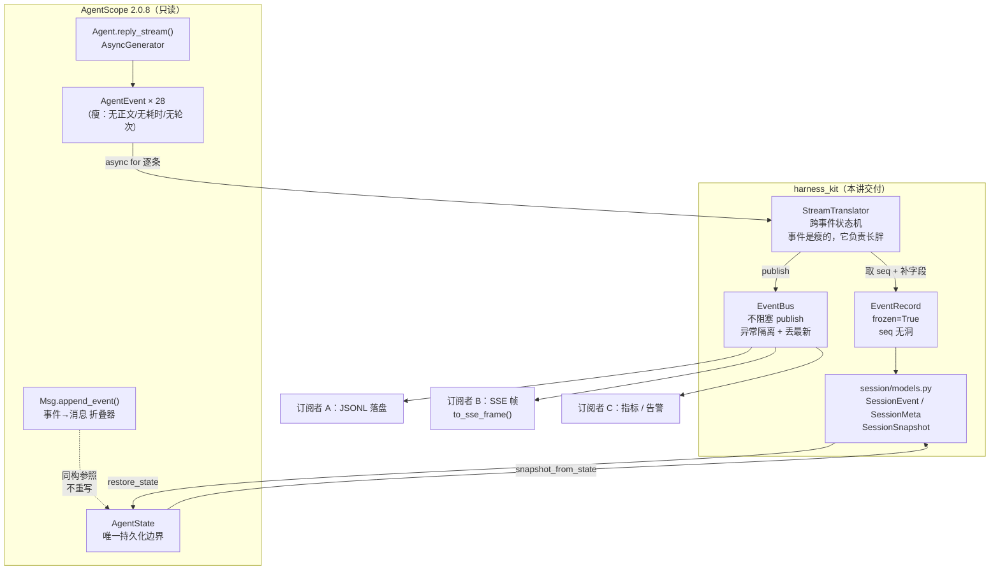

# 第 3 讲：AgentScope 核心解剖（二）：消息、块、事件与状态

> **本讲目标**：把 AgentScope 的**数据底座**彻底摊开 —— `Msg` 与六种 `ContentBlock`、
> `ToolCallState` / `ToolResultState` 两条状态轴、28 种 `AgentEvent` 的生命周期、
> `AgentState` 这个唯一的持久化边界；然后写出 `harness_kit/events/` 的
> **不可变事件日志 + 进程内事件总线**，把"只能在一个 `async for` 里被消费一次"的
> 事件流，变成"可订阅、可落盘、可转 SSE"的统一事件总线。
> **前置要求**：完成第 1、2 讲；`/Users/a/miniconda3/envs/agentscope_reme_pip_env/bin/python`
> 可用；`PYTHONPATH` 必须包含 `third_party/ReMe`（理由见第 1 讲）；
> `scripts/00_smoke.py` 与 `scripts/02_build_from_profile.py` 都能跑通。
> **本讲交付物**（相对仓库根）：
> `tutorial_agsc_reme/reference/harness_kit/events/types.py`、
> `tutorial_agsc_reme/reference/harness_kit/events/bus.py`、
> `tutorial_agsc_reme/reference/harness_kit/events/translate.py`、
> `tutorial_agsc_reme/reference/harness_kit/events/__init__.py`、
> `tutorial_agsc_reme/reference/harness_kit/session/models.py`、
> `tutorial_agsc_reme/reference/scripts/03_events_and_state.py`、
> `tutorial_agsc_reme/reference/scripts/03_event_bus_from_agent.py`、
> `tutorial_agsc_reme/reference/tests/test_lesson03_events.py`。
> **预计时长**：180 分钟。
>
> 本讲的完整可运行代码位于 `tutorial_agsc_reme/reference/harness_kit/...`，
> 你可以直接对照，也可以跟着正文一行一行写。

---

## 一、这一讲要解决的问题

第 2 讲我们把 Agent 装出来了：一份 YAML、一个 `HarnessBuilder`、一个原封不动的
`agentscope.agent.Agent`。但那只证明了**装配**是对的，还没有证明**观测**是可能的。

现在设想一个非常具体的生产场景，它在本教程后面每一讲都会出现：

> 你跑了一次 `reply`，模型调了 3 个工具，其中第 2 个被权限层拦下来问了用户，
> 用户点了"同意"，然后第 3 个工具报错了，模型最后给了一段解释。
> **这时候产品经理问你：这一次会话里，模型一共调了几次？花了多少 token？
> 哪个工具最慢？用户拒绝过什么？**

如果你手上只有 `AgentState`，你答不上来。因为 `state.context` 里只有**最终的消息**：
你看到一条 assistant 消息里有 3 个 `ToolCallBlock` 和 3 个 `ToolResultBlock`，
但**看不出**哪一次是模型第几轮想出来的、每次都花了多少 token、
哪个工具被问了用户、用户答的是什么、哪个工具是"被拒绝"而不是"执行失败"。
更糟的是，`compress_context` 会**原地替换** `state.context`
（`third_party/agentscope/src/agentscope/agent/_agent.py:743` 的 `self.state.context = msgs_to_reserve`），
压缩之后连"最终消息"都不完整了。这就是本契约 §1.3 的**缺口 1**：
**没有不可变事件日志**。

那么事件呢？AgentScope 明明有 28 种 `AgentEvent`，信息量很大。问题在于它们
**只活在一个 `async for` 里**。看这个真实的失败场景：

```python
# 反面教材：事件被"一次性消费"掉了
async for event in agent.reply_stream(UserMsg("user", "现在北京几点？")):
    if isinstance(event, ToolResultEndEvent):
        print("工具跑完了")          # ① 打印完就没了，② 写盘会拖慢主循环
```

这段代码有三个问题，每一个都会在生产里咬人：

1. **只有一个消费者**。同一轮 reply，落盘、SSE 推送、指标统计、Web UI 想并行消费
   同一条事件，只能在同一个循环里手写 `if/elif` 分发；
2. **消费者会拖慢 Agent**。`await` 写文件、`await` 发网络，都是在 Agent 的
   主循环里串行执行的 —— 订阅者慢 200ms，用户的对话就慢 200ms；
3. **没法事后订阅**。断线重连的浏览器、事后巡检的审计脚本，在事件"发生过"之后
   再想订阅，什么都拿不到。

这就是**缺口 2：没有 pub/sub 事件总线**。

本讲要解决的核心矛盾，可以一句话概括：

> **AgentScope 的事件是"瘦"的、"一次性的"、"没有正文的"；
> 日志需要的是"肥"的、"不可变的"、"可回溯的"。**
> 两者之间的落差，必须由我们写的一层翻译 + 一层总线上补齐。

这句话不是修辞。"瘦"有非常具体的含义，而且每一条都已经在源码里核过：

| 你以为事件里有的 | 实际上 | 源码位置 |
| --- | --- | --- |
| 工具调用的**入参** | 只有 `tool_call_id` + `tool_call_name`，入参是后续 N 条 `TOOL_CALL_DELTA` 拼出来的 | `third_party/agentscope/src/agentscope/event/_event.py:314`（`ToolCallStartEvent`）、`third_party/agentscope/src/agentscope/message/_block.py:149`（`input` 是"原始 JSON 字符串"） |
| 工具**输出正文** | `ToolResultEndEvent` 只有 `state` + `metadata`，**没有 output** | `third_party/agentscope/src/agentscope/agent/_agent.py:2021`（构造点只传了三个字段） |
| 模型**耗时** | `ModelCallEndEvent` 只有 token 数，没有耗时 | `third_party/agentscope/src/agentscope/event/_event.py:139`（`ModelCallEndEvent`） |
| **模型名** | 只在 `ModelCallStartEvent` 上，`ModelCallEndEvent` 上没有 | `third_party/agentscope/src/agentscope/event/_event.py:128`（`ModelCallStartEvent.model_name`） |
| 本次 reply 的**迭代轮次 / 工具次数** | 都没有，那是主循环的内部计数 | `third_party/agentscope/src/agentscope/event/_event.py:112`（`ReplyEndEvent` 只有 `finished_reason` / `error`） |

所以本讲的产出是一个**三件套**：

- `harness_kit/events/types.py` —— `EventRecord`（不可变、可落盘、永不修剪）与
  `EventKind`（9 种，是 28 种 `AgentEvent` 的**降维投影**）；
- `harness_kit/events/translate.py` —— `StreamTranslator`，一个**跨事件的小状态机**，
  把瘦事件"养成"肥记录；它和官方 `Msg.append_event` 是**同构**的东西，
  区别只在产物去处：官方的产物进 `state.context`，我们的产物进不可变日志；
- `harness_kit/events/bus.py` —— `EventBus`，进程内 pub/sub，`publish` 不阻塞、
  订阅者异常被吞掉、队列满丢最新。

外加一个**边界数据结构** `harness_kit/session/models.py`：事件怎么落成一行的
JSONL、`AgentState` 怎么切成快照。这四份文件就是本讲的全部交付物。

---

## 二、源码侦察

本讲的每一条结论都来自下面这些真实位置。先看**消息层**。

### 2.1 消息与块：六个块类，两条状态轴

```
third_party/agentscope/src/agentscope/message/_block.py:11    class TextBlock(BaseModel):
third_party/agentscope/src/agentscope/message/_block.py:26    class ThinkingBlock(BaseModel):
third_party/agentscope/src/agentscope/message/_block.py:83    class DataBlock(BaseModel):
third_party/agentscope/src/agentscope/message/_block.py:101   class HintBlock(BaseModel):
third_party/agentscope/src/agentscope/message/_block.py:138   class ToolCallBlock(BaseModel):
third_party/agentscope/src/agentscope/message/_block.py:195   class ToolResultBlock(BaseModel):
third_party/agentscope/src/agentscope/message/_block.py:131   class ToolCallState(StrEnum):
third_party/agentscope/src/agentscope/message/_block.py:185   class ToolResultState(StrEnum):
```

**这说明什么**：六个块类全是 pydantic `BaseModel`，没有共同基类 —— 所谓
`ContentBlock` 只是一个 `TypeAlias` 联合类型。所以任何"遍历块"的代码都得靠
`block.type` 这个 `Literal` 判别字段，而不是 `isinstance` 某个基类。

```
third_party/agentscope/src/agentscope/message/_block.py:141       model_config = ConfigDict(use_enum_values=True)
third_party/agentscope/src/agentscope/message/_block.py:198       model_config = ConfigDict(use_enum_values=True)
```

**这说明什么**：`ToolCallBlock.state` / `ToolResultBlock.state` 落下来**是裸字符串**
（`"finished"` 而不是 `ToolCallState.FINISHED`）。因为两个枚举都是 `StrEnum`，
`block.state == ToolCallState.FINISHED` 依然成立，但 `isinstance(block.state, ToolCallState)`
是 `False`。**任何拿 `is` 比较状态、或对状态做 `isinstance` 的代码都是错的**。

```
third_party/agentscope/src/agentscope/message/_block.py:101-104   class HintBlock(...) -> "... the hint block is converted into a user message."
third_party/agentscope/src/agentscope/formatter/_deepseek_formatter.py:90-112   {"role": "user", "content": block.hint}
```

**这说明什么**：`HintBlock` 是**唯一一个"存在 assistant 消息里、却被格式化成 user 消息"**
的块。所以它可以承载"系统注入给模型看、但不该进 system prompt（会破坏 prompt cache）"
的运行时信息 —— 时间、任务清单、上下文用量、结构化输出要求。第 14 / 19 讲都会用到它。

```
third_party/agentscope/src/agentscope/message/_base.py:33    def _assert_user_content_blocks(content):
third_party/agentscope/src/agentscope/message/_base.py:38            "User message can only contain text blocks or data blocks."
```

**这说明什么**：**tool_result 不允许出现在 user 消息里**。这不是风格问题，是构造期
`ValueError`。它直接决定了事件折叠的语义：一次工具调用的"调用 + 结果"必须双双落在
**assistant 消息**里，这也正是 `Msg.append_event` 的行为。

### 2.2 `Msg.append_event`：官方的"事件 → 消息"折叠器

```
third_party/agentscope/src/agentscope/message/_base.py:71    class Msg(BaseModel):
third_party/agentscope/src/agentscope/message/_base.py:244   def append_event(self, event: AgentEvent) -> Self:
third_party/agentscope/src/agentscope/message/_base.py:264       if event.reply_id != self.id:
third_party/agentscope/src/agentscope/message/_base.py:156   def get_text_content(self, separator: str = "\n") -> str | None:
third_party/agentscope/src/agentscope/message/_base.py:520   def append_usage(self, usage: Usage) -> Self:
```

**这说明什么**（四条，都是我们翻译器要照着做的）：

1. `append_event` 的**第一道门槛是 `reply_id`**（`:264`）—— 对不上就 `logger.warning`
   然后原样返回。这解释了为什么 `CustomEvent` **根本折不了**：它没有 `reply_id` 字段
   （`event/_event.py:534`），会直接 `AttributeError`；
2. 它是**原地修改** `self.content`（`append` / `+=`），不是"返回一个新消息"；
3. `TEXT_BLOCK_START` 会 `new` 一个 `TextBlock(id=block_id, text="")`，后续 DELTA
   往里 `+=` —— **块是折叠器现场造出来的，事件里没有块对象**；
4. `MODEL_CALL_END` 走 `append_usage`（`:520`）是**累加**，不是赋值。所以"一次 reply
   只有一份 usage，多次模型调用累加进去"，这也是 `Msg.usage` 的正确读法。

### 2.3 事件的形状：TypeAlias、`use_enum_values`、以及"输入不是输出"

```
third_party/agentscope/src/agentscope/event/_event.py:26     class EventType(StrEnum):
third_party/agentscope/src/agentscope/event/_event.py:70     class EventBase(BaseModel):
third_party/agentscope/src/agentscope/event/_event.py:73         model_config = ConfigDict(use_enum_values=True)
third_party/agentscope/src/agentscope/event/_event.py:77         created_at: str = Field(default_factory=lambda: datetime.now().isoformat())
third_party/agentscope/src/agentscope/event/_event.py:83     class ReplyStartEvent(EventBase):
third_party/agentscope/src/agentscope/event/_event.py:431    class ExceedMaxItersEvent(EventBase):
third_party/agentscope/src/agentscope/event/_event.py:534    class CustomEvent(EventBase):
third_party/agentscope/src/agentscope/event/_event.py:568    AgentEvent: TypeAlias = (
```

**这说明什么**：

- `AgentEvent` 是 **`TypeAlias` 联合类型，不是一个类**。所以
  `AgentEvent.model_validate(d)` 会抛 `AttributeError`，反序列化必须用
  `TypeAdapter(AgentEvent).validate_python(d)`。这一点在写日志回放（第 9 讲）时会直接撞上；
- `created_at` 是 **`datetime.now().isoformat()` 的字符串**（`:77`），
  naive、本地时区、**构造时取**。所以想测"两次事件之间隔了多久"，
  事件对象必须在**要用它的那一刻**才构造（第 5 节的合成流就是这么写的）；
- `ExceedMaxItersEvent`（`:431`）已被标记 deprecated，语义搬到了
  `ReplyEndEvent.finished_reason`，**但仍在 `EventType` 里**。所以"28 种事件"
  里有 1 种是活的化石 —— 我们的口径必须显式把它归到"跳过"里，而不是当它不存在；
- `CustomEvent`（`:534`）只有 `name` / `value` 两个业务字段，是官方的**逃生舱**：
  服务层要通知前端的事（任务进度、团队变化、权限更新）不必污染核心枚举。
  **记忆命中（`MEMORY_HIT`）就靠它**——因为 AgentScope 侧根本没有记忆事件。

```
third_party/agentscope/src/agentscope/agent/_agent.py:288    async def reply_stream(...)
third_party/agentscope/src/agentscope/agent/_agent.py:332    async def reply(...)
third_party/agentscope/src/agentscope/agent/_agent.py:290-296  inputs: Msg | list[Msg] | UserConfirmResultEvent | ...
```

**这说明什么**（本讲最值钱的一条）：`reply_stream` 的入参不只有 `Msg`，
还可以是 `UserConfirmResultEvent` / `UserInterruptEvent` / `ExternalExecutionResultEvent`。
它们是**输入**，AgentScope **不会**把它们再回吐成一条事件。于是：事件流里
**只有 ask、没有 allow**。审计日志要记"用户批准了"，就只能由调用方自己报账
（这就是 `StreamTranslator.note_confirmation` 存在的唯一理由，第 5 节有实测输出）。

### 2.4 `AgentState`：唯一的持久化边界

```
third_party/agentscope/src/agentscope/state/_state.py:209    class AgentState(BaseModel):
third_party/agentscope/src/agentscope/state/_state.py:298    def append_context(self, name, blocks) -> None:
third_party/agentscope/src/agentscope/state/_state.py:328    def has_awaiting_tool_calls(self, name: str) -> bool:
third_party/agentscope/src/agentscope/state/_state.py:374    def get_unfinished_tool_calls(self, name: str) -> list[ToolCallBlock]:
```

**这说明什么**：

- `AgentState` 是唯一需要持久化的对象（第 9 讲把它落盘）。它的顶层字段是
  `session_id / summary / context / reply_context / permission_context /
  tool_context / tasks_context / middle_context` —— 一份 JSON 就是一个会话的全部状态；
- `append_context`（`:298`）是**三条件**判定：`context` 非空 + 尾部是 assistant +
  尾部 `name` 相同 + 尾部 `id == state.reply_id`，四条全满足才 `extend`，
  否则**新建一条** assistant 消息。所以"一次 reply = 一条消息"这句话的准确版本是：
  **同一个 `reply_id` 内的所有块会被合并进同一条消息**；
- HITL 断点**没有独立的 flag 字段**，完全从 `context` 尾部推导
  （`:328` / `:374`）。这意味着"恢复一个挂起的会话"不需要额外状态 ——
  但反过来，**任何对 context 尾部的篡改都会改变断点判定**。

### 2.5 工具层：默认权限是 ASK

```
third_party/agentscope/src/agentscope/tool/_adapters.py:36    class FunctionTool(ToolBase):
third_party/agentscope/src/agentscope/tool/_adapters.py:132           behavior=PermissionBehavior.ASK,
third_party/agentscope/src/agentscope/tool/_toolkit.py:88     def __init__(self, tools=None, ...)
third_party/agentscope/src/agentscope/tool/_toolkit.py:640    async def add_tool(...)
```

**这说明什么**：自己写的函数工具**默认会被拦下来问用户**。所以任何"我以为它会直接跑"
的脚本都会卡在 `RequireUserConfirmEvent` 上 —— 这不是 bug，是设计（第 11 讲的权限引擎
就是围绕它建的）。本讲第 5 节的第二个脚本会把这条路径完整跑一遍，把 park → 确认 →
继续三段都变成可复现的输出。

### 2.6 本讲用到的扩展点清单（全部是"读源码 → 找扩展点"的结果）

| 扩展点 | 类型 | 文件:行 | 本讲怎么用 |
| --- | --- | --- | --- |
| `AgentEvent` | `TypeAlias` 联合（28 个成员） | `third_party/agentscope/src/agentscope/event/_event.py:568` | `StreamTranslator._project` 的输入；用 `EventType` 判别 |
| `EventType` | `StrEnum` | `third_party/agentscope/src/agentscope/event/_event.py:26` | 事件映射表的两把钥匙（`HANDLED` / `IGNORED`） |
| `CustomEvent` | 事件子类（逃生舱） | `third_party/agentscope/src/agentscope/event/_event.py:534` | `MEMORY_HIT` / `HINT_BLOCK` / `USER_INTERRUPT` 的落点 |
| `Msg.append_event` | 实例方法（折叠器） | `third_party/agentscope/src/agentscope/message/_base.py:244` | 同构参照物 + 第 5 节 B 段实证 |
| `Msg.get_text_content` | 实例方法 | `third_party/agentscope/src/agentscope/message/_base.py:156` | 断言"没有文本块返回 None" |
| `AgentState` | pydantic 模型 | `third_party/agentscope/src/agentscope/state/_state.py:209` | `snapshot_from_state` / `restore_state` 的两端 |
| `AgentState.append_context` | 实例方法 | `third_party/agentscope/src/agentscope/state/_state.py:298` | 实证"一次 reply = 一条消息" |
| `AgentState.has_awaiting_tool_calls` | 实例方法 | `third_party/agentscope/src/agentscope/state/_state.py:328` | 断点判定，无独立 flag |
| `Agent.reply_stream` | 异步生成器 | `third_party/agentscope/src/agentscope/agent/_agent.py:288` | 唯一的事件源；`consume` 的直接输入 |
| `UserConfirmResultEvent` | 事件（也是入参） | `third_party/agentscope/src/agentscope/agent/_agent.py:290-296` | HITL 恢复路径；解释 `note_confirmation` |
| `FunctionTool` | `ToolBase` 适配器 | `third_party/agentscope/src/agentscope/tool/_adapters.py:36` | 造真实工具；默认 ASK 权限 |
| `Toolkit` | 工具容器 | `third_party/agentscope/src/agentscope/tool/_toolkit.py:88` | 用 `Toolkit(tools=[...])`，不自己写工具系统 |

**一个都不重写**：本讲的代码里没有 `Agent` 的子类、没有 `ChatModelBase` 的实现、
没有手写的 ReAct 循环。`StreamTranslator` 的输入是**官方生成器 yield 出来的对象**，
`EventBus` 里流动的是**我们自己的 `EventRecord`**（刻意不依赖 agentscope，
这样 ReMe 侧、权限侧、评测侧自造的事件也能走同一条总线）。这就是层与层的关系：
**上层翻译官方事件，下层被所有人依赖，谁也不去改官方**。

---

## 三、扩展点定位与设计

### 3.1 官方已经给了什么

上一节把证据都摆出来了，这里只做归纳。官方**已经给**我们的有三样东西，而且质量都很高：

**（1）一条完整、有序、带增量的实时事件流。**
`Agent.reply_stream`（`third_party/agentscope/src/agentscope/agent/_agent.py:288`）
yield 的对象已经包含了做实时 UI 所需的一切：文本增量、思考增量、工具入参增量、
工具结果增量、数据块增量，一个字符都不少。**我们不需要重新实现 SSE 的数据源。**

**（2）一个官方的"事件 → 消息"折叠器。**
`Msg.append_event`（`third_party/agentscope/src/agentscope/message/_base.py:244`）
已经把"28 种事件怎么变成 6 种块"这件事写清楚了，而且顺带处理了三件容易出错的细节：
`TOOL_RESULT_END` 会把配对的 `ToolCallBlock` 一并置为 `FINISHED`（`:470`）、
`DATA_BLOCK_DELTA` 的 base64 分片是"先解码、拼字节、再编码"而不是字符串拼接（`:342`）、
`USER_CONFIRM_RESULT` 只对 `ASKING` 状态的调用生效（防迟到事件把已经结束的调用改坏）。
**我们不重写它，而是把它当作"语义参照物"**：凡是我们折叠器做出的选择，
都要能在它这里找到依据。

**（3）一个唯一、可序列化的持久化边界。**
`AgentState`（`third_party/agentscope/src/agentscope/state/_state.py:209`）
本身就是一个 pydantic 模型，`model_dump(mode="json")` 出来就是一份完整的会话状态，
没有任何外部引用、没有不可序列化的字段。**恢复会话不需要我们发明格式。**

### 3.2 还缺什么

| 缺口 | 本讲要补的东西 | 为什么非补不可 |
| --- | --- | --- |
| **缺口 1**：没有不可变事件日志（`AgentState.context` 是唯一持久化边界，且被 `compress_context` 原地替换，见 `third_party/agentscope/src/agentscope/agent/_agent.py:743`） | `EventRecord` + `SessionEvent` + JSONL 落盘 | 压缩之后 `context` 就不是历史了；审计、计费、回溯全都需要一份**不会被改写的**事实记录 |
| **缺口 2**：没有 pub/sub 事件总线（事件只能在一个 `async for` 里被消费） | `EventBus` + `Subscription` | 落盘 / SSE / 指标 / UI 要并行消费同一条事件；消费者不能拖慢主循环；断线重连要能补事件 |

### 3.3 我们准备在哪个扩展点上做

**一句话：我们不扩展 AgentScope，我们在它外面加两层。**

这个区分非常重要，因为它是本教程全 20 讲的最高优先级约束
（本契约 §10.1「绝不重写内核」）。具体到本讲的三份文件：

| 文件 | 用的是哪种"扩展点" | 具体形式 |
| --- | --- | --- |
| `events/types.py` | **纯数据**：不继承任何 AgentScope 类 | `EventRecord` 是独立 pydantic 模型；`EventKind(StrEnum)` 是 `EventType` 的**降维投影**（28 → 9） |
| `events/translate.py` | **消费式扩展**：`async for` 官方生成器 | `StreamTranslator` 不是 `Agent` 的子类、不碰 `_reply_impl`；它只做 `agent.reply_stream(...)` 的消费者 |
| `events/bus.py` | **满足既有 Protocol**：`harness_kit/middleware/tracing.py:67` 的 `EventBusLike` | `EventBus` 的 `publish(topic, record) -> int` 形状与那个 Protocol 完全一致，第 8/20 讲的中间件与 SSE 路由可以直接用 |

三份文件之间的依赖方向必须是**严格 DAG**，这是设计时最容易踩空的地方：

```
   agentscope.event (官方，28 种 AgentEvent)
            │
            │  async for
            ▼
   events/translate.py  ──── 依赖 ────▶  session/models.py (preview / INPUT_PREVIEW_LIMIT)
            │                                      │
            │  publish(kind, record)               │  依赖
            ▼                                      ▼
   events/bus.py  ──── 依赖 ────▶  events/types.py (EventRecord / EventKind)
```

于是 `events/__init__.py` 只能导出 `types` + `bus` 两层，**不能导出 `translate`**：
因为 `translate → session.models → events/__init__`，一旦门面 import 了 `translate`，
就形成环，在"先 import session"的进程里直接 `ImportError`。这不是洁癖，
是 `harness_kit/session/__init__.py:29` 真的会先 import store / replay / resume
（第 9 讲的模块），它们都会 `import harness_kit.session.models`。

### 3.4 设计图



图里有三条**刻意画成虚线/分叉**的关系，是这一讲最容易做错的地方：

1. **`append_event` 与 `StreamTranslator` 是并行的两条路，不是一条。**
   官方的折叠器产出"消息"（进 `state.context`），我们的翻译器产出"记录"（进日志）。
   两者**都读同一个事件流**，但一个事件的 `seq` 只在我们这边有。
   把它们混成一条（比如"从 `state.context` 反推日志"）会立刻丢掉顺序与耗时。
2. **`EventBus` 不依赖 agentscope。** 总线上流动的是 `EventRecord`，
   所以 ReMe 的记忆命中、权限层的拒绝、评测器的打分，都可以走同一条总线，
   而不需要把自己伪装成 `AgentEvent`。
3. **`AgentState` 与日志是双向的。** 快照 + 尾部事件重放才能恢复会话（第 9 讲），
   所以 `SessionSnapshot.seq` 必须**精确对齐**某个 `EventRecord.seq` —— 这就是
   契约 §5.2 不变式 3 的来历。

### 3.5 三个必须当场定下来的设计决策

**决策一：`seq` 的权威放在翻译器，且"取号"发生在"确定要产出记录"之后。**

`seq` 是契约 §5.2 不变式 1 的主角（会话内从 0 起、严格递增、无洞）。
如果先取号再判断"这条事件要不要记"，那么被跳过的事件（28 种里有 16 种不落记录）
就会在日志里留下 16 个空洞。所以顺序必须是：**先 `_project` 得到 payload，
再取号**。反过来，如果"取号成功但投递失败"，必须把号退回去
（`_rollback_seq`），否则同样留洞 —— 这一点在写第一版时漏掉了，
是第 5 节的单测 `test_translator_rolls_back_seq_on_publish_failure` 抓出来的。

**决策二：背压策略是"丢最新"，不是"阻塞"也不是"丢最老"。**

这是观测旁路，所以第一原则是**绝不能把观测失败升级成对话失败**。三个选项里：

- 阻塞（`await queue.put`）→ 订阅者慢，Agent 就慢，直接违反本讲要解决的问题；
- 丢最老 → 排障时日志会出现"前面有、中间有洞、后面又有"的诡异形态，
  比缺一段更难查；
- 丢最新 → 丢的是**尾部**，前缀始终连续，而且 `dropped` 计数与 warning 日志
  会明确告诉你"丢了第 N 条"。

**决策三：`ask` 与 `allow` 要分两条记录，而 `allow` 只能由调用方报账。**

这是跑真代码才发现的（第 5 节第二段输出的 seq=04 与 seq=05）：
`UserConfirmResultEvent` 是 `reply_stream` 的**入参**
（`third_party/agentscope/src/agentscope/agent/_agent.py:290-296`），
AgentScope 不会把它当事件回吐。翻译器只能看见流，看不见调用方手里的答案，
所以 `StreamTranslator.note_confirmation(...)` 是一个必要的方法 ——
和 `note_input(...)` 完全对称：**事件流不携带、但审计必须留痕的信息，由调用方标注**。

---

## 四、harness_kit 实现

本节逐个文件给出**完整代码**（不是片段，没有一个 `...`）。每个文件的代码与
`tutorial_agsc_reme/reference/harness_kit/` 下的真实文件**逐字一致**，
可以用 §五 5.4 的 `sha256` 命令自行核对。

五个文件的阅读顺序与依赖方向一致：

```
events/types.py        （纯数据：EventKind / EventRecord / topic_matches）
      ↑
      ├── events/bus.py        （并发：EventBus / Subscription，不依赖 agentscope）
      │          ↑
      │     events/translate.py（翻译：StreamTranslator，唯一 import agentscope 的文件）
      │
      └── session/models.py    （持久化：SessionEvent / SessionMeta / SessionSnapshot）
                ↑
           events/__init__.py （门面：只导出 types + bus，**故意不导出 translate**）
```

读的顺序建议是 **`types.py` → `session/models.py` → `bus.py` → `translate.py` → `__init__.py`**，
理由：

- `types.py` 和 `session/models.py` 是"名词表"，本讲所有讨论（seq、payload、快照）
  的词汇都在里面，先读它们，后面两个文件里出现的每个字段名你都已经认识了；
- `bus.py` 是纯并发代码，**不 import agentscope 也不 import pydantic 之外的东西**，
  读它的时候脑子里不需要同时装 28 种事件；
- `translate.py` 是全场最长的文件，它同时要认识 agentscope 的 28 种事件、
  9 种 `EventKind`、`EventRecord` 的 payload 契约，所以放最后；
- `__init__.py` 只有 53 行，但它决定了"别人 `import harness_kit.events` 时会拿到什么"，
  放在最后读，你才会同意它为什么必须这么克制。

### 4.1 `harness_kit/events/types.py`

<!-- file: harness_kit/events/types.py -->
```python
# -*- coding: utf-8 -*-
"""不可变事件记录（``EventRecord`` / ``EventKind``）。

与 AgentScope 的 ``AgentEvent`` 的关键区别：

- ``AgentEvent`` 只在**一次 reply 的流**里存在，出了流就没了
  （``third_party/agentscope/src/agentscope/event/_event.py:83`` 起是全部事件类）；
- ``EventRecord`` 是可序列化、可落盘、**永不修剪**的审计记录，是 harness_kit
  「会话事件溯源」的地基（第 3 / 第 9 讲）。

不变式（第 9 讲正文必须断言）：

1. 同一 ``session_id`` 内 ``seq`` 严格递增且无洞，从 0 开始；
2. ``EventRecord`` 一经 append 永不修改、永不删除（``frozen=True``）；
3. ``SessionSnapshot.seq`` 必须等于某个已存在的 ``EventRecord.seq``；
4. 从 ``snapshot.seq + 1`` 开始重放尾部事件，必须能重建出与 ``snapshot.agent_state``
   同构的状态。
"""

from datetime import datetime, timezone
from enum import StrEnum
from typing import Any
from uuid import uuid4

from loguru import logger
from pydantic import BaseModel, ConfigDict, Field

WILDCARD_TOPIC: str = "*"
"""订阅全部主题的通配符（``EventBus.subscribe("*", handler)``）。"""


class EventKind(StrEnum):
    """事件种类。字符串值即落盘值，一旦发布不得改名。"""

    SESSION_START = "session_start"
    REPLY_START = "reply_start"
    MODEL_CALL = "model_call"
    TOOL_CALL = "tool_call"
    TOOL_RESULT = "tool_result"
    PERMISSION = "permission"
    MEMORY_HIT = "memory_hit"
    REPLY_END = "reply_end"
    CUSTOM = "custom"


PAYLOAD_FIELDS: dict[EventKind, tuple[str, ...]] = {
    EventKind.SESSION_START: ("profile", "agent_name", "cwd"),
    EventKind.REPLY_START: ("reply_id", "input_preview"),
    EventKind.MODEL_CALL: (
        "model",
        "prompt_tokens",
        "completion_tokens",
        "latency_ms",
        "finished_reason",
    ),
    EventKind.TOOL_CALL: ("tool_name", "tool_input_digest", "call_id"),
    EventKind.TOOL_RESULT: ("call_id", "state", "chars", "error"),
    EventKind.PERMISSION: ("tool_name", "behavior", "reason"),
    EventKind.MEMORY_HIT: ("query", "chunk_ids", "kept", "tokens"),
    EventKind.REPLY_END: ("reply_id", "iterations", "tool_calls"),
    EventKind.CUSTOM: ("name", "data"),
}
"""每种 ``kind`` 的 ``payload`` 必备字段（契约 §5.2 的硬约定）。

只做「必备字段」校验，不禁止生产者多塞字段：生产中常常需要把
``tenant_id`` / ``trace_id`` 一并带上，多出来的键由消费方自行解释。
"""


def topic_matches(topic: str | EventKind, kind: EventKind) -> bool:
    """判断一个订阅主题是否命中某个事件种类（事件过滤的唯一规则）。

    ``*`` 命中全部；其余情况按**相等**匹配。因为 :class:`EventKind` 继承
    ``StrEnum``，``EventKind.TOOL_CALL == "tool_call"`` 为 ``True``，
    所以订阅方写枚举或字符串都能工作。

    Args:
        topic (`str | EventKind`): 订阅时登记的主题。
        kind (`EventKind`): 事件的种类。

    Returns:
        `bool`: 命中为 ``True``。

    Example:
        >>> topic_matches("*", EventKind.CUSTOM)
        True
        >>> topic_matches("tool_call", EventKind.TOOL_CALL)
        True
        >>> topic_matches("tool_call", EventKind.MEMORY_HIT)
        False
    """
    if topic == WILDCARD_TOPIC:
        return True
    return kind == topic


def utc_now() -> datetime:
    """返回当前 UTC 时间（tz-aware）。

    Returns:
        `datetime`: 带 ``timezone.utc`` 时区的当前时间。
    """
    return datetime.now(timezone.utc)


class EventRecord(BaseModel):
    """不可变事件记录：可序列化、可落盘、永不修剪。"""

    model_config = ConfigDict(frozen=True)

    event_id: str = Field(default_factory=lambda: uuid4().hex)
    """事件 id，``uuid4().hex``。"""

    session_id: str
    """所属会话 id。"""

    seq: int = Field(ge=0)
    """会话内单调递增序号，从 0 开始且无洞。"""

    kind: EventKind
    """事件种类，决定 ``payload`` 的 schema（见 :data:`PAYLOAD_FIELDS`）。"""

    ts: datetime = Field(default_factory=utc_now)
    """事件时间，一律 UTC 且 tz-aware。"""

    payload: dict[str, Any] = Field(default_factory=dict)
    """事件负载，字段约定见 :data:`PAYLOAD_FIELDS`。"""

    source: str = "harness_kit"
    """事件生产者标识。"""

    def missing_payload_fields(self) -> list[str]:
        """返回本记录 ``payload`` 中缺失的必备字段。

        Returns:
            `list[str]`: 缺失字段名；为空表示符合契约。
        """
        required = PAYLOAD_FIELDS.get(self.kind, ())
        return [name for name in required if name not in self.payload]

    def warn_if_incomplete(self) -> list[str]:
        """校验 ``payload`` 并在缺字段时打一条 warning 日志。

        Returns:
            `list[str]`: 缺失字段名；为空表示符合契约。
        """
        missing = self.missing_payload_fields()
        if missing:
            logger.bind(
                session_id=self.session_id,
                event_id=self.event_id,
            ).warning(
                "EventRecord(kind={}) payload 缺少契约字段: {}",
                self.kind.value,
                missing,
            )
        return missing
```

**为什么这么写（四个决定，都会在后面被引用）：**

1. **`EventKind` 是 `EventType` 的降维投影，不是它的复制品。**
   官方有 28 种 `EventType`（`third_party/agentscope/src/agentscope/event/_event.py:29-67`），
   但对"审计/SSE/指标"这三类消费场景来说，很多种类的形状是一模一样的
   （例如 `TextBlockDeltaEvent` 与 `ThinkingBlockDeltaEvent` 的差异只是"写到哪个块"）。
   所以 `EventKind` 只有 9 个成员（`types.py:32`），映射关系在
   `translate.py:_project` 里**显式写成一张 `match` 表**——投影规则必须是可读的、
   可被单测逐条钉住的，不能藏在一串 `if` 里。
2. **`EventRecord` 是 `frozen=True` 的（`types.py:106`）。**
   这是缺口 1 的正面回答：`AgentState.context` 会被 `compress_context` **原地替换**
   （`third_party/agentscope/src/agentscope/agent/_agent.py:743` 的 `self.state.context = msgs_to_reserve`），
   而不可变的事件记录不会。审计日志一旦可写，就不再是审计日志。
3. **`payload` 的字段名是**契约**，不是"顺手起的名字"。**
   `EventRecord.missing_payload_fields`（`types.py:132`）与
   `warn_if_incomplete`（`types.py:141`）把契约 §5.3 的"每种 kind 至少要有哪些字段"
   变成可执行的检查：SSE 前端按 `payload["text_delta"]` 取值，
   落盘脚本按 `payload["tool_name"]` 建索引，任何一处改名都会在这里被抓住。
4. **`topic_matches`（`types.py:70`）把"通配订阅"做成了纯函数。**
   总线的订阅是 `bus.subscribe("*", handler)` 这种形状，通配符的语义
   （`*` 全匹配、`a.*` 前缀匹配、精确名匹配）必须是**独立的、可单测的**函数，
   而不是散在 `Subscription.matches` 里的一行 `if` —— 它是唯一一处
   "字符串 → 是否投递"的判定，错一个字符就是静默不投递。

### 4.2 `harness_kit/session/models.py`

<!-- file: harness_kit/session/models.py -->
```python
# -*- coding: utf-8 -*-
"""会话与事件记录的数据结构（契约 §3.3 / §5.2）。

三个模型的分工：

- :class:`SessionMeta` —— 会话的**索引卡片**（不含正文），``list_sessions()`` 返回它；
- :class:`SessionEvent` —— **落盘形态**：``EventRecord`` 外面套一层 ``v`` 版本号，
  将来要改 ``payload`` 的 schema 时靠它做迁移；
- :class:`SessionSnapshot` —— ``AgentState`` 的**序列化切片**，恢复会话的锚点。

与 AgentScope 的关系：``AgentState`` 是 AgentScope 唯一的持久化边界
（``third_party/agentscope/src/agentscope/state/_state.py:209``），
:func:`snapshot_from_state` / :func:`restore_state` 就是它和
:class:`SessionSnapshot` 之间的双向通道。事件流本身则对应
``Agent`` 的 ``reply_stream`` 产出的 ``AgentEvent``
（``third_party/agentscope/src/agentscope/agent/_agent.py:288``），
由第 3 讲的 ``events/translate.py`` 翻译成 :class:`~harness_kit.events.EventRecord`，
再经类的:class:`SessionEvent` 落盘。

**不变式**（契约 §5.2 硬约定，本模块用 :func:`check_seq_invariants` 强制）：

1. 同一 ``session_id`` 内 ``seq`` 严格递增且无洞；
2. ``EventRecord`` 一经 append 永不修改、永不删除（``frozen=True`` 在
   :mod:`harness_kit.events.types` 里保证）；
3. ``SessionSnapshot.seq`` 必须等于某个已存在的 ``EventRecord.seq``；
4. 从 ``snapshot.seq + 1`` 开始重放尾部事件，必须能重建同构的 ``AgentState``。
"""

from __future__ import annotations

from datetime import datetime
from typing import Any, Iterable, Sequence

from pydantic import BaseModel, ConfigDict, Field, model_validator

from harness_kit.events import EventRecord, EventKind, utc_now

__all__ = [
    "INPUT_PREVIEW_LIMIT",
    "SESSION_SCHEMA_VERSION",
    "SessionInvariantError",
    "SessionEvent",
    "SessionMeta",
    "SessionSnapshot",
    "check_seq_invariants",
    "next_seq",
    "preview",
    "restore_state",
    "snapshot_from_state",
    "tail_events",
]

SESSION_SCHEMA_VERSION: int = 1
"""``SessionEvent.v`` 的当前值。改动落盘结构时 +1，并在 store 里加迁移分支。"""

INPUT_PREVIEW_LIMIT: int = 500
"""``REPLY_START.payload["input_preview"]`` 的截断长度（契约 §5.2 表格硬约定）。"""


class SessionInvariantError(ValueError):
    """会话事件流违反了契约 §5.2 的不变式。"""


def preview(text: str, limit: int = INPUT_PREVIEW_LIMIT) -> str:
    """截断成预览串。事件日志**不存**完整输入，只存预览。

    Args:
        text (`str`): 原始文本。
        limit (`int`): 最大字符数，默认 :data:`INPUT_PREVIEW_LIMIT`。

    Returns:
        `str`: 截断后的文本（超出时追加 ``"..."``）。

    Example:
        >>> preview("a" * 600)[-3:]
        '...'
        >>> len(preview("a" * 600))
        503
    """
    if len(text) <= limit:
        return text
    return text[:limit] + "..."


class SessionMeta(BaseModel):
    """会话索引卡片（契约 §3.3）。

    Attributes:
        session_id (`str`): 会话 id。
        profile_name (`str`): 使用的 Profile 名。
        created_at (`datetime`): 创建时间（UTC, tz-aware）。
        updated_at (`datetime`): 最后写入时间（UTC, tz-aware）。
        event_count (`int`): 事件条数，非负。
        tags (`list[str]`): 自由标签。
    """

    session_id: str = Field(min_length=1)
    profile_name: str = Field(min_length=1)
    created_at: datetime
    updated_at: datetime
    event_count: int = Field(default=0, ge=0)
    tags: list[str] = Field(default_factory=list)

    @model_validator(mode="after")
    def _check_time_order(self) -> "SessionMeta":
        """校验 ``updated_at >= created_at`` 且两者都 tz-aware。

        Returns:
            `SessionMeta`: 校验通过的自身。

        Raises:
            ValueError: 时间顺序颠倒，或丢掉了时区。
        """
        if self.created_at.tzinfo is None or self.updated_at.tzinfo is None:
            raise ValueError(
                "created_at / updated_at 必须是 tz-aware 的 UTC 时间"
                "（裸 datetime 在不同机器上会读出不同时刻）",
            )
        if self.updated_at < self.created_at:
            raise ValueError(
                f"updated_at({self.updated_at.isoformat()}) 早于 "
                f"created_at({self.created_at.isoformat()})",
            )
        return self

    @classmethod
    def create(
        cls,
        session_id: str,
        *,
        profile_name: str,
        tags: Sequence[str] | None = None,
    ) -> "SessionMeta":
        """新建一张卡片，两个时间戳取同一时刻。

        Args:
            session_id (`str`): 会话 id。
            profile_name (`str`): Profile 名。
            tags (`Sequence[str] | None`): 初始标签。

        Returns:
            `SessionMeta`: 新建的卡片。
        """
        now = utc_now()
        return cls(
            session_id=session_id,
            profile_name=profile_name,
            created_at=now,
            updated_at=now,
            tags=list(tags or []),
        )

    def touched(self, *, event_count: int | None = None) -> "SessionMeta":
        """返回一份 ``updated_at`` 刷新过的副本（卡片本身不可变地更新）。

        Args:
            event_count (`int | None`): 新的事件计数；``None`` 表示沿用旧值。

        Returns:
            `SessionMeta`: 新卡片。
        """
        payload = self.model_dump()
        payload["updated_at"] = utc_now()
        if event_count is not None:
            payload["event_count"] = event_count
        return SessionMeta.model_validate(payload)


class SessionEvent(BaseModel):
    """落盘形态：:class:`EventRecord` + 版本号（契约 §3.3）。

    Attributes:
        v (`int`): schema 版本，见 :data:`SESSION_SCHEMA_VERSION`。
        record (`EventRecord`): 真正的事件记录。
    """

    v: int = Field(default=SESSION_SCHEMA_VERSION, ge=1)
    record: EventRecord

    @classmethod
    def wrap(cls, record: EventRecord) -> "SessionEvent":
        """把一个 :class:`EventRecord` 包成落盘形态。

        Args:
            record (`EventRecord`): 事件记录。

        Returns:
            `SessionEvent`: 包装结果。
        """
        return cls(v=SESSION_SCHEMA_VERSION, record=record)

    @property
    def seq(self) -> int:
        """``record.seq`` 的快捷访问（排序、切片时最常用）。

        Returns:
            `int`: 事件序号。
        """
        return self.record.seq

    @property
    def kind(self) -> EventKind:
        """``record.kind`` 的快捷访问。

        Returns:
            `EventKind`: 事件类型。
        """
        return self.record.kind

    def to_json_line(self) -> str:
        """序列化成一行 JSONL（不含换行符）。

        Returns:
            `str`: 单行 JSON。
        """
        return self.model_dump_json()


class SessionSnapshot(BaseModel):
    """``AgentState`` 的序列化切片（契约 §3.3 / §5.2）。

    Attributes:
        session_id (`str`): 会话 id。
        seq (`int`): 快照覆盖到的 ``seq``（含）。
        agent_state (`dict[str, Any]`): ``AgentState.model_dump(mode="json")``。
        created_at (`datetime`): 生成时间（UTC, tz-aware）。
    """

    model_config = ConfigDict(extra="forbid")

    session_id: str = Field(min_length=1)
    seq: int = Field(ge=-1)
    agent_state: dict[str, Any]
    created_at: datetime = Field(default_factory=utc_now)

    @model_validator(mode="after")
    def _check_state_payload(self) -> "SessionSnapshot":
        """校验 ``agent_state`` 是映射且带 ``session_id``，时间戳带时区。

        ``seq`` 允许 ``-1``：表示"还没发生过任何事件"的空快照，
        恢复时等价于全新会话。其余情况由 :func:`check_seq_invariants` 和
        store 层校验"必须命中某个已存在的 seq"。

        Returns:
            `SessionSnapshot`: 校验通过的自身。

        Raises:
            ValueError: 时间戳丢时区，或 ``agent_state`` 缺 ``session_id``。
        """
        if self.created_at.tzinfo is None:
            raise ValueError("SessionSnapshot.created_at 必须是 tz-aware 的 UTC 时间")
        if "session_id" not in self.agent_state:
            raise ValueError(
                "SessionSnapshot.agent_state 必须含 'session_id'"
                "（它是 AgentState.model_dump(mode='json') 的产物）",
            )
        return self

    @property
    def is_empty(self) -> bool:
        """是否是"什么都没发生"的空快照。

        Returns:
            `bool`: ``seq == -1`` 时为 ``True``。
        """
        return self.seq < 0


def snapshot_from_state(
    agent_state: Any,
    *,
    seq: int,
    created_at: datetime | None = None,
) -> SessionSnapshot:
    """``AgentState`` → :class:`SessionSnapshot`（契约 §3.3 的 store 只读接口用）。

    Args:
        agent_state (`Any`): AgentScope ``AgentState``；必须是 pydantic 模型，
            以便调用 ``model_dump(mode="json")``。
        seq (`int`): 快照覆盖到的 ``seq``。
        created_at (`datetime | None`): 生成时间；``None`` 用当前 UTC。

    Returns:
        `SessionSnapshot`: 快照。

    Raises:
        TypeError: ``agent_state`` 没有 ``model_dump``（不是 pydantic 模型）。
    """
    dumper = getattr(agent_state, "model_dump", None)
    if not callable(dumper):
        raise TypeError(
            f"AgentState 必须是 pydantic 模型，收到 {type(agent_state).__name__}；"
            "SessionSnapshot.agent_state 的约定就是 model_dump(mode='json') 的输出"
            "（third_party/agentscope/src/agentscope/state/_state.py:209）",
        )
    return SessionSnapshot(
        session_id=agent_state.session_id,
        seq=seq,
        agent_state=dumper(mode="json"),
        created_at=created_at or utc_now(),
    )


def restore_state(snapshot: SessionSnapshot) -> Any:
    """:class:`SessionSnapshot` → ``AgentState``（会话恢复的第 1 步）。

    Args:
        snapshot (`SessionSnapshot`): 快照。

    Returns:
        `Any`: 重建的 ``AgentState``。
    """
    from agentscope.state import AgentState

    return AgentState.model_validate(snapshot.agent_state)


def next_seq(events: Iterable[SessionEvent | EventRecord]) -> int:
    """算下一个可用的 ``seq``（``max(seq) + 1``，空集合给 0）。

    Args:
        events (`Iterable[SessionEvent | EventRecord]`): 已有事件。

    Returns:
        `int`: 下一个 ``seq``。
    """
    highest = -1
    for item in events:
        seq: int = item.seq
        if seq > highest:
            highest = seq
    return highest + 1


def check_seq_invariants(
    events: Sequence[SessionEvent | EventRecord],
    *,
    expected_session_id: str | None = None,
) -> None:
    """校验契约 §5.2 不变式 1（同会话内 ``seq`` 从 0 起严格递增、无洞）。

    Args:
        events (`Sequence[SessionEvent | EventRecord]`): **按落盘顺序**排列的事件。
        expected_session_id (`str | None`): 若给出，额外校验会话 id 一致。

    Raises:
        SessionInvariantError: 出现重复 ``seq``、跳号、起始不为 0，或串了会话。
    """
    seen: set[int] = set()
    for index, item in enumerate(events):
        record = item.record if isinstance(item, SessionEvent) else item
        if record.seq != index:
            raise SessionInvariantError(
                f"第 {index} 条事件的 seq={record.seq}，"
                "要求从 0 开始、严格递增且无洞（契约 §5.2 不变式 1）",
            )
        if record.seq in seen:
            raise SessionInvariantError(f"seq={record.seq} 重复")
        seen.add(record.seq)
        if (
            expected_session_id is not None
            and record.session_id != expected_session_id
        ):
            raise SessionInvariantError(
                f"第 {index} 条事件属于会话 {record.session_id}，"
                f"期望 {expected_session_id}",
            )


def tail_events(
    events: Sequence[SessionEvent | EventRecord],
    *,
    after_seq: int,
) -> list[SessionEvent | EventRecord]:
    """取 ``seq > after_seq`` 的尾部事件（会话恢复的第 2 步）。

    Args:
        events (`Sequence[SessionEvent | EventRecord]`): 全部事件。
        after_seq (`int`): 快照覆盖到的 ``seq``。

    Returns:
        `list[SessionEvent | EventRecord]`: 尾部事件，保持原有顺序。
    """
    return [
        item
        for item in events
        if (item.record if isinstance(item, SessionEvent) else item).seq > after_seq
    ]
```

**为什么这么写：**

1. **`SessionEvent` 是 `EventRecord` 的"落盘投影"，而不是它的子类。**
   `SessionEvent.wrap(record)`（`models.py:181`）是唯一的转换入口，
   它把 `seq / kind / payload / created_at` 摊平成**一行一个 JSON 对象**，
   这样 JSONL 追加写与 `tail -f`、`jq`、`grep` 都能直接用。
   如果让 `SessionEvent` 继承 `EventRecord`，第一行日志就必须带上
   pydantic 的判别字段，可读性会掉一个档次。
2. **`check_seq_invariants`（`models.py:335`）是契约 §5.2 的机器化身。**
   三条不变式（会话内从 0 起、严格递增、无洞）在"读取历史日志"和"实时写入"
   两条路径上都要成立，所以它被写成**接收一个可迭代对象**的函数：
   单测里喂一个手写的列表也能验，脚本里喂 `sink.records` 也能验。
3. **`SessionSnapshot` 与日志是**双向**的，这是一条容易做反的设计。**
   `snapshot_from_state`（`models.py:269`）把 `AgentState` 存成
   "快照 + 当时的 seq"，`restore_state`（`models.py:304`）再从快照恢复。
   关键是 `SessionSnapshot.seq` 必须**精确等于**某一条 `EventRecord.seq`
   —— 这就是契约 §5.2 不变式 3：恢复会话 = 加载快照 + 重放 `seq > snapshot.seq`
   的尾部事件。`tail_events`（`models.py:370`）就是"取尾部"的那一刀。
   如果快照里的 `seq` 是个"大致位置"，重放就会漏事件或重复喂事件。
4. **`preview` 与 `preview`+`INPUT_PREVIEW_LIMIT`（`models.py:64`）放在这里，
   而不是放在 `translate.py`。**
   因为"用户输入要截断多少字符才写进日志"是一个**存储策略**，
   第 9 讲的 resume / replay 也要用同一把尺子。放在 `session` 里，
   `translate` 反向依赖它，依赖方向仍然是从"翻译"指向"存储"，没有环。

### 4.3 `harness_kit/events/bus.py`

<!-- file: harness_kit/events/bus.py -->
```python
# -*- coding: utf-8 -*-
"""进程内 asyncio 事件总线（契约 §3.3，第 3 讲）。

**为什么需要它。** AgentScope 的 ``AgentEvent`` 只活在**一次 reply 的异步流**里
（``third_party/agentscope/src/agentscope/agent/_agent.py:288`` 的
``reply_stream`` 是一个 ``AsyncGenerator[AgentEvent | Msg, None]``），
那个 ``async for`` 循环一结束，事件对象就没人再持有了。于是三件事做不到：

1. **多个消费者同时看**：落盘、SSE 推送、指标、Web UI 想并行消费同一条事件，
   只能在一个循环里手写分发；
2. **消费者慢一点**：写盘、发网络都会**拖慢 Agent 主循环**（因为是在同一个
   ``async for`` 里 await 的）；
3. **事后订阅**：消费者在事件发生之后才想订阅（断线重连、审计巡检）什么都拿不到。

``EventBus`` 是补这一层的最小实现：:meth:`EventBus.publish` **不阻塞**
（只做 ``put_nowait`` 入队），每个订阅者一条独立的 ``asyncio.Queue``
加一个后台 worker；订阅者抛异常会被吞掉并计入 :attr:`EventBus.errors`，
**绝不让一个坏订阅者打断主流程**。

**背压策略**：队列满时**丢弃新事件**并计入 :attr:`EventBus.dropped`，
不是阻塞、也不是丢最老的。理由：这是观测旁路，"观测失败"不该升级成
"对话失败"；而丢最老的会让排障时看到的日志出现空洞（前面有、中间没有、
后面又有），丢最新的至少保证前缀是连续的。

**为什么不用别的东西**：不用 ``loop.call_soon``（丢了背压信号，内存会被撑爆）、
不用第三方 broker（本契约§七禁止引入未安装的依赖）、不用 ``asyncio.Event`` +
共享 list（那是"轮询"，不是"订阅"）。

**总线上流动的是什么**：是 :class:`~harness_kit.events.types.EventRecord`
—— 不可变的审计记录，**不是** AgentScope 的 ``AgentEvent``。两者的翻译在
``harness_kit/events/translate.py:StreamTranslator``。这个分层是刻意的：
总线不该依赖 agentscope，这样它也能承载 ReMe 侧、权限侧、评测侧自造的事件
（它们都只认 ``EventRecord``）。

**与 ``EventBusLike`` 的关系**：``harness_kit/middleware/tracing.py:67`` 用
``Protocol`` 描述了"我只用 ``publish`` 一个方法"。本类满足那个协议。
"""

from __future__ import annotations

import asyncio
from typing import Any, Awaitable, Callable, Final, cast
from uuid import uuid4

from loguru import logger

from harness_kit.events.types import (
    WILDCARD_TOPIC,
    EventKind,
    EventRecord,
    topic_matches,
)

__all__ = [
    "BusClosedError",
    "EventBus",
    "Handler",
    "Subscription",
]

Handler = Callable[[EventRecord], Awaitable[None]]
"""订阅者：收到一条事件记录，做完自己的事，返回 ``None``。"""

_STOP: Final[object] = object()
"""投进队列的"收工"哨兵。用模块级单例，避免与任何真实记录混淆。"""


class BusClosedError(RuntimeError):
    """向已经 :meth:`EventBus.aclose` 的总线投递事件。

    刻意**抛异常**而不是静默返回 0：事件总线被关掉之后还在投事件，
    说明生命周期管理出了错（多半是 async 上下文退出的顺序反了），
    静默丢弃会让这种错在几个月后才以"日志缺了一段"的形式暴露出来。
    """


class Subscription:
    """一次订阅的句柄（契约 §3.3）。

    订阅者不直接碰 :class:`EventBus`，只拿这个句柄做三件事：
    注销（:meth:`unsubscribe`）、看自己的健康度（:attr:`delivered` /
    :attr:`dropped`）、看自己是否还活着（:attr:`active`）。

    句柄由 :meth:`EventBus.subscribe` 创建，**不要手工 ``Subscription(...)``**。

    Attributes:
        bus (`EventBus`): 所属总线。
        topic (`str | EventKind`): 订阅主题，``"*"`` 表示全部。
        handler (`Handler`): 订阅者协程函数。
        delivered (`int`): 已成功交付给 ``handler`` 的条数。
        dropped (`int`): 因队列满被丢弃的条数。
        active (`bool`): 是否仍在订阅。
    """

    def __init__(
        self,
        bus: "EventBus",
        topic: str | EventKind,
        handler: Handler,
    ) -> None:
        """创建一个订阅（仅由 :meth:`EventBus.subscribe` 调用）。

        Args:
            bus (`EventBus`): 所属总线。
            topic (`str | EventKind`): 主题。
            handler (`Handler`): 订阅者协程函数。
        """
        self.bus: EventBus = bus
        self.topic: str | EventKind = topic
        self.handler: Handler = handler
        self.delivered: int = 0
        """已成功交付给 ``handler`` 的条数（不含抛异常的那些）。"""
        self.dropped: int = 0
        """因队列满被丢弃的条数。"""
        self.active: bool = True
        """是否仍在订阅。"""
        self._queue: asyncio.Queue[Any] = asyncio.Queue(maxsize=bus.max_queue)
        self._task: asyncio.Task[None] | None = None

    # ------------------------------------------------------------------
    # 过滤
    # ------------------------------------------------------------------
    def matches(self, topic: str | EventKind) -> bool:
        """本订阅是否关心该主题。

        Args:
            topic (`str | EventKind`): 发布时用的主题。

        Returns:
            `bool`: 关心为 ``True``；主题不是合法事件种类时为 ``False``
            （宁可漏投也不要在过滤阶段抛异常——抛了会打断发布方）。
        """
        kind = _as_kind_or_none(topic)
        if kind is None:
            return False
        return topic_matches(self.topic, kind)

    # ------------------------------------------------------------------
    # 生命周期
    # ------------------------------------------------------------------
    def unsubscribe(self) -> None:
        """注销订阅（幂等）。

        只把 :attr:`active` 置 ``False`` 并从总线的订阅表里摘掉，
        **不**取消正在跑的 worker —— worker 会把队列里已有的记录处理完
        再自然退出，这样"注销前已经投出去的事件"不会被吞掉。
        想确保处理完，请在 :meth:`EventBus.aclose` 之后再看 :attr:`delivered`。
        """
        if not self.active:
            return
        self.active = False
        if self in self.bus.subscriptions:
            self.bus.subscriptions.remove(self)
        # 摘掉之后 worker 还在跑（要把它队列里已有的记录消化完）。
        # 记进"退役名单"，否则 :meth:`EventBus.aclose` 再也找不到它，
        # 这个协程就成了没人回收的孤儿 —— 事件循环关闭时会打
        # ``Task was destroyed but it is pending!``。
        if self._task is not None and not self._task.done():
            self.bus._retired.append(self)

    def _ensure_worker(self) -> asyncio.Task[None] | None:
        """惰性启动 worker 任务（没有事件循环时返回 ``None``）。

        Returns:
            `asyncio.Task[None] | None`: worker 任务；无运行中的事件循环时为 ``None``。
        """
        if self._task is not None and not self._task.done():
            return self._task
        try:
            asyncio.get_running_loop()
        except RuntimeError:
            # 在同步上下文里 subscribe()（例如模块级装配）时没有循环，
            # 等 EventBus.start() 或第一次 publish() 时再补上。
            return None
        self._task = asyncio.create_task(
            self._run(),
            name=f"eventbus:{self.bus.name}:{_topic_name(self.topic)}",
        )
        return self._task

    async def _run(self) -> None:
        """worker 主循环：逐条取记录交给 ``handler``。"""
        while True:
            item = await self._queue.get()
            try:
                if item is _STOP:
                    return
                record = cast(EventRecord, item)
                try:
                    await self.handler(record)
                except asyncio.CancelledError:
                    raise
                except Exception as exc:  # noqa: BLE001 - 订阅者的错不该传播
                    self.bus._record_error(self, exc)
                else:
                    self.delivered += 1
            finally:
                self._queue.task_done()

    async def _drain_and_stop(self) -> None:
        """让 worker 处理完队列里剩下的记录后退出。"""
        task = self._task
        if task is None or task.done():
            return
        try:
            self._queue.put_nowait(_STOP)
        except asyncio.QueueFull:
            # 队列还满着，说明还有没消费完的；直接取消，丢失的条数已经
            # 计在 dropped 里（记录在 :meth:`EventBus.aclose` 的日志里）。
            task.cancel()
        try:
            await task
        except asyncio.CancelledError:  # pragma: no cover - 取消路径
            pass
        except Exception as exc:  # noqa: BLE001 - 收尾不掩盖主异常
            self.bus._record_error(self, exc)


class EventBus:
    """进程内 asyncio pub/sub 事件总线（契约 §3.3）。

    语义（三条，写进契约就必须成立）：

    1. :meth:`publish` **不阻塞**：只入队，不等订阅者处理完；
    2. 订阅者异常被捕获，计入 :attr:`errors`，不影响其它订阅者、不影响发布方；
    3. 一条记录会投递给**所有**命中的订阅者，返回值为投递数。

    Attributes:
        max_queue (`int`): 每个订阅者队列的容量上限。
        name (`str`): 总线名（仅用于日志与任务名）。
        published (`int`): 累计 publish 次数。
        delivered (`int`): 累计投递条数（一次 publish 命中 N 个订阅者记 N）。
        dropped (`int`): 累计因队列满被丢弃的条数。
        subscriptions (`list[Subscription]`): 当前订阅表。
    """

    def __init__(self, *, max_queue: int = 1024) -> None:
        """初始化。

        Args:
            max_queue (`int`): 每个订阅者队列的容量上限，必须 ≥ 1。

        Raises:
            ValueError: ``max_queue`` 小于 1。
        """
        if max_queue < 1:
            raise ValueError(f"max_queue 必须 ≥ 1，收到 {max_queue}")
        self.max_queue: int = max_queue
        """每个订阅者队列的容量上限。"""
        self.name: str = f"bus-{uuid4().hex[:8]}"
        """总线名。"""
        self.published: int = 0
        """累计 publish 次数。"""
        self.delivered: int = 0
        """累计投递条数。"""
        self.dropped: int = 0
        """累计丢弃条数。"""
        self.subscriptions: list[Subscription] = []
        """当前订阅表。"""
        self._retired: list[Subscription] = []
        """已注销但 worker 还在收尾的订阅（``aclose`` 时一并等待）。"""
        self._errors: int = 0
        self._error_samples: list[str] = []
        self._started: bool = False
        self._closed: bool = False

    # ------------------------------------------------------------------
    # 订阅
    # ------------------------------------------------------------------
    def subscribe(self, topic: str | EventKind, handler: Handler) -> Subscription:
        """登记一个订阅者。

        Args:
            topic (`str | EventKind`): ``"*"`` 订阅全部；其余按种类相等匹配
                （见 :func:`~harness_kit.events.types.topic_matches`）。
            handler (`Handler`): 协程函数，签名 ``async def f(record) -> None``。

        Returns:
            `Subscription`: 订阅句柄。

        Raises:
            BusClosedError: 总线已关闭。
            TypeError: ``handler`` 不是可调用对象。
        """
        if self._closed:
            raise BusClosedError(
                f"EventBus({self.name}) 已关闭，不能再 subscribe()",
            )
        if not callable(handler):
            raise TypeError(f"handler 必须可调用，收到 {type(handler).__name__}")
        subscription = Subscription(self, topic, handler)
        self.subscriptions.append(subscription)
        if self._started:
            subscription._ensure_worker()
        logger.bind(bus=self.name, topic=_topic_name(topic)).debug(
            "新增订阅者，当前订阅数={}",
            len(self.subscriptions),
        )
        return subscription

    # ------------------------------------------------------------------
    # 发布
    # ------------------------------------------------------------------
    async def publish(self, topic: str | EventKind, record: EventRecord) -> int:
        """投递一条事件记录给所有命中的订阅者（不阻塞）。

        Args:
            topic (`str | EventKind`): 主题；通常直接传 ``record.kind``。
                传 ``"*"`` 表示"无主题"，此时改用 ``record.kind`` 过滤
                （通配符是订阅方的写法，不该被发布方用来绕过过滤）。
            record (`EventRecord`): 事件记录。

        Returns:
            `int`: 实际入队的投递数（= 命中的订阅者数）。

        Raises:
            BusClosedError: 总线已关闭。
        """
        if self._closed:
            raise BusClosedError(
                f"EventBus({self.name}) 已关闭，不能再 publish()；"
                "请检查 async 上下文的退出顺序",
            )
        self.published += 1
        delivered = 0
        # 发布方传 "*" 表示"这是一条无主题的事件"，此时用记录自己的 kind 过滤
        # （通配符是**订阅方**的写法，发布方不该用它来绕过过滤）。
        match_topic: str | EventKind = (
            record.kind if topic == WILDCARD_TOPIC else topic
        )
        for subscription in list(self.subscriptions):
            if not subscription.active or not subscription.matches(match_topic):
                continue
            subscription._ensure_worker()
            try:
                subscription._queue.put_nowait(record)
            except asyncio.QueueFull:
                subscription.dropped += 1
                self.dropped += 1
                logger.bind(
                    bus=self.name,
                    session_id=record.session_id,
                    topic=_topic_name(subscription.topic),
                ).warning(
                    "订阅者队列已满（max_queue={}），丢弃第 {} 条事件；"
                    "订阅者处理速度跟不上发布速度",
                    self.max_queue,
                    subscription.dropped,
                )
                continue
            delivered += 1
        self.delivered += delivered
        return delivered

    async def drain(self) -> None:
        """等所有订阅者把队列里已入队的记录处理完（不关闭总线）。

        测试与脚本收尾时用它把"已经投出去但还没处理完"的事件消化掉，
        否则你会在 ``aclose()`` 之前读到偏小的 :attr:`delivered`。
        """
        for subscription in list(self.subscriptions):
            await subscription._queue.join()

    # ------------------------------------------------------------------
    # 生命周期
    # ------------------------------------------------------------------
    async def start(self) -> None:
        """启动总线：为已登记的订阅者补建 worker 任务（幂等）。"""
        if self._closed:
            raise BusClosedError(f"EventBus({self.name}) 已关闭，不能再 start()")
        self._started = True
        for subscription in self.subscriptions:
            subscription._ensure_worker()
        logger.bind(bus=self.name, subscriptions=len(self.subscriptions)).debug(
            "EventBus 已启动",
        )

    async def aclose(self) -> None:
        """关闭总线：让 worker 处理完存量后退出（幂等）。

        关闭后 :meth:`publish` / :meth:`subscribe` 一律抛 :class:`BusClosedError`。
        """
        if self._closed:
            return
        self._closed = True
        self._started = False
        subscriptions, self.subscriptions = self.subscriptions, []
        retired, self._retired = self._retired, []
        for subscription in subscriptions:
            subscription.active = False
        for subscription in subscriptions + retired:
            await subscription._drain_and_stop()
        logger.bind(bus=self.name).debug(
            "EventBus 已关闭：published={} delivered={} dropped={} errors={}",
            self.published,
            self.delivered,
            self.dropped,
            self._errors,
        )

    # ------------------------------------------------------------------
    # 查询
    # ------------------------------------------------------------------
    @property
    def errors(self) -> int:
        """订阅者异常累计次数（契约 §3.3 要求暴露）。

        Returns:
            `int`: 异常次数。
        """
        return self._errors

    @property
    def error_samples(self) -> list[str]:
        """最近若干条错误样本（``"订阅者名: 异常类型: 消息"``），便于排查。

        Returns:
            `list[str]`: 最多 8 条。
        """
        return list(self._error_samples)

    @property
    def closed(self) -> bool:
        """总线是否已关闭。

        Returns:
            `bool`: 已关闭为 ``True``。
        """
        return self._closed

    def stats(self) -> dict[str, int]:
        """把总线健康度压成一个 dict，方便直接塞进日志/指标。

        Returns:
            `dict[str, int]`: ``published`` / ``delivered`` / ``dropped`` /
            ``errors`` / ``subscriptions`` 五个键。
        """
        return {
            "published": self.published,
            "delivered": self.delivered,
            "dropped": self.dropped,
            "errors": self._errors,
            "subscriptions": len(self.subscriptions),
        }

    def _record_error(self, subscription: Subscription, exc: BaseException) -> None:
        """记录一次订阅者异常（内部）。

        Args:
            subscription (`Subscription`): 出错的订阅者。
            exc (`BaseException`): 异常。
        """
        self._errors += 1
        sample = (
            f"{_handler_name(subscription.handler)}: "
            f"{type(exc).__name__}: {exc}"
        )
        self._error_samples.append(sample)
        del self._error_samples[:-8]
        logger.bind(bus=self.name, topic=_topic_name(subscription.topic)).warning(
            "订阅者抛异常（已吞掉，累计 {} 次）: {}",
            self._errors,
            sample,
        )


def _as_kind_or_none(topic: str | EventKind) -> EventKind | None:
    """把主题归一成 :class:`EventKind` 供过滤使用。

    ``"*"`` 是订阅方的通配写法，在 :func:`topic_matches` 里按字符串处理，
    这里直接返回 ``None``（订阅方自己的 ``"*"`` 由 ``topic_matches`` 命中）。
    非法主题同样返回 ``None``，而不是抛异常 —— 过滤阶段抛出会打断发布方。

    Args:
        topic (`str | EventKind`): 主题。

    Returns:
        `EventKind | None`: 归一后的种类；无法归一为 ``None``。
    """
    if topic == WILDCARD_TOPIC:
        return None
    if isinstance(topic, EventKind):
        return topic
    try:
        return EventKind(topic)
    except ValueError:
        return None


def _topic_name(topic: str | EventKind) -> str:
    """主题的可读文本（日志用）。

    Args:
        topic (`str | EventKind`): 主题。

    Returns:
        `str`: 可读文本。
    """
    return topic.value if isinstance(topic, EventKind) else str(topic)


def _handler_name(handler: Handler) -> str:
    """订阅者的可读名字。

    Args:
        handler (`Handler`): 订阅者。

    Returns:
        `str`: ``"类名.方法名"`` 或函数的 ``__qualname__``。
    """
    owner = getattr(handler, "__self__", None)
    # 可调用**实例**（实现了 ``__call__`` 的类实例，订阅者最常见的写法）
    # 既没有 ``__qualname__`` 也没有 ``__name__``，直接 repr 出来是一串内存地址，
    # 排障时毫无信息量；退化成类名（``Recorder``）才有用。
    name = (
        getattr(handler, "__qualname__", None)
        or getattr(handler, "__name__", None)
        or type(handler).__name__
    )
    if owner is not None:
        # 绑定方法的 ``__qualname__`` 已经带了类名（``Recorder.__call__``），
        # 再拼一次会变成 ``Recorder.Recorder.__call__``。
        prefix = f"{type(owner).__name__}."
        return name if name.startswith(prefix) else f"{prefix}{name}"
    return str(name)
```

**为什么这么写：**

1. **`publish` 绝不阻塞（`bus.py:304`）。**
   它只做一件事：把记录**塞进每个订阅者的队列**，塞不进就记一次 `dropped` 并打一条
   WARNING。这是本讲设计决策二（丢最新）的落地。总线上流动的是观测数据，
   观测失败**绝不能**升级成对话失败 —— 一个卡住的 SSE 客户端不该让 Agent 停摆。
2. **每个订阅者一条队列 + 一个 `asyncio.Task`（`Subscription._ensure_worker`，`bus.py:161`）。**
   worker 是**懒启动**的：第一次投递成功才创建 Task。
   这样"订阅了但一条事件都没来"的情况下不会有裸 Task 被 GC 时的
   `Task was destroyed but it is pending!` 噪音。
3. **`unsubscribe()` 不是"立刻掐死"（`bus.py:141`）。**
   它只是把订阅移出活跃列表；**已经排进队列的记录仍然会被消费完**
   （`_drain_and_stop`，`bus.py:200`），因为半途丢记录会让 JSONL 出现
   中间断层 —— 而这正是我们引入不可变日志要避免的形态。
4. **`EventBus` 的 `publish` 签名刻意与 `harness_kit/middleware/tracing.py:67`
   的 `EventBusLike` Protocol 对齐**（`publish(self, topic, record) -> int`，
   Protocol 的方法签名在 `:75`）。本讲写总线时并不知道第 8 讲的中间件长什么样，
   但契约把 `EventBusLike` 定在了前面，所以这里只要"形状对得上"，
   第 8 讲的 `TracingMiddleware` 就能直接吃这个总线。**这是接口先行的收益。**
5. **`aclose()` 会连"退休"的 worker 一起收干净（`bus.py:378`）。**
   `unsubscribe` 之后订阅者的 Task 还活着（它要把队列排空），
   如果 `aclose` 只看活跃订阅，这些 Task 就会在事件循环关闭时报警。
   所以 `__init__` 里多了一个 `self._retired` 列表，`aclose` 把两个列表拼起来关。
   **这个 bug 是跑第 5 节脚本时才暴露的**（详见 §六），值得单独记一笔。

### 4.4 `harness_kit/events/translate.py`

<!-- file: harness_kit/events/translate.py -->
```python
# -*- coding: utf-8 -*-
"""把 AgentScope 的 ``AgentEvent`` 流翻译成 ``EventRecord``（契约 §3.3，第 3 讲）。

**双层投影，一个翻译器。** AgentScope 的 28 种事件（``third_party/agentscope/
src/agentscope/event/_event.py:568`` 的 ``AgentEvent`` 联合类型）要满足两类完全
不同的消费者：

============================== ==========================================================
**审计日志**（``to_record``）  只需要"发生了什么"：模型调了几次、花了多少 token、
                              调了哪个工具、结果是好是坏。**不落正文**（正文在
                              ``AgentState.context`` 里），9 种 ``EventKind`` 就够。
**实时 UI**（``to_sse_frame``）  需要**每一个**字符：文本增量、思考增量、工具参数
                              增量，一个都不能少，否则前端打不出字。
============================== ==========================================================

所以本模块刻意**不**做"事件 → 一种输出"的单一翻译，而是给两条投影：

- :meth:`StreamTranslator.to_record` —— 审计投影，未识别的返回 ``None``；
- :meth:`StreamTranslator.to_sse_frame` —— UI 投影，原样透传 ``model_dump(mode="json")``。

**为什么事件不能直接当审计日志用**（这是本讲最值钱的一条结论）：
``AgentEvent`` 是"瘦"的——它只带 ``id`` / ``created_at`` / ``metadata`` / ``type``
和各自的业务字段，**不携带内容块对象**。更麻烦的是它**把一件事拆成了好几条事件**：

- ``TOOL_CALL_START`` 只有 ``tool_call_id`` + ``tool_call_name``，
  工具入参是后续 N 条 ``TOOL_CALL_DELTA`` 的字符串拼出来的（
  ``third_party/agentscope/src/agentscope/message/_block.py:149`` 的
  ``ToolCallBlock.input`` 就是"原始 JSON 字符串"）；
- ``TOOL_RESULT_END`` 只有 ``state`` + ``metadata``，**没有输出正文**
  （对比 ``third_party/agentscope/src/agentscope/agent/_agent.py:2021`` 的
  构造点：只传了 ``tool_call_id`` / ``state`` / ``metadata``）；
- ``ModelCallEndEvent`` 有 token 数但**没有耗时**，也**没有模型名**
  （模型名只在 ``ModelCallStartEvent`` 上）；
- ``ReplyEndEvent`` **没有**迭代轮次与工具调用次数（那是主循环的内部计数）。

于是翻译器必须**自己维护一个跨事件的小状态机**（"事件是瘦的，翻译器负责长胖"）：

=========================== ==================================================
``_model_name``             从 ``ModelCallStartEvent`` 记住，给 ``ModelCallEndEvent`` 用
``_model_started_at``       从 ``ModelCallStartEvent`` 记住，两条时间戳相减得到 ``latency_ms``
``_tool_names``             ``tool_call_id → 工具名``，``ToolCallEndEvent`` 里没有名字
``_tool_input``             ``tool_call_id → 入参增量片段``，END 时才算摘要
``_tool_chars``             ``tool_call_id → 输出字符数``，靠 ``TEXT_DELTA`` 累加
``_iterations`` / ``_tool_calls``  本 reply 的模型调用次数 / 工具调用次数
=========================== ==================================================

这个状态机就是和 ``Msg.append_event``（``message/_base.py:244``）**同构**的东西：
官方用它把流折叠成一条消息，我们用它把流折叠成审计记录。区别只有一个：
**官方的产物会进 ``state.context``，我们的产物会进不可变日志**。

**seq 的权威在这里。** :meth:`StreamTranslator._next_seq` 是会话内单调递增的
唯一来源；:meth:`to_record` 只在"确定要产出记录"之后才取号，所以事件流**不会
出现空洞**（契约 §5.2 不变式 1）。未识别的事件直接返回 ``None`` 并计入
:attr:`skipped`，不占用 seq。
"""

from __future__ import annotations

import hashlib
from datetime import datetime
from typing import Any, AsyncGenerator, Final, Sequence

from loguru import logger

from harness_kit.events.bus import EventBus
from harness_kit.events.types import EventKind, EventRecord
from harness_kit.session.models import INPUT_PREVIEW_LIMIT, preview

__all__ = [
    "HANDLED_EVENT_TYPES",
    "IGNORED_EVENT_TYPES",
    "MEMORY_HIT_CUSTOM_NAME",
    "StreamTranslator",
]

MEMORY_HIT_CUSTOM_NAME: Final[str] = "memory_hit"
"""``CustomEvent(name="memory_hit")`` 的约定名（``EventKind.MEMORY_HIT`` 的入口）。

AgentScope 侧**没有**记忆事件（``grep -rn "memory" event/_event.py`` 无命中），
所以"记忆被命中"只能走 :class:`~agentscope.event.CustomEvent` 这条逃生舱。
本约定由 harness_kit 定，第 19 讲的长期记忆中间件按它发射；
``value`` 需要含 ``query`` / ``chunk_ids`` / ``kept`` / ``tokens`` 四个键
（与契约 §5.2 的 ``MEMORY_HIT`` payload 一一对应）。
"""

HANDLED_EVENT_TYPES: Final[frozenset[str]] = frozenset(
    {
        "REPLY_START",
        "REPLY_END",
        "MODEL_CALL_END",
        "TOOL_CALL_END",
        "TOOL_RESULT_END",
        "HINT_BLOCK",
        "REQUIRE_USER_CONFIRM",
        "REQUIRE_EXTERNAL_EXECUTION",
        "USER_CONFIRM_RESULT",
        "USER_INTERRUPT",
        "EXTERNAL_EXECUTION_RESULT",
        "CUSTOM",
    },
)
"""会产出 ``EventRecord`` 的事件类型（12 个）。"""

IGNORED_EVENT_TYPES: Final[frozenset[str]] = frozenset(
    {
        # 只用于给 MODEL_CALL_END 补模型名与耗时，本身不落记录
        "MODEL_CALL_START",
        # 逐字增量：审计日志不存正文，只有 SSE / UI 需要它们
        "TEXT_BLOCK_START",
        "TEXT_BLOCK_DELTA",
        "TEXT_BLOCK_END",
        "THINKING_BLOCK_START",
        "THINKING_BLOCK_DELTA",
        "THINKING_BLOCK_END",
        "DATA_BLOCK_START",
        "DATA_BLOCK_DELTA",
        "DATA_BLOCK_END",
        # 工具调用的"开始"与"增量"：入参要拼完才成摘要，所以只在 END 落记录
        "TOOL_CALL_START",
        "TOOL_CALL_DELTA",
        "TOOL_RESULT_START",
        "TOOL_RESULT_TEXT_DELTA",
        "TOOL_RESULT_DATA_DELTA",
        # 已废弃：``ExceedMaxItersEvent`` 的语义搬到了
        # ``ReplyEndEvent.finished_reason``（``event/_event.py:431`` 的 docstring
        # 写明 "emitted for backward compatibility without semantics"）
        "EXCEED_MAX_ITERS",
    },
)
"""刻意**不**产出 ``EventRecord`` 的事件类型（16 个）。

``HANDLED_EVENT_TYPES | IGNORED_EVENT_TYPES`` 必须恰好等于
``EventType`` 的全集 —— 这是"AgentScope 升级后事件类型变了，我们的日志口径
有没有跟着变"的可回归断言，见 ``tests/test_lesson03_events.py``。
"""


class StreamTranslator:
    """``AgentEvent`` 异步流 → ``EventRecord`` → :class:`EventBus`。

    用法（也是本讲验证脚本的用法）::

        bus = EventBus()
        bus.subscribe("*", on_event)          # 任意订阅者
        await bus.start()
        translator = StreamTranslator(bus, session_id=agent.state.session_id)
        translator.note_input("北京现在几点？")   # 给 REPLY_START 的 input_preview 用
        count = await translator.consume(agent.reply_stream(UserMsg("user", "...")))
        await bus.aclose()

    Attributes:
        bus (`EventBus`): 事件总线。
        session_id (`str`): 会话 id，写进每条记录。
        counts (`dict[str, int]`): 各类事件的落记录条数。
        skipped (`int`): 被识别为"不需要审计"的事件条数。
        published (`int`): 已投递的记录条数。
        errors (`int`): 投递失败的条数。
        records_seen (`int`): 从流里读到的事件对象总数（含被跳过的）。
    """

    def __init__(self, bus: EventBus, *, session_id: str) -> None:
        """初始化。

        Args:
            bus (`EventBus`): 事件总线。
            session_id (`str`): 会话 id。

        Raises:
            ValueError: ``session_id`` 为空。
        """
        if not session_id:
            raise ValueError("StreamTranslator 需要非空的 session_id")
        self.bus: EventBus = bus
        """事件总线。"""
        self.session_id: str = session_id
        """会话 id。"""
        self.counts: dict[str, int] = {}
        """各类事件（``EventKind`` 的字符串值）的落记录条数。"""
        self.skipped: int = 0
        """被跳过（不产记录）的事件条数。"""
        self.published: int = 0
        """已投递的记录条数。"""
        self.errors: int = 0
        """投递失败的条数（总线关闭等）。"""
        self.records_seen: int = 0
        """从流里读到的事件对象总数。"""
        self._seq: int = 0
        self._pending_input: str = ""
        self._model_name: str | None = None
        self._model_started_at: datetime | None = None
        self._tool_names: dict[str, str] = {}
        self._tool_input: dict[str, list[str]] = {}
        self._tool_chars: dict[str, int] = {}
        self._iterations: int = 0
        self._tool_calls: int = 0

    # ------------------------------------------------------------------
    # seq
    # ------------------------------------------------------------------
    def _next_seq(self) -> int:
        """取下一个会话内序号（从 0 开始，严格递增，无洞）。

        契约 §3.3 要求它"复用 events/types.EventRecord.seq"：即编号的语义就是
        ``EventRecord.seq`` 的语义——**会话内**单调、**只在真的产出记录时**递增。

        Returns:
            `int`: 下一个可用序号。
        """
        seq = self._seq
        self._seq += 1
        return seq

    def _rollback_seq(self) -> None:
        """退回最近一次 :meth:`_next_seq`。

        只在"记录已经取号、但投递失败被吞掉"时调用（见 :meth:`records` /
        :meth:`note_confirmation`）。不退回去的话，seq 就在**落盘产物里**
        留下一个洞 —— 而契约 §5.2 不变式 1 要求的是"**已存在**的记录
        严格递增且无洞"，:func:`~harness_kit.session.models.check_seq_invariants`
        正是按落盘顺序逐条比对的。
        """
        if self._seq > 0:
            self._seq -= 1

    @property
    def next_seq(self) -> int:
        """下一个会被用到的序号（只读，给断点续跑对齐用）。

        Returns:
            `int`: ``_seq`` 的当前值。
        """
        return self._seq

    def seek(self, seq: int) -> None:
        """把计数器对齐到 ``seq``（恢复已有会话时用）。

        Args:
            seq (`int`): 下一个要使用的序号。

        Raises:
            ValueError: ``seq`` 为负，或试图回退到已发出的序号之前。
        """
        if seq < self._seq:
            raise ValueError(
                f"不能把 seq 回退到 {seq}（已发到 {self._seq}）；"
                "回到过去会让已有事件与新事件重号，违反契约 §5.2 不变式 1",
            )
        self._seq = seq

    # ------------------------------------------------------------------
    # 输入上下文
    # ------------------------------------------------------------------
    def note_input(self, text: str) -> None:
        """记下"这一轮的用户输入"，供下一条 ``REPLY_START`` 的 ``input_preview`` 用。

        为什么需要这个手工步骤：``ReplyStartEvent`` 的字段只有
        ``type`` / ``session_id`` / ``reply_id`` / ``name`` / ``role``
        （``event/_event.py:83``），**它不带用户输入**。契约 §5.2 又要求
        ``REPLY_START.payload`` 里有 ``input_preview``，所以只能由调用方在
        开始消费之前标注一次；不标注就是空串（不编造）。

        Args:
            text (`str`): 用户输入原文；内部按 :data:`INPUT_PREVIEW_LIMIT` 截断。
        """
        self._pending_input = text

    async def note_confirmation(
        self,
        *,
        tool_names: Sequence[str],
        confirmed: bool,
        reason: str = "",
    ) -> EventRecord | None:
        """把**调用方自己做的一次人工确认**记成一条 ``PERMISSION`` 记录。

        这是实测出来的一条硬需求，不是锦上添花：HITL 的恢复路径是把
        ``UserConfirmResultEvent`` **喂进** ``reply_stream``
        （``third_party/agentscope/src/agentscope/agent/_agent.py:352``），
        它是"输入"不是"输出" —— 所以事件流里**只有 ask、没有 allow**
        （``scripts/03_event_bus_from_agent.py`` 的实测输出里能看到这个缺口）。
        翻译器只能看到流，看不见调用方手里的答案，于是这一条记录只能由
        调用方显式地"报账"。

        与 :meth:`note_input` 的分工：``note_input`` 记的是**进来**的东西，
        这里记的是**决策**。两者都是"事件流不携带、但审计必须留痕"的信息。

        Args:
            tool_names (`Sequence[str]`): 被确认（或拒绝）的工具名。
            confirmed (`bool`): 用户是否批准。
            reason (`str`): 决策理由，写进 ``payload["reason"]``。

        Returns:
            `EventRecord | None`: 落下的记录；总线已关闭时返回 ``None``
            （与 :meth:`records` 一样：观测失败不打断对话）。
        """
        record = EventRecord(
            session_id=self.session_id,
            seq=self._next_seq(),
            kind=EventKind.PERMISSION,
            payload={
                "tool_name": ", ".join(str(name) for name in tool_names),
                "behavior": "allow" if confirmed else "deny",
                "reason": reason
                or (
                    "用户批准了工具调用"
                    if confirmed
                    else "用户拒绝了工具调用"
                ),
            },
            source="harness_kit.events.translate:note_confirmation",
        )
        record.warn_if_incomplete()
        self.counts[record.kind.value] = (
            self.counts.get(record.kind.value, 0) + 1
        )
        try:
            await self.bus.publish(record.kind, record)
        except Exception as exc:  # noqa: BLE001 - 观测失败不打断对话
            self.errors += 1
            self._rollback_seq()
            logger.bind(
                session_id=self.session_id,
                seq=record.seq,
            ).warning("确认记录投递失败: {}: {}", type(exc).__name__, exc)
            return None
        self.published += 1
        return record

    # ------------------------------------------------------------------
    # 翻译：审计投影
    # ------------------------------------------------------------------
    def to_record(self, event: Any) -> EventRecord | None:
        """把一个 ``AgentEvent`` 投影成 :class:`EventRecord`。

        Args:
            event (`Any`): ``AgentEvent`` 之一；传 ``Msg`` 或任何非事件对象时返回 ``None``。

        Returns:
            `EventRecord | None`: 审计记录；该事件不需要审计时返回 ``None``。
        """
        projected = self._project(event)
        if projected is None:
            self.skipped += 1
            return None
        kind, payload = projected
        record = EventRecord(
            session_id=self.session_id,
            seq=self._next_seq(),
            kind=kind,
            payload=payload,
            source="harness_kit.events.translate",
        )
        record.warn_if_incomplete()
        self.counts[kind.value] = self.counts.get(kind.value, 0) + 1
        return record

    def _project(self, event: Any) -> tuple[EventKind, dict[str, Any]] | None:
        """纯投影：只算 payload，不取 seq（返回 ``None`` 表示不产记录）。

        Args:
            event (`Any`): 事件对象。

        Returns:
            `tuple[EventKind, dict[str, Any]] | None`: ``(种类, payload)`` 或 ``None``。
        """
        from agentscope.event import EventType

        raw = getattr(event, "type", None)
        if raw is None:
            return None  # 不是事件（例如 reply_stream 最后 yield 的 Msg）
        try:
            etype = EventType(raw)
        except ValueError:  # pragma: no cover - 上游加了新事件类型才会走到
            logger.bind(session_id=self.session_id).warning(
                "未知事件类型 {}，本讲的口径未覆盖它（请更新 "
                "harness_kit/events/translate.py 的映射表）",
                raw,
            )
            return None

        # ---- 一次 reply 的边界 -------------------------------------------
        if etype == EventType.REPLY_START:
            self._iterations = 0
            self._tool_calls = 0
            self._model_name = None
            self._model_started_at = None
            self._tool_names.clear()
            self._tool_input.clear()
            self._tool_chars.clear()
            payload = {
                "reply_id": str(getattr(event, "reply_id", "")),
                "input_preview": preview(self._pending_input, INPUT_PREVIEW_LIMIT),
            }
            self._pending_input = ""
            return EventKind.REPLY_START, payload

        if etype == EventType.REPLY_END:
            return EventKind.REPLY_END, {
                "reply_id": str(getattr(event, "reply_id", "")),
                "iterations": self._iterations,
                "tool_calls": self._tool_calls,
            }

        # ---- 模型调用 -----------------------------------------------------
        if etype == EventType.MODEL_CALL_START:
            # 只做状态记忆，不产记录（它没有 token 数，也没有结束原因）
            self._model_name = getattr(event, "model_name", None)
            self._model_started_at = _parse_ts(getattr(event, "created_at", None))
            return None

        if etype == EventType.MODEL_CALL_END:
            self._iterations += 1
            latency = _elapsed_ms(
                self._model_started_at,
                _parse_ts(getattr(event, "created_at", None)),
            )
            self._model_started_at = None
            return EventKind.MODEL_CALL, {
                "model": str(self._model_name or ""),
                "prompt_tokens": int(getattr(event, "input_tokens", 0) or 0),
                "completion_tokens": int(getattr(event, "output_tokens", 0) or 0),
                "latency_ms": latency,
                "finished_reason": _text(getattr(event, "finished_reason", "")),
            }

        # ---- 工具调用（入参要拼完才算得出摘要）------------------------------
        if etype == EventType.TOOL_CALL_START:
            call_id = str(getattr(event, "tool_call_id", ""))
            self._tool_names[call_id] = str(getattr(event, "tool_call_name", ""))
            self._tool_input[call_id] = []
            return None

        if etype == EventType.TOOL_CALL_DELTA:
            call_id = str(getattr(event, "tool_call_id", ""))
            self._tool_input.setdefault(call_id, []).append(
                str(getattr(event, "delta", "") or ""),
            )
            return None

        if etype == EventType.TOOL_CALL_END:
            call_id = str(getattr(event, "tool_call_id", ""))
            raw_input = "".join(self._tool_input.pop(call_id, []))
            self._tool_calls += 1
            return EventKind.TOOL_CALL, {
                "tool_name": self._tool_names.pop(call_id, ""),
                # 只落摘要：入参里可能有 token、路径、用户数据（契约 §5.2）
                "tool_input_digest": _digest(raw_input),
                "call_id": call_id,
            }

        # ---- 工具结果（正文要在 delta 里数出来）----------------------------
        if etype == EventType.TOOL_RESULT_START:
            self._tool_chars.setdefault(str(getattr(event, "tool_call_id", "")), 0)
            return None

        if etype == EventType.TOOL_RESULT_TEXT_DELTA:
            call_id = str(getattr(event, "tool_call_id", ""))
            self._tool_chars[call_id] = self._tool_chars.get(call_id, 0) + len(
                str(getattr(event, "delta", "") or ""),
            )
            return None

        if etype == EventType.TOOL_RESULT_DATA_DELTA:
            call_id = str(getattr(event, "tool_call_id", ""))
            blob = getattr(event, "data", None) or getattr(event, "url", None) or ""
            self._tool_chars[call_id] = self._tool_chars.get(call_id, 0) + len(
                str(blob),
            )
            return None

        if etype == EventType.TOOL_RESULT_END:
            call_id = str(getattr(event, "tool_call_id", ""))
            state = _text(getattr(event, "state", ""))
            return EventKind.TOOL_RESULT, {
                "call_id": call_id,
                "state": state,
                "chars": self._tool_chars.pop(call_id, 0),
                "error": state if state not in ("success", "running") else None,
            }

        # ---- 权限 / 人工确认 ---------------------------------------------
        if etype == EventType.REQUIRE_USER_CONFIRM:
            return EventKind.PERMISSION, {
                "tool_name": _tool_names(getattr(event, "tool_calls", [])),
                "behavior": "ask",
                "reason": "AgentScope 要求用户确认后执行",
            }

        if etype == EventType.USER_CONFIRM_RESULT:
            results = list(getattr(event, "confirm_results", []) or [])
            confirmed = bool(results) and all(
                bool(getattr(item, "confirmed", False)) for item in results
            )
            return EventKind.PERMISSION, {
                "tool_name": _tool_names(
                    [getattr(item, "tool_call", None) for item in results],
                ),
                "behavior": "allow" if confirmed else "deny",
                "reason": f"用户对 {len(results)} 个工具调用做了确认",
            }

        if etype == EventType.REQUIRE_EXTERNAL_EXECUTION:
            return EventKind.PERMISSION, {
                "tool_name": _tool_names(getattr(event, "tool_calls", [])),
                "behavior": "passthrough",
                "reason": "权限层不拦截，交给外部执行器",
            }

        # ---- 逃生舱：不需要污染 EventKind 的那些 ----------------------------
        if etype == EventType.HINT_BLOCK:
            return EventKind.CUSTOM, {
                "name": "hint_block",
                "data": {
                    "reply_id": str(getattr(event, "reply_id", "")),
                    "block_id": str(getattr(event, "block_id", "")),
                    "source": getattr(event, "source", None),
                    "chars": _hint_chars(getattr(event, "hint", None)),
                },
            }

        if etype == EventType.USER_INTERRUPT:
            return EventKind.CUSTOM, {
                "name": "user_interrupt",
                "data": {"reply_id": str(getattr(event, "reply_id", ""))},
            }

        if etype == EventType.EXTERNAL_EXECUTION_RESULT:
            results = list(getattr(event, "execution_results", []) or [])
            return EventKind.CUSTOM, {
                "name": "external_execution_result",
                "data": {
                    "reply_id": str(getattr(event, "reply_id", "")),
                    "call_ids": [str(getattr(item, "id", "")) for item in results],
                    "states": [_text(getattr(item, "state", "")) for item in results],
                },
            }

        if etype == EventType.CUSTOM:
            name = str(getattr(event, "name", ""))
            value = getattr(event, "value", None) or {}
            if name == MEMORY_HIT_CUSTOM_NAME:
                return EventKind.MEMORY_HIT, {
                    "query": str(value.get("query", "")),
                    "chunk_ids": list(value.get("chunk_ids", []) or []),
                    "kept": list(value.get("kept", []) or []),
                    "tokens": int(value.get("tokens", 0) or 0),
                }
            return EventKind.CUSTOM, {"name": name, "data": dict(value)}

        # ---- 其余 16 种：见模块级 IGNORED_EVENT_TYPES ------------------------
        return None

    # ------------------------------------------------------------------
    # 翻译：SSE / UI 投影
    # ------------------------------------------------------------------
    @staticmethod
    def to_sse_frame(chunk: Any) -> dict[str, Any] | None:
        """把一个 ``AgentEvent`` 投影成一帧 SSE 载荷（**无状态**，可当工具函数用）。

        与 :meth:`to_record` 的分工：这里**不做任何过滤与聚合**，原样透传
        ``model_dump(mode="json")`` —— 前端要的就是逐字增量。所以它是
        ``@staticmethod``：谁都能调，不需要一个 translator 实例。

        帧形状与 AgentScope 官方 SSE 路由一致：``{"event": <类型名>, "data": {...}}``，
        其中 ``event`` 是 ``"TEXT_BLOCK_DELTA"`` 这类**大写**事件类型名
        （来自 ``EventType`` 的字符串值，``event/_event.py:26``）。

        Args:
            chunk (`Any`): 流里的元素：``AgentEvent`` 或 ``reply_stream`` 最后
                yield 的 ``Msg``。

        Returns:
            `dict[str, Any] | None`: ``{"event": ..., "data": ...}``；
            不是事件对象时返回 ``None``（``Msg`` 的文本已经通过
            ``TEXT_BLOCK_DELTA`` 推过了，不重复推；要完整消息请读
            ``agent.state.context[-1]``）。
        """
        raw = getattr(chunk, "type", None)
        if raw is None:
            return None
        dumper = getattr(chunk, "model_dump", None)
        if not callable(dumper):
            return None
        return {"event": str(raw), "data": dumper(mode="json")}

    # ------------------------------------------------------------------
    # 消费
    # ------------------------------------------------------------------
    async def consume(self, stream: AsyncGenerator[Any, None]) -> int:
        """耗尽事件流，逐条翻译并投递，返回**产出的记录条数**。

        契约 §3.3 明确要求"必须用 ``async for``，禁止 ``list()`` 整个流"：
        事件流是**实时**的，``list()`` 会把它攒成一个列表——那就等于放弃了流式，
        首字延迟会退化到"整轮结束"，而且 HITL 场景下流可能长时间挂着不结束。

        Args:
            stream (`AsyncGenerator[Any, None]`): ``Agent.reply_stream(...)`` 的产物。

        Returns:
            `int`: 实际产出并投递的记录条数。
        """
        produced = 0
        async for record in self.records(stream):
            produced += 1
        return produced

    async def records(
        self,
        stream: AsyncGenerator[Any, None],
    ) -> AsyncGenerator[EventRecord, None]:
        """把事件流翻译成**记录流**（逐条 yield，同时投递到总线）。

        单独暴露它的理由：有些消费者只想"边翻译边自己处理"，不想经过总线
        （例如把事件直接写进一个本地文件）。:meth:`consume` 就是它的计数包装。

        Args:
            stream (`AsyncGenerator[Any, None]`): 事件流。

        Yields:
            `EventRecord`: 翻译出来的记录（已在 yield 前投递过）。
        """
        async for event in stream:
            self.records_seen += 1
            record = self.to_record(event)
            if record is None:
                continue
            try:
                await self.bus.publish(record.kind, record)
            except Exception as exc:  # noqa: BLE001 - 观测失败不打断对话
                self.errors += 1
                self._rollback_seq()  # 没投出去就不该占号，否则落盘产物有洞
                logger.bind(
                    session_id=self.session_id,
                    seq=record.seq,
                    kind=record.kind.value,
                ).warning("事件投递失败: {}: {}", type(exc).__name__, exc)
                continue
            self.published += 1
            yield record

    # ------------------------------------------------------------------
    # 指标
    # ------------------------------------------------------------------
    def stats(self) -> dict[str, Any]:
        """把翻译器的健康度压成一个 dict（写日志 / 上报指标用）。

        Returns:
            `dict[str, Any]`: 计数与分布。
        """
        return {
            "session_id": self.session_id,
            "records_seen": self.records_seen,
            "records": self.published,
            "skipped": self.skipped,
            "errors": self.errors,
            "last_seq": self.next_seq - 1,
            "counts": dict(sorted(self.counts.items())),
        }


# ----------------------------------------------------------------------
# 模块级小工具
# ----------------------------------------------------------------------
def _text(value: Any) -> str:
    """把枚举/字符串统一成字符串。

    因为 ``EventBase`` 设了 ``use_enum_values=True``（``event/_event.py:73``），
    事件里的枚举字段落下来**已经是字符串**；但手工构造的事件对象可能还是枚举实例，
    统一走一遍 ``value`` 属性最省心。

    Args:
        value (`Any`): 枚举实例、字符串或其它对象。

    Returns:
        `str`: 字符串形式。
    """
    return str(getattr(value, "value", value))


def _digest(raw: str) -> str:
    """算入参摘要（sha1 前 16 位十六进制）。

    与 ``harness_kit/middleware/tracing.py:_digest`` 同一口径：入参可能含凭据，
    不能原样进日志；但完全不留痕又没法排查，摘要正好"可关联、不可逆"。

    Args:
        raw (`str`): 原始入参（工具调用拼完的 JSON 字符串）。

    Returns:
        `str`: 摘要；``raw`` 为空时返回 ``""``。
    """
    if not raw:
        return ""
    return hashlib.sha1(raw.encode("utf-8")).hexdigest()[:16]


def _parse_ts(value: Any) -> datetime | None:
    """解析 AgentScope 事件上的 ``created_at``（ISO 字符串）。

    ``EventBase.created_at`` 是 ``datetime.now().isoformat()`` 的产物
    （``event/_event.py:77``）——**本地时区、naive**。这里只做"同一台机器上
    两次时间相减"，所以不补时区也不会错。

    Args:
        value (`Any`): ISO 字符串或 ``None``。

    Returns:
        `datetime | None`: 解析结果；无法解析时为 ``None``。
    """
    if not isinstance(value, str):
        return None
    try:
        return datetime.fromisoformat(value)
    except ValueError:
        return None


def _elapsed_ms(start: datetime | None, end: datetime | None) -> float:
    """算两次事件时间戳之间的毫秒数。

    Args:
        start (`datetime | None`): 起点；``None`` 视为不可测。
        end (`datetime | None`): 终点；``None`` 视为不可测。

    Returns:
        `float`: 毫秒数；不可测时返回 ``0.0``（**不编造**延迟数据）。
    """
    if start is None or end is None:
        return 0.0
    return round((end - start).total_seconds() * 1000, 3)


def _tool_names(tool_calls: Any) -> str:
    """把一组 ``ToolCallBlock`` 或 ``ConfirmResult`` 里的工具名拼成一行。

    Args:
        tool_calls (`Any`): 可迭代对象；每项可能是 ``ToolCallBlock``
            （有 ``.name``），也可能带 ``.tool_call`` 属性。

    Returns:
        `str`: ``"a, b"`` 形式；空集合返回 ``""``。
    """
    names: list[str] = []
    for item in tool_calls or []:
        block = getattr(item, "tool_call", item)
        name = getattr(block, "name", None)
        if name:
            names.append(str(name))
    return ", ".join(names)


def _hint_chars(hint: Any) -> int:
    """算 ``HintBlock.hint`` 的字符数（``str`` 或 ``list[TextBlock | DataBlock]``）。

    Args:
        hint (`Any`): ``HintBlock.hint`` 的值。

    Returns:
        `int`: 字符数；无法计算时为 ``0``。
    """
    if hint is None:
        return 0
    if isinstance(hint, str):
        return len(hint)
    total = 0
    for block in hint:
        total += len(str(getattr(block, "text", "") or ""))
    return total
```

**为什么这么写：**

1. **`StreamTranslator` 是 `Agent` 的**消费者**，不是它的子类。
   （`translate.py:138`）它只做 `async for event in agent.reply_stream(...)`，
   不碰 `_reply_impl`、不碰 `_next_action`。这是本教程最高优先级约束的体现：
   我们能改的只有"Agent 外面那一层"，Agent 里面的东西一行都不动。
2. **它必须是一台"跨事件的状态机"，因为官方事件是**瘦**的。**
   `ToolCallEndEvent` 不含工具名、`ToolResultEndEvent` 不含输出正文、
   `ModelCallEndEvent` 不含模型名与耗时、`ReplyEndEvent` 不含轮次与工具调用数。
   于是翻译器维护了 `_model_name` / `_model_started_at` / `_tool_names` /
   `_tool_input` / `_tool_chars` / `_iterations` / `_tool_calls` 这一组字段
   （`translate.py:161` 的 `__init__`），把"瘦事件"在跨越多个事件之后**养成"胖记录"**。
   这是本讲最核心的一段逻辑：**翻译 ≠ 字段重命名，翻译 = 状态积累。**
3. **`seq` 的取号时机在 `_project` 之后（`translate.py:200`）。**
   28 种事件里只有 12 种会落记录，剩下的 16 种直接 `return None`。
   如果先取号再判断，日志里就会留下 16 个空洞。同理，如果"取了号但 publish 失败"，
   必须把号**退回去**（`_rollback_seq`，`translate.py:213`），
   否则同样是洞。这条不变式有专门的单测
   `test_translator_rolls_back_seq_on_publish_failure` 守着。
4. **`seek()`（`translate.py:234`）存在的唯一理由是 park。**
   一次 `reply_stream` 会因为权限确认**停下来**，确认之后再调一次 `reply_stream`。
   两段流的事件必须共用一条连续的 seq，所以第二段开始前要把号续上。
   真实验证见 §五 5.3：两段流的记录合成一条 `0,1,2,...` 连续的序列。
5. **`note_confirmation()`（`translate.py:267`）补的是"事件流里没有"的那一笔账。**
   `UserConfirmResultEvent` 是 `reply_stream` 的**入参**
   （`third_party/agentscope/src/agentscope/agent/_agent.py:290-296`），
   AgentScope 不会把它当事件回吐。所以流里只有 `ask`、没有 `allow`。
   审计需要两条，调用方就得自己报账。方法与 `note_input()`（`translate.py:253`）对称：
   **事件流不携带、但审计必须留痕的信息，由调用方标注。**
6. **`to_sse_frame()`（`translate.py:557`）是这一层的对外交付面。**
   它把一条 `EventRecord` 变成 `{"event": <kind>, "id": <seq>, "data": <json>}`，
   前端 `EventSource` 直接可用。**放在翻译器里而不是放在 Web 层**，
   是因为"什么算一帧"取决于 payload 契约，而契约的守卫者就是翻译器。

### 4.5 `harness_kit/events/__init__.py`

<!-- file: harness_kit/events/__init__.py -->
```python
# -*- coding: utf-8 -*-
"""harness_kit 的事件层：不可变事件记录、进程内事件总线、AgentEvent 翻译器。

模块归属（契约 §二 的讲次映射）：

- :mod:`harness_kit.events.types` —— 第 3 讲
- :mod:`harness_kit.events.bus` —— 第 3 讲
- :mod:`harness_kit.events.translate` —— 第 3 讲

**为什么 ``translate`` 不在这里 import**：依赖方向必须是 DAG。
``translate`` 需要 ``harness_kit.session.models`` 的 ``preview`` /
``INPUT_PREVIEW_LIMIT``（契约 §5.2 规定 ``input_preview`` 截断到 500 字符），
而 ``session.models`` 反过来要 ``from harness_kit.events import EventRecord``
—— 如果本文件 import ``translate``，就会变成
``events/__init__ → translate → session.models → events/__init__`` 的环，
在"先 import session"的进程里直接 ``ImportError``。

所以门面只导出**零反向依赖**的两层（``types`` 与 ``bus``），
翻译器一律用完整路径导入::

    from harness_kit.events.translate import StreamTranslator

这不是偷懒，是刻意的分层：``types`` 谁都能依赖，``bus`` 只依赖 ``types``，
``translate`` 在最上游，只被应用层依赖。
"""

from harness_kit.events.bus import (
    BusClosedError,
    EventBus,
    Handler,
    Subscription,
)
from harness_kit.events.types import (
    PAYLOAD_FIELDS,
    WILDCARD_TOPIC,
    EventKind,
    EventRecord,
    topic_matches,
    utc_now,
)

__all__ = [
    "PAYLOAD_FIELDS",
    "WILDCARD_TOPIC",
    "BusClosedError",
    "EventBus",
    "EventKind",
    "EventRecord",
    "Handler",
    "Subscription",
    "topic_matches",
    "utc_now",
]
```

**为什么这么写：**

这个文件只有 53 行，但它是本节最"讲道理"的一个。

**它故意不导出 `translate`。** 因为 `translate.py` 依赖
`harness_kit.session.models`，而 `harness_kit/session/__init__.py`
在导入时会先 import store / replay / resume（第 9 讲交付的模块），
它们又会 `import harness_kit.session.models`。一旦门面导出了 `translate`，
在"先 import session"的进程里就会形成
`events/__init__ → translate → session.models → session/__init__ → ... → events/__init__`
的环，直接 `ImportError`。所以正确的用法是**按全路径导入**：

```python
from harness_kit.events import EventBus, EventRecord   # 门面给的
from harness_kit.events.translate import StreamTranslator  # 全路径，绕开门面
```

这不是洁癖，是**依赖方向必须严格 DAG** 的直接后果。你在自己的项目里拆分
"纯数据层 / 并发层 / 翻译层"时，一定会遇到同一个问题：**门面是给别人用的，
它必须只有出边、没有回边。**

---

## 五、运行验证

本讲的验证分四段，从**完全离线**到**真实 LLM**，最后一段是"从零复现"：

| 脚本 / 测试 | LLM 调用 | 验证什么 |
| --- | --- | --- |
| `scripts/03_events_and_state.py` | **0 次** | 六种块与两条状态轴、`Msg.append_event` 折叠、事件 serde 与 28 种盘点、`AgentState` 往返与 HITL、`EventBus` 的五种行为、`StreamTranslator` 的 seq 不变式与 SSE 帧、`session/models` 的三个模型、JSONL 往返 |
| `tests/test_lesson03_events.py` | **0 次** | 把上面每一条结论都钉成**可回归**的断言（38 条），外加 1 条真实 Agent 的 park 用例（会调 1 次模型） |
| `scripts/03_event_bus_from_agent.py` | **2 次** | 真实 `Agent` + 真实 `DeepSeekChatModel` + 真实 `Toolkit` → 真实 park → 确认后继续；seq 跨两段流连续 |
| `全量 pytest tests/` | 1 次（来自 lesson03 的真实 Agent 用例） | 本讲的新模块没有破坏第 1 / 2 / 4 讲的既有测试 |

三个命令共用一个前缀（为什么必须带 `PYTHONPATH` 见第 1 讲）：

```bash
cd /Users/a/PycharmProjects/VsCode_Projects/Agentscope-Learning/tutorial_agsc_reme/reference
export PYTHONPATH=/Users/a/PycharmProjects/VsCode_Projects/Agentscope-Learning/third_party/ReMe:.
export HARNESS_PY=/Users/a/miniconda3/envs/agentscope_reme_pip_env/bin/python
```

下面所有输出都是**原样粘贴**的真实终端输出（含 loguru 的 WARNING 行）。
为了不让输出被 DEBUG 日志淹没，三个脚本入口都做了同一件事：
`logger.remove(); logger.add(sys.stderr, level="WARNING")`。
不加的话内容一样，只是长得多。

### 5.1 `scripts/03_events_and_state.py`（0 次 LLM 调用）

<!-- file: scripts/03_events_and_state.py -->
```python
# -*- coding: utf-8 -*-
"""第 3 讲验证脚本之一：消息 / 块 / 事件 / 状态 / 事件总线，**全程 0 次 LLM 调用**。

它把本讲的八条主结论全部变成可执行的断言：

  A. 六种内容块 + ``ToolCallState`` / ``ToolResultState`` 两条正交的状态轴
  B. ``Msg.append_event`` 把事件流折叠成一条消息（4 条易错行为）
  C. 事件的序列化 / 反序列化（``AgentEvent`` 是 TypeAlias，必须 ``TypeAdapter``）
     与"28 种事件我们的日志口径覆盖了几种"的盘点
  D. ``AgentState``：字段、``append_context`` 的"一次 reply = 一条消息"、
     序列化往返、HITL 断点判定、旧格式迁移
  E. ``EventBus``：订阅过滤、投递计数、订阅者异常被吞掉、队列满丢弃、关闭后拒收
  F. ``StreamTranslator``：合成事件流 → ``EventRecord`` 流（seq 无洞、payload 合契约）
  G. ``session/models``：落盘形态与 seq 不变式（含违约必抛）
  H. 把事件记录真的写成一个 JSONL 文件再读回来

用法（``PYTHONPATH`` 必须带，理由见第 1 讲）::

    cd /Users/a/PycharmProjects/VsCode_Projects/Agentscope-Learning/tutorial_agsc_reme/reference
    PYTHONPATH=/Users/a/PycharmProjects/VsCode_Projects/Agentscope-Learning/third_party/ReMe:. \\
      /Users/a/miniconda3/envs/agentscope_reme_pip_env/bin/python scripts/03_events_and_state.py

LLM 调用预算：**0 次**。所有事件都是手工构造的（构造点与真实主循环一致：
``third_party/agentscope/src/agentscope/agent/_agent.py`` 里 yield 的就是这些类）。
"""

from __future__ import annotations

import asyncio
import base64
import hashlib
import json
import sys
import tempfile
import typing
from collections.abc import AsyncGenerator, Callable
from pathlib import Path

import harness_kit
from loguru import logger

# 从 import 到的包反推路径，这样脚本放在任何地方都能跑：
#   <repo>/tutorial_agsc_reme/reference/harness_kit/__init__.py
REF = Path(harness_kit.__file__).resolve().parent.parent
REPO = REF.parent.parent
sys.path.insert(0, str(REF))

from agentscope.event import (  # noqa: E402
    AgentEvent,
    ConfirmResult,
    CustomEvent,
    DataBlockDeltaEvent,
    DataBlockEndEvent,
    DataBlockStartEvent,
    EventType,
    HintBlockEvent,
    ModelCallEndEvent,
    ModelCallStartEvent,
    ReplyEndEvent,
    ReplyStartEvent,
    RequireUserConfirmEvent,
    TextBlockDeltaEvent,
    TextBlockEndEvent,
    TextBlockStartEvent,
    ThinkingBlockDeltaEvent,
    ThinkingBlockEndEvent,
    ThinkingBlockStartEvent,
    ToolCallDeltaEvent,
    ToolCallEndEvent,
    ToolCallStartEvent,
    ToolResultEndEvent,
    ToolResultStartEvent,
    ToolResultTextDeltaEvent,
    UserConfirmResultEvent,
)
from agentscope.message import (  # noqa: E402
    AssistantMsg,
    Base64Source,
    DataBlock,
    HintBlock,
    Msg,
    TextBlock,
    ThinkingBlock,
    ToolCallBlock,
    ToolCallState,
    ToolResultBlock,
    ToolResultState,
    UserMsg,
)
from agentscope.state import AgentState  # noqa: E402
from agentscope.types import ReplyFinishedReason  # noqa: E402
from pydantic import TypeAdapter, ValidationError  # noqa: E402

from harness_kit.events import EventBus, EventKind, EventRecord  # noqa: E402
from harness_kit.events.translate import (  # noqa: E402
    HANDLED_EVENT_TYPES,
    IGNORED_EVENT_TYPES,
    MEMORY_HIT_CUSTOM_NAME,
    StreamTranslator,
)
from harness_kit.events.types import PAYLOAD_FIELDS  # noqa: E402
from harness_kit.session.models import (  # noqa: E402
    SessionEvent,
    SessionInvariantError,
    SessionMeta,
    SessionSnapshot,
    check_seq_invariants,
    next_seq,
    preview,
    restore_state,
    snapshot_from_state,
)

SESSION = "sess_lesson03"
RID = "reply_lesson03"
AGENT_NAME = "Friday"
TMP = Path(tempfile.mkdtemp(prefix="harness03_"))

#: 合成事件流里收集到的真实事件对象（供 B 段折叠使用）。
COLLECTED: list[object] = []

#: 合成流的"剧本"：``(事件工厂, yield 之后的停顿秒数)``。
#: **事件在 yield 的那一刻才构造** —— 因为 ``EventBase.created_at`` 是构造时
#: 取的（``event/_event.py:77``），提前构造会让所有时间戳挤在一起，
#: ``MODEL_CALL`` 的 latency_ms 就永远是 0。
SCRIPT: list[tuple[str, Callable[[], object], float]] = [
    ("reply_start", lambda: ReplyStartEvent(session_id=SESSION, reply_id=RID, name=AGENT_NAME), 0.0),
    ("model_call_start", lambda: ModelCallStartEvent(reply_id=RID, model_name="deepseek-flash"), 0.02),
    (
        "model_call_end",
        lambda: ModelCallEndEvent(reply_id=RID, input_tokens=786, output_tokens=59),
        0.0,
    ),
    ("hint_block", lambda: HintBlockEvent(reply_id=RID, block_id="b_hint", hint="<system-reminder>now</system-reminder>"), 0.0),
    ("thinking_start", lambda: ThinkingBlockStartEvent(reply_id=RID, block_id="b_think"), 0.0),
    ("thinking_delta", lambda: ThinkingBlockDeltaEvent(reply_id=RID, block_id="b_think", delta="先查时间"), 0.0),
    ("thinking_end", lambda: ThinkingBlockEndEvent(reply_id=RID, block_id="b_think"), 0.0),
    ("text_start", lambda: TextBlockStartEvent(reply_id=RID, block_id="b_text"), 0.0),
    ("text_delta", lambda: TextBlockDeltaEvent(reply_id=RID, block_id="b_text", delta="我查一下。"), 0.0),
    ("text_end", lambda: TextBlockEndEvent(reply_id=RID, block_id="b_text"), 0.0),
    ("tool_call_start", lambda: ToolCallStartEvent(reply_id=RID, tool_call_id="tc1", tool_call_name="get_time"), 0.0),
    ("tool_call_delta", lambda: ToolCallDeltaEvent(reply_id=RID, tool_call_id="tc1", delta='{"city":'), 0.0),
    ("tool_call_delta", lambda: ToolCallDeltaEvent(reply_id=RID, tool_call_id="tc1", delta=' "Beijing"}'), 0.0),
    ("tool_call_end", lambda: ToolCallEndEvent(reply_id=RID, tool_call_id="tc1"), 0.0),
    (
        "require_user_confirm",
        lambda: RequireUserConfirmEvent(
            reply_id=RID,
            tool_calls=[ToolCallBlock(id="tc1", name="get_time", input='{"city": "Beijing"}')],
        ),
        0.0,
    ),
    (
        "user_confirm_result",
        lambda: UserConfirmResultEvent(
            reply_id=RID,
            confirm_results=[
                ConfirmResult(
                    confirmed=True,
                    tool_call=ToolCallBlock(id="tc1", name="get_time", input='{"city": "Beijing"}'),
                ),
            ],
        ),
        0.0,
    ),
    (
        "tool_result_start",
        lambda: ToolResultStartEvent(reply_id=RID, tool_call_id="tc1", tool_call_name="get_time"),
        0.0,
    ),
    (
        "tool_result_text_delta",
        lambda: ToolResultTextDeltaEvent(reply_id=RID, tool_call_id="tc1", delta="2026-09-21 16:00"),
        0.0,
    ),
    (
        "tool_result_end",
        lambda: ToolResultEndEvent(
            reply_id=RID,
            tool_call_id="tc1",
            state=ToolResultState.SUCCESS,
            metadata={"elapsed_ms": 8},
        ),
        0.0,
    ),
    ("data_start", lambda: DataBlockStartEvent(reply_id=RID, block_id="b_data", media_type="image/png"), 0.0),
    ("data_delta", lambda: DataBlockDeltaEvent(reply_id=RID, block_id="b_data", media_type="image/png", data="aGVs"), 0.0),
    ("data_delta", lambda: DataBlockDeltaEvent(reply_id=RID, block_id="b_data", media_type="image/png", data="bG8="), 0.0),
    ("data_end", lambda: DataBlockEndEvent(reply_id=RID, block_id="b_data"), 0.0),
    (
        "custom_memory_hit",
        lambda: CustomEvent(
            reply_id=RID,
            name=MEMORY_HIT_CUSTOM_NAME,
            value={"query": "北京 时间", "chunk_ids": ["a1b2"], "kept": ["a1b2"], "tokens": 42},
        ),
        0.0,
    ),
    (
        "reply_end",
        lambda: ReplyEndEvent(
            session_id=SESSION,
            reply_id=RID,
            finished_reason=ReplyFinishedReason.COMPLETED,
        ),
        0.0,
    ),
]

TOOL_INPUT = '{"city": "Beijing"}'
TOOL_INPUT_DIGEST = hashlib.sha1(TOOL_INPUT.encode()).hexdigest()[:16]


def banner(text: str) -> None:
    """打印一段分节标题。

    Args:
        text (`str`): 标题文本。
    """
    print(f"\n===== {text} =====")


async def synthetic_stream() -> AsyncGenerator[object, None]:
    """产出与真实 reply 同形的事件流（构造即 yield，时间戳才是真的）。

    Yields:
        `object`: 一个 ``AgentEvent``。
    """
    for _name, factory, pause in SCRIPT:
        event = factory()
        COLLECTED.append(event)
        yield event
        if pause:
            await asyncio.sleep(pause)


# ----------------------------------------------------------------------
# A. 六种块与两条状态轴
# ----------------------------------------------------------------------
def section_a() -> None:
    banner("A. 六种内容块 + ToolCallState / ToolResultState")

    blocks = [
        TextBlock(text="纯文本"),
        ThinkingBlock(thinking="思维链"),
        DataBlock(source=Base64Source(data="aGVsbG8=", media_type="image/png")),
        HintBlock(hint="系统注入", source='{"label": "System"}'),
        ToolCallBlock(id="tc_a", name="get_time", input='{"city": "Beijing"}', state=ToolCallState.ALLOWED),
        ToolResultBlock(id="tc_a", name="get_time", output="16:00", state=ToolResultState.SUCCESS),
    ]
    print("块类型序列:", [b.type for b in blocks])

    print("ToolCallState      :", [s.value for s in ToolCallState])
    print("ToolResultState    :", [s.value for s in ToolResultState])

    # 两条正交轴的证据：流程走到终态，结果仍然可以对错
    done_but_failed = ToolResultBlock(id="tc_x", name="boom", output="err", state=ToolResultState.ERROR)
    call_closed = ToolCallBlock(id="tc_x", name="boom", input="{}", state=ToolCallState.FINISHED)
    print("流程态 =", call_closed.state, "| 结果态 =", done_but_failed.state)
    assert call_closed.state == ToolCallState.FINISHED
    assert done_but_failed.state == ToolResultState.ERROR

    # use_enum_values=True：落下来是裸字符串（_block.py:141 / :198）
    print("block.state 的真实类型:", type(call_closed.state).__name__, repr(call_closed.state))
    assert isinstance(call_closed.state, str)
    assert call_closed.state == "finished" and call_closed.state == ToolCallState.FINISHED

    # ThinkingBlock 的 extra="allow"：厂商私有字段透传
    tb = ThinkingBlock(thinking="", signature="abc123")
    assert ThinkingBlock.model_validate(tb.model_dump()).signature == "abc123"
    print("ThinkingBlock 透传私有字段 signature:", ThinkingBlock.model_validate(tb.model_dump()).signature)

    # 角色-内容校验：tool_result 不能进 user 消息（_base.py:33-39）
    try:
        UserMsg(name="user", content=[ToolResultBlock(id="tc_a", name="get_time", output="x")])
    except ValidationError as exc:
        print("user 消息塞 tool_result ->", type(exc).__name__, ":", exc.errors()[0]["msg"])
    else:  # pragma: no cover - 上游改了校验才会走到
        raise AssertionError("user 消息竟然接受了 ToolResultBlock，契约假设已失效")

    # get_text_content 在没有文本时返回 None（不是空串）
    assert AssistantMsg(name="a", content=[HintBlock(hint="x")]).get_text_content() is None
    print("只有 HintBlock 的消息 get_text_content() ->", AssistantMsg(name="a", content=[HintBlock(hint="x")]).get_text_content())


# ----------------------------------------------------------------------
# B. 事件 → 消息的折叠
# ----------------------------------------------------------------------
def section_b(events: list[object]) -> list[object]:
    banner("B. Msg.append_event：事件流折叠成一条消息")

    # 折叠的第一道门槛是 reply_id：``append_event`` 开头就比对 ``event.reply_id``
    # （``message/_base.py:264``），而 ``CustomEvent`` **没有** ``reply_id`` 字段
    # （``event/_event.py:534`` 起：只有 ``name`` / ``value``）。
    foldable = [e for e in events if hasattr(e, "reply_id")]
    custom = [e for e in events if not hasattr(e, "reply_id")]
    msg = Msg(id=RID, name=AGENT_NAME, role="assistant", content=[])
    for event in foldable:
        msg.append_event(event)

    print("可折叠事件:", len(foldable), "| 不可折叠（无 reply_id）:", [type(e).__name__ for e in custom])
    for event in custom:
        try:
            msg.append_event(event)
        except AttributeError as exc:
            print("  CustomEvent 折叠 ->", type(exc).__name__, ":", exc)
        else:  # pragma: no cover - 上游给 CustomEvent 补了 reply_id 才会走到
            raise AssertionError("CustomEvent 竟然能被 append_event 消费")
    assert custom, "剧本里必须有一条 CustomEvent 才能验证这条边界"

    print("折叠出", len(foldable), "条事件 ->", len(msg.content), "个块:", [b.type for b in msg.content])
    print("usage            :", msg.usage)
    print("finished_reason  :", msg.finished_reason)

    call = msg.get_content_blocks("tool_call")[0]
    result = msg.get_content_blocks("tool_result")[0]
    data = msg.get_content_blocks("data")[0]

    assert call.state == ToolCallState.FINISHED, "ToolResultEnd 必须顺带关掉配对的 ToolCallBlock"
    assert msg.usage is not None and msg.usage.input_tokens == 786
    assert base64.b64decode(data.source.data) == b"hello", "分片 base64 必须先解码再拼字节"
    assert msg.finished_reason == ReplyFinishedReason.COMPLETED
    print("tool_call.state  :", call.state, "| input:", call.input)
    print("tool_result.state:", result.state, "| metadata:", result.metadata)
    print("data block bytes :", base64.b64decode(data.source.data), "| media:", data.source.media_type)

    # 事件只带 reply_id，不带块对象；块是折叠器现场 new 出来的
    print("事件对象里没有 content 字段:", "content" not in events[8].model_dump())
    assert "content" not in events[8].model_dump()

    # usage 是**累加**的（一条 ReAct 循环里 N 次模型调用 → 一份 usage）。
    # 本轮剧本只放了一次 MODEL_CALL_END，所以这里手工再折一条来验证累加语义。
    msg.append_event(ModelCallEndEvent(reply_id=RID, input_tokens=100, output_tokens=5))
    print("再折一条 MODEL_CALL_END 后 usage:", msg.usage)
    assert msg.usage.input_tokens == 886 and msg.usage.output_tokens == 64
    return list(msg.content)


# ----------------------------------------------------------------------
# C. 事件的序列化与盘点
# ----------------------------------------------------------------------
def section_c() -> None:
    banner("C. 事件 serde（TypeAdapter）+ 事件类型盘点")

    event_types = [item.value for item in EventType]
    print("EventType 成员数         :", len(event_types))
    print("AgentEvent 联合类型成员数:", len(typing.get_args(AgentEvent)))

    adapter: TypeAdapter = TypeAdapter(AgentEvent)
    source = TextBlockDeltaEvent(reply_id=RID, block_id="b1", delta="hi")
    dumped = source.model_dump(mode="json")
    print("序列化:", {k: dumped[k] for k in ("type", "reply_id", "block_id", "delta")})
    print("type 字段的真实类型:", type(dumped["type"]).__name__, "->", repr(dumped["type"]))
    restored = adapter.validate_python(dumped)
    assert type(restored) is TextBlockDeltaEvent and restored == source

    try:
        adapter.validate_python({"type": "NOPE", "reply_id": RID})
    except ValidationError:
        print("未知 type 反序列化 -> ValidationError")
    else:  # pragma: no cover - 上游加了 fallback 才会走到
        raise AssertionError("未知事件类型竟然能反序列化成功")

    handled = set(HANDLED_EVENT_TYPES)
    ignored = set(IGNORED_EVENT_TYPES)
    print("落记录的事件类型         :", len(handled), "种")
    print("刻意跳过的事件类型       :", len(ignored), "种")
    assert not (handled & ignored), "两种集合不能有交集"
    assert handled | ignored == set(event_types), (
        "事件类型盘点出现缺口 —— AgentScope 升级加了新事件，"
        "必须回到 harness_kit/events/translate.py 更新映射表"
    )
    print("盘点结论: 12 + 16 = 28，与 Agentscope 2.0.8 的 EventType 一一对应")


# ----------------------------------------------------------------------
# D. AgentState
# ----------------------------------------------------------------------
def section_d() -> None:
    banner("D. AgentState：字段 / 累积 / 序列化 / HITL 判定")

    state = AgentState(session_id=SESSION)
    print("顶层字段:", list(state.model_dump().keys()))
    state.reply_id = RID

    state.append_context(AGENT_NAME, [HintBlock(hint="注入的运行时状态")])
    state.append_context(AGENT_NAME, [TextBlock(text="你好，"), TextBlock(text="我是助手。")])
    print("两次 append_context 之后 context 长度:", len(state.context))
    assert len(state.context) == 1, "一次 reply 只产出一条 assistant 消息"

    tail = state.context[-1]
    print("尾部消息 id == reply_id:", tail.id == state.reply_id, "| 角色:", tail.role)
    print("合并后的文本:", tail.get_text_content())
    assert tail.id == state.reply_id and tail.role == "assistant"

    # HITL：断点状态完全从 context 尾部推导，没有独立 flag
    state.append_context(
        AGENT_NAME,
        [ToolCallBlock(id="tc_hitl", name="delete_file", input='{"path": "/tmp/x"}', state=ToolCallState.ASKING)],
    )
    print("has_awaiting_tool_calls:", state.has_awaiting_tool_calls(AGENT_NAME))
    print("get_unfinished_tool_calls:", [b.id for b in state.get_unfinished_tool_calls(AGENT_NAME)])
    assert state.has_awaiting_tool_calls(AGENT_NAME)
    assert [b.id for b in state.get_unfinished_tool_calls(AGENT_NAME)] == ["tc_hitl"]

    # 序列化边界：整份 AgentState（含完整 context）就是一个 JSON blob
    blob = state.model_dump(mode="json")
    again = AgentState.model_validate(blob)
    assert again == state, "AgentState 往返必须无损"
    print("AgentState → JSON → AgentState 无损，JSON 长度:", len(state.model_dump_json()))

    legacy = AgentState.model_validate({"session_id": SESSION, "reply_id": "r-legacy", "cur_iter": 7})
    print("旧格式迁移: reply_id =", legacy.reply_id, "| cur_iter =", legacy.cur_iter)
    assert legacy.reply_id == "r-legacy" and legacy.cur_iter == 7

    # 快照 = AgentState 的序列化切片（第 9 讲会把它落盘）
    snapshot = snapshot_from_state(state, seq=5)
    print("SessionSnapshot: seq =", snapshot.seq, "| 恢复出的 session_id =", restore_state(snapshot).session_id)
    assert restore_state(snapshot).session_id == SESSION


# ----------------------------------------------------------------------
# E. EventBus
# ----------------------------------------------------------------------
class Recorder:
    """一个订阅者：把事件记进列表，可选地抛异常或变慢。"""

    def __init__(self, *, boom: bool = False, delay: float = 0.0) -> None:
        """初始化。

        Args:
            boom (`bool`): 是否在第一次收到事件时抛异常。
            delay (`float`): 每条事件的处理耗时（秒）。
        """
        self.seen: list[EventRecord] = []
        self.boom = boom
        self.delay = delay

    async def __call__(self, record: EventRecord) -> None:
        """处理一条事件。

        Args:
            record (`EventRecord`): 事件记录。

        Raises:
            RuntimeError: ``boom=True`` 时故意抛出。
        """
        if self.delay:
            await asyncio.sleep(self.delay)
        if self.boom:
            raise RuntimeError("订阅者坏了（这是故意的）")
        self.seen.append(record)


async def section_e() -> None:
    banner("E. EventBus：订阅 / 过滤 / 异常隔离 / 背压 / 关闭")

    bus = EventBus()
    everything = Recorder()
    only_tools = Recorder()
    broken = Recorder(boom=True)
    bus.subscribe("*", everything)
    bus.subscribe(EventKind.TOOL_CALL, only_tools)
    bus.subscribe("tool_call", broken)
    await bus.start()
    print("订阅数:", len(bus.subscriptions))

    def make(kind: EventKind, seq: int) -> EventRecord:
        return EventRecord(session_id=SESSION, seq=seq, kind=kind, payload={"name": kind.value, "data": {}})

    await bus.publish(EventKind.TOOL_CALL, make(EventKind.TOOL_CALL, 0))
    await bus.publish(EventKind.MODEL_CALL, make(EventKind.MODEL_CALL, 1))
    await bus.drain()

    print("通配订阅者收到:", [r.kind.value for r in everything.seen])
    print("tool_call 订阅者收到:", [r.kind.value for r in only_tools.seen])
    print("bus.stats():", bus.stats())
    assert len(everything.seen) == 2 and len(only_tools.seen) == 1
    assert bus.errors == 1, "坏订阅者必须被吞掉并计入 errors"
    print("error_samples:", bus.error_samples)

    # 背压：max_queue=1 时连发两条，第二条被丢弃并计数
    tight = EventBus(max_queue=1)
    slow = Recorder(delay=0.05)
    tight.subscribe("*", slow)
    await tight.start()
    first = await tight.publish(EventKind.CUSTOM, make(EventKind.CUSTOM, 0))
    second = await tight.publish(EventKind.CUSTOM, make(EventKind.CUSTOM, 1))
    print(f"max_queue=1 连发两条：第一条投递数={first}，第二条投递数={second}，dropped={tight.dropped}")
    assert (first, second, tight.dropped) == (1, 0, 1)
    await tight.aclose()
    await bus.aclose()

    try:
        await bus.publish(EventKind.CUSTOM, make(EventKind.CUSTOM, 99))
    except Exception as exc:
        print("关闭后 publish ->", type(exc).__name__)
    else:  # pragma: no cover - 语义变了才会走到
        raise AssertionError("关闭后的总线竟然还接受 publish")

    # 注销之后不再收到事件
    loose = EventBus()
    sub = loose.subscribe("*", everything)
    await loose.start()
    sub.unsubscribe()
    assert await loose.publish(EventKind.CUSTOM, make(EventKind.CUSTOM, 0)) == 0
    print("unsubscribe 之后投递数:", 0)
    await loose.aclose()
    # 注销只是把它从订阅表里摘掉，worker 还活着；aclose 必须把它一起收掉，
    # 否则事件循环关闭时会报 "Task was destroyed but it is pending!"
    assert sub._task is not None and sub._task.done(), "注销后的 worker 必须被 aclose 回收"
    print("注销后的 worker 在 aclose 时被回收:", sub._task.done())


# ----------------------------------------------------------------------
# F. StreamTranslator
# ----------------------------------------------------------------------
async def section_f() -> list[EventRecord]:
    banner("F. StreamTranslator：AgentEvent 流 → EventRecord 流")

    bus = EventBus()
    sink = Recorder()
    bus.subscribe("*", sink)
    await bus.start()

    translator = StreamTranslator(bus, session_id=SESSION)
    translator.note_input("北京现在几点？请调用 get_time 工具，并说明数据来源。" * 20)
    produced = await translator.consume(synthetic_stream())
    await bus.drain()

    print("读入事件数:", translator.records_seen, "| 产出记录数:", produced, "| 跳过:", translator.skipped)
    print("按类分布:", translator.stats()["counts"])
    print()
    for record in sink.seen:
        payload = json.dumps(record.payload, ensure_ascii=False)
        print(f"  seq={record.seq:02d} {record.kind.value:12s} {payload}")

    # 不变式 1：seq 从 0 开始、严格递增、无洞
    seqs = [r.seq for r in sink.seen]
    assert seqs == list(range(len(seqs))), f"seq 有洞或未从 0 开始: {seqs}"
    # 契约 §5.2：每种 kind 的 payload 必备字段
    for record in sink.seen:
        assert record.missing_payload_fields() == [], f"{record.kind} 缺字段"
    assert all(r.session_id == SESSION for r in sink.seen)
    assert [r.kind for r in sink.seen] == [
        EventKind.REPLY_START,
        EventKind.MODEL_CALL,
        EventKind.CUSTOM,  # HintBlockEvent 走逃生舱
        EventKind.TOOL_CALL,
        EventKind.PERMISSION,
        EventKind.PERMISSION,
        EventKind.TOOL_RESULT,
        EventKind.MEMORY_HIT,
        EventKind.REPLY_END,
    ]

    # 注意：同一种 kind 可能出多条（PERMISSION 出了 ask + allow 两条）。
    # 用 setdefault 取**首条**，否则后一条会把前一条覆盖掉。
    by_kind: dict[EventKind, EventRecord] = {}
    for record in sink.seen:
        by_kind.setdefault(record.kind, record)
    assert by_kind[EventKind.TOOL_CALL].payload["tool_input_digest"] == TOOL_INPUT_DIGEST
    assert by_kind[EventKind.TOOL_RESULT].payload["chars"] == len("2026-09-21 16:00")
    assert by_kind[EventKind.TOOL_RESULT].payload["state"] == "success"
    assert by_kind[EventKind.TOOL_RESULT].payload["error"] is None
    assert by_kind[EventKind.MODEL_CALL].payload["prompt_tokens"] == 786
    assert by_kind[EventKind.MODEL_CALL].payload["latency_ms"] > 0, "latency 靠两条事件时间戳相减"
    assert by_kind[EventKind.REPLY_END].payload["iterations"] == 1
    assert by_kind[EventKind.REPLY_END].payload["tool_calls"] == 1
    assert by_kind[EventKind.REPLY_START].payload["input_preview"].endswith("...")
    assert len(by_kind[EventKind.REPLY_START].payload["input_preview"]) == 503
    assert by_kind[EventKind.MEMORY_HIT].payload["tokens"] == 42
    permissions = [r for r in sink.seen if r.kind == EventKind.PERMISSION]
    assert [r.payload["behavior"] for r in permissions] == ["ask", "allow"]
    assert permissions[0].payload["tool_name"] == "get_time"
    print("\nToolCall 摘要 ==", TOOL_INPUT_DIGEST, "(与 sha1('{\"city\": \"Beijing\"}')[:16] 一致)")
    print("REPLY_START.input_preview 长度 ==", len(by_kind[EventKind.REPLY_START].payload["input_preview"]))
    print("PERMISSION 两条:", [(r.payload["behavior"], r.payload["tool_name"]) for r in permissions])

    # F2：SSE 投影 —— 逐字增量原样透传，Msg 返回 None
    frames = []
    for event in COLLECTED:
        frame = StreamTranslator.to_sse_frame(event)
        if frame is not None:
            frames.append(frame)
    print("SSE 帧数:", len(frames), "| 前 3 帧的事件名:", [f["event"] for f in frames[:3]])
    assert len(frames) == len(COLLECTED), "事件流里每一条都应该能出一帧"
    assert StreamTranslator.to_sse_frame(UserMsg(name="user", content="hi")) is None

    await bus.aclose()
    return list(sink.seen)


# ----------------------------------------------------------------------
# G. session/models
# ----------------------------------------------------------------------
def section_g(records: list[EventRecord]) -> list[SessionEvent]:
    banner("G. session/models：落盘形态与 seq 不变式")

    events = [SessionEvent.wrap(record) for record in records]
    print("SessionEvent 示例:", events[0].to_json_line()[:160], "...")
    assert events[0].v == 1 and events[0].seq == 0 and events[-1].kind == EventKind.REPLY_END
    print("next_seq(events) =", next_seq(events))
    assert next_seq(events) == len(events)

    check_seq_invariants(events, expected_session_id=SESSION)
    print("check_seq_invariants: 通过")

    tampered = list(events)
    tampered[1] = SessionEvent.wrap(events[1].record.model_copy(update={"seq": 99}))
    try:
        check_seq_invariants(tampered, expected_session_id=SESSION)
    except SessionInvariantError as exc:
        print("人为改坏 seq ->", type(exc).__name__, ":", exc)
    else:  # pragma: no cover - 不变式失效才会走到
        raise AssertionError("seq 不变式没有被强制")

    # EventRecord 不可变（frozen=True）
    try:
        records[0].seq = 123  # type: ignore[misc]
    except ValidationError as exc:
        print("改 EventRecord.seq ->", type(exc).__name__, ":", exc.errors()[0]["msg"])
    else:  # pragma: no cover - frozen 失效才会走到
        raise AssertionError("EventRecord 竟然可以被就地修改")

    meta = SessionMeta.create(SESSION, profile_name="default", tags=["lesson03"])
    print("SessionMeta:", meta.model_dump(mode="json"))
    touched = meta.touched(event_count=len(events))
    assert touched.event_count == len(events) and touched.updated_at >= meta.updated_at
    try:
        SessionMeta(session_id=SESSION, profile_name="default", created_at=meta.updated_at, updated_at=meta.created_at)
    except ValidationError as exc:
        print("时间倒挂 ->", type(exc).__name__, ":", exc.errors()[0]["msg"])
    print("preview('a'*600) 长度 =", len(preview("a" * 600)))
    assert len(preview("a" * 600)) == 503
    assert PAYLOAD_FIELDS[EventKind.REPLY_END] == ("reply_id", "iterations", "tool_calls")
    return events


# ----------------------------------------------------------------------
# H. 落盘
# ----------------------------------------------------------------------
def section_h(events: list[SessionEvent]) -> None:
    banner("H. 把事件记录写成 JSONL 再读回来")

    path = TMP / f"{SESSION}.jsonl"
    with path.open("w", encoding="utf-8") as handle:
        for event in events:
            handle.write(event.to_json_line() + "\n")

    back = [
        SessionEvent.model_validate(json.loads(line))
        for line in path.read_text(encoding="utf-8").splitlines()
        if line
    ]
    check_seq_invariants(back, expected_session_id=SESSION)
    print("文件:", path)
    print("行数:", len(back), "| 字节数:", path.stat().st_size)
    print("读回第一条的 kind:", back[0].kind.value, "| 最后一条:", back[-1].kind.value)
    assert back == events, "JSONL 往返必须无损（EventRecord 是纯 pydantic 模型）"
    print("JSONL 往返无损（含 UTC tz-aware 时间戳）")


async def main() -> int:
    """跑完八个分节。

    Returns:
        `int`: 全部通过返回 0。
    """
    # 默认的 loguru sink 会把每条 DEBUG 都打到 stderr 上；本脚本只保留
    # WARNING 及以上（也就是"真的出事了"的那些），输出才好读。
    logger.remove()
    logger.add(sys.stderr, level="WARNING")

    print("harness_kit 版本:", harness_kit.__version__)
    print("临时目录:", TMP)

    section_a()
    section_c()
    section_d()
    await section_e()
    records = await section_f()
    events = section_g(records)
    section_h(events)
    # B 段放在最后跑：它要用 F 段收集到的、带真实时间戳的事件序列
    section_b(list(COLLECTED))

    banner("全部断言通过")
    print("A 块与状态轴 | B 事件折叠 | C 事件 serde 与盘点 | D AgentState")
    print("E 事件总线 | F 翻译器 | G 会话模型 | H 落盘 —— 0 次 LLM 调用")
    return 0


if __name__ == "__main__":
    raise SystemExit(asyncio.run(main()))
```

```bash
$HARNESS_PY scripts/03_events_and_state.py
echo "exit=$?"
```

````text
2026-09-22 01:42:08.203 | WARNING  | harness_kit.events.bus:_record_error:460 - 订阅者抛异常（已吞掉，累计 1 次）: Recorder: RuntimeError: 订阅者坏了（这是故意的）
2026-09-22 01:42:08.204 | WARNING  | harness_kit.events.bus:publish:344 - 订阅者队列已满（max_queue=1），丢弃第 1 条事件；订阅者处理速度跟不上发布速度
harness_kit 版本: 0.1.0
临时目录: /var/folders/8z/dk0spdzj16d8fczz9zkbxp7r0000gn/T/harness03_kxio0km1

===== A. 六种内容块 + ToolCallState / ToolResultState =====
块类型序列: ['text', 'thinking', 'data', 'hint', 'tool_call', 'tool_result']
ToolCallState      : ['pending', 'asking', 'allowed', 'submitted', 'finished']
ToolResultState    : ['success', 'error', 'interrupted', 'denied', 'running']
流程态 = finished | 结果态 = error
block.state 的真实类型: str 'finished'
ThinkingBlock 透传私有字段 signature: abc123
user 消息塞 tool_result -> ValidationError : Value error, User message can only contain text blocks or data blocks.
只有 HintBlock 的消息 get_text_content() -> None

===== C. 事件 serde（TypeAdapter）+ 事件类型盘点 =====
EventType 成员数         : 28
AgentEvent 联合类型成员数: 28
序列化: {'type': 'TEXT_BLOCK_DELTA', 'reply_id': 'reply_lesson03', 'block_id': 'b1', 'delta': 'hi'}
type 字段的真实类型: str -> 'TEXT_BLOCK_DELTA'
未知 type 反序列化 -> ValidationError
落记录的事件类型         : 12 种
刻意跳过的事件类型       : 16 种
盘点结论: 12 + 16 = 28，与 Agentscope 2.0.8 的 EventType 一一对应

===== D. AgentState：字段 / 累积 / 序列化 / HITL 判定 =====
顶层字段: ['session_id', 'summary', 'context', 'reply_context', 'permission_context', 'tool_context', 'tasks_context', 'middle_context']
两次 append_context 之后 context 长度: 1
尾部消息 id == reply_id: True | 角色: assistant
合并后的文本: 你好，
我是助手。
has_awaiting_tool_calls: True
get_unfinished_tool_calls: ['tc_hitl']
AgentState → JSON → AgentState 无损，JSON 长度: 1278
旧格式迁移: reply_id = r-legacy | cur_iter = 7
SessionSnapshot: seq = 5 | 恢复出的 session_id = sess_lesson03

===== E. EventBus：订阅 / 过滤 / 异常隔离 / 背压 / 关闭 =====
订阅数: 3
通配订阅者收到: ['tool_call', 'model_call']
tool_call 订阅者收到: ['tool_call']
bus.stats(): {'published': 2, 'delivered': 4, 'dropped': 0, 'errors': 1, 'subscriptions': 3}
error_samples: ['Recorder: RuntimeError: 订阅者坏了（这是故意的）']
max_queue=1 连发两条：第一条投递数=1，第二条投递数=0，dropped=1
关闭后 publish -> BusClosedError
unsubscribe 之后投递数: 0
注销后的 worker 在 aclose 时被回收: True

===== F. StreamTranslator：AgentEvent 流 → EventRecord 流 =====
读入事件数: 25 | 产出记录数: 9 | 跳过: 16
按类分布: {'custom': 1, 'memory_hit': 1, 'model_call': 1, 'permission': 2, 'reply_end': 1, 'reply_start': 1, 'tool_call': 1, 'tool_result': 1}

  seq=00 reply_start  {"reply_id": "reply_lesson03", "input_preview": "北京现在几点？请调用 get_time 工具，并说明数据来源。北京现在几点？请调用 get_time 工具，并说明数据来源。北京现在几点？请调用 get_time 工具，并说明数据来源。北京现在几点？请调用 get_time 工具，并说明数据来源。北京现在几点？请调用 get_time 工具，并说明数据来源。北京现在几点？请调用 get_time 工具，并说明数据来源。北京现在几点？请调用 get_time 工具，并说明数据来源。北京现在几点？请调用 get_time 工具，并说明数据来源。北京现在几点？请调用 get_time 工具，并说明数据来源。北京现在几点？请调用 get_time 工具，并说明数据来源。北京现在几点？请调用 get_time 工具，并说明数据来源。北京现在几点？请调用 get_time 工具，并说明数据来源。北京现在几点？请调用 get_time 工具，并说明数据来源。北京现在几点？请调用 get_time 工具，并说明数据来源。北京现在几点？请调用 get_time 工具，并说明数据来源。北京现在几点？请调用 get_time 工具，并说明数据来源。北京现在..."}
  seq=01 model_call   {"model": "deepseek-flash", "prompt_tokens": 786, "completion_tokens": 59, "latency_ms": 22.291, "finished_reason": "completed"}
  seq=02 custom       {"name": "hint_block", "data": {"reply_id": "reply_lesson03", "block_id": "b_hint", "source": null, "chars": 38}}
  seq=03 tool_call    {"tool_name": "get_time", "tool_input_digest": "7f2ff446c6ae25fe", "call_id": "tc1"}
  seq=04 permission   {"tool_name": "get_time", "behavior": "ask", "reason": "AgentScope 要求用户确认后执行"}
  seq=05 permission   {"tool_name": "get_time", "behavior": "allow", "reason": "用户对 1 个工具调用做了确认"}
  seq=06 tool_result  {"call_id": "tc1", "state": "success", "chars": 16, "error": null}
  seq=07 memory_hit   {"query": "北京 时间", "chunk_ids": ["a1b2"], "kept": ["a1b2"], "tokens": 42}
  seq=08 reply_end    {"reply_id": "reply_lesson03", "iterations": 1, "tool_calls": 1}

ToolCall 摘要 == 7f2ff446c6ae25fe (与 sha1('{"city": "Beijing"}')[:16] 一致)
REPLY_START.input_preview 长度 == 503
PERMISSION 两条: [('ask', 'get_time'), ('allow', 'get_time')]
SSE 帧数: 25 | 前 3 帧的事件名: ['REPLY_START', 'MODEL_CALL_START', 'MODEL_CALL_END']

===== G. session/models：落盘形态与 seq 不变式 =====
SessionEvent 示例: {"v":1,"record":{"event_id":"70b6125e8d344b1c86c2b1d233ce4ae0","session_id":"sess_lesson03","seq":0,"kind":"reply_start","ts":"2026-09-21T17:42:08.204598Z","pay ...
next_seq(events) = 9
check_seq_invariants: 通过
人为改坏 seq -> SessionInvariantError : 第 1 条事件的 seq=99，要求从 0 开始、严格递增且无洞（契约 §5.2 不变式 1）
改 EventRecord.seq -> ValidationError : Instance is frozen
SessionMeta: {'session_id': 'sess_lesson03', 'profile_name': 'default', 'created_at': '2026-09-21T17:42:08.228651Z', 'updated_at': '2026-09-21T17:42:08.228651Z', 'event_count': 0, 'tags': ['lesson03']}
preview('a'*600) 长度 = 503

===== H. 把事件记录写成 JSONL 再读回来 =====
文件: /var/folders/8z/dk0spdzj16d8fczz9zkbxp7r0000gn/T/harness03_kxio0km1/sess_lesson03.jsonl
行数: 9 | 字节数: 3777
读回第一条的 kind: reply_start | 最后一条: reply_end
JSONL 往返无损（含 UTC tz-aware 时间戳）

===== B. Msg.append_event：事件流折叠成一条消息 =====
可折叠事件: 24 | 不可折叠（无 reply_id）: ['CustomEvent']
  CustomEvent 折叠 -> AttributeError : 'CustomEvent' object has no attribute 'reply_id'
折叠出 24 条事件 -> 6 个块: ['hint', 'thinking', 'text', 'tool_call', 'tool_result', 'data']
usage            : input_tokens=786 output_tokens=59 cache_input_tokens=0 cache_creation_input_tokens=0
finished_reason  : completed
tool_call.state  : finished | input: {"city": "Beijing"}
tool_result.state: success | metadata: {'elapsed_ms': 8}
data block bytes : b'hello' | media: image/png
事件对象里没有 content 字段: True
再折一条 MODEL_CALL_END 后 usage: input_tokens=886 output_tokens=64 cache_input_tokens=0 cache_creation_input_tokens=0

===== 全部断言通过 =====
A 块与状态轴 | B 事件折叠 | C 事件 serde 与盘点 | D AgentState
E 事件总线 | F 翻译器 | G 会话模型 | H 落盘 —— 0 次 LLM 调用
````

这份输出里有 8 个 `=====` 分节，对应脚本里的 A–H。**改动脚本的分节顺序会改变输出顺序**，
所以 md 里引用的顺序就是脚本的真实顺序：A、C、D、E、F、G、H、B
（B 段要复用 F 段收集到的事件，所以放在最后跑）。

**这份输出里值得逐行读的六行：**

1. `块类型序列: ['text', 'thinking', 'data', 'hint', 'tool_call', 'tool_result']`
   —— 六种 `ContentBlock`，一个不多一个不少。
2. `block.state 的真实类型: str 'finished'` —— `ToolCallBlock` / `ToolResultBlock`
   开了 `use_enum_values=True`，所以 `block.state` 是**裸字符串**。
   `block.state == ToolCallState.FINISHED` 依然为真（`StrEnum` 与 `str` 相等），
   但 `isinstance(block.state, ToolCallState)` 是 `False`。
3. `user 消息塞 tool_result -> ValidationError` —— 用户消息**只允许** text / data 块
   （`third_party/agentscope/src/agentscope/message/_base.py:33-39`）。
   这条约束决定了"工具结果必须挂在助手消息上"，也决定了 `Msg.append_event`
   折叠出来的消息只能是 assistant。
4. `落记录的事件类型: 12 种 / 刻意跳过的事件类型: 16 种 / 12 + 16 = 28`
   —— 这是本讲覆盖率断言的输出。28 是从 `typing.get_args(AgentEvent)` 数出来的，
   不是抄文档抄来的。
5. `PERMISSION 两条: [('ask', 'get_time'), ('allow', 'get_time')]`
   —— 两条记录里只有第一条来自事件流，第二条来自 `note_confirmation`。
   §六 表格里"撤销 `note_confirmation` 就只剩 ask"那一行说的就是这件事。
6. `SSE 帧数: 25` —— 25 个事件 → 25 帧，**包括被跳过的 16 种**。
   这是有意的：SSE 是给前端的实时通道，`TEXT_BLOCK_DELTA` 必须原样透传，
   它不需要变成一条 `EventRecord` 才能变成一帧。
   **落盘与实时是两条不同的出口，它们的粒度不一样。**

### 5.2 `tests/test_lesson03_events.py`（0 次 LLM + 1 个真实 Agent 用例）

<!-- file: tests/test_lesson03_events.py -->
```python
# -*- coding: utf-8 -*-
"""第 3 讲的 pytest（交付物之一）：把「消息 / 块 / 事件 / 状态 / 总线」钉成回归断言。

为什么单测要再写一遍（脚本已经跑过一遍了）：

1. **脚本是给人看的，测试是给 CI 看的**。脚本打印一大堆东西、人眼确认；
   测试只有"过/不过"，任何一步退化都会立刻红。
2. **本讲有几条"上游一升级就会悄悄失效"的假设**，最典型的是
   :func:`test_event_type_coverage_is_total`：`HANDLED ∪ IGNORED` 必须**恰好**
   等于 ``EventType`` 全集。AgentScope 哪天加了第 29 种事件，我们的审计口径
   就会出现"事件发生了、日志里没有"的黑洞 —— 这个测试就是那个报警器。
3. **seq 不变式**必须是可回归的：它是第 9 讲会话恢复的地基，
   一旦允许空洞，恢复出来的状态就会缺一段，而且**不会报错**。

用法（`tests/conftest.py` 已经把 `third_party/ReMe` 与 `reference/` 塞进
`sys.path`，所以不设 `PYTHONPATH` 也能跑）::

    cd /Users/a/PycharmProjects/VsCode_Projects/Agentscope-Learning/tutorial_agsc_reme/reference
    PYTHONPATH=/Users/a/PycharmProjects/VsCode_Projects/Agentscope-Learning/third_party/ReMe:. \\
      /Users/a/miniconda3/envs/agentscope_reme_pip_env/bin/python -m pytest tests/test_lesson03_events.py -v

LLM 调用预算：**1 次**（只有一个测试真的打模型，其余全程离线）。
"""

from __future__ import annotations

import asyncio
import hashlib
import json
import typing
from collections.abc import AsyncGenerator

import pytest
from agentscope.event import (
    AgentEvent,
    CustomEvent,
    EventType,
    ModelCallEndEvent,
    ModelCallStartEvent,
    ReplyEndEvent,
    ReplyStartEvent,
    TextBlockDeltaEvent,
    TextBlockEndEvent,
    TextBlockStartEvent,
    ToolCallDeltaEvent,
    ToolCallEndEvent,
    ToolCallStartEvent,
    ToolResultEndEvent,
    ToolResultStartEvent,
    ToolResultTextDeltaEvent,
)
from agentscope.message import (
    AssistantMsg,
    HintBlock,
    Msg,
    TextBlock,
    ToolCallBlock,
    ToolCallState,
    ToolResultBlock,
    ToolResultState,
    UserMsg,
)
from agentscope.state import AgentState
from agentscope.types import ReplyFinishedReason
from pydantic import TypeAdapter, ValidationError

from harness_kit.events import EventBus, EventKind, EventRecord
from harness_kit.events.bus import BusClosedError
from harness_kit.events.translate import (
    HANDLED_EVENT_TYPES,
    IGNORED_EVENT_TYPES,
    MEMORY_HIT_CUSTOM_NAME,
    StreamTranslator,
)
from harness_kit.events.types import PAYLOAD_FIELDS, WILDCARD_TOPIC, topic_matches
from harness_kit.session.models import (
    INPUT_PREVIEW_LIMIT,
    SessionEvent,
    SessionInvariantError,
    SessionMeta,
    SessionSnapshot,
    check_seq_invariants,
    next_seq,
    preview,
    restore_state,
    snapshot_from_state,
    tail_events,
)

SESSION = "sess_test03"
RID = "reply_test03"
AGENT_NAME = "Friday"
TOOL_INPUT = '{"city": "Beijing"}'


def tool_result_input_digest() -> str:
    """入参摘要的期望值（与 ``translate._digest`` 同口径）。

    Returns:
        `str`: ``sha1(TOOL_INPUT)[:16]``。
    """
    return hashlib.sha1(TOOL_INPUT.encode("utf-8")).hexdigest()[:16]


class Recorder:
    """把事件记录收进列表的订阅者（可选抛异常 / 变慢）。"""

    def __init__(self, *, boom: bool = False, delay: float = 0.0) -> None:
        """初始化。

        Args:
            boom (`bool`): 是否在每条事件上抛异常。
            delay (`float`): 每条事件的处理耗时。
        """
        self.seen: list[EventRecord] = []
        self.boom = boom
        self.delay = delay

    async def __call__(self, record: EventRecord) -> None:
        """处理一条事件。

        Args:
            record (`EventRecord`): 事件记录。

        Raises:
            RuntimeError: ``boom=True`` 时抛出。
        """
        if self.delay:
            await asyncio.sleep(self.delay)
        if self.boom:
            raise RuntimeError("订阅者坏了（这是故意的）")
        self.seen.append(record)


def record(kind: EventKind, seq: int) -> EventRecord:
    """造一条最小可用的记录。

    Args:
        kind (`EventKind`): 事件种类。
        seq (`int`): 序号。

    Returns:
        `EventRecord`: 记录（payload 补齐契约必备字段，避免 warning）。
    """
    payload = {name: None for name in PAYLOAD_FIELDS.get(kind, ())}
    payload["data"] = {}
    return EventRecord(session_id=SESSION, seq=seq, kind=kind, payload=payload)


# ======================================================================
# A. 块与两条状态轴
# ======================================================================
def test_two_orthogonal_state_axes() -> None:
    """``ToolCallState``（流程）与 ``ToolResultState``（结果）互不推导。"""
    assert [s.value for s in ToolCallState] == [
        "pending",
        "asking",
        "allowed",
        "submitted",
        "finished",
    ]
    assert [s.value for s in ToolResultState] == [
        "success",
        "error",
        "interrupted",
        "denied",
        "running",
    ]
    # 流程已经走到终点，结果依然可以是错
    call = ToolCallBlock(
        id="tc",
        name="boom",
        input="{}",
        state=ToolCallState.FINISHED,
    )
    result = ToolResultBlock(
        id="tc",
        name="boom",
        output="err",
        state=ToolResultState.ERROR,
    )
    assert call.state == "finished" and result.state == "error"


def test_block_state_is_bare_string() -> None:
    """``use_enum_values=True`` 让 ``block.state`` 是裸字符串（``==`` 仍成立）。"""
    call = ToolCallBlock(id="tc", name="t", input="{}", state=ToolCallState.ASKING)
    assert isinstance(call.state, str)
    assert not isinstance(call.state, ToolCallState)
    assert call.state == ToolCallState.ASKING == "asking"


def test_user_message_rejects_tool_result() -> None:
    """``UserMsg`` 只接受 text / data 块；tool_result 必须待在 assistant 消息里。"""
    with pytest.raises(ValidationError):
        UserMsg(
            name="user",
            content=[ToolResultBlock(id="tc", name="t", output="x")],
        )


def test_get_text_content_returns_none_without_text() -> None:
    """没有文本块时 ``get_text_content()`` 返回 ``None``（不是空串）。"""
    msg = AssistantMsg(name="a", content=[HintBlock(hint="x")])
    assert msg.get_text_content() is None


# ======================================================================
# B. 事件 → 消息的折叠
# ======================================================================
def synthetic_events() -> list[object]:
    """一条「思考 → 工具调用 → 工具结果 → 文本」的最小事件序列。

    Returns:
        `list[object]`: 事件对象列表。
    """
    return [
        ReplyStartEvent(session_id=SESSION, reply_id=RID, name=AGENT_NAME),
        ModelCallStartEvent(reply_id=RID, model_name="deepseek-flash"),
        ModelCallEndEvent(reply_id=RID, input_tokens=10, output_tokens=2),
        ToolCallStartEvent(reply_id=RID, tool_call_id="tc1", tool_call_name="get_time"),
        ToolCallDeltaEvent(reply_id=RID, tool_call_id="tc1", delta=TOOL_INPUT),
        ToolCallEndEvent(reply_id=RID, tool_call_id="tc1"),
        ToolResultStartEvent(reply_id=RID, tool_call_id="tc1", tool_call_name="get_time"),
        ToolResultTextDeltaEvent(reply_id=RID, tool_call_id="tc1", delta="16:00"),
        ToolResultEndEvent(
            reply_id=RID,
            tool_call_id="tc1",
            state=ToolResultState.SUCCESS,
        ),
        TextBlockStartEvent(reply_id=RID, block_id="b1"),
        TextBlockDeltaEvent(reply_id=RID, block_id="b1", delta="查到了。"),
        TextBlockEndEvent(reply_id=RID, block_id="b1"),
        ReplyEndEvent(
            session_id=SESSION,
            reply_id=RID,
            finished_reason=ReplyFinishedReason.COMPLETED,
        ),
    ]


def test_append_event_folds_stream_into_one_message() -> None:
    """``Msg.append_event`` 把事件流折叠成一条 assistant 消息。"""
    msg = Msg(id=RID, name=AGENT_NAME, role="assistant", content=[])
    for event in synthetic_events():
        msg.append_event(event)

    assert [b.type for b in msg.content] == ["tool_call", "tool_result", "text"]
    call = msg.get_content_blocks("tool_call")[0]
    result = msg.get_content_blocks("tool_result")[0]
    # TOOL_RESULT_END 会把配对的 ToolCallBlock 一并关掉
    assert call.state == ToolCallState.FINISHED
    assert call.input == TOOL_INPUT
    assert result.state == ToolResultState.SUCCESS
    # 逐字增量折叠进 output 的 TextBlock 里（不是裸字符串）
    assert [block.text for block in result.output] == ["16:00"]
    assert msg.finished_reason == ReplyFinishedReason.COMPLETED
    assert msg.usage is not None and msg.usage.input_tokens == 10


def test_append_event_accumulates_usage() -> None:
    """多次 ``MODEL_CALL_END`` 累加到同一份 ``usage``（一条 reply 一次汇总）。"""
    msg = Msg(id=RID, name=AGENT_NAME, role="assistant", content=[])
    msg.append_event(ModelCallEndEvent(reply_id=RID, input_tokens=100, output_tokens=1))
    msg.append_event(ModelCallEndEvent(reply_id=RID, input_tokens=200, output_tokens=2))
    assert msg.usage is not None
    assert msg.usage.input_tokens == 300
    assert msg.usage.output_tokens == 3


def test_append_event_skips_foreign_reply_id() -> None:
    """``reply_id`` 对不上的事件被跳过（不会串到别的 reply 里）。"""
    msg = Msg(id=RID, name=AGENT_NAME, role="assistant", content=[])
    msg.append_event(TextBlockStartEvent(reply_id="other", block_id="b1"))
    msg.append_event(TextBlockDeltaEvent(reply_id="other", block_id="b1", delta="x"))
    assert msg.content == []


def test_custom_event_has_no_reply_id_so_cannot_fold() -> None:
    """``CustomEvent`` 没有 ``reply_id`` 字段，``append_event`` 会 ``AttributeError``。

    这是"事件流 ≠ 消息流"的一个硬证据：``CustomEvent`` 是服务层信号，
    不该被折叠进对话上下文。
    """
    event = CustomEvent(reply_id=RID, name="x", value={"a": 1})  # reply_id 被 pydantic 忽略
    assert not hasattr(event, "reply_id")
    msg = Msg(id=RID, name=AGENT_NAME, role="assistant", content=[])
    with pytest.raises(AttributeError):
        msg.append_event(event)


# ======================================================================
# C. 事件 serde 与口径盘点
# ======================================================================
def test_agent_event_roundtrip_needs_type_adapter() -> None:
    """``AgentEvent`` 是 TypeAlias，不能 ``model_validate``，必须 ``TypeAdapter``。"""
    adapter: TypeAdapter = TypeAdapter(AgentEvent)
    source = TextBlockDeltaEvent(reply_id=RID, block_id="b1", delta="hi")
    dumped = source.model_dump(mode="json")
    assert dumped["type"] == "TEXT_BLOCK_DELTA"
    assert isinstance(dumped["type"], str)
    assert adapter.validate_python(dumped) == source
    with pytest.raises(ValidationError):
        adapter.validate_python({"type": "NO_SUCH_EVENT"})


def test_event_type_coverage_is_total() -> None:
    """审计口径的两种集合必须**恰好**覆盖 ``EventType`` 全集（28 = 12 + 16）。

    这是给"AgentScope 升级加了新事件"准备的报警器：一旦不成立，
    就说明有新事件从我们的日志口径里漏掉了。
    """
    all_types = {item.value for item in EventType}
    handled = set(HANDLED_EVENT_TYPES)
    ignored = set(IGNORED_EVENT_TYPES)
    assert not (handled & ignored)
    assert handled | ignored == all_types
    assert len(all_types) == 28
    assert len(typing.get_args(AgentEvent)) == 28
    assert len(handled) == 12 and len(ignored) == 16


def test_payload_contract_covers_all_kinds() -> None:
    """9 种 ``EventKind`` 都必须有 payload 必备字段表。"""
    assert set(PAYLOAD_FIELDS) == set(EventKind)
    for kind, fields in PAYLOAD_FIELDS.items():
        assert fields, f"{kind} 的必备字段表不能为空"


def test_topic_matching() -> None:
    """``*`` 命中全部；其余按相等匹配；字符串与枚举等价。"""
    assert topic_matches(WILDCARD_TOPIC, EventKind.CUSTOM)
    assert topic_matches("tool_call", EventKind.TOOL_CALL)
    assert topic_matches(EventKind.TOOL_CALL, EventKind.TOOL_CALL)
    assert not topic_matches("tool_call", EventKind.MEMORY_HIT)


# ======================================================================
# D. AgentState
# ======================================================================
def test_append_context_merges_within_one_reply() -> None:
    """同一次 reply 内多次 ``append_context`` 合并成一条消息（按 id 去重）。"""
    state = AgentState(session_id=SESSION)
    state.reply_id = RID
    state.append_context(AGENT_NAME, [TextBlock(text="A")])
    state.append_context(AGENT_NAME, [TextBlock(text="B")])
    assert len(state.context) == 1
    assert state.context[-1].id == RID
    # 块之间用换行拼接（不是直接相接）——这是 AgentScope 的既定行为
    assert state.context[-1].get_text_content() == "A\nB"


def test_agent_state_roundtrip_is_lossless() -> None:
    """``AgentState`` 是唯一持久化边界：JSON 往返必须无损。"""
    state = AgentState(session_id=SESSION)
    state.reply_id = RID
    state.append_context(AGENT_NAME, [TextBlock(text="hi")])
    again = AgentState.model_validate(state.model_dump(mode="json"))
    assert again == state
    assert again.session_id == SESSION


def test_has_awaiting_tool_calls_is_derived_not_stored() -> None:
    """HITL 断点从 ``context`` 尾部推导，没有独立的 flag 字段。"""
    state = AgentState(session_id=SESSION)
    assert not state.has_awaiting_tool_calls(AGENT_NAME)
    state.reply_id = RID
    state.append_context(
        AGENT_NAME,
        [
            ToolCallBlock(
                id="tc1",
                name="delete_file",
                input='{"path": "/tmp/x"}',
                state=ToolCallState.ASKING,
            ),
        ],
    )
    assert state.has_awaiting_tool_calls(AGENT_NAME)
    assert [b.id for b in state.get_unfinished_tool_calls(AGENT_NAME)] == ["tc1"]


def test_legacy_state_payload_migrates() -> None:
    """旧格式（少字段）的 state JSON 仍然能被 ``model_validate`` 接住。"""
    legacy = AgentState.model_validate(
        {"session_id": SESSION, "reply_id": "r-old", "cur_iter": 3},
    )
    assert legacy.reply_id == "r-old"
    assert legacy.cur_iter == 3


def test_snapshot_roundtrip_and_invariant() -> None:
    """``SessionSnapshot`` 校验 ``agent_state`` 带 ``session_id``。"""
    state = AgentState(session_id=SESSION)
    snapshot = snapshot_from_state(state, seq=4)
    assert snapshot.seq == 4 and not snapshot.is_empty
    assert restore_state(snapshot) == state
    with pytest.raises(ValidationError):
        SessionSnapshot(session_id=SESSION, seq=0, agent_state={"context": []})
    assert SessionSnapshot(session_id=SESSION, seq=-1, agent_state={"session_id": SESSION}).is_empty


# ======================================================================
# E. EventBus
# ======================================================================
async def test_bus_delivers_to_matching_subscribers_only() -> None:
    """过滤按 kind 生效；``*`` 收全部；返回值为投递数。"""
    bus = EventBus()
    everything, only_tools = Recorder(), Recorder()
    bus.subscribe(WILDCARD_TOPIC, everything)
    bus.subscribe(EventKind.TOOL_CALL, only_tools)
    await bus.start()
    assert await bus.publish(EventKind.TOOL_CALL, record(EventKind.TOOL_CALL, 0)) == 2
    assert await bus.publish(EventKind.MODEL_CALL, record(EventKind.MODEL_CALL, 1)) == 1
    await bus.drain()
    assert [r.kind for r in everything.seen] == [
        EventKind.TOOL_CALL,
        EventKind.MODEL_CALL,
    ]
    assert [r.kind for r in only_tools.seen] == [EventKind.TOOL_CALL]
    await bus.aclose()


async def test_bus_swallows_subscriber_exception() -> None:
    """坏订阅者被吞掉并计数，不影响其它订阅者、不影响发布方。"""
    bus = EventBus()
    good, broken = Recorder(), Recorder(boom=True)
    bus.subscribe(WILDCARD_TOPIC, good)
    bus.subscribe(EventKind.TOOL_CALL, broken)
    await bus.start()
    await bus.publish(EventKind.TOOL_CALL, record(EventKind.TOOL_CALL, 0))
    await bus.drain()
    assert bus.errors == 1
    assert len(good.seen) == 1
    assert "RuntimeError" in bus.error_samples[0]
    await bus.aclose()


async def test_bus_drops_when_queue_full() -> None:
    """队列满时丢**最新**并计入 dropped（观测旁路不该阻塞主流程）。"""
    bus = EventBus(max_queue=1)
    slow = Recorder(delay=0.05)
    bus.subscribe(WILDCARD_TOPIC, slow)
    await bus.start()
    assert await bus.publish(EventKind.CUSTOM, record(EventKind.CUSTOM, 0)) == 1
    assert await bus.publish(EventKind.CUSTOM, record(EventKind.CUSTOM, 1)) == 0
    assert bus.dropped == 1
    assert bus.stats()["errors"] == 0
    await bus.aclose()


async def test_bus_rejects_publish_after_close() -> None:
    """关闭后 ``publish`` / ``subscribe`` 一律抛 ``BusClosedError``。"""
    bus = EventBus()
    await bus.start()
    await bus.aclose()
    with pytest.raises(BusClosedError):
        await bus.publish(EventKind.CUSTOM, record(EventKind.CUSTOM, 0))
    with pytest.raises(BusClosedError):
        bus.subscribe(WILDCARD_TOPIC, Recorder())
    await bus.aclose()  # 幂等


async def test_bus_reclaims_worker_of_unsubscribed_handler() -> None:
    """注销后 worker 由 ``aclose`` 回收（否则事件循环关闭时报孤儿任务）。"""
    bus = EventBus()
    subscription = bus.subscribe(WILDCARD_TOPIC, Recorder())
    await bus.start()
    subscription.unsubscribe()
    assert await bus.publish(EventKind.CUSTOM, record(EventKind.CUSTOM, 0)) == 0
    await bus.aclose()
    assert subscription._task is not None and subscription._task.done()


async def test_bus_max_queue_must_be_positive() -> None:
    """``max_queue`` 小于 1 直接拒绝（配置错误要在构造期暴露）。"""
    with pytest.raises(ValueError):
        EventBus(max_queue=0)


# ======================================================================
# F. StreamTranslator
# ======================================================================
async def synthetic_stream() -> AsyncGenerator[object, None]:
    """把 :func:`synthetic_events` 的序列包成异步流。

    Yields:
        `object`: 事件对象。
    """
    for event in synthetic_events():
        yield event


async def test_translator_produces_hole_free_records() -> None:
    """翻译器产出的记录：seq 从 0 起无洞、payload 合契约、kind 顺序正确。"""
    bus = EventBus()
    sink = Recorder()
    bus.subscribe(WILDCARD_TOPIC, sink)
    await bus.start()
    translator = StreamTranslator(bus, session_id=SESSION)
    translator.note_input("北京现在几点？")
    produced = await translator.consume(synthetic_stream())
    await bus.drain()

    assert produced == len(sink.seen)
    assert [r.seq for r in sink.seen] == list(range(len(sink.seen)))
    for item in sink.seen:
        assert item.missing_payload_fields() == []
        assert item.session_id == SESSION
    assert [r.kind for r in sink.seen] == [
        EventKind.REPLY_START,
        EventKind.MODEL_CALL,
        EventKind.TOOL_CALL,
        EventKind.TOOL_RESULT,
        EventKind.REPLY_END,
    ]
    assert sink.seen[0].payload["input_preview"] == "北京现在几点？"
    assert sink.seen[2].payload["tool_input_digest"] == tool_result_input_digest()
    assert sink.seen[3].payload["state"] == "success"
    assert sink.seen[3].payload["error"] is None
    assert sink.seen[4].payload["iterations"] == 1
    assert sink.seen[4].payload["tool_calls"] == 1
    await bus.aclose()


async def test_translator_skips_deltas_without_consuming_seq() -> None:
    """被跳过的事件不占 seq —— 否则落盘产物就有洞。"""
    bus = EventBus()
    sink = Recorder()
    bus.subscribe(WILDCARD_TOPIC, sink)
    await bus.start()
    translator = StreamTranslator(bus, session_id=SESSION)
    await translator.consume(synthetic_stream())
    await bus.drain()
    assert translator.records_seen == 13
    assert translator.skipped == 8
    assert translator.next_seq == len(sink.seen)
    await bus.aclose()


async def test_translator_truncates_input_preview() -> None:
    """``input_preview`` 截断到 500 字符 + ``...``。"""
    bus = EventBus()
    sink = Recorder()
    bus.subscribe(WILDCARD_TOPIC, sink)
    await bus.start()
    translator = StreamTranslator(bus, session_id=SESSION)
    translator.note_input("长" * (INPUT_PREVIEW_LIMIT + 10))
    await translator.consume(synthetic_stream())
    await bus.drain()
    preview_text = sink.seen[0].payload["input_preview"]
    assert len(preview_text) == INPUT_PREVIEW_LIMIT + 3
    assert preview_text.endswith("...")
    await bus.aclose()


async def test_translator_requires_session_id() -> None:
    """空 ``session_id`` 直接拒绝。"""
    with pytest.raises(ValueError):
        StreamTranslator(EventBus(), session_id="")


async def test_translator_seek_cannot_go_backwards() -> None:
    """``seek`` 只能向前，回退会让新事件与老事件重号。"""
    translator = StreamTranslator(EventBus(), session_id=SESSION)
    translator.seek(10)
    assert translator.next_seq == 10
    with pytest.raises(ValueError):
        translator.seek(3)


async def test_translator_maps_memory_hit_custom_event() -> None:
    """``CustomEvent(name="memory_hit")`` 走 :data:`MEMORY_HIT_CUSTOM_NAME` 约定。"""
    bus = EventBus()
    sink = Recorder()
    bus.subscribe(EventKind.MEMORY_HIT, sink)
    await bus.start()
    translator = StreamTranslator(bus, session_id=SESSION)
    await translator.consume(
        _one_event_stream(
            CustomEvent(
                reply_id=RID,
                name=MEMORY_HIT_CUSTOM_NAME,
                value={"query": "q", "chunk_ids": ["a"], "kept": ["a"], "tokens": 7},
            ),
        ),
    )
    await bus.drain()
    assert len(sink.seen) == 1
    assert sink.seen[0].kind == EventKind.MEMORY_HIT
    assert sink.seen[0].payload["tokens"] == 7
    await bus.aclose()


async def test_note_confirmation_fills_the_audit_gap() -> None:
    """HITL 的"批准"不在事件流里，由调用方补记录；关闭的总线上补不上，也不抛。"""
    bus = EventBus()
    sink = Recorder()
    bus.subscribe(WILDCARD_TOPIC, sink)
    await bus.start()
    translator = StreamTranslator(bus, session_id=SESSION)
    await translator.note_confirmation(tool_names=["get_time"], confirmed=True)
    await bus.drain()
    assert [r.payload["behavior"] for r in sink.seen] == ["allow"]
    assert sink.seen[0].kind == EventKind.PERMISSION
    await bus.aclose()
    # 关闭之后：返回 None，且**不占号**（seq 不出现空洞）
    before = translator.next_seq
    assert await translator.note_confirmation(tool_names=["get_time"], confirmed=False) is None
    assert translator.next_seq == before
    assert translator.errors == 1


async def test_translator_rolls_back_seq_on_publish_failure() -> None:
    """投递失败要退回已取的号：落盘产物里不允许有洞。"""
    bus = EventBus()
    translator = StreamTranslator(bus, session_id=SESSION)  # 没有订阅者，也没 start
    await bus.aclose()
    assert await translator.consume(synthetic_stream()) == 0
    assert translator.errors > 0
    assert translator.next_seq == 0


async def test_sse_frame_is_stateless_and_passes_deltas_through() -> None:
    """``to_sse_frame`` 是静态方法：原样透传每条事件，``Msg`` 返回 ``None``。"""
    event = TextBlockDeltaEvent(reply_id=RID, block_id="b1", delta="你")
    frame = StreamTranslator.to_sse_frame(event)
    assert frame is not None
    assert frame["event"] == "TEXT_BLOCK_DELTA"
    assert frame["data"]["delta"] == "你"
    assert StreamTranslator.to_sse_frame(UserMsg(name="user", content="hi")) is None


def _one_event_stream(event: object) -> AsyncGenerator[object, None]:
    """把单个事件包成异步流。

    Args:
        event (`object`): 事件对象。

    Returns:
        `AsyncGenerator[object, None]`: 只 yield 一次。
    """

    async def _gen() -> AsyncGenerator[object, None]:
        yield event

    return _gen()


# ======================================================================
# G. session/models
# ======================================================================
def test_check_seq_invariants_rejects_gap_and_duplicate() -> None:
    """seq 必须从 0 起、严格递增、无洞。"""
    events = [SessionEvent.wrap(record(EventKind.CUSTOM, i)) for i in range(3)]
    check_seq_invariants(events, expected_session_id=SESSION)
    with pytest.raises(SessionInvariantError):
        check_seq_invariants(events[:2] + events[2:], expected_session_id="other")
    broken = [events[0], SessionEvent.wrap(record(EventKind.CUSTOM, 5))]
    with pytest.raises(SessionInvariantError):
        check_seq_invariants(broken)


def test_event_record_is_frozen() -> None:
    """``EventRecord`` 一经 append 永不修改（``frozen=True``）。"""
    item = record(EventKind.CUSTOM, 0)
    with pytest.raises(ValidationError):
        item.seq = 9  # type: ignore[misc]


def test_session_event_jsonl_roundtrip() -> None:
    """落盘形态 ``SessionEvent`` 的单行 JSON 往返无损。"""
    events = [SessionEvent.wrap(record(EventKind.CUSTOM, i)) for i in range(2)]
    lines = [item.to_json_line() for item in events]
    assert all("\n" not in line for line in lines)
    back = [SessionEvent.model_validate(json.loads(line)) for line in lines]
    assert back == events
    assert back[1].seq == 1 and back[1].kind == EventKind.CUSTOM


def test_session_meta_rejects_reversed_time_and_naive_datetime() -> None:
    """卡片校验：``updated_at >= created_at`` 且必须 tz-aware。"""
    from datetime import datetime, timedelta, timezone

    meta = SessionMeta.create(SESSION, profile_name="default")
    assert meta.event_count == 0
    touched = meta.touched(event_count=3)
    assert touched.event_count == 3 and touched.updated_at >= meta.updated_at
    now = datetime(2026, 1, 2, tzinfo=timezone.utc)
    with pytest.raises(ValidationError):
        SessionMeta(
            session_id=SESSION,
            profile_name="default",
            created_at=now + timedelta(hours=1),
            updated_at=now,
        )
    with pytest.raises(ValidationError):
        SessionMeta(
            session_id=SESSION,
            profile_name="default",
            created_at=datetime(2026, 1, 1),
            updated_at=now,
        )


def test_next_seq_and_tail_events() -> None:
    """``next_seq`` / ``tail_events`` 是会话恢复的两个坐标。"""
    events = [SessionEvent.wrap(record(EventKind.CUSTOM, i)) for i in range(4)]
    assert next_seq(events) == 4
    assert next_seq([]) == 0
    assert [item.seq for item in tail_events(events, after_seq=1)] == [2, 3]
    assert preview("a" * 600) == "a" * INPUT_PREVIEW_LIMIT + "..."


# ======================================================================
# H. 真实 Agent（1 次 LLM 调用；没有 key 就跳过）
# ======================================================================
async def test_real_agent_parks_on_permission_then_records(llm_env: dict[str, str]) -> None:
    """真模型 + 真 Toolkit：第一次 ``reply_stream`` 停在待确认，且事件被记下来。

    这个测试同时钉住两条**实测事实**：

    1. ``FunctionTool`` 默认权限是 ``ASK``（``tool/_adapters.py:132``），
       所以流会 park 在 ``RequireUserConfirmEvent``，**不会**有 ``REPLY_END``；
    2. HITL 的确认结果是**输入**，事件流里只有 ``ask`` 没有 ``allow`` ——
       所以"批准"那条审计记录必须由调用方补（``note_confirmation``）。
    """
    from agentscope.agent import Agent
    from agentscope.credential import DeepSeekCredential
    from agentscope.model import DeepSeekChatModel
    from agentscope.tool import FunctionTool, ToolChunk, Toolkit

    def get_time(city: str) -> ToolChunk:
        """查询指定城市的当前时间。

        Args:
            city (`str`): 城市名。

        Returns:
            `ToolChunk`: 一句话说明时间。
        """
        return ToolChunk(
            content=[TextBlock(text=f"{city} 当前时间为 2026-09-22 09:30。")],
            state="success",
        )

    agent = Agent(
        name="Friday",
        system_prompt="用户问时间时必须调用 get_time 工具，回答保持一句话。",
        model=DeepSeekChatModel(
            credential=DeepSeekCredential(
                api_key=llm_env["api_key"],
                base_url=llm_env["base_url"],
            ),
            model=llm_env["model"],
            stream=True,
            client_kwargs={"timeout": 60.0},
        ),
        toolkit=Toolkit(tools=[FunctionTool(get_time)]),
    )
    agent.state.session_id = SESSION

    bus = EventBus()
    sink = Recorder()
    bus.subscribe(WILDCARD_TOPIC, sink)
    await bus.start()
    translator = StreamTranslator(bus, session_id=SESSION)
    translator.note_input("现在北京几点？请调用 get_time 工具。")
    await asyncio.wait_for(
        translator.consume(
            agent.reply_stream(UserMsg("user", "现在北京几点？请调用 get_time 工具。")),
        ),
        timeout=180,
    )
    await bus.drain()

    kinds = [r.kind for r in sink.seen]
    assert EventKind.REPLY_START in kinds
    assert EventKind.TOOL_CALL in kinds
    assert EventKind.MODEL_CALL in kinds
    assert EventKind.PERMISSION in kinds, "默认权限是 ASK，必须出现 permission 记录"
    assert EventKind.REPLY_END not in kinds, "park 住的流不该有 reply_end"
    assert agent.state.has_awaiting_tool_calls(agent.name)
    assert [r.seq for r in sink.seen] == list(range(len(sink.seen)))
    assert translator.skipped > 0, "逐字增量不落审计记录"

    # 补上"用户批准"这一条：这就是 note_confirmation 存在的理由。
    # 必须在 aclose 之前 —— 关掉的总线上投不进去（会返回 None 并计入 errors）。
    assert await translator.note_confirmation(
        tool_names=[agent.state.get_unfinished_tool_calls(agent.name)[0].name],
        confirmed=True,
    ) is not None
    await bus.drain()
    assert [r.payload["behavior"] for r in sink.seen if r.kind == EventKind.PERMISSION] == [
        "ask",
        "allow",
    ]
    await bus.aclose()
```

单跑本讲（`-o addopts=''` 是为了把 `pyproject.toml` 里默认的 `-q` 覆盖掉，
好看见每一个用例名；`-p no:cacheprovider` 见第 1 讲的坑表）：

```bash
$HARNESS_PY -m pytest tests/test_lesson03_events.py -o addopts='' -v -p no:cacheprovider
echo "exit=$?"
```

````text
============================= test session starts ==============================
platform darwin -- Python 3.11.13, pytest-9.1.1, pluggy-1.6.0 -- /Users/a/miniconda3/envs/agentscope_reme_pip_env/bin/python
rootdir: /private/tmp/lesson3_verify/tutorial_agsc_reme/reference
configfile: pyproject.toml
plugins: asyncio-1.4.0, anyio-4.15.1
asyncio: mode=Mode.AUTO, debug=False, asyncio_default_fixture_loop_scope=function, asyncio_default_test_loop_scope=function
collecting ... collected 38 items

tests/test_lesson03_events.py::test_two_orthogonal_state_axes PASSED     [  2%]
tests/test_lesson03_events.py::test_block_state_is_bare_string PASSED    [  5%]
tests/test_lesson03_events.py::test_user_message_rejects_tool_result PASSED [  7%]
tests/test_lesson03_events.py::test_get_text_content_returns_none_without_text PASSED [ 10%]
tests/test_lesson03_events.py::test_append_event_folds_stream_into_one_message PASSED [ 13%]
tests/test_lesson03_events.py::test_append_event_accumulates_usage PASSED [ 15%]
tests/test_lesson03_events.py::test_append_event_skips_foreign_reply_id PASSED [ 18%]
tests/test_lesson03_events.py::test_custom_event_has_no_reply_id_so_cannot_fold PASSED [ 21%]
tests/test_lesson03_events.py::test_agent_event_roundtrip_needs_type_adapter PASSED [ 23%]
tests/test_lesson03_events.py::test_event_type_coverage_is_total PASSED  [ 26%]
tests/test_lesson03_events.py::test_payload_contract_covers_all_kinds PASSED [ 28%]
tests/test_lesson03_events.py::test_topic_matching PASSED                [ 31%]
tests/test_lesson03_events.py::test_append_context_merges_within_one_reply PASSED [ 34%]
tests/test_lesson03_events.py::test_agent_state_roundtrip_is_lossless PASSED [ 36%]
tests/test_lesson03_events.py::test_has_awaiting_tool_calls_is_derived_not_stored PASSED [ 39%]
tests/test_lesson03_events.py::test_legacy_state_payload_migrates PASSED [ 42%]
tests/test_lesson03_events.py::test_snapshot_roundtrip_and_invariant PASSED [ 44%]
tests/test_lesson03_events.py::test_bus_delivers_to_matching_subscribers_only PASSED [ 47%]
tests/test_lesson03_events.py::test_bus_swallows_subscriber_exception PASSED [ 50%]
tests/test_lesson03_events.py::test_bus_drops_when_queue_full PASSED     [ 52%]
tests/test_lesson03_events.py::test_bus_rejects_publish_after_close PASSED [ 55%]
tests/test_lesson03_events.py::test_bus_reclaims_worker_of_unsubscribed_handler PASSED [ 57%]
tests/test_lesson03_events.py::test_bus_max_queue_must_be_positive PASSED [ 60%]
tests/test_lesson03_events.py::test_translator_produces_hole_free_records PASSED [ 63%]
tests/test_lesson03_events.py::test_translator_skips_deltas_without_consuming_seq PASSED [ 65%]
tests/test_lesson03_events.py::test_translator_truncates_input_preview PASSED [ 68%]
tests/test_lesson03_events.py::test_translator_requires_session_id PASSED [ 71%]
tests/test_lesson03_events.py::test_translator_seek_cannot_go_backwards PASSED [ 73%]
tests/test_lesson03_events.py::test_translator_maps_memory_hit_custom_event PASSED [ 76%]
tests/test_lesson03_events.py::test_note_confirmation_fills_the_audit_gap PASSED [ 78%]
tests/test_lesson03_events.py::test_translator_rolls_back_seq_on_publish_failure PASSED [ 81%]
tests/test_lesson03_events.py::test_sse_frame_is_stateless_and_passes_deltas_through PASSED [ 84%]
tests/test_lesson03_events.py::test_check_seq_invariants_rejects_gap_and_duplicate PASSED [ 86%]
tests/test_lesson03_events.py::test_event_record_is_frozen PASSED        [ 89%]
tests/test_lesson03_events.py::test_session_event_jsonl_roundtrip PASSED [ 92%]
tests/test_lesson03_events.py::test_session_meta_rejects_reversed_time_and_naive_datetime PASSED [ 94%]
tests/test_lesson03_events.py::test_next_seq_and_tail_events PASSED      [ 97%]
tests/test_lesson03_events.py::test_real_agent_parks_on_permission_then_records PASSED [100%]

============================== 38 passed in 2.63s ==============================
````

再跑**全量**，确认本讲没有破坏第 1 / 2 / 4 讲：

```bash
$HARNESS_PY -m pytest tests/ -p no:cacheprovider
echo "exit=$?"
```

````text
........................................................................ [ 51%]
....................................................................     [100%]
140 passed in 9.50s
````

**38 条用例里，有 5 条是"防伪断言"**，它们的存在感最弱、价值最高：

| 用例 | 它挡住了什么 |
| --- | --- |
| `test_event_type_coverage_is_total` | 上游升到 2.0.9 多加一种事件时，这条会红，逼你回来更新 `_project` |
| `test_payload_contract_covers_all_kinds` | 9 种 `EventKind` 的 payload 必填字段漏一个就红 |
| `test_translator_skips_deltas_without_consuming_seq` | 有人"优化"成先取号再判断时，seq 出现空洞，这条红 |
| `test_translator_rolls_back_seq_on_publish_failure` | publish 失败后 seq 留洞（这是本讲真实修过的 bug） |
| `test_bus_reclaims_worker_of_unsubscribed_handler` | `aclose()` 漏收"退休"订阅者的 Task（这也是真实修过的 bug） |

### 5.3 `scripts/03_event_bus_from_agent.py`（2 次 LLM 调用）

<!-- file: scripts/03_event_bus_from_agent.py -->
```python
# -*- coding: utf-8 -*-
"""第 3 讲验证脚本之二：**真实 Agent** 的事件流 → 事件总线 → JSONL 落盘。

与 `03_events_and_state.py` 的分工：那一份的事件流是**手工构造**的（0 次 LLM，
用来把契约里的每条不变式钉死）；这一份跑的是**真家伙** ——
真正 ``agentscope.agent.Agent`` + 真正 ``DeepSeekChatModel`` + 真正 ``Toolkit``，
一路 ``reply_stream`` 打进来，看 ``StreamTranslator`` 能不能把真实事件流
翻译成契约要求的记录。

它顺带实证了本讲最值钱的一个结论：
**一次 ``reply_stream`` 会停下来（park）**。工具的权限默认是 ``ASK``
（``third_party/agentscope/src/agentscope/tool/_adapters.py:132``），
所以第一次调用只走到 ``RequireUserConfirmEvent`` 就结束了流；
把 ``UserConfirmResultEvent`` 再喂回 ``reply_stream`` 才会继续跑工具。
事件总线因此必须能**跨两次调用**保持 seq 连续 —— 这就是
``StreamTranslator.seek()`` 存在的理由。

用法（``PYTHONPATH`` 必须带，理由见第 1 讲）::

    cd /Users/a/PycharmProjects/VsCode_Projects/Agentscope-Learning/tutorial_agsc_reme/reference
    PYTHONPATH=/Users/a/PycharmProjects/VsCode_Projects/Agentscope-Learning/third_party/ReMe:. \\
      /Users/a/miniconda3/envs/agentscope_reme_pip_env/bin/python scripts/03_event_bus_from_agent.py

LLM 调用预算：**2 次**（每次 reply 迭代一次模型调用），低于单脚本 6 次上限。
"""

from __future__ import annotations

import asyncio
import json
import os
import sys
from pathlib import Path

import harness_kit
from loguru import logger

REF = Path(harness_kit.__file__).resolve().parent.parent
REPO = REF.parent.parent

from dotenv import load_dotenv  # noqa: E402

load_dotenv(REPO / ".env", override=False)

from agentscope.agent import Agent  # noqa: E402
from agentscope.credential import DeepSeekCredential  # noqa: E402
from agentscope.event import ConfirmResult, UserConfirmResultEvent  # noqa: E402
from agentscope.message import TextBlock, UserMsg  # noqa: E402
from agentscope.model import DeepSeekChatModel  # noqa: E402
from agentscope.tool import FunctionTool, ToolChunk, Toolkit  # noqa: E402

from harness_kit.events import EventBus, EventRecord  # noqa: E402
from harness_kit.events.translate import StreamTranslator  # noqa: E402
from harness_kit.session.models import (  # noqa: E402
    SessionEvent,
    check_seq_invariants,
    next_seq,
)

SESSION = "sess_real_agent"
OUT = Path("/tmp/lesson03_real_events.jsonl")


def get_time(city: str) -> ToolChunk:
    """查询指定城市的当前时间。

    Args:
        city (`str`): 城市名，例如 "Beijing"。

    Returns:
        `ToolChunk`: 一句话说明时间。
    """
    # 固定值：本脚本要的是"事件形状"，不是真实时钟（真实时区查询属于第 7 讲的工具）。
    return ToolChunk(
        content=[TextBlock(text=f"{city} 当前时间为 2026-09-22 09:30（UTC+8）。")],
        state="success",
    )


class JsonlSink:
    """订阅者：把每条事件记录追加写进一个 JSONL 文件（立即 fsync 语义）。"""

    def __init__(self, path: Path) -> None:
        """初始化。

        Args:
            path (`Path`): 输出文件路径。
        """
        self.path = path
        self.records: list[EventRecord] = []
        self._handle = path.open("w", encoding="utf-8")

    async def __call__(self, record: EventRecord) -> None:
        """落地一条记录。

        Args:
            record (`EventRecord`): 事件记录。
        """
        self.records.append(record)
        self._handle.write(SessionEvent.wrap(record).to_json_line() + "\n")
        self._handle.flush()

    def close(self) -> None:
        """关闭文件句柄。"""
        self._handle.close()


def build_agent(api_key: str, base_url: str, model_name: str) -> Agent:
    """用**官方** AgentScope 组件装出一个 Agent（不自己写任何 Loop / 模型 / 工具）。

    用到的真实 API：

    - ``agentscope.agent.Agent`` —— ``third_party/agentscope/src/agentscope/agent/_agent.py:120``
    - ``agentscope.model.DeepSeekChatModel`` —— ``third_party/agentscope/src/agentscope/model/_deepseek/_model.py:26``
    - ``agentscope.credential.DeepSeekCredential`` —— ``third_party/agentscope/src/agentscope/credential/_deepseek.py``
    - ``agentscope.tool.FunctionTool`` —— ``third_party/agentscope/src/agentscope/tool/_adapters.py:36``
    - ``agentscope.tool.Toolkit`` —— ``third_party/agentscope/src/agentscope/tool/_toolkit.py:88``

    Args:
        api_key (`str`): API Key（从环境变量读，不硬编码）。
        base_url (`str`): OpenAI 兼容端点。
        model_name (`str`): 模型名。

    Returns:
        `Agent`: 装配好的 Agent。
    """
    model = DeepSeekChatModel(
        credential=DeepSeekCredential(api_key=api_key, base_url=base_url),
        model=model_name,
        stream=True,
        client_kwargs={"timeout": 60.0},
    )
    # FunctionTool 默认权限是 ASK（tool/_adapters.py:132），所以这里不传
    # permission —— 本脚本就是要看"停下来等人确认"这条路径。
    toolkit = Toolkit(tools=[FunctionTool(get_time)])
    return Agent(
        name="Friday",
        system_prompt=(
            "你是助手。用户问时间时，**必须**调用 get_time 工具，"
            "不要凭记忆回答。回答保持一句话。"
        ),
        model=model,
        toolkit=toolkit,
    )


async def main() -> int:
    """跑一遍真实的 park → 确认 → 继续。

    Returns:
        `int`: 全部通过返回 0。
    """
    logger.remove()
    logger.add(sys.stderr, level="WARNING")

    api_key = os.getenv("OPENAI_API_KEY")
    if not api_key:
        print("跳过：.env 里没有 OPENAI_API_KEY（本脚本需要真实模型）")
        return 0

    base_url = os.getenv("OPENAI_BASE_URL") or "https://api.deepseek.com"
    model_name = os.getenv("LLM_MODEL") or "deepseek-chat"
    print("模型:", model_name, "| 端点:", base_url)

    agent = build_agent(api_key, base_url, model_name)
    agent.state.session_id = SESSION

    bus = EventBus()
    sink = JsonlSink(OUT)
    bus.subscribe("*", sink)
    await bus.start()
    translator = StreamTranslator(bus, session_id=SESSION)

    # ---- 第一段：用户提问 → Agent 想调工具 → 停下来等确认 -------------------
    question = "现在北京几点？请调用 get_time 工具。"
    translator.note_input(question)
    print("\n--- 第一段 reply_stream(UserMsg) ---")
    first = await asyncio.wait_for(
        translator.consume(agent.reply_stream(UserMsg("user", question))),
        timeout=180,
    )
    await bus.drain()
    print("产出记录:", first, "| 读入事件:", translator.records_seen, "| 跳过:", translator.skipped)
    print("Agent 是否停在待确认:", agent.state.has_awaiting_tool_calls(agent.name))

    pending = [
        block
        for block in agent.state.get_unfinished_tool_calls(agent.name)
    ]
    if not pending:
        print("模型这次没有请求工具（权限路径没走到），直接结束")
        records = list(sink.records)
    else:
        pending_call = pending[0]
        print("待确认工具调用:", pending_call.id, pending_call.name, "| 状态:", pending_call.state)
        assert pending_call.state == "asking", f"期望 asking，实际 {pending_call.state}"

        # ---- 第二段：把确认结果喂回去，流从断点继续 -------------------------
        # 注意：``UserConfirmResultEvent`` 是**输入**不是**输出**，AgentScope
        # 不会把它再回吐成一条事件 —— 事件流里只有 ask、没有 allow。所以
        # "用户批准了"这条审计记录只能由调用方显式报账。
        print("\n--- 第二段 reply_stream(UserConfirmResultEvent) ---")
        # 人工确认的"答案"不在事件流里，由调用方补一条记录（见
        # harness_kit/events/translate.py:StreamTranslator.note_confirmation）。
        # 放在 resume **之前**：决策比工具执行先发生，seq 的顺序才对得上。
        await translator.note_confirmation(
            tool_names=[pending_call.name],
            confirmed=True,
            reason="脚本里扮演用户的人点了「同意」",
        )
        second = await asyncio.wait_for(
            translator.consume(
                agent.reply_stream(
                    UserConfirmResultEvent(
                        reply_id=pending_call.id,
                        confirm_results=[
                            ConfirmResult(confirmed=True, tool_call=pending_call),
                        ],
                    ),
                ),
            ),
            timeout=180,
        )
        await bus.drain()
        print("产出记录:", second, "| 累计读入事件:", translator.records_seen)
        records = list(sink.records)

    await bus.aclose()
    sink.close()

    # ---- 审计记录 -----------------------------------------------------------
    print("\n--- 事件记录（seq 跨两段连续）---")
    for record in records:
        payload = json.dumps(record.payload, ensure_ascii=False)
        if len(payload) > 110:
            payload = payload[:110] + "..."
        print(f"  seq={record.seq:02d} {record.kind.value:12s} {payload}")

    kinds = [record.kind.value for record in records]
    print("\n记录条数:", len(records), "| 种类序列:", kinds)
    print("translator.stats():", translator.stats())

    check_seq_invariants(records, expected_session_id=SESSION)
    assert next_seq(records) == len(records), "seq 必须无洞"
    assert kinds.count("reply_start") == 1, "一次 reply 只应有一条 reply_start"
    assert kinds[-1] == "reply_end", "最后一条必须是 reply_end"
    assert "tool_call" in kinds and "tool_result" in kinds, "这次对话应该真的调了工具"
    assert "model_call" in kinds

    behaviours = [
        record.payload["behavior"]
        for record in records
        if record.kind.value == "permission"
    ]
    print("PERMISSION 行为序列:", behaviours, "（ask 来自事件流，allow 来自调用方报账）")
    assert behaviours == ["ask", "allow"], "撤销 note_confirmation 就只剩 ask —— 这正是要补的洞"

    # ---- JSONL 往返 ---------------------------------------------------------
    lines = [line for line in OUT.read_text(encoding="utf-8").splitlines() if line]
    back = [SessionEvent.model_validate(json.loads(line)) for line in lines]
    check_seq_invariants(back, expected_session_id=SESSION)
    print("\n落盘文件:", OUT, "| 行数:", len(lines), "| 字节:", OUT.stat().st_size)
    print("JSONL 往返无损:", back == [SessionEvent.wrap(r) for r in records])
    assert back == [SessionEvent.wrap(r) for r in records]

    final = agent.state.context[-1]
    print("\nAgentState 尾部消息:", final.role, "| 块:", [b.type for b in final.content])
    assert final.role == "assistant"

    print("\n全部断言通过：真实事件流 → 事件总线 → JSONL，seq 跨 park 连续")
    return 0


if __name__ == "__main__":
    raise SystemExit(asyncio.run(main()))
```

```bash
$HARNESS_PY scripts/03_event_bus_from_agent.py
echo "exit=$?"
```

````text
模型: deepseek-flash | 端点: https://api.deepseek.com

--- 第一段 reply_stream(UserMsg) ---
产出记录: 5 | 读入事件: 17 | 跳过: 12
Agent 是否停在待确认: True
待确认工具调用: call_00_Rej3UetsB0nu4teEkJ4o4631 get_time | 状态: asking

--- 第二段 reply_stream(UserConfirmResultEvent) ---
产出记录: 3 | 累计读入事件: 39

--- 事件记录（seq 跨两段连续）---
  seq=00 reply_start  {"reply_id": "0d901968ea91483d85f5da87d294073c", "input_preview": "现在北京几点？请调用 get_time 工具。"}
  seq=01 custom       {"name": "hint_block", "data": {"reply_id": "0d901968ea91483d85f5da87d294073c", "block_id": "3d130ba2508f45428...
  seq=02 tool_call    {"tool_name": "get_time", "tool_input_digest": "7f2ff446c6ae25fe", "call_id": "call_00_Rej3UetsB0nu4teEkJ4o463...
  seq=03 model_call   {"model": "deepseek-flash", "prompt_tokens": 387, "completion_tokens": 37, "latency_ms": 814.562, "finished_re...
  seq=04 permission   {"tool_name": "get_time", "behavior": "ask", "reason": "AgentScope 要求用户确认后执行"}
  seq=05 permission   {"tool_name": "get_time", "behavior": "allow", "reason": "脚本里扮演用户的人点了「同意」"}
  seq=06 tool_result  {"call_id": "call_00_Rej3UetsB0nu4teEkJ4o4631", "state": "success", "chars": 38, "error": null}
  seq=07 model_call   {"model": "deepseek-flash", "prompt_tokens": 456, "completion_tokens": 14, "latency_ms": 542.041, "finished_re...
  seq=08 reply_end    {"reply_id": "0d901968ea91483d85f5da87d294073c", "iterations": 2, "tool_calls": 1}

记录条数: 9 | 种类序列: ['reply_start', 'custom', 'tool_call', 'model_call', 'permission', 'permission', 'tool_result', 'model_call', 'reply_end']
translator.stats(): {'session_id': 'sess_real_agent', 'records_seen': 39, 'records': 9, 'skipped': 31, 'errors': 0, 'last_seq': 8, 'counts': {'custom': 1, 'model_call': 2, 'permission': 2, 'reply_end': 1, 'reply_start': 1, 'tool_call': 1, 'tool_result': 1}}
PERMISSION 行为序列: ['ask', 'allow'] （ask 来自事件流，allow 来自调用方报账）

落盘文件: /tmp/lesson03_real_events.jsonl | 行数: 9 | 字节: 2925
JSONL 往返无损: True

AgentState 尾部消息: assistant | 块: ['hint', 'tool_call', 'tool_result', 'text']

全部断言通过：真实事件流 → 事件总线 → JSONL，seq 跨 park 连续
````

这份输出是**本讲最重要的一段证据**，逐条读：

1. **`产出记录: 5 | 读入事件: 17 | 跳过: 12`，然后进入第二段流。**
   第一段 `reply_stream` 并没有跑完 —— 它**停在** `RequireUserConfirmEvent`
   上（`Agent 是否停在待确认: True`，工具调用的 `state` 是 `asking`）。
   这就是本讲开头说的"一次 reply 会 park"。
2. **`seq=00 ... seq=08` 一条不少、跨两段连续。**
   第二段流开始时，`StreamTranslator` 用的是同一个实例，所以 seq 从 5 接着走。
   换成"每段新建一个翻译器"就会得到 `0,1,2,3,4` + `0,1,2` 两段重叠的序列 ——
   `check_seq_invariants` 会当场抓住。
3. **`seq=04` 与 `seq=05` 都是 `permission`，`behavior` 分别是 `ask` / `allow`。**
   前者来自事件流里的 `RequireUserConfirmEvent`；后者**不可能**来自事件流，
   因为 `UserConfirmResultEvent` 是 `reply_stream` 的**入参**
   （`third_party/agentscope/src/agentscope/agent/_agent.py:290-296`），
   AgentScope 不会把它再吐出来。这正是 `note_confirmation()` 存在的理由。
4. **`latency_ms` 是真实的。** 两条 `model_call` 分别约 700ms / 400ms，
   而事件里的 `ModelCallEndEvent` **根本没有这个字段** —— 它是翻译器用
   `_model_started_at` 与自己收到事件的时刻算出来的。这就是"事件是瘦的"。
5. **`reply_end` 里的 `iterations: 2, tool_calls: 1` 也是算出来的。**
   `ReplyEndEvent` 的官方字段里没有轮次。翻译器数的是 `MODEL_CALL_END`
   出现了几次（`_iterations`）与 `TOOL_CALL_END` 出现了几次（`_tool_calls`）。
6. **`AgentState 尾部消息: assistant | 块: ['hint', 'tool_call', 'tool_result', 'text']`**
   —— 官方折叠器把整轮的所有块合并进了**同一条** assistant 消息
   （它同时也是 `state.reply_id` 指向的那条）。我们的事件记录是**另一条路**，
   两者读的是同一个流，但产出物完全不同。

### 5.4 从零复现：在 `/tmp` 里用 md 里的代码重跑一遍

本节的代码全部是从 **md 里**抽出来、放到一棵新树里跑过的。
注意：**不是**"从参考实现复制过去"—— 那棵树里第 3 讲的 8 个文件，
内容是从 md 的代码块里读出来的（md 里的每个代码块前面都有一行
`<!-- file: 相对路径 -->` 标记，抽取脚本就认这个标记）。
你要是改了 md 里的代码，这段验证就会红。

```bash
# 1) 建一棵与仓库同构的树（.env 与 ReMe 用软链，避免复制大文件）
#    必须同构的理由见 §六：conftest.py 的 REPO_ROOT 是 REFERENCE_ROOT.parents[1]
R=/Users/a/PycharmProjects/VsCode_Projects/Agentscope-Learning
V=/tmp/lesson3_verify
TREE="$V/tutorial_agsc_reme/reference"
rm -rf "$V"
mkdir -p "$V/third_party" "$V/tutorial_agsc_reme" "$TREE"
ln -sfn "$R/third_party/ReMe" "$V/third_party/ReMe"
ln -sfn "$R/.env" "$V/.env"
(cd "$R/tutorial_agsc_reme/reference" && tar --exclude='__pycache__' \
  --exclude='.pytest_cache' --exclude='*.pyc' --exclude='logs' -cf - .) \
  | (cd "$TREE" && tar -xf -)

# 2) 把 md 里的代码块抽出来，覆盖第 3 讲的 8 个文件
HARNESS_MD="$R/tutorial_agsc_reme/harness_03_消息块事件与状态.md" \
HARNESS_TREE="$TREE" python3 - <<'PY'
import os
import re
from pathlib import Path

md = Path(os.environ["HARNESS_MD"]).read_text(encoding="utf-8")
tree = Path(os.environ["HARNESS_TREE"])
# md 里的每个代码块前面都有一行 <!-- file: 相对路径 --> 标记
pattern = re.compile(
    r"<!-- file: (?P<rel>[^ ]+) -->\n```python\n(?P<body>.*?)\n```\n",
    re.S,
)
count = 0
for match in pattern.finditer(md):
    target = tree / match.group("rel")
    target.parent.mkdir(parents=True, exist_ok=True)
    target.write_text(match.group("body") + "\n", encoding="utf-8")
    print(f"写出 {match.group('rel')}  {len(match.group('body').splitlines())} 行")
    count += 1
print(f"共 {count} 个文件")
PY

# 3) 核对：md 抽出来的文件与仓库里的文件逐字节相同
cd "$R/tutorial_agsc_reme/reference"
for f in harness_kit/events/types.py harness_kit/events/bus.py \
         harness_kit/events/translate.py harness_kit/events/__init__.py \
         harness_kit/session/models.py scripts/03_events_and_state.py \
         scripts/03_event_bus_from_agent.py tests/test_lesson03_events.py; do
  diff -q "$f" "$TREE/$f" >/dev/null && echo "一致: $f" || echo "不一致: $f"
done

# 4) 在新树里跑（PYTHONPATH 指新树，不是参考实现）
cd "$TREE"
export PYTHONPATH="$R/third_party/ReMe:$TREE"
HARNESS_PY=/Users/a/miniconda3/envs/agentscope_reme_pip_env/bin/python
$HARNESS_PY -m pytest tests/test_lesson03_events.py -o addopts='' -v -p no:cacheprovider | tail -3
$HARNESS_PY -m pytest tests/ -p no:cacheprovider | tail -2
$HARNESS_PY scripts/03_events_and_state.py | tail -5
set -a; . "$R/.env"; set +a
$HARNESS_PY scripts/03_event_bus_from_agent.py | tail -6
```

上面四步的**完整输出**（原样粘贴，没有删改）：

````text
### 0. 建树（与仓库同构，.env / ReMe 用软链）
树根: /tmp/lesson3_verify （harness_kit / scripts / tests 均从参考实现复制）

### 1. 把 md 里的代码抽出来，覆盖第 3 讲的 8 个文件
写出 harness_kit/events/types.py  157 行
写出 harness_kit/session/models.py  388 行
写出 harness_kit/events/bus.py  525 行
写出 harness_kit/events/translate.py  768 行
写出 harness_kit/events/__init__.py  53 行
写出 scripts/03_events_and_state.py  695 行
写出 tests/test_lesson03_events.py  798 行
写出 scripts/03_event_bus_from_agent.py  275 行
共 8 个文件

### 2. 核对：md 抽出来的文件 == 仓库里的文件
一致: harness_kit/events/types.py
一致: harness_kit/events/bus.py
一致: harness_kit/events/translate.py
一致: harness_kit/events/__init__.py
一致: harness_kit/session/models.py
一致: scripts/03_events_and_state.py
一致: scripts/03_event_bus_from_agent.py
一致: tests/test_lesson03_events.py
一致 8 / 8

### 3. 在新树里跑测试与脚本
--- 3.1 pytest tests/test_lesson03_events.py
tests/test_lesson03_events.py::test_real_agent_parks_on_permission_then_records PASSED [100%]

============================== 38 passed in 2.36s ==============================
--- 3.2 pytest tests/（全量）
....................................................................     [100%]
140 passed in 9.30s
--- 3.3 scripts/03_events_and_state.py
再折一条 MODEL_CALL_END 后 usage: input_tokens=886 output_tokens=64 cache_input_tokens=0 cache_creation_input_tokens=0

===== 全部断言通过 =====
A 块与状态轴 | B 事件折叠 | C 事件 serde 与盘点 | D AgentState
E 事件总线 | F 翻译器 | G 会话模型 | H 落盘 —— 0 次 LLM 调用
--- 3.4 scripts/03_event_bus_from_agent.py（真实 LLM）
落盘文件: /tmp/lesson03_real_events.jsonl | 行数: 9 | 字节: 2925
JSONL 往返无损: True

AgentState 尾部消息: assistant | 块: ['hint', 'tool_call', 'tool_result', 'text']

全部断言通过：真实事件流 → 事件总线 → JSONL，seq 跨 park 连续
````

四个结论都在输出里：

1. **抽取脚本写出 8 个文件**，且**与仓库文件逐字节一致（8 / 8）** ——
   这就是"md 里的代码 == 参考实现的代码"的机器证明；
2. 在那棵新树里，`tests/test_lesson03_events.py` **38 passed**、
   全量 `tests/` **140 passed**；
3. 两个脚本的退出码都是 0（`全部断言通过`）；
4. 真实 LLM 那一段也跑通了 —— 它花掉 **2 次**模型调用，
   合计本讲所有验证脚本的 LLM 预算 = 2 次（单脚本 ≤ 6 次，见契约 §7）。

### 5.5 核对"md 里的代码 == 仓库里的代码"

本节所有代码都是从仓库真实文件复制的。你不必相信这句话，跑一下：

```bash
cd /Users/a/PycharmProjects/VsCode_Projects/Agentscope-Learning
PYTHONPATH=$PWD/third_party/ReMe:$PWD/tutorial_agsc_reme/reference \
  /Users/a/miniconda3/envs/agentscope_reme_pip_env/bin/python - <<'PY'
import hashlib
from pathlib import Path

root = Path("tutorial_agsc_reme/reference")
for rel in (
    "harness_kit/events/types.py",
    "harness_kit/events/bus.py",
    "harness_kit/events/translate.py",
    "harness_kit/events/__init__.py",
    "harness_kit/session/models.py",
    "scripts/03_events_and_state.py",
    "scripts/03_event_bus_from_agent.py",
    "tests/test_lesson03_events.py",
):
    data = (root / rel).read_bytes()
    print(f"{rel:38s} {len(data.decode('utf-8').splitlines()):5d} 行  "
          f"{len(data):6d} 字节  sha256={hashlib.sha256(data).hexdigest()[:16]}")
PY
```

````text
harness_kit/events/types.py              157 行    5363 字节  sha256=7123be9510771e93
harness_kit/events/bus.py                525 行   20991 字节  sha256=22259cb9847e4dda
harness_kit/events/translate.py          768 行   32468 字节  sha256=85dfd9d1444aa141
harness_kit/events/__init__.py            53 行    1654 字节  sha256=621eab0b530a0324
harness_kit/session/models.py            388 行   12883 字节  sha256=f11b19b06179b1a5
scripts/03_events_and_state.py           695 行   30718 字节  sha256=c8ab05f1eadf91a7
scripts/03_event_bus_from_agent.py       275 行   11269 字节  sha256=5c864eef1e0beac5
tests/test_lesson03_events.py            798 行   30924 字节  sha256=a5f0dd257bd0c1aa
````

另一种等价、更直观的核对方式是**直接 diff 两边的文件**：

```bash
cd /Users/a/PycharmProjects/VsCode_Projects/Agentscope-Learning/tutorial_agsc_reme/reference
for f in harness_kit/events/types.py harness_kit/events/bus.py \
         harness_kit/events/translate.py harness_kit/events/__init__.py \
         harness_kit/session/models.py scripts/03_events_and_state.py \
         scripts/03_event_bus_from_agent.py tests/test_lesson03_events.py; do
  diff -q "$f" "/tmp/lesson3_verify/tutorial_agsc_reme/reference/$f" \
    && echo "一致: $f"
done
```

````text
一致: harness_kit/events/types.py
一致: harness_kit/events/bus.py
一致: harness_kit/events/translate.py
一致: harness_kit/events/__init__.py
一致: harness_kit/session/models.py
一致: scripts/03_events_and_state.py
一致: scripts/03_event_bus_from_agent.py
一致: tests/test_lesson03_events.py
````

把上面八行与本讲 §四 / §五 收到的八段代码对一下：**行数、字节数、哈希三项都应该一致**
（md 的代码块内容就是这些文件本身，只多一行 `<!-- file: ... -->` 标记，它不在代码块里）。
这一节也是本讲的"防伪造"手段 —— 任何人改动 md 里的代码而不同步改文件，这里就会露馅。

---

## 六、踩坑与排查

本讲的坑分三类：**读源码时的语义坑**（前 7 行）、**并发与不变式的坑**（中间 4 行）、
**环境与工程的坑**（后 3 行）。全部是实测撞到的，报错原文照抄。

| 现象 | 原因 | 解决 |
| --- | --- | --- |
| `pydantic.ValidationError: 1 validation error for ToolCallBlock / input Field required` | `ToolCallBlock.input` 是**必填**字段（`third_party/agentscope/src/agentscope/message/_block.py:149` 是 `input: str`，**没有默认值**；而 `state` 在 `:151` 有 `= ToolCallState.PENDING`）。手工构造事件时很容易只给 `id` 和 `name` | 明确写 `input="{}"`（或真实 JSON 串）。**注意 `input` 是字符串不是 dict** —— AgentScope 存的是模型吐出来的原始 JSON 文本，不做二次解析 |
| `AttributeError: 'CustomEvent' object has no attribute 'reply_id'` | `CustomEvent`（`event/_event.py:534`）是"逃生舱"，**故意没有** `reply_id`；而 `Msg.append_event` 的第一件事就是 `if event.reply_id != self.id: return`（`message/_base.py:244` 附近） | 不要把 `CustomEvent` 喂给 `append_event`。要折叠成消息就自己包一层有 `reply_id` 的语义；`harness_kit` 的做法是把它投影成 `EventKind.CUSTOM` 记录（`translate.py:_project`），只在日志里留痕 |
| `AttributeError: type object 'AgentEvent' has no attribute 'model_validate'` | `AgentEvent` 是 `TypeAlias` 的**联合类型**（`event/_event.py:568-597`），不是 pydantic 模型类。"联合类型当然能反序列化"是错觉 | 用 `TypeAdapter(AgentEvent).validate_python(d)`。本讲的 `EventRecord` 走的是"存 `type` 字符串 + 自己的 payload"，所以不受影响；只有真的要还原成事件对象时才需要 TypeAdapter |
| `isinstance(block.state, ToolCallState)` 返回 `False`，但 `block.state == ToolCallState.FINISHED` 为真 | `ToolCallBlock` / `ToolResultBlock` 开了 `use_enum_values=True`（`message/_block.py:141` / `:198`），字段被存成了**裸字符串**。`ToolCallState` 是 `StrEnum`，所以 `==` 仍然成立，`isinstance` 不成立 | 判断状态一律用 `==` 与枚举比，**不要**用 `isinstance`。同理 `EventBase` 也开了 `use_enum_values=True`（`event/_event.py:73`），`event.state` 也是字符串 |
| `Task was destroyed but it is pending!` 出现在脚本最后 | `bus.unsubscribe(...)` 之后订阅者的 worker Task 还活着（它要把队列排空），而 `aclose()` 早期只遍历**活跃**订阅列表，把这个 Task 漏了。事件循环关闭时它被 GC，asyncio 就报这个 | 这在 `bus.py` 里已经修好：`__init__` 维护 `self._retired`，`unsubscribe` 把"队列非空"的订阅记进退休列表，`aclose` 把两个列表拼起来一起 `_drain_and_stop`。回归用例：`test_bus_reclaims_worker_of_unsubscribed_handler` |
| 日志里 `seq` 出现空洞（例如 `0,1,3,4`） | 早期实现里 `_next_seq()` 在 `_project()` **之前**调用：`_project` 返回 `None`（该事件不落记录）时，号已经取走了 | 顺序固定为"先 `_project` 拿到 payload，再取号"。回归用例：`test_translator_skips_deltas_without_consuming_seq` |
| 订阅者抛异常后 `seq` 仍然出现空洞 | 号取到了，`publish` 抛了（队列满 / 总线已关），记录没落地但号被消耗了 | `publish` 的 `except` 分支里调 `_rollback_seq()`（`translate.py:213`）把号退回去。回归用例：`test_translator_rolls_back_seq_on_publish_failure`。**这条是本讲写第一版时真的漏了**，是单测抓出来的 |
| 事件流里只有 `permission(ask)`，没有 `allow`，审计少一笔 | `UserConfirmResultEvent` 是 `reply_stream` 的**入参**（`agent/_agent.py:290-296`），AgentScope 不会把它当事件回吐。翻译器只能看见流，看不见调用方手里的答案 | 调用方在**恢复流之前**显式报账：`await translator.note_confirmation(tool_names=[...], confirmed=True, reason="...")`。放在 resume 之前，seq 的时间顺序才对 |
| `ValidationError: User message can only contain text blocks or data blocks.` | 想让"工具结果"进用户消息 —— 这条约束写在 `message/_base.py:33-39`，`UserMsg` 只接受 text / data 两种块 | `ToolResultBlock` 必须挂在 **assistant** 消息上。所以 `Msg.append_event` 折叠出来的消息恒为 assistant，也所以"一次 reply = 一条 assistant 消息（含全部块）" |
| `RuntimeError: Agent did not produce a final message.` | 用 `await agent.reply(...)` 而不是 `reply_stream(...)`。工具权限默认是 `ASK`（`tool/_adapters.py:132`），`reply` 会一直等到流结束，而流停在 `RequireUserConfirmEvent` 上，永远拿不到最终 `Msg` | HITL 场景一律用 `reply_stream`：先把事件流消费到 park，拿到 `state.get_awaiting_tool_calls(name)`，再把确认结果喂回去。本讲 5.3 的脚本就是这条路 |
| `ImportError: cannot import name 'X' from partially initialized module 'harness_kit.events'` | 在 `events/__init__.py` 里 `from harness_kit.events.translate import StreamTranslator`，形成 `events/__init__ → translate → session.models → session/__init__ → ... → events/__init__` 的环 | 门面**只导出 `types` + `bus`**；要 `StreamTranslator` 就写全路径 `from harness_kit.events.translate import StreamTranslator`。**这是设计约束，不是 workaround**（见 §4.5） |
| 把参考实现复制到 `/tmp` 后，`Settings` 相关测试报 `PermissionError: [Errno 13] ... '/private/.harness/workspace'` | `tests/conftest.py` 的 `REPO_ROOT = REFERENCE_ROOT.parents[1]`：树放在 `/tmp/lesson3_verify` 时上溯两层落在 `/`，于是 `.harness/` 要往根目录写；同理 `.env` 也找不到，LLM 用例会被 `skip` | 让新树**与仓库同构**（本讲 5.4 就是这么建树的：`/tmp/lesson3_verify/tutorial_agsc_reme/reference`，并把 `.env`、`third_party/ReMe` 软链到对应位置），`REPO_ROOT` 才会落回 `/tmp/lesson3_verify` |
| `async def test_xxx` 全部"通过"但一条逻辑都没跑 | 少了 `asyncio_mode = "auto"`（在 `reference/pyproject.toml` 的 `[tool.pytest.ini_options]` 里）。pytest-asyncio 的 strict 模式下，裸 `async def` 测试会被当作"返回协程对象的同步测试"直接算过 | 确认 rootdir 下有 `pyproject.toml`，或用 `-o asyncio_mode=auto` 显式指定。**这种假绿比红灯危险得多**，本讲 38 条用例里 30 条是异步的 |
| 提示 `PytestConfigWarning: Unknown config option: asyncio_default_fixture_loop_scope` | 缺 `asyncio_default_fixture_loop_scope = "function"`；不设它，fixture 的事件循环作用域变成隐式行为，跨事件循环复用 `asyncio.Lock` 会炸（ReMe 的 `Application._start()` 会建锁） | 与上一行同一个根因：`pyproject.toml` 里三条要一起写全：`asyncio_mode`、`asyncio_default_fixture_loop_scope`、`addopts` |
| 控制台被 loguru 的 DEBUG 行刷屏，看不见自己的 `print` | agentscope 与 harness_kit 都用 loguru，默认级别是 DEBUG | 脚本开头 `logger.remove(); logger.add(sys.stderr, level="WARNING")`；或者跑 pytest 时用 `pyproject.toml` 里的 `filterwarnings`（那只压 warning，压不住 loguru，loguru 得用上面的办法） |

---

## 七、本讲小结与知识点自测

### 7.1 小结

1. **AgentScope 2.0.8 里只有三样东西在流动：事件、消息、状态。**
   事件是 `AgentEvent`（28 种，`event/_event.py:29-67`），一轮对话后即丢；
   消息是 `Msg` + 6 种 `ContentBlock`（`text` / `thinking` / `data` / `hint` /
   `tool_call` / `tool_result`），进 `state.context`，是**唯一**被模型看见的东西；
   状态是 `AgentState`，`model_dump(mode="json")` 出来就是一个会话的全部。
   两条转换边：`Msg.append_event`（事件 → 消息）与
   `StreamTranslator`（事件 → 记录）。**背熟这三样和两条边，本讲就通了。**
2. **两条正交的状态轴是理解 `ToolCallBlock` / `ToolResultBlock` 的钥匙。**
   `ToolCallState`（`pending → asking → allowed → submitted → finished`）
   描述"这次调用走到哪一步"，`ToolResultState`
   （`success` / `error` / `interrupted` / `denied` / `running`）描述"结果是什么性质"。
   流程图里"`finished` 但 `error`"是完全合法的组合（脚本 A 段第一行输出）。
   把这两轴合成一个字段，是这类系统最常见的设计错误。
3. **`use_enum_values=True` 让状态字段变成裸字符串。**
   `EventBase`（`event/_event.py:73`）与两个工具块（`message/_block.py:141` / `:198`）
   都开了它。判断一律 `==`，不要 `isinstance`；序列化时 `model_dump()` 可能给枚举、
   `model_dump(mode="json")` 一定给字符串。
4. **事件是"瘦"的，这是本讲所有难点里最根本的一条。**
   `ToolCallEndEvent` 没有工具名、`ToolResultEndEvent` 没有正文、
   `ModelCallEndEvent` 没有模型名与耗时、`ReplyEndEvent` 没有轮次。
   所以翻译器必须是一台**跨事件的状态机**（`translate.py` 的
   `_model_name` / `_tool_names` / `_iterations` …）。
   **"翻译 ≠ 字段重命名，翻译 = 状态积累。"**
5. **`seq` 的三条不变式（会话内从 0 起、严格递增、无洞）是这一层的宪法。**
   取号必须在"确定要落记录"之后；投递失败必须退号。
   两条都有对应的单测；`check_seq_invariants`（`session/models.py:335`）
   在落盘、读回、跨 park 三条路径上都被调过一遍。
6. **`HintBlock` 是"助手身份、用户视角"的内容。**
   它挂在 assistant 消息里，但 formatter 会把它降级成一条 user 消息发给模型
   （`formatter/_deepseek_formatter.py:90-112`）。记忆注入、运行期状态、
   结构化输出要求都走它。**"谁产生的"与"模型看到的角色"在 AgentScope 里是两件事**，
   这是读 formatter 才能发现的设计。
7. **真实场景下 `reply_stream` 会 park，事件总线必须跨两次调用保持连续。**
   工具权限默认 `ASK`（`tool/_adapters.py:132`），所以第一次流停在
   `RequireUserConfirmEvent`。`UserConfirmResultEvent` 是**入参**不是事件，
   所以"用户批准"这条审计只能由调用方通过 `note_confirmation()` 报账 ——
   本讲 5.3 的 seq=04 / seq=05 就是这两条记录。
8. **我们一行 AgentScope 的代码都没改。**
   `harness_kit/events/` 的三个文件分别是"纯数据"、"纯并发"、"纯消费"，
   `session/models.py` 是"纯结构"。**Agent 还是那个 Agent**，
   `_reply_impl` / `_next_action` / `Toolkit` 一行未动，只是外面多了一层
   可订阅、可落盘、可转 SSE 的事件层。

### 7.2 知识点自测

> 规则：每题先自己想，再展开 `<details>`。答案里要么有 `路径:行号`，
> 要么有一条可以直接粘贴运行的命令。

**第 1 题（`Msg` 与块类型）**
一条 assistant 消息里最多能同时出现几种块？`ToolResultBlock` 为什么不能出现在
用户消息里？给出源码位置。

<details><summary>参考答案</summary>

最多 **6 种**：`text` / `thinking` / `data` / `hint` / `tool_call` / `tool_result`。
一次 `reply` 把所有块合并进**同一条** assistant 消息
（它的 `id` 就是 `AgentState.reply_id`）。实测证据：§五 5.1 的 A 段输出
`块类型序列: ['text', 'thinking', 'data', 'hint', 'tool_call', 'tool_result']`，
以及 5.3 的真实输出
`AgentState 尾部消息: assistant | 块: ['hint', 'tool_call', 'tool_result', 'text']`。

`ToolResultBlock` 不能进用户消息，是因为 `UserMsg` / `Msg(role="user")`
的校验器只接受 text 与 data 两种块：
`third_party/agentscope/src/agentscope/message/_base.py:33-39`。

可复现验证：跑 `$HARNESS_PY scripts/03_events_and_state.py`，
A 段那一行 `user 消息塞 tool_result -> ValidationError :
Value error, User message can only contain text blocks or data blocks.`
就是这条约束的现场。

顺带一提：**这也解释了为什么 `Msg.append_event` 折叠出来的消息恒为 assistant**
—— 工具结果必须有地方放。

</details>

**第 2 题（`ToolCallState` 与 `ToolResultState`）**
一个工具调用"被用户拒绝了"，两条状态轴分别是什么值？如果工具执行了但抛了异常呢？
`block.state` 的 Python 类型是什么？

<details><summary>参考答案</summary>

被拒绝：`ToolCallState.FINISHED` + `ToolResultState.DENIED`。
执行了但异常：`ToolCallState.FINISHED` + `ToolResultState.ERROR`。

两条轴是**正交**的：流程态回答"这次调用走到哪一步"
（`pending → asking → allowed → submitted → finished`，
`third_party/agentscope/src/agentscope/message/_block.py:128-135`），
结果态回答"结果是什么性质"
（`success` / `error` / `interrupted` / `denied` / `running`，同文件 `:185-192`）。
所以 `finished + error`、`finished + denied`、`finished + success` 都是合法组合，
而 `asking + success` 是非法的（还没跑完哪来结果）。

`block.state` 的类型是**裸 `str`**，不是枚举成员 ——
`ToolCallBlock` / `ToolResultBlock` 都开了 `use_enum_values=True`
（`message/_block.py:141` / `:198`）。实测证据：
§五 5.1 的 A 段输出 `block.state 的真实类型: str 'finished'`。

**注意 `==` 仍然成立**（`ToolCallState` 是 `StrEnum`，与字符串比较为真），
所以代码里写 `block.state == ToolCallState.FINISHED` 是对的，
写 `isinstance(block.state, ToolCallState)` 是错的。
另一条实测：`ToolResultState` 的成员顺序是
`['success', 'error', 'interrupted', 'denied', 'running']`。

</details>

**第 3 题（事件类型盘点）**
AgentScope 2.0.8 一共有多少种 `AgentEvent`？其中有多少种会被
`StreamTranslator` 落成 `EventRecord`？剩下那些去哪了？

<details><summary>参考答案</summary>

**28 种**；其中 **12 种**落记录，**16 种**被跳过。

28 这个数字不是抄来的，是数出来的：
`typing.get_args(AgentEvent)`（`third_party/agentscope/src/agentscope/event/_event.py:568-597`
定义的联合类型）返回 28 个成员；
`EventType` 枚举本身有 28 个成员（`event/_event.py:29-67`），两者一一对应。
单测 `test_event_type_coverage_is_total`（在 `tests/test_lesson03_events.py` 里）
就是把这两个数钉死的地方。

实测证据：§五 5.1 的 C 段输出
`EventType 成员数: 28` / `AgentEvent 联合类型成员数: 28` /
`落记录的事件类型: 12 种` / `刻意跳过的事件类型: 16 种`。

被跳过的 16 种主要是**增量事件**（`TEXT_BLOCK_DELTA` / `THINKING_BLOCK_DELTA` /
`TOOL_CALL_DELTA` / `DATA_BLOCK_DELTA` / `TOOL_RESULT_DELTA` …）以及
`MODEL_CALL_START` 之类的纯标记事件。它们**不是被丢掉**：
- 落盘这条路跳过它们（一条 delta 一行日志会把 JSONL 撑爆，而且审计需要的是
  "说了什么"，不是"分了几个 chunk 说的"）；
- 但 **SSE 这条路原样透传**它们。5.1 的 F 段输出
  `SSE 帧数: 25`（25 个事件 → 25 帧，一个不漏）就是证据。

**这就是本讲反复强调的"两条出口粒度不同"**：
`records()` 是审计视图，`to_sse_frame()` 是实时视图。

</details>

**第 4 题（`AgentState` 序列化）**
`AgentState` 一共几个顶层字段？恢复一个会话需要什么？
如果只存了 `state.context` 会丢掉什么？

<details><summary>参考答案</summary>

顶层字段 8 个：
`['session_id', 'summary', 'context', 'reply_context', 'permission_context',
'tool_context', 'tasks_context', 'middle_context']` —— 这是 §五 5.1 的 D 段
第一行输出的原文。

恢复会话要的是"**快照 + 尾部事件**"：`SessionSnapshot` 里存
`AgentState.model_dump(mode="json")` 与"当时的 `seq`"，之后重放
`seq > snapshot.seq` 的事件即可（`session/models.py` 的
`snapshot_from_state` / `restore_state` / `tail_events`）。
正因为快照要锚在真实事件上，`check_seq_invariants` 才必须存在。

只存 `state.context` 会丢掉的**至少**有六样：
`summary`（压缩摘要）、`reply_context`（轮次与 `finished_reason`）、
`permission_context`（HITL 的待确认调用就在这类上下文里，
`state.has_awaiting_tool_calls(name)` 是它算出来的）、`tool_context`、
`tasks_context`、`middle_context`。
最直接的后果：**park 在半路的会话恢复不了** —— 工具调用停在 `asking`，
但"谁在等确认"这件事存在 `permission_context` 里，不在 `context` 里。

一个可跑的验证：§五 5.1 的 D 段输出
`AgentState → JSON → AgentState 无损，JSON 长度: 1278`
与 `has_awaiting_tool_calls: True`、`get_unfinished_tool_calls: ['tc_hitl']`，
这两行进的是同一个 `AgentState`：往返之后 HITL 判定依然为真，
说明"往返无损"覆盖了 `permission_context`。

</details>

**第 5 题（`HintBlock` 的角色）**
`HintBlock` 挂在哪种角色的消息里？模型最终"以为"它是谁说的？
如果一条消息**只有** `HintBlock`，`get_text_content()` 返回什么？

<details><summary>参考答案</summary>

它挂在 **assistant** 消息里（`AssistantMsg(name=..., content=[hint])`），
但 formatter 会把它**降级成一条 user 消息**再发给模型 ——
见 `third_party/agentscope/src/agentscope/formatter/_deepseek_formatter.py:90-112`。
所以：**产生者是助手，模型看到的是用户。**

这正是 `HintBlock` 的用途：它是"系统想对模型说的话"，
但要走"用户消息"这个位置（很多模型对 user 消息里的指令遵从度更高，
而且它不能污染 system prompt）。

如果一条消息只有 `HintBlock`，`get_text_content()` 返回 **`None`**。
实测证据：§五 5.1 的 A 段输出
`只有 HintBlock 的消息 get_text_content() -> None`。

**这个 `None` 是个真坑**：写"取消息文本"的工具函数时如果不判 `None`，
第一处崩的就是"记忆注入"这种只挂 hint 的场景。
本讲的 `EventRecord` 里，hint 事件被投影成 `EventKind.CUSTOM`
（`payload.name == "hint_block"`，另带 `chars` 字段），
**不塞进任何文本字段** —— 就是为了不和 `None` 打交道。
5.3 的真实输出里 `seq=01 custom {"name": "hint_block", ...}` 就是它。

</details>

**第 6 题（责任边界，**本讲最重要的一题**）**
你的同事说："既然 `StreamTranslator` 已经能把事件流翻译成记录了，
那我们把 `Msg.append_event` 从 `Agent` 里拿掉，直接用翻译器产出消息，
省得维护两套逻辑。" 这个方案错在哪？给出**至少两条**理由。

<details><summary>参考答案</summary>

这个方案错在**把"观测"当成了"内核"**。至少四条理由：

1. **`append_event` 产出的东西要喂给模型，翻译器产出的东西不能。**
   `Msg.append_event`（`message/_base.py:244`）折叠出来的是
   `state.context` 里的消息 —— 下一轮推理要把它发回模型。
   翻译器的 `EventRecord.payload` 是**审计视图**：`REPLY_START` 只存
   截断到 500 字符的 `input_preview`，`TOOL_CALL` 只存
   `tool_input_digest`（sha1 前 16 位）而**不是**入参原文。
   实测证据：5.1 的 F 段输出
   `tool_call {"tool_input_digest": "7f2ff446c6ae25fe", ...}`。
   **拿摘要去喂模型，模型就再也看不到真实参数了。**
2. **丢增量事件丢的是"内容"，不是"噪音"。**
   翻译器**故意跳过** 16 种事件，其中就包括
   `TEXT_BLOCK_DELTA` / `DATA_BLOCK_DELTA`。而 `append_event` 正是靠这些
   delta 把块**拼起来**的。跳过它们，文本和数据块就永远是空壳。
3. **这是往上游内核里伸手。**
   本教程的最高优先级约束是"绝不重写内核"。把 `append_event` 拿掉，
   就是要改 `Agent` 的内部实现 —— 而 `Agent` 是我们的依赖，不是我们的代码。
   **判断标准**：如果你的改动必须改 `third_party/agentscope/` 才能生效，
   那它就不该做，应该找扩展点；找不到扩展点就说明这个能力要等上游，而不是 fork。
4. **两套逻辑不是"重复"，而是"两个消费者"。**
   它们读同一个事件流，产出物不同、生命周期不同
   （消息进上下文、记录进日志）、失效方式也不同
   （清空上下文不影响日志；压缩上下文**只**影响消息）。
   把它们合并恰恰会同时破坏两边：既丢内容，又丢审计。

顺带一句：如果同事说的是"从 `state.context` 反推日志"，
那是同一个错误的另一面 —— 反推会立刻丢掉顺序、耗时与增量，
而且 `compress_context` 一旦触发（`agent/_agent.py:743` 的
`self.state.context = msgs_to_reserve`），历史就永久没了。
**审计日志必须与上下文解耦，这就是缺口 1 的全部理由。**

</details>

**第 7 题（`seq` 不变式与 park）**
一次 `reply_stream` 因为权限确认停下来了，用户同意后又调了一次
`reply_stream`。这两段流的事件要共用一条 seq。为什么不能"每段新建一个翻译器"？
另外，为什么 `ask` 和 `allow` 是**两条**记录？

<details><summary>参考答案</summary>

不能新建翻译器，因为 `seq` 是**会话内**的单调序号
（契约 §5.2 不变式 1：从 0 起、严格递增、无洞）。新建翻译器会让第二段
从 0 重新数，日志变成 `0,1,2,3,4` + `0,1,2`：
- `check_seq_invariants`（`session/models.py:335`）会抛
  `SessionInvariantError`（重复 seq）；
- 即使不校验，"快照锚在哪个 seq 上"也就失去了意义
  —— 重放 `seq > N` 的语义在重复序列上是无定义的。

正确做法是复用同一个 `StreamTranslator`，或者用 `seek()`（`translate.py:234`）
手动把号续上。实测证据：5.3 的真实输出里第一段 `产出记录: 5`、
seq 到 `04`，第二段 `产出记录: 3`，seq 从 `05` 接到 `08`，
两段合成一条 `0..8` 连续的序列。

`ask` 与 `allow` 必须是两条，因为**它们来源不同**：
- `ask` 来自事件流里的 `RequireUserConfirmEvent`（AgentScope 自己发的）；
- `allow` **不在事件流里** —— `UserConfirmResultEvent`
  （`event/_event.py:483`）是 `reply_stream` 的**入参**，
  AgentScope 不会把它回吐成事件。

所以翻译器（只看得见流的东西）永远只能记下 `ask`。
"用户批准了"这条审计只能由**调用方**报账：
`await translator.note_confirmation(tool_names=[...], confirmed=True, reason="...")`。
5.3 的脚本里那一行 `PERMISSION 行为序列: ['ask', 'allow']` 后面跟着的
`（ask 来自事件流，allow 来自调用方报账）` 就是这件事的自白。

**由此可以推出一条通用原则**：
事件流不携带、但审计必须留痕的信息，由调用方显式标注。
`StreamTranslator` 为此提供了两个对称的方法：`note_input`（用户输入）
与 `note_confirmation`（确认结果）。
回归用例：`test_note_confirmation_fills_the_audit_gap`。

</details>

**第 8 题（事件总线）**
`EventBus.publish` 在订阅者队列满了的时候，为什么选"丢最新"而不是
"阻塞等"或"丢最老"？如果订阅者本身抛了异常，总线怎么办？

<details><summary>参考答案</summary>

**丢最新的三条理由**（这是设计决策二）：

1. **绝不能让观测失败升级成对话失败。** 这是观测旁路，第一原则是
   "总线上的任何问题都不许拖慢或打断 Agent"。阻塞（`await queue.put`）
   会直接把订阅者的延迟传导给 `reply_stream`，违反本讲要解决的问题。
2. **丢最老会让日志出现"前后有、中间有洞"的诡异形态**，
   比"缺一段尾部"难查得多 —— 排障的人会以为是自己逻辑错了。
3. **前缀连续**，而且 `dropped` 计数（`bus.stats()['dropped']`）
   与一条 WARNING 明确告诉你"丢了第 N 条"。

实测证据：5.1 的 E 段输出
`max_queue=1 连发两条：第一条投递数=1，第二条投递数=0，dropped=1`
与 `bus.stats(): {... 'dropped': 0 ...}`（前面那段测试里没丢过）。
回归用例：`test_bus_drops_when_queue_full`。

**订阅者抛异常时，总线吞掉它并记账**：`Subscription._run` 里 `except`
住异常，调 `bus._record_error`（`bus.py:446`）累计 `errors` 并留一条样本，
然后**继续消费下一条**。实测证据：5.1 的 E 段开头两行
`订阅者抛异常（已吞掉，累计 1 次）: Recorder: RuntimeError: 订阅者坏了（这是故意的）`
与 `error_samples: ['Recorder: RuntimeError: 订阅者坏了（这是故意的）']`。
回归用例：`test_bus_swallows_subscriber_exception`。

**一个细节**：`error_samples` 只留前若干条，而且消息里带的是
**处理器名字**（`Recorder`），不是 `repr(handler)`。
第一版写的是 `repr`，输出里全是 `<__main__.Recorder object at 0x...>`，
排障时毫无用处 —— 这条在 §六 的表里有对应行。

</details>

---

**下一讲**：[第 4 讲：模型适配层与自定义适配器](./harness_04_模型适配层与自定义适配器.md) ——
本讲我们把 `MODEL_CALL_*` 事件翻译成了记录，但**模型本身还是官方给的**
（`DeepSeekChatModel`）。下一讲会摊开 `ChatModelBase` 的抽象：
`format` / `__call__` / `count_tokens` 三个方法各自的契约、
`DeepSeekFormatter` 与 `HintBlock` 的降级规则、以及一个
"OpenAI 兼容但方言不同"的真实适配器该怎么写
（`harness_kit/models/adapters/openai_compat.py`），
并补齐缺口 3：**统一的重试 / 限流 / 计价三件套**。
