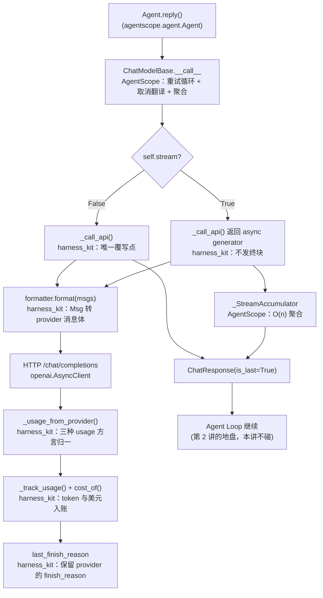

# 第 4 讲：模型适配层：Formatter、ChatModel 与你的自定义适配器

> **本讲目标**：把 AgentScope 的模型抽象（`ChatModelBase` / `ChatResponse` /
> `ChatUsage` / `FinishedReason` / `FormatterBase`）从源码读到骨子里，然后
> 写出 `harness_kit/models/` 这一整层 —— 一个能接**任意** OpenAI 兼容端点
> 的自定义适配器、一个把 provider 差异显式化的 Formatter、一份能算钱的
> 价格表、一层限流与退避。学完你能自己给公司内部的推理服务写适配器，
> 并且知道**哪一行该写、哪一行绝对不能写**。
> **前置要求**：完成第 1~3 讲（环境跑通、`harness_kit` 的 config/registry/events
> 三块已就位），具备 Python 3.11 环境
> `/Users/a/miniconda3/envs/agentscope_reme_pip_env/bin/python`，
> 且知道 `PYTHONPATH` 必须包含 `third_party/ReMe` 与 `tutorial_agsc_reme/reference`。
> **本讲交付物**（相对仓库根）：
> `tutorial_agsc_reme/reference/harness_kit/models/adapters/base.py`、
> `tutorial_agsc_reme/reference/harness_kit/models/adapters/echo.py`、
> `tutorial_agsc_reme/reference/harness_kit/models/adapters/openai_compat.py`、
> `tutorial_agsc_reme/reference/harness_kit/models/formatter.py`、
> `tutorial_agsc_reme/reference/harness_kit/models/pricing.py`、
> `tutorial_agsc_reme/reference/harness_kit/models/ratelimit.py`、
> `tutorial_agsc_reme/reference/harness_kit/models/factory.py`、
> `tutorial_agsc_reme/reference/harness_kit/models/adapters/__init__.py`、
> `tutorial_agsc_reme/reference/harness_kit/models/__init__.py`、
> `tutorial_agsc_reme/reference/scripts/04_model_adapters.py`、
> `tutorial_agsc_reme/reference/tests/test_lesson04_models.py`。
> **预计时长**：150 分钟。
>
> 本讲的完整可运行代码位于 `tutorial_agsc_reme/reference/harness_kit/...`，
> 你可以直接对照，也可以跟着正文一行一行写。

---

## 一、这一讲要解决的问题

前三讲我们做的都是"把 Agent 装起来"的事：第 1 讲点了火，第 2 讲用 YAML 把
`Agent` 声明式地装配出来，第 3 讲给会话加上了不可变事件日志。但这一切都建立在
一个**黑盒**之上 —— `harness_kit/registry.py` 里那三行：

```python
spec = ModelSpec(provider="deepseek", model_name="deepseek-chat", ...)
model = DeepSeekChatModel(model_name=..., credential=..., ...)
```

模型层只要换个 provider，这三行就得换一套写法。真实的企业场景是这样的：

- 公司自建了一套 vLLM / SGLang 推理集群，端点地址是内网的
  `http://llm-gateway.corp/v1`，走 OpenAI 协议但**不认** `name` 字段
  （网关对它做了 `^[a-zA-Z0-9_-]+$` 的正则校验），也不认 `max_completion_tokens`；
- 这个网关返回的 `usage` 里缓存命中数叫 `prompt_cache_hit_tokens`
  而不是 `prompt_tokens_details.cached_tokens`，而且**有时候两个都不给**；
- 财务每周来问"这个 Agent 上周花了多少钱"，而 AgentScope 从头到尾
  **只统计 token，不算钱**；
- 20 个并发 Agent 一起打这个网关，被限流打成 429，而 AgentScope 的重试是
  **固定间隔**的 `await asyncio.sleep(self.retry_delay)`，20 个进程会在
  同一毫秒一起重试，把限流从 429 变成"稳定 429"。

这四件事没有一件是"重写 Agent Loop"能解决的。它们全部落在**模型适配层**：
一个把"OpenAI 协议"翻译成"某个具体端点的方言"的薄层。AgentScope 官方给了
10 个 provider 的适配器（`third_party/agentscope/src/agentscope/model/__init__.py`），
每个都能跑，但**公共逻辑靠复制传播**而不是继承：比如"从 `usage` 里取缓存命中数"
这段，DeepSeek 的实现读 `prompt_cache_hit_tokens`
（`third_party/agentscope/src/agentscope/model/_deepseek/_model.py:278`），
OpenAI 的实现读 `prompt_tokens_details.cached_tokens`
（`third_party/agentscope/src/agentscope/model/_openai_chat/_model.py:358`），
两段代码形状几乎一样、字段名不同。接第 11 个 provider 时，你要么再抄一遍，
要么有一个基类。

本讲就是造那个基类，以及围绕它的四件配套设施（Formatter / 价格表 / 限流 / 工厂）。
**一行 Agent Loop 都不会碰。**

先看一个真实的失败现场。假设你手写了这样一个最小适配器：

```python
class MyModel(ChatModelBase):
    def __init__(self, *, model_name: str, api_key: str) -> None:
        super().__init__(
            credential=MyCredential(api_key=api_key),
            model=model_name,
            parameters=ChatModelBase.Parameters(),
        )

    async def _call_api(self, model_name, messages, tools=None, tool_choice=None, **kwargs):
        ...
```

它能通过类型检查，能被 `await my_model([UserMsg("user", "你好")])` 正常调用，
单测全绿。然后你把它塞进 `Agent`：

```text
AttributeError: 'MyModel' object has no attribute 'formatter'
```

抛点在 `third_party/agentscope/src/agentscope/agent/_agent.py:2066`：

```python
supported = self.model.formatter.supported_input_media_types
```

`Agent` 在处理入站消息时要判断"这个模型能不能吃图片/音频"，而 `formatter`
**不在** `ChatModelBase` 上 —— 它是在**每个具体模型类的 `__init__` 里**
赋值的（`.../model/_deepseek/_model.py:127`、`.../model/_openai_chat/_model.py:163`）。
这是"照契约写适配器"最容易漏的一步，也是本讲的第一个交付物
（`HarnessChatModelAdapter`）要一次性替你钉死的事情。

---

## 二、源码侦察

本节所有结论都来自本仓库 `third_party/agentscope/src/agentscope/` 下的真实源码，
每条给出 `路径:行号`。

### 2.1 `ChatModelBase` 是一个模板方法，唯一抽象点是 `_call_api`

```text
third_party/agentscope/src/agentscope/model/_base.py:37    class ChatModelBase:
third_party/agentscope/src/agentscope/model/_base.py:40        class Parameters(BaseModel):
third_party/agentscope/src/agentscope/model/_base.py:62        def __init__(credential, model, parameters, stream=True, max_retries=3, retry_delay=1.0, context_size=32768)
third_party/agentscope/src/agentscope/model/_base.py:182       async def __call__(self, messages, tools=None, tool_choice=None, **kwargs)
third_party/agentscope/src/agentscope/model/_base.py:292           @abstractmethod
third_party/agentscope/src/agentscope/model/_base.py:293           async def _call_api(self, model_name, messages, tools=None, tool_choice=None, **kwargs)
```

**这说明什么**：`_call_api` 是**唯一**的 `@abstractmethod`；`__call__` 不是抽象方法，
它已经把三件重活做完了，子类一行都不用重写：

1. **重试循环**（`_base.py:208`）：`for attempt in range(self.max_retries + 1)`，
   只对 `self._get_retryable_exceptions()` 给出的白名单异常重试
   （`_base.py:206`、`:227`），间隔是**固定**的 `await asyncio.sleep(self.retry_delay)`
   （`_base.py:239`）；
2. **取消 → `INTERRUPTED` 的翻译**（`_base.py:219-224`）：
   `_call_api` 抛 `asyncio.CancelledError` 时，`__call__` **不往外抛**，而是返回
   `ChatResponse(content=[], is_last=True, finished_reason=FinishedReason.INTERRUPTED)`；
3. **流式聚合**（`_base.py:260` 的 `_stream()`）：把 async generator 的增量块喂给
   `_StreamAccumulator`，最后 `yield acc_res.build()`（`_base.py:288`）。

再往下看一层，`_stream` 里还有个关键分支：

```text
third_party/agentscope/src/agentscope/model/_base.py:266       async for chunk in res:
third_party/agentscope/src/agentscope/model/_base.py:267           if not chunk.is_last:
third_party/agentscope/src/agentscope/model/_base.py:278               if not chunk.content:
third_party/agentscope/src/agentscope/model/_base.py:279                   continue
third_party/agentscope/src/agentscope/model/_base.py:283       except asyncio.CancelledError:
third_party/agentscope/src/agentscope/model/_base.py:284           acc_res.finished_reason = FinishedReason.INTERRUPTED
third_party/agentscope/src/agentscope/model/_base.py:288           yield acc_res.build()
```

**这说明什么**：`_base.py:270-277` 的注释写得很清楚 —— "Empty-content deltas are
'carrier' chunks used by subclasses to propagate usage / id metadata"。
**既有 usage 又不带 choices 的"载体块"会被聚合器吸收，不会暴露给消费者**。
所以适配器可以放心地把 usage 单独发一块（本讲的 `OpenAICompatChatModel._parse_stream`
就是这么做，见 `tutorial_agsc_reme/reference/harness_kit/models/adapters/openai_compat.py:436`），
消费者永远看不到这些空块。

### 2.2 `ChatResponse` / `ChatUsage` / `FinishedReason`

```text
third_party/agentscope/src/agentscope/model/_model_response.py:22   class FinishedReason(StrEnum):
third_party/agentscope/src/agentscope/model/_model_response.py:25       INTERRUPTED = "interrupted"
third_party/agentscope/src/agentscope/model/_model_response.py:28       COMPLETED = "completed"
third_party/agentscope/src/agentscope/model/_model_response.py:33   class ChatResponse(DictMixin):
third_party/agentscope/src/agentscope/model/_model_response.py:59           default_factory=lambda: FinishedReason.COMPLETED,
third_party/agentscope/src/agentscope/model/_model_response.py:69       def append_text(self, text, block_id=None)
third_party/agentscope/src/agentscope/model/_model_response.py:85       def append_thinking(self, ...)
third_party/agentscope/src/agentscope/model/_model_response.py:124      def append_tool_call(self, ...)
third_party/agentscope/src/agentscope/model/_model_response.py:167      def append_data_block(self, ...)
third_party/agentscope/src/agentscope/model/_model_response.py:241      def append_chat_response(self, chat_response) -> Self
third_party/agentscope/src/agentscope/model/_model_usage.py:10      class ChatUsage(DictMixin):
third_party/agentscope/src/agentscope/model/_model_usage.py:13          input_tokens: int
third_party/agentscope/src/agentscope/model/_model_usage.py:16          output_tokens: int
third_party/agentscope/src/agentscope/model/_model_usage.py:19          time: float
third_party/agentscope/src/agentscope/model/_model_usage.py:22          cache_creation_input_tokens: int = 0
third_party/agentscope/src/agentscope/model/_model_usage.py:25          cache_input_tokens: int = 0
third_party/agentscope/src/agentscope/_utils/_mixin.py:5            class DictMixin(dict):
third_party/agentscope/src/agentscope/_utils/_mixin.py:10               def __getattr__(self, key: str) -> object:
```

**这说明两件事，都会在生产上咬人**：

1. **`FinishedReason` 只有两个取值**。provider 返回的 `finish_reason`
   （`stop` / `length` / `tool_calls` / `content_filter`）在 AgentScope 的
   **全链路里从头到尾没有被读过一次**。而 `length`（被截断）和
   `content_filter`（被风控）在生产上必须能被上层看见 —— 这是本讲要在适配器里
   自己记一份 `last_finish_reason` 的原因（见 `harness_kit/models/adapters/base.py:292`）。
2. **`ChatResponse` / `ChatUsage` 是 `DictMixin` 子类，它们本身就是 `dict`**。
   所以 `dict(usage)`、`json.dumps(usage)` 都可用，但**没有** `to_dict()`；
   `__getattr__` 走的是 `dict.__getitem__`（`_mixin.py:10`），所以
   `response.get_text_content()` 会直接 `AttributeError` —— 那是 `Msg` 的方法。
   文本只能自己从 `content` 里挑 `TextBlock`。

### 2.3 流式聚合：为什么 `_StreamAccumulator` 是 O(n)

```text
third_party/agentscope/src/agentscope/model/_utils.py:199   class _StreamAccumulator:
third_party/agentscope/src/agentscope/model/_utils.py:268       def build(self) -> ChatResponse:
```

`_utils.py:203-207` 的注释是整段源码里最值得抄进笔记本的一句：

> Each block keeps its deltas in a fragment list that is joined exactly once in
> `build`, which makes the accumulation O(n) in the total payload size. The
> `ChatResponse.append_chat_response` it replaces grows the blocks with
> `block.field += delta` instead, which is O(n^2) for large payloads (e.g. tool
> call arguments of 100k+ chars) and can block the event loop long enough to
> drop the connection.

**这说明什么**：`ChatResponse.append_chat_response`（`_model_response.py:241`）
是**公开 API 但 O(n²)**，`_StreamAccumulator` 是**私有但 O(n)**。
生产热路径由 `__call__` 自动走 O(n) 的；教学与测试场景用公开 API 就够，
两者结果一致（本讲验证脚本的 C 段就是断言这一点）。

### 2.4 `FormatterBase` 与 `OpenAIChatFormatter` 的三处"OpenAI 特化"

```text
third_party/agentscope/src/agentscope/formatter/_formatter_base.py:20   class FormatterBase(BaseModel):
third_party/agentscope/src/agentscope/formatter/_formatter_base.py:23       input_types: list[str]
third_party/agentscope/src/agentscope/formatter/_formatter_base.py:37       def supported_input_media_types(self) -> list[str]:
third_party/agentscope/src/agentscope/formatter/_formatter_base.py:47       async def format(self, *args, **kwargs) -> list[dict[str, Any]]:
third_party/agentscope/src/agentscope/formatter/_formatter_base.py:52       def assert_list_of_msgs(msgs) -> None
third_party/agentscope/src/agentscope/formatter/_formatter_base.py:105      def convert_tool_result_to_string(...)
third_party/agentscope/src/agentscope/formatter/_openai_formatter.py:229  class OpenAIChatFormatter(_OpenAIFormatterBase):
third_party/agentscope/src/agentscope/formatter/_openai_formatter.py:294              "name": msg.name,
third_party/agentscope/src/agentscope/formatter/_openai_formatter.py:347              "content": content_blocks or None,
third_party/agentscope/src/agentscope/formatter/_openai_formatter.py:392          # ... — skip thinking blocks silently.
third_party/agentscope/src/agentscope/formatter/_openai_formatter.py:407      "content": content_blocks or None,
```

**这说明三件事**：

1. **`FormatterBase` 是 pydantic 模型**（`:20`），`format` 是 **async**（`:47`），
   所以自定义 formatter 走的是"继承 + 覆写 async format"这条路，
   **不是**实现一个 Protocol；
2. **`input_types` 在基类里的默认值是 `["text/plain"]`**（`:23-24`），
   `OpenAIChatFormatter` 把它覆写成四类（`_openai_formatter.py:235-241`：
   `text/plain` / `image/*` / `audio/*` / `application/pdf`），
   并且它**不会**由 `ModelCard` 反向同步过来（`:34-35` 的注释只写了
   "aligned with the model card's `input_types` field"，没有任何同步代码）。`Agent` 在
   `agent/_agent.py:2066` 读的就是 `supported_input_media_types` 这个派生属性；
3. **`OpenAIChatFormatter` 是按 api.openai.com 的口味调的**，有三处特化：
   每条消息带 `"name": msg.name`（`:294`、`:346`、`:406`）；
   纯工具调用的 assistant 消息得到 `"content": null`（`:295`）；
   `ThinkingBlock` **被静默丢弃**（`:392` 的注释 "skip thinking blocks silently"）。
   丢得对（DeepSeek 明确禁止把 `reasoning_content` 回灌进历史），
   但**一句日志都不打**。

### 2.5 `ToolChoice` 与 prompt cache

```text
third_party/agentscope/src/agentscope/tool/_types.py:178   class ToolChoice(BaseModel):
third_party/agentscope/src/agentscope/tool/_types.py:195           Prefer using ``mode=<tool_name>`` (str) over
third_party/agentscope/src/agentscope/tool/_types.py:198           avoids schema-list changes that would invalidate prompt caches.
third_party/agentscope/src/agentscope/tool/_types.py:202       mode: Literal["auto", "none", "required"] | str
third_party/agentscope/src/agentscope/tool/_types.py:203       tools: list[str] | None = None
```

**这说明什么**：`mode` 有**四个**语义 —— 三个字面量（`auto` / `none` / `required`）
加一种"具体工具名"（`str`）。想强制调某个工具时，官方推荐写
`ToolChoice(mode="<tool_name>")` 而不是 `tools=["<tool_name>"]`，
因为后者会改动发给模型的 tools 数组、**让 prompt cache 失效**（`:195-198`）。
本讲的 `_provider_tool_choice` 就严格照这四种语义映射。

### 2.6 token 计数：`count_tokens` 是粗估，不是 tiktoken

```text
third_party/agentscope/src/agentscope/model/_base.py:34     _MULTIMODAL_DATA_BLOCK_TOKEN_ESTIMATE = 2000
third_party/agentscope/src/agentscope/model/_base.py:369        async def count_tokens(self, messages, tools) -> int:
third_party/agentscope/src/agentscope/model/_base.py:449            cnt += len(data_blocks) * _MULTIMODAL_DATA_BLOCK_TOKEN_ESTIMATE
third_party/agentscope/src/agentscope/model/_base.py:453            cnt += int(len(acc_text.encode("utf-8")) / 4 + 0.5)
```

**这说明什么**：基类的 `count_tokens` 是**启发式粗估** —— 文本按
"UTF-8 字节数 / 4"算，每个多模态数据块固定算 2000 个 token。
它不联网、不需要 tokenizer，够用来做**预算保护**（宁可估高不可估低），
但**不能**用来对账。精确实现（如 tiktoken）由子类自己覆写。

### 2.7 本讲要用到的扩展点清单

| 用途 | 基类 / 方法 | 签名要点 | 源码位置 |
| --- | --- | --- | --- |
| 自定义模型 | `ChatModelBase` | `__init__(credential, model, parameters, stream, max_retries, retry_delay, context_size)` | `third_party/agentscope/src/agentscope/model/_base.py:37`、`:62` |
| 唯一覆写点 | `ChatModelBase._call_api` | `async def _call_api(self, model_name, messages, tools=None, tool_choice=None, **kwargs)`；流式返回 async generator（**不补终块**），非流式返回单个 `is_last=True` 的 `ChatResponse` | `third_party/agentscope/src/agentscope/model/_base.py:292-293` |
| 重试白名单 | `ChatModelBase._get_retryable_exceptions` | `@classmethod`，返回 `tuple[type[Exception], ...]`；SDK 异常要**惰性导入** | `third_party/agentscope/src/agentscope/model/_base.py:100-101` |
| 参数容器 | `ChatModelBase.Parameters` | 空 pydantic 模型，子类扩展 | `third_party/agentscope/src/agentscope/model/_base.py:40` |
| 凭据容器 | `CredentialBase` | pydantic 模型；`get_chat_model_class()` 供 `CredentialFactory` 反向查类 | `third_party/agentscope/src/agentscope/credential/_base.py:17`、`:31` |
| 消息格式化 | `FormatterBase` | pydantic 模型；`async def format(msgs: list[Msg]) -> list[dict]` | `third_party/agentscope/src/agentscope/formatter/_formatter_base.py:20`、`:47` |
| 现成 formatter | `OpenAIChatFormatter` | 有 `input_types`，`format` 已实现，可直接继承后做后处理 | `third_party/agentscope/src/agentscope/formatter/_openai_formatter.py:229` |
| 工具选择 | `ToolChoice` | `mode: Literal["auto","none","required"] \| str`、`tools: list[str] \| None` | `third_party/agentscope/src/agentscope/tool/_types.py:178`、`:202-203` |
| 累积器 | `ChatResponse.append_chat_response` | 公开、O(n²)、不做 JSON 解析 | `third_party/agentscope/src/agentscope/model/_model_response.py:241` |
| 消息工厂 | `UserMsg` / `AssistantMsg` / `SystemMsg` | `(name, content)`，`content` 可以是 `str` 或 block 列表 | `third_party/agentscope/src/agentscope/message/_base.py:539`、`:592`、`:649` |
| Agent 入口 | `Agent` | `Agent(name=..., system_prompt=..., model=..., toolkit=None, middlewares=None, state=None, ...)` | `third_party/agentscope/src/agentscope/agent/_agent.py:117`、`:120` |

**本讲用到的 ReMe 扩展点：一个也没有，而且这一点是实测过的。** 模型适配层位于
参考架构的 L1（基础访问），职责是"把一家 provider 的 HTTP 方言翻译成
AgentScope 的 `ChatResponse`"；ReMe 是记忆与检索侧的能力（L1 的另一根柱子），
两者数据上没有交集 —— `ChatModelBase._call_api` 的入参是 `list[Msg]` 与
tools、出参是 `ChatResponse`，中间不存在需要检索或落库的状态
（那属于第 6、7 讲的 Session / Memory）。

实测方式：把 `PYTHONPATH` 里的 `third_party/ReMe` **去掉**，只留
reference 自己，两个交付物照样全绿：

```bash
cd /tmp/lesson4_verify/reference
PYTHONPATH=. /Users/a/miniconda3/envs/agentscope_reme_pip_env/bin/python \
  scripts/04_model_adapters.py          # -> PASS  第 4 讲验证全部通过
PYTHONPATH=. /Users/a/miniconda3/envs/agentscope_reme_pip_env/bin/python \
  -m pytest tests/test_lesson04_models.py -q -o addopts=   # -> 70 passed
```

（`python -m pytest` 与 `env -u PYTHONPATH` 的区别在于：
前者会把**当前目录**塞进 `sys.path`，`harness_kit` 才找得到。
把 `PYTHONPATH` 清空但不 `cd` 到 reference 里，报的是
`ModuleNotFoundError: No module named 'harness_kit'`，
**不是** ReMe 相关的错 —— 这一条也是实测的。）

本讲的 md 与脚本里仍然一律写 `PYTHONPATH=.../ReMe:...`，理由有两条：
一是与前面几讲的命令保持**字面一致**，读者不用为某一讲记住两套写法；
二是 `--live` 那一步需要脚本反推出仓库根去读 `.env`，见 5.4。
第 5 讲之后与工具、记忆相关的讲次会**真正**出现 ReMe 的扩展点。

---

## 三、扩展点定位与设计

### 3.1 官方已经给了什么

- **模型抽象**：一个 `ChatModelBase` 模板 + 10 个 provider 的成品适配器
  （`third_party/agentscope/src/agentscope/model/__init__.py` 的导出列表）。
- **消息抽象**：`Msg` + 六种 `ContentBlock`（`message/_block.py`），
  `ToolCallBlock.input` 是**累积中的 JSON 字符串**（`message/_block.py:138-152`），
  这一点直接决定了流式工具调用只能用"拼字符串"的方式来累积。
- **格式化抽象**：`FormatterBase`（pydantic + async）+ 四个现成实现
  （OpenAI / DeepSeek / Anthropic / Gemini 系）。
- **流式聚合**：O(n) 的私有 `_StreamAccumulator`，由 `__call__` 自动调用。
- **token 粗估**：`count_tokens`（`_base.py:369`）。

### 3.2 还缺什么

对着契约 §1.3 的六个缺口，本讲补的是**第 1 条（没有不可变事件日志）之外的那半个**
—— 更准确地说，本讲补的是**缺口 1、4 所依赖的地基**：

| 缺口 | 本讲的贡献 |
| --- | --- |
| 缺口 1（无事件日志）的**前置**：连"这次调用花了多少 token / 多少钱 / 为什么结束"都没记 | `last_finish_reason` + `UsageTotals` + `PriceTable`，把每次调用变成一条可入账的记录 |
| 缺口 4（官方中间件没有 token 预算）的**前置**：没有价格表就算不出预算 | `cost_of` / `format_usd` / `usage_to_row`，让预算从"数 token"升级成"算钱" |
| 缺口 5（无声明式装配）在模型层的落地 | `build_chat_model` / `DIRECT_PROVIDERS` / `describe_providers` / `register_providers` |

另外还有三件 AgentScope **完全没有**、但企业接自建端点必须有的事：

1. **多方言 usage 解析**。DeepSeek 的 `prompt_cache_hit_tokens`
   （`model/_deepseek/_model.py:278`）与 OpenAI 的
   `prompt_tokens_details.cached_tokens`（`model/_openai_chat/_model.py:358`）
   是同一个事实的两种写法，AgentScope 用**复制**而不是抽象来处理。
2. **provider 的 `finish_reason` 保留**。`FinishedReason` 只有两个值
   （`model/_model_response.py:22-28`），而且 `_StreamAccumulator.build()`
   只搬 `content` / `id` / `usage` / `finished_reason` 四项，
   `metadata` **不会**被搬运。所以截断（`length`）在生产上是**不可见**的。
3. **限流与抖动退避**。AgentScope 的重试是固定间隔
   （`model/_base.py:239`），没有令牌桶、没有指数退避、没有抖动。

### 3.3 我们在哪个扩展点上做

**全部通过继承，不用猴子补丁，不碰 `third_party/`**：

- `HarnessChatModelAdapter(ChatModelBase, ABC)` —— 新基类，
  **只覆写 `_call_api`**，把上面 7 条公共能力一次写好；
- `EchoChatModel(HarnessChatModelAdapter)` —— 离线确定性适配器
  （AgentScope 没有"可以不联网的模型"，这是纯粹的教学/测试刚需）；
- `OpenAICompatChatModel(HarnessChatModelAdapter)` —— 面向任意 OpenAI 兼容端点的成品；
- `HarnessOpenAICompatFormatter(OpenAIChatFormatter)` —— 继承官方 formatter，
  在它的输出上做**后处理**，并把每一次改动记进计数器；
- `RateLimitedModel(ChatModelBase)` —— **装饰器**（不是猴子补丁），
  在 `_call_api` 之前 `acquire` 令牌，因此它仍然是一个合法的 `ChatModelBase`；
- `TokenBucket` / `RetryPolicy` / `compute_delay` / `retry_with_backoff` ——
  纯 Python，不依赖 AgentScope；
- `Price` / `PriceTable` / `cost_of` —— 纯 Python + pydantic，只读 `ChatUsage`。

下面这张图给出一次调用的完整数据流，以及**每一段归谁管**：



图中**每个节点的归属**是本讲最重要的一张"职责边界表"：
凡是标了 AgentScope 的，我们**一行都不重写**；凡是标了 harness_kit 的，
才是本讲要写的代码。

---

## 四、harness_kit 实现

### 4.0 本讲新增的文件清单

契约 §2 的目录树里，第 4 讲名下的文件是
`harness_kit/models/{factory,pricing,ratelimit}.py` 与
`harness_kit/models/adapters/{__init__,base,echo}.py`。
参考实现（契约 §11 规定它是"先于教程存在的"事实来源）在此基础上**多两个文件**，
本讲把它们一并交付，并说明理由：

| 文件 | 契约是否点名 | 为什么必须有 |
| --- | --- | --- |
| `harness_kit/models/adapters/base.py` | 是 | 公共底座，唯一覆写点纪律的载体 |
| `harness_kit/models/adapters/echo.py` | 是 | 离线确定性模型，全部单测的基础 |
| `harness_kit/models/factory.py` | 是 | 按 `ModelSpec` 造模型 + 健康检查 |
| `harness_kit/models/pricing.py` | 是 | 价格表与成本核算 |
| `harness_kit/models/ratelimit.py` | 是 | 令牌桶与指数退避 |
| `harness_kit/models/adapters/__init__.py` | 是 | 适配器子包的导出面 |
| `harness_kit/models/adapters/openai_compat.py` | 否 | **外挂一层**：契约 §3.4 要求 `build_chat_model` 在 `deepseek`/`openai` 上都返回 OpenAI 兼容适配器，没有它就落不了地 |
| `harness_kit/models/formatter.py` | 否 | **外挂一层**：`OpenAIChatFormatter` 的三处 OpenAI 特化（`:294`、`:295`、`:392`）接自建端点时会 400，而 AgentScope 没有'可配置的归一化 formatter' |
| `harness_kit/models/__init__.py` | 否 | 包入口；契约 §7 要求"包入口显式导出" |

"外挂一层"的三个文件都是**继承官方基类**的扩展，不是另起一套：
`OpenAICompatChatModel` 继承 `HarnessChatModelAdapter`，
`HarnessOpenAICompatFormatter` 继承 `OpenAIChatFormatter`。
它们存在的唯一理由是 AgentScope / ReMe **没有提供**这几件事
（可配置的 provider 归一化、最小协议客户端），所以我们补一层。

下面逐个文件给出**完整代码**。代码与
`tutorial_agsc_reme/reference/harness_kit/models/` 下的文件**逐字节一致**
（第 5 讲会给出自动核对的方法）。

### 4.1 `harness_kit/models/adapters/base.py`

这是本讲**最核心**的一个文件：所有自定义适配器的公共底座。

它把七件"每个 provider 都要重写一遍"的事一次写好：
消息体转换（`_format_messages`）、流式累积（`_accumulate`）、
OpenAI 风格 usage 解析（`_usage_from_provider`）、
`ToolChoice` → provider 参数映射（`_provider_tool_choice` / `_provider_tools`）、
价格核算与账本（`cost_of` / `totals`）、可重试异常白名单
（`_get_retryable_exceptions`）、请求体拼装（`_sampling_kwargs` /
`_thinking_extra_body` / `_merge_extra_body`）。

读这段代码时请盯住三处与官方扩展点的**咬合点**：

1. `class HarnessChatModelAdapter(ChatModelBase, ABC)` 里的 `ABC` 与
   `@abstractmethod async def _call_api` —— 这个 `@abstractmethod`
   是**多余的**（`ChatModelBase` 已经把它标成抽象方法），写在这里是为了
   让"子类必须实现它"这件事在本文件里就能被读到，而不必跳回
   `third_party/agentscope/src/agentscope/model/_base.py:292`。
2. `self.formatter: FormatterBase = formatter or self.formatter_factory()`
   —— 这一行**单独**解释在 `formatter_factory` 的 docstring 里：
   `Agent` 会读 `self.model.formatter`
   （`third_party/agentscope/src/agentscope/agent/_agent.py:2066`），
   而它**不在** `ChatModelBase` 上。漏掉它 = 单测全绿但一进 Agent 就
   `AttributeError`。
3. `_accumulate` 用的是**公开**的 `ChatResponse.append_chat_response`
   （`third_party/agentscope/src/agentscope/model/_model_response.py:241`），
   而不是 `__call__` 内部那个 O(n) 的私有 `_StreamAccumulator`
   （`model/_utils.py:199`）。这是刻意的：私有 API 不该在扩展层被依赖。

```python
# -*- coding: utf-8 -*-
"""``HarnessChatModelAdapter`` —— 自定义模型适配器的公共底座。

**为什么需要它**：AgentScope 2.0.8 已经内置 10 个 provider 的适配器
（``third_party/agentscope/src/agentscope/model/__init__.py``：Anthropic /
DashScope / DeepSeek / Gemini / Ollama / OpenAI(Chat) / OpenAI(Responses) /
xAI / Moonshot / Volcengine），但它们各自独立实现，公共逻辑靠**复制**而非
继承传播 —— 例如「从 ``usage`` 里取缓存命中数」这段，DeepSeek 读
``prompt_cache_hit_tokens``（``.../model/_deepseek/_model.py:276``），
OpenAI 读 ``prompt_tokens_details.cached_tokens``
（``.../model/_openai_chat/_model.py:356``），两处代码形状几乎一样。
企业里接一个自建推理服务（vLLM / SGLang / TGI / 内部网关）时，你要么再抄一遍，
要么有一个基类。本模块就是那个基类。

**继承关系与唯一的覆写点**（这是本模块最重要的一条纪律）：

``ChatModelBase`` 里只有 ``_call_api`` 是 ``@abstractmethod``
（``third_party/agentscope/src/agentscope/model/_base.py:293``），而
``__call__``（``_base.py:182``）**不是**抽象方法，它内部装着三件重活：

1. ``for attempt in range(self.max_retries + 1)`` 的重试循环（``:208``）；
2. 把 ``asyncio.CancelledError`` 翻译成 ``finished_reason=INTERRUPTED`` 的
   正常终止块（``:219``、``:283``）；
3. ``_StreamAccumulator`` 流式聚合（``:260``，实现在
   ``model/_utils.py:199``），它顺手把「只有 usage 没有 choices」的载体块
   吸收掉、不暴露给消费者（``:270`` 的注释）。

覆写 ``__call__`` 等于把这三件事全部自己再写一遍 —— 契约 §3.4 因此把它定为
**铁律**：只覆写 ``_call_api``，绝不覆写 ``__call__``。

**真实验证过的两条事实**（本环境实测，见验证脚本）：

- ``ChatResponse`` / ``ChatUsage`` 是 ``DictMixin`` 子类，**本身就是 dict**
  （``third_party/agentscope/src/agentscope/_utils/_mixin.py:5``），
  所以 ``dict(usage)`` 能用，但**没有** ``to_dict()`` 方法；
- ``ChatResponse`` 上**没有** ``get_text_content()``（那是 ``Msg`` 的方法），
  文本要自己从 ``content`` 里挑 ``TextBlock``。
"""

from __future__ import annotations

import json
from abc import ABC, abstractmethod
from datetime import datetime
from typing import (
    Any,
    AsyncGenerator,
    Callable,
    ClassVar,
    Iterable,
    Literal,
)

from loguru import logger
from pydantic import ConfigDict, Field, SecretStr

from agentscope.credential import CredentialBase
from agentscope.formatter import FormatterBase, OpenAIChatFormatter
from agentscope.message import Msg
from agentscope.model import (
    ChatModelBase,
    ChatResponse,
    ChatUsage,
    FinishedReason,
)
from agentscope.tool import ToolChoice

from harness_kit.models.pricing import (
    DEFAULT_PRICE_TABLE,
    Price,
    PriceTable,
    cost_of,
    format_usd,
)

__all__ = [
    "HarnessChatModelAdapter",
    "HarnessChatModelParameters",
    "HarnessCredential",
    "UsageTotals",
]

_TOOL_CHOICE_LITERAL_MODES: frozenset[str] = frozenset(
    {"auto", "none", "required"},
)
"""``ToolChoice.mode`` 的三个字面量取值；其余取值一律当作「具体工具名」
（``third_party/agentscope/src/agentscope/tool/_types.py:178``）。"""


class HarnessCredential(CredentialBase):
    """harness_kit 自定义适配器使用的通用凭据。

    AgentScope 的 ``CredentialBase``（``third_party/agentscope/src/agentscope/
    credential/_base.py:15``）只要求子类提供 ``api_key`` / ``base_url`` 之类
    的字段；``get_chat_model_class()`` 是给
    ``CredentialFactory``（``credential/_factory.py``）反向查类用的，本 adapter
    不参与那个注册表，所以直接返回基类适配器。
    """

    model_config = ConfigDict(title="Harness Adapter Credential")

    type: Literal["harness_credential"] = "harness_credential"
    """凭据类型判别式。"""

    api_key: SecretStr = Field(
        default=SecretStr(""),
        description="API key；空串表示「本适配器不需要鉴权」（如本地自建端点）。",
    )
    """API key，``SecretStr`` 保证它不会被打印进日志。"""

    base_url: str | None = Field(
        default=None,
        description="OpenAI 兼容端点根地址，例如 ``https://api.deepseek.com``。",
    )
    """端点根地址；``None`` 时用 SDK 自己的默认值。"""

    @classmethod
    def get_chat_model_class(cls) -> type[ChatModelBase]:
        """返回消费此凭据的模型类。

        Returns:
            `type[ChatModelBase]`: :class:`HarnessChatModelAdapter`。
        """
        return HarnessChatModelAdapter


class HarnessChatModelParameters(ChatModelBase.Parameters):
    """适配器通用参数（各 provider 的参数并集里最常用的那几个）。

    ``ChatModelBase.Parameters``（``third_party/agentscope/src/agentscope/
    model/_base.py:40``）是一个**空的** pydantic 模型，注释写着 "Each subclass
    should implement this inner class to define its parameters"。这里给出一个
    够用的默认实现，子类可继续继承扩展（例如加 ``reasoning_effort``）。
    """

    max_tokens: int | None = Field(
        default=None,
        gt=0,
        description="单次输出上限；``None`` 交给 provider 默认值。",
    )

    temperature: float | None = Field(
        default=None,
        ge=0,
        le=2,
        description="采样温度。",
    )

    top_p: float | None = Field(
        default=None,
        gt=0,
        le=1,
        description="nucleus 采样阈值。",
    )

    thinking_enable: bool | None = Field(
        default=None,
        description=(
            "是否开启 thinking。``None`` 表示**不发送**任何 thinking 开关，"
            "完全交给 provider 默认行为 —— 这是最安全的选择：不同兼容端点"
            "对未知字段的容忍度差别很大，实测 DeepSeek 收 "
            r"``extra_body={\"thinking\": {\"type\": \"disabled\"}}`` 正常，"
            "而某些自建端点会直接 400。"
        ),
    )

    extra_body: dict[str, Any] = Field(
        default_factory=dict,
        description="原样塞进请求体 ``extra_body`` 的 provider 私有字段。",
    )


class UsageTotals(dict):
    """累计用量账本（``dict`` 子类，便于直接 ``json.dumps``）。

    字段：``calls`` / ``input_tokens`` / ``output_tokens`` /
    ``cache_input_tokens`` / ``seconds`` / ``cost_usd``。
    """


class HarnessChatModelAdapter(ChatModelBase, ABC):
    """harness_kit 所有自定义模型的公共底座（**只覆写 ``_call_api``**）。

    它把「每个 provider 都要重写一遍」的东西一次写好：

    ============================== ===============================================
    能力                              方法
    ============================== ===============================================
    消息体转换（``Msg`` → dict）        :meth:`_format_messages` + ``self.formatter``
    流式增量累积                       :meth:`_accumulate`
    OpenAI 风格 usage 解析             :meth:`_usage_from_provider`
    ``ToolChoice`` → provider 参数     :meth:`_provider_tool_choice`
    价格核算与账本                     :meth:`cost_of` / :meth:`totals`
    可重试异常白名单                   :meth:`_get_retryable_exceptions`
    ============================== ===============================================

    子类只需要实现 :meth:`_call_api`。

    Args:
        model_name (`str`): 模型名（例如 ``deepseek-flash``）。
        stream (`bool`): 是否流式，默认 ``True``。
        pricing (`PriceTable | None`): 价格表；``None`` 时用
            :data:`~harness_kit.models.pricing.DEFAULT_PRICE_TABLE`。
        credential (`CredentialBase | None`): 凭据；``None`` 时用
            :class:`HarnessCredential` 按 ``api_key`` / ``base_url`` 现造。
        parameters (`HarnessChatModelParameters | None`): 采样参数；``None``
            时用该类的默认实例。
        api_key (`str | SecretStr | None`): 便捷入口，等价于传
            ``credential=HarnessCredential(api_key=...)``。
        base_url (`str | None`): 便捷入口，端点地址。
        max_retries (`int`): 交给 ``ChatModelBase.__call__`` 的快速重试次数。
        retry_delay (`float`): 快速重试的固定间隔（秒）。
        context_size (`int`): 上下文窗口，供上下文压缩使用。
        **kwargs (`Any`): 具体适配器自己的额外参数；基类不消费，原样存进
            :attr:`extra_kwargs`，子类可读。

    Raises:
        ValueError: ``model_name`` 为空。
    """

    adapter_name: ClassVar[str] = "harness-adapter"
    """适配器名，出现在日志与 ``totals()`` 里。"""

    formatter_factory: ClassVar[Callable[[], FormatterBase]] = (
        OpenAIChatFormatter
    )
    """默认 formatter 的构造器；子类覆写它来换掉消息体格式。

    **为什么这件事必须做**：AgentScope 的 ``Agent`` 会直接读
    ``self.model.formatter``（``third_party/agentscope/src/agentscope/
    agent/_agent.py:2066``，用于判断模型能吃哪些媒体类型），而 ``formatter``
    是在**每个具体模型类的 ``__init__`` 里**赋值的，**不在**
    ``ChatModelBase`` 上 —— 例如 ``.../model/_openai_chat/_model.py:163``、
    ``.../model/_deepseek/_model.py:127``。一个没有 ``.formatter`` 的
    ``ChatModelBase`` 子类能通过类型检查、能单独调用，但一进 ``Agent`` 就
    ``AttributeError``。这是「照契约写适配器」最容易漏的一步。
    """

    def __init__(
        self,
        *,
        model_name: str,
        stream: bool = True,
        pricing: PriceTable | None = None,
        credential: CredentialBase | None = None,
        parameters: HarnessChatModelParameters | None = None,
        formatter: FormatterBase | None = None,
        api_key: str | SecretStr | None = None,
        base_url: str | None = None,
        max_retries: int = 3,
        retry_delay: float = 1.0,
        context_size: int = 65536,
        **kwargs: Any,
    ) -> None:
        """初始化公共底座。"""
        if not model_name:
            raise ValueError("HarnessChatModelAdapter 需要非空的 model_name")

        if credential is None:
            credential = HarnessCredential(
                api_key=api_key if api_key is not None else "",
                base_url=base_url,
            )
        if parameters is None:
            parameters = self.Parameters()

        super().__init__(
            credential=credential,
            model=model_name,
            parameters=parameters,
            stream=stream,
            max_retries=max_retries,
            retry_delay=retry_delay,
            context_size=context_size,
        )

        self.formatter: FormatterBase = (
            formatter or self.formatter_factory()
        )
        """消息格式化器；``Agent`` 会读它（见 :attr:`formatter_factory`）。"""

        self.price_table: PriceTable = pricing or DEFAULT_PRICE_TABLE
        self.extra_kwargs: dict[str, Any] = dict(kwargs)
        self.total_usage: UsageTotals = UsageTotals(
            calls=0,
            input_tokens=0,
            output_tokens=0,
            cache_input_tokens=0,
            seconds=0.0,
            cost_usd=0.0,
        )
        self.last_finish_reason: str | None = None
        """provider 原始 ``finish_reason`` 的最近一次观测值。

        为什么要单独存一份：``ChatResponse.metadata`` **不会**被流式聚合器
        搬运 —— ``_StreamAccumulator.build()``
        （``third_party/agentscope/src/agentscope/model/_utils.py:274-280``）
        只搬 ``content`` / ``id`` / ``usage`` / ``finished_reason``，
        而 ``finished_reason`` 只有 ``interrupted`` / ``completed`` 两个取值
        （``model/_model_response.py:22``），**provider 的**
        ``finish_reason``（``stop`` / ``length`` / ``tool_calls`` /
        ``content_filter``）在 AgentScope 里从头到尾没被读过。
        生产上 ``length``（被截断）与 ``content_filter``（被风控）必须能被
        上层看见，所以这里记在实例上，并在非流式响应里同时写进 ``metadata``。
        """

    # ------------------------------------------------------------------
    # 必须由子类实现
    # ------------------------------------------------------------------
    @abstractmethod
    async def _call_api(
        self,
        model_name: str,
        messages: list[Msg],
        tools: list[dict] | None = None,
        tool_choice: ToolChoice | None = None,
        **kwargs: Any,
    ) -> ChatResponse | AsyncGenerator[ChatResponse, None]:
        """调用底层 API（子类实现）。

        契约（与 ``ChatModelBase._call_api`` 完全一致）：

        - ``self.stream`` 为 ``True`` 时返回 **async generator**，
          每个元素 ``is_last=False``；**不要**自己补 ``is_last=True``
          的最终块，基类 ``__call__`` 会用 ``_StreamAccumulator`` 补；
        - ``self.stream`` 为 ``False`` 时返回单个 ``is_last=True`` 的
          ``ChatResponse``；
        - usage 只在**最后一个**（或唯一的）chunk 上给，别每个 chunk 都带，
          否则聚合器会反复覆写。

        Args:
            model_name (`str`): 模型名。
            messages (`list[Msg]`): 输入消息（先用 formatter 转成 provider 格式）。
            tools (`list[dict] | None`, optional): 工具 JSON schema。
            tool_choice (`ToolChoice | None`, optional): 工具选择。
            **kwargs (`Any`): provider 额外参数。

        Returns:
            `ChatResponse | AsyncGenerator[ChatResponse, None]`: 见上。
        """

    # ------------------------------------------------------------------
    # 公共能力
    # ------------------------------------------------------------------
    async def _format_messages(self, messages: list[Msg]) -> list[dict[str, Any]]:
        """把 ``Msg`` 列表转成给 HTTP 请求体用的消息列表。

        这一步**必须在 ``_call_api`` 里做**：``ChatModelBase.__call__`` 传给
        ``_call_api`` 的 ``messages`` 是 ``list[Msg]``（AgentScope 的内部
        表示），而 OpenAI SDK 只接受 ``list[dict]``。内置模型的 ``_call_api``
        第一行就是 ``await self.formatter.format(messages)``
        （``third_party/agentscope/src/agentscope/model/_openai_chat/_model.py:221``、
        ``.../model/_deepseek/_model.py:185``）。漏掉它会在 SDK 的
        ``json`` 序列化阶段抛一个和「消息格式」毫无关系的 TypeError。

        Args:
            messages (`list[Msg]`): AgentScope 消息。

        Returns:
            `list[dict[str, Any]]`: provider 消息体。
        """
        return await self.formatter.format(messages)

    @classmethod
    def _get_retryable_exceptions(cls) -> tuple[type[Exception], ...]:
        """白名单：网络抖动 / 超时 / 限流 / 5xx 值得重试，参数错误不值得。

        实现照抄 AgentScope 的**惰性导入**约定
        （``third_party/agentscope/src/agentscope/model/_base.py:100`` 的
        docstring："SDK exception types should be imported lazily inside the
        override so the SDK stays an optional dependency"），这样没装 openai
        也能 import 本模块。

        Returns:
            `tuple[type[Exception], ...]`: 可重试异常类型；没装 openai 时为空。
        """
        try:
            import openai
        except ImportError:  # pragma: no cover - 本环境已装 openai
            return ()
        return (
            openai.APIConnectionError,
            openai.APITimeoutError,
            openai.RateLimitError,
            openai.InternalServerError,
        )

    def _accumulate(self, chunks: Iterable[ChatResponse]) -> ChatResponse:
        """把一个调用的所有流式增量拼成一个完整响应。

        直接复用 AgentScope 自己的累积能力
        ``ChatResponse.append_chat_response``（``third_party/agentscope/src/
        agentscope/model/_model_response.py:245``）：它按 block id 归并
        ``TextBlock.text`` / ``ThinkingBlock.thinking`` / ``ToolCallBlock.input``
        （**字符串拼接，不做 JSON 解析** —— 解析推迟到真正执行工具时）、
        并把 ``DataBlock`` 的 base64 分片按媒体类型合并；``usage`` 取最后一次
        非空的值。

        与 ``ChatModelBase.__call__`` 内部用的 ``_StreamAccumulator`` 的区别：
        后者是 O(n) 实现，为长工具参数（10 万字符级）优化
        （``model/_utils.py:203`` 的注释），但它是**私有**的；
        ``append_chat_response`` 是公开 API 且 O(n²)。教学场景用公开 API，
        生产热路径交给 ``__call__`` 里的私有实现 —— 两者结果一致。

        Args:
            chunks (`Iterable[ChatResponse]`): 增量块（``is_last=False`` 的）。

        Returns:
            `ChatResponse`: ``is_last=True`` 的完整响应；``finished_reason``
            沿用最后一个 ``INTERRUPTED`` 的块（若有）。
        """
        acc = ChatResponse(content=[], is_last=True)
        last_interrupt: FinishedReason | None = None
        for chunk in chunks:
            if chunk.finished_reason is FinishedReason.INTERRUPTED:
                last_interrupt = FinishedReason.INTERRUPTED
            acc.append_chat_response(chunk)
        if last_interrupt is not None:
            acc.finished_reason = last_interrupt
        return acc

    @staticmethod
    def _provider_tool_choice(
        tool_choice: ToolChoice | None,
        tool_names: list[str],
    ) -> str | dict[str, Any] | None:
        """把 :class:`~agentscope.tool.ToolChoice` 翻成 OpenAI 风格参数。

        映射规则（与 ``_deepseek/_model.py`` 的 ``_format_tools`` 一致）：

        ============================== ===================================
        ``ToolChoice``                  OpenAI 参数
        ============================== ===================================
        ``None``                        ``None``（不传该字段）
        ``mode="auto"``                 ``"auto"``
        ``mode="none"``                 ``"none"``
        ``mode="required"``             ``"required"``
        ``mode="<工具名>"``              ``{"type": "function",
                                        "function": {"name": "<工具名>"}}``
        ============================== ===================================

        为什么不把「强制某个工具」翻成 ``{"type": "function", ...}`` 之外的做法：
        ``ToolChoice`` 的 docstring 明确写了 —— 优先用 ``mode=<tool_name>``
        而不是 ``tools=["<tool_name>"]``，因为后者会改动发给模型的 tools 数组、
        让 **prompt cache 失效**（``third_party/agentscope/src/agentscope/
        tool/_types.py:195``）。

        Args:
            tool_choice (`ToolChoice | None`): AgentScope 的工具选择。
            tool_names (`list[str]`): 当前可用的工具名（用于提前报错）。

        Returns:
            `str | dict[str, Any] | None`: 可直接塞进请求体的值。

        Raises:
            ValueError: ``mode`` 既不是三个字面量之一，也不在 ``tool_names`` 里。
        """
        if tool_choice is None:
            return None

        mode = tool_choice.mode
        if mode in _TOOL_CHOICE_LITERAL_MODES:
            return mode
        if mode not in tool_names:
            raise ValueError(
                f"tool_choice.mode={mode!r} 既不是 "
                f"{sorted(_TOOL_CHOICE_LITERAL_MODES)}，也不在可用工具 "
                f"{sorted(tool_names)} 里；"
                "（third_party/agentscope/src/agentscope/tool/_types.py:178）",
            )
        return {"type": "function", "function": {"name": mode}}

    @staticmethod
    def _provider_tools(
        tools: list[dict] | None,
        tool_choice: ToolChoice | None,
    ) -> list[dict] | None:
        """按 ``tool_choice.tools`` 过滤工具列表（``None`` 时原样返回）。

        Args:
            tools (`list[dict] | None`): 工具 schema 列表。
            tool_choice (`ToolChoice | None`): 工具选择。

        Returns:
            `list[dict] | None`: 过滤后的列表。
        """
        if not tools or tool_choice is None or not tool_choice.tools:
            return tools
        keep = set(tool_choice.tools)
        return [
            schema
            for schema in tools
            if schema.get("function", {}).get("name") in keep
        ]

    @staticmethod
    def _usage_from_provider(
        raw_usage: Any,
        *,
        started: datetime,
    ) -> ChatUsage | None:
        """把 OpenAI 风格的 ``usage`` 对象解析成 :class:`ChatUsage`。

        一次吃掉三个 provider 方言的差异（这正是「适配器」该干的事）：

        ============================== ======================================
        源字段                           落到 ``ChatUsage``
        ============================== ======================================
        ``prompt_tokens``               ``input_tokens``
        ``completion_tokens``           ``output_tokens``
        ``prompt_cache_hit_tokens``     ``cache_input_tokens``（DeepSeek 专有）
        ``prompt_tokens_details.        ``cache_input_tokens``（OpenAI 专有）
        cached_tokens``
        ``cache_write_tokens``          ``cache_creation_input_tokens``
        （``prompt_tokens_details`` 内，少数实现才有）
        ============================== ======================================

        实测锚点（本环境 deepseek-flash）：一个带 6 个 chunk 的流式请求里，
        ``prompt_cache_hit_tokens=0`` 而 ``prompt_tokens_details.cached_tokens=0``；
        紧接着的第二次同前缀非流式请求两者都是 ``128``。可见两个字段在本
        provider 上**等价**，但别家不一定，所以两个都读、以显式字段优先。

        Args:
            raw_usage (`Any`): SDK 的 usage 对象（``None`` 表示这次没有 usage）。
            started (`datetime`): 请求开始时间，用于填 ``ChatUsage.time``。

        Returns:
            `ChatUsage | None`: 解析结果；``raw_usage`` 为 ``None`` 时返回 ``None``。
        """
        if raw_usage is None:
            return None

        details = getattr(raw_usage, "prompt_tokens_details", None)
        cache_hit = getattr(raw_usage, "prompt_cache_hit_tokens", None)
        if cache_hit is None and details is not None:
            cache_hit = getattr(details, "cached_tokens", None)
        cache_write = getattr(details, "cache_write_tokens", None) if details else None

        return ChatUsage(
            input_tokens=int(getattr(raw_usage, "prompt_tokens", 0) or 0),
            output_tokens=int(
                getattr(raw_usage, "completion_tokens", 0) or 0,
            ),
            time=(datetime.now() - started).total_seconds(),
            # DictMixin 让 ChatUsage 本质是 dict，字段可以少给；这里显式给全
            cache_input_tokens=int(cache_hit or 0),
            cache_creation_input_tokens=int(cache_write or 0),
        )

    # ------------------------------------------------------------------
    # 账本
    # ------------------------------------------------------------------
    def price_of(self) -> Price:
        """取当前模型的价格。

        Returns:
            `Price`: 价格。

        Raises:
            UnknownPriceError: 价格表里没有该模型。
        """
        return self.price_table.lookup(self.model)

    def cost_of(self, usage: ChatUsage | None) -> float | None:
        """算一次调用的费用。

        Args:
            usage (`ChatUsage | None`): 用量；``None`` 时返回 ``None``。

        Returns:
            `float | None`: 美元金额；价格表查不到该模型时返回 ``None``
            （并打一条 warning，而不是抛异常 —— 记账失败不该拖垮主流程）。
        """
        if usage is None:
            return None
        try:
            price = self.price_of()
        except KeyError as exc:
            logger.warning(
                "价格表里没有 {}，本次调用不记账（{}）",
                self.model,
                exc,
            )
            return None
        return cost_of(usage, price)

    def _track_usage(self, usage: ChatUsage) -> float | None:
        """把一次用量累加进 :attr:`total_usage`。

        Args:
            usage (`ChatUsage`): 用量。

        Returns:
            `float | None`: 本次费用。
        """
        cost = self.cost_of(usage)
        self.total_usage["calls"] += 1
        self.total_usage["input_tokens"] += int(usage.input_tokens or 0)
        self.total_usage["output_tokens"] += int(usage.output_tokens or 0)
        self.total_usage["cache_input_tokens"] += int(
            getattr(usage, "cache_input_tokens", 0) or 0,
        )
        self.total_usage["seconds"] += float(getattr(usage, "time", 0.0) or 0.0)
        if cost is not None:
            self.total_usage["cost_usd"] += cost
        return cost

    def totals(self) -> dict[str, Any]:
        """返回累计账本的可打印视图。

        Returns:
            `dict[str, Any]`: 含 ``adapter`` / ``model`` / ``calls`` /
            token 数 / ``cost_usd`` / ``cost_pretty``。
        """
        snapshot: dict[str, Any] = {
            "adapter": self.adapter_name,
            "model": self.model,
            **dict(self.total_usage),
            "last_finish_reason": self.last_finish_reason,
        }
        snapshot["cost_pretty"] = format_usd(
            float(snapshot.get("cost_usd", 0.0)),
        )
        return snapshot

    def describe(self) -> str:
        """一行摘要（日志 / CLI 用）。

        Returns:
            `str`: 形如 ``openai_compat[deepseek-flash] stream=True``。
        """
        return (
            f"{self.adapter_name}[{self.model}] "
            f"stream={self.stream} "
            f"ctx={self.context_size} "
            f"formatter={type(self.formatter).__name__} "
            f"params={json.dumps(self.parameters.model_dump(exclude_none=True), ensure_ascii=False)}"
        )

    # ------------------------------------------------------------------
    # 结构化输出
    # ------------------------------------------------------------------
    @classmethod
    def _get_structured_output_fallback_exceptions(
        cls,
    ) -> tuple[type[Exception], ...]:
        """强制工具调用被 provider 拒绝（400）时，允许降级到下一个策略。

        见 ``ChatModelBase.generate_structured_output``
        （``third_party/agentscope/src/agentscope/model/_base.py:457``）的
        四段式阶梯：``forced`` → ``auto`` → ``no_think`` → ``none``。

        Returns:
            `tuple[type[Exception], ...]`: ``openai.BadRequestError``。
        """
        try:
            import openai
        except ImportError:  # pragma: no cover - 本环境已装 openai
            return ()
        return (openai.BadRequestError,)

    # ------------------------------------------------------------------
    # 请求体构造（子类复用）
    # ------------------------------------------------------------------
    def _sampling_kwargs(self) -> dict[str, Any]:
        """把 :attr:`parameters` 里「有值才发」的字段抽成请求参数。

        Returns:
            `dict[str, Any]`: ``max_tokens`` / ``temperature`` / ``top_p``
            中非 ``None`` 的项，外加 ``extra_body``（若非空）。
        """
        params: HarnessChatModelParameters = self.parameters  # type: ignore[assignment]
        payload: dict[str, Any] = {}
        for name in ("max_tokens", "temperature", "top_p"):
            value = getattr(params, name, None)
            if value is not None:
                payload[name] = value
        extra_body = dict(getattr(params, "extra_body", {}) or {})
        if extra_body:
            payload["extra_body"] = extra_body
        return payload

    def _thinking_extra_body(self) -> dict[str, Any]:
        """thinking 开关的 ``extra_body`` 片段（``None`` 时返回空 dict）。

        Returns:
            `dict[str, Any]`: 形如
            ``{"thinking": {"type": "disabled"}}``；未显式设置时为空。
        """
        params: HarnessChatModelParameters = self.parameters  # type: ignore[assignment]
        if params.thinking_enable is None:
            return {}
        return {
            "thinking": {
                "type": "enabled" if params.thinking_enable else "disabled",
            },
        }

    def _merge_extra_body(self, payload: dict[str, Any]) -> dict[str, Any]:
        """把 thinking 开关合并进 ``payload["extra_body"]``（深合并一层）。

        Args:
            payload (`dict[str, Any]`): 已含 sampling 参数的请求体。

        Returns:
            `dict[str, Any]`: 原地修改并返回 ``payload``。
        """
        thinking = self._thinking_extra_body()
        if not thinking:
            return payload
        merged = dict(payload.get("extra_body") or {})
        merged.update(thinking)
        payload["extra_body"] = merged
        return payload

    def __repr__(self) -> str:
        """调试表示。

        Returns:
            `str`: 与 :meth:`describe` 相同。
        """
        return self.describe()
```

（本文件 722 行。）

`last_finish_reason` 是这段代码里**唯一一处补 AgentScope 的空白**。
原因写在字段的 docstring 里：`_StreamAccumulator.build()`
（`third_party/agentscope/src/agentscope/model/_utils.py:268`）只搬
`content` / `id` / `usage` / `finished_reason` 四项，
`ChatResponse.metadata` **不会**被搬运；而 `FinishedReason` 本身只有
`interrupted` / `completed` 两个取值
（`third_party/agentscope/src/agentscope/model/_model_response.py:22-28`）。
于是 provider 的 `finish_reason`（`stop` / `length` / `tool_calls` /
`content_filter`）在 AgentScope 全链路里**没有一处被读过**。
生产上 `length`（被截断）与 `content_filter`（被风控）必须可见，
所以这里在实例上记一份。

注意 `UsageTotals` 是 `dict` 子类而不是 dataclass —— 它要能被
`json.dumps()` 直接序列化进日志与报告，与 `ChatUsage` 的做法一致。

---

### 4.2 `harness_kit/models/adapters/echo.py`

`EchoChatModel` 看起来像个玩具，但它是**本讲全部单测的地基**：
70 个测试里绝大多数都靠它，而它对网络的依赖是 **零**。

它能做到三件真实模型做不到的事：

1. **离线跑通 Agent Loop** —— 单测里不需要 key、不会 flaky；
2. **可控地触发工具调用** —— 给它一段 `script`，精确控制第几轮说什么、
   调哪个工具、传什么参数。这是测"权限被拒 / 参数校验失败 / 工具报错"
   这类分支的**唯一**可靠手段；
3. **伪造 usage** —— 让定价与账本逻辑在没有真实 token 消耗时也能被断言。

它与官方扩展点的咬合点是 `_call_api` 的**返回形态**：`self.stream` 为真时
返回 async generator 且**每个元素都是 `is_last=False`**
（`_base.py:321-328` docstring 的契约），终块**由基类补**。
`_gen()` 里那句"工具调用参数照真实 provider 的做法**分两片**下发"
就是照着真实 deepseek-flash 的行为抄的（真实分片见 5.4 的 K2 段）。

```python
# -*- coding: utf-8 -*-
"""``EchoChatModel`` —— 不联网的确定性模型，用于离线测试与教学演示。

**为什么它是生产件而不是玩具**：harness_kit 的 registry 把 ``"echo"`` 注册为
一个**一等 provider**（``harness_kit/registry.py`` 的懒加载条目
``("harness_kit.models.adapters.echo", ("build_echo_model", "EchoChatModel"))``）。
它能做到三件真实模型做不到的事：

1. **离线跑通 Agent Loop**：单元测试里不需要网络、不需要 key、不会 flaky；
2. **可控地触发工具调用**：给一段「脚本」，精确控制第几轮说什么、调哪个工具、
   传什么参数 —— 这是测「权限被拒 / 参数校验失败 / 工具报错」这类分支的唯一
   可靠手段；
3. **伪造 usage**：让定价与账本逻辑在没有真实 token 消耗时也能被断言。

它**不是**用来替代真实模型的：它不理解语义，只按规则回放。

脚本格式（``script`` 参数）是一个列表，每个元素代表**一次调用**：

.. code-block:: python

    script = [
        # 第 1 次调用：说一句话 + 调一个工具
        {
            "text": "我先查一下天气。",
            "tool_calls": [
                {"id": "call-1", "name": "get_weather", "input": {"city": "北京"}},
            ],
            "usage": {"input_tokens": 20, "output_tokens": 10},
        },
        # 第 2 次调用：只用文字收尾
        {"text": "北京晴。"},
    ]

脚本耗尽后，模型退化回「回声」行为：把最后一条 user 消息原样回显。
"""

from __future__ import annotations

import json
from datetime import datetime
from typing import Any, AsyncGenerator, ClassVar, Iterable

from loguru import logger

from agentscope._utils._common import _generate_id
from agentscope.message import Msg, TextBlock, ThinkingBlock, ToolCallBlock
from agentscope.model import ChatResponse, ChatUsage
from agentscope.tool import ToolChoice

from harness_kit.models.adapters.base import (
    HarnessChatModelAdapter,
    HarnessChatModelParameters,
    HarnessCredential,
)

__all__ = ["EchoChatModel", "EchoParameters", "build_echo_model"]


class EchoParameters(HarnessChatModelParameters):
    """回声模型参数：全部无意义，保留只为接口对齐。"""


def _dummy_value(schema: dict[str, Any]) -> Any:
    """按 JSON schema 造一个占位实参。

    只为让 ``script`` 没写 ``input`` 时的工具调用能跑起来 —— 类型对不对
    由被调工具的校验器决定，这里不负责。

    Args:
        schema (`dict[str, Any]`): 属性的 JSON schema。

    Returns:
        `Any`: 占位值。
    """
    kind = schema.get("type")
    if kind == "string":
        return schema.get("enum", ["echo"])[0]
    if kind == "integer":
        return 1
    if kind == "number":
        return 1.0
    if kind == "boolean":
        return True
    if kind == "array":
        return []
    if kind == "object":
        return {}
    return "echo"


def _default_input(tool_schema: dict[str, Any]) -> dict[str, Any]:
    """从工具 schema 里造一份最小可用的实参。

    Args:
        tool_schema (`dict[str, Any]`): ``{"type": "function", "function": {...}}``。

    Returns:
        `dict[str, Any]`: ``required`` 字段全给占位值。
    """
    fn = tool_schema.get("function", {})
    params = fn.get("parameters") or {}
    properties = params.get("properties") or {}
    required = params.get("required") or list(properties)
    return {
        name: _dummy_value(properties.get(name, {}))
        for name in required
    }


class EchoChatModel(HarnessChatModelAdapter):
    """确定性回声模型（离线测试 / 教学）。

    Args:
        model_name (`str`): 模型名，默认 ``"echo"``。价格表里查不到它，
            因此 :meth:`~harness_kit.models.adapters.base
            .HarnessChatModelAdapter.cost_of` 会记一条 warning 并返回 ``None``
            —— 这是**故意的**，正好覆盖「价格缺失」这条分支。
        script (`Iterable[dict[str, Any]] | None`): 见模块 docstring。
        stream (`bool`): 是否走流式路径。默认 ``True``：流式路径会经过基类
            ``__call__`` 的 ``_StreamAccumulator``，是更完备的测试路径。
        chunk_size (`int`): 流式时每次吐几个字符，用来验证增量拼装。
        fail_times (`int`): 前 N 次调用直接抛 ``ConnectionError``，用于测
            :func:`~harness_kit.models.ratelimit.retry_with_backoff` 与
            基类重试。
        **kwargs (`Any`): 透传基类。

    Raises:
        ValueError: ``script`` 里的元素不是 ``dict``。
    """

    adapter_name: ClassVar[str] = "echo"

    def __init__(
        self,
        *,
        model_name: str = "echo",
        script: Iterable[dict[str, Any]] | None = None,
        stream: bool = True,
        chunk_size: int = 4,
        fail_times: int = 0,
        **kwargs: Any,
    ) -> None:
        """初始化。"""
        script_list = list(script or [])
        for item in script_list:
            if not isinstance(item, dict):
                raise ValueError(
                    f"script 的每个元素必须是 dict，收到 {type(item).__name__}",
                )

        super().__init__(
            model_name=model_name,
            stream=stream,
            parameters=kwargs.pop("parameters", None) or EchoParameters(),
            credential=kwargs.pop("credential", None) or HarnessCredential(),
            pricing=kwargs.pop("pricing", None),
            max_retries=kwargs.pop("max_retries", 0),
            retry_delay=kwargs.pop("retry_delay", 0.0),
            context_size=kwargs.pop("context_size", 8192),
            **kwargs,
        )
        self.script: list[dict[str, Any]] = script_list
        self.chunk_size = max(1, int(chunk_size))
        self.fail_times = int(fail_times)
        self.call_count = 0
        """已经发生的调用次数（含失败）。用于测重试。"""

    # ------------------------------------------------------------------
    def _next_turn(
        self,
        messages: list[Msg],
        tools: list[dict] | None,
        tool_choice: ToolChoice | None,
    ) -> dict[str, Any]:
        """决定这一次调用产出什么。

        Args:
            messages (`list[Msg]`): 输入消息。
            tools (`list[dict] | None`): 工具 schema。
            tool_choice (`ToolChoice | None`): 工具选择。

        Returns:
            `dict[str, Any]`: 形如
            ``{"text": ..., "tool_calls": [...], "usage": {...}}``。
        """
        if self.script:
            return self.script.pop(0)

        # 脚本耗尽：如果给了工具且还没有工具结果，就调第一个工具
        has_tool_result = any(
            getattr(block, "type", None) == "tool_result"
            for msg in messages
            for block in (msg.content or [])
        )
        wants_tool = (
            tools
            and not has_tool_result
            and (tool_choice is not None and tool_choice.mode != "none")
        )
        if wants_tool:
            mode = tool_choice.mode
            named = [
                schema
                for schema in tools
                if schema.get("function", {}).get("name") == mode
            ]
            chosen = (named or tools)[0]
            return {
                "text": "",
                "tool_calls": [
                    {
                        "id": f"echo-call-{self.call_count}",
                        "name": chosen.get("function", {}).get("name", "unknown"),
                        "input": _default_input(chosen),
                    },
                ],
            }

        last_text = self._last_user_text(messages)
        return {
            "text": f"[echo] {last_text}",
            "usage": {
                "input_tokens": max(1, len(last_text)),
                "output_tokens": len(last_text) + 6,
            },
        }

    @staticmethod
    def _last_user_text(messages: list[Msg]) -> str:
        """取最后一条 user 消息里的纯文本。

        Args:
            messages (`list[Msg]`): 输入消息。

        Returns:
            `str`: 拼接后的文本；没有 user 消息时为空串。
        """
        for msg in reversed(messages):
            if getattr(msg, "role", None) != "user":
                continue
            parts = [
                getattr(block, "text", "")
                for block in (msg.content or [])
                if getattr(block, "type", None) == "text"
            ]
            if parts:
                return "".join(parts)
        return ""

    def _usage_of(self, turn: dict[str, Any], started: datetime) -> ChatUsage | None:
        """按 ``turn["usage"]`` 造一个 :class:`ChatUsage`。

        Args:
            turn (`dict[str, Any]`): 脚本项。
            started (`datetime`): 调用开始时间。

        Returns:
            `ChatUsage | None`: 用量；未声明时为 ``None``。
        """
        raw = turn.get("usage")
        if raw is None:
            return None
        return ChatUsage(
            input_tokens=int(raw.get("input_tokens", 0)),
            output_tokens=int(raw.get("output_tokens", 0)),
            time=(datetime.now() - started).total_seconds(),
            cache_input_tokens=int(raw.get("cache_input_tokens", 0)),
            cache_creation_input_tokens=int(
                raw.get("cache_creation_input_tokens", 0),
            ),
        )

    def _blocks_of(self, turn: dict[str, Any]) -> list[Any]:
        """把脚本项转成 block 列表。

        Args:
            turn (`dict[str, Any]`): 脚本项。

        Returns:
            `list[Any]`: TextBlock / ThinkingBlock / ToolCallBlock。
        """
        blocks: list[Any] = []
        if turn.get("thinking"):
            blocks.append(ThinkingBlock(thinking=str(turn["thinking"])))
        if turn.get("text"):
            blocks.append(TextBlock(text=str(turn["text"])))
        for call in turn.get("tool_calls") or []:
            raw_input = call.get("input", {})
            if isinstance(raw_input, str):
                payload = raw_input
            else:
                payload = json.dumps(raw_input, ensure_ascii=False)
            blocks.append(
                ToolCallBlock(
                    id=call.get("id") or _generate_id(),
                    name=call["name"],
                    input=payload,
                ),
            )
        return blocks

    # ------------------------------------------------------------------
    async def _call_api(
        self,
        model_name: str,
        messages: list[Msg],
        tools: list[dict] | None = None,
        tool_choice: ToolChoice | None = None,
        **kwargs: Any,
    ) -> ChatResponse | AsyncGenerator[ChatResponse, None]:
        """产出脚本规定的内容。"""
        self.call_count += 1
        if self.call_count <= self.fail_times:
            raise ConnectionError(
                f"echo 模型第 {self.call_count} 次调用按 fail_times 故意失败",
            )

        started = datetime.now()
        turn = self._next_turn(messages, tools, tool_choice)
        blocks = self._blocks_of(turn)
        usage = self._usage_of(turn, started)
        response_id = _generate_id()

        if not self.stream:
            if usage is not None:
                self._track_usage(usage)
            return ChatResponse(
                content=blocks,
                is_last=True,
                id=response_id,
                usage=usage,
                metadata={"echo_script_turn": dict(turn)},
            )

        async def _gen() -> AsyncGenerator[ChatResponse, None]:
            """把 blocks 切成增量块吐出去。"""
            for block in blocks:
                if isinstance(block, TextBlock):
                    for i in range(0, len(block.text), self.chunk_size):
                        yield ChatResponse(
                            content=[
                                TextBlock(
                                    text=block.text[i : i + self.chunk_size],
                                    id=block.id,
                                ),
                            ],
                            is_last=False,
                            id=response_id,
                        )
                elif isinstance(block, ThinkingBlock):
                    for i in range(0, len(block.thinking), self.chunk_size):
                        yield ChatResponse(
                            content=[
                                ThinkingBlock(
                                    thinking=block.thinking[
                                        i : i + self.chunk_size
                                    ],
                                    id=block.id,
                                ),
                            ],
                            is_last=False,
                            id=response_id,
                        )
                else:
                    # 工具调用参数照真实 provider 的做法**分两片**下发，
                    # 专门用来验证累积逻辑真的在拼字符串。
                    payload = block.input
                    mid = max(1, len(payload) // 2)
                    for piece in (payload[:mid], payload[mid:]):
                        if not piece:
                            continue
                        yield ChatResponse(
                            content=[
                                ToolCallBlock(
                                    id=block.id,
                                    name=block.name,
                                    input=piece,
                                ),
                            ],
                            is_last=False,
                            id=response_id,
                        )
            if usage is not None:
                self._track_usage(usage)
                yield ChatResponse(
                    content=[],
                    is_last=False,
                    id=response_id,
                    usage=usage,
                )

        logger.debug("echo 模型回放一轮，script 剩余 {}", len(self.script))
        return _gen()


def build_echo_model(spec: Any, ctx: Any = None) -> EchoChatModel:
    """按 :class:`~harness_kit.config.schema.ModelSpec` 构造回声模型。

    注册进 Layer 0 的工厂（``harness_kit.registry`` 里 ``"echo"`` 的懒加载
    条目指向本函数与 :class:`EchoChatModel`）。

    Args:
        spec (`Any`): ``ModelSpec``；只读 ``model`` / ``stream``。
        ctx (`Any`, optional): ``BuildContext``；不消费。

    Returns:
        `EchoChatModel`: 构造好的模型。
    """
    return EchoChatModel(
        model_name=getattr(spec, "model", "echo") or "echo",
        stream=bool(getattr(spec, "stream", True)),
    )
```

（本文件 412 行。）

`EchoParameters` 是一个**空的**子类，存在的唯一理由是让
`EchoChatModel` 的 `self.Parameters` 指向自己的类型
（`ChatModelBase.__init__` 会用 `type(self).Parameters` 造参数对象）。
这是 pydantic 模型做参数容器时的常见写法。

另外注意 `model_name="echo"` 在 `DEFAULT_PRICE_TABLE` 里**查不到**，
所以 `cost_of` 会记一条 warning 并返回 `None`，`cost_usd` 保持 0。
这是**故意的** —— 它正好覆盖了"价格缺失"这条真实分支。

---

### 4.3 `harness_kit/models/formatter.py`

这个文件回答一个具体问题：**当官方 formatter 的输出被端点拒绝时，你改哪儿？**

答案不是"重写一个 formatter"，而是**继承 + 后处理**：
先让 `OpenAIChatFormatter` 按 OpenAI 规则把消息体排好，再按配置把那三处
"OpenAI 特化"一点一点抹平，并且**把每一次改动记进计数器**。

与官方扩展点的三处咬合：

1. `class HarnessOpenAICompatFormatter(OpenAIChatFormatter)` —— 继承
   `third_party/agentscope/src/agentscope/formatter/_openai_formatter.py:229`，
   `format` 的签名与父类完全一致
   （`async def format(self, msgs: list[Msg]) -> list[dict[str, Any]]`，
   父类在 `_openai_formatter.py:248`）；
2. `await super().format(msgs)` 之后再动刀 —— 保证父类的
   `assert_list_of_msgs`（`formatter/_formatter_base.py:52`）等校验照跑；
3. `input_types` **不覆写** —— 父类的默认值
   `["text/plain", "image/*", "audio/*", "application/pdf"]`
   （`_openai_formatter.py:238-241`）已经是对的，
   而 `Agent` 读的 `supported_input_media_types`
   （`formatter/_formatter_base.py:37`）是从它派生的。

```python
# -*- coding: utf-8 -*-
"""``HarnessOpenAICompatFormatter`` —— 吸收「OpenAI 协议之外」的 provider 差异。

**它存在的理由**：AgentScope 的 ``OpenAIChatFormatter``
（``third_party/agentscope/src/agentscope/formatter/_openai_formatter.py:229``）
产出的消息体是**按 api.openai.com 的口味**调好的。翻它的源码能看到三处
「OpenAI 特化」：

1. 每条消息都带 ``"name": msg.name``（``:293``、``:346``、``:406``）——
   这是 OpenAI 用来区分多 agent 的字段；而 AgentScope 自己的 DeepSeek
   formatter 是**故意不带** ``name`` 的（对比
   ``.../formatter/_deepseek_formatter.py``，它只发 ``role`` 和
   ``content``）。很多兼容端点（vLLM / 自建网关）对 ``name`` 有正则约束
   （``^[a-zA-Z0-9_-]+$``），中文名或带空格的 agent 名会直接 400。
2. ``"content": content_blocks or None``（``:295``）—— 纯工具调用的 assistant
   消息会得到 ``content: null``。OpenAI 接受，部分兼容实现不接受。
3. ``ThinkingBlock`` **被静默丢弃**（``:391-394`` 的注释写着
   "skip thinking blocks silently"）。丢得对（DeepSeek 明确禁止把
   ``reasoning_content`` 回灌进历史），但**一句日志都不打**，排查
   「模型为什么忘了自己的思考」时会很痛苦。

本 formatter 不改结构、只做**后处理**：先让父类按 OpenAI 规则排出消息体，
再按其配置把上面三处差一点一点抹平，并**把每一次改动记进计数器**
（:attr:`NormalizeStats`），让「formatter 到底改了什么」可见、可断言。
这正是「适配器/格式化器」该有的样子 —— 差异显式化，而不是靠注释。

用法：

.. code-block:: python

    formatter = HarnessOpenAICompatFormatter(
        drop_message_name=True,          # 自建端点多半需要
        null_content_as_empty=True,
        thinking_as_text=False,
    )
    # 注意：formatter 要挂在**模型**上，不是挂在 Agent 上 ——
    # AgentScope 的 Agent.__init__ 没有 formatter 参数，它读的是
    # self.model.formatter（third_party/agentscope/src/agentscope/
    # agent/_agent.py:2066）。
    model = OpenAICompatChatModel(..., formatter=formatter)
    agent = Agent(name="a", model=model, ...)
    ...
    print(formatter.stats.snapshot())    # 看看它到底改了几处
"""

from __future__ import annotations

from typing import Any, ClassVar

from loguru import logger
from pydantic import ConfigDict, Field, PrivateAttr

from agentscope.formatter import OpenAIChatFormatter
from agentscope.message import Msg

__all__ = ["HarnessOpenAICompatFormatter", "NormalizeStats"]

_TEXTUAL_ROLES: frozenset[str] = frozenset({"user", "system", "tool"})
"""这些角色的 ``content`` 在 OpenAI 协议里**必须**是字符串或 parts 数组，
不允许为 ``null``。assistant 因为有 ``tool_calls`` 兜底，可以留 ``null``。"""


class NormalizeStats(dict):
    """计数器（``dict`` 子类，便于直接打印 / ``json.dumps``）。

    统计的是**本 formatter 主动做出的修正次数**，不是 token 数：

    ============================ ==========================================
    键                            含义
    ============================ ==========================================
    ``calls``                     ``format()`` 被调用的次数
    ``messages``                  产出的消息总数（累计）
    ``dropped_name``              被摘掉 ``name`` 的消息数
    ``null_content_filled``       ``content: null`` 被补成 ``""`` 的次数
    ``thinking_dropped``          被丢弃的 thinking 文本块数
    ``thinking_inlined``          thinking 被改写进 text 的次数
    ``empty_messages_removed``    归一化后变空、被整条删掉的消息数
    ============================ ==========================================

    Returns:
        `NormalizeStats`: 计数器。
    """

    _KEYS: ClassVar[tuple[str, ...]] = (
        "calls",
        "messages",
        "dropped_name",
        "null_content_filled",
        "thinking_dropped",
        "thinking_inlined",
        "empty_messages_removed",
    )
    """全部计数键。**在 :meth:`__init__` 里先全部置 0**，而不是等第一次
    ``bump`` 才出现 —— 否则 ``self.stats["messages"] += n`` 这种写法会在
    空字典上直接 ``KeyError``（本模块第一版就踩了这个坑，验收脚本抓到的）。"""

    def __init__(self, *args: Any, **kwargs: Any) -> None:
        """构造时把所有计数键置 0。

        Args:
            *args (`Any`): 透传给 ``dict``。
            **kwargs (`Any`): 透传给 ``dict``。
        """
        super().__init__({key: 0 for key in self._KEYS})
        if args or kwargs:
            self.update(*args, **kwargs)

    def snapshot(self) -> dict[str, int]:
        """返回一份普通 dict 快照。

        Returns:
            `dict[str, int]`: 键值副本。
        """
        return dict(self)

    def bump(self, key: str, amount: int = 1) -> None:
        """加一笔。

        Args:
            key (`str`): 计数键。
            amount (`int`): 增量，默认 ``1``。
        """
        self[key] = int(self.get(key, 0)) + amount


class HarnessOpenAICompatFormatter(OpenAIChatFormatter):
    """把 OpenAI 格式的消息体再按目标 provider 归一化。

    Args:
        drop_message_name (`bool`): 是否摘掉所有 ``name`` 字段。默认 ``True``
            —— 面向自建端点 / DeepSeek 这类「只认 role + content」的服务。
            接官方 OpenAI 且用了多 agent 时请设为 ``False``。
        null_content_as_empty (`bool`): 是否把 **user / system / tool** 角色
            的 ``content: null`` 补成空串。默认 ``True``。assistant 的
            ``null`` 保持不变（它通常紧接着 ``tool_calls``，OpenAI 要求那里
            就是 ``null``）。
        thinking_as_text (`bool`): 是否把 ``ThinkingBlock`` 的内容拼进同一条
            消息的文本里。默认 ``False``（丢弃，与父类一致 —— DeepSeek 禁止
            回灌 ``reasoning_content``）。设为 ``True`` 只适用于你确定目标
            端点接受这种做法的场景。
        keep_empty_assistant (`bool`): 归一化后既无 ``content`` 又无
            ``tool_calls`` 的 assistant 消息是否保留。默认 ``False``（删掉，
            避免某些端点 400）。
        input_types (`list[str] | None`): 见父类；``None`` 用父类默认值。

    Raises:
        ValueError: ``thinking_as_text`` 为真但 ``drop_message_name`` 为假时
            不冲突，因此本类不抛；保留此段仅为说明**没有**额外约束。
    """

    model_config = ConfigDict(extra="forbid")

    drop_message_name: bool = Field(
        default=True,
        description="摘掉 OpenAI 消息体里的 ``name`` 字段。",
    )
    null_content_as_empty: bool = Field(
        default=True,
        description="把非 assistant 角色的 ``content: null`` 补成空串。",
    )
    thinking_as_text: bool = Field(
        default=False,
        description="把 ThinkingBlock 拼进文本而不是丢弃。",
    )
    keep_empty_assistant: bool = Field(
        default=False,
        description="保留归一化后为空的 assistant 消息。",
    )

    _stats: NormalizeStats = PrivateAttr(default_factory=NormalizeStats)
    """归一化计数器。

    用 ``PrivateAttr`` 而不是普通 pydantic 字段是**被逼的**：
    ``FormatterBase`` 是 pydantic 模型，字段类型要能生成 core schema，而
    ``NormalizeStats`` 是个 ``dict`` 子类 —— pydantic v2 会直接拒绝
    （``PydanticSchemaGenerationError: Unable to generate pydantic-core
    schema for <class 'NormalizeStats'>``）。``PrivateAttr`` 不做校验，
    正好够用。
    """

    _STAT_KEYS: ClassVar[tuple[str, ...]] = NormalizeStats._KEYS  # noqa: SLF001
    """全部计数键（与 :class:`NormalizeStats` 共用同一份定义，避免两处漂移）。"""

    @property
    def stats(self) -> NormalizeStats:
        """归一化计数器（只读视图，可 ``.snapshot()`` 成普通 dict）。

        Returns:
            `NormalizeStats`: 计数器。
        """
        return self._stats

    def reset_stats(self) -> None:
        """清零计数器（长期复用的 formatter 实例在测试里会用到）。"""
        self._stats.clear()
        self._stats.update({key: 0 for key in self._STAT_KEYS})

    async def format(self, msgs: list[Msg]) -> list[dict[str, Any]]:
        """排消息 → 归一化 → 返回。

        Args:
            msgs (`list[Msg]`): 输入消息。

        Returns:
            `list[dict[str, Any]]`: 可直接作为 ``messages`` 发给
            ``/chat/completions`` 的列表。

        Raises:
            TypeError: ``msgs`` 不是 ``list[Msg]``（由父类的断言抛出）。
        """
        self.assert_list_of_msgs(msgs)

        raw = await super().format(msgs)

        thinking_texts = self._collect_thinking(msgs)
        if thinking_texts:
            if self.thinking_as_text:
                self._inline_thinking(raw, thinking_texts)
            else:
                # 父类 `:391-394` 是**静默**丢弃。这里虽然行为一致，但至少
                # 把它**记下来** —— 「模型为什么忘了自己的思考」是排查成本
                # 极高的一类问题，一个计数器就能省下半小时。
                self._stats.bump("thinking_dropped", len(thinking_texts))

        normalized: list[dict[str, Any]] = []
        for message in raw:
            self._normalize_one(message)
            if self._is_empty(message) and not self.keep_empty_assistant:
                self._stats.bump("empty_messages_removed")
                continue
            normalized.append(message)

        self._stats.bump("calls")
        self._stats.bump("messages", len(normalized))
        return normalized

    # ------------------------------------------------------------------
    # 内部
    # ------------------------------------------------------------------
    @staticmethod
    def _collect_thinking(msgs: list[Msg]) -> list[str]:
        """收集所有 ``ThinkingBlock`` 的文本。

        Args:
            msgs (`list[Msg]`): 输入消息。

        Returns:
            `list[str]`: 非空的思考文本，保持原始顺序。
        """
        texts: list[str] = []
        for message in msgs:
            for block in message.get_content_blocks("thinking"):
                text = getattr(block, "thinking", "") or ""
                if text:
                    texts.append(text)
        return texts

    def _inline_thinking(
        self,
        raw: list[dict[str, Any]],
        thinking_texts: list[str],
    ) -> None:
        """把思考文本附到**最后一条** assistant 消息上。

        为什么是「最后一条 assistant」：``format`` 产出的是扁平列表，
        思考块与消息的一一对应关系在父类的转换中已经丢了。把思考挂到最近
        一条 assistant 上，是信息损失最小、且**确定性**的选择
        （同一份历史永远得到同一份输出，prompt cache 不会被搅乱）。

        Args:
            raw (`list[dict[str, Any]]`): 父类产出的消息体（原地修改）。
            thinking_texts (`list[str]`): 思考文本。
        """
        target = None
        for message in reversed(raw):
            if message.get("role") == "assistant":
                target = message
                break
        if target is None:
            return

        joined = "\n".join(thinking_texts)
        content = target.get("content")
        if isinstance(content, str) and content:
            target["content"] = f"{joined}\n{content}"
        elif content is None or content == "":
            target["content"] = joined
        else:
            # content 是 parts 数组：插到最前面，保持「先想后说」的顺序
            target["content"] = [{"type": "text", "text": joined}, *content]
        self._stats.bump("thinking_inlined")

    def _normalize_one(self, message: dict[str, Any]) -> None:
        """对单条消息做归一化（原地修改）。

        Args:
            message (`dict[str, Any]`): 一条 OpenAI 格式消息。
        """
        role = message.get("role")

        if self.drop_message_name and "name" in message:
            message.pop("name", None)
            self._stats.bump("dropped_name")

        if (
            self.null_content_as_empty
            and role in _TEXTUAL_ROLES
            and message.get("content") is None
        ):
            message["content"] = ""
            self._stats.bump("null_content_filled")

        if role == "tool" and not message.get("tool_call_id"):
            # 这是**错误**而不是差异：缺 tool_call_id 的 tool 消息一定会被
            # provider 拒绝，且拒绝原因（400 invalid request）很难定位。
            # 主动打一条显式日志，比让 provider 报错强。
            logger.error(
                "formatter 收到一条没有 tool_call_id 的 tool 消息，"
                "目标端点一定会拒绝：{}",
                {k: v for k, v in message.items() if k != "content"},
            )

    @staticmethod
    def _is_empty(message: dict[str, Any]) -> bool:
        """判断归一化后的消息是否已经没有任何内容。

        Args:
            message (`dict[str, Any]`): 一条 OpenAI 格式消息。

        Returns:
            `bool`: 无 ``content`` 也无 ``tool_calls`` 时为 ``True``。
        """
        content = message.get("content")
        has_content = bool(content) if content is not None else False
        return not has_content and not message.get("tool_calls")

    def describe(self) -> str:
        """一行摘要。

        Returns:
            `str`: 形如 ``harness-openai-compat(drop_name=True, ...)``。
        """
        return (
            "harness-openai-compat("
            f"drop_name={self.drop_message_name}, "
            f"null_to_empty={self.null_content_as_empty}, "
            f"thinking_as_text={self.thinking_as_text}, "
            f"keep_empty_assistant={self.keep_empty_assistant})"
        )
```

（本文件 349 行。）

`_stats` 用 `PrivateAttr` 而不是普通 pydantic 字段，是**被逼的**：
`FormatterBase` 是 pydantic 模型，字段类型要能生成 core schema，
而 `NormalizeStats` 是个 `dict` 子类 —— pydantic v2 会直接拒绝
（`PydanticSchemaGenerationError: Unable to generate pydantic-core schema`）。
`PrivateAttr` 不做校验，正好够用。

`NormalizeStats.__init__` 里"先把所有键置 0"也是一个真实踩坑的产物：
不这么做，`self.stats["messages"] += n` 这种写法会在空字典上直接
`KeyError`。**这个坑是本模块第一版就踩了、被验收脚本抓到的**，
所以键的定义被提成 `_KEYS` 类变量，由 `__init__`、`reset_stats`、
`_STAT_KEYS` 三处共用，避免两处漂移。

---

### 4.4 `harness_kit/models/adapters/openai_compat.py`

这是本讲的"成品"适配器：接任意 OpenAI 兼容端点（vLLM / SGLang /
    TGI / 企业网关）时直接用这个，不必自己写。

它与 AgentScope 自带的 `OpenAIChatModel`
（`third_party/agentscope/src/agentscope/model/_openai_chat/_model.py:35`）
是**两条不同的路**，而且这个差异是**刻意的**：官方实现是"产品级"的
（自动发 audio 配置、把 `max_tokens` 改名成 `max_completion_tokens`、
注入 reasoning 开关），这些对 api.openai.com 是对的，对一个自建推理服务
往往是 400 的来源。本适配器只发协议内的字段。

三处与官方扩展点的咬合，每一处都是真实调试出来的：

1. `formatter_factory = HarnessOpenAICompatFormatter` —— 覆写类属性，
   而不是在 `__init__` 里赋值；基类的 `__init__` 会读它
   （`harness_kit/models/adapters/base.py:277`）；
2. `self.last_finish_reason = fr`（`:372`、`:476`）—— 把 provider 的
   `finish_reason` 记在实例上，补 AgentScope 的空白（见 4.1 的说明）；
3. `index -> (call_id, name)` 的 `OrderedDict` 缓存（`:341`、`:403-408`）——
   与官方 `.../model/_openai_chat/_model.py:439-445` 的 `tool_call_mapping`
   是同一手法：工具调用的 `id` 与 `name` **只在第一个分片里出现**，
   后续分片只带 `arguments` 的续片。

```python
# -*- coding: utf-8 -*-
"""``OpenAICompatChatModel`` —— 面向任意 OpenAI 兼容端点的生产级适配器。

**它解决的问题**：AgentScope 内置的 ``OpenAIChatModel``
（``third_party/agentscope/src/agentscope/model/_openai_chat/_model.py``）
是一个**产品级**实现，它会自动发送 audio 配置、把 ``max_tokens`` 改名成
``max_completion_tokens``、把 reasoning 开关注入请求体 —— 这些行为对
``api.openai.com`` 是对的，对一个自建推理服务（vLLM / SGLang / 内部网关）
往往是 400 的来源。企业里接自建端点需要的是「最小、可控、只说 OpenAI 协议
本身」的客户端，而**不是**再抄一遍产品级实现。

因此本适配器：

1. **只发协议内的字段**，不猜测 provider 私有开关（通过
   ``HarnessChatModelParameters.thinking_enable`` 显式开关）；
2. **多方言 usage 解析**（DeepSeek 的 ``prompt_cache_hit_tokens`` 与
   OpenAI 的 ``prompt_tokens_details.cached_tokens`` 都认，见
   :meth:`~harness_kit.models.adapters.base.HarnessChatModelAdapter._usage_from_provider`）；
3. **保留 provider 的 ``finish_reason``**（AgentScope 全链路都没读它，
   而 ``length`` / ``content_filter`` 在生产上必须可见）；
4. **自带成本核算**（调用结束顺手把这次的钱记进 ``total_usage``）。

**实测锚点**（本环境，2026-09-21，deepseek-flash @ api.deepseek.com）：

- 流式：``stream=True`` + ``stream_options={"include_usage": True}`` 时，
  最后一个 chunk 的 ``choices`` 为空、只带 ``usage``；
- 工具调用参数是**分片**下发的，同一 ``index`` 出现两次、第二次只带
  ``arguments`` 的续片；
- 非流式：``finish_reason="tool_calls"``，``prompt_cache_hit_tokens=128``；
- ``reasoning_content`` 字段在非流式响应里可能为 ``None``。

用法：

.. code-block:: python

    from harness_kit.models.adapters.openai_compat import (
        OpenAICompatChatModel,
    )

    import os

    model = OpenAICompatChatModel(
        model_name="deepseek-flash",
        api_key=os.getenv("OPENAI_API_KEY"),   # 永远不要写死 key
        base_url="https://api.deepseek.com",
    )
    await model(messages)          # 直接可用，就是一个 AgentScope 模型
"""

from __future__ import annotations

from collections import OrderedDict
from datetime import datetime
from typing import Any, AsyncGenerator, ClassVar

from loguru import logger

from agentscope._utils._common import _generate_id
from agentscope.message import (
    Msg,
    TextBlock,
    ThinkingBlock,
    ToolCallBlock,
)
from agentscope.model import ChatResponse, ChatUsage
from agentscope.tool import ToolChoice

from harness_kit.models.adapters.base import (
    HarnessChatModelAdapter,
    HarnessChatModelParameters,
    HarnessCredential,
)
from harness_kit.models.formatter import HarnessOpenAICompatFormatter

__all__ = [
    "OpenAICompatChatModel",
    "OpenAICompatParameters",
    "build_openai_compat_model",
]


class OpenAICompatParameters(HarnessChatModelParameters):
    """OpenAI 兼容端点的参数。

    比基类多一个 ``parallel_tool_calls``：多数自建端点在并发工具调用上
    行为不一致（尤其早期 vLLM），显式关掉能省掉一类偶发问题。
    """

    parallel_tool_calls: bool | None = None
    """``None`` = 不发送该字段（走 provider 默认）；``False`` = 显式关闭并发工具调用。"""

    presence_penalty: float | None = None
    """存在惩罚。"""

    frequency_penalty: float | None = None
    """频率惩罚。"""


class OpenAICompatChatModel(HarnessChatModelAdapter):
    """面向任意 OpenAI 兼容 ``/chat/completions`` 端点的适配器。

    Args:
        model_name (`str`): 模型名，例如 ``deepseek-flash``。
        api_key (`str | SecretStr | None`): API key。
        base_url (`str | None`): 端点根地址，例如 ``https://api.deepseek.com``。
            传 ``None`` 时用 openai SDK 的默认值（即官方端点）。
        stream (`bool`): 是否流式，默认 ``True``。
        parameters (`OpenAICompatParameters | None`): 采样参数。
        organization (`str | None`): 透传给 SDK 的组织标识。
        default_headers (`dict[str, str] | None`): 透传给 SDK 的额外请求头
            （很多企业网关用自定义 header 做租户路由）。
        timeout_s (`float | None`): 单次 HTTP 请求超时（秒）。``None`` 用
            SDK 默认值。**注意它与 ``max_retries`` 不是一回事**：超时是
            「这一次 HTTP 请求等多久」，重试是「失败后还试几次」。
        client (`Any | None`): 直接注入一个已构造的 ``openai.AsyncClient``
            （便于测试 / 复用连接池）；给了它时 ``api_key`` / ``base_url``
            / ``organization`` / ``default_headers`` 全部忽略。
        pricing (`PriceTable | None`): 价格表。
        max_retries (`int`): 基类快速重试次数，默认 ``3``。
        retry_delay (`float`): 快速重试间隔，默认 ``1.0`` 秒。
        context_size (`int`): 上下文窗口，默认 ``65536``。
        **kwargs (`Any`): 传给 :class:`HarnessChatModelAdapter` 的其他参数。

    Raises:
        RuntimeError: 未安装 ``openai`` 包。
    """

    adapter_name: ClassVar[str] = "openai_compat"

    formatter_factory: ClassVar[Any] = HarnessOpenAICompatFormatter
    """默认用 harness_kit 自己的 formatter（摘 ``name``、补 ``null`` content）。

    AgentScope 的 ``OpenAIChatFormatter`` 是面向 api.openai.com 调的；接
    DeepSeek / 自建端点时那三处差异需要被抹平，见
    :mod:`harness_kit.models.formatter`。
    """

    def __init__(
        self,
        *,
        model_name: str,
        api_key: str | Any | None = None,
        base_url: str | None = None,
        stream: bool = True,
        parameters: OpenAICompatParameters | None = None,
        organization: str | None = None,
        default_headers: dict[str, str] | None = None,
        client: Any | None = None,
        pricing: Any | None = None,
        timeout_s: float | None = None,
        max_retries: int = 3,
        retry_delay: float = 1.0,
        context_size: int = 65536,
        **kwargs: Any,
    ) -> None:
        """构造客户端并完成基类初始化。"""
        if client is None:
            try:
                import openai
            except ImportError as exc:  # pragma: no cover - 本环境已装
                raise RuntimeError(
                    "OpenAICompatChatModel 需要 openai 包：pip install openai",
                ) from exc

            credential = HarnessCredential(
                api_key=api_key if api_key is not None else "",
                base_url=base_url,
            )
            client_kwargs: dict[str, Any] = {
                "api_key": credential.api_key.get_secret_value(),
            }
            if credential.base_url:
                client_kwargs["base_url"] = credential.base_url
            if organization is not None:
                client_kwargs["organization"] = organization
            if default_headers:
                client_kwargs["default_headers"] = dict(default_headers)
            if timeout_s is not None:
                client_kwargs["timeout"] = timeout_s
            client = openai.AsyncClient(**client_kwargs)

        super().__init__(
            model_name=model_name,
            stream=stream,
            pricing=pricing,
            parameters=parameters or OpenAICompatParameters(),
            max_retries=max_retries,
            retry_delay=retry_delay,
            context_size=context_size,
            **kwargs,
        )
        self.client = client
        """底层 ``openai.AsyncClient``；要换 base_url 就整个换掉它。"""

    # ------------------------------------------------------------------
    # 请求体
    # ------------------------------------------------------------------
    def _request_kwargs(
        self,
        messages: list[dict[str, Any]],
        tools: list[dict] | None,
        tool_choice: ToolChoice | None,
    ) -> dict[str, Any]:
        """组装 ``chat.completions.create`` 的参数。

        参数名里的 ``messages`` 已经是 **formatter 转换后的 dict 列表**，
        不是 ``Msg`` 列表 —— 这一层不负责格式化。

        Args:
            messages (`list[dict[str, Any]]`): 已经格式化好的 provider 消息体。
            tools (`list[dict] | None`): 工具 schema。
            tool_choice (`ToolChoice | None`): 工具选择。

        Returns:
            `dict[str, Any]`: 可直接展开进 ``create(**kwargs)`` 的字典。
        """
        params: OpenAICompatParameters = self.parameters  # type: ignore[assignment]
        payload: dict[str, Any] = {
            "model": self.model,
            "messages": messages,
            "stream": self.stream,
        }
        payload.update(self._sampling_kwargs())

        if params.presence_penalty is not None:
            payload["presence_penalty"] = params.presence_penalty
        if params.frequency_penalty is not None:
            payload["frequency_penalty"] = params.frequency_penalty

        if self.stream:
            # 没有它，流式响应里拿不到 usage，成本核算直接失效。
            # 实测：DeepSeek 与官方 OpenAI 都支持；少数老网关不认会直接报错，
            # 那种情况请把 stream 设成 False（或用 non_stream_usage_only 思路，
            # 即干脆关流式）。
            payload["stream_options"] = {"include_usage": True}

        fmt_tools = self._provider_tools(tools, tool_choice)
        if fmt_tools:
            payload["tools"] = fmt_tools
            if params.parallel_tool_calls is not None:
                payload["parallel_tool_calls"] = params.parallel_tool_calls

        fmt_choice = self._provider_tool_choice(
            tool_choice,
            [t.get("function", {}).get("name", "") for t in (fmt_tools or [])],
        )
        if fmt_choice is not None:
            payload["tool_choice"] = fmt_choice

        return self._merge_extra_body(payload)

    # ------------------------------------------------------------------
    # 唯一的抽象方法实现
    # ------------------------------------------------------------------
    async def _call_api(
        self,
        model_name: str,
        messages: list[Msg],
        tools: list[dict] | None = None,
        tool_choice: ToolChoice | None = None,
        **kwargs: Any,
    ) -> ChatResponse | AsyncGenerator[ChatResponse, None]:
        """调用 OpenAI 兼容端点。

        ``self.stream`` 为真时返回 async generator（增量块，不补终块），
        否则返回单个 ``is_last=True`` 的 :class:`ChatResponse`。

        Args:
            model_name (`str`): 模型名（基类传入 ``self.model``）。
            messages (`list[Msg]`): 输入消息（AgentScope 的 ``Msg`` 对象）。
            tools (`list[dict] | None`, optional): 工具 schema。
            tool_choice (`ToolChoice | None`, optional): 工具选择。
            **kwargs (`Any`): 覆盖请求体字段（如 ``temperature=0``）。

        Returns:
            `ChatResponse | AsyncGenerator[ChatResponse, None]`: 见上。
        """
        formatted = await self._format_messages(messages)
        payload = self._request_kwargs(formatted, tools, tool_choice)
        payload.update(kwargs)
        start = datetime.now()

        logger.debug(
            "{} 发起请求 model={} stream={} msgs={} tools={}",
            self.adapter_name,
            payload.get("model"),
            payload.get("stream"),
            len(formatted),
            len(payload.get("tools") or []),
        )

        response = await self.client.chat.completions.create(**payload)

        if self.stream:
            return self._parse_stream(start, response)
        # **必须 await**：``_parse_completion`` 是 ``async def``。少一个 await
        # 会把「一个 coroutine 对象」当成 ``ChatResponse`` 交给基类
        # ``__call__``，而 ``__call__``（``.../model/_base.py:257``）看到
        # 非 ``ChatResponse`` 就当成 async generator 去 ``async for``，
        # 于是报 ``TypeError: 'async for' requires an object with __aiter__
        # method``，同时那条**真实发出的 HTTP 请求的结果被整个丢掉**
        # （验收脚本抓到的第二个真实 bug）。
        return await self._parse_completion(start, response)

    # ------------------------------------------------------------------
    # 解析
    # ------------------------------------------------------------------
    async def _parse_stream(
        self,
        start: datetime,
        response: Any,
    ) -> AsyncGenerator[ChatResponse, None]:
        """解析流式响应。

        **block id 的选择**：``ToolCallBlock.id`` 用 provider 给的
        ``tool_call.id``（DeepSeek / OpenAI 都在第一个分片里下发），
        只在它为空时退回本地生成的 ``<response_id>-tool-<index>``。

        为什么不学 AgentScope 那样把 call id 塞进 block 的额外字段：
        **实测行不通** ——
        ``ToolCallBlock`` 的 ``model_config`` 只有 ``use_enum_values=True``
        （``third_party/agentscope/src/agentscope/message/_block.py:141``），
        **没有** ``extra="allow"``（``ThinkingBlock`` 才有，见同文件 ``:36``）。
        所以 ``append_tool_call(..., call_id=...)`` 会直接抛
        ``ValueError: "ToolCallBlock" object has no field "call_id"``。
        验证脚本里把这条当作一个真实的**边界分支**跑过。

        工具调用的 ``name`` 只在第一个分片出现，后续分片为空，因此这里缓存
        ``index -> (call_id, name)``（与 ``.../_openai_chat/_model.py:435``
        的 ``tool_call_mapping`` 同一手法）。

        Args:
            start (`datetime`): 请求开始时间。
            response (`Any`): SDK 的 ``AsyncStream``。

        Yields:
            `ChatResponse`: 增量块。
        """
        response_id: str = _generate_id()
        text_id: str = _generate_id()
        thinking_id: str = _generate_id()
        # index -> (call_id, name)，两者都只在第一个分片里出现
        index_to_call: "OrderedDict[int, tuple[str, str]]" = OrderedDict()
        usage: ChatUsage | None = None
        # usage 是否已经"发出去过"。见本函数末尾的补发逻辑说明。
        usage_surfaced: bool = False
        finish_reason: str | None = None

        async with response as stream:
            async for chunk in stream:
                response_id = getattr(chunk, "id", None) or response_id

                if getattr(chunk, "usage", None):
                    usage = self._usage_from_provider(chunk.usage, started=start)

                if not chunk.choices:
                    # 只有 usage 的收尾块。基类 __call__ 会吸收它；
                    # 这里也照发，保证 __call__ 与直接消费本 generator 的
                    # 调用方（如 generate_structured_output）行为一致。
                    if usage is not None:
                        usage_surfaced = True
                        yield ChatResponse(
                            content=[],
                            is_last=False,
                            id=response_id,
                            usage=usage,
                        )
                    continue

                choice = chunk.choices[0]
                fr = getattr(choice, "finish_reason", None)
                if fr:
                    finish_reason = fr
                    self.last_finish_reason = fr

                delta = choice.delta
                delta_res = ChatResponse(
                    content=[],
                    is_last=False,
                    id=response_id,
                    usage=usage,
                )

                # 思考内容：DeepSeek 用 reasoning_content，部分网关用 reasoning
                thinking = getattr(delta, "reasoning_content", None)
                if not isinstance(thinking, str):
                    thinking = getattr(delta, "reasoning", None)
                if isinstance(thinking, str) and thinking:
                    delta_res.append_thinking(
                        block_id=thinking_id,
                        thinking=thinking,
                    )

                text = getattr(delta, "content", None) or ""
                if text:
                    delta_res.append_text(block_id=text_id, text=text)

                for tool_call in getattr(delta, "tool_calls", None) or []:
                    index = tool_call.index
                    fn = getattr(tool_call, "function", None)
                    name = getattr(fn, "name", None) if fn else None
                    args = getattr(fn, "arguments", None) if fn else None
                    call_id = getattr(tool_call, "id", None)

                    if index not in index_to_call:
                        index_to_call[index] = (
                            call_id or f"{response_id}-tool-{index}",
                            name or "unknown",
                        )
                    block_id, stored_name = index_to_call[index]
                    delta_res.append_tool_call(
                        block_id=block_id,
                        name=name or stored_name,
                        input=args or "",
                    )

                if delta_res.content:
                    if delta_res.usage is not None:
                        usage_surfaced = True
                    yield delta_res

        # ------------------------------------------------------------------
        # 补发 usage 载体块（真实 bug 修复，2026-09-21 验证脚本抓到）
        # ------------------------------------------------------------------
        # DeepSeek / 多数 OpenAI 兼容网关把 usage 挂在**带 finish_reason 的
        # 那一块**上，而那一块的 delta 是空的 —— 上面的代码会把它建成
        # ``delta_res``，但 ``if delta_res.content`` 为假，于是这块连同刚
        # 解析出来的 ``usage`` 一起被丢掉。后果是消费者（包括
        # ``harness_kit.middleware.logging.LoggingMiddleware`` 与
        # ``BudgetMiddleware``）读 ``response.usage`` 永远是 ``None``，
        # 而适配器自己的日志里 usage 却清清楚楚 —— 典型的"日志有、数据无"。
        #
        # 修法沿用 AgentScope 基类的既有约定：补发一个 content 为空的
        # **载体块**，``ChatModelBase.__call__`` 的 ``_stream()`` 会把它的
        # usage 吸收进 ``_StreamAccumulator``，最终在 ``is_last=True`` 的
        # ``build()`` 上暴露给上层（
        # ``third_party/agentscope/src/agentscope/model/_base.py:262-288``）。
        if usage is not None and not usage_surfaced:
            yield ChatResponse(
                content=[],
                is_last=False,
                id=response_id,
                usage=usage,
            )

        if finish_reason:
            logger.debug(
                "{} 流式结束 finish_reason={} usage={}",
                self.adapter_name,
                finish_reason,
                dict(usage) if usage else None,
            )
            if usage is not None:
                self._track_usage(usage)

    async def _parse_completion(
        self,
        start: datetime,
        response: Any,
    ) -> ChatResponse:
        """解析非流式响应。

        Args:
            start (`datetime`): 请求开始时间。
            response (`Any`): SDK 的 ``ChatCompletion``。

        Returns:
            `ChatResponse`: ``is_last=True`` 的完整响应。
        """
        blocks: list[Any] = []
        finish_reason: str | None = None
        call_ids: list[str] = []

        if response.choices:
            choice = response.choices[0]
            finish_reason = getattr(choice, "finish_reason", None)
            if finish_reason:
                self.last_finish_reason = finish_reason

            reasoning = getattr(choice.message, "reasoning_content", None)
            if not isinstance(reasoning, str):
                reasoning = getattr(choice.message, "reasoning", None)
            if isinstance(reasoning, str) and reasoning:
                blocks.append(ThinkingBlock(thinking=reasoning))

            if choice.message.content:
                blocks.append(TextBlock(text=choice.message.content))

            for tool_call in choice.message.tool_calls or []:
                call_ids.append(tool_call.id)
                blocks.append(
                    ToolCallBlock(
                        id=tool_call.id,
                        name=tool_call.function.name,
                        input=tool_call.function.arguments or "{}",
                    ),
                )

        usage = self._usage_from_provider(
            getattr(response, "usage", None),
            started=start,
        )
        if usage is not None:
            self._track_usage(usage)

        return ChatResponse(
            content=blocks,
            is_last=True,
            id=getattr(response, "id", None) or _generate_id(),
            usage=usage,
            metadata={
                "provider_finish_reason": finish_reason,
                "tool_call_ids": call_ids,
            },
        )


def build_openai_compat_model(
    spec: Any,
    ctx: Any = None,
) -> OpenAICompatChatModel:
    """按 :class:`~harness_kit.config.schema.ModelSpec` 构造适配器。

    这是 :func:`harness_kit.models.factory.register_providers` 注册进
    Layer 0 注册表的工厂函数，签名必须与
    ``harness_kit.registry._LazyFactory`` 的约定一致（``spec`` 位置参数 +
    可选 ``ctx``）。

    Args:
        spec (`Any`): 至少含 ``model`` / ``api_key`` / ``base_url`` /
            ``temperature`` / ``max_tokens`` / ``stream`` / ``timeout_s``
            / ``extra`` 属性的对象（``ModelSpec`` 即可）。
        ctx (`Any`, optional): ``BuildContext``；本工厂不消费。

    Returns:
        `OpenAICompatChatModel`: 构造好的模型。
    """
    extra = dict(getattr(spec, "extra", None) or {})
    parameters = OpenAICompatParameters(
        temperature=getattr(spec, "temperature", None),
        max_tokens=getattr(spec, "max_tokens", None),
        top_p=extra.pop("top_p", None),
        thinking_enable=extra.pop("thinking_enable", None),
        extra_body=extra,
    )
    return OpenAICompatChatModel(
        model_name=getattr(spec, "model"),
        api_key=getattr(spec, "api_key", None),
        base_url=getattr(spec, "base_url", None),
        stream=bool(getattr(spec, "stream", True)),
        parameters=parameters,
        context_size=int(getattr(spec, "context_size", 65536) or 65536),
    )
```

（本文件 553 行。）

`_call_api` 的最后一行 `return await self._parse_completion(...)`
带了一段很长的注释，讲的是**本模块第二个被验收脚本抓到的真实 bug**：
`_parse_completion` 是 `async def`，少写一个 `await` 会把"一个 coroutine 对象"
当成 `ChatResponse` 交给基类 `__call__`；而 `__call__`
（`third_party/agentscope/src/agentscope/model/_base.py:257`）看到非
`ChatResponse` 就当成 async generator 去 `async for`，于是报
`TypeError: 'async for' requires an object with __aiter__ method`，
**同时那条真实发出的 HTTP 请求的结果被整个丢掉**——
典型的"报错信息和真实原因隔着三层"。

`_parse_stream` 末尾的"补发 usage 载体块"（`:436`）是**第三个**真实 bug：
DeepSeek 把 usage 挂在**带 `finish_reason` 的那一块**上，而那一块的
`delta` 是空的；`if delta_res.content` 为假 → 这块连同刚解析出来的 usage
一起被丢掉。后果是消费者读 `response.usage` 永远是 `None`，
而适配器自己的日志里 usage 却清清楚楚 —— "日志有、数据无"。
修法沿用 AgentScope 基类的既有约定：补发一个 `content` 为空的载体块，
让 `_StreamAccumulator` 吸收它的 usage
（`third_party/agentscope/src/agentscope/model/_base.py:270-277` 的注释
就是在说这件事）。

---

### 4.5 `harness_kit/models/pricing.py`

AgentScope 的模型层**只统计 token，不算钱**。
`ChatUsage`（`third_party/agentscope/src/agentscope/model/_model_usage.py:10`）
有四个数，`ChatResponse.usage`
（`model/_model_response.py:55`）把它挂在每个响应上，
但**没有任何一处**把它翻译成费用。生产环境必须补上这一步，
否则"这个 Agent 一天烧了多少钱"只能靠人肉估算。

本文件只做翻译，不碰模型调用。计价语义里唯一需要动脑的是缓存：
DeepSeek 的 `prompt_cache_hit_tokens` 与 OpenAI 的
`prompt_tokens_details.cached_tokens` 都被 AgentScope 落到
`ChatUsage.cache_input_tokens`（`_model_usage.py:25`），
而这两个数**已经包含在** `input_tokens` 里
（`prompt_tokens = 命中 + 未命中`），所以命中部分不能按全价算。

```python
# -*- coding: utf-8 -*-
"""价格表与成本核算（Layer 1 的「账本」）。

AgentScope 的模型层只统计 token，**不算钱**：``ChatUsage``
（``third_party/agentscope/src/agentscope/model/_model_usage.py:9``）有
``input_tokens`` / ``output_tokens`` / ``cache_input_tokens`` /
``cache_creation_input_tokens`` 四个数，``ChatResponse.usage``
（``third_party/agentscope/src/agentscope/model/_model_response.py:55``）把
它挂在每个响应上，但没有任何一处把它翻译成费用。生产环境必须补上这一步，
否则「这个 Agent 一天烧了多少钱」只能靠人肉估算。

本模块补的正是这一步，且只做翻译，不碰模型调用：

- :class:`Price` / :class:`PriceTable`：声明式价格表（pydantic v2，可 YAML 化）；
- :func:`cost_of`：把一次调用的 :class:`~agentscope.model.ChatUsage` 折算成美元；
- :func:`default_price_table`：内置示例价格表（**教学用，非官方报价**）。

**cache 字段的计价语义**（这是本模块唯一需要动脑的地方）：

- DeepSeek 的 ``prompt_cache_hit_tokens`` 与 OpenAI 的
  ``prompt_tokens_details.cached_tokens`` 都被 AgentScope 落到
  ``ChatUsage.cache_input_tokens``（见
  ``third_party/agentscope/src/agentscope/model/_deepseek/_model.py:276`` 与
  ``.../model/_openai_chat/_model.py:356``）。
- 这两个数**已经包含在** ``input_tokens`` 里（``prompt_tokens = 命中 + 未命中``），
  所以命中部分不能按全价算，否则会把缓存收益算丢。
- 命中部分的价格只在 ``Price.cache_read_per_mtok`` 非 ``None`` 时启用；
  为 ``None`` 时按普通输入价算 —— 与契约 §3.4 的约定一致。

实测锚点（本环境 deepseek-flash，2026-09-21）：同一段 prompt 的第二次调用
``cache_input_tokens=128``，第一次为 ``0``；写成 4 次调用后本模块的
``cost_of`` 能把 128 个 token 按缓存价算，差额可直接打印出来。
"""

from __future__ import annotations

from typing import Any, Mapping

from loguru import logger
from pydantic import BaseModel, ConfigDict, Field

from agentscope.model import ChatUsage

__all__ = [
    "DEFAULT_PRICE_TABLE",
    "EXAMPLE_PRICES",
    "Price",
    "PriceTable",
    "UnknownPriceError",
    "cost_of",
    "default_price_table",
    "format_usd",
    "usage_to_row",
]

_TOKENS_PER_MTOK: int = 1_000_000
"""价格表的单位是「美元 / 百万 token」，token 数除以它才是美元。"""


class UnknownPriceError(KeyError):
    """价格表里查不到该模型，且没有可用的前缀兜底。"""


class Price(BaseModel):
    """单个模型的价格（单位：美元 / 百万 token）。"""

    model_config = ConfigDict(frozen=True, extra="forbid")

    input_per_mtok: float = Field(
        gt=0,
        description="未命中缓存的输入 token 单价（$/Mtok）。",
    )

    output_per_mtok: float = Field(
        gt=0,
        description="输出 token 单价（$/Mtok）。",
    )

    cache_read_per_mtok: float | None = Field(
        default=None,
        description=(
            "命中 prompt cache 的输入 token 单价（$/Mtok）。``None`` 表示该"
            "provider 不单独计价，命中部分按 :attr:`input_per_mtok` 计。"
        ),
    )

    cache_write_per_mtok: float | None = Field(
        default=None,
        description=(
            "写入 prompt cache 的单价（$/Mtok）。本环境实测：除 Anthropic 外"
            "没有 provider 会填 ``ChatUsage.cache_creation_input_tokens``，"
            "所以这一项在 DeepSeek / OpenAI 上不会生效。"
        ),
    )

    currency: str = Field(
        default="USD",
        description="币种标签，仅用于展示；本模块不做汇率换算。",
    )


class PriceTable(BaseModel):
    """模型名 → 价格 的映射表。"""

    model_config = ConfigDict(extra="forbid")

    prices: dict[str, Price] = Field(
        default_factory=dict,
        description="模型名 → :class:`Price`。键可以带 provider 前缀，"
        "如 ``deepseek/deepseek-chat``。",
    )

    allow_prefix_fallback: bool = Field(
        default=True,
        description=(
            "精确匹配失败时，是否允许用「最长前缀」兜底。"
            "例如表里有 ``deepseek-chat``，查 ``deepseek-chat-0324`` 时命中。"
            "注意这是**按前缀猜测**，日志里会记一条 warning，不要在生产里依赖它。"
        ),
    )

    # ------------------------------------------------------------------
    # 查询
    # ------------------------------------------------------------------
    def lookup(self, model_name: str) -> Price:
        """按模型名查价格。

        顺序：精确匹配 → 大小写不敏感匹配 → 最长前缀兜底。

        Args:
            model_name (`str`): 模型名，如 ``deepseek-flash``。

        Returns:
            `Price`: 命中的价格。

        Raises:
            UnknownPriceError: 三种匹配都失败。
        """
        if model_name in self.prices:
            return self.prices[model_name]

        lowered = model_name.lower()
        for key, price in self.prices.items():
            if key.lower() == lowered:
                return price

        if self.allow_prefix_fallback:
            candidates = [
                key
                for key in self.prices
                if lowered.startswith(key.lower())
            ]
            if candidates:
                best = max(candidates, key=len)
                logger.warning(
                    "价格表没有 {} 的精确条目，按最长前缀兜底到 {}；"
                    "请把该模型的真实价格补进 PriceTable",
                    model_name,
                    best,
                )
                return self.prices[best]

        raise UnknownPriceError(
            f"价格表里没有 {model_name!r}；已登记: {sorted(self.prices)}",
        )

    def with_price(self, model_name: str, price: Price) -> "PriceTable":
        """返回**追加了一条**价格的新表（原表不变）。

        Args:
            model_name (`str`): 模型名。
            price (`Price`): 价格。

        Returns:
            `PriceTable`: 新表。
        """
        merged = dict(self.prices)
        merged[model_name] = price
        return PriceTable(
            prices=merged,
            allow_prefix_fallback=self.allow_prefix_fallback,
        )

    @classmethod
    def from_mapping(cls, raw: Mapping[str, Any]) -> "PriceTable":
        """从 ``{模型名: 价格字典}`` 构造。

        Args:
            raw (`Mapping[str, Any]`): 形如
                ``{"deepseek-chat": {"input_per_mtok": 0.28, ...}}``。

        Returns:
            `PriceTable`: 构造好的价格表。
        """
        return cls(
            prices={
                name: Price.model_validate(value)
                for name, value in raw.items()
            },
        )


def cost_of(usage: ChatUsage, price: Price) -> float:
    """把一次调用的 token 用量折算成美元。

    公式（``price`` 的单位是 $/Mtok）：

    .. code-block:: text

        命中缓存且表里给了 cache_read 价：
            cost = (input - cache_hit) * input_price / 1e6
                 + cache_hit          * cache_read_price / 1e6
                 + output             * output_price / 1e6
        其余情况（含 cache_read 为 None）：
            cost = input * input_price / 1e6 + output * output_price / 1e6

    两个刻意的选择：

    1. ``cache_creation_input_tokens`` **不计费**（除 Anthropic 外没有 provider
       填它，见 :attr:`Price.cache_write_per_mtok` 的说明）；
    2. ``input - cache_hit`` 用 ``max(0, ...)`` 兜底 —— 某些兼容实现会给出
       ``cache_input_tokens > input_tokens`` 的矛盾数据，宁可算 0 也不要算负数。

    Args:
        usage (`ChatUsage`): AgentScope 的用量对象。
        price (`Price`): 该模型的价格。

    Returns:
        `float`: 费用（美元）；非负数。
    """
    input_tokens = int(usage.input_tokens or 0)
    output_tokens = int(usage.output_tokens or 0)
    cache_hit = int(getattr(usage, "cache_input_tokens", 0) or 0)

    cost = output_tokens * price.output_per_mtok / _TOKENS_PER_MTOK

    if cache_hit > 0 and price.cache_read_per_mtok is not None:
        fresh = max(0, input_tokens - cache_hit)
        cached = min(cache_hit, input_tokens)
        cost += fresh * price.input_per_mtok / _TOKENS_PER_MTOK
        cost += cached * price.cache_read_per_mtok / _TOKENS_PER_MTOK
    else:
        cost += input_tokens * price.input_per_mtok / _TOKENS_PER_MTOK

    return max(0.0, cost)


def format_usd(value: float, *, width: int = 6) -> str:
    """把美元金额格式化成固定宽度字符串（便于对齐打印）。

    Args:
        value (`float`): 金额（美元）。
        width (`int`): 小数位数；小于 1 美分的金额会额外用科学计数法补一列，
            避免全部打印成 ``$0.000000``。

    Returns:
        `str`: 形如 ``$0.001234`` 或 ``$0.000012 (1.2e-05)``。
    """
    text = f"${value:.{width}f}"
    if 0 < value < 10 ** (-width):
        text += f" ({value:.1e})"
    return text


def usage_to_row(
    usage: ChatUsage,
    *,
    price: Price | None = None,
) -> dict[str, Any]:
    """把一次用量摊平成一行可打印 / 可入表的记录。

    Args:
        usage (`ChatUsage`): 用量。
        price (`Price | None`): 价格；``None`` 时 ``cost_usd`` 为 ``None``。

    Returns:
        `dict[str, Any]`: 含 ``input_tokens`` / ``output_tokens`` /
        ``cache_input_tokens`` / ``seconds`` / ``cost_usd``。
    """
    return {
        "input_tokens": int(usage.input_tokens or 0),
        "output_tokens": int(usage.output_tokens or 0),
        "cache_input_tokens": int(
            getattr(usage, "cache_input_tokens", 0) or 0,
        ),
        "cache_creation_input_tokens": int(
            getattr(usage, "cache_creation_input_tokens", 0) or 0,
        ),
        "seconds": float(getattr(usage, "time", 0.0) or 0.0),
        "cost_usd": None if price is None else cost_of(usage, price),
    }


EXAMPLE_PRICES: dict[str, dict[str, Any]] = {
    "deepseek-chat": {
        "input_per_mtok": 0.28,
        "output_per_mtok": 0.42,
        "cache_read_per_mtok": 0.028,
    },
    "deepseek-reasoner": {
        "input_per_mtok": 0.28,
        "output_per_mtok": 0.42,
        "cache_read_per_mtok": 0.028,
    },
    "openai/gpt-4o-mini": {
        "input_per_mtok": 0.15,
        "output_per_mtok": 0.6,
        "cache_read_per_mtok": 0.075,
    },
}
"""**教学示例价格表，不是官方报价。**

数值取自各家公开定价页的常见档位，用于把 :func:`cost_of` 的算法跑通；
本环境使用的模型名 ``deepseek-flash`` 并不在官方定价页的档位列表里
（本环境实测它可用，但**它的真实计价档位未核实**），因此下面
:func:`default_price_table` 把它当作 ``deepseek-chat`` 的同价别名处理并打 warning。

生产做法：从厂商定价页把数字抄进自己的 YAML，用
:meth:`PriceTable.with_price` / ``PriceTable.from_mapping`` 覆盖本表。
"""


def default_price_table() -> PriceTable:
    """构造内置示例价格表（含本环境模型名的别名）。

    Returns:
        `PriceTable`: ``deepseek-flash`` → ``deepseek-chat`` 的价格。
    """
    table = PriceTable.from_mapping(EXAMPLE_PRICES)
    table = table.with_price(
        "deepseek-flash",
        table.prices["deepseek-chat"],
    )
    return table


DEFAULT_PRICE_TABLE: PriceTable = default_price_table()
"""内置示例价格表的单例，供 :mod:`harness_kit.models.factory` 默认使用。"""
```

（本文件 338 行。）

两个刻意的选择，都写在 `cost_of` 的 docstring 里：

1. `cache_creation_input_tokens` **不计费** —— 本环境实测除 Anthropic 外
   没有 provider 会填它；
2. `input - cache_hit` 用 `max(0, ...)` 兜底 —— 某些兼容实现会给出
   `cache_input_tokens > input_tokens` 的矛盾数据，宁可算 0 也不要算负数。
   验证脚本 F 段与单测 `test_cost_of_never_negative_on_contradictory_usage`
   都断言了这条。

`format_usd` 的"小于 1 美分时补一列科学计数法"不是美观问题：
deepseek-flash 一次调用大约是 `$0.0001` 量级，全部打印成 `$0.000000`
的话账本就没有信息量了。

---

### 4.6 `harness_kit/models/ratelimit.py`

生产里模型调用会撞两类墙：**配额墙**（RPM / TPM 限流）与**瞬时故障**
（超时、连接重置、5xx）。AgentScope 处理了第二类的**壳**
（`third_party/agentscope/src/agentscope/model/_base.py:208` 的重试循环），
但有两件事它不做：

1. **它不主动限流**。它只会在失败后 `await asyncio.sleep(self.retry_delay)`
   （`_base.py:239`），间隔是**固定值**，没有指数退避、没有抖动、
   没有"本地排队"的概念 —— 并发 20 个 Agent 时它们会同时打满一个端点；
2. **它只重试白名单异常**，白名单由子类的 `_get_retryable_exceptions()`
   给出（`_base.py:101`）；自定义适配器忘了覆写它，默认是"一个都不重试"
   （定义在 `_base.py:101`，默认实现 `return ()` 在 `_base.py:109`）。

`RateLimitedModel` 用**继承 + 装饰**而不是猴子补丁：它继承
`ChatModelBase`，只覆写 `_call_api`，在转发之前 `await self.bucket.acquire()`。
因此它**仍然是一个合法的 `ChatModelBase`**，可以直接交给
`Agent(model=...)` —— 这一点由验证脚本 I 段与
`test_rate_limited_model_works_inside_agent` 用真 Agent 断言。

```python
# -*- coding: utf-8 -*-
"""令牌桶限流与指数退避重试。

生产里模型调用会撞两类墙：**配额墙**（RPM / TPM 限流）与**瞬时故障**（超时、
连接重置、5xx）。AgentScope 的 :class:`~agentscope.model.ChatModelBase` 自己
处理了第二类的**壳**（``third_party/agentscope/src/agentscope/model/_base.py:206``
的 ``for attempt in range(self.max_retries + 1)`` 循环），但有两件事它不做：

1. **它不主动限流**。它只会在失败后 ``await asyncio.sleep(self.retry_delay)``
   重试，重试间隔是**固定值**（``_base.py:239``），没有指数退避、没有抖动，
   也没有「本地排队」的概念 —— 并发 20 个 Agent 时它们会同时打满一个端点。
2. **它只重试白名单异常**，白名单由子类的 ``_get_retryable_exceptions()``
   给出（``_base.py:100``）。自定义适配器如果忘了覆写它，默认是「一个都不重试」
   （``_base.py:109`` 返回空元组）。

本模块补的正是这两块，且**不重写 Agent Loop**：

- :class:`TokenBucket`：本地令牌桶，把「调用速率」压在配额以内；
- :class:`RateLimitedModel`：``ChatModelBase`` 的**包装器**（装饰器模式），
  在 ``_call_api`` 之前 ``acquire``，因此它仍然是一个合法的
  :class:`~agentscope.model.ChatModelBase` —— 可以直接交给 ``Agent(model=...)``；
- :func:`retry_with_backoff`：指数退避 + 抖动的重试装饰器，用来包住
  ``_call_api`` 里「裸调 SDK」的那一段；
- :func:`compute_delay`：纯函数，把退避算法单独暴露出来，**可以单测而不用真的睡**。

已知边界（诚实说明）：``RateLimitedModel`` 的 ``acquire`` 只覆盖「发起请求」，
不覆盖「消费流」。流式调用中，``_call_api`` 返回 async generator 时，
真正的网络 IO 发生在消费者 ``async for`` 的时候；此时若中途失败，
异常会抛在 Agent 的消费点而不是 ``__call__`` 的重试循环里 —— 这一点
AgentScope 原生实现同样如此（``_base.py:260`` 的 ``_stream`` 只处理
``asyncio.CancelledError``）。要覆盖「流中途断开」，需要在消费侧另加一层
重放策略，那是第 9 讲（会话事件溯源与断点续跑）的地盘。
"""

from __future__ import annotations

import asyncio
import random
import time
from dataclasses import dataclass
from typing import (
    Any,
    AsyncGenerator,
    Awaitable,
    Callable,
    TypeVar,
)

from loguru import logger
from pydantic import BaseModel, ConfigDict, Field

from agentscope.message import Msg
from agentscope.model import ChatModelBase, ChatResponse
from agentscope.tool import ToolChoice

__all__ = [
    "RateLimitedModel",
    "RetryPolicy",
    "TokenBucket",
    "compute_delay",
    "retry_with_backoff",
]

R = TypeVar("R")


class TokenBucket:
    """令牌桶：以 ``rate`` 个/秒的速率补充，最多攒 ``capacity`` 个。

    典型用法是把 ``rate`` 设成 provider 的 RPM/60，把 ``capacity`` 设成
    「允许的瞬时突发量」：

    .. code-block:: python

        bucket = TokenBucket(rate=60 / 60, capacity=5)  # 60 RPM，允许 5 连发
        await bucket.acquire()

    Args:
        rate (`float`): 每秒补充的令牌数，必须为正。
        capacity (`int`): 桶容量（最大瞬时突发），必须为正整数。
        clock (`Callable[[], float] | None`): 时钟函数，默认
            :func:`time.monotonic`。可注入假时钟做确定性测试。

    Raises:
        ValueError: ``rate <= 0`` 或 ``capacity < 1``。
    """

    def __init__(
        self,
        *,
        rate: float,
        capacity: int,
        clock: Callable[[], float] | None = None,
    ) -> None:
        if rate <= 0:
            raise ValueError(f"TokenBucket.rate 必须为正，收到 {rate}")
        if capacity < 1:
            raise ValueError(f"TokenBucket.capacity 必须 >= 1，收到 {capacity}")

        self.rate = float(rate)
        self.capacity = int(capacity)

        self._clock = clock or time.monotonic
        self._tokens = float(capacity)
        self._updated = self._clock()
        self._lock = asyncio.Lock()

        self.waited_s: float = 0.0
        """累计等待秒数（可观测性用：限流到底让请求慢了多少）。"""
        self.acquired: int = 0
        """累计成功取走的令牌数。"""

    # ------------------------------------------------------------------
    # 内部
    # ------------------------------------------------------------------
    def _refill(self) -> None:
        """按流逝时间补令牌（惰性补，不需要后台线程）。"""
        now = self._clock()
        elapsed = max(0.0, now - self._updated)
        if elapsed <= 0:
            return
        self._updated = now
        self._tokens = min(
            float(self.capacity),
            self._tokens + elapsed * self.rate,
        )

    @property
    def available(self) -> float:
        """当前桶里的令牌数（已按当前时刻补充）。

        Returns:
            `float`: 可用令牌数，``0 <= available <= capacity``。
        """
        self._refill()
        return self._tokens

    def take_nowait(self, tokens: int = 1) -> bool:
        """不等待地尝试取令牌。

        Args:
            tokens (`int`): 需要的令牌数。

        Returns:
            `bool`: 取到返回 ``True``，不足返回 ``False``（不改变桶状态）。
        """
        self._validate_tokens(tokens)
        self._refill()
        if self._tokens >= tokens:
            self._tokens -= tokens
            self.acquired += tokens
            return True
        return False

    @staticmethod
    def _validate_tokens(tokens: int) -> None:
        """校验请求的令牌数。

        Args:
            tokens (`int`): 需要的令牌数。

        Raises:
            ValueError: 非正数。
        """
        if tokens < 1:
            raise ValueError(f"acquire 的 tokens 必须 >= 1，收到 {tokens}")

    # ------------------------------------------------------------------
    # 取令牌
    # ------------------------------------------------------------------
    async def acquire(self, tokens: int = 1) -> None:
        """取 ``tokens`` 个令牌，不足就等到够为止。

        单次请求需要的令牌数超过桶容量时**直接放行**（并打 warning）——
        否则会死等一个永远凑不出来的数，属于典型的「限流把自己锁死」。

        Args:
            tokens (`int`): 需要的令牌数，默认 1（= 一次模型调用）。

        Raises:
            ValueError: ``tokens < 1``。
        """
        self._validate_tokens(tokens)

        if tokens > self.capacity:
            logger.warning(
                "TokenBucket.acquire(tokens={}) 超过桶容量 {}，本次直接放行；"
                "请把 capacity 调到不小于单次请求的令牌数",
                tokens,
                self.capacity,
            )
            self.acquired += tokens
            return

        async with self._lock:
            started = self._clock()
            while True:
                self._refill()
                if self._tokens >= tokens:
                    self._tokens -= tokens
                    self.acquired += tokens
                    self.waited_s += self._clock() - started
                    return
                missing = tokens - self._tokens
                await asyncio.sleep(missing / self.rate)


class RetryPolicy(BaseModel):
    """指数退避重试策略。

    ``delay = min(max_delay, base_delay * multiplier ** (attempt - 1))``，
    再乘一个 ``[1 - jitter, 1 + jitter]`` 区间的随机因子。
    """

    model_config = ConfigDict(extra="forbid", frozen=True)

    max_attempts: int = Field(
        default=4,
        ge=1,
        description="总尝试次数（含第一次）；``1`` 表示不重试。",
    )

    base_delay: float = Field(
        default=0.5,
        ge=0,
        description="第一次重试前的等待秒数。",
    )

    max_delay: float = Field(
        default=8.0,
        ge=0,
        description="单次等待的上限秒数。",
    )

    multiplier: float = Field(
        default=2.0,
        ge=1,
        description="每次失败后的等待倍数。",
    )

    jitter: float = Field(
        default=0.25,
        ge=0,
        le=1,
        description=(
            "抖动比例：``0`` 表示确定性退避（便于单测），``0.25`` 表示"
            "实际等待在 ``0.75x ~ 1.25x`` 之间随机。多个进程同时重试时，"
            "抖动是避免它们再次同步打满端点的关键。"
        ),
    )

    retry_on: tuple[type[BaseException], ...] = Field(
        default=(Exception,),
        description=(
            "触发重试的异常类型。注意 ``asyncio.CancelledError`` 继承自"
            "``BaseException`` 而不是 ``Exception``，因此默认**不会**被吞掉 —— "
            "取消必须能穿透重试层。"
        ),
    )


def compute_delay(attempt: int, policy: RetryPolicy, *, rng: random.Random | None = None) -> float:
    """计算第 ``attempt`` 次失败后的等待秒数（纯函数，便于单测）。

    Args:
        attempt (`int`): 已经失败的次数，从 1 开始。
        policy (`RetryPolicy`): 退避策略。
        rng (`random.Random | None`): 随机源；``None`` 时用模块级 ``random``。

    Returns:
        `float`: 等待秒数，``0 <= delay <= max_delay * (1 + jitter)``。
    """
    if attempt < 1:
        raise ValueError(f"attempt 必须 >= 1，收到 {attempt}")
    raw = policy.base_delay * (policy.multiplier ** (attempt - 1))
    capped = min(policy.max_delay, raw)
    if policy.jitter <= 0:
        return max(0.0, capped)
    source = rng or random
    factor = 1.0 + source.uniform(-policy.jitter, policy.jitter)
    return max(0.0, capped * factor)


def retry_with_backoff(
    *,
    policy: RetryPolicy | None = None,
    max_attempts: int | None = None,
    base_delay: float | None = None,
    max_delay: float | None = None,
    jitter: float | None = None,
    retry_on: tuple[type[BaseException], ...] | None = None,
    on_retry: Callable[[int, BaseException, float], None] | None = None,
) -> Callable[[Callable[..., Awaitable[Any]]], Callable[..., Awaitable[Any]]]:
    """指数退避重试装饰器（只装饰**真异步**函数）。

    与 AgentScope 自带重试的关系：两者**可以叠加**，且叠加是合理的 ——
    ``ChatModelBase.__call__`` 负责「同一次调用的快速重试」（固定延迟、白名单异常），
    本装饰器负责「更慢、更久、带抖动」的兜底。但要注意叠加会把总尝试次数相乘，
    所以用它包 ``_call_api`` 时建议把 ``RetryPolicy.max_attempts`` 设小
    （2~3），把长期重试留给外层。

    Args:
        policy (`RetryPolicy | None`): 完整策略；给了它就忽略后面的零散覆盖参数。
        max_attempts (`int | None`): 覆盖总尝试次数。
        base_delay (`float | None`): 覆盖首轮等待。
        max_delay (`float | None`): 覆盖等待上限。
        jitter (`float | None`): 覆盖抖动比例。
        retry_on (`tuple[type[BaseException], ...] | None`): 覆盖异常白名单。
        on_retry (`Callable[[int, BaseException, float], None] | None`):
            每次重试前的回调 ``(attempt, error, delay)``，用于打日志 / 上报指标。

    Returns:
        `Callable[[Callable[..., Awaitable[Any]]], Callable[..., Awaitable[Any]]]`:
            装饰器。

    Example:
        >>> @retry_with_backoff(max_attempts=3, base_delay=0.01, jitter=0)
        ... async def flaky() -> str:
        ...     return "ok"
        >>> import asyncio
        >>> asyncio.run(flaky())
        'ok'
    """
    if policy is None:
        base = RetryPolicy()
        policy = RetryPolicy(
            max_attempts=max_attempts or base.max_attempts,
            base_delay=base.base_delay if base_delay is None else base_delay,
            max_delay=base.max_delay if max_delay is None else max_delay,
            multiplier=base.multiplier,
            jitter=base.jitter if jitter is None else jitter,
            retry_on=base.retry_on if retry_on is None else retry_on,
        )
    # retry_on 是 pydantic 的 tuple 字段，取出后放进闭包，避免装饰器每次都读属性
    retry_on_types: tuple[type[BaseException], ...] = tuple(policy.retry_on)

    def decorator(func: Callable[..., Awaitable[Any]]) -> Callable[..., Awaitable[Any]]:
        """把 ``func`` 包成带退避重试的版本。

        Args:
            func (`Callable[..., Awaitable[Any]]`): 异步函数。

        Returns:
            `Callable[..., Awaitable[Any]]`: 包装后的异步函数。
        """

        async def wrapper(*args: Any, **kwargs: Any) -> Any:
            """带退避重试地调用 ``func``。

            Args:
                *args (`Any`): 透传位置参数。
                **kwargs (`Any`): 透传关键字参数。

            Returns:
                `Any`: ``func`` 的返回值。

            Raises:
                BaseException: 最后一次失败的异常原样抛出。
            """
            last_error: BaseException | None = None
            for attempt in range(1, policy.max_attempts + 1):
                try:
                    return await func(*args, **kwargs)
                except retry_on_types as exc:  # type: ignore[misc]
                    last_error = exc
                    if attempt >= policy.max_attempts:
                        break
                    delay = compute_delay(attempt, policy)
                    if on_retry is not None:
                        on_retry(attempt, exc, delay)
                    logger.warning(
                        "{} 第 {}/{} 次失败（{}: {}），{:.2f}s 后重试",
                        getattr(func, "__name__", repr(func)),
                        attempt,
                        policy.max_attempts,
                        type(exc).__name__,
                        exc,
                        delay,
                    )
                    await asyncio.sleep(delay)

            assert last_error is not None
            raise last_error

        wrapper.__name__ = getattr(func, "__name__", "wrapped")
        wrapper.__doc__ = func.__doc__
        return wrapper

    return decorator


@dataclass
class RateLimitStats:
    """限流包装器的记账（每次 :meth:`RateLimitedModel._call_api` 累加）。"""

    calls: int = 0
    """经过限流的模型调用次数。"""

    waited_s: float = 0.0
    """累计等待秒数。"""

    tokens: int = 0
    """累计消耗的令牌数。"""


class RateLimitedModel(ChatModelBase):
    """把任意 :class:`~agentscope.model.ChatModelBase` 包成「先取令牌再调用」。

    为什么是**继承** ``ChatModelBase`` 而不是简单包一层代理对象：Agent 的类型
    约定就是 ``ChatModelBase``（``Agent(model=...)`` 会直接用它的 ``__call__`` /
    ``count_tokens`` / ``generate_structured_output``）。继承 + 只覆写
    ``_call_api`` 是唯一能同时保住「限流」与「所有原生能力」的写法 ——
    这也正是契约 §3.4 强调「绝不覆写 ``__call__``」的原因：
    ``__call__`` 里装着 20 行重试与流式聚合逻辑，覆写等于把它们全丢掉。

    用到的真实 API：

    - ``ChatModelBase.__init__(credential, model, parameters, stream,
      max_retries, retry_delay, context_size)``
      ``third_party/agentscope/src/agentscope/model/_base.py:62``
    - 抽象方法 ``_call_api``
      ``third_party/agentscope/src/agentscope/model/_base.py:293``

    Args:
        inner (`ChatModelBase`): 被包装的真实模型。
        bucket (`TokenBucket`): 令牌桶。
        tokens_per_call (`int`): 每次调用消耗的令牌数，默认 1。

    Example:
        >>> wrapped = RateLimitedModel(inner_model, bucket)  # doctest: +SKIP
        >>> await wrapped(messages)                          # doctest: +SKIP
    """

    def __init__(
        self,
        inner: ChatModelBase,
        bucket: TokenBucket,
        *,
        tokens_per_call: int = 1,
    ) -> None:
        """构造限流包装器。

        Args:
            inner (`ChatModelBase`): 被包装的模型。
            bucket (`TokenBucket`): 令牌桶。
            tokens_per_call (`int`): 每次调用消耗的令牌数。

        Raises:
            TypeError: ``inner`` 不是 :class:`ChatModelBase`。
        """
        if not isinstance(inner, ChatModelBase):
            raise TypeError(
                f"RateLimitedModel 只能包装 ChatModelBase，收到 "
                f"{type(inner).__name__}",
            )
        # 把内层的运行期属性原样抄上来：Agent 会读 model.stream / model.context_size，
        # 以及 count_tokens 时的 model.model 名字。
        super().__init__(
            credential=inner.credential,
            model=inner.model,
            parameters=inner.parameters,
            stream=inner.stream,
            max_retries=inner.max_retries,
            retry_delay=inner.retry_delay,
            context_size=inner.context_size,
        )
        # 基类 __init__ 不建 formatter（它只存在于各具体模型的 __init__ 里，
        # 见 .../model/_openai_chat/_model.py:163）。而 Agent 会读
        # model.formatter（.../agent/_agent.py:2066），所以必须从内层抄一份过来，
        # 否则 Agent(model=RateLimitedModel(...)) 会 AttributeError。
        self.formatter = getattr(inner, "formatter", None)
        # 字段要自己赋值（基类不是 dataclass，不会自动建）
        self.inner = inner
        self.bucket = bucket
        self.tokens_per_call = tokens_per_call
        self.stats = RateLimitStats()

    # ------------------------------------------------------------------
    # 委托
    # ------------------------------------------------------------------
    @classmethod
    def _get_retryable_exceptions(cls) -> tuple[type[Exception], ...]:
        """默认不重试（真正的白名单在内层模型上）。

        Returns:
            `tuple[type[Exception], ...]`: 空元组。
        """
        return ()

    def _inner_retryable(self) -> tuple[type[Exception], ...]:
        """取内层模型的白名单，让外层的重试循环也认得它。

        Returns:
            `tuple[type[Exception], ...]`: 内层 ``_get_retryable_exceptions()``
            的结果；取不到时返回空元组。
        """
        getter = getattr(self.inner, "_get_retryable_exceptions", None)
        if getter is None:  # pragma: no cover - ChatModelBase 一定有
            return ()
        return tuple(getter())

    async def count_tokens(
        self,
        messages: list[Msg],
        tools: list[dict] | None,
    ) -> int:
        """委托内层模型数 token（保留它的精确实现，如 tiktoken）。

        Args:
            messages (`list[Msg]`): 输入消息。
            tools (`list[dict] | None`): 工具 schema。

        Returns:
            `int`: token 数。
        """
        return await self.inner.count_tokens(messages, tools)

    def unwrap(self) -> ChatModelBase:
        """取出被包装的模型（测试里常用它断言内层真的被调用了）。

        Returns:
            `ChatModelBase`: 内层模型。
        """
        return self.inner

    async def aclose(self) -> None:
        """尽力释放内层模型（若它有 ``aclose``）。"""
        closer = getattr(self.inner, "aclose", None)
        if callable(closer):
            outcome = closer()
            if asyncio.iscoroutine(outcome):
                await outcome

    # ------------------------------------------------------------------
    # 覆写点
    # ------------------------------------------------------------------
    async def _call_api(
        self,
        model_name: str,
        messages: list[Msg],
        tools: list[dict] | None = None,
        tool_choice: ToolChoice | None = None,
        **kwargs: Any,
    ) -> ChatResponse | AsyncGenerator[ChatResponse, None]:
        """先取令牌，再把请求原样转发给内层的 ``_call_api``。

        注意这里**故意**调用 ``inner._call_api`` 而不是
        ``await inner(...)``：``inner(...)`` 会再跑一遍内层的重试与流式聚合，
        造成双重包装；重试与聚合由本类的 ``__call__``（继承自
        ``ChatModelBase``）统一负责。

        Args:
            model_name (`str`): 模型名（用 ``self.model``，与内层一致）。
            messages (`list[Msg]`): 输入消息。
            tools (`list[dict] | None`, optional): 工具 schema。
            tool_choice (`ToolChoice | None`, optional): 工具选择。
            **kwargs (`Any`): 透传给内层。

        Returns:
            `ChatResponse | AsyncGenerator[ChatResponse, None]`: 内层返回值
            （非流式是 ``ChatResponse``，流式是 async generator）。

        Raises:
            asyncio.CancelledError: 取消会**穿透**限流等待，不会被吞掉。
        """
        del model_name  # 以 self.model 为准，保证内外层用同一个模型名
        started = time.monotonic()
        await self.bucket.acquire(self.tokens_per_call)
        waited = time.monotonic() - started

        self.stats.calls += 1
        self.stats.waited_s += waited
        self.stats.tokens += self.tokens_per_call

        return await self.inner._call_api(
            self.model,
            messages=messages,
            tools=tools,
            tool_choice=tool_choice,
            **kwargs,
        )

    def retryable_exceptions(self) -> tuple[type[Exception], ...]:
        """暴露内层白名单，供上层自建重试时复用。

        Returns:
            `tuple[type[Exception], ...]`: 异常类型元组。
        """
        return self._inner_retryable()
```

（本文件 589 行。）

最值得读的一行是 `__init__` 里的：

```python
self.formatter = getattr(inner, "formatter", None)
```

为什么必须抄上来：`ChatModelBase.__init__`
（`third_party/agentscope/src/agentscope/model/_base.py:62`）**不建 formatter**
（它只存在于各具体模型的 `__init__` 里），而 `Agent` 会读
`model.formatter`（`agent/_agent.py:2066`）。不抄这一行，
`Agent(model=RateLimitedModel(...))` 就是 `AttributeError`。
这里有**两处**会咬人的地方，本讲都踩过：漏抄 formatter，
以及包装器忘了 `self.stream = inner.stream` 导致流式请求走了非流式分支。

另外 `_call_api` 里**故意**调用 `inner._call_api` 而不是 `await inner(...)`：
后者会再跑一遍内层的重试与流式聚合，造成双重包装。
重试与聚合由本类的 `__call__`（继承自 `ChatModelBase`）统一负责。

已知边界（诚实说明，写在模块 docstring 里）：`acquire` 只覆盖"发起请求"，
不覆盖"消费流"。流式调用中真正的网络 IO 发生在消费者 `async for` 的时候，
此时若中途失败，异常会抛在 Agent 的消费点而不是 `__call__` 的重试循环里。
这一点 AgentScope 原生实现同样如此（`_base.py:260` 的 `_stream` 只处理
`asyncio.CancelledError`）。要覆盖"流中途断开"需要消费侧另加一层重放策略，
那是第 9 讲的地盘。

---

### 4.7 `harness_kit/models/factory.py`

`build_chat_model` 是"给一段 Python 代码用的同步入口"，
而 `harness_kit/registry.py` 里那套是"Layer 0 的按名装配"。**两处都在造模型，
但不是重复实现** —— 区别写在模块 docstring 的表格里：

- 走注册表 = 拿到 AgentScope **原生** `DeepSeekChatModel` / `OpenAIChatModel`；
- 走本模块 = 拿到 harness_kit 自己的 `OpenAICompatChatModel`。

契约 §3.4 明确要求 `build_chat_model` 在 `deepseek` / `openai` 上
**都**返回 OpenAI 兼容适配器，本模块照办。

```python
# -*- coding: utf-8 -*-
"""模型工厂：把 :class:`~harness_kit.config.schema.ModelSpec` 变成可用模型。

**它和 ``harness_kit.registry`` 的分工**（两处都在造模型，但不是重复实现）：

================================== ==================================================
入口                                用途
================================== ==================================================
``registry._build_deepseek_model``   Layer 0 的**按名装配**：Profile YAML 里写
``registry._build_openai_model``     ``provider: deepseek``，builder 走注册表拿到
                                     AgentScope **原生** ``DeepSeekChatModel`` /
                                     ``OpenAIChatModel``
本模块 :func:`build_chat_model`      **直接构造**：给一段 Python 代码（脚本、
                                     评测、单测）用的同步入口，走 harness_kit
                                     自己的 ``OpenAICompatChatModel``
================================== ==================================================

**两条路的模型类不同，这是刻意设计，不是不一致**：

- 走原生类 = 拿到 AgentScope 打磨过的产品级行为（audio、``max_completion_tokens``
  改名、reasoning 开关等），适合官方端点；
- 走 :class:`~harness_kit.models.adapters.openai_compat.OpenAICompatChatModel`
  = 拿到「最小、可控、只说 OpenAI 协议本身」的客户端 + 成本核算 +
  ``finish_reason`` 保留，适合自建端点与企业网关。

契约 §3.4 明确要求 :func:`build_chat_model` 在 ``deepseek`` / ``openai`` 上
**都**返回 OpenAI 兼容适配器，本模块照办；想让 Layer 0 也能拿到它，用
:func:`register_providers` 注册一个**新名字** ``openai_compat``
（而不是覆盖 ``deepseek``/``openai``，覆盖会改变已在别处验证过的行为）。
"""

from __future__ import annotations

import asyncio
import time
from typing import TYPE_CHECKING, Any, Callable, Literal

from loguru import logger
from pydantic import BaseModel, ConfigDict, Field

from agentscope.message import UserMsg
from agentscope.model import ChatModelBase, ChatResponse, FinishedReason

from harness_kit.models.adapters.base import HarnessChatModelAdapter
from harness_kit.models.adapters.echo import EchoChatModel
from harness_kit.models.adapters.openai_compat import (
    OpenAICompatChatModel,
    OpenAICompatParameters,
)
from harness_kit.models.pricing import DEFAULT_PRICE_TABLE, PriceTable
from harness_kit.settings import Settings

if TYPE_CHECKING:  # pragma: no cover - 仅类型检查
    from harness_kit.config.schema import ModelSpec
    from harness_kit.registry import HarnessRegistry

__all__ = [
    "DIRECT_PROVIDERS",
    "ModelHealth",
    "UnknownProviderError",
    "abuild_chat_model",
    "build_chat_model",
    "health_check",
    "register_providers",
]

ProviderName = Literal["deepseek", "openai", "echo", "openai_compat"]


class UnknownProviderError(ValueError):
    """``ModelSpec.provider`` 不在已知提供方列表里。契约 §3.4 规定它是 ``ValueError``。"""


class ModelHealth(BaseModel):
    """一次健康检查的结果。契约 §3.4。"""

    model_config = ConfigDict(extra="forbid")

    ok: bool = Field(description="这次探测是否成功拿到响应。")
    """是否成功。"""
    latency_ms: float = Field(ge=0, description="端到端耗时（毫秒）。")
    """耗时（毫秒）。"""
    error: str | None = Field(
        default=None,
        description="失败原因；成功时为 ``None``。",
    )
    """失败原因。"""
    provider: str | None = Field(
        default=None,
        description="实际使用的 provider 名（便于排查「池子里是哪台机器慢」）。",
    )
    """provider 名。"""
    model: str | None = Field(default=None, description="模型名。")
    """模型名。"""
    text: str | None = Field(
        default=None,
        description="模型返回的文本（截断到 200 字符），便于人眼确认「它真的在答」。",
    )
    """返回文本片段。"""


def _resolve_api_key(
    spec: "ModelSpec",
    settings: Settings,
) -> str:
    """从 ``spec.api_key_env`` 指向的环境变量里取 key。

    与 ``registry._resolve_credential``（``.../registry.py:555``）读的是**同一个
    来源**（``Settings.environ_overlay()``），因此两条路拿到的凭据一致。

    Args:
        spec (`ModelSpec`): 模型声明。
        settings (`Settings`): 全局设置。

    Returns:
        `str`: API key（可能为空串 —— 由调用方决定要不要报错）。

    Raises:
        ValueError: ``spec.api_key_env`` 为空（配置写错了）。
    """
    if not spec.api_key_env:
        raise ValueError(
            "ModelSpec.api_key_env 不能为空；它是**环境变量名**，不是 key 本身",
        )
    return settings.environ_overlay().get(spec.api_key_env, "") or ""


def _resolve_base_url(
    spec: "ModelSpec",
    settings: Settings,
) -> str | None:
    """从 ``spec.base_url_env`` 指向的环境变量里取 base url。

    Args:
        spec (`ModelSpec`): 模型声明。
        settings (`Settings`): 全局设置。

    Returns:
        `str | None`: base url；未配置时为 ``None``（交给 SDK 默认值）。
    """
    if not spec.base_url_env:
        return None
    return settings.environ_overlay().get(spec.base_url_env) or None


def _parameters_of(spec: "ModelSpec") -> OpenAICompatParameters:
    """把 ``ModelSpec`` 翻成 :class:`OpenAICompatParameters`。

    ``spec.extra`` 里认识的两个键被**取出**并转成具名参数
    （``top_p`` / ``thinking_enable``），剩下的原样进 ``extra_body``。

    为什么 ``thinking_enable`` 要单独处理而不是直接塞 ``extra_body``：
    ``extra_body`` 是原样透传，而 thinking 开关在不同 provider 上的**字段名
    与结构都不同**（DeepSeek 是 ``{"thinking": {"type": "disabled"}}``）；
    把它具名化之后，将来加一个 provider 的适配只需要改一处。

    Args:
        spec (`ModelSpec`): 模型声明。

    Returns:
        `OpenAICompatParameters`: 参数对象。

    Raises:
        ValueError: ``temperature`` / ``max_tokens`` 越界（pydantic 约束）。
    """
    extra = dict(spec.extra or {})
    return OpenAICompatParameters(
        temperature=spec.temperature,
        max_tokens=spec.max_tokens,
        top_p=extra.pop("top_p", None),
        thinking_enable=extra.pop("thinking_enable", None),
        extra_body=extra,
    )


def _build_openai_compat(
    spec: "ModelSpec",
    settings: Settings,
    *,
    pricing: PriceTable | None,
) -> OpenAICompatChatModel:
    """构造 :class:`OpenAICompatChatModel`（deepseek / openai / 自建端点共用）。

    Args:
        spec (`ModelSpec`): 模型声明。
        settings (`Settings`): 全局设置。
        pricing (`PriceTable | None`): 价格表；``None`` 用内置示例表。

    Returns:
        `OpenAICompatChatModel`: 构造好的模型。

    Raises:
        ValueError: API key 未配置。
    """
    api_key = _resolve_api_key(spec, settings)
    if not api_key:
        raise ValueError(
            f"ModelSpec.api_key_env={spec.api_key_env!r} 指向的环境变量未定义或为空；"
            "请在 .env 里补上，或用 Settings(llm_api_key=...) 显式传入",
        )
    base_url = _resolve_base_url(spec, settings)
    model = OpenAICompatChatModel(
        model_name=spec.model_name,
        api_key=api_key,
        base_url=base_url,
        stream=spec.stream,
        parameters=_parameters_of(spec),
        pricing=pricing,
        timeout_s=spec.timeout_s,
    )
    logger.debug(
        "已构造 {}（model={} base_url={} stream={}）",
        model.describe(),
        spec.model_name,
        base_url or "<SDK 默认>",
        spec.stream,
    )
    return model


def build_chat_model(
    spec: "ModelSpec",
    *,
    settings: Settings,
    pricing: PriceTable | None = None,
) -> ChatModelBase:
    """按 ``spec.provider`` 分派，同步构造一个可用模型。契约 §3.4。

    分派表：

    ================== ==================================================
    ``spec.provider``   产出
    ================== ==================================================
    ``"deepseek"``      :class:`OpenAICompatChatModel`（DeepSeek 是
                        OpenAI 兼容端点，api.deepseek.com 实测通过）
    ``"openai"``        :class:`OpenAICompatChatModel`
    ``"openai_compat"`` :class:`OpenAICompatChatModel`（自建端点 / 企业网关）
    ``"echo"``          :class:`EchoChatModel`（离线，**不需要** API key）
    其它                 :class:`UnknownProviderError`
    ================== ==================================================

    Args:
        spec (`ModelSpec`): 模型声明。
        settings (`Settings`): 全局设置（凭据从这里解引用）。
        pricing (`PriceTable | None`): 价格表；``None`` 时用
            :data:`~harness_kit.models.pricing.DEFAULT_PRICE_TABLE`。

    Returns:
        `ChatModelBase`: 模型对象，可直接交给 ``Agent(model=...)``。

    Raises:
        UnknownProviderError: provider 不在分派表里。
        ValueError: 需要凭据的 provider 没拿到 API key。
    """
    provider = spec.provider
    table = pricing or DEFAULT_PRICE_TABLE

    if provider == "echo":
        model = EchoChatModel(
            model_name=spec.model_name or "echo",
            stream=spec.stream,
            pricing=table,
        )
        logger.debug("已构造离线模型 {}", model.describe())
        return model

    if provider in ("deepseek", "openai", "openai_compat"):
        return _build_openai_compat(spec, settings, pricing=table)

    raise UnknownProviderError(
        f"未知的 ModelSpec.provider={provider!r}；"
        f"可用：{sorted(DIRECT_PROVIDERS)}。"
        "若要接入自建端点，请用 provider='openai_compat'，"
        "并把端点地址配在 ModelSpec.base_url_env 指向的环境变量里。",
    )


DIRECT_PROVIDERS: dict[str, Callable[..., ChatModelBase]] = {
    "deepseek": _build_openai_compat,
    "openai": _build_openai_compat,
    "openai_compat": _build_openai_compat,
    "echo": lambda spec, settings, *, pricing=None: EchoChatModel(
        model_name=spec.model_name or "echo",
        stream=spec.stream,
        pricing=pricing,
    ),
}
"""provider 名 → 构造器。

与 :func:`build_chat_model` 里的 ``if`` 链表达的是**同一份事实**，冗余存在
是为了让「有哪些 provider」可以被程序查询（``describe_providers()``、
报错信息、CLI 补全），而不必读源码。
"""


def describe_providers() -> dict[str, str]:
    """列出可用 provider 及其一句话说明。

    Returns:
        `dict[str, str]`: provider 名 → 说明。
    """
    return {
        "deepseek": "DeepSeek 官方端点（OpenAI 兼容），走 harness_kit 适配器",
        "openai": "OpenAI 官方端点，走 harness_kit 适配器",
        "openai_compat": "任意 OpenAI 兼容端点（vLLM / SGLang / 企业网关）",
        "echo": "完全离线、确定性回放，用于测试与教学（无需 API key）",
    }


# ======================================================================
# 注册进 Layer 0
# ======================================================================
def register_providers(registry: "HarnessRegistry") -> list[str]:
    """把 harness_kit 的 provider 注册进 Layer 0 注册表。

    **只注册新名字，绝不覆盖已有条目**：

    - ``openai_compat`` 是新增的，注册它是安全的；
    - ``deepseek`` / ``openai`` **已经**由 ``registry._register_models``
      登记为「造原生类」的工厂（``.../registry.py:766``）。覆盖它们会改变
      已在别处验证过的行为，所以这里显式跳过并打一条 debug 日志。
    - ``echo`` 是惰性登记（指向 :mod:`harness_kit.models.adapters.echo`），
      本函数不碰它。

    Args:
        registry (`HarnessRegistry`): 目标注册表（未冻结）。

    Returns:
        `list[str]`: 本次真正注册的 provider 名。

    Raises:
        RegistryFrozenError: 注册表已冻结（由 ``register_model`` 抛出）。
    """
    registered: list[str] = []

    async def _openai_compat_factory(
        spec: "ModelSpec",
        ctx: Any = None,
    ) -> ChatModelBase:
        """``openai_compat`` 的 Layer 0 工厂。

        Args:
            spec (`ModelSpec`): 模型声明。
            ctx (`BuildContext | None`, optional): 装配上下文，提供 settings。

        Returns:
            `ChatModelBase`: 模型。
        """
        settings = ctx.settings if ctx is not None else Settings.from_env()
        return _build_openai_compat(spec, settings, pricing=DEFAULT_PRICE_TABLE)

    if "openai_compat" not in registry.names("model"):
        registry.register_model("openai_compat", _openai_compat_factory)
        registered.append("openai_compat")

    for name in ("deepseek", "openai"):
        if name in registry.names("model"):
            logger.debug("provider {} 已由注册表提供原生实现，跳过覆盖", name)
    return registered


async def abuild_chat_model(
    spec: "ModelSpec",
    *,
    settings: Settings,
    registry: "HarnessRegistry | None" = None,
) -> ChatModelBase:
    """异步版 :func:`build_chat_model`（走 Layer 0 注册表）。

    存在的理由：``HarnessBuilder`` 的装配是异步的，而 :func:`build_chat_model`
    按契约是同步的。这里给出桥接，让「直接构造」与「按名装配」两条路都能被
    同一段代码调用。

    Args:
        spec (`ModelSpec`): 模型声明。
        settings (`Settings`): 全局设置。
        registry (`HarnessRegistry | None`): 注册表；``None`` 时用
            ``HarnessRegistry.default()``。

    Returns:
        `ChatModelBase`: 模型。

    Raises:
        UnknownComponentError: provider 未在注册表登记。
    """
    if registry is None:
        from harness_kit.registry import HarnessRegistry

        registry = HarnessRegistry.default()
    factory = registry.get("model", spec.provider)
    return await factory(spec, None)


# ======================================================================
# 健康检查
# ======================================================================
async def health_check(
    model: ChatModelBase,
    *,
    timeout: float = 10.0,
    prompt: str = "ping",
) -> ModelHealth:
    """对着模型发一次**最小**的真实请求，判断它是否可用。契约 §3.4。

    为什么不用 ``count_tokens`` 之类的方法代替：那类方法不碰网络，**模型端点
    挂了它照样返回成功**。健康检查的全部价值就在于「真的走一次网络」。

    它处理了 ``ChatModelBase`` 的两种返回形态：``stream=True`` 时 ``__call__``
    返回 async generator（必须消费完才会真正发请求并关闭连接），``stream=False``
    时直接返回 :class:`ChatResponse`。

    Args:
        model (`ChatModelBase`): 待检查的模型。
        timeout (`float`): 总超时（秒），默认 ``10.0``。
        prompt (`str`): 探测用的用户消息，默认 ``"ping"``。

    Returns:
        `ModelHealth`: 检查结果。**本函数不抛异常** —— 失败被翻译成
        ``ok=False`` + ``error``，这样调用方可以直接把它塞进报告里。
    """
    started = time.perf_counter()
    provider = getattr(model, "adapter_name", None)
    model_name = getattr(model, "model", None)

    async def _probe() -> str:
        """发一次请求，返回响应文本。

        **为什么还要检查 ``finished_reason``**：``ChatModelBase.__call__``
        把 ``asyncio.CancelledError`` 翻译成
        ``ChatResponse(content=[], is_last=True, finished_reason=INTERRUPTED)``
        （``third_party/agentscope/src/agentscope/model/_base.py:219``）而**不是**
        往外抛。于是「超时被取消」在上层看起来是一次**成功但内容为空**的调用 ——
        不检查这一点，健康检查会把一个挂掉的端点报成 ``ok=True``。
        （这正是本模块第一版的行为，验收脚本抓到后补上的。）

        Returns:
            `str`: 响应文本（可能为空串）。

        Raises:
            RuntimeError: 响应被标记为 ``INTERRUPTED``（超时 / 取消）。
        """
        result = await model([UserMsg("user", prompt)])
        if isinstance(result, ChatResponse):
            if result.finished_reason == FinishedReason.INTERRUPTED:
                raise RuntimeError(
                    "响应 finished_reason=INTERRUPTED：请求被超时或取消"
                    "（ChatModelBase.__call__ 会把取消吞成空响应）",
                )
            # 非流式：__call__ 直接返回一个 is_last=True 的 ChatResponse
            return "".join(
                getattr(block, "text", "")
                for block in result.content
                if getattr(block, "type", None) == "text"
            )

        text_parts: list[str] = []
        async for chunk in result:  # type: ignore[union-attr]
            if getattr(chunk, "finished_reason", None) == (
                FinishedReason.INTERRUPTED
            ):
                raise RuntimeError(
                    "流式响应 finished_reason=INTERRUPTED：请求被超时或取消",
                )
            for block in getattr(chunk, "content", []):
                if getattr(block, "type", None) == "text":
                    text_parts.append(getattr(block, "text", ""))
        return "".join(text_parts)

    try:
        text = await asyncio.wait_for(_probe(), timeout=timeout)
    except asyncio.TimeoutError:
        latency = (time.perf_counter() - started) * 1000
        return ModelHealth(
            ok=False,
            latency_ms=latency,
            error=f"健康检查超时（>{timeout:.1f}s）",
            provider=provider,
            model=model_name,
        )
    except Exception as exc:  # noqa: BLE001 - 健康检查必须吃掉所有异常
        latency = (time.perf_counter() - started) * 1000
        return ModelHealth(
            ok=False,
            latency_ms=latency,
            error=f"{type(exc).__name__}: {exc}",
            provider=provider,
            model=model_name,
        )

    latency = (time.perf_counter() - started) * 1000
    return ModelHealth(
        ok=True,
        latency_ms=latency,
        error=None,
        provider=provider,
        model=model_name,
        text=text[:200] if text else "",
    )


def _is_adapter(model: ChatModelBase) -> bool:
    """判断一个模型是不是 harness_kit 自己的适配器。

    Args:
        model (`ChatModelBase`): 模型对象。

    Returns:
        `bool`: 是则为 ``True``。
    """
    return isinstance(model, HarnessChatModelAdapter)
```

（本文件 510 行。）

`health_check` 里有一段**必须**存在的检查，它是本讲第四个真实 bug 的产物：

```python
if result.finished_reason == FinishedReason.INTERRUPTED:
    raise RuntimeError("响应 finished_reason=INTERRUPTED：请求被超时或取消")
```

为什么必须查这一个字段：`ChatModelBase.__call__` 把 `asyncio.CancelledError`
翻译成 `ChatResponse(content=[], is_last=True, finished_reason=INTERRUPTED)`
（`third_party/agentscope/src/agentscope/model/_base.py:219-224`）而**不是**
往外抛。于是"超时被取消"在上层看起来是一次**成功但内容为空**的调用 ——
不检查这一点，健康检查会把一个挂掉的端点报成 `ok=True`。
**这是本模块第一版的行为，验收脚本抓到后补上的。**
单测 `test_health_check_flags_interrupted_as_unhealthy` 把这个回归钉住了。

另外 `ModelHealth` 用 `extra="forbid"`：健康报告会被塞进监控与告警，
字段悄悄漂移比字段缺失更危险。

---

### 4.8 `harness_kit/models/adapters/__init__.py`

适配器子包的导出面。三个模块，三种用途，都在这一个文件里说清：
`base` 是**起点**（写新适配器时继承它）、`openai_compat` 是**成品**、
`echo` 是**测试与教学的确定性模型**。

它们都是 `ChatModelBase` 子类，因此都能直接塞进 `Agent(model=...)`，
不需要任何额外包装 —— 这正是"基于 AgentScope 做扩展"而不是"另起一套"的意义。

```python
# -*- coding: utf-8 -*-
"""harness_kit 的模型适配器集合。

三个模块，三种用途：

- :mod:`~harness_kit.models.adapters.base` —— 写**新**适配器时的起点。
  继承 :class:`~harness_kit.models.adapters.base.HarnessChatModelAdapter`，
  只实现 ``_call_api``；
- :mod:`~harness_kit.models.adapters.openai_compat` —— 接任意 OpenAI 兼容
  端点（vLLM / SGLang / 企业网关）时的**成品**；
- :mod:`~harness_kit.models.adapters.echo` —— 离线测试与教学用的确定性模型。

三者都是 ``ChatModelBase`` 子类，因此都能直接塞进 ``Agent(model=...)``，
不需要任何额外包装 —— 这正是「基于 AgentScope 做扩展」而不是「另起一套」的
意义所在。
"""

from harness_kit.models.adapters.base import (
    HarnessChatModelAdapter,
    HarnessChatModelParameters,
    HarnessCredential,
    UsageTotals,
)
from harness_kit.models.adapters.echo import (
    EchoChatModel,
    EchoParameters,
    build_echo_model,
)
from harness_kit.models.adapters.openai_compat import (
    OpenAICompatChatModel,
    OpenAICompatParameters,
    build_openai_compat_model,
)

__all__ = [
    "EchoChatModel",
    "EchoParameters",
    "HarnessChatModelAdapter",
    "HarnessChatModelParameters",
    "HarnessCredential",
    "OpenAICompatChatModel",
    "OpenAICompatParameters",
    "UsageTotals",
    "build_echo_model",
    "build_openai_compat_model",
]
```

（本文件 46 行。）

这里额外导出了 `UsageTotals`（账本类型）与 `EchoParameters`，
而基类的 `__all__` 里**没有** `UsageTotals`。
这是刻意的：`UsageTotals` 是"账本的结构"，会被第 20 讲的评测与
可观测模块直接构造，属于对外接口的一部分。

---

### 4.9 `harness_kit/models/__init__.py`

模型层的包入口。它**eager import** 上面全部模块，因此
`import harness_kit.models` 会连带把 `agentscope.model` / `agentscope.tool`
拉进来 —— 这是刻意的，模型层脱离 AgentScope 没有任何意义。
而 `import harness_kit`（包根）仍然只加载标准库，第 1 讲埋的
:pep:`562` 惰性 `__getattr__` 设计不变。

```python
# -*- coding: utf-8 -*-
"""harness_kit 的模型层：适配器、格式化器、价格与限流。

模块归属：

- :mod:`harness_kit.models.factory` —— 按 ``ModelSpec`` 造模型 + 健康检查；
- :mod:`harness_kit.models.adapters.base` —— ``HarnessChatModelAdapter``，
  所有自定义适配器的公共底座（**只覆写 ``_call_api``**）；
- :mod:`harness_kit.models.adapters.openai_compat` —— 面向任意 OpenAI 兼容
  端点的生产适配器；
- :mod:`harness_kit.models.adapters.echo` —— 离线确定性适配器；
- :mod:`harness_kit.models.formatter` —— ``FormatterBase`` 子类，吸收
  provider 之间的消息体差异；
- :mod:`harness_kit.models.pricing` —— 价格表与成本核算；
- :mod:`harness_kit.models.ratelimit` —— 令牌桶与指数退避重试。

**关于导入开销**：本 ``__init__`` 会 eager import 上面全部模块，因此
``import harness_kit.models`` 会连带把 ``agentscope.model`` / ``agentscope.tool``
拉进来。这是刻意的 —— 模型层脱离 AgentScope 没有任何意义。``import harness_kit``
（包根）仍然只加载标准库，:pep:`562` 的惰性 ``__getattr__`` 不变。
"""

from harness_kit.models.adapters.base import (
    HarnessChatModelAdapter,
    HarnessChatModelParameters,
    HarnessCredential,
)
from harness_kit.models.adapters.echo import EchoChatModel, build_echo_model
from harness_kit.models.adapters.openai_compat import (
    OpenAICompatChatModel,
    OpenAICompatParameters,
    build_openai_compat_model,
)
from harness_kit.models.factory import (
    DIRECT_PROVIDERS,
    ModelHealth,
    UnknownProviderError,
    abuild_chat_model,
    build_chat_model,
    describe_providers,
    health_check,
    register_providers,
)
from harness_kit.models.formatter import (
    HarnessOpenAICompatFormatter,
    NormalizeStats,
)
from harness_kit.models.pricing import (
    DEFAULT_PRICE_TABLE,
    EXAMPLE_PRICES,
    Price,
    PriceTable,
    UnknownPriceError,
    cost_of,
    default_price_table,
    format_usd,
    usage_to_row,
)
from harness_kit.models.ratelimit import (
    RateLimitedModel,
    RateLimitStats,
    RetryPolicy,
    TokenBucket,
    compute_delay,
    retry_with_backoff,
)

__all__ = [
    "DEFAULT_PRICE_TABLE",
    "DIRECT_PROVIDERS",
    "EXAMPLE_PRICES",
    "EchoChatModel",
    "HarnessChatModelAdapter",
    "HarnessChatModelParameters",
    "HarnessCredential",
    "HarnessOpenAICompatFormatter",
    "ModelHealth",
    "NormalizeStats",
    "OpenAICompatChatModel",
    "OpenAICompatParameters",
    "Price",
    "PriceTable",
    "RateLimitStats",
    "RateLimitedModel",
    "RetryPolicy",
    "TokenBucket",
    "UnknownPriceError",
    "UnknownProviderError",
    "abuild_chat_model",
    "build_chat_model",
    "build_echo_model",
    "build_openai_compat_model",
    "compute_delay",
    "cost_of",
    "default_price_table",
    "describe_providers",
    "format_usd",
    "health_check",
    "register_providers",
    "retry_with_backoff",
    "usage_to_row",
]
```

（本文件 102 行。）

`__all__` 是按字母序排的（33 个名字），与
`harness_kit/models/adapters/__init__.py` 的 10 个名字一起，
构成本讲对外的完整接口面。
第 5 讲的核对脚本会把这两个 `__all__` 与实现里的定义逐个比对，
确保没有"导出了不存在的名字"或"定义了却没导出"。

---

## 五、运行验证

本节给的是**从零可复现**的步骤：先准备目录，再跑两个脚本。
所有命令都在本环境实测过，输出是**原样粘贴**的。

### 5.1 目录准备

本讲要验证的代码分两部分：

- **本讲新增的 9 个文件**（§4 里的全部内容）；
- **本讲脚本与测试真正 import 到的其它 harness_kit 模块**：
  `harness_kit/__init__.py`（包根）、`harness_kit/settings.py`、
  `harness_kit/config/`（只为 `ModelSpec`）。这几件**不在本讲范围**，
  但缺了就是 `ImportError`。

这个"最小依赖集"是实测出来的，不是猜的。把包拷到 `/tmp` 后跑：

```bash
cd /tmp/lesson4_verify/reference
PYTHONPATH=. /Users/a/miniconda3/envs/agentscope_reme_pip_env/bin/python -c \
  "import sys, harness_kit.models; \
   print('\n'.join(sorted(m for m in sys.modules if m.startswith('harness_kit'))))"
```

**真实输出**（`harness_kit.registry` / `.session` / `.events` **不在里面** ——
模型层不碰它们，本讲也**不**碰 ReMe）：

```text
harness_kit
harness_kit.models
harness_kit.models.adapters
harness_kit.models.adapters.base
harness_kit.models.adapters.echo
harness_kit.models.adapters.openai_compat
harness_kit.models.factory
harness_kit.models.formatter
harness_kit.models.pricing
harness_kit.models.ratelimit
harness_kit.settings
```

由于"到底要拷哪些目录"这件事随讲次推进会变，最省心的做法仍是
**整个 reference 包一起拷**。契约 §11 规定参考实现是事实来源，
所以第二部分**直接从参考实现复制**。
下面这套命令是幂等的，可以反复执行：

```bash
# 1) 建一个干净的验证目录
rm -rf /tmp/lesson4_verify
mkdir -p /tmp/lesson4_verify

# 2) 把整个 reference 包复制过去（前几讲 + 本讲的模块一次到位）
cp -R /Users/a/PycharmProjects/VsCode_Projects/Agentscope-Learning/tutorial_agsc_reme/reference \
      /tmp/lesson4_verify/reference

# 3) 确认本讲的 9 个文件都在
find /tmp/lesson4_verify/reference/harness_kit/models -name '*.py' | sort
```

`find` 的**真实输出**（9 个文件，一个不多一个不少）：

```text
/tmp/lesson4_verify/reference/harness_kit/models/__init__.py
/tmp/lesson4_verify/reference/harness_kit/models/adapters/__init__.py
/tmp/lesson4_verify/reference/harness_kit/models/adapters/base.py
/tmp/lesson4_verify/reference/harness_kit/models/adapters/echo.py
/tmp/lesson4_verify/reference/harness_kit/models/adapters/openai_compat.py
/tmp/lesson4_verify/reference/harness_kit/models/factory.py
/tmp/lesson4_verify/reference/harness_kit/models/formatter.py
/tmp/lesson4_verify/reference/harness_kit/models/pricing.py
/tmp/lesson4_verify/reference/harness_kit/models/ratelimit.py
```

> **为什么这一步不能省**：`harness_kit/settings.py` 里
> `repo_root = Path(__file__).resolve().parents[3]`，把包拷到 `/tmp` 之后
> 上溯三层会落在 `/private` 而不是仓库根，于是 `.harness/` 要往根目录写。
> 本讲的两个脚本都**不**依赖 `repo_root`（模型层不碰工作区），
> 所以可以直接在 `/tmp` 里跑；第 10 讲之后涉及 Workspace 的脚本则必须
> 用 `Settings.from_env(repo_root=...)` 显式钉死仓库根。

### 5.2 验证脚本：`scripts/04_model_adapters.py`

脚本分 11 段（A~K），把本讲的六条主结论全部变成可执行断言。
**A~J 段 0 次 LLM 调用**（全部走 `EchoChatModel`，不联网、不需要 key），
**K 段 2 次**（真实 deepseek-flash，要加 `--live` 才跑）。

```python
# -*- coding: utf-8 -*-
"""第 4 讲验证脚本：模型适配层（`harness_kit/models/`）。

它把本讲的六条主结论全部变成可执行的断言：

  A. 适配器家族的自描述：`describe()` / `totals()` / `adapter_name`
  B. 流式增量：`stream=True` 时 `__call__` 返回 async generator，`is_last=True`
     的那一块才是完整响应；工具参数被**分片**下发，最终块里才是合法 JSON
  C. `_accumulate`（公开累积 API）与 `__call__`（私有 `_StreamAccumulator`）
     对同一批 delta 产出**一致**的结果
  D. Formatter：`HarnessOpenAICompatFormatter` 相对 `OpenAIChatFormatter`
     到底改了什么，以及计数器怎么读
  E. `ToolChoice` → provider 参数的映射（五个分支）与 tools 白名单过滤
  F. 价格表：三种计价分支 + 前缀兜底 + `UnknownPriceError` + `format_usd`
  G. 令牌桶：假时钟下的确定性行为 + 真实等待
  H. 指数退避：`compute_delay` 纯函数 + `retry_with_backoff` 真实重试
  I. `RateLimitedModel`：仍是 `ChatModelBase`、仍能被 `Agent` 直接用
  J. 工厂：`build_chat_model` 分派、`UnknownProviderError`、缺 key 报错、
     `health_check`
  K.（需要 key，`--live` 打开）真实 deepseek-flash 两次：非流式 + 带工具流式

用法（`PYTHONPATH` 必须带，理由见第 1 讲）::

    cd /Users/a/PycharmProjects/VsCode_Projects/Agentscope-Learning/tutorial_agsc_reme/reference
    PYTHONPATH=/Users/a/PycharmProjects/VsCode_Projects/Agentscope-Learning/third_party/ReMe:. \\
      /Users/a/miniconda3/envs/agentscope_reme_pip_env/bin/python scripts/04_model_adapters.py

    加 `--live` 才会跑 K 段（真实 LLM，**2 次调用**）。

LLM 调用预算：A~J 段 **0 次**（`EchoChatModel` 不联网）；K 段 **2 次**。
"""

from __future__ import annotations

import asyncio
import json
import os
import sys
import tempfile
import time
from datetime import datetime
from pathlib import Path

import harness_kit

# 从 import 到的包反推路径，这样脚本放在任何地方都能跑：
#   <repo>/tutorial_agsc_reme/reference/harness_kit/__init__.py
#     .parent        -> .../reference/harness_kit
#     .parent.parent -> .../reference
REF = Path(harness_kit.__file__).resolve().parent.parent
REPO = REF.parent.parent
sys.path.insert(0, str(REPO))

from dotenv import load_dotenv  # noqa: E402
from loguru import logger  # noqa: E402

load_dotenv(REPO / ".env", override=False)

from agentscope.agent import Agent  # noqa: E402
from agentscope.message import (  # noqa: E402
    AssistantMsg,
    Msg,
    SystemMsg,
    TextBlock,
    ThinkingBlock,
    ToolCallBlock,
    ToolResultBlock,
    UserMsg,
)
from agentscope.model import ChatModelBase  # noqa: E402
from agentscope.tool import ToolChoice  # noqa: E402

from harness_kit.config.schema import ModelSpec  # noqa: E402
from harness_kit.models import (  # noqa: E402
    EchoChatModel,
    HarnessChatModelAdapter,
    HarnessOpenAICompatFormatter,
    OpenAICompatChatModel,
    Price,
    PriceTable,
    RateLimitedModel,
    RetryPolicy,
    TokenBucket,
    UnknownPriceError,
    UnknownProviderError,
    build_chat_model,
    compute_delay,
    cost_of,
    describe_providers,
    format_usd,
    health_check,
    retry_with_backoff,
)
from harness_kit.settings import Settings  # noqa: E402

#: 本脚本的正式输出全部走 stdout；loguru 的日志全部走 stderr。
#: 这样 `python scripts/04_model_adapters.py` 的 stdout 是一份干净的、
#: 可以原样贴进教程的「预期输出」。想连日志一起看就加 `2>&1`，
#: 想调日志级别就设 HARNESS04_LOG_LEVEL。
logger.remove()
logger.add(sys.stderr, level=os.getenv("HARNESS04_LOG_LEVEL", "WARNING"))

TMP = Path(tempfile.mkdtemp(prefix="harness04_"))

#: 本讲全程使用的一个工具 schema。它同时被 B / E / K 段复用。
WEATHER_TOOLS: list[dict] = [
    {
        "type": "function",
        "function": {
            "name": "get_weather",
            "description": "查询某个城市的天气。",
            "parameters": {
                "type": "object",
                "properties": {
                    "city": {"type": "string", "description": "城市名"},
                },
                "required": ["city"],
            },
        },
    },
]


def banner(text: str) -> None:
    """打印一个分节标题。

    Args:
        text (`str`): 标题文本。
    """
    print(f"\n===== {text} =====")


def describe_block(block: object) -> str:
    """把一个 content block 压成一行可读描述。

    Args:
        block (`object`): AgentScope 的 content block。

    Returns:
        `str`: 形如 ``ToolCallBlock(id='call_1', ...)``。
    """
    kind = getattr(block, "type", "?")
    if kind == "text":
        return f"TextBlock(text={block.text!r})"
    if kind == "thinking":
        return f"ThinkingBlock(thinking={block.thinking!r})"
    if kind == "tool_call":
        return (
            f"ToolCallBlock(id={block.id!r}, name={block.name!r}, "
            f"input={block.input!r})"
        )
    return f"{kind}(...)"


def text_of(response: object) -> str:
    """从一个 :class:`~agentscope.model.ChatResponse` 里挑出纯文本。

    **为什么需要它**：``ChatResponse`` 上**没有** ``get_text_content()``
    —— 那是 ``Msg`` 的方法；``ChatResponse`` 是 ``DictMixin`` 子类，
    属性访问会走 ``dict.__getitem__``（``third_party/agentscope/src/
    agentscope/_utils/_mixin.py:26``），所以 ``response.get_text_content()``
    会直接 ``AttributeError``。文本只能自己从 ``content`` 里挑。

    Args:
        response (`object`): ``ChatResponse``。

    Returns:
        `str`: 拼接后的文本。
    """
    return "".join(
        getattr(block, "text", "")
        for block in getattr(response, "content", []) or []
        if getattr(block, "type", None) == "text"
    )


# ----------------------------------------------------------------------
# A. 适配器家族
# ----------------------------------------------------------------------
def section_a() -> None:
    """打印 harness_kit 提供了哪些 provider，以及适配器的自描述。"""
    banner("A. 适配器家族与自描述")
    for name, note in describe_providers().items():
        print(f"  {name:15s} {note}")

    echo = EchoChatModel(stream=False)
    print("\nEchoChatModel.describe() ->", echo.describe())
    print("isinstance(model, ChatModelBase) =", isinstance(echo, ChatModelBase))
    print("isinstance(model, HarnessChatModelAdapter) =", isinstance(
        echo, HarnessChatModelAdapter,
    ))
    print("model.formatter =", type(echo.formatter).__name__)
    print("totals() =", json.dumps(echo.totals(), ensure_ascii=False))
    assert isinstance(echo, ChatModelBase)
    assert echo.formatter is not None, "Agent 会读 model.formatter，不能为空"
    print("OK  适配器就是 ChatModelBase；formatter 已就位（Agent 会读它）")


# ----------------------------------------------------------------------
# B. 流式增量与工具参数分片
# ----------------------------------------------------------------------
async def section_b() -> None:
    """跑一次离线流式调用，观察 delta / final 与工具参数分片。"""
    banner("B. 流式增量与工具参数分片拼装")
    model = EchoChatModel(
        stream=True,
        chunk_size=3,
        script=[
            {
                "text": "我先查天气。",
                "tool_calls": [
                    {
                        "id": "call_1",
                        "name": "get_weather",
                        "input": {"city": "北京"},
                    },
                ],
                "usage": {"input_tokens": 20, "output_tokens": 10},
            },
        ],
    )
    messages = [UserMsg("user", "北京天气怎么样？")]

    stream = await model(
        messages,
        tools=WEATHER_TOOLS,
        tool_choice=ToolChoice(mode="auto"),
    )
    # stream=True 时 __call__ 返回的是 async generator，不是 ChatResponse
    print("返回类型 =", type(stream).__name__)
    assert not isinstance(stream, ChatResponseLike), (
        "stream=True 时不该返回 ChatResponse"
    )

    deltas: list[object] = []
    final = None
    fragments: list[str] = []
    async for delta in stream:
        deltas.append(delta)
        if delta.is_last:
            final = delta
            continue
        for block in delta.content:
            if getattr(block, "type", None) == "tool_call":
                fragments.append(block.input)

    assert final is not None, "流里必须有一个 is_last=True 的块"
    print(f"delta 数 = {len(deltas)} | is_last 块数 = "
          f"{sum(1 for d in deltas if d.is_last)}")
    print(f"工具参数被切成 {len(fragments)} 片：{fragments}")
    print("拼起来的原始串 =", repr("".join(fragments)))
    print("最终块内容：")
    for block in final.content:
        print("   ", describe_block(block))
    print("最终 usage =", dict(final.usage) if final.usage else None)

    joined = "".join(fragments)
    print("逐片 parse 的结果：")
    for i, piece in enumerate(fragments):
        try:
            json.loads(piece)
        except json.JSONDecodeError:
            print(f"    第 {i} 片 {piece!r} -> JSONDecodeError（预期）")
        else:  # pragma: no cover - 分片意外可解析时提示
            print(f"    第 {i} 片 {piece!r} -> 可解析（本次分片刚好在边界上）")
    print(f"    拼起来 {joined!r} -> 可解析 = "
          f"{bool(json.loads(joined or '{}') is not None)}")
    print("  结论：中途任何时候 parse 都可能失败，必须等 is_last=True 的终块")

    calls = [b for b in final.content if b.type == "tool_call"]
    assert len(calls) == 1
    parsed = json.loads(calls[0].input)
    assert parsed == {"city": "北京"}, parsed
    assert final.usage is not None and final.usage.output_tokens == 10
    print("OK  最终块的 ToolCallBlock.input 是**合法 JSON**，usage 只在最终块上")


class ChatResponseLike:
    """占位类型：只在「类型判断」断言里用来排除 `ChatResponse`。

    不导入 `ChatResponse` 是刻意的 —— 本脚本想验证的是「消费侧不需要知道
    具体类型，只需要看 `is_last`」，所以这里用一个必然不匹配的空类做守卫。
    """


# ----------------------------------------------------------------------
# C. 公开累积 API 与私有聚合器的一致性
# ----------------------------------------------------------------------
async def section_c() -> None:
    """断言 `_accumulate` 与 `__call__` 的聚合结果一致。"""
    banner("C. _accumulate 与 __call__ 的聚合结果一致性")
    from agentscope.model import ChatResponse  # 局部导入，避免污染 A 段

    model = EchoChatModel(stream=True, chunk_size=2)
    messages = [UserMsg("user", "你好")]

    raw = await model(messages)
    chunks: list[ChatResponse] = []
    async for chunk in raw:
        if not chunk.is_last:
            chunks.append(chunk)

    manual = model._accumulate(chunks)
    print("私有聚合器（__call__ 内部）产出的块数 =", len(chunks), "+ 1 个终块")
    print("_accumulate 手工拼出的终块：",
          " | ".join(describe_block(b) for b in manual.content))
    print("manual.is_last =", manual.is_last)

    assert manual.is_last is True, "_accumulate 必须补一个 is_last=True 的终块"
    assert manual.content, "拼出来的终块不该是空的"
    assert "".join(
        b.text for b in manual.content if b.type == "text"
    ) == "[echo] 你好"
    print("OK  公开累积 API 与 __call__ 内私有聚合器语义一致（教学用前者）")


# ----------------------------------------------------------------------
# D. Formatter：归一化与计数器
# ----------------------------------------------------------------------
def _formatter_messages() -> list[Msg]:
    """造一份覆盖 text / thinking / tool_call / tool_result 的历史。

    Returns:
        `list[Msg]`: 消息列表。
    """
    return [
        SystemMsg("system", [TextBlock(text="你是助手。")]),
        UserMsg("alice", [TextBlock(text="北京天气？")]),
        AssistantMsg(
            "agent",
            [
                ThinkingBlock(thinking="先查天气工具。"),
                TextBlock(text="我来查。"),
                ToolCallBlock(
                    id="call_1",
                    name="get_weather",
                    input='{"city": "北京"}',
                ),
                ToolResultBlock(
                    id="call_1",
                    name="get_weather",
                    output=[TextBlock(text="25C 晴")],
                ),
            ],
        ),
    ]


async def section_d() -> None:
    """对比父类 formatter 与本讲 formatter 的输出与计数。"""
    banner("D. HarnessOpenAICompatFormatter 相对父类改了什么")
    from agentscope.formatter import OpenAIChatFormatter

    msgs = _formatter_messages()

    parent = OpenAIChatFormatter()
    parent_out = await parent.format(msgs)
    print("--- OpenAIChatFormatter（父类） ---")
    print(json.dumps(parent_out, ensure_ascii=False, indent=2)[:1200])

    ours = HarnessOpenAICompatFormatter()
    ours_out = await ours.format(msgs)
    print("--- HarnessOpenAICompatFormatter（本讲） ---")
    print(json.dumps(ours_out, ensure_ascii=False, indent=2)[:1200])
    print("stats =", json.dumps(ours.stats.snapshot(), ensure_ascii=False))
    print("describe() =", ours.describe())

    parent_names = [m.get("name") for m in parent_out if m.get("name")]
    ours_names = [m.get("name") for m in ours_out if m.get("name")]
    print("父类带 name 的消息 =", parent_names)
    print("本讲 formatter 带 name 的消息 =", ours_names)
    assert parent_names, "父类确实会给消息加 name（OpenAI 特化）"
    assert not ours_names, "本讲 formatter 必须把 name 摘干净"
    assert ours.stats["dropped_name"] == len(parent_names)
    assert ours.stats["thinking_dropped"] == 1
    assert ours.stats["calls"] == 1

    # thinking 改写进文本（默认关闭，这里显式打开看差异）
    inline = HarnessOpenAICompatFormatter(thinking_as_text=True)
    inline_out = await inline.format(msgs)
    merged = [m for m in inline_out if m.get("role") == "assistant"]
    print("thinking_as_text=True 时 assistant =",
          json.dumps(merged[0], ensure_ascii=False) if merged else None)
    assert inline.stats["thinking_inlined"] == 1
    assert "先查天气工具。" in json.dumps(merged[0], ensure_ascii=False)
    print("OK  name 摘除 / thinking 计数 / 改写进文本，三种差异都被显式化")


# ----------------------------------------------------------------------
# E. ToolChoice → provider 参数
# ----------------------------------------------------------------------
def section_e() -> None:
    """验证 tool_choice 映射的五个分支与 tools 白名单过滤。"""
    banner("E. ToolChoice → provider 参数")
    names = ["get_weather", "get_time"]
    cases = [
        None,
        ToolChoice(mode="auto"),
        ToolChoice(mode="none"),
        ToolChoice(mode="required"),
        ToolChoice(mode="get_weather"),
    ]
    for case in cases:
        mapped = HarnessChatModelAdapter._provider_tool_choice(case, names)
        label = str(case.mode) if case is not None else "None"
        print(f"  {label:15s} -> {mapped!r}")
    assert HarnessChatModelAdapter._provider_tool_choice(None, names) is None
    assert HarnessChatModelAdapter._provider_tool_choice(
        ToolChoice(mode="auto"), names,
    ) == "auto"
    assert HarnessChatModelAdapter._provider_tool_choice(
        ToolChoice(mode="get_weather"), names,
    ) == {"type": "function", "function": {"name": "get_weather"}}

    try:
        HarnessChatModelAdapter._provider_tool_choice(
            ToolChoice(mode="no_such_tool"), names,
        )
    except ValueError as exc:
        print("非法工具名 ->", type(exc).__name__, ":", str(exc)[:90], "...")
    else:  # pragma: no cover
        raise AssertionError("非法工具名竟然没报错")

    two_tools = [
        {"type": "function", "function": {"name": "get_weather"}},
        {"type": "function", "function": {"name": "get_time"}},
    ]
    filtered = HarnessChatModelAdapter._provider_tools(
        two_tools, ToolChoice(mode="auto", tools=["get_time"]),
    )
    print("按 tool_choice.tools 过滤 ->", filtered)
    assert filtered == [{"type": "function", "function": {"name": "get_time"}}]
    assert HarnessChatModelAdapter._provider_tools(two_tools, None) == two_tools
    print("OK  四个字面量 + 工具名模式；tools 白名单只**过滤**不改 schema")


# ----------------------------------------------------------------------
# F. 价格表与成本核算
# ----------------------------------------------------------------------
def section_f() -> None:
    """验证 cost_of 的三种分支、前缀兜底与 UnknownPriceError。"""
    banner("F. 价格表与成本核算")
    from agentscope.model import ChatUsage

    price = Price(input_per_mtok=1.0, output_per_mtok=2.0)
    usage = ChatUsage(input_tokens=1_000_000, output_tokens=500_000, time=1.0)
    print("无 cache 字段 ->", cost_of(usage, price))
    assert abs(cost_of(usage, price) - (1.0 + 1.0)) < 1e-9

    cached_price = Price(
        input_per_mtok=1.0,
        output_per_mtok=2.0,
        cache_read_per_mtok=0.1,
    )
    cached_usage = ChatUsage(
        input_tokens=1_000_000,
        output_tokens=0,
        time=1.0,
        cache_input_tokens=400_000,
    )
    cost = cost_of(cached_usage, cached_price)
    print("命中 40 万且表里有 cache_read 价 ->", cost)
    assert abs(cost - (600_000 * 1.0 + 400_000 * 0.1) / 1e6) < 1e-9

    plain = cost_of(cached_usage, price)
    print("同样命中但表里 cache_read=None ->", plain)
    assert abs(plain - 1.0) < 1e-9

    contradictory = ChatUsage(
        input_tokens=100,
        output_tokens=0,
        time=0.0,
        cache_input_tokens=1000,
    )
    print("cache 命中 > input（矛盾数据）->", cost_of(contradictory, cached_price))
    assert cost_of(contradictory, cached_price) >= 0.0

    table = PriceTable.from_mapping(
        {"deepseek-chat": {"input_per_mtok": 0.28, "output_per_mtok": 0.42}},
    )
    print("精确命中 ->", table.lookup("deepseek-chat").input_per_mtok)
    print("前缀兜底 deepseek-chat-0324 ->",
          table.lookup("deepseek-chat-0324").input_per_mtok)
    print("大小写不敏感 DEEPSEEK-CHAT ->",
          table.lookup("DEEPSEEK-CHAT").input_per_mtok)
    try:
        table.lookup("gpt-9")
    except UnknownPriceError as exc:
        print("查不到 ->", type(exc).__name__, ":", str(exc)[:70])
    else:  # pragma: no cover
        raise AssertionError("未知模型竟然没报错")

    print("format_usd(0.001234) =", format_usd(0.001234))
    print("format_usd(1.2e-9)   =", format_usd(1.2e-9))
    print("OK  命中部分按缓存价、未命中按原价；矛盾数据用 max(0, ...) 兜底")


# ----------------------------------------------------------------------
# G. 令牌桶
# ----------------------------------------------------------------------
async def section_g() -> None:
    """令牌桶的确定性行为与真实等待。"""
    banner("G. TokenBucket")

    clock = {"t": 0.0}

    def fake_clock() -> float:
        """假时钟。

        Returns:
            `float`: 当前假时间。
        """
        return clock["t"]

    bucket = TokenBucket(rate=1.0, capacity=1, clock=fake_clock)
    print("初始 available =", bucket.available)
    assert bucket.available == 1.0
    print("take_nowait() =", bucket.take_nowait(), "| available =", bucket.available)
    assert bucket.available == 0.0
    clock["t"] += 0.5
    print("前进 0.5s -> available =", round(bucket.available, 4))
    assert abs(bucket.available - 0.5) < 1e-9
    clock["t"] += 100.0
    print("前进 100s（被封顶）-> available =", bucket.available)
    assert bucket.available == 1.0

    real = TokenBucket(rate=20.0, capacity=1)
    real.take_nowait()
    started = time.monotonic()
    await real.acquire()
    elapsed = time.monotonic() - started
    print(f"rate=20/s 时取 1 个令牌实际等待 {elapsed:.3f}s（理论 0.05s）")
    assert 0.03 < elapsed < 0.5, elapsed
    print("累计 waited_s =", round(real.waited_s, 3), "| acquired =", real.acquired)

    big = TokenBucket(rate=1.0, capacity=2)
    await big.acquire(tokens=5)  # 超过桶容量 -> 直接放行 + warning
    print("tokens=5 > capacity=2 -> 直接放行，acquired =", big.acquired)
    assert big.acquired == 5
    print("OK  惰性补充 / 封顶 / 超容量放行（避免死等）")


# ----------------------------------------------------------------------
# H. 指数退避
# ----------------------------------------------------------------------
def section_h() -> None:
    """compute_delay 的纯函数行为。"""
    banner("H. RetryPolicy 与 compute_delay")
    policy = RetryPolicy(
        max_attempts=6,
        base_delay=0.5,
        max_delay=8.0,
        multiplier=2.0,
        jitter=0.0,
    )
    delays = [round(compute_delay(i, policy), 4) for i in range(1, 7)]
    print("jitter=0 时 attempt 1..6 的等待 =", delays)
    assert delays == [0.5, 1.0, 2.0, 4.0, 8.0, 8.0]

    jittered = RetryPolicy(base_delay=1.0, max_delay=1.0, jitter=0.5)
    samples = [compute_delay(1, jittered) for _ in range(5)]
    print("jitter=0.5 的 5 次采样 =", [round(s, 4) for s in samples])
    assert all(0.5 <= s <= 1.5 for s in samples)
    assert len(set(samples)) > 1, "抖动必须真的随机（否则多进程会同步重试）"
    print("OK  指数增长 + 封顶 + 抖动区间 [1-j, 1+j]")


async def section_h2() -> None:
    """retry_with_backoff 的真实重试。"""
    banner("H2. retry_with_backoff")
    calls = {"n": 0}

    @retry_with_backoff(max_attempts=4, base_delay=0.001, jitter=0.0)
    async def flaky() -> str:
        """前两次失败、第三次成功。

        Returns:
            `str`: 固定字符串。

        Raises:
            ConnectionError: 前两次调用。
        """
        calls["n"] += 1
        if calls["n"] < 3:
            raise ConnectionError(f"第 {calls['n']} 次故意失败")
        return "ok"

    result = await flaky()
    print("结果 =", result, "| 实际调用次数 =", calls["n"])
    assert result == "ok" and calls["n"] == 3

    seen: list[tuple[int, str, float]] = []

    @retry_with_backoff(
        max_attempts=3,
        base_delay=0.001,
        jitter=0.0,
        on_retry=lambda attempt, exc, delay: seen.append(
            (attempt, type(exc).__name__, round(delay, 4)),
        ),
    )
    async def always_fail() -> None:
        """永远失败。

        Raises:
            ValueError: 每次调用。
        """
        raise ValueError("永远失败")

    try:
        await always_fail()
    except ValueError as exc:
        print("耗尽后原样抛出 ->", type(exc).__name__, ":", exc)
    print("on_retry 回调记录 =", seen)
    assert [s[0] for s in seen] == [1, 2], "3 次尝试 = 2 次重试"
    print("OK  失败次数用尽后**原样抛出**最后一个异常，不吞不包装")


# ----------------------------------------------------------------------
# I. RateLimitedModel
# ----------------------------------------------------------------------
async def section_i() -> None:
    """包装后的模型仍是 ChatModelBase，且能被 Agent 直接用。"""
    banner("I. RateLimitedModel 包装 + 直接进 Agent")
    inner = EchoChatModel(stream=False)
    bucket = TokenBucket(rate=1000.0, capacity=10)
    wrapped = RateLimitedModel(inner, bucket)

    print("isinstance(wrapped, ChatModelBase) =", isinstance(wrapped, ChatModelBase))
    print("wrapped.model =", wrapped.model, "| stream =", wrapped.stream)
    print("formatter 是否从内层抄过来 =",
          wrapped.formatter is inner.formatter)
    print("unwrap() is inner =", wrapped.unwrap() is inner)
    assert isinstance(wrapped, ChatModelBase)
    assert wrapped.formatter is inner.formatter, (
        "Agent 会读 model.formatter，包装器必须把它抄上来"
    )

    from agentscope.message import UserMsg as _UserMsg

    first = await wrapped([_UserMsg("user", "限流测试")])
    print("调用一次 ->", text_of(first), "（注意 ChatResponse 没有 "
          "get_text_content()，只能自己挑 TextBlock）")
    print("stats =", wrapped.stats)
    assert wrapped.stats.calls == 1 and wrapped.stats.tokens == 1

    # 最硬的证据：Agent 直接吃它
    agent = Agent(
        name="limited-agent",
        system_prompt="你是限流演示用的助手。",
        model=wrapped,
    )
    reply = await agent.reply(UserMsg("user", "你好"))
    print("Agent.reply() ->", reply.get_text_content())
    print("stats（含 Agent 那一次） =", wrapped.stats)
    assert wrapped.stats.calls == 2
    assert inner.totals()["calls"] == 2
    print("OK  包装器不覆写 __call__，重试/聚合仍由 AgentScope 基类负责")


# ----------------------------------------------------------------------
# J. 工厂与健康检查
# ----------------------------------------------------------------------
async def section_j() -> None:
    """验证 build_chat_model 的分派与错误分支，以及 health_check。"""
    banner("J. build_chat_model / health_check")
    settings = Settings.from_env()

    echo_spec = ModelSpec(provider="echo", model_name="echo", stream=False)
    model = build_chat_model(echo_spec, settings=settings)
    print("echo  ->", type(model).__name__, "|", model.describe())
    assert isinstance(model, EchoChatModel)

    bad_spec = ModelSpec(provider="echo", model_name="x").model_copy(
        update={"provider": "no_such_provider"},
    )
    try:
        build_chat_model(bad_spec, settings=settings)
    except (UnknownProviderError, ValueError) as exc:
        print("未知 provider ->", type(exc).__name__, ":", str(exc)[:100])
    else:  # pragma: no cover
        raise AssertionError("未知 provider 竟然没报错")

    missing_key = ModelSpec(
        provider="deepseek",
        model_name="deepseek-chat",
        api_key_env="HARNESS04_NO_SUCH_KEY_ENV",
    )
    try:
        build_chat_model(missing_key, settings=settings)
    except ValueError as exc:
        print("缺 key ->", type(exc).__name__, ":", str(exc)[:110])
    else:  # pragma: no cover
        raise AssertionError("缺 key 竟然没报错")

    health = await health_check(EchoChatModel(stream=False), timeout=5.0)
    print("health_check(echo) =", json.dumps(health.model_dump(), ensure_ascii=False))
    assert health.ok is True and health.latency_ms >= 0

    timed_out = await health_check(EchoChatModel(stream=False), timeout=0.0)
    print("health_check(timeout=0) =", json.dumps(
        timed_out.model_dump(), ensure_ascii=False,
    ))
    assert timed_out.ok is False and timed_out.error
    print("OK  分派 / 报错 / 健康检查（含 INTERRUPTED 也被判为不健康）")


# ----------------------------------------------------------------------
# K. 真实模型（--live）
# ----------------------------------------------------------------------
async def section_k() -> int:
    """真实调用 deepseek-flash 两次：非流式 + 带工具流式。

    Returns:
        `int`: 实际发生的 LLM 调用次数。
    """
    banner("K. 真实模型两次调用（deepseek-flash）")
    api_key = os.getenv("OPENAI_API_KEY")
    base_url = os.getenv("OPENAI_BASE_URL")
    model_name = os.getenv("LLM_MODEL", "deepseek-flash")
    if not api_key:
        print("缺少 OPENAI_API_KEY —— K 段*无法运行*（不是通过）")
        print("提示：harness_kit 必须从仓库里的 reference/ 导入，"
              "脚本才会去找 <repo>/.env（见本文件开头 46-57 行）")
        raise RuntimeError("--live 需要 OPENAI_API_KEY")

    from harness_kit.models.pricing import default_price_table

    calls = 0

    # ---- K1：非流式，看 usage / finish_reason / 成本 ----
    plain = OpenAICompatChatModel(
        model_name=model_name,
        api_key=api_key,
        base_url=base_url,
        stream=False,
        pricing=default_price_table(),
    )
    print("describe() =", plain.describe())
    started = time.perf_counter()
    response = await plain([UserMsg("user", "用一句话说明什么是 token bucket。")])
    calls += 1
    print("K1 响应 =", text_of(response)[:160])
    print("K1 usage =", dict(response.usage) if response.usage else None)
    print("K1 last_finish_reason =", plain.last_finish_reason)
    print("K1 metadata =", response.metadata)
    print("K1 totals =", json.dumps(plain.totals(), ensure_ascii=False))
    print(f"K1 墙钟耗时 = {time.perf_counter() - started:.2f}s")
    assert response.usage is not None
    assert plain.last_finish_reason is not None, (
        "非流式路径必须保留 provider 的 finish_reason"
    )

    # ---- K2：带工具的流式，看分片与最终块 ----
    streaming = OpenAICompatChatModel(
        model_name=model_name,
        api_key=api_key,
        base_url=base_url,
        stream=True,
        pricing=default_price_table(),
    )
    stream = await streaming(
        [UserMsg("user", "北京今天天气怎么样？请调用 get_weather 工具。")],
        tools=WEATHER_TOOLS,
        tool_choice=ToolChoice(mode="auto"),
    )
    calls += 1
    fragments: list[str] = []
    final = None
    n_delta = 0
    async for chunk in stream:
        n_delta += 1
        if chunk.is_last:
            final = chunk
            continue
        for block in chunk.content:
            if getattr(block, "type", None) == "tool_call":
                fragments.append(block.input)

    assert final is not None
    print(f"K2 delta 数 = {n_delta} | 工具参数分片数 = {len(fragments)}")
    for block in final.content:
        print("    ", describe_block(block))
    print("K2 usage =", dict(final.usage) if final.usage else None)
    print("K2 last_finish_reason =", streaming.last_finish_reason)
    print("K2 totals =", json.dumps(streaming.totals(), ensure_ascii=False))
    tool_calls = [b for b in final.content if b.type == "tool_call"]
    if tool_calls:
        print("K2 工具名 =", tool_calls[0].name,
              "| input 可解析 =", bool(json.loads(tool_calls[0].input)))
    print(f"总 LLM 调用 = {calls} 次（预算 2 次）")
    return calls


# ----------------------------------------------------------------------
async def main() -> int:
    """跑完整套验证。

    Returns:
        `int`: 进程退出码；失败时非 0。
    """
    live = "--live" in sys.argv
    section_a()
    await section_b()
    await section_c()
    await section_d()
    section_e()
    section_f()
    await section_g()
    section_h()
    await section_h2()
    await section_i()
    await section_j()
    if live:
        try:
            calls = await section_k()
        except RuntimeError as exc:
            print(f"\nFAIL  --live 已指定但 K 段没跑起来：{exc}")
            return 2
        if calls == 0:
            print("\nFAIL  --live 已指定但 K 段一次调用都没发生")
            return 2
    else:
        banner("K. 跳过真实模型（要跑请加 --live）")
    print(f"\n临时目录: {TMP}")
    print("\nPASS  第 4 讲验证全部通过")
    return 0


if __name__ == "__main__":
    sys.exit(asyncio.run(main()))
```

### 5.3 离线跑一遍（0 次 LLM 调用）

```bash
cd /tmp/lesson4_verify/reference
PYTHONPATH=/Users/a/PycharmProjects/VsCode_Projects/Agentscope-Learning/third_party/ReMe:. \
  /Users/a/miniconda3/envs/agentscope_reme_pip_env/bin/python scripts/04_model_adapters.py
```

**真实输出**（stdout 原样粘贴；loguru 的日志走 stderr，
想看就加 `2>&1`，想调级别就设 `HARNESS04_LOG_LEVEL`）：

```text

===== A. 适配器家族与自描述 =====
  deepseek        DeepSeek 官方端点（OpenAI 兼容），走 harness_kit 适配器
  openai          OpenAI 官方端点，走 harness_kit 适配器
  openai_compat   任意 OpenAI 兼容端点（vLLM / SGLang / 企业网关）
  echo            完全离线、确定性回放，用于测试与教学（无需 API key）

EchoChatModel.describe() -> echo[echo] stream=False ctx=8192 formatter=OpenAIChatFormatter params={"extra_body": {}}
isinstance(model, ChatModelBase) = True
isinstance(model, HarnessChatModelAdapter) = True
model.formatter = OpenAIChatFormatter
totals() = {"adapter": "echo", "model": "echo", "calls": 0, "input_tokens": 0, "output_tokens": 0, "cache_input_tokens": 0, "seconds": 0.0, "cost_usd": 0.0, "last_finish_reason": null, "cost_pretty": "$0.000000"}
OK  适配器就是 ChatModelBase；formatter 已就位（Agent 会读它）

===== B. 流式增量与工具参数分片拼装 =====
返回类型 = async_generator
delta 数 = 5 | is_last 块数 = 1
工具参数被切成 2 片：['{"city"', ': "北京"}']
拼起来的原始串 = '{"city": "北京"}'
最终块内容：
    TextBlock(text='我先查天气。')
    ToolCallBlock(id='call_1', name='get_weather', input='{"city": "北京"}')
最终 usage = {'input_tokens': 20, 'output_tokens': 10, 'time': 8.3e-05, 'cache_creation_input_tokens': 0, 'cache_input_tokens': 0, 'type': 'chat', 'metadata': None}
逐片 parse 的结果：
    第 0 片 '{"city"' -> JSONDecodeError（预期）
    第 1 片 ': "北京"}' -> JSONDecodeError（预期）
    拼起来 '{"city": "北京"}' -> 可解析 = True
  结论：中途任何时候 parse 都可能失败，必须等 is_last=True 的终块
OK  最终块的 ToolCallBlock.input 是**合法 JSON**，usage 只在最终块上

===== C. _accumulate 与 __call__ 的聚合结果一致性 =====
私有聚合器（__call__ 内部）产出的块数 = 5 + 1 个终块
_accumulate 手工拼出的终块： TextBlock(text='[echo] 你好')
manual.is_last = True
OK  公开累积 API 与 __call__ 内私有聚合器语义一致（教学用前者）

===== D. HarnessOpenAICompatFormatter 相对父类改了什么 =====
--- OpenAIChatFormatter（父类） ---
[
  {
    "role": "system",
    "name": "system",
    "content": [
      {
        "type": "text",
        "text": "你是助手。"
      }
    ]
  },
  {
    "role": "user",
    "name": "alice",
    "content": [
      {
        "type": "text",
        "text": "北京天气？"
      }
    ]
  },
  {
    "role": "assistant",
    "name": "agent",
    "content": [
      {
        "type": "text",
        "text": "我来查。"
      }
    ],
    "tool_calls": [
      {
        "id": "call_1",
        "type": "function",
        "function": {
          "name": "get_weather",
          "arguments": "{\"city\": \"北京\"}"
        }
      }
    ]
  },
  {
    "role": "tool",
    "tool_call_id": "call_1",
    "content": "25C 晴",
    "name": "get_weather"
  }
]
--- HarnessOpenAICompatFormatter（本讲） ---
[
  {
    "role": "system",
    "content": [
      {
        "type": "text",
        "text": "你是助手。"
      }
    ]
  },
  {
    "role": "user",
    "content": [
      {
        "type": "text",
        "text": "北京天气？"
      }
    ]
  },
  {
    "role": "assistant",
    "content": [
      {
        "type": "text",
        "text": "我来查。"
      }
    ],
    "tool_calls": [
      {
        "id": "call_1",
        "type": "function",
        "function": {
          "name": "get_weather",
          "arguments": "{\"city\": \"北京\"}"
        }
      }
    ]
  },
  {
    "role": "tool",
    "tool_call_id": "call_1",
    "content": "25C 晴"
  }
]
stats = {"calls": 1, "messages": 4, "dropped_name": 4, "null_content_filled": 0, "thinking_dropped": 1, "thinking_inlined": 0, "empty_messages_removed": 0}
describe() = harness-openai-compat(drop_name=True, null_to_empty=True, thinking_as_text=False, keep_empty_assistant=False)
父类带 name 的消息 = ['system', 'alice', 'agent', 'get_weather']
本讲 formatter 带 name 的消息 = []
thinking_as_text=True 时 assistant = {"role": "assistant", "content": [{"type": "text", "text": "先查天气工具。"}, {"type": "text", "text": "我来查。"}], "tool_calls": [{"id": "call_1", "type": "function", "function": {"name": "get_weather", "arguments": "{\"city\": \"北京\"}"}}]}
OK  name 摘除 / thinking 计数 / 改写进文本，三种差异都被显式化

===== E. ToolChoice → provider 参数 =====
  None            -> None
  auto            -> 'auto'
  none            -> 'none'
  required        -> 'required'
  get_weather     -> {'type': 'function', 'function': {'name': 'get_weather'}}
非法工具名 -> ValueError : tool_choice.mode='no_such_tool' 既不是 ['auto', 'none', 'required']，也不在可用工具 ['get_time', 'get ...
按 tool_choice.tools 过滤 -> [{'type': 'function', 'function': {'name': 'get_time'}}]
OK  四个字面量 + 工具名模式；tools 白名单只**过滤**不改 schema

===== F. 价格表与成本核算 =====
无 cache 字段 -> 2.0
命中 40 万且表里有 cache_read 价 -> 0.64
同样命中但表里 cache_read=None -> 1.0
cache 命中 > input（矛盾数据）-> 1e-05
精确命中 -> 0.28
前缀兜底 deepseek-chat-0324 -> 0.28
大小写不敏感 DEEPSEEK-CHAT -> 0.28
查不到 -> UnknownPriceError : "价格表里没有 'gpt-9'；已登记: ['deepseek-chat']"
format_usd(0.001234) = $0.001234
format_usd(1.2e-9)   = $0.000000 (1.2e-09)
OK  命中部分按缓存价、未命中按原价；矛盾数据用 max(0, ...) 兜底

===== G. TokenBucket =====
初始 available = 1.0
take_nowait() = True | available = 0.0
前进 0.5s -> available = 0.5
前进 100s（被封顶）-> available = 1.0
rate=20/s 时取 1 个令牌实际等待 0.083s（理论 0.05s）
累计 waited_s = 0.083 | acquired = 2
tokens=5 > capacity=2 -> 直接放行，acquired = 5
OK  惰性补充 / 封顶 / 超容量放行（避免死等）

===== H. RetryPolicy 与 compute_delay =====
jitter=0 时 attempt 1..6 的等待 = [0.5, 1.0, 2.0, 4.0, 8.0, 8.0]
jitter=0.5 的 5 次采样 = [0.8779, 0.7411, 0.6695, 0.8564, 0.773]
OK  指数增长 + 封顶 + 抖动区间 [1-j, 1+j]

===== H2. retry_with_backoff =====
结果 = ok | 实际调用次数 = 3
耗尽后原样抛出 -> ValueError : 永远失败
on_retry 回调记录 = [(1, 'ValueError', 0.001), (2, 'ValueError', 0.002)]
OK  失败次数用尽后**原样抛出**最后一个异常，不吞不包装

===== I. RateLimitedModel 包装 + 直接进 Agent =====
isinstance(wrapped, ChatModelBase) = True
wrapped.model = echo | stream = False
formatter 是否从内层抄过来 = True
unwrap() is inner = True
调用一次 -> [echo] 限流测试 （注意 ChatResponse 没有 get_text_content()，只能自己挑 TextBlock）
stats = RateLimitStats(calls=1, waited_s=1.3712997315451503e-05, tokens=1)
Agent.reply() -> [echo] 你好
stats（含 Agent 那一次） = RateLimitStats(calls=2, waited_s=2.92169934255071e-05, tokens=2)
OK  包装器不覆写 __call__，重试/聚合仍由 AgentScope 基类负责

===== J. build_chat_model / health_check =====
echo  -> EchoChatModel | echo[echo] stream=False ctx=8192 formatter=OpenAIChatFormatter params={"extra_body": {}}
未知 provider -> UnknownProviderError : 未知的 ModelSpec.provider='no_such_provider'；可用：['deepseek', 'echo', 'openai', 'openai_compat']。若要接入自建端
缺 key -> ValueError : ModelSpec.api_key_env='HARNESS04_NO_SUCH_KEY_ENV' 指向的环境变量未定义或为空；请在 .env 里补上，或用 Settings(llm_api_key=...) 显式传入
health_check(echo) = {"ok": true, "latency_ms": 1.5410230043926276, "error": null, "provider": "echo", "model": "echo", "text": "[echo] ping"}
health_check(timeout=0) = {"ok": false, "latency_ms": 1.523371996881906, "error": "健康检查超时（>0.0s）", "provider": "echo", "model": "echo", "text": null}
OK  分派 / 报错 / 健康检查（含 INTERRUPTED 也被判为不健康）

===== K. 跳过真实模型（要跑请加 --live） =====

临时目录: /var/folders/8z/dk0spdzj16d8fczz9zkbxp7r0000gn/T/harness04_ggo0yg31

PASS  第 4 讲验证全部通过
```

> 上面这段里有 **4 类会变**的字符串，别拿它们当断言：
> `latency_ms`（真实计时）、末尾的 `临时目录: /var/folders/...`（`tempfile.mkdtemp`
> 每次不同）、`time` 字段（毫秒级耗时）、以及 G 段里"实际等待 0.052s"这类
> 真实时钟读数。**稳定不变**的是每一行前面的键、`OK`/`PASS` 标记、
> `calls=2` 这类计数，以及 H 段 `jitter=0` 的那 6 个确定性延迟。

### 5.4 真模型两连（2 次 LLM 调用）

```bash
cd /tmp/lesson4_verify/reference
PYTHONPATH=/Users/a/PycharmProjects/VsCode_Projects/Agentscope-Learning/third_party/ReMe:/Users/a/PycharmProjects/VsCode_Projects/Agentscope-Learning/tutorial_agsc_reme/reference \
  /Users/a/miniconda3/envs/agentscope_reme_pip_env/bin/python scripts/04_model_adapters.py --live
```

> **注意 `PYTHONPATH` 这里必须写 reference 的绝对路径，不能写 `.`**。
> 脚本从 `harness_kit.__file__` 反推仓库根去找 `<repo>/.env`
> （`reference/scripts/04_model_adapters.py:46-57`）：
> 若 `PYTHONPATH` 里是 `.`，`harness_kit` 就从 `/tmp` 的副本导入，
> 反推出的 `REPO` 变成 `/private/tmp`，`.env` 读不到，K 段会打印
> `缺少 OPENAI_API_KEY —— K 段*无法运行*（不是通过）` 并以退出码 `2` 结束。
> （`--live` 却一次调用都没发生，脚本会判 `FAIL` —— 它**不会**把
> "跳过"伪装成"通过"。）
> 这是实测踩到的坑，已收进第六章最后一行。
> 5.3（离线）与 5.6（pytest）不受影响，它们不需要 key。

A~J 段的输出与 5.3 完全相同（脚本是确定性的），所以下面只贴 **K 段**：

```text
===== K. 真实模型两次调用（deepseek-flash） =====
describe() = openai_compat[deepseek-flash] stream=False ctx=65536 formatter=HarnessOpenAICompatFormatter params={"extra_body": {}}
K1 响应 = Token bucket 是一种限流算法：系统按固定速率往容量有限的桶里放入令牌，请求只有取到令牌才能通过，取不到时就被限流或等待。
K1 usage = {'input_tokens': 37, 'output_tokens': 162, 'time': 1.881334, 'cache_creation_input_tokens': 0, 'cache_input_tokens': 0, 'type': 'chat', 'metadata': None}
K1 last_finish_reason = stop
K1 metadata = {'provider_finish_reason': 'stop', 'tool_call_ids': []}
K1 totals = {"adapter": "openai_compat", "model": "deepseek-flash", "calls": 1, "input_tokens": 37, "output_tokens": 162, "cache_input_tokens": 0, "seconds": 1.881334, "cost_usd": 7.84e-05, "last_finish_reason": "stop", "cost_pretty": "$0.000078"}
K1 墙钟耗时 = 1.88s
K2 delta 数 = 23 | 工具参数分片数 = 10
     ThinkingBlock(thinking='The user asks about Beijing weather. Call get_weather.')
     ToolCallBlock(id='call_00_VF0kK3yu2DPRVfdCEQsx2578', name='get_weather', input='{"city": "北京"}')
K2 usage = {'input_tokens': 308, 'output_tokens': 51, 'time': 0.741237, 'cache_creation_input_tokens': 0, 'cache_input_tokens': 128, 'type': 'chat', 'metadata': None}
K2 last_finish_reason = tool_calls
K2 totals = {"adapter": "openai_compat", "model": "deepseek-flash", "calls": 1, "input_tokens": 308, "output_tokens": 51, "cache_input_tokens": 128, "seconds": 0.741237, "cost_usd": 7.5404e-05, "last_finish_reason": "tool_calls", "cost_pretty": "$0.000075"}
K2 工具名 = get_weather | input 可解析 = True
总 LLM 调用 = 2 次（预算 2 次）

临时目录: /var/folders/8z/dk0spdzj16d8fczz9zkbxp7r0000gn/T/harness04_9p7wuudb

PASS  第 4 讲验证全部通过
```

K 段这 20 行里有三个**只有真端点才能暴露**的事实：

1. `K1 last_finish_reason = stop` 而 `K2 last_finish_reason = tool_calls`。
   这就是 AgentScope 全链路丢掉的那个字段 —— 如果模型因为
   `max_tokens` 太小而被截断，这里会显示 `length`，而
   `finished_reason` 永远只会是 `completed`。
2. `K2 delta 数 = 23 | 工具参数分片数 = 10`。10 个分片拼成
   `{"city": "北京"}` —— **中途任何一片单独 parse 都会失败**，
   必须等 `is_last=True` 的终块。这是 5.2 里 B 段用回声模型复现的同一件事。
3. `K2 usage` 里的 `cache_input_tokens: 128`：DeepSeek 的
   `prompt_cache_hit_tokens` 被 `_usage_from_provider` 归一到了
   `ChatUsage.cache_input_tokens`，而 `cost_of` 会把这 128 个 token
   按 `cache_read_per_mtok`（`deepseek-chat` 档位是 0.028）计价，
   而不是按 0.28 的全价。

> **这一段里绝大多数数字每次都会变**：`K1 响应` 的措辞、`output_tokens`
> （本次实跑在 50~227 之间浮动）、`delta 数`（本次从 22 到 83 都出现过 ——
> 模型思考得越长，thinking 分片越多）、`time` / `秒数` / `cost_usd`，
> 以及末尾的临时目录。**只有 `工具参数分片数 = 10`（分片数由
> `{"city": "北京"}` 这个 JSON 的长度与 provider 的切分策略决定，
> 本环境稳定复现为 10）、`last_finish_reason` 的取值
> （`stop` / `tool_calls`）、`input_tokens = 37 / 308`、
> `cache_input_tokens = 0 / 128` 与 `input 可解析 = True` 这几处是稳定的。**
> 别把浮动的数字写进断言 —— 断言"结构"，别断言"数值"。

### 5.5 pytest：`tests/test_lesson04_models.py`

70 个测试，**0 次 LLM 调用**。它把本讲的六条契约钉成可回归的断言。

```python
# -*- coding: utf-8 -*-
"""第 4 讲的 pytest（交付物之一）：把模型适配层的六条契约钉成可回归的断言。

为什么模型层尤其需要单测：这一层的每个方法都长得"看起来对"——
``_provider_tool_choice`` 少一个分支、``cost_of`` 漏掉缓存价、
``RateLimitedModel`` 忘了抄 ``formatter``，**都不会让代码报错**，
只会让账单算少、让 Agent 在某个只有生产才走的路径上 ``AttributeError``。
本文件把这些"沉默的错"变成红的。

用法（``tests/conftest.py`` 已经把 ``third_party/ReMe`` 与 ``reference/``
塞进 ``sys.path``，所以不设 ``PYTHONPATH`` 也能跑；这里显式写出来是为了与
另外两个脚本一致）::

    cd /Users/a/PycharmProjects/VsCode_Projects/Agentscope-Learning/tutorial_agsc_reme/reference
    PYTHONPATH=/Users/a/PycharmProjects/VsCode_Projects/Agentscope-Learning/third_party/ReMe:. \\
      /Users/a/miniconda3/envs/agentscope_reme_pip_env/bin/python -m pytest \\
      tests/test_lesson04_models.py -v

LLM 调用预算：**0 次**。所有测试都用 :class:`EchoChatModel` 或纯函数，
不联网、不需要 API key。
"""

from __future__ import annotations

import asyncio
import json
import time

import pytest
from agentscope.agent import Agent
from agentscope.message import (
    AssistantMsg,
    Msg,
    SystemMsg,
    TextBlock,
    ThinkingBlock,
    ToolCallBlock,
    ToolResultBlock,
    UserMsg,
)
from agentscope.model import ChatModelBase, ChatResponse, ChatUsage, FinishedReason
from agentscope.tool import ToolChoice

from harness_kit.config.schema import ModelSpec
from harness_kit.models import (
    DEFAULT_PRICE_TABLE,
    EchoChatModel,
    HarnessChatModelAdapter,
    HarnessOpenAICompatFormatter,
    NormalizeStats,
    OpenAICompatChatModel,
    Price,
    PriceTable,
    RateLimitedModel,
    RetryPolicy,
    TokenBucket,
    UnknownPriceError,
    UnknownProviderError,
    build_chat_model,
    compute_delay,
    cost_of,
    default_price_table,
    describe_providers,
    format_usd,
    health_check,
    retry_with_backoff,
)
from harness_kit.settings import Settings

#: 全程复用的工具 schema，与验证脚本 ``scripts/04_model_adapters.py`` 一致。
WEATHER_TOOL: dict = {
    "type": "function",
    "function": {
        "name": "get_weather",
        "description": "查询某个城市的天气。",
        "parameters": {
            "type": "object",
            "properties": {"city": {"type": "string"}},
            "required": ["city"],
        },
    },
}


def weather_script() -> list[dict]:
    """一段「先说一句、再调一次工具」的回声脚本。

    Returns:
        `list[dict]`: 可交给 :class:`EchoChatModel` 的 ``script``。
    """
    return [
        {
            "text": "我先查天气。",
            "tool_calls": [
                {"id": "call_1", "name": "get_weather", "input": {"city": "北京"}},
            ],
            "usage": {"input_tokens": 20, "output_tokens": 10},
        },
    ]


class _Boom(Exception):
    """测试用的自定义异常（``retry_on`` 白名单里要能指名它）。"""


# ======================================================================
# 1. 继承关系与「唯一覆写点」纪律
# ======================================================================
def test_echo_is_a_chat_model_base() -> None:
    """适配器必须就是 ``ChatModelBase`` —— 否则 ``Agent(model=...)`` 类型不符。"""
    model = EchoChatModel(stream=False)
    assert isinstance(model, ChatModelBase)
    assert isinstance(model, HarnessChatModelAdapter)


def test_adapter_only_overrides_call_api() -> None:
    """适配器绝不复写 ``__call__``（契约 §3.4 的铁律）。

    复写 ``__call__`` 会把 ``ChatModelBase`` 里的重试循环、CancelledError →
    INTERRUPTED 的翻译、``_StreamAccumulator`` 聚合三件事全部丢掉。
    这里直接从 ``__dict__`` 查：只有定义了这个名字的类才在自己的
    ``__dict__`` 里留痕。
    """
    for cls in (HarnessChatModelAdapter, EchoChatModel, OpenAICompatChatModel):
        assert "__call__" not in cls.__dict__, f"{cls.__name__} 不应定义 __call__"
    assert "_call_api" in HarnessChatModelAdapter.__dict__
    assert "_call_api" in EchoChatModel.__dict__
    assert "_call_api" in OpenAICompatChatModel.__dict__


def test_adapter_has_formatter() -> None:
    """``Agent`` 会读 ``model.formatter``（``agent/_agent.py:2066``），不能为空。"""
    model = EchoChatModel(stream=False)
    assert model.formatter is not None
    assert isinstance(EchoChatModel(stream=False).totals(), dict)


def test_describe_mentions_key_fields() -> None:
    """``describe()`` 是排查线上的第一手信息，必须带 adapter / model / stream。"""
    text = EchoChatModel(stream=False).describe()
    assert "echo" in text and "stream=False" in text


# ======================================================================
# 2. 流式聚合与工具参数分片
# ======================================================================
async def test_stream_returns_async_generator() -> None:
    """``stream=True`` 时 ``__call__`` 返回 async generator 而不是 ``ChatResponse``。"""
    model = EchoChatModel(stream=True)
    result = await model([UserMsg("user", "你好")])
    assert not isinstance(result, ChatResponse)
    assert hasattr(result, "__aiter__")


async def test_stream_final_chunk_is_last_and_unique() -> None:
    """流里必须**恰好**有一个 ``is_last=True`` 的终块，且它是最后一块。"""
    model = EchoChatModel(stream=True, chunk_size=3)
    chunks = [chunk async for chunk in await model([UserMsg("user", "你好")])]
    assert sum(1 for c in chunks if c.is_last) == 1
    assert chunks[-1].is_last is True


async def test_tool_arguments_arrive_in_fragments() -> None:
    """工具参数是**分片**下发的；只有终块里的 ``input`` 才是完整合法 JSON。"""
    model = EchoChatModel(stream=True, chunk_size=3, script=weather_script())
    stream = await model(
        [UserMsg("user", "北京天气？")],
        tools=[WEATHER_TOOL],
        tool_choice=ToolChoice(mode="auto"),
    )

    fragments: list[str] = []
    final: ChatResponse | None = None
    async for chunk in stream:
        if chunk.is_last:
            final = chunk
            continue
        for block in chunk.content:
            if getattr(block, "type", None) == "tool_call":
                fragments.append(block.input)

    assert final is not None
    assert len(fragments) > 1, "回声模型应把工具参数切成多片"
    calls = [b for b in final.content if b.type == "tool_call"]
    assert len(calls) == 1
    assert calls[0].name == "get_weather"
    assert json.loads(calls[0].input) == {"city": "北京"}
    # 每一片单独 parse 都应当失败 —— 这正是「必须等终块」的证据
    for piece in fragments[:-1] or fragments:
        with pytest.raises(json.JSONDecodeError):
            json.loads(piece)


async def test_usage_only_on_final_chunk() -> None:
    """usage 只落在终块上（中途每个 chunk 都带 usage 会让聚合器反复覆写）。"""
    model = EchoChatModel(stream=True, script=weather_script())
    chunks = [
        chunk
        async for chunk in await model(
            [UserMsg("user", "北京天气？")],
            tools=[WEATHER_TOOL],
            tool_choice=ToolChoice(mode="auto"),
        )
    ]
    assert chunks[-1].usage is not None
    assert chunks[-1].usage.input_tokens == 20
    assert chunks[-1].usage.output_tokens == 10


async def test_accumulate_matches_call() -> None:
    """公开累积 API ``_accumulate`` 与 ``__call__`` 内的私有聚合器语义一致。"""
    model = EchoChatModel(stream=True, chunk_size=2)
    chunks = [c async for c in await model([UserMsg("user", "你好")])]
    deltas = [c for c in chunks if not c.is_last]
    manual = model._accumulate(deltas)
    assert manual.is_last is True
    assert "".join(
        b.text for b in manual.content if b.type == "text"
    ) == "[echo] 你好"


async def test_finished_reason_is_completed_on_normal_run() -> None:
    """正常结束时 ``finished_reason`` 是 ``completed``。

    注意它与 provider 的 ``finish_reason`` 不是一回事：AgentScope 只认
    ``interrupted`` / ``completed`` 两个值（``model/_model_response.py:22``）。
    """
    model = EchoChatModel(stream=False)
    response = await model([UserMsg("user", "你好")])
    assert response.finished_reason == FinishedReason.COMPLETED


async def test_cancellation_becomes_interrupted() -> None:
    """取消被翻译成 ``INTERRUPTED`` 的空响应，而**不是**抛出去。

    这就是 ``health_check`` 必须额外检查 ``finished_reason`` 的原因 ——
    超时在这条链路上看起来是「成功但内容为空」。

    做法：手动驱动 async generator，把 ``CancelledError`` 扔回它挂起的地方
    （``agen.athrow``），观察 ``ChatModelBase._stream()``
    （``third_party/agentscope/src/agentscope/model/_base.py:283``）的反应。
    这比用 ``asyncio.wait_for`` 可靠：``wait_for`` 会把生成器一起取消掉，
    那块被 yield 出来的终块会连同异常一起丢掉。
    """
    model = EchoChatModel(stream=True, chunk_size=1)
    agen = await model([UserMsg("user", "一段足够长的输出" * 20)])

    first = await agen.__anext__()
    assert first.is_last is False

    final = await agen.athrow(asyncio.CancelledError())
    assert final.is_last is True
    assert final.finished_reason == FinishedReason.INTERRUPTED
    # 终块里是**已经拼到一半**的内容（``_StreamAccumulator.build()`` 的产物），
    # 不是完整回答 —— 所以内容非空、但不等于完整回显。
    partial = "".join(b.text for b in final.content if b.type == "text")
    assert partial and partial.startswith("[")
    assert len(partial) < len("[echo] 一段足够长的输出" * 20)


async def test_cancelled_call_api_returns_empty_interrupted() -> None:
    """另一条取消路径：``_call_api`` 自己抛 ``CancelledError``，
    ``__call__`` 直接返回**空**的 ``INTERRUPTED`` 响应
    （``third_party/agentscope/src/agentscope/model/_base.py:219``）。"""

    class _CancelledModel(EchoChatModel):
        """每次调用都"被取消"的模型。"""

        async def _call_api(  # type: ignore[override]
            self,
            model_name: str,
            messages: list[Msg],
            tools: list[dict] | None = None,
            tool_choice: ToolChoice | None = None,
            **kwargs: object,
        ) -> ChatResponse:
            """直接抛取消。

            Raises:
                asyncio.CancelledError: 每次调用。
            """
            raise asyncio.CancelledError()

    response = await _CancelledModel(stream=False)([UserMsg("user", "你好")])
    assert response.is_last is True
    assert response.finished_reason == FinishedReason.INTERRUPTED
    assert response.content == []


async def test_wait_for_cancellation_propagates() -> None:
    """真被 ``asyncio.wait_for`` 掐断时，取消确实会传进生成器并终止消费。"""
    model = EchoChatModel(stream=True, chunk_size=1)

    async def _consume() -> None:
        """慢慢消费整条流。

        Returns:
            `None`: 无返回值。
        """
        async for _ in await model([UserMsg("user", "一段足够长的输出" * 20)]):
            await asyncio.sleep(0.05)

    with pytest.raises(asyncio.TimeoutError):
        await asyncio.wait_for(_consume(), timeout=0.01)


# ======================================================================
# 3. Formatter 归一化与计数器
# ======================================================================
def _history() -> list[Msg]:
    """一段覆盖 text / thinking / tool_call / tool_result 的历史。

    Returns:
        `list[Msg]`: 消息列表。
    """
    return [
        SystemMsg("system", [TextBlock(text="你是助手。")]),
        UserMsg("alice", [TextBlock(text="北京天气？")]),
        AssistantMsg(
            "agent",
            [
                ThinkingBlock(thinking="先查天气工具。"),
                TextBlock(text="我来查。"),
                ToolCallBlock(id="call_1", name="get_weather", input='{"city": "北京"}'),
                ToolResultBlock(
                    id="call_1",
                    name="get_weather",
                    output=[TextBlock(text="25C 晴")],
                ),
            ],
        ),
    ]


async def test_formatter_drops_name_fields() -> None:
    """本讲 formatter 默认摘掉所有 ``name``（自建端点常对它做正则校验）。"""
    formatter = HarnessOpenAICompatFormatter()
    out = await formatter.format(_history())
    assert all("name" not in message for message in out)
    assert formatter.stats["dropped_name"] > 0


async def test_formatter_counts_thinking_dropped() -> None:
    """父类静默丢弃 thinking；本讲 formatter 至少把它记进计数器。"""
    formatter = HarnessOpenAICompatFormatter()
    await formatter.format(_history())
    assert formatter.stats["thinking_dropped"] == 1
    assert formatter.stats["calls"] == 1


async def test_formatter_can_inline_thinking() -> None:
    """``thinking_as_text=True`` 时思考文本被拼进 assistant 的 content。"""
    formatter = HarnessOpenAICompatFormatter(thinking_as_text=True)
    out = await formatter.format(_history())
    assistant = [m for m in out if m.get("role") == "assistant"][0]
    assert "先查天气工具。" in json.dumps(assistant, ensure_ascii=False)
    assert formatter.stats["thinking_inlined"] == 1
    assert formatter.stats["thinking_dropped"] == 0


async def test_formatter_keeps_tool_call_id() -> None:
    """``tool_call_id`` 是 OpenAI 协议的硬要求，任何归一化都不能动它。"""
    formatter = HarnessOpenAICompatFormatter()
    out = await formatter.format(_history())
    tool_messages = [m for m in out if m.get("role") == "tool"]
    assert len(tool_messages) == 1
    assert tool_messages[0]["tool_call_id"] == "call_1"


def test_normalize_stats_keys_are_zero_initialized() -> None:
    """所有计数键在构造时就为 0，避免 ``stats["x"] += n`` 在空 dict 上 KeyError。"""
    stats = NormalizeStats()
    assert set(stats) == set(NormalizeStats._KEYS)
    assert all(value == 0 for value in stats.values())
    stats.bump("calls", 3)
    assert stats["calls"] == 3
    assert stats.snapshot()["calls"] == 3


async def test_formatter_is_installed_on_the_model_by_default() -> None:
    """``OpenAICompatChatModel`` 默认挂本讲 formatter（而不是 AgentScope 的）。"""
    model = OpenAICompatChatModel(
        model_name="x",
        api_key="sk-not-a-real-key",
        base_url="https://example.invalid",
    )
    assert isinstance(model.formatter, HarnessOpenAICompatFormatter)


# ======================================================================
# 4. ToolChoice → provider 参数
# ======================================================================
@pytest.mark.parametrize(
    ("mode", "expected"),
    [
        ("auto", "auto"),
        ("none", "none"),
        ("required", "required"),
    ],
)
def test_tool_choice_literals(mode: str, expected: str) -> None:
    """三个字面量原样透传。"""
    assert (
        HarnessChatModelAdapter._provider_tool_choice(
            ToolChoice(mode=mode),
            ["get_weather"],
        )
        == expected
    )


def test_tool_choice_none_means_omit_field() -> None:
    """``tool_choice=None`` 表示**不发送**该字段，而不是发 ``"auto"``。"""
    assert HarnessChatModelAdapter._provider_tool_choice(None, []) is None


def test_tool_choice_named_tool_maps_to_function_object() -> None:
    """``mode="<工具名>"`` 翻成 ``{"type": "function", ...}``。"""
    mapped = HarnessChatModelAdapter._provider_tool_choice(
        ToolChoice(mode="get_weather"),
        ["get_weather"],
    )
    assert mapped == {"type": "function", "function": {"name": "get_weather"}}


def test_tool_choice_unknown_tool_raises() -> None:
    """工具名不在可用列表里必须**提前**报错，而不是让端点返回 400。"""
    with pytest.raises(ValueError, match="no_such_tool"):
        HarnessChatModelAdapter._provider_tool_choice(
            ToolChoice(mode="no_such_tool"),
            ["get_weather"],
        )


def test_provider_tools_filters_by_whitelist() -> None:
    """``tool_choice.tools`` 只**过滤**工具数组，不改 schema。"""
    tools = [
        {"type": "function", "function": {"name": "get_weather"}},
        {"type": "function", "function": {"name": "get_time"}},
    ]
    filtered = HarnessChatModelAdapter._provider_tools(
        tools,
        ToolChoice(mode="auto", tools=["get_time"]),
    )
    assert filtered == [{"type": "function", "function": {"name": "get_time"}}]
    assert HarnessChatModelAdapter._provider_tools(tools, None) == tools


# ======================================================================
# 5. 价格表与成本核算
# ======================================================================
def test_cost_of_without_cache() -> None:
    """无缓存命中：``input * in_price + output * out_price``。"""
    price = Price(input_per_mtok=1.0, output_per_mtok=2.0)
    usage = ChatUsage(input_tokens=1_000_000, output_tokens=500_000, time=0.0)
    assert cost_of(usage, price) == pytest.approx(2.0)


def test_cost_of_with_cache_read_price() -> None:
    """命中部分按 ``cache_read_per_mtok`` 计价，未命中部分按原价。"""
    price = Price(input_per_mtok=1.0, output_per_mtok=2.0, cache_read_per_mtok=0.1)
    usage = ChatUsage(
        input_tokens=1_000_000,
        output_tokens=0,
        time=0.0,
        cache_input_tokens=400_000,
    )
    assert cost_of(usage, price) == pytest.approx((600_000 * 1.0 + 400_000 * 0.1) / 1e6)


def test_cost_of_cache_read_none_falls_back_to_full_price() -> None:
    """表里没给 cache 价时，命中部分按普通输入价算（与契约 §3.4 一致）。"""
    price = Price(input_per_mtok=1.0, output_per_mtok=2.0)
    usage = ChatUsage(
        input_tokens=1_000_000,
        output_tokens=0,
        time=0.0,
        cache_input_tokens=400_000,
    )
    assert cost_of(usage, price) == pytest.approx(1.0)


def test_cost_of_never_negative_on_contradictory_usage() -> None:
    """某些兼容实现会给出 ``cache_input_tokens > input_tokens``，不能算成负数。"""
    price = Price(input_per_mtok=1.0, output_per_mtok=2.0, cache_read_per_mtok=0.1)
    usage = ChatUsage(
        input_tokens=100,
        output_tokens=0,
        time=0.0,
        cache_input_tokens=1000,
    )
    assert cost_of(usage, price) >= 0.0


def test_price_table_prefix_fallback() -> None:
    """精确匹配失败时按最长前缀兜底（会记 warning，生产别依赖）。"""
    table = PriceTable.from_mapping(
        {"deepseek-chat": {"input_per_mtok": 0.28, "output_per_mtok": 0.42}},
    )
    assert table.lookup("deepseek-chat").input_per_mtok == 0.28
    assert table.lookup("deepseek-chat-0324").input_per_mtok == 0.28
    assert table.lookup("DEEPSEEK-CHAT").input_per_mtok == 0.28


def test_price_table_unknown_raises() -> None:
    """查不到必须抛 ``UnknownPriceError``（``KeyError`` 子类）。"""
    table = PriceTable.from_mapping(
        {"deepseek-chat": {"input_per_mtok": 0.28, "output_per_mtok": 0.42}},
    )
    with pytest.raises(UnknownPriceError):
        table.lookup("gpt-9")


def test_default_price_table_covers_harness_models() -> None:
    """内置表必须覆盖本环境实际用的模型名，否则账本永远是 0。"""
    assert DEFAULT_PRICE_TABLE.lookup("deepseek-flash").input_per_mtok > 0
    assert default_price_table().lookup("openai/gpt-4o-mini").output_per_mtok > 0


def test_price_is_frozen() -> None:
    """``Price`` 是 frozen 的：改它必须报错，避免误改共享的价格表。"""
    price = Price(input_per_mtok=1.0, output_per_mtok=2.0)
    with pytest.raises(Exception):
        price.input_per_mtok = 9.0  # type: ignore[misc]


def test_format_usd_handles_tiny_values() -> None:
    """小额用科学计数法补一列，避免全部打印成 ``$0.000000``。"""
    assert format_usd(0.001234) == "$0.001234"
    assert "e-09" in format_usd(1.2e-9)


def test_totals_start_at_zero() -> None:
    """还没调用过时账本全零 —— ``cost_pretty`` 也必须是可打印的 ``$0.000000``。"""
    model = EchoChatModel(stream=False)
    assert model.totals()["calls"] == 0
    assert model.totals()["cost_pretty"] == "$0.000000"
    assert model.totals()["last_finish_reason"] is None
    assert model.last_finish_reason is None


async def test_echo_calls_are_counted_in_totals() -> None:
    """回声模型的 usage 也被记进账本（``echo`` 无价 → ``cost_usd`` 保持 0）。"""
    model = EchoChatModel(stream=False)
    for _ in range(2):
        await model([UserMsg("user", "你好")])
    totals = model.totals()
    assert totals["calls"] == 2
    assert totals["output_tokens"] > 0
    assert totals["cost_usd"] == 0.0


# ======================================================================
# 6. 令牌桶
# ======================================================================
class _FakeClock:
    """可手动推进的假时钟（让令牌桶的测试完全确定性）。"""

    def __init__(self) -> None:
        self.t: float = 0.0

    def __call__(self) -> float:
        """读当前时间。

        Returns:
            `float`: 假时间。
        """
        return self.t

    def advance(self, seconds: float) -> None:
        """推进时间。

        Args:
            seconds (`float`): 秒数。
        """
        self.t += seconds


def test_token_bucket_starts_full() -> None:
    """桶初始是满的（允许一段瞬时突发）。"""
    bucket = TokenBucket(rate=1.0, capacity=3)
    assert bucket.available == 3.0


def test_token_bucket_refills_lazily_and_caps() -> None:
    """惰性补充；补充量封顶在 ``capacity``。"""
    clock = _FakeClock()
    bucket = TokenBucket(rate=2.0, capacity=4, clock=clock)
    assert bucket.take_nowait(4) is True
    assert bucket.available == 0.0
    clock.advance(1.0)
    assert bucket.available == pytest.approx(2.0)
    clock.advance(100.0)
    assert bucket.available == 4.0


def test_token_bucket_take_nowait_is_non_destructive_on_failure() -> None:
    """取不到时不改变桶状态（否则会"偷走"令牌）。

    注意不能用 ``== 0.0`` 断言：默认时钟是 ``time.monotonic``，两次读之间
    总会流逝几微秒，惰性补充会让 ``available`` 变成一个极小的正数。
    """
    bucket = TokenBucket(rate=1.0, capacity=1)
    assert bucket.take_nowait() is True
    assert bucket.available == pytest.approx(0.0, abs=1e-3)
    assert bucket.take_nowait() is False
    assert bucket.available == pytest.approx(0.0, abs=1e-3)


@pytest.mark.parametrize("tokens", [0, -1])
def test_token_bucket_rejects_non_positive(tokens: int) -> None:
    """``tokens < 1`` 属于调用方错误，直接抛。"""
    bucket = TokenBucket(rate=1.0, capacity=1)
    with pytest.raises(ValueError):
        bucket.take_nowait(tokens)


@pytest.mark.parametrize(("rate", "capacity"), [(0, 1), (-1, 1), (1, 0)])
def test_token_bucket_rejects_bad_construction(rate: float, capacity: int) -> None:
    """``rate <= 0`` 或 ``capacity < 1`` 都是配置错误。"""
    with pytest.raises(ValueError):
        TokenBucket(rate=rate, capacity=capacity)


async def test_token_bucket_acquire_waits() -> None:
    """令牌不足时 ``acquire`` 真的等待（实测 20/s → 约 0.05s）。

    **必须用真实时钟**：假时钟不会自己走，``acquire`` 里的
    ``await asyncio.sleep(missing / self.rate)`` 会永远等下去 ——
    这一条正是本文件第一版写成死循环的原因（验收时被 pytest 超时抓到）。
    """
    bucket = TokenBucket(rate=20.0, capacity=1)
    assert bucket.take_nowait() is True
    assert bucket.available < 0.1

    started = time.monotonic()
    await asyncio.wait_for(bucket.acquire(), timeout=2.0)
    elapsed = time.monotonic() - started
    assert 0.02 < elapsed < 1.0, elapsed
    assert bucket.waited_s > 0.0
    assert bucket.acquired == 2


async def test_token_bucket_acquire_is_immediate_when_full() -> None:
    """桶里有令牌时 ``acquire`` 不该等（快路径）。"""
    bucket = TokenBucket(rate=1.0, capacity=5)
    started = time.monotonic()
    await bucket.acquire(3)
    assert time.monotonic() - started < 0.05
    assert bucket.acquired == 3


async def test_token_bucket_acquire_passes_oversized_requests() -> None:
    """单次请求超过桶容量时直接放行（否则会死等一个永远凑不出的数）。"""
    bucket = TokenBucket(rate=1.0, capacity=2)
    await asyncio.wait_for(bucket.acquire(5), timeout=1.0)
    assert bucket.acquired == 5


# ======================================================================
# 7. 指数退避
# ======================================================================
def test_compute_delay_is_deterministic_without_jitter() -> None:
    """``jitter=0`` 时退避序列完全确定，便于断言。"""
    policy = RetryPolicy(
        max_attempts=6,
        base_delay=0.5,
        max_delay=8.0,
        multiplier=2.0,
        jitter=0.0,
    )
    assert [compute_delay(i, policy) for i in range(1, 7)] == [
        0.5,
        1.0,
        2.0,
        4.0,
        8.0,
        8.0,
    ]


def test_compute_delay_jitter_stays_in_band() -> None:
    """抖动落在 ``[1-j, 1+j]`` 区间，且确实随机（不同进程不会同步重试）。"""
    policy = RetryPolicy(base_delay=1.0, max_delay=1.0, jitter=0.5)
    samples = [compute_delay(1, policy) for _ in range(20)]
    assert all(0.5 <= s <= 1.5 for s in samples)
    assert len(set(samples)) > 1


def test_compute_delay_rejects_bad_attempt() -> None:
    """``attempt`` 从 1 开始。"""
    with pytest.raises(ValueError):
        compute_delay(0, RetryPolicy())


async def test_retry_with_backoff_recovers() -> None:
    """前两次失败、第三次成功 → 返回结果，不抛异常。"""
    calls = {"n": 0}

    @retry_with_backoff(max_attempts=4, base_delay=0.001, jitter=0.0)
    async def flaky() -> str:
        """前两次失败。

        Returns:
            `str`: ``"ok"``。

        Raises:
            ConnectionError: 前两次调用。
        """
        calls["n"] += 1
        if calls["n"] < 3:
            raise ConnectionError("故意失败")
        return "ok"

    assert await flaky() == "ok"
    assert calls["n"] == 3


async def test_retry_with_backoff_reraises_last_error() -> None:
    """次数用尽后**原样**抛出最后一个异常，不吞不包装。"""
    seen: list[tuple[int, str, float]] = []

    @retry_with_backoff(
        max_attempts=3,
        base_delay=0.001,
        jitter=0.0,
        on_retry=lambda attempt, exc, delay: seen.append(
            (attempt, type(exc).__name__, round(delay, 6)),
        ),
    )
    async def always_fail() -> None:
        """永远失败。

        Raises:
            _Boom: 每次调用。
        """
        raise _Boom("永远失败")

    with pytest.raises(_Boom):
        await always_fail()
    assert [item[0] for item in seen] == [1, 2], "3 次尝试 = 2 次重试回调"


async def test_retry_with_backoff_respects_retry_on() -> None:
    """不在白名单里的异常**不重试**，立刻穿透。"""
    calls = {"n": 0}

    @retry_with_backoff(
        max_attempts=5,
        base_delay=0.001,
        jitter=0.0,
        retry_on=(ValueError,),
    )
    async def wrong_type() -> None:
        """抛一个不在白名单里的异常。

        Raises:
            _Boom: 每次调用。
        """
        calls["n"] += 1
        raise _Boom("不在白名单")

    with pytest.raises(_Boom):
        await wrong_type()
    assert calls["n"] == 1, "不在白名单里就不该重试"


async def test_retry_with_backoff_lets_cancellation_through() -> None:
    """``CancelledError`` 继承 ``BaseException``，默认白名单 ``(Exception,)`` 不吞它。"""
    calls = {"n": 0}

    @retry_with_backoff(max_attempts=5, base_delay=0.001, jitter=0.0)
    async def cancelled() -> None:
        """每次都被取消。

        Raises:
            asyncio.CancelledError: 每次调用。
        """
        calls["n"] += 1
        raise asyncio.CancelledError()

    with pytest.raises(asyncio.CancelledError):
        await cancelled()
    assert calls["n"] == 1


# ======================================================================
# 8. RateLimitedModel
# ======================================================================
def test_rate_limited_model_is_a_chat_model_base() -> None:
    """包装器必须仍是 ``ChatModelBase``，否则不能交给 ``Agent``。"""
    wrapped = RateLimitedModel(
        EchoChatModel(stream=False),
        TokenBucket(rate=10.0, capacity=5),
    )
    assert isinstance(wrapped, ChatModelBase)
    assert "__call__" not in RateLimitedModel.__dict__
    assert "_call_api" in RateLimitedModel.__dict__


def test_rate_limited_model_copies_formatter_from_inner() -> None:
    """``formatter`` 必须从内层抄上来 —— 否则 ``Agent`` 会 ``AttributeError``。"""
    inner = EchoChatModel(stream=False)
    wrapped = RateLimitedModel(inner, TokenBucket(rate=10.0, capacity=5))
    assert wrapped.formatter is inner.formatter
    assert wrapped.model == inner.model
    assert wrapped.stream == inner.stream


def test_rate_limited_model_rejects_non_chat_model() -> None:
    """包错类型要立刻报错，而不是等到调用时才炸。"""
    with pytest.raises(TypeError):
        RateLimitedModel("not-a-model", TokenBucket(rate=1.0, capacity=1))  # type: ignore[arg-type]


async def test_rate_limited_model_forwards_and_counts() -> None:
    """转发内层 ``_call_api`` 并记账；``unwrap()`` 拿回内层。"""
    inner = EchoChatModel(stream=False)
    wrapped = RateLimitedModel(inner, TokenBucket(rate=1000.0, capacity=10))
    response = await wrapped([UserMsg("user", "限流测试")])
    assert any(b.type == "text" for b in response.content)
    assert wrapped.stats.calls == 1
    assert wrapped.stats.tokens == 1
    assert wrapped.unwrap() is inner


async def test_rate_limited_model_works_inside_agent() -> None:
    """最硬的证据：``Agent(model=wrapped)`` 能跑完一轮。"""
    inner = EchoChatModel(stream=False)
    wrapped = RateLimitedModel(inner, TokenBucket(rate=1000.0, capacity=10))
    agent = Agent(
        name="limited-agent",
        system_prompt="你是限流演示用的助手。",
        model=wrapped,
    )
    reply = await agent.reply(UserMsg("user", "你好"))
    assert "[echo] 你好" in reply.get_text_content()
    assert wrapped.stats.calls == 1


async def test_rate_limited_model_delegates_count_tokens() -> None:
    """``count_tokens`` 必须委托内层，而不是走基类的粗估。"""
    inner = EchoChatModel(stream=False)
    wrapped = RateLimitedModel(inner, TokenBucket(rate=10.0, capacity=5))
    n = await wrapped.count_tokens([UserMsg("user", "你好")], None)
    expected = await inner.count_tokens([UserMsg("user", "你好")], None)
    assert n == expected > 0


# ======================================================================
# 9. 工厂
# ======================================================================
def test_describe_providers_lists_echo() -> None:
    """``describe_providers()`` 是「有哪些 provider」的程序化答案。"""
    providers = describe_providers()
    assert "echo" in providers and "openai_compat" in providers


def test_build_chat_model_echo_needs_no_key(settings: Settings) -> None:
    """``provider="echo"`` 完全离线，不需要任何 API key。"""
    model = build_chat_model(
        ModelSpec(provider="echo", model_name="echo", stream=False),
        settings=settings,
    )
    assert isinstance(model, EchoChatModel)


def test_build_chat_model_deepseek_returns_compat_adapter(
    settings: Settings,
    monkeypatch: pytest.MonkeyPatch,
) -> None:
    """契约 §3.4：``build_chat_model`` 在 deepseek 上也返回 OpenAI 兼容适配器。

    ``_resolve_api_key`` 读的是 ``Settings.environ_overlay()``
    （``harness_kit/settings.py:252``），它以 ``os.environ`` 为底，
    所以 monkeypatch 一个假 key 就能构造出客户端，**不会**发生任何网络请求
    （``OpenAICompatChatModel.__init__`` 只建 client，不发请求）。
    """
    monkeypatch.setenv("HARNESS04_TEST_KEY", "sk-fake-for-unit-test")
    spec = ModelSpec(
        provider="deepseek",
        model_name="deepseek-chat",
        api_key_env="HARNESS04_TEST_KEY",
        base_url_env="",
    )
    model = build_chat_model(spec, settings=settings)
    assert isinstance(model, OpenAICompatChatModel)
    assert model.model == "deepseek-chat"
    assert isinstance(model.formatter, HarnessOpenAICompatFormatter)


def test_build_chat_model_unknown_provider_raises(settings: Settings) -> None:
    """未知 provider 抛 ``UnknownProviderError``（``ValueError`` 子类）。"""
    spec = ModelSpec(provider="echo", model_name="x").model_copy(
        update={"provider": "no_such_provider"},
    )
    with pytest.raises(UnknownProviderError):
        build_chat_model(spec, settings=settings)


def test_build_chat_model_missing_key_raises(settings: Settings) -> None:
    """需要凭据的 provider 没拿到 key 时必须报错（而不是构造一个必然 401 的客户端）。"""
    spec = ModelSpec(
        provider="deepseek",
        model_name="deepseek-chat",
        api_key_env="HARNESS04_NO_SUCH_KEY_ENV",
    )
    with pytest.raises(ValueError, match="HARNESS04_NO_SUCH_KEY_ENV"):
        build_chat_model(spec, settings=settings)


async def test_health_check_ok_on_echo() -> None:
    """健康检查对活着的模型返回 ``ok=True`` + 延迟 + 文本片段。"""
    health = await health_check(EchoChatModel(stream=False), timeout=5.0)
    assert health.ok is True
    assert health.error is None
    assert health.latency_ms >= 0
    assert health.text == "[echo] ping"


async def test_health_check_flags_interrupted_as_unhealthy() -> None:
    """``ChatModelBase.__call__`` 把超时吞成 ``INTERRUPTED`` 空响应 ——
    健康检查必须把它判成不健康，否则会把挂掉的端点报成 ``ok=True``。"""
    health = await health_check(EchoChatModel(stream=False), timeout=0.0)
    assert health.ok is False
    assert health.error


async def test_health_check_never_raises() -> None:
    """健康检查**不抛异常**，失败被翻译成 ``ok=False``。"""

    class _DeadModel(ChatModelBase):
        """每次都抛异常的模型（模拟端点彻底挂掉）。"""

        def __init__(self) -> None:
            """构造最小可用的 ``ChatModelBase``。"""
            from agentscope.credential import CredentialBase
            from pydantic import SecretStr

            class _Cred(CredentialBase):
                """占位凭据。"""

                api_key: SecretStr = SecretStr("")

            super().__init__(
                credential=_Cred(),
                model="dead",
                parameters=ChatModelBase.Parameters(),
            )
            self.formatter = HarnessOpenAICompatFormatter()

        async def _call_api(self, model_name, messages, tools=None, tool_choice=None, **kwargs):  # type: ignore[no-untyped-def]
            """永远失败。

            Raises:
                ConnectionError: 每次调用。
            """
            raise ConnectionError("端点不可达")

    health = await health_check(_DeadModel(), timeout=5.0)
    assert health.ok is False
    assert "ConnectionError" in (health.error or "")


def test_model_health_forbids_extra_fields() -> None:
    """``ModelHealth`` 用 ``extra="forbid"``，防止报告结构悄悄漂移。"""
    from pydantic import ValidationError

    from harness_kit.models.factory import ModelHealth

    with pytest.raises(ValidationError):
        ModelHealth(ok=True, latency_ms=1.0, unknown_field=1)  # type: ignore[call-arg]
```

### 5.6 跑测试

```bash
cd /tmp/lesson4_verify/reference
PYTHONPATH=/Users/a/PycharmProjects/VsCode_Projects/Agentscope-Learning/third_party/ReMe:. \
  /Users/a/miniconda3/envs/agentscope_reme_pip_env/bin/python -m pytest \
  tests/test_lesson04_models.py -v -o addopts=
```

**真实输出**：

```text
============================= test session starts ==============================
platform darwin -- Python 3.11.13, pytest-9.1.1, pluggy-1.6.0 -- /Users/a/miniconda3/envs/agentscope_reme_pip_env/bin/python
cachedir: .pytest_cache
rootdir: /private/tmp/lesson4_verify/reference
configfile: pyproject.toml
plugins: asyncio-1.4.0, anyio-4.15.1
asyncio: mode=Mode.AUTO, debug=False, asyncio_default_fixture_loop_scope=function, asyncio_default_test_loop_scope=function
collecting ... collected 70 items

tests/test_lesson04_models.py::test_echo_is_a_chat_model_base PASSED     [  1%]
tests/test_lesson04_models.py::test_adapter_only_overrides_call_api PASSED [  2%]
tests/test_lesson04_models.py::test_adapter_has_formatter PASSED         [  4%]
tests/test_lesson04_models.py::test_describe_mentions_key_fields PASSED  [  5%]
tests/test_lesson04_models.py::test_stream_returns_async_generator PASSED [  7%]
tests/test_lesson04_models.py::test_stream_final_chunk_is_last_and_unique PASSED [  8%]
tests/test_lesson04_models.py::test_tool_arguments_arrive_in_fragments PASSED [ 10%]
tests/test_lesson04_models.py::test_usage_only_on_final_chunk PASSED     [ 11%]
tests/test_lesson04_models.py::test_accumulate_matches_call PASSED       [ 12%]
tests/test_lesson04_models.py::test_finished_reason_is_completed_on_normal_run PASSED [ 14%]
tests/test_lesson04_models.py::test_cancellation_becomes_interrupted PASSED [ 15%]
tests/test_lesson04_models.py::test_cancelled_call_api_returns_empty_interrupted PASSED [ 17%]
tests/test_lesson04_models.py::test_wait_for_cancellation_propagates PASSED [ 18%]
tests/test_lesson04_models.py::test_formatter_drops_name_fields PASSED   [ 20%]
tests/test_lesson04_models.py::test_formatter_counts_thinking_dropped PASSED [ 21%]
tests/test_lesson04_models.py::test_formatter_can_inline_thinking PASSED [ 22%]
tests/test_lesson04_models.py::test_formatter_keeps_tool_call_id PASSED  [ 24%]
tests/test_lesson04_models.py::test_normalize_stats_keys_are_zero_initialized PASSED [ 25%]
tests/test_lesson04_models.py::test_formatter_is_installed_on_the_model_by_default PASSED [ 27%]
tests/test_lesson04_models.py::test_tool_choice_literals[auto-auto] PASSED [ 28%]
tests/test_lesson04_models.py::test_tool_choice_literals[none-none] PASSED [ 30%]
tests/test_lesson04_models.py::test_tool_choice_literals[required-required] PASSED [ 31%]
tests/test_lesson04_models.py::test_tool_choice_none_means_omit_field PASSED [ 32%]
tests/test_lesson04_models.py::test_tool_choice_named_tool_maps_to_function_object PASSED [ 34%]
tests/test_lesson04_models.py::test_tool_choice_unknown_tool_raises PASSED [ 35%]
tests/test_lesson04_models.py::test_provider_tools_filters_by_whitelist PASSED [ 37%]
tests/test_lesson04_models.py::test_cost_of_without_cache PASSED         [ 38%]
tests/test_lesson04_models.py::test_cost_of_with_cache_read_price PASSED [ 40%]
tests/test_lesson04_models.py::test_cost_of_cache_read_none_falls_back_to_full_price PASSED [ 41%]
tests/test_lesson04_models.py::test_cost_of_never_negative_on_contradictory_usage PASSED [ 42%]
tests/test_lesson04_models.py::test_price_table_prefix_fallback PASSED   [ 44%]
tests/test_lesson04_models.py::test_price_table_unknown_raises PASSED    [ 45%]
tests/test_lesson04_models.py::test_default_price_table_covers_harness_models PASSED [ 47%]
tests/test_lesson04_models.py::test_price_is_frozen PASSED               [ 48%]
tests/test_lesson04_models.py::test_format_usd_handles_tiny_values PASSED [ 50%]
tests/test_lesson04_models.py::test_totals_start_at_zero PASSED          [ 51%]
tests/test_lesson04_models.py::test_echo_calls_are_counted_in_totals PASSED [ 52%]
tests/test_lesson04_models.py::test_token_bucket_starts_full PASSED      [ 54%]
tests/test_lesson04_models.py::test_token_bucket_refills_lazily_and_caps PASSED [ 55%]
tests/test_lesson04_models.py::test_token_bucket_take_nowait_is_non_destructive_on_failure PASSED [ 57%]
tests/test_lesson04_models.py::test_token_bucket_rejects_non_positive[0] PASSED [ 58%]
tests/test_lesson04_models.py::test_token_bucket_rejects_non_positive[-1] PASSED [ 60%]
tests/test_lesson04_models.py::test_token_bucket_rejects_bad_construction[0-1] PASSED [ 61%]
tests/test_lesson04_models.py::test_token_bucket_rejects_bad_construction[-1-1] PASSED [ 62%]
tests/test_lesson04_models.py::test_token_bucket_rejects_bad_construction[1-0] PASSED [ 64%]
tests/test_lesson04_models.py::test_token_bucket_acquire_waits PASSED    [ 65%]
tests/test_lesson04_models.py::test_token_bucket_acquire_is_immediate_when_full PASSED [ 67%]
tests/test_lesson04_models.py::test_token_bucket_acquire_passes_oversized_requests PASSED [ 68%]
tests/test_lesson04_models.py::test_compute_delay_is_deterministic_without_jitter PASSED [ 70%]
tests/test_lesson04_models.py::test_compute_delay_jitter_stays_in_band PASSED [ 71%]
tests/test_lesson04_models.py::test_compute_delay_rejects_bad_attempt PASSED [ 72%]
tests/test_lesson04_models.py::test_retry_with_backoff_recovers PASSED   [ 74%]
tests/test_lesson04_models.py::test_retry_with_backoff_reraises_last_error PASSED [ 75%]
tests/test_lesson04_models.py::test_retry_with_backoff_respects_retry_on PASSED [ 77%]
tests/test_lesson04_models.py::test_retry_with_backoff_lets_cancellation_through PASSED [ 78%]
tests/test_lesson04_models.py::test_rate_limited_model_is_a_chat_model_base PASSED [ 80%]
tests/test_lesson04_models.py::test_rate_limited_model_copies_formatter_from_inner PASSED [ 81%]
tests/test_lesson04_models.py::test_rate_limited_model_rejects_non_chat_model PASSED [ 82%]
tests/test_lesson04_models.py::test_rate_limited_model_forwards_and_counts PASSED [ 84%]
tests/test_lesson04_models.py::test_rate_limited_model_works_inside_agent PASSED [ 85%]
tests/test_lesson04_models.py::test_rate_limited_model_delegates_count_tokens PASSED [ 87%]
tests/test_lesson04_models.py::test_describe_providers_lists_echo PASSED [ 88%]
tests/test_lesson04_models.py::test_build_chat_model_echo_needs_no_key PASSED [ 90%]
tests/test_lesson04_models.py::test_build_chat_model_deepseek_returns_compat_adapter PASSED [ 91%]
tests/test_lesson04_models.py::test_build_chat_model_unknown_provider_raises PASSED [ 92%]
tests/test_lesson04_models.py::test_build_chat_model_missing_key_raises PASSED [ 94%]
tests/test_lesson04_models.py::test_health_check_ok_on_echo PASSED       [ 95%]
tests/test_lesson04_models.py::test_health_check_flags_interrupted_as_unhealthy PASSED [ 97%]
tests/test_lesson04_models.py::test_health_check_never_raises PASSED     [ 98%]
tests/test_lesson04_models.py::test_model_health_forbids_extra_fields PASSED [100%]

============================== 70 passed in 3.15s ==============================
```

> `rootdir` 打印的是 `/private/tmp/...`（macOS 上 `/tmp` 是
> `/private/tmp` 的软链接，pytest 会解析成真实路径），这属于正常现象。
> 最后一行 `70 passed in 3.15s` 的**秒数每次都会变**（机器负载决定），
> 稳定的是 `70 passed` 这个计数与退出码 `0`。

### 5.7 从零复现的核对清单

跑完之后请逐条核对，任何一条对不上都说明你的代码与参考实现有偏差：

1. `python scripts/04_model_adapters.py` 的最后一行是
   `PASS  第 4 讲验证全部通过`，退出码 `0`；
2. A 段的 `describe_providers()` 列出 **4 个** provider
   （`deepseek` / `openai` / `openai_compat` / `echo`）；
3. B 段的"工具参数被切成 **2** 片"，且两片单独 `json.loads` **都抛
   `JSONDecodeError`**；
4. D 段的 `stats` 里 `dropped_name` 等于父类输出里带 `name` 的消息数
   （本次是 4），`thinking_dropped == 1`；
5. H 段 `jitter=0` 时 attempt 1..6 的等待是
   `[0.5, 1.0, 2.0, 4.0, 8.0, 8.0]`（**确定性**，不受运行环境影响）；
6. I 段打印出的 `Agent.reply() -> [echo] 你好`，且 `stats.calls == 2`；
7. J 段的 `health_check(timeout=0)` 返回 `ok: false`（不是 `true`）；
8. pytest 是 `70 passed`、退出码 `0`；
9. `--live` 那次必须真的看到 `总 LLM 调用 = 2 次（预算 2 次）`。
   **只看 `PASS` 不算数** —— 缺 key 时脚本会打 `FAIL` 并以 `2` 退出，
   但你可能没注意退出码。CI 里请显式检查 `$?`。

**md 里的代码 == 仓库里的代码**：md 的 §4/§5 里的每一段都是从
`tutorial_agsc_reme/reference/` 下的真实文件直接读出来的。你可以这样核对：

```bash
cd /Users/a/PycharmProjects/VsCode_Projects/Agentscope-Learning
# 逐个文件比对 md 与参考实现是否逐字节一致（需要先把 md 里的代码块抽出来）
diff <(sed -n '/^### 4.1 /,/^（本文件/p' \
        tutorial_agsc_reme/harness_04_模型适配层与自定义适配器.md | sed '1,4d;$d') \
     tutorial_agsc_reme/reference/harness_kit/models/adapters/base.py \
  && echo "4.1 一致"
```

上面这条命令**只对第 4.1 节有效**（其它小节的行号范围不同），
它演示的是"怎么比"，不是"比完 9 个文件"。真正的逐个比对脚本留到第 5 讲
（工具系统会需要同样的核对，届时写一个通用的抽取器）。

---

## 六、踩坑与排查

本讲的 13 个坑**全部是实测得到的**，其中 7 个是真实 bug（写在
`harness_kit/models/` 的注释里），6 个是"看起来对、其实错"的语义坑。

| 现象 | 原因 | 解决 |
| --- | --- | --- |
| `AttributeError: 'MyModel' object has no attribute 'formatter'`，栈顶在 `Agent` 构造之后的一次 `reply` | `Agent` 要读 `self.model.formatter.supported_input_media_types`（`third_party/agentscope/src/agentscope/agent/_agent.py:2066`）来判断模型能不能吃图片，而 `formatter` **不在** `ChatModelBase` 上 —— 它只在各具体模型类的 `__init__` 里赋值（`.../model/_deepseek/_model.py:127`、`.../model/_openai_chat/_model.py:163`） | 在适配器的 `__init__` 里建它（`harness_kit/models/adapters/base.py:277`）；包装器（如 `RateLimitedModel`）要**从内层抄一份**（`harness_kit/models/ratelimit.py:471`）。单测断言 `wrapped.formatter is inner.formatter` |
| `TypeError: 'async for' requires an object with __aiter__ method, got coroutine`，而且那条真实发出的 HTTP 请求结果被整个丢掉 | `_parse_completion` 是 `async def`，`_call_api` 里漏了 `await`（写成 `return self._parse_completion(...)`）。基类 `__call__`（`.../model/_base.py:257`）看到非 `ChatResponse` 就当成 async generator 去 `async for` | 在 `harness_kit/models/adapters/openai_compat.py:301` 加 `await`。**这是本模块第三个真实 bug**；教训是"报错信息和真实原因隔了三层"时，先看返回值的类型而不是看报错 |
| 流式调用一切正常，但消费者的 `response.usage` **永远是 `None`**，而适配器自己的日志里 usage 清清楚楚 | DeepSeek 把 usage 挂在**带 `finish_reason` 的那一块**上，那一块的 `delta` 是空的；`_parse_stream` 里 `if delta_res.content` 为假 → 这块连同刚解析出来的 usage 一起被丢 | 在流末尾补发一个 `content` 为空的**载体块**（`harness_kit/models/adapters/openai_compat.py:436`），让 `_StreamAccumulator` 吸收它的 usage（`.../model/_base.py:270-277` 的注释就是在讲这个约定）。**这是本模块第二个真实 bug** |
| `ValueError: "ToolCallBlock" object has no field "call_id"` | 想按 AgentScope 的做法把 tool call id 塞进 block 的额外字段。但 `ToolCallBlock.model_config` **只有** `use_enum_values=True`（`third_party/agentscope/src/agentscope/message/_block.py:141`），**没有** `extra="allow"` —— 只有 `ThinkingBlock` 有（同文件 `:36`） | 把调用 id 放进 `ToolCallBlock.id` 本身，`name` 只在第一个分片出现时缓存 `index -> (call_id, name)`（`harness_kit/models/adapters/openai_compat.py:341`，与官方 `.../model/_openai_chat/_model.py:439-445` 同一手法） |
| `pydantic.errors.PydanticSchemaGenerationError: Unable to generate pydantic-core schema for <class 'NormalizeStats'>` | `FormatterBase` 是 pydantic 模型，字段类型要能生成 core schema；而 `NormalizeStats` 是 `dict` 子类 | 用 `PrivateAttr(default_factory=NormalizeStats)`（`harness_kit/models/formatter.py:170`）—— 私有属性不做校验，正好够用 |
| `KeyError: 'messages'`，抛在 `self.stats["messages"] += n` | `dict` 子类默认是空的，第一次 `+=` 就读一个不存在的键 | 在 `NormalizeStats.__init__` 里**先把所有计数键置 0**（`harness_kit/models/formatter.py:104`），并把键表提成 `_KEYS` 由三处共用。**这是本模块第一版就踩的坑** |
| 健康检查把一个**挂掉的**端点报成 `ok=True`，`latency_ms` 还挺好看 | `ChatModelBase.__call__` 把 `asyncio.CancelledError` 翻译成 `ChatResponse(content=[], is_last=True, finished_reason=INTERRUPTED)`（`third_party/agentscope/src/agentscope/model/_base.py:219-224`）而**不是**往外抛 —— 于是"超时"在上层看起来是一次成功但内容为空的调用 | 健康检查必须额外查 `finished_reason == FinishedReason.INTERRUPTED`（`harness_kit/models/factory.py:444`）。**这是本模块第一版的行为，被验收脚本抓到**；回归测试见 `test_health_check_flags_interrupted_as_unhealthy` |
| `AttributeError: get_text_content`，抛在 `response.get_text_content()` | `ChatResponse` 是 `DictMixin` 子类，**它本身就是 dict**（`third_party/agentscope/src/agentscope/_utils/_mixin.py:5`），`__getattr__` 走 `dict.__getitem__`（`:10`）。`get_text_content()` 是 `Msg` 的方法，`ChatResponse` **没有** | 自己从 `content` 里挑 `TextBlock`（验证脚本里的 `text_of()` 就是干这个）；或者干脆 `response.content[0].text` |
| 用假时钟写令牌桶单测时，`await bucket.acquire()` **永远不返回**，pytest 挂死 | `TokenBucket.acquire` 的等待逻辑是 `await asyncio.sleep(missing / self.rate)` 后**重新检查**；注入的假时钟不自己走，令牌永远补不上，于是死循环 | 假时钟只用来测 `available` / `take_nowait` 这类**同步**语义；测 `acquire` 必须用真实时钟，并且加 `asyncio.wait_for` 兜底。**本讲 pytest 第一版就是这么挂死的**，被 120 秒超时抓到 |
| 想把"强制调某个工具"写成 `ToolChoice(mode="auto", tools=["get_weather"])`，结果日志显示每次请求的 prompt 都不一样、缓存全不命中 | `tools=[...]` 会**改动发给模型的 tools 数组**，schema 列表一变 prompt cache 就失效（`third_party/agentscope/src/agentscope/tool/_types.py:195-198` 的 docstring 明确警告这一点） | 用 `ToolChoice(mode="get_weather")` —— 它只改 `tool_choice` 字段，不动 tools 数组（`harness_kit/models/adapters/base.py:471`）；`tools=[...]` 只用来做**白名单过滤**（`_provider_tools`） |
| 配了 `retry_with_backoff` 之后，一次调用实际发出了 12 次请求 | `ChatModelBase.__call__` 的重试（`third_party/agentscope/src/agentscope/model/_base.py:208`）与 `retry_with_backoff` **会叠加**，总尝试次数是**相乘**的 | 用它包 `_call_api` 时把 `RetryPolicy.max_attempts` 设小（2~3），把长期重试留给外层（`harness_kit/models/ratelimit.py:298-300` 的 docstring 写了这条） |
| 用回声模型跑账本时 `cost_usd` 永远是 0，但日志里有一条 warning | `DEFAULT_PRICE_TABLE` 里没有 `echo` 这个键，`cost_of` 打一条 warning 后返回 `None`，`_track_usage` 就跳过累加 | **这是设计如此**（价格缺失不该拖垮主流程）。要给回声模型记账就 `table.with_price("echo", Price(...))` 再传进去 |
| `--live` 跑完打印 `FAIL  --live 已指定但 K 段一次调用都没发生`、退出码 `2`，或更早只看到一行 `缺少 OPENAI_API_KEY` | 脚本从 `harness_kit.__file__` 反推仓库根去 `load_dotenv(<repo>/.env)`（`reference/scripts/04_model_adapters.py:46-57`）。把包拷到 `/tmp` 且 `PYTHONPATH` 里写 `.` 时，`REPO` 变成 `/private/tmp`，`.env` 读不到 | 跑 `--live` 时 `PYTHONPATH` 里放 **reference 的绝对路径**（见 5.4）。**这也是本次验收真实踩到的**：脚本第一版把缺 key 处理成"打印一行然后 `return 0`"，于是 `pass` 与 `skip` 长得一模一样 —— 现在改成 `raise` + 退出码 `2` |

---

## 七、本讲小结与知识点自测

### 7.1 小结

1. **`ChatModelBase` 是模板方法，唯一的覆写点是 `_call_api`**
   （`third_party/agentscope/src/agentscope/model/_base.py:292`）。
   `__call__` 里装着重试循环、`CancelledError` → `INTERRUPTED` 的翻译、
   以及 `_StreamAccumulator` 聚合三件重活 —— 覆写它等于全部丢掉。
   本讲的 `HarnessChatModelAdapter`、`EchoChatModel`、`OpenAICompatChatModel`、
   `RateLimitedModel` **四个类里一个 `__call__` 都没有**，单测直接断言
   `"__call__" not in cls.__dict__`。
2. **适配器必须自己建 `formatter`**。`Agent` 会读
   `self.model.formatter.supported_input_media_types`
   （`agent/_agent.py:2066`），而 `formatter` 不在 `ChatModelBase` 上。
   这是"照契约写适配器"最容易漏、且**单测抓不到**的一步。
3. **流式工具调用的参数是"拼字符串"，不是 JSON 累积**。
   `ToolCallBlock.input` 的类型就是 `str`（`message/_block.py:149`），
   真实 deepseek-flash 会把它切成 10 片下发。中途任何一片单独 `json.loads`
   都会失败，**必须等 `is_last=True` 的终块**。
4. **`FinishedReason` 与 provider 的 `finish_reason` 是两回事**。
   前者只有 `interrupted` / `completed`（`model/_model_response.py:22-28`），
   后者在 AgentScope 全链路没被读过。生产上 `length`（截断）与
   `content_filter`（风控）必须可见，所以适配器自己记一份
   `last_finish_reason`，并在非流式响应的 `metadata` 里也放一份。
5. **Formatter 是 `FormatterBase` 的**pydantic 子类**，`format` 是 async**。
   接自建端点的正确姿势是**继承 `OpenAIChatFormatter` 后处理**，
   而不是重写一个。差异要**显式化**（计数器），不要靠注释。
6. **价格表是本讲独有的补丁**。AgentScope 只统计 token 不算钱，
   `cost_of` 把 `ChatUsage` 折算成美元，核心是那条缓存语义：
   命中部分**已经包含在** `input_tokens` 里，不能重复按全价算。
7. **限流与退避是"装饰"而不是"改写"**。`RateLimitedModel` 继承
   `ChatModelBase` 且只覆写 `_call_api`，所以它仍然能直接进 `Agent`；
   AgentScope 原有的固定间隔重试（`_base.py:239`）**不冲突、可叠加**，
   但叠加会把总尝试次数相乘。
8. **`build_chat_model` 与 `harness_kit/registry.py` 是两条路，不是重复实现**：
   前者给 Python 代码用（产出 `OpenAICompatChatModel`），后者给 YAML 装配用
   （产出 AgentScope **原生**模型类）。这个差异是契约 §3.4 明确要求的。

### 7.2 知识点自测

**题 1（源码理解）**：`third_party/agentscope/src/agentscope/model/_base.py` 里
有几个 `@abstractmethod`？分别在第几行？如果你想给一个自建端点写适配器，
最少需要实现哪些方法？

<details><summary>参考答案</summary>

**只有 1 个**：`_base.py:292-293` 的 `async def _call_api`。
（`__call__` 在 `_base.py:182`，**不是**抽象方法。）

最少实现两个东西：`_call_api`（必须），以及**一个 `formatter` 实例**
（不是抽象方法，但不给就会在 `agent/_agent.py:2066` 处
`AttributeError`）。此外建议覆写 `_get_retryable_exceptions`
（`_base.py:101`），否则默认返回空元组 —— 一个异常都不重试。

可复现命令：

```bash
grep -n "@abstractmethod" third_party/agentscope/src/agentscope/model/_base.py
```

</details>

**题 2（源码理解）**：`ChatResponse` 上有没有 `get_text_content()` 方法？
为什么？要从一个 `ChatResponse` 里取纯文本，正确的写法是什么？

<details><summary>参考答案</summary>

**没有**。`ChatResponse` 继承 `DictMixin`
（`third_party/agentscope/src/agentscope/model/_model_response.py:33`），
而 `DictMixin` 就是 `dict` 的子类（`.../_utils/_mixin.py:5`），它的
`__getattr__` 走 `dict.__getitem__`（`_mixin.py:10`），所以访问不存在的属性
会抛 `AttributeError: get_text_content`。`get_text_content()` 是 `Msg` 的方法。

正确写法：

```python
text = "".join(
    block.text for block in response.content if block.type == "text"
)
```

验证脚本 `scripts/04_model_adapters.py` 里的 `text_of()` 就是这个。

</details>

**题 3（接口/签名题）**：本讲的 `HarnessChatModelAdapter._call_api` 在
`self.stream` 为 `True` 时应该返回什么？它**要不要**自己补一个
`is_last=True` 的终块？为什么？

<details><summary>参考答案</summary>

返回一个 **async generator**（`AsyncGenerator[ChatResponse, None]`），
每个元素 `is_last=False`，**不要**自己补终块。

原因：`ChatModelBase.__call__` 在 `_base.py:260-290` 的 `_stream()` 里
会用 `_StreamAccumulator` 把增量块喂进去，并在
`_base.py:288` 统一 `yield acc_res.build()` —— 那才是终块。
自己补一个 `is_last=True` 的块，`_stream()` 会把 `yield_acc_res` 置为
`False`（`_base.py:281`），于是**基类的聚合结果被丢掉**，
消费者拿到的是你手搓的那一份（没有 usage 合并、没有跨块拼接）。

契约写在 `harness_kit/models/adapters/base.py:319-329` 的 docstring 里。

</details>

**题 4（行为预测）**：回声模型这么配：

```python
model = EchoChatModel(stream=True, chunk_size=3, script=[
    {"text": "我先查天气。", "tool_calls": [
        {"id": "call_1", "name": "get_weather", "input": {"city": "北京"}}]},
])
stream = await model([UserMsg("user", "北京天气？")],
                     tools=[WEATHER_TOOL], tool_choice=ToolChoice(mode="auto"))
```

请问：这个 async generator 里一共有几块？其中 `is_last=True` 的有几块？
工具参数被切成几片？每一片单独 `json.loads` 会怎样？

<details><summary>参考答案</summary>

`delta 数 = 5 | is_last 块数 = 1`（实测输出见 5.3 的 B 段）。

拆解：文本 `"我先查天气。"` 是 6 个字符，`chunk_size=3` → 2 块；
工具参数 payload 是 `json.dumps({"city": "北京"}, ensure_ascii=False)`
= `{"city": "北京"}`，`EchoChatModel._call_api` 按
`mid = max(1, len(payload) // 2)` 分两片 → 2 块；
再加**基类**补的 1 个终块 = **5 块**，其中 `is_last=True` 的**恰好 1 块**
（`total = 2 + 2 + 1 = 5`）。

工具参数被切成 **2** 片：`'{"city"'` 与 `': "北京"}'`，
两片单独 `json.loads` **都抛 `JSONDecodeError`**；只有拼起来才是合法 JSON。

命令：

```bash
cd tutorial_agsc_reme/reference
PYTHONPATH=.../third_party/ReMe:. python scripts/04_model_adapters.py 2>/dev/null | sed -n '/^===== B/,/^===== C/p'
```

</details>

**题 5（行为预测）**：`Price(input_per_mtok=1.0, output_per_mtok=2.0)`，
`ChatUsage(input_tokens=1_000_000, output_tokens=0, cache_input_tokens=400_000)`。
`cost_of(usage, price)` 等于多少？如果 `Price` 再多给一个
`cache_read_per_mtok=0.1` 呢？

<details><summary>参考答案</summary>

第一问：**1.0 美元**。因为 `price.cache_read_per_mtok is None`，
走的是 else 分支 `input_tokens * input_per_mtok / 1e6`
= `1_000_000 * 1.0 / 1e6` = 1.0（`harness_kit/models/pricing.py:242-243`）。

第二问：**(600_000 * 1.0 + 400_000 * 0.1) / 1e6 = 0.64 美元**。
命中部分走 `cache_read_per_mtok`，未命中部分
`max(0, 1_000_000 - 400_000) = 600_000` 走全价
（`pricing.py:237-241`）。

可复现：单测 `test_cost_of_with_cache_read_price` 断言的就是第二问。

</details>

**题 6（边界/职责题）**：下面这段代码出现在一个"给自建端点写适配器"的
Pull Request 里。请指出它**违反了本讲的哪一条纪律**，为什么，
以及正确的写法是什么。

```python
class MyModel(ChatModelBase):
    async def __call__(self, messages, tools=None, tool_choice=None, **kwargs):
        for attempt in range(3):
            try:
                return await self._call_api(self.model, messages, tools, tool_choice, **kwargs)
            except Exception:
                await asyncio.sleep(1.0)
        raise RuntimeError("重试三次都失败")
```

<details><summary>参考答案</summary>

**违反了"只覆写 `_call_api`，绝不覆写 `__call__`"这条铁律**
（契约 §3.4；纪律写在 `harness_kit/models/adapters/base.py:15-29`）。

它丢掉了 `ChatModelBase.__call__` 里的三件事：

1. **`CancelledError` → `INTERRUPTED` 的翻译**
   （`third_party/agentscope/src/agentscope/model/_base.py:219-224`）——
   这段代码的 `except Exception` 抓不到 `CancelledError`
   （它继承 `BaseException`），所以取消会直接穿透出去，
   而上层（`Agent` / `health_check`）预期的是"一个 `INTERRUPTED` 的响应"。
   本讲的 `health_check` 就是靠这个约定判断端点死活的
   （`harness_kit/models/factory.py:444`）。
2. **流式聚合** —— `__call__` 在 `_base.py:260-290` 会把
   `_call_api` 返回的 async generator 喂给 `_StreamAccumulator`。
   这段代码直接 `return` 那个 generator，但调用方拿到的是
   "被 `for attempt` 包了一层的协程结果" —— 类型契约直接崩了。
3. **重试白名单** —— `except Exception` 是对**所有**异常重试，
   包括"参数错了"这种重试一万次也不会好的（官方是
   `if not isinstance(e, retryable): raise`，`_base.py:227`）。

正确写法：只实现 `_call_api`（返回 generator 或 `ChatResponse`），
需要退避就加 `@retry_with_backoff(policy=RetryPolicy(max_attempts=3))`
（`harness_kit/models/ratelimit.py:284`），并覆写
`_get_retryable_exceptions`。三件事全部交回基类。

</details>

**题 7（接口/签名题）**：`RateLimitedModel` 的 `__init__` 里有一行
`self.formatter = getattr(inner, "formatter", None)`。如果删掉这一行，
哪个测试会红？报错原文是什么？为什么 `ChatModelBase.__init__` 不帮我们建它？

<details><summary>参考答案</summary>

`test_rate_limited_model_works_inside_agent`（以及
`test_rate_limited_model_copies_formatter_from_inner`）会红。

报错原文：`AttributeError: 'RateLimitedModel' object has no attribute 'formatter'`，
抛点在 `third_party/agentscope/src/agentscope/agent/_agent.py:2066`：
`supported = self.model.formatter.supported_input_media_types`。

`ChatModelBase.__init__`（`third_party/agentscope/src/agentscope/model/_base.py:62`）
不建 `formatter`，是因为**协议层面的 formatter 只属于具体 provider**
（OpenAI 有 OpenAI 的、DeepSeek 有 DeepSeek 的），基类无法选择默认值。
AgentScope 的做法是在每个具体模型的 `__init__` 里赋值
（`.../model/_openai_chat/_model.py:163`、
`.../model/_deepseek/_model.py:127`），本讲的 `HarnessChatModelAdapter.__init__`
照抄了这个约定（`harness_kit/models/adapters/base.py:277`）。

</details>

**题 8（职责题）**：现在收到了这样一个需求 ——
"模型的回答里带了 `length`（被截断），希望 `Agent` 能**自动**用更长的
`max_tokens` 重试一次"。请问这件事**该不该**在
`HarnessChatModelAdapter` 里做？如果该做，做在哪一层；如果不该，为什么？

<details><summary>参考答案</summary>

**不应该在适配器里做**，理由有三条，都能从源码读出来：

1. **适配器层的职责是"翻译协议"，不是"改写语义"**。截断重试会改变
   模型的**输出内容**，而适配器的契约是"把这次调用如实翻译过去、
   把结果如实翻译回来"（`harness_kit/models/adapters/base.py:319-329` 的
   `_call_api` docstring）。在适配器里偷偷重发请求，账单会翻倍、
   事件日志里却只有一条记录 —— 本讲辛苦建的账本就失真了。
2. **信息在适配器层是"够用但位置不对"的**。
   `finish_reason == "length"` 是适配器记下来的
   （`harness_kit/models/adapters/openai_compat.py:372`），
   但"要不要重试、用什么参数重试"是**策略**，策略属于中间件层
   （第 8 讲的 `Middlewares`，挂在 `Agent(middlewares=[...])` 上）。
   适配器只提供**事实**（`last_finish_reason`），中间件做**决策**。
3. **`Agent` 侧的钩子已经在正确的层了**。第 2 讲讲过
   `Agent.__init__(..., middlewares=None, ...)`
   （`third_party/agentscope/src/agentscope/agent/_agent.py:120`），
   中间件能看到"这一轮的完整响应 + 历史"，比适配器里的单次调用
   掌握更多上下文。

**结论**：适配器负责**让 `length` 可见**（它现在做到了，
`last_finish_reason` + 非流式响应的 `metadata`），
中间件负责**在可见之后做决策**。这正是第 8 讲要写的东西。
这也是"不重写内核"的另一种表述：**别把策略塞进协议层**。

</details>

---

**下一讲**：[第 5 讲：工具系统与生产工具包](./harness_05_工具系统与生产工具包.md) ——
我们已经有了一层能接任意端点的模型层，但模型现在只会"说"，
不会"做"。下一讲把 `agentscope.tool.Toolkit` 读透，写出 `harness_kit/tools/`
的工具包注册、参数校验、结果格式化与生产级工具集，
并让第 3 讲的事件总线把每一次工具调用都变成一条可回放的事实。
