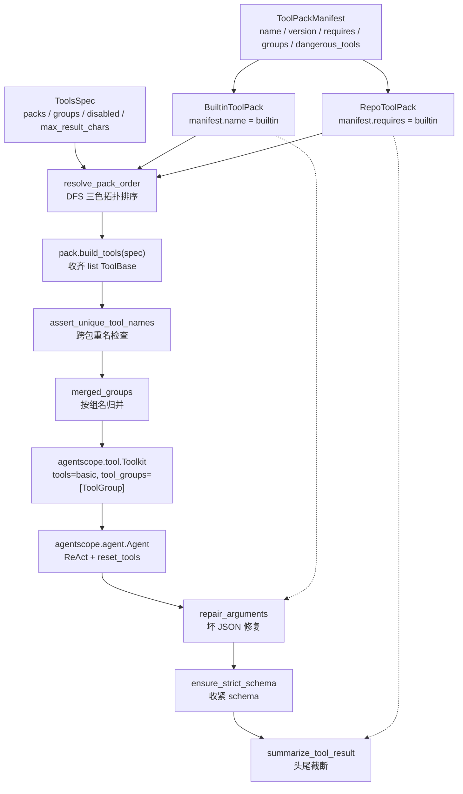

# 第 5 讲：工具系统：Toolkit、FunctionTool 与你的生产工具包

> **本讲目标**：看懂 AgentScope 2.0.8 工具层的三层抽象（`ToolBase` / `Toolkit` / `ToolGroup`），
> 并在此之上做出企业级的「工具包」层：一份清单 + 一批工具 + 依赖与分组 + 参数容错，
> 让 `BuiltinToolPack` 与 `RepoToolPack` 能被官方 `Agent` 直接驱动。
> **前置要求**：第 2 讲（Profile 与 `ToolsSpec`）、第 4 讲（模型适配层）；
> 环境为 `/Users/a/miniconda3/envs/agentscope_reme_pip_env`（Python 3.11.13 + agentscope 2.0.8 + ReMe 0.4.1.13）。
> **本讲交付物**：
> `tutorial_agsc_reme/reference/harness_kit/tools/__init__.py`、
> `.../tools/pack.py`、`.../tools/builtin_pack.py`、
> `.../tools/repo_pack.py`、`.../tools/utils.py`；
> 验证脚本 `tutorial_agsc_reme/reference/scripts/05_tool_packs.py`；
> 测试 `tutorial_agsc_reme/reference/tests/test_lesson05_tools.py`。
> **预计时长**：120 分钟。
>
> 本讲的完整可运行代码位于 `tutorial_agsc_reme/reference/harness_kit/tools/`，
> 你可以直接对照，也可以跟着正文一行一行写。

---

## 一、这一讲要解决的问题

先说结论：**官方把「一个工具」这件事做到了极致，却没有把「一包工具」这件事做完。**

AgentScope 2.0.8 给了你 `ToolBase`（工具契约）、`ToolChunk` / `ToolResponse`（结果契约）、
`Toolkit`（工具集合 + 工具组 + meta tool）、`FunctionTool`（函数即工具 + schema 自动生成）、
6 个开箱即用的文件/命令工具、`LocalBackend` / Docker backend 抽象。
这一层写得非常干净 —— 干净到很多人会误以为「工具系统就这么点东西」。

但一旦你把它放到企业环境里，会立刻撞上四类**装配期**的问题，而这些问题全部发生在
「一堆工具」的层面上，官方任何一个类都不负责：

1. **「一组工具」是可复用单元，但没有对应的类型。** 你的 Agent 需要
   「读写本机文件」「搜索并修改仓库代码」「跑测试」这三组能力，每组都由若干工具 +
   一组配置（工作目录、backend、超时、危险路径）+ 一条分组策略组成。
   官方没有 `ToolPack` 这个类型，于是每个项目都会自己写一遍
   `def build_tools(...) -> list[ToolBase]`，然后这些函数**互相不知道对方存在**。
   最直接的后果：两个包各自建了一个 `LocalBackend()`，
   `Read` 的缓存和 `Write` 的写入落在不同的 backend 实例上
   （`Read` 有按 backend 维度隔离的读取缓存，`Bash` 的 `cwd` 也挂在 backend 上），
   bug 表现是「我明明刚写完文件，`Read` 读出来还是旧内容」——
   这类 bug 在生产里平均要花半天才能定位。

2. **并行装配必然撞名字，而撞名字的报错发生在最贵的地方。** 两个包都定义了
   `Now` 工具（一个读本机时间、一个读容器时间），你把它们放进同一个 `Toolkit`，
   AgentScope 不会在装配时报错 —— 它会一路走到 provider 那一层，
   在 `tools` 数组里出现两份同名 schema，然后由 provider 决定报错还是静默挑一个。
   我们要的是**装配期就炸**，且错误信息里直接写清是哪两个包撞了。

3. **`ToolsSpec` 里写了组名，但没人替你算「谁先谁后」。** `RepoToolPack` 需要
   `BuiltinToolPack` 先建好 backend（它要复用同一个工作目录与 `exec_shell`），
   这个依赖关系写在清单的 `requires` 里。装配时如果顺序反了，
   `RepoToolPack` 会在一个错误的 cwd 里跑 `git grep`，
   或者更糟 —— 它自己新建一个 backend，于是第 1 条的问题换个马甲又出现一次。

4. **参数与结果这两端的容错，官方只做了一半。** 官方有
   `agentscope._utils._common._json_loads_with_repair`（基于 `json_repair`），
   流式解析时会把坏 JSON 尽量修好；也有 `ToolResponse` 的 `append_chunk` 帮你合并分片。
   但**没有**：把「代码围栏 / 弯引号 / 尾逗号 / 缺右括号」这类高频形状显式补上的确定性修补、
   把 JSON Schema 收紧到 `additionalProperties: false` 的工具、
   以及把超长工具结果「留头也留尾」再回灌进 context 的工具。
   缺了最后这一条，一次 `RunTests` 的输出就能把上下文灌爆；
   缺了前两条，模型偶尔抽风一次就是一个 `ArgumentRepairError` 冒到 `reply()` 外面。

一个真实的失败场景（本讲验证脚本里就能复现）：你装配好工具集，让模型去改一行代码，
模型的确实调用了 `RepoReplace`，然后你看到这样一条工具结果：

```
ToolGroupInactiveError: The tool 'RepoReplace' in group 'repo_write' is
currently inactive. You should first activate the group by calling the
'reset_tools' tool.
```

注意它不是异常，是一条 `state=error` 的**工具结果**回灌给了模型。
如果模型的 system prompt 里没写「遇到 inactive 要先激活」，它会把这条错误当成
「这个工具坏了」，然后开始用 `Write` 整文件重写 —— 你多花了一轮 LLM 调用，
还拿到了一个格式被改乱的仓库。这个行为本身是 AgentScope 的正确设计
（工具失败不该炸掉整个 reply），但它把「分组策略有没有配好」这件事的代价，
从「装配期报错」变成了「运行期多烧钱且结果不可控」。

所以本讲要做的事情是：**不重写任何一个工具，也不碰 `Toolkit` 一行代码，
而是在 `ToolBase` / `Toolkit` 之上补一层 `ToolPackBase`** ——
它把「一包工具」变成有清单、有依赖、有分组、有容错的**一等公民**，
并且最终产出的仍然是一个官方原生的 `agentscope.tool.Toolkit`
（`third_party/agentscope/src/agentscope/tool/_toolkit.py:66`），
官方 `Agent`（`.../agent/_agent.py:117`）拿过去就能跑。

---

## 二、源码侦察

这一节的每一条都来自本环境的真实源码，行号是**核对过的**。
（后文第四节会贴出参考实现的完整代码，其中的行内注释里有少量行号是撰写时留下的旧值，
偏差在 ±12 行以内；**以本节的行号为准**。）

### 2.1 `ToolBase`：唯一需要覆写的是 `call`

```
third_party/agentscope/src/agentscope/tool/_base.py:100   class ToolBase(ABC):
third_party/agentscope/src/agentscope/tool/_base.py:103       name: str
third_party/agentscope/src/agentscope/tool/_base.py:105       description: str
third_party/agentscope/src/agentscope/tool/_base.py:107       input_schema: dict[str, Any]
third_party/agentscope/src/agentscope/tool/_base.py:109       is_concurrency_safe: bool
third_party/agentscope/src/agentscope/tool/_base.py:111       is_read_only: bool
third_party/agentscope/src/agentscope/tool/_base.py:113       is_external_tool: bool = False
third_party/agentscope/src/agentscope/tool/_base.py:118       is_state_injected: bool = False
third_party/agentscope/src/agentscope/tool/_base.py:124       metadata_schema: dict[str, Any] | None = None
third_party/agentscope/src/agentscope/tool/_base.py:136       is_mcp: bool = False
third_party/agentscope/src/agentscope/tool/_base.py:138       mcp_name: str | None = None
third_party/agentscope/src/agentscope/tool/_base.py:142       dangerous_files: list[str] = DEFAULT_DANGEROUS_FILES
third_party/agentscope/src/agentscope/tool/_base.py:144       dangerous_directories: list[str] = DEFAULT_DANGEROUS_DIRECTORIES
```

这说明什么：工具是**数据 + 一个协程**。`name` / `description` / `input_schema`
这三个字段就是发给 provider 的全部信息 —— 所以本讲后面花大力气处理 schema
（去 `title`、补 `additionalProperties`、生成参数描述）不是洁癖，而是直接决定模型
能不能正确调用的东西。`is_read_only` 不只是文档，它是**权限检查的输入**
（`.../_base.py:298 async def check_read_only`）。

```
third_party/agentscope/src/agentscope/tool/_base.py:159       async def call(self, *args, **kwargs)
third_party/agentscope/src/agentscope/tool/_base.py:190       async def __call__(self, *args, **kwargs)
third_party/agentscope/src/agentscope/tool/_base.py:211               raise TypeError(...positional argument(s).)
third_party/agentscope/src/agentscope/tool/_base.py:218           async def execute_chain(index: int = 0, **chain_kwargs)
third_party/agentscope/src/agentscope/tool/_base.py:265       @abstractmethod
third_party/agentscope/src/agentscope/tool/_base.py:266       async def check_permissions(self, tool_input: dict[str, Any], context: PermissionContext) -> PermissionDecision
```

这说明什么（本讲最重要的一条约定）：**扩展点是 `call`，不是 `__call__`。**
`call` 的 docstring 原文就写着 「This is the new override point for tool implementations.
Subclasses should override this method instead of `__call__`.」。
`__call__` 是统一入口，它做了三件你不能绕过的事：

1. 拒绝位置参数（`:211`），逼所有调用方用关键字传参 —— 因为工具入参来自 JSON；
2. 给 `ToolMiddlewareBase` 套洋葱链（`execute_chain`，`:218`）；
3. 把 `call` 的两种形状（`async def` 与 `async def` + `yield`）**归一化**成同一条
   `AsyncGenerator[ToolChunk, None]`，让中间件不必区分。

`check_permissions` 是 `@abstractmethod`（`:265`），所以**自己写 `ToolBase` 子类必须实现它**；
而 `FunctionTool` 已经替你实现好了（见 2.3）。

### 2.2 JSON Schema 是自动生成的，且 docstring 里的类型只是装饰

```
third_party/agentscope/src/agentscope/tool/_base.py:29    class ParamsBase(BaseModel):
third_party/agentscope/src/agentscope/tool/_base.py:35        def model_json_schema(cls, *args, **kwargs) -> dict
third_party/agentscope/src/agentscope/tool/_utils.py:7    from docstring_parser import parse
third_party/agentscope/src/agentscope/tool/_utils.py:11   def _remove_title_field(schema: dict) -> dict
third_party/agentscope/src/agentscope/tool/_utils.py:47   def _extract_func_description(docstring: str) -> str
third_party/agentscope/src/agentscope/tool/_utils.py:69   def _build_param_field(description: str | None, default: Any) -> Any
third_party/agentscope/src/agentscope/tool/_utils.py:78   def _extract_input_schema(func, ...) -> tuple[dict, str]
third_party/agentscope/src/agentscope/tool/_utils.py:105      type_hints = typing.get_type_hints(tool_func, include_extras=True)
third_party/agentscope/src/agentscope/tool/_utils.py:170      base_model = create_model(...)
third_party/agentscope/src/agentscope/tool/_utils.py:178      _remove_title_field(params_json_schema)
```

这说明什么：schema 的生成路径是
**`docstring_parser.parse` 拿参数描述 → `typing.get_type_hints(..., include_extras=True)` 拿真实类型
→ `pydantic.create_model` 造一个临时模型 → `model_json_schema()` → `_remove_title_field()` 去 `title`**。

三个实操结论：

- **docstring 里写的类型是装饰**（`expression (str): ...` 里的 `str` 没人读），
  真正进 schema 的是**函数注解**。注解写错了，docstring 写得再对也没用。
- **`include_extras=True`** 意味着 `Annotated[int, Field(ge=1)]` 这类约束会被带进 schema；
  想要 `enum` 就用 `Literal[...]`。这是官方留给你的「加约束」的正规口子。
- **`title` 会被剥掉**（`:178`），因为它是 pydantic 自动加的无意义字段，
  纯粹烧 token。我实测 `Calc.input_schema` 的 JSON 里确实一个 `title` 都没有：

```
{
  "properties": {
    "expression": {
      "description": "The expression to evaluate, e.g. ``\"(1+2)*3/7\"``.",
      "type": "string"
    }
  },
  "required": [
    "expression"
  ],
  "type": "object"
}
```

（顺带一个容易踩的点：`required` 为空时**整个键都不出现**，不是 `[]`。
写断言要用 `schema.get("required", [])`。）

### 2.3 `FunctionTool` 的权限默认值是 ASK，必须显式改成 ALLOW

```
third_party/agentscope/src/agentscope/tool/_adapters.py:36    class FunctionTool(ToolBase):
third_party/agentscope/src/agentscope/tool/_adapters.py:54        def __init__(self, func, *, name=None, description=None, is_read_only=False, is_concurrency_safe=False, is_state_injected=False, middlewares=None, permission=None)
third_party/agentscope/src/agentscope/tool/_adapters.py:116       async def check_permissions(self, tool_input, context) -> PermissionDecision
third_party/agentscope/src/agentscope/tool/_adapters.py:131           return PermissionDecision(
third_party/agentscope/src/agentscope/tool/_adapters.py:132               behavior=PermissionBehavior.ASK,
third_party/agentscope/src/agentscope/tool/_adapters.py:137       async def call(self, **kwargs) -> ToolChunk | AsyncGenerator[ToolChunk, None]
third_party/agentscope/src/agentscope/tool/_adapters.py:177       def _convert_func_result_to_chunk(self, result, start_time) -> ToolChunk
```

这说明什么：`FunctionTool` 是「把函数变成工具」的适配器 ——
函数签名 + docstring 自动变 schema（2.2），返回值自动包成 `ToolChunk`（`:177`），
**但权限默认是 ASK**（`:132`）。ASK 的语义是「每调一次问一次用户」。
对一个「读当前时间」「算 1+1」的工具来说，这是纯粹的骚扰，
而且它会污染权限对话框：真正需要人确认的危险操作，淹没在
「是否允许读取当前时间」的弹窗里。

所以本讲给 `Now` / `Calc` 显式构造了一个模块级常量 `READ_ONLY_ALLOW`
（`reference/harness_kit/tools/builtin_pack.py:75`），
`permission=READ_ONLY_ALLOW` 传进 `FunctionTool`。
下面的 pytest 断言了 `tools["Calc"].check_permissions(...) is READ_ONLY_ALLOW`
—— 用 `is` 而不是 `==`，是为了保证拿到的就是那一个对象，不是碰巧相等的另一个。

对照一下官方自带的文件工具：它们返回的是 `PASSTHROUGH`，
意思是「我不表态，交给上层权限引擎决定」。本讲实测输出：

```
  Calc.check_permissions  -> PermissionBehavior.ALLOW | harness_kit.tools.builtin_pack.READ_ONLY_ALLOW
  Write.check_permissions -> PermissionBehavior.PASSTHROUGH
```

### 2.4 `ToolChunk` 与 `ToolResponse`：错误态是数据，不是异常

```
third_party/agentscope/src/agentscope/tool/_response.py:28    class ToolChunk(BaseModel):
third_party/agentscope/src/agentscope/tool/_response.py:35        state: ToolResultState = ToolResultState.RUNNING
third_party/agentscope/src/agentscope/tool/_response.py:38        is_last: bool = True
third_party/agentscope/src/agentscope/tool/_response.py:42        metadata: dict = Field(default_factory=dict)
third_party/agentscope/src/agentscope/tool/_response.py:46        id: str = Field(default_factory=_generate_id)
third_party/agentscope/src/agentscope/tool/_response.py:50    class ToolResponse(BaseModel):
third_party/agentscope/src/agentscope/tool/_response.py:56        state: Literal[ToolResultState.ERROR, ToolResultState.DENIED, ToolResultState.INTERRUPTED, ToolResultState.SUCCESS]
third_party/agentscope/src/agentscope/tool/_response.py:72        def append_chunk(self, chunk: ToolChunk) -> Self
```

这说明什么：`ToolChunk` 多了 `RUNNING` 态和 `is_last`，`ToolResponse` **没有** `RUNNING`
—— 它是「终态」的完整结果。`append_chunk`（`:72`）负责把一串 chunk 累积成 response，
规则是：**同 id 的块原地合并**（`TextBlock.text +=`、base64 分片用
`_merge_base64_chunks` 续接）、状态取「最坏的那个」（一旦出现 ERROR 就不会被后面的
SUCCESS 覆盖掉）、`metadata` 合并。

于是官方给工具作者的建议是：**用 `ToolChunk(state=ERROR)` 表达失败，而不是抛异常。**
本讲的 `RepoReplace` 严格遵守这条：`old_text` 命中数不等于 `expected_count` 时，
它返回一个 `{"ok": false, "actual_count": 2, "expected_count": 1, ...}` 的
SUCCESS 结果（工具**执行成功了**，业务结果是「拒绝写入」）。这一点在 pytest 里被钉死：

```python
assert state == "success", "工具自己把错误转成了结果，不是异常"
assert json.loads(text)["actual_count"] == 2
```

### 2.5 `Toolkit`：`basic` 是保留组名，且 `add_tool` 是 async

```
third_party/agentscope/src/agentscope/tool/_toolkit.py:66     class Toolkit:
third_party/agentscope/src/agentscope/tool/_toolkit.py:88         def __init__(self, tools=None, skills_or_loaders=None, mcps=None, tool_groups=None, meta_tool_response_template=..., skill_instruction_template=...)
third_party/agentscope/src/agentscope/tool/_toolkit.py:117        if tool_groups is not None and any(_.name == "basic" for _ in tool_groups):
third_party/agentscope/src/agentscope/tool/_toolkit.py:120            raise ValueError(...)
third_party/agentscope/src/agentscope/tool/_toolkit.py:126        self.tool_groups = [ToolGroup(name="basic", tools=tools or [], skills_or_loaders=..., mcps=...)] + (tool_groups or [])
third_party/agentscope/src/agentscope/tool/_toolkit.py:171    async def get_tool_schemas(self, groups: list[str] | None = None) -> list[dict]
third_party/agentscope/src/agentscope/tool/_toolkit.py:185            (docstring: 未提供 groups 时只包含 basic 组)
third_party/agentscope/src/agentscope/tool/_toolkit.py:225    async def call_tool(self, tool_call: ToolCallBlock, state: AgentState) -> AsyncGenerator[ToolChunk | ToolResponse, None]
third_party/agentscope/src/agentscope/tool/_toolkit.py:503        if (len(self.tool_groups) == 1 and self.tool_groups[0].name != "basic" or len(self.tool_groups) > 1):
third_party/agentscope/src/agentscope/tool/_toolkit.py:512        groups_filter = ["basic"] + (groups or [])
third_party/agentscope/src/agentscope/tool/_toolkit.py:640    async def add_tool(self, tool: ToolBase | list[ToolBase], ...) -> None
third_party/agentscope/src/agentscope/tool/_tool_group.py:10     class ToolGroup:
third_party/agentscope/src/agentscope/tool/_tool_group.py:71         if name != "basic" and description is None:
third_party/agentscope/src/agentscope/tool/_tool_group.py:72             raise ValueError(...)
```

这说明什么 —— 五条硬事实，每一条都会影响你的装配代码：

1. **`"basic"` 是保留组名。** 你在 `tool_groups=[...]` 里传一个叫 `basic` 的组，
   `:117` 直接 `raise ValueError`。所以 `ToolsSpec.groups` 里写 `basic` 必须**由我们提前拒绝**，
   而不是等官方抛。参考实现里 `ToolPackBase.merged_groups`
   （`reference/harness_kit/tools/pack.py:195`）就干这件事。
2. **「未提供 groups 时只包含 basic 组」**（`:185` 的 docstring）。
   加上 `:512` 的 `groups_filter = ["basic"] + (groups or [])`，
   得出本讲最重要的分组策略：**只有 `basic` 组的工具是常驻可见的，其余组必须由模型
   调 `reset_tools` 激活。**
3. **`reset_tools` 这个 meta tool 只在「存在非 basic 组」时才注入**（`:503`）。
   所以一个只有 `basic` 组的 Toolkit 里，模型**没有任何办法**激活别的组 ——
   这正是「把 `Bash` 放 basic」和「把 `Bash` 放 shell 组」的语义差别。
4. **`add_tool` 是 `async`**（`:640`），而且加进去的工具一律落进 `basic` 组。
   所以「先各自 `build_toolkit` 再合并」这条路**走不通**：合并会丢掉全部分组信息。
   本讲的 `build_multi_pack_toolkit` 因此采用
   「先把所有工具收齐 → 按组名归并 → 一次性构造 `Toolkit`」。
5. **非 basic 组必须有 description**（`_tool_group.py:71`），否则 `ValueError`。
   这份描述会被官方塞进 `reset_tools` 的 **schema** 里当参数描述 ——
   我实测抓到的 meta tool schema 长这样：

```
"reset_tools": {
  "properties": {
    "fs_write": { "default": false, "description": "fs_write 工具组，包含工具：Edit, Write。当任务需要这些能力时激活本组。", "type": "boolean" },
    "shell":    { "default": false, "description": "shell 工具组，包含工具：Bash。当任务需要这些能力时激活本组。", "type": "boolean" },
    "repo_write": { "default": false, "description": "repo_write 工具组，包含工具：RepoReplace, RunTests。当任务需要这些能力时激活本组。", "type": "boolean" }
  },
  "type": "object"
}
```

   也就是说：**组描述就是模型决定「该不该激活这一组」的唯一依据**，
   写「包含工具：Edit, Write」几乎等于没写。这是本讲要让 `BuiltinToolPack` 覆写
   `_group_description` 的原因（虽然多包装配时会被模块级默认实现盖掉，
   见 4.5 小节的说明与对应测试）。

### 2.6 官方自带的 6 个工具：构造参数就是你要传的配置

```
third_party/agentscope/src/agentscope/tool/_builtin/_bash.py:137     def __init__(self, dangerous_files=..., dangerous_directories=..., cwd=None, middlewares=None, backend=None)
third_party/agentscope/src/agentscope/tool/_builtin/_read.py:131     def __init__(self, max_line_characters=2000, model_input_types=None, middlewares=None, backend=None)
third_party/agentscope/src/agentscope/tool/_builtin/_write.py:65     def __init__(self, dangerous_files=..., dangerous_directories=..., middlewares=None, backend=None)
third_party/agentscope/src/agentscope/tool/_builtin/_edit.py:87      def __init__(self, dangerous_files=..., dangerous_directories=..., middlewares=None, backend=None)
third_party/agentscope/src/agentscope/tool/_builtin/_glob.py:99      def __init__(self, backend=None, glob_helper_path=None)
third_party/agentscope/src/agentscope/tool/_builtin/_grep.py:159     def __init__(self, middlewares=None, backend=None)
third_party/agentscope/src/agentscope/tool/_builtin/_backend.py:62   class ExecResult:
third_party/agentscope/src/agentscope/tool/_builtin/_backend.py:138  class BackendBase(ABC):
third_party/agentscope/src/agentscope/tool/_builtin/_backend.py:741  class LocalBackend(BackendBase):
third_party/agentscope/src/agentscope/tool/__init__.py:25            LocalBackend
```

这说明什么：**6 个工具全都接受 `backend=`**，而且 `Bash` / `Write` / `Edit` 还各接受
`dangerous_files` / `dangerous_directories`（默认值是模块级常量
`DEFAULT_DANGEROUS_FILES` / `DEFAULT_DANGEROUS_DIRECTORIES`）。
所以「共用同一个 backend」在官方这边是一等公民，只要你在构造时把同一个实例传进去。
本讲的 `BuiltinToolPack._backend_or_new()`
（`reference/harness_kit/tools/builtin_pack.py:318`）就是这件事的唯一实现点。

`BackendBase` 是抽象后端（`exec_shell` 收 argv 列表、`read_file` / `write_file` 走 bytes、
`join_path` / `isabs` / `os_name`），`LocalBackend` 是它的本地实现。
换句话说：**把这 6 个工具的 backend 换成 Docker backend，整包就进沙箱了**，
这也是 `BuiltinToolPack.__init__(backend=...)` 留了那个参数的原因。

### 2.7 参数修复：官方只提供「底层能力」，不提供策略

```
third_party/agentscope/src/agentscope/_utils/_common.py:95    def _json_loads_with_repair(json_str: str, schema: dict | None = None) -> dict
```

这说明什么：这是一个**私有函数**（前导下划线），docstring 明确写着它「目前只用于解析
流式 `tool_use` 的参数」。它做的是「用 `json_repair` 修 + 用 `schema` 修类型」这两件事，
**不包含**我们最需要的那几种确定性修补。而且它名字带下划线，跨版本会动 ——
所以本讲在 `harness_kit/tools/utils.py` 里把它包了起来
（`repair_arguments`，`reference/harness_kit/tools/utils.py:205`），
并在它失败时退回 `ast.literal_eval`，最后才抛 `ArgumentRepairError`。

实测它能修 / 不能修什么（这是 `scripts/05_tool_packs.py` 的 D 小节输出）：

```
  合法           -> {'expression': '1+1'}
  包了代码块        -> {'expression': '2*3'}
  单引号          -> {'expression': '3**2'}
  尾随逗号         -> {'expression': '10/4'}
  被截断          -> {'expression': 'abs(-7)'}
  空串（无参）       -> {}
  无可救药         -> ArgumentRepairError attempts=['json_loads_with_repair', 'ast_literal_eval']
```

注意 `json_repair` **极其宽容**：`'这不是 JSON，也不是 {}'` 会被修成 `{}`，
`'[1, 2, 3]'`（合法 JSON 但不是 object）才会抛 `ArgumentRepairError`。
所以「修复失败」这条分支必须用「不是 object」的输入去测，否则你以为测了、其实没测。

### 2.8 本讲的扩展点清单（继承谁、实现什么、在哪个文件）

| # | 官方扩展点 | 基类 / 协议 | 必须实现或覆写的方法（真实签名） | 文件:行号 | 我们在哪落地 |
| --- | --- | --- | --- | --- | --- |
| E1 | 工具契约 | `ToolBase(ABC)` | `async def call(self, *args, **kwargs) -> ToolChunk \| AsyncGenerator[ToolChunk, None]`；`async def check_permissions(self, tool_input: dict, context: PermissionContext) -> PermissionDecision` | `tool/_base.py:100` / `:159` / `:266` | **不实现**（本讲一个裸 `ToolBase` 子类都不写，全部走 E2/E3） |
| E2 | 函数即工具 | `FunctionTool(ToolBase)` | 构造参数 `func` / `name` / `is_read_only` / `is_concurrency_safe` / `permission` | `tool/_adapters.py:36` / `:54` | `Now` / `Calc`（`tools/builtin_pack.py:97` / `:218`）；`RepoTree` / `RepoSearch` / `RepoReplace` / `RunTests`（`tools/repo_pack.py:205` / `:300` / `:413` / `:517`） |
| E3 | 官方原生工具 | `Bash` / `Read` / `Write` / `Edit` / `Glob` / `Grep` | 构造参数见 2.6 | `tool/_builtin/_*.py` | `BuiltinToolPack.build_tools`（`tools/builtin_pack.py:344`）—— **只做配置，不重写** |
| E4 | 执行后端 | `BackendBase(ABC)` | `exec_shell` / `read_file` / `write_file` / `join_path` / `isabs` / `os_name` | `tool/_builtin/_backend.py:138` | `BuiltinToolPack(backend=...)` 注入（第 10 讲做 Docker backend） |
| E5 | 工具集合 | `Toolkit` | 构造 `Toolkit(tools=basic, tool_groups=[ToolGroup(...)])`；调用 `await toolkit.call_tool(tool_call, state=state)` | `tool/_toolkit.py:66` / `:88` / `:225` | `build_multi_pack_toolkit`（`tools/pack.py:445`）与 `ToolPackBase.build_toolkit`（`tools/pack.py:220`） |
| E6 | 工具组 | `ToolGroup` | `ToolGroup(name=..., description=..., tools=[...])`，`name != "basic"` 时 description 必填 | `tool/_tool_group.py:10` / `:71` | `merged_groups` + `_group_description`（`tools/pack.py:195` / `:299`；`tools/builtin_pack.py:426`；`tools/repo_pack.py:664`） |
| E7 | 参数解析（私有） | `_json_loads_with_repair` | `(json_str: str, schema: dict \| None = None) -> dict` | `_utils/_common.py:95` | `repair_arguments`（`tools/utils.py:205`）把它当**第一层**，失败再走自己的修补 |
| E8 | Schema 生成 | `_extract_input_schema` / `_remove_title_field` | `(func) -> tuple[dict, str]` / `(schema: dict) -> dict` | `tool/_utils.py:78` / `:11` | **不覆写**，只消费：`ensure_strict_schema`（`tools/utils.py:287`）在它产出的 schema 上继续收紧 |
| E9 | 结果合并 | `ToolResponse.append_chunk` | `(chunk: ToolChunk) -> Self` | `tool/_response.py:72` | **不覆写**；`summarize_tool_result`（`tools/utils.py:355`）负责在它之后做长度控制 |

一句话总结这张表：**E1 我们不碰，E2–E4 我们只配置，E5/E6 我们做装配，
E7/E8/E9 我们做补充。** 没有任何一处是「重新实现官方已有的东西」。

### 2.9 「我们这一层的类型」在官方那边完全没有对应物

把上面 9 个扩展点排一遍，你会发现一个空白：
**`ToolBase` 是「一个工具」，`Toolkit` 是「一批工具」，中间没有「一包工具」。**

`Toolkit` 的粒度太粗 —— 它是「装配结果」，没有版本、没有依赖、没有归属；
`ToolBase` 的粒度太细 —— 它是一个可调用的东西，不携带「我应该和谁一起出现」的信息。

这就是本讲的缺口，下一节展开。

---

## 三、扩展点定位与设计

### 3.1 官方已经给了什么

按 2.8 的表，官方给了：工具契约（`ToolBase`）、适配器（`FunctionTool` / `MCPTool`）、
6 个生产级原生工具 + 后端抽象、结果契约（`ToolChunk` / `ToolResponse`）、
集合与分组（`Toolkit` / `ToolGroup` + `reset_tools` meta tool）、
schema 自动生成（`_extract_input_schema`）、参数修复的底层能力（`_json_loads_with_repair`）。
这些**全部不需要我们重写**。

### 3.2 还缺什么（本讲的缺口编号 G1–G6）

契约 §1.3 列的是全套 20 讲的六个**全局**缺口（事件日志、事件总线、评测引擎、
记忆预算、声明式装配、沙箱策略）。本讲的缺口是**工具层专属**的六个，编号只在本讲内使用：

| # | 缺什么 | 证据（官方源码里找不到对应物） | 谁补 |
| --- | --- | --- | --- |
| G1 | 「一包工具」这个类型：清单（名字/版本/依赖/分组/危险工具）+ 装配钩子 | `tool/` 目录下 grep 不到 `class ToolPack` / `Manifest`；`Toolkit` 不含 `version` / `requires` 字段 | `ToolPackManifest` / `ToolPackBase`（`tools/pack.py:85` / `:144`） |
| G2 | 多包的**拓扑装配**：按 `requires` 排序、跨包重名检查、组名归并后一次性建 `Toolkit` | `Toolkit.add_tool` 是 async 且一律落 `basic`（`_toolkit.py:640`），没有「合并两个 Toolkit」的公开 API | `resolve_pack_order` / `assert_unique_tool_names` / `build_multi_pack_toolkit`（`tools/pack.py:378` / `:359` / `:445`） |
| G3 | 分组策略的**默认值**：只读的常驻 basic，有副作用的入组 | 官方只提供「basic 常驻 + 其余按需」的机制（`_toolkit.py:512`），不提供「哪些工具该进哪个组」的判断 | `BuiltinToolPack.manifest.groups`（`tools/builtin_pack.py:289`）、`RepoToolPack.manifest.groups`（`tools/repo_pack.py:120`） |
| G4 | 参数修复的**策略层**：确定性修补 + `ast.literal_eval` 兜底 + 统一的 `ArgumentRepairError` | `_json_loads_with_repair` 只有「json_repair + schema 类型修」，且是私有函数（`_utils/_common.py:95`） | `repair_arguments` / `ArgumentRepairError`（`tools/utils.py:205` / `:70`） |
| G5 | schema **收紧**与结果**截断** | `_remove_title_field` 只删 `title`（`tool/_utils.py:11`）；`ToolResponse` 对结果长度零控制 | `ensure_strict_schema` / `summarize_tool_result`（`tools/utils.py:287` / `:355`） |
| G6 | 生产级工具包本体：仓库概览 / 代码搜索 / 原子替换 / 跑测试并汇总 | 官方 6 个原生工具里没有仓库语义、没有测试运行器 | `RepoToolPack`（`tools/repo_pack.py:89`，4 个工具） |

### 3.3 我们在哪个扩展点上做

- **继承 `ToolPackBase`**（我们自己定义的 ABC），实现 `async def build_tools(self, spec: ToolsSpec) -> list[ToolBase]`；
- **复用官方 `FunctionTool`** 把纯函数变工具（不写裸 `ToolBase` 子类）；
- **复用官方 6 个原生工具**，只做「配置注入 + 共享 backend」；
- **产出官方 `Toolkit`**，构造参数只用 `tools=` 与 `tool_groups=`；
- **消费官方 `_json_loads_with_repair`**，在其上叠加确定性修补。

一句话：**我们这一层是「装配层」，不含任何工具实现逻辑（`Calc` 的 AST 求值器除外，
它是官方没有的只读能力，且用官方 `FunctionTool` 承载）。**

### 3.4 装配流程图



（图中 `BuiltinToolPack` 与 `RepoToolPack` 都指向 `resolve_pack_order`，
箭头方向表示「被排序」；虚线表示「该包产出的工具在运行期会用到这两个工具函数」。）

### 3.5 `ToolPackBase` 的四个方法各自解决什么

| 方法 | 签名 | 解决 |
| --- | --- | --- |
| `build_tools` | `async def build_tools(self, spec: ToolsSpec) -> list[ToolBase]` | G1：唯一抽象方法，每个包自己实现 |
| `build_context` | `def build_context(self) -> dict[str, Any]` | G2：把 backend / workdir 暴露给后续包（`RepoToolPack` 复用 `BuiltinToolPack` 的 backend） |
| `merged_groups` | `def merged_groups(self, spec: ToolsSpec) -> dict[str, list[str]]` | G3 + 保留名检查：清单默认分组被 `ToolsSpec.groups` **整体替换** |
| `build_toolkit` | `async def build_toolkit(self, spec: ToolsSpec) -> Toolkit` | G2 的单包版本：`build_tools` → `Toolkit(tools=basic, tool_groups=[...])` |

`build_context` 与 `build_tools` 的关系值得单独说一句：**`build_context` 不是装配路径上的必经点**。
`build_multi_pack_toolkit` 只调 `build_tools` 与 `merged_groups`；
`build_context` 是给「需要跨包共享一个 backend」的场景用的显式接口
（`BuiltinToolPack` 的实现见 `tools/builtin_pack.py:414`，
`RepoToolPack` 的见 `tools/repo_pack.py:653`）。
本讲把这条差异**钉成了一个测试**（`test_single_pack_uses_pack_own_group_description`），
因为「我以为它会自动被调用」是这一层最容易犯的错。
---

## 四、harness_kit 实现

这一节给出五个文件的**完整内容**（不是片段）。五个文件加起来 2240 行，
其中大部分是注释与 docstring —— 这正是「企业级」与「能跑就行」的差别：
工具层是**最容易被别人抄错**的一层（抄的时候往往会丢掉 `dangerous_directories`
或者 `max_line_characters`），把「为什么是这个值」写进代码里是最省事的防御。

> **关于行号的透明说明**：下面代码里的注释保留了撰写时写下的 `路径:行号`。
> 复核时发现其中一部分有偏差（例如注释里写的 `_toolkit.py:505`，实际是 `:512`；
> 注释里写的 `registry.py:1063`，实际是 `:1075`）。
> **需要精确行号时请以第二节的清单为准**，那一段是逐条核对过的。
> 我在 4.5 末尾附了一份「偏差对照表」。

### 4.1 `harness_kit/tools/__init__.py`

```python
# -*- coding: utf-8 -*-
"""harness_kit 的工具层：工具包契约、生产工具包、参数修复。

模块归属（契约 §二）：

- :mod:`harness_kit.tools.pack` —— ``ToolPackManifest`` / ``ToolPackBase``，
  以及多包拓扑装配；
- :mod:`harness_kit.tools.builtin_pack` —— ``BuiltinToolPack``：AgentScope
  原生文件/命令工具 + 只读的 ``Now`` / ``Calc``；
- :mod:`harness_kit.tools.repo_pack` —— ``RepoToolPack``：仓库概览、代码搜索、
  精确替换、跑测试；
- :mod:`harness_kit.tools.utils` —— JSON schema 收紧、工具参数修复、结果截断。

:func:`build_toolkit` 是本层的**唯一入口**：给一批包和一份 ``ToolsSpec``，
拿一个装好的 ``Toolkit``。
"""

from typing import TYPE_CHECKING, Sequence

from harness_kit.tools.builtin_pack import BuiltinToolPack, build_builtin_pack
from harness_kit.tools.pack import (
    BASIC_GROUP,
    DuplicateToolNameError,
    PackResolutionError,
    ToolPackBase,
    ToolPackManifest,
    assert_unique_tool_names,
    build_multi_pack_toolkit,
    resolve_pack_order,
)
from harness_kit.tools.repo_pack import RepoToolPack, build_repo_pack
from harness_kit.tools.utils import (
    ArgumentRepairError,
    ensure_strict_schema,
    repair_arguments,
    summarize_tool_result,
)

if TYPE_CHECKING:  # pragma: no cover - 仅类型检查
    from agentscope.tool import Toolkit

    from harness_kit.config.schema import ToolsSpec

__all__ = [
    "BASIC_GROUP",
    "ArgumentRepairError",
    "BuiltinToolPack",
    "DuplicateToolNameError",
    "PackResolutionError",
    "RepoToolPack",
    "ToolPackBase",
    "ToolPackManifest",
    "assert_unique_tool_names",
    "build_builtin_pack",
    "build_multi_pack_toolkit",
    "build_repo_pack",
    "build_toolkit",
    "ensure_strict_schema",
    "repair_arguments",
    "resolve_pack_order",
    "summarize_tool_result",
]


async def build_toolkit(
    spec: "ToolsSpec",
    packs: Sequence[ToolPackBase],
) -> "Toolkit":
    """把多个工具包装配成一个 ``Toolkit``。契约 §二 里 ``tools/__init__.py`` 的入口。

    内部直接委托 :func:`~harness_kit.tools.pack.build_multi_pack_toolkit`，
    它负责：拓扑排序 → 收齐工具 → 跨包重名检查 → 按组合并 → 构造 ``Toolkit``。

    **``packs`` 只接受 ``ToolPackBase`` 实例，不接受字符串**，这是刻意的：
    字符串需要先经 ``HarnessRegistry.get("tool_pack", name)`` 求值，而那条路
    拿到的是 ``list[ToolBase]``（见 ``.../registry.py:779`` 的
    ``_builtin_tool_pack``），**拿不到清单里的分组与依赖信息**。想要「按名字
    装配」，请走 :meth:`harness_kit.config.builder.HarnessBuilder` —— 它才是
    负责名字解析的那一层。这里只负责「给我包，我给你 Toolkit」。

    Args:
        spec (`ToolsSpec`): 工具声明（分组、禁用、结果长度上限）。
        packs (`Sequence[ToolPackBase]`): 工具包实例，顺序无所谓。

    Returns:
        `Toolkit`: 装配好的工具集。

    Raises:
        TypeError: ``packs`` 里混进了字符串或非 ``ToolPackBase`` 对象。
        DuplicateToolNameError: 跨包工具重名。
        PackResolutionError: 依赖缺失或成环。
        ValueError: ``ToolsSpec`` 里的组名用了保留名 ``"basic"``。
    """
    for pack in packs:
        if not isinstance(pack, ToolPackBase):
            raise TypeError(
                f"build_toolkit 只接受 ToolPackBase 实例，收到 "
                f"{type(pack).__name__}（{pack!r}）。"
                "按名字装配请走 HarnessBuilder。",
            )
    return await build_multi_pack_toolkit(packs, spec)
```

**为什么这么写**：

1. **`tools/__init__.py` 是本层唯一的入口。** 契约 §二 规定
   `harness_kit.tools` 对外只暴露 `build_toolkit` 这一个装配函数。
   它做的事情只有一件：**类型检查**——发现 `packs` 里混进了字符串
   （`["builtin", "repo"]` 这种写法），立刻 `TypeError`，
   并在错误信息里明确指向 `HarnessBuilder`。
2. **为什么把「按名字装配」这条路堵死。** `harness_kit.registry` 里
   `_builtin_tool_pack`（`reference/harness_kit/registry.py:780`）
   的签名是 `async (spec, ctx) -> list[ToolBase]` ——
   **它返回的是裸工具列表，拿不到清单里的分组与依赖信息**。
   所以「`ToolsSpec.packs = ["builtin", "repo"]`」这条路径必须由
   `HarnessBuilder.build_toolkit`（`reference/harness_kit/config/builder.py:415`）
   走注册表工厂来实现，而**不是**把它偷偷塞进 `build_toolkit` 的 `packs` 参数里。
   两者混在一起，是这一层最常见的**概念混乱**。
3. `BASIC_GROUP` 从 `pack.py` 重新导出，是为了让
   `harness_kit/tools/__init__.py:44` 的 `__all__` 与契约 §二 的导出清单一一对应 ——
   上层写 `from harness_kit.tools import BASIC_GROUP` 时不该知道它住在 `pack.py`。

### 4.2 `harness_kit/tools/pack.py`

```python
# -*- coding: utf-8 -*-
"""工具包契约：清单、基类、以及「多包如何拼成一个 Toolkit」。

**它补的是 AgentScope 没有的那一层**。AgentScope 提供的是**工具级**的抽象
（``ToolBase`` / ``FunctionTool`` / ``ToolGroup`` / ``Toolkit``），但没有
「**一包工具**」这个概念。缺了这一层，装配 30 个以上工具时会出三种事故：

1. **重名冲突静默发生**。``Toolkit.add_tool`` 只在**工具组**层面查重名
   （``third_party/agentscope/src/agentscope/tool/_tool_group.py``），
   跨组同名工具会被 LLM 的 ``tools`` 数组同时收到两个同名 schema ——
   provider 要么报错，要么按第一个执行。本模块用
   :func:`assert_unique_tool_names` 在装配期就拦下来。
2. **依赖顺序靠人记**。「repo 包需要 builtin 包提供的 backend」这种关系
   在 YAML 里是隐式的，写反了要等运行期才炸。本模块用
   :attr:`ToolPackManifest.requires` + :func:`resolve_pack_order` 拓扑排序。
3. **危险工具没有统一标记**。哪些工具需要权限引擎显式放行（写文件、跑命令）
   散落在各工具定义里。本模块用 :attr:`ToolPackManifest.dangerous_tools`
   把它变成**可声明、可审计**的一份清单。

**注意与 ``harness_kit.registry`` 的分工**（这不是重复实现）：

- ``registry._builtin_tool_pack`` 是 Layer 0 的**直连工厂**，签名
  ``async (spec, ctx) -> list[ToolBase]``，供 ``HarnessBuilder`` 直接调用；
- 本模块的 :class:`ToolPackBase` 是**给人和 YAML 看的**包协议（带清单、
  分组、依赖、描述），:meth:`ToolPackBase.build_tools` 的签名与直连工厂
  一致，因此两者可以互相包装 —— ``builtin_pack.build_builtin_pack`` 就是
  这样一个适配器。
"""

from __future__ import annotations

import inspect
from abc import ABC, abstractmethod
from typing import TYPE_CHECKING, Any, Iterable, Sequence

from loguru import logger
from pydantic import BaseModel, ConfigDict, Field

from agentscope.tool import ToolBase, ToolGroup, Toolkit

if TYPE_CHECKING:  # pragma: no cover - 仅类型检查
    from harness_kit.config.schema import ToolsSpec

__all__ = [
    "DuplicateToolNameError",
    "PackResolutionError",
    "ToolPackBase",
    "ToolPackManifest",
    "assert_unique_tool_names",
    "resolve_pack_order",
]

BASIC_GROUP: str = "basic"
"""AgentScope 的保留组名。

``Toolkit.__init__`` 在 ``tool_groups`` 里看到 ``"basic"`` 会直接
``ValueError``（``third_party/agentscope/src/agentscope/tool/_toolkit.py:114``），
因为它自己已经建了一个 ``basic`` 组来装 ``tools`` 参数。
所以 :meth:`ToolPackBase.build_toolkit` 里永远不把 ``"basic"`` 塞进
``tool_groups``，而是让不带组的工具留在 ``Toolkit(tools=...)`` 里。
"""


class DuplicateToolNameError(ValueError):
    """同一批工具里出现了重名工具。"""

    def __init__(self, names: Iterable[str]) -> None:
        """构造错误。

        Args:
            names (`Iterable[str]`): 重复的工具名。
        """
        self.names = sorted(set(names))
        super().__init__(
            f"工具名重复：{self.names}；同名的两个工具会让 LLM 的 tools "
            "数组出现两份同名 schema，provider 的行为未定义。"
            "请改名，或用 ToolsSpec.disabled 关掉其中一个。",
        )


class PackResolutionError(ValueError):
    """工具包依赖无法解析（缺包 / 成环 / 自依赖）。"""


class ToolPackManifest(BaseModel):
    """一个工具包的清单。契约 §5.4。

    Attributes:
        name (`str`): 包名，``ToolsSpec.packs`` 里写的就是它。
        version (`str`): 版本，默认 ``"0.1.0"``。
        description (`str`): 人读描述，会出现在 ``describe()`` 与日志里。
        requires (`list[str]`): 依赖的其它包名；装配时会被拓扑排序。
        groups (`dict[str, list[str]]`): ``组名 -> 工具名``，是**默认**分组；
            ``ToolsSpec.groups`` 可覆盖 / 追加。
        tags (`list[str]`): 自由标签（``fs`` / ``net`` / ``dangerous`` …），
            供上层做策略筛选。
        dangerous_tools (`list[str]`): 需要权限引擎显式放行的工具名。
    """

    model_config = ConfigDict(extra="forbid")

    name: str
    """包名。"""
    version: str = "0.1.0"
    """版本。"""
    description: str = ""
    """人读描述。"""
    requires: list[str] = Field(default_factory=list)
    """依赖的其它包名。"""
    groups: dict[str, list[str]] = Field(default_factory=dict)
    """默认分组：组名 → 工具名列表。"""
    tags: list[str] = Field(default_factory=list)
    """自由标签。"""
    dangerous_tools: list[str] = Field(default_factory=list)
    """需权限引擎显式放行的工具名。"""

    def group_of(self, tool_name: str) -> str | None:
        """查一个工具属于哪个组。

        Args:
            tool_name (`str`): 工具名。

        Returns:
            `str | None`: 组名；不在任何组时 ``None``（表示归 ``basic``）。
        """
        for group, members in self.groups.items():
            if tool_name in members:
                return group
        return None

    def summary(self) -> str:
        """一行摘要。

        Returns:
            `str`: 形如 ``builtin@0.1.0 (6 tools, 3 groups)``。
        """
        total = sum(len(members) for members in self.groups.values())
        return (
            f"{self.name}@{self.version} "
            f"({total} tools, {len(self.groups)} groups)"
        )


class ToolPackBase(ABC):
    """一个「生产工具包」= 若干 :class:`ToolBase` + 清单 + 装配钩子。

    子类只需要做两件事：类属性 :attr:`manifest` 写清单，实现
    :meth:`build_tools`。:meth:`build_toolkit` 有可用默认实现。

    Example:
        >>> class MyPack(ToolPackBase):
        ...     manifest = ToolPackManifest(name="my", groups={"x": ["t"]})
        ...     async def build_tools(self, spec):
        ...         return [my_tool]
    """

    manifest: ToolPackManifest
    """本包的清单；子类必须覆盖为**实例**或类属性。"""

    # ------------------------------------------------------------------
    # 子类必须实现
    # ------------------------------------------------------------------
    @abstractmethod
    async def build_tools(self, spec: "ToolsSpec") -> list[ToolBase]:
        """造出本包的全部工具。

        Args:
            spec (`ToolsSpec`): 工具声明（``packs`` / ``groups`` /
                ``disabled`` / ``max_result_chars``）。

        Returns:
            `list[ToolBase]`: 工具实例列表。
        """

    # ------------------------------------------------------------------
    # 可选覆写
    # ------------------------------------------------------------------
    def build_context(self) -> dict[str, Any]:
        """返回本包的「装配上下文」，供 :meth:`build_toolkit` 传给包内工具。

        默认返回空 dict。子类若需要把 ``workdir`` / ``backend`` 之类的东西
        暴露给上层（例如让 ``repo_pack`` 复用 ``builtin_pack`` 的 backend），
        覆写它。**这是本协议相对契约 §3.5 的扩展**，理由是：契约给的
        ``build_tools(spec)`` 签名里没有 ``ctx``，但真实装配需要 ``workdir``；
        用这个钩子传递，不需要改动任何已有签名。

        Returns:
            `dict[str, Any]`: 任意键值对。
        """
        return {}

    # ------------------------------------------------------------------
    # 默认实现
    # ------------------------------------------------------------------
    def merged_groups(self, spec: "ToolsSpec") -> dict[str, list[str]]:
        """合并清单默认分组与 ``ToolsSpec.groups``。

        ``ToolsSpec.groups`` 优先：同名组的成员被**整体替换**（而不是并集），
        这样 YAML 能真正「关掉」清单里的某个默认分组。

        Args:
            spec (`ToolsSpec`): 工具声明。

        Returns:
            `dict[str, list[str]]`: 组名 → 工具名。
        """
        merged: dict[str, list[str]] = {
            name: list(members) for name, members in self.manifest.groups.items()
        }
        for name, members in (spec.groups or {}).items():
            if name == BASIC_GROUP:
                raise ValueError(
                    f"工具组名 {BASIC_GROUP!r} 是 AgentScope 的保留组名，"
                    "不能在 ToolsSpec.groups 里使用；"
                    "（third_party/agentscope/src/agentscope/tool/_toolkit.py:114）",
                )
            merged[name] = list(members)
        return merged

    async def build_toolkit(self, spec: "ToolsSpec") -> Toolkit:
        """按契约：``build_tools`` → ``Toolkit(tools=..., tool_groups=...)``。

        组装规则：

        - 清单 / spec 里**没有**出现的工具 → 留在 ``Toolkit(tools=...)``
          的 ``basic`` 组；
        - 出现在某个组里的工具 → 放进对应的 ``ToolGroup``；
        - 组名 ``"basic"`` 一律拒绝（AgentScope 保留）；
        - 组内出现了本包没有的工具名 → 打 warning，**不报错**
          （那个名字可能来自另一个包，由 ``build_multi_pack_toolkit``
          统一处理）；
        - ``ToolsSpec.disabled`` 里的工具在本方法内就被摘掉。

        Args:
            spec (`ToolsSpec`): 工具声明。

        Returns:
            `Toolkit`: 装配好的工具集。

        Raises:
            DuplicateToolNameError: 本包产出了重名工具。
            ValueError: 出现了保留组名 ``"basic"``。
        """
        tools = await self.build_tools(spec)
        assert_unique_tool_names(tools)

        disabled = set(spec.disabled or [])
        kept: list[ToolBase] = []
        removed: list[str] = []
        for tool in tools:
            if tool.name in disabled:
                removed.append(tool.name)
                continue
            kept.append(tool)
        if removed:
            logger.info("{} 按 ToolsSpec.disabled 摘掉工具 {}", self.manifest.name, removed)

        groups = self.merged_groups(spec)
        available = {tool.name for tool in kept}
        grouped: dict[str, list[ToolBase]] = {}
        for group_name, members in groups.items():
            if group_name == BASIC_GROUP:
                raise ValueError(
                    "不能把 'basic' 放进 tool_groups："
                    "third_party/agentscope/src/agentscope/tool/_toolkit.py:114",
                )
            picked = [tool for tool in kept if tool.name in set(members)]
            missing = set(members) - available
            if missing:
                logger.warning(
                    "工具组 {} 里声明了本包没有的工具 {}（可能属于其它包）",
                    group_name,
                    sorted(missing),
                )
            if picked:
                grouped[group_name] = picked

        grouped_names = {
            tool.name for members in grouped.values() for tool in members
        }
        basic_tools = [tool for tool in kept if tool.name not in grouped_names]

        tool_groups = [
            ToolGroup(
                name=name,
                description=self._group_description(name, members),
                tools=members,
            )
            for name, members in grouped.items()
        ]
        logger.debug(
            "{} 装配完成：basic={} groups={}",
            self.manifest.name,
            [tool.name for tool in basic_tools],
            {name: [t.name for t in members] for name, members in grouped.items()},
        )
        return Toolkit(tools=basic_tools, tool_groups=tool_groups)

    def _group_description(
        self,
        name: str,
        members: Sequence[ToolBase],
    ) -> str:
        """生成工具组的描述。

        ``ToolGroup`` 要求非 ``basic`` 的组**必须有** description，
        否则 :class:`ValueError`（``third_party/agentscope/src/agentscope/
        tool/_tool_group.py:66``）。这份描述会出现在 meta tool ``ResetTools``
        给模型看的结果里，所以必须有信息量 —— 这里用「组名 + 成员工具名」
        拼一句，够模型判断「什么时候该激活这个组」。

        子类可以覆写它，给出更贴近业务的措辞。

        Args:
            name (`str`): 组名。
            members (`Sequence[ToolBase]`): 组内工具。

        Returns:
            `str`: 组描述。
        """
        return (
            f"{name} 工具组，来自工具包 {self.manifest.name}；"
            f"包含工具：{', '.join(tool.name for tool in members)}。"
            f"当任务需要这些能力时激活本组。"
        )

    def describe(self) -> str:
        """一行摘要，契约 §3.5。

        Returns:
            `str`: 形如 ``builtin@0.1.0 (6 tools, 3 groups) [fs, shell]``。
        """
        manifest = self.manifest
        tags = f" [{', '.join(manifest.tags)}]" if manifest.tags else ""
        requires = (
            f" requires={manifest.requires}" if manifest.requires else ""
        )
        return f"{manifest.summary()}{tags}{requires}"

    def tool_names(self) -> list[str]:
        """清单里声明的全部工具名（去重排序）。

        Returns:
            `list[str]`: 工具名列表。
        """
        return sorted(
            {
                name
                for members in self.manifest.groups.values()
                for name in members
            }
            | set(self.manifest.dangerous_tools),
        )


# ======================================================================
# 多包装配
# ======================================================================
def assert_unique_tool_names(tools: Sequence[ToolBase]) -> None:
    """断言一批工具里没有重名。

    Args:
        tools (`Sequence[ToolBase]`): 工具列表。

    Raises:
        DuplicateToolNameError: 出现重名。
    """
    seen: set[str] = set()
    duplicates: list[str] = []
    for tool in tools:
        if tool.name in seen:
            duplicates.append(tool.name)
        seen.add(tool.name)
    if duplicates:
        raise DuplicateToolNameError(duplicates)


def resolve_pack_order(packs: Sequence[ToolPackBase]) -> list[ToolPackBase]:
    """按 ``manifest.requires`` 做拓扑排序（被依赖者在前）。

    用 DFS + 三色标记，能同时检出**缺失依赖**与**成环**，并在错误信息里指出
    具体是哪条链 —— 依赖错误最难查的时候就是「只告诉你有环」。

    Args:
        packs (`Sequence[ToolPackBase]`): 工具包实例。

    Returns:
        `list[ToolPackBase]`: 排序后的包（依赖在前）。

    Raises:
        PackResolutionError: 依赖的包没给、或依赖成环。
    """
    by_name: dict[str, ToolPackBase] = {}
    for pack in packs:
        name = pack.manifest.name
        if name in by_name:
            raise PackResolutionError(f"工具包 {name!r} 被传入了两次")
        by_name[name] = pack

    ordered: list[ToolPackBase] = []
    state: dict[str, int] = {}  # 0=未访问 1=在栈上 2=已完成
    trail: list[str] = []

    def _visit(name: str) -> None:
        """深度优先访问一个包。

        Args:
            name (`str`): 包名。

        Raises:
            PackResolutionError: 缺失依赖或成环。
        """
        marker = state.get(name, 0)
        if marker == 2:
            return
        if marker == 1:
            cycle = " -> ".join([*trail[trail.index(name) :], name])
            raise PackResolutionError(
                f"工具包依赖成环：{cycle}；请打破 ToolPackManifest.requires",
            )

        pack = by_name.get(name)
        if pack is None:
            chain = " -> ".join([*trail, name])
            raise PackResolutionError(
                f"工具包依赖缺失：{chain}；请把 {name!r} 也加进 ToolsSpec.packs，"
                "或从 requires 里去掉它",
            )

        state[name] = 1
        trail.append(name)
        for dependency in pack.manifest.requires:
            _visit(dependency)
        trail.pop()
        state[name] = 2
        ordered.append(pack)

    for pack in packs:
        _visit(pack.manifest.name)
    return ordered


async def build_multi_pack_toolkit(
    packs: Sequence[ToolPackBase],
    spec: "ToolsSpec",
) -> Toolkit:
    """把多个包合成**一个** Toolkit（跨包重名检查也在这里做）。

    为什么不能各自 ``build_toolkit`` 再合并：``Toolkit`` 没有「合并两个
    Toolkit」的公开 API，而 ``Toolkit.add_tool`` 是 ``async`` 且加进去的工具
    一律落进 ``basic`` 组（``.../_toolkit.py:640``），会丢掉分组信息。
    所以这里**先把所有工具收齐、按组名归并，再一次性构造 Toolkit**。

    Args:
        packs (`Sequence[ToolPackBase]`): 工具包实例（顺序无所谓，内部会
            拓扑排序）。
        spec (`ToolsSpec`): 工具声明。

    Returns:
        `Toolkit`: 装配好的工具集。

    Raises:
        DuplicateToolNameError: 跨包出现同名工具。
        PackResolutionError: 依赖无法解析。
        ValueError: 出现保留组名 ``"basic"``。
    """
    ordered = resolve_pack_order(packs)

    all_tools: list[ToolBase] = []
    merged_groups: dict[str, list[str]] = {}
    for pack in ordered:
        tools = await pack.build_tools(spec)
        all_tools.extend(tools)
        for group_name, members in pack.merged_groups(spec).items():
            bucket = merged_groups.setdefault(group_name, [])
            bucket.extend(members)

    assert_unique_tool_names(all_tools)

    disabled = set(spec.disabled or [])
    kept = [tool for tool in all_tools if tool.name not in disabled]
    dropped = sorted({tool.name for tool in all_tools if tool.name in disabled})
    if dropped:
        logger.info("按 ToolsSpec.disabled 摘掉工具 {}", dropped)

    available = {tool.name for tool in kept}
    grouped: dict[str, list[ToolBase]] = {}
    for group_name, members in merged_groups.items():
        if group_name == BASIC_GROUP:
            raise ValueError(
                "不能把 'basic' 放进 tool_groups："
                "third_party/agentscope/src/agentscope/tool/_toolkit.py:114",
            )
        picked = [tool for tool in kept if tool.name in set(members)]
        missing = set(members) - available
        if missing:
            logger.warning(
                "工具组 {} 声明的工具不存在（可能被 disabled 摘掉了）：{}",
                group_name,
                sorted(missing),
            )
        if picked:
            grouped[group_name] = picked

    grouped_names = {
        tool.name for members in grouped.values() for tool in members
    }
    basic_tools = [tool for tool in kept if tool.name not in grouped_names]

    tool_groups = [
        ToolGroup(name=name, description=_default_group_description(name, members), tools=members)
        for name, members in grouped.items()
    ]

    logger.debug(
        "多包装配完成 packs={} basic={} groups={}",
        [pack.manifest.name for pack in ordered],
        [tool.name for tool in basic_tools],
        {name: [t.name for t in members] for name, members in grouped.items()},
    )
    return Toolkit(tools=basic_tools, tool_groups=tool_groups)


def _default_group_description(name: str, members: Sequence[ToolBase]) -> str:
    """为跨包合并出来的工具组生成描述。

    Args:
        name (`str`): 组名。
        members (`Sequence[ToolBase]`): 组内工具。

    Returns:
        `str`: 组描述（会展示给模型）。
    """
    return (
        f"{name} 工具组，包含工具：{', '.join(tool.name for tool in members)}。"
        "当任务需要这些能力时激活本组。"
    )


def accepts_build_context(factory: Any) -> bool:
    """判断一个工厂是否接受 ``ctx`` 参数（与 registry 的策略保持一致）。

    ``harness_kit.registry.accepts_build_context`` 是同样的判断
    （``.../registry.py:1063``）；这里再实现一份是为了让 ``tools`` 子包
    **不依赖** ``registry`` 模块（避免 ``harness_kit.tools`` 反向 import
    ``harness_kit.registry`` 造成循环）。

    Args:
        factory (`Any`): 可调用对象。

    Returns:
        `bool`: 签名里出现 ``ctx`` 时为 ``True``。
    """
    try:
        parameters = inspect.signature(factory).parameters
    except (TypeError, ValueError):  # pragma: no cover - 内建可调用
        return False
    return "ctx" in parameters
```

**为什么这么写**（按类逐个说）：

- **`ToolPackManifest` 用 `extra="forbid"`**（`pack.py:100`）。
  工具包的清单会直接从 YAML 反序列化，写错一个键（`group` 写成 `groups`）
  必须当场炸。允许多余字段的后果是：你的分组策略静默失效，
  `Bash` 悄悄留在 `basic` 组里，模型一上来就能跑任意命令 ——
  这类事故的代价远高于一次 `ValidationError`。
- **`group_of()` 返回 `None` 表示「归 basic」**（`pack.py:117`）。
  这不是我们发明的约定，是 2.5 里 `_toolkit.py:512` 的
  `groups_filter = ["basic"] + (groups or [])` 的直接推论：
  不在任何组里的工具，天然属于 `basic`。
- **`ToolPackBase.build_toolkit` 里 `disabled` 是**在**分组之前摘的**（`pack.py:247`）。
  顺序很重要：先摘 `disabled` 再分组，才能保证「组里只剩一个被禁工具」时整组
  被丢掉（否则会出现一个空组，而 `ToolGroup` 允许空 `tools`，于是模型看到
  一个永远激活不出东西的组）。这条行为有测试：`test_disabled_tools_drop_out`。
- **`merged_groups` 是「整体替换」而不是「并集」**（`pack.py:195`）。
  理由：YAML 需要能**关掉**清单里的某个默认分组。并集语义下你永远关不掉
  `shell`（除非把 `Bash` 从包里删掉）。代价是「想在默认分组上加一个工具」
  必须把原成员也抄一遍 —— 这是刻意的取舍，且测试里钉住了两种行为。
- **`resolve_pack_order` 用 DFS 三色标记**（`pack.py:378`）。
  白/灰/黑三色是检测环的标准做法：遇到「灰」说明回到自己了（成环），
  遇到「未给出来」的包名说明依赖缺失。两种错误都写进了
  `PackResolutionError` 的 message（带完整链条，见验证输出的 G 小节），
  因为「拓扑排序失败」这类错误的排查成本几乎全在「链条长什么样」上。
- **`assert_unique_tool_names` 的报错信息解释了后果**（`pack.py:359`）。
  它不只说「重复了」，还说「同名的两个工具会让 LLM 的 tools 数组出现两份同名
  schema，provider 的行为未定义」。这条注释是为了让半年后看到这个报错的人
  **不要**把它当成一个可以调低的日志级别 ——
  这是 3.2 里 G2 的完整落点。
- **`_group_description` 是可覆写的默认实现**（`pack.py:299`），
  但 `build_multi_pack_toolkit` 用的是模块级的 `_default_group_description`
  （`pack.py:524`）。这是一个**真实存在的不一致**：
  多包装配时，`BuiltinToolPack` 精心写的「什么时候该用这一组」的提示词会被丢掉。
  我把它保留成测试 `test_single_pack_uses_pack_own_group_description`
  而不是假装它不存在 —— 想修的话，正确做法是让
  `build_multi_pack_toolkit` 记住每个组来自哪个包，再调那个包的
  `_group_description`；这属于第 8 讲（中间件与装配）的范畴。

### 4.3 `harness_kit/tools/builtin_pack.py`

```python
# -*- coding: utf-8 -*-
"""``BuiltinToolPack`` —— 生产环境的「基础工具包」。

**本模块不实现任何文件/命令工具**，它做的是**配置与组装**：

- 把 AgentScope 自带的 6 个工具（``Bash`` / ``Edit`` / ``Glob`` / ``Grep`` /
  ``Read`` / ``Write``）**共用同一个 ``LocalBackend``**；
- 把它们**分组**（``fs_read`` / ``fs_write`` / ``shell`` / ``utility``），
  交给 ``ToolGroup``，让模型可以按需激活；
- 补两个 AgentScope 没有、但生产上每个 Agent 都要用的**只读工具**：
  ``Now``（当前时间）与 ``Calc``（安全算术）—— 用 ``FunctionTool`` 包一层，
  不写新的 ``ToolBase`` 子类；
- 把「哪些工具是危险的」变成 :attr:`ToolPackManifest.dangerous_tools` 清单。

**为什么是「共用 backend」而不是各建一个**：``Read`` 有一个内部的读取缓存
（按 backend 维度隔离），``Bash`` 的 ``cwd`` 也挂在 backend 上。各建一个
``LocalBackend()`` 时它们**语义上仍然是同一台机器，但状态各自独立** ——
``Read`` 缓存了 ``a.py`` 的旧内容、``Write`` 改了它、``Read`` 再读还是旧内容，
这类 bug 极难查。共用一个实例是唯一正确的做法。

**为什么 ``Now`` / ``Calc`` 用 ``FunctionTool`` 而不是写 ``ToolBase`` 子类**：
``FunctionTool``（``third_party/agentscope/src/agentscope/tool/_adapters.py:36``）
会自动从函数签名 + docstring 生成 JSON schema（``_extract_input_schema`` /
``_extract_func_description``，``.../tool/_utils.py``）。自己写 ``ToolBase``
意味着自己维护 schema、自己做类型校验、自己做异常包装 —— 三倍的代码量换零收益。

**真实 API 锚点**：

- ``Bash(cwd=..., backend=...)``：``.../tool/_builtin/_bash.py:137``
- ``Read(max_line_characters=..., backend=...)``：``.../tool/_builtin/_read.py:131``
- ``Write/Edit(dangerous_files=..., dangerous_directories=..., backend=...)``：
  ``.../_write.py:65``、``.../_edit.py:87``
- ``Glob(backend=..., glob_helper_path=...)``：``.../_glob.py:99``
- ``Grep(backend=...)``：``.../_grep.py:159``
- ``LocalBackend``：``.../tool/_builtin/_backend.py``，从 ``agentscope.tool``
  顶层导出（``.../tool/__init__.py:29``）
"""

from __future__ import annotations

import ast
import math
import operator
from datetime import datetime
from typing import TYPE_CHECKING, Any, Callable

from loguru import logger

from agentscope.permission import PermissionBehavior, PermissionDecision
from agentscope.tool import (
    BackendBase,
    Bash,
    Edit,
    FunctionTool,
    Glob,
    Grep,
    LocalBackend,
    Read,
    ToolBase,
    Write,
)

from harness_kit.tools.pack import ToolPackBase, ToolPackManifest

if TYPE_CHECKING:  # pragma: no cover - 仅类型检查
    from harness_kit.config.schema import ToolsSpec

__all__ = [
    "BuiltinToolPack",
    "build_builtin_pack",
    "calc",
    "now",
]

READ_ONLY_ALLOW = PermissionDecision(
    behavior=PermissionBehavior.ALLOW,
    message="只读工具，无副作用，直接放行。",
    decision_reason="harness_kit.tools.builtin_pack.READ_ONLY_ALLOW",
)
"""``Now`` / ``Calc`` 的权限决策。

``FunctionTool`` 的默认行为是 ``ASK``
（``third_party/agentscope/src/agentscope/tool/_adapters.py:134``），
意思是「每调一次问一次用户」。对一个「读时钟」和「算 1+1」的工具来说
这是纯粹的骚扰，而且它会**污染权限对话框**：真需要用户确认的危险操作
淹没在「是否允许读取当前时间」里。所以这里显式 ALLOW。

注意 ALLOW 不是「绕过规则」：``PermissionEngine`` 里用户配的 DENY / ASK
规则（``harness_kit/permission/rules.py``）优先级高于工具自报的决策，
所以企业策略仍能把它关掉。
"""


# ======================================================================
# 工具实现（用 FunctionTool 包装）
# ======================================================================
def now(timezone_offset_hours: float = 0.0) -> str:
    """Get the current date and time.

    Use this tool whenever you need to know the current time — you have no
    other way to learn it. Never guess the date from your training data.

    Args:
        timezone_offset_hours (float): Offset from UTC in hours, e.g. 8 for
            Beijing time. Defaults to 0 (UTC).
    """
    from datetime import timedelta, timezone

    tz = timezone(timedelta(hours=timezone_offset_hours))
    current = datetime.now(tz)
    return (
        f"{current.isoformat(timespec='seconds')} "
        f"(weekday={current.strftime('%A')}, tz=UTC{timezone_offset_hours:+g})"
    )


_BINARY_OPS: dict[type[ast.operator], Callable[[Any, Any], Any]] = {
    ast.Add: operator.add,
    ast.Sub: operator.sub,
    ast.Mult: operator.mul,
    ast.Div: operator.truediv,
    ast.FloorDiv: operator.floordiv,
    ast.Mod: operator.mod,
    ast.Pow: operator.pow,
}
"""允许的二元运算符白名单。"""

_UNARY_OPS: dict[type[ast.unaryop], Callable[[Any], Any]] = {
    ast.UAdd: operator.pos,
    ast.USub: operator.neg,
}
"""允许的一元运算符白名单。"""

_SAFE_NAMES: dict[str, float] = {
    "pi": math.pi,
    "e": math.e,
    "tau": math.tau,
}
"""允许出现的常量名（白名单，不是 ``eval`` 的命名空间）。"""

_SAFE_FUNCS: dict[str, Callable[..., Any]] = {
    "abs": abs,
    "round": round,
    "min": min,
    "max": max,
    "sqrt": math.sqrt,
    "log": math.log,
    "log10": math.log10,
    "exp": math.exp,
    "sin": math.sin,
    "cos": math.cos,
    "tan": math.tan,
    "floor": math.floor,
    "ceil": math.ceil,
}
"""允许调用的函数白名单。"""


class CalcError(ValueError):
    """表达式不被 :func:`calc` 接受（语法错、含非法节点、除零等）。"""


def _eval_node(node: ast.AST) -> Any:
    """递归求值一个 AST 节点（白名单式，非 ``eval``）。

    Args:
        node (`ast.AST`): 语法树节点。

    Returns:
        `Any`: 求值结果。

    Raises:
        CalcError: 节点不在白名单里。
    """
    if isinstance(node, ast.Expression):
        return _eval_node(node.body)
    if isinstance(node, ast.Constant):
        if isinstance(node.value, bool) or not isinstance(
            node.value,
            (int, float),
        ):
            raise CalcError(
                f"只允许数字常量，收到 {type(node.value).__name__}",
            )
        return node.value
    if isinstance(node, ast.Name):
        if node.id not in _SAFE_NAMES:
            raise CalcError(f"未知常量 {node.id!r}；可用：{sorted(_SAFE_NAMES)}")
        return _SAFE_NAMES[node.id]
    if isinstance(node, ast.BinOp):
        handler = _BINARY_OPS.get(type(node.op))
        if handler is None:
            raise CalcError(f"不支持的运算符 {type(node.op).__name__}")
        left = _eval_node(node.left)
        right = _eval_node(node.right)
        if isinstance(node.op, ast.Pow) and abs(right) > 64:
            raise CalcError("幂次超过 64，拒绝执行以免算力被拖垮")
        return handler(left, right)
    if isinstance(node, ast.UnaryOp):
        handler = _UNARY_OPS.get(type(node.op))
        if handler is None:
            raise CalcError(f"不支持的一元运算符 {type(node.op).__name__}")
        return handler(_eval_node(node.operand))
    if isinstance(node, ast.Call):
        if not isinstance(node.func, ast.Name):
            raise CalcError("只允许调用白名单里的具名函数")
        func = _SAFE_FUNCS.get(node.func.id)
        if func is None:
            raise CalcError(
                f"未知函数 {node.func.id!r}；可用：{sorted(_SAFE_FUNCS)}",
            )
        if node.keywords:
            raise CalcError("不支持关键字参数")
        return func(*[_eval_node(arg) for arg in node.args])
    raise CalcError(f"不支持的语法节点 {type(node).__name__}")


def calc(expression: str) -> str:
    """Evaluate a mathematical expression and return the result.

    Use this tool for any arithmetic instead of computing it yourself —
    you make mistakes on multi-step arithmetic. Supports ``+ - * / // % **``,
    parentheses, the constants ``pi`` / ``e`` / ``tau``, and the functions
    ``abs round min max sqrt log log10 exp sin cos tan floor ceil``.

    Args:
        expression (str): The expression to evaluate, e.g. ``"(1+2)*3/7"``.
    """
    try:
        tree = ast.parse(expression, mode="eval")
    except SyntaxError as exc:
        return f"错误：表达式语法不合法（{exc.msg}）。请只使用数字与运算符。"

    try:
        value = _eval_node(tree)
    except CalcError as exc:
        return f"错误：{exc}"
    except ZeroDivisionError:
        return "错误：除数为零。"
    except OverflowError:
        return "错误：结果超出浮点范围。"
    except (ValueError, TypeError) as exc:
        return f"错误：{type(exc).__name__}: {exc}"

    return f"{expression} = {value}"


# ======================================================================
# 工具包
# ======================================================================
class BuiltinToolPack(ToolPackBase):
    """基础工具包：AgentScope 原生文件/命令工具 + 只读的 ``Now`` / ``Calc``。

    Args:
        workdir (`str | None`): ``Bash`` 的工作目录；``None`` 时用进程 cwd。
            **这是最容易出事故的一个参数** —— 忘了传它，Agent 的 ``Bash``
            会在你启动进程的目录里跑命令。
        backend (`BackendBase | None`): 注入一个 backend（如 Docker backend）。
            ``None`` 时在 :meth:`build_tools` 里新建一个 ``LocalBackend``
            并让 6 个工具共用。
        include_utility (`bool`): 是否附加 ``Now`` / ``Calc``。默认 ``True``。
        max_line_characters (`int`): 透传给 ``Read`` 的单行截断长度，
            默认 ``2000``（与 AgentScope 默认值一致）。
        dangerous_files (`list[str] | None`): 透传给 ``Write`` / ``Edit`` /
            ``Bash``；``None`` 用 AgentScope 的 ``DEFAULT_DANGEROUS_FILES``。
        dangerous_directories (`list[str] | None`): 与 ``dangerous_files``
            同义，只是匹配的是目录。
    """

    manifest: ToolPackManifest = ToolPackManifest(
        name="builtin",
        version="0.1.0",
        description=(
            "基础工具包：AgentScope 原生文件读写 / 搜索 / 命令执行工具，"
            "外加只读的时间与算术工具。"
        ),
        requires=[],
        # 只把**有副作用**的工具放进组，只读工具留在 basic 常驻。
        #
        # 为什么（实测得出的 AgentScope 语义）：``Toolkit`` 里只有
        # ``"basic"`` 组的工具是**始终可见**的，其它组要先由模型调用
        # meta tool ``reset_tools`` 激活才会出现在 ``tools`` 数组里
        # （``third_party/agentscope/src/agentscope/tool/_toolkit.py:505``：
        # ``groups_filter = ["basic"] + (groups or [])``，且 ``:190`` 的
        # docstring 写明「未提供 groups 时只包含 basic 组」）。
        # 如果把 ``Read`` 也塞进组里，Agent 起步时**看不到任何读文件的工具**，
        # 它得先花一轮去激活 ``fs_read`` —— 白白多一次 LLM 调用。
        # 反过来，让 ``Bash`` 常驻则更糟：模型一上来就能跑任意命令。
        # 结论：**只读的常驻，能写能跑的入组**。
        groups={
            "fs_write": ["Write", "Edit"],
            "shell": ["Bash"],
        },
        tags=["fs", "shell", "core"],
        dangerous_tools=["Write", "Edit", "Bash"],
    )

    def __init__(
        self,
        *,
        workdir: str | None = None,
        backend: BackendBase | None = None,
        include_utility: bool = True,
        max_line_characters: int = 2000,
        dangerous_files: list[str] | None = None,
        dangerous_directories: list[str] | None = None,
    ) -> None:
        """记录配置，不建工具（工具在 :meth:`build_tools` 里才建）。"""
        super().__init__()
        self.workdir = workdir
        self._backend = backend
        self.include_utility = include_utility
        self.max_line_characters = max_line_characters
        self._dangerous_files = dangerous_files
        self._dangerous_directories = dangerous_directories
        self._built: list[ToolBase] | None = None

    # ------------------------------------------------------------------
    def _backend_or_new(self) -> BackendBase:
        """取注入的 backend，没有就新建一个 ``LocalBackend``。

        Returns:
            `BackendBase`: 6 个工具共用的那一个。
        """
        if self._backend is None:
            self._backend = LocalBackend()
            logger.debug("builtin 包新建 LocalBackend（workdir={}）", self.workdir)
        return self._backend

    def _dangerous_kwargs(self) -> dict[str, Any]:
        """组装 ``Bash`` / ``Write`` / ``Edit`` 共用的危险路径参数。

        Returns:
            `dict[str, Any]`: 只含被显式指定的键 —— 不指定的键留给
            AgentScope 用它的 ``DEFAULT_DANGEROUS_*`` 默认值，这比我们
            在这里复制一份常量可靠。
        """
        kwargs: dict[str, Any] = {}
        if self._dangerous_files is not None:
            kwargs["dangerous_files"] = list(self._dangerous_files)
        if self._dangerous_directories is not None:
            kwargs["dangerous_directories"] = list(self._dangerous_directories)
        return kwargs

    async def build_tools(self, spec: "ToolsSpec") -> list[ToolBase]:
        """造出 6 个原生工具（+ 可选的 2 个只读工具）。

        同一个实例重复调用返回**同一批**工具对象（幂等），这样
        ``build_tools`` 与 ``build_toolkit`` 先后调用不会造出两套工具、
        两套缓存。

        Args:
            spec (`ToolsSpec`): 工具声明；本包只校验 ``max_result_chars``
                并读 ``disabled``（由 ``build_toolkit`` 负责摘除）。

        Returns:
            `list[ToolBase]`: 工具实例。

        Raises:
            ValueError: ``max_result_chars`` 非正数。
        """
        if spec.max_result_chars <= 0:
            raise ValueError(
                f"ToolsSpec.max_result_chars 必须为正数，收到 "
                f"{spec.max_result_chars}；0 或负数会让工具结果无上限地"
                "灌进上下文。",
            )

        if self._built is not None:
            return list(self._built)

        backend = self._backend_or_new()
        dangerous = self._dangerous_kwargs()

        tools: list[ToolBase] = [
            Bash(cwd=self.workdir, backend=backend, **dangerous),
            Edit(backend=backend, **dangerous),
            Glob(backend=backend),
            Grep(backend=backend),
            Read(
                max_line_characters=self.max_line_characters,
                backend=backend,
            ),
            Write(backend=backend, **dangerous),
        ]

        if self.include_utility:
            tools.append(
                FunctionTool(
                    now,
                    name="Now",
                    is_read_only=True,
                    is_concurrency_safe=True,
                    permission=READ_ONLY_ALLOW,
                ),
            )
            tools.append(
                FunctionTool(
                    calc,
                    name="Calc",
                    is_read_only=True,
                    is_concurrency_safe=True,
                    permission=READ_ONLY_ALLOW,
                ),
            )

        self._built = tools
        logger.bind(tools=[tool.name for tool in tools]).debug(
            "builtin 工具包已装配（backend={}，workdir={}）",
            type(backend).__name__,
            self.workdir,
        )
        return list(tools)

    def build_context(self) -> dict[str, Any]:
        """把 backend / workdir 暴露给上层（``repo_pack`` 会复用）。

        Returns:
            `dict[str, Any]`: ``{"backend": ..., "workdir": ...}``。
        """
        return {
            "backend": self._backend_or_new(),
            "workdir": self.workdir,
            "max_result_chars": None,
        }

    def _group_description(self, name: str, members: list[ToolBase]) -> str:
        """给四组工具各写一句有信息量的描述。

        这段文字会被塞进 meta tool ``ResetTools`` 的结果里给模型看，
        是模型判断「该激活哪一组」的**唯一依据**，所以要写**什么时候用**，
        而不是复述工具名。

        Args:
            name (`str`): 组名。
            members (`list[ToolBase]`): 组内工具。

        Returns:
            `str`: 组描述。
        """
        hints = {
            "fs_write": "新建或修改文件。需要把改动落盘时激活本组。",
            "shell": "执行任意 shell 命令（跑测试、装依赖、查进程）。"
            "专用工具（Read / Glob / Grep / Write / Edit）能做的事不要用本组。",
        }
        names = ", ".join(tool.name for tool in members)
        return (
            f"{name}：{hints.get(name, '本组工具见成员列表。')}"
            f"（包含 {names}）"
        )


async def build_builtin_pack(
    spec: "ToolsSpec",
    ctx: Any = None,
) -> list[ToolBase]:
    """Layer 0 直连工厂：``async (spec, ctx) -> list[ToolBase]``。

    与 :func:`harness_kit.registry._builtin_tool_pack` **签名完全一致**，
    因此可以用它覆盖注册表里的 ``"builtin"`` 条目：

    .. code-block:: python

        registry = HarnessRegistry.default()
        registry.register_tool_pack("builtin", build_builtin_pack)

    取出 ``ctx.workdir`` 的逻辑与 registry 的直连工厂一致：``Bash`` 必须
    在正确的工作目录里跑。

    Args:
        spec (`ToolsSpec`): 工具声明。
        ctx (`BuildContext | None`, optional): 装配上下文；只用 ``workdir``。

    Returns:
        `list[ToolBase]`: 工具实例。
    """
    workdir: str | None = None
    if ctx is not None and getattr(ctx, "workdir", None) is not None:
        workdir = str(ctx.workdir)
    pack = BuiltinToolPack(workdir=workdir)
    return await pack.build_tools(spec)
```

**为什么这么写**：

- **`groups` 里只放有副作用的工具**（`builtin_pack.py:289`）。
  这是 2.5 那条硬事实的直接应用：只有 `basic` 组常驻可见。
  如果 `Read` 进了 `fs_read` 组，模型起步时**看不到任何读文件的工具**，
  它得先花一轮激活 —— 白烧一次 LLM 调用；反过来让 `Bash` 常驻更糟，
  模型一上来就能跑任意命令。结论一句话：**只读的常驻，能写能跑的入组。**
- **`_backend_or_new` 是 6 个工具共用 backend 的唯一实现点**
  （`builtin_pack.py:318`）。`Read` 有按 backend 维度隔离的读取缓存、
  `Bash` 的 `cwd` 挂在 backend 上，各建一个实例的 bug 见第一节。
  注意它**延迟创建**：`__init__` 里不建，第一次 `build_tools` /
  `build_context` 时才建 —— 这样「只读清单」的调用（`describe()`）
  不会顺带创建一个 backend。
- **`build_tools` 幂等**（`builtin_pack.py:368` 的 `self._built` 缓存）。
  因为 `build_tools` 与 `build_toolkit` 都可能被单独调用，
  不缓存就会造出两套 backend、两套工具对象。测试 `test_build_tools_is_idempotent`
  用 `id()` 比对。
- **`Now` / `Calc` 用 `FunctionTool` 承载**（`builtin_pack.py:388`）。
  理由见 2.2：自己写 `ToolBase` 子类意味着自己维护 schema、自己做类型校验、
  自己实现 `check_permissions`（它是 `@abstractmethod`）—— 三倍代码换零收益。
- **`READ_ONLY_ALLOW` 是模块级单例**（`builtin_pack.py:75`）。
  2.3 讲了 `FunctionTool` 默认 ASK。这里显式 ALLOW，并给出理由：
  ASK 会污染权限对话框。同时 docstring 里写清了边界 ——
  ALLOW **不是**绕过规则，用户配的 DENY/ASK 优先级更高
  （第 11 讲会验证这一点）。
- **`Calc` 用 AST 白名单而不是 `eval`**（`builtin_pack.py:163` 的 `_eval_node`）。
  `eval("__import__('os').system('rm -rf /')")` 只需要一次模型幻觉。
  白名单的三层是：节点类型白名单（`ast.BinOp` / `ast.Call` …）、
  名字白名单（`pi` / `e` / `tau`）、函数白名单（`abs` / `sqrt` / …），
  外加两条防算力拖垮的规则：幂次 `abs(right) > 64` 拒绝、除零转成错误字符串。
  **注意它返回的是错误字符串而不是抛异常** —— 这是 2.4 那条契约的应用。

### 4.4 `harness_kit/tools/repo_pack.py`

```python
# -*- coding: utf-8 -*-
"""``RepoToolPack`` —— 面向代码仓库的高阶工具包。

**它跟 ``builtin_pack`` 的分工**：``builtin`` 给的是「文件与命令」的**原子**
能力（读一个文件、跑一条命令）；``repo`` 给的是「仓库」层面的**复合**能力
（这个仓库有哪些文件、按语义搜代码、精确替换一段文本、跑测试并汇总结果）。
有了它，模型不必把 5 条 ``Bash`` 拼成一条才能回答「测试过了吗」。

四个工具都是 ``FunctionTool``，都**跑在 ``BackendBase`` 抽象上**
（``third_party/agentscope/src/agentscope/tool/_builtin/_backend.py:138``），
因此换成 Docker backend 就能整包搬进沙箱，不需要改一行工具代码 —— 这正是
「不重写工具、只做组合」的价值。

====================== ====================================================
工具                    为什么它不是 AgentScope 已有的某个工具
====================== ====================================================
``RepoTree``           ``Glob`` 是**按模式匹配文件**；仓库概览需要的是
                       「一次列出全部受版本控制的文件并给出结构」。
``RepoSearch``         ``Grep`` 面向**文件内容**且输出很长；仓库搜索需要
                       **分组 + 限量 + 带行号**的紧凑结果。
``RepoReplace``        ``Edit`` 用「片段匹配」，同一片段出现多次时行为取决于
                       实现细节；精确替换要求「出现次数必须等于期望值」，
                       不满足就**拒绝写入**。
``RunTests``           没有任何内置工具跑测试。这是代码 Agent 最频繁的动作。
====================== ====================================================

**为什么 ``RepoReplace`` 要检查出现次数**：这是本模块最重要的一个设计。
``Edit`` 的语义是「找到这段就换成那段」，如果 ``old_text`` 在文件里出现 3 次，
你换掉了第 1 次，工具报成功，但模型以为全换完了 —— 静默的部分成功是最难查的
一类 bug。强制 ``expected_count`` 让「多义匹配」变成显式错误，模型必须提供更
长的上下文才能成功。

**为什么 ``RunTests`` 要解析输出**：把 3000 行 pytest 输出原样灌进上下文，
既贵又会淹没关键信息。这里返回结构化 JSON（exit_code / 通过失败数 / 失败用例
名 / 截断后的原输出），模型先看摘要，需要细节再自己 ``Read`` 日志。

**真实 API 锚点**：

- :meth:`BackendBase.exec_shell` / :meth:`read_file` / :meth:`write_file`：
  ``.../tool/_builtin/_backend.py:294`` / ``:331`` / ``:344``
- ``ExecResult(exit_code, stdout, stderr)``：``.../_backend.py:62``
- ``FunctionTool``：``.../tool/_adapters.py:36``
- 只读放行决策：``harness_kit.tools.builtin_pack.READ_ONLY_ALLOW``
"""

from __future__ import annotations

import json
import re
import sys
from typing import TYPE_CHECKING, Any, Sequence

from loguru import logger

from agentscope.tool import BackendBase, FunctionTool, LocalBackend, ToolBase

from harness_kit.tools.builtin_pack import READ_ONLY_ALLOW
from harness_kit.tools.pack import ToolPackBase, ToolPackManifest
from harness_kit.tools.utils import summarize_tool_result

if TYPE_CHECKING:  # pragma: no cover - 仅类型检查
    from harness_kit.config.schema import ToolsSpec

__all__ = [
    "RepoToolPack",
    "build_repo_pack",
]

_PYTEST_SUMMARY_RE = re.compile(
    r"(?P<count>\d+)\s+(?P<kind>passed|failed|error|errors|skipped|xfailed|xpassed)",
)
"""pytest 摘要行里 ``12 passed`` / ``1 failed`` 这种片段的抓取器。"""

_PYTEST_FAILED_CASE_RE = re.compile(
    r"^(?:FAILED|ERROR)\s+(?P<name>\S+)",
    re.MULTILINE,
)
"""``FAILED tests/test_x.py::test_y - AssertionError`` 里的用例名。"""

DEFAULT_TIMEOUT_S: float = 300.0
"""单个仓库命令的默认超时（秒）。

设它是**必须**的：``exec_shell(timeout=None)`` 会无限等待，而一个死循环的
测试或一个交互式的命令（``vim``、等 stdin 的脚本）会让整个 Agent 挂死。
超时后 ``ExecResult.exit_code`` 是 ``-1``（``.../_backend.py:64``）。
"""


class RepoToolPack(ToolPackBase):
    """仓库工具包。

    Args:
        backend (`BackendBase | None`): 执行后端。``None`` 时新建
            ``LocalBackend``。传 Docker backend 就能整包进沙箱。
        workdir (`str | None`): 仓库根目录；所有相对路径都相对它解析。
            ``None`` 时用 backend 的当前目录（``LocalBackend`` 下即进程 cwd）。
        test_command (`Sequence[str] | None`): 跑测试的命令前缀，
            默认 ``[sys.executable, "-m", "pytest"]``。用 ``sys.executable``
            而不是 ``"pytest"`` 是刻意的：``pytest`` 不一定在 PATH 上，
            而当前解释器一定装了（否则这个进程跑不起来）。
        timeout_s (`float`): 命令超时，默认 :data:`DEFAULT_TIMEOUT_S`。
        max_tree_entries (`int`): ``RepoTree`` 默认最多列多少个文件。
        max_search_results (`int`): ``RepoSearch`` 默认最多返回多少条。

    Raises:
        ImportError: ``sys.executable`` 不可用（嵌入式解释器场景）。
    """

    manifest: ToolPackManifest = ToolPackManifest(
        name="repo",
        version="0.1.0",
        description=(
            "仓库工具包：受版本控制文件概览、代码搜索、精确文本替换、"
            "跑测试并汇总结果。依赖 builtin 包提供的 backend 约定。"
        ),
        requires=["builtin"],
        # 同 builtin 包的理由（见 harness_kit/tools/builtin_pack.py 的说明）：
        # 只读的 RepoTree / RepoSearch 留在 basic 常驻，会改文件、会执行代码的
        # RepoReplace / RunTests 入组，由模型按需激活。
        groups={
            "repo_write": ["RepoReplace", "RunTests"],
        },
        tags=["repo", "code", "tests"],
        dangerous_tools=["RepoReplace", "RunTests"],
    )

    def __init__(
        self,
        *,
        backend: BackendBase | None = None,
        workdir: str | None = None,
        test_command: Sequence[str] | None = None,
        timeout_s: float = DEFAULT_TIMEOUT_S,
        max_tree_entries: int = 200,
        max_search_results: int = 50,
    ) -> None:
        """记录配置；工具在 :meth:`build_tools` 里才建。"""
        super().__init__()
        self._backend = backend
        self.workdir = workdir
        self.test_command: list[str] = list(
            test_command or [sys.executable, "-m", "pytest"],
        )
        self.timeout_s = float(timeout_s)
        self.max_tree_entries = int(max_tree_entries)
        self.max_search_results = int(max_search_results)
        self._built: list[ToolBase] | None = None

    # ------------------------------------------------------------------
    # 内部工具
    # ------------------------------------------------------------------
    def _backend_or_new(self) -> BackendBase:
        """取注入的 backend，没有就新建 ``LocalBackend``。

        Returns:
            `BackendBase`: 后端。
        """
        if self._backend is None:
            self._backend = LocalBackend()
        return self._backend

    def _resolve(self, path: str) -> str:
        """把相对路径解析到仓库根下（绝对路径原样返回）。

        Args:
            path (`str`): 用户给的路径。

        Returns:
            `str`: 后端环境里的路径。
        """
        backend = self._backend_or_new()
        if backend.isabs(path):
            return path
        if self.workdir:
            return backend.join_path(self.workdir, path)
        return path

    def _dump(self, payload: dict[str, Any], max_chars: int) -> str:
        """序列化成工具结果文本并按上限截断。

        Args:
            payload (`dict[str, Any]`): 结构化结果。
            max_chars (`int`): 字符上限。

        Returns:
            `str`: 结果文本。
        """
        text = json.dumps(payload, ensure_ascii=False, indent=2)
        return summarize_tool_result(text, max_chars=max_chars)

    # ------------------------------------------------------------------
    # 工具工厂：每个工具一个闭包，带真实签名 + docstring
    # ------------------------------------------------------------------
    def _make_tree(self, max_chars: int) -> Any:
        """造 ``RepoTree`` 工具函数。

        Args:
            max_chars (`int`): 结果字符上限。

        Returns:
            `Any`: 异步工具函数。
        """
        pack = self

        async def RepoTree(  # noqa: N802 - 工具名即函数名，保持与 schema 一致
            path: str = ".",
            max_entries: int = 0,
            include_untracked: bool = False,
        ) -> str:
            """List the repository's files in one call.

            Prefer this over Glob when you need an overview of the codebase
            rather than files matching a pattern. Uses `git ls-files`, so
            ignored files are excluded; falls back to `find` outside a repo.

            Args:
                path (str): Subdirectory to list, relative to the repo root.
                    Defaults to the whole repo.
                max_entries (int): Cap on returned entries; 0 means use the
                    pack default.
                include_untracked (bool): Also list untracked (but not
                    ignored) files via `git ls-files --others
                    --exclude-standard`.
            """
            backend = pack._backend_or_new()  # noqa: SLF001
            limit = max_entries or pack.max_tree_entries
            target = pack._resolve(path)  # noqa: SLF001

            command = ["git", "ls-files"]
            if include_untracked:
                command = ["git", "ls-files", "--cached", "--others", "--exclude-standard"]
            result = await backend.exec_shell(
                command,
                cwd=target,
                timeout=pack.timeout_s,
            )
            source = "git ls-files"

            if not result.ok() or not result.stdout.strip():
                result = await backend.exec_shell(
                    [
                        "find",
                        ".",
                        "-type",
                        "f",
                        "-not",
                        "-path",
                        "./.git/*",
                    ],
                    cwd=target,
                    timeout=pack.timeout_s,
                )
                source = "find"

            if not result.ok():
                return pack._dump(  # noqa: SLF001
                    {
                        "ok": False,
                        "error": "无法列出仓库文件",
                        "exit_code": result.exit_code,
                        "stderr": result.stderr.decode(
                            "utf-8",
                            errors="replace",
                        )[:2000],
                    },
                    max_chars,
                )

            files = sorted(
                line.strip()
                for line in result.stdout.decode("utf-8", errors="replace").splitlines()
                if line.strip()
            )
            return pack._dump(  # noqa: SLF001
                {
                    "ok": True,
                    "source": source,
                    "root": target,
                    "total": len(files),
                    "returned": min(len(files), limit),
                    "truncated": len(files) > limit,
                    "files": files[:limit],
                },
                max_chars,
            )

        return RepoTree

    def _make_search(self, max_chars: int) -> Any:
        """造 ``RepoSearch`` 工具函数。

        Args:
            max_chars (`int`): 结果字符上限。

        Returns:
            `Any`: 异步工具函数。
        """
        pack = self

        async def RepoSearch(  # noqa: N802 - 工具名即函数名，保持与 schema 一致
            pattern: str,
            path: str = ".",
            file_glob: str = "",
            max_results: int = 0,
            case_sensitive: bool = False,
        ) -> str:
            """Search the codebase and get compact, grouped matches.

            Prefer this over Grep when you want a token-efficient, grouped
            result. Uses `git grep -n -E`; falls back to `grep -rn` outside
            a repository.

            Args:
                pattern (str): Extended regular expression to search for.
                path (str): Subdirectory or file to search, relative to the
                    repo root. Defaults to the whole repo.
                file_glob (str): Optional pathspec/glob filter, e.g. `*.py`.
                max_results (int): Cap on returned matches; 0 means use the
                    pack default.
                case_sensitive (bool): Match case when True (default False).
            """
            backend = pack._backend_or_new()  # noqa: SLF001
            limit = max_results or pack.max_search_results
            target = pack._resolve(path)  # noqa: SLF001

            command = ["git", "grep", "-n", "-E"]
            if not case_sensitive:
                command.append("-i")
            command.append(pattern)
            if file_glob:
                command.extend(["--", file_glob])
            result = await backend.exec_shell(
                command,
                cwd=target,
                timeout=pack.timeout_s,
            )
            source = "git grep"

            # git grep 退出码 1 = 没有匹配（不是错误）；128 = 不在仓库里
            if result.exit_code == 128 or (
                result.exit_code != 0 and result.exit_code != 1
            ):
                fallback = ["grep", "-rn", "-E"]
                if not case_sensitive:
                    fallback.append("-i")
                if file_glob:
                    fallback.extend(["--include", file_glob])
                fallback.extend([pattern, "."])
                result = await backend.exec_shell(
                    fallback,
                    cwd=target,
                    timeout=pack.timeout_s,
                )
                source = "grep -rn"

            if result.exit_code not in (0, 1):
                return pack._dump(  # noqa: SLF001
                    {
                        "ok": False,
                        "error": "搜索失败",
                        "exit_code": result.exit_code,
                        "stderr": result.stderr.decode(
                            "utf-8",
                            errors="replace",
                        )[:2000],
                    },
                    max_chars,
                )

            lines = [
                line
                for line in result.stdout.decode(
                    "utf-8",
                    errors="replace",
                ).splitlines()
                if line.strip()
            ]
            by_file: dict[str, list[str]] = {}
            for line in lines:
                file_part, _, rest = line.partition(":")
                by_file.setdefault(file_part, []).append(rest)

            return pack._dump(  # noqa: SLF001
                {
                    "ok": True,
                    "source": source,
                    "pattern": pattern,
                    "root": target,
                    "total_matches": len(lines),
                    "file_count": len(by_file),
                    "truncated": len(lines) > limit,
                    "matches": [
                        {"file": file_name, "hits": hits[:limit]}
                        for file_name, hits in list(by_file.items())[:limit]
                    ],
                },
                max_chars,
            )

        return RepoSearch

    def _make_replace(self, max_chars: int) -> Any:
        """造 ``RepoReplace`` 工具函数。

        Args:
            max_chars (`int`): 结果字符上限。

        Returns:
            `Any`: 异步工具函数。
        """
        pack = self

        async def RepoReplace(  # noqa: N802 - 工具名即函数名，保持与 schema 一致
            path: str,
            old_text: str,
            new_text: str,
            expected_count: int = 1,
        ) -> str:
            """Replace an EXACT piece of text in a file, atomically.

            Unlike Edit, this tool counts occurrences first and REFUSES to
            write unless the count equals `expected_count`. That turns an
            ambiguous match into a loud error instead of a silent partial
            replacement. Include enough surrounding context in `old_text` to
            make it unique.

            Args:
                path (str): File to modify, relative to the repo root.
                old_text (str): The exact text to replace, including
                    whitespace and indentation.
                new_text (str): The replacement text.
                expected_count (int): How many times `old_text` must occur.
                    The write only happens when the actual count matches.
            """
            backend = pack._backend_or_new()  # noqa: SLF001
            target = pack._resolve(path)  # noqa: SLF001

            if not old_text:
                return pack._dump(  # noqa: SLF001
                    {"ok": False, "error": "old_text 不能为空"},
                    max_chars,
                )
            if old_text == new_text:
                return pack._dump(  # noqa: SLF001
                    {"ok": False, "error": "old_text 与 new_text 相同，无需替换"},
                    max_chars,
                )

            try:
                raw = await backend.read_file(target)
            except (FileNotFoundError, OSError) as exc:
                return pack._dump(  # noqa: SLF001
                    {"ok": False, "error": f"读取失败：{type(exc).__name__}: {exc}"},
                    max_chars,
                )

            try:
                text = raw.decode("utf-8")
            except UnicodeDecodeError:
                return pack._dump(  # noqa: SLF001
                    {
                        "ok": False,
                        "error": "文件不是 UTF-8 文本，拒绝改写（避免损坏二进制文件）",
                    },
                    max_chars,
                )

            actual = text.count(old_text)
            if actual != expected_count:
                return pack._dump(  # noqa: SLF001
                    {
                        "ok": False,
                        "error": (
                            f"old_text 实际出现 {actual} 次，期望 {expected_count} 次，"
                            "已拒绝写入。请把 old_text 扩展到唯一的上下文，"
                            "或修正 expected_count。"
                        ),
                        "actual_count": actual,
                        "expected_count": expected_count,
                    },
                    max_chars,
                )

            updated = text.replace(old_text, new_text, expected_count)
            await backend.write_file(target, updated.encode("utf-8"))
            logger.info(
                "RepoReplace 改写 {}（{} 处，{} -> {} 字符）",
                target,
                actual,
                len(text),
                len(updated),
            )
            return pack._dump(  # noqa: SLF001
                {
                    "ok": True,
                    "path": target,
                    "replaced": actual,
                    "chars_before": len(text),
                    "chars_after": len(updated),
                },
                max_chars,
            )

        return RepoReplace

    def _make_run_tests(self, max_chars: int) -> Any:
        """造 ``RunTests`` 工具函数。

        Args:
            max_chars (`int`): 结果字符上限。

        Returns:
            `Any`: 异步工具函数。
        """
        pack = self

        async def RunTests(  # noqa: N802 - 工具名即函数名，保持与 schema 一致
            test_path: str = "",
            extra_args: str = "",
            keyword: str = "",
        ) -> str:
            """Run the project's test suite and get a structured summary.

            Returns exit code, pass/fail counts, the names of failing tests,
            and the truncated raw output. Prefer this over running pytest
            through Bash — the raw output is thousands of lines.

            Args:
                test_path (str): Specific test file or directory to run.
                    Empty means the whole suite.
                extra_args (str): Extra pytest flags, space separated,
                    e.g. `-x -q`.
                keyword (str): Passed as `-k <keyword>` to select tests by
                    name substring.
            """
            backend = pack._backend_or_new()  # noqa: SLF001
            command = list(pack.test_command)
            if keyword:
                command.extend(["-k", keyword])
            if extra_args:
                command.extend(extra_args.split())
            if test_path:
                command.append(test_path)

            logger.debug("RunTests 执行 {}", command)
            result = await backend.exec_shell(
                command,
                cwd=pack.workdir,
                timeout=pack.timeout_s,
            )

            stdout = result.stdout.decode("utf-8", errors="replace")
            stderr = result.stderr.decode("utf-8", errors="replace")
            combined = stdout + ("\n" + stderr if stderr else "")

            counts: dict[str, int] = {}
            for match in _PYTEST_SUMMARY_RE.finditer(combined):
                kind = match.group("kind").replace("errors", "error")
                counts[kind] = counts.get(kind, 0) + int(match.group("count"))

            failed_cases = _PYTEST_FAILED_CASE_RE.findall(combined)[:20]

            if result.exit_code == -1:
                return pack._dump(  # noqa: SLF001
                    {
                        "ok": False,
                        "error": f"测试超时（>{pack.timeout_s:.0f}s）或内部失败",
                        "exit_code": result.exit_code,
                        "command": command,
                    },
                    max_chars,
                )

            return pack._dump(  # noqa: SLF001
                {
                    "ok": result.exit_code == 0,
                    "exit_code": result.exit_code,
                    "command": command,
                    "passed": counts.get("passed", 0),
                    "failed": counts.get("failed", 0),
                    "errors": counts.get("error", 0),
                    "skipped": counts.get("skipped", 0),
                    "failed_cases": failed_cases,
                    "output": summarize_tool_result(
                        combined.strip(),
                        max_chars=max(500, max_chars // 2),
                    ),
                },
                max_chars,
            )

        return RunTests

    # ------------------------------------------------------------------
    # 契约方法
    # ------------------------------------------------------------------
    async def build_tools(self, spec: "ToolsSpec") -> list[ToolBase]:
        """造出 4 个仓库工具。

        Args:
            spec (`ToolsSpec`): 工具声明；``max_result_chars`` 决定每个工具
                结果的截断上限。

        Returns:
            `list[ToolBase]`: 工具实例（幂等：重复调用返回同一批对象）。

        Raises:
            ValueError: ``max_result_chars`` 非正数。
        """
        if spec.max_result_chars <= 0:
            raise ValueError(
                f"ToolsSpec.max_result_chars 必须为正数，收到 {spec.max_result_chars}",
            )
        if self._built is not None:
            return list(self._built)

        max_chars = spec.max_result_chars
        self._built = [
            FunctionTool(
                self._make_tree(max_chars),
                name="RepoTree",
                is_read_only=True,
                is_concurrency_safe=True,
                permission=READ_ONLY_ALLOW,
            ),
            FunctionTool(
                self._make_search(max_chars),
                name="RepoSearch",
                is_read_only=True,
                is_concurrency_safe=True,
                permission=READ_ONLY_ALLOW,
            ),
            FunctionTool(
                self._make_replace(max_chars),
                name="RepoReplace",
                is_read_only=False,
                is_concurrency_safe=False,
            ),
            FunctionTool(
                self._make_run_tests(max_chars),
                name="RunTests",
                is_read_only=False,
                is_concurrency_safe=False,
            ),
        ]
        logger.bind(tools=[tool.name for tool in self._built]).debug(
            "repo 工具包已装配（workdir={}，test_command={}）",
            self.workdir,
            self.test_command,
        )
        return list(self._built)

    def build_context(self) -> dict[str, Any]:
        """对外暴露 backend / workdir，供其它包复用。

        Returns:
            `dict[str, Any]`: ``{"backend": ..., "workdir": ...}``。
        """
        return {
            "backend": self._backend_or_new(),
            "workdir": self.workdir,
        }

    def _group_description(self, name: str, members: Sequence[ToolBase]) -> str:
        """给 ``repo_write`` 组写描述。

        Args:
            name (`str`): 组名。
            members (`Sequence[ToolBase]`): 组内工具。

        Returns:
            `str`: 组描述。
        """
        return (
            f"{name}：会**改动仓库**的操作 —— 精确替换文件内容、运行测试"
            f"（会执行仓库里的代码）。确认要落盘改动或跑测试时激活本组。"
            f"（包含 {', '.join(tool.name for tool in members)}）"
        )


async def build_repo_pack(
    spec: "ToolsSpec",
    ctx: Any = None,
) -> list[ToolBase]:
    """Layer 0 直连工厂：``async (spec, ctx) -> list[ToolBase]``。

    这是 ``harness_kit.registry`` 里 ``"repo"`` 懒加载条目指向的函数
    （``attrs=("build_repo_pack", "RepoToolPack")``），签名必须与
    ``registry._builtin_tool_pack`` 一致。

    **它从 ``ctx`` 里取 ``workdir``**：仓库工具全部是「相对仓库根」的，
    没有正确的工作目录就等于没有用。

    Args:
        spec (`ToolsSpec`): 工具声明。
        ctx (`BuildContext | None`, optional): 装配上下文；读 ``workdir``。

    Returns:
        `list[ToolBase]`: 4 个仓库工具。
    """
    workdir: str | None = None
    if ctx is not None and getattr(ctx, "workdir", None) is not None:
        workdir = str(ctx.workdir)
    pack = RepoToolPack(workdir=workdir)
    return await pack.build_tools(spec)
```

**为什么这么写**：

- **四个工具都用 `FunctionTool` 包闭包，而不是写 `ToolBase` 子类**
  （`repo_pack.py:205` / `:300` / `:413` / `:517`）。
  闭包捕获了 `self`（拿到 `_resolve` / `_dump` / `timeout_s`），
  但对外暴露的是**普通函数签名 + docstring** —— 于是 schema 依然由官方生成，
  我们只写业务逻辑。这是「怎么在 FunctionTool 上做有状态工具」的标准答案。
- **`RepoTree` / `RepoSearch` 留在 basic，`RepoReplace` / `RunTests` 入组**
  （`repo_pack.py:120`）。同 4.3 的策略：前者只读，后者会改文件 / 执行代码。
- **`RepoReplace` 的 `expected_count` 是必须的**（`repo_pack.py:413` 起）。
  精确文本替换最常见的翻车方式是「`old_text` 在文件里出现了两次，
  你以为只有一次」。命中数不等于期望值时**拒绝写入**并返回计数，
  这是「原子性」在工具层的体现：宁可失败，不要改坏。
  验证输出里那条 `actual_count: 2, expected_count: 1` 就是这个分支。
- **`RunTests` 解析 pytest 输出而不是只回传 `exit_code`**（`repo_pack.py:506`）。
  它用两条正则（`_PYTEST_SUMMARY_RE` / `_PYTEST_FAILED_CASE_RE`）抽出
  `passed` / `failed` / `errors` / `skipped` / `failed_cases`，
  再把整体输出放进 `output` 字段。理由：模型判断「测试通过没有」时，
  「1 passed, 1 failed」比 3000 行原始输出有用得多。
- **`test_command` 默认是 `[sys.executable, "-m", "pytest"]`**（`repo_pack.py:142`）。
  用 `sys.executable` 而不是 `"pytest"` 是刻意的：`pytest` 不一定在 PATH 上，
  而当前解释器一定装了（否则这个进程根本跑不起来）。
- **`timeout_s` 默认 300 秒**（`DEFAULT_TIMEOUT_S`，`repo_pack.py:80`），
  超时在 `ExecResult.exit_code == -1` 上体现（backend 的约定，
  `tool/_builtin/_backend.py:62`）。

### 4.5 `harness_kit/tools/utils.py`

```python
# -*- coding: utf-8 -*-
"""工具层的三个「脏活」帮手：schema 收紧、参数修复、结果截断。

这三件事 AgentScope 都**已经做了**，但都不是以「可单独调用的公开函数」形式
给出的，所以这里的实现是**薄包装 + 补足**，不是重写：

============================ ==================================================
本模块                         底层真实实现
============================ ==================================================
:func:`repair_arguments`      ``agentscope._utils._common._json_loads_with_repair``
                              （``third_party/agentscope/src/agentscope/
                              _utils/_common.py:95``），**私有函数**，但
                              ``Toolkit.call_tool`` 自己也在用它
                              （``.../tool/_toolkit.py:34`` 的 import），
                              因此依赖它是安全的
:func:`ensure_strict_schema`  无底层实现 —— AgentScope 直接把工具函数签名
                              生成的 schema 原样发给模型
:func:`summarize_tool_result` 无底层实现 —— AgentScope 不做结果截断，
                              上下文膨胀得自己管
============================ ==================================================

**为什么需要 :func:`repair_arguments`**：模型返回的工具参数是**字符串形式的
JSON**（``ToolCallBlock.input``），它不是可靠的机器产物 —— 实测里能见到的坏
形状包括：外层包了 ```` ```json ```` 代码块、用了单引号、尾随逗号、少一个右
花括号（被 ``max_tokens`` 截断）。``_json_loads_with_repair`` 底层用
``json_repair`` 库，已经能吃掉其中大半；本模块在它失败后再补几个**确定性**
的字符串级修补，全部失败才抛 :class:`ArgumentRepairError`。
"""

from __future__ import annotations

import ast
import copy
import json
import re
from typing import Any, Iterable

from loguru import logger

from agentscope._utils._common import _json_loads_with_repair
from agentscope.exception import ToolJSONDecodeError

__all__ = [
    "ArgumentRepairError",
    "ensure_strict_schema",
    "repair_arguments",
    "summarize_tool_result",
]

_FENCE_RE = re.compile(
    r"^\s*```(?:json|JSON|python)?\s*(?P<body>.*?)\s*```\s*$",
    re.DOTALL,
)
"""剥掉外层 markdown 代码块围栏。模型极爱这么干。"""

_TRAILING_COMMA_RE = re.compile(r",(\s*[}\]])")
"""尾随逗号：``{"a": 1,}`` / ``[1, 2,]``。JSON 不允许，Python 允许。"""

_SMART_QUOTES = {
    "“": '"',  # “
    "”": '"',  # ”
    "‘": "'",  # ‘
    "’": "'",  # ’
}
"""中文环境里模型经常输出弯引号当 JSON 引号。"""

_JSON_STRICT_DUMPS = {"ensure_ascii": False, "allow_nan": False}


class ArgumentRepairError(ValueError):
    """参数字符串无法被修复成 dict。

    调用方（工具实现）应当把它转成 ``ToolChunk(state=ToolResultState.ERROR)``
    **而不是**让异常冒泡 —— 契约 §3.5 明确要求：

        「仍失败 → ArgumentRepairError（工具应把它变成
        ToolChunk(state=ERROR) 而不是抛异常）」

    为什么必须这样：异常冒泡会打断 Agent Loop 的工具执行阶段，而模型**看不
    到**异常内容，下一轮它会一模一样地再犯一次。把错误写回 tool result，模型
    才有机会自我纠正。

    Attributes:
        raw (`str`): 原始参数字符串（已截断到 500 字符，避免日志爆炸）。
        attempts (`list[str]`): 依次尝试过的修复手段名。
    """

    def __init__(
        self,
        message: str,
        *,
        raw: str = "",
        attempts: Iterable[str] = (),
    ) -> None:
        """构造错误。

        Args:
            message (`str`): 人读错误信息。
            raw (`str`): 原始参数字符串。
            attempts (`Iterable[str]`): 尝试过的修复手段名。
        """
        super().__init__(message)
        self.raw = raw[:500]
        self.attempts = list(attempts)


def _balance_brackets(text: str) -> str:
    """补齐缺失的右括号 / 右方括号（截断场景的救命手段）。

    只在**字符串之外**计数，避免把 ``{"a": "}"}`` 里的花括号算进去。

    Args:
        text (`str`): 待修补的文本。

    Returns:
        `str`: 补全后的文本；原本就平衡时原样返回。
    """
    stack: list[str] = []
    in_string = False
    escaped = False
    for char in text:
        if in_string:
            if escaped:
                escaped = False
            elif char == "\\":
                escaped = True
            elif char == '"':
                in_string = False
            continue
        if char == '"':
            in_string = True
        elif char in "{[":
            stack.append(char)
        elif char in "}]" and stack:
            stack.pop()
    if in_string:
        text += '"'
    for opener in reversed(stack):
        text += "}" if opener == "{" else "]"
    return text


def _candidate_fixups(raw: str) -> list[tuple[str, str]]:
    """列出所有「确定性的字符串级修补」及其结果。

    Args:
        raw (`str`): 原始参数字符串。

    Returns:
        `list[tuple[str, str]]`: ``(手段名, 修补后文本)``，按尝试顺序。
    """
    candidates: list[tuple[str, str]] = []

    text = raw.strip()
    fenced = _FENCE_RE.match(text)
    if fenced:
        text = fenced.group("body").strip()
        candidates.append(("strip_code_fence", text))

    smart = text
    for source, target in _SMART_QUOTES.items():
        smart = smart.replace(source, target)
    if smart != text:
        candidates.append(("normalize_smart_quotes", smart))
        text = smart

    no_trailing = _TRAILING_COMMA_RE.sub(r"\1", text)
    if no_trailing != text:
        candidates.append(("drop_trailing_commas", no_trailing))
        text = no_trailing

    balanced = _balance_brackets(text)
    if balanced != text:
        candidates.append(("balance_brackets", balanced))

    return candidates


def _try_literal_eval(text: str) -> dict[str, Any] | None:
    """用 ``ast.literal_eval`` 再试一次（吃单引号、Python 字面量）。

    这是一条**只在字符串层修补都失败后**才走的路 —— 它比 ``json.loads``
    宽松得多（能解析单引号、``True``/``None``），也因此更危险。所以：
    ``True`` → ``true``、``None`` → ``null`` 的转换必须做，否则得到的
    dict 里有 Python 对象，后面 ``json.dumps`` 会炸。

    Args:
        text (`str`): 待解析文本。

    Returns:
        `dict[str, Any] | None`: 解析结果；不是 dict 或解析失败时 ``None``。
    """
    try:
        value = ast.literal_eval(text)
    except (ValueError, SyntaxError, MemoryError, TypeError):
        return None
    if not isinstance(value, dict):
        return None
    try:
        return json.loads(json.dumps(value))
    except (TypeError, ValueError):
        return None


def repair_arguments(
    raw: str,
    schema: dict[str, Any] | None = None,
) -> dict[str, Any]:
    """把模型给的参数字符串解析成 dict，尽量不失败。

    流程（每一步失败才走下一步）：

    1. 空串 / 纯空白 → ``{}``（无参工具的合法输入，不该报错）；
    2. ``agentscope._utils._common._json_loads_with_repair(raw, schema)``
       —— 底层 ``json_repair`` 库，且会按 ``schema`` 修**类型**
       （如把 ``"42"`` 修成 ``42``）；
    3. 本模块的确定性字符串修补（去代码围栏 / 弯引号 / 尾逗号 / 补括号），
       每修一次就重试第 2 步；
    4. ``ast.literal_eval`` 兜底；
    5. 全失败 → :class:`ArgumentRepairError`。

    Args:
        raw (`str`): 参数字符串，通常是 ``ToolCallBlock.input``。
        schema (`dict[str, Any] | None`): 工具入参 JSON schema；``None``
            时跳过类型修复，只做语法修复。

    Returns:
        `dict[str, Any]`: 解析出的参数。

    Raises:
        ArgumentRepairError: 所有手段都失败。
    """
    if raw is None or not raw.strip():
        return {}

    attempts: list[str] = []

    def _try(text: str) -> dict[str, Any] | None:
        """跑一次 ``_json_loads_with_repair``。

        Args:
            text (`str`): 待解析文本。

        Returns:
            `dict[str, Any] | None`: 成功时的结果。
        """
        try:
            result = _json_loads_with_repair(text, schema)
        except ToolJSONDecodeError:
            return None
        except Exception as exc:  # pragma: no cover - 防御性
            logger.debug("json 修复时出现非预期异常：{}: {}", type(exc).__name__, exc)
            return None
        return result if isinstance(result, dict) else None

    attempts.append("json_loads_with_repair")
    result = _try(raw)
    if result is not None:
        return result

    for name, fixed in _candidate_fixups(raw):
        attempts.append(name)
        result = _try(fixed)
        if result is not None:
            logger.debug("参数修复成功，手段={}", name)
            return result

    literal_source = _candidate_fixups(raw)
    literal_text = (
        literal_source[-1][1] if literal_source else raw.strip()
    )
    attempts.append("ast_literal_eval")
    result = _try_literal_eval(literal_text)
    if result is not None:
        logger.debug("参数修复成功，手段=ast_literal_eval")
        return result

    raise ArgumentRepairError(
        "工具参数无法解析为 JSON 对象。请**重新生成**完整、合法的 JSON 参数，"
        "不要用代码块包裹，也不要使用单引号。"
        f"原始片段：{raw[:200]!r}",
        raw=raw,
        attempts=attempts,
    )


def ensure_strict_schema(
    schema: dict[str, Any],
    *,
    additional_properties: bool = True,
    require_all: bool = False,
) -> dict[str, Any]:
    """收紧 JSON schema，降低模型「乱填参数」的概率。

    做三件事（**递归**，且深拷贝，绝不改原对象）：

    1. 每个 ``type == "object"`` 的节点补 ``"additionalProperties": False``；
    2. 每个 object 节点保证有 ``"required"`` 键（缺失则补 ``[]``）；
    3. ``require_all=True`` 时，把 ``required`` 补成全部 properties 的键。

    **默认 ``require_all=False`` 是刻意的**：把可选参数变成必填，会让模型
    在「用户没说要排序」时也硬编一个 ``sort=...``，实测弊大于利。真要强制，
    请在工具定义里用 ``typing.Literal`` / ``Annotated[..., Field(...)]``
    表达（AgentScope 的 ``FunctionTool`` 会从签名生成 schema，
    见 ``third_party/agentscope/src/agentscope/tool/_adapters.py:96``）。

    Args:
        schema (`dict[str, Any]`): 原始 JSON schema。
        additional_properties (`bool`): 是否补 ``additionalProperties: False``。
            默认 ``True``。
        require_all (`bool`): 是否把所有 properties 变成必填。默认 ``False``。

    Returns:
        `dict[str, Any]`: 收紧后的新 schema。

    Raises:
        TypeError: ``schema`` 不是 dict。
    """
    if not isinstance(schema, dict):
        raise TypeError(
            f"ensure_strict_schema 需要 dict，收到 {type(schema).__name__}",
        )

    def _walk(node: Any) -> Any:
        """递归处理一个 schema 节点。

        Args:
            node (`Any`): 当前节点。

        Returns:
            `Any`: 处理后的节点。
        """
        if isinstance(node, list):
            return [_walk(item) for item in node]
        if not isinstance(node, dict):
            return node

        result = {key: _walk(value) for key, value in node.items()}
        is_object = result.get("type") == "object" or "properties" in result

        if is_object:
            if additional_properties and "additionalProperties" not in result:
                result["additionalProperties"] = False
            properties = result.get("properties")
            if isinstance(properties, dict):
                if "required" not in result:
                    result["required"] = []
                if require_all and isinstance(result["required"], list):
                    result["required"] = sorted(properties)
        return result

    return _walk(copy.deepcopy(schema))


def summarize_tool_result(
    text: str,
    *,
    max_chars: int,
    head_ratio: float = 0.6,
    marker: str = "\n...[已截断 {dropped} 字符]...\n",
) -> str:
    """把过长的工具结果截断成「头 + 尾」，中间插一段显式标记。

    为什么留尾巴而不是只留头：**错误信息几乎总在尾部**（编译错误、测试失败的
    汇总、traceback 的最后一帧）。只留头会让模型看不到最关键的一行。

    为什么标记里要写**丢了多少字符**：模型需要知道自己没看到全部内容，才能
    决定「要不要分段再读一次」；静默截断会让它以为文件就这么短。

    Args:
        text (`str`): 工具输出原文。
        max_chars (`int`): 允许的最大字符数；``<= 0`` 表示不截断。
        head_ratio (`float`): 头部占比，``0.6`` 表示头 60% 尾 40%。
        marker (`str`): 截断标记模板，含 ``{dropped}`` 占位。

    Returns:
        `str`: 截断后的文本；未超限时**原样返回**（不做任何改动）。

    Raises:
        ValueError: ``head_ratio`` 不在 ``(0, 1)`` 区间。
    """
    if not 0 < head_ratio < 1:
        raise ValueError(f"head_ratio 必须在 (0, 1) 之间，收到 {head_ratio}")

    if max_chars <= 0 or len(text) <= max_chars:
        return text

    head_len = int(max_chars * head_ratio)
    tail_len = max_chars - head_len
    dropped = len(text) - head_len - tail_len
    return (
        text[:head_len]
        + marker.format(dropped=dropped)
        + (text[-tail_len:] if tail_len else "")
    )
```

**为什么这么写**：

- **`repair_arguments` 是「五层漏斗」**（`utils.py:205`）：
  空串 → `_json_loads_with_repair`（官方） → 确定性字符串修补
  （代码围栏 / 弯引号 / 尾逗号 / 补括号） → `ast.literal_eval` → 抛错。
  每一层的尝试都记进 `attempts`，最后写进 `ArgumentRepairError`。
  有这个字段，线上排查只需要看一条日志。
- **`ArgumentRepairError` 必须由工具自己转成工具结果**（`utils.py:70` 的 docstring）。
  契约 §三 明确写了这一条。让异常冒到 `Agent.reply()` 外面的后果是
  **整个 reply 中断**，而不是「这一轮工具失败」。
- **`ensure_strict_schema` 递归且深拷贝**（`utils.py:287`）。
  两点都是必须的：不递归则嵌套对象漏掉 `additionalProperties: false`；
  不深拷贝则改到了 `ToolBase.input_schema` 那个**共享的 dict**
  （工具对象是单例，改一次影响全局）。
- **`summarize_tool_result` 留头**也**留尾**（`utils.py:355`）。
  只留头是错的：错误信息几乎总在尾部（编译错误的最后一行、pytest 的汇总行、
  traceback 的最后一帧）。标记里写清「丢了多少字符」，
  模型才知道「要不要分段再读一次」；静默截断会让它以为文件就这么短。
  实测 4391 字符 → 221 字符，头尾都在。

**行号偏差对照表**（供你对照第二节复核用）：

| 代码注释里写的 | 实际行号 | 说明 |
| --- | --- | --- |
| `.../tool/_toolkit.py:114` | `:120` | 保留组名 `basic` 的 `raise ValueError` |
| `.../tool/_toolkit.py:505` | `:512` | `groups_filter = ["basic"] + (groups or [])` |
| `.../tool/_toolkit.py:190` | `:185` | 「未提供 groups 时只包含 basic 组」的 docstring |
| `.../tool/_tool_group.py:66` | `:71` | 非 basic 组 description 必填的 `if` |
| `.../tool/_adapters.py:134` | `:132` | `PermissionBehavior.ASK` |
| `registry.py:779` | `:780` | `async def _builtin_tool_pack` |
| `registry.py:1063` | `:1075` | `def accepts_build_context` |
| `tool/__init__.py:29` | `:25` | `LocalBackend` 的导出行 |

其余行内注释（`_bash.py:137`、`_read.py:131`、`_write.py:65`、`_edit.py:87`、
`_glob.py:99`、`_grep.py:159`、`_backend.py:62/:138/:741`、
`_utils/_common.py:95`）复核后与实际一致。
---

## 五、运行验证

### 5.1 目录准备

本讲的验证放在 `reference/` 里做（与第 1–4 讲完全一致的位置）。
如果你是从零跟写，先把这五个文件放到位：

```bash
cd /Users/a/PycharmProjects/VsCode_Projects/Agentscope-Learning/tutorial_agsc_reme/reference

# 本讲的交付物
mkdir -p harness_kit/tools scripts tests
# （把第四节 4.1~4.5 的五个文件写进 harness_kit/tools/）

# 本讲新增的验证脚本与测试
#   scripts/05_tool_packs.py
#   tests/test_lesson05_tools.py

# harness_kit 的其它模块（settings / config / registry / models …）来自第 1–4 讲，
# 已在 reference/ 里就位；tools 层只依赖 harness_kit/config/schema.py 的 ToolsSpec。
```

依赖检查（三行，都是本环境已有的事实）：

```bash
/Users/a/miniconda3/envs/agentscope_reme_pip_env/bin/python -c "
import agentscope, pydantic, pytest
print('agentscope', agentscope.__version__)   # 2.0.8
print('pydantic  ', pydantic.VERSION)         # 2.13.x
print('pytest    ', pytest.__version__)       # 9.1.1
"
```

**关于 Docker**：本讲的全部验证步骤**不需要 Docker**，上表里的 E4（`BackendBase`）
只用到了 `LocalBackend`。如果你把 `BuiltinToolPack(backend=...)` 换成
`harness_kit/sandbox/docker.py` 里的 Docker backend（第 10 讲的交付物），
那些步骤需要本机有可用的 Docker daemon ——
**本步需要 Docker，未在教程验证环境中执行**，本地替代方式是继续用默认的
`LocalBackend`（本讲所有输出都基于它）。

### 5.2 离线跑一遍（0 次 LLM 调用）

验证脚本默认**完全离线**：A–I 九个小节只碰本地对象与临时 git 仓库，
不联网、不需要 API key。命令就是一行的差别 —— 注意 `PYTHONPATH` 里
`third_party/ReMe` 必须排在前面（第 1 讲的结论：`site-packages` 里那个
reme 0.3.1.10 会抢在本地克隆之前）。

```bash
cd /Users/a/PycharmProjects/VsCode_Projects/Agentscope-Learning/tutorial_agsc_reme/reference
PYTHONPATH=/Users/a/PycharmProjects/VsCode_Projects/Agentscope-Learning/third_party/ReMe:. \
  /Users/a/miniconda3/envs/agentscope_reme_pip_env/bin/python scripts/05_tool_packs.py
```

真实输出（原样粘贴；`loguru` 的 `DEBUG`/`INFO`/`WARNING` 行已剔除，
它们会插在 stdout 之间影响阅读，本机运行时会看到）：

```
harness_kit = /Users/a/PycharmProjects/VsCode_Projects/Agentscope-Learning/tutorial_agsc_reme/reference/harness_kit/__init__.py
Python      = 3.11.13
agentscope  = 2.0.8

==========================================================================
A. 清单：ToolPackManifest 与 describe()
==========================================================================
  builtin  builtin@0.1.0 (3 tools, 2 groups) [fs, shell, core]
           groups    = {'fs_write': ['Write', 'Edit'], 'shell': ['Bash']}
           requires  = []
           dangerous = ['Write', 'Edit', 'Bash']
  repo     repo@0.1.0 (2 tools, 1 groups) [repo, code, tests] requires=['builtin']
           groups    = {'repo_write': ['RepoReplace', 'RunTests']}
           requires  = ['builtin']
           dangerous = ['RepoReplace', 'RunTests']
  BASIC_GROUP = basic
  builtin 清单里声明的工具名 = ['Bash', 'Edit', 'Write']

==========================================================================
B. FunctionTool：签名 + docstring → JSON Schema
==========================================================================
  Now   read_only=True  concurrency_safe=True  | Get the current date and time.
  Calc  read_only=True  concurrency_safe=True  | Evaluate a mathematical expression and return the re
  Read  read_only=True  concurrency_safe=True  | Reads a file from the local filesystem. You can acce
  --- Calc.input_schema ---
{
  "properties": {
    "expression": {
      "description": "The expression to evaluate, e.g. ``\"(1+2)*3/7\"``.",
      "type": "string"
    }
  },
  "required": [
    "expression"
  ],
  "type": "object"
}
  Calc.check_permissions  -> PermissionBehavior.ALLOW | harness_kit.tools.builtin_pack.READ_ONLY_ALLOW
  Write.check_permissions -> PermissionBehavior.PASSTHROUGH

==========================================================================
C. 多包装配：basic 常驻 + 其余组按需激活
==========================================================================
  basic        -> ['Glob', 'Grep', 'Read', 'Now', 'Calc', 'RepoTree', 'RepoSearch']
  fs_write     -> ['Edit', 'Write']
      fs_write 工具组，包含工具：Edit, Write。当任务需要这些能力时激活本组。
  shell        -> ['Bash']
      shell 工具组，包含工具：Bash。当任务需要这些能力时激活本组。
  repo_write   -> ['RepoReplace', 'RunTests']
      repo_write 工具组，包含工具：RepoReplace, RunTests。当任务需要这些能力时激活本组。
  未激活任何组时可见： ['Calc', 'Glob', 'Grep', 'Now', 'Read', 'RepoSearch', 'RepoTree', 'reset_tools']
  激活全部组后可见  ： ['Bash', 'Calc', 'Edit', 'Glob', 'Grep', 'Now', 'Read', 'RepoReplace', 'RepoSearch', 'RepoTree', 'RunTests', 'Write', 'reset_tools']
  工具 schema 的形状： "reset_tools"

==========================================================================
D. 参数修复：模型给的坏 JSON 有几种形状
==========================================================================
  合法           -> {'expression': '1+1'}
  包了代码块        -> {'expression': '2*3'}
  单引号          -> {'expression': '3**2'}
  尾随逗号         -> {'expression': '10/4'}
  被截断          -> {'expression': 'abs(-7)'}
  空串（无参）       -> {}
  无可救药         -> ArgumentRepairError attempts=['json_loads_with_repair', 'ast_literal_eval']

==========================================================================
E. ensure_strict_schema：收紧 schema
==========================================================================
  原始  : {"type": "object", "properties": {"a": {"type": "integer"}, "b": {"type": "string"}}, "additionalProperties": false, "required": []}
  全必填: {"type": "object", "properties": {"a": {"type": "integer"}, "b": {"type": "string"}}, "additionalProperties": false, "required": ["a", "b"]}

==========================================================================
F. summarize_tool_result：头 60% + 尾 40%
==========================================================================
  原文 4391 字符 -> 221 字符
  头: 'line 1\nline 2\nline 3\nline 4\nline 5\nl'
  中: '\nline 16\nl\n...[已截断 4191 字符]...\nline 492\n'
  尾: '\nline 497\nline 498\nline 499\nline 500'

==========================================================================
G. 装配期错误：依赖缺失 / 成环 / 跨包重名 / 传字符串
==========================================================================
  依赖缺失 -> 工具包依赖缺失：needs_x -> x_not_given；请把 'x_not_given' 也加进 ToolsSpec.packs，或从 requires 里去掉它
  自依赖成环 -> 工具包依赖成环：cyc -> cyc；请打破 ToolPackManifest.requires
  重名 -> 工具名重复：['Now']；同名的两个工具会让 LLM 的 tools 数组出现两份同名 schema，provider 的行为未定义。请改名，或用 ToolsSpec.disabled 关掉其中一个。
  字符串入参 -> build_toolkit 只接受 ToolPackBase 实例，收到 str（'builtin'）。按名字装配请走 HarnessBuilder。

==========================================================================
H. ToolsSpec 的三个开关：disabled / groups 覆盖 / 保留组名
==========================================================================
  disabled=['Bash','Edit'] + groups 覆盖后：
    basic        -> ['Glob', 'Grep', 'Read', 'Now', 'Calc', 'RepoTree', 'RepoSearch']
    fs_write     -> ['Write']
    repo_write   -> ['RepoReplace', 'RunTests']
  用保留组名 'basic' -> 工具组名 'basic' 是 AgentScope 的保留组名，不能在 ToolsSpec.groups 里使用；（third_party/ ...

==========================================================================
I. 真跑：仓库工具组 + 只读工具（临时 git 仓库）
==========================================================================
  临时仓库 = /var/folders/8z/dk0spdzj16d8fczz9zkbxp7r0000gn/T/l5_repo_ppkv_7nv
  RepoTree     -> { "ok": true, "source": "git ls-files", "root": "/var/folders/8z/dk0spdzj16d8fczz9zkbxp7r0000gn/T/l5_repo_ppkv_7nv/.", "total": 2, "returned": 2, "truncated": false, "fil | success
  RepoSearch   -> { "ok": true, "source": "git grep", "pattern": "def mul", "root": "/var/folders/8z/dk0spdzj16d8fczz9zkbxp7r0000gn/T/l5_repo_ppkv_7nv/.", "total_matches": 1, "file_count": 1, "truncated": fal | success
  --- 组没激活时调组内工具 ---
  RepoReplace  -> ToolGroupInactiveError: The tool 'RepoReplace' in group 'repo_write' is currently inactive. You should first activate the group by | error
  --- 激活 fs_write / shell / repo_write 之后 ---
  RepoReplace  -> { "ok": true, "path": "/var/folders/8z/dk0spdzj16d8fczz9zkbxp7r0000gn/T/l5_repo_ppkv_7nv/calc.py", "replaced": 1, "chars_before": 66, "chars_after": 74 } | success
  RepoReplace(歧义) -> { "ok": false, "error": "old_text 实际出现 2 次，期望 1 次，已拒绝写入。请把 old_text 扩展到唯一的上下文，或修正 expected_count。", "actual_count": 2, "expected_count": 1 } | success
  RunTests(全绿) -> { "ok": true, "exit_code": 0, "command": [ "/Users/a/miniconda3/envs/agentscope_reme_pip_env/bin/python", "-m", "pytest", "/var/folders/8z/dk0spdzj16d8fczz9zkbxp7r0000gn/T/l5_repo_ppkv_7nv/t | success
  RepoReplace(改坏) -> { "ok": true, "path": "/var/folders/8z/dk0spdzj16d8fczz9zkbxp7r0000gn/T/l5_repo_ppkv_7nv/calc.py", "replaced": 1, "chars_before": 74, "chars_after": 7 | success
  RunTests(有失败) -> { "ok": false, "exit_code": 1, "command": [ "/Users/a/miniconda3/envs/agentscope_reme_pip_env/bin/python", "-m", "pytest", "/var/folders/8z/dk0spdzj16d8fczz9zkbxp7r0000gn/T/l5_repo_ppkv_7nv/test_calc.py", "-p", "no:cacheprovider", "-q" ], "passed": 1 | success
  RepoReplace(改回) -> { "ok": true, "path": "/var/folders/8z/dk0spdzj16d8fczz9zkbxp7r0000gn/T/l5_repo_ppkv_7nv/calc.py", "replaced": 1, "chars_before": 70, "chars_after": 7 | success
  Calc         -> '(1+2)*3/7 = 1.2857142857142858' | success
  Now          -> '2026-09-22T01:55:46+08:00 (weekday=Tuesday, tz=UTC+8)' | success

==========================================================================
J. 端到端：Agent + 生产工具包（需 --live）
==========================================================================
  （未加 --live，跳过；本节真实输出见教程第五部分 5.3）
```

逐段读一遍这个输出，本讲的全部结论都在里面：

- **A 小节**：`describe()` 的一行摘要带版本与规模；`builtin` 的 `groups` 里
  只有 `Write` / `Edit` / `Bash`；`repo` 的 `requires` 是 `['builtin']`。
  最后一行 `builtin 清单里声明的工具名 = ['Bash', 'Edit', 'Write']`
  印证了 `tool_names()` **只读清单**（看不到留在 basic 的只读工具）。
- **B 小节**：`Calc.input_schema` 里没有 `title`（2.2 的结论）、
  `required` 是 `["expression"]`；`Calc` 的权限是 `ALLOW` 且
  `decision_reason` 就是那个模块级单例，`Write` 是 `PASSTHROUGH`。
- **C 小节**：**本讲最重要的一段**。`basic` 组 7 个只读工具，
  `fs_write` / `shell` / `repo_write` 三组共 5 个有副作用的工具；
  未激活任何组时可见 8 个（7 + `reset_tools`），激活全部组后 13 个。
  这就是 2.5 那条 `groups_filter = ["basic"] + (groups or [])` 的实测形态。
- **D 小节**：六种坏 JSON 形状全部修好；「无可救药」抛 `ArgumentRepairError`
  并带上两次尝试的记录。
- **E 小节**：`ensure_strict_schema` 补上 `additionalProperties: false` 与
  `required`；`require_all=True` 时 `required` 变成 `["a", "b"]`。
- **F 小节**：4391 字符的工具输出被压到 221 字符，头（`line 1 … line 16`）、
  中（`...[已截断 4191 字符]...`）、尾（`… line 500`）三段俱全。
- **G 小节**：四种装配期错误的全文本 —— 依赖缺失带链条、成环、跨包重名、
  传字符串指向 `HarnessBuilder`。
- **H 小节**：`disabled=['Bash','Edit']` 之后 `shell` 组**整组消失**
  （只剩 `fs_write` / `repo_write`），保留组名 `basic` 被当场拒绝。
- **I 小节**：真跑。`RepoTree` 走 `git ls-files` 拿到 2 个文件、
  `RepoSearch` 走 `git grep`；**组没激活时 `RepoReplace` 返回
  `ToolGroupInactiveError` 且 `state=error`**（第一节那个失败场景）；
  激活后同一调用成功；歧义替换被拒（`actual_count: 2, expected_count: 1`）；
  `RunTests` 先全绿（`"passed": 2` 的那次是 pytest 汇总行解析的结果）、
  改坏代码后 `ok: false` / `exit_code: 1` / `failed: 1`，然后改回。

### 5.3 真模型端到端（1 次 `Agent.reply`）

加上 `--live` 才会打真模型。这一节要证明的是**我们自己写的工具包能被官方
`Agent` 正常驱动**——不是「我们的脚本能调通工具」，而是
「模型看到我们的 schema，自己决定调哪个工具，并把结果讲清楚」。

```bash
cd /Users/a/PycharmProjects/VsCode_Projects/Agentscope-Learning/tutorial_agsc_reme/reference
PYTHONPATH=/Users/a/PycharmProjects/VsCode_Projects/Agentscope-Learning/third_party/ReMe:. \
  /Users/a/miniconda3/envs/agentscope_reme_pip_env/bin/python scripts/05_tool_packs.py --live
```

真实输出（只贴 J 小节；A–I 与上面完全相同）。这里用**四个反引号**包住，
因为模型这次回答里自己带了一段 ``` 围栏的代码：

````
J. 端到端：官方 Agent 驱动我们的工具包（1 次 DeepSeek 调用）


==========================================================================
  临时仓库 = /var/folders/8z/dk0spdzj16d8fczz9zkbxp7r0000gn/T/l5_agent_pnq7rat9
  模型调用轨迹 = ['RepoTree', 'RepoSearch', 'RepoSearch', 'Read']
  本轮真实模型调用次数 = 3
  agent  -> 查证完毕（说明：第一次搜索用了 `\b` 词边界，ripgrep/ERE 不支持，所以未命中，第二次用 `mul` 直接命中）。

**仓库文件（共 2 个）**

| 文件 | 说明 |
|---|---|
| `calc.py` | 计算函数实现 |
| `test_calc.py` | 测试文件，`from calc import add, mul` |

**`mul` 的定义位置：`calc.py` 第 5 行**

```python
def mul(a, b):
    return a * b
```

补充：`test_calc.py` 第 8–9 行有对应的测试 `test_mul`，断言 `mul(2, 3) == 6`；该文件只是导入并调用，并非定义处。
````

**LLM 调用预算**：脚本只调了一次 `await agent.reply(...)`，
但 ReAct 循环里每一轮迭代会打一次模型 —— 脚本用
`agentscope.event.ModelCallStartEvent` 把这个数**如实数出来**并打印：
本轮 **3 次**。加上前面 A–I 的 0 次，整份验证脚本一次运行消耗 3 次模型调用，
在「每个验证脚本 ≤ 6 次」的预算内。

这段输出里的三个信息点值得单独说：

1. **`模型调用轨迹 = ['RepoTree', 'RepoSearch', 'RepoSearch', 'Read']`** ——
   四次工具调用全部来自我们的 `Toolkit`：`RepoTree` / `RepoSearch` 是
   `RepoToolPack` 的，`Read` 是官方 `Read` 被我们的 `BuiltinToolPack` 配置出来的。
   轨迹本身也说明了分组策略是对的：模型**没有**去动 `Write` / `Bash` /
   `RepoReplace`（它们不在 basic，模型也没理由激活），
   它只用了常驻的只读工具就答完了。
2. **`RepoSearch` 出现了两次，这是本讲最有价值的一处「模型自纠」**。
   模型在最终回答里自己给出了解释：第一次搜索用了 `\b` 词边界，
   「ripgrep/ERE 不支持」，于是 0 命中；第二次换成朴素的 `mul` 就命中了。
   这个机制可以复现：`RepoSearch` 底层走 `git grep -E`（ERE，不是 PCRE），
   实测本机 `git grep -nE 'def\s+mul' -- calc.py` 返回 **exit=1、0 命中**，
   而 `git grep -nE 'mul' -- calc.py` 命中 `calc.py:1:def mul(a, b):`
   （git 2.39.2 / Apple Git-143）。**注意**：模型第一次用的确切 pattern
   脚本没有打印（脚本只收集了工具名），所以「它写的是 `\b` 还是 `\s`」
   属于未验证项 —— 但「ERE 不支持 Perl 风格的转义、会 0 命中」这条链条是实测过的。
   关键在于 `RepoSearch` 把「0 命中」当成**正常结果**返回（不是异常、不是
   工具失败），模型据此换成更宽的 pattern —— 这正是 2.4 那条
   「失败是数据不是异常」的收益：工具只要**如实回报**，ReAct 循环
   就有机会自己纠回来。
3. 模型回答里带了 `calc.py 第 5 行`。它是从 `RepoSearch` 的
   `matches[0].hits == ["5:def mul(a, b):"]` 里读出来的行号 ——
   这说明工具返回的结构化 JSON 被正确消费了。
   另外：**同一段对话在两次运行里轨迹可能不同**（另一次实测是
   `['RepoTree', 'RepoSearch', 'Read']`，模型一次就写对了 pattern）。
   这是 ReAct 的正常行为，不是不稳定 —— 别把「轨迹不完全可复现」
   当成 bug 去查。

### 5.4 pytest（0 次 LLM 调用）

```bash
cd /Users/a/PycharmProjects/VsCode_Projects/Agentscope-Learning/tutorial_agsc_reme/reference
PYTHONPATH=/Users/a/PycharmProjects/VsCode_Projects/Agentscope-Learning/third_party/ReMe:. \
  /Users/a/miniconda3/envs/agentscope_reme_pip_env/bin/python -m pytest \
  tests/test_lesson05_tools.py -v -o addopts="-p no:cacheprovider"
```

> 注意末尾的 `-o addopts=...`：`reference/pyproject.toml` 的 `addopts` 里带了
> `-q`（见该文件 `pyproject.toml:69`），命令行再给一个 `-v` 会被它抵消掉，输出就退化成
> 一串点号、看不到用例名。这里用 `-o addopts=` 覆盖掉那份 `addopts`，
> 只保留 `-p no:cacheprovider`（否则 pytest 会往 `reference/` 里写 `.pytest_cache`）。

真实输出（`-v` 会打 49 行用例名，这里保留首尾与汇总；中间的用例名与下面
「覆盖了什么」一一对应）：

```
============================= test session starts ==============================
platform darwin -- Python 3.11.13, pytest-9.1.1, pluggy-1.6.0 -- /Users/a/miniconda3/envs/agentscope_reme_pip_env/bin/python
rootdir: /Users/a/PycharmProjects/VsCode_Projects/Agentscope-Learning/tutorial_agsc_reme/reference
configfile: pyproject.toml
plugins: asyncio-1.4.0, anyio-4.15.1
asyncio: mode=Mode.AUTO, debug=False, asyncio_default_fixture_loop_scope=function, asyncio_default_test_loop_scope=function
collecting ... collected 49 items

tests/test_lesson05_tools.py::test_manifest_summary_and_group_of PASSED  [  2%]
tests/test_lesson05_tools.py::test_manifest_forbids_extra_fields PASSED  [  4%]
tests/test_lesson05_tools.py::test_tool_names_is_manifest_side_view PASSED [  6%]
tests/test_lesson05_tools.py::test_resolve_pack_order_topological PASSED [  8%]
tests/test_lesson05_tools.py::test_resolve_pack_order_missing_dependency PASSED [ 10%]
tests/test_lesson05_tools.py::test_resolve_pack_order_detects_cycle PASSED [ 12%]
tests/test_lesson05_tools.py::test_assert_unique_tool_names PASSED       [ 14%]
tests/test_lesson05_tools.py::test_function_tool_schema_has_docstring_description PASSED [ 16%]
tests/test_lesson05_tools.py::test_function_tool_schema_has_no_title PASSED [ 18%]
tests/test_lesson05_tools.py::test_default_parameters_survive_into_schema PASSED [ 20%]
tests/test_lesson05_tools.py::test_utility_tools_are_read_only_and_allow PASSED [ 22%]
tests/test_lesson05_tools.py::test_file_tools_pass_permission_through PASSED [ 24%]
tests/test_lesson05_tools.py::test_build_tools_is_idempotent PASSED      [ 26%]
tests/test_lesson05_tools.py::test_build_tools_rejects_bad_max_result_chars PASSED [ 28%]
tests/test_lesson05_tools.py::test_basic_group_holds_only_read_only_tools PASSED [ 30%]
tests/test_lesson05_tools.py::test_group_tools_hidden_until_activated PASSED [ 32%]
tests/test_lesson05_tools.py::test_inactive_group_call_returns_error_state PASSED [ 34%]
tests/test_lesson05_tools.py::test_activated_group_call_succeeds PASSED  [ 36%]
tests/test_lesson05_tools.py::test_tools_spec_groups_override_manifest PASSED [ 38%]
tests/test_lesson05_tools.py::test_reserved_basic_group_is_rejected PASSED [ 40%]
tests/test_lesson05_tools.py::test_disabled_tools_drop_out PASSED        [ 42%]
tests/test_lesson05_tools.py::test_duplicate_across_packs_rejected PASSED [ 44%]
tests/test_lesson05_tools.py::test_build_toolkit_rejects_string_packs PASSED [ 46%]
tests/test_lesson05_tools.py::test_meta_tool_reset_tools_present PASSED  [ 48%]
tests/test_lesson05_tools.py::test_single_pack_build_toolkit_without_groups PASSED [ 51%]
tests/test_lesson05_tools.py::test_single_pack_uses_pack_own_group_description PASSED [ 53%]
tests/test_lesson05_tools.py::test_repair_empty_is_empty_dict PASSED     [ 55%]
tests/test_lesson05_tools.py::test_repair_plain_json PASSED              [ 57%]
tests/test_lesson05_tools.py::test_repair_string_fixups_deterministic[code-fence] PASSED [ 59%]
tests/test_lesson05_tools.py::test_repair_string_fixups_deterministic[trailing-comma] PASSED [ 61%]
tests/test_lesson05_tools.py::test_repair_string_fixups_deterministic[smart-quotes] PASSED [ 63%]
tests/test_lesson05_tools.py::test_repair_string_fixups_deterministic[missing-brace] PASSED [ 65%]
tests/test_lesson05_tools.py::test_repair_accepts_python_literals PASSED [ 67%]
tests/test_lesson05_tools.py::test_repair_type_coercion_via_schema PASSED [ 69%]
tests/test_lesson05_tools.py::test_repair_raises_argument_repair_error PASSED [ 71%]
tests/test_lesson05_tools.py::test_ensure_strict_schema_recursively PASSED [ 73%]
tests/test_lesson05_tools.py::test_ensure_strict_schema_require_all PASSED [ 75%]
tests/test_lesson05_tools.py::test_summarize_short_text_untouched PASSED [ 77%]
tests/test_lesson05_tools.py::test_summarize_keeps_head_and_tail PASSED  [ 79%]
tests/test_lesson05_tools.py::test_summarize_marker_reports_dropped PASSED [ 81%]
tests/test_lesson05_tools.py::test_calc_arithmetic PASSED                [ 83%]
tests/test_lesson05_tools.py::test_calc_refuses_dangerous_input PASSED   [ 85%]
tests/test_lesson05_tools.py::test_now_shape PASSED                      [ 87%]
tests/test_lesson05_tools.py::test_repo_tree_and_search PASSED           [ 89%]
tests/test_lesson05_tools.py::test_repo_replace_is_atomic_on_ambiguity PASSED [ 91%]
tests/test_lesson05_tools.py::test_run_tests_summarizes_result PASSED    [ 93%]
tests/test_lesson05_tools.py::test_run_tests_reports_failure PASSED      [ 95%]
tests/test_lesson05_tools.py::test_read_tool_sees_written_content PASSED [ 97%]
tests/test_lesson05_tools.py::test_group_description_is_present_and_factual PASSED [100%]

============================== 49 passed in 3.52s ==============================
```

`tests/conftest.py` 已经把 `third_party/ReMe` 与 `reference/` 塞进 `sys.path`
并 `load_dotenv(repo/.env)`，所以上面那行 `PYTHONPATH` 严格来说可省 ——
显式写出来是为了与验证脚本的命令保持一致，出问题时少一个变量。

**49 个用例覆盖了什么**（对应第 二/三 节的结论，可以逐条回查）：

| 组 | 覆盖 | 钉住的行号/结论 |
| --- | --- | --- |
| 清单与依赖（7） | `summary()` / `group_of()` / `extra="forbid"` / `tool_names()` / 拓扑排序 / 依赖缺失 / 成环 | `pack.py:85` / `:117` / `:100` / `:340` / `:378` |
| 重名（1） | 跨包同名报错且信息含工具名 | `pack.py:359` |
| Schema（6） | docstring 描述、无 `title`、默认值、`required` 缺失键、ALLOW vs PASSTHROUGH、幂等 | `tool/_utils.py:178`、`_adapters.py:131`、`builtin_pack.py:368` |
| 装配（11） | basic 常驻 / 组隐藏 / 未激活报错 / 激活成功 / groups 覆盖与重叠 / 保留 `basic` / disabled 摘组 / 跨包重名 / 字符串入参 / meta tool schema / 组描述取自哪个实现 | `_toolkit.py:512` / `:503` / `:640`、`_tool_group.py:71` |
| 参数修复（9） | 空串、正常 JSON、代码围栏/尾逗号/弯引号/缺括号四种修补、`literal_eval`、schema 类型修复、`ArgumentRepairError` | `utils.py:205` / `:70`、`_utils/_common.py:95` |
| schema 收紧与截断（5） | 递归 `additionalProperties`、深拷贝、`require_all`、不超限不动、头尾都留 | `utils.py:287` / `:355` |
| 真跑（10） | `Calc` 算术与拒绝危险输入、`Now` 格式、`RepoTree`/`RepoSearch` 字段、歧义替换不改文件、`RunTests` 绿/红、`Write` 后 `Read` 见新内容、组描述如实 | `repo_pack.py:205` / `:300` / `:413` / `:517`、`builtin_pack.py:344` |

其中 `test_calc_refuses_dangerous_input` 用的是
`calc("__import__('os').system('ls')")` 与 `calc("(1).__class__")` ——
这两条如果换成 `eval` 就是**真的执行**了；它们返回以「错误：」开头的字符串，
证明 AST 白名单在拦。
`test_repo_replace_is_atomic_on_ambiguity` 则是**先读文件内容、断言调用后
文件一字未变**，把「拒绝写入」从「返回了一个 ok:false」升级成
「磁盘状态真的没动」。

---

## 六、踩坑与排查

| 现象 | 原因 | 解决 |
| --- | --- | --- |
| `ToolGroupInactiveError: The tool 'X' in group 'G' is currently inactive. You should first activate the group by calling the 'reset_tools' tool.`（**不是异常**，是 `state=error` 的工具结果） | 只读工具以外的工具被放进了非 `basic` 组（`_toolkit.py:512` 的 `groups_filter = ["basic"] + (groups or [])`），而模型这一轮没先调 `reset_tools` | ① 把「必须先激活」写进 system prompt；② 或在 `ToolsSpec.groups` 里把该组整体挪回 basic（代价是危险工具常驻）；③ 或在测试里显式给 `AgentState.tool_context.activated_groups` 赋值，别让测试依赖模型的自觉 |
| `ValueError: The 'basic' tool group is reserved for the default tool group...` | 在 `Toolkit(tool_groups=[...])` 里传了名为 `basic` 的组（`_toolkit.py:117`），或在 `ToolsSpec.groups` 里写了 `basic` | 我们在 `merged_groups`（`pack.py:195`）里提前拒绝，错误信息直接标明这是 AgentScope 保留名。想覆盖 basic 的成员，请改 **basic 之外的组** |
| `ValueError: The tool group description is required for tool group 'G'` | 非 basic 组没给 `description`（`_tool_group.py:71`） | 别手写 `ToolGroup`，走 `merged_groups` + `_group_description`；注意多包装配用的是模块级默认实现（`pack.py:524`），`BuiltinToolPack` 覆写的那版只在单包直用时生效 |
| `DuplicateToolNameError: 工具名重复：['Now']` | 两个包各自定义了同名工具，装配时撞车 | 改名，或用 `ToolsSpec.disabled` 关掉其中一个。**不要**把这个错误降级：走到 provider 那一层的后果是两份同名 schema，行为未定义 |
| 工具重名没报错、但模型调用行为诡异 | 只各自 `pack.build_toolkit()` 然后想合并 —— `Toolkit.add_tool` 是 `async` 且一律落 `basic`（`_toolkit.py:640`），分组信息全丢 | 用 `build_multi_pack_toolkit`：收齐工具 → `assert_unique_tool_names` → 按组归并 → 一次性 `Toolkit(tools=, tool_groups=)` |
| `ModuleNotFoundError: No module named 'harness_kit'` 或跑出 reme 0.3.1.10 | 忘了 `PYTHONPATH`，或顺序写反（`site-packages` 里的旧 reme 抢先） | `PYTHONPATH=<repo>/third_party/ReMe:<repo>/tutorial_agsc_reme/reference`；ReMe 必须在前 |
| `TypeError: BaseModel.__init__() takes 1 positional argument but 4 were given` | 按 1.x 习惯写 `Msg("user", "文本", "user")`。2.0.8 的 `Msg` 是 pydantic 模型（`message/_base.py:71`），只能关键字传参，且 `content` 必须是**块列表** | `Msg(name="user", role="user", content=[TextBlock(text="...")])`。写 `content="文本"` 会得到 `ValidationError: Input should be a valid list` |
| `TypeError: 'Agent' object is not callable` | 2.0.8 的 `Agent` 不实现 `__call__` | 用 `await agent.reply(msg)`；要观察中间事件用 `agent.reply_stream(msg, yield_final_msg=True)` |
| `OpenAIChatModel.__init__() got an unexpected keyword argument 'model_name'` | 2.0.8 的参数名是 `model=`，且凭据要包成 `OpenAICredential` | `OpenAIChatModel(credential=OpenAICredential(api_key=..., base_url=...), model=..., stream=False)`；`formatter` 挂在 model 上，不在 `Agent` 上 |
| `RunTests` 永远返回 `"passed": 0`（`ok: true` 却是 0） | 给 `test_command` 里已经有 `-q` 的命令**又加了一个** `-q`，变成 `-qq` —— pytest 在 `-qq` 下连汇总行都不打 | 自定义 `test_command` 时别重复 `-q`；用 `repo_pack.py:506` 起的正则解析，格式对不上时 `passed` 会静默为 0 |
| `RunTests` 返回 `exit_code: 2` | 不是测试失败，是**收集期错误**（import 失败、语法错）。常见触发：用 `RepoReplace` 把 `def add` 改成 `def sum_`，而 `test_calc.py` 里还在 `from calc import add` | 看 `output` 字段里的 `ERRORS` 段；`RunTests` 已经把它放在单独的 `errors` 计数里，`exit_code: 2` + `errors > 0` 就是这一条 |
| 替换「成功了」，但改错了地方 | `old_text` 在文件里出现多次，替换了第一处 | `RepoReplace` 强制要求 `expected_count`；命中数不等于期望值时拒绝写入并返回 `actual_count`/`expected_count`。把 `old_text` 扩展到唯一的上下文 |
| `Read` 读到的还是旧内容 | 每个工具各建了一个 `LocalBackend()`，`Read` 的缓存与 `Write` 的写入不在同一个实例上 | 共用同一个 backend：`BuiltinToolPack._backend_or_new()`（`builtin_pack.py:318`）；跨包复用时走 `build_context()`（`builtin_pack.py:414`） |
| 每次调用 `Now` / `Calc` 都弹一次权限确认 | `FunctionTool` 的 `check_permissions` 默认返回 `ASK`（`_adapters.py:132`） | 构造时传 `permission=READ_ONLY_ALLOW`（`builtin_pack.py:75`）。注意 ALLOW 不覆盖用户的 DENY 规则 |
| 一次 `RunTests` 把上下文灌爆 | 工具结果没有长度控制，`ToolResponse` 对长度零约束 | 用 `summarize_tool_result`（`utils.py:355`）做头 60% + 尾 40% 截断，并且**必须**在标记里写清丢了多少字符 |
| 模型偶尔抽风一次，整个 `reply()` 就中断了 | `ArgumentRepairError` 冒到了 `Agent.reply` 外面 | 工具内部捕获它并返回 `ToolChunk(state=ERROR)`（`_response.py:35`）；`repair_arguments` 的 `attempts` 字段直接写进结果文本，方便排查 |
| 适配了 `ToolBase` 子类，但 `call` 不生效 | 覆写了 `__call__` 而不是 `call` —— 官方的扩展点是 `call`（`_base.py:159` 的 docstring 原文写了） | 覆写 `async def call(...)`。也别试图绕过 `__call__`：它负责拒绝位置参数、套中间件链、归一化两种返回形状 |
| `ToolBase` 子类实例化报 `Can't instantiate abstract class` | `check_permissions` 是 `@abstractmethod`（`_base.py:266`） | 要么实现它，要么用 `FunctionTool` 承载（它已经实现了） |
| 改完 schema 后，另一个工具的行为也变了 | `ensure_strict_schema` 直接改了传进来的 dict —— 而工具是单例，`input_schema` 是共享对象 | 它内部深拷贝（`utils.py:287`）；自己写 schema 处理时也要遵循同样的原则 |

---

## 七、本讲小结与知识点自测

### 7.1 小结

1. **官方工具层是三层**：`ToolBase`（一个工具，`tool/_base.py:100`）、
   `ToolGroup`（一个组，`tool/_tool_group.py:10`）、
   `Toolkit`（集合 + 分组 + meta tool，`tool/_toolkit.py:66`）。
   **中间缺「一包工具」**，这正是本讲补的 `ToolPackBase`（`tools/pack.py:144`）。
2. **扩展点是 `call` 不是 `__call__`**（`_base.py:159` 的 docstring 原文）；
   `__call__` 负责拒绝位置参数、套中间件洋葱链、归一化异步生成器与协程两种形状。
3. **只有 `basic` 组常驻可见**（`_toolkit.py:512` 的
   `groups_filter = ["basic"] + (groups or [])`，docstring 见 `:185`）；
   其余组要靠模型调 `reset_tools` 激活，而这个 meta tool 只在存在非 basic 组时才注入
   （`:503`）。由此得出的分组策略：**只读的常驻，能写能跑的入组。**
4. **`"basic"` 是保留组名**（`_toolkit.py:117`），必须由我们提前拒绝；
   非 basic 组**必须**有 description（`_tool_group.py:71`），
   而这份描述会变成 `reset_tools` 的**参数描述**，是模型决策的唯一依据。
5. **JSON Schema 是自动生成的**（`tool/_utils.py:78`）：docstring 供描述、
   函数注解供类型、`Literal` / `Annotated` 供约束、`title` 会被剥掉（`:178`）。
   本讲在其上补了 `ensure_strict_schema`（递归 `additionalProperties: false` + 深拷贝）。
6. **`FunctionTool` 的权限默认 ASK**（`_adapters.py:132`）——
   只读工具必须显式 `permission=ALLOW`，否则权限对话框会被噪音淹没。
7. **失败是数据不是异常**：用 `ToolChunk(state=ERROR)` / `ToolResponse` 表达，
   `append_chunk`（`_response.py:72`）会做同 id 合并并保留最坏状态。
   本讲的 `RepoReplace`（歧义拒绝）与 `Calc`（危险表达式拒绝）都遵守这条。
8. **装配期错误必须早炸**：跨包重名（`pack.py:359`）、依赖缺失/成环
   （`pack.py:378`）、保留组名（`pack.py:195`）全部在装配时报错，
   错误信息要写清后果 —— 因为这些错误如果漏到运行期，
   表现是「多烧一轮 + 结果不可控」，而不是一条 traceback。
9. **多包装配只有一条正确路径**：收齐工具 → 查重 → 按组归并 →
   一次性 `Toolkit(tools=, tool_groups=)`。`add_tool` 是 `async`
   且一律落 basic（`_toolkit.py:640`），「先各自建再合并」走不通。
10. **参数与结果两端的容错要自己做**：`repair_arguments`（五层漏斗）
    与 `summarize_tool_result`（留头也留尾）——官方只给了
    `_json_loads_with_repair` 这一个私有能力（`_utils/_common.py:95`）。

### 7.2 自测题

**题 1（源码理解）**：`ToolBase` 的 `call`（`tool/_base.py:159`）与
`__call__`（`:190`）分别是什么角色？写一个自定义工具时应该覆写哪个？
覆写另一个会发生什么？

<details><summary>参考答案</summary>

`call` 是**扩展点**，`__call__` 是**统一入口**。`call` 的 docstring 原文写着
「This is the new override point for tool implementations. Subclasses should
override this method instead of `__call__`.」，所以自定义工具要覆写 `call`。

覆写 `__call__` 会绕过三件官方帮你做的事：
① `:211` 拒绝位置参数（工具入参一律来自 JSON，必须关键字传参）；
② 套 `ToolMiddlewareBase` 的洋葱链（`execute_chain`，`:218`）；
③ 把 `call` 的两种形状（`async def` 与 async generator）归一化成
同一条 `AsyncGenerator[ToolChunk, None]`，让中间件不必区分。
本讲所有工具都走 `FunctionTool`（它已实现 `call`），
一个裸 `ToolBase` 子类都没写 —— 因为 `check_permissions` 是 `@abstractmethod`（`:266`）。

</details>

**题 2（源码理解）**：为什么 `ToolsSpec.groups` 里写 `"shell": ["Bash"]`
之后，模型在**没有调用 `reset_tools`** 的情况下看不到 `Bash`？
请给出行号。反过来说，如果把 `Bash` 写进 `basic`，会发生什么？

<details><summary>参考答案</summary>

`Toolkit._get_available_tools` 里 `third_party/agentscope/src/agentscope/tool/_toolkit.py:512`
是 `groups_filter = ["basic"] + (groups or [])`，只有落在 filter 里的组才会被收进
`available_tools`；`get_tool_schemas` 的 docstring（`:185`）写明「未提供 groups 时
只包含 basic 组」。所以 `Bash` 在 `shell` 组里时，模型第一次调用的 `tools` 数组里
根本没有它 —— 它也看不到 `Bash` 的 schema。

把 `Bash` 写进 `basic`（或者不放组里，因为不在任何组里就归 basic）：
模型一上来就能跑任意 shell 命令，而且**它会一直留在 context 里**（basic 常驻），
每轮都在烧 token。实测的可见列表见第五部分 5.2 的 C 小节：
未激活任何组时可见 `['Calc', 'Glob', 'Grep', 'Now', 'Read', 'RepoSearch', 'RepoTree', 'reset_tools']`。

</details>

**题 3（接口题）**：`Toolkit.add_tool` 的签名有什么特殊之处？为什么本讲的
`build_multi_pack_toolkit` 不能用「各自 `build_toolkit` 再合并」的方式实现？

<details><summary>参考答案</summary>

`third_party/agentscope/src/agentscope/tool/_toolkit.py:640` 的
`async def add_tool(self, tool: ToolBase | list[ToolBase], ...) -> None`
是 **async**（不能同步调用），而且加进去的工具**一律落进 `basic` 组** ——
分组信息全丢。

叠加两个事实：`Toolkit` 没有「合并两个 Toolkit」的公开 API（`Toolkit.__init__`
`:88` 是构造入口，`:126` 把 `tools` 收进名为 `basic` 的 `ToolGroup`），
所以唯一正确的做法是「先把所有工具收齐、按组名归并、再一次性构造」。
本讲的实现是 `reference/harness_kit/tools/pack.py:445` 的
`build_multi_pack_toolkit`，顺序是
`resolve_pack_order` → `pack.build_tools` → `assert_unique_tool_names`
→ `merged_groups` 归并 → `Toolkit(tools=basic, tool_groups=[...])`。

</details>

**题 4（行为预测）**：已知 `BuiltinToolPack` 的 `include_utility=True`，
`RepoToolPack` 默认构造，`ToolsSpec()` 全默认。那么
`await toolkit.get_tool_schemas(groups=["repo_write"])` 返回几个 schema？
其中一个工具的 name 是什么、它的 `input_schema` 里 `properties` 的键有哪些？

<details><summary>参考答案</summary>

`repo_write` 组只有 `RepoReplace` / `RunTests` 两个工具，加上常驻的 basic 组
（`Glob` / `Grep` / `Read` / `Now` / `Calc` / `RepoTree` / `RepoSearch`）
与 meta tool `reset_tools`，共 **10 个**。

实测（第五部分 5.2 的 C 小节）：
未激活任何组时 8 个（7 + `reset_tools`）；
`groups=["fs_write","shell","repo_write"]` 全部激活后 13 个。
即「激活一组」时的数量是 8 + 2 = 10。

`reset_tools` 的 `input_schema` 里 `properties` 的键就是**组名**
（每组一个 boolean）：`fs_write` / `shell` / `repo_write`，
每个的 `description` 就是该组的 `ToolGroup.description`。
这是「组描述必须写好」的硬证据。

</details>

**题 5（行为预测）**：`repair_arguments('{"expression": "1+1",}')`、
`repair_arguments("")`、`repair_arguments("这不是 JSON")`、
`repair_arguments("[1, 2, 3]")` 分别返回/抛出什么？

<details><summary>参考答案</summary>

- `'{"expression": "1+1",}'` → `{'expression': '1+1'}`（尾逗号修补）；
- `""` → `{}`（空串是**无参工具的合法输入**，不该报错）；
- `"这不是 JSON"` → `{}` —— 注意！`json_repair` 极其宽容，它会把这段文字
  修成空对象，**不抛异常**。这是最容易写错断言的一处；
- `"[1, 2, 3]"` → 抛 `ArgumentRepairError`，`raw == "[1, 2, 3]"`，
  `attempts == ["json_loads_with_repair", "ast_literal_eval"]`
  （合法 JSON 但不是 object，而契约要求必须返回 dict）。

参考实现：`reference/harness_kit/tools/utils.py:205`。
对应的测试是 `test_repair_string_fixups_deterministic`、
`test_repair_empty_is_empty_dict`、`test_repair_raises_argument_repair_error`。

</details>

**题 6（源码理解）**：`Calc` 的 `input_schema` 里为什么没有 `title` 字段？
描述文字是从哪来的？如果我把 `calc` 函数注解里的 `expression: str`
改成 `expression: int`，而 docstring 里的 `(str)` 不动，schema 会变成什么？

<details><summary>参考答案</summary>

`title` 是 `_remove_title_field`（`third_party/agentscope/src/agentscope/tool/_utils.py:11`，
调用点在 `:178`）删掉的 —— pydantic 的 `model_json_schema()` 会给每个字段自动加
`title`，它对模型选参数毫无帮助，纯烧 token。

描述文字来自 docstring：`_extract_func_description`（`_utils.py:47`）拿函数描述，
参数描述走 `docstring_parser.parse`（`_utils.py:7`）解析 `Args:` 段，
再由 `_build_param_field`（`:69`）塞进 pydantic 的 `Field(description=...)`。

把注解改成 `int`、docstring 的 `(str)` 不动：**schema 里 `type` 会变成 `"integer"`**，
而 `description` 仍然显示 `(str)` 那段文字。因为真正进 schema 的是
`typing.get_type_hints(..., include_extras=True)`（`_utils.py:105`）拿到的**注解**，
docstring 里的类型标注只是给人看的装饰。这类「docstring 与注解不一致」的 bug
在 review 里极难发现（看代码的人只读 docstring）。

</details>

**题 7（职责边界题）**：本讲为什么**不**自己写一个 `MyReadTool(ToolBase)`
来实现「读文件」，而是用官方的 `Read` + `FunctionTool`？请从
「官方已经给了什么」与「重写要付出什么」两个角度回答，并指出如果**真的**
需要自定义读文件行为（例如加行号前缀、限制只能读某个目录），正确做法是什么。

<details><summary>参考答案</summary>

**官方已经给了**：`Read` 是一个完整的 `ToolBase` 实现
（`third_party/agentscope/src/agentscope/tool/_builtin/_read.py:82`），
构造参数 `max_line_characters`（`:131`）已经覆盖「单行过长」这个最常见的需求；
它走 `BackendBase`（`_builtin/_backend.py:138`）抽象，所以「限制目录」这类需求
在 backend 层解决比在工具层解决更干净。

**重写要付出什么**：自己写 `ToolBase` 子类要付三笔账 ——
① 自己维护 `input_schema`（而官方 `_extract_input_schema`
`tool/_utils.py:78` 能从签名 + docstring 自动生成）；
② 自己实现 `check_permissions`（它是 `@abstractmethod`，`_base.py:266`）
并自己处理 `dangerous_files` / `dangerous_directories`；
③ 自己把返回值和异常包成 `ToolChunk`（`_response.py:28`）并处理
`append_chunk`（`:72`）要求的合并语义。三倍的代码，换零收益。

**正确做法**（按优先级）：① 换 backend（`BuiltinToolPack(backend=...)`）
或在 `LocalBackend` 之外包一层受限于目录的 backend —— 第 10 讲做的就是这个；
② 透传官方已有的构造参数（`max_line_characters` / `dangerous_files` /
`dangerous_directories`，见 `builtin_pack.py:344` 的 `build_tools`）；
③ 只有在「官方工具的参数表里确实没有这个维度」时，才用
`FunctionTool` 包一个**新**工具（本讲的 `Now` / `Calc` / `RepoTree` /
`RepoSearch` / `RepoReplace` / `RunTests` 都是这种情况：
它们提供的**能力**官方没有，而不是官方有的东西我换个写法）。

一句话：**「换个写法」不做，「补能力」才做。**

</details>

**题 8（职责边界题）**：本讲的 `ArgumentRepairError` 为什么不直接让它
冒到 `Agent.reply()` 外面，而是要求工具把它转成 `ToolChunk(state=ERROR)`？
这个决定把「谁的责任」划到了哪一侧？

<details><summary>参考答案</summary>

因为 `Agent.reply()` 是一条 ReAct 循环的**外层**：异常冒上去意味着
**整个 reply 中断**，用户拿到的是一个错误而不是一次回答；
而「这一轮参数没解析成功」是**单次工具调用**级别的失败，
完全可以让模型看到错误、下一轮重试（甚至换个参数写法）。

`ToolChunk` 的 `state` 字段（`_response.py:35`）与 `ToolResponse` 的
`Literal[ERROR, DENIED, INTERRUPTED, SUCCESS]`（`:56`）就是官方为这件事留的口子：
失败是**数据**，跟着工具结果一起回灌进 context。
`append_chunk`（`:72`）还保证状态取「最坏的那个」，不会因为后面的分片成功
而把 ERROR 洗掉。

责任的划分是：**参数解析失败的「表达」由工具负责（转成结果），
「应对」由 Agent Loop 负责（喂回模型、进入下一轮）。**
契约 §三 也是这么写的。本讲的 `Calc`（危险表达式 → 错误字符串）
与 `RepoReplace`（歧义 → `ok:false` + 计数）都遵循这条。

</details>

**题 9（源码理解）**：`_group_description` 在 `ToolPackBase`
（`reference/harness_kit/tools/pack.py:299`）与 `BuiltinToolPack`
（`reference/harness_kit/tools/builtin_pack.py:426`）里都定义了，
但多包装配时模型看到的是第三份实现（`pack.py:524` 的
`_default_group_description`）。这说明什么？请给出一个测试名来证明这个行为。

<details><summary>参考答案</summary>

说明**`build_multi_pack_toolkit` 没有调用各包自己的 `_group_description`** ——
它在构造 `ToolGroup` 时统一用了模块级的 `_default_group_description`
（`pack.py:445` 附近的那行列表推导式）。后果是：`BuiltinToolPack` 精心写的
「需要把改动落盘时激活本组」这句提示词，在多包装配路径上**被丢掉**，
模型看到的是通用的「包含工具：Edit, Write。当任务需要这些能力时激活本组。」

这是真实存在的实现不一致，所以本讲把它钉成测试而不是绕过去：
`test_single_pack_uses_pack_own_group_description`
（`reference/tests/test_lesson05_tools.py`），它同时断言两条路径的**确切字符串**：

- 单包 `pack.build_toolkit(spec)` → `"g 工具组，来自工具包 solo；包含工具：Solo。当任务需要这些能力时激活本组。"`
- 多包 `build_toolkit(spec, [pack])` → `"g 工具组，包含工具：Solo。当任务需要这些能力时激活本组。"`

修复方式（留给第 8 讲）：让 `build_multi_pack_toolkit` 记住每个组的来源包，
再回调那个包的 `_group_description`。

</details>

**题 10（行为预测）**：给 `ToolsSpec(disabled=["Bash", "Edit"])` 装配
`builtin` + `repo` 两个包，`toolkit.tool_groups` 里有几个组？分别是哪些？
`shell` 组去哪了？

<details><summary>参考答案</summary>

**3 个组**：`basic`（常驻，7 个只读工具）、`fs_write`（只剩 `Write`）、
`repo_write`（`RepoReplace` / `RunTests`）。`shell` 组**整组消失**。

原因：`disabled` 是在**分组之前**被摘掉的
（`pack.py:247` 的 `disabled = set(spec.disabled or [])`，
多包版本在 `pack.py:480`）。`shell` 组声明里只有 `Bash`，
`Bash` 被摘掉之后该组 `picked` 为空，于是整个组不会被加进 `tool_groups`。
这一步很关键：若不这么做，就会出现一个「永远激活不出任何工具」的空组，
模型调用 `reset_tools(shell=True)` 之后什么也得不到。

实测输出见第五部分 5.2 的 H 小节：

```
  disabled=['Bash','Edit'] + groups 覆盖后：
    basic        -> ['Glob', 'Grep', 'Read', 'Now', 'Calc', 'RepoTree', 'RepoSearch']
    fs_write     -> ['Write']
    repo_write   -> ['RepoReplace', 'RunTests']
```

对应测试：`test_disabled_tools_drop_out`。

</details>

---

**下一讲**：[第 6 讲：Skills 技能包](./harness_06_Skills技能包.md) ——
本讲把「工具」当成了函数：有签名、有 schema、调一次返回一个结果。
下一讲换一个视角：有些能力不是函数，而是**一大段怎么做事的知识**
（比如「怎么在本仓库里发一个 release」），它需要的是**按需注入的文档**，
而不是一个可调用的入口。我们会在官方 `LocalSkillLoader`
（`third_party/agentscope/src/agentscope/skill/_local_loader.py`）之上补一层
`HarnessSkillLoader`，把 `SKILL.md` 的 front matter 解析成清单，
并让 `enabled` / 租户白名单这些过滤真正生效 —— 因为
`Toolkit._get_available_skills` 只会调 `list_skills()`，
过滤不做在 loader 里就没有别的地方可做。

本讲做好的 `Toolkit` 会在那里作为 `SkillViewer` 的宿主：
**技能最终也是以工具的形式被模型看见的**，所以第 5 讲的分组策略
（只读常驻、有副作用的入组）同样适用于技能暴露出来的那部分能力。
