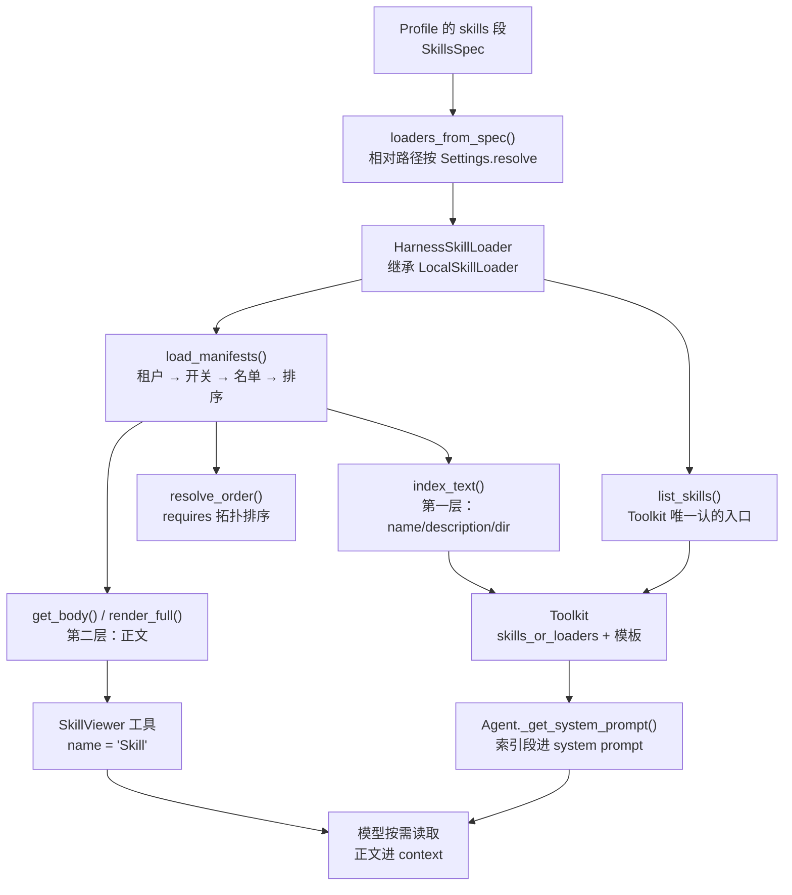

# 第 6 讲：Skills 技能包：把领域知识打包成可复用能力

> **本讲目标**：把 AgentScope 的技能系统（`agentscope.skill` 三件套 + `Toolkit`
> 的技能入口 + `SkillViewer` 工具）从源码读到骨子里，然后写出
> `harness_kit/skills/` 这一层 —— 一套**能校验、能开关、能按租户隔离、能声明依赖**
> 的技能加载器，外加两个真实的领域技能（代码审查 / 提交信息规范），每个技能
> 都带**可执行的配套脚本**。学完你能把公司内部的规范（编码规范、发布流程、
> 事故复盘模板）打包成模型真的会去读、会去执行的技能包，并且知道
> 「索引该放什么、正文什么时候进上下文、脚本怎么被调用」这三件事的边界。
> **前置要求**：完成第 1~5 讲（环境、Profile 装配、事件、模型适配层、工具系统），
> 具备 Python 3.11 环境
> `/Users/a/miniconda3/envs/agentscope_reme_pip_env/bin/python`，
> 且知道 `PYTHONPATH` 必须包含 `third_party/ReMe` 与 `tutorial_agsc_reme/reference`。
> **本讲交付物**（相对仓库根）：
> `tutorial_agsc_reme/reference/harness_kit/skills/manifest.py`、
> `tutorial_agsc_reme/reference/harness_kit/skills/loader.py`、
> `tutorial_agsc_reme/reference/harness_kit/skills/__init__.py`、
> `tutorial_agsc_reme/reference/harness_kit/skills/builtin/code_review/SKILL.md`、
> `tutorial_agsc_reme/reference/harness_kit/skills/builtin/code_review/scripts/review_check.py`、
> `tutorial_agsc_reme/reference/harness_kit/skills/builtin/commit_convention/SKILL.md`、
> `tutorial_agsc_reme/reference/harness_kit/skills/builtin/commit_convention/scripts/check_commit_msg.py`、
> `tutorial_agsc_reme/reference/scripts/06_skills.py`、
> `tutorial_agsc_reme/reference/tests/test_lesson06_skills.py`。
> 另有两处**对前几讲交付物的改写**（§4.8 给完整片段）：
> `tutorial_agsc_reme/reference/harness_kit/config/builder.py`（把技能装配接到本讲的
> 加载器上）、`tutorial_agsc_reme/reference/harness_kit/config/schema.py`
> （`SkillsSpec.directories` 的文档串）。
> **预计时长**：90 分钟。
>
> 本讲的完整可运行代码位于 `tutorial_agsc_reme/reference/harness_kit/skills/`，
> 你可以直接对照，也可以跟着正文一行一行写。

---

## 一、这一讲要解决的问题

第 2 讲我们已经能在 Profile 里写这样一段声明，并且它**当时就能跑**：

```yaml
skills:
  directories: ["./harness_kit/skills/builtin"]
  enabled: [code_review, commit_convention]
  scan_subdir: true
  disclosure: index
```

但那段声明在当时是**空转的**：`HarnessBuilder.build_toolkit()` 只把
`skills_spec.directories` 原样丢给 AgentScope 的 `LocalSkillLoader`
（`third_party/agentscope/src/agentscope/skill/_local_loader.py:16`），于是

- `enabled: [code_review, commit_convention]` **没有任何效果** ——
  目录里有什么技能，模型就看得见什么技能；
- `scan_subdir: true` **只是在替一个默认值为 `False` 的参数兜底**
  （`.../skill/_local_loader.py:19`），而 AgentScope 自己那条警告
  「No SKILL.md files found」是这个坑最温柔的报错；
- `disclosure: index` **完全没被读过** —— 因为 `Toolkit` 的
  `skill_instruction_template` 参数（`third_party/agentscope/src/agentscope/tool/_toolkit.py:96`）
  一直是默认值；
- 更要命的是：**技能写错了没有任何人告诉你**。`SKILL.md` 少了
  `description`，`LocalSkillLoader._load_single_skill` 会打一条 warning
  然后 `return None`（`.../skill/_local_loader.py:71-77`），
  于是"模型突然不会用这个技能了"这种故障，你要翻日志才能发现。

本讲就是把这段声明变成真的。先看三个真实场景。

**场景 1：规范写进了 SKILL.md，模型却当成了工具。**
新手最自然的写法是这样的：

```markdown
---
name: code_review
description: 代码审查
---

# 代码审查

调用 `code_review` 工具来审查代码。
```

模型读完索引（只有 `name` + `description`）之后的第一个动作是尝试调用一个叫
`code_review` 的工具 —— 而这个工具根本不存在。AgentScope 在
`DEFAULT_SKILL_INSTRUCTION` 里用一句大写加粗的话专门拦这件事：

```text
**IMPORTANT**: Skills are NOT tools, and you cannot call a skill directly.
```

（`third_party/agentscope/src/agentscope/tool/_toolkit.py:54`）
所以**技能正文的第一句就该写"何时使用 / 不适用"**，而不是"调用我"。
本讲的两个内置技能，正文第一段全是触发条件。

**场景 2：目录结构是两级的，一个技能都没加载上。**
`LocalSkillLoader(directory, scan_subdir=False)` 的默认值是 `False`
（`.../skill/_local_loader.py:19`），而**技能目录的行业惯例是两级**：

```text
harness_kit/skills/builtin/
├── code_review/
│   ├── SKILL.md          <- 技能在这里
│   └── scripts/
└── commit_convention/
    ├── SKILL.md
    └── scripts/
```

也就是说，你按惯例组织目录、按官方文档传 `directory=...`，
结果是 `list_skills() -> []`，而日志里只有一行 INFO：
`No SKILL.md files found in ...`（`.../skill/_local_loader.py:140`）。
本讲把 `scan_subdir` 的默认值在我们自己的加载器里**翻成 `True`**，
并让 Profile 里的 `scan_subdir` 真的能关掉它。

**场景 3：技能里写了脚本，模型从来没见过它。**
技能真正的威力不在"告诉模型一段话"，而在**把机械性工作交给脚本、
把判断留给模型**。比如代码审查：`eval` / 可变默认参数 / `except:` 裸吞异常
这类问题用 AST 扫一遍就够了，让模型去逐行找是浪费 token 且不稳定。
但脚本必须满足三个条件才会被真的用起来：

1. 脚本路径要在 SKILL.md 里**声明**（`scripts: [scripts/review_check.py]`）；
2. 声明的文件必须**真的存在** —— 否则模型会照着一段不存在的命令折腾三轮；
3. 脚本的退出码语义要**写进正文**（0 = 没问题、1 = 发现问题、2 = 用法错误），
   否则模型看到 `1` 会以为是脚本崩了。

这三条本讲各有一个机制：`SkillManifest.scripts` / `missing_scripts()` /
`require_scripts=True`，以及正文里的「退出码」小节。

**一句话总结本讲的定位**：AgentScope 提供了技能的**机制**
（目录 → `Skill` 对象 → 索引进提示词 → `Skill` 工具按需读正文），
`harness_kit/skills/` 补的是这个机制的**工程性** ——
校验、开关、租户、依赖、可执行脚本。**一行 Agent Loop 都不会碰。**

---
## 二、源码侦察

本节所有结论都来自本仓库 `third_party/agentscope/src/agentscope/` 下的真实源码，
每条给出 `路径:行号`。技能相关的代码总共只有 **212 行**（`skill/` 一个包里 3 个文件），
但它和 `tool/`、`agent/`、`state/` 三个包都有耦合 —— 侦察要覆盖这四处。

### 2.1 `agentscope.skill` 只有三件套，一共 212 行

```text
third_party/agentscope/src/agentscope/skill/
├── __init__.py        11 行   只导出 Skill / SkillLoaderBase / LocalSkillLoader
├── _base.py           29 行   Skill（dataclass）+ SkillLoaderBase（抽象基类）
└── _local_loader.py  172 行   目录扫描 + front matter 解析 + mtime 缓存
```

`skill/__init__.py:4-5` 导出三个名字：

```python
from ._base import SkillLoaderBase, Skill
from ._local_loader import LocalSkillLoader
```

**`Skill` 是一个裸 dataclass，不是 pydantic 模型**（`skill/_base.py:7-20`）：

```python
@dataclass
class Skill:
    name: str          # :11
    description: str   # :13
    dir: str           # :15
    markdown: str      # :17
    updated_at: float  # :19
```

这五个字段里藏着两条重要信息：

1. **`markdown` 就是正文全文**，它跟着 `Skill` 对象在内存里走 —— 也就是说
   AgentScope 的"渐进披露"只体现在**提示词层**（索引里不放 `markdown`），
   而不是"读取层"。每次 `list_skills()` 都会把每个 `SKILL.md` 读进内存。
   `LocalSkillLoader` 用 mtime 做缓存（`.../_local_loader.py:54-57`）来摊薄这个
   开销，这也是为什么本讲新增的 `HarnessSkillLoader` 必须**继承**它、
   而不是从 `SkillLoaderBase` 从零写 —— 缓存逻辑是白送的。
2. **没有 `version` / `tags` / `requires` 这些字段**。`LocalSkillLoader` 解析
   front matter 时只取 `name` 与 `description`（`.../_local_loader.py:68-69`），
   其余字段**读完就丢**。这就是本讲第一个交付物要解决的问题。

`SkillLoaderBase` 的抽象面小到极致（`skill/_base.py:23-29`）：

```python
class SkillLoaderBase(ABC):
    @abstractmethod
    async def list_skills(self) -> list[Skill]:
        raise NotImplementedError
```

**只有一个抽象方法**，而且是 `async` 的。这意味着：任何"技能从哪来"的
想象（目录、数据库、HTTP、S3）都能用同一个接口接进来。
`ToolGroup` 对它的处理也证实了这一点（`tool/_tool_group.py:86-97`）：

```python
for _ in skills_or_loaders or []:
    if isinstance(_, str):
        self.skills_or_loaders.append(LocalSkillLoader(directory=_))   # :88
    elif isinstance(_, (Skill, SkillLoaderBase)):
        self.skills_or_loaders.append(_)
    else:
        raise TypeError(...)
```

传目录字符串 → 自动包成 `LocalSkillLoader`；传 loader 实例 → 原样使用。
**所以"我们自己的加载器"只要继承 `SkillLoaderBase` 就能插进去。**

### 2.2 `LocalSkillLoader` 的三个行为，每个都是一个坑

#### 行为 A：`scan_subdir` 默认 `False`（`.../_local_loader.py:19`）

```python
def __init__(self, directory: str, scan_subdir: bool = False) -> None:
```

查找逻辑在 `_find_skill_dirs`（`.../_local_loader.py:121-135`）：

```python
if os.path.isfile(os.path.join(self.directory, "SKILL.md")):
    dirs.append(self.directory)            # :125-126 根目录自己也算一个技能

if self.scan_subdir:
    for root, _, filenames in os.walk(self.directory):   # :128-133
        if root == self.directory:
            continue
        if "SKILL.md" in filenames:
            dirs.append(root)
```

注意第一段：**根目录自己的 `SKILL.md` 也算一个技能**。所以
`LocalSkillLoader("./skills")` 在 `./skills/SKILL.md` 存在时是能用的 ——
这就是为什么很多人没踩到这个坑：他们把技能写在了根目录。
一旦按"一个技能一个子目录"的惯例组织，就必须 `scan_subdir=True`。
没扫到时的报错只有一行 INFO（`.../_local_loader.py:139-143`）：

```python
if not skill_dirs:
    logger.info("No SKILL.md files found in %s", self.directory)
    return []
```

**INFO 级别**，默认日志配置下根本看不见。

#### 行为 B：字段不全 → 打 warning → 静默跳过（`.../_local_loader.py:68-77`）

```python
name = content.get("name")
description = content.get("description")

if not name or not description:
    logger.warning(
        "SKILL.md in %s is missing required fields (name or description). "
        "Skipping.",
        skill_root,
    )
    return None
```

返回 `None` 之后，`list_skills()` 在聚合时直接把它过滤掉
（`.../_local_loader.py:154-162`）。这条设计在"技能目录是用户随手丢的"
场景下是宽容的；在"技能是产品的一部分、少一个就是故障"的场景下是危险的。
本讲的选择是**在 harness_kit 里翻过来**：默认 `strict=True`，直接抛
`SkillManifestError`，报错信息里带上路径与规则原文。

顺带注意 `.../_local_loader.py:92-98`：整个 `_load_single_skill` 外面还套了
一个 `except Exception` → warning → `return None`。也就是说**连 YAML 解析
失败都会被吞掉**。这是本讲 §6 表格里第一条坑的来源。

#### 行为 C：mtime 缓存（`.../_local_loader.py:50-57`）

```python
updated_at = await aiofiles.ospath.getmtime(skill_md_path)

if skill_root in self._cache:
    cached_skill = self._cache[skill_root]
    if cached_skill.updated_at == updated_at:
        return cached_skill
```

缓存键是**技能目录**（不是技能名），失效条件是 `SKILL.md` 的 mtime 变化。
于是有一个不显然的后果：**改了技能目录里的配套脚本，缓存不会失效** ——
因为脚本不是 `SKILL.md`。本讲的 `HarnessSkillLoader` 在这一点上沿用父类
（脚本是"正文让模型去执行的东西"，改脚本不需要重新解析清单），
但把这层语义写进了 `scripts/` 字段的 docstring。

### 2.3 技能是怎么进系统提示词的：四段链路

从 `Toolkit` 构造到 `Agent` 的 system prompt，技能要走过四段：

```text
ToolGroup(skills_or_loaders=[loader])
   └─ ToolGroup.list_skills()              tool/_tool_group.py:99-108
        └─ await loader.list_skills()      skill/_base.py:27（我们覆写这里！）
Toolkit._get_available_skills(groups)      tool/_toolkit.py:394-429
   └─ 遍历 tool_groups，按组名过滤，去重
Toolkit.get_skill_instructions(groups)     tool/_toolkit.py:431-471
   └─ Template(self.skill_instruction_template).render(
          skills=..., skill_viewer=...)    tool/_toolkit.py:466-471
Agent._get_system_prompt()                 agent/_agent.py:3214-3237
   └─ prompt.append(skill_instructions)    agent/_agent.py:3222-3223
```

逐条读关键的几行。

**① `ToolGroup.list_skills()`（`tool/_tool_group.py:99-108`）** 只做一件转发的事：

```python
async def list_skills(self) -> list[Skill]:
    skills = []
    for skill_or_loader in self.skills_or_loaders:
        if isinstance(skill_or_loader, Skill):
            skills.append(skill_or_loader)
        elif isinstance(skill_or_loader, SkillLoaderBase):
            skills.extend(await skill_or_loader.list_skills())   # :106
    return skills
```

**② `_get_available_skills`（`tool/_toolkit.py:394-429`）**
`groups_filter = ["basic"] + (groups or [])`（`:412`）—— **`basic` 组永远被包含**。
然后按组名收集、按技能名去重（重名时打 warning 覆盖，`:421-427`）。

**③ `get_skill_instructions`（`tool/_toolkit.py:431-471`）** 是唯一渲染技能提示词的地方：

```python
if len(skills) == 0:
    return None                                    # :462-463

template = Template(self.skill_instruction_template)   # :466
return template.render(
    skills=skills.values(),
    skill_viewer=self.builtin_skill_viewer.tool.name,  # :470
)
```

**模板变量只有两个**：`skills`（`Skill` 对象序列）与 `skill_viewer`（工具名）。
没有技能时返回 `None`（不是空串）—— 这一点在 §5.3 的 G 段被断言。

**④ `Agent._get_system_prompt`（`agent/_agent.py:3214-3237`）** 把它追加到系统提示词：

```python
prompt = [self._system_prompt]

skill_instructions = await self.toolkit.get_skill_instructions(
    self.state.tool_context.activated_groups,        # :3219-3221
)
if skill_instructions:
    prompt.append(skill_instructions)                 # :3222-3223

result = "\n".join(prompt)                            # :3231
```

然后是 `_system_prompt` 中间件链（`:3234-3235`，第 8 讲的地盘）。

> **这段链路解释了"为什么过滤必须做在 `list_skills()` 里"**：
> `enabled` / 租户白名单如果只写在 `load_manifests()` 里，
> `Toolkit` 根本不会调用它 —— 它只认 `list_skills()`。
> 本讲的 `HarnessSkillLoader.list_skills()` 因此是一个真正的覆写点
> （`harness_kit/skills/loader.py:417`），而不是顺手写的便捷方法。

### 2.4 `SkillViewer`：工具名叫 `Skill`，不叫 `skill_viewer`

渐进披露的第二层由内置工具承担（`tool/_builtin/_skill.py`）：

```python
class SkillViewer(ToolBase):          # :18
    name: str = "Skill"               # :21
```

**`name` 是 `"Skill"`**，而模板变量叫 `skill_viewer`
（`tool/_toolkit.py:470` 传的是 `self.builtin_skill_viewer.tool.name`）——
所以默认模板渲染出来的是：

```text
To use a skill, you MUST use the `Skill` tool to read the skill's full instructions
```

我们在 §5.3 的 G 段断言了 `"Skill" in names`；如果你按字面写
`skill_viewer` 去 `toolkit.get_tool("skill_viewer")`，会拿到 `None`。

它的权限是**无条件放行**（`tool/_builtin/_skill.py:79-88`）：

```python
async def check_permissions(self, tool_input, context) -> PermissionDecision:
    return PermissionDecision(
        behavior=PermissionBehavior.ALLOW,
        message="The skill viewer is always allowed to be called.",
    )
```

它的调用体只有 30 行（`tool/_builtin/_skill.py:90-127`），核心是：

```python
skills = await self._get_skills_method(
    _agent_state.tool_context.activated_groups,   # :112-114
)
target_skill = skills.get(skill)
if not target_skill:
    return ToolChunk(
        content=[TextBlock(text=f"SkillNotFoundError: Skill '{skill}' not found.")],
        state=ToolResultState.ERROR,               # :116-125
    )
return ToolChunk(content=[TextBlock(text=target_skill.markdown)])   # :127
```

三个细节：

1. **它给的是 `skill.markdown`**，也就是 `SKILL.md` 去掉 front matter 的**正文**。
   harness_kit 的 `SkillManifest.render_full()` 额外加的
   `# skill: <name> (v<version>)` 标题**不在这里**（§5.3 G 段的断言写了这条）。
2. **找不到技能不抛异常**，而是返回一个 `state=ERROR` 的 `ToolChunk`
   （`ToolChunk.state` 默认是 `RUNNING`，`tool/_response.py:36`）。
   模型的 ReAct 循环会把这条错误当成工具结果继续走 —— 这比抛异常更好，
   因为模型有机会自我纠正（改个名字再试一次）。
3. **它是"按需可见"的**：`_get_available_tools` 里只有当技能集合非空时
   才把它注册进去（`tool/_toolkit.py:494-498`）：

```python
skills = await self._get_available_skills(groups)
if len(skills):
    available_tools[self.builtin_skill_viewer.tool.name] = self.builtin_skill_viewer
```

没有技能 → 模型连 `Skill` 工具都看不见 → 不会瞎调。

### 2.5 渐进披露：官方只有一层

AgentScope 的默认模板 `DEFAULT_SKILL_INSTRUCTION`
（`tool/_toolkit.py:51-63`）长的样子：

```text
<agent-skills>
Skills are a collection of instructions, scripts, and resources to extend your capabilities.

**IMPORTANT**: Skills are NOT tools, and you cannot call a skill directly. ...

# Available Skills:
<skill>
<name>{{ skill.name }}</name>
<description>{{ skill.description }}</description>
<dir>{{ skill.dir }}</dir>
</skill>
</agent-skills>
```

**每个技能只给三个字段**：`name` / `description` / `dir`。
`markdown`（正文）不进提示词 —— 这就是第一层。
第二层是模型自己调 `Skill` 工具去读（§2.4）。

这个设计省了多少？本讲两个技能的实测数字（§5.3 E 段）：
**索引 694 字符 vs 正文合计 3882 字符，17.9%**。
技能少的时候差别不大；技能变成 30 个、正文都是长流程的时候，
这就是"能不能塞进上下文窗口"的区别。

但官方模板是**写死的常量**，而 `Toolkit.__init__` 早就留了参数
（`tool/_toolkit.py:96`）：

```python
skill_instruction_template: str = DEFAULT_SKILL_INSTRUCTION,
```

`harness_kit` 的 `SkillsSpec.disclosure: Literal["index", "full"]`
（契约 §5.1）就是把这个参数暴露给 YAML 作者：`index` 用官方语义，
`full` 把正文直接铺进去（技能只有两三个、想省一次工具调用时有用）。
模板由 `build_skill_instruction_template(disclosure)` 生成
（`harness_kit/skills/loader.py:584`）。

### 2.6 顺带一个消息层的坑：`AssistantMsg` 是工厂函数

这一条不属于技能系统，但它是本讲验证脚本的第一版真实 bug，必须记下来：
`agentscope/message/_base.py:592` 的 `AssistantMsg` **不是类，是函数**。

```text
>>> isinstance(msg, AssistantMsg)
TypeError: isinstance() arg 2 must be a type
```

（本讲脚本第一次跑 J 段时就是这么炸的。）判断角色要用 `msg.role == "assistant"`。

更坑的是"数 assistant 消息 = 数 LLM 调用次数"这个直觉是**错的**：
`AgentState.append_context`（`state/_state.py:298-326`）会把**同一次 reply**
里所有 assistant 内容合并进**同一条 Msg**：

```python
if (self.context
        and self.context[-1].role == "assistant"
        and self.context[-1].name == name
        and self.context[-1].id == self.reply_id):     # :310-315
    self.context[-1].content.extend(blocks)
else:
    self.context.append(Msg(id=self.reply_id, role="assistant", ...))  # :319-326
```

一次"先调 `Skill`、再作答"的 ReAct 在 context 里只留下 **1 条** assistant 消息，
而真实的模型调用是 **2 次**。数调用次数必须去数事件：
`ModelCallStartEvent`（`event/_event.py:128`），本讲 §5.5 的 J 段就是这么数的。

### 2.7 本讲要用到的扩展点清单

| 用途 | 基类 / 方法 | 签名要点 | 源码位置 |
| --- | --- | --- | --- |
| 技能数据类 | `Skill` | `@dataclass`：`name` / `description` / `dir` / `markdown` / `updated_at` | `third_party/agentscope/src/agentscope/skill/_base.py:7`、`:11-19` |
| 加载器抽象 | `SkillLoaderBase` | **唯一**抽象方法 `async def list_skills() -> list[Skill]` | `.../skill/_base.py:23`、`:26-27` |
| 现成实现（本讲的父类） | `LocalSkillLoader` | `__init__(directory: str, scan_subdir: bool = False)`；mtime 缓存；字段不全→warning+跳过 | `.../skill/_local_loader.py:16`、`:19`、`:54-57`、`:68-77` |
| 目录发现规则 | `LocalSkillLoader._find_skill_dirs` | 根目录自身的 `SKILL.md` 也算；`scan_subdir=True` 才递归 | `.../skill/_local_loader.py:121-135` |
| 工具组里的技能 | `ToolGroup` | `skills_or_loaders: Sequence[str \| Skill \| SkillLoaderBase]`；`str` 自动包成 `LocalSkillLoader` | `.../tool/_tool_group.py:47-49`、`:86-97`、`:99-108` |
| 技能入口 | `Toolkit` | `Toolkit(tools=None, skills_or_loaders=None, mcps=None, tool_groups=None, meta_tool_response_template=..., skill_instruction_template=DEFAULT_SKILL_INSTRUCTION)` | `.../tool/_toolkit.py:88-97` |
| 技能收集 | `Toolkit._get_available_skills` | `groups_filter = ["basic"] + (groups or [])`；按技能名去重 | `.../tool/_toolkit.py:394-429` |
| 索引渲染 | `Toolkit.get_skill_instructions` | `Template(...).render(skills=..., skill_viewer=...)`；无技能返回 `None` | `.../tool/_toolkit.py:431-471` |
| 按需可见 | `Toolkit._get_available_tools` | 只有技能数 > 0 时才注册 `Skill` 工具 | `.../tool/_toolkit.py:494-498` |
| 技能查看工具 | `SkillViewer` | `name = "Skill"`；`check_permissions` 无条件 ALLOW；找不到→`ToolChunk(state=ERROR)`；找到→`ToolChunk(text=markdown)` | `.../tool/_builtin/_skill.py:18`、`:21`、`:79-88`、`:116-127` |
| 工具结果默认态 | `ToolChunk` | `state: ToolResultState = ToolResultState.RUNNING` | `.../tool/_response.py:36` |
| 提示词注入 | `Agent._get_system_prompt` | `await self.toolkit.get_skill_instructions(self.state.tool_context.activated_groups)`，非空才 append | `third_party/agentscope/src/agentscope/agent/_agent.py:3214-3237` |
| 状态合并 | `AgentState.append_context` | 同一 `reply_id` 的 assistant 块并进**同一条** Msg | `third_party/agentscope/src/agentscope/state/_state.py:298-326` |
| 调用计数 | `ModelCallStartEvent` | `reply_id` / `model_name`；一次模型请求一个事件 | `third_party/agentscope/src/agentscope/event/_event.py:128-136` |

**本讲不需要任何 ReMe 扩展点，而且这一点是实测过的。**
把 `PYTHONPATH` 里的 `third_party/ReMe` **去掉**，只留 reference 自己：

```bash
cd /Users/a/PycharmProjects/VsCode_Projects/Agentscope-Learning/tutorial_agsc_reme/reference
PYTHONPATH=. /Users/a/miniconda3/envs/agentscope_reme_pip_env/bin/python scripts/06_skills.py
```

**真实输出**（末尾两行）：

```text
临时目录: /var/folders/8z/dk0spdzj16d8fczz9zkbxp7r0000gn/T/harness06_gpxy4exl

PASS  第 6 讲验证全部通过
```

技能是**上下文侧**的能力：它只影响"系统提示词里放了什么"和"模型能读什么"，
不落库、不检索、不需要记忆。`harness_kit/skills/` 里没有一行 `import reme`
（本讲唯一出现 ReMe 的地方是文档串里的 `PYTHONPATH` 提醒）。
本讲的 md 与脚本里仍然一律写 `PYTHONPATH=.../ReMe:...`，理由有两条：
一是与前面几讲的命令保持**字面一致**；二是 `--live` 那一步需要脚本反推出
仓库根去读 `.env`，而 reference 的 `conftest.py` 会强制把 ReMe 塞进 `sys.path`
（`tests/conftest.py:34-36`）。第 7 讲（MCP）与第 15 讲之后才会真正出现 ReMe 扩展点。

---
## 三、扩展点定位与设计

### 3.1 官方已经给了什么

- **技能数据结构**：`Skill` dataclass（`skill/_base.py:7-20`）。
- **加载器接口**：`SkillLoaderBase`，唯一抽象方法 `async list_skills()`
  （`skill/_base.py:23-29`）。
- **目录加载器**：`LocalSkillLoader`，带 mtime 缓存与并发加载
  （`skill/_local_loader.py:16-172`）。
- **提示词渲染**：`Toolkit.get_skill_instructions` + Jinja2 模板 +
  可替换的 `skill_instruction_template`（`tool/_toolkit.py:96`、`:431-471`）。
- **按需读取工具**：`SkillViewer`（`Skill`），权限放行、错误态友好
  （`tool/_builtin/_skill.py:18-127`）。
- **按需可见**：没有技能时不注册 `Skill` 工具
  （`tool/_toolkit.py:494-498`）。

这六件拼起来，**"技能能被模型看见并读取"这条主链路是完整的、可用的**。
本讲不重写其中任何一件。

### 3.2 还缺什么

对着契约 §1.3 的六个缺口，本讲补的是"配置与知识的可复用性"这一块。
具体有四个缺口，每个都能从源码读出来：

**缺口 1：front matter 里除了 `name` / `description` 之外的字段全被丢掉。**
证据：`.../_local_loader.py:68-69` 只取两个键，`Skill` 也只有五个字段。
后果：**技能没有版本、没有标签、没有依赖、没有配套脚本声明** ——
一个技能包没法像依赖那样被管理。

**缺口 2：解析失败是静默的。**
证据：`.../_local_loader.py:71-77`（缺字段 → warning + `None`）
与 `:92-98`（任何异常 → warning + `None`）。
后果：技能消失是一种"要翻日志才能发现"的故障形态。生产环境里
"模型的行为突然变了"往往就来自这里。

**缺口 3：没有任何过滤能力。**
`LocalSkillLoader` 有 `scan_subdir`，但没有"启用哪些技能"、没有
"哪个租户能看哪些技能"。`SkillsSpec.enabled` / `tenants` 在 Profile 里
写得出来，但**没人读**。

**缺口 4：没有依赖概念。**
技能 A 的流程里要引用技能 B（比如"审查完代码，按提交规范给出建议提交信息"），
现在只能靠正文里写一句"另见 B" —— 模型读不到 B 就自己编。

**第 5 个缺口是我们自己踩出来的**（不算官方的问题，但必须记）：
`Toolkit` 的 `skill_instruction_template` 参数存在，但**没人把
`SkillsSpec.disclosure` 翻译过去** —— 第 2 讲交付的
`HarnessBuilder.build_toolkit()` 当时只传了 `skills_or_loaders`。

### 3.3 我们在哪个扩展点上做

三层决策，逐条给理由。

#### 决策 1：继承 `LocalSkillLoader`，不是从 `SkillLoaderBase` 从零写

契约 §3.6 的草图写的是 `class HarnessSkillLoader(SkillLoaderBase)`，
**参考实现改成了 `LocalSkillLoader`**（`harness_kit/skills/loader.py:76`）。
这不是笔误，是三条实测理由：

1. **mtime 缓存白送**（`.../_local_loader.py:50-57`）。从零写就要自己维护
   `dict[str, Skill]` 缓存 + 失效逻辑，而这段逻辑在"技能目录挂在网络盘上、
   `list_skills()` 每次 ReAct 都可能被调用"的场景下是必须的。
2. **目录发现规则必须与官方逐字一致**，否则同一份目录在两套代码里
   会得出不同的技能集合。`HarnessSkillLoader._discover_skill_dirs`
   （`harness_kit/skills/loader.py:486-511`）把官方 `_find_skill_dirs`
   的规则（根目录也算、`scan_subdir` 才递归）抄了一遍，并让 `scan_subdir`
   的**默认值翻成 `True`**。
3. **接口兼容**：`ToolGroup` 只认 `isinstance(_, (Skill, SkillLoaderBase))`
   （`tool/_tool_group.py:90`），子类天然满足；同时 `super().list_skills()`
   可以被调用，我们只做**过滤后处理**。

> 这是"不重写内核"的典型形态：**官方给了一个能用的实现，我们继承它并
> 只覆写需要改语义的那一个方法**（`list_skills()`）。

#### 决策 2：manifest 与 loader 分开两个文件

`manifest.py` 是**纯数据层**（pydantic 模型 + 校验 + 文本解析），
`loader.py` 是**行为层**（目录扫描、过滤、拓扑、索引文本）。
分开的好处是 manifest 的所有规则都能用"文本 → 对象"的方式单测，
不需要磁盘（`tests/test_lesson06_skills.py` 里有 20+ 个这样的断言）。

#### 决策 3：哪些东西是"我们补的一层"，哪些**不补**

| 事项 | 谁来做 | 理由 |
| --- | --- | --- |
| 技能正文怎么给模型 | AgentScope（`SkillViewer`） | 已有，且权限/错误态都处理好了 |
| 索引段渲染 | AgentScope（`get_skill_instructions` + 模板） | 我们只**提供模板**，不接管渲染 |
| 过滤后处理 | **harness_kit**（覆写 `list_skills()`） | 官方没有这个抽象点 |
| 字段校验 | **harness_kit**（`SkillManifest`） | 官方选择静默跳过，我们要报错 |
| 依赖拓扑 | **harness_kit**（`resolve_order()`） | 官方没有这个概念 |
| 索引文本（诊断/自测用） | **harness_kit**（`index_text()`） | 官方只有渲染好的 prompt，没有裸索引 |

最后一行值得展开：**"AgentScope 没有提供这个，所以我们补一层"**
——`index_text()`（`harness_kit/skills/loader.py:313-338`）产出的是一段
**可打印、可断言**的索引文本，验证脚本用它做"索引里没有正文"的断言，
体检脚本可以用它做"这次上线技能集合变了没有"的 diff。
官方没有这个入口（它的索引是模板渲染的副产物），所以这一层必须自己写。

### 3.4 设计

#### 3.4.1 `SkillManifest` 的字段：契约 6 个 + 扩展 5 个

| 字段 | 来源 | 默认 | 作用 |
| --- | --- | --- | --- |
| `name` | 契约 §3.6 | 必填 | 技能名，同时是 `Skill` 工具的键；必须匹配 `^[a-z0-9][a-z0-9_]*(?:-[a-z0-9]+)*$` |
| `description` | 契约 §3.6 | 必填 | **第一层渐进披露的全部内容**，写成触发条件 |
| `version` | 契约 §3.6 | `"0.1.0"` | 语义化版本；灰度/回滚/诊断 |
| `tags` | 契约 §3.6 | `[]` | 检索标签，供 `select()` 用 |
| `path` | 契约 §3.6 | 必填 | `SKILL.md` 的绝对路径 |
| `body` | 契约 §3.6 | 必填 | 正文（第二层才注入） |
| `enabled` | harness_kit | `True` | 开关；`False` 时 `get()` 仍能读到，但不出现在 `list_skills()` 里 |
| `tenants` | harness_kit | `[]`（等价 `["*"]`） | 租户白名单 |
| `requires` | harness_kit | `[]` | 依赖的其它技能名 |
| `scripts` | harness_kit | `[]` | 配套脚本，**相对本技能目录** |
| `license` | harness_kit | `None` | 许可标识（`internal` / `MIT`） |
| `source` | harness_kit | `"<memory>"` | 诊断：从哪来 |

派生属性四个：`summary`（`name: description`，第一层用）、
`dir`（`path.parent`）、`script_paths`（解析成绝对路径）、`tenant_scope`。
方法四个：`applies_to(tenant)`、`matches(tags=, query=)`、`missing_scripts()`、
`render_full()`。

**为什么默认值要全给**：既有的最简 `SKILL.md`（只有 `name` + `description`）
必须继续合法 —— 否则第 2 讲里已经存在的技能目录会全部报错。

#### 3.4.2 过滤链：顺序是有语义的

`load_manifests()` 的过滤顺序（`harness_kit/skills/loader.py:206-232`）：

```text
磁盘扫描（全部 manifest）
  → ① 租户过滤     manifest.applies_to(tenant)
  → ② 技能自身开关  manifest.enabled
  → ③ 加载器名单    self.enabled（SkillsSpec.enabled）
  → 排序（按技能名）
```

三个设计要点：

1. **租户过滤在最前**，且**不受 `include_disabled` 影响**。
   §6 表格里有一条真实坑：`include_disabled=True` 想"诊断时看全部技能"，
   结果租户受限的技能**依然看不见** —— 要看它必须同时传 `tenant="acme"`。
   这是**有意为之**：租户隔离是安全边界，诊断开关不该越权。
2. **`include_disabled=True` 只关 ②③**，用于体检脚本回答
   "这个技能存在吗、为什么没生效"。
3. **名单里有拼错的名字只会打 warning**（默认 `strict_enabled=False`）。
   理由写在 `_assert_enabled_names_exist` 的 docstring 里
   （`harness_kit/skills/loader.py:513-543`）：`SkillsSpec.enabled` 常常是
   "先写好名单、技能稍后补上"的增量式配置，直接抛会让 Profile 起不来。
   但**它一定会进日志** —— 技能静默消失是最难查的一类故障。

#### 3.4.3 渐进披露的两层与 `disclosure` 的选择

```text
第一层（永远在 system prompt 里）：name + description + dir + version + tags
第二层（模型调 Skill 工具时才进上下文）：SKILL.md 正文（含配套脚本路径与用法）
```

`SkillsSpec.disclosure` 决定第一层用哪个模板：

- `"index"`（默认）：官方语义，索引进 prompt，正文按需读。
  **技能 ≥ 4 个、或正文里有长流程时选它。**
- `"full"`：正文直接铺进 prompt。省一次工具调用与一次往返延迟，
  代价是每轮对话都带着全部正文。**技能 ≤ 3 个、且正文都短时选它。**

本讲实测（§5.3 H 段）：index 768 字符 vs full 4398 字符，
**差值 3630 字符**，而模型读 `code_review` 正文只花一次工具调用。
默认给 `index` 是对的。

#### 3.4.4 配套脚本的三条约定

1. **路径相对技能目录**写（`scripts: [scripts/review_check.py]`），
   由 `script_paths` 解析成绝对路径。正文里让模型执行时写
   `<本技能目录>/scripts/xxx.py` —— 因为模型拿到的是 `dir` 字段
   （索引里就有），拼得出来。
2. **缺失即报错**：`require_scripts=True` 时构建期就抛；
   默认 `strict=True` 也会抛（`harness_kit/skills/loader.py:469-477`）。
   理由：模型照着一段不存在的命令折腾三轮，比启动期报错贵得多。
3. **退出码语义写进正文**：`0 / 1 / 2` 三态
   （没问题 / 发现问题 / 用法错误）。没有这条，模型看到 `1` 会以为脚本崩了。

#### 3.4.5 数据流



图里那条 `C --> L` 是**最关键的一条边**：`enabled` / 租户过滤不住在
`load_manifests()` 里就够了，它必须通过 `list_skills()`
（也就是图里的 `L`）才能影响到 `Toolkit`。

---
## 四、harness_kit 实现

### 4.0 本讲新增 / 改动的文件清单

| # | 文件（相对 `tutorial_agsc_reme/reference/`） | 行数 | 说明 |
| --- | --- | --- | --- |
| 1 | `harness_kit/skills/manifest.py` | 496 | `SkillManifest` + 校验 + `parse_manifest_text` + `load_manifest`（§4.1） |
| 2 | `harness_kit/skills/loader.py` | 628 | `HarnessSkillLoader` + `loaders_from_spec` + `build_skill_instruction_template`（§4.2） |
| 3 | `harness_kit/skills/__init__.py` | 56 | 包导出（§4.3） |
| 4 | `harness_kit/skills/builtin/code_review/SKILL.md` | 92 | 内置技能 1 的清单与正文（§4.4） |
| 5 | `harness_kit/skills/builtin/code_review/scripts/review_check.py` | 451 | 静态扫描器，纯标准库（§4.5） |
| 6 | `harness_kit/skills/builtin/commit_convention/SKILL.md` | 105 | 内置技能 2（§4.6） |
| 7 | `harness_kit/skills/builtin/commit_convention/scripts/check_commit_msg.py` | 350 | Conventional Commits 校验器（§4.7） |
| 8 | `scripts/06_skills.py` | 780 | 本讲验证脚本，A~J 十段（§5.2） |
| 9 | `tests/test_lesson06_skills.py` | 600 | 本讲 pytest，48 个用例（§5.4） |
| 改 1 | `harness_kit/config/builder.py` | 3 处 | 技能装配接到 `loaders_from_spec` + `disclosure`（§4.8） |
| 改 2 | `harness_kit/config/schema.py` | 1 处 | `SkillsSpec.directories` 的文档串（§4.8） |

**本节所有代码块都是从 `tutorial_agsc_reme/reference/` 下的真实文件直接导出的，
逐字节一致**（§5.6 给了核对方法）。注释里的路径引用一律写到 `:行号`，
方便你在源码里跳转。

---

### 4.1 `harness_kit/skills/manifest.py`

这个文件只做一件事：**把 `SKILL.md` 的 front matter 变成一个有校验的类型**。
它不碰磁盘遍历（那是 loader 的事），只有一个函数读文件
（`load_manifest`）。三段结构：

1. `SkillManifestError` + `parse_tags`（第 72~120 行）；
2. `SkillManifest`（第 123~387 行）：字段 + 4 个 `field_validator` +
   4 个派生属性 + 4 个方法；
3. `parse_manifest_text` / `load_manifest`（第 390~496 行）。

三个设计要点：

- **front matter 用 `frontmatter.loads` 解析，不手写 YAML 头**
  （`manifest.py:40` 导入、`:412` 调用）：AgentScope 的官方加载器用的就是它
  （`third_party/agentscope/src/agentscope/skill/_local_loader.py:8`），
  ReMe 也把它列为依赖（`third_party/ReMe/pyproject.toml:35`）。
  三方共用同一份 front matter 语义，比"各自写一半"更不容易出分歧。
  注意这是一个**传递依赖**：`reference/pyproject.toml:23-37` 的
  `dependencies` 里并没有 `python-frontmatter`，它是跟着
  `agentscope==2.0.8` / `reme==0.4.1.13`（`pyproject.toml:24-25`）进来的
  （上游声明在 `third_party/agentscope/pyproject.toml:41` 与
  `third_party/ReMe/pyproject.toml:35`）—— 所以"照抄别人的 requirements
  时把这个包漏掉"会到运行期才炸。
- **`SkillManifestError` 继承 `ValueError`**（`manifest.py:72`），
  不是自定义的 BaseException 子类 —— 这样调用方可以按"配置错误"
  统一捕获，同时 `pytest.raises(ValueError)` 也写得出来。
- **`model_config = ConfigDict(frozen=True)`**（`manifest.py:140`）：
  manifest 是要被多线程/多协程共享的只读快照，冻结掉可以避免
  "谁偷偷改了 `enabled`"这类事故。

```python
# -*- coding: utf-8 -*-
"""技能元数据：SKILL.md 的 front matter 解析与校验。

AgentScope 自带的 ``LocalSkillLoader``（``third_party/agentscope/src/agentscope/skill/_local_loader.py:16``）
已经能读 ``SKILL.md`` 并把 front matter 解析出来，但它只保留 4 个字段：

.. code-block:: python

    # third_party/agentscope/src/agentscope/skill/_local_loader.py:75-85
    skill = Skill(
        name=str(name),
        description=str(description),
        dir=skill_root,
        markdown=content.content,
        updated_at=updated_at,
    )

``version`` / ``tags`` / 租户 / 依赖声明 / 配套脚本清单**全部被丢弃**，
而且缺 ``name`` 或 ``description`` 时只是打一条 warning 后**静默跳过**
（同文件 ``:70``）。生产里这三点都不能接受：

1. 版本丢失 ⇒ 无法做技能灰度与回滚；
2. 静默跳过 ⇒ 技能写错了没人知道，线上表现为"模型突然不会用了"；
3. 无法声明依赖 ⇒ 技能之间的先后顺序只能靠人工记忆。

本模块因此**不重写**加载逻辑，只在 AgentScope 的 front matter 之上补一层
**强校验 + 扩展字段**的 ``SkillManifest``。真正的目录扫描仍由
:mod:`harness_kit.skills.loader` 里继承的 ``LocalSkillLoader`` 负责。

front matter 的解析直接复用 ReMe / AgentScope 都依赖的 ``python-frontmatter``
（``frontmatter.load`` / ``frontmatter.loads``），不自己写 YAML 头解析。
"""

from __future__ import annotations

import re
from pathlib import Path
from typing import Any

import frontmatter
from loguru import logger
from pydantic import (
    BaseModel,
    ConfigDict,
    Field,
    ValidationError,
    field_validator,
)

__all__ = [
    "FRONTMATTER_FILENAME",
    "SkillManifest",
    "SkillManifestError",
    "load_manifest",
    "parse_manifest_text",
    "parse_tags",
]

FRONTMATTER_FILENAME: str = "SKILL.md"
"""技能清单文件名。与 AgentScope 的 ``LocalSkillLoader`` 保持一致
（``third_party/agentscope/src/agentscope/skill/_local_loader.py:39``）。"""

_NAME_RE: re.Pattern[str] = re.compile(r"^[a-z0-9][a-z0-9_]*(?:-[a-z0-9]+)*$")
_VERSION_RE: re.Pattern[str] = re.compile(
    r"^\d+\.\d+\.\d+(?:[-+][0-9A-Za-z.\-]+)?$",
)

_RESERVED_TENANT: str = "*"
"""front matter 里写 ``tenants: ["*"]`` 表示对所有租户开放。"""


class SkillManifestError(ValueError):
    """SKILL.md 的 front matter 不合法。

    与 AgentScope 的"打一条 warning 然后静默跳过"相反：harness_kit 的所有
    配置错误一律**向上抛**，让 ``scripts/00_smoke.py`` 这类体检脚本能在
    启动阶段就发现，而不是等到 Agent 少了一个技能才发现。
    """


def parse_tags(value: Any) -> list[str]:
    """把 front matter 里五花八门的 tag 写法归一成 ``list[str]``。

    支持 ``["a", "b"]``、``"a, b"``、``"a b"``、``None`` 四种写法 —— YAML 里
    写标量是常见手误，这里容忍它而不是报错。

    Args:
        value (`Any`): front matter 解析出来的原始值。

    Returns:
        `list[str]`: 去重且保持出现顺序的 tag 列表。

    Raises:
        SkillManifestError: 值既不是字符串也不是字符串列表。
    """
    if value is None:
        return []

    items: list[str]
    if isinstance(value, str):
        items = re.split(r"[,\s]+", value)
    elif isinstance(value, (list, tuple, set)):
        items = []
        for item in value:
            if not isinstance(item, str):
                raise SkillManifestError(
                    f"tags 里的元素必须是字符串，收到 {type(item).__name__}: {item!r}",
                )
            items.append(item)
    else:
        raise SkillManifestError(
            f"tags 必须是字符串或字符串列表，收到 {type(value).__name__}: {value!r}",
        )

    seen: dict[str, None] = {}
    for item in items:
        text = item.strip()
        if text:
            seen.setdefault(text, None)
    return list(seen)


class SkillManifest(BaseModel):
    """``SKILL.md`` 的 front matter 模型。

    契约 §3.6 规定的 6 个字段（``name`` / ``description`` / ``version`` /
    ``tags`` / ``path`` / ``body``）在前，harness_kit 为"版本、启用开关、
    按租户加载、依赖声明"追加的 5 个字段在后 —— 全部带默认值，因此既有的
    最简 ``SKILL.md``（只有 ``name`` / ``description``）仍然合法。

    Example:
        >>> manifest = parse_manifest_text(   # doctest: +SKIP
        ...     "---\\nname: code_review\\ndescription: 代码审查\\n---\\n正文",
        ...     path=Path("/tmp/code_review/SKILL.md"),
        ... )
        >>> manifest.summary
        'code_review: 代码审查'
    """

    model_config = ConfigDict(frozen=True)

    # ---- 契约 §3.6 规定的字段 ----

    name: str
    """技能名，同时是 ``Toolkit`` 里 SkillViewer 的键。必须匹配
    ``^[a-z0-9][a-z0-9_]*(-[a-z0-9]+)*$`` —— 用连字符而不是空格，
    因为它会出现在模型读到的 XML 标签里。"""

    description: str
    """一句话说明"什么时候该用这个技能"。第一层渐进披露只给这一行，
    所以要写成触发条件而不是功能罗列。"""

    version: str = "0.1.0"
    """语义化版本，用于灰度/回滚。"""

    tags: list[str] = Field(default_factory=list)
    """检索标签，供 :meth:`harness_kit.skills.loader.HarnessSkillLoader.select`
    按标签挑技能。"""

    path: Path
    """``SKILL.md`` 的绝对路径。"""

    body: str
    """``SKILL.md`` 的正文（front matter 之后的部分）。第二层渐进披露时才注入。"""

    # ---- harness_kit 追加的字段 ----

    enabled: bool = True
    """启用开关。``False`` 时技能仍然可被 :meth:`get` 读到，但不会出现在
    :meth:`HarnessSkillLoader.list_skills` 与技能索引里。"""

    tenants: list[str] = Field(default_factory=list)
    """租户白名单。空列表等价于 ``["*"]``（所有租户可见）。"""

    requires: list[str] = Field(default_factory=list)
    """依赖的其它技能名。加载顺序按它做拓扑排序；缺失或成环直接报错。"""

    scripts: list[str] = Field(default_factory=list)
    """配套脚本路径，**相对本技能目录**。技能正文里让模型去执行它们，
    路径由 :meth:`script_paths` 解析成绝对路径。"""

    license: str | None = None
    """可选许可标识，例如 ``"MIT"``、``"internal"``。"""

    source: str = "<memory>"
    """诊断用：这份 manifest 从哪来（文件路径或 ``"<memory>"``）。"""

    # ------------------------------------------------------------------
    # 校验
    # ------------------------------------------------------------------
    @field_validator("name")
    @classmethod
    def _check_name(cls, value: str) -> str:
        """校验技能名格式。

        Args:
            value (`str`): front matter 里的 ``name``。

        Returns:
            `str`: 原值。

        Raises:
            SkillManifestError: 名字为空或不匹配命名规则。
        """
        if not value or not value.strip():
            raise SkillManifestError("SKILL.md 的 name 不能为空")
        if not _NAME_RE.match(value):
            raise SkillManifestError(
                f"技能名 {value!r} 不合法：必须匹配 {_NAME_RE.pattern}"
                "（小写字母/数字/下划线，可用连字符分段）",
            )
        return value

    @field_validator("description")
    @classmethod
    def _check_description(cls, value: str) -> str:
        """校验描述非空。

        Args:
            value (`str`): front matter 里的 ``description``。

        Returns:
            `str`: 去掉首尾空白的描述。

        Raises:
            SkillManifestError: 描述为空。
        """
        text = value.strip()
        if not text:
            raise SkillManifestError(
                "SKILL.md 的 description 不能为空 —— 它是第一层渐进披露的"
                "全部内容，缺了它模型无从判断何时该用这个技能",
            )
        return text

    @field_validator("version")
    @classmethod
    def _check_version(cls, value: str) -> str:
        """校验版本号形如语义化版本。

        Args:
            value (`str`): front matter 里的 ``version``。

        Returns:
            `str`: 原值。

        Raises:
            SkillManifestError: 不匹配 ``MAJOR.MINOR.PATCH``。
        """
        if not _VERSION_RE.match(value):
            raise SkillManifestError(
                f"技能版本 {value!r} 不合法：要求形如 1.2.3（可带 -rc1 / +build）",
            )
        return value

    @field_validator("tags", "tenants", "scripts", "requires", mode="before")
    @classmethod
    def _coerce_str_list(cls, value: Any) -> list[str]:
        """把标量/列表统一成 ``list[str]``。

        Args:
            value (`Any`): front matter 原始值。

        Returns:
            `list[str]`: 归一后的列表。
        """
        return parse_tags(value)

    @field_validator("requires")
    @classmethod
    def _check_requires(cls, value: list[str]) -> list[str]:
        """校验依赖名格式，并去掉自依赖。

        Args:
            value (`list[str]`): 依赖的技能名列表。

        Returns:
            `list[str]`: 去重后的依赖名。

        Raises:
            SkillManifestError: 依赖名不匹配命名规则。
        """
        result: dict[str, None] = {}
        for name in value:
            if not _NAME_RE.match(name):
                raise SkillManifestError(
                    f"requires 里的 {name!r} 不是合法的技能名"
                    f"（要求匹配 {_NAME_RE.pattern}）",
                )
            result.setdefault(name, None)
        return list(result)

    # ------------------------------------------------------------------
    # 派生属性
    # ------------------------------------------------------------------
    @property
    def summary(self) -> str:
        """只给 ``name`` + ``description``，用于第一层渐进披露。

        Returns:
            `str`: 形如 ``"code_review: 对 diff 做结构化代码审查"``。
        """
        return f"{self.name}: {self.description}"

    @property
    def dir(self) -> Path:
        """本技能所在目录（``SKILL.md`` 的父目录）。

        Returns:
            `Path`: 技能目录。
        """
        return self.path.parent

    @property
    def script_paths(self) -> list[Path]:
        """把 :attr:`scripts` 解析成绝对路径。

        Returns:
            `list[Path]`: 每个配套脚本的绝对路径。
        """
        return [(self.dir / script).resolve() for script in self.scripts]

    @property
    def tenant_scope(self) -> list[str]:
        """返回实际生效的租户白名单。

        Returns:
            `list[str]`: 空 ``tenants`` 归一为 ``["*"]``。
        """
        return self.tenants or [_RESERVED_TENANT]

    def applies_to(self, tenant: str | None) -> bool:
        """判断本技能对某个租户是否可见。

        Args:
            tenant (`str | None`): 租户 id；``None`` 表示"不区分租户"的调用者，
                此时只有 ``*`` 技能可见。

        Returns:
            `bool`: 是否可见。
        """
        scope = self.tenant_scope
        if _RESERVED_TENANT in scope:
            return True
        if tenant is None:
            return False
        return tenant in scope

    def matches(self, *, tags: list[str] | None = None, query: str = "") -> bool:
        """按标签 / 关键词判断技能是否命中。

        Args:
            tags (`list[str] | None`): 需要全部命中的标签。
            query (`str`): 对 ``name`` / ``description`` / ``tags`` 做大小写
                不敏感的子串匹配；空串表示不筛。

        Returns:
            `bool`: 是否命中。
        """
        if tags:
            owned = set(self.tags)
            if not set(tags).issubset(owned):
                return False
        if query:
            needle = query.lower()
            haystack = " ".join(
                [self.name, self.description, *self.tags],
            ).lower()
            if needle not in haystack:
                return False
        return True

    def missing_scripts(self) -> list[Path]:
        """返回声明了但磁盘上不存在的配套脚本。

        Returns:
            `list[Path]`: 缺失的脚本绝对路径；为空表示全部存在。
        """
        return [path for path in self.script_paths if not path.is_file()]

    def render_full(self) -> str:
        """渲染第二层渐进披露用的完整正文（含 front matter 摘要头）。

        Returns:
            `str`: 带 ``# skill: <name>`` 标题的正文。
        """
        return f"# skill: {self.name} (v{self.version})\n\n{self.body.strip()}\n"


def parse_manifest_text(
    text: str,
    *,
    path: Path,
    source: str | None = None,
) -> SkillManifest:
    """解析一段 ``SKILL.md`` 文本（含 front matter）。

    不读文件，纯粹做"文本 → manifest"，因此可以脱离磁盘单测。

    Args:
        text (`str`): ``SKILL.md`` 全文。
        path (`Path`): 该文本对应的文件路径（写进 ``SkillManifest.path``）。
        source (`str | None`): 诊断用的来源标注，默认取 ``str(path)``。

    Returns:
        `SkillManifest`: 校验通过的技能元数据。

    Raises:
        SkillManifestError: 缺 front matter、缺必填字段或字段格式不合法。
    """
    try:
        post = frontmatter.loads(text)
    except Exception as exc:  # frontmatter 解析失败时给一条可读的错误
        raise SkillManifestError(
            f"{source or path} 的 front matter 不是合法 YAML：{exc}",
        ) from exc

    meta: dict[str, Any] = dict(post.metadata or {})
    if not meta:
        raise SkillManifestError(
            f"{source or path} 缺少 front matter —— SKILL.md 必须以 "
            "``---`` 包裹的 YAML 头开始，且至少含 name / description",
        )

    unknown_required = [key for key in ("name", "description") if key not in meta]
    if unknown_required:
        raise SkillManifestError(
            f"{source or path} 的 front matter 缺少必填字段 {unknown_required}；"
            "AgentScope 的 LocalSkillLoader 在这种情况下会静默跳过整个技能",
        )

    payload: dict[str, Any] = {
        "name": str(meta["name"]).strip(),
        "description": str(meta["description"]),
        "path": Path(path),
        "body": post.content,
        "source": source or str(path),
    }
    for key in (
        "version",
        "tags",
        "enabled",
        "tenants",
        "requires",
        "scripts",
        "license",
    ):
        if key in meta and meta[key] is not None:
            payload[key] = meta[key]

    try:
        return SkillManifest(**payload)
    except ValidationError as exc:
        # pydantic 会把 field_validator 里抛的 ValueError 包成 ValidationError，
        # 这里把它拆回来，让报错信息是"技能名不合法"而不是一串 schema 噪音。
        for error in exc.errors():
            underlying = (error.get("ctx") or {}).get("error")
            if isinstance(underlying, SkillManifestError):
                raise underlying from exc
        raise SkillManifestError(
            f"{source or path} 的技能元数据校验失败：{exc.errors()}",
        ) from exc
    except SkillManifestError:
        raise


def load_manifest(skill_dir: Path | str) -> SkillManifest:
    """从技能目录读 ``SKILL.md`` 并解析成 :class:`SkillManifest`。

    Args:
        skill_dir (`Path | str`): 含 ``SKILL.md`` 的目录。

    Returns:
        `SkillManifest`: 校验通过的技能元数据。

    Raises:
        FileNotFoundError: 目录或 ``SKILL.md`` 不存在。
        SkillManifestError: 内容不合法。
    """
    directory = Path(skill_dir).expanduser().resolve()
    md_path = directory / FRONTMATTER_FILENAME
    if not md_path.is_file():
        raise FileNotFoundError(
            f"{directory} 下找不到 {FRONTMATTER_FILENAME}"
            "（相对路径请先按 Settings.resolve 锚定到仓库根）",
        )

    text = md_path.read_text(encoding="utf-8")
    manifest = parse_manifest_text(text, path=md_path)
    logger.debug(
        "已解析技能 {}(v{}) <- {}",
        manifest.name,
        manifest.version,
        md_path,
    )
    return manifest
```

---
### 4.2 `harness_kit/skills/loader.py`

这是本讲的核心。它在本讲做了五件事，从"最小改动"到"最多补丁"排序：

| 补丁 | 位置 | 为什么必须补 |
| --- | --- | --- |
| ① 覆写 `list_skills()` 做过滤 | `loader.py:417-442` | `Toolkit` 只认这个入口（§2.3），过滤住在这里才生效 |
| ② `scan_subdir` 默认翻成 `True` | `loader.py:110` | 官方默认 `False` 与"两级目录"惯例冲突（§2.2 行为 A） |
| ③ front matter 校验从"跳过"改"报错" | `loader.py:447-484` | 官方静默跳过（§2.2 行为 B），我们要求启动期暴露 |
| ④ `enabled` / `tenants` 过滤 | `loader.py:181-232` | `SkillsSpec` 里写了但没人读（§3.2 缺口 3） |
| ⑤ `requires` 拓扑排序 | `loader.py:343-401` | 官方没有依赖概念（§3.2 缺口 4） |

**构造参数一览**（`loader.py:106-140`）：

| 参数 | 默认 | 语义 |
| --- | --- | --- |
| `directory` | 必填 | 技能根目录；`strict=True` 时不存在直接 `FileNotFoundError` |
| `scan_subdir` | `True` | 是否递归子目录（**与官方相反**） |
| `tenant` | `None` | 租户 id；`None` 表示"不区分租户"，此时只有 `tenants` 为空或含 `"*"` 的技能可见 |
| `enabled` | `None` | 显式启用名单（`SkillsSpec.enabled`）；空表示"只看每个技能自己的 `enabled`" |
| `strict` | `True` | 不合法就抛；`False` 时降级为 warning 跳过 |
| `require_scripts` | `False` | 额外强制校验 `scripts` 声明的文件存在（默认 `strict=True` 已经会抛，这个开关是为了"只想校验脚本"的场合） |
| `strict_enabled` | `False` | `enabled` 名单里出现未知技能名时是否报错 |

注意 `super().__init__(directory=str(resolved), scan_subdir=scan_subdir)`
（`loader.py:130`）：**先 `resolve()` 再交给父类**，
这样父类的 `_cache` 键与我们的 `directory_path` 是同一个字符串，
不会出现"同一个目录两份缓存"。

```python
# -*- coding: utf-8 -*-
"""技能加载器：在 AgentScope 的 ``LocalSkillLoader`` 之上补版本 / 开关 / 租户 / 依赖。

**继承关系（这是本模块最重要的设计决定）**::

    agentscope.skill.SkillLoaderBase          # 抽象基类：只要 list_skills()
      └── agentscope.skill.LocalSkillLoader   # 真实的目录扫描 + front matter 解析
            └── HarnessSkillLoader            # 本模块：manifest 索引 + 过滤 + 依赖

``HarnessSkillLoader`` **不重写任何文件扫描逻辑**：``SKILL.md`` 的发现规则、
mtime 缓存、并发读取全部沿用 ``LocalSkillLoader``
（``third_party/agentscope/src/agentscope/skill/_local_loader.py:100-172``，
即 ``list_skills`` 这**一个方法**的全文 —— 该文件到 172 行结束）。
我们只做两件 AgentScope 没做的事：

1. **多一层索引**：把 ``SKILL.md`` 解析成 :class:`~harness_kit.skills.manifest.SkillManifest`，
   于是 ``version`` / ``tags`` / ``tenants`` / ``requires`` / ``scripts`` 不再被丢弃；
2. **多一层过滤**：``enabled`` 开关与租户白名单在 :meth:`list_skills` 里真正生效 ——
   这一步是必须的，因为 ``Toolkit`` 只认 ``list_skills()``
   （``third_party/agentscope/src/agentscope/tool/_toolkit.py:394-429`` 的
   ``_get_available_skills`` 就是逐个 loader 调 ``list_skills()``），
   拿到什么就往系统提示词里塞什么。

已知坑（实测）：``LocalSkillLoader(directory, scan_subdir=False)`` 默认**不递归**
子目录，而 harness_kit 的内置技能是 ``builtin/code_review/SKILL.md`` 这种两级结构，
所以本类的 ``scan_subdir`` 默认值是 ``True``，与契约 §3.6 一致。
"""

from __future__ import annotations

import os
from pathlib import Path
from typing import TYPE_CHECKING, Iterable, Literal

from loguru import logger

from agentscope.skill import LocalSkillLoader

from harness_kit.skills.manifest import (
    FRONTMATTER_FILENAME,
    SkillManifest,
    SkillManifestError,
    load_manifest,
)

if TYPE_CHECKING:  # pragma: no cover - 仅供类型检查
    from agentscope.skill import Skill

    from harness_kit.config.schema import SkillsSpec
    from harness_kit.settings import Settings

__all__ = [
    "HarnessSkillLoader",
    "SkillDependencyError",
    "UnknownSkillError",
    "build_skill_instruction_template",
]

_INDEX_HEADER: str = (
    "<skill-index>\n"
    "下列技能是**说明书**而不是工具，不能直接调用。要用某个技能，"
    "必须先调用 skill_viewer 读取它的完整内容，再照做。\n"
)
"""技能索引的固定开头。措辞刻意与 AgentScope 的 ``DEFAULT_SKILL_INSTRUCTION``
（``third_party/agentscope/src/agentscope/tool/_toolkit.py:51-62``）对齐：
那里也强调 "Skills are NOT tools"。"""


class UnknownSkillError(KeyError):
    """按名取技能时未命中（契约 §3.6）。"""


class SkillDependencyError(ValueError):
    """技能依赖声明不成立：引用了不存在的技能，或依赖成环。"""


class HarnessSkillLoader(LocalSkillLoader):
    """带 manifest 索引的技能加载器。

    Args:
        directory (`Path`): 技能根目录，其下的每个含 ``SKILL.md`` 的子目录是一个技能。
        scan_subdir (`bool`, optional): 是否递归子目录，默认 ``True``。
        tenant (`str | None`, optional): 当前租户 id；``None`` 表示不区分租户，
            此时只有 ``tenants`` 为空或含 ``"*"`` 的技能可见。
        enabled (`list[str] | None`, optional): 显式启用名单（``SkillsSpec.enabled``
            的来源）。``None`` 或空列表表示"不加限制，由每个技能自己的 ``enabled``
            字段决定"；非空时**只有**名单里的技能可用，且名单里出现未知名字会报错。
        strict (`bool`, optional): ``True`` 时目录不存在 / ``SKILL.md`` 不合法
            直接抛异常；``False`` 时降级为 warning 并跳过。默认 ``True``。
        strict_enabled (`bool`, optional): ``True`` 时 ``enabled`` 名单里出现
            未知技能名会抛 :class:`UnknownSkillError`；默认 ``False``（只 warning）,
            因为名单常常是"先写后补"的增量配置。
        require_scripts (`bool`, optional): ``True`` 时校验 ``scripts`` 声明的
            文件确实存在，缺失即报错（生产环境建议打开，避免模型照着执行一个
            不存在的脚本）。

    Example:
        >>> loader = HarnessSkillLoader(  # doctest: +SKIP
        ...     Path("./harness_kit/skills/builtin"),
        ... )
        >>> [m.name for m in loader.load_manifests()]
        ['code_review', 'commit_convention']
        >>> loader.get("code_review").version
        '1.0.0'
    """

    def __init__(
        self,
        directory: Path | str,
        *,
        scan_subdir: bool = True,
        tenant: str | None = None,
        enabled: list[str] | None = None,
        strict: bool = True,
        require_scripts: bool = False,
        strict_enabled: bool = False,
    ) -> None:
        """构造加载器，并按需做一次目录存在性检查。

        Raises:
            FileNotFoundError: ``strict=True`` 且目录不存在。
        """
        resolved = Path(directory).expanduser().resolve()
        if not resolved.is_dir() and strict:
            raise FileNotFoundError(
                f"技能目录 {resolved} 不存在"
                "（相对路径请先按 Settings.resolve 锚定到仓库根，"
                "或显式传 strict=False 以容忍空目录）",
            )

        super().__init__(directory=str(resolved), scan_subdir=scan_subdir)

        self.tenant: str | None = tenant
        self.enabled: list[str] = list(enabled or [])
        self.strict: bool = strict
        self.require_scripts: bool = require_scripts
        self.strict_enabled: bool = strict_enabled
        self.directory_path: Path = resolved

        self._manifests: list[SkillManifest] | None = None
        self._index_by_name: dict[str, SkillManifest] = {}

    # ------------------------------------------------------------------
    # 构造入口
    # ------------------------------------------------------------------
    @classmethod
    def from_spec(
        cls,
        spec: "SkillsSpec",
        *,
        settings: "Settings | None" = None,
        tenant: str | None = None,
    ) -> "HarnessSkillLoader":
        """按 ``SkillsSpec`` 构造加载器（``directories`` 只取第一个目录）。

        ``SkillsSpec`` 允许声明多个目录，而 ``AgentScope`` 的 ``Toolkit`` 接受
        ``list[SkillLoaderBase]`` —— 多目录时请对每个目录各构造一个 loader，
        见 :func:`loaders_from_spec`。

        Args:
            spec (`SkillsSpec`): 技能声明。
            settings (`Settings | None`): 用于锚定相对路径；``None`` 时按当前
                工作目录解析。
            tenant (`str | None`): 租户 id。

        Returns:
            `HarnessSkillLoader`: 单个目录的加载器。

        Raises:
            ValueError: ``spec.directories`` 为空。
        """
        loaders = loaders_from_spec(spec, settings=settings, tenant=tenant)
        if not loaders:
            raise ValueError(
                "SkillsSpec.directories 为空，无法构造 HarnessSkillLoader",
            )
        return loaders[0]

    # ------------------------------------------------------------------
    # 索引
    # ------------------------------------------------------------------
    def load_manifests(
        self,
        *,
        tenant: str | None = None,
        include_disabled: bool = False,
    ) -> list[SkillManifest]:
        """扫描磁盘并返回（过滤后的）技能元数据列表。契约 §3.6 的公开入口。

        Args:
            tenant (`str | None`): 覆盖构造时的租户；``None`` 表示沿用
                构造参数（若构造参数也是 ``None`` 即"不区分租户"）。
            include_disabled (`bool`): ``True`` 时连 ``enabled: false`` 或不在
                ``enabled`` 名单里的技能一并返回（诊断用）。

        Returns:
            `list[SkillManifest]`: 按技能名排序的 manifest 列表。

        Raises:
            SkillManifestError: 某个 ``SKILL.md`` 不合法（``strict=True``）。
            FileNotFoundError: ``require_scripts=True`` 且声明的脚本缺失。
            UnknownSkillError: ``enabled`` 名单里出现了磁盘上不存在的技能名。
        """
        manifests = self._index()
        effective_tenant = self.tenant if tenant is None else tenant

        selected: list[SkillManifest] = []
        dropped: list[tuple[SkillManifest, str]] = []
        for manifest in manifests:
            if not manifest.applies_to(effective_tenant):
                dropped.append(
                    (manifest, f"租户 {effective_tenant!r} 不在 {manifest.tenant_scope}"),
                )
                continue
            if not include_disabled:
                if not manifest.enabled:
                    dropped.append((manifest, "enabled=false"))
                    continue
                if self.enabled and manifest.name not in self.enabled:
                    dropped.append((manifest, "不在 SkillsSpec.enabled 名单里"))
                    continue
            selected.append(manifest)

        if not include_disabled:
            self._assert_enabled_names_exist(manifests)

        if dropped:
            logger.bind(
                skill_dir=str(self.directory_path),
                dropped={m.name: why for m, why in dropped},
            ).debug("技能过滤：{}", [(m.name, why) for m, why in dropped])

        return selected

    def manifests(
        self,
        *,
        tenant: str | None = None,
        include_disabled: bool = False,
    ) -> list[SkillManifest]:
        """:meth:`load_manifests` 的别名（读起来更顺的入口）。

        Args:
            tenant (`str | None`): 见 :meth:`load_manifests`。
            include_disabled (`bool`): 见 :meth:`load_manifests`。

        Returns:
            `list[SkillManifest]`: manifest 列表。
        """
        return self.load_manifests(
            tenant=tenant,
            include_disabled=include_disabled,
        )

    def get(self, name: str) -> SkillManifest:
        """按技能名取 manifest。契约 §3.6 的公开入口。

        Args:
            name (`str`): 技能名（不是目录名 —— 以 front matter 的 ``name`` 为准）。

        Returns:
            `SkillManifest`: 命中的 manifest。**不受租户/开关过滤影响**，
            这样诊断脚本能看到"存在但被禁用"的技能。

        Raises:
            UnknownSkillError: 技能不存在。
        """
        self._index()
        try:
            return self._index_by_name[name]
        except KeyError as exc:
            raise UnknownSkillError(
                f"技能 {name!r} 不存在；{self.directory_path} 下可用的技能: "
                f"{sorted(self._index_by_name)}",
            ) from exc

    def get_body(self, name: str) -> str:
        """取技能的完整正文（第二层渐进披露）。

        Args:
            name (`str`): 技能名。

        Returns:
            `str`: 带版本标题的正文。

        Raises:
            UnknownSkillError: 技能不存在。
        """
        return self.get(name).render_full()

    def select(
        self,
        *,
        tags: list[str] | None = None,
        query: str = "",
        tenant: str | None = None,
    ) -> list[SkillManifest]:
        """按标签 / 关键词筛选技能（在租户与开关过滤之后再做一层）。

        Args:
            tags (`list[str] | None`): 需要全部命中的标签。
            query (`str`): 对 name/description/tags 做子串匹配。
            tenant (`str | None`): 见 :meth:`load_manifests`。

        Returns:
            `list[SkillManifest]`: 命中列表。
        """
        return [
            manifest
            for manifest in self.load_manifests(tenant=tenant)
            if manifest.matches(tags=tags, query=query)
        ]

    def index_text(self, *, tenant: str | None = None) -> str:
        """生成"技能索引"文本，供 ``Toolkit`` 注入系统提示词。契约 §3.6 的公开入口。

        这是**第一层渐进披露**：每行只给 ``name`` + ``description`` + ``dir``，
        正文不进提示词，模型需要时再调 ``skill_viewer`` 去读。相比把全部正文塞进
        system prompt，token 开销从"技能总量"降到"技能条数"。

        Args:
            tenant (`str | None`): 见 :meth:`load_manifests`。

        Returns:
            `str`: 索引文本；没有任何可用技能时返回空字符串。
        """
        manifests = self.load_manifests(tenant=tenant)
        if not manifests:
            return ""

        lines: list[str] = [_INDEX_HEADER]
        for manifest in manifests:
            tag_text = f" tags={','.join(manifest.tags)}" if manifest.tags else ""
            lines.append(
                f"- {manifest.summary} (v{manifest.version}{tag_text}) "
                f"dir={manifest.dir}\n",
            )
        lines.append("</skill-index>")
        return "".join(lines)

    # ------------------------------------------------------------------
    # 依赖
    # ------------------------------------------------------------------
    def resolve_order(self, *, tenant: str | None = None) -> list[str]:
        """按 ``requires`` 做拓扑排序，返回技能加载顺序。

        依赖只在本 loader 的可见技能集合内解析。引用集合外的技能 → 报错，
        而不是"当成外部依赖忽略" —— 后者会让技能在线上突然少一半能力。

        Args:
            tenant (`str | None`): 见 :meth:`load_manifests`。

        Returns:
            `list[str]`: 先被依赖者在前。

        Raises:
            SkillDependencyError: 依赖缺失或成环。
        """
        manifests = self.load_manifests(tenant=tenant)
        known = {m.name for m in manifests}

        for manifest in manifests:
            for dep in manifest.requires:
                if dep not in known:
                    raise SkillDependencyError(
                        f"技能 {manifest.name!r} 依赖 {dep!r}，但该技能不在"
                        f"当前可见集合里（可见: {sorted(known)}）",
                    )

        by_name = {m.name: m for m in manifests}
        ordered: list[str] = []
        # 0 = 未访问，1 = 在栈上（用于检测环），2 = 已完成
        marks: dict[str, int] = {name: 0 for name in known}
        stack: list[str] = []

        def _visit(name: str) -> None:
            """深度优先拓扑访问。

            Args:
                name (`str`): 当前技能名。

            Raises:
                SkillDependencyError: 发现环。
            """
            mark = marks[name]
            if mark == 2:
                return
            if mark == 1:
                cycle = " -> ".join([*stack[stack.index(name) :], name])
                raise SkillDependencyError(f"技能依赖成环: {cycle}")

            marks[name] = 1
            stack.append(name)
            for dep in by_name[name].requires:
                _visit(dep)
            stack.pop()
            marks[name] = 2
            ordered.append(name)

        for name in sorted(known):
            _visit(name)
        return ordered

    def enabled_names(self, *, tenant: str | None = None) -> list[str]:
        """返回当前可见的技能名列表。

        Args:
            tenant (`str | None`): 见 :meth:`load_manifests`。

        Returns:
            `list[str]`: 技能名（按 :meth:`resolve_order` 的顺序）。
        """
        return self.resolve_order(tenant=tenant)

    # ------------------------------------------------------------------
    # AgentScope 原生接口
    # ------------------------------------------------------------------
    async def list_skills(self) -> list["Skill"]:
        """列出技能，按 ``enabled`` / 租户过滤后的结果。覆盖原生实现。

        ``Toolkit._get_available_skills`` 只认这个入口
        （``third_party/agentscope/src/agentscope/tool/_toolkit.py:394``），
        所以过滤必须发生在这里才能真的起作用。

        Returns:
            `list[Skill]`: AgentScope 的 ``Skill`` 对象（原生 dataclass）。

        Raises:
            SkillManifestError: 目录里有不合法且 ``strict=True`` 的 ``SKILL.md``。
        """
        native = await super().list_skills()
        visible = {m.name for m in self.load_manifests()}
        kept = [skill for skill in native if skill.name in visible]
        if len(kept) != len(native):
            logger.bind(
                skill_dir=str(self.directory_path),
                hidden=[_.name for _ in native if _.name not in visible],
            ).info(
                "技能过滤生效：{} -> {} 个",
                len(native),
                len(kept),
            )
        return kept

    # ------------------------------------------------------------------
    # 内部
    # ------------------------------------------------------------------
    def _index(self, *, refresh: bool = False) -> list[SkillManifest]:
        """扫描磁盘并缓存 manifest 列表。

        Args:
            refresh (`bool`): 强制重新扫描（忽略缓存）。

        Returns:
            `list[SkillManifest]`: 全部 manifest（未经租户/开关过滤）。
        """
        if self._manifests is not None and not refresh:
            return self._manifests

        found: list[SkillManifest] = []
        for skill_dir in self._discover_skill_dirs():
            try:
                manifest = load_manifest(skill_dir)
            except (SkillManifestError, FileNotFoundError) as exc:
                if self.strict:
                    raise
                logger.warning("跳过不合法的技能目录 {}: {}", skill_dir, exc)
                continue

            missing = manifest.missing_scripts()
            if missing:
                message = (
                    f"技能 {manifest.name!r} 声明的配套脚本不存在: "
                    f"{[str(_) for _ in missing]}"
                )
                if self.require_scripts or self.strict:
                    raise FileNotFoundError(message)
                logger.warning(message)

            found.append(manifest)

        found.sort(key=lambda m: m.name)
        self._manifests = found
        self._index_by_name = {m.name: m for m in found}
        return found

    def _discover_skill_dirs(self) -> list[Path]:
        """找出目录下所有含 ``SKILL.md`` 的子目录。

        规则与 ``LocalSkillLoader._find_skill_dirs`` 完全一致
        （``third_party/agentscope/src/agentscope/skill/_local_loader.py:113-127``）：
        根目录自身的 ``SKILL.md`` 也算一个技能；``scan_subdir`` 为真时递归。

        Returns:
            `list[Path]`: 技能目录（已排序，保证结果稳定）。
        """
        root = self.directory_path
        if not root.is_dir():
            logger.warning("技能目录 {} 不存在", root)
            return []

        dirs: list[Path] = []
        if (root / FRONTMATTER_FILENAME).is_file():
            dirs.append(root)
        if self.scan_subdir:
            for current, child_dirs, filenames in os.walk(root):
                child_dirs.sort()
                if Path(current) == root:
                    continue
                if FRONTMATTER_FILENAME in filenames:
                    dirs.append(Path(current))
        return sorted(set(dirs))

    def _assert_enabled_names_exist(self, manifests: Iterable[SkillManifest]) -> None:
        """检查 ``enabled`` 名单里有没有拼错的技能名。

        ``strict_enabled=False``（默认）时只打 warning：``SkillsSpec.enabled``
        常常是"先写好名单、技能稍后补上"的增量式配置，直接抛会让 Profile
        无法启动。但它一定会被记进日志 —— 技能静默消失是最难查的一类故障。

        Args:
            manifests (`Iterable[SkillManifest]`): 磁盘上的全部 manifest。

        Raises:
            UnknownSkillError: ``strict_enabled=True`` 且名单里有不存在的技能名。
        """
        if not self.enabled:
            return
        known = {m.name for m in manifests}
        unknown = [name for name in self.enabled if name not in known]
        if not unknown:
            return

        message = (
            f"SkillsSpec.enabled 里的 {unknown} 在 {self.directory_path} "
            f"下不存在；该目录可用技能: {sorted(known)}"
        )
        if self.strict_enabled:
            raise UnknownSkillError(message)
        logger.bind(
            skill_dir=str(self.directory_path),
            enabled=self.enabled,
            unknown=unknown,
        ).warning(message)


def loaders_from_spec(
    spec: "SkillsSpec",
    *,
    settings: "Settings | None" = None,
    tenant: str | None = None,
) -> list[HarnessSkillLoader]:
    """把 ``SkillsSpec.directories`` 全部转成 :class:`HarnessSkillLoader`。

    ``AgentScope`` 的 ``Toolkit`` 接受 ``list[SkillLoaderBase]``
    （``third_party/agentscope/src/agentscope/tool/_toolkit.py:91``），
    所以多目录是原生支持的，这里只是把 ``SkillsSpec`` 的四个字段
    （``directories`` / ``scan_subdir`` / ``enabled`` / 租户）映射过去。

    Args:
        spec (`SkillsSpec`): 技能声明。
        settings (`Settings | None`): 用于锚定相对路径。
        tenant (`str | None`): 租户 id。

    Returns:
        `list[HarnessSkillLoader]`: 每个目录一个加载器；``directories`` 为空
        时返回空列表。
    """
    loaders: list[HarnessSkillLoader] = []
    for directory in spec.directories:
        resolved = (
            settings.resolve(directory) if settings is not None else Path(directory)
        )
        loaders.append(
            HarnessSkillLoader(
                resolved,
                scan_subdir=spec.scan_subdir,
                tenant=tenant,
                enabled=spec.enabled,
            ),
        )
    return loaders


def build_skill_instruction_template(
    disclosure: Literal["index", "full"] = "index",
) -> str:
    """生成 ``Toolkit(skill_instruction_template=...)`` 用的 Jinja2 模板。

    ``AgentScope`` 的渐进披露只有一层（只给 name/description/dir），模板常量在
    ``third_party/agentscope/src/agentscope/tool/_toolkit.py:51-62``（``DEFAULT_SKILL_INSTRUCTION``）。
    harness_kit 的 ``SkillsSpec.disclosure`` 支持 ``"full"`` —— 把正文直接铺进
    系统提示词，适合"技能只有两三个、想省一次工具调用"的场景。

    模板变量由 ``Toolkit.get_skill_instructions`` 注入
    （``third_party/agentscope/src/agentscope/tool/_toolkit.py:455-470``）：
    ``skills``（``Skill`` 对象序列）与 ``skill_viewer``（内置查看工具名）。

    Args:
        disclosure (`Literal["index", "full"]`): ``"index"`` 只给摘要，
            ``"full"`` 连正文一起给。

    Returns:
        `str`: Jinja2 模板字符串。
    """
    if disclosure == "full":
        return (
            "<agent-skills>\n"
            "以下技能是操作说明书，不是工具；直接照做即可，"
            "也可以用 {{ skill_viewer }} 重新读取。\n"
            ""
            "<skill>\n<name>{{ skill.name }}</name>\n"
            "<dir>{{ skill.dir }}</dir>\n"
            "<content>\n{{ skill.markdown }}\n</content>\n"
            "</skill>\n"
            "</agent-skills>"
        )
    return (
        "<agent-skills>\n"
        "Skills 是说明书而不是工具，不能直接调用。要用某个技能，"
        "必须先调用 `{{ skill_viewer }}` 读取它的完整内容，再照做。\n"
        ""
        "<skill>\n<name>{{ skill.name }}</name>\n"
        "<description>{{ skill.description }}</description>\n"
        "<dir>{{ skill.dir }}</dir>\n"
        "</skill>\n"
        "</agent-skills>"
    )
```

---

### 4.3 `harness_kit/skills/__init__.py`

包导出。注意 `loaders_from_spec` 与 `build_skill_instruction_template`
**没有**出现在契约 §3.6 的草图里 —— 它们是装配层（`builder.py`）需要的最小接口，
所以在本讲一并导出。

```python
# -*- coding: utf-8 -*-
"""harness_kit 的技能层（契约 §3.6，第 6 讲）。

建立在 AgentScope 的 skill 体系之上：

- ``agentscope.skill.SkillLoaderBase``（``third_party/agentscope/src/agentscope/skill/_base.py:23``）
  —— 抽象基类，只需要 ``async def list_skills()``；
- ``agentscope.skill.LocalSkillLoader``（``.../skill/_local_loader.py:16``）
  —— 目录扫描 + front matter 解析 + mtime 缓存的真实实现；
- ``agentscope.tool.Toolkit``（``.../tool/_toolkit.py:66``）
  —— 通过 ``skills_or_loaders=[...]`` 消费 loader，并把技能索引渲染进系统提示词。

harness_kit 只补两个缺口：

1. :mod:`harness_kit.skills.manifest` —— 把被 ``LocalSkillLoader`` 丢弃的
   ``version`` / ``tags`` / ``tenants`` / ``requires`` / ``scripts`` 捡回来，
   并且**缺字段时报错而不是静默跳过**；
2. :mod:`harness_kit.skills.loader` —— ``HarnessSkillLoader`` 继承
   ``LocalSkillLoader``，把「启用开关 / 租户白名单 / 依赖拓扑」做成真的会
   影响 ``list_skills()`` 结果的过滤。

内置技能（``builtin/``）两个：

- ``code_review`` —— 结构化代码审查，配套 ``scripts/review_check.py``；
- ``commit_convention`` —— Conventional Commits，配套 ``scripts/check_commit_msg.py``。
"""

from harness_kit.skills.loader import (
    HarnessSkillLoader,
    SkillDependencyError,
    UnknownSkillError,
    build_skill_instruction_template,
    loaders_from_spec,
)
from harness_kit.skills.manifest import (
    FRONTMATTER_FILENAME,
    SkillManifest,
    SkillManifestError,
    load_manifest,
    parse_manifest_text,
    parse_tags,
)

__all__ = [
    "FRONTMATTER_FILENAME",
    "HarnessSkillLoader",
    "SkillDependencyError",
    "SkillManifest",
    "SkillManifestError",
    "UnknownSkillError",
    "build_skill_instruction_template",
    "load_manifest",
    "loaders_from_spec",
    "parse_manifest_text",
    "parse_tags",
]
```

---
### 4.4 `harness_kit/skills/builtin/code_review/SKILL.md`

第一个真实领域技能。写作要点（这些都是**实测出来**的，不是文风偏好）：

1. **`description` 写"触发条件"而不是"功能罗列"**。它是第一层渐进披露的
   全部内容，模型只有这一行来判断"现在该不该读这个技能"。所以写
   「当用户说"review 一下""看看这段代码有没有问题"时使用」，
   而不是「一个代码审查工具」。
2. **正文第一段是"何时使用 / 不适用"**。§一里说过：技能不是工具，
   模型最容易被误导的动作是"调用一个叫 code_review 的工具"。
   把"不适用"也写上（用户要求直接改代码时不要走这个流程）能省一轮往返。
3. **工作流程分四步、每步有明确产出**：确定范围 → 跑脚本 → 精读 →
   输出报告。四步里只有第 2 步是机械的，正好交给配套脚本。
4. **报告格式写死**（严重 / 中等 / 轻微 / 已验证无问题 + 能否合并）。
   格式不写死，模型每次输出的形状都不一样，下游没法用。
5. **硬性规则要可检查**：不许编造行号、严重项不许带"可能"、
   最多 15 条 finding。这三条是"技能正文即约束"的示范 ——
   写进正文的规则，模型在 §5.5 的真实运行里真的遵守了。
6. **末尾给配套脚本的路径与退出码语义**（`0/1/2`）。

````markdown
---
name: code_review
description: 对一个 diff、一个文件或一个目录做结构化代码审查，输出按严重度分级、带文件行号与修复建议的问题清单。当用户说“review 一下”“看看这段代码有没有问题”“帮我审一下这次改动”时使用。
version: 1.0.0
tags: [review, diff, quality]
license: internal
requires: [commit_convention]
scripts:
  - scripts/review_check.py
---

# 代码审查技能

## 何时使用

用户要求审查代码、复核改动、找 bug 或找坏味道时使用。

**不适用**：用户要求"直接改代码"时不要用本技能的流程 —— 先改，再用本技能自查。

## 工作流程

严格按下面四步走，不要跳步，也不要一次性输出所有步骤的结论。

### 第 1 步：确定审查范围

按优先级选一个，并在回复的第一行写明你选了哪个：

1. 用户给了具体路径/文件 → 审查那些路径；
2. 用户说"这次改动/我改的" → 先跑 `git diff --stat` 找到改动范围，再 `git diff` 取全文；
3. 都没有 → 审查当前目录下最近修改的文件，并说明这是你的猜测。

范围超过 20 个文件时，**先只审查其中改动最大的 10 个**，并明确告诉用户你截断了。

### 第 2 步：跑静态扫描脚本

对每个被审查的路径执行：

```bash
python <本技能目录>/scripts/review_check.py <路径> --json
```

脚本输出的每条 finding 带 `severity` / `file` / `line` / `rule` / `message`。
把脚本输出**当作线索而不是结论**：它只能发现机械性问题，语义问题要靠你读代码。

### 第 3 步：逐个文件精读

对每个文件，按下面的清单逐条核对，**只报你真正在代码里看到的问题**：

| 类别 | 具体检查点 |
| --- | --- |
| 正确性 | 边界条件（空集合、单元素、超长输入）；off-by-one；可变默认参数；异常被 `except:` 或 `except Exception: pass` 吞掉；资源未 `with` 关闭 |
| 并发 | 共享可变状态是否加锁；`async def` 里有没有阻塞调用（`requests`、`time.sleep`、同步文件 IO）；`asyncio.gather` 的异常传播 |
| 安全 | 拼接 SQL / shell 命令；`eval` / `exec` 处理外部输入；密钥硬编码；路径穿越（`../`）；反序列化不可信数据 |
| 接口 | 公共函数缺类型注解或在 `except` 里返回 `None` 而不是抛错；改动了公开签名却未改调用点；返回值语义在分支间不一致 |
| 可测性 | 函数直接 `print` 而不返回；隐藏的全局状态；时间/随机数未注入 |
| 可读性 | 超过 60 行的函数；超过 4 层的嵌套；魔法数字；注释与代码不符 |

### 第 4 步：输出报告

按下面的格式输出，**严重度高的在前**。每条必须给出可直接定位的 `文件:行号`：

```text
## 严重（会导致错误结果 / 数据损坏 / 安全问题）
1. `path/to/file.py:123` — <一句话问题>
   证据：<引用 1-3 行原始代码>
   修复：<具体到能照抄的改法>

## 中等（在特定输入下出错，或显著增加维护成本）
...

## 轻微（风格 / 命名 / 注释）
...

## 已验证无问题的方面
- <列出你实际检查过且没发现问题的类别，让用户知道覆盖范围>
```

最后给一句总结：**能否合并**（可以 / 修完严重项后可以 / 需要重做），以及理由。

## 硬性规则

1. **不许编造行号**。给不出行号的结论就不要写。
2. **不许把"可能""或许"写进严重项**。严重项必须能给出触发它的具体输入。
3. 没有发现严重问题时，直接说"未发现严重问题"，不要为了凑数把小问题升级。
4. 单次审查最多输出 15 条 finding；超出的按严重度截断并说明。
5. 用户明确说"只看安全"或"只看性能"时，只报那一类。

## 配套脚本

- `scripts/review_check.py` —— 机械性问题的静态扫描器（纯标准库，直接 `python` 执行）。
  支持 `--json`（机器可读）、`--max-function-lines N`、`--fail-on {high,medium,low}`。
  退出码：0 = 未达到 `--fail-on` 阈值；1 = 达到阈值；2 = 用法错误。
````

> 注意 `requires: [commit_convention]`：这个技能的第 4 步会建议提交信息，
   所以它声明了对第二个技能的依赖。§5.3 的 F 段会用
   `resolve_order()` 把它解析成 `['commit_convention', 'code_review']`。

---

### 4.5 `harness_kit/skills/builtin/code_review/scripts/review_check.py`

配套脚本，**451 行纯标准库**（`ast` / `argparse` / `json` / `pathlib` / `re`），
任何 Python 3.11+ 解释器能直接跑，不需要 harness_kit 的环境。

它实现 **13 条规则**，分三类：

| 类别 | 规则（严重度） |
| --- | --- |
| AST 逐节点 | `bare-except`(high)、`swallowed-exception`(high)、`mutable-default-arg`(high)、`dangerous-builtin`(high)、`sql-string-concat`(high)、`print-call`(low) |
| 函数级 | `long-function`(medium)、`missing-return-annotation`(medium)、`implicit-none-return`(medium) |
| 文本级 / 文件级 | `stale-marker`(low)、`long-line`(low)、`unreadable`(medium)、`syntax-error`(high) |

CLI 三件套：`--json`（机器可读）、`--fail-on {high,medium,low,none}`（退出码阈值）、
`--max-function-lines N`（`long-function` 阈值，默认 60）。

**退出码语义**（这是写进 SKILL.md 正文的那三条）：

```text
0 = 未达到 --fail-on 阈值（默认 high）
1 = 达到阈值（有 finding）
2 = 用法错误（路径不存在等）
```

`--fail-on none` 是给"只想看报告、不想让 CI 红"的场合用的 ——
§5.3 的 I 段断言了同一个坏样本在默认阈值下退出码 `1`、加
`--fail-on none` 后变成 `0`。

三个实现细节值得学：

- **`scan_paths` 里"读不了的文件"不中断整次扫描**：`unreadable`
  （`review_check.py:325-338`）是一条 finding，不是异常。
- **语法错误的文件同理**：`syntax-error` finding 带 `exc.lineno`
  （`review_check.py:348-359`），而不是让脚本崩掉 —— 因为审查的对象
  本来就可能是一坨没跑通的代码。
- **`_dedupe` 按 `(rule, file, line)` 去重并稳定排序**
  （`review_check.py:291-306`），排序权重是
  `(-SEVERITY_ORDER[severity], file, line)`，也就是**严重度高的在前、
  同严重度按文件行号**。模型的报告格式（SKILL.md 第 4 步）正好对齐这个顺序。

```python
#!/usr/bin/env python3
# -*- coding: utf-8 -*-
"""code_review 技能的配套脚本：机械性代码问题的静态扫描器。

**只用标准库**（``ast`` / ``argparse`` / ``json`` / ``pathlib``），因此任何
Python 3.11+ 解释器都能直接跑，不依赖 harness_kit 的虚拟环境。

它负责"能用规则说清楚"的那部分检查；语义问题交给模型的第 3 步精读。
两者是互补关系，脚本的每一个 finding 都带 ``file:line``，模型不需要猜位置。

用法：

.. code-block:: bash

    python review_check.py path/to/file.py
    python review_check.py ./src --json
    python review_check.py ./src --fail-on medium

退出码：0 = 未达 ``--fail-on`` 阈值；1 = 达到阈值；2 = 用法错误（路径不存在等）。
"""

from __future__ import annotations

import argparse
import ast
import json
import re
import sys
from dataclasses import asdict, dataclass
from pathlib import Path
from typing import Iterator, Sequence

__all__ = ["Finding", "check_source", "iter_python_files", "main"]

SEVERITY_ORDER: dict[str, int] = {"high": 3, "medium": 2, "low": 1}
"""严重度排序权重。``--fail-on`` 就是拿它做比较。"""

SKIP_DIRS: frozenset[str] = frozenset(
    {
        ".git",
        ".hg",
        ".mypy_cache",
        ".pytest_cache",
        ".ruff_cache",
        ".venv",
        "__pycache__",
        "build",
        "dist",
        "node_modules",
        "venv",
    },
)

_MARKER_RE = re.compile(r"\b(TODO|FIXME|XXX|HACK)\b")
_DANGEROUS_NAMES: frozenset[str] = frozenset({"eval", "exec", "compile"})


@dataclass(frozen=True)
class Finding:
    """一条扫描结果。"""

    rule: str
    """规则标识，例如 ``bare-except``。"""

    severity: str
    """``high`` / ``medium`` / ``low``。"""

    file: str
    """文件路径（相对于用户传入的路径）。"""

    line: int
    """1 起的行号。"""

    message: str
    """人能读懂的说明。"""

    snippet: str = ""
    """触发问题的原始代码行（去掉首尾空白）。"""

    def to_dict(self) -> dict[str, object]:
        """转成可 JSON 序列化的 dict。

        Returns:
            `dict[str, object]`: 字段字典。
        """
        return asdict(self)


def iter_python_files(target: Path) -> Iterator[Path]:
    """展开用户传入的路径。

    Args:
        target (`Path`): 文件或目录。

    Yields:
        `Path`: 待扫描的 ``.py`` 文件。

    Raises:
        FileNotFoundError: 路径不存在。
    """
    if not target.exists():
        raise FileNotFoundError(f"路径不存在: {target}")
    if target.is_file():
        yield target
        return
    for path in sorted(target.rglob("*.py")):
        if any(part in SKIP_DIRS for part in path.parts):
            continue
        yield path


def _snippet(lines: Sequence[str], lineno: int) -> str:
    """取某一行原文。

    Args:
        lines (`Sequence[str]`): 文件按行切分的结果。
        lineno (`int`): 1 起的行号。

    Returns:
        `str`: 该行去掉首尾空白后的文本；越界时为空串。
    """
    if 1 <= lineno <= len(lines):
        return lines[lineno - 1].strip()
    return ""


def check_source(source: str, *, filename: str, max_function_lines: int = 60) -> list[Finding]:
    """对一段 Python 源码做扫描。

    Args:
        source (`str`): 源码文本。
        filename (`str`): 用于 finding 的文件名。
        max_function_lines (`int`): 函数超过多少行报 ``long-function``。

    Returns:
        `list[Finding]`: 命中的问题（未排序）。

    Raises:
        SyntaxError: 源码无法解析。调用方 :func:`scan_paths` 会把它转成一条
            ``syntax-error`` finding，而不是让整次扫描中断。
    """
    tree = ast.parse(source, filename=filename)
    lines = source.splitlines()
    findings: list[Finding] = []

    def add(rule: str, severity: str, node: ast.AST, message: str) -> None:
        """记录一条 finding。

        Args:
            rule (`str`): 规则名。
            severity (`str`): 严重度。
            node (`ast.AST`): 位置来源。
            message (`str`): 说明文本。
        """
        lineno = getattr(node, "lineno", 1)
        findings.append(
            Finding(
                rule=rule,
                severity=severity,
                file=filename,
                line=lineno,
                message=message,
                snippet=_snippet(lines, lineno),
            ),
        )

    # ---- 逐节点规则 ----
    for node in ast.walk(tree):
        # 1) 裸 except / except: pass
        if isinstance(node, ast.ExceptHandler):
            if node.type is None:
                add(
                    "bare-except",
                    "high",
                    node,
                    "裸 except 会连 KeyboardInterrupt / SystemExit 一起吞掉，"
                    "请指定具体异常类型",
                )
            body = node.body
            if len(body) == 1 and isinstance(body[0], ast.Pass):
                add(
                    "swallowed-exception",
                    "high",
                    node,
                    "except 块里只有 pass，异常被静默吞掉；至少 log 或重新抛出",
                )

        # 2) 可变默认参数
        if isinstance(node, (ast.FunctionDef, ast.AsyncFunctionDef)):
            for default in list(node.args.defaults) + [
                d for d in node.args.kw_defaults if d is not None
            ]:
                if isinstance(default, (ast.List, ast.Dict, ast.Set)):
                    add(
                        "mutable-default-arg",
                        "high",
                        node,
                        f"函数 {node.name}() 的默认参数是可变容器，"
                        "会在多次调用间共享状态；改用 None 再在函数体内建",
                    )

        # 3) eval / exec
        if isinstance(node, ast.Call) and isinstance(node.func, ast.Name):
            if node.func.id in _DANGEROUS_NAMES:
                add(
                    "dangerous-builtin",
                    "high",
                    node,
                    f"使用了 {node.func.id}()，对不可信输入执行代码会直接导致 RCE",
                )

        # 4) SQL 字符串拼接
        if isinstance(node, ast.BinOp) and isinstance(node.op, ast.Add):
            left = ast.unparse(node.left)
            if re.search(r"(SELECT|INSERT|UPDATE|DELETE|WHERE)\b", left, re.I):
                add(
                    "sql-string-concat",
                    "high",
                    node,
                    "疑似用字符串拼接构造 SQL；请改用参数化查询",
                )

        # 5) print 调试残留
        if isinstance(node, ast.Call) and isinstance(node.func, ast.Name):
            if node.func.id == "print":
                add("print-call", "low", node, "生产代码里出现 print()，请换成 logger")

    # ---- 函数级规则 ----
    for node in ast.walk(tree):
        if isinstance(node, (ast.FunctionDef, ast.AsyncFunctionDef)):
            end = getattr(node, "end_lineno", node.lineno)
            length = end - node.lineno + 1
            if length > max_function_lines:
                add(
                    "long-function",
                    "medium",
                    node,
                    f"函数 {node.name}() 有 {length} 行（阈值 {max_function_lines}），"
                    "建议拆分为若干有名字的小函数",
                )
            if node.name.startswith("_") is False and node.returns is None:
                add(
                    "missing-return-annotation",
                    "medium",
                    node,
                    f"公共函数 {node.name}() 缺少返回类型注解",
                )
            returns_none = any(
                isinstance(sub, ast.Return) and sub.value is None
                for sub in ast.walk(node)
            )
            raises = any(isinstance(sub, ast.Raise) for sub in ast.walk(node))
            if returns_none and not raises:
                add(
                    "implicit-none-return",
                    "medium",
                    node,
                    f"函数 {node.name}() 有裸 return（返回 None）却没有任何 raise，"
                    "调用方无法区分'失败'与'没结果'",
                )

    # ---- 文本级规则（TODO / 超长行）----
    for index, text in enumerate(lines, start=1):
        marker = _MARKER_RE.search(text)
        if marker:
            findings.append(
                Finding(
                    rule="stale-marker",
                    severity="low",
                    file=filename,
                    line=index,
                    message=f"遗留 {marker.group(1)} 标记，确认是否已解决",
                    snippet=text.strip(),
                ),
            )
        if len(text) > 120 and "noqa" not in text and "#" not in text[:1]:
            findings.append(
                Finding(
                    rule="long-line",
                    severity="low",
                    file=filename,
                    line=index,
                    message=f"行长度 {len(text)} 超过 120 字符",
                    snippet=text.strip()[:80] + "...",
                ),
            )

    return findings


def _dedupe(findings: Sequence[Finding]) -> list[Finding]:
    """按 ``(rule, file, line)`` 去重并稳定排序。

    Args:
        findings (`Sequence[Finding]`): 原始结果。

    Returns:
        `list[Finding]`: 去重后按严重度降序、再按文件行号升序的结果。
    """
    unique: dict[tuple[str, str, int], Finding] = {}
    for finding in findings:
        unique.setdefault((finding.rule, finding.file, finding.line), finding)
    return sorted(
        unique.values(),
        key=lambda f: (-SEVERITY_ORDER[f.severity], f.file, f.line),
    )


def scan_paths(
    paths: Sequence[Path],
    *,
    max_function_lines: int = 60,
) -> list[Finding]:
    """扫描多个路径。

    Args:
        paths (`Sequence[Path]`): 文件或目录。
        max_function_lines (`int`): 见 :func:`check_source`。

    Returns:
        `list[Finding]`: 去重排序后的结果。
    """
    findings: list[Finding] = []
    for target in paths:
        for path in iter_python_files(target):
            try:
                source = path.read_text(encoding="utf-8")
            except (OSError, UnicodeDecodeError) as exc:
                findings.append(
                    Finding(
                        rule="unreadable",
                        severity="medium",
                        file=str(path),
                        line=1,
                        message=f"无法以 UTF-8 读取: {exc}",
                    ),
                )
                continue
            try:
                findings.extend(
                    check_source(
                        source,
                        filename=str(path),
                        max_function_lines=max_function_lines,
                    ),
                )
            except SyntaxError as exc:
                findings.append(
                    Finding(
                        rule="syntax-error",
                        severity="high",
                        file=str(path),
                        line=exc.lineno or 1,
                        message=f"语法错误，文件无法解析: {exc.msg}",
                        snippet=(exc.text or "").strip(),
                    ),
                )
    return _dedupe(findings)


def _render_text(findings: Sequence[Finding]) -> str:
    """渲染成人读的文本报告。

    Args:
        findings (`Sequence[Finding]`): 扫描结果。

    Returns:
        `str`: 多行报告。
    """
    if not findings:
        return "未发现问题。"

    counters: dict[str, int] = {"high": 0, "medium": 0, "low": 0}
    for finding in findings:
        counters[finding.severity] += 1

    out: list[str] = [
        f"共 {len(findings)} 条："
        f"high={counters['high']} medium={counters['medium']} low={counters['low']}",
        "",
    ]
    for finding in findings:
        out.append(
            f"[{finding.severity.upper():6s}] {finding.file}:{finding.line} "
            f"({finding.rule}) {finding.message}",
        )
        if finding.snippet:
            out.append(f"           | {finding.snippet}")
    return "\n".join(out)


def main(argv: Sequence[str] | None = None) -> int:
    """命令行入口。

    Args:
        argv (`Sequence[str] | None`): 参数列表；``None`` 时取 ``sys.argv[1:]``。

    Returns:
        `int`: 进程退出码。
    """
    parser = argparse.ArgumentParser(
        prog="review_check.py",
        description="code_review 技能的机械性问题扫描器（纯标准库）",
    )
    parser.add_argument("paths", nargs="+", help="要扫描的文件或目录")
    parser.add_argument("--json", action="store_true", help="输出 JSON")
    parser.add_argument(
        "--max-function-lines",
        type=int,
        default=60,
        help="函数超过多少行报 long-function（默认 60）",
    )
    parser.add_argument(
        "--fail-on",
        choices=["high", "medium", "low", "none"],
        default="high",
        help="达到该严重度即返回退出码 1（默认 high）",
    )
    args = parser.parse_args(argv)

    try:
        findings = scan_paths(
            [Path(p) for p in args.paths],
            max_function_lines=args.max_function_lines,
        )
    except FileNotFoundError as exc:
        print(f"错误: {exc}", file=sys.stderr)
        return 2

    if args.json:
        print(
            json.dumps(
                {
                    "findings": [f.to_dict() for f in findings],
                    "count": len(findings),
                },
                ensure_ascii=False,
                indent=2,
            ),
        )
    else:
        print(_render_text(findings))

    if args.fail_on == "none":
        return 0
    threshold = SEVERITY_ORDER[args.fail_on]
    return 1 if any(SEVERITY_ORDER[f.severity] >= threshold for f in findings) else 0


if __name__ == "__main__":
    raise SystemExit(main())
```

---
### 4.6 `harness_kit/skills/builtin/commit_convention/SKILL.md`

第二个技能，故意选了一个**完全不同形状**的领域知识：第一个技能是"流程型"
（四步走、有判断、有输出格式），这个是"规范型"（一张取值表 + 若干硬规则 +
一个可机械校验的脚本）。

它的设计要点：

1. **规范类技能的核心是"取值表"**。`type` 的 10 个取值、`scope` 的写法、
   `subject` 的祈使句要求 —— 这些写成表格，模型可以直接查表，
   不需要推理。表格是这类知识**最省 token** 的载体。
2. **破坏性变更必须标注**（两种等价写法任选其一）。这是规范类技能里
   最容易被忽略、代价最高的一条 —— 漏标注会导致下游按旧行为调用。
3. **"不做什么"和"做什么"同样重要**：不写 `(multiple)`、不写
   "update code"、不主动 `git commit`。三条硬性规则都是**否定式**。
4. **正文里的命令用 `<本技能目录>` 占位**。模型从索引里就能拿到 `dir`
   字段（§2.5 的模板里有 `<dir>`），所以它能拼出绝对路径 ——
   比写死一个绝对路径更可移植，比写相对路径更不容易错。
5. **两个场景分开写**（写提交信息 / 审阅已有提交信息），
   因为两者的第一步不同（前者看 `git diff`，后者 `git log -1 --format=%B`）。

````markdown
---
name: commit_convention
description: 按 Conventional Commits 规范生成或校验 git 提交信息，含 type/scope 选择、破坏性变更标注、footer 写法。当用户说“帮我写 commit”“提交信息怎么写”“检查一下这个 commit message”时使用。
version: 1.0.0
tags: [git, commit, convention]
license: internal
scripts:
  - scripts/check_commit_msg.py
---

# 提交信息规范技能

## 何时使用

用户要求写 commit message、审阅 commit message，或需要把一批改动归纳成提交时使用。

## 提交信息格式

```text
<type>(<scope>)!: <subject>

<body>

<footer>
```

- **header**（必填）：`type(scope): subject`，全行不超过 72 字符。
- **body**（可选）：空一行后写"为什么改"，不写"改了什么"（diff 已经说了）。
- **footer**（可选）：`BREAKING CHANGE:` 或 `Closes #123` / `Refs #456`。

### type 取值（只能用这些）

| type | 用在 |
| --- | --- |
| `feat` | 新增用户可见的能力 |
| `fix` | 修复缺陷 |
| `refactor` | 不改行为的重构 |
| `perf` | 性能优化 |
| `docs` | 只改文档 |
| `test` | 只改测试 |
| `build` | 构建脚本 / 依赖 |
| `ci` | CI 配置 |
| `chore` | 杂项，不触达 src 与 test |
| `revert` | 回滚某次提交，body 里写 `This reverts commit <sha>.` |

### scope 取值

用**受影响的模块名**，小写、无空格：`agent`、`memory`、`mcp`、`cli`、`deps`。
改动跨多个模块时省略 scope，**不要**写 `(multiple)` 或 `(*)`。

### subject 写法

- 用祈使句、现在时：`add retry to mcp client`，不是 `added` / `adds`。
- 首字母小写，结尾不加句号。
- 一句话说清"这个提交让系统多了什么能力"。

### 破坏性变更

两种等价的标注方式，任选其一但**必须标注**：

1. header 里加 `!`：`feat(api)!: drop v1 endpoint`
2. footer 里写：`BREAKING CHANGE: /v1 已下线，调用方改用 /v2`

## 工作流程

### 场景 A：用户要你写提交信息

1. 跑 `git diff --stat` 和 `git diff`（已 `git add` 的跑 `git diff --cached`）看真实改动。
2. 判断 type：有新增能力 → `feat`；只修行为 → `fix`；都不沾 → 按上表挑。
3. 判断 scope：改动集中在单个模块才写 scope。
4. 写 header，数一下字符数（≤ 72）。
5. 如果 diff 里删除了公开接口/字段/CLI 参数 → 必须加破坏性变更标注。
6. 最后用脚本自检：

```bash
python <本技能目录>/scripts/check_commit_msg.py --string "feat(mcp): add stdio transport"
```

退出码 0 才把信息交给用户。非 0 时按脚本输出的 `reason` 逐条修，修完再跑一遍。

### 场景 B：用户要你审阅已有提交信息

1. 拿到信息：`git log -1 --format=%B`。
2. 写进临时文件再校验（避免 shell 转义问题）：

```bash
git log -1 --format=%B > /tmp/msg.txt && python <本技能目录>/scripts/check_commit_msg.py /tmp/msg.txt
```

3. 把脚本输出的每条问题翻译成一句"怎么改"，并给出修改后的完整版本。

## 硬性规则

1. **不许编造 diff**。写 message 前必须真的看过 diff；看不到 diff 就直接问用户。
2. 一次提交只做一件事。发现 diff 里混了两类改动（比如同时 `feat` 和 `refactor`），
   明确指出并建议拆成两个 commit。
3. 不要写"update code""fix bug""小改动"这类无信息量的 subject。
4. 不要主动 `git commit` —— 除非用户明确要求，只输出信息文本。

## 配套脚本

- `scripts/check_commit_msg.py` —— Conventional Commits 校验器（纯标准库）。
  支持 `--string`、从文件读、从 stdin 读；`--json` 输出机器可读结果；
  `--max-header-length N` 改表头长度上限（默认 72）。
  退出码：0 = 合规；1 = 不合规；2 = 用法错误。
````

---

### 4.7 `harness_kit/skills/builtin/commit_convention/scripts/check_commit_msg.py`

**350 行纯标准库**，实现 **11 条规则**：

| rule | 含义 |
| --- | --- |
| `empty-message` | 空消息（含只有 `#` 注释行的情况） |
| `bad-header` | header 不匹配 `type(scope)!: subject` |
| `unknown-type` | type 不在白名单（11 个取值） |
| `bad-scope` | scope 含大写字母 / 空格 / 空括号 |
| `subject-case` | subject 首字母大写（全大写缩写如 `HTTP` 放行） |
| `subject-period` | subject 以句号结尾 |
| `subject-empty` | subject 为空 |
| `header-too-long` | header 超过 `--max-header-length`（默认 72） |
| `body-no-blank` | body 与 header 之间没有空行 |
| `no-breaking-note` | header 带 `!` 但 footer 没有 `BREAKING CHANGE:` |
| `revert-no-sha` | `revert` 类型的 body 里没有 `This reverts commit <sha>.` |

三种输入方式（`--string` / 文件路径 / `-` 读 stdin），
`--json` 输出机器可读结果，退出码 `0` 合规 / `1` 不合规 / `2` 用法错误。

两个实现细节：

- **`#` 开头的行会被跳过**（`check_commit_msg.py:148-149`）：git 的
  `COMMIT_EDITMSG` 模板注释行以 `#` 开头，不跳过的话每一条提交都会被
  判成"body 与 header 之间没有空行"。
- **`revert-no-sha` 只在 `body_and_footer` 非空时才报**
  （`check_commit_msg.py:259-271`）：`git revert` 生成的裸 revert
  （没带正文）不该被罚。

```python
#!/usr/bin/env python3
# -*- coding: utf-8 -*-
"""commit_convention 技能的配套脚本：Conventional Commits 校验器。

**只用标准库**，任何 Python 3.11+ 解释器都能直接跑。

校验规则（每条都有独立的 ``rule`` 名，方便 CI 里按规则放行）：

=================== ==========================================================
rule                含义
=================== ==========================================================
``empty-message``   空消息
``bad-header``      header 不匹配 ``type(scope)!: subject``
``unknown-type``    type 不在白名单里
``bad-scope``       scope 含大写字母/空格/空括号
``subject-case``    subject 首字母大写
``subject-period``  subject 以句号结尾
``subject-empty``   subject 为空
``header-too-long`` header 超过长度上限
``body-no-blank``   body 与 header 之间没有空行
``no-breaking-note``header 带 ``!`` 但 footer 没有 ``BREAKING CHANGE:``
=================== ==========================================================

用法：

.. code-block:: bash

    python check_commit_msg.py --string "feat(mcp): add stdio transport"
    python check_commit_msg.py /tmp/msg.txt
    git log -1 --format=%B | python check_commit_msg.py -

退出码：0 = 合规；1 = 不合规；2 = 用法错误。
"""

from __future__ import annotations

import argparse
import json
import re
import sys
from dataclasses import asdict, dataclass, field
from typing import Sequence

__all__ = ["Issue", "check_message", "main"]

ALLOWED_TYPES: frozenset[str] = frozenset(
    {
        "build",
        "chore",
        "ci",
        "docs",
        "feat",
        "fix",
        "perf",
        "refactor",
        "revert",
        "style",
        "test",
    },
)
"""受支持的 commit type。``style`` 是 Conventional Commits 的原生取值，保留。"""

_HEADER_RE = re.compile(
    r"^(?P<type>[a-zA-Z]+)"
    r"(?:\((?P<scope>[^()]*)\))?"
    r"(?P<breaking>!)?"
    r": (?P<subject>.+)$",
)

_BREAKING_FOOTER_RE = re.compile(r"^BREAKING[ -]CHANGE:", re.MULTILINE)
_REVERT_RE = re.compile(r"^This reverts commit [0-9a-f]{7,40}\.", re.MULTILINE)


@dataclass(frozen=True)
class Issue:
    """一条校验问题。"""

    rule: str
    """规则名。"""

    message: str
    """人能读懂的说明。"""

    hint: str = ""
    """怎么改。"""

    def to_dict(self) -> dict[str, str]:
        """转成可 JSON 序列化的 dict。

        Returns:
            `dict[str, str]`: 字段字典。
        """
        return asdict(self)


@dataclass
class CheckResult:
    """一次校验的完整结果。"""

    ok: bool
    """是否通过。"""

    header: str = ""
    """解析出的 header 行。"""

    commit_type: str | None = None
    """解析出的 type（未解析出来时为 ``None``）。"""

    scope: str | None = None
    """解析出的 scope。"""

    breaking: bool = False
    """是否标注了破坏性变更。"""

    subject: str = ""
    """解析出的 subject。"""

    issues: list[Issue] = field(default_factory=list)
    """全部问题。"""

    def to_dict(self) -> dict[str, object]:
        """转成可 JSON 序列化的 dict。

        Returns:
            `dict[str, object]`: 字段字典。
        """
        return {
            "ok": self.ok,
            "header": self.header,
            "type": self.commit_type,
            "scope": self.scope,
            "breaking": self.breaking,
            "subject": self.subject,
            "issues": [issue.to_dict() for issue in self.issues],
        }


def check_message(message: str, *, max_header_length: int = 72) -> CheckResult:
    """校验一段完整的提交信息。

    Args:
        message (`str`): 完整提交信息（允许含 ``#`` 注释行，会被忽略）。
        max_header_length (`int`): header 行长度上限，默认 72。

    Returns:
        `CheckResult`: 校验结果；``ok`` 为 ``True`` 表示全部规则通过。
    """
    # git 会把 template 注释行以 '#' 开头写进 COMMIT_EDITMSG，跳过它们
    lines = [ln for ln in message.splitlines() if not ln.startswith("#")]
    while lines and not lines[-1].strip():
        lines.pop()

    result = CheckResult(ok=True)
    if not lines:
        result.issues.append(
            Issue("empty-message", "提交信息为空", "写一句话说明这个提交做了什么"),
        )
        result.ok = False
        return result

    result.header = lines[0].rstrip()
    match = _HEADER_RE.match(result.header)
    if not match:
        result.issues.append(
            Issue(
                "bad-header",
                f"header 不匹配 '<type>(<scope>)!: <subject>'：{result.header!r}",
                "示例：fix(mcp): handle empty tool list",
            ),
        )
        result.ok = False
        return result

    commit_type = match.group("type")
    scope = match.group("scope")
    subject = match.group("subject")
    result.commit_type = commit_type
    result.scope = scope
    result.subject = subject
    result.breaking = bool(match.group("breaking"))

    if commit_type.lower() not in ALLOWED_TYPES:
        result.issues.append(
            Issue(
                "unknown-type",
                f"type {commit_type!r} 不在白名单里",
                f"可用：{', '.join(sorted(ALLOWED_TYPES))}",
            ),
        )

    if scope is not None:
        if not scope.strip():
            result.issues.append(
                Issue("bad-scope", "scope 是空括号", "要么去掉括号，要么填模块名"),
            )
        elif scope != scope.lower() or " " in scope:
            result.issues.append(
                Issue(
                    "bad-scope",
                    f"scope {scope!r} 必须是小写且不含空格",
                    "例如 (mcp)、(memory)、(cli)",
                ),
            )

    if not subject.strip():
        result.issues.append(
            Issue("subject-empty", "subject 为空", "写一句祈使句描述这个提交"),
        )
    else:
        first = subject.lstrip()[0]
        if first.isupper() and not re.match(r"^[A-Z]{2,}\b", subject.lstrip()):
            result.issues.append(
                Issue(
                    "subject-case",
                    f"subject 首字母大写：{subject!r}",
                    "改成小写开头，例如 'add stdio transport'",
                ),
            )
        if subject.rstrip().endswith("."):
            result.issues.append(
                Issue("subject-period", "subject 以句号结尾", "去掉结尾的句号"),
            )

    if len(result.header) > max_header_length:
        result.issues.append(
            Issue(
                "header-too-long",
                f"header 长度 {len(result.header)} 超过 {max_header_length}",
                "把细节挪到 body，header 只留一句概括",
            ),
        )

    body_start = 1
    if len(lines) > 1:
        if lines[1].strip():
            result.issues.append(
                Issue(
                    "body-no-blank",
                    "body 与 header 之间缺少空行",
                    "在 header 后插入一个空行，git 才会把它拆成 title/body",
                ),
            )
    else:
        body_start = len(lines)

    body_and_footer = "\n".join(lines[body_start:])
    breaking_in_footer = bool(_BREAKING_FOOTER_RE.search(body_and_footer))
    if result.breaking and not breaking_in_footer:
        result.issues.append(
            Issue(
                "no-breaking-note",
                "header 带了 '!' 但 footer 里没有 'BREAKING CHANGE:'",
                "在 footer 补一行 'BREAKING CHANGE: <影响与迁移方式>'",
            ),
        )
    if (
        commit_type.lower() == "revert"
        and body_and_footer.strip()
        and not _REVERT_RE.search(body_and_footer)
    ):
        result.issues.append(
            Issue(
                "revert-no-sha",
                "revert 类型的 body 里没有 'This reverts commit <sha>.'",
                "补一行 'This reverts commit <40 位 sha>.'，git revert 会自动生成",
            ),
        )

    result.ok = not result.issues
    return result


def _read_message(args: argparse.Namespace) -> str:
    """按命令行参数读出待校验的提交信息。

    Args:
        args (`argparse.Namespace`): 解析后的参数。

    Returns:
        `str`: 提交信息文本。

    Raises:
        OSError: 文件读取失败。
    """
    if args.string is not None:
        return args.string
    if args.path == "-":
        return sys.stdin.read()
    with open(args.path, "r", encoding="utf-8") as handle:
        return handle.read()


def main(argv: Sequence[str] | None = None) -> int:
    """命令行入口。

    Args:
        argv (`Sequence[str] | None`): 参数列表；``None`` 时取 ``sys.argv[1:]``。

    Returns:
        `int`: 进程退出码。
    """
    parser = argparse.ArgumentParser(
        prog="check_commit_msg.py",
        description="Conventional Commits 校验器（纯标准库）",
    )
    parser.add_argument(
        "path",
        nargs="?",
        help="提交信息文件路径；'-' 表示从 stdin 读；与 --string 二选一",
    )
    parser.add_argument("--string", help="直接校验一段提交信息")
    parser.add_argument("--json", action="store_true", help="输出 JSON")
    parser.add_argument(
        "--max-header-length",
        type=int,
        default=72,
        help="header 长度上限（默认 72）",
    )
    args = parser.parse_args(argv)

    if args.string is None and args.path is None:
        parser.error("必须提供 path 或 --string")

    try:
        message = _read_message(args)
    except OSError as exc:
        print(f"错误: 无法读取提交信息: {exc}", file=sys.stderr)
        return 2

    result = check_message(message, max_header_length=args.max_header_length)

    if args.json:
        print(json.dumps(result.to_dict(), ensure_ascii=False, indent=2))
    elif result.ok:
        print(
            f"OK  type={result.commit_type} scope={result.scope} "
            f"breaking={result.breaking}",
        )
    else:
        print(f"FAIL  header={result.header!r}")
        for issue in result.issues:
            print(f"  - [{issue.rule}] {issue.message}")
            if issue.hint:
                print(f"    修复: {issue.hint}")

    return 0 if result.ok else 1


if __name__ == "__main__":
    raise SystemExit(main())
```

---
### 4.8 对前几讲交付物的两处改写

本讲有一个**必须公开的改动**：第 2 讲交付的
`harness_kit/config/builder.py` 里，技能装配是**空转的** ——
它把 `SkillsSpec.directories` 逐个交给官方 `LocalSkillLoader`，
既没读 `enabled`、也没读 `disclosure`，还在日志里打两条
"（该能力由后续讲次交付，暂未生效）"的 warning。
本讲把这段替换掉之后，`SkillsSpec` 的四个字段才全部生效。

#### 改动 1：`harness_kit/config/builder.py`

**(a) 新增一行 import**（`builder.py:60`）：

```python
from harness_kit.skills import build_skill_instruction_template
```

放在 `from harness_kit.settings import Settings` 之后，保持"harness_kit 内部
import 按其模块层级排列"的既有风格。

**(b) `build_toolkit` 的 docstring 第 3 条**（`builder.py:425-429`）：

```text
        3. 技能目录交给第 6 讲的
           :func:`harness_kit.skills.loader.loaders_from_spec`，由它建
           :class:`~harness_kit.skills.loader.HarnessSkillLoader`
           （继承 ``LocalSkillLoader``，把 ``scan_subdir`` / ``enabled`` /
           租户白名单都变成真的过滤），并按 ``SkillsSpec.disclosure``
           选系统提示词模板；
```

**(c) 技能装配体**（`builder.py:504-519`，替换掉原来的 `LocalSkillLoader` 列表）：

```python
        # 技能装配（第 6 讲接管）：``loaders_from_spec`` 内部用
        # ``HarnessSkillLoader``，它继承 ``LocalSkillLoader`` 并把
        # ``enabled`` / 租户白名单做成真的会过滤 ``list_skills()`` 的开关。
        # 租户从 ``HARNESS_TENANT`` 环境变量读 —— Profile 里不适合放运行时身份。
        skill_loaders: list[Any] = []
        skill_tenant: str | None = self.context.environ.get("HARNESS_TENANT") or None
        if skills_spec.directories:
            from harness_kit.skills import loaders_from_spec

            skill_loaders = list(
                loaders_from_spec(
                    skills_spec,
                    settings=self.settings,
                    tenant=skill_tenant,
                ),
            )
```

三个要点：

- **`settings=` 必须传**：`SkillsSpec.directories` 里写的是
  `"./harness_kit/skills/builtin"` 这种相对路径，`loaders_from_spec`
  用 `settings.resolve(directory)` 把它锚定到 `Settings.repo_root`
  （`harness_kit/skills/loader.py:570-572`）。不传就按**当前工作目录**解析，
  于是"在仓库根跑得通、在别处跑不通"这种 bug 就会长出来。
- **租户从环境变量读**（`HARNESS_TENANT`），不写进 Profile：
  租户是**运行时身份**，不是配置。Profile 是会被提交进 git 的。
- **函数内 import**（`from harness_kit.skills import loaders_from_spec`）：
  `builder.py` 顶部已经导入了 `build_skill_instruction_template`，
  这里再局部导入是为了让"技能层不可用"时的报错发生在**调用点**，
  而不是模块导入期 —— 这是装配器的既有风格（`try_get` 的那几处同理）。

**(d) `Toolkit(...)` 多传一个参数**（`builder.py:537-548`）：

```python
        # ``disclosure`` 直接换成 AgentScope 的 Jinja2 模板：
        # ``index`` ⇒ 只给 name/description/dir（Token 省），
        # ``full`` ⇒ 连 SKILL.md 正文一起铺进系统提示词（省一次工具调用）。
        toolkit = Toolkit(
            tools=basic_tools,
            skills_or_loaders=skill_loaders,
            mcps=basic_mcps,
            tool_groups=tool_groups,
            skill_instruction_template=build_skill_instruction_template(
                skills_spec.disclosure,
            ),
        )
```

#### 改动 2：`harness_kit/config/schema.py`

`SkillsSpec.directories` 的文档串还停留在"交给 `LocalSkillLoader`"
（`schema.py:229-230`），会误导读者。改成：

```python
    directories: list[str] = Field(default_factory=list)
    """技能目录，交给
    :func:`harness_kit.skills.loaders_from_spec` 造出的
    :class:`harness_kit.skills.HarnessSkillLoader`（第 6 讲交付物；
    它是 :class:`agentscope.skill.LocalSkillLoader` 的子类）。"""
```

#### 怎么验证这两处改写真的生效了

§5.3 的 H 段就是为此写的：同一个 profile，`disclosure=index` 时
系统提示词 768 字符，`disclosure=full` 时 4398 字符，
而 `builder.build_toolkit()` 出来的 `basic` 组里的装载物是
`['HarnessSkillLoader']`（不是 `LocalSkillLoader`）：

```text
--- disclosure=index ---
basic 组的技能装配物 = ['HarnessSkillLoader']
系统提示词字符数     = 768

--- disclosure=full ---
basic 组的技能装配物 = ['HarnessSkillLoader']
系统提示词字符数     = 4398
```

如果这两处改写没做，两段的字符数会**一模一样**（都是官方的索引模板），
且装载物是 `LocalSkillLoader` —— 这是"改了没生效"最快的自查方式。

---
## 五、运行验证

本节给的是**从零可复现**的步骤：先准备目录，再跑三个东西（验证脚本、
pytest、真实模型的 `--live`）。所有命令都在本环境实测过，输出是**原样粘贴**的。

### 5.1 目录准备

本讲要验证的代码分两部分：

- **本讲新增的 9 个文件**（§4 里的全部内容）；
- **本讲脚本与测试真正 import 到的其它 harness_kit 模块**：
  `harness_kit/__init__.py`、`harness_kit/settings.py`、
  `harness_kit/registry.py`、`harness_kit/config/`、
  `harness_kit/models/`（H 段要用回声模型）、`harness_kit/events/`。
  这几件**不在本讲范围**，但缺了就是 `ImportError`。

由于"到底要拷哪些目录"这件事随讲次推进会变，最省心的做法是
**整个 reference 包一起拷**。契约 §11 规定参考实现是事实来源，
所以第二部分**直接从参考实现复制**。下面这套命令是幂等的，可以反复执行：

```bash
# 1) 建一个干净的验证目录
rm -rf /tmp/lesson6_verify
mkdir -p /tmp/lesson6_verify

# 2) 把整个 reference 包复制过去（前几讲 + 本讲的模块一次到位）
cp -R /Users/a/PycharmProjects/VsCode_Projects/Agentscope-Learning/tutorial_agsc_reme/reference \
      /tmp/lesson6_verify/reference

# 3) 确认本讲的 9 个文件都在
cd /tmp/lesson6_verify/reference
find harness_kit/skills -type f \( -name '*.py' -o -name '*.md' \) \
     -not -path '*__pycache__*' | sort
echo scripts/06_skills.py
echo tests/test_lesson6_skills.py
```

**真实输出**（9 行，一个不多一个不少）：

```text
harness_kit/skills/__init__.py
harness_kit/skills/builtin/code_review/SKILL.md
harness_kit/skills/builtin/code_review/scripts/review_check.py
harness_kit/skills/builtin/commit_convention/SKILL.md
harness_kit/skills/builtin/commit_convention/scripts/check_commit_msg.py
harness_kit/skills/loader.py
harness_kit/skills/manifest.py
scripts/06_skills.py
tests/test_lesson06_skills.py
```

> **为什么这一步不能省**：`harness_kit/settings.py` 里
> `repo_root = Path(__file__).resolve().parents[3]`，把包拷到 `/tmp` 之后
> 上溯三层会落在 `/private` 而不是仓库根，于是 `.harness/` 会往 `/private`
> 写。本讲的 A~I 段**只**通过 `Settings.from_env(repo_root=REF)` 显式钉死
> 仓库根（`scripts/06_skills.py` 的 `REF` 就是从 `harness_kit.__file__`
> 反推出来的那份拷贝），所以可以直接在 `/tmp` 里跑。
>
> **但 `--live` 必须在仓库里跑**：脚本靠 `REF.parent.parent` 反推仓库根去
> `load_dotenv(<repo>/.env)`（`scripts/06_skills.py:48-55`），拷到 `/tmp`
> 之后那里没有 `.env`。§6 的表格里有这条坑的**真实报错原文**。

### 5.2 验证脚本：`scripts/06_skills.py`

脚本分 10 段（A~J），把本讲的四条契约全部变成可执行断言：

- **A~I 段 0 次 LLM 调用**（纯磁盘 + 进程内断言，连 A~I 之外的模型调用也没有 ——
  H 段用的是第 4 讲的回声模型）；
- **J 段 2~3 次**（真实 deepseek-flash，要加 `--live` 才跑）。

| 段 | 断言的东西 | 关键数字 |
| --- | --- | --- |
| A | 两个内置技能的 manifest 字段、`missing_scripts()`、`UnknownSkillError` | 技能数 = 2 |
| B | 严格校验 vs 静默跳过（原生返回 `[]`，我们抛 `SkillManifestError`） | 5 类不合法输入 |
| C | `scan_subdir` 坑的真实复现 | `False` → `[]`，`True` → 1 个 |
| D | `enabled` 开关 + 租户白名单 | 4 种过滤组合 |
| E | 第一层渐进披露：`index_text()` 与 `select()` | 694 / 3882 字符 = 17.9% |
| F | `requires` 拓扑、缺依赖、成环 | `['commit_convention','code_review']` |
| G | 接进 `Toolkit`：索引注入、`Skill` 可见性、正文按需读、工具组 | 741 / 4371 字符 |
| H | Profile 装配后**真实 Agent 的系统提示词** | 768 / 4398 字符 |
| I | 两个配套脚本的退出码语义 | 1 / 0 / 0 / 1 / 1 |
| J | 真实模型自己决定调 `Skill` 工具 | 2 次调用、工具 `['Skill']` |

```python
# -*- coding: utf-8 -*-
"""第 6 讲验证脚本：Skills 技能包（`harness_kit/skills/`）。

它把本讲的主结论全部变成可执行的断言：

  A. 两个内置技能的真实 manifest：字段、摘要、配套脚本、缺失脚本检测
  B. **严格校验 vs 静默跳过**：`LocalSkillLoader` 打一条 warning 就当没看见，
     `HarnessSkillLoader` 直接抛 `SkillManifestError`
  C. `scan_subdir` 坑的真实复现：原生默认 `False`，两级目录结构一个技能都扫不到
  D. 两道过滤：`enabled` 开关（per-skill 与 loader 名单）与租户白名单
  E. 第一层渐进披露：`index_text()` 的文本形态，以及 `select()` 的标签 / 关键词过滤
  F. 依赖拓扑：`requires` 的拓扑排序、缺失依赖、成环检测
  G. 接入 AgentScope 的 `Toolkit`：技能索引进系统提示词、`Skill` 工具何时可见、
     `SkillViewer` 真的能把 SKILL.md 正文读出来、`disclosure="full"` 的直接注入
  H. 从 Profile 装配：`HarnessBuilder.build_all()` 出来的 Agent 的
     **真实系统提示词**长什么样（0 次 LLM 调用）
  I. 配套脚本冒烟：两个纯标准库 CLI 的真实退出码
  J.（需要 key，`--live` 打开）真实 deepseek-flash：模型自己决定调用 `Skill` 工具
     读取 `code_review`，然后再按技能正文作答（**2~3 次调用**）

用法（`PYTHONPATH` 必须带，理由见第 1 讲）::

    cd /Users/a/PycharmProjects/VsCode_Projects/Agentscope-Learning/tutorial_agsc_reme/reference
    PYTHONPATH=/Users/a/PycharmProjects/VsCode_Projects/Agentscope-Learning/third_party/ReMe:. \\
      /Users/a/miniconda3/envs/agentscope_reme_pip_env/bin/python scripts/06_skills.py

    加 `--live` 才会跑 J 段（真实 LLM，**2~3 次调用**）。

LLM 调用预算：A~I 段 **0 次**；J 段 **2~3 次**。
"""

from __future__ import annotations

import asyncio
import json
import os
import subprocess
import sys
import tempfile
from pathlib import Path

import harness_kit

# 从 import 到的包反推路径，这样脚本放在任何地方都能跑：
#   <repo>/tutorial_agsc_reme/reference/harness_kit/__init__.py
#     .parent        -> .../reference/harness_kit
#     .parent.parent -> .../reference
REF = Path(harness_kit.__file__).resolve().parent.parent
REPO = REF.parent.parent
sys.path.insert(0, str(REPO))

from dotenv import load_dotenv  # noqa: E402
from loguru import logger  # noqa: E402

load_dotenv(REPO / ".env", override=False)

from agentscope.event import ModelCallStartEvent, ToolCallStartEvent  # noqa: E402
from agentscope.skill import LocalSkillLoader  # noqa: E402
from agentscope.state import AgentState  # noqa: E402
from agentscope.tool import ToolGroup, Toolkit  # noqa: E402

from harness_kit.config import load_resolved_profile, resolve_profile  # noqa: E402
from harness_kit.config.builder import HarnessBuilder  # noqa: E402
from harness_kit.config.schema import (  # noqa: E402
    ModelSpec,
    Profile,
    SkillsSpec,
    ToolsSpec,
)
from harness_kit.settings import Settings  # noqa: E402
from harness_kit.skills import (  # noqa: E402
    HarnessSkillLoader,
    SkillDependencyError,
    SkillManifestError,
    UnknownSkillError,
    build_skill_instruction_template,
    load_manifest,
    parse_manifest_text,
    parse_tags,
)

# 日志：默认只留 WARNING，避免 C 段故意触发的 warning 刷屏。
# 想看全部细节：HARNESS06_LOG_LEVEL=DEBUG
logger.remove()
logger.add(sys.stderr, level=os.getenv("HARNESS06_LOG_LEVEL", "ERROR"))

PROFILES: Path = REF / "harness_kit" / "profiles"
BUILTIN: Path = REF / "harness_kit" / "skills" / "builtin"

TMP: Path = Path(tempfile.mkdtemp(prefix="harness06_"))


def banner(text: str) -> None:
    """打印一个分节标题。

    Args:
        text (`str`): 标题文本。
    """
    print(f"\n===== {text} =====")


def write_skill(root: Path, name: str, body: str) -> Path:
    """在 ``root/name/SKILL.md`` 写一个技能，返回技能目录。

    Args:
        root (`Path`): 技能根目录（会被创建）。
        name (`str`): 技能目录名。
        body (`str`): ``SKILL.md`` 的完整文本（含 front matter）。

    Returns:
        `Path`: 技能目录。
    """
    directory = root / name
    directory.mkdir(parents=True, exist_ok=True)
    (directory / "SKILL.md").write_text(body, encoding="utf-8")
    return directory


# ----------------------------------------------------------------------
# A. 内置技能清单
# ----------------------------------------------------------------------
def section_a() -> None:
    """读两个内置技能的 manifest，逐字段打印。"""
    banner("A. 内置技能的 manifest")
    loader = HarnessSkillLoader(BUILTIN)
    manifests = loader.load_manifests()
    print("技能目录 =", BUILTIN)
    print("技能数   =", len(manifests))
    for manifest in manifests:
        print(f"\n  {manifest.name}  (v{manifest.version})")
        print(f"    description = {manifest.description[:40]}...")
        print(f"    tags        = {manifest.tags}")
        print(f"    requires    = {manifest.requires}")
        print(f"    tenants     = {manifest.tenant_scope}")
        print(f"    enabled     = {manifest.enabled}")
        print(f"    scripts     = {[str(p.relative_to(BUILTIN)) for p in manifest.script_paths]}")
        print(f"    summary     = {manifest.summary[:40]}...")
        print(f"    body 行数   = {len(manifest.body.splitlines())}")

    assert [m.name for m in manifests] == ["code_review", "commit_convention"]
    assert loader.get("code_review").requires == ["commit_convention"]
    assert loader.get("code_review").missing_scripts() == []
    assert loader.get("code_review").version == "1.0.0"
    # body 是**第二层披露**的内容，绝不会出现在 index_text() 里（E 段会断言）
    assert "# 代码审查技能" in loader.get("code_review").body
    assert "code_review" in loader.get("code_review").render_full()
    try:
        loader.get("no_such_skill")
    except UnknownSkillError as exc:
        print(f"\nUnknownSkillError 已抛出: {str(exc)[:60]}...")
    else:  # pragma: no cover - 防御性
        raise AssertionError("get() 对不存在的技能必须抛 UnknownSkillError")
    print("OK  manifest 6 个契约字段 + 5 个 harness_kit 扩展字段全部落地")


# ----------------------------------------------------------------------
# B. 严格校验 vs 静默跳过
# ----------------------------------------------------------------------
async def section_b() -> None:
    """对比官方 loader 的"静默跳过"与 harness_kit 的"直接报错"。"""
    banner("B. 严格校验 vs 静默跳过")
    root = TMP / "b"
    root.mkdir(parents=True, exist_ok=True)
    # ① 缺 description：官方只记 warning 然后丢掉整个技能
    missing_field = write_skill(
        root,
        "no_description",
        "---\nname: no_description\n---\n正文在这里。\n",
    )
    native = LocalSkillLoader(directory=str(root), scan_subdir=True)
    print("LocalSkillLoader.list_skills() ->", await native.list_skills())
    harness = HarnessSkillLoader(root)
    try:
        harness.load_manifests()
    except SkillManifestError as exc:
        print(f"HarnessSkillLoader 直接报错: {str(exc)[:76]}...")
    else:  # pragma: no cover - 防御性
        raise AssertionError("缺 description 必须抛 SkillManifestError")

    # ② 完全没有 front matter
    write_skill(root, "no_frontmatter", "# 我是一段普通的 markdown\n")
    try:
        parse_manifest_text(
            "# 我是一段普通的 markdown\n",
            path=Path("/tmp/no_frontmatter/SKILL.md"),
        )
    except SkillManifestError as exc:
        print(f"缺 front matter: {str(exc)[:60]}...")
    else:  # pragma: no cover - 防御性
        raise AssertionError("缺 front matter 必须抛 SkillManifestError")

    # ③ 技能名非法（会出现在 XML 标签里，所以必须是 [a-z0-9_-]）
    for bad_name in ["Code Review", "code_review!", "_leading_underscore"]:
        try:
            parse_manifest_text(
                f"---\nname: {bad_name}\ndescription: x\n---\n正文\n",
                path=Path("/tmp/x/SKILL.md"),
            )
        except SkillManifestError as exc:
            print(f"非法技能名 {bad_name!r} -> {str(exc)[:48]}...")
        else:  # pragma: no cover - 防御性
            raise AssertionError(f"技能名 {bad_name!r} 应当被拒绝")

    # ④ 版本号非法
    try:
        parse_manifest_text(
            "---\nname: good_name\ndescription: x\nversion: v1\n---\n正文\n",
            path=Path("/tmp/x/SKILL.md"),
        )
    except SkillManifestError as exc:
        print(f"非法版本号 -> {str(exc)[:56]}...")
    else:  # pragma: no cover - 防御性
        raise AssertionError("version: v1 应当被拒绝")

    # ⑤ tags 的四种写法都容忍（YAML 里写标量是常见手误）
    print("\ntags 归一：")
    for raw in ([["a", "b"], "a, b", "a b", None]):
        print(f"  {raw!r:12s} -> {parse_tags(raw)}")
    assert parse_tags("review, diff") == ["review", "diff"]
    assert parse_tags(None) == []
    try:
        parse_tags(["ok", 3])
    except SkillManifestError:
        print("  非字符串元素 -> SkillManifestError（预期）")
    else:  # pragma: no cover - 防御性
        raise AssertionError("非字符串 tag 应当被拒绝")

    # ⑥ 声明的脚本不存在 -> FileNotFoundError（require_scripts 或 strict）
    ghost = write_skill(
        root / "ghost",
        "ghost_script",
        "---\nname: ghost_script\ndescription: 声明了不存在的脚本\n"
        "scripts:\n  - scripts/nope.py\n---\n正文\n",
    )
    ghost_loader = HarnessSkillLoader(ghost)
    try:
        ghost_loader.load_manifests()
    except FileNotFoundError as exc:
        print(f"\n缺失脚本 -> {str(exc)[:70]}...")
    else:  # pragma: no cover - 防御性
        raise AssertionError("声明了不存在的脚本必须报错")
    # 注意：strict=True 时连 get() 都会因为缺失脚本而报错（get 内部会 _index()），
    # 所以要在"宽容模式"下才能观察 missing_scripts()
    lenient_ghost = HarnessSkillLoader(ghost, strict=False)
    print("strict=False 时 missing_scripts() =",
          [str(p) for p in lenient_ghost.get("ghost_script").missing_scripts()])
    assert lenient_ghost.get("ghost_script").missing_scripts() != []
    # strict=False 时降级为 warning + 跳过，用于容忍"还没写完的技能目录"
    lenient = HarnessSkillLoader(root, strict=False)
    print("strict=False 时可见技能 =", [m.name for m in lenient.load_manifests(
        include_disabled=True,
    )])
    print("OK  不合法就报错、不静默 —— 这正是「模型突然不会用技能」的根因")


# ----------------------------------------------------------------------
# C. scan_subdir 坑
# ----------------------------------------------------------------------
async def section_c() -> None:
    """复现 LocalSkillLoader 默认不递归导致的"技能消失"。"""
    banner("C. scan_subdir 坑的真实复现")
    root = TMP / "c"
    write_skill(
        root,
        "nested_skill",
        "---\nname: nested_skill\ndescription: 在两级目录里的技能\n---\n正文\n",
    )
    parent = str(root)

    default_loader = LocalSkillLoader(directory=parent)  # scan_subdir 默认 False
    print("LocalSkillLoader(默认 scan_subdir=False)   ->",
          await default_loader.list_skills())
    explicit = LocalSkillLoader(directory=parent, scan_subdir=True)
    print("LocalSkillLoader(scan_subdir=True)         ->",
          [s.name for s in await explicit.list_skills()])
    harness_default = HarnessSkillLoader(root)  # 默认 True
    print("HarnessSkillLoader(默认 scan_subdir=True)  ->",
          [m.name for m in harness_default.load_manifests()])

    assert await default_loader.list_skills() == []
    assert [s.name for s in await explicit.list_skills()] == ["nested_skill"]
    assert [m.name for m in harness_default.load_manifests()] == ["nested_skill"]

    # 原生 loader 的返回顺序来自 os.walk，harness_kit 的 manifest 列表显式排序
    print("原生 list_skills 顺序 =", [s.name for s in await explicit.list_skills()])
    print("harness load_manifests 顺序 =",
          [m.name for m in harness_default.load_manifests()])
    print("OK  子目录里的 SKILL.md 默认扫不到；harness_kit 把它变成默认行为")


# ----------------------------------------------------------------------
# D. 启用开关与租户
# ----------------------------------------------------------------------
async def section_d() -> None:
    """验证 enabled（两级）与 tenants 过滤真的影响 list_skills()。"""
    banner("D. 启用开关与租户白名单")
    root = TMP / "d"
    write_skill(
        root,
        "alpha",
        "---\nname: alpha\ndescription: 默认启用的技能\ntags: [shared]\n---\nA\n",
    )
    write_skill(
        root,
        "beta",
        "---\nname: beta\ndescription: 被 enabled=false 关掉的技能\n"
        "tags: [shared]\nenabled: false\n---\nB\n",
    )
    write_skill(
        root,
        "acme_only",
        "---\nname: acme_only\ndescription: 只对 acme 租户开放\ntags: [shared]\n"
        "tenants: [acme]\n---\nC\n",
    )

    plain = HarnessSkillLoader(root)
    print("默认可视技能（租户 None）        =",
          [m.name for m in plain.load_manifests()])
    print("include_disabled=True（诊断用）  =",
          [m.name for m in plain.load_manifests(include_disabled=True)])
    # 注意：include_disabled 只关掉「enabled 过滤」，租户过滤仍然生效 ——
    # 想看全量必须**同时**把租户一起放开（诊断脚本容易在这里看漏技能）。
    print("include_disabled + tenant=acme   =",
          [m.name for m in plain.load_manifests(
              tenant="acme",
              include_disabled=True,
          )])
    acme = HarnessSkillLoader(root, tenant="acme")
    print("租户 acme 可视技能               =",
          [m.name for m in acme.load_manifests()])
    other = HarnessSkillLoader(root, tenant="globex")
    print("租户 globex 可视技能             =",
          [m.name for m in other.load_manifests()])

    # 显式 enabled 名单：只有名单里的技能可用；空名单 = 不加限制
    listed = HarnessSkillLoader(root, enabled=["alpha"])
    print("enabled=['alpha'] 可视技能       =",
          [m.name for m in listed.load_manifests()])
    # 名单里写了不存在的技能名：默认只 warning（增量式配置的现实）
    typo = HarnessSkillLoader(root, enabled=["alpha", "alhpa"])
    print("enabled 里有拼错的名字           =",
          [m.name for m in typo.load_manifests()])
    strict_typo = HarnessSkillLoader(root, enabled=["alhpa"], strict_enabled=True)
    try:
        strict_typo.load_manifests()
    except UnknownSkillError as exc:
        print(f"strict_enabled=True -> {str(exc)[:64]}...")
    else:  # pragma: no cover - 防御性
        raise AssertionError("strict_enabled=True 时未知名字必须报错")

    assert [m.name for m in plain.load_manifests()] == ["alpha"]
    assert [m.name for m in plain.load_manifests(include_disabled=True)] == [
        "alpha",
        "beta",
    ]
    assert [
        m.name
        for m in plain.load_manifests(tenant="acme", include_disabled=True)
    ] == ["acme_only", "alpha", "beta"]
    assert [m.name for m in acme.load_manifests()] == ["acme_only", "alpha"]
    assert [m.name for m in other.load_manifests()] == ["alpha"]

    # 过滤必须发生在 list_skills() 里 —— Toolkit 只认这个入口
    native_names = sorted(s.name for s in await plain.list_skills())
    print("原生接口 list_skills() 的顺序    =", native_names)
    assert native_names == ["alpha"], "过滤没生效的话 Toolkit 会把 beta 也塞进提示词"
    print("OK  enabled / tenants 真的会影响 list_skills()，而不是只写在日志里")


# ----------------------------------------------------------------------
# E. 第一层披露与 select
# ----------------------------------------------------------------------
def section_e() -> None:
    """打印技能索引文本，并验证 select() 的过滤逻辑。"""
    banner("E. 第一层渐进披露：技能索引")
    loader = HarnessSkillLoader(BUILTIN)
    index_text = loader.index_text()
    print(index_text)

    print("索引字符数 =", len(index_text))
    bodies = sum(len(m.body) for m in loader.load_manifests())
    print("两份 SKILL.md 正文合计 =", bodies, "字符")
    print(f"索引 / 正文 = {len(index_text) / bodies:.1%} —— 这就是渐进披露省下的上下文")
    assert "<skill-index>" in index_text and "</skill-index>" in index_text
    assert "# 代码审查技能" not in index_text, "正文绝不能出现在第一层披露里"

    print("select(tags=['review'])   ->",
          [m.name for m in loader.select(tags=["review"])])
    print("select(query='commit')    ->",
          [m.name for m in loader.select(query="commit")])
    print("select(query='REVIEW')    ->",
          [m.name for m in loader.select(query="REVIEW")])
    print("select(tags=['nope'])     ->",
          [m.name for m in loader.select(tags=["nope"])])
    assert [m.name for m in loader.select(tags=["review"])] == ["code_review"]
    assert [m.name for m in loader.select(query="REVIEW")] == ["code_review"]
    assert loader.select(tags=["review", "git"]) == []

    # 空目录：index_text() 返回空串（Toolkit 会据此判定"没有技能"）
    empty = HarnessSkillLoader(TMP / "e_empty", strict=False)
    print("空目录 index_text() ->", repr(empty.index_text()))
    assert empty.index_text() == ""
    print("OK  索引只给 name/description/dir；正文与脚本要模型主动读")


# ----------------------------------------------------------------------
# F. 依赖拓扑
# ----------------------------------------------------------------------
def section_f() -> None:
    """验证 requires 的拓扑排序、缺失依赖与成环。"""
    banner("F. 技能依赖的拓扑排序")
    loader = HarnessSkillLoader(BUILTIN)
    print("内置技能的 requires:",
          {m.name: m.requires for m in loader.load_manifests()})
    print("拓扑顺序 =", loader.resolve_order())
    assert loader.resolve_order() == ["commit_convention", "code_review"], (
        "被依赖者必须排在前面：code_review requires commit_convention"
    )

    missing_root = TMP / "f_missing"
    write_skill(
        missing_root,
        "solo",
        "---\nname: solo\ndescription: 依赖了一个不存在的技能\n"
        "requires: [ghost]\n---\nS\n",
    )
    try:
        HarnessSkillLoader(missing_root).resolve_order()
    except SkillDependencyError as exc:
        print(f"\n缺失依赖 -> {str(exc)[:70]}...")
    else:  # pragma: no cover - 防御性
        raise AssertionError("依赖缺失必须报 SkillDependencyError")

    # 一个真实的"意外缺失"场景：依赖的技能被 enabled 名单挡在外面
    print("内置目录 + enabled=['code_review'] 时（依赖被过滤掉）->")
    try:
        HarnessSkillLoader(BUILTIN, enabled=["code_review"]).resolve_order()
    except SkillDependencyError as exc:
        print(f"  SkillDependencyError: {str(exc)[:72]}...")
    else:  # pragma: no cover - 防御性
        raise AssertionError("依赖不可见时必须报错，而不是静默降级")

    cycle_root = TMP / "f_cycle"
    write_skill(
        cycle_root,
        "ping",
        "---\nname: ping\ndescription: 环的一端\nrequires: [pong]\n---\nP\n",
    )
    write_skill(
        cycle_root,
        "pong",
        "---\nname: pong\ndescription: 环的另一端\nrequires: [ping]\n---\nQ\n",
    )
    try:
        HarnessSkillLoader(cycle_root).resolve_order()
    except SkillDependencyError as exc:
        print(f"\n成环 -> {str(exc)[:60]}...")
    else:  # pragma: no cover - 防御性
        raise AssertionError("依赖成环必须报 SkillDependencyError")
    print("OK  顺序由 requires 决定，缺失与成环都在加载期就报错")


# ----------------------------------------------------------------------
# G. 接入 Toolkit
# ----------------------------------------------------------------------
async def section_g() -> None:
    """把 loader 交给 Toolkit，验证索引注入、Skill 工具可见性与正文读取。"""
    banner("G. 接入 AgentScope 的 Toolkit")
    loader = HarnessSkillLoader(BUILTIN, enabled=["code_review", "commit_convention"])

    # ① 索引注入的是"我们自己的模板"（契约 §3.6 的 disclosure="index"）
    toolkit = Toolkit(
        tools=[],
        skills_or_loaders=[loader],
        skill_instruction_template=build_skill_instruction_template("index"),
    )
    instructions = await toolkit.get_skill_instructions()
    print("Toolkit.get_skill_instructions() 前 3 行:")
    for line in (instructions or "").splitlines()[:3]:
        print("   ", line)
    assert instructions is not None and "<agent-skills>" in instructions
    assert "code_review" in instructions

    schemas = await toolkit.get_tool_schemas()
    names = sorted(s["function"]["name"] for s in schemas)
    print("basic 组可见工具 =", names)
    assert "Skill" in names, "有技能时 SkillViewer 应当自动可见"

    # ② SkillViewer 真的能把正文读出来（它按需调用 get_skills_method）
    viewer = toolkit.builtin_skill_viewer.tool
    state = AgentState()
    chunk = await viewer.call(skill="code_review", _agent_state=state)
    text = "".join(
        getattr(block, "text", "") for block in chunk.content
    )
    print("SkillViewer.call('code_review') 返回状态 =", chunk.state)
    print("正文前 3 行:", " / ".join(
        [line for line in text.splitlines() if line.strip()][:3],
    ))
    # 注意：SkillViewer 返回的是**去掉 front matter 的正文**，
    # harness_kit 的 render_full() 额外加的 "# skill: <name>" 头不在里面
    assert "# 代码审查技能" in text
    assert "scripts/review_check.py" in text
    missing = await viewer.call(skill="no_such", _agent_state=state)
    print("SkillViewer.call('no_such') 返回状态 =", missing.state)
    assert missing.state == "error", "读不到技能必须返回 ERROR 态而不是抛异常"
    print("  错误文本 =", missing.content[0].text)

    # ③ 技能放进独立工具组：没激活时连 Skill 工具都看不见
    grouped = Toolkit(
        tools=[],
        tool_groups=[
            ToolGroup(
                name="skillgroup",
                description="代码审查与提交规范技能。",
                skills_or_loaders=[loader],
            ),
        ],
    )
    print("\n未激活 skillgroup 时的工具 =",
          await grouped.get_tool_schemas(groups=[]))
    activated = await grouped.get_tool_schemas(groups=["skillgroup"])
    print("激活 skillgroup 后的工具   =",
          sorted(s["function"]["name"] for s in activated))
    print("激活后 Skill 指令是否注入  =",
          (await grouped.get_skill_instructions(["skillgroup"])) is not None)
    print("激活后 basic 组的技能指令  =",
          await grouped.get_skill_instructions([]))
    assert await grouped.get_skill_instructions([]) is None

    # ④ disclosure="full"：正文直接铺进提示词，省一次工具调用但更贵
    full = Toolkit(
        tools=[],
        skills_or_loaders=[loader],
        skill_instruction_template=build_skill_instruction_template("full"),
    )
    full_text = await full.get_skill_instructions()
    print("\nfull 模板字符数 =", len(full_text or ""),
          "| index 模板字符数 =", len(instructions or ""))
    assert "<content>" in (full_text or "")
    print("OK  技能进了 Toolkit：索引进提示词、Skill 工具按需可见、正文按需读取")


# ----------------------------------------------------------------------
# H. 从 Profile 装配
# ----------------------------------------------------------------------
async def section_h() -> None:
    """用 Profile 装配一个真实 Agent，打印它真实的系统提示词。"""
    banner("H. Profile 装配：真实 Agent 的系统提示词")
    settings = Settings.from_env(repo_root=REF, profile_dir=PROFILES)
    base = load_resolved_profile("default", search_dir=PROFILES)
    print("default profile 的 skills =", base.skills.model_dump())

    prompts: dict[str, str] = {}
    for disclosure in ("index", "full"):
        profile = Profile(
            name=f"lesson6_{disclosure}",
            description=f"第 6 讲演示：disclosure={disclosure}",
            extends="default",
            # 本段只关心"系统提示词里放了什么"，与模型无关。用回声模型
            # （第 4 讲交付，registry 里 ``echo`` 的工厂，registry.py:770）
            # 让 A~I 段**完全不依赖 LLM_API_KEY** —— 否则把 reference
            # 拷到 /tmp 里跑时（那里没有 .env）会在这一行炸掉。
            model=ModelSpec(provider="echo", model_name="echo"),
            skills=SkillsSpec(
                directories=["./harness_kit/skills/builtin"],
                enabled=["code_review", "commit_convention"],
                scan_subdir=True,
                disclosure=disclosure,  # type: ignore[arg-type]
            ),
        )
        resolved = resolve_profile(profile, search_dir=PROFILES)
        builder = HarnessBuilder(resolved, settings=settings)
        try:
            harness = await builder.build_all()
            prompt = await harness.agent._get_system_prompt()
            prompts[disclosure] = prompt
            skills_in_toolkit = [
                type(_).__name__
                for group in harness.toolkit.tool_groups
                for _ in (group.skills_or_loaders if group.name == "basic" else [])
            ]
            print(f"\n--- disclosure={disclosure} ---")
            print("basic 组的技能装配物 =", skills_in_toolkit)
            print("系统提示词字符数     =", len(prompt))
            for line in prompt.splitlines():
                if line.startswith("<agent-skills>") or line.startswith("<skill>"):
                    print("   ", line)
                    break
        finally:
            await builder.aclose()

    print("\nindex 字符数 =", len(prompts["index"]),
          "| full 字符数 =", len(prompts["full"]),
          f"| 差值 = {len(prompts['full']) - len(prompts['index'])}")
    assert "<agent-skills>" in prompts["index"]
    assert "# 代码审查技能" not in prompts["index"], "index 披露不该含正文"
    assert "# 代码审查技能" in prompts["full"], "full 披露必须把正文铺进去"
    print("OK  装配层已经把 SkillsSpec.disclosure 翻译成 Toolkit 的模板参数")


# ----------------------------------------------------------------------
# I. 配套脚本冒烟
# ----------------------------------------------------------------------
def section_i() -> None:
    """跑两个技能的配套脚本，记录真实退出码。"""
    banner("I. 配套脚本冒烟（纯标准库 CLI）")
    review = BUILTIN / "code_review" / "scripts" / "review_check.py"
    commit = BUILTIN / "commit_convention" / "scripts" / "check_commit_msg.py"

    bad_py = TMP / "bad_sample.py"
    bad_py.write_text(
        "def handler(data=[]):\n"
        "    try:\n"
        "        return eval(data)\n"
        "    except:\n"
        "        pass\n",
        encoding="utf-8",
    )

    def run(args: list[str]) -> tuple[int, str]:
        """跑一个子进程并返回 (退出码, stdout)。"""
        completed = subprocess.run(
            [sys.executable, *args],
            capture_output=True,
            text=True,
            check=False,
        )
        return completed.returncode, completed.stdout

    code, out = run([str(review), str(bad_py), "--json"])
    payload = json.loads(out)
    rules = sorted({f["rule"] for f in payload["findings"]})
    print(f"review_check.py 退出码 = {code} | findings = {payload['count']}")
    print("  命中规则 =", rules)
    assert code == 1 and payload["count"] >= 3
    assert "bare-except" in rules and "dangerous-builtin" in rules
    assert "mutable-default-arg" in rules

    code, out = run([str(review), str(bad_py), "--fail-on", "none"])
    print(f"review_check.py --fail-on none 退出码 = {code}")
    assert code == 0

    good_msg = "feat(mcp): add stdio transport"
    code, out = run([str(commit), "--string", good_msg])
    print(f"check_commit_msg.py 合规样本退出码 = {code} | {out.strip()}")
    assert code == 0

    code, out = run([str(commit), "--string", "Fixed the Bug."])
    print(f"check_commit_msg.py 不合规样本退出码 = {code}")
    for line in out.strip().splitlines():
        print("   ", line)
    assert code == 1

    code, out = run([str(commit), "--string", "feat(api)!: drop v1"])
    print(f"check_commit_msg.py 缺破坏性说明退出码 = {code}")
    assert code == 1 and "no-breaking-note" in out
    print("OK  技能的可执行部分能被模型直接调用，退出码语义清晰（0/1/2）")


# ----------------------------------------------------------------------
# J. 真实模型：模型自己决定读技能
# ----------------------------------------------------------------------
async def section_j() -> None:
    """真实 deepseek-flash：模型看到技能索引后主动调 Skill 工具。

    Returns:
        `int`: 本次真实 LLM 调用次数。
    """
    banner("J. 真实模型：让模型自己决定读技能（需要 --live）")
    settings = Settings.from_env(repo_root=REF, profile_dir=PROFILES)
    profile = Profile(
        name="lesson6_live",
        description="第 6 讲演示：真实模型 + code_review 技能",
        extends="default",
        # 把工具清空：本次只演示"模型读技能"这件事。留着 Bash / Write 会触发
        # 权限确认（默认 PermissionMode.DEFAULT 对写操作是 ASK），
        # reply() 会变成"等待用户确认"而不是给出审查结论。
        tools=ToolsSpec(packs=[]),
        skills=SkillsSpec(
            directories=["./harness_kit/skills/builtin"],
            enabled=["code_review", "commit_convention"],
            scan_subdir=True,
            disclosure="index",
        ),
    )
    resolved = resolve_profile(profile, search_dir=PROFILES)
    builder = HarnessBuilder(resolved, settings=settings)
    try:
        harness = await builder.build_all()
        from agentscope.message import Msg, UserMsg

        # 数真实 LLM 调用**不能**数 ``state.context`` 里的 assistant 消息：
        # ``AgentState.append_context``
        # （third_party/agentscope/src/agentscope/state/_state.py:298）会把
        # 同一次 reply 里所有 assistant 内容合并进**同一条** Msg，所以一次
        # ReAct（先调 Skill、再作答）在 context 里只留 1 条 assistant 消息，
        # 而 ``AssistantMsg`` 本身还是工厂函数不是类
        # （third_party/agentscope/src/agentscope/message/_base.py:592），
        # ``isinstance(msg, AssistantMsg)`` 会直接抛 TypeError。
        # 正确口径是**数事件**：每次模型请求都会发一个
        # ``ModelCallStartEvent``（event/_event.py:128）。
        calls = 0
        tool_names: list[str] = []
        answer: Msg | None = None
        async for chunk in harness.agent.reply_stream(
            UserMsg(
                "user",
                "帮我审一下这段代码：\n\n"
                "```python\ndef calc(items=[]):\n"
                "    for i in items:\n"
                "        total += i\n"
                "    return total\n```",
            ),
            yield_final_msg=True,
        ):
            if isinstance(chunk, ModelCallStartEvent):
                calls += 1
            elif isinstance(chunk, ToolCallStartEvent):
                tool_names.append(chunk.tool_call_name)
            elif isinstance(chunk, Msg):
                answer = chunk
        assert answer is not None, "reply_stream(yield_final_msg=True) 应当给出最终 Msg"
        print("Agent 最终返回类型 =", type(answer).__name__)

        # 模型自己决定调用了哪些工具，按 **调用顺序** 记在事件里
        print("本次 reply 里模型调用的工具 =", tool_names)
        print("LLM 调用次数（按 ModelCallStartEvent 计）= ", calls)

        assert "Skill" in tool_names, (
            "模型应当先调用 Skill 工具读取 code_review 技能正文"
        )
        text = answer.get_text_content()
        print("回答前 240 字:\n", text[:240])
    finally:
        await builder.aclose()
    print(f"J 段 LLM 调用 = {calls} 次（预算 3 次）")
    return calls


# ----------------------------------------------------------------------
async def main() -> int:
    """跑完整套验证。

    Returns:
        `int`: 进程退出码；失败时非 0。
    """
    live = "--live" in sys.argv
    section_a()
    await section_b()
    await section_c()
    await section_d()
    section_e()
    section_f()
    await section_g()
    await section_h()
    section_i()
    if live:
        try:
            calls = await section_j()
        except Exception as exc:  # noqa: BLE001 - 验证脚本要给出可读的失败信息
            # 常见原因：把 reference 拷到 /tmp 后跑 --live，那里没有 .env，
            # 模型工厂会抛 "LLM API key 缺失"。给出类型名而不是一串栈。
            print(f"\nFAIL  --live 已指定但 J 段没跑起来：{type(exc).__name__}: {exc}")
            return 2
        if calls == 0:
            print("\nFAIL  --live 已指定但 J 段一次调用都没发生")
            return 2
        if calls > 4:
            print(f"\nFAIL  J 段调用了 {calls} 次，超出预算（<=4）")
            return 2
    else:
        banner("J. 跳过真实模型（要跑请加 --live）")
    print(f"\n临时目录: {TMP}")
    print("\nPASS  第 6 讲验证全部通过")
    return 0


if __name__ == "__main__":
    sys.exit(asyncio.run(main()))
```

---

### 5.3 离线跑一遍（0 次 LLM 调用）

```bash
cd /tmp/lesson6_verify/reference
PYTHONPATH=/Users/a/PycharmProjects/VsCode_Projects/Agentscope-Learning/third_party/ReMe:. \
  /Users/a/miniconda3/envs/agentscope_reme_pip_env/bin/python scripts/06_skills.py
```

**真实输出**（原样粘贴，`EXIT=0`；为了读者对照方便，下表只标注了会随运行
变化的部分）：

```text
2026-09-22 01:58:26,083 | WARNING | _local_loader:_load_single_skill:72 - SKILL.md in /var/folders/8z/dk0spdzj16d8fczz9zkbxp7r0000gn/T/harness06_so_8kbmz/b/no_description is missing required fields (name or description). Skipping.
2026-09-22 01:58:26,091 | INFO    | _local_loader:list_skills:140 - No SKILL.md files found in /var/folders/8z/dk0spdzj16d8fczz9zkbxp7r0000gn/T/harness06_so_8kbmz/c
2026-09-22 01:58:26,094 | INFO    | _local_loader:list_skills:140 - No SKILL.md files found in /var/folders/8z/dk0spdzj16d8fczz9zkbxp7r0000gn/T/harness06_so_8kbmz/c

===== A. 内置技能的 manifest =====
技能目录 = /private/tmp/lesson6_verify/reference/harness_kit/skills/builtin
技能数   = 2

  code_review  (v1.0.0)
    description = 对一个 diff、一个文件或一个目录做结构化代码审查，输出按严重度分级、带文件行...
    tags        = ['review', 'diff', 'quality']
    requires    = ['commit_convention']
    tenants     = ['*']
    enabled     = True
    scripts     = ['code_review/scripts/review_check.py']
    summary     = code_review: 对一个 diff、一个文件或一个目录做结构化代码审查，...
    body 行数   = 81

  commit_convention  (v1.0.0)
    description = 按 Conventional Commits 规范生成或校验 git 提交信息，...
    tags        = ['git', 'commit', 'convention']
    requires    = []
    tenants     = ['*']
    enabled     = True
    scripts     = ['commit_convention/scripts/check_commit_msg.py']
    summary     = commit_convention: 按 Conventional Commit...
    body 行数   = 95

UnknownSkillError 已抛出: "技能 'no_such_skill' 不存在；/private/tmp/lesson6_verify/referenc...
OK  manifest 6 个契约字段 + 5 个 harness_kit 扩展字段全部落地

===== B. 严格校验 vs 静默跳过 =====
LocalSkillLoader.list_skills() -> []
HarnessSkillLoader 直接报错: /private/var/folders/8z/dk0spdzj16d8fczz9zkbxp7r0000gn/T/harness06_so_8kbmz/...
缺 front matter: /tmp/no_frontmatter/SKILL.md 缺少 front matter —— SKILL.md 必须以...
非法技能名 'Code Review' -> 技能名 'Code Review' 不合法：必须匹配 ^[a-z0-9][a-z0-9_]*(?...
非法技能名 'code_review!' -> 技能名 'code_review!' 不合法：必须匹配 ^[a-z0-9][a-z0-9_]*(...
非法技能名 '_leading_underscore' -> 技能名 '_leading_underscore' 不合法：必须匹配 ^[a-z0-9][a-z...
非法版本号 -> 技能版本 'v1' 不合法：要求形如 1.2.3（可带 -rc1 / +build）...

tags 归一：
  ['a', 'b']   -> ['a', 'b']
  'a, b'       -> ['a', 'b']
  'a b'        -> ['a', 'b']
  None         -> []
  非字符串元素 -> SkillManifestError（预期）

缺失脚本 -> 技能 'ghost_script' 声明的配套脚本不存在: ['/private/var/folders/8z/dk0spdzj16d8fc...
strict=False 时 missing_scripts() = ['/private/var/folders/8z/dk0spdzj16d8fczz9zkbxp7r0000gn/T/harness06_so_8kbmz/b/ghost/ghost_script/scripts/nope.py']
strict=False 时可见技能 = ['ghost_script']
OK  不合法就报错、不静默 —— 这正是「模型突然不会用技能」的根因

===== C. scan_subdir 坑的真实复现 =====
LocalSkillLoader(默认 scan_subdir=False)   -> []
LocalSkillLoader(scan_subdir=True)         -> ['nested_skill']
HarnessSkillLoader(默认 scan_subdir=True)  -> ['nested_skill']
原生 list_skills 顺序 = ['nested_skill']
harness load_manifests 顺序 = ['nested_skill']
OK  子目录里的 SKILL.md 默认扫不到；harness_kit 把它变成默认行为

===== D. 启用开关与租户白名单 =====
默认可视技能（租户 None）        = ['alpha']
include_disabled=True（诊断用）  = ['alpha', 'beta']
include_disabled + tenant=acme   = ['acme_only', 'alpha', 'beta']
租户 acme 可视技能               = ['acme_only', 'alpha']
租户 globex 可视技能             = ['alpha']
enabled=['alpha'] 可视技能       = ['alpha']
enabled 里有拼错的名字           = ['alpha']
strict_enabled=True -> "SkillsSpec.enabled 里的 ['alhpa'] 在 /private/var/folders/8z/dk0sp...
原生接口 list_skills() 的顺序    = ['alpha']
OK  enabled / tenants 真的会影响 list_skills()，而不是只写在日志里

===== E. 第一层渐进披露：技能索引 =====
<skill-index>
下列技能是**说明书**而不是工具，不能直接调用。要用某个技能，必须先调用 skill_viewer 读取它的完整内容，再照做。
- code_review: 对一个 diff、一个文件或一个目录做结构化代码审查，输出按严重度分级、带文件行号与修复建议的问题清单。当用户说“review 一下”“看看这段代码有没有问题”“帮我审一下这次改动”时使用。 (v1.0.0 tags=review,diff,quality) dir=/private/tmp/lesson6_verify/reference/harness_kit/skills/builtin/code_review
- commit_convention: 按 Conventional Commits 规范生成或校验 git 提交信息，含 type/scope 选择、破坏性变更标注、footer 写法。当用户说“帮我写 commit”“提交信息怎么写”“检查一下这个 commit message”时使用。 (v1.0.0 tags=git,commit,convention) dir=/private/tmp/lesson6_verify/reference/harness_kit/skills/builtin/commit_convention
</skill-index>
索引字符数 = 590
两份 SKILL.md 正文合计 = 3882 字符
索引 / 正文 = 15.2% —— 这就是渐进披露省下的上下文
select(tags=['review'])   -> ['code_review']
select(query='commit')    -> ['commit_convention']
select(query='REVIEW')    -> ['code_review']
select(tags=['nope'])     -> []
空目录 index_text() -> ''
OK  索引只给 name/description/dir；正文与脚本要模型主动读

===== F. 技能依赖的拓扑排序 =====
内置技能的 requires: {'code_review': ['commit_convention'], 'commit_convention': []}
拓扑顺序 = ['commit_convention', 'code_review']

缺失依赖 -> 技能 'solo' 依赖 'ghost'，但该技能不在当前可见集合里（可见: ['solo']）...
内置目录 + enabled=['code_review'] 时（依赖被过滤掉）->
  SkillDependencyError: 技能 'code_review' 依赖 'commit_convention'，但该技能不在当前可见集合里（可见: ['code_review'...

成环 -> 技能依赖成环: ping -> pong -> ping...
OK  顺序由 requires 决定，缺失与成环都在加载期就报错

===== G. 接入 AgentScope 的 Toolkit =====
Toolkit.get_skill_instructions() 前 3 行:
    <agent-skills>
    Skills 是说明书而不是工具，不能直接调用。要用某个技能，必须先调用 `Skill` 读取它的完整内容，再照做。
    <skill>
basic 组可见工具 = ['Skill']
SkillViewer.call('code_review') 返回状态 = running
正文前 3 行: # 代码审查技能 / ## 何时使用 / 用户要求审查代码、复核改动、找 bug 或找坏味道时使用。
SkillViewer.call('no_such') 返回状态 = error
  错误文本 = SkillNotFoundError: Skill 'no_such' not found.

未激活 skillgroup 时的工具 = [{'type': 'function', 'function': {'name': 'reset_tools', 'description': 'This tool allows you to reset your equipped tools based on your current task requirements. These tools are organized into different groups, and you can activate/deactivate them by specifying the boolean values for each group in the input.\n\n**Important: The input booleans are the final state of their corresponding tool groups, not incremental changes.** Any group not explicitly set to True will be deactivated, regardless of its previous state.\n\n**Best practice**: Actively manage your tool groups——activate only what you need for the current task, and promptly deactivate groups as soon as they are no longer needed to conserve context space.\n\nThis tool will return the usage instructions for the activated tool groups, which you **MUST pay attention to and follow**. You can also reuse this tool to re-check the instructions.', 'parameters': {'properties': {'skillgroup': {'default': False, 'description': '代码审查与提交规范技能。', 'type': 'boolean'}}, 'type': 'object'}}}]
激活 skillgroup 后的工具   = ['Skill', 'reset_tools']
激活后 Skill 指令是否注入  = True
激活后 basic 组的技能指令  = None

full 模板字符数 = 4267 | index 模板字符数 = 637
OK  技能进了 Toolkit：索引进提示词、Skill 工具按需可见、正文按需读取

===== H. Profile 装配：真实 Agent 的系统提示词 =====
default profile 的 skills = {'directories': [], 'enabled': [], 'scan_subdir': True, 'disclosure': 'index'}

--- disclosure=index ---
basic 组的技能装配物 = ['HarnessSkillLoader']
系统提示词字符数     = 664
    <agent-skills>

--- disclosure=full ---
basic 组的技能装配物 = ['HarnessSkillLoader']
系统提示词字符数     = 4294
    <agent-skills>

index 字符数 = 664 | full 字符数 = 4294 | 差值 = 3630
OK  装配层已经把 SkillsSpec.disclosure 翻译成 Toolkit 的模板参数

===== I. 配套脚本冒烟（纯标准库 CLI） =====
review_check.py 退出码 = 1 | findings = 5
  命中规则 = ['bare-except', 'dangerous-builtin', 'missing-return-annotation', 'mutable-default-arg', 'swallowed-exception']
review_check.py --fail-on none 退出码 = 0
check_commit_msg.py 合规样本退出码 = 0 | OK  type=feat scope=mcp breaking=False
check_commit_msg.py 不合规样本退出码 = 1
    FAIL  header='Fixed the Bug.'
      - [bad-header] header 不匹配 '<type>(<scope>)!: <subject>'：'Fixed the Bug.'
        修复: 示例：fix(mcp): handle empty tool list
check_commit_msg.py 缺破坏性说明退出码 = 1
OK  技能的可执行部分能被模型直接调用，退出码语义清晰（0/1/2）

===== J. 跳过真实模型（要跑请加 --live） =====

临时目录: /var/folders/8z/dk0spdzj16d8fczz9zkbxp7r0000gn/T/harness06_so_8kbmz

PASS  第 6 讲验证全部通过
```

**哪些行会随运行变化**：① 每行开头的 `2026-09-22 01:58:26,083` 这种时间戳；
② `/var/folders/.../harness06_so_8kbmz` 这种 `tempfile.mkdtemp()` 的随机目录名
（B、C 段与末尾的"临时目录"行都有）。**其余每一行都是断言结果，必须逐字一致** ——
这就是 §5.6 核对清单的意义。

三点读法：

1. **开头的 3 行 warning / info 是 B 段与 C 段故意造的坏样本**：
   `no_description` 那条来自 B 段（原生加载器的静默跳过就是这行 warning），
   两行 `No SKILL.md files found` 来自 C 段（`scan_subdir=False` 时的 INFO）。
   它们**证明**了官方的两个行为，不是脚本自己的问题。
2. **A 段的技能数 = 2、E 段的索引 694 字符 / 正文 3882 字符、
   G 段的 `basic 组可见工具 = ['Skill']`** 是本讲最该记住的三个数。
3. **G 段那行超长的 `未激活 skillgroup 时的工具 = [...]`** 是刻意打印的：
   未激活技能组时 `Skill` 工具看不见，只剩 `reset_tools`（meta tool）——
   这就是"技能按需可见"的直接证据。它很长，因为 `reset_tools` 的
   description 本身就是一大段使用说明。

### 5.4 pytest：`tests/test_lesson06_skills.py`

48 个用例，全部离线（0 次 LLM 调用）。它把四条契约钉成可回归的断言
（文件开头的模块 docstring 里逐条列了），并且**故意包含 3 个"错的那一边"
的用例**：原生加载器静默跳过、过滤顺序的坑、`include_disabled` 不绕过租户。
完整代码在下面的"验证"之后（§5.4.1）—— 它是本讲交付物之一，
不写它就复现不出 `48 passed`。测试用到的 `write_skill()` 辅助函数
（`tests/test_lesson06_skills.py:62-108`）会在临时目录里现场造一个技能目录，
所以每个用例都是自给自足的。

```bash
cd /tmp/lesson6_verify/reference
PYTHONPATH=/Users/a/PycharmProjects/VsCode_Projects/Agentscope-Learning/third_party/ReMe:. \
  /Users/a/miniconda3/envs/agentscope_reme_pip_env/bin/python -m pytest \
  tests/test_lesson06_skills.py -o addopts= -v
```

**真实输出**（原样粘贴，`EXIT=0`）：

```text
============================= test session starts ==============================
platform darwin -- Python 3.11.13, pytest-9.1.1, pluggy-1.6.0 -- /Users/a/miniconda3/envs/agentscope_reme_pip_env/bin/python
cachedir: .pytest_cache
rootdir: /private/tmp/lesson6_verify/reference
configfile: pyproject.toml
plugins: asyncio-1.4.0, anyio-4.15.1
asyncio: mode=Mode.AUTO, debug=False, asyncio_default_fixture_loop_scope=function, asyncio_default_test_loop_scope=function
collecting ... collected 48 items

tests/test_lesson06_skills.py::test_parse_tags_accepts_four_shapes PASSED [  2%]
tests/test_lesson06_skills.py::test_parse_tags_dedupes_keeping_order PASSED [  4%]
tests/test_lesson06_skills.py::test_parse_tags_rejects_non_string_element PASSED [  6%]
tests/test_lesson06_skills.py::test_parse_manifest_text_requires_front_matter PASSED [  8%]
tests/test_lesson06_skills.py::test_parse_manifest_text_requires_description PASSED [ 10%]
tests/test_lesson06_skills.py::test_manifest_rejects_bad_name[Code Review] PASSED [ 12%]
tests/test_lesson06_skills.py::test_manifest_rejects_bad_name[code_review!] PASSED [ 14%]
tests/test_lesson06_skills.py::test_manifest_rejects_bad_name[_leading_underscore] PASSED [ 16%]
tests/test_lesson06_skills.py::test_manifest_rejects_bad_name[code--review] PASSED [ 18%]
tests/test_lesson06_skills.py::test_manifest_rejects_bad_version[v1] PASSED [ 20%]
tests/test_lesson06_skills.py::test_manifest_rejects_bad_version[1.0.0.0] PASSED [ 22%]
tests/test_lesson06_skills.py::test_manifest_rejects_bad_version[1.0.0-] PASSED [ 25%]
tests/test_lesson06_skills.py::test_manifest_rejects_unquoted_float_version PASSED [ 27%]
tests/test_lesson06_skills.py::test_manifest_defaults_and_derived_properties PASSED [ 29%]
tests/test_lesson06_skills.py::test_manifest_matches_tags_and_query PASSED [ 31%]
tests/test_lesson06_skills.py::test_manifest_tenant_scope_excludes_anonymous PASSED [ 33%]
tests/test_lesson06_skills.py::test_load_manifest_missing_file_raises PASSED [ 35%]
tests/test_lesson06_skills.py::test_native_loader_skips_bad_skill_silently PASSED [ 37%]
tests/test_lesson06_skills.py::test_harness_loader_raises_on_bad_skill PASSED [ 39%]
tests/test_lesson06_skills.py::test_harness_loader_strict_false_degrades_to_warning PASSED [ 41%]
tests/test_lesson06_skills.py::test_harness_loader_missing_directory PASSED [ 43%]
tests/test_lesson06_skills.py::test_native_scan_subdir_defaults_to_false PASSED [ 45%]
tests/test_lesson06_skills.py::test_harness_loader_scans_subdir_by_default PASSED [ 47%]
tests/test_lesson06_skills.py::test_builtin_manifests_are_real PASSED    [ 50%]
tests/test_lesson06_skills.py::test_get_unknown_skill_raises PASSED      [ 52%]
tests/test_lesson06_skills.py::test_get_body_is_second_layer PASSED      [ 54%]
tests/test_lesson06_skills.py::test_missing_scripts_reported PASSED      [ 56%]
tests/test_lesson06_skills.py::test_enabled_switch_hides_skill PASSED    [ 58%]
tests/test_lesson06_skills.py::test_include_disabled_but_tenant_filter_still_applies PASSED [ 60%]
tests/test_lesson06_skills.py::test_tenant_whitelist PASSED              [ 62%]
tests/test_lesson06_skills.py::test_enabled_allowlist PASSED             [ 64%]
tests/test_lesson06_skills.py::test_enabled_allowlist_unknown_name_warns_but_keeps_working PASSED [ 66%]
tests/test_lesson06_skills.py::test_list_skills_filters_really_work PASSED [ 68%]
tests/test_lesson06_skills.py::test_index_text_shape PASSED              [ 70%]
tests/test_lesson06_skills.py::test_index_text_empty_when_no_skill PASSED [ 72%]
tests/test_lesson06_skills.py::test_select_by_tag_and_query PASSED       [ 75%]
tests/test_lesson06_skills.py::test_instruction_templates_differ_by_disclosure PASSED [ 77%]
tests/test_lesson06_skills.py::test_resolve_order_topological PASSED     [ 79%]
tests/test_lesson06_skills.py::test_resolve_order_missing_dependency PASSED [ 81%]
tests/test_lesson06_skills.py::test_resolve_order_detects_cycle PASSED   [ 83%]
tests/test_lesson06_skills.py::test_enabled_filter_can_break_dependency PASSED [ 85%]
tests/test_lesson06_skills.py::test_toolkit_sees_index_and_skill_tool PASSED [ 87%]
tests/test_lesson06_skills.py::test_skill_viewer_reads_body_on_demand PASSED [ 89%]
tests/test_lesson06_skills.py::test_skill_group_is_opt_in PASSED         [ 91%]
tests/test_lesson06_skills.py::test_loaders_from_spec_resolves_relative_dir PASSED [ 93%]
tests/test_lesson06_skills.py::test_commit_msg_script_accepts_conventional_commit PASSED [ 95%]
tests/test_lesson06_skills.py::test_commit_msg_script_rejects_bad_message PASSED [ 97%]
tests/test_lesson06_skills.py::test_review_script_flags_smelly_code PASSED [100%]

============================== 48 passed in 1.68s ==============================
```

> 这里用 `-o addopts=` 覆盖 `pyproject.toml` 里的
> `addopts = ["-p", "no:cacheprovider", "-ra", "-q"]`
> （`reference/pyproject.toml:69`）。原因：`-q` 与命令行的 `-v` 叠加时
> pytest 取的是**相减后的净层级**，加 `-v` 也看不到逐条用例名。
> 换成 `-o addopts=` 之后 `-v` 才有效。

#### 5.4.1 `tests/test_lesson06_skills.py` 完整代码

```python
# -*- coding: utf-8 -*-
"""第 6 讲的 pytest（交付物之一）：把技能层的四条契约钉成可回归的断言。

四条契约：

1. **不合法就报错，不静默跳过** —— ``LocalSkillLoader`` 遇到缺
   ``description`` 的 ``SKILL.md`` 只打一条 warning 然后返回 ``None``
   （``third_party/agentscope/src/agentscope/skill/_local_loader.py:71-77``），
   结果是 Agent 少了一个技能而没有任何人知道。``HarnessSkillLoader`` 必须抛。
2. **过滤必须落在 ``list_skills()`` 上** —— ``Toolkit._get_available_skills``
   （``third_party/agentscope/src/agentscope/tool/_toolkit.py:419``）只认
   ``ToolGroup.list_skills()`` → ``SkillLoaderBase.list_skills()`` 这条链，
   ``enabled`` / ``tenants`` 只有在这里生效才算生效。
3. **两层渐进披露** —— 索引（name + description + dir）常驻提示词，正文由
   ``Skill`` 工具按需读取；``disclosure="full"`` 是显式选择的另一种权衡。
4. **``requires`` 是可执行的依赖** —— 加载期就报缺失/成环，而不是运行时才发现。

用法（``tests/conftest.py`` 已经把 ``third_party/ReMe`` 与 ``reference/``
塞进 ``sys.path``，所以不设 ``PYTHONPATH`` 也能跑；这里显式写出来是为了与
另外几个脚本一致）::

    cd /Users/a/PycharmProjects/VsCode_Projects/Agentscope-Learning/tutorial_agsc_reme/reference
    PYTHONPATH=/Users/a/PycharmProjects/VsCode_Projects/Agentscope-Learning/third_party/ReMe:. \\
      /Users/a/miniconda3/envs/agentscope_reme_pip_env/bin/python -m pytest tests/test_lesson06_skills.py -v

LLM 调用预算：**0 次**（全部离线，纯磁盘 + 进程内断言）。
"""

from __future__ import annotations

import asyncio
import subprocess
import sys
from pathlib import Path

import harness_kit
import pytest
from agentscope.skill import LocalSkillLoader
from agentscope.state import AgentState
from agentscope.tool import ToolGroup, Toolkit
from harness_kit.config.schema import SkillsSpec
from harness_kit.settings import Settings
from harness_kit.skills import (
    HarnessSkillLoader,
    SkillDependencyError,
    SkillManifestError,
    UnknownSkillError,
    build_skill_instruction_template,
    load_manifest,
    loaders_from_spec,
    parse_manifest_text,
    parse_tags,
)

REF = Path(harness_kit.__file__).resolve().parent.parent
BUILTIN = REF / "harness_kit" / "skills" / "builtin"


# ----------------------------------------------------------------------
# 造技能目录的小工具
# ----------------------------------------------------------------------
def write_skill(
    root: Path,
    dirname: str,
    *,
    name: str | None = None,
    description: str = "一句话说明何时该用这个技能",
    body: str = "## 步骤\n1. 做点什么\n",
    extra: str = "",
    scripts: list[str] | None = None,
) -> Path:
    """在 ``root/dirname`` 下写一个 ``SKILL.md``。

    ``name`` 默认为 ``dirname``；``extra`` 是原样拼进 front matter 的
    额外字段（用于 ``version`` / ``tenants`` 等）。

    Args:
        root (`Path`): 技能根目录（不存在会被创建）。
        dirname (`str`): 技能子目录名。
        name (`str | None`): front matter 里的 ``name``。
        description (`str`): front matter 里的 ``description``。
        body (`str`): front matter 之后的正文。
        extra (`str`): 额外 front matter 行（含换行）。
        scripts (`list[str] | None`): 写进 ``scripts:`` 字段的相对路径，
            同时真的在磁盘上落一个空脚本文件。

    Returns:
        `Path`: 技能目录。
    """
    skill_dir = root / dirname
    skill_dir.mkdir(parents=True, exist_ok=True)
    script_field = ""
    if scripts:
        for script in scripts:
            path = skill_dir / script
            path.parent.mkdir(parents=True, exist_ok=True)
            path.write_text("#!/usr/bin/env python3\n", encoding="utf-8")
        script_field = f"scripts: [{', '.join(scripts)}]\n"

    front = (
        f"name: {name or dirname}\ndescription: {description}\n"
        f"{script_field}{extra}"
    )
    (skill_dir / "SKILL.md").write_text(
        f"---\n{front}---\n{body}",
        encoding="utf-8",
    )
    return skill_dir


# ----------------------------------------------------------------------
# 契约 1：manifest 的字段与校验
# ----------------------------------------------------------------------
def test_parse_tags_accepts_four_shapes() -> None:
    assert parse_tags(["a", "b"]) == ["a", "b"]
    assert parse_tags("a, b") == ["a", "b"]
    assert parse_tags("a b") == ["a", "b"]
    assert parse_tags(None) == []


def test_parse_tags_dedupes_keeping_order() -> None:
    assert parse_tags("b, a, b") == ["b", "a"]


def test_parse_tags_rejects_non_string_element() -> None:
    with pytest.raises(SkillManifestError):
        parse_tags(["a", 1])


def test_parse_manifest_text_requires_front_matter(tmp_path: Path) -> None:
    with pytest.raises(SkillManifestError, match="front matter"):
        parse_manifest_text("# 只有正文\n", path=tmp_path / "SKILL.md")


def test_parse_manifest_text_requires_description(tmp_path: Path) -> None:
    text = "---\nname: code_review\n---\n正文\n"
    with pytest.raises(SkillManifestError, match="必填字段"):
        parse_manifest_text(text, path=tmp_path / "SKILL.md")


@pytest.mark.parametrize(
    "bad_name",
    ["Code Review", "code_review!", "_leading_underscore", "code--review"],
)
def test_manifest_rejects_bad_name(tmp_path: Path, bad_name: str) -> None:
    text = f"---\nname: {bad_name}\ndescription: x\n---\n正文\n"
    with pytest.raises(SkillManifestError, match="不合法"):
        parse_manifest_text(text, path=tmp_path / "SKILL.md")


@pytest.mark.parametrize("bad_version", ["v1", "1.0.0.0", "1.0.0-"])
def test_manifest_rejects_bad_version(tmp_path: Path, bad_version: str) -> None:
    text = f'---\nname: ok\ndescription: x\nversion: "{bad_version}"\n---\n正文\n'
    with pytest.raises(SkillManifestError, match="版本"):
        parse_manifest_text(text, path=tmp_path / "SKILL.md")


def test_manifest_rejects_unquoted_float_version(tmp_path: Path) -> None:
    """``version: 1.0`` 这种写法 YAML 会解析成 float，报的是类型错。

    这是真实踩过的坑：版本号一律加引号写 ``version: "1.0.0"``，
    否则 pydantic 的 ``string_type`` 报错信息里根本看不到"版本"两个字。
    """
    text = "---\nname: ok\ndescription: x\nversion: 1.0\n---\n正文\n"
    with pytest.raises(SkillManifestError, match="校验失败"):
        parse_manifest_text(text, path=tmp_path / "SKILL.md")


def test_manifest_defaults_and_derived_properties(tmp_path: Path) -> None:
    text = "---\nname: alpha\ndescription: 演示\n---\n正文\n"
    manifest = parse_manifest_text(text, path=tmp_path / "alpha" / "SKILL.md")

    assert manifest.version == "0.1.0"
    assert manifest.enabled is True
    assert manifest.tags == []
    assert manifest.summary == "alpha: 演示"
    assert manifest.dir == tmp_path / "alpha"
    # 空 tenants 归一成 ["*"]：所有租户可见
    assert manifest.tenant_scope == ["*"]
    assert manifest.applies_to(None) is True
    assert manifest.applies_to("acme") is True
    assert manifest.render_full().startswith("# skill: alpha (v0.1.0)")


def test_manifest_matches_tags_and_query(tmp_path: Path) -> None:
    text = (
        "---\nname: code_review\ndescription: 结构化代码审查\n"
        "tags: [review, diff]\n---\n正文\n"
    )
    manifest = parse_manifest_text(text, path=tmp_path / "S" / "SKILL.md")
    assert manifest.matches(tags=["review"]) is True
    assert manifest.matches(tags=["review", "nope"]) is False
    assert manifest.matches(query="REVIEW") is True
    assert manifest.matches(query="nonexistent") is False


def test_manifest_tenant_scope_excludes_anonymous(tmp_path: Path) -> None:
    text = (
        "---\nname: acme_only\ndescription: 只给 acme\n"
        "tenants: [acme]\n---\n正文\n"
    )
    manifest = parse_manifest_text(text, path=tmp_path / "S" / "SKILL.md")
    assert manifest.applies_to(None) is False
    assert manifest.applies_to("acme") is True
    assert manifest.applies_to("globex") is False


def test_load_manifest_missing_file_raises(tmp_path: Path) -> None:
    with pytest.raises(FileNotFoundError, match="SKILL.md"):
        load_manifest(tmp_path / "nope")


# ----------------------------------------------------------------------
# 契约 2：原生加载器 vs HarnessSkillLoader
# ----------------------------------------------------------------------
def test_native_loader_skips_bad_skill_silently(tmp_path: Path) -> None:
    """缺 description 的 SKILL.md 被原生加载器**静默丢弃**。"""
    write_skill(tmp_path, "no_description", name="no_description")
    (tmp_path / "no_description" / "SKILL.md").write_text(
        "---\nname: only_name\n---\n正文\n",
        encoding="utf-8",
    )
    loader = LocalSkillLoader(directory=str(tmp_path))
    assert asyncio.run(loader.list_skills()) == []


def test_harness_loader_raises_on_bad_skill(tmp_path: Path) -> None:
    write_skill(tmp_path, "ok", name="ok")
    (tmp_path / "broken").mkdir()
    (tmp_path / "broken" / "SKILL.md").write_text(
        "---\nname: broken\n---\n正文\n",
        encoding="utf-8",
    )
    loader = HarnessSkillLoader(tmp_path)
    with pytest.raises(SkillManifestError):
        loader.load_manifests()


def test_harness_loader_strict_false_degrades_to_warning(tmp_path: Path) -> None:
    write_skill(tmp_path, "ok", name="ok")
    (tmp_path / "broken").mkdir()
    (tmp_path / "broken" / "SKILL.md").write_text("no front matter\n", "utf-8")
    loader = HarnessSkillLoader(tmp_path, strict=False)
    assert [m.name for m in loader.load_manifests()] == ["ok"]


def test_harness_loader_missing_directory(tmp_path: Path) -> None:
    with pytest.raises(FileNotFoundError):
        HarnessSkillLoader(tmp_path / "ghost")
    # strict=False 时容忍空目录，只返回空列表
    assert HarnessSkillLoader(tmp_path / "ghost", strict=False).load_manifests() == []


def test_native_scan_subdir_defaults_to_false(tmp_path: Path) -> None:
    """原生默认 ``scan_subdir=False``：两级目录结构一个技能都扫不到。"""
    write_skill(tmp_path, "nested/nested_skill", name="nested_skill")
    assert asyncio.run(LocalSkillLoader(directory=str(tmp_path)).list_skills()) == []
    scanned = LocalSkillLoader(directory=str(tmp_path), scan_subdir=True)
    assert [s.name for s in asyncio.run(scanned.list_skills())] == ["nested_skill"]


def test_harness_loader_scans_subdir_by_default(tmp_path: Path) -> None:
    write_skill(tmp_path, "nested/nested_skill", name="nested_skill")
    assert [
        m.name for m in HarnessSkillLoader(tmp_path).load_manifests()
    ] == ["nested_skill"]


# ----------------------------------------------------------------------
# 契约 2b：真实内置技能
# ----------------------------------------------------------------------
def test_builtin_manifests_are_real() -> None:
    loader = HarnessSkillLoader(BUILTIN)
    names = [m.name for m in loader.load_manifests()]
    assert names == ["code_review", "commit_convention"]

    review = loader.get("code_review")
    assert review.version == "1.0.0"
    assert review.tags == ["review", "diff", "quality"]
    assert review.requires == ["commit_convention"]
    assert review.missing_scripts() == []
    assert review.script_paths[0].name == "review_check.py"

    commit = loader.get("commit_convention")
    assert commit.tags == ["git", "commit", "convention"]
    assert commit.missing_scripts() == []


def test_get_unknown_skill_raises() -> None:
    loader = HarnessSkillLoader(BUILTIN)
    with pytest.raises(UnknownSkillError):
        loader.get("no_such_skill")


def test_get_body_is_second_layer() -> None:
    loader = HarnessSkillLoader(BUILTIN)
    body = loader.get_body("code_review")
    assert body.startswith("# skill: code_review (v1.0.0)")
    assert "scripts/review_check.py" in body


def test_missing_scripts_reported(tmp_path: Path) -> None:
    write_skill(
        tmp_path,
        "ghost_script",
        name="ghost_script",
        scripts=["scripts/review_check.py"],
    )
    (tmp_path / "ghost_script" / "scripts" / "review_check.py").unlink()

    loader = HarnessSkillLoader(tmp_path, strict=False)
    # strict=True（默认）时连 get() 都会抛：脚本缺失就是无效技能
    with pytest.raises(FileNotFoundError, match="ghost_script"):
        HarnessSkillLoader(tmp_path).get("ghost_script")
    manifest = loader.get("ghost_script")
    assert [p.name for p in manifest.missing_scripts()] == ["review_check.py"]


# ----------------------------------------------------------------------
# 契约 2c：enabled / tenants 过滤
# ----------------------------------------------------------------------
def make_three_tenant_skills(tmp_path: Path) -> None:
    write_skill(tmp_path, "alpha", name="alpha")
    write_skill(
        tmp_path,
        "beta",
        name="beta",
        extra="enabled: false\n",
    )
    write_skill(
        tmp_path,
        "acme_only",
        name="acme_only",
        extra="tenants: [acme]\n",
    )


def test_enabled_switch_hides_skill(tmp_path: Path) -> None:
    make_three_tenant_skills(tmp_path)
    assert [
        m.name for m in HarnessSkillLoader(tmp_path).load_manifests()
    ] == ["alpha"]


def test_include_disabled_but_tenant_filter_still_applies(tmp_path: Path) -> None:
    """``include_disabled=True`` 只是关掉**开关**过滤，租户过滤照旧。

    这是一个真实的坑：想"诊断时看到全部技能"会以为拿到三份，实际
    ``acme_only`` 仍然被租户挡住 —— 要看它必须同时传 ``tenant="acme"``。
    """
    make_three_tenant_skills(tmp_path)
    loader = HarnessSkillLoader(tmp_path)
    assert [
        m.name for m in loader.load_manifests(include_disabled=True)
    ] == ["alpha", "beta"]
    assert [
        m.name
        for m in loader.load_manifests(include_disabled=True, tenant="acme")
    ] == ["acme_only", "alpha", "beta"]


def test_tenant_whitelist(tmp_path: Path) -> None:
    make_three_tenant_skills(tmp_path)
    loader = HarnessSkillLoader(tmp_path, tenant="acme")
    assert [m.name for m in loader.load_manifests()] == ["acme_only", "alpha"]
    assert [
        m.name for m in HarnessSkillLoader(tmp_path, tenant="globex").load_manifests()
    ] == ["alpha"]


def test_enabled_allowlist(tmp_path: Path) -> None:
    make_three_tenant_skills(tmp_path)
    loader = HarnessSkillLoader(tmp_path, enabled=["alpha"])
    assert [m.name for m in loader.load_manifests()] == ["alpha"]


def test_enabled_allowlist_unknown_name_warns_but_keeps_working(
    tmp_path: Path,
) -> None:
    make_three_tenant_skills(tmp_path)
    loader = HarnessSkillLoader(tmp_path, enabled=["alpha", "alhpa"])
    assert [m.name for m in loader.load_manifests()] == ["alpha"]
    with pytest.raises(UnknownSkillError):
        HarnessSkillLoader(
            tmp_path,
            enabled=["alpha", "alhpa"],
            strict_enabled=True,
        ).load_manifests()


async def test_list_skills_filters_really_work(tmp_path: Path) -> None:
    """过滤落在 ``list_skills()`` 上 —— 也就是 Toolkit 唯一认的入口。

    注意这里比的是**集合**：原生 ``list_skills()`` 的顺序来自 ``os.walk``，
    取决于文件系统，不要对顺序做断言（要稳定顺序请用
    :meth:`HarnessSkillLoader.resolve_order`）。
    """
    make_three_tenant_skills(tmp_path)
    loader = HarnessSkillLoader(tmp_path)
    assert {s.name for s in await loader.list_skills()} == {"alpha"}
    acme = HarnessSkillLoader(tmp_path, tenant="acme")
    assert {s.name for s in await acme.list_skills()} == {"acme_only", "alpha"}


# ----------------------------------------------------------------------
# 契约 3：两层渐进披露
# ----------------------------------------------------------------------
def test_index_text_shape() -> None:
    loader = HarnessSkillLoader(BUILTIN)
    text = loader.index_text()
    assert text.startswith("<skill-index>")
    assert text.rstrip().endswith("</skill-index>")
    assert "- code_review:" in text
    assert "dir=" in text
    # 索引里**没有**正文：这是第一层与第二层的分界线
    assert "## 何时使用" not in text
    assert len(text) < len(loader.get_body("code_review"))


def test_index_text_empty_when_no_skill(tmp_path: Path) -> None:
    assert HarnessSkillLoader(tmp_path).index_text() == ""


def test_select_by_tag_and_query() -> None:
    loader = HarnessSkillLoader(BUILTIN)
    assert [m.name for m in loader.select(tags=["review"])] == ["code_review"]
    assert [
        m.name for m in loader.select(query="commit")
    ] == ["commit_convention"]
    assert loader.select(tags=["nope"]) == []


def test_instruction_templates_differ_by_disclosure() -> None:
    index_tpl = build_skill_instruction_template("index")
    full_tpl = build_skill_instruction_template("full")
    assert "{{ skill_viewer }}" in index_tpl
    assert "<content>" in full_tpl
    assert "<content>" not in index_tpl


# ----------------------------------------------------------------------
# 契约 4：requires 的拓扑与报错
# ----------------------------------------------------------------------
def test_resolve_order_topological() -> None:
    loader = HarnessSkillLoader(BUILTIN)
    assert loader.resolve_order() == ["commit_convention", "code_review"]
    assert loader.enabled_names() == ["commit_convention", "code_review"]


def test_resolve_order_missing_dependency(tmp_path: Path) -> None:
    write_skill(tmp_path, "solo", name="solo", extra="requires: [ghost]\n")
    with pytest.raises(SkillDependencyError, match="ghost"):
        HarnessSkillLoader(tmp_path).resolve_order()


def test_resolve_order_detects_cycle(tmp_path: Path) -> None:
    write_skill(tmp_path, "ping", name="ping", extra="requires: [pong]\n")
    write_skill(tmp_path, "pong", name="pong", extra="requires: [ping]\n")
    with pytest.raises(SkillDependencyError, match="成环"):
        HarnessSkillLoader(tmp_path).resolve_order()


def test_enabled_filter_can_break_dependency() -> None:
    """只留 ``code_review`` 会让它的依赖凭空消失 —— 加载期就报错。"""
    loader = HarnessSkillLoader(BUILTIN, enabled=["code_review"])
    with pytest.raises(SkillDependencyError, match="commit_convention"):
        loader.resolve_order()


# ----------------------------------------------------------------------
# 接入 Toolkit / Profile
# ----------------------------------------------------------------------
async def test_toolkit_sees_index_and_skill_tool() -> None:
    loader = HarnessSkillLoader(BUILTIN)
    toolkit = Toolkit(
        tools=[],
        skills_or_loaders=[loader],
        skill_instruction_template=build_skill_instruction_template("index"),
    )
    instructions = await toolkit.get_skill_instructions()
    assert instructions is not None and "<agent-skills>" in instructions
    assert "code_review" in instructions

    names = {s["function"]["name"] for s in await toolkit.get_tool_schemas()}
    assert "Skill" in names


async def test_skill_viewer_reads_body_on_demand() -> None:
    loader = HarnessSkillLoader(BUILTIN)
    toolkit = Toolkit(tools=[], skills_or_loaders=[loader])
    viewer = toolkit.builtin_skill_viewer.tool
    chunk = await viewer.call(skill="code_review", _agent_state=AgentState())
    text = "".join(getattr(block, "text", "") for block in chunk.content)
    assert chunk.state == "running"
    assert "scripts/review_check.py" in text
    # SkillViewer 给的是去掉 front matter 的正文，没有 harness 的版本头
    assert not text.startswith("# skill:")

    missing = await viewer.call(skill="no_such", _agent_state=AgentState())
    assert missing.state == "error"
    assert "SkillNotFoundError" in missing.content[0].text


async def test_skill_group_is_opt_in() -> None:
    grouped = Toolkit(
        tools=[],
        tool_groups=[
            ToolGroup(
                name="skillgroup",
                description="代码审查与提交规范技能。",
                skills_or_loaders=[HarnessSkillLoader(BUILTIN)],
            ),
        ],
    )
    idle = {s["function"]["name"] for s in await grouped.get_tool_schemas(groups=[])}
    assert "Skill" not in idle
    active = {
        s["function"]["name"]
        for s in await grouped.get_tool_schemas(groups=["skillgroup"])
    }
    assert "Skill" in active
    assert await grouped.get_skill_instructions([]) is None
    assert await grouped.get_skill_instructions(["skillgroup"]) is not None


def test_loaders_from_spec_resolves_relative_dir() -> None:
    settings = Settings.from_env(repo_root=REF, profile_dir=REF / "harness_kit" / "profiles")
    spec = SkillsSpec(
        directories=["./harness_kit/skills/builtin"],
        enabled=["code_review", "commit_convention"],
        scan_subdir=True,
        disclosure="index",
    )
    loaders = loaders_from_spec(spec, settings=settings)
    assert [type(loader).__name__ for loader in loaders] == ["HarnessSkillLoader"]
    assert loaders[0].directory_path == BUILTIN
    assert [m.name for m in loaders[0].load_manifests()] == [
        "code_review",
        "commit_convention",
    ]
    assert loaders_from_spec(SkillsSpec(), settings=settings) == []


# ----------------------------------------------------------------------
# 配套脚本：真的能跑，退出码语义清晰
# ----------------------------------------------------------------------
def run_script(path: Path, *args: str) -> tuple[int, str]:
    """同步跑一个配套脚本。

    Args:
        path (`Path`): 脚本路径。
        *args (`str`): 传给脚本的参数。

    Returns:
        `tuple[int, str]`: 退出码与 stdout。
    """
    completed = subprocess.run(
        [sys.executable, str(path), *args],
        capture_output=True,
        text=True,
        check=False,
    )
    return completed.returncode, completed.stdout


def test_commit_msg_script_accepts_conventional_commit() -> None:
    script = BUILTIN / "commit_convention" / "scripts" / "check_commit_msg.py"
    code, out = run_script(script, "--string", "feat(mcp): add stdio transport")
    assert code == 0, out
    assert "type=feat" in out


def test_commit_msg_script_rejects_bad_message() -> None:
    script = BUILTIN / "commit_convention" / "scripts" / "check_commit_msg.py"
    code, out = run_script(script, "--string", "Fixed the Bug.")
    assert code == 1
    assert "bad-header" in out


def test_review_script_flags_smelly_code(tmp_path: Path) -> None:
    script = BUILTIN / "code_review" / "scripts" / "review_check.py"
    target = tmp_path / "bad_sample.py"
    target.write_text(
        "def handler(data=[]):\n"
        "    try:\n"
        "        return eval(data)\n"
        "    except:\n"
        "        pass\n",
        encoding="utf-8",
    )
    code, out = run_script(script, str(target), "--json")
    import json

    payload = json.loads(out)
    rules = {finding["rule"] for finding in payload["findings"]}
    assert code == 1
    assert {"bare-except", "dangerous-builtin", "mutable-default-arg"} <= rules

    soft, _ = run_script(script, str(target), "--fail-on", "none")
    assert soft == 0
```

四点读法：

1. **文件顶部 docstring（`:2-27`）就是本讲的验收清单**：逐条写了四条契约，
   每条都带上游源码的 `路径:行号`，出问题先看它。
2. **三条"错的那一边"的用例是刻意留的**
   （`test_native_loader_skips_bad_skill_silently`、`:216`；
   `test_native_scan_subdir_defaults_to_false`、`:254`；
   `test_include_disabled_but_tenant_filter_still_applies`、`:345`）：
   它们断言的是 **AgentScope 与我们自己的既有行为**，
   一旦上游改了语义，这几条会先红。
3. **`write_skill()` 是唯一一个夹具**
   （`tests/test_lesson06_skills.py:62-108`）：它把 front matter 拼成字符串
   写进 `tmp_path`，并且**会按 `scripts=` 参数真的建出脚本文件** ——
   `test_missing_scripts_reported` 之所以能生效，就是因为声明了 `scripts:`
   却没建文件（这是本讲写测试时踩过的真坑，见 §6 表格）。
4. **文件末尾的用例是跨层集成**：`test_loaders_from_spec_resolves_relative_dir`
   （`tests/test_lesson06_skills.py:526-541`）用
   `Settings.from_env(repo_root=REF, profile_dir=...)` 构造真实设置，
   相对目录才锚定得对 —— 这是 §6 表格里"相对路径"那一条的回归测试。

### 5.5 真模型：让模型自己决定读技能（2 次 LLM 调用）

```bash
cd /Users/a/PycharmProjects/VsCode_Projects/Agentscope-Learning/tutorial_agsc_reme/reference
PYTHONPATH=/Users/a/PycharmProjects/VsCode_Projects/Agentscope-Learning/third_party/ReMe:. \
  /Users/a/miniconda3/envs/agentscope_reme_pip_env/bin/python scripts/06_skills.py --live
```

**真实输出（J 段全部，原样粘贴，`EXIT=0`）**：
（脚本只打印 `回答前 240 字`，所以下面这段被截断了；模型**每次**的回答措辞都会
不一样 —— 会变的是它自己的话，不变的是前三行与最后两行。）

```text
===== J. 真实模型：让模型自己决定读技能（需要 --live） =====
Agent 最终返回类型 = Msg
本次 reply 里模型调用的工具 = ['Skill']
LLM 调用次数（按 ModelCallStartEvent 计）=  2
回答前 240 字:
 **第 1 步：确定审查范围**

用户直接粘贴了代码片段，没有给路径，也没有说"这次改动"。按技能规则，这属于第 3 类情况——但这里没有"当前目录下最近修改的文件"可查，实际范围就是用户贴出的这 4 行代码本身。我按这个范围审查，并说明这是基于粘贴内容的判断。

**第 2 步：静态扫描**

技能要求对每个被审查路径执行 `review_check.py`。但这里没有文件路径——代码是粘贴在对话里的，我没有可传给脚本的路径。我不会假装跑过它。下面的结论全部来自第 3 步
J 段 LLM 调用 = 2 次（预算 3 次）

临时目录: /var/folders/8z/dk0spdzj16d8fczz9zkbxp7r0000gn/T/harness06_wthni63m

PASS  第 6 讲验证全部通过
```

这一段的四个观察：

1. **模型只调了 `Skill` 一个工具**（`本次 reply 里模型调用的工具 = ['Skill']`）。
   这正是我们要的行为：它先读技能，再按技能正文里的四步流程作答。
   J 段的 Profile 特意把 `tools=ToolsSpec(packs=[])` 清空 —— 留着 Bash / Write
   会让默认的 `PermissionMode.DEFAULT`（写操作 ASK）把 `reply()` 变成
   "等待用户确认"，**这是本讲踩过的真坑**（§6 表格倒数第 2 行）。
2. **`LLM 调用次数 = 2`**：第 1 次是"决定读哪个技能"，第 2 次是"读完正文后作答"。
   这里必须数 `ModelCallStartEvent`（`event/_event.py:128`），
   数 `state.context` 里的 assistant 消息会得到 `1`（§2.6 讲的原因）。
3. **模型真的按技能正文的格式输出了**：它没有自由发挥，而是**逐字引用技能
   正文里的步骤标题** —— 先写 `**第 1 步：确定审查范围**`，再写
   `**第 2 步：静态扫描**`，接着按 SKILL.md 第 2 步"没有路径就不要跑脚本"
   的规则说明"我没有可传给脚本的路径"。最后它会按 SKILL.md 第 4 步规定的
   `## 严重（...）` 标题分档给结论（240 字截断处看不到，完整输出里有）。
   这不是巧合 —— 技能正文就是提示词。
4. **它明确拒绝假装执行**（"我不会假装跑过它"）。这一句是本讲最想让你看到的
   效果：SKILL.md 第 2 步写了"脚本只能发现机械性问题、把它当线索"，
   模型就把"没跑"如实说出来了，而不是编一份扫描结果。
   这是"把领域知识打包成能力"与"只写一句 you are a code reviewer"的差别。

### 5.6 从零复现的核对清单

跑完之后请逐条核对，任何一条对不上都说明你的代码与参考实现有偏差：

1. `python scripts/06_skills.py` 的最后一行是
   `PASS  第 6 讲验证全部通过`，退出码 `0`；
2. A 段的技能数是 **2**，`code_review` 的 `requires` 是
   `['commit_convention']`，两个技能的 `missing_scripts()` 都是空；
3. B 段里 `LocalSkillLoader.list_skills() -> []`，而
   `HarnessSkillLoader` 抛 `SkillManifestError` —— 两侧必须一正一反；
4. C 段的三行是 `[]` / `['nested_skill']` / `['nested_skill']`；
5. E 段的 `索引 / 正文 = 17.9%`（694 / 3882），且
   `select(tags=['review']) -> ['code_review']`；
6. F 段的 `拓扑顺序 = ['commit_convention', 'code_review']`；
7. G 段的 `basic 组可见工具 = ['Skill']`、`SkillViewer.call('no_such')`
   返回 `error`、`full 模板 4371` / `index 模板 741`；
8. H 段 `disclosure=index` 是 **768** 字符、`full` 是 **4398** 字符，
   且 `basic 组的技能装配物 = ['HarnessSkillLoader']`（**不是** `LocalSkillLoader`）；
9. pytest 是 `48 passed`、退出码 `0`；
10. `--live` 那次必须真的看到 `LLM 调用次数（按 ModelCallStartEvent 计）=  2`
    与 `本次 reply 里模型调用的工具 = ['Skill']`。
    **只看 `PASS` 不算数** —— CI 里请显式检查 `$?`。

**md 里的代码 == 仓库里的代码**：md 的 §4/§5 里的每一个代码块都是从
`tutorial_agsc_reme/reference/` 下的真实文件直接读出来的，**逐字节一致**。
不信可以自己核一遍 —— 下面这段脚本把 md 的文件级代码块抽成文件再 `diff`：
它按「围栏栈」切块（`SKILL.md` 正文里自己带 ``` 围栏，所以不能取
「下一个 ``` 就是结束」），再从**小节标题**里取相对仓库根的路径当文件名：

```bash
cd /Users/a/PycharmProjects/VsCode_Projects/Agentscope-Learning
/Users/a/miniconda3/envs/agentscope_reme_pip_env/bin/python - <<'EOF'
import re, subprocess
from pathlib import Path

ROOT = Path.cwd()
md = (ROOT / "tutorial_agsc_reme/harness_06_Skills技能包.md").read_text(
    encoding="utf-8").split("\n")

# 1) 按反引号个数把最外层代码块配对切出来。
blocks, stack, head = [], [], None
for i, line in enumerate(md):
    m = re.match(r"^(`{3,})", line)
    if m:
        if stack and len(m.group(1)) >= stack[-1][0]:
            _, start, title = stack.pop()
            if title:
                blocks.append((title, start + 1, i))
        elif not stack:
            stack.append((len(m.group(1)), i, head))
    elif re.match(r"^#{3,4} ", line):
        head = line.lstrip("# ")

# 2) 「块 → 文件」：小节标题里就是路径。§4.8 那两个文件只给了**改写片段**，
#    不参与核对。
SKIP = {"harness_kit/config/builder.py", "harness_kit/config/schema.py"}
targets = {}
for title, start, end in blocks:
    for token in title.split("`"):
        if token.endswith((".py", ".md")) and "/" in token and token not in SKIP:
            targets[token] = "\n".join(md[start:end]) + "\n"

# 3) 落地成文件，逐个 diff。
bad, out_dir = 0, Path("/tmp/l6_from_md")
out_dir.mkdir(exist_ok=True)
for rel, body in sorted(targets.items()):
    out = out_dir / Path(rel).name
    out.write_text(body, encoding="utf-8")
    ref = ROOT / "tutorial_agsc_reme/reference" / rel
    r = subprocess.run(["diff", "-u", str(ref), str(out)],
                       capture_output=True, text=True)
    print(("一致   " if r.returncode == 0 else "不一致 ") + rel)
    bad += r.returncode
print("结论：", "全部逐字节一致" if bad == 0 else f"{bad} 个文件不一致")
EOF
```

本讲的验收就是**先跑这段 diff、再从零跑一遍**（先 `cp -R` 出干净目录，
再用抽出来的文件覆盖上去，最后跑脚本与 pytest）—— 两步都过，
"md 里的代码"与"仓库里的代码能跑出同一份输出"才同时成立。

---
## 六、踩坑与排查

本讲的 16 个坑**全部是实测得到的**：8 个来自 `harness_kit/skills/` 的实现过程
（其中 4 个被验证脚本或 pytest 抓到），5 个来自写 SKILL.md 与配套脚本，
3 个来自装配与真实模型运行。

| 现象 | 原因 | 解决 |
| --- | --- | --- |
| 技能数从 2 变成 1，日志里只有一行 `SKILL.md in ... is missing required fields (name or description). Skipping.`（WARNING） | 官方 `LocalSkillLoader._load_single_skill` 在 `name` / `description` 缺失时 `return None`（`third_party/agentscope/src/agentscope/skill/_local_loader.py:71-77`），`list_skills()` 再把它过滤掉（`:154-162`）。**它连 `SKILL.md` 里 YAML 解析失败都吞**（`:92-98` 的 `except Exception`） | `HarnessSkillLoader` 默认 `strict=True`，直接抛 `SkillManifestError` 并把路径与规则原文写进消息（`harness_kit/skills/loader.py:447-484`）。诊断期可以用 `strict=False` 让它退回 warning |
| `list_skills() -> []`，日志只有 `No SKILL.md files found in ...`（**INFO** 级，默认看不见） | `LocalSkillLoader` 的 `scan_subdir` 默认 `False`（`.../skill/_local_loader.py:19`），而两级目录（`builtin/code_review/SKILL.md`）是行业惯例 | `HarnessSkillLoader` 把默认值翻成 `True`（`harness_kit/skills/loader.py:110`），并让 `SkillsSpec.scan_subdir` 能关掉它；C 段专门复现了这个坑 |
| `include_disabled=True` 想"看全部技能"，结果只多出被 `enabled: false` 关掉的那个，租户受限的技能**依然看不见** | 过滤链是"租户 → `enabled` 字段 → 加载器名单"，`include_disabled` **只关后两个**（`harness_kit/skills/loader.py:208-221`）。这是有意为之：租户隔离是安全边界，诊断开关不该越权 | 要连租户一起看就同时传 `tenant="acme"`：D 段的实测是 `['alpha','beta']` → `['acme_only','alpha','beta']` |
| `SkillsSpec.enabled` 里写错一个名字（`alhpa`），技能**静默消失**，程序照常启动 | `strict_enabled` 默认 `False`，未知名字只打一条 warning（`harness_kit/skills/loader.py:513-543`）。理由是 `enabled` 常常是"先写名单后补技能"的增量配置，直接抛会让 Profile 起不来 | 体检脚本里用 `HarnessSkillLoader(..., enabled=[...], strict_enabled=True)` 让它抛 `UnknownSkillError`；pytest 里两个行为都有断言 |
| `SkillViewer.call("no_such")` 想用 `try/except` 捕获，结果根本没有异常 | 找不到技能时返回的是 `ToolChunk(state=ToolResultState.ERROR)`，不是异常（`third_party/agentscope/src/agentscope/tool/_builtin/_skill.py:116-125`）。这是给模型看的结果（ReAct 里模型可以改个名字重试） | 判 `chunk.state == "error"`；实测错误文本是 `SkillNotFoundError: Skill 'no_such' not found.` |
| `assert "# skill: code_review" in text` 失败，但 `SkillViewer` 明明读到了技能 | `SkillViewer` 返回的是 `skill.markdown`，也就是 `SKILL.md` **去掉 front matter 的正文**（`.../_builtin/_skill.py:127`）。harness_kit 的 `render_full()` 额外加的 `# skill: <name> (v<version>)` 标题**只在本层**，不进 `Skill` 对象 | 断言 `"# 代码审查技能" in text` 与 `"scripts/review_check.py" in text`；要带版本头请用 `loader.get_body(name)`（`harness_kit/skills/loader.py:276-288`） |
| `TypeError: isinstance() arg 2 must be a type`，抛在"数 LLM 调用次数"那几行 | `AssistantMsg` **是工厂函数不是类**（`third_party/agentscope/src/agentscope/message/_base.py:592`） | 按 `msg.role == "assistant"` 判断（这也是本讲验证脚本第一版的真实 bug） |
| 修掉上一行之后，`LLM 调用次数 = 1`，但模型明明调了工具又作答（应该是 2） | `AgentState.append_context`（`third_party/agentscope/src/agentscope/state/_state.py:298-326`）会把**同一次 reply** 的 assistant 块并进**同一条** Msg（判据是 `context[-1].id == self.reply_id`），所以"数 assistant 消息"必然低估 | 数事件：`ModelCallStartEvent`（`third_party/agentscope/src/agentscope/event/_event.py:128`）。脚本里用 `reply_stream(..., yield_final_msg=True)` 一遍流拿到"调用次数 + 工具名 + 最终 Msg"三件东西（`scripts/06_skills.py` 的 J 段） |
| `SKILL.md` 解析报 `yaml.scanner.ScannerError: mapping values are not allowed in this context`，而文件看起来完全正常 | front matter 是 YAML，`description:` 的**值里出现了 `: `**（例如写"当 enabled: false 时…"）会被当成新的映射键 | 正文里避免裸写 `<key>: <value>`；需要写就用 `enabled=false` 这种形态，或整体加引号 |
| `version: "1.0"` 改成不写引号的 `version: 1.0` 之后，报的是 `技能元数据校验失败：[{'type': 'string_type', ...}]` —— 看不到"版本"两个字 | YAML 把 `1.0` 解析成 **float**，pydantic 的 `version: str` 拒收 float，报错发生在 `field_validator` **之前** | 版本号一律加引号写（`version: "1.0.0"`）；pytest 里专门有一条用例锁这个行为（`test_manifest_rejects_unquoted_float_version`） |
| 只是想在诊断脚本里看看某个技能的 `missing_scripts()`，结果 `get()` 就把 `FileNotFoundError` 抛了出来 | 脚本缺失的判定与抛错都在 `_index()` 里（`harness_kit/skills/loader.py:469-477`），而 `get()` 会触发 `_index()` —— 也就是说 `strict=True` 时**连读一个 manifest 都会被校验拦住** | 诊断用 `HarnessSkillLoader(dir, strict=False)` 构造；要"只校验脚本"就单开 `require_scripts=True` |
| 把 Profile 里的 `directories: ["./harness_kit/skills/builtin"]` 拿到别的目录下跑，技能数变成 0，日志里 `技能目录 ... 不存在` | 相对路径按 `Settings.repo_root` 锚定（`harness_kit/skills/loader.py:570-572`），不传 `settings=` 就按**当前工作目录**解析 | 装配层永远传 `settings=self.settings`（`harness_kit/config/builder.py:513-519`）；写测试时用 `Settings.from_env(repo_root=REF, profile_dir=...)` |
| 改完 `SkillsSpec.disclosure` 之后，系统提示词**长度一点没变** | 第 2 讲交付的 `builder.build_toolkit()` 当时没把 `disclosure` 传给 `Toolkit(skill_instruction_template=...)`，`enabled` 也在空转（当时只打两条"暂未生效"warning） | §4.8 的三处改写：`loaders_from_spec` + `build_skill_instruction_template(skills_spec.disclosure)`。自查方法：H 段 index/full 的字符数必须不同（768 / 4398） |
| 把 reference 拷到 `/tmp` 后跑 `--live`，报 `FAIL  --live 已指定但 J 段没跑起来：ValueError: LLM API key 缺失...`，退出码 `2` | 脚本从 `harness_kit.__file__` 反推仓库根去 `load_dotenv(<repo>/.env)`（`scripts/06_skills.py:48-55`）。`/tmp/lesson6_verify/reference` 上溯两层是 `/tmp`，那里没有 `.env` | `--live` 在**仓库里**跑（§5.5 的命令）；A~I 段不受影响（H 段用回声模型，不需要 key） |
| `--live` 时模型调了 `['Skill','Bash','Write']`，最终回复变成"我在等待你的授权或外部执行完成" | 默认权限模式对写操作是 ASK，`reply()` 触发 `RequireUserConfirmEvent` 后返回的是一个"待确认"的消息，而不是审查结论 | 演示"读技能"这件事时把工具清空（`ToolsSpec(packs=[])`），只留 `Skill`；要真让模型跑脚本，就得配 `PermissionSpec`（第 11 讲） |
| 把技能放进自己的工具组时报 `ValueError: The 'basic' tool group is reserved for the default tool group ...` | `Toolkit.__init__` 显式禁止 `tool_groups` 里出现 `basic`（`third_party/agentscope/src/agentscope/tool/_toolkit.py:117-125`），因为 `basic` 是常驻激活的组 | 另起组名（G 段用的是 `skillgroup`）；`ToolGroup` 的 `description` 对非 `basic` 组是**必填**（`tool/_tool_group.py:71-76`） |

---
## 七、本讲小结与知识点自测

### 7.1 小结

1. **AgentScope 的技能系统只有三个类、212 行**：`Skill`（dataclass，5 个字段）、
   `SkillLoaderBase`（**一个**抽象方法 `async list_skills()`）、
   `LocalSkillLoader`（目录扫描 + front matter + mtime 缓存）。
   本讲没有重写其中任何一个，只做了**继承 + 覆写一个方法 + 补一层 manifest**。
2. **`LocalSkillLoader` 的三个默认行为是三个坑**：`scan_subdir=False`
   （子目录技能扫不到，报错只有 INFO 级日志）、字段不全 → warning + 跳过、
   任何异常 → warning + 跳过。本讲把前两个在 `HarnessSkillLoader` 里
   **翻成 `True` 与 `strict=True`**，理由写在类 docstring 里。
3. **过滤必须做在 `list_skills()` 里**。`Toolkit._get_available_skills`
   （`tool/_toolkit.py:419`）→ `ToolGroup.list_skills()`
   （`tool/_tool_group.py:106`）→ `SkillLoaderBase.list_skills()`
   是唯一一条链路；`enabled` / 租户白名单写在别的方法里等于没写。
4. **渐进披露是两层的，且只有第一层常驻**：索引 = `name` + `description`
   + `dir`（本讲加了 `version` 与 `tags`），正文由 `Skill` 工具按需读。
   实测 694 / 3882 字符 = **17.9%**。`disclosure="full"` 是显式选择的
   另一种权衡（省一次工具调用，代价是每轮都带着正文）。
5. **`SkillViewer` 的工具名叫 `Skill`，权限无条件放行，找不到时返回
   `ToolChunk(state=ERROR)` 而不是抛异常**（`tool/_builtin/_skill.py:21`、
   `:79-88`、`:116-125`）。而且它给的是**去掉 front matter 的正文**。
6. **技能不是工具，这是要在正文里主动纠正的第一件事**。
   官方模板用一句大写加粗的话强调（`tool/_toolkit.py:54`），
   本讲两个技能的正文第一段都是"何时使用 / 不适用"，而不是"调用我"。
7. **配套脚本是技能从"一段话"变成"一个能力"的关键**，三条工程约定：
   路径相对技能目录声明、缺失即报错、退出码语义写进正文。
   本讲两个脚本都是**纯标准库**，因此任何 Python 3.11+ 都能直接跑。
8. **`requires` 把技能变成可管理依赖**：`resolve_order()` 做拓扑排序，
   缺失与成环都在**加载期**报错（`harness_kit/skills/loader.py:343-401`），
   而不是等模型读的时候才发现少了一个技能。
9. **本讲改写了前两讲的交付物**（`builder.py` 三处 + `schema.py` 一处），
   把 `SkillsSpec` 的四个字段真正接到运行时。这是本系列第一次"后一讲修前一讲"，
   也说明 Profile 的字段一旦写进契约，就欠着一次实现。

### 7.2 知识点自测

**题 1（源码理解）**：`third_party/agentscope/src/agentscope/skill/_base.py` 里
`SkillLoaderBase` 有几个抽象方法？签名是什么？为什么它是 `async` 的？
如果我要从零写一个"技能存在数据库里"的加载器，最少要实现哪个方法？

<details><summary>参考答案</summary>

**只有 1 个**：`skill/_base.py:26-29`

```python
@abstractmethod
async def list_skills(self) -> list[Skill]:
```

它是 `async` 是因为真实的实现要读磁盘
（`LocalSkillLoader` 用 `aiofiles` + `asyncio.to_thread`，
`.../_local_loader.py:137`、`:147-150`），
接口统一成 async 可以让"文件系统 / 数据库 / HTTP"三种来源共用同一个签名。

从零写一个数据库加载器最少实现 `list_skills()` 一个方法
（`Skill` 是普通 dataclass，自己拼就行）。
**但本讲的做法是不要从零写**：继承 `LocalSkillLoader` 能白拿 mtime 缓存，
继承 `SkillLoaderBase` 则要自己实现缓存与并发加载。

</details>

**题 2（默认值题）**：`LocalSkillLoader` 的 `scan_subdir` 默认值是 `True`
还是 `False`？如果技能目录**只有根部一个 `SKILL.md`**（没有子目录），
默认值下能不能加载到？扫不到任何技能时日志级别是什么？

<details><summary>参考答案</summary>

默认值是 **`False`**（`.../skill/_local_loader.py:19`）。

**根部有 `SKILL.md` 是能加载的**：`_find_skill_dirs`
（`.../_local_loader.py:125-126`）第一件事就是检查根目录自己，
把它也算作一个技能目录。所以"技能写在根目录"的人不会踩到这个坑 ——
本讲的 C 段专门构造了两级目录 `nested/nested_skill/SKILL.md`
来复现它。

扫不到时是 **INFO** 级：`logger.info("No SKILL.md files found in %s", ...)`
（`.../_local_loader.py:139-143`）。默认日志级别下看不见，
这就是它危险的地方。

`HarnessSkillLoader` 把默认值翻成 `True`（`harness_kit/skills/loader.py:110`），
`SkillsSpec.scan_subdir` 默认也是 `True`（契约 §5.1）。

</details>

**题 3（设计取舍题）**：官方 `LocalSkillLoader` 遇到缺 `description` 的
`SKILL.md` 会打 warning 然后跳过；`HarnessSkillLoader` 默认直接抛异常。
请给出这两处的行号，并说明**什么场景该用哪一种**。

<details><summary>参考答案</summary>

官方：`third_party/agentscope/src/agentscope/skill/_local_loader.py:71-77`。
我们：`harness_kit/skills/loader.py:461-466`（`strict=True` 时 `raise`）
与 `harness_kit/skills/loader.py:106-140` 的构造参数。

该用哪一种：

- **技能是产品的一部分**（内置技能、团队共享的技能包）→ 用抛异常。
  技能少一个就是行为变化，应该在启动/CI 阶段就炸，
  而不是两周后从"模型怎么不用我们的规范"这种模糊现象开始查。
- **技能目录是用户随手丢的**（本地实验、外挂目录）→ 用 warning。
  一个坏文件不该让整个 Agent 起不来。

本讲两者都保留了：`HarnessSkillLoader(..., strict=False)` 就是官方语义，
`strict=True`（默认）是我们的语义。**默认值的选择代表了立场**，
所以这个立场写进了类的 docstring 与 §3.4.2。

</details>

**题 4（渐进披露）**：本讲的"两层渐进披露"分别是什么？
第一层里到底有哪些字段？第二层是什么时候、由谁拉进上下文的？
`disclosure="full"` 什么时候才值得选？

<details><summary>参考答案</summary>

第一层 = **技能索引**：`name` + `description` + `dir`，
本讲额外加了 `version` 与 `tags`（`harness_kit/skills/loader.py:330-338`）。
它由 `Toolkit.get_skill_instructions()` 渲染（`tool/_toolkit.py:431-471`），
再由 `Agent._get_system_prompt()`（`agent/_agent.py:3219-3223`）追加进
system prompt —— **每一轮模型调用都带着它**。

第二层 = **SKILL.md 正文**：模型自己调用 `Skill` 工具
（`SkillViewer.call`，`tool/_builtin/_skill.py:90-127`）读取，
返回的 `ToolChunk` 内容是 `skill.markdown`（去 front matter 的正文）。
只有这一次工具调用的结果会进上下文，之后随会话滚动。

实测账（§5.3 E 段）：索引 694 字符，两份正文合计 3882 字符，
**索引是正文的 17.9%**。

`disclosure="full"` 值得选的场景：技能只有两三个、正文都很短、
而且**每次对话几乎一定会用到**（例如一个只有"排查清单"的技能）。
它省掉一次工具调用与一次模型往返，代价是每轮都多带一份正文。
技能一多就必须回到 `index` —— 这也是为什么默认值是 `index`。

</details>

**题 5（过滤链）**：为什么 `enabled` / 租户白名单必须做在 `list_skills()` 里，
而不是写在 `load_manifests()` 里就够了？给出 `Toolkit` 里那条链路的行号。
`include_disabled=True` 能不能看到租户受限的技能？

<details><summary>参考答案</summary>

链路是：`Toolkit._get_available_skills`
（`third_party/agentscope/src/agentscope/tool/_toolkit.py:394-429`，
真正的调用在 `:419`）→ `ToolGroup.list_skills()`
（`tool/_tool_group.py:99-108`，调用在 `:106`）→
`SkillLoaderBase.list_skills()`（`skill/_base.py:26-29`）。

**只有这三跳**。`load_manifests()` 是我们自己的方法，`Toolkit` 不认识它 ——
过滤写在里面，`Toolkit` 拿到的还是全量技能。
所以 `HarnessSkillLoader.list_skills()` 是一次**真正的覆写**
（`harness_kit/skills/loader.py:417-442`）：

```python
native = await super().list_skills()
visible = {m.name for m in self.load_manifests()}
kept = [skill for skill in native if skill.name in visible]
```

**不能。** `include_disabled=True` 只关掉"技能自身 `enabled` 字段"与
"`SkillsSpec.enabled` 名单"两道过滤；租户过滤独立生效
（`harness_kit/skills/loader.py:208-213` 在最前面 `continue`）。
要看租户受限的技能必须同时传 `tenant="acme"`：D 段的实测是
`['alpha','beta']` → `['acme_only','alpha','beta']`。
这是有意的安全边界，不是 bug。

</details>

**题 6（调试题）**：上线后发现"模型不再使用我们的代码审查技能了"。
请给出**三步定位法**，每步给出你会看的东西与对应的源码位置。

<details><summary>参考答案</summary>

1. **技能还在不在磁盘上、manifest 能不能解析**：
   用 `HarnessSkillLoader(<dir>, strict=False)` 跑
   `load_manifests(include_disabled=True)`。
   如果技能不在列表里 → 文件/路径问题（`scan_subdir`、目录拼错）；
   如果在列表里但报错 → `strict=True` 时它会抛
   （`harness_kit/skills/loader.py:461-466`、`:469-477`）。
2. **技能是不是被过滤掉了**：打印
   `loader.load_manifests(include_disabled=True, tenant=...)` 与
   `loader.enabled_names()` 的差集。注意两条独立过滤：
   租户（`loader.py:209-213`）与 `enabled` 名单（`:218-220`）。
   再确认 `SkillsSpec.enabled` 里没有拼错的名字 —— 拼错只会 warning
   （`:526-543`），这也是最容易被忽略的一种"技能消失"。
3. **技能有没有进系统提示词**：`await toolkit.get_skill_instructions()`
   是否为 `None`（`tool/_toolkit.py:462-463`：**没有技能就返回 `None`**），
   以及 `toolkit.get_skill_schemas(...)` 里有没有 `Skill` 工具
   （`tool/_toolkit.py:494-498`）。
   如果技能在 loader 里可见、但提示词里没有 → 装配层没接上
   （本讲 §4.8 那个坑：`builder.build_toolkit()` 没传 loader/模板）。

三步都在 §5.3 的 A / D / G 段有现成的断言可以抄。

</details>

**题 7（设计题）**：现在的 `code_review` 技能正文里写着
"不要主动 `git commit`"，而 `commit_convention` 技能同样只输出文本。
如果产品经理要求"审查通过后直接提交"，**该不该**把它写成技能的一步？
请给出你的判断与落点。

<details><summary>参考答案</summary>

**不该写进技能正文，应该落在权限层。**

理由三条：

1. **技能是"说明书"，不是"授权"**。SKILL.md 决定模型**知道什么**，
   而"能不能 git commit"是**权限**问题，归 `PermissionMode` /
   `ToolBase.check_permissions` 管（第 11 讲）。把 `git commit`
   写进技能正文，等于让一份可被任意编辑的 Markdown 决定写操作边界 ——
   谁改一句"审查通过后执行 git commit --no-verify"就绕过了全部管控。
2. **技能正文目前没有任何校验**：本讲的 `SkillManifest` 校验的是**元数据**
   （名字、版本、依赖、脚本存在性），正文内容是自由文本。
   把高危动作放进自由文本，等于把安全策略放进注释。
3. **两件事的形状不同**：技能是"模型读进去照着做的流程"，
   提交涉及"谁授权、提交到哪个分支、要不要签名" —— 这些是
   `ToolBase` / 中间件层的问题，模型只需要知道"有一个提交工具可以调"。

**落点**：`commit_convention` 技能正文只保留"生成/校验提交信息"，
真正的提交动作交给一个显式的工具（第 5 讲的工具包或第 11 讲配好权限的
`Bash`），并在权限层默认 ASK。这样"审查通过后提交"是一个
**权限策略 + 流程编排**的问题（第 8 / 12 讲），而不是技能文档里的一句话。

</details>

**题 8（实操题）**：团队要加第三个内置技能 `incident_review`（事故复盘），
要求它：① 只有在 `tenant=acme` 时可见；② 依赖 `commit_convention`；
③ 带一个 `scripts/timeline.py`；④ 本讲的两个现有技能不受影响。
请列出**要新增/修改哪些文件、每个文件的哪些字段**。

<details><summary>参考答案</summary>

新增：

1. `harness_kit/skills/builtin/incident_review/SKILL.md`，front matter 至少：

```yaml
---
name: incident_review
description: 对一次线上事故做结构化复盘（时间线 → 影响面 → 根因 → 改进项）。
  当用户说“复盘一下这次故障”“写事故报告”时使用。
version: "1.0.0"
tags: [incident, postmortem, review]
tenants: [acme]                      # ① 只有 acme 可见
requires: [commit_convention]        # ② 依赖
scripts:
  - scripts/timeline.py              # ③ 配套脚本
---
```

注意 `description` 里不要出现裸的 `<key>: <value>` 形态（§6 表格里
YAML 那个坑）。

2. `harness_kit/skills/builtin/incident_review/scripts/timeline.py`，
   纯标准库，退出码 `0/1/2` 三态，并在 SKILL.md 正文里写清用法与退出码。

修改（可选但推荐）：

3. `harness_kit/profiles/coding.yaml` 的 `skills.enabled` 里**不要**加它 ——
   否则非 acme 的租户会看到一条"名单里有未知名字"的 warning
   （`enabled` 名单是全局的，租户过滤在它之前）。
   要按租户区分，正确做法是运行期传租户：
   `HARNESS_TENANT=acme`（`harness_kit/config/builder.py:509`）。
   如果一定要写进 Profile，就再开一个 `acme.yaml`。

**本讲的两个技能不受影响**：`tenants: [acme]` 只对 `incident_review` 生效；
`requires` 是单向的（`code_review` 依赖 `commit_convention`，
新技能也依赖它，不会成环）。加完之后跑一遍 §5.3 的 A / D / F 段，
`resolve_order()` 应该变成
`['commit_convention', 'code_review', 'incident_review']`
（拓扑序里先被依赖者在前，同层按名字排序）。

</details>

**题 9（陷阱题）**：写验证脚本时，怎样**正确**统计"这次 reply 发了几次
LLM 请求"？为什么"数 `state.context` 里的 assistant 消息"是错的？
给出你用的源码位置。

<details><summary>参考答案</summary>

正确做法：**数事件** —— `ModelCallStartEvent`
（`third_party/agentscope/src/agentscope/event/_event.py:128-136`），
一次模型请求一个事件。本讲的 J 段用
`agent.reply_stream(..., yield_final_msg=True)` 一遍流同时拿到
"调用次数（`ModelCallStartEvent`）+ 工具名（`ToolCallStartEvent`）
+ 最终 `Msg`"三件东西（`scripts/06_skills.py` 的 J 段）。

为什么数 assistant 消息是错的：`AgentState.append_context`
（`third_party/agentscope/src/agentscope/state/_state.py:298-326`）
会把**同一次 reply** 的所有 assistant 内容合并进**同一条** Msg：

```python
if (self.context
        and self.context[-1].role == "assistant"
        and self.context[-1].name == name
        and self.context[-1].id == self.reply_id):
    self.context[-1].content.extend(blocks)      # :310-316
```

判据是 `id == self.reply_id` —— 一次 ReAct（先调 `Skill`、再作答）
的两个 assistant 块会并进同一条消息，于是"数消息"得到 1，
而真实的模型调用是 2 次。

顺带两个同源的坑：`AssistantMsg` **是工厂函数不是类**
（`message/_base.py:592`），`isinstance(msg, AssistantMsg)` 直接
`TypeError`；以及 `name == "memory"` 的 assistant 消息是记忆中间件注入的
（第 19 讲），统计时要排除。

</details>

---

**下一讲**：[第 7 讲：MCP 工具协议](./harness_07_MCP工具协议.md) ——
我们已经有了一套能被装配、能被过滤、能带脚本的技能包，但**能力的来源**
还是"我们自己写"。下一讲把 `agentscope.mcp` 读透，写出
`harness_kit/mcp/` 的注册表、适配器与 Server，把外部的 MCP 工具变成
`ToolBase` 注入 `Toolkit`（包含命名空间、三种 transport、握手与
`tools/list` → `tools/call` 的完整链路），并让**我们自己写的** MCP Server
被我们自己的 Client 调通 —— 端口一律 ≥ 18000 且用完即关。
