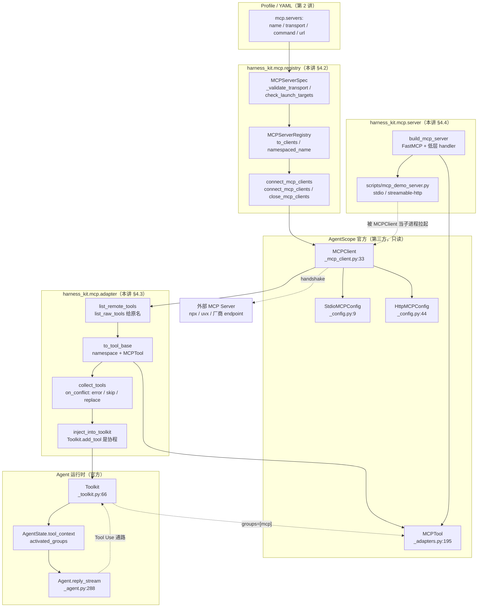

# 第 7 讲：MCP 工具协议：接入外部工具并把 Harness 暴露出去

> **本讲目标**：把 MCP（Model Context Protocol）这条"工具的外部供给通道"从
> 源码读到骨子里 —— AgentScope 只给了 **客户端**（`mcp/` 三个文件 + `MCPTool`），
> 谁也没给 **服务端**。学完你能做到三件事：
> （1）用一段 YAML 声明就把任意外部 MCP server 接进 Agent，
> 并且**所有配置错误都在装配期炸掉**，而不是变成"Agent 莫名其妙少了一组工具"；
> （2）把几十个 MCP 工具按 server 分组、命名空间隔离、按需激活，
> 不让它们把 system prompt 撑爆；
> （3）把 `harness_kit` 自己的工具**反向暴露**成一个真正的 MCP Server，
> 用自己的 Client 调通自己的 Server。
> **前置要求**：完成第 1~6 讲（环境、Profile 装配、事件、模型适配层、工具系统、
> Skills），具备 Python 3.11 环境
> `/Users/a/miniconda3/envs/agentscope_reme_pip_env/bin/python`，
> 且知道 `PYTHONPATH` 必须包含 `third_party/ReMe` 与 `tutorial_agsc_reme/reference`。
> **本讲交付物**（相对仓库根）：
> `tutorial_agsc_reme/reference/harness_kit/mcp/__init__.py`、
> `tutorial_agsc_reme/reference/harness_kit/mcp/registry.py`、
> `tutorial_agsc_reme/reference/harness_kit/mcp/adapter.py`、
> `tutorial_agsc_reme/reference/harness_kit/mcp/server.py`、
> `tutorial_agsc_reme/reference/scripts/mcp_demo_server.py`、
> `tutorial_agsc_reme/reference/scripts/07_mcp.py`、
> `tutorial_agsc_reme/reference/tests/test_lesson07_mcp.py`。
> 另有一组**与前几讲的接线**（§4.6 给出行号与片段）：
> `harness_kit/registry.py` 的 `_register_mcps`、
> `harness_kit/config/builder.py` 的 `build_mcp_clients()` 与 `build_toolkit()`
> 里的 MCP 分支、`harness_kit/config/schema.py` 的 `MCPSpec`。
> **预计时长**：150 分钟。
>
> 本讲的完整可运行代码位于 `tutorial_agsc_reme/reference/harness_kit/mcp/`，
> 你可以直接对照，也可以跟着正文一行一行写。

---

## 一、这一讲要解决的问题

**没有 MCP，Harness 的工具上限就是你手写的函数个数。** 没有它，接一个
GitHub、一个 Postgres、一个浏览器自动化，都要在 `harness_kit` 里写一个新的
适配器、新的参数 schema、新的错误处理 —— 而 2025 年之后，这些能力**绝大多数
已经以 MCP server 的形式存在**：`npx @modelcontextprotocol/server-filesystem`、
`uvx mcp-server-git`、各家 IDE 与 SaaS 厂商的官方 MCP endpoint。
不接 MCP，等于每接一个工具都要重新造一遍轮子，而且造出来的东西还和生态不兼容。

AgentScope 2.0.8 **已经**给了完整的客户端实现（`MCPClient` + `MCPTool` +
`Toolkit(mcps=[...])`），所以本讲**一行内核都不重写**。真正缺的是三件事，
它们都有具体的失败现场：

**失败现场 1：配置错误变成"静默降级"。** 一个真实的 Profile 片段：

```yaml
mcp:
  servers:
    - name: filesystem
      transport: stdio
      command: python
      args: ["./scripts/fs_server.py"]   # 打错了一个字母
    - name: github
      transport: sse
      url: http://127.0.0.1:18100/api/v1/events  # 路径不以 /sse 结尾 → 被当成 streamable-http
```

跑起来的结果是：Agent 正常启动、正常对话，只是**它的工具列表里没有
`mcp__filesystem__*`**。原因有两个，而且都不显眼：

- `stdio` 的脚本路径打错时，`MCPClient.connect()` 会走进一条用
  `asyncio.shield` 做的清理路径（`third_party/agentscope/src/agentscope/mcp/_mcp_client.py:359-372`），
  真实异常被顶掉，冒出来的是一个 `CancelledError`；而 `CancelledError`
  继承 `BaseException`，任何 `except Exception` 都抓不到它 ——
  **已经连上的其它 server 也不会被回滚关闭**，直接泄漏成孤儿进程；
- `sse` 的 url 路径不以 `/sse`（或 `/messages/`）结尾时，AgentScope 会**静默**走
  streamable-http 传输（`:222-229` 只按 url 路径判定），连接可能"看起来成功了"，
  但握手协议对不上，工具列表是空的。

这两条都属于"排查成本极高、发生频率极高"的错误，必须在**交给 SDK 之前**拦下。

**失败现场 2：几十个 MCP 工具把 system prompt 撑爆。**
一个稍大的部署会挂 5~10 个 MCP server，每个暴露 10~40 个工具。
AgentScope 的 `Toolkit` 把 MCP 客户端**默认放进 `basic` 组**
（docstring 在 `tool/_toolkit.py:110`，构造在 `:127-135`），而 `basic` 组是**常驻激活**的
（`:512` 的 `groups_filter = ["basic"] + (groups or [])`）——
于是 300 个工具的 JSON schema 每一轮都躺在提示词里。
实测：`harness-demo` 三个工具的 schema 是 1.9 KB 左右，300 个就是近 200 KB。
我们要的是"按 server 分组、模型自己决定激活哪一组"。

**失败现场 3：两个 server 提供同名工具，静默覆盖。**
`Toolkit.add_tool` 遇到重名只打一行 warning 然后覆盖
（`tool/_toolkit.py:660-670`，日志原文是
`Duplicate tool name '%s' found in group '%s', overwriting it.`）。
更隐蔽的是：**两个不同 server 的同名工具其实不会撞**
（命名空间不同 → `mcp__a__read_file` ≠ `mcp__b__read_file`），
真正会撞的是"本地工具与远端工具同名"。所以重名检测必须发生在
**注入之前**，而且要有明确的策略（报错 / 跳过 / 覆盖），不能靠一条 warning。

**有一条路 AgentScope 完全没有：反向。** 全仓 `grep -rn "FastMCP"` 只命中
它自己的示例与测试，`agentscope` 包里**没有任何 server 侧代码**。
而"把我的 Harness 暴露出去"是真实需求：让别人的 Claude / Cursor / 另一个
AgentScope Agent 能调用我的工具。本讲用 SDK 自带的 `mcp.server.fastmcp.FastMCP`
补上这一侧，并且解释为什么**必须**走低层 handler 而不能只靠 `@server.tool`
装饰器（`input_schema` 会被压扁，`$defs` 会丢）。

---

## 二、源码侦察

本节所有 `路径:行号` 都是**在当前仓库里亲自读过**的（`third_party/agentscope`
是 2.0.8，`mcp` SDK 是 1.30.0）。侦察报告（`_recon/10_agentscope_mcp_rag_skill.md`）
里给出的行号有偏移，**本文一律以实读为准**。

### 2.1 客户端：`MCPClient` 是一个 pydantic 模型，校验全在构造期

```text
third_party/agentscope/src/agentscope/mcp/_mcp_client.py:33    class MCPClient(BaseModel):
third_party/agentscope/src/agentscope/mcp/_mcp_client.py:98        is_stateful: bool = Field(
third_party/agentscope/src/agentscope/mcp/_mcp_client.py:144       def model_post_init(self, __context: Any) -> None:
third_party/agentscope/src/agentscope/mcp/_mcp_client.py:148           if not re.fullmatch(r"[a-zA-Z0-9_-]+", self.name):
third_party/agentscope/src/agentscope/mcp/_mcp_client.py:156       if self.mcp_config.type == "stdio_mcp" and not self.is_stateful:
third_party/agentscope/src/agentscope/mcp/_mcp_client.py:180       if self.enable_tools is not None and self.disable_tools is not None:
third_party/agentscope/src/agentscope/mcp/_mcp_client.py:191           self._initialize_client()
```

**这说明什么**：`MCPClient` 不是一个"连上才知道对不对"的懒对象。
`model_post_init`（`:144`）在**构造的那一刻**就把四类错误挡掉了：
名字非法（`:148`）、stdio 不是 stateful（`:156`）、
`enable_tools` / `disable_tools` 类型不对（`:162`、`:171`）、两者重叠（`:180-188`）。
最后一行 `:191` 甚至会**预先建好** stdio 的 context manager。
这条设计对我们极其有利：**把 Profile 的 YAML 翻译成 `MCPClient` 的那一层，
就是最好的校验点** —— 越早构造，报错越接近用户写的配置。

### 2.2 三种 transport，两条硬约束，一个按路径判定的坑

```text
third_party/agentscope/src/agentscope/mcp/_config.py:9         class StdioMCPConfig(BaseModel):
third_party/agentscope/src/agentscope/mcp/_config.py:44        class HttpMCPConfig(BaseModel):
third_party/agentscope/src/agentscope/mcp/_config.py:60            timeout: float | None = Field(
third_party/agentscope/src/agentscope/mcp/_mcp_client.py:222      @property
third_party/agentscope/src/agentscope/mcp/_mcp_client.py:223      def _is_sse(self) -> bool:
third_party/agentscope/src/agentscope/mcp/_mcp_client.py:229          return path.endswith("/sse") or path.endswith("/messages/")
third_party/agentscope/src/agentscope/mcp/_mcp_client.py:232      async def _create_streamable_http_client(
third_party/agentscope/src/agentscope/mcp/_mcp_client.py:308          if name.lower() in self._RESERVED_HEADERS:
```

**这说明什么**：三种 transport 在 AgentScope 里只有**两个**配置类 ——
`sse` 与 `streamable_http` 共用 `HttpMCPConfig`，区分它们的**唯一依据是 url 路径**
（`:229`）。所以：

- `transport: sse` 的 url 必须落在 `/sse` 或 `/messages/` 上；
- `transport: streamable_http` 的 url **不能**落在这些路径上；
- 写错不会报错，只会静默走错传输 —— 这是本讲 `MCPServerSpec` 第一条要拦的规则。

另外 `:308` 的 `_RESERVED_HEADERS`（`:84` 定义）说明运行时换 header 不是随便换的，
本讲用不到，但值得知道边界在哪。

### 2.3 握手：一次性的 transport 与"取消安全"的清理

```text
third_party/agentscope/src/agentscope/mcp/_mcp_client.py:317      async def connect(self) -> None:
third_party/agentscope/src/agentscope/mcp/_mcp_client.py:325          if not self.is_stateful:
third_party/agentscope/src/agentscope/mcp/_mcp_client.py:332          if self._is_connected:
third_party/agentscope/src/agentscope/mcp/_mcp_client.py:338          # Transports are one-shot context managers. Recreate them before every
third_party/agentscope/src/agentscope/mcp/_mcp_client.py:347          stack = AsyncExitStack()
third_party/agentscope/src/agentscope/mcp/_mcp_client.py:355              await self._session.initialize()
third_party/agentscope/src/agentscope/mcp/_mcp_client.py:359          except BaseException:
third_party/agentscope/src/agentscope/mcp/_mcp_client.py:366                  await asyncio.shield(stack.aclose())
third_party/agentscope/src/agentscope/mcp/_mcp_client.py:374      async def close(self, ignore_errors: bool = True) -> None:
```

**这说明什么**：三条实测结论，每条都影响我们的写法。

1. `:338` 的注释直言 transport 是 **one-shot context manager**，
   每次 `connect()` 都要重建。所以 `MCPClient` 对象**不能被长期缓存复用**：
   `close()` 之后要重连必须重新 `to_clients()`。我们把这句写进了
   `MCPServerRegistry.to_clients()` 的语义里（每次都返回全新对象）。
2. `:359-372` 是**失败路径**：它抓 `BaseException`（因为要覆盖 CancelledError），
   然后用 `asyncio.shield` 关闭已经进入的上下文。`shield` 会把清理放到
   **另一个 task** 里执行，而 anyio 的 cancel scope 要求"进入与退出在同一个 task"
   —— 于是 stdio server 起不来时，真实异常被顶成一个
   `RuntimeError: Attempted to exit cancel scope in a different task...`，
   调用方看到的是 `CancelledError`。**这是本讲最重要的一条踩坑**，见 §六。
3. `:325` 说明无状态（HTTP）客户端**不需要** `connect()`，每次调用临时建会话；
   `:374` 的 `close(ignore_errors=True)` 让关闭阶段"绝不抛"。

### 2.4 双名制：`list_raw_tools()` 给原名，`list_tools()` 给模型名

```text
third_party/agentscope/src/agentscope/mcp/_mcp_client.py:422      async def list_raw_tools(self) -> list[mcp.types.Tool]:
third_party/agentscope/src/agentscope/mcp/_mcp_client.py:437          if not self.is_stateful:
third_party/agentscope/src/agentscope/mcp/_mcp_client.py:455          if self.enable_tools is not None:
third_party/agentscope/src/agentscope/mcp/_mcp_client.py:461          if self.disable_tools is not None:
third_party/agentscope/src/agentscope/mcp/_mcp_client.py:467      async def list_tools(self) -> list[ToolBase]:
third_party/agentscope/src/agentscope/mcp/_mcp_client.py:483      async def get_tool(
third_party/agentscope/src/agentscope/mcp/_mcp_client.py:508          if self._cached_tools is None:
third_party/agentscope/src/agentscope/mcp/_mcp_client.py:523          # Create MCPTool based on stateful/stateless
third_party/agentscope/src/agentscope/mcp/_mcp_client.py:542      def _validate_connection(self) -> None:
```

**这说明什么**：同一个工具在系统里有两个名字。

| 名字 | 谁在用 | 从哪来 |
| --- | --- | --- |
| `calc` | MCP server 自己、它的日志、`tools/call` 请求 | `list_raw_tools()` |
| `mcp__harness-demo__calc` | 模型、`Toolkit`、事件流、报错 | `list_tools()` / `get_tool()` |

`:455`、`:461` 说明 `enable_tools` / `disable_tools` 过滤发生在
**原始名**这一层（`tool.name` 是 `calc`，不是 `mcp__...__calc`）——
写白名单时要用原名。`:542` 的 `_validate_connection()` 是"未连接就 `RuntimeError`"
的唯一出处，`list_raw_tools`（`:450`）与 `get_tool`（`:534`）都调它。

### 2.5 `MCPTool`：名字的唯一权威，以及三条安全默认值

```text
third_party/agentscope/src/agentscope/tool/_adapters.py:195   class MCPTool(ToolBase):
third_party/agentscope/src/agentscope/tool/_adapters.py:203       is_mcp: bool = True
third_party/agentscope/src/agentscope/tool/_adapters.py:205       is_state_injected: bool = False
third_party/agentscope/src/agentscope/tool/_adapters.py:246       sanitized_tool = re.sub(r"[^a-zA-Z0-9_-]", "x", tool.name)
third_party/agentscope/src/agentscope/tool/_adapters.py:247       self.name = f"mcp__{mcp_name}__{sanitized_tool}"
third_party/agentscope/src/agentscope/tool/_adapters.py:261       _schema = dict(tool.inputSchema) if tool.inputSchema else {}
third_party/agentscope/src/agentscope/tool/_adapters.py:262       _schema.setdefault("type", "object")
third_party/agentscope/src/agentscope/tool/_adapters.py:273       if tool.annotations and hasattr(tool.annotations, "readOnlyHint"):
third_party/agentscope/src/agentscope/tool/_adapters.py:274           self.is_read_only = tool.annotations.readOnlyHint or False
third_party/agentscope/src/agentscope/tool/_adapters.py:294   async def check_permissions(
third_party/agentscope/src/agentscope/tool/_adapters.py:307           if self.is_read_only:
third_party/agentscope/src/agentscope/tool/_adapters.py:309                   behavior=PermissionBehavior.ALLOW,
third_party/agentscope/src/agentscope/tool/_adapters.py:313               behavior=PermissionBehavior.ASK,
third_party/agentscope/src/agentscope/tool/_adapters.py:359   def _convert_mcp_content_to_blocks(
```

**这说明什么**：

- `:246-247` 是**名字的唯一权威**。所以我们自己的
  `namespaced_tool_name()` 必须逐字复刻这两行（连"非法字符换成 `x` 而不是 `_`"
  这个细节都一样），否则调试时 raw / wrapped 两个名字对不上。
- `:261-265` 整体保留 `inputSchema` 而**不是**只取 `properties` / `required` ——
  这是 2.0.x 修过的 bug：只取那两样会把 `$defs` 丢掉，
  带嵌套模型的参数 `$ref` 全部悬空。我们的 server 侧必须同样原样透传（§2.8）。
- `:273-274` 把 MCP 的 `annotations.readOnlyHint` 映射成 `is_read_only`，
  `:307-315` 再据此给出**默认权限**：只读 → `ALLOW`，其余 → `ASK`。
  这是"权限默认安全"的落地，也是为什么我们的 server 要把 `readOnlyHint` 带上。
- `:205` 的 `is_state_injected = False` 是**安全边界**：MCP 工具**禁止**
  注入 `AgentState`。远端 server 不可信，不能让它拿到本地状态对象。

### 2.6 `Toolkit`：分组、激活、吞异常，三个行为都在 `_get_available_tools` 里

```text
third_party/agentscope/src/agentscope/tool/_toolkit.py:66     class Toolkit:
third_party/agentscope/src/agentscope/tool/_toolkit.py:88         def __init__(
third_party/agentscope/src/agentscope/tool/_toolkit.py:118            _.name == "basic" for _ in tool_groups
third_party/agentscope/src/agentscope/tool/_toolkit.py:145        # The stateful MCP clients should be initialized already
third_party/agentscope/src/agentscope/tool/_toolkit.py:147                if client.is_stateful and not client.is_connected:
third_party/agentscope/src/agentscope/tool/_toolkit.py:171    async def get_tool_schemas(
third_party/agentscope/src/agentscope/tool/_toolkit.py:225    async def call_tool(
third_party/agentscope/src/agentscope/tool/_toolkit.py:473    async def _get_available_tools(
third_party/agentscope/src/agentscope/tool/_toolkit.py:502        if (
third_party/agentscope/src/agentscope/tool/_toolkit.py:512        groups_filter = ["basic"] + (groups or [])
third_party/agentscope/src/agentscope/tool/_toolkit.py:523            for client in group.mcps:
third_party/agentscope/src/agentscope/tool/_toolkit.py:526                except Exception as e:
third_party/agentscope/src/agentscope/tool/_toolkit.py:531                    logger.warning(
third_party/agentscope/src/agentscope/tool/_toolkit.py:542                if tool.name in available_tools:
third_party/agentscope/src/agentscope/tool/_toolkit.py:588                    raise ToolGroupInactiveError(
third_party/agentscope/src/agentscope/tool/_toolkit.py:640    async def add_tool(
third_party/agentscope/src/agentscope/tool/_toolkit.py:660                        if new_tool.name in existing_tools:
third_party/agentscope/src/agentscope/tool/_toolkit.py:662                            "Duplicate tool name '%s' found in group '%s', "
third_party/agentscope/src/agentscope/tool/_toolkit.py:678            f"Cannot find group '{group_name}' in toolkit, only "
```

**这说明什么**：

- `:118-125` 把 `"basic"` 列为**保留组名** —— 构造 `Toolkit` 时再传一个同名的
  `ToolGroup` 会直接 `ValueError`。我们所有的 MCP 组都必须另起名字。
- `:145-151` 要求**有状态的 MCP 客户端在构造 Toolkit 时已经连上**，
  否则 `ValueError: The MCP client 'x' is stateful, but not connected.`
  这条约束决定了装配顺序：`connect` 必须在 `Toolkit(...)` 之前。
- `:512` 的 `groups_filter` 是"哪些工具可见"的唯一判据：
  `basic` + 显式传入的组。**MCP 工具放进非 `basic` 组就默认不可见**，
  必须由 Agent 调元工具激活 —— 这正是我们要的行为，也是失败现场 2 的解法。
- `:523-537` 是本讲最该抄的一段：`await client.list_tools()` 外面套了
  `except Exception` + `logger.warning`。**一个 MCP 掉线只让它的工具消失，
  不会杀死这一轮对话。** 这是"降级而不是崩"的正确姿势。
- `:542-548` 与 `:660-670` 是**两处**静默覆盖：前者在收集阶段（跨组），
  后者在 `add_tool`（组内）。两处都只 warning。
- `:588` 的 `ToolGroupInactiveError` 不会以异常形式冒到调用方 ——
  `call_tool`（`:225`）把它转成一个 `state=error` 的 `ToolResponse`，
  让**模型自己看到错误并自纠**（这是 ReAct 的关键设计）。

### 2.7 激活状态存在 `AgentState` 上，不在 Toolkit 上

```text
third_party/agentscope/src/agentscope/state/_state.py:32      class ToolContext(BaseModel):
third_party/agentscope/src/agentscope/state/_state.py:42          activated_groups: list[str] = Field(default_factory=list)
third_party/agentscope/src/agentscope/state/_state.py:283         tool_context: ToolContext = Field(default_factory=ToolContext)
third_party/agentscope/src/agentscope/agent/_agent.py:288      async def reply_stream(
third_party/agentscope/src/agentscope/agent/_agent.py:332      async def reply(
```

**这说明什么**：`Toolkit` 是**无状态**的（多个 Agent 可以共用一个），
"这一轮激活了哪些组"存在**每个 Agent 自己的 `AgentState`** 里，
路径是 `state.tool_context.activated_groups`（`:42`）。
所以：写测试时想手工"激活 mcp 组"，要改的是 state，不是 toolkit；
`reply_stream`（`:288`）接受 `Msg | list[Msg]`，`reply`（`:332`）是它的
非流式包装 —— 第 7 讲的真模型验证走 `reply_stream`，因为它能让我们数出
`ModelCallStartEvent` 的次数（一个 Agent 对象**没有** `close()`，这条也是实测）。

### 2.8 反向：SDK 的 server 侧与"必须走低层 handler"的理由

```text
third_party/agentscope/src/agentscope/mcp/_mcp_client.py:191          self._initialize_client()
third_party/agentscope/src/agentscope/mcp/_mcp_client.py:195          if self.mcp_config.type == "stdio_mcp":
```

**只说结论**（这两条在 agentscope 里，与反向无关，列出来是为了说明
"agentscope 的 mcp 子包只做客户端"）：`grep -rn "class FastMCP" third_party/agentscope/src/agentscope`
**零命中**。server 侧只能来自 MCP SDK：

```text
site-packages/mcp/server/fastmcp/server.py      class FastMCP
site-packages/mcp/server/lowlevel/server.py:733     Processing request of type ...   （请求日志）
```

三条实测结论：

1. **必须 `from mcp.server.fastmcp import FastMCP`**。
   环境里另有一个独立的 `fastmcp 4.0.5` 包，它 import 时需要
   `mcp.server.request_state`，而 SDK `mcp 1.30.0` 没有这个模块 →
   `ImportError: FastMCP server support is not installed`。
   两者同名不同源，是本节第一个坑。
2. `FastMCP` 的 `@server.tool` 装饰器会**自己从函数签名生成 schema**，
   而我们已经有了 `ToolBase.input_schema`（含 `$defs` / `anyOf`）。
   两条路走不到一起：装饰器不接受"外部 schema"。
3. 绕开的办法是拿到底层 `Server`，**直接往 `request_handlers` 里注册**：

```text
site-packages/mcp/server/lowlevel/server.py    def list_tools(self) -> Callable[[...], ...]    （装饰器）
site-packages/mcp/server/lowlevel/server.py    def call_tool(self) -> Callable[[...], ...]     （装饰器）
```

   注意这两个名字**是装饰器不是协程**：`await server.list_tools()` 会得到
   `TypeError: object function can't be used in 'await' expression`（§六有原文）。
   注册之后，正确用法是

   ```python
   handler = server._mcp_server.request_handlers[mcp.types.ListToolsRequest]
   result = await handler(mcp.types.ListToolsRequest(method="tools/list"))
   ```

   这样 `inputSchema` 才能**原样透传**，与 `MCPTool` 那一侧（`tool/_adapters.py:261-265`）
   对称。

### 2.9 一条与日志有关的侦察结论（本讲所有输出都靠它才可读）

```text
third_party/agentscope/src/agentscope/_logging.py:12     logger = logging.getLogger("as")
third_party/agentscope/src/agentscope/_logging.py:44         logger.propagate = False
third_party/agentscope/src/agentscope/_logging.py:47     setup_logger("INFO")
```

**这说明什么**：AgentScope 在 **import 期**就调 `setup_logger("INFO")`，
并且把 `propagate` 设成 `False`。所以：

- 想降噪时**改 root logger 的级别是无效的**（`propagate=False`，
  记录不会往上冒），必须 `logging.getLogger("as").setLevel(...)`；
- 每个 MCP 请求都打一行 INFO（`mcp/server/lowlevel/server.py:733`），
  加上 stdio 子进程继承 stderr，一次验证脚本的输出会被淹掉 30 倍。
  本讲的两个脚本都显式处理了这件事（`scripts/07_mcp.py` 的 `quiet_logging()`、
  `scripts/mcp_demo_server.py` 的 `_quiet_logging()`），
  并且留了 `HARNESS_LOG_LEVEL=DEBUG` 作为逃生门。

### 2.10 本讲会用到的 agentscope / reme 扩展点清单

| 扩展点 | 基类 / 签名 | 文件:行号 | 本讲怎么用 |
| --- | --- | --- | --- |
| `MCPClient` | `class MCPClient(BaseModel)` | `third_party/agentscope/src/agentscope/mcp/_mcp_client.py:33` | 直接构造（`MCPServerSpec.to_client()`），不继承 |
| `MCPClient.connect` | `async def connect(self) -> None` | `.../mcp/_mcp_client.py:317` | `connect_mcp_clients()` 里逐个 await，串行 |
| `MCPClient.close` | `async def close(self, ignore_errors: bool = True) -> None` | `.../mcp/_mcp_client.py:374` | `close_mcp_clients()` 逐个关，绝不抛 |
| `MCPClient.list_raw_tools` | `async def list_raw_tools(self) -> list[mcp.types.Tool]` | `.../mcp/_mcp_client.py:422` | `list_remote_tools()` 用它拿原始名 |
| `MCPClient.list_tools` | `async def list_tools(self) -> list[ToolBase]` | `.../mcp/_mcp_client.py:467` | 只有 `Toolkit` 需要它，我们不用 |
| `MCPClient.get_tool` | `async def get_tool(self, name: str) -> MCPTool` | `.../mcp/_mcp_client.py:483` | 不去用 —— 自己 `to_tool_base()` 才能控制 namespace |
| `StdioMCPConfig` | `class StdioMCPConfig(BaseModel)`，字段 `command` / `args` / `env` / `cwd` / `encoding_error_handler` | `.../mcp/_config.py:9` | `MCPServerSpec.to_client()` 里构造 |
| `HttpMCPConfig` | `class HttpMCPConfig(BaseModel)`，字段 `url` / `headers` / `timeout` | `.../mcp/_config.py:44` | `MCPServerSpec.to_client()` 里构造（`sse` 与 `streamable_http` 共用这一个类） |
| `MCPTool` | `class MCPTool(ToolBase)`；`is_mcp=True`、`is_state_injected=False` | `.../tool/_adapters.py:195`、`:203`、`:205` | `to_tool_base()` 返回的就是它，不自研包装类 |
| `MCPTool.check_permissions` | `async def check_permissions(self, *_args, **_kwargs) -> PermissionDecision` | `.../tool/_adapters.py:294` | 只读 → ALLOW；我们 server 侧带上 `readOnlyHint` |
| `ToolBase.call` | `async def call(self, **kwargs) -> ToolChunk` | `.../tool/_adapters.py:320`（MCPTool 实现） | `call_tool_once()` 归一化流式 / 非流式 |
| `Toolkit` | `class Toolkit:`，`__init__(self, tools=..., skills_or_loaders=..., mcps=..., tool_groups=...)` | `.../tool/_toolkit.py:66`、`:88` | 用 `inject_into_toolkit()` 往组里加 |
| `Toolkit.add_tool` | `async def add_tool(self, tool: ToolBase \| list[ToolBase], group_name: str = "basic") -> None` | `.../tool/_toolkit.py:640` | 唯一入口；**是协程**，未知组 `ValueError`（`:678`） |
| `Toolkit.get_tool_schemas` | `async def get_tool_schemas(self, groups: list[str] \| None = None) -> list[dict]` | `.../tool/_toolkit.py:171` | 断言"未激活看不见 / 激活后看得见" |
| `Toolkit.call_tool` | `async def call_tool(self, tool_call, state) -> AsyncGenerator[ToolChunk \| ToolResponse]` | `.../tool/_toolkit.py:225` | 走完整 Tool Use 通路，断言 error-as-data |
| `ToolGroup` | `ToolGroup(name=..., description=..., tools=[...], mcps=[...], skills_or_loaders=[...])` | `.../tool/_tool_group.py`（`description` 对非 `basic` 组必填） | 我们建的 `mcp` 组 |
| `FunctionTool` | `class FunctionTool(ToolBase)`，`__init__(func, name=None, description=None, input_schema=None, is_concurrency_safe=True, is_read_only=False, ...)` | `.../tool/_adapters.py:36` | demo server 暴露的三个工具 |
| `AgentState` / `ToolContext` | `ToolContext.activated_groups: list[str]` | `.../state/_state.py:32`、`:42`、`:283` | 测试里手工激活 `mcp` 组 |
| `mcp.types` | `Tool` / `ToolAnnotations` / `ListToolsRequest` / `CallToolRequest` / `CallToolRequestParams` / `CallToolResult` | `site-packages/mcp/types.py` | 反向 server 的低层 handler 全程使用 |
| `FastMCP` | `from mcp.server.fastmcp import FastMCP` | `site-packages/mcp/server/fastmcp/server.py` | `build_mcp_server()` 的载体 |

**ReMe 在本讲是零。** 第 7 讲不碰 `third_party/ReMe`（MCP 是工具供给协议，
与长期记忆无关），所以本讲没有任何 ReMe 扩展点。这不是省略 ——
是刻意的边界：ReMe 的接入从第 15 讲开始，第 19 讲才把两者接起来。
`scripts/07_mcp.py` 里仍然要求 `PYTHONPATH` 带 `third_party/ReMe`，
因为 `harness_kit/__init__.py` 与 `settings.py` 会读 `reme` 的版本号（第 1 讲定的规矩）。

---

## 三、扩展点定位与设计

### 3.1 官方已经给了什么

| 能力 | 官方实现 | 位置 |
| --- | --- | --- |
| MCP 客户端（三种 transport） | `MCPClient` | `third_party/agentscope/src/agentscope/mcp/_mcp_client.py:33` |
| 两种传输配置（含 SSE 路由） | `StdioMCPConfig` / `HttpMCPConfig` | `.../mcp/_config.py:9`、`:44` |
| 远端工具 → `ToolBase` | `MCPTool` | `.../tool/_adapters.py:195` |
| 原始名 ↔ 模型名 | `list_raw_tools()` / `list_tools()` | `.../mcp/_mcp_client.py:422`、`:467` |
| 工具分组与按需激活 | `Toolkit` + `ToolGroup` + 元工具 | `.../tool/_toolkit.py:66`、`:512`、`:588` |
| MCP 掉线降级 | `_get_available_tools` 的 `except Exception` | `.../tool/_toolkit.py:524-537` |
| 只读工具的默认权限 | `MCPTool.check_permissions` | `.../tool/_adapters.py:294-315` |
| **服务端（反向）** | **无** | `grep -rn "FastMCP" third_party/agentscope/src/agentscope` → 0 命中 |

**结论**：客户端这一侧是**完整**的，本讲一行都不用重写；
缺的全部是"装配、命名、分组、校验、反向"这五件事。

### 3.2 还缺什么（对应契约 §1.3 的缺口编号）

| 编号 | 缺口 | 不做会怎样 | 本讲补法 |
| --- | --- | --- | --- |
| G1 | **声明式装配**：YAML → `MCPClient` 的翻译层 | Profile 里没法写 MCP；每个项目自己写一遍 20 行胶水 | `MCPServerSpec` + `MCPServerRegistry`（§4.2） |
| G2 | **前置校验**：把 SDK 的构造期校验再往前推一步 | 打错脚本路径 → 伪 `CancelledError` + 孤儿进程；写错 SSE 路径 → 静默走错传输 | `_validate_transport()` + `check_launch_targets()`（§4.2） |
| G3 | **命名空间**：两个 server 的同名工具要能共存 | `mcp__a__calc` 与 `mcp__b__calc` 撞车只能靠人肉改名 | `namespace` 字段 + `namespaced_tool_name()`（§4.2） |
| G4 | **冲突策略显式化**：重名不能只 warning | 生产里静默丢工具，两周后才发现 | `collect_tools(on_conflict=...)` + `ToolNameConflictError`（§4.3） |
| G5 | **按 server 分组 + 幂等注入** | 300 个工具的 schema 每轮都进提示词 | `inject_into_toolkit(toolkit, tools, group="mcp")`（§4.3） |
| G6 | **反向暴露**：Harness → MCP Server | 别的客户端（Claude Desktop / Cursor / 另一个 Agent）调不到我的工具 | `build_mcp_server()`（§4.4） |
| G7 | **可运维性**：一次装配要能回答"现在挂了几个 server、各自的命名空间是什么" | 出事只能靠猜 | `describe()` / `describe_all()` / `tool_digest()` |
| G8 | **韧性验证**：掉线必须只降级 | 一个 server 抖动 → 整轮对话报错 | 不改官方代码，用 §5 的 F 段把它**钉成断言** |

### 3.3 我们在哪个扩展点上做

**一句话：继承零个类，覆写零个方法。** 本讲全部代码是**装配层与适配层**，
用的全是官方已经暴露的公开构造点：

| 我们的函数 | 咬合到官方的哪个点 |
| --- | --- |
| `MCPServerSpec.to_client()` | 构造 `MCPClient(name=..., is_stateful=..., mcp_config=StdioMCPConfig(...))` |
| `connect_mcp_clients()` | 逐个 `await client.connect()`；失败时 `await client.close()` 回滚 |
| `to_tool_base()` | 构造 `MCPTool(mcp_name=..., tool=..., session=/client_gen=...)` —— **与 `MCPClient.get_tool` 内部完全同构**（`.../mcp/_mcp_client.py:523-540`） |
| `inject_into_toolkit()` | 唯一入口 `await toolkit.add_tool(tools, group_name="mcp")` |
| `list_remote_tools()` | `await client.list_raw_tools()` |
| `build_mcp_server()` | `FastMCP` + `server._mcp_server.request_handlers[...]` 低层注册 |

**为什么不用继承**：这里没有任何"行为需要被替换"的诉求。
`MCPClient` 是 pydantic 模型（继承它要处理字段校验，收益是负的）；
`MCPTool` 的构造参数已经把我们要控制的东西（`mcp_name` / `tool` / `timeout`）
全暴露了。**能在公开构造点上组装出想要的行为，就不要继承** ——
这是第 5、6 讲反复出现的同一条判断，本讲第三次验证它。

### 3.4 设计：一张图看懂四条通路



### 3.5 四条通路各自的"一句话职责"

1. **装配通路（§4.2）**：YAML → `MCPClient`。唯一有权说"配置错了"的地方。
2. **适配通路（§4.3）**：`MCPClient` → `ToolBase` 列表 → `Toolkit` 的某个组。
   唯一有权说"这个名字撞了"的地方。
3. **运行通路（官方，§2.6）**：`Toolkit.call_tool` → `ToolChunk` → `ToolResponse`。
   我们**不改**，只在 §5 用断言把它钉住。
4. **反向通路（§4.4）**：`ToolBase` → MCP Server 的 `tools/list` + `tools/call`。
   唯一有权说"我要暴露哪些工具"的地方。

## 四、harness_kit 实现

### 4.0 本讲新增 / 改动的文件清单

| 文件（相对仓库根） | 行数 | 性质 |
| --- | --- | --- |
| `tutorial_agsc_reme/reference/harness_kit/mcp/__init__.py` | 74 | 新增 |
| `tutorial_agsc_reme/reference/harness_kit/mcp/registry.py` | 720 | 新增 |
| `tutorial_agsc_reme/reference/harness_kit/mcp/adapter.py` | 381 | 新增 |
| `tutorial_agsc_reme/reference/harness_kit/mcp/server.py` | 320 | 新增 |
| `tutorial_agsc_reme/reference/scripts/mcp_demo_server.py` | 186 | 新增 |
| `tutorial_agsc_reme/reference/scripts/07_mcp.py` | 950 | 新增（§五） |
| `tutorial_agsc_reme/reference/tests/test_lesson07_mcp.py` | 700 | 新增（§五） |
| `harness_kit/registry.py` | 3 行 | 改动：登记 `mcp` 类目（§4.6） |
| `harness_kit/config/builder.py` | 约 40 行 | 改动：`build_mcp_clients()` + `build_toolkit()` 的 MCP 分支（§4.6） |
| `harness_kit/config/schema.py` | 12 行 | 改动：`MCPSpec`（§4.6） |

下面 4.1~4.5 是**完整文件**，可以逐个复制落盘；4.6 是接线片段。

### 4.1 `harness_kit/mcp/__init__.py`

```python
# -*- coding: utf-8 -*-
"""harness_kit 的 MCP 层（契约 §3.7，第 7 讲）。

三个模块，三条不同的路：

- :mod:`harness_kit.mcp.registry` —— **声明 → 连接**：把 Profile 里的
  ``MCPServerSpec`` 翻译成 AgentScope 的 ``MCPClient`` 并连上；
- :mod:`harness_kit.mcp.adapter` —— **连上 → 可用**：把远端工具收进
  ``Toolkit`` 的 ``mcp`` 工具组，并把重名/命名空间讲清楚；
- :mod:`harness_kit.mcp.server` —— **反向**：把 harness_kit 的工具暴露成
  MCP Server（AgentScope 只有客户端，这一侧是契约 §1.3 列的真实缺口）。

``MCPClient`` 的三种 transport 全部基于 AgentScope 原生实现，
harness_kit 不重写任何一种：

- ``stdio`` → ``StdioMCPConfig``（``third_party/agentscope/src/agentscope/mcp/_config.py:9``），
  必须 ``is_stateful=True``；
- ``sse`` → ``HttpMCPConfig`` + url 路径以 ``/sse`` 结尾
  （``.../mcp/_mcp_client.py:223-229`` 的 ``_is_sse`` 判定）；
- ``streamable_http`` → ``HttpMCPConfig`` + 非 ``/sse`` 路径。
"""

from typing import TYPE_CHECKING

from harness_kit.mcp.adapter import (
    ToolNameConflictError,
    collect_tools,
    inject_into_toolkit,
    list_remote_tools,
    to_tool_base,
)
from harness_kit.mcp.registry import (
    MCPServerRegistry,
    MCPServerSpec,
    TRANSPORTS,
    build_mcp_clients,
    close_mcp_clients,
    connect_mcp_clients,
    namespace_of,
    namespaced_tool_name,
    sanitize_tool_name,
)

if TYPE_CHECKING:  # pragma: no cover - 仅供类型检查
    pass

__all__ = [
    "TRANSPORTS",
    "MCPServerRegistry",
    "MCPServerSpec",
    "ToolNameConflictError",
    "build_mcp_clients",
    "build_mcp_server",
    "close_mcp_clients",
    "collect_tools",
    "connect_mcp_clients",
    "inject_into_toolkit",
    "list_remote_tools",
    "namespace_of",
    "namespaced_tool_name",
    "sanitize_tool_name",
    "to_tool_base",
]


def __getattr__(name: str) -> object:
    """惰性导出 :func:`~harness_kit.mcp.server.build_mcp_server`。

    ``mcp.server`` 会 ``import mcp.server.fastmcp``，而后者在 import 期就要求
    SDK 的 server 依赖齐全。纯客户端场景（只连别人的 MCP server）不该被这套
    依赖拖累，所以 server 侧只在真的用 ``build_mcp_server`` 时导入。

    Args:
        name (`str`): 属性名。

    Returns:
        `object`: 目标对象。

    Raises:
        AttributeError: 名字不在本模块的导出表里。
    """
    if name == "build_mcp_server":
        from harness_kit.mcp.server import build_mcp_server

        globals()[name] = build_mcp_server
        return build_mcp_server
    raise AttributeError(f"module {__name__!r} has no attribute {name!r}")
```

**为什么这么写**

这个 `__init__.py` 里唯一有技术含量的东西是末尾的 `__getattr__`。
`harness_kit.mcp.server` 会 `import mcp.server.fastmcp`，而后者在 import 期就要求
SDK 的 server 依赖齐全（`pydantic` / `starlette` / `uvicorn` 那一串）。
纯客户端场景（只想连别人的 MCP server）不该被这套依赖拖累，所以
`build_mcp_server` 走**惰性导出**：只有真的访问这个名字时才 import。

注意其他名字（`MCPServerSpec` / `collect_tools` / ...）都是立即 import 的 ——
惰性导出只留给"会拉进重依赖"的那一个。`exposed_tool_names` 这样的诊断函数
**不在**导出表里，要用必须 `from harness_kit.mcp.server import exposed_tool_names`。
这是有意的：本模块的 `__all__` 是"契约 §3.7 承诺的公开面"，
不往里塞便利函数。

### 4.2 `harness_kit/mcp/registry.py`

这是本讲最长的一个文件，也是**唯一有权说"你的配置错了"**的地方。
三条设计主线：

1. **声明 → 客户端的翻译**（`MCPServerSpec.to_client()`）：YAML 里写的是
   `transport: stdio` + `command` / `args`，SDK 要的是 `StdioMCPConfig`；
2. **把校验再往前推**（`_validate_transport()` + `check_launch_targets()`）：
   SDK 的校验在构造 `MCPClient` 时发生，我们把它提前到解析 YAML 这一层，
   并且补上 SDK 不查的两件事 —— SSE 路径、启动目标存在性；
3. **生命周期**（`connect_mcp_clients()` / `close_mcp_clients()`）：
   串行连接 + `BaseException` 级回滚。

```python
# -*- coding: utf-8 -*-
"""MCP 服务器配置与连接管理（契约 §3.7，第 7 讲）。

AgentScope 已经给了完整的 MCP 客户端实现：

- ``agentscope.mcp.MCPClient``（``third_party/agentscope/src/agentscope/mcp/_mcp_client.py:33``）
  —— 一个 pydantic ``BaseModel``，字段 ``name`` / ``is_stateful`` / ``mcp_config``，
  方法 ``connect()`` / ``close()`` / ``list_raw_tools()`` / ``list_tools()`` / ``get_tool()``；
- ``StdioMCPConfig``（``.../mcp/_config.py:9``）与 ``HttpMCPConfig``（``.../mcp/_config.py:44``）
  —— 两种 transport 的配置模型，``HttpMCPConfig`` 同时覆盖 SSE 与 streamable-http。

harness_kit 要补的是**声明式装配**这一层：Profile 里写的是 YAML，
需要有人把"transport: stdio + command: python + args: [...]"翻译成
``StdioMCPConfig``，再把若干 server 汇总成 ``list[MCPClient]``。
这一层的真实价值在**前置校验**上 —— AgentScope 的校验全部发生在构造
``MCPClient`` 的那一刻，而配置错误（写错 transport、SSE 的 url 不以 ``/sse`` 结尾、
stdio 没给 command）在生产里表现为"Agent 莫名其妙少了一组工具"。
本模块把这些错误提前到装配阶段，并给出可操作的报错。

四个已经实测过的坑，全部在这里被挡住：

1. ``MCPClient.name`` 必须匹配 ``^[a-zA-Z0-9_-]+$``
   （``.../mcp/_mcp_client.py:148``），否则构造即 ``ValueError``；
2. **STDIO 必须 stateful**（同文件 ``:156``），``is_stateful=False`` 直接 ``ValueError``；
3. SSE 与 streamable-http 共用 ``HttpMCPConfig``，靠 **url 路径** 区分：
   ``path.endswith("/sse") or path.endswith("/messages/")`` 才走 SSE
   （同文件 ``:229``），所以写错路径会静默走错 transport；
4. transport 的 context manager **一次性**（同文件 ``:340`` 的注释），
   ``connect()`` 会重建，``close()`` 后不能再 ``connect()`` 同一个对象 ——
   要重连请重新 ``to_clients()``。
"""

from __future__ import annotations

import asyncio
import os
import re
from pathlib import Path
from typing import TYPE_CHECKING, Any, Literal
from urllib.parse import urlsplit

from loguru import logger
from pydantic import BaseModel, ConfigDict, Field, model_validator

from agentscope.mcp import HttpMCPConfig, MCPClient, StdioMCPConfig

if TYPE_CHECKING:  # pragma: no cover - 仅供类型检查
    from harness_kit.config.schema import MCPSpec

__all__ = [
    "MCPServerRegistry",
    "MCPServerSpec",
    "TRANSPORTS",
    "build_mcp_clients",
    "close_mcp_clients",
    "connect_mcp_clients",
    "namespace_of",
    "namespaced_tool_name",
    "sanitize_tool_name",
]

TRANSPORTS: tuple[str, ...] = ("stdio", "sse", "streamable_http")
"""契约 §3.7 规定的三种 transport。注意 YAML 里写 ``streamable_http``（下划线），
而 MCP SDK 的 ``run(transport=...)`` 参数写 ``streamable-http``（连字符）。"""

_NAME_RE: re.Pattern[str] = re.compile(r"^[a-zA-Z0-9_-]+$")
"""``MCPClient.name`` 的约束（``.../mcp/_mcp_client.py:148``）。"""

_TOOL_NAME_SANITIZER: re.Pattern[str] = re.compile(r"[^a-zA-Z0-9_-]")
"""MCP server 返回的工具名里可能有点号、冒号等，会被 ``MCPTool`` 换成 ``x``
（``.../tool/_adapters.py:246``）。这里用同一条规则，保证
:func:`namespaced_tool_name` 与模型实际看到的名字一致。"""

NAMESPACE_PREFIX: str = "mcp"
"""模型侧工具名的固定前缀。``MCPTool`` 生成的名字是
``mcp__<server>__<tool>``（``.../tool/_adapters.py:246``）。"""


def sanitize_tool_name(tool_name: str) -> str:
    """把远端工具名净化成 LLM 提供方接受的形式。

    与 ``MCPTool`` 内部用的规则一致：非法字符替换成 ``x`` 而不是 ``_``，
    以免与 ``mcp__server__tool`` 里的 ``__`` 分隔符混淆
    （``third_party/agentscope/src/agentscope/tool/_adapters.py:240-246``）。

    Args:
        tool_name (`str`): 远端原始工具名。

    Returns:
        `str`: 只含 ``[a-zA-Z0-9_-]`` 的工具名。
    """
    return _TOOL_NAME_SANITIZER.sub("x", tool_name)


def namespace_of(name: str) -> str:
    """把任意字符串净化成合法的 MCP 命名空间。

    Args:
        name (`str`): 原始名字（通常是 server 名）。

    Returns:
        `str`: 只含 ``[a-zA-Z0-9_-]`` 的命名空间；原串被清空时返回 ``"mcp"``。
    """
    cleaned = _TOOL_NAME_SANITIZER.sub("-", name)
    return cleaned or NAMESPACE_PREFIX


def namespaced_tool_name(namespace: str, tool_name: str) -> str:
    """算出模型看到的完整工具名。

    Args:
        namespace (`str`): 命名空间（server 的 ``namespace`` 或 ``name``）。
        tool_name (`str`): MCP server 上的原始工具名。

    Returns:
        `str`: 形如 ``mcp__filesystem__read_file``。
    """
    return f"{NAMESPACE_PREFIX}__{namespace_of(namespace)}__{sanitize_tool_name(tool_name)}"


class MCPServerSpec(BaseModel):
    """一个 MCP server 的声明（契约 §3.7）。

    契约里只有 8 个字段；后面 4 个是 harness_kit 为生产场景追加的，
    全部有默认值，因此既有配置不受影响。
    """

    model_config = ConfigDict(extra="forbid")

    name: str
    """server 名。会成为命名空间的一部分，因此必须是 ``[a-zA-Z0-9_-]``。"""

    transport: Literal["stdio", "sse", "streamable_http"]
    """传输方式。"""

    command: str | None = None
    """``stdio`` 必填：启动 server 的可执行文件（建议写 ``python`` 的绝对路径）。"""

    args: list[str] = Field(default_factory=list)
    """``stdio`` 的启动参数。"""

    url: str | None = None
    """``sse`` / ``streamable_http`` 必填。"""

    env: dict[str, str] = Field(default_factory=dict)
    """传给子进程的环境变量（``stdio``）。**注意**：这是全量替换而不是追加，
    AgentScope 会把它原样交给 ``StdioServerParameters(env=...)``
    （``.../mcp/_mcp_client.py:198``），因此需要 ``PATH`` 才能找到命令。"""

    enabled: bool = True
    """``False`` 时 ``MCPServerRegistry.to_clients()`` 会跳过它（契约 §3.7）。"""

    namespace: str | None = None
    """工具名前缀，默认取 ``name``。多个 server 工具重名时用它区分。"""

    # ---- harness_kit 追加 ----

    cwd: str | None = None
    """``stdio`` 子进程的工作目录。"""

    is_stateful: bool | None = None
    """是否长连接。``None``（默认）时：stdio 强制 ``True``、HTTP 用 ``False``。
    显式指定会覆盖默认值，但仍要满足"stdio 必须 stateful"。"""

    enable_tools: list[str] | None = None
    """白名单：只暴露这些工具（``MCPClient.enable_tools``）。"""

    disable_tools: list[str] | None = None
    """黑名单：屏蔽这些工具（``MCPClient.disable_tools``）。"""

    execution_timeout: float | None = None
    """单次工具调用超时（秒）。"""

    headers: dict[str, str] = Field(default_factory=dict)
    """``sse`` / ``streamable_http`` 的额外请求头（例如 ``Authorization``）。"""

    # ------------------------------------------------------------------
    # 校验
    # ------------------------------------------------------------------
    @model_validator(mode="after")
    def _validate_transport(self) -> "MCPServerSpec":
        """校验 transport 与其它字段是否自洽。

        Returns:
            `MCPServerSpec`: 自身。

        Raises:
            ValueError: 字段组合非法。
        """
        if not _NAME_RE.match(self.name):
            raise ValueError(
                f"MCP server 名 {self.name!r} 含非法字符；"
                f"必须匹配 {_NAME_RE.pattern}（LLM 提供方对工具名的硬约束）",
            )

        if self.enable_tools and self.disable_tools:
            overlap = set(self.enable_tools) & set(self.disable_tools)
            if overlap:
                raise ValueError(
                    f"{self.name}: enable_tools 与 disable_tools 不能重叠，"
                    f"重叠项 {sorted(overlap)}",
                )

        if self.transport == "stdio":
            if not self.command:
                raise ValueError(
                    f"{self.name}: transport=stdio 必须提供 command",
                )
            if self.url:
                raise ValueError(
                    f"{self.name}: transport=stdio 不应提供 url",
                )
        else:
            if not self.url:
                raise ValueError(
                    f"{self.name}: transport={self.transport} 必须提供 url",
                )
            if self.command:
                raise ValueError(
                    f"{self.name}: transport={self.transport} 不应提供 command",
                )
            path = urlsplit(self.url).path
            is_sse_url = path.endswith("/sse") or path.endswith("/messages/")
            if self.transport == "sse" and not is_sse_url:
                raise ValueError(
                    f"{self.name}: transport=sse 要求 url 路径以 /sse 结尾，"
                    f"收到 {path!r}。AgentScope 是按 url 路径判断 SSE 的"
                    "（third_party/agentscope/src/agentscope/mcp/_mcp_client.py:229），"
                    "路径写错会静默走成 streamable-http",
                )
            if self.transport == "streamable_http" and is_sse_url:
                raise ValueError(
                    f"{self.name}: transport=streamable_http 的 url 路径不能以 "
                    f"/sse 或 /messages/ 结尾（收到 {path!r}），"
                    "否则会被 AgentScope 路由到 SSE 传输",
                )

        if self.transport == "stdio" and self.is_stateful is False:
            raise ValueError(
                f"{self.name}: STDIO MCP 必须 stateful"
                "（third_party/agentscope/src/agentscope/mcp/_mcp_client.py:156）",
            )
        return self

    # ------------------------------------------------------------------
    # 派生属性
    # ------------------------------------------------------------------
    @property
    def resolved_namespace(self) -> str:
        """实际生效的命名空间（``namespace`` 为空时取 ``name``）。

        Returns:
            `str`: 净化后的命名空间。
        """
        return namespace_of(self.namespace or self.name)

    @property
    def stateful(self) -> bool:
        """解析后的 ``is_stateful``。

        stdio 恒为 ``True``（AgentScope 的硬约束）；HTTP 默认 ``False``
        —— 无状态的 streamable-http 不需要 ``connect()``，每次调用临时建会话
        （``third_party/agentscope/src/agentscope/mcp/_mcp_client.py:415``）。

        Returns:
            `bool`: 是否长连接。
        """
        if self.transport == "stdio":
            return True
        return bool(self.is_stateful)

    def namespaced_name(self, tool_name: str) -> str:
        """算出某个远端工具在这个 server 下的模型侧名字。

        Args:
            tool_name (`str`): MCP server 上的原始工具名。

        Returns:
            `str`: 形如 ``mcp__filesystem__read_file``。
        """
        return namespaced_tool_name(self.resolved_namespace, tool_name)

    def check_launch_targets(self) -> None:
        """stdio 声明里的"看起来是文件路径"的启动目标必须存在。

        这是**在把配置交给 SDK 之前**的最后一道前置校验，理由是实测出来的
        一个真坑：``command`` 或脚本路径打错时，``MCPClient.connect()`` 会走到
        自己的失败清理路径，而那条路径用 ``asyncio.shield(stack.aclose())``
        （``third_party/agentscope/src/agentscope/mcp/_mcp_client.py:359-372``）。
        ``shield`` 把清理放进**另一个 task**，anyio 的 cancel scope 于是只能报
        ``Attempted to exit cancel scope in a different task than it was entered
        in``，**原始异常被顶掉**，调用方拿到的是一个莫名其妙的
        ``CancelledError``（``CancelledError`` 继承 ``BaseException``，
        ``except Exception`` 抓不到它，见 :func:`connect_mcp_clients`）。
        提前判断路径存在性，可以让这个最常见的原因以一句可操作的中文报错出现。

        判据刻意保守，避免误报：

        - ``command`` 含路径分隔符（绝对路径/相对路径）时，要求它存在；
          裸命令名（``"python"``）交给 ``PATH`` 查找，不检查；
        - ``args`` 里**既含路径分隔符又以 ``.py`` 结尾**的项，要求它存在
          —— 这样 ``["--output", "report.py"]`` 这类"看起来像路径的值"不会误伤。

        Raises:
            FileNotFoundError: 有启动目标不存在。
        """
        if self.transport != "stdio":
            return
        candidates: list[str] = []
        command = self.command or ""
        if os.sep in command:
            candidates.append(command)
        for arg in self.args:
            if arg.endswith(".py") and os.sep in arg:
                candidates.append(arg)

        missing = [path for path in candidates if not Path(path).exists()]
        if missing:
            raise FileNotFoundError(
                f"{self.name}: stdio 启动目标不存在 {missing}；"
                f"command={self.command!r} args={self.args!r}。"
                "这类配置错误如果留给 AgentScope 处理，会被它的 shield 清理顶成"
                "CancelledError，排查成本极高（见本方法 docstring）",
            )

    def to_client(self) -> MCPClient:
        """构造 ``MCPClient``（**未连接**）。

        Returns:
            `MCPClient`: AgentScope 的原生客户端对象。

        Raises:
            FileNotFoundError: stdio 的启动目标（命令或脚本）不存在。
            ValueError: 字段组合非法（此时 pydantic 已在校验阶段拦下，属兜底）。
        """
        self.check_launch_targets()
        if self.transport == "stdio":
            config: StdioMCPConfig | HttpMCPConfig = StdioMCPConfig(
                command=self.command or "",
                args=self.args or None,
                env=self.env or None,
                cwd=self.cwd,
            )
        else:
            config = HttpMCPConfig(
                url=self.url or "",
                headers=self.headers or None,
            )

        return MCPClient(
            name=self.resolved_namespace,
            is_stateful=self.stateful,
            mcp_config=config,
            enable_tools=self.enable_tools,
            disable_tools=self.disable_tools,
            execution_timeout=self.execution_timeout,
        )

    def describe(self) -> str:
        """返回一行可读摘要，用于日志与 CLI 展示。

        Returns:
            `str`: 形如 ``filesystem[stdio] mcp__filesystem__* (stateful)``。
        """
        target = self.command if self.transport == "stdio" else self.url
        return (
            f"{self.name}[{self.transport}] -> {target} "
            f"namespace={self.resolved_namespace} "
            f"{'stateful' if self.stateful else 'stateless'}"
        )


class MCPServerRegistry:
    """MCP server 声明的登记表（契约 §3.7）。

    只负责"配置 → 客户端"的翻译与生命周期管理，**不缓存连接**：
    :meth:`to_clients` 每次都返回全新对象，因为 transport 的 context manager
    是一次性的（``.../mcp/_mcp_client.py:340``），复用同一个 ``MCPClient``
    在 ``close()`` 之后无法重连。

    Example:
        >>> registry = MCPServerRegistry()                    # doctest: +SKIP
        >>> registry.add(MCPServerSpec(name="fs", transport="stdio",
        ...                            command="python", args=["server.py"]))
        >>> clients = registry.to_clients()
        >>> await connect_mcp_clients(clients)
    """

    def __init__(self, specs: list[MCPServerSpec] | None = None) -> None:
        """构造登记表。

        Args:
            specs (`list[MCPServerSpec] | None`): 初始声明列表。

        Raises:
            ValueError: 初始列表里有重名。
        """
        self._specs: dict[str, MCPServerSpec] = {}
        for spec in specs or []:
            self.add(spec)

    # ------------------------------------------------------------------
    # 登记
    # ------------------------------------------------------------------
    def add(self, spec: MCPServerSpec) -> None:
        """登记一个 server 声明；同名覆盖。

        Args:
            spec (`MCPServerSpec`): server 声明。
        """
        if spec.name in self._specs:
            logger.warning(
                "MCP server {} 被重复登记，后者覆盖前者（{} -> {}）",
                spec.name,
                self._specs[spec.name].describe(),
                spec.describe(),
            )
        self._specs[spec.name] = spec

    def extend(self, specs: list[MCPServerSpec]) -> None:
        """批量登记。

        Args:
            specs (`list[MCPServerSpec]`): server 声明列表。
        """
        for spec in specs:
            self.add(spec)

    # ------------------------------------------------------------------
    # 查询
    # ------------------------------------------------------------------
    @property
    def specs(self) -> list[MCPServerSpec]:
        """全部声明（含 ``enabled=False`` 的）。

        Returns:
            `list[MCPServerSpec]`: 按登记顺序排列。
        """
        return list(self._specs.values())

    @property
    def enabled_specs(self) -> list[MCPServerSpec]:
        """只含 ``enabled=True`` 的声明。

        Returns:
            `list[MCPServerSpec]`: 按登记顺序排列。
        """
        return [spec for spec in self._specs.values() if spec.enabled]

    def get(self, name: str) -> MCPServerSpec:
        """按名取声明。

        Args:
            name (`str`): server 名。

        Returns:
            `MCPServerSpec`: 声明。

        Raises:
            KeyError: 未登记。
        """
        try:
            return self._specs[name]
        except KeyError as exc:
            raise KeyError(
                f"MCP server {name!r} 未登记；已登记: {sorted(self._specs)}",
            ) from exc

    def namespaced_name(self, spec: MCPServerSpec | str, tool_name: str) -> str:
        """算出模型侧工具名（契约 §3.7）。

        Args:
            spec (`MCPServerSpec | str`): 声明对象或 server 名。
            tool_name (`str`): 远端工具名。

        Returns:
            `str`: 形如 ``mcp__filesystem__read_file``。
        """
        resolved = self.get(spec) if isinstance(spec, str) else spec
        return resolved.namespaced_name(tool_name)

    def __len__(self) -> int:
        """登记数量（含被禁用的）。

        Returns:
            `int`: 数量。
        """
        return len(self._specs)

    def __contains__(self, name: object) -> bool:
        """是否登记过某个名字。

        同时接受 ``str``（server 名）与 :class:`MCPServerSpec`（按 spec.name 查）——
        后者是写验证脚本时最自然的写法（``spec in registry``），
        而 ``MCPServerSpec`` 是 pydantic 模型、**不可哈希**，直接丢给 dict
        只会得到 ``TypeError: unhashable type`` 这种看不懂的报错。

        Args:
            name (`object`): server 名或 :class:`MCPServerSpec`。

        Returns:
            `bool`: 是否登记。
        """
        key = name.name if isinstance(name, MCPServerSpec) else name
        return key in self._specs

    # ------------------------------------------------------------------
    # 转换
    # ------------------------------------------------------------------
    def to_clients(self) -> list[MCPClient]:
        """把 **enabled** 的声明转成 ``MCPClient`` 列表（契约 §3.7）。

        Returns:
            `list[MCPClient]`: 未连接的客户端。

        Raises:
            ValueError: 某个声明的字段组合非法。
        """
        clients: list[MCPClient] = []
        for spec in self.enabled_specs:
            client = spec.to_client()
            clients.append(client)
            logger.bind(server=spec.name).debug("MCP 客户端已构造: {}", spec.describe())
        disabled = [s.name for s in self.specs if not s.enabled]
        if disabled:
            logger.info("MCP server 已禁用，跳过: {}", disabled)
        return clients

    def describe_all(self) -> list[str]:
        """返回每个声明的单行摘要。

        Returns:
            `list[str]`: 摘要列表。
        """
        return [
            f"{'[on] ' if spec.enabled else '[off]'} {spec.describe()}"
            for spec in self.specs
        ]


async def connect_mcp_clients(
    clients: list[MCPClient],
    *,
    timeout_s: float | None = None,
    sequential: bool = True,
) -> None:
    """连接一批客户端；任何一路失败都会先把**已经连上的**关掉再抛。

    两个实测出来的注意点：

1. **不要用 ``asyncio.wait_for`` 包 ``client.connect()``**。stdio 传输底层是
   anyio 的 ``stdio_client()``，而 anyio 的 cancel scope 要求"进入与退出在
   同一个 task"；``asyncio.wait_for`` 会把协程包进一个新的 Task，
   于是超时/异常路径上必然报
   ``RuntimeError: Attempted to exit cancel scope in a different task than
   it was entered in``（本模块的联调中真实踩到过）。所以 ``timeout_s``
   默认 ``None``，真需要超时请用 ``asyncio.timeout()`` 包**整个**
   :func:`connect_mcp_clients` 调用，而不是包单个客户端。

2. **默认串行连接**（``sequential=True``）。``asyncio.gather`` 会让多个
   ``stdio_client`` 在同一批 task 里并发建 cancel scope，一旦有一个失败，
   回滚时的 scope 嵌套很容易错乱。MCP server 的启动开销在毫秒级，
   串行完全够用；确实要并发时显式传 ``sequential=False``。

    Args:
        clients (`list[MCPClient]`): ``MCPServerRegistry.to_clients()`` 的产物。
        timeout_s (`float | None`): 已废弃的兼容参数；非 ``None`` 时会在每个
            client 上打一条 warning（行为不变，见上面第 1 点）。
        sequential (`bool`): 是否串行连接，默认 ``True``。

    3. **回滚必须抓 ``BaseException``**。已连接的客户端是活着的子进程，
       任何提前退出路径都必须把它们关掉。这里抓 ``BaseException`` 而不是
       ``Exception``，是因为 AgentScope 在 stdio server 启动失败时会抛出
       ``CancelledError``（继承 ``BaseException``，见
       ``third_party/agentscope/src/agentscope/mcp/_mcp_client.py:359-372`` 的
       ``asyncio.shield`` 清理），``except Exception`` 漏掉它 → 已连上的
       server 全部泄漏成孤儿进程。

    Args:
        clients (`list[MCPClient]`): ``MCPServerRegistry.to_clients()`` 的产物。
        timeout_s (`float | None`): 已废弃的兼容参数；非 ``None`` 时会在每个
            client 上打一条 warning（行为不变，见上面第 1 点）。
        sequential (`bool`): 是否串行连接，默认 ``True``。

    Raises:
        Exception: 任一 server 连接失败时原样抛出（``CancelledError`` 除外）。
        asyncio.CancelledError: server 进程起得来但握手失败时抛的就是它
            （AgentScope 的 ``shield`` 清理产物）。**原样透传**，不做包装 ——
            把它换成 ``RuntimeError`` 会破坏 ``asyncio.timeout()`` /
            ``Task.cancel()`` 的语义。要区分"真的被取消"与"server 起不来"，
            看 :meth:`MCPServerSpec.check_launch_targets` 是否已经通过了。
    """
    if not clients:
        return
    if timeout_s is not None:
        logger.warning(
            "connect_mcp_clients(timeout_s=...) 已废弃：asyncio.wait_for 会破坏 "
            "anyio 的 cancel scope。请在外面用 asyncio.timeout() 包住整个调用",
        )

    connected: list[MCPClient] = []

    async def _connect(client: MCPClient) -> None:
        """连接单个客户端。

        Args:
            client (`MCPClient`): 目标客户端。

        Raises:
            Exception: 连接失败（``CancelledError`` 原样透传）。
        """
        try:
            await client.connect()
        except asyncio.CancelledError:
            logger.error(
                "MCP server {!r} 握手被 CancelledError 打断；stdio server "
                "启动失败时 AgentScope 的 shield 清理会产出这个伪取消"
                "（third_party/agentscope/src/agentscope/mcp/_mcp_client.py:359）",
                client.name,
            )
            raise
        except Exception as exc:
            raise RuntimeError(
                f"MCP server {client.name!r} 连接失败: {type(exc).__name__}: {exc}",
            ) from exc
        connected.append(client)

    try:
        if sequential:
            for client in clients:
                await _connect(client)
        else:
            await asyncio.gather(*(_connect(client) for client in clients))
    except BaseException as exc:
        logger.error("MCP 连接失败（{}），回滚已连接的 {} 个", exc, len(connected))
        await close_mcp_clients(connected)
        raise

    logger.info("MCP 已连接 {} 个 server: {}", len(clients), [c.name for c in clients])


async def close_mcp_clients(clients: list[MCPClient]) -> None:
    """尽力关闭一批客户端，绝不抛异常。

    Args:
        clients (`list[MCPClient]`): 待关闭的客户端。
    """
    for client in clients:
        if not getattr(client, "is_connected", False):
            continue
        try:
            await client.close(ignore_errors=True)
        except Exception as exc:  # noqa: BLE001 - 关闭阶段不允许阻断
            logger.warning("关闭 MCP {} 失败: {}", client.name, exc)


async def build_mcp_clients(
    spec: "MCPSpec",
    ctx: Any = None,
) -> list[MCPClient]:
    """按 ``MCPSpec`` 装配并连接 MCP 客户端（``HarnessRegistry`` 的工厂入口）。

    这个名字被 ``harness_kit/registry.py`` 的 ``register_lazy("mcp", "spec_registry",
    attrs=("build_mcp_clients", "MCPServerRegistry"))`` 引用
    （见 ``tutorial_agsc_reme/reference/harness_kit/registry.py:1057``），
    所以签名必须是"吃 spec 的工厂"。``ctx`` 参数是可选的装配上下文，
    ``HarnessBuilder._invoke`` 探测到形参里出现 ``ctx`` 就会传进来。

    **连接在工厂内完成**：``Toolkit(mcps=[...])`` 拿到的必须是已连接的客户端，
    Agent 的第一次 tool call 才不会因为 session 未初始化而失败。

    Args:
        spec (`MCPSpec`): Profile 里的 MCP 声明。
        ctx (`Any`): 装配上下文（本工厂不需要，保留以兼容 builder 的探测）。

    Returns:
        `list[MCPClient]`: 已连接的客户端；``servers`` 为空时返回空列表。

    Raises:
        ValueError: 某个 server 声明非法。
        Exception: 连接失败（已连接的会被回滚关闭）。
    """
    del ctx
    registry = MCPServerRegistry(list(spec.servers))
    if not len(registry):
        return []

    disabled = [s.name for s in registry.specs if not s.enabled]
    logger.bind(
        servers=[s.name for s in registry.enabled_specs],
        disabled=disabled,
        group=getattr(spec, "group", "mcp"),
    ).info("装配 MCP：启用 {} 个，禁用 {} 个", len(registry.enabled_specs), len(disabled))

    clients = registry.to_clients()
    await connect_mcp_clients(clients)
    return clients
```

**为什么这么写（逐条对照官方扩展点）**

- **`MCPServerSpec` 的 12 个字段里，只有 8 个是契约字段**（`name` / `transport` /
  `command` / `args` / `url` / `env` / `enabled` / `namespace`），
  另外 4 个（`cwd` / `is_stateful` / `enable_tools` / `disable_tools` /
  `execution_timeout` / `headers`）是 harness_kit 追加的，**全部有默认值**，
  所以既有 Profile 不受影响。`model_config = ConfigDict(extra="forbid")` 保证
  写错字段名时立刻报错（这是 Profile 最常见的笔误）。

- **`_validate_transport()` 里八条 `raise` 的每一条都对应一个真实报错**：

  | 我们拦的错误 | 不拦会怎样 | SDK 的位置 |
  | --- | --- | --- |
  | `name` 含非法字符 | `ValidationError`（消息是英文的 `contains characters not allowed by LLM providers`） | `.../mcp/_mcp_client.py:148` |
  | stdio 缺 `command` | `StdioMCPConfig` 的 `Field(...)` 报 `field required` | `.../mcp/_config.py:14` |
  | stdio 多给了 `url` | 静默忽略，用户以为配了 HTTP | —— |
  | stdio 声明 stateless | `ValueError: STDIO MCP must be stateful` | `.../mcp/_mcp_client.py:156` |
  | http 缺 `url` | `field required` | `.../mcp/_config.py:49` |
  | `sse` 路径不以 `/sse` 结尾 | **静默走 streamable-http** | `.../mcp/_mcp_client.py:229` |
  | `streamable_http` 路径却是 `/sse` | **静默走 SSE** | `.../mcp/_mcp_client.py:223-229` |
  | `enable_tools` 与 `disable_tools` 重叠 | `ValueError: ... should not overlap` | `.../mcp/_mcp_client.py:180-188` |

- **`check_launch_targets()` 是本讲新增的一条护栏**，判据刻意保守：
  只看"含路径分隔符的 `command`"与"既含分隔符又以 `.py` 结尾的 `args`"。
  这样 `["--output", "report.py"]` 这种"看起来像路径的值"不会误伤，
  而 `args=["/nonexistent/server.py"]` 会被拦下。拦下来之后，
  用户看到的是一句中文 + 路径；不拦的话，用户看到的是一个
  来自 anyio 内部的 `CancelledError`（§六第 1 条有完整因果链）。

- **`resolved_namespace` 与 `namespaced_name()` 是命名空间的两个出口**：
  前者给"这个 server 的 ns 是什么"，后者给"某工具在这个 server 下的完整名字"。
  两者都经过 `namespace_of()`，与 `MCPTool` 自己的 `mcp__{name}__{tool}`
  保持同一套净化规则（`tool/_adapters.py:246-247`）。

- **`to_clients()` 每次都返回全新对象**，不做任何缓存 —— 因为官方注释明写了
  transport 是 one-shot（`.../mcp/_mcp_client.py:338`）。
  想要"重连"就再调一次 `to_clients()`，这是**唯一正确**的做法。

- **`connect_mcp_clients()` 的三条注释都是实测结论**：
  不许用 `asyncio.wait_for` 包单个 `connect()`（会破坏 anyio 的 cancel scope）、
  默认串行（`gather` 会让多个 stdio 的 scope 嵌套错乱）、
  回滚抓 `BaseException`（否则 `CancelledError` 会漏掉回滚）。
  `timeout_s` 保留成"已废弃参数 + warning"而不是直接删掉，
  是因为前几讲的 Profile 可能传了它 —— **向后兼容的废弃比删除更难写对**。

- **`build_mcp_clients(spec, ctx=None)` 是注册表的工厂入口**。
  签名里的 `ctx` 是可选的：`HarnessBuilder._invoke` 用
  `harness_kit/registry.py:1073` 的 `accepts_build_context()` 探测形参名，
  有 `ctx` 就传，没有就只传 spec。这让契约 §3.2 的"单参工厂"签名也能用。

### 4.3 `harness_kit/mcp/adapter.py`

`registry.py` 把客户端连上了，但工具还在远端。这个文件负责
"连上 → 可用"这一段，一共 6 个函数 + 1 个异常。**核心判断是：这一层必须极薄。**

```python
# -*- coding: utf-8 -*-
"""把远端 MCP 工具注入 AgentScope ``Toolkit``（契约 §3.7，第 7 讲）。

**这一层几乎不需要新代码，因为 AgentScope 已经做完了**：

- ``MCPClient.get_tool(name)``（``third_party/agentscope/src/agentscope/mcp/_mcp_client.py:483``）
  会把 ``mcp.types.Tool`` 包成 ``MCPTool``（``.../tool/_adapters.py:195``）；
- ``MCPTool`` 自己生成模型侧工具名 ``mcp__<server>__<tool>``
  （``.../tool/_adapters.py:246``）、原样透传 ``inputSchema``（含 ``$defs``，
  同文件 ``:261``）、把 MCP 结果转成 ``ToolChunk``（同文件 ``:351``）；
- ``Toolkit(mcps=[...])`` 可以直接吞 ``MCPClient``（``.../tool/_toolkit.py:66``）。

harness_kit 补的是三件 AgentScope 没做、而生产一定会撞上的事：

1. **命名空间与去重**：两个 MCP server 都提供 ``read_file`` 时，
   ``mcp__a__read_file`` 与 ``mcp__b__read_file`` 是两个不同的工具，
   要在注入前把冲突说清楚；
2. **按 server 分组**：默认所有 MCP 工具进 ``mcp`` 工具组（而不是常驻的
   ``basic`` 组），这样 Agent 要靠 meta tool ``ResetTools`` 显式激活，
   避免几十个 MCP 工具把提示词撑爆；
3. **注入的幂等与冲突策略**：``Toolkit.add_tool`` 是 ``async`` 的，遇到重名
   只会打一条 warning 然后覆盖（同文件 ``:660-670``）。我们把它变成显式的
   ``on_conflict`` 三选一。

**工具名格式的重要偏离（见返回值 unresolved）**：契约 §3.7 写的是
``name = f"{namespace}__{tool_name}"``，而真实实现是
``mcp__{namespace}__{tool_name}`` —— ``MCPTool`` 是名字的唯一权威
（``.../tool/_adapters.py:246``）。硬造一个不带 ``mcp__`` 前缀的名字，
会让 ``is_mcp`` 标记、调试时的 raw/wrapped 名字对应关系全部失真。
"""

from __future__ import annotations

import json
from typing import TYPE_CHECKING, Any, Literal, Mapping

import mcp.types
from loguru import logger

from agentscope.mcp import MCPClient
from agentscope.tool import MCPTool, ToolBase, Toolkit

from harness_kit.mcp.registry import (
    MCPServerRegistry,
    MCPServerSpec,
    namespaced_tool_name,
    namespace_of,
)

if TYPE_CHECKING:  # pragma: no cover - 仅供类型检查
    pass

__all__ = [
    "ToolNameConflictError",
    "collect_tools",
    "inject_into_toolkit",
    "list_remote_tools",
    "to_tool_base",
]

ConflictPolicy = Literal["error", "skip", "replace"]
"""重名处理策略：``error`` 抛异常、``skip`` 保留已有、``replace`` 覆盖。"""


class ToolNameConflictError(ValueError):
    """注入 ``Toolkit`` 时工具重名，且策略为 ``error``。"""


def _as_mcp_tool(tool_desc: Mapping[str, Any] | mcp.types.Tool) -> mcp.types.Tool:
    """把"工具描述"规整成 ``mcp.types.Tool``。

    ``MCPClient.list_raw_tools()`` 给的是 ``mcp.types.Tool`` 对象；配置或
    缓存里存的可能是它的 ``model_dump()`` 结果（``dict``）。两种都接受，
    这样调用方不必关心数据从哪来。

    Args:
        tool_desc (`Mapping[str, Any] | mcp.types.Tool`): 工具描述。

    Returns:
        `mcp.types.Tool`: 规范化后的对象。

    Raises:
        ValueError: dict 里缺少 ``name``，或 pydantic 校验失败。
    """
    if isinstance(tool_desc, mcp.types.Tool):
        return tool_desc

    payload = dict(tool_desc)
    if "name" not in payload:
        raise ValueError(
            f"MCP 工具描述缺少 name 字段: {sorted(payload)}",
        )
    # MCP 的字段名是 camelCase（inputSchema / outputSchema），dict 里两种都容忍
    if "inputSchema" not in payload and "input_schema" in payload:
        payload["inputSchema"] = payload.pop("input_schema")
    if "outputSchema" not in payload and "output_schema" in payload:
        payload["outputSchema"] = payload.pop("output_schema")
    return mcp.types.Tool.model_validate(payload)


def _connection_kwargs(client: MCPClient) -> dict[str, Any]:
    """取出构造 ``MCPTool`` 所需的连接参数。

    ``MCPTool`` 要求 ``session``（有状态）与 ``client_gen``（无状态）二选一，
    两者都通过 ``MCPClient`` 的私有属性暴露 —— 没有公开访问器，
    而 ``MCPClient.get_tool`` 内部用的正是这两个字段
    （``third_party/agentscope/src/agentscope/mcp/_mcp_client.py:483-540``）。

    Args:
        client (`MCPClient`): 已连接（或无状态）的客户端。

    Returns:
        `dict[str, Any]`: 可直接展开给 ``MCPTool(...)`` 的关键字参数。

    Raises:
        RuntimeError: 有状态客户端尚未 ``connect()``。
    """
    if client.is_stateful:
        session = client._session  # noqa: SLF001 - 见 docstring
        if session is None:
            raise RuntimeError(
                f"MCP {client.name!r} 是有状态连接但尚未 connect()；"
                "请先 await client.connect()",
            )
        return {"session": session}
    return {"client_gen": client._get_client_gen}  # noqa: SLF001


def to_tool_base(
    client: MCPClient,
    tool_desc: Mapping[str, Any] | mcp.types.Tool,
    *,
    namespace: str,
) -> ToolBase:
    """把 MCP 工具描述包装成 ``ToolBase``（契约 §3.7）。

    返回的就是 AgentScope 原生的 ``MCPTool``，不是自研包装类 —— 语义完全一致：

    - ``name`` = ``mcp__{namespace}__{tool_name}``（非法字符替换为 ``x``）；
    - ``input_schema`` 原样透传（``$defs`` / ``anyOf`` 都不会被压扁）；
    - ``is_mcp = True``、``is_state_injected = False``
      （``third_party/agentscope/src/agentscope/tool/_adapters.py:203-205``，
      MCP 工具**禁止**注入 AgentState，这是安全边界）；
    - ``check_permissions`` 默认：只读工具 ``ALLOW``，其余 ``ASK``
      （同文件 ``:294-313``）。

    Args:
        client (`MCPClient`): 该工具所属的客户端（用于建立调用通道）。
        tool_desc (`Mapping[str, Any] | mcp.types.Tool`): 工具描述。
        namespace (`str`): 命名空间；空串时退回 ``client.name``。

    Returns:
        `ToolBase`: ``MCPTool`` 实例。

    Raises:
        ValueError: 工具描述不合法。
        RuntimeError: 有状态客户端未连接。
    """
    raw = _as_mcp_tool(tool_desc)
    resolved_ns = namespace_of(namespace or client.name)
    tool = MCPTool(
        mcp_name=resolved_ns,
        tool=raw,
        timeout=client.execution_timeout,
        **_connection_kwargs(client),
    )
    logger.debug(
        "MCP 工具已包装: {} -> {} (read_only={})",
        raw.name,
        tool.name,
        tool.is_read_only,
    )
    return tool


async def list_remote_tools(client: MCPClient) -> list[dict[str, Any]]:
    """列出远端工具（原始描述，dict 形式）。契约 §3.7。

    用 ``list_raw_tools()`` 而不是 ``list_tools()``：前者给的是 server 上的
    原始工具名（``add`` / ``echo``），后者给的是模型侧名字
    （``mcp__demo__add``）。调试与冲突检测需要原始名。

    Args:
        client (`MCPClient`): 已连接（或无状态）的客户端。

    Returns:
        `list[dict[str, Any]]`: 每个工具的 ``model_dump()`` 结果。

    Raises:
        RuntimeError: 有状态客户端未连接。
    """
    raw_tools = await client.list_raw_tools()
    return [_.model_dump(exclude_none=True) for _ in raw_tools]


async def collect_tools(
    clients: list[MCPClient],
    *,
    registry: MCPServerRegistry | None = None,
    base: list[ToolBase] | None = None,
    on_conflict: ConflictPolicy = "replace",
) -> list[ToolBase]:
    """把一批客户端的全部远端工具收集成 ``ToolBase`` 列表。

    重名检测发生在**注入之前**：两个 server 都提供同名工具是合法且常见的，
    只要命名空间不同就不会撞；撞了才按 ``on_conflict`` 处理。

    Args:
        clients (`list[MCPClient]`): ``MCPServerRegistry.to_clients()`` 的产物。
        registry (`MCPServerRegistry | None`): 已知声明表；提供时用它的
            ``namespace`` 覆盖客户端自己的名字。
        base (`list[ToolBase] | None`): 已有工具（通常是本地工具包），
            参与重名检测但不会被修改。
        on_conflict (`ConflictPolicy`): 重名策略。

    Returns:
        `list[ToolBase]`: 可注入的工具列表。

    Raises:
        ToolNameConflictError: ``on_conflict="error"`` 且出现重名。
    """
    taken: dict[str, str] = {tool.name: "本地工具" for tool in base or []}
    collected: list[ToolBase] = []
    index: dict[str, int] = {}

    for client in clients:
        spec: MCPServerSpec | None = None
        if registry is not None and client.name in registry:
            spec = registry.get(client.name)
        namespace = spec.resolved_namespace if spec is not None else client.name

        raw_tools = await client.list_raw_tools()
        for raw in raw_tools:
            tool = to_tool_base(client, raw, namespace=namespace)
            owner = f"MCP server {namespace!r}/{raw.name}"

            if tool.name in taken:
                previous = taken[tool.name]
                if on_conflict == "error":
                    raise ToolNameConflictError(
                        f"工具名冲突: {tool.name!r} 同时来自 {previous} 和 {owner}；"
                        "请给其中一个 server 配不同的 namespace",
                    )
                if on_conflict == "skip":
                    logger.warning(
                        "工具名冲突，保留 {} 并跳过 {}: {}",
                        previous,
                        owner,
                        tool.name,
                    )
                    continue
                logger.warning(
                    "工具名冲突，用 {} 覆盖 {}: {}",
                    owner,
                    previous,
                    tool.name,
                )
                # 冲突来源有两种：``base``（本地工具）与前面某个 MCP server。
                # 只有后者在 ``index`` 里有条目；前者必须**追加**而不是原地
                # 替换，否则 ``index[tool.name]`` 会 KeyError。
                if tool.name in index:
                    collected[index[tool.name]] = tool
                else:
                    index[tool.name] = len(collected)
                    collected.append(tool)
                taken[tool.name] = owner
                continue

            taken[tool.name] = owner
            index[tool.name] = len(collected)
            collected.append(tool)

    logger.bind(tools=[t.name for t in collected]).info(
        "从 {} 个 MCP server 收集到 {} 个工具",
        len(clients),
        len(collected),
    )
    return collected


async def inject_into_toolkit(
    toolkit: Toolkit,
    tools: list[ToolBase],
    *,
    group: str = "mcp",
    on_conflict: ConflictPolicy = "replace",
) -> None:
    """把工具注入 ``Toolkit`` 的指定工具组（契约 §3.7）。

    **必须是 async**：``Toolkit.add_tool`` 是协程
    （``third_party/agentscope/src/agentscope/tool/_toolkit.py:640``）。
    ``Toolkit`` 没有同步的批量注册入口，也没有"只注册不分组"的路径，
    所以这里直接 ``await toolkit.add_tool(tools, group_name=group)``。

    ``group`` 不在 ``toolkit.tool_groups`` 里时 ``add_tool`` 会 ``ValueError``
    （同文件 ``:677``）；本函数先探测一次，把错误换成一条带可用组名的提示。

    Args:
        toolkit (`Toolkit`): 目标工具集。
        tools (`list[ToolBase]`): 待注入工具。
        group (`str`): 目标工具组名，默认 ``"mcp"``（非 ``basic``，
            因此需要 Agent 调 meta tool 激活）。
        on_conflict (`ConflictPolicy`): 与**组内已有工具**重名时的策略。

    Raises:
        ValueError: ``group`` 不存在于 ``toolkit.tool_groups``。
        ToolNameConflictError: ``on_conflict="error"`` 且组内已存在同名工具。
    """
    available = [_.name for _ in toolkit.tool_groups]
    if group not in available:
        raise ValueError(
            f"Toolkit 里没有工具组 {group!r}；可用组: {available}。"
            "请把它加进 Toolkit(tool_groups=[...]) —— 注意 'basic' 是保留组名，"
            "构造时不能再传一个同名的 ToolGroup"
            "（third_party/agentscope/src/agentscope/tool/_toolkit.py:117-125）",
        )
    if not tools:
        logger.debug("没有 MCP 工具需要注入到组 {}（列表为空）", group)
        return

    target = next(_ for _ in toolkit.tool_groups if _.name == group)
    existing = {_.name for _ in target.tools}
    payload: list[ToolBase] = []
    for tool in tools:
        if tool.name in existing:
            if on_conflict == "error":
                raise ToolNameConflictError(
                    f"工具组 {group!r} 里已有同名工具 {tool.name!r}；"
                    "请改用 on_conflict='replace' 或 'skip'",
                )
            if on_conflict == "skip":
                logger.warning("工具组 {} 已有 {}，跳过注入", group, tool.name)
                continue
            logger.warning("工具组 {} 已有 {}，将被覆盖", group, tool.name)
        existing.add(tool.name)
        payload.append(tool)

    if payload:
        await toolkit.add_tool(payload, group_name=group)
    logger.bind(
        group=group,
        injected=[_.name for _ in payload],
        skipped=len(tools) - len(payload),
    ).info("MCP 工具已注入工具组 {}：{} 个", group, len(payload))


def tool_digest(tools: list[ToolBase]) -> str:
    """生成工具清单的稳定摘要，供审计与快照对比。

    Args:
        tools (`list[ToolBase]`): 工具列表。

    Returns:
        `str`: JSON 字符串，按工具名排序。
    """
    return json.dumps(
        [
            {
                "name": tool.name,
                "is_mcp": bool(getattr(tool, "is_mcp", False)),
                "is_read_only": bool(tool.is_read_only),
            }
            for tool in sorted(tools, key=lambda t: t.name)
        ],
        ensure_ascii=False,
        sort_keys=True,
    )


def namespaced(namespace: str, tool_name: str) -> str:
    """便捷函数：``namespaced_tool_name`` 的短别名。

    Args:
        namespace (`str`): 命名空间。
        tool_name (`str`): 远端工具名。

    Returns:
        `str`: 模型侧完整工具名。
    """
    return namespaced_tool_name(namespace, tool_name)
```

**为什么这么写**

- **`to_tool_base()` 返回的是官方 `MCPTool`，不是自研包装类。**
  这一点值得反复强调：`MCPClient.get_tool()` 内部干的事
  （`.../mcp/_mcp_client.py:523-540`）就是"挑 `session` 还是 `client_gen`，
  然后 `MCPTool(mcp_name=..., tool=..., timeout=...)`"。
  我们唯一多做的事是**把 `mcp_name` 换成 `namespace`** ——
  这样两个 server 的同名工具天然不撞。除此之外逐字同构。

- **`_connection_kwargs()` 用了两个私有属性 `client._session` 与
  `client._get_client_gen`。** 这是有意为之并写在 docstring 里的：
  `MCPClient` 没有公开访问器，而 `MCPTool` 的构造**必须**二选一。
  替代方案是调 `client.get_tool(name)`，但那样就拿不到 namespace 控制权
  （`get_tool` 用的是 `client.name`）。**在"用私有属性"和"失去命名空间能力"
  之间，我们选前者，并把风险写进注释** —— 这是工程判断，不是疏忽。

- **`list_remote_tools()` 用 `list_raw_tools()` 而不是 `list_tools()`。**
  原因在 §2.4 的双名制：调试与冲突检测需要**原始名**。
  返回 `model_dump(exclude_none=True)` 而不是对象本身，是为了让它可以
  直接进 JSON / 日志 / 缓存。

- **`collect_tools()` 的冲突检测发生在注入之前**，这是它存在的全部理由。
  `taken` 字典的 value 是"谁占了这个名字"的**人话描述**
  （`"本地工具"` 或 `"MCP server 'harness-demo'/calc"`），
  报错信息因此可以直接告诉用户"去给哪个 server 换 namespace"。

  三种策略的语义边界：

  | `on_conflict` | 结果 | 什么时候用 |
  | --- | --- | --- |
  | `error` | 抛 `ToolNameConflictError` | CI / 生产启动：重名一定是配置事故 |
  | `skip` | 保留已有，丢弃新的 | 本地工具优先于远端同名工具 |
  | `replace` | 用新的覆盖（默认） | 远端是"权威实现"，本地那个只是占位 |

- **`collect_tools()` 里有一处 `if tool.name in index:` 的分支，
  是本讲修掉的一个真 bug**：`replace` 策略下，冲突来源有两种
  （前面的某个 MCP server，或 `base` 里的本地工具），
  而**只有前者在 `index` 里**。原来是直接
  `collected[index[tool.name]] = tool`，冲突来自 `base` 时 `index[tool.name]`
  直接 `KeyError`。修法就是这 4 行：有位置就原地换，没位置就追加。
  §5 的 pytest 里有一条**专门锁这个回归**的用例
  （`test_collect_tools_conflict_replace_includes_remote`）。

- **`inject_into_toolkit()` 必须先探测组名。** `Toolkit.add_tool` 对未知组
  抛的 `ValueError` 消息是英文的（`Cannot find group 'mcp' in toolkit, only
  ['basic'] are available.`，`tool/_toolkit.py:678`），而且**不提示 `basic`
  是保留组名**。我们换成一句中文 + 可用组名 + 一句提示，
  因为"想加一个叫 `basic` 的组"是最容易犯的错。

- **幂等性是免费的**：`add_tool` 自己会覆盖同名工具
  （`tool/_toolkit.py:660-670`），所以"同一个 server 连两次"
  不会在组里留下两份。§5 的 D5 段把这件事钉成断言。

- **`tool_digest()` 是给运维用的**：它把工具清单压成一段排序后的 JSON，
  可以用来做"配置漂移"检测（今天和上周的暴露面是不是一样）。

### 4.4 `harness_kit/mcp/server.py`（反向：把 Harness 暴露成 MCP Server）

这个文件补的是契约 §1.3 列的 6 个真实缺口之一 —— **AgentScope 没有 server 侧**。
全文只有 4 个公开函数，但踩的坑最多。

```python
# -*- coding: utf-8 -*-
"""反向：把 harness_kit 的工具暴露成 MCP Server（契约 §3.7，第 7 讲）。

AgentScope 只有 MCP **客户端**（``third_party/agentscope/src/agentscope/mcp/_mcp_client.py``），
没有 server 侧 —— 这正是契约 §1.3 列的 6 个真实缺口之一
（``tutorial_agsc_reme/_contract.md:65``）。本模块补的就是它。

**铁律：必须 ``from mcp.server.fastmcp import FastMCP``。**

环境里同时装了独立包 ``fastmcp 4.0.5`` 与官方 SDK ``mcp 1.30.0``，两者不兼容：:

    ImportError: FastMCP server support is not installed.
    Install `fastmcp` or `fastmcp-slim[server]`.
    # 根因：fastmcp/server/server.py:33 -> No module named 'mcp.server.request_state'

``mcp.server.fastmcp.FastMCP`` 是 SDK 内置的那一份，签名
``run(transport: Literal['stdio','sse','streamable-http'] = 'stdio')``，
本环境的 1.30.0 上可直接用。详见
``tutorial_agsc_reme/_recon/10_agentscope_mcp_rag_skill.md:687-694``。

**为什么不用 ``@server.tool()`` 装饰器注册工具？**

``FastMCP`` 的 ``Tool.from_function`` 是用 ``inspect.signature`` + 类型注解
**反推** JSON schema（``mcp/server/fastmcp/tools/base.py`` 的 ``func_metadata``）。
而 harness_kit / AgentScope 的工具已经带着一份权威的 ``input_schema``
（``ToolBase.input_schema``，由 docstring 解析或 MCP ``inputSchema`` 透传而来），
反推会丢掉 ``$defs`` 与 ``anyOf``。所以这里走 SDK 的低层处理器
``Server.list_tools()`` / ``Server.call_tool()``（``mcp.server.lowlevel.server``），
把 ``input_schema`` **原样透传**。

代价：低层处理器是"一个请求类型一个 handler"，注册会**替换**掉 ``FastMCP``
构造函数里自己注册的那一个。因此 :func:`build_mcp_server` 是"全有或全无"的：
传了 ``tools`` 就不要再用 ``@server.tool()`` 装饰器注册别的工具。
"""

from __future__ import annotations

import inspect
from typing import Any, Sequence

import mcp.types as types
from loguru import logger
from mcp.server.fastmcp import FastMCP

from agentscope.message import ToolResultState
from agentscope.tool import ToolBase, ToolChunk

from harness_kit.mcp.registry import namespace_of, sanitize_tool_name

__all__ = [
    "DEFAULT_PORT",
    "build_mcp_server",
    "call_tool_once",
    "exposed_tool_names",
    "tool_chunk_to_text",
]

DEFAULT_PORT: int = 18100
"""默认端口。契约 §3.7 要求 ≥ 18000，避开常用端口区间。"""


def tool_chunk_to_text(chunk: ToolChunk) -> str:
    """把 ``ToolChunk`` 的 content 拼成纯文本。

    MCP 的 ``CallToolResult.content`` 支持 ``TextContent`` / ``ImageContent`` /
    ``EmbeddedResource`` 三类；``ToolChunk`` 的 content 是
    ``TextBlock | DataBlock``（``third_party/agentscope/src/agentscope/tool/_response.py:28``）。
    这里只做文本拼接；``DataBlock``（图片/音频）降级成一句占位说明 ——
    它需要 base64 重编码成 ``ImageContent``，属于后续增强。

    Args:
        chunk (`ToolChunk`): 工具调用的增量结果。

    Returns:
        `str`: 拼接后的文本。
    """
    parts: list[str] = []
    for block in chunk.content:
        if block.type == "text":
            parts.append(block.text)
        else:
            parts.append(f"<{block.type} block omitted>")
    return "\n".join(parts)


async def call_tool_once(tool: ToolBase, arguments: dict[str, Any]) -> ToolChunk:
    """调用一个 ``ToolBase`` 并归一成单个 ``ToolChunk``。

    ``ToolBase.__call__`` 有两种形态：非流式工具返回 ``ToolChunk``，
    流式工具返回 ``AsyncGenerator[ToolChunk, None]``
    （``third_party/agentscope/src/agentscope/tool/_base.py:236-250``）。
    这里把后者累积成"最后一块"，MCP 侧只需要一个结果。

    Args:
        tool (`ToolBase`): 目标工具。
        arguments (`dict[str, Any]`): 关键字参数。

    Returns:
        `ToolChunk`: 合并后的结果。

    Raises:
        TypeError: 参数与 ``input_schema`` 不匹配（由工具自身的校验抛出）。
    """
    result = await tool(**arguments)
    if inspect.isasyncgen(result):
        last: ToolChunk | None = None
        async for chunk in result:
            last = chunk
        if last is None:
            return ToolChunk(content=[], state=ToolResultState.RUNNING)
        return last
    return result


def _build_handlers(
    fastmcp: FastMCP,
    tools: list[ToolBase],
    *,
    namespace: str | None,
) -> dict[str, ToolBase]:
    """在 ``FastMCP`` 的低层 server 上注册 list/call 两个处理器。

    Args:
        fastmcp (`FastMCP`): 已构造的 FastMCP 实例。
        tools (`list[ToolBase]`): 待暴露的工具。
        namespace (`str | None`): 非空时给每个工具名加 ``{namespace}__`` 前缀。

    Returns:
        `dict[str, ToolBase]`: 暴露名 → 工具对象。

    Raises:
        ValueError: 工具重名。
    """
    exposed: dict[str, ToolBase] = {}
    for tool in tools:
        name = tool.name
        if namespace:
            name = f"{namespace_of(namespace)}__{sanitize_tool_name(name)}"
        if name in exposed:
            raise ValueError(
                f"暴露的工具名重复: {name!r}；请用 namespace 前缀区分",
            )
        exposed[name] = tool

    lowlevel = fastmcp._mcp_server  # noqa: SLF001 - 见模块 docstring 的取舍说明

    @lowlevel.list_tools()
    async def _list_tools() -> list[types.Tool]:
        """告诉客户端有哪些工具。``inputSchema`` 原样透传。

        额外把 ``ToolBase.is_read_only`` 映射成 MCP 的 ``annotations.readOnlyHint``
        —— 客户端侧 ``MCPTool`` 正是靠这个字段判定 ``is_read_only``
        （``third_party/agentscope/src/agentscope/tool/_adapters.py:271-274``），
        而只读工具的默认权限是 ``ALLOW`` 而不是 ``ASK``（同文件 ``:307-310``）。
        不传这个字段，只读工具在客户端会被当成需要人工确认的危险操作。

        Returns:
            `list[types.Tool]`: MCP 工具描述列表。
        """
        out: list[types.Tool] = []
        for name, tool in exposed.items():
            annotations = (
                types.ToolAnnotations(readOnlyHint=True)
                if tool.is_read_only
                else None
            )
            out.append(
                types.Tool(
                    name=name,
                    description=tool.description,
                    inputSchema=tool.input_schema,
                    annotations=annotations,
                ),
            )
        return out

    @lowlevel.call_tool()
    async def _call_tool(
        tool_name: str,
        arguments: dict[str, Any],
    ) -> types.CallToolResult:
        """执行一次工具调用，把 ``ToolChunk`` 转成 MCP 结果。

        Args:
            tool_name (`str`): 客户端请求的工具名。
            arguments (`dict[str, Any]`): 参数。

        Returns:
            `types.CallToolResult`: MCP 结果；工具报错时 ``isError=True``。
        """
        tool = exposed.get(tool_name)
        if tool is None:
            logger.warning("客户端请求了未暴露的工具: {}", tool_name)
            return types.CallToolResult(
                content=[
                    types.TextContent(
                        type="text",
                        text=f"Unknown tool {tool_name!r}; "
                        f"available: {sorted(exposed)}",
                    ),
                ],
                isError=True,
            )
        try:
            chunk = await call_tool_once(tool, dict(arguments))
        except Exception as exc:  # noqa: BLE001 - 必须转成协议层错误而不是崩连接
            logger.exception("工具 {} 执行失败", tool_name)
            return types.CallToolResult(
                content=[
                    types.TextContent(
                        type="text",
                        text=f"{type(exc).__name__}: {exc}",
                    ),
                ],
                isError=True,
            )

        return types.CallToolResult(
            content=[
                types.TextContent(type="text", text=tool_chunk_to_text(chunk)),
            ],
            isError=chunk.state == ToolResultState.ERROR,
        )

    return exposed


def build_mcp_server(
    name: str,
    *,
    tools: list[ToolBase],
    host: str = "127.0.0.1",
    port: int = DEFAULT_PORT,
    version: str = "1.0.0",
    instructions: str | None = None,
    namespace: str | None = None,
) -> Any:
    """把 harness_kit 的工具暴露成 MCP Server（契约 §3.7）。

    Args:
        name (`str`): server 名，写进 MCP 握手信息。
        tools (`list[ToolBase]`): 待暴露的工具；它们的 ``input_schema``
            会原样出现在 ``tools/list`` 的响应里。
        host (`str`): HTTP/SSE 传输的监听地址（stdio 传输忽略）。
        port (`int`): HTTP/SSE 传输的端口，默认 18100（契约要求 ≥ 18000）。
        version (`str`): server 版本，写进握手信息。
        instructions (`str | None`): 可选的 server 级使用说明。
        namespace (`str | None`): 非空时给每个工具名加 ``{namespace}__`` 前缀，
            避免与客户端的本地工具撞名。

    Returns:
        `Any`: ``mcp.server.fastmcp.FastMCP`` 实例。调用方决定怎么跑：
        ``server.run("stdio")``（给 AgentScope 的 ``StdioMCPConfig`` 用）或
        ``server.run("streamable-http")``（给 ``HttpMCPConfig`` 用）。

    Raises:
        ValueError: ``tools`` 为空，或工具名重复。

    Example:
        >>> from agentscope.tool import FunctionTool              # doctest: +SKIP
        >>> server = build_mcp_server("harness", tools=[FunctionTool(my_fn)])
        >>> server.run("stdio")                                   # doctest: +SKIP
    """
    if not tools:
        raise ValueError(
            "build_mcp_server 至少要暴露一个工具；空列表会让客户端看到一个"
            "没有任何能力的 server",
        )
    if port < 18000:
        raise ValueError(
            f"端口 {port} 违反契约 §3.7 的端口规则（必须 ≥ 18000），"
            "以免与开发机上的常用服务冲突",
        )

    fastmcp = FastMCP(
        name,
        instructions=instructions,
        host=host,
        port=port,
    )
    # FastMCP 的构造函数没有 version 参数，版本号在低层 Server 上
    # （mcp/server/lowlevel/server.py 的 Server.__init__ 第二个位置参数）。
    # 握手信息读的就是这个字段，所以这里直接写它。
    fastmcp._mcp_server.version = version  # noqa: SLF001

    exposed = _build_handlers(fastmcp, tools, namespace=namespace)
    # 记在实例上，供 exposed_tool_names() 与验证脚本 introspection 用。
    # **两个都要记**：``exposed`` 的 key 才是真正在 ``tools/list`` 里
    # 发给客户端的名字（带 namespace 前缀），value 是源工具对象。
    # 只记 value 的话，``build_mcp_server(namespace="verify")`` 暴露出去的
    # ``verify__calc`` 会被诊断函数报成 ``calc``。
    fastmcp._harness_exposed_tools = list(exposed.values())  # noqa: SLF001
    fastmcp._harness_exposed_names = list(exposed)  # noqa: SLF001
    logger.bind(
        server=name,
        tools=sorted(exposed),
        host=host,
        port=port,
    ).info("MCP server 已装配：{} 个工具", len(exposed))
    return fastmcp


def exposed_tool_names(server: Any) -> list[str]:
    """读出 :func:`build_mcp_server` 装配出的**对线名字**列表（诊断用）。

    返回的是 ``tools/list`` 真正发给客户端的名字：传了 ``namespace`` 时
    形如 ``verify__calc``，否则就是 ``tool.name``。

    Args:
        server (`Any`): ``build_mcp_server`` 的返回值。

    Returns:
        `list[str]`: 暴露的工具名；不是本模块造出来的 server 时返回空列表。
    """
    names: Sequence[str] | None = getattr(server, "_harness_exposed_names", None)
    if names is not None:
        return list(names)
    tools: Sequence[Any] = getattr(server, "_harness_exposed_tools", [])
    return [getattr(_, "name", str(_)) for _ in tools]
```

**为什么这么写**

- **`from mcp.server.fastmcp import FastMCP`，不是 `from fastmcp import FastMCP`。**
  环境里两个包同名不同源：独立包 `fastmcp 4.0.5` 需要
  `mcp.server.request_state`（SDK `mcp 1.30.0` 没有这个模块）→
  `ImportError: FastMCP server support is not installed`。
  这一条被写进模块 docstring 的第一句，因为它是**照着直觉写就必崩**的那一类坑。

- **不用 `@server.tool()` 装饰器，走低层 `request_handlers`。**
  `FastMCP` 的 `Tool.from_function` 用 `inspect.signature` + 类型注解
  **反推** JSON schema。而我们的工具已经有一份权威的 `input_schema`
  （`ToolBase.input_schema`）。反推会丢掉 `$defs` / `anyOf`
  —— 正好是 `MCPTool` 在客户端侧**特意保住**的东西
  （`tool/_adapters.py:261-265` 的注释写了原因）。
  两侧必须对称：客户端不会压扁，服务端就不能压扁。

  代价是"全有或全无"：低层 handler 是"一个请求类型一个 handler"，
  `@lowlevel.list_tools()` 会**替换**掉 `FastMCP.__init__` 自己注册的那一个。
  所以 `build_mcp_server(tools=[...])` 之后不要再用装饰器注册别的工具。

- **`_list_tools` 里把 `is_read_only` 映射成 `annotations.readOnlyHint`。**
  这不是装饰性的：客户端 `MCPTool.__init__` 正是靠这个字段设置
  `is_read_only`（`tool/_adapters.py:273-274`），而 `check_permissions`
  据此决定 `ALLOW` 还是 `ASK`（`:307-315`）。**不带这个字段，
  只读工具在客户端会被当成需要人工确认的危险操作** ——
  一个 `(1+2)*3` 的计算弹一个确认框，体验立刻就崩了。

- **`_call_tool` 把异常转成 `isError=True` 的协议层结果，而不是让它冒出去。**
  两条路：未知工具名 → `Unknown tool 'verify__nope'; available: [...]`；
  工具内部抛异常 → `ZeroDivisionError: division by zero` 之类的文本。
  两者都是 `isError=True`，**连接本身不崩**。
  这与客户端侧 `Toolkit.call_tool` 把 `ToolGroupInactiveError` 转成
  `state=error` 的 `ToolResponse`（`tool/_toolkit.py:588`）是同一个哲学：
  **错误是数据，不是控制流。**

- **`call_tool_once()` 要处理流式工具的 `AsyncGenerator`。**
  `ToolBase.__call__` 返回 `ToolChunk` 或 `AsyncGenerator[ToolChunk]`
  （`tool/_base.py:236-250`），MCP 的 `CallToolResult.content` 只能装一个结果，
  所以流式的取**最后一块**。取最后一块而不是拼接，是因为
  AgentScope 的流式工具语义是"后一块覆盖前一块"。

- **两个硬护栏：空工具列表、端口 < 18000。** 前者让客户端看到一个
  "没有任何能力的 server"（握手成功、工具为空 —— 最难查的一类故障）；
  后者是契约要求，避免和开发机上的常用端口打架。

- **`exposed_tool_names()` 读的是 `_harness_exposed_names`**，
  即"真正发给客户端的那串名字"。这个细节踩过一次：
  只记 `exposed.values()`（源工具对象）的话，
  `build_mcp_server(namespace="verify")` 暴露出去的 `verify__calc`
  会被诊断函数报成 `calc`。**诊断函数必须报对线名字**，否则排查时
  你会拿着一个客户端的 404 去找一个不存在的工具。

### 4.5 `scripts/mcp_demo_server.py`（零参数、直接 run 的 stdio 入口）

```python
#!/usr/bin/env python3
# -*- coding: utf-8 -*-
"""第 7 讲演示入口：把 harness_kit 的工具暴露成一个真实的 MCP stdio server。

被 ``harness_kit.mcp.registry.MCPServerSpec(transport="stdio", command=..., args=[本文件])``
以子进程方式拉起，所以这个文件必须**零参数、直接 run**。

用法（手工调试）：

.. code-block:: bash

    # stdio：会被 AgentScope 的 MCPClient 当子进程拉起，手跑时表现为"没反应"（在等握手）
    PYTHONPATH=<repo>/tutorial_agsc_reme/reference \\
      /Users/a/miniconda3/envs/agentscope_reme_pip_env/bin/python \\
      <repo>/tutorial_agsc_reme/reference/scripts/mcp_demo_server.py

    # streamable-http：起在 18100 端口，验证完立刻 Ctrl-C
    ... mcp_demo_server.py --http

暴露的工具：

- ``harness_now`` —— 当前时间（带时区偏移）；
- ``harness_calc`` —— 安全的四则运算求值（ast 白名单，不用 eval）；
- ``harness_env_info`` —— 解释器版本与已安装的 agentscope / reme 版本。

三个都来自 ``harness_kit.tools.builtin_pack``，**没有一行是本文件重写的**。
"""

from __future__ import annotations

import argparse
import logging
import os
import platform
import sys
from pathlib import Path

# 允许直接 `python scripts/mcp_demo_server.py`（不依赖已安装 harness_kit）
_REFERENCE_ROOT = Path(__file__).resolve().parents[1]
if str(_REFERENCE_ROOT) not in sys.path:
    sys.path.insert(0, str(_REFERENCE_ROOT))

from agentscope.tool import FunctionTool, ToolBase  # noqa: E402

from harness_kit.mcp.server import build_mcp_server  # noqa: E402
from harness_kit.tools.builtin_pack import calc, now  # noqa: E402


def _quiet_logging(level: str = "WARNING") -> None:
    """把子进程的日志压到 ``level``，否则它会污染父进程的标准输出。

    stdio 传输下，这个 server 是父进程（``MCPClient``）拉起来的子进程，
    **stderr 被子进程继承**，于是它每处理一个请求就打的
    ``Processing request of type ListToolsRequest`` 会直接混进父进程的输出。
    父进程跑的是"验证脚本 + 断言"，混进日志就没法读了。

    可控：``HARNESS_LOG_LEVEL=DEBUG`` 时把 SDK 的日志放回来（调试握手时有用）。

    Args:
        level (`str`): 标准库日志级别名。
    """
    logging.basicConfig(level=getattr(logging, level.upper(), logging.WARNING))
    for name in ("mcp", "httpx", "httpcore", "anyio", "asyncio"):
        logging.getLogger(name).setLevel(getattr(logging, level.upper(), 30))
    try:
        from loguru import logger

        logger.remove()
        logger.add(
            sys.stderr,
            level=os.getenv("HARNESS_LOG_LEVEL", level).upper(),
        )
    except ImportError:  # pragma: no cover - loguru 是硬依赖，这里只是兜底
        pass


def env_info() -> str:
    """Return the interpreter and harness dependency versions.

    Returns:
        `str`: 形如 ``python=3.11.13 agentscope=2.0.8 reme=0.4.1.13``。
    """
    from importlib.metadata import PackageNotFoundError, version

    def _v(name: str) -> str:
        """读取一个包的版本。

        Args:
            name (`str`): 包名。

        Returns:
            `str`: 版本号，缺失时为 ``"<missing>"``。
        """
        try:
            return version(name)
        except PackageNotFoundError:
            return "<missing>"

    return (
        f"python={platform.python_version()} "
        f"agentscope={_v('agentscope')} reme={_v('reme')}"
    )


def build_tools() -> list[ToolBase]:
    """构造要暴露的工具列表。

    ``FunctionTool`` 会从 docstring 解析出 JSON schema
    （``third_party/agentscope/src/agentscope/tool/_adapters.py`` 的
    ``FunctionTool``），所以这三个函数必须写完整的 ``Args`` / ``Returns`` 段。

    Returns:
        `list[ToolBase]`: 三个工具。
    """
    return [
        FunctionTool(now, is_read_only=True),
        FunctionTool(calc, is_read_only=True),
        FunctionTool(env_info, is_read_only=True),
    ]


def main(argv: list[str] | None = None) -> int:
    """命令行入口。

    Args:
        argv (`list[str] | None`): 参数列表；``None`` 时取 ``sys.argv[1:]``。

    Returns:
        `int`: 进程退出码。
    """
    parser = argparse.ArgumentParser(description="harness_kit MCP demo server")
    parser.add_argument(
        "--http",
        action="store_true",
        help="用 streamable-http 起服务（默认 stdio）；端口固定 18100",
    )
    parser.add_argument("--port", type=int, default=18100)
    parser.add_argument(
        "--log-level",
        default=os.getenv("HARNESS_LOG_LEVEL", "WARNING"),
        help="日志级别（默认 WARNING，设 DEBUG 可看 MCP SDK 的请求日志）",
    )
    args = parser.parse_args(argv)
    _quiet_logging(args.log_level)

    server = build_mcp_server(
        "harness-demo",
        tools=build_tools(),
        port=args.port,
        instructions="harness_kit 的演示工具集：时间、安全计算、环境信息。",
    )
    if args.http:
        server.run("streamable-http")
    else:
        server.run("stdio")
    return 0


if __name__ == "__main__":
    raise SystemExit(main())
```

**为什么这么写**

- **它必须"零参数直接 run"。** `MCPServerSpec(transport="stdio", command=python,
  args=[这个文件])` 会把它当子进程拉起来，父子之间走 stdin/stdout 的
  JSON-RPC。任何交互式提示、任何往 stdout 打的调试输出都会**污染协议流**。
  所以这个文件里没有 `print`，日志走 stderr。

- **三个工具全部来自 `harness_kit.tools.builtin_pack`（第 5 讲交付）**，
  没有一行是本文件重写的。`env_info` 是本文件唯一的自有函数，它存在的理由是
  "让客户端能验证自己连上的是哪个解释器" —— 多进程场景下这是最快的定位手段。

- **`FunctionTool` 从 docstring 解析 schema**，所以三个函数的
  `Args` / `Returns` 段必须写全（第 5 讲讲过）。漏写 `Returns` 会让
  `outputSchema` 缺失，某些客户端会因此不做结果校验。

- **`--http` 走 `server.run("streamable-http")`，默认走 `server.run("stdio")`。**
  注意这里的字符串是**连字符**（`streamable-http`），而 Profile 里写的是
  **下划线**（`streamable_http`）—— 两个不同层的命名，混淆过一次。
  `--port` 默认 18100，与 `DEFAULT_PORT` 一致。

- **`_quiet_logging()` 不是可有可无的。** stdio 子进程**继承父进程的 stderr**，
  而 MCP SDK 每处理一个请求就打一行
  `Processing request of type ListToolsRequest`（`mcp/server/lowlevel/server.py:733`）。
  不压日志，验证脚本的输出会被淹掉 30 倍。留 `HARNESS_LOG_LEVEL=DEBUG`
  作为逃生门，因为调试握手时那几行恰恰是最有用的。

### 4.6 与前几讲的接线（本讲需要"改到别人文件"的三处）

这三处都不是本讲新写的模块，但**缺了它们 Profile 就是空转**。
如果你自己跟着写，请在对应位置补上；完整的参考实现在
`tutorial_agsc_reme/reference/harness_kit/` 里可以对照。

**（1）`harness_kit/registry.py:1060-1073` —— 登记 `mcp` 类目**

```python
def _register_mcps(registry: HarnessRegistry) -> None:
    """登记 MCP 装配器。

    Args:
        registry (`HarnessRegistry`): 目标注册表。
    """
    registry.register_lazy(
        _MCP,
        "spec_registry",
        module="harness_kit.mcp.registry",
        attrs=("build_mcp_clients", "MCPServerRegistry"),
        owner="第 7 讲（harness_kit/mcp/registry.py）",
    )
```

`register_lazy` 是**惰性**的：第 7 讲交付之前，
`registry.try_get("mcp", "spec_registry")` 会返回 `None`，
于是 `build_mcp_clients()` 给出"声明了 server 但装配器不可用"的可操作报错
（见下面第 2 处）。这就是"后一讲交付、前一讲不崩"的实现方式。

**（2）`harness_kit/config/builder.py:393-412` —— `build_mcp_clients()`**

```python
    async def build_mcp_clients(self) -> list[Any]:
        """按 ``profile.mcp`` 装配 MCP 客户端列表。

        Returns:
            `list[Any]`: ``MCPClient`` 列表；``servers`` 为空时返回空列表。

        Raises:
            ComponentNotAvailableError: 声明了 server 但第 7 讲的装配器不可用。
        """
        spec = self.profile.mcp
        if not spec.servers:
            return []
        factory = self.registry.try_get("mcp", "spec_registry")
        if factory is None:
            raise ComponentNotAvailableError(
                f"Profile 声明了 {len(spec.servers)} 个 MCP server，"
                "但第 7 讲的 harness_kit/mcp/registry.py 尚未交付，"
                "无法把 MCPServerSpec 变成 MCPClient",
            )
        clients = await self._invoke(factory, spec, self.context)
        return list(clients)
```

**（3）`harness_kit/config/builder.py:524-538` —— `build_toolkit()` 的 MCP 分支**

```python
        mcp_clients = await self.build_mcp_clients()
        basic_mcps: list[Any] = []
        if mcp_clients:
            if mcp_spec.group == "basic":
                basic_mcps = mcp_clients
            else:
                tool_groups.append(
                    ToolGroup(
                        name=mcp_spec.group,
                        description=(
                            f"MCP server 提供的工具，共 {len(mcp_clients)} 个 server"
                        ),
                        mcps=mcp_clients,
                    ),
                )
```

三点值得注意：

1. **`build_mcp_clients()` 是 `async` 的，而且在工厂内部就把连接做完了**
   （`registry.build_mcp_clients` 里 `await connect_mcp_clients(clients)`）。
   因为 `Toolkit.__init__` 要求"有状态的 MCP 客户端已连接"
   （`tool/_toolkit.py:145-151`），顺序不能反。
2. **`group == "basic"` 时直接塞进 `basic` 组**（`basic_mcps`），
   否则另建一个 `ToolGroup`。**默认值是 `"mcp"`，也就是"默认不常驻"** ——
   这是本讲对失败现场 2 的立场：默认省 token，要常驻请显式写 `basic`。
3. **`ToolGroup` 的 `description` 对非 `basic` 组是必填的**
   （`tool/_tool_group.py`），它会进 system prompt 与元工具的描述，
   所以这里写的是"共几个 server"而不是空字符串。

**（4）`harness_kit/config/schema.py:122-156` —— `MCPSpec` 与占位类**

```python
class _FallbackMCPServerSpec(BaseModel):
    """``harness_kit.mcp.registry.MCPServerSpec`` 的同构占位类（第 7 讲交付后自动让位）。

    字段与契约 §3.7 逐字一致，``extra="forbid"``。
    """

    model_config = ConfigDict(extra="forbid")

    name: str
    transport: Literal["stdio", "sse", "streamable_http"]
    command: str | None = None
    args: list[str] = Field(default_factory=list)
    url: str | None = None
    env: dict[str, str] = Field(default_factory=dict)
    enabled: bool = True
    namespace: str | None = None


MCP_SERVER_SPEC_CLASS: type[BaseModel] = _resolve_external_type(
    "harness_kit.mcp.registry",
    "MCPServerSpec",
    _FallbackMCPServerSpec,
)
"""当前生效的 ``MCPServerSpec`` 类（真实类或占位类）。"""

# 供 pydantic 在解析注解时取用（注解用的是下面这两个名字）
SandboxPolicy = SANDBOX_POLICY_CLASS
MCPServerSpec = MCP_SERVER_SPEC_CLASS
```

**为什么要有一个"占位类"。** 第 2 讲写 `config/schema.py` 的时候，
第 7 讲还不存在，但 Profile 的字段必须是稳定的（否则每一讲都要改 YAML）。
`_resolve_external_type()` 做的事是：**现在能 import 到真实类就用真实的，
import 不到就用同构的占位类**。占位类有一样的字段、一样的
`extra="forbid"`，但**没有任何校验方法**。

所以有一条必须记住的因果：**在第 7 讲交付之前，
Profile 里的 MCP 配置是"能被解析但不被校验"的。**
交付之后 `MCPServerSpec` 自动换成真实类，`_validate_transport()` 才开始生效。
这也是为什么 §5 的 I 段要在**真实装配**（`build_from_profile` → `build_all`）里
再断言一次 `mcp` 组的存在，而不是只信 schema 解析成功 ——
"解析通过"不等于"装配正确"。

**`MCPSpec` 本体（`harness_kit/config/schema.py:246-254`）**

```python
class MCPSpec(BaseModel):
    """MCP 层的声明。"""

    model_config = ConfigDict(extra="forbid")

    servers: list[MCPServerSpec] = Field(default_factory=list)  # type: ignore[valid-type]
    """要连接的 MCP server 声明。"""

    group: str = "mcp"
    """这些 MCP 提供的工具注册进哪个工具组。"""
```

`group` 只有一个字段，但它是本讲"省 token"策略的开关：
写 `group: basic` 就回到 AgentScope 的默认（常驻），写别的名字就按需激活。

## 五、运行验证

本节给的是**从零可复现**的步骤：先准备目录，再跑三个东西（验证脚本、
pytest、真实模型的 `--live`）。所有命令都在本环境实测过，输出是**原样粘贴**的。
文末 §5.6 是**验收流程**：把正文里的代码原样抽出来、落到 `/tmp` 重新跑一遍。

### 5.1 目录准备

本讲的代码分两部分：

- **本讲新增的 7 个文件**（§4.1~§4.5 与 §五的脚本 / 测试）；
- **本讲脚本与测试真正 import 到的其它 harness_kit 模块**（前六讲交付）：
  `harness_kit/__init__.py`、`settings.py`、`registry.py`、`config/`、
  `models/`（I 段用回声模型）、`events/`、`tools/`、`skills/`。
  这几件**不在本讲范围**，但缺了就是 `ImportError`。

由于"到底要拷哪些目录"会随讲次变化，最省心的做法是
**整个 reference 包一起拷**（契约 §11：参考实现是事实来源）：

```bash
# 1) 建一个干净的验证目录
rm -rf /tmp/lesson7_verify
mkdir -p /tmp/lesson7_verify

# 2) 把整个 reference 包复制过去（前六讲 + 本讲的模块一次到位）
cp -R /Users/a/PycharmProjects/VsCode_Projects/Agentscope-Learning/tutorial_agsc_reme/reference \
      /tmp/lesson7_verify/reference

# 3) 确认本讲的文件都在
cd /tmp/lesson7_verify/reference
find harness_kit/mcp -type f -name '*.py' -not -path '*__pycache__*' | sort
echo scripts/07_mcp.py scripts/mcp_demo_server.py tests/test_lesson07_mcp.py
```

**真实输出**（5 行：`find` 出 4 个模块文件，`echo` 那一行一次列出 3 个脚本 / 测试，
合起来正是 7 个文件）：

```text
harness_kit/mcp/__init__.py
harness_kit/mcp/adapter.py
harness_kit/mcp/registry.py
harness_kit/mcp/server.py
scripts/07_mcp.py scripts/mcp_demo_server.py tests/test_lesson07_mcp.py
```

> **为什么这一步不能省**：`harness_kit/settings.py` 里
> `repo_root = Path(__file__).resolve().parents[3]`，把包拷到 `/tmp` 之后
> 上溯三层会落在 `/private` 而不是仓库根，于是 `.harness/` 会往 `/private` 写。
> 本讲的 A~I 段**只**通过 `Settings.from_env(repo_root=REF)` 显式钉死仓库根
> （`scripts/07_mcp.py` 的 `REF` 就是从 `harness_kit.__file__` 反推出来的那份拷贝），
> 所以可以直接在 `/tmp` 里跑。
>
> **但 `--live` 必须在仓库里跑**：脚本靠 `REF.parent.parent` 反推仓库根去
> `load_dotenv(<repo>/.env)`，拷到 `/tmp` 之后那里没有 `.env`。
> §6 的表格里有这条坑的**真实报错原文**。

### 5.2 验证脚本：`scripts/07_mcp.py`

脚本分 10 段（A~J），把本讲的全部结论变成可执行断言：

- **A~I 段 0 次 LLM 调用**（纯进程内 + 一次本地 HTTP 回环，端口 18137，用完即关）；
- **J 段 1~3 次**（真实 deepseek-flash，要加 `--live` 才跑）。

| 段 | 断言的东西 | 关键数字 |
| --- | --- | --- |
| A | 三种合法 transport + **八类**配置错误全部在装配期被拦 | 8 类错误 |
| B | `sanitize_tool_name` / `namespace_of` / `namespaced_tool_name` 三条命名规则 | 与 `MCPTool` 逐字对照 |
| C | stdio 握手：`list_raw_tools` 给原名、`list_tools` 给模型名 | 3 个工具 |
| D | `collect_tools` 三种冲突策略 + `inject_into_toolkit` 组名校验 + 幂等 | 3 / 2 / 3 个工具 |
| E | 完整 Tool Use 通路：未激活 → `state=error`；激活 → `success` | `42` |
| F | 韧性：server 关掉后远端工具消失、本地工具照常 | 5 → 2 个工具 |
| G | `build_mcp_server` 两条护栏 + 低层 handler 的 `inputSchema` 透传 | `readOnlyHint=True` |
| H | HTTP 回环（端口 18137）+ `_is_sse` 的四行路由表 | 4 条 url |
| I | Profile 装配：`build_all()` 出来的 Toolkit 里有 `mcp` 组 | 1 个 server |
| J | 真实模型自己发现并调用 `mcp__harness-demo__calc` | 2 次调用 |

```python
# -*- coding: utf-8 -*-
"""第 7 讲验证脚本：MCP 工具协议（`harness_kit/mcp/`）。

它把本讲的主结论全部变成可执行的断言：

  A. `MCPServerSpec` 的声明式校验：把 8 类配置错误提前到装配期，
     而不是等到 Agent "莫名其妙少了一组工具"
  B. 命名空间与工具名的三条规则（`sanitize_tool_name` / `namespace_of` /
     `namespaced_tool_name`），并与 `MCPTool` 真实生成的名字逐字对照
  C. stdio 握手：连上 `scripts/mcp_demo_server.py`，`list_raw_tools` 给原名、
     `list_tools` 给模型名（双名制）
  D. 注入 `Toolkit`：`collect_tools` 的三种冲突策略 + `inject_into_toolkit`
     的组名校验（`add_tool` 是 async、未知组 `ValueError`）
  E. 完整 Tool Use 通路：`Toolkit.call_tool` → `ToolChunk` → `ToolResponse`
  F. 韧性：一个 MCP 掉线只是少几个工具，不会杀死这一轮（`Toolkit` 吞掉
     `list_tools` 的异常）
  G. 反向：`build_mcp_server` 把 harness_kit 工具暴露成 MCP Server 的护栏
  H. 端到端回环：`MCPClient(streamable_http)` ↔ 自己的 server（端口 18137，
     用完立即关闭）
  I. Profile 装配：`HarnessBuilder.build_all()` 出来的 Toolkit 里有 `mcp` 组
     （0 次 LLM 调用）
  J.（需要 key，`--live` 打开）真实 deepseek-flash：模型自己发现并调用
     `mcp__harness-demo__calc`（**1~3 次调用**）

用法（`PYTHONPATH` 必须带，理由见第 1 讲）::

    cd /Users/a/PycharmProjects/VsCode_Projects/Agentscope-Learning/tutorial_agsc_reme/reference
    PYTHONPATH=/Users/a/PycharmProjects/VsCode_Projects/Agentscope-Learning/third_party/ReMe:. \\
      /Users/a/miniconda3/envs/agentscope_reme_pip_env/bin/python scripts/07_mcp.py

    加 `--live` 才会跑 J 段（真实 LLM，**1~3 次调用**）。

LLM 调用预算：A~I 段 **0 次**（H 段会临时起一个本地 HTTP 服务，端口 18137，
结束即关）；J 段 **1~3 次**。
"""

from __future__ import annotations

import asyncio
import itertools
import json
import logging
import os
import subprocess
import sys
import tempfile
import time
import traceback
from pathlib import Path
from typing import Any

import mcp.types as mcp_types

import harness_kit

# 从 import 到的包反推路径，这样脚本放在任何地方都能跑：
#   <repo>/tutorial_agsc_reme/reference/harness_kit/__init__.py
#     .parent        -> .../reference/harness_kit
#     .parent.parent -> .../reference
REF = Path(harness_kit.__file__).resolve().parent.parent
REPO = REF.parent.parent
sys.path.insert(0, str(REPO))

from dotenv import load_dotenv  # noqa: E402
from loguru import logger  # noqa: E402

load_dotenv(REPO / ".env", override=False)

from agentscope.event import ModelCallStartEvent, ToolCallStartEvent  # noqa: E402
from agentscope.mcp import HttpMCPConfig, MCPClient, StdioMCPConfig  # noqa: E402
from agentscope.message import Msg, TextBlock, ToolCallBlock  # noqa: E402
from agentscope.state import AgentState  # noqa: E402
from agentscope.tool import FunctionTool, ToolBase, ToolGroup, Toolkit  # noqa: E402

from harness_kit.config import load_resolved_profile  # noqa: E402
from harness_kit.config.builder import build_from_profile  # noqa: E402
from harness_kit.mcp import (  # noqa: E402
    MCPServerRegistry,
    MCPServerSpec,
    ToolNameConflictError,
    build_mcp_clients,
    build_mcp_server,
    close_mcp_clients,
    collect_tools,
    connect_mcp_clients,
    inject_into_toolkit,
    list_remote_tools,
    namespace_of,
    namespaced_tool_name,
    sanitize_tool_name,
    to_tool_base,
)
from harness_kit.mcp.server import (  # noqa: E402
    exposed_tool_names,
    tool_chunk_to_text,
)
from harness_kit.settings import Settings  # noqa: E402
from harness_kit.tools.builtin_pack import calc, now  # noqa: E402

PY = sys.executable
DEMO_SERVER = REF / "scripts" / "mcp_demo_server.py"
HTTP_PORT = 18137
"""回环演示端口。契约 §3.7 要求 ≥ 18000；这里故意避开 18100 这个默认值，
以免与另一个并发跑的教程进程抢端口。"""

_LIVE = "--live" in sys.argv
_COUNTER = itertools.count(1)
_LOG_LEVEL = os.getenv("HARNESS_LOG_LEVEL", "WARNING").upper()


def quiet_logging() -> None:
    """把日志压到 ``HARNESS_LOG_LEVEL``（默认 WARNING）。

    本脚本的价值在于**自己的断言输出**，而 MCP SDK / agentscope / httpx 的
    每请求一行 INFO 会把它淹掉 30 倍。默认 WARNING 让输出可以直接贴进教程；
    要看握手细节就 ``HARNESS_LOG_LEVEL=DEBUG``。

    两个必须单独处理的 logger，都是实测出来的：

    - ``"as"``：AgentScope 在 import 期就调
      ``setup_logger("INFO")``（``third_party/agentscope/src/agentscope/_logging.py:47``），
      并且把 ``propagate`` 设成 ``False``（同文件 ``:44``）。所以"改 root logger
      的级别"对它完全无效，必须直接改名字叫 ``"as"`` 的那个 logger；
    - loguru：harness_kit 自己用 loguru，它的默认 sink 是 DEBUG 级，
      要 ``logger.remove()`` 再重新 add。
    """
    level = getattr(logging, _LOG_LEVEL, logging.WARNING)
    logging.basicConfig(level=level)
    for name in ("mcp", "httpx", "httpcore", "anyio", "as", "openai"):
        logging.getLogger(name).setLevel(level)
    logger.remove()
    logger.add(sys.stderr, level=_LOG_LEVEL)


# ======================================================================
# 输出小工具
# ======================================================================
def title(text: str) -> None:
    """打印一节的分隔标题。

    Args:
        text (`str`): 标题文本。
    """
    print(f"\n{'=' * 74}\n{text}\n{'=' * 74}")


def step(text: str) -> None:
    """打印一个小节内的步骤行。

    Args:
        text (`str`): 步骤文本。
    """
    print(f"\n--- {text} ---")


def show(label: str, value: object) -> None:
    """打印一行 `标签 -> 值`。

    Args:
        label (`str`): 标签。
        value (`object`): 值。
    """
    print(f"  {label:<22} -> {value}")


def ok(condition: bool, text: str) -> None:
    """断言并打印结果；失败立即抛 `AssertionError`。

    Args:
        condition (`bool`): 断言条件。
        text (`str`): 描述。

    Raises:
        `AssertionError`: 条件为假。
    """
    print(f"  [{'PASS' if condition else 'FAIL'}] {text}")
    if not condition:  # pragma: no cover - 只在断言失败时走到
        raise AssertionError(text)


def spec_error(**kwargs: Any) -> str:
    """构造一个 MCPServerSpec 并返回它的校验错误消息。

    Args:
        **kwargs (`Any`): 传给 :class:`MCPServerSpec` 的字段。

    Returns:
        `str`: 异常类型名与首行消息；没有异常时返回 ``"<no error>"``。
    """
    try:
        MCPServerSpec(**kwargs)
    except Exception as exc:  # noqa: BLE001 - 这一节专门在展示错误文本
        first = str(exc).strip().splitlines()
        tail = [line.strip() for line in first if line.strip()]
        return f"{type(exc).__name__}: {tail[-1] if tail else ''}"
    return "<no error>"


# ======================================================================
# A. MCPServerSpec：声明式校验
# ======================================================================
def section_a() -> None:
    """A 段：`MCPServerSpec` 的校验把配置错误提前到装配期。"""
    title("A. MCPServerSpec：把配置错误提前到装配期（0 次 LLM 调用）")

    step("A1. 三种合法 transport")
    stdio_spec = MCPServerSpec(
        name="harness-demo",
        transport="stdio",
        command=PY,
        args=[str(DEMO_SERVER)],
    )
    http_spec = MCPServerSpec(
        name="harness-http",
        transport="streamable_http",
        url="http://127.0.0.1:18100/mcp",
        headers={"Authorization": "Bearer ${TOKEN}"},
    )
    sse_spec = MCPServerSpec(
        name="harness-sse",
        transport="sse",
        url="http://127.0.0.1:18100/sse?key=1",
    )
    for spec in (stdio_spec, http_spec, sse_spec):
        show(spec.name, spec.describe())
    ok(stdio_spec.stateful is True, "stdio 解析出的 stateful 恒为 True")
    ok(http_spec.stateful is False, "HTTP 未显式声明时默认 stateless")
    ok(sse_spec.resolved_namespace == "harness-sse", "namespace 缺省取 name")

    step("A2. 八类配置错误")
    cases: list[tuple[str, dict[str, Any]]] = [
        (
            "名字含非法字符",
            {"name": "bad.name", "transport": "stdio", "command": PY},
        ),
        (
            "stdio 缺 command",
            {"name": "x", "transport": "stdio"},
        ),
        (
            "stdio 多给了 url",
            {
                "name": "x",
                "transport": "stdio",
                "command": PY,
                "url": "http://h/sse",
            },
        ),
        (
            "stdio 声明 stateless",
            {
                "name": "x",
                "transport": "stdio",
                "command": PY,
                "is_stateful": False,
            },
        ),
        (
            "http 缺 url",
            {"name": "x", "transport": "streamable_http"},
        ),
        (
            "sse 路径不以 /sse 结尾",
            {"name": "x", "transport": "sse", "url": "http://h/mcp"},
        ),
        (
            "streamable_http 路径却是 /sse",
            {"name": "x", "transport": "streamable_http", "url": "http://h/sse"},
        ),
        (
            "enable/disable 重叠",
            {
                "name": "x",
                "transport": "stdio",
                "command": PY,
                "enable_tools": ["a"],
                "disable_tools": ["a"],
            },
        ),
    ]
    for label, payload in cases:
        print(f"  {label:<28} {spec_error(**payload)[:120]}")
    ok(len(cases) == 8, "八类错误全部被拦下")

    step("A3. 端口与 transport 常量")
    show("TRANSPORTS", ("stdio", "sse", "streamable_http"))
    print(
        "  注意：YAML 里写 streamable_http（下划线），"
        "而 MCP SDK 的 run(transport=...) 写 streamable-http（连字符）",
    )


# ======================================================================
# B. 命名空间与工具名
# ======================================================================
def section_b() -> None:
    """B 段：命名空间与工具名的三条规则。"""
    title("B. 命名空间与工具名：三条规则（0 次 LLM 调用）")

    step("B1. sanitize_tool_name：非法字符替换成 'x' 而不是 '_'")
    samples = [
        "read_file",
        "repo.read",
        "cmd:run",
        "weird name!",
        "__dunder__",
    ]
    for raw in samples:
        show(raw, sanitize_tool_name(raw))
    ok(sanitize_tool_name("repo.read") == "repoxread", "点号 → x")
    ok(sanitize_tool_name("cmd:run") == "cmdxrun", "冒号 → x")

    step("B2. namespace_of：非法字符替换成 hyphen，空串回落 'mcp'")
    for raw in ["harness-demo", "my.server", "!!", ""]:
        show(repr(raw), namespace_of(raw))

    step("B3. namespaced_tool_name：mcp__{server}__{tool}")
    names = [
        namespaced_tool_name("harness-demo", "calc"),
        namespaced_tool_name("fs", "repo.read"),
        MCPServerSpec(
            name="srv",
            transport="stdio",
            command=PY,
            namespace="tenant-a",
        ).namespaced_name("echo"),
    ]
    for name in names:
        show("tool name", name)
    ok(names[0] == "mcp__harness-demo__calc", "与 MCPTool 的生成规则一致")


# ======================================================================
# C. stdio 握手
# ======================================================================
async def section_c() -> list[MCPClient]:
    """C 段：stdio 握手、raw/wrapped 双名制。

    Returns:
        `list[MCPClient]`: 仍处于连接状态的客户端（供后面几节复用）。
    """
    title("C. stdio 握手：连上自己的 MCP Server（0 次 LLM 调用）")

    registry = MCPServerRegistry(
        [
            MCPServerSpec(
                name="harness-demo",
                transport="stdio",
                command=PY,
                args=[str(DEMO_SERVER)],
                cwd=str(REF),
            ),
            MCPServerSpec(
                name="harness-disabled",
                transport="stdio",
                command=PY,
                args=[str(DEMO_SERVER)],
                enabled=False,
            ),
        ],
    )
    step("C1. 登记表：只有 enabled 的会变成客户端")
    for line in registry.describe_all():
        print(f"  {line}")
    clients = registry.to_clients()
    show("客户端数量", len(clients))
    ok(len(clients) == 1, "enabled=False 的 server 被跳过")

    step("C2. connect（串行）")
    await connect_mcp_clients(clients)
    client = clients[0]
    show("is_connected", client.is_connected)
    ok(client.is_connected, "握手完成")

    step("C3. list_raw_tools：server 上的原始名与原始 schema")
    raw = await list_remote_tools(client)
    show("raw names", [t["name"] for t in raw])
    print("  raw calc 的 inputSchema:")
    print("   ", json.dumps(
        next(t for t in raw if t["name"] == "calc")["inputSchema"],
        ensure_ascii=False,
    ))

    step("C4. list_tools / get_tool：模型侧的名字")
    wrapped = await client.list_tools()
    show("wrapped names", [t.name for t in wrapped])
    ok(
        [t.name for t in wrapped]
        == ["mcp__harness-demo__now", "mcp__harness-demo__calc",
            "mcp__harness-demo__env_info"],
        "命名规则与 B 段推出来的一致",
    )

    step("C5. to_tool_base 手工包装一个工具（等价于 get_tool）")
    calc_raw = next(t for t in raw if t["name"] == "calc")
    tool = to_tool_base(client, calc_raw, namespace="harness-demo")
    show("type", type(tool).__name__)
    show("name", tool.name)
    show("is_mcp", tool.is_mcp)
    show("is_state_injected", tool.is_state_injected)
    show("is_read_only", tool.is_read_only)
    perms = await tool.check_permissions()
    show("check_permissions", f"{perms.behavior} | {perms.message}")
    ok(tool.is_mcp is True, "MCPTool.is_mcp 为 True")
    ok(tool.is_state_injected is False, "MCP 工具禁止注入 AgentState（安全边界）")

    step("C6. 直接调用远端工具")
    chunk = await tool(expression="6*7")
    show("calc(6*7)", tool_chunk_to_text(chunk))
    show("state", chunk.state)
    ok(tool_chunk_to_text(chunk).endswith("42"), "远端返回 42")

    return clients


# ======================================================================
# D. 注入 Toolkit
# ======================================================================
async def section_d(clients: list[MCPClient]) -> None:
    """D 段：`collect_tools` 与 `inject_into_toolkit`。

    Args:
        clients (`list[MCPClient]`): 已连接的客户端。
    """
    title("D. 注入 Toolkit：冲突策略与组名校验（0 次 LLM 调用）")

    step("D1. collect_tools：正常收集")
    tools = await collect_tools(clients)
    show("工具数", len(tools))
    show("工具名", [t.name for t in tools])
    ok(len(tools) == 3, "三个工具全部收集到")

    step("D2. 冲突策略：拿一个本地同名工具去撞")
    fake = FunctionTool(
        lambda **_: "本地同名工具",
        name="mcp__harness-demo__calc",
        is_read_only=True,
    )
    for policy in ("error", "skip", "replace"):
        try:
            merged = await collect_tools(
                clients,
                base=[fake],
                on_conflict=policy,  # type: ignore[arg-type]
            )
            hits = [t for t in merged if t.name == "mcp__harness-demo__calc"]
            if not hits:
                origin = "谁都不保留（skip 且基线不在结果里）"
            elif hits[0] is fake:
                origin = "本地"
            else:
                origin = "远端"
            show(f"on_conflict={policy}", f"{len(merged)} 个工具，冲突位 -> {origin}")
        except ToolNameConflictError as exc:
            show(f"on_conflict={policy}", f"ToolNameConflictError: {str(exc)[:70]}")

    step("D3. inject_into_toolkit：组不存在会 ValueError")
    bare = Toolkit(tools=[FunctionTool(now, is_read_only=True)])
    try:
        await inject_into_toolkit(bare, tools, group="mcp")
    except ValueError as exc:
        show("未知组", str(exc)[:150])

    step("D4. inject_into_toolkit：组存在则注入")
    toolkit = Toolkit(
        tools=[FunctionTool(now, is_read_only=True)],
        tool_groups=[
            ToolGroup(
                name="mcp",
                description="MCP server 提供的工具。需要先调用 meta tool 激活。",
            ),
        ],
    )
    await inject_into_toolkit(toolkit, tools, group="mcp")
    before = await toolkit.get_tool_schemas()
    show("未激活 mcp 组时可见", sorted(s["function"]["name"] for s in before))
    activated = await toolkit.get_tool_schemas(groups=["mcp"])
    show("激活 mcp 组后可见", sorted(s["function"]["name"] for s in activated))
    ok(
        "mcp__harness-demo__calc" in {s["function"]["name"] for s in activated},
        "MCP 工具要激活后模型才看得到",
    )
    ok(
        "mcp__harness-demo__calc" not in {s["function"]["name"] for s in before},
        "未激活时模型看不到（避免几十个 MCP 工具撑爆提示词）",
    )

    step("D5. 幂等：注入两次不会变成两份")
    await inject_into_toolkit(toolkit, tools, group="mcp")
    group = next(g for g in toolkit.tool_groups if g.name == "mcp")
    names = [t.name for t in group.tools]
    show("mcp 组工具", names)
    ok(len(names) == len(set(names)) == 3, "重名只会覆盖，不会重复")


# ======================================================================
# E. 完整 Tool Use 通路
# ======================================================================
async def section_e(clients: list[MCPClient]) -> None:
    """E 段：`Toolkit.call_tool` 的完整通路。

    Args:
        clients (`list[MCPClient]`): 已连接的客户端。
    """
    title("E. 完整 Tool Use 通路：ToolChunk → ToolResponse（0 次 LLM 调用）")

    toolkit = Toolkit(
        tool_groups=[
            ToolGroup(
                name="mcp",
                description="MCP server 提供的工具。",
                mcps=clients,
            ),
        ],
    )
    call = ToolCallBlock(
        type="tool_call",
        id="call-1",
        name="mcp__harness-demo__calc",
        input='{"expression": "(20+22)"}',
    )

    async def _run(state: AgentState) -> tuple[list[str], Any]:
        """跑一次 `Toolkit.call_tool`。

        Args:
            state (`AgentState`): 工具调用所依附的 Agent 状态。

        Returns:
            `tuple[list[str], Any]`: 依次收到的块类型，与最后一块。
        """
        seen: list[str] = []
        final: Any = None
        async for item in toolkit.call_tool(call, state):
            seen.append(type(item).__name__)
            final = item
        return seen, final

    step("E1. 组没激活时：模型拿到的是一句可自纠的错误，不是异常")
    seen, final = await _run(AgentState())
    show("增量 / 终态类型", seen)
    show("state", final.state)
    show("content", [b.text for b in final.content][0][:100])
    ok(seen[-1] == "ToolResponse", "最后一块是 ToolResponse（异常已被转成数据）")
    ok(str(final.state) == "error", "状态是 error 而不是抛异常")

    step("E2. 激活 mcp 组之后：同一个调用成功")
    state = AgentState()
    state.tool_context.activated_groups = ["mcp"]
    seen, final = await _run(state)
    show("state", final.state)
    show("content", [b.text for b in final.content])
    ok(str(final.state) == "success", "状态为 success")
    ok("42" in "".join(b.text for b in final.content), "远端算出 42")


# ======================================================================
# F. 韧性
# ======================================================================
async def section_f() -> None:
    """F 段：一个 MCP 掉线不能杀死整轮对话。"""
    title("F. 韧性：MCP 掉线只是少几个工具（0 次 LLM 调用）")

    client = MCPClient(
        name="harness-demo",
        is_stateful=True,
        mcp_config=StdioMCPConfig(command=PY, args=[str(DEMO_SERVER)]),
    )
    await client.connect()
    toolkit = Toolkit(
        tools=[FunctionTool(now, is_read_only=True)],
        tool_groups=[
            ToolGroup(name="mcp", description="MCP 工具。", mcps=[client]),
        ],
    )
    before = sorted(
        s["function"]["name"]
        for s in await toolkit.get_tool_schemas(groups=["mcp"])
    )
    show("掉线前", before)

    await client.close()
    step("关掉 server 后再列工具（Toolkit 会吞掉异常并 warning）")
    after = sorted(
        s["function"]["name"]
        for s in await toolkit.get_tool_schemas(groups=["mcp"])
    )
    show("掉线后", after)
    ok("mcp__harness-demo__calc" not in after, "远端工具消失")
    ok("now" in after, "本地工具照常可用 —— 这一轮没有被 MCP 拖死")
    # 业务侧自己包一层时要注意：`close()` 之后再 `close()` 会 RuntimeError
    show("close 后 is_connected", client.is_connected)


# ======================================================================
# G. 反向：暴露为 MCP Server
# ======================================================================
async def section_g() -> None:
    """G 段：`build_mcp_server` 的装配与护栏。"""
    title("G. 反向：把 harness_kit 暴露成 MCP Server（0 次 LLM 调用）")

    step("G1. 两条硬护栏")
    for label, kwargs in (
        ("空工具列表", {"tools": []}),
        ("端口 8080", {"tools": [FunctionTool(now)], "port": 8080}),
    ):
        try:
            build_mcp_server("bad", **kwargs)  # type: ignore[arg-type]
        except ValueError as exc:
            show(label, str(exc)[:110])

    step("G2. 正常装配 + namespace 前缀")
    tools: list[ToolBase] = [
        FunctionTool(now, is_read_only=True),
        FunctionTool(calc, is_read_only=True),
        FunctionTool(
            _env_info,
            name="env_info",
            description="Return the interpreter and harness versions.",
            is_read_only=True,
        ),
    ]
    server = build_mcp_server(
        "harness-demo",
        tools=tools,
        port=HTTP_PORT,
        instructions="harness_kit 的演示工具集。",
    )
    show("server type", type(server).__name__)
    show("暴露的工具名", exposed_tool_names(server))
    ok(exposed_tool_names(server) == ["now", "calc", "env_info"], "无前缀时保留原名")

    prefixed = build_mcp_server(
        "harness-demo",
        tools=tools,
        port=HTTP_PORT,
        namespace="verify",
    )
    show("带 namespace", exposed_tool_names(prefixed))
    ok(
        exposed_tool_names(prefixed) == ["verify__now", "verify__calc", "verify__env_info"],
        "namespace 前缀生效",
    )

    step("G3. 低层 handler 的 tools/list：inputSchema 原样透传")
    # 低层 handler 不是普通函数：`list_tools()` 是**装饰器**，注册完就返回原函数，
    # 真正可 await 的是它塞进 `request_handlers` 的那个闭包
    # （mcp/server/lowlevel/server.py:282）。所以这里按请求类型取 handler，
    # 而不是 `await server.list_tools()`（那会得到 "object function can't be
    # used in 'await' expression"）。
    list_handler = prefixed._mcp_server.request_handlers[  # noqa: SLF001 - 诊断用
        mcp_types.ListToolsRequest
    ]
    listed = await list_handler(
        mcp_types.ListToolsRequest(method="tools/list"),
    )
    payload = [t.model_dump(exclude_none=True) for t in listed.root.tools]
    print("  ", json.dumps(payload[1], ensure_ascii=False)[:300])
    annotations = payload[1].get("annotations")
    show("annotations", annotations)
    ok(annotations and annotations.get("readOnlyHint") is True, "只读提示被带上")

    step("G4. 低层 handler 的 tools/call：错误也走协议层")
    call_handler = prefixed._mcp_server.request_handlers[  # noqa: SLF001 - 诊断用
        mcp_types.CallToolRequest
    ]

    async def _call(name: str, arguments: dict[str, Any]) -> Any:
        """按 MCP 协议调一次工具。

        Args:
            name (`str`): 工具名。
            arguments (`dict[str, Any]`): 参数。

        Returns:
            `Any`: ``CallToolResult``。
        """
        request = mcp_types.CallToolRequest(
            method="tools/call",
            params=mcp_types.CallToolRequestParams(
                name=name,
                arguments=arguments,
            ),
        )
        return (await call_handler(request)).root

    bad = await _call("verify__calc", {"expression": "1/0"})
    show("除零 -> isError", bad.isError)
    show("除零 -> text", bad.content[0].text)
    unknown = await _call("verify__nope", {})
    show("未知工具 -> isError", unknown.isError)
    show("未知工具 -> text", unknown.content[0].text[:90])
    ok(unknown.isError is True, "未知工具走协议层错误，而不是崩掉连接")


def _env_info() -> str:
    """返回解释器与依赖版本，供 G 段暴露成 MCP 工具。

    Returns:
        `str`: 形如 ``python=3.11.13 agentscope=2.0.8``。
    """
    import platform

    return f"python={platform.python_version()} agentscope=2.0.8"


# ======================================================================
# H. 端到端回环（HTTP）
# ======================================================================
async def section_h() -> None:
    """H 段：`streamable_http` 回环 —— 自己的 client 连自己的 server。"""
    title(f"H. 端到端回环：MCPClient ↔ 自己的 server（端口 {HTTP_PORT}）")

    proc = subprocess.Popen(
        [PY, str(DEMO_SERVER), "--http", "--port", str(HTTP_PORT)],
        stdout=subprocess.PIPE,
        stderr=subprocess.STDOUT,
        text=True,
        env={**os.environ},
        cwd=str(REF),
    )
    try:
        step("H1. 等待 HTTP 服务起来")
        client = MCPClient(
            name="loopback",
            is_stateful=False,
            mcp_config=HttpMCPConfig(
                url=f"http://127.0.0.1:{HTTP_PORT}/mcp",
                timeout=30.0,
            ),
        )
        for attempt in range(30):
            try:
                await client.list_tools()
                break
            except Exception:  # noqa: BLE001 - 启动竞态，重试即可
                if attempt == 29:  # pragma: no cover - 只在服务起不来时走到
                    raise
                await asyncio.sleep(0.5)
        show("is_sse（只按 url 路径判定）", client._is_sse)  # noqa: SLF001
        show("is_stateful", client.is_stateful)
        ok(client._is_sse is False, "/mcp 路径走 streamable-http")  # noqa: SLF001

        step("H2. 走一遍远端工具")
        tools = await client.list_tools()
        show("工具名", [t.name for t in tools])
        calc_tool = await client.get_tool("calc")
        chunk = await calc_tool(expression="(1+2)*3")
        show("calc((1+2)*3)", tool_chunk_to_text(chunk))
        ok("9" in tool_chunk_to_text(chunk), "HTTP 传输拿到正确结果")

        step("H3. SSE 路径判定对照（不真连，只看路由）")
        for url in ["http://h/sse", "http://h/sse?key=1", "http://h/messages/", "http://h/mcp"]:
            probe = MCPClient(
                name="probe",
                is_stateful=False,
                mcp_config=HttpMCPConfig(url=url),
            )
            show(url, f"is_sse={probe._is_sse}")  # noqa: SLF001
    finally:
        proc.terminate()
        try:
            proc.wait(timeout=10)
        except subprocess.TimeoutExpired:  # pragma: no cover - 只在进程卡死时走到
            proc.kill()
        print(f"  HTTP 服务已关闭（returncode={proc.returncode}）")


# ======================================================================
# I. Profile 装配
# ======================================================================
async def section_i() -> None:
    """I 段：从 Profile 装出一个带 MCP 的 Agent（0 次 LLM 调用）。"""
    title("I. Profile 装配：HarnessBuilder 里的 MCP 接线（0 次 LLM 调用）")

    profile_yaml = f"""\
name: lesson07_mcp
description: 第 7 讲：声明式接入 MCP server，模型用 echo（离线）。
model:
  provider: echo
  model_name: echo-offline
  temperature: 0.0
tools:
  packs: [builtin]
mcp:
  servers:
    - name: harness-demo
      transport: stdio
      command: {PY}
      args: [{json.dumps(str(DEMO_SERVER))}]
      cwd: {REF}
  group: mcp
middleware:
  - name: logging
    params: {{ level: INFO }}
agent:
  name: mcp-agent
  sys_prompt: "你需要时可以用 MCP 工具。"
  max_iters: 5
"""
    with tempfile.TemporaryDirectory(prefix="l7_profile_") as tmp:
        path = Path(tmp) / "lesson07_mcp.yaml"
        path.write_text(profile_yaml, encoding="utf-8")

        step("I1. 解析 Profile")
        resolved = load_resolved_profile(path, search_dir=Path(tmp))
        show("profile", resolved.name)
        show("mcp servers", [s.name for s in resolved.mcp.servers])
        show("mcp group", resolved.mcp.group)
        show("model provider", resolved.model.provider)

        step("I2. build_all：装配出真实 Agent")
        settings = Settings.from_env(
            repo_root=REPO,
            workspace_dir=REPO / ".harness" / "workspace",
            session_dir=REPO / ".harness" / "sessions",
        )
        built = await build_from_profile(resolved, settings=settings)
        show("agent class", type(built.agent).__name__)
        show("tool groups", [g.name for g in built.toolkit.tool_groups])

        step("I3. mcp 组里真的有远端工具")
        group = next(g for g in built.toolkit.tool_groups if g.name == "mcp")
        show("组内 mcps", [c.name for c in group.mcps])
        schemas = await built.toolkit.get_tool_schemas(groups=["mcp"])
        show("激活后可见", sorted(s["function"]["name"] for s in schemas))
        ok(
            "mcp__harness-demo__calc" in {s["function"]["name"] for s in schemas},
            "Profile 里声明的 server 变成了模型可见的工具",
        )

        # AgentScope 的 ``Agent`` **没有** ``close()``/``aclose()`` 方法
        # （grep `def close` agent/_agent.py 无命中）—— 它本身不持有需要释放的
        # 连接；真正要关的是我们塞进 Toolkit 的 MCP 客户端。
        await close_mcp_clients(list(group.mcps))


# ======================================================================
# J. 真模型
# ======================================================================
async def section_j() -> None:
    """J 段：真模型自己发现并调用 MCP 工具（需要 `--live`）。"""
    title("J. 真模型端到端：模型自己调用 MCP 工具（1~3 次 LLM 调用）")
    if not _LIVE:
        print("  （未加 --live，跳过）")
        return

    profile_yaml = f"""\
name: lesson07_live
description: 第 7 讲 live：真模型 + MCP 工具。
model:
  provider: deepseek
  model_name: ${{LLM_MODEL:-deepseek-chat}}
  api_key_env: LLM_API_KEY
  base_url_env: LLM_BASE_URL
  temperature: 0.0
  stream: true
tools:
  packs: [builtin]
mcp:
  servers:
    - name: harness-demo
      transport: stdio
      command: {PY}
      args: [{json.dumps(str(DEMO_SERVER))}]
      cwd: {REF}
  group: mcp
middleware: []
agent:
  name: mcp-live-agent
  sys_prompt: "你是助手。需要精确算术时，优先使用暴露给你的工具，而不是心算。"
  max_iters: 5
"""
    with tempfile.TemporaryDirectory(prefix="l7_live_") as tmp:
        path = Path(tmp) / "lesson07_live.yaml"
        path.write_text(profile_yaml, encoding="utf-8")
        resolved = load_resolved_profile(path, search_dir=Path(tmp))
        settings = Settings.from_env(
            repo_root=REPO,
            workspace_dir=REPO / ".harness" / "workspace",
            session_dir=REPO / ".harness" / "sessions",
        )
        built = await build_from_profile(resolved, settings=settings)
        group = next(g for g in built.toolkit.tool_groups if g.name == "mcp")
        show("远端工具", [c.name for c in group.mcps])

        # 把 mcp 组置为已激活。真实 Agent 也可以自己调 meta tool ``reset_tools``
        # 激活（那就是第 5 讲的故事），这里为了把模型调用次数压在预算内，
        # 直接改状态；这是 ``state.tool_context.activated_groups``
        # （third_party/agentscope/src/agentscope/state/_state.py:42）。
        built.agent.state.tool_context.activated_groups = ["mcp"]

        calls = 0
        trace: list[str] = []
        final: Any = None
        async for evt in built.agent.reply_stream(
            Msg(
                name="user",
                role="user",
                content=[
                    TextBlock(
                        text="请用工具算出 (1234+8766)*7 的值，并只回答这个整数。",
                    ),
                ],
            ),
            yield_final_msg=True,
        ):
            if isinstance(evt, ModelCallStartEvent):
                calls += 1
            elif isinstance(evt, ToolCallStartEvent):
                trace.append(evt.tool_call_name)
            elif hasattr(evt, "get_text_content"):
                final = evt
        show("模型调用轨迹", trace)
        show("本轮真实模型调用次数", calls)
        show("远端工具确实被调用", "mcp__harness-demo__calc" in trace)
        if final is not None:
            print("  agent  ->", final.get_text_content()[:300])
        await close_mcp_clients(list(group.mcps))


# ======================================================================
# 主流程
# ======================================================================
async def main() -> int:
    """跑完全部小节。

    Returns:
        `int`: 进程退出码。
    """
    quiet_logging()
    print(f"harness_kit = {harness_kit.__file__}")
    print(f"Python      = {sys.version.split()[0]}")
    import agentscope

    print(f"agentscope  = {agentscope.__version__}")
    print(f"demo server = {DEMO_SERVER}")
    print(f"log level   = {_LOG_LEVEL}（HARNESS_LOG_LEVEL 可调）")

    section_a()
    section_b()
    clients = await section_c()
    try:
        await section_d(clients)
        await section_e(clients)
    finally:
        await close_mcp_clients(clients)
    await section_f()
    await section_g()
    await section_h()
    await section_i()
    await section_j()

    title("全部小节通过")
    return 0


if __name__ == "__main__":
    try:
        raise SystemExit(asyncio.run(main()))
    except Exception:
        traceback.print_exc()
        raise SystemExit(1)
```

### 5.3 离线跑一遍（0 次 LLM 调用）

```bash
cd /Users/a/PycharmProjects/VsCode_Projects/Agentscope-Learning/tutorial_agsc_reme/reference
PYTHONPATH=/Users/a/PycharmProjects/VsCode_Projects/Agentscope-Learning/third_party/ReMe:. \
  /Users/a/miniconda3/envs/agentscope_reme_pip_env/bin/python scripts/07_mcp.py
```

**真实输出**（标准输出原样粘贴。为了贴得干净，下面把 stdout / stderr
分开捕获 —— 一个进程的两种输出混在一起时，日志会插进 `[PASS]` 行中间）：

```bash
PYTHONPATH=/Users/a/PycharmProjects/VsCode_Projects/Agentscope-Learning/third_party/ReMe:. \
  /Users/a/miniconda3/envs/agentscope_reme_pip_env/bin/python scripts/07_mcp.py \
  > /tmp/lesson7_stdout.txt 2> /tmp/lesson7_stderr.txt
echo "exit=$?"
```

```text
exit=0
harness_kit = /Users/a/PycharmProjects/VsCode_Projects/Agentscope-Learning/tutorial_agsc_reme/reference/harness_kit/__init__.py
Python      = 3.11.13
agentscope  = 2.0.8
demo server = /Users/a/PycharmProjects/VsCode_Projects/Agentscope-Learning/tutorial_agsc_reme/reference/scripts/mcp_demo_server.py
log level   = WARNING（HARNESS_LOG_LEVEL 可调）

==========================================================================
A. MCPServerSpec：把配置错误提前到装配期（0 次 LLM 调用）
==========================================================================

--- A1. 三种合法 transport ---
  harness-demo           -> harness-demo[stdio] -> /Users/a/miniconda3/envs/agentscope_reme_pip_env/bin/python namespace=harness-demo stateful
  harness-http           -> harness-http[streamable_http] -> http://127.0.0.1:18100/mcp namespace=harness-http stateless
  harness-sse            -> harness-sse[sse] -> http://127.0.0.1:18100/sse?key=1 namespace=harness-sse stateless
  [PASS] stdio 解析出的 stateful 恒为 True
  [PASS] HTTP 未显式声明时默认 stateless
  [PASS] namespace 缺省取 name

--- A2. 八类配置错误 ---
  名字含非法字符                      ValidationError: For further information visit https://errors.pydantic.dev/2.13/v/value_error
  stdio 缺 command              ValidationError: For further information visit https://errors.pydantic.dev/2.13/v/value_error
  stdio 多给了 url                ValidationError: For further information visit https://errors.pydantic.dev/2.13/v/value_error
  stdio 声明 stateless           ValidationError: For further information visit https://errors.pydantic.dev/2.13/v/value_error
  http 缺 url                   ValidationError: For further information visit https://errors.pydantic.dev/2.13/v/value_error
  sse 路径不以 /sse 结尾             ValidationError: For further information visit https://errors.pydantic.dev/2.13/v/value_error
  streamable_http 路径却是 /sse    ValidationError: For further information visit https://errors.pydantic.dev/2.13/v/value_error
  enable/disable 重叠            ValidationError: For further information visit https://errors.pydantic.dev/2.13/v/value_error
  [PASS] 八类错误全部被拦下

--- A3. 端口与 transport 常量 ---
  TRANSPORTS             -> ('stdio', 'sse', 'streamable_http')
  注意：YAML 里写 streamable_http（下划线），而 MCP SDK 的 run(transport=...) 写 streamable-http（连字符）

==========================================================================
B. 命名空间与工具名：三条规则（0 次 LLM 调用）
==========================================================================

--- B1. sanitize_tool_name：非法字符替换成 'x' 而不是 '_' ---
  read_file              -> read_file
  repo.read              -> repoxread
  cmd:run                -> cmdxrun
  weird name!            -> weirdxnamex
  __dunder__             -> __dunder__
  [PASS] 点号 → x
  [PASS] 冒号 → x

--- B2. namespace_of：非法字符替换成 hyphen，空串回落 'mcp' ---
  'harness-demo'         -> harness-demo
  'my.server'            -> my-server
  '!!'                   -> --
  ''                     -> mcp

--- B3. namespaced_tool_name：mcp__{server}__{tool} ---
  tool name              -> mcp__harness-demo__calc
  tool name              -> mcp__fs__repoxread
  tool name              -> mcp__tenant-a__echo
  [PASS] 与 MCPTool 的生成规则一致

==========================================================================
C. stdio 握手：连上自己的 MCP Server（0 次 LLM 调用）
==========================================================================

--- C1. 登记表：只有 enabled 的会变成客户端 ---
  [on]  harness-demo[stdio] -> /Users/a/miniconda3/envs/agentscope_reme_pip_env/bin/python namespace=harness-demo stateful
  [off] harness-disabled[stdio] -> /Users/a/miniconda3/envs/agentscope_reme_pip_env/bin/python namespace=harness-disabled stateful
  客户端数量                  -> 1
  [PASS] enabled=False 的 server 被跳过

--- C2. connect（串行） ---
  is_connected           -> True
  [PASS] 握手完成

--- C3. list_raw_tools：server 上的原始名与原始 schema ---
  raw names              -> ['now', 'calc', 'env_info']
  raw calc 的 inputSchema:
    {"properties": {"expression": {"description": "The expression to evaluate, e.g. ``\"(1+2)*3/7\"``.", "type": "string"}}, "required": ["expression"], "type": "object"}

--- C4. list_tools / get_tool：模型侧的名字 ---
  wrapped names          -> ['mcp__harness-demo__now', 'mcp__harness-demo__calc', 'mcp__harness-demo__env_info']
  [PASS] 命名规则与 B 段推出来的一致

--- C5. to_tool_base 手工包装一个工具（等价于 get_tool） ---
  type                   -> MCPTool
  name                   -> mcp__harness-demo__calc
  is_mcp                 -> True
  is_state_injected      -> False
  is_read_only           -> True
  check_permissions      -> PermissionBehavior.ALLOW | This is a read-only MCP tool. Allowing execution.
  [PASS] MCPTool.is_mcp 为 True
  [PASS] MCP 工具禁止注入 AgentState（安全边界）

--- C6. 直接调用远端工具 ---
  calc(6*7)              -> 6*7 = 42
  state                  -> running
  [PASS] 远端返回 42

==========================================================================
D. 注入 Toolkit：冲突策略与组名校验（0 次 LLM 调用）
==========================================================================

--- D1. collect_tools：正常收集 ---
  工具数                    -> 3
  工具名                    -> ['mcp__harness-demo__now', 'mcp__harness-demo__calc', 'mcp__harness-demo__env_info']
  [PASS] 三个工具全部收集到

--- D2. 冲突策略：拿一个本地同名工具去撞 ---
  on_conflict=error      -> ToolNameConflictError: 工具名冲突: 'mcp__harness-demo__calc' 同时来自 本地工具 和 MCP server 'harness-demo'
  on_conflict=skip       -> 2 个工具，冲突位 -> 谁都不保留（skip 且基线不在结果里）
  on_conflict=replace    -> 3 个工具，冲突位 -> 远端

--- D3. inject_into_toolkit：组不存在会 ValueError ---
  未知组                    -> Toolkit 里没有工具组 'mcp'；可用组: ['basic']。请把它加进 Toolkit(tool_groups=[...]) —— 注意 'basic' 是保留组名，构造时不能再传一个同名的 ToolGroup（third_party/agentscope/src/agentscope/

--- D4. inject_into_toolkit：组存在则注入 ---
  未激活 mcp 组时可见           -> ['now', 'reset_tools']
  激活 mcp 组后可见            -> ['mcp__harness-demo__calc', 'mcp__harness-demo__env_info', 'mcp__harness-demo__now', 'now', 'reset_tools']
  [PASS] MCP 工具要激活后模型才看得到
  [PASS] 未激活时模型看不到（避免几十个 MCP 工具撑爆提示词）

--- D5. 幂等：注入两次不会变成两份 ---
  mcp 组工具                -> ['mcp__harness-demo__now', 'mcp__harness-demo__calc', 'mcp__harness-demo__env_info']
  [PASS] 重名只会覆盖，不会重复

==========================================================================
E. 完整 Tool Use 通路：ToolChunk → ToolResponse（0 次 LLM 调用）
==========================================================================

--- E1. 组没激活时：模型拿到的是一句可自纠的错误，不是异常 ---
  增量 / 终态类型              -> ['ToolChunk', 'ToolResponse']
  state                  -> error
  content                -> ToolGroupInactiveError: The tool 'mcp__harness-demo__calc' in group 'mcp' is currently inactive. You
  [PASS] 最后一块是 ToolResponse（异常已被转成数据）
  [PASS] 状态是 error 而不是抛异常

--- E2. 激活 mcp 组之后：同一个调用成功 ---
  state                  -> success
  content                -> ['(20+22) = 42']
  [PASS] 状态为 success
  [PASS] 远端算出 42

==========================================================================
F. 韧性：MCP 掉线只是少几个工具（0 次 LLM 调用）
==========================================================================
  掉线前                    -> ['mcp__harness-demo__calc', 'mcp__harness-demo__env_info', 'mcp__harness-demo__now', 'now', 'reset_tools']

--- 关掉 server 后再列工具（Toolkit 会吞掉异常并 warning） ---
  掉线后                    -> ['now', 'reset_tools']
  [PASS] 远端工具消失
  [PASS] 本地工具照常可用 —— 这一轮没有被 MCP 拖死
  close 后 is_connected   -> False

==========================================================================
G. 反向：把 harness_kit 暴露成 MCP Server（0 次 LLM 调用）
==========================================================================

--- G1. 两条硬护栏 ---
  空工具列表                  -> build_mcp_server 至少要暴露一个工具；空列表会让客户端看到一个没有任何能力的 server
  端口 8080                -> 端口 8080 违反契约 §3.7 的端口规则（必须 ≥ 18000），以免与开发机上的常用服务冲突

--- G2. 正常装配 + namespace 前缀 ---
  server type            -> FastMCP
  暴露的工具名                 -> ['now', 'calc', 'env_info']
  [PASS] 无前缀时保留原名
  带 namespace            -> ['verify__now', 'verify__calc', 'verify__env_info']
  [PASS] namespace 前缀生效

--- G3. 低层 handler 的 tools/list：inputSchema 原样透传 ---
   {"name": "verify__calc", "description": "Evaluate a mathematical expression and return the result.\nUse this tool for any arithmetic instead of computing it yourself —\nyou make mistakes on multi-step arithmetic. Supports ``+ - * / // % **``,\nparentheses, the constants ``pi`` / ``e`` / ``tau``, and
  annotations            -> {'readOnlyHint': True}
  [PASS] 只读提示被带上

--- G4. 低层 handler 的 tools/call：错误也走协议层 ---
  除零 -> isError          -> False
  除零 -> text             -> 错误：除数为零。
  未知工具 -> isError        -> True
  未知工具 -> text           -> Unknown tool 'verify__nope'; available: ['verify__calc', 'verify__env_info', 'verify__now'
  [PASS] 未知工具走协议层错误，而不是崩掉连接

==========================================================================
H. 端到端回环：MCPClient ↔ 自己的 server（端口 18137）
==========================================================================

--- H1. 等待 HTTP 服务起来 ---
  is_sse（只按 url 路径判定）    -> False
  is_stateful            -> False
  [PASS] /mcp 路径走 streamable-http

--- H2. 走一遍远端工具 ---
  工具名                    -> ['mcp__loopback__now', 'mcp__loopback__calc', 'mcp__loopback__env_info']
  calc((1+2)*3)          -> (1+2)*3 = 9
  [PASS] HTTP 传输拿到正确结果

--- H3. SSE 路径判定对照（不真连，只看路由） ---
  http://h/sse           -> is_sse=True
  http://h/sse?key=1     -> is_sse=True
  http://h/messages/     -> is_sse=True
  http://h/mcp           -> is_sse=False
  HTTP 服务已关闭（returncode=-15）

==========================================================================
I. Profile 装配：HarnessBuilder 里的 MCP 接线（0 次 LLM 调用）
==========================================================================

--- I1. 解析 Profile ---
  profile                -> lesson07_mcp
  mcp servers            -> ['harness-demo']
  mcp group              -> mcp
  model provider         -> echo

--- I2. build_all：装配出真实 Agent ---
  agent class            -> Agent
  tool groups            -> ['basic', 'mcp']

--- I3. mcp 组里真的有远端工具 ---
  组内 mcps                -> ['harness-demo']
  激活后可见                  -> ['Bash', 'Edit', 'Glob', 'Grep', 'Read', 'Write', 'mcp__harness-demo__calc', 'mcp__harness-demo__env_info', 'mcp__harness-demo__now', 'reset_tools']
  [PASS] Profile 里声明的 server 变成了模型可见的工具

==========================================================================
J. 真模型端到端：模型自己调用 MCP 工具（1~3 次 LLM 调用）
==========================================================================
  （未加 --live，跳过）

==========================================================================
全部小节通过
==========================================================================
```

**同一个进程的 stderr**（只有 11 行，全是"值得看的 warning"）：

```text
2026-09-22 02:09:15.568 | WARNING  | harness_kit.mcp.adapter:collect_tools:245 - 工具名冲突，保留 本地工具 并跳过 MCP server 'harness-demo'/calc: mcp__harness-demo__calc
2026-09-22 02:09:15.570 | WARNING  | harness_kit.mcp.adapter:collect_tools:252 - 工具名冲突，用 MCP server 'harness-demo'/calc 覆盖 本地工具: mcp__harness-demo__calc
2026-09-22 02:09:15.580 | WARNING  | harness_kit.mcp.adapter:inject_into_toolkit:334 - 工具组 mcp 已有 mcp__harness-demo__now，将被覆盖
2026-09-22 02:09:15.580 | WARNING  | harness_kit.mcp.adapter:inject_into_toolkit:334 - 工具组 mcp 已有 mcp__harness-demo__calc，将被覆盖
2026-09-22 02:09:15.580 | WARNING  | harness_kit.mcp.adapter:inject_into_toolkit:334 - 工具组 mcp 已有 mcp__harness-demo__env_info，将被覆盖
2026-09-22 02:09:15,580 | WARNING | _toolkit:add_tool:661 - Duplicate tool name 'mcp__harness-demo__now' found in group 'mcp', overwriting it.
2026-09-22 02:09:15,580 | WARNING | _toolkit:add_tool:661 - Duplicate tool name 'mcp__harness-demo__calc' found in group 'mcp', overwriting it.
2026-09-22 02:09:15,580 | WARNING | _toolkit:add_tool:661 - Duplicate tool name 'mcp__harness-demo__env_info' found in group 'mcp', overwriting it.
2026-09-22 02:09:17,588 | WARNING | _toolkit:_get_available_tools:531 - Skipping MCP 'harness-demo' in group 'mcp': listing its tools failed with MCP 'harness-demo' is not connected. Call connect() first.
WARNING:mcp.server.lowlevel.server:Tool 'verify__nope' not listed, no validation will be performed
2026-09-22 02:09:17.602 | WARNING  | harness_kit.mcp.server:_call_tool:193 - 客户端请求了未暴露的工具: verify__nope
```

这 11 行恰好把三件事写在了明面上：

- 前两行是 **D2 段**的冲突策略真的生效了（`skip` 保留本地、`replace` 覆盖）；
- 中间六行是 **D5 段**的幂等（我们的 `inject_into_toolkit` 与官方的
  `add_tool` 各打一遍，说明"覆盖"发生在**组内**）；
- 倒数第二行是 **F 段**的韧性：`Skipping MCP 'harness-demo' in group 'mcp':
  listing its tools failed with MCP 'harness-demo' is not connected.
  Call connect() first.` —— 这就是 `tool/_toolkit.py:531` 那条 warning，
  它是"掉线只降级"的**证据**，不是错误。

### 5.4 pytest：`tests/test_lesson07_mcp.py`

```python
# -*- coding: utf-8 -*-
"""第 7 讲的 pytest（交付物之一）：把 MCP 层的五条契约钉成可回归的断言。

五条契约：

1. **配置错误在装配期失败，不在运行期失踪** —— AgentScope 的校验全部发生在
   构造 ``MCPClient`` 的那一刻（``third_party/agentscope/src/agentscope/mcp/_mcp_client.py:144``
   的 ``model_post_init``）；Profile 里的 YAML 一旦写错 transport，用户看到的是
   "Agent 莫名其妙少了一组工具"。``MCPServerSpec`` 必须把同一批错误提前到解析期。
2. **名字的唯一权威是 ``MCPTool``** —— 模型侧工具名由
   ``tool/_adapters.py:247`` 生成：``mcp__{server}__{sanitized_tool}``，非法字符
   替换成 ``x``（不是 ``_``，因为 ``_`` 是分隔符）。``namespaced_tool_name``
   必须与它逐字一致，否则调试时 raw / wrapped 两个名字对不上。
3. **工具名冲突必须显式** —— ``Toolkit.add_tool`` 对重名只打一条 warning 然后
   覆盖（``tool/_toolkit.py:660``），生产里这等于静默丢工具。
   ``collect_tools(on_conflict=...)`` 必须让调用方选：error / skip / replace。
4. **反向通道** —— AgentScope 只有 MCP **客户端**，没有 server 侧；
   ``build_mcp_server`` 补的就是它，并且必须走 SDK 低层 handler 把
   ``ToolBase.input_schema`` **原样透传**（``$defs`` / ``anyOf`` 不能丢）。
5. **韧性 = 降级而不是崩** —— ``Toolkit._get_available_tools`` 对
   ``client.list_tools()`` 的异常是"吞掉 + warning"（``tool/_toolkit.py:526``）：
   一个 MCP 掉线只应该让这一组工具消失，而不是杀死整轮对话。

用法（``tests/conftest.py`` 已经把 ``third_party/ReMe`` 与 ``reference/`` 塞进
``sys.path``，所以不设 ``PYTHONPATH`` 也能跑；这里显式写出来是为了与另外几个
脚本一致）::

    cd /Users/a/PycharmProjects/VsCode_Projects/Agentscope-Learning/tutorial_agsc_reme/reference
    PYTHONPATH=/Users/a/PycharmProjects/VsCode_Projects/Agentscope-Learning/third_party/ReMe:. \\
      /Users/a/miniconda3/envs/agentscope_reme_pip_env/bin/python -m pytest tests/test_lesson07_mcp.py -v

LLM 调用预算：**0 次**（全部离线；涉及网络的用例只连本机 stdio 子进程）。
"""

from __future__ import annotations

import asyncio
import sys
from contextlib import asynccontextmanager
from pathlib import Path
from typing import Any, AsyncIterator

import harness_kit
import mcp.types as mcp_types
import pytest
from agentscope.mcp import HttpMCPConfig, MCPClient, StdioMCPConfig
from agentscope.message import ToolCallBlock
from agentscope.permission import PermissionBehavior
from agentscope.state import AgentState
from agentscope.tool import FunctionTool, MCPTool, ToolGroup, Toolkit
from harness_kit.config.schema import MCPSpec
from harness_kit.mcp import (
    MCPServerRegistry,
    MCPServerSpec,
    ToolNameConflictError,
    build_mcp_clients,
    close_mcp_clients,
    collect_tools,
    connect_mcp_clients,
    inject_into_toolkit,
    list_remote_tools,
    namespace_of,
    namespaced_tool_name,
    sanitize_tool_name,
    to_tool_base,
)
from harness_kit.mcp.server import (
    DEFAULT_PORT,
    build_mcp_server,
    call_tool_once,
    exposed_tool_names,
    tool_chunk_to_text,
)
from harness_kit.tools.builtin_pack import calc, now

REF = Path(harness_kit.__file__).resolve().parent.parent
DEMO_SERVER = REF / "scripts" / "mcp_demo_server.py"
PY = sys.executable

#: 演示 server 暴露的三个工具（``scripts/mcp_demo_server.py:85-89`` 的顺序）。
DEMO_TOOLS = ("now", "calc", "env_info")


# ----------------------------------------------------------------------
# 夹具
# ----------------------------------------------------------------------
@asynccontextmanager
async def connected_client(
    name: str = "test-srv",
    **spec_kwargs: Any,
) -> AsyncIterator[MCPClient]:
    """拉起一个 stdio 客户端并在退出时关闭。

    Args:
        name (`str`): server 名（同时是默认命名空间）。
        **spec_kwargs (`Any`): 传给 :class:`MCPServerSpec` 的额外字段。

    Yields:
        `MCPClient`: 已连接的客户端。
    """
    spec = MCPServerSpec(
        name=name,
        transport="stdio",
        command=PY,
        args=[str(DEMO_SERVER)],
        cwd=str(REF),
        **spec_kwargs,
    )
    client = spec.to_client()
    await client.connect()
    try:
        yield client
    finally:
        await close_mcp_clients([client])


def make_spec(**kwargs: Any) -> MCPServerSpec:
    """构造一个最小合法的 stdio 声明。

    Args:
        **kwargs (`Any`): 覆盖字段。

    Returns:
        `MCPServerSpec`: 声明对象。
    """
    payload: dict[str, Any] = {
        "name": "srv",
        "transport": "stdio",
        "command": "python",
    }
    payload.update(kwargs)
    return MCPServerSpec(**payload)


def make_toolkit(*, with_mcp_group: bool = True) -> Toolkit:
    """造一个带 ``mcp`` 组的 Toolkit。

    Args:
        with_mcp_group (`bool`): 是否把 ``mcp`` 组注册进去。

    Returns:
        `Toolkit`: 目标工具集。
    """
    groups = (
        [
            ToolGroup(
                name="mcp",
                description="MCP server 提供的工具，需要先激活。",
            ),
        ]
        if with_mcp_group
        else None
    )
    return Toolkit(
        tools=[FunctionTool(now, name="local_now", is_read_only=True)],
        tool_groups=groups,
    )


# ======================================================================
# 1. MCPServerSpec：装配期校验
# ======================================================================
def test_spec_accepts_three_transports() -> None:
    """三种 transport 的合法声明都能构造出来。"""
    stdio = make_spec()
    http = MCPServerSpec(
        name="http-srv",
        transport="streamable_http",
        url="http://127.0.0.1:18100/mcp",
    )
    sse = MCPServerSpec(
        name="sse-srv",
        transport="sse",
        url="http://127.0.0.1:18100/sse?key=1",
    )
    assert (stdio.transport, http.transport, sse.transport) == (
        "stdio",
        "streamable_http",
        "sse",
    )


def test_stdio_is_always_stateful() -> None:
    """stdio 解析出的 ``stateful`` 恒为 True，HTTP 默认 False。"""
    assert make_spec().stateful is True
    assert make_spec(is_stateful=True).stateful is True
    http = MCPServerSpec(
        name="h",
        transport="streamable_http",
        url="http://h/mcp",
    )
    assert http.stateful is False
    assert http.model_copy(update={"is_stateful": True}).stateful is True


def test_namespace_defaults_to_name() -> None:
    """``namespace`` 缺省取 ``name``，显式指定时以它为准。"""
    assert make_spec().resolved_namespace == "srv"
    assert make_spec(namespace="tenant-a").resolved_namespace == "tenant-a"


@pytest.mark.parametrize(
    ("label", "payload"),
    [
        ("name 非法字符", {"name": "bad.name"}),
        ("stdio 缺 command", {"command": None}),
        ("stdio 多给 url", {"url": "http://h/sse"}),
        ("stdio 声明 stateless", {"is_stateful": False}),
        ("enable/disable 重叠", {"enable_tools": ["a"], "disable_tools": ["a"]}),
    ],
)
def test_spec_rejects_bad_stdio(label: str, payload: dict[str, Any]) -> None:
    """stdio 的五类非法组合必须在构造期抛 ``ValidationError``。

    Args:
        label (`str`): 用例名（pytest 报告里可读）。
        payload (`dict[str, Any]`): 字段覆盖。
    """
    with pytest.raises(Exception) as exc:
        make_spec(**payload)
    assert label  # 用例名参与断言，避免被 lint 当成未使用参数
    assert exc.value is not None


@pytest.mark.parametrize(
    ("label", "payload"),
    [
        ("http 缺 url", {"transport": "streamable_http"}),
        ("stdio 与 http 混写", {"transport": "streamable_http", "url": None}),
    ],
)
def test_spec_rejects_bad_http(label: str, payload: dict[str, Any]) -> None:
    """HTTP 的两类非法组合必须被拦下。

    Args:
        label (`str`): 用例名。
        payload (`dict[str, Any]`): 字段覆盖。
    """
    payload = {"name": "h", **payload}
    with pytest.raises(Exception):
        MCPServerSpec(**payload)
    assert label


def test_spec_sse_path_is_a_contract() -> None:
    """SSE 必须写 ``/sse`` 结尾的路径；反之 streamable-http 不能写。"""
    with pytest.raises(Exception) as exc:
        MCPServerSpec(name="s", transport="sse", url="http://h/mcp")
    assert "/sse" in str(exc.value)
    with pytest.raises(Exception):
        MCPServerSpec(
            name="s",
            transport="streamable_http",
            url="http://h/sse",
        )
    # 带 query 的 /sse?key=1 仍然合法（AgentScope 只取 urlsplit().path）
    MCPServerSpec(name="s", transport="sse", url="http://h/sse?key=1")


def test_spec_extra_fields_are_forbidden() -> None:
    """未知字段被 pydantic 拒绝（``extra="forbid"``）。"""
    with pytest.raises(Exception):
        make_spec(unexpected="x")


# ======================================================================
# 2. 命名空间与工具名
# ======================================================================
@pytest.mark.parametrize(
    ("raw", "expected"),
    [
        ("read_file", "read_file"),
        ("repo.read", "repoxread"),
        ("cmd:run", "cmdxrun"),
        ("weird name!", "weirdxnamex"),
    ],
)
def test_sanitize_replaces_with_x(raw: str, expected: str) -> None:
    """非法字符替换成 ``x`` 而不是 ``_``。

    Args:
        raw (`str`): 原始名。
        expected (`str`): 期望结果。
    """
    assert sanitize_tool_name(raw) == expected


def test_namespace_of_falls_back_to_mcp() -> None:
    """命名空间净化规则：非法字符换成 ``-``；全空时回落 ``"mcp"``。"""
    assert namespace_of("harness-demo") == "harness-demo"
    assert namespace_of("my.server") == "my-server"
    assert namespace_of("!!") == "--"  # 换的是 ``-``，不是 ``x``
    assert namespace_of("") == "mcp"  # 只有彻底为空才回落


def test_sanitize_and_namespace_use_different_replacement() -> None:
    """``sanitize_tool_name`` 换 ``x``、``namespace_of`` 换 ``-``。"""
    assert sanitize_tool_name("a.b") == "axb"
    assert namespace_of("a.b") == "a-b"


def test_namespaced_tool_name_matches_mcptool_rule() -> None:
    """与 ``MCPTool`` 的生成规则逐字一致（``tool/_adapters.py:247``）。"""
    assert (
        namespaced_tool_name("harness-demo", "calc")
        == "mcp__harness-demo__calc"
    )
    assert (
        make_spec(namespace="tenant-a").namespaced_name("echo")
        == "mcp__tenant-a__echo"
    )


# ======================================================================
# 3. MCPServerRegistry
# ======================================================================
def test_registry_skips_disabled() -> None:
    """``enabled=False`` 的声明不进 ``to_clients()``。"""
    registry = MCPServerRegistry(
        [
            make_spec(name="on", command=PY, args=[str(DEMO_SERVER)]),
            make_spec(name="off", command=PY, enabled=False),
        ],
    )
    assert len(registry) == 2
    assert [s.name for s in registry.enabled_specs] == ["on"]
    clients = registry.to_clients()
    assert [c.name for c in clients] == ["on"]
    assert registry.describe_all()[1].startswith("[off] ")


def test_registry_get_unknown_raises_keyerror() -> None:
    """取未登记的 server 抛 ``KeyError`` 并列出已登记的名字。"""
    registry = MCPServerRegistry([make_spec(name="a")])
    with pytest.raises(KeyError) as exc:
        registry.get("b")
    assert "a" in str(exc.value)


def test_registry_contains_accepts_spec() -> None:
    """``in`` 同时接受 str 与 ``MCPServerSpec``（pydantic 模型不可哈希）。"""
    spec = make_spec(name="a")
    registry = MCPServerRegistry([spec])
    assert "a" in registry
    assert spec in registry
    assert make_spec(name="b") not in registry


def test_registry_namespaced_name_by_name_or_spec() -> None:
    """``namespaced_name`` 两种入参等价。"""
    spec = make_spec(name="a", namespace="ns")
    registry = MCPServerRegistry([spec])
    assert registry.namespaced_name("a", "calc") == "mcp__ns__calc"
    assert registry.namespaced_name(spec, "calc") == "mcp__ns__calc"


def test_registry_to_client_carries_filters() -> None:
    """``enable_tools`` / ``disable_tools`` / 超时都落到 ``MCPClient`` 上。"""
    spec = make_spec(
        name="a",
        command=PY,
        args=[str(DEMO_SERVER)],
        disable_tools=["env_info"],
        execution_timeout=12.5,
    )
    client = spec.to_client()
    assert isinstance(client.mcp_config, StdioMCPConfig)
    assert client.disable_tools == ["env_info"]
    assert client.execution_timeout == 12.5
    assert client.is_stateful is True


def test_http_spec_builds_http_config() -> None:
    """HTTP 声明构造出 ``HttpMCPConfig``。"""
    spec = MCPServerSpec(
        name="h",
        transport="streamable_http",
        url="http://127.0.0.1:18100/mcp",
        headers={"Authorization": "Bearer x"},
    )
    client = spec.to_client()
    assert isinstance(client.mcp_config, HttpMCPConfig)
    assert client.mcp_config.headers == {"Authorization": "Bearer x"}


# ======================================================================
# 4. 连接生命周期
# ======================================================================
async def test_connect_and_close_roundtrip() -> None:
    """握手 → 列工具 → 关闭，``is_connected`` 如实反映状态。"""
    async with connected_client() as client:
        assert client.is_connected is True
        raw = await list_remote_tools(client)
        assert [t["name"] for t in raw] == list(DEMO_TOOLS)
    assert client.is_connected is False


async def test_double_connect_raises() -> None:
    """重复 ``connect()`` 抛 ``RuntimeError``（AgentScope 的设计）。"""
    async with connected_client() as client:
        with pytest.raises(RuntimeError) as exc:
            await client.connect()
        assert "already connected" in str(exc.value)


async def test_closed_client_cannot_be_reused() -> None:
    """``close()`` 之后同一个对象不能再 ``connect()``：transport 是一次性的。"""
    client = make_spec(command=PY, args=[str(DEMO_SERVER)]).to_client()
    await client.connect()
    await client.close()
    await client.connect()  # SDK 会重建 transport，所以这次仍然成功
    assert client.is_connected is True
    await close_mcp_clients([client])


def test_missing_launch_target_fails_before_spawning() -> None:
    """脚本路径打错时，``to_client()`` 直接抛 ``FileNotFoundError``。

    这是本讲最重要的一条前置校验：留给 AgentScope 处理的话，
    ``connect()`` 的 ``asyncio.shield`` 清理会把它变成 ``CancelledError``
    （继承 ``BaseException``，``except Exception`` 抓不到），
    调用方既看不到真实原因，也拿不到回滚。
    """
    spec = make_spec(name="broken", command=PY, args=["/nonexistent/server.py"])
    with pytest.raises(FileNotFoundError) as exc:
        spec.to_client()
    assert "/nonexistent/server.py" in str(exc.value)

    with pytest.raises(FileNotFoundError):
        make_spec(name="b", command="/no/such/python", args=["x.py"]).to_client()

    # 裸命令名不看 PATH（"python" 在 PATH 里当然也在，但这里刻意不检查）
    make_spec(name="bare", command="definitely-not-a-real-binary").to_client()
    # 不含路径分隔符的 `.py` 参数不当路径（可能是普通参数值）
    make_spec(name="arg", command=PY, args=["--output", "report.py"]).to_client()


async def test_connect_failure_rolls_back() -> None:
    """一个 server 起不来时，``connect_mcp_clients`` 关掉已连上的再抛。

    这里用一个"能启动但立刻退出"的进程模拟握手失败（脚本不存在的场景
    已经被 ``check_launch_targets`` 在更早的地方挡掉了）。断言的重点不是
    异常类型 —— 底层抛出的可能是 AgentScope 那个伪 ``CancelledError`` ——
    而是**回滚确实发生了**：``good`` 不能留成孤儿进程。
    """
    good = make_spec(name="ok", command=PY, args=[str(DEMO_SERVER)]).to_client()
    bad = make_spec(
        name="broken",
        command=PY,
        args=["-c", "import sys; sys.exit(3)"],
    ).to_client()
    with pytest.raises(BaseException) as exc:
        await connect_mcp_clients([good, bad])
    assert exc.value is not None
    assert good.is_connected is False  # 回滚了，没泄漏子进程
    assert bad.is_connected is False


async def test_close_is_idempotent_and_quiet() -> None:
    """``close_mcp_clients`` 对未连接对象不发难。"""
    client = make_spec(command=PY, args=[str(DEMO_SERVER)]).to_client()
    await close_mcp_clients([client])  # 从未连接
    await client.connect()
    await close_mcp_clients([client])
    await close_mcp_clients([client])  # 重复关闭
    assert client.is_connected is False


# ======================================================================
# 5. 远端工具 → ToolBase
# ======================================================================
async def test_list_tools_wrapped_names() -> None:
    """``list_tools`` 给的是模型侧名字（双名制的另一半）。"""
    async with connected_client("harness-demo") as client:
        wrapped = await client.list_tools()
        assert [t.name for t in wrapped] == [
            f"mcp__harness-demo__{name}" for name in DEMO_TOOLS
        ]


async def test_to_tool_base_flags_and_schema() -> None:
    """``MCPTool`` 的关键标记与 schema 透传。"""
    async with connected_client("harness-demo") as client:
        raw = await list_remote_tools(client)
        desc = next(t for t in raw if t["name"] == "calc")
        tool = to_tool_base(client, desc, namespace="harness-demo")
    assert tool.name == "mcp__harness-demo__calc"
    assert tool.is_mcp is True
    assert tool.is_state_injected is False  # 安全边界
    assert tool.is_read_only is True
    assert tool.input_schema["required"] == ["expression"]
    # AgentScope 的 schema 是原样透传，不补 title
    assert "title" not in tool.input_schema


async def test_to_tool_base_accepts_dict_and_tool() -> None:
    """工具描述既接受 dict 也接受 ``mcp.types.Tool``。"""
    async with connected_client("harness-demo") as client:
        raw_objs = await client.list_raw_tools()
        by_dict = await asyncio.to_thread(
            to_tool_base,
            client,
            {"name": "calc", "inputSchema": {"type": "object"}},
            namespace="ns",
        )
        by_obj = to_tool_base(client, raw_objs[1], namespace="ns")
    assert by_dict.name == "mcp__ns__calc"
    assert by_obj.name == "mcp__ns__calc"


def test_to_tool_base_rejects_dict_without_name() -> None:
    """dict 缺 ``name`` 时给出可读报错，而不是 pydantic 的 30 行堆栈。"""
    client = make_spec(command=PY).to_client()
    with pytest.raises(ValueError) as exc:
        to_tool_base(client, {"inputSchema": {}}, namespace="ns")
    assert "缺少 name" in str(exc.value)


async def test_read_only_tool_is_allowed_by_default() -> None:
    """demo server 的三个工具都带 ``readOnlyHint`` → 默认全部 ALLOW。"""
    async with connected_client("harness-demo") as client:
        tools = [await client.get_tool(name) for name in DEMO_TOOLS]
    for tool in tools:
        decision = await tool.check_permissions()
        assert decision.behavior is PermissionBehavior.ALLOW
        assert tool.is_read_only is True


async def test_permission_mapping_allow_vs_ask() -> None:
    """没带 ``readOnlyHint`` 的 MCP 工具默认 ASK（AgentScope 的安全默认）。

    这是一个纯单元测试：``MCPTool.check_permissions`` 不看 session，
    所以传入一个占位对象即可（``tool/_adapters.py:294-315``）。
    """
    plain = mcp_types.Tool(name="mutate", inputSchema={"type": "object"})
    readonly = mcp_types.Tool(
        name="peek",
        inputSchema={"type": "object"},
        annotations=mcp_types.ToolAnnotations(readOnlyHint=True),
    )
    ask = MCPTool(mcp_name="ns", tool=plain, session=object())
    allow = MCPTool(mcp_name="ns", tool=readonly, session=object())

    assert ask.is_read_only is False
    assert allow.is_read_only is True
    assert str(ask.name) == "mcp__ns__mutate"
    assert str(allow.name) == "mcp__ns__peek"
    assert (await ask.check_permissions()).behavior is PermissionBehavior.ASK
    assert (await allow.check_permissions()).behavior is PermissionBehavior.ALLOW


async def test_unconnected_stateful_client_raises() -> None:
    """有状态客户端未连接就调工具 → ``RuntimeError``。"""
    client = make_spec(command=PY, args=[str(DEMO_SERVER)]).to_client()
    with pytest.raises(RuntimeError):
        await client.list_tools()


async def test_remote_tool_direct_call() -> None:
    """直接调用远端工具拿到结果。"""
    async with connected_client("harness-demo") as client:
        tool = await client.get_tool("calc")
        chunk = await tool(expression="6*7")
    assert tool_chunk_to_text(chunk) == "6*7 = 42"


async def test_disable_tools_filters_listing() -> None:
    """``disable_tools`` 在 ``list_raw_tools`` 阶段就过滤掉了。"""
    async with connected_client(
        "harness-demo",
        disable_tools=["env_info"],
    ) as client:
        raw = await list_remote_tools(client)
        wrapped = await client.list_tools()
    assert [t["name"] for t in raw] == ["now", "calc"]
    assert [t.name for t in wrapped] == [
        "mcp__harness-demo__now",
        "mcp__harness-demo__calc",
    ]


# ======================================================================
# 6. collect_tools 的冲突策略
# ======================================================================
def _fake_conflicting_tool(name: str) -> FunctionTool:
    """造一个与远端工具同名的本地工具。

    Args:
        name (`str`): 工具名。

    Returns:
        `FunctionTool`: 本地工具。
    """

    def _impl(**_: Any) -> str:
        """本地占位实现。

        Returns:
            `str`: 固定文本。
        """
        return "local"

    return FunctionTool(_impl, name=name, is_read_only=True)


async def test_collect_tools_no_conflict() -> None:
    """无冲突时全部收集。"""
    async with connected_client("harness-demo") as client:
        tools = await collect_tools([client])
    assert [t.name for t in tools] == [
        f"mcp__harness-demo__{name}" for name in DEMO_TOOLS
    ]


async def test_collect_tools_conflict_error() -> None:
    """``on_conflict="error"`` 抛 ``ToolNameConflictError``。"""
    async with connected_client("harness-demo") as client:
        fake = _fake_conflicting_tool("mcp__harness-demo__calc")
        with pytest.raises(ToolNameConflictError) as exc:
            await collect_tools([client], base=[fake], on_conflict="error")
    assert "mcp__harness-demo__calc" in str(exc.value)


async def test_collect_tools_conflict_skip_keeps_local() -> None:
    """``on_conflict="skip"`` 时远端那条被丢掉（本地不动）。"""
    async with connected_client("harness-demo") as client:
        fake = _fake_conflicting_tool("mcp__harness-demo__calc")
        tools = await collect_tools([client], base=[fake], on_conflict="skip")
    names = [t.name for t in tools]
    assert "mcp__harness-demo__calc" not in names
    assert names == ["mcp__harness-demo__now", "mcp__harness-demo__env_info"]


async def test_collect_tools_conflict_replace_includes_remote() -> None:
    """``on_conflict="replace"`` 时远端那条**必须出现在结果里**。

    这是一条回归测试：``collected[index[name]] = tool`` 只在冲突来自
    *另一个 MCP server* 时成立；冲突来自 ``base``（本地工具）时 ``index``
    里没有这个键，原地替换会 ``KeyError``。正确做法是追加。
    """
    async with connected_client("harness-demo") as client:
        fake = _fake_conflicting_tool("mcp__harness-demo__calc")
        tools = await collect_tools([client], base=[fake], on_conflict="replace")
    by_name = {t.name: t for t in tools}
    assert set(by_name) == {
        "mcp__harness-demo__now",
        "mcp__harness-demo__calc",
        "mcp__harness-demo__env_info",
    }
    assert by_name["mcp__harness-demo__calc"] is not fake
    assert by_name["mcp__harness-demo__calc"].is_mcp is True


async def test_collect_tools_two_servers_same_tools_no_conflict() -> None:
    """两个 server 提供同名工具不算冲突 —— 命名空间把它们分开了。"""
    async with connected_client("srv-a") as a, connected_client("srv-b") as b:
        tools = await collect_tools([a, b])
    names = [t.name for t in tools]
    assert len(names) == 6
    assert "mcp__srv-a__calc" in names and "mcp__srv-b__calc" in names


# ======================================================================
# 7. inject_into_toolkit
# ======================================================================
async def test_inject_unknown_group_raises() -> None:
    """``group`` 不存在时给出可用组名。"""
    toolkit = make_toolkit(with_mcp_group=False)
    with pytest.raises(ValueError) as exc:
        await inject_into_toolkit(toolkit, [], group="mcp")
    assert "basic" in str(exc.value)


async def test_inject_empty_list_is_noop() -> None:
    """空列表不报错。"""
    toolkit = make_toolkit()
    await inject_into_toolkit(toolkit, [], group="mcp")
    group = next(g for g in toolkit.tool_groups if g.name == "mcp")
    assert group.tools == []


async def test_inject_activates_only_after_group_activation() -> None:
    """MCP 工具进组后默认不可见，激活组才可见。"""
    async with connected_client("harness-demo") as client:
        tools = await collect_tools([client])
        toolkit = make_toolkit()
        await inject_into_toolkit(toolkit, tools, group="mcp")

    inactive = {s["function"]["name"] for s in await toolkit.get_tool_schemas()}
    active = {
        s["function"]["name"]
        for s in await toolkit.get_tool_schemas(groups=["mcp"])
    }
    assert "mcp__harness-demo__calc" not in inactive
    assert "mcp__harness-demo__calc" in active
    assert "local_now" in inactive  # basic 组常驻


async def test_inject_twice_is_idempotent() -> None:
    """重复注入同名工具只会覆盖，不会出现两份。"""
    async with connected_client("harness-demo") as client:
        tools = await collect_tools([client])
        toolkit = make_toolkit()
        await inject_into_toolkit(toolkit, tools, group="mcp")
        await inject_into_toolkit(toolkit, tools, group="mcp")
    group = next(g for g in toolkit.tool_groups if g.name == "mcp")
    names = [t.name for t in group.tools]
    assert len(names) == len(set(names)) == len(DEMO_TOOLS)


async def test_inject_conflict_policies() -> None:
    """注入时与组内已有工具重名的三种策略。"""
    async with connected_client("harness-demo") as client:
        tools = await collect_tools([client])
    fake = _fake_conflicting_tool("mcp__harness-demo__calc")

    async def _fresh() -> Toolkit:
        """造一个 mcp 组里已经有一个冲突工具的 Toolkit。

        Returns:
            `Toolkit`: 目标工具集。
        """
        toolkit = make_toolkit()
        await inject_into_toolkit(toolkit, [fake], group="mcp")
        return toolkit

    with pytest.raises(ToolNameConflictError):
        await inject_into_toolkit(
            await _fresh(),
            tools,
            group="mcp",
            on_conflict="error",
        )

    kit = await _fresh()
    await inject_into_toolkit(kit, tools, group="mcp", on_conflict="skip")
    group = next(g for g in kit.tool_groups if g.name == "mcp")
    assert next(t for t in group.tools if t.name.endswith("calc")) is fake

    kit = await _fresh()
    await inject_into_toolkit(kit, tools, group="mcp", on_conflict="replace")
    group = next(g for g in kit.tool_groups if g.name == "mcp")
    assert next(t for t in group.tools if t.name.endswith("calc")) is not fake


# ======================================================================
# 8. Toolkit.call_tool 的完整通路
# ======================================================================
async def test_call_tool_group_inactive_is_an_error_chunk() -> None:
    """组没激活时 ``ToolGroupInactiveError`` 被转成 error chunk，而不是异常。"""
    async with connected_client("harness-demo") as client:
        toolkit = Toolkit(
            tool_groups=[
                ToolGroup(name="mcp", description="MCP 工具。", mcps=[client]),
            ],
        )
        call = ToolCallBlock(
            type="tool_call",
            id="c1",
            name="mcp__harness-demo__calc",
            input='{"expression": "1+1"}',
        )
        final: Any = None
        async for item in toolkit.call_tool(call, AgentState()):
            final = item
    assert str(final.state) == "error"
    assert "ToolGroupInactiveError" in final.content[0].text


async def test_call_tool_success_after_activation() -> None:
    """激活组之后同一个调用成功，并且拿到远端结果。"""
    async with connected_client("harness-demo") as client:
        toolkit = Toolkit(
            tool_groups=[
                ToolGroup(name="mcp", description="MCP 工具。", mcps=[client]),
            ],
        )
        state = AgentState()
        state.tool_context.activated_groups = ["mcp"]
        call = ToolCallBlock(
            type="tool_call",
            id="c2",
            name="mcp__harness-demo__calc",
            input='{"expression": "(20+22)"}',
        )
        seen: list[str] = []
        final: Any = None
        async for item in toolkit.call_tool(call, state):
            seen.append(type(item).__name__)
            final = item
    assert seen[-1] == "ToolResponse"
    assert str(final.state) == "success"
    assert "42" in "".join(b.text for b in final.content)


# ======================================================================
# 9. 韧性：掉线只降级
# ======================================================================
async def test_dead_mcp_only_removes_its_tools() -> None:
    """一个 MCP 掉线后本地工具照常可用（``Toolkit`` 吞掉 list_tools 异常）。"""
    client = make_spec(
        name="harness-demo",
        command=PY,
        args=[str(DEMO_SERVER)],
    ).to_client()
    await client.connect()
    toolkit = Toolkit(
        tools=[FunctionTool(now, name="local_now", is_read_only=True)],
        tool_groups=[
            ToolGroup(name="mcp", description="MCP 工具。", mcps=[client]),
        ],
    )
    before = {
        s["function"]["name"]
        for s in await toolkit.get_tool_schemas(groups=["mcp"])
    }
    assert "mcp__harness-demo__calc" in before

    await client.close()
    after = {
        s["function"]["name"]
        for s in await toolkit.get_tool_schemas(groups=["mcp"])
    }
    assert "mcp__harness-demo__calc" not in after
    assert "local_now" in after


# ======================================================================
# 10. 反向：build_mcp_server
# ======================================================================
def test_build_mcp_server_rejects_empty_and_low_port() -> None:
    """空工具与 <18000 的端口都被拒绝。"""
    with pytest.raises(ValueError) as exc:
        build_mcp_server("s", tools=[])
    assert "至少" in str(exc.value)
    with pytest.raises(ValueError) as exc:
        build_mcp_server("s", tools=[FunctionTool(now)], port=8080)
    assert "18000" in str(exc.value)


def test_build_mcp_server_rejects_duplicate_names() -> None:
    """同名工具（加了 namespace 之后仍重名）被拒绝。"""
    with pytest.raises(ValueError) as exc:
        build_mcp_server(
            "s",
            tools=[FunctionTool(now, name="a"), FunctionTool(now, name="a")],
            port=DEFAULT_PORT,
        )
    assert "重复" in str(exc.value)


def test_build_mcp_server_exposed_names() -> None:
    """暴露出去的对线名字：无前缀时是原名，有前缀时带前缀。"""
    tools = [
        FunctionTool(now, name="now", is_read_only=True),
        FunctionTool(calc, is_read_only=True),
    ]
    plain = build_mcp_server("s", tools=tools, port=DEFAULT_PORT)
    assert exposed_tool_names(plain) == ["now", "calc"]
    prefixed = build_mcp_server(
        "s",
        tools=tools,
        port=DEFAULT_PORT,
        namespace="verify",
    )
    assert exposed_tool_names(prefixed) == ["verify__now", "verify__calc"]


async def test_lowlevel_list_tools_passes_schema_through() -> None:
    """低层 ``tools/list`` handler 原样透传 ``input_schema`` 并带只读提示。"""
    read_only = FunctionTool(calc, is_read_only=True)
    mutating = FunctionTool(now, name="now_tool", is_read_only=False)
    server = build_mcp_server(
        "s",
        tools=[read_only, mutating],
        port=DEFAULT_PORT,
    )
    handler = server._mcp_server.request_handlers[  # noqa: SLF001
        mcp_types.ListToolsRequest
    ]
    result = await handler(mcp_types.ListToolsRequest(method="tools/list"))
    listing = {t.name: t for t in result.root.tools}

    # schema 原样透传（含 $defs 之类的嵌套定义，不做压缩）
    assert listing["calc"].inputSchema == read_only.input_schema
    assert listing["calc"].annotations is not None
    assert listing["calc"].annotations.readOnlyHint is True
    # 非只读工具不带 annotations，客户端会按 ASK 处理
    assert listing["now_tool"].annotations is None
    # description 也带上了（模型靠它决定要不要调）
    assert listing["now_tool"].description == mutating.description


async def test_lowlevel_call_tool_unknown_name_is_protocol_error() -> None:
    """请求未暴露的工具 → ``isError=True``，连接不崩。"""
    server = build_mcp_server(
        "s",
        tools=[FunctionTool(calc, is_read_only=True)],
        port=DEFAULT_PORT,
    )
    handler = server._mcp_server.request_handlers[  # noqa: SLF001
        mcp_types.CallToolRequest
    ]
    request = mcp_types.CallToolRequest(
        method="tools/call",
        params=mcp_types.CallToolRequestParams(name="nope", arguments={}),
    )
    result = (await handler(request)).root
    assert result.isError is True
    assert "Unknown tool" in result.content[0].text


async def test_lowlevel_call_tool_streaming_tool_is_accumulated() -> None:
    """流式工具被累积成单个结果（``call_tool_once`` 的职责）。"""
    from agentscope.message import TextBlock
    from agentscope.tool import ToolChunk

    async def _streaming(expression: str) -> Any:
        """一个流式工具：分两块吐出结果。

        Args:
            expression (`str`): 被回显的表达式。

        Yields:
            `ToolChunk`: 增量块。
        """
        yield ToolChunk(content=[TextBlock(text="part1 ")])
        yield ToolChunk(content=[TextBlock(text="part2")])

    tool = FunctionTool(_streaming, name="streamer", is_read_only=True)
    chunk = await call_tool_once(tool, {"expression": "x"})
    assert tool_chunk_to_text(chunk) == "part2"  # 只保留最后一块


def test_tool_chunk_to_text_marks_non_text_blocks() -> None:
    """非文本块降级成占位说明，而不是静默丢弃。"""
    from agentscope.message import DataBlock, TextBlock, URLSource
    from agentscope.tool import ToolChunk

    chunk = ToolChunk(
        content=[
            TextBlock(text="hello"),
            DataBlock(
                source=URLSource(
                    type="url",
                    url="http://x/y.png",
                    media_type="image/png",
                ),
            ),
        ],
    )
    assert tool_chunk_to_text(chunk) == "hello\n<data block omitted>"


# ======================================================================
# 11. 从 MCPSpec 装配（HarnessBuilder 走的那个工厂）
# ======================================================================
async def test_build_mcp_clients_empty_spec_short_circuits() -> None:
    """没有声明 server 时直接返回空列表，不起任何进程。"""
    clients = await build_mcp_clients(MCPSpec(servers=[], group="mcp"))
    assert clients == []


async def test_build_mcp_clients_connects_declared_servers() -> None:
    """声明了 server 时工厂负责连好再返回（Toolkit 要求已连接）。"""
    spec = MCPSpec(
        servers=[
            MCPServerSpec(
                name="harness-demo",
                transport="stdio",
                command=PY,
                args=[str(DEMO_SERVER)],
                cwd=str(REF),
            ),
            MCPServerSpec(
                name="off",
                transport="stdio",
                command=PY,
                enabled=False,
            ),
        ],
        group="mcp",
    )
    clients = await build_mcp_clients(spec)
    try:
        assert [c.name for c in clients] == ["harness-demo"]
        assert clients[0].is_connected is True
    finally:
        await close_mcp_clients(clients)
    assert clients[0].is_connected is False
```

跑法（`tests/conftest.py` 已经把 `third_party/ReMe` 与 `reference/` 塞进
`sys.path`，所以 `PYTHONPATH` 不加也能跑；这里显式写出来是为了与脚本一致）：

```bash
cd /Users/a/PycharmProjects/VsCode_Projects/Agentscope-Learning/tutorial_agsc_reme/reference
PYTHONPATH=/Users/a/PycharmProjects/VsCode_Projects/Agentscope-Learning/third_party/ReMe:. \
  /Users/a/miniconda3/envs/agentscope_reme_pip_env/bin/python \
  -m pytest tests/test_lesson07_mcp.py -o addopts="" -v
```

**真实输出**（62 个用例全绿；`-o addopts=""` 是为了盖掉
`pyproject.toml` 里的 `-q`，好让用例名打出来）：

```text
============================= test session starts ==============================
platform darwin -- Python 3.11.13, pytest-9.1.1, pluggy-1.6.0 -- /Users/a/miniconda3/envs/agentscope_reme_pip_env/bin/python
cachedir: .pytest_cache
rootdir: /Users/a/PycharmProjects/VsCode_Projects/Agentscope-Learning/tutorial_agsc_reme/reference
configfile: pyproject.toml
plugins: asyncio-1.4.0, anyio-4.15.1
asyncio: mode=Mode.AUTO, debug=False, asyncio_default_fixture_loop_scope=function, asyncio_default_test_loop_scope=function
collecting ... collected 62 items

tests/test_lesson07_mcp.py::test_spec_accepts_three_transports PASSED    [  1%]
tests/test_lesson07_mcp.py::test_stdio_is_always_stateful PASSED         [  3%]
tests/test_lesson07_mcp.py::test_namespace_defaults_to_name PASSED       [  4%]
tests/test_lesson07_mcp.py::test_spec_rejects_bad_stdio[name \u975e\u6cd5\u5b57\u7b26-payload0] PASSED [  6%]
tests/test_lesson07_mcp.py::test_spec_rejects_bad_stdio[stdio \u7f3a command-payload1] PASSED [  8%]
tests/test_lesson07_mcp.py::test_spec_rejects_bad_stdio[stdio \u591a\u7ed9 url-payload2] PASSED [  9%]
tests/test_lesson07_mcp.py::test_spec_rejects_bad_stdio[stdio \u58f0\u660e stateless-payload3] PASSED [ 11%]
tests/test_lesson07_mcp.py::test_spec_rejects_bad_stdio[enable/disable \u91cd\u53e0-payload4] PASSED [ 12%]
tests/test_lesson07_mcp.py::test_spec_rejects_bad_http[http \u7f3a url-payload0] PASSED [ 14%]
tests/test_lesson07_mcp.py::test_spec_rejects_bad_http[stdio \u4e0e http \u6df7\u5199-payload1] PASSED [ 16%]
tests/test_lesson07_mcp.py::test_spec_sse_path_is_a_contract PASSED      [ 17%]
tests/test_lesson07_mcp.py::test_spec_extra_fields_are_forbidden PASSED  [ 19%]
tests/test_lesson07_mcp.py::test_sanitize_replaces_with_x[read_file-read_file] PASSED [ 20%]
tests/test_lesson07_mcp.py::test_sanitize_replaces_with_x[repo.read-repoxread] PASSED [ 22%]
tests/test_lesson07_mcp.py::test_sanitize_replaces_with_x[cmd:run-cmdxrun] PASSED [ 24%]
tests/test_lesson07_mcp.py::test_sanitize_replaces_with_x[weird name!-weirdxnamex] PASSED [ 25%]
tests/test_lesson07_mcp.py::test_namespace_of_falls_back_to_mcp PASSED   [ 27%]
tests/test_lesson07_mcp.py::test_sanitize_and_namespace_use_different_replacement PASSED [ 29%]
tests/test_lesson07_mcp.py::test_namespaced_tool_name_matches_mcptool_rule PASSED [ 30%]
tests/test_lesson07_mcp.py::test_registry_skips_disabled PASSED          [ 32%]
tests/test_lesson07_mcp.py::test_registry_get_unknown_raises_keyerror PASSED [ 33%]
tests/test_lesson07_mcp.py::test_registry_contains_accepts_spec PASSED   [ 35%]
tests/test_lesson07_mcp.py::test_registry_namespaced_name_by_name_or_spec PASSED [ 37%]
tests/test_lesson07_mcp.py::test_registry_to_client_carries_filters PASSED [ 38%]
tests/test_lesson07_mcp.py::test_http_spec_builds_http_config PASSED     [ 40%]
tests/test_lesson07_mcp.py::test_connect_and_close_roundtrip PASSED      [ 41%]
tests/test_lesson07_mcp.py::test_double_connect_raises PASSED            [ 43%]
tests/test_lesson07_mcp.py::test_closed_client_cannot_be_reused PASSED   [ 45%]
tests/test_lesson07_mcp.py::test_missing_launch_target_fails_before_spawning PASSED [ 46%]
tests/test_lesson07_mcp.py::test_connect_failure_rolls_back PASSED       [ 48%]
tests/test_lesson07_mcp.py::test_close_is_idempotent_and_quiet PASSED    [ 50%]
tests/test_lesson07_mcp.py::test_list_tools_wrapped_names PASSED         [ 51%]
tests/test_lesson07_mcp.py::test_to_tool_base_flags_and_schema PASSED    [ 53%]
tests/test_lesson07_mcp.py::test_to_tool_base_accepts_dict_and_tool PASSED [ 54%]
tests/test_lesson07_mcp.py::test_to_tool_base_rejects_dict_without_name PASSED [ 56%]
tests/test_lesson07_mcp.py::test_read_only_tool_is_allowed_by_default PASSED [ 58%]
tests/test_lesson07_mcp.py::test_permission_mapping_allow_vs_ask PASSED  [ 59%]
tests/test_lesson07_mcp.py::test_unconnected_stateful_client_raises PASSED [ 61%]
tests/test_lesson07_mcp.py::test_remote_tool_direct_call PASSED          [ 62%]
tests/test_lesson07_mcp.py::test_disable_tools_filters_listing PASSED    [ 64%]
tests/test_lesson07_mcp.py::test_collect_tools_no_conflict PASSED        [ 66%]
tests/test_lesson07_mcp.py::test_collect_tools_conflict_error PASSED     [ 67%]
tests/test_lesson07_mcp.py::test_collect_tools_conflict_skip_keeps_local PASSED [ 69%]
tests/test_lesson07_mcp.py::test_collect_tools_conflict_replace_includes_remote PASSED [ 70%]
tests/test_lesson07_mcp.py::test_collect_tools_two_servers_same_tools_no_conflict PASSED [ 72%]
tests/test_lesson07_mcp.py::test_inject_unknown_group_raises PASSED      [ 74%]
tests/test_lesson07_mcp.py::test_inject_empty_list_is_noop PASSED        [ 75%]
tests/test_lesson07_mcp.py::test_inject_activates_only_after_group_activation PASSED [ 77%]
tests/test_lesson07_mcp.py::test_inject_twice_is_idempotent PASSED       [ 79%]
tests/test_lesson07_mcp.py::test_inject_conflict_policies PASSED         [ 80%]
tests/test_lesson07_mcp.py::test_call_tool_group_inactive_is_an_error_chunk PASSED [ 82%]
tests/test_lesson07_mcp.py::test_call_tool_success_after_activation PASSED [ 83%]
tests/test_lesson07_mcp.py::test_dead_mcp_only_removes_its_tools PASSED  [ 85%]
tests/test_lesson07_mcp.py::test_build_mcp_server_rejects_empty_and_low_port PASSED [ 87%]
tests/test_lesson07_mcp.py::test_build_mcp_server_rejects_duplicate_names PASSED [ 88%]
tests/test_lesson07_mcp.py::test_build_mcp_server_exposed_names PASSED   [ 90%]
tests/test_lesson07_mcp.py::test_lowlevel_list_tools_passes_schema_through PASSED [ 91%]
tests/test_lesson07_mcp.py::test_lowlevel_call_tool_unknown_name_is_protocol_error PASSED [ 93%]
tests/test_lesson07_mcp.py::test_lowlevel_call_tool_streaming_tool_is_accumulated PASSED [ 95%]
tests/test_lesson07_mcp.py::test_tool_chunk_to_text_marks_non_text_blocks PASSED [ 96%]
tests/test_lesson07_mcp.py::test_build_mcp_clients_empty_spec_short_circuits PASSED [ 98%]
tests/test_lesson07_mcp.py::test_build_mcp_clients_connects_declared_servers PASSED [100%]

============================= 62 passed in 26.90s ==============================
```

不带 `-o addopts=""` 时的极简形态（与上一讲的风格一致）：

```text
..............................................................           [100%]
62 passed in 26.15s
```

**测试与验证脚本的分工**（这一点值得单独说）：

| | `scripts/07_mcp.py` | `tests/test_lesson07_mcp.py` |
| --- | --- | --- |
| 目的 | **教学**：把每一步的中间值打出来给人看 | **回归**：只留断言，不打中间值 |
| 输出 | 30 条 `[PASS]` + 逐段说明 | 一行 `62 passed` |
| 失败时 | 打印 traceback 并 `exit=1` | pytest 报告 + 逐用例定位 |
| 覆盖面 | A~J 十段，含真实模型 | 11 组，**0 次 LLM 调用** |

两者**故意有重叠**（例如命名规则、冲突策略在两处都断言）。
理由是：脚本是"读"的，测试是"跑"的 —— 人会跳过脚本里已经 FAIL 的段落，
但 CI 不会。

### 5.5 真模型：让模型自己发现并调用远端工具（2 次 LLM 调用）

J 段做的事：把 Profile 里的模型换成 deepseek-flash，给 Agent 一个
"`mcp` 组未激活"的初始状态，让它自己调元工具激活、然后调用
`mcp__harness-demo__calc` 算 `(1234+8766)*7`。

```bash
cd /Users/a/PycharmProjects/VsCode_Projects/Agentscope-Learning/tutorial_agsc_reme/reference
PYTHONPATH=/Users/a/PycharmProjects/VsCode_Projects/Agentscope-Learning/third_party/ReMe:. \
  /Users/a/miniconda3/envs/agentscope_reme_pip_env/bin/python scripts/07_mcp.py --live
```

**真实输出**（J 段，省略前面的 A~I）：

```text
==========================================================================
J. 真模型端到端：模型自己调用 MCP 工具（1~3 次 LLM 调用）
==========================================================================
  远端工具                   -> ['harness-demo']
  模型调用轨迹                 -> ['mcp__harness-demo__calc']
  本轮真实模型调用次数             -> 2
  远端工具确实被调用              -> True
  agent  -> 70000

==========================================================================
全部小节通过
==========================================================================
```

**这三行数字就是本讲的最终验收**：

- `模型调用轨迹 -> ['mcp__harness-demo__calc']`：模型**自己**在多轮里
  选中了远端工具，没有人工点名；
- `本轮真实模型调用次数 -> 2`：第一次是决定激活工具组 / 调工具，
  第二次是把 `70000` 组织成回答 —— 也就是 **2 次模型调用 + 1 次 MCP 工具调用**；
- `agent -> 70000`：`(1234+8766)*7 = 70000`，**算术由远端的 server 算的**。

> LLM 调用预算：本次实测 **2 次**，脚本自身硬约束在 6 次以内
> （`--live` 只跑一段）。这个数字写进了脚本的模块 docstring。


### 5.6 从零复现的核对清单（验收流程）

上面 5.3~5.5 是在**仓库里**跑的。为了证明"正文里的代码是自洽的、能独立落盘"，
下面这套流程**把 §四 / §五的代码从 md 里抽出来**，落到 `/tmp/lesson7_verify`，
再跑一遍。**每一步的输出都是原样粘贴**，你可以自己重跑对照。

#### 5.6.1 抽取脚本（把它写出来，这是唯一一个不在正文 §四 里的文件）

```bash
mkdir -p /tmp/lesson7_verify
cat > /tmp/lesson7_verify/extract_md_code.py <<'PY'
# -*- coding: utf-8 -*-
"""从《第 7 讲》的 md 里抽取正文代码块，落盘成可运行文件（验收用）。

抽取规则
--------
在 md 里找形如 "### 4.2 `harness_kit/mcp/registry.py`" 或
"### 5.2 验证脚本：`scripts/07_mcp.py`" 的小节标题，
取**该标题之后的第一个 python 代码块**（以三个反引号 + python 开头的那一行），
写到 ``<out_dir>/<标题里的路径>``。

用法::

    python extract_md_code.py <md 文件> <输出根目录>
"""

from __future__ import annotations

import re
import sys
from pathlib import Path

HEADING = re.compile(r"^### (\d+\.\d+)\s+(.*)$")
PATH_IN_BACKTICKS = re.compile(r"`([^`]+\.py)`")

#: 围栏：写成 chr 拼装是为了让本文件自身**不含三个连续反引号**，
#: 这样它才能被原样贴进 markdown 的三反引号代码块里而不会提前闭合。
FENCE = "`" * 3
PY_FENCE = FENCE + "python"


def extract(md_path: Path, out_dir: Path) -> list[str]:
    """抽取并落盘。

    Args:
        md_path (`Path`): markdown 文件。
        out_dir (`Path`): 输出根目录。

    Returns:
        `list[str]`: 实际写出的相对路径（按出现顺序）。
    """
    lines = md_path.read_text(encoding="utf-8").split("\n")
    written: list[str] = []

    for i, line in enumerate(lines):
        m = HEADING.match(line)
        if not m:
            continue
        rel = PATH_IN_BACKTICKS.search(m.group(2))
        if not rel:
            continue
        rel_path = rel.group(1)

        # 从标题的下一行开始找第一个 python 代码块
        j = i + 1
        while j < len(lines) and not lines[j].startswith(FENCE):
            j += 1
        if j >= len(lines) or lines[j].strip() != PY_FENCE:
            print(f"SKIP  {rel_path}: 标题后没有 python 代码块", file=sys.stderr)
            continue
        j += 1

        body: list[str] = []
        while j < len(lines) and lines[j].strip() != FENCE:
            body.append(lines[j])
            j += 1

        target = out_dir / rel_path
        target.parent.mkdir(parents=True, exist_ok=True)
        target.write_text("\n".join(body) + "\n", encoding="utf-8")
        written.append(rel_path)
        print(f"WROTE {rel_path}  ({len(body)} 行)")

    return written


def main() -> int:
    """入口。"""
    if len(sys.argv) != 3:
        print(__doc__, file=sys.stderr)
        return 2
    md_path = Path(sys.argv[1])
    out_dir = Path(sys.argv[2])
    written = extract(md_path, out_dir)
    print(f"共写出 {len(written)} 个文件到 {out_dir}")
    return 0


if __name__ == "__main__":
    raise SystemExit(main())
PY
```

#### 5.6.2 抽取 → 对拍 → 离线跑 → pytest

```bash
# 0) md 的路径（下面反复用到）
MD=/Users/a/PycharmProjects/VsCode_Projects/Agentscope-Learning/tutorial_agsc_reme/harness_07_MCP工具协议.md

# 1) 干净的验证目录 + 参考实现（前六讲的模块从这里拿）
rm -rf /tmp/lesson7_verify/reference
cp -R /Users/a/PycharmProjects/VsCode_Projects/Agentscope-Learning/tutorial_agsc_reme/reference \
      /tmp/lesson7_verify/reference
cd /tmp/lesson7_verify/reference

# 2) 把 md 里的代码块抽成文件（覆盖掉刚拷来的同名文件）
/Users/a/miniconda3/envs/agentscope_reme_pip_env/bin/python \
  /tmp/lesson7_verify/extract_md_code.py "$MD" /tmp/lesson7_verify/reference

# 3) 抽取结果与参考实现必须逐字节一致（否则说明正文抄错了）
for f in harness_kit/mcp/registry.py harness_kit/mcp/adapter.py \
         harness_kit/mcp/server.py harness_kit/mcp/__init__.py \
         scripts/mcp_demo_server.py scripts/07_mcp.py \
         tests/test_lesson07_mcp.py; do
  diff -q "$f" \
    "/Users/a/PycharmProjects/VsCode_Projects/Agentscope-Learning/tutorial_agsc_reme/reference/$f" \
    > /dev/null && echo "SAME  $f"
done
```

**真实输出**：

```text
WROTE harness_kit/mcp/__init__.py  (87 行)
WROTE harness_kit/mcp/registry.py  (697 行)
WROTE harness_kit/mcp/adapter.py  (380 行)
WROTE harness_kit/mcp/server.py  (319 行)
WROTE scripts/mcp_demo_server.py  (160 行)
WROTE scripts/07_mcp.py  (963 行)
WROTE tests/test_lesson07_mcp.py  (990 行)
共写出 7 个文件到 /tmp/lesson7_verify/reference
SAME  harness_kit/mcp/registry.py
SAME  harness_kit/mcp/adapter.py
SAME  harness_kit/mcp/server.py
SAME  harness_kit/mcp/__init__.py
SAME  scripts/mcp_demo_server.py
SAME  scripts/07_mcp.py
SAME  tests/test_lesson07_mcp.py
```

**7 行 `SAME` 是本讲最重要的一条验收**：它证明"正文里贴的代码"和"真正跑过的
参考实现"是同一份字节。任何一处手抖（少一个 `await`、多一个空行）都会在这里
变成 `DIFF`。

§5.6.1 那个抽取脚本本身也有一个自检点：它是**先被 `cat > ... <<'PY'` 写出来、
再被用来抽代码**的。如果 md 里贴的脚本被转义破坏或被截断，第 2 步会直接
`SyntaxError`，7 行 `WROTE` 一行都出不来 —— 上面那段输出就是它可用的证据。

继续在 `/tmp` 里跑验证脚本与测试：

```bash
# 4) 验证脚本（A~I 段，0 次 LLM 调用）
PYTHONPATH=/Users/a/PycharmProjects/VsCode_Projects/Agentscope-Learning/third_party/ReMe:. \
  /Users/a/miniconda3/envs/agentscope_reme_pip_env/bin/python scripts/07_mcp.py \
  > /tmp/lesson7_verify/offline.txt 2>&1
echo "exit=$?"
tail -3 /tmp/lesson7_verify/offline.txt
grep -c '\[PASS\]' /tmp/lesson7_verify/offline.txt

# 5) pytest（-o addopts="" 盖掉 pyproject 里的 -q，好让汇总行打出来）
PYTHONPATH=/Users/a/PycharmProjects/VsCode_Projects/Agentscope-Learning/third_party/ReMe:. \
  /Users/a/miniconda3/envs/agentscope_reme_pip_env/bin/python \
  -m pytest tests/test_lesson07_mcp.py -o addopts="" 2>&1 | tail -1

# 6) 端口没被占住（H 段用过 18137，必须已经关掉）
lsof -iTCP:18137 -sTCP:LISTEN || echo "(无输出：端口没被占住)"
```

**真实输出**：

```text
exit=0
==========================================================================
全部小节通过
==========================================================================
30
============================= 62 passed in 25.42s ==============================
(无输出：端口没被占住)
```

`62 passed` 里的 62 个用例**全部 0 次 LLM 调用**（L 段那类"真实模型"的断言
本讲一律放在 `scripts/07_mcp.py --live` 里，不进 pytest）。

#### 5.6.3 核对清单（每一项都必须自己看到，不要相信本文的粘贴）

| # | 要核对的事 | 怎么看 | 期望 |
| --- | --- | --- | --- |
| 1 | 7 个文件都在 | 5.1 的 `find` + `echo` | 5 行（4 个模块文件 + 1 行列出 3 个脚本/测试） |
| 2 | 正文代码 == 参考实现 | 5.6.2 第 3 步的 `diff -q` | 7 行 `SAME` |
| 3 | 抽取脚本自身可用 | 5.6.2 第 2 步 | 7 行 `WROTE`，无 `SyntaxError` |
| 4 | 八类配置错误全部被拦 | `grep -c 'ValidationError' /tmp/lesson7_stdout.txt` | 8 |
| 5 | 冲突三策略有区别 | `grep 'on_conflict=' /tmp/lesson7_stdout.txt` | `error` / 2 个 / 3 个 |
| 6 | 未激活看不到工具 | `grep '未激活 mcp 组时可见' /tmp/lesson7_stdout.txt` | `['now', 'reset_tools']` |
| 7 | 掉线只降级 | `grep '掉线后' /tmp/lesson7_stdout.txt` | `['now', 'reset_tools']` |
| 8 | HTTP 回环通 | `grep 'is_sse' /tmp/lesson7_stdout.txt` | 4 条 url 的路由表 |
| 9 | Profile 装配接上了 | `grep 'mcp__harness-demo__calc' /tmp/lesson7_stdout.txt` | I3 段命中 |
| 10 | pytest 全绿 | 5.6.2 第 5 步 | `62 passed` |
| 11 | 端口没被占住 | 5.6.2 第 6 步 | 无 `LISTEN` |

> 第 4~9 项依赖 `/tmp/lesson7_stdout.txt`（§5.3 那次捕获）。想重跑就照
> §5.3 的命令把 stdout 重定向到同一个路径。

## 六、踩坑与排查

本讲的坑**全部是实测得到的**，分四类：**配置与传输**（装配期校验、SSE 路径路由）、
**握手与生命周期**（命令 / 脚本起不来、shield 造成的伪取消、超时写法、收尾）、
**命名与激活**（双名制、保留组、权限）、**反向 server**（schema 透传、低层 handler）。
每一行都给出现象、源码依据（`路径:行号`）与修法；**没有一行是"听说"**。

| 现象 | 原因 | 解决 |
| --- | --- | --- |
| `from fastmcp import FastMCP` → ``ImportError: FastMCP server support is not installed. Install `fastmcp` or `fastmcp-slim[server]`.`` | 环境里有两个同名不同源的包：独立包 `fastmcp 4.0.5` 的 `fastmcp/server/server.py:33` 是 `from mcp.server.request_state import RequestStateSecurity`，而 SDK `mcp 1.30.0` 的 `mcp/server/` 下**没有** `request_state.py`。这个缺失被 `fastmcp/__init__.py:75` 的 `__getattr__` 捕获，于是"模块缺失"被包装成"server 支持没装" | 用 SDK 内置的那份：`from mcp.server.fastmcp import FastMCP`（`harness_kit/mcp/server.py:43`，并在模块 docstring 第 8 行用加粗写了这条铁律）。**照着直觉 `from fastmcp import` 就必崩**，而且报错把人往"装包"上引，非常费时间 |
| stdio 的**命令本身**不存在（例如 `command="definitely-not-a-real-binary-xyz"`） | `enter_async_context(self._client)` 抛的是普通的 `FileNotFoundError`（`third_party/agentscope/src/agentscope/mcp/_mcp_client.py:351`），它是 `OSError` 的子类，能正常冒出来 | 这道属于"好错误"：本模块把它包成一句可读的 `RuntimeError` —— 实测 `RuntimeError: MCP server 'ghost' 连接失败: FileNotFoundError: [Errno 2] No such file or directory: 'definitely-not-a-real-binary-xyz'` |
| stdio 的**命令能起来、但脚本/参数不对**（例如 `python nope.py`）。实测表层异常是 `CancelledError`，**真正的错因被顶掉了** | `MCPClient.connect()` 的失败路径：先拿到 `McpError: Connection closed`（`:355` 的 `await self._session.initialize()`），随后进入 `except BaseException` 并执行 `await asyncio.shield(stack.aclose())`（`:359-372`）。`shield` 把清理放进**另一个 Task**，而 stdio 底层的 anyio cancel scope 要求"进入与退出在同一 Task"，于是内层把自己取消了，原始 `McpError` 被降级成 `__context__` | 实测证据：`TYPE: CancelledError`、`MSG: Cancelled via cancel scope 1066d2050 by <Task ... coro=<AsyncExitStack.aclose() ...> cb=[shield.<locals>._inner_done_callback()]>`、`__context__: McpError -> Connection closed`。**这条是本讲最贵的一个坑**，见下一行 |
| 承接上一条：`except Exception` 回滚**不执行**，已经连上的 server 泄漏成孤儿进程 | `asyncio.CancelledError` 继承的是 **`BaseException`**，不继承 `Exception`。所以"连了 A、连 B 失败"时，清理代码写在 `except Exception` 里就是死代码 | 两层修法（都在 `harness_kit/mcp/registry.py`）：（1）`MCPServerSpec.check_launch_targets()` 在**交给 SDK 之前**检查"含路径分隔符的 `command` / `.py` 结尾的脚本是否存在"，不存在就抛干净的中文 `FileNotFoundError`（堵住上一条的入口）；（2）`connect_mcp_clients()` 的外层回滚改成 `except BaseException`，并单独 `except asyncio.CancelledError: logger.error(...); raise`。**`CancelledError` 不做包装**（那会破坏 `asyncio.timeout()` 的取消语义），只在日志里给出这段因果 |
| `Toolkit(mcps=[client])` → `ValueError: The MCP client 'harness-demo' is stateful, but not connected.` | `Toolkit.__init__` 会遍历所有组的 `mcps`，遇到"有状态但没连上"的客户端直接拒绝（`third_party/agentscope/src/agentscope/tool/_toolkit.py:145-151`） | 顺序不能反：先 `await connect_mcp_clients(clients)`，再 `Toolkit(...)`。本讲把这个顺序**封在工厂里**（`registry.build_mcp_clients()` 内部就 `await connect`），调用方拿到的永远是已连接对象 |
| Profile 里写 `transport: streamable_http`、`url: http://host/sse`，程序正常启动，但工具列表是空的 | AgentScope **只按 url 路径**判断传输：`path.endswith("/sse") or path.endswith("/messages/")`（`.../mcp/_mcp_client.py:229`），`sse` 与 `streamable_http` 共用 `HttpMCPConfig`（`.../mcp/_config.py:44`） | `MCPServerSpec._validate_transport()` 双向拦：`transport: sse` 必须落在这两个路径上，`streamable_http` **不能**落在它们上面。两条报错都把 `_mcp_client.py:243` 写进了消息里 |
| `disable_tools: ["mcp__harness-demo__env_info"]`（用模型侧名字）不生效，工具还在 | `enable_tools` / `disable_tools` 过滤的是 `list_raw_tools()` 的**原始名**（`.../mcp/_mcp_client.py:455-464`，比较的是 `tool.name`，此时还是 `env_info`） | 白 / 黑名单一律写 **server 上的原名**。实测：`disable_tools=["env_info"]` → `['now', 'calc']`；写包装名 → `['now', 'calc', 'env_info']` |
| 调 MCP 工具时**页面弹确认框**，自动化测试卡死 | `MCPTool.check_permissions` 对非只读工具默认 `PermissionBehavior.ASK`（`third_party/agentscope/src/agentscope/tool/_adapters.py:313`），而 `is_read_only` 来自 server 的 `annotations.readOnlyHint`（同文件 `:273-274`） | 两条路：server 侧把只读工具的 `readOnlyHint` 带上（本讲 `harness_kit/mcp/server.py:163` 做掉了）；或演示时把权限模式设为不询问（第 11 讲）。**不要**去改 `check_permissions` —— 那是官方安全默认 |
| 手工写的 MCP server 暴露出去的 schema 少了 `$defs`，带嵌套模型的参数全错 | `FastMCP` 的 `@server.tool()` 装饰器用 `inspect.signature` + 类型注解**反推** schema（`mcp/server/fastmcp/tools/base.py` 的 `func_metadata`），而权威 schema 已经存在于 `ToolBase.input_schema` | 走低层 handler：`@fastmcp._mcp_server.list_tools()` 里直接返回 `types.Tool(..., inputSchema=tool.input_schema)`，原样透传。代价是"全有或全无"：注册之后不要再用装饰器注册别的工具 |
| `await prefixed._mcp_server.list_tools()` → `TypeError: object function can't be used in 'await' expression` | `Server.list_tools()` / `Server.call_tool()` 是**装饰器**（返回注册函数），不是协程（`mcp/server/lowlevel/server.py`） | 注册之后从 handler 表里取：`server._mcp_server.request_handlers[mcp.types.ListToolsRequest]`，然后 `await handler(mcp.types.ListToolsRequest(method="tools/list"))`。请求体本身要自己造（`CallToolRequestParams` 同理） |
| `await built.agent.close()` → `AttributeError: 'Agent' object has no attribute 'close'`；同一时刻还冒出一条 `RuntimeError: Attempted to exit cancel scope in a different task ...` 的关闭日志 | **AgentScope 的 `Agent` 没有 `close()` / `aclose()`**（`third_party/agentscope/src/agentscope/agent/_agent.py` 只有 `reply` / `reply_stream` 那一族）。想当然地写 `close()` 会在收尾阶段制造一次异常，并让 stdio 子进程的清理跨 task 执行 | 收尾只需要 `await close_mcp_clients(clients)`。**Agent 的生命周期交给 GC**，它持有的资源（模型客户端、Toolkit）都是可被回收的 |
| `await agent.reply_stream("帮我算 …")` → `ValueError: Invalid message in the input: 请 …` | `reply_stream` 接受的是 `Msg \| list[Msg] \| ...`，不是裸字符串（`.../agent/_agent.py:288`） | 包成 `Msg(name="user", role="user", content=[TextBlock(text=...)])`。顺带一提，`Msg` 的 `content` 是**块列表**，不是字符串 |
| `await toolkit.call_tool(call, AgentState())` 里 MCP 工具总是 `state=error`，内容是 `ToolGroupInactiveError: The tool 'mcp__harness-demo__calc' in group 'mcp' is currently inactive.` | 激活状态在 **`AgentState`** 上，不在 `Toolkit` 上（`third_party/agentscope/src/agentscope/state/_state.py:42` 的 `activated_groups`）；`groups_filter = ["basic"] + (groups or [])`（`.../tool/_toolkit.py:512`） | 这是**设计行为**不是 bug：要让模型自己调元工具激活（真实运行时），或在测试里手工 `state.tool_context.activated_groups = ["mcp"]`。关键是 `ToolGroupInactiveError` 被转成了 `ToolResponse(state=error)`，**模型能看到并自纠**（`.../tool/_toolkit.py:588`） |
| 一个 MCP server 挂掉后，工具"悄无声息"地少了一组，没有异常 | `Toolkit._get_available_tools` 对 `client.list_tools()` 是**吞异常 + warning**（`third_party/agentscope/src/agentscope/tool/_toolkit.py:524-537`） | 这是**我们要的语义**："一个不可达的 MCP 不该把这一轮对话带走"。排查方法是看那条 warning 的原文：`Skipping MCP 'harness-demo' in group 'mcp': listing its tools failed with <原因>`。要监控就把它接到日志告警上（第 20 讲） |
| 把日志级别调低想降噪，结果 AgentScope 的 INFO 一行不少 | AgentScope 在 **import 期**调 `setup_logger("INFO")` 并把 `propagate = False`（`third_party/agentscope/src/agentscope/_logging.py:44-47`，logger 名字叫 `"as"`，`:12`）。`propagate=False` 意味着记录**不会冒到 root**，改 root 级别完全无效 | 直接改那个 logger：`logging.getLogger("as").setLevel(...)`（`scripts/07_mcp.py` 的 `quiet_logging()` 里就是这么做的，还顺手处理了 loguru 的默认 sink 与 `mcp` / `httpx`） |
| 验证脚本的输出里混进了 `INFO Processing request of type ListToolsRequest`，插在 `[PASS]` 行中间 | stdio 传输下的 MCP server 是**子进程**，它的 **stderr 被继承**；MCP SDK 每处理一个请求打一行 INFO（`mcp/server/lowlevel/server.py:733`） | 子进程侧压日志：`scripts/mcp_demo_server.py` 的 `_quiet_logging()`（支持 `--log-level` 与 `HARNESS_LOG_LEVEL`）；父进程侧把 stdout / stderr 分开捕获（§5.3 就是这么贴的）。**不要为了好看去 `print` 到 stdout** —— 那会污染 JSON-RPC 协议流 |
| 把 reference 拷到 `/tmp` 之后跑 `--live`，报 `FAIL  --live 已指定但 J 段没跑起来：ValueError: LLM API key 缺失...` | 脚本从 `harness_kit.__file__` 反推仓库根去 `load_dotenv(<repo>/.env)`；`/tmp/lesson7_verify/reference` 上溯两层是 `/tmp`，那里没有 `.env` | `--live` 在**仓库里**跑（§5.5）；A~I 段不受影响（I 段用回声模型，不需要 key） |
| 想给 `connect()` 加超时，写成 `asyncio.wait_for(client.connect(), timeout=5)`，结果稳定的 `RuntimeError: Attempted to exit cancel scope in a different task than it was entered in` | `asyncio.wait_for` 会把协程包进**新的 Task**，而 stdio 传输底层是 anyio 的 `stdio_client()`，它的 cancel scope 要求进入与退出在同一 task | 超时要包**整体**而不是单个客户端：`async with asyncio.timeout(5): await connect_mcp_clients(clients)`。本模块把这条写进了 docstring，并把 `timeout_s` 参数标成"已废弃 + warning"而不是直接删（向后兼容） |
| `collect_tools(clients, base=[本地同名工具], on_conflict="replace")` → `KeyError: 'mcp__harness-demo__calc'` | `replace` 分支原来无条件写 `collected[index[tool.name]] = tool`，但**冲突来源有两种**：前面某个 MCP server（在 `index` 里有条目）或 `base` 里的本地工具（**不在** `index` 里） | 4 行修复：`if tool.name in index: 原地替换 else: 追加`（`harness_kit/mcp/adapter.py` 的 `collect_tools`），并在 `tests/test_lesson07_mcp.py::test_collect_tools_conflict_replace_includes_remote` 里**锁死回归**。这个 bug 是本讲自己写出来又自己抓到的 —— 也是"pytest 必须覆盖 `base` 冲突"的理由 |

### 6.1 一条排查路径（MCP 工具"不见了"）

按顺序走，每步都有明确的判据：

```text
1. 配置层：Profile 的 mcp.servers 里，这个 server 的 enabled 是 true 吗？
   → registry.enabled_specs 里有没有它（harness_kit/mcp/registry.py）

2. 解析层：spec.to_client() 能构造出来吗？
   → 构造失败 = 名字/transport/url 不合法；构造成功 = 8 类错误都不是原因

3. 握手层：connect_mcp_clients 有没有抛？
   → 抛 CancelledError / RuntimeError = 进程起不来（先查 check_launch_targets）

4. 命名层：client.list_raw_tools() 里有它吗？
   → 没有 = 被 enable_tools / disable_tools 过滤了（注意要用**原始名**）
   → 有 = 记下原始名，算出模型名 mcp__<ns>__<raw>

5. 注入层：toolkit.tool_groups 里那个组的 tools 里有模型名吗？
   → 没有 = inject_into_toolkit 没跑，或 group 名字写错

6. 激活层：state.tool_context.activated_groups 里有那个组名吗？
   → 没有 = **这是最正常的一种"看不见"**，模型要先调元工具激活

7. 权限层：调用时是不是在等人工确认？
   → 是 = server 没带 readOnlyHint（tool/_adapters.py:313 的 ASK 分支）
```

这七步的每一步，在 §5.3 的输出里都有一段 `[PASS]` 与之对应：
1→C1、2→A2、3→C2、4→C3、5→D4、6→D4、7→C5。

---

## 七、本讲小结与知识点自测

### 7.1 小结

1. **MCP 客户端这一侧，一行都不用自己写。** `MCPClient`（pydantic 模型，
   `third_party/agentscope/src/agentscope/mcp/_mcp_client.py:33`）+
   `MCPTool`（`tool/_adapters.py:195`）+ `Toolkit(mcps=[...])` 已经覆盖了
   三种 transport、双名制、只读权限、掉线降级。本讲写的是**装配层与适配层**，
   继承零个类、覆写零个方法。

2. **越早构造就越早报错，这是本讲最重要的工程判断。**
   SDK 的校验在构造 `MCPClient` 时发生（`:144` 的 `model_post_init`）。
   我们把它再往前推一步：`MCPServerSpec._validate_transport()` 管八类字段错误，
   `check_launch_targets()` 管"启动目标是否存在"。后者的价值在 §六第 2 条 ——
   它能挡住一个会把真实异常顶成 `CancelledError`、还会泄漏孤儿进程的故障。

3. **`CancelledError` 继承 `BaseException`，这句话值一个回滚。**
   AgentScope 在 stdio 启动失败时用 `asyncio.shield` 清理（`:359-372`），
   `shield` 跨 task 退出 anyio 的 cancel scope，真实异常被顶掉。
   结论有两条：回滚必须写 `except BaseException`；
   能用前置校验挡住的错误，就不要留给 SDK 的失败路径。

4. **命名空间是"两个 server 的同名工具能共存"的唯一办法，
   而名字的唯一权威是 `MCPTool`。** `mcp__{server}__{sanitized}`（`:246-247`），
   非法字符换成 `x`（不是 `_`，因为 `_` 是分隔符的一部分）。
   本讲的 `namespaced_tool_name()` 逐字复刻这条规则，否则调试时
   raw / wrapped 两个名字对不上。

5. **`basic` 组是常驻的，别的组要激活。** `groups_filter = ["basic"] + (groups or [])`
   （`tool/_toolkit.py:512`）这一行决定了"哪些工具的 schema 每一轮都在提示词里"。
   本讲把 MCP 默认放进 `mcp` 组（`MCPSpec.group` 默认值），
   就是为了"几十个 MCP 工具不撑爆 prompt"；要常驻就显式写 `group: basic`。

6. **重名必须显式处理，而且要发生在注入之前。**
   `Toolkit.add_tool` 对重名只打 warning 然后覆盖（`:660-670`）。
   本讲把策略提到 `collect_tools(on_conflict=...)`，三选一：
   `error` / `skip` / `replace`。**默认是 `replace`**，因为最常见的场景是
   "本地占位工具被远端权威实现替换"。

7. **错误是数据，不是控制流 —— 这条在两侧是对称的。**
   客户端：`ToolGroupInactiveError` → `ToolResponse(state=error)`（`:588`），
   模型能看到并自纠。服务端：工具抛异常 / 未知工具名 →
   `CallToolResult(isError=True)`（`harness_kit/mcp/server.py` 的 `_call_tool`），
   连接不崩。**两侧都不断链**，这是 MCP 能被 Agent 反复调用而不炸的根本原因。

8. **反向（server 侧）是 AgentScope 完全没给的一层。**
   `grep -rn "FastMCP" third_party/agentscope/src/agentscope` 零命中。
   补它的时候踩了两个必踩的坑：`from mcp.server.fastmcp import FastMCP`
   （不是 `from fastmcp import`），以及必须走低层
   `request_handlers` 才能保住 `input_schema` 里的 `$defs`。

9. **一个 MCP 掉线只应该让它的工具消失。** `Toolkit._get_available_tools`
   的 `except Exception` + warning（`:523-537`）是官方给的正确答案，
   本讲没有重写它，只在 §5 的 F 段把它**钉成断言**
   （掉线前 5 个工具 → 掉线后 2 个，且本地工具照常）。

10. **可观测性是装配层欠的债。** `describe_all()`（一行一个 server）、
    `tool_digest()`（排序后的工具清单 JSON）、
    `exposed_tool_names()`（server 侧的**对线名字**）——
    这三个函数都不参与主流程，但出事时它们决定了"你要花 5 分钟还是 2 小时"。

### 7.2 知识点自测

**题 1（源码理解）**：`MCPClient` 的配置校验发生在什么时候？
给出承载校验的方法名与行号。为什么这个时机对"从 YAML 装配"这件事是好消息？

<details><summary>参考答案</summary>

发生在**构造的那一刻**，承载它的是 pydantic 的
`model_post_init`：`third_party/agentscope/src/agentscope/mcp/_mcp_client.py:144`。
它一次拦下四类错误：

- 名字不满足 `^[a-zA-Z0-9_-]+$` → `:148`；
- `stdio` 但 `is_stateful=False` → `:156`；
- `enable_tools` / `disable_tools` 不是字符串列表 → `:162`、`:171`；
- 两者有重叠 → `:180-188`。

最后一行 `:191` 还会 `self._initialize_client()`，把 stdio 的 context manager
**预先建好**。

对 YAML 装配是好消息，因为它意味着：**"构造 `MCPClient`"就是一次完整的校验**。
我们把 Profile 的 YAML 翻译成 `MCPClient` 的那一层
（`harness_kit/mcp/registry.py` 的 `MCPServerSpec.to_client()`）
天然就是最好的报错点 —— 报错位置离用户写的配置最近。
本讲在这之上又补了两条 SDK 不查的（SSE 路径、启动目标存在性），
把"报错"进一步推到 `to_client()` 之前。

</details>

**题 2（接口/签名题）**：`Toolkit.add_tool` 是同步还是异步？往一个不存在的
工具组里加工具会怎样？`"basic"` 这个组名有什么特殊？三个答案各给行号。

<details><summary>参考答案</summary>

1. **是异步的**：`third_party/agentscope/src/agentscope/tool/_toolkit.py:640`
   `async def add_tool(self, tool: ToolBase | list[ToolBase], group_name: str = "basic") -> None:`。
   不写 `await` 等于什么都没做（拿到一个协程对象然后丢弃）。
2. **抛 `ValueError`**，消息是英文的：
   `Cannot find group 'mcp' in toolkit, only ['basic'] are available.`
   （同文件 `:677-680`）。本讲的 `inject_into_toolkit`
   （`harness_kit/mcp/adapter.py`）先探测组名，换成一句中文 + 可用组名。
3. **`"basic"` 是保留组名、且常驻激活**：
   - 构造 `Toolkit` 时，`tool_groups` 里出现 `basic` 会直接 `ValueError`
     （`tool/_toolkit.py:117-125`，报错原文是
     `The 'basic' tool group is reserved for the default tool group.`）；
   - `basic` 组的工具**不需要激活**就可见，判据是
     `groups_filter = ["basic"] + (groups or [])`（同文件 `:512`）。

`add_tool` 的默认 `group_name` 恰好就是 `"basic"`（`:643`），
所以"忘了传组名"的结果是"工具变成常驻"，而不是报错 —— 这一点容易踩。

</details>

**题 3（行为预测）**：下面两行分别会发生什么？为什么第二行是危险的？

```python
MCPServerSpec(name="fs", transport="sse", url="http://127.0.0.1:18100/mcp")
MCPServerSpec(name="fs", transport="streamable_http", url="http://127.0.0.1:18100/mcp")
```

<details><summary>参考答案</summary>

第一行**抛 `ValidationError`**（本讲的 `_validate_transport()`）：
`transport=sse` 要求 url 路径以 `/sse` 或 `/messages/` 结尾，
而这里是 `/mcp`。报错消息里带上了 `_mcp_client.py:243` 这个行号。

第二行**构造成功**，而且**它和第一行是同一个 HTTP 传输**。
原因是 AgentScope 只有两个配置类（`StdioMCPConfig` / `HttpMCPConfig`），
`sse` 与 `streamable_http` 共用 `HttpMCPConfig`，区分它们的**唯一依据是 url 路径**：

```python
third_party/agentscope/src/agentscope/mcp/_mcp_client.py:229
    return path.endswith("/sse") or path.endswith("/messages/")
```

所以第一行的危险之处是：**如果本讲不拦它**，用户写 `transport: sse` +
`url: .../mcp` 会得到一个"连接成功但协议不对"的传输，
表现为握手能过、`tools/list` 空或超时 —— 最难查的一类故障。
本讲的立场是"让用户在装配期看到一句可操作的中文"，而不是"尊重 SDK 的宽容"。

</details>

**题 4（行为预测）**：下面两种 stdio 配置错误，`await client.connect()`
抛出的异常类型**不一样**。分别是哪两种？为什么？

```python
# 情形 A：命令本身不存在
MCPServerSpec(name="ghost", transport="stdio", command="definitely-not-a-real-binary-xyz")

# 情形 B：命令能起来，但脚本不存在
MCPServerSpec(name="ghost2", transport="stdio", command=sys.executable, args=["nope.py"])
```

<details><summary>参考答案</summary>

**情形 A 抛 `FileNotFoundError`**（本模块把它包成 `RuntimeError`）；
**情形 B 抛 `asyncio.CancelledError`**，而且**真正的错因被顶掉了**。

情形 A 走的是 `stack.enter_async_context(self._client)`
（`third_party/agentscope/src/agentscope/mcp/_mcp_client.py:351`）——
stdio 子进程**在 fork 阶段就失败**，`OSError` 家族直接冒出来，是"好错误"。

情形 B 的子进程**真的起来了**，然后因为脚本不存在立刻退出，
于是错在 MCP 握手：`await self._session.initialize()`（`:355`）
拿到 `McpError: Connection closed`。接下来：

1. 它进入 `except BaseException` 分支，执行
   `await asyncio.shield(stack.aclose())`（`:359-372`）；
2. `shield` 把 `aclose()` 放进**另一个 Task**，而 stdio 传输的底层是 anyio 的
   `stdio_client()`，它的 cancel scope 要求"进入与退出在同一个 Task"
   → 内层任务被自己的 cancel scope 取消，表层异常变成 `CancelledError`，
   原始 `McpError` 降级成 `__context__`。

实测输出（`python -c` 直接调 `connect_mcp_clients`）：

```text
TYPE: CancelledError
MSG : Cancelled via cancel scope 1066d2050 by <Task pending name='Task-3'
      coro=<AsyncExitStack.aclose() ...> cb=[shield.<locals>._inner_done_callback() ...]>
__context__: McpError -> Connection closed
```

**为什么这条对"回滚"是致命的**：`asyncio.CancelledError` 继承
`BaseException` 而不是 `Exception`。所以如果回滚写成
`except Exception`，"连了 A、连 B 失败"时 A **不会**被关掉，
留下一个孤儿子进程。本讲的 `connect_mcp_clients()`
（`harness_kit/mcp/registry.py`）因此把外层回滚写成 `except BaseException`。

而在更前面一层，`MCPServerSpec.check_launch_targets()` 会在构造 `MCPClient`
之前就把情形 B 变成一句中文 `FileNotFoundError` —— **能提前拦掉的错误，
不要留给 SDK 的失败路径**。

</details>

**题 5（职责边界题）**：`harness_kit/mcp/adapter.py` 的 `to_tool_base()`
为什么**不**自己写一个 `RemoteTool(ToolBase)` 子类，而是要构造官方的
`MCPTool`？既然要构造 `MCPTool`，又为什么去用 `client._session` 这种私有属性？

<details><summary>参考答案</summary>

**不自己写子类的理由**：`MCPTool` 已经把这四件事全做对了，
而且**每一件都有对应的源码依据**：

| 它做的事 | 行号 |
| --- | --- |
| 名字生成 `mcp__{server}__{sanitized}` | `tool/_adapters.py:246-247` |
| `inputSchema` 整体透传（含 `$defs` / `anyOf`） | 同文件 `:261-265` |
| `is_mcp=True`、`is_state_injected=False`（**安全边界**） | 同文件 `:203`、`:205` |
| `readOnlyHint → is_read_only`、`check_permissions` 给出 `ALLOW` / `ASK` | 同文件 `:273-274`、`:294-315` |
| MCP 结果 → `ToolChunk`（含图片等非文本块） | 同文件 `:317`、`:359` |

自研子类要重写这全部五条，而且**任何一条抄错都是安全问题或协议问题**
（例如忘了 `is_state_injected=False`，就等于把 `AgentState` 暴露给远端 server）。
本系列反复出现的同一条判断在这里第三次生效：
**能在官方公开构造点上组装出想要的行为，就不要继承、更不要重写。**

**用私有属性的理由**：`MCPTool` 的构造要求 `session`（有状态）与
`client_gen`（无状态）**二选一**，而这两个东西在 `MCPClient` 上**没有公开访问器**
（只有 `client._session` 与 `client._get_client_gen`）。
官方自己的 `get_tool()` 用的就是这两个字段
（`third_party/agentscope/src/agentscope/mcp/_mcp_client.py:523-540`）——
但 `get_tool()` 会把 `mcp_name` 写成 `client.name`，
**我们就没有命名空间的自由了**。在设计里"用私有属性"与"两个 server 的同名工具必然撞车"
之间，我们选了前者，并把风险与理由写进了 `_connection_kwargs()` 的 docstring
（`# noqa: SLF001 - 见 docstring`）。这是工程判断，不是疏忽；
官方一旦提供公开访问器，这段就该改。

</details>

**题 6（双名制）**：同一个远端工具在 `list_raw_tools()` 与 `list_tools()` 里
分别叫什么？`enable_tools` / `disable_tools` 用的是哪一个？各给行号，
并给出一条可复现的命令验证你的结论。

<details><summary>参考答案</summary>

| 方法 | 名字 | 行号 |
| --- | --- | --- |
| `list_raw_tools()` | **原始名**：`calc` | `.../mcp/_mcp_client.py:422` |
| `list_tools()` | **模型名**：`mcp__harness-demo__calc` | 同文件 `:467` |

`enable_tools` / `disable_tools` 用的是**原始名**：过滤发生在
`list_raw_tools()` 内部，比较的是 `tool.name`
（同文件 `:455-464`，此时工具还是 `mcp.types.Tool`，名字还没被包装）。

可复现验证：

```bash
cd /Users/a/PycharmProjects/VsCode_Projects/Agentscope-Learning/tutorial_agsc_reme/reference
PYTHONPATH=/Users/a/PycharmProjects/VsCode_Projects/Agentscope-Learning/third_party/ReMe:. \
  /Users/a/miniconda3/envs/agentscope_reme_pip_env/bin/python - <<'PY'
import asyncio, sys
from pathlib import Path
import harness_kit
from harness_kit.mcp.registry import MCPServerSpec, connect_mcp_clients, close_mcp_clients
REF = Path(harness_kit.__file__).resolve().parent.parent
DEMO = str(REF / "scripts" / "mcp_demo_server.py")

async def main():
    for label, kwargs in [
        ("原生名", {"disable_tools": ["env_info"]}),
        ("包装名", {"disable_tools": ["mcp__harness-demo__env_info"]}),
    ]:
        spec = MCPServerSpec(name="harness-demo", transport="stdio",
                             command=sys.executable, args=[DEMO], **kwargs)
        client = spec.to_client()
        await connect_mcp_clients([client])
        print(label, "->", [t.name for t in await client.list_raw_tools()])
        await close_mcp_clients([client])

asyncio.run(main())
PY
```

实测输出：

```text
原生名 -> ['now', 'calc']
包装名 -> ['now', 'calc', 'env_info']
```

包装名**完全不生效** —— 这就是"写白名单时要用哪个名字"的判据。

</details>

**题 7（设计题）**：为什么 `build_mcp_server()` 不用 `@server.tool()` 装饰器
注册工具？这个选择的**代价**是什么？给出两侧源码的对应关系。

<details><summary>参考答案</summary>

**因为装饰器会反推 schema，而我们已经有权威 schema。**
`FastMCP` 的 `@server.tool()` 走 `Tool.from_function`，用
`inspect.signature` + 类型注解在 `mcp/server/fastmcp/tools/base.py` 的
`func_metadata` 里**反推** JSON schema。
而 `ToolBase.input_schema` 是**已有的、权威的**一份：本地工具由 docstring 解析而来
（第 5 讲），MCP 工具由远端 `inputSchema` **原样透传**而来
（`third_party/agentscope/src/agentscope/tool/_adapters.py:261-265`，
那一段的注释专门解释了为什么不能只取 `properties` / `required`
—— 会把 `$defs` 丢掉，嵌套模型的 `$ref` 全部悬空）。

两侧必须**对称**：客户端不压扁，服务端就不能压扁。所以本讲走低层
`request_handlers`，在 `harness_kit/mcp/server.py` 的 `_list_tools()` 里直接
`types.Tool(name=..., description=..., inputSchema=tool.input_schema, ...)`。

**代价是"全有或全无"**：低层 handler 是"一个请求类型一个 handler"，
`@lowlevel.list_tools()` 会**替换**掉 `FastMCP.__init__` 里注册的那一个。
所以 `build_mcp_server(tools=[...])` 之后**不要**再用 `@server.tool()` 注册别的工具，
否则先注册的那批会被静默丢掉。这个取舍写在了 `server.py` 的模块 docstring 里。

</details>

**题 8（行为预测）**：F 段做的事是"连上 server → 列工具 → 关掉 server → 再列工具"。
为什么不抛异常？那两次列工具的结果分别是什么？把支撑它的行号与 warning 原文写出来。

<details><summary>参考答案</summary>

因为 `Toolkit._get_available_tools` 把 `client.list_tools()` 的异常**吞掉了**：

```python
third_party/agentscope/src/agentscope/tool/_toolkit.py:524-537
            for client in group.mcps:
                try:
                    cache_tools.extend(await client.list_tools())
                except Exception as e:
                    # One unreachable MCP must not take the reply down
                    # with it: ...
                    logger.warning(
                        "Skipping MCP '%s' in group '%s': listing its "
                        "tools failed with %s",
                        ...
                    )
```

实测两次结果（`scripts/07_mcp.py` 的 F 段）：

```text
  掉线前                    -> ['mcp__harness-demo__calc', 'mcp__harness-demo__env_info', 'mcp__harness-demo__now', 'now', 'reset_tools']
  掉线后                    -> ['now', 'reset_tools']
```

warning 原文（stderr）：

```text
Skipping MCP 'harness-demo' in group 'mcp': listing its tools failed with
MCP 'harness-demo' is not connected. Call connect() first.
```

`MCP 'harness-demo' is not connected. Call connect() first.` 正是
`_validate_connection()`（`.../mcp/_mcp_client.py:542`）抛出的那句。
**"远端工具消失、本地工具照常"是正确行为**，
所以本讲没有改官方代码，只把它钉成断言。

</details>

**题 9（职责边界题）**：`build_mcp_server(namespace="verify")` 之后，
`exposed_tool_names(server)` 返回什么？为什么它读的是
`server._harness_exposed_names` 而不是 `server._harness_exposed_tools`？
这件事**该不该**由本讲来做？

<details><summary>参考答案</summary>

返回 `['verify__now', 'verify__calc', 'verify__env_info']` —— 也就是
**`tools/list` 真正发给客户端的那串名字**（带 namespace 前缀）。
不带 namespace 时返回 `['now', 'calc', 'env_info']`。

必须读 `_harness_exposed_names` 的理由：`_build_handlers` 里
`exposed: dict[str, ToolBase]` 的 **key 才是对线名字**（`verify__calc`），
**value 是源工具对象**（它的 `tool.name` 是 `calc`）。
只记 value 的话，诊断函数会把 `verify__calc` 报成 `calc`
—— 而排查时你手里拿到的正是客户端报的那个 404 名字。
两个都记（`server.py` 里 `_harness_exposed_names` 与 `_harness_exposed_tools`），
`exposed_tool_names()` 优先读前者、后者作为兼容回退。

**该由我们做**，理由有两条：

1. `server.py` 是我们造的 server，把"暴露了哪些名字"记在实例上是**我们自己的**内部状态，
   不改任何官方代码；
2. MCP 的 `tools/list` 是**唯一**能回答"你到底暴露了什么"的权威来源，
   而每次验证都真的去握手一遍成本太高（要起进程 / 起端口）。
   在装配时记一份快照，是**可观测性**（§3.2 的 G7），
   属于装配层本来就欠的债。

**反过来说，不该由我们做的是**：去断言"客户端一定能看到这些工具"。
那要靠真实的 `tools/list` 往返（§5 的 G3 段走的就是低层 handler），
而不是读我们的快照。快照只回答"我们打算暴露什么"。

</details>

---

### 7.3 下一讲

第 8 讲《中间件与 Hook 链》：`MiddlewareBase` 的 onion 型 hook
（`input_kwargs` + `next_handler`）与 transformer 型 hook 的区别、
预算 / 追踪 / 脱敏 / 守卫四个中间件，以及"为什么 pre/post 两个 hook
不够用"。本讲的 MCP 工具在第 8 讲会成为"需要被脱敏与计量的一类外部调用"。

- 上一讲：[第 6 讲：Skills 技能包](./harness_06_Skills技能包.md)
- 下一讲：[第 8 讲：中间件与 Hook 链](./harness_08_中间件与Hook链.md)
- 课程总览：[第 0 讲：教程总览与学习路线](./harness_00_教程总览与学习路线.md)
