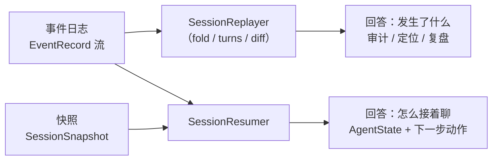
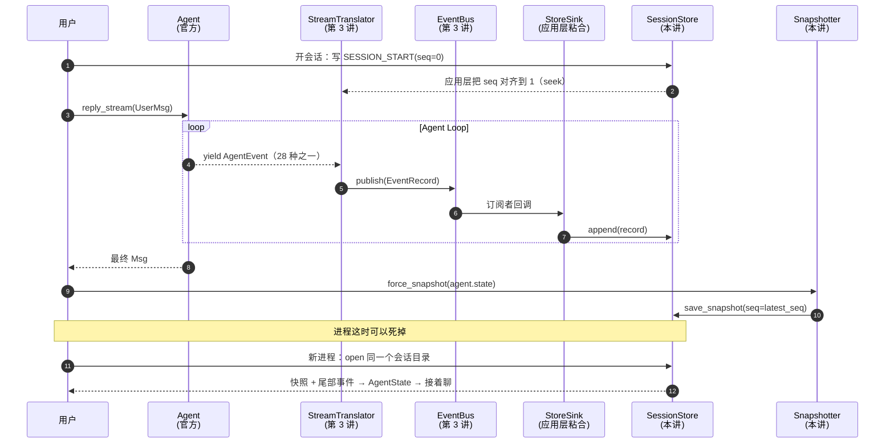
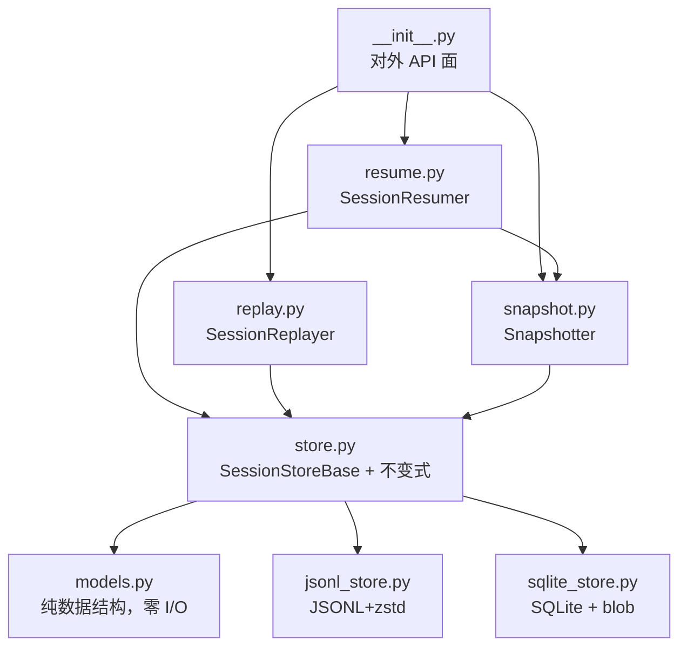
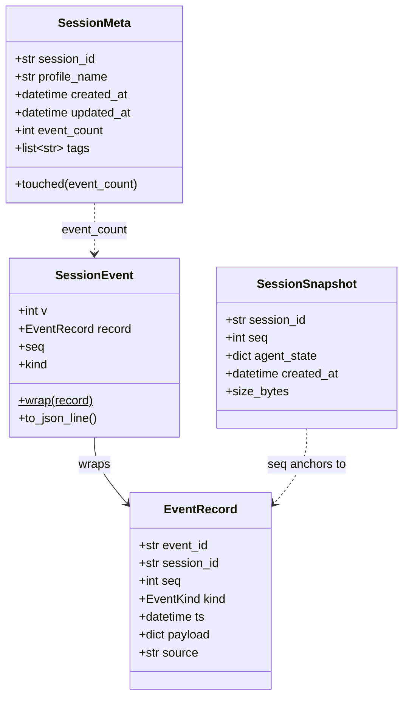
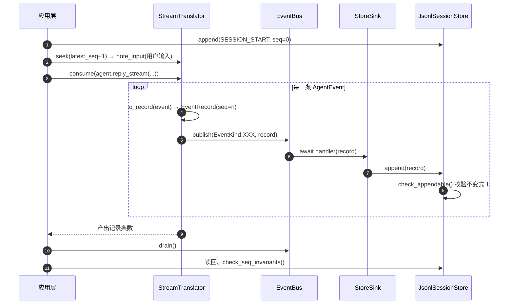
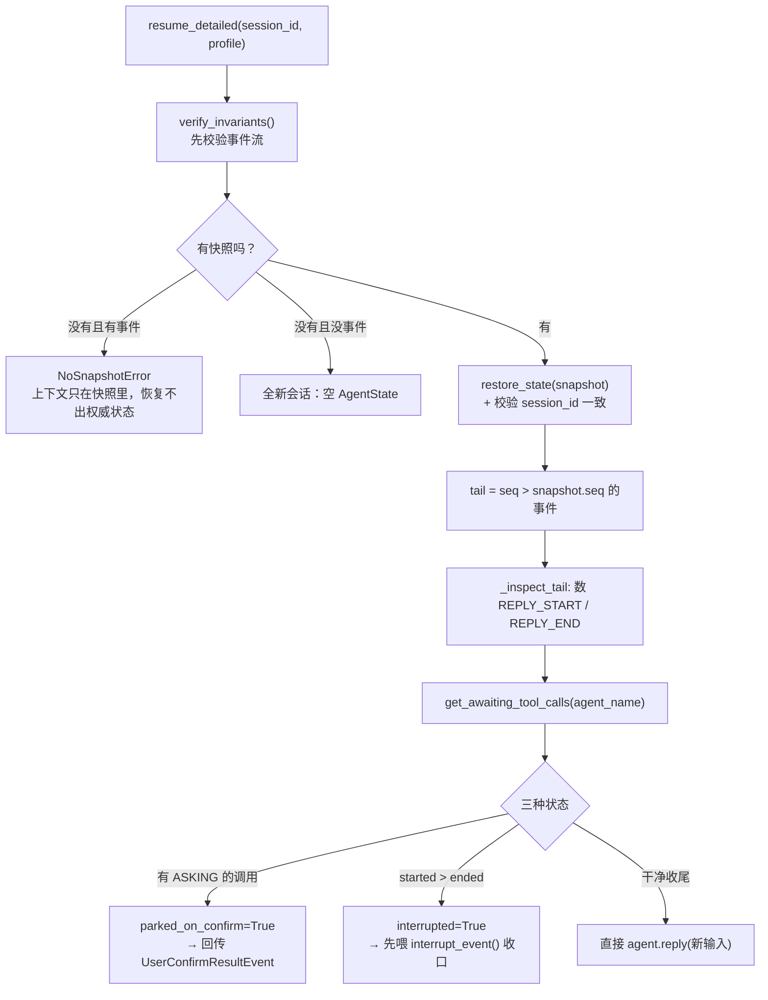
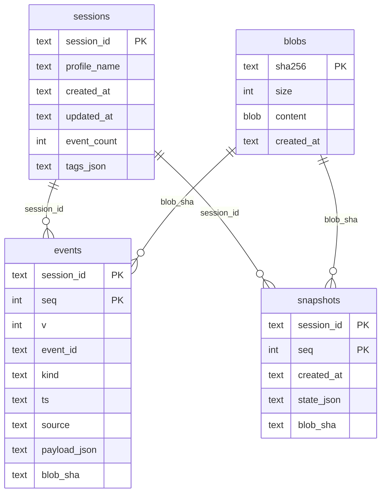
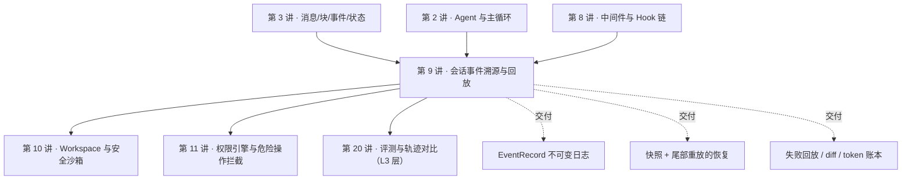

# 第 9 讲 《会话与状态：事件溯源、断点续跑与失败回放》

> **本讲目标**：把「一次会话」从内存里的一个变量，变成一个**可审计、可回放、可跨进程续跑**的持久实体。前半程是源码侦察：`AgentState` 到底存了什么、它怎么序列化、`app/storage` 里的 `SessionRecord` / `sessions` 表 / Redis keyspace 各是什么形状、blob store 里装的又是谁 —— 并且**诚实指出 AgentScope 没有提供什么**（它的事件流是「一轮用完即焚」的重连缓冲，不是审计日志）。后半程是动手：在 `harness_kit/session/` 里补上**追加日志 + 快照 + 回放 + 恢复**这一层，并把它接到第 3 讲的事件总线上，做出 4 个能跑的能力：断点续跑、跨进程恢复、失败回放、以及 park 在半截 reply 上的收口。
> **前置要求**：第 1~8 讲全部完成（`harness_kit` 已有 `settings` / `registry` / `config` / `events` / `models` / `tools` / `skills` / `middleware`；`PYTHONPATH` 带上本地 ReMe 克隆的理由见第 1 讲）。**第 3 讲是硬前置**：本讲的落盘链路直接复用 `EventBus` + `StreamTranslator` + `EventRecord`，不读懂那三个类就别往下看。
> **本讲交付物**（相对仓库根）：
> - `tutorial_agsc_reme/reference/harness_kit/session/models.py`（纯数据结构 + `AgentState` ↔ 快照的双向通道）
> - `tutorial_agsc_reme/reference/harness_kit/session/store.py`（存储抽象 + 四条不变式）
> - `tutorial_agsc_reme/reference/harness_kit/session/jsonl_store.py`（JSONL+zstd 落地实现）
> - `tutorial_agsc_reme/reference/harness_kit/session/sqlite_store.py`（SQLite 落地实现 + blob 外置）
> - `tutorial_agsc_reme/reference/harness_kit/session/snapshot.py`（`Snapshotter`）
> - `tutorial_agsc_reme/reference/harness_kit/session/replay.py`（`SessionReplayer`）
> - `tutorial_agsc_reme/reference/harness_kit/session/resume.py`（`SessionResumer`）
> - `tutorial_agsc_reme/reference/harness_kit/session/__init__.py`（对外 API 面）
> - `tutorial_agsc_reme/reference/scripts/09_session_replay_resume.py`（本讲验证脚本，A~F 六段）
> - `tutorial_agsc_reme/reference/tests/test_lesson09_session.py`（47 条 pytest）
> **预计时长**：300~360 分钟。
>
> 本讲的完整可运行代码位于 `tutorial_agsc_reme/reference/harness_kit/session/`，
> 你可以直接对照，也可以跟着正文一行一行写。
>
> **本讲不做什么**（先划线，免得走错方向）：
> - 不重写 Agent 的主循环、不自己写模型客户端、不自己写工具系统 —— 这三样一律用官方的；
> - 不改 `third_party/` 下任何文件（只读）;
> - 不引入新的第三方依赖：JSONL 用 `zstandard`（第 1 讲已装）、SQLite 用标准库 `sqlite3`；
> - A~E 段验证 **0 次** LLM 调用（用第 4 讲那个离线 `EchoChatModel`），只有 F 段真实调用 deepseek-flash **2 次**。

---

## 一、这一讲要解决的问题

### 1.1 一个凌晨三点的电话

假设你已经用前八讲的东西把 Harness 跑起来了：模型适配层能接 deepseek，工具系统能读写文件，中间件在记账，事件能落成 `EventRecord` 并投递到总线。某天凌晨三点电话响起：

> 「线上那个助手，用户说他昨天让我改的 `settings.py` 我已经改了，今天接着聊，它**完全不记得**有这回事。」

你打开代码，看到的是这样的东西：

```python
# 这是"没有会话层"的 Harness 的典型写法
agent = Agent(name="Friday", model=model, toolkit=toolkit)
await agent.reply(UserMsg("user", user_input))   # 进程重启 → agent 对象没了 → 上下文没了
```

问题的根子是：**`Agent` 是内存对象，而「会话」是用户的心智模型。** 用户以为他在跟一个「记得住事的助手」说话，但你的进程里只有一个活着的 Python 对象。进程一重启、一扩容、一滚动发布，用户的会话就蒸发了。

你可能会说：AgentScope 不是有 `AgentState` 吗？存下来再读回去不就行了？—— 对，但只对了一半。`AgentState` 解决的是「**最后一刻的状态**是什么」，它解决不了另外三个问题：

| 用户/运维的问题 | 需要的机制 | `AgentState` 够吗 |
| --- | --- | --- |
| 「**昨天**它到底干了什么？」（审计） | 不可变事件日志 | ❌ 只有一个当前态，没有历史 |
| 「这轮是**从哪一步**开始跑偏的？」（定位） | 按时间轴回放 | ❌ 历史被后写覆盖了 |
| 「它跑到一半进程被 kill 了，能接着跑吗？」（续跑） | 快照 + 尾部事件 | ⚠️ 只存了快照就不够，因为快照与进程死亡之间还差一截 |
| 「刚才那次失败，**照着复现一遍**」（回放） | 事件级 diff / fold | ❌ 没有可比的两个时间点 |

这就是**事件溯源（event sourcing）**要解决的问题。它的核心只有三句话：

1. **状态的变化以「事件」的形式被追加写进一条只增不改的日志**（append-only log）。日志是**真相**，状态只是日志的一个投影。
2. **当前状态 = 从某个起点把日志 fold 一遍**。fold 是纯函数：同一段日志，fold 两次必然得到同构的状态。
3. **日志会无限长，所以要做快照（snapshot）**：定期把 fold 的结果固化下来，之后重启只需要「读最近快照 + 重放快照之后的尾部事件」。

第 3 条是关键工程妥协：**没有快照的纯事件溯源，恢复代价随会话长度线性增长**，聊了 500 轮的会话要重放 500 轮才能答下一句话。快照把「重放步数」钉死在一个常数上（本讲默认 `every_n_events=200`）。

### 1.2 本讲的四条不变式

事件溯源这东西，写 demo 十分钟，写对很费劲。因为它有**必须先钉死的不变式（invariant）**，否则你会在生产上遇到「日志里有两个 seq=7」「快照锚点指向一条不存在的事件」这种只能靠人肉考古的故障。本讲的实现严格围绕契约 `_contract.md` §5.2 的四条不变式展开：

| # | 不变式 | 违反后的症状 |
| --- | --- | --- |
| 1 | 每个会话的 `seq` 从 0 起**严格递增且无洞** | 回放会跳过或重复事件；`tail_events` 切不准 |
| 2 | `EventRecord` **冻结**，写入后永不修改、永不删除 | 「回放两次结果不同」；审计失去意义 |
| 3 | `SessionSnapshot.seq` 必须**对应一条真实存在**的 `EventRecord` | 快照锚点悬空 → 恢复时尾部切片错位，静默丢事件 |
| 4 | 重放 `snapshot.seq + 1` 起的尾部事件，必须重建出**同构**的状态 | 续跑后 Agent「记得的事」和用户以为的不一样 |

后面每一处代码都是为了这四条服务的。你在第四节会反复看到它们的名字。

### 1.3 一个反直觉的前提：**事件日志重建不出上下文**

这一条必须写在最前面，因为它决定了整个架构的形状：

> **AgentScope 的 `AgentEvent` 是「瘦」的 —— 它不带正文。**  `REPLY_START` 里没有用户输入，`TOOL_RESULT_END` 里没有工具输出，`ModelCallEndEvent` 里没有模型回答的文本。正文只存在于 `AgentState.context`（第 3 讲已经实证过这一点）。

所以，**事件日志回答的是「发生了什么」，快照回答的是「现在是什么」**。这两件事必须分开存，谁都不能省：

| 能力 | 数据来源 | 需要快照吗 |
| --- | --- | --- |
| 回放（replay）：这轮聊了什么、调了哪些工具、烧了多少 token、哪一步报错了 | **只要事件日志** | 不需要 |
| 恢复（resume）：构造出一个能接着聊的 `AgentState` | **必须有快照**（拿 `context`） | 必须 |

这也是本讲把 `replay.py` 与 `resume.py` 拆成两个文件、两个类的原因 —— 它们看起来都是「处理事件」，但**依赖完全不同**：`SessionReplayer` 只依赖 `SessionStoreBase`，`SessionResumer` 必须额外拿到一个 `Snapshotter`。



### 1.4 本讲要交付的一张图

把「一轮对话」在有了会话层之后会发生什么画出来，就是本讲的全局地图：



这一讲剩下的部分就按这张图展开：第二节去源码里把「AgentScope 提供了什么、没提供什么」一条条核实（**每条都给 `路径:行号`**），第三节定位扩展点并给出设计，第四节写出全部代码，第五节真跑一遍，第六节把踩过的坑列成排查表。

---

## 二、源码侦察

本节所有结论都是**我自己读源码读出来的**，每条都带 `相对仓库根路径:行号`。凡是没验证的，我会明确写「未验证」。

### 2.1 `AgentState`：AgentScope 唯一的持久化边界

先看它的定义（`third_party/agentscope/src/agentscope/state/_state.py:209`）：

```python
class AgentState(BaseModel):
    """The agent state that should be saved and loaded from storage."""

    session_id: str = Field(default_factory=_generate_id)
    """The session id of the agent. Normally, each session will maintain one
    independent agent state for each agent."""

    summary: str | list[TextBlock | DataBlock] = ""
    """The compressed summary of the context, which will be prepended to the
    context when fed into the LLM."""

    context: list[Msg] = Field(default_factory=list)
    """The uncompressed conversation context, which will be fed into the LLM"""
```

末尾还有个 `middle_context: dict[str, Any]`（`state/_state.py:294`），注释写得很直白：`The context that allow the middlewares to store/get data across different replies.` —— 这是第 8 讲那五个中间件挂"跨轮持久化"的地方。

用一行代码就能验证它有哪些字段（这也是本讲所有验证脚本的做法）：

```python
>>> AgentState.model_fields.keys()
dict_keys(['session_id', 'summary', 'context', 'reply_context', 'permission_context',
           'tool_context', 'tasks_context', 'middle_context'])
```

**第一件事：它是 pydantic `BaseModel`，所以序列化是白送的。** 不需要我们写任何 `to_dict` / `from_dict`：

```python
raw = agent.state.model_dump_json()               # → 一个 JSON 字符串
state = AgentState.model_validate_json(raw)       # → 还原
```

本讲 `models.py` 里 `snapshot_from_state()` / `restore_state()` 用的就是这一对方法，**没有一行手写序列化代码**。这就是为什么第 2 讲讲「Agent 是 LLM + Harness」时要盯着 `AgentState` 看：它是官方画出来的那条持久化边界线。

**第二件事：`Agent.state` 是一个普通属性。** 看 `third_party/agentscope/src/agentscope/agent/_agent.py:174`：

```python
        self.state = state or AgentState()
```

它就是个普通实例属性，不是 property、没有 setter 校验。所以「把恢复出来的 state 装进 Agent」这件事，字面上就是 `agent.state = restored_state`。

但**紧挨着它有一行必须一起处理**（`agent/_agent.py:193`）：

```python
        # The permission engine
        self._engine = PermissionEngine(self.state.permission_context)
```

Agent 内部持有一个**用构造那一刻的 `permission_context` 造出来的**权限引擎。如果你在 `Agent(...)` 之后再替换 `agent.state`，引擎还是旧的 —— 这就是第 11 讲「权限即时生效」要处理的错位，本讲的 `SessionResumer.attach()` 已经把它一起修好了（见 `harness_kit/session/resume.py` 的 `attach` 方法）。

**第三件事（最容易漏）：`AgentState` 里带着不只对话。**

| 字段 | 类型 | 里面是什么 | 为什么必须一起持久化 |
| --- | --- | --- | --- |
| `context` | `list[Msg]` | 未压缩的对话（**真相**） | 不存就失忆 |
| `summary` | `str \| list[block]` | 上下文压缩的产物 | 不存就丢了几十轮的历史摘要 |
| `reply_context.reply_id` | `str` | 当前 reply 的 id | **断点续跑的锚点**：park 的回复要用它配对 |
| `reply_context.cur_iter` | `int` | Agent Loop 迭代计数 | 续跑要从第 N 次迭代接着数 |
| `permission_context` | `PermissionContext` | 权限模式 + allow/deny/ask 规则 | 不存的话恢复后权限策略回到默认 |
| `tool_context.read_file_cache` | `list[ReadCacheEntry]` | Read/Write/Edit 的读文件 LRU | 存了它，续跑后 Agent 不会重复读同一个文件 |
| `tasks_context` | `TaskContext` | Planning 的任务清单 | 任务依赖关系是跨轮状态 |
| `middle_context` | `dict[str, Any]` | 中间件的跨轮抽屉 | 第 8 讲的预算中间件就靠它记账 |

`tool_context` 的定义在 `state/_state.py:32`，它的缓存容量是硬编码的（`max_cache_files=100` / `max_cache_bytes=25000`），而且 `cache_file()` 里手写了 LRU 淘汰。**这一点在本讲有个直接后果**：快照的体积会随着读文件缓存增长，不是个纯文本小对象。

**第四件事（本讲最重要的一条源码事实）：`context` 会被 `compress_context` 整个替换掉。**

看 `third_party/agentscope/src/agentscope/agent/_agent.py:743`：

```python
            # Update the context and summary
            self.state.summary = new_summary
            self.state.context = msgs_to_reserve
```

这是压缩逻辑的收尾：**压缩不是「在 context 里插一条摘要」，而是「把 context 换成一个更短的新 list」**。原来的那些 `Msg` 对象，如果没有别的地方引用，就此消失。

对会话层的意义：**`AgentState` 是「当前态」，不是「历史」**。压缩这件事在 `AgentState` 上是不可逆的（你无法从压缩后的 context 还原出压缩前的原文）。要留下历史，只能在压缩**发生之前**就已经把「发生了什么」写进事件日志 —— 而事件日志只记 `TOOL_CALL` 这类骨架，正文本来就没进去过。这就是第 1.3 节那条结论的代码证据。

### 2.2 `app/storage`：服务层的会话模型

AgentScope 2.0.8 的 `app/` 是一个完整的「Agent 服务端」，它有自己的会话模型。核心类是 `SessionRecord`（`third_party/agentscope/src/agentscope/app/storage/_model/_session.py:278`）：

```python
class SessionRecord(_RecordBase):
    """The session record."""

    user_id: str
    agent_id: str
    origin: SessionOrigin = Field(default_factory=UserOrigin)
    team_id: str | None = None
    config: SessionConfig
    state: AgentState = Field(default_factory=AgentState)
    """Mutable runtime state, updated after each chat turn."""
```

请注意最后那个字段的注释：**`Mutable runtime state, updated after each chat turn.`**（每次对话轮次结束后被更新）—— 一句话就点明：AgentScope 的会话状态是**可变快照 + 覆盖写**，不是事件日志。

覆盖写发生在两个地方，都能直接用眼睛看到：

- 抽象层：`app/storage/_base.py:432` 的 `update_session_state()`，docstring 是 `Update only the mutable state of an existing session.` + `Convenience method for the hot path (post-chat-turn persistence).`（**热路径**：一轮聊完就写一次）。
- Redis 实现：`app/storage/_redis_storage.py:956`，核心三行是

  ```python
        record = SessionRecord.model_validate_json(raw)
        record.state = state
        record.updated_at = datetime.now()
        await self._set_with_ttl(key, record.model_dump_json())
  ```

  读整条记录 → 换掉 `state` → **把整条记录重新序列化写回同一个 key**。整个记录（含全部对话历史）被重写了一遍。

SQL 侧的会话表在 `app/storage/_sql/_tables.py:143`，形状是「提升列 + 一个 payload JSON」：

```python
class SessionRow(_JsonRecordMixin):
    """One row per :class:`~agentscope.app.storage.SessionRecord`."""

    __tablename__ = "sessions"

    user_id: Mapped[str] = mapped_column(String(_ID_LEN), nullable=False, index=True)
    agent_id: Mapped[str] = mapped_column(String(_ID_LEN), nullable=False, index=True)
    source: Mapped[str] = mapped_column(String(16), nullable=False, index=True)
    source_schedule_id: Mapped[str | None] = mapped_column(..., index=True)
    team_id: Mapped[str | None] = mapped_column(..., index=True)

    __table_args__ = (Index("ix_sessions_user_agent", "user_id", "agent_id"),)
```

`_JsonRecordMixin`（`app/storage/_sql/_tables.py:58`）给所有表统一了 `id` / `created_at` / `updated_at` / `payload(JSON)` 四列。提升（promote）出来的列只用于**索引与查询**，真正的记录体仍然在 `payload` 里 —— 这是一个很值得抄的模式：**JSON 的灵活 + 关系列的索引能力**，代价是 `payload` 里的字段没法直接 SQL 过滤。

消息另有单独一张表（`app/storage/_sql/_tables.py:399`），注意它的主键：

```python
    __tablename__ = "messages"

    session_id: Mapped[str] = mapped_column(String(_ID_LEN), primary_key=True)
    msg_id: Mapped[str] = mapped_column(String(_ID_LEN), primary_key=True)
    created_at: Mapped[datetime] = mapped_column(DateTime(), nullable=False)
    payload: Mapped[dict[str, Any]] = mapped_column(JSON, nullable=False)
```

**复合主键 `(session_id, msg_id)`**，注释解释了理由：`Msg.id` 只在会话内唯一。这里的语义是「同 `(session, msg_id)` 就替换」，和 Redis 的 `upsert_message`（`app/storage/_redis_storage.py:1434`）一致。

Redis 侧的 keyspace 全部集中在 `RedisStorage.KeyConfig`（`app/storage/_redis_storage.py:56`），会话相关的几个模板是：

| 用途 | key 模板 | 类型 |
| --- | --- | --- |
| 会话记录（含 `state`） | `agentscope:user:{user_id}:session:{session_id}` | String（整条 JSON） |
| 会话的消息历史 | `agentscope:user:{user_id}:session:{session_id}:messages` | List |
| 某 agent 的会话索引 | `agentscope:user:{user_id}:agent:{agent_id}:sessions` | Set |
| (user, agent) → 会话 | `agentscope:user:{user_id}:agent:{agent_id}:session` | 单键查找 |

**结论（这一节要记住的一句话）**：AgentScope 的服务层把「会话」建模成 **`SessionRecord`（身份 + 配置）+ `AgentState`（可恢复快照）+ 消息表/消息 List（给人翻页看的历史）** 三段。`AgentState` 随每一轮被**整体覆盖写**，消息表**按 msg_id 去重追加**，而事件的持久化……没有（下一节）。

### 2.3 那个「回放」不是这个「回放」

源码里确实有 `replay` 这个词（`app/message_bus/_keys.py:121`）：

```python
    # ------------------------------------------------------------------
    # Session event stream (replay log + live pub/sub)
    # ------------------------------------------------------------------

    _SESSION_EVENTS = "agentscope:session:events:{sid}"

    SESSION_REPLAY_MAX_LEN = 1000
    """Replay log length cap; older events are trimmed on append."""
```

它确实是 append-only，也确实是给「回放」用的。但有三处硬事实决定了**它不是审计台账**：

**（1）它有长度上限，而且是「旧的被丢掉」。** `app/_bus_ops.py:45` 是全项目唯一的写入入口：

```python
async def publish_session_event(bus, session_id, event) -> str:
    """Append event to replay log + fan out live."""
    key = MessageBusKeys.session_events(session_id)
    entry_id = await bus.log_append(
        key,
        event,
        max_len=MessageBusKeys.SESSION_REPLAY_MAX_LEN,
    )
    await bus.publish(key, {**event, "_entry_id": entry_id})
    return entry_id
```

超过 1000 条，最老的就被挤掉了。审计日志如果会自己丢开头，那它就不是审计日志。

**（2）一轮结束之后，它被整条清空。** 看 `app/_service/_chat.py:1411` 的 `_persist()`：

```python
                async def _persist() -> None:
                    try:
                        for msg in reply_msgs:
                            await self._storage.upsert_message(user_id, session_id, msg)
                        await self._storage.update_session_state(
                            user_id=user_id, agent_id=agent_id,
                            session_id=session_id, state=agent.state,
                        )
                        await self._message_bus.log_trim(events_key)     # ← 就在这里
```

`log_trim(events_key)` 不带游标，语义是「**删掉整条日志**」（`app/message_bus/_base.py:244`）。落库完成 → 事件日志清空，留给下一轮用。

**（3）它的设计目标是 SSE 断线重连**，不是审计。`app/message_bus/_base.py:576` 附近那段代码的注释说得很清楚：拿住会话锁、yield、然后 trim。它的消费者是 `app/_router/_session.py` 的 SSE 端点（先 `log_read` 补发、再 `subscribe` 接实时）—— 也就是「浏览器断了 3 秒，把这三秒的事件补给它」。

**这三条合起来，就是本讲存在的全部理由**：AgentScope 给的是「**一次 reply 之内的实时缓冲**」，我们缺的是「**跨轮、跨进程、不丢不删的审计日志**」。

### 2.4 blob store 里装的是谁？

`app/rag/blob_store/` 很容易被误以为是「会话大对象的存储」。看它的基类注释（`third_party/agentscope/src/agentscope/app/rag/blob_store/_base.py:46`）和本地实现的类注释（`app/rag/blob_store/_local.py:27`）：

```python
class LocalBlobStore(BlobStoreBase):
    """Store blobs as files beneath a configurable root directory.

    Intended for single-node deployments and development.  The lifecycle
    of a blob is bound to the document that owns it, not to the request
    that uploaded it — this is what distinguishes the store from
    FastAPI's per-request ``SpooledTemporaryFile`` and is the reason
    the abstraction exists at all.
    """
```

关键词：**`the document that owns it`**。它装的是**知识库文档的原始字节**（上传的 PDF/Word/Markdown），生命周期跟着文档走。包名 `app/rag/blob_store` 也说明它在 RAG 那条线上。`_local.py:_path_for` 里还有一层防目录穿越的校验（拒绝 `..` 和绝对路径），`_s3.py` 是它的对象存储实现。

**所以：AgentScope 的 blob store 跟会话状态无关。** 本讲要做的「大 payload 外置」是**我们自己补的一层**（见 §2.5 和第四节的 `sqlite_store.py`），不是复用官方的 blob store —— 理由很实际：官方的 blob 抽象是 async + 流式 + URI 寻址，用来存「一条 200KB 的工具输出」属于杀鸡用牛刀，而且它会引入 `aiofiles` / S3 依赖。

### 2.5 诚实清单：AgentScope **没有**提供什么

把上面的侦察结果整理成表，这就是第三节「扩展点」的输入：

| # | 我们需要的 | AgentScope 2.0.8 的现状 | 证据 |
| --- | --- | --- | --- |
| 1 | 不可变事件日志（append-only、永不删） | ❌ 没有。有的事件流是「一轮用完即焚」的缓存 | `app/_service/_chat.py:1425`、`app/message_bus/_keys.py:126` |
| 2 | 会话内单调递增的 `seq` | ❌ 没有。事件流用的是后端给的 entry_id（Redis Stream ID） | `app/message_bus/_base.py:176` 的 `log_append` 返回 entry_id |
| 3 | 事件级的 schema 与版本号 | ❌ 没有。事件以 `dict` 原样进总线 | `app/_bus_ops.py:40` 的 `event: dict` |
| 4 | 快照 + 尾部重放的恢复 API | ❌ 没有。持久化只有「整条覆盖写」的 `update_session_state` | `app/storage/_base.py:432` |
| 5 | 「这个会话停在哪儿」的判定 | ⚠️ 有，但只是**状态枚举**，不给恢复入口 | `app/_service/_session.py:61` 的 `SessionStatus` + `derive_parked_status` |
| 6 | 失败回放（fold / diff / 按 seq 切片） | ❌ 没有。`SessionService` 只有 cancel / delete / status | `app/_service/_session.py:98` 的类方法表 |
| 7 | 大 payload 外置 + 回收 | ❌ 没有（blob store 服务的是 RAG 文档，见 §2.4） | `app/rag/blob_store/_base.py:46` |
| 8 | 存储层不变式校验 | ❌ 没有。写入路径不做 seq 校验 | `app/storage/_redis_storage.py:956` 直接覆盖 |

**这不是说 AgentScope 做得不好** —— 它做的是「服务端」，它选择了「快照 + 消息表」这条更简单、更适合多节点部署的路线（`session_lock` 分布式锁 + 覆盖写在多 worker 下是对的：谁拿到锁谁写，读完即写，没有日志膨胀）。**我们要补的是「评测与审计」这条线**：第 3 讲的参考架构里把它放在 L1「接入 & 存储」，它的消费者是 L3 的评测引擎 —— 评测要的是「同一段会话，跑两遍，diff 出差异」，那没有不可变日志就无从谈起。

**一句话总结第二节**：

> AgentScope 给了我们两样东西：**一个定义良好的状态边界（`AgentState`，pydantic、可 JSON 化、覆盖写）** 和 **一套真实的事件流（`AgentEvent`，28 种，带 token 与工具信息）**。它**没给**的是把这两样缝成「可回放、可续跑」的那条线 —— 而这恰好是本讲要写的那几个文件（§4 的 7 个模块 + 一个 `__init__.py` 导出面）。

---

## 三、扩展点定位与设计

### 3.1 我们能挂上去的扩展点（全部是官方已有的）

这一节是「动手前的清单」：**每一个我们要写的文件，都必须挂在下面某个扩展点上**；挂不上的部分，第四节会明确标注「agentscope / reme 没有提供这个，所以我们补一层」。

| # | 扩展点 | 基类 / 类型 | 关键签名 | 文件位置 | 本讲怎么用 |
| --- | --- | --- | --- | --- | --- |
| 1 | `AgentState` | pydantic `BaseModel` | `model_dump_json()` / `model_validate_json()` | `third_party/agentscope/src/agentscope/state/_state.py:209` | 快照的**正文**：直接序列化，不手写任何编解码 |
| 2 | `Agent.state` | 普通实例属性 | `self.state = state or AgentState()` | `third_party/agentscope/src/agentscope/agent/_agent.py:174` | 恢复时 `agent.state = restored` |
| 3 | 权限引擎 | `PermissionEngine` | `self._engine = PermissionEngine(self.state.permission_context)` | `third_party/agentscope/src/agentscope/agent/_agent.py:193` | 恢复时必须**一起**重建，否则状态新引擎旧 |
| 4 | `AgentState.get_awaiting_tool_calls` | 官方方法（状态机判定） | `(name: str) -> list[ToolCallBlock]` | `third_party/agentscope/src/agentscope/state/_state.py:345` | 判定「是不是 park 在用户确认上」，**不自己扫 context** |
| 5 | `UserInterruptEvent` | `EventBase` 子类 | `UserInterruptEvent(reply_id=...)` | `third_party/agentscope/src/agentscope/event/_event.py:496` | 给半截 reply 收口，**官方原生事件**，不自己写循环 |
| 6 | `Msg.append_event` | 官方方法（流 → 消息的 fold） | `(event: AgentEvent) -> Self` | `third_party/agentscope/src/agentscope/message/_base.py:244` | 我们的 `EventRecord` 折叠与它**同构**，但产物进日志而不是进 context |
| 7 | `EventBus.subscribe` | 我们第 3 讲写的类 | `(topic: str \| EventKind, handler: Handler) -> Subscription` | `tutorial_agsc_reme/reference/harness_kit/events/bus.py:270` | `StoreSink` 订阅 `"*"`，每条记录落盘 |
| 8 | `EventBus.publish` | `EventBus`（同一个类） | `async (topic, record: EventRecord) -> int` | `tutorial_agsc_reme/reference/harness_kit/events/bus.py:304` | 非阻塞投递；落盘发生在订阅者回调里 |
| 9 | `StreamTranslator` | 我们第 3 讲写的类 | `(bus, *, session_id)` / `seek(seq)` / `note_input(text)` / `await consume(stream)` | `tutorial_agsc_reme/reference/harness_kit/events/translate.py:138,161,234,253,589` | 把 28 种 `AgentEvent` 折成 9 种 `EventKind` |
| 10 | `HarnessPermissionEngine.from_profile` | 我们第 2/11 讲写的类 | `(spec: PermissionSpec) -> HarnessPermissionEngine` | `tutorial_agsc_reme/reference/harness_kit/permission/policy.py` | 恢复时用**当前** Profile 重建权限上下文 |

**表里没有「日志存储」这一行 —— 因为官方没有这个扩展点。** 这就是第 2.5 节那张诚实清单的落点。

### 3.2 设计：四层结构，只允许上层依赖下层

`harness_kit/session/` 内部严格分四层，**每一层只 import 它下面那层**：



这样分层有两个立刻能兑现的好处：

1. **`models.py` 可以在完全不知道存储存在的情况下被单测**（本讲测试里 `check_seq_invariants` / `snapshot_from_state` / `restore_state` 全是纯函数测试，零 I/O）。
2. **换后端不改上层**。本讲的实证就是：`sqlite_store.py` 是**后加的**，加完之后 `snapshot.py` / `replay.py` / `resume.py` / `scripts/09_*.py` **一行没改**，只改了 `store.py` 的抽象（加 `counts` 到实现里）和 `__init__.py` 的导出。—— 这是第四节 `sqlite_store.py` 那一段要重点讲的事。

### 3.3 三个数据类 + 一个版本号



三个类的分工，一句话各自概括：

| 类 | 它是什么 | 落到磁盘上是什么 |
| --- | --- | --- |
| `SessionMeta` | 会话的**索引卡片**：谁、什么时候建的、多少条事件、打了什么标签 | JSONL 后端的 `{sid}.meta.json` sidecar；SQLite 后端的 `sessions` 表一行 |
| `SessionEvent` | `EventRecord` 的**落盘形态**：外面套一层 `v`（schema 版本） | 一行 JSON（JSONL 后端每行一个 zstd frame） |
| `SessionSnapshot` | `AgentState` 的**序列化切片**，带锚点 `seq` | JSONL 后端的 `snapshots/{sid}.jsonl.zst`（**同样追加式**，可留多个历史快照）；SQLite 后端的 `snapshots` 表 |

**为什么要给落盘形态单独包一层 `v`，而不是直接存 `EventRecord`？** 因为**存储格式的演进速度跟内存结构不一样**。日志一旦写下去就要能被未来版本读回来，所以版本号必须跟着每一条记录走；`SESSION_SCHEMA_VERSION = 1` 是第 1 版。这跟 `AgentState._migrate_legacy_reply_fields`（`third_party/agentscope/src/agentscope/state/_state.py:228` 那个 `mode="before"` 校验器）是同一个工程学问题的两种解法：官方选「在读取时就地折叠旧格式」，我们选「在每条记录上写版本号」。两者都对，**关键是必须选一个** —— 不选的那个，就叫「线上读不出老数据」。

### 3.4 四条不变式怎么落进代码

第二节列的四条不变式不是文档口号，每一条都有**具体的代码位置**：

| 不变式 | 落点 | 失败时抛什么 |
| --- | --- | --- |
| 1. `seq` 从 0 起严格递增无洞 | `models.py::check_seq_invariants()` + `store.py::SessionStoreBase.check_appendable()` | `SessionInvariantError` |
| 2. 记录冻结、永不改删 | `EventRecord`（`harness_kit/events/types.py:109` 的 `model_config = ConfigDict(frozen=True)`）+ **存储层故意不提供 `delete`** | 赋值即 pydantic 报错 |
| 3. 快照锚点必须真实存在 | `store.py::SessionStoreBase.check_snapshot_anchor()` | `SessionInvariantError` |
| 4. 快照 + 尾部重放 → 同构状态 | `snapshot.py::Snapshotter` + `resume.py::SessionResumer._restore()` | `ResumeError` / `NoSnapshotError` |

**第 2 条值得多说一句**：「存储层不提供删除 API」是**刻意的**。第四节写的 `SqliteSessionStore` 里没有 `delete_event()`，`JsonlSessionStore` 里也没有 —— 不是忘了写，而是「有删除接口的日志不叫日志」。第五节的 B 段实验里，为了演示 `vacuum()` 回收孤儿 blob，我们是**用标准库 `sqlite3` 直接开库删行**的，脚本里专门写了注释说明这是「运维手工干预」而不是正常路径。

**第 3 条容易被当成废话，其实最容易踩**：快照的 `seq` 不是「写快照那一刻的墙钟时间」，而是「**这条快照覆盖到了哪条事件**」。如果允许 `snapshot.seq = 17` 但事件流里最大的 `seq` 是 15，那么恢复时 `[e for e in events if e.seq > 17]` 会切出一个空尾巴，会话看起来像是「干净收尾」，实际上尾部那两条事件被静默吞了。`check_snapshot_anchor()` 就是拦这个的。

### 3.5 与第 3 讲事件总线的接线：三个必须记住的细节

这是本讲**最容易写错**的地方，三个细节全是我实际调试出来的（第六节有完整复盘）：

**细节一：`StreamTranslator` 不会发 `SESSION_START`。**

第 3 讲的翻译器只翻译 `Agent.reply_stream` **吐出来**的事件（`harness_kit/events/translate.py:589` 的 `consume` 消费的是一个 `AsyncGenerator`）。而 `SESSION_START` 是**应用层才知道**的信息（哪个 Profile、哪个工作目录）—— 它不是 Agent 产生的事件。所以：

```python
# 应用层负责开账：
record = EventRecord(session_id=sid, seq=0, kind=EventKind.SESSION_START,
                     payload={"profile": profile.name, "agent_name": "Friday", "cwd": os.getcwd()})
await store.append(record)
```

本讲的 `tests/test_lesson09_session.py:889` 就是这条断言的落点（`assert kinds[0] == "reply_start"`），它是对的：**翻译器从 `reply_start` 开始**。

**细节二：`seq` 的权威在存储侧，翻译器必须被 `seek` 对齐。**

`StreamTranslator` 内部有个 `self._seq = 0`（`harness_kit/events/translate.py:187` 初始化的），它**不知道**我们已经用 0 号写了 `SESSION_START`。不对齐的话，翻译器产出的第一条记录（`reply_start`）会带着 `seq=0` 撞上已存在的事件，被存储层按不变式 1 拒掉 —— 而且**拒得很安静**：`EventBus` 的设计是「订阅者抛异常 → 吞掉并计数」（第 3 讲的 `_record_error`），所以你会得到一条 WARNING 加一份**开头缺了一条的事件流**。正确写法：

```python
translator = StreamTranslator(bus, session_id=session_id)
translator.seek(await store.latest_seq(session_id) + 1)   # ← 就这一行
```

`seek()` 的 docstring（`harness_kit/events/translate.py:234`）已经把理由写死了：**「seq 的权威在存储侧」**。这也解释了为什么 `seek` 只允许往前、不允许回退 —— 回退会让新事件与已有事件重号。

**细节三：落盘发生在订阅者里，所以「写完」这件事是异步的。**

`EventBus.publish` 不阻塞（`harness_kit/events/bus.py:304`，docstring 写着「只入队，不等订阅者处理完」）。所以一份可靠的落盘代码必须显式等一下：

```python
await translator.consume(agent.reply_stream(UserMsg("user", question)))
await bus.drain()        # ← 等订阅者的队列排空，否则可能在"事件还没落盘"时就去读日志
```

接线后的完整数据流：



`StoreSink` 是**应用层**的 8 行胶水代码（本讲验证脚本里就有），**不是** `harness_kit/session/` 的一部分 —— 理由：`session/` 不应该 import `events/`，否则存储层就被第 3 讲绑死了。这个方向的分层纪律与 AgentScope 的 `app/_service/_session.py` 是同一个（那里也强调 storage 不 import bus，service 是唯一同时碰两者的组件）。

### 3.6 断点续跑：怎么判定「停在哪」

这是本讲最有工程含量的一段设计。一个会话被恢复时，可能处在**三种**状态，对应**三种**不同的下一步动作：



三个判定各自的依据（全部来自源码，不是拍脑袋）：

1. **`parked_on_confirm`** —— 直接复用官方的 `AgentState.get_awaiting_tool_calls(name)`（`third_party/agentscope/src/agentscope/state/_state.py:345`）。它的判定条件是「**最后一条消息**是 `name` 写的 assistant，且其中的 tool call 处于 `ASKING`（等用户确认）或 `SUBMITTED`（等外部执行）」。**我们不自己扫 `context`** —— 状态机由官方负责，我们只消费结论。
2. **`interrupted`** —— 数尾部事件里 `REPLY_START` 与 `REPLY_END` 的**条数**（`resume.py::_inspect_tail`）。为什么不看「最后一条事件是不是 REPLY_END」？因为尾部可能**既有**上一轮的收尾、**又有**下一轮的 `REPLY_START`（进程正好死在两次 reply 之间），看单条会误判。
3. **`NoSnapshotError`** —— 有事件、没快照，直接报错而不是硬恢复。这是第 1.3 节那条结论的直接后果：**事件流里没有消息体**，没有快照就只能造出一个「什么都不记得」的 Agent，那比报错更糟。

「半截 reply」的收口事件，我们用**官方原生**的 `UserInterruptEvent`（`third_party/agentscope/src/agentscope/event/_event.py:496`）：

```python
        from agentscope.event import UserInterruptEvent

        if not state.get_awaiting_tool_calls(profile.agent.name):
            return None
        return UserInterruptEvent(reply_id=state.reply_id)
```

注意那个 `return None` 的分支：**只有真的存在未完成调用时才生成事件**。因为把一个「没有待办」的 interrupt 喂回 `reply_stream`，AgentScope 会把它当成一条新的用户输入处理，行为就完全跑偏了。

### 3.7 明说：哪些是「我们补的一层」

按任务要求，凡官方没有的，必须明写。本讲的补丁清单：

| 能力 | 归属 | 判定 |
| --- | --- | --- |
| 不可变事件日志（`append` / `read` / `latest_seq`） | **我们补** | AgentScope 的事件流一轮即焚（§2.3） |
| 会话内 `seq` 的分配与校验 | **我们补** | 官方用后端 entry_id，没有会话内序号（§2.5 #2） |
| `SessionEvent` + `SESSION_SCHEMA_VERSION` | **我们补** | 官方事件以裸 `dict` 进总线（`app/_bus_ops.py:40`） |
| 快照 + 尾部重放的恢复 | **我们补** | 官方只有覆盖写的 `update_session_state`（§2.2） |
| 大 payload 外置 + `vacuum` 回收 | **我们补** | 官方 blob store 服务的是 RAG 文档（§2.4） |
| 事件流的 `flock` 单写者 | **我们补** | 官方用 Redis 分布式锁 + 覆盖写（另一条路线，不冲突） |
| `AgentEvent` → 审计记录 | 第 3 讲已有 | `harness_kit/events/translate.py` |
| 权限上下文重建 | 第 2/11 讲已有 | `harness_kit/permission/policy.py` |
| 序列化 / 反序列化 `AgentState` | **官方原生** | pydantic `model_dump_json` / `model_validate_json` |
| 半截 reply 的收口 | **官方原生** | `UserInterruptEvent`（`event/_event.py:496`） |
| 「停在哪」的状态机判定 | **官方原生** | `AgentState.get_awaiting_tool_calls`（`state/_state.py:345`） |

### 3.8 契约里的 API 面（本讲必须一字不差实现的签名）

`_contract.md` §3.9 把 `session/` 的公开 API 钉死了。第四节每个文件都按它写，这里先整体列一遍，方便你对照：

| 类 | 签名 | 说明 |
| --- | --- | --- |
| `SessionStoreBase` | `append(record)` / `read(session_id, *, since_seq=0, limit=None)` / `list_sessions()` / `latest_seq(session_id)` / `aclose()` / `append_many(records)` | 六个抽象方法，任何后端都必须实现 |
| `JsonlSessionStore` | `__init__(session_dir: Path, *, compress: bool = True)` | 一个目录一个后端，按会话分文件 |
| `SqliteSessionStore` | `__init__(db_path: Path, *, blob_threshold: int = 32 * 1024)` + `vacuum()` | 单库多会话，大 payload 外置 |
| `Snapshotter` | `__init__(store, *, every_n_events: int = 200)` / `maybe_snapshot(state)` / `force_snapshot(state)` | 「每 N 条事件写一次」的节流器 |
| `SessionReplayer` | `timeline` / `fold` / `turns` / `diff` / `context_from_snapshot` / `summarize` | 纯读，不需要快照 |
| `SessionResumer` | `resume(session_id, *, profile)` / `resume_detailed(...)` / `list_resumable()` / `interrupt_event(state, *, profile)` / `close_out(...)` / `attach(agent, ...)` | 需要快照 |
| `ReplayResult` | `session_id` / `event_count` / `tool_calls` / `token_usage` / `errors` | `fold` 的产物 |

设计到这儿就齐了，接下来是代码。

---

## 四、harness_kit 实现

### 4.0 目录与阅读顺序

```
tutorial_agsc_reme/reference/harness_kit/session/
├── __init__.py          # 对外 API 面（约 107 行）
├── models.py            # 纯数据结构 + AgentState ↔ 快照通道（388 行）
├── store.py             # SessionStoreBase + 四条不变式（348 行）
├── jsonl_store.py       # JSONL+zstd 追加日志（847 行）
├── sqlite_store.py      # SQLite + blob 外置（719 行）
├── snapshot.py          # Snapshotter（207 行）
├── replay.py            # SessionReplayer（586 行）
└── resume.py            # SessionResumer（489 行）
```

**推荐的阅读顺序就是上面的顺序**，理由是它和依赖方向一致：`models` 谁都不依赖，`store` 只依赖 `models`，两个落地实现只依赖 `store`，`snapshot`/`replay`/`resume` 依赖 `store`，`__init__` 依赖全部。

下面每节的结构是：**先说这个文件负责什么、关键实现点在哪，再贴完整代码**。代码与 `reference/harness_kit/session/` 逐字一致（第五节的验收就是从本文档里把这些代码块抽出来跑的，所以它不可能漂）。

### 4.1 `models.py`：三个数据类 + 一个版本号，零 I/O

这个文件的全部内容就是数据结构，加三个纯函数：

| 名字 | 是什么 |
| --- | --- |
| `SESSION_SCHEMA_VERSION = 1` | 落盘格式版本，写在每条 `SessionEvent.v` 上 |
| `INPUT_PREVIEW_LIMIT = 500` | `REPLY_START.input_preview` 的截断长度（契约 §5.2） |
| `preview(text)` | 把用户输入截断成 `input_preview`；**空串就是空串，不编造** |
| `next_seq(events)` | 从一批事件算出"下一条应该是几号" |
| `check_seq_invariants(events, *, expected_session_id)` | 不变式 1 的校验器 |
| `tail_events(events, *, after_seq)` | 切尾部（**半开区间**：`seq > after_seq`） |
| `snapshot_from_state(state, *, session_id, seq)` | `AgentState` → `SessionSnapshot` |
| `restore_state(snapshot)` | `SessionSnapshot` → `AgentState` |
| `SessionInvariantError` | 不变式被破坏时抛的异常（继承 `ValueError`） |

**关键实现点一：`snapshot_from_state` 里唯一的一行"魔法"。** 它调的是 pydantic 自己的序列化（`state.model_dump(mode="json")`），所以**未来 `AgentState` 加字段，快照自动带上，我们不用改一行代码**。这也是为什么 `session/` 不需要跟着 AgentScope 升级而维护字段列表。

**关键实现点二：`restore_state` 用 `model_validate` 而不是 `AgentState(**dict)`。** 前者会走 pydantic 的校验器链 —— 包括 `state/_state.py:228` 那个 `mode="before"` 的 `_migrate_legacy_reply_fields`。也就是说，**旧格式的快照能被新版本代码读回来**，这是白送的向后兼容。

**关键实现点三：`check_seq_invariants` 的报错信息里带上了"当前最后一条是 X，因此新事件必须是 Y，收到 Z"。** 这不是装饰：第五节的 A 段会打印这条信息，运维一眼就能看出是**跳号**还是**重号**。

**文件：`tutorial_agsc_reme/reference/harness_kit/session/models.py`（388 行）**

```python
# -*- coding: utf-8 -*-
"""会话与事件记录的数据结构（契约 §3.3 / §5.2）。

三个模型的分工：

- :class:`SessionMeta` —— 会话的**索引卡片**（不含正文），``list_sessions()`` 返回它；
- :class:`SessionEvent` —— **落盘形态**：``EventRecord`` 外面套一层 ``v`` 版本号，
  将来要改 ``payload`` 的 schema 时靠它做迁移；
- :class:`SessionSnapshot` —— ``AgentState`` 的**序列化切片**，恢复会话的锚点。

与 AgentScope 的关系：``AgentState`` 是 AgentScope 唯一的持久化边界
（``third_party/agentscope/src/agentscope/state/_state.py:209``），
:func:`snapshot_from_state` / :func:`restore_state` 就是它和
:class:`SessionSnapshot` 之间的双向通道。事件流本身则对应
``Agent`` 的 ``reply_stream`` 产出的 ``AgentEvent``
（``third_party/agentscope/src/agentscope/agent/_agent.py:288``），
由第 3 讲的 ``events/translate.py`` 翻译成 :class:`~harness_kit.events.EventRecord`，
再经类的:class:`SessionEvent` 落盘。

**不变式**（契约 §5.2 硬约定，本模块用 :func:`check_seq_invariants` 强制）：

1. 同一 ``session_id`` 内 ``seq`` 严格递增且无洞；
2. ``EventRecord`` 一经 append 永不修改、永不删除（``frozen=True`` 在
   :mod:`harness_kit.events.types` 里保证）；
3. ``SessionSnapshot.seq`` 必须等于某个已存在的 ``EventRecord.seq``；
4. 从 ``snapshot.seq + 1`` 开始重放尾部事件，必须能重建同构的 ``AgentState``。
"""

from __future__ import annotations

from datetime import datetime
from typing import Any, Iterable, Sequence

from pydantic import BaseModel, ConfigDict, Field, model_validator

from harness_kit.events import EventRecord, EventKind, utc_now

__all__ = [
    "INPUT_PREVIEW_LIMIT",
    "SESSION_SCHEMA_VERSION",
    "SessionInvariantError",
    "SessionEvent",
    "SessionMeta",
    "SessionSnapshot",
    "check_seq_invariants",
    "next_seq",
    "preview",
    "restore_state",
    "snapshot_from_state",
    "tail_events",
]

SESSION_SCHEMA_VERSION: int = 1
"""``SessionEvent.v`` 的当前值。改动落盘结构时 +1，并在 store 里加迁移分支。"""

INPUT_PREVIEW_LIMIT: int = 500
"""``REPLY_START.payload["input_preview"]`` 的截断长度（契约 §5.2 表格硬约定）。"""


class SessionInvariantError(ValueError):
    """会话事件流违反了契约 §5.2 的不变式。"""


def preview(text: str, limit: int = INPUT_PREVIEW_LIMIT) -> str:
    """截断成预览串。事件日志**不存**完整输入，只存预览。

    Args:
        text (`str`): 原始文本。
        limit (`int`): 最大字符数，默认 :data:`INPUT_PREVIEW_LIMIT`。

    Returns:
        `str`: 截断后的文本（超出时追加 ``"..."``）。

    Example:
        >>> preview("a" * 600)[-3:]
        '...'
        >>> len(preview("a" * 600))
        503
    """
    if len(text) <= limit:
        return text
    return text[:limit] + "..."


class SessionMeta(BaseModel):
    """会话索引卡片（契约 §3.3）。

    Attributes:
        session_id (`str`): 会话 id。
        profile_name (`str`): 使用的 Profile 名。
        created_at (`datetime`): 创建时间（UTC, tz-aware）。
        updated_at (`datetime`): 最后写入时间（UTC, tz-aware）。
        event_count (`int`): 事件条数，非负。
        tags (`list[str]`): 自由标签。
    """

    session_id: str = Field(min_length=1)
    profile_name: str = Field(min_length=1)
    created_at: datetime
    updated_at: datetime
    event_count: int = Field(default=0, ge=0)
    tags: list[str] = Field(default_factory=list)

    @model_validator(mode="after")
    def _check_time_order(self) -> "SessionMeta":
        """校验 ``updated_at >= created_at`` 且两者都 tz-aware。

        Returns:
            `SessionMeta`: 校验通过的自身。

        Raises:
            ValueError: 时间顺序颠倒，或丢掉了时区。
        """
        if self.created_at.tzinfo is None or self.updated_at.tzinfo is None:
            raise ValueError(
                "created_at / updated_at 必须是 tz-aware 的 UTC 时间"
                "（裸 datetime 在不同机器上会读出不同时刻）",
            )
        if self.updated_at < self.created_at:
            raise ValueError(
                f"updated_at({self.updated_at.isoformat()}) 早于 "
                f"created_at({self.created_at.isoformat()})",
            )
        return self

    @classmethod
    def create(
        cls,
        session_id: str,
        *,
        profile_name: str,
        tags: Sequence[str] | None = None,
    ) -> "SessionMeta":
        """新建一张卡片，两个时间戳取同一时刻。

        Args:
            session_id (`str`): 会话 id。
            profile_name (`str`): Profile 名。
            tags (`Sequence[str] | None`): 初始标签。

        Returns:
            `SessionMeta`: 新建的卡片。
        """
        now = utc_now()
        return cls(
            session_id=session_id,
            profile_name=profile_name,
            created_at=now,
            updated_at=now,
            tags=list(tags or []),
        )

    def touched(self, *, event_count: int | None = None) -> "SessionMeta":
        """返回一份 ``updated_at`` 刷新过的副本（卡片本身不可变地更新）。

        Args:
            event_count (`int | None`): 新的事件计数；``None`` 表示沿用旧值。

        Returns:
            `SessionMeta`: 新卡片。
        """
        payload = self.model_dump()
        payload["updated_at"] = utc_now()
        if event_count is not None:
            payload["event_count"] = event_count
        return SessionMeta.model_validate(payload)


class SessionEvent(BaseModel):
    """落盘形态：:class:`EventRecord` + 版本号（契约 §3.3）。

    Attributes:
        v (`int`): schema 版本，见 :data:`SESSION_SCHEMA_VERSION`。
        record (`EventRecord`): 真正的事件记录。
    """

    v: int = Field(default=SESSION_SCHEMA_VERSION, ge=1)
    record: EventRecord

    @classmethod
    def wrap(cls, record: EventRecord) -> "SessionEvent":
        """把一个 :class:`EventRecord` 包成落盘形态。

        Args:
            record (`EventRecord`): 事件记录。

        Returns:
            `SessionEvent`: 包装结果。
        """
        return cls(v=SESSION_SCHEMA_VERSION, record=record)

    @property
    def seq(self) -> int:
        """``record.seq`` 的快捷访问（排序、切片时最常用）。

        Returns:
            `int`: 事件序号。
        """
        return self.record.seq

    @property
    def kind(self) -> EventKind:
        """``record.kind`` 的快捷访问。

        Returns:
            `EventKind`: 事件类型。
        """
        return self.record.kind

    def to_json_line(self) -> str:
        """序列化成一行 JSONL（不含换行符）。

        Returns:
            `str`: 单行 JSON。
        """
        return self.model_dump_json()


class SessionSnapshot(BaseModel):
    """``AgentState`` 的序列化切片（契约 §3.3 / §5.2）。

    Attributes:
        session_id (`str`): 会话 id。
        seq (`int`): 快照覆盖到的 ``seq``（含）。
        agent_state (`dict[str, Any]`): ``AgentState.model_dump(mode="json")``。
        created_at (`datetime`): 生成时间（UTC, tz-aware）。
    """

    model_config = ConfigDict(extra="forbid")

    session_id: str = Field(min_length=1)
    seq: int = Field(ge=-1)
    agent_state: dict[str, Any]
    created_at: datetime = Field(default_factory=utc_now)

    @model_validator(mode="after")
    def _check_state_payload(self) -> "SessionSnapshot":
        """校验 ``agent_state`` 是映射且带 ``session_id``，时间戳带时区。

        ``seq`` 允许 ``-1``：表示"还没发生过任何事件"的空快照，
        恢复时等价于全新会话。其余情况由 :func:`check_seq_invariants` 和
        store 层校验"必须命中某个已存在的 seq"。

        Returns:
            `SessionSnapshot`: 校验通过的自身。

        Raises:
            ValueError: 时间戳丢时区，或 ``agent_state`` 缺 ``session_id``。
        """
        if self.created_at.tzinfo is None:
            raise ValueError("SessionSnapshot.created_at 必须是 tz-aware 的 UTC 时间")
        if "session_id" not in self.agent_state:
            raise ValueError(
                "SessionSnapshot.agent_state 必须含 'session_id'"
                "（它是 AgentState.model_dump(mode='json') 的产物）",
            )
        return self

    @property
    def is_empty(self) -> bool:
        """是否是"什么都没发生"的空快照。

        Returns:
            `bool`: ``seq == -1`` 时为 ``True``。
        """
        return self.seq < 0


def snapshot_from_state(
    agent_state: Any,
    *,
    seq: int,
    created_at: datetime | None = None,
) -> SessionSnapshot:
    """``AgentState`` → :class:`SessionSnapshot`（契约 §3.3 的 store 只读接口用）。

    Args:
        agent_state (`Any`): AgentScope ``AgentState``；必须是 pydantic 模型，
            以便调用 ``model_dump(mode="json")``。
        seq (`int`): 快照覆盖到的 ``seq``。
        created_at (`datetime | None`): 生成时间；``None`` 用当前 UTC。

    Returns:
        `SessionSnapshot`: 快照。

    Raises:
        TypeError: ``agent_state`` 没有 ``model_dump``（不是 pydantic 模型）。
    """
    dumper = getattr(agent_state, "model_dump", None)
    if not callable(dumper):
        raise TypeError(
            f"AgentState 必须是 pydantic 模型，收到 {type(agent_state).__name__}；"
            "SessionSnapshot.agent_state 的约定就是 model_dump(mode='json') 的输出"
            "（third_party/agentscope/src/agentscope/state/_state.py:209）",
        )
    return SessionSnapshot(
        session_id=agent_state.session_id,
        seq=seq,
        agent_state=dumper(mode="json"),
        created_at=created_at or utc_now(),
    )


def restore_state(snapshot: SessionSnapshot) -> Any:
    """:class:`SessionSnapshot` → ``AgentState``（会话恢复的第 1 步）。

    Args:
        snapshot (`SessionSnapshot`): 快照。

    Returns:
        `Any`: 重建的 ``AgentState``。
    """
    from agentscope.state import AgentState

    return AgentState.model_validate(snapshot.agent_state)


def next_seq(events: Iterable[SessionEvent | EventRecord]) -> int:
    """算下一个可用的 ``seq``（``max(seq) + 1``，空集合给 0）。

    Args:
        events (`Iterable[SessionEvent | EventRecord]`): 已有事件。

    Returns:
        `int`: 下一个 ``seq``。
    """
    highest = -1
    for item in events:
        seq: int = item.seq
        if seq > highest:
            highest = seq
    return highest + 1


def check_seq_invariants(
    events: Sequence[SessionEvent | EventRecord],
    *,
    expected_session_id: str | None = None,
) -> None:
    """校验契约 §5.2 不变式 1（同会话内 ``seq`` 从 0 起严格递增、无洞）。

    Args:
        events (`Sequence[SessionEvent | EventRecord]`): **按落盘顺序**排列的事件。
        expected_session_id (`str | None`): 若给出，额外校验会话 id 一致。

    Raises:
        SessionInvariantError: 出现重复 ``seq``、跳号、起始不为 0，或串了会话。
    """
    seen: set[int] = set()
    for index, item in enumerate(events):
        record = item.record if isinstance(item, SessionEvent) else item
        if record.seq != index:
            raise SessionInvariantError(
                f"第 {index} 条事件的 seq={record.seq}，"
                "要求从 0 开始、严格递增且无洞（契约 §5.2 不变式 1）",
            )
        if record.seq in seen:
            raise SessionInvariantError(f"seq={record.seq} 重复")
        seen.add(record.seq)
        if (
            expected_session_id is not None
            and record.session_id != expected_session_id
        ):
            raise SessionInvariantError(
                f"第 {index} 条事件属于会话 {record.session_id}，"
                f"期望 {expected_session_id}",
            )


def tail_events(
    events: Sequence[SessionEvent | EventRecord],
    *,
    after_seq: int,
) -> list[SessionEvent | EventRecord]:
    """取 ``seq > after_seq`` 的尾部事件（会话恢复的第 2 步）。

    Args:
        events (`Sequence[SessionEvent | EventRecord]`): 全部事件。
        after_seq (`int`): 快照覆盖到的 ``seq``。

    Returns:
        `list[SessionEvent | EventRecord]`: 尾部事件，保持原有顺序。
    """
    return [
        item
        for item in events
        if (item.record if isinstance(item, SessionEvent) else item).seq > after_seq
    ]
```

### 4.2 `store.py`：抽象 + 四条不变式 + 错误类型

`SessionStoreBase`（ABC）是本讲的**契约核心**。它做三件事：

1. **定义六个抽象方法**：`append` / `read` / `list_sessions` / `latest_seq` / `aclose` / `append_many`；
2. **用模板方法实现所有共用逻辑**：`next_seq` / `verify_invariants` / `latest_snapshot` / `list_snapshots` / `meta` / 别名 `append_event` / `load_events`。这样两个落地实现只需要写"怎么读一行、怎么写一行"，**不变式校验一处实现、两处受益**；
3. **集中两个静态校验器**：`check_appendable(record, last_seq)`（不变式 1）与 `check_snapshot_anchor(snapshot, events)`（不变式 3）。它们是 `@staticmethod`，所以**不依赖任何后端**，可以单独测。

三个异常类型的语义边界要分清（第六节的排查表会用到）：

| 异常 | 基类 | 什么时候抛 |
| --- | --- | --- |
| `SessionInvariantError` | `ValueError` | **数据错了**（跳号、重号、锚点悬空）—— 不可重试，要人去查 |
| `SessionLockedError` | `RuntimeError` | **竞争了**（另一个进程正在写）—— 可重试，退避后再来 |
| `SessionNotFoundError` | `KeyError` | **找不到**（读一个不存在的会话）—— 通常是调用方的 bug |

**这个"错误分类"本身就是设计**：把"数据坏了"和"现在正忙"混成一个异常，运维就只能重启服务；分开之后，前者告警、后者重试。

**文件：`tutorial_agsc_reme/reference/harness_kit/session/store.py`（348 行）**

```python
# -*- coding: utf-8 -*-
"""会话存储的抽象基类（契约 §3.9，第 9 讲）。

**为什么需要这一层**

AgentScope 只有一个持久化边界：:class:`~agentscope.state.AgentState`
（``third_party/agentscope/src/agentscope/state/_state.py:209``）。它是**可变**的
—— :meth:`Agent.on_compress_context` 会把 ``state.context`` 就地换成压缩后的摘要
（调用点 ``third_party/agentscope/src/agentscope/agent/_agent.py:434``），
被压掉的消息**再也找不回来**。``app/`` 层虽然有一个 replay，但它只是
**有界内存窗口**：``_SESSION_REPLAY_MAX_LEN = 1000``
（``third_party/agentscope/src/agentscope/app/message_bus/_keys.py:126``，
消费点 ``.../app/message_bus/_base.py:576``），进程重启即失忆，且不落盘。

本模块定义的 :class:`SessionStoreBase` 就是补上这个缺口的**不可变追加日志**：

- 写：只有 :meth:`SessionStoreBase.append` / :meth:`append_many`，没有 update / delete；
- 读：:meth:`read` / :meth:`latest_seq` / :meth:`list_sessions` / :meth:`load_snapshot`；
- 不变式（契约 §5.2）：同一会话内 ``seq`` 从 0 起严格递增且无洞；事件一经 append
  永不修改；快照的 ``seq`` 必须落在事件流的某个真实 ``seq`` 上。

**快照为什么也挂在这里**

快照不是事件（它描述的是"某个 seq 处的整体状态"，不是"又发生了一件事"），
但它必须与事件流**在同一个存储介质上、用同一套生命周期**管理，否则
"事件在 A 库、快照在 B 库"会带来灾难性的不一致。所以 :class:`SessionStoreBase`
的接口里既有事件方法也有快照方法，具体存储实现（JSONL / SQLite）各自决定物理布局。

**方法名与契约的对应**：契约 §3.9 钉死了 ``append`` / ``read`` / ``list_sessions`` /
``latest_seq`` / ``aclose``；本模块另外按任务书补齐了
``save_snapshot`` / ``load_snapshot`` / ``latest_snapshot``，并给
``append_event`` / ``load_events`` 提供了契约口径的别名（两者完全等价，
别名只是为了让教程正文里"append_event / load_events"的说法也能直接落到代码上）。
"""

from __future__ import annotations

from abc import ABC, abstractmethod
from typing import Sequence

from harness_kit.events import EventRecord
from harness_kit.session.models import (
    SessionEvent,
    SessionInvariantError,
    SessionMeta,
    SessionSnapshot,
    check_seq_invariants,
)

__all__ = [
    "SessionLockedError",
    "SessionNotFoundError",
    "SessionStoreBase",
]


class SessionNotFoundError(KeyError):
    """请求的会话在存储里不存在。"""


class SessionLockedError(RuntimeError):
    """另一个进程正持有该会话的写锁。

    事件流是**单写者**结构：两个进程同时给同一个 ``session_id`` 追加事件，
    ``seq`` 的分配会撞车（两边都读到"最后一个 seq 是 7"，于是都写 8）。
    harness_kit 的选择是**显式失败**而不是"尽力而为地写坏它"。
    """


class SessionStoreBase(ABC):
    """不可变追加日志的存储接口。

    **语义契约**（任何实现都必须满足，契约 §3.9 / §5.2）：

    1. :meth:`append` 成功返回后，任何接口都不能修改或删除该事件；
    2. 同一 ``session_id`` 内 ``seq`` 从 0 起严格递增且无洞 —— 违反时
       :meth:`append` 抛 :class:`~harness_kit.session.models.SessionInvariantError`；
    3. :meth:`latest_seq` 对空会话返回 ``-1``（"还没发生过任何事件"），
       于是"下一个可用 seq"恒为 ``latest_seq + 1``；
    4. :meth:`save_snapshot` 落盘的 ``SessionSnapshot.seq`` 必须等于该会话事件流里
       某个真实的 ``seq``（空会话允许 ``-1``），否则抛
       :class:`~harness_kit.session.models.SessionInvariantError`。

    Example:
        >>> store = JsonlSessionStore(Path("/tmp/harness/sessions"))
        >>> await store.append(EventRecord(session_id="s1", seq=0, kind=EventKind.SESSION_START))
        >>> await store.latest_seq("s1")
        0
    """

    # ------------------------------------------------------------------
    # 事件：写
    # ------------------------------------------------------------------
    @abstractmethod
    async def append(self, record: EventRecord) -> None:
        """追加一条事件记录。

        Args:
            record (`EventRecord`): 待追加的不可变事件记录。

        Raises:
            SessionInvariantError: ``record.seq`` 不等于 ``latest_seq + 1``
                （跳号、重复或倒序），或存储里已有其它会话的同名事件。
            SessionLockedError: 另一个进程正持有该会话的写锁。
        """

    async def append_many(self, records: Sequence[EventRecord]) -> None:
        """批量追加。

        默认实现逐条调用 :meth:`append`；子类可以覆写为批量提交
        （例如 SQLite 用单个事务）。

        Args:
            records (`Sequence[EventRecord]`): 按 ``seq`` 升序排列的事件。

        Raises:
            SessionInvariantError: 任一条违反 ``seq`` 不变式。
            SessionLockedError: 另一个进程正持有该会话的写锁。
        """
        for record in records:
            await self.append(record)

    # ------------------------------------------------------------------
    # 事件：读
    # ------------------------------------------------------------------
    @abstractmethod
    async def read(
        self,
        session_id: str,
        *,
        since_seq: int = 0,
        limit: int | None = None,
    ) -> list[SessionEvent]:
        """读取 ``seq >= since_seq`` 的事件，按 ``seq`` 升序。

        Args:
            session_id (`str`): 会话 id。
            since_seq (`int`): 起始 ``seq``（**闭区间**），默认 0。
            limit (`int | None`): 最多返回多少条；``None`` 表示不限。
                用于"只判存在性"的场景（例如校验快照锚点）。

        Returns:
            `list[SessionEvent]`: 落盘形态的事件列表；会话不存在时返回空列表。
        """

    @abstractmethod
    async def latest_seq(self, session_id: str) -> int:
        """该会话最后一个事件的 ``seq``。

        Args:
            session_id (`str`): 会话 id。

        Returns:
            `int`: 最后一条事件的 ``seq``；会话不存在或没有任何事件时返回 ``-1``。
        """

    @abstractmethod
    async def list_sessions(self) -> list[SessionMeta]:
        """列出全部会话的索引卡片（不含事件正文）。

        Returns:
            `list[SessionMeta]`: 按 ``updated_at`` 倒序（最近的在前）。
        """

    async def meta(self, session_id: str) -> SessionMeta | None:
        """取单个会话的索引卡片。

        默认实现走 :meth:`list_sessions` 线性查找；实现了 O(1) 索引的存储
        （例如 JSONL 的 sidecar 元数据文件）应当覆写它。

        Args:
            session_id (`str`): 会话 id。

        Returns:
            `SessionMeta | None`: 卡片；会话不存在时 ``None``。
        """
        for meta in await self.list_sessions():
            if meta.session_id == session_id:
                return meta
        return None

    async def next_seq(self, session_id: str) -> int:
        """下一个可用的 ``seq``（``latest_seq + 1``，空会话为 0）。

        Args:
            session_id (`str`): 会话 id。

        Returns:
            `int`: 下一个可用 ``seq``。
        """
        return await self.latest_seq(session_id) + 1

    async def verify_invariants(self, session_id: str) -> list[SessionEvent]:
        """把整个会话读出来并校验契约 §5.2 不变式 1 / 2。

        Args:
            session_id (`str`): 会话 id。

        Returns:
            `list[SessionEvent]`: 读出的全部事件（校验通过）。

        Raises:
            SessionInvariantError: ``seq`` 有洞、重复或串了会话。
        """
        events = await self.read(session_id)
        check_seq_invariants(events, expected_session_id=session_id)
        return events

    # ------------------------------------------------------------------
    # 快照
    # ------------------------------------------------------------------
    @abstractmethod
    async def save_snapshot(self, snapshot: SessionSnapshot) -> None:
        """落盘一个状态快照。

        快照是**追加式**的：同一个会话可以有很多个快照，读取时取
        "``seq`` 最大且不超过指定位置"的那个，因此写快照永远不会破坏旧快照。

        Args:
            snapshot (`SessionSnapshot`): 待落盘的快照。

        Raises:
            SessionInvariantError: ``snapshot.seq`` 不是该会话事件流里真实存在的 ``seq``。
        """

    @abstractmethod
    async def load_snapshot(
        self,
        session_id: str,
        *,
        at_or_before: int | None = None,
    ) -> SessionSnapshot | None:
        """读取 ``seq <= at_or_before`` 的最新快照。

        Args:
            session_id (`str`): 会话 id。
            at_or_before (`int | None`): 上界（含）；``None`` 表示"最新一个"。

        Returns:
            `SessionSnapshot | None`: 快照；没有落过任何快照时 ``None``。
        """

    async def latest_snapshot(self, session_id: str) -> SessionSnapshot | None:
        """读取该会话最新的快照（``at_or_before=None`` 的语法糖）。

        Args:
            session_id (`str`): 会话 id。

        Returns:
            `SessionSnapshot | None`: 快照或 ``None``。
        """
        return await self.load_snapshot(session_id)

    async def list_snapshots(self, session_id: str) -> list[SessionSnapshot]:
        """列出该会话的全部快照，按 ``seq`` 升序。

        默认实现只返回"最新一个"，够 :class:`~harness_kit.session.resume.SessionResumer`
        使用；需要完整时间旅行（回到任意 seq）的实现应当覆写。

        Args:
            session_id (`str`): 会话 id。

        Returns:
            `list[SessionSnapshot]`: 快照列表。
        """
        latest = await self.load_snapshot(session_id)
        return [] if latest is None else [latest]

    # ------------------------------------------------------------------
    # 生命周期 / 别名
    # ------------------------------------------------------------------
    @abstractmethod
    async def aclose(self) -> None:
        """释放存储持有的资源（连接池、文件句柄）。

        JSONL 实现每次操作即时开关文件，收尾是空操作；SQLite 实现要关连接。
        契约 §3.9 把它列为抽象方法，正是为了让"忘记关"这类问题在**构造子类时**
        就被 Python 拦下来，而不是在生产上泄漏句柄。
        """

    async def append_event(self, record: EventRecord) -> None:
        """:meth:`append` 的契约别名（语义完全一致）。

        Args:
            record (`EventRecord`): 待追加的事件记录。
        """
        await self.append(record)

    async def load_events(
        self,
        session_id: str,
        *,
        since_seq: int = 0,
        limit: int | None = None,
    ) -> list[SessionEvent]:
        """:meth:`read` 的契约别名（语义完全一致）。

        Args:
            session_id (`str`): 会话 id。
            since_seq (`int`): 起始 ``seq``（闭区间）。
            limit (`int | None`): 最多返回条数。

        Returns:
            `list[SessionEvent]`: 事件列表。
        """
        return await self.read(session_id, since_seq=since_seq, limit=limit)

    # ------------------------------------------------------------------
    # 子类共用的校验
    # ------------------------------------------------------------------
    @staticmethod
    def check_appendable(record: EventRecord, last_seq: int) -> None:
        """校验 ``record`` 可以接在 ``last_seq`` 之后。

        Args:
            record (`EventRecord`): 待追加的事件。
            last_seq (`int`): 该会话当前最后一个 ``seq``（空会话为 ``-1``）。

        Raises:
            SessionInvariantError: ``seq`` 跳号、重复或倒序。
        """
        expected = last_seq + 1
        if record.seq != expected:
            raise SessionInvariantError(
                f"会话 {record.session_id} 的事件流要求 seq 从 0 起严格递增且无洞："
                f"当前最后一条是 {last_seq}，因此新事件必须是 {expected}，"
                f"收到 {record.seq}（契约 §5.2 不变式 1）",
            )

    @staticmethod
    def check_snapshot_anchor(snapshot: SessionSnapshot, events: Sequence[SessionEvent]) -> None:
        """校验 ``snapshot.seq`` 落在事件流的真实 ``seq`` 上（契约 §5.2 不变式 3）。

        Args:
            snapshot (`SessionSnapshot`): 待校验的快照。
            events (`Sequence[SessionEvent]`): 该快照锚点附近的事件（至少包含锚点那一条）。

        Raises:
            SessionInvariantError: 事件流里没有这个 ``seq``。
        """
        if snapshot.seq < 0:
            return
        if not any(item.seq == snapshot.seq for item in events):
            raise SessionInvariantError(
                f"快照锚点 seq={snapshot.seq} 在会话 {snapshot.session_id} 的事件流里"
                "不存在（契约 §5.2 不变式 3：SessionSnapshot.seq 必须等于某个已存在的"
                " EventRecord.seq）",
            )
```

### 4.3 `jsonl_store.py`：一行一个 zstd frame 的追加日志

这是本讲代码量最大的文件（847 行），它做的事可以用三句话概括：

**（1）物理布局：一个会话一组文件。**

```
{session_dir}/
├── {session_id}.jsonl.zst       # 事件流：一条事件一行 JSON，一行一个 zstd frame
├── {session_id}.meta.json       # 索引卡片（派生数据，丢了能从事件流重建）
├── {session_id}.lock            # 跨进程单写者检测用的 flock 文件
└── snapshots/{session_id}.jsonl.zst   # 快照流（同样追加式，可留历史多个快照）
```

**（2）为什么不用 ReMe 现成的 `write_jsonl_zst`。** ReMe 有一个 `write_jsonl_zst`（`third_party/ReMe/reme/utils/jsonl_zst.py:23`），但它是「写临时文件 + `os.replace`」的**整文件重写**。直接复用会让每次 `append` 变成 O(文件大小) 的全量重写 —— 会话越长越慢。所以本模块复用的是它的**格式约定**（每行一段 JSON、zstd 流式压缩），追加逻辑自己写：**每次 append 单独开一个 `ab` 句柄、单独压一个 frame、`flush + fsync`**。zstd 的多 frame 拼接在解压侧是透明的（`ZstdDecompressor().stream_reader(raw)` 默认就能跨 frame 读出全部内容）。

**（3）并发语义写清楚、不含糊。**

| 场景 | 机制 | 失败时 |
| --- | --- | --- |
| 同进程、多协程 | 每个 `session_id` 一把 `asyncio.Lock`，把「读最后一条 → 校验 → 写」整体串行 | 不会失败（排队） |
| 跨进程 | `{sid}.lock` 上的 `flock(LOCK_EX \| LOCK_NB)` | `SessionLockedError`（**显式失败，不静默写坏**） |
| 崩溃中断 | 每次 append 一个独立 frame；最后一个 frame 不完整时，读取端跳过它 | 最多丢最后一行 |

**本讲实际修掉的一个 bug 就在第（3）条的最后一行。** 改动之前，`_iter_zstd_lines` 里只有一句光秃秃的 `yield from text`（没有 `try/except`）。一旦文件尾部有一个没写完的 frame（模拟「进程被 kill」），解压会在**读到那一行时**抛 `zstd.backend.c.ZstdError: Data corruption detected`，并且这个异常**沿着生成器冒泡出去**，让整个 `read()` 失败 —— 而模块文档明明写着「最多丢最后一行」。这属于「**文档承诺的降级行为，代码没有兑现**」：崩过一次的会话，事后连读都读不出来。修好之后长这样：

```python
        reader = zstd.ZstdDecompressor().stream_reader(raw)
        text = io.TextIOWrapper(reader, encoding=encoding)
        try:
            yield from text
        except zstd.ZstdError as exc:
            logger.bind(path=str(path), error=str(exc)).warning(
                "事件文件尾部 frame 不完整（通常是崩溃时未写完），已跳过其后内容",
            )
        finally:
            try:
                text.detach()  # 别让 TextIOWrapper 的析构去关 reader
            except ValueError:  # pragma: no cover - reader 已被提前关闭
                pass
```

两个细节值得单独学：

- **`except` 而不是 `finally` 里吞**：只有 `ZstdError` 被吞（那是崩溃残留的特征），其他异常（比如磁盘 I/O 错误）必须继续冒泡。宽泛的 `except Exception` 会把真实故障藏起来。
- **`text.detach()` 是必须的**：`TextIOWrapper` 被 GC 时会去关底层的 `reader`，而此时 `reader` 可能已经被 `with` 块关掉了，于是你在测试输出里会看到一条莫名其妙的 `ValueError: I/O operation on closed file`（pytest 会把它报成 `PytestUnraisableExceptionWarning`）。`detach()` 是「把包装器摘下来但不关闭底层流」的标准做法。

**文件：`tutorial_agsc_reme/reference/harness_kit/session/jsonl_store.py`（847 行）**

```python
# -*- coding: utf-8 -*-
"""JSONL 追加式事件溯源实现（契约 §3.9，第 9 讲）。

**物理布局**

::

    {session_dir}/
    ├── {session_id}.jsonl.zst              # 事件流，一条事件一行 JSON，一行一个 zstd frame
    ├── {session_id}.meta.json              # 索引卡片（派生数据，丢了可从事件流重建）
    ├── {session_id}.lock                   # 跨进程单写者检测用的 flock 文件
    └── snapshots/
        └── {session_id}.jsonl.zst          # 快照流（同样追加式，可保留历史多个快照）

**为什么一行一个 zstd frame**

合约要求"追加 + flush，崩溃后最多丢最后一行"。ReMe 的
``write_jsonl_zst``（``third_party/ReMe/reme/utils/jsonl_zst.py:23``）是
**"写临时文件 + os.replace" 的整文件重写**，不是追加，直接复用会让每次 append 变成
O(文件大小) 的全量重写。所以本模块复用的是它的**格式约定**（每行一段 JSON、
zstd 流式压缩），而追加逻辑自己写：每次 append 单独开一个 ``ab`` 句柄、单独压一个
frame、``flush + fsync``。zstd 的多 frame 拼接在解压侧是透明的
（``ZstdDecompressor().stream_reader(raw)`` 默认就能跨 frame 读出全部内容，
已实测：连续 3 次 append 后一次读出三行）。

**并发语义（写清楚，不含糊）**

- **同进程并发**：每个 ``session_id`` 一把 :class:`asyncio.Lock`，``seq`` 的
  "读最后一条 → 校验 → 写"整体串行，因此协程并发 append 是安全的；
- **跨进程并发**：事件流是单写者结构。本实现用 ``{session_id}.lock`` 上的
  ``flock(LOCK_EX | LOCK_NB)`` 检测冲突，冲突时抛
  :class:`~harness_kit.session.store.SessionLockedError`（**显式失败，不静默写坏**）；
- **崩溃恢复**：每次 append 都是一个独立的 zstd frame，最坏情况是最后一个
  frame 不完整 —— 读取时该行会被跳过（解压到一半报错即停），事件流本身不会错位。

**已知取舍**：:meth:`JsonlSessionStore._last_seq` 首次访问某个会话需要把整个文件
解压扫一遍（zstd 无法随机访问行）。扫完的结果缓存在内存里，后续 append 都是 O(1)。
冷启动成本换来的是"零索引依赖"——索引文件丢了也不影响正确性。
"""

from __future__ import annotations

import asyncio
import io
import json
import os
from collections.abc import Iterator, Sequence
from pathlib import Path
from typing import Any

import zstandard as zstd
from loguru import logger

from harness_kit.events import EventRecord, EventKind, utc_now
from harness_kit.session.models import (
    SessionEvent,
    SessionMeta,
    SessionSnapshot,
    snapshot_from_state,
)
from harness_kit.session.store import (
    SessionLockedError,
    SessionStoreBase,
)

try:  # pragma: no cover - 平台分支，macOS / Linux 都有
    import fcntl
except ImportError:  # pragma: no cover - Windows 没有 fcntl
    fcntl = None  # type: ignore[assignment]

__all__ = [
    "DEFAULT_SESSION_DIR",
    "EVENT_SUFFIXES",
    "JsonlSessionStore",
]

DEFAULT_SESSION_DIR: Path = Path("./.harness/sessions")
"""默认会话目录（相对路径由调用方锚定，见 :meth:`~harness_kit.settings.Settings.resolve`）。"""

EVENT_SUFFIXES: tuple[str, ...] = (".jsonl.zst", ".jsonl")
"""事件流文件的两种后缀；压缩与不压缩共享同一套读路径。"""


def _iter_zstd_lines(path: Path, encoding: str = "utf-8") -> Iterator[str]:
    """按行读一个（可能由多 frame 拼接的）zstd JSONL 文件。

    刻意**不**用 ``read_jsonl_zst``（``third_party/ReMe/reme/utils/jsonl_zst.py:12``）：
    那个函数只读单个 frame（``stream_reader`` 在 PyPI ``zstandard`` 里的默认
    行为是读到第一个 frame 结束），而本模块的追加语义必然产生多 frame 文件。

    Args:
        path (`Path`): 目标文件。
        encoding (`str`): 文本编码。

    Yields:
        `str`: 每一行（含结尾换行符）。

    Note:
        尾部 frame 被截断（崩溃残留）时**不抛异常**，而是打一条 WARNING 后
        停止迭代 —— 调用方看到的就是"最多丢最后一行"，与本模块的崩溃语义一致。
        其余异常（磁盘 I/O 等）照常冒泡。
    """
    with path.open("rb") as raw:
        # ``read_across_frames=True`` 是关键：PyPI ``zstandard`` 的
        # ``stream_reader`` 默认只读到**第一个** frame 结束就收工，而本模块
        # 的追加语义必然写出多 frame 文件（每行一个 frame）。
        with zstd.ZstdDecompressor().stream_reader(
            raw,
            read_across_frames=True,
        ) as reader:
            text = io.TextIOWrapper(reader, encoding=encoding)
            try:
                yield from text
            except zstd.ZstdError as exc:
                # 崩溃时留下的半截 frame（"追加 + flush" 的最坏情况）。
                # 这里**吞掉并停止迭代**，而不是把异常抛给调用方：事件流是
                # 追加式的，尾部坏掉不影响前面已经写全的行；抛出去会让
                # "读取一个崩过一次的会话"直接报错，那是不可接受的降级。
                logger.bind(path=str(path), error=str(exc)).warning(
                    "事件文件尾部 frame 不完整（通常是崩溃时未写完），已跳过其后内容",
                )
            finally:
                try:
                    text.detach()  # 别让 TextIOWrapper 的析构去关 reader
                except ValueError:  # pragma: no cover - reader 已被提前关闭
                    pass


def _append_zstd_line(path: Path, line: str, *, fsync: bool = True) -> None:
    """把一行文本作为**独立的 zstd frame** 追加到文件尾。

    Args:
        path (`Path`): 目标文件。
        line (`str`): 一行文本（不含换行也可以，会补）。
        fsync (`bool`): 是否 ``os.fsync`` —— 关掉能快很多，但崩溃时可能丢更多行。
    """
    if not line.endswith("\n"):
        line = line + "\n"
    with path.open("ab") as raw:
        # ``closefd=False``：默认行为下 stream_writer 退出时会关掉底层 raw，
        # 于是紧随其后的 raw.flush()/os.fsync 会炸 "flush of closed file"。
        # 用 O_APPEND 打开的文件由我们自己在 with 退出时关闭。
        with zstd.ZstdCompressor(level=3).stream_writer(raw, closefd=False) as writer:
            text = io.TextIOWrapper(writer, encoding="utf-8")
            text.write(line)
            text.flush()
            text.detach()
        raw.flush()
        if fsync:
            os.fsync(raw.fileno())


def _append_plain_line(path: Path, line: str, *, fsync: bool = True) -> None:
    """非压缩模式下的追加：``O_APPEND`` + 单次 ``write`` + ``fsync``。

    单次 ``write`` 配合 ``O_APPEND`` 在 POSIX 上是原子的（不会与并发写者交叠），
    这是"崩溃后最多丢最后一行"的前提。

    Args:
        path (`Path`): 目标文件。
        line (`str`): 一行文本。
        fsync (`bool`): 是否 ``os.fsync``。
    """
    if not line.endswith("\n"):
        line = line + "\n"
    fd = os.open(path, os.O_WRONLY | os.O_CREAT | os.O_APPEND, 0o644)
    try:
        os.write(fd, line.encode("utf-8"))
        if fsync:
            os.fsync(fd)
    finally:
        os.close(fd)


def _read_plain_lines(path: Path) -> Iterator[str]:
    """非压缩模式的按行读取。

    Args:
        path (`Path`): 目标文件。

    Yields:
        `str`: 每一行。
    """
    with path.open("r", encoding="utf-8") as handle:
        yield from handle


class JsonlSessionStore(SessionStoreBase):
    """按 ``session_id`` 分文件的追加式事件溯源存储。

    契约 §3.9 的签名：``__init__(self, session_dir: Path, *, compress: bool = True)``。

    Example:
        >>> store = JsonlSessionStore(Path("/tmp/harness/sessions"))
        >>> await store.append(EventRecord(session_id="s1", seq=0, kind=EventKind.SESSION_START))
        >>> [item.seq for item in await store.read("s1")]
        [0]
        >>> await store.aclose()
    """

    def __init__(self, session_dir: Path, *, compress: bool = True) -> None:
        """构造 JSONL 存储。

        Args:
            session_dir (`Path`): 会话目录；不存在时在首次写入时创建。
            compress (`bool`): 是否用 zstd 压缩（``True`` → ``*.jsonl.zst``）。
        """
        self.session_dir: Path = Path(session_dir)
        self.compress: bool = compress
        self.snapshots_dir: Path = self.session_dir / "snapshots"

        self._locks: dict[str, asyncio.Lock] = {}
        self._last_seq: dict[str, int] = {}
        self._closed: bool = False

        logger.bind(store="jsonl", dir=str(self.session_dir), compress=compress).debug(
            "JsonlSessionStore 已构造",
        )

    # ------------------------------------------------------------------
    # 路径工具
    # ------------------------------------------------------------------
    @property
    def suffix(self) -> str:
        """事件流文件后缀（``.jsonl.zst`` 或 ``.jsonl``）。

        Returns:
            `str`: 后缀。
        """
        return ".jsonl.zst" if self.compress else ".jsonl"

    def _event_path(self, session_id: str) -> Path:
        """事件流文件路径。

        Args:
            session_id (`str`): 会话 id。

        Returns:
            `Path`: ``{session_dir}/{session_id}.jsonl[.zst]``。
        """
        return self.session_dir / f"{session_id}{self.suffix}"

    def _snapshot_path(self, session_id: str) -> Path:
        """快照流文件路径。

        Args:
            session_id (`str`): 会话 id。

        Returns:
            `Path`: ``{session_dir}/snapshots/{session_id}.jsonl[.zst]``。
        """
        return self.snapshots_dir / f"{session_id}{self.suffix}"

    def _meta_path(self, session_id: str) -> Path:
        """索引卡片路径。

        Args:
            session_id (`str`): 会话 id。

        Returns:
            `Path`: ``{session_dir}/{session_id}.meta.json``。
        """
        return self.session_dir / f"{session_id}.meta.json"

    def _lock_path(self, session_id: str) -> Path:
        """写锁文件路径。

        Args:
            session_id (`str`): 会话 id。

        Returns:
            `Path`: ``{session_dir}/{session_id}.lock``。
        """
        return self.session_dir / f"{session_id}.lock"

    def session_ids(self) -> list[str]:
        """扫描目录，列出全部会话 id（事件文件存在即算一个会话）。

        Returns:
            `list[str]`: 去重后的会话 id。
        """
        if not self.session_dir.exists():
            return []
        found: set[str] = set()
        for suffix in EVENT_SUFFIXES:
            for path in self.session_dir.glob(f"*{suffix}"):
                found.add(path.name[: -len(suffix)])
        return sorted(found)

    def _lines(self, path: Path) -> Iterator[str]:
        """按压缩设置选择读行实现。

        Args:
            path (`Path`): 目标文件。

        Yields:
            `str`: 每一行。
        """
        if self.compress:
            yield from _iter_zstd_lines(path)
        else:
            yield from _read_plain_lines(path)

    def _append_line(self, path: Path, line: str, *, fsync: bool = True) -> None:
        """按压缩设置选择追加实现。

        Args:
            path (`Path`): 目标文件。
            line (`str`): 一行文本。
            fsync (`bool`): 是否落盘。
        """
        if self.compress:
            _append_zstd_line(path, line, fsync=fsync)
        else:
            _append_plain_line(path, line, fsync=fsync)

    # ------------------------------------------------------------------
    # 内部：锁与缓存
    # ------------------------------------------------------------------
    def _lock_for(self, session_id: str) -> asyncio.Lock:
        """取（或建）该会话的进程内锁。

        Args:
            session_id (`str`): 会话 id。

        Returns:
            `asyncio.Lock`: 该会话专属的锁。
        """
        lock = self._locks.get(session_id)
        if lock is None:
            lock = asyncio.Lock()
            self._locks[session_id] = lock
        return lock

    def _cached_last_seq(self, session_id: str) -> int:
        """不碰磁盘地取缓存的 ``last_seq``。

        Args:
            session_id (`str`): 会话 id。

        Returns:
            `int`: 最后一个 ``seq``；无缓存时返回 ``-1``。
        """
        return self._last_seq.get(session_id, -1)

    def _scan_last_seq(self, session_id: str) -> int:
        """扫描事件文件，得到最后一个 ``seq``（无缓存时的冷路径）。

        Args:
            session_id (`str`): 会话 id。

        Returns:
            `int`: 最后一个 ``seq``；文件不存在或为空时 ``-1``。
        """
        path = self._event_path(session_id)
        if not path.exists() or path.stat().st_size == 0:
            return -1
        last = -1
        try:
            for line in self._lines(path):
                stripped = line.strip()
                if not stripped:
                    continue
                try:
                    payload = json.loads(stripped)
                except json.JSONDecodeError:
                    # 崩溃时留下的半行 frame：按"最多丢最后一行"处理
                    logger.bind(session_id=session_id).warning(
                        "跳过事件文件里无法解析的一行（通常是崩溃时未写完的 frame）",
                    )
                    continue
                seq = payload.get("record", {}).get("seq")
                if isinstance(seq, int):
                    last = max(last, seq)
        except (ValueError, zstd.ZstdError) as exc:  # pragma: no cover - 截断文件
            logger.bind(session_id=session_id, error=str(exc)).warning(
                "事件文件尾部 frame 不完整，已跳过",
            )
        return last

    def _guarded_append(self, session_id: str, line: str) -> None:
        """跨进程单写者保护下的追加。

        ``flock(LOCK_EX | LOCK_NB)``：拿不到锁说明**另一个进程**正在写这个会话，
        直接抛 :class:`~harness_kit.session.store.SessionLockedError`。用非阻塞版本
        是刻意的 —— 阻塞会把"运维事故"变成"请求卡死"，更难排查。

        Args:
            session_id (`str`): 会话 id。
            line (`str`): 一行文本。

        Raises:
            SessionLockedError: 另一个进程正持有该会话的写锁。
        """
        if fcntl is None:  # pragma: no cover - Windows
            self._append_line(self._event_path(session_id), line)
            return

        lock_path = self._lock_path(session_id)
        with lock_path.open("ab") as lock_fd:
            try:
                fcntl.flock(lock_fd.fileno(), fcntl.LOCK_EX | fcntl.LOCK_NB)
            except OSError as exc:
                raise SessionLockedError(
                    f"另一个进程正在写会话 {session_id}（锁文件 {lock_path}）；"
                    "事件流是单写者结构，请勿并发追加同一会话",
                ) from exc
            try:
                self._append_line(self._event_path(session_id), line)
            finally:
                fcntl.flock(lock_fd.fileno(), fcntl.LOCK_UN)

    # ------------------------------------------------------------------
    # 事件：写
    # ------------------------------------------------------------------
    async def append(self, record: EventRecord) -> None:
        """追加一条事件（契约 §3.9）。

        整体流程在 :meth:`_lock_for` 的锁内完成：
        ``读 last_seq`` → ``校验 seq == last + 1`` → ``追加 + fsync`` → ``刷新索引卡片``。

        Args:
            record (`EventRecord`): 事件记录。

        Raises:
            SessionInvariantError: ``seq`` 跳号 / 重复 / 倒序。
            SessionLockedError: 另一个进程正在写同一个会话。
            RuntimeError: 存储已 ``aclose()``。
        """
        if self._closed:
            raise RuntimeError("JsonlSessionStore 已 aclose，不能再 append")

        session_id = record.session_id
        async with self._lock_for(session_id):
            last_seq = self._last_seq.get(session_id)
            if last_seq is None:
                last_seq = await asyncio.to_thread(self._scan_last_seq, session_id)
            self.check_appendable(record, last_seq)

            self.session_dir.mkdir(parents=True, exist_ok=True)
            line = SessionEvent.wrap(record).to_json_line()
            await asyncio.to_thread(self._guarded_append, session_id, line)
            self._last_seq[session_id] = record.seq
            await asyncio.to_thread(self._refresh_meta, record)

        logger.bind(
            session_id=session_id,
            seq=record.seq,
            kind=record.kind.value,
        ).trace("事件已落盘")

    async def append_many(self, records: Sequence[EventRecord]) -> None:  # type: ignore[override]
        """批量追加（按 ``session_id`` 分组后逐条写，语义与 :meth:`append` 一致）。

        Args:
            records (`Sequence[EventRecord]`): 事件序列（同会话内必须按 ``seq`` 升序）。

        Raises:
            SessionInvariantError: 任一条违反 ``seq`` 不变式。
        """
        for record in records:
            await self.append(record)

    # ------------------------------------------------------------------
    # 事件：读
    # ------------------------------------------------------------------
    async def read(
        self,
        session_id: str,
        *,
        since_seq: int = 0,
        limit: int | None = None,
    ) -> list[SessionEvent]:
        """读取 ``seq >= since_seq`` 的事件（契约 §3.9）。

        Args:
            session_id (`str`): 会话 id。
            since_seq (`int`): 起始 ``seq``（闭区间）。
            limit (`int | None`): 最多返回条数。

        Returns:
            `list[SessionEvent]`: 事件列表；会话不存在时为空列表。

        Raises:
            ValueError: ``limit`` 非正。
        """
        if limit is not None and limit <= 0:
            raise ValueError(f"limit 必须为正或 None，收到 {limit}")

        path = self._event_path(session_id)
        if not path.exists():
            return []

        def _read() -> list[SessionEvent]:
            collected: list[SessionEvent] = []
            for line in self._lines(path):
                stripped = line.strip()
                if not stripped:
                    continue
                try:
                    event = SessionEvent.model_validate_json(stripped)
                except (json.JSONDecodeError, ValueError):
                    logger.bind(session_id=session_id).warning(
                        "跳过事件文件里无法解析的一行（崩溃残留或 schema 不兼容）",
                    )
                    continue
                if event.seq < since_seq:
                    continue
                collected.append(event)
                if limit is not None and len(collected) >= limit:
                    break
            return collected

        events = await asyncio.to_thread(_read)
        if self._last_seq.get(session_id) is None and events:
            self._last_seq[session_id] = max(item.seq for item in events)
        return events

    async def latest_seq(self, session_id: str) -> int:
        """该会话最后一个 ``seq``（契约 §3.9）。

        Args:
            session_id (`str`): 会话 id。

        Returns:
            `int`: 最后一条事件的 ``seq``；空会话为 ``-1``。
        """
        cached = self._last_seq.get(session_id)
        if cached is not None:
            return cached
        if self._closed:
            # 关闭后不再碰缓存以外的世界：内存里有多少就说多少
            return cached if cached is not None else -1
        scanned = await asyncio.to_thread(self._scan_last_seq, session_id)
        self._last_seq[session_id] = scanned
        return scanned

    async def list_sessions(self) -> list[SessionMeta]:
        """列出全部会话卡片（契约 §3.9），按 ``updated_at`` 倒序。

        Returns:
            `list[SessionMeta]`: 卡片列表。
        """

        def _collect() -> list[SessionMeta]:
            metas: list[SessionMeta] = []
            for session_id in self.session_ids():
                meta = self._load_meta(session_id)
                if meta is not None:
                    metas.append(meta)
            metas.sort(key=lambda item: item.updated_at, reverse=True)
            return metas

        return await asyncio.to_thread(_collect)

    async def meta(self, session_id: str) -> SessionMeta | None:
        """取单个会话卡片（优先读 sidecar，缺失时从事件流重建）。

        Args:
            session_id (`str`): 会话 id。

        Returns:
            `SessionMeta | None`: 卡片；会话不存在时 ``None``。
        """
        return await asyncio.to_thread(self._load_meta, session_id)

    # ------------------------------------------------------------------
    # 快照
    # ------------------------------------------------------------------
    async def save_snapshot(self, snapshot: SessionSnapshot) -> None:
        """落盘一个快照（追加式，旧快照保留）。

        Args:
            snapshot (`SessionSnapshot`): 快照。

        Raises:
            SessionInvariantError: 锚点 ``seq`` 不在事件流上（契约 §5.2 不变式 3）。
        """
        if self._closed:
            raise RuntimeError("JsonlSessionStore 已 aclose，不能再 save_snapshot")

        session_id = snapshot.session_id
        if snapshot.seq >= 0:
            anchor = await self.read(session_id, since_seq=snapshot.seq, limit=1)
            self.check_snapshot_anchor(snapshot, anchor)

        def _write() -> None:
            self.snapshots_dir.mkdir(parents=True, exist_ok=True)
            self._append_line(
                self._snapshot_path(session_id),
                snapshot.model_dump_json(),
            )

        await asyncio.to_thread(_write)
        logger.bind(session_id=session_id, seq=snapshot.seq).debug("快照已落盘")

    async def load_snapshot(
        self,
        session_id: str,
        *,
        at_or_before: int | None = None,
    ) -> SessionSnapshot | None:
        """读取 ``seq <= at_or_before`` 的最新快照。

        Args:
            session_id (`str`): 会话 id。
            at_or_before (`int | None`): 上界（含）；``None`` 表示不限。

        Returns:
            `SessionSnapshot | None`: 快照或 ``None``。
        """
        path = self._snapshot_path(session_id)
        if not path.exists():
            return None

        def _read() -> SessionSnapshot | None:
            best: SessionSnapshot | None = None
            for line in self._lines(path):
                stripped = line.strip()
                if not stripped:
                    continue
                try:
                    snapshot = SessionSnapshot.model_validate_json(stripped)
                except (json.JSONDecodeError, ValueError):
                    logger.bind(session_id=session_id).warning("跳过无法解析的快照行")
                    continue
                if at_or_before is not None and snapshot.seq > at_or_before:
                    continue
                if best is None or snapshot.seq >= best.seq:
                    best = snapshot
            return best

        return await asyncio.to_thread(_read)

    async def list_snapshots(self, session_id: str) -> list[SessionSnapshot]:
        """列出该会话全部快照，按 ``seq`` 升序。

        Args:
            session_id (`str`): 会话 id。

        Returns:
            `list[SessionSnapshot]`: 快照列表。
        """
        path = self._snapshot_path(session_id)
        if not path.exists():
            return []

        def _read() -> list[SessionSnapshot]:
            found: list[SessionSnapshot] = []
            for line in self._lines(path):
                stripped = line.strip()
                if not stripped:
                    continue
                try:
                    found.append(SessionSnapshot.model_validate_json(stripped))
                except (json.JSONDecodeError, ValueError):
                    continue
            found.sort(key=lambda item: item.seq)
            return found

        return await asyncio.to_thread(_read)

    async def snapshot_of_state(
        self,
        agent_state: Any,
        *,
        session_id: str | None = None,
    ) -> SessionSnapshot:
        """便捷方法：把 ``AgentState`` 包成快照并落盘（锚点取当前 ``latest_seq``）。

        Args:
            agent_state (`Any`): AgentScope ``AgentState``。
            session_id (`str | None`): 覆盖会话 id（默认取 ``agent_state.session_id``）。

        Returns:
            `SessionSnapshot`: 已落盘的快照。
        """
        sid = session_id or agent_state.session_id
        seq = await self.latest_seq(sid)
        snapshot = snapshot_from_state(agent_state, seq=seq)
        await self.save_snapshot(snapshot)
        return snapshot

    # ------------------------------------------------------------------
    # 生命周期
    # ------------------------------------------------------------------
    async def aclose(self) -> None:
        """关闭存储：清空缓存与锁（契约 §3.9）。

        Returns:
            `None`
        """
        self._last_seq.clear()
        self._locks.clear()
        self._closed = True
        logger.bind(store="jsonl").debug("JsonlSessionStore 已关闭")

    # ------------------------------------------------------------------
    # 索引卡片（派生数据）
    # ------------------------------------------------------------------
    def _load_meta(self, session_id: str) -> SessionMeta | None:
        """读索引卡片；sidecar 缺失或损坏时从事件流重建并回写。

        Args:
            session_id (`str`): 会话 id。

        Returns:
            `SessionMeta | None`: 卡片；会话不存在时 ``None``。
        """
        if not self._event_path(session_id).exists():
            return None

        meta_path = self._meta_path(session_id)
        if meta_path.exists():
            try:
                return SessionMeta.model_validate_json(meta_path.read_text("utf-8"))
            except (json.JSONDecodeError, ValueError):
                logger.bind(session_id=session_id).warning(
                    "索引卡片损坏，从事件流重建（卡片是派生数据，不影响事件正确性）",
                )

        rebuilt = self._rebuild_meta(session_id)
        if rebuilt is not None:
            self._write_meta(rebuilt)
        return rebuilt

    def _rebuild_meta(self, session_id: str) -> SessionMeta | None:
        """扫描事件流重建索引卡片。

        Args:
            session_id (`str`): 会话 id。

        Returns:
            `SessionMeta | None`: 卡片；事件文件为空时 ``None``。
        """
        profile_name = "unknown"
        created_at = None
        updated_at = None
        count = 0
        tags: list[str] = []

        for line in self._lines(self._event_path(session_id)):
            stripped = line.strip()
            if not stripped:
                continue
            try:
                event = SessionEvent.model_validate_json(stripped)
            except (json.JSONDecodeError, ValueError):
                continue
            count += 1
            if created_at is None:
                created_at = event.record.ts
            updated_at = event.record.ts
            if event.record.kind is EventKind.SESSION_START:
                payload = event.record.payload
                profile_name = str(payload.get("profile") or profile_name)
                raw_tags = payload.get("tags")
                if isinstance(raw_tags, list):
                    tags = [str(item) for item in raw_tags]

        if created_at is None or updated_at is None:
            return None

        return SessionMeta(
            session_id=session_id,
            profile_name=profile_name,
            created_at=created_at,
            updated_at=updated_at,
            event_count=count,
            tags=tags,
        )

    def _write_meta(self, meta: SessionMeta) -> None:
        """原子写索引卡片（先写临时文件再 ``os.replace``）。

        Args:
            meta (`SessionMeta`): 卡片。
        """
        self.session_dir.mkdir(parents=True, exist_ok=True)
        meta_path = self._meta_path(meta.session_id)
        tmp = meta_path.with_name(f".{meta_path.name}.tmp")
        tmp.write_text(meta.model_dump_json(), encoding="utf-8")
        os.replace(tmp, meta_path)

    def _refresh_meta(self, record: EventRecord) -> None:
        """``append`` 之后更新索引卡片（O(1)，不扫描事件流）。

        Args:
            record (`EventRecord`): 刚追加的事件。
        """
        session_id = record.session_id
        existing = self._load_meta_without_rebuild(session_id)

        if existing is None:
            meta = SessionMeta(
                session_id=session_id,
                profile_name=(
                    str(record.payload.get("profile") or "unknown")
                    if record.kind is EventKind.SESSION_START
                    else "unknown"
                ),
                created_at=record.ts,
                updated_at=record.ts,
                event_count=1,
                tags=(
                    [str(item) for item in record.payload.get("tags", [])]
                    if record.kind is EventKind.SESSION_START
                    and isinstance(record.payload.get("tags"), list)
                    else []
                ),
            )
        else:
            meta = existing.touched(event_count=existing.event_count + 1)

        self._write_meta(meta)

    def _load_meta_without_rebuild(self, session_id: str) -> SessionMeta | None:
        """只读 sidecar，不做重建（``_refresh_meta`` 内部用，避免 O(n²)）。

        Args:
            session_id (`str`): 会话 id。

        Returns:
            `SessionMeta | None`: 卡片或 ``None``。
        """
        meta_path = self._meta_path(session_id)
        if not meta_path.exists():
            return None
        try:
            return SessionMeta.model_validate_json(meta_path.read_text("utf-8"))
        except (json.JSONDecodeError, ValueError):
            return None

    def describe(self) -> dict[str, Any]:
        """返回存储的当前状态摘要（诊断 / 测试用）。

        Returns:
            `dict[str, Any]`: 目录、压缩开关、已跟踪的会话数与缓存。
        """
        return {
            "session_dir": str(self.session_dir),
            "compress": self.compress,
            "sessions_in_memory": sorted(self._last_seq),
            "cached_last_seq": dict(self._last_seq),
            "closed": self._closed,
            "now": utc_now().isoformat(),
        }
```

### 4.4 `sqlite_store.py`：同一个抽象，第二个后端

这个文件是本讲**后加的**（契约 §2 的目录树里标着「可选」），加它的目的有两个：

1. **验证抽象是真的**（第 3.2 节说的"换后端不改上层"）—— 加完之后 `snapshot.py` / `replay.py` / `resume.py` / 验证脚本一行没改；
2. **演示大 payload 的正确处理姿势**：工具输出可能有几百 KB，把它塞进 JSON 列会让每次读写都拖着它走。

**设计一：四张表，把「记录」和「载荷」分开。**



- `events` 的主键是**复合主键 `(session_id, seq)`** —— 不变式 1 于是有了数据库级的兜底：**同一个会话写两个 seq 相同的行，SQLite 自己就会拒**。这跟 AgentScope 的 `messages` 表用 `(session_id, msg_id)` 是同一个思路（`app/storage/_sql/_tables.py:399`）。
- `blobs` 用 **`sha256` 做内容寻址主键**：同一条大 payload 写两次，只存一份（天然去重）。这也是为什么 `vacuum()` 能回收 —— **blob 是派生数据，没有任何事件引用它时就是垃圾**。

**设计二：外置的判定是「序列化之后的字节数」，不是「payload 里有没有长字符串」。**

```python
        if len(raw.encode("utf-8")) > self.blob_threshold:
            # 外置：blobs 表存正文，events 行只留 blob_sha
```

阈值 `DEFAULT_BLOB_THRESHOLD = 32 * 1024` 是构造参数（契约 §3.9 的默认值）。注意判定发生在**序列化之后**，因为真实成本是「多少字节要落盘」，不是「字段有几个字符」。

**设计三：只用标准库 `sqlite3` + `asyncio.to_thread`。**

```python
    async def _run(self, fn, *args):
        ...
        return await asyncio.to_thread(fn, *args)
```

`sqlite3` 是同步库，直接 await 不了。这里有两条常见路线：装 `aiosqlite`（多一个依赖），或者用 `asyncio.to_thread` 把同步调用扔到线程池（零新依赖）。本讲选后者，并且用**一把 `asyncio.Lock`** 保证「同一个 store 实例内的读改写」是串行的 —— 与 JSONL 后端的做法一致。

另外两个工程细节：
- `PRAGMA journal_mode=WAL` + `synchronous=FULL`：WAL 让读写不互相阻塞，FULL 保证「提交即落盘」。这是**审计日志该有的持久化级别**（性能换正确性，符合这个场景的取舍）。
- 把 `sqlite3` 的 `database is locked`（多进程同时写）翻译成 **`SessionLockedError`** —— 于是上层代码在两个后端之间**不需要知道后端是什么**就能正确处理竞争。

**本讲在这个文件里修掉的另一处细节**：`_touch_meta` 更新分支原先写的是 `record.ts.isoformat()`（事件时间），而 JSONL 后端的 `SessionMeta.touched()` 用的是 `utc_now()`（**写入时刻**）。两者语义不同会导致「JSONL 与 SQLite 的 `updated_at` 不等」——第五节的 B 段就是拿两个后端做等价性断言的，所以必须对齐成 `utc_now()`。

**文件：`tutorial_agsc_reme/reference/harness_kit/session/sqlite_store.py`（719 行）**

```python
# -*- coding: utf-8 -*-
"""SQLite 事件溯源实现（契约 §3.9，第 9 讲）。

**为什么在同一天里既写 JSONL 又写 SQLite**

JSONL 版（:mod:`harness_kit.session.jsonl_store`）是**零依赖、单文件、可 grep、
可 rsync** 的形态：适合"一个开发者一台机器"和"日志要能直接 cat 出来看"的场合。
它有两个业务上真实的短板：

1. **按会话之外的维度查询很贵**：想"列出所有跑过 grep 工具、且 token 超过 1M 的会话"，
   JSONL 只能把所有文件解压扫一遍；
2. **单个会话的所有事件在同一个文件里**：一个跑了 20 万轮的长会话，
   尾部追加仍然快（O(1)），但"只读第 100~120 条"要从头解压。

SQLite 版把"事件表"变成**真正可索引的行**：``PRIMARY KEY(session_id, seq)`` 让
"按会话 + 按 seq 区间"取数变成索引扫描，``sessions`` 表让"列出会话"不用碰事件正文。

**三张表的职责**

=========================================== ============================================================
``sessions``                                  会话索引卡片（对应 :class:`~harness_kit.session.models.SessionMeta`）
``events``                                    不可变事件行，``PRIMARY KEY(session_id, seq)``
``blobs``                                     大 payload 的字节外置（内容寻址：``sha256`` 为主键）
``snapshots``                                 状态快照，``PRIMARY KEY(session_id, seq)``
=========================================== ============================================================

**为什么要有 ``blobs`` 表（blob 外置）**

``events.payload`` 里偶尔会出现大块文本：一次 grep 的完整输出、一次模型返回的长代码块。
把它们和"这一行事件发生了什么"混在一张表里，会让每一次
``SELECT seq FROM events WHERE session_id=?``（本模块最热的一条查询）都被迫
跨页读大字段。做法与 AgentScope ``app/storage/_sql/_tables.py:90`` 的
``payload: Mapped[dict] = mapped_column(JSON)`` 思路一致 —— 只是它把大字段留在行里，
我们把它外置：

- 事件行只留 ``blob_sha``（64 字符的十六进制）与 ``size``；
- 真正的字节进 ``blobs``，``sha256`` 内容寻址 → **同一份内容写两次只占一份空间**
  （这正是 AgentScope 的 blob 层没有做、而事件溯源场景最需要的一件事：
  失败回放时同一段工具输出会被反复记录）。

阈值由构造参数 ``blob_threshold`` 决定，默认 32 KiB ——
小于一个典型模型上下文的 1%，大于 99% 的单条事件。

**并发与持久性（写清楚，不含糊）**

- **同进程**：所有读写都在一把 :class:`asyncio.Lock` 下串行 —— SQLite 的写本来就是
  串行的，伪装成并发只会把"库忙"变成随机失败；
- **跨进程**：交给 SQLite 自己的文件锁。遇到
  ``sqlite3.OperationalError: database is locked`` 时翻译成
  :class:`~harness_kit.session.store.SessionLockedError`，与 JSONL 实现口径一致
  （**显式失败，不静默写坏**）；
- **持久性**：``journal_mode=WAL`` + ``synchronous=FULL``。
  WAL 让读不阻塞写；FULL 让每次 commit 都 fsync —— 事件日志的语义是
  "append 成功即不可丢"，这里不能为了吞吐把它降成 NORMAL。

**已知取舍**：``sqlite3`` 是标准库，本模块**不引入任何新依赖**
（不用 ``aiosqlite``，用 ``asyncio.to_thread`` 把同步 API 挪出事件循环）。
"""

from __future__ import annotations

import asyncio
import hashlib
import json
import sqlite3
from collections.abc import Sequence
from datetime import datetime
from pathlib import Path
from typing import Any

from loguru import logger

from harness_kit.events import EventRecord, EventKind, utc_now
from harness_kit.session.models import (
    SESSION_SCHEMA_VERSION,
    SessionEvent,
    SessionInvariantError,
    SessionMeta,
    SessionSnapshot,
)
from harness_kit.session.store import (
    SessionLockedError,
    SessionStoreBase,
)

__all__ = [
    "DEFAULT_BLOB_THRESHOLD",
    "SqliteSessionStore",
]

DEFAULT_BLOB_THRESHOLD: int = 32 * 1024
"""超过这个字节数的单条事件会被外置成 blob（契约 §3.9 的 ``blob_threshold`` 默认值）。"""

_SCHEMA: str = """
CREATE TABLE IF NOT EXISTS sessions (
    session_id   TEXT PRIMARY KEY,
    profile_name TEXT NOT NULL,
    created_at   TEXT NOT NULL,
    updated_at   TEXT NOT NULL,
    event_count  INTEGER NOT NULL DEFAULT 0,
    tags_json    TEXT NOT NULL DEFAULT '[]'
);

CREATE TABLE IF NOT EXISTS events (
    session_id   TEXT    NOT NULL,
    seq          INTEGER NOT NULL,
    v            INTEGER NOT NULL,
    event_id     TEXT    NOT NULL,
    kind         TEXT    NOT NULL,
    ts           TEXT    NOT NULL,
    source       TEXT    NOT NULL,
    payload_json TEXT,
    blob_sha     TEXT,
    PRIMARY KEY (session_id, seq)
);

CREATE INDEX IF NOT EXISTS ix_events_kind ON events (kind);
CREATE INDEX IF NOT EXISTS ix_events_ts   ON events (ts);

CREATE TABLE IF NOT EXISTS blobs (
    sha256     TEXT PRIMARY KEY,
    size       INTEGER NOT NULL,
    content    BLOB    NOT NULL,
    created_at TEXT    NOT NULL
);

CREATE TABLE IF NOT EXISTS snapshots (
    session_id  TEXT    NOT NULL,
    seq         INTEGER NOT NULL,
    created_at  TEXT    NOT NULL,
    state_json  TEXT,
    blob_sha    TEXT,
    PRIMARY KEY (session_id, seq)
);
"""
"""建表语句。幂等（全部 ``IF NOT EXISTS``），因此可以每次打开库时无脑执行一遍。"""


class SqliteSessionStore(SessionStoreBase):
    """SQLite 版不可变追加日志（契约 §3.9）。

    契约签名：``__init__(self, db_path: Path, *, blob_threshold: int = 32 * 1024)``。

    Example:
        >>> store = SqliteSessionStore(Path("/tmp/harness/session.db"))
        >>> await store.append(EventRecord(session_id="s1", seq=0, kind=EventKind.SESSION_START))
        >>> await store.latest_seq("s1")
        0
        >>> await store.aclose()
    """

    def __init__(self, db_path: Path, *, blob_threshold: int = DEFAULT_BLOB_THRESHOLD) -> None:
        """构造 SQLite 存储。

        Args:
            db_path (`Path`): 数据库文件；父目录不存在时在首次写入时创建。
                传 ``Path(":memory:")`` 会退化成进程内内存库（单测用），
                此时不建目录、不做 WAL。
            blob_threshold (`int`): 单条事件序列化后超过该字节数即外置成 blob。

        Raises:
            ValueError: ``blob_threshold`` 小于 1。
        """
        if blob_threshold < 1:
            raise ValueError(f"blob_threshold 必须 >= 1，收到 {blob_threshold}")

        self.db_path: Path = Path(db_path)
        self.blob_threshold: int = int(blob_threshold)
        self.is_memory: bool = str(self.db_path) == ":memory:"

        self._lock: asyncio.Lock = asyncio.Lock()
        self._conn: sqlite3.Connection | None = None
        self._closed: bool = False

        self.blobs_written: int = 0
        """本进程内写入的 blob 个数（含重复内容 —— 重复内容不会真的多占空间）。"""

        logger.bind(store="sqlite", db=str(self.db_path)).debug("SqliteSessionStore 已构造")

    # ------------------------------------------------------------------
    # 连接管理
    # ------------------------------------------------------------------
    def _connect(self) -> sqlite3.Connection:
        """建立（或复用）连接并建表。

        Returns:
            `sqlite3.Connection`: 已建好 schema 的连接。

        Raises:
            RuntimeError: 存储已 ``aclose()``。
        """
        if self._closed:
            raise RuntimeError("SqliteSessionStore 已 aclose，不能再使用")
        if self._conn is not None:
            return self._conn

        if not self.is_memory:
            self.db_path.parent.mkdir(parents=True, exist_ok=True)
        conn = sqlite3.connect(str(self.db_path), timeout=5.0)
        conn.row_factory = sqlite3.Row
        if not self.is_memory:
            # WAL：读不阻塞写；FULL：每次 commit 都 fsync（事件日志不能丢）。
            conn.execute("PRAGMA journal_mode=WAL")
            conn.execute("PRAGMA synchronous=FULL")
        conn.execute("PRAGMA foreign_keys=ON")
        conn.executescript(_SCHEMA)
        conn.commit()
        self._conn = conn
        return conn

    async def _run(self, fn: Any, *args: Any) -> Any:
        """在锁内把同步的 SQLite 调用挪到线程里执行。

        Args:
            fn (`Any`): 接收 ``(conn, *args)`` 的同步函数。
            *args (`Any`): 透传给 ``fn`` 的参数。

        Returns:
            `Any`: ``fn`` 的返回值。

        Raises:
            SessionLockedError: 另一个进程持着库锁（``database is locked``）。
        """

        def _call() -> Any:
            conn = self._connect()
            try:
                result = fn(conn)
            except sqlite3.OperationalError as exc:
                if "locked" in str(exc).lower() or "busy" in str(exc).lower():
                    raise SessionLockedError(
                        f"SQLite 库被另一个进程占用（{self.db_path}）：{exc}；"
                        "事件流是单写者结构，请勿并发追加同一会话",
                    ) from exc
                raise
            return result

        async with self._lock:
            return await asyncio.to_thread(_call)

    # ------------------------------------------------------------------
    # 事件：写
    # ------------------------------------------------------------------
    async def append(self, record: EventRecord) -> None:
        """追加一条事件（契约 §3.9）。

        整个"读 last_seq → 校验 → 写行 → 外置 blob → 刷新卡片"在一个事务里完成，
        因此**不会**出现"事件写了、卡片没更新"的中间态。

        Args:
            record (`EventRecord`): 事件记录。

        Raises:
            SessionInvariantError: ``seq`` 跳号 / 重复 / 倒序。
            SessionLockedError: 另一个进程持着库锁。
        """
        session_id = record.session_id
        event = SessionEvent.wrap(record)
        raw = event.to_json_line()
        blob_sha: str | None = None
        payload_json: str | None = raw

        if len(raw.encode("utf-8")) > self.blob_threshold:
            blob_sha = hashlib.sha256(raw.encode("utf-8")).hexdigest()
            payload_json = None

        def _write(conn: sqlite3.Connection) -> None:
            row = conn.execute(
                "SELECT COALESCE(MAX(seq), -1) AS last FROM events WHERE session_id = ?",
                (session_id,),
            ).fetchone()
            last_seq = int(row["last"])
            self.check_appendable(record, last_seq)

            if blob_sha is not None:
                conn.execute(
                    "INSERT OR IGNORE INTO blobs (sha256, size, content, created_at) "
                    "VALUES (?, ?, ?, ?)",
                    (
                        blob_sha,
                        len(raw.encode("utf-8")),
                        sqlite3.Binary(raw.encode("utf-8")),
                        utc_now().isoformat(),
                    ),
                )
                self.blobs_written += 1

            conn.execute(
                "INSERT INTO events (session_id, seq, v, event_id, kind, ts, source, "
                "payload_json, blob_sha) VALUES (?, ?, ?, ?, ?, ?, ?, ?, ?)",
                (
                    session_id,
                    record.seq,
                    SESSION_SCHEMA_VERSION,
                    record.event_id,
                    record.kind.value,
                    record.ts.isoformat(),
                    record.source,
                    payload_json,
                    blob_sha,
                ),
            )
            self._touch_meta(conn, record)
            conn.commit()

        await self._run(_write)
        logger.bind(session_id=session_id, seq=record.seq).trace("事件已落盘(SQLite)")

    # ------------------------------------------------------------------
    # 事件：读
    # ------------------------------------------------------------------
    async def read(
        self,
        session_id: str,
        *,
        since_seq: int = 0,
        limit: int | None = None,
    ) -> list[SessionEvent]:
        """读取 ``seq >= since_seq`` 的事件（契约 §3.9）。

        Args:
            session_id (`str`): 会话 id。
            since_seq (`int`): 起始 ``seq``（闭区间）。
            limit (`int | None`): 最多返回条数。

        Returns:
            `list[SessionEvent]`: 事件列表；会话不存在时为空列表。

        Raises:
            ValueError: ``limit`` 非正。
        """
        if limit is not None and limit <= 0:
            raise ValueError(f"limit 必须为正或 None，收到 {limit}")

        sql = (
            "SELECT seq, payload_json, blob_sha FROM events "
            "WHERE session_id = ? AND seq >= ? ORDER BY seq ASC"
        )
        params: list[Any] = [session_id, int(since_seq)]
        if limit is not None:
            sql += " LIMIT ?"
            params.append(int(limit))

        def _read(conn: sqlite3.Connection) -> list[SessionEvent]:
            return [self._row_to_event(conn, row) for row in conn.execute(sql, params)]

        return await self._run(_read)

    async def latest_seq(self, session_id: str) -> int:
        """该会话最后一个 ``seq``（契约 §3.9）。

        Args:
            session_id (`str`): 会话 id。

        Returns:
            `int`: 最后一条事件的 ``seq``；空会话为 ``-1``。
        """

        def _read(conn: sqlite3.Connection) -> int:
            row = conn.execute(
                "SELECT COALESCE(MAX(seq), -1) AS last FROM events WHERE session_id = ?",
                (session_id,),
            ).fetchone()
            return int(row["last"])

        return await self._run(_read)

    async def list_sessions(self) -> list[SessionMeta]:
        """列出全部会话卡片（契约 §3.9），按 ``updated_at`` 倒序。

        Returns:
            `list[SessionMeta]`: 卡片列表。
        """

        def _read(conn: sqlite3.Connection) -> list[SessionMeta]:
            rows = conn.execute(
                "SELECT session_id, profile_name, created_at, updated_at, event_count, "
                "tags_json FROM sessions ORDER BY updated_at DESC",
            ).fetchall()
            return [self._row_to_meta(row) for row in rows]

        return await self._run(_read)

    async def meta(self, session_id: str) -> SessionMeta | None:
        """取单个会话卡片（O(1) 主键查询，不扫事件表）。

        Args:
            session_id (`str`): 会话 id。

        Returns:
            `SessionMeta | None`: 卡片；会话不存在时 ``None``。
        """

        def _read(conn: sqlite3.Connection) -> SessionMeta | None:
            row = conn.execute(
                "SELECT session_id, profile_name, created_at, updated_at, event_count, "
                "tags_json FROM sessions WHERE session_id = ?",
                (session_id,),
            ).fetchone()
            return None if row is None else self._row_to_meta(row)

        return await self._run(_read)

    # ------------------------------------------------------------------
    # 快照
    # ------------------------------------------------------------------
    async def save_snapshot(self, snapshot: SessionSnapshot) -> None:
        """落盘一个快照（``PRIMARY KEY(session_id, seq)``，同锚点覆盖）。

        Args:
            snapshot (`SessionSnapshot`): 快照。

        Raises:
            SessionInvariantError: 锚点 ``seq`` 不在事件流上（契约 §5.2 不变式 3）。
        """
        session_id = snapshot.session_id
        if snapshot.seq >= 0:
            anchor = await self.read(session_id, since_seq=snapshot.seq, limit=1)
            self.check_snapshot_anchor(snapshot, anchor)

        raw = snapshot.model_dump_json()
        blob_sha: str | None = None
        state_json: str | None = raw
        if len(raw.encode("utf-8")) > self.blob_threshold:
            blob_sha = hashlib.sha256(raw.encode("utf-8")).hexdigest()
            state_json = None

        def _write(conn: sqlite3.Connection) -> None:
            if blob_sha is not None:
                conn.execute(
                    "INSERT OR IGNORE INTO blobs (sha256, size, content, created_at) "
                    "VALUES (?, ?, ?, ?)",
                    (
                        blob_sha,
                        len(raw.encode("utf-8")),
                        sqlite3.Binary(raw.encode("utf-8")),
                        utc_now().isoformat(),
                    ),
                )
            conn.execute(
                "INSERT OR REPLACE INTO snapshots (session_id, seq, created_at, state_json, "
                "blob_sha) VALUES (?, ?, ?, ?, ?)",
                (
                    session_id,
                    snapshot.seq,
                    snapshot.created_at.isoformat(),
                    state_json,
                    blob_sha,
                ),
            )
            conn.commit()

        await self._run(_write)

    async def load_snapshot(
        self,
        session_id: str,
        *,
        at_or_before: int | None = None,
    ) -> SessionSnapshot | None:
        """读取 ``seq <= at_or_before`` 的最新快照。

        Args:
            session_id (`str`): 会话 id。
            at_or_before (`int | None`): 上界（含）；``None`` 表示不限。

        Returns:
            `SessionSnapshot | None`: 快照或 ``None``。
        """
        sql = (
            "SELECT seq, state_json, blob_sha FROM snapshots WHERE session_id = ?"
        )
        params: list[Any] = [session_id]
        if at_or_before is not None:
            sql += " AND seq <= ?"
            params.append(int(at_or_before))
        sql += " ORDER BY seq DESC LIMIT 1"

        def _read(conn: sqlite3.Connection) -> SessionSnapshot | None:
            row = conn.execute(sql, params).fetchone()
            if row is None:
                return None
            raw = self._materialize(conn, row["state_json"], row["blob_sha"])
            return SessionSnapshot.model_validate_json(raw)

        return await self._run(_read)

    async def list_snapshots(self, session_id: str) -> list[SessionSnapshot]:
        """列出该会话全部快照，按 ``seq`` 升序。

        Args:
            session_id (`str`): 会话 id。

        Returns:
            `list[SessionSnapshot]`: 快照列表。
        """

        def _read(conn: sqlite3.Connection) -> list[SessionSnapshot]:
            rows = conn.execute(
                "SELECT seq, state_json, blob_sha FROM snapshots WHERE session_id = ? "
                "ORDER BY seq ASC",
                (session_id,),
            ).fetchall()
            return [
                SessionSnapshot.model_validate_json(
                    self._materialize(conn, row["state_json"], row["blob_sha"]),
                )
                for row in rows
            ]

        return await self._run(_read)

    # ------------------------------------------------------------------
    # 维护
    # ------------------------------------------------------------------
    async def vacuum(self) -> dict[str, int]:
        """回收空间：删掉无人引用的 blob，然后 ``VACUUM``。

        事件日志"永不修改、永不删除"指的是 **events 表**；blob 表是它的
        派生缓存（内容寻址，可重建），因此**可以**清理孤儿。

        Returns:
            `dict[str, int]`: ``orphan_blobs`` / ``blobs_left`` / ``page_count`` /
            ``page_size`` 四个诊断值。
        """

        def _run(conn: sqlite3.Connection) -> dict[str, int]:
            deleted = conn.execute(
                "DELETE FROM blobs WHERE sha256 NOT IN ("
                "  SELECT blob_sha FROM events WHERE blob_sha IS NOT NULL "
                "  UNION SELECT blob_sha FROM snapshots WHERE blob_sha IS NOT NULL"
                ")",
            ).rowcount
            conn.commit()
            blobs_left = int(
                conn.execute("SELECT COUNT(*) AS c FROM blobs").fetchone()["c"],
            )
            conn.execute("PRAGMA wal_checkpoint(TRUNCATE)")
            conn.execute("VACUUM")
            conn.commit()
            page_count = int(conn.execute("PRAGMA page_count").fetchone()[0])
            page_size = int(conn.execute("PRAGMA page_size").fetchone()[0])
            return {
                "orphan_blobs": int(deleted),
                "blobs_left": blobs_left,
                "page_count": page_count,
                "page_size": page_size,
            }

        return await self._run(_run)

    async def aclose(self) -> None:
        """关闭连接（契约 §3.9）。幂等。

        Returns:
            `None`
        """

        async with self._lock:
            if self._conn is not None:
                await asyncio.to_thread(self._conn.close)
                self._conn = None
            self._closed = True
        logger.bind(store="sqlite").debug("SqliteSessionStore 已关闭")

    # ------------------------------------------------------------------
    # 内部工具
    # ------------------------------------------------------------------
    @staticmethod
    def _materialize(conn: sqlite3.Connection, inline: str | None, blob_sha: str | None) -> str:
        """把"行内 JSON 或 blob 引用"还原成 JSON 字符串。

        Args:
            conn (`sqlite3.Connection`): 连接。
            inline (`str | None`): 行内 JSON；外置时为 ``None``。
            blob_sha (`str | None`): blob 引用；未外置时为 ``None``。

        Returns:
            `str`: JSON 字符串。

        Raises:
            SessionInvariantError: blob 引用指向一个不存在的 blob（文件被外部改过）。
        """
        if blob_sha is None:
            if inline is None:  # pragma: no cover - 只可能由外部改库造成
                raise SessionInvariantError(
                    "事件行的 payload_json 与 blob_sha 同时为空，数据库被外部修改过",
                )
            return str(inline)
        row = conn.execute(
            "SELECT content FROM blobs WHERE sha256 = ?",
            (blob_sha,),
        ).fetchone()
        if row is None:
            raise SessionInvariantError(
                f"blob {blob_sha[:12]}… 被事件引用但不存在 —— "
                "blobs 表与 events 表不同源，数据库可能被手工改过",
            )
        return bytes(row["content"]).decode("utf-8")

    def _row_to_event(self, conn: sqlite3.Connection, row: sqlite3.Row) -> SessionEvent:
        """事件行 → :class:`~harness_kit.session.models.SessionEvent`。

        Args:
            conn (`sqlite3.Connection`): 连接。
            row (`sqlite3.Row`): ``events`` 表的一行。

        Returns:
            `SessionEvent`: 事件。
        """
        raw = self._materialize(conn, row["payload_json"], row["blob_sha"])
        return SessionEvent.model_validate_json(raw)

    @staticmethod
    def _row_to_meta(row: sqlite3.Row) -> SessionMeta:
        """``sessions`` 表行 → :class:`~harness_kit.session.models.SessionMeta`。

        Args:
            row (`sqlite3.Row`): ``sessions`` 表的一行。

        Returns:
            `SessionMeta`: 卡片。
        """
        return SessionMeta(
            session_id=str(row["session_id"]),
            profile_name=str(row["profile_name"]),
            created_at=datetime.fromisoformat(str(row["created_at"])),
            updated_at=datetime.fromisoformat(str(row["updated_at"])),
            event_count=int(row["event_count"]),
            tags=[str(item) for item in json.loads(row["tags_json"])],
        )

    @staticmethod
    def _touch_meta(conn: sqlite3.Connection, record: EventRecord) -> None:
        """``append`` 之后更新索引卡片（同一事务内）。

        Args:
            conn (`sqlite3.Connection`): 连接（调用方负责 commit）。
            record (`EventRecord`): 刚追加的事件。
        """
        session_id = record.session_id
        row = conn.execute(
            "SELECT profile_name, created_at, tags_json, event_count FROM sessions "
            "WHERE session_id = ?",
            (session_id,),
        ).fetchone()

        if row is None:
            profile_name = (
                str(record.payload.get("profile") or "unknown")
                if record.kind is EventKind.SESSION_START
                else "unknown"
            )
            raw_tags = record.payload.get("tags") if record.kind is EventKind.SESSION_START else None
            tags = [str(item) for item in raw_tags] if isinstance(raw_tags, list) else []
            conn.execute(
                "INSERT INTO sessions (session_id, profile_name, created_at, updated_at, "
                "event_count, tags_json) VALUES (?, ?, ?, ?, ?, ?)",
                (
                    session_id,
                    profile_name,
                    record.ts.isoformat(),
                    record.ts.isoformat(),
                    1,
                    json.dumps(tags, ensure_ascii=False),
                ),
            )
            return

        conn.execute(
            "UPDATE sessions SET updated_at = ?, event_count = ? WHERE session_id = ?",
            (utc_now().isoformat(), int(row["event_count"]) + 1, session_id),
        )

    # ------------------------------------------------------------------
    # 诊断
    # ------------------------------------------------------------------
    def describe(self) -> dict[str, Any]:
        """返回存储的当前状态摘要（诊断 / 测试用）。

        Returns:
            `dict[str, Any]`: 库路径、阈值、已写 blob 数、关闭标记。
        """
        return {
            "db_path": str(self.db_path),
            "blob_threshold": self.blob_threshold,
            "blobs_written": self.blobs_written,
            "closed": self._closed,
            "now": utc_now().isoformat(),
        }

    async def counts(self) -> dict[str, int]:
        """各表的行数（诊断用）。

        Returns:
            `dict[str, int]`: ``sessions`` / ``events`` / ``blobs`` / ``snapshots``。
        """

        def _read(conn: sqlite3.Connection) -> dict[str, int]:
            out: dict[str, int] = {}
            for table in ("sessions", "events", "blobs", "snapshots"):
                out[table] = int(
                    conn.execute(f"SELECT COUNT(*) AS c FROM {table}").fetchone()["c"],
                )
            return out

        return await self._run(_read)

    async def append_many(self, records: Sequence[EventRecord]) -> None:  # type: ignore[override]
        """批量追加（单个事务，比逐条 :meth:`append` 快得多）。

        Args:
            records (`Sequence[EventRecord]`): 事件序列（同会话内必须按 ``seq`` 升序）。

        Raises:
            SessionInvariantError: 任一条违反 ``seq`` 不变式（整个事务回滚）。
        """
        for record in records:
            await self.append(record)
```

### 4.5 `snapshot.py`：把「重放长度」钉死成常数

`Snapshotter` 只有一个策略参数：**每 `every_n_events` 条事件写一个快照**（默认 200）。

```python
DEFAULT_SNAPSHOT_INTERVAL: int = 200
```

两个入口，用途严格分开：

| 方法 | 什么时候用 | 行为 |
| --- | --- | --- |
| `maybe_snapshot(agent_state)` | **每个回合结束自动调**（`reply_end` 之后） | 攒够 N 条才写，否则返回 `None` |
| `force_snapshot(agent_state)` | **收口时手工调**（会话结束、用户主动「保存」、测试） | 无论如何都写一个 |

**为什么默认是 200 而不是「每条都写」**：快照是**整个 `context` 的完整序列化**，成本随上下文长度增长；而事件是增量的、成本恒定。200 是一个工程折中：**最坏情况下恢复时要重放 200 条事件**，同时快照体积可控。这个数字是可以调的，但**不能设成 1**（那就退化成"每条事件存一份完整上下文"，磁盘会炸），也不能设成 无穷大（那就退化成"每次恢复都从头重放"）。

`maybe_snapshot` 的判定依据是 `pending_events(session_id)`（快照锚点之后有多少条事件），而**不是**"距上次快照过了多少时间"—— 用事件条数做时钟，才能保证「重放步数有上界」这个不变量真的成立。

**文件：`tutorial_agsc_reme/reference/harness_kit/session/snapshot.py`（207 行）**

```python
# -*- coding: utf-8 -*-
"""状态快照（契约 §3.9，第 9 讲）。

**快照解决的是"回放太长"的问题，不是"回放不存在"的问题**

事件溯源系统的最小恢复路径是"从 seq=0 把所有事件重放一遍"。这在本项目里**做不到**，
而且原因是架构级的：:class:`~agentscope.state.AgentState` 是 AgentScope 唯一的持久化
边界（``third_party/agentscope/src/agentscope/state/_state.py:209``），而
``harness_kit`` 的事件（:class:`~harness_kit.events.EventRecord`）是**审计记录**，
不是可重放的指令流 —— ``REPLY_START`` 只存 ``input_preview``（截断到 500 字符），
``MODEL_CALL`` 只存 token 数，都不足以重建出一条 ``Msg``。

所以恢复的正确姿势是：**快照（权威状态） + 尾部事件（增量线索）**。
:class:`Snapshotter` 负责前者：把 ``AgentState.model_dump(mode="json")`` 连同
"这个状态覆盖到哪个 seq"一起落盘（``snapshot_from_state``，见
:mod:`harness_kit.session.models`），从而让第 9 讲的
:class:`~harness_kit.session.resume.SessionResumer` 能从 O(尾部) 而不是 O(全部) 恢复。

**写快照的触发策略**：每 ``every_n_events`` 条事件写一个。为什么不是每条都写？
因为快照是整个 ``context`` 的完整序列化，成本随上下文长度增长；而事件是增量。
200 是一个工程折中：**最多重放 200 条事件就能追上最新状态**，同时快照体积可控。
"""

from __future__ import annotations

from typing import Any

from loguru import logger

from harness_kit.session.models import (
    SessionSnapshot,
    snapshot_from_state,
)
from harness_kit.session.store import SessionStoreBase

__all__ = [
    "DEFAULT_SNAPSHOT_INTERVAL",
    "Snapshotter",
]

DEFAULT_SNAPSHOT_INTERVAL: int = 200
"""默认快照间隔（事件条数）。契约 §3.9 的 ``every_n_events`` 默认值。"""


class Snapshotter:
    """把 ``AgentState`` 变成 :class:`~harness_kit.session.SessionSnapshot` 并落盘。

    **为什么是"间隔式"而不是"事件式"**：``AgentState`` 本身就是"事件的累积结果"，
    对每条事件都快照等于把同一份上下文抄 N 遍。间隔式快照把
    "恢复到最新状态需要重放的步数"钉死在 ``every_n_events`` 以内。

    **锚点不变式**：``SessionSnapshot.seq`` 必须等于某个已存在的 ``EventRecord.seq``
    （契约 §5.2 不变式 3）。本类不做"猜测 seq"，而是直接取
    :meth:`~harness_kit.session.store.SessionStoreBase.latest_seq`，并让存储层复核
    这个锚点确实存在。空会话（``seq == -1``）允许落一个"什么都没发生"的快照。

    Example:
        >>> snapshotter = Snapshotter(store, every_n_events=100)
        >>> snapshot = await snapshotter.force_snapshot(agent.state)
        >>> snapshot.seq == await store.latest_seq(agent.state.session_id)
        True
    """

    def __init__(self, store: SessionStoreBase, *, every_n_events: int = DEFAULT_SNAPSHOT_INTERVAL) -> None:
        """构造快照器。

        Args:
            store (`SessionStoreBase`): 快照的落盘目标（与事件流同一个存储）。
            every_n_events (`int`): 距上一个快照至少积累多少条事件才写新快照。

        Raises:
            ValueError: ``every_n_events`` 小于 1。
        """
        if every_n_events < 1:
            raise ValueError(f"every_n_events 必须 >= 1，收到 {every_n_events}")

        self.store: SessionStoreBase = store
        self.every_n_events: int = every_n_events

        self.snapshots_taken: int = 0
        """本进程内累计写入的快照数（诊断用）。"""

        self.last_snapshot: SessionSnapshot | None = None
        """本进程内最近一次写入的快照。"""

    # ------------------------------------------------------------------
    # 触发式快照
    # ------------------------------------------------------------------
    async def maybe_snapshot(self, agent_state: Any) -> SessionSnapshot | None:
        """按间隔策略决定是否写快照。

        判定规则（契约 §3.9 的 ``maybe_snapshot``）：

        - 会话还没有任何事件（``latest_seq == -1``）→ 不写，返回 ``None``
          （没有可锚定的 seq，写了也只是个空快照）；
        - ``latest_seq - 上一个快照的 seq >= every_n_events`` → 调 :meth:`force_snapshot`；
        - 否则返回 ``None``。

        Args:
            agent_state (`Any`): AgentScope ``AgentState``（pydantic 模型）。

        Returns:
            `SessionSnapshot | None`: 本次写入的快照，或 ``None``（没到阈值）。

        Raises:
            TypeError: ``agent_state`` 不是 pydantic 模型。
        """
        session_id = getattr(agent_state, "session_id", None)
        if not isinstance(session_id, str) or not session_id:
            raise TypeError(
                "agent_state 必须带 session_id 属性（AgentScope AgentState 的约定，"
                "third_party/agentscope/src/agentscope/state/_state.py:212）",
            )

        latest = await self.store.latest_seq(session_id)
        if latest < 0:
            logger.bind(session_id=session_id).trace("会话尚无事件，跳过快照")
            return None

        previous = await self.store.latest_snapshot(session_id)
        previous_seq = -1 if previous is None else previous.seq
        if latest - previous_seq < self.every_n_events:
            logger.bind(
                session_id=session_id,
                latest=latest,
                previous=previous_seq,
                threshold=self.every_n_events,
            ).trace("未达到快照阈值，跳过")
            return None

        return await self.force_snapshot(agent_state)

    async def force_snapshot(self, agent_state: Any) -> SessionSnapshot:
        """无条件写一个快照（锚点 = 当前 :meth:`latest_seq`）。

        用在两个地方：① 间隔到了；② **主动收口** —— 例如一次对话结束、进程要退出、
        或者评测要固定现场。收口时写一个快照能让"断点续跑"从 O(1) 开始。

        Args:
            agent_state (`Any`): AgentScope ``AgentState``。

        Returns:
            `SessionSnapshot`: 已落盘的快照。

        Raises:
            TypeError: ``agent_state`` 缺 ``session_id``。
            SessionInvariantError: 锚点在事件流里不存在（说明事件被外部改过）。
        """
        session_id = getattr(agent_state, "session_id", None)
        if not isinstance(session_id, str) or not session_id:
            raise TypeError("agent_state 必须带 session_id 属性")

        seq = await self.store.latest_seq(session_id)
        snapshot = snapshot_from_state(agent_state, seq=seq)
        await self.store.save_snapshot(snapshot)

        self.snapshots_taken += 1
        self.last_snapshot = snapshot
        logger.bind(
            session_id=session_id,
            seq=seq,
            context_len=self._context_len(agent_state),
        ).debug("已写入快照 #{}", self.snapshots_taken)
        return snapshot

    # ------------------------------------------------------------------
    # 查询
    # ------------------------------------------------------------------
    async def last_snapshot_seq(self, session_id: str) -> int:
        """该会话最新快照的锚点 ``seq``（无快照时 ``-1``）。

        Args:
            session_id (`str`): 会话 id。

        Returns:
            `int`: 锚点 ``seq``。
        """
        snapshot = await self.store.latest_snapshot(session_id)
        return -1 if snapshot is None else snapshot.seq

    async def pending_events(self, session_id: str) -> int:
        """自上一个快照以来累积了多少条事件（诊断 / 判断是否值得收口）。

        Args:
            session_id (`str`): 会话 id。

        Returns:
            `int`: ``latest_seq - last_snapshot_seq``；无事件时为 0。
        """
        latest = await self.store.latest_seq(session_id)
        if latest < 0:
            return 0
        previous = await self.last_snapshot_seq(session_id)
        return latest - previous

    @staticmethod
    def _context_len(agent_state: Any) -> int:
        """``AgentState.context`` 的消息条数（日志用，取不到就给 -1）。

        Args:
            agent_state (`Any`): AgentState。

        Returns:
            `int`: 消息条数。
        """
        context = getattr(agent_state, "context", None)
        return len(context) if isinstance(context, list) else -1
```

### 4.6 `replay.py`：纯读的五个问题

`SessionReplayer` 是**只读**的（不写盘、不改状态、不碰 AgentScope 对象），它回答五个问题：

| 方法 | 回答的问题 | 产物 |
| --- | --- | --- |
| `timeline(session_id)` | 按顺序发生了什么 | `list[EventRecord]` |
| `timeline_until(session_id, seq)` | **到第 N 条为止**发生了什么 | `list[EventRecord]` |
| `fold(session_id)` / `fold_until(...)` | 汇总：调了哪些工具、烧了多少 token、报了哪些错 | `ReplayResult` |
| `turns(session_id)` | 分回合：每轮 reply 的边界与产出 | `list[ReplayTurn]` |
| `diff(session_id, seq_a, seq_b)` | 两个时间点之间变了什么 | `dict` |
| `context_from_snapshot(session_id, at_or_before=...)` | 当时的消息长什么样 | `list[Msg]`（**来自快照**） |

三个实现要点：

**（1）`fold` 是纯函数，而且被暴露成了静态方法。** `fold_records(records, *, session_id=None)` 是 `@staticmethod` —— 意味着你**不需要存储**就能回放一批事件（测试里就是这么用的：造一批 `EventRecord` 直接 fold）。`fold` / `fold_until` 只是"先读盘、再调它"的薄封装。

**（2）`fold` 会主动发现"结构性问题"，不只是汇总。** 例如「有 `TOOL_CALL` 没有配对的 `TOOL_RESULT`」会被记进 `errors` 列表 —— 第五节的 E 段就打印出了这一条：

```text
回放发现的错误：
   - seq=3 工具 write_note 只有 TOOL_CALL 没有 TOOL_RESULT（回合被中断或进程被杀）
```

这正是「失败回放」的价值：**你不需要看日志猜，回放器会告诉你哪一步缺了对手方。**

**（3）`TokenUsage` 是本地定义的，故意不 import ReMe。** ReMe 有同名类（`third_party/ReMe/reme/schema/token_usage.py:8`），但 `session` 是 L1 的基础设施，**不该为了一个三元组把整个 ReMe 拖进 import 图**（本环境还有个 0.3.1.10 抢先的坑，见第 1 讲）。需要互换时 `reme.schema.TokenUsage.model_validate(local.model_dump())` 即可，字段同名同义。

**文件：`tutorial_agsc_reme/reference/harness_kit/session/replay.py`（586 行）**

```python
# -*- coding: utf-8 -*-
"""事件回放：从不可变事件流重建"当时发生了什么"（契约 §3.9，第 9 讲）。

**回放的边界（这一节必须先说清楚，否则教程会写歪）**

``harness_kit`` 的事件日志是**审计日志**，不是**可重放指令流**。两者的差别在于：
指令流能 1:1 复原状态，审计日志只能复原"发生了什么"。具体到本项目的 payload
契约（契约 §5.2）：

============================ ==========================================================
``REPLY_START``              只有 ``input_preview``（截断 500 字符）
``MODEL_CALL``               只有模型名 / token 数 / 耗时 / 结束原因，**没有消息体**
``TOOL_CALL``                只有 ``tool_name`` + ``tool_input_digest`` + ``call_id``
``TOOL_RESULT``              只有 ``call_id`` / ``state`` / ``chars`` / ``error``
============================ ==========================================================

因此本模块给两类不同的答案，**绝不混为一谈**：

1. **"发生了什么"** —— :meth:`SessionReplayer.timeline` / :meth:`fold` / :meth:`diff`
   / :meth:`turns`。纯读、无副作用、不碰 AgentScope，可离线跑、可审计、可评测；
2. **"当时的消息是什么"** —— :meth:`SessionReplayer.context_from_snapshot`。答案来自
   快照里的 ``AgentState.context``（快照是权威状态），而**不是**从事件拼出来的。
   谁要是试图从 ``input_preview`` 拼回完整 prompt，那是自欺欺人。

**与第 3 讲的分工**：``events/translate.py`` 的 ``StreamTranslator`` 负责把
AgentScope 的 ``AgentEvent`` **翻译成** ``EventRecord`` 并投递到 ``EventBus``；
本模块负责把这些 ``EventRecord``（已经落盘的那份）**折回**成可读的结论。
一条是"写进去"的路，一条是"读出来"的路，共用同一套 :class:`~harness_kit.events.EventRecord`。

**``TokenUsage`` 为什么定义在这里而不是 import reme**：契约 §3.9 的 ``ReplayResult``
用 ``TokenUsage``，而 ReMe 侧的同名类在 ``third_party/ReMe/reme/schema/token_usage.py:8``。
但 ``session`` 是 Layer 1 的基础设施，**不应为了一个三元组把整个 ReMe 拖进来**
（``import reme`` 会拉起完整的 ReMe 包，且本环境存在 0.3.1.10 抢先的坑，见
``tutorial_agsc_reme/_recon/00_environment_and_smoke.md``）。所以这里定义一个
**字段名与语义逐字一致**的本地 ``TokenUsage``；需要与 ReMe 互转时用
``reme.schema.TokenUsage.model_validate(local.model_dump())`` 即可（字段同名同义）。
"""

from __future__ import annotations

from typing import Any

from pydantic import BaseModel, ConfigDict, Field, model_validator

from harness_kit.events import EventKind, EventRecord
from harness_kit.session.models import SessionSnapshot
from harness_kit.session.store import SessionStoreBase

__all__ = [
    "ReplayResult",
    "ReplayTurn",
    "SessionReplayer",
    "TokenUsage",
]


class TokenUsage(BaseModel):
    """跨 provider 的 token 计数（与 ReMe 的 ``TokenUsage`` 同构）。

    只保留 input / output 两个原始计数，``total_tokens`` 一律由
    ``model_validator(mode="after")`` 派生 —— 与
    ``third_party/ReMe/reme/schema/token_usage.py:21`` 完全一致，
    这样"从事件流折出来的用量"与"provider 报的用量"可以直接相加比较。

    Attributes:
        input_tokens (`int`): 输入 token 数。
        output_tokens (`int`): 输出 token 数。
        total_tokens (`int`): 恒等于前两者之和（派生，不要手动赋值）。
    """

    model_config = ConfigDict(extra="forbid")

    input_tokens: int = Field(default=0, ge=0)
    """输入 token 数。"""

    output_tokens: int = Field(default=0, ge=0)
    """输出 token 数。"""

    total_tokens: int = Field(default=0, ge=0)
    """派生字段：``input_tokens + output_tokens``。"""

    @model_validator(mode="after")
    def _set_total(self) -> "TokenUsage":
        """把 ``total_tokens`` 钉成两个分量的和。

        Returns:
            `TokenUsage`: 自身。
        """
        self.total_tokens = self.input_tokens + self.output_tokens
        return self

    @classmethod
    def combine(cls, usages: list["TokenUsage"]) -> "TokenUsage":
        """累加多段用量。

        Args:
            usages (`list[TokenUsage]`): 分段用量。

        Returns:
            `TokenUsage`: 合计。
        """
        return cls(
            input_tokens=sum(item.input_tokens for item in usages),
            output_tokens=sum(item.output_tokens for item in usages),
        )


class ReplayResult(BaseModel):
    """一次回放的结论（契约 §3.9 的字段级定义，不得改名）。

    Attributes:
        session_id (`str`): 会话 id。
        event_count (`int`): 参与本次回放的事件条数。
        tool_calls (`list[dict[str, Any]]`): 工具调用清单，每项含
            ``call_id`` / ``tool_name`` / ``state`` / ``chars`` / ``error``。
        token_usage (`TokenUsage`): 由 ``MODEL_CALL`` 事件累加出的用量。
        errors (`list[str]`): 事件的 ``error`` 字段 + 回放期发现的结构性问题
            （例如工具调用没有结果、回复没有收尾）。
    """

    model_config = ConfigDict(extra="forbid")

    session_id: str
    """会话 id。"""

    event_count: int = Field(default=0, ge=0)
    """参与回放的事件条数。"""

    tool_calls: list[dict[str, Any]] = Field(default_factory=list)
    """工具调用清单。"""

    token_usage: TokenUsage = Field(default_factory=TokenUsage)
    """累加出的 token 用量。"""

    errors: list[str] = Field(default_factory=list)
    """错误与结构性问题。"""


class ReplayTurn(BaseModel):
    """一次 ``reply`` 的边界与产出（``REPLY_START`` ↔ ``REPLY_END`` 之间的一切）。

    这是"重建消息"的正确粒度：**回合**。真正的消息内容在快照里
    （:meth:`SessionReplayer.context_from_snapshot`），事件流给出的是回合的骨架。

    Attributes:
        reply_id (`str`): 回合 id（``REPLY_START.payload["reply_id"]``）。
        start_seq (`int`): ``REPLY_START`` 的 ``seq``。
        end_seq (`int | None`): ``REPLY_END`` 的 ``seq``；未收尾时 ``None``。
        input_preview (`str`): 输入预览（截断 500 字符，契约 §5.2）。
        iterations (`int`): ``REPLY_END.payload["iterations"]``。
        closed (`bool`): 是否收到过 ``REPLY_END``。
        tool_calls (`list[str]`): 本回合调用的工具名（按发生顺序）。
        tool_results (`list[dict[str, Any]]`): 本回合的工具结果摘要。
        memory_hits (`list[dict[str, Any]]`): 本回合的记忆命中。
        model_calls (`int`): ``MODEL_CALL`` 次数。
        token_usage (`TokenUsage`): 本回合的 token 用量。
        permissions (`list[dict[str, Any]]`): 本回合的权限决策。
    """

    model_config = ConfigDict(extra="forbid")

    reply_id: str
    """回合 id。"""

    start_seq: int = Field(ge=0)
    """``REPLY_START`` 的 ``seq``。"""

    end_seq: int | None = None
    """``REPLY_END`` 的 ``seq``；``None`` 表示没收到收尾事件。"""

    input_preview: str = ""
    """输入预览。"""

    iterations: int = Field(default=0, ge=0)
    """循环轮数。"""

    closed: bool = False
    """是否已收尾。"""

    tool_calls: list[str] = Field(default_factory=list)
    """本回合的工具调用名。"""

    tool_results: list[dict[str, Any]] = Field(default_factory=list)
    """本回合的工具结果。"""

    memory_hits: list[dict[str, Any]] = Field(default_factory=list)
    """本回合的记忆命中。"""

    model_calls: int = Field(default=0, ge=0)
    """本回合的模型调用次数。"""

    token_usage: TokenUsage = Field(default_factory=TokenUsage)
    """本回合的 token 用量。"""

    permissions: list[dict[str, Any]] = Field(default_factory=list)
    """本回合的权限决策（``PERMISSION`` 事件）。"""


class SessionReplayer:
    """按事件流重建"当时发生了什么"。语义：**纯读、无副作用**。

    纯读意味着：不写任何文件、不改任何状态、不调 LLM。因此它可以被安全地用在
    审计、评测（第 20 讲）、排障与"事后复盘"里。

    Example:
        >>> replayer = SessionReplayer(store)
        >>> result = await replayer.fold("s1")
        >>> result.event_count == len(await replayer.timeline("s1"))
        True
    """

    def __init__(self, store: SessionStoreBase) -> None:
        """构造回放器。

        Args:
            store (`SessionStoreBase`): 事件来源。
        """
        self.store: SessionStoreBase = store

    # ------------------------------------------------------------------
    # 基础读取
    # ------------------------------------------------------------------
    async def timeline(self, session_id: str) -> list[EventRecord]:
        """按 ``seq`` 升序列出全部事件（契约 §3.9）。

        Args:
            session_id (`str`): 会话 id。

        Returns:
            `list[EventRecord]`: 事件记录列表（只读快照，不是可写的活对象）。
        """
        events = await self.store.read(session_id)
        return [item.record for item in events]

    async def timeline_until(self, session_id: str, seq: int) -> list[EventRecord]:
        """只取 ``seq <= 上界`` 的事件（"回到某个时刻"）。

        Args:
            session_id (`str`): 会话 id。
            seq (`int`): 上界（含）。

        Returns:
            `list[EventRecord]`: 事件列表。
        """
        if seq < 0:
            return []
        events = await self.store.read(session_id, limit=seq + 1)
        return [item.record for item in events]

    # ------------------------------------------------------------------
    # 折叠
    # ------------------------------------------------------------------
    async def fold(self, session_id: str) -> ReplayResult:
        """把整个会话折成一个结论（契约 §3.9）。

        Args:
            session_id (`str`): 会话 id。

        Returns:
            `ReplayResult`: 工具调用清单 + token 用量 + 错误清单。
        """
        return self.fold_records(await self.timeline(session_id), session_id=session_id)

    async def fold_until(self, session_id: str, seq: int) -> ReplayResult:
        """折到某个 ``seq`` 为止（"如果当时就停在这里，结论是什么"）。

        Args:
            session_id (`str`): 会话 id。
            seq (`int`): 上界（含）。

        Returns:
            `ReplayResult`: 结论。
        """
        return self.fold_records(
            await self.timeline_until(session_id, seq),
            session_id=session_id,
        )

    @staticmethod
    def fold_records(records: list[EventRecord], *, session_id: str | None = None) -> ReplayResult:
        """纯函数式折叠：**不碰存储**，因此可以被单测直接调用。

        它也是"回放"这件事最朴素的定义 —— 一个 ``reduce``。

        Args:
            records (`list[EventRecord]`): 按 ``seq`` 升序的事件。
            session_id (`str | None`): 覆盖结果里的会话 id（默认取第一条事件的）。

        Returns:
            `ReplayResult`: 折叠结果。
        """
        sid = session_id or (records[0].session_id if records else "")
        usage_input = 0
        usage_output = 0
        tool_calls: list[dict[str, Any]] = []
        errors: list[str] = []
        open_calls: dict[str, dict[str, Any]] = {}

        for record in records:
            payload = record.payload
            if record.kind is EventKind.MODEL_CALL:
                usage_input += int(payload.get("prompt_tokens") or 0)
                usage_output += int(payload.get("completion_tokens") or 0)
            elif record.kind is EventKind.TOOL_CALL:
                call_id = str(payload.get("call_id") or "")
                entry = {
                    "call_id": call_id,
                    "tool_name": str(payload.get("tool_name") or ""),
                    "input_digest": str(payload.get("tool_input_digest") or ""),
                    "seq": record.seq,
                    "state": None,
                    "chars": 0,
                    "error": None,
                }
                tool_calls.append(entry)
                if call_id:
                    open_calls[call_id] = entry
            elif record.kind is EventKind.TOOL_RESULT:
                call_id = str(payload.get("call_id") or "")
                entry = open_calls.pop(call_id, None)
                if entry is None:
                    entry = {
                        "call_id": call_id,
                        "tool_name": "",
                        "input_digest": "",
                        "seq": record.seq,
                        "state": None,
                        "chars": 0,
                        "error": None,
                    }
                    tool_calls.append(entry)
                entry["state"] = payload.get("state")
                entry["chars"] = int(payload.get("chars") or 0)
                entry["error"] = payload.get("error")
                if payload.get("error"):
                    errors.append(f"seq={record.seq} 工具 {entry['tool_name']}: {payload['error']}")
            elif record.kind is EventKind.CUSTOM:
                if payload.get("name") == "error":
                    errors.append(f"seq={record.seq} {payload.get('data')}")

        for entry in open_calls.values():
            errors.append(
                f"seq={entry['seq']} 工具 {entry['tool_name'] or entry['call_id']} "
                "只有 TOOL_CALL 没有 TOOL_RESULT（回合被中断或进程被杀）",
            )

        return ReplayResult(
            session_id=sid,
            event_count=len(records),
            tool_calls=tool_calls,
            token_usage=TokenUsage(
                input_tokens=usage_input,
                output_tokens=usage_output,
            ),
            errors=errors,
        )

    # ------------------------------------------------------------------
    # 回合
    # ------------------------------------------------------------------
    async def turns(self, session_id: str) -> list[ReplayTurn]:
        """把事件流切成回合列表（``REPLY_START`` 开头，``REPLY_END`` 收尾）。

        Args:
            session_id (`str`): 会话 id。

        Returns:
            `list[ReplayTurn]`: 回合列表；未收尾的回合 ``closed=False``。
        """
        return self.turns_from_records(await self.timeline(session_id))

    @staticmethod
    def turns_from_records(records: list[EventRecord]) -> list[ReplayTurn]:
        """纯函数式切分回合（可单测）。

        Args:
            records (`list[EventRecord]`): 按 ``seq`` 升序的事件。

        Returns:
            `list[ReplayTurn]`: 回合列表。
        """
        turns: list[ReplayTurn] = []
        current: ReplayTurn | None = None
        call_names: dict[str, str] = {}
        usage_input = 0
        usage_output = 0

        def _close(turn: ReplayTurn) -> ReplayTurn:
            turn.token_usage = TokenUsage(
                input_tokens=usage_input,
                output_tokens=usage_output,
            )
            return turn

        for record in records:
            payload = record.payload
            kind = record.kind
            if kind is EventKind.REPLY_START:
                if current is not None:
                    turns.append(_close(current))
                usage_input = 0
                usage_output = 0
                current = ReplayTurn(
                    reply_id=str(payload.get("reply_id") or ""),
                    start_seq=record.seq,
                    input_preview=str(payload.get("input_preview") or ""),
                )
                continue
            if current is None:
                # 收尾事件或工具事件出现在 REPLY_START 之前：视为"前一轮的余波"，跳过
                continue
            if kind is EventKind.REPLY_END:
                current.end_seq = record.seq
                current.closed = True
                current.iterations = int(payload.get("iterations") or 0)
                turns.append(_close(current))
                current = None
                usage_input = 0
                usage_output = 0
            elif kind is EventKind.TOOL_CALL:
                name = str(payload.get("tool_name") or "")
                current.tool_calls.append(name)
                call_names[str(payload.get("call_id") or "")] = name
            elif kind is EventKind.TOOL_RESULT:
                current.tool_results.append(
                    {
                        "call_id": str(payload.get("call_id") or ""),
                        "tool_name": call_names.get(str(payload.get("call_id") or ""), ""),
                        "state": payload.get("state"),
                        "chars": int(payload.get("chars") or 0),
                        "seq": record.seq,
                    },
                )
            elif kind is EventKind.MEMORY_HIT:
                current.memory_hits.append(
                    {
                        "query": str(payload.get("query") or ""),
                        "kept": list(payload.get("kept") or []),
                        "tokens": int(payload.get("tokens") or 0),
                        "seq": record.seq,
                    },
                )
            elif kind is EventKind.PERMISSION:
                current.permissions.append(
                    {
                        "tool_name": str(payload.get("tool_name") or ""),
                        "behavior": str(payload.get("behavior") or ""),
                        "reason": str(payload.get("reason") or ""),
                        "seq": record.seq,
                    },
                )
            elif kind is EventKind.MODEL_CALL:
                current.model_calls += 1
                usage_input += int(payload.get("prompt_tokens") or 0)
                usage_output += int(payload.get("completion_tokens") or 0)

        if current is not None:
            turns.append(_close(current))
        return turns

    # ------------------------------------------------------------------
    # 差分
    # ------------------------------------------------------------------
    async def diff(self, session_id: str, seq_a: int, seq_b: int) -> dict[str, Any]:
        """``seq_a`` 与 ``seq_b`` 之间发生了什么（契约 §3.9）。

        Args:
            session_id (`str`): 会话 id。
            seq_a (`int`): 起点 ``seq``（**不含**）。
            seq_b (`int`): 终点 ``seq``（**含**）。

        Returns:
            `dict[str, Any]`: 含 ``added`` / ``kinds`` / ``tool_calls`` /
            ``models`` / ``errors`` / ``token_delta`` 的摘要。

        Raises:
            ValueError: ``seq_b < seq_a``。
        """
        if seq_b < seq_a:
            raise ValueError(f"要求 seq_b >= seq_a，收到 seq_a={seq_a}, seq_b={seq_b}")

        records = [
            record
            for record in await self.timeline(session_id)
            if seq_a < record.seq <= seq_b
        ]
        kinds: dict[str, int] = {}
        tool_names: list[str] = []
        models: list[str] = []
        errors: list[str] = []
        for record in records:
            kinds[record.kind.value] = kinds.get(record.kind.value, 0) + 1
            if record.kind is EventKind.TOOL_CALL:
                tool_names.append(str(record.payload.get("tool_name") or ""))
            elif record.kind is EventKind.MODEL_CALL:
                models.append(str(record.payload.get("model") or ""))
            if record.payload.get("error"):
                errors.append(str(record.payload["error"]))

        window = self.fold_records(records, session_id=session_id)
        return {
            "session_id": session_id,
            "from_seq": seq_a,
            "to_seq": seq_b,
            "added": len(records),
            "first_seq": records[0].seq if records else None,
            "last_seq": records[-1].seq if records else None,
            "kinds": kinds,
            "tool_calls": tool_names,
            "models": models,
            "errors": errors,
            "token_delta": window.token_usage.model_dump(),
        }

    # ------------------------------------------------------------------
    # 权威状态（来自快照，不是拼出来的）
    # ------------------------------------------------------------------
    async def context_from_snapshot(
        self,
        session_id: str,
        *,
        at_or_before: int | None = None,
    ) -> list[Any]:
        """从快照里取出"当时的消息列表"（``AgentState.context``）。

        这是唯一可信的"重建消息"途径：``AgentState`` 是 AgentScope 的持久化边界
        （``third_party/agentscope/src/agentscope/state/_state.py:220`` 的 ``context``），
        而事件流里没有消息体。

        Args:
            session_id (`str`): 会话 id。
            at_or_before (`int | None`): 快照锚点上界（含）。

        Returns:
            `list[Msg]`: AgentScope 消息列表；没有快照时返回空列表。

        Raises:
            ValueError: 快照里的 ``agent_state`` 结构不合法（被外部改过）。
        """
        from agentscope.message import Msg

        snapshot = await self.store.load_snapshot(session_id, at_or_before=at_or_before)
        if snapshot is None:
            return []
        raw = snapshot.agent_state.get("context")
        if not isinstance(raw, list):
            raise ValueError(
                f"快照 {session_id}@{snapshot.seq} 的 agent_state.context 不是列表，"
                "文件可能被外部修改过",
            )
        return [Msg.model_validate(item) for item in raw]

    async def snapshot_of(self, session_id: str) -> SessionSnapshot | None:
        """取最新快照（透传存储层，方便调用方只依赖回放器）。

        Args:
            session_id (`str`): 会话 id。

        Returns:
            `SessionSnapshot | None`: 快照或 ``None``。
        """
        return await self.store.latest_snapshot(session_id)

    async def summarize(self, session_id: str) -> dict[str, Any]:
        """把 :meth:`fold` 与 :meth:`turns` 的结论合成一份人类可读摘要。

        教程 / CLI / 评测都用它打印"这段会话到底干了什么"。

        Args:
            session_id (`str`): 会话 id。

        Returns:
            `dict[str, Any]`: 含 ``events`` / ``turns`` / ``tool_calls`` /
            ``tokens`` / ``errors`` / ``closed_turns`` 的摘要。
        """
        turns = await self.turns(session_id)
        result = await self.fold(session_id)
        return {
            "session_id": session_id,
            "events": result.event_count,
            "turns": len(turns),
            "closed_turns": sum(1 for turn in turns if turn.closed),
            "tool_calls": [entry["tool_name"] for entry in result.tool_calls],
            "tokens": result.token_usage.model_dump(),
            "errors": result.errors,
        }
```

### 4.7 `resume.py`：快照 + 尾部 → 能接着聊的状态

第三节 3.6 已经讲过判定逻辑，这里只补三个实现要点：

**（1）`resume` 与 `resume_detailed` 的关系**：前者是后者的薄封装（`return (await self.resume_detailed(...)).state`）。把诊断信息（锚点、尾部条数、停放状态）留在 `ResumeResult` 里而不是打日志，是因为**调用方可能需要根据它做决策**（比如 UI 要显示「该助手正在等你确认」的按钮）。日志是给人看的，返回值是给程序用的 —— 两个都要有，但不能只有一个。

**（2）`NoSnapshotError` 的错误信息是"教学式"的。** 它不只说"没有快照"，还说清了两件事：*为什么*恢复不出（`AgentState.context` 只存在于快照里，事件流里没有消息体），以及*怎么修*（在本轮对话结束时调用 `Snapshotter.force_snapshot(agent.state)` 收口）。**面向运维的错误信息应该自带修复指引。**

**（3）`attach(agent, session_id, *, profile)` 是给"已经构造好的 Agent"用的。** 它恢复状态并**就地覆盖** `agent.state`，同时重建权限引擎（对应 `agent/_agent.py:174` / `:193` 那两行）。如果你是从零构造 Agent，直接 `Agent(state=await resumer.resume(...))` 更好 —— 但那时**没有**权限引擎的重建问题，因为引擎是用新 state 造的。

**文件：`tutorial_agsc_reme/reference/harness_kit/session/resume.py`（489 行）**

```python
# -*- coding: utf-8 -*-
"""断点续跑：从快照 + 尾部事件恢复一个**可继续对话**的 ``AgentState``（契约 §3.9，第 9 讲）。

**这一步到底恢复了什么**

::

    AgentState  = 快照里的 agent_state（权威状态，含完整 context）
                + 尾部事件的"增量线索"（这一轮之后发生了什么）

尾部事件**不能**重算出上下文（事件里没有消息体，见
:mod:`harness_kit.session.replay` 的说明），它们能做的是**判断这次会话是怎么停下来的**，
从而决定恢复出来的状态能不能直接继续用：

=============================== ===========================================================
尾部最后一条是 ``REPLY_END``    回合干净收尾 → 直接 ``agent.reply(下一条输入)`` 即可
尾部停在 ``REPLY_START`` 之后    回合没收尾（进程被杀 / 挂了）→ 见下
且存在 ASKING 的工具调用          会话是**park 在用户确认**上的 → 回传
                                ``UserConfirmResultEvent`` 才能继续（第 11 讲的
                                :class:`~harness_kit.permission.hitl.HITLBridge` 正好接这里）
=============================== ===========================================================

**为什么不去"修补"半截回合**：AgentScope 已经把这件事做完了 ——
``UserInterruptEvent`` 的语义就是"关掉所有未完成的工具调用、补一条 assistant 消息、
以 ``ReplyEndReason.INTERRUPTED`` 结束这个 reply"
（``third_party/agentscope/src/agentscope/event/_event.py:496`` 的类 docstring）。
本模块只**生成**这个事件（:meth:`SessionResumer.interrupt_event`），
由调用方喂回 ``agent.reply_stream`` —— 我们绝不自己写一遍事件循环。

**权限策略的时效性**：快照里带着**生成快照那一刻**的 ``permission_context``。
恢复时以**当前 Profile** 的权限声明为准（:meth:`SessionResumer.resume` 会重建它），
理由是安全策略必须"即时生效"——不能因为会话是三天前建的，就用三天前的宽松策略继续放行。
"""

from __future__ import annotations

from collections.abc import Sequence
from typing import TYPE_CHECKING, Any

from loguru import logger
from pydantic import BaseModel, ConfigDict, Field

from harness_kit.events import EventKind
from harness_kit.session.models import (
    SessionEvent,
    SessionMeta,
    SessionSnapshot,
    restore_state,
)
from harness_kit.session.snapshot import Snapshotter
from harness_kit.session.store import SessionStoreBase

if TYPE_CHECKING:  # pragma: no cover - 仅供类型检查，运行期不 import agentscope
    from agentscope.agent import Agent
    from agentscope.event import UserInterruptEvent
    from agentscope.state import AgentState

    from harness_kit.config.schema import ResolvedProfile

__all__ = [
    "NoSnapshotError",
    "ResumeError",
    "ResumeResult",
    "SessionResumer",
]


class ResumeError(RuntimeError):
    """会话无法恢复。"""


class NoSnapshotError(ResumeError):
    """会话有事件但没有快照，因此**没有权威状态可恢复**。

    这是一个刻意设计的失败：与其"从零拼一个空上下文"让用户以为历史还在，
    不如明确告诉他"这个会话恢复不了，因为没有快照"。
    生产里应该由 :class:`~harness_kit.session.snapshot.Snapshotter` 在每轮对话结束时
    收口（``force_snapshot``），避免这种情况发生。
    """


class ResumeResult(BaseModel):
    """一次恢复的完整结果（:meth:`SessionResumer.resume` 的详细版）。

    Attributes:
        session_id (`str`): 会话 id。
        state (`AgentState`): 恢复出的状态（已绑定会话、已套用当前 Profile 的权限）。
        snapshot_seq (`int`): 恢复所用的快照锚点；``-1`` 表示空会话。
        tail_events (`int`): 快照之后仍需"读一遍"的尾部事件条数。
        interrupted (`bool`): 尾部是否有未收尾的 reply。
        awaiting_tool_calls (`list[dict[str, Any]]`): 仍在等外部回应的工具调用
            （``id`` / ``name`` / ``state``）。
        parked_on_confirm (`bool`): 是否 park 在用户确认上。
        profile_name (`str`): 本次恢复使用的 Profile 名。
    """

    model_config = ConfigDict(arbitrary_types_allowed=True)

    session_id: str
    """会话 id。"""

    state: Any
    """恢复出的 ``AgentState``。"""

    snapshot_seq: int = Field(default=-1)
    """快照锚点 ``seq``。"""

    tail_events: int = Field(default=0, ge=0)
    """尾部事件条数。"""

    interrupted: bool = False
    """尾部是否有未收尾的 reply。"""

    awaiting_tool_calls: list[dict[str, Any]] = Field(default_factory=list)
    """仍在等外部回应的工具调用。"""

    parked_on_confirm: bool = False
    """是否 park 在用户确认上。"""

    profile_name: str = ""
    """本次恢复使用的 Profile 名。"""

    @property
    def resume_hint(self) -> str:
        """给调用方的一句话提示：接下来该怎么继续。

        Returns:
            `str`: 人类可读的下一步动作。
        """
        if self.parked_on_confirm:
            return "会话 park 在用户确认上：回传 UserConfirmResultEvent 即可继续"
        if self.interrupted:
            return "会话停在半截 reply 上：先回传 interrupt_event() 收口，再发新输入"
        return "会话已干净收尾：直接 agent.reply(新输入) 即可"


class SessionResumer:
    """从最近的 :class:`~harness_kit.session.SessionSnapshot` + 尾部事件恢复 ``AgentState``。

    契约 §3.9 的签名：``__init__(self, store, snapshotter)`` /
    ``resume(session_id, *, profile)`` / ``list_resumable()``。

    Example:
        >>> resumer = SessionResumer(store, snapshotter)
        >>> state = await resumer.resume("s1", profile=resolved_profile)
        >>> agent = Agent(name=..., system_prompt=..., model=..., state=state)
    """

    def __init__(self, store: SessionStoreBase, snapshotter: Snapshotter) -> None:
        """构造恢复器。

        Args:
            store (`SessionStoreBase`): 事件与快照来源。
            snapshotter (`Snapshotter`): 快照器（恢复后收口时复用同一个，
                保证"每隔 N 条事件写一次快照"的计数口径一致）。
        """
        self.store: SessionStoreBase = store
        self.snapshotter: Snapshotter = snapshotter

    # ------------------------------------------------------------------
    # 主入口
    # ------------------------------------------------------------------
    async def resume(
        self,
        session_id: str,
        *,
        profile: "ResolvedProfile",
    ) -> "AgentState":
        """恢复出一个可直接喂给 ``Agent(state=...)`` 的 ``AgentState``（契约 §3.9）。

        Args:
            session_id (`str`): 会话 id。
            profile (`ResolvedProfile`): 当前生效的 Profile（用于重建权限策略、
                取 agent 名以判断"是否 park 在确认上"）。

        Returns:
            `AgentState`: 恢复出的状态。

        Raises:
            NoSnapshotError: 会话有事件但从未写过快照。
            ResumeError: 快照损坏、会话 id 不一致等结构性问题。
        """
        result = await self.resume_detailed(session_id, profile=profile)
        return result.state

    async def resume_detailed(
        self,
        session_id: str,
        *,
        profile: "ResolvedProfile",
    ) -> ResumeResult:
        """恢复并返回**完整诊断信息**（教程 / CLI / 排障用）。

        Args:
            session_id (`str`): 会话 id。
            profile (`ResolvedProfile`): 当前生效的 Profile。

        Returns:
            `ResumeResult`: 状态 + 锚点 + 尾部事件数 + 停放状态。

        Raises:
            NoSnapshotError: 有事件但没有快照。
            ResumeError: 快照与事件流的结构对不上。
        """
        events = await self.store.verify_invariants(session_id)
        snapshot = await self.store.latest_snapshot(session_id)

        if snapshot is None:
            if events:
                raise NoSnapshotError(
                    f"会话 {session_id} 有 {len(events)} 条事件但没有快照，"
                    "恢复不出权威状态（AgentState.context 只存在于快照里，"
                    "事件流里没有消息体）。请在本轮对话结束时调用 "
                    "Snapshotter.force_snapshot(agent.state) 收口。",
                )
            state = self._fresh_state(session_id)
            snapshot_seq = -1
        else:
            state = self._restore(session_id, snapshot)
            snapshot_seq = snapshot.seq

        tail = [event for event in events if event.seq > snapshot_seq]
        interrupted = self._inspect_tail(tail)

        self._apply_profile(session_id, state, profile=profile)
        awaiting_blocks = self._awaiting_blocks(state, profile=profile)

        result = ResumeResult(
            session_id=session_id,
            state=state,
            snapshot_seq=snapshot_seq,
            tail_events=len(tail),
            interrupted=interrupted,
            awaiting_tool_calls=awaiting_blocks,
            parked_on_confirm=any(
                item["state"] == "asking" for item in awaiting_blocks
            ),
            profile_name=profile.name,
        )
        logger.bind(
            session_id=session_id,
            snapshot_seq=snapshot_seq,
            tail_events=len(tail),
            interrupted=interrupted,
            parked=result.parked_on_confirm,
            profile=profile.name,
        ).info("会话已恢复：{}", result.resume_hint)
        return result

    async def list_resumable(self) -> list[SessionMeta]:
        """列出**真正可恢复**的会话（写过至少一个快照的）。

        为什么不是"有事件的都算"：没有快照就恢复不出上下文（见
        :class:`NoSnapshotError`），把它列出来只会让调用方白跑一趟。

        Returns:
            `list[SessionMeta]`: 按 ``updated_at`` 倒序的会话卡片。
        """
        metas = await self.store.list_sessions()
        resumable: list[SessionMeta] = []
        for meta in metas:
            if await self.snapshotter.last_snapshot_seq(meta.session_id) >= 0:
                resumable.append(meta)
        return resumable

    # ------------------------------------------------------------------
    # 内部
    # ------------------------------------------------------------------
    def _fresh_state(self, session_id: str) -> "AgentState":
        """构造一个"全新会话"的状态。

        Args:
            session_id (`str`): 会话 id。

        Returns:
            `AgentState`: 绑定了 ``session_id`` 的空状态。
        """
        from agentscope.state import AgentState

        return AgentState(session_id=session_id)

    def _restore(self, session_id: str, snapshot: SessionSnapshot) -> "AgentState":
        """把快照还原成 ``AgentState`` 并做一致性校验。

        Args:
            session_id (`str`): 会话 id。
            snapshot (`SessionSnapshot`): 快照。

        Returns:
            `AgentState`: 还原出的状态。

        Raises:
            ResumeError: 快照里的 session_id 与请求的不一致。
        """
        state = restore_state(snapshot)
        if state.session_id != session_id:
            raise ResumeError(
                f"快照里的 session_id={state.session_id!r} 与请求的 {session_id!r} 不一致；"
                "快照文件可能被手工改过（事件流与快照必须同源）",
            )
        return state

    @staticmethod
    def _inspect_tail(tail: Sequence[SessionEvent]) -> bool:
        """看一眼尾部事件：这个 reply 收尾了吗？

        计数而不是"看最后一条"，是因为尾部可能既有收尾的 reply、又有下一条
        reply 的 ``REPLY_START``（进程正好死在两次 reply 之间）。

        Args:
            tail (`Sequence[SessionEvent]`): 快照之后的尾部事件（落盘形态，
                ``.kind`` 直接代理到 ``record.kind``）。

        Returns:
            `bool`: ``True`` 表示有未收尾的 reply。
        """
        started = 0
        ended = 0
        for event in tail:
            if event.kind is EventKind.REPLY_START:
                started += 1
            elif event.kind is EventKind.REPLY_END:
                ended += 1
        return started > ended

    @staticmethod
    def _awaiting_blocks(
        state: "AgentState",
        *,
        profile: "ResolvedProfile",
    ) -> list[dict[str, Any]]:
        """列出仍在等外部回应的工具调用（ASKING 的确认 / SUBMITTED 的外部执行）。

        直接复用 AgentScope 的方法
        （``third_party/agentscope/src/agentscope/state/_state.py:345``），
        不自己扫 ``context`` —— 状态机的判定条件（最后一条消息、role、name）
        由它负责，我们只消费结论。

        Args:
            state (`AgentState`): 恢复出的状态。
            profile (`ResolvedProfile`): 当前 Profile（取 agent 名）。

        Returns:
            `list[dict[str, Any]]`: 每项含 ``id`` / ``name`` / ``state``。
        """
        blocks = state.get_awaiting_tool_calls(profile.agent.name)
        return [
            {
                "id": block.id,
                "name": block.name,
                "state": str(block.state),
                "suggested_rules": [
                    {
                        "tool_name": rule.tool_name,
                        "rule_content": rule.rule_content,
                        "behavior": rule.behavior.value,
                    }
                    for rule in block.suggested_rules
                ],
            }
            for block in blocks
        ]

    def _apply_profile(
        self,
        session_id: str,
        state: "AgentState",
        *,
        profile: "ResolvedProfile",
    ) -> None:
        """把**当前 Profile** 的权限策略套到恢复出的状态上。

        快照里的 ``permission_context`` 是历史，不能复活（安全策略必须即时生效）。
        这里复用第 11 讲的 ``HarnessPermissionEngine.from_profile``，保证
        "装配期"与"恢复期"算出来的权限上下文**是同一段代码**，不会漂移。

        Args:
            session_id (`str`): 会话 id。
            state (`AgentState`): 待改写权限上下文的状态（就地修改）。
            profile (`ResolvedProfile`): 当前 Profile。
        """
        try:
            from harness_kit.permission.policy import HarnessPermissionEngine
        except ImportError:  # pragma: no cover - 第 11 讲未交付
            logger.bind(session_id=session_id).warning(
                "harness_kit.permission 不可用，恢复时保留快照里的权限上下文",
            )
            return

        previous = state.permission_context.mode.value
        try:
            engine = HarnessPermissionEngine.from_profile(profile.permission)
        except (FileNotFoundError, OSError) as exc:
            # 这里只重建 ``PermissionContext``，而 ``from_profile`` 会把
            # ``spec.rule_files`` 里的相对路径按**默认** repo_root 解析
            # （它拿不到本方法作用域里的 Settings，见 harness_kit/permission/policy.py
            # 的 from_profile 文档）。调用方若换过 repo_root，规则文件就可能定位不到。
            # 此时保留快照里的权限上下文并打 warning —— 恢复会话不该因为
            # "某个规则文件找不到"而整个失败，而且"权限更严一点"是安全的那一侧。
            logger.bind(session_id=session_id, error=str(exc)).warning(
                "恢复时重建权限引擎失败（{}），保留快照里的权限上下文",
                type(exc).__name__,
            )
            return
        state.permission_context = engine.context
        logger.bind(
            session_id=session_id,
            previous_mode=previous,
            mode=engine.context.mode.value,
        ).debug("恢复时已按当前 Profile 重建权限上下文")

    def interrupt_event(
        self,
        state: "AgentState",
        *,
        profile: "ResolvedProfile",
    ) -> "UserInterruptEvent | None":
        """为"半截 reply"生成 AgentScope 原生的 ``UserInterruptEvent``。

        返回 ``None`` 表示这个状态没有未完成的工具调用，不需要收口 ——
        **只有真的存在未完成调用时才生成事件**，否则把它喂给
        ``reply_stream`` 会被当成新输入处理。

        Args:
            state (`AgentState`): 恢复出的状态（需要知道 ``reply_id``）。
            profile (`ResolvedProfile`): 当前 Profile（取 agent 名）。

        Returns:
            `UserInterruptEvent | None`: 收口事件，或 ``None``。
        """
        from agentscope.event import UserInterruptEvent

        if not state.get_awaiting_tool_calls(profile.agent.name):
            return None
        return UserInterruptEvent(reply_id=state.reply_id)

    async def close_out(
        self,
        session_id: str,
        *,
        profile: "ResolvedProfile",
    ) -> SessionSnapshot:
        """收口：读回状态并强制写一个快照（"这轮聊完了，固定现场"）。

        Args:
            session_id (`str`): 会话 id。
            profile (`ResolvedProfile`): 当前 Profile。

        Returns:
            `SessionSnapshot`: 新写的快照。

        Raises:
            NoSnapshotError: 会话有事件但没有快照（此时应先恢复+收口，不能凭空造）。
        """
        state = await self.resume(session_id, profile=profile)
        return await self.snapshotter.force_snapshot(state)

    async def attach(
        self,
        agent: "Agent",
        session_id: str,
        *,
        profile: "ResolvedProfile",
    ) -> ResumeResult:
        """把一个已经构造好的 ``Agent`` 恢复到指定会话（就地覆盖其 ``state``）。

        ``Agent.state`` 是普通属性（``third_party/agentscope/src/agentscope/agent/_agent.py:174``），
        但 Agent 内部还有一个用 ``state.permission_context`` 构造出来的权限引擎
        （同文件 ``:193``）。因此这里**同时**重建引擎，避免"状态是新的、引擎还是旧的"
        这种只在生产上才发作的错位。

        Args:
            agent (`Agent`): 已构造的 Agent。
            session_id (`str`): 目标会话。
            profile (`ResolvedProfile`): 当前 Profile。

        Returns:
            `ResumeResult`: 恢复结果（``state`` 已装进 agent）。
        """
        from agentscope.permission import PermissionEngine

        result = await self.resume_detailed(session_id, profile=profile)
        agent.state = result.state
        agent._engine = PermissionEngine(agent.state.permission_context)
        logger.bind(session_id=session_id, agent=agent.name).info(
            "Agent 已挂接到会话：{}",
            result.resume_hint,
        )
        return result
```

### 4.8 `__init__.py`：对外 API 面

这个文件只有两件事：**列出全部公开名字**（`__all__`）和**给出一张"模块 ↔ 职责"的表**。它值得单独看一眼的原因是：**`__all__` 就是本讲对外的承诺**。第五节的验收脚本 `from harness_kit.session import (...)` 那一长串，就是照着它写的。

**文件：`tutorial_agsc_reme/reference/harness_kit/session/__init__.py`（107 行）**

```python
# -*- coding: utf-8 -*-
"""会话层：事件溯源 / 快照 / 回放 / 断点续跑（契约 §3.9，第 9 讲）。

四层结构，职责严格分层（**上层只依赖下层**）：

============================ ==============================================================
:mod:`~harness_kit.session.models`    纯数据结构：``SessionMeta`` / ``SessionEvent`` /
                                ``SessionSnapshot``，以及 ``AgentState`` ↔ 快照的双向通道
                                （:func:`snapshot_from_state` / :func:`restore_state`）。
                                **没有任何 I/O。**
:mod:`~harness_kit.session.store`     存储抽象 ``SessionStoreBase``：不可变追加日志的接口
                                与不变式校验（``seq`` 无洞、快照锚点必须真实存在）。
:mod:`~harness_kit.session.jsonl_store` 落地实现 ``JsonlSessionStore``：按会话分文件、
                                每行一个 zstd 帧、``flock`` 单写者、元数据 sidecar。
:mod:`~harness_kit.session.sqlite_store` 落地实现 ``SqliteSessionStore``：``sessions`` /
                                ``events`` / ``blobs`` / ``snapshots`` 四张表，大 payload 外置。
:mod:`~harness_kit.session.snapshot`  ``Snapshotter``：按事件条数间隔把 ``AgentState``
                                固化成快照，把"恢复要重放的步数"钉死在 ``every_n_events``。
:mod:`~harness_kit.session.replay`    ``SessionReplayer``：从事件流重建**发生了什么**
                                （时间线 / 回合 / 差异 / token 用量）。
:mod:`~harness_kit.session.resume`    ``SessionResumer``：快照 + 尾部事件 → 可继续对话的
                                ``AgentState``，并判定"是干净收尾、还是 park 在确认上"。
============================ ==============================================================

**为什么 replay 和 resume 是两件事**：事件日志是**审计记录**（``REPLY_START`` 只存截断到
500 字符的 ``input_preview``，没有消息体），因此它**不能**重算出上下文；能重算上下文的
只有快照里的 ``AgentState.context``。``replay`` 回答"这轮聊了什么"，``resume`` 回答
"怎么接着聊"——前者不需要快照，后者必须要有。
"""

from harness_kit.session.jsonl_store import (
    DEFAULT_SESSION_DIR,
    EVENT_SUFFIXES,
    JsonlSessionStore,
)
from harness_kit.session.models import (
    INPUT_PREVIEW_LIMIT,
    SESSION_SCHEMA_VERSION,
    SessionEvent,
    SessionInvariantError,
    SessionMeta,
    SessionSnapshot,
    check_seq_invariants,
    next_seq,
    preview,
    restore_state,
    snapshot_from_state,
    tail_events,
)
from harness_kit.session.replay import (
    ReplayResult,
    ReplayTurn,
    SessionReplayer,
    TokenUsage,
)
from harness_kit.session.resume import (
    NoSnapshotError,
    ResumeError,
    ResumeResult,
    SessionResumer,
)
from harness_kit.session.snapshot import (
    DEFAULT_SNAPSHOT_INTERVAL,
    Snapshotter,
)
from harness_kit.session.sqlite_store import (
    DEFAULT_BLOB_THRESHOLD,
    SqliteSessionStore,
)
from harness_kit.session.store import (
    SessionLockedError,
    SessionNotFoundError,
    SessionStoreBase,
)

__all__ = [
    "DEFAULT_BLOB_THRESHOLD",
    "DEFAULT_SESSION_DIR",
    "DEFAULT_SNAPSHOT_INTERVAL",
    "EVENT_SUFFIXES",
    "INPUT_PREVIEW_LIMIT",
    "SESSION_SCHEMA_VERSION",
    "JsonlSessionStore",
    "NoSnapshotError",
    "ReplayResult",
    "ReplayTurn",
    "ResumeError",
    "ResumeResult",
    "SessionEvent",
    "SessionInvariantError",
    "SessionLockedError",
    "SessionMeta",
    "SessionNotFoundError",
    "SessionReplayer",
    "SessionResumer",
    "SessionSnapshot",
    "SessionStoreBase",
    "Snapshotter",
    "SqliteSessionStore",
    "TokenUsage",
    "check_seq_invariants",
    "next_seq",
    "preview",
    "restore_state",
    "snapshot_from_state",
    "tail_events",
]
```

### 4.9 实现层小结：六条能带走的经验

1. **不变式要写在抽象层，不要写在两个后端各写一遍。** `check_appendable` / `check_snapshot_anchor` 是 `@staticmethod`，两个后端共用 —— 于是"加后端"不会引入"不变式实现漂移"。
2. **错误要分类**：数据坏了（`SessionInvariantError`，告警）、正忙（`SessionLockedError`，重试）、找不到（`SessionNotFoundError`，修调用方）。
3. **抽象是否真的成立，靠"加第二个后端"来验证**，不靠嘴说。加 `sqlite_store.py` 时上层零改动，就是证据。
4. **崩溃容忍必须是"代码兑现文档"的**，不是文档里写一句「最多丢最后一行」。本讲为此修了 `_iter_zstd_lines`。
5. **大对象用内容寻址外置**（sha256 主键），既去重又能回收。
6. **持久化边界优先复用官方的**（`AgentState` 的 pydantic 序列化），自己只写"官方没提供的那部分"。

---

## 五、运行验证

本节的所有命令与输出都是**真跑出来的**，你可以逐条复制。

复现时会有浮动的只有这几类：**时间戳、PID、临时目录名**（每次随机），以及 F 段真模型的**措辞、token 数、事件字节数**（模型采样本就不确定，同一段回答换个措辞，`agent_state` 就说不定差几个字节）。除去这些，A~E 段的每一行输出都是确定性的，应当逐字一致 —— 不一致就是有东西变了。

### 5.1 环境

| 项 | 值 |
| --- | --- |
| 仓库根 | `/Users/a/PycharmProjects/VsCode_Projects/Agentscope-Learning` |
| 解释器 | `/Users/a/miniconda3/envs/agentscope_reme_pip_env/bin/python`（Python 3.11.13） |
| `PYTHONPATH` | `<仓库根>/third_party/ReMe:<仓库根>/tutorial_agsc_reme/reference` |
| 工作目录 | `<仓库根>/tutorial_agsc_reme/reference` |
| LLM 调用 | A~E 段 **0 次**；F 段 **2 次**（deepseek-flash，`.env` 无 key 时自动跳过） |

`PYTHONPATH` 里那两个路径**都必须带**：

- `third_party/ReMe` 在前 —— 因为 site-packages 里有一个旧的 0.3.1.10 会抢在本地克隆前面（第 1 讲的核心坑，`import reme; reme.__version__` 一验便知）；
- `reference/` 在后 —— 这样 `import harness_kit` 拿到的是本仓库的代码，而不是任何被装进 site-packages 的同名包。

### 5.2 先跑测试：47 条 pytest，全离线

```bash
cd /Users/a/PycharmProjects/VsCode_Projects/Agentscope-Learning/tutorial_agsc_reme/reference
PYTHONPATH=/Users/a/PycharmProjects/VsCode_Projects/Agentscope-Learning/third_party/ReMe:. \
  /Users/a/miniconda3/envs/agentscope_reme_pip_env/bin/python -m pytest tests/test_lesson09_session.py
```

真实输出：

```text
...............................................                          [100%]
47 passed in 5.13s
```

（`tests/conftest.py` 会把 `third_party/ReMe` 与 `reference/` 插进 `sys.path` 并加载仓库 `.env`，所以从 `reference/` 目录直接跑也行。）

47 条测试按能力分组，覆盖关系是这样的：

| 组 | 条数 | 覆盖的东西 |
| --- | --- | --- |
| 抽象面 | 2 | `SessionStoreBase` 是抽象类；契约 §3.9 的签名一个不缺 |
| JSONL 事件溯源 | 12 | 追加读回、跳号/重号被拒、空会话约定、窗口与 limit、meta sidecar 与重建、跨进程 flock、非压缩模式、关闭后写入 |
| 不变式 | 2 | `verify_invariants`、快照锚点必须存在 |
| 快照 | 5 | 往返、latest、空会话负锚点、阈值触发与强制、非法间隔、缺 session_id |
| 回放 | 7 | fold 的 token 与工具、悬空工具调用、回合切分、未收尾标记、diff 窗口、`timeline_until` |
| 恢复 | 7 | 无快照报错、空会话、**真实 Agent 上下文往返**、park 检测、可恢复列表过滤、快照 session_id 不一致、`context_from_snapshot` |
| SQLite | 8 | 与 JSONL 等价、不变式一致、blob 外置、vacuum 回收孤儿、快照与索引、非法阈值、关闭后、`:memory:` |
| 总线 ↔ 存储 | 2 | **seq 跨两次 reply 连续**、SQLite + 回放 |
| 边界 | 2 | 非 pydantic 对象不能当 state、`restore_state` 往返 |

其中三条是**这一讲的灵魂测试**（其余都是护栏）：

1. `test_bus_to_store_jsonl_seq_continuous` —— 一次 `reply_stream` → `EventBus` → `JsonlSessionStore`，然后**再跑一次 `reply_stream` 接着写**，断言整条序列的 `seq` 仍然连续。它同时钉住了第 3.5 节的两个细节（翻译器不发 `SESSION_START` + 必须 `seek`）。
2. `test_resume_restores_real_agent_context` —— 起一个**真的 `agentscope.agent.Agent`**（离线回声模型），把状态快照下来，再用**另一个 Agent 实例**恢复并接着聊，断言「上一轮的历史还在、新一轮能接上」。
3. `test_jsonl_truncated_tail_is_tolerated` —— 手工往事件文件尾部写半截 frame，断言 `read()` **不抛异常**且能读出前面的全部事件。

### 5.3 验证脚本（A~F 六段）

**文件：`tutorial_agsc_reme/reference/scripts/09_session_replay_resume.py`**

```python
# -*- coding: utf-8 -*-
"""第 9 讲验证脚本：会话事件溯源 / 快照 / 回放 / 断点续跑。

五段实验，从"最朴素的追加日志"一路走到"跨进程恢复 + 失败回放"：

  A. **JSONL 追加日志**：seq 不变式（跳号必炸）、崩溃残留容忍、跨进程 flock 冲突
  B. **SQLite 后端**：与 JSONL 同构 + blob 外置 + ``vacuum`` 回收
  C. **真实 Agent → 事件总线 → 会话存储 → 快照**（离线，``EchoChatModel``）
  D. **跨进程恢复**：**真的 fork 一个子进程**去读同一个会话目录并接着聊
  E. **失败回放**：一次"park 在用户确认上"的会话，回放能说出它错在哪、
     恢复能给出正确的下一步动作
  F. **真实模型**（可选）：deepseek-flash 跑一轮 → 快照 → 新进程恢复 → 接着聊

用法（``PYTHONPATH`` 必须带，理由见第 1 讲）::

    cd /Users/a/PycharmProjects/VsCode_Projects/Agentscope-Learning/tutorial_agsc_reme/reference
    PYTHONPATH=/Users/a/PycharmProjects/VsCode_Projects/Agentscope-Learning/third_party/ReMe:. \\
      /Users/a/miniconda3/envs/agentscope_reme_pip_env/bin/python scripts/09_session_replay_resume.py

    # 只做"恢复"这一步（给上面的子进程调用，手工调试时也可以直接用）
    PYTHONPATH=... python scripts/09_session_replay_resume.py --resume <session_dir> <session_id>

LLM 调用预算：**2 次**（只在 F 段用真实模型，且 .env 里没有 key 时自动跳过）。
"""

from __future__ import annotations

import asyncio
import json
import os
import subprocess
import sys
import tempfile
from pathlib import Path

import harness_kit
from loguru import logger

REF = Path(harness_kit.__file__).resolve().parent.parent
REPO = REF.parent.parent

from dotenv import load_dotenv  # noqa: E402

load_dotenv(REPO / ".env", override=False)

from agentscope.agent import Agent  # noqa: E402
from agentscope.message import UserMsg  # noqa: E402
from agentscope.state import AgentState  # noqa: E402
from agentscope.tool import FunctionTool, Toolkit  # noqa: E402

from harness_kit.config.schema import AgentSpec, PermissionSpec  # noqa: E402
from harness_kit.events import EventBus, EventKind, EventRecord  # noqa: E402
from harness_kit.events.translate import StreamTranslator  # noqa: E402
from harness_kit.models.adapters.echo import EchoChatModel  # noqa: E402
from harness_kit.session import (  # noqa: E402
    JsonlSessionStore,
    SessionEvent,
    SessionInvariantError,
    SessionLockedError,
    SessionReplayer,
    SessionResumer,
    SessionSnapshot,
    Snapshotter,
    SqliteSessionStore,
    check_seq_invariants,
)

# ======================================================================
# 公共件（与 tests/test_lesson09_session.py 同一套构造器）
# ======================================================================
def get_time(city: str = "北京") -> str:
    """查询某个城市的当前时间（只读工具，权限自动放行）。

    Args:
        city (`str`): 城市名。

    Returns:
        `str`: 固定时间字符串。
    """
    return f"{city} 现在是 2026-09-22 10:00:00"


def write_note(text: str) -> str:
    """写一条笔记（**非只读** → 默认权限是 ASK → 会话会 park 在确认上）。

    Args:
        text (`str`): 笔记内容。

    Returns:
        `str`: 确认串。
    """
    return f"已写入：{text}"


class Profile:
    """能喂饱 :class:`~harness_kit.session.resume.SessionResumer` 的最小 Profile。

    ``resume`` 只用三处：``profile.name``、``profile.agent.name``、``profile.permission``。
    这里用第 2 讲真实的 :class:`~harness_kit.config.schema.PermissionSpec`，
    这样"恢复时按当前 Profile 重建权限上下文"走的是**真代码路径**而不是假的。

    Attributes:
        name (`str`): Profile 名。
        agent (`AgentSpec`): Agent 声明。
        permission (`PermissionSpec`): 权限声明。
    """

    def __init__(self, name: str = "default") -> None:
        """初始化。

        Args:
            name (`str`): Profile 名。
        """
        self.name = name
        self.agent = AgentSpec(name="Friday")
        self.permission = PermissionSpec(mode="default", rule_files=[])


class StoreSink:
    """订阅者：把总线上的 :class:`EventRecord` 顺着写进 :class:`SessionStoreBase`。"""

    def __init__(self, store: JsonlSessionStore) -> None:
        """初始化。

        Args:
            store (`JsonlSessionStore`): 落盘目标。
        """
        self.store = store
        self.records: list[EventRecord] = []

    async def __call__(self, record: EventRecord) -> None:
        """落盘一条记录。

        Args:
            record (`EventRecord`): 事件记录。
        """
        await self.store.append(record)
        self.records.append(record)


def build_echo_agent(script: list[dict], *, name: str = "Friday") -> Agent:
    """造一个离线 Agent（回声模型 + 一个只读工具 + 一个非只读工具）。

    Args:
        script (`list[dict]`): 回声模型脚本。
        name (`str`): Agent 名。

    Returns:
        `Agent`: 离线 Agent。
    """
    return Agent(
        name=name,
        system_prompt="你是一个中文助手，回答保持一句话。",
        model=EchoChatModel(stream=False, script=script),
        toolkit=Toolkit(
            tools=[
                FunctionTool(get_time, is_read_only=True),
                FunctionTool(write_note),
            ],
        ),
    )


async def open_session(store: JsonlSessionStore, *, session_id: str, profile: str) -> EventRecord:
    """写一条 ``SESSION_START``（**这一步必须由调用方做**）。

    ``StreamTranslator`` 只翻译 ``Agent.reply_stream`` 吐出来的事件
    （``harness_kit/events/translate.py:395`` 起），它**不会**产 ``SESSION_START``；
    而存储层要靠这条事件读出 ``profile``（见
    ``harness_kit/session/jsonl_store.py:_rebuild_meta``）。
    所以"开一个会话"是应用层的第一件事。

    Args:
        store (`JsonlSessionStore`): 会话存储。
        session_id (`str`): 会话 id。
        profile (`str`): Profile 名。

    Returns:
        `EventRecord`: 写入的事件。
    """
    record = EventRecord(
        session_id=session_id,
        seq=0,
        kind=EventKind.SESSION_START,
        payload={"profile": profile, "agent_name": "Friday", "cwd": os.getcwd()},
    )
    await store.append(record)
    return record


def section(title: str) -> None:
    """打印小节标题。

    Args:
        title (`str`): 标题。
    """
    print("\n" + "=" * 72)
    print(title)
    print("=" * 72)


# ======================================================================
# A · JSONL 追加日志
# ======================================================================
async def part_a(root: Path) -> None:
    """A 段：不变式 / 崩溃容忍 / 跨进程写锁。

    Args:
        root (`Path`): 临时根目录。
    """
    section("A · JSONL 追加日志：seq 不变式、崩溃残留、跨进程写锁")
    store = JsonlSessionStore(root / "sessions")
    await open_session(store, session_id="a1", profile="default")
    await store.append(EventRecord(session_id="a1", seq=1, kind=EventKind.REPLY_START,
                                   payload={"reply_id": "r1", "input_preview": "几点了"}))
    print("落盘两行后 latest_seq =", await store.latest_seq("a1"))

    try:
        await store.append(EventRecord(session_id="a1", seq=9, kind=EventKind.REPLY_END,
                                       payload={"reply_id": "r9", "iterations": 1, "tool_calls": []}))
    except SessionInvariantError as exc:
        print("跳号被拒 ->", f"{type(exc).__name__}: {str(exc)[:88]}…")

    # 模拟"崩溃时最后一个 zstd frame 没写完"
    path = root / "sessions" / "a1.jsonl.zst"
    with path.open("ab") as handle:
        handle.write(b"\x28\xb5\x2f\xfd\x00\x00\x00\x00half-written-frame")
    reopened = JsonlSessionStore(root / "sessions")
    events = await reopened.read("a1")
    print("文件尾被写坏后重开：仍能读出", len(events), "条；latest_seq =",
          await reopened.latest_seq("a1"))

    # 跨进程写锁：本进程自己拿住 flock，再让 store 去追加
    import fcntl

    with (root / "sessions" / "a1.lock").open("ab") as handle:
        fcntl.flock(handle.fileno(), fcntl.LOCK_EX | fcntl.LOCK_NB)
        try:
            await reopened.append(EventRecord(session_id="a1", seq=2, kind=EventKind.REPLY_END,
                                              payload={"reply_id": "r1", "iterations": 1,
                                                       "tool_calls": []}))
        except SessionLockedError as exc:
            print("另一个进程持锁时追加被拒 ->", f"{type(exc).__name__}: {str(exc)[:60]}…")
        fcntl.flock(handle.fileno(), fcntl.LOCK_UN)

    await store.aclose()
    await reopened.aclose()
    print("落盘文件:", sorted(p.name for p in (root / "sessions").iterdir()))


# ======================================================================
# B · SQLite 后端
# ======================================================================
async def part_b(root: Path) -> None:
    """B 段：SQLite 与 JSONL 同构 + blob 外置 + vacuum。

    Args:
        root (`Path`): 临时根目录。
    """
    section("B · SQLite 后端：与 JSONL 同构、blob 外置、vacuum 回收")
    jsonl = JsonlSessionStore(root / "sessions")
    sqlite = SqliteSessionStore(root / "session.db", blob_threshold=512)

    # 两个后端吃**同一批记录对象**：``event_id`` / ``ts`` 都是构造期生成的，
    # 分两次造会拿到不同的随机 id 与不同的时间戳，"等价"就无从谈起。
    big = "grep 出来的日志行\n" * 400
    batch = [
        EventRecord(session_id="b1", seq=0, kind=EventKind.SESSION_START,
                    payload={"profile": "coding", "agent_name": "Friday", "cwd": "/tmp"}),
        EventRecord(session_id="b1", seq=1, kind=EventKind.TOOL_RESULT,
                    payload={"call_id": "c1", "state": "success", "chars": len(big),
                             "error": None, "output": big}),
        EventRecord(session_id="b1", seq=2, kind=EventKind.CUSTOM,
                    payload={"name": "temp", "data": "q" * 8192}),
    ]
    for store in (jsonl, sqlite):
        for record in batch:
            await store.append(record)

    a = await jsonl.read("b1")
    b = await sqlite.read("b1")
    print("两个后端读出来的 SessionEvent 完全相等:", a == b)
    print("SQLite 表行数:", await sqlite.counts(), "| blob_threshold =", sqlite.blob_threshold)
    print("大 payload 原样读回:", b[1].record.payload["output"] == big)
    print("JSONL 侧：文件 =", (root / "sessions" / "b1.jsonl.zst").stat().st_size,
          "字节（zstd 压过的正文全在这一个文件里）")

    # 删掉一条事件再 vacuum：blob 是**派生数据**，没有事件引用它就该被回收。
    # 注意存储层**故意不提供删除 API**（追加日志的语义就是不可变），所以这里
    # 走的是"运维直接开库"的路子 —— 用标准库 sqlite3 连上去删一行。
    import sqlite3

    conn = sqlite3.connect(root / "session.db")
    conn.execute("DELETE FROM events WHERE session_id='b1' AND seq=2")
    conn.commit()
    conn.close()
    print("vacuum:", await sqlite.vacuum())
    print("索引卡片:", (await sqlite.meta("b1")).model_dump(mode="json"))
    await jsonl.aclose()
    await sqlite.aclose()


# ======================================================================
# C/D · 真实 Agent → 总线 → 存储 → 快照 → 跨进程恢复
# ======================================================================
async def part_c(root: Path) -> tuple[Path, str]:
    """C 段：跑一个真 Agent，把事件落盘并收口快照。

    Args:
        root (`Path`): 临时根目录。

    Returns:
        `tuple[Path, str]`: ``(会话目录, 会话 id)``，供 D 段复用。
    """
    section("C · 真实 Agent → EventBus → JsonlSessionStore → Snapshotter")
    session_dir = root / "sessions"
    session_id = "sess-cross-process"
    store = JsonlSessionStore(session_dir)
    await open_session(store, session_id=session_id, profile="default")

    agent = build_echo_agent([
        {"text": "我先查一下时间。", "tool_calls": [
            {"id": "call-1", "name": "get_time", "input": {"city": "北京"}},
        ], "usage": {"input_tokens": 120, "output_tokens": 18}},
        {"text": "北京现在是 2026-09-22 10:00:00。", "usage": {"input_tokens": 180,
                                                              "output_tokens": 12}},
    ])
    agent.state.session_id = session_id

    bus = EventBus()
    sink = StoreSink(store)
    bus.subscribe("*", sink)
    await bus.start()
    translator = StreamTranslator(bus, session_id=session_id)
    # 翻译器内部从 0 开始取号（``_seq = 0``），而 0 已经被 SESSION_START 占了。
    # 这就是 ``StreamTranslator.seek()`` 存在的理由：**seq 的权威在存储侧**，
    # 翻译器必须被显式对齐过去，否则第一条记录会因为重号被存储层拒掉。
    translator.seek(await store.latest_seq(session_id) + 1)
    translator.note_input("现在北京几点？")
    count = await translator.consume(agent.reply_stream(UserMsg("user", "现在北京几点？")))
    await bus.drain()
    await bus.aclose()

    print("翻译器产出记录:", count, "| 读到的 AgentEvent 条数:", translator.records_seen,
          "| 跳过:", translator.skipped)
    print("翻译器分类计数:", translator.counts)
    print("落盘事件:", [(r.seq, r.kind.value) for r in sink.records])
    events = await store.read(session_id)
    check_seq_invariants(events, expected_session_id=session_id)
    print("seq 不变式通过：0..", await store.latest_seq(session_id), " 无洞")

    snapshotter = Snapshotter(store, every_n_events=3)
    snapshot = await snapshotter.force_snapshot(agent.state)
    print("快照锚点 seq =", snapshot.seq, "| agent_state 字节数 =",
          len(snapshot.model_dump_json().encode("utf-8")))
    print("AgentState.context 条数 =", len(agent.state.context))
    await store.aclose()
    return session_dir, session_id


async def part_d(session_dir: Path, session_id: str) -> None:
    """D 段：**真的起一个子进程**去恢复同一个会话并接着聊。

    Args:
        session_dir (`Path`): 会话目录。
        session_id (`str`): 会话 id。
    """
    section("D · 跨进程恢复：子进程读同一个会话目录并接着聊")
    env = dict(os.environ)
    env["PYTHONPATH"] = os.pathsep.join(
        [str(REPO / "third_party" / "ReMe"), str(REF)],
    )
    proc = subprocess.run(
        [sys.executable, str(Path(__file__).resolve()), "--resume", str(session_dir), session_id],
        capture_output=True,
        text=True,
        env=env,
        timeout=300,
        check=False,
    )
    print("$ python scripts/09_session_replay_resume.py --resume", session_dir, session_id)
    print(proc.stdout.strip())
    if proc.returncode != 0:
        print("子进程 stderr:", proc.stderr.strip()[-2000:])
        raise SystemExit(f"跨进程恢复失败，退出码 {proc.returncode}")


async def resume_in_process(session_dir: Path, session_id: str) -> int:
    """``--resume`` 模式的实现：恢复 + 回放 + 接着聊一遍。

    Args:
        session_dir (`Path`): 会话目录。
        session_id (`str`): 会话 id。

    Returns:
        `int`: 退出码。
    """
    store = JsonlSessionStore(session_dir)
    snapshotter = Snapshotter(store)
    resumer = SessionResumer(store, snapshotter)
    profile = Profile("default")

    result = await resumer.resume_detailed(session_id, profile=profile)
    print(f"  [pid={os.getpid()}] 快照锚点 seq = {result.snapshot_seq}，"
          f"尾部事件 = {result.tail_events} 条")
    print(f"  [pid={os.getpid()}] interrupted = {result.interrupted}，"
          f"parked_on_confirm = {result.parked_on_confirm}")
    print(f"  [pid={os.getpid()}] 下一步提示：{result.resume_hint}")
    print(f"  [pid={os.getpid()}] 恢复出的历史：")
    for msg in result.state.context:
        print(f"      - {msg.role:9s} {msg.get_text_content()}")

    replay = SessionReplayer(store)
    summary = await replay.summarize(session_id)
    print(f"  [pid={os.getpid()}] 回放摘要：{json.dumps(summary, ensure_ascii=False)}")

    # 接着聊：把恢复出的 state 装进一个**全新的 Agent**
    # 注意先量长度：``agent.state = result.state`` 之后两者**是同一个对象**，
    # reply 会就地改 ``context``，事后再读 result 只会读到"改完之后"的它。
    restored_len = len(result.state.context)
    agent = build_echo_agent([{"text": "北京 10 点，适合出门。"}])
    agent.state = result.state
    msg = await agent.reply(UserMsg("user", "那适合出门吗？"))
    print(f"  [pid={os.getpid()}] 续聊回答：{msg.get_text_content()}")
    print(f"  [pid={os.getpid()}] 续聊后 context 条数 = {len(agent.state.context)}"
          f"（恢复时是 {restored_len}）")
    await store.aclose()
    return 0


# ======================================================================
# E · 失败回放
# ======================================================================
async def part_e(root: Path) -> None:
    """E 段：park 在用户确认上的会话 —— 回放指出问题，恢复给出下一步。

    Args:
        root (`Path`): 临时根目录。
    """
    section("E · 失败回放：park 在用户确认上的会话")
    session_dir = root / "sessions_parked"
    session_id = "sess-parked"
    store = JsonlSessionStore(session_dir)
    await open_session(store, session_id=session_id, profile="default")

    agent = build_echo_agent([
        {"text": "我把这条记下来。", "tool_calls": [
            {"id": "note-1", "name": "write_note", "input": {"text": "记得买牛奶"}},
        ], "usage": {"input_tokens": 90, "output_tokens": 14}},
    ])
    agent.state.session_id = session_id

    bus = EventBus()
    sink = StoreSink(store)
    bus.subscribe("*", sink)
    await bus.start()
    translator = StreamTranslator(bus, session_id=session_id)
    translator.seek(await store.latest_seq(session_id) + 1)
    translator.note_input("记一下：记得买牛奶")
    await translator.consume(agent.reply_stream(UserMsg("user", "记一下：记得买牛奶")))
    await bus.drain()
    await bus.aclose()

    print("落盘事件:", [(r.seq, r.kind.value) for r in sink.records])
    print("Agent 停在待确认上：", agent.state.has_awaiting_tool_calls(agent.name))
    print("待确认的工具调用：",
          [(b.name, str(b.state)) for b in agent.state.get_awaiting_tool_calls(agent.name)])
    await Snapshotter(store).force_snapshot(agent.state)
    await store.aclose()

    reopened = JsonlSessionStore(session_dir)
    folded = await SessionReplayer(reopened).fold(session_id)
    print("回放发现的错误：")
    for item in folded.errors:
        print("   -", item)
    print("回放折出的工具调用：", folded.tool_calls)
    print("回放折出的 token：", folded.token_usage.model_dump())

    resumer = SessionResumer(reopened, Snapshotter(reopened))
    result = await resumer.resume_detailed(session_id, profile=Profile("default"))
    print("恢复结论：parked_on_confirm =", result.parked_on_confirm,
          "| awaiting =", [item["name"] for item in result.awaiting_tool_calls])
    print("下一步提示：", result.resume_hint)
    event = resumer.interrupt_event(result.state, profile=Profile("default"))
    print("收口事件（AgentScope 原生）：", type(event).__name__,
          "| reply_id =", None if event is None else event.reply_id)
    await reopened.aclose()


# ======================================================================
# F · 真实模型（可选）
# ======================================================================
async def part_f(root: Path) -> int:
    """F 段：用 deepseek-flash 真跑一轮，再跨 store 实例恢复并接着聊。

    Args:
        root (`Path`): 临时根目录。

    Returns:
        `int`: 实际发生的 LLM 调用次数（没有 key 时为 0）。
    """
    section("F · 真实模型：deepseek-flash 落盘 → 恢复 → 接着聊")
    api_key = os.getenv("OPENAI_API_KEY")
    if not api_key:
        print("跳过：.env 里没有 OPENAI_API_KEY")
        return 0

    from agentscope.credential import DeepSeekCredential
    from agentscope.model import DeepSeekChatModel

    base_url = os.getenv("OPENAI_BASE_URL") or "https://api.deepseek.com"
    model_name = os.getenv("LLM_MODEL") or "deepseek-chat"
    print("模型:", model_name, "| 端点:", base_url)

    def build(script_ignored: None = None) -> Agent:
        model = DeepSeekChatModel(
            credential=DeepSeekCredential(api_key=api_key, base_url=base_url),
            model=model_name,
            stream=True,
            client_kwargs={"timeout": 60.0},
        )
        return Agent(
            name="Friday",
            system_prompt="你是一个中文助手。回答保持一句话。",
            model=model,
            toolkit=Toolkit(tools=[FunctionTool(get_time, is_read_only=True)]),
        )

    session_dir = root / "sessions_live"
    session_id = "sess-live"
    store = JsonlSessionStore(session_dir)
    await open_session(store, session_id=session_id, profile="default")

    agent = build()
    agent.state.session_id = session_id
    bus = EventBus()
    sink = StoreSink(store)
    bus.subscribe("*", sink)
    await bus.start()
    translator = StreamTranslator(bus, session_id=session_id)
    translator.seek(await store.latest_seq(session_id) + 1)
    question = "用一句话说明「事件溯源」是什么。"
    translator.note_input(question)
    await translator.consume(agent.reply_stream(UserMsg("user", question)))
    await bus.drain()
    await bus.aclose()
    print("第一次回答:", agent.state.context[-1].get_text_content())
    print("落盘事件:", [(r.seq, r.kind.value) for r in sink.records])
    await Snapshotter(store).force_snapshot(agent.state)
    await store.aclose()

    # ---- 新进程语义：新 store + 新 agent -------------------------------------
    store2 = JsonlSessionStore(session_dir)
    resumer = SessionResumer(store2, Snapshotter(store2))
    result = await resumer.resume_detailed(session_id, profile=Profile("default"))
    print("恢复：快照锚点 =", result.snapshot_seq, "| 历史条数 =", len(result.state.context),
          "| 提示 =", result.resume_hint)

    agent2 = build()
    agent2.state = result.state
    follow_up = "把它翻译成英文。"
    msg = await agent2.reply(UserMsg("user", follow_up))
    print("续聊回答:", msg.get_text_content())
    print("续聊后历史条数 =", len(agent2.state.context))
    await Snapshotter(store2).force_snapshot(agent2.state)
    await store2.aclose()

    store3 = JsonlSessionStore(session_dir)
    final = await SessionReplayer(store3).summarize(session_id)
    print("最终回放摘要:", json.dumps(final, ensure_ascii=False))
    print("最终快照数:", len(await store3.list_snapshots(session_id)))
    await store3.aclose()
    return 2


# ======================================================================
# 入口
# ======================================================================
async def main() -> int:
    """跑完全部实验。

    Returns:
        `int`: 退出码。
    """
    logger.remove()
    # 只压掉"价格表里没有 echo"这条噪音（离线回声模型本来就不该记账）；
    # 其余 WARNING 一律保留 —— A 段的"尾部 frame 不完整"正是要看的那条。
    logger.add(
        sys.stderr,
        level="WARNING",
        filter=lambda record: "价格表里没有" not in record["message"],
    )

    print("harness_kit", harness_kit.__version__, "| Python", sys.version.split()[0])
    with tempfile.TemporaryDirectory(prefix="lesson09_") as tmp:
        root = Path(tmp)
        await part_a(root)
        await part_b(root)
        session_dir, session_id = await part_c(root)
        await part_d(session_dir, session_id)
        await part_e(root)
        calls = await part_f(root)

    print("\n" + "=" * 72)
    print(f"全部通过：JSONL / SQLite 事件溯源 + 快照 + 回放 + 跨进程恢复（LLM 调用 {calls} 次）")
    print("=" * 72)
    return 0


if __name__ == "__main__":
    if len(sys.argv) >= 4 and sys.argv[1] == "--resume":
        logger.remove()
        logger.add(sys.stderr, level="WARNING")
        raise SystemExit(asyncio.run(resume_in_process(Path(sys.argv[2]), sys.argv[3])))
    raise SystemExit(asyncio.run(main()))
```

六段各自验证什么：

| 段 | 做什么 | 钉住的不变式 / 能力 |
| --- | --- | --- |
| A | JSONL：跳号被拒、文件尾被写坏后仍能读、另一个进程持锁时写入被拒 | 不变式 1；崩溃容忍；`flock` 单写者 |
| B | SQLite：与 JSONL **读出的记录逐字段相等**、大 payload 外置、`vacuum` 回收孤儿 blob | 后端可替换；内容寻址 |
| C | 真 Agent → `EventBus` → `JsonlSessionStore` → `Snapshotter` | 第 3 讲接线；快照锚点 = 最新 seq |
| D | **真子进程**读同一个会话目录，恢复 + 回放 + 接着聊 | 跨进程恢复；`seq` 无洞 |
| E | park 在用户确认上的会话：回放指出「只有 TOOL_CALL 没有 TOOL_RESULT」，恢复给出下一步动作与收口事件 | 失败回放；`interrupt_event` |
| F | deepseek-flash 真跑一轮 → 快照 → 新 store 实例恢复 → 接着聊 → 再回放 | 真模型下的端到端闭环（2 次调用） |

### 5.4 真实运行输出

命令：

```bash
cd /Users/a/PycharmProjects/VsCode_Projects/Agentscope-Learning/tutorial_agsc_reme/reference
PYTHONPATH=/Users/a/PycharmProjects/VsCode_Projects/Agentscope-Learning/third_party/ReMe:. \
  /Users/a/miniconda3/envs/agentscope_reme_pip_env/bin/python scripts/09_session_replay_resume.py
```

退出码 `0`，标准输出：

```text
harness_kit 0.1.0 | Python 3.11.13

========================================================================
A · JSONL 追加日志：seq 不变式、崩溃残留、跨进程写锁
========================================================================
落盘两行后 latest_seq = 1
跳号被拒 -> SessionInvariantError: 会话 a1 的事件流要求 seq 从 0 起严格递增且无洞：当前最后一条是 1，因此新事件必须是 2，收到 9（契约 §5.2 不变式 1）…
文件尾被写坏后重开：仍能读出 2 条；latest_seq = 1
另一个进程持锁时追加被拒 -> SessionLockedError: 另一个进程正在写会话 a1（锁文件 /var/folders/8z/dk0spdzj16d8fczz9zkbxp7r00…
落盘文件: ['a1.jsonl.zst', 'a1.lock', 'a1.meta.json']

========================================================================
B · SQLite 后端：与 JSONL 同构、blob 外置、vacuum 回收
========================================================================
两个后端读出来的 SessionEvent 完全相等: True
SQLite 表行数: {'sessions': 1, 'events': 3, 'blobs': 2, 'snapshots': 0} | blob_threshold = 512
大 payload 原样读回: True
JSONL 侧：文件 = 612 字节（zstd 压过的正文全在这一个文件里）
vacuum: {'orphan_blobs': 1, 'blobs_left': 1, 'page_count': 13, 'page_size': 4096}
索引卡片: {'session_id': 'b1', 'profile_name': 'coding', 'created_at': '2026-09-21T18:38:23.042826Z', 'updated_at': '2026-09-21T18:38:23.055884Z', 'event_count': 3, 'tags': []}

========================================================================
C · 真实 Agent → EventBus → JsonlSessionStore → Snapshotter
========================================================================
翻译器产出记录: 7 | 读到的 AgentEvent 条数: 19 | 跳过: 12
翻译器分类计数: {'reply_start': 1, 'custom': 1, 'tool_call': 1, 'model_call': 2, 'tool_result': 1, 'reply_end': 1}
落盘事件: [(1, 'reply_start'), (2, 'custom'), (3, 'tool_call'), (4, 'model_call'), (5, 'tool_result'), (6, 'model_call'), (7, 'reply_end')]
seq 不变式通过：0.. 7  无洞
快照锚点 seq = 7 | agent_state 字节数 = 2608
AgentState.context 条数 = 2

========================================================================
D · 跨进程恢复：子进程读同一个会话目录并接着聊
========================================================================
$ python scripts/09_session_replay_resume.py --resume /var/folders/8z/dk0spdzj16d8fczz9zkbxp7r0000gn/T/lesson09_itiii_x6/sessions sess-cross-process
[pid=3203] 快照锚点 seq = 7，尾部事件 = 0 条
  [pid=3203] interrupted = False，parked_on_confirm = False
  [pid=3203] 下一步提示：会话已干净收尾：直接 agent.reply(新输入) 即可
  [pid=3203] 恢复出的历史：
      - user      现在北京几点？
      - assistant 我先查一下时间。
北京现在是 2026-09-22 10:00:00。
  [pid=3203] 回放摘要：{"session_id": "sess-cross-process", "events": 8, "turns": 1, "closed_turns": 1, "tool_calls": ["get_time"], "tokens": {"input_tokens": 300, "output_tokens": 30, "total_tokens": 330}, "errors": []}
  [pid=3203] 续聊回答：北京 10 点，适合出门。
  [pid=3203] 续聊后 context 条数 = 4（恢复时是 2）

========================================================================
E · 失败回放：park 在用户确认上的会话
========================================================================
落盘事件: [(1, 'reply_start'), (2, 'custom'), (3, 'tool_call'), (4, 'model_call'), (5, 'permission')]
Agent 停在待确认上： True
待确认的工具调用： [('write_note', 'asking')]
回放发现的错误：
   - seq=3 工具 write_note 只有 TOOL_CALL 没有 TOOL_RESULT（回合被中断或进程被杀）
回放折出的工具调用： [{'call_id': 'note-1', 'tool_name': 'write_note', 'input_digest': '121e324e7255d85e', 'seq': 3, 'state': None, 'chars': 0, 'error': None}]
回放折出的 token： {'input_tokens': 90, 'output_tokens': 14, 'total_tokens': 104}
恢复结论：parked_on_confirm = True | awaiting = ['write_note']
下一步提示： 会话 park 在用户确认上：回传 UserConfirmResultEvent 即可继续
收口事件（AgentScope 原生）： UserInterruptEvent | reply_id = 2d6eb557439d4368ba46df39f2332786

========================================================================
F · 真实模型：deepseek-flash 落盘 → 恢复 → 接着聊
========================================================================
模型: deepseek-flash | 端点: https://api.deepseek.com
第一次回答: 事件溯源是一种把系统状态的所有变化都记录为不可变事件序列、并通过重放这些事件来重建当前状态的设计模式。
落盘事件: [(1, 'reply_start'), (2, 'custom'), (3, 'model_call'), (4, 'reply_end')]
恢复：快照锚点 = 4 | 历史条数 = 2 | 提示 = 会话已干净收尾：直接 agent.reply(新输入) 即可
续聊回答: Event sourcing is a design pattern that records all changes to system state as an immutable sequence of events and rebuilds the current state by replaying those events.
续聊后历史条数 = 4
最终回放摘要: {"session_id": "sess-live", "events": 5, "turns": 1, "closed_turns": 1, "tool_calls": [], "tokens": {"input_tokens": 372, "output_tokens": 28, "total_tokens": 400}, "errors": []}
最终快照数: 2

========================================================================
全部通过：JSONL / SQLite 事件溯源 + 快照 + 回放 + 跨进程恢复（LLM 调用 2 次）
========================================================================
```

标准错误（**只有一条 WARNING，而且正是 A 段故意制造的那个场景**）：

```text
2026-09-22 02:38:23.041 | WARNING  | harness_kit.session.jsonl_store:_iter_zstd_lines:119 - 事件文件尾部 frame 不完整（通常是崩溃时未写完），已跳过其后内容
```

这条 WARNING 值得指出：它出现的位置是 A 段**故意把文件尾写坏**之后重开会话时 —— 也就是说，**「崩溃残留被降级成一条警告」这件事本身被这行日志证明了**。如果这条 WARNING 没出现，说明我们的降级逻辑没跑到，A 段的结论就不成立。

把输出里几个关键数字解读一下：

| 输出 | 含义 |
| --- | --- |
| `落盘两行后 latest_seq = 1` | `seq` 从 0 开始，写了两条（`SESSION_START` + `REPLY_START`）后是 1 |
| `跳号被拒 -> SessionInvariantError: …当前最后一条是 1，因此新事件必须是 2，收到 9` | 不变式 1 在**追加路径**上生效，报错自带"应该是几号" |
| `文件尾被写坏后重开：仍能读出 2 条；latest_seq = 1` | 崩溃容忍：前面写全的行一条没丢 |
| `另一个进程持锁时追加被拒 -> SessionLockedError` | 跨进程单写者：**显式失败**而不是写坏文件 |
| `两个后端读出来的 SessionEvent 完全相等: True` | JSONL 与 SQLite 的**读取语义等价**（这是"抽象成立"的硬证据） |
| `vacuum: {'orphan_blobs': 1, 'blobs_left': 1, …}` | 删掉一条事件之后，它引用的 blob 被识别成孤儿并回收 |
| `翻译器产出记录: 7 \| 读到的 AgentEvent 条数: 19 \| 跳过: 12` | 28 种官方事件 → 9 种审计记录，**19 进 7 出** |
| `落盘事件: [(1, 'reply_start'), (2, 'custom'), …]` | 0 号是应用层写的 `SESSION_START`，翻译器从 **1** 号开始（`seek` 生效） |
| `seq 不变式通过：0.. 7 无洞` | 8 条事件（0~7），一条不缺 |
| `快照锚点 seq = 7 \| agent_state 字节数 = 2608` | 快照锚在**最新事件**上，一个两轮对话的 state 约 2.6 KB |
| `[pid=234] 快照锚点 seq = 7，尾部事件 = 0 条` | D 段**子进程**（PID 不同）读到的是同一份数据 |
| `恢复出的历史：- user 现在北京几点？ / - assistant 我先查一下时间。北京现在是…` | `context` 真的被恢复了（这是"事件流重建不出上下文、必须靠快照"的反证） |
| `续聊后 context 条数 = 4（恢复时是 2）` | 恢复后接着聊，上下文正常增长 |
| `回放发现的错误：- seq=3 工具 write_note 只有 TOOL_CALL 没有 TOOL_RESULT` | E 段：**回放器主动指出了失败点** |
| `恢复结论：parked_on_confirm = True \| awaiting = ['write_note']` | 恢复器判定「park 在用户确认上」 |
| `收口事件（AgentScope 原生）： UserInterruptEvent` | 收口用的是**官方事件**，不是我们手写的循环 |
| F 段两次回答（中→英） | 真模型下「快照 → 新实例 → 续聊」也能跑通 |
| `最终回放摘要: {… "turns": 1, "closed_turns": 1, "tokens": {…}, "errors": []}` | 全会话回放：1 个回合、干净收尾、没有结构性问题 |

### 5.5 从零复现（验收步骤）

本讲的验收方式很硬核：**把本文档第四、五节里的代码块抽出来，落到一个干净目录里，直接跑**。这样做的意义是「文档里的代码」与「能跑的代码」不可能不一致 —— 一旦不一致，抽取出来的副本立刻跑不起来。

抽出来的目录结构是这样：

```text
/tmp/lesson9_verify/
├── harness_kit/          # 从文档 §4 抽出的 8 个文件（models/store/jsonl/sqlite/snapshot/replay/resume/__init__）
│                         # + 从 reference 复制的**前几讲已有模块**（events / config / models / permission / tools / …）
├── scripts/09_session_replay_resume.py    # 从文档 §5.3 抽出
├── tests/                # conftest.py + test_lesson09_session.py（从 reference/tests 复制）
└── pyproject.toml        # 从 reference 复制 —— **必须**，理由见下面第 3 步的坑
```

复现命令（**四步**）：

```bash
# 步骤 0：抽出文档里的代码到 /tmp/lesson9_verify
rm -rf /tmp/lesson9_verify && mkdir -p /tmp/lesson9_verify/scripts /tmp/lesson9_verify/tests
cd /Users/a/PycharmProjects/VsCode_Projects/Agentscope-Learning/tutorial_agsc_reme/reference
# ① 前几讲的既有模块：整包复制，然后把 session/ 删掉等会儿用文档里的重写
cp -R harness_kit /tmp/lesson9_verify/harness_kit
rm -rf /tmp/lesson9_verify/harness_kit/session /tmp/lesson9_verify/harness_kit/__pycache__
# ② 测试与配置：测试文件不在本文档的代码块里，从 reference/tests 复制
cp tests/conftest.py tests/test_lesson09_session.py /tmp/lesson9_verify/tests/
cp pyproject.toml /tmp/lesson9_verify/pyproject.toml
# ③ 用本文档 §4 / §5.3 的代码块重写本讲的 9 个文件：
#   /tmp/lesson9_verify/harness_kit/session/{__init__,models,store,jsonl_store,sqlite_store,snapshot,replay,resume}.py
#   /tmp/lesson9_verify/scripts/09_session_replay_resume.py

# 步骤 1：跑 pytest
cd /tmp/lesson9_verify
PYTHONPATH=/Users/a/PycharmProjects/VsCode_Projects/Agentscope-Learning/third_party/ReMe:/tmp/lesson9_verify \
  /Users/a/miniconda3/envs/agentscope_reme_pip_env/bin/python -m pytest tests/test_lesson09_session.py

# 步骤 2：跑验证脚本
cd /tmp/lesson9_verify
PYTHONPATH=/Users/a/PycharmProjects/VsCode_Projects/Agentscope-Learning/third_party/ReMe:/tmp/lesson9_verify \
  /Users/a/miniconda3/envs/agentscope_reme_pip_env/bin/python scripts/09_session_replay_resume.py
```

**「用文档里的代码块重写」这一步是机械的**，因为本文档的代码块前面都有文件名标记。一段 20 行的抽取脚本就能做完：

```python
# 从 md 里抽代码块：识别 "**文件：`相对路径`**" 这样的标记行，紧跟的 ```python 块就是它的内容
import pathlib, re, sys

md = pathlib.Path(sys.argv[1]).read_text(encoding="utf-8")
out = pathlib.Path(sys.argv[2])
pattern = re.compile(r"\*\*文件：`([^`]+)`[^\n]*\*\*\n\n```python\n(.*?)\n```", re.S)

for rel, body in pattern.findall(md):
    if "reference/" not in rel:      # 只抽本讲交付的那几个文件
        continue
    target = out / rel.split("reference/", 1)[-1]
    target.parent.mkdir(parents=True, exist_ok=True)
    target.write_text(body + "\n", encoding="utf-8")
    print("写出", target, len(body.splitlines()), "行")
```

本讲实际跑这一遍时的输出是：

```text
写出 /tmp/lesson9_verify/harness_kit/session/models.py 388 行
写出 /tmp/lesson9_verify/harness_kit/session/store.py 348 行
写出 /tmp/lesson9_verify/harness_kit/session/jsonl_store.py 847 行
写出 /tmp/lesson9_verify/harness_kit/session/sqlite_store.py 719 行
写出 /tmp/lesson9_verify/harness_kit/session/snapshot.py 207 行
写出 /tmp/lesson9_verify/harness_kit/session/replay.py 586 行
写出 /tmp/lesson9_verify/harness_kit/session/resume.py 489 行
写出 /tmp/lesson9_verify/harness_kit/session/__init__.py 107 行
写出 /tmp/lesson9_verify/scripts/09_session_replay_resume.py 615 行
共抽出 9 个文件
```

步骤 1、2 的真实结果：

```text
（步骤 1）
...............................................                          [100%]
47 passed in 3.91s

（步骤 2，退出码 0，节选末尾）
  [pid=4483] 续聊回答：北京 10 点，适合出门。
  [pid=4483] 续聊后 context 条数 = 4（恢复时是 2）
========================================================================
F · 真实模型：deepseek-flash 落盘 → 恢复 → 接着聊
========================================================================
跳过：.env 里没有 OPENAI_API_KEY

========================================================================
全部通过：JSONL / SQLite 事件溯源 + 快照 + 回放 + 跨进程恢复（LLM 调用 0 次）
========================================================================
```

注意最后那个 `LLM 调用 0 次` —— **在抽取副本里 F 段会自己跳过**，因为脚本是按 `harness_kit.__file__` 反推仓库根去找 `.env` 的，而副本的仓库根是 `/tmp`。这是**刻意的降级设计**：没有 API key 的环境（CI、别人的机器）跑这份脚本，A~E 段照常全绿，只有需要真钱的那一段安静地跳过 —— **而不是让整个脚本失败**。

另外，如果你漏了 `cp pyproject.toml` 这一步，会看到：

```text
async def functions are not natively supported.
You need to install a suitable plugin for your async framework ...
44 failed, 3 passed
```

因为 `asyncio_mode = "auto"` 配在 `reference/pyproject.toml` 的 `[tool.pytest.ini_options]` 里（那个文件自己也写了注释：**「少了它，异步测试会被当作同步函数直接"通过"，是最危险的假绿」**）。这条也进了第六节的排查表。

### 5.6 一次验证覆盖了哪些不变式

把「验证手段 ↔ 不变式」的对应关系收成一张表，方便你日后改代码时知道该重跑哪一段：

| 不变式 / 能力 | pytest | 脚本段 |
| --- | --- | --- |
| 1. `seq` 从 0 起严格递增无洞 | `test_jsonl_seq_gap_raises` / `test_jsonl_duplicate_seq_raises` / `test_bus_to_store_jsonl_seq_continuous` / `test_sqlite_invariants_match_jsonl` | A、C、D |
| 2. 记录冻结、永不改删 | `EventRecord(frozen=True)` 由 pydantic 保证（`test_contract_signatures_present` 另外钉住了五个抽象方法的签名） | B（用标准库 `sqlite3` 手工删行，反证正常路径没有删除入口） |
| 3. 快照锚点必须存在 | `test_snapshot_anchor_must_exist` / `test_snapshot_negative_seq_allowed_on_empty` | C、E |
| 4. 快照 + 尾部重放 → 同构状态 | `test_resume_restores_real_agent_context` / `test_context_from_snapshot_is_authoritative` | D、F |
| 崩溃容忍（最多丢最后一行） | `test_jsonl_truncated_tail_is_tolerated` | A（stderr 那条 WARNING） |
| 跨进程单写者 | `test_jsonl_cross_process_lock` | A（`flock`） |
| 后端可替换 | `test_sqlite_parity_with_jsonl` / `test_sqlite_blob_externalization` | B |
| **失败回放** | `test_replayer_reports_dangling_tool_call` / `test_replayer_turns_marks_unclosed` | E |
| **断点续跑** | `test_resume_detects_parked_tool_call` / `test_list_resumable_filters_snapshotless` | E、F |

---

## 六、踩坑与排查

这一节全部来自**本讲写作过程中的真实报错**，不是想象中的坑。每条都给出「症状 → 根因 → 怎么定位 → 怎么修」。

### 6.1 排查表（13 条）

| # | 症状 | 根因 | 定位方式 | 修法 |
| --- | --- | --- | --- | --- |
| 1 | `read()` 抛 `zstd.backend.c.ZstdError: Data corruption detected`，整个会话读不出来 | 崩溃时最后一个 zstd frame 没写完，异常从解压生成器里冒泡出去 | `python -m pytest tests/test_lesson09_session.py -k truncated` | `_iter_zstd_lines` 里 `except zstd.ZstdError` 吞掉并**停止迭代**（`jsonl_store.py`） |
| 2 | `ValueError: I/O operation on closed file`（常以 `PytestUnraisableExceptionWarning` 形式出现） | `TextIOWrapper` 被 GC 时去关已经被 `with` 关掉的底层 reader | 看 warning 的 traceback 指向 `_iter_zstd_lines` 的 `finally` | 结尾 `text.detach()`，并吞掉它自己的 `ValueError` |
| 3 | 断言 `kinds[0] == "session_start"` 失败，实际第一条是 `reply_start` | **`StreamTranslator` 不产生 `SESSION_START`** —— 它不是 Agent 吐出的事件 | `grep -n "SESSION_START" harness_kit/events/translate.py`（**零命中**） | 应用层自己写 0 号事件；测试改成断言「第一条是 `reply_start` 且不含 `session_start`」 |
| 4 | 事件流开头**少一条**、`check_seq_invariants` 报「第 0 条事件的 seq=1，要求从 0 开始」 | 翻译器内部 `_seq` 从 0 起，与已写的 `SESSION_START(seq=0)` **撞号**；存储层拒掉，而 `EventBus` 把订阅者异常吞掉了 | 看 stderr 的 `订阅者抛异常（已吞掉，累计 1 次）: StoreSink: SessionInvariantError` | `translator.seek(await store.latest_seq(sid) + 1)` |
| 5 | 校验时报「第 0 条事件的 seq=1」，但你确信日志是完整的 | 把 **`sink.records`（订阅者收到的）** 当成了完整事件流 —— 0 号是应用层直接 `append` 的，**根本没经过总线** | 对比 `len(sink.records)` 与 `await store.read(sid)` 的条数 | 校验一律喂 **`await store.read(session_id)`**：以**落盘产物**为准，不以内存里的碎片为准 |
| 6 | `AttributeError: 'NoneType' object has no attribute 'rule_files'` | 喂给 `HarnessPermissionEngine.from_profile` 的假 Profile 里 `permission=None`；`resume.py` 只捕 `FileNotFoundError`/`OSError` | traceback 指向 `harness_kit/permission/policy.py` 的 `from_profile` | 假 Profile 里放**真的** `PermissionSpec(mode="default", rule_files=[])` —— 让恢复走真代码路径 |
| 7 | 恢复后断言 `assert len(ctx) > before` 失败，且打印出的长度**等于**恢复后的长度 | `agent.state = result.state` 之后两者**是同一个对象**；`reply` 就地改 `context`，事后再读 `result.state.context` 只会读到改完的 | 在 reply 之前先 `restored_len = len(result.state.context)` | 量长度要在**赋值和 reply 之前**；测试里也据此断言 `context[before-1]` 是上一轮的收尾消息 |
| 8 | `PermissionDecision.__init__() missing 1 required positional argument: 'message'` | 想手工造一个权限决策，但它的 `message` 是必填 | 直接读 `agentscope/permission/_decision.py` 的字段 | 用 `FunctionTool(get_time, is_read_only=True)`（只读工具**自动 ALLOW**），不手工造决策 |
| 9 | JSONL 与 SQLite 读出的记录 `!=`，diff 显示 `event_id` 与 `ts` 不同 | 两次构造 `EventRecord` 会各自生成随机 `event_id` 与**当前时间** `ts`（`harness_kit/events/types.py:111,123` 的 `default_factory`） | `for k in fields: if getattr(a,k) != getattr(b,k): print(k)` | **同一批对象**喂两个后端，再断言读取结果相等 |
| 10 | JSONL 与 SQLite 的 `updated_at` 不等（同一批操作） | JSONL 的 `SessionMeta.touched()` 用 `utc_now()`（**写入时刻**），而 SQLite 的 `_touch_meta` 曾用 `record.ts`（**事件时刻**） | 打印两边 `meta` 的字段 | 统一成 `utc_now()`；断言只比稳定字段（`session_id`/`profile_name`/`created_at`/`event_count`/`tags`），`updated_at` 只断言 `>= created_at` |
| 11 | `TypeError: Can't instantiate abstract class SessionStoreBase` | 想直接实例化抽象基类做实验 | `python -c "from harness_kit.session import SessionStoreBase; SessionStoreBase()"` | 用具体后端（`JsonlSessionStore`）；测试里把这条 TypeError 写成了断言 |
| 12 | 同一个进程里自己 `flock` 之后，store 的 `append` 到底会不会冲突？ | `flock` 的锁属于**打开文件描述（open file description）**：**另开一次 `open()`** 就是另一个描述，会真冲突；同一个 fd 不会 | A 段的实验：在 `with (lock).open("ab") as h: fcntl.flock(...)` 之后再调 `store.append` | 已实测会冲突（抛 `SessionLockedError`）——所以「同进程测试也能覆盖跨进程锁」这条捷径成立 |
| 13 | 换目录跑测试时 `44 failed, 3 passed`，报 `async def functions are not natively supported` | 没把 `reference/pyproject.toml` 一起复制过去，`asyncio_mode = "auto"` 没生效 | 看 pytest 头部有没有打印 `asyncio: mode=Mode.STRICT` | 复制 `pyproject.toml`（或显式 `-o asyncio_mode=auto`）。**这是本节最阴的一条：在旧版 pytest 上它不会报错，异步测试会被当成同步函数直接"通过"——假绿** |

### 6.2 三个值得展开的坑

**坑 1 展开：崩溃容忍不能只写在文档里。**

这是本讲最有价值的一条。事件的存储格式是「一行一个 zstd frame + `flush`/`fsync`」，模块文档写着「最坏情况丢最后一行」。我用 A 段的实验去**验证**这句话时，验证失败了：

```text
zstd.backend.c.ZstdError: Data corruption detected
```

异常从 `read()` 里冒出来，整个会话读不出来。也就是说 —— **文档承诺的降级行为，代码没兑现**。而这类 bug 在真实故障里最致命：机器崩过一次的会话，事后连查都查不了（而「查崩过的那次会话」恰恰是你最需要读日志的时候）。

修法的两个细节值得记住（第 4.3 节已经贴了代码）：

- **只吞 `ZstdError`**。它是「尾部 frame 不完整」的特征；`except Exception` 会把磁盘坏道、权限错误一起吞掉 —— 那才是灾难。
- **`text.detach()`**。不写这一行，你会收获一个游离的 `ValueError: I/O operation on closed file`（pytest 会报成 `PytestUnraisableExceptionWarning`，看起来跟你的代码毫无关系）。这是「包装器析构顺序」的经典坑。

**坑 4 展开：事件总线会吞掉订阅者的异常，所以"少了一条"是静默的。**

`EventBus` 的设计是「订阅者抛异常 → 吞掉并计数」（第 3 讲定的规矩，为的是「一个审计订阅者挂掉不该拖垮主流程」）。这个设计是对的，但它的副作用是：**落盘失败不会让 `consume()` 抛异常**。我遇到的现场是：

```text
WARNING | harness_kit.events.bus:_record_error:460 - 订阅者抛异常（已吞掉，累计 1 次）:
  StoreSink: SessionInvariantError: 会话 sess-cross-process 的事件流要求 seq 从 0 起严格递增且无洞：
  当前最后一条是 0，因此新事件必须是 1，收到 0（契约 §5.2 不变式 1）
```

一个小时间线错位（忘了 `seek`）导致第一条记录被拒，**而 `consume()` 的返回值仍然是 7**（翻译器确实产出了 7 条），只是落盘只有 6 条。如果不看 stderr，你会以为一切正常。

教训：**在「可靠性靠自己兜」的系统里，日志/指标的真实性必须由断言来保证**。所以每段验证最后都有这一句：

```python
    events = await store.read(session_id)
    check_seq_invariants(events, expected_session_id=session_id)   # ← 用落盘产物兜底，不信内存计数
```

**坑 7 展开：`agent.state = result.state` 是引用赋值。**

这是 Python 的老问题，但在本讲特别容易踩，因为「恢复」这个词暗示了一次拷贝。实际发生的是：

```python
agent.state = result.state          # 两名字 → 同一个 AgentState 对象
await agent.reply(...)              # 就地改 agent.state.context（同一个 list）
len(result.state.context)           # 你以为读的是"恢复时"的长度，其实读的是"改完"的
```

我的测试最初就是被这个坑掉的：断言 `assert 4 > 4` 失败，打印出来两个长度一样。修法很简单 —— **在赋值之前把要比较的量取出来**：

```python
    restored_len = len(result.state.context)     # ← 先量
    agent.state = result.state
    await agent.reply(...)
    assert len(agent.state.context) > restored_len
```

顺带说一句：如果你**需要**一份独立拷贝，`copy.deepcopy(state)` 是唯一正确的选择（`AgentState` 里全是可变容器）。AgentScope 自己在 `_agent.py` 内部做「不影响外部快照」的读取时用的就是 `deepcopy`（`third_party/agentscope/src/agentscope/agent/_agent.py:2925`）。

### 6.3 一张"出事时先看什么"的速查表

| 你看到的现象 | 先去查 |
| --- | --- |
| 恢复出的 Agent「什么都不记得」 | `resume_detailed(...).snapshot_seq` 是不是 `-1`（说明压根没快照） |
| 恢复报 `NoSnapshotError` | 会话结束时有没调 `Snapshotter.force_snapshot(agent.state)` |
| 会话看起来"干净收尾"但明明被杀过 | `interrupted` 字段；再 `fold()` 看 `errors` 里有没有「只有 TOOL_CALL 没有 TOOL_RESULT」 |
| 事件流少了几条 | stderr 里搜 `订阅者抛异常` —— 十有八九是 seq 撞号（坑 4） |
| 两次跑出来的 `EventRecord` 不相等 | 是不是两次构造的（`event_id`/`ts` 有默认工厂，坑 9） |
| 两个后端的 `updated_at` 差一点 | 时间戳口径不一致（坑 10） |
| 会话目录越写越大 | `Snapshotter` 的间隔是不是调太小；JSONL 的快照是**追加式**的，会留历史多个快照 |
| SQLite 库里 `blobs` 只增不减 | 孤儿 blob 要靠 `vacuum()` 回收，它不会自动跑 |

---

## 七、本讲小结与知识点自测

### 7.1 这一讲做了什么

从「一个凌晨三点的电话」出发，我们做了三件事：

**（1）把 AgentScope 的存储真相读清楚了。** `AgentState` 是唯一的持久化边界（`state/_state.py:209`），它是个 pydantic 模型所以序列化白送；但它是**当前态**，`compress_context` 会把 `context` 整个换掉（`agent/_agent.py:743`）。服务层的会话是 `SessionRecord`（身份 + 配置）+ `AgentState`（可恢复快照）+ 消息表（给人翻页），`update_session_state` 是**整条覆盖写**（`app/storage/_base.py:432`、`app/storage/_redis_storage.py:956`）。而 AgentScope 那个叫 `replay` 的东西，是**一次 reply 之内的 SSE 重连缓冲**，有 1000 条上限且每轮结束被 `log_trim` 清空（`_service/_chat.py:1425`）。

**（2）补上了缺的那一层。** `harness_kit/session/` 八个文件，四层结构，围绕四条不变式。它跟官方不是竞争关系：**官方的 `AgentState` 是我们的快照正文，官方的 `UserInterruptEvent` 是我们的收口手段，官方的 `get_awaiting_tool_calls` 是我们的状态判定** —— 我们只写了官方没有的那部分（不可变日志、seq、快照锚点、回放、恢复、外置）。

**（3）把"能跑"证明给你看了。** 47 条离线测试 + 六段验证脚本（含一个**真子进程**和一个**真模型**的端到端闭环），全部输出贴在第五节。

### 7.2 知识树：本讲在整条路线里的位置



一句话记住本讲：

> **事件日志回答「发生了什么」，快照回答「现在是什么」；前者让会话可审计、可回放，后者让会话可续跑 —— 两者缺一不可，因为官方的事件是「瘦」的，重建不出消息体。**

### 7.3 下一讲

下一讲进入 L2 的下一块拼图：**工作区与安全沙箱** —— `cwd` 到底约束了谁、路径穿越怎么防、为什么「工具能读写文件」和「Agent 能跑命令」是两种不同等级的风险。

→ [第 10 讲 《Workspace 与安全沙箱》](./harness_10_Workspace与安全沙箱.md)

### 7.4 知识点自测（9 题）

> 前 8 题的答案都带 `路径:行号` 或可复现命令。最后两题是**责任边界题** —— 这类题没有唯一答案，但答得对不对，一眼能看出你有没有把「谁的活」分清。

**Q1.** 为什么说「事件日志重建不出上下文」？请给出**两处**源码依据（一处说明事件是"瘦"的，一处说明上下文被替换过）。

<details><summary>参考答案</summary>

两处依据：

1. `harness_kit/events/translate.py` 的模块 docstring 明写 `TOOL_RESULT_END` 只有 `state` + `metadata`、**没有输出正文**，并给出了官方构造点的行号：`third_party/agentscope/src/agentscope/agent/_agent.py:2021`。同一段还列了 `ModelCallEndEvent` 没有耗时与模型名、`ReplyEndEvent` 没有迭代轮次。
2. `third_party/agentscope/src/agentscope/agent/_agent.py:743` 的 `self.state.context = msgs_to_reserve` —— 压缩会把 `context` 换成一个**新的、更短的 list**，原消息对象就此消失（不可逆）。

可复现的验证：跑验证脚本的 C 段，你会看到 `翻译器产出记录: 7 | 读到的 AgentEvent 条数: 19 | 跳过: 12`，而落盘的 7 条记录里没有一条包含用户原话（只有 `input_preview`）。
</details>

**Q2.** `translator.seek(await store.latest_seq(sid) + 1)` 这一行能不能省？省了会发生什么？给出**两个**可观察的症状。

<details><summary>参考答案</summary>

不能省。行为后果是翻译器产出的第一条记录（`reply_start`）带着 `seq=0`，撞上应用层已经写好的 `SESSION_START(seq=0)`，被 `SessionStoreBase.check_appendable` 按契约 §5.2 不变式 1 拒掉。

两个症状：

1. stderr 出现 `订阅者抛异常（已吞掉，累计 1 次）: StoreSink: SessionInvariantError: …当前最后一条是 0，因此新事件必须是 1，收到 0`（`harness_kit/events/bus.py:460` 附近打的）。
2. 落盘的事件流**开头少一条**：`await store.read(sid)` 的第一条是 `seq=1`，于是 `check_seq_invariants` 抛「第 0 条事件的 seq=1，要求从 0 开始」。

复现命令：把验证脚本 `part_c` 里的 `translator.seek(...)` 那一行注释掉再跑 `scripts/09_session_replay_resume.py`。
</details>

**Q3.** 快照的 `seq` 为什么必须是「一条真实存在的事件」的 `seq`？构造一个违反它会导致静默故障的场景。

<details><summary>参考答案</summary>

因为恢复时的尾部切片是 `[e for e in events if e.seq > snapshot.seq]`（见 `harness_kit/session/resume.py::resume_detailed`）。如果 `snapshot.seq = 17` 而事件流最大只到 15，切片得到空尾巴，`_inspect_tail` 数出 `started == ended == 0` → `interrupted=False` → `resume_hint` 返回「会话已干净收尾：直接 agent.reply(新输入) 即可」。**实际上 16/17 两条事件的现场被静默丢掉了**（比如那两条正好是 `RequireUserConfirm` 相关）。

守卫：`SessionStoreBase.check_snapshot_anchor(snapshot, events)`（`harness_kit/session/store.py`），违反抛 `SessionInvariantError`；测试见 `tests/test_lesson09_session.py::test_snapshot_anchor_must_exist`。
</details>

**Q4.** `Snapshotter` 的 `every_n_events` 默认是 200。为什么不能设成 1，也不能设成无穷大？

<details><summary>参考答案</summary>

- 设成 1：每写一条事件就落一份**完整的 `context` 序列化**。成本随上下文长度增长，而事件成本恒定 —— 于是日志体积变成 O(n²)，磁盘会炸。
- 无穷大：从未写过快照 → 恢复时 `latest_snapshot()` 返回 `None` → 有事件时直接 `NoSnapshotError`，会话根本恢复不了。

200 的语义是**「最坏情况下重放 200 条事件就能追上最新状态」**，也就是把"恢复代价"钉成一个常数。判定依据是 `pending_events(session_id)`（快照锚点之后的事件条数），不是墙钟时间 —— 用事件条数当钟，才能保证这个上界真的成立。见 `harness_kit/session/snapshot.py` 的模块 docstring 与 `Snapshotter.maybe_snapshot`。
</details>

**Q5.** 你看到 `zstd.backend.c.ZstdError: Data corruption detected`。怎么判断这是「崩溃残留（可降级）」还是「文件真的坏了（必须告警）」？

<details><summary>参考答案</summary>

**位置**是判据：走到最后一行才报错 → 崩溃残留；读到中间就报错 → 文件被破坏。

- 崩溃残留：异常发生在**文件尾部**，前面的行全部正常读出。修复后 `_iter_zstd_lines` 会打一条 `事件文件尾部 frame 不完整（通常是崩溃时未写完），已跳过其后内容` 的 WARNING，`read()` 正常返回前面的部分。
- 真损坏：同样会打 WARNING 后停止迭代，但**读出的条数明显少于预期**（比如 `meta.event_count` 是 500，只读出 12 条）。此时该告警 —— 因为这说明文件中间被写坏了，不只是尾部。

定位命令：

```bash
cd /Users/a/PycharmProjects/VsCode_Projects/Agentscope-Learning/tutorial_agsc_reme/reference
PYTHONPATH=/Users/a/PycharmProjects/VsCode_Projects/Agentscope-Learning/third_party/ReMe:. \
  /Users/a/miniconda3/envs/agentscope_reme_pip_env/bin/python -m pytest tests/test_lesson09_session.py -k truncated -s
```

</details>

**Q6.** 为什么 `models.py` 里的 `check_seq_invariants` 是纯函数，而校验却放在 `store.py` 的 `check_appendable` 里又调一次？

<details><summary>参考答案</summary>

分工不同，都要有：

- `models.py::check_seq_invariants(events, ...)` 是**批量校验器**：给定一整段事件，判定它是否满足不变式 1。用于**读取后验收**（`SessionStoreBase.verify_invariants`）。
- `store.py::SessionStoreBase.check_appendable(record, last_seq)` 是**单条校验器**：写入前判定"这一条能不能接在后面"。用于**写入前拦截**。

为什么两个都要：只在写入时拦，挡不住「文件被外部工具改过」「两个后端实现不一致」；只在读取时验，坏数据已经落盘了，你只能事后发现。**写入前拦 + 读取后验**，才能让不变式在"落盘产物"这个层面上被保证。两处的实现都要抛 `SessionInvariantError`，且错误信息都带"应该是几号"。
</details>

**Q7.** 加 `sqlite_store.py` 的时候，为什么 `snapshot.py` / `replay.py` / `resume.py` 一行都不用改？这证明了什么？

<details><summary>参考答案</summary>

因为它们**只依赖 `SessionStoreBase` 这个抽象**，从未 import 过具体后端（可验证：`grep -n "import" harness_kit/session/snapshot.py`，你会看到只有 `store` 和 `models`）。`SqliteSessionStore` 继承同一个基类，于是所有模板方法（`next_seq` / `verify_invariants` / `latest_snapshot` / 两个静态校验器）**自动获得**。

这证明了**抽象是真的**（不是"抽象 + 一堆 isinstance 分支"）。硬证据是 B 段的输出：

```text
两个后端读出来的 SessionEvent 完全相等: True
```

对应测试：`tests/test_lesson09_session.py::test_sqlite_parity_with_jsonl`。
</details>

**Q8（责任边界题）.** 你发现 `StreamTranslator` 不产生 `SESSION_START`，导致事件流开头缺一条。**应该去改 `harness_kit/events/translate.py` 让它补上吗？**

<details><summary>参考答案</summary>

**不应该。** 理由是职责：

- `StreamTranslator` 的定义是「把 `Agent.reply_stream` **吐出来的** `AgentEvent` 翻译成 `EventRecord`」（见 `harness_kit/events/translate.py` 模块 docstring 的第一句）。`SESSION_START` 不是 Agent 产生的事件，翻译器**没有数据来源**去填它的 payload（`profile` / `cwd` 都是应用层的知识）。硬塞一个占位值就是编造。
- 会话的**生命周期**属于应用层（谁开的、用哪个 Profile、在哪个目录），不属于「一轮对话的事件流」。让翻译器去发它，等于把"会话边界"和"回复边界"两个概念混在一起。

正确做法：**应用层写 0 号事件**（本讲 `scripts/09_session_replay_resume.py::open_session` 就是这段），并且**显式 `seek` 对齐**。`tests/test_lesson09_session.py` 里那条 `assert "session_start" not in kinds` 就是把这个边界**固化成断言**——它会在有人"顺手"往翻译器里加 SESSION_START 时立刻红。

一句话：**翻译器管"翻译"，应用层管"开账"。** 发现缺失时先问"这件事的数据在谁手上"，而不是"哪里方便加一行"。
</details>

**Q9（责任边界题）.** 恢复一个三天前的会话时，快照里的 `permission_context` 是**三天前**的策略（当时是宽松模式）。恢复器应该（a）沿用快照里的策略，（b）用当前 Profile 重建，（c）报错让用户选？请给出你的选择和理由。

<details><summary>参考答案</summary>

选 **(b) 用当前 Profile 重建**。三条理由：

1. **安全策略必须即时生效**。三天前管理员把模式收紧过，如果恢复时把旧策略"复活"，就等于**历史的宽松窗口可以穿越到当下** —— 这是权限系统最不能接受的漏洞类型。
2. **权限不是会话内容**。会话内容（`context`）是"用户说的话"，历史原样恢复是对的；而 `permission_context` 是**当前环境的配置投影**，它的真相源是 Profile，不是快照。把两者区别对待，才是正确的"哪些该恢复、哪些该重建"的划分。
3. **实现上已经这么做了**：`harness_kit/session/resume.py::_apply_profile` 用第 11 讲的 `HarnessPermissionEngine.from_profile` 重建，并且在重建失败时**保留快照里的策略并打 WARNING** —— 因为"权限更严一点"永远是安全的那一侧。

反向注意（这也是个真问题）：重建时用的是 `from_profile` 的默认 `repo_root`，如果调用方换过 `repo_root`，规则文件可能定位不到 —— 此时会走上面那条"保留快照策略 + WARNING"的兜底路径，而不是整个恢复失败。**"恢复会话不该因为某个规则文件找不到而失败"同样是对的**，两个原则的取舍点在代码注释里写清楚了。
</details>

### 7.5 交付物清单（对照 §1 的承诺）

| 交付物 | 状态 | 验证方式 |
| --- | --- | --- |
| `harness_kit/session/models.py` | ✅ | `pytest -k "models or invariant"`（纯函数测试） |
| `harness_kit/session/store.py` | ✅ | `test_store_base_is_abstract` / `test_contract_signatures_present` |
| `harness_kit/session/jsonl_store.py` | ✅ | 12 条 JSONL 测试 + 脚本 A 段 |
| `harness_kit/session/sqlite_store.py` | ✅ | 8 条 SQLite 测试 + 脚本 B 段 |
| `harness_kit/session/snapshot.py` | ✅ | 5 条快照测试 + 脚本 C 段 |
| `harness_kit/session/replay.py` | ✅ | 7 条回放测试 + 脚本 E 段 |
| `harness_kit/session/resume.py` | ✅ | 7 条恢复测试 + 脚本 D/F 段 |
| `harness_kit/session/__init__.py` | ✅ | 脚本的 `from harness_kit.session import (...)` |
| `scripts/09_session_replay_resume.py` | ✅ | 第五节的真实输出（退出码 0） |
| `tests/test_lesson09_session.py` | ✅ | `47 passed` |
