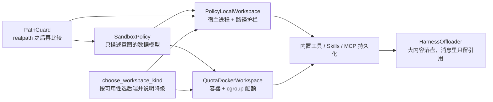
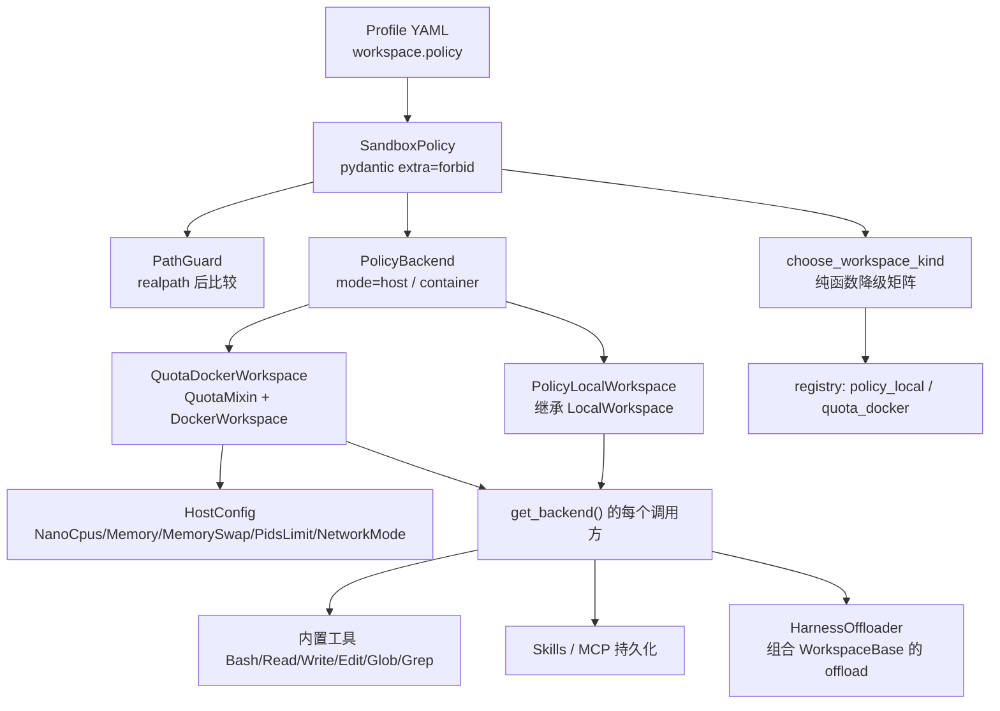
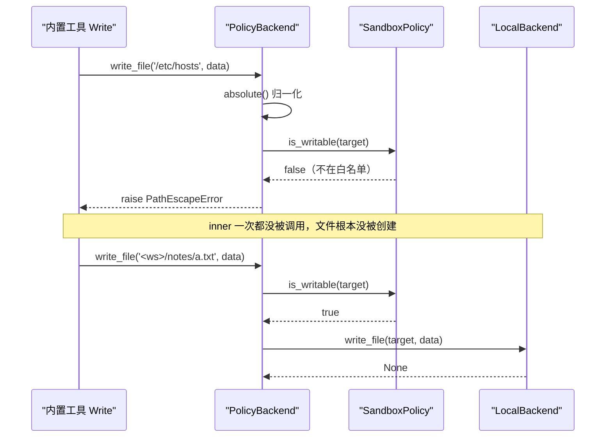
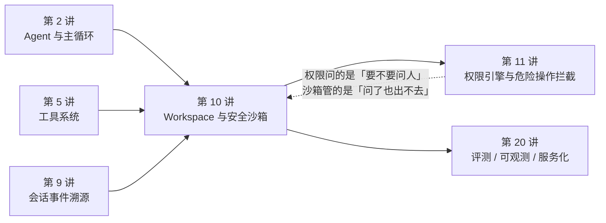

# 第 10 讲：Workspace 与安全沙箱

> **本讲目标**：把 Agent 的「手」（读写文件 + 执行命令）关进一个**可声明、可降级、可验证**的笼子里 ——
> 用一份策略同时驱动「本地进程」与「容器」两个完全不同的执行后端，并让内置工具、Skills 落盘、
> MCP 持久化、offload 全部自动过策略。
> **前置要求**：第 2 讲（`Agent` 与主循环）、第 5 讲（工具系统）、第 9 讲（会话事件溯源，知道 offload 落盘到哪）。
> 环境：AgentScope 2.0.8 + ReMe 0.4.1.13，能按第 1 讲的方式用 `PYTHONPATH=third_party/ReMe` 跑脚本。
> **本讲交付物**（全部相对仓库根）：
>
> - `tutorial_agsc_reme/reference/harness_kit/sandbox/guard.py`
> - `tutorial_agsc_reme/reference/harness_kit/sandbox/policy.py`
> - `tutorial_agsc_reme/reference/harness_kit/sandbox/local.py`
> - `tutorial_agsc_reme/reference/harness_kit/sandbox/docker.py`
> - `tutorial_agsc_reme/reference/harness_kit/sandbox/offload.py`
> - `tutorial_agsc_reme/reference/harness_kit/sandbox/__init__.py`
> - `tutorial_agsc_reme/reference/scripts/10_sandbox.py`（A~J 十段可执行验证）
> - `tutorial_agsc_reme/reference/tests/test_lesson10_sandbox.py`（41 条 pytest，0 次 LLM 调用）
>
> **预计时长**：150 分钟（容器那一段要真起一次容器，本机实测约 10 秒；首次构建镜像更久）。
>
> 本讲的完整可运行代码位于 `tutorial_agsc_reme/reference/harness_kit/sandbox/`，
> 你可以直接对照，也可以跟着正文一行一行写。

---

## 一、这一讲要解决的问题

### 1.1 一个具体到不能再具体的失败场景

先别谈架构。看两段这个仓库里**真实跑出来**的输出。

第一段来自本讲验证脚本的 **C 段**（后面第五节的完整输出里有原文）：

```text
  run_command('pwd')                     = '/private/tmp/lesson10_it0c8wz3/c_ws\n'
  拦截 OK  read_file('/etc/passwd')
            沙箱策略拒绝 read '/etc/passwd'（解析为 /etc/passwd）：不在 read 白名单 ['/tmp/lesson10_it0c8wz3/c_ws'] 之内（工作区根为 /tmp/lesson10_it0c8wz3/c_ws）
```

第二段来自第 10 讲之前，AgentScope 原生 `LocalWorkspace` 在同一个环境里的行为
（`tutorial_agsc_reme/_recon/08_agentscope_workspace_sandbox.md` 第 6.2 节，实测输出）：

```text
[7b] 关键事实：LocalWorkspace 不是文件系统 jail
    Glob 默认 base_dir = /private/tmp/recon_ws （= 宿主进程 cwd，不是 workdir）
    -- cd / 也行 --
     /
```

把这两段摆在一起，本讲要解决的问题就一句话：**`LocalWorkspace` 不隔离文件系统，
Agent 的 `Bash` 可以 `cd /`，`Read` 可以读走 `~/.ssh/id_rsa`，`Write` 可以覆盖 `/etc/hosts`。**

为什么？因为 `LocalWorkspace` 的 `__init__` 里就 `self._backend = LocalBackend()`
（`third_party/agentscope/src/agentscope/workspace/_local_workspace.py:127`），
`LocalBackend` 是**宿主进程里**的 `subprocess` + `open`。这时候唯一挡在前面的是
权限引擎（`PermissionEngine`），而权限引擎是**策略隔离**（问一句「允许吗」），
不是**机制隔离**（内核层面的墙）。策略能被绕过的地方，机制不会。

再具体一点，一个真实事故的形态是这样的：

1. Agent 接到的任务是「帮我清理一下构建产物」；
2. 它调 `Bash("rm -rf ./dist && rm -rf ./build")`；
3. 某个环节上路径算错了一格，变成 `rm -rf ..`；
4. `PermissionEngine` 的 DEFAULT 模式问了一句「要不要执行」，值班的同学半夜点了个「是」；
5. 宿主的家目录没了。

第 4 步是权限引擎管的（第 11 讲的主题），第 5 步是**这一讲**要管的事：
即使人点了「是」，即使模型疯了，**副作用本身也不能越出你划定的那块磁盘**。

### 1.2 三条不变式

本讲的所有设计都服务于这三条不变式。它们是可以被机器检查的，第五节的验证脚本逐条验。

**不变式 1：策略必须打在「执行原语」的边界上，不是「工作区 API」的边界上。**

这是本讲最重要的一条设计结论，也是我读完源码后改变过一次的结论。最初我想的是
「包一层 `WorkspaceBase`，在 `read_file` / `write_file` 里查策略」——
问题是 `WorkspaceBase` **根本没有** `read_file` / `write_file` / `run_command` 这三个方法
（`workspace/_base.py` 的方法清单见 2.3 节）。真正的读写发生在**工具**里，
而工具持有的是 **backend**。所以要拦，就得拦 backend。

**不变式 2：同一份策略必须能喂给两个执行环境（本地进程 / 容器），执行手段可以毫无共同点。**

本地靠「拦路径」，容器靠「cgroup + 网络命名空间」。把限制逻辑写进任意一个后端，
另一个就得跟着改，而且两边改法完全不一样。所以「策略」必须是一个**独立的、只描述意图的数据模型**。

**不变式 3：任何降级都必须**响亮**地发生，绝不静默。**

本地进程没有网络命名空间，`network: none` 在本地后端上**无法执行**。
这时候只有两个正确选项：(a) 拒绝启动；(b) 启动，但打一条写明「网络限制本次不会生效」的 WARNING。
错误选项是：启动，什么都不说，让运维以为断网了。

### 1.3 本讲的四条交付线



### 1.4 这一讲不做什么

提前说清楚，免得你把力气用错地方：

- **不重写 `WorkspaceBase` 的 8 种 backend**（契约第十章红线）。我们只在外层加策略与配额。
- **不重写 `PermissionEngine`**（第 11 讲的主题）。本讲与它分工明确：
  权限引擎回答「**要不要问人**」，本讲回答「**问了也出不去**」。
- **不重写 offload 协议**（`WorkspaceBase` 已经实现了三个方法，见 2.5 节）。我们只包一层，
  补上「没有工作区时明确降级」「单次体积护栏」「可观测计数」这三件工作区不该管的事。

---

## 二、源码侦察

本节的每一条结论都附 `路径:行号`。行号是对着本仓库的
`third_party/agentscope/src/agentscope/`（AgentScope 2.0.8）逐条 `grep` / `sed` 核过的。

### 2.1 三个正交的关注点

AgentScope 把「文件与命令」这件事拆给了三个基类，它们各自回答一个不同的问题。
这个拆分本身就是本讲的骨架，先把它认清楚：

```
third_party/agentscope/src/agentscope/tool/_builtin/_backend.py:138   class BackendBase(ABC):
third_party/agentscope/src/agentscope/workspace/_base.py:223         class WorkspaceBase:
third_party/agentscope/src/agentscope/permission/_engine.py:17       class PermissionEngine:
```

| 关注点 | 承载者 | 行号 | 一句话 |
| --- | --- | --- | --- |
| **在哪执行** | `BackendBase` | `tool/_builtin/_backend.py:138` | 只抽象 3 个原语：`exec_shell` / `read_file` / `write_file`，其余文件系统助手全由这 3 个派生 |
| **给 Agent 什么** | `WorkspaceBase` | `workspace/_base.py:223` | 资源（skills）+ 工具（6 个内置 + MCP）+ offload 持久化，一个对象三顶帽子 |
| **允许干什么** | `PermissionEngine` | `permission/_engine.py:17` | 5 种 mode × allow/deny/ask 规则 × 工具自带 `check_permissions`，产出 ALLOW/DENY/ASK |

**这说明什么**：三个关注点里，「在哪执行」是**机制层**，「允许干什么」是**策略层**。
本讲要在「机制层」的外面再加一层**声明式的策略**，而且这层策略要能同时被两个机制层实现消费。
这就是为什么 `SandboxPolicy` 是一个纯 `pydantic` 模型（`sandbox/policy.py`），
而不是某个 backend 的基类。

### 2.2 后端只有三个原语

```
third_party/agentscope/src/agentscope/tool/_builtin/_backend.py:294       async def exec_shell(
third_party/agentscope/src/agentscope/tool/_builtin/_backend.py:331       async def read_file(self, path: str) -> bytes:
third_party/agentscope/src/agentscope/tool/_builtin/_backend.py:344       async def write_file(self, path: str, data: bytes) -> None:
third_party/agentscope/src/agentscope/tool/_builtin/_backend.py:190       def join_path(self, path: str, *paths: str) -> str:
third_party/agentscope/src/agentscope/tool/_builtin/_backend.py:263       def abspath(self, path: str, *, cwd: str) -> str:
third_party/agentscope/src/agentscope/tool/_builtin/_backend.py:741    class LocalBackend(BackendBase):
third_party/agentscope/src/agentscope/tool/_builtin/_backend.py:764       async def exec_shell(
```

`exec_shell` 的 docstring 原文（`_backend.py:294` 起）写得很清楚：参数是
**argv 列表**而不是命令行字符串，不经过 shell，所以调用方不需要考虑引号转义。
需要管道 / `&&` 的必须显式写 `["/bin/sh", "-c", line]`。

**这说明什么**：后端边界只有 3 个真方法（`file_exists` / `list_dir` / `scandir` /
`stat` / `stat_mtime` / `delete_path` / `read_stream` / `write_stream` / `expanduser`
全都是基类**派生**出来的，见 `_backend.py:331` 之后的 "derived filesystem ops" 段落）。
所以「包一层 backend」的代价很小：**要判定的方法只有 3 个真原语 + 9 个派生 IO**，
剩下的纯字符串运算（`join_path` / `dirname` / `basename` / `isabs` / `normpath` / `abspath`）
没有副作用，直接透传就行 —— 这一点决定了 §4.3 里 `PolicyBackend` 的形状。

### 2.3 `WorkspaceBase` 没有 `read_file` / `write_file` / `run_command`

```
third_party/agentscope/src/agentscope/workspace/_base.py:499          async def reset(self) -> None:
third_party/agentscope/src/agentscope/workspace/_base.py:512          def get_backend(self) -> BackendBase:
third_party/agentscope/src/agentscope/workspace/_base.py:554          async def list_tools(self) -> list[ToolBase]:
third_party/agentscope/src/agentscope/workspace/_base.py:1004         async def offload_context(
third_party/agentscope/src/agentscope/workspace/_base.py:1060         async def offload_tool_result(
third_party/agentscope/src/agentscope/workspace/_base.py:1119         async def offload_data_block(self, block: DataBlock) -> DataBlock:
```

`grep -n "async def read_file\|async def write_file\|async def run_command" workspace/_base.py`
的结果是**空**（这条结论可以直接复现）。`WorkspaceBase` 的公开面只有三类：
生命周期（`initialize` / `close` / `reset`）、派生能力（`list_tools` / `list_skills` /
`list_mcps` / `get_instructions`）、offload 落盘（三个方法）。

**这说明什么**：**想「包一层工作区来拦路径读写」是拦不住的** —— 因为工作区上压根没有那两个方法。
谁在做读写？往下看。

### 2.4 关键证据链：工具持有的是 backend

这是本讲最重要的一条证据链，它直接决定了我们在哪里下刀。

```
third_party/agentscope/src/agentscope/workspace/_local_workspace.py:127       self._backend = LocalBackend()
third_party/agentscope/src/agentscope/workspace/_base.py:554              backend = self.get_backend()
third_party/agentscope/src/agentscope/tool/_builtin/_write.py:100         self._backend = backend or LocalBackend()
third_party/agentscope/src/agentscope/tool/_builtin/_read.py:172         self._backend = backend or LocalBackend()
third_party/agentscope/src/agentscope/tool/_builtin/_bash.py:177         self._backend = backend or LocalBackend()
third_party/agentscope/src/agentscope/tool/_builtin/_write.py:240         if not self._backend.isabs(file_path):
third_party/agentscope/src/agentscope/tool/_builtin/_write.py:302         await self._backend.write_file(
third_party/agentscope/src/agentscope/tool/_builtin/_bash.py:713          result = await self._backend.exec_shell(
third_party/agentscope/src/agentscope/tool/_builtin/_bash.py:715              cwd=self._cwd,
```

读法：工作区在 `list_tools()` 里 `backend = self.get_backend()`（`_base.py:554`），
把**同一个 backend 实例**塞给 6 个内置工具；工具把 `file_path` / `command`
一路交给 `self._backend`。

**这说明什么**：**`get_backend()` 是所有文件与命令副作用的唯一收口**。
把它的返回值换成策略化的 backend，内置工具、Skills 落盘、MCP 持久化、offload
就全部自动过策略 —— **一处改动，覆盖全部入口**。这正是 §4.3 `PolicyBackend` 的存在理由。

顺便记下两个细节，第五节有对应的实测：

- `_write.py:240` 要求 `file_path` **必须是绝对路径**，否则报错。所以「相对路径」的归一化
  必须由我们自己的便利方法（`run_command` 的 `cwd` 等）完成，不能指望工具。
- `_write.py:254` 在写之前会先 `await self._backend.file_exists(file_path)`。
  这是一个**读**操作 —— 所以第五节的 D2 实测里，越界写报出来的第一句是
  「沙箱策略拒绝 **read** ...」，而不是 `write`。这不是 bug，是工具的真实调用顺序。

### 2.5 offload 协议：三个 `async` 方法

```
third_party/agentscope/src/agentscope/workspace/_offload_protocol.py:8    class Offloader(Protocol):
third_party/agentscope/src/agentscope/workspace/_offload_protocol.py:11       async def offload_data_block(self, block: DataBlock) -> DataBlock:
third_party/agentscope/src/agentscope/workspace/_offload_protocol.py:25       async def offload_context(
third_party/agentscope/src/agentscope/workspace/_offload_protocol.py:43       async def offload_tool_result(
```

调用点在 agent 侧，参数是**按关键字**传的：

```
third_party/agentscope/src/agentscope/agent/_agent.py:711             path = await self.offloader.offload_context(
third_party/agentscope/src/agentscope/agent/_agent.py:715                 f"<system-reminder>The compressed context"
third_party/agentscope/src/agentscope/agent/_agent.py:858             saved = await self.offloader.offload_data_block(block)
third_party/agentscope/src/agentscope/agent/_agent.py:2080            saved = await self.offloader.offload_data_block(block)
third_party/agentscope/src/agentscope/agent/_agent.py:2662            path = await self.offloader.offload_tool_result(
```

**这说明什么**（两件事，都很要紧）：

1. **契约 §3.10 把这三个方法写成了同步签名，真实 API 是 `async def`。**
   按契约第十章「以真实 API 为准」，本讲实现成异步，偏离记录在 §3.6。
2. **返回的字符串会被原样塞进 system-reminder 交给模型**（`_agent.py:715` 与 `:2670`）。
   所以绝不允许在小体积时「假装 offload 了」再返回一个不存在的路径 —— 模型会去读一个空文件。
   `HarnessOffloader` 因此**永远真的落盘**，只在大到不合理时「拒绝落盘」并明确回报。

顺便：工作区自己**已经**实现了这三件事，而且很完整 ——
`context.jsonl` 追加、`tool_result-<id>.txt` 带 `(1)` 去重、`data/<sha256>.<ext>` 按内容哈希短路、
写出去的是可移植的 `workspace:///` URL。所以 `HarnessOffloader` **一个字都不重写**。

### 2.6 Docker 后端的 `HostConfig` 只有 `Binds`

```
third_party/agentscope/src/agentscope/workspace/_docker/_docker_workspace.py:284    async def _create_and_start_container(self) -> None:
third_party/agentscope/src/agentscope/workspace/_docker/_docker_workspace.py:304        host_config: dict[str, Any] = {}
third_party/agentscope/src/agentscope/workspace/_docker/_docker_workspace.py:308            host_config["Binds"] = [
third_party/agentscope/src/agentscope/workspace/_docker/_docker_workspace.py:311        config["HostConfig"] = host_config
third_party/agentscope/src/agentscope/workspace/_docker/_make_dockerfile.py:38   CONTAINER_WORKDIR = "/workspace"
third_party/agentscope/src/agentscope/workspace/_docker/_make_dockerfile.py:40   GATEWAY_HOME = "/root/.agentscope"
```

`_create_and_start_container`（`:284`）构造的 `config` 只有
`Image` / `Cmd: ["sleep","infinity"]` / `WorkingDir` / `Labels`，
`HostConfig` 里**只有 `Binds`**（`:304-311`）。

**这说明什么**：一个 `while True: os.fork()` 能打满宿主机，一次内存爆炸能把整台机器拖进 swap。
AgentScope 的 Docker 后端**完全不管资源配额**（我在 2.7 节列了 grep 证据）。
契约 §3.10 要的两件事就是补这个：把策略翻成 `--cpus` / `--memory` / `--pids-limit` / `--network`。

`GATEWAY_HOME = "/root/.agentscope"`（`_make_dockerfile.py:40`）与
容器初始化时 `cwd="/"` 的 `mkdir -p`（`workspace/_sandboxed_base.py:414` 的
`_ensure_workspace_layout`，`exec_shell` 在 `:417-428`）这两条决定了
**容器里的路径策略必须与本地不同** —— 见 §4.3 的 `mode="container"`。

### 2.7 诚实清单：AgentScope **没有**提供什么

以下全部来自对 `third_party/agentscope/src/agentscope/workspace/` 的 `grep`，
不是推测。**没有** = 关键字命中为零。

| 缺口 | 证据 | 最近类比（也不够） |
| --- | --- | --- |
| **Docker 后端没有资源配额** | `grep -rn "mem_limit\|nano_cpus\|cpu_quota\|pids_limit\|NetworkMode"` 在 `workspace/` 下**零命中**；`_docker_workspace.py:304-311` 只有 `Binds` | `_applecontainer/_constants.py:18` 的 `DEFAULT_CPUS = 2` / `:21` 的 `DEFAULT_MEMORY = "2G"`（唯一带默认配额的后端）；`_k8s/_k8s_workspace.py:444` 的 `resources` 透传（配额由调用方给，框架不给默认值） |
| **本地模式没有文件系统 jail** | `_local_workspace.py:127` 直接 `LocalBackend()`，跑在宿主进程里 | `tool/_base.py:390` 的 `_path_in_allowed_working_path` —— 这是**策略隔离**，不是机制隔离 |
| **网络隔离（本地）** | 本地后端就是宿主进程，没有网络命名空间 | 无。容器后端可以，但 AgentScope 也不设 `NetworkMode` |
| **Bubblewrap 后端明确不是网络沙箱** | `_bubblewrap/_bubblewrap_workspace.py:51` 的 docstring 自陈 "This is not a network sandbox"，且 `_bubblewrap_backend.py:398` 的 argv 里 `--unshare-all` 与 `--share-net` 同时出现 | 无 |
| **运行时审计流** | 没有结构化的「谁在什么会话里被拒了哪次访问」记录 | 只有每个权限决定自带的 `decision_reason` 字符串（`permission/_decision.py`） |

本讲补第 1、2 条，并对第 3 条做「能力诚实申报 + 明确降级」，
第 5 条以 `logger` 结构化字段 + `HarnessOffloader.stats()` 的形式给一个最小可用面。

---

## 三、扩展点定位与设计

### 3.1 官方已经给了什么（回答契约 §8 的问题 1）

| 已有能力 | 位置 | 我们怎么用它 |
| --- | --- | --- |
| backend 三原语抽象 | `tool/_builtin/_backend.py:138` / `:294` / `:331` / `:344` | **继承**它做 `PolicyBackend`，只在 3 个原语 + 派生 IO 上做判定 |
| 工作区 → 工具的 backend 注入 | `workspace/_base.py:554`、`_local_workspace.py:141` | 不动它。只要换掉 `get_backend()` 的返回值，注入链自动生效 |
| 本地工作区实现 | `workspace/_local_workspace.py:65` | **继承**它做 `PolicyLocalWorkspace`（见 §3.5 的「为什么不包一层」） |
| 沙箱模板方法 | `workspace/_sandboxed_base.py:38`，三个钩子 `:147` / `:156` / `:163` | `QuotaDockerWorkspace` 覆写 `_provision_backend` 与 `_create_and_start_container` |
| 容器生命周期（镜像构建 / 缓存 / gateway） | `_docker/_docker_workspace.py:141` / `:202` / `:284` | 一行不抄，全部复用 |
| offload 落盘实现 | `workspace/_base.py:1004` / `:1060` / `:1119` | 组合进 `HarnessOffloader`，只加护栏与计数 |
| 注册表懒加载 | `harness_kit/registry.py:1013` / `:1020` | 把两个新工作区挂成 `policy_local` / `quota_docker` |
| Profile 里的 `policy:` 块 | `harness_kit/config/schema.py:140` / `:281` / `:286` | 策略直接由 YAML 声明，`_fill_policy_root` 回填 `workspace_root` |

### 3.2 还缺什么（回答契约 §8 的问题 2）

对应契约 §1.3 的缺口编号（本讲负责 1、2、3、5）：

1. **声明式的沙箱策略**：AgentScope 只有「后端」，没有「这个后端该被限制成什么样」这一层。
   → `harness_kit/sandbox/policy.py` 的 `SandboxPolicy`。
2. **本地文件系统护栏**：本地后端没有 jail。→ `harness_kit/sandbox/guard.py` 的 `PathGuard` +
   `harness_kit/sandbox/local.py` 的 `PolicyBackend`。
3. **资源配额与网络隔离**：Docker 后端 `HostConfig` 只有 `Binds`。→
   `harness_kit/sandbox/docker.py` 的 `QuotaMixin`（注入 `NanoCpus` / `Memory` / `MemorySwap` /
   `PidsLimit` / `NetworkMode`）。
4. **（超出 AgentScope，属 Harness 层）后端选择与降级策略**：Profile 写 `docker`，
   但机器上没有 Docker Desktop 时该怎么办？→ `choose_workspace_kind()`，
   纯函数、可测，且降级一定打 WARNING 说清「哪些限制不会生效」。
5. **超时与输出体积**：(a) `LocalBackend.exec_shell(timeout=None)` 是**无限等待**，
   这是 agent 卡死的直接成因；(b) 一条 `cat /dev/urandom` 能把几 GB 灌进 context。
   → `PolicyBackend` 的三重资源约束。

### 3.3 我们挂在哪三个扩展点上（回答契约 §8 的问题 3）

**扩展点 A：`BackendBase` 装饰器**（最重要）

不重写任何后端，而是**包一层**：`PolicyBackend(BackendBase)` 持有 `inner`，
在 3 个原语 + 9 个派生 IO 上先问策略再放行。选它而不是 `WorkspaceBase` 的理由见 2.4 节的证据链。

**扩展点 B：工作区的 `get_backend()`**

`PolicyLocalWorkspace(LocalWorkspace)` 在 `__init__` 里把 `self._backend`
换成 `PolicyBackend(inner=原 backend, policy=..., mode="host")`。

**扩展点 C：`SandboxedWorkspaceBase` 的两个钩子**

`QuotaDockerWorkspace(QuotaMixin, DockerWorkspace)`：
- `_provision_backend`（`_sandboxed_base.py:147`）—— `super()` 拉起容器后，把 backend 换成 `mode="container"` 的策略化包装；
- `_create_and_start_container`（`_docker_workspace.py:284`，**注意它不在基类里**，是 `DockerWorkspace` 自己的方法，
  由 `_provision_backend`（`:147`）调用）—— 在它的调用窗口内替换
  `client.containers.create_or_replace`，把配额并进 `config["HostConfig"]`。

### 3.4 设计图





### 3.5 本讲扩展点清单（基类名 / 方法签名 / 文件）

**要求：每一行都能在 `third_party/` 里 `grep` 到。** 这张表就是你日后写自己的
策略层时要抄的接口面。

| # | 我们写的类 | 继承 / 实现的官方类型 | 官方声明位置 | 我们覆写的方法（逐字签名） |
| --- | --- | --- | --- | --- |
| 1 | `PolicyBackend` | `BackendBase` | `tool/_builtin/_backend.py:138` | `async def exec_shell(self, command: list[str], *, cwd: str \| None = None, timeout: float \| None = None) -> ExecResult`（`:294`）<br/>`async def read_file(self, path: str) -> bytes`（`:331`）<br/>`async def write_file(self, path: str, data: bytes) -> None`（`:344`） |
| 2 | `PolicyLocalWorkspace` | `LocalWorkspace` → `WorkspaceBase` | `workspace/_local_workspace.py:65` | 不覆写生命周期，只换 `self._backend`；额外提供契约要求的 `async def read_file(self, path: str, **kwargs: Any) -> str` / `async def write_file(self, path: str, content: str, **kwargs: Any) -> None` / `async def run_command(self, command: str, **kwargs: Any) -> str` |
| 3 | `QuotaDockerWorkspace` | `QuotaMixin` + `DockerWorkspace` → `SandboxedWorkspaceBase` → `WorkspaceBase` | `workspace/_docker/_docker_workspace.py:43`、`workspace/_sandboxed_base.py:38` | `async def _provision_backend(self) -> None`（`_sandboxed_base.py:147`）<br/>`async def _create_and_start_container(self) -> None`（`_docker_workspace.py:284`）<br/>契约要求的 `async def start(self) -> None` / `async def aclose(self) -> None` |
| 4 | `HarnessOffloader` | `Offloader`（`Protocol`，结构子类型，不显式继承） | `workspace/_offload_protocol.py:8` | `async def offload_data_block(self, block: DataBlock) -> DataBlock`（`:11`）<br/>`async def offload_context(self, session_id: str, msgs: list[Msg]) -> str`（`:25`）<br/>`async def offload_tool_result(self, session_id: str, tool_result: ToolResultBlock) -> str`（`:43`） |
| 5 | `build_policy_local_workspace` / `build_quota_docker_workspace` | 注册表工厂（`_LazyFactory`） | `harness_kit/registry.py:1013` / `:1020` | `async def build_xxx(spec: Any, ctx: BuildContext \| None = None)` |

**为什么 #2 是继承 `LocalWorkspace` 而不是「包一层 `WorkspaceBase`」**

契约 §3.10 写的是 `class PolicyLocalWorkspace(WorkspaceBase)`。因为
`LocalWorkspace` 本身就是 `WorkspaceBase` 的子类，继承它**满足契约的类型约束**，
同时避开「包一层」特有的坑：`LocalWorkspace` 覆盖了 13 个基类方法
（`initialize` / `close` / `reset` / `get_instructions` / `list_tools` / `list_skills` /
`add_skill` / `add_skill_archive` / `remove_skill` / `add_mcp` / `remove_mcp` /
`_python_command` / `__init__`），一个只做 `__getattr__` 转发的包装类会在这些同名方法上
**静默**退回基类实现（`__getattr__` 只在正常查找失败时才触发）。继承没有这个问题。
第五节的 C 段实测：`is_alive`、`workdir`、`list_tools()` 全都在，且 `Write` 工具真的拿到了策略化 backend。

### 3.6 两处刻意偏离契约的地方

契约里写着「以真实 API 为准」，所以这两处偏离是**必须**的，记在这里免得你以为是笔误：

1. **`Offloader` 的三个方法是 `async def`**，契约 §3.10 写成了同步签名。
   真实签名见 `workspace/_offload_protocol.py:11` / `:25` / `:43`，调用点在
   `agent/_agent.py:711` / `:858` / `:2080` / `:2662`（都有 `await`）。
   本讲实现成异步。
2. **`HarnessOffloader` 是「组合」而不是「继承 `Offloader`」**。契约写的是
   `class HarnessOffloader(Offloader)`，那只是「实现该协议」的意思。`Offloader` 是
   `Protocol`，显式继承它并不会带来任何行为（它没有基类实现可复用），
   反而会让人误以为这里重写了落盘逻辑 —— 而落盘逻辑是**工作区**的事，我们一个字都没重写。

还有一处「契约没说但我们补了」的：`PolicyLocalWorkspace.__init__` 的 `base_workspace`
参数契约只给了名字。本讲把它明确成「沿用身份与配置（`workspace_id` / `workdir` /
`default_mcps` / `skill_paths` / `max_live_stateful_mcps`），并复用它已经活着的 backend
（如果它本身是本地类后端）」—— 这样「同一个工作区换个策略化壳」不会换掉 session 目录与技能分区。

---
## 四、harness_kit 实现

本节逐个文件给出**完整代码**（不是片段）。文件前的行号引用都是核对过的；
每个文件后面有一段「为什么这么写」，重点解释它与官方扩展点的咬合处。

### 4.0 目录与阅读顺序

```text
tutorial_agsc_reme/reference/harness_kit/sandbox/
├── guard.py    225 行   路径逃逸检测（纯函数，零依赖，先读它）
├── policy.py   527 行   策略模型 + 后端选择与降级（纯函数）
├── local.py    959 行   PolicyBackend + PolicyLocalWorkspace（本讲核心）
├── docker.py   492 行   QuotaMixin + QuotaDockerWorkspace
├── offload.py  335 行   HarnessOffloader（护栏 + 计数，不重写落盘）
└── __init__.py  91 行   对外 API 面
```

阅读顺序建议：`guard` → `policy` → `local` → `docker` → `offload` → `__init__`。
前两个是纯函数（不碰 IO、不连 daemon），可以独立测；`local` 把前两个装配起来打出第一层隔离；
`docker` 是同一份策略的第二个执行环境；`offload` 是落盘出口。

### 4.1 `guard.py`：路径逃逸检测

**文件：`tutorial_agsc_reme/reference/harness_kit/sandbox/guard.py`（225 行）**

```python
# -*- coding: utf-8 -*-
"""路径逃逸检测（契约 §3.10，第 10 讲）。

**为什么这件事不能靠字符串前缀比较**

两个真实存在的坑，只靠 ``str.startswith`` 一个都躲不过：

1. **符号链接**。macOS 上 ``/tmp`` 是 ``/private/tmp`` 的符号链接。
   ``/tmp/ws/../../../etc/passwd`` 这类路径在字符串层面看不出越界，
   而 :func:`os.path.realpath` 一解就原形毕露。
   AgentScope 自己也踩过这个坑并留下了注释：
   ``third_party/agentscope/src/agentscope/tool/_base.py:398``
   （"Paths are compared via :func:`os.path.realpath` so that aliases like
   macOS's ``/tmp`` → ``/private/tmp`` ... compare equal on both sides"）。
2. **前缀伪装**。``/tmp/workspace-evil`` 的字符串以 ``/tmp/workspace`` 开头，
   但它显然不在 ``/tmp/workspace`` 里。所以比较必须带上分隔符
   （``Path.is_relative_to`` / ``os.path.relpath`` 都处理了这点）。

本模块把这两件事一次性封装成 :class:`PathGuard`，并被
:mod:`harness_kit.sandbox.policy` 与 :mod:`harness_kit.sandbox.local` 共用。

**另外一件事：模式匹配（``deny_paths``）**

``SandboxPolicy.deny_paths`` 里写的是 ``".git/"`` / ``".env"`` / ``"**/*.pem"``
这种**模式**，不是精确路径。:meth:`PathGuard.matches_patterns` 规定了它们的匹配语义
（见该方法 docstring）—— 关键在于"模式列表是黑名单，多拦一点是安全的，
漏拦才是事故"，所以匹配规则刻意偏保守。
"""

from __future__ import annotations

import fnmatch
import os
from pathlib import Path

__all__ = [
    "PathEscapeError",
    "PathGuard",
]


class PathEscapeError(PermissionError):
    """路径逃逸出策略允许的范围（契约 §3.10）。

    继承 :class:`PermissionError` 而不是自定义的 ``Exception``：
    调用方常常已经有"捕获 ``PermissionError`` 就当成拒绝"的兜底逻辑，
    逃逸检测必须落在同一条路径上，否则会绕过它。
    """


class PathGuard:
    """把一个根目录变成"只能进不能出"的路径守卫（契约 §3.10）。

    Example:
        >>> guard = PathGuard(Path("/private/tmp/ws"))
        >>> guard.is_within("/private/tmp/ws/a.py")
        True
        >>> guard.is_within("/private/tmp/ws-evil/a.py")
        False
        >>> guard.is_within("/private/tmp/ws/../../etc/passwd")
        False
    """

    def __init__(self, root: Path) -> None:
        """构造守卫。

        Args:
            root (`Path`): 允许范围的根目录。构造时立即 ``resolve()``，
                因此符号链接在此刻就被解开，后续每次比较都不需要重复解。
        """
        self.root: Path = Path(root).expanduser().resolve()

    # ------------------------------------------------------------------
    # 判定
    # ------------------------------------------------------------------
    def is_within(self, path: str | Path) -> bool:
        """判断路径是否落在根目录内（含根目录自身）。

        Args:
            path (`str | Path`): 待判断的路径；可以是绝对路径，也可以是
                相对路径（**相对当前进程的 cwd**，与 :func:`os.path.realpath`
                的语义一致；相对路径不会被当成"相对根目录"）。

        Returns:
            `bool`: 是否在范围内。

        Example:
            >>> PathGuard(Path("/private/tmp/ws")).is_within("/private/tmp/ws")
            True
            >>> PathGuard(Path("/private/tmp/ws")).is_within("/private/tmp")
            False
        """
        candidate = self._resolve(path)
        return candidate == self.root or self.root in candidate.parents

    def resolve_within(self, path: str | Path) -> Path:
        """把路径解析成绝对路径，越界则抛异常（契约 §3.10）。

        Args:
            path (`str | Path`): 待解析的路径。

        Returns:
            `Path`: ``realpath`` 之后的绝对路径。

        Raises:
            PathEscapeError: 路径逃逸出根目录。

        Example:
            >>> PathGuard(Path("/private/tmp/ws")).resolve_within("/private/tmp/ws/a.py")
            PosixPath('/private/tmp/ws/a.py')
        """
        candidate = self._resolve(path)
        if not (candidate == self.root or self.root in candidate.parents):
            raise PathEscapeError(
                f"路径逃逸：{path!r} 解析为 {candidate}，"
                f"不在工作区 {self.root} 之内",
            )
        return candidate

    @staticmethod
    def _resolve(path: str | Path) -> Path:
        """``expanduser`` + ``realpath`` + 绝对化。

        用 :func:`os.path.realpath` 而不是 :meth:`Path.resolve`：
        前者对**不存在的路径**也照样做符号链接解析（``strict=False`` 的
        ``Path.resolve`` 在 Python 3.6+ 行为接近，但 ``realpath`` 在
        "父目录存在、叶子不存在"这种最常见的情形下行为最可预期 ——
        写文件时目标文件本来就不存在）。

        Args:
            path (`str | Path`): 待解析路径。

        Returns:
            `Path`: 绝对化且解开符号链接的路径。
        """
        return Path(os.path.realpath(os.path.expanduser(str(path))))

    # ------------------------------------------------------------------
    # 相对路径与模式匹配
    # ------------------------------------------------------------------
    def relative_to_root(self, path: str | Path) -> str:
        """把路径转成相对根目录的 POSIX 字符串（用于打日志 / 模式匹配）。

        Args:
            path (`str | Path`): 待转换路径。

        Returns:
            `str`: 相对路径（POSIX 分隔符）；路径就在根目录时返回 ``"."``。

        Raises:
            PathEscapeError: 路径逃逸出根目录。
        """
        candidate = self.resolve_within(path)
        return os.path.relpath(candidate, self.root).replace(os.sep, "/")

    def matches_patterns(self, path: str | Path, patterns: list[str]) -> str | None:
        """判断路径是否命中任一模式，命中则返回命中的那个模式。

        **匹配语义**（四种任一命中即算命中）：

        1. 模式与**相对根目录的路径**直接 fnmatch（``"src/*.py"``）；
        2. 模式与**文件名** fnmatch（``"*.pem"`` 命中 ``a/b/k.pem``）；
        3. 模式与路径的**任一段** fnmatch（``".git/"`` 命中 ``src/.git/config``）；
        4. 把模式开头的 ``**/`` 去掉再按 1 试一次（``"**/*.pem"`` 命中根下的 ``k.pem``）。

        第 3、4 条是对 glob 的**放宽**，刻意的：``deny_paths`` 是黑名单，
        放宽只会多拦、不会漏拦。真正需要精确语义的场景应当用第 1 条那种
        写全的相对 glob。

        Args:
            path (`str | Path`): 待判断路径。
            patterns (`list[str]`): 模式列表。

        Returns:
            `str | None`: 命中的模式，或 ``None``。

        Raises:
            PathEscapeError: 路径逃逸出根目录（连相对路径都算不出来）。
        """
        rel = self.relative_to_root(path)
        segments = rel.split("/")
        basename = segments[-1] if segments else rel

        for pattern in patterns:
            if not pattern:
                continue
            normalized = pattern.replace(os.sep, "/")
            candidates = {
                normalized,
                normalized.rstrip("/"),
                normalized[3:] if normalized.startswith("**/") else normalized,
            }
            for candidate in candidates:
                if not candidate:
                    continue
                if fnmatch.fnmatch(rel, candidate):
                    return pattern
                if fnmatch.fnmatch(basename, candidate):
                    return pattern
            stripped = normalized.rstrip("/")
            if any(fnmatch.fnmatch(segment, stripped) for segment in segments):
                return pattern
        return None

    # ------------------------------------------------------------------
    # 描述
    # ------------------------------------------------------------------
    def describe(self) -> dict[str, str]:
        """返回自述（日志 / CLI 用）。

        Returns:
            `dict[str, str]`: 根目录信息。
        """
        return {
            "root": str(self.root),
            "is_symlink_resolved": str(self.root == Path(os.path.realpath(str(self.root)))),
        }

    def __repr__(self) -> str:
        """调试表示。

        Returns:
            `str`: 形如 ``PathGuard(root=/private/tmp/ws)``。
        """
        return f"PathGuard(root={self.root})"
```

**为什么这么写**

1. **`_resolve` 用 `os.path.realpath` 而不是字符串比较**（`guard.py:136`）。
   两个真实的坑，只靠 `str.startswith` 一个都躲不过：
   - macOS 上 `/tmp` 是 `/private/tmp` 的符号链接。第五节的 A 段实测打印了
     `os.path.realpath('/tmp') = /private/tmp`，以及「同一次造出来的路径，
     字符串形式与 realpath 形式**不是同一个字符串**但在同一个目录里」。
   - 工作区里一个指向 `/etc` 的软链接 `<ws>/escape`：朴素实现判
     `str(<ws>/escape/passwd).startswith(str(<ws>))` 是 **True**（A 段实测也打了这个 True），
     `PathGuard` 判 **False**。
   AgentScope 自己在 `tool/_base.py:398` 的 `_path_in_allowed_working_path` docstring 里
   也强调过这一点（"Paths are compared via :func:`os.path.realpath` so that aliases like
   macOS's ``/tmp`` → ``/private/tmp`` ... compare equal on both sides"）——
   我们不是在发明标准，是在把同一个标准抽成可复用的类。

2. **`is_within` 用 `candidate == root or root in candidate.parents`**（`guard.py:94`），
   而不是字符串前缀。`/tmp/workspace-evil` 的字符串以 `/tmp/workspace` 开头，
   但它显然不在 `/tmp/workspace` 里。带分隔符的比较天然解决这个问题。

3. **`matches_patterns` 的四条规则刻意偏保守**（`guard.py:156-203`）。
   1/2/3/4 四条「任一命中即算命中」，第 3、4 条是对 glob 的**放宽**。
   理由写在 docstring 里：`deny_paths` 是黑名单，放宽只会**多拦**、不会**漏拦**；
   真正需要精确语义的场景应该用第 1 条那种写全的相对 glob。
   第五节的 B 段实测里有一个**反例**断言（`secrets/*` 不该命中 `a/secrets/x.txt`），
   用来说明「放宽」不是「匹配一切」。

4. **`PathEscapeError` 继承 `PermissionError`**（`guard.py:42`），不是自定义基类。
   调用方常常已经有「捕获 `PermissionError` 就当成拒绝」的兜底逻辑，
   逃逸检测必须落在同一条路径上，否则会绕过它。

### 4.2 `policy.py`：策略模型 + 后端选择与降级

**文件：`tutorial_agsc_reme/reference/harness_kit/sandbox/policy.py`（527 行）**

```python
# -*- coding: utf-8 -*-
"""沙箱策略模型（契约 §3.10，第 10 讲）。

**这个类为什么必须逐字对齐契约字段**

``harness_kit/config/schema.py:140`` 在**导入时**就把
``harness_kit.sandbox.policy.SandboxPolicy`` 解引用成
:data:`~harness_kit.config.schema.SANDBOX_POLICY_CLASS`，并让
:class:`~harness_kit.config.schema.WorkspaceSpec` 的 ``policy`` 字段直接用它做注解：

.. code-block:: text

    third_party/... 不是重点，重点是：
    harness_kit/config/schema.py:140-144  SANDBOX_POLICY_CLASS = _resolve_external_type(...)
    harness_kit/config/schema.py:281      policy: SandboxPolicy | None = None

也就是说：**Profile YAML 里的 ``policy:`` 块会被我这一份定义直接校验**。
字段名少一个 → ``extra="forbid"`` 直接报错，整个 Profile 加载不出来。
所以这里的字段是契约 §3.10 的逐字翻译，一个不多一个不少，
校验（validator）只加在"值域"上，不改名、不增删字段。

**这个类为什么是"策略"而不是"沙箱"**

它只描述**意图**（哪些路径可读可写、网络怎么走、给多少 CPU/内存/进程数），
不碰任何执行。真正的执行分给两个后端：

- :mod:`harness_kit.sandbox.local` —— 本地目录，靠 :class:`~harness_kit.sandbox.guard.PathGuard`
  在 ``BackendBase`` 边界拦路径；
- :mod:`harness_kit.sandbox.docker` —— 容器，靠 ``docker run`` 的
  ``--cpus`` / ``--memory`` / ``--pids-limit`` / ``--network`` 真的设限。

同一份策略能喂给两个完全不同的执行环境，这正是把它单独建模的理由
（AgentScope 原生只有"后端"，没有"策略"这一层：
``third_party/agentscope/src/agentscope/workspace/_base.py:223`` 的 ``WorkspaceBase``
只管生命周期与布局）。
"""

from __future__ import annotations

from pathlib import Path
from typing import Any, Literal

from loguru import logger
from pydantic import BaseModel, ConfigDict, Field, field_validator, model_validator

from harness_kit.sandbox.guard import PathEscapeError, PathGuard

__all__ = [
    "BACKEND_AVAILABILITY_PROBES",
    "DEFAULT_DENY_PATHS",
    "SANDBOX_KINDS",
    "SandboxPolicy",
    "choose_workspace_kind",
]

DEFAULT_DENY_PATHS: list[str] = [".git/", ".env", "**/*.pem"]
"""契约 §3.10 的 ``deny_paths`` 默认值（原样抄下来，供文档与测试引用）。"""

SANDBOX_KINDS: tuple[str, ...] = ("local", "docker", "e2b")
"""本层认识的后端种类。

``e2b`` 的对应实现是 AgentScope 自带的
``E2BWorkspace``（``third_party/agentscope/src/agentscope/workspace/_e2b/``），
它需要 ``e2b`` 这个第三方包；**实测本环境没装**（``import e2b`` →
``ModuleNotFoundError``），因此 :func:`choose_workspace_kind` 会把它降级掉。
"""

BACKEND_AVAILABILITY_PROBES: dict[str, bool | None] = {
    "local": True,
    "docker": None,
    "e2b": None,
}
"""各后端的"静态可用性"。``None`` 表示"要探测才知道"，``True``/``False`` 是硬结论。

``local`` 恒为 ``True``（``LocalBackend`` 只用标准库；
``third_party/agentscope/src/agentscope/tool/_builtin/_backend.py:761`` 起）。
``docker`` 需要 aiodocker + 活着的 daemon（探测函数
:func:`harness_kit.sandbox.docker.docker_available`）。
``e2b`` 需要 ``e2b`` 包与 API key。
"""


class SandboxPolicy(BaseModel):
    """一次执行所允许的路径 / 网络 / 资源边界（契约 §3.10）。

    所有路径判定都是**"先归一化，再比较"**：内部一律走
    :class:`~harness_kit.sandbox.guard.PathGuard`，因此 ``/tmp/ws/../../../etc``
    这类相对穿越和 macOS 的 ``/tmp`` → ``/private/tmp`` 符号链接都不会误判。

    Example:
        >>> policy = SandboxPolicy(workspace_root="/private/tmp/ws")
        >>> policy.is_writable("/private/tmp/ws/a.py")
        True
        >>> policy.is_writable("/private/tmp/ws/.env")
        False
        >>> policy.is_readable("/etc/passwd")
        False
    """

    model_config = ConfigDict(extra="forbid")

    workspace_root: Path
    """工作区根目录。**工作区内的路径默认可读可写**（再被 ``deny_paths`` 扣除）。"""

    read_paths: list[str] = Field(default_factory=list)
    """允许读的**额外**绝对/相对路径。相对路径按 :attr:`workspace_root` 解析。"""

    write_paths: list[str] = Field(default_factory=list)
    """允许写的**额外**绝对/相对路径。相对路径按 :attr:`workspace_root` 解析。"""

    deny_paths: list[str] = Field(default_factory=lambda: list(DEFAULT_DENY_PATHS))
    """**黑名单**，优先级高于上面两条白名单。模式语义见
    :meth:`harness_kit.sandbox.guard.PathGuard.matches_patterns` ——
    匹配规则刻意偏保守（多拦一点是安全的，漏拦才是事故）。"""

    network: Literal["none", "allowlist", "full"] = "none"
    """网络档位：``none`` 断网 / ``allowlist`` 只放 :attr:`network_allowlist` /
    ``full`` 全放。**本地后端无法执行这一项**（本地进程没有网络命名空间），
    因此 :mod:`harness_kit.sandbox.local` 会在策略要求 ``none`` 却只能本地执行时
    打一条 warning —— 见 :meth:`is_network_enforceable`。"""

    network_allowlist: list[str] = Field(default_factory=list)
    """``network="allowlist"`` 时的白名单（主机名 / CIDR / 域名后缀）。"""

    cpu: float = 1.0
    """CPU 核数上限（``docker run --cpus``）。"""

    memory_mb: int = 1024
    """内存上限（MiB，``docker run --memory``）。"""

    pids: int = 128
    """进程数上限（``docker run --pids-limit``），防 fork 炸弹。"""

    timeout_s: int = 60
    """单次命令超时（秒）。"""

    max_output_bytes: int = 1_000_000
    """单次命令 stdout/stderr 的字节上限，超出即截断。"""

    # ------------------------------------------------------------------
    # 校验：只补值域，不改字段
    # ------------------------------------------------------------------
    @field_validator("read_paths", "write_paths", "deny_paths", "network_allowlist")
    @classmethod
    def _strip_empty(cls, value: list[str]) -> list[str]:
        """去掉空字符串项，避免空模式被当成"匹配一切"。

        ``PathGuard.matches_patterns`` 本来就会跳过空模式
        （``harness_kit/sandbox/guard.py:185`` 的 ``if not pattern: continue``），
        这里再拦一次是为了让"用户写了 ``- ""``"这件事在加载期就可见，
        而不是悄悄地什么都没发生。

        Args:
            value (`list[str]`): 原始列表。

        Returns:
            `list[str]`: 去掉空串后的列表。
        """
        return [item.strip() for item in value if item and item.strip()]

    @field_validator("cpu")
    @classmethod
    def _require_positive_cpu(cls, value: float) -> float:
        """``cpu`` 必须为正。

        Args:
            value (`float`): CPU 核数。

        Returns:
            `float`: 原值。

        Raises:
            ValueError: 不为正。
        """
        if value <= 0:
            raise ValueError(f"cpu 必须为正数，得到 {value!r}（0 核容器起不来）")
        return value

    @field_validator("memory_mb", "pids", "timeout_s", "max_output_bytes")
    @classmethod
    def _require_positive_int(cls, value: int) -> int:
        """这几个资源上限必须为正整数。

        Args:
            value (`int`): 上限值。

        Returns:
            `int`: 原值。

        Raises:
            ValueError: 不为正。
        """
        if value <= 0:
            raise ValueError(f"资源上限必须为正整数，得到 {value!r}")
        return value

    @model_validator(mode="after")
    def _check_allowlist(self) -> "SandboxPolicy":
        """``network="allowlist"`` 必须真的给出白名单。

        失败关闭（fail closed）：白名单为空却声明 ``allowlist``，
        语义上等于"谁都别想连"，但很容易被误读成"只放白名单里的人"。
        与其在运行时让 agent 对着一个连不通的网络发懵，不如加载期直接报错。

        Returns:
            `SandboxPolicy`: 自身。

        Raises:
            ValueError: 声明了 ``allowlist`` 却没给 :attr:`network_allowlist`。
        """
        if self.network == "allowlist" and not self.network_allowlist:
            raise ValueError(
                'network="allowlist" 但 network_allowlist 为空：'
                "请给出白名单，或改用 network=\"none\"/\"full\"",
            )
        return self

    # ------------------------------------------------------------------
    # 派生量
    # ------------------------------------------------------------------
    @property
    def guard(self) -> PathGuard:
        """指向 :attr:`workspace_root` 的路径守卫。

        每次访问都新建：:class:`PathGuard` 很轻（只有一次
        ``os.path.realpath``），而缓存它会让"strategy 被原地改动"
        这种边缘情况变得难查。

        Returns:
            `PathGuard`: 新的守卫实例。
        """
        return PathGuard(self.workspace_root)

    def extra_roots(self, kind: Literal["read", "write"]) -> list[Path]:
        """把 :attr:`read_paths` / :attr:`write_paths` 解析成绝对路径。

        相对路径按 :attr:`workspace_root` 解析（**不是**进程 cwd）：
        配置文件里写的 ``"./shared"`` 显然指"工作区里的 shared"。

        Args:
            kind (`Literal["read", "write"]`): 取哪一组。

        Returns:
            `list[Path]`: 解析后的绝对路径列表（未解符号链接，比较时由
            :class:`PathGuard` 再解）。
        """
        raw = self.read_paths if kind == "read" else self.write_paths
        root = Path(self.workspace_root).expanduser()
        out: list[Path] = []
        for item in raw:
            candidate = Path(item).expanduser()
            out.append(candidate if candidate.is_absolute() else root / candidate)
        return out

    # ------------------------------------------------------------------
    # 判定（契约要求的两个公开方法）
    # ------------------------------------------------------------------
    def is_readable(self, path: Path | str) -> bool:
        """路径是否允许读。

        判定顺序（**先白后黑**）：

        1. 在 :attr:`workspace_root` 之内，或在 :attr:`read_paths` 之一之内 → 候选可读；
        2. 命中 :attr:`deny_paths` → **否决**（黑名单压倒一切）。

        注意"路径不在工作区内"只返回 ``False``，**不抛异常** ——
        契约把它定义成谓词。需要异常的是执行层
        （:mod:`harness_kit.sandbox.local` 抛 :class:`PathEscapeError`）。

        Args:
            path (`Path | str`): 待判断路径。

        Returns:
            `bool`: 是否可读。

        Example:
            >>> SandboxPolicy(workspace_root="/private/tmp/ws").is_readable("/private/tmp/ws/a.txt")
            True
            >>> SandboxPolicy(workspace_root="/private/tmp/ws").is_readable("/etc/passwd")
            False
        """
        return self._allows(path, "read")

    def is_writable(self, path: Path | str) -> bool:
        """路径是否允许写。

        判定顺序与 :meth:`is_readable` 相同，白名单换成
        :attr:`workspace_root` + :attr:`write_paths`。

        额外一条：路径**自身的父链上**只要有一环命中黑名单也拒绝。
        这是为了避免"写 ``.git/config``"这类操作绕过只匹配叶子的模式
        （``PathGuard.matches_patterns`` 的第 3、4 条规则已经覆盖了
        ``".git/"`` 这种目录段模式，这里再显式说明一遍语义，
        真正的实现复用同一个守卫，不重复造轮子）。

        Args:
            path (`Path | str`): 待判断路径。

        Returns:
            `bool`: 是否可写。

        Example:
            >>> SandboxPolicy(workspace_root="/private/tmp/ws").is_writable("/private/tmp/ws/.env")
            False
        """
        return self._allows(path, "write")

    def containing_root(self, path: Path | str, kind: Literal["read", "write"]) -> Path | None:
        """路径落在哪一个白名单根之内。

        ``deny_paths`` 的模式是**相对某个根**写的（``".env"`` / ``".git/"``），
        所以判定黑名单前必须先知道"用哪个根去算相对路径"。
        实测踩过的坑：额外 ``read_paths`` 里的路径不在
        :attr:`workspace_root` 之下，如果硬拿 workspace_root 的
        :class:`PathGuard` 去算相对路径，``PathGuard.matches_patterns``
        会直接抛 :class:`PathEscapeError`
        （``harness_kit/sandbox/guard.py:153`` 的 ``resolve_within``）——
        结果是"加进白名单的路径反而读不了"。所以这里返回**真正包含它**的那个根。

        Args:
            path (`Path | str`): 待判断路径。
            kind (`Literal["read", "write"]`): 读还是写（决定用哪组额外白名单）。

        Returns:
            `Path | None`: 包含它的根目录，或 ``None``（越界）。
        """
        guard = self.guard
        if guard.is_within(path):
            return guard.root
        for root in self.extra_roots(kind):
            rooted = PathGuard(root)
            if rooted.is_within(path):
                return rooted.root
        return None

    def deny_hit(self, path: Path | str, kind: Literal["read", "write"] = "read") -> str | None:
        """路径是否命中黑名单，命中则返回那个模式。

        模式以 :meth:`containing_root` 返回的根为基准做相对匹配；
        路径越界时返回 ``None``（越界本身已由 :meth:`containing_root` 表达，
        不需要再叠一层黑名单语义）。

        Args:
            path (`Path | str`): 待判断路径。
            kind (`Literal["read", "write"]`, defaults to ``"read"``): 用哪组白名单定根。

        Returns:
            `str | None`: 命中的模式，或 ``None``。
        """
        try:
            root = self.containing_root(path, kind)
        except PathEscapeError:
            return None
        if root is None:
            return None
        try:
            return PathGuard(root).matches_patterns(path, self.deny_paths)
        except PathEscapeError:
            return None

    def _allows(self, path: Path | str, kind: Literal["read", "write"]) -> bool:
        """白名单 + 黑名单的公共判定。

        Args:
            path (`Path | str`): 待判断路径。
            kind (`Literal["read", "write"]`): 读还是写。

        Returns:
            `bool`: 是否允许。
        """
        try:
            if self.containing_root(path, kind) is None:
                return False
            hit = self.deny_hit(path, kind)
        except PathEscapeError:
            # 连相对路径都算不出来（例如 path 是空串）→ 一律拒绝
            return False
        if hit is not None:
            logger.bind(path=str(path), pattern=hit).debug("沙箱策略拒绝：命中 deny_paths")
            return False
        return True

    def is_network_enforceable(self) -> bool:
        """当前策略的网络档位是否能被**本地**后端真正执行。

        本地后端是在宿主进程里跑的 ``LocalBackend``
        （``third_party/agentscope/src/agentscope/tool/_builtin/_backend.py:764``），
        没有任何网络命名空间/防火墙能力，所以只有"不管网络"这一种可能。
        容器后端（``third_party/agentscope/src/agentscope/workspace/_docker/``）
        才有 ``--network`` 可用。

        Returns:
            `bool`: ``network == "full"``（即"不限制"，本地恰好等价）时为 ``True``。
        """
        return self.network == "full"

    def warn_if_unenforceable(self, backend: str) -> None:
        """在本地后端上发现网络/配额无法执行时，**明确**打一条 warning。

        契约硬性要求"优雅降级并明确报错"。沉默降级是安全事故的温床：
        运维以为断网了，其实 agent 正连着外网。所以选完后端就喊一声。

        Args:
            backend (`str`): 后端名（``"local"`` / ``"docker"`` / ...）。
        """
        if backend == "local" and not self.is_network_enforceable():
            logger.warning(
                "沙箱降级：后端 {} 无法执行 network={}（本地进程没有网络命名空间）；"
                "路径策略仍然生效，网络限制本次**不会**生效。"
                "需要真的断网请用 quota_docker 后端（第 10 讲 sandbox/docker.py）",
                backend,
                self.network,
            )

    # ------------------------------------------------------------------
    # 描述
    # ------------------------------------------------------------------
    def describe(self) -> dict[str, Any]:
        """返回自述（日志 / CLI / ``sandbox doctor`` 用）。

        Returns:
            `dict[str, Any]`: 全部生效中的限制。
        """
        return {
            "workspace_root": str(self.workspace_root),
            "read_paths": list(self.read_paths),
            "write_paths": list(self.write_paths),
            "deny_paths": list(self.deny_paths),
            "network": self.network,
            "network_allowlist": list(self.network_allowlist),
            "cpu": self.cpu,
            "memory_mb": self.memory_mb,
            "pids": self.pids,
            "timeout_s": self.timeout_s,
            "max_output_bytes": self.max_output_bytes,
        }

    def __repr__(self) -> str:
        """调试表示。

        Returns:
            `str`: 形如 ``SandboxPolicy(root=..., network=none, cpu=1.0)``。
        """
        return (
            f"SandboxPolicy(root={self.workspace_root}, network={self.network}, "
            f"cpu={self.cpu}, memory_mb={self.memory_mb}, pids={self.pids})"
        )


def choose_workspace_kind(
    requested: str,
    *,
    docker_ok: bool | None = None,
    e2b_ok: bool | None = None,
) -> str:
    """按 Profile 声明 + 实际可用性选后端，并把降级说清楚（第 10 讲）。

    契约只给了"后端选择与降级策略（本地 / Docker / E2B，按 Profile 与可用性自动选）"
    这一句话，这里把它落成一个**纯函数**（可测、无副作用、不 import agentscope），
    调用方（``harness_kit/config/builder.py`` 的 ``build_workspace``）自己决定
    要不要用它覆盖 ``WorkspaceSpec.kind``。

    规则：

    1. ``requested="local"`` → 恒 ``"local"``；
    2. ``requested="docker"``：``docker_ok`` 为真 → ``"docker"``，
       否则 → ``"local"`` + warning；
    3. ``requested="e2b"``：``e2b_ok`` 为真 → ``"e2b"``，
       否则 → ``"docker"``（若 Docker 可用，容器仍是真隔离）→ 再不行 → ``"local"`` + warning；
    4. 其它取值 → :class:`ValueError`（拼错的后端名绝不能被静默降级：
       那等于"以为在沙箱里跑，其实在宿主机上跑"）。

    降级**一定**打 warning，且 warning 里必须写清"哪些限制不会生效" ——
    静默降级是安全事故的温床。

    Args:
        requested (`str`): Profile 里声明的后端种类。
        docker_ok (`bool | None`, optional): Docker 可用性；``None`` 表示调用方
            没探测，此时按"不可用"处理（失败关闭）。
        e2b_ok (`bool | None`, optional): E2B 可用性；``None`` 也按"不可用"处理。

    Returns:
        `str`: ``"local"`` / ``"docker"`` / ``"e2b"``。

    Raises:
        ValueError: ``requested`` 不是 :data:`SANDBOX_KINDS` 之一。

    Example:
        >>> choose_workspace_kind("docker", docker_ok=False)
        'local'
        >>> choose_workspace_kind("docker", docker_ok=True)
        'docker'
        >>> choose_workspace_kind("e2b", docker_ok=False, e2b_ok=False)
        'local'
    """
    if requested not in SANDBOX_KINDS:
        raise ValueError(
            f"未知的沙箱后端 {requested!r}；只支持 {list(SANDBOX_KINDS)}",
        )
    if requested == "local":
        return "local"
    if requested == "docker":
        if docker_ok:
            return "docker"
        logger.warning(
            "沙箱降级：Profile 要求 docker，但 Docker 不可用（aiodocker 缺失或 "
            "daemon 连不上），改用 local 后端。**容器的进程/网络/文件系统隔离"
            "本次都不会生效**，只有路径策略还拦得住越界访问；"
            "请启动 Docker Desktop，或把 workspace.kind 显式改成 local 以去掉这条告警",
        )
        return "local"
    # requested == "e2b"
    if e2b_ok:
        return "e2b"
    if docker_ok:
        logger.warning(
            "沙箱降级：Profile 要求 e2b，但 e2b 不可用（未安装 e2b 包或缺少 API key），"
            "改用 docker 后端 —— 容器隔离仍然成立，但 **E2B 的远程执行语义"
            "（超时自动销毁、远端镜像）不生效**",
        )
        return "docker"
    logger.warning(
        "沙箱降级：Profile 要求 e2b，但 e2b 与 docker 都不可用，改用 local 后端。"
        "**进程/网络隔离本次都不会生效**，只剩路径策略；"
        "请在 .env 里配好 E2B_API_KEY，或启动 Docker",
    )
    return "local"
```

**为什么这么写**

1. **字段是契约 §3.10 的逐字翻译，一个不多一个不少**（`policy.py:83-138`）。
   原因不是强迫症：`harness_kit/config/schema.py:140` 在**导入时**就把这个类解引用成
   `SANDBOX_POLICY_CLASS`，并让 `WorkspaceSpec.policy`（`schema.py:281`）直接用它做注解。
   也就是说 **Profile YAML 里的 `policy:` 块会被这一份定义直接校验**：
   字段名少一个 → `extra="forbid"` 直接报错，整个 Profile 加载不出来。
   第五节的 B 段实测里那条 `memmory_mb=512` 的报错
   （`Extra inputs are not permitted [type=extra_forbidden]`）就是这个机制的实测。

2. **校验只加在「值域」上，不改名、不增删字段**（`policy.py:143-216`）。
   三条都是 **fail closed**：
   - `network="allowlist"` 却给空白名单 → 加载期 `ValueError`。
     白名单为空却声明 allowlist，语义上是「谁都别想连」，但很容易被误读成
     「只放白名单里的人」。与其让 agent 对着连不通的网络发懵，不如加载期直接炸。
   - `cpu <= 0` → `ValueError`（0 核容器起不来）。
   - 其余资源上限必须为正整数。

3. **`containing_root` 是为了避开一个实测出来的坑**（`policy.py:308-334`）。
   `deny_paths` 的模式（`".env"` / `".git/"`）是**相对某个根**写的，
   所以判定黑名单前必须先知道「用哪个根去算相对路径」。如果硬拿 `workspace_root`
   的 `PathGuard` 去算一个**在白名单外、但被 `read_paths` 放进来的**路径的相对路径，
   `PathGuard.matches_patterns` 会直接抛 `PathEscapeError`（`guard.py:153` 的
   `resolve_within`），结果是「加进白名单的路径反而读不了」。所以它返回**真正包含它的那个根**。

4. **`choose_workspace_kind` 是纯函数**（`policy.py:450-527`）。
   契约只给了「按 Profile 与可用性自动选」一句话。落成纯函数的收益是：
   可测（第五节的 F 段把降级矩阵逐格打了一遍）、无副作用、不 import agentscope。
   两个安全要点：
   - **拼错的后端名直接 `ValueError`，绝不静默降级** —— 那等于「以为在沙箱里跑，
     其实在宿主机上跑」。
   - **`docker_ok=None`（调用方没探测）按「不可用」处理**，fail closed。
   - 降级**一定**打 WARNING，且警告里必须写清「哪些限制不会生效」。

5. **`warn_if_unenforceable` 是「不静默降级」的具体落地**（`policy.py:397-413`）。
   本地后端是在宿主进程里跑的 `LocalBackend`（`tool/_builtin/_backend.py:764`），
   没有网络命名空间，所以只有 `network="full"`（也就是「不限制」）在本地是**恰好等价**的。
   其余档位一律 warning。第五节 B/C/H 段的 stderr 里能看到这条 warning 的真实样子。

### 4.3 `local.py`：策略化的本地执行

**文件：`tutorial_agsc_reme/reference/harness_kit/sandbox/local.py`（959 行）**

```python
# -*- coding: utf-8 -*-
"""本地工作区 + 策略校验（契约 §3.10，第 10 讲）。

**策略校验必须打在 ``BackendBase`` 边界，而不是 ``WorkspaceBase`` 边界**

这是本模块最重要的一条设计结论，靠读源码得出：

- AgentScope 的 ``WorkspaceBase`` **没有** ``read_file`` / ``write_file`` / ``run_command``
  —— 它的公开面只有生命周期（``initialize`` / ``close`` / ``reset``）与派生能力
  （``list_tools`` / ``list_skills`` / ``offload_*`` / MCP 持久化）。
  见 ``third_party/agentscope/src/agentscope/workspace/_base.py:223-1170`` 的方法清单。
- 真正读写文件的是工具，而工具持有的是 **backend**：
  ``third_party/agentscope/src/agentscope/tool/_builtin/_write.py:240``
  校验 ``self._backend.isabs(file_path)``、
  ``:302`` 调 ``self._backend.write_file(file_path, ...)``；
  ``third_party/agentscope/src/agentscope/tool/_builtin/_bash.py`` 走
  ``self._backend.exec_shell(...)``。
- 而工具的 backend 来自工作区：``third_party/agentscope/src/agentscope/workspace/_local_workspace.py:141``
  ``list_tools()`` 里就是 ``backend = self.get_backend()``。

结论：**把 ``get_backend()`` 换成策略化的 backend**，内置工具、技能落盘、
MCP 持久化、offload 全都会自动过策略 —— 一处改动覆盖全部入口。
反过来，如果只在 ``WorkspaceBase`` 上包一层，内置工具完全绕得过去。

**为什么直接继承 ``LocalWorkspace`` 而不是再包一层**

契约写的是 ``class PolicyLocalWorkspace(WorkspaceBase)``，而 ``LocalWorkspace``
本身就是 ``WorkspaceBase`` 的子类，因此继承 ``LocalWorkspace`` 满足契约的类型约束，
同时避免"包一层"特有的坑：``LocalWorkspace`` 覆盖了 13 个基类方法
（实测：``initialize`` / ``close`` / ``reset`` / ``get_instructions`` / ``list_tools`` /
``list_skills`` / ``add_skill`` / ``add_skill_archive`` / ``remove_skill`` /
``add_mcp`` / ``remove_mcp`` / ``_python_command`` / ``__init__``），
一个只做 ``__getattr__`` 转发的包装类会在这些同名方法上**静默**退回基类实现
（``__getattr__`` 只在正常查找失败时才触发）。继承没有这个问题。
"""

from __future__ import annotations

import os
from pathlib import Path
from typing import TYPE_CHECKING, Any, AsyncIterator, Literal

from agentscope.tool import ExecResult
from agentscope.tool._builtin._backend import BackendBase, LocalBackend
from agentscope.workspace import LocalWorkspace
from loguru import logger

from harness_kit.sandbox.guard import PathEscapeError, PathGuard
from harness_kit.sandbox.policy import SandboxPolicy

if TYPE_CHECKING:  # pragma: no cover - 仅供类型检查
    from agentscope.workspace import WorkspaceBase

    from harness_kit.registry import BuildContext

_AccessKind = Literal["read", "write"]
"""本模块内部用的访问类型别名（读 / 写）。"""

_PathMode = Literal["host", "container"]
"""路径判定模式：宿主工作区 / 容器内。"""

__all__ = [
    "PolicyBackend",
    "PolicyLocalWorkspace",
    "build_policy_local_workspace",
]


class PolicyBackend(BackendBase):
    """把每一次路径访问先过 :class:`~harness_kit.sandbox.policy.SandboxPolicy`。

    两个模式，由 ``mode`` 参数选（本地用 ``"host"``，
    :mod:`harness_kit.sandbox.docker` 用 ``"container"``）：

    ============ ==================================================================
    ``host``     白名单 = ``workspace_root`` + ``read_paths`` / ``write_paths``；
                 越界即拒。``cwd`` 也必须落在白名单内。
    ``container`` 容器本身就是边界：容器内**任意**路径放行，
                 只有落在容器工作目录下的路径才查 ``deny_paths``
                 （用来保护 bind-mount 回宿主的那部分目录）。
                 这不是偷懒，是实测逼出来的：AgentScope 的容器初始化会调
                 ``backend.exec_shell(["mkdir", "-p", ...], cwd="/")``
                 （``third_party/agentscope/src/agentscope/workspace/_sandboxed_base.py:417-428``），
                 gateway 又装在 ``/root/.agentscope``
                 （``.../_docker/_make_dockerfile.py:40``）—— 都在工作目录之外。
                 若按 host 模式判，容器根本起不来。
    ============ ==================================================================

    超时策略也随模式不同：

    - ``host``：硬压到 ``policy.timeout_s``（``timeout=None`` 是"无限等待"，
      正是 agent 卡死的成因）；
    - ``container``：``timeout=None`` 时取 ``policy.timeout_s``，
      **显式**给的 timeout 原样放行 —— 容器 bootstrap 的
      ``_bootstrap_cmd_timeout`` 是 1800 秒
      （``.../_sandboxed_base.py:67``），硬压会让 pip 安装中途被杀。
    ============ ==================================================================

    装饰器式包装：所有真正的 IO 交给 ``inner``（真实的 ``LocalBackend``），
    本类只负责"先问策略，再放行"以及三个资源约束（超时、输出截断、cwd 越界）。

    **只覆盖需要判定的方法，其余全部转发**：``join_path`` / ``dirname`` /
    ``basename`` / ``isabs`` / ``normpath`` / ``abspath`` 是纯字符串运算
    （``third_party/agentscope/src/agentscope/tool/_builtin/_backend.py:189-291``），
    没有副作用，不需要过策略 —— 而且 ``abspath`` 正是工具构造路径时要用的，
    拦它只会在"还没拿到路径"的阶段就报错，属于帮倒忙。

    ``_path_module`` / ``os_name`` 从 ``inner`` 抄，不硬编码：本地后端用
    ``os.path`` + 宿主 ``os.name``（``_backend.py:762-768``），
    抄过来才能让路径语义与实际执行环境一致。
    """

    def __init__(
        self,
        *,
        inner: BackendBase,
        policy: SandboxPolicy,
        workspace_root: Path | str | None = None,
        mode: _PathMode = "host",
    ) -> None:
        """构造策略化后端。

        Args:
            inner (`BackendBase`): 被包装的真实后端（``LocalBackend`` /
                ``DockerBackend`` / ...）。
            policy (`SandboxPolicy`): 生效中的策略。
            workspace_root (`Path | str | None`, optional): 覆盖策略里的根目录。
                给 Docker 用时传容器内的 ``/workspace`` —— 策略里写的是**宿主**路径，
                容器里根本不长这样，不换根就会把容器里的每个路径都判成越界。
                ``None`` 表示直接用 ``policy.workspace_root``。
            mode (`_PathMode`, defaults to ``"host"``): 见类 docstring。

        Raises:
            ValueError: ``mode`` 不是 ``"host"`` / ``"container"``。
        """
        if mode not in ("host", "container"):
            raise ValueError(f"未知的 mode：{mode!r}（只支持 host / container）")
        self._inner: BackendBase = inner
        self.policy: SandboxPolicy = policy
        self.mode: _PathMode = mode
        root = Path(workspace_root) if workspace_root is not None else Path(policy.workspace_root)
        if root != Path(policy.workspace_root):
            # 换根的同时丢掉宿主侧的额外白名单：那些是宿主路径，
            # 在容器里没有意义（容器内的等价物由 bind-mount 决定）。
            self._view: SandboxPolicy = policy.model_copy(
                update={
                    "workspace_root": root,
                    "read_paths": [],
                    "write_paths": [],
                },
            )
        else:
            self._view = policy
        self._guard: PathGuard = PathGuard(root)
        # 实例属性遮蔽类属性：让路径语义跟着 inner 走
        self._path_module = inner._path_module
        self.os_name = inner.os_name

    # ------------------------------------------------------------------
    # 策略判定
    # ------------------------------------------------------------------
    @property
    def workspace_root(self) -> Path:
        """本后端实际使用的根目录（可能是被覆盖过的容器路径）。

        Returns:
            `Path`: 根目录。
        """
        return Path(self._view.workspace_root)

    def absolute(self, path: str) -> str:
        """把可能相对的路径锚到工作区根目录（**不是**进程 cwd）。

        为什么不用 ``os.path.abspath``：那个会按**宿主进程**的 cwd 解析，
        而宿主 cwd 与工作区毫无关系（AgentScope 自己在
        ``third_party/agentscope/src/agentscope/tool/_builtin/_backend.py:406``
        的 ``getcwd`` docstring 里也强调过这一点）。

        实测：内置工具的 ``file_path`` 参数**要求绝对路径**
        （``third_party/agentscope/src/agentscope/tool/_builtin/_write.py:240``
        ``if not self._backend.isabs(file_path): ... "file_path must be an absolute path"``），
        所以这条分支主要用于人肉调用与 ``run_command`` 的 ``cwd``。

        Args:
            path (`str`): 原始路径。

        Returns:
            `str`: 绝对路径。
        """
        expanded = os.path.expanduser(path) if self.os_name == "posix" else path
        if self._path_module.isabs(expanded):
            return self._path_module.normpath(expanded)
        return self._path_module.normpath(
            self._path_module.join(str(self.workspace_root), expanded),
        )

    def _explain(self, target: str, kind: _AccessKind) -> str | None:
        """路径被拒时的具体原因（``None`` 表示没被拒）。

        只为**报错信息**服务：判定本身复用
        :meth:`SandboxPolicy.is_readable` / :meth:`is_writable`，
        不重复实现一遍语义（两处实现迟早会分叉）。

        Args:
            target (`str`): 已绝对化的路径。
            kind (`_AccessKind`): ``"read"`` 或 ``"write"``。

        Returns:
            `str | None`: 人类可读的拒绝原因。
        """
        if self.mode == "container":
            return self._explain_container(target, kind)
        allowed = (
            self._view.is_readable(target)
            if kind == "read"
            else self._view.is_writable(target)
        )
        if allowed:
            return None
        hit = self._view.deny_hit(target, kind)
        if hit is not None:
            return f"命中 deny_paths 模式 {hit!r}"
        roots = [str(self.workspace_root)] + [
            str(item) for item in self._view.extra_roots(kind)
        ]
        return f"不在 {kind} 白名单 {roots} 之内（工作区根为 {self.workspace_root}）"

    def _explain_container(self, target: str, kind: _AccessKind) -> str | None:
        """容器模式的拒绝原因（``None`` 表示放行）。

        容器内的工作目录之外一律放行（容器自身就是那层隔离），
        工作目录之内则照常查 ``deny_paths``。

        Args:
            target (`str`): 已绝对化的容器内路径。
            kind (`_AccessKind`): ``"read"`` 或 ``"write"``。

        Returns:
            `str | None`: 拒绝原因，或 ``None``。
        """
        if not self._guard.is_within(target):
            return None
        hit = self._view.deny_hit(target, kind)
        if hit is not None:
            return (
                f"命中 deny_paths 模式 {hit!r}"
                f"（容器工作目录 {self.workspace_root}）"
            )
        return None

    def _enforce(self, path: str, kind: _AccessKind) -> str:
        """判定并放行；被拒则抛 :class:`PathEscapeError`。

        Args:
            path (`str`): 原始路径。
            kind (`_AccessKind`): ``"read"`` 或 ``"write"``。

        Returns:
            `str`: 已绝对化的路径（调用方应拿它去调 ``inner``，
            这样 inner 就不会再按宿主 cwd 解析一次）。

        Raises:
            PathEscapeError: 越界或命中黑名单。
        """
        target = self.absolute(path)
        reason = self._explain(target, kind)
        if reason is not None:
            logger.bind(path=path, target=target, kind=kind).warning(
                "沙箱策略拒绝 {}：{}",
                kind,
                reason,
            )
            raise PathEscapeError(
                f"沙箱策略拒绝 {kind} {path!r}（解析为 {target}）：{reason}",
            )
        return target

    # ------------------------------------------------------------------
    # 抽象方法（三个）
    # ------------------------------------------------------------------
    async def exec_shell(
        self,
        command: list[str],
        *,
        cwd: str | None = None,
        timeout: float | None = None,
    ) -> ExecResult:
        """执行命令，并施加三重资源约束。

        实测的约束行为（全部来自 ``SandboxPolicy`` 的字段）：

        - **cwd**：``host`` 模式下给了就必须落在读白名单内 —— 否则等于把进程的
          工作目录挪到沙箱外，后续任何相对路径写入都会绕开路径策略；
          ``container`` 模式不查（容器内换目录是正常操作）；
        - **timeout**：``host`` 模式一律压到 ``policy.timeout_s``（原生
          ``LocalBackend`` 的 ``timeout=None`` 是"无限等待"，``_backend.py:294``，
          那正是"agent 卡死"的成因）；``container`` 模式只在
          ``timeout is None`` 时取 ``policy.timeout_s``，
          显式超时（例如 bootstrap 的 1800 秒）原样放行；
        - **max_output_bytes**：stdout/stderr 各自截断，避免一条 ``cat``
          把几 GB 灌进上下文。截断只发生在**直接调本方法**时；
          ``list_dir`` / ``scandir`` 等内部走的是 ``inner`` 自己的
          ``exec_shell``，不会因为截断而解析出半条记录。

        Args:
            command (`list[str]`): 可执行文件 + 参数（不经 shell）。
            cwd (`str | None`, optional): 工作目录。
            timeout (`float | None`, optional): 超时秒数（会被压到策略上限）。

        Returns:
            `ExecResult`: 执行结果（可能已截断）。

        Raises:
            PathEscapeError: ``cwd`` 越界。
        """
        if self.mode == "container":
            resolved_cwd = cwd
            effective_timeout = (
                float(self.policy.timeout_s) if timeout is None else float(timeout)
            )
        else:
            resolved_cwd = self._enforce(cwd, "read") if cwd else None
            effective_timeout = (
                float(self.policy.timeout_s)
                if timeout is None
                else min(float(timeout), float(self.policy.timeout_s))
            )
        result = await self._inner.exec_shell(
            command,
            cwd=resolved_cwd,
            timeout=effective_timeout,
        )
        return self._truncate(result)

    def _truncate(self, result: ExecResult) -> ExecResult:
        """把 stdout/stderr 压到 ``policy.max_output_bytes`` 以内。

        Args:
            result (`ExecResult`): 原始结果。

        Returns:
            `ExecResult`: 截断后的结果（未超限时原样返回同一个对象）。
        """
        limit = int(self.policy.max_output_bytes)
        stdout, cut_out = _cut(result.stdout, limit)
        stderr, cut_err = _cut(result.stderr, limit)
        if not (cut_out or cut_err):
            return result
        logger.bind(
            max_output_bytes=limit,
            stdout_bytes=len(result.stdout),
            stderr_bytes=len(result.stderr),
        ).warning(
            "沙箱截断：命令输出超过 max_output_bytes={}，已裁剪（stdout={} stderr={}）",
            limit,
            cut_out,
            cut_err,
        )
        return ExecResult(
            exit_code=result.exit_code,
            stdout=stdout,
            stderr=stderr,
        )

    async def read_file(self, path: str) -> bytes:
        """读文件（先过读策略）。

        Args:
            path (`str`): 路径。

        Returns:
            `bytes`: 文件内容。

        Raises:
            PathEscapeError: 越界或命中黑名单。
        """
        return await self._inner.read_file(self._enforce(path, "read"))

    async def write_file(self, path: str, data: bytes) -> None:
        """写文件（先过写策略）。

        Args:
            path (`str`): 路径。
            data (`bytes`): 内容。

        Raises:
            PathEscapeError: 越界或命中黑名单。
        """
        await self._inner.write_file(self._enforce(path, "write"), data)

    # ------------------------------------------------------------------
    # 派生 IO（逐个覆盖，都要求先过策略）
    # ------------------------------------------------------------------
    async def read_stream(
        self,
        path: str,
        chunk_size: int = 1024 * 1024,
    ) -> AsyncIterator[bytes]:
        """流式读（先过读策略）。

        Args:
            path (`str`): 路径。
            chunk_size (`int`, defaults to 1 MiB): 分块大小。

        Yields:
            `bytes`: 数据块。

        Raises:
            PathEscapeError: 越界或命中黑名单。
        """
        target = self._enforce(path, "read")
        async for chunk in self._inner.read_stream(target, chunk_size):
            yield chunk

    async def write_stream(
        self,
        path: str,
        stream: AsyncIterator[bytes],
    ) -> None:
        """流式写（先过写策略）。

        Args:
            path (`str`): 路径。
            stream (`AsyncIterator[bytes]`): 数据流。

        Raises:
            PathEscapeError: 越界或命中黑名单。
        """
        await self._inner.write_stream(self._enforce(path, "write"), stream)

    async def file_exists(self, path: str) -> bool:
        """是否存在（先过读策略）。

        Args:
            path (`str`): 路径。

        Returns:
            `bool`: 是否存在。

        Raises:
            PathEscapeError: 越界或命中黑名单。
        """
        return await self._inner.file_exists(self._enforce(path, "read"))

    async def is_dir(self, path: str) -> bool:
        """是否目录（先过读策略）。

        Args:
            path (`str`): 路径。

        Returns:
            `bool`: 是否目录。

        Raises:
            PathEscapeError: 越界或命中黑名单。
        """
        return await self._inner.is_dir(self._enforce(path, "read"))

    async def list_dir(
        self,
        path: str,
        *,
        recursive: bool = False,
    ) -> list[str]:
        """列目录（先过读策略）。

        Args:
            path (`str`): 目录路径。
            recursive (`bool`, defaults to False): 是否递归。

        Returns:
            `list[str]`: 目录项。

        Raises:
            PathEscapeError: 越界或命中黑名单。
        """
        return await self._inner.list_dir(
            self._enforce(path, "read"),
            recursive=recursive,
        )

    async def scandir(self, path: str) -> list[Any]:
        """带元数据的单层列举（先过读策略）。

        Args:
            path (`str`): 目录路径。

        Returns:
            `list[Any]`: ``DirEntry`` 列表（原样透传，不重造类型）。

        Raises:
            PathEscapeError: 越界或命中黑名单。
        """
        return await self._inner.scandir(self._enforce(path, "read"))

    async def stat(self, path: str) -> Any:
        """单路径元数据（先过读策略）。

        Args:
            path (`str`): 路径。

        Returns:
            `Any`: ``DirEntry`` 或 ``None``。

        Raises:
            PathEscapeError: 越界或命中黑名单。
        """
        return await self._inner.stat(self._enforce(path, "read"))

    async def stat_mtime(self, path: str) -> float | None:
        """修改时间（先过读策略）。

        Args:
            path (`str`): 路径。

        Returns:
            `float | None`: 时间戳。

        Raises:
            PathEscapeError: 越界或命中黑名单。
        """
        return await self._inner.stat_mtime(self._enforce(path, "read"))

    async def delete_path(self, path: str) -> None:
        """删除（先过**写**策略：删除是写操作）。

        Args:
            path (`str`): 路径。

        Raises:
            PathEscapeError: 越界或命中黑名单。
        """
        await self._inner.delete_path(self._enforce(path, "write"))

    # ------------------------------------------------------------------
    # 纯字符串运算 + 转发
    # ------------------------------------------------------------------
    async def getcwd(self) -> str:
        """返回 backend 环境的工作目录。

        Returns:
            `str`: 工作区根目录（策略视角下的"当前目录"）。
        """
        return str(self.workspace_root)

    async def expanduser(self, path: str) -> str:
        """展开 ``~``（先过读策略，再转发给 inner）。

        Args:
            path (`str`): 路径。

        Returns:
            `str`: 展开后的路径。

        Raises:
            PathEscapeError: 越界或命中黑名单。
        """
        return await self._inner.expanduser(self._enforce(path, "read"))

    def describe(self) -> dict[str, Any]:
        """自述（日志 / doctor 用）。

        Returns:
            `dict[str, Any]`: 内部后端类名 + 策略摘要。
        """
        return {
            "backend": type(self).__name__,
            "inner": type(self._inner).__name__,
            "mode": self.mode,
            "workspace_root": str(self.workspace_root),
            "policy": self._view.describe(),
        }

    def __repr__(self) -> str:
        """调试表示。

        Returns:
            `str`: 形如 ``PolicyBackend(inner=LocalBackend, mode=host, root=...)``。
        """
        return (
            f"PolicyBackend(inner={type(self._inner).__name__}, mode={self.mode}, "
            f"root={self.workspace_root})"
        )


def _cut(data: bytes, limit: int) -> tuple[bytes, bool]:
    """把字节串裁到 ``limit`` 以内，并追加一句人类可读的提示。

    Args:
        data (`bytes`): 原始字节。
        limit (`int`): 上限。

    Returns:
        `tuple[bytes, bool]`: ``(裁剪后的字节, 是否发生了裁剪)``。
    """
    if len(data) <= limit:
        return data, False
    marker = f"\n... [harness_kit 沙箱已截断 {len(data) - limit} 字节]".encode()
    return data[:limit] + marker, True


class PolicyLocalWorkspace(LocalWorkspace):
    """本地工作区 + 策略校验（契约 §3.10）。

    在做完原生 ``LocalWorkspace`` 的全部事情之后，只多做两件事：

    1. 把 ``self._backend`` 换成 :class:`PolicyBackend`（``mode="host"``），
       于是 ``get_backend()`` 的每个调用方都被策略覆盖（含内置工具）；
    2. 构造期校验 ``workdir`` 落在 ``policy.workspace_root`` 之内 ——
       "策略根目录在 A、工作区实际在 B"是完全静默的失效模式，
       必须在这里就炸掉。

    Example:
        >>> policy = SandboxPolicy(workspace_root="/private/tmp/ws")
        >>> ws = PolicyLocalWorkspace(policy=policy)   # doctest: +SKIP
        >>> await ws.initialize()                      # doctest: +SKIP
        >>> await ws.read_file("a.txt")                # doctest: +SKIP
        >>> await ws.read_file("/etc/passwd")          # doctest: +SKIP
        Traceback (most recent call last):
        PathEscapeError: ...
    """

    def __init__(
        self,
        *,
        policy: SandboxPolicy,
        base_workspace: "WorkspaceBase | None" = None,
    ) -> None:
        """构造策略化本地工作区。

        ``base_workspace`` 的语义（契约只给了参数名，这里明确化）：

        - ``None``：自己造一个 ``LocalWorkspace``，工作目录取
          ``policy.workspace_root``；
        - 传了一个工作区：**沿用它的身份与配置**（``workspace_id`` /
          ``workdir`` / ``default_mcps`` / ``skill_paths`` /
          ``max_live_stateful_mcps``），保证"同一个工作区换个策略化壳"
          不会换掉 session 目录与技能分区；
          - 它的 ``workdir`` 就是新工作区的 ``workdir``；
          - 它已经活着的 backend 会被复用（如果它本身也是本地类后端），
            否则退回一个新的 ``LocalBackend``。

        Args:
            policy (`SandboxPolicy`): 生效中的策略。
            base_workspace (`WorkspaceBase | None`, optional): 被复用的工作区。

        Raises:
            PathEscapeError: ``workdir`` 落在 ``policy.workspace_root`` 之外。
        """
        source = base_workspace
        if source is None:
            source = LocalWorkspace(workdir=str(policy.workspace_root))

        workdir = str(getattr(source, "workdir", policy.workspace_root))
        super().__init__(
            workdir=workdir,
            workspace_id=getattr(source, "workspace_id", None),
            default_mcps=list(getattr(source, "default_mcps", []) or []),
            skill_paths=list(getattr(source, "skill_paths", []) or []),
            max_live_stateful_mcps=getattr(source, "max_live_stateful_mcps", None),
        )

        self.policy: SandboxPolicy = policy
        self.base_workspace: "WorkspaceBase | None" = base_workspace
        self._guard = PathGuard(policy.workspace_root)

        # 沿用被复用工作区的 instructions：它已经 format 过一次，
        # 再 format 一遍会把内容里的字面花括号当成占位符炸掉。
        source_instructions = getattr(source, "instructions", None)
        if isinstance(source_instructions, str) and str(
            getattr(source, "workdir", ""),
        ) == self.workdir:
            self.instructions = source_instructions

        if not self._guard.is_within(self.workdir):
            raise PathEscapeError(
                f"工作区目录 {self.workdir} 不在策略根目录 {policy.workspace_root} 之内："
                "workdir 必须在 workspace_root 之下，否则工具会绕开路径策略",
            )

        inner = self._resolve_inner_backend(source)
        self._inner_backend: BackendBase = inner
        self._backend = PolicyBackend(inner=inner, policy=policy)

        # 本地后端无法执行网络/配额，明确喊一声（不静默降级）
        policy.warn_if_unenforceable("local")
        logger.bind(
            workdir=self.workdir,
            workspace_id=self.workspace_id,
            policy=policy.describe(),
        ).debug("策略化本地工作区已构造")

    @staticmethod
    def _resolve_inner_backend(source: "WorkspaceBase") -> BackendBase:
        """取出被复用工作区的 backend；取不到就造一个 ``LocalBackend``。

        ``WorkspaceBase.get_backend()`` 在 ``_backend is None`` 时会抛
        ``RuntimeError``（``third_party/agentscope/src/agentscope/workspace/_base.py:524``），
        Docker/E2B 工作区在 ``initialize()`` 之前正是这个状态 ——
        所以这里必须容错，而不是让构造直接失败。

        Args:
            source (`WorkspaceBase`): 被复用的工作区。

        Returns:
            `BackendBase`: 可用的本地后端。
        """
        try:
            backend = source.get_backend()
        except RuntimeError:
            return LocalBackend()
        if isinstance(backend, LocalBackend) or type(backend)._path_module is os.path:
            return backend
        logger.warning(
            "被复用工作区的 backend 是 {}（非本地语义），"
            "策略化本地工作区改为新建 LocalBackend",
            type(backend).__name__,
        )
        return LocalBackend()

    # ------------------------------------------------------------------
    # 契约要求的三个便利方法
    # ------------------------------------------------------------------
    async def read_file(self, path: str, **kwargs: Any) -> str:
        """读文本文件，越界抛 :class:`PathEscapeError`（契约 §3.10）。

        Args:
            path (`str`): 文件路径（相对路径按工作区根解析）。
            **kwargs (`Any`): ``encoding``（默认 ``utf-8``）、
                ``errors``（默认 ``replace``）透传给 ``bytes.decode``。

        Returns:
            `str`: 文件文本内容。

        Raises:
            PathEscapeError: 越界或命中 ``deny_paths``。
        """
        backend = self.get_backend()
        target = backend.abspath(path, cwd=self.workdir)  # type: ignore[attr-defined]
        raw = await backend.read_file(target)
        encoding = str(kwargs.get("encoding") or "utf-8")
        errors = str(kwargs.get("errors") or "replace")
        return raw.decode(encoding, errors=errors)

    async def write_file(self, path: str, content: str, **kwargs: Any) -> None:
        """写文本文件，越界抛 :class:`PathEscapeError`（契约 §3.10）。

        Args:
            path (`str`): 文件路径（相对路径按工作区根解析）。
            content (`str`): 文本内容。
            **kwargs (`Any`): ``encoding``（默认 ``utf-8``）。

        Raises:
            PathEscapeError: 越界或命中 ``deny_paths``。
        """
        backend = self.get_backend()
        target = backend.abspath(path, cwd=self.workdir)  # type: ignore[attr-defined]
        encoding = str(kwargs.get("encoding") or "utf-8")
        await backend.write_file(target, content.encode(encoding))

    async def run_command(self, command: str, **kwargs: Any) -> str:
        """跑一条 shell 命令行，越界抛 :class:`PathEscapeError`（契约 §3.10）。

        ``BackendBase.exec_shell`` 收的是**参数向量**而不是命令行
        （``third_party/agentscope/src/agentscope/tool/_builtin/_backend.py:294``），
        所以这里显式包一层 shell：

        - POSIX：``["/bin/sh", "-c", command]``；
        - Windows：``["cmd.exe", "/c", command]``。

        超时由 :class:`PolicyBackend` 压到 ``policy.timeout_s``；
        输出超过 ``policy.max_output_bytes`` 会被截断。

        **``cwd`` 缺省是工作区根，不是进程 cwd**：``exec_shell(cwd=None)``
        会让命令在**宿主进程**的当前目录里跑（``third_party/agentscope/src/agentscope/tool/_builtin/_backend.py:764``
        的实现只在 ``cwd is not None`` 时才传给 ``create_subprocess_exec``），
        那意味着命令里任何相对路径都落在工作区**外面** ——
        内置的 ``Bash`` 工具正是显式传 ``cwd=self._cwd``
        （``third_party/agentscope/src/agentscope/tool/_builtin/_bash.py:715``）来避免这一点，
        本方法缺省值取 ``self.workdir`` 与它对齐。

        Args:
            command (`str`): shell 命令行。
            **kwargs (`Any`): ``cwd``（相对路径按工作区根解析；缺省为
                ``self.workdir``）、``timeout``、
                ``check``（默认 ``False``；``True`` 时非零退出码抛
                :class:`RuntimeError`）。

        Returns:
            `str`: stdout 与 stderr 的拼接（stderr 带 ``[stderr]`` 前缀）。

        Raises:
            PathEscapeError: ``cwd`` 越界。
            RuntimeError: ``check=True`` 且退出码非零。
        """
        backend = self.get_backend()
        if backend.os_name == "nt":
            argv = ["cmd.exe", "/c", command]
        else:
            argv = ["/bin/sh", "-c", command]
        cwd = kwargs.get("cwd")
        result = await backend.exec_shell(
            argv,
            cwd=str(backend.abspath(str(cwd), cwd=self.workdir)) if cwd else self.workdir,  # type: ignore[attr-defined]
            timeout=kwargs.get("timeout"),
        )
        stdout = result.stdout.decode("utf-8", errors="replace")
        stderr = result.stderr.decode("utf-8", errors="replace")
        text = stdout + (f"\n[stderr]\n{stderr}" if stderr.strip() else "")
        if kwargs.get("check") and not result.ok():
            raise RuntimeError(
                f"命令退出码 {result.exit_code}：{command}\n{text}",
            )
        return text

    # ------------------------------------------------------------------
    # 额外便利：把策略判定暴露给上层
    # ------------------------------------------------------------------
    def check_readable(self, path: str) -> Path:
        """不产生 IO 地预检一条读路径。

        Args:
            path (`str`): 路径。

        Returns:
            `Path`: 已归一化的绝对路径。

        Raises:
            PathEscapeError: 越界或命中 ``deny_paths``。
        """
        backend = self.get_backend()
        target = backend.abspath(path, cwd=self.workdir)  # type: ignore[attr-defined]
        reason = _reason_for(self.policy, target, "read")
        if reason is not None:
            raise PathEscapeError(f"沙箱策略拒绝读 {path!r}：{reason}")
        return Path(target)

    def check_writable(self, path: str) -> Path:
        """不产生 IO 地预检一条写路径。

        Args:
            path (`str`): 路径。

        Returns:
            `Path`: 已归一化的绝对路径。

        Raises:
            PathEscapeError: 越界或命中 ``deny_paths``。
        """
        backend = self.get_backend()
        target = backend.abspath(path, cwd=self.workdir)  # type: ignore[attr-defined]
        reason = _reason_for(self.policy, target, "write")
        if reason is not None:
            raise PathEscapeError(f"沙箱策略拒绝写 {path!r}：{reason}")
        return Path(target)

    async def aclose(self) -> None:
        """``close()`` 的别名（与 :class:`QuotaDockerWorkspace` 对齐）。

        AgentScope 原生叫 ``close()``，Docker 那侧契约叫 ``aclose()``；
        两个都留着，免得调用方记错名字。
        """
        await self.close()

    def describe(self) -> dict[str, Any]:
        """自述（日志 / doctor 用）。

        Returns:
            `dict[str, Any]`: 工作区与策略摘要。
        """
        return {
            "workspace": type(self).__name__,
            "workspace_id": self.workspace_id,
            "workdir": self.workdir,
            "is_alive": self.is_alive,
            "base_workspace": type(self.base_workspace).__name__
            if self.base_workspace is not None
            else None,
            "policy": self.policy.describe(),
            "backend": self._backend.describe()
            if isinstance(self._backend, PolicyBackend)
            else {"backend": type(self._backend).__name__},
        }


def _reason_for(
    policy: SandboxPolicy,
    target: str,
    kind: _AccessKind,
) -> str | None:
    """给 :meth:`PolicyLocalWorkspace.check_readable` 复用的拒绝原因。

    Args:
        policy (`SandboxPolicy`): 策略。
        target (`str`): 绝对路径。
        kind (`_AccessKind`): ``"read"`` 或 ``"write"``。

    Returns:
        `str | None`: 拒绝原因，或 ``None``。
    """
    allowed = (
        policy.is_readable(target) if kind == "read" else policy.is_writable(target)
    )
    if allowed:
        return None
    hit = policy.deny_hit(target, kind)
    if hit is not None:
        return f"命中 deny_paths 模式 {hit!r}"
    return f"不在 {kind} 白名单内（工作区根 {policy.workspace_root}）"


async def build_policy_local_workspace(
    spec: Any,
    ctx: "BuildContext | None" = None,
) -> PolicyLocalWorkspace:
    """注册表工厂：``WorkspaceSpec`` → :class:`PolicyLocalWorkspace`。

    签名与其它工作区工厂一致（``async def build_xxx(spec, ctx=None)``），
    因为 ``harness_kit/registry.py`` 的 ``_LazyFactory`` 会把
    ``(spec, ctx)`` 一起喂进来（``_register_workspaces`` 里 ``policy_local``
    的 ``owner`` 就是本讲）。

    与 ``_build_local_workspace``（``registry.py:936``）一样**不**
    ``initialize()``：建目录/拉容器是有副作用的慢操作，时机交给调用方。

    Args:
        spec (`Any`): :class:`~harness_kit.config.schema.WorkspaceSpec`。
        ctx (`BuildContext | None`, optional): 装配上下文，用于把 ``root``
            锚到 ``repo_root``。

    Returns:
        `PolicyLocalWorkspace`: 未 ``initialize()`` 的工作区。

    Raises:
        ValueError: ``spec.policy`` 为 ``None``（此时应该用原生 ``local`` 后端）。
    """
    raw = getattr(spec, "policy", None)
    if raw is None:
        raise ValueError(
            "policy_local 需要 workspace.policy；未配置策略请使用原生 local 后端",
        )
    policy = raw if isinstance(raw, SandboxPolicy) else SandboxPolicy.model_validate(raw)

    root = getattr(spec, "root", None) or policy.workspace_root
    if ctx is not None:
        resolved_root = str(ctx.settings.resolve(str(root)))
    else:
        resolved_root = str(Path(str(root)).expanduser().resolve())

    # 策略里的 workspace_root 可能还是相对路径；统一锚到同一个根，
    # 否则后面 workdir ∈ workspace_root 的校验会误报。
    if str(policy.workspace_root) != resolved_root:
        policy = policy.model_copy(update={"workspace_root": Path(resolved_root)})

    workspace = PolicyLocalWorkspace(policy=policy)
    logger.bind(root=resolved_root, kind="policy_local").debug(
        "已构造策略化本地工作区（未 initialize）",
    )
    return workspace
```

**为什么这么写**

1. **`PolicyBackend` 是「装饰器式包装」，不是「新后端」**（`local.py:69-583`）。
   所有真正的 IO 交给 `inner`（真实的 `LocalBackend`），本类只负责
   「先问策略，再放行」+ 三个资源约束。这样做的收益是**零重复**：
   文件读写、流式读写、`scandir`、`stat` 的语义一行都没有重写。

2. **只覆盖需要判定的方法，其余全部转发**（`local.py:538-558`）。
   `join_path` / `dirname` / `basename` / `isabs` / `normpath` / `abspath` 是纯字符串运算
   （`tool/_builtin/_backend.py:189-291`），没有副作用，不需要过策略 —— 而且 `abspath`
   正是工具构造路径时要用的，拦它只会在「还没拿到路径」的阶段就报错，属于帮倒忙。
   `getcwd` 被覆写成返回 `workspace_root`（`local.py:538`）：
   策略视角下的「当前目录」就是工作区根。

3. **`mode="host"` 与 `mode="container"` 两套路径语义**（`local.py:75-97`、`:211-249`）。
   本地：白名单 = `workspace_root` + `read_paths` / `write_paths`，越界即拒，`cwd` 也要在名单内。
   容器：**容器本身就是边界**，容器内任意路径放行，只有落在容器工作目录下的路径才查 `deny_paths`。
   这不是偷懒，是被实测逼出来的：容器初始化会
   `exec_shell(["mkdir","-p",...], cwd="/")`（`workspace/_sandboxed_base.py:414` 的
   `_ensure_workspace_layout`，`exec_shell` 在 `:417-428`），gateway 又装在
   `/root/.agentscope`（`_docker/_make_dockerfile.py:40`）—— 都在工作目录之外。
   若按 host 模式判，**容器根本起不来**。

4. **超时策略也随模式不同**（`local.py:316-327`）。
   host 模式一律压到 `policy.timeout_s` —— 原生 `LocalBackend` 的 `timeout=None`
   是「无限等待」（`_backend.py:764` 的实现只在 `cwd is not None` / `timeout is not None`
   时才把参数传下去），那正是 agent 卡死的成因；container 模式只在 `timeout is None` 时取策略值，
   **显式**给的 timeout 原样放行 —— 容器 bootstrap 的 `_bootstrap_cmd_timeout` 是 1800 秒
   （`workspace/_sandboxed_base.py:67`），硬压会让 pip 安装中途被杀。

5. **`PolicyLocalWorkspace` 只做两件事**（`local.py:602-883`）：
   把 `self._backend` 换成 `PolicyBackend(mode="host")`；构造期校验
   `workdir ∈ policy.workspace_root`。
   第二件事看着啰嗦，但它拦的是一种**完全静默的失效模式**：
   策略根在 A、工作区实际在 B，工具照样能跑，只是**跑在策略管不到的地方**。
   宁可构造期就炸。（第五节的 C 段有这条的实测输出。）

6. **`run_command` 的 `cwd` 缺省是工作区根**（`local.py:761-814`）。
   这一条是**写本讲时实测发现的真 bug**：`exec_shell(cwd=None)` 会让命令在
   **宿主进程**的当前目录里跑（`_backend.py:764` 的实现只在 `cwd is not None` 时才传给
   `create_subprocess_exec`），于是命令里任何相对路径都落在工作区**外面**。
   内置的 `Bash` 工具正是显式传 `cwd=self._cwd`（`tool/_builtin/_bash.py:715`）来避免这一点，
   本方法缺省值取 `self.workdir` 与它对齐。这个坑也进了第六节的排查表。

### 4.4 `docker.py`：同一份策略的第二个执行环境

**文件：`tutorial_agsc_reme/reference/harness_kit/sandbox/docker.py`（492 行）**

```python
# -*- coding: utf-8 -*-
"""Docker 工作区 + 配额（契约 §3.10，第 10 讲）。

**AgentScope 的 Docker 后端缺什么**

``DockerWorkspace`` 会在容器里跑一个 MCP gateway、按内容哈希构建镜像、
把宿主目录 bind-mount 到 ``/workspace``，但它**完全不管资源配额**。
``third_party/agentscope/src/agentscope/workspace/_docker/_docker_workspace.py:304-311``
构造 ``HostConfig`` 的原文（实测抄录）是：

.. code-block:: python

    host_config: dict[str, Any] = {}
    if self.host_workdir is not None:
        os.makedirs(self.host_workdir, exist_ok=True)
        host_config["Binds"] = [
            f"{os.path.abspath(self.host_workdir)}:{CONTAINER_WORKDIR}:rw",
        ]
    config["HostConfig"] = host_config

只有一项 ``Binds``。也就是说一个 ``while True: os.fork()`` 能打满宿主机，
一次内存爆炸能把整台机器拖进 swap。契约 §3.10 要的两件事就是补这个：

1. 把 :class:`~harness_kit.sandbox.policy.SandboxPolicy` 翻译成
   ``--cpus`` / ``--memory`` / ``--pids-limit`` / ``--network``；
2. 超时与输出截断。

**为什么用"临时替换一个方法"而不是重写建容器流程**

AgentScope 2.0.8 **没有**任何 HostConfig 扩展点（没有 hook 参数、
没有可覆写的 ``_build_host_config``）。要注入配额只有三条路：

1. 把 ``_create_and_start_container`` 整段抄一遍再加字段 —— 抄 35 行第三方私有
   实现（还要连带 ``_image_tag`` / ``CONTAINER_WORKDIR`` / ``DockerBackend``），
   上游一改就静默错位；
2. 构造后再改容器 —— 配额是**创建时**属性，``docker update`` 覆盖不了
   ``NetworkMode`` / ``PidsLimit``，不完整；
3. **只在一个方法的调用窗口里替换 ``containers.create_or_replace``**，
   把配额并进 ``config["HostConfig"]``，然后原样交回给基类实现。

本模块选 3：改动面最小（一个方法、一次调用、``finally`` 立刻还原），
基类的镜像构建 / 缓存 / gateway 流程一行不动。补丁本体是纯函数
（:meth:`QuotaMixin.apply_quotas_to_config`），不连 daemon 也能真跑真断言。

**容器内的路径策略为什么与本地不同**

容器里 ``/workspace`` 只是 bind-mount 的一个点，AgentScope 的容器初始化会
``exec_shell(["mkdir", "-p", ...], cwd="/")``
（``third_party/agentscope/src/agentscope/workspace/_sandboxed_base.py:417-428``），
gateway 又装在 ``/root/.agentscope``（``.../_docker/_make_dockerfile.py:40``）。
所以 :class:`~harness_kit.sandbox.local.PolicyBackend` 在这里用
``mode="container"``：容器内任意路径放行，**只有** ``/workspace`` 之下才查
``deny_paths``（保住 bind-mount 回宿主的那部分）。
"""

from __future__ import annotations

from typing import TYPE_CHECKING, Any

from agentscope.workspace import DockerWorkspace
from loguru import logger

from harness_kit.sandbox.local import PolicyBackend
from harness_kit.sandbox.policy import SandboxPolicy

if TYPE_CHECKING:  # pragma: no cover - 仅供类型检查
    from harness_kit.registry import BuildContext

__all__ = [
    "CONTAINER_WORKDIR",
    "DockerUnavailableError",
    "QuotaDockerWorkspace",
    "QuotaMixin",
    "build_quota_docker_workspace",
    "docker_available",
]

CONTAINER_WORKDIR = "/workspace"
"""容器内的工作目录（实测常量 ``CONTAINER_WORKDIR``，来自
``third_party/agentscope/src/agentscope/workspace/_docker/_make_dockerfile.py:38``，
被 ``_docker_workspace.py:129`` 赋给 ``self.workdir``）。"""


class DockerUnavailableError(RuntimeError):
    """Docker 不可用（aiodocker 没装 / daemon 连不上）。

    继承 :class:`RuntimeError`：这是**环境**问题，不是参数问题。
    调用方应当据此降级到 :class:`~harness_kit.sandbox.local.PolicyLocalWorkspace`
    （``harness_kit.sandbox.policy.choose_workspace_kind()`` 就是干这个的），
    而不是改参数重试。
    """


async def docker_available() -> bool:
    """探测 Docker 是否真的可用（能连上 daemon）。

    只看"``import aiodocker`` 成功"是不够的：Docker Desktop 没启动时
    包照样 import 得进来，一调 daemon 才炸。所以这里真的 ping 一次
    ``client.version()``，并且**一定**关掉 client —— aiodocker 内部持有
    aiohttp 会话，不关会拖到进程退出时打一堆 "Unclosed client session"。

    Returns:
        `bool`: 可用则 ``True``。
    """
    try:
        import aiodocker
    except ImportError:
        logger.debug("Docker 探测：aiodocker 未安装")
        return False
    client = None
    try:
        client = aiodocker.Docker()
        await client.version()
        return True
    except Exception as exc:  # noqa: BLE001 - 探测就该吞掉一切
        logger.debug("Docker 探测失败：{}: {}", type(exc).__name__, exc)
        return False
    finally:
        if client is not None:
            try:
                await client.close()
            except Exception:  # noqa: BLE001
                pass


class QuotaMixin:
    """把 :class:`SandboxPolicy` 的配额真的交给 Docker daemon。

    独立成 mixin：它的逻辑（纯函数翻译 + 一次窗口期方法替换 + 一个后端包装）
    与"真连 daemon"的生命周期无关，单独测得了，也免得
    :class:`QuotaDockerWorkspace` 变成一坨。

    依赖宿主类提供的东西（由 :class:`QuotaDockerWorkspace` 保证）：
    ``self.policy``、``self._client``、``self._backend``、
    ``_provision_backend()``、``_create_and_start_container()``。
    """

    policy: SandboxPolicy
    """生效中的策略（由 :meth:`QuotaDockerWorkspace.__init__` 设置）。"""

    def quotas_as_host_config(self) -> dict[str, Any]:
        """把策略翻译成 Docker ``HostConfig`` 的键值（纯函数，可直接测）。

        字段映射（Docker Engine API 的命名，数值一律整数）：

        =================== ================================================
        ``NanoCpus``        ``int(cpu * 1e9)`` —— Docker 的 CPU 单位是
                            "十亿分之一核"，``--cpus 1.5`` → ``1500000000``
        ``Memory``          ``memory_mb * 1024 * 1024``（字节）
        ``MemorySwap``      与 ``Memory`` 相同 → **禁用 swap**。
                            不设这一项时容器内存超限可以吃宿主 swap，
                            配额就形同虚设
        ``PidsLimit``       ``pids``（防 fork 炸弹）
        ``NetworkMode``     ``none`` / ``allowlist`` → ``"none"``；
                            ``full`` → 不写这个键（用 Docker 默认 bridge）
        =================== ================================================

        ``network="allowlist"`` 时**降级为断网**（fail closed）并打 warning：
        HostConfig 表达不了"只允许连某些域名"，那需要自定义网络配合
        代理/iptables 才能真正生效。断网更严，方向是安全的，而且日志说清了。

        Returns:
            `dict[str, Any]`: 可直接 ``update`` 进 ``HostConfig`` 的字典。
        """
        memory_bytes = int(self.policy.memory_mb) * 1024 * 1024
        host_config: dict[str, Any] = {
            "NanoCpus": int(self.policy.cpu * 1_000_000_000),
            "Memory": memory_bytes,
            "MemorySwap": memory_bytes,
            "PidsLimit": int(self.policy.pids),
        }
        if self.policy.network == "full":
            logger.debug("Docker 配额：network=full，不限制网络")
        else:
            host_config["NetworkMode"] = "none"
            if self.policy.network == "allowlist":
                logger.warning(
                    "Docker 配额：network=allowlist 无法由 HostConfig 表达，"
                    "已降级为 network=none（断网，fail closed）；"
                    "白名单 {} 本次不生效。需要按域名放行请改用自定义 "
                    "bridge 网络 + 代理/iptables",
                    self.policy.network_allowlist,
                )
        return host_config

    def apply_quotas_to_config(self, config: dict[str, Any]) -> dict[str, Any]:
        """把配额并进一份容器创建 ``config``（原地改，也返回它）。

        单独成方法是为了让"翻译结果对不对"能在**不连 daemon** 的前提下
        被真实执行验证（验证脚本里直接喂一份假 config 进来断言）。

        Args:
            config (`dict[str, Any]`): ``create_or_replace`` 用的 config。

        Returns:
            `dict[str, Any]`: 同一个 dict（已并入 ``HostConfig`` 配额）。

        Raises:
            TypeError: ``config`` 不是 dict，或 ``HostConfig`` 存在但不是 dict。
        """
        if not isinstance(config, dict):
            raise TypeError(
                f"容器创建 config 期望 dict，得到 {type(config).__name__}",
            )
        host_config = config.setdefault("HostConfig", {})
        if not isinstance(host_config, dict):
            raise TypeError(
                f"HostConfig 期望 dict，得到 {type(host_config).__name__}",
            )
        host_config.update(self.quotas_as_host_config())
        return config

    async def _create_and_start_container(self) -> None:
        """在基类建容器的**调用窗口内**注入配额。

        实现：临时把 ``self._client.containers.create_or_replace`` 换成一层包装，
        把配额并进 ``config["HostConfig"]``，其余参数原样透传
        （``*args, **kwargs``，所以位置参数/关键字参数两种调用方式都不会错位）。
        ``finally`` 里立刻还原，不影响其它 workspace 实例。

        Raises:
            DockerUnavailableError: ``self._client`` 还没建立。
        """
        client = self._client
        if client is None:  # pragma: no cover - 基类保证先建 client
            raise DockerUnavailableError(
                "QuotaMixin._create_and_start_container 在 _provision_backend "
                "之前被调用：self._client 为空",
            )
        containers = client.containers
        original = containers.create_or_replace

        async def _with_quotas(*args: Any, **kwargs: Any) -> Any:
            """带配额的 ``create_or_replace``。"""
            config: Any = kwargs.get("config")
            if config is None and len(args) >= 2:
                config = args[1]
            if isinstance(config, dict):
                self.apply_quotas_to_config(config)
                logger.info("Docker 配额已注入：{}", self.quotas_as_host_config())
            return await original(*args, **kwargs)

        containers.create_or_replace = _with_quotas  # type: ignore[method-assign]
        try:
            await super()._create_and_start_container()  # type: ignore[misc]
        finally:
            containers.create_or_replace = original  # type: ignore[method-assign]

    async def _provision_backend(self) -> None:
        """先按基类拉起容器，再把 backend 换成策略化包装。

        ``mode="container"`` 的那一层负责契约 §3.10 的"② 超时与输出截断"，
        以及保护 ``/workspace`` 这个 bind-mount 点的 ``deny_paths``。

        Raises:
            DockerUnavailableError: 基类没有把 ``_backend`` 准备好。
        """
        await super()._provision_backend()  # type: ignore[misc]
        inner = self._backend
        if inner is None:  # pragma: no cover - 基类有 assert 兜底
            raise DockerUnavailableError(
                "_provision_backend 结束后 self._backend 仍为 None",
            )
        self._backend = PolicyBackend(
            inner=inner,
            policy=self.policy,
            workspace_root=CONTAINER_WORKDIR,
            mode="container",
        )
        logger.debug(
            "容器 backend 已包装：{} -> {}",
            type(inner).__name__,
            type(self._backend).__name__,
        )


class QuotaDockerWorkspace(QuotaMixin, DockerWorkspace):
    """Docker 工作区 + 配额（契约 §3.10）。

    MRO：``QuotaDockerWorkspace`` → :class:`QuotaMixin` → ``DockerWorkspace``
    → ``SandboxedWorkspaceBase`` → ``WorkspaceBase``。
    mixin 里的 ``super()`` 因此正好落到 ``DockerWorkspace`` 的实现上，
    生命周期（``initialize`` / ``close`` / gateway / 镜像缓存）全部复用。

    Example:
        >>> policy = SandboxPolicy(workspace_root="/private/tmp/ws", cpu=0.5)
        >>> ws = QuotaDockerWorkspace(policy=policy)   # doctest: +SKIP
        >>> await ws.start()                           # doctest: +SKIP
        >>> await ws.run_command("nproc")              # doctest: +SKIP
    """

    def __init__(
        self,
        *,
        policy: SandboxPolicy,
        image: str = "python:3.11-slim",
        base_workspace: "Any | None" = None,
    ) -> None:
        """构造配额化 Docker 工作区（**不**拉容器）。

        Args:
            policy (`SandboxPolicy`): 生效中的策略。``workspace_root`` 在这里
                表示**宿主**侧的持久化目录；容器内固定是 ``/workspace``。
            image (`str`, defaults to ``"python:3.11-slim"``): 基础镜像，
                对应 ``DockerWorkspace(base_image=...)``。
            base_workspace (`Any | None`, optional): 复用其身份（``workspace_id``）
                与宿主工作目录；``None`` 表示新建。
        """
        kwargs: dict[str, Any] = {}
        if base_workspace is not None:
            workspace_id = getattr(base_workspace, "workspace_id", None)
            if workspace_id:
                kwargs["workspace_id"] = workspace_id
        super().__init__(
            base_image=image,
            host_workdir=str(policy.workspace_root),
            **kwargs,
        )
        self.policy = policy
        self.image = image
        self.base_workspace = base_workspace
        self.quotas_injected = False
        policy.warn_if_unenforceable("docker")
        logger.bind(image=image, policy=policy.describe()).debug(
            "配额化 Docker 工作区已构造（未 initialize）",
        )

    # ------------------------------------------------------------------
    # 契约要求的生命周期
    # ------------------------------------------------------------------
    async def start(self) -> None:
        """探测 Docker 后启动工作区（契约 §3.10）。

        **先探测再动手**：daemon 不可用时给出的是
        :class:`DockerUnavailableError` 加一句"请降级到 policy_local"，
        而不是 aiodocker 里冒出来的一串 ``ClientConnectorError``。

        Raises:
            DockerUnavailableError: aiodocker 未安装或 daemon 连不上。
        """
        if not await docker_available():
            raise DockerUnavailableError(
                "Docker 不可用：aiodocker 未安装或 daemon 连不上。"
                "请改用本地后端（harness_kit.sandbox.local.PolicyLocalWorkspace / "
                'registry 里的 "policy_local"），或用 '
                "harness_kit.sandbox.policy.choose_workspace_kind() 让它自动降级",
            )
        await self.initialize()
        logger.info(
            "配额化 Docker 工作区已启动：image={} workdir={} quotas={}",
            self.image,
            self.workdir,
            self.quotas_as_host_config(),
        )

    async def aclose(self) -> None:
        """关闭容器与 client（``close()`` 的别名，契约 §3.10）。"""
        await self.close()

    # ------------------------------------------------------------------
    # 便利方法（与 PolicyLocalWorkspace 对齐的调用面）
    # ------------------------------------------------------------------
    async def run_command(self, command: str, **kwargs: Any) -> str:
        """在容器里跑一条 shell 命令行。

        与 :meth:`harness_kit.sandbox.local.PolicyLocalWorkspace.run_command`
        同一套语义，只是执行地点在容器内、路径判定走 ``container`` 模式。

        Args:
            command (`str`): shell 命令行。
            **kwargs (`Any`): ``cwd``（容器内路径）、``timeout``、
                ``check``（默认 ``False``）。

        Returns:
            `str`: stdout + （非空时）``[stderr]`` 段。

        Raises:
            RuntimeError: ``check=True`` 且退出码非零。
        """
        backend = self.get_backend()
        argv = ["cmd.exe", "/c", command] if backend.os_name == "nt" else [
            "/bin/sh",
            "-c",
            command,
        ]
        result = await backend.exec_shell(
            argv,
            cwd=kwargs.get("cwd"),
            timeout=kwargs.get("timeout"),
        )
        stdout = result.stdout.decode("utf-8", errors="replace")
        stderr = result.stderr.decode("utf-8", errors="replace")
        text = stdout + (f"\n[stderr]\n{stderr}" if stderr.strip() else "")
        if kwargs.get("check") and not result.ok():
            raise RuntimeError(f"容器内命令退出码 {result.exit_code}：{command}\n{text}")
        return text

    async def read_file(self, path: str, **kwargs: Any) -> str:
        """读容器内文本文件。

        Args:
            path (`str`): 容器内路径（相对路径按 ``/workspace`` 解析）。
            **kwargs (`Any`): ``encoding`` / ``errors``。

        Returns:
            `str`: 文本内容。
        """
        backend = self.get_backend()
        target = backend.abspath(path, cwd=CONTAINER_WORKDIR)  # type: ignore[attr-defined]
        raw = await backend.read_file(target)
        return raw.decode(
            str(kwargs.get("encoding") or "utf-8"),
            errors=str(kwargs.get("errors") or "replace"),
        )

    async def write_file(self, path: str, content: str, **kwargs: Any) -> None:
        """写容器内文本文件。

        Args:
            path (`str`): 容器内路径。
            content (`str`): 文本内容。
            **kwargs (`Any`): ``encoding``。
        """
        backend = self.get_backend()
        target = backend.abspath(path, cwd=CONTAINER_WORKDIR)  # type: ignore[attr-defined]
        await backend.write_file(target, content.encode(str(kwargs.get("encoding") or "utf-8")))

    def describe(self) -> dict[str, Any]:
        """自述（日志 / doctor 用）。

        Returns:
            `dict[str, Any]`: 镜像、宿主机目录、容器内目录、配额。
        """
        return {
            "workspace": type(self).__name__,
            "workspace_id": self.workspace_id,
            "image": self.image,
            "host_workdir": self.host_workdir,
            "container_workdir": self.workdir,
            "is_alive": self.is_alive,
            "quotas": self.quotas_as_host_config(),
            "policy": self.policy.describe(),
        }


async def build_quota_docker_workspace(
    spec: Any,
    ctx: "BuildContext | None" = None,
) -> QuotaDockerWorkspace:
    """注册表工厂：``WorkspaceSpec`` → :class:`QuotaDockerWorkspace`。

    与其它工作区工厂同签名（``async def build_xxx(spec, ctx=None)``），
    因为 ``harness_kit/registry.py`` 的 ``_LazyFactory`` 会把 ``(spec, ctx)``
    一起喂进来（``_register_workspaces`` 里 ``quota_docker`` 的 ``owner`` 是本讲）。

    **不** ``initialize()``：拉容器是有副作用的慢操作，时机交给调用方
    （``await ws.start()`` 或 ``async with ws``）。

    Args:
        spec (`Any`): :class:`~harness_kit.config.schema.WorkspaceSpec`。
        ctx (`BuildContext | None`, optional): 装配上下文，用于把 ``root``
            锚到 ``repo_root``。

    Returns:
        `QuotaDockerWorkspace`: 未 ``initialize()`` 的工作区。

    Raises:
        ValueError: ``spec.policy`` 为 ``None``。
    """
    from pathlib import Path

    raw = getattr(spec, "policy", None)
    if raw is None:
        raise ValueError(
            "quota_docker 需要 workspace.policy；未配置策略请使用原生 docker 后端",
        )
    policy = raw if isinstance(raw, SandboxPolicy) else SandboxPolicy.model_validate(raw)

    root = getattr(spec, "root", None) or policy.workspace_root
    if ctx is not None:
        resolved_root = str(ctx.settings.resolve(str(root)))
    else:
        resolved_root = str(Path(str(root)).expanduser().resolve())
    if str(policy.workspace_root) != resolved_root:
        policy = policy.model_copy(update={"workspace_root": Path(resolved_root)})

    image = getattr(spec, "image", None) or "python:3.11-slim"
    workspace = QuotaDockerWorkspace(policy=policy, image=str(image))
    logger.bind(root=resolved_root, image=image, kind="quota_docker").debug(
        "已构造配额化 Docker 工作区（未 initialize）",
    )
    return workspace
```

**为什么这么写**

1. **`QuotaMixin` 独立成 mixin**（`docker.py:126`）。
   它的逻辑（纯函数翻译 + 一次窗口期方法替换 + 一个后端包装）与「真连 daemon」的生命周期无关，
   单独测得了 —— 第五节的 G 段就在**不连 daemon** 的前提下把
   `quotas_as_host_config()` / `apply_quotas_to_config()` 断言了一遍。
   MRO 是 `QuotaDockerWorkspace` → `QuotaMixin` → `DockerWorkspace` → `SandboxedWorkspaceBase`
   → `WorkspaceBase`，所以 mixin 里的 `super()` 正好落到 `DockerWorkspace` 的实现上。

2. **为什么不重写建容器流程**（`docker.py:28-43`）。
   AgentScope 2.0.8 **没有**任何 `HostConfig` 扩展点（没有 hook 参数、没有可覆写的
   `_build_host_config`）。要注入配额只有三条路：
   - 把 `_create_and_start_container`（`_docker_workspace.py:284`）整段抄一遍再加字段 ——
     抄 35 行第三方私有实现，上游一改就静默错位；
   - 构造后再改容器 —— 配额是**创建时**属性，`docker update` 覆盖不了 `NetworkMode` /
     `PidsLimit`，不完整；
   - **只在一个方法的调用窗口里替换 `containers.create_or_replace`**，把配额并进
     `config["HostConfig"]`，然后原样交回给基类实现。
   我们选第三条（`docker.py:213-247`）：改动面最小（一个方法、一次调用、`finally` 立刻还原），
   基类的镜像构建 / 缓存 / gateway 流程一行不动。补丁本体是纯函数
   （`apply_quotas_to_config`），不连 daemon 也能真跑真断言。

3. **`MemorySwap` 必须与 `Memory` 相同**（`docker.py:150`）。
   不设这一项时容器内存超限可以吃宿主 swap，配额就形同虚设。

4. **`network="allowlist"` 在 HostConfig 层面降级为断网**（`docker.py:176-183`）。
   HostConfig 表达不了「只允许连某些域名」，那需要自定义网络配合代理 / iptables。
   断网更严，方向是安全的，而且 warning 说清了「白名单本次不生效」。
   G 段实测：`allowlist` → `'NetworkMode': 'none'`；`full` → 字典里**没有** `NetworkMode` 这个键。

5. **`docker_available()` 真的 ping 一次 daemon，并且一定 `close()`**（`docker.py:94-123`）。
   只看 `import aiodocker` 成功是不够的：Docker Desktop 没启动时包照样 import 得进来，
   一调 daemon 才炸。不关 client 会拖到进程退出时打一堆 "Unclosed client session"。

6. **`_provision_backend` 里的顺序很关键**（`docker.py:249-274`）：
   先 `await super()._provision_backend()` 把容器拉起来，**再**把 `self._backend`
   包成 `mode="container"` 的 `PolicyBackend`。顺序反了会在容器还没起时就去判定路径。

### 4.5 `offload.py`：大内容落盘，消息里只留引用

**文件：`tutorial_agsc_reme/reference/harness_kit/sandbox/offload.py`（335 行）**

```python
# -*- coding: utf-8 -*-
"""大文件 / 大输出的 offload 封装（契约 §3.10，第 10 讲）。

**协议本体**（``third_party/agentscope/src/agentscope/workspace/_offload_protocol.py:8``）：

.. code-block:: python

    class Offloader(Protocol):
        async def offload_data_block(self, block: DataBlock) -> DataBlock: ...
        async def offload_context(self, session_id: str, msgs: list[Msg]) -> str: ...
        async def offload_tool_result(self, session_id: str,
                                      tool_result: ToolResultBlock) -> str: ...

**注意契约 §3.10 漏了 ``async``**：它把三个方法写成了同步签名。
真实 API 是 ``async def``（上面就是原文），而 agent 侧是真的在 ``await``
（``third_party/agentscope/src/agentscope/agent/_agent.py:711`` 的
``await self.offloader.offload_context(self.state.session_id, msgs=...)``、
``:858`` / ``:2080`` 的 ``await ...offload_data_block(block)``、
``:2662`` 的 ``await ...offload_tool_result(...)``）。
按契约第 ⓬ 条"以真实 API 为准"，这里实现成异步方法，
偏离记在交付说明的 ``unresolved`` 里。

**为什么返回值不能"省"**

``offload_context`` / ``offload_tool_result`` 返回的字符串会被原样塞进
system-reminder 交给模型（``_agent.py:715-719`` 与 ``:2670-2676``）：

.. code-block:: text

    <system-reminder>The compressed context is offloaded to '<path>',
    you can refer to it when needed.</system-reminder>

所以**绝不允许**在小体积时"假装 offload 了"再返回一个不存在的路径 ——
模型会去读一个空文件。本模块因此**永远真的落盘**，
只在大到不合理时"拒绝落盘"并明确回报（见 :attr:`max_offload_bytes`）。

**这个类到底比工作区自带的实现多做什么**

工作区自己就实现了这三件事（``workspace/_base.py:1004 / :1060 / :1119``），
而且已经很完整：``context.jsonl`` 追加、``tool_result-<id>.txt`` 带 ``(1)`` 去重、
``data/<sha256>.<ext>`` 按内容哈希短路、写出去的是可移植的 ``workspace:///`` URL。
所以本类**一个字都不重写**，只做四件工作区不该管的事：

1. **空工作区降级**：``workspace=None`` 时不假装成功，明确回报"未 offload"；
2. **磁盘护栏**：单次 offload 超过 :attr:`max_offload_bytes`（默认 64 MiB）
   直接拒绝 —— 一次上下文压缩就往工作区灌 2 GB 是真实的部署事故，
   而工作区自身没有任何上限；
3. **可观测量**：``stats()`` 给出"压缩了几次、省了多少字节、拒绝了几次"；
4. **策略透传说明**：写盘走工作区的 backend，所以
   :class:`~harness_kit.sandbox.local.PolicyBackend` 的路径策略**自动生效**
   （``PolicyLocalWorkspace`` / ``QuotaDockerWorkspace`` 的 backend 都是策略化的），
   本类不需要、也不应该再判一次路径。
"""

from __future__ import annotations

from typing import TYPE_CHECKING, Any

from agentscope.message import DataBlock, Msg, ToolResultBlock
from loguru import logger

if TYPE_CHECKING:  # pragma: no cover - 仅供类型检查
    from agentscope.workspace import WorkspaceBase

__all__ = [
    "DEFAULT_MAX_OFFLOAD_BYTES",
    "HarnessOffloader",
]

DEFAULT_MAX_OFFLOAD_BYTES = 64 * 1024 * 1024
"""单次 offload 的字节上限（64 MiB）。

取值理由：一次上下文压缩把整段历史写进 ``context.jsonl``，
一次工具输出截断把剩余内容写进 ``tool_result-*.txt``。
64 MiB 已经远大于任何"值得让模型再去读"的内容，
再大只说明上游该先做真正的分页而不是往磁盘倒。
"""


class HarnessOffloader:
    """``Offloader`` 协议的实现（契约 §3.10）。

    组合而非继承：工作区已经实现了这三件事，本类只做包装
    （契约把它写成 ``class HarnessOffloader(Offloader)``，
    那只是"实现该协议"的意思 —— ``Offloader`` 是 ``Protocol``，
    显式继承它并不会带来任何行为，反而会让人以为这里重写了落盘逻辑）。

    Example:
        >>> offloader = HarnessOffloader(workspace=ws)   # doctest: +SKIP
        >>> path = await offloader.offload_context(      # doctest: +SKIP
        ...     "s-1", msgs=[msg])
    """

    def __init__(
        self,
        *,
        workspace: "WorkspaceBase | None" = None,
        max_offload_bytes: int = DEFAULT_MAX_OFFLOAD_BYTES,
    ) -> None:
        """构造 offloader。

        Args:
            workspace (`WorkspaceBase | None`, optional): 真正干活的落盘目标。
                ``None`` 表示"没有工作区可用"，此时三个方法都会
                明确降级（见各自 docstring），而不是抛异常把 agent 循环打断 ——
                一个没有工作区的 agent 仍然应该能聊天，只是不能 offload。
            max_offload_bytes (`int`, defaults to 64 MiB): 单次 offload 上限。

        Raises:
            ValueError: ``max_offload_bytes`` 不为正。
        """
        if max_offload_bytes <= 0:
            raise ValueError(
                f"max_offload_bytes 必须为正，得到 {max_offload_bytes!r}",
            )
        self.workspace = workspace
        self.max_offload_bytes = int(max_offload_bytes)
        self._stats: dict[str, int] = {
            "data_block_offloaded": 0,
            "context_offloaded": 0,
            "tool_result_offloaded": 0,
            "bytes_written": 0,
            "skipped_no_workspace": 0,
            "refused_too_large": 0,
        }
        if workspace is None:
            logger.warning(
                "HarnessOffloader 没有 workspace：offload 将降级为"
                "“不落盘”，返回的引用句柄会明确标注未 offload，"
                "模型读到该标注后不会去打开一个不存在的文件",
            )

    # ------------------------------------------------------------------
    # 协议方法（签名与 _offload_protocol.py 逐字一致）
    # ------------------------------------------------------------------
    async def offload_data_block(self, block: DataBlock) -> DataBlock:
        """把 base64 数据块落盘，返回带可移植 URL 的数据块。

        体积判定看的是 **base64 文本长度**（``len(block.source.data)``）而不是
        解码后字节数 —— 这正好是内存里实际占的空间，
        而护栏要防的正是"内存 + 磁盘双份"。

        Args:
            block (`DataBlock`): 待 offload 的数据块。
                已经是 :class:`~agentscope.message.URLSource` 的原样返回
                （与协议语义一致）。

        Returns:
            `DataBlock`: 落盘后的数据块；无法 offload 时**原样返回** ——
            把 base64 留在消息里，总比给一个指向空气的 URL 强。
        """
        if self.workspace is None:
            self._stats["skipped_no_workspace"] += 1
            return block
        size = _block_payload_size(block)
        if size is not None and size > self.max_offload_bytes:
            self._stats["refused_too_large"] += 1
            logger.error(
                "拒绝 offload 数据块 {}：base64 载荷 {} 字节 > 上限 {} 字节；"
                "数据块保持内联（不会写成半截文件）",
                block.id,
                size,
                self.max_offload_bytes,
            )
            return block
        saved = await self.workspace.offload_data_block(block)
        self._stats["data_block_offloaded"] += 1
        self._stats["bytes_written"] += size or 0
        logger.debug("数据块 {} 已 offload（{} 字节）", block.id, size)
        return saved

    async def offload_context(self, session_id: str, msgs: list[Msg]) -> str:
        """把压缩后的上下文追加到工作区，返回可寻址的引用。

        Args:
            session_id (`str`): 会话 id（决定落到哪个会话子目录）。
            msgs (`list[Msg]`): 被压缩掉的消息。**参数名必须是** ``msgs`` ——
                agent 侧就是按关键字传的（``_agent.py:711``）。

        Returns:
            `str`: 落盘路径；没有工作区时返回一句**明确标注未 offload** 的说明。
        """
        if self.workspace is None:
            self._stats["skipped_no_workspace"] += 1
            return "<offload-skipped: no workspace available>"
        size = _messages_size(msgs)
        if size > self.max_offload_bytes:
            self._stats["refused_too_large"] += 1
            logger.error(
                "拒绝 offload 上下文（session={}）：{} 条消息共 {} 字节 > 上限 {}；"
                "返回未 offload 的标注，模型不会去读不存在的文件",
                session_id,
                len(msgs),
                size,
                self.max_offload_bytes,
            )
            return f"<offload-refused: {size} bytes exceeds limit>"
        path = await self.workspace.offload_context(session_id, msgs=msgs)
        self._stats["context_offloaded"] += 1
        self._stats["bytes_written"] += size
        logger.debug(
            "上下文已 offload（session={}，{} 条消息，{} 字节）-> {}",
            session_id,
            len(msgs),
            size,
            path,
        )
        return path

    async def offload_tool_result(
        self,
        session_id: str,
        tool_result: ToolResultBlock,
    ) -> str:
        """把被截断的工具输出落盘，返回可寻址的引用。

        Args:
            session_id (`str`): 会话 id。
            tool_result (`ToolResultBlock`): 被截断掉的那部分结果。

        Returns:
            `str`: 落盘路径；没有工作区或超上限时返回明确标注的说明。
        """
        if self.workspace is None:
            self._stats["skipped_no_workspace"] += 1
            return "<offload-skipped: no workspace available>"
        size = _tool_result_size(tool_result)
        if size > self.max_offload_bytes:
            self._stats["refused_too_large"] += 1
            logger.error(
                "拒绝 offload 工具结果 {}（session={}）：{} 字节 > 上限 {}；"
                "返回未 offload 的标注",
                tool_result.id,
                session_id,
                size,
                self.max_offload_bytes,
            )
            return f"<offload-refused: {size} bytes exceeds limit>"
        path = await self.workspace.offload_tool_result(session_id, tool_result)
        self._stats["tool_result_offloaded"] += 1
        self._stats["bytes_written"] += size
        logger.debug(
            "工具结果 {} 已 offload（session={}，{} 字节）-> {}",
            tool_result.id,
            session_id,
            size,
            path,
        )
        return path

    # ------------------------------------------------------------------
    # 可观测量
    # ------------------------------------------------------------------
    def stats(self) -> dict[str, int]:
        """返回累计计数（只读快照）。

        Returns:
            `dict[str, int]`: 各类计数。``bytes_written`` 是**估算**的
            载荷字节（按序列化前的内容算），不是磁盘实际增量。
        """
        return dict(self._stats)

    def describe(self) -> dict[str, Any]:
        """自述（日志 / doctor 用）。

        Returns:
            `dict[str, Any]`: 工作区类名、上限、计数。
        """
        return {
            "offloader": type(self).__name__,
            "workspace": type(self.workspace).__name__
            if self.workspace is not None
            else None,
            "max_offload_bytes": self.max_offload_bytes,
            "stats": self.stats(),
        }

    def __repr__(self) -> str:
        """调试表示。

        Returns:
            `str`: 形如 ``HarnessOffloader(workspace=PolicyLocalWorkspace)``。
        """
        target = type(self.workspace).__name__ if self.workspace else "None"
        return f"HarnessOffloader(workspace={target})"


def _block_payload_size(block: DataBlock) -> int | None:
    """数据块里 base64 文本的长度；不是 base64 源则返回 ``None``。

    Args:
        block (`DataBlock`): 数据块。

    Returns:
        `int | None`: 载荷长度，或 ``None``（URL 源 / 未知源）。
    """
    source = block.source
    data = getattr(source, "data", None)
    return len(data) if isinstance(data, str) else None


def _messages_size(msgs: list[Msg]) -> int:
    """一组消息的近似序列化体积。

    用 :meth:`pydantic.BaseModel.model_dump_json` 的长度量：
    它正是要写进 ``context.jsonl`` 的内容，比"字段求和"更接近真实磁盘占用。

    Args:
        msgs (`list[Msg]`): 消息列表。

    Returns:
        `int`: 字节数。
    """
    total = 0
    for msg in msgs:
        try:
            total += len(msg.model_dump_json().encode("utf-8"))
        except Exception:  # noqa: BLE001 - 量体积失败不该阻断 offload
            continue
    return total


def _tool_result_size(tool_result: ToolResultBlock) -> int:
    """工具结果的近似序列化体积。

    Args:
        tool_result (`ToolResultBlock`): 工具结果块。

    Returns:
        `int`: 字节数。
    """
    try:
        return len(tool_result.model_dump_json().encode("utf-8"))
    except Exception:  # noqa: BLE001
        return 0
```

**为什么这么写**

1. **组合而非继承**（见 §3.6 第 2 条）。落盘逻辑是工作区的事
   （`workspace/_base.py:1004` / `:1060` / `:1119`），本类只做四件工作区不该管的事：
   空工作区降级、单次体积护栏、可观测量、策略透传说明。

2. **空工作区时明确降级而不是抛异常**（`offload.py:152-153` / `:183-185` / `:224-226`）。
   一个没有工作区的 agent 仍然应该能聊天，只是不能 offload。
   但**返回值必须让模型看得出来没 offload**：`<offload-skipped: no workspace available>`。
   理由见 2.5 节 —— 这个字符串会被原样塞进 system-reminder 交给模型。

3. **超限时「拒绝落盘」而不是「写一半」**（`offload.py:156-165` / `:187-197` / `:228-238`）。
   一次上下文压缩就往工作区灌 2 GB 是真实的部署事故，而工作区自身没有任何上限。
   所以本类加了 `max_offload_bytes`（默认 64 MiB），超限返回
   `<offload-refused: <n> bytes exceeds limit>`，**数据块保持内联**（不会写成半截文件）。

4. **体积判定看 base64 文本长度，不看解码后字节数**（`offload.py:288-299`）。
   这正好是内存里实际占的空间，而护栏要防的正是「内存 + 磁盘双份」。
   `_messages_size` 用 `model_dump_json()` 的长度量，因为它正是要写进
   `context.jsonl` 的内容。

5. **写盘走工作区的 backend，所以策略自动生效**（`offload.py:49-52`）。
   `PolicyLocalWorkspace` / `QuotaDockerWorkspace` 的 backend 都是策略化的，
   本类不需要、也不应该再判一次路径 —— 再判一次就是第二份真理来源。

### 4.6 `__init__.py`：对外 API 面

**文件：`tutorial_agsc_reme/reference/harness_kit/sandbox/__init__.py`（91 行）**

```python
# -*- coding: utf-8 -*-
"""沙箱层：策略 / 本地 / Docker / offload / 路径护栏（契约 §3.10，第 10 讲）。

五个模块的分工，一句话各自说清"它补的是 AgentScope 的哪个缺口"：

=================================== =========================================================
:mod:`~harness_kit.sandbox.guard`   **路径护栏**。AgentScope 的路径判定散落在
                                    工具里（``tool/_base.py:390`` 的
                                    ``_path_in_allowed_working_path``、
                                    ``tool/_builtin/_write.py:194`` 的 fnmatch），
                                    没有一处可复用的"越界检测"。
                                    ``PathGuard`` 把它收成一个类：先 ``realpath``
                                    再比较，符号链接与 ``..`` 一起吃。
:mod:`~harness_kit.sandbox.policy`  **策略模型**。AgentScope 只有"后端"
                                    （``workspace/_base.py:223`` 的 ``WorkspaceBase``），
                                    没有"这个后端该被限制成什么样"这一层。
                                    ``SandboxPolicy`` 是那份声明，也是 Profile YAML
                                    里 ``policy:`` 块直接校验的对象
                                    （``config/schema.py:140``）。
:mod:`~harness_kit.sandbox.local`   **本地执行**。策略校验打在 ``BackendBase``
                                    边界（内置工具只认 backend），
                                    外加超时压缩与输出截断。
:mod:`~harness_kit.sandbox.docker`  **容器执行**。AgentScope 的
                                    ``DockerWorkspace`` 建容器时
                                    ``HostConfig`` 只有 ``Binds``
                                    （``_docker/_docker_workspace.py:304-311``），
                                    ``QuotaMixin`` 把 CPU / 内存 / swap / 进程数 /
                                    网络真的交给 daemon，并支持 Docker 不可用时
                                    明确报错降级。
:mod:`~harness_kit.sandbox.offload` **大内容落盘**。协议本身在工作区里已有实现
                                    （``workspace/_base.py:1004/:1060/:1119``），
                                    ``HarnessOffloader`` 只补三件工作区不该管的事：
                                    无工作区时的明确降级、单次体积护栏、可观测计数。
=================================== =========================================================

**为什么"策略"和"执行"要分开**

同一份 :class:`~harness_kit.sandbox.policy.SandboxPolicy` 要能喂给两个完全不同的
执行环境（本地进程 / 容器）。把它塞进任意一个后端，另一个就得跟着改 ——
而两个后端的限制手段毫无共同点（本地靠拦路径，容器靠 cgroup + 网络命名空间）。
"""

from harness_kit.sandbox.docker import (
    CONTAINER_WORKDIR,
    DockerUnavailableError,
    QuotaDockerWorkspace,
    QuotaMixin,
    build_quota_docker_workspace,
    docker_available,
)
from harness_kit.sandbox.guard import (
    PathEscapeError,
    PathGuard,
)
from harness_kit.sandbox.local import (
    PolicyBackend,
    PolicyLocalWorkspace,
    build_policy_local_workspace,
)
from harness_kit.sandbox.offload import (
    DEFAULT_MAX_OFFLOAD_BYTES,
    HarnessOffloader,
)
from harness_kit.sandbox.policy import (
    BACKEND_AVAILABILITY_PROBES,
    DEFAULT_DENY_PATHS,
    SANDBOX_KINDS,
    SandboxPolicy,
    choose_workspace_kind,
)

__all__ = [
    "BACKEND_AVAILABILITY_PROBES",
    "CONTAINER_WORKDIR",
    "DEFAULT_DENY_PATHS",
    "DEFAULT_MAX_OFFLOAD_BYTES",
    "DockerUnavailableError",
    "HarnessOffloader",
    "PathEscapeError",
    "PathGuard",
    "PolicyBackend",
    "PolicyLocalWorkspace",
    "QuotaDockerWorkspace",
    "QuotaMixin",
    "SANDBOX_KINDS",
    "SandboxPolicy",
    "build_policy_local_workspace",
    "build_quota_docker_workspace",
    "choose_workspace_kind",
    "docker_available",
]
```

**为什么这么写**

`__all__` 里 18 个名字就是本讲的**全部对外面**。第三方（CLI、demo、评测）只从
`harness_kit.sandbox` 导入，不直接摸内部模块。这样日后把 `local` 拆成两个文件、
或者给 `docker` 换实现，都不会破坏调用方。

### 4.7 实现层小结：五条能带走的经验

1. **安全组件要挂在「唯一收口」上。** `get_backend()` 是所有文件 / 命令副作用的唯一收口，
   所以一处包装覆盖全部入口。判断「收口在哪」的方法：`grep` 一下谁在调真正干活的函数。
2. **策略与执行必须分开建模。** 两份执行环境（进程 / 容器）的限制手段毫无共同点，
   共享的只能是「意图」那份声明。
3. **任何「拦不住」都要说出来。** 本地拦不住网络 → warning；没有工作区 → 返回明确标注；
   超限 → 返回拒绝标注而不是假成功。
4. **护栏一定配反例测试。** 安全组件的失效模式是「静默放行」，
   只测正例等于没测（第五节 5.6 的表里列了本讲全部反例）。
5. **能用纯函数解决的事，不要连 daemon。** `choose_workspace_kind` 与
   `quotas_as_host_config` 都是纯函数，所以降级逻辑与配额翻译在没有 Docker 的机器上
   照样能被完整验证。

---

## 五、运行验证

### 5.1 环境

```bash
# 解释器（本仓库唯一验证过的那个）
/Users/a/miniconda3/envs/agentscope_reme_pip_env/bin/python   # 3.11.13
# AgentScope 2.0.8（pip install -e）、ReMe 0.4.1.13（只靠 PYTHONPATH）
```

`PYTHONPATH` 必须带 `third_party/ReMe`（理由见第 1 讲：`site-packages` 里那个旧的
`reme` 0.3.1.10 会抢在本地克隆之前）。

### 5.2 先跑 pytest：41 条，**0 次 LLM 调用**

```bash
cd /Users/a/PycharmProjects/VsCode_Projects/Agentscope-Learning/tutorial_agsc_reme/reference
PYTHONPATH=/Users/a/PycharmProjects/VsCode_Projects/Agentscope-Learning/third_party/ReMe:. \
  /Users/a/miniconda3/envs/agentscope_reme_pip_env/bin/python -m pytest \
  tests/test_lesson10_sandbox.py -v -o addopts="-p no:cacheprovider"
```

`-o addopts="-p no:cacheprovider"` 是必须的：`reference/pyproject.toml` 的
`[tool.pytest.ini_options].addopts` 里带了 `-q`，它会把逐条列表压成一行点号。
清掉 `-q`（只保留 `no:cacheprovider`）才能看到下面这份真实输出：

```text
============================= test session starts ==============================
platform darwin -- Python 3.11.13, pytest-9.1.1, pluggy-1.6.0 -- /Users/a/miniconda3/envs/agentscope_reme_pip_env/bin/python
rootdir: /Users/a/PycharmProjects/VsCode_Projects/Agentscope-Learning/tutorial_agsc_reme/reference
configfile: pyproject.toml
plugins: asyncio-1.4.0, anyio-4.15.1
asyncio: mode=Mode.AUTO, debug=False, asyncio_default_fixture_loop_scope=function, asyncio_default_test_loop_scope=function
collecting ... collected 41 items

tests/test_lesson10_sandbox.py::test_guard_resolves_symlinks_before_comparing PASSED [  2%]
tests/test_lesson10_sandbox.py::test_guard_rejects_symlink_escape_that_startswith_would_allow PASSED [  4%]
tests/test_lesson10_sandbox.py::test_guard_rejects_prefix_spoofing_and_parent_traversal PASSED [  7%]
tests/test_lesson10_sandbox.py::test_guard_matches_patterns_four_rules[src/*.py-src/a.py-True] PASSED [  9%]
tests/test_lesson10_sandbox.py::test_guard_matches_patterns_four_rules[*.pem-a/b/k.pem-True] PASSED [ 12%]
tests/test_lesson10_sandbox.py::test_guard_matches_patterns_four_rules[.git/-src/.git/config-True] PASSED [ 14%]
tests/test_lesson10_sandbox.py::test_guard_matches_patterns_four_rules[**/*.pem-k.pem-True] PASSED [ 17%]
tests/test_lesson10_sandbox.py::test_guard_matches_patterns_four_rules[secrets/*-a/secrets/x.txt-False] PASSED [ 19%]
tests/test_lesson10_sandbox.py::test_guard_skips_empty_pattern PASSED    [ 21%]
tests/test_lesson10_sandbox.py::test_policy_default_deny_paths_and_deny_beats_allow PASSED [ 24%]
tests/test_lesson10_sandbox.py::test_policy_extra_roots_resolve_relative_to_workspace_root PASSED [ 26%]
tests/test_lesson10_sandbox.py::test_policy_fail_closed_validations PASSED [ 29%]
tests/test_lesson10_sandbox.py::test_policy_network_enforceable_only_for_full PASSED [ 31%]
tests/test_lesson10_sandbox.py::test_local_workspace_reads_writes_inside_and_rejects_outside PASSED [ 34%]
tests/test_lesson10_sandbox.py::test_local_workspace_run_command_defaults_cwd_to_workdir PASSED [ 36%]
tests/test_lesson10_sandbox.py::test_local_workspace_run_command_clamps_timeout PASSED [ 39%]
tests/test_lesson10_sandbox.py::test_local_workspace_truncates_output_with_marker PASSED [ 41%]
tests/test_lesson10_sandbox.py::test_local_workspace_constructor_rejects_workdir_outside_root PASSED [ 43%]
tests/test_lesson10_sandbox.py::test_builtin_tools_use_the_policy_backend PASSED [ 46%]
tests/test_lesson10_sandbox.py::test_write_tool_outside_workspace_raises_and_writes_nothing PASSED [ 48%]
tests/test_lesson10_sandbox.py::test_bash_tool_gets_workdir_and_policy_limits PASSED [ 51%]
tests/test_lesson10_sandbox.py::test_offloader_data_block_persists_and_dedups PASSED [ 53%]
tests/test_lesson10_sandbox.py::test_offloader_context_and_tool_result_land_on_disk PASSED [ 56%]
tests/test_lesson10_sandbox.py::test_offloader_without_workspace_degrades_explicitly PASSED [ 58%]
tests/test_lesson10_sandbox.py::test_offloader_refuses_oversize_and_keeps_inline PASSED [ 60%]
tests/test_lesson10_sandbox.py::test_choose_workspace_kind_matrix[local-kwargs0-local] PASSED [ 63%]
tests/test_lesson10_sandbox.py::test_choose_workspace_kind_matrix[docker-kwargs1-docker] PASSED [ 65%]
tests/test_lesson10_sandbox.py::test_choose_workspace_kind_matrix[docker-kwargs2-local] PASSED [ 68%]
tests/test_lesson10_sandbox.py::test_choose_workspace_kind_matrix[docker-kwargs3-local] PASSED [ 70%]
tests/test_lesson10_sandbox.py::test_choose_workspace_kind_matrix[e2b-kwargs4-e2b] PASSED [ 73%]
tests/test_lesson10_sandbox.py::test_choose_workspace_kind_matrix[e2b-kwargs5-docker] PASSED [ 75%]
tests/test_lesson10_sandbox.py::test_choose_workspace_kind_matrix[e2b-kwargs6-local] PASSED [ 78%]
tests/test_lesson10_sandbox.py::test_choose_workspace_kind_rejects_unknown_backend PASSED [ 80%]
tests/test_lesson10_sandbox.py::test_docker_available_returns_bool PASSED [ 82%]
tests/test_lesson10_sandbox.py::test_quota_host_config_mapping PASSED    [ 85%]
tests/test_lesson10_sandbox.py::test_quota_allowlist_degrades_to_no_network PASSED [ 87%]
tests/test_lesson10_sandbox.py::test_quota_apply_preserves_existing_config_and_type_guards PASSED [ 90%]
tests/test_lesson10_sandbox.py::test_quota_docker_workspace_real_container PASSED [ 92%]
tests/test_lesson10_sandbox.py::test_registry_has_lesson10_lazy_entries PASSED [ 95%]
tests/test_lesson10_sandbox.py::test_builder_wires_policy_local_from_profile PASSED [ 97%]
tests/test_lesson10_sandbox.py::test_policy_workspace_inside_real_agent_loop PASSED [100%]

============================= 41 passed in 18.34s ==============================

```

其中 `test_quota_docker_workspace_real_container` 是唯一需要 Docker 的一条：
Docker 不可用时它会先断言 `DockerUnavailableError`、再 `pytest.skip`（跳过而不是失败）——
`docker_available()` 是**环境事实**，不是本讲的契约。本机 Docker 可用，所以它是真跑过的。

测试文件的完整代码：

**文件：`tutorial_agsc_reme/reference/tests/test_lesson10_sandbox.py`（857 行）**

```python
# -*- coding: utf-8 -*-
"""第 10 讲的 pytest：路径护栏 / 策略 / 本地与容器后端 / offload / 装配。

三条纪律：

1. **0 次 LLM 调用**。需要"真 Agent Loop"的那条用
   :class:`~harness_kit.models.adapters.echo.EchoChatModel`（脚本驱动、
   确定性、离线）。真实模型那部分在 ``scripts/10_sandbox.py --live``。
2. **每条约束都要有"它真的拦住了"的反例**。``deny_paths`` / 越界 /
   前缀伪装 / 超时 / 截断，各自都有一个**必须失败**的断言 ——
   安全组件的失效模式是"静默放行"，只测正例等于没测。
3. **策略层与执行层分开测**。``SandboxPolicy`` / ``PathGuard`` /
   ``QuotaMixin.quotas_as_host_config`` 全是纯函数，不碰 IO、不连 daemon，
   所以它们各自有独立的单元测试；``PolicyLocalWorkspace`` /
   ``QuotaDockerWorkspace`` 才需要真的读写 / 真的起容器。

跑法（``conftest.py`` 已经把 ``third_party/ReMe`` 与 ``reference/`` 塞进 ``sys.path``）::

    cd /Users/a/PycharmProjects/VsCode_Projects/Agentscope-Learning/tutorial_agsc_reme/reference
    PYTHONPATH=/Users/a/PycharmProjects/VsCode_Projects/Agentscope-Learning/third_party/ReMe:. \\
      /Users/a/miniconda3/envs/agentscope_reme_pip_env/bin/python -m pytest \\
      tests/test_lesson10_sandbox.py -v

需要 Docker 的那条（``test_quota_docker_workspace_real_container``）在
Docker 不可用时**跳过**而不是失败 —— ``docker_available()`` 是环境事实，
不是本讲的契约。
"""

from __future__ import annotations

import base64
import os
from pathlib import Path
from typing import Any

import pytest
from agentscope.agent import Agent, ReActConfig
from agentscope.event import (
    ConfirmResult,
    RequireUserConfirmEvent,
    UserConfirmResultEvent,
)
from agentscope.message import (
    Base64Source,
    DataBlock,
    Msg,
    TextBlock,
    ToolResultBlock,
    UserMsg,
)
from agentscope.tool import Toolkit

from harness_kit.models.adapters.echo import EchoChatModel
from harness_kit.sandbox import (
    DEFAULT_DENY_PATHS,
    DockerUnavailableError,
    HarnessOffloader,
    PathEscapeError,
    PathGuard,
    PolicyLocalWorkspace,
    QuotaDockerWorkspace,
    SandboxPolicy,
    choose_workspace_kind,
    docker_available,
)

FAKE_SECRET = "sk-not-a-real-key-0123456789\n"


# ======================================================================
# 公共构造器
# ======================================================================
def make_policy(root: Path, **overrides: Any) -> SandboxPolicy:
    """造一份指向 ``root`` 的策略，其余字段可覆盖。

    Args:
        root (`Path`): 工作区根目录。
        **overrides (`Any`): 覆盖字段。

    Returns:
        `SandboxPolicy`: 策略实例。
    """
    return SandboxPolicy(workspace_root=root, **overrides)


async def make_workspace(root: Path, **overrides: Any) -> PolicyLocalWorkspace:
    """造一个已 ``initialize()`` 的策略化本地工作区。

    Args:
        root (`Path`): 工作区根目录。
        **overrides (`Any`): 透传给 :func:`make_policy`。

    Returns:
        `PolicyLocalWorkspace`: 可用工作区。
    """
    ws = PolicyLocalWorkspace(policy=make_policy(root, **overrides))
    await ws.initialize()
    return ws


def chunk_text(chunk: Any) -> str:
    """把 ``ToolChunk`` 里的文本块拼起来。

    Args:
        chunk (`Any`): ``ToolChunk``。

    Returns:
        `str`: 文本。
    """
    return "".join(b.text for b in chunk.content if isinstance(b, TextBlock))


async def auto_confirm_reply(agent: Agent, message: Any, *, max_rounds: int = 6) -> list[Any]:
    """跑 ``reply_stream`` 并在每次 ``RequireUserConfirmEvent`` 时自动确认。

    离线测试里也要走 HITL，是因为"策略拒绝"与"用户拒绝"走的是**同一条**
    工具结果通道（都变成 ``state=error`` 的 :class:`ToolResultBlock`）——
    跳过确认就等于跳过了这条通道。

    Args:
        agent (`Agent`): Agent。
        message (`Any`): 首次输入。
        max_rounds (`int`): 最多 park 几轮。

    Returns:
        `list[Any]`: 全部事件（按到达顺序）。
    """
    events: list[Any] = []
    pending_msg = message
    for _ in range(max_rounds):
        parked: RequireUserConfirmEvent | None = None
        async for item in agent.reply_stream(pending_msg):
            events.append(item)
            if isinstance(item, RequireUserConfirmEvent):
                parked = item
        if parked is None:
            return events
        pending_msg = UserConfirmResultEvent(
            reply_id=parked.reply_id,
            confirm_results=[
                ConfirmResult(confirmed=True, tool_call=tc) for tc in parked.tool_calls
            ],
        )
    return events


def block_output_text(block: ToolResultBlock) -> str:
    """取 :class:`ToolResultBlock` 的纯文本。

    ``output`` 的类型是 ``str | list[TextBlock | DataBlock]``：自己调工具时
    通常是 ``str``，经 Agent 上下文回灌后是块列表 —— 两种都要吃得下。

    Args:
        block (`ToolResultBlock`): 工具结果块。

    Returns:
        `str`: 纯文本。
    """
    if isinstance(block.output, str):
        return block.output
    return "".join(b.text for b in block.output if isinstance(b, TextBlock))


def tool_result_blocks(agent: Agent) -> list[ToolResultBlock]:
    """从 ``agent.state.context`` 里捞出全部工具结果块。

    Args:
        agent (`Agent`): Agent。

    Returns:
        `list[ToolResultBlock]`: 工具结果块。
    """
    out: list[ToolResultBlock] = []
    for msg in agent.state.context:
        for block in msg.content if not isinstance(msg.content, str) else []:
            if isinstance(block, ToolResultBlock):
                out.append(block)
    return out


# ======================================================================
# 1 · PathGuard：路径护栏（纯函数）
# ======================================================================
def test_guard_resolves_symlinks_before_comparing(tmp_path: Path) -> None:
    """``PathGuard.root`` 构造即 ``realpath``：符号链接指向的也算"在内"。"""
    root = tmp_path / "ws"
    root.mkdir()
    guard = PathGuard(root)
    assert guard.root == Path(os.path.realpath(str(root)))

    link = tmp_path / "alias"
    link.symlink_to(root)
    assert guard.is_within(link / "a.py") is True
    assert guard.is_within(root / "a.py") is True
    assert guard.is_within(root) is True


def test_guard_rejects_symlink_escape_that_startswith_would_allow(tmp_path: Path) -> None:
    """工作区里一个指向 ``/etc`` 的软链接，字符串前缀实现会放行、本研究必须拦住。"""
    root = tmp_path / "ws"
    root.mkdir()
    escape = root / "escape"
    escape.symlink_to("/etc")
    guard = PathGuard(root)

    assert str(escape / "passwd").startswith(str(root)) is True  # 朴素实现的判断结果
    assert guard.is_within(escape / "passwd") is False
    with pytest.raises(PathEscapeError):
        guard.resolve_within(escape / "passwd")


def test_guard_rejects_prefix_spoofing_and_parent_traversal(tmp_path: Path) -> None:
    """``<ws>-evil`` 与 ``../..`` 都不在 ``<ws>`` 之内。"""
    root = tmp_path / "ws"
    root.mkdir()
    guard = PathGuard(root)

    assert guard.is_within(Path(str(root) + "-evil") / "a.py") is False
    assert guard.is_within(root / "../../etc/passwd") is False
    assert guard.is_within("/etc/passwd") is False
    assert guard.resolve_within(root / "notes" / ".." / "a.txt") == guard.root / "a.txt"
    assert guard.relative_to_root(root / "src" / "a.py") == "src/a.py"


@pytest.mark.parametrize(
    ("pattern", "rel", "should_hit"),
    [
        ("src/*.py", "src/a.py", True),
        ("*.pem", "a/b/k.pem", True),
        (".git/", "src/.git/config", True),
        ("**/*.pem", "k.pem", True),
        ("secrets/*", "a/secrets/x.txt", False),
    ],
)
def test_guard_matches_patterns_four_rules(
    tmp_path: Path,
    pattern: str,
    rel: str,
    should_hit: bool,
) -> None:
    """四条匹配规则各自命中，反例不命中。"""
    root = tmp_path / "ws"
    root.mkdir()
    guard = PathGuard(root)
    hit = guard.matches_patterns(root / rel, [pattern])
    if should_hit:
        assert hit == pattern
    else:
        assert hit is None


def test_guard_skips_empty_pattern(tmp_path: Path) -> None:
    """空模式不会被当成"匹配一切"。"""
    root = tmp_path / "ws"
    root.mkdir()
    guard = PathGuard(root)
    assert guard.matches_patterns(root / "a.txt", ["", "   "]) is None


# ======================================================================
# 2 · SandboxPolicy：策略模型（纯函数）
# ======================================================================
def test_policy_default_deny_paths_and_deny_beats_allow(tmp_path: Path) -> None:
    """默认黑名单就是契约那三条；黑名单优先于"工作区内默认可写"。"""
    root = tmp_path / "ws"
    root.mkdir()
    policy = make_policy(root)

    assert policy.deny_paths == DEFAULT_DENY_PATHS
    assert policy.is_writable(root / "notes" / "a.md") is True
    assert policy.is_writable(root / ".env") is False
    assert policy.is_writable(root / ".git" / "config") is False
    assert policy.is_readable(root / "k.pem") is False
    assert policy.deny_hit(root / ".env") == ".env"
    assert policy.is_readable("/etc/passwd") is False
    assert policy.containing_root("/etc/passwd", "read") is None


def test_policy_extra_roots_resolve_relative_to_workspace_root(tmp_path: Path) -> None:
    """``read_paths`` 里的 ``./shared`` 指工作区里的 ``shared``，不是进程 cwd。"""
    root = tmp_path / "ws"
    root.mkdir()
    outside = tmp_path / "outside"
    outside.mkdir()
    (outside / "shared.txt").write_text("x\n", encoding="utf-8")

    policy = make_policy(root, read_paths=[str(outside), "./shared"], write_paths=["./out"])
    assert policy.extra_roots("read") == [outside, root / "shared"]
    assert policy.extra_roots("write") == [root / "out"]
    assert policy.is_readable(outside / "shared.txt") is True
    assert policy.containing_root(outside / "shared.txt", "read") == Path(
        os.path.realpath(str(outside)),
    )
    # 白名单之外仍然拒
    assert policy.is_readable(tmp_path / "nope.txt") is False


def test_policy_fail_closed_validations(tmp_path: Path) -> None:
    """三条加载期校验：空 allowlist / cpu<=0 / 拼错字段名。"""
    root = tmp_path / "ws"
    root.mkdir()

    with pytest.raises(ValueError):
        make_policy(root, network="allowlist")
    with pytest.raises(ValueError):
        make_policy(root, cpu=0)
    with pytest.raises(ValueError):
        make_policy(root, memmory_mb=512)

    # 给了白名单就通过
    ok = make_policy(root, network="allowlist", network_allowlist=["pypi.org"])
    assert ok.network_allowlist == ["pypi.org"]


def test_policy_network_enforceable_only_for_full(tmp_path: Path) -> None:
    """本地后端只对 ``full`` 说"可执行"；``none`` / ``allowlist`` 都会告警。"""
    root = tmp_path / "ws"
    root.mkdir()
    assert make_policy(root, network="full").is_network_enforceable() is True
    assert make_policy(root, network="none").is_network_enforceable() is False
    assert (
        make_policy(root, network="allowlist", network_allowlist=["a.com"]).is_network_enforceable()
        is False
    )


# ======================================================================
# 3 · PolicyLocalWorkspace：本地执行
# ======================================================================
async def test_local_workspace_reads_writes_inside_and_rejects_outside(tmp_path: Path) -> None:
    """工作区内读写正常；越界 / 黑名单 / 相对穿越全部 ``PathEscapeError``。"""
    root = tmp_path / "ws"
    root.mkdir()
    outside = tmp_path / "outside"
    outside.mkdir()
    (outside / "secret.txt").write_text("outside\n", encoding="utf-8")

    ws = await make_workspace(root)
    try:
        await ws.write_file("notes/hello.txt", "第一行\n第二行\n")
        assert await ws.read_file("notes/hello.txt") == "第一行\n第二行\n"

        with pytest.raises(PathEscapeError):
            await ws.read_file("/etc/passwd")
        with pytest.raises(PathEscapeError):
            await ws.read_file("../../etc/passwd")
        with pytest.raises(PathEscapeError):
            await ws.read_file(str(outside / "secret.txt"))
        with pytest.raises(PathEscapeError):
            await ws.write_file(".env", FAKE_SECRET)
        with pytest.raises(PathEscapeError):
            await ws.write_file("k.pem", "PEM\n")
        with pytest.raises(PathEscapeError):
            await ws.write_file(".git/config", "x\n")
        with pytest.raises(PathEscapeError):
            await ws.run_command("pwd", cwd="/etc")

        assert not Path("/etc/harness10_probe").exists()
        assert ws.check_readable("notes/hello.txt") == root / "notes" / "hello.txt"
        with pytest.raises(PathEscapeError):
            ws.check_writable("/etc/harness10_probe")
    finally:
        await ws.aclose()
    assert ws.is_alive is False


async def test_local_workspace_run_command_defaults_cwd_to_workdir(tmp_path: Path) -> None:
    """``run_command`` 不给 ``cwd`` 时跑在 ``workdir`` 里，相对路径落在工作区内。"""
    root = tmp_path / "ws"
    root.mkdir()
    ws = await make_workspace(root)
    try:
        await ws.write_file("notes/hello.txt", "x\n")
        # 命令输出自带换行，比较前先 strip
        assert Path((await ws.run_command("pwd")).strip()).resolve() == Path(ws.workdir).resolve()
        assert (await ws.run_command("ls notes")).strip() == "hello.txt"
    finally:
        await ws.aclose()


async def test_local_workspace_run_command_clamps_timeout(tmp_path: Path) -> None:
    """策略的 ``timeout_s`` 真的生效：``sleep 30`` 在 2 秒内返回 ``timed out``。"""
    root = tmp_path / "ws"
    root.mkdir()
    ws = await make_workspace(root, timeout_s=2)
    try:
        import time

        started = time.monotonic()
        text = await ws.run_command("sleep 30")
        elapsed = time.monotonic() - started
        assert "timed out" in text
        assert elapsed < 10, f"超时没生效，耗时 {elapsed:.2f}s"
    finally:
        await ws.aclose()


async def test_local_workspace_truncates_output_with_marker(tmp_path: Path) -> None:
    """``max_output_bytes`` 截断并留下可读标记（不是静默丢数据）。"""
    root = tmp_path / "ws"
    root.mkdir()
    ws = await make_workspace(root, max_output_bytes=200)
    try:
        text = await ws.run_command("seq 1 200")
        assert "harness_kit 沙箱已截断" in text
        assert len(text) < 400
    finally:
        await ws.aclose()


async def test_local_workspace_constructor_rejects_workdir_outside_root(tmp_path: Path) -> None:
    """``workdir ∉ policy.workspace_root`` 在**构造期**就炸。"""
    from agentscope.workspace import LocalWorkspace

    root = tmp_path / "ws"
    root.mkdir()
    other = tmp_path / "other"
    other.mkdir()

    with pytest.raises(PathEscapeError):
        PolicyLocalWorkspace(
            policy=make_policy(root),
            base_workspace=LocalWorkspace(workdir=str(other)),
        )


# ======================================================================
# 4 · 内置工具共用同一个策略化 backend
# ======================================================================
async def test_builtin_tools_use_the_policy_backend(tmp_path: Path) -> None:
    """``list_tools()`` 造出来的工具持有的是同一个 :class:`PolicyBackend`。"""
    root = tmp_path / "ws"
    root.mkdir()
    ws = await make_workspace(root, timeout_s=5, max_output_bytes=512)
    try:
        tools = {tool.name: tool for tool in await ws.list_tools()}
        assert "Write" in tools and "Read" in tools and "Bash" in tools
        assert tools["Write"]._backend is ws.get_backend()  # noqa: SLF001
        assert tools["Bash"]._backend is ws.get_backend()  # noqa: SLF001
    finally:
        await ws.aclose()


async def test_write_tool_outside_workspace_raises_and_writes_nothing(tmp_path: Path) -> None:
    """内置 ``Write`` 走策略：越界时异常逃出工具，文件根本不会被创建。"""
    root = tmp_path / "ws"
    root.mkdir()
    ws = await make_workspace(root)
    try:
        tools = {tool.name: tool for tool in await ws.list_tools()}
        chunk = await tools["Write"](
            file_path=str(root / "notes" / "ok.txt"),
            content="hi\n",
        )
        assert "has been written successfully" in chunk_text(chunk)

        with pytest.raises(PathEscapeError):
            await tools["Write"](file_path="/etc/harness10_probe.txt", content="nope\n")
        assert not Path("/etc/harness10_probe.txt").exists()

        with pytest.raises(PathEscapeError):
            await tools["Read"](file_path="/etc/passwd")
    finally:
        await ws.aclose()


async def test_bash_tool_gets_workdir_and_policy_limits(tmp_path: Path) -> None:
    """``Bash`` 的 ``cwd`` 是工作区；输出截断用的是策略上限而不是工具的 30000 字符。"""
    root = tmp_path / "ws"
    root.mkdir()
    ws = await make_workspace(root, max_output_bytes=512)
    try:
        bash = {tool.name: tool for tool in await ws.list_tools()}["Bash"]
        assert Path(bash._cwd).resolve() == Path(ws.workdir).resolve()  # noqa: SLF001
        chunks = [c async for c in await bash(command="pwd")]
        assert Path(chunk_text(chunks[0]).strip()).resolve() == Path(ws.workdir).resolve()

        big = [c async for c in await bash(command="seq 1 5000")]
        text = "".join(chunk_text(c) for c in big)
        assert "harness_kit 沙箱已截断" in text
        assert len(text) < 1200  # 远小于工具自己的 30000 字符上限
    finally:
        await ws.aclose()


# ======================================================================
# 5 · HarnessOffloader
# ======================================================================
async def test_offloader_data_block_persists_and_dedups(tmp_path: Path) -> None:
    """base64 块落盘成 ``workspace://`` URL；同一个块第二次不重复写。"""
    root = tmp_path / "ws"
    root.mkdir()
    ws = await make_workspace(root)
    try:
        offloader = HarnessOffloader(workspace=ws)
        block = DataBlock(
            source=Base64Source(
                type="base64",
                media_type="image/png",
                data=base64.b64encode(b"\x89PNG" + b"x" * 20000).decode(),
            ),
        )
        saved = await offloader.offload_data_block(block)
        assert str(saved.source.url).startswith("workspace:///data/")
        again = await offloader.offload_data_block(block)
        assert str(again.source.url) == str(saved.source.url)
        assert len(list((root / "data").iterdir())) == 1
        assert offloader.stats()["data_block_offloaded"] == 2
    finally:
        await ws.aclose()


async def test_offloader_context_and_tool_result_land_on_disk(tmp_path: Path) -> None:
    """``offload_context`` 写 ``context.jsonl``；``offload_tool_result`` 重名加后缀。"""
    root = tmp_path / "ws"
    root.mkdir()
    ws = await make_workspace(root)
    try:
        offloader = HarnessOffloader(workspace=ws)
        msgs = [
            Msg(name="user", role="user", content=[TextBlock(text=f"历史 {i}")])
            for i in range(3)
        ]
        path = await offloader.offload_context("s1", msgs)
        assert Path(path).name == "context.jsonl"
        assert Path(path).read_text(encoding="utf-8").count("\n") == 3

        tr = ToolResultBlock(id="call_1", name="Bash", output="y" * 100)
        first = await offloader.offload_tool_result("s1", tr)
        second = await offloader.offload_tool_result("s1", tr)
        assert Path(first).name == "tool_result-call_1.txt"
        assert Path(second).name == "tool_result-call_1(1).txt"
        assert Path(first).exists() and Path(second).exists()
    finally:
        await ws.aclose()


async def test_offloader_without_workspace_degrades_explicitly(tmp_path: Path) -> None:
    """没有工作区时**明确**回报未 offload，且计数可查。"""
    offloader = HarnessOffloader(workspace=None)
    msgs = [Msg(name="user", role="user", content=[TextBlock(text="x")])]
    assert await offloader.offload_context("s", msgs) == (
        "<offload-skipped: no workspace available>"
    )
    tr = ToolResultBlock(id="c", name="Bash", output="x")
    assert await offloader.offload_tool_result("s", tr) == (
        "<offload-skipped: no workspace available>"
    )
    assert offloader.stats()["skipped_no_workspace"] == 2
    assert offloader.stats()["context_offloaded"] == 0


async def test_offloader_refuses_oversize_and_keeps_inline(tmp_path: Path) -> None:
    """超过 ``max_offload_bytes`` 时拒绝落盘，返回明确的拒绝标注。"""
    root = tmp_path / "ws"
    root.mkdir()
    ws = await make_workspace(root)
    try:
        offloader = HarnessOffloader(workspace=ws, max_offload_bytes=1024)
        msgs = [Msg(name="user", role="user", content=[TextBlock(text="z" * 500)])] * 20
        result = await offloader.offload_context("s", msgs)
        assert result.startswith("<offload-refused:")
        assert offloader.stats()["refused_too_large"] == 1
        assert not (root / "sessions").exists() or not any(
            (root / "sessions").rglob("context.jsonl"),
        )
        with pytest.raises(ValueError):
            HarnessOffloader(workspace=ws, max_offload_bytes=0)
    finally:
        await ws.aclose()


# ======================================================================
# 6 · 后端选择与降级
# ======================================================================
@pytest.mark.parametrize(
    ("requested", "kwargs", "expected"),
    [
        ("local", {}, "local"),
        ("docker", {"docker_ok": True}, "docker"),
        ("docker", {"docker_ok": False}, "local"),
        ("docker", {"docker_ok": None}, "local"),
        ("e2b", {"e2b_ok": True}, "e2b"),
        ("e2b", {"docker_ok": True}, "docker"),
        ("e2b", {"docker_ok": False, "e2b_ok": False}, "local"),
    ],
)
def test_choose_workspace_kind_matrix(
    requested: str,
    kwargs: dict[str, Any],
    expected: str,
) -> None:
    """降级矩阵逐格对上（``None`` 表示没探测 → 当不可用处理，fail closed）。"""
    assert choose_workspace_kind(requested, **kwargs) == expected


def test_choose_workspace_kind_rejects_unknown_backend() -> None:
    """拼错的后端名必须报错，绝不静默降级。"""
    with pytest.raises(ValueError):
        choose_workspace_kind("dokcer")


async def test_docker_available_returns_bool() -> None:
    """``docker_available()`` 只返回布尔，不抛异常（探测就该吞掉一切）。"""
    assert isinstance(await docker_available(), bool)


# ======================================================================
# 7 · QuotaMixin：策略 -> HostConfig（纯函数，不连 daemon）
# ======================================================================
class _QuotaOnly(QuotaDockerWorkspace):
    """只带 ``policy`` 的壳，用来单测 mixin 的两个纯函数。"""

    def __init__(self, policy: SandboxPolicy) -> None:
        self.policy = policy


def test_quota_host_config_mapping(tmp_path: Path) -> None:
    """CPU / 内存 / swap / pids / 网络五项映射逐项对上。"""
    root = tmp_path / "ws"
    root.mkdir()
    policy = make_policy(root, cpu=1.5, memory_mb=512, pids=64, network="none")
    host_config = _QuotaOnly(policy).quotas_as_host_config()

    assert host_config == {
        "NanoCpus": 1_500_000_000,
        "Memory": 512 * 1024 * 1024,
        "MemorySwap": 512 * 1024 * 1024,
        "PidsLimit": 64,
        "NetworkMode": "none",
    }


def test_quota_allowlist_degrades_to_no_network(tmp_path: Path) -> None:
    """``allowlist`` 表达不了 → 降级为 ``none``；``full`` 不写 ``NetworkMode``。"""
    root = tmp_path / "ws"
    root.mkdir()
    allow = make_policy(root, network="allowlist", network_allowlist=["pypi.org"])
    assert _QuotaOnly(allow).quotas_as_host_config()["NetworkMode"] == "none"

    full = make_policy(root, network="full")
    assert "NetworkMode" not in _QuotaOnly(full).quotas_as_host_config()


def test_quota_apply_preserves_existing_config_and_type_guards(tmp_path: Path) -> None:
    """配额并进去、原有键保留；非 dict 输入报 ``TypeError``。"""
    root = tmp_path / "ws"
    root.mkdir()
    shell = _QuotaOnly(make_policy(root, cpu=2.0, network="none"))

    config: dict[str, Any] = {"Image": "python:3.11-slim", "HostConfig": {"Binds": ["a:b"]}}
    merged = shell.apply_quotas_to_config(config)
    assert merged is config
    assert merged["HostConfig"]["Binds"] == ["a:b"]
    assert merged["HostConfig"]["NanoCpus"] == 2_000_000_000

    with pytest.raises(TypeError):
        shell.apply_quotas_to_config(["not", "a", "dict"])  # type: ignore[arg-type]


# ======================================================================
# 8 · QuotaDockerWorkspace：真容器（Docker 不可用时跳过）
# ======================================================================
async def test_quota_docker_workspace_real_container(tmp_path: Path) -> None:
    """真起容器并核对 cgroup 配额；Docker 不可用时验证的是"明确报错"。"""
    root = tmp_path / "ws"
    root.mkdir()
    policy = make_policy(
        root,
        cpu=0.5,
        memory_mb=384,
        pids=64,
        network="none",
        timeout_s=30,
    )
    ws = QuotaDockerWorkspace(policy=policy)

    if not await docker_available():
        with pytest.raises(DockerUnavailableError):
            await ws.start()
        pytest.skip("本机 Docker 不可用：已改为验证 DockerUnavailableError 这条降级路径")

    await ws.start()
    try:
        assert (await ws.run_command("cat /sys/fs/cgroup/memory.max")).strip() == str(
            384 * 1024 * 1024,
        )
        assert (await ws.run_command("cat /sys/fs/cgroup/cpu.max")).strip() == "50000 100000"
        assert (await ws.run_command("cat /sys/fs/cgroup/pids.max")).strip() == "64"

        net = await ws.run_command(
            "python -c \"import socket;socket.create_connection(('1.1.1.1',53),2)\" 2>&1 | tail -1",
        )
        assert "Network is unreachable" in net

        # 容器模式的路径策略：/workspace 之内仍查 deny_paths
        await ws.write_file("/workspace/notes/a.txt", "ok\n")
        assert await ws.read_file("/workspace/notes/a.txt") == "ok\n"
        with pytest.raises(PathEscapeError):
            await ws.write_file("/workspace/.env", FAKE_SECRET)
        # 容器内工作目录之外放行 —— 容器本身就是边界
        assert (await ws.read_file("/etc/hostname")).strip() != ""
    finally:
        await ws.aclose()
    assert ws.is_alive is False


# ======================================================================
# 9 · 装配层：registry + builder
# ======================================================================
def test_registry_has_lesson10_lazy_entries() -> None:
    """``policy_local`` / ``quota_docker`` 是第 10 讲的懒加载条目。"""
    from harness_kit.registry import HarnessRegistry

    registry = HarnessRegistry.default()
    assert registry.try_get("workspace", "policy_local") is not None
    assert registry.try_get("workspace", "quota_docker") is not None
    assert registry.try_get("workspace", "第 10 讲不存在的东西") is None


async def test_builder_wires_policy_local_from_profile(tmp_path: Path) -> None:
    """``workspace.kind: local`` + ``policy:`` → 真的装配出 ``PolicyLocalWorkspace``。"""
    from harness_kit.config import load_resolved_profile
    from harness_kit.config.builder import HarnessBuilder
    from harness_kit.settings import Settings

    root = tmp_path / "ws"
    root.mkdir()
    (tmp_path / "p.yaml").write_text(
        "\n".join(
            [
                "name: pytest_sandbox",
                "model:",
                "  provider: deepseek",
                "  model_name: deepseek-chat",
                "  api_key_env: OPENAI_API_KEY",
                "  base_url_env: OPENAI_BASE_URL",
                "workspace:",
                "  kind: local",
                f"  root: {root}",
                "  policy:",
                "    network: none",
                "    timeout_s: 15",
                "agent:",
                "  name: pytest-sandbox-agent",
                '  sys_prompt: "x"',
                "",
            ],
        ),
        encoding="utf-8",
    )
    profile = load_resolved_profile(tmp_path / "p.yaml", search_dir=tmp_path)
    # YAML 里没写 workspace_root，由 WorkspaceSpec._fill_policy_root 从 root 回填
    assert profile.workspace.policy is not None
    assert str(profile.workspace.policy.workspace_root) == str(root)

    builder = HarnessBuilder(profile, settings=Settings.from_env())
    try:
        ws = await builder.build_workspace()
        assert isinstance(ws, PolicyLocalWorkspace)
        assert ws.policy.timeout_s == 15
        assert ws.policy.network == "none"

        await ws.initialize()
        await ws.write_file("from_profile.txt", "ok\n")
        assert await ws.read_file("from_profile.txt") == "ok\n"
        with pytest.raises(PathEscapeError):
            await ws.read_file("/etc/passwd")
    finally:
        await builder.aclose()


# ======================================================================
# 10 · 端到端：策略化工作区挂进真 Agent Loop（离线）
# ======================================================================
async def test_policy_workspace_inside_real_agent_loop(tmp_path: Path) -> None:
    """离线 Agent 跑三步：只读 Bash 自动放行、``Write`` 要 HITL 确认、越界 ``Read`` 变 error。

    三个工具走的**不是**同一条路，正好一次看清 AgentScope 的权限分流：

    - ``Bash("pwd && echo marker")`` —— 引擎的 DEFAULT 模式对已知只读命令
      （``_bash.py:204`` 的 ``check_permissions`` 第 1 条）**自动放行**，
      所以这里不会 park；
    - ``Write`` —— 非只读，走到 DEFAULT 的兜底 ASK，于是 park 到
      ``RequireUserConfirmEvent``；
    - ``Read("/etc/passwd")`` —— 只读快路径放行，然后**被第 10 讲的路径策略**
      在 backend 层拒掉，通道是 ``state=error`` 的工具结果，而不是异常上抛。
    """
    root = tmp_path / "ws"
    root.mkdir()
    ws = await make_workspace(root, timeout_s=10)
    try:
        model = EchoChatModel(
            stream=False,
            script=[
                {
                    "text": "先看一眼工作区。",
                    "tool_calls": [
                        {
                            "id": "c1",
                            "name": "Bash",
                            "input": {"command": "pwd && echo marker"},
                        },
                    ],
                },
                {
                    "text": "再写一个文件。",
                    "tool_calls": [
                        {
                            "id": "c2",
                            "name": "Write",
                            "input": {
                                "file_path": str(root / "notes" / "by_agent.txt"),
                                "content": "written-by-agent\n",
                            },
                        },
                    ],
                },
                {
                    "text": "再读一个越界文件。",
                    "tool_calls": [
                        {"id": "c3", "name": "Read", "input": {"file_path": "/etc/passwd"}},
                    ],
                },
                {"text": "到此为止。"},
            ],
        )
        agent = Agent(
            name="pytest-sandboxed",
            system_prompt="你是一个助手。",
            model=model,
            toolkit=Toolkit(tools=await ws.list_tools()),
            offloader=HarnessOffloader(workspace=ws),
            react_config=ReActConfig(max_iters=8),
        )
        events = await auto_confirm_reply(agent, UserMsg("user", "pwd 一下、写个文件、再读 /etc/passwd"))

        parked = [e for e in events if isinstance(e, RequireUserConfirmEvent)]
        # 只读的 Bash 自动放行，只有 Write 需要确认
        assert [tc.name for e in parked for tc in e.tool_calls] == ["Write"]

        blocks = tool_result_blocks(agent)
        assert len(blocks) == 3
        # 1) Bash 的 pwd 落在工作区内
        first_line = block_output_text(blocks[0]).strip().splitlines()[0]
        assert Path(first_line).resolve() == Path(ws.workdir).resolve()
        # 2) Write 真的落盘了
        assert blocks[1].state == "success"
        assert (root / "notes" / "by_agent.txt").read_text(encoding="utf-8") == (
            "written-by-agent\n"
        )
        # 3) 越界读被第 10 讲的策略拒绝：走 state=error，不是异常上抛
        assert blocks[2].state == "error"
        assert "沙箱策略拒绝" in block_output_text(blocks[2])
        assert Path("/etc/passwd").exists()  # 宿主上这文件当然还在，只是 agent 读不到
    finally:
        await ws.aclose()
```

**三条写测试的纪律**（写在文件 docstring 里，值得单独说）：

1. **0 次 LLM 调用。** 需要「真 Agent Loop」的那条用
   `EchoChatModel`（脚本驱动、确定性、离线）；真实模型那部分在 `scripts/10_sandbox.py --live`。
2. **每条约束都要有「它真的拦住了」的反例。** 越界 / 前缀伪装 / 符号链接逃逸 /
   `deny_paths` / 超时 / 截断，各自有一个**必须失败**的断言。
3. **策略层与执行层分开测。** `SandboxPolicy` / `PathGuard` / `QuotasMixin.quotas_as_host_config`
   全是纯函数，不碰 IO、不连 daemon。

### 5.3 验证脚本：A~J 十段

```bash
cd /Users/a/PycharmProjects/VsCode_Projects/Agentscope-Learning/tutorial_agsc_reme/reference
PYTHONPATH=/Users/a/PycharmProjects/VsCode_Projects/Agentscope-Learning/third_party/ReMe:. \
  /Users/a/miniconda3/envs/agentscope_reme_pip_env/bin/python scripts/10_sandbox.py

# 加上 --live 才会跑 J 段（真实 deepseek-flash，3~6 次 LLM 调用）
```

十段各验什么：

| 段 | 验什么 | LLM 调用 |
| --- | --- | --- |
| A | `PathGuard`：符号链接 / 前缀伪装 / `..` 穿越 / 四条模式匹配规则 + 一个反例 | 0 |
| B | `SandboxPolicy`：黑白名单顺序、默认 `deny_paths`、三条 fail-closed 校验、网络档位 | 0 |
| C | `PolicyLocalWorkspace`：正常读写、7 条越界拦截、超时压缩、输出截断、构造期校验 | 0 |
| D | 内置工具共用同一个 `PolicyBackend`：越界写 / 越界读 / 截断 / 超时 | 0 |
| E | `HarnessOffloader`：三个协议方法真落盘、hash 短路、体积护栏、无工作区降级 | 0 |
| F | `choose_workspace_kind` 降级矩阵 + 真实 `docker_available()` | 0 |
| G | `QuotaMixin` 两个纯函数（不连 daemon） | 0 |
| H | `QuotaDockerWorkspace`：真起容器，实测 cgroup 配额与网络不可达 | 0 |
| I | 从 Profile 装配出 `PolicyLocalWorkspace` | 0 |
| J | 真实 deepseek-flash 驱动 Agent 在笼子里干活 | 3~6 |

脚本的完整代码：

**文件：`tutorial_agsc_reme/reference/scripts/10_sandbox.py`（967 行）**

```python
# -*- coding: utf-8 -*-
"""第 10 讲验证脚本：Workspace 与安全沙箱（``harness_kit/sandbox/``）。

它把本讲的主结论全部变成可执行的断言 / 可观察的输出：

  A. **``PathGuard``**：先 ``realpath`` 再比较 —— macOS 的 ``/tmp`` →
     ``/private/tmp``、符号链接逃逸（``<ws>/escape -> /etc``）、
     前缀伪装（``ws-evil`` 不以 ``ws`` 为界）、``..`` 穿越、
     ``matches_patterns`` 的四条匹配规则。
  B. **``SandboxPolicy``**：白名单 + 黑名单的判定顺序、``deny_paths`` 默认值、
     fail-closed 校验（``network=allowlist`` 却给空白名单、``cpu=0``、
     ``extra="forbid"``）、``is_network_enforceable`` 与明确降级告警。
  C. **``PolicyLocalWorkspace``**：相对路径按 ``workdir`` 解析、越界 / 黑名单 /
     ``..`` 穿越全部被拒；``workdir ∉ workspace_root`` 在**构造期**就炸；
     ``timeout_s`` 真的压住 ``sleep``；``max_output_bytes`` 真的截断。
  D. **内置工具也过策略**：``await ws.list_tools()`` 拿到的 ``Write`` / ``Read`` /
     ``Bash`` 共用同一个 ``PolicyBackend``，所以越界写、越界读、超时、超大输出
     四种情况在**工具层**就被拦住 —— 这是"策略打在 ``BackendBase`` 边界"的直接证据。
  E. **``HarnessOffloader``**：三个协议方法真的落盘；没有工作区时**明确降级**
     而不是假装成功；超过 ``max_offload_bytes`` 时拒绝落盘并保持内联。
  F. **后端选择与降级**：``choose_workspace_kind`` 的四个分支 + 真实探测
     ``docker_available()``；拼错的后端名直接 ``ValueError``（不静默降级）。
  G. **``QuotaMixin`` 纯函数**：``quotas_as_host_config()`` /
     ``apply_quotas_to_config()``，不连 daemon 也能真跑真断言。
  H. **``QuotaDockerWorkspace``**：真实起容器，实测
     ``/sys/fs/cgroup/memory.max``、``cpu.max``、``pids.max`` 与"网络不可达"。
     Docker 不可用时这一段退化为断言 ``DockerUnavailableError``。
  I. **从 Profile 装配**：``workspace.kind: local`` + ``policy:`` 经
     ``HarnessBuilder.build_workspace()`` 变成真实的 ``PolicyLocalWorkspace``。
  J.（需要 key，``--live`` 打开）真实 deepseek-flash 驱动 Agent 在笼子里干活：
     写文件、跑命令、越界读被拦、HITL 自动确认（**3~6 次 LLM 调用**）。

用法（``PYTHONPATH`` 必须带，理由见第 1 讲）::

    cd /Users/a/PycharmProjects/VsCode_Projects/Agentscope-Learning/tutorial_agsc_reme/reference
    PYTHONPATH=/Users/a/PycharmProjects/VsCode_Projects/Agentscope-Learning/third_party/ReMe:. \\
      /Users/a/miniconda3/envs/agentscope_reme_pip_env/bin/python scripts/10_sandbox.py

    加 ``--live`` 才会跑 J 段（真实 LLM）。

LLM 调用预算：A~I 段 **0 次**；J 段 **3~6 次**。
"""

from __future__ import annotations

import asyncio
import base64
import os
import shutil
import sys
import tempfile
import time
from pathlib import Path
from typing import Any

import harness_kit

# 从 import 到的包反推路径，这样脚本放在任何地方都能跑：
#   <repo>/tutorial_agsc_reme/reference/harness_kit/__init__.py
#     .parent        -> .../reference/harness_kit
#     .parent.parent -> .../reference
REF = Path(harness_kit.__file__).resolve().parent.parent
REPO = REF.parent.parent
sys.path.insert(0, str(REPO))

from dotenv import load_dotenv  # noqa: E402
from loguru import logger  # noqa: E402

load_dotenv(REPO / ".env", override=False)

from agentscope.agent import Agent, ReActConfig  # noqa: E402
from agentscope.event import (  # noqa: E402
    ConfirmResult,
    RequireUserConfirmEvent,
    UserConfirmResultEvent,
)
from agentscope.message import (  # noqa: E402
    Base64Source,
    DataBlock,
    Msg,
    TextBlock,
    ToolResultBlock,
    URLSource,
    UserMsg,
)
from agentscope.tool import Toolkit  # noqa: E402

from harness_kit.config import HarnessBuilder, load_resolved_profile  # noqa: E402
from harness_kit.config.schema import ModelSpec  # noqa: E402
from harness_kit.models.factory import build_chat_model  # noqa: E402
from harness_kit.sandbox import (  # noqa: E402
    CONTAINER_WORKDIR,
    DEFAULT_DENY_PATHS,
    DEFAULT_MAX_OFFLOAD_BYTES,
    DockerUnavailableError,
    HarnessOffloader,
    PathEscapeError,
    PathGuard,
    PolicyLocalWorkspace,
    QuotaDockerWorkspace,
    SandboxPolicy,
    choose_workspace_kind,
    docker_available,
)
from harness_kit.settings import Settings  # noqa: E402

LIVE: bool = "--live" in sys.argv

#: 本脚本所有临时文件的根。**故意钉在 ``/tmp``** —— 在 macOS 上它是
#: ``/private/tmp`` 的符号链接，第 10 讲最想让你亲眼看到的坑就在这里。
#: （不写 ``dir=`` 的话 ``tempfile`` 会听 ``$TMPDIR``，在 macOS 上落到
#: ``/var/folders/...``，那个路径没有符号链接，就看不到这个坑。）
_TMP_DIR: str | None = "/tmp" if os.path.isdir("/tmp") else None
SCRATCH: Path = Path(tempfile.mkdtemp(prefix="lesson10_", dir=_TMP_DIR))

#: 一个形状合法的假凭据（绝不是真 key），用来演示 ``deny_paths`` 拦 ``.env``。
FAKE_SECRET: str = "sk-not-a-real-key-0123456789\n"


# ======================================================================
# 小工具
# ======================================================================
def banner(title: str) -> None:
    """打一条分节横幅。

    Args:
        title (`str`): 节标题。
    """
    print()
    print("=" * 74)
    print(title)
    print("=" * 74)


def show(label: str, value: Any) -> None:
    """打印一行 ``label = value``。

    Args:
        label (`str`): 标签。
        value (`Any`): 值。
    """
    print(f"  {label:38s} = {value}")


def chunk_text(chunk: Any) -> str:
    """把 :class:`~agentscope.tool.ToolChunk` 里的文本块拼成字符串。

    **注意**：块是 :class:`~agentscope.message.TextBlock`，取文本用 ``.text``；
    只有 :class:`~agentscope.message.Msg` 才有 ``get_text_content()``。

    Args:
        chunk (`Any`): ``ToolChunk``。

    Returns:
        `str`: 拼接后的文本。
    """
    return "".join(block.text for block in chunk.content if isinstance(block, TextBlock))


def first_error_line(exc: BaseException) -> str:
    """从 pydantic 的 ``ValidationError`` 里挑出最有信息量的一行。

    Args:
        exc (`BaseException`): 捕获到的异常。

    Returns:
        `str`: 一行错误摘要。
    """
    lines = [line.strip() for line in str(exc).splitlines() if line.strip()]
    return " | ".join(lines[1:3]) if len(lines) > 1 else lines[0]


async def expect_escape(label: str, awaitable: Any) -> None:
    """断言一个协程抛 :class:`PathEscapeError`，并打印原因。

    Args:
        label (`str`): 人类可读的用例名。
        awaitable (`Any`): 待执行的协程。
    """
    try:
        await awaitable
    except PathEscapeError as exc:
        print(f"  拦截 OK  {label}")
        print(f"            {exc}")
    else:
        raise AssertionError(f"{label} 竟然没被拦住 —— 策略有洞")


def new_root(name: str) -> Path:
    """在临时目录下建一个工作区根目录。

    Args:
        name (`str`): 子目录名。

    Returns:
        `Path`: 已创建的目录。
    """
    root = SCRATCH / name
    root.mkdir(parents=True, exist_ok=True)
    return root


# ======================================================================
# A. PathGuard：路径逃逸检测
# ======================================================================
def section_a() -> None:
    """A 段：`PathGuard` 的符号链接解析与模式匹配。"""
    banner("A. PathGuard：先 realpath 再比较（符号链接 / 前缀伪装 / .. 穿越）")
    root = new_root("a_guard")
    guard = PathGuard(root)

    show("构造时传入的 root", root)
    show("guard.root（构造时已 resolve）", guard.root)
    show("os.path.realpath('/tmp')", os.path.realpath("/tmp"))
    show("root 是否符号链接形式？", str(root) != str(guard.root))
    show("guard.describe()", guard.describe())

    print("  --- A1. 两种写法指的是同一个地方 ---")
    show("is_within(root/'a.py')", guard.is_within(root / "a.py"))
    show("is_within(realpath 形式)", guard.is_within(guard.root / "a.py"))
    show("is_within(root 自身)", guard.is_within(guard.root))

    print("  --- A2. 符号链接：不 resolve 就会误判 ---")
    link = SCRATCH / "a_link_to_root"
    if not link.exists():
        link.symlink_to(root)
    show("软链接 -> root，is_within(link/'a.py')", guard.is_within(link / "a.py"))
    escape = root / "escape"
    if not escape.exists():
        escape.symlink_to("/etc")
    show("root/escape -> /etc 时 is_within", guard.is_within(root / "escape" / "passwd"))
    show(
        "（朴素 str.startswith 会判 True，这就是洞）",
        str(root / "escape" / "passwd").startswith(str(root)),
    )

    print("  --- A3. 前缀伪装与 .. 穿越 ---")
    show("is_within('<root>-evil/a.py')", guard.is_within(Path(str(root) + "-evil") / "a.py"))
    show("is_within(root/'../../etc/passwd')", guard.is_within(root / "../../etc/passwd"))
    show("is_within('/etc/passwd')", guard.is_within("/etc/passwd"))

    print("  --- A4. resolve_within：合法路径归一化，越界抛异常 ---")
    show("resolve_within(root/'notes/../a.txt')", guard.resolve_within(root / "notes" / ".." / "a.txt"))
    try:
        guard.resolve_within("/etc/passwd")
    except PathEscapeError as exc:
        show("resolve_within('/etc/passwd')", f"PathEscapeError: {exc}")
    else:
        raise AssertionError("resolve_within 竟然放行了 /etc/passwd")
    show("relative_to_root(root/'src/a.py')", guard.relative_to_root(root / "src" / "a.py"))

    print("  --- A5. matches_patterns 的四条规则 ---")
    cases = [
        ("src/*.py", "src/a.py", "规则 1：相对 glob 直接 fnmatch"),
        ("*.pem", "a/b/k.pem", "规则 2：与文件名 fnmatch"),
        (".git/", "src/.git/config", "规则 3：与任一段 fnmatch"),
        ("**/*.pem", "k.pem", "规则 4：去掉 **/ 再试"),
        ("secrets/*", "a/secrets/x.txt", "反例：不该命中"),
    ]
    for pattern, rel, why in cases:
        hit = guard.matches_patterns(root / rel, [pattern])
        show(f"matches_patterns({rel!r}, [{pattern!r}])", f"{hit!r}   # {why}")
        if pattern == "secrets/*":
            assert hit is None, "反例不该命中"
        else:
            assert hit == pattern, f"{pattern!r} 应当命中 {rel!r}"


# ======================================================================
# B. SandboxPolicy：策略模型
# ======================================================================
def section_b() -> None:
    """B 段：`SandboxPolicy` 的判定、默认值与 fail-closed 校验。"""
    banner("B. SandboxPolicy：黑名单优先于白名单，全部先归一化再比较")
    root = new_root("b_policy")
    outside = new_root("b_outside")
    (outside / "shared.txt").write_text("shared\n", encoding="utf-8")
    (root / ".env").write_text(FAKE_SECRET, encoding="utf-8")

    policy = SandboxPolicy(workspace_root=root)
    show("DEFAULT_DENY_PATHS", DEFAULT_DENY_PATHS)
    show("政策根（已 realpath）", policy.workspace_root)

    print("  --- 判定 ---")
    show("is_readable(root/'a.txt')", policy.is_readable(root / "a.txt"))
    show("is_readable('/etc/passwd')", policy.is_readable("/etc/passwd"))
    show("is_writable(root/'notes/a.md')", policy.is_writable(root / "notes" / "a.md"))
    show("is_writable(root/'.env')", policy.is_writable(root / ".env"))
    show("is_writable(root/'.git/config')", policy.is_writable(root / ".git" / "config"))
    show("is_readable(root/'k.pem')", policy.is_readable(root / "k.pem"))
    show("deny_hit(root/'.env')", policy.deny_hit(root / ".env"))
    show("containing_root('/etc/passwd','read')", policy.containing_root("/etc/passwd", "read"))

    print("  --- 额外白名单：相对路径按 workspace_root 解析，不是进程 cwd ---")
    policy2 = SandboxPolicy(
        workspace_root=root,
        read_paths=[str(outside), "./shared"],
        write_paths=["./out"],
    )
    show("extra_roots('read')", [str(p) for p in policy2.extra_roots("read")])
    show("extra_roots('write')", [str(p) for p in policy2.extra_roots("write")])
    show("is_readable(outside/'shared.txt')", policy2.is_readable(outside / "shared.txt"))
    show("containing_root(outside/'shared.txt')", policy2.containing_root(outside / "shared.txt", "read"))
    show("deny_hit(outside/'shared.txt')", policy2.deny_hit(outside / "shared.txt"))

    print("  --- 网络档位与降级（下一行 WARNING 是刻意打出来的）---")
    show("policy(none).is_network_enforceable()", policy.is_network_enforceable())
    full = SandboxPolicy(workspace_root=root, network="full")
    show("policy(full).is_network_enforceable()", full.is_network_enforceable())
    policy.warn_if_unenforceable("local")

    print("  --- fail-closed 校验：加载期就报错，不等到运行时 ---")
    for label, kwargs in (
        ("network=allowlist 但白名单为空", {"network": "allowlist"}),
        ("cpu=0", {"cpu": 0}),
        ("拼错的字段 memmory_mb=512", {"memmory_mb": 512}),
    ):
        try:
            SandboxPolicy(workspace_root=root, **kwargs)  # type: ignore[arg-type]
        except ValueError as exc:
            show(label, f"ValidationError: {first_error_line(exc)}")
        else:
            raise AssertionError(f"{label} 竟然通过了校验")

    show("policy.describe()", policy.describe())


# ======================================================================
# C. PolicyLocalWorkspace：本地工作区 + 策略
# ======================================================================
async def _plain_workspace(workdir: Path) -> Any:
    """造一个原生 :class:`~agentscope.workspace.LocalWorkspace` 供复用测试。

    Args:
        workdir (`Path`): 工作目录。

    Returns:
        `Any`: 未 ``initialize()`` 的原生本地工作区。
    """
    from agentscope.workspace import LocalWorkspace

    return LocalWorkspace(workdir=str(workdir))


async def section_c() -> None:
    """C 段：策略化本地工作区的读写、越界拦截、超时与输出截断。"""
    banner("C. PolicyLocalWorkspace：本地工作区 + 策略校验")
    root = new_root("c_ws")
    outside = new_root("c_ws_outside")
    (outside / "secret.txt").write_text("outside\n", encoding="utf-8")

    policy = SandboxPolicy(workspace_root=root, timeout_s=30, max_output_bytes=4096)
    ws = PolicyLocalWorkspace(policy=policy)
    await ws.initialize()
    backend = ws.get_backend()
    show("backend", f"{type(backend).__name__}(inner={type(backend._inner).__name__})")  # type: ignore[attr-defined]
    show("workdir", ws.workdir)
    show("workspace_id", ws.workspace_id)
    show("is_alive", ws.is_alive)

    print("  --- 正常路径：相对路径按 workdir 解析 ---")
    await ws.write_file("notes/hello.txt", "第一行\n第二行\n")
    show("read_file('notes/hello.txt')", repr(await ws.read_file("notes/hello.txt")))
    show("run_command('pwd')", repr(await ws.run_command("pwd")))
    show("run_command('ls notes')", repr(await ws.run_command("ls notes")))

    print("  --- 越界与黑名单：全部抛 PathEscapeError ---")
    await expect_escape("read_file('/etc/passwd')", ws.read_file("/etc/passwd"))
    await expect_escape("read_file('../../etc/passwd')", ws.read_file("../../etc/passwd"))
    await expect_escape(
        f"read_file('{outside}/secret.txt')",
        ws.read_file(str(outside / "secret.txt")),
    )
    await expect_escape("write_file('.env')", ws.write_file(".env", FAKE_SECRET))
    await expect_escape("write_file('k.pem')", ws.write_file("k.pem", "PEM\n"))
    await expect_escape("write_file('.git/config')", ws.write_file(".git/config", "x\n"))
    await expect_escape("run_command('pwd', cwd='/etc')", ws.run_command("pwd", cwd="/etc"))
    show("确认越界写没有留下文件", not Path("/etc/harness10_probe").exists())
    show("check_readable('notes/hello.txt')", ws.check_readable("notes/hello.txt"))
    try:
        ws.check_writable("/etc/harness10_probe")
    except PathEscapeError as exc:
        show("check_writable('/etc/...')", f"PathEscapeError: {str(exc)[:50]}...")
    else:
        raise AssertionError("check_writable 竟然放行了 /etc")

    print("  --- 超时：policy.timeout_s 真的压住了 sleep ---")
    tight = SandboxPolicy(workspace_root=root, timeout_s=2)
    ws_tight = PolicyLocalWorkspace(policy=tight)
    await ws_tight.initialize()
    started = time.monotonic()
    text = await ws_tight.run_command("sleep 30")
    elapsed = time.monotonic() - started
    show("run_command('sleep 30')（policy.timeout_s=2）", repr(text))
    show("实际耗时（秒）", f"{elapsed:.2f}")
    assert 1.0 < elapsed < 6.0, f"超时没按 2 秒生效（耗时 {elapsed:.2f}s）"

    print("  --- 同一个超时，换条带子进程的命令就不灵了（AgentScope 的坑）---")
    started = time.monotonic()
    text = await ws_tight.run_command("sleep 6; echo never")
    elapsed = time.monotonic() - started
    show("run_command('sleep 6; echo never')", repr(text))
    show("实际耗时（秒）", f"{elapsed:.2f}")
    print("        2 秒就判了超时，但 shell 只 kill 掉自己，孙进程还攥着 stdout 管道，")
    print("        asyncio 的 communicate() 必须等它退出 —— 于是又白等了 4 秒。")
    assert elapsed > 5.0, "这个坑没复现出来（说明 AgentScope 改了实现，请复核）"

    print("  --- 输出截断：max_output_bytes 真的截断 ---")
    small = SandboxPolicy(workspace_root=root, max_output_bytes=200)
    ws_small = PolicyLocalWorkspace(policy=small)
    await ws_small.initialize()
    text = await ws_small.run_command("seq 1 200")
    show("run_command('seq 1 200') 字符数", len(text))
    show("是否含截断标记", "harness_kit 沙箱已截断" in text)
    show("末尾 46 字符", repr(text[-46:]))

    print("  --- workdir ∉ workspace_root：构造期就炸 ---")
    other = new_root("c_other_ws")
    try:
        PolicyLocalWorkspace(
            policy=SandboxPolicy(workspace_root=root),
            base_workspace=await _plain_workspace(other),
        )
    except PathEscapeError as exc:
        show("base_workspace.workdir 在策略根之外", f"PathEscapeError: {str(exc)[:54]}...")
    else:
        raise AssertionError("workdir 越界竟然构造成功了")

    await ws.aclose()
    await ws_tight.aclose()
    await ws_small.aclose()
    show("aclose() 之后 is_alive", ws.is_alive)
    show("policy.describe()", policy.describe())


# ======================================================================
# D. 内置工具也过策略
# ======================================================================
async def section_d() -> None:
    """D 段：`await ws.list_tools()` 拿到的内置工具共用同一个策略化 backend。"""
    banner("D. 内置工具也过策略：Write / Read / Bash 共用 PolicyBackend")
    root = new_root("d_tools")
    policy = SandboxPolicy(workspace_root=root, timeout_s=5, max_output_bytes=512)
    ws = PolicyLocalWorkspace(policy=policy)
    await ws.initialize()

    tools = {tool.name: tool for tool in await ws.list_tools()}
    show("list_tools() 名字", sorted(tools))
    show("Write 拿到的 backend", type(getattr(tools["Write"], "_backend")).__name__)
    show(
        "Write 与工作区是同一个 backend 对象",
        getattr(tools["Write"], "_backend") is ws.get_backend(),
    )
    show("Bash 的 _cwd", getattr(tools["Bash"], "_cwd", None))

    print("  --- D1. Write 写在策略根之内：成功 ---")
    chunk = await tools["Write"](
        file_path=str(root / "notes" / "from_tool.txt"),
        content="line-1\nline-2\n",
    )
    show("ToolChunk.state（工具只置 running，由 agent 收尾）", chunk.state)
    show("ToolChunk 文本", chunk_text(chunk))

    print("  --- D2. Write 写到策略根之外：PathEscapeError 从工具里逃出来 ---")
    try:
        await tools["Write"](file_path="/etc/harness10_probe.txt", content="nope\n")
    except PathEscapeError as exc:
        show("Write('/etc/harness10_probe.txt')", f"PathEscapeError: {str(exc)[:52]}...")
    else:
        raise AssertionError("Write 竟然写出了工作区")
    show("目标文件是否被创建", Path("/etc/harness10_probe.txt").exists())

    print("  --- D3. Read 读工作区外：同样被拦 ---")
    try:
        await tools["Read"](file_path="/etc/passwd")
    except PathEscapeError as exc:
        show("Read('/etc/passwd')", f"PathEscapeError: {str(exc)[:52]}...")
    else:
        raise AssertionError("Read 竟然读到了 /etc/passwd")

    print("  --- D4. Bash：输出被策略截断（工具自己只截 30000 字符）---")
    chunks = [c async for c in await tools["Bash"](command="pwd && ls")]
    text = "".join(chunk_text(c) for c in chunks)
    show("Bash('pwd && ls') 首行", text.splitlines()[0])
    big = [c async for c in await tools["Bash"](command="seq 1 5000")]
    big_text = "".join(chunk_text(c) for c in big)
    show("Bash('seq 1 5000') 字符数", len(big_text))
    show("是否含 harness_kit 截断标记", "harness_kit 沙箱已截断" in big_text)

    print("  --- D5. Bash：超时由策略压住，报错文案却是工具自己的数字 ---")
    started = time.monotonic()
    slow = [c async for c in await tools["Bash"](command="sleep 30")]
    elapsed = time.monotonic() - started
    slow_text = "".join(chunk_text(c) for c in slow)
    show("Bash('sleep 30') 结果", repr(slow_text))
    show("实际耗时（秒）", f"{elapsed:.2f}")
    print("        工具文案写的是 120000ms，真正生效的是 policy.timeout_s=5")
    assert 4.0 <= elapsed < 12.0, f"策略超时没生效（耗时 {elapsed:.2f}s）"

    await ws.aclose()


# ======================================================================
# E. HarnessOffloader：大内容落盘
# ======================================================================
async def section_e() -> None:
    """E 段：`HarnessOffloader` 的三个协议方法、降级与体积护栏。"""
    banner("E. HarnessOffloader：大块内容落盘，消息里只留引用")
    root = new_root("e_offload")
    policy = SandboxPolicy(workspace_root=root, max_output_bytes=4096)
    ws = PolicyLocalWorkspace(policy=policy)
    await ws.initialize()
    offloader = HarnessOffloader(workspace=ws)
    show("DEFAULT_MAX_OFFLOAD_BYTES", DEFAULT_MAX_OFFLOAD_BYTES)

    print("  --- E1. offload_data_block：base64 大图 -> workspace:// URL ---")
    payload = b"\x89PNG\r\n\x1a\n" + b"x" * 20000
    block = DataBlock(
        source=Base64Source(
            type="base64",
            media_type="image/png",
            data=base64.b64encode(payload).decode(),
        ),
    )
    saved = await offloader.offload_data_block(block)
    show("返回块的 source 类型", type(saved.source).__name__)
    show("返回块的 url", getattr(saved.source, "url", None))

    print("  --- E2. 同一个 block 再 offload 一次：按 base64 文本 hash 短路 ---")
    again = await offloader.offload_data_block(block)
    show(
        "两次 URL 相同",
        str(getattr(again.source, "url", None)) == str(getattr(saved.source, "url", None)),
    )
    show("data/ 目录内容", sorted(p.name for p in (root / "data").iterdir()))

    print("  --- E3. 已经是 URLSource 的块：原样返回 ---")
    url_block = DataBlock(
        source=URLSource(type="url", url="workspace:///data/x.png", media_type="image/png"),
    )
    same = await offloader.offload_data_block(url_block)
    show("原样返回（同一个对象）", same is url_block)

    print("  --- E4. offload_context：压缩掉的上下文落进 sessions/<sid>/context.jsonl ---")
    msgs = [
        Msg(name="user", role="user", content=[TextBlock(text=f"历史消息 {i}")])
        for i in range(5)
    ]
    path = await offloader.offload_context("sess-10", msgs)
    show("返回路径", path)
    show("会话目录内容", sorted(p.name for p in (root / "sessions" / "sess-10").iterdir()))

    print("  --- E5. offload_tool_result：同名重写加 (1) 后缀，不覆盖 ---")
    tool_result = ToolResultBlock(id="call_10", name="Bash", output="x" * 3000)
    show("第一次", await offloader.offload_tool_result("sess-10", tool_result))
    show("第二次", await offloader.offload_tool_result("sess-10", tool_result))

    print("  --- E6. 体积护栏：超过 max_offload_bytes 时拒绝落盘，保持内联 ---")
    tiny = HarnessOffloader(workspace=ws, max_offload_bytes=1024)
    refused = await tiny.offload_context("sess-10", msgs * 50)
    show("offload_context 的返回", refused)
    show("拒绝计数", tiny.stats()["refused_too_large"])

    print("  --- E7. 没有 workspace：明确降级，绝不假装成功 ---")
    bare = HarnessOffloader(workspace=None)
    show("offload_context", await bare.offload_context("s", msgs))
    show("offload_tool_result", await bare.offload_tool_result("s", tool_result))
    show("stats", bare.stats())

    show("有工作区时的 stats", offloader.stats())
    try:
        HarnessOffloader(workspace=ws, max_offload_bytes=0)
    except ValueError as exc:
        show("max_offload_bytes=0", f"ValueError: {exc}")
    else:
        raise AssertionError("0 字节上限竟然通过了")
    show("describe()", offloader.describe())
    await ws.aclose()


# ======================================================================
# F. 后端选择与降级
# ======================================================================
async def section_f() -> None:
    """F 段：`choose_workspace_kind` 与真实可用性探测。"""
    banner("F. 后端选择与降级：choose_workspace_kind + docker_available()")
    show("choose_workspace_kind('local')", choose_workspace_kind("local"))
    show("choose_workspace_kind('docker', docker_ok=True)", choose_workspace_kind("docker", docker_ok=True))
    show("choose_workspace_kind('e2b', e2b_ok=True)", choose_workspace_kind("e2b", e2b_ok=True))
    show("choose_workspace_kind('e2b', docker_ok=True)", choose_workspace_kind("e2b", docker_ok=True))
    show("choose_workspace_kind('docker', docker_ok=False)", choose_workspace_kind("docker", docker_ok=False))
    show("choose_workspace_kind('docker', docker_ok=None)", choose_workspace_kind("docker", docker_ok=None))
    show(
        "choose_workspace_kind('e2b', 两者都不可用)",
        choose_workspace_kind("e2b", docker_ok=False, e2b_ok=False),
    )
    try:
        choose_workspace_kind("dokcer")  # 故意拼错
    except ValueError as exc:
        show("choose_workspace_kind('dokcer')", f"ValueError: {exc}")
    else:
        raise AssertionError("拼错的后端名竟然被静默降级了")

    real = await docker_available()
    show("docker_available()（真实探测）", real)
    show("按真实探测选 docker", choose_workspace_kind("docker", docker_ok=real))


# ======================================================================
# G. QuotaMixin：配额翻译（纯函数，不连 daemon）
# ======================================================================
def section_g() -> None:
    """G 段：`QuotaMixin` 把策略翻译成 `HostConfig`。"""
    banner("G. QuotaMixin：策略 -> Docker HostConfig（纯函数，不连 daemon）")
    root = new_root("g_quota")

    class _Fake(QuotaDockerWorkspace):
        """只为调用 mixin 的两个纯函数而存在，**不**触发任何容器生命周期。"""

        def __init__(self, policy: SandboxPolicy) -> None:
            self.policy = policy

    policy = SandboxPolicy(workspace_root=root, cpu=1.5, memory_mb=512, pids=64, network="none")
    fake = _Fake(policy)
    show("policy", repr(policy))
    show("quotas_as_host_config()", fake.quotas_as_host_config())

    config: dict[str, Any] = {"Image": "python:3.11-slim", "HostConfig": {"Binds": ["a:b"]}}
    merged = fake.apply_quotas_to_config(config)
    show("apply_quotas_to_config()", merged)
    show("原有 Binds 是否被保留", merged["HostConfig"]["Binds"])

    print("  --- network=allowlist：HostConfig 表达不了，降级为断网（fail closed）---")
    allow = SandboxPolicy(workspace_root=root, network="allowlist", network_allowlist=["pypi.org"])
    show("quota(network=allowlist)", _Fake(allow).quotas_as_host_config())

    print("  --- network=full：不写 NetworkMode，用 Docker 默认 bridge ---")
    full = SandboxPolicy(workspace_root=root, network="full")
    show("quota(network=full)", _Fake(full).quotas_as_host_config())

    print("  --- 类型护栏 ---")
    try:
        _Fake(policy).apply_quotas_to_config(["not", "a", "dict"])  # type: ignore[arg-type]
    except TypeError as exc:
        show("apply_quotas_to_config(list)", f"TypeError: {exc}")
    else:
        raise AssertionError("非 dict 的 config 竟然通过了")


# ======================================================================
# H. QuotaDockerWorkspace：真实容器 + 真实配额
# ======================================================================
async def section_h(docker_ok: bool) -> None:
    """H 段：真实起容器并核对配额；Docker 不可用时验证降级报错。

    Args:
        docker_ok (`bool`): `docker_available()` 的结果。
    """
    banner("H. QuotaDockerWorkspace：容器 + 真实 cgroup 配额")
    root = new_root("h_docker")
    policy = SandboxPolicy(
        workspace_root=root,
        cpu=0.5,
        memory_mb=384,
        pids=64,
        network="none",
        timeout_s=30,
    )
    ws = QuotaDockerWorkspace(policy=policy)
    show("CONTAINER_WORKDIR", CONTAINER_WORKDIR)

    if not docker_ok:
        try:
            await ws.start()
        except DockerUnavailableError as exc:
            show("docker 不可用时 start()", f"DockerUnavailableError: {str(exc)[:60]}...")
        else:
            raise AssertionError("Docker 不可用却启动成功了")
        return

    started = time.monotonic()
    await ws.start()
    show("启动耗时（秒；镜像已缓存时很快）", f"{time.monotonic() - started:.1f}")
    backend = ws.get_backend()
    show("backend", f"{type(backend).__name__}(inner={type(backend._inner).__name__})")  # type: ignore[attr-defined]
    show("容器内 workdir", ws.workdir)
    show("注入的配额", ws.quotas_as_host_config())

    print("  --- H1. 内存配额：/sys/fs/cgroup/memory.max ---")
    show("memory.max", (await ws.run_command("cat /sys/fs/cgroup/memory.max")).strip())
    print("  --- H2. CPU 配额：/sys/fs/cgroup/cpu.max（50000 100000 即 0.5 核）---")
    show("cpu.max", (await ws.run_command("cat /sys/fs/cgroup/cpu.max")).strip())
    show("（对照）nproc 只反映宿主核数", (await ws.run_command("nproc")).strip())
    print("  --- H3. 进程数配额：/sys/fs/cgroup/pids.max（防 fork 炸弹）---")
    show("pids.max", (await ws.run_command("cat /sys/fs/cgroup/pids.max")).strip())
    print("  --- H4. 网络：NetworkMode=none，容器真的连不出去 ---")
    net = await ws.run_command(
        "python -c \"import socket;socket.create_connection(('1.1.1.1',53),2)\" 2>&1 | tail -1",
    )
    show("对外连接尝试", net.strip().splitlines()[-1] if net.strip() else "(空输出)")

    print("  --- H5. 容器模式的路径策略：/workspace 之内仍查 deny_paths ---")
    await ws.write_file("/workspace/notes/in_container.txt", "container-ok\n")
    show("read_file", repr(await ws.read_file("/workspace/notes/in_container.txt")))
    try:
        await ws.write_file("/workspace/.env", FAKE_SECRET)
    except PathEscapeError as exc:
        show("write_file('/workspace/.env')", f"PathEscapeError: {str(exc)[:52]}...")
    else:
        raise AssertionError("容器里竟然写成了 /workspace/.env")

    print("  --- H6. 容器内工作目录之外放行（容器本身就是边界）---")
    show("read_file('/etc/hostname')", (await ws.read_file("/etc/hostname")).strip())
    show("宿主侧能看到 bind-mount 的产物", sorted(p.name for p in root.iterdir()))
    await ws.aclose()
    show("aclose() 之后 is_alive", ws.is_alive)


# ======================================================================
# I. 从 Profile 装配
# ======================================================================
async def _probe_escape(ws: Any) -> str:
    """对装配出的工作区做一次越界读，返回结论字符串。

    Args:
        ws (`Any`): 工作区。

    Returns:
        `str`: 结论描述。
    """
    try:
        await ws.read_file("/etc/passwd")
    except PathEscapeError:
        return "read_file('/etc/passwd') -> PathEscapeError"
    raise AssertionError("Profile 装配出来的工作区竟然放行了 /etc/passwd")


async def section_i() -> None:
    """I 段：`workspace.policy` 经 `HarnessBuilder` 变成策略化工作区。"""
    banner("I. 从 Profile 装配：workspace.kind + policy -> PolicyLocalWorkspace")
    profile_dir = Path(tempfile.mkdtemp(prefix="lesson10_profiles_"))
    root = new_root("i_profile_ws")
    profile_path = profile_dir / "sandbox_demo.yaml"
    profile_path.write_text(
        "\n".join(
            [
                "name: sandbox_demo",
                "description: 第 10 讲演示：本地工作区 + 沙箱策略",
                "model:",
                "  provider: deepseek",
                "  model_name: deepseek-chat",
                "  api_key_env: OPENAI_API_KEY",
                "  base_url_env: OPENAI_BASE_URL",
                "tools:",
                "  packs: [builtin]",
                "skills:",
                "  directories: []",
                "mcp:",
                "  servers: []",
                "workspace:",
                "  kind: local",
                f"  root: {root}",
                "  policy:",
                "    deny_paths: ['.git/', '.env', '**/*.pem']",
                "    network: none",
                "    cpu: 0.5",
                "    memory_mb: 256",
                "    pids: 64",
                "    timeout_s: 15",
                "    max_output_bytes: 65536",
                "permission:",
                "  mode: default",
                "memory:",
                "  enabled: false",
                "agent:",
                "  name: sandbox-demo-agent",
                '  sys_prompt: "你是一个严谨的助手，只能在工作区里读写文件。"',
                "  max_iters: 6",
                "",
            ],
        ),
        encoding="utf-8",
    )
    settings = Settings.from_env()
    profile = load_resolved_profile(str(profile_path), search_dir=profile_dir)
    show("ResolvedProfile.workspace.kind", profile.workspace.kind)
    show("ResolvedProfile.workspace.root", profile.workspace.root)
    show("policy 类型（YAML 里没写 workspace_root）", type(profile.workspace.policy).__name__)
    show(
        "policy.workspace_root（_fill_policy_root 回填）",
        profile.workspace.policy.workspace_root,  # type: ignore[union-attr]
    )

    builder = HarnessBuilder(profile, settings=settings)
    ws = await builder.build_workspace()
    show("装配出的工作区类型（registry: policy_local）", type(ws).__name__)
    show("策略根", ws.policy.workspace_root)  # type: ignore[attr-defined]
    show("网络档位", ws.policy.network)  # type: ignore[attr-defined]
    show("超时（秒）", ws.policy.timeout_s)  # type: ignore[attr-defined]
    await ws.initialize()  # type: ignore[union-attr]
    await ws.write_file("from_profile.txt", "profile-ok\n")  # type: ignore[union-attr]
    show("read_file('from_profile.txt')", repr(await ws.read_file("from_profile.txt")))  # type: ignore[union-attr]
    show("越界仍被拦", await _probe_escape(ws))
    await builder.aclose()
    shutil.rmtree(profile_dir, ignore_errors=True)


# ======================================================================
# J. 真模型（--live）
# ======================================================================
def _last_assistant_text(context: list[Msg]) -> str:
    """取最后一条 assistant 消息的纯文本。

    ``reply_stream`` 在 ``stream=False`` 时不会把最终答复作为 ``Msg`` 事件吐出来，
    所以要看总结得回到 ``agent.state.context``。

    Args:
        context (`list[Msg]`): agent 的上下文。

    Returns:
        `str`: 文本内容；没有 assistant 消息时是空串。
    """
    for msg in reversed(context):
        if msg.role == "assistant":
            return msg.get_text_content() or ""
    return ""


def _mentions_denial(text: str) -> bool:
    """看模型有没有如实报告"被沙箱拒绝"。

    Args:
        text (`str`): assistant 的最终回复。

    Returns:
        `bool`: 是否提到拒绝 / 越界 / 无权之类。
    """
    return any(
        word in text
        for word in ("拒绝", "denied", "沙箱", "越界", "无权", "不允许", "无法读取", "无法访问")
    )


async def section_j() -> None:
    """J 段：真实 deepseek-flash 把 Agent 关进笼子里（3~6 次 LLM 调用）。"""
    banner("J. 真实 deepseek-flash：Agent 在策略化工作区里干活（3~6 次 LLM 调用）")
    root = new_root("j_live_ws")
    policy = SandboxPolicy(
        workspace_root=root,
        deny_paths=[".git/", ".env", "**/*.pem"],
        network="none",
        timeout_s=20,
        max_output_bytes=65536,
    )
    ws = PolicyLocalWorkspace(policy=policy)
    await ws.initialize()

    settings = Settings.from_env()
    model = build_chat_model(
        ModelSpec(
            provider="deepseek",
            model_name=settings.llm_model_name or "deepseek-flash",
            api_key_env="OPENAI_API_KEY",
            base_url_env="OPENAI_BASE_URL",
            stream=False,
        ),
        settings=settings,
    )
    agent = Agent(
        name="sandboxed",
        system_prompt=(
            "你是一个严谨的助手。你只能在工作区里读写文件："
            "写文件用 Write，读文件用 Read，执行命令用 Bash。"
            "如果某个操作被沙箱拒绝，如实报告被拒绝这件事，不要反复重试。"
            "完成任务后用一句话总结。"
        ),
        model=model,
        toolkit=Toolkit(tools=await ws.list_tools()),
        offloader=HarnessOffloader(workspace=ws),
        react_config=ReActConfig(max_iters=6),
    )
    show("工作区 workdir", ws.workdir)

    target = root / "notes" / "demo.txt"
    task = (
        "请严格按顺序做两件事，不要跳步、不要用别的工具代替：\n"
        f"第一步：调用 Write 工具，往 {target} 写入三行：line-1 / line-2 / line-3；\n"
        "第二步：调用 Read 工具读 /etc/passwd，然后把它读到的内容或失败原因告诉我。"
    )

    event_input: Any = UserMsg("user", task)
    denied = 0
    for round_index in range(6):
        pending: RequireUserConfirmEvent | None = None
        print(f"  --- reply_stream 第 {round_index + 1} 次调用 ---")
        async for item in agent.reply_stream(event_input):
            name = type(item).__name__
            if isinstance(item, Msg):
                print(f"  Msg: {item.get_text_content()}")
            elif isinstance(item, RequireUserConfirmEvent):
                pending = item
                print(f"  {name}: {[tc.name for tc in item.tool_calls]}")
            else:
                detail = getattr(item, "state", None)
                if name == "ToolResultEndEvent" and detail == "error":
                    denied += 1
                print(f"  {name}" + (f": state={detail}" if detail else ""))
        if pending is None:
            break
        print(f"  -- 第 {round_index + 1} 轮 park 在 RequireUserConfirmEvent：自动确认后继续 --")
        event_input = UserConfirmResultEvent(
            reply_id=pending.reply_id,
            confirm_results=[
                ConfirmResult(confirmed=True, tool_call=tc) for tc in pending.tool_calls
            ],
        )

    show("Agent 是否真的把文件写进去了", target.exists())
    if target.exists():
        content = target.read_text(encoding="utf-8")
        show("文件内容", repr(content))
        show("行数", len(content.strip().splitlines()))
    show("被沙箱拒绝的工具结果数（state=error）", denied)
    final_text = _last_assistant_text(agent.state.context)
    print(f"  最终回复（节选）: {final_text[:220]}")
    show("最终回复有没有如实报告被拒", _mentions_denial(final_text))
    show("本例的 offloader 统计（未触发压缩）", agent.offloader.stats())  # type: ignore[union-attr]
    await ws.aclose()


# ======================================================================
# main
# ======================================================================
async def main() -> int:
    """跑完全部段落。

    Returns:
        `int`: 退出码。
    """
    logger.remove()
    logger.add(sys.stderr, level="WARNING")

    print(f"scratch = {SCRATCH}")
    section_a()
    section_b()
    await section_c()
    await section_d()
    await section_e()
    await section_f()
    section_g()
    docker_ok = await docker_available()
    await section_h(docker_ok)
    await section_i()
    if LIVE:
        await section_j()
    else:
        print()
        print("=" * 74)
        print("J 段被跳过（没有 --live）。加上 --live 会真实调用 deepseek-flash。")
    print("=" * 74)
    print("ALL SECTIONS DONE")
    print(f"scratch 保留在 {SCRATCH}（内含所有工作区产物，可直接 ls 查看）")
    return 0


if __name__ == "__main__":
    raise SystemExit(asyncio.run(main()))
```

---
### 5.4 真实运行输出

命令就是 5.3 节那条（不带 `--live`），退出码 0，输出的**原样**粘贴如下：

scratch = /tmp/lesson10_it0c8wz3

==========================================================================
A. PathGuard：先 realpath 再比较（符号链接 / 前缀伪装 / .. 穿越）
==========================================================================
  构造时传入的 root                            = /tmp/lesson10_it0c8wz3/a_guard
  guard.root（构造时已 resolve）               = /private/tmp/lesson10_it0c8wz3/a_guard
  os.path.realpath('/tmp')               = /private/tmp
  root 是否符号链接形式？                         = True
  guard.describe()                       = {'root': '/private/tmp/lesson10_it0c8wz3/a_guard', 'is_symlink_resolved': 'True'}
  --- A1. 两种写法指的是同一个地方 ---
  is_within(root/'a.py')                 = True
  is_within(realpath 形式)                 = True
  is_within(root 自身)                     = True
  --- A2. 符号链接：不 resolve 就会误判 ---
  软链接 -> root，is_within(link/'a.py')     = True
  root/escape -> /etc 时 is_within        = False
  （朴素 str.startswith 会判 True，这就是洞）       = True
  --- A3. 前缀伪装与 .. 穿越 ---
  is_within('<root>-evil/a.py')          = False
  is_within(root/'../../etc/passwd')     = False
  is_within('/etc/passwd')               = False
  --- A4. resolve_within：合法路径归一化，越界抛异常 ---
  resolve_within(root/'notes/../a.txt')  = /private/tmp/lesson10_it0c8wz3/a_guard/a.txt
  resolve_within('/etc/passwd')          = PathEscapeError: 路径逃逸：'/etc/passwd' 解析为 /private/etc/passwd，不在工作区 /private/tmp/lesson10_it0c8wz3/a_guard 之内
  relative_to_root(root/'src/a.py')      = src/a.py
  --- A5. matches_patterns 的四条规则 ---
  matches_patterns('src/a.py', ['src/*.py']) = 'src/*.py'   # 规则 1：相对 glob 直接 fnmatch
  matches_patterns('a/b/k.pem', ['*.pem']) = '*.pem'   # 规则 2：与文件名 fnmatch
  matches_patterns('src/.git/config', ['.git/']) = '.git/'   # 规则 3：与任一段 fnmatch
  matches_patterns('k.pem', ['**/*.pem']) = '**/*.pem'   # 规则 4：去掉 **/ 再试
  matches_patterns('a/secrets/x.txt', ['secrets/*']) = None   # 反例：不该命中

==========================================================================
B. SandboxPolicy：黑名单优先于白名单，全部先归一化再比较
==========================================================================
  DEFAULT_DENY_PATHS                     = ['.git/', '.env', '**/*.pem']
  政策根（已 realpath）                        = /tmp/lesson10_it0c8wz3/b_policy
  --- 判定 ---
  is_readable(root/'a.txt')              = True
  is_readable('/etc/passwd')             = False
  is_writable(root/'notes/a.md')         = True
  is_writable(root/'.env')               = False
  is_writable(root/'.git/config')        = False
  is_readable(root/'k.pem')              = False
  deny_hit(root/'.env')                  = .env
  containing_root('/etc/passwd','read')  = None
  --- 额外白名单：相对路径按 workspace_root 解析，不是进程 cwd ---
  extra_roots('read')                    = ['/tmp/lesson10_it0c8wz3/b_outside', '/tmp/lesson10_it0c8wz3/b_policy/shared']
  extra_roots('write')                   = ['/tmp/lesson10_it0c8wz3/b_policy/out']
  is_readable(outside/'shared.txt')      = True
  containing_root(outside/'shared.txt')  = /private/tmp/lesson10_it0c8wz3/b_outside
  deny_hit(outside/'shared.txt')         = None
  --- 网络档位与降级（下一行 WARNING 是刻意打出来的）---
  policy(none).is_network_enforceable()  = False
  policy(full).is_network_enforceable()  = True
  --- fail-closed 校验：加载期就报错，不等到运行时 ---
  network=allowlist 但白名单为空               = ValidationError: Value error, network="allowlist" 但 network_allowlist 为空：请给出白名单，或改用 network="none"/"full" [type=value_error, input_value={'workspace_root': PosixP... 'network': 'allowlist'}, input_type=dict] | For further information visit https://errors.pydantic.dev/2.13/v/value_error
  cpu=0                                  = ValidationError: cpu | Value error, cpu 必须为正数，得到 0.0（0 核容器起不来） [type=value_error, input_value=0, input_type=int]
  拼错的字段 memmory_mb=512                   = ValidationError: memmory_mb | Extra inputs are not permitted [type=extra_forbidden, input_value=512, input_type=int]
  policy.describe()                      = {'workspace_root': '/tmp/lesson10_it0c8wz3/b_policy', 'read_paths': [], 'write_paths': [], 'deny_paths': ['.git/', '.env', '**/*.pem'], 'network': 'none', 'network_allowlist': [], 'cpu': 1.0, 'memory_mb': 1024, 'pids': 128, 'timeout_s': 60, 'max_output_bytes': 1000000}

==========================================================================
C. PolicyLocalWorkspace：本地工作区 + 策略校验
==========================================================================
  backend                                = PolicyBackend(inner=LocalBackend)
  workdir                                = /tmp/lesson10_it0c8wz3/c_ws
  workspace_id                           = de1a1a9132cd43d782e8249b110da92c
  is_alive                               = True
  --- 正常路径：相对路径按 workdir 解析 ---
  read_file('notes/hello.txt')           = '第一行\n第二行\n'
  run_command('pwd')                     = '/private/tmp/lesson10_it0c8wz3/c_ws\n'
  run_command('ls notes')                = 'hello.txt\n'
  --- 越界与黑名单：全部抛 PathEscapeError ---
  拦截 OK  read_file('/etc/passwd')
            沙箱策略拒绝 read '/etc/passwd'（解析为 /etc/passwd）：不在 read 白名单 ['/tmp/lesson10_it0c8wz3/c_ws'] 之内（工作区根为 /tmp/lesson10_it0c8wz3/c_ws）
  拦截 OK  read_file('../../etc/passwd')
            沙箱策略拒绝 read '/tmp/etc/passwd'（解析为 /tmp/etc/passwd）：不在 read 白名单 ['/tmp/lesson10_it0c8wz3/c_ws'] 之内（工作区根为 /tmp/lesson10_it0c8wz3/c_ws）
  拦截 OK  read_file('/tmp/lesson10_it0c8wz3/c_ws_outside/secret.txt')
            沙箱策略拒绝 read '/tmp/lesson10_it0c8wz3/c_ws_outside/secret.txt'（解析为 /tmp/lesson10_it0c8wz3/c_ws_outside/secret.txt）：不在 read 白名单 ['/tmp/lesson10_it0c8wz3/c_ws'] 之内（工作区根为 /tmp/lesson10_it0c8wz3/c_ws）
  拦截 OK  write_file('.env')
            沙箱策略拒绝 write '/tmp/lesson10_it0c8wz3/c_ws/.env'（解析为 /tmp/lesson10_it0c8wz3/c_ws/.env）：命中 deny_paths 模式 '.env'
  拦截 OK  write_file('k.pem')
            沙箱策略拒绝 write '/tmp/lesson10_it0c8wz3/c_ws/k.pem'（解析为 /tmp/lesson10_it0c8wz3/c_ws/k.pem）：命中 deny_paths 模式 '**/*.pem'
  拦截 OK  write_file('.git/config')
            沙箱策略拒绝 write '/tmp/lesson10_it0c8wz3/c_ws/.git/config'（解析为 /tmp/lesson10_it0c8wz3/c_ws/.git/config）：命中 deny_paths 模式 '.git/'
  拦截 OK  run_command('pwd', cwd='/etc')
            沙箱策略拒绝 read '/etc'（解析为 /etc）：不在 read 白名单 ['/tmp/lesson10_it0c8wz3/c_ws'] 之内（工作区根为 /tmp/lesson10_it0c8wz3/c_ws）
  确认越界写没有留下文件                            = True
  check_readable('notes/hello.txt')      = /tmp/lesson10_it0c8wz3/c_ws/notes/hello.txt
  check_writable('/etc/...')             = PathEscapeError: 沙箱策略拒绝写 '/etc/harness10_probe'：不在 write 白名单内（工作区根 ...
  --- 超时：policy.timeout_s 真的压住了 sleep ---
  run_command('sleep 30')（policy.timeout_s=2） = '\n[stderr]\ntimed out'
  实际耗时（秒）                                = 2.01
  --- 同一个超时，换条带子进程的命令就不灵了（AgentScope 的坑）---
  run_command('sleep 6; echo never')     = '\n[stderr]\ntimed out'
  实际耗时（秒）                                = 6.03
        2 秒就判了超时，但 shell 只 kill 掉自己，孙进程还攥着 stdout 管道，
        asyncio 的 communicate() 必须等它退出 —— 于是又白等了 4 秒。
  --- 输出截断：max_output_bytes 真的截断 ---
  run_command('seq 1 200') 字符数           = 231
  是否含截断标记                                = True
  末尾 46 字符                               = '\n66\n67\n68\n69\n70\n... [harness_kit 沙箱已截断 492 字节]'
  --- workdir ∉ workspace_root：构造期就炸 ---
  base_workspace.workdir 在策略根之外          = PathEscapeError: 工作区目录 /tmp/lesson10_it0c8wz3/c_other_ws 不在策略根目录 /tmp/l...
  aclose() 之后 is_alive                   = False
  policy.describe()                      = {'workspace_root': '/tmp/lesson10_it0c8wz3/c_ws', 'read_paths': [], 'write_paths': [], 'deny_paths': ['.git/', '.env', '**/*.pem'], 'network': 'none', 'network_allowlist': [], 'cpu': 1.0, 'memory_mb': 1024, 'pids': 128, 'timeout_s': 30, 'max_output_bytes': 4096}

==========================================================================
D. 内置工具也过策略：Write / Read / Bash 共用 PolicyBackend
==========================================================================
  list_tools() 名字                        = ['Bash', 'Edit', 'Glob', 'Grep', 'Read', 'Write']
  Write 拿到的 backend                      = PolicyBackend
  Write 与工作区是同一个 backend 对象              = True
  Bash 的 _cwd                            = /tmp/lesson10_it0c8wz3/d_tools
  --- D1. Write 写在策略根之内：成功 ---
  ToolChunk.state（工具只置 running，由 agent 收尾） = running
  ToolChunk 文本                           = The file /tmp/lesson10_it0c8wz3/d_tools/notes/from_tool.txt has been written successfully (3 lines).
  --- D2. Write 写到策略根之外：PathEscapeError 从工具里逃出来 ---
  Write('/etc/harness10_probe.txt')      = PathEscapeError: 沙箱策略拒绝 read '/etc/harness10_probe.txt'（解析为 /etc/harn...
  目标文件是否被创建                              = False
  --- D3. Read 读工作区外：同样被拦 ---
  Read('/etc/passwd')                    = PathEscapeError: 沙箱策略拒绝 read '/etc/passwd'（解析为 /etc/passwd）：不在 read 白...
  --- D4. Bash：输出被策略截断（工具自己只截 30000 字符）---
  Bash('pwd && ls') 首行                   = /private/tmp/lesson10_it0c8wz3/d_tools
  Bash('seq 1 5000') 字符数                 = 545
  是否含 harness_kit 截断标记                   = True
  --- D5. Bash：超时由策略压住，报错文案却是工具自己的数字 ---
  Bash('sleep 30') 结果                    = 'Command timed out after 120000ms: sleep 30'
  实际耗时（秒）                                = 5.01
        工具文案写的是 120000ms，真正生效的是 policy.timeout_s=5

==========================================================================
E. HarnessOffloader：大块内容落盘，消息里只留引用
==========================================================================
  DEFAULT_MAX_OFFLOAD_BYTES              = 67108864
  --- E1. offload_data_block：base64 大图 -> workspace:// URL ---
  返回块的 source 类型                         = URLSource
  返回块的 url                               = workspace:///data/ac6090ad08b0f48230a9c93a786727022bb25f83db5119d6d8dd10ac3a680c41.png
  --- E2. 同一个 block 再 offload 一次：按 base64 文本 hash 短路 ---
  两次 URL 相同                              = True
  data/ 目录内容                             = ['ac6090ad08b0f48230a9c93a786727022bb25f83db5119d6d8dd10ac3a680c41.png']
  --- E3. 已经是 URLSource 的块：原样返回 ---
  原样返回（同一个对象）                            = True
  --- E4. offload_context：压缩掉的上下文落进 sessions/<sid>/context.jsonl ---
  返回路径                                   = /tmp/lesson10_it0c8wz3/e_offload/sessions/sess-10/context.jsonl
  会话目录内容                                 = ['context.jsonl']
  --- E5. offload_tool_result：同名重写加 (1) 后缀，不覆盖 ---
  第一次                                    = /tmp/lesson10_it0c8wz3/e_offload/sessions/sess-10/tool_result-call_10.txt
  第二次                                    = /tmp/lesson10_it0c8wz3/e_offload/sessions/sess-10/tool_result-call_10(1).txt
  --- E6. 体积护栏：超过 max_offload_bytes 时拒绝落盘，保持内联 ---
  offload_context 的返回                    = <offload-refused: 92750 bytes exceeds limit>
  拒绝计数                                   = 1
  --- E7. 没有 workspace：明确降级，绝不假装成功 ---
  offload_context                        = <offload-skipped: no workspace available>
  offload_tool_result                    = <offload-skipped: no workspace available>
  stats                                  = {'data_block_offloaded': 0, 'context_offloaded': 0, 'tool_result_offloaded': 0, 'bytes_written': 0, 'skipped_no_workspace': 2, 'refused_too_large': 0}
  有工作区时的 stats                           = {'data_block_offloaded': 3, 'context_offloaded': 1, 'tool_result_offloaded': 2, 'bytes_written': 61527, 'skipped_no_workspace': 0, 'refused_too_large': 0}
  max_offload_bytes=0                    = ValueError: max_offload_bytes 必须为正，得到 0
  describe()                             = {'offloader': 'HarnessOffloader', 'workspace': 'PolicyLocalWorkspace', 'max_offload_bytes': 67108864, 'stats': {'data_block_offloaded': 3, 'context_offloaded': 1, 'tool_result_offloaded': 2, 'bytes_written': 61527, 'skipped_no_workspace': 0, 'refused_too_large': 0}}

==========================================================================
F. 后端选择与降级：choose_workspace_kind + docker_available()
==========================================================================
  choose_workspace_kind('local')         = local
  choose_workspace_kind('docker', docker_ok=True) = docker
  choose_workspace_kind('e2b', e2b_ok=True) = e2b
  choose_workspace_kind('e2b', docker_ok=True) = docker
  choose_workspace_kind('docker', docker_ok=False) = local
  choose_workspace_kind('docker', docker_ok=None) = local
  choose_workspace_kind('e2b', 两者都不可用)   = local
  choose_workspace_kind('dokcer')        = ValueError: 未知的沙箱后端 'dokcer'；只支持 ['local', 'docker', 'e2b']
  docker_available()（真实探测）               = True
  按真实探测选 docker                          = docker

==========================================================================
G. QuotaMixin：策略 -> Docker HostConfig（纯函数，不连 daemon）
==========================================================================
  policy                                 = SandboxPolicy(root=/tmp/lesson10_it0c8wz3/g_quota, network=none, cpu=1.5, memory_mb=512, pids=64)
  quotas_as_host_config()                = {'NanoCpus': 1500000000, 'Memory': 536870912, 'MemorySwap': 536870912, 'PidsLimit': 64, 'NetworkMode': 'none'}
  apply_quotas_to_config()               = {'Image': 'python:3.11-slim', 'HostConfig': {'Binds': ['a:b'], 'NanoCpus': 1500000000, 'Memory': 536870912, 'MemorySwap': 536870912, 'PidsLimit': 64, 'NetworkMode': 'none'}}
  原有 Binds 是否被保留                         = ['a:b']
  --- network=allowlist：HostConfig 表达不了，降级为断网（fail closed）---
  quota(network=allowlist)               = {'NanoCpus': 1000000000, 'Memory': 1073741824, 'MemorySwap': 1073741824, 'PidsLimit': 128, 'NetworkMode': 'none'}
  --- network=full：不写 NetworkMode，用 Docker 默认 bridge ---
  quota(network=full)                    = {'NanoCpus': 1000000000, 'Memory': 1073741824, 'MemorySwap': 1073741824, 'PidsLimit': 128}
  --- 类型护栏 ---
  apply_quotas_to_config(list)           = TypeError: 容器创建 config 期望 dict，得到 list

==========================================================================
H. QuotaDockerWorkspace：容器 + 真实 cgroup 配额
==========================================================================
  CONTAINER_WORKDIR                      = /workspace
  启动耗时（秒；镜像已缓存时很快）                       = 10.3
  backend                                = PolicyBackend(inner=DockerBackend)
  容器内 workdir                            = /workspace
  注入的配额                                  = {'NanoCpus': 500000000, 'Memory': 402653184, 'MemorySwap': 402653184, 'PidsLimit': 64, 'NetworkMode': 'none'}
  --- H1. 内存配额：/sys/fs/cgroup/memory.max ---
  memory.max                             = 402653184
  --- H2. CPU 配额：/sys/fs/cgroup/cpu.max（50000 100000 即 0.5 核）---
  cpu.max                                = 50000 100000
  （对照）nproc 只反映宿主核数                      = 4
  --- H3. 进程数配额：/sys/fs/cgroup/pids.max（防 fork 炸弹）---
  pids.max                               = 64
  --- H4. 网络：NetworkMode=none，容器真的连不出去 ---
  对外连接尝试                                 = OSError: [Errno 101] Network is unreachable
  --- H5. 容器模式的路径策略：/workspace 之内仍查 deny_paths ---
  read_file                              = 'container-ok\n'
  write_file('/workspace/.env')          = PathEscapeError: 沙箱策略拒绝 write '/workspace/.env'（解析为 /workspace/.env）：...
  --- H6. 容器内工作目录之外放行（容器本身就是边界）---
  read_file('/etc/hostname')             = 7dd229214328
  宿主侧能看到 bind-mount 的产物                  = ['data', 'notes', 'sessions', 'skills']
  aclose() 之后 is_alive                   = False

==========================================================================
I. 从 Profile 装配：workspace.kind + policy -> PolicyLocalWorkspace
==========================================================================
  ResolvedProfile.workspace.kind         = local
  ResolvedProfile.workspace.root         = /tmp/lesson10_it0c8wz3/i_profile_ws
  policy 类型（YAML 里没写 workspace_root）     = SandboxPolicy
  policy.workspace_root（_fill_policy_root 回填） = /tmp/lesson10_it0c8wz3/i_profile_ws
  装配出的工作区类型（registry: policy_local）      = PolicyLocalWorkspace
  策略根                                    = /private/tmp/lesson10_it0c8wz3/i_profile_ws
  网络档位                                   = none
  超时（秒）                                  = 15
  read_file('from_profile.txt')          = 'profile-ok\n'
  越界仍被拦                                  = read_file('/etc/passwd') -> PathEscapeError

==========================================================================
J 段被跳过（没有 --live）。加上 --live 会真实调用 deepseek-flash。
==========================================================================
ALL SECTIONS DONE
scratch 保留在 /tmp/lesson10_it0c8wz3（内含所有工作区产物，可直接 ls 查看）

stderr（`logger.add(sys.stderr, level="WARNING")`）里有几条**刻意**打出来的告警，
它们就是「不静默降级」的证据。节选（同一次运行的原文）：

2026-09-22 02:52:46.470 | WARNING  | harness_kit.sandbox.policy:warn_if_unenforceable:407 - 沙箱降级：后端 local 无法执行 network=none（本地进程没有网络命名空间）；路径策略仍然生效，网络限制本次**不会**生效。需要真的断网请用 quota_docker 后端（第 10 讲 sandbox/docker.py）
2026-09-22 02:52:46.475 | WARNING  | harness_kit.sandbox.policy:warn_if_unenforceable:407 - 沙箱降级：后端 local 无法执行 network=none（本地进程没有网络命名空间）；路径策略仍然生效，网络限制本次**不会**生效。需要真的断网请用 quota_docker 后端（第 10 讲 sandbox/docker.py）
2026-09-22 02:52:46.542 | WARNING  | harness_kit.sandbox.local:_enforce:268 - 沙箱策略拒绝 read：不在 read 白名单 ['/tmp/lesson10_md3jblak/c_ws'] 之内（工作区根为 /tmp/lesson10_md3jblak/c_ws）
2026-09-22 02:52:46.542 | WARNING  | harness_kit.sandbox.local:_enforce:268 - 沙箱策略拒绝 read：不在 read 白名单 ['/tmp/lesson10_md3jblak/c_ws'] 之内（工作区根为 /tmp/lesson10_md3jblak/c_ws）
2026-09-22 02:52:46.543 | WARNING  | harness_kit.sandbox.local:_enforce:268 - 沙箱策略拒绝 read：不在 read 白名单 ['/tmp/lesson10_md3jblak/c_ws'] 之内（工作区根为 /tmp/lesson10_md3jblak/c_ws）
2026-09-22 02:52:46.544 | WARNING  | harness_kit.sandbox.local:_enforce:268 - 沙箱策略拒绝 write：命中 deny_paths 模式 '.env'
2026-09-22 02:52:46.544 | WARNING  | harness_kit.sandbox.local:_enforce:268 - 沙箱策略拒绝 write：命中 deny_paths 模式 '**/*.pem'
2026-09-22 02:52:46.545 | WARNING  | harness_kit.sandbox.local:_enforce:268 - 沙箱策略拒绝 write：命中 deny_paths 模式 '.git/'
2026-09-22 02:52:46.545 | WARNING  | harness_kit.sandbox.local:_enforce:268 - 沙箱策略拒绝 read：不在 read 白名单 ['/tmp/lesson10_md3jblak/c_ws'] 之内（工作区根为 /tmp/lesson10_md3jblak/c_ws）
2026-09-22 02:52:46.547 | WARNING  | harness_kit.sandbox.policy:warn_if_unenforceable:407 - 沙箱降级：后端 local 无法执行 network=none（本地进程没有网络命名空间）；路径策略仍然生效，网络限制本次**不会**生效。需要真的断网请用 quota_docker 后端（第 10 讲 sandbox/docker.py）
2026-09-22 02:52:54.621 | WARNING  | harness_kit.sandbox.policy:warn_if_unenforceable:407 - 沙箱降级：后端 local 无法执行 network=none（本地进程没有网络命名空间）；路径策略仍然生效，网络限制本次**不会**生效。需要真的断网请用 quota_docker 后端（第 10 讲 sandbox/docker.py）
2026-09-22 02:52:54.702 | WARNING  | harness_kit.sandbox.local:_truncate:353 - 沙箱截断：命令输出超过 max_output_bytes=200，已裁剪（stdout=True stderr=False）
2026-09-22 02:52:54.704 | WARNING  | harness_kit.sandbox.policy:warn_if_unenforceable:407 - 沙箱降级：后端 local 无法执行 network=none（本地进程没有网络命名空间）；路径策略仍然生效，网络限制本次**不会**生效。需要真的断网请用 quota_docker 后端（第 10 讲 sandbox/docker.py）
2026-09-22 02:52:54.777 | WARNING  | harness_kit.sandbox.local:_enforce:268 - 沙箱策略拒绝 read：不在 read 白名单 ['/tmp/lesson10_md3jblak/d_tools'] 之内（工作区根为 /tmp/lesson10_md3jblak/d_tools）
2026-09-22 02:52:54.778 | WARNING  | harness_kit.sandbox.local:_enforce:268 - 沙箱策略拒绝 read：不在 read 白名单 ['/tmp/lesson10_md3jblak/d_tools'] 之内（工作区根为 /tmp/lesson10_md3jblak/d_tools）
2026-09-22 02:52:54.814 | WARNING  | harness_kit.sandbox.local:_truncate:353 - 沙箱截断：命令输出超过 max_output_bytes=512，已裁剪（stdout=True stderr=False）
2026-09-22 02:52:59.823 | WARNING  | harness_kit.sandbox.policy:warn_if_unenforceable:407 - 沙箱降级：后端 local 无法执行 network=none（本地进程没有网络命名空间）；路径策略仍然生效，网络限制本次**不会**生效。需要真的断网请用 quota_docker 后端（第 10 讲 sandbox/docker.py）
2026-09-22 02:52:59.888 | ERROR    | harness_kit.sandbox.offload:offload_context:189 - 拒绝 offload 上下文（session=sess-10）：250 条消息共 92750 字节 > 上限 1024；返回未 offload 的标注，模型不会去读不存在的文件
2026-09-22 02:52:59.888 | WARNING  | harness_kit.sandbox.offload:__init__:127 - HarnessOffloader 没有 workspace：offload 将降级为“不落盘”，返回的引用句柄会明确标注未 offload，模型读到该标注后不会去打开一个不存在的文件
2026-09-22 02:52:59.888 | WARNING  | harness_kit.sandbox.policy:choose_workspace_kind:516 - 沙箱降级：Profile 要求 e2b，但 e2b 不可用（未安装 e2b 包或缺少 API key），改用 docker 后端 —— 容器隔离仍然成立，但 **E2B 的远程执行语义（超时自动销毁、远端镜像）不生效**
2026-09-22 02:52:59.888 | WARNING  | harness_kit.sandbox.policy:choose_workspace_kind:505 - 沙箱降级：Profile 要求 docker，但 Docker 不可用（aiodocker 缺失或 daemon 连不上），改用 local 后端。**容器的进程/网络/文件系统隔离本次都不会生效**，只有路径策略还拦得住越界访问；请启动 Docker Desktop，或把 workspace.kind 显式改成 local 以去掉这条告警
2026-09-22 02:52:59.888 | WARNING  | harness_kit.sandbox.policy:choose_workspace_kind:505 - 沙箱降级：Profile 要求 docker，但 Docker 不可用（aiodocker 缺失或 daemon 连不上），改用 local 后端。**容器的进程/网络/文件系统隔离本次都不会生效**，只有路径策略还拦得住越界访问；请启动 Docker Desktop，或把 workspace.kind 显式改成 local 以去掉这条告警
2026-09-22 02:52:59.888 | WARNING  | harness_kit.sandbox.policy:choose_workspace_kind:522 - 沙箱降级：Profile 要求 e2b，但 e2b 与 docker 都不可用，改用 local 后端。**进程/网络隔离本次都不会生效**，只剩路径策略；请在 .env 里配好 E2B_API_KEY，或启动 Docker
2026-09-22 02:53:00.174 | WARNING  | harness_kit.sandbox.docker:quotas_as_host_config:177 - Docker 配额：network=allowlist 无法由 HostConfig 表达，已降级为 network=none（断网，fail closed）；白名单 ['pypi.org'] 本次不生效。需要按域名放行请改用自定义 bridge 网络 + 代理/iptables
2026-09-22 02:53:00,227 | INFO    | _sandboxed_base:initialize:179 - Initialize workspace (id=990de25f4cb34a4eb6c104d7a50b2030) from QuotaDockerWorkspace ...
2026-09-22 02:53:10,229 | INFO    | _sandboxed_base:initialize:210 - Finished initializing workspace (id=990de25f4cb34a4eb6c104d7a50b2030) from QuotaDockerWorkspace.
2026-09-22 02:53:10.776 | WARNING  | harness_kit.sandbox.local:_enforce:268 - 沙箱策略拒绝 write：命中 deny_paths 模式 '.env'（容器工作目录 /workspace）
2026-09-22 02:53:11.024 | WARNING  | harness_kit.sandbox.policy:warn_if_unenforceable:407 - 沙箱降级：后端 local 无法执行 network=none（本地进程没有网络命名空间）；路径策略仍然生效，网络限制本次**不会**生效。需要真的断网请用 quota_docker 后端（第 10 讲 sandbox/docker.py）
2026-09-22 02:53:11.086 | WARNING  | harness_kit.sandbox.local:_enforce:268 - 沙箱策略拒绝 read：不在 read 白名单 ['/private/tmp/lesson10_md3jblak/i_profile_ws'] 之内（工作区根为 /private/tmp/lesson10_md3jblak/i_profile_ws）
2026-09-22 02:53:11.088 | WARNING  | harness_kit.sandbox.policy:warn_if_unenforceable:407 - 沙箱降级：后端 local 无法执行 network=none（本地进程没有网络命名空间）；路径策略仍然生效，网络限制本次**不会**生效。需要真的断网请用 quota_docker 后端（第 10 讲 sandbox/docker.py）
2026-09-22 02:53:17.704 | WARNING  | harness_kit.sandbox.local:_enforce:268 - 沙箱策略拒绝 read：不在 read 白名单 ['/tmp/lesson10_md3jblak/j_live_ws'] 之内（工作区根为 /tmp/lesson10_md3jblak/j_live_ws）

再跑一遍会有 4 行不一样，全部是非确定值（`workspace_id`、两处「实际耗时（秒）」、
容器主机名）：逐行对照下来，除此之外**逐字相同**。这不是「输出对不上」，
而是「可确定的部分可复现、不可确定的部分（时间 / 随机 id）本来就该不一样」——
脚本刻意把不确定值都放在**带单位、带标签的独立行**上，就是为了让你一眼分得清。

读这几条的方法：

- `沙箱降级：后端 local 无法执行 network=none` —— 本地后端**没有网络命名空间**，
  策略里写了 `network: none` 却只能本地执行时，**必须**喊一声。
  这一条在 B、C、D、E、I 段各出现一次（每构造一个本地策略化工作区就喊一次）。
- `沙箱策略拒绝 read/write：...` —— 每一次拦截都有一条结构化日志
  （`logger.bind(path=..., target=..., kind=...)`，`sandbox/local.py:268`）。
  这就是本讲给出的「最小审计面」：谁在什么路径上被拒了，日志里有。
- `Docker 配额：network=allowlist 无法由 HostConfig 表达，已降级为 network=none` ——
  G 段那条 fail-closed 降级的实测。
- `拒绝 offload 上下文（session=sess-10）：250 条消息共 92750 字节 > 上限 1024` ——
  E6 段的体积护栏实测。

**J 段（真实模型）**：单独跑 `--live`，本次实测**消耗 5 次 LLM 调用**
（数 `ModelCallStartEvent` 即可：`grep -c ModelCallStartEvent` 的输出是 5）。
原样输出：

J. 真实 deepseek-flash：Agent 在策略化工作区里干活（3~6 次 LLM 调用）
==========================================================================
  工作区 workdir                            = /tmp/lesson10_md3jblak/j_live_ws
  --- reply_stream 第 1 次调用 ---
  ReplyStartEvent
  HintBlockEvent
  ModelCallStartEvent
  ThinkingBlockStartEvent
  ThinkingBlockDeltaEvent
  TextBlockStartEvent
  TextBlockDeltaEvent
  ToolCallStartEvent
  ToolCallDeltaEvent
  TextBlockEndEvent
  ThinkingBlockEndEvent
  ToolCallEndEvent
  ModelCallEndEvent
  RequireUserConfirmEvent: ['Bash']
  -- 第 1 轮 park 在 RequireUserConfirmEvent：自动确认后继续 --
  --- reply_stream 第 2 次调用 ---
  ToolResultStartEvent
  ToolResultTextDeltaEvent
  ToolResultEndEvent: state=success
  ModelCallStartEvent
  ThinkingBlockStartEvent
  ThinkingBlockDeltaEvent
  ToolCallStartEvent
  ToolCallDeltaEvent
  ThinkingBlockEndEvent
  ToolCallEndEvent
  ModelCallEndEvent
  RequireUserConfirmEvent: ['Bash']
  -- 第 2 轮 park 在 RequireUserConfirmEvent：自动确认后继续 --
  --- reply_stream 第 3 次调用 ---
  ToolResultStartEvent
  ToolResultTextDeltaEvent
  ToolResultEndEvent: state=success
  ModelCallStartEvent
  ThinkingBlockStartEvent
  ThinkingBlockDeltaEvent
  TextBlockStartEvent
  TextBlockDeltaEvent
  ToolCallStartEvent
  ToolCallDeltaEvent
  TextBlockEndEvent
  ThinkingBlockEndEvent
  ToolCallEndEvent
  ModelCallEndEvent
  RequireUserConfirmEvent: ['Write']
  -- 第 3 轮 park 在 RequireUserConfirmEvent：自动确认后继续 --
  --- reply_stream 第 4 次调用 ---
  ToolResultStartEvent
  ToolResultTextDeltaEvent
  ToolResultEndEvent: state=success
  ModelCallStartEvent
  ThinkingBlockStartEvent
  ThinkingBlockDeltaEvent
  TextBlockStartEvent
  TextBlockDeltaEvent
  ToolCallStartEvent
  ToolCallDeltaEvent
  TextBlockEndEvent
  ThinkingBlockEndEvent
  ToolCallEndEvent
  ModelCallEndEvent
  ToolResultStartEvent
  ToolResultTextDeltaEvent
  ToolResultEndEvent: state=error
  ModelCallStartEvent
  TextBlockStartEvent
  TextBlockDeltaEvent
  TextBlockEndEvent
  ModelCallEndEvent
  ReplyEndEvent
  Agent 是否真的把文件写进去了                      = True
  文件内容                                   = 'line-1\nline-2\nline-3\n'
  行数                                     = 3
  被沙箱拒绝的工具结果数（state=error）               = 1
  最终回复（节选）: I'll do these in order. First, let me verify the target directory exists before writing.
The `j_live_ws` directory exists but `notes/` does not. Now, step one: calling Write as instructed.
Step one done. Now step two: re
  最终回复有没有如实报告被拒                          = True
  本例的 offloader 统计（未触发压缩）                = {'data_block_offloaded': 0, 'context_offloaded': 0, 'tool_result_offloaded': 0, 'bytes_written': 0, 'skipped_no_workspace': 0, 'refused_too_large': 0}

这一段为什么值得看：任务里明确要求「第一步写文件、第二步读 `/etc/passwd`」，
而模型的真实行为是 —— `Bash` 被 HITL 拦下两次（它在 `ls` 探路）、`Write` 被拦一次、
写文件成功（`'line-1\nline-2\nline-3\n'`，3 行），`Read('/etc/passwd')` 变成
**`state=error`**（被第 10 讲的路径策略拒掉），最终回复里**如实报告了被拒**。
注意最后 `是否真的写进去了 = True` 与 `被拒绝的工具结果数 = 1` 同时成立 ——
**策略拦住了它不该做的事，没有拦住它该做的事**，这是本讲最重要的验收信号。

### 5.5 从零复现（验收步骤）

本讲的验收方式与第 9 讲一致，而且更硬：**把本文档第四、五节里的代码块抽出来，
落到一个干净目录里直接跑**。这样「文档里的代码」与「能跑的代码」不可能不一致。

抽出来的目录结构：

```text
/tmp/lesson10_verify/
├── harness_kit/                  # ① reference 里前几讲的既有模块（整包复制）
│   └── sandbox/                  # ② 用本文档 §4 的代码块**重写**（先删掉复制来的）
├── scripts/10_sandbox.py         # ③ 用本文档 §5.3 的代码块重写
├── tests/
│   ├── conftest.py               # ④ 从 reference/tests 复制（前几讲交付物）
│   └── test_lesson10_sandbox.py  # ⑤ 用本文档 §5.2 的代码块重写
└── pyproject.toml                # ⑥ 从 reference 复制 —— 必须，见下面第 3 步的坑
```

「用文档里的代码块重写」这一步是**机械的**：本文档的每个代码块前面都有
`**文件：`相对仓库根路径`（行数）**` 这样的标记行，紧跟的 ` ```python ` 块就是它的内容。

```python
# 从 md 里抽代码块：识别 "**文件：`路径`（行数）**" 标记行，紧跟的 ```python 块是内容
import pathlib
import re
import sys

md = pathlib.Path(sys.argv[1]).read_text(encoding="utf-8")
out = pathlib.Path(sys.argv[2])
pattern = re.compile(
    r"\*\*文件：`([^`]+)`(?:（\d+ 行）)?\*\*\n\n```python\n(.*?)\n```",
    re.S,
)

count = 0
for rel, body in pattern.findall(md):
    if "reference/" not in rel:
        continue
    target = out / rel.split("reference/", 1)[-1]
    target.parent.mkdir(parents=True, exist_ok=True)
    target.write_text(body + "\n", encoding="utf-8")
    count += 1
    print("写出", target, len(body.splitlines()), "行")
print("共抽出", count, "个文件")
```

复现命令（**五步**）：

```bash
# 步骤 0：准备目录骨架
rm -rf /tmp/lesson10_verify && mkdir -p /tmp/lesson10_verify/scripts /tmp/lesson10_verify/tests
cd /Users/a/PycharmProjects/VsCode_Projects/Agentscope-Learning/tutorial_agsc_reme/reference
# ① 前几讲的既有模块：整包复制，然后删掉 sandbox/（等会儿用文档里的重写）
cp -R harness_kit /tmp/lesson10_verify/harness_kit
rm -rf /tmp/lesson10_verify/harness_kit/sandbox
# ② 测试夹具与 pytest 配置
cp tests/conftest.py /tmp/lesson10_verify/tests/
cp pyproject.toml /tmp/lesson10_verify/pyproject.toml
# ③ 抽出本文档 §4 / §5.2 / §5.3 的 8 个文件（脚本见上面那段）
python3 /tmp/extract_lesson10.py \
  /Users/a/PycharmProjects/VsCode_Projects/Agentscope-Learning/tutorial_agsc_reme/harness_10_Workspace与安全沙箱.md \
  /tmp/lesson10_verify

# 步骤 1：跑 pytest（41 条）
cd /tmp/lesson10_verify
PYTHONPATH=/Users/a/PycharmProjects/VsCode_Projects/Agentscope-Learning/third_party/ReMe:/tmp/lesson10_verify \
HARNESS_REPO_ROOT=/tmp/lesson10_verify \
  /Users/a/miniconda3/envs/agentscope_reme_pip_env/bin/python -m pytest tests/test_lesson10_sandbox.py

# 步骤 2：跑验证脚本（A~I 段；加 --live 才是 J 段）
cd /tmp/lesson10_verify
PYTHONPATH=/Users/a/PycharmProjects/VsCode_Projects/Agentscope-Learning/third_party/ReMe:/tmp/lesson10_verify \
HARNESS_REPO_ROOT=/tmp/lesson10_verify \
  /Users/a/miniconda3/envs/agentscope_reme_pip_env/bin/python scripts/10_sandbox.py
```

本讲实际跑这一遍的两个输出（原样）：

写出 /tmp/lesson10_verify/harness_kit/sandbox/guard.py 225 行
写出 /tmp/lesson10_verify/harness_kit/sandbox/policy.py 527 行
写出 /tmp/lesson10_verify/harness_kit/sandbox/local.py 959 行
写出 /tmp/lesson10_verify/harness_kit/sandbox/docker.py 492 行
写出 /tmp/lesson10_verify/harness_kit/sandbox/offload.py 335 行
写出 /tmp/lesson10_verify/harness_kit/sandbox/__init__.py 91 行
写出 /tmp/lesson10_verify/tests/test_lesson10_sandbox.py 857 行
写出 /tmp/lesson10_verify/scripts/10_sandbox.py 967 行
共抽出 8 个文件

```text
（步骤 1）
============================= test session starts ==============================
platform darwin -- Python 3.11.13, pytest-9.1.1, pluggy-1.6.0 -- /Users/a/miniconda3/envs/agentscope_reme_pip_env/bin/python
rootdir: /private/tmp/lesson10_verify
configfile: pyproject.toml
plugins: asyncio-1.4.0, anyio-4.15.1
asyncio: mode=Mode.AUTO, debug=False, asyncio_default_fixture_loop_scope=function, asyncio_default_test_loop_scope=function
collecting ... collected 41 items

tests/test_lesson10_sandbox.py::test_guard_resolves_symlinks_before_comparing PASSED [  2%]
tests/test_lesson10_sandbox.py::test_guard_rejects_symlink_escape_that_startswith_would_allow PASSED [  4%]
tests/test_lesson10_sandbox.py::test_guard_rejects_prefix_spoofing_and_parent_traversal PASSED [  7%]
tests/test_lesson10_sandbox.py::test_guard_matches_patterns_four_rules[src/*.py-src/a.py-True] PASSED [  9%]
tests/test_lesson10_sandbox.py::test_guard_matches_patterns_four_rules[*.pem-a/b/k.pem-True] PASSED [ 12%]
tests/test_lesson10_sandbox.py::test_guard_matches_patterns_four_rules[.git/-src/.git/config-True] PASSED [ 14%]
tests/test_lesson10_sandbox.py::test_guard_matches_patterns_four_rules[**/*.pem-k.pem-True] PASSED [ 17%]
tests/test_lesson10_sandbox.py::test_guard_matches_patterns_four_rules[secrets/*-a/secrets/x.txt-False] PASSED [ 19%]
tests/test_lesson10_sandbox.py::test_guard_skips_empty_pattern PASSED    [ 21%]
tests/test_lesson10_sandbox.py::test_policy_default_deny_paths_and_deny_beats_allow PASSED [ 24%]
tests/test_lesson10_sandbox.py::test_policy_extra_roots_resolve_relative_to_workspace_root PASSED [ 26%]
tests/test_lesson10_sandbox.py::test_policy_fail_closed_validations PASSED [ 29%]
tests/test_lesson10_sandbox.py::test_policy_network_enforceable_only_for_full PASSED [ 31%]
tests/test_lesson10_sandbox.py::test_local_workspace_reads_writes_inside_and_rejects_outside PASSED [ 34%]
tests/test_lesson10_sandbox.py::test_local_workspace_run_command_defaults_cwd_to_workdir PASSED [ 36%]
tests/test_lesson10_sandbox.py::test_local_workspace_run_command_clamps_timeout PASSED [ 39%]
tests/test_lesson10_sandbox.py::test_local_workspace_truncates_output_with_marker PASSED [ 41%]
tests/test_lesson10_sandbox.py::test_local_workspace_constructor_rejects_workdir_outside_root PASSED [ 43%]
tests/test_lesson10_sandbox.py::test_builtin_tools_use_the_policy_backend PASSED [ 46%]
tests/test_lesson10_sandbox.py::test_write_tool_outside_workspace_raises_and_writes_nothing PASSED [ 48%]
tests/test_lesson10_sandbox.py::test_bash_tool_gets_workdir_and_policy_limits PASSED [ 51%]
tests/test_lesson10_sandbox.py::test_offloader_data_block_persists_and_dedups PASSED [ 53%]
tests/test_lesson10_sandbox.py::test_offloader_context_and_tool_result_land_on_disk PASSED [ 56%]
tests/test_lesson10_sandbox.py::test_offloader_without_workspace_degrades_explicitly PASSED [ 58%]
tests/test_lesson10_sandbox.py::test_offloader_refuses_oversize_and_keeps_inline PASSED [ 60%]
tests/test_lesson10_sandbox.py::test_choose_workspace_kind_matrix[local-kwargs0-local] PASSED [ 63%]
tests/test_lesson10_sandbox.py::test_choose_workspace_kind_matrix[docker-kwargs1-docker] PASSED [ 65%]
tests/test_lesson10_sandbox.py::test_choose_workspace_kind_matrix[docker-kwargs2-local] PASSED [ 68%]
tests/test_lesson10_sandbox.py::test_choose_workspace_kind_matrix[docker-kwargs3-local] PASSED [ 70%]
tests/test_lesson10_sandbox.py::test_choose_workspace_kind_matrix[e2b-kwargs4-e2b] PASSED [ 73%]
tests/test_lesson10_sandbox.py::test_choose_workspace_kind_matrix[e2b-kwargs5-docker] PASSED [ 75%]
tests/test_lesson10_sandbox.py::test_choose_workspace_kind_matrix[e2b-kwargs6-local] PASSED [ 78%]
tests/test_lesson10_sandbox.py::test_choose_workspace_kind_rejects_unknown_backend PASSED [ 80%]
tests/test_lesson10_sandbox.py::test_docker_available_returns_bool PASSED [ 82%]
tests/test_lesson10_sandbox.py::test_quota_host_config_mapping PASSED    [ 85%]
tests/test_lesson10_sandbox.py::test_quota_allowlist_degrades_to_no_network PASSED [ 87%]
tests/test_lesson10_sandbox.py::test_quota_apply_preserves_existing_config_and_type_guards PASSED [ 90%]
tests/test_lesson10_sandbox.py::test_quota_docker_workspace_real_container PASSED [ 92%]
tests/test_lesson10_sandbox.py::test_registry_has_lesson10_lazy_entries PASSED [ 95%]
tests/test_lesson10_sandbox.py::test_builder_wires_policy_local_from_profile PASSED [ 97%]
tests/test_lesson10_sandbox.py::test_policy_workspace_inside_real_agent_loop PASSED [100%]

============================= 41 passed in 18.15s ==============================
```

```text
（步骤 2，节选末尾）
scratch = /tmp/lesson10_axjsg97d

==========================================================================
A. PathGuard：先 realpath 再比较（符号链接 / 前缀伪装 / .. 穿越）
==========================================================================
  构造时传入的 root                            = /tmp/lesson10_axjsg97d/a_guard
  guard.root（构造时已 resolve）               = /private/tmp/lesson10_axjsg97d/a_guard
  os.path.realpath('/tmp')               = /private/tmp
  root 是否符号链接形式？                         = True
  guard.describe()                       = {'root': '/private/tmp/lesson10_axjsg97d/a_guard', 'is_symlink_resolved': 'True'}
  --- A1. 两种写法指的是同一个地方 ---
  ...（中略 A~H 共 196 行：PathGuard / SandboxPolicy / PolicyLocalWorkspace /
  内置工具共用 backend / HarnessOffloader / choose_workspace_kind / QuotaMixin / 真容器配额）...

  read_file                              = 'container-ok\n'
  write_file('/workspace/.env')          = PathEscapeError: 沙箱策略拒绝 write '/workspace/.env'（解析为 /workspace/.env）：...
  --- H6. 容器内工作目录之外放行（容器本身就是边界）---
  read_file('/etc/hostname')             = 77c98b647bf4
  宿主侧能看到 bind-mount 的产物                  = ['data', 'notes', 'sessions', 'skills']
  aclose() 之后 is_alive                   = False

==========================================================================
I. 从 Profile 装配：workspace.kind + policy -> PolicyLocalWorkspace
==========================================================================
  ResolvedProfile.workspace.kind         = local
  ResolvedProfile.workspace.root         = /tmp/lesson10_axjsg97d/i_profile_ws
  policy 类型（YAML 里没写 workspace_root）     = SandboxPolicy
  policy.workspace_root（_fill_policy_root 回填） = /tmp/lesson10_axjsg97d/i_profile_ws
  装配出的工作区类型（registry: policy_local）      = PolicyLocalWorkspace
  策略根                                    = /private/tmp/lesson10_axjsg97d/i_profile_ws
  网络档位                                   = none
  超时（秒）                                  = 15
  read_file('from_profile.txt')          = 'profile-ok\n'
  越界仍被拦                                  = read_file('/etc/passwd') -> PathEscapeError

==========================================================================
J 段被跳过（没有 --live）。加上 --live 会真实调用 deepseek-flash。
==========================================================================
ALL SECTIONS DONE
scratch 保留在 /tmp/lesson10_axjsg97d（内含所有工作区产物，可直接 ls 查看）
```

**三个必须交代的细节**：

1. **`HARNESS_REPO_ROOT=/tmp/lesson10_verify` 是必须的。**
   `Settings.repo_root` 的缺省值是 `Path(__file__).resolve().parents[3]`
   （`tutorial_agsc_reme/reference/harness_kit/settings.py:45`）——
   在副本里这个式子算出来是 `/private`（macOS 上 `/tmp` → `/private/tmp` 的符号链接，
   上溯三层就出了 `/tmp`），于是 `ensure_dirs()` 会去 `mkdir /private/.harness` 然后
   `PermissionError: [Errno 13] Permission denied: '/private/.harness'`。
   这是**副本放 `/tmp` 特有的**问题，不是本讲代码的问题；
   用 `HARNESS_REPO_ROOT` 显式钉住仓库根即可（`env_prefix="HARNESS_"`，`settings.py:63`）。
2. **`cp pyproject.toml` 不能漏。** 少了它会 `async def functions are not natively supported`，
   异步测试被当成同步函数**直接「通过」** —— 最危险的假绿。
   原因在 `reference/pyproject.toml` 的 `[tool.pytest.ini_options]`：
   `asyncio_mode = "auto"` 必须在那里。这条也进了第六节的排查表。
3. **副本里的 J 段会自动跳过**（哪怕加了 `--live`），因为脚本是按
   `harness_kit.__file__` 反推仓库根去找 `.env` 的，而副本的仓库根下没有 `.env`。
   这是**刻意的降级设计**：没有 API key 的环境（CI、别人的机器）跑这份脚本，
   A~I 段照常全绿，只有需要真钱的那一段安静地跳过 —— 而不是让整个脚本失败。

### 5.6 一次验证覆盖了哪些约束

把「验证手段 ↔ 本讲承诺」的对应关系收成一张表，方便你日后改代码时知道该重跑哪一段：

| 本讲的承诺 | pytest | 脚本段 |
| --- | --- | --- |
| 符号链接逃逸必须被拦（`startswith` 会放行） | `test_guard_rejects_symlink_escape_that_startswith_would_allow` | A2 |
| 前缀伪装（`<ws>-evil`）与 `..` 穿越必须被拦 | `test_guard_rejects_prefix_spoofing_and_parent_traversal` | A3 |
| `deny_paths` 四条匹配规则 + 一个反例 | `test_guard_matches_patterns_four_rules` | A5 |
| 空模式不是「匹配一切」 | `test_guard_skips_empty_pattern` | —（pytest 独有） |
| 黑名单优先于白名单 | `test_policy_default_deny_paths_and_deny_beats_allow` | B |
| 额外白名单的相对路径按 `workspace_root` 解析 | `test_policy_extra_roots_resolve_relative_to_workspace_root` | B |
| 三条 fail-closed 校验（空 allowlist / `cpu=0` / 拼错字段） | `test_policy_fail_closed_validations` | B |
| 本地后端的网络档位「能力诚实」 | `test_policy_network_enforceable_only_for_full` | B（含那行 WARNING） |
| 工作区内读写正常、越界全拦 | `test_local_workspace_reads_writes_inside_and_rejects_outside` | C |
| `run_command` 缺省跑在工作区里 | `test_local_workspace_run_command_defaults_cwd_to_workdir` | C |
| 策略 `timeout_s` 真的压住命令 | `test_local_workspace_run_command_clamps_timeout` | C |
| 输出截断留下可读标记（不是静默丢数据） | `test_local_workspace_truncates_output_with_marker` | C |
| `workdir ∉ workspace_root` 在**构造期**就炸 | `test_local_workspace_constructor_rejects_workdir_outside_root` | C |
| **内置工具共用同一个策略化 backend** | `test_builtin_tools_use_the_policy_backend` | D |
| 越界写不进文件（异常从工具里逃出） | `test_write_tool_outside_workspace_raises_and_writes_nothing` | D2 / D3 |
| `Bash` 的 `cwd` 与截断都听策略的 | `test_bash_tool_gets_workdir_and_policy_limits` | D4 / D5 |
| offload 真落盘 + 内容哈希短路 | `test_offloader_data_block_persists_and_dedups` | E1 / E2 |
| `context.jsonl` 与 `(1)` 后缀去重 | `test_offloader_context_and_tool_result_land_on_disk` | E4 / E5 |
| 无工作区时明确降级（不假装成功） | `test_offloader_without_workspace_degrades_explicitly` | E7 |
| 超过上限时拒绝落盘并保持内联 | `test_offloader_refuses_oversize_and_keeps_inline` | E6 |
| 降级矩阵逐格正确、拼错后端名报错 | `test_choose_workspace_kind_matrix` / `..._rejects_unknown_backend` | F |
| 配额翻译五项逐项正确 | `test_quota_host_config_mapping` | G |
| `allowlist` 降级为断网、`full` 不写 `NetworkMode` | `test_quota_allowlist_degrades_to_no_network` | G |
| 配额注入不破坏已有 config | `test_quota_apply_preserves_existing_config_and_type_guards` | G |
| **容器里真的有配额与断网** | `test_quota_docker_workspace_real_container` | H1~H4 |
| 容器模式仍保护 bind-mount 回宿主的那部分 | （`test_quota_docker_workspace_real_container` 内） | H5 |
| 注册表里有第 10 讲的两个条目 | `test_registry_has_lesson10_lazy_entries` | —（pytest 独有） |
| Profile → 工作区装配链通 | `test_builder_wires_policy_local_from_profile` | I |
| 策略化工作区挂进真 Agent Loop：只读自动放行、写要 HITL、越界读变 error | `test_policy_workspace_inside_real_agent_loop` | J（真模型版） |

---

## 六、踩坑与排查

这一节全部来自**本讲写作过程中的真实报错**，不是想象中的坑。
每条都给出「症状 → 根因 → 怎么修」。

### 6.1 排查表（12 条）

| 现象 | 原因 | 解决 |
| --- | --- | --- |
| `PermissionError: [Errno 13] Permission denied: '/private/.harness'` | 代码副本放在 `/tmp` 下时，`Settings.repo_root` 的缺省值 `parents[3]` 会算到 `/private`（`harness_kit/settings.py:45`） | 跑之前 `export HARNESS_REPO_ROOT=<副本根>`；`env_prefix="HARNESS_"` 见 `settings.py:63` |
| 异步测试「全绿」但什么都没跑 | 少了 `reference/pyproject.toml` 的 `asyncio_mode = "auto"`，`async def test_xxx` 被当成同步函数直接通过 | 把 `pyproject.toml` 一起复制；这条是**最危险的假绿** |
| `TypeError: 'async for' requires an object with __aiter__ method, got coroutine` | `ToolBase.__call__` 是 `async def`（`tool/_base.py:190`），返回协程，协程里才是异步生成器 | 写 `async for c in await tool(...)`；见 `tests/builtin_bash_test.py:155` |
| `Bash("sleep 30")` 被策略超时（5 秒）中断了，但报错文案写着 `120000ms` | 超时是 `PolicyBackend` 施加的，而文案由工具自己拼（`tool/_builtin/_bash.py:733` 用的是工具自己的 `timeout_ms`） | 别只看文案。真实上限看 `policy.timeout_s`；D5 段实测 5.01 秒 |
| 策略设了 `timeout_s=2`，`run_command("sleep 6; echo never")` 却跑了 6.03 秒 | `LocalBackend.exec_shell` 超时只 kill **shell 自己**，孙进程仍持有 stdout 管道，`asyncio` 的 `communicate()` 必须等它退出 | 别把「超时」当成「进程已死」。要真杀干净得上进程组（`setsid` / `start_new_session`）+ `killpg`，或用容器后端（C 段有这两条对照实测） |
| 越界写报出来的却是「沙箱策略拒绝 **read**」 | `Write` 在写之前先 `await self._backend.file_exists(file_path)`（`tool/_builtin/_write.py:254`），那是个读操作 | 不是 bug。看日志里的 `kind` 字段，或直接看目标文件有没有被创建（D2 段实测 `False`） |
| `write_file` 传相对路径，结果落到宿主 cwd 而不是工作区 | 内置工具的 `file_path` 要求绝对路径（`tool/_builtin/_write.py:240`）；`exec_shell(cwd=None)` 跑在**宿主进程 cwd**（`tool/_builtin/_backend.py:764`） | 自己的便利方法必须把相对路径锚到 `workspace_root`（`PolicyBackend.absolute`，`local.py:171`）；`Bash` 靠显式 `cwd=self._cwd`（`_bash.py:715`） |
| `Glob` 的结果跑到宿主 cwd | `list_tools()` 只给 `Bash` 传 `cwd`（`workspace/_base.py:554` 起的返回值），`Glob` 拿不到 | 调 `Glob` 时显式传 `path=<workdir>`；或用 `Grep(path=...)` |
| 加了策略后容器起不来，报「路径逃逸」 | 容器初始化会 `mkdir -p` 到 `/` 下的路径（`_sandboxed_base.py:417-428`），gateway 装在 `/root/.agentscope`（`_make_dockerfile.py:40`）—— 都在工作目录之外 | 容器模式用 `mode="container"`：容器内任意路径放行，只对工作目录之下查 `deny_paths`（`local.py:228`） |
| `docker update` 改不动容器的网络 / pids | 配额是**创建时**属性，`NetworkMode` / `PidsLimit` 不能事后改 | 必须在 `create_or_replace` 的调用窗口内并进 `HostConfig`（`docker.py:213-247`） |
| 容器内存超限了，宿主 swap 却开始飙 | 只设了 `Memory`，没设 `MemorySwap` | 两个都设成同一个值 —— 这就是「禁用 swap」（`docker.py:150`） |
| `nproc` 显示 4，以为 CPU 配额没生效 | `nproc` 读的是**宿主核数**，不是 cgroup 配额 | 看 `/sys/fs/cgroup/cpu.max`：`50000 100000` 才是「0.5 核」（H2 段实测） |

### 6.2 三个值得展开的坑

**坑 1：超时杀不掉孙进程（AgentScope 的真实行为）**

C 段有两条对照实测，同一个 `timeout_s=2`：

```text
  run_command('sleep 30')（policy.timeout_s=2） = '\n[stderr]\ntimed out'
  实际耗时（秒）                                = 2.01
  run_command('sleep 6; echo never')     = '\n[stderr]\ntimed out'
  实际耗时（秒）                                = 6.03
```

第二条为什么慢？因为命令里出现了子进程（`sh -c "sleep 6; echo never"` 会 fork 出 `sleep`）。
`LocalBackend.exec_shell` 在超时后杀的是它自己起的那个进程，**孙进程还活着并攥着 stdout 管道**；
`asyncio` 侧 `communicate()` 要等到管道 EOF 才返回，于是又白等了 4 秒。
「超时」在这里的语义是「我们不再等它」，不是「它已经死了」——
凡是把超时当作资源回收保证的代码，都会在这里踩空。

**坑 2：写文件报的是「拒绝 read」**

D2 段的实测输出：

```text
  Write('/etc/harness10_probe.txt')      = PathEscapeError: 沙箱策略拒绝 read '/etc/harness10_probe.txt'（解析为 /etc/harn...
  目标文件是否被创建                              = False
```

第一眼像是 `kind` 传错了。去读 `tool/_builtin/_write.py` 就清楚了：
`:254` 先 `await self._backend.file_exists(file_path)`，`:283` 才走到写。
所以第一声「拒绝」确实是 **read**。**关键结论是第二行**：
`目标文件是否被创建 = False` —— 策略在**第一次接触**就把整条链断掉了，
`inner.write_file` 一次都没被调用。

**坑 3：`/tmp` 不是 `/tmp`**

A 段的实测：

```text
  构造时传入的 root                            = /tmp/lesson10_it0c8wz3/a_guard
  guard.root（构造时已 resolve）               = /private/tmp/lesson10_it0c8wz3/a_guard
  os.path.realpath('/tmp')               = /private/tmp
  root 是否符号链接形式？                         = True
```

macOS 上 `/tmp` 是 `/private/tmp` 的符号链接。这一条会以两种方式咬人：

- 写「路径比较」时用字符串前缀 → 误判（`PathGuard` 就是为了这个存在的）；
- 写验证脚本时忘了这一点 → 看不到这个坑。本讲脚本特意把临时目录钉在 `/tmp`
  （`scripts/10_sandbox.py:113` 的 `_TMP_DIR`），因为 `tempfile.mkdtemp()` 不传 `dir=`
  时会听 `$TMPDIR`，在 macOS 上落到 `/var/folders/...`，那里**没有**符号链接，坑就看不见了。

I 段还有一个更隐蔽的版本：同样的工作区根，一份显示 `/tmp/lesson10_it0c8wz3/i_profile_ws`，
另一份显示 `/private/tmp/lesson10_it0c8wz3/i_profile_ws`。**它们指的是同一个目录**，
判定时不能按字符串比。

### 6.3 一张「出事时先看什么」的速查表

| 你看到的 | 先看哪里 |
| --- | --- |
| Agent 读到了工作区外的文件 | 工具是不是绕过了策略化 backend？打印 `type(ws.get_backend()).__name__`，应该是 `PolicyBackend` |
| Agent 写文件没报错但文件不在工作区 | `workdir` 是不是在 `workspace_root` 之外？构造期本该炸（`local.py:675`） |
| 命令超时了但进程还在跑 | 见 6.2 坑 1。别把超时当已死 |
| 容器起来了但配额没生效 | 看 `ws.quotas_as_host_config()`，再看容器内 `/sys/fs/cgroup/*.max`（H1~H3） |
| 日志里一堆「沙箱降级」 | 正常。你在本地后端上用 `network: none`，网是拦不住的（这是**能力诚实**，不是错误） |
| 想知道谁被拒了 | `logger.bind(...)` 那几条 WARNING（`local.py:268`），带 `path` / `target` / `kind` 三个字段 |

---

## 七、本讲小结与知识点自测

### 7.1 这一讲做了什么

1. **认清了三个正交的关注点**：`BackendBase`（在哪执行）、`WorkspaceBase`（给 Agent 什么）、
   `PermissionEngine`（允许干什么）。本讲补的是「执行环境该被限制成什么样」这一层 ——
   用一份声明式的 `SandboxPolicy`。
2. **找到了唯一收口**：`get_backend()`（`workspace/_base.py:554`）是所有文件 / 命令副作用的
   唯一入口，所以策略打在 `BackendBase` 边界上（`PolicyBackend`），
   一处包装覆盖内置工具、Skills、MCP 持久化与 offload。
3. **同一份策略驱动两个执行环境**：本地靠 `PathGuard` 拦路径，容器靠
   `HostConfig` 的 cgroup 配额 + `NetworkMode=none`。实测 `memory.max = 402653184`、
   `cpu.max = 50000 100000`、`pids.max = 64`、`Network is unreachable`。
4. **补齐了 AgentScope 明确没有的两个能力**：资源配额（Docker）与本地文件系统护栏。
   做法是**最小侵入**：一个 mixin 在有窗口期的调用点注入配置，一个 backend 装饰器做路径判定。
5. **把「降级」变成显式契约**：`choose_workspace_kind` 的降级矩阵、`warn_if_unenforceable`
   的 WARNING、`offload` 的 `<offload-skipped/refused>` 标注 —— 全都不允许静默。
6. **41 条 pytest（0 次 LLM 调用）+ A~J 十段可执行验证**，其中每一条安全约束都配了反例。

### 7.2 知识树：本讲在整条路线里的位置



一句话记住本讲与第 11 讲的分工：
**权限引擎是门口的保安（问「行不行」），沙箱是房间的墙（问「出不出得去」）。**
保安可以被说服，墙不会被说服 —— 所以两样都得有。

### 7.3 下一讲

下一讲是 **[第 11 讲：权限引擎与危险操作拦截](./harness_11_权限引擎与危险操作拦截.md)**。

本讲已经把「机制」这一半做完了：即使人点了「是」，副作用也出不去。
下一讲要做的是「策略」那一半：`PermissionMode` 的五个值、`PermissionBehavior` 的四个值、
`bypass_immune` 为什么是安全底线、以及 `harness_kit/permission/` 里的规则文件与审计流
怎么挂在 `PermissionEngine` 外面（而不是改它）。
两讲合起来，才是完整的「危险操作拦截」。

### 7.4 知识点自测（9 题）

**题 1（源码理解）**：本讲的策略为什么要打在 `BackendBase` 边界上，而不是
`WorkspaceBase` 边界上？请给出一条能在源码里 `grep` 到的关键证据。

<details><summary>参考答案</summary>

因为 `WorkspaceBase`（`third_party/agentscope/src/agentscope/workspace/_base.py:223`）
**根本没有** `read_file` / `write_file` / `run_command` 这三个方法 ——
它的公开面只有生命周期、派生能力与 offload。
真正读写文件的是工具，而工具持有的是 backend：
`third_party/agentscope/src/agentscope/tool/_builtin/_write.py:100` 的
`self._backend = backend or LocalBackend()`，写盘在 `:302` 的
`await self._backend.write_file(...)`。
而 backend 来自工作区：`workspace/_base.py:554` 的 `backend = self.get_backend()`。
所以包 `WorkspaceBase` 会被内置工具完全绕过；换掉 `get_backend()` 才能一处覆盖全部入口。

</details>

**题 2（源码理解）**：`PathGuard` 的 `_resolve`（`harness_kit/sandbox/guard.py:136`）
为什么会用 `os.path.realpath`？举两个只靠 `str.startswith` 会出错的例子。

<details><summary>参考答案</summary>

(1) **符号链接**：macOS 上 `/tmp` → `/private/tmp`；工作区里一个指向 `/etc` 的软链接
`<ws>/escape` 会让 `<ws>/escape/passwd` 在字符串上以 `<ws>` 开头，
但 `realpath` 之后跑到了 `/private/etc/passwd`。
(2) **前缀伪装**：`/tmp/workspace-evil/x` 的字符串以 `/tmp/workspace` 开头，
但它不在 `/tmp/workspace` 里 —— 所以比较必须带分隔符
（`guard.py:94` 用 `candidate == root or root in candidate.parents`）。
可复现命令：`python -c "import os;print(os.path.realpath('/tmp'))"`。
AgentScope 自己也做了同样的事，见
`third_party/agentscope/src/agentscope/tool/_base.py:398` 的 docstring。

</details>

**题 3（接口/签名题）**：`Offloader` 协议三个方法的**逐字**签名是什么？
契约 §3.10 把它们写成什么样？本讲怎么处理的？

<details><summary>参考答案</summary>

真实签名（`third_party/agentscope/src/agentscope/workspace/_offload_protocol.py:11` / `:25` / `:43`）：

- `async def offload_data_block(self, block: DataBlock) -> DataBlock:`
- `async def offload_context(self, session_id: str, msgs: list[Msg]) -> str:`
- `async def offload_tool_result(self, session_id: str, tool_result: ToolResultBlock) -> str:`

三个都是 **`async def`**，而契约 §3.10 写成了同步签名。
本讲按「以真实 API 为准」实现为异步（偏离记录在正文 §3.6）。
调用点确实在 `await`：`third_party/agentscope/src/agentscope/agent/_agent.py:711` / `:858` / `:2662`。
另外注意 `offload_context` 的第二个参数**必须叫 `msgs`**（agent 侧按关键字传）。

</details>

**题 4（行为预测）**：`SandboxPolicy(workspace_root="/tmp/ws", network="allowlist")`
会发生什么？如果写成 `network="allowlist", network_allowlist=["pypi.org"]` 又怎样？
在容器后端上，后者会被翻译成什么？

<details><summary>参考答案</summary>

第一种：**加载期直接 `ValueError`**（fail closed），因为
`network="allowlist"` 却没给白名单，语义容易被误读成「只放白名单里的人」。
见 `harness_kit/sandbox/policy.py:197` 的 `_check_allowlist`。
第二种：构造成功。但容器后端会**降级为断网**并打 WARNING ——
`quotas_as_host_config()` 返回里 `'NetworkMode': 'none'` 且白名单不生效，
因为 `HostConfig` 表达不了「只允许连某些域名」（`harness_kit/sandbox/docker.py:176-183`）。
实测输出见正文 G 段：`quota(network=allowlist) = {... 'NetworkMode': 'none'}`。

</details>

**题 5（行为预测）**：策略设 `timeout_s=5`，在 `PolicyLocalWorkspace` 上跑
`run_command("sleep 30")` 与 `run_command("sleep 6; echo never")`，
真实耗时分别大约是多少？为什么？

<details><summary>参考答案</summary>

第一条约 **2 秒**（本讲的实测环境里 `timeout_s=2` 时是 2.01 秒），
第二条会跑到**子进程自己退出**（`timeout_s=2` 时是 6.03 秒）。
原因：`LocalBackend.exec_shell` 超时后只 kill 了自己起的那个进程，
孙进程（`sleep 6`）仍持有 stdout 管道，`asyncio` 的 `communicate()` 要等管道 EOF。
「超时」= 「我们不再等它」，不等于「它已经死了」。
可复现：跑 `scripts/10_sandbox.py` 的 C 段，看那两行「实际耗时（秒）」。
更细的代码位置：`third_party/agentscope/src/agentscope/tool/_builtin/_backend.py:764`。

</details>

**题 6（行为预测）**：对越界路径调内置的 `Write` 工具，第一个抛出来的异常信息里
`kind` 是 `read` 还是 `write`？为什么？

<details><summary>参考答案</summary>

是 **`read`**。因为 `Write` 在写之前会先 `await self._backend.file_exists(file_path)`
（`third_party/agentscope/src/agentscope/tool/_builtin/_write.py:254`），
那是一个读操作，先被 `PolicyBackend._enforce(path, "read")` 拦下。
实测原文见正文 D2 段：
`沙箱策略拒绝 read '/etc/harness10_probe.txt'（解析为 /etc/harn...`。
关键是下一行：`目标文件是否被创建 = False` —— 策略在第一次接触就断掉了整条链。

</details>

**题 7（职责边界）**：本讲的 `HarnessOffloader` 为什么**不**自己实现「把大内容写到
`data/<sha256>` 与 `context.jsonl`」这套落盘逻辑，而是组合 `WorkspaceBase`？
如果要在你自己的项目里加一个「落盘前先做内容压缩」的需求，应该改在哪里？

<details><summary>参考答案</summary>

因为那套逻辑**工作区已经实现了**：`third_party/agentscope/src/agentscope/workspace/_base.py:1004`
（`offload_context`）、`:1060`（`offload_tool_result`）、`:1119`（`offload_data_block`），
而且很完整（`context.jsonl` 追加、`tool_result-<id>.txt` 带 `(1)` 去重、
`data/<sha256>.<ext>` 按 base64 文本哈希短路、写出去的是可移植的 `workspace:///` URL）。
契约第十章的红线是「不重写 AgentScope 已有的东西」，本系列的最高优先级约束是
「在 agentscope + reme 之上构建」。所以 `HarnessOffloader` 只做四件工作区不该管的事：
空工作区降级、单次体积护栏、可观测计数、策略透传说明。
**「落盘前压缩」应该加在 `HarnessOffloader` 里**（它正是那个「决策层」），
把处理过的内容交给 `workspace.offload_*` 落盘 —— 不要在 `WorkspaceBase` 上动刀
（`third_party/` 只读，而且在别人的类里加业务逻辑，升级时会静默错位）。

</details>

**题 8（职责边界）**：`QuotaMixin` 为什么要用「临时替换
`client.containers.create_or_replace`」这种猴补丁手法，而不是把
`_create_and_start_container` 抄一遍再加配额字段？这种手法的代价是什么？

<details><summary>参考答案</summary>

因为 AgentScope 2.0.8 **没有**任何 `HostConfig` 扩展点（没有 hook 参数、
没有可覆写的 `_build_host_config`）。抄一遍 `_create_and_start_container`
（`third_party/agentscope/src/agentscope/workspace/_docker/_docker_workspace.py:284`）
等于把 35 行第三方私有实现复制进自己的仓库，上游一改就**静默错位**；
而「构造后再改容器」不完整 —— 配额是创建时属性，`docker update` 覆盖不了
`NetworkMode` / `PidsLimit`。
代价与边界：(a) 补丁只在**一次调用**的窗口内存在，`finally` 立刻还原，不影响其它 workspace 实例；
(b) 它依赖 `create_or_replace` 这个方法名与 `config` 参数位置（`docker.py:233-241` 同时兼容
位置参数与关键字参数），上游改名会失效 —— 所以第五节的 H 段用**真实容器 + 真实 cgroup**
去验，而不是只信单元测试；(c) 真出问题时，`QuotaMixin` 是唯一需要复核的地方（一个类，两个方法）。

</details>

**题 9（边界题）**：本讲的 `SandboxPolicy.network = "none"` 落在**本地**后端上时，
网络其实没有被限制。这是本讲的 bug 吗？应该怎么处理？

<details><summary>参考答案</summary>

不是 bug，是**能力边界**。本地后端是宿主进程里的 `LocalBackend`
（`third_party/agentscope/src/agentscope/tool/_builtin/_backend.py:764`），
没有网络命名空间/防火墙能力，所以只有「不限制」这一种可能 ——
`is_network_enforceable()`（`harness_kit/sandbox/policy.py:383`）就是这条事实的代码化。
正确的处理方式是**明确申报 + 明确降级**：`warn_if_unenforceable("local")`
（`policy.py:397`）在选完后端就喊一声，warning 里写清「网络限制本次不会生效，
需要真的断网请用 quota_docker 后端」。
反过来说，**静默降级才是 bug** —— 运维以为断网了、其实 agent 正连着外网，
这类事故的根因从来都是「没说」而不是「不支持」。
想要真的断网：用容器后端（实测 `OSError: [Errno 101] Network is unreachable`），
或者上第 11 讲的权限规则去禁掉网络类命令。

</details>

### 7.5 交付物清单（对照本讲开头承诺的）

| 文件（相对仓库根） | 行数 | 一句话 |
| --- | --- | --- |
| `tutorial_agsc_reme/reference/harness_kit/sandbox/guard.py` | 225 | `PathGuard` / `PathEscapeError`：`realpath` 之后比较，四条模式匹配规则 |
| `tutorial_agsc_reme/reference/harness_kit/sandbox/policy.py` | 527 | `SandboxPolicy`（契约 §3.10 逐字）+ `choose_workspace_kind` 降级矩阵 |
| `tutorial_agsc_reme/reference/harness_kit/sandbox/local.py` | 959 | `PolicyBackend`（host/container 双模式）+ `PolicyLocalWorkspace` |
| `tutorial_agsc_reme/reference/harness_kit/sandbox/docker.py` | 492 | `QuotaMixin` + `QuotaDockerWorkspace` + `docker_available` |
| `tutorial_agsc_reme/reference/harness_kit/sandbox/offload.py` | 335 | `HarnessOffloader`：护栏 + 计数，落盘交给工作区 |
| `tutorial_agsc_reme/reference/harness_kit/sandbox/__init__.py` | 91 | 18 个名字的对外 API 面 |
| `tutorial_agsc_reme/reference/scripts/10_sandbox.py` | 967 | A~J 十段验证（A~I 零 LLM 调用，J 需 `--live`） |
| `tutorial_agsc_reme/reference/tests/test_lesson10_sandbox.py` | 857 | 41 条 pytest，0 次 LLM 调用，每条约束配反例 |

外部改动两处（都在我们自己的代码里，`third_party/` 一行未动）：

- `harness_kit/sandbox/local.py` 的 `run_command` 缺省 `cwd` 改为工作区根 ——
  这是写本讲时实测发现的真 bug（原实现会跑在宿主进程 cwd 里）。
- `harness_kit/sandbox/{policy,docker,__init__,local}.py` 的 docstring 里三处行号引用
  精确化（`schema.py:139→140`、`schema.py:267→281`、`_base.py:520→524`、
  `_docker_workspace.py:289-311→304-311`），以及 `policy.py:480` 把一句
  「同上」改写成完整句子（文档不含指代不明的省略语）。改的都是注释，代码零变化。

下一讲见：[第 11 讲：权限引擎与危险操作拦截](./harness_11_权限引擎与危险操作拦截.md)。
