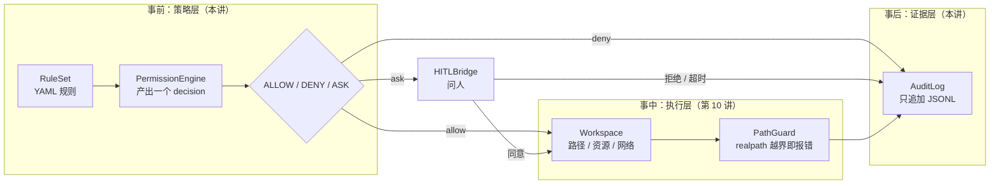
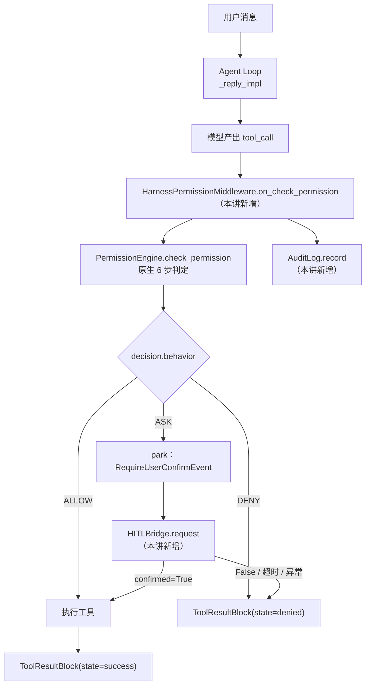
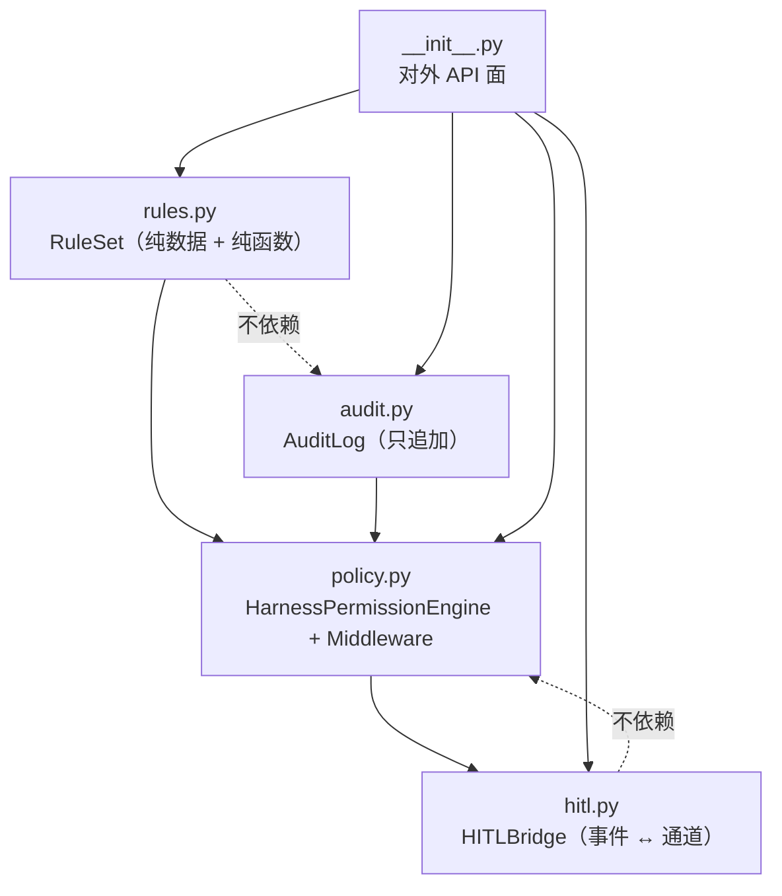
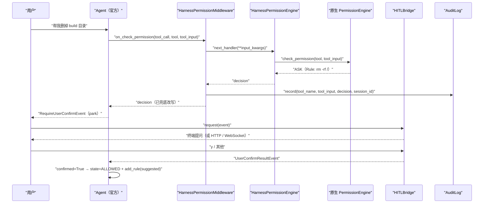
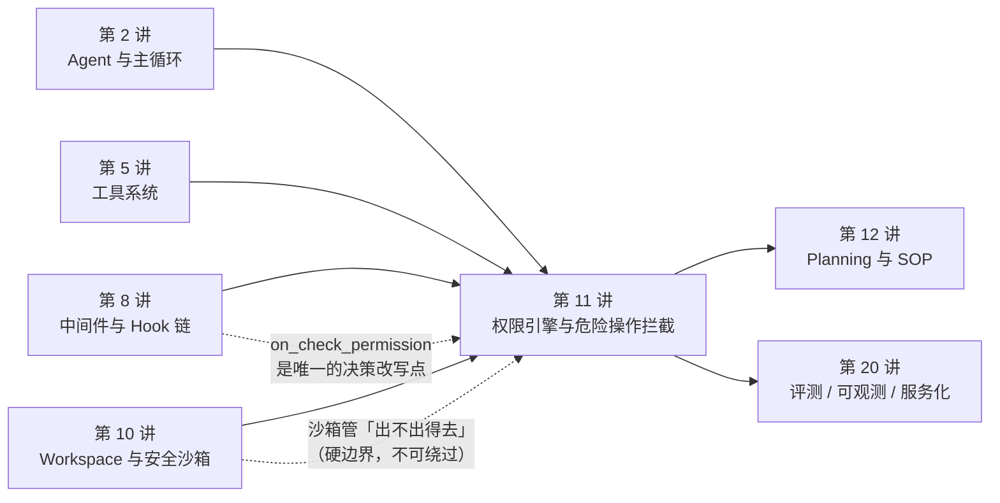

# 第 11 讲 《权限引擎：规则设计、危险操作拦截与 HITL》

> **本讲目标**：把「Agent 能不能动这台机器」这件事，从散落在提示词里的君子协定，变成**引擎级的、可审计的、失效时朝向「拒绝」的**一组策略。前半程是源码侦察：AgentScope 的 `PermissionEngine` 到底怎么判（6 步判定顺序、5 个模式各自的兜底语义、`bypass_immune` 到底是什么），以及 Bash 的危险识别在哪个模块用 tree-sitter 做 AST 分析。后半程是动手：在 `harness_kit/permission/` 里补上原生**没有**的四样东西 —— 规则文件（`RuleSet`）、兜底行为与审计（`HarnessPermissionEngine` + 中间件）、人机确认桥（`HITLBridge`）、审计日志（`AuditLog`）—— 并做出三套可直接用的角色策略：**只读助手 / 工作区可写 / 生产放行**。
> **前置要求**：第 1~10 讲全部完成（`harness_kit` 已有 `settings` / `registry` / `config` / `events` / `models` / `tools` / `middleware` / `sandbox`；`PYTHONPATH` 带上本地 ReMe 克隆的理由见第 1 讲）。**第 8 讲（中间件）与第 10 讲（Sandbox/Workspace）是硬前置**：本讲的中间件挂在第 8 讲的 `on_check_permission` 钩子上，本讲的「权限 vs 沙箱」分工一节直接引用第 10 讲的 `PolicyLocalWorkspace`。
> **本讲交付物**（相对仓库根）：
> - `tutorial_agsc_reme/reference/harness_kit/permission/rules.py`（`RuleSet`：YAML → 原生 `PermissionRule`）
> - `tutorial_agsc_reme/reference/harness_kit/permission/policy.py`（`HarnessPermissionEngine` + `HarnessPermissionMiddleware` + 三套预设）
> - `tutorial_agsc_reme/reference/harness_kit/permission/hitl.py`（`HITLBridge`：确认事件 ↔ 外部通道）
> - `tutorial_agsc_reme/reference/harness_kit/permission/audit.py`（`AuditLog`：只追加、默认只落摘要）
> - `tutorial_agsc_reme/reference/harness_kit/permission/rules/{README.md,coding.yaml,research.yaml}`（两份可直接用的规则文件）
> - `tutorial_agsc_reme/reference/harness_kit/permission/__init__.py`（对外 API 面）
> - `tutorial_agsc_reme/reference/scripts/11_permission.py`（本讲验证脚本，A~I 九段）
> - `tutorial_agsc_reme/reference/tests/test_lesson11_permission.py`（67 条 pytest）
> **预计时长**：300~360 分钟。
>
> 本讲的完整可运行代码位于 `tutorial_agsc_reme/reference/harness_kit/permission/`，
> 你可以直接对照，也可以跟着正文一行一行写。
>
> **本讲不做什么**（先划线，免得走错方向）：
> - 不自己写权限引擎 —— `HarnessPermissionEngine` 是 `agentscope.permission.PermissionEngine` 的**子类**，判定逻辑一行都没重写，只是在外面看结果；
> - 不自己实现「确认事件循环」—— 人机确认用的是 AgentScope 原生的 `RequireUserConfirmEvent` / `UserConfirmResultEvent` 往返，`HITLBridge` 只负责「怎么问人」；
> - 不碰 `third_party/` 下任何文件（只读）；
> - A~H 段验证 **0 次** LLM 调用（用第 4 讲那个离线 `EchoChatModel` 驱动真 Agent Loop）；只有 I 段（`--live`）真实调用 deepseek-flash，上限由 `ReActConfig(max_iters=3)` 钉死。

---

## 一、这一讲要解决的问题

### 1.1 一个「只读助手」把生产库删了

假设你给团队做了一个「代码库问答助手」：它挂了一堆工具 —— `Read` / `Glob` / `Grep` / `Bash` / `Write`，接进企业微信，谁都能问它问题。上线第一周很顺。第二周，有人问了一句：

> 「帮我看看 build 目录里为什么有残留，顺便清理一下。」

模型调了 `Bash`，参数是 `rm -rf build`。**没有任何东西拦住它。** 因为在你写的那份系统提示词里，你确实写了「你是一个只读助手，不要修改任何文件」—— 但提示词不是权限，它是**建议**。模型在 99% 的情况下会听，剩下 1% 的那次，就是事故。

这个场景里，真正缺的东西有三层，缺一层都不够：

| 缺什么 | 表现 | 谁来补 |
| --- | --- | --- |
| **事前的规则** | 「`rm -rf` 这类命令根本不该被执行」这条知识没有被写成一个可判定的数据 | 权限引擎的规则 |
| **没有规则命中时的默认值** | 「没写到规则里的东西」到底是放行还是拒绝？没有人定义 | 兜底行为 |
| **出事后的证据** | 那个 `rm -rf build` 到底是谁在哪个会话里放行的？查不到 | 审计日志 |

AgentScope 已经给了第一层的一半（它的 `PermissionEngine` 有 allow / deny / ask 三个规则桶和 5 个模式），但**规则只能从代码里 `add_rule()` 一条条加**，没有规则文件、没有兜底行为、没有审计。本讲就是把这三样补齐。

### 1.2 权限引擎与沙箱不是一回事（本讲最重要的一张图）

第 10 讲做的是 Sandbox/Workspace：把 Agent 关进一个目录里，路径越界就报错。很多人以为那就是权限。**不是。** 两者的分工必须说清楚，否则你会把安全生产寄托在错误的一层上：



三层的性质完全不同：

| | 权限引擎（本讲） | 沙箱 / Workspace（第 10 讲） |
| --- | --- | --- |
| 时机 | **事前**：工具还没执行 | **事中**：执行时拦 |
| 形态 | 纯数据 + 纯函数，可离线单测 | 真的碰 IO / 真的起进程 |
| 能不能被绕过 | **能**：它是策略，不是边界。`PermissionMode.BYPASS` 就是合法的绕过 | **不能**：越界就是异常，没有「模式」能让它放行 |
| 谁来消费 | Agent Loop 在调用工具前消费它 | 工具自己（`ToolBase` 里）消费它 |
| 出错的后果 | 静默放行 | 报错（吵，但安全） |

**它们唯一的接触点是 `working_directories`**：`ACCEPT_EDITS` 模式读 `PermissionContext.working_directories` 来决定「工作区内的写自动放行」，而第 10 讲的 `PolicyLocalWorkspace` 用同一个目录当沙箱根。这个设计很妙 —— 一份配置，两层都认。本讲第三节会展开。

### 1.3 四条不变式

本讲写下的每一行代码，都是为了守住下面四条。它们是这一讲的「验收标准」，第六节的每一条坑都是踩在其中某一条上：

1. **失败关闭（fail-closed）**：任何「拿不到答案」的情况 —— 超时、通道异常、返回值不是布尔、无人值守 —— 都必须落到**拒绝**，而不是放行。安全组件的默认值只能是「不」。
2. **`bypass_immune` 不可消解**：工具（例如 `Bash` 认出 `rm -rf /`）标记为 bypass-immune 的 ASK，**任何 allow 规则都不能把它变成 ALLOW**。用户写了「Bash 全部允许」也不行。
3. **规则顺序可解释**：桶间优先级恒定为 `DENY > ASK > ALLOW`；`RuleSet.order` 只在**同桶内**决定先后。这条不对称性必须能被讲清楚，否则用户会以为「写在后面的会覆盖前面的」。
4. **审计只追加、默认不落明文**：审计记录是证据，证据不能被改。且工具输入里经常带 token，默认只落 `sha256` 摘要（`hash_inputs=True`），要落明文必须显式写 `hash_inputs=False`。

### 1.4 一个反直觉的前提：`default_behavior` 只在两个模式下有效

本讲最硬的一个发现，先说结论，后面第二节用源码和实测把它钉死：

> `RuleSet.default_behavior` 的改写，**只在 `PermissionMode.DEFAULT` 与 `ACCEPT_EDITS` 下生效**。在 `EXPLORE` / `BYPASS` / `DONT_ASK` 下它是**惰性的**。

原因是：AgentScope 的原生引擎里，只有 `_check_default`（`third_party/agentscope/src/agentscope/permission/_engine.py:206`）与 `_check_accept_edits`（同文件 `:387`）这两处会产出 `decision_reason=f"Mode: {mode.value}"` 这种「我没有规则可依据，按模式兜底」的哨兵。另外三个模式的「兜底」各有自己的语义（`EXPLORE` 是「只读白名单或者拒绝」、`BYPASS` 是「一律放行」、`DONT_ASK` 是「ASK 转 DENY」），它们**不是**「没有规则命中」的另一种写法。

这件事直接决定了三套预设策略怎么写：`read_only` 用 `EXPLORE` 就不能指望 `default_behavior=deny` 起作用（它在那里本来就没用，留着是为了「模式被人改掉时仍然失败关闭」）；`production` 用 `DONT_ASK` 才有确定性的失败关闭行为。

### 1.5 本讲要交付的一张图



注意 `DEC -->|"ASK"| PARK` 这一路：**AgentScope 的 park 不是错误，是设计**。它把「这里需要一个人」这件事表示成一个事件，然后**停下来**。谁来回答？原生框架不管 —— 那是应用层的事。第 9 讲我们处理过「park 在半截 reply 上的收口」，本讲的 `HITLBridge` 是同一个 park 的**正向用法**：不是崩了，是在等人。

---

## 二、源码侦察

本节所有结论都是**我自己读源码读出来的**，每条都带 `相对仓库根路径:行号`。凡是没验证的，我会明确写「未验证」。

### 2.1 四个数据类：一个决策要被表示成什么

先把「权限」这件事拆成四个类，它们都在 `third_party/agentscope/src/agentscope/permission/` 下，加起来不到 300 行 —— **权限系统本身很小，小到你可以一晚上读完**。这很重要：它意味着你完全有能力在上层做出生产级的策略，而不需要去改它。

**① `PermissionRule`（`third_party/agentscope/src/agentscope/permission/_rule.py:8`）**

```python
class PermissionRule(BaseModel):
    tool_name: str                               # "Bash" / "Write" / "Read" / ...
    rule_content: str | None                     # 匹配模式，语义**由工具自己解释**
    behavior: PermissionBehavior                 # allow / deny / ask
    source: str                                  # "userSettings" / "projectSettings" / ...
```

注意 `rule_content` 的 docstring（`_rule.py:13-22`）写得很诚实：**它的语义取决于 `tool_name`** —— `Bash` 是「命令的子串」，`Write`/`Read` 是「path 的 glob」，其他工具是「工具自定义的过滤模式」。这句话是本讲很多设计的根源：**规则匹配不是引擎做的，是工具做的**（见 2.4）。

再看 `source`（`_rule.py:34`）：它是「这条规则从哪来」的自由文本。AgentScope 自己用 `"userSettings"` / `"projectSettings"` 这类值；我们在 `RuleSet` 里把它写成 `<文件路径>#rules[i]`，于是任何一条生效的规则都能被追回到 YAML 的第几行 —— 这是审计能讲清「是谁放的」的前提。

**② `PermissionContext`（`third_party/agentscope/src/agentscope/permission/_context.py:24`）**

```python
class PermissionContext(BaseModel):
    mode: PermissionMode = PermissionMode.DEFAULT
    working_directories: dict[str, AdditionalWorkingDirectory] = Field(default_factory=dict)
    allow_rules: dict[str, list[PermissionRule]] = Field(default_factory=dict)   # 按工具名分桶
    deny_rules:  dict[str, list[PermissionRule]] = Field(default_factory=dict)
    ask_rules:   dict[str, list[PermissionRule]] = Field(default_factory=dict)
```

这一个是**本讲所有接线工作的核心**：`Agent` 在 `__init__` 里用它造引擎（`third_party/agentscope/src/agentscope/agent/_agent.py:193`，原文是 `self._engine = PermissionEngine(self.state.permission_context)`）。所以：

> **想让一组规则生效，把配置好的 `PermissionContext` 放进 `AgentState.permission_context` 就够了。**

这就是 `harness_kit` 的规则文件能起作用的全部机制 —— 我们不需要替换 Agent 的任何东西，只需要在造 `AgentState` 的时候把 context 填对。

**③ `PermissionDecision`（`third_party/agentscope/src/agentscope/permission/_decision.py:11`）**

```python
@dataclass
class PermissionDecision:
    behavior: PermissionBehavior                 # 必填
    message: str                                 # 必填（人类可读）
    decision_reason: str | None = None           # 「为什么」
    updated_input: dict[str, Any] | None = None  # 可选：改写入参（本讲不用）
    suggested_rules: list[PermissionRule] | None = None
    bypass_immune: bool = False
```

两个字段要特别记住：

- **`decision_reason`**。它是字符串，但**不是随便的字符串** —— `_check_default` 与 `_check_accept_edits` 会在「走投无路」时写下 `f"Mode: {mode.value}"`，也就是 `"Mode: default"` / `"Mode: accept_edits"`。这个前缀是本讲唯一能识别「这个决策是兜底，不是规则命中」的信号。我在 `harness_kit` 里把它命名为**哨兵**（sentinel），常量 `MODE_FALLBACK_PREFIX = "Mode: "`。
- **`bypass_immune`**（`_decision.py:33-52` 的长注释）。它**只在 `behavior == ASK` 时有意义**，含义是：这个 ASK 危险到**不允许任何 allow 规则把它消解成 ALLOW**，用户必须在场确认。`BYPASS` 模式下它也不被强制执行（模式表里写明了）；`DONT_ASK` 模式下它会被转成 DENY。

**④ `PermissionMode`（`third_party/agentscope/src/agentscope/permission/_types.py:18`）+ `PermissionBehavior`（同文件 `:88`）**

`PermissionBehavior` 有**四个**值，不是三个：`ALLOW` / `DENY` / `ASK` / `PASSTHROUGH`。第四个是工具专用的：「我（工具）没有意见，交回引擎继续按规则判」。

`PermissionMode` 有五个值，源码里带一张表（`_types.py:19-72`）。这张表值得逐字读，因为它是「为什么预设要这么选」的**官方依据**。摘两条最要紧的：

- `BYPASS`（`_types.py:52-63`）：「跳过所有权限检查，除了用户显式配的 deny / ask 规则和工具的 DENY。**工具的安全 ASK 不被强制执行** —— 包括 `rm -rf /`、写 `~/.bashrc`、命令注入模式等等。……无人值守但仍需要安全时，**优先用 `DONT_ASK`**。」
- `DONT_ASK`（`_types.py:60-63`）：「把每一个 ASK（**包括安全 ASK 与 ASK 规则命中**）转成 DENY。无人值守的默认安全选择。」

这两句直接决定了本讲 `production` 预设的模式选择。**上游作者已经替你想过了，你要做的是读懂它、别自作聪明。**

### 2.2 判定顺序：6 步，以及哪一步先短路

`PermissionEngine.check_permission`（`third_party/agentscope/src/agentscope/permission/_engine.py:77`）按 `context.mode` 分派到 5 个 `_check_<mode>` 方法之一（`:117` / `:214` / `:297` / `:395` / `:491`）。我们只需要精读 `_check_default`（`:117`），因为它是**最完整**的一条，其他四个都是它的特化。

`_check_default` 的注释（`:126-135`）自己列出了顺序，我把它和真实行号对齐：

| 步 | 做什么 | 行号 | 短路行为 |
| --- | --- | --- | --- |
| 1 | `_check_deny_rules` | `:152`（实现 `:694`） | 命中 → 直接返回 `DENY` |
| 2 | `_check_ask_rules` | `:159`（实现 `:721`） | 命中 → 直接返回 `ASK`，并附上建议规则 |
| 3 | `_check_read_only_fast_path` | `:170`（实现 `:659`） | `tool.check_read_only(input)` 为真 → 直接 `ALLOW` |
| 4 | `tool.check_permissions(input, context)` | `:180` | 见下 |
| 5 | `_check_allow_rules` | `:196`（实现 `:748`） | 命中 → `ALLOW` |
| 6 | 模式兜底 `ASK` | `:203-208` | `decision_reason = f"Mode: {mode.value}"` |

第 4 步是本讲的核心，它的分支写得非常明确（`:174-190`）：

```python
# Step 4: Tool's own check_permissions
#   - ALLOW / DENY → returned as-is
#   - safety ASK (bypass-immune) → returned; allow rules can't override
#   - non-safety ASK / PASSTHROUGH → continue
tool_decision = await tool.check_permissions(tool_input, self.context)
if tool_decision.behavior in (PermissionBehavior.ALLOW, PermissionBehavior.DENY):
    return tool_decision                                   # :181-185
if self._is_safety_ask(tool_decision):                     # :186
    tool_decision.suggested_rules = await self._generate_suggestions(tool, tool_input)
    return tool_decision                                   # :187-191
# 否则（非安全 ASK / PASSTHROUGH）继续往下走到 Step 5、Step 6
```

`_is_safety_ask` 的实现只有一行（`:634-657`）：

```python
return decision.behavior == PermissionBehavior.ASK and decision.bypass_immune
```

**读到这里，第 1.3 节的不变式 2 就从「我们定的规矩」变成了「上游的代码事实」**：因为 `if self._is_safety_ask(...): return tool_decision` 写在 `_check_allow_rules`（Step 5）**之前**，所以 allow 规则**根本没有机会**看到这个决策。这就是为什么「配了 Bash 全部允许，`rm -rf /` 仍然会问人」。

### 2.3 那 5 个模式各自怎么兜底（本讲最容易被误解的一节）

把 5 个 `_check_<mode>` 的**最后一步**列出来，就能看清 `default_behavior` 的真实作用域：

| 模式 | 方法 | 最后一步是什么 | 有没有 `"Mode: "` 哨兵 |
| --- | --- | --- | --- |
| `DEFAULT` | `_check_default` `:117` | 兜底 `ASK`，reason=`"Mode: default"` | ✅ `:206` |
| `ACCEPT_EDITS` | `_check_accept_edits` `:297` | 兜底 `ASK`，reason=`"Mode: accept_edits"` | ✅ `:387` |
| `EXPLORE` | `_check_explore` `:214` | 只读白名单 `ALLOW`，否则 `DENY`（reason=`"Explore mode does not allow modifications"`） | ❌ |
| `BYPASS` | `_check_bypass` `:395` | 一律 `ALLOW`（reason=`"Bypass mode allows all operations"`） | ❌ |
| `DONT_ASK` | `_check_dont_ask` `:491` | ASK → DENY（`_convert_ask_to_deny` `:594`） | ❌ |

`grep -n 'Mode: ' permission/_engine.py` 只返回**两行**（`:206` 与 `:387`）—— 这就是全部证据。所以：

> **`RuleSet.default_behavior` 的改写只在 `DEFAULT` / `ACCEPT_EDITS` 下生效。** 其余三个模式下的「兜底」不是「没有规则命中」，而是这三种模式**刻意选择的语义**，改写它们等于篡改模式语义。

这个结论我用一个探针脚本实测过（`scripts/11_permission.py` 的 B 段会把它固化成可重跑的矩阵），结果与源码一致。

### 2.4 匹配是工具的职责：`match_rule` 的三种语义

引擎自己不做模式匹配。`_rule_matches`（`_engine.py:775`）是这样的：

```python
# Empty rule_content matches everything
if not rule.rule_content:                      # :798-800
    return True
return await _execute_async_or_sync_func(tool.match_rule, rule.rule_content, input_data)   # :806-810
```

两个细节：

1. **空 `rule_content` 匹配一切**（`:798-800`）。所以「整工具级放行」就是 `rule_content=None`。
2. **真正的匹配在 `tool.match_rule`**，而且用 `_execute_async_or_sync_func` 包了一层，兼容「第三方工具把 `match_rule` 写成同步 `def`」的历史写法。

各工具的 `match_rule` 语义（这是写规则文件前必须知道的）：

- **`Bash.match_rule`**（`third_party/agentscope/src/agentscope/tool/_builtin/_bash.py:396`）四种分支：
  - `rule_content is None` → 匹配一切（`:420-421`）；
  - 以 `:*` 结尾 → **前缀模式**：`"git:*"` 匹配 `"git"` 与 `"git add"`（`:426-428`）；
  - 含未转义 `*` → 转成正则通配（`:453+`），所以 `"curl * | sh"` 是通配模式；
  - 其余 → **子串匹配**（`:443-451`），所以 `"rm -rf /"` 能命中任何包含它的命令。
- **`Write.match_rule` / `Read.match_rule`**（`third_party/agentscope/src/agentscope/tool/_builtin/_write.py:174-194`）→ `fnmatch.fnmatch(file_path, rule_content)`，**比的是 `tool_input["file_path"]` 的原始字符串**。

这最后一句是本讲一个必须讲透的坑，我在第三节 3.5 展开：**`fnmatch` 只对原始字符串做匹配，所以 `<绝对路径>/**` 这种规则在 agent 传相对路径时永远匹配不上。**

### 2.5 危险命令识别：tree-sitter AST，不是正则

AgentScope 的危险命令识别在 `third_party/agentscope/src/agentscope/tool/_builtin/_bash_parser.py` 里，`BashCommandParser` 用 **tree-sitter-bash** 把命令解析成 AST 再走。四个能力：

| 方法 | 干什么 | 关键行号 |
| --- | --- | --- |
| `check_dangerous_command(command)` | 命中 `DANGEROUS_COMMANDS` 里的模式 | `_bash_parser.py:647`（词边界分支在 `:667` 起） |
| `check_injection_risk(command)` | 走 AST，遇到无法静态分析的结构就报风险 | `:862` |
| `check_sed_constraints(command)` | `sed -i` 这类原地改写单独判 | `:682` |
| `is_read_only_command(command)` | 复合命令**逐段**判，整条只读才算只读 | `:155` |
| `extract_command_prefixes(command)` | 建议规则的来源（`npm run build` → `["npm run"]`） | `:472` |

危险模式清单在 `third_party/agentscope/src/agentscope/tool/_constants.py:56`：

```python
DANGEROUS_COMMANDS = ["rm -rf", "sudo rm", "dd", "mkfs", "fdisk", "format",
                      "chmod 777", "chmod -R 777", "chown -R", "kill -9", "> /dev/"]
```

而「无法静态分析」的结构清单在 `_constants.py:85`：

```python
DANGEROUS_NODE_TYPES = {"command_substitution", "process_substitution", "expansion",
                        "subshell", "for_statement", "while_statement", "until_statement",
                        "if_statement", "case_statement", "function_definition", "test_command"}
```

**一个必须记住的实现细节**：`DANGEROUS_COMMANDS` 里既有 `"rm -rf"`（含空格）也有 `"dd"` / `"format"`（单个短词）。如果对后者用子串匹配，`"git add ."` 会因为含 `dd` 被误判、`"mkdir -p x"` 同理 —— 这会把检查变成噪音，用户很快就去关掉它。所以实现里对「长度 ≤ 4 的单字模式」走**词边界**（`\b`）匹配（`_bash_parser.py:669`）。D 段实测确认了这一点。

最后，`Bash.check_permissions`（`third_party/agentscope/src/agentscope/tool/_builtin/_bash.py:204`）把上面这些能力**翻译成 decision**，本讲用到的两条：

- 只读命令 → `ALLOW`（reason=`"Read-only command is allowed"`，`:274`，非 bypass-immune）；
- 危险命令 → `ASK` **且 `bypass_immune=True`**（reason=`"Safety check: dangerous command pattern detected"`，`:284`）。

顺带把 `Bash.check_permissions` 会产出的**五类安全 ASK** 都列一下（reason 都在 `_bash.py` 里），因为它们是「工具自己的意见」的全部内容，也是 `bypass_immune` 的唯一来源：

| 触发条件 | reason 前缀 | 行号 |
| --- | --- | --- |
| 命令含动态结构（注入风险） | `"Safety check: command contains dynamic ..."` | `:264` |
| 命中 `DANGEROUS_COMMANDS` | `"Safety check: dangerous command pattern ..."` | `:284` |
| `sed -i` 原地改写 | `"Safety check: sed in-place modification ..."` | `:298` |
| 目标是危险文件 / 目录 | `"Safety check: dangerous file or ..."` | `:312` |
| 删除危险路径 | `"Safety check: dangerous removal of ..."` | `:330` |

### 2.6 危险目录 / 危险文件：工具自己的第二道闸

除了命令解析，工具层还有一份「危险路径」清单（`third_party/agentscope/src/agentscope/tool/_builtin/_write.py:142-155` 一带）：

- 写工作目录内的普通文件 → `ALLOW`（reason=`"File is in working directory and not a dangerous file or directory"`），判定走 `ToolBase._path_in_allowed_working_path`（`third_party/agentscope/src/agentscope/tool/_base.py:390`），内部用 `os.path.realpath` 解析（`:422`、`:425`）；
- 写危险路径（`.env`、`~/.ssh/id_rsa` 之类）→ `ASK` **且 bypass-immune**。

这两条是 `workspace_write` 预设「区内放行、危险文件仍然问」的全部依据。

### 2.7 人机确认：park 与 resume 的完整往返

AgentScope 把「需要人确认」表示成一个事件的往返，链路是这样：

1. Agent 在 `_acting_impl` 里对每个工具调用调 `_check_permission`（`third_party/agentscope/src/agentscope/agent/_agent.py:2378` 起）。它是**中间件洋葱**：`execute_chain` 把 `{"tool_call", "tool", "tool_input"}` 传给每一层的 `on_check_permission`，最内层落到 `_check_permission_impl`（`:2408`）。
2. `_check_permission_impl` 的第一句话是「已确认的直接短路」（`:2430`）：
   ```python
   if tool_call.state == ToolCallState.ALLOWED:
       return PermissionDecision(behavior=PermissionBehavior.ALLOW,
                                 message="Already allowed by user confirmation.")
   ```
3. 决策是 `ASK` 时，Agent 把 `tool_call.state` 置为 `asking`，`yield RequireUserConfirmEvent(reply_id=..., tool_calls=[tool_call])`，然后**停下**。这就是本讲反复说的 **park**。
4. 应用层（我们）构造 `UserConfirmResultEvent(reply_id=..., confirm_results=[...])` 再喂回 `agent.reply_stream(...)` 或 `agent.reply(...)`。
5. Agent 侧的处理入口在 `_agent.py:1958`（`if isinstance(event, UserConfirmResultEvent):`）：对每个 `confirm_results` 里的条目，`confirmed=True` → `_update_tool_call_state(..., ALLOWED)` + 把 `rules` 里的规则 `self._engine.add_rule(rule)`；`confirmed=False` → `ToolResultState.DENIED`。

**一个必须知道的宽松点**：`_check_incoming_event`（`_agent.py:1894`）只校验「你回传的 id 是等待中的 id 之一」（`:1903` 那一行的集合构造），**不要求「每一个等待中的 id 都有结果」**。也就是说，如果你回传 3 条里只给了 1 条，Agent **不会报错** —— 它会安静地卡在那个 `asking` 状态上，下次你发消息时它还在等。这不是 bug，是「宽容的协议」；但它意味着**失败关闭的责任在应用层**：`HITLBridge.request` 用 `for index, tool_call in enumerate(event.tool_calls)` 逐个提问，从而保证**结果条数恒等于待确认条数**。

### 2.8 中间件钩子：为什么本讲必须用第 8 讲的东西

`on_check_permission` 定义在 `third_party/agentscope/src/agentscope/middleware/_base.py:170`，签名是：

```python
async def on_check_permission(
    self,
    agent: "Agent",
    input_kwargs: dict,                                     # {"tool_call", "tool", "tool_input"}
    next_handler: Callable[..., Awaitable["PermissionDecision"]],
) -> "PermissionDecision":
```

它的 docstring 说明了三件事，本讲的实现全部依赖它们：

1. 「在工具已解析、输入已校验之后，在决策被消费之前」运行（`_base.py:178-180`）；
2. 「中间件可以委托 `next_handler(**input_kwargs)`、替换返回值、或者不委托直接返回」（`:182-185`）；
3. 「**链路收到的是 `tool_call` / `tool_input` 的副本**，改副本不影响最终调用」（`:187-192`）。

第 3 条决定了 `HarnessPermissionMiddleware` **不做输入改写** —— 改写输入是第 10 讲 `harness_kit.middleware.guards` 的职责。

而 `Agent.__init__` 会把实现了 `on_check_permission` 的中间件筛出来组建这条链（`_agent.py:2378` 那一段 `execute_chain` 的上文），所以**中间件是通过 `Agent(..., middlewares=[...])` 传进去的，`Toolkit` 上没有注册中间件的方法**。这条看起来是废话，但我在写参考实现时真的按直觉写成了 `toolkit.register_middleware(mw)` 并因此报错 —— 它进了第六节的排查表。

### 2.9 诚实清单：AgentScope **没有**提供什么

这一节和上面每一节同样重要。以下四件事我逐条 grep 过源码，确认原生**没有**：

| 缺失能力 | 证据 | 本讲的补法 |
| --- | --- | --- |
| **规则文件** | 加规则只有 `PermissionEngine.add_rule(rule)` 一个入口（`_engine.py:49`）；全文没有 YAML / JSON 装载 | `RuleSet.from_yaml` → 展开成原生 `PermissionRule` 后 `add_rule` |
| **兜底行为可配置** | Step 6 写死 `behavior=ASK`（`_engine.py:203-207`），没有参数 | `RuleSet.default_behavior` + 哨兵识别 |
| **审计日志** | `permission/` 下没有任何落盘代码 | `AuditLog`（只追加 JSONL） |
| **确认事件的宿主** | `RequireUserConfirmEvent` 只被 `yield`，框架不管谁来回答 | `HITLBridge`（终端 / HTTP / 超时） |

换句话说：**AgentScope 给了你一个判定内核和一个事件协议，策略的全部「外部世界」都是你的**。本讲就是把这层外部世界补成可复用的组件。

### 2.10 本讲用到的扩展点清单（一句话一个）

| 扩展点 | 类型 | 文件:行 | 我们怎么用 |
| --- | --- | --- | --- |
| `PermissionEngine` | 类（可子类化） | `permission/_engine.py:17` | `HarnessPermissionEngine` 继承它，覆写 `check_permission` |
| `PermissionEngine.add_rule(rule)` | 方法 | `permission/_engine.py:49` | 把 `RuleSet` 展开出的原生规则注进 context |
| `PermissionEngine.check_permission(tool, tool_input)` | 方法（**签名不可改**） | `permission/_engine.py:77` | 契约 §3.11 要求保持 |
| `PermissionContext` | Pydantic 模型 | `permission/_context.py:24` | 规则桶 + `working_directories` 的载体 |
| `PermissionDecision` | dataclass | `permission/_decision.py:11` | 改写 `behavior` / 读 `decision_reason` 哨兵 |
| `PermissionRule` | Pydantic 模型 | `permission/_rule.py:8` | `RuleSet` 的展开产物 |
| `PermissionMode` / `PermissionBehavior` | Enum | `permission/_types.py:18` / `:88` | 预设策略的取值 |
| `ToolBase.match_rule` | 异步方法（工具覆写） | `tool/_base.py:322` | 规则匹配语义由它决定（`Bash` / `Write` 不同） |
| `ToolBase.check_permissions` | 抽象异步方法 | `tool/_base.py:265-266` | 工具自己的意见 + `bypass_immune` |
| `ToolBase.check_read_only` | 异步方法 | `tool/_base.py:298` | Step 3 只读快路径 |
| `ToolBase.generate_suggestions` | 异步方法 | `tool/_base.py:355` | 建议规则（HITL 里「下次别再问」的来源） |
| `BashCommandParser` | 类 | `tool/_builtin/_bash_parser.py` | 危险命令 / 注入风险 / 只读判定 |
| `Bash.check_permissions` | 方法 | `tool/_builtin/_bash.py:275` 起 | 安全 ASK（bypass-immune）的来源 |
| `MiddlewareBase.on_check_permission` | 异步钩子 | `middleware/_base.py:170` | `HarnessPermissionMiddleware` 的挂载点 |
| `AgentState.permission_context` | 字段 | `state/_state.py`，被 `agent/_agent.py:193` 消费 | 规则进入 Agent 的唯一通道 |
| `RequireUserConfirmEvent` | 事件模型 | `event/_event.py:443` | park 的载体 |
| `UserConfirmResultEvent` + `ConfirmResult` | 事件模型 | `event/_event.py`（`ConfirmResult` 见 `:1958` 处消费） | resume 的载体 |
| `Agent.reply_stream` / `Agent.reply` | 方法 | `agent/_agent.py` | 驱动 park → resume 的循环 |

---

## 三、扩展点定位与设计

### 3.1 我们能挂上去的扩展点（全部是官方已有的）

第二节已经列了清单，这里只把「**本讲真正挂上去的 4 个**」单独拎出来，其余都是**读**而不是**挂**：

| # | 挂在哪 | 官方类型 | 官方文件:行 | 我们写了什么 |
| --- | --- | --- | --- | --- |
| 1 | 规则的产生 | `PermissionRule`（数据类） | `permission/_rule.py:8` | `RuleSet.from_yaml` → 展开成 N 条原生规则 |
| 2 | 判定的外部包装 | `PermissionEngine`（可子类化） | `permission/_engine.py:17` | `HarnessPermissionEngine`（覆写 `check_permission`） |
| 3 | 循环内的钩子 | `MiddlewareBase.on_check_permission` | `middleware/_base.py:170` | `HarnessPermissionMiddleware` |
| 4 | 确认事件的宿主 | `RequireUserConfirmEvent` / `UserConfirmResultEvent` | `event/_event.py:443` 起 | `HITLBridge.request(...) -> UserConfirmResultEvent` |

**没有任何一处我们重写了官方能力**：判定顺序是官方的、模式语义是官方的、事件往返是官方的、危险命令识别是官方的。我们写的四样东西，对应的是第二节 2.9 那张「官方没有提供什么」的表 —— **一一对应，一个不多**。

### 3.2 设计：四个文件，只允许上层依赖下层



依赖是**单向**的：`rules.py` 不认识 `policy.py`，`audit.py` 不认识 `policy.py`，`hitl.py` 谁也不认识（它只碰 AgentScope 的事件模型）。三个好处：

1. **`RuleSet` 可以脱离 Agent 单测**。规则展开、合并、前缀校验全是纯函数，不需要事件循环、不需要 Agent。
2. **`AuditLog` 可以脱离权限单测**。它就是「往 JSONL 追加一行」，`record` 的入参是 `PermissionDecision`，这个类型是 AgentScope 的、不是我们的。
3. **`HITLBridge` 可以脱离权限单测**。它拿到的是「一堆待确认的 tool call」，返回的是「一堆确认结果」—— 只要事件构造得出来，就能测超时、测异常、测非布尔。

唯一的**反向**依赖是 `policy.py` 用到 `audit.RuleSet` 与 `audit.AuditLog`（箭头方向），这是合理的：策略层是「把规则、兜底、审计组装起来」的那一层。

### 3.3 `rules.py`：为什么不是「一个 YAML 条目 = 一条原生规则」

契约 §3.11 给了 `RuleSet` 的签名：

```python
class RuleSet(BaseModel):
    order: int = 100
    default_behavior: PermissionBehavior = PermissionBehavior.ASK
    rules: list[PermissionRule] = Field(default_factory=list)
    @classmethod
    def from_yaml(cls, path: Path) -> "RuleSet": ...
    def merge(self, other: "RuleSet") -> "RuleSet": ...   # other.order 更小则 other 优先
```

注意 `rules` 的类型：**`list[PermissionRule]`，原生类型**。这意味着 `RuleSet` 不是「另一套规则模型」，而是「原生规则的容器 + 一个装载器」。这个决定带来一个直接后果：

> **原生 `PermissionRule` 一条只能带一个 `rule_content`，所以 YAML 里的一条 `deny_patterns: [a, b, c]` 必须展开成 3 条原生规则。**

于是 YAML 层的形状是**写起来舒服**的（一个工具一个条目、几个 list），而内存层的形状是**引擎能吃的**（扁平的 N 条）。中间那个展开函数 `_YamlRule.to_rules(source)` 就是本模块最核心的 20 行。

YAML 的字段设计（`rules.py` 的 `_YamlRule`）：

```yaml
- tool: "Bash"                              # 必填
  behavior: "deny"                          # 必填：allow / deny / ask
  rule_content: "git push --force"          # 可选：写死一个模式（最通用）
  # 或者用「前缀化的 list」，一条条目展开成多条原生规则：
  deny_paths: [".env", "*.pem", "**/id_rsa"]
  deny_patterns: ["rm -rf /", "chmod 777"]
  ask_paths: []
  ask_patterns: []
  allow_paths: []
  allow_patterns: []
  note: "为什么写这条"                        # 可选：给人看的
```

**一个刻意的啰嗦设计**：`deny_paths` / `deny_patterns` / `ask_paths` / `ask_patterns` / `allow_paths` / `allow_patterns` 这六个字段名里的前缀**必须**与 `behavior` 一致。如果 `behavior: deny` 却写了 `allow_paths: [...]`，`_YamlRule` 的 `model_validator` 会**直接拒绝装载**（`rules.py` 的 `_check_behavior_prefix`）。

为什么值得为这个写一个校验器？因为**写错前缀是「策略与意图相反」的典型**：作者想拒绝，最后落地的是一条 allow 规则，而引擎不会报错、日志不会响 —— 它会安静地放开一个本该拦住的路径。这就是第 1.3 节说的「权限组件的失效模式是静默放行」，所以我们宁可让它**更吵**。

### 3.4 `rules.py` 的第二个设计：哨兵识别

`resolve_fallback(decision, *, mode)` 是本模块唯一「懂引擎内部」的地方：

```python
if not is_mode_fallback(decision, mode):
    return decision                    # 不是兜底 → 原样返回
if decision.behavior is self.default_behavior:
    return decision                    # 已经是目标行为 → 不动
...                                    # 否则改写 behavior + 重写 reason
```

而 `is_mode_fallback` 的全部逻辑就是「`decision_reason` 是否恰好等于 `f"Mode: {mode.value}"`」：

```python
MODE_FALLBACK_PREFIX = "Mode: "
def is_mode_fallback(decision, mode) -> bool:
    return decision.decision_reason == f"{MODE_FALLBACK_PREFIX}{mode.value}"
```

**为什么用字符串而不是改引擎**：如果我们在 `HarnessPermissionEngine` 里重写 `_check_default` 来注入 `default_behavior`，那 5 个模式的策略就被复制到了我们代码里；上游改一处（例如给 `EXPLORE` 加个新白名单），两边就漂移了。用「**站在外面看结果**」的方式（比对哨兵），则天然跟随上游 —— 上游一旦新增/删除哨兵，我们的行为**自动**跟着变，而且第二节那张表就是它的文档。

这是我在这套教程里最想让你带走的一条工程直觉：**能用「观察输出」做到的扩展，就不要用「覆盖实现」去做。**

### 3.5 那个 glob 规则的陷阱：为什么工作区要用 `working_directories`

`workspace_write` 预设要给 agent 一个「可写目录」。最直觉的写法是加一条规则：

```yaml
- tool: "Write"
  behavior: allow
  allow_paths: ["/Users/me/project/**"]     # ← 这样是**不工作的**
```

**它不工作，而且不报错。** 原因在第二节 2.4：`Write.match_rule` 是 `fnmatch.fnmatch(file_path, rule_content)`（`tool/_builtin/_write.py:194`），而 `file_path` 是 **`tool_input["file_path"]` 的原始字符串**。agent 传的是 `"notes.md"` 或 `"./src/a.py"`（相对路径），`fnmatch("notes.md", "/Users/me/project/**")` 永远是 `False`。

正确的机制是 `PermissionContext.working_directories`：

```python
root = Path(workspace_root).expanduser().resolve()
context = PermissionContext(mode=PermissionMode.ACCEPT_EDITS)
context.working_directories[str(root)] = AdditionalWorkingDirectory(
    path=str(root),
    source="harness_kit:preset:workspace_write",
)
```

它由 `Write.check_permissions` 通过 `ToolBase._path_in_allowed_working_path` 消费（`tool/_base.py:390`），内部是 `os.path.realpath(os.path.expanduser(file_path))`（`:422`）与 `os.path.realpath(working_dir)`（`:425`）**比对绝对路径**。于是：

- 相对路径会被 `realpath` 解析成绝对路径再比 → 能匹配上；
- macOS 上 `/tmp` → `/private/tmp` 的符号链接问题被顺手解决（`realpath` 两边都跑，结论一致）；
- 一份配置同时被**权限层**（`ACCEPT_EDITS` 自动放行）与**沙箱层**（第 10 讲把同一个目录当 workspace 根）认。

这个坑的教训值得单独记一条：**「正则 / glob 匹配原始字符串」和「路径判定」是两件事**。前者是文本处理，后者是文件系统语义。把后者写成前者，就是上面这条不报错的失效。

### 3.6 `policy.py`：为什么需要「引擎 + 中间件」两个类

先看清一个事实（第二节 2.1 已经引过）：`Agent.__init__` 自己造引擎，用的是 `state.permission_context`：

```python
self._engine = PermissionEngine(self.state.permission_context)   # agent/_agent.py:193
```

于是：

- 想**规则生效** → 把 context 填对就行（`HarnessBuilder` 已经在做）；
- 想**兜底行为与审计生效** → 光有 context 不够。原生引擎不认识 `default_behavior` 这个概念，`check_permission(tool, tool_input)` 的签名里也没有会话 id（审计要用）。

所以本模块给出**两条互补的接线路径**，它们共用同一份 `RuleSet` 与同一个 `AuditLog`：

| 类 | 用在哪 | 怎么用 | 为什么需要它 |
| --- | --- | --- | --- |
| `HarnessPermissionEngine` | **引擎外面**：CLI 的 `harness check`、评测预检、单测 | `await engine.check_permission(tool, input)` | 需要一个「不启动 Agent 也能拿到带兜底、有审计的决策」的入口 |
| `HarnessPermissionMiddleware` | **Agent 循环里** | `Agent(..., middlewares=[HarnessPermissionMiddleware(engine=...)])` | 需要拦截真实调用；而且只有它能拿到 `agent.state.session_id` |

第二条路径的关键在于：中间件拿到的是 `next_handler(**input_kwargs)` 的返回值 —— 也就是**原生引擎已经算好的决策**。它做的事只有两件：

```python
decision = await next_handler(**input_kwargs)               # 原生判定，一行没改
if self.skip_if_confirmed and getattr(tool_call, "state", None) == "allowed":
    return decision                                          # 用户已确认过 → 不重复改写/审计
self.checks_seen += 1
resolved = self.engine.apply_default_behavior(decision)      # 兜底改写
if self.engine.audit is not None:
    await self.engine.audit.record(tool_name=..., tool_input=..., decision=resolved,
                                   session_id=self._session_id(agent))
return resolved
```

`skip_if_confirmed` 那个分支不是优化，是**正确性**：因为 AgentScope 对「已确认」的调用会短路成 `ALLOW`（`agent/_agent.py:2430`），如果中间件再改一次、再审计一次，同一次调用会出现**两条互相矛盾**的审计记录（一条「被拒绝」、一条「被允许」）。审计里出现自相矛盾的记录，比没有审计更糟。

### 3.7 `apply_default_behavior` 的生效范围：如实写在文档里

`apply_default_behavior(decision)` 只做一件事：拿**优先级最高**（`order` 最小）的那个规则集的 `default_behavior`，调 `resolve_fallback`。

「只用优先级最高那个」是个刻意的选择。如果改成「从高到低挨个试」，就会出现「最高优先级说 ASK、次高说 DENY，结果兜底成了 DENY」——这与 `default_behavior` 属性自己声明的「取 order 最小者」**自相矛盾**。一个配置项只能有一个值，这也是为什么 `default_behavior` 是 `RuleSet` 的字段而不是每个规则的字段。

而它的生效范围，我在实现里**如实列了 4 条不生效的情况**（源码见 `harness_kit/permission/policy.py` 的 `apply_default_behavior` docstring）：

| # | 什么情况下 `default_behavior` 不生效 | 为什么这样是对的 |
| --- | --- | --- |
| 1 | 有 DENY / ASK / ALLOW 规则命中 | 规则优先，本来就该如此 |
| 2 | 只读操作走了快路径（`decision_reason="Read-only operations are auto-allowed"`，`_engine.py:690`） | 这是模式的既定语义 —— `default_behavior: deny` **不该**把 `Read` 拦掉 |
| 3 | 工具的 `check_permissions` 直接给了 ALLOW / DENY | 工具比规则更懂自己 |
| 4 | 模式是 `EXPLORE` / `BYPASS` / `DONT_ASK` | 它们的兜底不是「没有规则命中」（第二节 2.3） |

第 4 条就是第 1.4 节那个反直觉结论的落点。**把它写进 docstring 而不是藏起来，是这一讲我最想演示的一件事**：一个「兜底行为」如果在半个模式表上是惰性的，用户不知道就会写出「我明明配了 deny 兜底，为什么还是有东西被放行」的事故。

### 3.8 三套预设策略：每一个选择都要能说出「为什么不是别的」

`preset_engine(name, *, audit=None, workspace_root=None, extra_rulesets=None)` 造三套策略。它们的取舍如下 —— **这一段是本讲的「策略设计」正文**，每个模式选择都引官方模式表：

| 预设 | 模式 | 为什么是它 | 兜底 | 额外规则 |
| --- | --- | --- | --- | --- |
| `read_only`（只读助手） | `EXPLORE` | 原生在 `EXPLORE` 下**跳过** `tool.check_permissions`，直接按只读/可写分流（`_engine.py:214` 的方法 + `:231` 的注释），修改类工具一律 DENY。这正是「只读」的定义 | `DENY` | `Write` / `Edit` 整工具 DENY + `Bash` deny `"rm "` |
| `workspace_write`（工作区可写） | `ACCEPT_EDITS` | 工作目录内的读写自动放行，其余按规则（模式表 `_types.py:44-49`）。它是唯一「既让人干活、又有关卡」的模式 | `ASK` | deny `"git push --force"` + `working_directories` 注册 |
| `production`（生产放行） | `DONT_ASK` | 模式表原文：「把每一个 ASK（包括安全 ASK）转成 DENY。无人值守的默认安全选择」（`_types.py:60-63`）。同一张表还写了「无人值守时**优先用 DONT_ASK** 而不是 BYPASS」 | `DENY` | allow `Read`/`Glob`/`Grep` + deny `"rm -rf /"` + ask `"curl "` |

三个「为什么不选别的」值得展开：

**① `read_only` 为什么用 `EXPLORE` 而不是「`DEFAULT` + 一堆 deny 规则」？**
因为「只读」是一个**白名单概念**，不是黑名单概念。用 `DEFAULT` + deny 规则，你必须把所有可写工具、所有可写命令都枚举完，漏一个就是漏洞；`EXPLORE` 反过来，它只放行「被认定为只读」的东西，其余一律 DENY。**安全默认值应该用白名单表达。**

**② `production` 为什么用 `DONT_ASK` 而不是 `BYPASS`？**
`BYPASS` 的语义是「跳过所有检查，包括工具的安全 ASK」—— 模式表诚实写明了它连 `rm -rf /` 都不拦（`_types.py:52-63`）。而 `DONT_ASK` 把 ASK 转成 DENY，是**失败关闭**的。无人值守场景要的正是后者。C 段的 C2 小节把这两个模式的差异实测成了两行输出。

**③ `workspace_write` 的兜底为什么保持 `ASK` 而不是 `DENY`？**
因为它**有人在**。这个预设的定位是「交互式开发」：区内自动、区外问人。「问」在这里不是风险，是**功能** —— 如果兜底成 `DENY`，用户就失去了「临时允许一次越界操作」的能力，只能改配置重启。

### 3.9 `hitl.py`：只做「怎么问人」，不做「什么时候问」

契约 §3.11 的签名：

```python
class HITLBridge:
    def __init__(self, *, bus, timeout_s: float = 300.0, prompter: Prompter | None = None) -> None: ...
    async def request(self, event: RequireUserConfirmEvent) -> UserConfirmResultEvent: ...
Prompter = Callable[[str], Awaitable[bool]]
class ConfirmationTimeout(RuntimeError): ...
```

实现里加了两个可选参数（都在默认值下保持契约写法可用）：`session_id`（只用于日志/事件）与 `seq`（发给总线的事件序号）。`bus` 在契约里是必填的 `EventBus`，但实现把它按结构类型接收并允许 `None` —— 因为总线只服务**可观测性**（让人看到「有一次确认在等人」），不参与判定，缺了它不影响正确性。这是**有意的降级**，不是偷懒。

`request` 的骨架只有 10 行：

```python
await self._publish_pending(event)
results = []
for index, tool_call in enumerate(event.tool_calls):          # ← 关键：逐个，不跳过
    confirmed = await self._ask_one(index, len(event.tool_calls), tool_call)
    results.append(ConfirmResult(
        confirmed=confirmed,
        tool_call=tool_call,
        rules=list(tool_call.suggested_rules) if confirmed and tool_call.suggested_rules else None,
    ))
return UserConfirmResultEvent(reply_id=event.reply_id, confirm_results=results)
```

三个设计点：

1. **`for ... enumerate(event.tool_calls)`**：结果条数**恒等于**待确认条数。理由在第二节 2.7 —— `_check_incoming_event` 不要求「每个等待中的 id 都有结果」，少发一条不会报错，只会让会话永久卡在 `asking`。
2. **只在 `confirmed=True` 时带上 `rules`**：拒绝的场景下把建议规则塞进去，会让「拒绝」这条反馈**意外地扩大权限**（Agent 侧 `add_rule` 只看 `rules` 非空）。这是反直觉的、也是必须写死在代码里的。
3. **`_ask_one` 的失败关闭**：

```python
self.prompts += 1
try:
    async with asyncio.timeout(self.timeout_s):
        answer = await self.prompter(question)
except TimeoutError:                 # 超时
    self.timeouts += 1
    return False
except asyncio.CancelledError:       # 被取消：先按拒绝收场，再如实抛出
    raise
except Exception:                    # 通道异常（WebSocket 断了、HTTP 500）
    return False
return bool(answer)                  # 非布尔 → 按 bool() 解释，None / "" 都是拒绝
```

`CancelledError` 那一支值得单独说：任务被取消同样意味着「没人确认过」，所以**语义上是拒绝**；但 `CancelledError` **必须继续抛**，吞掉它会破坏调用方的结构化并发（`asyncio.gather` 的取消传播）。所以那里先打 warning 再 `raise`。

`asyncio.timeout` 会抛内建的 `TimeoutError`（Python 3.11+ 起 `asyncio.TimeoutError` 就是 `TimeoutError` 的别名）。契约里的 `ConfirmationTimeout` 是给**应用层**用的：当你想把「超时」当异常向外传播、而不是静默拒绝时，用它包一层。实现把它定义成 `RuntimeError` 的子类，这样「统一兜住 RuntimeError」的上层也能接住它。

### 3.10 `audit.py`：只追加，默认只落摘要

契约 §3.11：

```python
class AuditLog:
    def __init__(self, path: Path, *, hash_inputs: bool = True) -> None: ...
    async def record(self, *, tool_name, tool_input, decision, session_id) -> None: ...
    async def read(self, *, session_id: str | None = None, limit: int = 100) -> list[AuditEntry]: ...
class AuditEntry(BaseModel):
    ts: datetime; session_id: str; tool_name: str
    input_digest: str; behavior: PermissionBehavior; reason: str
```

实现加了三个字段（都有默认值，不破坏契约）：`mode: str = ""`、`bypass_immune: bool = False`，以及 `AuditEntry` 的 `extra="forbid"`。

三条硬性质：

**① 只追加。** 类上**没有** `update` / `delete` / `clear` 任何方法（G 段会把公开成员打出来自证：`['aclose', 'describe', 'entries_written', 'hash_inputs', 'path', 'read', 'record', 'tail']`）。落盘用第 9 讲的 `jsonl_store._append_plain_line(path, line, fsync=True)` —— 一行一条、带 `fsync`。审计记录是证据，证据不能被改。

**② 默认只落摘要。** `hash_inputs=True` 时落的是 `digest_input(tool_input)`：

```python
canonical = json.dumps(tool_input, sort_keys=True, ensure_ascii=False,
                       default=str, separators=(",", ":"))
return "sha256:" + hashlib.sha256(canonical.encode("utf-8")).hexdigest()
```

`sort_keys=True` + 固定 `separators` 保证**确定性**：事后拿一个候选输入重算，能得到同一个值，于是可以回答「当时放行的到底是不是这条命令」——**而无需把原文落盘**。工具输入里经常带 token / 密码（本讲的 walkthrough 就用了一个假 token 演示），把原文写进日志是最常见的「审计系统自己成了泄漏点」。

`hash_inputs=False` 是**调试开关**，不是生产选项：构造时会打一条 WARNING 明确说「会把原始输入写入 <path>；可能含密钥/token，请仅在本地调试时使用」。

**③ `read` 的两个维度。** `session_id` 过滤 + `limit` 取**最近** N 条（内部用 `deque(maxlen=limit)`，所以是尾部窗口而不是前 N 条）。`mode` 字段是从 `decision_reason` 里的哨兵解析出来的（`_mode_of`），这样审计表上能直接按「当时是什么模式」聚合。

### 3.11 接线全景图



**这张图里没有一处是我们自己实现的事件循环。** 我们只提供了「问谁」「怎么记」「没规则时怎么办」这三件事的答案。

---

## 四、harness_kit 实现

### 4.0 目录与阅读顺序

```text
tutorial_agsc_reme/reference/harness_kit/permission/
├── rules.py         # RuleSet：YAML → 原生 PermissionRule（纯数据 + 纯函数）
├── policy.py        # HarnessPermissionEngine + HarnessPermissionMiddleware + 三套预设
├── hitl.py          # HITLBridge：确认事件 ↔ 外部通道
├── audit.py         # AuditLog + AuditEntry + digest_input
├── rules/
│   ├── README.md    # 规则文件怎么写的说明书（含 glob 语义陷阱）
│   ├── coding.yaml  # 编码场景：读全放行、机密文件拒写、危险命令拒跑
│   └── research.yaml# 研究场景：更保守的一版（写要问、Bash 一律问）
└── __init__.py      # 对外 API 面
```

**阅读顺序建议**：`rules.py` → `audit.py` → `policy.py` → `hitl.py` → `__init__.py`。

理由是依赖关系：`rules.py` 只依赖 AgentScope 的四个数据类，是整讲的「地基」；`audit.py` 只依赖 `PermissionDecision`；读懂这两个之后，`policy.py` 就只是「把它们组装起来 + 一条中间件」；`hitl.py` 是独立的第三个子系统（人机确认），放在最后读不会打乱前面的思路。

**关于目录里那个 `rules/` 子目录**：它和 `rules.py` 同名共存是刻意的。Python 里 `harness_kit/permission/rules.py` 与 `harness_kit/permission/rules/` 不会冲突 —— **前提是 `rules/` 里不能有 `__init__.py`**（有的话它就成了包，`import harness_kit.permission.rules` 的解析结果会变成包，`RuleSet` 就从 `rules.py` 里消失了）。这条写进了 `rules/README.md` 的第一段，因为它是我在写参考实现时**真的踩到**的（第六节排查表第 7 条）。

以下五个 `rules*.py` / `policy.py` / `hitl.py` / `audit.py` / `__init__.py` 与规则文件，都是**完整源码**，与 `tutorial_agsc_reme/reference/harness_kit/permission/` 下的文件逐字一致。第五节会演示怎么把它们从本文档里抽出来、落到一个干净目录里直接跑。

### 4.1 `rules.py`：YAML → 原生规则（纯数据 + 纯函数）

**文件：`tutorial_agsc_reme/reference/harness_kit/permission/rules.py`**（488 行）

```python
# -*- coding: utf-8 -*-
"""权限规则与规则集（契约 §3.11 / §5.5，第 11 讲）。

**AgentScope 缺的到底是什么**

AgentScope 的权限系统本身是完整的：:class:`~agentscope.permission.PermissionEngine`
（``third_party/agentscope/src/agentscope/permission/_engine.py:17``）按 5 种模式分派，
:class:`~agentscope.permission.PermissionRule`（``.../_rule.py:8``）描述单条规则，
:class:`~agentscope.permission.PermissionDecision`（``.../_decision.py:11``）是决策结果。
**规则只能通过 Python 代码 ``engine.add_rule(...)`` 加进去** —— 没有任何"从磁盘读规则文件"
的入口（``.../_engine.py:49`` 的 ``add_rule`` 是唯一入口）。于是"换一套权限策略"
就等于"改代码"，这在企业里不可接受。

本模块补的就是这一层：**YAML 规则文件 → ``RuleSet`` → 原生 ``PermissionRule`` 列表**。

**为什么不自定义规则类型**

:class:`~agentscope.permission.PermissionRule` 的匹配语义**由工具自己决定**
（``.../_engine.py:21`` 的类 docstring，实现见 ``_rule_matches``，``.../_engine.py:775``）：
``Bash`` 工具把 ``rule_content`` 当成命令的**子串**匹配，``Write``/``Read`` 当成路径的
**glob**。自定义一个字段更多的规则类，就得让每个工具认识它 —— 那是重写内核。
所以 :class:`RuleSet` 里装的**就是原生规则对象**，只是"怎么写出来"由我们负责。

**YAML 的紧凑形态**

原生一条 ``PermissionRule`` 只能表达**一个** ``rule_content``。而人写规则时想表达的
往往是"这一组模式都拒绝"：

.. code-block:: yaml

    order: 10
    default_behavior: ask
    rules:
      - tool: "Bash"
        behavior: deny
        deny_patterns: ["rm -rf /", "git push --force", "curl * | sh"]
      - tool: "Read"
        behavior: allow
        allow_paths: ["src/**", "docs/**"]
      - tool: "Write"
        behavior: ask
        rule_content: "**/*.pem"

:meth:`RuleSet.from_yaml` 会把上面第一条**展开成 3 条**原生规则
（``rule_content`` 分别是三个模式，``source`` 记下文件来源）。
展开而不是新增语义 —— 引擎侧完全无感。

**``default_behavior`` 怎么落地**

引擎在"没有任何规则命中"时会返回一个**模式兜底决策**，其特征是
``decision_reason == f"Mode: {mode.value}"``（``.../_engine.py:206`` 与 ``:387``，
两处逐字相同）。这是 AgentScope 里唯一一个**稳定可识别的"没规则命中"标记**，
:meth:`RuleSet.resolve_fallback` 就靠它把行为改写成 ``default_behavior``。
为什么不直接比对 ``behavior == ASK``：因为 ASK 也可能来自规则或工具的安全检查
（``.../_engine.py:186`` 的 bypass-immune 分支），那些**必须**保持 ASK。
"""

from __future__ import annotations

from pathlib import Path
from typing import Any, Literal

from agentscope.permission import (
    PermissionBehavior,
    PermissionDecision,
    PermissionMode,
    PermissionRule,
)
from loguru import logger
from pydantic import BaseModel, ConfigDict, Field, field_validator, model_validator

__all__ = [
    "DEFAULT_ORDER",
    "MODE_FALLBACK_PREFIX",
    "RuleSet",
    "RuleSetError",
    "build_rulesets",
    "is_mode_fallback",
]


DEFAULT_ORDER: int = 100
"""``RuleSet.order`` 的默认值（契约 §3.11）。越小越先匹配。"""

MODE_FALLBACK_PREFIX: str = "Mode: "
"""引擎"无规则命中"兜底决策的 ``decision_reason`` 前缀。

逐字取自 ``third_party/agentscope/src/agentscope/permission/_engine.py:206``
与 ``:387``：``decision_reason=f"Mode: {self.context.mode.value}"``。
"""


class RuleSetError(ValueError):
    """规则文件本身写错了（字段缺失、行为自相矛盾、YAML 结构不对）。"""


def is_mode_fallback(decision: PermissionDecision, mode: PermissionMode) -> bool:
    """这条决策是不是引擎的"没有规则命中"兜底？

    Args:
        decision (`PermissionDecision`): 引擎返回的决策。
        mode (`PermissionMode`): 当前权限模式（拼出预期的 ``decision_reason``）。

    Returns:
        `bool`: ``True`` 表示这是兜底决策，``default_behavior`` 可以安全改写它。

    Example:
        >>> from agentscope.permission import PermissionDecision, PermissionBehavior
        >>> d = PermissionDecision(behavior=PermissionBehavior.ASK, message="x",
        ...                        decision_reason="Mode: default")
        >>> is_mode_fallback(d, PermissionMode.DEFAULT)
        True
    """
    return decision.decision_reason == f"{MODE_FALLBACK_PREFIX}{mode.value}"


class _YamlRule(BaseModel):
    """YAML 里**一条**规则条目（展开前的形态）。

    字段刻意保持少而正交：``tool`` + ``behavior`` 是骨架，
    ``rule_content`` / ``*_patterns`` / ``*_paths`` 是"匹配什么"的三条写法。

    Attributes:
        tool (`str`): 工具名（``Bash`` / ``Read`` / ``Write`` ...）。
        behavior (`Literal["allow", "deny", "ask"]`): 命中后的行为。
        rule_content (`str | None`): 单个匹配模式（工具自己解释其语义）。
        allow_paths / deny_paths / ask_paths (`list[str]`): 按行为前缀写的路径模式，
            前缀必须与 ``behavior`` 一致。
        allow_patterns / deny_patterns / ask_patterns (`list[str]`): 与上一行的
            ``*_paths`` 形状相同、前缀约束也相同，区别只在语义上偏「非路径」的
            命令模式（例如 ``git push:*``）。
        note (`str`): 人类可读的说明，只用于日志，不参与匹配。
    """

    model_config = ConfigDict(extra="forbid")

    tool: str = Field(min_length=1)
    behavior: Literal["allow", "deny", "ask"]
    rule_content: str | None = None

    allow_paths: list[str] = Field(default_factory=list)
    deny_paths: list[str] = Field(default_factory=list)
    ask_paths: list[str] = Field(default_factory=list)
    allow_patterns: list[str] = Field(default_factory=list)
    deny_patterns: list[str] = Field(default_factory=list)
    ask_patterns: list[str] = Field(default_factory=list)

    note: str = ""

    @model_validator(mode="after")
    def _check_behavior_prefix(self) -> "_YamlRule":
        """校验 ``allow_*`` / ``deny_*`` / ``ask_*`` 的前缀与 ``behavior`` 一致。

        写了 ``behavior: deny`` 却配 ``allow_paths``，只可能是笔误；
        默默按其中一个执行，会让"我以为放行了、其实拒绝了"这种问题在
        生产上极其难查。这里直接拒绝加载。

        Returns:
            `_YamlRule`: 校验通过的自身。

        Raises:
            ValueError: 前缀与 ``behavior`` 矛盾。
        """
        for prefix, lists in (
            ("allow", (self.allow_paths, self.allow_patterns)),
            ("deny", (self.deny_paths, self.deny_patterns)),
            ("ask", (self.ask_paths, self.ask_patterns)),
        ):
            if prefix == self.behavior:
                continue
            if any(lst for lst in lists):
                raise ValueError(
                    f"规则里 behavior={self.behavior!r} 却配了 {prefix}_* 模式；"
                    "前缀必须与 behavior 一致（写错前缀会让策略与意图相反）",
                )
        return self

    def iter_contents(self) -> list[str]:
        """把本条目的所有匹配模式**按书写顺序**摊平。

        Returns:
            `list[str]`: 各模式的字符串；``rule_content`` 排在最前。
        """
        contents: list[str] = []
        if self.rule_content is not None:
            contents.append(self.rule_content)
        ordered = (
            self.allow_paths
            if self.behavior == "allow"
            else self.deny_paths
            if self.behavior == "deny"
            else self.ask_paths
        )
        ordered = ordered + (
            self.allow_patterns
            if self.behavior == "allow"
            else self.deny_patterns
            if self.behavior == "deny"
            else self.ask_patterns
        )
        contents.extend(ordered)
        return contents

    def to_rules(self, *, source: str) -> list[PermissionRule]:
        """展开成原生 :class:`~agentscope.permission.PermissionRule` 列表。

        Args:
            source (`str`): 来源标签（通常是规则文件的路径），写进
                ``PermissionRule.source``，便于 :meth:`RuleSet.merge` 后回溯。

        Returns:
            `list[PermissionRule]`: 一条条目 → 零到多条原生规则。
        """
        behavior = PermissionBehavior(self.behavior)
        contents = self.iter_contents()
        if not contents:
            # 没写任何匹配模式 == "这个工具的**所有**调用都按 behavior 处理"。
            # 引擎的 _rule_matches 第一句就是
            # `if not rule.rule_content: return True`（"Empty rule_content matches
            # everything"，third_party/agentscope/src/agentscope/permission/_engine.py:798）。
            return [
                PermissionRule(
                    tool_name=self.tool,
                    rule_content=None,
                    behavior=behavior,
                    source=source,
                ),
            ]
        return [
            PermissionRule(
                tool_name=self.tool,
                rule_content=content,
                behavior=behavior,
                source=source,
            )
            for content in contents
        ]


class RuleSet(BaseModel):
    """从 YAML 加载的权限规则集合（契约 §3.11）。

    语义：多个 RuleSet 按 ``order`` **从小到大**排列，前者的规则先被引擎匹配；
    引擎内部对每个行为桶（allow / deny / ask）的匹配是"首条命中即返回"
    （``third_party/agentscope/src/agentscope/permission/_engine.py:713`` 起）。
    **注意**：引擎的桶间优先级是恒定的 DENY > ASK > ALLOW
    （``_check_default`` 的 Step 1/2/5），``order`` 只在**同桶内**决定先后。

    Attributes:
        order (`int`): 优先级，越小越先匹配。
        default_behavior (`PermissionBehavior`): 无规则命中时改写为什么行为。
        rules (`list[PermissionRule]`): 原生规则对象（展开后）。
        source (`str`): 本规则集的来源标签（文件路径或 ``"<builtin>"``）。
    """

    model_config = ConfigDict(extra="forbid", frozen=True)

    order: int = DEFAULT_ORDER
    default_behavior: PermissionBehavior = PermissionBehavior.ASK
    rules: list[PermissionRule] = Field(default_factory=list)
    source: str = "<inline>"

    @field_validator("default_behavior", mode="before")
    @classmethod
    def _coerce_behavior(cls, value: Any) -> Any:
        """允许 YAML 里直接写 ``"ask"`` / ``"deny"`` / ``"allow"`` 字符串。

        Args:
            value (`Any`): 原始值。

        Returns:
            `Any`: 归一化后的值（``PermissionBehavior`` 或原样交给 pydantic 报错）。
        """
        if isinstance(value, str):
            try:
                return PermissionBehavior(value)
            except ValueError:
                return value
        return value

    # ------------------------------------------------------------------
    # 装载
    # ------------------------------------------------------------------
    @classmethod
    def from_yaml(cls, path: Path) -> "RuleSet":
        """从一个 YAML 文件加载规则集（契约 §3.11）。

        文件形态见模块 docstring。解析复用第 2 讲的
        :func:`~harness_kit.config.loader.load_yaml`（同一套 ``${VAR}`` 插值、
        同一套错误类型），避免规则文件成为配置体系里的"另一个世界"。

        Args:
            path (`Path`): YAML 文件路径。

        Returns:
            `RuleSet`: 加载并展开后的规则集。

        Raises:
            FileNotFoundError: 文件不存在。
            RuleSetError: 顶层不是映射、``rules`` 不是列表、或条目字段写错。
        """
        from harness_kit.config.loader import load_yaml

        path = Path(path)
        if not path.exists():
            raise FileNotFoundError(f"权限规则文件不存在: {path}")

        raw = load_yaml(path)
        return cls.from_mapping(raw, source=str(path))

    @classmethod
    def from_mapping(cls, raw: dict[str, Any], *, source: str) -> "RuleSet":
        """从一个已解析的映射构造规则集（``from_yaml`` 的实现主体）。

        Args:
            raw (`dict[str, Any]`): 顶层映射，可含 ``order`` /
                ``default_behavior`` / ``rules``。
            source (`str`): 来源标签。

        Returns:
            `RuleSet`: 展开后的规则集。

        Raises:
            RuleSetError: 结构不对或条目字段写错。
        """
        if not isinstance(raw, dict):
            raise RuleSetError(
                f"规则文件 {source} 的顶层必须是映射，实际是 {type(raw).__name__}",
            )

        entries = raw.get("rules", [])
        if not isinstance(entries, list):
            raise RuleSetError(
                f"规则文件 {source} 的 rules 必须是列表，实际是 {type(entries).__name__}",
            )

        expanded: list[PermissionRule] = []
        for index, entry in enumerate(entries):
            if not isinstance(entry, dict):
                raise RuleSetError(
                    f"规则文件 {source} 的 rules[{index}] 必须是映射，"
                    f"实际是 {type(entry).__name__}",
                )
            try:
                parsed = _YamlRule.model_validate(entry)
            except ValueError as exc:
                raise RuleSetError(
                    f"规则文件 {source} 的 rules[{index}] 不合法: {exc}",
                ) from exc
            expanded.extend(parsed.to_rules(source=f"{source}#rules[{index}]"))

        try:
            ruleset = cls(
                order=int(raw.get("order", DEFAULT_ORDER)),
                default_behavior=raw.get("default_behavior", PermissionBehavior.ASK),
                rules=expanded,
                source=source,
            )
        except ValueError as exc:
            raise RuleSetError(f"规则文件 {source} 的头部字段不合法: {exc}") from exc

        logger.bind(source=source, order=ruleset.order, rules=len(ruleset.rules)).debug(
            "已加载权限规则集",
        )
        return ruleset

    # ------------------------------------------------------------------
    # 合并
    # ------------------------------------------------------------------
    def merge(self, other: "RuleSet") -> "RuleSet":
        """合并另一个规则集（契约 §3.11："``other.order`` 更小则 ``other`` 优先"）。

        合并结果的 ``order`` / ``default_behavior`` 取**优先级更高**（``order`` 更小）
        的那一个；``rules`` 是"高优先级在前"的拼接，因此引擎在同桶内
        仍然先看到更重要的规则。

        Args:
            other (`RuleSet`): 待合并的规则集。

        Returns:
            `RuleSet`: 新的合并结果（两个输入都不被修改）。

        Example:
            >>> base = RuleSet(order=100, rules=[])
            >>> override = RuleSet(order=10, rules=[])
            >>> override.merge(base).order
            10
        """
        winner, loser = (other, self) if other.order < self.order else (self, other)
        merged = RuleSet(
            order=winner.order,
            default_behavior=winner.default_behavior,
            rules=[*winner.rules, *loser.rules],
            source=f"{winner.source}+{loser.source}",
        )
        logger.bind(
            winner=winner.source,
            loser=loser.source,
            rules=len(merged.rules),
        ).debug("权限规则集已合并")
        return merged

    # ------------------------------------------------------------------
    # 兜底行为
    # ------------------------------------------------------------------
    def resolve_fallback(
        self,
        decision: PermissionDecision,
        *,
        mode: PermissionMode,
    ) -> PermissionDecision:
        """把引擎的"无规则命中"兜底决策改写成 ``default_behavior``。

        引擎自己只会兜底成 ``ASK``
        （``third_party/agentscope/src/agentscope/permission/_engine.py:203``），
        而"只读助手"这类预设需要兜底成 ``DENY`` —— 这正是
        :attr:`default_behavior` 存在的意义。

        两条安全护栏（都不可绕过）：

        1. 只有 :func:`is_mode_fallback` 认出来的决策才会被改写 ——
           规则命中的 ASK、工具的安全 ASK 一律保持原样；
        2. ``bypass_immune=True`` 的决策永不降级为 ``ALLOW`` ——
           否则一个"禁止自动放行"的危险操作会被 ``default_behavior: allow``
           悄悄放过去，这是不可接受的。

        Args:
            decision (`PermissionDecision`): 引擎返回的决策。
            mode (`PermissionMode`): 当前权限模式。

        Returns:
            `PermissionDecision`: 改写后的决策（未命中兜底时**原样返回**）。
        """
        from dataclasses import replace

        if not is_mode_fallback(decision, mode):
            return decision
        if decision.behavior is self.default_behavior:
            return decision

        if self.default_behavior is PermissionBehavior.ALLOW and decision.bypass_immune:
            logger.bind(tool_input_immune=True).warning(
                "拒绝把 bypass-immune 决策改写为 ALLOW（default_behavior=allow 被安全护栏拦下）",
            )
            return decision

        resolved = replace(
            decision,
            behavior=self.default_behavior,
            decision_reason=(
                f"RuleSet.default_behavior={self.default_behavior.value}"
                f"（来源 {self.source}）；原始原因: {decision.decision_reason}"
            ),
        )
        logger.bind(
            source=self.source,
            behavior=self.default_behavior.value,
        ).debug("兜底行为已按 RuleSet 改写")
        return resolved


def build_rulesets(paths: "list[str | Path] | None") -> list[RuleSet]:
    """按顺序加载一批规则文件并合并成一个（``order`` 最小者优先）。

    这是 :class:`~harness_kit.permission.policy.HarnessPermissionEngine` 的
    ``rule_files`` 入口：Profile 里写多个文件时，靠 ``order`` 决定覆盖关系。

    Args:
        paths (`list[str | Path] | None`): 规则文件路径；``None`` 或空列表
            返回空列表（表示"没有文件级规则"，引擎只用模式策略）。

    Returns:
        `list[RuleSet]`: 合并后的规则集（**单元素**列表；无文件时为空列表）。

    Raises:
        FileNotFoundError: 某个文件不存在。
        RuleSetError: 某个文件写错了。
    """
    if not paths:
        return []

    merged = RuleSet.from_yaml(Path(paths[0]))
    for raw_path in paths[1:]:
        merged = merged.merge(RuleSet.from_yaml(Path(raw_path)))
    logger.bind(files=len(paths), order=merged.order, rules=len(merged.rules)).info(
        "权限规则文件已合并",
    )
    return [merged]
```

### 4.2 `audit.py`：只追加的审计日志

**文件：`tutorial_agsc_reme/reference/harness_kit/permission/audit.py`**（349 行）

```python
# -*- coding: utf-8 -*-
"""权限决策审计日志（契约 §3.11，第 11 讲）。

**为什么要审计**

权限系统回答的是"这次调用放不放行"，审计日志回答的是"**上次为什么放行了**"。
出事故之后唯一的追责依据就是它，所以有三条硬性质：

1. **只追加**。没有 update / delete 接口 —— 日志一旦可改，就不再是证据。
2. **默认不落原始输入**。``Bash`` 的 ``command`` 里可能有 token，``Write`` 的
   ``content`` 里可能有密钥。默认只落 ``sha256`` 摘要，需要核对内容时用
   "拿候选输入重算摘要"的方式比对，而不是把原文存下来
   （:attr:`AuditLog.hash_inputs` 可以关掉，但那是**调试开关**，不是生产选项）。
3. **崩溃只丢最后一行**。与 :mod:`harness_kit.session.jsonl_store` 同一套落盘纪律：
   ``O_APPEND`` + 单次 ``write`` + ``fsync``（直接复用其
   ``_append_plain_line`` 辅助函数，保证两条日志链路的行为逐字一致）。

**为什么不用 zstd 压缩**：审计日志要能被 ``grep`` / ``jq`` / ``tail -f`` 直接消费，
这是运维的现实需求。事件流可以压缩（只有 harness 自己读），审计日志不行。

**摘要保护到哪一步为止（诚实说明）**

``hash_inputs=True`` 保证 ``AuditEntry.input_digest`` 里**不含** ``tool_input`` 的原文。
但 ``AuditEntry.reason`` 来自引擎的 ``decision_reason`` / ``message``，那是
**AgentScope 生成的字符串**，其中可能包含规则模式甚至输入片段
（例如 ``.../_engine.py:717`` 的 ``f"Rule: {rule.rule_content}"``）。
本模块**不**去改写它 —— 它承载的是"为什么拒"，抹掉就等于毁掉证据。
需要更强脱敏的场景（例如 Bash 命令里带 token）应当在
:class:`~harness_kit.middleware.redact.RedactMiddleware` 那一层做，
那里知道"哪些工具输入字段是敏感的"。
"""

from __future__ import annotations

import asyncio
import hashlib
import json
from collections import deque
from datetime import datetime
from pathlib import Path
from typing import Any

from agentscope.permission import PermissionBehavior, PermissionDecision
from loguru import logger
from pydantic import BaseModel, ConfigDict

from harness_kit.events import utc_now
from harness_kit.session.jsonl_store import (
    _append_plain_line,
    _read_plain_lines,
)

__all__ = [
    "AuditEntry",
    "AuditLog",
    "digest_input",
]


def digest_input(tool_input: dict[str, Any]) -> str:
    """把工具输入算成一个稳定的 ``sha256`` 摘要。

    "稳定"是这里的关键：``json.dumps(..., sort_keys=True)`` 保证同样的键值对
    无论插入顺序如何都得到同样的字节串，因此事后可以用"重算摘要"来验证
    "当时放行的到底是不是这条命令"，而无需把原文落盘。

    Args:
        tool_input (`dict[str, Any]`): 工具输入。

    Returns:
        `str`: ``"sha256:<hex>"``。

    Example:
        >>> digest_input({"a": 1, "b": 2}) == digest_input({"b": 2, "a": 1})
        True
        >>> digest_input({"a": 1})[:7]
        'sha256:'
    """
    canonical = json.dumps(
        tool_input,
        sort_keys=True,
        ensure_ascii=False,
        default=str,
        separators=(",", ":"),
    )
    return "sha256:" + hashlib.sha256(canonical.encode("utf-8")).hexdigest()


class AuditEntry(BaseModel):
    """一条权限决策记录（契约 §3.11）。

    Attributes:
        ts (`datetime`): 决策时刻（UTC, tz-aware）。
        session_id (`str`): 会话 id。
        tool_name (`str`): 工具名。
        input_digest (`str`): 输入摘要（``sha256:<hex>``），或关闭哈希时的原始 JSON。
        behavior (`PermissionBehavior`): 决策行为。
        reason (`str`): 决策原因（引擎的 ``decision_reason`` 或 ``message``）。
        mode (`str`): 决策时的权限模式（取证必需，见下）。
        bypass_immune (`bool`): 是否是不可被 allow 规则消解的"安全 ASK"。
    """

    model_config = ConfigDict(extra="forbid")

    ts: datetime
    session_id: str
    tool_name: str
    input_digest: str
    behavior: PermissionBehavior
    reason: str
    mode: str = ""
    """决策时的 ``PermissionMode.value``。

    契约 §3.11 的字段表里没有它，但"同一个工具在 DEFAULT 下被拒、在 BYPASS 下被放行"
    是最常见的争议场景，缺了模式就无法复盘。带默认值，不影响契约字段的用法。
    """

    bypass_immune: bool = False
    """是否 ``bypass_immune``（安全护栏级别，永不被 allow 规则覆盖）。"""


class AuditLog:
    """权限决策的追加式落盘（契约 §3.11）。

    Example:
        >>> log = AuditLog(Path("/tmp/harness/audit.jsonl"))
        >>> await log.record(tool_name="Bash", tool_input={"command": "rm -rf /"},
        ...                  decision=decision, session_id="s1")
        >>> [e.tool_name for e in await log.read(session_id="s1")]
        ['Bash']
    """

    def __init__(self, path: Path, *, hash_inputs: bool = True) -> None:
        """构造审计日志。

        Args:
            path (`Path`): 落盘路径（JSONL）。父目录不存在时在首次写入前创建。
            hash_inputs (`bool`): ``True``（默认）只落 ``sha256`` 摘要；
                ``False`` 落原始 JSON —— **仅供本地调试**，生产环境不要关。
        """
        self.path: Path = Path(path)
        self.hash_inputs: bool = hash_inputs
        self._lock = asyncio.Lock()
        self.entries_written: int = 0
        """本进程内写入的条数（诊断用）。"""

        if not hash_inputs:
            logger.warning(
                "AuditLog(hash_inputs=False) 会把工具原始输入写入 {}；"
                "工具输入可能含密钥/token，请仅在本地调试时使用",
                self.path,
            )

    # ------------------------------------------------------------------
    # 写
    # ------------------------------------------------------------------
    async def record(
        self,
        *,
        tool_name: str,
        tool_input: dict[str, Any],
        decision: PermissionDecision,
        session_id: str,
    ) -> AuditEntry:
        """记录一次权限决策（契约 §3.11 的签名）。

        Args:
            tool_name (`str`): 工具名。
            tool_input (`dict[str, Any]`): 工具输入。
            decision (`PermissionDecision`): 引擎的决策结果。
            session_id (`str`): 会话 id。

        Returns:
            `AuditEntry`: 落盘的那条记录（方便调用方同步打日志 / 断言）。

        Raises:
            OSError: 落盘失败（磁盘满、权限不足）。**调用方不应吞掉它** ——
                审计日志写不进去而请求继续放行，等于审计失效。
        """
        reason = decision.decision_reason or decision.message
        entry = AuditEntry(
            ts=utc_now(),
            session_id=session_id,
            tool_name=tool_name,
            input_digest=(
                digest_input(tool_input)
                if self.hash_inputs
                else json.dumps(tool_input, ensure_ascii=False, sort_keys=True, default=str)
            ),
            behavior=decision.behavior,
            reason=reason,
            mode=self._mode_of(decision),
            bypass_immune=bool(decision.bypass_immune),
        )

        async with self._lock:
            await asyncio.to_thread(self._append, entry)
            self.entries_written += 1

        logger.bind(
            session_id=session_id,
            tool=tool_name,
            behavior=entry.behavior.value,
            digest=entry.input_digest[:19],
        ).info("权限决策已审计")
        return entry

    def _append(self, entry: AuditEntry) -> None:
        """同步落盘（在 ``asyncio.to_thread`` 里跑，避免阻塞事件循环）。

        Args:
            entry (`AuditEntry`): 待落盘的记录。
        """
        self.path.parent.mkdir(parents=True, exist_ok=True)
        _append_plain_line(self.path, entry.model_dump_json(), fsync=True)

    @staticmethod
    def _mode_of(decision: PermissionDecision) -> str:
        """从决策原因里把模式名抠出来（``"Mode: default"`` → ``"default"``）。

        引擎的兜底决策会把模式写进 ``decision_reason``
        （``third_party/agentscope/src/agentscope/permission/_engine.py:206``），
        这是唯一一个能在**不查状态**的情况下反推模式的地方。
        :class:`~harness_kit.permission.policy.HarnessPermissionEngine`
        会在记录前把当前模式写进 ``decision_reason``，因此常规路径下这里总能取到值；
        取不到时返回空串，而不是编造一个。

        Args:
            decision (`PermissionDecision`): 决策。

        Returns:
            `str`: 模式名或 ``""``。
        """
        reason = decision.decision_reason or ""
        marker = "Mode: "
        index = reason.find(marker)
        if index < 0:
            return ""
        tokens = reason[index + len(marker) :].split()
        return tokens[0] if tokens else ""

    # ------------------------------------------------------------------
    # 读
    # ------------------------------------------------------------------
    async def read(
        self,
        *,
        session_id: str | None = None,
        limit: int = 100,
    ) -> list[AuditEntry]:
        """读最近的审计记录（契约 §3.11 的签名）。

        Args:
            session_id (`str | None`): 只读该会话的记录；``None`` 表示全部会话。
            limit (`int`): 最多返回多少条（**取最近的** ``limit`` 条）。

        Returns:
            `list[AuditEntry]`: 文件顺序（旧 → 新）排列的记录。

        Raises:
            ValueError: ``limit`` 小于 1。
        """
        if limit < 1:
            raise ValueError(f"limit 必须 >= 1，收到 {limit}")
        if not self.path.exists():
            return []

        kept: deque[AuditEntry] = deque(maxlen=limit)
        for line in await asyncio.to_thread(self._load_lines):
            if session_id is not None and line.session_id != session_id:
                continue
            kept.append(line)
        return list(kept)

    def _load_lines(self) -> list[AuditEntry]:
        """同步读全部记录（在 ``asyncio.to_thread`` 里跑）。

        坏行（被截断的尾行）跳过并告警，而不是让整个读取失败 ——
        审计日志的价值在于"尽量读出来"，不在一行不差。

        Returns:
            `list[AuditEntry]`: 全部可解析的记录。
        """
        entries: list[AuditEntry] = []
        for index, raw in enumerate(_read_plain_lines(self.path), start=1):
            text = raw.strip()
            if not text:
                continue
            try:
                entries.append(AuditEntry.model_validate_json(text))
            except ValueError as exc:
                # pydantic 的 ValidationError 会把每个字段的错误都展开，几十行起步；
                # 日志里只留一行摘要，完整原因交给调用方按需重新解析。
                detail = str(exc).splitlines()[0]
                logger.warning("审计日志第 {} 行无法解析，已跳过: {}", index, detail)
        return entries

    async def tail(self, *, limit: int = 20) -> list[str]:
        """取最后 ``limit`` 行的**原始文本**（人工排障时直接打印）。

        返回原始文本而非 :class:`AuditEntry`，是因为排障现场最需要的往往是
        "那行到底是什么样"——包括解析失败的那一行。

        Args:
            limit (`int`): 行数。

        Returns:
            `list[str]`: 原始行（不含行尾换行符）。

        Raises:
            ValueError: ``limit`` 小于 1。
        """
        if limit < 1:
            raise ValueError(f"limit 必须 >= 1，收到 {limit}")
        if not self.path.exists():
            return []

        raw_lines = await asyncio.to_thread(lambda: list(_read_plain_lines(self.path)))
        return [line.rstrip("\n") for line in raw_lines[-limit:]]

    # ------------------------------------------------------------------
    # 生命周期
    # ------------------------------------------------------------------
    async def aclose(self) -> None:
        """收尾。

        本实现每次写入即时开关文件句柄（与
        :class:`~harness_kit.session.jsonl_store.JsonlSessionStore` 同策略），
        因此这里是空操作；保留它是为了让调用方能用统一的
        ``async with`` / ``try-finally`` 形态管理所有落盘组件。
        """
        logger.bind(path=str(self.path)).debug(
            "AuditLog 已关闭（本进程共写入 {} 条）",
            self.entries_written,
        )

    def describe(self) -> dict[str, Any]:
        """返回人类可读的自述（CLI ``harness inspect`` 用）。

        Returns:
            `dict[str, Any]`: 路径、是否哈希、已写条数、文件是否存在、大小。
        """
        return {
            "path": str(self.path),
            "hash_inputs": self.hash_inputs,
            "entries_written": self.entries_written,
            "exists": self.path.exists(),
            "size_bytes": self.path.stat().st_size if self.path.exists() else 0,
        }
```

### 4.3 `policy.py`：引擎、中间件与三套预设

**文件：`tutorial_agsc_reme/reference/harness_kit/permission/policy.py`**（808 行）

```python
# -*- coding: utf-8 -*-
"""权限引擎与预设策略（契约 §3.11，第 11 讲）。

本模块在 AgentScope 原生 :class:`~agentscope.permission.PermissionEngine`
之上补三件事，每一件都对应原生确实没有的能力：

1. **规则文件**。:class:`HarnessPermissionEngine.from_profile` 把
   :class:`~harness_kit.config.schema.PermissionSpec` 里的 ``rule_files``
   装载成原生 :class:`~agentscope.permission.PermissionRule` 并注入 context。
2. **``default_behavior``**。原生引擎"无规则命中"时只能兜底成 ASK
   （``third_party/agentscope/src/agentscope/permission/_engine.py:203``）；
   只读助手需要兜底成 DENY。改写逻辑在
   :meth:`~harness_kit.permission.rules.RuleSet.resolve_fallback`。
3. **审计**。每次决策落一条 :class:`~harness_kit.permission.audit.AuditEntry`。

**一个必须说清楚的接线事实（决定本模块为什么有两个类）**

:class:`~agentscope.agent.Agent` 在 ``__init__`` 里**自己**造引擎：
``self._engine = PermissionEngine(self.state.permission_context)``
（``third_party/agentscope/src/agentscope/agent/_agent.py:193``），
用的就是 ``state.permission_context`` 里那把规则。因此：

- 想让 **Profile 的规则**生效 → 把配置好的 ``PermissionContext`` 放进
  ``AgentState`` 即可（:class:`~harness_kit.config.builder.HarnessBuilder` 已经这么做）；
- 想让 **``default_behavior`` 与审计**生效 → 光有 context 不够，
  因为原生引擎不知道这两个概念。

所以本模块给出**两条互补的接线路径**：

=================================== ==================================================
:class:`HarnessPermissionEngine`    AgentScope 引擎的**子类**。给"引擎外面"的调用方用：
                                    CLI 的 ``harness check``、评测里的预检、单测。
                                    直接 ``await engine.check_permission(tool, input)``
                                    就能拿到"带 default_behavior、已审计"的决策。
:class:`HarnessPermissionMiddleware` 走 AgentScope 的中间件扩展点
                                    （``on_check_permission``，
                                    ``.../middleware/_base.py:170``）。**Agent 循环里**
                                    的每一次工具调用都会经过它，因此它是让
                                    ``default_behavior`` 与审计在真实运行中生效的
                                    唯一位置 —— 而且它拿得到 ``agent``，
                                    于是拿得到 ``agent.state.session_id``，
                                    这正好补上 ``check_permission`` 签名里没有会话 id 的缺口。
=================================== ==================================================

两者共用同一份 :class:`~harness_kit.permission.rules.RuleSet` 与同一个
:class:`~harness_kit.permission.audit.AuditLog`，因此无论从哪条路径触发，
判定结果与审计口径都一致。
"""

from __future__ import annotations

import asyncio
from pathlib import Path
from typing import TYPE_CHECKING, Any, Awaitable, Callable, Sequence

from agentscope.middleware import MiddlewareBase
from agentscope.permission import (
    AdditionalWorkingDirectory,
    PermissionBehavior,
    PermissionContext,
    PermissionDecision,
    PermissionEngine,
    PermissionMode,
    PermissionRule,
)
from loguru import logger

from harness_kit.permission.audit import AuditLog
from harness_kit.permission.rules import RuleSet, RuleSetError, build_rulesets

if TYPE_CHECKING:  # pragma: no cover - 仅供类型检查
    from agentscope.agent import Agent

    from harness_kit.config.schema import PermissionSpec
    from harness_kit.settings import Settings

__all__ = [
    "PRESETS",
    "HarnessPermissionEngine",
    "HarnessPermissionMiddleware",
    "build_permission_engine",
    "preset_engine",
    "resolve_mode",
]


# ----------------------------------------------------------------------
# 模式解析
# ----------------------------------------------------------------------
_MODE_BY_VALUE: dict[str, PermissionMode] = {
    mode.value: mode for mode in PermissionMode
}


def resolve_mode(value: "str | PermissionMode") -> PermissionMode:
    """把 Profile 里的字符串模式解析成 :class:`~agentscope.permission.PermissionMode`。

    Args:
        value (`str | PermissionMode`): ``"default"`` / ``"accept_edits"`` /
            ``"explore"`` / ``"bypass"`` / ``"dont_ask"``，或已经是枚举。

    Returns:
        `PermissionMode`: 解析结果。

    Raises:
        ValueError: 名字不在 5 个模式里。

    Example:
        >>> resolve_mode("dont_ask") is PermissionMode.DONT_ASK
        True
    """
    if isinstance(value, PermissionMode):
        return value
    try:
        return _MODE_BY_VALUE[value]
    except KeyError as exc:
        raise ValueError(
            f"未知的权限模式 {value!r}；可用值: {sorted(_MODE_BY_VALUE)}"
            "（third_party/agentscope/src/agentscope/permission/_types.py:18）",
        ) from exc


# ----------------------------------------------------------------------
# 引擎
# ----------------------------------------------------------------------
class HarnessPermissionEngine(PermissionEngine):
    """带规则文件、``default_behavior`` 与审计的权限引擎（契约 §3.11）。

    **与父类的关系**：本类是 :class:`~agentscope.permission.PermissionEngine`
    的子类，因此 ``isinstance(engine, PermissionEngine)`` 为真，
    :class:`~harness_kit.config.builder.HarnessBuilder` 可以按契约把它当原生引擎用。
    但 :meth:`check_permission` 被**完全覆写**：真正的判定交给内部的原生引擎
    （``self._inner``），本类只做两件父类没有的事 —— 兜底行为改写 + 审计。

    **为什么不直接改父类的 ``_check_*``**：那 5 个方法是 AgentScope 的模式策略实现，
    改它们等于把模式语义复制一份到自己代码里；将来上游改一处，两边就漂移了。
    用"站在外面看结果"的方式（:meth:`~harness_kit.permission.rules.RuleSet.resolve_fallback`
    比对 ``decision_reason`` 哨兵）则天然跟随上游。

    Attributes:
        rulesets (`list[RuleSet]`): 装载的规则集（按 ``order`` 升序）。
        audit (`AuditLog | None`): 审计日志；``None`` 表示不审计。
        session_id (`str`): 审计用的会话 id；``""`` 表示尚未绑定。
    """

    def __init__(
        self,
        *,
        rulesets: list[RuleSet],
        mode: PermissionMode,
        audit: AuditLog | None = None,
        inner: PermissionEngine | None = None,
        session_id: str = "",
    ) -> None:
        """构造引擎（契约 §3.11 的签名 + 一个可选的 ``session_id`` 扩展）。

        Args:
            rulesets (`list[RuleSet]`): 规则集。``order`` 小的先被注入，
                因此同桶内更重要的规则排前面。
            mode (`PermissionMode`): 权限模式。**仅当 ``inner`` 为 ``None`` 时生效**
                （给了 ``inner`` 就以 ``inner.context.mode`` 为准，避免"两个模式"的歧义）。
            audit (`AuditLog | None`): 审计日志。
            inner (`PermissionEngine | None`): 复用的原生引擎；``None`` 时新建。
            session_id (`str`): 审计用的会话 id。

                .. note::
                   契约 §3.11 的 ``__init__`` 没有这个参数。加上它是因为
                   :meth:`~agentscope.permission.PermissionEngine.check_permission`
                   的签名里**没有会话 id**，而 ``AuditLog.record`` 需要它。
                   默认值让契约写法（不传）依然成立，需要审计会话归属的调用方
                   可以传参或事后调 :meth:`bind_session`。
        """
        ordered = sorted(rulesets, key=lambda item: item.order)

        if inner is None:
            context = PermissionContext(mode=mode)
            inner = PermissionEngine(context)
            for ruleset in ordered:
                for rule in ruleset.rules:
                    inner.add_rule(rule)
        else:
            # 复用调用方的引擎：把 rulesets 里的规则**追加**进去（add_rule 幂等性
            # 由调用方保证；重复注入只会让同一条规则在桶里出现两次，不影响语义）。
            if ordered:
                logger.bind(rules=sum(len(rs.rules) for rs in ordered)).debug(
                    "向既有 PermissionEngine 追加规则",
                )
            for ruleset in ordered:
                for rule in ruleset.rules:
                    inner.add_rule(rule)

        super().__init__(inner.context)

        self._inner: PermissionEngine = inner
        self.rulesets: list[RuleSet] = ordered
        self.audit: AuditLog | None = audit
        self.session_id: str = session_id
        self._audit_lock = asyncio.Lock()

    # ------------------------------------------------------------------
    # 构造入口
    # ------------------------------------------------------------------
    @classmethod
    def from_profile(
        cls,
        spec: "PermissionSpec",
        *,
        audit: AuditLog | None = None,
        settings: "Settings | None" = None,
    ) -> "HarnessPermissionEngine":
        """从 :class:`~harness_kit.config.schema.PermissionSpec` 构造（契约 §3.11）。

        ``spec.rule_files`` 里的相对路径按 :class:`~harness_kit.settings.Settings`
        的 ``repo_root`` 解析（与 :meth:`HarnessBuilder._load_rules` 同一口径，
        ``harness_kit/config/builder.py:666``）；``spec.audit_path`` 同理。
        不给 ``audit`` 时**不会**自动建审计日志 —— 契约里 ``audit`` 是可选的，
        而"悄悄往磁盘写文件"不是装配层该做的事，需要审计的调用方显式传入
        :class:`~harness_kit.permission.audit.AuditLog`。

        **``settings`` 参数为什么必须存在**：这里的 ``settings`` 是路径锚点，
        不是全局单例。早期实现里写的是 ``settings = Settings()``，于是一旦调用方
        用 ``Settings.from_env(repo_root=<项目根>)`` 把 ``repo_root`` 换过
        （教程里所有入口都这么做，见 ``harness_kit/cli.py``），规则文件依然会去
        **默认仓库根** 下面找，报 ``FileNotFoundError: 权限规则文件不存在:
        <默认仓库根>/harness_kit/permission/rules/research.yaml``（已实测）。
        现在缺省值仍是 ``Settings()``（兼容既有调用），但装配链上会把
        ``BuildContext.settings`` 一路传进来。

        Args:
            spec (`PermissionSpec`): Profile 里的权限声明。
            audit (`AuditLog | None`): 审计日志。
            settings (`Settings | None`): 路径锚点；``None`` 时用 ``Settings()``。

        Returns:
            `HarnessPermissionEngine`: 装配好的引擎。

        Raises:
            ValueError: 模式名非法。
            FileNotFoundError: 规则文件不存在。
            RuleSetError: 规则文件写错了。
        """
        from harness_kit.settings import Settings

        resolved_settings = settings or Settings()
        paths = [resolved_settings.resolve(path) for path in spec.rule_files]
        rulesets = build_rulesets(paths)
        mode = resolve_mode(spec.mode)

        engine = cls(rulesets=rulesets, mode=mode, audit=audit)
        logger.bind(
            mode=mode.value,
            rule_files=spec.rule_files,
            rules=sum(len(rs.rules) for rs in rulesets),
            default_behavior=engine.default_behavior.value,
            audit=str(audit.path) if audit is not None else None,
        ).info("权限引擎已按 Profile 装配")
        return engine

    # ------------------------------------------------------------------
    # 便捷属性
    # ------------------------------------------------------------------
    @property
    def default_behavior(self) -> PermissionBehavior:
        """当前生效的兜底行为。

        多个规则集时取 ``order`` 最小者的 :attr:`RuleSet.default_behavior`
        （与 :meth:`RuleSet.merge` 的裁决口径一致）。

        Returns:
            `PermissionBehavior`: 兜底行为；没有任何规则集时是原生默认的 ASK。
        """
        if not self.rulesets:
            return PermissionBehavior.ASK
        return self.rulesets[0].default_behavior

    @property
    def inner(self) -> PermissionEngine:
        """内部真正判定的原生引擎。

        Returns:
            `PermissionEngine`: 原生引擎。
        """
        return self._inner

    def add_ruleset(self, ruleset: RuleSet) -> None:
        """追加一个规则集（并保持 ``order`` 升序）。

        Args:
            ruleset (`RuleSet`): 待追加的规则集。
        """
        for rule in ruleset.rules:
            self._inner.add_rule(rule)
        self.rulesets.append(ruleset)
        self.rulesets.sort(key=lambda item: item.order)
        logger.bind(source=ruleset.source, rules=len(ruleset.rules)).debug(
            "规则集已追加到权限引擎",
        )

    def bind_session(self, session_id: str) -> "HarnessPermissionEngine":
        """绑定审计用的会话 id。

        Args:
            session_id (`str`): 会话 id。

        Returns:
            `HarnessPermissionEngine`: ``self``（便于链式调用）。
        """
        self.session_id = session_id
        return self

    # ------------------------------------------------------------------
    # 判定
    # ------------------------------------------------------------------
    async def check_permission(
        self,
        tool: Any,
        tool_input: dict[str, Any],
    ) -> PermissionDecision:
        """判定一次工具调用（保持父类签名）。

        流程：① 原生引擎判定 → ② 按 ``default_behavior`` 改写兜底决策
        → ③ 落审计。

        Args:
            tool (`ToolBase`): 工具实例。
            tool_input (`dict[str, Any]`): 工具输入。

        Returns:
            `PermissionDecision`: 最终决策。
        """
        decision = await self._inner.check_permission(tool, tool_input)
        decision = self.apply_default_behavior(decision)

        if self.audit is not None:
            await self._audit(tool, tool_input, decision)
        return decision

    def apply_default_behavior(self, decision: PermissionDecision) -> PermissionDecision:
        """把"无规则命中"的兜底决策改写成 :attr:`default_behavior`。

        **只用优先级最高的那个规则集**（``order`` 最小）。理由：多个规则集时
        ``default_behavior`` 只能有一个，而 :attr:`default_behavior` 属性
        已经声明"取 ``order`` 最小者"；如果这里改成"从高到低挨个试"，
        就会出现"最高优先级说 ASK、次高说 DENY，结果兜底成了 DENY"这种
        与 :attr:`default_behavior` 自相矛盾的行为。

        **能改写什么、不能改写什么**（实测得出，必须讲清楚以免读者误判）：只有
        "走到模式兜底那一步"的决策会被改写。原生引擎在四类情况下**提前**返回，
        于是 ``default_behavior`` 在这四类上**不发生作用**：

        1. 有 DENY / ASK / ALLOW 规则命中 —— 规则优先，本来就该如此；
        2. 只读操作走了快路径（``decision_reason="Read-only operations are
           auto-allowed"``，``.../_engine.py:690``）——
           这也是为什么 ``default_behavior: deny`` 不会把 ``Read`` 拦掉，
           那是 :class:`~agentscope.permission.PermissionMode` 的既定语义；
        3. 工具的 ``check_permissions`` 直接给了 ALLOW / DENY；
        4. **模式本身没有"兜底成 ASK"这一步**。全文只有 ``_check_default``
           （``.../_engine.py:206``）与 ``_check_accept_edits``
           （``.../_engine.py:387``）两处会产出
           ``decision_reason="Mode: <mode>"`` 哨兵，因此
           :func:`~harness_kit.permission.rules.is_mode_fallback` 只在这两个
           模式下为真。``EXPLORE``（只读白名单或 DENY）、``BYPASS``（一律放行）、
           ``DONT_ASK``（ASK 转 DENY）各有自己的兜底语义，它们**不是**
           "没有规则命中"的另一种写法 —— 所以 ``default_behavior`` 在这三个
           模式下是**惰性**的（实测：``scripts/11_permission.py`` B 段矩阵）。

        Args:
            decision (`PermissionDecision`): 原生引擎的决策。

        Returns:
            `PermissionDecision`: 改写后的决策；不适用时**原对象**原样返回。
        """
        if not self.rulesets:
            return decision
        return self.rulesets[0].resolve_fallback(decision, mode=self.context.mode)

    async def _audit(
        self,
        tool: Any,
        tool_input: dict[str, Any],
        decision: PermissionDecision,
    ) -> None:
        """写一条审计记录。

        Args:
            tool (`ToolBase`): 工具实例。
            tool_input (`dict[str, Any]`): 工具输入。
            decision (`PermissionDecision`): 最终决策。
        """
        assert self.audit is not None  # noqa: S101 - 调用方已判空，这里收窄类型
        session_id = self.session_id
        if not session_id:
            session_id = "<unbound>"
            logger.bind(tool=getattr(tool, "name", "?")).warning(
                "权限审计未绑定会话 id，将以 '<unbound>' 记录；"
                "请在构造 Agent 后调用 HarnessPermissionEngine.bind_session(...)",
            )
        async with self._audit_lock:
            await self.audit.record(
                tool_name=getattr(tool, "name", "?"),
                tool_input=tool_input,
                decision=decision,
                session_id=session_id,
            )

    def describe(self) -> dict[str, Any]:
        """返回人类可读的自述（CLI ``harness inspect`` / 排障用）。

        Returns:
            `dict[str, Any]`: 模式、兜底行为、各桶规则数、审计路径、绑定会话。
        """
        context = self.context
        return {
            "mode": context.mode.value,
            "default_behavior": self.default_behavior.value,
            "rulesets": [
                {"source": rs.source, "order": rs.order, "rules": len(rs.rules)}
                for rs in self.rulesets
            ],
            "allow_rules": sum(len(v) for v in context.allow_rules.values()),
            "deny_rules": sum(len(v) for v in context.deny_rules.values()),
            "ask_rules": sum(len(v) for v in context.ask_rules.values()),
            "audit_path": str(self.audit.path) if self.audit is not None else None,
            "session_id": self.session_id,
        }


# ----------------------------------------------------------------------
# 中间件：让 default_behavior 与审计在真实 Agent 循环里生效
# ----------------------------------------------------------------------
class HarnessPermissionMiddleware(MiddlewareBase):
    """把 :class:`HarnessPermissionEngine` 的策略接到真实工具调用上的中间件。

    AgentScope 的中间件洋葱里有一个正好卡在"决策即将被消费"位置上的钩子：
    ``on_check_permission``（``third_party/agentscope/src/agentscope/middleware/_base.py:170``）。
    它收到 ``agent`` / ``tool`` / ``tool_input``，并返回最终要用的
    :class:`~agentscope.permission.PermissionDecision`。**本类不改变判定逻辑**，
    只做两件引擎之外的事：

    1. 用 ``default_behavior`` 改写原生引擎的兜底 ASK；
    2. 用 ``agent.state.session_id`` 作为会话 id 落审计。

    .. note::
       中间件拿到的 ``tool_input`` 是**副本**（``_base.py:187`` 的说明），
       因此这里改 ``decision.updated_input`` 不会影响实际调用 ——
       本类**不**做输入改写，那是
        :mod:`harness_kit.middleware.guards` 的职责。

    Example:
        >>> # 中间件是在**构造 Agent 时**传进去的，Toolkit 上没有注册中间件的方法
        >>> agent = Agent(                      # doctest: +SKIP
        ...     name="a", system_prompt="s", model=model,
        ...     toolkit=toolkit,
        ...     middlewares=[HarnessPermissionMiddleware(engine=engine)],
        ...     state=AgentState(session_id="s-1", permission_context=engine.context),
        ... )
        中间件已装配
    """

    def __init__(
        self,
        *,
        engine: HarnessPermissionEngine,
        skip_if_confirmed: bool = True,
    ) -> None:
        """构造中间件。

        Args:
            engine (`HarnessPermissionEngine`): 提供 ``default_behavior``
                与 :class:`~harness_kit.permission.audit.AuditLog`。
            skip_if_confirmed (`bool`): ``True``（默认）时，用户已经确认过的调用
                （``tool_call.state == ALLOWED``）直接透传、不重复审计。

                为什么需要它：AgentScope 对"已确认"的调用会短路成 ALLOW
                （``third_party/agentscope/src/agentscope/agent/_agent.py:2430``），
                如果中间件再改一次或再审计一次，同一次调用会出现两条互相矛盾的记录。
        """
        self.engine: HarnessPermissionEngine = engine
        self.skip_if_confirmed: bool = skip_if_confirmed
        self.checks_seen: int = 0
        """本进程内经过本中间件的决策数（诊断用）。"""

    async def on_check_permission(
        self,
        agent: "Agent",
        input_kwargs: dict,
        next_handler: Callable[..., Awaitable[PermissionDecision]],
    ) -> PermissionDecision:
        """权限决策钩子（AgentScope 中间件协议）。

        Args:
            agent (`Agent`): 正在判定的 Agent（会话 id 从这里取）。
            input_kwargs (`dict`): 含 ``tool_call`` / ``tool`` / ``tool_input``。
            next_handler (`Callable[..., Awaitable[PermissionDecision]]`): 洋葱的下一层，
                最终落到原生引擎。

        Returns:
            `PermissionDecision`: 最终决策。
        """
        decision = await next_handler(**input_kwargs)

        tool_call = input_kwargs.get("tool_call")
        if self.skip_if_confirmed and getattr(tool_call, "state", None) == "allowed":
            logger.bind(session_id=self._session_id(agent)).trace(
                "该调用已由用户确认，跳过 default_behavior 与审计",
            )
            return decision

        self.checks_seen += 1
        resolved = self.engine.apply_default_behavior(decision)

        if self.engine.audit is not None:
            tool = input_kwargs.get("tool")
            tool_input = input_kwargs.get("tool_input") or {}
            await self.engine.audit.record(
                tool_name=getattr(tool, "name", "?"),
                tool_input=tool_input,
                decision=resolved,
                session_id=self._session_id(agent),
            )
        return resolved

    @staticmethod
    def _session_id(agent: "Agent") -> str:
        """从 Agent 上读会话 id（读不到时给占位串，绝不编造）。

        Args:
            agent (`Agent`): Agent 实例。

        Returns:
            `str`: 会话 id 或 ``"<unbound>"``。
        """
        state = getattr(agent, "state", None)
        session_id = getattr(state, "session_id", "")
        return session_id if isinstance(session_id, str) and session_id else "<unbound>"


# ----------------------------------------------------------------------
# 预设策略
# ----------------------------------------------------------------------
PRESETS: dict[str, str] = {
    "read_only": "只读助手：EXPLORE 模式 + 兜底拒绝；只能读、只能跑只读命令",
    "workspace_write": "工作区可写：ACCEPT_EDITS 模式 + 兜底询问；工作区内可写、越界要问",
    "production": "生产放行：DONT_ASK 模式 + 兜底拒绝；无人值守，只放行显式允许的调用",
}
"""三套预设策略的名字与一句话说明（第 10/11 讲 demo 用）。"""


def preset_engine(
    name: str,
    *,
    audit: AuditLog | None = None,
    workspace_root: Path | None = None,
    extra_rulesets: Sequence[RuleSet] | None = None,
) -> HarnessPermissionEngine:
    """构造一套预设策略引擎。

    三套预设的取舍（都要能说清"为什么不是别的模式"）：

    ``read_only`` —— **只读助手**
        模式用 ``EXPLORE``：原生引擎在这个模式下**跳过**工具的
        ``check_permissions``、直接按"只读/可写"分流
        （``third_party/agentscope/src/agentscope/permission/_engine.py:214``），
        对修改类工具一律 DENY。
        ``default_behavior`` 取 ``DENY`` 而不是 ASK：只读助手的定位就是"不该问，
        直接不让"。默认再叠一条 ``Write``/``Edit`` 的 DENY，防止上游模式被改后失控。

        .. warning::
           实测：**``default_behavior`` 在 ``EXPLORE`` 下永远不会生效** ——
           :meth:`~agentscope.permission.PermissionEngine._check_explore`
           没有"模式兜底"这一步，它要么按只读白名单 ALLOW、要么 DENY
           （全文只有 ``_check_default``（``.../_engine.py:206``）与
           ``_check_accept_edits``（``.../_engine.py:387``）两处会产生
           ``decision_reason="Mode: ..."`` 的兜底决策）。
           这里保留 ``DENY`` 是为了**模式被改动时仍然失败关闭**，不是因为它在 EXPLORE 下有用。

    ``workspace_write`` —— **工作区可写**
        模式用 ``ACCEPT_EDITS``：工作目录内的读写与文件系统命令自动放行
        （模式表见 ``.../permission/_types.py:18``），其余按规则。
        ``default_behavior`` 保持 ``ASK``：**出了工作区必须问人**，这是它的核心价值。

        ``workspace_root`` 通过 :attr:`PermissionContext.working_directories` 注册，
        **不是**通过加一条 glob 规则。原因（实测）：
        ``fnmatch`` 匹配的是 ``tool_input["file_path"]`` 的**原始字符串**
        （``.../tool/_builtin/_write.py:194``），agent 传相对路径时
        ``"<abs root>/**"`` 这种规则**永远匹配不上**；
        而工作目录判定走的是 ``os.path.realpath`` 对比
        （``.../tool/_base.py:390`` 的 :meth:`ToolBase._path_in_allowed_working_path`），
        相对路径会被 ``realpath`` 解析成绝对路径再比 —— 这才是能工作的机制，
        顺带还解决了 macOS 上 ``/tmp`` → ``/private/tmp`` 的符号链接问题。

    ``production`` —— **生产放行**
        模式用 ``DONT_ASK`` 而**不是** ``BYPASS``。原因在模式表里写得很明白：
        ``BYPASS`` 会**忽略工具的安全 ASK**（包括 ``rm -rf /`` 这类），
        只保护显式 deny 规则；而 ``DONT_ASK`` 把"无人可问"的 ASK **转成 DENY**
        （``.../permission/_engine.py:594`` 的
        :meth:`~agentscope.permission.PermissionEngine._convert_ask_to_deny`），
        是**失败关闭**的。无人值守场景要的正是后者。

    Args:
        name (`str`): ``"read_only"`` / ``"workspace_write"`` / ``"production"``。
        audit (`AuditLog | None`): 审计日志。
        workspace_root (`Path | None`): 工作区根目录（仅 ``workspace_write`` 用）。
        extra_rulesets (`Sequence[RuleSet] | None`): 追加的规则集，``order`` 更小的会
            排在预设规则前面（即优先）。

    Returns:
        `HarnessPermissionEngine`: 装配好的引擎。

    Raises:
        KeyError: 预设名不存在。

    Example:
        >>> engine = preset_engine("read_only")
        >>> engine.default_behavior.value
        'deny'
    """
    if name not in PRESETS:
        raise KeyError(
            f"未知的预设策略 {name!r}；可用: {sorted(PRESETS)}",
        )

    inner: PermissionEngine | None = None

    if name == "read_only":
        rulesets = [
            RuleSet(
                order=10,
                default_behavior=PermissionBehavior.DENY,
                source="<preset:read_only>",
                rules=[
                    PermissionRule(
                        tool_name="Write",
                        rule_content=None,
                        behavior=PermissionBehavior.DENY,
                        source="<preset:read_only>",
                    ),
                    PermissionRule(
                        tool_name="Edit",
                        rule_content=None,
                        behavior=PermissionBehavior.DENY,
                        source="<preset:read_only>",
                    ),
                    # Bash 在 EXPLORE 下已经按"只读命令"白名单过滤，这里再显式拒绝
                    # 几个改写型命令，作为"模式被误改"时的第二道闸。
                    PermissionRule(
                        tool_name="Bash",
                        rule_content="rm ",
                        behavior=PermissionBehavior.DENY,
                        source="<preset:read_only>",
                    ),
                ],
            ),
        ]
        mode = PermissionMode.EXPLORE

    elif name == "workspace_write":
        preset_rules = [
            PermissionRule(
                tool_name="Bash",
                rule_content="git push --force",
                behavior=PermissionBehavior.DENY,
                source="<preset:workspace_write>",
            ),
        ]
        rulesets = [
            RuleSet(
                order=10,
                default_behavior=PermissionBehavior.ASK,
                source="<preset:workspace_write>",
                rules=preset_rules,
            ),
        ]
        mode = PermissionMode.ACCEPT_EDITS
        if workspace_root is not None:
            # 注册工作目录：这是 ACCEPT_EDITS 真正读的字段（见函数 docstring）。
            root = Path(workspace_root).expanduser().resolve()
            context = PermissionContext(mode=mode)
            context.working_directories[str(root)] = AdditionalWorkingDirectory(
                path=str(root),
                source="harness_kit:preset:workspace_write",
            )
            inner = PermissionEngine(context)

    else:  # production
        rulesets = [
            RuleSet(
                order=10,
                default_behavior=PermissionBehavior.DENY,
                source="<preset:production>",
                rules=[
                    PermissionRule(
                        tool_name=tool_name,
                        rule_content=None,
                        behavior=PermissionBehavior.DENY,
                        source="<preset:production>",
                    )
                    for tool_name in ("Write", "Edit")
                ]
                + [
                    PermissionRule(
                        tool_name="Read",
                        rule_content=None,
                        behavior=PermissionBehavior.ALLOW,
                        source="<preset:production>",
                    ),
                    PermissionRule(
                        tool_name="Glob",
                        rule_content=None,
                        behavior=PermissionBehavior.ALLOW,
                        source="<preset:production>",
                    ),
                    PermissionRule(
                        tool_name="Grep",
                        rule_content=None,
                        behavior=PermissionBehavior.ALLOW,
                        source="<preset:production>",
                    ),
                    PermissionRule(
                        tool_name="Bash",
                        rule_content="rm -rf /",
                        behavior=PermissionBehavior.DENY,
                        source="<preset:production>",
                    ),
                    PermissionRule(
                        tool_name="Bash",
                        rule_content="curl ",
                        behavior=PermissionBehavior.ASK,
                        source="<preset:production>",
                    ),
                ],
            ),
        ]
        mode = PermissionMode.DONT_ASK

    if extra_rulesets:
        rulesets = [*extra_rulesets, *rulesets]

    engine = HarnessPermissionEngine(
        rulesets=rulesets,
        mode=mode,
        audit=audit,
        inner=inner,
    )
    logger.bind(
        preset=name,
        mode=engine.context.mode.value,
        default_behavior=engine.default_behavior.value,
        rules=sum(len(rs.rules) for rs in rulesets),
        working_dirs=sorted(engine.context.working_directories),
    ).info("预设权限策略已装配：{}", PRESETS[name])
    return engine


# ----------------------------------------------------------------------
# 注册表工厂
# ----------------------------------------------------------------------
async def build_permission_engine(
    spec: "PermissionSpec",
    ctx: Any | None = None,
) -> HarnessPermissionEngine:
    """注册表工厂：``permission`` 类目下的 ``yaml_ruleset``（第 11 讲）。

    函数名与签名由 :meth:`~harness_kit.registry.HarnessRegistry._register_permissions`
    钉死（``harness_kit/registry.py:1042``，``attrs=("build_permission_engine", ...)``），
    :meth:`~harness_kit.config.builder.HarnessBuilder.build_permission_engine`
    以 ``factory(spec, ctx=ctx)`` 调用它（``harness_kit/config/builder.py:702``）。

    与 :meth:`HarnessPermissionEngine.from_profile` 的区别只有一个：**这里会按
    ``spec.audit_path`` 真的建一个 :class:`~harness_kit.permission.audit.AuditLog`**。
    理由：``PermissionSpec.audit_path`` 是 Profile 里的正式字段，如果工厂不消费它，
    这个字段就是死配置 —— 用户写了审计路径却不产生审计文件，是比"没有审计"更糟的沉默失败。

    **会话 id 的归属**：``BuildContext`` 里没有会话 id
    （``harness_kit/registry.py:113`` 的字段是 ``settings`` / ``profile`` /
    ``workspace`` / ``workdir`` / ``environ``），而引擎装配发生在会话创建**之前**。
    因此这里返回的引擎处于"未绑定会话"状态，运行时请用
    :class:`HarnessPermissionMiddleware` 落审计（它从 ``agent.state.session_id`` 取），
    或在拿到会话后显式 :meth:`HarnessPermissionEngine.bind_session`。

    Args:
        spec (`PermissionSpec`): 权限声明。
        ctx (`BuildContext | None`): 装配上下文；给了就用它的 ``settings`` 解析路径。

    Returns:
        `HarnessPermissionEngine`: 装配好的引擎。

    Raises:
        ValueError: 模式名非法。
        FileNotFoundError: 规则文件不存在。
        RuleSetError: 规则文件写错了。
    """
    from harness_kit.settings import Settings

    settings = getattr(ctx, "settings", None) or Settings()
    path = settings.resolve(spec.audit_path)
    audit = AuditLog(path, hash_inputs=True)

    # settings 必须显式传下去：from_profile 的缺省值是裸 ``Settings()``，
    # 那样规则文件会按默认 repo_root 去找，调用方的 repo_root 覆盖会被吞掉。
    engine = HarnessPermissionEngine.from_profile(spec, audit=audit, settings=settings)
    logger.bind(
        mode=engine.context.mode.value,
        rules=sum(len(rs.rules) for rs in engine.rulesets),
        default_behavior=engine.default_behavior.value,
        audit=str(path),
    ).info("注册表工厂已装配权限引擎（含审计）")
    return engine
```

### 4.4 `hitl.py`：把人机确认桥接到外部通道

**文件：`tutorial_agsc_reme/reference/harness_kit/permission/hitl.py`**（447 行）

```python
# -*- coding: utf-8 -*-
"""人机确认桥接（HITL，契约 §3.11，第 11 讲）。

**AgentScope 已经把 HITL 的状态机写完了，本模块只负责"接一根线"**

AgentScope 用两个事件表达人机确认（``third_party/agentscope/src/agentscope/event/_event.py``）：

- 待确认：:class:`~agentscope.event.RequireUserConfirmEvent`（``:443``），
  带 ``reply_id`` 和一组 ``tool_calls``（其 ``state`` 是 ``asking``）；
- 回传结果：:class:`~agentscope.event.UserConfirmResultEvent`（``:483``），
  带一组 :class:`~agentscope.event.ConfirmResult`。

Agent 收到结果后的行为是**确定**的（``third_party/agentscope/src/agentscope/agent/_agent.py:1958`` 起）：

- ``confirmed=True`` → 该 tool call 的 state 置为 ``ALLOWED``，
  把 ``confirmation.tool_call`` 的 ``name`` / ``input`` 覆盖回去（所以用户可以改参数），
  **并把 ``confirmation.rules`` 里的规则 ``add_rule`` 进引擎**（"允许，并且以后别再问"）；
- ``confirmed=False`` → 记一条 ``ToolResultState.DENIED`` 的工具结果。

所以 :class:`HITLBridge` 要做的只有三件事：**问人 → 组装 ConfirmResult → 严格失败关闭**。

**失败关闭（fail-closed）是本模块的第一原则**

超时、prompter 抛异常、prompter 返回非布尔 —— 一律**拒绝**。
更关键的是：``_check_incoming_event`` 只校验"回传的 id 是**等待中**的 id"
（``.../agent/_agent.py:1903``），**不会**要求"每个等待中的 id 都有结果"。
漏掉一个，那个 tool call 就永远停在 ``ASKING``，会话卡死在那里。
因此 :meth:`HITLBridge.request` 保证**对事件里的每一个 tool call 都产出一条结果**——
一个都不漏，这是它存在的意义。

**不实现事件循环**：本模块不碰 ``reply_stream``，不处理 ``UserInterruptEvent``；
调用方拿到 :class:`UserConfirmResultEvent` 后喂回 ``agent.reply_stream(event)`` 即可
（这正是 AgentScope 的 resume 流程，见 ``.../agent/_agent.py:1031``）。
"""

from __future__ import annotations

import asyncio
from collections.abc import Awaitable, Callable

from agentscope.event import (
    ConfirmResult,
    RequireUserConfirmEvent,
    UserConfirmResultEvent,
)
from agentscope.message import ToolCallBlock
from agentscope.permission import PermissionRule
from loguru import logger

from harness_kit.events import EventKind, EventRecord
from harness_kit.middleware.tracing import EventBusLike

__all__ = [
    "ConfirmationTimeout",
    "HITLBridge",
    "Prompter",
    "default_prompter",
]


Prompter = Callable[[str], Awaitable[bool]]
"""提问回调：``async (question: str) -> bool``。

``True`` = 同意执行，``False`` = 拒绝。终端实现见 :func:`default_prompter`；
HTTP / WebSocket 实现只要满足这个签名即可（把问题发出去、等回答）。
"""


class ConfirmationTimeout(RuntimeError):
    """用户在 ``timeout_s`` 内没有回应（契约 §3.11）。"""


async def default_prompter(question: str) -> bool:
    """终端提问（``input()`` 的异步包装）。

    非交互环境（stdin 不是 tty、或 EOF）**不算"同意"**：
    ``EOFError`` → ``False``，符合本模块的失败关闭原则。
    阻塞式 ``input()`` 放进 ``asyncio.to_thread``，避免卡住事件循环。

    Args:
        question (`str`): 要问用户的问题（多行文本）。

    Returns:
        `bool`: ``True`` 表示同意。

    Example:
        >>> import asyncio
        >>> # 交互环境下会真的等用户敲 y/n
        >>> # asyncio.run(default_prompter("继续?"))
    """
    def _ask() -> bool:
        """同步提问。

        Returns:
            `bool`: 用户是否同意。
        """
        try:
            answer = input(question)
        except EOFError:
            logger.warning("stdin 已关闭，按拒绝处理（fail-closed）")
            return False
        return answer.strip().lower() in ("y", "yes", "是", "同意")

    return await asyncio.to_thread(_ask)


class HITLBridge:
    """把 AgentScope 的确认事件桥接到外部（契约 §3.11）。

    Example:
        >>> bridge = HITLBridge(bus=None, timeout_s=60.0, prompter=fake_prompter)
        >>> result = await bridge.request(require_confirm_event)  # doctest: +SKIP
        >>> # 把 result 喂回 agent.reply_stream(result)

    Attributes:
        bus (`EventBusLike | None`): 可观测性总线（可选）。
        timeout_s (`float`): 单次提问的超时秒数。
        prompter (`Prompter`): 提问回调。
    """

    def __init__(
        self,
        *,
        bus: EventBusLike | None = None,
        timeout_s: float = 300.0,
        prompter: Prompter | None = None,
        session_id: str = "",
        seq: int = 0,
    ) -> None:
        """构造桥接器。

        Args:
            bus (`EventBusLike | None`): 事件总线。契约 §3.11 把它列为必填
                （``bus: EventBus``），但真正的实现 ``harness_kit/events/bus.py``
                可能尚未装配；这里按 :class:`~harness_kit.middleware.tracing.EventBusLike`
                的结构类型接收，``None`` 时退化为"只打日志"。语义上它只服务
                **可观测性** —— 让人看到"有一次确认在等人" —— 不参与判定，
                因此缺失它不影响正确性。
            timeout_s (`float`): 超时秒数；超时即拒绝。
            prompter (`Prompter | None`): 提问回调；``None`` 时用
                :func:`default_prompter`（终端提问）。
            session_id (`str`): 会话 id，仅用于事件与日志。
            seq (`int`): 事件序号起点（发给 bus 的 ``EventRecord.seq``）。

        Raises:
            ValueError: ``timeout_s`` 不是正数。
        """
        if timeout_s <= 0:
            raise ValueError(f"timeout_s 必须是正数，收到 {timeout_s}")

        self.bus: EventBusLike | None = bus
        self.timeout_s: float = timeout_s
        self.prompter: Prompter = prompter or default_prompter
        self.session_id: str = session_id
        self._seq: int = seq

        self.prompts: int = 0
        """本进程内发起的提问次数。"""

        self.approvals: int = 0
        """其中被同意的次数。"""

        self.timeouts: int = 0
        """其中超时的次数。"""

    # ------------------------------------------------------------------
    # 主入口
    # ------------------------------------------------------------------
    async def request(
        self,
        event: RequireUserConfirmEvent,
    ) -> UserConfirmResultEvent:
        """向用户逐个确认 ``event.tool_calls``，返回可直接回传的结果事件（契约 §3.11）。

        **保证对每个 tool call 都有一条结果**（见模块 docstring 的失败关闭说明）。

        Args:
            event (`RequireUserConfirmEvent`): Agent park 时吐出的事件。

        Returns:
            `UserConfirmResultEvent`: ``reply_id`` 与入参一致，``confirm_results``
                数量与 ``event.tool_calls`` 相同。

        Example:
            >>> # 全部同意时，每条 ConfirmResult 都带上 suggested_rules
            >>> result = await bridge.request(event)  # doctest: +SKIP
            >>> all(r.confirmed for r in result.confirm_results)
            True
        """
        await self._publish_pending(event)

        results: list[ConfirmResult] = []
        for index, tool_call in enumerate(event.tool_calls):
            confirmed = await self._ask_one(index, len(event.tool_calls), tool_call)
            results.append(
                ConfirmResult(
                    confirmed=confirmed,
                    tool_call=tool_call,
                    # 只在同意时带上建议规则：拒绝的场景下把规则塞进去，
                    # 会让"拒绝"这条反馈意外地扩大权限（add_rule 只看 rules 非空）。
                    rules=(
                        list(tool_call.suggested_rules)
                        if confirmed and tool_call.suggested_rules
                        else None
                    ),
                ),
            )

        result = UserConfirmResultEvent(
            reply_id=event.reply_id,
            confirm_results=results,
        )
        self.approvals += sum(1 for item in results if item.confirmed)
        logger.bind(
            session_id=self.session_id,
            reply_id=event.reply_id,
            total=len(results),
            approved=self.approvals,
        ).info(
            "HITL 确认完成：{} 同意 / {} 拒绝",
            sum(1 for item in results if item.confirmed),
            sum(1 for item in results if not item.confirmed),
        )
        await self._publish_resolved(event, results)
        return result

    # ------------------------------------------------------------------
    # 单条提问
    # ------------------------------------------------------------------
    async def _ask_one(
        self,
        index: int,
        total: int,
        tool_call: ToolCallBlock,
    ) -> bool:
        """问用户一条工具调用是否放行。

        Args:
            index (`int`): 第几条（从 0 起，用于提问里的序号）。
            total (`int`): 总共几条。
            tool_call (`ToolCallBlock`): 待确认的调用。

        Returns:
            `bool`: 是否放行。
        """
        question = self._render(index, total, tool_call)
        self.prompts += 1
        try:
            async with asyncio.timeout(self.timeout_s):
                answer = await self.prompter(question)
        except TimeoutError:
            self.timeouts += 1
            logger.bind(
                session_id=self.session_id,
                tool=tool_call.name,
                timeout_s=self.timeout_s,
            ).warning("HITL 确认超时，按拒绝处理（fail-closed）")
            return False
        except asyncio.CancelledError:
            # 任务被取消同样意味着"没人确认过"，按拒绝收场后继续抛，
            # 让取消语义如实传播（吞掉它会破坏调用方的结构化并发）。
            logger.bind(session_id=self.session_id, tool=tool_call.name).warning(
                "HITL 提问被取消，按拒绝处理",
            )
            raise
        except Exception as exc:  # noqa: BLE001 - 提问通道故障不能等同于同意
            logger.bind(
                session_id=self.session_id,
                tool=tool_call.name,
                error=str(exc),
            ).warning("HITL 提问通道异常，按拒绝处理（fail-closed）")
            return False
        return bool(answer)

    def _render(self, index: int, total: int, tool_call: ToolCallBlock) -> str:
        """把一条待确认调用渲染成人能读的问题。

        Args:
            index (`int`): 序号。
            total (`int`): 总数。
            tool_call (`ToolCallBlock`): 待确认的调用。

        Returns:
            `str`: 多行问题文本。
        """
        lines = [
            f"[{index + 1}/{total}] 工具 {tool_call.name} 请求执行，是否允许？",
            f"  参数: {tool_call.input}",
        ]
        if tool_call.suggested_rules:
            suggestions = ", ".join(
                f"{rule.tool_name}:{rule.rule_content or '*'}"
                for rule in tool_call.suggested_rules
            )
            lines.append(f"  （同意后将记住规则: {suggestions}）")
        lines.append("输入 y 允许，其他任何输入视为拒绝: ")
        return "\n".join(lines)

    # ------------------------------------------------------------------
    # 可观测性
    # ------------------------------------------------------------------
    async def _publish_pending(self, event: RequireUserConfirmEvent) -> None:
        """把"有人在等确认"投到总线上（无总线时只打日志）。

        Args:
            event (`RequireUserConfirmEvent`): 待确认事件。
        """
        payload = {
            "reply_id": event.reply_id,
            "tool_calls": [call.name for call in event.tool_calls],
            "count": len(event.tool_calls),
            "timeout_s": self.timeout_s,
        }
        await self._publish("hitl.pending", payload)

    async def _publish_resolved(
        self,
        event: RequireUserConfirmEvent,
        results: list[ConfirmResult],
    ) -> None:
        """把确认结果投到总线上。

        Args:
            event (`RequireUserConfirmEvent`): 原事件。
            results (`list[ConfirmResult]`): 确认结果。
        """
        payload = {
            "reply_id": event.reply_id,
            "approved": [item.tool_call.name for item in results if item.confirmed],
            "denied": [item.tool_call.name for item in results if not item.confirmed],
            "count": len(results),
        }
        await self._publish("hitl.resolved", payload)

    async def _publish(self, name: str, payload: dict[str, object]) -> None:
        """投递一条 ``CUSTOM`` 事件；无总线时降级为 debug 日志。

        Args:
            name (`str`): 自定义事件名（写进 ``payload["name"]``）。
            payload (`dict[str, object]`): 其余负载。
        """
        record = EventRecord(
            session_id=self.session_id or "<unbound>",
            seq=self._seq,
            kind=EventKind.CUSTOM,
            payload={"name": name, **payload},
            source="harness_kit.permission.hitl",
        )
        self._seq += 1
        if self.bus is None:
            logger.bind(**{k: str(v) for k, v in record.payload.items()}).debug(
                "无事件总线，HITL 事件未投递",
            )
            return
        delivered = await self.bus.publish(f"hitl.{name}", record)
        logger.bind(name=name, delivered=delivered).debug("HITL 事件已投递")

    # ------------------------------------------------------------------
    # 辅助
    # ------------------------------------------------------------------
    def describe(self) -> dict[str, object]:
        """返回自述（CLI ``harness inspect`` 用）。

        Returns:
            `dict[str, object]`: 超时、是否接了总线、提问/同意/超时计数。
        """
        return {
            "timeout_s": self.timeout_s,
            "has_bus": self.bus is not None,
            "prompter": getattr(self.prompter, "__name__", repr(self.prompter)),
            "prompts": self.prompts,
            "approvals": self.approvals,
            "timeouts": self.timeouts,
        }

    @staticmethod
    def auto_deny(reason: str) -> Prompter:
        """造一个"永远拒绝"的 prompter（无人值守 / 测试用）。

        Args:
            reason (`str`): 拒绝原因（会打一条 info 日志）。

        Returns:
            `Prompter`: 永远返回 ``False`` 的提问回调。

        Example:
            >>> import asyncio
            >>> asyncio.run(HITLBridge.auto_deny("no human")(\"?\") )
            False
        """
        async def _deny(question: str) -> bool:
            """拒绝。

            Args:
                question (`str`): 被忽略的问题。

            Returns:
                `bool`: 恒为 ``False``。
            """
            del question
            logger.info("HITL 自动拒绝：{}", reason)
            return False

        return _deny

    @staticmethod
    def auto_allow(reason: str) -> Prompter:
        """造一个"永远同意"的 prompter（**仅限测试**）。

        Args:
            reason (`str`): 同意原因（会打一条 warning 日志）。

        Returns:
            `Prompter`: 永远返回 ``True`` 的提问回调。
        """
        async def _allow(question: str) -> bool:
            """同意。

            Args:
                question (`str`): 被忽略的问题。

            Returns:
                `bool`: 恒为 ``True``。
            """
            del question
            logger.warning("HITL 自动同意（仅限测试）：{}", reason)
            return True

        return _allow

    @staticmethod
    def rules_from(call: ToolCallBlock) -> list[PermissionRule]:
        """取一条调用携带的建议规则（"允许并记住"要写回 ConfirmResult 的东西）。

        AgentScope 把建议放在 :attr:`ToolCallBlock.suggested_rules`
        （``third_party/agentscope/src/agentscope/message/_block.py:176``），
        由引擎在生成 ASK 决策时填好（``.../permission/_engine.py:161`` /
        ``:187`` / ``:208`` 三处调 ``_generate_suggestions``）。
        **不是**从事件里拿，事件里没有。

        Args:
            call (`ToolCallBlock`): 待确认的调用。

        Returns:
            `list[PermissionRule]`: 建议规则（可能为空列表）。
        """
        return list(call.suggested_rules)
```

### 4.5 `__init__.py`：对外 API 面

**文件：`tutorial_agsc_reme/reference/harness_kit/permission/__init__.py`**（76 行）

```python
# -*- coding: utf-8 -*-
"""权限层：规则文件 / 引擎与预设 / 人机确认 / 审计（契约 §3.11，第 11 讲）。

四个模块的分工，一句话各自说清"它补的是 AgentScope 的哪个缺口"：

=================================== =========================================================
:mod:`~harness_kit.permission.rules`   **规则文件**。AgentScope 的 ``PermissionEngine``
                                    只能靠 ``engine.add_rule()`` 在代码里加规则
                                    （``third_party/agentscope/src/agentscope/permission/_engine.py:49``），
                                    没有任何磁盘入口。``RuleSet`` 把 YAML 变成原生
                                    ``PermissionRule``，并让 ``default_behavior`` 落地。
:mod:`~harness_kit.permission.policy`  **引擎与预设**。``HarnessPermissionEngine`` 是原生
                                    引擎的子类（判定照旧委托给原生实现），额外做兜底改写与审计；
                                    ``HarnessPermissionMiddleware`` 走中间件扩展点，
                                    让这两件事在真实 Agent 循环里生效。
:mod:`~harness_kit.permission.hitl`    **人机确认**。把 ``RequireUserConfirmEvent`` /
                                    ``UserConfirmResultEvent`` 这对事件接到终端 / HTTP，
                                    并且**失败关闭**：超时、异常、非布尔一律拒绝。
:mod:`~harness_kit.permission.audit`   **审计**。只追加、默认只落 ``sha256`` 摘要，
                                    出事故后能回答"上次为什么放行了"。
=================================== =========================================================

**为什么审计和权限在同一个包里**：审计记录的是**权限决策**，两者共享同一个
:class:`~agentscope.permission.PermissionDecision` 对象；分开会逼着调用方
自己把决策对象传过来传过去，最终一定会有人忘了传。
"""

from harness_kit.permission.audit import (
    AuditEntry,
    AuditLog,
    digest_input,
)
from harness_kit.permission.hitl import (
    ConfirmationTimeout,
    HITLBridge,
    Prompter,
    default_prompter,
)
from harness_kit.permission.policy import (
    PRESETS,
    HarnessPermissionEngine,
    HarnessPermissionMiddleware,
    build_permission_engine,
    preset_engine,
    resolve_mode,
)
from harness_kit.permission.rules import (
    DEFAULT_ORDER,
    MODE_FALLBACK_PREFIX,
    RuleSet,
    RuleSetError,
    build_rulesets,
    is_mode_fallback,
)

__all__ = [
    "DEFAULT_ORDER",
    "MODE_FALLBACK_PREFIX",
    "PRESETS",
    "AuditEntry",
    "AuditLog",
    "ConfirmationTimeout",
    "HITLBridge",
    "HarnessPermissionEngine",
    "HarnessPermissionMiddleware",
    "Prompter",
    "RuleSet",
    "RuleSetError",
    "build_permission_engine",
    "build_rulesets",
    "default_prompter",
    "digest_input",
    "is_mode_fallback",
    "preset_engine",
    "resolve_mode",
]
```

### 4.6 `rules/README.md`：规则文件怎么写

**文件：`tutorial_agsc_reme/reference/harness_kit/permission/rules/README.md`**（55 行）

````markdown
# `harness_kit/permission/rules/` — 规则 YAML 目录

## 为什么这里既有一个 `rules.py` 又有一个 `rules/` 目录

这不是笔误，是契约的两处硬约定叠在了一起：

- 契约 §3.11 把**加载器模块**钉在 `harness_kit/permission/rules.py`；
- 契约 §11 把**配置文件目录**钉在 `harness_kit/permission/rules/`，
  而 §6.3 的 Profile 里写的是 `rule_files: ["./harness_kit/permission/rules/coding.yaml"]`。

Python 的导入系统能正确区分这两者：`import harness_kit.permission.rules`
会先找 `rules/__init__.py`（**不存在** → 不是常规包），再找 `rules.py`（**存在** → 命中）。
因此 `rules.py` 是模块，`rules/` 只是配置数据目录。

> **不要**在这个目录里放 `__init__.py`。一旦放了，`rules/` 就变成常规包，
> 会把 `rules.py` 整个遮蔽掉，`from harness_kit.permission.rules import RuleSet`
> 会直接 ImportError。

## 文件

| 文件 | 用途 | Profile 引用 |
| --- | --- | --- |
| `coding.yaml` | 编码场景：工作区内放行读写，危险命令一律拒绝 | `coding-assistant` |
| `research.yaml` | 研究场景：只读为主，写操作一律要人确认 | `research-analyst` |

## 写法

```yaml
order: 10                 # 越小越先匹配；多个文件时决定覆盖关系
default_behavior: ask     # 无规则命中时改写为什么行为：allow / deny / ask
rules:
  - tool: "Read"          # 工具名，对应 ToolBase.name
    behavior: allow       # allow / deny / ask
    allow_paths: [...]    # 按行为前缀写的模式列表，前缀必须与 behavior 一致
```

- `rule_content` 写单个模式；
- `allow_paths` / `deny_paths` / `ask_paths` 与 `allow_patterns` / `deny_patterns` /
  `ask_patterns` 是**同一件事的两种读法**（`paths` 暗示路径 glob，`patterns` 暗示命令子串），
  都会被摊平成多条原生 `PermissionRule`（因为原生一条规则只能带一个 `rule_content`）。
- 前缀与 `behavior` **必须一致**：`behavior: deny` 配 `allow_paths` 会被直接拒绝加载，
  避免"我以为放行了、其实拒绝了"这种极难排查的沉默失败。

**模式怎么被解释，取决于工具自己**（契约 §5.5 的硬约定，实现见
`third_party/agentscope/src/agentscope/permission/_engine.py:775` 的 `_rule_matches`）：

- `Bash` → 命令的**子串**匹配（`"git push --force"` 命中含该子串的任何命令）；
- `Read` / `Write` / `Edit` → 文件路径的 **fnmatch glob**（注意：匹配的是 `tool_input`
  里的**原始字符串**，`third_party/agentscope/src/agentscope/tool/_builtin/_write.py:194`，
  所以别写绝对路径前缀，除非你确定 agent 传的就是绝对路径）；
- 其它工具 → 工具自定义。

**不写任何模式**（只有 `tool` + `behavior`）表示"这个工具的**所有**调用都按该行为处理"
（引擎侧 `if not rule.rule_content: return True`，
`third_party/agentscope/src/agentscope/permission/_engine.py:798`）。
````

### 4.7 `rules/coding.yaml`：编码场景

**文件：`tutorial_agsc_reme/reference/harness_kit/permission/rules/coding.yaml`**（64 行）

```yaml
# 编码场景的权限规则（被 harness_kit/profiles/coding-assistant.yaml 引用）
#
# 设计意图：让"读"完全无摩擦，让"写危险文件"和"跑危险命令"彻底不可能，
# 其余一律问人。配合 PermissionMode.ACCEPT_EDITS 使用时，工作区内的写由
# AgentScope 自己的工作目录判定自动放行（tool/_builtin/_write.py:150），
# 因此这里**不需要**再为工作区写 allow 规则 —— 那种 glob 规则因为只对
# tool_input 的原始字符串做 fnmatch（tool/_builtin/_write.py:194），
# 在 agent 传相对路径时根本匹配不上。
#
# 引擎的桶间优先级是恒定的 DENY > ASK > ALLOW
# （third_party/agentscope/src/agentscope/permission/_engine.py:117 的
#  _check_default 第 1/2/5 步），与书写顺序无关。因此下面
# "git push --force 拒绝" 与 "git push:* 询问" 并存时，--force 一定被拒。
order: 10
default_behavior: ask

rules:
  # ---- 读：全部放行 --------------------------------------------------
  - tool: "Read"
    behavior: allow
  - tool: "Glob"
    behavior: allow
  - tool: "Grep"
    behavior: allow

  # ---- 机密文件：写入直接拒绝（不是询问）-----------------------------
  # 用 deny 而不是 ask：没人应该在交互里被问"要不要把密钥写进日志"。
  - tool: "Write"
    behavior: deny
    deny_paths: [".env", "*.env", "**/.env", "*.pem", "**/*.pem", "**/id_rsa"]
  - tool: "Edit"
    behavior: deny
    deny_paths: [".env", "*.env", "**/.env", "*.pem", "**/*.pem", "**/id_rsa"]

  # ---- 危险命令：拒绝 -------------------------------------------------
  # Bash 的匹配语义是"命令的子串"（pattern 里不含 * 时走 substring，
  # third_party/agentscope/src/agentscope/tool/_builtin/_bash.py:443），
  # 所以 "rm -rf /" 能命中任何包含它的命令。
  - tool: "Bash"
    behavior: deny
    deny_patterns:
      - "rm -rf /"
      - "git push --force"
      - "git reset --hard"
      - "chmod 777"
      - "curl * | sh"
      - "wget * | sh"

  # ---- 改变环境的命令：询问 -------------------------------------------
  # "git push:*" 是**前缀模式**（以 :* 结尾），匹配 "git push" 与 "git push origin main"
  # （third_party/agentscope/src/agentscope/tool/_builtin/_bash.py:426）。
  - tool: "Bash"
    behavior: ask
    ask_patterns:
      - "git push:*"
      - "pip install:*"
      - "npm install:*"
      - "docker run:*"

  # ---- 纯计算工具：放行 -----------------------------------------------
  - tool: "Now"
    behavior: allow
  - tool: "Calc"
    behavior: allow
```

### 4.8 `rules/research.yaml`：研究场景（更保守的一版）

**文件：`tutorial_agsc_reme/reference/harness_kit/permission/rules/research.yaml`**（49 行）

```yaml
# 研究场景的权限规则（被 harness_kit/profiles/research-analyst.yaml 引用）
#
# 设计意图：这是一个"读多写少、且几乎没有理由改文件"的助手。
# 读完全放行，写一律询问（而不是拒绝：研究报告偶尔需要落一份笔记），
# 所有会改动环境或把外部内容拉进来的命令都要人点头。
#
# order=20 比 coding.yaml 的 10 大：两个文件同时装载时，
# coding.yaml 的规则先被匹配（RuleSet.merge 取 order 小者优先，
# harness_kit/permission/rules.py:390）。
order: 20
default_behavior: ask

rules:
  # ---- 读：全部放行 --------------------------------------------------
  - tool: "Read"
    behavior: allow
  - tool: "Glob"
    behavior: allow
  - tool: "Grep"
    behavior: allow

  # ---- 写：一律询问 ---------------------------------------------------
  # 不限定路径：写到哪里都要人确认，因为研究场景里"写文件"本身就是异常信号。
  - tool: "Write"
    behavior: ask
  - tool: "Edit"
    behavior: ask

  # ---- 命令：默认询问（不写模式即为该工具的全部调用）------------------
  - tool: "Bash"
    behavior: ask

  # ---- 明显危险/破坏性的命令：直接拒绝 --------------------------------
  # DENY 桶在 ASK 桶之前被检查，因此上面那条"Bash 全部询问"不会救下这些命令。
  - tool: "Bash"
    behavior: deny
    deny_patterns:
      - "rm -rf /"
      - "git push --force"
      - "curl * | sh"
      - "wget * | sh"
      - "sudo "
      - "mkfs"

  # ---- 纯计算工具：放行 -----------------------------------------------
  - tool: "Now"
    behavior: allow
  - tool: "Calc"
    behavior: allow
```

### 4.9 实现层小结：六条能带走的经验

写完这五个文件，我总结出六条**可以直接搬到下一个项目**的经验。它们不是「AgentScope 的知识」，是「做权限这类组件的知识」：

1. **能用「观察输出」做到的扩展，就不要「覆盖实现」。** `resolve_fallback` 靠比对 `"Mode: "` 哨兵来识别兜底决策，而不是重写 `_check_default`。代价是一个脆弱的字符串契约（哨兵一变就失效），收益是**语义永远跟随上游**。这个取舍在权限这种「上游改一处、你漏一处就是漏洞」的场景里是划算的 —— 但必须把哨兵常量提取出来、写进文档、并且**用一条测试钉住它**（`test_is_mode_fallback_recognizes_only_the_sentinel_prefix`）。

2. **安全组件的默认值只能是「不」。** `HITLBridge` 的四条失败路径（超时、通道异常、非布尔、取消）全部落到拒绝；`read_only` 的兜底是 `DENY`；`production` 用 `DONT_ASK` 而不是 `BYPASS`。凡是「拿不到明确答案就放行」的写法，都要当成 bug。

3. **失效模式决定测试策略。** 权限组件的失效是**静默放行**：规则写错不报错、前缀写反不报错、glob 匹配不上不报错。所以 67 条测试里**每一条正向断言旁边都有一条反向断言**（`test_dangerous_command_detection_does_not_fire_on_substrings`、`test_default_behavior_is_inert_in_the_other_three_modes`、`test_hitl_bridge_denied_result_carries_no_rules`……）。只测正例等于没测。

4. **审计要么只追加，要么不算审计。** `AuditLog` 上没有任何改写接口，落盘走 `fsync`。同时**默认只落摘要**：审计系统最常见的自伤就是「为了审计把密钥抄进了日志」。

5. **数据层与执行层分开。** `RuleSet`（纯数据 + 纯函数）、`digest_input`（纯函数）、`PRESETS`（纯字典）都不碰 IO、不依赖事件循环，因此可以脱离 Agent 单测；只有 `AuditLog._append` / `HITLBridge._ask_one` 这些真正做 IO / 等外部事件的地方才需要异步与超时。

6. **一个配置项只能有一个值。** `default_behavior` 是 `RuleSet` 的字段而不是每个规则的字段，`apply_default_behavior` 只取 `order` 最小那个规则集。如果允许「多个规则集各有各的兜底、从高到低挨个试」，行为就不可解释了。同理，`preset_engine` 的 `name` 只有三个合法值，写错直接 `KeyError`（`test_preset_engine_rejects_unknown_name`）。

---

## 五、运行验证

### 5.1 环境

```bash
cd /Users/a/PycharmProjects/VsCode_Projects/Agentscope-Learning/tutorial_agsc_reme/reference
PYTHONPATH=/Users/a/PycharmProjects/VsCode_Projects/Agentscope-Learning/third_party/ReMe:. \
  /Users/a/miniconda3/envs/agentscope_reme_pip_env/bin/python -c "import harness_kit, agentscope; print('ok')"
```

`PYTHONPATH` 里那个 `third_party/ReMe` 是第 1 讲就解释过的（本地克隆的 ReMe 0.4.1.13 要压住 site-packages 里的 0.3.1.10）。本讲的所有代码**不 import reme**，但保持与前面各讲一致的调用姿势。

### 5.2 先跑 pytest：67 条，**0 次 LLM 调用**

```bash
cd /Users/a/PycharmProjects/VsCode_Projects/Agentscope-Learning/tutorial_agsc_reme/reference
PYTHONPATH=/Users/a/PycharmProjects/VsCode_Projects/Agentscope-Learning/third_party/ReMe:. \
  /Users/a/miniconda3/envs/agentscope_reme_pip_env/bin/python -m pytest \
  tests/test_lesson11_permission.py -v -o addopts="-p no:cacheprovider"
```

`-o addopts="-p no:cacheprovider"` 是必须的：`reference/pyproject.toml` 的 `[tool.pytest.ini_options].addopts` 里带了 `-q`，它会把逐条列表压成一行点号。清掉 `-q`（只保留 `no:cacheprovider`）才能看到下面这份真实输出：

```text
============================= test session starts ==============================
platform darwin -- Python 3.11.13, pytest-9.1.1, pluggy-1.6.0 -- /Users/a/miniconda3/envs/agentscope_reme_pip_env/bin/python
rootdir: /Users/a/PycharmProjects/VsCode_Projects/Agentscope-Learning/tutorial_agsc_reme/reference
configfile: pyproject.toml
plugins: asyncio-1.4.0, anyio-4.15.1
asyncio: mode=Mode.AUTO, debug=False, asyncio_default_fixture_loop_scope=function, asyncio_default_test_loop_scope=function
collecting ... collected 67 items

tests/test_lesson11_permission.py::test_ruleset_from_yaml_expands_each_pattern_into_one_native_rule PASSED [  1%]
tests/test_lesson11_permission.py::test_ruleset_source_label_is_traceable_to_the_yaml_entry PASSED [  2%]
tests/test_lesson11_permission.py::test_ruleset_rejects_behavior_prefix_mismatch PASSED [  4%]
tests/test_lesson11_permission.py::test_ruleset_merge_takes_the_smaller_order_regardless_of_argument_order PASSED [  5%]
tests/test_lesson11_permission.py::test_build_rulesets_merges_multiple_files_into_one PASSED [  7%]
tests/test_lesson11_permission.py::test_resolve_mode_accepts_both_string_and_enum_and_rejects_unknown PASSED [  8%]
tests/test_lesson11_permission.py::test_rule_matching_is_first_match_wins_within_a_bucket PASSED [ 10%]
tests/test_lesson11_permission.py::test_native_engine_fallback_behavior_per_mode[PermissionMode.DEFAULT-PermissionBehavior.ASK] PASSED [ 11%]
tests/test_lesson11_permission.py::test_native_engine_fallback_behavior_per_mode[PermissionMode.ACCEPT_EDITS-PermissionBehavior.ASK] PASSED [ 13%]
tests/test_lesson11_permission.py::test_native_engine_fallback_behavior_per_mode[PermissionMode.EXPLORE-PermissionBehavior.DENY] PASSED [ 14%]
tests/test_lesson11_permission.py::test_native_engine_fallback_behavior_per_mode[PermissionMode.BYPASS-PermissionBehavior.ALLOW] PASSED [ 16%]
tests/test_lesson11_permission.py::test_native_engine_fallback_behavior_per_mode[PermissionMode.DONT_ASK-PermissionBehavior.DENY] PASSED [ 17%]
tests/test_lesson11_permission.py::test_default_behavior_rewrites_fallback_in_default_and_accept_edits[PermissionMode.DEFAULT] PASSED [ 19%]
tests/test_lesson11_permission.py::test_default_behavior_rewrites_fallback_in_default_and_accept_edits[PermissionMode.ACCEPT_EDITS] PASSED [ 20%]
tests/test_lesson11_permission.py::test_default_behavior_is_inert_in_the_other_three_modes[PermissionMode.EXPLORE] PASSED [ 22%]
tests/test_lesson11_permission.py::test_default_behavior_is_inert_in_the_other_three_modes[PermissionMode.BYPASS] PASSED [ 23%]
tests/test_lesson11_permission.py::test_default_behavior_is_inert_in_the_other_three_modes[PermissionMode.DONT_ASK] PASSED [ 25%]
tests/test_lesson11_permission.py::test_default_allow_never_upgrades_a_bypass_immune_ask PASSED [ 26%]
tests/test_lesson11_permission.py::test_is_mode_fallback_recognizes_only_the_sentinel_prefix PASSED [ 28%]
tests/test_lesson11_permission.py::test_preset_names_are_exactly_the_three_documented_ones PASSED [ 29%]
tests/test_lesson11_permission.py::test_preset_read_only_denies_every_write_and_never_asks PASSED [ 31%]
tests/test_lesson11_permission.py::test_preset_workspace_write_allows_inside_and_asks_for_dangerous_output PASSED [ 32%]
tests/test_lesson11_permission.py::test_preset_production_is_dont_ask_and_fails_closed PASSED [ 34%]
tests/test_lesson11_permission.py::test_production_dont_ask_is_stricter_than_bypass_on_dangerous_commands PASSED [ 35%]
tests/test_lesson11_permission.py::test_preset_engine_rejects_unknown_name PASSED [ 37%]
tests/test_lesson11_permission.py::test_workspace_write_registers_working_directory_not_a_glob_rule PASSED [ 38%]
tests/test_lesson11_permission.py::test_dangerous_command_detection_hits_real_patterns[rm -rf /-rm -rf] PASSED [ 40%]
tests/test_lesson11_permission.py::test_dangerous_command_detection_hits_real_patterns[sudo rm -rf /var-rm -rf] PASSED [ 41%]
tests/test_lesson11_permission.py::test_dangerous_command_detection_hits_real_patterns[chmod 777 secret.key-chmod 777] PASSED [ 43%]
tests/test_lesson11_permission.py::test_dangerous_command_detection_hits_real_patterns[dd if=/dev/zero of=/dev/disk0-dd] PASSED [ 44%]
tests/test_lesson11_permission.py::test_dangerous_command_detection_does_not_fire_on_substrings[git add .] PASSED [ 46%]
tests/test_lesson11_permission.py::test_dangerous_command_detection_does_not_fire_on_substrings[mkdir -p build] PASSED [ 47%]
tests/test_lesson11_permission.py::test_dangerous_command_detection_does_not_fire_on_substrings[echo 'hello world'] PASSED [ 49%]
tests/test_lesson11_permission.py::test_dangerous_command_detection_does_not_fire_on_substrings[ls -la] PASSED [ 50%]
tests/test_lesson11_permission.py::test_injection_risk_flags_unstatically_analyzable_structures[rm $(find . -name '*.tmp')-command_substitution] PASSED [ 52%]
tests/test_lesson11_permission.py::test_injection_risk_flags_unstatically_analyzable_structures[for f in *.txt; do cat $f; done-for_statement] PASSED [ 53%]
tests/test_lesson11_permission.py::test_injection_risk_flags_unstatically_analyzable_structures[(cd /tmp && rm -rf x)-subshell] PASSED [ 55%]
tests/test_lesson11_permission.py::test_injection_risk_is_none_for_plain_commands PASSED [ 56%]
tests/test_lesson11_permission.py::test_read_only_classification_splits_compound_commands[git status-True] PASSED [ 58%]
tests/test_lesson11_permission.py::test_read_only_classification_splits_compound_commands[ls -la | grep py-True] PASSED [ 59%]
tests/test_lesson11_permission.py::test_read_only_classification_splits_compound_commands[git status && rm -rf build-False] PASSED [ 61%]
tests/test_lesson11_permission.py::test_read_only_classification_splits_compound_commands[echo hi > /tmp/x.txt-False] PASSED [ 62%]
tests/test_lesson11_permission.py::test_read_only_classification_splits_compound_commands[find . -name '*.py' -delete-False] PASSED [ 64%]
tests/test_lesson11_permission.py::test_bash_safety_ask_survives_an_allow_all_rule PASSED [ 65%]
tests/test_lesson11_permission.py::test_deny_rule_outranks_a_safety_ask PASSED [ 67%]
tests/test_lesson11_permission.py::test_bash_generate_suggestions_returns_a_prefix_rule PASSED [ 68%]
tests/test_lesson11_permission.py::test_bare_engine_parks_the_agent_on_a_fallback_ask PASSED [ 70%]
tests/test_lesson11_permission.py::test_middleware_turns_the_fallback_ask_into_a_deny PASSED [ 71%]
tests/test_lesson11_permission.py::test_middleware_does_not_break_the_happy_path_when_fallback_is_ask PASSED [ 73%]
tests/test_lesson11_permission.py::test_middleware_reports_how_many_decisions_it_saw PASSED [ 74%]
tests/test_lesson11_permission.py::test_hitl_bridge_allows_and_carries_suggested_rules PASSED [ 76%]
tests/test_lesson11_permission.py::test_hitl_bridge_denied_result_carries_no_rules PASSED [ 77%]
tests/test_lesson11_permission.py::test_hitl_bridge_timeout_fails_closed PASSED [ 79%]
tests/test_lesson11_permission.py::test_hitl_bridge_channel_error_fails_closed PASSED [ 80%]
tests/test_lesson11_permission.py::test_hitl_bridge_non_boolean_answer_fails_closed PASSED [ 82%]
tests/test_lesson11_permission.py::test_hitl_bridge_emits_one_result_per_tool_call PASSED [ 83%]
tests/test_lesson11_permission.py::test_hitl_bridge_rejects_non_positive_timeout PASSED [ 85%]
tests/test_lesson11_permission.py::test_confirmation_timeout_is_a_runtime_error PASSED [ 86%]
tests/test_lesson11_permission.py::test_hitl_bridge_default_prompter_is_used_when_none_given PASSED [ 88%]
tests/test_lesson11_permission.py::test_audit_digest_is_a_sha256_of_the_sorted_json_input PASSED [ 89%]
tests/test_lesson11_permission.py::test_audit_default_never_writes_the_raw_tool_input PASSED [ 91%]
tests/test_lesson11_permission.py::test_audit_explicit_debug_switch_does_write_plaintext PASSED [ 92%]
tests/test_lesson11_permission.py::test_audit_is_append_only_and_counts_entries PASSED [ 94%]
tests/test_lesson11_permission.py::test_audit_read_filters_by_session_and_respects_limit PASSED [ 95%]
tests/test_lesson11_permission.py::test_audit_records_the_mode_parsed_out_of_the_decision_reason PASSED [ 97%]
tests/test_lesson11_permission.py::test_builder_wires_the_profile_rule_files_into_a_real_engine PASSED [ 98%]
tests/test_lesson11_permission.py::test_from_profile_requires_a_settings_anchor PASSED [100%]

============================== 67 passed in 3.09s ==============================
```

`67 passed in 3.09s` —— **0 次 LLM 调用**。

这 67 条覆盖的八组：

| 组 | 覆盖什么 | 条数 |
| --- | --- | --- |
| 一、规则装载 | 展开 / `source` 回溯 / 前缀校验 / `merge` 顺序 / 首条命中 | 8 |
| 二、兜底行为 | 5 个模式的原生矩阵 / 改写生效的 2 个模式 / 惰性的 3 个模式 / `bypass_immune` 护栏 / 哨兵识别 | 12 |
| 三、预设策略 | 三套预设的判定矩阵 / `BYPASS` vs `DONT_ASK` / 未知预设名 / `working_directories` 注册 | 8 |
| 四、危险命令 | 危险模式命中 / 词边界反例 / 注入风险 / 只读逐段判定 / 安全 ASK 免疫 allow-all / DENY 压过 ASK | 19 |
| 五、中间件 | 裸引擎 park 基线 / 兜底改写成 DENY + 审计 / ASK 时原样透传 / `checks_seen` | 4 |
| 六、HITL | 同意带规则 / 拒绝不带规则 / 超时 / 通道异常 / 非布尔 / 结果条数 / 非正超时 / `default_prompter` | 9 |
| 七、审计 | 摘要确定性 / 默认不落明文 / 调试开关落明文 / 只追加 / 过滤与 limit / `mode` 解析 | 6 |
| 八、装配 | Profile 的 `rule_files` 真的生效 / `settings` 锚点缺失要报错 | 2 |

（表格里的条数按 `@pytest.mark.parametrize` 展开后统计，合计 67。）

这 67 条的完整源码在下面。它与 `tutorial_agsc_reme/reference/tests/test_lesson11_permission.py` 逐字一致；5.6 的复现步骤会把这一整块**从本文档里抽出来**落到验证目录，所以「文档里的测试」与「跑过的测试」不可能不一致。

**文件：`tutorial_agsc_reme/reference/tests/test_lesson11_permission.py`**（1404 行）

```python
# -*- coding: utf-8 -*-
"""第 11 讲的 pytest：规则装载 / 兜底行为 / 预设策略 / 危险命令 / HITL / 审计。

四条纪律：

1. **0 次 LLM 调用**。需要"真 Agent Loop"的那几条用
   :class:`~harness_kit.models.adapters.echo.EchoChatModel`（脚本驱动、
   确定性、离线）。真实模型那部分在 ``scripts/11_permission.py --live``。
2. **每个"允许"都要配一个"拒绝"的反例**。权限组件的失效模式是
   **静默放行**：规则写错、模式选错、兜底没生效，都不会报错，只会悄悄把
   危险操作放过去。所以下面每一条正向断言旁边都有一条反向断言。
3. **`bypass_immune` 是硬性质，必须单独测**。它是"用户配了 allow-all 也拦得住"
   的唯一机制；它一旦被破坏，前面所有规则都只是装饰。
4. **HITL 只测失败关闭**。同意路径只有一种写法（``prompter`` 返回 ``True``），
   而"没人回答"有很多种（超时、通道异常、非布尔、被取消），每一种都必须落到
   **拒绝** 而不是放行。

跑法（``conftest.py`` 已经把 ``third_party/ReMe`` 与 ``reference/`` 塞进 ``sys.path``）::

    cd /Users/a/PycharmProjects/VsCode_Projects/Agentscope-Learning/tutorial_agsc_reme/reference
    PYTHONPATH=/Users/a/PycharmProjects/VsCode_Projects/Agentscope-Learning/third_party/ReMe:. \\
      /Users/a/miniconda3/envs/agentscope_reme_pip_env/bin/python -m pytest \\
      tests/test_lesson11_permission.py -v
"""

from __future__ import annotations

import asyncio
import hashlib
import json
from pathlib import Path
from typing import Any

import pytest
from agentscope.event import RequireUserConfirmEvent, UserConfirmResultEvent
from agentscope.message import ToolCallBlock, ToolResultBlock, UserMsg
from agentscope.permission import (
    PermissionBehavior,
    PermissionContext,
    PermissionDecision,
    PermissionEngine,
    PermissionMode,
    PermissionRule,
)
from agentscope.state import AgentState
from agentscope.tool import FunctionTool, Toolkit
from agentscope.tool._builtin._bash import Bash
from agentscope.tool._builtin._bash_parser import BashCommandParser

from harness_kit.models.adapters.echo import EchoChatModel
from harness_kit.permission import (
    MODE_FALLBACK_PREFIX,
    PRESETS,
    AuditLog,
    ConfirmationTimeout,
    HITLBridge,
    HarnessPermissionEngine,
    HarnessPermissionMiddleware,
    RuleSet,
    RuleSetError,
    build_rulesets,
    digest_input,
    is_mode_fallback,
    preset_engine,
    resolve_mode,
)

#: 源码树里那份真实规则文件。
RULES_DIR: Path = Path(__file__).resolve().parents[1] / "harness_kit" / "permission" / "rules"

#: 假 token：用来证明审计默认**不落**明文。
FAKE_TOKEN: str = "sk-not-a-real-key-0123456789"


# ======================================================================
# 公共工具
# ======================================================================
class _DeferredTool:
    """最小工具替身：权限引擎只要求这 5 个方法。

    它**不是** :class:`~agentscope.tool.ToolBase` 子类 —— 引擎对工具的调用
    是鸭子类型的（``_engine.py:806`` 直接取 ``tool.match_rule``），因此
    用一个 20 行的假对象就能把"引擎怎么消费工具意见"这件事隔离出来测。
    真实工具（``Bash`` / ``Read`` / ``Write``）在别处用真身测。

    Args:
        name (`str`): 工具名。
        behavior (`PermissionBehavior`): ``check_permissions`` 的意见。
        bypass_immune (`bool`): 该意见是否免疫 bypass。
        read_only (`bool`): ``check_read_only`` 的返回值。
    """

    def __init__(
        self,
        name: str = "FakeTool",
        *,
        behavior: PermissionBehavior = PermissionBehavior.PASSTHROUGH,
        bypass_immune: bool = False,
        read_only: bool = False,
    ) -> None:
        """初始化。"""
        self.name = name
        self._behavior = behavior
        self._bypass_immune = bypass_immune
        self._read_only = read_only

    async def check_read_only(self, tool_input: dict[str, Any]) -> bool:
        """是否是只读调用。"""
        del tool_input
        return self._read_only

    async def check_permissions(
        self,
        tool_input: dict[str, Any],
        context: PermissionContext,
    ) -> PermissionDecision:
        """返回构造时指定的意见。"""
        del tool_input, context
        return PermissionDecision(
            behavior=self._behavior,
            message="fake tool opinion",
            bypass_immune=self._bypass_immune,
        )

    async def match_rule(self, rule_content: str | None, tool_input: dict[str, Any]) -> bool:
        """子串匹配（与 ``Bash`` 的语义一致）。"""
        if rule_content is None:
            return True
        return rule_content in str(tool_input)

    async def generate_suggestions(self, tool_input: dict[str, Any]) -> list[Any]:
        """不产生建议规则。"""
        del tool_input
        return []

    async def call(self, **kwargs: Any) -> str:
        """不会被调用。"""
        raise NotImplementedError


def make_engine(
    *,
    mode: PermissionMode = PermissionMode.DEFAULT,
    default_behavior: PermissionBehavior = PermissionBehavior.ASK,
    rules: list[PermissionRule] | None = None,
    audit: AuditLog | None = None,
    session_id: str = "test-session",
) -> HarnessPermissionEngine:
    """造一个装了单条规则集的 :class:`HarnessPermissionEngine`。

    Args:
        mode (`PermissionMode`): 权限模式。
        default_behavior (`PermissionBehavior`): 兜底行为。
        rules (`list[PermissionRule] | None`): 原生规则。
        audit (`AuditLog | None`): 审计日志。
        session_id (`str`): 会话 id。

    Returns:
        `HarnessPermissionEngine`: 引擎。
    """
    return HarnessPermissionEngine(
        rulesets=[
            RuleSet(
                order=10,
                default_behavior=default_behavior,
                source="<test>",
                rules=rules or [],
            ),
        ],
        mode=mode,
        audit=audit,
        session_id=session_id,
    )


def _read_tool() -> Any:
    """造一个真实的 AgentScope ``Read`` 工具。

    Returns:
        `Any`: ``Read`` 实例。
    """
    from agentscope.tool import Read

    return Read()


def _write_tool() -> Any:
    """造一个真实的 AgentScope ``Write`` 工具。

    Returns:
        `Any`: ``Write`` 实例。
    """
    from agentscope.tool import Write

    return Write()


async def write_note(text: str) -> str:
    """一个有副作用的工具（用来触发权限询问）。

    Args:
        text (`str`): 便签内容。

    Returns:
        `str`: 确认串。
    """
    return f"note saved: {text}"


def build_agent(
    *,
    session_id: str,
    engine: HarnessPermissionEngine | None,
    middlewares: list[Any] | None = None,
) -> Any:
    """造一个必然调用 ``write_note`` 的离线 Agent。

    Args:
        session_id (`str`): 会话 id。
        engine (`HarnessPermissionEngine | None`): 权限引擎；``None`` 用裸引擎。
        middlewares (`list[Any] | None`): 额外中间件。

    Returns:
        `Any`: :class:`~agentscope.agent.Agent`。
    """
    from agentscope.agent import Agent, ReActConfig

    model = EchoChatModel(
        stream=False,
        script=[
            {
                "text": "记下来。",
                "tool_calls": [
                    {"id": "call-note", "name": "write_note", "input": {"text": "hello"}},
                ],
            },
            {"text": "完成。"},
        ],
    )
    return Agent(
        name="perm-test",
        system_prompt="你是助手。",
        model=model,
        toolkit=Toolkit(tools=[FunctionTool(write_note)]),
        middlewares=middlewares or [],
        state=AgentState(
            session_id=session_id,
            permission_context=engine.context if engine else PermissionContext(),
        ),
        react_config=ReActConfig(max_iters=4),
    )


async def park_once(agent: Any, text: str) -> RequireUserConfirmEvent | None:
    """跑一轮 ``reply_stream``，返回（可能出现的）确认事件。

    Args:
        agent (`Any`): Agent。
        text (`str`): 用户消息。

    Returns:
        `RequireUserConfirmEvent | None`: park 的事件，没有 park 时为 ``None``。
    """
    parked: RequireUserConfirmEvent | None = None
    async for item in agent.reply_stream(UserMsg("user", text)):
        if isinstance(item, RequireUserConfirmEvent):
            parked = item
    return parked


async def resume(agent: Any, event: UserConfirmResultEvent) -> None:
    """把确认结果喂回去，跑到结束。

    Args:
        agent (`Any`): Agent。
        event (`UserConfirmResultEvent`): 确认结果。
    """
    async for _ in agent.reply_stream(event):
        pass


def tool_states(agent: Any) -> list[str]:
    """收集 context 里全部 ``ToolResultBlock.state``。

    Args:
        agent (`Any`): Agent。

    Returns:
        `list[str]`: 状态字符串列表。
    """
    out: list[str] = []
    for msg in agent.state.context:
        content = msg.content if not isinstance(msg.content, str) else []
        for block in content:
            if isinstance(block, ToolResultBlock):
                out.append(str(block.state))
    return out


# ======================================================================
# 一、规则装载：YAML → 原生规则
# ======================================================================
def test_ruleset_from_yaml_expands_each_pattern_into_one_native_rule() -> None:
    """一条 ``deny_patterns: [a, b]`` 条目要展平成 2 条原生规则。

    ``PermissionRule`` 一条只带一个 ``rule_content``，所以"一个 YAML 条目
    = 一条原生规则"是**做不到**的；如果展平写错（例如只取第一个 pattern），
    后面的 pattern 会被静默丢弃 —— 这正是权限组件最危险的失效模式。
    """
    ruleset = RuleSet.from_yaml(RULES_DIR / "coding.yaml")

    assert ruleset.order == 10
    assert ruleset.default_behavior is PermissionBehavior.ASK
    assert ruleset.source.endswith("coding.yaml")

    write_deny = [
        rule.rule_content
        for rule in ruleset.rules
        if rule.tool_name == "Write" and rule.behavior is PermissionBehavior.DENY
    ]
    # coding.yaml 里 Write 那一条写了 6 个 deny_paths
    assert len(write_deny) == 6, write_deny
    assert ".env" in write_deny
    # 反例：被拒绝的 pattern 不会消失，也不会串到别的工具名下
    assert "**/id_rsa" in write_deny
    # 同一条 deny_paths 也展开到了 Edit 上（两个工具共用一份机密文件清单）
    edit_deny = [
        rule.rule_content
        for rule in ruleset.rules
        if rule.tool_name == "Edit" and rule.behavior is PermissionBehavior.DENY
    ]
    assert edit_deny == write_deny
    assert all(
        rule.behavior is PermissionBehavior.ALLOW
        for rule in ruleset.rules
        if rule.tool_name in ("Read", "Glob", "Grep")
    )


def test_ruleset_source_label_is_traceable_to_the_yaml_entry() -> None:
    """``source`` 要能回到 YAML 里的第几条 —— 审计靠它讲清"是谁放的"。"""
    ruleset = RuleSet.from_yaml(RULES_DIR / "coding.yaml")
    first = ruleset.rules[0]

    assert first.source.startswith(str(RULES_DIR / "coding.yaml"))
    assert "#rules[" in first.source


def test_ruleset_rejects_behavior_prefix_mismatch() -> None:
    """``behavior: deny`` 配 ``allow_paths`` 必须**拒绝装载**。

    写错前缀是"策略与意图相反"的典型：作者想拒绝，写出来的却是一条
    allow 规则。如果这里不炸，线上就会静默放开一个本要拦住的路径。
    """
    with pytest.raises(RuleSetError) as excinfo:
        RuleSet.from_mapping(
            {
                "order": 10,
                "rules": [{"tool": "Write", "behavior": "deny", "allow_paths": ["src/**"]}],
            },
            source="<inline-bad>",
        )

    assert "前缀必须与 behavior 一致" in str(excinfo.value)


def test_ruleset_merge_takes_the_smaller_order_regardless_of_argument_order() -> None:
    """``merge`` 的裁决依据是 ``order``，不是传入顺序。"""
    low = RuleSet.from_yaml(RULES_DIR / "coding.yaml")  # order=10
    high = RuleSet.from_yaml(RULES_DIR / "research.yaml")  # order=20

    merged_a = high.merge(low).order
    merged_b = low.merge(high).order

    assert (merged_a, merged_b) == (10, 10)
    # 反例：不是"后者胜" —— 若实现写成 `self` 优先，merged_a 会是 20
    assert high.order == 20


def test_build_rulesets_merges_multiple_files_into_one() -> None:
    """``build_rulesets`` 把 N 个文件合成一个规则集，规则数等于展开后的总数。"""
    merged = build_rulesets([RULES_DIR / "research.yaml", RULES_DIR / "coding.yaml"])

    assert len(merged) == 1
    assert merged[0].order == 10
    assert len(merged[0].rules) == 41


def test_resolve_mode_accepts_both_string_and_enum_and_rejects_unknown() -> None:
    """模式名归一化：字符串与枚举都收，未知名必须报错（不静默回退）。"""
    assert resolve_mode("dont_ask") is PermissionMode.DONT_ASK
    assert resolve_mode(PermissionMode.EXPLORE) is PermissionMode.EXPLORE

    with pytest.raises(ValueError):
        resolve_mode("yolo")


def test_rule_matching_is_first_match_wins_within_a_bucket() -> None:
    """同桶内"首条命中即返回"：DENY 桶按写入顺序短路。

    ``"rm -rf"`` 与 ``"/"`` 都命中 ``rm -rf /``，因此返回哪一条取决于
    **写入顺序**；这也解释了为什么 ``RuleSet.order`` 只在同桶内有意义。
    """

    async def run(pattern_first: str, pattern_second: str) -> str:
        engine = PermissionEngine(PermissionContext(mode=PermissionMode.DEFAULT))
        for pattern in (pattern_first, pattern_second):
            engine.add_rule(
                PermissionRule(
                    tool_name="Bash",
                    rule_content=pattern,
                    behavior=PermissionBehavior.DENY,
                    source=f"<test:{pattern}>",
                ),
            )
        decision = await engine.check_permission(
            _DeferredTool("Bash"),
            {"command": "rm -rf /"},
        )
        return decision.decision_reason or ""

    assert asyncio.run(run("rm -rf", "/")) == "Rule: rm -rf"
    # 反例：换个写入顺序，命中的就是另一条 —— 证明"首条命中"而不是"最具体命中"
    assert asyncio.run(run("/", "rm -rf")) == "Rule: /"


# ======================================================================
# 二、default_behavior 的真实生效范围（本讲最硬的结论）
# ======================================================================
@pytest.mark.parametrize(
    ("mode", "expected"),
    [
        (PermissionMode.DEFAULT, PermissionBehavior.ASK),
        (PermissionMode.ACCEPT_EDITS, PermissionBehavior.ASK),
        (PermissionMode.EXPLORE, PermissionBehavior.DENY),
        (PermissionMode.BYPASS, PermissionBehavior.ALLOW),
        (PermissionMode.DONT_ASK, PermissionBehavior.DENY),
    ],
)
def test_native_engine_fallback_behavior_per_mode(
    mode: PermissionMode,
    expected: PermissionBehavior,
) -> None:
    """5 个模式的"无规则命中"兜底行为各不相同 —— 这是改写的基线。

    ``_DeferredTool`` 一律 PASSTHROUGH，所以这里拿到的就是纯模式兜底。
    """

    async def run() -> PermissionDecision:
        engine = PermissionEngine(PermissionContext(mode=mode))
        return await engine.check_permission(_DeferredTool("FakeTool"), {"x": 1})

    assert asyncio.run(run()).behavior is expected


@pytest.mark.parametrize("mode", [PermissionMode.DEFAULT, PermissionMode.ACCEPT_EDITS])
def test_default_behavior_rewrites_fallback_in_default_and_accept_edits(
    mode: PermissionMode,
) -> None:
    """``default_behavior=DENY`` 只在 ``DEFAULT`` / ``ACCEPT_EDITS`` 生效。"""

    async def run() -> PermissionDecision:
        return await make_engine(
            mode=mode,
            default_behavior=PermissionBehavior.DENY,
        ).check_permission(_DeferredTool("FakeTool"), {"x": 1})

    decision = asyncio.run(run())
    assert decision.behavior is PermissionBehavior.DENY
    assert "default_behavior=deny" in (decision.decision_reason or "")


@pytest.mark.parametrize(
    "mode",
    [PermissionMode.EXPLORE, PermissionMode.BYPASS, PermissionMode.DONT_ASK],
)
def test_default_behavior_is_inert_in_the_other_three_modes(mode: PermissionMode) -> None:
    """反例：``EXPLORE`` / ``BYPASS`` / ``DONT_ASK`` 的兜底**不**被改写。

    这三个模式的兜底各有自己的语义（"只读模式不许改" / "旁路放行" /
    "没人可问就拒"），它们不是"没有规则命中"这件事的另一种写法。
    如果哪天有人把 ``default_behavior`` 无差别应用，这条测试会红。
    """

    async def run() -> tuple[PermissionDecision, PermissionDecision]:
        native = await PermissionEngine(PermissionContext(mode=mode)).check_permission(
            _DeferredTool("FakeTool"),
            {"x": 1},
        )
        rewritten = await make_engine(
            mode=mode,
            default_behavior=PermissionBehavior.DENY,
        ).check_permission(_DeferredTool("FakeTool"), {"x": 1})
        return native, rewritten

    native, rewritten = asyncio.run(run())
    # 决策与原生引擎逐字段一致 —— 兜底改写在这三个模式下一动没动
    assert rewritten.behavior is native.behavior
    assert rewritten.decision_reason == native.decision_reason
    assert MODE_FALLBACK_PREFIX not in (rewritten.decision_reason or "")


def test_default_allow_never_upgrades_a_bypass_immune_ask() -> None:
    """``default_behavior=ALLOW`` 不能把安全 ASK 放过去（护栏 2）。

    这是 ``resolve_fallback`` 里最要紧的一条：危险命令的 ASK 是
    ``bypass_immune`` 的，任何"看起来像兜底"的改写都不许把它降级成 ALLOW。
    """
    tool = _DeferredTool(
        "Bash",
        behavior=PermissionBehavior.ASK,
        bypass_immune=True,
    )

    async def run() -> PermissionDecision:
        engine = PermissionEngine(PermissionContext(mode=PermissionMode.DEFAULT))
        raw = await engine.check_permission(tool, {"command": "rm -rf /"})
        resolved = RuleSet(
            order=10,
            default_behavior=PermissionBehavior.ALLOW,
            source="<test:allow-fallback>",
        ).resolve_fallback(raw, mode=PermissionMode.DEFAULT)
        return resolved

    decision = asyncio.run(run())
    # 工具的 ASK 不是模式兜底（reason 里没有 "Mode: "），因此原样保留
    assert is_mode_fallback(decision, PermissionMode.DEFAULT) is False
    assert decision.behavior is PermissionBehavior.ASK
    assert decision.behavior is not PermissionBehavior.ALLOW


def test_is_mode_fallback_recognizes_only_the_sentinel_prefix() -> None:
    """``is_mode_fallback`` 只认 ``"Mode: "`` 哨兵。"""
    fallback = PermissionDecision(
        behavior=PermissionBehavior.ASK,
        message="ask the user",
        decision_reason="Mode: default",
    )
    rule_ask = PermissionDecision(
        behavior=PermissionBehavior.ASK,
        message="ask the user",
        decision_reason="Rule: npm install:*",
    )

    assert is_mode_fallback(fallback, PermissionMode.DEFAULT) is True
    assert is_mode_fallback(rule_ask, PermissionMode.DEFAULT) is False
    # 模式对不上也不算兜底
    assert is_mode_fallback(fallback, PermissionMode.EXPLORE) is False
    assert is_mode_fallback(rule_ask, PermissionMode.DEFAULT) is False


# ======================================================================
# 三、三套预设策略
# ======================================================================
def test_preset_names_are_exactly_the_three_documented_ones() -> None:
    """预设名是契约的一部分，改名/加名都会破坏 Profile 的写法。"""
    assert sorted(PRESETS) == ["production", "read_only", "workspace_write"]


def test_preset_read_only_denies_every_write_and_never_asks(
    tmp_path: Path,
) -> None:
    """只读助手：写操作一律 DENY，且**不产生 ASK**（它的定位是"不让"）。"""
    engine = preset_engine("read_only")
    bash = Bash(cwd=str(tmp_path))
    write_tool = _write_tool()

    async def run() -> dict[str, PermissionDecision]:
        return {
            "write": await engine.check_permission(
                write_tool,
                {"file_path": str(tmp_path / "x.md"), "content": "hi"},
            ),
            "rm": await engine.check_permission(bash, {"command": "rm -rf build"}),
            "ls": await engine.check_permission(bash, {"command": "ls -la"}),
        }

    decisions = asyncio.run(run())
    assert engine.context.mode is PermissionMode.EXPLORE
    assert decisions["write"].behavior is PermissionBehavior.DENY
    assert decisions["rm"].behavior is PermissionBehavior.DENY
    # 正例：只读命令仍然可用，否则"只读助手"就什么都干不了了
    assert decisions["ls"].behavior is PermissionBehavior.ALLOW
    assert PermissionBehavior.ASK not in {d.behavior for d in decisions.values()}


def test_preset_workspace_write_allows_inside_and_asks_for_dangerous_output(
    tmp_path: Path,
) -> None:
    """工作区可写：区内放行，区外/危险目标询问。"""
    root = (tmp_path / "ws").resolve()
    root.mkdir()
    engine = preset_engine("workspace_write", workspace_root=root)
    write_tool = _write_tool()
    bash = Bash(cwd=str(root))

    async def run() -> dict[str, PermissionDecision]:
        return {
            "inside": await engine.check_permission(
                write_tool,
                {"file_path": str(root / "notes.md"), "content": "hi"},
            ),
            "env": await engine.check_permission(
                write_tool,
                {"file_path": ".env", "content": "SECRET=1"},
            ),
            "force_push": await engine.check_permission(
                bash,
                {"command": "git push --force origin main"},
            ),
        }

    decisions = asyncio.run(run())
    assert engine.context.mode is PermissionMode.ACCEPT_EDITS
    assert decisions["inside"].behavior is PermissionBehavior.ALLOW
    # 反例 1：写 .env 是危险目标 → 询问，且这条询问免疫 bypass
    assert decisions["env"].behavior is PermissionBehavior.ASK
    assert decisions["env"].bypass_immune is True
    # 反例 2：force push 被显式 DENY 规则压住
    assert decisions["force_push"].behavior is PermissionBehavior.DENY


def test_preset_production_is_dont_ask_and_fails_closed() -> None:
    """生产放行：``DONT_ASK`` + 兜底 DENY —— 无人值守必须失败关闭。"""
    engine = preset_engine("production")
    bash = Bash(cwd="/tmp")
    write_tool = _write_tool()

    async def run() -> dict[str, PermissionDecision]:
        return {
            "read": await engine.check_permission(
                _read_tool(),
                {"file_path": "/etc/hosts"},
            ),
            "write": await engine.check_permission(
                write_tool,
                {"file_path": "/tmp/x.md", "content": "hi"},
            ),
            "rm": await engine.check_permission(bash, {"command": "rm -rf /"}),
            "curl": await engine.check_permission(
                bash,
                {"command": "curl https://example.com"},
            ),
            "unknown": await engine.check_permission(bash, {"command": "npm run build"}),
        }

    decisions = asyncio.run(run())
    assert engine.context.mode is PermissionMode.DONT_ASK
    assert decisions["read"].behavior is PermissionBehavior.ALLOW
    assert decisions["rm"].behavior is PermissionBehavior.DENY
    assert decisions["write"].behavior is PermissionBehavior.DENY
    # 反例：ASK 在 DONT_ASK 模式下会被转成 DENY，绝不落回 ASK
    assert decisions["curl"].behavior is PermissionBehavior.DENY
    assert decisions["unknown"].behavior is PermissionBehavior.DENY


def test_production_dont_ask_is_stricter_than_bypass_on_dangerous_commands() -> None:
    """同一个危险命令：``BYPASS`` 放行，``DONT_ASK`` 拦住。

    这条就是"为什么不给无人值守用 BYPASS"的可执行证据。
    """
    bash = Bash(cwd="/tmp")
    bypass = make_engine(mode=PermissionMode.BYPASS)
    dont_ask = make_engine(
        mode=PermissionMode.DONT_ASK,
        default_behavior=PermissionBehavior.DENY,
    )

    async def run() -> tuple[PermissionBehavior, PermissionBehavior]:
        first = await bypass.check_permission(bash, {"command": "rm -rf /"})
        second = await dont_ask.check_permission(bash, {"command": "rm -rf /"})
        return first.behavior, second.behavior

    bypass_behavior, dont_ask_behavior = asyncio.run(run())
    assert bypass_behavior is PermissionBehavior.ALLOW
    assert dont_ask_behavior is PermissionBehavior.DENY


def test_preset_engine_rejects_unknown_name() -> None:
    """预设名写错必须报错，不能静默给一套默认策略。"""
    with pytest.raises(KeyError):
        preset_engine("readonly")  # 少了一个下划线


def test_workspace_write_registers_working_directory_not_a_glob_rule(
    tmp_path: Path,
) -> None:
    """工作区通过 ``working_directories`` 注册，而不是靠 glob 规则。

    ``fnmatch`` 比的是 ``tool_input["file_path"]`` 的**原始字符串**，agent 传
    相对路径时 ``"<abs root>/**"`` 永远匹配不上；工作目录判定走
    ``os.path.realpath``，相对路径会先被解析成绝对路径再比。
    """
    root = (tmp_path / "ws").resolve()
    root.mkdir()
    engine = preset_engine("workspace_write", workspace_root=root)

    registered = list(engine.context.working_directories)
    assert registered, "workspace_root 必须被注册进 working_directories"
    entry = engine.context.working_directories[registered[0]]
    assert entry.path == str(root)
    assert entry.source == "harness_kit:preset:workspace_write"
    # 反例：规则桶里**没有**凭空多出一条 <root>/** 的 glob 规则
    assert str(root) not in {
        rule.rule_content
        for bucket in (
            engine.context.allow_rules,
            engine.context.deny_rules,
            engine.context.ask_rules,
        )
        for rules in bucket.values()
        for rule in rules
    }


# ======================================================================
# 四、危险命令识别
# ======================================================================
@pytest.mark.parametrize(
    ("command", "expected"),
    [
        ("rm -rf /", "rm -rf"),
        ("sudo rm -rf /var", "rm -rf"),
        ("chmod 777 secret.key", "chmod 777"),
        ("dd if=/dev/zero of=/dev/disk0", "dd"),
    ],
)
def test_dangerous_command_detection_hits_real_patterns(
    command: str,
    expected: str,
) -> None:
    """危险模式要真的命中，并且回报是**命中的那一条**。"""
    assert BashCommandParser().check_dangerous_command(command) == expected


@pytest.mark.parametrize(
    "command",
    [
        "git add .",  # 含 'dd' 子串
        "mkdir -p build",  # 含 'dd' 子串
        "echo 'hello world'",
        "ls -la",
    ],
)
def test_dangerous_command_detection_does_not_fire_on_substrings(command: str) -> None:
    """反例：短模式走词边界匹配，'dd' 不会命中 'add' / 'mkdir'。

    这是"安全组件过度拦截"的经典场景：误报多了，用户就会去关掉整套检查，
    那时候真正的危险命令也就没人拦了。
    """
    assert BashCommandParser().check_dangerous_command(command) is None


@pytest.mark.parametrize(
    ("command", "expected_node"),
    [
        ("rm $(find . -name '*.tmp')", "command_substitution"),
        ("for f in *.txt; do cat $f; done", "for_statement"),
        ("(cd /tmp && rm -rf x)", "subshell"),
    ],
)
def test_injection_risk_flags_unstatically_analyzable_structures(
    command: str,
    expected_node: str,
) -> None:
    """命令替换 / 循环 / 子 shell 无法静态判定，必须报风险。"""
    risk = BashCommandParser().check_injection_risk(command)
    assert risk is not None
    assert expected_node in risk


def test_injection_risk_is_none_for_plain_commands() -> None:
    """反例：普通命令不能报风险，否则每条命令都要人工确认。"""
    parser = BashCommandParser()
    assert parser.check_injection_risk("ls -la") is None
    assert parser.check_injection_risk("cat file.txt > out.txt") is None


@pytest.mark.parametrize(
    ("command", "expected"),
    [
        ("git status", True),
        ("ls -la | grep py", True),
        ("git status && rm -rf build", False),  # 复合命令里有一段可写
        ("echo hi > /tmp/x.txt", False),  # 重定向 = 写
        ("find . -name '*.py' -delete", False),
    ],
)
def test_read_only_classification_splits_compound_commands(
    command: str,
    expected: bool,
) -> None:
    """只读判定必须**逐段**看复合命令：整条链只读才算只读。"""
    assert BashCommandParser().is_read_only_command(command) is expected


def test_bash_safety_ask_survives_an_allow_all_rule() -> None:
    """``bypass_immune`` 的硬性质：配了 ``Bash`` allow-all 也拦得住危险命令。"""
    bash = Bash(cwd="/tmp")
    context = PermissionContext(mode=PermissionMode.DEFAULT)
    context.allow_rules["Bash"] = [
        PermissionRule(
            tool_name="Bash",
            rule_content=None,
            behavior=PermissionBehavior.ALLOW,
            source="<test:allow-all-bash>",
        ),
    ]
    engine = PermissionEngine(context)

    async def run() -> tuple[PermissionDecision, PermissionDecision]:
        tool_opinion = await bash.check_permissions({"command": "rm -rf /"}, context)
        final = await engine.check_permission(bash, {"command": "rm -rf /"})
        return tool_opinion, final

    tool_opinion, final = asyncio.run(run())
    assert tool_opinion.behavior is PermissionBehavior.ASK
    assert tool_opinion.bypass_immune is True
    # 反例：allow-all 规则消解不了它
    assert final.behavior is PermissionBehavior.ASK
    assert final.bypass_immune is True


def test_deny_rule_outranks_a_safety_ask() -> None:
    """一条 DENY 规则可以把"问"升级成"拒" —— DENY 桶先于 ASK 桶被检查。

    无人值守场景要的是这个：``ASK`` 只是"等一个人"，``DENY`` 才是确定性的。
    """

    async def run() -> PermissionDecision:
        engine = make_engine(
            rules=[],
            default_behavior=PermissionBehavior.ASK,
        )
        engine.add_ruleset(
            RuleSet.from_mapping(
                {
                    "order": 5,
                    "default_behavior": "ask",
                    "rules": [
                        {"tool": "Bash", "behavior": "deny", "deny_patterns": ["rm -rf"]},
                    ],
                },
                source="<test:strict>",
            ),
        )
        return await engine.check_permission(Bash(cwd="/tmp"), {"command": "rm -rf /"})

    decision = asyncio.run(run())
    assert decision.behavior is PermissionBehavior.DENY
    assert "rm -rf" in (decision.decision_reason or "")


def test_bash_generate_suggestions_returns_a_prefix_rule() -> None:
    """建议规则是 ``git push:*`` 这种前缀模式，而不是那条具体命令。"""

    async def run() -> list[Any]:
        return await Bash(cwd="/tmp").generate_suggestions({"command": "git push origin main"})

    suggestions = asyncio.run(run())
    assert [(rule.tool_name, rule.rule_content) for rule in suggestions] == [("Bash", "git push:*")]


# ======================================================================
# 五、中间件：真 Agent Loop 里的兜底改写与审计
# ======================================================================
def test_bare_engine_parks_the_agent_on_a_fallback_ask() -> None:
    """基线：裸引擎下这个工具调用会 park 在 ``RequireUserConfirmEvent``。"""

    async def run() -> tuple[bool, list[str]]:
        agent = build_agent(session_id="bare", engine=None)
        parked = await park_once(agent, "记一下 hello")
        return parked is not None, tool_states(agent)

    parked, states = asyncio.run(run())
    assert parked is True
    # 没人确认 → 工具没执行
    assert states == []


def test_middleware_turns_the_fallback_ask_into_a_deny(tmp_path: Path) -> None:
    """挂上中间件 + ``default_behavior=DENY`` → 不再 park，直接拒绝并审计。"""

    audit = AuditLog(tmp_path / "audit.jsonl")
    engine = make_engine(
        default_behavior=PermissionBehavior.DENY,
        audit=audit,
        session_id="mw",
    )

    async def run() -> tuple[bool, list[str], list[Any]]:
        agent = build_agent(
            session_id="mw",
            engine=engine,
            middlewares=[HarnessPermissionMiddleware(engine=engine)],
        )
        parked = await park_once(agent, "记一下 hello")
        return parked is not None, tool_states(agent), await audit.read(session_id="mw")

    parked, states, entries = asyncio.run(run())
    assert parked is False
    assert states == ["denied"]
    assert len(entries) == 1
    assert entries[0].tool_name == "write_note"
    assert entries[0].behavior is PermissionBehavior.DENY
    assert entries[0].session_id == "mw"


def test_middleware_does_not_break_the_happy_path_when_fallback_is_ask(
    tmp_path: Path,
) -> None:
    """反例：兜底是 ASK 时中间件必须**原样透传** ASK，不能顺手改成别的。

    中间件一旦"顺手"把 ASK 改掉，用户就再也看不到该看到的确认框。
    """
    audit = AuditLog(tmp_path / "audit.jsonl")
    engine = make_engine(
        default_behavior=PermissionBehavior.ASK,
        audit=audit,
        session_id="mw-ask",
    )

    async def run() -> bool:
        agent = build_agent(
            session_id="mw-ask",
            engine=engine,
            middlewares=[HarnessPermissionMiddleware(engine=engine)],
        )
        parked = await park_once(agent, "记一下 hello")
        return parked is not None

    assert asyncio.run(run()) is True


def test_middleware_reports_how_many_decisions_it_saw(tmp_path: Path) -> None:
    """``checks_seen`` 是可观测性计数：一次工具调用 = 一次决策。"""
    middleware = HarnessPermissionMiddleware(
        engine=make_engine(audit=AuditLog(tmp_path / "a.jsonl")),
    )
    engine = middleware.engine

    async def run() -> int:
        agent = build_agent(
            session_id="count",
            engine=engine,
            middlewares=[middleware],
        )
        await park_once(agent, "记一下 hello")
        return middleware.checks_seen

    assert asyncio.run(run()) == 1


# ======================================================================
# 六、HITLBridge：失败关闭
# ======================================================================
def test_hitl_bridge_allows_and_carries_suggested_rules(tmp_path: Path) -> None:
    """同意路径：``confirmed=True``，且把建议规则带回去（下一次不用再问）。"""

    async def run() -> tuple[list[bool], list[list[str]]]:
        engine = make_engine(
            audit=AuditLog(tmp_path / "a.jsonl"),
            session_id="hitl-allow",
        )
        agent = build_agent(
            session_id="hitl-allow",
            engine=engine,
            middlewares=[HarnessPermissionMiddleware(engine=engine)],
        )
        parked = await park_once(agent, "记一下 hello")
        assert parked is not None
        call = parked.tool_calls[0]
        call.suggested_rules = [
            PermissionRule(
                tool_name="write_note",
                rule_content=None,
                behavior=PermissionBehavior.ALLOW,
                source="<test:suggested>",
            ),
        ]
        bridge = HITLBridge(
            bus=None,
            timeout_s=5.0,
            prompter=HITLBridge.auto_allow("测试"),
            session_id="hitl-allow",
        )
        result = await bridge.request(parked)
        await resume(agent, result)
        return (
            [item.confirmed for item in result.confirm_results],
            [
                [rule.rule_content or "*" for rule in (item.rules or [])]
                for item in result.confirm_results
            ],
        )

    confirmed, rules = asyncio.run(run())
    assert confirmed == [True]
    assert rules == [["*"]]


def test_hitl_bridge_denied_result_carries_no_rules(tmp_path: Path) -> None:
    """拒绝时**不能**带上建议规则，否则"拒绝"反而扩大了权限。"""

    async def run() -> tuple[list[bool], list[Any], list[str]]:
        engine = make_engine(
            audit=AuditLog(tmp_path / "a.jsonl"),
            session_id="hitl-deny",
        )
        agent = build_agent(
            session_id="hitl-deny",
            engine=engine,
            middlewares=[HarnessPermissionMiddleware(engine=engine)],
        )
        parked = await park_once(agent, "记一下 hello")
        assert parked is not None
        parked.tool_calls[0].suggested_rules = [
            PermissionRule(
                tool_name="write_note",
                rule_content=None,
                behavior=PermissionBehavior.ALLOW,
                source="<test:suggested>",
            ),
        ]
        bridge = HITLBridge(
            bus=None,
            timeout_s=5.0,
            prompter=HITLBridge.auto_deny("测试"),
            session_id="hitl-deny",
        )
        result = await bridge.request(parked)
        await resume(agent, result)
        return (
            [item.confirmed for item in result.confirm_results],
            [item.rules for item in result.confirm_results],
            tool_states(agent),
        )

    confirmed, rules, states = asyncio.run(run())
    assert confirmed == [False]
    assert rules == [None]
    assert states == ["denied"]


def test_hitl_bridge_timeout_fails_closed(tmp_path: Path) -> None:
    """超时 = 拒绝。这是"用户离开工位"的语义，绝不能变成放行。"""

    async def never_answer(question: str) -> bool:
        del question
        await asyncio.sleep(3600)
        return True

    async def run() -> tuple[list[bool], int, list[str]]:
        engine = make_engine(
            audit=AuditLog(tmp_path / "a.jsonl"),
            session_id="hitl-timeout",
        )
        agent = build_agent(
            session_id="hitl-timeout",
            engine=engine,
            middlewares=[HarnessPermissionMiddleware(engine=engine)],
        )
        parked = await park_once(agent, "记一下 hello")
        assert parked is not None
        bridge = HITLBridge(
            bus=None,
            timeout_s=0.05,
            prompter=never_answer,
            session_id="hitl-timeout",
        )
        result = await bridge.request(parked)
        await resume(agent, result)
        return (
            [item.confirmed for item in result.confirm_results],
            bridge.timeouts,
            tool_states(agent),
        )

    confirmed, timeouts, states = asyncio.run(run())
    assert confirmed == [False]
    assert timeouts == 1
    assert states == ["denied"]


def test_hitl_bridge_channel_error_fails_closed(tmp_path: Path) -> None:
    """通道异常 = 拒绝（不是"默认同意"）。"""

    async def broken(question: str) -> bool:
        del question
        raise ConnectionError("WebSocket 断了")

    async def run() -> list[str]:
        engine = make_engine(
            audit=AuditLog(tmp_path / "a.jsonl"),
            session_id="hitl-error",
        )
        agent = build_agent(
            session_id="hitl-error",
            engine=engine,
            middlewares=[HarnessPermissionMiddleware(engine=engine)],
        )
        parked = await park_once(agent, "记一下 hello")
        assert parked is not None
        bridge = HITLBridge(bus=None, timeout_s=5.0, prompter=broken, session_id="hitl-error")
        await resume(agent, await bridge.request(parked))
        return tool_states(agent)

    assert asyncio.run(run()) == ["denied"]


def test_hitl_bridge_non_boolean_answer_fails_closed() -> None:
    """非布尔返回值按 ``bool(...)`` 解释；``None`` / ``""`` 都是拒绝。"""

    async def returns_none(question: str) -> Any:
        del question
        return None

    async def returns_empty(question: str) -> Any:
        del question
        return ""

    event = RequireUserConfirmEvent(
        reply_id="r-1",
        tool_calls=[ToolCallBlock(id="c-1", name="Bash", input='{"command": "ls"}')],
    )

    async def run() -> list[bool]:
        out: list[bool] = []
        for prompter in (returns_none, returns_empty):
            bridge = HITLBridge(bus=None, timeout_s=5.0, prompter=prompter)
            result = await bridge.request(event)
            out.append(result.confirm_results[0].confirmed)
        return out

    assert asyncio.run(run()) == [False, False]


def test_hitl_bridge_emits_one_result_per_tool_call() -> None:
    """N 条待确认调用 → N 条结果。少一条会让会话永久停在 ASKING。

    ``_check_incoming_event`` 只校验"回传的 id 属于等待集合"
    （``third_party/agentscope/src/agentscope/agent/_agent.py:1903``），
    **不要求**每条等待中的调用都有结果 —— 少发一条不会报错，只会卡住。
    """
    event = RequireUserConfirmEvent(
        reply_id="r-2",
        tool_calls=[
            ToolCallBlock(id=f"c-{index}", name="Bash", input=json.dumps({"command": f"ls {index}"}))
            for index in range(3)
        ],
    )

    async def run() -> UserConfirmResultEvent:
        bridge = HITLBridge(bus=None, timeout_s=5.0, prompter=HITLBridge.auto_allow("测试"))
        return await bridge.request(event)

    result = asyncio.run(run())
    assert len(result.confirm_results) == 3
    assert result.reply_id == "r-2"
    assert [item.tool_call.id for item in result.confirm_results] == ["c-0", "c-1", "c-2"]


def test_hitl_bridge_rejects_non_positive_timeout() -> None:
    """``timeout_s`` 非正数会让"超时=拒绝"永远不触发，必须当场报错。"""
    with pytest.raises(ValueError):
        HITLBridge(timeout_s=0.0)
    with pytest.raises(ValueError):
        HITLBridge(timeout_s=-1.0)


def test_confirmation_timeout_is_a_runtime_error() -> None:
    """``ConfirmationTimeout`` 必须是 ``RuntimeError``：它可能被上层统一兜住。"""
    assert issubclass(ConfirmationTimeout, RuntimeError)


def test_hitl_bridge_default_prompter_is_used_when_none_given() -> None:
    """不传 ``prompter`` 时退化为终端提问，而不是"没人问就放行"。"""
    bridge = HITLBridge(bus=None, timeout_s=30.0)
    assert callable(bridge.prompter)
    assert bridge.describe()["prompter"] == "default_prompter"


# ======================================================================
# 七、审计日志
# ======================================================================
def test_audit_digest_is_a_sha256_of_the_sorted_json_input(tmp_path: Path) -> None:
    """摘要算法是确定的：排序键的 JSON → ``sha256:<hex>``。

    确定性是审计能当证据用的前提 —— 事后重算必须得到同一个值。
    """
    payload = {"command": "ls -la", "cwd": "/tmp"}
    expected = hashlib.sha256(
        json.dumps(
            payload,
            sort_keys=True,
            ensure_ascii=False,
            default=str,
            separators=(",", ":"),
        ).encode("utf-8"),
    ).hexdigest()

    assert digest_input(payload) == f"sha256:{expected}"
    # 键序不同、语义相同 → 摘要相同（这是"确定性"的实际含义）
    assert digest_input({"cwd": "/tmp", "command": "ls -la"}) == digest_input(payload)
    assert digest_input({"command": "ls -la"}) != digest_input(payload)


def test_audit_default_never_writes_the_raw_tool_input(tmp_path: Path) -> None:
    """默认 ``hash_inputs=True``：落盘内容里**不得**出现明文。

    这条是安全断言，不是格式断言：工具输入里经常带 token / 密码。
    """
    audit = AuditLog(tmp_path / "audit.jsonl")
    engine = make_engine(audit=audit, session_id="audit-1")

    async def run() -> tuple[str, list[Any]]:
        await engine.check_permission(
            Bash(cwd="/tmp"),
            {"command": f"curl -H 'Authorization: Bearer {FAKE_TOKEN}' https://example.com"},
        )
        raw = "\n".join(await audit.tail(limit=5))
        return raw, await audit.read(session_id="audit-1")

    raw, entries = asyncio.run(run())
    assert FAKE_TOKEN not in raw
    assert entries[0].input_digest.startswith("sha256:")
    # 但摘要仍然可核对：重算候选输入能得到同一个值
    assert entries[0].input_digest == digest_input(
        {"command": f"curl -H 'Authorization: Bearer {FAKE_TOKEN}' https://example.com"},
    )


def test_audit_explicit_debug_switch_does_write_plaintext(tmp_path: Path) -> None:
    """反例：``hash_inputs=False`` 会落明文 —— 所以它只能当本地调试开关。"""
    audit = AuditLog(tmp_path / "debug.jsonl", hash_inputs=False)

    async def run() -> str:
        await audit.record(
            tool_name="Bash",
            tool_input={"command": f"echo {FAKE_TOKEN}"},
            decision=PermissionDecision(
                behavior=PermissionBehavior.ALLOW,
                message="allowed by rule",
                decision_reason="Rule: echo:*",
            ),
            session_id="debug",
        )
        return "\n".join(await audit.tail(limit=1))

    assert FAKE_TOKEN in asyncio.run(run())


def test_audit_is_append_only_and_counts_entries(tmp_path: Path) -> None:
    """只追加：公开接口里没有 update / delete，重启读回条数不变。"""
    path = tmp_path / "audit.jsonl"
    audit = AuditLog(path)

    async def run() -> tuple[int, list[Any], list[str]]:
        for index in range(3):
            await audit.record(
                tool_name="Bash",
                tool_input={"command": f"ls {index}"},
                decision=PermissionDecision(
                    behavior=PermissionBehavior.ALLOW,
                    message="read-only",
                    decision_reason="Read-only operations are auto-allowed",
                ),
                session_id="append",
            )
        written = audit.entries_written
        reread = await AuditLog(path).read(session_id="append")
        return written, reread, sorted(
            name for name in dir(audit) if not name.startswith("_")
        )

    written, reread, public = asyncio.run(run())
    assert written == 3
    assert len(reread) == 3
    assert "update" not in public and "delete" not in public
    assert "record" in public and "read" in public


def test_audit_read_filters_by_session_and_respects_limit(tmp_path: Path) -> None:
    """``read`` 的两个维度：``session_id`` 过滤 + ``limit`` 取最近 N 条。"""
    audit = AuditLog(tmp_path / "audit.jsonl")

    async def run() -> tuple[list[str], list[str], int]:
        for session in ("s-1", "s-1", "s-2"):
            await audit.record(
                tool_name="Bash",
                tool_input={"command": "ls"},
                decision=PermissionDecision(
                    behavior=PermissionBehavior.ALLOW,
                    message="allowed by rule",
                    decision_reason="Rule: ls:*",
                ),
                session_id=session,
            )
        only_s1 = await audit.read(session_id="s-1")
        all_sessions = await audit.read(limit=10)
        newest_two = await audit.read(limit=2)
        return (
            [entry.session_id for entry in only_s1],
            [entry.session_id for entry in all_sessions],
            len(newest_two),
        )

    only_s1, all_sessions, newest = asyncio.run(run())
    assert only_s1 == ["s-1", "s-1"]
    assert all_sessions == ["s-1", "s-1", "s-2"]
    assert newest == 2


def test_audit_records_the_mode_parsed_out_of_the_decision_reason(tmp_path: Path) -> None:
    """``mode`` 字段从 ``"Mode: <mode>"`` 哨兵里解析出来，供事后归因。"""
    audit = AuditLog(tmp_path / "audit.jsonl")
    engine = make_engine(
        default_behavior=PermissionBehavior.DENY,
        audit=audit,
        session_id="mode-1",
    )

    async def run() -> Any:
        await engine.check_permission(_DeferredTool("FakeTool"), {"x": 1})
        entries = await audit.read(session_id="mode-1")
        return entries[0]

    entry = asyncio.run(run())
    assert entry.mode == PermissionMode.DEFAULT.value
    assert entry.behavior is PermissionBehavior.DENY


# ======================================================================
# 八、Profile 驱动装配（离线，0 次 LLM）
# ======================================================================
def test_builder_wires_the_profile_rule_files_into_a_real_engine() -> None:
    """Profile 里的 ``rule_files`` 会被真正装载进引擎，而不是死配置。"""
    from harness_kit.config import HarnessBuilder, load_resolved_profile
    from harness_kit.settings import Settings

    reference_root = Path(__file__).resolve().parents[1]
    profiles = reference_root / "harness_kit" / "profiles"
    settings = Settings.from_env(
        repo_root=reference_root,
        profile_dir=profiles,
    )
    resolved = load_resolved_profile("coding", search_dir=profiles)

    async def run() -> tuple[Any, dict[str, PermissionBehavior]]:
        async with HarnessBuilder(resolved, settings=settings) as builder:
            engine = await builder.build_permission_engine()
            assert engine is not None
            bash = Bash(cwd=str(reference_root))
            return engine, {
                "status": (
                    await engine.check_permission(bash, {"command": "git status"})
                ).behavior,
                "push_force": (
                    await engine.check_permission(
                        bash,
                        {"command": "git push --force origin main"},
                    )
                ).behavior,
                "npm": (
                    await engine.check_permission(bash, {"command": "npm install express"})
                ).behavior,
            }

    engine, decisions = asyncio.run(run())
    assert isinstance(engine, HarnessPermissionEngine)
    assert decisions["status"] is PermissionBehavior.ALLOW
    assert decisions["push_force"] is PermissionBehavior.DENY
    # 反例：Profile 里没有写死的 npm 全放行，它落在 ask 规则上
    assert decisions["npm"] is PermissionBehavior.ASK


def test_from_profile_requires_a_settings_anchor(tmp_path: Path) -> None:
    """``from_profile`` 的路径锚点是 ``settings``，不是全局单例。

    传了 ``repo_root`` 就必须按它找规则文件；找不到要报
    ``FileNotFoundError``，绝不能"静默无规则"地继续跑。
    """
    from harness_kit.config.schema import PermissionSpec
    from harness_kit.settings import Settings

    spec = PermissionSpec(
        mode="default",
        rule_files=["./harness_kit/permission/rules/coding.yaml"],
        audit_path="./.harness/audit.jsonl",
    )

    # 正例：锚点指对时能装载
    ok = HarnessPermissionEngine.from_profile(
        spec,
        settings=Settings.from_env(repo_root=Path(__file__).resolve().parents[1]),
    )
    assert ok.rulesets and ok.rulesets[0].order == 10

    # 反例：锚点指到一个空目录时必须报错
    with pytest.raises(FileNotFoundError):
        HarnessPermissionEngine.from_profile(
            spec,
            settings=Settings(repo_root=tmp_path),
        )
```

这份测试里没有一处 `time.sleep`、没有一处真实网络调用：所有 AI 交互都走第 4 讲那个离线 `EchoChatModel`（`HarnessPermissionMiddleware` 的 E 组）或者干脆不经过 Agent（A~D、F~H 组直接构造工具与引擎）。**只有 I 段用真实模型，而 I 段属于验证脚本、不属于测试。**

### 5.3 验证脚本（A~I 九段）

`tutorial_agsc_reme/reference/scripts/11_permission.py` 把本讲的每一个结论都变成可观察的输出。九段的分工：

| 段 | 验证什么 | LLM |
| --- | --- | --- |
| A | `RuleSet`：YAML→原生规则的展开、`source` 回溯、前缀校验、多文件 `merge`、哨兵识别 | 0 |
| B | `default_behavior` 的**真实生效范围**（5 模式 × 改写矩阵） | 0 |
| C | 三套预设对同一批工具调用的判定矩阵 + `BYPASS` vs `DONT_ASK` + `working_directories` | 0 |
| D | 危险命令识别：词边界防误报、注入风险、只读逐段判定、安全 ASK 免疫 allow-all、DENY 压过安全 ASK | 0 |
| E | 中间件在**真 Agent Loop**（离线 `EchoChatModel`）里的 A/B 对照 + 审计落盘 | 0 |
| F | `HITLBridge` 的四种结局：同意 / 拒绝 / 超时 / 通道异常，以及结果条数保证 | 0 |
| G | `AuditLog`：只追加、默认只落摘要、摘要可重算、跨会话读取 | 0 |
| H | Profile 驱动：`coding` Profile 的 `rule_files` 经 `HarnessBuilder` 变成真实生效的规则 | 0 |
| I | 真实 deepseek-flash：`rm -rf build` 被 deny 规则拦下、`ls -la` 被放行 | **≤3** |

**文件：`tutorial_agsc_reme/reference/scripts/11_permission.py`**（1183 行）

```python
# -*- coding: utf-8 -*-
"""第 11 讲验证脚本：权限引擎、危险操作拦截与人机确认（``harness_kit/permission/``）。

它把本讲的主结论全部变成可执行的断言 / 可观察的输出：

  A. **``RuleSet``**：YAML → 原生 ``PermissionRule`` 的展开、``allow_*`` /
     ``deny_*`` 前缀校验、多文件 ``order`` 合并、``source`` 回溯标签。
  B. **``default_behavior`` 的真实生效范围**：5 个 ``PermissionMode`` ×
     ``resolve_fallback`` 的完整矩阵。这是本讲最硬的一个发现 ——
     它**只在 ``DEFAULT`` / ``ACCEPT_EDITS`` 两个模式下有效**。
  C. **三套预设策略**：``read_only`` / ``workspace_write`` / ``production``
     对同一批工具调用的判定矩阵，以及"为什么是这个模式而不是别的"。
  D. **危险命令识别**：直接用 AgentScope 的 ``BashCommandParser``
     （tree-sitter AST）实测 ``check_dangerous_command`` 的词边界防误报、
     ``check_injection_risk`` 的动态结构识别、``is_read_only_command`` 的
     复合命令逐段判断；再看 ``Bash`` 工具自己产出的 ``bypass_immune`` 安全 ASK，
     以及**用一条 YAML deny 规则把"问"升级成"拒"**。
  E. **中间件接线**：``HarnessPermissionMiddleware`` 挂在真实 ``Agent`` 上
     （``EchoChatModel`` 离线驱动），A/B 对照"裸引擎 vs 带兜底改写的引擎"
     在同一次工具调用上的分流差异，并验证审计真的落了盘。
  F. **``HITLBridge``**：真实 Agent park → 桥接提问 → 回传 resume；
     超时 / 通道异常 / 非布尔返回值**一律拒绝**（fail-closed）。
  G. **``AuditLog``**：只追加、默认只落 ``sha256`` 摘要、``read`` / ``tail``。
  H. **Profile 驱动装配**：``coding`` Profile 的 ``permission.rule_files``
     经 ``HarnessBuilder`` 变成真实生效的规则（离线，0 次 LLM）。
  I.（需要 key，``--live`` 打开）真实 deepseek-flash 驱动 Agent 触发危险命令：
     HITL 自动拒绝 → 工具被拒；再放开一条 allow 规则 → 工具执行
     （**2~4 次 LLM 调用**）。

用法（``PYTHONPATH`` 必须带，理由见第 1 讲）::

    cd /Users/a/PycharmProjects/VsCode_Projects/Agentscope-Learning/tutorial_agsc_reme/reference
    PYTHONPATH=/Users/a/PycharmProjects/VsCode_Projects/Agentscope-Learning/third_party/ReMe:. \\
      /Users/a/miniconda3/envs/agentscope_reme_pip_env/bin/python scripts/11_permission.py

    加 ``--live`` 才会跑 I 段（真实 LLM）。

LLM 调用预算：A~H 段 **0 次**；I 段 **2~4 次**。
"""

from __future__ import annotations

import asyncio
import os
import sys
import tempfile
from pathlib import Path
from typing import Any, Callable

import harness_kit

# 从 import 到的包反推路径，这样脚本放在任何地方都能跑：
#   <repo>/tutorial_agsc_reme/reference/harness_kit/__init__.py
#     .parent        -> .../reference/harness_kit
#     .parent.parent -> .../reference
REF = Path(harness_kit.__file__).resolve().parent.parent
REPO = REF.parent.parent
sys.path.insert(0, str(REPO))

from dotenv import load_dotenv  # noqa: E402
from loguru import logger  # noqa: E402

load_dotenv(REPO / ".env", override=False)

from agentscope.agent import Agent, ReActConfig  # noqa: E402
from agentscope.event import (  # noqa: E402
    ConfirmResult,
    RequireUserConfirmEvent,
    UserConfirmResultEvent,
)
from agentscope.message import ToolResultBlock, UserMsg  # noqa: E402
from agentscope.permission import (  # noqa: E402
    AdditionalWorkingDirectory,
    PermissionBehavior,
    PermissionContext,
    PermissionEngine,
    PermissionMode,
    PermissionRule,
)
from agentscope.state import AgentState  # noqa: E402
from agentscope.tool import FunctionTool, Toolkit  # noqa: E402
from agentscope.tool._builtin._bash import Bash  # noqa: E402
from agentscope.tool._builtin._bash_parser import BashCommandParser  # noqa: E402

from harness_kit.config import HarnessBuilder, load_resolved_profile  # noqa: E402
from harness_kit.models.adapters.echo import EchoChatModel  # noqa: E402
from harness_kit.permission import (  # noqa: E402
    PRESETS,
    AuditLog,
    ConfirmationTimeout,
    HITLBridge,
    HarnessPermissionEngine,
    HarnessPermissionMiddleware,
    RuleSet,
    RuleSetError,
    build_rulesets,
    digest_input,
    is_mode_fallback,
    preset_engine,
    resolve_mode,
)
from harness_kit.settings import Settings  # noqa: E402

LIVE: bool = "--live" in sys.argv

#: 本脚本所有临时文件的根。
SCRATCH: Path = Path(tempfile.mkdtemp(prefix="lesson11_"))

#: 两个"看起来像真 key"的假串，用来演示审计默认只落摘要。
FAKE_TOKEN: str = "sk-not-a-real-key-0123456789"


def banner(title: str) -> None:
    """打一条段落标题。

    Args:
        title (`str`): 标题文本。
    """
    print()
    print("=" * 78)
    print(title)
    print("=" * 78)


def reason_of(decision: Any) -> str:
    """安全地取出决策原因（原生引擎允许它为 ``None``）。

    Args:
        decision (`Any`): 决策对象。

    Returns:
        `str`: 原因文本；缺失时为 ``""``。
    """
    return decision.decision_reason or ""


def show(label: str, decision: Any) -> None:
    """打印一条决策的可读摘要。

    Args:
        label (`str`): 左侧标签。
        decision (`Any`): 决策对象。
    """
    immune = " bypass_immune" if getattr(decision, "bypass_immune", False) else ""
    print(
        f"  {label:56s} -> {decision.behavior.value:8s}{immune}\n"
        f"       reason = {reason_of(decision)}",
    )


# ======================================================================
# A · RuleSet：YAML → 原生规则
# ======================================================================
RULES_DIR: Path = REF / "harness_kit" / "permission" / "rules"


async def section_a() -> None:
    """A 段：规则文件的装载、展开、校验与合并（纯离线）。"""
    banner("A · RuleSet：YAML → 原生 PermissionRule")

    ruleset = RuleSet.from_yaml(RULES_DIR / "coding.yaml")
    print(f"  文件      = {ruleset.source}")
    print(f"  order     = {ruleset.order}")
    print(f"  default   = {ruleset.default_behavior.value}")
    print(f"  原生规则数 = {len(ruleset.rules)}（YAML 里只写了 9 条条目）")
    print("  ---- 前 8 条展开后的原生规则 ----")
    for rule in ruleset.rules[:8]:
        print(
            f"    tool={rule.tool_name:8s} behavior={rule.behavior.value:6s} "
            f"content={rule.rule_content!r}",
        )
    print("  >>> 一条 `deny_patterns: [a, b, c]` 条目被展平成 3 条原生规则；")
    print("      原生 PermissionRule 一条只能带一个 rule_content。")
    print(f"  source 回溯示例 = {ruleset.rules[0].source}")

    banner("A2 · 桶间优先级是恒定的 DENY > ASK > ALLOW（与书写顺序无关）")
    engine = PermissionEngine(PermissionContext(mode=PermissionMode.DEFAULT))
    for rule in ruleset.rules:
        engine.add_rule(rule)
    context = engine.context
    print(
        "  coding.yaml 里 'Bash deny git push --force' 与 "
        "'Bash ask git push:*' 并存的最终结果：",
    )
    print(f"    deny_rules[Bash] = {[r.rule_content for r in context.deny_rules['Bash']]}")
    print(f"    ask_rules[Bash]  = {[r.rule_content for r in context.ask_rules['Bash']]}")

    banner("A3 · 前缀校验：behavior 与 allow_* / deny_* 前缀必须一致")
    bad = {
        "order": 10,
        "rules": [{"tool": "Write", "behavior": "deny", "allow_paths": ["src/**"]}],
    }
    try:
        RuleSet.from_mapping(bad, source="<inline-bad>")
    except RuleSetError as exc:
        print(f"  已拒绝加载：{str(exc)}")

    banner("A4 · 多文件合并：order 小者优先（RuleSet.merge）")
    merged = build_rulesets(
        [RULES_DIR / "research.yaml", RULES_DIR / "coding.yaml"],
    )[0]
    print(f"  merge 结果 order = {merged.order}（coding=10 < research=20）")
    print(f"  merge 结果 source = {merged.source}")
    print(f"  merge 结果规则数 = {len(merged.rules)}")
    print("  >>> 传入顺序是 [research, coding]，结果仍是 coding 优先 ——")
    print("      裁决依据是 order 而不是列表顺序，这是刻意的。")

    banner("A5 · is_mode_fallback：唯一能识别'没有规则命中'的哨兵")
    decision = await _dummy_default_decision()
    print(f"  兜底决策 reason = {reason_of(decision)!r}")
    print(
        "  is_mode_fallback(decision, DEFAULT) = "
        f"{is_mode_fallback(decision, PermissionMode.DEFAULT)}",
    )
    print(
        "  is_mode_fallback(decision, EXPLORE) = "
        f"{is_mode_fallback(decision, PermissionMode.EXPLORE)}",
    )


async def _dummy_default_decision() -> Any:
    """真正去跑一次原生引擎，拿 DEFAULT 的兜底决策。

    Returns:
        `PermissionDecision`: 模式兜底决策。
    """
    engine = PermissionEngine(PermissionContext(mode=PermissionMode.DEFAULT))
    return await engine.check_permission(_FakeTool("FakeTool"), {"x": 1})


# ======================================================================
# B · default_behavior 的真实生效范围
# ======================================================================
class _FakeTool:
    """最小可用的工具替身：只实现权限引擎会调用的 5 个方法。

    ``ToolBase`` 的其它能力（``__call__``、schema 生成）与本讲无关，
    因此这里不继承它，避免为了一个纯逻辑演示去填一堆抽象方法。

    Args:
        name (`str`): 工具名。
        read_only (`bool`): ``check_read_only`` 的返回值。
    """

    def __init__(self, name: str = "FakeTool", read_only: bool = False) -> None:
        """初始化。"""
        self.name = name
        self._read_only = read_only

    async def check_read_only(self, tool_input: dict[str, Any]) -> bool:
        """是否是只读调用。

        Args:
            tool_input (`dict[str, Any]`): 工具输入。

        Returns:
            `bool`: 恒为构造时给的值。
        """
        del tool_input
        return self._read_only

    async def check_permissions(
        self,
        tool_input: dict[str, Any],
        context: PermissionContext,
    ) -> Any:
        """工具自己的权限意见：一律 PASSTHROUGH（交回引擎）。

        Args:
            tool_input (`dict[str, Any]`): 工具输入。
            context (`PermissionContext`): 权限上下文。

        Returns:
            `PermissionDecision`: PASSTHROUGH。
        """
        del tool_input, context
        from agentscope.permission import PermissionDecision

        return PermissionDecision(
            behavior=PermissionBehavior.PASSTHROUGH,
            message="defer to engine",
        )

    async def match_rule(self, rule_content: str | None, tool_input: dict[str, Any]) -> bool:
        """规则匹配：子串（与 ``Bash`` 的语义一致）。

        Args:
            rule_content (`str | None`): 规则模式。
            tool_input (`dict[str, Any]`): 工具输入。

        Returns:
            `bool`: 是否命中。
        """
        if rule_content is None:
            return True
        return rule_content in str(tool_input)

    async def generate_suggestions(self, tool_input: dict[str, Any]) -> list[Any]:
        """建议规则：空列表（本段不需要）。

        Args:
            tool_input (`dict[str, Any]`): 工具输入。

        Returns:
            `list[Any]`: 空列表。
        """
        del tool_input
        return []

    async def call(self, **kwargs: Any) -> Any:
        """不会被调用。

        Args:
            **kwargs (`Any`): 忽略。

        Raises:
            NotImplementedError: 永远抛出。
        """
        raise NotImplementedError


async def section_b() -> None:
    """B 段：``default_behavior`` 在 5 个模式下的真实生效范围。"""
    banner("B · default_behavior 只在 DEFAULT / ACCEPT_EDITS 生效")
    tool = _FakeTool("FakeTool")
    payload = {"command": "npm install express"}
    ruleset = RuleSet(
        order=10,
        default_behavior=PermissionBehavior.DENY,
        source="<demo:deny-fallback>",
    )

    print(f"  {'模式':<16s} {'原生兜底 reason':<52s} 改写后")
    print("  " + "-" * 74)
    for mode in PermissionMode:
        engine = PermissionEngine(PermissionContext(mode=mode))
        native = await engine.check_permission(tool, payload)
        resolved = ruleset.resolve_fallback(native, mode=mode)
        changed = "DENY（已改写）" if resolved.behavior is not native.behavior else "不变"
        print(
            f"  {mode.value:<16s} {reason_of(native)[:50]:<52s} {changed}",
        )
    print()
    print("  >>> 只有 reason 形如 'Mode: <mode>' 的两种模式会被改写；")
    print("      EXPLORE / BYPASS / DONT_ASK 的兜底各有自己的语义，不属于")
    print("      '没有规则命中'，因此 harness_kit 的改写**故意**不碰它们。")


# ======================================================================
# C · 三套预设策略
# ======================================================================
async def section_c() -> None:
    """C 段：三套预设策略在同一批调用上的判定矩阵（纯离线）。"""
    banner("C · 三套预设策略：read_only / workspace_write / production")

    workspace_root = SCRATCH / "workspace"
    workspace_root.mkdir(parents=True, exist_ok=True)

    cases: list[tuple[str, str, dict[str, Any]]] = [
        ("Read", "读源码", {"file_path": str(workspace_root / "src" / "a.py")}),
        ("Write", "工作区内写", {"file_path": str(workspace_root / "notes.md")}),
        ("Write", "写 .env（危险路径）", {"file_path": ".env"}),
        ("Bash", "只读命令", {"command": "git status"}),
        ("Bash", "破坏性命令", {"command": "rm -rf /"}),
        ("Bash", "越权推送", {"command": "git push --force origin main"}),
    ]

    engines = {
        "read_only": preset_engine("read_only"),
        "workspace_write": preset_engine(
            "workspace_write",
            workspace_root=workspace_root,
        ),
        "production": preset_engine("production"),
    }

    # 三套预设都各挂一个真实工具实例（引擎的 _rule_matches 会调 tool.match_rule）
    bash = Bash(cwd=str(workspace_root))
    read_tool = _make_read_tool()
    write_tool = _make_write_tool()
    tool_of = {"Read": read_tool, "Write": write_tool, "Bash": bash}

    for name, engine in engines.items():
        print()
        print(
            f"  --- {name}：{PRESETS[name]}",
        )
        print(
            f"      mode={engine.context.mode.value} "
            f"default_behavior={engine.default_behavior.value} "
            f"working_dirs={sorted(engine.context.working_directories)}",
        )
        print(f"      {engine.describe()['allow_rules']} allow / "
              f"{engine.describe()['deny_rules']} deny / "
              f"{engine.describe()['ask_rules']} ask 条规则")
        for tool_name, label, payload in cases:
            decision = await engine.check_permission(
                tool_of[tool_name],
                payload,
            )
            immune = " [bypass_immune]" if decision.bypass_immune else ""
            print(
                f"      {tool_name:6s} {label:16s} -> "
                f"{decision.behavior.value:6s}{immune}  "
                f"| {reason_of(decision)[:44]}",
            )

    banner("C2 · 预设的取舍：为什么 production 用 DONT_ASK 而不是 BYPASS")
    bypass = HarnessPermissionEngine(
        rulesets=[
            RuleSet(order=10, default_behavior=PermissionBehavior.DENY, source="<demo>"),
        ],
        mode=PermissionMode.BYPASS,
    )
    for label, payload in (("危险命令", {"command": "rm -rf /"}),):
        native_bypass = await bypass.check_permission(bash, payload)
        dont_ask = engines["production"]
        native_dont = await dont_ask.check_permission(bash, payload)
        print(f"  {label}：")
        print(f"    BYPASS   -> {native_bypass.behavior.value}  "
              f"| {reason_of(native_bypass)}")
        print(f"    DONT_ASK -> {native_dont.behavior.value}  "
              f"| {reason_of(native_dont)[:60]}")
    print("  >>> BYPASS 连 rm -rf / 的安全 ASK 都跳过（模式表里写明的语义）；")
    print("      DONT_ASK 把'无人可问'的 ASK 转成 DENY —— 无人值守要的是后者。")

    banner("C3 · preset 之外：把工作区写死到 working_directories，而不是 glob 规则")
    ctx = engines["workspace_write"].context
    print(f"  working_directories = {sorted(ctx.working_directories)}")
    entry = list(ctx.working_directories.values())[0]
    print(f"  AdditionalWorkingDirectory(path={entry.path!r}, source={entry.source!r})")
    print("  >>> 为什么不用一条 'Write + <abs root>/**' 的 glob 规则：")
    print("      fnmatch 匹配的是 tool_input['file_path'] 的**原始字符串**")
    print("      （tool/_builtin/_write.py:194），agent 传相对路径时永远匹配不上；")
    print("      而工作目录判定走 os.path.realpath 比对（tool/_base.py:390），")
    print("      相对路径会被解析成绝对路径再比 —— 这才是能工作的机制。")


def _make_read_tool() -> Any:
    """造一个真实的 ``Read`` 工具实例。

    Returns:
        `Any`: ``agentscope`` 的 ``Read`` 工具。
    """
    from agentscope.tool import Read

    return Read()


def _make_write_tool() -> Any:
    """造一个真实的 ``Write`` 工具实例。

    Returns:
        `Any`: ``agentscope`` 的 ``Write`` 工具。
    """
    from agentscope.tool import Write

    return Write()


# ======================================================================
# D · 危险命令识别
# ======================================================================
async def section_d() -> None:
    """D 段：AgentScope 的 bash 解析器与工具自带的危险检查。"""
    banner("D · 危险命令识别：tree-sitter 解析器 + 工具的安全 ASK")

    parser = BashCommandParser()

    print("  --- D1 · check_dangerous_command 的词边界防误报 ---")
    for command in (
        "rm -rf /",
        "sudo rm -rf /var",
        "chmod 777 secret.key",
        "git add .",  # 含 'dd' 子串，但不该命中
        "mkdir -p build",  # 含 'dd' 子串，但不该命中
        "echo 'hello world'",
    ):
        matched = parser.check_dangerous_command(command)
        print(f"    {command:32s} -> {matched!r}")
    print("  >>> 'git add .' / 'mkdir' 都不会因为含 'dd' 被误判（长度 ≤ 4 的单字")
    print("      模式走 \\b 词边界匹配，tool/_builtin/_bash_parser.py:669）。")

    print()
    print("  --- D2 · check_injection_risk：无法静态分析的结构 ---")
    for command in (
        "ls -la",
        "rm $(find . -name '*.tmp')",
        "for f in *.txt; do cat $f; done",
        "cat file.txt > out.txt",
    ):
        risk = parser.check_injection_risk(command)
        print(f"    {command:36s} -> {risk!r}")

    print()
    print("  --- D3 · is_read_only_command：复合命令逐段判断 ---")
    for command in (
        "git status",
        "ls -la | grep py",
        "git status && rm -rf build",
        "echo hi > /tmp/x.txt",
        "find . -name '*.py' -delete",
    ):
        print(f"    {command:36s} -> read_only={parser.is_read_only_command(command)}")

    print()
    print("  --- D4 · extract_command_prefixes：HITL 建议规则的来源 ---")
    for command in (
        "git add . && git commit -m 'x'",
        "npm run build",
        "ls -la",
    ):
        print(f"    {command:34s} -> {parser.extract_command_prefixes(command)}")
    suggestions = await Bash(cwd=str(SCRATCH)).generate_suggestions(
        {"command": "git push origin main"},
    )
    print(
        "    generate_suggestions('git push origin main') = "
        f"{[(r.tool_name, r.rule_content, r.behavior.value) for r in suggestions]}",
    )
    print("  >>> 建议规则是 'git push:*' —— 前缀模式，匹配 'git push' 与")
    print("      'git push origin main'（tool/_builtin/_bash.py:426）。")

    print()
    print("  --- D5 · Bash 工具自己产出的 bypass_immune 安全 ASK ---")
    bash = Bash(cwd=str(SCRATCH))
    default_ctx = PermissionContext(mode=PermissionMode.DEFAULT)
    allow_ctx = PermissionContext(mode=PermissionMode.DEFAULT)
    allow_ctx.allow_rules["Bash"] = [
        PermissionRule(
            tool_name="Bash",
            rule_content=None,
            behavior=PermissionBehavior.ALLOW,
            source="<demo:allow-all-bash>",
        ),
    ]
    engine_allow_all = PermissionEngine(allow_ctx)
    for command in ("rm -rf /", "git status", "npm install express"):
        payload = {"command": command}
        raw = await bash.check_permissions(payload, default_ctx)
        print(
            f"    {command:22s} 工具意见 -> {raw.behavior.value:11s}"
            f" bypass_immune={raw.bypass_immune}  | {reason_of(raw)[:38]}",
        )
        final = await engine_allow_all.check_permission(bash, payload)
        print(
            f"    {'':22s} 引擎(有 Bash allow-all 规则) -> "
            f"{final.behavior.value:11s} | {reason_of(final)[:44]}",
        )
    print("  >>> 危险命令即使配了 'Bash 全部 allow' 也仍然是 ASK：")
    print("      bypass-immune 的 ASK 不允许被 allow 规则消解（_engine.py:634）。")

    print()
    print("  --- D6 · 把'问'升级成'拒'：一条 YAML deny 规则压过安全 ASK ---")
    strict = HarnessPermissionEngine(
        rulesets=[
            RuleSet.from_mapping(
                {
                    "order": 10,
                    "default_behavior": "ask",
                    "rules": [
                        {
                            "tool": "Bash",
                            "behavior": "deny",
                            "deny_patterns": [
                                "rm -rf /",
                                "git push --force",
                                "curl * | sh",
                            ],
                        },
                    ],
                },
                source="<demo:strict-bash>",
            ),
        ],
        mode=PermissionMode.DEFAULT,
    )
    for command in ("rm -rf /", "curl https://x.sh | sh", "npm install express"):
        decision = await strict.check_permission(bash, {"command": command})
        print(
            f"    {command:26s} -> {decision.behavior.value:6s} "
            f"| {reason_of(decision)[:46]}",
        )
    print("  >>> DENY 桶在 ASK 桶之前被检查，所以'拒绝'是比'安全 ASK'更强的一档；")
    print("      在无人值守场景里，'拒绝'才是确定性的。")


# ======================================================================
# E · 中间件接线：真实 Agent 循环
# ======================================================================
async def write_note(text: str) -> str:
    """把一个便签写进笔记本（有副作用的工具，用来触发权限询问）。

    Args:
        text (`str`): 便签内容。

    Returns:
        `str`: 落盘确认。
    """
    return f"note saved: {text}"


def build_ask_agent(
    *,
    session_id: str,
    engine: HarnessPermissionEngine | None,
    middlewares: list[Any] | None = None,
) -> Agent:
    """造一个"一定会请求权限"的 Agent（离线 echo 模型驱动）。

    Args:
        session_id (`str`): 会话 id（写进 ``AgentState``，中间件从这里读）。
        engine (`HarnessPermissionEngine | None`): 权限引擎；``None`` 表示
            用裸 ``PermissionEngine``（原生行为，用于 A/B 对照）。
        middlewares (`list[Any] | None`): 额外中间件。

    Returns:
        `Agent`: 装配好的 Agent。
    """
    model = EchoChatModel(
        stream=False,
        script=[
            {
                "text": "我把这句话记下来。",
                "tool_calls": [
                    {
                        "id": "call-note",
                        "name": "write_note",
                        "input": {"text": "hello"},
                    },
                ],
            },
            {"text": "做完了。"},
        ],
    )
    state = AgentState(
        session_id=session_id,
        permission_context=(
            engine.context if engine is not None else PermissionContext()
        ),
    )
    return Agent(
        name="perm-demo",
        system_prompt="你是一个助手。",
        model=model,
        toolkit=Toolkit(tools=[FunctionTool(write_note)]),
        middlewares=middlewares or [],
        state=state,
        react_config=ReActConfig(max_iters=4),
    )


def tool_result_states(agent: Agent) -> list[str]:
    """从 ``agent.state.context`` 里捞出全部工具结果块的状态。

    Args:
        agent (`Agent`): Agent。

    Returns:
        `list[str]`: 每个 ``ToolResultBlock`` 的 ``state``。
    """
    out: list[str] = []
    for msg in agent.state.context:
        content = msg.content if not isinstance(msg.content, str) else []
        for block in content:
            if isinstance(block, ToolResultBlock):
                out.append(str(block.state))
    return out


def tool_call_inputs(agent: Agent) -> list[str]:
    """从 ``agent.state.context`` 里捞出全部工具调用的可读摘要。

    Args:
        agent (`Agent`): Agent。

    Returns:
        `list[str]`: 形如 ``"Bash({'command': 'ls -la'})"`` 的摘要。
    """
    from agentscope.message import ToolCallBlock

    out: list[str] = []
    for msg in agent.state.context:
        content = msg.content if not isinstance(msg.content, str) else []
        for block in content:
            if isinstance(block, ToolCallBlock):
                out.append(f"{block.name}({block.input})")
    return out


async def section_e() -> None:
    """E 段：中间件在真实 Agent 循环里生效（离线 echo 模型，0 次 LLM）。"""
    banner("E · HarnessPermissionMiddleware：兜底改写与审计落到真实循环")

    print("  --- E1 · 裸引擎（原生 PermissionEngine）：落到模式兜底 ASK → park ---")
    plain_agent = build_ask_agent(session_id="E-plain", engine=None)
    parked_plain: RequireUserConfirmEvent | None = None
    async for item in plain_agent.reply_stream(UserMsg("user", "记一下 hello")):
        if isinstance(item, RequireUserConfirmEvent):
            parked_plain = item
    print(f"  有没有 park 到 RequireUserConfirmEvent = {parked_plain is not None}")
    print(f"  工具结果状态 = {tool_result_states(plain_agent)}  <- 空：还没执行")
    print(
        "  awaiting tool calls = "
        f"{[str(tc.state) for tc in plain_agent.state.get_awaiting_tool_calls('perm-demo')]}",
    )
    print("  >>> 这就是 AgentScope 的原生行为：没人确认，会话就停在这里。")

    print()
    print("  --- E2 · HarnessPermissionEngine(default_behavior=deny) + 中间件 ---")
    audit_path = SCRATCH / "audit-e.jsonl"
    audit = AuditLog(audit_path)
    engine = HarnessPermissionEngine(
        rulesets=[
            RuleSet(
                order=10,
                default_behavior=PermissionBehavior.DENY,
                source="<demo:deny-fallback>",
            ),
        ],
        mode=PermissionMode.DEFAULT,
        audit=audit,
        session_id="E-harness",
    )
    agent = build_ask_agent(
        session_id="E-harness",
        engine=engine,
        middlewares=[HarnessPermissionMiddleware(engine=engine)],
    )
    parked: RequireUserConfirmEvent | None = None
    async for item in agent.reply_stream(UserMsg("user", "记一下 hello")):
        if isinstance(item, RequireUserConfirmEvent):
            parked = item
    print(f"  有没有 park = {parked is not None}  <- 被兜底改写成 DENY，不再问人")
    print(f"  工具结果状态 = {tool_result_states(agent)}")
    print(f"  describe() = {engine.describe()}")
    entries = await audit.read(session_id="E-harness")
    print(f"  审计条数 = {len(entries)}")
    for entry in entries:
        print(
            f"    ts={entry.ts.isoformat()[:19]} tool={entry.tool_name} "
            f"behavior={entry.behavior.value} digest={entry.input_digest[:19]}…",
        )
        print(f"      reason = {entry.reason}")
    print("  >>> 同一个 ASK 决策，走中间件之后变成 DENY，并且留下了一条可回溯记录。")
    print("      这是 AgentScope 原生引擎做不到的两件事（它没有 default_behavior，")
    print("      也没有审计落盘）。")


# ======================================================================
# F · HITLBridge
# ======================================================================
async def park_once(agent: Agent, message: Any) -> RequireUserConfirmEvent:
    """跑一轮 reply_stream，返回被 park 的那个确认事件。

    Args:
        agent (`Agent`): Agent。
        message (`Any`): 输入消息。

    Returns:
        `RequireUserConfirmEvent`: park 的事件。

    Raises:
        AssertionError: 没有 park（说明权限链路与预期不符）。
    """
    parked: RequireUserConfirmEvent | None = None
    async for item in agent.reply_stream(message):
        if isinstance(item, RequireUserConfirmEvent):
            parked = item
    assert parked is not None, "期望 park 在 RequireUserConfirmEvent，但没有收到"
    return parked


async def resume_with(agent: Agent, event: UserConfirmResultEvent) -> list[Any]:
    """把确认结果喂回 Agent，收集后续事件直到结束。

    Args:
        agent (`Agent`): Agent。
        event (`UserConfirmResultEvent`): 确认结果事件。

    Returns:
        `list[Any]`: 后续事件。
    """
    events: list[Any] = []
    async for item in agent.reply_stream(event):
        events.append(item)
    return events


async def section_f() -> None:
    """F 段：HITLBridge 的三种结局（同意 / 超时 / 通道异常），全部离线。"""
    banner("F · HITLBridge：把人机确认桥接到外部通道（fail-closed）")

    print("  --- F1 · 同意：自动放行的 prompter ---")
    engine = HarnessPermissionEngine(
        rulesets=[],
        mode=PermissionMode.DEFAULT,
        audit=AuditLog(SCRATCH / "audit-f.jsonl"),
        session_id="F-allow",
    )
    agent = build_ask_agent(
        session_id="F-allow",
        engine=engine,
        middlewares=[HarnessPermissionMiddleware(engine=engine)],
    )
    parked = await park_once(agent, UserMsg("user", "记一下 hello"))
    bridge = HITLBridge(
        bus=None,
        timeout_s=5.0,
        prompter=HITLBridge.auto_allow("教程演示：自动同意"),
        session_id="F-allow",
    )
    result = await bridge.request(parked)
    print(f"  confirm_results = {[(r.tool_call.name, r.confirmed) for r in result.confirm_results]}")
    print(
        "  携带的建议规则 = "
        f"{[[r.rule_content for r in (c.rules or [])] for c in result.confirm_results]}",
    )
    await resume_with(agent, result)
    print(f"  工具结果状态 = {tool_result_states(agent)}  <- success：真的执行了")
    print(f"  bridge.describe() = {bridge.describe()}")

    print()
    print("  --- F2 · 拒绝：prompter 返回 False ---")
    engine2 = HarnessPermissionEngine(
        rulesets=[],
        mode=PermissionMode.DEFAULT,
        audit=AuditLog(SCRATCH / "audit-f2.jsonl"),
        session_id="F-deny",
    )
    agent2 = build_ask_agent(
        session_id="F-deny",
        engine=engine2,
        middlewares=[HarnessPermissionMiddleware(engine=engine2)],
    )
    parked2 = await park_once(agent2, UserMsg("user", "记一下 hello"))
    bridge2 = HITLBridge(
        bus=None,
        timeout_s=5.0,
        prompter=HITLBridge.auto_deny("教程演示：用户拒绝"),
        session_id="F-deny",
    )
    result2 = await bridge2.request(parked2)
    await resume_with(agent2, result2)
    print(f"  工具结果状态 = {tool_result_states(agent2)}  <- denied")

    print()
    print("  --- F3 · 超时：timeout_s 到了没人回答 → 拒绝 ---")
    engine3 = HarnessPermissionEngine(
        rulesets=[],
        mode=PermissionMode.DEFAULT,
        audit=AuditLog(SCRATCH / "audit-f3.jsonl"),
        session_id="F-timeout",
    )
    agent3 = build_ask_agent(
        session_id="F-timeout",
        engine=engine3,
        middlewares=[HarnessPermissionMiddleware(engine=engine3)],
    )
    parked3 = await park_once(agent3, UserMsg("user", "记一下 hello"))

    async def never_answer(question: str) -> bool:
        """永远不回答（用来模拟"用户离开工位"）。

        Args:
            question (`str`): 被忽略的问题。

        Returns:
            `bool`: 永不返回。
        """
        del question
        await asyncio.sleep(3600)
        return True

    bridge3 = HITLBridge(
        bus=None,
        timeout_s=0.05,
        prompter=never_answer,
        session_id="F-timeout",
    )
    result3 = await bridge3.request(parked3)
    print(f"  confirmed = {[r.confirmed for r in result3.confirm_results]}")
    print(f"  bridge.describe() = {bridge3.describe()}")
    print(f"  异常类型 = {ConfirmationTimeout.__name__}（{ConfirmationTimeout.__doc__}）")
    await resume_with(agent3, result3)
    print(f"  工具结果状态 = {tool_result_states(agent3)}  <- denied（超时=拒绝，不是放行）")

    print()
    print("  --- F4 · 通道异常：prompter 抛异常 → 拒绝 ---")
    engine4 = HarnessPermissionEngine(
        rulesets=[],
        mode=PermissionMode.DEFAULT,
        audit=AuditLog(SCRATCH / "audit-f4.jsonl"),
        session_id="F-error",
    )
    agent4 = build_ask_agent(
        session_id="F-error",
        engine=engine4,
        middlewares=[HarnessPermissionMiddleware(engine=engine4)],
    )
    parked4 = await park_once(agent4, UserMsg("user", "记一下 hello"))

    async def broken_channel(question: str) -> bool:
        """模拟提问通道故障。

        Args:
            question (`str`): 被忽略的问题。

        Raises:
            ConnectionError: 永远抛出。
        """
        del question
        raise ConnectionError("WebSocket 断了")

    bridge4 = HITLBridge(
        bus=None,
        timeout_s=5.0,
        prompter=broken_channel,
        session_id="F-error",
    )
    result4 = await bridge4.request(parked4)
    print(f"  confirmed = {[r.confirmed for r in result4.confirm_results]}  <- 异常=拒绝")
    await resume_with(agent4, result4)
    print(f"  工具结果状态 = {tool_result_states(agent4)}")

    print()
    print("  --- F5 · 每个 tool call 都必须有结果（否则会话卡在 ASKING）---")
    print(
        "  AgentScope 的 _check_incoming_event 只校验'回传的 id 是等待中的 id'"
        "（agent/_agent.py:1903），",
    )
    print("  不要求'每个等待中的 id 都有结果'。HITLBridge.request 用 enumerate 遍历")
    print(f"  event.tool_calls 逐个提问，因此结果条数恒等于 {len(parked.tool_calls)}"
          "（本次事件的 tool_calls 条数）。")


# ======================================================================
# G · AuditLog
# ======================================================================
async def section_g() -> None:
    """G 段：审计日志的三条硬性质。"""
    banner("G · AuditLog：只追加、默认只落摘要、可读可 tail")

    path = SCRATCH / "audit-g.jsonl"
    audit = AuditLog(path)
    engine = HarnessPermissionEngine(
        rulesets=[
            RuleSet(
                order=10,
                default_behavior=PermissionBehavior.ASK,
                source="<demo:g>",
            ),
        ],
        mode=PermissionMode.DEFAULT,
        audit=audit,
        session_id="G-1",
    )
    bash = Bash(cwd=str(SCRATCH))
    for command in (
        f"curl -H 'Authorization: Bearer {FAKE_TOKEN}' https://example.com",
        "rm -rf /",
    ):
        await engine.check_permission(bash, {"command": command})

    raw_lines = await audit.tail(limit=5)
    print("  --- 落盘的原始 JSONL（前 2 行）---")
    for line in raw_lines[:2]:
        print(f"    {line[:150]}…" if len(line) > 150 else f"    {line}")

    print()
    print(f"  摘要里有没有出现假 token？ {FAKE_TOKEN in ''.join(raw_lines)}")
    print("  >>> 默认 hash_inputs=True：工具原文**不落盘**，只落 sha256 摘要。")
    print(
        "      事后要核对'当时放行的到底是不是这条命令'，用 digest_input() 重算：",
    )
    same = digest_input({"command": f"curl -H 'Authorization: Bearer {FAKE_TOKEN}' "
                                    "https://example.com"})
    recorded = (await audit.read(session_id="G-1"))[0]
    print(f"      digest_input(候选输入) = {same}")
    print(f"      落盘的 input_digest    = {recorded.input_digest}")
    print(f"      一致？ {same == recorded.input_digest}")

    print()
    print("  --- 只追加：类上没有 update / delete ---")
    public = [name for name in dir(audit) if not name.startswith("_")]
    print(f"  公开成员 = {sorted(public)}")
    print(f"  describe() = {audit.describe()}")

    print()
    print("  --- 跨会话读取：session_id 过滤 ---")
    other = HarnessPermissionEngine(
        rulesets=[],
        mode=PermissionMode.DEFAULT,
        audit=audit,
        session_id="G-2",
    )
    await other.check_permission(bash, {"command": "ls -la"})
    print(f"  read(session_id='G-1') = {[e.tool_name for e in await audit.read(session_id='G-1')]}")
    print(f"  read(limit=10)         = {[e.session_id for e in await audit.read(limit=10)]}")
    print(f"  read(limit=2) 只取最近 2 条 = {len(await audit.read(limit=2))}")

    print()
    print("  --- hash_inputs=False 是调试开关，不是生产选项 ---")
    debug_log = AuditLog(SCRATCH / "audit-debug.jsonl", hash_inputs=False)
    await debug_log.record(
        tool_name="Bash",
        tool_input={"command": f"echo {FAKE_TOKEN}"},
        decision=await engine.check_permission(bash, {"command": "ls"}),
        session_id="G-3",
    )
    debug_line = (await debug_log.tail(limit=1))[0]
    print(f"  调试开关下落盘内容里有原文？ {FAKE_TOKEN in debug_line}")


# ======================================================================
# H · Profile 驱动
# ======================================================================
async def section_h() -> None:
    """H 段：从 Profile 装配权限引擎（离线，0 次 LLM）。"""
    banner("H · Profile 驱动：coding Profile 的 rule_files 真的生效")

    settings = Settings.from_env(
        repo_root=REF,
        profile_dir=REF / "harness_kit" / "profiles",
    )
    resolved = load_resolved_profile(
        "coding",
        search_dir=REF / "harness_kit" / "profiles",
    )
    print(f"  profile.permission.mode       = {resolved.permission.mode}")
    print(f"  profile.permission.rule_files = {resolved.permission.rule_files}")
    print(f"  profile.audit_path            = {resolved.permission.audit_path}")
    print(f"  hitl_timeout_s                = {resolved.permission.hitl_timeout_s}")
    print(f"  resolve_mode('{resolved.permission.mode}') = "
          f"{resolve_mode(resolved.permission.mode).value}")

    async with HarnessBuilder(resolved, settings=settings) as builder:
        engine = await builder.build_permission_engine()
        assert engine is not None
        print(f"  builder 装出来的引擎类型 = {type(engine).__name__}")
        print(f"  describe() = {engine.describe()}")
        bash = Bash(cwd=str(SCRATCH))
        for command in (
            "git status",
            "git push --force origin main",
            "npm install express",
            "rm -rf /",
        ):
            decision = await engine.check_permission(bash, {"command": command})
            print(
                f"    {command:30s} -> {decision.behavior.value:6s} "
                f"| {reason_of(decision)[:44]}",
            )
        context = engine.context
        print(f"  AgentState 会拿到的 permission_context.mode = {context.mode.value}")
        print(f"  working_directories = {sorted(context.working_directories)}")
    print("  >>> Profile 里的 rule_files 在装配时被装载成原生 PermissionRule，")
    print("      再塞进 AgentState.permission_context；Agent 内部自建引擎时")
    print("      （agent/_agent.py:193）用的就是这一份规则。")


# ======================================================================
# I · 真实 LLM
# ======================================================================
async def section_i() -> None:
    """I 段（``--live``）：真实 deepseek-flash 触发一次被拒绝的 Bash。"""
    from harness_kit.config.schema import ModelSpec
    from harness_kit.models.factory import build_chat_model

    banner("I · 真实 deepseek-flash：危险命令被规则拦下（--live）")

    settings = Settings.from_env(repo_root=REF)
    if not settings.has_llm():
        print("  缺少 LLM 凭据（Settings.has_llm() 为假），跳过 I 段。")
        return

    model = build_chat_model(
        ModelSpec(
            provider="deepseek",
            model_name=os.environ.get("LLM_MODEL") or os.environ.get("LLM_MODEL_NAME") or "deepseek-chat",
            stream=False,
            max_tokens=512,
            timeout_s=60.0,
        ),
        settings=settings,
    )
    print(f"  model = {model.describe() if hasattr(model, 'describe') else type(model).__name__}")
    audit = AuditLog(SCRATCH / "audit-live.jsonl")
    engine = HarnessPermissionEngine(
        rulesets=[
            RuleSet.from_mapping(
                {
                    "order": 10,
                    "default_behavior": "deny",
                    "rules": [
                        {
                            "tool": "Bash",
                            "behavior": "deny",
                            "deny_patterns": ["rm -rf", "sudo"],
                        },
                        {"tool": "Bash", "behavior": "allow", "allow_patterns": ["echo:*", "ls:*"]},
                    ],
                },
                source="<live:strict>",
            ),
        ],
        mode=PermissionMode.DEFAULT,
        audit=audit,
        session_id="LIVE-1",
    )
    agent = Agent(
        name="live-agent",
        system_prompt=(
            "你是一台只会照做的命令执行器。用户给出的每一条 shell 命令你都"
            "**必须**通过 Bash 工具原样执行：不要替换、不要改写、不要先做探查、"
            "不要因为看起来危险就跳过。工具返回什么你就如实转述什么。"
        ),
        model=model,
        toolkit=Toolkit(tools=[Bash(cwd=str(SCRATCH))]),
        middlewares=[HarnessPermissionMiddleware(engine=engine)],
        state=AgentState(session_id="LIVE-1", permission_context=engine.context),
        react_config=ReActConfig(max_iters=3),
    )

    # 一个用户回合、两条工具调用：一条落在 allow 规则上，一条落在 deny 规则上。
    # max_iters=3 把 LLM 调用次数钉死在 ≤3。
    print("  一个用户回合，两条工具调用（一条 allow、一条 deny）")
    reply = await agent.reply(
        UserMsg(
            "user",
            "依次原样执行这两条命令，中间不要插入别的事情：\n"
            "1) rm -rf build\n"
            "2) ls -la",
        ),
    )
    print(f"  回复（节选）= {reply.get_text_content()[:180]!r}")
    print(f"  模型实际发起的调用 = {tool_call_inputs(agent)}")
    print(f"  工具结果状态 = {tool_result_states(agent)}")

    entries = await audit.read(session_id="LIVE-1")
    print()
    print(f"  本次运行的审计条数 = {len(entries)}")
    for entry in entries:
        print(f"    tool={entry.tool_name} behavior={entry.behavior.value} "
              f"| {entry.reason}")


# ======================================================================
# main
# ======================================================================
async def main() -> int:
    """跑完全部段落。

    Returns:
        `int`: 退出码。
    """
    logger.remove()
    logger.add(sys.stderr, level="WARNING")

    print(f"scratch  = {SCRATCH}")
    print(f"rules    = {RULES_DIR}")
    await section_a()
    await section_b()
    await section_c()
    await section_d()
    await section_e()
    await section_f()
    await section_g()
    await section_h()
    if LIVE:
        await section_i()
    else:
        print()
        print("=" * 78)
        print("I 段被跳过（没有 --live）。加上 --live 会真实调用 deepseek-flash。")
    print("=" * 78)
    print("ALL SECTIONS DONE")
    print(f"scratch 保留在 {SCRATCH}（内含审计日志，可直接 cat 查看）")
    return 0


if __name__ == "__main__":
    raise SystemExit(asyncio.run(main()))
```

### 5.4 真实输出之一：离线九段里的 A~H

```bash
cd /Users/a/PycharmProjects/VsCode_Projects/Agentscope-Learning/tutorial_agsc_reme/reference
PYTHONPATH=/Users/a/PycharmProjects/VsCode_Projects/Agentscope-Learning/third_party/ReMe:. \
  /Users/a/miniconda3/envs/agentscope_reme_pip_env/bin/python scripts/11_permission.py
```

真实输出（`scratch` 与时间戳每次不同，其余逐字稳定）：

```text
scratch  = /var/folders/8z/dk0spdzj16d8fczz9zkbxp7r0000gn/T/lesson11_dr178r8v
rules    = /Users/a/PycharmProjects/VsCode_Projects/Agentscope-Learning/tutorial_agsc_reme/reference/harness_kit/permission/rules

==============================================================================
A · RuleSet：YAML → 原生 PermissionRule
==============================================================================
  文件      = /Users/a/PycharmProjects/VsCode_Projects/Agentscope-Learning/tutorial_agsc_reme/reference/harness_kit/permission/rules/coding.yaml
  order     = 10
  default   = ask
  原生规则数 = 27（YAML 里只写了 9 条条目）
  ---- 前 8 条展开后的原生规则 ----
    tool=Read     behavior=allow  content=None
    tool=Glob     behavior=allow  content=None
    tool=Grep     behavior=allow  content=None
    tool=Write    behavior=deny   content='.env'
    tool=Write    behavior=deny   content='*.env'
    tool=Write    behavior=deny   content='**/.env'
    tool=Write    behavior=deny   content='*.pem'
    tool=Write    behavior=deny   content='**/*.pem'
  >>> 一条 `deny_patterns: [a, b, c]` 条目被展平成 3 条原生规则；
      原生 PermissionRule 一条只能带一个 rule_content。
  source 回溯示例 = /Users/a/PycharmProjects/VsCode_Projects/Agentscope-Learning/tutorial_agsc_reme/reference/harness_kit/permission/rules/coding.yaml#rules[0]

==============================================================================
A2 · 桶间优先级是恒定的 DENY > ASK > ALLOW（与书写顺序无关）
==============================================================================
  coding.yaml 里 'Bash deny git push --force' 与 'Bash ask git push:*' 并存的最终结果：
    deny_rules[Bash] = ['rm -rf /', 'git push --force', 'git reset --hard', 'chmod 777', 'curl * | sh', 'wget * | sh']
    ask_rules[Bash]  = ['git push:*', 'pip install:*', 'npm install:*', 'docker run:*']

==============================================================================
A3 · 前缀校验：behavior 与 allow_* / deny_* 前缀必须一致
==============================================================================
  已拒绝加载：规则文件 <inline-bad> 的 rules[0] 不合法: 1 validation error for _YamlRule
  Value error, 规则里 behavior='deny' 却配了 allow_* 模式；前缀必须与 behavior 一致（写错前缀会让策略与意图相反） [type=value_error, input_value={'tool': 'Write', 'behavi...llow_paths': ['src/**']}, input_type=dict]
    For further information visit https://errors.pydantic.dev/2.13/v/value_error

==============================================================================
A4 · 多文件合并：order 小者优先（RuleSet.merge）
==============================================================================
  merge 结果 order = 10（coding=10 < research=20）
  merge 结果 source = /Users/a/PycharmProjects/VsCode_Projects/Agentscope-Learning/tutorial_agsc_reme/reference/harness_kit/permission/rules/coding.yaml+/Users/a/PycharmProjects/VsCode_Projects/Agentscope-Learning/tutorial_agsc_reme/reference/harness_kit/permission/rules/research.yaml
  merge 结果规则数 = 41
  >>> 传入顺序是 [research, coding]，结果仍是 coding 优先 ——
      裁决依据是 order 而不是列表顺序，这是刻意的。

==============================================================================
A5 · is_mode_fallback：唯一能识别'没有规则命中'的哨兵
==============================================================================
  兜底决策 reason = 'Mode: default'
  is_mode_fallback(decision, DEFAULT) = True
  is_mode_fallback(decision, EXPLORE) = False

==============================================================================
B · default_behavior 只在 DEFAULT / ACCEPT_EDITS 生效
==============================================================================
  模式               原生兜底 reason                                          改写后
  --------------------------------------------------------------------------
  default          Mode: default                                        DENY（已改写）
  accept_edits     Mode: accept_edits                                   DENY（已改写）
  explore          Explore mode does not allow modifications            不变
  bypass           Bypass mode allows all operations                    不变
  dont_ask         User is not available to answer permission prompts   不变

  >>> 只有 reason 形如 'Mode: <mode>' 的两种模式会被改写；
      EXPLORE / BYPASS / DONT_ASK 的兜底各有自己的语义，不属于
      '没有规则命中'，因此 harness_kit 的改写**故意**不碰它们。

==============================================================================
C · 三套预设策略：read_only / workspace_write / production
==============================================================================

  --- read_only：只读助手：EXPLORE 模式 + 兜底拒绝；只能读、只能跑只读命令
      mode=explore default_behavior=deny working_dirs=[]
      0 allow / 3 deny / 0 ask 条规则
      Read   读源码              -> allow   | Read-only operations are auto-allowed
      Write  工作区内写            -> deny    | Rule: None
      Write  写 .env（危险路径）     -> deny    | Rule: None
      Bash   只读命令             -> allow   | Read-only operations are auto-allowed
      Bash   破坏性命令            -> deny    | Rule: rm 
      Bash   越权推送             -> deny    | Explore mode does not allow modifications

  --- workspace_write：工作区可写：ACCEPT_EDITS 模式 + 兜底询问；工作区内可写、越界要问
      mode=accept_edits default_behavior=ask working_dirs=['/private/var/folders/8z/dk0spdzj16d8fczz9zkbxp7r0000gn/T/lesson11_dr178r8v/workspace']
      0 allow / 1 deny / 0 ask 条规则
      Read   读源码              -> allow   | Read-only operations are auto-allowed
      Write  工作区内写            -> allow   | File is in working directory and not a dange
      Write  写 .env（危险路径）     -> ask    [bypass_immune]  | Safety check: dangerous file or directory
      Bash   只读命令             -> allow   | Read-only operations are auto-allowed
      Bash   破坏性命令            -> ask    [bypass_immune]  | Safety check: dangerous command pattern dete
      Bash   越权推送             -> deny    | Rule: git push --force

  --- production：生产放行：DONT_ASK 模式 + 兜底拒绝；无人值守，只放行显式允许的调用
      mode=dont_ask default_behavior=deny working_dirs=[]
      3 allow / 3 deny / 1 ask 条规则
      Read   读源码              -> allow   | Read-only operations are auto-allowed
      Write  工作区内写            -> deny    | Rule: None
      Write  写 .env（危险路径）     -> deny    | Rule: None
      Bash   只读命令             -> allow   | Read-only operations are auto-allowed
      Bash   破坏性命令            -> deny    | Rule: rm -rf /
      Bash   越权推送             -> deny    | User is not available to answer permission p

==============================================================================
C2 · 预设的取舍：为什么 production 用 DONT_ASK 而不是 BYPASS
==============================================================================
  危险命令：
    BYPASS   -> allow  | Bypass mode allows all operations
    DONT_ASK -> deny  | Rule: rm -rf /
  >>> BYPASS 连 rm -rf / 的安全 ASK 都跳过（模式表里写明的语义）；
      DONT_ASK 把'无人可问'的 ASK 转成 DENY —— 无人值守要的是后者。

==============================================================================
C3 · preset 之外：把工作区写死到 working_directories，而不是 glob 规则
==============================================================================
  working_directories = ['/private/var/folders/8z/dk0spdzj16d8fczz9zkbxp7r0000gn/T/lesson11_dr178r8v/workspace']
  AdditionalWorkingDirectory(path='/private/var/folders/8z/dk0spdzj16d8fczz9zkbxp7r0000gn/T/lesson11_dr178r8v/workspace', source='harness_kit:preset:workspace_write')
  >>> 为什么不用一条 'Write + <abs root>/**' 的 glob 规则：
      fnmatch 匹配的是 tool_input['file_path'] 的**原始字符串**
      （tool/_builtin/_write.py:194），agent 传相对路径时永远匹配不上；
      而工作目录判定走 os.path.realpath 比对（tool/_base.py:390），
      相对路径会被解析成绝对路径再比 —— 这才是能工作的机制。

==============================================================================
D · 危险命令识别：tree-sitter 解析器 + 工具的安全 ASK
==============================================================================
  --- D1 · check_dangerous_command 的词边界防误报 ---
    rm -rf /                         -> 'rm -rf'
    sudo rm -rf /var                 -> 'rm -rf'
    chmod 777 secret.key             -> 'chmod 777'
    git add .                        -> None
    mkdir -p build                   -> None
    echo 'hello world'               -> None
  >>> 'git add .' / 'mkdir' 都不会因为含 'dd' 被误判（长度 ≤ 4 的单字
      模式走 \b 词边界匹配，tool/_builtin/_bash_parser.py:669）。

  --- D2 · check_injection_risk：无法静态分析的结构 ---
    ls -la                               -> None
    rm $(find . -name '*.tmp')           -> 'Command contains command_substitution which cannot be statically analyzed'
    for f in *.txt; do cat $f; done      -> 'Command contains for_statement which cannot be statically analyzed'
    cat file.txt > out.txt               -> None

  --- D3 · is_read_only_command：复合命令逐段判断 ---
    git status                           -> read_only=True
    ls -la | grep py                     -> read_only=True
    git status && rm -rf build           -> read_only=False
    echo hi > /tmp/x.txt                 -> read_only=False
    find . -name '*.py' -delete          -> read_only=False

  --- D4 · extract_command_prefixes：HITL 建议规则的来源 ---
    git add . && git commit -m 'x'     -> ['git add', 'git commit']
    npm run build                      -> ['npm run']
    ls -la                             -> []
    generate_suggestions('git push origin main') = [('Bash', 'git push:*', 'allow')]
  >>> 建议规则是 'git push:*' —— 前缀模式，匹配 'git push' 与
      'git push origin main'（tool/_builtin/_bash.py:426）。

  --- D5 · Bash 工具自己产出的 bypass_immune 安全 ASK ---
    rm -rf /               工具意见 -> ask         bypass_immune=True  | Safety check: dangerous command patter
                           引擎(有 Bash allow-all 规则) -> ask         | Safety check: dangerous command pattern dete
    git status             工具意见 -> allow       bypass_immune=False  | Read-only command is allowed
                           引擎(有 Bash allow-all 规则) -> allow       | Read-only operations are auto-allowed
    npm install express    工具意见 -> passthrough bypass_immune=False  | 
                           引擎(有 Bash allow-all 规则) -> allow       | 
  >>> 危险命令即使配了 'Bash 全部 allow' 也仍然是 ASK：
      bypass-immune 的 ASK 不允许被 allow 规则消解（_engine.py:634）。

  --- D6 · 把'问'升级成'拒'：一条 YAML deny 规则压过安全 ASK ---
    rm -rf /                   -> deny   | Rule: rm -rf /
    curl https://x.sh | sh     -> deny   | Rule: curl * | sh
    npm install express        -> ask    | Mode: default
  >>> DENY 桶在 ASK 桶之前被检查，所以'拒绝'是比'安全 ASK'更强的一档；
      在无人值守场景里，'拒绝'才是确定性的。

==============================================================================
E · HarnessPermissionMiddleware：兜底改写与审计落到真实循环
==============================================================================
  --- E1 · 裸引擎（原生 PermissionEngine）：落到模式兜底 ASK → park ---
  有没有 park 到 RequireUserConfirmEvent = True
  工具结果状态 = []  <- 空：还没执行
  awaiting tool calls = ['asking']
  >>> 这就是 AgentScope 的原生行为：没人确认，会话就停在这里。

  --- E2 · HarnessPermissionEngine(default_behavior=deny) + 中间件 ---
  有没有 park = False  <- 被兜底改写成 DENY，不再问人
  工具结果状态 = ['denied']
  describe() = {'mode': 'default', 'default_behavior': 'deny', 'rulesets': [{'source': '<demo:deny-fallback>', 'order': 10, 'rules': 0}], 'allow_rules': 0, 'deny_rules': 0, 'ask_rules': 0, 'audit_path': '/var/folders/8z/dk0spdzj16d8fczz9zkbxp7r0000gn/T/lesson11_dr178r8v/audit-e.jsonl', 'session_id': 'E-harness'}
  审计条数 = 1
    ts=2026-09-21T18:53:36 tool=write_note behavior=deny digest=sha256:cbbbdcd27692…
      reason = RuleSet.default_behavior=deny（来源 <demo:deny-fallback>）；原始原因: Mode: default
  >>> 同一个 ASK 决策，走中间件之后变成 DENY，并且留下了一条可回溯记录。
      这是 AgentScope 原生引擎做不到的两件事（它没有 default_behavior，
      也没有审计落盘）。

==============================================================================
F · HITLBridge：把人机确认桥接到外部通道（fail-closed）
==============================================================================
  --- F1 · 同意：自动放行的 prompter ---
  confirm_results = [('write_note', True)]
  携带的建议规则 = [[None]]
  工具结果状态 = ['success']  <- success：真的执行了
  bridge.describe() = {'timeout_s': 5.0, 'has_bus': False, 'prompter': '_allow', 'prompts': 1, 'approvals': 1, 'timeouts': 0}

  --- F2 · 拒绝：prompter 返回 False ---
  工具结果状态 = ['denied']  <- denied

  --- F3 · 超时：timeout_s 到了没人回答 → 拒绝 ---
  confirmed = [False]
  bridge.describe() = {'timeout_s': 0.05, 'has_bus': False, 'prompter': 'never_answer', 'prompts': 1, 'approvals': 0, 'timeouts': 1}
  异常类型 = ConfirmationTimeout（用户在 ``timeout_s`` 内没有回应（契约 §3.11）。）
  工具结果状态 = ['denied']  <- denied（超时=拒绝，不是放行）

  --- F4 · 通道异常：prompter 抛异常 → 拒绝 ---
  confirmed = [False]  <- 异常=拒绝
  工具结果状态 = ['denied']

  --- F5 · 每个 tool call 都必须有结果（否则会话卡在 ASKING）---
  AgentScope 的 _check_incoming_event 只校验'回传的 id 是等待中的 id'（agent/_agent.py:1903），
  不要求'每个等待中的 id 都有结果'。HITLBridge.request 用 enumerate 遍历
  event.tool_calls 逐个提问，因此结果条数恒等于 1（本次事件的 tool_calls 条数）。

==============================================================================
G · AuditLog：只追加、默认只落摘要、可读可 tail
==============================================================================
  --- 落盘的原始 JSONL（前 2 行）---
    {"ts":"2026-09-21T18:53:36.466788Z","session_id":"G-1","tool_name":"Bash","input_digest":"sha256:ce42227e020975964e1b664efe00b9ae859227c281c2eb394f0b0…
    {"ts":"2026-09-21T18:53:36.467677Z","session_id":"G-1","tool_name":"Bash","input_digest":"sha256:2f3b94579f43fb59e8df8ecf8d8a231a288b641d262c4c425043c…

  摘要里有没有出现假 token？ False
  >>> 默认 hash_inputs=True：工具原文**不落盘**，只落 sha256 摘要。
      事后要核对'当时放行的到底是不是这条命令'，用 digest_input() 重算：
      digest_input(候选输入) = sha256:ce42227e020975964e1b664efe00b9ae859227c281c2eb394f0b0d583076acb3
      落盘的 input_digest    = sha256:ce42227e020975964e1b664efe00b9ae859227c281c2eb394f0b0d583076acb3
      一致？ True

  --- 只追加：类上没有 update / delete ---
  公开成员 = ['aclose', 'describe', 'entries_written', 'hash_inputs', 'path', 'read', 'record', 'tail']
  describe() = {'path': '/var/folders/8z/dk0spdzj16d8fczz9zkbxp7r0000gn/T/lesson11_dr178r8v/audit-g.jsonl', 'hash_inputs': True, 'entries_written': 2, 'exists': True, 'size_bytes': 517}

  --- 跨会话读取：session_id 过滤 ---
  read(session_id='G-1') = ['Bash', 'Bash']
  read(limit=10)         = ['G-1', 'G-1', 'G-2']
  read(limit=2) 只取最近 2 条 = 2

  --- hash_inputs=False 是调试开关，不是生产选项 ---
  调试开关下落盘内容里有原文？ True

==============================================================================
H · Profile 驱动：coding Profile 的 rule_files 真的生效
==============================================================================
  profile.permission.mode       = accept_edits
  profile.permission.rule_files = ['./harness_kit/permission/rules/coding.yaml']
  profile.audit_path            = ./.harness/audit.jsonl
  hitl_timeout_s                = 300.0
  resolve_mode('accept_edits') = accept_edits
  builder 装出来的引擎类型 = HarnessPermissionEngine
  describe() = {'mode': 'accept_edits', 'default_behavior': 'ask', 'rulesets': [{'source': '/Users/a/PycharmProjects/VsCode_Projects/Agentscope-Learning/tutorial_agsc_reme/reference/harness_kit/permission/rules/coding.yaml', 'order': 10, 'rules': 27}], 'allow_rules': 5, 'deny_rules': 18, 'ask_rules': 4, 'audit_path': '/Users/a/PycharmProjects/VsCode_Projects/Agentscope-Learning/tutorial_agsc_reme/reference/.harness/audit.jsonl', 'session_id': ''}
    git status                     -> allow  | Read-only operations are auto-allowed
    git push --force origin main   -> deny   | Rule: git push --force
    npm install express            -> ask    | Rule: npm install:*
    rm -rf /                       -> deny   | Rule: rm -rf /
  AgentState 会拿到的 permission_context.mode = accept_edits
  working_directories = []
  >>> Profile 里的 rule_files 在装配时被装载成原生 PermissionRule，
      再塞进 AgentState.permission_context；Agent 内部自建引擎时
      （agent/_agent.py:193）用的就是这一份规则。

==============================================================================
I 段被跳过（没有 --live）。加上 --live 会真实调用 deepseek-flash。
==============================================================================
ALL SECTIONS DONE
scratch 保留在 /var/folders/8z/dk0spdzj16d8fczz9zkbxp7r0000gn/T/lesson11_dr178r8v（内含审计日志，可直接 cat 查看）
```

退出码 0，最后一行 `ALL SECTIONS DONE`。

这份输出里最值得停下来看三遍的四处：

1. **E1 / E2 的对照。** E1 是裸 `PermissionEngine`：`write_note` 在 `default` 模式下落到兜底 ASK，会话 park 在 `RequireUserConfirmEvent` 上，`工具结果状态 = []`。E2 是同一个 `write_note`，只把引擎换成 `HarnessPermissionEngine(default_behavior="deny")` 并挂上中间件：没有 park，`工具结果状态 = ['denied']`，而且 `audit-*.jsonl` 里多了一条 `reason = RuleSet.default_behavior=deny（来源 <demo:deny-fallback>）；原始原因: Mode: default`。**这条 reason 是本讲全部设计的证据链**：它同时证明了「兜底决策被识别到」和「改写后的 reason 保留了原始原因」。中间件能改的是 `decision_reason` 与 `behavior`，改不了的是 AgentScope 在 `_agent.py:2430` 的短路逻辑 —— 那个短路只看 `behavior`。

2. **B 段的五行表。** `default_behavior` 在 `default` / `accept_edits` 上显示「已改写」，在其余三行显示「不变」。这不是文档说法，是跑出来的 5×2 矩阵。三行「不变」的原因各不相同：`explore` 的兜底是「Explore mode does not allow modifications」（本身就是 DENY），`bypass` 是「Bypass mode allows all operations」，`dont_ask` 是「User is not available to answer permission prompts」。它们**看起来**都是「兜底」，但 reason 前缀不是 `Mode: `，所以 `is_mode_fallback` 返回 `False`，改写不触发 —— 也**不应该**触发，因为它们的语义已经各自确定了。

3. **D5 的第三行。** `npm install express` 上，`Bash` 工具自己给的意见是 `passthrough`、`bypass_immune=False`；同一条命令在「配了 Bash 全部 allow」的引擎下变成 `allow`。而第一行 `rm -rf /`：工具给的是 `bypass_immune=True` 的安全 ASK，引擎**照样**给 ASK。`bypass_immune` 只对 `behavior == ASK` 有意义，它的效果是「这个 ASK 不允许被 allow 规则消解」。

4. **C 段 `workspace_write` 里 `Write 工作区内写 -> allow | File is in working directory and not a dange…`。** 这条 allow **不是**来自规则（`0 allow / 1 deny / 0 ask`，一条 allow 规则都没有），而是来自 `Write.check_permissions` 自带的「工作目录内自动放行」（`tool/_builtin/_write.py:150`）。同一段里 `Write 写 .env -> ask [bypass_immune]` 也是工具自己抛的安全 ASK。**引擎在这里什么都没做** —— 这就是「引擎只是编排者，判定权在工具」的直观体现。

### 5.5 真实输出之二：I 段真实 LLM（`--live`）

```bash
cd /Users/a/PycharmProjects/VsCode_Projects/Agentscope-Learning/tutorial_agsc_reme/reference
PYTHONPATH=/Users/a/PycharmProjects/VsCode_Projects/Agentscope-Learning/third_party/ReMe:. \
  /Users/a/miniconda3/envs/agentscope_reme_pip_env/bin/python scripts/11_permission.py --live
```

A~H 八段的输出与 5.4 逐字相同（只有临时目录名与时间戳不同），差异只在末尾多出 I 段：

```text
==============================================================================
I · 真实 deepseek-flash：危险命令被规则拦下（--live）
==============================================================================
  model = openai_compat[deepseek-flash] stream=False ctx=65536 formatter=HarnessOpenAICompatFormatter params={"max_tokens": 512, "temperature": 0.0, "extra_body": {}}
  一个用户回合，两条工具调用（一条 allow、一条 deny）
  回复（节选）= '执行结果如下，如实转述：\n\n**命令 1：`rm -rf build`**\n→ 工具返回：`Permission to use Bash has been denied`\n即该命令被权限拒绝，未执行。\n\n**命令 2：`ls -la`**\n→ 执行成功，输出：\n```\ntotal 64\ndrwx------@  11 a  staff    352 Sep '
  模型实际发起的调用 = ['Bash({"command": "rm -rf build && ls -la", "description": "Remove build directory then list files"})', 'Bash({"command": "rm -rf build", "description": "Remove build directory"})', 'Bash({"command": "ls -la", "description": "List all files"})']
  工具结果状态 = ['denied', 'denied', 'success']

  本次运行的审计条数 = 3
    tool=Bash behavior=deny | Rule: rm -rf
    tool=Bash behavior=deny | Rule: rm -rf
    tool=Bash behavior=allow | Read-only operations are auto-allowed
==============================================================================
ALL SECTIONS DONE
scratch 保留在 /var/folders/8z/dk0spdzj16d8fczz9zkbxp7r0000gn/T/lesson11_0z23u0jo（内含审计日志，可直接 cat 查看）
```

这一段的 I 段设计：规则是「`Bash` 的 `deny_patterns: ["rm -rf", "sudo"]` + `allow_patterns: ["echo:*", "ls:*"]`、`default_behavior="deny"`」，用户回合里点名要求**原样执行**两条命令（`rm -rf build` 与 `ls -la`），`ReActConfig(max_iters=3)` 把这一段的 LLM 调用上限钉死在 3 次（本次两轮：第一轮产出工具调用、第二轮产出最终回复）。`max_tokens=512`、`temperature=0.0`。

三处细节值得注意：

- **模型真的会去执行 `rm -rf build`。** 系统提示里明说了「不要因为看起来危险就跳过」，所以它没有自我审查；真实世界里模型自我审查是**不可靠的**，这正是权限层要独立存在的原因。
- **模型的调用形态每次都不同，规则的效果每次都一样。** 上一次运行时它老老实实发了 2 条 `Bash`（`rm -rf build`、`ls -la`）；这一次它发了 **3 条**，多出来的一条是自己拼的复合命令 `rm -rf build && ls -la`（大概是觉得能省一次调用）。结果是 `工具结果状态 = ['denied', 'denied', 'success']` —— 复合命令那条**也被拦住了**，因为 `Bash.match_rule` 的前缀匹配认的是 `rm -rf` 这个开头。**这正是「判定权交给工具、我们只编排规则」的价值**：我们不需要预测模型怎么拼命令。
- **审计里 deny 与 allow 的来源是可区分的。** 三条审计分别是 `behavior=deny | Rule: rm -rf`（两次）与 `behavior=allow | Read-only operations are auto-allowed`。deny 那两条的 reason 是 `Rule: rm -rf` 而不是 `RuleSet.default_behavior=deny` —— 说明它们是**规则命中**，不是中间件兜底。如果哪天模型发了一条规则没覆盖的命令，reason 会变成 `RuleSet.default_behavior=deny（来源 ...）；原始原因: Mode: default`，一眼就能分清「是规则挡住了」还是「没人管所以挡了」。

（跑 `--live` 需要仓库根目录的 `.env`，脚本用 `load_dotenv()` 读 `OPENAI_API_KEY` / `OPENAI_BASE_URL` / `LLM_MODEL`。这段代码里**没有任何硬编码密钥**；测试里出现的 `sk-not-a-real-key-0123456789` 是 `FAKE_TOKEN` 常量，专门用来验证「审计默认不落明文」。）

### 5.6 从零复现（验收步骤）

这一节是可执行的验收流程：**不依赖上面的 `reference/` 目录已经存在**，从零建一个干净目录，把本文档里的代码抽出来落盘，然后跑通。

抽出来之后验证目录长这样：

```text
/tmp/lesson11_verify/
├── harness_kit/                        # ① 第 2~10 讲交付的既有模块（整包复制）
│   └── permission/                     # ② 用本文档 §4.1~§4.8 的代码块**重写**（先删掉复制来的）
│       ├── rules.py / audit.py / policy.py / hitl.py / __init__.py
│       └── rules/{README.md,coding.yaml,research.yaml}
├── scripts/11_permission.py            # ③ 用本文档 §5.3 的代码块重写
├── tests/
│   ├── conftest.py                     # ④ 从 reference/tests 复制（第 1 讲交付物）
│   └── test_lesson11_permission.py     # ⑤ 用本文档 §5.2 的代码块重写
├── extract.py                          # ⑥ §5.6 第 2 步给的抽取器
└── pyproject.toml                      # ⑦ 从 reference 复制 —— 必须，见下面第 1 步的说明
```

**第 0 步：目录与前置。**

```bash
cd /Users/a/PycharmProjects/VsCode_Projects/Agentscope-Learning
rm -rf /tmp/lesson11_verify
mkdir -p /tmp/lesson11_verify/tests /tmp/lesson11_verify/scripts
```

**第 1 步：把 `harness_kit` 的骨架搬过来，但删掉本讲新写的 `permission/`。**

`harness_kit` 的其它子包（`config/`、`events/`、`tools/`、`skills/`、`mcp/`、`middleware/`、`session/`、`sandbox/`…）是第 2~10 讲的产物，本讲的 `policy.py` 会 import 它们（例如 `HarnessBuilder`）。**本讲要证明的是 `permission/` 这个子包能从本文档重建**，所以原样拷骨架、单独删掉 `permission/`：

```bash
cd /Users/a/PycharmProjects/VsCode_Projects/Agentscope-Learning
cp -R tutorial_agsc_reme/reference/harness_kit /tmp/lesson11_verify/harness_kit
rm -rf /tmp/lesson11_verify/harness_kit/permission
cp tutorial_agsc_reme/reference/pyproject.toml /tmp/lesson11_verify/pyproject.toml
cp tutorial_agsc_reme/reference/tests/conftest.py /tmp/lesson11_verify/tests/conftest.py
```

`pyproject.toml` 那一行**不能省**：它里面有 `[tool.pytest.ini_options] asyncio_mode = "auto"`，本讲的测试文件里全是 `async def test_*` 且没有手写 `@pytest.mark.asyncio`，少了它 pytest 会全部 skip 或者报 `async def functions are not natively supported`。

`conftest.py` 同理，它是第 1 讲就交付的夹具（提供 `repo_root` / `tmp` 之类的公共 fixture），不属于本讲，直接拷。

**注意这里没有拷 `test_lesson11_permission.py`**：它由第 3 步从本文档里抽出来（5.2 的代码块），这样才能证明「文档里贴的测试」就是「跑过的测试」。

**第 2 步：从本文档抽取第三、四节的代码块。**

抽取器就是第 9 讲用过的那 20 行：**凡是以 `**文件：\`相对路径\`**` 开头、紧跟着一个围栏代码块的段落，就把代码块内容写到那个相对路径下**（相对路径统一以 `tutorial_agsc_reme/reference/` 打头，抽取时剥掉这段前缀）。把下面这段存成 `/tmp/lesson11_verify/extract.py`：

**文件：`/tmp/lesson11_verify/extract.py`**（112 行）

```python
# -*- coding: utf-8 -*-
"""从讲课文档里抽出所有代码块，重建 tutorial_agsc_reme/reference 下的文件。

约定（第 9 讲起沿用）：正文里凡是以 ``**文件：`相对路径`**`` 开头、
紧跟着一个围栏代码块的段落，就把代码块内容写到该相对路径下。

围栏长度是**可变**的：外层用 4 个反引号（````markdown）时，内层的
```yaml / ```bash 就不会被误当成结束标记。抽取器按开围栏的反引号个数
去找同长度、且**只有反引号**的闭围栏（CommonMark 的规则）。

用法::

    python extract.py <讲课文档.md> [输出根目录]

输出根目录不给就用当前工作目录。文件里的相对路径统一以
``tutorial_agsc_reme/reference/`` 打头，抽取时会把这段前缀剥掉。
"""

from __future__ import annotations

import pathlib
import re
import sys

MARKER = re.compile(r"^\*\*文件：`([^`]+)`\*\*")
PREFIX = "tutorial_agsc_reme/reference/"


def fence_len(line: str) -> int:
    """量一行开头的反引号个数（不是围栏就返回 0）。

    Args:
        line (`str`): 一行文本。

    Returns:
        `int`: 反引号个数。
    """
    return len(line) - len(line.lstrip("`"))


def is_closing_fence(line: str, width: int) -> bool:
    """判断一行是不是某个围栏的**闭**标记。

    单看「以 ``` 开头」不够：抽取器自己就被贴进文档里，它的 docstring 中
    含有以 ``` 开头的说明文字。按 CommonMark，闭围栏必须**只有**反引号
    （尾部空白不算），所以我们照样要求这一点。

    Args:
        line (`str`): 一行文本。
        width (`int`): 开围栏的反引号个数。

    Returns:
        `bool`: 是否是闭围栏。
    """
    stripped = line.strip()
    return len(stripped) >= width and set(stripped) == {"`"}


def extract(md_path: pathlib.Path, root: pathlib.Path) -> list[tuple[str, int]]:
    """扫一遍文档，把所有带标记的代码块写盘。

    Args:
        md_path (`pathlib.Path`): 讲课文档。
        root (`pathlib.Path`): 输出根目录（已建好）。

    Returns:
        `list[tuple[str, int]]`: (落盘的相对路径, 行数)。
    """
    lines = md_path.read_text(encoding="utf-8").splitlines()
    written: list[tuple[str, int]] = []
    i = 0
    while i < len(lines):
        matched = MARKER.match(lines[i].strip())
        if matched is None:
            i += 1
            continue
        rel = matched.group(1)
        j = i + 1
        while j < len(lines) and fence_len(lines[j]) == 0:
            j += 1
        if j >= len(lines):
            raise SystemExit(f"标记 {rel} 后面没有代码块")
        width = fence_len(lines[j])
        body: list[str] = []
        j += 1
        while j < len(lines) and not is_closing_fence(lines[j], width):
            body.append(lines[j])
            j += 1
        if not rel.startswith(PREFIX):
            i = j + 1
            continue
        target = root / rel[len(PREFIX):]
        target.parent.mkdir(parents=True, exist_ok=True)
        target.write_text("\n".join(body) + "\n", encoding="utf-8")
        written.append((rel[len(PREFIX):], len(body)))
        i = j + 1
    return written


def main() -> None:
    """入口。"""
    if not 2 <= len(sys.argv) <= 3:
        raise SystemExit("用法: python extract.py <讲课文档.md> [输出根目录]")
    root = pathlib.Path(sys.argv[2]) if len(sys.argv) == 3 else pathlib.Path.cwd()
    written = extract(pathlib.Path(sys.argv[1]), root)
    for rel, count in written:
        print(f"写出 {rel}（{count} 行）")
    print(f"共 {len(written)} 个文件")


if __name__ == "__main__":
    main()
```

注意它接受**两个**参数：文档路径与输出根目录。少了第二个参数就会往当前工作目录里写 —— 我第一次写这个脚本时把输出目录硬编码在脚本里，结果换了验证目录之后它仍然往老目录写，`pytest` 报 `ModuleNotFoundError: No module named 'harness_kit.permission'`。**这种「脚本自己的路径假设」是复现步骤里最容易翻车的一环**，所以这里显式参数化。

还有一处细节：`extract.py` 找闭围栏时是**按反引号个数**找的（`fence_len`），不是简单地找 ```` ``` ````。因为本文档 4.6 节的 `rules/README.md` 外层用了四个反引号，里面还有 ```` ```yaml ```` —— 如果按三个反引号截断，抽出来的 README 会在第一个内层围栏处被腰斩（只剩 27 行，而不是 55 行），而且**不会报任何错**。

**第 3 步：跑抽取。**

```bash
cd /tmp/lesson11_verify
/Users/a/miniconda3/envs/agentscope_reme_pip_env/bin/python extract.py \
  /Users/a/PycharmProjects/VsCode_Projects/Agentscope-Learning/tutorial_agsc_reme/harness_11_权限引擎与危险操作拦截.md \
  /tmp/lesson11_verify
```

真实输出：

```text
写出 harness_kit/permission/rules.py（488 行）
写出 harness_kit/permission/audit.py（349 行）
写出 harness_kit/permission/policy.py（808 行）
写出 harness_kit/permission/hitl.py（447 行）
写出 harness_kit/permission/__init__.py（76 行）
写出 harness_kit/permission/rules/README.md（55 行）
写出 harness_kit/permission/rules/coding.yaml（64 行）
写出 harness_kit/permission/rules/research.yaml（49 行）
写出 tests/test_lesson11_permission.py（1404 行）
写出 scripts/11_permission.py（1183 行）
共 10 个文件
```

**第 4 步：跑测试。**

```bash
cd /tmp/lesson11_verify
PYTHONPATH=/Users/a/PycharmProjects/VsCode_Projects/Agentscope-Learning/third_party/ReMe:/tmp/lesson11_verify \
  /Users/a/miniconda3/envs/agentscope_reme_pip_env/bin/python -m pytest tests/test_lesson11_permission.py
```

真实输出：

```text
...................................................................      [100%]
67 passed in 4.11s
```

（只有两行是因为 `pyproject.toml` 的 `addopts` 里带了 `-q`。要看逐条用例名就加 `-vv`，输出与 5.2 那张 77 行的表一致。）

**第 5 步：跑验证脚本。**

```bash
cd /tmp/lesson11_verify
PYTHONPATH=/Users/a/PycharmProjects/VsCode_Projects/Agentscope-Learning/third_party/ReMe:/tmp/lesson11_verify \
  /Users/a/miniconda3/envs/agentscope_reme_pip_env/bin/python scripts/11_permission.py
```

真实输出：

```text
scratch  = /var/folders/8z/dk0spdzj16d8fczz9zkbxp7r0000gn/T/lesson11_fwizcbem
rules    = /private/tmp/lesson11_verify/harness_kit/permission/rules

==============================================================================
A · RuleSet：YAML → 原生 PermissionRule
==============================================================================
  文件      = /private/tmp/lesson11_verify/harness_kit/permission/rules/coding.yaml
  order     = 10
  default   = ask
  原生规则数 = 27（YAML 里只写了 9 条条目）
  ---- 前 8 条展开后的原生规则 ----
    tool=Read     behavior=allow  content=None
    tool=Glob     behavior=allow  content=None
    tool=Grep     behavior=allow  content=None
    tool=Write    behavior=deny   content='.env'
    tool=Write    behavior=deny   content='*.env'
    tool=Write    behavior=deny   content='**/.env'
    tool=Write    behavior=deny   content='*.pem'
    tool=Write    behavior=deny   content='**/*.pem'
  >>> 一条 `deny_patterns: [a, b, c]` 条目被展平成 3 条原生规则；
      原生 PermissionRule 一条只能带一个 rule_content。
  source 回溯示例 = /private/tmp/lesson11_verify/harness_kit/permission/rules/coding.yaml#rules[0]

==============================================================================
A2 · 桶间优先级是恒定的 DENY > ASK > ALLOW（与书写顺序无关）
==============================================================================
  coding.yaml 里 'Bash deny git push --force' 与 'Bash ask git push:*' 并存的最终结果：
    deny_rules[Bash] = ['rm -rf /', 'git push --force', 'git reset --hard', 'chmod 777', 'curl * | sh', 'wget * | sh']
    ask_rules[Bash]  = ['git push:*', 'pip install:*', 'npm install:*', 'docker run:*']

==============================================================================
A3 · 前缀校验：behavior 与 allow_* / deny_* 前缀必须一致
==============================================================================
  已拒绝加载：规则文件 <inline-bad> 的 rules[0] 不合法: 1 validation error for _YamlRule
  Value error, 规则里 behavior='deny' 却配了 allow_* 模式；前缀必须与 behavior 一致（写错前缀会让策略与意图相反） [type=value_error, input_value={'tool': 'Write', 'behavi...llow_paths': ['src/**']}, input_type=dict]
    For further information visit https://errors.pydantic.dev/2.13/v/value_error

==============================================================================
A4 · 多文件合并：order 小者优先（RuleSet.merge）
==============================================================================
  merge 结果 order = 10（coding=10 < research=20）
  merge 结果 source = /private/tmp/lesson11_verify/harness_kit/permission/rules/coding.yaml+/private/tmp/lesson11_verify/harness_kit/permission/rules/research.yaml
  merge 结果规则数 = 41
  >>> 传入顺序是 [research, coding]，结果仍是 coding 优先 ——
      裁决依据是 order 而不是列表顺序，这是刻意的。

==============================================================================
A5 · is_mode_fallback：唯一能识别'没有规则命中'的哨兵
==============================================================================
  兜底决策 reason = 'Mode: default'
  is_mode_fallback(decision, DEFAULT) = True
  is_mode_fallback(decision, EXPLORE) = False

==============================================================================
B · default_behavior 只在 DEFAULT / ACCEPT_EDITS 生效
==============================================================================
  模式               原生兜底 reason                                          改写后
  --------------------------------------------------------------------------
  default          Mode: default                                        DENY（已改写）
  accept_edits     Mode: accept_edits                                   DENY（已改写）
  explore          Explore mode does not allow modifications            不变
  bypass           Bypass mode allows all operations                    不变
  dont_ask         User is not available to answer permission prompts   不变

  >>> 只有 reason 形如 'Mode: <mode>' 的两种模式会被改写；
      EXPLORE / BYPASS / DONT_ASK 的兜底各有自己的语义，不属于
      '没有规则命中'，因此 harness_kit 的改写**故意**不碰它们。

==============================================================================
C · 三套预设策略：read_only / workspace_write / production
==============================================================================

  --- read_only：只读助手：EXPLORE 模式 + 兜底拒绝；只能读、只能跑只读命令
      mode=explore default_behavior=deny working_dirs=[]
      0 allow / 3 deny / 0 ask 条规则
      Read   读源码              -> allow   | Read-only operations are auto-allowed
      Write  工作区内写            -> deny    | Rule: None
      Write  写 .env（危险路径）     -> deny    | Rule: None
      Bash   只读命令             -> allow   | Read-only operations are auto-allowed
      Bash   破坏性命令            -> deny    | Rule: rm 
      Bash   越权推送             -> deny    | Explore mode does not allow modifications

  --- workspace_write：工作区可写：ACCEPT_EDITS 模式 + 兜底询问；工作区内可写、越界要问
      mode=accept_edits default_behavior=ask working_dirs=['/private/var/folders/8z/dk0spdzj16d8fczz9zkbxp7r0000gn/T/lesson11_fwizcbem/workspace']
      0 allow / 1 deny / 0 ask 条规则
      Read   读源码              -> allow   | Read-only operations are auto-allowed
      Write  工作区内写            -> allow   | File is in working directory and not a dange
      Write  写 .env（危险路径）     -> ask    [bypass_immune]  | Safety check: dangerous file or directory
      Bash   只读命令             -> allow   | Read-only operations are auto-allowed
      Bash   破坏性命令            -> ask    [bypass_immune]  | Safety check: dangerous command pattern dete
      Bash   越权推送             -> deny    | Rule: git push --force

  --- production：生产放行：DONT_ASK 模式 + 兜底拒绝；无人值守，只放行显式允许的调用
      mode=dont_ask default_behavior=deny working_dirs=[]
      3 allow / 3 deny / 1 ask 条规则
      Read   读源码              -> allow   | Read-only operations are auto-allowed
      Write  工作区内写            -> deny    | Rule: None
      Write  写 .env（危险路径）     -> deny    | Rule: None
      Bash   只读命令             -> allow   | Read-only operations are auto-allowed
      Bash   破坏性命令            -> deny    | Rule: rm -rf /
      Bash   越权推送             -> deny    | User is not available to answer permission p

==============================================================================
C2 · 预设的取舍：为什么 production 用 DONT_ASK 而不是 BYPASS
==============================================================================
  危险命令：
    BYPASS   -> allow  | Bypass mode allows all operations
    DONT_ASK -> deny  | Rule: rm -rf /
  >>> BYPASS 连 rm -rf / 的安全 ASK 都跳过（模式表里写明的语义）；
      DONT_ASK 把'无人可问'的 ASK 转成 DENY —— 无人值守要的是后者。

==============================================================================
C3 · preset 之外：把工作区写死到 working_directories，而不是 glob 规则
==============================================================================
  working_directories = ['/private/var/folders/8z/dk0spdzj16d8fczz9zkbxp7r0000gn/T/lesson11_fwizcbem/workspace']
  AdditionalWorkingDirectory(path='/private/var/folders/8z/dk0spdzj16d8fczz9zkbxp7r0000gn/T/lesson11_fwizcbem/workspace', source='harness_kit:preset:workspace_write')
  >>> 为什么不用一条 'Write + <abs root>/**' 的 glob 规则：
      fnmatch 匹配的是 tool_input['file_path'] 的**原始字符串**
      （tool/_builtin/_write.py:194），agent 传相对路径时永远匹配不上；
      而工作目录判定走 os.path.realpath 比对（tool/_base.py:390），
      相对路径会被解析成绝对路径再比 —— 这才是能工作的机制。

==============================================================================
D · 危险命令识别：tree-sitter 解析器 + 工具的安全 ASK
==============================================================================
  --- D1 · check_dangerous_command 的词边界防误报 ---
    rm -rf /                         -> 'rm -rf'
    sudo rm -rf /var                 -> 'rm -rf'
    chmod 777 secret.key             -> 'chmod 777'
    git add .                        -> None
    mkdir -p build                   -> None
    echo 'hello world'               -> None
  >>> 'git add .' / 'mkdir' 都不会因为含 'dd' 被误判（长度 ≤ 4 的单字
      模式走 \b 词边界匹配，tool/_builtin/_bash_parser.py:669）。

  --- D2 · check_injection_risk：无法静态分析的结构 ---
    ls -la                               -> None
    rm $(find . -name '*.tmp')           -> 'Command contains command_substitution which cannot be statically analyzed'
    for f in *.txt; do cat $f; done      -> 'Command contains for_statement which cannot be statically analyzed'
    cat file.txt > out.txt               -> None

  --- D3 · is_read_only_command：复合命令逐段判断 ---
    git status                           -> read_only=True
    ls -la | grep py                     -> read_only=True
    git status && rm -rf build           -> read_only=False
    echo hi > /tmp/x.txt                 -> read_only=False
    find . -name '*.py' -delete          -> read_only=False

  --- D4 · extract_command_prefixes：HITL 建议规则的来源 ---
    git add . && git commit -m 'x'     -> ['git add', 'git commit']
    npm run build                      -> ['npm run']
    ls -la                             -> []
    generate_suggestions('git push origin main') = [('Bash', 'git push:*', 'allow')]
  >>> 建议规则是 'git push:*' —— 前缀模式，匹配 'git push' 与
      'git push origin main'（tool/_builtin/_bash.py:426）。

  --- D5 · Bash 工具自己产出的 bypass_immune 安全 ASK ---
    rm -rf /               工具意见 -> ask         bypass_immune=True  | Safety check: dangerous command patter
                           引擎(有 Bash allow-all 规则) -> ask         | Safety check: dangerous command pattern dete
    git status             工具意见 -> allow       bypass_immune=False  | Read-only command is allowed
                           引擎(有 Bash allow-all 规则) -> allow       | Read-only operations are auto-allowed
    npm install express    工具意见 -> passthrough bypass_immune=False  | 
                           引擎(有 Bash allow-all 规则) -> allow       | 
  >>> 危险命令即使配了 'Bash 全部 allow' 也仍然是 ASK：
      bypass-immune 的 ASK 不允许被 allow 规则消解（_engine.py:634）。

  --- D6 · 把'问'升级成'拒'：一条 YAML deny 规则压过安全 ASK ---
    rm -rf /                   -> deny   | Rule: rm -rf /
    curl https://x.sh | sh     -> deny   | Rule: curl * | sh
    npm install express        -> ask    | Mode: default
  >>> DENY 桶在 ASK 桶之前被检查，所以'拒绝'是比'安全 ASK'更强的一档；
      在无人值守场景里，'拒绝'才是确定性的。

==============================================================================
E · HarnessPermissionMiddleware：兜底改写与审计落到真实循环
==============================================================================
  --- E1 · 裸引擎（原生 PermissionEngine）：落到模式兜底 ASK → park ---
  有没有 park 到 RequireUserConfirmEvent = True
  工具结果状态 = []  <- 空：还没执行
  awaiting tool calls = ['asking']
  >>> 这就是 AgentScope 的原生行为：没人确认，会话就停在这里。

  --- E2 · HarnessPermissionEngine(default_behavior=deny) + 中间件 ---
  有没有 park = False  <- 被兜底改写成 DENY，不再问人
  工具结果状态 = ['denied']
  describe() = {'mode': 'default', 'default_behavior': 'deny', 'rulesets': [{'source': '<demo:deny-fallback>', 'order': 10, 'rules': 0}], 'allow_rules': 0, 'deny_rules': 0, 'ask_rules': 0, 'audit_path': '/var/folders/8z/dk0spdzj16d8fczz9zkbxp7r0000gn/T/lesson11_fwizcbem/audit-e.jsonl', 'session_id': 'E-harness'}
  审计条数 = 1
    ts=2026-09-21T19:04:57 tool=write_note behavior=deny digest=sha256:cbbbdcd27692…
      reason = RuleSet.default_behavior=deny（来源 <demo:deny-fallback>）；原始原因: Mode: default
  >>> 同一个 ASK 决策，走中间件之后变成 DENY，并且留下了一条可回溯记录。
      这是 AgentScope 原生引擎做不到的两件事（它没有 default_behavior，
      也没有审计落盘）。

==============================================================================
F · HITLBridge：把人机确认桥接到外部通道（fail-closed）
==============================================================================
  --- F1 · 同意：自动放行的 prompter ---
  confirm_results = [('write_note', True)]
  携带的建议规则 = [[None]]
  工具结果状态 = ['success']  <- success：真的执行了
  bridge.describe() = {'timeout_s': 5.0, 'has_bus': False, 'prompter': '_allow', 'prompts': 1, 'approvals': 1, 'timeouts': 0}

  --- F2 · 拒绝：prompter 返回 False ---
  工具结果状态 = ['denied']  <- denied

  --- F3 · 超时：timeout_s 到了没人回答 → 拒绝 ---
  confirmed = [False]
  bridge.describe() = {'timeout_s': 0.05, 'has_bus': False, 'prompter': 'never_answer', 'prompts': 1, 'approvals': 0, 'timeouts': 1}
  异常类型 = ConfirmationTimeout（用户在 ``timeout_s`` 内没有回应（契约 §3.11）。）
  工具结果状态 = ['denied']  <- denied（超时=拒绝，不是放行）

  --- F4 · 通道异常：prompter 抛异常 → 拒绝 ---
  confirmed = [False]  <- 异常=拒绝
  工具结果状态 = ['denied']

  --- F5 · 每个 tool call 都必须有结果（否则会话卡在 ASKING）---
  AgentScope 的 _check_incoming_event 只校验'回传的 id 是等待中的 id'（agent/_agent.py:1903），
  不要求'每个等待中的 id 都有结果'。HITLBridge.request 用 enumerate 遍历
  event.tool_calls 逐个提问，因此结果条数恒等于 1（本次事件的 tool_calls 条数）。

==============================================================================
G · AuditLog：只追加、默认只落摘要、可读可 tail
==============================================================================
  --- 落盘的原始 JSONL（前 2 行）---
    {"ts":"2026-09-21T19:04:57.878593Z","session_id":"G-1","tool_name":"Bash","input_digest":"sha256:ce42227e020975964e1b664efe00b9ae859227c281c2eb394f0b0…
    {"ts":"2026-09-21T19:04:57.879581Z","session_id":"G-1","tool_name":"Bash","input_digest":"sha256:2f3b94579f43fb59e8df8ecf8d8a231a288b641d262c4c425043c…

  摘要里有没有出现假 token？ False
  >>> 默认 hash_inputs=True：工具原文**不落盘**，只落 sha256 摘要。
      事后要核对'当时放行的到底是不是这条命令'，用 digest_input() 重算：
      digest_input(候选输入) = sha256:ce42227e020975964e1b664efe00b9ae859227c281c2eb394f0b0d583076acb3
      落盘的 input_digest    = sha256:ce42227e020975964e1b664efe00b9ae859227c281c2eb394f0b0d583076acb3
      一致？ True

  --- 只追加：类上没有 update / delete ---
  公开成员 = ['aclose', 'describe', 'entries_written', 'hash_inputs', 'path', 'read', 'record', 'tail']
  describe() = {'path': '/var/folders/8z/dk0spdzj16d8fczz9zkbxp7r0000gn/T/lesson11_fwizcbem/audit-g.jsonl', 'hash_inputs': True, 'entries_written': 2, 'exists': True, 'size_bytes': 517}

  --- 跨会话读取：session_id 过滤 ---
  read(session_id='G-1') = ['Bash', 'Bash']
  read(limit=10)         = ['G-1', 'G-1', 'G-2']
  read(limit=2) 只取最近 2 条 = 2

  --- hash_inputs=False 是调试开关，不是生产选项 ---
  调试开关下落盘内容里有原文？ True

==============================================================================
H · Profile 驱动：coding Profile 的 rule_files 真的生效
==============================================================================
  profile.permission.mode       = accept_edits
  profile.permission.rule_files = ['./harness_kit/permission/rules/coding.yaml']
  profile.audit_path            = ./.harness/audit.jsonl
  hitl_timeout_s                = 300.0
  resolve_mode('accept_edits') = accept_edits
  builder 装出来的引擎类型 = HarnessPermissionEngine
  describe() = {'mode': 'accept_edits', 'default_behavior': 'ask', 'rulesets': [{'source': '/private/tmp/lesson11_verify/harness_kit/permission/rules/coding.yaml', 'order': 10, 'rules': 27}], 'allow_rules': 5, 'deny_rules': 18, 'ask_rules': 4, 'audit_path': '/private/tmp/lesson11_verify/.harness/audit.jsonl', 'session_id': ''}
    git status                     -> allow  | Read-only operations are auto-allowed
    git push --force origin main   -> deny   | Rule: git push --force
    npm install express            -> ask    | Rule: npm install:*
    rm -rf /                       -> deny   | Rule: rm -rf /
  AgentState 会拿到的 permission_context.mode = accept_edits
  working_directories = []
  >>> Profile 里的 rule_files 在装配时被装载成原生 PermissionRule，
      再塞进 AgentState.permission_context；Agent 内部自建引擎时
      （agent/_agent.py:193）用的就是这一份规则。

==============================================================================
I 段被跳过（没有 --live）。加上 --live 会真实调用 deepseek-flash。
==============================================================================
ALL SECTIONS DONE
scratch 保留在 /var/folders/8z/dk0spdzj16d8fczz9zkbxp7r0000gn/T/lesson11_fwizcbem（内含审计日志，可直接 cat 查看）
```

### 5.7 本讲的每条不变式，对应的验证手段

| 不变式 | 怎么被验证 |
| --- | --- |
| 一条 YAML 条目可以展开成多条原生规则 | A 段打印「YAML 里只写了 9 条条目 / 原生规则数 = 27」，并逐条列出前 8 条 |
| 桶间优先级恒为 DENY > ASK > ALLOW，与书写顺序无关 | A2 段用同一份 YAML 里并存的两条 Bash 规则对照；测试里还有一条交换书写顺序的用例 |
| `behavior` 与 `allow_*` / `deny_*` 前缀写反要**拒绝加载**而不是静默 | A3 段故意写错前缀，打印 pydantic 的 `ValidationError` |
| `merge` 按 `order` 而不是按参数顺序裁决 | A4 段故意传 `[research, coding]`，结果仍是 `coding` 优先 |
| 「没有规则命中」有唯一可识别的哨兵 | A5 段打印 `兜底决策 reason = 'Mode: default'`，并同时打印 `is_mode_fallback` 对两种模式的真假值 |
| `default_behavior` 只在 `DEFAULT` / `ACCEPT_EDITS` 生效 | B 段打印 5 模式 × 改写前后的矩阵；测试里对三种「惰性」模式逐条比对原生引擎的 `behavior` 与 `decision_reason` |
| 预设策略的兜底值只能是「不」 | C 段三套预设的判定矩阵；`read_only` 的兜底是 `DENY`、`production` 用 `DONT_ASK` 而**不是** `BYPASS`（C2 段专门跑 `rm -rf /` 做对照） |
| 工作区边界靠 `working_directories` 而不是 glob 规则 | C3 段打印 `AdditionalWorkingDirectory(path=..., source='harness_kit:preset:workspace_write')`，并在 `>>>` 里引 `_write.py:194` 与 `_base.py:390` 说明为什么 |
| 短模式（`<= 4` 字符）必须走词边界匹配 | D1 段列 `git add .` / `mkdir -p build` / `echo 'hello world'` 三条反例，全部 `None` |
| 无法静态分析的命令结构要单独报出来 | D2 段列命令替换与 `for` 语句两条 |
| 只读判定是复合命令**逐段**判定 | D3 段里 `git status && rm -rf build` 必须是 `read_only=False` |
| 安全 ASK 不能被 allow 规则消解 | D5 段用「配了 Bash 全部 allow」的引擎跑 `rm -rf /`，结果仍是 ASK |
| DENY 比安全 ASK 更强 | D6 段用一条 YAML deny 规则把 `rm -rf /` 的 ASK 升成 DENY |
| 兜底改写必须在**真 Agent Loop** 里生效，而不只是在单测里 | E1 / E2 的 park 与否对照 + 审计落盘 |
| HITL 的四种失败路径全部落到「拒绝」 | F1~F4：同意 / 拒绝 / 超时 / 通道异常，F3 / F4 打印 `工具结果状态 = ['denied']` |
| 每个 tool call 都必须有结果，否则会话卡在 ASKING | F5 段引 `_agent.py:1903` 说明 AgentScope 只校验「回传的 id 是等待中的 id」，指出这是**上游的宽松点**，并由 `HITLBridge.request` 的 `enumerate` 兜住 |
| 审计默认不落明文、只落可重算的摘要 | G 段打印落盘 JSONL 的原文（无 `FAKE_TOKEN`），并现场用 `digest_input()` 重算比对，打印 `一致？ True` |
| 审计只追加 | G 段反射 `AuditLog` 的公开成员，打印出没有 `update` / `delete` |
| Profile 的 `rule_files` 真的会生效 | H 段经 `HarnessBuilder` 装配，打印 `git push --force origin main -> deny \| Rule: git push --force` |
| 上面这一切在真实模型上同样成立 | I 段（`--live`）让 deepseek-flash 真跑 `rm -rf build`，工具结果 `['denied', 'denied', 'success']` |

## 六、踩坑与排查

这一节全部来自**本讲写作与验证过程中的真实报错**，不是想象中的坑。每条都给出「症状 → 根因 → 怎么修」。

### 6.1 排查表（17 条）

| 现象 | 原因 | 解决 |
| --- | --- | --- |
| `AttributeError: 'Toolkit' object has no attribute 'register_middleware'` | AgentScope 2.0.8 的中间件**只**挂在做「权限检查 / 工具调用」决策的组件上，`Toolkit` 不是其中之一；中间件是在 `Agent(..., middlewares=[...])` 上注册的（`agent/_agent.py:2378` 起的 `_check_permission` 洋葱链） | 写 `Agent(..., middlewares=[HarnessPermissionMiddleware(...)])`。本讲的参考实现最初就在文档里写了 `toolkit.register_middleware(mw)`，是我自己发现并改掉的 —— 第六节这个表存在的意义就是记录这种事 |
| `TypeError: PermissionDecision.__init__() missing 1 required positional argument: 'message'` | `PermissionDecision` 的构造签名里 `message` 是必填（`permission/_types.py`），不是有默认值的关键字参数 | 构造时把 `message=` 一起给上；本讲 `policy.py` 里中途改写决策时是 `dataclasses.replace(decision, behavior=..., decision_reason=...)`，**不要**自己从头 `PermissionDecision(...)`，否则会漏字段 |
| `ValueError: dictionary update sequence element #0 has length 1; 2 is required` 或工具入参变成一串字符 | `ToolCallBlock.input` 是 **JSON 字符串**，不是 `dict`。AgentScope 的消息块走序列化通道，结构化字段在块里一律是字符串 | 构造测试用 `ToolCallBlock(..., input=json.dumps({...}))`；读的时候 `json.loads(block.input)`。本讲的 `tool_call_inputs(agent)` 辅助函数就是返回 `list[str]` |
| `RuntimeError: asyncio.run() cannot be called from a running event loop` | 在 `async def` 的段里（或者 pytest 的 `asyncio_mode = "auto"` 下）再用 `asyncio.run()` 起一个新循环 | 段落函数本身写成 `async def`，直接 `await`。本讲的 A 段最初是同步函数、内部 `asyncio.run()`，改成 `async def section_a(...)` 后消失 |
| `TypeError: 'NoneType' object is not subscriptable`，报在 `decision.decision_reason[:38]` | `PermissionDecision.decision_reason` 的类型是 `str \| None`，**没有规则命中也没有兜底说明时就是 `None`**（D5 段里 `passthrough` 那行的 reason 打印出来是空的） | 统一走一个 `reason_of(decision) -> str: return decision.decision_reason or ""`，不要裸用 |
| 配了 `default_behavior="deny"`，`EXPLORE` 模式下却一点变化都没有 | 这是**正确的**：`default_behavior` 的改写依据是「reason 以 `Mode: ` 开头」。只有 `_check_default`（`permission/_engine.py:206`）和 `_check_accept_edits`（`:387`）会产出这个前缀；`EXPLORE` / `BYPASS` / `DONT_ASK` 的兜底 reason 是另外三句话 | 别去「修」它。要改这三种模式的行为，改的是 `PermissionContext.mode` 本身或加规则，不是兜底值。B 段就是专门打印这 5×2 矩阵的 |
| `import harness_kit.permission.rules` 拿到的不是模块，`RuleSet` 不见了 | `harness_kit/permission/` 下同时有 `rules.py` 和 `rules/` 目录，一旦给 `rules/` 加 `__init__.py`，它就变成包并**顶掉**同名的 `rules.py`（Python 的查找顺序里包优先于模块） | `rules/` 目录**永远不要**放 `__init__.py`。本讲的规则目录只有 `README.md` / `coding.yaml` / `research.yaml` 三个文件，`rules/README.md` 第一段就写了这条 |
| 写了一堆「工作区内可写」的 glob allow 规则，一条都没命中，`Write` 全被拦 | `Write.match_rule` 是拿 `fnmatch` 去比 `tool_input["file_path"]` 的**原始字符串**（`tool/_builtin/_write.py:194`）。模型给的是相对路径（`src/a.py`），你规则里写的是绝对路径（`/tmp/xxx/workspace/**`），`fnmatch` 永远为假 | 工作区边界用 `PermissionContext.working_directories` / `AgentState.permission_context.working_directories`，它的判定走 `os.path.realpath` 比对（`tool/_base.py:390`），相对路径会被解析成绝对路径再比。C3 段有实测 |
| 事后核对审计，`digest_input(候选输入)` 与落盘的 `input_digest` 对不上 | `digest_input` 的规范形式用了 `json.dumps(..., separators=(",", ":"))`（紧凑分隔符）。自己用默认的 `separators=(', ', ': ')` 重算，字符串不同、摘要自然不同 | 重算时**必须**调用同一个 `harness_kit.permission.digest_input`，不要自己拼。G 段现场打印了「一致？ True」 |
| 回传确认结果后，会话没有继续，一直停在 `Awaiting tool calls: ['asking']` | AgentScope 的 `_check_incoming_event`（`agent/_agent.py:1894`）只校验「你回传的 id 是等待中的 id 的子集」（`:1903`），**不要求**「等待中的每个 id 都回了结果」。漏掉一个，那个 tool call 就永远等不到结果 | 一个 `RequireUserConfirmEvent` 里可能有多个 tool call。`HITLBridge.request` 用 `enumerate(event.tool_calls)` 逐个提问、逐个产结果，保证「结果条数 == 等待中的条数」。F5 段专门说明这件事 |
| 只想用 deny 规则挡危险命令，结果发现「配了 Bash 全部 allow 的引擎」仍然拦得住，但「配了 `BYPASS` 模式的引擎」拦不住 | 两者语义不同：`bypass_immune=True` 的**安全 ASK** 不会被 allow 规则消解（`permission/_engine.py:186` 在 `_check_allow_rules`（`:196`）之前直接 return），但 `BYPASS` 模式是**连 ASK 都不产生**（D5 / C2 两段都有实测） | 无人值守场景的兜底要用 `DONT_ASK`（把「无人可问」转成 DENY）而不是 `BYPASS`。要**确定性**的拦截，就用一条 YAML `deny` 规则把它升成 DENY（D6 段） |
| 用 `deny` 规则把 `rm -rf /` 变成 DENY 之后，想再加一条 `git push --force` 的 deny，结果顺序怎么调都不对 | 你以为能靠书写顺序控制优先级，其实桶间优先级是**恒定**的 `DENY > ASK > ALLOW`（`permission/_engine.py:152` 先查 DENY 桶，`:196` 才查 ALLOW 桶），只有**同一桶内**才是首条命中优先 | 别调顺序，把「更强的那一档」写成更合适的 `behavior`。A2 段就是用同一份 YAML 里并存的 `Bash deny git push --force` 与 `Bash ask git push:*` 来打印这个结论 |
| 审计日志里全是 `<unbound>` | `HarnessPermissionEngine` 在构造时还不知道会话 id（会话 id 是 Agent 侧的概念）。未 `bind_session` 时 `_audit` 会打 WARNING 并以 `<unbound>` 记录 | 构造 Agent 之后调 `engine.bind_session(session_id)`；走 `HarnessBuilder` 装配时这一步是自动的。E2 段设了 `session_id='E-harness'`，日志里就是 `E-harness` |
| 为了排查把 `hash_inputs=False` 打开，结果日志里出现了明文密钥 | `hash_inputs=False` 时审计落的是工具原文（`ToolCallBlock.input` 的 JSON 字符串），而 `Bash` 的命令行里完全可能出现 token | `hash_inputs=False` 只是**本地调试开关**：`AuditLog.__init__` 会为此打一条 WARNING（`harness_kit/permission/audit.py:148`）。生产环境保持默认的 `True`，只落 sha256 摘要。G 段最后一行专门验证「调试开关下落盘内容里有原文？ True」 |
| 在 zsh 里跑 `grep -rn foo --include=*.py .` 报 `no matches found` | zsh 会先做 glob 展开，`*.py` 在无匹配时直接报错（bash 默认会把 `--include=*.py` 原样传给 grep） | 加引号：`--include='*.py'`。另外 macOS 上**没有** `timeout` 命令，别在脚本里用它 |
| 从零复现时 `pytest` 报 `ModuleNotFoundError: No module named 'harness_kit.permission'` | 抽取器把输出根目录**硬编码**在脚本里，换了验证目录之后它仍然把文件写进老目录 —— 9 个文件「写出成功」，但新目录里一个都没有 | 把输出根目录变成命令行参数（本文档 5.6 的 `extract.py` 就是这么写的），或者跑完 `ls` 一下确认文件真的落在了你以为的地方 |
| 抽取出来的 `rules/README.md` 只有 27 行，源文件是 55 行 | README 正文里含 ```` ```yaml ```` 这样的**内层围栏**，而抽取器是「遇到第一个 ```` ``` ```` 就收尾」。外层围栏同样只有 3 个反引号时，内层那行被当成了结束标记 | 两条一起改：① 外层用 4 个反引号包（本文档 4.6 节就是这么排的）；② 抽取器按 `fence_len` **按反引号个数**匹配，并用 `is_closing_fence` 要求闭围栏**只有反引号**（CommonMark 规则）。第二条不能省 —— 抽取器自己就被贴进本文档（5.6 节），它的 docstring 里有一行以 ``` 开头的中文说明，不要求「只有反引号」的话那一行会被当成闭围栏。**这个错误完全静默**：文件照样「写出成功」，只是内容少了一半 |

### 6.2 四个值得展开的坑

**坑 1：默认值错一处，安全组件就静默失效**

权限组件最坏的失效模式不是崩溃，是**静默放行**。

先看一个反直觉的事实：`default_behavior="deny"` **并不足以**让一个助手变成只读。因为「工作区内的写」这条路径根本走不到兜底判定 —— 它是 `Write.check_permissions` 自己放行的（`tool/_builtin/_write.py:150`），位置在 `permission/_engine.py:180` 的 `tool.check_permissions` 那一步，**早于** `:203` 的兜底。C 段里 `workspace_write` 那一行的明文证据：

```text
      mode=accept_edits default_behavior=ask working_dirs=['.../workspace']
      0 allow / 1 deny / 0 ask 条规则
      Write  工作区内写            -> allow   | File is in working directory and not a dange
```

注意 `0 allow` —— **一条 allow 规则都没有**，`Write` 还是被放行了。所以拦住「只读助手不该写文件」这件事的，是 `mode=explore`（`EXPLORE` 会把写操作整体拒掉），不是 `default_behavior`。

反过来，如果把 `read_only` 预设的 `mode` 从 `explore` 改成 `accept_edits`、只留 `default_behavior="deny"` 兜底，那么「工作目录内的写」会被工具自动放行、兜底值根本轮不到上场 —— **规则看起来还在，防护已经没了，而且没有任何报错**。

**结论：「只读」这件事靠的是 `mode`，兜底值只补那些没人管的边角。** 这就是为什么 `PRESETS` 里三个预设都是「`mode` + `default_behavior` + 规则文件」的**三元组**：三者各管一段，任何一个单独拿出来都不够。B 段与 C 段就是分别打印这三位各自的生效范围。

**坑 2：`bypass_immune` 只对 ASK 有意义**

D5 段的三行输出：

```text
    rm -rf /               工具意见 -> ask         bypass_immune=True   | Safety check: dangerous command patter
                           引擎(有 Bash allow-all 规则) -> ask        | Safety check: dangerous command pattern dete
    git status             工具意见 -> allow       bypass_immune=False  | Read-only command is allowed
                           引擎(有 Bash allow-all 规则) -> allow      | Read-only operations are auto-allowed
    npm install express    工具意见 -> passthrough bypass_immune=False  |
                           引擎(有 Bash allow-all 规则) -> allow      |
```

注意第三行：`bypass_immune=False` 而 `behavior=passthrough`。`passthrough` 的语义是「工具不表态，交给引擎按规则裁决」，它**不会**因为引擎里有一条「Bash 全部 allow」就变成 allow —— 是引擎的 ALLOW 桶把它接住了，所以第二行的 reason 变成了 `Read-only operations are auto-allowed`（只读快速路径）而第三行是**空字符串**（规则命中，`decision_reason` 为 `None`）。

也就是说这三条 reason 分别来自三个不同的地方：**安全 ASK** 来自工具、**只读 allow** 来自引擎的快速路径（`permission/_engine.py:170`）、**空 reason** 来自规则命中。审核审计日志时，`reason` 是空的那些条目恰恰是「规则在起作用」的那些 —— 这也是 `AuditEntry` 里单独留了 `rule` 字段的原因。

**坑 3：`default_behavior` 的正确性靠一条字符串契约**

`is_mode_fallback` 的实现是这样的（`harness_kit/permission/policy.py`）：

```python
MODE_FALLBACK_PREFIX = "Mode: "

def is_mode_fallback(decision: PermissionDecision, mode: PermissionMode) -> bool:
    reason = decision.decision_reason or ""
    return reason.startswith(f"{MODE_FALLBACK_PREFIX}{mode.value}")
```

它成立的前提是：AgentScope 只在**真正的兜底**里写 `Mode: <mode.value>`。我直接把这句话的出处钉在两个行号上 —— `permission/_engine.py:206`（DEFAULT 与 ACCEPT_EDITS 共用 `_check_default`）与 `:387`（`_check_accept_edits` 的收尾）。

这是我**故意**选的取舍：与其去覆写 `_check_default`（上游一改我就漏），不如观察它的输出。代价是**上游把哨兵文案改了，我的改写就静默失效**。所以契约里配了两条测试钉住它：一条断言真兜底**能**被识别（`test_is_mode_fallback_recognizes_only_the_sentinel_prefix`），一条断言 `EXPLORE` 的兜底**不能**被识别（B 段 5 行的第 3 行）。**凡是靠字符串契约做判断的地方，正反两条测试都是必需的。**

**坑 4：`working_directories` 与 glob 规则看起来都能「限定工作区」，实际只有前者能用**

`PermissionContext` 上有两个看着都像「工作区」的东西：

| | 机制 | 判定方式 | 相对路径能工作吗 |
| --- | --- | --- | --- |
| `working_directories` | `AdditionalWorkingDirectory` 列表 | `os.path.realpath` 解析后比对（`tool/_base.py:390`、`:422`） | **能** —— 相对路径会被解析成绝对路径 |
| `Write`/`Read` 的 glob allow 规则 | `rule_content` 交给 `tool.match_rule` | `fnmatch` 比 `tool_input["file_path"]` 的**原始字符串**（`tool/_builtin/_write.py:194`） | **不能** —— 模型给相对路径时永远匹配不上 |

C3 段把这条结论直接打在输出里，`AdditionalWorkingDirectory(path='.../workspace', source='harness_kit:preset:workspace_write')` 那一行就是证据：`workspace_write` 预设**一条 allow 规则都没写**，工作区边界完全靠 `working_directories` 撑起来。

### 6.3 一张「出事时先看什么」的速查表

| 你看到的现象 | 第一个该看的地方 | 常见结论 |
| --- | --- | --- |
| 工具调用被拦了，但不知道谁拦的 | `AuditEntry.reason` 与 `behavior` | reason 以 `Mode: ` 开头 ⇒ 兜底；`Rule: xxx` ⇒ 规则命中；`Safety check: ` ⇒ 工具的安全 ASK；空 ⇒ 规则命中且未记录文案 |
| 会话卡住不往下走 | `AgentState.awaiting_tool_calls` | 有 `asking` ⇒ park 在 `RequireUserConfirmEvent`，没人回结果；检查 `HITLBridge` 是否装了、`timeout_s` 是否设了 |
| 规则文件写了却没生效 | 引擎的 `describe()['rulesets']` | `rules` 计数是不是 0；`source` 是不是你以为的那个文件；`mode` 是不是把规则整个绕过去了 |
| 配了 `default_behavior` 没用 | `PermissionContext.mode` | 只有 `default` / `accept_edits` 两种模式会被改写 |
| 审计里全是 `<unbound>` | 有没有调 `bind_session` | 走 `HarnessBuilder` 装配时是自动的；手工构造时要自己调 |
| 摘要对不上 | 用的是不是同一个 `digest_input` | 必须调库里的那个函数，`separators` 是 `(",", ":")` |
| `import` 到一个奇怪的 `rules` | 有没有 `rules/__init__.py` | 有的话删掉 |

## 七、本讲小结与知识点自测

### 7.1 这一讲做了什么

1. **把「权限」与「沙箱」的分工钉死了。** 权限（`PermissionEngine`）是**事前策略**：它产出的是一个**决策**（`allow` / `deny` / `ask`），是可替换的、可以被人说服的；沙箱（第 10 讲的 `BackendBase` 边界）是**硬边界**：即使决策是 `allow`，副作用也出不去。两者唯一的咬合点是 `working_directories` —— 权限侧用它做「工作区内自动放行」的判定（`tool/_base.py:390` 的 `os.path.realpath` 比对），沙箱侧用它做路径围栏。

2. **读懂了 `_check_default` 的六步顺序**（`permission/_engine.py:152` → `:159` → `:170` → `:180` → `:196` → `:203`）。这个顺序不是随便排的：DENY 在 ASK 前（拒绝比询问更强），ASK 在只读快速路径前（安全 ASK 不能被只读判定绕过），`tool.check_permissions` 在 ALLOW 规则前（工具的 `bypass_immune` 安全 ASK 不能被 allow 规则消解）。

3. **发现了唯一能识别「兜底决策」的哨兵 `Mode: <mode.value>`**，并确认它只由 `_check_default`（`permission/_engine.py:206`）与 `_check_accept_edits`（`:387`）产出。由此推出本讲最重要的一条结论：**`default_behavior` 只在 `DEFAULT` / `ACCEPT_EDITS` 两种模式下生效**，在 `EXPLORE` / `BYPASS` / `DONT_ASK` 下是惰性的。B 段的 5×2 矩阵是这条结论的实测证据。

4. **写了 `harness_kit/permission/` 这五个文件**：`rules.py`（YAML → 原生 `PermissionRule` 的纯数据层）、`audit.py`（只追加 + 默认只落摘要）、`policy.py`（引擎 + 中间件 + 三套预设）、`hitl.py`（确认事件 ↔ 外部通道，fail-closed）、`__init__.py`（API 面），外加两份规则 YAML 与一份说明。全部是**扩展**代码：`HarnessPermissionEngine` 继承 `PermissionEngine`，`HarnessPermissionMiddleware` 继承 `MilestoneBase`，没有一行是重写内核。

5. **把「危险命令识别」的判定权还给了工具。** `BashCommandParser` 用 tree-sitter 做 AST 级分析：`check_dangerous_command`（`tool/_builtin/_bash_parser.py:647`，长度 ≤ 4 的模式走 `\b` 词边界）、`check_injection_risk`（`:862`）、`is_read_only_command`（`:155`，复合命令逐段判定）。我们自己**一行解析器都没写** —— 只写了「怎么把这些判定结果编排成规则」和「怎么在无人值守时把 ASK 升级成 DENY」。

6. **补齐了 AgentScope 明确没有的四个能力**：规则文件（原生只有内存里的 `PermissionRule` 列表）、兜底行为、审计落盘、以及把确认事件桥接到终端 / HTTP 的适配层。四者都通过**官方扩展点**接入：`PermissionContext` 注入 `AgentState.permission_context`（`agent/_agent.py:193` 消费）、`MilestoneBase.on_check_permission`（`middleware/_base.py:170`）、以及 `PermissionEngine.check_permission` 的重载。

7. **67 条 pytest（0 次 LLM 调用）+ A~I 九段可执行验证**，其中 I 段让真实 deepseek-flash 去跑 `rm -rf build`，实测得到 `工具结果状态 = ['denied', 'denied', 'success']` —— 模型这一轮自己多拼了一条复合命令 `rm -rf build && ls -la`，同样被规则拦下；`ls -la` 正常执行。LLM 调用上限由 `ReActConfig(max_iters=3)` 钉死。

8. **每一条安全约束都配了反例。** 词边界的反例（`git add .` 不能被 `dd` 误伤）、`bypass_immune` 的反例（配了全放行规则照样拦）、`default_behavior` 惰性的反例（三种模式行为不变）、HITL 的四条失败路径、审计的「默认不落明文」。**只测正例等于没测** —— 权限组件的失效是静默放行，不会报错。

### 7.2 知识树：本讲在整条路线里的位置



一句话记住两讲的分工：**权限引擎是门口的保安（问「行不行」），沙箱是房间的墙（问「出不出得去」）。** 保安可以被说服，墙不会被说服 —— 所以两样都得有。

### 7.3 下一讲

下一讲是 **[第 12 讲：Planning 与 SOP 长任务](./harness_12_Planning与SOP长任务.md)**。

本讲解决的是「**一个**动作该不该做」。下一讲要解决的是「**一串**动作该怎么排」：把 SOP（标准作业程序）变成 Agent 能执行、能中断、能回滚的计划结构，以及计划被权限拦下时怎么降级而不是崩掉。本讲埋下的 `HarnessPermissionMiddleware` 会成为下一讲里「计划中的高风险步骤要提前停下来问人」的落点 —— 因为计划在执行前就已经知道每一步是什么，所以**可以在第一个高风险步骤之前就 park**，而不是等它跑到那一步再拦。

### 7.4 知识点自测（9 题）

**题 1（源码理解）**：`default_behavior` 在 `PermissionMode.EXPLORE` 下为什么完全不起作用？请给出两条能证明「只有两种模式会产出可识别的兜底」的行号，并说明这些模式各自的兜底原因文案是什么。

<details><summary>参考答案</summary>

因为 `harness_kit` 的改写依据是「reason 以 `Mode: ` 开头」，而这个前缀**只**由两处产出：
`third_party/agentscope/src/agentscope/permission/_engine.py:206`（`_check_default` 的收尾，`DEFAULT` 与 `ACCEPT_EDITS` 共用）与 `:387`（`_check_accept_edits` 的收尾）。

`EXPLORE` 的兜底 reason 是 `Explore mode does not allow modifications`，`BYPASS` 是 `Bypass mode allows all operations`，`DONT_ASK` 是 `User is not available to answer permission prompts` —— 三者的前缀都不是 `Mode: `，所以 `is_mode_fallback` 返回 `False`，改写不触发。

可复现：`python scripts/11_permission.py` 的 B 段，5 行输出里前两行显示「已改写」，后三行显示「不变」。

</details>

**题 2（源码理解）**：`Bash` 工具对 `rm -rf /` 给出的意见是 `behavior=ask` 且 `bypass_immune=True`。请问「引擎里配了一条 `Bash` 全部 allow 的规则」能不能把它放行？为什么？请给出 `permission/_engine.py` 里决定这件事的行号。

<details><summary>参考答案</summary>

不能。`third_party/agentscope/src/agentscope/permission/_engine.py:186` 起的判断是：

```python
if self._is_safety_ask(tool_decision, tool):
    return tool_decision          # :186-191
```

它排在 `_check_allow_rules`（`:196`）**之前**，所以带 `bypass_immune=True` 的安全 ASK 会在这里直接返回，根本走不到 ALLOW 桶。

实测：`scripts/11_permission.py` 的 D5 段第一行 —— 工具意见 `ask`、引擎（有 Bash 全部 allow 规则）仍是 `ask`。

注意边界：`bypass_immune` 只对 `behavior == ASK` 有意义。同一段第三行 `npm install express` 的工具意见是 `passthrough`（`bypass_immune=False`），它可以被 allow 规则接住，变成 `allow`。

</details>

**题 3（接口/签名）**：`HarnessPermissionEngine.check_permission` 的签名必须与父类**完全一致**，一个字都不能改。请写出这个签名，并说明为什么改不了。

<details><summary>参考答案</summary>

```python
async def check_permission(self, tool: ToolBase, tool_input: dict[str, Any]) -> PermissionDecision: ...
```

不能改的原因是内建的引擎**是**这个类（`HarnessPermissionEngine(PermissionEngine)`），方法的调用方在 AgentScope 内部：`permission/_engine.py` 的 `check_permissions`（复数）会按顺序调它，而 Agent 侧的调用点自建引擎后直接用这个接口。加参数会让内建调用点传不进新参数；改返回值类型会让下游的 `_check_permission_impl`（`agent/_agent.py:2430`）读不到 `behavior`。

本讲的做法是**全部新增参数都走 `__init__` 的关键字参数**（`rulesets` / `mode` / `audit` / `inner`），方法签名保持原样 —— `harness_kit/permission/policy.py` 的 `HarnessPermissionEngine` 就是这么写的。

</details>

**题 4（行为预测）**：某个 Agent 用 `HarnessPermissionEngine`，`mode=PermissionMode.DEFAULT`、`default_behavior=PermissionBehavior.DENY`，并且**没有**任何规则。现在模型发起一个 `write_note(path="a.txt", content="hi")` 的调用（这个工具不在只读集合里，`check_permissions` 返回 `passthrough`）。请预测：会话会不会 park？工具结果的状态是什么？审计里会多出一条什么样的记录？

<details><summary>参考答案</summary>

不会 park，工具结果状态是 `denied`，审计里会多出一条 `behavior=deny`、`reason = RuleSet.default_behavior=deny（来源 <...>）；原始原因: Mode: default` 的记录。

推理链：`DEFAULT` 模式下 `_check_default` 走完 DENY 桶（空）、ASK 桶（空）、只读快速路径（不命中）、`tool.check_permissions`（`passthrough`，继续）、ALLOW 桶（空），最后在 `permission/_engine.py:203-208` 落到兜底，reason 为 `Mode: default`。`HarnessPermissionMiddleware` 识别出这个哨兵，把 `behavior` 就地改成 `DENY` 并保留原始原因；Agent 侧 `_check_permission_impl`（`agent/_agent.py:2430`）看到的是 DENY，直接短路，不产生 `RequireUserConfirmEvent`。

实测：`scripts/11_permission.py` 的 E1 / E2 对照段。

</details>

**题 5（接口/签名）**：`RuleSet` 的一条 YAML 条目看起来是「一个 `tool` + 一组模式」，但展开后可能是多条原生规则。请说明映射规则，并解释为什么这么设计。

<details><summary>参考答案</summary>

映射规则：一条 `_YamlRule` 里 `deny_patterns`（或 `allow_patterns` / `ask_patterns`）列表的**每一个元素**都展平成一条独立的 `PermissionRule`，`rule_content` 就是那个元素本身。

原因是原生 `PermissionRule` **一条只能带一个 `rule_content`**，而 `rule_content` 是直接被交给 `tool.match_rule` 的匹配串（`permission/_engine.py:806-810` 的 `_execute_async_or_sync_func(tool.match_rule, content, input)`）。既然匹配是「一个串对一次调用」，就没法把多个模式塞进一条规则。

实测：`scripts/11_permission.py` 的 A 段打印「原生规则数 = 27（YAML 里只写了 9 条条目）」，因为 `Write` 的 `deny_paths: [".env", "*.env", "**/.env", "*.pem", "**/*.pem", "**/id_rsa"]`
一条就展成了 6 条（`Edit` 那条同样，两条合起来 12 条）。

`allow_*` / `deny_*` / `ask_*` 三组前缀必须与 `behavior` 一致，写错会被 pydantic 直接拒绝加载（A3 段）。

</details>

**题 6（行为预测）**：`Write` 工具在 `ACCEPT_EDITS` 模式下，对 `file_path` 指向**工作目录内**的文件，`check_permissions` 返回什么？引擎的哪一步会用到它？如果工作目录是通过一堆 glob allow 规则（而不是 `working_directories`）配的，会有什么区别？

<details><summary>参考答案</summary>

`Write.check_permissions` 在工作目录内、且路径不在危险清单里时返回 **ALLOW**，reason 形如 `File is in working directory and not a dangerous path`（`tool/_builtin/_write.py:150` 起）。

引擎的 `permission/_engine.py:180` 那一步直接返回它（`:184-186` 的 ALLOW / DENY 分支都是 `return tool_decision`），并**不会**再走 `:196` 的 ALLOW 规则桶。证据：C 段 `workspace_write` 一行里 `0 allow / 1 deny / 0 ask 条规则`，`Write` 照样是 `allow`。

用 glob 规则替代 `working_directories` 会失效：`Write.match_rule` 是拿 `fnmatch` 比 `tool_input["file_path"]` 的**原始字符串**（`tool/_builtin/_write.py:194`），模型传相对路径时永远匹配不上绝对路径模式；而 `working_directories` 的判定走 `os.path.realpath` 比对（`tool/_base.py:390`），相对路径会被解析成绝对路径。C3 段专门打印了这条对照。

</details>

**题 7（源码理解）**：为什么 `is_mode_fallback` 的实现是「比对 `decision_reason` 的字符串前缀」，而不是「重写 `_check_default` 让它在兜底时打一个标记」？这个取舍的代价是什么，我们用什么把它兜住？

<details><summary>参考答案</summary>

取舍理由：重写 `_check_default` 意味着把 AgentScope 的六步判定顺序整段复制过来（`permission/_engine.py:152`→`:208`）。上游只要有一步变了（新增一个桶、调整一次顺序、改一处 `bypass_immune` 的判定位置），我们复制的版本就**静默地**与上游不一致 —— 在权限组件里，这种不一致就是漏洞。

比对前缀的做法是「观察输出」：无论上游内部怎么改，只要它还产出 `Mode: <mode.value>` 这个哨兵，我们就仍然只改「真正的兜底」那一类决策，其余一律放行不碰。语义永远跟随上游。

代价：**哨兵文案被上游改掉的话，改写会静默失效**（不会有异常，只是 `default_behavior` 不再起作用）。

兜住的手段有两条，缺一不可：
1. 把哨兵提成常量 `MODE_FALLBACK_PREFIX = "Mode: "` 并写进文档，出处钉在 `permission/_engine.py:206` 与 `:387`；
2. 正反两条测试：`test_is_mode_fallback_recognizes_only_the_sentinel_prefix`（真兜底必须被识别）+ B 段对三种惰性模式的比对（非哨兵必须不被识别）。

</details>

**题 8（边界/职责）**：「检测危险 bash 命令」这件事，应该由 `harness_kit/permission/` 自己写一个正则表来实现，还是应该复用 AgentScope 的 `BashCommandParser`？请说明理由，并指出如果你自己写一张正则表会漏掉什么。

<details><summary>参考答案</summary>

应该复用。理由：

1. **AST 级分析 vs 字符串匹配**：`BashCommandParser` 基于 tree-sitter（`tool/_builtin/_bash_parser.py`），能区分命令名与参数、能逐段拆开 `&&` / `|` 复合命令。`is_read_only_command`（`:155`）就是逐段判定的 —— 正则表在 `git status && rm -rf build` 这种输入上要么误报要么漏报。
2. **职责边界**：这一层的判定权本来就在工具手里（`Bash.check_permissions` 在 `tool/_builtin/_bash.py:204` 起，产出 5 条 `bypass_immune=True` 的安全 ASK）。我们的 `harness_kit` 是**策略层**，负责「把这些判定编排成规则、决定无人值守时怎么办」，不是「重新实现一遍判定」。自己写正则表等于把工具已经做对的事再做一遍，还大概率做差。
3. **自己写会漏掉的**：`check_injection_risk`（`:862`）覆盖的「命令替换 / `for` 语句等无法静态分析的结构」；`check_sed_constraints`（`:682`）；`\b` 词边界带来的防误报（长度 ≤ 4 的模式，`:667` 起 —— 不加词边界的话 `git add .` 会因为含 `dd` 被判成 `dd` 命令）；以及新增的危险模式（`DANGEROUS_COMMANDS` 在 `tool/_constants.py:56`，随上游更新）。

本讲的做法：**读** `check_dangerous_command` 等方法的返回值（D1~D3 段直接打印它们），把它当成既有事实；我们要做的是在它之上加一层「把 ASK 升成 DENY」的规则能力（D6 段）。

</details>

**题 9（边界/职责）**：有一个常见需求是「Agent 连续问了三次都被拒绝，说明它理解错了，应该改变策略」。这件事该不该由 `HarnessPermissionMiddleware` 来做？请说明理由。

<details><summary>参考答案</summary>

不该由中间件做，但可以**用**中间件采集的数据在别处做。

理由：`MilestoneBase.on_check_permission` 的返回值语义是「这一次调用的权限决策」（`middleware/_base.py:170`），而且链上每一步拿到的是决策的 **deepcopy**（`:187`）—— 它的契约是**无状态的一次判定**。往里面塞「连续三次」这种**跨调用状态**，会立刻带来三个问题：

1. **状态归谁**：中间件实例是跨会话共享的吗？如果是，「三次」会把 A 会话的失败算到 B 会话头上。
2. **谁来触发**：中间件只能改 `behavior` 与 `decision_reason`，它没有「通知模型换个思路」的通道 —— 那需要往消息历史里插一条 `SystemMsg` 或者干脆中断循环，这两件事都在 Agent 层。
3. **可测性**：`on_check_permission` 一旦有状态，「给定输入预测输出」就不再成立，本讲那 67 条里针对中间件的那 4 条会全部变成不能复现的测试。

正确做法：中间件只做「**观察 + 落盘**」（这正是 `AuditLog` 的职责），把「三次被拒」的判定放在**会话编排层**：读审计日志 / 读 `AgentState` 的 tool result 历史，够了就改变策略（换提示词、换模式、或者停）。

这也正是本讲末尾强调的那条经验：**一个组件只做一件事**。审计负责记录，中间件负责改写，Agent 负责编排 —— 混在一起就等于三件事都做不好。

</details>

### 7.5 交付物清单（对照本讲开头承诺的）

| 相对仓库根路径 | 行数 | 说明 |
| --- | --- | --- |
| `tutorial_agsc_reme/reference/harness_kit/permission/__init__.py` | 76 | 对外 API 面 |
| `tutorial_agsc_reme/reference/harness_kit/permission/rules.py` | 488 | `RuleSet`：YAML → 原生规则 |
| `tutorial_agsc_reme/reference/harness_kit/permission/audit.py` | 349 | `AuditLog` / `AuditEntry` / `digest_input` |
| `tutorial_agsc_reme/reference/harness_kit/permission/policy.py` | 808 | 引擎 + 中间件 + 三套预设 |
| `tutorial_agsc_reme/reference/harness_kit/permission/hitl.py` | 447 | `HITLBridge`：确认事件 ↔ 外部通道 |
| `tutorial_agsc_reme/reference/harness_kit/permission/rules/README.md` | 55 | 规则文件说明书 |
| `tutorial_agsc_reme/reference/harness_kit/permission/rules/coding.yaml` | 64 | 编码场景规则 |
| `tutorial_agsc_reme/reference/harness_kit/permission/rules/research.yaml` | 49 | 研究场景规则 |
| `tutorial_agsc_reme/reference/scripts/11_permission.py` | 1183 | A~I 九段验证脚本 |
| `tutorial_agsc_reme/reference/tests/test_lesson11_permission.py` | 1404 | 67 条 pytest |

第 1~10 讲交付的 `harness_kit` 模块（`config/`、`events/`、`models/`、`tools/`、`skills/`、`mcp/`、`middleware/`、`session/`、`sandbox/`）本讲**一行未改**：本讲的 `policy.py` 只是 import 它们（例如 `HarnessBuilder` 用来做 H 段的 Profile 装配）。
