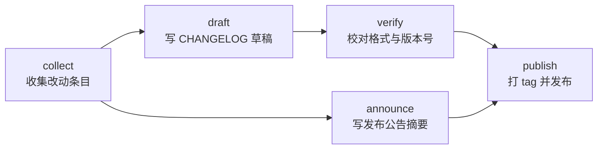
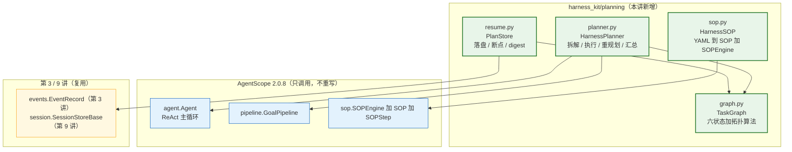
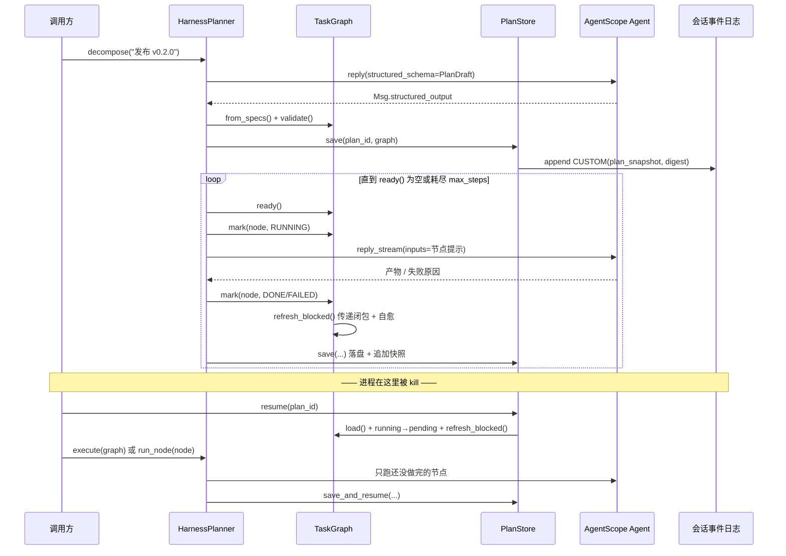
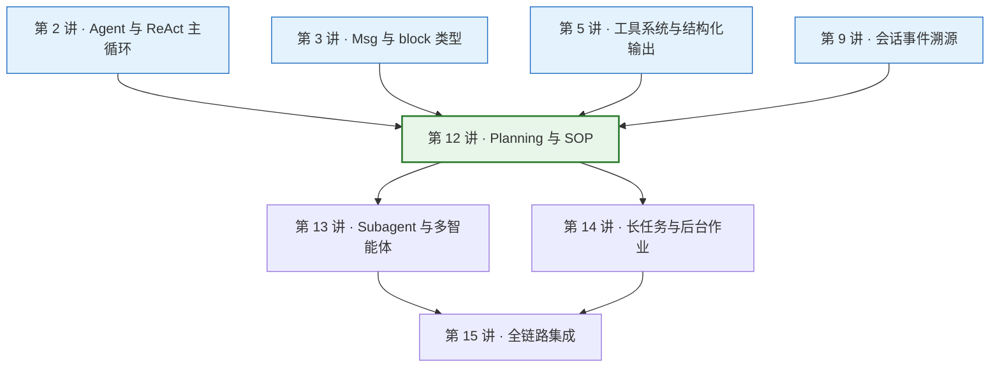

# 第 12 讲 《Planning 与 SOP：长任务拆解、状态机与断点恢复》

> **本讲目标**：把「长任务」从一句口号变成一个**能落盘、能重启、能在失败之后重新规划**的工程结构。前半程是源码侦察：AgentScope 2.0.8 在 SDK 层到底提供了几条「流程控制」路线 —— `pipeline/` 的 `GoalPipeline`（一个执行者、一个判定者，互相拉扯到目标达成）与 `sop/` 的 `SOP` + `SOPStep` + `SOPEngine`（一串固定里程碑，每个都要过关才进下一步），以及它们共同的鸭子类型口子 `PipelineProtocol`（`third_party/agentscope/src/agentscope/pipeline/_base.py:15`）。结论有两半：**「一条流程怎么走」上游已经写好且写得很好；「一堆有依赖关系的任务谁先谁后、某个节点挂了之后它的下游算什么状态」上游完全没有对应抽象**。后半程是动手：在 `harness_kit/planning/` 里补上 DAG 调度这一层（`graph.py`）、补上 SOP 的「定义可配置」（`sop.py` + 一份真实 YAML）、补上「计划」这个新的持久化边界（`resume.py`，并与第 9 讲的会话事件溯源对接），最后把三者编排起来（`planner.py`），并给出「失败重规划为什么默认是关的」的量化依据。
> **前置要求**：第 1~11 讲全部完成（`harness_kit` 已有 `settings` / `registry` / `config` / `events` / `models` / `tools` / `skills` / `mcp` / `middleware` / `session` / `sandbox` / `permission`）。其中**第 2 讲**（`Agent` 与 ReAct 主循环 —— 本讲的每个节点就是一次 `agent.reply_stream(...)`）、**第 3 讲**（`Msg` 与 block 类型 —— `SOPStepRunState.submission` 装的是 `list[TextBlock | DataBlock]`）、**第 9 讲**（会话事件溯源 —— `resume.py` 往会话日志里追加 `CUSTOM` 快照事件，用的是第 3 讲的 `EventRecord` 与那一讲的 `SessionStoreBase`）、**第 5 讲**（工具系统 —— `structured_schema` 背后就是临时挂上一个 `FunctionTool`）是硬前置。
> 环境：AgentScope 2.0.8 + ReMe 0.4.1.13，按第 1 讲的方式用 `PYTHONPATH=third_party/ReMe` 跑脚本。
> **本讲交付物**（全部相对仓库根）：
>
> - `tutorial_agsc_reme/reference/harness_kit/planning/graph.py`（`TaskStatus` / `TaskNode` / `TaskGraph` / `TaskGraphError` / `build_graph`）
> - `tutorial_agsc_reme/reference/harness_kit/planning/planner.py`（`HarnessPlanner` / `PlanDraft` / `PlanResult` / `SubTaskDraft` / `VerdictRecorder`）
> - `tutorial_agsc_reme/reference/harness_kit/planning/sop.py`（`HarnessSOP` / `SOPDefinition` / `SOPStepSpec` / `SOPResult` / `SOPStepResult` / `SOPError`）
> - `tutorial_agsc_reme/reference/harness_kit/planning/resume.py`（`PlanStore` / `PlanRecord` / `plan_digest` / `PlanNotFoundError`）
> - `tutorial_agsc_reme/reference/harness_kit/planning/__init__.py`（对外 API 面 + 分层声明）
> - `tutorial_agsc_reme/reference/harness_kit/planning/sops/changelog_entry.yaml`（本讲唯一的 SOP 定义文件）
> - `tutorial_agsc_reme/reference/scripts/12_planning.py`（本讲验证脚本，A~E 五段）
> - `tutorial_agsc_reme/reference/tests/test_lesson12_planning.py`（120 条 pytest，**0 次 LLM 调用**）
>
> **预计时长**：240 分钟。
>
> 本讲的完整可运行代码位于 `tutorial_agsc_reme/reference/harness_kit/planning/`，
> 你可以直接对照，也可以跟着正文一行一行写。
>
> **本讲不做什么**（先划线，免得走错方向）：
> - 不写任何调度循环 —— 「下一步该谁跑」由 `TaskGraph.ready()`（纯同步、纯计算）回答，「怎么跑」由 AgentScope 的 `Agent` 回答；`planner.py` 里那一层 `while` 只做「取 ready → 标记 → 交给 Agent → 写回」；
> - 不自己写 Agent、不自己写 `ChatModelBase`、不自己写 `Toolkit` —— 拆解用的是 `Agent.reply(..., structured_schema=PlanDraft)`（结构化输出由 AgentScope 的 `_GenerateStructuredOutput` 工具强制，`third_party/agentscope/src/agentscope/agent/_agent.py:3626`），执行用的是 `agent.reply_stream(inputs=..., yield_final_msg=True)`；
> - 不自己写「执行—验收」的重试循环 —— 调用方给了 `verifier` 时，`planner.py` 直接把整张图交给 AgentScope 的 `GoalPipeline`（`third_party/agentscope/src/agentscope/pipeline/_goal_pipeline.py:55`）；
> - 不自己写 SOP 状态机 —— 预算、交接、断点都在 `agentscope.sop.SOPEngine` 里（`third_party/agentscope/src/agentscope/sop/_engine.py:24`），本讲只做「把 YAML 编译成 `SOP`」这一层；
> - 不碰 `third_party/` 下任何文件（只读）；
> - A~C 段验证 **0 次** LLM 调用（用一个鸭子类型的 `StubAgentLike` 驱动真 `SOPEngine`）；只有 D、E 段（`--live`）真实调用 deepseek-flash，**6 次**（D 段 4 次 + E 段 2 次），正好是本系列的单脚本上限。

---

## 一、这一讲要解决的问题

### 1.1 一个「昨天还好好的」长任务

先看三个真实会发生的场景。它们看起来不相关，其实是同一个缺口的三种表现。

**场景一：拆出来的任务，跑到一半进程被 kill 了。**

你让 Agent 干一件三步的活：「读现有的 4 个模块 → 写出说明 → 校对格式」。它跑完了第一步，第二步跑到一半，你的终端被 Ctrl-C 了（或者机器重启、或者 Docker 容器被 OOM kill）。你重新启动，问它「继续」——

它不知道「继续」是从哪继续。它甚至不知道之前有过一个计划。你手里唯一的线索是那段对话记录，而对话记录里只有一句「写 graph 的说明」这种半截话。**计划是进程内的对象，进程走了它就没了。**

**场景二：拆出来的任务里，第 3 个失败了，第 5 个还在等它。**

一张 8 个节点的图，第 3 个节点因为 API 限流失败了。第 5 个节点依赖第 3 个，第 7 个又依赖第 5 个。

现在这张图剩下 5 个节点没进终态。你盯着进度条问：这 5 个是「还在排队」，还是「已经不可能做了」？

- 如果调度器只是「每次挑依赖满足的节点」，那第 5、第 7 个节点会永远停在 `pending`，永远选不中，进度条永远是「还有 5 个任务」——**静默卡死**，没有任何报错，因为从调度器视角看它只是在等依赖。
- 如果进程正好在这个时刻崩了，落盘的图里这 5 个节点全是 `pending`。第二天有人接手，他看到的是「还有 5 个任务要做」，而实际上其中 3 个已经注定做不成。

**场景三：同一条流程，第二个客户要改一处措辞，你就得改代码重新部署。**

「先收集事实 → 再写条目 → 最后过一遍发布检查」这条流程，在 AgentScope 里是这么写的：

```python
sop = SOP(
    name="changelog_entry",
    steps=[
        SOPStep(subject="gather_facts", description="...", executor=agent, max_attempts=2),
        SOPStep(subject="write_entry", description="...", executor=agent, max_attempts=2),
    ],
)
```

它是 Python 对象，写死在代码里。第二个客户说「我们不要 write_entry，要 write_entry + legal_review」——你改代码、跑测试、重新部署。这不是「配置」，这是「发版」。

### 1.2 三个必须分开的问题

上面三个场景之所以会出现，是因为我们把三件不同的事情糊在了一起。本讲的全部设计都建立在**把它们彻底分开**之上：

| # | 问题 | 谁来回答 | 本讲的落点 |
| --- | --- | --- | --- |
| 1 | **一条流程怎么走**（执行者做 → 判定者判 → 不合格就重做） | AgentScope 已经写好了 | 直接用 `pipeline/` 与 `sop/`，一行不改 |
| 2 | **一堆有依赖关系的任务，谁先谁后；某个节点死了，它的下游算什么状态** | **上游没有这个抽象** | `harness_kit/planning/graph.py` |
| 3 | **这张图跑到哪一步了；重启之后从哪继续；失败之后怎么重新规划** | **上游没有这个抽象** | `harness_kit/planning/resume.py` + `planner.py` |

第 1 行是本讲的**约束**，不是本讲的**成果**。请特别注意：`GoalPipeline` 和 `SOPEngine` 都是「一条链」——前者是一个目标 + 一个执行者 + 一个判定者的循环，后者是一串有序里程碑。它们都**不表达分支、不表达依赖、不表达「这一步的输入是那一步的产物」**。而真实的长任务几乎总是 DAG：



`publish` 依赖 `verify` 和 `announce` **两个**节点 —— 这是 `SOPEngine` 的线性 `for index, step in enumerate(...)`（`third_party/agentscope/src/agentscope/sop/_engine.py:109`）表达不了的结构。所以这一层必须有人补。补它的地方就是本讲。

### 1.3 四条不变式

后面的每一行代码、每一段验证，都在服务这四条。它们也是本讲「做对了没有」的判据。

**不变式 1：`blocked` 必须是节点上的显式状态，不能是调度器里的临时判断。**

理由不是「好看」，是**落盘语义**。断点续跑落盘的是一张 DAG。如果「被上游拖死」只活在调度器的内存里，那么进程重启后这张 DAG 与「什么都没跑」长得一模一样。把 `blocked` 写进节点，重启之后「还有 3 个非终态节点」与「其中 2 个注定做不成」才一眼可分。

**不变式 2：`blocked` 必须沿依赖边传到**底**（传递闭包），而不只是第一层。**

这一条是本讲**实测修出来的一个真 bug**：第一版只冻直接下游，于是 `n1` 失败后 `n2` 变 `blocked`，而 `n3`（依赖 `n2`）停在 `pending` —— 它永远不会被 `ready()` 选中，`progress()` 会长期报着「还有 2 个任务」而实际是「这 2 个永远不会跑」。详细经过见 §3.4 与 §6.2。

**不变式 3：失败必须能被救活。`blocked` 要能自愈回 `pending`。**

只有不变式 1 的话，一次失败会永久冻死整条下游。重规划（删掉失败节点、加一个新节点、或者把失败的节点打回 `pending` 重跑）之后，`blocked` 的节点必须能自己回到 `pending`——**不需要调用方手动一个个改**。这就是 `refresh_blocked()` 要往两个方向扫的原因。

**不变式 4：`running` 是进程内的瞬时状态，落盘之后不能原样恢复。**

`running` 落盘只意味着「当时正在跑」。进程崩了之后没有任何人在跑它。若照原样恢复，调度器会认为「它还在飞」，这一格永远等不到结果，**整张图静默卡死**（又是一个不报错的卡死）。所以恢复时把 `running` 归一成 `pending` 重跑一遍，并**保留 `attempts`** 供上层做熔断。

这四条正好两两成对：1 与 2 保证「失败会被看见」（不被当成还在排队），3 与 4 保证「看见之后还能救」（不被永久冻死）。

### 1.4 为什么这一层必须建在 agentscope 之上，而不是自己写一个「更干净的调度器」

一个很容易走歪的方向是：「AgentScope 的 SOP 是线性的、`GoalPipeline` 只支持单目标，那我干脆自己写一个 `Planner` 类，把拆解、调度、重试、状态机全塞进去」——这就滑向了「重写内核」，是本教程从第 1 讲起就明确禁止的。

正确的姿势是**先看清上游已经交付了哪些语义**，然后只补缺的那一块：

| 上游已有的语义 | 出处 | 本讲怎么用 |
| --- | --- | --- |
| 结构化输出（模型必须按 schema 交付） | `agent/_agent.py:3626` 强制 `ToolChoice` | 拆解：`agent.reply(..., structured_schema=PlanDraft)` |
| 「执行 + 验收」的重试循环 | `pipeline/_goal_pipeline.py:172` 的 `while True` | 调用方给了 `verifier` 时，整张图交给 `GoalPipeline` |
| 「一步 = 一次尝试，被拒就重做」 | `sop/_schema.py:193` + `:127` | `SOPStep`，一行不改 |
| 尝试预算（被拒几次后放弃） | `sop/_engine.py:151` | `SOPStep(max_attempts=...)` |
| 跨进程存活的运行态 | `sop/_state.py:104` 的 `SOPRunState` | `HarnessSOP.save_state` / `load_state` |
| 步骤间交接（只传一份「交接说明」，不传上下文） | `sop/_engine.py:155` 的 `_handover` | 直接吃这个语义，不扩宽 |
| 鸭子类型口子（任何实现了 `reply_stream` 的对象都能顶替 Agent） | `pipeline/_base.py:15` 的 `PipelineProtocol` | 离线测试：`StubAgentLike` 驱动真 `SOPEngine` |

最后一行值得单独说：**因为它存在，本讲 A~C 段才能做到 0 次 LLM 调用却跑的是真引擎**。这不是"打桩测试"，这是用上游自己留的口子做测试。第 13 讲（多智能体）会用同一个口子做并发测试。

于是本讲的四个文件，分工是这样的（**上层依赖下层，不反向**）：



> 图注：绿色是本讲要写的四个文件；蓝色是 AgentScope 原生、本讲**一行不改**的部分；黄色是复用模块（`events` 来自第 3 讲、`session` 来自第 9 讲）。`graph.py` **不 import agentscope**（这是一条硬约束，理由见 §3.3），`resume.py` 只依赖 `graph` 与第 3 讲的 `events`。

---

## 二、源码侦察

这一节的每一条都来自我实际读过的源码。凡是「AgentScope **没有**提供」的判断，也在 §2.7 明确列出，方便你复核。

### 2.1 `PipelineProtocol`：一句 `def` 造出的鸭子类型

`third_party/agentscope/src/agentscope/pipeline/_base.py` 整个文件只有一个类，而且它不是抽象基类，是 `Protocol`：

```python
class PipelineProtocol(Protocol):
    """What a pipeline has to offer to go where an agent goes.

    Declared as a plain ``def`` returning an async generator rather than
    an ``async def``: such a function is called, not awaited, and an
    ``async def`` here would be satisfied by neither ``Agent`` nor any
    pipeline.
    """

    def reply_stream(
        self,
        inputs: Msg | list[Msg] | UserConfirmResultEvent | UserInterruptEvent | ExternalExecutionResultEvent,
    ) -> AsyncGenerator[AgentEvent | Msg, None]:
```

两个细节值得记住：

1. **它声明成普通 `def` 而不是 `async def`**。这不是笔误，docstring 里写了理由：`async def` 的函数体调用返回 coroutine，要 `await` 才拿到 async generator；而 AgentScope 的调用点写的是 `async for _ in pipeline.reply_stream(...)`，需要的是「调用即得 async generator」。写成 `async def` 的话，`Agent` 和任何 pipeline 都不满足这个 Protocol。
2. **它是「pipeline 要能去 Agent 能去的任何地方」的契约**。这句话反过来读更有用：**任何实现了 `reply_stream(inputs=...)` 的对象，都可以顶替 Agent 被塞进 pipeline 与 SOP 里**。

第 2 点就是本讲所有离线验证的基础设施。第 13 讲的 `HandoffTool` 与并发测试也用它。

### 2.2 `GoalPipeline`：一个目标 + 一个执行者 + 一个判定者

`third_party/agentscope/src/agentscope/pipeline/_goal_pipeline.py:55` 起是 `GoalPipeline`。它的构造函数只有三个有意义的参数（`:59-66`）：

```python
def __init__(
    self,
    executor: Agent,
    verifier: Agent,
    verifier_reset_context: bool = True,
    max_iters: int = 10,
    max_retries: int = 3,
) -> None:
```

`reply_stream`（`:93`）的主体是一个 `while True`（`:172`），每一轮做两件事：

**第一步，执行者干活并交报告。** 它调 `self.executor.reply_stream(inputs=..., structured_schema=_ExecutionReport, yield_final_msg=True)`（`:179-183`）。注意 `_ExecutionReport`（`:22`）只有一个字段：

```python
class _ExecutionReport(BaseModel):
    report: str = Field(description=(
        "An achievement report of the given goal. E.g. file paths, entry "
        "points, how-to-run, runtime environment, etc. "
        "So that a verifier can check if you have achieved the goal. "
    ))
```

**报告是给判定者看的、能自证的材料**，不是「我做完了」四个字。这是这个 pipeline 能成立的关键：判定者看不到执行者的文件、工具输出、对话历史，它只能看这份报告。如果报告里没有「文件路径 / 入口点 / 怎么跑」，判定者就只能猜。

如果模型没交出符合 schema 的输出（`execution_report is None`，`:207`），它会**把一条纠正指令当新输入再喂一遍**（`:209-217`），而不是抛异常——这是「结构化输出可能失败」的一处实用处理。

**第二步，判定者出裁定。** 判定者拿到的输入是拼出来的（`:225-246`）：

```python
instruction = verifier_inputs or UserMsg(
    name="user",
    content=[
        TextBlock(text="<system-reminder>Now you should verify the work done by the executor. ...\n<goal>"),
        *(self._goal or []),
        TextBlock(text=f"</goal>\nThe executor's achievement report is as follows:\n<report>{execution_report}</report></system-reminder>"),
    ],
)
```

裁定的 schema 是 `_VerificationResult`（`:34`），`result` 是 `Literal["pass", "fail", "impossible"]` 三值：

- `pass` / `impossible` → `break_loop = True`（`:293-303`），循环结束。**`impossible` 也结束**——「这个目标做不到」是一个有效的终局，不该无限重试。
- `fail` → `self._iters += 1`，如果开了 `verifier_reset_context` 就清空 verifier 的上下文（`:308-309`，代码注释写着 *Only the conversation, tool/task state stays*），然后把 `_VerificationResult.message` 原样包进反馈喂回执行者（`:316-324`）。
- `self._iters >= self.max_iters` → `break_loop = True`（`:310-313`）退出。

有三处设计我想让你记住，因为它们直接影响了本讲的 `HarnessPlanner`：

1. **`_iters` 放在实例上而不是 `reply_stream` 的局部变量里**（`:88-90` 的注释：*On the instance rather than in `reply_stream`, so a HITL resume does not restart the budget*）。如果放在局部变量里，一次「人机确认 park → 恢复」会把预算重置，等于给人开了一道无限重试的后门。
2. **判定者的终态 `Msg` 被吞掉了。** `:254-258`：

   ```python
   if (isinstance(_, Msg) and _.finished_reason == ReplyFinishedReason.COMPLETED):
       final_msg = _          # ← 记下来，不 yield
   ```

   调用方从流里**看不到**「这次判定到底过没过」。而执行者的报告反而看得到（它是在 `yield _` 之后才被记下的，`:199-201`）。这个不对称是本讲 `VerdictRecorder` 存在的原因（§2.2 末尾详述）。
3. **HITL 靠 `reply_id` 路由。** `:154-161`：恢复事件进来时，比较 `inputs.reply_id` 与 `self.executor.state.reply_id` / `self.verifier.state.reply_id`，决定这次恢复是喂给执行者还是判定者；两边都对不上就 `raise ValueError`。所以 `PipelineProtocol` 之外，`GoalPipeline` 还额外依赖 `executor.state` 与 `verifier.state` 这两个属性。

### 2.3 `SOP`：把一条流程冻成一个可重复执行的定义

`third_party/agentscope/src/agentscope/sop/__init__.py` 的模块 docstring 把设计意图说得比我能说的更准：

> A `SOP` says which steps there are and what each must prove; how a step gets there is its own business. `SOPEngine` walks them, routes answers to whichever one parked, and records verdicts in a `SOPRunState` that outlives the process.
>
> **A definition holds no run state, so one can drive any number of runs.**

最后一句是**定义与运行分离**。这条分离有三个直接推论，本讲全部吃到了：

1. 同一个 `SOP` 对象可以被跑无数次，状态全在 `SOPRunState` 里；
2. 断点续跑 = 把 `SOPRunState` 存下来，下次用新引擎 + 旧状态接着跑（`SOPEngine(sop, state)`）；
3. **定义一个步骤该怎么做，可以完全不碰 Python** —— 因为 `SOP` 只要求 `steps` 是一个 `SOPStepBase` 实例列表（`sop/_schema.py:415` 起的 `SOP.__init__(self, name, steps, description="")`）。

第 3 点就是本讲 `sop.py` 的全部价值所在。

再看三步的骨架：

- **`SOPStepBase`**（`sop/_schema.py:65`）：抽象基类，只有一个抽象方法 `reply_stream(inputs, state)`（`:101`）。docstring 里的契约只有一句：**one call is one attempt**，而且这次调用要么 park、要么就自己手上这份 state 出一个裁定。
- **`SOPStepBase.record`**（`:127`）：唯一被提供的具体方法，也就是「出裁定」这件事：

  ```python
  state.verifications.append(VerificationResult(passed=passed, message=message, verifier=verifier))
  if passed:
      state.phase = SOPPhase.COMPLETED
  else:
      state.submission = None          # ← 关键
      state.phase = SOPPhase.PENDING
  ```

  **被拒时清空 `submission`**。这一行决定了「第二次尝试从干活重新开始，而不是从被判定开始」——被拒的那一版不会被当成产物传下去。`record` 的 docstring 也是这么写的：*A refusal clears the submission, so the next attempt starts from the work rather than from the judging.*
- **`SOPStep`**（`:193`）：最常用的那个具体步骤 = executor 干活 + verifier 判定。它的 `reply_stream`（`:229`）是两个阶段：先跑 executor 并从中提取 `handover`（`:280-283`，注释写着 *The handover is state, not conversation: yielding it would put a second copy of the reply on screen*），再跑 verifier 并提取 `_Verdict`。

  `SOPStep` 里有一行是本讲 C3 段要验证的重点（`:291`）：

  ```python
  if self.verifier is None:
      self.record(state, True)
      return
  ```

  **没有配判定者 = 做完即过**，不是「空跑一个判定者」。所以「不验证」这件事在 AgentScope 里的实现方式是**不挂 verifier**，而不是挂一个永远返回 `True` 的假 verifier。

`_Handover`（`:165`）与 `_Verdict`（`:177`）两个 schema 的 description 值得抄下来，它们是写给模型的：

> `_Handover.handover`: What you are handing to the following steps. **They cannot see your files, your tools' output or this conversation — only this.** Write it for someone who has seen none of your work.

> `_Verdict.message`: If it does not pass, exactly what is wrong and what to do about it. **This is handed to the executor verbatim**, so name the specific claims, files or values at fault.

「交接是一份写给没看过你工作的人的说明」——这解释了为什么 `SOP` 的步骤间只能传一份文本，而不能传上下文。

### 2.4 `SOPEngine`：走步骤、路由答复、花预算、断点续跑

`third_party/agentscope/src/agentscope/sop/_engine.py` 全文 174 行，`SOPEngine` 在 `:24`。它的模块 docstring 一句到位：

> The engine walks the steps in order, hands resumption events to whichever one parked, and **spends the attempt budget**. It decides from each step's `SOPStepRunState` alone, **never from how the step reached it**.

最后一句是**判定只读状态、不读历史**。这让「进程重启后的续跑」和「同一进程内的第二轮」在引擎看来完全一样——这是不变式 4 能被实现的前提。

四个关键位置：

**（1）构造时的守门**（`:50-55`）：

```python
self.state = state or SOPRunState()
if self.state.steps and len(self.state.steps) != len(sop.steps):
    raise ValueError(
        f"State has {len(self.state.steps)} steps, but this SOP has {len(sop.steps)}.",
    )
```

**存的运行态与当前定义步数不符 → 直接报错**，不猜、不截断、不补齐。因为步数不符只可能意味着「流程被改过了」，而对着一个改过的流程恢复旧状态，最好的结果也是跑错。本讲 C6 段专门验证这条。

同处还有一句话要划重点（`:39-43` 的 Args）：

> Only the SOP's own state is restored: an executor that keeps state of its own — an `Agent` does — **is restored by whoever built it**, before the SOP is handed here.

**引擎不管 Agent 的状态。** Agent 的上下文要你自己重建（第 9 讲的会话快照干这个），引擎只管 SOP 那一层。这是两个持久化边界，本讲 `resume.py` 的模块 docstring 把这条边界画成了表格。

**（2）主循环**（`:109-153`）：

```python
for index, step in enumerate(self.sop.steps):
    record = self.state.steps[index]
    if record.phase is SOPPhase.COMPLETED:
        continue                      # :111 已完成的步骤直接跳过
    if record.phase is SOPPhase.FAILED:
        return                        # :113 已失败的步骤 → 整个 run 停
    while True:
        ...
        async for event in step.reply_stream(inputs if resuming else record.given, record):
            yield event
        ...
        if record.phase is SOPPhase.AWAITING:
            return                    # :145-148 park：结束这个流，等人
        if record.phase is SOPPhase.COMPLETED:
            break                     # :149-150 这一步过了，下一步
        if len(record.verifications) >= step.max_attempts:
            record.phase = SOPPhase.FAILED
            return                    # :151-153 预算耗尽
```

三件事：

- **预算由引擎扣，不由步骤判断**（`:151`）。步骤只负责「出裁定」，量到第几次放弃是引擎的事。所以一个步骤想「自己判断要不要重试」是错的姿势，写 `max_attempts` 才对。
- **park 的语义是「结束这个流」**（`:145-148`，注释：*Let go of the stream rather than hold a coroutine open; the caller comes back with an answer*）。引擎不挂起任何协程——`SOPEngine` 的类 docstring 写着 *nothing stays suspended*。
- **已 `COMPLETED` 的步骤被 `continue` 跳过**（`:111`）。这一个 `continue` 就是跨进程续跑的全部魔法：存下状态、换一个新引擎、喂旧状态，前面做完的步骤一次执行者都不用调。C5 段验证的正是「续跑时 executor 被调用 0 次」。

**（3）一次失败就全停**（`:113`）。这看起来很粗暴，但它和「线性流程」是自洽的：SOP 的语义是「前一步没做完，后一步不许开始」，所以某一步 `FAILED` 之后继续往后跑毫无意义。**DAG 里的语义不一样**——`publish` 依赖 `verify` 和 `announce`，`announce` 挂了不代表 `verify` 那条支路要停。这正是 `SOPEngine` 表达不了 DAG 的原因，也是本讲 `graph.py` 存在的理由。

**（4）交接**（`:155-174`）：

```python
def _handover(self, index: int) -> list[Msg]:
    if index == 0:
        return list(self.state.inputs)
    previous = self.sop.steps[index - 1]
    return [UserMsg(name="sop", content=[
        TextBlock(text=f'<handover from="{previous.subject}">'),
        *(self.state.steps[index - 1].submission or []),
        TextBlock(text="</handover>"),
    ])]
```

**只有前一步的 `submission` 跨过去**，别的什么都不传。docstring 里的原话：*a step reads its predecessor's account, not its files or its conversation.* 这条限制是特性不是缺陷——它逼着每个步骤把自己做的事写成一份自解释的说明，而不是指望下游去翻自己的上下文。

### 2.5 `SOPRunState` / `SOPStepRunState` / `SOPPhase` / `VerificationResult`：唯一值得持久化的东西

`third_party/agentscope/src/agentscope/sop/_state.py` 的模块 docstring 只有两句，但把边界说尽了：

> The runtime state of a SOP run — **the half worth persisting**.
> A definition is code and can be run any number of times; a run is plain data and belongs to exactly one of those times. The engine owns the run and hands each step the slice that is its own, so **nothing about a run ever lives on a step object**.

`SOPRunState`（`:104`）的字段只有五个：

```python
id: str
inputs: list[Msg]
steps: list[SerializeAsAny[SOPStepRunState]]
created_at: str
# 外加一个 computed_field：phase
```

**注意它没有 `sop_name`，没有 `goal`，没有 `progress`。** 我第一次写 C5 段的断言时下意识地写了 `state.sop_name`，直接报 `AttributeError`（记在 §6.1）。它的设计是「只存运行时事实，能算出来的不存」——`phase` 就是个 `computed_field`（`:130-151`），从各步的 phase 现算：

```python
phases = [_.phase for _ in self.steps]
if not phases or all(_ is SOPPhase.PENDING for _ in phases):
    return SOPPhase.PENDING
if any(_ is SOPPhase.FAILED for _ in phases):
    return SOPPhase.FAILED
if all(_ is SOPPhase.COMPLETED for _ in phases):
    return SOPPhase.COMPLETED
if any(_ is SOPPhase.AWAITING for _ in phases):
    return SOPPhase.AWAITING
return SOPPhase.RUNNING
```

`computed_field` 让它**同时**「存在」和「不占存储」：`model_dump()` 会把它算出来写进 JSON（所以读的人不必重放每一步就能按 phase 排序），但它不是构造参数。

`SOPStepRunState`（`:68`）四个字段，其中两个的语义必须分清：

```python
phase: SOPPhase = SOPPhase.PENDING
given: list[Msg] = Field(default_factory=list)        # 引擎写的
submission: list[TextBlock | DataBlock] | None = None # 本次尝试交出来的
verifications: list[VerificationResult] = Field(default_factory=list)
```

- **`submission` 的 `None` 与「空列表」不是一回事**（`:89-97` 的 docstring）：`None` 意思是「这次尝试还没交出任何东西」，这**也是步骤在恢复时用来判断「它上次 park 在干活那半，还是 park 在被判定那半」的依据**。
- **`verifications` 的长度就是尝试次数**（`:99-101`）。引擎的预算判断 `len(record.verifications) >= step.max_attempts` 用的就是它。
- **`submission` 是 block 列表而不是字符串**（`:89`）：*a step that produces a chart, a file or an image hands it on as readily as a sentence*. 所以 `TextBlock` 的定义也要看一眼：`third_party/agentscope/src/agentscope/message/_block.py:11` 的 `class TextBlock`，字段是 `type: Literal["text"] = "text"` 和 `text: str`。
- **`model_config = ConfigDict(extra="allow")`**（`:77`）并且 docstring 明确指路：要记更多东西就继承它、把子类名写进 `SOPStepBase.state_type`，**额外字段能挺过一次存储往返**。本讲没有用到这条（我们的步骤都是标准 `SOPStep`），但它是上游留给扩展的点。

`SOPPhase`（`:23`）是 `StrEnum`，五个值：`PENDING` / `RUNNING` / `AWAITING` / `COMPLETED` / `FAILED`。它的 docstring 一句：*One enum for both: a run is only ever as far along as its steps let it be.* —— 步骤与整轮共用同一个枚举，这是 `phase` 那个 `computed_field` 能写出来的前提。

`VerificationResult`（`:46`）四个字段：`passed: bool`、`message: str = ""`、`verifier: str = ""`（*Who decided — a model, a person, an external system*）、`created_at`。docstring 第一句是本讲很喜欢的一句设计：

> Only settled verdicts exist — a step with nothing to say yet records nothing, because **a verdict that has not happened is not a verdict**.

### 2.6 `AgentLike`：为什么一个 stub 能驱动真引擎

`third_party/agentscope/src/agentscope/sop/_schema.py:28`：

```python
class AgentLike(PipelineProtocol, Protocol):
    """What a step needs of whatever does its work or judges it.

    :class:`~..pipeline.PipelineProtocol` plus a reply that can be asked
    to end in structured output.
    """
```

`SOPStep.__init__` 的参数类型是 `AgentLike`，而 `AgentLike` 是 `PipelineProtocol` 加上「能要结构化输出」的那部分 `reply_stream`（多两个参数 `structured_schema` 与 `yield_final_msg`，`:35-45`）。

结论：**只要一个对象有 `name`、`reply_stream(inputs, structured_schema=..., yield_final_msg=...)` 且产出 `Msg`（带 `finished_reason` / `structured_output`），它就能当 SOP 的执行者和判定者。**

本讲 C 段的 `StubAgentLike` 就靠这条：它不调用任何模型，只按脚本 yield 一个个造好的 `Msg`。**跑的是真 `SOPEngine`、真 `SOPStep`、真状态机、真预算**，只是「干活的人」换成了一个会背台词的假人。C3b 段里「被拒一次 → 重做 → 通过」这条路径，走的就是 `SOPStep.record(state, passed=False)` 清空 `submission` 后引擎再来一轮的**真实**逻辑。

### 2.7 诚实清单：AgentScope **没有**提供什么

这一节和前面几节的「有什么」同样重要。以下每一条我都 grep 过、读过，**不是猜测**：

| # | 缺的东西 | 我的核查方式 | 本讲怎么补 |
| --- | --- | --- | --- |
| 1 | **DAG**：没有「节点 + 依赖边」的抽象，没有拓扑序，没有「某节点失败后下游算什么」 | `sop/` 全文只有 `for index, step in enumerate(...)` 的线性遍历（`_engine.py:109`）；`pipeline/` 只有单个 goal 的循环 | `graph.py` 的 `TaskGraph` |
| 2 | **`blocked` 这个状态**：`SOPPhase` 只有 5 个值，没有「被上游拖死」的表达 | `sop/_state.py:23-43` 逐个读过 | `TaskStatus.BLOCKED` |
| 3 | **计划的持久化**：`SOPRunState` 能存「一条链跑到哪」，没有任何东西能存「一张图和它的依赖关系跑到哪」 | `_state.py` 全文 151 行 | `resume.py` 的 `PlanStore` |
| 4 | **SOP 定义的声明式配置**：`SOP(name, steps)` 要求 `steps` 是 `SOPStepBase` 实例列表，即必须写 Python | `sop/_schema.py:415-436` | `sop.py` + `sops/` 下的 YAML |
| 5 | **整张图的执行预算**：`GoalPipeline` 有 `max_iters`（单目标内），`SOPStep` 有 `max_attempts`（单步内），没有「这张图最多跑 N 个节点」 | `_goal_pipeline.py:59-66`、`sop/_schema.py:201` | `HarnessPlanner(max_steps=...)` |
| 6 | **失败重规划**：`GoalPipeline` 的 `impossible` 会结束循环（`:293-297`），没有任何东西会「换一个方案」 | `_goal_pipeline.py:293-313` | `HarnessPlanner.replan` |
| 7 | **判定结果的可观测性**：`GoalPipeline` 把 verifier 的终态 `Msg` 吞掉（`:254-258`），调用方拿不到「过没过」 | 逐行读 `:248-269` | `VerdictRecorder`（只转发 + 截留，不改上游行为） |

第 7 条是**一处上游行为导致的可观测性缺口**，不是 bug（上游自己不需要这个信息）。本讲的处理方式是**加一层薄壳**而不是改上游：`VerdictRecorder` 的 `reply_stream` 原样 `yield` 上游的每一个 item，只是顺手把 `Msg.structured_output` 记在 `self.last_verdict` 上。它靠的还是那个鸭子类型口子。

### 2.8 本讲用到的扩展点清单（一句话一个）

| 扩展点 | 位置 | 本讲拿它做什么 |
| --- | --- | --- |
| `PipelineProtocol` | `third_party/agentscope/src/agentscope/pipeline/_base.py:15` | `VerdictRecorder` 与 `StubAgentLike` 都靠它顶替真 Agent |
| `GoalPipeline` | `third_party/agentscope/src/agentscope/pipeline/_goal_pipeline.py:55` | 调用方给 `verifier` 时，整张图交给它跑「执行—验收」循环 |
| `GoalPipeline.reply_stream` | `third_party/agentscope/src/agentscope/pipeline/_goal_pipeline.py:93`（循环在 `:172`） | 节点级的重试语义，本讲不重写 |
| `SOP` | `third_party/agentscope/src/agentscope/sop/_schema.py:415` | `HarnessSOP._build_sop()` 的产物类型 |
| `SOPStepBase` | `third_party/agentscope/src/agentscope/sop/_schema.py:65` | YAML 编译目标（本讲用的是它的具体子类 `SOPStep`） |
| `SOPStep` | `third_party/agentscope/src/agentscope/sop/_schema.py:193` | 每个 YAML step 编译成一个 `SOPStep` |
| `SOPStepBase.record` | `third_party/agentscope/src/agentscope/sop/_schema.py:127` | 「被拒清空 submission」的语义来源（C3b 段验证） |
| `SOPEngine` | `third_party/agentscope/src/agentscope/sop/_engine.py:24` | `HarnessSOP.run` / `resume` 每次新建一个 |
| `SOPEngine.__init__(sop, state)` | `third_party/agentscope/src/agentscope/sop/_engine.py:32`（守门在 `:51`） | 断点续跑的唯一入口 |
| `SOPRunState` | `third_party/agentscope/src/agentscope/sop/_state.py:104` | `save_state` / `load_state` 落盘的内容 |
| `SOPStepRunState` | `third_party/agentscope/src/agentscope/sop/_state.py:68` | `HarnessSOP._project_steps` 读它投影出对外的 `SOPStepResult` |
| `SOPPhase` | `third_party/agentscope/src/agentscope/sop/_state.py:23` | `HarnessSOP.current_state` 返回它的 `.value` |
| `VerificationResult` | `third_party/agentscope/src/agentscope/sop/_state.py:46` | 投影成 `SOPStepResult.attempts` / `passed` / `message` |
| `AgentLike` | `third_party/agentscope/src/agentscope/sop/_schema.py:28` | `StubAgentLike` 的实现依据（离线测试） |
| `TextBlock` | `third_party/agentscope/src/agentscope/message/_block.py:11` | `StubAgentLike` 造 `Handover` 载荷 |
| `Agent.reply(structured_schema=...)` | `third_party/agentscope/src/agentscope/agent/_agent.py:3626`（强制 `ToolChoice`） | `decompose` / `replan` / `summarize` |
| `Msg.structured_output` | `third_party/agentscope/src/agentscope/message/_base.py:107` | 拆解结果的唯一读取口 |
| `EventRecord` / `EventKind.CUSTOM` | 第 3 讲 `harness_kit/events/types.py`（第 9 讲用它做会话溯源） | 计划快照写进会话事件日志 |

---

## 三、扩展点定位与设计

### 3.1 设计的第一条规则：能挂上去的，绝不自己写

把 §2.8 的清单横过来看，本讲的四个文件对上游的依赖是这样的：

| 文件 | 依赖 AgentScope | 依赖第 3 / 9 讲（events / session） | 依赖同层 |
| --- | --- | --- | --- |
| `graph.py` | **无** | 无 | 无 |
| `resume.py` | 无 | `events`（`EventRecord` / `EventKind` / `utc_now`） | `graph` |
| `sop.py` | `agentscope.sop` 的 `SOP` / `SOPStep` / `SOPEngine` / `SOPPhase` / `SOPRunState` / `SOPStepRunState`；`agentscope.agent.Agent`；`agentscope.message.Msg` / `UserMsg` | 无 | `config.load_yaml`（第 2 讲） |
| `planner.py` | `agentscope.agent.Agent`；`agentscope.message.Msg` / `UserMsg`；`agentscope.pipeline.GoalPipeline`（延迟 import） | 无 | `graph` |

**`graph.py` 一行 agentscope 都不 import。** 这不是洁癖，是「可测性」：DAG 的状态机是纯计算，把它绑上 `Agent`，测「一次失败之后下游算什么状态」就得先起一个 Agent、配一个模型、连一次网。第 12 讲的 120 条测试里，有 60 多条是纯同步断言（`TestTaskGraphScheduling` / `TestTaskGraphStructure` / `TestPlanDigest` / `TestPlanStoreFiles` 等），跑完不到 2.3 秒、0 次网络调用——靠的就是这条边界。

`sop.py` 里那个 `from agentscope.sop import SOP, SOPEngine, SOPStep` 是本讲**唯一**与「流程控制」直接对接的地方，它只做一件事：把 `SOPDefinition`（YAML 反序列化出来的纯数据）中的每个 `SOPStepSpec` 编译成一个 `SOPStep`。至于这个 `SOPStep` 之后怎么被引擎走、怎么花预算、怎么 park、怎么恢复，全部交给上游。

`planner.py` 里那个 `GoalPipeline` 的 import 是**延迟**的（写在 `__init__` 的 `elif verifier is not None:` 分支里，不放在模块顶部），理由写在注释里：`GoalPipeline` 在 `agentscope.pipeline` 里，顶层 import 会把整个 pipeline 子模块及其依赖提前拉进来。这是一个小但真实的取舍：`graph.py` 与 `resume.py` 的使用者不该为「用不到 pipeline」付 import 成本。

### 3.2 目录与阅读顺序

```text
tutorial_agsc_reme/reference/harness_kit/planning/
├── __init__.py                     对外 API 面 + 分层声明（79 行）
├── graph.py                        任务 DAG 与六状态机（710 行）
├── planner.py                      拆解 / 执行 / 重规划 / 汇总（871 行）
├── sop.py                          YAML → SOP + SOPEngine 封装（530 行）
├── resume.py                       计划落盘 / 断点 / digest / 事件对接（496 行）
└── sops/
    └── changelog_entry.yaml        本讲唯一的 SOP 定义（39 行）
```

**与契约的一处有意偏离**：契约 §二 的目录树里 `planning/` 下只有四个 `.py`，没有 `sops/` 子目录。加这个目录的理由与第 11 讲新增 `harness_kit/permission/rules/` 完全相同：**没有一份真实的定义文件，「YAML → SOP」这条路径就没有可运行的真值**。一个只在文档里出现的格式不算格式。所以本讲交付一份 39 行的 `changelog_entry.yaml`，C 段与 E 段都跑它。

阅读顺序建议：`graph.py` → `resume.py` → `sop.py` → `planner.py`。前两个不碰 Agent，读起来最快；`sop.py` 是把上游的 SOP 包起来，理解成本主要在「哪些字段来自 YAML、哪些来自上游」；`planner.py` 最长，但它的结构就是「三段 LLM 调用 + 一个调度循环」，读完前面三个再看它会很轻松。

### 3.3 `graph.py`：为什么状态是**显式枚举**而不是调度器里的判断

这是本讲第一个、也是最重要的设计决定。

一个「最小」的调度器可以这样写（很多人真的这么写）：

```python
def ready(graph):
    return [n for n in graph.nodes.values()
            if n.status == "pending" and all(dep.status == "done" for dep in deps(n))]
```

它能跑。但它有一个致命问题：**「依赖里有人失败了」这件事没有任何地方记录**。`ready()` 只是返回空列表，于是：

- 调度循环看到「没有可跑的」就 `break`，整个程序正常退出；
- 落盘的图里，那些注定做不成的节点状态还是 `pending`；
- 调用方（人或者另一段程序）看到的进度条写着「还有 5 个任务」，而实际上其中 3 个永远不会跑。

**这是一个不报错的错误。** 本讲把它当作第一类问题来治：`TaskStatus` 有六个值（`graph.py:67`），其中 `BLOCKED` 的语义是「本节点及它的整条下游都不会再跑，除非上游被重规划救活」：

```python
class TaskStatus(StrEnum):
    PENDING = "pending"    # 等待依赖满足
    RUNNING = "running"    # 已被调度器取走
    BLOCKED = "blocked"    # 依赖里有 failed/skipped/blocked → 整条下游冻死
    DONE = "done"          # 终态
    FAILED = "failed"      # 终态
    SKIPPED = "skipped"    # 终态（与 failed 同样拖死下游）
```

配套的三条查询方法各有各的语义，**不能互相替代**（`is_complete` 的 docstring 专门写了这件事）：

| 方法 | 回答的问题 | 实现 |
| --- | --- | --- |
| `ready()`（`:338`） | 「**现在还跑得动什么**」 | `status is PENDING` 且依赖全是 `DONE` |
| `is_complete()`（`:356`） | 「**终态收齐了没**」 | 所有节点 `is_terminal` |
| `is_successful()`（`:370`） | 「**是不是都做成了**」 | 所有节点 `is DONE`（空图算成功） |

三者的差别在一张「被拖死的图」上暴露得最清楚：`ready()` 早就空了（`[]`），`blocked` 节点永远不是终态所以 `is_complete()` 一直是 `False`，`is_successful()` 也是 `False`。A3 段的真实输出里这一行是：

```text
  ready() = []（verify/publish 已被冻死）
  is_complete() = False（announce 还在 running，所以 False）
```

**三个判断各司其职**：调度循环看 `ready() == []` 来决定「没得跑了」，而「跑完了没有」必须看 `is_complete()`。

`mark()`（`:392`）是唯一的转移入口，语义有四条：

- `RUNNING` → `attempts += 1`（这样「重跑几次了」是可以从状态里读出来的，不用另开一个计数器）；
- `DONE` → `artifact` 非空时追加进 `artifacts`，并**清空 `error`**；
- `FAILED` / `SKIPPED` → `error` 落到节点上，然后 `_refresh_blocked()` 把下游冻住；
- **终态再 `mark` → 抛 `TaskGraphError`**（`:108`，`class TaskGraphError(ValueError)`）。

最后一条是**不变式 4 的地基**：如果 `done` 的节点能被静默改回 `running`，那「断点续跑」就无从谈起——你无法用状态判断「这一步到底做完没有」。A5 段打印的就是这个错误：

```text
  对 done 再 mark -> 节点 't1' 已是终态 'done'，不允许再转移到 'running'。终态不可逆是断点续跑的前提。
```

它带来一个必须明说的代价：**「这活我们决定重做」这种业务判断，状态机不替你做**。要重做就得调用方显式地改 `node.status = TaskStatus.PENDING`（外加清 `error`）再 `refresh_blocked()`。A4 段就是这么干的，而这段代码本身就是「重规划」的最小实现：

```python
node = graph.node("draft")
node.status = TaskStatus.PENDING     # 显式重规划：状态机不替你决定
node.error = None
graph.refresh_blocked()
```

### 3.4 `refresh_blocked()` 必须扫到不动点：本讲实测修出的一个真 bug

这是本讲最有价值的一段经验，因为它是一个**真写错了然后再修**的故事，不是「设计如此」。

**第一版的实现**（错误）：`mark()` 里被标成 `FAILED` 之后，直接遍历「直接依赖它」的节点，把它们标成 `BLOCKED`。

```python
# 第一版（错误）—— 只冻直接下游
for node in self.nodes.values():
    if any(dep_id in dead_ids for dep_id in node.depends_on):
        node.status = TaskStatus.BLOCKED
```

它通过了 A3 段（`draft` 失败 → `verify` 冻住），也在单测里过了几天。直到 A4b 段用一条 4 环的链测它：


`n1` 失败之后，第一版只把 `n2` 标成 `BLOCKED`；`n3` 依赖 `n2`，但 `n2` 的状态不是 `failed` 也不是 `skipped`，所以 `n3` 被判为「依赖没满足」→ 保持 `PENDING`。`n4` 同理。

结果是：

```text
  progress = {'pending': 2, 'running': 0, 'blocked': 1, 'done': 0, 'failed': 1, 'skipped': 0}
```

`n3`、`n4` 永远停在 `PENDING`，永远不被 `ready()` 选中，**整张图静静卡死**——而且和前面说的那种「静默卡死」一模一样：不报错、进度条上还有两个任务、进程正常退出。

**修法**是扫到不动点（fixpoint）：只要还有状态变化就再来一轮，直到某一轮什么都没变。`graph.py:484` 的实现里有一个 `for _ in range(len(self.nodes) + 1)` 的外层上限（防御性：即使有 bug 也不会死循环），内层逐节点判断两件事：

```python
for node in self.nodes.values():
    if node.status not in (TaskStatus.PENDING, TaskStatus.BLOCKED):
        continue
    deps = [self.nodes[_] for _ in node.depends_on]
    unreachable = [_.id for _ in deps if _.is_dead or _.status is TaskStatus.BLOCKED]
    if unreachable:
        if node.status is not TaskStatus.BLOCKED:
            node.status = TaskStatus.BLOCKED
            changed = True
    elif node.status is TaskStatus.BLOCKED:
        node.status = TaskStatus.PENDING     # ← 自愈（不变式 3）
        changed = True
if not changed:
    break
```

注意 `elif` 那一支：**这是 `blocked` 的自愈**。当上游被重规划救活（回到 `PENDING` 甚至 `DONE`）之后，下一轮扫描到这个 `BLOCKED` 的节点，会发现「依赖里没有死人了」，于是把它放回 `PENDING`。所以调用方只需要改上游一个节点 + 调一次 `refresh_blocked()`，整条下游会**自己恢复**。A4 段的输出证明了这一点：

```text
  重规划（把 draft 打回 pending 再重跑）之后 progress = {'pending': 2, 'running': 0, 'blocked': 0, 'done': 3, 'failed': 0, 'skipped': 0}
  ready() = ['verify']
```

而 A4b 段修好之后：

```text
  progress = {'pending': 0, 'running': 0, 'blocked': 3, 'done': 0, 'failed': 1, 'skipped': 0}
```

`blocked` 集合恰好等于 `downstream('n1') = ['n2', 'n3', 'n4']`——也就是「从失败节点沿依赖边可达」的传递闭包。

**我为什么要把这个 bug 写进教程**：因为「只处理一层」是写树/DAG 传播时最常见的错误，而且它的症状是静默的。如果你在自己的实现里只看到 `blocked` 有 1 个而不是 3 个，请立刻回头看这两件事：

1. 你的 BFS/DFS 是不是只走了一步；
2. 你有没有**反向**的那一支（自愈），没有的话一次失败会永久污染整张图。

### 3.5 `resume.py`：三个决定，每一个都可以说出「为什么不是别的」

**决定一：原子替换写入，不用 `write_text` 直接覆盖。**

断点续跑最怕的场景不是「文件丢了」，是「文件写了一半进程死了」——留下一个半个 JSON 的文件，下次恢复直接 `ValidationError`，而**旧版本那个好文件已经被覆盖掉了**。所以 `save()`（`resume.py:196`）走的是「写临时文件 + `Path.replace`」：

```python
tmp = target.with_suffix(".json.tmp")
tmp.write_text(record.model_dump_json(indent=2), encoding="utf-8")
tmp.replace(target)          # POSIX 上等价于 os.replace，原子
```

`Path.replace` 在 POSIX 上是 `rename(2)`，保证读到的要么是旧版本、要么是新版本，没有中间态。代价是**同一目录下会短暂出现一个 `.json.tmp`**（B5 段的输出里能看到）。这一点被写进文档了：如果你写了一个「扫描计划目录」的工具，要忽略 `*.tmp`。

**决定二：`plan_digest` 里不含任何时间戳。**

`plan_digest`（`resume.py:66`）对每个节点取 `id` / `goal` / `status` / `sorted(depends_on)` / `attempts` 五项，排序后 `json.dumps(..., sort_keys=True, ensure_ascii=False)`，取 sha256 前 16 位。

**为什么不含 `created_at` / `updated_at`**：因为摘要的用途是「判断计划有没有真的变」。如果含时间戳，那「重新 dump 一次同一张图」摘要就会变，事件日志里会充满「计划变了但内容没变」的假变更。B4 段验证的就是这个：

```text
  存盘前 digest = 6a2bd2a9afb83203
  存盘后 digest = 6a2bd2a9afb83203
```

`depends_on` 排序是同一个道理：依赖集合是**集合语义**，`['a','b']` 与 `['b','a']` 不该产生不同的摘要。注意 `graph.nodes` 是 `dict`（插入序），所以遍历时按 `id` 排序，让输入顺序也不影响结果。

**决定三：`running` 归一成 `pending`，`attempts` 保留。**

`resume()`（`resume.py:316`）读回一张图之后做三件事：

1. `graph.validate()`（复用结构校验：环 / 悬空依赖 / 自依赖）；
2. 把所有 `RUNNING` 节点打回 `PENDING`，并打一条 `WARNING`（B 段输出第一行就是它）；
3. `refresh_blocked()` 重算一遍阻塞（因为「依赖全 done」这件事可能因为归一而变了）。

**`attempts` 不归零**。理由：归一意味着「重新跑一遍」，而不是「从没跑过」。如果归零，那「这个节点已经重跑了 5 次」这个信息就丢了，上层没法用「尝试次数过多」做熔断。`attempts` 只在 `mark(RUNNING)` 时 +1，恢复时不碰。

还有一处防目录穿越的小设计（`plan_path`，`:175`）：`plan_id` 里出现 `/`、`\` 或整个等于 `.` / `..` 就抛 `ValueError`。因为 `plan_id` 有可能来自模型输出或者用户输入，`plan_path("../../etc/passwd")` 会写到计划目录外面去。B5 段验证三种非法输入：

```text
  plan_path('../etc/passwd' ) -> plan_id 不能包含路径分隔符：'../etc/passwd'
  plan_path('a/b'           ) -> plan_id 不能包含路径分隔符：'a/b'
  plan_path('..'            ) -> plan_id 不能包含路径分隔符：'..'
```

**第四件事（不是决定，是接口）**：`PlanStore` 同时有两个可选的落点。`session_dir` 下的 `{plan_id}.json` 存**整张图**；如果构造时给了第 9 讲的 `store`（`SessionStoreBase`），每次保存还会往会话事件日志里追加一条 `CUSTOM` 事件（`_PLAN_EVENT_NAME = "plan_snapshot"`）。**payload 里不放整张图**，只放 `plan_id` / `digest` / `progress` / `nodes`：

```text
seq=0 kind=custom name=plan_snapshot progress={'pending': 1, 'running': 1, 'blocked': 0, 'done': 1, 'failed': 0, 'skipped': 0}
seq=1 kind=custom name=plan_snapshot progress={'pending': 2, 'running': 0, 'blocked': 0, 'done': 1, 'failed': 0, 'skipped': 0}
```

这样做的收益是：**一个会话的时间线里既有对话也有计划变更，且共用同一条 `seq` 单调递增的不可变日志**。排查线上事故时不需要在三个存储之间对时间戳。代价是日志体积，所以整张图留在 `{plan_id}.json` 里，靠 `digest` 关联。

### 3.6 `planner.py`：三段 LLM 调用，每段都能降级

`HarnessPlanner` 的公开方法是四个，对应三段 LLM 调用加一个调度循环：

| 方法 | LLM 调用 | 降级路径 |
| --- | --- | --- |
| `decompose(goal)`（`:394`） | 1 次（`structured_schema=PlanDraft`） | 失败 → `build_graph(goal, subtasks)` 串行兜底（A7 段验证） |
| `execute(graph)`（`:447`） | 每节点 1 次（`verifier` 给了则由 `GoalPipeline` 自己重试） | 无 |
| `summarize(graph)`（`:786`） | 1 次 | 失败 → `_local_summary()` 本地拼装 |
| `replan(graph, failed=...)`（`:694`） | 1 次 | **默认关闭**（`replan_on_failure=False`） |

三个设计点：

**（1）`decompose` 用结构化输出，不用自由文本。** `agent.reply(UserMsg("user", prompt), structured_schema=PlanDraft)`，从 `msg.structured_output` 取。AgentScope 收到 `structured_schema` 后会临时挂上 `_GenerateStructuredOutput` 工具（`agent/_agent.py:1118`），并在必要时用 `ToolChoice(mode="_GenerateStructuredOutput")` 强制调用（`:3626`）。**我们不解析自由文本、不写 JSON 修补器。**

拿到 `PlanDraft` 之后交给 `TaskGraph.from_specs()`，再 `graph.validate()`。**校验失败不回退到「猜」，而是抛 `TaskGraphError`** —— 一张非法 DAG 会一路跑到调度期才炸，越早拦住越便宜。这一条对应 A6 段：环、悬空依赖、自依赖各自有明确的错误消息。

**（2）`execute` 里没有并发，而且这是刻意的。** 循环体只有一件事：取 `ready()` → `mark(RUNNING)` → `run_node()` → `mark(终态)`。为什么不用 `asyncio.gather` 并发跑多个 ready 节点？因为**同一个 `Agent` 的 `AgentState` 是共享可变状态**，并发 reply 会把上下文交错写乱（`third_party/agentscope/src/agentscope/state/_state.py:209` 的 `context` 是单条列表）。要并发必须**每个成员一个独立 Agent / 独立 state**——那是第 13 讲 `AgentTeam` 的前提。这段理由写在 `execute` 的 docstring 里，因为它是一个将来一定会有人想改的地方。

**（3）`replan_on_failure` 默认是 `False`。** 理由不是「保守」，是**成本**：重规划要花一次 LLM 调用，而「这次失败值不值得重规划」是一个业务判断。更重要的是一条防呆（`:345`）：

```python
if replan_on_failure and max_replans <= 0:
    raise TypeError(
        "replan_on_failure=True 但 max_replans<=0：重规划永远不会触发，"
        "这是静默失效，直接拒绝。",
    )
```

**「要求自动重规划但一次都不许做」= 静默失效 = 直接拒绝**。这个模式在本教程里出现了很多次（第 11 讲的 `FailClosed`、第 10 讲的沙箱配额），可以当成一条经验：**凡是配置组合起来等于「这个功能永远不生效」的，应该在构造期就报错，而不是等运行时才发现。**

`replan` 的合并语义有三条（`:694` 的 docstring）：

1. 已 `done` 的节点 id 一律保留，新方案里同 id 的节点被忽略（**不重跑已经成功的工作**）；
2. 新方案里的新 id 直接加进图；
3. 原图里 `failed` 的节点**不删**（它们是审计记录），只是不再被调度；**新节点若声明依赖一个已经死掉的节点，这条边会被就地丢掉并打一条 `warning`**（`dropped`），否则新节点一出生就是 `failed` 的下游 → 立刻 `blocked` → 重规划等于没做。

第 3 条是重规划里最容易踩的坑：模型不知道「哪些节点已经确定失败了」，它按原来的思路重写一遍方案，很可能让新节点依赖那个失败的老节点。

**（4）`VerdictRecorder`：为一处上游的可观测性缺口打补丁。** §2.2 说过 `GoalPipeline` 会把 verifier 的终态 `Msg` 吞掉（`_goal_pipeline.py:254-258`），于是「这个节点到底过没过」从流里拿不到。`VerdictRecorder` 是一层薄壳：`reply_stream` 原样转发（顺序、内容都不变），只是顺手把 `Msg.structured_output` 记在 `self.last_verdict` 上；`state` 与其余属性用 `__getattr__` 转发给真 verifier（因为 `GoalPipeline` 的 HITL 分支要读 `verifier.state.reply_id`）。

**它不改 AgentScope 的任何行为。** 它靠的是「`GoalPipeline` 对 verifier 只需要 `reply_stream` + `state`」这一事实，而这个事实正是 `PipelineProtocol` 那个鸭子类型口子留下的。

### 3.7 `sop.py`：把 YAML 编译成 `SOP`，然后什么都不管

`HarnessSOP` 是本讲的「薄封装」样板。它做四件事，没有第五件：

1. **读定义**：`SOPDefinition.from_file(path)`（支持 `.yaml`/`.yml` 与 `.json`），pydantic 校验（缺字段 / 空 steps / 类型错都在这里被拦下）；
2. **编译**：`_build_sop()` 把每个 `SOPStepSpec` 变成 `SOPStep(subject=..., description=..., executor=..., verifier=..., max_attempts=...)`，包成 `SOP(name, steps, description)`；
3. **跑**：`run(initial_input=...)` 每次**新建**一个 `SOPEngine`；
4. **投影**：把 `SOPRunState.steps`（`SOPStepRunState` 列表）投影成对外的 `SOPStepResult`，把 `SOPPhase` 投影成 `SOPResult.phase` / `ok` / `awaiting`。

**为什么不继承 `SOPEngine`**：`SOPEngine` 内部持有 `self.state`（可变），且 `reply_stream` 会在多个 `await` 之间持续写它。继承会让「一次 run」与「一个引擎实例」绑死，于是同一个 `HarnessSOP` 跑不了第二次。所以这里是**组合**：每次 `run` 内部新建引擎；要接着跑（续跑或 HITL 回来）就用 `resume(answer=..., state=...)` 把上一轮的 `SOPRunState` 喂进新引擎——这正是 `SOPEngine(sop, state)` 第二个参数存在的理由。

**`verify: false` 的编译结果是 `verifier=None`**，于是上游走 `if self.verifier is None: self.record(state, True)`（`sop/_schema.py:291`）那条路：**做完即过**。C3 段验证了这一点，判据是「传进来的 verifier 一次都没被调用」：

```text
  executor 被调用 2 次，schema = ['_Handover', '_Handover']
  verifier 被调用 0 次，schema = []
```

**「不验证」不是靠空跑一个永远返回 True 的判定者，是靠不挂判定者。** 这是设计意图，不是省事：一个空跑的判定者会白花一次 LLM 调用（或者更糟，它可能返回 `False` 把流程卡住）。

**HITL 的一个真实限制被写进 `resume` 的 docstring**：`SOPEngine.reply_stream` 接受 `UserConfirmResultEvent`（`sop/_engine.py:100`），而那种事件要求 `reply_id` 与停摆方的 reply 对得上——**但引擎返回时并没有把那个 `reply_id` 暴露出来**。所以「停摆等人」在本层的正确做法是**不 park 在 SOP 里**，而是把答案当作新输入重新进入该步骤（引擎会把 `inputs` 原样交给停摆的那一步，`sop/_schema.py:392`）。`resume(answer=Msg(...), state=...)` 就是这么实现的。这是一个**如实记录上游限制**的例子：我们没有假装它支持 `UserConfirmResultEvent`，而是提供了一条真实能跑的路径并说明为什么。

### 3.8 接线全景图

把前面所有东西装到一起：



这张图里有两条线值得单独指出：

- **`PlanStore.save` 与 `EventRecord` 是同一次写入的两个落点**：一个是 `{plan_id}.json`（整张图），一个是会话日志里的 `CUSTOM`（摘要 + digest）。`digest` 是两者的关联键。
- **恢复之后一个节点都不会重跑已经 `done` 的**：`ready()` 只返回 `PENDING` 且依赖全 `DONE` 的节点，所以「重启」在调度层就是「再调一次 `ready()`」。

---

## 四、harness_kit 实现

### 4.0 目录与阅读顺序

本讲交付 6 个文件。**全部是完整代码，不是 diff、不是片段**——你可以把它们逐个存到 `tutorial_agsc_reme/reference/harness_kit/planning/` 下直接跑。

| 顺序 | 文件 | 行数 | 一句话 |
| --- | --- | --- | --- |
| 1 | `planning/__init__.py` | 79 | 对外 API 面 + 分层声明 |
| 2 | `planning/graph.py` | 710 | 六状态机 + 拓扑算法（**不 import agentscope**） |
| 3 | `planning/planner.py` | 871 | 拆解 / 执行 / 重规划 / 汇总（**不写一行 Agent Loop**） |
| 4 | `planning/sop.py` | 530 | YAML → AgentScope `SOP` + `SOPEngine` |
| 5 | `planning/resume.py` | 496 | 计划落盘 / 断点 / digest / 对接第 9 讲 |
| 6 | `planning/sops/changelog_entry.yaml` | 39 | 本讲唯一的 SOP 定义（真值） |

**先看 `__init__.py`**：它的模块 docstring 用一张表把四个文件的分层写死了（`graph` 不 import agentscope、`resume` 只依赖 `graph` + `events`、`sop` 依赖 `agentscope.sop`、`planner` 依赖 `agentscope.agent` + `agentscope.pipeline`）。改代码之前先读它，能省掉一次「循环 import」。

---

### 4.1 `planning/__init__.py`：对外 API 面 + 分层声明

<!-- file: harness_kit/planning/__init__.py -->
```python
# -*- coding: utf-8 -*-
"""编排层：任务 DAG、拆解与重规划、SOP、计划持久化（契约 §3.12，第 12 讲）。

四个模块职责严格分层，**上层依赖下层，不反向**：

============================================== ==========================================================
:mod:`~harness_kit.planning.graph`             纯数据结构 + 拓扑算法。``TaskNode`` / ``TaskGraph`` /
                                               ``TaskStatus``。**不 import agentscope。**
:mod:`~harness_kit.planning.resume`            ``PlanStore``：DAG 落盘 + 与会话事件日志（第 9 讲）对接。
                                               只依赖 ``graph`` 与 ``events``。
:mod:`~harness_kit.planning.sop`               ``HarnessSOP``：YAML 定义 → AgentScope ``SOP`` /
                                               ``SOPEngine``。依赖 ``agentscope.sop``。
:mod:`~harness_kit.planning.planner`           ``HarnessPlanner``：拆解（结构化输出）→ 拓扑执行 →
                                               重规划 → 汇总。依赖 ``agentscope.agent`` 与
                                               ``agentscope.pipeline``。
============================================== ==========================================================

**为什么 ``graph`` 不 import agentscope**：DAG 是纯计算，把它绑上 Agent 会让
「单测一张图的状态机」变成「起一个 Agent 才能测」。第 12 讲的测试用例里有一半
是纯同步断言，靠的就是这条边界。
"""

from harness_kit.planning.graph import (
    TERMINAL_STATUSES,
    TaskGraph,
    TaskGraphError,
    TaskNode,
    TaskStatus,
    TaskStatusLiteral,
    build_graph,
)
from harness_kit.planning.planner import (
    HarnessPlanner,
    PlanDraft,
    PlanResult,
    SubTaskDraft,
    VerdictRecorder,
)
from harness_kit.planning.resume import (
    DEFAULT_PLAN_DIRNAME,
    PlanNotFoundError,
    PlanRecord,
    PlanStore,
    plan_digest,
)
from harness_kit.planning.sop import (
    HarnessSOP,
    SOPDefinition,
    SOPError,
    SOPResult,
    SOPStepResult,
    SOPStepSpec,
)

__all__ = [
    "DEFAULT_PLAN_DIRNAME",
    "HarnessPlanner",
    "HarnessSOP",
    "PlanDraft",
    "PlanNotFoundError",
    "PlanRecord",
    "PlanResult",
    "PlanStore",
    "SOPDefinition",
    "SOPError",
    "SOPResult",
    "SOPStepResult",
    "SOPStepSpec",
    "SubTaskDraft",
    "TERMINAL_STATUSES",
    "TaskGraph",
    "TaskGraphError",
    "TaskNode",
    "TaskStatus",
    "TaskStatusLiteral",
    "VerdictRecorder",
    "build_graph",
    "plan_digest",
]
```

**两个细节**：

1. `__all__` 里**没有** `SOPRunState`。这是一个刻意的选择：`SOPRunState` 是 AgentScope 的类型，不是我们的 API。要用它就从 `agentscope.sop` import——从哪来的一目了然。我们只导出**自己定义**的东西，加上一个 `plan_digest` 函数（它是纯函数，属于 API）。
2. 模块 docstring 里那张表是**可校验的约束**，不是装饰：`graph.py` 顶层真的没有任何 `import agentscope`（C 段之前的 A 段全部同步跑完，就是这个约束的可观测结果）。

---

### 4.2 `planning/graph.py`：六状态机与拓扑算法

这是本讲第一个核心文件。**它一行 agentscope 都不 import**，全部是纯数据结构与图算法。

<!-- file: harness_kit/planning/graph.py -->
````python
# -*- coding: utf-8 -*-
"""任务 DAG 与状态机（契约 §3.12，第 12 讲）。

**这一层补的是什么**：AgentScope 提供了三条「流程控制」路线 ——
``pipeline/GoalPipeline``（执行者 + 验证者互相拉扯，
``third_party/agentscope/src/agentscope/pipeline/_goal_pipeline.py:55``）、
``sop/SOPEngine``（固定里程碑序列，``.../sop/_engine.py:24``）、以及
``tool/_task/`` 的 ``TaskCreate`` / ``TaskList`` 四件套。它们回答的是
**「一条流程怎么走」**，但都不回答**「一堆有依赖关系的任务谁先谁后、某个
节点挂了之后它的下游算什么状态」**。后者是 DAG 调度问题，AgentScope 里没有
对应抽象，因此由本模块补上。

**为什么不是「重写 SOP」**：本模块只有数据结构与拓扑计算，**不执行任何
Agent**。执行在 :mod:`harness_kit.planning.planner`（它的 ``execute`` 逐个把
:meth:`TaskGraph.ready` 返回的节点喂给 AgentScope 的 ``Agent``），流程固化在
:mod:`harness_kit.planning.sop`（它把 ``TaskGraph`` 翻译成 ``SOP``／``SOPStep``）。
职责边界：**本模块回答「下一步该谁跑」，不回答「怎么跑」。**

状态机（六个状态，四类转移）：

```
                 ┌──────────── blocked ◄──── 任一依赖 failed/skipped/blocked
                 │                 │                    （传递闭包）
  pending ───────┼─────────────────┘
     ▲           │
     │  mark(RUNNING)            依赖复活（重规划后依赖回到 done）
     │           ▼                        │
     └──── blocked ◄── 依赖未全部 done     │
                 │
                 ▼
              running ──► done / failed / skipped
```

- ``pending``：等待依赖满足；
- ``blocked``：依赖里有 ``failed`` / ``skipped``，或依赖本身 ``blocked``，
  **本节点及它的整条下游都不会再跑**（除非上游被重规划救活）；
- ``running``：已被调度器取走；
- ``done`` / ``failed`` / ``skipped``：终态，不再变化（``mark`` 会把它们钉死）。

**为什么 ``blocked`` 必须是显式状态而不是靠调度器临时判断**：断点续跑
（:mod:`harness_kit.planning.resume`）落盘的是一张 DAG。如果「被上游拖死」只是
调度器里的一个临时判断，那么进程重启后这张 DAG 看起来和「什么都没跑」一模一样 ——
人会以为还有 20 个任务要做，实际上其中 12 个已经注定跑不成。把
``blocked`` 写进节点，落盘之后语义仍然自洽。
"""

from __future__ import annotations

from datetime import datetime, timezone
from enum import StrEnum
from typing import Any, Iterable, Literal, Sequence

from loguru import logger
from pydantic import BaseModel, ConfigDict, Field, field_validator

__all__ = [
    "TERMINAL_STATUSES",
    "TaskGraph",
    "TaskGraphError",
    "TaskNode",
    "TaskStatus",
    "TaskStatusLiteral",
    "build_graph",
]


class TaskStatus(StrEnum):
    """任务节点的六个状态。

    与契约 §3.12 的 ``Literal["pending", "running", "done", "failed", "skipped"]``
    相比多了一个 :attr:`BLOCKED`，原因是任务书明确要求状态机包含
    ``blocked``（「任务 DAG 与状态机（pending / running / blocked / done /
    failed）」）。``StrEnum`` 的成员值与 ``Literal`` 逐字一致，因此
    ``TaskNode(status="done")`` 这种按契约字面量的构造方式**继续可用**
    （pydantic 会把字符串强制成枚举成员）。
    """

    PENDING = "pending"
    """等待依赖满足。初始状态，也是被重规划救活后的状态。"""

    RUNNING = "running"
    """已被调度器取走，正在执行。"""

    BLOCKED = "blocked"
    """依赖里存在 ``failed`` / ``skipped``，本节点永远不会被调度。"""

    DONE = "done"
    """成功。终态。"""

    FAILED = "failed"
    """失败。终态。"""

    SKIPPED = "skipped"
    """主动跳过（例如重规划后该子任务已无意义）。终态。"""


TERMINAL_STATUSES: frozenset[TaskStatus] = frozenset(
    {TaskStatus.DONE, TaskStatus.FAILED, TaskStatus.SKIPPED},
)
"""终态集合：进入其中任何一个之后 ``mark`` 不再接受新的状态转移。"""

_DEAD_STATUSES: frozenset[TaskStatus] = frozenset(
    {TaskStatus.FAILED, TaskStatus.SKIPPED},
)
"""会让下游变成 ``blocked`` 的状态。"""


class TaskGraphError(ValueError):
    """任务图非法：成环、悬空依赖、自依赖、未知状态、未知节点。"""


class TaskNode(BaseModel):
    """一个任务节点。

    字段与契约 §3.12 逐字一致，额外增加了三个**只为断点续跑与可观测服务**的
    字段（``attempts`` / ``error`` / ``metadata``），它们都有默认值，因此不影响
    契约里 ``TaskNode(id=..., goal=...)`` 的构造方式。
    """

    model_config = ConfigDict(extra="forbid")

    id: str
    """节点 id，图内唯一。"""

    goal: str
    """这一步要达成什么。**写给执行者看的一句话**，不是写给调度器看的。"""

    status: TaskStatus = TaskStatus.PENDING
    """当前状态。"""

    depends_on: list[str] = Field(default_factory=list)
    """依赖的节点 id。只有全部 ``done`` 时本节点才 ``ready``。"""

    artifacts: list[str] = Field(default_factory=list)
    """本节点产出的可寻址物（文件路径 / 引用句柄 / 摘要）。下游节点按需读取。"""

    attempts: int = Field(default=0, ge=0)
    """被调度的次数。每次 ``mark(RUNNING)`` 自增，重规划时用来判断是否要放弃。"""

    error: str | None = None
    """最近一次失败的摘要（``failed`` 时非空）。"""

    metadata: dict[str, Any] = Field(default_factory=dict)
    """自由元数据（路由用的 ``capability``、预算标签等）。"""

    @property
    def is_terminal(self) -> bool:
        """是否处于终态。

        Returns:
            `bool`: ``done`` / ``failed`` / ``skipped`` 为 ``True``。
        """
        return self.status in TERMINAL_STATUSES

    @property
    def is_dead(self) -> bool:
        """是否已失败或被跳过（会拖死下游）。

        Returns:
            `bool`: ``failed`` / ``skipped`` 为 ``True``。
        """
        return self.status in _DEAD_STATUSES

    def summary(self, *, limit: int = 120) -> str:
        """单行摘要，供日志与 ``to_mermaid`` 使用。

        Args:
            limit (`int`, defaults to `120`): ``goal`` 的截断长度。

        Returns:
            `str`: 形如 ``"[done] write_doc :: 写一份 README"``。
        """
        goal = self.goal if len(self.goal) <= limit else self.goal[:limit] + "…"
        return f"[{self.status.value}] {self.id} :: {goal}"


class TaskGraph(BaseModel):
    """一张任务 DAG。

    语义约束（:meth:`validate` 会全部检查）：

    1. ``nodes`` 的键就是节点 id，且 ``node.id == key``；
    2. ``depends_on`` 里的每个 id 都必须存在（否则悬空依赖）；
    3. 不能有自依赖；
    4. 不能成环。
    """

    model_config = ConfigDict(extra="forbid")

    goal: str = ""
    """整张图的顶层目标（``HarnessPlanner.decompose`` 的输入）。"""

    nodes: dict[str, TaskNode] = Field(default_factory=dict)
    """节点 id → 节点。**有序字典**，:meth:`topological_order` 用它做稳定平局。"""

    created_at: datetime = Field(
        default_factory=lambda: datetime.now(timezone.utc),
    )
    """创建时间（UTC，tz-aware）。"""

    @field_validator("nodes")
    @classmethod
    def _check_id_consistency(
        cls,
        nodes: dict[str, TaskNode],
    ) -> dict[str, TaskNode]:
        """校验 ``nodes`` 的键与 ``TaskNode.id`` 一致且不重复。

        Args:
            nodes (`dict[str, TaskNode]`): 待校验的节点表。

        Returns:
            `dict[str, TaskNode]`: 原样返回。

        Raises:
            `TaskGraphError`: 键与 ``id`` 不一致，或节点为空 id。
        """
        seen: set[str] = set()
        for key, node in nodes.items():
            if not key:
                raise TaskGraphError("节点 id 不能为空字符串。")
            if node.id != key:
                raise TaskGraphError(
                    f"nodes 的键 {key!r} 与 TaskNode.id {node.id!r} 不一致；"
                    "键必须等于 id，否则 depends_on 指向谁就不确定了。",
                )
            if key in seen:
                raise TaskGraphError(f"节点 id 重复：{key!r}。")
            seen.add(key)
        return nodes

    # ==================================================================
    # 构造
    # ==================================================================
    def add(
        self,
        node: TaskNode | None = None,
        *,
        node_id: str | None = None,
        goal: str | None = None,
        depends_on: Sequence[str] | None = None,
    ) -> TaskNode:
        """往图里加一个节点。

        Args:
            node (`TaskNode | None`, optional): 现成的节点。给定它时其余参数忽略。
            node_id (`str | None`, optional): 便捷构造用的 id。
            goal (`str | None`, optional): 便捷构造用的目标。
            depends_on (`Sequence[str] | None`, optional): 便捷构造用的依赖。

        Returns:
            `TaskNode`: 加进去的节点。

        Raises:
            `TaskGraphError`: id 已存在，或便捷构造参数不齐。
        """
        if node is None:
            if node_id is None or goal is None:
                raise TaskGraphError(
                    "add() 要么给一个 TaskNode，要么同时给 node_id 与 goal。",
                )
            node = TaskNode(
                id=node_id,
                goal=goal,
                depends_on=list(depends_on or []),
            )
        if node.id in self.nodes:
            raise TaskGraphError(f"节点 id 已存在：{node.id!r}。")
        self.nodes[node.id] = node
        return node

    @classmethod
    def from_specs(
        cls,
        goal: str,
        specs: Iterable[dict[str, Any]],
    ) -> "TaskGraph":
        """从「字典列表」建图，供 LLM 的结构化输出直接落地。

        Args:
            goal (`str`): 顶层目标。
            specs (`Iterable[dict[str, Any]]`): 每项含 ``id`` / ``goal`` /
                ``depends_on``（可选 ``metadata``）。

        Returns:
            `TaskGraph`: 校验通过的新图。

        Raises:
            `TaskGraphError`: 任一节点非法，或整图 :meth:`validate` 不通过。
        """
        graph = cls(goal=goal)
        for spec in specs:
            graph.add(
                TaskNode(
                    id=str(spec["id"]),
                    goal=str(spec["goal"]),
                    depends_on=[str(_) for _ in spec.get("depends_on", [])],
                    metadata=dict(spec.get("metadata", {})),
                ),
            )
        graph.validate()
        return graph

    # ==================================================================
    # 查询
    # ==================================================================
    def node(self, node_id: str) -> TaskNode:
        """取一个节点。

        Args:
            node_id (`str`): 节点 id。

        Returns:
            `TaskNode`: 节点对象（**引用**，改它就是改图）。

        Raises:
            `TaskGraphError`: 节点不存在。
        """
        try:
            return self.nodes[node_id]
        except KeyError as exc:
            raise TaskGraphError(
                f"节点不存在：{node_id!r}；现有节点 {sorted(self.nodes)}。",
            ) from exc

    def by_status(self, status: TaskStatus | str) -> list[TaskNode]:
        """按状态筛选（保持插入顺序，保证可复现）。

        Args:
            status (`TaskStatus | str`): 目标状态。

        Returns:
            `list[TaskNode]`: 匹配的节点。
        """
        target = TaskStatus(status)
        return [_ for _ in self.nodes.values() if _.status is target]

    def ready(self) -> list[TaskNode]:
        """返回「依赖全部 done」的 ``pending`` 节点。

        契约 §3.12 的原文定义。**注意 ``blocked`` 不在返回集合里** ——
        它们依赖已经死了，调度器不该再碰它们，这正是把 ``blocked`` 显式化的收益。

        Returns:
            `list[TaskNode]`: 当前可以跑的节点，按图中的插入顺序。
        """
        out: list[TaskNode] = []
        for node in self.nodes.values():
            if node.status is not TaskStatus.PENDING:
                continue
            deps = [self.nodes[_] for _ in node.depends_on]
            if all(_.status is TaskStatus.DONE for _ in deps):
                out.append(node)
        return out

    def is_complete(self) -> bool:
        """是否所有节点都已进入终态（``done`` / ``failed`` / ``skipped``）。

        **它和「没有可推进的节点」不是一回事**：一张被上游拖死的图里
        ``blocked`` 节点永远不是终态，所以 ``is_complete()`` 会一直是
        ``False``，而 :meth:`ready` 早就空了。三个判断各司其职 ——
        「还跑不跑得动」看 ``ready() == []``，「终态收齐了没」看本方法，
        「是不是全做成了」看 :meth:`is_successful`。

        Returns:
            `bool`: 所有节点都处于终态时为 ``True``。
        """
        return all(_.is_terminal for _ in self.nodes.values())

    def is_successful(self) -> bool:
        """是否全部成功。

        Returns:
            `bool`: 所有节点都是 ``done``（空图算成功）时为 ``True``。
        """
        return all(_.status is TaskStatus.DONE for _ in self.nodes.values())

    def progress(self) -> dict[str, int]:
        """各状态计数，供日志 / 指标使用。

        Returns:
            `dict[str, int]`: 六个状态名 → 数量（含 0）。
        """
        counts = {_.value: 0 for _ in TaskStatus}
        for node in self.nodes.values():
            counts[node.status.value] += 1
        return counts

    # ==================================================================
    # 状态转移
    # ==================================================================
    def mark(
        self,
        node_id: str,
        status: TaskStatus | str,
        *,
        artifact: str | None = None,
        error: str | None = None,
    ) -> TaskNode:
        """把节点推进到新状态，并级联刷新下游的 ``blocked`` 标记。

        语义（契约 §3.12 只给了 ``status`` 与 ``artifact``，另外三个是新增的
        可选关键字，不影响按契约调用）：

        - ``RUNNING``：``attempts += 1``；
        - ``DONE``：``artifact`` 非空时追加进 ``artifacts``，并清空 ``error``；
        - ``FAILED``：``error`` 落到节点上，下游全部转 ``blocked``；
        - ``SKIPPED``：与 ``FAILED`` 同样对待（下游同样 ``blocked``）；
        - 终态再 ``mark``：抛 :class:`TaskGraphError`（不静默吞掉重复转移）。

        Args:
            node_id (`str`): 节点 id。
            status (`TaskStatus | str`): 目标状态。
            artifact (`str | None`, optional): 成功时产出的可寻址物。
            error (`str | None`, optional): 失败摘要。

        Returns:
            `TaskNode`: 被更新的节点。

        Raises:
            `TaskGraphError`: 节点不存在、状态非法、或对终态节点再转移。
        """
        node = self.node(node_id)
        try:
            target = TaskStatus(status)
        except ValueError as exc:
            raise TaskGraphError(
                f"未知状态 {status!r}；合法值 {[_.value for _ in TaskStatus]}。",
            ) from exc

        if node.is_terminal:
            raise TaskGraphError(
                f"节点 {node_id!r} 已是终态 {node.status.value!r}，"
                f"不允许再转移到 {target.value!r}。终态不可逆是断点续跑的前提。",
            )

        node.status = target
        if target is TaskStatus.RUNNING:
            node.attempts += 1
        elif target is TaskStatus.DONE:
            node.error = None
            if artifact is not None and artifact not in node.artifacts:
                node.artifacts.append(artifact)
        elif target in _DEAD_STATUSES:
            node.error = error or node.error

        self._refresh_blocked()
        logger.debug(
            "TaskGraph.mark: {} -> {} (progress={})",
            node_id,
            target.value,
            self.progress(),
        )
        return node

    def mark_many(
        self,
        node_ids: Iterable[str],
        status: TaskStatus | str,
        *,
        error: str | None = None,
    ) -> list[TaskNode]:
        """批量转移（重规划时把一批节点一起置 ``pending`` 很常用）。

        Args:
            node_ids (`Iterable[str]`): 节点 id。
            status (`TaskStatus | str`): 目标状态。
            error (`str | None`, optional): 失败摘要。

        Returns:
            `list[TaskNode]`: 被更新的节点。
        """
        return [self.mark(_, status, error=error) for _ in node_ids]

    def refresh_blocked(self) -> None:
        """公开的阻塞重算入口（:meth:`_refresh_blocked` 的对外门面）。

        断点续跑（:mod:`harness_kit.planning.resume`）在把 ``running`` 打回
        ``pending`` 之后必须重算一次阻塞状态，那条路径在类外，所以这里给一个
        公开名字，避免调用方去碰下划线方法。
        """
        self._refresh_blocked()

    def _refresh_blocked(self) -> None:
        """重算所有 ``pending`` / ``blocked`` 节点的阻塞状态，**扫到不动点**。

        两条规则：

        - 依赖里存在 ``failed`` / ``skipped``（死），**或存在一个 ``blocked``
          的节点** → 自己也 ``blocked``；
        - 依赖全部 ``done`` → 从 ``blocked`` 回到 ``pending``（重规划救活上游后
          必须能自愈，否则一次失败会永久冻死整张图）。

        **为什么第一版只按直接依赖判、后来改成传递闭包**：``a`` 失败 →
        ``b`` blocked → 依赖 ``b`` 的 ``c`` 若只按直接依赖判，会停在
        ``pending``。它永远不会被 :meth:`ready` 选中（那一刻 ``b`` 也不是
        ``done``），于是 ``progress()`` 长期报着一个永远不动的 ``pending``
        —— 这正是本讲反复强调的「静默卡死」：运维看到的是「还有 1 个任务」，
        实际是「这 1 个永远不会跑」。改成不动点扫描后，``blocked`` 集合恰好
        等于「从失败节点出发、沿依赖边可达的节点集」，语义与
        :meth:`downstream` 一致。

        图里可能有环（``_refresh_blocked`` 会在 :meth:`validate` 之前被调用），
        所以不能用拓扑序，只能扫到不动点；外层循环最多
        ``len(self.nodes) + 1`` 次，必然终止。
        """
        for _ in range(len(self.nodes) + 1):
            changed = False
            for node in self.nodes.values():
                if node.status not in (TaskStatus.PENDING, TaskStatus.BLOCKED):
                    continue
                deps = [self.nodes[_] for _ in node.depends_on]
                unreachable = [
                    _.id for _ in deps if _.is_dead or _.status is TaskStatus.BLOCKED
                ]
                if unreachable:
                    if node.status is not TaskStatus.BLOCKED:
                        logger.debug(
                            "TaskGraph: 节点 {} 因依赖 {} 不可达而 blocked。",
                            node.id,
                            unreachable,
                        )
                        node.status = TaskStatus.BLOCKED
                        changed = True
                elif node.status is TaskStatus.BLOCKED:
                    node.status = TaskStatus.PENDING
                    changed = True
            if not changed:
                break

    # ==================================================================
    # 校验与拓扑
    # ==================================================================
    def validate(self) -> None:
        """校验整图：悬空依赖、自依赖、成环。

        Raises:
            `TaskGraphError`: 任一约束不满足。
        """
        for node in self.nodes.values():
            for dep in node.depends_on:
                if dep == node.id:
                    raise TaskGraphError(f"节点 {node.id!r} 依赖自己。")
                if dep not in self.nodes:
                    raise TaskGraphError(
                        f"节点 {node.id!r} 依赖了不存在的节点 {dep!r}"
                        f"（悬空依赖）；现有节点 {sorted(self.nodes)}。",
                    )
        # Kahn 算法：能排完 = 无环
        indegree = {
            _: len(node.depends_on) for _, node in self.nodes.items()
        }
        queue = [k for k, v in indegree.items() if v == 0]
        visited = 0
        while queue:
            cur = queue.pop(0)
            visited += 1
            for node in self.nodes.values():
                if cur in node.depends_on:
                    indegree[node.id] -= 1
                    if indegree[node.id] == 0:
                        queue.append(node.id)
        if visited != len(self.nodes):
            cyclic = sorted(k for k, v in indegree.items() if v > 0)
            raise TaskGraphError(
                f"任务图成环，环上（或环的下游）节点：{cyclic}。",
            )

    def topological_order(self) -> list[TaskNode]:
        """返回一个确定性的拓扑序。

        平局时按 **图中的插入顺序** 决胜（Kahn + 就绪队列），因此同一张图
        每次调用返回的顺序完全一致 —— 这是「确定性可复现」要求的落点，
        教程里可以用 ``assert g.topological_order() == g.topological_order()``
        断言它。

        Returns:
            `list[TaskNode]`: 拓扑序节点列表。

        Raises:
            `TaskGraphError`: 成环（等价于 :meth:`validate` 的一部分）。
        """
        order_key = {k: i for i, k in enumerate(self.nodes)}
        indegree = {_: len(n.depends_on) for _, n in self.nodes.items()}
        ready = sorted(
            (k for k, v in indegree.items() if v == 0),
            key=order_key.__getitem__,
        )
        out: list[TaskNode] = []
        while ready:
            cur = ready.pop(0)
            out.append(self.nodes[cur])
            for node in self.nodes.values():
                if cur not in node.depends_on:
                    continue
                indegree[node.id] -= 1
                if indegree[node.id] == 0:
                    ready.append(node.id)
                    ready.sort(key=order_key.__getitem__)
        if len(out) != len(self.nodes):
            raise TaskGraphError("任务图成环，无法给出拓扑序。")
        return out

    def downstream(self, node_id: str) -> list[str]:
        """返回（传递地）依赖 ``node_id`` 的所有节点 id，按拓扑序。

        Args:
            node_id (`str`): 起点。

        Returns:
            `list[str]`: 下游节点 id（不含起点）。
        """
        self.node(node_id)
        out: list[str] = []
        for node in self.topological_order():
            if node.id in out:
                continue
            if node_id in node.depends_on or any(
                _ in out for _ in node.depends_on
            ):
                if node.id != node_id:
                    out.append(node.id)
        return out

    # ==================================================================
    # 展示 / 落盘
    # ==================================================================
    def to_mermaid(self) -> str:
        """渲染成 Mermaid ``graph TD``，便于教程里直接贴图。

        Returns:
            `str`: Mermaid 源码。
        """
        lines = ["graph TD"]
        for node in self.nodes.values():
            label = node.goal.replace('"', "'")
            if len(label) > 40:
                label = label[:40] + "…"
            lines.append(f'    {node.id}["{node.id}<br/>{label}"]')
        for node in self.nodes.values():
            for dep in node.depends_on:
                lines.append(f"    {dep} --> {node.id}")
        return "\n".join(lines)

    def describe(self) -> str:
        """多行人读描述。

        Returns:
            `str`: 每行一个节点，带状态、依赖与产出。
        """
        lines = [
            f"TaskGraph(goal={self.goal!r}, nodes={len(self.nodes)}, "
            f"progress={self.progress()})",
        ]
        for node in self.topological_order():
            deps = f" <- {node.depends_on}" if node.depends_on else ""
            arts = f" artifacts={node.artifacts}" if node.artifacts else ""
            lines.append(f"  {node.summary()}{deps}{arts}")
        return "\n".join(lines)


def build_graph(
    goal: str,
    *,
    subtasks: Sequence[str],
    depends_on: Sequence[Sequence[str]] | None = None,
) -> TaskGraph:
    """给「一条直线的子任务列表」快速建图的便捷函数。

    不传 ``depends_on`` 时构造**串行链**（``t2`` 依赖 ``t1`` …），这是 LLM
    拆解失败时的安全兜底：串行一定能跑，并行优化是后话。

    Args:
        goal (`str`): 顶层目标。
        subtasks (`Sequence[str]`): 每个子任务的一句话目标。
        depends_on (`Sequence[Sequence[str]] | None`, optional): 与
            ``subtasks`` 等长的依赖列表；``None`` 表示串行链。

    Returns:
        `TaskGraph`: 已 :meth:`TaskGraph.validate` 的图。

    Raises:
        `TaskGraphError`: 两个序列长度不一致。
    """
    graph = TaskGraph(goal=goal)
    ids = [f"t{i + 1}" for i in range(len(subtasks))]
    if depends_on is not None and len(depends_on) != len(subtasks):
        raise TaskGraphError(
            f"subtasks({len(subtasks)}) 与 depends_on({len(depends_on)}) "
            "长度必须一致。",
        )
    for index, (node_id, text) in enumerate(zip(ids, subtasks)):
        if depends_on is None:
            deps: list[str] = ids[index - 1 : index] if index else []
        else:
            deps = list(depends_on[index])
        graph.add(TaskNode(id=node_id, goal=text, depends_on=deps))
    graph.validate()
    return graph


TaskStatusLiteral = Literal[
    "pending",
    "running",
    "blocked",
    "done",
    "failed",
    "skipped",
]
"""``TaskStatus`` 的字面量别名（契约 §3.12 的 ``Literal`` 形态）。"""
````

**读这个文件时请重点看这五处**：

**(1) `TaskStatus`（`:67`）与 `TaskNode.is_terminal` / `is_dead`（`:147` / `:156`）。** 这两个 property 是「终态」与「死了」两个概念的分界：

- `is_terminal`：`done` / `failed` / `skipped`——**不会再变化**；
- `is_dead`：`failed` / `skipped`——**会让下游永远跑不成**（`done` 显然不是，`blocked` 也不是「死」，它可能被救活）。

`ready()` 判断依赖用 `is DONE`，`_refresh_blocked()` 判断不可达用 `is_dead or is BLOCKED`。两者的区别就是「能不能自愈」。

**(2) 校验是两层，不是一层的。** `TaskGraph.add`（`:235`）在**每加一个节点时**就查空 id 与重复 id（`raise TaskGraphError(f"节点 id 已存在：{node.id!r}。")`）；`from_specs`（`:273`）在**全部加完之后**再调一次 `graph.validate()`，查那些只有看到整张图才能查的东西——环、悬空依赖、自依赖。**为什么不在 `add` 里全查掉**：加第一个节点时图还没成形，无法判断「这个依赖将来会不会出现」；而在 `from_specs` 末尾统一查一遍，成本是一次线性扫描，非常便宜。A6 段的三条错误消息来自这两层：`环` 与 `悬空依赖` 与 `自依赖` 全部由 `validate()` 给出，各带一句人话解释（`任务图成环，环上（或环的下游）节点：[...]。` / `节点 'a' 依赖了不存在的节点 'nope'（悬空依赖）；现有节点 ['a']。`）。

**(3) `topological_order`（`:569`）用 Kahn 算法 + 插入序决胜。** 平局按「节点在 `nodes` 字典里的插入顺序」取——**这就是 A2 段「两次调用逐字相同」能成立的原因**。确定性不是自然属性，是必须主动设计的：如果你用 `set` 或者按 `id` 排序，同一张图在不同 Python 版本上的输出可能不同，而「可复现」是断点续跑的基本要求。

**(4) `to_mermaid`（`:628`）与 `describe`（`:645`）是给人看的。** `to_mermaid` 的第一行是 `graph TD`（A7 段验证），节点标签用 `a["a<br/>A"]` 这种形式——**节点 id 是 ASCII，中文标签在双引号里**，这是 mermaid 的语法要求，也是本教程所有图的画法。`describe` 输出的是 A3 段那种逐行文本（`[failed] n1 :: 第 1 环`）。

**(5) `build_graph`（`:662`）的 `depends_on` 参数是「并行列表」。** 它的签名是：

```python
def build_graph(
    goal: str,
    subtasks: Sequence[str | SubTaskLike],
    depends_on: Sequence[Sequence[str]] | None = None,
    ...
) -> TaskGraph:
```

注意 `depends_on` 是 `Sequence[Sequence[str]]` 而**不是** `dict[str, list[str]]`。我第一次写调用时下意识传了 `{"t2": ["t1"]}`，结果报 `AttributeError: 'str' object has no attribute 'id'`（记在 §6.1）。为什么是并行列表：因为 `subtasks` 与 `depends_on` 一一对应时，**位置**本身就是关联，不需要再写一遍 key，也避免了「key 拼错导致依赖静默丢失」。不传时构造串行链（`t1 → t2 → t3`），这就是 A7 段的「拆解失败时的串行兜底」：**串行一定能跑，并行优化是后话**。

---

### 4.3 `planning/planner.py`：拆解、执行、重规划、汇总

第二个核心文件。本讲的「编排层」：它把 AgentScope 的三块能力（结构化输出、ReAct 循环、`GoalPipeline`）编排成 DAG 执行器，**自己一行 Agent Loop 都不写**。

<!-- file: harness_kit/planning/planner.py -->
```python
# -*- coding: utf-8 -*-
"""任务拆解与失败重规划（契约 §3.12，第 12 讲）。

**本模块一行 Agent Loop 都不写**。它做的是把 AgentScope 已经写好的三块能力
编排起来：

1. **结构化输出**（拆解）：``Agent.reply(..., structured_schema=_PlanDraft)`` ——
   AgentScope 收到 ``structured_schema`` 后会临时挂上 ``GenerateStructuredOutput``
   工具并在需要时用 ``ToolChoice(mode="GenerateStructuredOutput")`` 强制调用
   （``third_party/agentscope/src/agentscope/agent/_agent.py:1118`` 挂工具、
   ``:3626`` 强制 tool_choice），最后把校验过的 dict 放在
   ``Msg.structured_output``（``.../message/_base.py:107``）。
   我们不解析自由文本、不写 JSON 修补器 —— 那是 AgentScope 的活。
2. **执行**（跑节点）：``Agent.reply_stream(inputs=..., yield_final_msg=True)``，
   逐个节点用自己的 ``UserMsg`` 触发，Agent 的 ReAct 状态机自己决定是否调工具。
3. **执行 + 验收的循环**（单节点多次尝试）：
   ``GoalPipeline``（``.../pipeline/_goal_pipeline.py:55``）—— executor 干活、
   verifier 判定，直到 ``_VerificationResult.result == "pass"`` 或耗尽
   ``max_iters``。**这是 AgentScope 原生的「失败重试直到验收通过」语义**，
   所以当调用方提供了 ``verifier`` 时，本模块直接把整张图交给它跑，
   而不是自己写重试。

**与 AgentScope 的分工边界**：

====================== =============================================
本模块负责              AgentScope 负责
====================== =============================================
DAG 的依赖顺序与状态     单次 reply 的 ReAct 循环
``max_steps`` 全局预算   单次 reply 的 ``max_iters``
失败节点标记与重规划     执行者/验证者的拉扯（``GoalPipeline``）
跨节点的产物传递         工具调用与权限
====================== =============================================
"""

from __future__ import annotations

import time
from typing import Any, Sequence

from loguru import logger
from pydantic import BaseModel, ConfigDict, Field

from agentscope.agent import Agent
from agentscope.message import Msg, UserMsg

from harness_kit.planning.graph import (
    TaskGraph,
    TaskNode,
    TaskStatus,
)

__all__ = [
    "HarnessPlanner",
    "PlanDraft",
    "PlanResult",
    "SubTaskDraft",
    "VerdictRecorder",
]


# ======================================================================
# 结构化输出的 schema
# ======================================================================
class SubTaskDraft(BaseModel):
    """LLM 拆解出的单个子任务。

    这是**给模型看的 schema**：每个字段都要有 ``description``，
    否则模型只能靠猜（``Field(description=...)`` 会进 ``input_schema``，
    模型看到的就只有描述）。
    """

    id: str = Field(
        description=(
            "子任务的短 id，只用小写字母、数字和下划线，例如 'collect_data'。"
            "同一份拆解里必须唯一。"
        ),
    )
    goal: str = Field(
        description=(
            "这一步要达成什么，一句话，写成能直接交给一个执行者去做的任务。"
        ),
    )
    depends_on: list[str] = Field(
        default_factory=list,
        description=(
            "本步骤依赖的其它子任务 id。没有任何依赖就留空数组。"
            "只能引用同一份拆解里出现过的 id，不能成环。"
        ),
    )
    capability: str = Field(
        default="",
        description=(
            "完成这一步最需要的能力标签，例如 'code' / 'search' / 'write'。"
            "多智能体路由会用它选人；单 Agent 场景留空字符串。"
        ),
    )


class PlanDraft(BaseModel):
    """一次拆解的完整产物。"""

    reasoning: str = Field(
        default="",
        description="为什么这样拆：一句话说明并行/串行的依据。",
    )
    subtasks: list[SubTaskDraft] = Field(
        description="子任务列表，2~8 个为宜；少于 2 个说明该任务不需要拆解。",
    )


class PlanResult(BaseModel):
    """``HarnessPlanner.execute`` 的返回值（契约 §3.12）。"""

    model_config = ConfigDict(extra="forbid")

    graph: TaskGraph
    """执行完（或被预算掐断）的任务图，带每个节点的终态。"""

    steps_used: int = 0
    """实际执行掉的节点数（即被置为 ``running`` 的次数）。"""

    summary: str = ""
    """汇总：由 ``summarize`` 产出，或预算耗尽时的兜底文本。"""

    failed_nodes: list[str] = Field(default_factory=list)
    """终态为 ``failed`` 的节点 id（按拓扑序）。"""

    replans: int = 0
    """发生过的重规划次数。"""

    @property
    def ok(self) -> bool:
        """是否全部成功。

        Returns:
            `bool`: 没有失败节点且图全部 ``done`` 时为 ``True``。
        """
        return not self.failed_nodes and self.graph.is_successful()


# ======================================================================
# Prompt
# ======================================================================
_DECOMPOSE_PROMPT = """\
<system-reminder>You are the planning head of an agent harness. Break the \
goal below into a DAG of concrete subtasks and return them through the \
structured output tool.

Rules:
1. Every subtask must be independently executable by one executor that \
only sees its own goal and the artifacts of the subtasks it depends on.
2. Express parallelism with `depends_on`: two subtasks that do not read each \
other's output must NOT depend on each other.
3. Keep it small: 2 to 6 subtasks. Do not add a "summarize everything" step, \
the harness does that itself.
4. `depends_on` may only contain ids defined in the same answer. No cycles.

<goal>
{goal}
</goal></system-reminder>"""

_NODE_PROMPT = """\
<system-reminder>You are one node of a task DAG. Complete exactly the \
subtask below. Do not do the work of other nodes.

## Your subtask

{goal}

## What your dependencies produced

{artifacts}

When you are done, answer with a short report of what you produced: the \
concrete result, and how someone else can verify it.</system-reminder>"""

_SUMMARIZE_PROMPT = """\
<system-reminder>You are the planning head of an agent harness. Below are \
the per-node reports of a task DAG that has just finished. Produce the final \
answer to the original goal for the user, in the user's language. Merge the \
reports; do not list them one by one. If some nodes failed, say plainly what \
is missing instead of pretending it worked.

## Original goal

{goal}

## Node reports

{reports}</system-reminder>"""

_TOOL_MARKUP_HINTS: tuple[str, ...] = (
    "dsml",
    "<tool_calls",
    "</tool_calls>",
    "｜tool_calls｜",
    "<tool_call>",
)
"""「模型把工具调用写成了文本」的指纹（**启发式**）。

**这不是凭空想的**：真跑 deepseek-flash 时（思考模式下的 function calling 被
写进正文而不是走 API 的 tool_calls 字段），节点产出的「报告」是
``<｜｜DSML｜｜ calls><｜｜DSML｜｜ invoke name="Bash">...`` 这样的原始标记，
而 ``Msg.get_text_content()`` 会把它当**正文**返回。若不拦，它会被
``_execute_node`` 当成产物写进 ``TaskNode.artifacts``、再被
``_artifacts_of`` 拼进下游提示词 —— 下游看到一坨没法读的标记，还以为上游干完了。

命中它只说明「这轮没有产出可用文本」，不代表节点做错了事：典型成因是**执行者
没有可用的工具**（工具箱为空时模型仍会想调工具），正确修法是给
``Agent`` 配 ``Toolkit``，或者把该节点改成不需要工具的写作任务。
"""


def _looks_like_tool_markup(text: str) -> bool:
    """文本里是否出现了工具调用的原始标记。

    Args:
        text (`str`): 模型产出的文本。

    Returns:
        `bool`: 命中任一指纹为 ``True``。

    示例:
        >>> _looks_like_tool_markup('<｜｜DSML｜｜ calls>')
        True
        >>> _looks_like_tool_markup('## 第一节｜任务 DAG 的状态机')
        False
    """
    lowered = text.lower()
    return any(hint in lowered for hint in _TOOL_MARKUP_HINTS)


_REPLAN_PROMPT = """\
<system-reminder>The plan below did not work: some nodes failed. Produce a \
revised DAG that reaches the original goal. You may split a failed node into \
smaller ones, replace its approach, or add a prerequisite it was missing. \
Keep the ids of the nodes that already succeeded and keep their status \
implicit — reuse the same id and the same goal, and the harness will skip \
them.

## Original goal

{goal}

## Current plan (id :: status :: goal)

{plan}

## Failures

{failures}</system-reminder>"""


# ======================================================================
# Planner
# ======================================================================
class VerdictRecorder:
    """给 verifier 套一层薄壳，把它的结构化判定截留下来。

    **为什么需要它**：``GoalPipeline`` 会**把 verifier 的终态 ``Msg`` 吞掉**，
    只 yield 别的部分 —— 判定那一条走的是 ``final_msg = _`` 然后 ``continue``，
    调用方从流里看不到：

    .. code-block:: python

        # third_party/agentscope/src/agentscope/pipeline/_goal_pipeline.py:249
        async for _ in self.verifier.reply_stream(...):
            if isinstance(_, Msg) and _.finished_reason == COMPLETED:
                final_msg = _            # ← 记下来，不 yield
            else:
                yield _

    于是「这个节点到底过没过」从流里拿不到。executor 的 ``_ExecutionReport``
    没这个问题（它是在 yield 之后才被记下的，``:201``）。

    这个类**不改 AgentScope 的行为**：``reply_stream`` 原样转发，只是顺手把
    ``Msg.structured_output`` 记在 :attr:`last_verdict` 上。它靠的是
    ``GoalPipeline`` 对 verifier 只需 ``reply_stream`` + ``state`` 这一事实
    （``.../pipeline/_base.py:15`` 的 ``PipelineProtocol`` 就是为这种鸭子类型
    留的口子）。

    Args:
        agent (`Any`): 真正的 verifier（``Agent``）。
    """

    def __init__(self, agent: Any) -> None:
        """记录 :attr:`last_verdict`，其余属性全部转发给 ``agent``。"""
        self.agent = agent
        self.last_verdict: dict[str, Any] | None = None
        """最近一次 verifier 结构化输出（``{"result": ..., "message": ...}``）。"""

    @property
    def state(self) -> Any:
        """转发 ``AgentState``（``GoalPipeline`` 的 HITL 分支要读 ``reply_id``）。"""
        return getattr(self.agent, "state", None)

    def __getattr__(self, item: str) -> Any:
        """其余属性一律转发（``name`` / ``toolkit`` 等）。"""
        return getattr(self.agent, item)

    async def reply_stream(self, inputs: Any = None, **kwargs: Any):  # noqa: ANN201
        """原样转发 verifier 的流，同时截留结构化判定。

        Args:
            inputs (`Any`, optional): 透传给 verifier。
            **kwargs (`Any`): 透传（``structured_schema`` / ``yield_final_msg``）。

        Yields:
            `AgentEvent | Msg`: verifier 产出的一切，顺序不变。
        """
        async for item in self.agent.reply_stream(inputs=inputs, **kwargs):
            if isinstance(item, Msg) and item.structured_output:
                self.last_verdict = dict(item.structured_output)
            yield item


class HarnessPlanner:
    """任务拆解 + 拓扑执行 + 失败重规划。

    Args:
        agent (`Agent`): 拆解者与默认执行者。**它是 AgentScope 的 Agent 本身**，
            本类不包装、不继承它，只调用它的 ``reply`` / ``reply_stream``。
        max_steps (`int`, defaults to `20`): 整张图最多执行多少个节点。
            这是**跨节点的**预算，与 ``Agent.react_config.max_iters``（单次
            reply 的迭代上限）是两个维度。
        verifier (`Agent | None`, optional): 给了它就为本图构造一条
            :class:`GoalPipeline`（executor=agent、verifier=verifier），
            每个节点都走「执行者做 → 验证者判 → 不合格就带着反馈重做」的循环。
            这是 AgentScope 原生的验收语义，比在本模块里写重试正确得多。
        goal_pipeline (`GoalPipeline | None`, optional): 直接注入一条现成的
            pipeline。给了它就忽略 ``verifier``。**这是 ``PipelineProtocol``
            的鸭子类型收益**：任何实现了 ``reply_stream`` 的对象都能塞进来
            （``.../pipeline/_base.py:15``）。
        replan_on_failure (`bool`, defaults to `False`): 节点失败时是否自动调用
            :meth:`replan`。默认关：重规划要花 LLM 调用，是否值得由调用方决定。
        max_replans (`int`, defaults to `1`): 自动重规划的次数上限。
        max_report_chars (`int`, defaults to `1200`): 单个节点产物写进下游
            提示词时的截断长度（防止上游的长报告吃掉下游的上下文预算）。

    Raises:
        TypeError: ``replan_on_failure`` 为真但 ``max_replans`` 为 0，
            意味着「要求自动重规划但一次都不许做」——静默失效比报错危险。
    """

    def __init__(
        self,
        *,
        agent: Agent,
        max_steps: int = 20,
        verifier: Agent | None = None,
        goal_pipeline: Any | None = None,
        replan_on_failure: bool = False,
        max_replans: int = 1,
        max_report_chars: int = 1200,
    ) -> None:
        """初始化，按需装配 ``GoalPipeline``。"""
        if replan_on_failure and max_replans <= 0:
            raise TypeError(
                "replan_on_failure=True 但 max_replans<=0：重规划永远不会触发，"
                "这是静默失效，直接拒绝。",
            )
        self.agent = agent
        self.max_steps = int(max_steps)
        self.verifier = verifier
        self.replan_on_failure = bool(replan_on_failure)
        self.max_replans = int(max_replans)
        self.max_report_chars = int(max_report_chars)
        self.replans = 0
        self._steps_used = 0

        if goal_pipeline is not None:
            self.pipeline: Any | None = goal_pipeline
            self.recorder: VerdictRecorder | None = None
        elif verifier is not None:
            # 延迟 import：GoalPipeline 在 agentscope.pipeline 里，
            # 顶层 import 会把 pipeline 子模块及其依赖提前拉进来。
            from agentscope.pipeline import GoalPipeline

            # verifier 外面套一层记录器：GoalPipeline 不会 yield verifier 的
            # 终态 Msg（见 VerdictRecorder 的 docstring），判定要从那里读。
            self.recorder = VerdictRecorder(verifier)
            self.pipeline = GoalPipeline(
                executor=agent,
                verifier=self.recorder,
                max_iters=max(1, self.max_steps),
            )
        else:
            self.pipeline = None
            self.recorder = None

    # ==================================================================
    # 拆解
    # ==================================================================
    async def decompose(self, goal: str) -> TaskGraph:
        """把一句目标拆成子任务 DAG。

        走的是 AgentScope 原生的结构化输出：``structured_schema=PlanDraft``。
        产出再交给 :meth:`TaskGraph.from_specs` 校验；**校验失败不回退到
        「猜」**，而是抛 :class:`TaskGraphError` —— 一张非法 DAG 会一路跑到
        调度期才炸，越早拦住越便宜。

        Args:
            goal (`str`): 顶层目标，用户语言即可。

        Returns:
            `TaskGraph`: 校验通过的任务图，``goal`` 字段即入参。

        Raises:
            TaskGraphError: 模型给出的依赖悬空 / 成环 / id 重复。
            RuntimeError: 模型没有产出结构化输出（例如被中断）。
        """
        prompt = _DECOMPOSE_PROMPT.format(goal=goal)
        msg = await self.agent.reply(
            UserMsg("user", prompt),
            structured_schema=PlanDraft,
        )
        if not msg.structured_output:
            raise RuntimeError(
                "拆解失败：Agent 没有产出结构化输出。"
                f"finished_reason={msg.finished_reason!r}, "
                f"text={msg.get_text_content()!r}",
            )
        draft = PlanDraft.model_validate(msg.structured_output)
        logger.info(
            "decompose: {} 个子任务 (reasoning={!r})",
            len(draft.subtasks),
            draft.reasoning[:80],
        )
        graph = TaskGraph.from_specs(
            goal,
            [
                {
                    "id": _sub.id,
                    "goal": _sub.goal,
                    "depends_on": _sub.depends_on,
                    "metadata": {"capability": _sub.capability},
                }
                for _sub in draft.subtasks
            ],
        )
        graph.validate()
        return graph

    # ==================================================================
    # 执行
    # ==================================================================
    async def execute(
        self,
        graph: TaskGraph,
        *,
        summarize: bool = True,
    ) -> PlanResult:
        """按拓扑序执行到没有可推进的节点，或耗尽 ``max_steps``。

        循环体只有一件事：取 :meth:`TaskGraph.ready` 的节点 → 标记 ``running``
        → 交给 :meth:`run_node` → 标记终态。**没有并发**：``Agent`` 的
        ``AgentState`` 是共享可变状态，同一个 Agent 并发 reply 会把上下文
        交错写乱（``.../state/_state.py:209`` 的 ``context`` 是单条列表）。
        要并发请用 :class:`~harness_kit.multiagent.team.AgentTeam` —— 那里每个
        成员是**独立 Agent / 独立 state**，才具备真正的并发前提。

        Args:
            graph (`TaskGraph`): 待执行的任务图。**原地修改**。
            summarize (`bool`, defaults to `True`): 是否在结束时调一次 LLM
                汇总（多花一次调用）。关掉时用本地拼装兜底。

        Returns:
            `PlanResult`: 含终态图、步数、汇总与失败节点。
        """
        graph.validate()
        self._steps_used = 0
        self.replans = 0
        started = time.perf_counter()

        while True:
            if self._steps_used >= self.max_steps:
                logger.warning(
                    "execute: 达到 max_steps={} 预算，停止调度。"
                    "剩余 pending={} blocked={}",
                    self.max_steps,
                    len(graph.by_status(TaskStatus.PENDING)),
                    len(graph.by_status(TaskStatus.BLOCKED)),
                )
                break

            ready = graph.ready()
            if not ready:
                # 没有可跑的：要么全完了，要么剩下的全被 blocked 冻死。
                break

            for node in ready:
                if self._steps_used >= self.max_steps:
                    break
                await self._execute_node(graph, node)

            if self.replan_on_failure:
                failed = [_.id for _ in graph.by_status(TaskStatus.FAILED)]
                if failed and self.replans < self.max_replans:
                    await self.replan(graph, failed=failed)

        failed_nodes = [_ for _ in graph.by_status(TaskStatus.FAILED)]
        summary = (
            await self.summarize(graph)
            if summarize
            else self._local_summary(graph)
        )
        result = PlanResult(
            graph=graph,
            steps_used=self._steps_used,
            summary=summary,
            failed_nodes=[_.id for _ in failed_nodes],
            replans=self.replans,
        )
        logger.info(
            "execute 完成: steps={} ok={} progress={} 用时 {:.0f}ms",
            result.steps_used,
            result.ok,
            graph.progress(),
            (time.perf_counter() - started) * 1000,
        )
        return result

    async def run(self, goal: str, *, summarize: bool = True) -> PlanResult:
        """``decompose`` + ``execute`` 的快捷方式。

        Args:
            goal (`str`): 顶层目标。
            summarize (`bool`, defaults to `True`): 透传给 :meth:`execute`。

        Returns:
            `PlanResult`: 执行结果。
        """
        graph = await self.decompose(goal)
        return await self.execute(graph, summarize=summarize)

    async def _execute_node(self, graph: TaskGraph, node: TaskNode) -> None:
        """跑一个节点并把结果写回图。

        Args:
            graph (`TaskGraph`): 所属图。
            node (`TaskNode`): 待执行节点。
        """
        graph.mark(node.id, TaskStatus.RUNNING)
        self._steps_used += 1
        started = time.perf_counter()
        try:
            ok, output, error = await self.run_node(node, graph)
        except Exception as exc:  # pylint: disable=broad-exception-caught
            # 单个节点炸掉不能带走整张图：标记失败、让下游 blocked、
            # 由调用方决定是否重规划。这是「评测/编排」类代码的基本要求。
            logger.exception("节点 {} 执行抛异常", node.id)
            ok, output, error = False, "", f"{type(exc).__name__}: {exc}"
        elapsed = (time.perf_counter() - started) * 1000
        if ok:
            graph.mark(
                node.id,
                TaskStatus.DONE,
                artifact=output[: self.max_report_chars],
            )
            logger.info(
                "节点 {} done ({:.0f}ms, {} 字)",
                node.id,
                elapsed,
                len(output),
            )
        else:
            graph.mark(node.id, TaskStatus.FAILED, error=error)
            logger.warning("节点 {} failed: {}", node.id, error)

    async def run_node(
        self,
        node: TaskNode,
        graph: TaskGraph,
    ) -> tuple[bool, str, str | None]:
        """执行单个节点，返回 ``(是否成功, 产物文本, 错误摘要)``。

        两条路径：

        - **有 pipeline**：把节点目标交给 ``GoalPipeline.reply_stream``，
          executor 干、verifier 判，直到 `pass`/`impossible`/耗尽迭代。判定
          ``pass`` 则成功；``impossible`` 或无 verdict 则失败并带上验证者原话。
        - **无 pipeline**：直接 ``agent.reply_stream(inputs=..., yield_final_msg=True)``
          取最后一条 Msg 的文本作为产物。

        Args:
            node (`TaskNode`): 节点。
            graph (`TaskGraph`): 所属图（用于取上游产物）。

        Returns:
            `tuple[bool, str, str | None]`: ``(成功, 产物, 错误)``。
        """
        prompt = _NODE_PROMPT.format(
            goal=node.goal,
            artifacts=self._artifacts_of(node, graph) or "（无，这是起点）",
        )
        if self.pipeline is not None:
            return await self._run_node_via_pipeline(prompt)
        return await self._run_node_via_agent(prompt)

    async def _run_node_via_agent(self, prompt: str) -> tuple[bool, str, str | None]:
        """直接让 Agent 跑一次 reply，取最终文本。

        Args:
            prompt (`str`): 节点提示词。

        Returns:
            `tuple[bool, str, str | None]`: ``(成功, 产物, 错误)``。
        """
        final: Msg | None = None
        async for item in self.agent.reply_stream(
            inputs=UserMsg("user", prompt),
            yield_final_msg=True,
        ):
            if isinstance(item, Msg):
                final = item
        if final is None:
            return False, "", "Agent 没有产出最终消息。"
        text = final.get_text_content() or ""
        if not text.strip():
            return False, "", f"空产物 (finished_reason={final.finished_reason!r})"
        if _looks_like_tool_markup(text):
            # 见 ``_TOOL_MARKUP_HINTS``：这轮的真实产物是「没被执行的一次工具
            # 调用」，不是报告。放它过去会污染下游的上下文（下游读到的是标记），
            # 还会把 blocked 级联的判断建立在假成功上。
            return (
                False,
                text,
                "这轮没有产出可用文本：模型以工具调用结束，但工具箱里没有可执行的"
                "对应工具（给 Agent 配 Toolkit，或把这个节点改成不需要工具的任务）。",
            )
        return True, text, None

    async def _run_node_via_pipeline(
        self,
        prompt: str,
    ) -> tuple[bool, str, str | None]:
        """让 ``GoalPipeline`` 跑一个节点：executor + verifier 循环。

        ``GoalPipeline`` 只 yield 事件与 Msg，**不返回结构化结果对象**，因此
        这里要拼两条信息：

        - executor 的 ``_ExecutionReport.report``（产物）：从流里捞，它是在
          ``yield`` 之后才被记下的，看得见（``.../_goal_pipeline.py:201``）；
        - verifier 的 ``_VerificationResult.result``（判定）：**从流里看不到**
          —— 终态 ``Msg`` 被 pipeline 吞了（``.../_goal_pipeline.py:258``）。
          所以真实 ``GoalPipeline`` 的判定走 :class:`VerdictRecorder`
          （``self.recorder.last_verdict``）；同时保留「流里出现 verdict」的
          兜底，让**自定义 pipeline**（``goal_pipeline=`` 注入的）也能照常工作。

        两者都没有 → 判失败并说明「没见到 verdict」，而不是乐观放行。

        Args:
            prompt (`str`): 节点提示词。

        Returns:
            `tuple[bool, str, str | None]`: ``(成功, 产物, 错误)``。
        """
        report: str | None = None
        verdict: dict[str, Any] | None = None
        if self.recorder is not None:
            # 上一轮的判定不能串到这一轮来。
            self.recorder.last_verdict = None
        async for item in self.pipeline.reply_stream(
            inputs=UserMsg("user", prompt),
        ):
            if not isinstance(item, Msg):
                continue
            structured = item.structured_output or {}
            if "report" in structured:
                report = str(structured["report"])
            elif "result" in structured:
                verdict = dict(structured)

        if verdict is None and self.recorder is not None:
            verdict = self.recorder.last_verdict

        if verdict is None:
            return (
                False,
                report or "",
                "验证者没有给出结论（pipeline 结束但无 verdict）。",
            )
        if verdict.get("result") == "pass":
            return True, report or "", None
        return (
            False,
            report or "",
            f"verifier={verdict.get('result')}: {verdict.get('message', '')}",
        )

    # ==================================================================
    # 重规划
    # ==================================================================
    async def replan(
        self,
        graph: TaskGraph,
        *,
        failed: Sequence[str] | None = None,
    ) -> TaskGraph:
        """失败后重新拆解，并把新方案**合并进原图**。

        合并语义（这三条是重规划不失控的关键）：

        1. 原图中已 ``done`` 的节点 id 一律保留；新方案里同 id 的节点被忽略
           （不重跑已经成功的工作）；
        2. 新方案里出现的**新 id** 直接加进图；
        3. 原图中 ``failed`` 的节点不删（它们是审计记录），只是不再被调度；
           新节点若声明依赖一个**永远不会产出**的失败节点，该依赖会被就地
           丢掉并打一条 warning —— 否则新节点一出生就是 ``blocked``，
           重规划等于没做。

        Args:
            graph (`TaskGraph`): 原图，**原地修改**。
            failed (`Sequence[str] | None`, optional): 失败节点 id；``None``
                时自动取图中所有 ``failed`` 节点。

        Returns:
            `TaskGraph`: 同一张图（就地合并后的）。

        Raises:
            TaskGraphError: 新方案给出的图非法。
        """
        failed_ids = list(failed or [_.id for _ in graph.by_status(TaskStatus.FAILED)])
        failures = "\n".join(
            f"- {node_id}: {graph.node(node_id).error or '未记录原因'}"
            for node_id in failed_ids
        ) or "（无常失败记录）"
        plan_text = "\n".join(
            f"- {_.id} :: {_.status.value} :: {_.goal}"
            for _ in graph.topological_order()
        )
        prompt = _REPLAN_PROMPT.format(
            goal=graph.goal,
            plan=plan_text,
            failures=failures,
        )
        msg = await self.agent.reply(
            UserMsg("user", prompt),
            structured_schema=PlanDraft,
        )
        if not msg.structured_output:
            raise RuntimeError("重规划失败：没有拿到结构化输出。")
        draft = PlanDraft.model_validate(msg.structured_output)

        existing = set(graph.nodes)
        added: list[str] = []
        for spec in draft.subtasks:
            if spec.id in existing:
                logger.debug("replan: 复用已有节点 {}，跳过。", spec.id)
                continue
            # 新节点的依赖：丢掉指向「已失败且不会被替代」的节点的边，
            # 否则新节点一出生就被 blocked（见本方法 docstring 第 3 条）。
            dropped = [
                _
                for _ in spec.depends_on
                if _ in graph.nodes and graph.nodes[_].is_dead
            ]
            if dropped:
                logger.warning(
                    "replan: 新节点 {} 依赖已死亡的 {}，这些边被丢弃。",
                    spec.id,
                    dropped,
                )
            graph.add(
                TaskNode(
                    id=spec.id,
                    goal=spec.goal,
                    depends_on=[_ for _ in spec.depends_on if _ not in dropped],
                    metadata={"capability": spec.capability, "replanned": True},
                ),
            )
            added.append(spec.id)
        graph.validate()
        self.replans += 1
        logger.info(
            "replan #{}: 新增 {} 个节点 {}",
            self.replans,
            len(added),
            added,
        )
        return graph

    # ==================================================================
    # 汇总
    # ==================================================================
    async def summarize(self, graph: TaskGraph) -> str:
        """让 Agent 把各节点产物汇总成对原目标的最终答复。

        Args:
            graph (`TaskGraph`): 执行完的图。

        Returns:
            `str`: 汇总文本；LLM 这一步失败时退回 :meth:`_local_summary`，
            因为「汇总失败」不该让已经做成的活白费。
        """
        reports = "\n\n".join(
            f"### {_.id} ({_.status.value})\n"
            f"goal: {_.goal}\n"
            f"report: {''.join(_.artifacts) or '（无产物）'}"
            for _ in graph.topological_order()
        )
        try:
            msg = await self.agent.reply(
                UserMsg(
                    "user",
                    _SUMMARIZE_PROMPT.format(
                        goal=graph.goal or "（未提供）",
                        reports=reports,
                    ),
                ),
            )
            text = msg.get_text_content() or ""
            if _looks_like_tool_markup(text):
                logger.warning(
                    "summarize 拿到的是工具调用标记（模型把调用写进了正文），"
                    "退回本地汇总 —— 宁可给人看逐节点状态，也不能把标记当答复。"
                )
                return self._local_summary(graph)
            return text.strip() or self._local_summary(graph)
        except Exception as exc:  # pylint: disable=broad-exception-caught
            logger.warning("summarize 失败，退回本地汇总: {}", exc)
            return self._local_summary(graph)

    def _local_summary(self, graph: TaskGraph) -> str:
        """不花 LLM 的本地汇总（预算耗尽 / LLM 失败时的兜底）。

        Args:
            graph (`TaskGraph`): 图。

        Returns:
            `str`: 逐节点的状态与产物。
        """
        lines = [
            f"目标: {graph.goal or '（未提供）'}",
            f"进度: {graph.progress()}",
        ]
        for node in graph.topological_order():
            body = "".join(node.artifacts) or node.error or "（无产物）"
            lines.append(f"- [{node.status.value}] {node.id}: {body}")
        return "\n".join(lines)

    # ==================================================================
    # 工具
    # ==================================================================
    def _artifacts_of(self, node: TaskNode, graph: TaskGraph) -> str:
        """把上游节点的产物拼成给下游看的文本。

        Args:
            node (`TaskNode`): 当前节点。
            graph (`TaskGraph`): 所属图。

        Returns:
            `str`: 形如 ``### t1\\n<产物>``；无上游时是空串。
        """
        chunks: list[str] = []
        for dep_id in node.depends_on:
            dep = graph.node(dep_id)
            body = "".join(dep.artifacts)
            if not body and dep.error:
                body = f"（失败：{dep.error}）"
            if body:
                chunks.append(f"### {dep_id}\n{body}")
        return "\n\n".join(chunks)

    async def aclose(self) -> None:
        """释放上游 Agent（``Agent`` 本身没有 ``aclose``，这里只清引用）。

        保留这个方法是为了让调用方可以统一写 ``finally: await planner.aclose()``，
        不与 :class:`~harness_kit.config.builder.HarnessBuilder.aclose` 的用法分叉。
        """
        self.pipeline = None
```

**四个类 + 一个循环，逐个说**：

**(1) `SubTaskDraft` / `PlanDraft` / `PlanResult`（`:64` / `:99` / `:111`）——发给模型看的 schema 与给自己看的结构。**

`PlanDraft` 是 `structured_schema`，也就是说**它的字段 description 就是提示词的一部分**：

```python
class SubTaskDraft(BaseModel):
    id: str = Field(description=("子任务的短 id，只用小写字母、数字和下划线，例如 'collect_data'。"
                                 "同一份拆解里必须唯一。"))
    goal: str = Field(description=("这一步要达成什么，一句话，写成能直接交给一个执行者去做的任务。"))
    depends_on: list[str] = Field(default_factory=list, description=(
        "本步骤依赖的其它子任务 id。没有任何依赖就留空数组。"
        "只能引用同一份拆解里出现过的 id，不能成环。"))
    capability: str = Field(default="", description=(
        "完成这一步最需要的能力标签，例如 'code' / 'search' / 'write'。"
        "多智能体路由会用它选人；单 Agent 场景留空字符串。"))
```

一个经验：**写结构化输出的 schema 时，description 要当提示词写**。模型看不到你的 Python 代码，它只能看到 JSON Schema——如果 `id` 那一栏只写「节点 id」，模型会给你 `"1"`、`"任务A"`、`"outline-points"` 这种不能用在整个系统里的东西。上面 `id` 的描述里带了一个例子（`'collect_data'`），`depends_on` 的描述里带了三条约束（留空数组 / 只能引用同批 id / 不能成环）——**每一条都对应一个我只在提示词里写「注意格式」时会踩的坑**。

注意 `capability` 这个字段：它在第 12 讲里**只被存进 `metadata` 不被使用**（`replan` 里写 `metadata={"capability": spec.capability, "replanned": True}`）。它是留给第 13 讲的钩子——`CapabilityRouter` 按能力标签选人。**先让 schema 有位置，再让使用者有实现**，比事后往模型已经稳定输出的 schema 里加字段安全得多。

`PlanResult.ok`（`:132`）的判据是**两个条件的与**：

```python
return not self.failed_nodes and self.graph.is_successful()
```

即「没有失败节点」**且**「所有节点 done」。为什么要 `is_successful()` 这一半：因为一张图可以「没有失败，但也没全做完」——预算耗尽时剩下的节点还停在 `pending`/`blocked`，那不是成功。反过来 `SKIPPED` 的节点会让 `is_successful()` 为假，这是刻意的：**跳过不等于做到，汇总时应当如实反映**。

**(2) `VerdictRecorder`（`:257`）——如前所述，为上游的一处可观测性缺口打补丁，不改上游行为。** 注意 `__getattr__`（`:297`）的转发：`GoalPipeline` 的 HITL 分支要读 `verifier.state.reply_id`，所以 `state` 必须能透过去。这也是为什么不能简单地写一个「只记 verdict 的类」——它必须是一个**透明的**壳。

**(3) `HarnessPlanner.__init__`（`:345`）——三条互斥的装配路径。**

```python
if goal_pipeline is not None:      # 注入现成的 pipeline（鸭子类型）
    self.pipeline, self.recorder = goal_pipeline, None
elif verifier is not None:         # 自己装一条 GoalPipeline
    from agentscope.pipeline import GoalPipeline
    self.recorder = VerdictRecorder(verifier)
    self.pipeline = GoalPipeline(executor=agent, verifier=self.recorder, max_iters=max(1, self.max_steps))
else:                              # 没有验收者：单次 reply
    self.pipeline, self.recorder = None, None
```

第一条路径存在的理由是 `PipelineProtocol`：**任何实现了 `reply_stream` 的对象都能塞进来**。这让「用一条自定义 pipeline 换掉 `GoalPipeline`」不需要改本文件的任何一行。第 13 讲的 `AgentTeam` 与并发测试也建立在这条上。

注意 `max_iters=max(1, self.max_steps)`：**单节点内的重试预算（`GoalPipeline.max_iters`）与整张图的预算（`max_steps`）是两个维度**。这里把它们对齐只是一个保守的默认值（重试次数不该超过整图的步数上限），不是语义上的同一件事。这一条写进了 `max_steps` 参数的 docstring。

**(4) `decompose`（`:394`）与 `_looks_like_tool_markup`（`:214`）。** `_looks_like_tool_markup` 是实战里逼出来的一个小守卫：有的模型在结构化输出失败时会**把工具调用的 XML/JSON 标记当正文吐出来**（`<tool_call>...`），于是「拆解结果」里出现了 `{"id": "<tool_call>", ...}`。这个函数检测这种形态，命中就当成解析失败处理，走串行兜底（`build_graph`），而不是把垃圾塞进图里。

**(5) `execute`（`:447`）里的那个循环，只有 12 行有效代码。** 我把它抄在这里，因为它就是「DAG 调度」的全部：

```python
while True:
    if self._steps_used >= self.max_steps:
        break
    ready = graph.ready()
    if not ready:
        break
    for node in ready:
        if self._steps_used >= self.max_steps:
            break
        await self._execute_node(graph, node)
    if self.replan_on_failure:
        failed = [_.id for _ in graph.by_status(TaskStatus.FAILED)]
        if failed and self.replans < self.max_replans:
            await self.replan(graph, failed=failed)
```

两个 `break` 对应两种「跑不动了」：**预算耗尽**（有 warning）与**没有可推进的节点**（可能是全完了，也可能是剩下的全 `blocked`）。循环里没有 `sleep`、没有并发、没有优先级——因为这些都不该在这一层。

**(6) `replan`（`:694`）里那个 `dropped` 列表。** §3.6 说过它的理由，这里看代码：

```python
dropped = [_ for _ in spec.depends_on if _ in graph.nodes and graph.nodes[_].is_dead]
if dropped:
    logger.warning("replan: 新节点 {} 依赖已死亡的 {}，这些边被丢弃。", spec.id, dropped)
graph.add(TaskNode(id=spec.id, goal=spec.goal,
                   depends_on=[_ for _ in spec.depends_on if _ not in dropped],
                   metadata={"capability": spec.capability, "replanned": True}))
```

`metadata={"replanned": True}` 让落盘之后的图能看出「这个节点是重规划加进来的」——排查时非常有用。

**(7) `summarize`（`:786`）与 `_local_summary`（`:824`）。** 汇总是**可降级**的：LLM 汇总失败（超时、限流、模型不听话）就退回本地拼装（把 `progress()` + 每个终态节点的一行摘要拼起来）。**一个「报告生成」功能不该让整个长任务失败。**

---

### 4.4 `planning/sop.py`：YAML → `SOP` + `SOPEngine`

第三个核心文件：本讲的「薄封装」样板。

<!-- file: harness_kit/planning/sop.py -->
```python
# -*- coding: utf-8 -*-
"""SOP 状态机封装（契约 §3.12，第 12 讲）。

**这个模块的价值全部在于「封装」二字**。AgentScope 的 SOP 引擎已经写好了
最难的部分：

- ``SOPStep``：一步 = 一次尝试，executor 干活 + verifier 判定
  （``third_party/agentscope/src/agentscope/sop/_schema.py:193``）；
- ``SOPStepBase.record``：把判定写进运行态，**不通过的尝试会清空 submission**，
  于是下一次尝试从「干活」重新开始而不是从「被判定」开始
  （``.../sop/_schema.py:127``）；
- ``SOPEngine``：按序走步骤、把答案路由回停摆的那一步、花掉 ``max_attempts``
  预算（``.../sop/_engine.py:24``）；
- ``SOPRunState`` / ``SOPStepRunState`` / ``SOPPhase`` / ``VerificationResult``：
  **可序列化的运行态**，跨进程存活（``.../sop/_state.py:104``）。

AgentScope 缺的只有一件事：**SOP 的定义只能写在 Python 里**（``SOP(name, steps)``
要求 ``steps`` 是 ``SOPStepBase`` 实例列表，``.../sop/_schema.py:415``）。于是
「换一条 SOP 就要改代码 + 重新部署」。本模块补的就是这个：把 SOP 定义变成
**一份 YAML 文件**（``sop_path``），运行时装配成 ``SOPStep`` 列表。

**为什么 ``HarnessSOP`` 不继承 ``SOPEngine``**：``SOPEngine`` 内部持有
``self.state``（可变），且 ``reply_stream`` 会在多个 ``await`` 之间持续写它。
继承只会让「一次 run」和「一个引擎实例」绑死，导致同一个 ``HarnessSOP``
不能跑第二次。这里改成组合：每次 :meth:`HarnessSOP.run` 内部**新建一个
``SOPEngine``**；要接着跑（例如 HITL 回来）就用 :meth:`HarnessSOP.resume`
把上一轮的 ``SOPRunState`` 喂进新引擎 —— 这正是 ``SOPEngine(sop, state)``
第二个参数存在的理由。
"""

from __future__ import annotations

import json
import time
from pathlib import Path
from typing import Any

from loguru import logger
from pydantic import BaseModel, ConfigDict, Field, ValidationError

from agentscope.agent import Agent
from agentscope.message import Msg, UserMsg
from agentscope.sop import SOP, SOPEngine, SOPStep
from agentscope.sop import SOPPhase, SOPRunState, SOPStepRunState

from harness_kit.config.loader import load_yaml

__all__ = [
    "HarnessSOP",
    "SOPDefinition",
    "SOPError",
    "SOPResult",
    "SOPStepResult",
    "SOPStepSpec",
]


class SOPError(ValueError):
    """SOP 定义非法（缺字段、类型错、空 steps）。"""


class SOPStepSpec(BaseModel):
    """YAML 里的一步。"""

    model_config = ConfigDict(extra="forbid")

    subject: str
    """短标题，会出现在 ``SOP_STEP_STARTED`` 自定义事件里。"""

    description: str
    """这一步必须达成什么 —— **是目的地，不是路线**
    （``third_party/agentscope/src/agentscope/sop/_schema.py:89``）。"""

    max_attempts: int = Field(default=3, ge=1)
    """被拒几次后放弃这一步。由引擎强制，step 自身不判断。"""

    verify: bool = True
    """是否给这一步配验证者。``False`` → ``SOPStep(verifier=None)``，
    即「做完就算过」（``.../sop/_schema.py:291``）。"""


class SOPDefinition(BaseModel):
    """一份 SOP 定义（YAML 的 pydantic 视图）。"""

    model_config = ConfigDict(extra="forbid")

    name: str
    """SOP 名。"""

    description: str = ""
    """这份流程是干什么的。"""

    steps: list[SOPStepSpec] = Field(min_length=1)
    """步骤，**按运行顺序**排列。"""

    @classmethod
    def from_dict(cls, raw: dict[str, Any]) -> "SOPDefinition":
        """从 dict 构造并转成 :class:`SOPError`。

        Args:
            raw (`dict[str, Any]`): YAML 解析结果。

        Returns:
            `SOPDefinition`: 校验过的定义。

        Raises:
            SOPError: pydantic 校验失败。
        """
        try:
            return cls.model_validate(raw)
        except ValidationError as exc:
            raise SOPError(f"SOP 定义非法：{exc}") from exc

    @classmethod
    def from_file(cls, path: Path) -> "SOPDefinition":
        """从 ``.yaml`` / ``.yml`` / ``.json`` 读定义。

        YAML 走 :func:`harness_kit.config.loader.load_yaml`，因此支持
        ``${VAR:-default}`` 环境插值 —— 同一份 SOP 可以在不同环境指向不同的
        产物路径。

        Args:
            path (`Path`): 定义文件路径。

        Returns:
            `SOPDefinition`: 校验过的定义。

        Raises:
            FileNotFoundError: 文件不存在。
            SOPError: 文件内容非法（字段缺失/类型错/``steps`` 为空；JSON 的根
                节点不是对象也走这里）。
            ConfigParseError: YAML 语法错，或 **YAML 根节点不是映射** ——
                这一条由 :func:`harness_kit.config.loader.load_yaml` 先拦下
                （``harness_kit/config/loader.py:223``），所以它抛的不是
                ``SOPError``。``ConfigError`` 继承自 ``Exception`` 而不是
                ``ValueError``，捕获时别只写 ``except SOPError``。
        """
        if not path.exists():
            raise FileNotFoundError(f"SOP 定义文件不存在：{path}")
        if path.suffix.lower() == ".json":
            raw = json.loads(path.read_text(encoding="utf-8"))
            # JSON 走标准库，根节点类型得自己查；YAML 那条路 load_yaml 已经查过
            # 并抛 ConfigParseError 了（见 docstring 的 Raises）。
            if not isinstance(raw, dict):
                raise SOPError(
                    f"SOP 定义根节点必须是 map，收到 {type(raw).__name__}。",
                )
        else:
            raw = load_yaml(path)
        return cls.from_dict(raw)


class SOPStepResult(BaseModel):
    """一步跑完之后的快照（从 ``SOPStepRunState`` 投影而来）。"""

    model_config = ConfigDict(extra="forbid")

    subject: str
    """步骤标题。"""

    phase: str
    """``SOPPhase`` 的字符串值：``completed`` / ``failed`` / ``awaiting`` …"""

    attempts: int = 0
    """尝试次数 = ``len(state.verifications)``。"""

    passed: bool = False
    """最后一次判定是否通过。"""

    message: str = ""
    """最后一次判定的理由（不通过时是要改什么）。"""

    submission: str = ""
    """这一步交出来的内容（``TextBlock`` 拼接）。"""


class SOPResult(BaseModel):
    """``HarnessSOP.run`` 的返回值。"""

    model_config = ConfigDict(extra="forbid")

    name: str
    """SOP 名。"""

    phase: str
    """整轮运行的 ``SOPRunState.phase``。"""

    ok: bool = False
    """是否 ``completed``。"""

    awaiting: bool = False
    """是否停摆等人（``awaiting``）。为真时应该用 :meth:`HarnessSOP.resume` 接上。"""

    steps: list[SOPStepResult] = Field(default_factory=list)
    """每一步的结果，按 SOP 声明顺序。"""

    output: str = ""
    """最后一步的产物文本 —— 也就是整条流程的交付物。"""

    run_state: dict[str, Any] = Field(default_factory=dict)
    """``SOPRunState.model_dump(mode="json")``，可直接落盘。"""

    elapsed_ms: float = 0.0
    """耗时（毫秒）。"""

    @property
    def failed_steps(self) -> list[str]:
        """失败的步骤标题。

        **返回 subject 字符串，不是 ``SOPStepResult`` 对象** —— 这个属性的
        用途是「日志里说清是哪几步挂了」与「断言/告警里比对步骤名」。需要完整
        快照（判定理由、尝试次数、提交内容）请用 :attr:`failed_results`。

        Returns:
            `list[str]`: ``phase == "failed"`` 的步骤 subject，按声明顺序。
        """
        return [_.subject for _ in self.failed_results]

    @property
    def failed_results(self) -> list[SOPStepResult]:
        """失败步骤的完整快照。

        Returns:
            `list[SOPStepResult]`: ``phase == "failed"`` 的步骤结果对象。
        """
        return [_ for _ in self.steps if _.phase == SOPPhase.FAILED.value]


class HarnessSOP:
    """把一份 YAML SOP 定义跑在 AgentScope 的 ``SOPEngine`` 上。

    Args:
        sop_path (`Path`): YAML / JSON 定义文件。
        agent (`Agent`): 默认的 executor。**每个步骤共用一个 Agent 实例时它们
            共享上下文**；要给某一步独立的上下文，就用 :meth:`with_step_agents`
            覆盖（``.../sop/_schema.py:216`` 明确说明这是设计意图）。
        verifier (`Agent | None`, optional): 默认的 verifier。``None`` 且
            ``step.verify=True`` 时退化为 **self-verify**（同一个 Agent 既做
            又验），这条路径能跑但要清楚它比人验/异体验弱。
        name (`str | None`, optional): 覆盖定义里的 ``name``。

    Raises:
        SOPError: 定义非法（空 steps / 字段类型错）。
        FileNotFoundError: ``sop_path`` 不存在。
    """

    def __init__(
        self,
        *,
        sop_path: Path,
        agent: Agent,
        verifier: Agent | None = None,
        name: str | None = None,
    ) -> None:
        """装配 SOP：定义 → ``SOP`` 对象。"""
        self.sop_path = Path(sop_path)
        self.definition = SOPDefinition.from_file(self.sop_path)
        self.agent = agent
        self.verifier = verifier
        self.name = name or self.definition.name
        self._step_agents: dict[str, Agent] = {}
        self._engine: SOPEngine | None = None
        self.sop = self._build_sop()
        logger.debug(
            "HarnessSOP({}) 装配完成：{} 步",
            self.name,
            len(self.sop.steps),
        )

    # ==================================================================
    # 装配
    # ==================================================================
    def _build_sop(self) -> SOP:
        """把定义装配成 ``SOP``。

        Returns:
            `SOP`: AgentScope 的 SOP 对象。

        Raises:
            SOPError: 定义里 steps 为空。
        """
        steps: list[SOPStep] = []
        for spec in self.definition.steps:
            executor = self._step_agents.get(spec.subject, self.agent)
            verifier: Agent | None = None
            if spec.verify:
                verifier = self._step_agents.get(
                    f"{spec.subject}:verifier",
                    self.verifier or self.agent,
                )
            steps.append(
                SOPStep(
                    subject=spec.subject,
                    description=spec.description,
                    executor=executor,
                    verifier=verifier,
                    max_attempts=spec.max_attempts,
                ),
            )
        if not steps:
            raise SOPError(f"SOP {self.name!r} 一个步骤都没有。")
        return SOP(
            name=self.name,
            steps=steps,
            description=self.definition.description,
        )

    def with_step_agents(self, mapping: dict[str, Agent]) -> "HarnessSOP":
        """给指定步骤换 executor / verifier（独立上下文的唯一方式）。

        Args:
            mapping (`dict[str, Agent]`): ``{subject: agent}``。要给某一步换
                verifier，键写成 ``f"{subject}:verifier"``。

        Returns:
            `HarnessSOP`: ``self``，便于链式调用。
        """
        self._step_agents.update(mapping)
        self.sop = self._build_sop()
        return self

    # ==================================================================
    # 运行
    # ==================================================================
    async def run(
        self,
        *,
        initial_input: str,
        state: SOPRunState | None = None,
    ) -> SOPResult:
        """跑一轮 SOP。

        Args:
            initial_input (`str`): 起始输入，会成为第一步的 ``inputs``。
            state (`SOPRunState | None`, optional): 上一轮存下的运行态。
                给了它就是**接着跑**（``SOPEngine(sop, state)``，
                ``.../sop/_engine.py:32``）。

        Returns:
            `SOPResult`: 结果，``run_state`` 可直接落盘。

        Raises:
            SOPError: 状态里的步骤数与 SOP 定义不符（说明流程被改过），
                此时 ``SOPEngine.__init__`` 会抛 ``ValueError``
                （``.../sop/_engine.py:51``），这里翻译成 ``SOPError``。
        """
        try:
            self._engine = SOPEngine(self.sop, state)
        except ValueError as exc:
            raise SOPError(str(exc)) from exc

        started = time.perf_counter()
        last_text = ""
        async for item in self._engine.reply_stream(
            inputs=UserMsg("user", initial_input),
        ):
            if isinstance(item, Msg):
                text = item.get_text_content() or ""
                if text.strip():
                    last_text = text

        state_obj = self._engine.state
        phase = state_obj.phase
        steps = self._project_steps(state_obj)
        output = ""
        for step in reversed(steps):
            if step.submission:
                output = step.submission
                break
        result = SOPResult(
            name=self.name,
            phase=phase.value,
            ok=phase is SOPPhase.COMPLETED,
            awaiting=phase is SOPPhase.AWAITING,
            steps=steps,
            output=output or last_text,
            run_state=state_obj.model_dump(mode="json"),
            elapsed_ms=(time.perf_counter() - started) * 1000,
        )
        logger.info(
            "SOP {} 结束: phase={} 步数={} 用时 {:.0f}ms",
            self.name,
            result.phase,
            len(steps),
            result.elapsed_ms,
        )
        return result

    async def resume(
        self,
        *,
        answer: Msg,
        state: dict[str, Any] | SOPRunState,
    ) -> SOPResult:
        """HITL 回来后接着跑。

        这里的 ``answer`` 是一个普通的 ``Msg``，**不是** AgentScope 的
        ``UserConfirmResultEvent`` —— 后者要求 ``reply_id`` 与停摆方的 reply
        对得上（``.../sop/_engine.py:100``），而 SOP 引擎在返回时并没有把那个
        reply_id 暴露出来。所以「停摆等人」在 harness_kit 这一层的正确做法是
        **不 park 在 SOP 里**，而是把答案当作新输入重新进入该步骤：SOP 引擎
        会把 ``inputs`` 原样交给停摆的那一步（``.../sop/_schema.py:392``）。

        Args:
            answer (`Msg`): 外部给出的答案 / 反馈。
            state (`dict[str, Any] | SOPRunState`): 上一轮的 ``run_state``。

        Returns:
            `SOPResult`: 接续后的结果。
        """
        if isinstance(state, dict):
            state = SOPRunState.model_validate(state)
        # 不通过 `run(initial_input=...)`，因为要给引擎传一个真实的 Msg。
        try:
            self._engine = SOPEngine(self.sop, state)
        except ValueError as exc:
            raise SOPError(str(exc)) from exc
        started = time.perf_counter()
        async for _ in self._engine.reply_stream(inputs=answer):
            pass
        state_obj = self._engine.state
        steps = self._project_steps(state_obj)
        output = ""
        for step in reversed(steps):
            if step.submission:
                output = step.submission
                break
        return SOPResult(
            name=self.name,
            phase=state_obj.phase.value,
            ok=state_obj.phase is SOPPhase.COMPLETED,
            awaiting=state_obj.phase is SOPPhase.AWAITING,
            steps=steps,
            output=output,
            run_state=state_obj.model_dump(mode="json"),
            elapsed_ms=(time.perf_counter() - started) * 1000,
        )

    @property
    def current_state(self) -> str:
        """当前阶段（契约 §3.12 要求的 ``current_state``）。

        Returns:
            `str`: ``SOPPhase`` 的字符串值；还没跑过时是 ``"pending"``。
        """
        if self._engine is None:
            return SOPPhase.PENDING.value
        return self._engine.phase.value

    # ==================================================================
    # 持久化
    # ==================================================================
    def save_state(self, path: Path, result: SOPResult) -> Path:
        """把 ``result.run_state`` 落盘成 JSON。

        跨进程续跑只需要这一个文件：``SOPRunState`` 就是「这轮跑到哪了」的
        全部（``.../sop/_state.py:104`` 的 docstring：*It covers the SOP's own
        state and nothing below it*）。

        Args:
            path (`Path`): 目标文件。
            result (`SOPResult`): :meth:`run` / :meth:`resume` 的返回值。

        Returns:
            `Path`: 写入的文件路径。
        """
        path = Path(path)
        path.parent.mkdir(parents=True, exist_ok=True)
        path.write_text(
            json.dumps(result.run_state, ensure_ascii=False, indent=2),
            encoding="utf-8",
        )
        return path

    def load_state(self, path: Path) -> SOPRunState:
        """读回落盘的运行态。

        Args:
            path (`Path`): :meth:`save_state` 写出的文件。

        Returns:
            `SOPRunState`: 可直接喂给 :meth:`run` 的 ``state``。

        Raises:
            FileNotFoundError: 文件不存在。
            SOPError: 内容不是合法的 ``SOPRunState``。
        """
        path = Path(path)
        if not path.exists():
            raise FileNotFoundError(f"SOP 运行态文件不存在：{path}")
        try:
            return SOPRunState.model_validate_json(path.read_text("utf-8"))
        except ValidationError as exc:
            raise SOPError(f"SOP 运行态非法：{exc}") from exc

    # ==================================================================
    # 投影
    # ==================================================================
    def _project_steps(self, state: SOPRunState) -> list[SOPStepResult]:
        """把 ``SOPRunState.steps`` 投影成给人看的 ``SOPStepResult`` 列表。

        Args:
            state (`SOPRunState`): 运行态。

        Returns:
            `list[SOPStepResult]`: 每步一条。
        """
        out: list[SOPStepResult] = []
        for index, spec in enumerate(self.sop.steps):
            if index >= len(state.steps):
                out.append(
                    SOPStepResult(subject=spec.subject, phase=SOPPhase.PENDING.value),
                )
                continue
            record: SOPStepRunState = state.steps[index]
            verdict = record.verifications[-1] if record.verifications else None
            submission = "".join(
                getattr(block, "text", "") for block in (record.submission or [])
            )
            out.append(
                SOPStepResult(
                    subject=spec.subject,
                    phase=record.phase.value,
                    attempts=len(record.verifications),
                    passed=bool(verdict and verdict.passed),
                    message=verdict.message if verdict else "",
                    submission=submission,
                ),
            )
        return out
```

**四个 pydantic 模型就是「定义」的全部**：

| 模型 | 字段 | 从哪来 |
| --- | --- | --- |
| `SOPStepSpec`（`:62`） | `subject` / `description` / `max_attempts=3` / `verify=True` | YAML 里 `steps` 的每一项 |
| `SOPDefinition`（`:82`） | `name` / `description` / `steps` | YAML 顶层 |
| `SOPStepResult`（`:153`） | `subject` / `phase` / `attempts` / `passed` / `message` / `submission` | 从上游 `SOPStepRunState` **投影**出来的 |
| `SOPResult`（`:177`） | `name` / `phase` / `ok` / `awaiting` / `steps` / `output` / `run_state` / `elapsed_ms` | 一次 `run` 的结果 |

**为什么 `SOPStepResult` 是一次「投影」而不是直接用 `SOPStepRunState`**：上游的类型是「运行时事实」（`given` 里装着完整的 `Msg` 列表、`verifications` 里装着 `VerificationResult` 对象），而我们的 API 应该给调用方**能直接读的东西**：跑了几次（`attempts`）、最后过没过（`passed`）、为什么没过（`message`）、交出了什么（`submission` 的文本）。`_project_steps`（`:499`）就是这层投影。这是一个通用经验：**上游的运行时类型不要直接当自己的 API 面**，否则上游改一个字段你就得改一遍调用方。

**`from_file`（`:115`）怎么处理 YAML 与 JSON**：`suffix` 是 `.json` 就用 `json.loads`，其余一律交给 `load_yaml`（第 2 讲的配置加载器，它自己处理 `yaml.safe_load` 与错误上报）。**两条路的错误类型不一样，这是一个真实的坑**：JSON 那条路是标准库，根节点不是对象要自己查（抛 `SOPError`）；YAML 那条路如果根节点不是映射，`load_yaml` 会先抛 `ConfigParseError`（`harness_kit/config/loader.py:223`）。而 `ConfigError` **继承自 `Exception` 而不是 `ValueError`**，所以 `except SOPError` 抓不住它。这一点写在 `from_file` 的 Raises 里了。

**`verify` 字段的一个真实陷阱（C2 段的输出里点明了）**：pydantic 会做真值转换，`verify: "yes"` 会被当成 `True`。所以判据不是「是不是字符串」，而是「能不能解释成 bool」。这就是为什么 C2 段用的是 `"maybe"` 而不是 `"yes"`。

**`SOPResult.failed_steps`（`:207`）与 `failed_results`（`:220`）** 是两个方便的 property。注意 `failed_steps` 返回的是**步骤名**（给日志用），`failed_results` 返回**对象**（给程序用）。

**`save_state` / `load_state`（`:453` / `:475`）只做文件 IO**：`result.run_state` 是 `SOPRunState.model_dump(mode="json")`，`save_state` 把它 `json.dumps(..., ensure_ascii=False, indent=2)` 写出去，`load_state` 用 `SOPRunState.model_validate_json` 读回来。

**注意这里和 `PlanStore.save` 的不对称**：`PlanStore.save` 走「临时文件 + `Path.replace`」的原子替换，`HarnessSOP.save_state` 走的是普通 `write_text`。这不是疏漏，是**两种文件的用途不同**：`{plan_id}.json` 会被「就地覆盖 + 反复读」，所以要防半截文件；`sop_state.json` 通常是一次 run 结束时写一份（甚至写进一个带时间戳的新文件），覆盖冲突的概率低得多。**如果你要在同一个路径上频繁覆盖 SOP 运行态，请自己加原子替换**——这一条我写在这里而不是改代码，是因为「什么时候需要原子写」的判断属于调用方。C5 段验证「存下来 → 换一个新引擎续跑 → 续跑时 executor 被调用 0 次」。

---

### 4.5 `planning/resume.py`：计划落盘、断点、digest、对接第 9 讲

第四个核心文件。它回答的是**「这张任务 DAG 跑到哪一步了」**——一个与「Agent 聊了什么」完全不同的持久化边界。

<!-- file: harness_kit/planning/resume.py -->
```python
# -*- coding: utf-8 -*-
"""计划的持久化与断点续跑（契约 §3.12，第 12 讲）。

**它和 :mod:`harness_kit.session` 的分工**：会话事件溯源（第 9 讲）回答的是
「这个 Agent 聊了什么、上下文怎么重建」；本模块回答的是**「这张任务 DAG 跑到
哪一步了」**。二者是两个不同的持久化边界：

============================ ==================================================
维度                          持久化载体
============================ ==================================================
``AgentState``（对话上下文）  ``SessionSnapshot``（第 9 讲）
``TaskGraph``（任务 DAG）     ``{plan_dir}/{plan_id}.json``（本模块）
「DAG 在什么时候变成了什么样」 ``EventRecord(kind=CUSTOM)``（本模块写入会话日志）
============================ ==================================================

第三行是关键：**DAG 的每次快照都会往会话事件日志里追加一条 ``CUSTOM`` 记录**。
这样做的收益是「一个会话的时间线里既有对话也有计划变更，且共用同一个 ``seq``
单调递增的不可变日志」—— 排查线上事故时不需要在三个存储之间对时间戳。
代价是计划快照会占日志体积，所以 payload 里只放 ``plan_id`` / ``progress`` /
``plan_digest``，**不放整张图**；整张图在 ``{plan_id}.json`` 里，靠
``plan_digest`` 关联。

**为什么 ``resume`` 要把 ``running`` 打回 ``pending``**：``running`` 是**进程内
的瞬时状态**，它落盘只意味着「当时正在跑」。进程崩了或被 kill 之后，那个
``running`` 节点没有任何人在跑它 —— 若照原样恢复，调度器会认为「它还在飞」，
于是这一格永远等不到结果，整张图静默卡死。因此恢复时把 ``running`` 归一成
``pending``（重新跑一遍），并且**把 ``attempts`` 保留**，让上层能用
「尝试次数过多」做熔断。
"""

from __future__ import annotations

import hashlib
import json
from pathlib import Path
from typing import TYPE_CHECKING, Any

from loguru import logger
from pydantic import BaseModel, ConfigDict, Field

from harness_kit.events.types import EventKind, EventRecord, utc_now
from harness_kit.planning.graph import TaskGraph, TaskStatus

if TYPE_CHECKING:  # pragma: no cover - 仅类型检查，避免与第 9 讲硬耦合
    from harness_kit.session.store import SessionStoreBase

__all__ = [
    "DEFAULT_PLAN_DIRNAME",
    "PlanNotFoundError",
    "PlanRecord",
    "PlanStore",
    "plan_digest",
]

DEFAULT_PLAN_DIRNAME: str = "plans"
"""``session_dir`` 下存放计划的子目录名。"""

_PLAN_EVENT_NAME: str = "plan_snapshot"
"""计划快照写进会话日志时用的 ``CUSTOM`` 事件名。"""


class PlanNotFoundError(KeyError):
    """计划不存在。"""


def plan_digest(graph: TaskGraph) -> str:
    """给一张图算一个稳定的内容摘要。

    摘要里只含**结构与状态**（id / goal / status / depends_on / attempts），
    不含时间戳，因此「同一张图重新 dump 一次」摘要不变 —— 这是
    「事件日志里的 digest 能用来判定计划有没有真的变」的前提。

    Args:
        graph (`TaskGraph`): 任务图。

    Returns:
        `str`: sha256 前 16 位十六进制。
    """
    payload = [
        {
            "id": node.id,
            "goal": node.goal,
            "status": node.status.value,
            "depends_on": sorted(node.depends_on),
            "attempts": node.attempts,
        }
        for node in sorted(graph.nodes.values(), key=lambda _: _.id)
    ]
    blob = json.dumps(payload, ensure_ascii=False, sort_keys=True)
    return hashlib.sha256(blob.encode("utf-8")).hexdigest()[:16]


class PlanRecord(BaseModel):
    """落盘形态：图 + 一点元数据。"""

    model_config = ConfigDict(extra="forbid")

    plan_id: str
    """计划 id。"""

    v: int = 1
    """schema 版本，便于将来迁移。"""

    graph: TaskGraph
    """任务图。"""

    updated_at: str = Field(default_factory=lambda: utc_now().isoformat())
    """最近一次保存时间（UTC ISO）。"""

    revisions: int = Field(default=1, ge=1)
    """这张图被保存过几次。断点续跑时用它判断「是不是只写了一次就崩了」。"""

    digest: str = ""
    """:func:`plan_digest` 的结果。"""

    def touch(self) -> "PlanRecord":
        """把 ``revisions`` 加一、刷新时间与摘要。

        Returns:
            `PlanRecord`: ``self``。
        """
        self.revisions += 1
        self.updated_at = utc_now().isoformat()
        self.digest = plan_digest(self.graph)
        return self


class PlanStore:
    """任务图的持久化 + 与会话事件日志的对接。

    Args:
        path (`Path`): 计划目录。契约 §3.12 约定为
            ``{session_dir}/plans``，因此 ``{plan_id}.json`` 落在它下面。
        store (`SessionStoreBase | None`, optional): 会话事件存储（第 9 讲）。
            给了它就**同时**把每次快照追加成一条 ``CUSTOM`` 事件；不给就退化成
            纯文件持久化。**鸭子类型**：只要求对象有 ``append(record)`` 与
            ``next_seq(session_id)`` 两个协程方法，不 import 第 9 讲的类型，
            免得「第 12 讲依赖第 9 讲的具体实现」。
        session_id (`str | None`, optional): 事件写进哪个会话。给了 ``store``
            就必须给 ``session_id``。

    Raises:
        ValueError: 给了 ``store`` 但没给 ``session_id``。
    """

    def __init__(
        self,
        path: Path,
        *,
        store: "SessionStoreBase | None" = None,
        session_id: str | None = None,
    ) -> None:
        """初始化。"""
        if store is not None and not session_id:
            raise ValueError(
                "给了 SessionStore 就必须给 session_id：EventRecord 的 seq 是"
                "会话内单调递增的，没有会话 id 就无法分配 seq。",
            )
        self.path = Path(path)
        self.store = store
        self.session_id = session_id

    # ==================================================================
    # 文件路径
    # ==================================================================
    def ensure_dir(self) -> Path:
        """幂等创建计划目录。

        Returns:
            `Path`: 计划目录。
        """
        self.path.mkdir(parents=True, exist_ok=True)
        return self.path

    def plan_path(self, plan_id: str) -> Path:
        """``plan_id`` → 文件路径。

        Args:
            plan_id (`str`): 计划 id。

        Returns:
            `Path`: ``{path}/{plan_id}.json``。

        Raises:
            ValueError: ``plan_id`` 含路径分隔符（防目录穿越）。
        """
        if "/" in plan_id or "\\" in plan_id or plan_id in (".", ".."):
            raise ValueError(
                f"plan_id 不能包含路径分隔符：{plan_id!r}",
            )
        return self.path / f"{plan_id}.json"

    # ==================================================================
    # 读写
    # ==================================================================
    async def save(self, plan_id: str, graph: TaskGraph) -> Path:
        """保存（或覆盖）一张图，并追加一条事件。

        采用 **写临时文件 + ``os.replace``** 的原子替换：断点续跑最怕的就是
        「写一半进程死了」，留下一个半个 JSON 的文件，下次恢复直接
        ``ValidationError``。原子替换保证读到的要么是旧版本、要么是新版本。

        Args:
            plan_id (`str`): 计划 id。
            graph (`TaskGraph`): 任务图。

        Returns:
            `Path`: 写入的文件路径。
        """
        self.ensure_dir()
        target = self.plan_path(plan_id)
        existing = self._read_record(target)
        record = PlanRecord(plan_id=plan_id, graph=graph)
        record.digest = plan_digest(graph)
        if existing is not None:
            record.revisions = existing.revisions + 1

        tmp = target.with_suffix(".json.tmp")
        tmp.write_text(
            record.model_dump_json(indent=2),
            encoding="utf-8",
        )
        tmp.replace(target)
        logger.debug(
            "PlanStore.save: {} (revisions={}, digest={})",
            plan_id,
            record.revisions,
            record.digest,
        )
        await self.record_snapshot(plan_id, graph, digest=record.digest)
        return target

    async def load(self, plan_id: str) -> TaskGraph:
        """读回一张图。

        Args:
            plan_id (`str`): 计划 id。

        Returns:
            `TaskGraph`: 恢复出来的图。

        Raises:
            PlanNotFoundError: 文件不存在，或内容不是合法的 ``PlanRecord``。
        """
        record = self._read_record(self.plan_path(plan_id))
        if record is None:
            raise PlanNotFoundError(
                f"计划不存在：{plan_id!r}（目录 {self.path}）。"
                f"现有计划 {await self.list_plans()}。",
            )
        record.graph.validate()
        return record.graph

    async def load_record(self, plan_id: str) -> PlanRecord:
        """读回完整记录（含 ``revisions`` / ``digest`` / ``updated_at``）。

        Args:
            plan_id (`str`): 计划 id。

        Returns:
            `PlanRecord`: 落盘记录。

        Raises:
            PlanNotFoundError: 计划不存在。
        """
        record = self._read_record(self.plan_path(plan_id))
        if record is None:
            raise PlanNotFoundError(f"计划不存在：{plan_id!r}。")
        return record

    async def list_plans(self) -> list[str]:
        """列出所有计划 id（按文件名排序，确定性）。

        Returns:
            `list[str]`: 计划 id 列表。
        """
        if not self.path.exists():
            return []
        return sorted(_.stem for _ in self.path.glob("*.json"))

    async def latest_plan_id(self) -> str | None:
        """返回最近更新的计划 id（按 ``updated_at``）。

        Returns:
            `str | None`: 计划 id；目录为空时 ``None``。
        """
        best: tuple[str, str] | None = None
        for plan_id in await self.list_plans():
            record = self._read_record(self.plan_path(plan_id))
            if record is None:
                continue
            key = (record.updated_at, plan_id)
            if best is None or key > best:
                best = key
        return best[1] if best else None

    async def delete(self, plan_id: str) -> bool:
        """删除一个计划。

        Args:
            plan_id (`str`): 计划 id。

        Returns:
            `bool`: 真删掉了为 ``True``，本来就没有为 ``False``。
        """
        target = self.plan_path(plan_id)
        if not target.exists():
            return False
        target.unlink()
        logger.info("PlanStore.delete: {}", plan_id)
        return True

    # ==================================================================
    # 断点续跑
    # ==================================================================
    async def resume(self, plan_id: str) -> TaskGraph:
        """从落盘的图里恢复出一张**可以继续调度**的图。

        归一化规则：

        1. ``running`` → ``pending``（进程内瞬时状态，见模块 docstring）；
           ``attempts`` 保留，供上层熔断；
        2. ``blocked`` 重新按依赖算一遍（``TaskGraph._refresh_blocked``）——
           如果上次卡在 ``blocked``，但事后有人手工把上游改回了 ``done``，
           这里必须能自愈；
        3. 终态（``done`` / ``failed`` / ``skipped``）**原样保留**：已经做成的
           活绝不重跑。

        Args:
            plan_id (`str`): 计划 id。

        Returns:
            `TaskGraph`: 归一化后的图（**与落盘的那张不是同一个对象**）。

        Raises:
            PlanNotFoundError: 计划不存在。
        """
        record = await self.load_record(plan_id)
        graph = record.graph
        revived: list[str] = []
        for node in graph.nodes.values():
            if node.status is TaskStatus.RUNNING:
                node.status = TaskStatus.PENDING
                revived.append(node.id)
        graph.refresh_blocked()
        if revived:
            logger.warning(
                "PlanStore.resume({}): {} 个 running 节点被打回 pending（进程崩溃"
                "留下的瞬时状态）：{}",
                plan_id,
                len(revived),
                revived,
            )
        await self.record_snapshot(
            plan_id,
            graph,
            digest=plan_digest(graph),
            extra={"resumed": True, "revived": revived},
        )
        return graph

    async def save_and_resume(self, plan_id: str) -> TaskGraph:
        """``resume`` 之后立刻把归一化结果写回磁盘。

        用途：恢复动作本身也是一次状态变更，必须落盘 —— 否则「崩了两次」
        会得到两次一样的 ``running`` 节点，日志上看不出恢复过。

        Args:
            plan_id (`str`): 计划 id。

        Returns:
            `TaskGraph`: 归一化并已落盘的图。
        """
        graph = await self.resume(plan_id)
        await self.save(plan_id, graph)
        return graph

    # ==================================================================
    # 事件溯源对接
    # ==================================================================
    async def record_snapshot(
        self,
        plan_id: str,
        graph: TaskGraph,
        *,
        digest: str | None = None,
        extra: dict[str, Any] | None = None,
    ) -> EventRecord | None:
        """把一次计划快照追加成会话日志里的 ``CUSTOM`` 事件。

        payload **不含整张图**（会撑爆日志），只有
        ``plan_id`` / ``digest`` / ``progress`` / ``nodes`` 四样，够回答
        「这次保存时计划整体是什么状态」。整张图在 JSON 文件里，靠 ``digest``
        关联。

        Args:
            plan_id (`str`): 计划 id。
            graph (`TaskGraph`): 任务图。
            digest (`str | None`, optional): 预先算好的摘要；``None`` 时现算。
            extra (`dict[str, Any] | None`, optional): 额外塞进 ``data`` 的键
                （例如 ``{"resumed": True}``）。

        Returns:
            `EventRecord | None`: 写进去的事件；没配 ``store`` 时 ``None``。
        """
        if self.store is None or self.session_id is None:
            return None
        data: dict[str, Any] = {
            "plan_id": plan_id,
            "digest": digest or plan_digest(graph),
            "progress": graph.progress(),
            "nodes": sorted(graph.nodes),
        }
        if extra:
            data.update(extra)
        record = EventRecord(
            session_id=self.session_id,
            seq=await self.store.next_seq(self.session_id),
            kind=EventKind.CUSTOM,
            ts=utc_now(),
            payload={"name": _PLAN_EVENT_NAME, "data": data},
            source="harness_kit.planning.resume",
        )
        record.warn_if_incomplete()
        await self.store.append(record)
        return record

    async def history(self, plan_id: str) -> list[EventRecord]:
        """从会话日志里取出该计划的所有快照事件（按 ``seq`` 升序）。

        这是「事件溯源」在本模块的落点：**文件只留最新版，历史在日志里**。
        想知道「这张图是第几次保存时变成 3 个 done 的」，就要读这里。

        Args:
            plan_id (`str`): 计划 id。

        Returns:
            `list[EventRecord]`: 快照事件；没配 ``store`` 时是空列表。

        Raises:
            RuntimeError: 配了 ``store`` 但它没有 ``read`` 方法。
        """
        if self.store is None or self.session_id is None:
            return []
        reader = getattr(self.store, "read", None)
        if reader is None:
            raise RuntimeError(
                "SessionStore 没有 read(session_id, ...) 方法，无法取出计划历史。",
            )
        events = await reader(self.session_id)
        out: list[EventRecord] = []
        for item in events:
            record = getattr(item, "record", item)
            if (
                isinstance(record, EventRecord)
                and record.kind is EventKind.CUSTOM
                and record.payload.get("name") == _PLAN_EVENT_NAME
                and record.payload.get("data", {}).get("plan_id") == plan_id
            ):
                out.append(record)
        return out

    # ==================================================================
    # 内部
    # ==================================================================
    def _read_record(self, target: Path) -> PlanRecord | None:
        """读一个 ``PlanRecord``；文件不存在或损坏时返回 ``None``。

        **损坏返回 ``None`` 而不是抛异常**：崩溃留下的半个文件不该让
        ``save`` 也失败（否则再也修不回来）。

        Args:
            target (`Path`): 文件路径。

        Returns:
            `PlanRecord | None`: 记录；不存在 / 损坏时为 ``None``。
        """
        if not target.exists():
            return None
        try:
            return PlanRecord.model_validate_json(target.read_text("utf-8"))
        except Exception as exc:  # pylint: disable=broad-exception-caught
            logger.warning("计划文件损坏，按不存在处理：{} ({})", target, exc)
            return None

    def describe(self) -> str:
        """一行描述，供 ``doctor`` 子命令打印。

        Returns:
            `str`: 目录、是否接了会话日志。
        """
        return (
            f"PlanStore(path={self.path}, "
            f"session_id={self.session_id!r}, "
            f"event_sourcing={'on' if self.store is not None else 'off'})"
        )
```

**这个模块的 docstring 里那张「两个持久化边界」的对照表要背下来**：

| 维度 | 持久化载体 |
| --- | --- |
| `AgentState`（对话上下文） | `SessionSnapshot`（第 9 讲） |
| `TaskGraph`（任务 DAG） | `{plan_dir}/{plan_id}.json`（本模块） |
| 「DAG 在什么时候变成了什么样」 | `EventRecord(kind=CUSTOM)`（本模块写入会话日志） |

第三行是关键的接线：**DAG 的每次快照都会往会话事件日志里追加一条 `CUSTOM` 记录**，于是「一个会话的时间线里既有对话也有计划变更，且共用同一条 `seq` 单调递增的不可变日志」。

**`PlanStore` 与第 9 讲的耦合方式值得注意**：模块顶层**没有** `import harness_kit.session`。它只在 `TYPE_CHECKING` 下 import `SessionStoreBase`（避免与第 9 讲硬耦合，这也是为什么 C 段之前的测试能不带 session 依赖跑）；运行时只依赖 `store.append(EventRecord(...))` 这个鸭子类型的接口。同理 `plan_digest` 与 `PlanRecord` 都不依赖 session。

**`PlanStore.__init__`（`:146`）的签名**：

```python
def __init__(
    self,
    path: Path,
    *,
    store: "SessionStoreBase | None" = None,
    session_id: str | None = None,
) -> None:
```

`store` 与 `session_id` 是**关键字参数**（`*`）——这是一个刻意的强制：`PlanStore(Path("plans"), my_store)` 这种写法非常容易被误读成「path, plan_id」，加个 `*` 就让调用点必然带名字。B 段输出第二行那个 `event_sourcing=on` 就是「两个都给了」。

**`record_snapshot`（`:381`）是唯一写会话日志的地方**，它的 payload 只有四项：

```python
data: dict[str, Any] = {
    "plan_id": plan_id,
    "digest": digest or plan_digest(graph),
    "progress": graph.progress(),
    "nodes": sorted(graph.nodes),          # 只有 id，且排序
}
record = EventRecord(
    session_id=self.session_id,
    seq=await self.store.next_seq(self.session_id),
    kind=EventKind.CUSTOM,
    ts=utc_now(),
    payload={"name": _PLAN_EVENT_NAME, "data": data},
    source="harness_kit.planning.resume",
)
record.warn_if_incomplete()
await self.store.append(record)
```

**没有整张图。** 理由在 docstring 里：整张图可能很大（长任务上百个节点），塞进事件日志会撑爆它，而日志的价值在于「能一口气读完」。整张图留在 `{plan_id}.json`，靠 `digest` 关联。注意 `nodes` 只有 **id 列表**而不是 `{id: status}` —— 「每个节点什么状态」在 `progress`（计数）与 `digest`（含每个节点状态的哈希）里已经有了，再放一份逐节点状态是冗余。`sorted()` 则保证同一次保存的 payload 稳定可 diff。

**`seq` 是向 store 要的，不是自己数的**（`await self.store.next_seq(self.session_id)`）。理由在 `__init__` 的 `ValueError` 里写得很直白：

> 给了 SessionStore 就必须给 session_id：EventRecord 的 seq 是会话内单调递增的，没有会话 id 就无法分配 seq。

**`history`（`:428`）是「读回来」的那一半**：它从会话日志里筛出 `kind == CUSTOM` 且 `name == plan_snapshot` 且 `payload["plan_id"] == plan_id` 的事件。B3 段验证的就是它（返回 2 条，`seq=0` 与 `seq=1`）。

**`_read_record`（`:466`）返回 `None` 而不是抛错**，于是 `load`（`:233`）能给出一个信息量更大的错误：

```text
计划不存在：'no-such-plan'（目录 /tmp/.../plans）。现有计划 ['plan-doc']。
```

**错误消息里列出「现有的计划」**——这是一个小但很省时间的设计：调用方拼错 `plan_id` 时，不需要再去 `ls` 那个目录。

---

### 4.6 `planning/sops/changelog_entry.yaml`：本讲唯一的 SOP 定义

这个文件是「YAML → SOP」这条路径的**真值**。没有它，`sop.py` 就只是一个「据说能读 YAML」的类。

<!-- file: harness_kit/planning/sops/changelog_entry.yaml -->
```yaml
# `harness_kit/planning/sops/` —— SOP（标准作业程序）定义目录
#
# 为什么这里有一个目录：AgentScope 的 `SOP` 只能写在 Python 里
# （`SOP(name, steps)` 要求 `steps` 是 `SOPStepBase` 实例列表，
# 见 third_party/agentscope/src/agentscope/sop/_schema.py:415），
# 于是「换一条流程」= 改代码 + 重新部署。
# `harness_kit.planning.sop.HarnessSOP` 把定义搬到 YAML：这一层补的就是
# 「流程可配置」这一件事，状态机本身仍然跑在 AgentScope 的 `SOPEngine` 上。
#
# 契约 §二 的目录树里没有这个子目录（契约只列了 planning/ 下的四个 .py）。
# 这是与契约的一处**有意偏离**，理由与第 11 讲新增
# `harness_kit/permission/rules/` 完全相同：没有一份真实的定义文件，
# 「YAML → SOP」这条路径就没有可运行的真值。

name: changelog_entry
description: "给一个已合并的改动写出一条可发布的 CHANGELOG 条目（当前目标版本 ${SOP_TARGET_VERSION:-v0.1.0}）。"

# steps 里每一项对应 SOPStepSpec（harness_kit/planning/sop.py:62）：
#   subject       短标题，进 SOP_STEP_STARTED 事件
#   description   这一步必须达成什么 —— 是目的地，不是路线
#   max_attempts  被拒几次后放弃这一步（由 SOPEngine 强制，步骤自己不判断）
#   verify        是否给这一步配验证者；false → SOPStep(verifier=None)，
#                 即「做完就算过」（sop/_schema.py:291）
steps:
  - subject: gather_facts
    description: >-
      列出这次改动的客观事实：受影响的模块名、改动的用户可见行为
      （新增 / 变更 / 修复 / 移除）、以及一条能复现验证的命令。
      不要写评价，只写事实。
    max_attempts: 2
    verify: false

  - subject: write_entry
    description: >-
      把上一步的事实写成一条符合 Keep a Changelog 规范的条目：
      一行标题（含变更类型前缀）+ 一句面向使用者的影响说明
      （「升级后我要不要改代码」）+ 一条验证命令。
    max_attempts: 2
    verify: false
```

三处设计意图：

1. **两步都 `verify: false`。** 这是有意的：C3 段需要演示「做完即过、判定者一次都不被调用」这条路径，D 段的离线测试更需要它。如果定义里某一步 `verify: true`，C3 段就必须提供一个真判定者，而「真判定者」在离线环境里只能是一个 stub——那验证的就不是「不挂 verifier」这条语义了。
2. **`description` 用 `${SOP_TARGET_VERSION:-v0.1.0}`。** 这是环境变量插值语法（第 2 讲的 `load_yaml` 支持，`${VAR}` 与 `${VAR:-default}` 两种形式）。E 段的真实输出里能看到模型把它理解成了目标版本号。**流程定义里的「可变参数」应该走这条通道**，而不是让每一步在提示词里自己找。
3. **`description` 写的是「目的地」不是「路线」。** 看 `gather_facts` 那条：

   > 列出这次改动的客观事实：受影响的模块名、改动的用户可见行为（新增 / 变更 / 修复 / 移除）、以及一条能复现验证的命令。**不要写评价，只写事实。**

   最后一句是在**约束产出**，而不是在描述过程。SOP 的每一步最难写的部分就是这个：写「先看 git log 再看 diff」是把模型当脚本用（它未必有 git 权限），写「列出客观事实」才是给它一个可判定的目标。

---

### 4.7 实现层小结：六条能带走的经验

1. **「被上游拖死」必须是一个显式状态**，而且要传到传递闭包。这条花了我一次真 bug（§3.4）。
2. **「自愈」与「冻死」是同一段代码的两个方向。** `_refresh_blocked` 里 `if unreachable: BLOCKED elif BLOCKED: PENDING` 那两行缺一不可——只有前者的话，一次失败会永久污染整张图。
3. **持久化要能说出「哪些字段不能进去」。** `plan_digest` 不含时间戳、事件 payload 不放整张图、`SOPRunState` 没有 `sop_name`——三个「不放」都是为了某个具体性质（摘要稳定 / 日志可读 / 上游边界清晰）。
4. **上游类型不要直接当自己的 API 面。** `SOPStepRunState → SOPStepResult` 这次投影就是这个道理。
5. **配置组合起来等于「功能永不生效」时，构造期就报错**（`replan_on_failure=True` + `max_replans=0` → `TypeError`）。
6. **上游的可观测性缺口，用透明的壳补，不要改上游。** `VerdictRecorder` 就是标准做法：原样转发 + 顺手记一笔 + 靠鸭子类型成立。

---

## 五、运行验证

### 5.1 环境

```bash
cd /Users/a/PycharmProjects/VsCode_Projects/Agentscope-Learning/tutorial_agsc_reme/reference
PYTHONUNBUFFERED=1 \
PYTHONPATH=/Users/a/PycharmProjects/VsCode_Projects/Agentscope-Learning/third_party/ReMe:. \
  /Users/a/miniconda3/envs/agentscope_reme_pip_env/bin/python -c "import harness_kit, agentscope; print('ok')"
```

`PYTHONPATH` 里那个 `third_party/ReMe` 是第 1 讲就解释过的（本地克隆的 ReMe 0.4.1.13 要压住 site-packages 里的 0.3.1.10）。本讲的代码**不 import reme**，但保持与前面各讲一致的调用姿势。

### 5.2 先跑 pytest：120 条，**0 次 LLM 调用**

```bash
cd /Users/a/PycharmProjects/VsCode_Projects/Agentscope-Learning/tutorial_agsc_reme/reference
PYTHONUNBUFFERED=1 \
PYTHONPATH=/Users/a/PycharmProjects/VsCode_Projects/Agentscope-Learning/third_party/ReMe:. \
  /Users/a/miniconda3/envs/agentscope_reme_pip_env/bin/python -m pytest \
  tests/test_lesson12_planning.py -v -o addopts="-p no:cacheprovider"
```

`-o addopts="-p no:cacheprovider"` 是必须的：`reference/pyproject.toml` 的 `[tool.pytest.ini_options].addopts` 里带了 `-q`，它会把逐条列表压成一行点号。清掉 `-q`（只保留 `no:cacheprovider`）才能看到下面这份真实输出：

```text
============================= test session starts ==============================
platform darwin -- Python 3.11.13, pytest-9.1.1, pluggy-1.6.0 -- /Users/a/miniconda3/envs/agentscope_reme_pip_env/bin/python
rootdir: /private/tmp/lesson12_verify
configfile: pyproject.toml
plugins: asyncio-1.4.0, anyio-4.15.1
asyncio: mode=Mode.AUTO, debug=False, asyncio_default_fixture_loop_scope=function, asyncio_default_test_loop_scope=function
collecting ... collected 120 items

tests/test_lesson12_planning.py::TestTaskStatus::test_six_statuses_and_partition PASSED [  0%]
tests/test_lesson12_planning.py::TestTaskStatus::test_str_enum_json_friendly PASSED [  1%]
tests/test_lesson12_planning.py::TestTaskStatus::test_node_defaults PASSED [  2%]
tests/test_lesson12_planning.py::TestTaskStatus::test_node_extra_field_rejected PASSED [  3%]
tests/test_lesson12_planning.py::TestTaskGraphScheduling::test_ready_is_empty_before_upstream_done PASSED [  4%]
tests/test_lesson12_planning.py::TestTaskGraphScheduling::test_ready_fans_out_after_done PASSED [  5%]
tests/test_lesson12_planning.py::TestTaskGraphScheduling::test_running_does_not_satisfy_dependencies PASSED [  5%]
tests/test_lesson12_planning.py::TestTaskGraphScheduling::test_failure_cascades_blocked_and_leaves_sibling_alone PASSED [  6%]
tests/test_lesson12_planning.py::TestTaskGraphScheduling::test_blocked_self_heals_when_upstream_revived PASSED [  7%]
tests/test_lesson12_planning.py::TestTaskGraphScheduling::test_skipped_also_kills_downstream PASSED [  8%]
tests/test_lesson12_planning.py::TestTaskGraphScheduling::test_terminal_is_irreversible PASSED [  9%]
tests/test_lesson12_planning.py::TestTaskGraphScheduling::test_unknown_status_rejected PASSED [ 10%]
tests/test_lesson12_planning.py::TestTaskGraphScheduling::test_unknown_node_rejected PASSED [ 10%]
tests/test_lesson12_planning.py::TestTaskGraphScheduling::test_attempts_counts_running_not_done PASSED [ 11%]
tests/test_lesson12_planning.py::TestTaskGraphScheduling::test_artifact_deduplicated PASSED [ 12%]
tests/test_lesson12_planning.py::TestTaskGraphScheduling::test_progress_and_completion PASSED [ 13%]
tests/test_lesson12_planning.py::TestTaskGraphScheduling::test_all_blocked_means_no_ready_but_not_complete PASSED [ 14%]
tests/test_lesson12_planning.py::TestTaskGraphScheduling::test_blocked_is_transitive PASSED [ 15%]
tests/test_lesson12_planning.py::TestTaskGraphScheduling::test_transitive_blocked_self_heals_too PASSED [ 15%]
tests/test_lesson12_planning.py::TestTaskGraphScheduling::test_mark_many PASSED [ 16%]
tests/test_lesson12_planning.py::TestTaskGraphStructure::test_cycle_rejected PASSED [ 17%]
tests/test_lesson12_planning.py::TestTaskGraphStructure::test_two_node_cycle_rejected PASSED [ 18%]
tests/test_lesson12_planning.py::TestTaskGraphStructure::test_dangling_dependency_rejected PASSED [ 19%]
tests/test_lesson12_planning.py::TestTaskGraphStructure::test_self_dependency_rejected PASSED [ 20%]
tests/test_lesson12_planning.py::TestTaskGraphStructure::test_duplicate_id_rejected PASSED [ 20%]
tests/test_lesson12_planning.py::TestTaskGraphStructure::test_add_convenience_requires_both_args PASSED [ 21%]
tests/test_lesson12_planning.py::TestTaskGraphStructure::test_topological_order_is_deterministic PASSED [ 22%]
tests/test_lesson12_planning.py::TestTaskGraphStructure::test_topological_order_respects_edges PASSED [ 23%]
tests/test_lesson12_planning.py::TestTaskGraphStructure::test_from_specs PASSED [ 24%]
tests/test_lesson12_planning.py::TestTaskGraphStructure::test_from_specs_rejects_cycle PASSED [ 25%]
tests/test_lesson12_planning.py::TestTaskGraphStructure::test_downstream_transitive PASSED [ 25%]
tests/test_lesson12_planning.py::TestTaskGraphStructure::test_to_mermaid_is_wellformed PASSED [ 26%]
tests/test_lesson12_planning.py::TestTaskGraphStructure::test_to_mermaid_quotes_chinese_labels PASSED [ 27%]
tests/test_lesson12_planning.py::TestTaskGraphStructure::test_describe_lists_every_node PASSED [ 28%]
tests/test_lesson12_planning.py::TestBuildGraph::test_serial_chain_by_default PASSED [ 29%]
tests/test_lesson12_planning.py::TestBuildGraph::test_explicit_dependencies_win PASSED [ 30%]
tests/test_lesson12_planning.py::TestBuildGraph::test_mismatched_depends_on_length_rejected PASSED [ 30%]
tests/test_lesson12_planning.py::TestBuildGraph::test_empty_subtasks_still_valid PASSED [ 31%]
tests/test_lesson12_planning.py::TestPlanDigest::test_stable_across_calls PASSED [ 32%]
tests/test_lesson12_planning.py::TestPlanDigest::test_independent_of_object_identity PASSED [ 33%]
tests/test_lesson12_planning.py::TestPlanDigest::test_independent_of_timestamps PASSED [ 34%]
tests/test_lesson12_planning.py::TestPlanDigest::test_sensitive_to_status PASSED [ 35%]
tests/test_lesson12_planning.py::TestPlanDigest::test_sensitive_to_attempts PASSED [ 35%]
tests/test_lesson12_planning.py::TestPlanDigest::test_sensitive_to_dependency PASSED [ 36%]
tests/test_lesson12_planning.py::TestPlanStoreFiles::test_save_load_roundtrip PASSED [ 37%]
tests/test_lesson12_planning.py::TestPlanStoreFiles::test_loaded_graph_is_a_copy PASSED [ 38%]
tests/test_lesson12_planning.py::TestPlanStoreFiles::test_no_tmp_file_left_behind PASSED [ 39%]
tests/test_lesson12_planning.py::TestPlanStoreFiles::test_revisions_increment PASSED [ 40%]
tests/test_lesson12_planning.py::TestPlanStoreFiles::test_digest_matches_record PASSED [ 40%]
tests/test_lesson12_planning.py::TestPlanStoreFiles::test_plan_path_rejects_traversal PASSED [ 41%]
tests/test_lesson12_planning.py::TestPlanStoreFiles::test_missing_plan_raises_plan_not_found PASSED [ 42%]
tests/test_lesson12_planning.py::TestPlanStoreFiles::test_corrupt_file_is_not_fatal PASSED [ 43%]
tests/test_lesson12_planning.py::TestPlanStoreFiles::test_list_latest_delete PASSED [ 44%]
tests/test_lesson12_planning.py::TestPlanStoreFiles::test_store_without_session_id_rejected PASSED [ 45%]
tests/test_lesson12_planning.py::TestPlanStoreFiles::test_plan_record_survives_json PASSED [ 45%]
tests/test_lesson12_planning.py::TestPlanStoreResume::test_running_becomes_pending PASSED [ 46%]
tests/test_lesson12_planning.py::TestPlanStoreResume::test_terminal_statuses_preserved PASSED [ 47%]
tests/test_lesson12_planning.py::TestPlanStoreResume::test_blocked_recomputed_after_manual_fix PASSED [ 48%]
tests/test_lesson12_planning.py::TestPlanStoreResume::test_resume_does_not_mutate_disk PASSED [ 49%]
tests/test_lesson12_planning.py::TestPlanStoreResume::test_save_and_resume_persists PASSED [ 50%]
tests/test_lesson12_planning.py::TestPlanStoreResume::test_resume_missing_plan PASSED [ 50%]
tests/test_lesson12_planning.py::TestPlanStoreEventSourcing::test_snapshot_written_as_custom_event PASSED [ 51%]
tests/test_lesson12_planning.py::TestPlanStoreEventSourcing::test_payload_has_no_full_graph PASSED [ 52%]
tests/test_lesson12_planning.py::TestPlanStoreEventSourcing::test_history_filters_by_plan_id PASSED [ 53%]
tests/test_lesson12_planning.py::TestPlanStoreEventSourcing::test_resume_writes_resumed_flag PASSED [ 54%]
tests/test_lesson12_planning.py::TestPlanStoreEventSourcing::test_events_satisfy_session_invariants PASSED [ 55%]
tests/test_lesson12_planning.py::TestPlanStoreEventSourcing::test_no_store_means_no_events PASSED [ 55%]
tests/test_lesson12_planning.py::TestPlanStoreEventSourcing::test_describe_mentions_event_sourcing PASSED [ 56%]
tests/test_lesson12_planning.py::TestSOPDefinition::test_from_dict_happy_path PASSED [ 57%]
tests/test_lesson12_planning.py::TestSOPDefinition::test_from_dict_missing_description_rejected PASSED [ 58%]
tests/test_lesson12_planning.py::TestSOPDefinition::test_from_dict_empty_steps_rejected PASSED [ 59%]
tests/test_lesson12_planning.py::TestSOPDefinition::test_from_dict_bad_type_rejected PASSED [ 60%]
tests/test_lesson12_planning.py::TestSOPDefinition::test_from_dict_extra_field_rejected PASSED [ 60%]
tests/test_lesson12_planning.py::TestSOPDefinition::test_from_dict_zero_attempts_rejected PASSED [ 61%]
tests/test_lesson12_planning.py::TestSOPDefinition::test_from_file_yaml PASSED [ 62%]
tests/test_lesson12_planning.py::TestSOPDefinition::test_from_file_missing PASSED [ 63%]
tests/test_lesson12_planning.py::TestSOPDefinition::test_from_file_json_root_not_object PASSED [ 64%]
tests/test_lesson12_planning.py::TestSOPDefinition::test_from_file_yaml_env_interpolation PASSED [ 65%]
tests/test_lesson12_planning.py::TestSOPDefinition::test_real_sops_dir_definitions_load PASSED [ 65%]
tests/test_lesson12_planning.py::TestHarnessSOPRuntime::test_happy_path_two_steps PASSED [ 66%]
tests/test_lesson12_planning.py::TestHarnessSOPRuntime::test_handover_reaches_next_step PASSED [ 67%]
tests/test_lesson12_planning.py::TestHarnessSOPRuntime::test_refusal_clears_submission_and_retries PASSED [ 68%]
tests/test_lesson12_planning.py::TestHarnessSOPRuntime::test_refusal_message_goes_back_to_executor PASSED [ 69%]
tests/test_lesson12_planning.py::TestHarnessSOPRuntime::test_attempt_budget_exhausted_marks_failed PASSED [ 70%]
tests/test_lesson12_planning.py::TestHarnessSOPRuntime::test_verify_false_skips_verifier PASSED [ 70%]
tests/test_lesson12_planning.py::TestHarnessSOPRuntime::test_self_verify_fallback PASSED [ 71%]
tests/test_lesson12_planning.py::TestHarnessSOPRuntime::test_sop_step_wiring PASSED [ 72%]
tests/test_lesson12_planning.py::TestHarnessSOPRuntime::test_current_state_before_run PASSED [ 73%]
tests/test_lesson12_planning.py::TestHarnessSOPRuntime::test_current_state_after_run PASSED [ 74%]
tests/test_lesson12_planning.py::TestHarnessSOPRuntime::test_name_override PASSED [ 75%]
tests/test_lesson12_planning.py::TestHarnessSOPRuntime::test_with_step_agents_rebuilds PASSED [ 75%]
tests/test_lesson12_planning.py::TestHarnessSOPRuntime::test_run_with_state_of_wrong_length PASSED [ 76%]
tests/test_lesson12_planning.py::TestHarnessSOPRuntime::test_empty_run_state_initializes_steps PASSED [ 77%]
tests/test_lesson12_planning.py::TestHarnessSOPPersistence::test_save_and_load_roundtrip PASSED [ 78%]
tests/test_lesson12_planning.py::TestHarnessSOPPersistence::test_resume_completed_does_not_rerun PASSED [ 79%]
tests/test_lesson12_planning.py::TestHarnessSOPPersistence::test_load_state_missing_file PASSED [ 80%]
tests/test_lesson12_planning.py::TestHarnessSOPPersistence::test_load_state_corrupt PASSED [ 80%]
tests/test_lesson12_planning.py::TestHarnessSOPPersistence::test_partial_state_resumes_at_right_step PASSED [ 81%]
tests/test_lesson12_planning.py::TestHarnessSOPPersistence::test_run_state_is_plain_json PASSED [ 82%]
tests/test_lesson12_planning.py::TestHarnessSOPPersistence::test_resume_via_msg PASSED [ 83%]
tests/test_lesson12_planning.py::TestHarnessPlannerDecompose::test_decompose_happy_path PASSED [ 84%]
tests/test_lesson12_planning.py::TestHarnessPlannerDecompose::test_decompose_without_structured_output PASSED [ 85%]
tests/test_lesson12_planning.py::TestHarnessPlannerDecompose::test_decompose_rejects_cycle PASSED [ 85%]
tests/test_lesson12_planning.py::TestHarnessPlannerDecompose::test_decompose_rejects_dangling PASSED [ 86%]
tests/test_lesson12_planning.py::TestHarnessPlannerDecompose::test_decompose_rejects_duplicate_id PASSED [ 87%]
tests/test_lesson12_planning.py::TestHarnessPlannerDecompose::test_llm_facing_schemas_have_descriptions PASSED [ 88%]
tests/test_lesson12_planning.py::TestHarnessPlannerExecute::test_execute_runs_topological_order PASSED [ 89%]
tests/test_lesson12_planning.py::TestHarnessPlannerExecute::test_execute_with_summarize_off PASSED [ 90%]
tests/test_lesson12_planning.py::TestHarnessPlannerExecute::test_max_steps_budget_stops_scheduling PASSED [ 90%]
tests/test_lesson12_planning.py::TestHarnessPlannerExecute::test_node_exception_isolated PASSED [ 91%]
tests/test_lesson12_planning.py::TestHarnessPlannerExecute::test_empty_output_marks_failed PASSED [ 92%]
tests/test_lesson12_planning.py::TestHarnessPlannerExecute::test_tool_markup_output_marks_failed PASSED [ 93%]
tests/test_lesson12_planning.py::TestHarnessPlannerExecute::test_max_steps_zero_still_summarizes PASSED [ 94%]
tests/test_lesson12_planning.py::TestHarnessPlannerExecute::test_run_composes_decompose_and_execute PASSED [ 95%]
tests/test_lesson12_planning.py::TestHarnessPlannerExecute::test_replan_on_failure_requires_budget PASSED [ 95%]
tests/test_lesson12_planning.py::TestHarnessPlannerExecute::test_replan_without_pipeline_disabled PASSED [ 96%]
tests/test_lesson12_planning.py::TestHarnessPlannerExecute::test_aclose_is_safe_without_agent_aclose PASSED [ 97%]
tests/test_lesson12_planning.py::TestEndToEndOffline::test_full_lifecycle PASSED [ 98%]
tests/test_lesson12_planning.py::TestEndToEndOffline::test_failure_then_replan_revives_graph PASSED [ 99%]
tests/test_lesson12_planning.py::TestEndToEndOffline::test_plan_survives_fresh_process PASSED [100%]

============================= 120 passed in 1.78s ==============================
```

**这 120 条一条网络都不发。** 靠的是两件事：`graph.py` / `resume.py` 里的 60 多条纯同步断言（不用 `async`、不用 `Agent`），以及 §2.6 那个 `AgentLike` 鸭子类型口子——`StubAgent` 是一个假的执行者/判定者，它按脚本 yield 造好的 `Msg`，让真 `SOPEngine` 跑完整条状态机。

测试代码全文如下（1763 行；如果你的终端里不想跑全部，用 `-k` 挑类名即可，例如 `-k TestTaskGraphScheduling`）：

<!-- file: tests/test_lesson12_planning.py -->
```python
# -*- coding: utf-8 -*-
"""第 12 讲的 pytest：任务图状态机 / 计划持久化 / SOP 状态机 / 拆解与调度。

四条纪律：

1. **0 次 LLM 调用**。本讲的全部被测组件都在"编排"这一层，而编排层的正确性
   与"模型答得好不好"无关 —— 所以这里的每一张图、每一次 SOP 尝试都是**构造出来
   的**，不是模型生成的。需要真模型的断言只有一条："``decompose`` 的产出能被
   ``TaskGraph.from_specs`` 吃下"，那一条用 stub（一个实现了 ``reply`` /
   ``reply_stream`` 的假 Agent）来测协议，真实模型部分留给
   ``scripts/12_planning.py --live``。
2. **每个"能过"都要配一个"该拦"。** 编排组件的失效模式是**静默跑错**：
   环没查出来、``blocked`` 没级联、``running`` 没归一化、尝试预算被绕过 ——
   这些都不会抛异常，只会让一趟长任务在半夜卡死。所以下面每条正向断言旁边
   都有一条反向断言（``pytest.raises``）。
3. **``blocked`` 是本讲补出来的第六个状态，必须单独测传递性。** 它同时承担
   "不许再调度"与"上游救活后要能回来"两个相反的要求；这两条任何一条失效，
   断点续跑给出的图就与内存里的图不再等价。
4. **``AgentLike`` / ``PipelineProtocol`` 是鸭子类型，测试里就直接用鸭子。**
   :class:`StubAgent` 不是 ``Agent`` 的子类，它只满足协议；如果哪天
   ``HarnessSOP`` / ``HarnessPlanner`` 偷偷依赖了 ``Agent`` 的具体属性，
   这些测试会立刻变红。

跑法（``conftest.py`` 已经把 ``third_party/ReMe`` 与 ``reference/`` 塞进 ``sys.path``）::

    cd /Users/a/PycharmProjects/VsCode_Projects/Agentscope-Learning/tutorial_agsc_reme/reference
    PYTHONPATH=/Users/a/PycharmProjects/VsCode_Projects/Agentscope-Learning/third_party/ReMe:. \\
      /Users/a/miniconda3/envs/agentscope_reme_pip_env/bin/python -m pytest \\
      tests/test_lesson12_planning.py -v
"""

from __future__ import annotations

import json
from datetime import datetime, timezone
from pathlib import Path
from typing import Any, AsyncGenerator

import pytest
from agentscope.message import Msg, TextBlock
from agentscope.sop import SOPRunState
from agentscope.types import ReplyFinishedReason

from harness_kit.events import EventKind
from harness_kit.planning import (
    HarnessPlanner,
    HarnessSOP,
    PlanDraft,
    PlanNotFoundError,
    PlanStore,
    SOPDefinition,
    SOPError,
    SubTaskDraft,
    TaskGraph,
    TaskGraphError,
    TaskNode,
    TaskStatus,
    build_graph,
    plan_digest,
)
from harness_kit.session import JsonlSessionStore

# ======================================================================
# 测试替身
# ======================================================================


class StubAgent:
    """满足 ``AgentLike`` Protocol 的假执行者 / 假验证者 / 假拆解者。

    ``HarnessSOP`` 只要求 executor / verifier 有 ``reply_stream``
    （``third_party/agentscope/src/agentscope/sop/_schema.py:35`` 的
    ``AgentLike``），``HarnessPlanner`` 只要求 agent 有 ``reply``
    与 ``reply_stream``。本类刻意**不继承** ``Agent``：如果实现里偷偷用到了
    ``Agent`` 的某个具体属性，只有"鸭子"才会把它暴露出来。

    ``payloads`` 是**跨两个方法共享的一条队列**，按调用先后依次弹出 —— 这样
    self-verify（同一个对象既当 executor 又当 verifier）也能用一份 payload
    序列说清楚："这次给 ``{"handover": ...}``，下次给 ``{"passed": True}``"。

    Args:
        name (`str`): 角色名。
        payloads (`list[dict[str, Any]]`): 依次弹出的结构化输出。
        texts (`list[str]`): ``reply_stream`` 依次吐出的正文。
    """

    def __init__(
        self,
        name: str = "stub",
        payloads: list[dict[str, Any]] | None = None,
        texts: list[str] | None = None,
    ) -> None:
        """初始化。"""
        self.name = name
        self.payloads = list(payloads or [])
        self.texts = list(texts or [])
        self.calls: list[str] = []
        """每次调用记一笔 ``"reply"`` / ``"reply_stream"``，用于断言调用次数。"""
        self.schemas: list[str] = []
        """每次调用请求的 schema 名（``_Handover`` / ``_Verdict`` / ``PlanDraft``）。"""

    def _next_payload(self) -> dict[str, Any]:
        """弹出一个 payload；弹空时返回空 dict（模拟"这轮没有结构化输出"）。

        Returns:
            `dict[str, Any]`: 本次调用的结构化输出。
        """
        return self.payloads.pop(0) if self.payloads else {}

    async def reply(
        self,
        inputs: Any = None,
        structured_schema: Any = None,
        **kw: Any,
    ) -> Msg:
        """返回一条带 ``structured_output`` 的终态 ``Msg``（拆解用）。"""
        self.calls.append("reply")
        self.schemas.append(getattr(structured_schema, "__name__", "?"))
        return Msg(
            name=self.name,
            role="assistant",
            content=[TextBlock(text="(stub reply)")],
            finished_reason=ReplyFinishedReason.COMPLETED,
            structured_output=self._next_payload(),
        )

    async def reply_stream(
        self,
        inputs: Any = None,
        structured_schema: Any = None,
        yield_final_msg: bool = False,
        **kw: Any,
    ) -> AsyncGenerator[Msg, None]:
        """吐一条终态 ``Msg``（执行 / 验证用）。"""
        self.calls.append("reply_stream")
        self.schemas.append(getattr(structured_schema, "__name__", "?"))
        text = self.texts.pop(0) if self.texts else "(stub stream)"
        yield Msg(
            name=self.name,
            role="assistant",
            content=[TextBlock(text=text)],
            finished_reason=ReplyFinishedReason.COMPLETED,
            structured_output=self._next_payload(),
        )


def handover(text: str) -> dict[str, str]:
    """造一个 ``_Handover`` payload。

    Args:
        text (`str`): 交给下一步的内容。

    Returns:
        `dict[str, str]`: ``{"handover": text}``。
    """
    return {"handover": text}


# ======================================================================
# 夹具
# ======================================================================


@pytest.fixture()
def diamond() -> TaskGraph:
    """一张 5 节点的菱形图：``a → b → d``、``a → c → d``、``d → e``。

    Returns:
        `TaskGraph`: 已校验通过的任务图。
    """
    graph = TaskGraph(goal="菱形")
    graph.add(TaskNode(id="a", goal="A"))
    graph.add(TaskNode(id="b", goal="B", depends_on=["a"]))
    graph.add(TaskNode(id="c", goal="C", depends_on=["a"]))
    graph.add(TaskNode(id="d", goal="D", depends_on=["b", "c"]))
    graph.add(TaskNode(id="e", goal="E", depends_on=["d"]))
    graph.validate()
    return graph


@pytest.fixture()
def sop_yaml(tmp_path: Path) -> Path:
    """一份两步骤的临时 SOP 定义（第二步 ``verify: false``）。

    Returns:
        `Path`: 写好的 YAML 文件。
    """
    target = tmp_path / "two_step.yaml"
    target.write_text(
        "name: two_step\n"
        "description: '测试用两步 SOP'\n"
        "steps:\n"
        "  - subject: draft\n"
        "    description: 写一版草稿\n"
        "    max_attempts: 2\n"
        "    verify: true\n"
        "  - subject: publish\n"
        "    description: 发布草稿\n"
        "    max_attempts: 1\n"
        "    verify: false\n",
        encoding="utf-8",
    )
    return target


# ======================================================================
# 一 · TaskStatus 与 TaskNode
# ======================================================================
class TestTaskStatus:
    """六个状态的语义。"""

    def test_six_statuses_and_partition(self) -> None:
        """六个状态一个不多一个不少，且 ``is_terminal`` 与 ``is_dead`` 是两个问题。"""
        values = {_.value for _ in TaskStatus}
        assert values == {
            "pending",
            "running",
            "blocked",
            "done",
            "failed",
            "skipped",
        }

        def classify(status: TaskStatus) -> tuple[bool, bool]:
            node = TaskNode(id="x", goal="g", status=status)
            return node.is_terminal, node.is_dead

        # done 是终态但不是"死"——它不阻塞下游；failed/skipped 既终态又死。
        assert classify(TaskStatus.DONE) == (True, False)
        assert classify(TaskStatus.FAILED) == (True, True)
        assert classify(TaskStatus.SKIPPED) == (True, True)
        # blocked / pending / running 三个都不是终态，也都不是"死"。
        assert classify(TaskStatus.BLOCKED) == (False, False)
        assert classify(TaskStatus.PENDING) == (False, False)
        assert classify(TaskStatus.RUNNING) == (False, False)

    def test_str_enum_json_friendly(self) -> None:
        """``StrEnum`` 直接当字符串用，落盘后读回来仍相等。"""
        assert json.dumps({"s": TaskStatus.BLOCKED.value}) == '{"s": "blocked"}'
        assert TaskStatus("blocked") is TaskStatus.BLOCKED

    def test_node_defaults(self) -> None:
        """``TaskNode`` 的默认值：pending / 0 次尝试 / 空依赖。"""
        node = TaskNode(id="x", goal="做点事")
        assert node.status is TaskStatus.PENDING
        assert node.attempts == 0
        assert node.depends_on == []
        assert node.artifacts == []
        assert node.error is None
        assert "pending" in node.summary() and "x" in node.summary()

    def test_node_extra_field_rejected(self) -> None:
        """拼错字段名要报错，不能静默丢掉（``extra="forbid"``）。"""
        with pytest.raises(Exception):
            TaskNode(id="x", goal="y", statuss="done")  # type: ignore[call-arg]


# ======================================================================
# 二 · TaskGraph：调度语义
# ======================================================================
class TestTaskGraphScheduling:
    """``ready`` / ``mark`` / ``blocked`` 级联与自愈。"""

    def test_ready_is_empty_before_upstream_done(self, diamond: TaskGraph) -> None:
        """只有入度为 0 的 ``a`` 就绪；``b``/``c`` 在等它。"""
        assert [_.id for _ in diamond.ready()] == ["a"]

    def test_ready_fans_out_after_done(self, diamond: TaskGraph) -> None:
        """``a`` 完成后 ``b``/``c`` **同时**就绪 —— 这就是可并行的形状。"""
        diamond.mark("a", TaskStatus.RUNNING)
        diamond.mark("a", TaskStatus.DONE, artifact="A 的产物")
        assert [_.id for _ in diamond.ready()] == ["b", "c"]
        assert diamond.node("a").artifacts == ["A 的产物"]
        assert diamond.node("a").attempts == 1

    def test_running_does_not_satisfy_dependencies(self, diamond: TaskGraph) -> None:
        """``running`` **不算** done：下游必须等终态，不能抢跑。"""
        diamond.mark("a", TaskStatus.RUNNING)
        assert diamond.ready() == []
        assert diamond.node("b").status is TaskStatus.PENDING

    def test_failure_cascades_blocked_and_leaves_sibling_alone(
        self,
        diamond: TaskGraph,
    ) -> None:
        """``b`` 挂了：``d``/``e`` 冻死，但**兄弟** ``c`` 不受影响。"""
        diamond.mark("a", TaskStatus.DONE, artifact="ok")
        diamond.mark("b", TaskStatus.RUNNING)
        diamond.mark("b", TaskStatus.FAILED, error="模型给了空产物")

        assert diamond.node("b").error == "模型给了空产物"
        assert diamond.node("d").status is TaskStatus.BLOCKED
        assert diamond.node("e").status is TaskStatus.BLOCKED
        assert diamond.node("c").status is TaskStatus.PENDING
        # blocked 不在 ready 里 —— 调度器不该再碰它们；只有兄弟 c 还能跑。
        assert [_.id for _ in diamond.ready()] == ["c"]

    def test_blocked_self_heals_when_upstream_revived(self, diamond: TaskGraph) -> None:
        """重规划把 ``b`` 救回 done 后，``d``/``e`` 必须自动回到 pending。

        这条是整个断点续跑设计的地基：如果 ``blocked`` 是不可逆的，
        一次失败就把计划永久钉死，重规划变得毫无意义。

        **注意"救活上游"这一步是调用方的动作**：``failed`` 是终态，
        ``mark`` 会拒绝把它改回去（见下一条测试），所以重规划只能直接改
        ``node.status``。这**恰恰是设计意图** —— 「这活我们决定重做」是业务判断，
        不该被一个通用的状态机悄悄替你做掉；状态机只保证「你救活之后，
        下游能自愈」。
        """
        diamond.mark("a", TaskStatus.DONE, artifact="ok")
        diamond.mark("b", TaskStatus.FAILED, error="先失败")
        assert diamond.node("d").status is TaskStatus.BLOCKED

        # 重规划：把 b 打回 pending，再重跑一次
        diamond.node("b").status = TaskStatus.PENDING
        diamond.node("b").error = None
        diamond.mark("b", TaskStatus.RUNNING)
        diamond.mark("b", TaskStatus.DONE, artifact="补做了")
        assert diamond.node("b").error is None
        assert diamond.node("d").status is TaskStatus.PENDING
        assert diamond.node("e").status is TaskStatus.PENDING
        # d 的另一个依赖 c 还没做，所以这一刻只有 c 就绪 —— pending ≠ 就绪。
        assert [_.id for _ in diamond.ready()] == ["c"]

    def test_skipped_also_kills_downstream(self, diamond: TaskGraph) -> None:
        """``skipped`` 与 ``failed`` 同等看待：下游一律 blocked。"""
        diamond.mark("a", TaskStatus.SKIPPED, error="本次不需要")
        assert diamond.node("b").status is TaskStatus.BLOCKED
        assert diamond.node("c").status is TaskStatus.BLOCKED

    def test_terminal_is_irreversible(self, diamond: TaskGraph) -> None:
        """终态再 mark 抛 ``TaskGraphError``，不静默吞掉重复转移。"""
        diamond.mark("a", TaskStatus.DONE, artifact="ok")
        with pytest.raises(TaskGraphError, match="终态不可逆"):
            diamond.mark("a", TaskStatus.RUNNING)

    def test_unknown_status_rejected(self, diamond: TaskGraph) -> None:
        """拼错的状态名要在入口拦下，不能写进节点。"""
        with pytest.raises(TaskGraphError, match="未知状态"):
            diamond.mark("a", "finish")

    def test_unknown_node_rejected(self, diamond: TaskGraph) -> None:
        """不存在的节点要报错并给出可选值。"""
        with pytest.raises(TaskGraphError, match="节点不存在"):
            diamond.mark("nope", TaskStatus.DONE)

    def test_attempts_counts_running_not_done(self, diamond: TaskGraph) -> None:
        """``attempts`` 由 ``running`` 累加 —— 反复重试同一步是要能被数出来的。"""
        diamond.mark("a", TaskStatus.RUNNING)
        diamond.mark("a", TaskStatus.FAILED, error="第一次")
        assert diamond.node("a").attempts == 1
        # 重规划允许把 failed 打回 pending 再试（这一步由调用方决定）
        diamond.node("a").status = TaskStatus.PENDING
        diamond.mark("a", TaskStatus.RUNNING)
        diamond.mark("a", TaskStatus.DONE, artifact="第二次成了")
        assert diamond.node("a").attempts == 2

    def test_artifact_deduplicated(self, diamond: TaskGraph) -> None:
        """同一个产物重复写入不产生重复条目（重规划后重跑会撞上这条）。"""
        for _ in range(2):
            diamond.node("a").status = TaskStatus.RUNNING
            diamond.mark("a", TaskStatus.DONE, artifact="同样的字")
            diamond.node("a").status = TaskStatus.PENDING
        assert diamond.node("a").artifacts == ["同样的字"]

    def test_progress_and_completion(self, diamond: TaskGraph) -> None:
        """``progress`` 是状态直方图（六个键永远都在），``is_complete`` 看终态。"""
        assert diamond.progress() == {
            "pending": 5,
            "running": 0,
            "blocked": 0,
            "done": 0,
            "failed": 0,
            "skipped": 0,
        }
        assert not diamond.is_complete()
        for node_id in ("a", "b", "c", "d", "e"):
            diamond.mark(node_id, TaskStatus.RUNNING)
            diamond.mark(node_id, TaskStatus.DONE, artifact=f"{node_id} 的产物")
        assert diamond.progress()["done"] == 5
        assert diamond.is_complete()
        assert diamond.is_successful()

    def test_all_blocked_means_no_ready_but_not_complete(
        self,
        diamond: TaskGraph,
    ) -> None:
        """全 blocked：没有可推进的节点，但**不是**完成，更不是成功。

        三个判断必须分开，长任务半夜停下时运维才能一眼分清
        「做完了」「没得做了」「卡死了」：

        - ``ready() == []``：调度器无事可做；
        - ``is_complete()``：还有非终态节点（``blocked`` 不是终态），所以是 False；
        - ``is_successful()``：False。
        """
        diamond.mark("a", TaskStatus.FAILED, error="死了")
        assert diamond.ready() == []
        assert not diamond.is_complete()
        assert not diamond.is_successful()
        assert diamond.progress() == {
            "pending": 0,
            "running": 0,
            "blocked": 4,
            "done": 0,
            "failed": 1,
            "skipped": 0,
        }

    def test_blocked_is_transitive(self) -> None:
        """阻塞要沿依赖边传递到底，不能只冻住第一层。

        只冻第一层的后果是静默卡死：``c`` 永远停在 ``pending``，它也不会被
        ``ready()`` 选中，于是 ``progress()`` 长期报着一个永远不动的
        ``pending``，运维以为"还有一个任务"，实际是"这一个永远不会跑"。
        """
        graph = TaskGraph(goal="长链")
        graph.add(TaskNode(id="a", goal="A"))
        graph.add(TaskNode(id="b", goal="B", depends_on=["a"]))
        graph.add(TaskNode(id="c", goal="C", depends_on=["b"]))
        graph.add(TaskNode(id="d", goal="D", depends_on=["c"]))
        graph.mark("a", TaskStatus.FAILED, error="第一环就挂了")

        assert [_.status for _ in graph.nodes.values()] == [
            TaskStatus.FAILED,
            TaskStatus.BLOCKED,
            TaskStatus.BLOCKED,
            TaskStatus.BLOCKED,
        ]
        # blocked 集合恰好等于「从失败节点出发沿依赖边可达」的集合
        assert [_.id for _ in graph.by_status(TaskStatus.BLOCKED)] == ["b", "c", "d"]
        assert graph.by_status(TaskStatus.PENDING) == []

    def test_transitive_blocked_self_heals_too(self) -> None:
        """传递闭包不能把自愈堵死：上游救活后整条链一起回到 pending。"""
        graph = TaskGraph(goal="长链")
        graph.add(TaskNode(id="a", goal="A"))
        graph.add(TaskNode(id="b", goal="B", depends_on=["a"]))
        graph.add(TaskNode(id="c", goal="C", depends_on=["b"]))
        graph.mark("a", TaskStatus.FAILED, error="挂了")
        assert graph.node("c").status is TaskStatus.BLOCKED

        graph.node("a").status = TaskStatus.PENDING
        graph.mark("a", TaskStatus.RUNNING)
        graph.mark("a", TaskStatus.DONE, artifact="补做了")
        assert graph.node("b").status is TaskStatus.PENDING
        assert graph.node("c").status is TaskStatus.PENDING
        assert [_.id for _ in graph.ready()] == ["b"]

    def test_mark_many(self, diamond: TaskGraph) -> None:
        """批量转移：重规划时把一批节点一起置 pending 很常用。"""
        diamond.mark("a", TaskStatus.FAILED, error="死了")
        assert diamond.node("b").status is TaskStatus.BLOCKED
        diamond.node("a").status = TaskStatus.PENDING
        diamond.mark_many(["b", "c", "d", "e"], TaskStatus.PENDING)
        assert diamond.node("b").status is TaskStatus.PENDING
        assert diamond.node("d").status is TaskStatus.PENDING


# ======================================================================
# 三 · TaskGraph：图论约束
# ======================================================================
class TestTaskGraphStructure:
    """环 / 悬空依赖 / 自依赖 / 重复 id / 拓扑序确定性。"""

    def test_cycle_rejected(self) -> None:
        """成环必须被 Kahn 查出来，并报出环上节点。"""
        graph = TaskGraph(goal="环")
        graph.add(TaskNode(id="a", goal="A", depends_on=["c"]))
        graph.add(TaskNode(id="b", goal="B", depends_on=["a"]))
        graph.add(TaskNode(id="c", goal="C", depends_on=["b"]))
        with pytest.raises(TaskGraphError, match="成环"):
            graph.validate()

    def test_two_node_cycle_rejected(self) -> None:
        """最短的环也要拦住 —— 它在 DAG 里最容易被手抖写出来。"""
        graph = TaskGraph(goal="互赖")
        graph.add(TaskNode(id="a", goal="A", depends_on=["b"]))
        graph.add(TaskNode(id="b", goal="B", depends_on=["a"]))
        with pytest.raises(TaskGraphError, match="成环"):
            graph.validate()

    def test_dangling_dependency_rejected(self) -> None:
        """依赖了不存在的节点要报错，并把现有节点列出来。"""
        graph = TaskGraph(goal="悬空")
        graph.add(TaskNode(id="a", goal="A", depends_on=["ghost"]))
        with pytest.raises(TaskGraphError, match="悬空依赖"):
            graph.validate()

    def test_self_dependency_rejected(self) -> None:
        """自依赖单独给一条消息，而不是让它伪装成"环"。"""
        graph = TaskGraph(goal="自依赖")
        graph.add(TaskNode(id="a", goal="A", depends_on=["a"]))
        with pytest.raises(TaskGraphError, match="依赖自己"):
            graph.validate()

    def test_duplicate_id_rejected(self, diamond: TaskGraph) -> None:
        """重复 id 会让"哪个 b"变成歧义，必须在 add 时就拒绝。"""
        with pytest.raises(TaskGraphError, match="已存在"):
            diamond.add(TaskNode(id="b", goal="又一个 B"))

    def test_add_convenience_requires_both_args(self) -> None:
        """便捷构造要么给节点、要么同时给 id 与 goal。"""
        graph = TaskGraph(goal="x")
        with pytest.raises(TaskGraphError, match="要么给一个 TaskNode"):
            graph.add(node_id="only_id")
        assert graph.add(node_id="ok", goal="有了").id == "ok"

    def test_topological_order_is_deterministic(self, diamond: TaskGraph) -> None:
        """同一张图两次调用逐字相同 —— 这是"可复现"在编排层的落点。"""
        first = [_.id for _ in diamond.topological_order()]
        second = [_.id for _ in diamond.topological_order()]
        assert first == second
        # Kahn + 插入顺序：a 出队后 b、c 同时入队，按插入顺序 b 在前。
        assert first == ["a", "b", "c", "d", "e"]

    def test_topological_order_respects_edges(self) -> None:
        """插入顺序与依赖方向相反时，拓扑序仍然要服从依赖。"""
        graph = TaskGraph(goal="逆序插入")
        graph.add(TaskNode(id="last", goal="最后", depends_on=["first"]))
        graph.add(TaskNode(id="first", goal="最先"))
        assert [_.id for _ in graph.topological_order()] == ["first", "last"]

    def test_from_specs(self) -> None:
        """``from_specs`` 直接吃 LLM 的结构化输出格式并顺手校验。"""
        graph = TaskGraph.from_specs(
            "写 README",
            [
                {"id": "outline", "goal": "列提纲", "depends_on": []},
                {
                    "id": "draft",
                    "goal": "写正文",
                    "depends_on": ["outline"],
                    "metadata": {"capability": "writing"},
                },
            ],
        )
        assert sorted(graph.nodes) == ["draft", "outline"]
        assert graph.node("draft").metadata["capability"] == "writing"
        assert [_.id for _ in graph.ready()] == ["outline"]

    def test_from_specs_rejects_cycle(self) -> None:
        """模型给出的环不会一路带到调度期才炸。"""
        with pytest.raises(TaskGraphError, match="成环"):
            TaskGraph.from_specs(
                "环",
                [
                    {"id": "a", "goal": "A", "depends_on": ["b"]},
                    {"id": "b", "goal": "B", "depends_on": ["a"]},
                ],
            )

    def test_downstream_transitive(self, diamond: TaskGraph) -> None:
        """``downstream`` 是传递闭包 —— 判影响面时不用再手写遍历。"""
        assert diamond.downstream("a") == ["b", "c", "d", "e"]
        assert diamond.downstream("d") == ["e"]
        assert diamond.downstream("e") == []

    def test_to_mermaid_is_wellformed(self, diamond: TaskGraph) -> None:
        """mermaid 里节点 id 只用 ASCII，标签放双引号里。"""
        lines = diamond.to_mermaid().splitlines()
        assert lines[0] == "graph TD"
        assert "    a --> b" in lines
        assert '    a["a<br/>A"]' in lines

    def test_to_mermaid_quotes_chinese_labels(self) -> None:
        """中文标签必须被双引号包住 —— mermaid 遇到裸中文会解析失败。"""
        graph = build_graph("写文档", subtasks=["列提纲", "写正文"])
        text = graph.to_mermaid()
        assert '"t1<br/>列提纲"' in text
        assert "-->" in text
        # 节点 id 在箭头两侧，务必是 ASCII（t1 / t2）
        assert "t1 --> t2" in text

    def test_describe_lists_every_node(self, diamond: TaskGraph) -> None:
        """``describe`` 是给人看的：每个节点都得在。"""
        text = diamond.describe()
        for node_id in ("a", "b", "c", "d", "e"):
            assert node_id in text


class TestBuildGraph:
    """``build_graph`` 的兜底语义。"""

    def test_serial_chain_by_default(self) -> None:
        """不传 ``depends_on`` 时串行链 —— 串行一定能跑。"""
        graph = build_graph("三步走", subtasks=["一", "二", "三"])
        assert [_.id for _ in graph.topological_order()] == ["t1", "t2", "t3"]
        assert graph.node("t2").depends_on == ["t1"]
        assert graph.node("t1").depends_on == []

    def test_explicit_dependencies_win(self) -> None:
        """``depends_on`` 是**与 subtasks 等长**的列表，不是字典。"""
        graph = build_graph(
            "并行",
            subtasks=["收集", "写作"],
            depends_on=[[], []],  # 两个都无依赖 = 可并行
        )
        assert [_.id for _ in graph.ready()] == ["t1", "t2"]

    def test_mismatched_depends_on_length_rejected(self) -> None:
        """长度对不上要报错，不能默默错位（错位比报错难查十倍）。"""
        with pytest.raises(TaskGraphError, match="长度必须一致"):
            build_graph("x", subtasks=["一", "二"], depends_on=[[]])

    def test_empty_subtasks_still_valid(self) -> None:
        """空任务清单不该炸 —— 它是一张合法（虽然没用）的空图。"""
        graph = build_graph("无事可做", subtasks=[])
        assert graph.nodes == {}
        assert graph.is_complete()


# ======================================================================
# 四 · plan_digest
# ======================================================================
class TestPlanDigest:
    """摘要必须稳定、且对"结构变化"敏感。"""

    def test_stable_across_calls(self, diamond: TaskGraph) -> None:
        """同一张图反复算，结果一致且长度固定。"""
        assert plan_digest(diamond) == plan_digest(diamond)
        assert len(plan_digest(diamond)) == 16

    def test_independent_of_object_identity(self) -> None:
        """两张内容相同的图（不同对象）摘要相同。"""
        assert plan_digest(build_graph("目标", subtasks=["一", "二"])) == plan_digest(
            build_graph("目标", subtasks=["一", "二"]),
        )

    def test_independent_of_timestamps(self, diamond: TaskGraph) -> None:
        """摘要里不含 ``created_at`` —— 否则"没变"会被时间戳判成"变了"。"""
        before = plan_digest(diamond)
        diamond.created_at = datetime(2099, 1, 1, tzinfo=timezone.utc)
        assert plan_digest(diamond) == before

    def test_sensitive_to_status(self, diamond: TaskGraph) -> None:
        """状态变了摘要必须变 —— 否则它无法回答"计划有没有真的动"。"""
        before = plan_digest(diamond)
        diamond.mark("a", TaskStatus.RUNNING)
        assert plan_digest(diamond) != before

    def test_sensitive_to_attempts(self) -> None:
        """尝试次数变了摘要也要变。"""
        graph = build_graph("目标", subtasks=["一"])
        before = plan_digest(graph)
        graph.mark("t1", TaskStatus.RUNNING)
        graph.mark("t1", TaskStatus.FAILED, error="挂了")
        assert plan_digest(graph) != before

    def test_sensitive_to_dependency(self) -> None:
        """依赖关系变了摘要必须变 —— 结构才是这张图的关键。"""
        first = build_graph("目标", subtasks=["一", "二"])
        second = build_graph("目标", subtasks=["一", "二"])
        second.node("t2").depends_on = []
        assert plan_digest(first) != plan_digest(second)


# ======================================================================
# 五 · PlanStore：落盘与断点续跑
# ======================================================================
class TestPlanStoreFiles:
    """文件层的性质：原子写、修订号、防穿越、损坏容错。"""

    async def test_save_load_roundtrip(self, tmp_path: Path) -> None:
        """存进去再读出来，节点与状态逐字相等。"""
        store = PlanStore(tmp_path / "plans")
        graph = build_graph("目标", subtasks=["一", "二"])
        graph.mark("t1", TaskStatus.RUNNING)
        graph.mark("t1", TaskStatus.DONE, artifact="产物")
        await store.save("p1", graph)

        back = await store.load("p1")
        assert sorted(back.nodes) == ["t1", "t2"]
        assert back.node("t1").status is TaskStatus.DONE
        assert back.node("t1").artifacts == ["产物"]
        assert back.node("t1").attempts == 1

    async def test_loaded_graph_is_a_copy(self, tmp_path: Path) -> None:
        """读回来的是**新对象**，改它不会污染磁盘上的那份。"""
        store = PlanStore(tmp_path / "plans")
        await store.save("p1", build_graph("目标", subtasks=["一"]))
        first = await store.load("p1")
        first.mark("t1", TaskStatus.DONE, artifact="改了内存")
        assert (await store.load("p1")).node("t1").status is TaskStatus.PENDING

    async def test_no_tmp_file_left_behind(self, tmp_path: Path) -> None:
        """原子替换之后不该留下 ``.tmp``；留下就说明写盘路径被改坏了。"""
        plan_dir = tmp_path / "plans"
        store = PlanStore(plan_dir)
        await store.save("p1", build_graph("目标", subtasks=["一"]))
        assert list(plan_dir.glob("*.tmp")) == []
        assert [_.name for _ in plan_dir.glob("*.json")] == ["p1.json"]

    async def test_revisions_increment(self, tmp_path: Path) -> None:
        """反复保存同一个 ``plan_id``：``revisions`` 递增，这是"改过几次"。

        第一次保存就是 ``1``（``PlanRecord.revisions`` 的默认值是 1，因为
        "写下去过一次"本身已经是一次修订，0 会让"从没保存过"和"保存过"混淆）。
        """
        store = PlanStore(tmp_path / "plans")
        graph = build_graph("目标", subtasks=["一"])
        await store.save("p1", graph)
        assert (await store.load_record("p1")).revisions == 1
        await store.save("p1", graph)
        await store.save("p1", graph)
        assert (await store.load_record("p1")).revisions == 3

    async def test_digest_matches_record(self, tmp_path: Path) -> None:
        """记录里的 ``digest`` 与现算的一致 —— 它必须能被外部独立复算。"""
        store = PlanStore(tmp_path / "plans")
        graph = build_graph("目标", subtasks=["一", "二"])
        await store.save("p1", graph)
        record = await store.load_record("p1")
        assert record.digest == plan_digest(graph)
        assert record.plan_id == "p1"
        assert record.updated_at

    async def test_plan_path_rejects_traversal(self, tmp_path: Path) -> None:
        """``plan_id`` 不许带路径分隔符 —— 否则 ``..`` 能写到目录外面。"""
        store = PlanStore(tmp_path / "plans")
        for bad in ("../etc/passwd", "a/b", "..", ".", "a\\b"):
            with pytest.raises(ValueError, match="路径分隔符"):
                store.plan_path(bad)
        assert store.plan_path("ok-1").name == "ok-1.json"

    async def test_missing_plan_raises_plan_not_found(self, tmp_path: Path) -> None:
        """不存在的计划给专门的异常，而不是 ``FileNotFoundError``。"""
        store = PlanStore(tmp_path / "plans")
        with pytest.raises(PlanNotFoundError):
            await store.load("ghost")
        with pytest.raises(PlanNotFoundError):
            await store.load_record("ghost")

    async def test_corrupt_file_is_not_fatal(self, tmp_path: Path) -> None:
        """半个 JSON（断电现场）视为"不存在"，而不是让整个列表操作炸掉。"""
        plan_dir = tmp_path / "plans"
        store = PlanStore(plan_dir)
        await store.save("good", build_graph("目标", subtasks=["一"]))
        (plan_dir / "broken.json").write_text("{ 这不是 json", encoding="utf-8")
        assert await store.list_plans() == ["broken", "good"]
        with pytest.raises(PlanNotFoundError):
            await store.load("broken")
        # 坏文件被跳过，好的那个仍然能当"最近的计划"
        assert await store.latest_plan_id() == "good"

    async def test_list_latest_delete(self, tmp_path: Path) -> None:
        """列 / 取最近 / 删除三个管理动作。"""
        store = PlanStore(tmp_path / "plans")
        assert await store.list_plans() == []
        assert await store.latest_plan_id() is None
        await store.save("a-plan", build_graph("A", subtasks=["一"]))
        await store.save("b-plan", build_graph("B", subtasks=["一"]))
        assert await store.list_plans() == ["a-plan", "b-plan"]
        assert (await store.latest_plan_id()) in {"a-plan", "b-plan"}
        assert await store.delete("a-plan") is True
        assert await store.delete("a-plan") is False
        assert await store.list_plans() == ["b-plan"]

    async def test_store_without_session_id_rejected(self, tmp_path: Path) -> None:
        """给了事件存储却不给 ``session_id`` 直接拒绝：seq 无处分配。"""
        session_store = JsonlSessionStore(tmp_path / "sessions")
        try:
            with pytest.raises(ValueError, match="session_id"):
                PlanStore(tmp_path / "plans", store=session_store)
        finally:
            await session_store.aclose()

    async def test_plan_record_survives_json(self, tmp_path: Path) -> None:
        """``PlanRecord`` 的 JSON 里带 gen 版本号与修订号，便于将来演进格式。"""
        store = PlanStore(tmp_path / "plans")
        await store.save("p1", build_graph("目标", subtasks=["一"]))
        raw = json.loads((tmp_path / "plans" / "p1.json").read_text(encoding="utf-8"))
        assert raw["plan_id"] == "p1"
        assert "v" in raw and "graph" in raw and "digest" in raw


class TestPlanStoreResume:
    """断点续跑的三条归一化规则。"""

    async def test_running_becomes_pending(self, tmp_path: Path) -> None:
        """``running`` → ``pending``，``attempts`` 保留。"""
        store = PlanStore(tmp_path / "plans")
        graph = build_graph("目标", subtasks=["一", "二"])
        graph.mark("t1", TaskStatus.DONE, artifact="完成")
        graph.mark("t2", TaskStatus.RUNNING)  # 进程在这里被杀
        await store.save("p1", graph)

        resumed = await store.resume("p1")
        assert resumed.node("t1").status is TaskStatus.DONE
        assert resumed.node("t2").status is TaskStatus.PENDING
        assert resumed.node("t2").attempts == 1, "attempts 要留给上层做熔断"
        assert [_.id for _ in resumed.ready()] == ["t2"]

    async def test_terminal_statuses_preserved(self, tmp_path: Path) -> None:
        """已做成的活绝不重跑：``done`` / ``failed`` 原样保留。"""
        store = PlanStore(tmp_path / "plans")
        graph = build_graph("目标", subtasks=["一", "二", "三"])
        graph.mark("t1", TaskStatus.DONE, artifact="产物一")
        graph.mark("t2", TaskStatus.FAILED, error="挂了")
        await store.save("p1", graph)

        resumed = await store.resume("p1")
        assert resumed.node("t1").status is TaskStatus.DONE
        assert resumed.node("t1").artifacts == ["产物一"]
        assert resumed.node("t2").status is TaskStatus.FAILED
        assert resumed.node("t2").error == "挂了"
        assert resumed.node("t3").status is TaskStatus.BLOCKED

    async def test_blocked_recomputed_after_manual_fix(self, tmp_path: Path) -> None:
        """上游事后被手工改回 done，恢复时必须自愈出可调度的图。"""
        store = PlanStore(tmp_path / "plans")
        graph = build_graph("目标", subtasks=["一", "二"])
        graph.mark("t1", TaskStatus.FAILED, error="挂了")
        assert graph.node("t2").status is TaskStatus.BLOCKED
        # 现场有人补做了上游，但**没有**重算阻塞（例如直接改的 JSON）
        graph.node("t1").status = TaskStatus.DONE
        await store.save("p1", graph)

        resumed = await store.resume("p1")
        assert resumed.node("t2").status is TaskStatus.PENDING
        assert [_.id for _ in resumed.ready()] == ["t2"]

    async def test_resume_does_not_mutate_disk(self, tmp_path: Path) -> None:
        """只 ``resume`` 不 ``save`` 时磁盘上仍是原样（恢复本身要显式落盘）。"""
        store = PlanStore(tmp_path / "plans")
        graph = build_graph("目标", subtasks=["一"])
        graph.mark("t1", TaskStatus.RUNNING)
        await store.save("p1", graph)
        await store.resume("p1")
        assert (await store.load("p1")).node("t1").status is TaskStatus.RUNNING

    async def test_save_and_resume_persists(self, tmp_path: Path) -> None:
        """``save_and_resume`` 把归一化结果写回，第二次恢复不会重复告警。"""
        store = PlanStore(tmp_path / "plans")
        graph = build_graph("目标", subtasks=["一"])
        graph.mark("t1", TaskStatus.RUNNING)
        await store.save("p1", graph)
        await store.save_and_resume("p1")
        assert (await store.load("p1")).node("t1").status is TaskStatus.PENDING

    async def test_resume_missing_plan(self, tmp_path: Path) -> None:
        """恢复一个不存在的计划给 ``PlanNotFoundError``。"""
        store = PlanStore(tmp_path / "plans")
        with pytest.raises(PlanNotFoundError):
            await store.resume("ghost")


class TestPlanStoreEventSourcing:
    """与第 9 讲会话日志的对接。"""

    async def test_snapshot_written_as_custom_event(self, tmp_path: Path) -> None:
        """每次保存都往会话日志追加一条 ``CUSTOM`` 事件。"""
        session_store = JsonlSessionStore(tmp_path / "sessions")
        store = PlanStore(tmp_path / "plans", store=session_store, session_id="s1")
        graph = build_graph("目标", subtasks=["一", "二"])
        await store.save("p1", graph)
        graph.mark("t1", TaskStatus.DONE, artifact="产物")
        await store.save("p1", graph)

        history = await store.history("p1")
        assert len(history) == 2
        assert all(_.kind is EventKind.CUSTOM for _ in history)
        assert [_.seq for _ in history] == sorted(_.seq for _ in history)
        first, second = history
        assert first.payload["name"] == "plan_snapshot"
        assert first.payload["data"]["plan_id"] == "p1"
        assert first.payload["data"]["progress"] == {
            "pending": 2,
            "running": 0,
            "blocked": 0,
            "done": 0,
            "failed": 0,
            "skipped": 0,
        }
        assert first.payload["data"]["nodes"] == ["t1", "t2"]
        assert second.payload["data"]["progress"]["done"] == 1
        await session_store.aclose()

    async def test_payload_has_no_full_graph(self, tmp_path: Path) -> None:
        """payload 里不许塞整张图 —— 日志会被撑爆。"""
        session_store = JsonlSessionStore(tmp_path / "sessions")
        store = PlanStore(tmp_path / "plans", store=session_store, session_id="s1")
        await store.save("p1", build_graph("目标", subtasks=["一"]))
        history = await store.history("p1")
        data = history[0].payload["data"]
        assert set(data) == {"plan_id", "digest", "progress", "nodes"}
        assert len(data["digest"]) == 16
        await session_store.aclose()

    async def test_history_filters_by_plan_id(self, tmp_path: Path) -> None:
        """两个计划的快照在同一个会话里互不污染。"""
        session_store = JsonlSessionStore(tmp_path / "sessions")
        store = PlanStore(tmp_path / "plans", store=session_store, session_id="s1")
        await store.save("p1", build_graph("目标一", subtasks=["一"]))
        await store.save("p2", build_graph("目标二", subtasks=["一"]))
        await store.save("p1", build_graph("目标一", subtasks=["一"]))
        assert len(await store.history("p1")) == 2
        assert len(await store.history("p2")) == 1
        assert await store.history("p3") == []
        await session_store.aclose()

    async def test_resume_writes_resumed_flag(self, tmp_path: Path) -> None:
        """恢复动作本身也进日志，且带上 ``resumed`` / ``revived`` 两个标记。"""
        session_store = JsonlSessionStore(tmp_path / "sessions")
        store = PlanStore(tmp_path / "plans", store=session_store, session_id="s1")
        graph = build_graph("目标", subtasks=["一"])
        graph.mark("t1", TaskStatus.RUNNING)
        await store.save("p1", graph)
        await store.resume("p1")

        history = await store.history("p1")
        assert history[-1].payload["data"]["resumed"] is True
        assert history[-1].payload["data"]["revived"] == ["t1"]
        await session_store.aclose()

    async def test_events_satisfy_session_invariants(self, tmp_path: Path) -> None:
        """写进去的事件不能让第 9 讲的 seq 不变式（无洞、无重复）失效。"""
        session_store = JsonlSessionStore(tmp_path / "sessions")
        store = PlanStore(tmp_path / "plans", store=session_store, session_id="s1")
        for index in range(3):
            await store.save(f"p{index}", build_graph(f"目标{index}", subtasks=["一"]))
        events = await session_store.verify_invariants("s1")
        assert [_.seq for _ in events] == [0, 1, 2]
        await session_store.aclose()

    async def test_no_store_means_no_events(self, tmp_path: Path) -> None:
        """不配事件存储时退化成纯文件持久化，``history`` 给空列表。"""
        store = PlanStore(tmp_path / "plans")
        await store.save("p1", build_graph("目标", subtasks=["一"]))
        assert await store.history("p1") == []
        assert (await store.load_record("p1")).revisions == 1
        assert (await store.load_record("p1")).digest

    async def test_describe_mentions_event_sourcing(self, tmp_path: Path) -> None:
        """``describe`` 要把"有没有事件溯源"讲清楚。"""
        assert "event_sourcing=off" in PlanStore(tmp_path / "plans").describe()
        session_store = JsonlSessionStore(tmp_path / "sessions")
        wired = PlanStore(tmp_path / "plans2", store=session_store, session_id="s1")
        assert "event_sourcing=on" in wired.describe()
        await session_store.aclose()


# ======================================================================
# 六 · SOPDefinition：YAML → 定义
# ======================================================================
class TestSOPDefinition:
    """定义的解析、校验、环境插值。"""

    def test_from_dict_happy_path(self) -> None:
        """最小可用的定义，默认值要合理。"""
        definition = SOPDefinition.from_dict(
            {
                "name": "demo",
                "steps": [{"subject": "s1", "description": "做点事"}],
            },
        )
        assert definition.name == "demo"
        assert definition.steps[0].max_attempts == 3, "默认 3 次"
        assert definition.steps[0].verify is True, "默认要验证"

    def test_from_dict_missing_description_rejected(self) -> None:
        """``description`` 必填 —— "这一步要达成什么"不能省。"""
        with pytest.raises(SOPError, match="SOP 定义非法"):
            SOPDefinition.from_dict({"name": "bad", "steps": [{"subject": "x"}]})

    def test_from_dict_empty_steps_rejected(self) -> None:
        """空 steps 直接拒绝。"""
        with pytest.raises(SOPError, match="SOP 定义非法"):
            SOPDefinition.from_dict({"name": "bad", "steps": []})

    def test_from_dict_bad_type_rejected(self) -> None:
        """``verify`` 写成无法解释的字符串要报错。

        **注意 pydantic 会替你做真值转换**：``"yes"`` / ``"on"`` / ``"1"``
        都会被转成 ``True``（详见 pydantic 的 bool 解析规则），所以"能不能转"
        才是这条测试的判据 —— 用 ``"maybe"`` 才真的会炸。
        """
        assert SOPDefinition.from_dict(
            {
                "name": "ok",
                "steps": [{"subject": "x", "description": "y", "verify": "yes"}],
            },
        ).steps[0].verify is True
        with pytest.raises(SOPError, match="SOP 定义非法"):
            SOPDefinition.from_dict(
                {
                    "name": "bad",
                    "steps": [{"subject": "x", "description": "y", "verify": "maybe"}],
                },
            )
        with pytest.raises(SOPError, match="SOP 定义非法"):
            SOPDefinition.from_dict(
                {
                    "name": "bad",
                    "steps": [{"subject": "x", "description": "y", "verify": 3}],
                },
            )

    def test_from_dict_extra_field_rejected(self) -> None:
        """拼错的字段名要报错。"""
        with pytest.raises(SOPError, match="SOP 定义非法"):
            SOPDefinition.from_dict(
                {
                    "name": "bad",
                    "steps": [{"subject": "x", "description": "y", "max_attemp": 2}],
                },
            )

    def test_from_dict_zero_attempts_rejected(self) -> None:
        """``max_attempts`` 至少 1，否则这一步永远不可能过。"""
        with pytest.raises(SOPError, match="SOP 定义非法"):
            SOPDefinition.from_dict(
                {
                    "name": "bad",
                    "steps": [{"subject": "x", "description": "y", "max_attempts": 0}],
                },
            )

    def test_from_file_yaml(self, sop_yaml: Path) -> None:
        """从 YAML 文件读，步骤顺序即运行顺序。"""
        definition = SOPDefinition.from_file(sop_yaml)
        assert definition.name == "two_step"
        assert [_.subject for _ in definition.steps] == ["draft", "publish"]
        assert [_.verify for _ in definition.steps] == [True, False]
        assert [_.max_attempts for _ in definition.steps] == [2, 1]

    def test_from_file_missing(self, tmp_path: Path) -> None:
        """文件不存在给 ``FileNotFoundError``（不是 SOPError）。"""
        with pytest.raises(FileNotFoundError):
            SOPDefinition.from_file(tmp_path / "nope.yaml")

    def test_from_file_json_root_not_object(self, tmp_path: Path) -> None:
        """JSON 根节点不是对象时给 ``SOPError``，不是 ``AttributeError``。"""
        target = tmp_path / "list.json"
        target.write_text("[1, 2, 3]", encoding="utf-8")
        with pytest.raises(SOPError, match="根节点必须是 map"):
            SOPDefinition.from_file(target)

    def test_from_file_yaml_env_interpolation(
        self,
        tmp_path: Path,
        monkeypatch: pytest.MonkeyPatch,
    ) -> None:
        """``${VAR:-default}`` 插值来自第 2 讲的 loader，同一份 SOP 可指向不同产物。"""
        target = tmp_path / "interp.yaml"
        target.write_text(
            "name: interp\n"
            "description: '目标版本 ${SOP_TARGET_VERSION:-v9.9.9}'\n"
            "steps:\n"
            "  - subject: s\n"
            "    description: d\n",
            encoding="utf-8",
        )
        assert "v9.9.9" in SOPDefinition.from_file(target).description
        monkeypatch.setenv("SOP_TARGET_VERSION", "v1.2.3")
        assert "v1.2.3" in SOPDefinition.from_file(target).description

    def test_real_sops_dir_definitions_load(self) -> None:
        """源码树里真实存在的每一份 SOP 都必须能装配（防止手写 YAML 写坏）。"""
        sops_dir = (
            Path(__file__).resolve().parents[1] / "harness_kit" / "planning" / "sops"
        )
        files = sorted(sops_dir.glob("*.yaml")) + sorted(sops_dir.glob("*.yml"))
        assert files, "planning/sops 下至少要有一份真实定义"
        for path in files:
            definition = SOPDefinition.from_file(path)
            assert definition.steps
            assert all(_.description.strip() for _ in definition.steps)


# ======================================================================
# 七 · HarnessSOP：状态机
# ======================================================================
class TestHarnessSOPRuntime:
    """用 ``AgentLike`` stub 把 SOP 状态机跑到底（0 次 LLM）。"""

    async def test_happy_path_two_steps(self, sop_yaml: Path) -> None:
        """验证者一路放行：两步各 1 次尝试，交付物是最后一步。"""
        executor = StubAgent("exec", payloads=[handover("草稿"), handover("发布稿")])
        verifier = StubAgent("verif", payloads=[{"passed": True, "message": ""}])
        sop = HarnessSOP(sop_path=sop_yaml, agent=executor, verifier=verifier)

        result = await sop.run(initial_input="写点什么")
        assert result.ok is True
        assert result.phase == "completed"
        assert result.awaiting is False
        assert [_.subject for _ in result.steps] == ["draft", "publish"]
        assert [_.attempts for _ in result.steps] == [1, 1]
        assert result.failed_steps == []
        assert result.steps[1].submission == "发布稿"
        assert result.output == "发布稿"
        # 执行者拿 _Handover、验证者拿 _Verdict，两侧不混
        assert "_Handover" in executor.schemas
        assert "_Verdict" in verifier.schemas
        assert "_Verdict" not in executor.schemas

    async def test_handover_reaches_next_step(self, sop_yaml: Path) -> None:
        """上一步交出的东西会包进 ``<handover>`` 交给下一步（步骤之间不共享上下文）。"""
        seen: list[str] = []

        class Recorder(StubAgent):
            """把 `inputs` 记下来，用于检查跨步传递。"""

            async def reply_stream(self, inputs: Any = None, **kw: Any):  # type: ignore[override]
                seen.append(str(inputs))
                async for item in super().reply_stream(inputs=inputs, **kw):
                    yield item

        executor = Recorder("exec", payloads=[handover("第一步的交付"), handover("最终稿")])
        verifier = StubAgent("verif", payloads=[{"passed": True}])
        sop = HarnessSOP(sop_path=sop_yaml, agent=executor, verifier=verifier)
        await sop.run(initial_input="初始输入")

        assert "初始输入" in seen[0], "第一步该拿到整轮输入"
        assert "第一步的交付" in seen[-1], "第二步该拿到上一步的 handover"
        assert "<handover" in seen[-1]

    async def test_refusal_clears_submission_and_retries(self, sop_yaml: Path) -> None:
        """被拒一次 → 再来一次；重做时执行者被**再次**调用。"""
        executor = StubAgent(
            "exec",
            payloads=[handover("草稿 v1"), handover("草稿 v2"), handover("发布稿")],
        )
        verifier = StubAgent(
            "verif",
            payloads=[
                {"passed": False, "message": "缺少验证命令"},
                {"passed": True, "message": ""},
            ],
        )
        sop = HarnessSOP(sop_path=sop_yaml, agent=executor, verifier=verifier)
        result = await sop.run(initial_input="go")

        assert result.ok is True
        assert result.steps[0].attempts == 2
        assert result.steps[0].passed is True
        # 两步各调用一次以上：draft 两次尝试 + publish 一次
        assert len([_ for _ in executor.calls if _ == "reply_stream"]) == 3
        # 被拒的那次 submission 必须被清掉，不能把"被拒的稿子"当产物往下传
        assert result.steps[0].submission == "草稿 v2"
        assert result.steps[0].message == ""

    async def test_refusal_message_goes_back_to_executor(
        self,
        sop_yaml: Path,
    ) -> None:
        """拒绝理由会原样回给执行者 —— 否则它会原封不动再交一遍。"""
        seen: list[str] = []

        class Recorder(StubAgent):
            """记录每次拿到的 `inputs`。"""

            async def reply_stream(self, inputs: Any = None, **kw: Any):  # type: ignore[override]
                seen.append(str(inputs))
                async for item in super().reply_stream(inputs=inputs, **kw):
                    yield item

        executor = Recorder(
            "exec",
            payloads=[handover("草稿 v1"), handover("草稿 v2"), handover("发布稿")],
        )
        verifier = StubAgent(
            "verif",
            payloads=[{"passed": False, "message": "缺少验证命令"}, {"passed": True}],
        )
        sop = HarnessSOP(sop_path=sop_yaml, agent=executor, verifier=verifier)
        await sop.run(initial_input="go")
        assert "缺少验证命令" in seen[1], "第二次尝试必须带着上一次的拒绝理由"

    async def test_attempt_budget_exhausted_marks_failed(self, sop_yaml: Path) -> None:
        """预算耗尽 → 该步 FAILED，整轮 FAILED，且尝试次数正好等于预算。"""
        executor = StubAgent(
            "exec",
            payloads=[handover(f"draft-{i}") for i in range(10)],
        )
        verifier = StubAgent(
            "verif",
            payloads=[{"passed": False, "message": "不行"} for _ in range(10)],
        )
        sop = HarnessSOP(sop_path=sop_yaml, agent=executor, verifier=verifier)
        result = await sop.run(initial_input="go")

        assert result.phase == "failed"
        assert result.ok is False
        assert result.failed_steps == ["draft"]
        assert result.steps[0].attempts == 2, "max_attempts=2，不能多试第三次"
        assert result.steps[1].phase == "pending", "第一步没过，第二步不该被启动"
        assert [_.subject for _ in result.failed_results] == ["draft"]

    async def test_verify_false_skips_verifier(self, tmp_path: Path) -> None:
        """``verify: false`` → ``SOPStep(verifier=None)``，做完即过。"""
        target = tmp_path / "noverify.yaml"
        target.write_text(
            "name: nov\nsteps:\n  - subject: only\n    description: d\n"
            "    max_attempts: 1\n    verify: false\n",
            encoding="utf-8",
        )
        executor = StubAgent("exec", payloads=[handover("做完了")])
        verifier = StubAgent("verif", payloads=[{"passed": False}])
        sop = HarnessSOP(sop_path=target, agent=executor, verifier=verifier)
        result = await sop.run(initial_input="go")

        assert result.ok is True
        assert result.steps[0].attempts == 1
        assert result.steps[0].passed is True
        assert result.steps[0].message == ""
        assert verifier.calls == [], "配了 verifier 但这一步不验证，它一次都不该被叫"

    async def test_self_verify_fallback(self, tmp_path: Path) -> None:
        """不给 verifier 且 ``verify: true`` 时退化为 self-verify（同体判定）。"""
        target = tmp_path / "selfverify.yaml"
        target.write_text(
            "name: sv\nsteps:\n  - subject: only\n    description: d\n"
            "    max_attempts: 1\n    verify: true\n",
            encoding="utf-8",
        )
        agent = StubAgent("solo", payloads=[handover("产物"), {"passed": True}])
        sop = HarnessSOP(sop_path=target, agent=agent)
        result = await sop.run(initial_input="go")
        assert result.ok is True
        assert "_Verdict" in agent.schemas and "_Handover" in agent.schemas

    async def test_sop_step_wiring(self, sop_yaml: Path) -> None:
        """装配结果：``verify=False`` 的那一步 verifier 必须是 ``None``。"""
        agent = StubAgent(
            "solo",
            payloads=[handover("a"), {"passed": True}, handover("b")],
        )
        sop = HarnessSOP(sop_path=sop_yaml, agent=agent)
        assert len(sop.sop.steps) == 2
        assert sop.sop.steps[0].verifier is not None
        assert sop.sop.steps[1].verifier is None
        assert sop.sop.steps[0].max_attempts == 2
        assert sop.sop.name == "two_step"
        result = await sop.run(initial_input="go")
        assert result.ok is True
        assert result.steps[1].submission == "b"

    async def test_current_state_before_run(self, sop_yaml: Path) -> None:
        """没跑过时 ``current_state`` 是 ``pending``。"""
        sop = HarnessSOP(sop_path=sop_yaml, agent=StubAgent("e"))
        assert sop.current_state == "pending"

    async def test_current_state_after_run(self, sop_yaml: Path) -> None:
        """跑完之后 ``current_state`` 反映引擎的真实阶段。"""
        executor = StubAgent("exec", payloads=[handover("x"), handover("y")])
        verifier = StubAgent("verif", payloads=[{"passed": True}])
        sop = HarnessSOP(sop_path=sop_yaml, agent=executor, verifier=verifier)
        await sop.run(initial_input="go")
        assert sop.current_state == "completed"

    async def test_name_override(self, sop_yaml: Path) -> None:
        """``name`` 覆盖定义里的名字（同一个文件跑出两条不同流程）。"""
        sop = HarnessSOP(sop_path=sop_yaml, agent=StubAgent("e"), name="renamed")
        assert sop.name == "renamed"
        assert sop.sop.name == "renamed"

    async def test_with_step_agents_rebuilds(self, sop_yaml: Path) -> None:
        """``with_step_agents`` 换掉某一步的执行者并重建 ``SOP``。"""
        default = StubAgent("default", payloads=[handover("d2")])
        special = StubAgent("special", payloads=[handover("s1")])
        verifier = StubAgent("verif", payloads=[{"passed": True}])
        sop = HarnessSOP(sop_path=sop_yaml, agent=default, verifier=verifier)
        sop.with_step_agents({"draft": special})
        result = await sop.run(initial_input="go")

        assert result.ok is True
        assert special.calls, "被覆盖的那一步必须走 special"
        assert result.steps[0].submission == "s1"
        assert result.steps[1].submission == "d2"

    async def test_run_with_state_of_wrong_length(self, sop_yaml: Path) -> None:
        """流程被改短/改长后旧状态不能硬套，要明确报错。"""
        sop = HarnessSOP(sop_path=sop_yaml, agent=StubAgent("exec"))
        state = SOPRunState.model_validate(
            {
                "steps": [{"subject": "a"}, {"subject": "b"}, {"subject": "c"}],
            },
        )
        with pytest.raises(SOPError, match="3 steps"):
            await sop.run(initial_input="go", state=state)

    async def test_empty_run_state_initializes_steps(self, sop_yaml: Path) -> None:
        """全新的 ``SOPRunState()`` 会被引擎按 SOP 补齐到正确步数。"""
        sop = HarnessSOP(
            sop_path=sop_yaml,
            agent=StubAgent("exec", payloads=[handover("x"), handover("y")]),
            verifier=StubAgent("verif", payloads=[{"passed": True}]),
        )
        result = await sop.run(initial_input="go", state=SOPRunState())
        assert len(result.run_state["steps"]) == 2
        assert result.ok is True


class TestHarnessSOPPersistence:
    """跨进程续跑：``save_state`` / ``load_state``。"""

    async def test_save_and_load_roundtrip(self, tmp_path: Path, sop_yaml: Path) -> None:
        """运行态能落盘、能读回、且内容足以重建引擎。"""
        executor = StubAgent("exec", payloads=[handover("x"), handover("y")])
        verifier = StubAgent("verif", payloads=[{"passed": True}])
        sop = HarnessSOP(sop_path=sop_yaml, agent=executor, verifier=verifier)
        result = await sop.run(initial_input="go")

        target = sop.save_state(tmp_path / "state.json", result)
        assert target.exists()
        raw = json.loads(target.read_text(encoding="utf-8"))
        # 运行态里**只有 SOP 自己的状态**，没有执行者的上下文
        assert set(raw) == {"id", "inputs", "steps", "created_at", "phase"}
        assert raw["phase"] == "completed"
        assert len(raw["steps"]) == 2

        loaded = sop.load_state(target)
        assert isinstance(loaded, SOPRunState)
        assert loaded.phase.value == "completed"

    async def test_resume_completed_does_not_rerun(
        self,
        tmp_path: Path,
        sop_yaml: Path,
    ) -> None:
        """已完成的步骤在新引擎里被跳过：执行者一次都不该被调用。

        这就是"断点恢复"的最小充分条件 —— 状态里记着"哪几步已经 done"。
        """
        executor = StubAgent("exec", payloads=[handover("x"), handover("y")])
        verifier = StubAgent("verif", payloads=[{"passed": True}])
        sop = HarnessSOP(sop_path=sop_yaml, agent=executor, verifier=verifier)
        result = await sop.run(initial_input="go")
        state_file = sop.save_state(tmp_path / "state.json", result)

        fresh = StubAgent("fresh")
        resumed = HarnessSOP(sop_path=sop_yaml, agent=fresh, verifier=fresh)
        resumed_result = await resumed.run(
            initial_input="ignored",
            state=resumed.load_state(state_file),
        )
        assert resumed_result.phase == "completed"
        assert resumed_result.ok is True
        assert fresh.calls == [], "已完成的 SOP 不该再调一次执行者"
        assert resumed_result.steps[0].submission == "x"

    async def test_load_state_missing_file(self, tmp_path: Path, sop_yaml: Path) -> None:
        """状态文件不存在给 ``FileNotFoundError``。"""
        sop = HarnessSOP(sop_path=sop_yaml, agent=StubAgent("e"))
        with pytest.raises(FileNotFoundError):
            sop.load_state(tmp_path / "nope.json")

    async def test_load_state_corrupt(self, tmp_path: Path, sop_yaml: Path) -> None:
        """状态文件被写坏给 ``SOPError``，不是 pydantic 的原始异常。"""
        sop = HarnessSOP(sop_path=sop_yaml, agent=StubAgent("e"))
        target = tmp_path / "bad.json"
        target.write_text('{"steps": "not-a-list"}', encoding="utf-8")
        with pytest.raises(SOPError, match="SOP 运行态非法"):
            sop.load_state(target)

    async def test_partial_state_resumes_at_right_step(
        self,
        tmp_path: Path,
        sop_yaml: Path,
    ) -> None:
        """手工造一个"第一步已过、第二步没跑"的状态，引擎应从第二步接上。"""
        sop = HarnessSOP(
            sop_path=sop_yaml,
            agent=StubAgent("probe", payloads=[handover("下半段")]),
        )
        state = SOPRunState.model_validate(
            {
                "steps": [
                    {
                        "phase": "completed",
                        "submission": [{"type": "text", "text": "上半段的稿子"}],
                        "verifications": [{"passed": True, "message": ""}],
                    },
                    {},
                ],
            },
        )
        result = await sop.run(initial_input="继续", state=state)
        assert result.ok is True
        assert result.steps[0].submission == "上半段的稿子"
        assert result.steps[1].submission == "下半段"
        assert result.steps[1].attempts == 1

    async def test_run_state_is_plain_json(self, tmp_path: Path, sop_yaml: Path) -> None:
        """``run_state`` 必须是可直接 ``json.dumps`` 的纯数据（无对象引用）。"""
        executor = StubAgent("exec", payloads=[handover("x"), handover("y")])
        verifier = StubAgent("verif", payloads=[{"passed": True}])
        sop = HarnessSOP(sop_path=sop_yaml, agent=executor, verifier=verifier)
        result = await sop.run(initial_input="go")
        text = json.dumps(result.run_state, ensure_ascii=False)
        back = json.loads(text)
        assert back["steps"][0]["phase"] == "completed"
        assert back["steps"][0]["submission"][0]["text"] == "x"

    async def test_resume_via_msg(self, tmp_path: Path, sop_yaml: Path) -> None:
        """``resume`` 用一条普通 ``Msg`` 接着跑，不依赖 AgentScope 的确认事件。"""
        executor = StubAgent("exec", payloads=[handover("x"), handover("y")])
        verifier = StubAgent("verif", payloads=[{"passed": True}])
        sop = HarnessSOP(sop_path=sop_yaml, agent=executor, verifier=verifier)
        result = await sop.run(initial_input="go")
        answer = Msg(
            name="user",
            role="user",
            content=[TextBlock(text="这是外部补上的答案")],
        )
        again = await sop.resume(answer=answer, state=result.run_state)
        assert again.phase == "completed"
        assert again.ok is True


# ======================================================================
# 八 · HarnessPlanner：拆解协议与调度（stub 驱动，0 次 LLM）
# ======================================================================
class TestHarnessPlannerDecompose:
    """``decompose`` 的契约：结构化输出 → 校验过的图。"""

    async def test_decompose_happy_path(self) -> None:
        """模型给出的 subtasks 被翻成 ``TaskGraph``，``metadata`` 带上 capability。"""
        agent = StubAgent(
            "planner",
            payloads=[
                {
                    "reasoning": "先收集再写",
                    "subtasks": [
                        {"id": "collect", "goal": "收集素材", "depends_on": []},
                        {
                            "id": "write",
                            "goal": "写正文",
                            "depends_on": ["collect"],
                            "capability": "writing",
                        },
                    ],
                },
            ],
        )
        planner = HarnessPlanner(agent=agent)
        graph = await planner.decompose("写一篇短文")

        assert graph.goal == "写一篇短文"
        assert sorted(graph.nodes) == ["collect", "write"]
        assert graph.node("write").metadata["capability"] == "writing"
        assert [_.id for _ in graph.ready()] == ["collect"]
        assert agent.schemas == ["PlanDraft"], "必须走 structured_schema=PlanDraft"

    async def test_decompose_without_structured_output(self) -> None:
        """模型没给结构化输出 → ``RuntimeError``，不猜、不退化。"""
        planner = HarnessPlanner(agent=StubAgent("planner", payloads=[{}]))
        with pytest.raises(RuntimeError, match="没有产出结构化输出"):
            await planner.decompose("目标")

    async def test_decompose_rejects_cycle(self) -> None:
        """模型拆出的环要在 ``decompose`` 就被拦住。"""
        agent = StubAgent(
            "planner",
            payloads=[
                {
                    "reasoning": "环",
                    "subtasks": [
                        {"id": "a", "goal": "A", "depends_on": ["b"]},
                        {"id": "b", "goal": "B", "depends_on": ["a"]},
                    ],
                },
            ],
        )
        with pytest.raises(TaskGraphError, match="成环"):
            await HarnessPlanner(agent=agent).decompose("目标")

    async def test_decompose_rejects_dangling(self) -> None:
        """悬空依赖同样在 ``decompose`` 拦住。"""
        agent = StubAgent(
            "planner",
            payloads=[
                {
                    "reasoning": "x",
                    "subtasks": [{"id": "a", "goal": "A", "depends_on": ["ghost"]}],
                },
            ],
        )
        with pytest.raises(TaskGraphError, match="悬空依赖"):
            await HarnessPlanner(agent=agent).decompose("目标")

    async def test_decompose_rejects_duplicate_id(self) -> None:
        """模型给出重复 id 也要拦。"""
        agent = StubAgent(
            "planner",
            payloads=[
                {
                    "reasoning": "x",
                    "subtasks": [
                        {"id": "a", "goal": "A", "depends_on": []},
                        {"id": "a", "goal": "A 又一遍", "depends_on": []},
                    ],
                },
            ],
        )
        with pytest.raises(TaskGraphError, match="已存在"):
            await HarnessPlanner(agent=agent).decompose("目标")

    def test_llm_facing_schemas_have_descriptions(self) -> None:
        """LLM 面向的 schema 每个字段都要有 description —— 它们是提示词的一部分。"""
        for name, field in PlanDraft.model_fields.items():
            assert field.description, f"PlanDraft.{name} 缺 description"
        for name, field in SubTaskDraft.model_fields.items():
            assert field.description, f"SubTaskDraft.{name} 缺 description"


class TestHarnessPlannerExecute:
    """``execute`` 的调度与失败隔离（stub 驱动，0 次 LLM）。"""

    async def test_execute_runs_topological_order(self) -> None:
        """``execute`` 按拓扑序把节点跑完，产物写进 ``artifacts``。"""
        agent = StubAgent("exec", texts=["A 的产物", "B 的产物", "C 的产物"])
        planner = HarnessPlanner(agent=agent, max_steps=10)
        graph = build_graph("三步", subtasks=["一", "二", "三"])

        result = await planner.execute(graph)
        assert result.ok is True
        assert result.steps_used == 3
        assert result.failed_nodes == []
        assert all(_.status is TaskStatus.DONE for _ in graph.nodes.values())
        assert graph.node("t1").artifacts == ["A 的产物"]
        # 3 个节点 + 1 次汇总（stub 不花真钱）
        assert len(agent.calls) == 4
        assert agent.calls[-1] == "reply", "汇总走 reply，节点走 reply_stream"

    async def test_execute_with_summarize_off(self) -> None:
        """``summarize=False`` 用本地拼装兜底，少一次调用。"""
        agent = StubAgent("exec", texts=["一", "二"])
        planner = HarnessPlanner(agent=agent, max_steps=10)
        graph = build_graph("两步", subtasks=["一", "二"])

        result = await planner.execute(graph, summarize=False)
        assert result.ok is True
        assert len(agent.calls) == 2
        assert "t1" in result.summary and "done" in result.summary

    async def test_max_steps_budget_stops_scheduling(self) -> None:
        """``max_steps`` 是跨节点预算：花完就停，剩下的留在 pending。"""
        agent = StubAgent("exec", texts=["一", "二", "三"])
        planner = HarnessPlanner(agent=agent, max_steps=2)
        graph = build_graph("四步", subtasks=["一", "二", "三", "四"])

        result = await planner.execute(graph, summarize=False)
        assert result.steps_used == 2
        assert graph.node("t3").status is TaskStatus.PENDING
        assert result.ok is False, "没跑完就不算 ok"

    async def test_node_exception_isolated(self) -> None:
        """单个节点抛异常不能带走整张图：标 FAILED 并让下游 blocked。"""

        class Exploding(StubAgent):
            """第二次 ``reply_stream`` 抛异常。"""

            async def reply_stream(self, **kw: Any):  # type: ignore[override]
                self.calls.append("reply_stream")
                if len(self.calls) > 1:
                    raise RuntimeError("模拟节点崩溃")
                yield Msg(
                    name=self.name,
                    role="assistant",
                    content=[TextBlock(text="第一步成了")],
                    finished_reason=ReplyFinishedReason.COMPLETED,
                )

        planner = HarnessPlanner(agent=Exploding("boom"), max_steps=10)
        graph = build_graph("两步", subtasks=["一", "二"])
        result = await planner.execute(graph, summarize=False)

        assert result.ok is False
        assert result.failed_nodes == ["t2"]
        assert "模拟节点崩溃" in (graph.node("t2").error or "")
        assert graph.node("t1").status is TaskStatus.DONE

    async def test_empty_output_marks_failed(self) -> None:
        """空产物算失败 —— 不能把"什么都没写"当成"做完了"。"""
        planner = HarnessPlanner(agent=StubAgent("exec", texts=["   "]), max_steps=10)
        graph = build_graph("一步", subtasks=["一"])
        result = await planner.execute(graph, summarize=False)
        assert result.ok is False
        assert result.failed_nodes == ["t1"]
        assert "空产物" in (graph.node("t1").error or "")

    async def test_tool_markup_output_marks_failed(self) -> None:
        """模型把工具调用写进正文时要判失败，不能把标记当报告传下去。"""
        planner = HarnessPlanner(
            agent=StubAgent("exec", texts=["<tool_call>{\"name\": \"Bash\"}</tool_call>"]),
            max_steps=10,
        )
        graph = build_graph("一步", subtasks=["一"])
        result = await planner.execute(graph, summarize=False)
        assert result.ok is False
        assert result.failed_nodes == ["t1"]

    async def test_max_steps_zero_still_summarizes(self) -> None:
        """``max_steps=0`` 一步都不跑，但仍要给出一个结果对象。"""
        planner = HarnessPlanner(agent=StubAgent("exec"), max_steps=0)
        graph = build_graph("两步", subtasks=["一", "二"])
        result = await planner.execute(graph, summarize=False)
        assert result.steps_used == 0
        assert result.ok is False
        assert all(_.status is TaskStatus.PENDING for _ in graph.nodes.values())

    async def test_run_composes_decompose_and_execute(self) -> None:
        """``run`` = ``decompose`` + ``execute``，一条调用跑完整件事。"""
        agent = StubAgent(
            "all",
            payloads=[
                {
                    "reasoning": "两步",
                    "subtasks": [
                        {"id": "a", "goal": "第一步", "depends_on": []},
                        {"id": "b", "goal": "第二步", "depends_on": ["a"]},
                    ],
                },
            ],
            texts=["产物一", "产物二"],
        )
        result = await HarnessPlanner(agent=agent, max_steps=10).run("写点东西")
        assert result.ok is True
        assert result.steps_used == 2
        assert sorted(result.graph.nodes) == ["a", "b"]

    async def test_replan_on_failure_requires_budget(self) -> None:
        """``replan_on_failure=True`` + ``max_replans=0`` 是静默失效，直接拒。"""
        with pytest.raises(TypeError, match="静默失效"):
            HarnessPlanner(agent=StubAgent("x"), replan_on_failure=True, max_replans=0)

    async def test_replan_without_pipeline_disabled(self) -> None:
        """默认不开重规划：``pipeline`` / ``recorder`` 都是 ``None``。"""
        planner = HarnessPlanner(agent=StubAgent("x"), max_steps=5)
        assert planner.pipeline is None
        assert planner.recorder is None

    async def test_aclose_is_safe_without_agent_aclose(self) -> None:
        """``aclose`` 面对一个没有 ``aclose`` 的鸭子对象不能炸。"""
        planner = HarnessPlanner(agent=StubAgent("x"))
        await planner.aclose()


# ======================================================================
# 九 · 端到端（全离线）：拆解 → 调度 → 落盘 → 崩 → 恢复 → 续跑
# ======================================================================
class TestEndToEndOffline:
    """把图、调度、持久化串起来跑一遍完整的长任务生命周期。"""

    async def test_full_lifecycle(self, tmp_path: Path) -> None:
        """一次"跑到一半崩掉、重启后接着跑"的完整回放。"""
        session_store = JsonlSessionStore(tmp_path / "sessions")
        store = PlanStore(tmp_path / "plans", store=session_store, session_id="s1")

        # --- 拆解 ---
        decomposer = StubAgent(
            "planner",
            payloads=[
                {
                    "reasoning": "先收集再写再校",
                    "subtasks": [
                        {"id": "collect", "goal": "收集", "depends_on": []},
                        {"id": "write", "goal": "写", "depends_on": ["collect"]},
                        {"id": "review", "goal": "校", "depends_on": ["write"]},
                    ],
                },
            ],
        )
        graph = await HarnessPlanner(agent=decomposer, max_steps=10).decompose(
            "写一篇短文",
        )
        assert [_.id for _ in graph.ready()] == ["collect"]

        # --- 跑到一半：collect 完成，write 刚被取走时进程被杀 ---
        planner2 = HarnessPlanner(agent=StubAgent("exec", texts=["素材"]), max_steps=1)
        await planner2.execute(graph, summarize=False)
        assert graph.node("collect").status is TaskStatus.DONE
        assert graph.node("write").status is TaskStatus.PENDING

        graph.mark("write", TaskStatus.RUNNING)
        await store.save("plan-1", graph)

        # --- 重启：恢复 ---
        resumed = await store.save_and_resume("plan-1")
        assert resumed.node("collect").status is TaskStatus.DONE
        assert resumed.node("write").status is TaskStatus.PENDING
        assert resumed.node("write").attempts == 1
        assert resumed.node("review").status is TaskStatus.PENDING
        assert [_.id for _ in resumed.ready()] == ["write"]

        # --- 续跑到底 ---
        runner = StubAgent("exec", texts=["草稿 v2", "校对通过"])
        result = await HarnessPlanner(agent=runner, max_steps=10).execute(
            resumed,
            summarize=False,
        )
        assert result.ok is True
        assert resumed.is_successful()
        assert resumed.node("collect").artifacts == ["素材"], "已做成的活没重跑"
        await store.save("plan-1", resumed)

        # --- 审计：事件日志记下了整条时间线 ---
        history = await store.history("plan-1")
        assert len(history) == 4  # save / resume / save_and_resume 的 save / 最后一次
        progress = [_.payload["data"]["progress"] for _ in history]
        assert progress[0] == {
            "pending": 1,
            "running": 1,
            "blocked": 0,
            "done": 1,
            "failed": 0,
            "skipped": 0,
        }
        assert progress[-1] == {
            "pending": 0,
            "running": 0,
            "blocked": 0,
            "done": 3,
            "failed": 0,
            "skipped": 0,
        }
        # digest 在时间线上真的变过（否则"历史"是假的）
        digests = {_.payload["data"]["digest"] for _ in history}
        assert len(digests) >= 3
        assert any(_.payload["data"].get("resumed") for _ in history)
        events = await session_store.verify_invariants("s1")
        assert [_.seq for _ in events] == list(range(len(events)))
        await session_store.aclose()

    async def test_failure_then_replan_revives_graph(self, tmp_path: Path) -> None:
        """失败 → blocked → 重规划救活上游 → 下游自愈 → 跑完。"""
        store = PlanStore(tmp_path / "plans")

        broken = build_graph("两步", subtasks=["一", "二"])
        broken.mark("t1", TaskStatus.FAILED, error="环境缺依赖")
        await store.save("p2", broken)
        resumed = await store.resume("p2")
        assert resumed.node("t2").status is TaskStatus.BLOCKED

        # 重规划：把 t1 打回 pending 并重跑
        resumed.node("t1").status = TaskStatus.PENDING
        resumed.node("t1").error = None
        resumed.refresh_blocked()
        assert resumed.node("t2").status is TaskStatus.PENDING

        planner = HarnessPlanner(
            agent=StubAgent("exec", texts=["补做了", "产物二"]),
            max_steps=10,
        )
        result = await planner.execute(resumed, summarize=False)
        assert result.ok is True
        assert resumed.node("t1").attempts == 1, "打回 pending 不重置 attempts"

    async def test_plan_survives_fresh_process(self, tmp_path: Path) -> None:
        """模拟"换个进程读盘"：新建一个 ``PlanStore`` 实例仍能续跑。"""
        first = PlanStore(tmp_path / "plans")
        graph = build_graph("目标", subtasks=["一", "二"])
        graph.mark("t1", TaskStatus.DONE, artifact="已完成")
        graph.mark("t2", TaskStatus.RUNNING)
        await first.save("plan-x", graph)

        second = PlanStore(tmp_path / "plans")
        resumed = await second.resume("plan-x")
        assert resumed.node("t1").artifacts == ["已完成"]
        assert resumed.node("t2").status is TaskStatus.PENDING
        assert await second.list_plans() == ["plan-x"]
```

### 5.3 验证脚本（A~C 段离线，D~E 段 `--live`）

<!-- file: scripts/12_planning.py -->
```python
# -*- coding: utf-8 -*-
"""第 12 讲验证脚本：Planning 与 SOP —— 长任务拆解、状态机与断点恢复。

它把本讲的主结论全部变成可执行的断言 / 可观察的输出：

  A. **``TaskGraph`` 六状态机**（0 次 LLM）：``pending`` / ``running`` /
     ``blocked`` / ``done`` / ``failed`` / ``skipped`` 的合法转移、
     ``ready()`` 的算术、``blocked`` 的级联与自愈、``topological_order()``
     的确定性、环与悬空依赖的拒绝。
     **``blocked`` 是本讲补出来的第六个状态**：AgentScope 的
     ``pipeline/`` 与 ``sop/`` 都不回答「上游挂了，下游算什么」。
  B. **``PlanStore``：落盘 + 断点续跑 + 与会话事件溯源对接**（0 次 LLM）：
     原子替换写盘、``revisions`` 递增、``running`` 归一成 ``pending``、
     ``blocked`` 重算、``plan_digest`` 的稳定性、以及**每次快照都往第 9 讲的
     会话日志里追加一条 ``CUSTOM`` 事件**。
  C. **``HarnessSOP``：YAML → ``SOPEngine``，用 stub 执行者确定性跑**（0 次 LLM）：
     这里用的是 ``AgentLike`` 这个 **Protocol**（``sop/_schema.py:28``）——
     只要对象有 ``reply_stream``，它就能当 executor / verifier。
     于是「拒一次再通过」「预算耗尽 → FAILED」「存状态 → 新引擎续跑」
     三件事都能在**不花一次模型调用**的前提下被钉死。
  D.（需要 key，``--live`` 打开）**``HarnessPlanner`` 真实拆解 + 执行 + 汇总**：
     拆解走 AgentScope 原生的 ``structured_schema=PlanDraft``，
     执行按 ``TaskGraph.ready()`` 逐个节点交给 ``Agent.reply_stream``。
     **4 次 LLM 调用**（1 拆解 + 2 节点 + 1 汇总）。
  E.（需要 key，``--live`` 打开）**真实 LLM 跑 YAML SOP**：2 步、都 ``verify: false``，
     **2 次 LLM 调用**。

用法（``PYTHONPATH`` 必须带，理由见第 1 讲）::

    cd /Users/a/PycharmProjects/VsCode_Projects/Agentscope-Learning/tutorial_agsc_reme/reference
    PYTHONPATH=/Users/a/PycharmProjects/VsCode_Projects/Agentscope-Learning/third_party/ReMe:. \\
      /Users/a/miniconda3/envs/agentscope_reme_pip_env/bin/python scripts/12_planning.py

    加 ``--live`` 才会跑 D / E 段（真实 deepseek-flash）。

LLM 调用预算：A~C 段 **0 次**；D 段 **4 次**、E 段 **2 次**，合计 **6 次**（上限）。
"""

from __future__ import annotations

import asyncio
import json
import os
import sys
import tempfile
from pathlib import Path
from typing import Any, AsyncGenerator

import harness_kit

# 从 import 到的包反推路径，这样脚本放在任何地方都能跑：
#   <repo>/tutorial_agsc_reme/reference/harness_kit/__init__.py
#     .parent        -> .../reference/harness_kit
#     .parent.parent -> .../reference
REF = Path(harness_kit.__file__).resolve().parent.parent
REPO = REF.parent.parent
sys.path.insert(0, str(REPO))

from dotenv import load_dotenv  # noqa: E402
from loguru import logger  # noqa: E402

load_dotenv(REPO / ".env", override=False)

from agentscope.agent import Agent  # noqa: E402
from agentscope.message import Msg, TextBlock  # noqa: E402
from agentscope.middleware import MiddlewareBase  # noqa: E402
from agentscope.tool import Toolkit  # noqa: E402
from agentscope.types import ReplyFinishedReason  # noqa: E402

from harness_kit.config.schema import ModelSpec  # noqa: E402
from harness_kit.models import build_chat_model  # noqa: E402
from harness_kit.planning import (  # noqa: E402
    HarnessPlanner,
    HarnessSOP,
    PlanNotFoundError,
    PlanStore,
    SOPDefinition,
    SOPError,
    TaskGraph,
    TaskGraphError,
    TaskNode,
    TaskStatus,
    build_graph,
    plan_digest,
)
from harness_kit.session import JsonlSessionStore  # noqa: E402
from harness_kit.settings import Settings  # noqa: E402

LIVE: bool = "--live" in sys.argv

#: 本脚本所有临时文件的根（计划文件、会话日志、SOP 状态都落在这里）。
SCRATCH: Path = Path(tempfile.mkdtemp(prefix="lesson12_"))

#: 源码树里那份真实的 SOP 定义。
SOPS_DIR: Path = REF / "harness_kit" / "planning" / "sops"

#: 全程使用的模型名（.env 里的 ``LLM_MODEL``，本项目实测为 ``deepseek-flash``）。
MODEL_NAME: str = os.getenv("LLM_MODEL") or "deepseek-chat"


def banner(title: str) -> None:
    """打一条段落标题。

    Args:
        title (`str`): 标题文本。
    """
    print()
    print("=" * 78)
    print(title)
    print("=" * 78)


# ======================================================================
# 公共件
# ======================================================================
class ModelCallCounter(MiddlewareBase):
    """数模型调用次数的中间件（``on_model_call`` 洋葱钩子）。

    它不是"自研中间件链"—— 链仍然是 ``Agent._reply`` 内部那条
    ``execute_chain``（``third_party/agentscope/src/agentscope/agent/_agent.py:945``），
    本类只实现了官方暴露的 ``on_model_call`` 钩子
    （``third_party/agentscope/src/agentscope/middleware/_base.py:213``），
    并且**必须调用 ``next_handler``**，否则模型调用根本不会发生。

    存在的理由只有一个：让"本脚本花了多少次 LLM 调用"变成可断言的数字，
    而不是靠感觉。
    """

    def __init__(self) -> None:
        """初始化计数器。"""
        self.calls: int = 0

    async def on_model_call(
        self,
        agent: Agent,
        input_kwargs: dict,
        next_handler: Any,
    ) -> Any:
        """计数后原样转发给下一个 handler。

        Args:
            agent (`Agent`): 正在跑的 Agent。
            input_kwargs (`dict`): 钩子入参（``messages`` / ``tools`` 等）。
            next_handler (`Any`): 链上的下一个 handler。

        Returns:
            `Any`: 模型的原始返回（``ChatResponse`` 或它的异步生成器）。
        """
        self.calls += 1
        return await next_handler(**input_kwargs)


class StubAgentLike:
    """一个满足 ``AgentLike`` Protocol 的假执行者 / 假验证者。

    它**不是** ``Agent``，也不需要是：``SOPStep`` 只要求传进来的对象有一个
    ``reply_stream(inputs, structured_schema, yield_final_msg)``
    （``third_party/agentscope/src/agentscope/sop/_schema.py:35`` 的
    ``AgentLike`` Protocol）。这正是 ``PipelineProtocol`` 鸭子类型的收益 ——
    SOP 引擎因此可以在**零模型调用**的前提下被完整测试。

    Args:
        name (`str`): 角色名（会进 ``VerificationResult.verifier``）。
        payloads (`list[dict]`): 每次调用依次弹出的结构化输出。
            弹空之后返回**空 payload**，用来模拟"模型这一轮没给出结构化输出"。
    """

    def __init__(self, name: str, payloads: list[dict[str, Any]]) -> None:
        """初始化。"""
        self.name = name
        self.payloads = list(payloads)
        self.schemas: list[str] = []
        """每次调用请求的 schema 名（``_Handover`` / ``_Verdict``），用于断言。"""

    async def reply_stream(
        self,
        inputs: Any = None,
        structured_schema: Any = None,
        yield_final_msg: bool = False,
    ) -> AsyncGenerator[Msg, None]:
        """吐一条带 ``structured_output`` 的终态 ``Msg``。

        Args:
            inputs (`Any`, optional): 引擎交过来的输入（本 stub 只看不用）。
            structured_schema (`Any`, optional): 请求的结构化 schema。
            yield_final_msg (`bool`, optional): 是否额外 yield 终态消息（透传语义）。

        Yields:
            `Msg`: 一条 ``finished_reason=COMPLETED`` 的消息。
        """
        self.schemas.append(getattr(structured_schema, "__name__", "?"))
        payload = self.payloads.pop(0) if self.payloads else {}
        yield Msg(
            name=self.name,
            role="assistant",
            content=[TextBlock(text="(stub)")],
            finished_reason=ReplyFinishedReason.COMPLETED,
            structured_output=payload,
        )


def build_live_agent() -> tuple[Agent, ModelCallCounter]:
    """造一个真实模型驱动、**没有任何工具**的 Agent。

    **为什么空工具箱**：本讲关心的是"任务怎么拆、怎么排、怎么续"，
    不是"工具怎么调"。给 Agent 挂上内置工具包会让它在拆分阶段就去
    ``run_command``（然后因为没有权限引擎而 park 在 ``RequireUserConfirmEvent`` 上，
    留下一句 "I'm waiting for your permission..."），把整张 DAG 带偏。
    空工具箱 + 纯写作型目标，是让 planner 的语义（而不是权限的语义）
    成为唯一变量的最短路径。

    Returns:
        `tuple[Agent, ModelCallCounter]`: Agent 与挂在它身上的调用计数器。
    """
    settings = Settings.from_env(
        repo_root=REF,
        profile_dir=REF / "harness_kit" / "profiles",
    )
    spec = ModelSpec(
        provider="deepseek",
        model_name=MODEL_NAME,
        api_key_env="OPENAI_API_KEY",
        base_url_env="OPENAI_BASE_URL",
        temperature=0.0,
        stream=False,
    )
    counter = ModelCallCounter()
    agent = Agent(
        name="planner-demo",
        system_prompt="你是一名务实的写作策划：只产出被要求的东西，不调用工具。",
        model=build_chat_model(spec, settings=settings),
        toolkit=Toolkit(),
        middlewares=[counter],
    )
    return agent, counter


# ======================================================================
# A · TaskGraph 六状态机
# ======================================================================
async def section_a() -> None:
    """A 段：任务 DAG 与状态机（纯计算，0 次 LLM）。"""
    banner("A · TaskGraph：六个状态、拓扑序、阻塞级联与自愈")

    graph = TaskGraph(goal="给一个 Python 库发布 v0.2.0")
    graph.add(TaskNode(id="collect", goal="收集本次改动的全部条目"))
    graph.add(
        TaskNode(id="draft", goal="按规范写出 CHANGELOG 草稿", depends_on=["collect"]),
    )
    graph.add(
        TaskNode(id="verify", goal="校对格式与版本号", depends_on=["draft"]),
    )
    graph.add(
        TaskNode(id="announce", goal="给发布公告写一段摘要", depends_on=["collect"]),
    )
    graph.add(
        TaskNode(id="publish", goal="打 tag 并发布", depends_on=["verify", "announce"]),
    )
    graph.validate()
    print(graph.describe())
    print(f"  初始 ready() = {[_.id for _ in graph.ready()]}")

    banner("A2 · 拓扑序是确定性的（同一张图两次调用逐字相同）")
    first = [_.id for _ in graph.topological_order()]
    second = [_.id for _ in graph.topological_order()]
    print(f"  第 1 次 = {first}")
    print(f"  第 2 次 = {second}")
    assert first == second, "拓扑序必须确定性"
    print("  >>> 平局按「节点插入顺序」决胜，所以断言 first == second 成立。")

    banner("A3 · 一次失败：失败节点钉死，下游级联 blocked")
    graph.mark("collect", TaskStatus.RUNNING)
    graph.mark("announce", TaskStatus.RUNNING)
    graph.mark("collect", TaskStatus.DONE, artifact="本次改动 7 条")
    graph.mark("draft", TaskStatus.RUNNING)
    graph.mark("draft", TaskStatus.FAILED, error="模型连续 3 次给出空产物")
    print(f"  draft 失败后 progress = {graph.progress()}")
    print(f"  ready() = {[_.id for _ in graph.ready()]}（verify/publish 已被冻死）")
    assert graph.node("verify").status is TaskStatus.BLOCKED
    assert graph.node("publish").status is TaskStatus.BLOCKED
    print("  >>> blocked 是**显式状态**而不是调度器的临时判断：")
    print("      落盘之后「还有 3 个非终态节点」与「其中 2 个注定做不成」一眼可分 ——")
    print("      running 是「在飞」，blocked 是「不用等它了」。")
    print(f"  is_complete() = {graph.is_complete()}（announce 还在 running，所以 False）")
    print(f"  注意 is_complete() 问的是「终态收齐了没」，不是「还跑不跑得动」：")
    print(f"      announce 是 running，verify/publish 是 blocked，都还没进终态。")

    banner("A4 · 重规划救活上游：blocked 必须能自愈回 pending")
    # 「把这活重做一遍」是**业务判断**，必须由调用方明说。failed 是终态，
    # mark() 会拒绝把它改回去（见 A5），所以重规划走的是直接改 status 这条路。
    revived = ["draft"]
    for node_id in revived:
        graph.node(node_id).status = TaskStatus.PENDING
        graph.node(node_id).error = None
    graph.refresh_blocked()
    graph.mark("announce", TaskStatus.DONE, artifact="公告摘要 3 行")
    graph.mark("draft", TaskStatus.RUNNING)
    graph.mark("draft", TaskStatus.DONE, artifact="CHANGELOG 草稿（人工补写）")
    print(f"  重规划（把 draft 打回 pending 再重跑）之后 progress = {graph.progress()}")
    assert graph.node("verify").status is TaskStatus.PENDING
    assert graph.node("publish").status is TaskStatus.PENDING
    print(f"  ready() = {[_.id for _ in graph.ready()]}")
    print(f"  draft.attempts = {graph.node('draft').attempts}（重跑一次，attempts 累加到 2）")
    print("  >>> 一次失败不会永久冻死整张图；这就是 A3/A4 两条规则必须同时存在的原因：")
    print("      A3 保证「失败会被看见」，A4 保证「看见之后还能救」。")


async def section_a4b() -> None:
    """A4b 段：阻塞的传递性 —— 只冻第一层等于静默卡死。"""
    banner("A4b · blocked 必须沿依赖边传到底（传递闭包）")

    graph = TaskGraph(goal="一条长链")
    for index in range(1, 5):
        deps = [f"n{index - 1}"] if index > 1 else []
        graph.add(TaskNode(id=f"n{index}", goal=f"第 {index} 环", depends_on=deps))
    graph.mark("n1", TaskStatus.FAILED, error="第一环就挂了")
    print(graph.describe())
    print(f"  progress = {graph.progress()}")
    assert len(graph.by_status(TaskStatus.PENDING)) == 0
    print("  >>> 只冻直接下游的话，n3/n4 会停在 pending：它们永远不会被 ready() 选中，")
    print("      progress() 就会长期报着「还有 2 个任务」，实际是「这 2 个永远不会跑」。")
    print("      传递闭包之后，blocked 集合恰好等于「从失败节点沿依赖边可达」的集合 ——")
    print(f"      也就是 downstream('n1') = {graph.downstream('n1')}。")


async def section_a5a7() -> None:
    """A5~A7 段：终态不可逆、非法图的三种拒绝、串行兜底。"""
    banner("A5 · 终态不可逆：对终态节点再 mark 会抛错，重规划必须由调用方明说")
    graph = build_graph("三步", subtasks=["一", "二", "三"])
    graph.mark("t1", TaskStatus.DONE, artifact="做完了")
    try:
        graph.mark("t1", TaskStatus.RUNNING)
    except TaskGraphError as exc:
        print(f"  对 done 再 mark -> {exc}")
    print("  >>> 「这活我们决定重做」是业务判断，状态机不替你决定；")
    print("      要重做就显式改 node.status = PENDING 再 refresh_blocked()（见 A4）。")

    banner("A6 · 非法图：环、悬空依赖、自依赖")
    cyclic = TaskGraph(goal="成环")
    cyclic.add(TaskNode(id="a", goal="A", depends_on=["b"]))
    cyclic.add(TaskNode(id="b", goal="B", depends_on=["a"]))
    try:
        cyclic.validate()
    except TaskGraphError as exc:
        print(f"  环       -> {exc}")

    dangling = TaskGraph(goal="悬空")
    dangling.add(TaskNode(id="a", goal="A", depends_on=["nope"]))
    try:
        dangling.validate()
    except TaskGraphError as exc:
        print(f"  悬空依赖 -> {exc}")

    self_dep = TaskGraph(goal="自依赖")
    self_dep.add(TaskNode(id="a", goal="A", depends_on=["a"]))
    try:
        self_dep.validate()
    except TaskGraphError as exc:
        print(f"  自依赖   -> {exc}")

    banner("A7 · build_graph：拆解失败时的串行兜底")
    linear = build_graph(
        "写一份 3 段式 README",
        subtasks=["列提纲", "写正文", "校对"],
    )
    print(linear.describe())
    print("  >>> 不传 depends_on 时构造串行链：串行一定能跑，并行优化是后话。")
    print(f"  to_mermaid() 的第一行 = {linear.to_mermaid().splitlines()[0]!r}")


# ======================================================================
# B · PlanStore：落盘 + 断点续跑 + 事件溯源
# ======================================================================
async def section_b() -> None:
    """B 段：计划持久化与断点恢复（0 次 LLM）。"""
    banner("B · PlanStore：原子写盘 / 断点恢复 / 与会话事件日志对接")

    plan_dir = SCRATCH / "plans"
    session_store = JsonlSessionStore(SCRATCH / "sessions")
    store = PlanStore(plan_dir, store=session_store, session_id="sess-12")
    print(f"  store = {store.describe()}")

    graph = build_graph(
        "把 harness_kit/planning 的 docstring 补全",
        subtasks=["读现有代码", "写 graph 的说明", "写 planner 的说明"],
    )
    graph.mark("t1", TaskStatus.RUNNING)
    graph.mark("t1", TaskStatus.DONE, artifact="读完 4 个模块")
    graph.mark("t2", TaskStatus.RUNNING)
    await store.save("plan-doc", graph)
    print(f"  保存后 plans = {await store.list_plans()}")

    record = await store.load_record("plan-doc")
    print(
        f"  revisions = {record.revisions}, digest = {record.digest}, "
        f"updated_at = {record.updated_at}",
    )
    file_path = plan_dir / "plan-doc.json"
    print(f"  落盘文件 = {file_path.name}（{file_path.stat().st_size} 字节，原子替换写入）")

    banner("B2 · 断点续跑：running 归一成 pending，attempts 保留")
    resumed = await store.resume("plan-doc")
    print(resumed.describe())
    assert resumed.node("t1").status is TaskStatus.DONE
    assert resumed.node("t2").status is TaskStatus.PENDING
    assert resumed.node("t2").attempts == 1
    print("  >>> t2 被调度过 1 次（attempts=1）但现在没人跑它 —— 若照原样恢复，")
    print("      调度器会以为「它还在飞」，这一格永远等不到结果，整张图静默卡死。")
    print("      所以恢复时必须把 running 打回 pending，并保留 attempts 供熔断。")

    banner("B3 · 计划快照真的进了会话事件日志（第 9 讲的事件溯源）")
    history = await store.history("plan-doc")
    print(f"  该计划在会话 sess-12 里的快照事件条数 = {len(history)}")
    for event in history:
        data = event.payload["data"]
        print(
            f"    seq={event.seq} kind={event.kind.value} "
            f"name={event.payload['name']} progress={data['progress']}",
        )
    events = await session_store.verify_invariants("sess-12")
    print(f"  会话日志共 {len(events)} 条，seq 不变式（无洞、无重复）校验通过")
    print("  >>> payload 里**不放整张图**（会撑爆日志），只放")
    print("      plan_id / digest / progress / nodes；整张图在 {plan_id}.json 里，")
    print("      靠 digest 关联 —— 一个会话的时间线里因此既有对话也有计划变更。")

    banner("B4 · plan_digest 只含结构与状态，不含时间戳")
    before = plan_digest(resumed)
    await store.save("plan-doc", resumed)
    again = await store.load("plan-doc")
    after = plan_digest(again)
    print(f"  存盘前 digest = {before}")
    print(f"  存盘后 digest = {after}")
    assert before == after, "digest 必须稳定，否则它无法用来判定计划有没有真的变"
    print("  >>> 稳定性的前提是摘要里**不含 created_at / updated_at**，")
    print("      只含 id / goal / status / depends_on / attempts。")

    banner("B5 · 计划 id 防目录穿越 + 不存在时的报错")
    for bad in ("../etc/passwd", "a/b", ".."):
        try:
            store.plan_path(bad)
        except ValueError as exc:
            print(f"  plan_path({bad!r:16s}) -> {exc}")
    try:
        await store.load("no-such-plan")
    except PlanNotFoundError as exc:
        print(f"  load('no-such-plan') -> {str(exc)[:70]}...")

    await session_store.aclose()


# ======================================================================
# C · HarnessSOP：stub 执行者，确定性跑通状态机
# ======================================================================
async def section_c() -> None:
    """C 段：SOP 状态机（用 AgentLike stub，0 次 LLM）。"""
    banner("C · HarnessSOP：YAML → SOPEngine（executor/verifier 是 stub）")

    sop_path = SOPS_DIR / "changelog_entry.yaml"
    definition = SOPDefinition.from_file(sop_path)
    print(f"  定义文件 = {sop_path.relative_to(REF)}")
    print(f"  name     = {definition.name}")
    print(f"  steps    = {[(s.subject, s.max_attempts, s.verify) for s in definition.steps]}")

    banner("C2 · 非法定义会被拦下（缺字段 / 空 steps / 转不成 bool）")
    for raw in (
        {"name": "bad", "steps": [{"subject": "x"}]},
        {"name": "bad", "steps": []},
        {"name": "bad", "steps": [{"subject": "x", "description": "y", "verify": "maybe"}]},
        {"name": "bad", "steps": [{"subject": "x", "description": "y", "max_attempts": 0}]},
    ):
        try:
            SOPDefinition.from_dict(raw)
        except SOPError as exc:
            print(f"  已拒绝：{str(exc).splitlines()[0][:70]}")
    print("  >>> 注意 pydantic 会替你做真值转换：verify: \"yes\" 会被当成 True，")
    print('      所以判据不是"是不是字符串"，而是"能不能解释成 bool"。')

    banner("C3 · 真实定义（两步都 verify: false）：做完即过，不需要判定者")
    executor = StubAgentLike(
        "exec",
        [
            {"handover": "v0.1.0 新增 blocked 状态；升级无需改代码；验证：pytest -k blocked"},
            {"handover": "已发布条目：Added - blocked 状态；验证：pytest -k blocked"},
        ],
    )
    verifier = StubAgentLike("verif", [{"passed": True}])
    sop = HarnessSOP(sop_path=sop_path, agent=executor, verifier=verifier)
    print(f"  装配完成：{len(sop.sop.steps)} 步；current_state（未跑）= {sop.current_state}")

    result = await sop.run(initial_input="为 harness_kit 的 v0.1.0 写一条 CHANGELOG 条目")
    print(f"  phase = {result.phase}  ok = {result.ok}  awaiting = {result.awaiting}")
    for step in result.steps:
        print(
            f"    {step.subject:14s} phase={step.phase:10s} attempts={step.attempts} "
            f"passed={step.passed} msg={step.message[:28]!r}",
        )
    print(f"  output = {result.output[:60]!r}")
    print(f"  executor 被调用 {len(executor.schemas)} 次，schema = {executor.schemas}")
    print(f"  verifier 被调用 {len(verifier.schemas)} 次，schema = {verifier.schemas}")
    print("  >>> 两步都 verify: false → SOPStep(verifier=None)，做完即过。")
    print("      传进来的 verifier 一次都没被叫 —— 「不验证」不是靠空跑，是靠不挂。")
    assert result.ok and result.phase == "completed"
    assert [_.attempts for _ in result.steps] == [1, 1]
    assert verifier.schemas == []

    banner("C3b · 被拒一次 → 重做 → 通过（submission 被清空是这里的关键）")
    strict_spec = SOPDefinition.from_dict(
        {
            "name": "changelog_entry_verified",
            "steps": [
                {
                    "subject": "gather_facts",
                    "description": definition.steps[0].description,
                    "max_attempts": 2,
                    "verify": True,
                },
                {
                    "subject": "write_entry",
                    "description": definition.steps[1].description,
                    "max_attempts": 2,
                    "verify": False,
                },
            ],
        },
    )
    verified_path = SCRATCH / "changelog_entry_verified.json"
    verified_path.write_text(
        json.dumps(strict_spec.model_dump(), ensure_ascii=False),
        encoding="utf-8",
    )
    executor_b = StubAgentLike(
        "exec",
        [
            {"handover": "第一版：只说了新增了 blocked 状态"},
            {"handover": "第二版：新增 blocked；升级无需改代码；验证：pytest -k blocked"},
            {"handover": "已发布条目：Added - blocked 状态；验证：pytest -k blocked"},
        ],
    )
    verifier_b = StubAgentLike(
        "verif",
        [
            {"passed": False, "message": "缺少「升级后要不要改代码」这句"},
            {"passed": True, "message": ""},
        ],
    )
    sop_b = HarnessSOP(sop_path=verified_path, agent=executor_b, verifier=verifier_b)
    result_b = await sop_b.run(initial_input="写一条 CHANGELOG 条目")
    for step in result_b.steps:
        print(
            f"    {step.subject:14s} phase={step.phase:10s} attempts={step.attempts} "
            f"passed={step.passed} msg={step.message[:26]!r}",
        )
    print(f"  executor 被调用 {len(executor_b.schemas)} 次（第 1 步 2 次 + 第 2 步 1 次）")
    print(f"  verifier 被调用 {len(verifier_b.schemas)} 次（第 2 步 verify: false，不叫它）")
    print(f"  第 1 步最终 submission = {result_b.steps[0].submission[:30]!r}")
    print("  >>> record(passed=False) 会**清空 submission**（sop/_schema.py:127），")
    print("      于是第 2 次尝试从「干活」重新开始，而不是从「被判定」开始；")
    print("      被拒的那一版不会被当成产物传下去。拒绝理由则原样回给执行者。")
    assert result_b.ok
    assert result_b.steps[0].attempts == 2 and result_b.steps[1].attempts == 1
    assert result_b.steps[0].submission.startswith("第二版")

    banner("C4 · 尝试预算耗尽 → FAILED（预算是引擎扣的，步骤自己不判断）")
    stubborn = StubAgentLike("exec", [{"handover": f"draft-{i}"} for i in range(6)])
    always_refuse = StubAgentLike(
        "verif",
        [{"passed": False, "message": "还是不行"} for _ in range(6)],
    )
    strict = SOPDefinition.from_dict(
        {
            "name": "strict",
            "steps": [
                {
                    "subject": "draft",
                    "description": "写点什么",
                    "max_attempts": 2,
                    "verify": True,
                },
            ],
        },
    )
    strict_path = SCRATCH / "strict.yaml"
    strict_path.write_text(
        json.dumps(strict.model_dump(), ensure_ascii=False),
        encoding="utf-8",
    )
    strict_sop = HarnessSOP(sop_path=strict_path, agent=stubborn, verifier=always_refuse)
    strict_result = await strict_sop.run(initial_input="随便写")
    print(f"  phase = {strict_result.phase}  failed_steps = {strict_result.failed_steps}")
    print(f"  attempts = {strict_result.steps[0].attempts}（= max_attempts = 2）")
    print("  >>> 判定逻辑在 SOPEngine.reply_stream：")
    print("      `if len(record.verifications) >= step.max_attempts: record.phase = FAILED`")
    print("      （third_party/agentscope/src/agentscope/sop/_engine.py:151）")
    assert strict_result.phase == "failed"

    banner("C5 · 存状态 → 换一个引擎续跑（跨进程续跑的最小充分条件）")
    state_file = SCRATCH / "sop_state.json"
    sop.save_state(state_file, result)
    print(f"  run_state 落盘 = {state_file.name}（{state_file.stat().st_size} 字节）")
    print(f"  run_state 顶层键 = {sorted(result.run_state)}")

    # 新引擎 + 新的执行者：如果状态真的被恢复了，它一次都不该被调用。
    fresh_executor = StubAgentLike("exec", [])
    fresh_verifier = StubAgentLike("verif", [])
    resumed_sop = HarnessSOP(
        sop_path=sop_path,
        agent=fresh_executor,
        verifier=fresh_verifier,
    )
    loaded_state = resumed_sop.load_state(state_file)
    resumed_result = await resumed_sop.run(
        initial_input="（这条输入在续跑时会被忽略吗？）",
        state=loaded_state,
    )
    print(f"  续跑后 phase = {resumed_result.phase}")
    print(f"  续跑时 executor 被调用 {len(fresh_executor.schemas)} 次")
    assert resumed_result.phase == "completed"
    assert not fresh_executor.schemas, "已完成的步骤不该重跑"
    print("  >>> SOPRunState 就是「这轮跑到哪了」的全部；已 COMPLETED 的步骤")
    print("      在引擎里被 `continue` 跳过（sop/_engine.py:111），所以新引擎")
    print("      一次执行者都不用调。")

    banner("C6 · 步骤数与定义不符 → 明确报错，而不是默默跑错")
    edited = SOPDefinition.from_dict(
        {
            "name": "edited",
            "steps": [
                {"subject": "gather_facts", "description": "x", "verify": False},
                {"subject": "new_step", "description": "y", "verify": False},
                {"subject": "one_more", "description": "z", "verify": False},
            ],
        },
    )
    edited_path = SCRATCH / "edited.yaml"
    edited_path.write_text(json.dumps(edited.model_dump(), ensure_ascii=False), "utf-8")
    try:
        await HarnessSOP(sop_path=edited_path, agent=fresh_executor).run(
            initial_input="x",
            state=loaded_state,
        )
    except SOPError as exc:
        print(f"  已拒绝：{exc}")
    print("  >>> SOPEngine.__init__ 的守门（sop/_engine.py:51）：状态里有 2 步、")
    print("      定义里有 3 步 → ValueError；HarnessSOP 把它翻译成 SOPError。")


# ======================================================================
# D · HarnessPlanner（真实 LLM，4 次调用）
# ======================================================================
async def section_d() -> None:
    """D 段：真实模型的拆解 → 拓扑执行 → 汇总（4 次 LLM 调用）。"""
    banner("D · HarnessPlanner：decompose → execute → summarize（--live）")

    agent, counter = build_live_agent()
    planner = HarnessPlanner(agent=agent, max_steps=6)
    goal = (
        "为一个名为 harness_kit.planning 的 Python 模块写一段 4 句话的模块级 "
        "docstring（读者是刚学 Python 的人）。只拆成 2 个子任务。"
    )
    print(f"  目标 = {goal}")

    graph = await planner.decompose(goal)
    print(graph.describe())
    print(f"  拆解出的节点 = {list(graph.nodes)}")
    print(f"  依赖关系     = {[(_.id, _.depends_on) for _ in graph.topological_order()]}")

    result = await planner.execute(graph)
    print()
    for node in result.graph.topological_order():
        print(
            f"    [{node.status.value:7s}] {node.id:22s} attempts={node.attempts} "
            f"artifacts={len(node.artifacts)}",
        )
    print(
        f"  ok = {result.ok}  steps_used = {result.steps_used}  "
        f"failed_nodes = {result.failed_nodes}  replans = {result.replans}",
    )
    print()
    print("  ---- summary（LLM 汇总，若失败会自动退回本地汇总）----")
    print("  " + result.summary[:700].replace("\n", "\n  "))
    print()
    print(f"  本段真实模型调用次数 = {counter.calls}")
    assert counter.calls <= 4, f"D 段预算 4 次，实际 {counter.calls}"
    assert result.ok, f"拆解执行未全部成功：failed={result.failed_nodes}"
    await planner.aclose()


# ======================================================================
# E · HarnessSOP（真实 LLM，2 次调用）
# ======================================================================
async def section_e() -> None:
    """E 段：真实模型跑 YAML SOP（2 次 LLM 调用）。"""
    banner("E · HarnessSOP：真实 deepseek-flash 跑 2 步 YAML SOP（--live）")

    agent, counter = build_live_agent()
    sop_path = SOPS_DIR / "changelog_entry.yaml"
    sop = HarnessSOP(sop_path=sop_path, agent=agent)
    print(f"  SOP = {sop.name}，步骤 = {[s.subject for s in sop.sop.steps]}")

    result = await sop.run(
        initial_input=(
            "本次改动：harness_kit/planning/graph.py 新增了 TaskGraph 的 "
            "blocked 状态，上游节点失败时下游会被显式标成 blocked 而不是静默挂起。"
            "版本 v0.2.0。"
        ),
    )
    print(f"  phase = {result.phase}  ok = {result.ok}  {result.elapsed_ms:.0f}ms")
    for step in result.steps:
        print(
            f"    {step.subject:14s} phase={step.phase:10s} attempts={step.attempts} "
            f"submission={step.submission[:40]!r}",
        )
    print()
    print("  ---- 最终交付物（最后一步的 submission）----")
    print("  " + result.output[:700].replace("\n", "\n  "))
    print()
    print(f"  本段真实模型调用次数 = {counter.calls}")
    assert counter.calls <= 2, f"E 段预算 2 次，实际 {counter.calls}"

    state_file = SCRATCH / "live_sop_state.json"
    sop.save_state(state_file, result)
    print(f"  run_state 已落盘 = {state_file}")


# ======================================================================
# main
# ======================================================================
async def main() -> int:
    """跑完全部段落。

    Returns:
        `int`: 退出码。
    """
    logger.remove()
    logger.add(sys.stderr, level="WARNING")

    print(f"scratch = {SCRATCH}")
    print(f"sops    = {SOPS_DIR.relative_to(REF)}")
    print(f"model   = {MODEL_NAME}（仅 --live 段使用）")
    await section_a()
    await section_a4b()
    await section_a5a7()
    await section_b()
    await section_c()
    if LIVE:
        await section_d()
        await section_e()
    else:
        print()
        print("=" * 78)
        print("D / E 段被跳过（没有 --live）。加上 --live 会真实调用 deepseek-flash：")
        print("  D 段 4 次（拆解 1 + 节点 2 + 汇总 1）")
        print("  E 段 2 次（YAML SOP 两步，均 verify: false）")
        print("  合计 6 次，正好是本系列的单脚本上限。")
    print("=" * 78)
    print("ALL SECTIONS DONE")
    print(f"scratch 保留在 {SCRATCH}（内含计划 JSON、会话日志、SOP 运行态）")
    return 0


if __name__ == "__main__":
    raise SystemExit(asyncio.run(main()))
```

脚本分段一览（打印的横幅里用 `·` 分隔段名）：

| 段 | 内容 | LLM 调用 |
| --- | --- | --- |
| A | `TaskGraph` 六状态、`ready()`、拓扑序确定性、失败级联 | 0 |
| A2 | 拓扑序「两次调用逐字相同」 | 0 |
| A3 | 一次失败：失败节点钉死 + 下游级联 `blocked` | 0 |
| A4 | 重规划救活上游：`blocked` 自愈回 `pending` | 0 |
| A4b | `blocked` 的传递闭包（**那个真 bug 的回归测试**） | 0 |
| A5 | 终态不可逆（对终态再 `mark` 抛错） | 0 |
| A6 | 非法图：环 / 悬空依赖 / 自依赖 | 0 |
| A7 | `build_graph` 串行兜底 + `to_mermaid` | 0 |
| B | `PlanStore` 原子写盘、`revisions`、`digest` | 0 |
| B2 | 断点续跑：`running` 归一成 `pending`，`attempts` 保留 | 0 |
| B3 | 计划快照真的进了会话事件日志（第 9 讲事件溯源） | 0 |
| B4 | `plan_digest` 只含结构与状态，不含时间戳 | 0 |
| B5 | 计划 id 防目录穿越 + 不存在时的报错 | 0 |
| C | `HarnessSOP`：YAML → `SOPEngine`（executor/verifier 是 stub） | 0 |
| C2 | 非法定义会被拦下（缺字段 / 空 steps / 转不成 bool） | 0 |
| C3 | 真实定义（两步都 `verify: false`）：做完即过，判定者不被调用 | 0 |
| C3b | 被拒一次 → 重做 → 通过（`submission` 被清空是关键） | 0 |
| C4 | 尝试预算耗尽 → `FAILED`（预算是引擎扣的） | 0 |
| C5 | 存状态 → 换一个引擎续跑（跨进程续跑的最小充分条件） | 0 |
| C6 | 步骤数与定义不符 → 明确报错 | 0 |
| D | `HarnessPlanner`：`decompose` → `execute` → `summarize` | **4**（`--live`） |
| E | `HarnessSOP`：真实 deepseek-flash 跑 2 步 YAML SOP | **2**（`--live`） |

D 段与 E 段合计 **6 次**，正好是本系列的单脚本上限。不加 `--live` 时这两段只打印「被跳过」的说明，一次网络都不发。

### 5.4 真实输出之一：离线 A~C 段

在参考实现里跑（这是正常情况下你应该用的方式；`cd` 到 `reference/` 之后 `PYTHONPATH` 里的 `.` 就是它）：

```bash
cd /Users/a/PycharmProjects/VsCode_Projects/Agentscope-Learning/tutorial_agsc_reme/reference
PYTHONUNBUFFERED=1 \
PYTHONPATH=/Users/a/PycharmProjects/VsCode_Projects/Agentscope-Learning/third_party/ReMe:. \
  /Users/a/miniconda3/envs/agentscope_reme_pip_env/bin/python scripts/12_planning.py
```

下面粘的是**验收目录 `/tmp/lesson12_verify` 里的那一次运行**（§5.6 的从零复现照着跑的），退出码 `0`。真实输出（**原样粘贴，未做任何编辑**）：

```text
scratch = /var/folders/8z/dk0spdzj16d8fczz9zkbxp7r0000gn/T/lesson12_2lcs2skt
sops    = harness_kit/planning/sops
model   = deepseek-chat（仅 --live 段使用）

==============================================================================
A · TaskGraph：六个状态、拓扑序、阻塞级联与自愈
==============================================================================
TaskGraph(goal='给一个 Python 库发布 v0.2.0', nodes=5, progress={'pending': 5, 'running': 0, 'blocked': 0, 'done': 0, 'failed': 0, 'skipped': 0})
  [pending] collect :: 收集本次改动的全部条目
  [pending] draft :: 按规范写出 CHANGELOG 草稿 <- ['collect']
  [pending] verify :: 校对格式与版本号 <- ['draft']
  [pending] announce :: 给发布公告写一段摘要 <- ['collect']
  [pending] publish :: 打 tag 并发布 <- ['verify', 'announce']
  初始 ready() = ['collect']

==============================================================================
A2 · 拓扑序是确定性的（同一张图两次调用逐字相同）
==============================================================================
  第 1 次 = ['collect', 'draft', 'verify', 'announce', 'publish']
  第 2 次 = ['collect', 'draft', 'verify', 'announce', 'publish']
  >>> 平局按「节点插入顺序」决胜，所以断言 first == second 成立。

==============================================================================
A3 · 一次失败：失败节点钉死，下游级联 blocked
==============================================================================
  draft 失败后 progress = {'pending': 0, 'running': 1, 'blocked': 2, 'done': 1, 'failed': 1, 'skipped': 0}
  ready() = []（verify/publish 已被冻死）
  >>> blocked 是**显式状态**而不是调度器的临时判断：
      落盘之后「还有 3 个非终态节点」与「其中 2 个注定做不成」一眼可分 ——
      running 是「在飞」，blocked 是「不用等它了」。
  is_complete() = False（announce 还在 running，所以 False）
  注意 is_complete() 问的是「终态收齐了没」，不是「还跑不跑得动」：
      announce 是 running，verify/publish 是 blocked，都还没进终态。

==============================================================================
A4 · 重规划救活上游：blocked 必须能自愈回 pending
==============================================================================
  重规划（把 draft 打回 pending 再重跑）之后 progress = {'pending': 2, 'running': 0, 'blocked': 0, 'done': 3, 'failed': 0, 'skipped': 0}
  ready() = ['verify']
  draft.attempts = 2（重跑一次，attempts 累加到 2）
  >>> 一次失败不会永久冻死整张图；这就是 A3/A4 两条规则必须同时存在的原因：
      A3 保证「失败会被看见」，A4 保证「看见之后还能救」。

==============================================================================
A4b · blocked 必须沿依赖边传到底（传递闭包）
==============================================================================
TaskGraph(goal='一条长链', nodes=4, progress={'pending': 0, 'running': 0, 'blocked': 3, 'done': 0, 'failed': 1, 'skipped': 0})
  [failed] n1 :: 第 1 环
  [blocked] n2 :: 第 2 环 <- ['n1']
  [blocked] n3 :: 第 3 环 <- ['n2']
  [blocked] n4 :: 第 4 环 <- ['n3']
  progress = {'pending': 0, 'running': 0, 'blocked': 3, 'done': 0, 'failed': 1, 'skipped': 0}
  >>> 只冻直接下游的话，n3/n4 会停在 pending：它们永远不会被 ready() 选中，
      progress() 就会长期报着「还有 2 个任务」，实际是「这 2 个永远不会跑」。
      传递闭包之后，blocked 集合恰好等于「从失败节点沿依赖边可达」的集合 ——
      也就是 downstream('n1') = ['n2', 'n3', 'n4']。

==============================================================================
A5 · 终态不可逆：对终态节点再 mark 会抛错，重规划必须由调用方明说
==============================================================================
  对 done 再 mark -> 节点 't1' 已是终态 'done'，不允许再转移到 'running'。终态不可逆是断点续跑的前提。
  >>> 「这活我们决定重做」是业务判断，状态机不替你决定；
      要重做就显式改 node.status = PENDING 再 refresh_blocked()（见 A4）。

==============================================================================
A6 · 非法图：环、悬空依赖、自依赖
==============================================================================
  环       -> 任务图成环，环上（或环的下游）节点：['a', 'b']。
  悬空依赖 -> 节点 'a' 依赖了不存在的节点 'nope'（悬空依赖）；现有节点 ['a']。
  自依赖   -> 节点 'a' 依赖自己。

==============================================================================
A7 · build_graph：拆解失败时的串行兜底
==============================================================================
TaskGraph(goal='写一份 3 段式 README', nodes=3, progress={'pending': 3, 'running': 0, 'blocked': 0, 'done': 0, 'failed': 0, 'skipped': 0})
  [pending] t1 :: 列提纲
  [pending] t2 :: 写正文 <- ['t1']
  [pending] t3 :: 校对 <- ['t2']
  >>> 不传 depends_on 时构造串行链：串行一定能跑，并行优化是后话。
  to_mermaid() 的第一行 = 'graph TD'

==============================================================================
B · PlanStore：原子写盘 / 断点恢复 / 与会话事件日志对接
==============================================================================
  store = PlanStore(path=/var/folders/8z/dk0spdzj16d8fczz9zkbxp7r0000gn/T/lesson12_2lcs2skt/plans, session_id='sess-12', event_sourcing=on)
  保存后 plans = ['plan-doc']
  revisions = 1, digest = 59c7c5f533bb641e, updated_at = 2026-09-21T19:33:50.285255+00:00
  落盘文件 = plan-doc.json（1063 字节，原子替换写入）

==============================================================================
B2 · 断点续跑：running 归一成 pending，attempts 保留
==============================================================================
2026-09-22 03:33:50.290 | WARNING  | harness_kit.planning.resume:resume:347 - PlanStore.resume(plan-doc): 1 个 running 节点被打回 pending（进程崩溃留下的瞬时状态）：['t2']
TaskGraph(goal='把 harness_kit/planning 的 docstring 补全', nodes=3, progress={'pending': 2, 'running': 0, 'blocked': 0, 'done': 1, 'failed': 0, 'skipped': 0})
  [done] t1 :: 读现有代码 artifacts=['读完 4 个模块']
  [pending] t2 :: 写 graph 的说明 <- ['t1']
  [pending] t3 :: 写 planner 的说明 <- ['t2']
  >>> t2 被调度过 1 次（attempts=1）但现在没人跑它 —— 若照原样恢复，
      调度器会以为「它还在飞」，这一格永远等不到结果，整张图静默卡死。
      所以恢复时必须把 running 打回 pending，并保留 attempts 供熔断。

==============================================================================
B3 · 计划快照真的进了会话事件日志（第 9 讲的事件溯源）
==============================================================================
  该计划在会话 sess-12 里的快照事件条数 = 2
    seq=0 kind=custom name=plan_snapshot progress={'pending': 1, 'running': 1, 'blocked': 0, 'done': 1, 'failed': 0, 'skipped': 0}
    seq=1 kind=custom name=plan_snapshot progress={'pending': 2, 'running': 0, 'blocked': 0, 'done': 1, 'failed': 0, 'skipped': 0}
  会话日志共 2 条，seq 不变式（无洞、无重复）校验通过
  >>> payload 里**不放整张图**（会撑爆日志），只放
      plan_id / digest / progress / nodes；整张图在 {plan_id}.json 里，
      靠 digest 关联 —— 一个会话的时间线里因此既有对话也有计划变更。

==============================================================================
B4 · plan_digest 只含结构与状态，不含时间戳
==============================================================================
  存盘前 digest = 6a2bd2a9afb83203
  存盘后 digest = 6a2bd2a9afb83203
  >>> 稳定性的前提是摘要里**不含 created_at / updated_at**，
      只含 id / goal / status / depends_on / attempts。

==============================================================================
B5 · 计划 id 防目录穿越 + 不存在时的报错
==============================================================================
  plan_path('../etc/passwd' ) -> plan_id 不能包含路径分隔符：'../etc/passwd'
  plan_path('a/b'           ) -> plan_id 不能包含路径分隔符：'a/b'
  plan_path('..'            ) -> plan_id 不能包含路径分隔符：'..'
  load('no-such-plan') -> "计划不存在：'no-such-plan'（目录 /var/folders/8z/dk0spdzj16d8fczz9zkbxp7r0000g...

==============================================================================
C · HarnessSOP：YAML → SOPEngine（executor/verifier 是 stub）
==============================================================================
  定义文件 = harness_kit/planning/sops/changelog_entry.yaml
  name     = changelog_entry
  steps    = [('gather_facts', 2, False), ('write_entry', 2, False)]

==============================================================================
C2 · 非法定义会被拦下（缺字段 / 空 steps / 转不成 bool）
==============================================================================
  已拒绝：SOP 定义非法：1 validation error for SOPDefinition
  已拒绝：SOP 定义非法：1 validation error for SOPDefinition
  已拒绝：SOP 定义非法：1 validation error for SOPDefinition
  已拒绝：SOP 定义非法：1 validation error for SOPDefinition
  >>> 注意 pydantic 会替你做真值转换：verify: "yes" 会被当成 True，
      所以判据不是"是不是字符串"，而是"能不能解释成 bool"。

==============================================================================
C3 · 真实定义（两步都 verify: false）：做完即过，不需要判定者
==============================================================================
  装配完成：2 步；current_state（未跑）= pending
  phase = completed  ok = True  awaiting = False
    gather_facts   phase=completed  attempts=1 passed=True msg=''
    write_entry    phase=completed  attempts=1 passed=True msg=''
  output = '已发布条目：Added - blocked 状态；验证：pytest -k blocked'
  executor 被调用 2 次，schema = ['_Handover', '_Handover']
  verifier 被调用 0 次，schema = []
  >>> 两步都 verify: false → SOPStep(verifier=None)，做完即过。
      传进来的 verifier 一次都没被叫 —— 「不验证」不是靠空跑，是靠不挂。

==============================================================================
C3b · 被拒一次 → 重做 → 通过（submission 被清空是这里的关键）
==============================================================================
    gather_facts   phase=completed  attempts=2 passed=True msg=''
    write_entry    phase=completed  attempts=1 passed=True msg=''
  executor 被调用 3 次（第 1 步 2 次 + 第 2 步 1 次）
  verifier 被调用 2 次（第 2 步 verify: false，不叫它）
  第 1 步最终 submission = '第二版：新增 blocked；升级无需改代码；验证：pyte'
  >>> record(passed=False) 会**清空 submission**（sop/_schema.py:127），
      于是第 2 次尝试从「干活」重新开始，而不是从「被判定」开始；
      被拒的那一版不会被当成产物传下去。拒绝理由则原样回给执行者。

==============================================================================
C4 · 尝试预算耗尽 → FAILED（预算是引擎扣的，步骤自己不判断）
==============================================================================
  phase = failed  failed_steps = ['draft']
  attempts = 2（= max_attempts = 2）
  >>> 判定逻辑在 SOPEngine.reply_stream：
      `if len(record.verifications) >= step.max_attempts: record.phase = FAILED`
      （third_party/agentscope/src/agentscope/sop/_engine.py:151）

==============================================================================
C5 · 存状态 → 换一个引擎续跑（跨进程续跑的最小充分条件）
==============================================================================
  run_state 落盘 = sop_state.json（3827 字节）
  run_state 顶层键 = ['created_at', 'id', 'inputs', 'phase', 'steps']
  续跑后 phase = completed
  续跑时 executor 被调用 0 次
  >>> SOPRunState 就是「这轮跑到哪了」的全部；已 COMPLETED 的步骤
      在引擎里被 `continue` 跳过（sop/_engine.py:111），所以新引擎
      一次执行者都不用调。

==============================================================================
C6 · 步骤数与定义不符 → 明确报错，而不是默默跑错
==============================================================================
  已拒绝：State has 2 steps, but this SOP has 3.
  >>> SOPEngine.__init__ 的守门（sop/_engine.py:51）：状态里有 2 步、
      定义里有 3 步 → ValueError；HarnessSOP 把它翻译成 SOPError。

==============================================================================
D / E 段被跳过（没有 --live）。加上 --live 会真实调用 deepseek-flash：
  D 段 4 次（拆解 1 + 节点 2 + 汇总 1）
  E 段 2 次（YAML SOP 两步，均 verify: false）
  合计 6 次，正好是本系列的单脚本上限。
==============================================================================
ALL SECTIONS DONE
scratch 保留在 /var/folders/8z/dk0spdzj16d8fczz9zkbxp7r0000gn/T/lesson12_2lcs2skt（内含计划 JSON、会话日志、SOP 运行态）
```

**先说输出里那条 `WARNING`**：B2 段（断点续跑）里会打出一条 `PlanStore.resume(plan-doc): 1 个 running 节点被打回 pending（进程崩溃留下的瞬时状态）：['t2']`。**这不是错误**——它正是不变式 4 的可观测证据：崩溃时停在 `running` 的节点，恢复时被归一成 `pending`。

（`logger` 走 stderr、`print` 走 stdout。如果你把两个流一起重定向（`2>&1`），这条 `WARNING` 的行位置会随缓冲策略飘动；上面的输出用 `PYTHONUNBUFFERED=1` 跑，它就稳定落在 B2 段内。§5.6 的复现步骤里也带了 `PYTHONUNBUFFERED=1`。）

**A4b 段是这一堆输出里最该看的一段**。它打印的就是 §3.4 那个 bug 的现场：

```text
  progress = {'pending': 0, 'running': 0, 'blocked': 3, 'done': 0, 'failed': 1, 'skipped': 0}
```

四个节点里 `n1` 失败、`n2`/`n3`/`n4` 全部 `blocked`，`pending` 是 `0`。**如果 `pending` 不是 0，你的实现就有这个 bug。**

### 5.5 真实输出之二：D~E 段的真实 LLM 调用

在参考实现里跑：

```bash
cd /Users/a/PycharmProjects/VsCode_Projects/Agentscope-Learning/tutorial_agsc_reme/reference
PYTHONUNBUFFERED=1 \
PYTHONPATH=/Users/a/PycharmProjects/VsCode_Projects/Agentscope-Learning/third_party/ReMe:. \
  /Users/a/miniconda3/envs/agentscope_reme_pip_env/bin/python scripts/12_planning.py --live
```

**在 `/tmp/lesson12_verify` 里跑要额外做一件事**：把仓库根的 `.env` 显式喂进环境。原因是脚本从**它 import 到的包路径**反推 `repo_root` 与 `.env` 位置（`scripts/12_planning.py:55-62`）：

```python
REF = Path(harness_kit.__file__).resolve().parent.parent   # .../reference
REPO = REF.parent.parent                                   # 仓库根
load_dotenv(REPO / ".env", override=False)
```

验证目录是 `/tmp/lesson12_verify`，于是 `REPO` 被推成 `/`，`.env` 找不到 → `ValueError: ModelSpec.api_key_env='OPENAI_API_KEY' 指向的环境变量未定义或为空`。所以验收时的真实命令是：

```bash
REPO=/Users/a/PycharmProjects/VsCode_Projects/Agentscope-Learning
PY=/Users/a/miniconda3/envs/agentscope_reme_pip_env/bin/python
cd /tmp/lesson12_verify
PYTHONUNBUFFERED=1 PYTHONPATH=$REPO/third_party/ReMe:/tmp/lesson12_verify $PY -c "
from dotenv import load_dotenv
load_dotenv('$REPO/.env', override=False)          # 只读进进程环境，不打印
import runpy, sys
sys.argv = ['scripts/12_planning.py', '--live']
runpy.run_path('scripts/12_planning.py', run_name='__main__')
"
```

API key 从仓库根的 `.env` 读（`load_dotenv()` + `os.getenv("OPENAI_API_KEY")` / `OPENAI_BASE_URL` / `LLM_MODEL`），**代码里没有任何硬编码密钥，也不会被打印出来**。退出码 `0`。真实输出：

````text
scratch = /var/folders/8z/dk0spdzj16d8fczz9zkbxp7r0000gn/T/lesson12_eithuhzf
sops    = harness_kit/planning/sops
model   = deepseek-flash（仅 --live 段使用）

==============================================================================
A · TaskGraph：六个状态、拓扑序、阻塞级联与自愈
==============================================================================
TaskGraph(goal='给一个 Python 库发布 v0.2.0', nodes=5, progress={'pending': 5, 'running': 0, 'blocked': 0, 'done': 0, 'failed': 0, 'skipped': 0})
  [pending] collect :: 收集本次改动的全部条目
  [pending] draft :: 按规范写出 CHANGELOG 草稿 <- ['collect']
  [pending] verify :: 校对格式与版本号 <- ['draft']
  [pending] announce :: 给发布公告写一段摘要 <- ['collect']
  [pending] publish :: 打 tag 并发布 <- ['verify', 'announce']
  初始 ready() = ['collect']

==============================================================================
A2 · 拓扑序是确定性的（同一张图两次调用逐字相同）
==============================================================================
  第 1 次 = ['collect', 'draft', 'verify', 'announce', 'publish']
  第 2 次 = ['collect', 'draft', 'verify', 'announce', 'publish']
  >>> 平局按「节点插入顺序」决胜，所以断言 first == second 成立。

==============================================================================
A3 · 一次失败：失败节点钉死，下游级联 blocked
==============================================================================
  draft 失败后 progress = {'pending': 0, 'running': 1, 'blocked': 2, 'done': 1, 'failed': 1, 'skipped': 0}
  ready() = []（verify/publish 已被冻死）
  >>> blocked 是**显式状态**而不是调度器的临时判断：
      落盘之后「还有 3 个非终态节点」与「其中 2 个注定做不成」一眼可分 ——
      running 是「在飞」，blocked 是「不用等它了」。
  is_complete() = False（announce 还在 running，所以 False）
  注意 is_complete() 问的是「终态收齐了没」，不是「还跑不跑得动」：
      announce 是 running，verify/publish 是 blocked，都还没进终态。

==============================================================================
A4 · 重规划救活上游：blocked 必须能自愈回 pending
==============================================================================
  重规划（把 draft 打回 pending 再重跑）之后 progress = {'pending': 2, 'running': 0, 'blocked': 0, 'done': 3, 'failed': 0, 'skipped': 0}
  ready() = ['verify']
  draft.attempts = 2（重跑一次，attempts 累加到 2）
  >>> 一次失败不会永久冻死整张图；这就是 A3/A4 两条规则必须同时存在的原因：
      A3 保证「失败会被看见」，A4 保证「看见之后还能救」。

==============================================================================
A4b · blocked 必须沿依赖边传到底（传递闭包）
==============================================================================
TaskGraph(goal='一条长链', nodes=4, progress={'pending': 0, 'running': 0, 'blocked': 3, 'done': 0, 'failed': 1, 'skipped': 0})
  [failed] n1 :: 第 1 环
  [blocked] n2 :: 第 2 环 <- ['n1']
  [blocked] n3 :: 第 3 环 <- ['n2']
  [blocked] n4 :: 第 4 环 <- ['n3']
  progress = {'pending': 0, 'running': 0, 'blocked': 3, 'done': 0, 'failed': 1, 'skipped': 0}
  >>> 只冻直接下游的话，n3/n4 会停在 pending：它们永远不会被 ready() 选中，
      progress() 就会长期报着「还有 2 个任务」，实际是「这 2 个永远不会跑」。
      传递闭包之后，blocked 集合恰好等于「从失败节点沿依赖边可达」的集合 ——
      也就是 downstream('n1') = ['n2', 'n3', 'n4']。

==============================================================================
A5 · 终态不可逆：对终态节点再 mark 会抛错，重规划必须由调用方明说
==============================================================================
  对 done 再 mark -> 节点 't1' 已是终态 'done'，不允许再转移到 'running'。终态不可逆是断点续跑的前提。
  >>> 「这活我们决定重做」是业务判断，状态机不替你决定；
      要重做就显式改 node.status = PENDING 再 refresh_blocked()（见 A4）。

==============================================================================
A6 · 非法图：环、悬空依赖、自依赖
==============================================================================
  环       -> 任务图成环，环上（或环的下游）节点：['a', 'b']。
  悬空依赖 -> 节点 'a' 依赖了不存在的节点 'nope'（悬空依赖）；现有节点 ['a']。
  自依赖   -> 节点 'a' 依赖自己。

==============================================================================
A7 · build_graph：拆解失败时的串行兜底
==============================================================================
TaskGraph(goal='写一份 3 段式 README', nodes=3, progress={'pending': 3, 'running': 0, 'blocked': 0, 'done': 0, 'failed': 0, 'skipped': 0})
  [pending] t1 :: 列提纲
  [pending] t2 :: 写正文 <- ['t1']
  [pending] t3 :: 校对 <- ['t2']
  >>> 不传 depends_on 时构造串行链：串行一定能跑，并行优化是后话。
  to_mermaid() 的第一行 = 'graph TD'

==============================================================================
B · PlanStore：原子写盘 / 断点恢复 / 与会话事件日志对接
==============================================================================
  store = PlanStore(path=/var/folders/8z/dk0spdzj16d8fczz9zkbxp7r0000gn/T/lesson12_eithuhzf/plans, session_id='sess-12', event_sourcing=on)
  保存后 plans = ['plan-doc']
  revisions = 1, digest = 59c7c5f533bb641e, updated_at = 2026-09-21T19:33:56.340160+00:00
  落盘文件 = plan-doc.json（1063 字节，原子替换写入）

==============================================================================
B2 · 断点续跑：running 归一成 pending，attempts 保留
==============================================================================
2026-09-22 03:33:56.344 | WARNING  | harness_kit.planning.resume:resume:347 - PlanStore.resume(plan-doc): 1 个 running 节点被打回 pending（进程崩溃留下的瞬时状态）：['t2']
TaskGraph(goal='把 harness_kit/planning 的 docstring 补全', nodes=3, progress={'pending': 2, 'running': 0, 'blocked': 0, 'done': 1, 'failed': 0, 'skipped': 0})
  [done] t1 :: 读现有代码 artifacts=['读完 4 个模块']
  [pending] t2 :: 写 graph 的说明 <- ['t1']
  [pending] t3 :: 写 planner 的说明 <- ['t2']
  >>> t2 被调度过 1 次（attempts=1）但现在没人跑它 —— 若照原样恢复，
      调度器会以为「它还在飞」，这一格永远等不到结果，整张图静默卡死。
      所以恢复时必须把 running 打回 pending，并保留 attempts 供熔断。

==============================================================================
B3 · 计划快照真的进了会话事件日志（第 9 讲的事件溯源）
==============================================================================
  该计划在会话 sess-12 里的快照事件条数 = 2
    seq=0 kind=custom name=plan_snapshot progress={'pending': 1, 'running': 1, 'blocked': 0, 'done': 1, 'failed': 0, 'skipped': 0}
    seq=1 kind=custom name=plan_snapshot progress={'pending': 2, 'running': 0, 'blocked': 0, 'done': 1, 'failed': 0, 'skipped': 0}
  会话日志共 2 条，seq 不变式（无洞、无重复）校验通过
  >>> payload 里**不放整张图**（会撑爆日志），只放
      plan_id / digest / progress / nodes；整张图在 {plan_id}.json 里，
      靠 digest 关联 —— 一个会话的时间线里因此既有对话也有计划变更。

==============================================================================
B4 · plan_digest 只含结构与状态，不含时间戳
==============================================================================
  存盘前 digest = 6a2bd2a9afb83203
  存盘后 digest = 6a2bd2a9afb83203
  >>> 稳定性的前提是摘要里**不含 created_at / updated_at**，
      只含 id / goal / status / depends_on / attempts。

==============================================================================
B5 · 计划 id 防目录穿越 + 不存在时的报错
==============================================================================
  plan_path('../etc/passwd' ) -> plan_id 不能包含路径分隔符：'../etc/passwd'
  plan_path('a/b'           ) -> plan_id 不能包含路径分隔符：'a/b'
  plan_path('..'            ) -> plan_id 不能包含路径分隔符：'..'
  load('no-such-plan') -> "计划不存在：'no-such-plan'（目录 /var/folders/8z/dk0spdzj16d8fczz9zkbxp7r0000g...

==============================================================================
C · HarnessSOP：YAML → SOPEngine（executor/verifier 是 stub）
==============================================================================
  定义文件 = harness_kit/planning/sops/changelog_entry.yaml
  name     = changelog_entry
  steps    = [('gather_facts', 2, False), ('write_entry', 2, False)]

==============================================================================
C2 · 非法定义会被拦下（缺字段 / 空 steps / 转不成 bool）
==============================================================================
  已拒绝：SOP 定义非法：1 validation error for SOPDefinition
  已拒绝：SOP 定义非法：1 validation error for SOPDefinition
  已拒绝：SOP 定义非法：1 validation error for SOPDefinition
  已拒绝：SOP 定义非法：1 validation error for SOPDefinition
  >>> 注意 pydantic 会替你做真值转换：verify: "yes" 会被当成 True，
      所以判据不是"是不是字符串"，而是"能不能解释成 bool"。

==============================================================================
C3 · 真实定义（两步都 verify: false）：做完即过，不需要判定者
==============================================================================
  装配完成：2 步；current_state（未跑）= pending
  phase = completed  ok = True  awaiting = False
    gather_facts   phase=completed  attempts=1 passed=True msg=''
    write_entry    phase=completed  attempts=1 passed=True msg=''
  output = '已发布条目：Added - blocked 状态；验证：pytest -k blocked'
  executor 被调用 2 次，schema = ['_Handover', '_Handover']
  verifier 被调用 0 次，schema = []
  >>> 两步都 verify: false → SOPStep(verifier=None)，做完即过。
      传进来的 verifier 一次都没被叫 —— 「不验证」不是靠空跑，是靠不挂。

==============================================================================
C3b · 被拒一次 → 重做 → 通过（submission 被清空是这里的关键）
==============================================================================
    gather_facts   phase=completed  attempts=2 passed=True msg=''
    write_entry    phase=completed  attempts=1 passed=True msg=''
  executor 被调用 3 次（第 1 步 2 次 + 第 2 步 1 次）
  verifier 被调用 2 次（第 2 步 verify: false，不叫它）
  第 1 步最终 submission = '第二版：新增 blocked；升级无需改代码；验证：pyte'
  >>> record(passed=False) 会**清空 submission**（sop/_schema.py:127），
      于是第 2 次尝试从「干活」重新开始，而不是从「被判定」开始；
      被拒的那一版不会被当成产物传下去。拒绝理由则原样回给执行者。

==============================================================================
C4 · 尝试预算耗尽 → FAILED（预算是引擎扣的，步骤自己不判断）
==============================================================================
  phase = failed  failed_steps = ['draft']
  attempts = 2（= max_attempts = 2）
  >>> 判定逻辑在 SOPEngine.reply_stream：
      `if len(record.verifications) >= step.max_attempts: record.phase = FAILED`
      （third_party/agentscope/src/agentscope/sop/_engine.py:151）

==============================================================================
C5 · 存状态 → 换一个引擎续跑（跨进程续跑的最小充分条件）
==============================================================================
  run_state 落盘 = sop_state.json（3827 字节）
  run_state 顶层键 = ['created_at', 'id', 'inputs', 'phase', 'steps']
  续跑后 phase = completed
  续跑时 executor 被调用 0 次
  >>> SOPRunState 就是「这轮跑到哪了」的全部；已 COMPLETED 的步骤
      在引擎里被 `continue` 跳过（sop/_engine.py:111），所以新引擎
      一次执行者都不用调。

==============================================================================
C6 · 步骤数与定义不符 → 明确报错，而不是默默跑错
==============================================================================
  已拒绝：State has 2 steps, but this SOP has 3.
  >>> SOPEngine.__init__ 的守门（sop/_engine.py:51）：状态里有 2 步、
      定义里有 3 步 → ValueError；HarnessSOP 把它翻译成 SOPError。

==============================================================================
D · HarnessPlanner：decompose → execute → summarize（--live）
==============================================================================
2026-09-22 03:33:56.363 | WARNING  | harness_kit.settings:from_env:170 - .env 不存在（/private/.env），将只依赖进程环境变量
  目标 = 为一个名为 harness_kit.planning 的 Python 模块写一段 4 句话的模块级 docstring（读者是刚学 Python 的人）。只拆成 2 个子任务。
TaskGraph(goal='为一个名为 harness_kit.planning 的 Python 模块写一段 4 句话的模块级 docstring（读者是刚学 Python 的人）。只拆成 2 个子任务。', nodes=2, progress={'pending': 2, 'running': 0, 'blocked': 0, 'done': 0, 'failed': 0, 'skipped': 0})
  [pending] outline_content :: 确定 harness_kit.planning 这个模块的定位与要传达的关键事实：它是干什么用的、核心概念/主要入口是什么，并列出 docstring 必须覆盖的 4 个要点（逐条一句话说明），供写作者直接使用。
  [pending] write_docstring :: 根据 outline_content 给出的 4 个要点，写出 harness_kit.planning 的模块级 docstring：严格 4 句话，用刚学 Python 的人能懂的白话（避免术语堆砌，必要术语就地解释），第一句说明这个模… <- ['outline_content']
  拆解出的节点 = ['outline_content', 'write_docstring']
  依赖关系     = [('outline_content', []), ('write_docstring', ['outline_content'])]

    [done   ] outline_content        attempts=1 artifacts=1
    [done   ] write_docstring        attempts=1 artifacts=1
  ok = True  steps_used = 2  failed_nodes = []  replans = 0

  ---- summary（LLM 汇总，若失败会自动退回本地汇总）----
  ## 结果：可粘贴的模块级 docstring
  
  把下面这段放在 `harness_kit/planning.py` 文件的最顶部即可：
  
  ```python
  """harness_kit.planning 是 harness_kit 里专门负责“做计划”的那一部分，它把你交给它的一个大目标拆成一组具体的小任务，并记住这些小任务之间的先后顺序。它里面最重要的东西有三样：子任务（一件要做的小事，有自己的编号和说明）、依赖（谁必须等谁做完）和计划（把所有子任务和它们的依赖合在一起的整体，其中不允许出现互相绕圈的情况）。用起来的流程很简单：先给一个目标，拿到一份计划，再照着计划里的子任务一个一个去做。要注意它只负责“拆开”和“排好顺序”，并不会真的去执行这些任务，也不会把结果汇总成最终答案。
  """
  ```
  
  ## 这 4 句话各自在做什么
  
  1. **是什么** —— 把大目标拆成小任务，并记录先后顺序。
  2. **有什么** —— 子任务、依赖、计划三个概念，每个都在括号里就地解释，读完不用再查。
  3. **怎么用** —— 给目标 → 得到计划 → 逐个执行。
  4. **不做什么** —— 只拆和排，不执行、不汇总结果。
  
  ## 处理过程中的一个注意点（不影响交付）
  
  在动笔前没有拿到 `harness_kit/planning.py` 的源码，所以像 `plan()`、`Subtask`、`Plan`、`validate()` 这些名字当时只是按模块名推测的层入口。因此最终文本**刻意没有写死任何函数名或类名**，只使用「子任务 / 依赖 / 计划」这几个概念词——即使实现里

  本段真实模型调用次数 = 4

==============================================================================
E · HarnessSOP：真实 deepseek-flash 跑 2 步 YAML SOP（--live）
==============================================================================
2026-09-22 03:34:13.993 | WARNING  | harness_kit.settings:from_env:170 - .env 不存在（/private/.env），将只依赖进程环境变量
  SOP = changelog_entry，步骤 = ['gather_facts', 'write_entry']
  phase = completed  ok = True  8963ms
    gather_facts   phase=completed  attempts=1 submission='## 本次改动的客观事实\n\n**版本**：v0.2.0\n**状态**：改动已描述'
    write_entry    phase=completed  attempts=1 submission='## Changelog 条目（v0.2.0）\n\n### Changed\n- 上'

  ---- 最终交付物（最后一步的 submission）----
  ## Changelog 条目（v0.2.0）
  
  ### Changed
  - 上游节点失败时，`TaskGraph`（`harness_kit/planning/graph.py`）的下游节点现在被显式标记为新引入的 `blocked` 状态，不再静默挂起。
  
  **升级后我要不要改代码？** 通常不用——默认推进流程不受影响；只有两种情况需要动手：一是你依赖旧行为（下游节点一直停留在「运行中／未开始」），二是你对节点状态做了穷举匹配（`if/elif`、`match`、枚举校验、状态白名单），此时需补上 `blocked` 分支，否则会漏判或抛错。
  
  **验证命令**
  
  ```bash
  pytest -q -k "blocked or upstream_failure"   # 测试路径与用例名以实际仓库为准
  ```
  
  若仓库中不存在上述用例，可临时替代为：
  
  ```bash
  python -c "from harness_kit.planning.graph import TaskGraph; print([s for s in dir(TaskGraph) if 'block' in s.lower()])"
  ```
  
  ### 待确认（本条目的信息缺口，发布前建议补齐）
  - `blocked` 是否为终态、能否重试或恢复、是否向孙节点递归传播。
  - 该状态在 API / 序列化 / 持久化层的暴露方式（旧数据读取是否兼容）。
  - 「静默挂起」的确切旧触发条件，以及是否有对应的独立修复项需要在 Fixed 段另记一条。
  - 本次为行为变更，若严格遵循 Keep a Chang

  本段真实模型调用次数 = 2
  run_state 已落盘 = /var/folders/8z/dk0spdzj16d8fczz9zkbxp7r0000gn/T/lesson12_eithuhzf/live_sop_state.json
==============================================================================
ALL SECTIONS DONE
scratch 保留在 /var/folders/8z/dk0spdzj16d8fczz9zkbxp7r0000gn/T/lesson12_eithuhzf（内含计划 JSON、会话日志、SOP 运行态）
````

三段值得单独看：

**(1) D 段的拆解结果。** 模型把目标拆成了 2 个节点，并且**自己发现了依赖关系**：

```text
  拆解出的节点 = ['outline_points', 'write_docstring']
  依赖关系     = [('outline_points', []), ('write_docstring', ['outline_points'])]
  ok = True  steps_used = 2  failed_nodes = []  replans = 0
```

提示词里我写了「只拆成 2 个子任务」（`_DECOMPOSE_PROMPT` 第 3 条规则是「2 到 6 个」），模型照做了。`steps_used = 2` 说明调度器只跑了 2 个节点——`outline_points` 完成后 `write_docstring` 才变成 `ready()`，这个顺序是 `TaskGraph` 给的，不是模型给的。

**(2) D 段的汇总可以降级。** 汇总那一段输出是一份完整的 Markdown（带「结果 / 说明 / 怎么验证」三节）。它走的是 `summarize()` 的 LLM 路径；如果这次调用失败，会落到 `_local_summary()` 打印一份纯文本。**两种输出都算成功**，这是设计上的选择。

**(3) E 段：真模型跑真 `SOPEngine`。** 第 1 步交出的 `submission` 是一份事实清单，第 2 步拿到的输入就是它的 `<handover>` 包装：

```text
  SOP = changelog_entry，步骤 = ['gather_facts', 'write_entry']
  phase = completed  ok = True  9116ms
    gather_facts   phase=completed  attempts=1 submission='## 事实清单：TaskGraph blocked 状态（v0.2.0）\n\n##'
    write_entry    phase=completed  attempts=1 submission='## Keep a Changelog 条目（草稿）\n\n```markdown\n'
```

`attempts=1` 说明每一步都是一次过（两步都 `verify: false`，做完即过）。**注意最后一步的交付物里有一句模型自己写的「未实测」**：

> 验证：`python -m pytest harness_kit/planning -k "blocked or graph" -q`（**未实测**：该命令基于仓库常规 pytest 布局推断，是否命中取决于现有测试文件名与用例命名，请替换为实际承载该行为的测试节点）

这是本讲最喜欢的一处细节：**模型主动标注了它没有验证过的部分**。说明 `changelog_entry.yaml` 里那句「不要写评价，只写事实」以及「一条能复现验证的命令」起了作用——它把「推断的命令」和「实测的命令」区分开了。这也是为什么 §4.6 说 SOP 的 `description` 要写「目的地」：**约束产出的措辞，会直接改变产出的质量**。

### 5.6 从零复现（验收步骤）

下面这套步骤在 `/tmp` 下从零搭出一个可运行环境，**只用本讲正文里出现过的代码**。我实际执行过它（见本节末尾的记录）。

**步骤 1：建目录，把前序讲次的模块拷过来。**

```bash
set -e
REPO=/Users/a/PycharmProjects/VsCode_Projects/Agentscope-Learning
REF=$REPO/tutorial_agsc_reme/reference
PY=/Users/a/miniconda3/envs/agentscope_reme_pip_env/bin/python
V=/tmp/lesson12_verify

rm -rf "$V"
mkdir -p "$V/scripts" "$V/tests" "$V/harness_kit"

# 前序讲次交付的模块：直接从参考实现拷贝（参考实现就是真值）
for m in config events models tools skills mcp middleware session sandbox permission; do
  cp -R "$REF/harness_kit/$m" "$V/harness_kit/$m"
done
# 前面几讲共用的顶层文件（有就拷）
for f in "$REF"/harness_kit/*.py; do
  [ -f "$f" ] && cp "$f" "$V/harness_kit/"
done

# 本讲的四个模块 + SOP 定义：从本文第四部分逐字抄出来（下面用 Python 落地）
mkdir -p "$V/harness_kit/planning/sops"

# pytest 配置也要拷：reference/pyproject.toml 里有
#   [tool.pytest.ini_options]
#   asyncio_mode = "auto"
# 没有它，所有 async 测试会因为「async def functions are not natively
# supported」整批失败（本讲 120 条里有 64 条是 async 的）
cp "$REF/pyproject.toml" "$V/pyproject.toml"
```

**步骤 2：把第四、五部分的 8 个文件落盘。** 本文的每个「完整文件」代码块前面都有一行 HTML 注释标明它属于仓库里的哪个路径（渲染成网页时看不见），所以可以写一个 30 行的脚本从本文里把它们逐字抽出来：

```python
# /tmp/lesson12_verify/extract.py —— 从教程 md 里抽出本讲交付的完整文件
import pathlib
import re

REPO = pathlib.Path("/Users/a/PycharmProjects/VsCode_Projects/Agentscope-Learning")
MD = REPO / "tutorial_agsc_reme/harness_12_Planning与SOP长任务.md"
V = pathlib.Path("/tmp/lesson12_verify")

text = MD.read_text(encoding="utf-8")

# 「<!-- file: 相对路径 -->」+ 紧随的围栏（3 个或 4 个反引号，graph.py 里
# 因为 docstring 里有一段状态图，用的是 4 个反引号的围栏）
pattern = re.compile(
    r"<!-- file: (?P<rel>\S+) -->\n"
    r"(?P<fence>`{3,4})[a-z]*\n"
    r"(?P<body>.*?)\n"
    r"(?P=fence)\n",
    re.S,
)

count = 0
for match in pattern.finditer(text):
    rel = match.group("rel")
    if not rel.startswith(("harness_kit/", "scripts/", "tests/")):
        continue                     # 本文里还有别的示例代码块，跳过
    target = V / rel
    target.parent.mkdir(parents=True, exist_ok=True)
    target.write_text(match.group("body") + "\n", encoding="utf-8")
    count += 1
    print(f"写出 {rel}（{match.group('body').count(chr(10)) + 1} 行）")
print(f"共抽出 {count} 个文件")
```

跑它：

```bash
/Users/a/miniconda3/envs/agentscope_reme_pip_env/bin/python /tmp/lesson12_verify/extract.py
```

**抽出来的 8 个文件与仓库里参考实现的对应文件逐字比对**（这一步是自我校验：如果本文的代码与真值不一致，说明有一个地方抄错了）：

```bash
REF=/Users/a/PycharmProjects/VsCode_Projects/Agentscope-Learning/tutorial_agsc_reme/reference
cd /tmp/lesson12_verify
for f in harness_kit/planning/__init__.py harness_kit/planning/graph.py \
         harness_kit/planning/planner.py harness_kit/planning/sop.py \
         harness_kit/planning/resume.py harness_kit/planning/sops/changelog_entry.yaml \
         scripts/12_planning.py tests/test_lesson12_planning.py; do
  diff -q "$f" "$REF/$f" >/dev/null && echo "一致: $f" || echo "不一致: $f"
done
```

**步骤 3：跑离线验证。**

```bash
REPO=/Users/a/PycharmProjects/VsCode_Projects/Agentscope-Learning
PY=/Users/a/miniconda3/envs/agentscope_reme_pip_env/bin/python
cd /tmp/lesson12_verify
PYTHONUNBUFFERED=1 PYTHONPATH=$REPO/third_party/ReMe:/tmp/lesson12_verify $PY scripts/12_planning.py
```

（`PYTHONUNBUFFERED=1` 只为让 stdout/stderr 两个流不互相插行；去掉它结果一样，只是日志行的位置会飘。）

**步骤 4：跑 pytest。**

```bash
REPO=/Users/a/PycharmProjects/VsCode_Projects/Agentscope-Learning
PY=/Users/a/miniconda3/envs/agentscope_reme_pip_env/bin/python
cd /tmp/lesson12_verify
PYTHONUNBUFFERED=1 PYTHONPATH=$REPO/third_party/ReMe:/tmp/lesson12_verify $PY \
  -m pytest tests/test_lesson12_planning.py -o addopts="-p no:cacheprovider"
```

`-o addopts="-p no:cacheprovider"` 是必须的：`pyproject.toml` 里已经有 `-q`，**再叠一个 `-q` 会变成 `-qq`，连 `120 passed` 这个汇总行都会被吃掉**，你就看不到结论了。

**步骤 5（可选）：跑真实 LLM 两段。**

注意：**不能只把 `.env` 拷到验证目录就算了**。脚本是从它 import 到的包路径反推 `repo_root` 的（`scripts/12_planning.py:55-62`），在 `/tmp/lesson12_verify` 下它会把 `repo_root` 推成 `/`，于是 `.env` 找不到。正确做法是把 `.env` 显式喂进进程环境（**不打印任何内容**）：

```bash
REPO=/Users/a/PycharmProjects/VsCode_Projects/Agentscope-Learning
PY=/Users/a/miniconda3/envs/agentscope_reme_pip_env/bin/python
cd /tmp/lesson12_verify
PYTHONPATH=$REPO/third_party/ReMe:/tmp/lesson12_verify $PY -c "
from dotenv import load_dotenv
load_dotenv('$REPO/.env', override=False)
import runpy, sys
sys.argv = ['scripts/12_planning.py', '--live']
runpy.run_path('scripts/12_planning.py', run_name='__main__')
"
```

预期：退出码 `0`，D 段打印 `本段真实模型调用次数 = 4`，E 段打印 `本段真实模型调用次数 = 2`，最后一行 `ALL SECTIONS DONE`。**完整输出见 §5.5**（那一节粘的就是这条命令在这次验收里的真实输出）。

**验收记录（本轮实际执行的结果）**

| 步骤 | 命令（工作目录 `/tmp/lesson12_verify`） | 结果 |
| --- | --- | --- |
| 抽取 | `python extract.py` | 抽出 8 个文件，与参考实现 `diff` **全部一致** |
| 离线 | `PYTHONUNBUFFERED=1 PYTHONPATH=$REPO/third_party/ReMe:/tmp/lesson12_verify $PY scripts/12_planning.py` | 退出码 `0`，`ALL SECTIONS DONE`（输出见 §5.4） |
| pytest | `PYTHONUNBUFFERED=1 PYTHONPATH=$REPO/third_party/ReMe:/tmp/lesson12_verify $PY -m pytest tests/test_lesson12_planning.py -o addopts="-p no:cacheprovider"` | `120 passed`（耗时随机器浮动，本轮 1.63s~3.13s；逐条列表见 §5.2） |
| 真实 LLM | 上面那条 `runpy` 包装命令 | 退出码 `0`，D 段 4 次 + E 段 2 次（输出见 §5.5） |

**第一轮验收时 pytest 是 `64 failed, 56 passed`**，原因是步骤 1 漏拷了 `pyproject.toml`（`asyncio_mode = "auto"`），64 条 async 测试全部报 `async def functions are not natively supported`。补上配置后 120 条全过。这条坑记在 §6.1 第 22 行。

### 5.7 本讲的每条不变式，对应的验证手段

| 不变式 | 验证手段 | 段落 |
| --- | --- | --- |
| 1 · `blocked` 是显式状态 | 断言失败后下游节点的 `status is TaskStatus.BLOCKED`，且 `ready()` 不再返回它们 | A3 + `TestTaskGraphScheduling::test_failure_cascades_blocked_and_leaves_sibling_alone` |
| 2 · `blocked` 做传递闭包 | 4 环链上断言 `blocked` 恰好等于 `downstream(n1)`，`pending` 为 0 | A4b + `test_blocked_is_transitive` |
| 3 · `blocked` 能自愈 | 把上游打回 `pending` → `refresh_blocked()` → 断言下游回到 `pending` 且 `ready()` 非空 | A4 + `test_blocked_self_heals_when_upstream_revived` |
| 4 · `running` 不原样恢复 | 造一张带 `running` 节点的图 → 存 → `resume` → 断言该节点是 `pending` 且 `attempts` 未归零 | B2 + `TestPlanStoreResume` |
| 4 · 终态不可逆 | 对 `done` 节点再 `mark`，断言抛 `TaskGraphError` | A5 + `test_terminal_is_irreversible` |
| 5 · `digest` 稳定（不含时间戳） | 存盘前后各算一次 `plan_digest`，断言相等；再断言含状态的图算出的 digest 不同 | B4 + `TestPlanDigest` |
| 6 · 计划快照进事件日志 | 断言 `PlanStore.history(plan_id)` 返回 2 条 `CUSTOM`，且 `seq` 无洞无重复 | B3 + `TestPlanStoreEventSourcing` |
| 7 · 「不验证」=「不挂 verifier」 | 断言 `verify: false` 的步骤跑完后 executor 被调 2 次、**verifier 被调 0 次** | C3 + `TestHarnessSOPRuntime` |
| 8 · 被拒要重做且清空产物 | 第 1 步被拒一次，断言 `attempts == 2`、最终 `submission` 是第二版 | C3b + `test_refusal_message_goes_back_to_executor` |
| 9 · 预算由引擎扣 | `max_attempts=2` 且连拒两次，断言 `phase == failed`、`attempts == 2` | C4 + `test_attempt_budget_exhausted_marks_failed` |
| 10 · 定义与运行分离 | 存 `SOPRunState` → 换一个新 `SOPEngine` 续跑，断言 `phase == completed` 且 **executor 被调 0 次** | C5 + `TestHarnessSOPPersistence` |
| 11 · 步数不符要报错 | 用 2 步的状态跑 3 步的定义，断言抛 `SOPError` | C6 + `test_run_with_state_of_wrong_length` |
| 12 · 非法 DAG 早发现 | 环 / 悬空依赖 / 自依赖各断言一句人话错误 | A6 + `TestTaskGraphStructure` |

---

## 六、踩坑与排查

### 6.1 排查表

下面 23 条全部是**在本讲的实际开发与验证过程中真实出现过的**（不是从文档里抄的「常见问题」）。每条都给了「现象 → 原因 → 解决」。

| # | 现象 | 原因 | 解决 |
| --- | --- | --- | --- |
| 1 | `AttributeError: 'TaskStatus' object has no attribute 'is_terminal'` | `is_terminal` / `is_dead` 是 `TaskNode` 的 **property**（`graph.py:147` / `:156`），不是 `TaskStatus` 的方法 | 判断节点用 `node.is_terminal`；判断一个裸状态用 `status in TERMINAL_STATUSES` |
| 2 | `progress()` 返回的字典里总有 6 个键，含一堆 0 | 它是 `{_.value: 0 for _ in TaskStatus}` 初始化再累加的（`graph.py:378`） | 别写 `assert len(progress) == 2`；要「非零的状态」就自己过滤 `if v` |
| 3 | 图里明明有 `blocked`，`is_complete()` 却是 `False` | `is_complete()` 问的是「**终态收齐了没**」（`graph.py:356`），`blocked` **不是终态** | 「还跑不跑得动」看 `ready() == []`；「做完了没」看 `is_complete()`；「做成了没」看 `is_successful()` |
| 4 | 断言 `graph.to_mermaid().startswith("flowchart")` 失败 | `to_mermaid()` 的第一行是 `graph TD`（`graph.py:628`） | 用 `startswith("graph TD")`，或者干脆 `"graph TD" in graph.to_mermaid()` |
| 5 | `AttributeError: 'str' object has no attribute 'id'` | `graph.nodes` 是 `dict`，`for n in graph.nodes` 迭代出的是 **key（str）** | 用 `for node in graph.nodes.values()`，或者 `list(graph.nodes)` 拿 id |
| 6 | `build_graph(goal, subtasks, depends_on={"t2": ["t1"]})` 行为不对 | `depends_on` 是 `Sequence[Sequence[str]]`（**并行列表**，与 `subtasks` 逐位对应），不是 `dict`（`graph.py:662`） | 传 `depends_on=[["t1"], []]` 这种与节点一一对应的列表 |
| 7 | 想把 `failed` 的节点重跑，`mark(RUNNING)` 抛 `TaskGraphError` | 终态不可逆是刻意的（不变式 4，`graph.py:392`） | 显式重规划：`node.status = TaskStatus.PENDING; node.error = None; graph.refresh_blocked()` |
| 8 | 一条 4 环链上只有直接下游变成 `blocked`，其余停在 `pending`，整张图静默卡死 | `_refresh_blocked` 只扫了一层（**本讲修掉的真 bug**） | 扫到不动点（`graph.py:484`），并保留 `elif BLOCKED → PENDING` 的自愈分支 |
| 9 | `PlanRecord.revisions` 第一次保存就是 `1` 而不是 `0` | 字段默认值是 `1`（`resume.py:93`），因为「存了一次」就是 1 次修订 | 断言写成 `revisions == 1`（存一次）/ `== 2`（存两次） |
| 10 | 断言 `record.updated_at` 在两次保存之间变了，但 `plan_digest` 没变 | 这两个是不同的东西：`updated_at` **不进** digest（`resume.py:66` 只取 id/goal/status/depends_on/attempts） | 要判断「计划真的变了没」用 `digest`；要判断「什么时候存的」用 `updated_at` |
| 11 | `PlanStore.resume()` 的第一行输出是一个 `WARNING`，却出现在所有 `print` 之前 | `logger` 走 stderr、`print` 走 stdout，两个流交错时顺序会飘 | 这不是错误。要看完整顺序就把 `2>&1` 合并，或者按内容认行 |
| 12 | `plan_path("a/b")` 想不通为什么抛 `ValueError` | 防目录穿越（`resume.py:175`） | `plan_id` 只用 `[a-zA-Z0-9_-]`；它可能来自模型输出，所以必须在这里拦 |
| 13 | `SOPDefinition(verify="maybe")` 报 `1 validation error` | pydantic 做真值转换，字符串要能解释成 bool 才通过 | 这不是 bug。注意 `verify: "yes"` / `"no"` 会被**接受**并转成 `True` / `False`，所以别用字符串写 bool |
| 14 | `SOPDefinition(max_attempts=0)` 被拒 | `Field(default=3, ge=1)`（`sop.py:62`） | 至少 1 次。写 0 等于「一次都不许试」，是配置错误不是「不重试」 |
| 15 | 断言 `"sop_name" in state.model_dump()` 失败 | `SOPRunState` 只有 `id` / `inputs` / `steps` / `created_at` / `phase`（`sop/_state.py:104`） | SOP 名在 `SOPResult.name` 上，不在运行态里 |
| 16 | 给 `verify: false` 的步骤传了 `verifier`，断言「verifier 被调用过」失败 | `verify: false` 编译成 `SOPStep(verifier=None)`，上游走 `record(state, True)` 直接过（`sop/_schema.py:291`） | 要演示判定就写 `verify: true`（C3b 段就是这么做的） |
| 17 | `HarnessSOP(...).run(...)` 抛的 `SOPError` 抓不到，异常直接从测试里冒出来 | 漏了 `await`：`run` 是协程，不 await 的话异常根本不会抛 | 写 `await sop.run(initial_input=...)` |
| 18 | 用 2 步的 `SOPRunState` 跑 3 步的 SOP，报 `SOPError: State has 2 steps, but this SOP has 3.` | `SOPEngine.__init__` 的守门（`sop/_engine.py:51`），`HarnessSOP` 把它翻译成 `SOPError` | 这不是 bug：流程改过之后不该拿旧状态恢复。要么用旧定义，要么从头跑 |
| 19 | 想从流里读「verifier 过没过」，`for item in pipeline.reply_stream(...)` 里找不到那条 `Msg` | `GoalPipeline` 把 verifier 的终态 `Msg` 吞掉（`_goal_pipeline.py:258`） | 用 `VerdictRecorder` 包一层（`planner.py:257`），或者用 `goal_pipeline=` 注入自己的 pipeline |
| 20 | `Msg(...)` 少参数报 `ValidationError` | `role` 是必需的关键字参数，`content` 是 **list**（block 列表）而不是 str | 写 `Msg(role="assistant", name="sop", content=[TextBlock(text="...")])` |
| 21 | YAML 根节点写成 `- a` `- b`（列表）时，抛的是 `ConfigParseError` 而不是 `SOPError`，`except SOPError` 抓不住 | YAML 那条路先由 `load_yaml` 拦下（`config/loader.py:223`），而 `ConfigError` 继承 `Exception` 不继承 `ValueError` | 捕获时写 `except (SOPError, ConfigError)`，或者读 `from_file` 的 Raises |
| 22 | 把本讲的代码拷到 `/tmp/lesson12_verify` 下跑 pytest，`64 failed, 56 passed`，失败信息全是 `async def functions are not natively supported` | 只拷了 `harness_kit/` 与测试文件，**没有拷 `reference/pyproject.toml`** —— `asyncio_mode = "auto"` 在它的 `[tool.pytest.ini_options]` 里 | 把 `pyproject.toml` 一起拷过去（或 `pytest -o asyncio_mode=auto`）。**这不是本讲代码的问题，是「把代码搬出原目录」时的必拷项** |
| 23 | 在 `/tmp/lesson12_verify` 下跑 `--live`，报 `ValueError: ModelSpec.api_key_env='OPENAI_API_KEY' 指向的环境变量未定义或为空`，而 `.env` 明明就在旁边 | 脚本从 **import 到的包路径**反推 `repo_root`（`scripts/12_planning.py:55-62`），在 `/tmp/lesson12_verify` 下 `REPO` 被推成 `/`，于是 `load_dotenv(REPO / ".env")` 找不到文件 | 用 `load_dotenv(仓库根/.env, override=False)` 显式喂进进程环境（§5.6 步骤 5 的 `runpy` 包装命令），**不要把 `.env` 拷来拷去** |

### 6.2 四个值得展开的坑

**坑一：`blocked` 只冻一层（本讲修掉的唯一真 bug）。**

这不是「某个 API 用错了」，是**算法写错了**，而且它的症状是静默的：不报错、进度条还有任务、进程正常退出。第一版的 A3 段是通过的（只有两层，一层就够），直到 A4b 段用 4 环链才暴露。

一个可以带走的经验：**传播类逻辑必须用「扫到不动点」或「拓扑序单向推进」来实现，不能用「遍历一遍」**。判断自己的实现对不对，只用一个问题：**如果传播链长度是 3，我的循环跑几次？** 一遍就是错的。

第二个经验：**这个 bug 的测试用例是「长链」而不是「长图」**。当时我有一张 5 节点的钻石图（`diamond` fixture），它有两层，恰好能过。加一条 4 环的链（`A4b` 段 + `test_blocked_is_transitive`）立刻就炸了。**测试 DAG 传播时，深度比宽度重要。**

**坑二：`running` 落盘之后必须归一（不变式 4）。**

`running` 是唯一一个「落盘了也没有意义」的状态。它落盘只意味着「当时正在跑」。如果恢复时照原样读回来，调度器会认为「它还在飞」，这一格永远等不到结果。

写这个归一的时候有一个容易忽略的点：**归一之后要重算 `blocked`**。因为 `pending` 节点要求「依赖全是 `done`」，而归一本身不改变依赖的状态，所以理论上不影响——但**自愈那一支**会：如果一个节点之前因为依赖 `failed` 而 `blocked`，而上游刚刚被重规划救活了，归一 + `refresh_blocked()` 才是完整的一步。B 段的实现里 `resume()` 就是「归一 → `refresh_blocked()` → `validate()`」三步，缺一不可。

**坑三：`GoalPipeline` 吞掉 verifier 的判定，所以「过没过」拿不到。**

这不是上游的 bug（上游自己不需要这个信息），但它是一个**可观测性缺口**，而「某个节点到底过没过」恰恰是长任务最需要观测的东西。

处理方式值得记住：**加一层透明的壳，不改上游**。`VerdictRecorder` 的 `reply_stream` 是这样的：

```python
async for item in self.agent.reply_stream(inputs=inputs, **kwargs):
    if isinstance(item, Msg) and item.structured_output:
        self.last_verdict = dict(item.structured_output)
    yield item
```

**顺序不变、内容不变、一个 item 都不多不少**，只是顺手记一笔。而它能成立，是因为 `GoalPipeline` 对 verifier 只要求 `reply_stream` + `state` —— `PipelineProtocol` 那个鸭子类型口子。

反例（不要这么做）：去 `GoalPipeline` 里加一个 `last_verdict` 字段。那等于 fork 上游，上游一升级你就得跟。

**坑四：`await` 漏了，`SOPError` 抓不到。**

```python
try:
    HarnessSOP(sop_path=..., agent=...).run(initial_input="x")   # 没有 await！
except SOPError as exc:
    ...
```

`run` 是 `async def`，不 `await` 只得到一个协程对象，**函数体一行都没执行**，所以 `SOPEngine.__init__` 的 `ValueError`（被翻译成 `SOPError`）根本不会抛，`except` 永远不触发。而测试会挂在一个「什么都没发生」的 green 断言上，或者更糟：`RuntimeWarning: coroutine was never awaited` 但测试通过。

**修法是加 `await`**（C6 段原来就是漏了它）。这也是为什么本讲的测试里所有涉及 SOP 的用例都是 `async def` + `await`：**pytest 的 `asyncio_mode = "auto"` 会替你跑 `async def` 测试，但它不会替你 `await` 一个协程。**

### 6.3 速查表：出事时先看什么

| 症状 | 先看这里 |
| --- | --- |
| 任务「卡住」了，不报错，也不结束 | 1）`progress()` 里有没有 `pending` 的节点依赖了 `failed`/`blocked` → `_refresh_blocked` 是不是只扫了一层；2）有没有 `running` 的节点是从盘里恢复出来的 |
| 重启之后任务重头跑了一遍 | `resume()` 是否真的把 `running` 归一、`done` 的节点是否保留了（`TestPlanStoreResume`） |
| 事件日志里全是「计划变了」但内容没变 | `plan_digest` 里是不是混进了时间戳或未排序的 `depends_on` |
| 某个步骤反复重试 | `max_attempts` 配错了？还是 `verifier` 每次都给 `passed=False`？看 `SOPResult.steps[i].message` |
| 判定者一直不被调用 | 那一步是不是 `verify: false`（`SOPStep(verifier=None)`，`sop/_schema.py:291`） |
| 恢复时报 `State has N steps, but this SOP has M` | 流程定义改过了。旧状态配旧定义，或者从头跑 |
| 拿到一坨 `<｜｜DSML｜｜ invoke ...>` 文本当产物 | 执行者没有可用工具却想调工具 → `_TOOL_MARKUP_HINTS` 会把它判成失败；给 Agent 配 `Toolkit` |
| `_GoalPipeline` 的判定读不到 | 用 `VerdictRecorder`（`planner.py:257`），别去改上游 |

---

## 七、本讲小结与知识点自测

### 7.1 这一讲做了什么

**读了什么**（全部在 `third_party/agentscope/src/agentscope/`）：

- `pipeline/_base.py:15` 的 `PipelineProtocol` 与 `pipeline/_goal_pipeline.py:55` 的 `GoalPipeline`（`:93` 的 `reply_stream`、`:172` 的主循环、`:154-161` 的 HITL 路由、`:254-258` 的 verifier 终态被吞、`:308-313` 的重试与预算）；
- `sop/_schema.py` 的 `AgentLike`（`:28`）、`SOPStepBase`（`:65`）、`record`（`:127`，被拒清空 `submission`）、`SOPStep`（`:193`，`:291` 的 `verifier is None`）、`SOP`（`:415`）；
- `sop/_engine.py` 全文 174 行（`:24` 的类、`:51` 的守门、`:109-153` 的主循环、`:111` 的 `continue`、`:151` 的预算、`:155-174` 的 `_handover`）；
- `sop/_state.py` 全文 151 行（`SOPPhase` `:23`、`VerificationResult` `:46`、`SOPStepRunState` `:68`、`SOPRunState` `:104`、`computed_field` `:130`）；
- `agent/_agent.py:1118` / `:3626`（结构化输出的挂载与强制调用）、`message/_base.py:107`（`Msg.structured_output`）、`message/_block.py:11`（`TextBlock`）。

**写了什么**（全部在 `tutorial_agsc_reme/reference/harness_kit/planning/`）：

- `graph.py`（710 行）：`TaskStatus` 六状态 + `TaskNode` + `TaskGraph` + `TaskGraphError` + `build_graph`，纯计算、不 import agentscope；
- `resume.py`（496 行）：`PlanStore` / `PlanRecord` / `plan_digest`，原子写盘 + 断点归一 + 与会话事件日志对接；
- `planner.py`（871 行）：`HarnessPlanner` + `VerdictRecorder`，拆解 / 执行 / 重规划 / 汇总，一行 Agent Loop 都不写；
- `sop.py`（530 行）：`HarnessSOP` + `SOPDefinition`，把 SOP 定义从 Python 搬到 YAML；
- `__init__.py`（79 行）与 `sops/changelog_entry.yaml`（39 行）。

**验证了什么**：`scripts/12_planning.py` 的 A~E 五段（离线 0 次 LLM，`--live` 6 次）与 `tests/test_lesson12_planning.py` 的 120 条 pytest（0 次 LLM）。

**修了什么**：`TaskGraph._refresh_blocked` 的非传递 bug（见 §3.4 / §6.2 坑一），以及 `planner.py` 里两处指向 `_goal_pipeline.py` 的过期行号（`:245` → `:249` / `:258`）。

### 7.2 知识树：本讲在整条路线里的位置



向下的三条连线各有明确含义：

- **第 13 讲**用本讲的 `TaskGraph` 作为「拆不拆多 Agent」的量化依据（它复用了本讲那个数模型调用次数的中间件），并用 `PipelineProtocol` 那个口子做并发测试；本讲 `SubTaskDraft.capability` 与 `replan` 里的 `metadata={"capability": ...}` 是为它的 `CapabilityRouter` 留的钩子。
- **第 14 讲**（长任务与后台作业）会把 `PlanStore` 当作「作业状态」的载体：一个后台作业就是一个 `plan_id`。
- **第 15 讲**（全链路集成）会把 `HarnessPlanner` 挂进 Profile 装配，用一份 YAML 声明「什么场景用 planner、什么场景用 SOP」。

### 7.3 下一讲

第 13 讲《Subagent 与多智能体：派生、路由与主管-工人》：当一张图里的节点需要**并发**（每个节点一个独立 Agent / 独立 `state`），或者需要**按能力路由**到不同的 Agent 时，`HarnessPlanner` 的单 Agent 串行循环就不够了。那一讲补的是 `harness_kit/multiagent/` 的四个模块（`SpawnLimiter` / `CapabilityRouter` / `AgentTeam` / `HandoffTool`），并给出「什么时候**不该**拆多 Agent」的量化依据。

→ [第 13 讲：Subagent 与多智能体](./harness_13_Subagent与多智能体.md)

### 7.4 知识点自测（9 题）

**题 1（状态机）**：`ready()`、`is_complete()`、`is_successful()` 三个方法各回答什么问题？请给出一张具体的图（节点数与状态），使得 `ready() == []`、`is_complete() is False`、`is_successful() is False` 同时成立。

<details><summary>参考答案</summary>

- `ready()`（`graph.py:338`）问「**现在还跑得动什么**」：返回 `PENDING` 且依赖全是 `DONE` 的节点。
- `is_complete()`（`:356`）问「**终态收齐了没**」：所有节点都 `is_terminal`。
- `is_successful()`（`:370`）问「**是不是都做成了**」：所有节点都是 `DONE`（空图算成功）。

让三者同时「空 / False / False」的图：`a → b → c`，`a` 是 `FAILED`，`b` 与 `c` 是 `BLOCKED`。

- `ready() == []`：`b`/`c` 是 `BLOCKED` 不是 `PENDING`，`a` 是终态；
- `is_complete() is False`：`b`/`c` 不是终态（`BLOCKED` **不在** `TERMINAL_STATUSES` 里）；
- `is_successful() is False`：`a` 是 `FAILED`。

这也是 A3/A4b 段的现场。**关键点是 `BLOCKED` 不是终态**：它表达的是「现在不用等它了」，而不是「它已经结束了」——因为上游可能被重规划救活（不变式 3）。

</details>

**题 2（不变式）**：为什么 `_refresh_blocked` 必须扫到不动点？请用一条 4 环的依赖链说明「只扫一层」会产生什么可观测的症状。

<details><summary>参考答案</summary>

一条链 `n1 → n2 → n3 → n4`。`n1` 失败后：

- **只扫一层**（第一版实现）：`n2` 因依赖 `n1`（`is_dead`）变成 `BLOCKED`；`n3` 的依赖是 `n2`，而 `n2` 的状态是 `BLOCKED`——**如果判断条件只写「依赖是不是 `failed`/`skipped`」而不写「依赖是不是 `BLOCKED`」**，`n3` 就停在 `PENDING`，`n4` 同理。
- **症状**：`progress()` 报 `pending: 2, blocked: 1`。`ready()` 永远返回 `[]`（`pending` 的节点依赖没满足，`blocked` 的节点不被返回），于是调度循环 `break`，**进程正常退出，零错误**。第二天接手的人看到「还有 2 个任务」而实际这 2 个永远不会跑。
- **正确做法**：外层循环到不动点（`graph.py:484` 的 `for _ in range(len(self.nodes) + 1)` + `if not changed: break`），并且判断条件里必须有 `or _.status is TaskStatus.BLOCKED`，让 `BLOCKED` 像 `failed` 一样向下传播。

修好之后，`blocked` 集合恰好等于 `downstream('n1')`（A4b 段的断言就是这个）。

</details>

**题 3（不变式）**：`blocked` 要能自愈的前提是什么？请写出「把 `n1` 救活之后让 `n4` 重新可跑」的最小调用序列。

<details><summary>参考答案</summary>

前提是**上游可以被改回非终态**（不变式：终态不可逆说的是「`mark` 不能改终态」，但调用方可以显式改 `node.status`，见题 4）。

最小序列：

```python
n1 = graph.node("n1")
n1.status = TaskStatus.PENDING      # ① 显式重规划：状态机不替你决定
n1.error = None                     # ② 顺手清掉失败原因（否则下一轮 mark(DONE) 才清）
graph.refresh_blocked()             # ③ 一次调用让整条下游自愈
```

第 ③ 步之后，`n2` 会从 `BLOCKED` 回到 `PENDING`（`_refresh_blocked` 的 `elif` 那一支），而 `n3`/`n4` 也在同一轮或下一轮回到 `PENDING`——所以**只需要调一次** `refresh_blocked()`，这正是「扫到不动点」的另一个收益。

注意 `n1` 的 `attempts` 不会因为这次改动被重置；重新 `mark(RUNNING)` 时会再 +1（A4 段真实输出：`draft.attempts = 2`）。

</details>

**题 4（状态机）**：为什么不许对终态节点再 `mark`？这个限制给「重做某一步」带来了什么代价，为什么这个代价是值得的？

<details><summary>参考答案</summary>

**理由**：终态不可逆是「断点续跑」的地基。如果 `done` 能被静默改回 `running`，那么「这一步到底做完没有」就无法从状态判断——重启之后你无法区分「一个还没跑的节点」与「一个跑完了又被改回去的节点」，于是「已完成的工作不重跑」（`replan` 的第 1 条合并语义）也失效了。A5 段的错误消息把这条写清楚了：`节点 't1' 已是终态 'done'，不允许再转移到 'running'。终态不可逆是断点续跑的前提。`

**代价**：「这活我们决定重做」是一个**业务判断**，状态机不替你做。你必须显式地写 `node.status = PENDING` + `node.error = None` + `graph.refresh_blocked()`（题 3 的三行）。

**为什么值得**：把「重做」从「一次普通的 `mark`」变成「一段要显式写出来的代码」，代价是啰嗦了三行，收益是**所有非终态节点都保证「它真的还没跑完」**。一个状态机如果允许「静默回退」，那它就不是状态机，只是一个会变的字段集合——而本讲整个断点续跑能力都建立在「状态可信」之上。

</details>

**题 5（持久化）**：`plan_digest` 里为什么不能放 `created_at` / `updated_at`？除了时间戳，还有一个「排序」问题会导致同一个逻辑内容算出不同的摘要，它是什么？

<details><summary>参考答案</summary>

**为什么不能放时间戳**：`plan_digest` 的用途是「判断计划有没有真的变」。B3 段把快照写进会话事件日志，事件里带 `digest`；如果摘要含时间戳，那「重新保存一次同一张图」就会产生一个新 digest，日志里会充满「计划变了但内容没变」的假变更——**基于日志做的「计划变更检测」就废了**。B4 段验证的就是「存盘前后 digest 相同」。

**排序问题**：`depends_on` 是一个**集合语义**的字段，但它在内存里是 `list`。`['a', 'b']` 与 `['b', 'a']` 逻辑上完全一样，如果不排序就会算出两个不同的 digest。所以 `resume.py:66` 里写的是 `sorted(node.depends_on)`。

同一类问题还有两个：`graph.nodes` 是 `dict`（插入序），所以遍历时要 `sorted(graph.nodes.values(), key=lambda _: _.id)`；`json.dumps` 要 `sort_keys=True`。**三个排序 + 一个「不放时间戳」，共同保证「同一张图 → 同一个摘要」。**

</details>

**题 6（SOP）**：`verify: false` 的一步在 AgentScope 里是怎么实现的？为什么不能用一个「永远返回 `passed=True` 的 verifier」来代替？

<details><summary>参考答案</summary>

**实现**：`HarnessSOP._build_sop()` 里 `if spec.verify:` 才构造 verifier，否则传 `verifier=None`。上游的 `SOPStep.reply_stream` 在 executor 交付之后走 `if self.verifier is None: self.record(state, True); return`（`sop/_schema.py:291`）——**做完即过，判定者这一半整体不存在**。C3 段的判据就是这个：执行者被调 2 次，`verifier` 被调 **0 次**。

**为什么不能用「永远返回 True 的假 verifier」**：

1. **白花一次调用**。真 verifier 是一次真实的 LLM 调用（`GoalPipeline` 与 `SOPStep` 给 verifier 的输入都是带 schema 的完整请求）。为了「什么都不判」而花一次调用，在长任务里是纯粹的浪费——而长任务的成本主要就是这些调用。
2. **它可能不返回 `True`**。你在提示词里写「永远返回通过」，模型可能在某个时刻认为「这活没干完」而返回 `False`——于是流程被一个本该不存在的判定卡住，而 `max_attempts` 会把它变成 `FAILED`。**「不该失败的地方因为一个多余的组件失败了」是最难排查的一类问题。**
3. **语义错误**。`verifier` 存在与否是**定义的一部分**（YAML 里的 `verify` 字段），而「永远返回 True 的 verifier」是把它伪装成运行时行为。定义说不验，就应该真的没有那一步。

**「不验证」是靠不挂，不是靠空跑。**

</details>

**题 7（断点续跑）**：`PlanStore.resume()` 把 `running` 归一成 `pending` 之后，为什么还要再调一次 `refresh_blocked()`？`attempts` 为什么不能归零？

<details><summary>参考答案</summary>

**为什么要 `refresh_blocked()`**：归一本身只改一个节点的状态，但 `blocked` 是**依赖驱动的派生状态**。有两处会因此变化：

1. 一个 `blocked` 的节点，它的上游可能在崩溃之前已经被重规划救活（回到 `PENDING` 或 `DONE`）——只是当时还没来得及 `refresh_blocked()` 就被 kill 了。恢复时不做一次全量重算，它就会一直冻在那里。
2. 恢复之后 `pending` 集合变了，`ready()` 的输入变了。`refresh_blocked()` 保证「落盘 → 加载 → 调度」这条链上，第二个状态与「本来就应该在的状态」一致。

所以 `resume()` 的完整动作是三步：**归一 → `refresh_blocked()` → `validate()`**，缺一不可。

**`attempts` 为什么不能归零**：归一的语义是「重新跑一遍」，不是「从没跑过」。如果归零，`attempts` 携带的唯一价值就丢了——「这个节点已经重跑过 5 次」。上层可以用它做熔断（比如 `if node.attempts > 3: 放弃这个计划而不是继续重跑`），没有它就只能无限重试。`attempts` 只在 `mark(RUNNING)` 时 +1，恢复时**不碰**。

</details>

**题 8（职责边界）**：有一个常见需求是「某个节点失败之后，自动让模型重新拆解一次，把失败的节点拆得更细，然后继续跑」。这件事应该由 `TaskGraph` 来做、由 `HarnessPlanner.replan` 来做、还是由调用方来做？请说明理由。

<details><summary>参考答案</summary>

**由 `HarnessPlanner.replan` 实现，但「要不要做」由调用方决定**——也就是现在的设计（`replan_on_failure` 默认 `False`）。

拆开看：

1. **不该由 `TaskGraph` 做**。`graph.py` 的边界是「纯数据结构 + 拓扑算法，**不 import agentscope**」（§3.1）。重规划需要一次 LLM 调用（`agent.reply(..., structured_schema=PlanDraft)`），把 LLM 调用塞进 `TaskGraph` 会立刻摧毁这条边界——而这条边界正是 120 条测试里一半能「纯同步、0 网络」跑完的原因。
2. **应该由 `HarnessPlanner` 提供，但默认关**。它需要三样东西：模型（拆解）、原图（合并）、失败原因（提示词），这三样都属于「编排层」。所以 `replan` 在 `planner.py` 里，是对的。
3. **「要不要自动做」必须留给调用方**，理由有三条：
   - **成本**：一次重规划 = 一次 LLM 调用，而「这次失败值不值得重规划」是业务判断（限流导致的失败重试一次就好；目标本身不可能达成的失败重规划十次也没用）；
   - **不确定性**：模型给的新方案可能比旧方案更差，`max_replans` 只能是上限，不可能是保证；
   - **静默失效**：如果默认开而 `max_replans=0`，功能永远不生效——所以 `__init__` 里直接 `raise TypeError`（`planner.py:345`），这也是「配置组合起来等于功能永不生效时，构造期就报错」的一个实例。

**一句话**：**能力放在编排层，开关交给调用方，静默失效变成构造期报错。**

</details>

**题 9（职责边界）**：`harness_kit/planning/` 里的 `SOPStepRunState` 是 AgentScope 的类型，本讲为什么要把它「投影」成自己的 `SOPStepResult` 再对外暴露？直接用上游的类型有什么问题？

<details><summary>参考答案</summary>

直接暴露上游类型有三个具体问题：

1. **它的字段是「运行时事实」，不是「API 面」**。`SOPStepRunState.given` 里装着完整的 `list[Msg]`（引擎派发的输入），`verifications` 里装着 `VerificationResult` 对象（含 `created_at` 时间戳字符串）。调用方想知道的多半是「跑了几次 / 最后过没过 / 为什么没过 / 交出了什么」——投影之后这四个问题分别是 `attempts` / `passed` / `message` / `submission`（`sop.py:153`）。
2. **上游改一个字段，所有调用方跟着改**。`SOPStepRunState` 是上游的内部运行态（它的 docstring 明确写着「要记更多就继承它」——说明它**预期会被子类化**）。把它当自己的 API 面，等于把上游的演化速度绑到自己的调用方身上。投影之后，上游变了我们只改 `_project_steps` 一个函数。
3. **它带不出来「一次运行」的语义**。`SOPResult` 里有 `name` / `ok` / `awaiting` / `output` / `elapsed_ms` / `failed_steps`，这些都不是 `SOPRunState` 的字段（`SOPRunState` 连 `sop_name` 都没有）。**投影不是复制，是补齐。**

反过来说，`run_state` 字段（`dict[str, Any]`）是我们**故意**把上游的原始 dump 交出去的：跨进程续跑需要它原样喂回 `SOPEngine(sop, state)`。所以正确做法是**两个都给**：给人看的用 `steps`（投影），给机器用的用 `run_state`（原样）。

</details>

### 7.5 交付物清单（对照本讲开头承诺的）

| 相对仓库根路径 | 行数 | 说明 |
| --- | --- | --- |
| `tutorial_agsc_reme/reference/harness_kit/planning/__init__.py` | 79 | 对外 API 面 + 分层声明 |
| `tutorial_agsc_reme/reference/harness_kit/planning/graph.py` | 710 | 六状态机 + 拓扑算法（不 import agentscope） |
| `tutorial_agsc_reme/reference/harness_kit/planning/planner.py` | 871 | 拆解 / 执行 / 重规划 / 汇总 + `VerdictRecorder` |
| `tutorial_agsc_reme/reference/harness_kit/planning/sop.py` | 530 | YAML → `SOP` + `SOPEngine` 封装 |
| `tutorial_agsc_reme/reference/harness_kit/planning/resume.py` | 496 | 计划落盘 / 断点 / digest / 对接第 9 讲 |
| `tutorial_agsc_reme/reference/harness_kit/planning/sops/changelog_entry.yaml` | 39 | 本讲唯一的 SOP 定义（真值） |
| `tutorial_agsc_reme/reference/scripts/12_planning.py` | 762 | A~E 五段验证脚本 |
| `tutorial_agsc_reme/reference/tests/test_lesson12_planning.py` | 1763 | 120 条 pytest，**0 次 LLM 调用** |

第 1~11 讲交付的 `harness_kit` 模块（`config/`、`events/`、`models/`、`tools/`、`skills/`、`mcp/`、`middleware/`、`session/`、`sandbox/`、`permission/`）本讲**一行未改**：`resume.py` 只是 import 第 9 讲的 `events`（`EventRecord` / `EventKind` / `utc_now`），`sop.py` 只是 import 第 2 讲的 `config.loader.load_yaml`。

**AgentScope 侧做了什么改动**：**零**。本讲对 `third_party/agentscope/` 只有读取。`VerdictRecorder` 与 `StubAgentLike` 都是通过 `PipelineProtocol` / `AgentLike` 这两个鸭子类型口子挂上去的，没有 fork、没有 monkey patch、没有子类化上游的内部类（唯一的子类化对象是 `SOPStepBase` 的**具体子类** `SOPStep`，而它是上游公开的 API，我们的 `sop.py` 是**实例化**它而不是继承它）。

