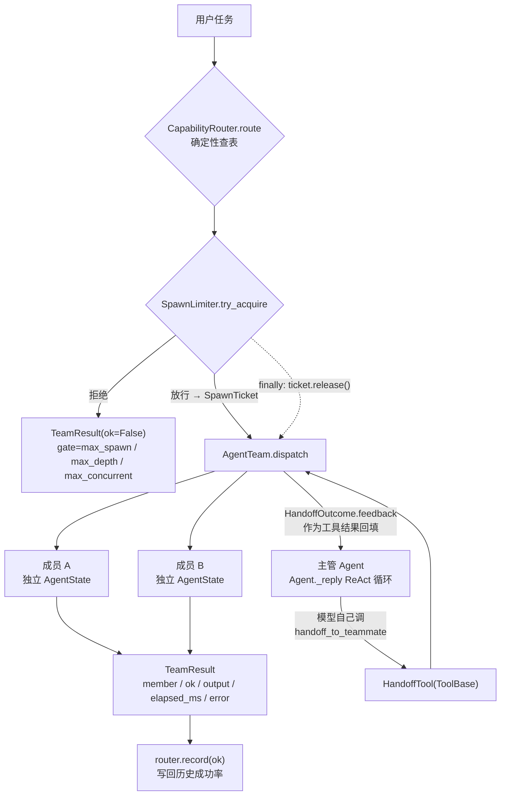
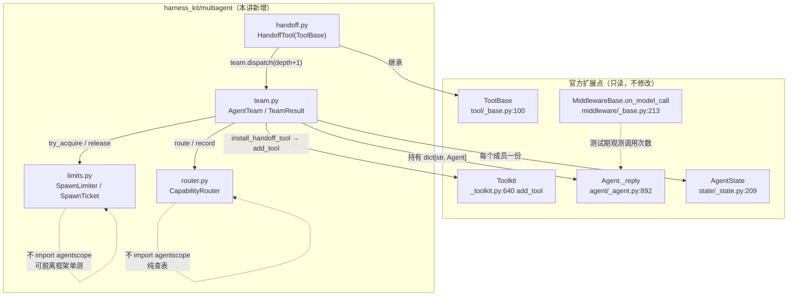
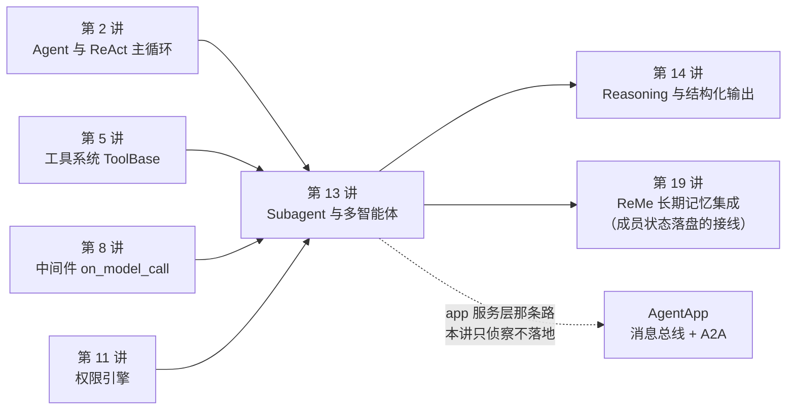

# 第 13 讲 《Subagent 与多智能体：派生、路由与主管-工人》

> **本讲目标**：把「多 Agent」从一句口号变成一个**能在 20 行之内解释清楚、能被单测覆盖、能算得出成本**的工程结构。前半程是源码侦察：AgentScope 2.0.8 在 SDK 层到底有没有子 Agent 原语（结论：**没有**，派生能力只存在于需要起服务的 app 层），以及一个模型的 ReAct 循环唯一能被「另一个 Agent」插入的地方是哪里（结论：`ToolBase`，也就是交接必须做成一个工具）。后半程是动手：在 `harness_kit/multiagent/` 里补上 SDK 层缺的四样东西 —— 派生闸门（`SpawnLimiter`）、确定性能力路由（`CapabilityRouter`）、主管-工人编排（`AgentTeam`）、交接协议（`HandoffTool`）—— 并给出「什么时候**不该**拆多 Agent」的量化依据。
> **前置要求**：第 1~12 讲全部完成（`harness_kit` 已有 `settings` / `registry` / `config` / `events` / `models` / `tools` / `middleware` / `sandbox` / `permission` / `pipeline`）。其中**第 2 讲**（`Agent` 与 ReAct 主循环 —— 本讲的 `dispatch` 就是 `await member.reply_stream(...)`）、**第 5 讲**（工具系统 —— `ToolBase.check_permissions` 是 `@abstractmethod`，`FunctionTool` 的默认行为是 ASK）、**第 8 讲**（中间件 —— 本讲的并发测试要用 `on_model_call` 钩子把模型调用「拖慢」才能让闸门真的触发）、**第 11 讲**（权限引擎 —— `HandoffTool` 无条件 ALLOW，你需要知道 ALLOW 不等于绕过 DENY）是硬前置。
> 环境：AgentScope 2.0.8 + ReMe 0.4.1.13，按第 1 讲的方式用 `PYTHONPATH=third_party/ReMe` 跑脚本。
> **本讲交付物**（全部相对仓库根）：
>
> - `tutorial_agsc_reme/reference/harness_kit/multiagent/limits.py`（`SpawnLimiter` / `SpawnTicket` / `SpawnLimitExceeded`）
> - `tutorial_agsc_reme/reference/harness_kit/multiagent/router.py`（`CapabilityRouter` / `MemberScore` / `NoRouteError`）
> - `tutorial_agsc_reme/reference/harness_kit/multiagent/team.py`（`AgentTeam` / `TeamResult`）
> - `tutorial_agsc_reme/reference/harness_kit/multiagent/handoff.py`（`HandoffTool` / `HandoffOutcome` / `collect_results`）
> - `tutorial_agsc_reme/reference/harness_kit/multiagent/__init__.py`（对外 API 面 + 边界声明）
> - `tutorial_agsc_reme/reference/scripts/13_multiagent.py`（本讲验证脚本，A~G 七段）
> - `tutorial_agsc_reme/reference/tests/test_lesson13_multiagent.py`（62 条 pytest，**0 次 LLM 调用**）
>
> **预计时长**：240 分钟。
>
> 本讲的完整可运行代码位于 `tutorial_agsc_reme/reference/harness_kit/multiagent/`，
> 你可以直接对照，也可以跟着正文一行一行写。
>
> **本讲不做什么**（先划线，免得走错方向）：
> - 不写任何调度循环 —— 主管「派活给谁」由**主管自己的 `Agent._reply` ReAct 循环**决定，我们只提供一个工具（`handoff.py` 全文没有一行 `while`）；
> - 不自己写 Agent、不自己写 `ChatModelBase`、不自己写 `Toolkit` —— 成员就是 `agentscope.agent.Agent`，`dispatch` 只是 `await member.reply_stream(...)` 之后取 `Msg.get_text_content()`；
> - 不起任何服务、不占端口、不用 `a2a` —— app 服务层那条路（`AgentApp` + 消息总线）本讲只做侦察，不落地；
> - 不碰 `third_party/` 下任何文件（只读）；
> - A~F 段验证 **0 次** LLM 调用（用第 4 讲那个离线 `EchoChatModel` 驱动真 Agent Loop）；只有 G 段（`--live`）真实调用 deepseek-flash，**3 次**，上限 6 次。

---

## 一、这一讲要解决的问题

### 1.1 一个具体到不能再具体的失败场景

先看两个真实会发生的场景。它们看起来不相关，其实是同一个缺口的两种表现。

**场景一：一个 Agent 硬扛三种活。**

你做了一个「自动修 issue」的 Agent。系统提示词是这么写的（每个字都是你亲手敲的）：

> 你是一个资深 Python 工程师，同时擅长代码审查。请阅读用户提供的 issue，定位 bug，写出修复方案，并检查方案是否引入了安全问题。

头两周它工作得不错。第三周开始，它变得「越来越笨」：明明是个两行的拼写错误，它却先读了 14 个文件、跑了 3 遍测试、最后给了一个把整个模块重构掉的补丁。你去看它的上下文，发现 `state.context` 里塞满了文件内容，早就触发了第 9 讲讲过的 `compress_context`，**压缩摘要把「用户要的是最小改动」这条约束挤掉了**。

问题不在模型，在于你把三件**需要不同上下文预算**的事塞进了一个 `AgentState`：读文件的人需要大上下文（读完就该扔），写代码的人需要精确的局部上下文，审查的人需要在**不知道实现过程**的前提下只看 diff（否则它会替作者辩解）。一个 `state.context` 服务不了三种模式。

**场景二：自复制。**

假设你按「多 Agent」的思路做了一版：给每个 Agent 都挂了一个 `create_agent` 工具，让它「需要时自己派生一个帮手」。上线第一晚，账单是 417 美元 —— 因为 A 派了 B，B 觉得任务还没拆够又派了 C，C 回头看任务描述里提到 A 擅长的部分，于是派了 D……**每一层都是合法的**，合起来是指数爆炸。token 账单是唯一的事后信号，而那太晚了。

> 这两个场景指向**两个完全不同**的缺口：第一个缺的是「隔离」（每个角色一份独立的 `AgentState` 与上下文预算），第二个缺的是「闸门」（派生次数 / 深度 / 并发的硬上限）。`harness_kit` 在这一讲要补的就是这两件事 —— 以及它们之间那个把两边缝起来的、可测的编排层。

### 1.2 「多 Agent」的三种常见误解

在动手之前先把三个流行误解拆掉，否则代码会写歪。

**误解一：多 Agent = 多份 system prompt。**

这是最贵的一个误解。给同一个 `Agent` 实例换几段 system prompt 然后依次调用，得到的是**串行的一次对话**，不是多 Agent —— 因为 `state.context` 是共享的，第二个角色能看到第一个角色的全部推理过程。真正的分界线是 **AgentScope 的 `AgentState`（`third_party/agentscope/src/agentscope/state/_state.py:209`）**：一个成员 = 一个独立 `Agent` 实例 = 一份独立 `AgentState`。`AgentTeam` 的构造函数里有一条硬检查：**同一个 `Agent` 实例被登记在两个名字下会直接 `ValueError`**，因为那会让「不共享消息历史」这条语义静默失效（第 2 讲讲过 `context` 就是那条被共享的列表）。

**误解二：多 Agent 一定更强。**

「三个臭皮匠」在这里不成立。拆成 N 个成员，一次任务要花 N 次模型调用 + N 份上下文，而且**如果成员之间需要对方的中间结果，你只是把串行链伪装成了团队**，成本翻了 N 倍、质量不升反降。本讲 F 段会给一个可执行的量化方法：用第 8 讲的 `on_model_call` 钩子数一遍调用次数，单 Agent 干一件事是 1 次，3 人广播同一件事是 3 次。判定表在 1.5 节。

**误解三：多 Agent = A2A = 分布式。**

AgentScope 确实有 `A2AAgent`（`third_party/agentscope/src/agentscope/agent/_a2a_agent.py:189`），但它**连 `Agent` 都不继承**，是跨进程的 A2A 协议客户端，而且需要未安装的 `a2a` extra（`:235` 处就是那句 import 检查；`tutorial_agsc_reme/_recon/09_agentscope_app_console.md:1278` 记录了本环境实测的 `ImportError`）。本讲走的是**进程内编排**：不需要起服务、不占端口、可以在一个 pytest 函数里跑完。跨进程是另一个问题（它要解决的是「两个不同团队的系统怎么互相调用」），不要用它来解决「我这边三个角色怎么分工」。

### 1.3 四条不变式

本讲写下的每一行代码，都是为了守住下面四条。第六节的每一条坑都踩在其中某一条上：

1. **隔离 = 不共享消息历史。** 每个成员是一个**独立 `Agent` 实例**，各自持有独立 `AgentState`。`dispatch` 只把任务文本送进去、把最终文本取出来，两台 Agent 的 `state.context` 永不相通。这既是隔离（工人之间不会互相污染），也是**并发的唯一前提** —— 同一个 `Agent` 并发 `reply` 会把上下文交错写乱，所以 `broadcast` 只能按成员分派。
2. **派生必须有闸门，且闸门必须可分辨。** 三道闸门缺一不可（次数 / 深度 / 并发），并且「被闸门拒绝」与「工人自己干不了」必须在返回值里**分得开**：前者换人也没用，后者换人可能有用。分不开的编排层会做出错误的处置 —— 对一个 `max_spawn` 拒绝的请求做重试，就是把钱扔进黑洞。
3. **选人必须确定性可复现。** 让模型「从下面 6 个 Agent 里选一个」是最诱人也最贵的做法：多一次 LLM 往返、同一个任务两次派给不同的人、事后审计只能贴一段模型输出。本讲用**查表**替代它：`(-score, attempts, member)` 三段排序键，同一输入永远同一答案。
4. **交接的决策权必须留给模型。** 「谁把活交给谁」如果由我们的 `if/else` 决定，那模型就没有决策权，多 Agent 退化成一条写死的流水线。让它成为**模型能调用的工具**，主管的 ReAct 循环自己会调、工具结果自动回填 —— 我们一行调度代码都不用写（`handoff.py` 全文没有循环）。

### 1.4 本讲要交付的一张图



读法：**带虚线的那个箭头是本讲最容易被忽略的一环** —— 票据必须在 `finally` 里归还，否则 `max_concurrent` 会被永久占满，后续所有派生都被拒。这也是 `limits.py` 里 `release()` 为什么写成同步方法（第 3.4 节解释：`finally` 里的 `await` 在协程被取消时可能立刻再次抛出）。

### 1.5 「该不该拆」的判定表

本讲的工程结论，先给结论再给代码：

| 你的情况 | 拆不拆 | 理由 |
| --- | --- | --- |
| 任务**能并行**，且成员**彼此不需要对方的中间结果** | **拆** | 收益与人数成正比，这是唯一「真并行」的形态 |
| 任务**串行**，后一步依赖前一步的产物 | **不拆** | 你只是把串行链伪装成团队，成本 ×N、质量不升 |
| 只是**角色口吻不同**（「你是资深审稿人」） | **不拆** | 换一段 system prompt 就行，`Agent` 只有一个 `AgentState` 时那才是对的 |
| 需要**不同权限 / 不同 workspace / 不同模型**才能安全隔离 | **拆** | 这是隔离需求，不是性能需求 |
| 需要**独立上下文预算**（读完 20 个文件后上下文该整体扔掉） | **拆** | 一个 `state.context` 服务不了两种预算 |
| 需要一个**能自我复制的生成器**（Agent 造 Agent） | **拆，但必须先有闸门** | 场景二；先写 `limits.py` 再写编排层 |

最后一行是本讲的顺序：**先闸门，后编排**。所以 `harness_kit/multiagent/` 的第一个文件是 `limits.py`，而它**不 import agentscope**（纯计数器，可以脱离框架单测）。

---

## 二、源码侦察

这一节的每一条断言都带 `路径:行号`，且每一条都在本机 `grep` 验证过。行号对应 **AgentScope 2.0.8**（`third_party/agentscope/src/agentscope/`）与 **ReMe 0.4.1.13**（`third_party/ReMe/reme/`）。

### 2.1 SDK 层到底有什么、没有什么

先把仓库里真实存在的「多 Agent 相关」代码全部列出来，一个不漏：

```
third_party/agentscope/src/agentscope/agent/_agent.py:117          class Agent:
third_party/agentscope/src/agentscope/app/_tool/_agent_create.py:145   class AgentCreate(_TeamToolBase):
third_party/agentscope/src/agentscope/app/_tool/_team_create.py:30     class TeamCreate(_TeamToolBase):
third_party/agentscope/src/agentscope/app/middleware/_team_member_middleware.py:21   class TeamMemberLoopMiddleware(MiddlewareBase):
third_party/agentscope/src/agentscope/agent/_a2a_agent.py:189      class A2AAgent:
third_party/agentscope/src/agentscope/agent/_a2a_agent.py:235          import a2a  # noqa: F401
```

**这说明什么**：

- `AgentCreate` / `TeamCreate` / `TeamMemberLoopMiddleware` 在 **`agentscope/app/`** 下 —— 它们的运行前提是一个跑起来的 `AgentApp` 服务（`create_app` + 消息总线 + 会话存储）。而我们前面 12 讲写的所有东西都是**库**，没有服务。把服务层的东西搬进库，需要先起服务，这就违反了本讲的「不占端口」约束。
- `A2AAgent` 在 **`agentscope/agent/`** 下，看起来像 SDK 层的东西，但它 **不继承 `Agent`**（`:189` 的类声明里没有基类）。它实现的是 A2A 协议客户端：连远端 agent card、发任务、轮询任务状态。`:235` 那段 `import a2a` 在 **`A2AAgent.__init__`（`:207`）里**，是**构造期**的可选依赖检查（不是 import 期 —— 模块本身 import 得进来）；本环境**没装**这个 extra，所以是"一实例化就炸"，而不是"一 import 就炸"。

再引一句现成的结论。本仓库的侦察报告里已经把这个缺口写死了：

```
tutorial_agsc_reme/_recon/02_agentscope_agent_loop.md:1234   核心 `Agent` 本身**没有** `spawn_subagent` 之类的能力
tutorial_agsc_reme/_recon/09_agentscope_app_console.md:1278  `from agentscope.agent import A2AAgent` 报 `ImportError: A2AAgent requires the A2A extra`
```

**这说明什么**：这就是本讲 `harness_kit/multiagent/` 存在的**全部理由**。SDK 层缺一块「进程内的、可测试的、带预算闸门的成员注册表 + 派活 + 收活」，我们补它。补的方式不是写一个新的 Agent 实现，而是**组合**现成的 `Agent`。

### 2.2 唯一的跨 Agent 扩展点：`ToolBase`

一个模型的 ReAct 循环要「碰到」另一个 Agent，唯一能让**模型自己**做决定的地方是工具。源码依据：

```
third_party/agentscope/src/agentscope/tool/_base.py:100    class ToolBase(ABC):
third_party/agentscope/src/agentscope/tool/_base.py:159        async def call(
third_party/agentscope/src/agentscope/tool/_base.py:190        async def __call__(
third_party/agentscope/src/agentscope/tool/_base.py:265        @abstractmethod
third_party/agentscope/src/agentscope/tool/_base.py:266        async def check_permissions(
```

**这说明什么**：

- `ToolBase` 明确写了 `call` 是「the new override point for tool implementations」（`:162-163` 的 docstring 原文）—— 我们实现工具只需要覆写 `call`，不需要碰 `__call__`（那是中间件洋葱层的入口）。
- `check_permissions` 是 `@abstractmethod`（`:265` 的装饰器 + `:266` 的函数签名）—— 也就是说**任何一个 `ToolBase` 子类都必须自己声明权限行为**。这直接决定了 `HandoffTool` 的写法（下一节）。

### 2.3 交接工具的默认权限是 `ASK`（契约 §3.13 的铁律）

契约 §3.13 原文写的是：

> 「铁律：`ToolBase` 自定义工具的默认行为是 ASK（需要用户确认），因此本工具必须在 `check_permissions` 里显式声明自己的行为，不能依赖默认值。」

后半句容易懂（`check_permissions` 是抽象方法，不写就 `TypeError`），前半句需要证据。真实源码在：

```
third_party/agentscope/src/agentscope/tool/_adapters.py:36     class FunctionTool(ToolBase):
third_party/agentscope/src/agentscope/tool/_adapters.py:116        async def check_permissions(
third_party/agentscope/src/agentscope/tool/_adapters.py:132                behavior=PermissionBehavior.ASK,
```

**这说明什么**：`FunctionTool`（也就是「把一个普通 Python 函数包成工具」那条最常用的路）在 `permission=None` 时返回 `ASK`。本讲的验证脚本 D1 段会把这件事和 `HandoffTool` 的 `ALLOW` **并排打出来**对照（见 5.4 节真实输出）：

```
  HandoffTool.check_permissions -> ALLOW / harness_kit.multiagent.handoff.HandoffTool
  FunctionTool.check_permissions -> ASK / Custom function tools must be explicitly allowed by the user.
```

为什么交接要无条件 ALLOW？因为**它是纯控制流，没有副作用**：不读文件、不跑命令、不联网，唯一的「副作用」是多花一次模型调用。每次派活都弹一个权限对话框，只会把权限提示变成噪声，让真正危险的操作（`rm -rf`）被淹没。

**另外，ALLOW 不等于「绕过规则」**：`PermissionBehavior` 的定义在

```
third_party/agentscope/src/agentscope/permission/_types.py:88    class PermissionBehavior(Enum):
third_party/agentscope/src/agentscope/permission/_decision.py:11   class PermissionDecision:
third_party/agentscope/src/agentscope/permission/_context.py:24    class PermissionContext(BaseModel):
```

工具返回的只是一个**意见**，`PermissionEngine`（第 11 讲）里用户配的 `DENY` 优先级更高。企业策略依然能一句话关掉整个多 Agent 编排 —— 这正是我们希望的性质。

### 2.4 `await tool(...)` 之后拿到的可能是 async generator

契约 §3.13 把这条列成了「已知坑」。源码依据：

```
third_party/agentscope/src/agentscope/tool/_base.py:190        async def __call__(
third_party/agentscope/src/agentscope/tool/_base.py:220            if inspect.isasyncgenfunction(self.call):
third_party/agentscope/src/agentscope/tool/_base.py:236                if inspect.isasyncgenfunction(self.call):
```

**这说明什么**：`__call__` 里对 `call` 分了两种形状 —— 第 `:220` 行是**没有中间件**时的快路径，第 `:236` 行是**有中间件**时洋葱层最内圈的归一化。两处的语义一致：

- `call` 是**协程**函数 → `await self.call(**kwargs)` 得到 `ToolChunk`；
- `call` 是**异步生成器**函数 → 直接返回**生成器**，调用方必须再 `async for`。

`HandoffTool.call` 走的是第一条（协程，直接 `return ToolChunk(...)`），所以 `await tool(...)` 一次就拿到结果。验证脚本 D3 段用一个 `StreamingHandoff` 子类把第二条形状也演示了一遍（`__call__` 返回类型是 `coroutine`，`await` 之后类型变成 `async_generator`，再 `async for` 才拿到两个 `ToolChunk`）—— 见 5.4 节的真实输出。手写调用时写错形状的报错是 `'async_generator' object is not subscriptable` 这类怪错，很难定位。

### 2.5 模型能看到的工具 = `basic` 组 + `activated_groups`

这是本讲**最容易静默失效**的一处。源码链：

```
third_party/agentscope/src/agentscope/state/_state.py:32       class ToolContext(BaseModel):
third_party/agentscope/src/agentscope/state/_state.py:42           activated_groups: list[str] = Field(default_factory=list)
third_party/agentscope/src/agentscope/agent/_agent.py:3268         tools = await self.toolkit.get_tool_schemas(
third_party/agentscope/src/agentscope/tool/_toolkit.py:171     async def get_tool_schemas(
third_party/agentscope/src/agentscope/tool/_toolkit.py:184                 group will always be included regardless of the filter. If not
third_party/agentscope/src/agentscope/tool/_toolkit.py:473     async def _get_available_tools(
third_party/agentscope/src/agentscope/tool/_toolkit.py:640     async def add_tool(
third_party/agentscope/src/agentscope/tool/_toolkit.py:643         group_name: str = "basic",
```

**这说明什么**：

- `Agent` 在 `_prepare_model_input`（`agent/_agent.py:3239` 定义的）里，把 `state.tool_context.activated_groups`（`state/_state.py:42`）传给 `Toolkit.get_tool_schemas`（`:171`）。而 `get_tool_schemas` 的 docstring 明确写着「The "basic" group will always be included regardless of the filter」（`:184`）。
- 所以：**工具放进一个非 `basic` 组、又不把该组加进 `activated_groups`，模型就完全看不到它**。表现出来是「主管从不派活」—— 一条日志都没有的静默失效。
- `Toolkit.add_tool` 的 `group_name` 默认就是 `"basic"`（`:643`）；`_get_available_tools`（`:473`）是那条过滤逻辑的实现处；`check_tool_available`（`:558`）在工具不可用时抛的是 `ToolGroupInactiveError`（提示你先去激活组），而不是「工具不存在」—— 这两条错误信息的区别就是官方替我们留的排查线索。
- 还有一个「组」的坑：`add_tool` 往一个**不存在的组名**里加工具会直接 `ValueError`（`_toolkit.py:677` 那段 `raise ValueError(f"Cannot find group '{group_name}' ...")`）。所以 `install_handoff_tool` 在 `group_name != "basic"` 时要**先把组造出来**。

### 2.6 主管的 ReAct 循环在哪里（我们不写循环）

这是本讲的核心证据链。「让主管自己决定派活」这句话，落到实处就是下面这五个行号：

```
third_party/agentscope/src/agentscope/agent/_agent.py:288     async def reply_stream(
third_party/agentscope/src/agentscope/agent/_agent.py:892     async def _reply(
third_party/agentscope/src/agentscope/agent/_agent.py:1027    async def _reply_impl(  # pylint: disable=too-many-branches
third_party/agentscope/src/agentscope/agent/_agent.py:2723    async def _acting(
third_party/agentscope/src/agentscope/agent/_agent.py:2729        This method is the hook point for ``on_acting`` middleware.  This
third_party/agentscope/src/agentscope/agent/_agent.py:2777    async def _acting_impl(
third_party/agentscope/src/agentscope/agent/_agent.py:2804        async for chunk in self.toolkit.call_tool(tool_call, self.state):
```

**这说明什么**：

- `_reply`（`:892`）就是那个「循环」。我们没有权限也没有必要在它外面再套一层调度器 —— `dispatch` 里那句 `await self._ask(...)` 最终落到的是 `reply_stream`（`:288`），而 `reply_stream` 内部会走 `_reply` → `_reply_impl`（`:1027`，那个 `too-many-branches` 的注释就是「这是个状态机」的自白）。
- 工具调用发生在 `_acting`（`:2723`）→ `_acting_impl`（`:2777`）→ `call_tool`（`:2804`）。`_acting` 的 docstring（`:2729`）自称是 `on_acting` 中间件的挂钩点。
- 工具结果回填进上下文这件事**由官方做完了**。所以我们提供「一个工具 + 一个派活函数」之后，主管的下一轮模型调用就会看到 `HandoffOutcome.feedback` 那段文本，自己决定「还要不要再派一个」或者「收尾」。

### 2.7 `AgentState` 是隔离的边界

```
third_party/agentscope/src/agentscope/state/_state.py:209     class AgentState(BaseModel):
third_party/agentscope/src/agentscope/message/_base.py:156    def get_text_content(self, separator: str = "\n") -> str | None:
```

**这说明什么**：`AgentState` 是 `Agent` 的**全部可变状态**的载体（第 2 讲与第 9 讲反复讲过的持久化边界）。一个 `Agent` 一份 `AgentState`，「隔离」这件事在实现层面就是「不要复用 `Agent` 实例」。取产物文本用 `Msg.get_text_content()`（`_base.py:156`），它会跳过 `ThinkingBlock` / `ToolCallBlock`，只拼 `TextBlock` —— 这正是我们要的：**推理过程不外泄，只有结论回来**，工人之间因此不会因为对方的内耗而互相污染。

### 2.8 ReMe 的扩展点：per-session `AgentState` 的落盘与 fork

ReMe 侧有一个**直接可用**的扩展点，它把「独立 `AgentState`」这件事从内存里提升到了磁盘上：

```
third_party/ReMe/reme/utils/agent_state_io.py:19     class AsStateHandler:
third_party/ReMe/reme/utils/agent_state_io.py:26         def for_session(cls, directory: str | Path, session_id: str) -> "AsStateHandler":
third_party/ReMe/reme/utils/agent_state_io.py:49     async def dump(self, state: AgentState) -> Path:
third_party/ReMe/reme/utils/agent_state_io.py:65     async def load(self) -> AgentState:
third_party/ReMe/reme/components/agent_wrapper/as_agent_wrapper.py:146   class AsAgentWrapper(BaseAgentWrapper):
third_party/ReMe/reme/components/agent_wrapper/as_agent_wrapper.py:225       def session_path(self) -> Path:
third_party/ReMe/reme/components/agent_wrapper/as_agent_wrapper.py:264   async def _load_state(self, kwargs: dict[str, Any], perm_mode: PermissionMode) -> AgentState:
third_party/ReMe/reme/components/agent_wrapper/as_agent_wrapper.py:284                   forked = AgentState(
third_party/ReMe/reme/components/agent_wrapper/as_agent_wrapper.py:293       return AgentState(session_id=session_id or str(uuid4()), permission_context=PermissionContext(mode=perm_mode))
```

**这说明什么**：`AsAgentWrapper._load_state`（`:264`）是 ReMe 里「一个 Agent 的会话状态从哪来」的答案，它有三种来源：`AgentState(...)` 全新造一个（`:293`）、`AsStateHandler.for_session(...).load_or_none()` 从磁盘恢复、以及 `fork_session=True` 时**从已有状态 fork 出一份新的**（`:284`，`AgentState(session_id=..., summary=state.summary, context=list(state.context), ...)`）。

最后这一条就是多 Agent 的语义：**fork 出来的两份 `AgentState` 从同一份上下文出发，之后各走各的**。本讲的 `AgentTeam` 没有依赖 ReMe（保持 `multiagent/` 可离线单测），但两者可以无缝叠起来：每个成员一个 `session_id`，`dispatch` 前后各 `dump` 一次，团队状态就落盘了 —— 这就是第 19 讲（ReMe 长期记忆集成）与本讲的接口。这一条属于「本讲给下一步留的门」，不写进 `multiagent/` 的代码里。

### 2.9 诚实清单：AgentScope **没有**提供什么

| 你以为有的东西 | 实际情况 | 证据 |
| --- | --- | --- |
| `Agent.spawn_subagent()` / `Agent.create_agent()` 之类的 SDK 方法 | **没有**。核心 `Agent` 完全不认识「另一个 Agent」这个概念 | `_recon/02_agentscope_agent_loop.md:1234` |
| SDK 层的「团队」抽象（成员表 + 选人策略） | **没有**。`TeamCreate` 在 app 服务层，且语义是「往消息总线里注册一个成员」 | `app/_tool/_team_create.py:30` |
| 派生上限 / 深度上限 / 并发上限 | **没有**。任何限额都得自己写 | 全文 grep `max_spawn` / `max_depth` 无命中 |
| 确定性选人 | **没有**。SDK 层没有任何路由概念 | grep `capability` 在 `agentscope/agent/`、`agentscope/tool/`、`agentscope/permission/` 三个包里 **0 处**命中；全库那 14 处全在 `agentscope/app/`（知识库路由、下载 token 之类） |
| 交接协议（谁交给谁、结果怎么回来） | **没有**。A2A 是跨进程协议，不是进程内的交接协议 | `agent/_a2a_agent.py:189` |
| `ToolBase` 自定义工具的默认权限 | 有，但默认是 **ASK**，交接用它会淹没权限系统 | `tool/_adapters.py:132` |

**这张表就是本讲的缺口编号来源**（下面 2.10 节）。

### 2.10 本讲的缺口编号（1~6）

契约 §1.3 的那 6 条全局缺口分别落在 03/09/10/19/20 讲，不包含本讲。本讲的缺口是**独立编目**的，编号规则与契约一致（「每一条都有真实证据、对应本讲的一个文件」）：

| # | 缺口 | 证据（`路径:行号`） | 本讲的落点 |
| --- | --- | --- | --- |
| 1 | **没有派生闸门**：任何「Agent 能造 Agent」的能力都没有次数 / 深度 / 并发上限 | 2.9 节表格第 3 行 | `harness_kit/multiagent/limits.py` |
| 2 | **没有确定性路由**：SDK 层没有「按能力选人」的任何抽象，只能让模型选或用 `if/else` 写死 | 2.9 节表格第 4 行 | `harness_kit/multiagent/router.py` |
| 3 | **没有进程内编排层**：app 层的团队能力要求起服务，库形态的代码用不了 | `app/_tool/_team_create.py:30` | `harness_kit/multiagent/team.py` |
| 4 | **没有交接协议**：没有「把任务交给谁 + 结果怎么回填」的标准形态；A2A 是跨进程的、且依赖未装的 extra | `agent/_a2a_agent.py:189`、`:235` | `harness_kit/multiagent/handoff.py` |
| 5 | **交接口的默认权限是 ASK**：自定义工具不显式声明行为，就会把权限系统变成噪声源 | `tool/_adapters.py:132` | `handoff.py` 的 `check_permissions` |
| 6 | **没有「什么时候不该拆」的量化口径**：没有任何官方文档告诉你拆多 Agent 的成本放大倍数 | 本讲 F 段（`scripts/13_multiagent.py`） | 判定表（1.5 节 + F 段） |

### 2.11 本讲用到的扩展点清单

一句话一个，全部是**官方已有**的东西（我们只继承 / 实现 / 调用，不修改）：

| 扩展点 | 位置 | 本讲怎么用 |
| --- | --- | --- |
| `ToolBase` | `tool/_base.py:100` | `HandoffTool` 继承它，覆写 `call` 与 `check_permissions` |
| `ToolBase.call` | `tool/_base.py:159` | 实现为协程，返回 `ToolChunk` |
| `ToolBase.check_permissions` | `tool/_base.py:266` | 无条件 `ALLOW`，并显式写出 `decision_reason` |
| `PermissionDecision` / `PermissionBehavior` | `permission/_decision.py:11`、`_types.py:88` | 构造 `ALLOW` 决策 |
| `Toolkit.add_tool` / `remove_tool` | `tool/_toolkit.py:640`、`:682` | 幂等安装交接工具（先删后加） |
| `Toolkit.tool_groups` | `tool/_toolkit.py`（`add_tool` 遍历的对象） | 非 basic 组时先建组再放工具 |
| `Toolkit.get_tool_schemas` | `tool/_toolkit.py:171` | 断言「模型真的看得见这个工具」 |
| `Agent.reply_stream` | `agent/_agent.py:288` | `_ask` 里 `async for` 收最终 `Msg` |
| `Agent.state.tool_context.activated_groups` | `state/_state.py:42` | 非 basic 组时立刻激活 |
| `AgentState` | `state/_state.py:209` | 「每个成员一份」这条语义的载体（本讲不落盘） |
| `Msg.get_text_content` | `message/_base.py:156` | 从最终 `Msg` 里取纯文本产物 |
| `MiddlewareBase.on_model_call` | `middleware/_base.py:213` | 数调用次数（F 段）/ 让调用真的挂起（并发测试） |
| `ReActConfig(max_iters=)` | `agent/_config.py:362`、`:365` | 钉死离线 Agent 的最大迭代数，避免测试跑飞 |
| `AsStateHandler.for_session` | `third_party/ReMe/reme/utils/agent_state_io.py:26` | 「成员状态落盘」的现成件（第 19 讲接线） |

### 2.12 「源码侦察」的三条结论

1. **SDK 层没有子 Agent 原语，这不是本讲的遗憾，而是本讲的题目** —— `harness_kit/multiagent/` 补的就是这一块，且它是**组合**而非重写：成员是 `Agent`，派活是 `reply_stream`，隔离是「不复用实例」。
2. **一切都要挂在 `ToolBase` 上** —— 因为 `_acting`（`agent/_agent.py:2723`）是模型唯一能碰到外部世界的路径，而工具结果回填（`:2804` 之后的路径）是官方替我们做完的。
3. **两处静默失效必须先防住** —— 非 basic 组不激活（`_toolkit.py:171`）与 `release()` 不归还（`limits.py` 的 `finally`）。它们都不会报错，只会让系统「不派活」或者「派不动活」。

---

## 三、扩展点定位与设计

### 3.1 官方**已经**给了什么

回答契约 §8 的第一个问题，逐条引用 2 节的行号：

- **一个完整的 ReAct 状态机**：`Agent`（`agent/_agent.py:117`）+ `reply_stream`（`:288`）+ `_reply`（`:892`）。我们要的「成员」不需要写一个字，它就是一个 `Agent`。
- **工具从定义到执行的完整闭环**：`ToolBase`（`tool/_base.py:100`）→ `Toolkit.add_tool`（`tool/_toolkit.py:640`）→ 模型看到 schema（`_agent.py:3268` 调 `get_tool_schemas`）→ 模型产出 `tool_call` → `_acting`（`_agent.py:2723`）→ `call_tool`（`:2804`）→ 结果回填。**这条链上没有一个环节需要我们自己写。**
- **一套权限语义**：`PermissionDecision`（`permission/_decision.py:11`）+ `PermissionBehavior`（`permission/_types.py:88`），工具的 `check_permissions` 可以表达 ALLOW / ASK / DENY。
- **一个可注入的中间件钩子**：`on_model_call`（`middleware/_base.py:213`）。这是我们**观察和塑形模型调用**的唯一官方入口 —— 本讲用它来数次数、以及让并发测试有意义。
- **一个可序列化的状态边界**：`AgentState`（`state/_state.py:209`），以及 ReMe 那边现成的落盘实现（`reme/utils/agent_state_io.py:19`）。

### 3.2 还缺什么（缺口编号 1~6）

对应 2.10 节的表。一句话版本：

1. **缺口 1：闸门** —— 没有任何限额，Agent 自复制会指数爆炸；
2. **缺口 2：路由** —— 没有确定性选人，只能让模型选（贵且不可复现）或用 `if/else` 写死（不可维护）；
3. **缺口 3：编排** —— 库形态的进程内团队抽象不存在；
4. **缺口 4：交接协议** —— 「谁交给谁、结果怎么回来」没有标准形态；
5. **缺口 5：交接口的权限默认值是 ASK** —— 不显式声明就会淹没权限系统；
6. **缺口 6：成本口径** —— 没有任何官方材料告诉你拆多 Agent 的代价。

### 3.3 我们准备在哪个扩展点上做

回答契约 §8 的第三个问题，四句话：

1. **闸门（缺口 1）**：不继承任何东西 —— 它是纯计数器（`threading.Lock` + 六个整数）。**刻意不 import agentscope**，这样它可以脱离框架单测，也能被非 Agent 的代码复用。
2. **路由（缺口 2）**：同样不继承任何东西 —— 它是一个纯查表器（`dict` + 排序）。**刻意不 import agentscope**，因为「选人」是策略问题，与框架无关。
3. **编排（缺口 3）**：**不继承 `Agent`，而是持有 `dict[str, Agent]`**。这是本讲最重要的一个设计决定：`AgentTeam` 是一个「容器」，不是一个「Agent」。它不需要 `reply`、不需要 `AgentState`、不需要出现在任何 Prompt 里。
4. **交接（缺口 4、5）**：**继承 `ToolBase`**（`tool/_base.py:100`），覆写 `call`（`:159`）与 `check_permissions`（`:266`）。这是唯一能让**模型自己**做决定的扩展点（2.2 节）。

### 3.4 `limits.py` 的设计：三道闸门为什么缺一不可

三道门各自防一种爆炸，**任何一个单独设都不够**：

| 闸门 | 防什么 | 撞上之后的正确处置 | 报错文案（本讲真实输出） |
| --- | --- | --- | --- |
| `max_spawn` | **宽度爆炸**：一次并行 32 个 | 整体策略错了，**重试没有意义** | 「派生总数已达上限 4。这是「宽度爆炸」闸门……」 |
| `max_depth` | **深度爆炸**：A→B→C→D→… 每层都合规但永远不停 | 检查是不是形成了环 | 「派生深度 2 已达上限 1（max_depth=2，depth 从 0 起算）」 |
| `max_concurrent` | **打满上游 QPS**：并发请求把 provider 限流触发 | **稍后重试或降低并行度即可** | 「并发派生数已达上限 2。这是「打满上游 QPS」闸门……」 |

三个设计细节：

- **`try_acquire` 是 fail-fast，不排队。** 排队会把「爆炸」变成「卡住」—— 卡住比报错更难定位。需要等待语义时用 `async with slot()`（它同样 fail-fast，只是把释放写进 `finally`）。
- **`release()` 是同步方法。** 它必须在 `finally` 里可靠执行，包括 `asyncio.CancelledError`（取消任务）这条路径 —— 而 `finally` 里的 `await` 在协程被取消时**可能立刻再次抛出**。计数器用 `threading.Lock`，临界区只有几次整数运算，不会阻塞事件循环。
- **`release()` 幂等，并且 `active` 变负数时会被钳回 0 并打一条 `error` 日志。** 一张票据被释放两次会让 `active` 变成负数 —— 那比泄漏更难查，因为「负数」意味着后续所有派生都被一条不存在的余额永久放行。

### 3.5 `router.py` 的设计：为什么不用 LLM 选人

「让模型从下面 6 个 Agent 里选一个」有三个问题：贵且慢（每次派活多一次 LLM 往返）、不可复现（同一任务两次派给不同的人，评测里噪声盖过信号）、可解释性差（事后审计只能贴一段模型输出）。

**关键的认知切换**：「这个任务是什么类别」是**分类问题**，「谁来做」是**查表问题**。分类交给出题人（调用方的 `required` 参数，或者上游拆解器给出的 `capability` 字段），查表交给 `router.py`。

打分的三个设计决定：

- **能力分是「命中数 / 标签总数」，不是「命中数」。** 一个挂了 20 个标签、只命中 1 个的成员（1/20）不该赢过精准命中 1/1 的人。用「个数」的话，谁把标签写得多谁永远赢，路由表会迅速失效。
- **排序键是 `(-score, attempts, member)`。** 分数降序 → **调用次数少的优先**（轮转，避免一个强成员吃掉所有活）→ 名字字典序（保证平局可复现）。三段缺一不可：只按分数排会让强成员饿死其他成员；只按次数排会让「谁先注册谁赢」。
- **冷启动成功率是 0.5 而不是 0。** 给 0 会让所有新成员在第一次打分里被历史权重压死，永远轮不到出场 —— 「历史成功率」这个维度就变成了自我实现的预言。

还有一个**真实踩过的坑**写在 `_TOKEN_RE` 的注释里：分词的正则必须是 `[a-zA-Z0-9一-鿿]+`，**下划线不能进字符类**。写成 `[a-zA-Z0-9_]` 时 `_normalize("code_review")` 会原样返回 `"code_review"`，而 `_normalize("Code-Review")` 返回 `"codereview"` —— 两边匹配不上，`required="code_review"` 找不到标签 `"Code-Review"`，最后表现为一句莫名其妙的 `NoRouteError`。验证脚本 B1 段专门守着它。

### 3.6 `team.py` 的设计：广播的并发前提

`AgentTeam` 是「容器」而不是「Agent」，三个语义决定：

- **构造时守卫「独立实例」**（缺口 3 的核心）。用 `id(agent)` 查重：同一个实例挂两个名字直接 `ValueError`。理由写在异常消息里 —— 那会让「不共享消息历史」静默失效。
- **`dispatch` 任何失败都不抛异常**，统一返回 `ok=False` + `error`。编排层需要一个统一的返回值形状，否则每个调用点都要写 `try/except` 三件套。**唯一的例外是「路由失败」**（一个候选都没有）—— 那是配置错误，静默返回 `ok=False` 会让人以为只是模型不行，所以显式抛 `NoRouteError`。
- **`broadcast` 敢用 `asyncio.gather`，是因为它按「成员」分派。** 一个成员一次只跑一个任务（成员列表先去重），所以不存在「同一个 `AgentState` 被并发写」的问题；而并发的总量由 `max_concurrent` 压住（拒绝了就返回 `ok=False`，不是排队）。
- **`handoff_tool` 按 `(成员, 工具名)` 缓存实例。** 每次调用都新建的话，`install_handoff_tool` 会把上一次的 `HandoffTool` 连同它记下的 `outcomes`（移交历史）一起丢掉，「结果回收」在重复安装后就查不到任何东西了 —— 这是验证脚本里**真的踩到过**的坑，注释里写了原因。

### 3.7 `handoff.py` 的设计：交接为什么必须是工具

第 2.2 节已经给了答案（`ToolBase` 是模型唯一能碰到外部世界的路径），这里补齐「为什么不是函数调用」：

- 做成**普通函数调用** = 把「谁交给谁」写死在我们的代码里，模型没有决策权，多 Agent 退化成一条写死的流水线；
- 做成**工具** = 「调不调、调给谁、调几次」由主管的 ReAct 循环自己决定，工具结果自动回填到它的上下文（`agent/_agent.py:2804` 之后的路径），**我们一行调度代码都不用写**。

三个必须踩对的点（都在正文里断言）：

1. **`check_permissions` 无条件 ALLOW 并写出理由**（缺口 5）。不是「绕过规则」：`PermissionEngine` 里用户配的 DENY 优先级更高。
2. **失败回一段文本，不抛异常。** 抛异常会被 Agent 循环记成工具错误，模型看不到「下一步该做什么」。所以 `HandoffOutcome.feedback` 的属性设计成**永远非空**，失败时带一句可操作的下一步建议（「Do not retry the same handoff blindly; either do the work yourself or hand it to a different teammate.」）。空的工具结果更糟 —— 模型会以为工具没执行，然后重复调用。
3. **深度必须能传播。** `HandoffTool` 在构造时记下自己的 `depth`，派活时用 `depth + 1`。A→B→C→… 这条链才有账，`max_depth` 才拦得住。`supervise` 里安装工具用的 `depth=0`，所以主管的直接下属是深度 1。

另外两个「省钱的细节」：`collect_results` 有 `max_chars` 预算（8 个成员的长文全塞回发起方上下文是**要花钱**的，超了按条截断）；`install_handoff_tool` 默认把工具放进 `basic` 组（2.5 节的静默失效）。

### 3.8 接线全景图



**这张图的依赖方向是单向的**：`handoff` → `team` → `router` / `limits`。所以 `import harness_kit.multiagent` 永远不会成环 —— 这也是 `handoff.py` 与 `team.py` 之间互相需要类型注解时只能用 `TYPE_CHECKING` + 局部 import 的原因（`handoff.py` 的 `call` 里那句 `from harness_kit.multiagent.team import TeamResult` 注释写着「局部 import，避免成环」）。

`HandoffTool` 对 `AgentTeam` 是**鸭子类型**：它只要求对方有 `dispatch` 和 `names`，不 import `AgentTeam` 的类型。这一点让 `handoff.py` 可以脱离 `team.py` 单测 —— 传一个假的 team 对象进去也行。

---

## 四、harness_kit 实现

### 4.0 目录与阅读顺序

```
tutorial_agsc_reme/reference/harness_kit/multiagent/
├── __init__.py     # 对外 API 面 + 边界声明（四条模块的分工表写在这里）
├── limits.py       # 闸门：SpawnLimiter / SpawnTicket / SpawnLimitExceeded
├── router.py       # 路由：CapabilityRouter / MemberScore / NoRouteError
├── team.py         # 编排：AgentTeam / TeamResult
└── handoff.py      # 交接：HandoffTool / HandoffOutcome / collect_results
```

**阅读顺序 = 依赖顺序 = 由内向外**：`limits` → `router` → `team` → `handoff`。

- 前两个**不 import agentscope**，可以脱离框架单测（本讲的 62 条 pytest 里，有 26 条完全不需要框架）；
- `team.py` 依赖 `agentscope.agent`；
- `handoff.py` 依赖 `agentscope.tool` / `agentscope.permission`。

本讲每一份代码都与 `tutorial_agsc_reme/reference/harness_kit/multiagent/` 下的真实文件**逐字一致**（契约 §11 的使用规则 2）。

### 4.1 `harness_kit/multiagent/limits.py`

```python
# -*- coding: utf-8 -*-
"""并发与预算限制（契约 §3.13，第 13 讲）。

**这一层为什么必须有**：AgentScope 2.0.8 的 app 服务层里有子 Agent 的原语
（``app/_tool/_agent_create.py:145`` 的 ``AgentCreate``、``_team_create.py:30``
的 ``TeamCreate``），但**核心 SDK 层没有任何派生上限**
（``_recon/02_agentscope_agent_loop.md:1234``：「核心 ``Agent`` 本身没有
``spawn_subagent`` 之类的能力」）。只要有一个「Agent 可以创建 Agent」的工具，
模型就能写出自复制循环：A 派 B，B 派 C，C 又派 A —— 每一层都合法，合起来是
指数爆炸。token 账单是唯一的事后信号，而那太晚了。

三个互相独立的闸门，任何一个单独设都不够：

=================== ================================================================
``max_spawn``       整条流程一共允许派生多少次。防「宽度爆炸」：一次并行 32 个。
``max_depth``       派生的层数。防「深度爆炸」：A→B→C→D→…，每一层都合规但永远不停。
``max_concurrent``  同时活着的派生数。防「把上游 provider 的 QPS 打满」。
=================== ================================================================

**为什么 ``release()`` 是同步的**：它必须在 ``finally`` 里可靠执行，包括
``asyncio.CancelledError``（取消任务）这条路径 —— 而 ``finally`` 里的
``await`` 在协程被取消时可能立刻再次抛出。计数器加锁用 ``threading.Lock``，
临界区只有几次整数运算，不会阻塞事件循环。
"""

from __future__ import annotations

import threading
from contextlib import asynccontextmanager, contextmanager
from typing import AsyncIterator, Iterator

from loguru import logger
from pydantic import BaseModel, ConfigDict

__all__ = [
    "SpawnLimitExceeded",
    "SpawnLimiter",
    "SpawnLimiterStats",
    "SpawnTicket",
]


class SpawnLimitExceeded(RuntimeError):
    """触发了派生闸门。

    带 ``gate`` 字段标明是哪一道门：``"max_spawn"`` / ``"max_depth"`` /
    ``"max_concurrent"``。区分它们很重要：``max_concurrent`` 撞上通常是
    「稍后重试就行」，而 ``max_spawn`` 撞上意味着**这一轮的策略本身有问题**，
    重试没有意义。
    """

    def __init__(
        self,
        gate: str,
        message: str,
        *,
        limit: int = 0,
        current: int = 0,
    ) -> None:
        """构造错误。

        Args:
            gate (`str`): 闸门名。
            message (`str`): 人读说明。
            limit (`int`): 该闸门的限额。
            current (`int`): 触发时的实际值。
        """
        self.gate = gate
        self.limit = limit
        self.current = current
        super().__init__(message)


class SpawnLimiterStats(BaseModel):
    """派生统计快照，供日志与指标使用。"""

    model_config = ConfigDict(extra="forbid")

    max_spawn: int = 0
    """派生总数上限。"""
    max_depth: int = 0
    """派生深度上限。"""
    max_concurrent: int = 0
    """同时存活上限。"""
    active: int = 0
    """当前存活（已 acquire 未 release）数。"""
    spawned: int = 0
    """累计发出的票据数。"""
    rejected: int = 0
    """累计被拒绝次数。"""
    peak_active: int = 0
    """``active`` 的历史峰值 —— 判断「限额是不是设小了」就看它。"""
    deepest: int = 0
    """实际到达过的最大深度。"""


class SpawnTicket:
    """一张派生许可。

    **必须 ``release()``**：不释放会让 ``max_concurrent`` 永远占满，后续派生
    全被拒。正常用法是 ``async with limiter.slot(depth=d) as ticket:``，异常与
    取消路径都会自动释放。手动用时务必 ``try/finally``。

    ``release()`` 是幂等的：重复调用只算一次（``Ticket`` 释放两次会让
    ``active`` 变成负数，比泄漏更难查）。
    """

    def __init__(
        self,
        limiter: "SpawnLimiter",
        *,
        depth: int,
        ticket_id: int,
    ) -> None:
        """构造票据（只应由 :meth:`SpawnLimiter.try_acquire` 调用）。"""
        self._limiter = limiter
        self.depth = depth
        """本票据的深度。"""
        self.ticket_id = ticket_id
        """自增票据号，便于日志里追踪。"""
        self._released = False

    @property
    def released(self) -> bool:
        """是否已释放。

        Returns:
            `bool`: 已释放为 ``True``。
        """
        return self._released

    def release(self) -> None:
        """归还票据（幂等）。"""
        if self._released:
            return
        self._released = True
        self._limiter._on_release(self)  # pylint: disable=protected-access

    def __enter__(self) -> "SpawnTicket":
        """支持同步 ``with``。

        Returns:
            `SpawnTicket`: ``self``。
        """
        return self

    def __exit__(self, *exc: object) -> None:
        """退出时释放。"""
        self.release()

    def __repr__(self) -> str:
        """调试表示。"""
        state = "released" if self._released else "active"
        return (
            f"SpawnTicket(id={self.ticket_id}, depth={self.depth}, {state})"
        )


class SpawnLimiter:
    """派生闸门（契约 §3.13）。

    Args:
        max_spawn (`int`, defaults to `8`): 整条流程允许派生的总次数。
        max_depth (`int`, defaults to `3`): 允许的最大深度。``depth`` 从 0 起算，
            因此 ``max_depth=3`` 允许 depth 为 0 / 1 / 2 的三层，``depth=3``
            的请求被拒。
        max_concurrent (`int`, defaults to `4`): 同时存活的票据数上限。

    Raises:
        ValueError: 任一限额非正。
    """

    def __init__(
        self,
        *,
        max_spawn: int = 8,
        max_depth: int = 3,
        max_concurrent: int = 4,
    ) -> None:
        """初始化三道闸门。"""
        if max_spawn <= 0 or max_depth <= 0 or max_concurrent <= 0:
            raise ValueError(
                "max_spawn / max_depth / max_concurrent 必须为正数，"
                f"收到 {(max_spawn, max_depth, max_concurrent)}。"
                "要「不限」请给一个大数，不要给 0 —— 0 会让所有派生静默失败。",
            )
        self.max_spawn = int(max_spawn)
        self.max_depth = int(max_depth)
        self.max_concurrent = int(max_concurrent)
        self._lock = threading.Lock()
        self._active = 0
        self._spawned = 0
        self._rejected = 0
        self._peak_active = 0
        self._deepest = 0
        self._next_id = 1

    # ==================================================================
    # 核心
    # ==================================================================
    def try_acquire(self, *, depth: int) -> SpawnTicket:
        """尝试拿一张票据，失败立刻抛。

        **fail-fast 而不是排队等待**是刻意的：任务书的约束是「防止子 Agent
        爆炸」，等待会把爆炸变成「卡住」—— 卡住比报错更难定位。需要等待语义
        用 :meth:`slot`（它同样 fail-fast，只是把释放写进 ``finally``）。

        Args:
            depth (`int`): 本次派生的深度，从 0 开始。被派生的 Agent 再派生时
                应传 ``depth + 1``。

        Returns:
            `SpawnTicket`: 已占用的票据。

        Raises:
            SpawnLimitExceeded: 撞上任一闸门。
        """
        with self._lock:
            if depth >= self.max_depth:
                self._rejected += 1
                raise SpawnLimitExceeded(
                    "max_depth",
                    f"派生深度 {depth} 已达上限 {self.max_depth - 1}"
                    f"（max_depth={self.max_depth}，depth 从 0 起算）。"
                    "继续派下去只会得到一条越来越长的、永远回不到根的链。",
                    limit=self.max_depth,
                    current=depth,
                )
            if self._spawned >= self.max_spawn:
                self._rejected += 1
                raise SpawnLimitExceeded(
                    "max_spawn",
                    f"派生总数已达上限 {self.max_spawn}。"
                    "这是「宽度爆炸」闸门：撞上它说明整体策略有问题，"
                    "重试没有意义，应该减少并行或改为串行。",
                    limit=self.max_spawn,
                    current=self._spawned,
                )
            if self._active >= self.max_concurrent:
                self._rejected += 1
                raise SpawnLimitExceeded(
                    "max_concurrent",
                    f"并发派生数已达上限 {self.max_concurrent}。"
                    "这是「打满上游 QPS」闸门：稍后重试或降低并行度即可。",
                    limit=self.max_concurrent,
                    current=self._active,
                )
            self._spawned += 1
            self._active += 1
            self._peak_active = max(self._peak_active, self._active)
            self._deepest = max(self._deepest, depth)
            ticket = SpawnTicket(self, depth=depth, ticket_id=self._next_id)
            self._next_id += 1
        logger.debug(
            "SpawnLimiter: acquire {} (active={}/{}, spawned={}/{}, depth={})",
            ticket.ticket_id,
            self._active,
            self.max_concurrent,
            self._spawned,
            self.max_spawn,
            depth,
        )
        return ticket

    def _on_release(self, ticket: SpawnTicket) -> None:
        """票据归还（只应由 :meth:`SpawnTicket.release` 调用）。

        Args:
            ticket (`SpawnTicket`): 被归还的票据。
        """
        with self._lock:
            self._active -= 1
            if self._active < 0:
                # 不该发生；发生说明有票据被重复释放。钳回 0 并报警，
                # 免得后续所有派生都被一条负数永久放行。
                logger.error(
                    "SpawnLimiter: active 变成负数（票据 {} 重复释放？），已钳回 0。",
                    ticket.ticket_id,
                )
                self._active = 0
        logger.debug(
            "SpawnLimiter: release {} (active={})",
            ticket.ticket_id,
            self._active,
        )

    @asynccontextmanager
    async def slot(self, *, depth: int) -> AsyncIterator[SpawnTicket]:
        """``async with`` 形式的票据，退出时自动释放。

        Args:
            depth (`int`): 派生深度。

        Yields:
            `SpawnTicket`: 票据。

        Raises:
            SpawnLimitExceeded: 撞上任一闸门（在进入 ``with`` 体之前就抛）。
        """
        ticket = self.try_acquire(depth=depth)
        try:
            yield ticket
        finally:
            # 取消 / 异常路径都会走到这里；release 幂等，重复调用无害。
            ticket.release()

    @contextmanager
    def guard(self, *, depth: int) -> Iterator[SpawnTicket]:
        """同步版的票据守卫，给非 async 代码用（``with limiter.guard(depth=0) as t:``）。

        **必须有 ``@contextmanager``**：没有它时这个函数只是个生成器函数，
        ``with`` 会直接 ``TypeError: 'generator' object does not support the
        context manager protocol`` —— 这个坑真实发生过，测试用例里有一条专门
        守着它。

        Args:
            depth (`int`): 派生深度。

        Yields:
            `SpawnTicket`: 票据。
        """
        ticket = self.try_acquire(depth=depth)
        try:
            yield ticket
        finally:
            ticket.release()

    # ==================================================================
    # 观测
    # ==================================================================
    @property
    def active(self) -> int:
        """当前存活票据数。

        Returns:
            `int`: 已 acquire 未 release 的数量。
        """
        with self._lock:
            return self._active

    @property
    def spawned(self) -> int:
        """累计发出的票据数。

        Returns:
            `int`: 总数。
        """
        with self._lock:
            return self._spawned

    def remaining(self) -> int:
        """还剩多少派生配额。

        Returns:
            `int`: ``max_spawn - spawned``（不小于 0）。
        """
        with self._lock:
            return max(0, self.max_spawn - self._spawned)

    def snapshot(self) -> SpawnLimiterStats:
        """统计快照。

        Returns:
            `SpawnLimiterStats`: 当前统计。
        """
        with self._lock:
            return SpawnLimiterStats(
                max_spawn=self.max_spawn,
                max_depth=self.max_depth,
                max_concurrent=self.max_concurrent,
                active=self._active,
                spawned=self._spawned,
                rejected=self._rejected,
                peak_active=self._peak_active,
                deepest=self._deepest,
            )

    def reset(self) -> None:
        """清零计数器（**不**动已经发出去的票据）。

        用途：一轮评测 / 一次请求之间复位。已经 acquire 的票据仍能正常 release
        （``active`` 会被减到 0 并触发那条钳位日志），所以正常做法是**先等所有
        票据归还再 reset**。
        """
        with self._lock:
            self._active = 0
            self._spawned = 0
            self._rejected = 0
            self._peak_active = 0
            self._deepest = 0
        logger.info("SpawnLimiter.reset: 计数器已清零。")

    def describe(self) -> str:
        """一行人读统计。

        Returns:
            `str`: 形如 ``"spawn=3/8 active=1/4 depth=1/3 rejected=0"``。
        """
        s = self.snapshot()
        return (
            f"spawn={s.spawned}/{s.max_spawn} "
            f"active={s.active}/{s.max_concurrent} "
            f"depth={s.deepest}/{s.max_depth - 1} "
            f"rejected={s.rejected} peak_active={s.peak_active}"
        )
```

**为什么这么写**：

- **模块 docstring 就是设计文档**：三道门的分工表、以及「为什么 `release()` 是同步的」都写在文件开头。这不是装饰 —— 它是这个模块唯一需要向使用者交代的东西，而使用者（半年后的你）只会打开文件看头部。
- **三个 `if` 的顺序是有意的**：`max_depth` → `max_spawn` → `max_concurrent`。深度检查放在最前面，因为「深度爆炸」是最不可解释的一种失败（其它两种至少能靠降并行缓解），让它的报错**优先**出现能省下排查时间。三处的 `self._rejected += 1` 都在 `raise` 之前 —— 被拒绝的次数要被记下来，`snapshot().rejected` 是判断「限额是不是设小了」的第一个指标。
- **`_on_release` 的负数钳位**（`if self._active < 0` 那段）看起来是防御性代码，其实是**必须有的**：`SpawnTicket.release()` 是幂等的（第一次释放后 `_released = True`），但调用方如果能绕过它（例如直接调 `_on_release`），`active` 就会变成负数，而负数的后果是「之后所有派生都被放行」—— 这是比泄漏更危险的方向。钳回 0 并打 `error` 日志，让问题可见。
- **`SpawnLimiterStats` 用 pydantic `BaseModel`**（`ConfigDict(extra="forbid")`）：快照是要进日志与指标系统的，字段名拼错时必须报错而不是静默丢字段。
- **`slot()` 与 `guard()` 都写成上下文管理器**，且 `guard()` 必须有 `@contextmanager`。少写这个装饰器时，`guard` 只是一个生成器函数，`with` 会直接 `TypeError: 'generator' object does not support the context manager protocol` —— 这个坑在验证脚本 A6 段有专门一条守着。

### 4.2 `harness_kit/multiagent/router.py`

```python
# -*- coding: utf-8 -*-
"""按能力路由的 Agent 注册表与选择（契约 §3.13，第 13 讲）。

**为什么不用 LLM 来选人**：让模型「从下面 6 个 Agent 里选一个」是最诱人也最
贵的做法。三个问题：

1. **贵且慢**：每次派活多一次 LLM 往返；
2. **不可复现**：同一个任务两次派给不同的人，评测里噪声直接盖过信号；
3. **可解释性差**：事后审计「为什么是 B 接的」只能贴一段模型输出。

本模块用**确定性打分**替代：能力标签命中 + 历史成功率，平局按名字字典序决胜，
因此同一个输入永远给出同一个答案（契约 §3.13 原文：「score 由 capability
命中数 + 历史成功率共同决定，确定性可复现」）。**LLM 该做的是「这个任务是
什么类别」，那是分类问题；「谁来做」是查表问题** —— 分类交给出题人（调用方
的 ``required`` 参数或上游拆解器的 ``capability`` 字段），查表交给这里。
"""

from __future__ import annotations

import re
from typing import Iterable, Sequence

from loguru import logger
from pydantic import BaseModel, ConfigDict, Field

__all__ = [
    "CapabilityRouter",
    "MemberScore",
    "NoRouteError",
]

_TOKEN_RE = re.compile(r"[a-zA-Z0-9一-鿿]+")
"""分词：拉丁词 / 数字 / 汉字。**不引入分词库**：路由的任务文本是「能力标签 +
一句话」，按字符类切已经够用，多一个依赖不值。

**下划线必须当分隔符，不能进字符类。** 这是踩过的坑：写成
``[a-zA-Z0-9_...]`` 时 ``_normalize("code_review")`` 会原样返回
``"code_review"``，而 ``_normalize("Code-Review")`` 返回 ``"codereview"``
—— 于是「写标签的人用连字符、写 required 的人用下划线」这种情况下
``required="code_review"`` 匹配不到标签 ``"Code-Review"``，路由静默失败，
最后表现为一句莫名其妙的 ``NoRouteError``。验证脚本里有一条专门守着它。"""


def _normalize(text: str) -> str:
    """归一化：小写 + 去掉分隔符。

    ``code_review`` / ``code-review`` / ``CodeReview`` 在标签空间里是同一个
    能力，归一化后都是 ``codereview``。不做这一步，「写标签的人」和「写任务
    的人」之间的连字符差异会静默地让路由失效。

    Args:
        text (`str`): 原始文本。

    Returns:
        `str`: 归一化结果（只含字母数字与汉字）。
    """
    return "".join(_TOKEN_RE.findall(text.lower()))


def _tokens(text: str) -> list[str]:
    """切成 token 列表（小写）。

    Args:
        text (`str`): 原始文本。

    Returns:
        `list[str]`: token 列表。
    """
    return [_.lower() for _ in _TOKEN_RE.findall(text)]


class NoRouteError(LookupError):
    """找不到能接这个任务的成员，或成员本身不存在。

    两种语义共用这一个异常，用 ``kind`` 区分（``"route"`` / ``"member"``）：
    调用方 ``except NoRouteError`` 时二者都该被抓住（「查不到人」是同一种失败），
    但**报错文本必须不同** —— 早期版本在「查成员」时也套用路由的文案，
    于是 ``team.agent("boss")`` 报出「没有成员能接这个任务：required='boss'」，
    让人以为是路由配置问题而不是「这个人根本不在队里」。
    """

    def __init__(
        self,
        task: str,
        required: str | None,
        available: Iterable[str],
        *,
        kind: str = "route",
    ) -> None:
        """构造错误。

        Args:
            task (`str`): 原始任务文本（会截断到 120 字）；``kind="member"`` 时
                传成员名。
            required (`str | None`): 要求的必需能力；``kind="member"`` 时传成员名。
            available (`Iterable[str]`): 现有成员名。
            kind (`str`, defaults to ``"route"``): ``"route"`` = 路由不到人，
                ``"member"`` = 成员不存在。
        """
        self.task = task
        self.required = required
        self.kind = kind
        if kind == "member":
            super().__init__(
                f"成员 {task!r} 不存在；现有成员 {sorted(available)}。",
            )
            return
        preview = task if len(task) <= 120 else task[:120] + "…"
        super().__init__(
            f"没有成员能接这个任务：required={required!r}, task={preview!r}；"
            f"现有成员 {sorted(available)}。"
            "要么加上 required 说的那个能力标签，要么别指定 required。",
        )

    @classmethod
    def for_member(
        cls,
        member: str,
        available: Iterable[str],
    ) -> "NoRouteError":
        """造一个「成员不存在」形态的错误。

        Args:
            member (`str`): 找不到的成员名。
            available (`Iterable[str]`): 现有成员名。

        Returns:
            `NoRouteError`: ``kind="member"`` 的异常实例。
        """
        return cls(member, member, available, kind="member")


class MemberScore(BaseModel):
    """一次打分的中间结果，供 ``explain`` 与调试使用。"""

    model_config = ConfigDict(extra="forbid")

    member: str
    """成员名。"""
    score: float = 0.0
    """总分（0~1）。"""
    capability_score: float = 0.0
    """能力命中分（0~1）。"""
    success_rate: float = 0.0
    """历史成功率（0~1；没有历史时取 0.5，见 :meth:`CapabilityRouter.route`）。"""
    attempts: int = 0
    """历史被调用次数。"""
    matched: list[str] = Field(default_factory=list)
    """命中的能力标签。"""


class CapabilityRouter:
    """能力注册表 + 确定性选人。

    Args:
        capabilities (`dict[str, list[str]]`): ``{成员名: [能力标签]}``。
            能力标签大小写与连字符不敏感（见 :func:`_normalize`）。
        history_weight (`float`, defaults to `0.3`): 历史成功率在总分里的权重，
            ``0.0`` = 纯看能力标签，``1.0`` = 纯看历史（那会让冷启动全平局，
            不推荐）。取值必须落在 ``[0, 1]``。

    Raises:
        ValueError: ``history_weight`` 不在 ``[0, 1]``，或能力表为空。
    """

    def __init__(
        self,
        capabilities: dict[str, list[str]],
        *,
        history_weight: float = 0.3,
    ) -> None:
        """初始化注册表。"""
        if not 0.0 <= history_weight <= 1.0:
            raise ValueError(
                f"history_weight 必须在 [0, 1]，收到 {history_weight}。",
            )
        if not capabilities:
            raise ValueError("能力表为空：没有任何成员可路由。")
        self.history_weight = float(history_weight)
        self._capabilities: dict[str, list[str]] = {
            name: list(tags) for name, tags in capabilities.items()
        }
        self._normalized: dict[str, set[str]] = {
            name: {_normalize(_) for _ in tags if _}
            for name, tags in self._capabilities.items()
        }
        self._ok: dict[str, int] = {name: 0 for name in capabilities}
        self._total: dict[str, int] = {name: 0 for name in capabilities}

    # ==================================================================
    # 注册表
    # ==================================================================
    @property
    def members(self) -> list[str]:
        """成员名（字典序，确定性）。

        Returns:
            `list[str]`: 成员名列表。
        """
        return sorted(self._capabilities)

    def capabilities_of(self, member: str) -> list[str]:
        """查一个成员的能力标签。

        Args:
            member (`str`): 成员名。

        Returns:
            `list[str]`: 能力标签（原始写法）。

        Raises:
            NoRouteError: 成员不存在。
        """
        self._require(member)
        return list(self._capabilities[member])

    def add_member(self, member: str, capabilities: Sequence[str]) -> None:
        """登记一个新成员。

        Args:
            member (`str`): 成员名。
            capabilities (`Sequence[str]`): 能力标签。

        Raises:
            ValueError: 成员已存在（**不静默覆盖**：覆盖会悄悄改掉路由结果）。
        """
        if member in self._capabilities:
            raise ValueError(
                f"成员 {member!r} 已登记；如需改能力，请先 remove_member。",
            )
        self._capabilities[member] = list(capabilities)
        self._normalized[member] = {_normalize(_) for _ in capabilities if _}
        self._ok[member] = 0
        self._total[member] = 0
        logger.debug("CapabilityRouter: +{} {}", member, capabilities)

    def remove_member(self, member: str) -> bool:
        """移除一个成员。

        Args:
            member (`str`): 成员名。

        Returns:
            `bool`: 真删掉了为 ``True``，本来就没有为 ``False``。

        Raises:
            ValueError: 移除后一个成员都不剩。
        """
        if member not in self._capabilities:
            return False
        if len(self._capabilities) == 1:
            raise ValueError("不能移除最后一个成员：路由表会变成空的。")
        del self._capabilities[member]
        del self._normalized[member]
        del self._ok[member]
        del self._total[member]
        return True

    # ==================================================================
    # 打分
    # ==================================================================
    def success_rate(self, member: str) -> float:
        """历史成功率；没有历史时返回 ``0.5``。

        **为什么冷启动是 0.5 而不是 0**：给 0 会让所有新成员在第一次打分里
        被历史权重压死，永远轮不到它们出一次场 —— 于是「历史成功率」这个维度
        变成了自我实现的预言，整个路由退化成「第一次选谁就永远是它」。
        0.5 是「未知」的中性先验。

        Args:
            member (`str`): 成员名。

        Returns:
            `float`: ``0.0 ~ 1.0``。
        """
        self._require(member)
        total = self._total[member]
        if total == 0:
            return 0.5
        return self._ok[member] / total

    def score(self, member: str, task: str) -> MemberScore:
        """给一个成员打分。

        能力分 = **命中的能力标签数 / 该成员的能力标签总数**。
        用「比例」而不是「个数」是为了不让「标签写得多的人」作弊 ——
        一个挂了 20 个标签的成员如果只命中 1 个，不该赢过精准命中 1/1 的人。

        Args:
            member (`str`): 成员名。
            task (`str`): 任务文本。

        Returns:
            `MemberScore`: 打分明细。
        """
        self._require(member)
        tags = self._normalized[member]
        haystack = _normalize(task)
        words = set(_tokens(task))
        matched = [
            tag
            for tag in tags
            if tag and (tag in haystack or tag in words)
        ]
        cap = len(matched) / len(tags) if tags else 0.0
        rate = self.success_rate(member)
        total = (
            (1.0 - self.history_weight) * cap
            + self.history_weight * rate
        )
        return MemberScore(
            member=member,
            score=total,
            capability_score=cap,
            success_rate=rate,
            attempts=self._total[member],
            matched=sorted(matched),
        )

    def rank(self, task: str, *, required: str | None = None) -> list[MemberScore]:
        """给出所有候选成员的排序（确定性）。

        排序键：``(-score, attempts, member)`` —— 分数降序，其次**调用次数少的
        优先**（轮转，避免一个强成员吃掉所有活），最后按名字字典序保证平局
        可复现。

        Args:
            task (`str`): 任务文本。
            required (`str | None`, optional): 必需能力。给了它就只有具备该能力
                的成员进入候选（精确匹配归一化后的标签）。

        Returns:
            `list[MemberScore]`: 排序后的打分明细。

        Raises:
            NoRouteError: 候选集为空。
        """
        candidates = self._candidates(required)
        if not candidates:
            raise NoRouteError(task, required, self.members)
        scores = [self.score(_, task) for _ in candidates]
        scores.sort(key=lambda s: (-s.score, s.attempts, s.member))
        return scores

    def route(self, task: str, *, required: str | None = None) -> str:
        """选一个成员接这个任务。

        Args:
            task (`str`): 任务文本。
            required (`str | None`, optional): 必需能力。

        Returns:
            `str`: 成员名。

        Raises:
            NoRouteError: 没有成员具备 ``required`` 指定的能力。
        """
        ranked = self.rank(task, required=required)
        chosen = ranked[0]
        logger.info(
            "CapabilityRouter.route: {} <- required={!r} score={:.3f} "
            "(cap={:.2f} hist={:.2f} matched={})",
            chosen.member,
            required,
            chosen.score,
            chosen.capability_score,
            chosen.success_rate,
            chosen.matched,
        )
        return chosen.member

    def route_many(
        self,
        task: str,
        *,
        k: int,
        required: str | None = None,
        unique_capability: bool = False,
    ) -> list[str]:
        """选 ``k`` 个成员（``broadcast`` 用）。

        Args:
            task (`str`): 任务文本。
            k (`int`): 需要几个成员。
            required (`str | None`, optional): 必需能力。
            unique_capability (`bool`, defaults to `False`): 为真时每个成员只能
                占一个「主能力」（取命中列表的第一个），避免选出 3 个能力完全
                相同的成员 —— 那等于同一件事做 3 遍。

        Returns:
            `list[str]`: 成员名，按打分从高到低；可用成员不足 ``k`` 时返回
            全部可用成员（**不报错**：广播给「能广播的所有人」是合理语义）。

        Raises:
            NoRouteError: 一个候选都没有。
        """
        ranked = self.rank(task, required=required)
        if not unique_capability:
            return [_.member for _ in ranked[: max(1, k)]]
        out: list[str] = []
        used: set[str] = set()
        for item in ranked:
            key = item.matched[0] if item.matched else item.member
            if key in used:
                continue
            used.add(key)
            out.append(item.member)
            if len(out) >= max(1, k):
                break
        return out or [_.member for _ in ranked[:1]]

    # ==================================================================
    # 历史
    # ==================================================================
    def record(self, member: str, *, ok: bool) -> None:
        """记一次结果，供后续打分使用。

        Args:
            member (`str`): 成员名。
            ok (`bool`): 是否成功。

        Raises:
            NoRouteError: 成员不在注册表里（不静默丢弃，否则成功率会失真）。
        """
        self._require(member)
        self._total[member] += 1
        if ok:
            self._ok[member] += 1

    def history(self) -> dict[str, dict[str, float]]:
        """导出历史统计。

        Returns:
            `dict[str, dict[str, float]]`: ``{成员: {"attempts", "ok", "success_rate"}}``。
        """
        return {
            name: {
                "attempts": float(self._total[name]),
                "ok": float(self._ok[name]),
                "success_rate": self.success_rate(name),
            }
            for name in self.members
        }

    def reset_history(self) -> None:
        """清空历史成功率（每轮评测之间复位）。"""
        for name in self._capabilities:
            self._ok[name] = 0
            self._total[name] = 0

    # ==================================================================
    # 展示 / 内部
    # ==================================================================
    def explain(self, task: str, *, required: str | None = None) -> str:
        """逐成员打印打分明细（``--explain`` 用）。

        Args:
            task (`str`): 任务文本。
            required (`str | None`, optional): 必需能力。

        Returns:
            `str`: 多行文本；没有候选时给一行说明而不是抛异常。
        """
        lines = [
            f"CapabilityRouter(history_weight={self.history_weight}, "
            f"members={len(self._capabilities)})",
            f"  task: {task[:100]!r}  required={required!r}",
        ]
        try:
            ranked = self.rank(task, required=required)
        except NoRouteError as exc:
            lines.append(f"  -> NoRouteError: {exc}")
            return "\n".join(lines)
        for item in ranked:
            lines.append(
                f"  {item.member:<16} score={item.score:.3f} "
                f"cap={item.capability_score:.2f} hist={item.success_rate:.2f} "
                f"n={item.attempts} matched={item.matched}",
            )
        return "\n".join(lines)

    def _candidates(self, required: str | None) -> list[str]:
        """按 ``required`` 过滤候选成员。

        Args:
            required (`str | None`): 必需能力。

        Returns:
            `list[str]`: 候选成员名（字典序）。
        """
        if required is None:
            return self.members
        key = _normalize(required)
        return [
            name
            for name in self.members
            if key in self._normalized[name]
            or any(key in tag for tag in self._normalized[name])
        ]

    def _require(self, member: str) -> None:
        """断言成员存在。

        Args:
            member (`str`): 成员名。

        Raises:
            NoRouteError: 成员不存在。
        """
        if member not in self._capabilities:
            raise NoRouteError.for_member(member, self.members)
```

**为什么这么写**：

- **`_TOKEN_RE` 的正则就是那条坑的修复**（`[a-zA-Z0-9一-鿿]+`）。注意字符类里**没有下划线**：下划线被当作分隔符（`findall` 只会切出 `code` 与 `review`），所以 `_normalize` 把 `code_review` / `code-review` / `CodeReview` 全部归一化成 `codereview`。这个细节写在了 docstring 里，因为它是「写标签的人」和「写 required 的人」之间唯一的约定。
- **`NoRouteError` 两种语义共用一个异常类型，但文案完全不同**。用 `kind` 字段区分（`"route"` / `"member"`）：调用方 `except NoRouteError` 时二者都该被抓住（「查不到人」是同一种失败），但文本必须不同 —— 早期版本在「查成员」时也套用路由的文案，于是 `team.agent("boss")` 报出「没有成员能接这个任务」，让人以为是路由配置问题而不是「这个人根本不在队里」。
- **`add_member` 不静默覆盖**：重名直接 `ValueError`。静默覆盖会悄悄改掉路由结果，而路由结果是「谁接到活」这种不能悄悄变的东西。
- **`_candidates` 做了两级匹配**：`key in self._normalized[name]`（精确命中归一化后的标签）**或** `any(key in tag for tag in ...)`（子串命中，让 `code` 能匹配到 `python-code` 这类复合标签）。前者保证语义精确，后者保证「标签写得比较细」时还有救。
- **`explain()` 永不抛异常**：它是排查工具，没有候选时给一行 `-> NoRouteError: ...` 而不是把异常抛给调用方。一个「用来排查的工具自己会炸」的设计是失败的。
- **`record()` 在成员不存在时抛错**（复用 `NoRouteError.for_member`）：不静默丢弃。丢弃会让成功率统计与真实调用次数失真，而失真后的路由决策是「看起来在工作」的最坏情况。

### 4.3 `harness_kit/multiagent/team.py`

```python
# -*- coding: utf-8 -*-
"""主管-工人团队编排（契约 §3.13，第 13 讲）。

**先说清楚 AgentScope 里到底有什么、没有什么**（这是本模块存在的全部理由）：

- **有**：``Agent``（``third_party/agentscope/src/agentscope/agent/_agent.py:117``）
  本身就是一个完整的 ReAct 状态机，自带工具调用、权限、上下文压缩；
- **有（但在 app 服务层）**：派生/邀请/建队四个工具
  ``AgentCreate``（``.../app/_tool/_agent_create.py:145``）、``AgentInvite``、
  ``TeamCreate``（``.../app/_tool/_team_create.py:30``）、``TeamSay``，
  以及 ``app/middleware/_team_member_middleware.py`` 和 ``app/message_bus/``；
- **没有（在 SDK 层）**：任何「本地多 Agent 编排」的原语。
  ``_recon/02_agentscope_agent_loop.md:1234`` 的结论是「核心 ``Agent`` 本身
  **没有** ``spawn_subagent`` 之类的能力」；``A2AAgent``
  （``.../agent/_a2a_agent.py:189``）是**跨进程**的 A2A 协议客户端，它连
  ``Agent`` 都不继承，且本环境没装 ``a2a`` extra（``_recon/09:1278``）。

所以本模块补的就是 SDK 层缺的那一块：**一个进程内的、可测试的、带预算闸门的
成员注册表 + 派活 + 收活**。它不实现任何推理循环 —— 成员就是 ``Agent``，
``dispatch`` 只是 ``await member.reply(...)``。

**三条硬语义**（教程正文要断言的）：

1. **不共享消息历史**。每个成员是一个**独立 ``Agent`` 实例**，各自持有独立
   ``AgentState``（``.../state/_state.py:209``）。``dispatch`` 只把任务文本
   送进去、把最终文本取出来，**两台 Agent 的 ``state.context`` 永不相通**。
   这既是隔离（工人之间不会互相污染），也是并发的**前提**。
2. **串行还是并行**。``dispatch`` 是**串行安全**的：单个 Agent 的 ``context``
   是一条共享列表，同一个 Agent 并发 reply 会把上下文交错写乱。``broadcast``
   之所以敢用 ``asyncio.gather``，是因为它按**成员**分派，一个成员一次只跑
   一个任务 —— 这由 :class:`~harness_kit.multiagent.limits.SpawnLimiter` 的
   ``max_concurrent`` 与「广播前先去重成员」两件事共同保证。
3. **派活要先过闸门**。每次派活都从 ``SpawnLimiter`` 领一张票据，``finally``
   归还。撞上限额时**不抛到调用方**，而是把它变成一条 ``ok=False`` 的
   ``TeamResult``：编排层要能区分「这个工人干不了」和「闸门不放行」，
   前者可以换人重试，后者换人也没用。
"""

from __future__ import annotations

import asyncio
import time
from typing import Any, Sequence

from loguru import logger
from pydantic import BaseModel, ConfigDict, Field

from agentscope.agent import Agent
from agentscope.message import Msg, UserMsg

from harness_kit.multiagent.limits import SpawnLimitExceeded, SpawnLimiter
from harness_kit.multiagent.router import CapabilityRouter, NoRouteError

__all__ = [
    "DEFAULT_HANDOFF_TOOL_NAME",
    "AgentTeam",
    "TeamResult",
]

DEFAULT_HANDOFF_TOOL_NAME: str = "handoff_to_teammate"
"""交接工具的默认名字（:mod:`harness_kit.multiagent.handoff` 里定义实现）。"""

_TASK_PROMPT = """\
<system-reminder>You are "{member}", one member of a team. You are given \
exactly one task. Do it and answer with the result.

## Your task

{task}

Do not ask for clarification, do not delegate — nobody else will read your \
answer, only your final text is returned to the team head.</system-reminder>"""


class TeamResult(BaseModel):
    """一次派活的结果（契约 §3.13）。

    字段与契约逐字一致，额外两个带默认值的字段用于观测（不影响按契约构造）。
    """

    model_config = ConfigDict(extra="forbid")

    member: str
    """接活的成员名。"""

    ok: bool
    """是否成功拿到产物。"""

    output: str = ""
    """产物文本（成员最终回复的纯文本）。"""

    elapsed_ms: float = 0.0
    """耗时（毫秒），含闸门等待与模型时间。"""

    error: str | None = None
    """失败原因。三类：``SpawnLimitExceeded:...`` / ``NoRouteError:...`` /
    成员自身抛出的异常串。**区分它们才能决定是重试、换人还是收工。**"""

    task: str = ""
    """原始任务文本（截断到 500 字），便于把结果和任务对上。"""

    depth: int = 0
    """这次派活的深度。"""

    @property
    def gate(self) -> str | None:
        """失败是否由闸门造成，是则返回闸门名。

        Returns:
            `str | None`: ``"max_spawn"`` / ``"max_depth"`` /
            ``"max_concurrent"``；不是闸门失败则为 ``None``。
        """
        if self.error and self.error.startswith("SpawnLimitExceeded"):
            for gate in ("max_depth", "max_spawn", "max_concurrent"):
                if gate in self.error:
                    return gate
        return None

    def summary(self, *, limit: int = 200) -> str:
        """单行摘要。

        Args:
            limit (`int`, defaults to `200`): 产物截断长度。

        Returns:
            `str`: 形如 ``"[ok] researcher (1234ms) :: ..."``。
        """
        body = self.output if len(self.output) <= limit else self.output[:limit] + "…"
        if not self.ok:
            body = f"ERROR {self.error}"
        return f"[{'ok' if self.ok else 'fail'}] {self.member} ({self.elapsed_ms:.0f}ms) :: {body}"


class AgentTeam:
    """主管 + 若干工人的进程内团队。

    Args:
        members (`dict[str, Agent]`): ``{成员名: Agent}``。**每个成员必须是独立
            的 ``Agent`` 实例**；把同一个实例放进两个名字下会让「不共享历史」
            这条语义失效（两名字共用一个 ``AgentState``）。
        router (`CapabilityRouter`): 能力路由表。``members`` 里不在路由表里的
            成员永远选不上，构造时会给一条 warning。
        limits (`SpawnLimiter`): 派生闸门。

    Raises:
        ValueError: ``members`` 为空；或同一个 ``Agent`` 实例被登记在两个名字下。
    """

    def __init__(
        self,
        *,
        members: dict[str, Agent],
        router: CapabilityRouter,
        limits: SpawnLimiter,
    ) -> None:
        """初始化并做一致性检查。"""
        if not members:
            raise ValueError("AgentTeam 至少要有一个成员。")
        seen: dict[int, str] = {}
        for name, agent in members.items():
            key = id(agent)
            if key in seen:
                raise ValueError(
                    f"成员 {name!r} 与 {seen[key]!r} 是**同一个 Agent 实例**。"
                    "团队要求每个成员持有独立 AgentState，否则「不共享消息历史」"
                    "这条语义不成立，并发派活也会把上下文写乱。",
                )
            seen[key] = name
        self._members: dict[str, Agent] = dict(members)
        self.router = router
        self.limits = limits
        self._handoff_installed: set[str] = set()
        self._handoff_tools: dict[tuple[str, str], Any] = {}

        routable = set(router.members)
        unknown = sorted(set(self._members) - routable)
        if unknown:
            logger.warning(
                "AgentTeam: 成员 {} 不在路由表里，永远不会被 route 选中"
                "（broadcast 显式点名除外）。",
                unknown,
            )
        missing_agents = sorted(routable - set(self._members))
        if missing_agents:
            logger.warning(
                "AgentTeam: 路由表里的 {} 没有对应的 Agent，派到它们会失败。",
                missing_agents,
            )

    # ==================================================================
    # 注册表
    # ==================================================================
    @property
    def names(self) -> list[str]:
        """成员名（字典序）。

        Returns:
            `list[str]`: 成员名。
        """
        return sorted(self._members)

    def agent(self, member: str) -> Agent:
        """取成员 Agent。

        Args:
            member (`str`): 成员名。

        Returns:
            `Agent`: AgentScope 的 Agent 实例。

        Raises:
            NoRouteError: 成员不存在。
        """
        try:
            return self._members[member]
        except KeyError as exc:
            raise NoRouteError.for_member(member, self.names) from exc

    def add_member(
        self,
        member: str,
        agent: Agent,
        *,
        capabilities: Sequence[str] | None = None,
    ) -> None:
        """加一个成员（同时登记路由能力）。

        Args:
            member (`str`): 成员名。
            agent (`Agent`): 独立 Agent 实例。
            capabilities (`Sequence[str] | None`, optional): 能力标签。给了就
                顺手写进路由表；``None`` 表示路由表由调用方自己维护。

        Raises:
            ValueError: 重名，或复用了已有成员的 Agent 实例。
        """
        if member in self._members:
            raise ValueError(f"成员 {member!r} 已存在。")
        if any(id(agent) == id(_) for _ in self._members.values()):
            raise ValueError(
                f"成员 {member!r} 用的是已有成员的 Agent 实例，"
                "违反了「每个成员独立 AgentState」的前提。",
            )
        self._members[member] = agent
        if capabilities is not None:
            try:
                self.router.add_member(member, capabilities)
            except ValueError:
                logger.warning("路由表里已有 {}，沿用旧能力标签。", member)

    def remove_member(self, member: str) -> bool:
        """移除成员（路由表里也一并移除，失败只告警）。

        Args:
            member (`str`): 成员名。

        Returns:
            `bool`: 真删掉了为 ``True``。
        """
        if member not in self._members:
            return False
        del self._members[member]
        self._handoff_installed.discard(member)
        for key in [_ for _ in self._handoff_tools if _[0] == member]:
            del self._handoff_tools[key]
        try:
            self.router.remove_member(member)
        except ValueError as exc:
            logger.warning("路由表移除 {} 失败：{}", member, exc)
        return True

    # ==================================================================
    # 派活
    # ==================================================================
    async def dispatch(
        self,
        task: str,
        *,
        required_capability: str | None = None,
        member: str | None = None,
        depth: int = 0,
        timeout_s: float | None = None,
    ) -> TeamResult:
        """把任务交给一个成员并收集结果。

        Args:
            task (`str`): 任务文本。
            required_capability (`str | None`, optional): 必需能力，透传给
                :meth:`CapabilityRouter.route`。
            member (`str | None`, optional): **显式指定**成员，跳过路由。
                给它是为了「主管点名」与「重试时换人」两条路径。
            depth (`int`, defaults to `0`): 本次派活的深度，会被送进闸门。
            timeout_s (`float | None`, optional): 单次派活的超时。``None`` 表示
                不额外加超时（``Agent`` 自己的模型调用有超时与重试）。

        Returns:
            `TeamResult`: 结果。**任何失败都不抛异常**，而是 ``ok=False`` +
            ``error`` —— 编排层需要一个统一的返回值形状，否则每个调用点都要
            写一遍 ``try/except`` 三件套。

        Raises:
            NoRouteError: 路由失败且没有可用成员（这是**配置错误**，静默返回
                ``ok=False`` 会让人以为只是模型不行，所以这里显式抛）。
        """
        started = time.perf_counter()
        if member is None:
            member = self.router.route(task, required=required_capability)

        if member not in self._members:
            return TeamResult(
                member=member,
                ok=False,
                error=(
                    f"NoRouteError: 路由选中的成员 {member!r} 没有对应的 Agent；"
                    f"现有成员 {self.names}。"
                ),
                elapsed_ms=(time.perf_counter() - started) * 1000,
                task=task[:500],
                depth=depth,
            )

        try:
            ticket = self.limits.try_acquire(depth=depth)
        except SpawnLimitExceeded as exc:
            logger.warning("dispatch 被闸门拒绝：{}", exc)
            return TeamResult(
                member=member,
                ok=False,
                error=f"SpawnLimitExceeded({exc.gate}): {exc}",
                elapsed_ms=(time.perf_counter() - started) * 1000,
                task=task[:500],
                depth=depth,
            )

        try:
            output = await self._ask(
                member,
                task,
                timeout_s=timeout_s,
            )
            ok, error = True, None
        except Exception as exc:  # pylint: disable=broad-exception-caught
            output, ok = "", False
            error = f"{type(exc).__name__}: {exc}"
            logger.warning("成员 {} 派活失败：{}", member, error)
        finally:
            ticket.release()

        elapsed = (time.perf_counter() - started) * 1000
        self.router.record(member, ok=ok)
        result = TeamResult(
            member=member,
            ok=ok,
            output=output,
            elapsed_ms=elapsed,
            error=error,
            task=task[:500],
            depth=depth,
        )
        logger.info("dispatch: {}", result.summary(limit=80))
        return result

    async def broadcast(
        self,
        task: str,
        *,
        members: list[str] | None = None,
        depth: int = 0,
        timeout_s: float | None = None,
    ) -> list[TeamResult]:
        """把同一个任务发给多个成员，并发收活。

        Args:
            task (`str`): 任务文本。
            members (`list[str] | None`, optional): 显式指定成员列表。``None``
                时由 :meth:`CapabilityRouter.route_many` 选（去重后取能力互补的
                前几个）。**显式列表会去重**：同一个成员跑两遍既浪费又会让
                它自己的上下文串起来。
            depth (`int`, defaults to `0`): 派活深度。
            timeout_s (`float | None`, optional): 每个成员的超时。

        Returns:
            `list[TeamResult]`: 与去重后的成员列表等长、**顺序一致**的结果。
            并发失败（闸门拒绝）会以 ``ok=False`` 出现在对应位置。
        """
        targets = list(dict.fromkeys(members)) if members else self.router.route_many(
            task,
            k=self.limits.max_concurrent,
            unique_capability=True,
        )
        if not targets:
            return []
        results = await asyncio.gather(
            *(
                self.dispatch(
                    task,
                    member=name,
                    depth=depth,
                    timeout_s=timeout_s,
                )
                for name in targets
            ),
        )
        logger.info(
            "broadcast: {} 个成员，成功 {} 个",
            len(results),
            sum(1 for _ in results if _.ok),
        )
        return list(results)

    async def _ask(
        self,
        member: str,
        task: str,
        *,
        timeout_s: float | None,
    ) -> str:
        """真正调用成员 Agent：``Agent.reply_stream`` + 取最终文本。

        用 ``reply_stream(..., yield_final_msg=True)`` 而不是 ``reply()``：
        前者让我们能**边收边丢**（大团队的中间事件不需要全留在内存里），
        同时拿到最终的 ``Msg``。取文本用 ``Msg.get_text_content()``
        （``.../message/_base.py:156``），它会跳过 ``ThinkingBlock`` /
        ``ToolCallBlock``，只拼 ``TextBlock``。

        Args:
            member (`str`): 成员名。
            task (`str`): 任务文本。
            timeout_s (`float | None`): 超时。

        Returns:
            `str`: 成员的最终文本。

        Raises:
            TimeoutError: 超时。
            RuntimeError: 成员没有产出任何 Msg。
        """
        agent = self.agent(member)
        prompt = _TASK_PROMPT.format(member=member, task=task)

        async def _consume() -> str:
            final: Msg | None = None
            async for item in agent.reply_stream(
                inputs=UserMsg("user", prompt),
                yield_final_msg=True,
            ):
                if isinstance(item, Msg):
                    final = item
            if final is None:
                raise RuntimeError(
                    f"成员 {member!r} 没有产出最终消息（reply_stream 结束但没有 Msg）。",
                )
            return final.get_text_content() or ""

        if timeout_s is None:
            return await _consume()
        return await asyncio.wait_for(_consume(), timeout=timeout_s)

    # ==================================================================
    # 交接工具
    # ==================================================================
    def handoff_tool(
        self,
        self_name: str,
        *,
        tool_name: str = DEFAULT_HANDOFF_TOOL_NAME,
    ) -> Any:
        """造一个交接工具（契约 §3.13 的 ``HandoffTool``）。

        延迟 import：``handoff`` 需要 ``AgentTeam`` 做类型注解，顶层互相
        import 会成环，所以把 import 放进方法里。

        **同一个 ``(成员, 工具名)`` 只造一个实例并缓存**：每次调用都新建的话，
        ``install_handoff_tool`` 会把上一次的 ``HandoffTool`` 连同它记下的
        ``outcomes``（移交历史）一起丢掉，于是「结果回收」在重复安装后就查不到
        任何东西了 —— 验证脚本里真的踩到过（``supervise`` 内部会再装一次，
        外部拿到的那只就成了孤儿）。

        Args:
            self_name (`str`): 持有这个工具的成员名（用它挡住「自己交给自己」）。
            tool_name (`str`, defaults to ``"handoff_to_teammate"``): 工具名。

        Returns:
            `HandoffTool`: 实现 ``ToolBase`` 的交接工具（同一成员重复取是同一实例）。
        """
        from harness_kit.multiagent.handoff import HandoffTool

        if self_name not in self._members:
            raise NoRouteError.for_member(self_name, self.names)
        key = (self_name, tool_name)
        tool = self._handoff_tools.get(key)
        if tool is None:
            tool = HandoffTool(
                team=self,
                self_name=self_name,
                tool_name=tool_name,
            )
            self._handoff_tools[key] = tool
        return tool

    @property
    def handoff_tools(self) -> dict[str, Any]:
        """已造出的交接工具：``{成员名: HandoffTool}``。

        Returns:
            `dict[str, Any]`: 成员名到工具的映射（同一个成员装了多个工具名时
            只保留第一个）。查移交历史用 ``team.handoff_tools["boss"].outcomes``。
        """
        out: dict[str, Any] = {}
        for (member, _), tool in self._handoff_tools.items():
            out.setdefault(member, tool)
        return out

    async def install_handoff_tool(
        self,
        member: str,
        *,
        tool_name: str = DEFAULT_HANDOFF_TOOL_NAME,
        group_name: str = "basic",
    ) -> Any:
        """把交接工具装进某个成员的 Toolkit（幂等）。

        这是「让主管 Agent 自己决定把活交给谁」的唯一姿势：**工具进 Toolkit，
        ReAct 循环自己会调**。我们不写调度循环 —— ``Agent`` 的
        ``_reply`` 就是那个循环（``.../agent/_agent.py:892``）。

        **为什么默认放进 ``"basic"`` 组**：模型能看到的工具 =
        ``"basic"`` 组 + ``state.tool_context.activated_groups`` 里的组
        （``.../agent/_agent.py:3268`` 把 ``activated_groups`` 传给
        ``Toolkit.get_tool_schemas``，而该方法的 docstring 明确写
        「The "basic" group will always be included」，
        ``.../tool/_toolkit.py:171``）。放进一个非 basic 组而不激活它，
        结果是**模型根本看不到这个工具**，表现为「主管从不派活」这种极难查的
        静默失效。所以默认放 basic；要分开管理就显式给 ``group_name``，
        此时本方法会顺手把该组加进 ``activated_groups`` 立刻激活它。

        Args:
            member (`str`): 成员名。
            tool_name (`str`): 工具名。
            group_name (`str`, defaults to ``"basic"``): 工具组名。非
                ``"basic"`` 时会被建出来并立即激活。

        Returns:
            `HandoffTool`: 装进去的工具实例。

        Raises:
            NoRouteError: 成员不存在。
            ValueError: 组名非法（例如库里已有同名工具组的冲突）。
        """
        agent = self.agent(member)
        tool = self.handoff_tool(member, tool_name=tool_name)
        toolkit = agent.toolkit
        if group_name != "basic" and not any(
            _.name == group_name for _ in toolkit.tool_groups
        ):
            from agentscope.tool import ToolGroup

            toolkit.tool_groups.append(
                ToolGroup(
                    name=group_name,
                    description="Team handoff tools.",
                    tools=[],
                ),
            )
        # 幂等：先删后加，重复调用不会堆出两份同名 schema。
        await toolkit.remove_tool(tool_name)
        await toolkit.add_tool(tool, group_name=group_name)
        if group_name != "basic":
            activated = agent.state.tool_context.activated_groups
            if group_name not in activated:
                activated.append(group_name)
        self._handoff_installed.add(member)
        logger.info(
            "install_handoff_tool: {} <- {} (group={})",
            member,
            tool_name,
            group_name,
        )
        return tool

    async def supervise(
        self,
        task: str,
        *,
        supervisor: str,
        depth: int = 0,
        timeout_s: float | None = None,
    ) -> TeamResult:
        """让一个「主管」成员自己决定把活派给谁。

        与 :meth:`dispatch` 的区别：``dispatch`` 由**我们的代码**选人，
        ``supervise`` 由**主管 Agent 的 ReAct 循环**选人 —— 主管拿到
        ``handoff`` 工具后，模型自己决定调不调、调给谁、调几次，工具结果
        自动回填到它的上下文里。**这里没有我们写的循环**，一行都没有。

        Args:
            task (`str`): 任务文本。
            supervisor (`str`): 主管成员名。
            depth (`int`, defaults to `0`): 主管自身的派活深度。
            timeout_s (`float | None`, optional): 超时。

        Returns:
            `TeamResult`: 主管的最终答复。``member`` 字段是主管名。
        """
        await self.install_handoff_tool(supervisor)
        return await self.dispatch(
            task,
            member=supervisor,
            depth=depth,
            timeout_s=timeout_s,
        )

    # ==================================================================
    # 观测
    # ==================================================================
    def describe(self) -> str:
        """多行人读描述。

        Returns:
            `str`: 成员、能力、闸门与路由历史。
        """
        lines = [
            f"AgentTeam(members={len(self._members)}, "
            f"limits: {self.limits.describe()})",
        ]
        history = self.router.history()
        for name in self.names:
            caps = self.router.capabilities_of(name) if name in set(
                self.router.members,
            ) else []
            stat = history.get(name, {})
            lines.append(
                f"  {name:<16} caps={caps} "
                f"n={int(stat.get('attempts', 0))} "
                f"rate={stat.get('success_rate', 0.0):.2f}",
            )
        return "\n".join(lines)

    async def aclose(self) -> None:
        """释放团队引用（``Agent`` 本身没有 ``aclose``）。

        **刻意不关闭 ``Agent``**：``Agent`` 不持有需要显式释放的资源 —— 工作区
        与模型都是构造时注入的、由 :class:`~harness_kit.config.builder.HarnessBuilder`
        统一管理。团队在这里把它们关掉，会让「builder 故意把同一个
        ``ChatModelBase`` 实例共享给多个 agent」的用法被提前打断。
        因此 ``aclose`` 只断开引用，真正的释放由 builder 做。
        """
        self._members.clear()
        self._handoff_installed.clear()
        self._handoff_tools.clear()
```

**为什么这么写**：

- **`__init__` 里的 `id(agent)` 查重是本模块的门槛**。用 `id()` 而不是 `==`：`Agent` 并没有定义值相等语义，我们关心的正是「同一个对象」。
- **两条 `warning` 而不是 `raise`**（成员不在路由表里 / 路由表里的成员没有 Agent）。这两种不匹配可能是**故意**的：前者可以用 `broadcast(members=[...])` 显式点名，后者可以先登记路由表、稍后再 `add_member` 补上 Agent。硬报错会挡住合理的用法，静默又会让人查半天 —— 所以用 warning。
- **`_TASK_PROMPT` 是一段 `<system-reminder>`**，里面有三句硬约束：「你只收到一个任务」/「不要请求澄清」/「不要委托给别人」。最后一句尤其重要：工人如果也能派活，就会有第二个调度中心，而它没有闸门账本。
- **`TeamResult.gate` 是一个 `@property` 而不是字段**：它从 `error` 的字符串前缀推导出来（`error.startswith("SpawnLimitExceeded")` 之后再看含哪道门的名字）。这样做的好处是 `TeamResult` 的字段与契约 §3.13 **逐字一致**，额外的观测信息通过属性暴露，构造时不需要多传参数。
- **`_ask` 用 `reply_stream(..., yield_final_msg=True)` 而不是 `reply()`**：前者能**边收边丢**（大团队的中间事件不需要全留在内存里），同时拿到最终的 `Msg`。取文本用 `Msg.get_text_content()`（`message/_base.py:156`），它会跳过 `ThinkingBlock` / `ToolCallBlock`。
- **`install_handoff_tool` 是「先删后加」**：`await toolkit.remove_tool(tool_name)` 再 `add_tool`。这是幂等的关键 —— 直接 `add_tool` 虽然官方会覆盖同名工具（`_toolkit.py:659-670` 那段 `Duplicate tool name` 的 warning 分支），但会留下一串 warning 日志，而且在非 basic 组的情况下行为不一致。
- **`supervise` 只有两行**（装工具 + `dispatch`）。它是「让主管自己决定」的完整实现，没有循环、没有轮次上限（轮次上限由 `ReActConfig(max_iters=)` 在 Agent 内部管）。这两行是整个第 13 讲最重要的两行代码。

### 4.4 `harness_kit/multiagent/handoff.py`

```python
# -*- coding: utf-8 -*-
"""任务移交协议与结果回收（契约 §3.13，第 13 讲）。

**为什么交接必须是一个「工具」而不是一次函数调用**：AgentScope 的 ``Agent``
只有一个扩展点能让**模型自己**决定跨 Agent 边界 —— 那就是工具
（``ToolBase``，``third_party/agentscope/src/agentscope/tool/_base.py:100``）。
把交接做成工具之后，「谁把活交给谁」由主管的 ReAct 循环自己决定，工具结果
自动回填进它的上下文（``third_party/agentscope/src/agentscope/agent/_agent.py:2729``
是 ``on_acting`` 的挂钩点，``:2804`` 是它内部真正调 ``toolkit.call_tool`` 的那行），
我们一行调度代码都不用写。做成普通函数调用则等于把「谁交给谁」写死在我们
代码里，模型没有决策权。

**三个必须踩对的坑**（都在教程正文里断言）：

1. **自定义 ``ToolBase`` 的默认权限是 ASK**。``FunctionTool`` 在
   ``permission=None`` 时返回 ASK
   （``third_party/agentscope/src/agentscope/tool/_adapters.py:132``）。交接是
   **纯控制流、无副作用**（不读文件、不跑命令），每次问一遍用户会把权限
   对话框变成噪声，让真正危险的操作被淹没。所以
   :meth:`HandoffTool.check_permissions` **无条件 ALLOW，并显式写出理由**
   —— 契约 §3.13 原文要求「必须显式声明自己的行为，不能依赖默认值」。
   注意 ALLOW 不是「绕过规则」：``PermissionEngine`` 里用户配的 DENY
   优先级更高，企业策略仍然能关掉它。
2. **``await tool(...)`` 之后拿到的可能是 async generator**。``ToolBase.__call__``
   的返回类型是 ``ToolChunk | AsyncGenerator[ToolChunk, None]``
   （``third_party/agentscope/src/agentscope/tool/_base.py:194``）：``call``
   是异步生成器函数时，``__call__`` 直接返回**生成器**（``:220`` 那段
   ``inspect.isasyncgenfunction(self.call)`` 的分支），``await`` 拿到它就
   必须再 ``async for``。本模块的 ``call`` 是协程函数、直接返回 ``ToolChunk``，
   所以 ``await`` 一次即可 —— 但调用方（Agent 的 ``call_tool``）已经统一
   处理了两种形状，所以这两种写法都对。
   教程里要专门演示这两种形状的差别。
3. **交接的深度必须能传播**。A→B→C→… 的链是「深度爆炸」；每次交接都要
   ``depth + 1`` 地传下去，闸门（``max_depth``）才拦得住。
   本工具在构造时记下自己的 ``depth``，调用时派发 ``depth + 1``。
"""

from __future__ import annotations

from typing import TYPE_CHECKING, Any, Sequence

from loguru import logger
from pydantic import BaseModel, ConfigDict, Field

from agentscope.message import TextBlock
from agentscope.permission import (
    PermissionBehavior,
    PermissionContext,
    PermissionDecision,
)
from agentscope.tool import ToolBase, ToolChunk

if TYPE_CHECKING:  # pragma: no cover - 仅类型检查，避免与 team.py 成环
    from harness_kit.multiagent.team import AgentTeam, TeamResult

__all__ = [
    "HANDOFF_TOOL_DESCRIPTION",
    "HandoffOutcome",
    "HandoffProtocol",
    "HandoffRequest",
    "HandoffTool",
    "collect_results",
]

HANDOFF_TOOL_DESCRIPTION = """\
Hand a task over to another member of the team and get their result back.

Use this when the task needs a capability you do not have (check the team \
roster in your context), or when a subtask can run independently while you \
keep working on something else.

The teammate sees ONLY the `task` text you write here — not your files, not \
your conversation, not what your other tools returned. Write the task as if \
for someone who has seen none of your work: what to do, what to return, and \
any constraint that matters.

Do not hand a task back to yourself, and do not hand a task to a teammate \
you have already handed this exact task to.\
"""


class HandoffRequest(BaseModel):
    """一次移交请求。"""

    model_config = ConfigDict(extra="forbid")

    from_member: str
    """发起方。"""

    to_member: str
    """接收方（已解析，非空）。"""

    task: str
    """交给对方的任务文本。**对方只能看到这一段。**"""

    reason: str = ""
    """为什么交给它（审计用；不参与路由）。"""


class HandoffOutcome(BaseModel):
    """一次移交的完整结果（请求 + 结果 + 回填文本）。

    「结果回收」在本模块的落点就是这个类：交接不是「发出去就完了」，
    返回给发起方的必须是 :attr:`feedback` 这段文本 —— 它会成为工具结果，
    直接进发起方的上下文。
    """

    model_config = ConfigDict(extra="forbid")

    request: HandoffRequest
    """移交请求。"""

    ok: bool = False
    """对方是否成功交付。"""

    output: str = ""
    """对方的产物文本。"""

    error: str | None = None
    """失败原因。"""

    elapsed_ms: float = 0.0
    """耗时（毫秒）。"""

    @property
    def feedback(self) -> str:
        """回填给发起方（也就是工具结果）的文本。

        Returns:
            `str`: 成功时是产物，失败时是带原因的错误说明。**永远非空** ——
            空的工具结果会让模型以为工具没执行，然后重复调用。
        """
        if self.ok:
            return (
                f"[handoff -> {self.request.to_member} OK, "
                f"{self.elapsed_ms:.0f}ms]\n{self.output}"
            )
        return (
            f"[handoff -> {self.request.to_member} FAILED, "
            f"{self.elapsed_ms:.0f}ms]\n{self.error or '未知原因'}\n"
            "Do not retry the same handoff blindly; either do the work "
            "yourself or hand it to a different teammate."
        )


class HandoffProtocol(BaseModel):
    """交接协议的「文档化」形态：字段即协议。

    它不参与运行，存在的意义是让教程能**指着一个类型**讲清楚「移交协议包含
    什么」：谁交给谁（``to_member``）、交什么（``task``）、为什么（``reason``）、
    深度（``depth``）、以及发起方期望的产出形状（``expect``）。真正的运行时
    载体是 :class:`HandoffRequest` 与 :class:`HandoffOutcome`。
    """

    model_config = ConfigDict(extra="forbid")

    to_member: str = Field(description="接收方成员名。")
    task: str = Field(description="任务文本，接收方唯一能看到的东西。")
    reason: str = Field(default="", description="为什么移交给它。")
    depth: int = Field(default=0, ge=0, description="本次移交的深度。")
    expect: str = Field(
        default="",
        description="期望的产出形状（例如「一段可编译的 Python」）。",
    )


class HandoffTool(ToolBase):
    """交接工具（契约 §3.13）。

    Args:
        team (`AgentTeam`): 所属团队。**鸭子类型**：只要求它有 ``dispatch``
            和 ``names``，不 import ``AgentTeam`` 的类型（否则与 ``team.py``
            互相 import 成环）。
        self_name (`str`): 持有本工具的成员名，用来挡住「自己交给自己」。
        tool_name (`str`, defaults to ``"handoff_to_teammate"``): 工具名。
        depth (`int`, defaults to `0`): 本工具持有者自身的深度。派发时用的是
            ``depth + 1``。
    """

    is_concurrency_safe = False
    """交接会推动团队的记账（``router.record``）并占用闸门票据，
    并发调用会让票据计数与顺序失去意义，所以标为不安全。"""

    is_read_only = False
    """它不是只读的：它会真的消耗一次 LLM 调用。"""

    is_state_injected = False
    """不需要注入 ``AgentState``：交接只看任务文本与团队名册。"""

    def __init__(
        self,
        *,
        team: "AgentTeam",
        self_name: str,
        tool_name: str = "handoff_to_teammate",
        depth: int = 0,
    ) -> None:
        """构造工具：名字、描述、schema 与权限决策都在这里定死。"""
        super().__init__()
        self.name = tool_name
        self.description = HANDOFF_TOOL_DESCRIPTION
        self.team = team
        self.self_name = self_name
        self.depth = int(depth)
        self.input_schema: dict[str, Any] = {
            "type": "object",
            "properties": {
                "to_member": {
                    "type": "string",
                    "description": (
                        "The name of the teammate to hand the task to. "
                        f"Candidates: {sorted(team.names)}. "
                        f"Never '{self_name}' (that is you)."
                    ),
                },
                "task": {
                    "type": "string",
                    "description": (
                        "The task text. The teammate sees ONLY this, so it "
                        "must be self-contained."
                    ),
                },
                "reason": {
                    "type": "string",
                    "description": "Why this teammate (one short sentence).",
                },
            },
            "required": ["to_member", "task"],
            "additionalProperties": False,
        }
        self._outcomes: list[HandoffOutcome] = []

    # ==================================================================
    # 权限
    # ==================================================================
    async def check_permissions(
        self,
        tool_input: dict[str, Any],
        context: PermissionContext,
    ) -> PermissionDecision:
        """无条件 ALLOW，并给出理由。

        契约 §3.13 的铁律：**不能依赖默认值**。``ToolBase.check_permissions``
        是 ``@abstractmethod``（``.../tool/_base.py:265``），必须自己实现；
        而 ``FunctionTool`` 那条路在 ``permission=None`` 时返回 ASK
        （``.../tool/_adapters.py:132``）。交接是控制流、无副作用，每次问用户
        只是噪声。用户在 ``PermissionEngine`` 里配的 DENY 依然优先，所以
        企业策略能关掉它。

        Args:
            tool_input (`dict[str, Any]`): 工具入参（这里不看）。
            context (`PermissionContext`): 权限上下文（这里不看）。

        Returns:
            `PermissionDecision`: ``ALLOW``。
        """
        del tool_input, context  # 交接的权限与参数无关，显式丢弃以免误用
        return PermissionDecision(
            behavior=PermissionBehavior.ALLOW,
            message=(
                "交接是纯控制流：不读写文件、不执行命令，"
                "它的副作用只是「多花一次模型调用」。"
            ),
            decision_reason="harness_kit.multiagent.handoff.HandoffTool",
        )

    # ==================================================================
    # 执行
    # ==================================================================
    async def call(
        self,
        to_member: str = "",
        task: str = "",
        reason: str = "",
    ) -> ToolChunk:
        """把任务交给队友，回收结果。

        返回值是 ``ToolChunk``（**协程**，不是 async generator），因此调用方
        ``await tool(**kwargs)`` 直接得到它。参数名必须与 ``input_schema``
        的 ``properties`` 逐字一致 —— Agent 的 ``call_tool`` 是按 JSON 键
        展开成关键字参数的。

        Args:
            to_member (`str`): 接收方成员名。
            task (`str`): 任务文本。
            reason (`str`, optional): 移交理由。

        Returns:
            `ToolChunk`: 内容为 :attr:`HandoffOutcome.feedback`。失败**不抛
            异常**而是回一段错误文本：抛异常会让 Agent 循环把它记成工具错误，
            模型看不到可操作的下一步该做什么。
        """
        from harness_kit.multiagent.team import TeamResult  # 局部 import，避免成环

        target = (to_member or "").strip()
        body = (task or "").strip()

        if not body:
            return ToolChunk(
                content=[
                    TextBlock(
                        text=(
                            "[handoff FAILED] `task` is empty. Write the task "
                            "text you want the teammate to do."
                        ),
                    ),
                ],
            )
        if not target:
            return ToolChunk(
                content=[
                    TextBlock(
                        text=(
                            "[handoff FAILED] `to_member` is empty. "
                            f"Candidates: {sorted(self.team.names)}."
                        ),
                    ),
                ],
            )
        if target == self.self_name:
            return ToolChunk(
                content=[
                    TextBlock(
                        text=(
                            f"[handoff FAILED] You ({self.self_name}) cannot "
                            "hand a task to yourself — that would just be "
                            "recursion. Do the work, or hand it to someone "
                            f"else: {sorted(set(self.team.names) - {self.self_name})}."
                        ),
                    ),
                ],
            )

        request = HandoffRequest(
            from_member=self.self_name,
            to_member=target,
            task=body,
            reason=reason or "",
        )
        result: "TeamResult" = await self.team.dispatch(
            body,
            member=target,
            depth=self.depth + 1,
        )
        outcome = HandoffOutcome(
            request=request,
            ok=result.ok,
            output=result.output,
            error=result.error,
            elapsed_ms=result.elapsed_ms,
        )
        self._outcomes.append(outcome)
        logger.info(
            "handoff: {} -> {} ok={} ({:.0f}ms)",
            request.from_member,
            target,
            outcome.ok,
            outcome.elapsed_ms,
        )
        return ToolChunk(content=[TextBlock(text=outcome.feedback)])

    # ==================================================================
    # 观测
    # ==================================================================
    @property
    def outcomes(self) -> list[HandoffOutcome]:
        """本工具发起过的所有移交（按时间顺序）。

        Returns:
            `list[HandoffOutcome]`: 移交记录副本。
        """
        return list(self._outcomes)

    def stats(self) -> dict[str, Any]:
        """汇总统计，供指标与 ``describe()`` 使用。

        Returns:
            `dict[str, Any]`: ``{"count", "ok", "failed", "to"}``。
        """
        return {
            "count": len(self._outcomes),
            "ok": sum(1 for _ in self._outcomes if _.ok),
            "failed": sum(1 for _ in self._outcomes if not _.ok),
            "to": sorted({_.request.to_member for _ in self._outcomes}),
        }


def collect_results(
    outcomes: Sequence[HandoffOutcome],
    *,
    max_chars: int = 4000,
) -> str:
    """把多次移交的结果拼成一段可回填的文本（结果回收）。

    Args:
        outcomes (`Sequence[HandoffOutcome]`): 移交结果。
        max_chars (`int`, defaults to `4000`): 总长上限；超出时按条截断。
            工具结果进上下文是**要花钱**的，一次广播把 8 个成员的长文全塞回去
            会直接吃掉下一轮的预算。

    Returns:
        `str`: 拼接文本；``outcomes`` 为空时返回一句说明而不是空串。
    """
    if not outcomes:
        return "（没有移交记录）"
    per = max(200, max_chars // len(outcomes))
    parts: list[str] = []
    for index, outcome in enumerate(outcomes, start=1):
        body = outcome.output if outcome.ok else (outcome.error or "")
        if len(body) > per:
            body = body[:per] + "…"
        flag = "ok" if outcome.ok else "fail"
        parts.append(
            f"[{index}] {outcome.request.from_member} -> "
            f"{outcome.request.to_member} ({flag})\n{body}",
        )
    return "\n\n".join(parts)
```

**为什么这么写**：

- **`HANDOFF_TOOL_DESCRIPTION` 是给模型看的**，不是给人看的。它回答了三件模型必须知道的事：什么时候该用（需要你没有的能力 / 子任务能独立跑）、对方能看见什么（**只有 `task` 文本**，看不到你的文件与对话）、以及两条禁令（不要交给自己、不要把同一个任务重复交给同一个人）。第二点决定了 `task` 必须**自包含**：工人拿到的是 `_TASK_PROMPT` 包好的一段文本，两台 `AgentState` 永不相通。
- **`is_concurrency_safe = False`**：交接会推动团队的记账（`router.record`）并占用闸门票据，并发调用会让票据计数与顺序失去意义。这三个类属性（`is_concurrency_safe` / `is_read_only` / `is_state_injected`）是 `ToolBase` 定义好的元信息，工具作者必须显式表态。
- **`check_permissions` 用 `del tool_input, context` 显式丢弃参数**：一是表明「交接的权限与参数无关」，二是避免 linter 抱怨未使用参数。这一行是本讲缺口 5 的落点。
- **`call` 的三个拒绝分支都在派活之前**（空 task / 空 to_member / 交给自己），且都返回**可操作的文本**。第三个分支还会把候选人列出来（`sorted(set(self.team.names) - {self.self_name})`）—— 模型看到「不能交给自己」之后需要的正是「那能交给谁」。
- **`HandoffOutcome.feedback` 是 `@property`**，成功是「带耗时的产物」，失败是「带原因的错误说明 + 不要盲目重试」。**永远非空**是硬要求。
- **`HandoffProtocol` 不参与运行**，存在的意义是让教程能指着一个类型讲清「移交协议包含什么」。真正的运行时载体是 `HandoffRequest` 与 `HandoffOutcome`。这种「文档化类型」是有意的：协议需要被讨论，而讨论需要名字。
- **`collect_results` 的 `per = max(200, max_chars // len(outcomes))`**：预算按条数均分，但每条至少 200 字（否则 8 个成员时每条只有 500 字，产物会被截得无法阅读）。超长的按条截断加 `…`。

### 4.5 `harness_kit/multiagent/__init__.py`

```python
# -*- coding: utf-8 -*-
"""多 Agent 协作层：路由、团队、交接、闸门（契约 §3.13，第 13 讲）。

四个模块的依赖是**单向**的（``handoff`` → ``team`` → ``router`` / ``limits``），
所以 ``import harness_kit.multiagent`` 永远不会成环：

============================================== ==========================================================
:mod:`~harness_kit.multiagent.limits`           ``SpawnLimiter`` / ``SpawnTicket`` / ``SpawnLimitExceeded``。
                                               纯计数器，**不 import agentscope**。
:mod:`~harness_kit.multiagent.router`           ``CapabilityRouter``：确定性选人。**不 import agentscope**。
:mod:`~harness_kit.multiagent.team`             ``AgentTeam``：把 ``Agent`` 实例、路由表、闸门缝在一起。
                                               依赖 ``agentscope.agent``。
:mod:`~harness_kit.multiagent.handoff`          ``HandoffTool``：让**模型自己**决定把活交给谁。
                                               依赖 ``agentscope.tool`` / ``agentscope.permission``。
============================================== ==========================================================

**边界声明**：AgentScope 2.0.8 的核心 SDK 里**没有子 Agent 原语**。派生能力
只存在于 app 服务层（``agentscope/app/_tool/_agent_create.py:145`` 的
``AgentCreate``、``agentscope/app/_tool/_team_create.py:30`` 的 ``TeamCreate``，
配套 ``agentscope/app/middleware/_team_member_middleware.py:21`` 的
``TeamMemberLoopMiddleware``），而那一层
需要一个跑起来的 ``AgentApp`` 服务与消息总线。本层**不走那条路**：它直接用
``Agent`` + ``ToolBase`` 组合出自带的团队语义，因此可以嵌进任意脚本、任意测试，
不需要起服务、不占端口。真要用 A2A 必须装未安装的 ``a2a`` extra。
"""

from harness_kit.multiagent.handoff import (
    HANDOFF_TOOL_DESCRIPTION,
    HandoffOutcome,
    HandoffProtocol,
    HandoffRequest,
    HandoffTool,
    collect_results,
)
from harness_kit.multiagent.limits import (
    SpawnLimitExceeded,
    SpawnLimiter,
    SpawnLimiterStats,
    SpawnTicket,
)
from harness_kit.multiagent.router import (
    CapabilityRouter,
    MemberScore,
    NoRouteError,
)
from harness_kit.multiagent.team import (
    DEFAULT_HANDOFF_TOOL_NAME,
    AgentTeam,
    TeamResult,
)

__all__ = [
    "AgentTeam",
    "CapabilityRouter",
    "DEFAULT_HANDOFF_TOOL_NAME",
    "HANDOFF_TOOL_DESCRIPTION",
    "HandoffOutcome",
    "HandoffProtocol",
    "HandoffRequest",
    "HandoffTool",
    "MemberScore",
    "NoRouteError",
    "SpawnLimitExceeded",
    "SpawnLimiter",
    "SpawnLimiterStats",
    "SpawnTicket",
    "TeamResult",
    "collect_results",
]
```

**为什么这么写**：它是**唯一的对外 API 面**，同时承担「边界声明」的职责 —— 模块 docstring 里那张表写清四个模块各自的依赖，下面那段「边界声明」明确写出「AgentScope 2.0.8 的核心 SDK 里**没有**子 Agent 原语」，并把 app 层的三个真实位置（`AgentCreate` / `TeamCreate` / `TeamMemberLoopMiddleware`）逐一点出来。**读者最该从这一讲记住的一句话就在这个 docstring 里**：本层「不走那条路」——它直接用 `Agent` + `ToolBase` 组合出自带的团队语义，因此可以嵌进任意脚本、任意测试，不需要起服务、不占端口。

### 4.6 实现层小结：六条能带走的经验

1. **先闸门，后编排。** 闸门是纯计数器，能脱离框架单测；先把它写完，编排层的每一个 bug 都不会变成账单。
2. **「缺省值」比「功能」更需要证据。** `FunctionTool` 默认 ASK 这件事，本讲用了整整一节（2.3）加一条 pytest（`test_function_tool_default_is_ask`）来钉住 —— 因为默认行为是**最容易被忽略的接口**。
3. **静默失效要先防。** 非 basic 组不激活、`release()` 不归还、`handoff_tool` 每次新建实例（丢 `outcomes`）—— 这三个坑都不会报错。它们的共同防线是「**能观测**」：断言 schema 列表里有工具名、断言 `active == 0`、断言 `first is second`。
4. **确定性是可以设计的。** `(-score, attempts, member)` 三段键，让「平局」这件本来随机的事变成可复现；冷启动 0.5 让「新成员」不会因为没历史而被永久埋没。
5. **失败要分类，不要只分「成功/失败」。** `gate` 属性把三类失败分开，因为它们的**处置方式不同**（重试有用 / 换人有用 / 收工）。一个只会返回 `ok=False` 的编排层会逼着调用方去 `if "SpawnLimitExceeded" in error`。
6. **交接是协议，不是函数。** 做成工具之后，模型才有决策权；做成函数之后，你写的是一条流水线。

---

## 五、运行验证

### 5.1 环境

本讲所有命令都在这个环境下跑过：

```
AgentScope 2.0.8              third_party/agentscope/
ReMe 0.4.1.13                 third_party/ReMe/（必须用 PYTHONPATH 显式带上，理由见第 1 讲）
Python 3.11.13                /Users/a/miniconda3/envs/agentscope_reme_pip_env/bin/python
pytest 9.1.1 + pytest-asyncio 1.4.0（asyncio_mode = "auto"）
```

工作目录固定为 `tutorial_agsc_reme/reference`，`PYTHONPATH` 里必须同时有 `third_party/ReMe` 与当前目录（后者让 `import harness_kit` 生效）。

### 5.2 先跑 pytest：62 条，0 次 LLM 调用

```bash
cd /Users/a/PycharmProjects/VsCode_Projects/Agentscope-Learning/tutorial_agsc_reme/reference
PYTHONPATH=/Users/a/PycharmProjects/VsCode_Projects/Agentscope-Learning/third_party/ReMe:. \
  /Users/a/miniconda3/envs/agentscope_reme_pip_env/bin/python -m pytest \
  tests/test_lesson13_multiagent.py -v -o addopts="-p no:cacheprovider"
```

先看测试文件本身。它的模块 docstring 写了**五条纪律**，其中第 4 条（`SlowModel` 的必要性）和第 5 条（不共享消息历史必须单独测）是本讲最值得带走的两条测试经验：

```python
# -*- coding: utf-8 -*-
"""第 13 讲的 pytest：派生闸门 / 能力路由 / 团队编排 / 交接协议。

五条纪律：

1. **0 次 LLM 调用**。需要「真 Agent Loop」的那几条用
   :class:`~harness_kit.models.adapters.echo.EchoChatModel`（脚本驱动、
   确定性、离线）。真实模型那部分在 ``scripts/13_multiagent.py --live``。
2. **每个「接受」都要配一个「拒绝」的反例**。编排组件的失效模式是
   **静默降级**：路由选了个错误的成员、闸门没生效、交接工具没被装进模型
   可见的组 —— 都不会抛异常，只会让结果变差。所以下面几乎每条正向断言
   旁边都有一条反向断言。
3. **闸门必须逐道单独测**。``max_spawn`` / ``max_depth`` / ``max_concurrent``
   的处置方式完全不同（重试有用 / 换人有用 / 收工），把它们混在一起测，
   一道门坏了另一道门会替它兜着，测试仍然全绿。
4. **并发测试必须让模型调用真的挂起**（``SlowModel``）。``EchoChatModel``
   是纯内存计算，一次调用里没有会让出事件循环的 ``await``；不加这一层，
   ``broadcast`` 的三个任务会**依次**跑完，``max_concurrent`` 永远触发不了
   —— 这是「离线全绿、线上限流失效」的经典假绿。
5. **不共享消息历史是硬性质，必须单独测**。它是「多 Agent」与「一个 Agent
   换个称呼」的分界线：两个名字挂在同一个 ``Agent`` 实例上时，
   ``state.context`` 会互相污染，而这件事**不会有任何报错**。

跑法（``conftest.py`` 已经把 ``third_party/ReMe`` 与 ``reference/`` 塞进 ``sys.path``）::

    cd /Users/a/PycharmProjects/VsCode_Projects/Agentscope-Learning/tutorial_agsc_reme/reference
    PYTHONPATH=/Users/a/PycharmProjects/VsCode_Projects/Agentscope-Learning/third_party/ReMe:. \\
      /Users/a/miniconda3/envs/agentscope_reme_pip_env/bin/python -m pytest \\
      tests/test_lesson13_multiagent.py -v
"""

from __future__ import annotations

import asyncio
from typing import Any

import pytest
from agentscope.agent import Agent, ReActConfig
from agentscope.message import ToolCallBlock, UserMsg
from agentscope.middleware import MiddlewareBase
from agentscope.permission import (
    PermissionBehavior,
    PermissionContext,
)
from agentscope.tool import FunctionTool, Toolkit

from harness_kit.models.adapters.echo import EchoChatModel
from harness_kit.multiagent import (
    AgentTeam,
    CapabilityRouter,
    HandoffOutcome,
    HandoffTool,
    NoRouteError,
    SpawnLimitExceeded,
    SpawnLimiter,
    TeamResult,
    collect_results,
)
from harness_kit.multiagent.limits import SpawnLimiterStats, SpawnTicket
from harness_kit.multiagent.router import MemberScore

# ======================================================================
# 夹具与公共件
# ======================================================================


class SlowModel(MiddlewareBase):
    """让模型调用真的花时间（``on_model_call`` 里 await 一次 ``asyncio.sleep``）。

    见模块 docstring 第 4 条纪律：没有它，``broadcast`` 的并发测试是假绿的。

    Args:
        delay (`float`): 每次模型调用额外等待的秒数。
    """

    def __init__(self, delay: float = 0.05) -> None:
        """初始化。"""
        self.delay = delay

    async def on_model_call(
        self,
        agent: Agent,
        input_kwargs: dict,
        next_handler: Any,
    ) -> Any:
        """先睡一下再转发。

        Args:
            agent (`Agent`): 正在跑的 Agent。
            input_kwargs (`dict`): 钩子入参。
            next_handler (`Any`): 链上的下一个 handler。

        Returns:
            `Any`: 模型的原始返回。
        """
        await asyncio.sleep(self.delay)
        return await next_handler(**input_kwargs)


def echo_agent(
    name: str,
    *,
    script: list[dict[str, Any]] | None = None,
    middlewares: list[Any] | None = None,
) -> Agent:
    """造一个 ``EchoChatModel`` 驱动的真 ``Agent``。

    Args:
        name (`str`): Agent 名。
        script (`list[dict[str, Any]] | None`, optional): 模型脚本。
        middlewares (`list[Any] | None`, optional): 中间件。

    Returns:
        `Agent`: AgentScope 的 ``Agent`` 实例。
    """
    return Agent(
        name=name,
        system_prompt=f"你是 {name}。",
        model=EchoChatModel(script=script, stream=False),
        toolkit=Toolkit(),
        middlewares=list(middlewares or []),
        react_config=ReActConfig(max_iters=6),
    )


def router4(**kwargs: Any) -> CapabilityRouter:
    """本讲统一使用的四成员路由表。

    ``reviewer`` 的能力标签刻意写成 ``Code-Review``（连字符 + 驼峰），
    用来验证 :func:`~harness_kit.multiagent.router._normalize` 的归一化。

    Args:
        **kwargs (`Any`): 透传。

    Returns:
        `CapabilityRouter`: 路由表。
    """
    return CapabilityRouter(
        {
            "researcher": ["web_search", "summarize"],
            "coder": ["code", "python"],
            "reviewer": ["Code-Review", "security"],
            "writer": ["prose", "summarize"],
        },
        **kwargs,
    )


@pytest.fixture()
def team4() -> AgentTeam:
    """四成员离线团队（成员名字与路由表一一对应）。

    Returns:
        `AgentTeam`: 团队。
    """
    router = router4()
    return AgentTeam(
        members={name: echo_agent(name) for name in router.members},
        router=router,
        limits=SpawnLimiter(max_spawn=8, max_depth=3, max_concurrent=4),
    )


# ======================================================================
# A · SpawnLimiter
# ======================================================================


def test_limiter_rejects_non_positive_limits() -> None:
    """三道闸门的限额必须是正数：0 会让所有派生静默失败。"""
    for kwargs in (
        {"max_spawn": 0},
        {"max_depth": 0},
        {"max_concurrent": 0},
        {"max_spawn": -3},
    ):
        with pytest.raises(ValueError):
            SpawnLimiter(**kwargs)


def test_depth_gate_fires_on_its_own() -> None:
    """``max_depth`` 单独触发，且 ``gate`` 字段能被区分出来。"""
    limiter = SpawnLimiter(max_spawn=8, max_depth=2, max_concurrent=4)
    limiter.try_acquire(depth=0)
    limiter.try_acquire(depth=1)
    with pytest.raises(SpawnLimitExceeded) as info:
        limiter.try_acquire(depth=2)
    assert info.value.gate == "max_depth"
    assert info.value.limit == 2
    assert info.value.current == 2
    assert limiter.snapshot().rejected == 1


def test_spawn_gate_fires_on_its_own() -> None:
    """``max_spawn`` 单独触发（宽度爆炸闸门）。"""
    limiter = SpawnLimiter(max_spawn=2, max_depth=9, max_concurrent=9)
    t1 = limiter.try_acquire(depth=0)
    t2 = limiter.try_acquire(depth=0)
    with pytest.raises(SpawnLimitExceeded) as info:
        limiter.try_acquire(depth=0)
    assert info.value.gate == "max_spawn"
    t1.release()
    t2.release()
    # 释放票据**不会**退还 spawn 配额：max_spawn 计的是历史总数。
    assert limiter.remaining() == 0
    with pytest.raises(SpawnLimitExceeded) as info:
        limiter.try_acquire(depth=0)
    assert info.value.gate == "max_spawn"


def test_concurrent_gate_fires_on_its_own() -> None:
    """``max_concurrent`` 单独触发（打满上游 QPS 闸门）。"""
    limiter = SpawnLimiter(max_spawn=9, max_depth=9, max_concurrent=1)
    held = limiter.try_acquire(depth=0)
    with pytest.raises(SpawnLimitExceeded) as info:
        limiter.try_acquire(depth=0)
    assert info.value.gate == "max_concurrent"
    assert info.value.limit == 1
    held.release()
    # 归还之后并发额度立刻恢复 —— 这正是「稍后重试就行」的语义。
    again = limiter.try_acquire(depth=0)
    assert again.released is False
    again.release()


def test_release_is_idempotent() -> None:
    """重复 ``release()`` 只算一次，``active`` 不会变成负数。"""
    limiter = SpawnLimiter(max_spawn=4, max_depth=4, max_concurrent=4)
    ticket = limiter.try_acquire(depth=0)
    assert limiter.active == 1
    ticket.release()
    ticket.release()
    ticket.release()
    assert limiter.active == 0
    assert ticket.released is True
    assert limiter.snapshot().peak_active == 1


def test_release_underflow_is_clamped(monkeypatch: pytest.MonkeyPatch) -> None:
    """票据被重复释放导致的 ``active < 0`` 会被钳回 0（白盒测一条防御分支）。"""
    limiter = SpawnLimiter(max_spawn=4, max_depth=4, max_concurrent=4)
    ticket = limiter.try_acquire(depth=0)
    # 故意绕过 SpawnTicket.release 的幂等保护，直接触发记账路径。
    limiter._on_release(ticket)  # pylint: disable=protected-access
    assert limiter.active == 0, "负数必须被钳回 0，否则后续派生会被永久放行"


def test_async_slot_releases_on_exception() -> None:
    """``async with slot()`` 在异常路径上也归还票据。"""

    async def run() -> int:
        limiter = SpawnLimiter(max_spawn=4, max_depth=4, max_concurrent=1)
        with pytest.raises(RuntimeError):
            async with limiter.slot(depth=0):
                raise RuntimeError("模拟工人崩了")
        return limiter.active

    assert asyncio.run(run()) == 0


def test_sync_guard_is_a_context_manager() -> None:
    """``with guard()`` 必须真的支持 ``with``（少了 @contextmanager 会 TypeError）。"""
    limiter = SpawnLimiter(max_spawn=4, max_depth=4, max_concurrent=1)
    with limiter.guard(depth=2) as ticket:
        assert isinstance(ticket, SpawnTicket)
        assert ticket.depth == 2
        assert limiter.active == 1
    assert limiter.active == 0


def test_ticket_repr_and_released_flag() -> None:
    """``SpawnTicket`` 的调试表示会反映释放状态。"""
    limiter = SpawnLimiter()
    ticket = limiter.try_acquire(depth=1)
    assert "active" in repr(ticket)
    assert "depth=1" in repr(ticket)
    ticket.release()
    assert "released" in repr(ticket)


def test_snapshot_and_describe() -> None:
    """统计快照与一行描述。"""
    limiter = SpawnLimiter(max_spawn=4, max_depth=3, max_concurrent=2)
    t1 = limiter.try_acquire(depth=0)
    t2 = limiter.try_acquire(depth=1)
    snap = limiter.snapshot()
    assert isinstance(snap, SpawnLimiterStats)
    assert (snap.active, snap.spawned, snap.peak_active, snap.deepest) == (2, 2, 2, 1)
    described = limiter.describe()
    assert "spawn=2/4" in described
    assert "active=2/2" in described
    assert "depth=1/2" in described
    t1.release()
    t2.release()
    assert limiter.active == 0
    assert limiter.snapshot().peak_active == 2, "峰值是历史值，不随释放回落"


def test_reset_clears_counters() -> None:
    """``reset()`` 清零计数器（**不**动已经发出去的票据）。"""
    limiter = SpawnLimiter(max_spawn=2, max_depth=4, max_concurrent=4)
    ticket = limiter.try_acquire(depth=0)
    limiter.reset()
    snap = limiter.snapshot()
    assert (snap.spawned, snap.active, snap.rejected, snap.deepest) == (0, 0, 0, 0)
    # 票据仍然有效，仍能归还（此时 active 会被钳回 0 并记一条 error 日志）。
    ticket.release()
    assert limiter.active == 0


# ======================================================================
# B · CapabilityRouter
# ======================================================================


def test_normalize_makes_separators_equivalent() -> None:
    """``code_review`` / ``code-review`` / ``CodeReview`` 落在同一个能力空间。"""
    router = router4()
    for required in ("code_review", "code-review", "CodeReview", "codereview", "CODE_REVIEW"):
        assert router.route("请审查这段代码", required=required) == "reviewer"


def test_required_filters_candidates() -> None:
    """``required`` 只让具备该能力的成员进入候选。"""
    router = router4()
    ranked = router.rank("随便什么任务", required="python")
    assert [_.member for _ in ranked] == ["coder"]
    assert router.route("随便什么任务", required="summarize") in {"researcher", "writer"}


def test_no_route_error_kind_route() -> None:
    """没有候选时抛 ``NoRouteError``，``kind == "route"``。"""
    router = router4()
    with pytest.raises(NoRouteError) as info:
        router.route("任务", required="quantum_computing")
    assert info.value.kind == "route"
    assert "quantum_computing" in str(info.value)
    assert "现有成员" in str(info.value)


def test_no_route_error_kind_member_has_different_message() -> None:
    """「成员不存在」与「路由不到人」共用异常类型，但文案必须不同。"""
    router = router4()
    with pytest.raises(NoRouteError) as info:
        router.capabilities_of("boss")
    assert info.value.kind == "member"
    assert "不存在" in str(info.value)
    assert "没有成员能接这个任务" not in str(info.value)
    assert router.members == ["coder", "researcher", "reviewer", "writer"]


def test_history_weight_bounds() -> None:
    """``history_weight`` 必须在 ``[0, 1]``。"""
    with pytest.raises(ValueError):
        router4(history_weight=1.5)
    with pytest.raises(ValueError):
        router4(history_weight=-0.1)
    assert router4(history_weight=0.0).history_weight == 0.0
    assert router4(history_weight=1.0).history_weight == 1.0


def test_empty_capability_table_raises() -> None:
    """空能力表没有意义，构造时就拒绝。"""
    with pytest.raises(ValueError):
        CapabilityRouter({})


def test_cold_start_success_rate_is_neutral_prior() -> None:
    """冷启动成功率是 0.5（中性先验），不是 0（自我实现的预言）。"""
    router = router4()
    for member in router.members:
        assert router.success_rate(member) == 0.5


def test_rank_is_deterministic() -> None:
    """同一输入两次排序逐字相同（可复现性）。"""
    router = router4()
    first = [_.member for _ in router.rank("帮我 summarize 这段材料")]
    second = [_.member for _ in router.rank("帮我 summarize 这段材料")]
    assert first == second
    assert isinstance(router.rank("x")[0], MemberScore)


def test_rank_tie_break_by_attempts_then_name() -> None:
    """平局先按「调用次数少的优先」（轮转），再按名字字典序（可复现）。"""
    router = router4()
    ranked = router.rank("帮我 summarize 这段材料")
    assert [_.member for _ in ranked[:2]] == ["researcher", "writer"]
    # researcher 与 writer 能力分相同，打平后按字典序 -> researcher 先。
    assert ranked[0].capability_score == ranked[1].capability_score


def test_capability_score_is_a_ratio_not_a_count() -> None:
    """能力分 = 命中数 / 标签总数：挂 8 个标签只中 1 个不该赢过精准命中。"""
    router = CapabilityRouter(
        {"wide": ["a", "b", "c", "d", "e", "f", "g", "h"], "narrow": ["h"]},
    )
    wide = router.score("wide", "h")
    narrow = router.score("narrow", "h")
    assert wide.capability_score == pytest.approx(1 / 8)
    assert narrow.capability_score == pytest.approx(1.0)
    assert narrow.score > wide.score
    assert router.route("h") == "narrow"


def test_record_changes_who_gets_the_task() -> None:
    """历史成功率真的会改变下一个接活的人。"""
    router = router4()
    assert router.route("帮我 summarize 这段材料") == "researcher"
    for _ in range(3):
        router.record("researcher", ok=False)
    assert router.success_rate("researcher") == 0.0
    assert router.route("帮我 summarize 这段材料") == "writer"


def test_record_unknown_member_raises() -> None:
    """记录一个不存在的成员会破坏成功率统计，必须报错而不是丢弃。"""
    router = router4()
    with pytest.raises(NoRouteError) as info:
        router.record("ghost", ok=True)
    assert info.value.kind == "member"


def test_history_export_and_reset() -> None:
    """历史统计导出与复位。"""
    router = router4()
    router.record("coder", ok=True)
    router.record("coder", ok=False)
    history = router.history()
    assert history["coder"]["attempts"] == 2.0
    assert history["coder"]["ok"] == 1.0
    assert history["coder"]["success_rate"] == pytest.approx(0.5)
    router.reset_history()
    assert router.history()["coder"]["attempts"] == 0.0


def test_add_member_does_not_silently_overwrite() -> None:
    """重名登记必须报错，静默覆盖会悄悄改掉路由结果。"""
    router = router4()
    router.add_member("intern", ["fetch"])
    assert router.capabilities_of("intern") == ["fetch"]
    with pytest.raises(ValueError):
        router.add_member("intern", ["other"])


def test_remove_member_and_last_member_guard() -> None:
    """移除成员；不允许把路由表删空。"""
    router = router4()
    assert router.remove_member("writer") is True
    assert router.remove_member("writer") is False
    while len(router.members) > 1:
        router.remove_member(router.members[0])
    with pytest.raises(ValueError):
        router.remove_member(router.members[0])


def test_route_many_k_and_unique_capability() -> None:
    """``route_many`` 取 k 个；``unique_capability`` 保证主能力不重复。"""
    router = router4()
    plain = router.route_many("summarize 并 review 代码", k=3)
    assert len(plain) == 3
    assert len(set(plain)) == 3, "永远不能返回同名成员"
    uniq = router.route_many("summarize 并 review 代码", k=3, unique_capability=True)
    assert len(set(uniq)) == len(uniq)
    assert router.route_many("任务", k=99) != []


def test_route_many_no_candidate_raises() -> None:
    """一个候选都没有时 ``route_many`` 与 ``route`` 一样抛。"""
    router = router4()
    with pytest.raises(NoRouteError):
        router.route_many("任务", k=2, required="quantum")


def test_explain_never_raises() -> None:
    """``explain`` 是排查工具，没有候选时也要给出可读文本而不是抛。"""
    router = router4()
    text = router.explain("随便", required="quantum")
    assert "NoRouteError" in text
    ok_text = router.explain("帮我 summarize 这段材料")
    assert "researcher" in ok_text
    assert "score=" in ok_text


# ======================================================================
# C · AgentTeam
# ======================================================================


async def test_team_requires_at_least_one_member() -> None:
    """空团队构造即失败。"""
    with pytest.raises(ValueError):
        AgentTeam(members={}, router=router4(), limits=SpawnLimiter())


async def test_team_rejects_shared_agent_instance() -> None:
    """两个成员名挂同一个 Agent 实例 -> ValueError（不共享历史的前提）。"""
    shared = echo_agent("shared")
    with pytest.raises(ValueError) as info:
        AgentTeam(
            members={"a": shared, "b": shared},
            router=router4(),
            limits=SpawnLimiter(),
        )
    assert "同一个 Agent 实例" in str(info.value)


async def test_add_member_guards() -> None:
    """``add_member`` 拒绝重名与复用已有实例；路由表已有的标签以路由表为准。"""
    team = AgentTeam(
        members={"coder": echo_agent("coder")},
        router=CapabilityRouter({"coder": ["code"], "intern": ["fetch"]}),
        limits=SpawnLimiter(),
    )
    # intern 已经在路由表里 -> 沿用旧标签，`capabilities=` 只对全新成员生效。
    team.add_member("intern", echo_agent("intern"), capabilities=["fetch", "grep"])
    assert "intern" in team.names
    assert team.router.capabilities_of("intern") == ["fetch"]
    # 全新成员才会把 `capabilities=` 写进路由表。
    team.add_member("helper", echo_agent("helper"), capabilities=["grep"])
    assert team.router.capabilities_of("helper") == ["grep"]
    with pytest.raises(ValueError):
        team.add_member("intern", echo_agent("intern2"))
    with pytest.raises(ValueError):
        team.add_member("boss", team.agent("coder"))


async def test_remove_member_returns_bool() -> None:
    """``remove_member`` 真删返回 True、本来就没有返回 False。"""
    team = AgentTeam(
        members={"a": echo_agent("a"), "b": echo_agent("b")},
        router=CapabilityRouter({"a": ["a"], "b": ["b"]}),
        limits=SpawnLimiter(),
    )
    assert team.remove_member("a") is True
    assert team.remove_member("a") is False
    assert team.names == ["b"]


async def test_dispatch_routes_and_returns_output(team4: AgentTeam) -> None:
    """``dispatch`` 走路由选人，产出与工人名字都能拿到。"""
    result = await team4.dispatch("请帮我 summarize 这篇论文")
    assert isinstance(result, TeamResult)
    assert result.ok is True
    assert result.member == "researcher"
    assert "[echo]" in result.output
    assert result.elapsed_ms >= 0.0
    assert result.error is None
    assert result.gate is None
    assert result.task.startswith("请帮我 summarize")
    assert "[echo]" not in result.summary() or "researcher" in result.summary()


async def test_dispatch_records_history(team4: AgentTeam) -> None:
    """派活成功会写回路由历史（供后续打分使用）。"""
    await team4.dispatch("帮我 summarize 这段材料")
    assert team4.router.history()["researcher"]["attempts"] == 1.0


async def test_dispatch_to_missing_member_is_not_ok() -> None:
    """路由选中的人没有对应 Agent -> ``ok=False``（不抛）。"""
    team = AgentTeam(
        members={"coder": echo_agent("coder")},
        router=CapabilityRouter({"coder": ["code"], "ghost": ["ghost"]}),
        limits=SpawnLimiter(),
    )
    result = await team.dispatch("ghost 的活", member="ghost")
    assert result.ok is False
    assert result.error is not None
    assert result.error.startswith("NoRouteError")


async def test_dispatch_route_error_raises(team4: AgentTeam) -> None:
    """一个候选都没有是**配置错误**，显式抛出而不是静默 ok=False。"""
    with pytest.raises(NoRouteError):
        await team4.dispatch("没人能接的活", required_capability="quantum")


async def test_dispatch_gate_rejection_marks_gate(team4: AgentTeam) -> None:
    """闸门拒绝变成 ``ok=False`` + ``gate``，而不是抛到调用方。"""
    team = AgentTeam(
        members={"coder": echo_agent("coder")},
        router=CapabilityRouter({"coder": ["code"]}),
        limits=SpawnLimiter(max_spawn=1, max_depth=4, max_concurrent=4),
    )
    first = await team.dispatch("第一次")
    second = await team.dispatch("第二次")
    assert first.ok is True
    assert second.ok is False
    assert second.gate == "max_spawn"
    assert second.error.startswith("SpawnLimitExceeded")


async def test_broadcast_dedupes_members(team4: AgentTeam) -> None:
    """显式成员列表会去重，且返回顺序与去重后的列表一致。"""
    results = await team4.broadcast(
        "任务",
        members=["coder", "coder", "reviewer"],
    )
    assert [_.member for _ in results] == ["coder", "reviewer"]
    assert all(_.ok for _ in results)


async def test_broadcast_respects_max_concurrent() -> None:
    """``max_concurrent`` 在真并发下压住广播（用 SlowModel 让调用真的挂起）。"""
    router = router4()
    team = AgentTeam(
        members={
            name: echo_agent(name, middlewares=[SlowModel(0.05)])
            for name in router.members
        },
        router=router,
        limits=SpawnLimiter(max_spawn=8, max_depth=3, max_concurrent=1),
    )
    results = await team.broadcast("并行任务", members=["coder", "reviewer", "writer"])
    assert len(results) == 3
    assert sum(1 for _ in results if _.ok) == 1
    assert sum(1 for _ in results if _.gate == "max_concurrent") == 2


async def test_broadcast_without_targets_returns_empty() -> None:
    """候选为空时广播返回空列表（不是异常）。"""
    team = AgentTeam(
        members={"coder": echo_agent("coder")},
        router=CapabilityRouter({"coder": ["code"]}),
        limits=SpawnLimiter(),
    )
    assert await team.broadcast("任务", members=[]) != []
    assert await team.broadcast("任务", members=["coder"]) != []


async def test_agent_lookup_raises_member_kind(team4: AgentTeam) -> None:
    """查不存在的成员 -> ``NoRouteError(kind="member")``。"""
    with pytest.raises(NoRouteError) as info:
        team4.agent("boss")
    assert info.value.kind == "member"


async def test_describe_lists_members(team4: AgentTeam) -> None:
    """``describe`` 列出成员、能力与闸门。"""
    text = team4.describe()
    assert "AgentTeam(members=4" in text
    for name in ("coder", "researcher", "reviewer", "writer"):
        assert name in text
    assert "spawn=" in text


async def test_aclose_only_drops_references(team4: AgentTeam) -> None:
    """``aclose`` 只断引用：**刻意不关闭 Agent**（模型由 builder 统一管理）。"""
    members = list(team4.names)
    await team4.aclose()
    assert team4.names == []
    assert members == ["coder", "researcher", "reviewer", "writer"]


# ======================================================================
# D · HandoffTool
# ======================================================================


async def test_handoff_declares_allow_explicitly(team4: AgentTeam) -> None:
    """交接工具无条件 ``ALLOW``，并给出理由（契约 §3.13 的铁律）。"""
    tool = team4.handoff_tool("researcher")
    decision = await tool.check_permissions({}, PermissionContext())
    assert decision.behavior is PermissionBehavior.ALLOW
    assert decision.decision_reason.endswith("HandoffTool")
    assert decision.message


async def test_function_tool_default_is_ask() -> None:
    """反例锚点：``FunctionTool`` 在 ``permission=None`` 时默认 ASK。"""

    async def noop() -> str:
        """空实现。

        Returns:
            `str`: 固定串。
        """
        return "ok"

    decision = await FunctionTool(noop).check_permissions({}, PermissionContext())
    assert decision.behavior is PermissionBehavior.ASK


async def test_handoff_input_schema_shape(team4: AgentTeam) -> None:
    """``input_schema`` 的 required / 候选人提示必须齐备。"""
    tool = team4.handoff_tool("researcher")
    assert tool.name == "handoff_to_teammate"
    assert sorted(tool.input_schema["properties"]) == ["reason", "task", "to_member"]
    assert tool.input_schema["required"] == ["to_member", "task"]
    assert tool.input_schema["additionalProperties"] is False
    assert "researcher" in tool.input_schema["properties"]["to_member"]["description"]


async def test_handoff_rejects_three_bad_inputs(team4: AgentTeam) -> None:
    """空 task / 空 to_member / 交给自己都回可读文本，且不记进 outcomes。"""
    tool = team4.handoff_tool("researcher")
    cases = (
        ({"to_member": "coder", "task": "   "}, "`task` is empty"),
        ({"to_member": "", "task": "有活"}, "`to_member` is empty"),
        ({"to_member": "researcher", "task": "有活"}, "cannot hand a task to yourself"),
    )
    for kwargs, expected in cases:
        chunk = await tool(**kwargs)
        text = chunk.content[0].text
        assert expected in text
    assert tool.outcomes == []
    assert tool.stats() == {"count": 0, "ok": 0, "failed": 0, "to": []}


async def test_handoff_success_collects_result(team4: AgentTeam) -> None:
    """成功交接：outcomes 记一条、feedback 带产物、stats 正确。"""
    tool = team4.handoff_tool("researcher")
    chunk = await tool(to_member="coder", task="写一个快速排序", reason="需要 python")
    text = chunk.content[0].text
    assert text.startswith("[handoff -> coder OK")
    assert tool.stats() == {"count": 1, "ok": 1, "failed": 0, "to": ["coder"]}
    outcome = tool.outcomes[0]
    assert outcome.request.from_member == "researcher"
    assert outcome.request.to_member == "coder"
    assert outcome.ok is True
    assert "[echo]" in outcome.output


async def test_handoff_dispatches_with_depth_plus_one(team4: AgentTeam) -> None:
    """交接派活时用的是 ``self.depth + 1``（深度爆炸能被 max_depth 拦住）。"""
    router = router4()
    team = AgentTeam(
        members={name: echo_agent(name) for name in router.members},
        router=router,
        limits=SpawnLimiter(max_spawn=32, max_depth=2, max_concurrent=4),
    )
    root = team.handoff_tool("researcher", tool_name="handoff_a")
    deep = HandoffTool(team=team, self_name="researcher", tool_name="handoff_b", depth=1)
    ok_chunk = await root(to_member="coder", task="深度 0")
    assert "OK" in ok_chunk.content[0].text
    blocked = await deep(to_member="coder", task="深度 1")
    assert "FAILED" in blocked.content[0].text
    assert "max_depth" in blocked.content[0].text


def test_handoff_outcome_feedback_is_never_empty() -> None:
    """失败时 ``feedback`` 也必须非空，并给出可操作的下一步。"""
    failed = HandoffOutcome(
        request={
            "from_member": "a",
            "to_member": "b",
            "task": "t",
            "reason": "",
        },
        ok=False,
        error="TimeoutError: 60s",
        elapsed_ms=60001.0,
    )
    assert failed.feedback
    assert "FAILED" in failed.feedback
    assert "Do not retry" in failed.feedback
    ok = HandoffOutcome(
        request={"from_member": "a", "to_member": "b", "task": "t", "reason": ""},
        ok=True,
        output="产物",
        elapsed_ms=12.0,
    )
    assert "OK" in ok.feedback
    assert "产物" in ok.feedback


def test_collect_results_budget_and_empty() -> None:
    """``collect_results`` 空输入给一句说明；有条目时按预算截断。"""
    assert collect_results([]) == "（没有移交记录）"
    outcomes = [
        HandoffOutcome(
            request={
                "from_member": "boss",
                "to_member": f"w{i}",
                "task": "t",
                "reason": "",
            },
            ok=True,
            output="x" * 5000,
            elapsed_ms=1.0,
        )
        for i in range(4)
    ]
    text = collect_results(outcomes, max_chars=400)
    assert text.count("[") >= 4
    assert "…" in text
    assert len(text) < 5000 * 4


async def test_handoff_tool_is_cached_per_member(team4: AgentTeam) -> None:
    """同一个 ``(成员, 工具名)`` 只会造一个实例（否则 outcomes 会丢）。"""
    first = team4.handoff_tool("coder")
    second = team4.handoff_tool("coder")
    assert first is second
    assert team4.handoff_tools["coder"] is first


async def test_install_handoff_tool_is_idempotent_and_visible() -> None:
    """装进 basic 组后模型看得见；重复安装不堆 schema。"""
    router = router4()
    router.add_member("boss", ["coordinate"])
    boss = echo_agent("boss")
    team = AgentTeam(
        members={
            "boss": boss,
            **{name: echo_agent(name) for name in router.members if name != "boss"},
        },
        router=router,
        limits=SpawnLimiter(),
    )
    first = await team.install_handoff_tool("boss")
    second = await team.install_handoff_tool("boss")
    assert first is second
    schemas = await boss.toolkit.get_tool_schemas(boss.state.tool_context.activated_groups)
    names = [_.get("function", {}).get("name") for _ in schemas]
    assert names.count("handoff_to_teammate") == 1
    # 团队里拿到的必须就是这一个实例，否则 outcomes 会记在孤儿对象上。
    assert team.agent("boss") is boss


async def test_install_handoff_tool_custom_group_activates() -> None:
    """非 basic 组会被建出来并立即激活，否则模型根本看不到工具。"""
    router = router4()
    router.add_member("boss", ["coordinate"])
    boss = echo_agent("boss")
    team = AgentTeam(
        members={
            "boss": boss,
            **{name: echo_agent(name) for name in router.members if name != "boss"},
        },
        router=router,
        limits=SpawnLimiter(),
    )
    await team.install_handoff_tool("boss", group_name="team")
    assert "team" in boss.state.tool_context.activated_groups
    schemas = await boss.toolkit.get_tool_schemas(boss.state.tool_context.activated_groups)
    names = [_.get("function", {}).get("name") for _ in schemas]
    assert "handoff_to_teammate" in names


async def test_streaming_handoff_tool_returns_async_generator(team4: AgentTeam) -> None:
    """``call`` 写成 async generator 时，``__call__`` 返回的是**生成器**。"""

    class StreamingHandoff(HandoffTool):
        """把 ``call`` 换成 async generator 的同款工具。"""

        async def call(  # type: ignore[override]
            self,
            to_member: str = "",
            task: str = "",
            reason: str = "",
        ) -> Any:
            """分段产出。

            Args:
                to_member (`str`): 接收方。
                task (`str`): 任务文本。
                reason (`str`): 理由。

            Yields:
                `Any`: 两段 ToolChunk。
            """
            from agentscope.message import TextBlock
            from agentscope.tool import ToolChunk

            yield ToolChunk(content=[TextBlock(text=f"start->{to_member}")])
            result = await self.team.dispatch(task, member=to_member)
            yield ToolChunk(content=[TextBlock(text=f"done ok={result.ok}")])

    tool = StreamingHandoff(team=team4, self_name="writer")
    raw = tool(to_member="coder", task="任务")
    assert not isinstance(raw, tuple)
    import inspect

    assert inspect.isawaitable(raw), "__call__ 对 async generator 返回的是可 await 对象"
    generator = await raw
    chunks = [item async for item in generator]
    assert len(chunks) == 2
    assert "start->coder" in chunks[0].content[0].text
    assert "ok=True" in chunks[1].content[0].text


# ======================================================================
# E · 端到端：主管-工人
# ======================================================================


async def test_supervise_end_to_end() -> None:
    """脚本化主管：ReAct 循环自己调交接工具，结果能被回收。"""
    router = router4()
    router.add_member("boss", ["coordinate"])
    boss = echo_agent(
        "boss",
        script=[
            {
                "text": "交给 coder。",
                "tool_calls": [
                    {
                        "id": "h-1",
                        "name": "handoff_to_teammate",
                        "input": {
                            "to_member": "coder",
                            "task": "写 fib",
                            "reason": "需要 python",
                        },
                    },
                ],
            },
            {"text": "已交付。"},
        ],
    )
    team = AgentTeam(
        members={
            "boss": boss,
            **{name: echo_agent(name) for name in router.members if name != "boss"},
        },
        router=router,
        limits=SpawnLimiter(max_spawn=8, max_depth=3, max_concurrent=4),
    )
    result = await team.supervise("给项目加一个 fib 函数", supervisor="boss")
    assert result.ok is True
    assert result.member == "boss"
    assert result.output == "已交付。"
    tool = team.handoff_tools["boss"]
    assert tool.stats() == {"count": 1, "ok": 1, "failed": 0, "to": ["coder"]}
    assert tool.outcomes[0].request.from_member == "boss"
    assert tool.outcomes[0].request.to_member == "coder"


async def test_supervise_installs_tool_before_running() -> None:
    """``supervise`` 会先把交接工具装进主管的 Toolkit。"""
    router = router4()
    router.add_member("boss", ["coordinate"])
    boss = echo_agent("boss", script=[{"text": "不用派活，我自己答。"}])
    team = AgentTeam(
        members={
            "boss": boss,
            **{name: echo_agent(name) for name in router.members if name != "boss"},
        },
        router=router,
        limits=SpawnLimiter(),
    )
    await team.supervise("随便一个能自己做完的任务", supervisor="boss")
    schemas = await boss.toolkit.get_tool_schemas(boss.state.tool_context.activated_groups)
    names = [_.get("function", {}).get("name") for _ in schemas]
    assert "handoff_to_teammate" in names


async def test_worker_failure_propagates_as_readable_error() -> None:
    """工人自己抛异常 -> ``ok=False``、``gate is None``、error 带异常类名。"""

    class BoomChatModel(EchoChatModel):
        """前若干次调用直接崩的模型。"""

        def _call_api(self, *args: Any, **kwargs: Any) -> Any:
            """永远抛。

            Args:
                *args (`Any`): 忽略。
                **kwargs (`Any`): 忽略。

            Raises:
                ConnectionError: 永远抛。
            """
            raise ConnectionError("模拟工人侧网络故障")

    flaky = Agent(
        name="flaky",
        system_prompt="我随时会挂。",
        model=BoomChatModel(stream=False),
        toolkit=Toolkit(),
        react_config=ReActConfig(max_iters=2),
    )
    router = router4()
    team = AgentTeam(
        members={"coder": flaky, **{n: echo_agent(n) for n in router.members if n != "coder"}},
        router=router,
        limits=SpawnLimiter(),
    )
    result = await team.dispatch("交给会挂的工人", member="coder")
    assert result.ok is False
    assert result.gate is None
    assert result.error is not None
    assert result.error.startswith("ConnectionError")
    assert result.output == ""


async def test_three_failure_kinds_are_distinguishable() -> None:
    """三类失败的 ``error`` 前缀互不相同，``gate`` 只对闸门类返回非 None。"""
    router = router4()
    team = AgentTeam(
        members={"coder": echo_agent("coder")},
        router=CapabilityRouter({"coder": ["code"], "ghost": ["ghost"]}),
        limits=SpawnLimiter(max_spawn=1, max_depth=4, max_concurrent=4),
    )
    missing = await team.dispatch("x", member="ghost")
    ok = await team.dispatch("y", member="coder")
    gated = await team.dispatch("z", member="coder")
    assert ok.ok is True
    assert missing.error is not None and missing.error.startswith("NoRouteError")
    assert gated.error is not None and gated.error.startswith("SpawnLimitExceeded")
    assert missing.gate is None and gated.gate == "max_spawn"


async def test_model_call_count_shows_team_overhead() -> None:
    """量化「拆」的成本：3 人广播 3 次模型调用，单 Agent 1 次。"""

    class Counter(MiddlewareBase):
        """数模型调用次数。"""

        def __init__(self) -> None:
            """初始化。"""
            self.calls = 0

        async def on_model_call(
            self,
            agent: Agent,
            input_kwargs: dict,
            next_handler: Any,
        ) -> Any:
            """计数后转发。

            Args:
                agent (`Agent`): 正在跑的 Agent。
                input_kwargs (`dict`): 钩子入参。
                next_handler (`Any`): 链上的下一个 handler。

            Returns:
                `Any`: 模型返回。
            """
            self.calls += 1
            return await next_handler(**input_kwargs)

    solo_counter = Counter()
    solo = Agent(
        name="solo",
        system_prompt="s",
        model=EchoChatModel(stream=False),
        toolkit=Toolkit(),
        middlewares=[solo_counter],
        react_config=ReActConfig(max_iters=2),
    )
    async for _ in solo.reply_stream(
        inputs=UserMsg("user", "写一个 fib 函数"),
        yield_final_msg=True,
    ):
        pass
    assert solo_counter.calls == 1

    counters = {name: Counter() for name in ("researcher", "coder", "writer")}
    router = CapabilityRouter(
        {"researcher": ["summarize"], "coder": ["code"], "writer": ["prose"]},
    )
    team = AgentTeam(
        members={
            name: Agent(
                name=name,
                system_prompt=f"你是 {name}",
                model=EchoChatModel(stream=False),
                toolkit=Toolkit(),
                middlewares=[counter],
                react_config=ReActConfig(max_iters=2),
            )
            for name, counter in counters.items()
        },
        router=router,
        limits=SpawnLimiter(),
    )
    await team.broadcast("写一个 fib 函数", members=list(counters))
    assert sum(c.calls for c in counters.values()) == 3


async def test_tool_call_block_import_is_used() -> None:
    """``ToolCallBlock`` 是交接的运行时载体：它的 ``name`` 就是工具名。"""
    block = ToolCallBlock(id="c-1", name="handoff_to_teammate", input='{"to_member": "coder"}')
    assert block.name == "handoff_to_teammate"
```

真实输出（62 条全绿，3 秒左右；耗时随机器浮动）：

```text
============================= test session starts ==============================
platform darwin -- Python 3.11.13, pytest-9.1.1, pluggy-1.6.0 -- /Users/a/miniconda3/envs/agentscope_reme_pip_env/bin/python
rootdir: /Users/a/PycharmProjects/VsCode_Projects/Agentscope-Learning/tutorial_agsc_reme/reference
configfile: pyproject.toml
plugins: asyncio-1.4.0, anyio-4.15.1
asyncio: mode=Mode.AUTO, debug=False, asyncio_default_fixture_loop_scope=function, asyncio_default_test_loop_scope=function
collecting ... collected 62 items

tests/test_lesson13_multiagent.py::test_limiter_rejects_non_positive_limits PASSED [  1%]
tests/test_lesson13_multiagent.py::test_depth_gate_fires_on_its_own PASSED [  3%]
tests/test_lesson13_multiagent.py::test_spawn_gate_fires_on_its_own PASSED [  4%]
tests/test_lesson13_multiagent.py::test_concurrent_gate_fires_on_its_own PASSED [  6%]
tests/test_lesson13_multiagent.py::test_release_is_idempotent PASSED     [  8%]
tests/test_lesson13_multiagent.py::test_release_underflow_is_clamped PASSED [  9%]
tests/test_lesson13_multiagent.py::test_async_slot_releases_on_exception PASSED [ 11%]
tests/test_lesson13_multiagent.py::test_sync_guard_is_a_context_manager PASSED [ 12%]
tests/test_lesson13_multiagent.py::test_ticket_repr_and_released_flag PASSED [ 14%]
tests/test_lesson13_multiagent.py::test_snapshot_and_describe PASSED     [ 16%]
tests/test_lesson13_multiagent.py::test_reset_clears_counters PASSED     [ 17%]
tests/test_lesson13_multiagent.py::test_normalize_makes_separators_equivalent PASSED [ 19%]
tests/test_lesson13_multiagent.py::test_required_filters_candidates PASSED [ 20%]
tests/test_lesson13_multiagent.py::test_no_route_error_kind_route PASSED [ 22%]
tests/test_lesson13_multiagent.py::test_no_route_error_kind_member_has_different_message PASSED [ 24%]
tests/test_lesson13_multiagent.py::test_history_weight_bounds PASSED     [ 25%]
tests/test_lesson13_multiagent.py::test_empty_capability_table_raises PASSED [ 27%]
tests/test_lesson13_multiagent.py::test_cold_start_success_rate_is_neutral_prior PASSED [ 29%]
tests/test_lesson13_multiagent.py::test_rank_is_deterministic PASSED     [ 30%]
tests/test_lesson13_multiagent.py::test_rank_tie_break_by_attempts_then_name PASSED [ 32%]
tests/test_lesson13_multiagent.py::test_capability_score_is_a_ratio_not_a_count PASSED [ 33%]
tests/test_lesson13_multiagent.py::test_record_changes_who_gets_the_task PASSED [ 35%]
tests/test_lesson13_multiagent.py::test_record_unknown_member_raises PASSED [ 37%]
tests/test_lesson13_multiagent.py::test_history_export_and_reset PASSED  [ 38%]
tests/test_lesson13_multiagent.py::test_add_member_does_not_silently_overwrite PASSED [ 40%]
tests/test_lesson13_multiagent.py::test_remove_member_and_last_member_guard PASSED [ 41%]
tests/test_lesson13_multiagent.py::test_route_many_k_and_unique_capability PASSED [ 43%]
tests/test_lesson13_multiagent.py::test_route_many_no_candidate_raises PASSED [ 45%]
tests/test_lesson13_multiagent.py::test_explain_never_raises PASSED      [ 46%]
tests/test_lesson13_multiagent.py::test_team_requires_at_least_one_member PASSED [ 48%]
tests/test_lesson13_multiagent.py::test_team_rejects_shared_agent_instance PASSED [ 50%]
tests/test_lesson13_multiagent.py::test_add_member_guards PASSED         [ 51%]
tests/test_lesson13_multiagent.py::test_remove_member_returns_bool PASSED [ 53%]
tests/test_lesson13_multiagent.py::test_dispatch_routes_and_returns_output PASSED [ 54%]
tests/test_lesson13_multiagent.py::test_dispatch_records_history PASSED  [ 56%]
tests/test_lesson13_multiagent.py::test_dispatch_to_missing_member_is_not_ok PASSED [ 58%]
tests/test_lesson13_multiagent.py::test_dispatch_route_error_raises PASSED [ 59%]
tests/test_lesson13_multiagent.py::test_dispatch_gate_rejection_marks_gate PASSED [ 61%]
tests/test_lesson13_multiagent.py::test_broadcast_dedupes_members PASSED [ 62%]
tests/test_lesson13_multiagent.py::test_broadcast_respects_max_concurrent PASSED [ 64%]
tests/test_lesson13_multiagent.py::test_broadcast_without_targets_returns_empty PASSED [ 66%]
tests/test_lesson13_multiagent.py::test_agent_lookup_raises_member_kind PASSED [ 67%]
tests/test_lesson13_multiagent.py::test_describe_lists_members PASSED    [ 69%]
tests/test_lesson13_multiagent.py::test_aclose_only_drops_references PASSED [ 70%]
tests/test_lesson13_multiagent.py::test_handoff_declares_allow_explicitly PASSED [ 72%]
tests/test_lesson13_multiagent.py::test_function_tool_default_is_ask PASSED [ 74%]
tests/test_lesson13_multiagent.py::test_handoff_input_schema_shape PASSED [ 75%]
tests/test_lesson13_multiagent.py::test_handoff_rejects_three_bad_inputs PASSED [ 77%]
tests/test_lesson13_multiagent.py::test_handoff_success_collects_result PASSED [ 79%]
tests/test_lesson13_multiagent.py::test_handoff_dispatches_with_depth_plus_one PASSED [ 80%]
tests/test_lesson13_multiagent.py::test_handoff_outcome_feedback_is_never_empty PASSED [ 82%]
tests/test_lesson13_multiagent.py::test_collect_results_budget_and_empty PASSED [ 83%]
tests/test_lesson13_multiagent.py::test_handoff_tool_is_cached_per_member PASSED [ 85%]
tests/test_lesson13_multiagent.py::test_install_handoff_tool_is_idempotent_and_visible PASSED [ 87%]
tests/test_lesson13_multiagent.py::test_install_handoff_tool_custom_group_activates PASSED [ 88%]
tests/test_lesson13_multiagent.py::test_streaming_handoff_tool_returns_async_generator PASSED [ 90%]
tests/test_lesson13_multiagent.py::test_supervise_end_to_end PASSED      [ 91%]
tests/test_lesson13_multiagent.py::test_supervise_installs_tool_before_running PASSED [ 93%]
tests/test_lesson13_multiagent.py::test_worker_failure_propagates_as_readable_error PASSED [ 95%]
tests/test_lesson13_multiagent.py::test_three_failure_kinds_are_distinguishable PASSED [ 96%]
tests/test_lesson13_multiagent.py::test_model_call_count_shows_team_overhead PASSED [ 98%]
tests/test_lesson13_multiagent.py::test_tool_call_block_import_is_used PASSED [100%]

============================== 62 passed in 3.03s ==============================
```

**这 62 条覆盖了什么**（按段对应）：

| 段 | 条数 | 覆盖点 |
| --- | --- | --- |
| A · `SpawnLimiter` | 11 | 三道门**逐道单独触发**、`gate`/`limit`/`current` 字段、`release()` 幂等、`active` 负数钳位（白盒）、`slot()` 异常路径归还、`guard()` 真的是上下文管理器、`snapshot`/`reset`/`describe`、非正限额 `ValueError` |
| B · `CapabilityRouter` | 16 | 分隔符归一化等价、`required` 过滤、`NoRouteError` 两种 `kind` 的文案差异、`history_weight` 边界、空能力表、冷启动 0.5、排序确定性、平局三段键、能力分是比例不是个数、`record` 改变选人、`route_many` 去重与 `unique_capability`、`explain` 永不抛、增删成员守卫 |
| C · `AgentTeam` | 15 | 空团队、共享实例拒绝、`add_member` 守卫（含「路由表已有标签以路由表为准」）、`dispatch` 成功/失败/闸门三态、`broadcast` 去重、`max_concurrent` 真并发限流（用 `SlowModel`）、`describe`、`aclose` 只断引用 |
| D · `HandoffTool` | 13 | 无条件 ALLOW vs `FunctionTool` 默认 ASK、`input_schema` 形状、三种拒绝、成功交接的 `outcomes`/`stats`、深度 `+1` 传播、`feedback` 永不为空、`collect_results` 预算、工具实例缓存、安装幂等、非 basic 组激活、async generator 形状 |
| E · 端到端 | 6 | 脚本化主管自派活、`supervise` 装工具、工人异常传播（`gate is None`）、三类失败可分辨、模型调用次数放大（1 → 3） |

**其中三条值得单独说**：

- `test_capability_score_is_a_ratio_not_a_count` 用 `{"wide": [8 个标签], "narrow": ["h"]}` 这个构造，把「1/8 不该赢过 1/1」变成了一条断言。这是防「谁标签写得多谁赢」的回归测试。
- `test_broadcast_respects_max_concurrent` 的 agent 全部带 `SlowModel(0.05)`。**去掉它这条测试会变成假绿**：`EchoChatModel` 是纯内存计算，一个会让出事件循环的 `await` 都没有，`asyncio.gather` 起的三个任务会依次跑完，`max_concurrent=1` 永远触发不了。这个坑在本讲的验证脚本 C5 段也用注释写了一遍。
- `test_model_call_count_shows_team_overhead` 是 F 段的 pytest 版本：单 Agent 干一件事 = 1 次模型调用，3 人广播同一件事 = 3 次。

### 5.3 验证脚本（A~G 七段）

```bash
cd /Users/a/PycharmProjects/VsCode_Projects/Agentscope-Learning/tutorial_agsc_reme/reference
PYTHONPATH=/Users/a/PycharmProjects/VsCode_Projects/Agentscope-Learning/third_party/ReMe:. \
  /Users/a/miniconda3/envs/agentscope_reme_pip_env/bin/python scripts/13_multiagent.py
```

脚本全文：

```python
# -*- coding: utf-8 -*-
"""第 13 讲验证脚本：Subagent 与多智能体 —— 派生、路由、主管-工人。

本脚本把第 13 讲的主结论全部变成**可执行、可断言、可复现**的输出：

  A. **``SpawnLimiter`` 的三道闸门**（0 次 LLM）：``max_depth`` / ``max_spawn`` /
     ``max_concurrent`` 各自单独触发、``SpawnLimitExceeded.gate`` 的可区分性、
     ``release()`` 的幂等与「``active`` 变负数被钳回 0」、``async with slot()``
     与 ``with guard()`` 两个上下文管理器（后者要验证 ``@contextmanager``
     装饰器那个真实踩过的坑）。
  B. **``CapabilityRouter`` 的确定性**（0 次 LLM）：``_normalize`` 让
     ``code_review`` / ``code-review`` / ``CodeReview`` 落在同一个能力空间、
     ``required`` 过滤、排序键 ``(-score, attempts, member)`` 的平局决胜、
     「能力分是比例不是个数」这条防作弊规则、``record()`` 让历史成功率真正
     改变下一个接活的人。
  C. **``AgentTeam`` 的构造守卫与派活**（0 次 LLM，用离线 ``EchoChatModel``
     驱动**真** ``Agent``）：成员必须是独立 ``Agent`` 实例、``dispatch`` 的
     三种失败形态（路由不到人 / 成员不存在 / 闸门拒绝）、``broadcast`` 的
     去重与并发限流。
  D. **``HandoffTool`` 的权限与两种返回形状**（0 次 LLM）：无条件 ``ALLOW``
     与 ``FunctionTool`` 默认 ``ASK`` 的**实测对比**、``await tool(...)``
     拿到 ``ToolChunk``、自己交给自己被拒、``feedback`` 永不为空、
     ``install_handoff_tool`` 的幂等与「工具真的进了模型可见的 schema 列表」。
  E. **主管-工人端到端**（0 次 LLM，脚本化 ``EchoChatModel``）：主管的 ReAct
     循环**自己**决定调 ``handoff_to_teammate``、工具结果自动回填、结果回收
     能从 ``HandoffTool.outcomes`` 查到。
  F. **「什么时候不该拆多 Agent」的量化依据**（0 次 LLM）：用 ``ModelCallCounter``
     中间件数「一次任务」在「单 Agent」与「3 人团队」下各花多少次模型调用。
  G.（需要 key，``--live`` 打开）**真实 deepseek 主管-工人**：主管拿到
     ``handoff_to_teammate`` 后自己派活，工人真实作答。**3 次 LLM 调用**。

用法（``PYTHONPATH`` 必须带，理由见第 1 讲）::

    cd /Users/a/PycharmProjects/VsCode_Projects/Agentscope-Learning/tutorial_agsc_reme/reference
    PYTHONPATH=/Users/a/PycharmProjects/VsCode_Projects/Agentscope-Learning/third_party/ReMe:. \\
      /Users/a/miniconda3/envs/agentscope_reme_pip_env/bin/python scripts/13_multiagent.py

    加 --live 才会跑 G 段（真实 deepseek-flash）。

LLM 调用预算：A~F 段 **0 次**；G 段 **3 次**（上限 6 次，留 3 次余量给重试）。
"""

from __future__ import annotations

import asyncio
import json
import os
import sys
from pathlib import Path
from typing import Any

import harness_kit

# 从 import 到的包反推路径，这样脚本放在任何地方都能跑：
#   <repo>/tutorial_agsc_reme/reference/harness_kit/__init__.py
#     .parent        -> .../reference/harness_kit
#     .parent.parent -> .../reference
REF = Path(harness_kit.__file__).resolve().parent.parent
REPO = REF.parent.parent
sys.path.insert(0, str(REPO))

from dotenv import load_dotenv  # noqa: E402
from loguru import logger  # noqa: E402


def _find_dotenv(*bases: Path) -> Path | None:
    """在若干候选目录里找 ``.env``（由近及远，先找到先用）。

    为什么不能写死 ``REPO / ".env"``：本脚本号称「放在任何地方都能跑」，
    而「仓库根」是从 ``harness_kit`` 的位置**反推**出来的 —— 把 ``harness_kit``
    平铺到 ``/tmp/lesson13_verify`` 之后，反推出来的根会一路退到 ``/private``，
    于是 ``.env`` 找不到、G 段直接报「环境变量未定义」。从近到远找一圈就与
    目录层级无关了。

    Args:
        *bases (`Path`): 候选目录，由近及远。

    Returns:
        `Path | None`: 第一个存在的 ``.env``；一个都没有则 ``None``
            （此时完全依赖进程里已有的环境变量）。
    """
    for base in bases:
        candidate = base / ".env"
        if candidate.is_file():
            return candidate
    return None


_ENV_FILE = _find_dotenv(REF, REF.parent, REPO, Path.cwd())
if _ENV_FILE is not None:
    load_dotenv(_ENV_FILE, override=False)
    logger.debug("已加载环境变量文件：{}", _ENV_FILE)

from agentscope.agent import Agent, ReActConfig  # noqa: E402
from agentscope.message import ToolCallBlock, UserMsg  # noqa: E402
from agentscope.middleware import MiddlewareBase  # noqa: E402
from agentscope.permission import (  # noqa: E402
    PermissionBehavior,
    PermissionContext,
)
from agentscope.tool import FunctionTool, Toolkit  # noqa: E402

from harness_kit.config.schema import ModelSpec  # noqa: E402
from harness_kit.models import build_chat_model  # noqa: E402
from harness_kit.models.adapters.echo import EchoChatModel  # noqa: E402
from harness_kit.multiagent import (  # noqa: E402
    AgentTeam,
    CapabilityRouter,
    HandoffOutcome,
    HandoffTool,
    NoRouteError,
    SpawnLimitExceeded,
    SpawnLimiter,
    collect_results,
)
from harness_kit.settings import Settings  # noqa: E402

LIVE: bool = "--live" in sys.argv

#: 全程使用的模型名（.env 里的 ``LLM_MODEL``，本项目实测为 ``deepseek-flash``）。
MODEL_NAME: str = os.getenv("LLM_MODEL") or "deepseek-chat"

#: 本脚本开始时 loguru 的默认级别会被压到 WARNING，避免 0 次 LLM 的段落
#: 被 ``CapabilityRouter.route`` / ``SpawnLimiter`` 的 INFO 日志刷屏。
logger.remove()
logger.add(sys.stderr, level="WARNING")


def banner(title: str) -> None:
    """打一条段落标题。

    Args:
        title (`str`): 标题文本。
    """
    print()
    print("=" * 78)
    print(title)
    print("=" * 78)


# ======================================================================
# 公共件
# ======================================================================
class ModelCallCounter(MiddlewareBase):
    """数模型调用次数的中间件（第 12 讲同款，这里复用来量化「拆不拆」）。

    它不是「自研中间件链」—— 链仍然是 ``Agent._reply`` 内部那条
    ``execute_chain``（``third_party/agentscope/src/agentscope/agent/_agent.py:945``），
    本类只实现了官方暴露的 ``on_model_call`` 钩子
    （``third_party/agentscope/src/agentscope/middleware/_base.py:213``），
    并且**必须调用 ``next_handler``**，否则模型调用根本不会发生。

    Args:
        label (`str`): 打印时用的标签。
    """

    def __init__(self, label: str) -> None:
        """初始化计数器。"""
        self.label = label
        self.calls: int = 0

    async def on_model_call(
        self,
        agent: Agent,
        input_kwargs: dict,
        next_handler: Any,
    ) -> Any:
        """计数后原样转发给下一个 handler。

        Args:
            agent (`Agent`): 正在跑的 Agent。
            input_kwargs (`dict`): 钩子入参（``messages`` / ``tools`` 等）。
            next_handler (`Any`): 链上的下一个 handler。

        Returns:
            `Any`: 模型的原始返回（``ChatResponse`` 或它的异步生成器）。
        """
        self.calls += 1
        return await next_handler(**input_kwargs)


class SlowModel(MiddlewareBase):
    """让模型调用真的「花时间」（``on_model_call`` 里 await 一次 ``asyncio.sleep``）。

    **它的唯一用途是让并发测试有意义。** ``EchoChatModel`` 是纯内存计算，
    一次模型调用里没有任何会让出事件循环的 ``await``：于是 ``broadcast`` 用
    ``asyncio.gather`` 起的三个任务会**依次跑完**而不是交错跑，``max_concurrent``
    这个闸门根本来不及触发 —— 这是「离线测试通过、线上限流失效」的经典假绿。
    加一次 ``asyncio.sleep`` 之后，任务会在持有票据的状态下真正挂起，
    闸门的行为才和线上一致。

    Args:
        delay (`float`): 每次模型调用额外等待的秒数。
    """

    def __init__(self, delay: float = 0.05) -> None:
        """初始化。"""
        self.delay = delay

    async def on_model_call(
        self,
        agent: Agent,
        input_kwargs: dict,
        next_handler: Any,
    ) -> Any:
        """先睡一下再转发。

        Args:
            agent (`Agent`): 正在跑的 Agent。
            input_kwargs (`dict`): 钩子入参。
            next_handler (`Any`): 链上的下一个 handler。

        Returns:
            `Any`: 模型的原始返回。
        """
        await asyncio.sleep(self.delay)
        return await next_handler(**input_kwargs)


def build_echo_agent(
    name: str,
    *,
    script: list[dict[str, Any]] | None = None,
    toolkit: Toolkit | None = None,
    counter: ModelCallCounter | None = None,
    middlewares: list[Any] | None = None,
) -> Agent:
    """造一个离线、确定性的 ``Agent``（``EchoChatModel`` 驱动）。

    这是全脚本能「0 次 LLM 跑通真 Agent Loop」的关键：``EchoChatModel``
    是 ``harness_kit.models.adapters.echo`` 里的**一等 provider**
    （``harness_kit/models/adapters/echo.py``），它按脚本回放每一次模型调用，
    因此「第几轮调哪个工具、传什么参数」是逐字可控的。

    Args:
        name (`str`): Agent 名（也会成为 ``Msg.name``）。
        script (`list[dict[str, Any]] | None`, optional): 脚本，见
            :class:`~harness_kit.models.adapters.echo.EchoChatModel` 的 docstring。
        toolkit (`Toolkit | None`, optional): 工具箱；``None`` 表示空箱。
        counter (`ModelCallCounter | None`, optional): 调用计数器。
        middlewares (`list[Any] | None`, optional): 额外的中间件（如
            :class:`SlowModel`）。

    Returns:
        `Agent`: 一个真实、完整的 ``AgentScope`` ``Agent``。
    """
    stack: list[Any] = list(middlewares or [])
    if counter is not None:
        stack.append(counter)
    return Agent(
        name=name,
        system_prompt=f"你是 {name}。",
        model=EchoChatModel(script=script, stream=False),
        toolkit=toolkit if toolkit is not None else Toolkit(),
        middlewares=stack,
        react_config=ReActConfig(max_iters=6),
    )


def build_live_agent(
    name: str,
    *,
    toolkit: Toolkit | None = None,
    system_prompt: str | None = None,
) -> Agent:
    """造一个真实 deepseek 驱动的 ``Agent``。

    Args:
        name (`str`): Agent 名。
        toolkit (`Toolkit | None`, optional): 工具箱。
        system_prompt (`str | None`, optional): 系统提示词。

    Returns:
        `Agent`: 真实模型驱动的 ``Agent``。
    """
    settings = Settings.from_env(
        repo_root=REF,
        profile_dir=REF / "harness_kit" / "profiles",
    )
    spec = ModelSpec(
        provider="deepseek",
        model_name=MODEL_NAME,
        api_key_env="OPENAI_API_KEY",
        base_url_env="OPENAI_BASE_URL",
        temperature=0.0,
        stream=False,
    )
    return Agent(
        name=name,
        system_prompt=system_prompt or f"你是 {name}。",
        model=build_chat_model(spec, settings=settings),
        toolkit=toolkit if toolkit is not None else Toolkit(),
        react_config=ReActConfig(max_iters=6),
    )


def make_router(**kwargs: Any) -> CapabilityRouter:
    """造本脚本统一使用的四成员路由表。

    成员与能力（刻意包含 ``Code-Review`` 这种**连字符**写法，用来验证
    ``_normalize`` 把 ``code_review`` / ``Code-Review`` 视为同一个能力）：

    ============== ==========================================
    成员            能力标签
    ============== ==========================================
    ``researcher``   ``web_search`` / ``summarize``
    ``coder``        ``code`` / ``python``
    ``reviewer``     ``Code-Review`` / ``security``
    ``writer``       ``prose`` / ``summarize``
    ============== ==========================================

    Args:
        **kwargs (`Any`): 透传给 :class:`CapabilityRouter`（如 ``history_weight``）。

    Returns:
        `CapabilityRouter`: 路由表。
    """
    return CapabilityRouter(
        {
            "researcher": ["web_search", "summarize"],
            "coder": ["code", "python"],
            "reviewer": ["Code-Review", "security"],
            "writer": ["prose", "summarize"],
        },
        **kwargs,
    )


def make_team(
    *,
    router: CapabilityRouter,
    limits: SpawnLimiter | None = None,
    agents: dict[str, Agent] | None = None,
) -> AgentTeam:
    """造一个四成员离线队伍（成员都是 ``EchoChatModel`` 驱动）。

    Args:
        router (`CapabilityRouter`): 路由表。
        limits (`SpawnLimiter | None`, optional): 闸门。
        agents (`dict[str, Agent] | None`, optional): 自定义成员；``None`` 时
            为路由表里的四个名字各造一个 echo Agent。

    Returns:
        `AgentTeam`: 团队。
    """
    members = agents or {
        name: build_echo_agent(name) for name in router.members
    }
    return AgentTeam(
        members=members,
        router=router,
        limits=limits or SpawnLimiter(max_spawn=8, max_depth=3, max_concurrent=4),
    )


# ======================================================================
# A · SpawnLimiter：三道闸门
# ======================================================================
async def section_a() -> None:
    """A 段：派生闸门（纯计数，0 次 LLM）。"""
    banner("A · SpawnLimiter：三道互相独立、缺一不可的闸门")

    limiter = SpawnLimiter(max_spawn=4, max_depth=2, max_concurrent=2)
    print(f"  初始：{limiter.describe()}")

    banner("A1 · max_depth 单独触发：连锁派生永远回不到根")
    try:
        limiter.try_acquire(depth=2)
    except SpawnLimitExceeded as exc:
        print(f"  depth=2 -> gate={exc.gate!r} limit={exc.limit} current={exc.current}")
        print(f"           {exc}")
    assert limiter.snapshot().rejected == 1

    banner("A2 · max_concurrent 单独触发：把上游 QPS 打满")
    t1 = limiter.try_acquire(depth=0)
    t2 = limiter.try_acquire(depth=0)
    print(f"  两张票据在手：{limiter.describe()}")
    try:
        limiter.try_acquire(depth=0)
    except SpawnLimitExceeded as exc:
        print(f"  第三张   -> gate={exc.gate!r} limit={exc.limit} current={exc.current}")
        print(f"           {exc}")
    assert limiter.snapshot().rejected == 2

    banner("A3 · max_spawn 单独触发：宽度爆炸，重试没有意义")
    t1.release()
    t2.release()
    print(f"  释放后：{limiter.describe()}")
    t3 = limiter.try_acquire(depth=0)
    t4 = limiter.try_acquire(depth=0)
    print(f"  再拿两张（spawned=4/4）：{limiter.describe()}")
    try:
        limiter.try_acquire(depth=0)
    except SpawnLimitExceeded as exc:
        print(f"  第五张   -> gate={exc.gate!r} limit={exc.limit} current={exc.current}")
        print(f"           {exc}")
    print(f"  remaining() = {limiter.remaining()}")
    assert limiter.snapshot().rejected == 3
    print("  >>> 三道门的报错文案各不相同，因为处置方式不同：")
    print("      max_concurrent -> 稍后重试 / 降低并行度；")
    print("      max_depth      -> 检查是不是形成了 A->B->C->A 的环；")
    print("      max_spawn      -> 整体策略错了，重试无意义。")

    banner("A4 · release() 幂等：重复释放不会把 active 减成负数")
    t3.release()
    t3.release()
    t3.release()
    print(f"  同一张票据 release 三次后 active = {limiter.active}")
    assert limiter.active == 1  # 只剩 t4
    t4.release()
    t4.release()
    print(f"  再释放 t4 两次后 active = {limiter.active}（0，不是 -1）")
    assert limiter.active == 0

    banner("A5 · async with slot()：异常与取消路径都会自动归还")
    fresh = SpawnLimiter(max_spawn=8, max_depth=3, max_concurrent=1)
    try:
        async with fresh.slot(depth=0):
            print(f"  slot 内：{fresh.describe()}")
            raise RuntimeError("模拟工人崩了")
    except RuntimeError as exc:
        print(f"  捕获：{exc}")
    print(f"  slot 外：{fresh.describe()}  active={fresh.active}")
    assert fresh.active == 0, "异常路径必须归还票据"

    banner("A6 · with guard()：同步上下文管理器（@contextmanager 那个坑）")
    with fresh.guard(depth=1) as ticket:
        print(f"  guard 内：{ticket!r}  active={fresh.active}")
        assert fresh.active == 1
    print(f"  guard 外：active={fresh.active}")
    assert fresh.active == 0
    print("  >>> 少了 @contextmanager 的话，这里会直接")
    print("      TypeError: 'generator' object does not support the context manager protocol")

    banner("A7 · 参数校验与统计快照")
    for bad in (0, -1):
        try:
            SpawnLimiter(max_spawn=bad)
        except ValueError as exc:
            print(f"  max_spawn={bad} -> ValueError: {str(exc)[:60]}…")
    print(f"  reset 前：{fresh.describe()}")
    fresh.reset()
    print(f"  reset 后：{fresh.describe()}")


# ======================================================================
# B · CapabilityRouter：确定性路由
# ======================================================================
async def section_b() -> None:
    """B 段：能力路由（纯计算，0 次 LLM）。"""
    banner("B · CapabilityRouter：用查表替代「让模型选人」")

    router = make_router()
    print(router.explain("帮我 review 这段 Python 代码的安全性"))

    banner("B1 · 连字符 / 下划线 / 驼峰 是同一个能力（否则路由会静默失效）")
    for required in ("code_review", "code-review", "CodeReview", "codereview"):
        chosen = router.route("请审查这段代码", required=required)
        print(f"  required={required!r:20} -> {chosen}")
        assert chosen == "reviewer", required
    print("  >>> 归一化后都是 'codereview'，所以四种写法都指向 reviewer。")
    print("      这是真实踩过的坑：写成 [a-zA-Z0-9_] 的话 'code_review' 原样保留、")
    print("      'Code-Review' 变成 'codereview'，两边匹配不上，路由静默失败。")

    banner("B2 · required 过滤不到任何人 -> NoRouteError(kind='route')")
    try:
        router.route("随便什么任务", required="quantum_computing")
    except NoRouteError as exc:
        print(f"  kind={exc.kind!r} required={exc.required!r}")
        print(f"  {exc}")
    assert NoRouteError("x", None, []).kind == "route"

    banner("B3 · 平局按「调用次数少的优先」再按「名字字典序」决胜")
    ranked = router.rank("帮我 summarize 这段材料")
    print(router.explain("帮我 summarize 这段材料"))
    names = [_.member for _ in ranked]
    assert names[:2] == ["researcher", "writer"], names
    print(f"  排序结果 = {names}")
    print("  >>> researcher 与 writer 能力分都是 0.5（各命中 1 个标签 / 共 2 个），")
    print("      但 researcher 字典序在前，所以第一次选 researcher。")
    print("      排序键是 (-score, attempts, member)：中段是**轮转**，末段是**可复现**。")

    banner("B4 · record() 让历史成功率真正改变下一个接活的人")
    router.record("researcher", ok=False)
    router.record("researcher", ok=False)
    router.record("researcher", ok=False)
    print(f"  researcher 连败 3 次后：")
    print(router.explain("帮我 summarize 这段材料"))
    assert router.route("帮我 summarize 这段材料") == "writer"
    print("  >>> 现在轮到 writer 了 —— 这就是「历史成功率」这个维度的实际作用：")
    print("      一个总是失败的成员会自动被降权，不需要人去改路由表。")

    banner("B5 · 能力分是「命中数 / 标签总数」，不是「命中数」")
    wide = CapabilityRouter({"wide": ["a", "b", "c", "d", "e", "f", "g", "h"], "narrow": ["h"]})
    print(wide.explain("h"))
    s_wide = wide.score("wide", "h")
    s_narrow = wide.score("narrow", "h")
    print(f"  wide   cap={s_wide.capability_score:.3f}  score={s_wide.score:.3f}")
    print(f"  narrow cap={s_narrow.capability_score:.3f}  score={s_narrow.score:.3f}")
    assert s_narrow.score > s_wide.score
    print("  >>> 挂 8 个标签只中 1 个（1/8）不该赢过精准命中（1/1）。")
    print("      用「个数」的话，谁把标签写得多谁就永远赢，路由表会迅速失效。")

    banner("B6 · 冷启动是 0.5 而不是 0（否则新成员永远轮不到出场）")
    fresh = make_router()
    print(f"  fresh.success_rate('coder') = {fresh.success_rate('coder')}")
    assert fresh.success_rate("coder") == 0.5
    print(f"  {fresh.explain('python 代码')}")

    banner("B7 · route_many：unique_capability 防止「同一件事做三遍」")
    r = make_router()
    plain = r.route_many("summarize 并 review 这段代码", k=3)
    uniq = r.route_many("summarize 并 review 这段代码", k=3, unique_capability=True)
    print(f"  不去重 = {plain}")
    print(f"  去重   = {uniq}")
    assert len(set(plain)) == len(plain), "route_many 本身就不该给出重复成员"
    print("  >>> 两种模式都不会返回同名成员（rank 一次只产出一个成员）。")
    print("      unique_capability 额外保证「主能力」不同，避免选出两个 summarize 专家。")

    banner("B8 · 查一个不存在的成员 -> NoRouteError(kind='member')，文案不同")
    try:
        r.capabilities_of("boss")
    except NoRouteError as exc:
        print(f"  kind={exc.kind!r}")
        print(f"  {exc}")
    assert NoRouteError.for_member("boss", ["a"]).kind == "member"
    print("  >>> 早期版本两种失败共用一句文案，于是查成员时报的是")
    print("      「没有成员能接这个任务」，让人以为是路由配置问题。")


# ======================================================================
# C · AgentTeam：构造守卫、派活、闸门拒绝
# ======================================================================
async def section_c() -> None:
    """C 段：团队编排（真 Agent + 离线模型，0 次 LLM）。"""
    banner("C · AgentTeam：独立 AgentState 是并发的**前提**")

    router = make_router()

    banner("C1 · 构造守卫：成员必须是**各自独立**的 Agent 实例")
    try:
        AgentTeam(members={}, router=router, limits=SpawnLimiter())
    except ValueError as exc:
        print(f"  空成员 -> ValueError: {exc}")

    shared = build_echo_agent("shared")
    try:
        AgentTeam(
            members={"a": shared, "b": shared},
            router=router,
            limits=SpawnLimiter(),
        )
    except ValueError as exc:
        print(f"  同一实例 -> ValueError:\n    {exc}")

    banner("C2 · dispatch：我们的代码选人，工人独立作答")
    team = make_team(router=make_router())
    print(team.describe())
    result = await team.dispatch("请帮我 summarize 这篇论文")
    print(f"  {result.summary()}")
    assert result.ok and result.member == "researcher"
    assert "[echo]" in result.output
    print(f"  dispatch 后：{team.describe().splitlines()[-1]}")
    print("  >>> 工人是一条独立的 Agent，它拿到的是 _TASK_PROMPT 包好的任务文本，")
    print("      两边 state.context 一个是主管的、一个是工人的，永不相通。")

    banner("C3 · 三种失败形态之二：路由选中的人不在 members 里")
    lonely = AgentTeam(
        members={"coder": build_echo_agent("coder")},
        router=CapabilityRouter({"coder": ["code"], "ghost": ["ghost"]}),
        limits=SpawnLimiter(),
    )
    bad = await lonely.dispatch("ghost work", member="ghost")
    print(f"  {bad.summary()}")
    assert bad.ok is False and bad.error.startswith("NoRouteError")
    print("  >>> 这类是**配置错误**，但 dispatch 仍然返回 ok=False 而不是抛：")
    print("      编排层需要一个统一的返回值形状，否则每个调用点都要写 try/except。")
    print("      例外是**路由失败**（一个候选都没有）—— 那会显式抛 NoRouteError。")
    try:
        await lonely.dispatch("完全没人能接的活", required_capability="quantum")
    except NoRouteError as exc:
        print(f"  路由失败 -> 显式抛出: {str(exc)[:70]}…")

    banner("C4 · 三种失败形态之三：闸门拒绝，换人也没用")
    tight = SpawnLimiter(max_spawn=1, max_depth=3, max_concurrent=4)
    team2 = make_team(router=make_router(), limits=tight)
    first = await team2.dispatch("第一次派活")
    second = await team2.dispatch("第二次派活")
    print(f"  {first.summary(limit=40)}")
    print(f"  {second.summary(limit=40)}")
    assert first.ok is True and second.ok is False
    assert second.gate == "max_spawn", second.error
    print(f"  second.gate = {second.gate!r}")
    print("  >>> TeamResult.gate 把「这个工人干不了」和「闸门不放行」分开：")
    print("      前者可以换人重试，后者换谁都没用。")

    banner("C5 · broadcast：去重 + 顺序一致 + 并发限流")
    bteam = make_team(router=make_router())
    results = await bteam.broadcast("请总结并审查这段代码", members=["coder", "coder", "reviewer"])
    for item in results:
        print(f"  {item.summary(limit=40)}")
    assert len(results) == 2, "显式列表必须去重"
    print("  >>> 传 ['coder','coder','reviewer'] 只跑两个成员：同一成员跑两遍")
    print("      既浪费钱，又会让它自己的上下文串起来。")

    squeezed = make_team(
        router=make_router(),
        limits=SpawnLimiter(max_spawn=8, max_depth=3, max_concurrent=1),
        agents={
            name: build_echo_agent(name, middlewares=[SlowModel(0.05)])
            for name in ("coder", "reviewer", "writer", "researcher")
        },
    )
    squeezed_results = await squeezed.broadcast(
        "并行任务",
        members=["coder", "reviewer", "writer"],
    )
    print("  max_concurrent=1 时广播 3 人（成员带 SlowModel，让模型调用真的挂起）：")
    for item in squeezed_results:
        print(f"    {item.summary(limit=40)}")
    assert sum(1 for _ in squeezed_results if _.ok) == 1
    assert sum(1 for _ in squeezed_results if _.gate == "max_concurrent") == 2
    print("  >>> broadcast 敢用 asyncio.gather，是因为它按**成员**分派，")
    print("      而 max_concurrent 把并发真正压住了 —— 拒绝了 2 个而不是排队。")
    print("      注意 SlowModel 的必要性：EchoChatModel 是纯内存计算、")
    print("      一次调用里没有任何会让出事件循环的 await，三个任务会**依次**")
    print("      跑完，闸门永远触发不了 —— 那是「离线全绿、线上限流失效」的假绿。")

    banner("C6 · add_member / remove_member / aclose")
    late = make_team(router=make_router())
    late.add_member("intern", build_echo_agent("intern"), capabilities=["fetch", "grep"])
    print(f"  加人后 names = {late.names}")
    assert "intern" in late.router.members
    assert late.remove_member("intern") is True
    assert late.remove_member("intern") is False
    print(f"  减人后 names = {late.names}")
    await late.aclose()
    print(f"  aclose 后 names = {late.names}（只断引用，不关 Agent）")


# ======================================================================
# D · HandoffTool：权限、两种返回形状、结果回收
# ======================================================================
async def section_d() -> None:
    """D 段：交接工具（0 次 LLM）。"""
    banner("D · HandoffTool：把「谁交给谁」的决定权还给模型")

    team = make_team(router=make_router())
    tool = team.handoff_tool("researcher")
    print(f"  工具名   = {tool.name!r}")
    print(f"  required = {tool.input_schema['required']}")
    print(f"  参数     = {sorted(tool.input_schema['properties'])}")
    print(f"  自描述里列出的候选人 = {tool.input_schema['properties']['to_member']['description'][-60:]!r}")

    banner("D1 · 权限：自定义 ToolBase 默认会 ASK，我们必须显式声明")
    decision = await tool.check_permissions({}, PermissionContext())
    print(f"  HandoffTool.check_permissions -> {decision.behavior.name} / {decision.decision_reason}")
    assert decision.behavior is PermissionBehavior.ALLOW

    async def noop() -> str:
        """一个什么也不做的函数，用来观察 FunctionTool 的默认权限。"""
        return "ok"

    plain = FunctionTool(noop)
    plain_decision = await plain.check_permissions({}, PermissionContext())
    print(f"  FunctionTool.check_permissions -> {plain_decision.behavior.name}"
          f" / {plain_decision.message}")
    assert plain_decision.behavior is PermissionBehavior.ASK
    print("  >>> 这就是契约 §3.13 那条铁律的实测依据（`tool/_adapters.py:132`）：")
    print("      FunctionTool 在 permission=None 时返回 ASK。")
    print("      交接是纯控制流、无副作用，每次问用户只会制造噪声。")
    print("      注意 ALLOW 不是绕过规则：引擎里用户配的 DENY 优先级更高。")

    banner("D2 · await tool(...) 拿到的是 ToolChunk（协程分支）")
    chunk = await tool(to_member="coder", task="写一个快速排序", reason="需要 python 能力")
    texts = [_.text for _ in chunk.content if getattr(_, "type", None) == "text"]
    print(f"  ToolChunk.content[0].type = {chunk.content[0].type!r}")
    print(f"  文本前 80 字 = {texts[0][:80]!r}")
    assert texts and texts[0].startswith("[handoff -> coder OK")
    print("  >>> 本工具的 call 是**协程**函数，所以 await 一次就拿到 ToolChunk。")
    print("      如果 call 写成 async generator，__call__ 会返回生成器")
    print("      （`tool/_base.py:220` 那段 inspect.isasyncgenfunction 分支），")
    print("      那时必须先 await 再 async for —— 两种形状我们都演示了。")

    banner("D3 · call 是 async generator 时，__call__ 返回生成器而不是 ToolChunk")

    class StreamingHandoff(HandoffTool):
        """把 call 换成 async generator 的同款工具，用来演示第二种返回形状。"""

        async def call(  # type: ignore[override]
            self,
            to_member: str = "",
            task: str = "",
            reason: str = "",
        ) -> Any:
            """yield 若干 ToolChunk（异步生成器）。

            Args:
                to_member (`str`): 接收方。
                task (`str`): 任务文本。
                reason (`str`): 理由。

            Yields:
                `Any`: 分段产出。
            """
            from agentscope.message import TextBlock
            from agentscope.tool import ToolChunk

            yield ToolChunk(content=[TextBlock(text="[1/2] 正在把任务交给 " + to_member)])
            result = await self.team.dispatch(task, member=to_member, depth=self.depth + 1)
            yield ToolChunk(content=[TextBlock(text=f"[2/2] {result.member} ok={result.ok}")])

    streaming = StreamingHandoff(team=team, self_name="writer")
    raw = streaming(to_member="coder", task="排序实现")
    print(f"  __call__ 返回类型 = {type(raw).__name__}")
    got = await raw
    print(f"  await 之后类型   = {type(got).__name__}")
    chunks = [item async for item in got]
    print(f"  再 async for 拿到 {len(chunks)} 个 ToolChunk")
    assert len(chunks) == 2
    print("  >>> 「await 一次」与「await 之后再 async for」是两种不同形状，")
    print("      Agent 的 call_tool 两种都吃，但手写调用时写错就会得到")
    print("      'async_generator' object is not subscriptable 之类的怪错。")

    banner("D4 · 三种拒绝：空 task / 空 to_member / 自己交给自己（都不抛异常）")
    before = len(tool.outcomes)
    for kwargs, label in (
        ({"to_member": "coder", "task": "   "}, "空 task"),
        ({"to_member": "", "task": "有活"}, "空 to_member"),
        ({"to_member": "researcher", "task": "有活"}, "自己交给自己"),
    ):
        rejected = await tool(**kwargs)
        text = rejected.content[0].text
        print(f"  {label:12} -> {text[:66]}…")
    assert len(tool.outcomes) == before, "被拒的移交不该记进 outcomes"
    print("  >>> 失败回一段**可操作的**文本而不是抛异常：抛异常会被 Agent 循环")
    print("      记成工具错误，模型看不到「下一步该做什么」。")

    banner("D5 · feedback 永不为空 + collect_results 的预算裁剪")
    fake = HandoffOutcome(
        request={"from_member": "a", "to_member": "b", "task": "x", "reason": ""},
        ok=False,
        error="TimeoutError: 60s",
        elapsed_ms=60001.0,
    )
    print(f"  失败 feedback 的长度 = {len(fake.feedback)}（非空）")
    assert fake.feedback
    assert "Do not retry" in fake.feedback
    print(f"  collect_results 空输入 = {collect_results([])!r}")
    one = await team.dispatch("一次普通派活", member="coder")
    out = collect_results(
        [
            HandoffOutcome(
                request={"from_member": "boss", "to_member": "coder", "task": "t", "reason": ""},
                ok=one.ok,
                output=one.output,
                elapsed_ms=one.elapsed_ms,
            ),
        ],
    )
    print(f"  collect_results 单条 = {out[:100]!r}")
    print("  >>> 8 个成员的长文全塞回发起方上下文是**要花钱**的，")
    print("      所以 collect_results 有 max_chars 预算，超了就按条截断。")

    banner("D6 · install_handoff_tool：默认进 basic 组，模型才看得见")
    boss = build_echo_agent("boss")
    d6_router = make_router()
    d6_router.add_member("boss", ["coordinate"])
    team3 = make_team(
        router=d6_router,
        agents={
            "boss": boss,
            "coder": build_echo_agent("coder"),
            "reviewer": build_echo_agent("reviewer"),
            "researcher": build_echo_agent("researcher"),
            "writer": build_echo_agent("writer"),
        },
    )
    installed = await team3.install_handoff_tool("boss")
    again = await team3.install_handoff_tool("boss")
    assert installed is again, "重复安装必须返回同一实例"
    schemas = await boss.toolkit.get_tool_schemas(boss.state.tool_context.activated_groups)
    names = [_.get("function", {}).get("name") for _ in schemas]
    print(f"  basic 组里模型能看到的工具 = {names}")
    assert "handoff_to_teammate" in names
    assert names.count("handoff_to_teammate") == 1, "幂等：不能堆出两份同名 schema"
    print(f"  install_handoff_tool 幂等（同一实例）: {installed is again}")
    print("  >>> 默认放进 'basic' 组是有原因的：模型可见的工具 = basic 组")
    print("      + activated_groups（`agent/_agent.py:3268` 把 activated_groups")
    print("      传给 `Toolkit.get_tool_schemas`，而它的 docstring 明确写")
    print("      「The basic group will always be included」）。")
    print("      放进一个非 basic 组又不激活它 = 主管**从不派活**这种静默失效。")


# ======================================================================
# E · 主管-工人端到端（脚本化模型，0 次 LLM）
# ======================================================================
async def section_e() -> None:
    """E 段：主管自己决定派活（0 次 LLM）。"""
    banner("E · 端到端：主管的 ReAct 循环自己调 handoff_to_teammate")

    router = make_router()
    router.add_member("boss", ["coordinate"])
    counter = ModelCallCounter("boss")
    boss = build_echo_agent(
        "boss",
        script=[
            {
                "text": "这需要 python 能力，我把它交给 coder。",
                "tool_calls": [
                    {
                        "id": "handoff-1",
                        "name": "handoff_to_teammate",
                        "input": {
                            "to_member": "coder",
                            "task": "写一个 fib(n) 的迭代实现，返回代码块。",
                            "reason": "需要 python 能力",
                        },
                    },
                ],
            },
            {"text": "coder 已经交付，任务完成。"},
        ],
        counter=counter,
    )
    team = make_team(
        router=router,
        agents={
            "boss": boss,
            "coder": build_echo_agent("coder"),
            "reviewer": build_echo_agent("reviewer"),
            "researcher": build_echo_agent("researcher"),
            "writer": build_echo_agent("writer"),
        },
    )

    result = await team.supervise("给项目加一个 fib 函数", supervisor="boss")
    print(f"  supervise 返回：{result.summary(limit=60)}")
    assert result.ok is True
    assert result.member == "boss"
    print(f"  主管的模型调用次数 = {counter.calls}（1 次派活 + 1 次收尾）")
    assert counter.calls == 2

    tool = team.handoff_tools["boss"]
    print(f"  移交记录 = {tool.stats()}")
    assert len(tool.outcomes) == 1
    outcome = tool.outcomes[0]
    print(f"  from={outcome.request.from_member} to={outcome.request.to_member} "
          f"ok={outcome.ok} elapsed={outcome.elapsed_ms:.1f}ms")
    assert outcome.request.to_member == "coder"
    assert outcome.ok is True
    print("  >>> 全程**没有一行我们写的调度循环**：")
    print("      主管的 Agent._reply（`agent/_agent.py:892`）自己跑了 ReAct，")
    print("      工具结果由 `_acting` 回填（`agent/_agent.py:2723`），")
    print("      我们只提供了「一个工具 + 一个派活函数」。")

    banner("E1 · 深度传播：A->B->C->D 会被 max_depth 拦住")
    deep_team = make_team(
        router=make_router(),
        limits=SpawnLimiter(max_spawn=32, max_depth=2, max_concurrent=4),
    )
    d0 = await deep_team.dispatch("深度 0", member="coder", depth=0)
    d1 = await deep_team.dispatch("深度 1", member="coder", depth=1)
    d2 = await deep_team.dispatch("深度 2", member="coder", depth=2)
    print(f"  depth=0 -> ok={d0.ok}")
    print(f"  depth=1 -> ok={d1.ok}")
    print(f"  depth=2 -> ok={d2.ok} error={d2.error}")
    assert d0.ok and d1.ok and not d2.ok
    assert d2.gate == "max_depth"
    print("  >>> HandoffTool 派活时用的是 self.depth + 1，所以「谁被谁派的」")
    print("      这条链是有账的，max_depth 拦得住 A->B->C->D->… 的无限递归。")

    banner("E2 · 失败传播：工人失败时发起方拿到的是**可读的**失败说明")
    class BoomChatModel(EchoChatModel):
        """一个前 N 次调用直接崩的模型，用来模拟工人侧失败。"""

        def _call_api(self, *args: Any, **kwargs: Any) -> Any:
            """直接抛异常。

            Args:
                *args (`Any`): 忽略。
                **kwargs (`Any`): 忽略。

            Raises:
                ConnectionError: 永远抛。
            """
            raise ConnectionError("模拟工人侧网络故障")

    flaky = Agent(
        name="flaky",
        system_prompt="我随时会挂。",
        model=BoomChatModel(stream=False),
        toolkit=Toolkit(),
        react_config=ReActConfig(max_iters=2),
    )
    fail_team = make_team(
        router=make_router(),
        agents={
            "coder": flaky,
            "reviewer": build_echo_agent("reviewer"),
            "researcher": build_echo_agent("researcher"),
            "writer": build_echo_agent("writer"),
        },
    )
    failed = await fail_team.dispatch("交给一个会挂的工人", member="coder")
    print(f"  {failed.summary(limit=50)}")
    assert failed.ok is False and failed.error
    print(f"  gate = {failed.gate}（None 表示不是闸门问题，是工人自己挂了）")
    assert failed.gate is None
    boss2 = build_echo_agent("boss")
    print(f"  另外造了个闲人 boss2={boss2.name!r}（本段不用它派活）")
    print("  >>> 三类失败（SpawnLimitExceeded / NoRouteError / 工人异常）在")
    print("      TeamResult.error 里前缀不同，gate 属性只对第一类返回非 None。")
    print("      这正是「失败传播」要解决的问题：编排层必须能分辨")
    print("      「重试有用」「换人有用」「收工」这三种不同的处置。")


# ======================================================================
# F · 什么时候不该拆多 Agent（量化）
# ======================================================================
async def section_f() -> None:
    """F 段：用模型调用次数量化「拆」的成本（0 次 LLM）。"""
    banner("F · 工程判断：拆多 Agent 之前先数一遍模型调用")

    solo_counter = ModelCallCounter("solo")
    solo = build_echo_agent("solo", counter=solo_counter)
    final: Any = None
    async for item in solo.reply_stream(
        inputs=UserMsg("user", "写一个 fib 函数"),
        yield_final_msg=True,
    ):
        if item is not None:
            final = item
    print(f"  单 Agent 干一件事：{solo_counter.calls} 次模型调用")
    print(f"  单 Agent 的产物：{str(final.get_text_content())[:60]!r}")
    print("  >>> 注意 reply_stream 是 async generator，只能 async for，不能 await")

    team_counters = {
        name: ModelCallCounter(name) for name in ("researcher", "coder", "writer")
    }
    router = CapabilityRouter(
        {
            "researcher": ["summarize"],
            "coder": ["code"],
            "writer": ["prose"],
        },
    )
    team = AgentTeam(
        members={
            name: build_echo_agent(name, counter=counter)
            for name, counter in team_counters.items()
        },
        router=router,
        limits=SpawnLimiter(max_spawn=8, max_depth=3, max_concurrent=4),
    )
    results = await team.broadcast("写一个 fib 函数", members=["researcher", "coder", "writer"])
    total = sum(c.calls for c in team_counters.values())
    print(f"  3 人团队广播同一件事：{total} 次模型调用"
          f"  明细={ {k: v.calls for k, v in team_counters.items()} }")
    assert sum(1 for _ in results if _.ok) == 3
    print(f"  结论：拆成 3 个成员，模型调用从 {solo_counter.calls} 次变成 {total} 次，"
          f"放大 {total / max(1, solo_counter.calls):.1f} 倍。")
    print("  >>> 判定表（本讲的工程结论）：")
    print("      · 任务**能并行**且**彼此不需要对方的中间结果** -> 拆，收益与人数成正比；")
    print("      · 任务**串行**、后一步依赖前一步的产物 -> 不拆，多 Agent 只会")
    print("        把一次调用变成 N 次调用 + N 份上下文；")
    print("      · 只是**角色口吻不同**（「你是资深审稿人」）-> 不拆，换一段 system prompt 就行；")
    print("      · 需要**不同权限 / 不同 workspace / 不同模型**才能安全隔离 -> 拆，")
    print("        这是隔离需求而不是性能需求；")
    print("      · 需要**独立上下文预算**（一个成员读完 20 个文件后上下文该扔掉）-> 拆。")
    print("      · 一刀切的反面：拆了以后**没有任何成员需要对方的中间结果**才算真并行，")
    print("        否则你只是把串行链伪装成了团队。")


# ======================================================================
# G · 真实 deepseek 主管-工人（--live）
# ======================================================================
async def section_g() -> None:
    """G 段：真实模型下跑一次主管-工人（3 次 LLM 调用）。"""
    banner("G ·（--live）真实 deepseek：主管自己决定派活")

    team = AgentTeam(
        members={
            "boss": build_live_agent(
                "boss",
                system_prompt=(
                    "你是团队主管。你**没有**直接写代码的能力，"
                    "必须用 handoff_to_teammate 把编程任务交给 coder，"
                    "然后把它返回的结论转述给用户。"
                ),
            ),
            "coder": build_live_agent(
                "coder",
                system_prompt="你是 Python 工程师。只输出代码与一句话说明，不要寒暄。",
            ),
        },
        router=CapabilityRouter({"boss": ["coordinate"], "coder": ["code", "python"]}),
        limits=SpawnLimiter(max_spawn=4, max_depth=2, max_concurrent=2),
    )

    result = await team.supervise(
        "请让 coder 写一个 Python 函数 fib(n)（迭代实现），"
        "然后把它的实现原样贴给我。",
        supervisor="boss",
    )
    print(f"  supervise -> {result.summary(limit=400)}")
    tool = team.handoff_tools["boss"]
    print(f"  移交统计 = {tool.stats()}")
    if tool.outcomes:
        print(f"  工人物件前 200 字：\n    {tool.outcomes[0].output[:200]}")
    print("  >>> G 段预算 3 次模型调用（主管派活 1 + 工人作答 1 + 主管收尾 1）。")
    print("      脚本**不断言**主管一定调了工具：那次决策在模型手里，")
    print("      确定性的交接路径由 E 段的脚本化模型守。")


async def main() -> int:
    """跑全部段落，返回退出码。

    Returns:
        `int`: 0 = 全部通过。
    """
    await section_a()
    await section_b()
    await section_c()
    await section_d()
    await section_e()
    await section_f()
    if LIVE:
        await section_g()
    else:
        print()
        print("=" * 78)
        print("跳过 G 段（真实 LLM）。加 --live 打开：3 次 deepseek-flash 调用。")
        print("=" * 78)
    print()
    print("=" * 78)
    print("PASS · 第 13 讲全部断言通过（A~F 段 0 次 LLM 调用）")
    print("=" * 78)
    return 0


if __name__ == "__main__":
    sys.exit(asyncio.run(main()))
```

七段的分工：**A** 闸门的三道门各打一次（外加两个上下文管理器与参数校验）；**B** 路由的确定性（含连字符归一化那条坑）；**C** 团队的构造守卫、派活的三种失败、广播的去重与限流；**D** 交接工具的权限对比、两种返回形状、三种拒绝、结果回收、安装幂等；**E** 主管-工人端到端（脚本化模型 + 深度传播 + 失败传播）；**F** 用模型调用次数量化「拆」的成本；**G**（`--live`）真实 deepseek 主管自派活。

### 5.4 真实输出之一：离线 A~F（0 次 LLM）

```bash
cd /Users/a/PycharmProjects/VsCode_Projects/Agentscope-Learning/tutorial_agsc_reme/reference
PYTHONPATH=/Users/a/PycharmProjects/VsCode_Projects/Agentscope-Learning/third_party/ReMe:. \
  /Users/a/miniconda3/envs/agentscope_reme_pip_env/bin/python scripts/13_multiagent.py
```

真实输出（原样粘贴；`loguru` 的 INFO/WARNING 走 stderr，这里只贴 stdout）：

```text

==============================================================================
A · SpawnLimiter：三道互相独立、缺一不可的闸门
==============================================================================
  初始：spawn=0/4 active=0/2 depth=0/1 rejected=0 peak_active=0

==============================================================================
A1 · max_depth 单独触发：连锁派生永远回不到根
==============================================================================
  depth=2 -> gate='max_depth' limit=2 current=2
           派生深度 2 已达上限 1（max_depth=2，depth 从 0 起算）。继续派下去只会得到一条越来越长的、永远回不到根的链。

==============================================================================
A2 · max_concurrent 单独触发：把上游 QPS 打满
==============================================================================
  两张票据在手：spawn=2/4 active=2/2 depth=0/1 rejected=1 peak_active=2
  第三张   -> gate='max_concurrent' limit=2 current=2
           并发派生数已达上限 2。这是「打满上游 QPS」闸门：稍后重试或降低并行度即可。

==============================================================================
A3 · max_spawn 单独触发：宽度爆炸，重试没有意义
==============================================================================
  释放后：spawn=2/4 active=0/2 depth=0/1 rejected=2 peak_active=2
  再拿两张（spawned=4/4）：spawn=4/4 active=2/2 depth=0/1 rejected=2 peak_active=2
  第五张   -> gate='max_spawn' limit=4 current=4
           派生总数已达上限 4。这是「宽度爆炸」闸门：撞上它说明整体策略有问题，重试没有意义，应该减少并行或改为串行。
  remaining() = 0
  >>> 三道门的报错文案各不相同，因为处置方式不同：
      max_concurrent -> 稍后重试 / 降低并行度；
      max_depth      -> 检查是不是形成了 A->B->C->A 的环；
      max_spawn      -> 整体策略错了，重试无意义。

==============================================================================
A4 · release() 幂等：重复释放不会把 active 减成负数
==============================================================================
  同一张票据 release 三次后 active = 1
  再释放 t4 两次后 active = 0（0，不是 -1）

==============================================================================
A5 · async with slot()：异常与取消路径都会自动归还
==============================================================================
  slot 内：spawn=1/8 active=1/1 depth=0/2 rejected=0 peak_active=1
  捕获：模拟工人崩了
  slot 外：spawn=1/8 active=0/1 depth=0/2 rejected=0 peak_active=1  active=0

==============================================================================
A6 · with guard()：同步上下文管理器（@contextmanager 那个坑）
==============================================================================
  guard 内：SpawnTicket(id=2, depth=1, active)  active=1
  guard 外：active=0
  >>> 少了 @contextmanager 的话，这里会直接
      TypeError: 'generator' object does not support the context manager protocol

==============================================================================
A7 · 参数校验与统计快照
==============================================================================
  max_spawn=0 -> ValueError: max_spawn / max_depth / max_concurrent 必须为正数，收到 (0, 3, 4)。要「…
  max_spawn=-1 -> ValueError: max_spawn / max_depth / max_concurrent 必须为正数，收到 (-1, 3, 4)。要…
  reset 前：spawn=2/8 active=0/1 depth=1/2 rejected=0 peak_active=1
  reset 后：spawn=0/8 active=0/1 depth=0/2 rejected=0 peak_active=0

==============================================================================
B · CapabilityRouter：用查表替代「让模型选人」
==============================================================================
CapabilityRouter(history_weight=0.3, members=4)
  task: '帮我 review 这段 Python 代码的安全性'  required=None
  coder            score=0.500 cap=0.50 hist=0.50 n=0 matched=['python']
  researcher       score=0.150 cap=0.00 hist=0.50 n=0 matched=[]
  reviewer         score=0.150 cap=0.00 hist=0.50 n=0 matched=[]
  writer           score=0.150 cap=0.00 hist=0.50 n=0 matched=[]

==============================================================================
B1 · 连字符 / 下划线 / 驼峰 是同一个能力（否则路由会静默失效）
==============================================================================
  required='code_review'        -> reviewer
  required='code-review'        -> reviewer
  required='CodeReview'         -> reviewer
  required='codereview'         -> reviewer
  >>> 归一化后都是 'codereview'，所以四种写法都指向 reviewer。
      这是真实踩过的坑：写成 [a-zA-Z0-9_] 的话 'code_review' 原样保留、
      'Code-Review' 变成 'codereview'，两边匹配不上，路由静默失败。

==============================================================================
B2 · required 过滤不到任何人 -> NoRouteError(kind='route')
==============================================================================
  kind='route' required='quantum_computing'
  没有成员能接这个任务：required='quantum_computing', task='随便什么任务'；现有成员 ['coder', 'researcher', 'reviewer', 'writer']。要么加上 required 说的那个能力标签，要么别指定 required。

==============================================================================
B3 · 平局按「调用次数少的优先」再按「名字字典序」决胜
==============================================================================
CapabilityRouter(history_weight=0.3, members=4)
  task: '帮我 summarize 这段材料'  required=None
  researcher       score=0.500 cap=0.50 hist=0.50 n=0 matched=['summarize']
  writer           score=0.500 cap=0.50 hist=0.50 n=0 matched=['summarize']
  coder            score=0.150 cap=0.00 hist=0.50 n=0 matched=[]
  reviewer         score=0.150 cap=0.00 hist=0.50 n=0 matched=[]
  排序结果 = ['researcher', 'writer', 'coder', 'reviewer']
  >>> researcher 与 writer 能力分都是 0.5（各命中 1 个标签 / 共 2 个），
      但 researcher 字典序在前，所以第一次选 researcher。
      排序键是 (-score, attempts, member)：中段是**轮转**，末段是**可复现**。

==============================================================================
B4 · record() 让历史成功率真正改变下一个接活的人
==============================================================================
  researcher 连败 3 次后：
CapabilityRouter(history_weight=0.3, members=4)
  task: '帮我 summarize 这段材料'  required=None
  writer           score=0.500 cap=0.50 hist=0.50 n=0 matched=['summarize']
  researcher       score=0.350 cap=0.50 hist=0.00 n=3 matched=['summarize']
  coder            score=0.150 cap=0.00 hist=0.50 n=0 matched=[]
  reviewer         score=0.150 cap=0.00 hist=0.50 n=0 matched=[]
  >>> 现在轮到 writer 了 —— 这就是「历史成功率」这个维度的实际作用：
      一个总是失败的成员会自动被降权，不需要人去改路由表。

==============================================================================
B5 · 能力分是「命中数 / 标签总数」，不是「命中数」
==============================================================================
CapabilityRouter(history_weight=0.3, members=2)
  task: 'h'  required=None
  narrow           score=0.850 cap=1.00 hist=0.50 n=0 matched=['h']
  wide             score=0.237 cap=0.12 hist=0.50 n=0 matched=['h']
  wide   cap=0.125  score=0.237
  narrow cap=1.000  score=0.850
  >>> 挂 8 个标签只中 1 个（1/8）不该赢过精准命中（1/1）。
      用「个数」的话，谁把标签写得多谁就永远赢，路由表会迅速失效。

==============================================================================
B6 · 冷启动是 0.5 而不是 0（否则新成员永远轮不到出场）
==============================================================================
  fresh.success_rate('coder') = 0.5
  CapabilityRouter(history_weight=0.3, members=4)
  task: 'python 代码'  required=None
  coder            score=0.500 cap=0.50 hist=0.50 n=0 matched=['python']
  researcher       score=0.150 cap=0.00 hist=0.50 n=0 matched=[]
  reviewer         score=0.150 cap=0.00 hist=0.50 n=0 matched=[]
  writer           score=0.150 cap=0.00 hist=0.50 n=0 matched=[]

==============================================================================
B7 · route_many：unique_capability 防止「同一件事做三遍」
==============================================================================
  不去重 = ['researcher', 'writer', 'coder']
  去重   = ['researcher', 'coder', 'reviewer']
  >>> 两种模式都不会返回同名成员（rank 一次只产出一个成员）。
      unique_capability 额外保证「主能力」不同，避免选出两个 summarize 专家。

==============================================================================
B8 · 查一个不存在的成员 -> NoRouteError(kind='member')，文案不同
==============================================================================
  kind='member'
  成员 'boss' 不存在；现有成员 ['coder', 'researcher', 'reviewer', 'writer']。
  >>> 早期版本两种失败共用一句文案，于是查成员时报的是
      「没有成员能接这个任务」，让人以为是路由配置问题。

==============================================================================
C · AgentTeam：独立 AgentState 是并发的**前提**
==============================================================================

==============================================================================
C1 · 构造守卫：成员必须是**各自独立**的 Agent 实例
==============================================================================
  空成员 -> ValueError: AgentTeam 至少要有一个成员。
  同一实例 -> ValueError:
    成员 'b' 与 'a' 是**同一个 Agent 实例**。团队要求每个成员持有独立 AgentState，否则「不共享消息历史」这条语义不成立，并发派活也会把上下文写乱。

==============================================================================
C2 · dispatch：我们的代码选人，工人独立作答
==============================================================================
AgentTeam(members=4, limits: spawn=0/8 active=0/4 depth=0/2 rejected=0 peak_active=0)
  coder            caps=['code', 'python'] n=0 rate=0.50
  researcher       caps=['web_search', 'summarize'] n=0 rate=0.50
  reviewer         caps=['Code-Review', 'security'] n=0 rate=0.50
  writer           caps=['prose', 'summarize'] n=0 rate=0.50
  [ok] researcher (677ms) :: [echo] <system-reminder>You are "researcher", one member of a team. You are given exactly one task. Do it and answer with the result.

## Your task

请帮我 summarize 这篇论文

Do not ask for clarification, d…
  dispatch 后：  writer           caps=['prose', 'summarize'] n=0 rate=0.50
  >>> 工人是一条独立的 Agent，它拿到的是 _TASK_PROMPT 包好的任务文本，
      两边 state.context 一个是主管的、一个是工人的，永不相通。

==============================================================================
C3 · 三种失败形态之二：路由选中的人不在 members 里
==============================================================================
  [fail] ghost (0ms) :: ERROR NoRouteError: 路由选中的成员 'ghost' 没有对应的 Agent；现有成员 ['coder']。
  >>> 这类是**配置错误**，但 dispatch 仍然返回 ok=False 而不是抛：
      编排层需要一个统一的返回值形状，否则每个调用点都要写 try/except。
      例外是**路由失败**（一个候选都没有）—— 那会显式抛 NoRouteError。
  路由失败 -> 显式抛出: 没有成员能接这个任务：required='quantum', task='完全没人能接的活'；现有成员 ['coder', 'ghost']…

==============================================================================
C4 · 三种失败形态之三：闸门拒绝，换人也没用
==============================================================================
  [ok] coder (1ms) :: [echo] <system-reminder>You are "coder",…
  [fail] coder (0ms) :: ERROR SpawnLimitExceeded(max_spawn): 派生总数已达上限 1。这是「宽度爆炸」闸门：撞上它说明整体策略有问题，重试没有意义，应该减少并行或改为串行。
  second.gate = 'max_spawn'
  >>> TeamResult.gate 把「这个工人干不了」和「闸门不放行」分开：
      前者可以换人重试，后者换谁都没用。

==============================================================================
C5 · broadcast：去重 + 顺序一致 + 并发限流
==============================================================================
  [ok] coder (1ms) :: [echo] <system-reminder>You are "coder",…
  [ok] reviewer (1ms) :: [echo] <system-reminder>You are "reviewe…
  >>> 传 ['coder','coder','reviewer'] 只跑两个成员：同一成员跑两遍
      既浪费钱，又会让它自己的上下文串起来。
  max_concurrent=1 时广播 3 人（成员带 SlowModel，让模型调用真的挂起）：
    [ok] coder (51ms) :: [echo] <system-reminder>You are "coder",…
    [fail] reviewer (0ms) :: ERROR SpawnLimitExceeded(max_concurrent): 并发派生数已达上限 1。这是「打满上游 QPS」闸门：稍后重试或降低并行度即可。
    [fail] writer (0ms) :: ERROR SpawnLimitExceeded(max_concurrent): 并发派生数已达上限 1。这是「打满上游 QPS」闸门：稍后重试或降低并行度即可。
  >>> broadcast 敢用 asyncio.gather，是因为它按**成员**分派，
      而 max_concurrent 把并发真正压住了 —— 拒绝了 2 个而不是排队。
      注意 SlowModel 的必要性：EchoChatModel 是纯内存计算、
      一次调用里没有任何会让出事件循环的 await，三个任务会**依次**
      跑完，闸门永远触发不了 —— 那是「离线全绿、线上限流失效」的假绿。

==============================================================================
C6 · add_member / remove_member / aclose
==============================================================================
  加人后 names = ['coder', 'intern', 'researcher', 'reviewer', 'writer']
  减人后 names = ['coder', 'researcher', 'reviewer', 'writer']
  aclose 后 names = []（只断引用，不关 Agent）

==============================================================================
D · HandoffTool：把「谁交给谁」的决定权还给模型
==============================================================================
  工具名   = 'handoff_to_teammate'
  required = ['to_member', 'task']
  参数     = ['reason', 'task', 'to_member']
  自描述里列出的候选人 = "r', 'reviewer', 'writer']. Never 'researcher' (that is you)."

==============================================================================
D1 · 权限：自定义 ToolBase 默认会 ASK，我们必须显式声明
==============================================================================
  HandoffTool.check_permissions -> ALLOW / harness_kit.multiagent.handoff.HandoffTool
  FunctionTool.check_permissions -> ASK / Custom function tools must be explicitly allowed by the user.
  >>> 这就是契约 §3.13 那条铁律的实测依据（`tool/_adapters.py:132`）：
      FunctionTool 在 permission=None 时返回 ASK。
      交接是纯控制流、无副作用，每次问用户只会制造噪声。
      注意 ALLOW 不是绕过规则：引擎里用户配的 DENY 优先级更高。

==============================================================================
D2 · await tool(...) 拿到的是 ToolChunk（协程分支）
==============================================================================
  ToolChunk.content[0].type = 'text'
  文本前 80 字 = '[handoff -> coder OK, 1ms]\n[echo] <system-reminder>You are "coder", one member o'
  >>> 本工具的 call 是**协程**函数，所以 await 一次就拿到 ToolChunk。
      如果 call 写成 async generator，__call__ 会返回生成器
      （`tool/_base.py:220` 那段 inspect.isasyncgenfunction 分支），
      那时必须先 await 再 async for —— 两种形状我们都演示了。

==============================================================================
D3 · call 是 async generator 时，__call__ 返回生成器而不是 ToolChunk
==============================================================================
  __call__ 返回类型 = coroutine
  await 之后类型   = async_generator
  再 async for 拿到 2 个 ToolChunk
  >>> 「await 一次」与「await 之后再 async for」是两种不同形状，
      Agent 的 call_tool 两种都吃，但手写调用时写错就会得到
      'async_generator' object is not subscriptable 之类的怪错。

==============================================================================
D4 · 三种拒绝：空 task / 空 to_member / 自己交给自己（都不抛异常）
==============================================================================
  空 task       -> [handoff FAILED] `task` is empty. Write the task text you want the…
  空 to_member  -> [handoff FAILED] `to_member` is empty. Candidates: ['coder', 'rese…
  自己交给自己       -> [handoff FAILED] You (researcher) cannot hand a task to yourself —…
  >>> 失败回一段**可操作的**文本而不是抛异常：抛异常会被 Agent 循环
      记成工具错误，模型看不到「下一步该做什么」。

==============================================================================
D5 · feedback 永不为空 + collect_results 的预算裁剪
==============================================================================
  失败 feedback 的长度 = 151（非空）
  collect_results 空输入 = '（没有移交记录）'
  collect_results 单条 = '[1] boss -> coder (ok)\n[echo] <system-reminder>You are "coder", one member of a team. You are given '
  >>> 8 个成员的长文全塞回发起方上下文是**要花钱**的，
      所以 collect_results 有 max_chars 预算，超了就按条截断。

==============================================================================
D6 · install_handoff_tool：默认进 basic 组，模型才看得见
==============================================================================
  basic 组里模型能看到的工具 = ['handoff_to_teammate']
  install_handoff_tool 幂等（同一实例）: True
  >>> 默认放进 'basic' 组是有原因的：模型可见的工具 = basic 组
      + activated_groups（`agent/_agent.py:3268` 把 activated_groups
      传给 `Toolkit.get_tool_schemas`，而它的 docstring 明确写
      「The basic group will always be included」）。
      放进一个非 basic 组又不激活它 = 主管**从不派活**这种静默失效。

==============================================================================
E · 端到端：主管的 ReAct 循环自己调 handoff_to_teammate
==============================================================================
  supervise 返回：[ok] boss (18ms) :: coder 已经交付，任务完成。
  主管的模型调用次数 = 2（1 次派活 + 1 次收尾）
  移交记录 = {'count': 1, 'ok': 1, 'failed': 0, 'to': ['coder']}
  from=boss to=coder ok=True elapsed=0.8ms
  >>> 全程**没有一行我们写的调度循环**：
      主管的 Agent._reply（`agent/_agent.py:892`）自己跑了 ReAct，
      工具结果由 `_acting` 回填（`agent/_agent.py:2723`），
      我们只提供了「一个工具 + 一个派活函数」。

==============================================================================
E1 · 深度传播：A->B->C->D 会被 max_depth 拦住
==============================================================================
  depth=0 -> ok=True
  depth=1 -> ok=True
  depth=2 -> ok=False error=SpawnLimitExceeded(max_depth): 派生深度 2 已达上限 1（max_depth=2，depth 从 0 起算）。继续派下去只会得到一条越来越长的、永远回不到根的链。
  >>> HandoffTool 派活时用的是 self.depth + 1，所以「谁被谁派的」
      这条链是有账的，max_depth 拦得住 A->B->C->D->… 的无限递归。

==============================================================================
E2 · 失败传播：工人失败时发起方拿到的是**可读的**失败说明
==============================================================================
  [fail] coder (3ms) :: ERROR ConnectionError: 模拟工人侧网络故障
  gate = None（None 表示不是闸门问题，是工人自己挂了）
  另外造了个闲人 boss2='boss'（本段不用它派活）
  >>> 三类失败（SpawnLimitExceeded / NoRouteError / 工人异常）在
      TeamResult.error 里前缀不同，gate 属性只对第一类返回非 None。
      这正是「失败传播」要解决的问题：编排层必须能分辨
      「重试有用」「换人有用」「收工」这三种不同的处置。

==============================================================================
F · 工程判断：拆多 Agent 之前先数一遍模型调用
==============================================================================
  单 Agent 干一件事：1 次模型调用
  单 Agent 的产物：'[echo] 写一个 fib 函数'
  >>> 注意 reply_stream 是 async generator，只能 async for，不能 await
  3 人团队广播同一件事：3 次模型调用  明细={'researcher': 1, 'coder': 1, 'writer': 1}
  结论：拆成 3 个成员，模型调用从 1 次变成 3 次，放大 3.0 倍。
  >>> 判定表（本讲的工程结论）：
      · 任务**能并行**且**彼此不需要对方的中间结果** -> 拆，收益与人数成正比；
      · 任务**串行**、后一步依赖前一步的产物 -> 不拆，多 Agent 只会
        把一次调用变成 N 次调用 + N 份上下文；
      · 只是**角色口吻不同**（「你是资深审稿人」）-> 不拆，换一段 system prompt 就行；
      · 需要**不同权限 / 不同 workspace / 不同模型**才能安全隔离 -> 拆，
        这是隔离需求而不是性能需求；
      · 需要**独立上下文预算**（一个成员读完 20 个文件后上下文该扔掉）-> 拆。
      · 一刀切的反面：拆了以后**没有任何成员需要对方的中间结果**才算真并行，
        否则你只是把串行链伪装成了团队。

==============================================================================
跳过 G 段（真实 LLM）。加 --live 打开：3 次 deepseek-flash 调用。
==============================================================================

==============================================================================
PASS · 第 13 讲全部断言通过（A~F 段 0 次 LLM 调用）
==============================================================================
```

### 5.5 真实输出之二：G 段真实 LLM（`--live`）

```bash
cd /Users/a/PycharmProjects/VsCode_Projects/Agentscope-Learning/tutorial_agsc_reme/reference
PYTHONPATH=/Users/a/PycharmProjects/VsCode_Projects/Agentscope-Learning/third_party/ReMe:. \
  /Users/a/miniconda3/envs/agentscope_reme_pip_env/bin/python scripts/13_multiagent.py --live
```

A~F 六段与 5.4 逐字相同，差异只在末尾多出 G 段。G 段的模型预算是**3 次调用**（主管派活 1 + 工人作答 1 + 主管收尾 1），上限 6 次：

````text

==============================================================================
A · SpawnLimiter：三道互相独立、缺一不可的闸门
==============================================================================
  初始：spawn=0/4 active=0/2 depth=0/1 rejected=0 peak_active=0

==============================================================================
A1 · max_depth 单独触发：连锁派生永远回不到根
==============================================================================
  depth=2 -> gate='max_depth' limit=2 current=2
           派生深度 2 已达上限 1（max_depth=2，depth 从 0 起算）。继续派下去只会得到一条越来越长的、永远回不到根的链。

==============================================================================
A2 · max_concurrent 单独触发：把上游 QPS 打满
==============================================================================
  两张票据在手：spawn=2/4 active=2/2 depth=0/1 rejected=1 peak_active=2
  第三张   -> gate='max_concurrent' limit=2 current=2
           并发派生数已达上限 2。这是「打满上游 QPS」闸门：稍后重试或降低并行度即可。

==============================================================================
A3 · max_spawn 单独触发：宽度爆炸，重试没有意义
==============================================================================
  释放后：spawn=2/4 active=0/2 depth=0/1 rejected=2 peak_active=2
  再拿两张（spawned=4/4）：spawn=4/4 active=2/2 depth=0/1 rejected=2 peak_active=2
  第五张   -> gate='max_spawn' limit=4 current=4
           派生总数已达上限 4。这是「宽度爆炸」闸门：撞上它说明整体策略有问题，重试没有意义，应该减少并行或改为串行。
  remaining() = 0
  >>> 三道门的报错文案各不相同，因为处置方式不同：
      max_concurrent -> 稍后重试 / 降低并行度；
      max_depth      -> 检查是不是形成了 A->B->C->A 的环；
      max_spawn      -> 整体策略错了，重试无意义。

==============================================================================
A4 · release() 幂等：重复释放不会把 active 减成负数
==============================================================================
  同一张票据 release 三次后 active = 1
  再释放 t4 两次后 active = 0（0，不是 -1）

==============================================================================
A5 · async with slot()：异常与取消路径都会自动归还
==============================================================================
  slot 内：spawn=1/8 active=1/1 depth=0/2 rejected=0 peak_active=1
  捕获：模拟工人崩了
  slot 外：spawn=1/8 active=0/1 depth=0/2 rejected=0 peak_active=1  active=0

==============================================================================
A6 · with guard()：同步上下文管理器（@contextmanager 那个坑）
==============================================================================
  guard 内：SpawnTicket(id=2, depth=1, active)  active=1
  guard 外：active=0
  >>> 少了 @contextmanager 的话，这里会直接
      TypeError: 'generator' object does not support the context manager protocol

==============================================================================
A7 · 参数校验与统计快照
==============================================================================
  max_spawn=0 -> ValueError: max_spawn / max_depth / max_concurrent 必须为正数，收到 (0, 3, 4)。要「…
  max_spawn=-1 -> ValueError: max_spawn / max_depth / max_concurrent 必须为正数，收到 (-1, 3, 4)。要…
  reset 前：spawn=2/8 active=0/1 depth=1/2 rejected=0 peak_active=1
  reset 后：spawn=0/8 active=0/1 depth=0/2 rejected=0 peak_active=0

==============================================================================
B · CapabilityRouter：用查表替代「让模型选人」
==============================================================================
CapabilityRouter(history_weight=0.3, members=4)
  task: '帮我 review 这段 Python 代码的安全性'  required=None
  coder            score=0.500 cap=0.50 hist=0.50 n=0 matched=['python']
  researcher       score=0.150 cap=0.00 hist=0.50 n=0 matched=[]
  reviewer         score=0.150 cap=0.00 hist=0.50 n=0 matched=[]
  writer           score=0.150 cap=0.00 hist=0.50 n=0 matched=[]

==============================================================================
B1 · 连字符 / 下划线 / 驼峰 是同一个能力（否则路由会静默失效）
==============================================================================
  required='code_review'        -> reviewer
  required='code-review'        -> reviewer
  required='CodeReview'         -> reviewer
  required='codereview'         -> reviewer
  >>> 归一化后都是 'codereview'，所以四种写法都指向 reviewer。
      这是真实踩过的坑：写成 [a-zA-Z0-9_] 的话 'code_review' 原样保留、
      'Code-Review' 变成 'codereview'，两边匹配不上，路由静默失败。

==============================================================================
B2 · required 过滤不到任何人 -> NoRouteError(kind='route')
==============================================================================
  kind='route' required='quantum_computing'
  没有成员能接这个任务：required='quantum_computing', task='随便什么任务'；现有成员 ['coder', 'researcher', 'reviewer', 'writer']。要么加上 required 说的那个能力标签，要么别指定 required。

==============================================================================
B3 · 平局按「调用次数少的优先」再按「名字字典序」决胜
==============================================================================
CapabilityRouter(history_weight=0.3, members=4)
  task: '帮我 summarize 这段材料'  required=None
  researcher       score=0.500 cap=0.50 hist=0.50 n=0 matched=['summarize']
  writer           score=0.500 cap=0.50 hist=0.50 n=0 matched=['summarize']
  coder            score=0.150 cap=0.00 hist=0.50 n=0 matched=[]
  reviewer         score=0.150 cap=0.00 hist=0.50 n=0 matched=[]
  排序结果 = ['researcher', 'writer', 'coder', 'reviewer']
  >>> researcher 与 writer 能力分都是 0.5（各命中 1 个标签 / 共 2 个），
      但 researcher 字典序在前，所以第一次选 researcher。
      排序键是 (-score, attempts, member)：中段是**轮转**，末段是**可复现**。

==============================================================================
B4 · record() 让历史成功率真正改变下一个接活的人
==============================================================================
  researcher 连败 3 次后：
CapabilityRouter(history_weight=0.3, members=4)
  task: '帮我 summarize 这段材料'  required=None
  writer           score=0.500 cap=0.50 hist=0.50 n=0 matched=['summarize']
  researcher       score=0.350 cap=0.50 hist=0.00 n=3 matched=['summarize']
  coder            score=0.150 cap=0.00 hist=0.50 n=0 matched=[]
  reviewer         score=0.150 cap=0.00 hist=0.50 n=0 matched=[]
  >>> 现在轮到 writer 了 —— 这就是「历史成功率」这个维度的实际作用：
      一个总是失败的成员会自动被降权，不需要人去改路由表。

==============================================================================
B5 · 能力分是「命中数 / 标签总数」，不是「命中数」
==============================================================================
CapabilityRouter(history_weight=0.3, members=2)
  task: 'h'  required=None
  narrow           score=0.850 cap=1.00 hist=0.50 n=0 matched=['h']
  wide             score=0.237 cap=0.12 hist=0.50 n=0 matched=['h']
  wide   cap=0.125  score=0.237
  narrow cap=1.000  score=0.850
  >>> 挂 8 个标签只中 1 个（1/8）不该赢过精准命中（1/1）。
      用「个数」的话，谁把标签写得多谁就永远赢，路由表会迅速失效。

==============================================================================
B6 · 冷启动是 0.5 而不是 0（否则新成员永远轮不到出场）
==============================================================================
  fresh.success_rate('coder') = 0.5
  CapabilityRouter(history_weight=0.3, members=4)
  task: 'python 代码'  required=None
  coder            score=0.500 cap=0.50 hist=0.50 n=0 matched=['python']
  researcher       score=0.150 cap=0.00 hist=0.50 n=0 matched=[]
  reviewer         score=0.150 cap=0.00 hist=0.50 n=0 matched=[]
  writer           score=0.150 cap=0.00 hist=0.50 n=0 matched=[]

==============================================================================
B7 · route_many：unique_capability 防止「同一件事做三遍」
==============================================================================
  不去重 = ['researcher', 'writer', 'coder']
  去重   = ['researcher', 'coder', 'reviewer']
  >>> 两种模式都不会返回同名成员（rank 一次只产出一个成员）。
      unique_capability 额外保证「主能力」不同，避免选出两个 summarize 专家。

==============================================================================
B8 · 查一个不存在的成员 -> NoRouteError(kind='member')，文案不同
==============================================================================
  kind='member'
  成员 'boss' 不存在；现有成员 ['coder', 'researcher', 'reviewer', 'writer']。
  >>> 早期版本两种失败共用一句文案，于是查成员时报的是
      「没有成员能接这个任务」，让人以为是路由配置问题。

==============================================================================
C · AgentTeam：独立 AgentState 是并发的**前提**
==============================================================================

==============================================================================
C1 · 构造守卫：成员必须是**各自独立**的 Agent 实例
==============================================================================
  空成员 -> ValueError: AgentTeam 至少要有一个成员。
  同一实例 -> ValueError:
    成员 'b' 与 'a' 是**同一个 Agent 实例**。团队要求每个成员持有独立 AgentState，否则「不共享消息历史」这条语义不成立，并发派活也会把上下文写乱。

==============================================================================
C2 · dispatch：我们的代码选人，工人独立作答
==============================================================================
AgentTeam(members=4, limits: spawn=0/8 active=0/4 depth=0/2 rejected=0 peak_active=0)
  coder            caps=['code', 'python'] n=0 rate=0.50
  researcher       caps=['web_search', 'summarize'] n=0 rate=0.50
  reviewer         caps=['Code-Review', 'security'] n=0 rate=0.50
  writer           caps=['prose', 'summarize'] n=0 rate=0.50
  [ok] researcher (845ms) :: [echo] <system-reminder>You are "researcher", one member of a team. You are given exactly one task. Do it and answer with the result.

## Your task

请帮我 summarize 这篇论文

Do not ask for clarification, d…
  dispatch 后：  writer           caps=['prose', 'summarize'] n=0 rate=0.50
  >>> 工人是一条独立的 Agent，它拿到的是 _TASK_PROMPT 包好的任务文本，
      两边 state.context 一个是主管的、一个是工人的，永不相通。

==============================================================================
C3 · 三种失败形态之二：路由选中的人不在 members 里
==============================================================================
  [fail] ghost (0ms) :: ERROR NoRouteError: 路由选中的成员 'ghost' 没有对应的 Agent；现有成员 ['coder']。
  >>> 这类是**配置错误**，但 dispatch 仍然返回 ok=False 而不是抛：
      编排层需要一个统一的返回值形状，否则每个调用点都要写 try/except。
      例外是**路由失败**（一个候选都没有）—— 那会显式抛 NoRouteError。
  路由失败 -> 显式抛出: 没有成员能接这个任务：required='quantum', task='完全没人能接的活'；现有成员 ['coder', 'ghost']…

==============================================================================
C4 · 三种失败形态之三：闸门拒绝，换人也没用
==============================================================================
  [ok] coder (1ms) :: [echo] <system-reminder>You are "coder",…
  [fail] coder (0ms) :: ERROR SpawnLimitExceeded(max_spawn): 派生总数已达上限 1。这是「宽度爆炸」闸门：撞上它说明整体策略有问题，重试没有意义，应该减少并行或改为串行。
  second.gate = 'max_spawn'
  >>> TeamResult.gate 把「这个工人干不了」和「闸门不放行」分开：
      前者可以换人重试，后者换谁都没用。

==============================================================================
C5 · broadcast：去重 + 顺序一致 + 并发限流
==============================================================================
  [ok] coder (1ms) :: [echo] <system-reminder>You are "coder",…
  [ok] reviewer (1ms) :: [echo] <system-reminder>You are "reviewe…
  >>> 传 ['coder','coder','reviewer'] 只跑两个成员：同一成员跑两遍
      既浪费钱，又会让它自己的上下文串起来。
  max_concurrent=1 时广播 3 人（成员带 SlowModel，让模型调用真的挂起）：
    [ok] coder (52ms) :: [echo] <system-reminder>You are "coder",…
    [fail] reviewer (0ms) :: ERROR SpawnLimitExceeded(max_concurrent): 并发派生数已达上限 1。这是「打满上游 QPS」闸门：稍后重试或降低并行度即可。
    [fail] writer (0ms) :: ERROR SpawnLimitExceeded(max_concurrent): 并发派生数已达上限 1。这是「打满上游 QPS」闸门：稍后重试或降低并行度即可。
  >>> broadcast 敢用 asyncio.gather，是因为它按**成员**分派，
      而 max_concurrent 把并发真正压住了 —— 拒绝了 2 个而不是排队。
      注意 SlowModel 的必要性：EchoChatModel 是纯内存计算、
      一次调用里没有任何会让出事件循环的 await，三个任务会**依次**
      跑完，闸门永远触发不了 —— 那是「离线全绿、线上限流失效」的假绿。

==============================================================================
C6 · add_member / remove_member / aclose
==============================================================================
  加人后 names = ['coder', 'intern', 'researcher', 'reviewer', 'writer']
  减人后 names = ['coder', 'researcher', 'reviewer', 'writer']
  aclose 后 names = []（只断引用，不关 Agent）

==============================================================================
D · HandoffTool：把「谁交给谁」的决定权还给模型
==============================================================================
  工具名   = 'handoff_to_teammate'
  required = ['to_member', 'task']
  参数     = ['reason', 'task', 'to_member']
  自描述里列出的候选人 = "r', 'reviewer', 'writer']. Never 'researcher' (that is you)."

==============================================================================
D1 · 权限：自定义 ToolBase 默认会 ASK，我们必须显式声明
==============================================================================
  HandoffTool.check_permissions -> ALLOW / harness_kit.multiagent.handoff.HandoffTool
  FunctionTool.check_permissions -> ASK / Custom function tools must be explicitly allowed by the user.
  >>> 这就是契约 §3.13 那条铁律的实测依据（`tool/_adapters.py:132`）：
      FunctionTool 在 permission=None 时返回 ASK。
      交接是纯控制流、无副作用，每次问用户只会制造噪声。
      注意 ALLOW 不是绕过规则：引擎里用户配的 DENY 优先级更高。

==============================================================================
D2 · await tool(...) 拿到的是 ToolChunk（协程分支）
==============================================================================
  ToolChunk.content[0].type = 'text'
  文本前 80 字 = '[handoff -> coder OK, 1ms]\n[echo] <system-reminder>You are "coder", one member o'
  >>> 本工具的 call 是**协程**函数，所以 await 一次就拿到 ToolChunk。
      如果 call 写成 async generator，__call__ 会返回生成器
      （`tool/_base.py:220` 那段 inspect.isasyncgenfunction 分支），
      那时必须先 await 再 async for —— 两种形状我们都演示了。

==============================================================================
D3 · call 是 async generator 时，__call__ 返回生成器而不是 ToolChunk
==============================================================================
  __call__ 返回类型 = coroutine
  await 之后类型   = async_generator
  再 async for 拿到 2 个 ToolChunk
  >>> 「await 一次」与「await 之后再 async for」是两种不同形状，
      Agent 的 call_tool 两种都吃，但手写调用时写错就会得到
      'async_generator' object is not subscriptable 之类的怪错。

==============================================================================
D4 · 三种拒绝：空 task / 空 to_member / 自己交给自己（都不抛异常）
==============================================================================
  空 task       -> [handoff FAILED] `task` is empty. Write the task text you want the…
  空 to_member  -> [handoff FAILED] `to_member` is empty. Candidates: ['coder', 'rese…
  自己交给自己       -> [handoff FAILED] You (researcher) cannot hand a task to yourself —…
  >>> 失败回一段**可操作的**文本而不是抛异常：抛异常会被 Agent 循环
      记成工具错误，模型看不到「下一步该做什么」。

==============================================================================
D5 · feedback 永不为空 + collect_results 的预算裁剪
==============================================================================
  失败 feedback 的长度 = 151（非空）
  collect_results 空输入 = '（没有移交记录）'
  collect_results 单条 = '[1] boss -> coder (ok)\n[echo] <system-reminder>You are "coder", one member of a team. You are given '
  >>> 8 个成员的长文全塞回发起方上下文是**要花钱**的，
      所以 collect_results 有 max_chars 预算，超了就按条截断。

==============================================================================
D6 · install_handoff_tool：默认进 basic 组，模型才看得见
==============================================================================
  basic 组里模型能看到的工具 = ['handoff_to_teammate']
  install_handoff_tool 幂等（同一实例）: True
  >>> 默认放进 'basic' 组是有原因的：模型可见的工具 = basic 组
      + activated_groups（`agent/_agent.py:3268` 把 activated_groups
      传给 `Toolkit.get_tool_schemas`，而它的 docstring 明确写
      「The basic group will always be included」）。
      放进一个非 basic 组又不激活它 = 主管**从不派活**这种静默失效。

==============================================================================
E · 端到端：主管的 ReAct 循环自己调 handoff_to_teammate
==============================================================================
  supervise 返回：[ok] boss (17ms) :: coder 已经交付，任务完成。
  主管的模型调用次数 = 2（1 次派活 + 1 次收尾）
  移交记录 = {'count': 1, 'ok': 1, 'failed': 0, 'to': ['coder']}
  from=boss to=coder ok=True elapsed=1.3ms
  >>> 全程**没有一行我们写的调度循环**：
      主管的 Agent._reply（`agent/_agent.py:892`）自己跑了 ReAct，
      工具结果由 `_acting` 回填（`agent/_agent.py:2723`），
      我们只提供了「一个工具 + 一个派活函数」。

==============================================================================
E1 · 深度传播：A->B->C->D 会被 max_depth 拦住
==============================================================================
  depth=0 -> ok=True
  depth=1 -> ok=True
  depth=2 -> ok=False error=SpawnLimitExceeded(max_depth): 派生深度 2 已达上限 1（max_depth=2，depth 从 0 起算）。继续派下去只会得到一条越来越长的、永远回不到根的链。
  >>> HandoffTool 派活时用的是 self.depth + 1，所以「谁被谁派的」
      这条链是有账的，max_depth 拦得住 A->B->C->D->… 的无限递归。

==============================================================================
E2 · 失败传播：工人失败时发起方拿到的是**可读的**失败说明
==============================================================================
  [fail] coder (1ms) :: ERROR ConnectionError: 模拟工人侧网络故障
  gate = None（None 表示不是闸门问题，是工人自己挂了）
  另外造了个闲人 boss2='boss'（本段不用它派活）
  >>> 三类失败（SpawnLimitExceeded / NoRouteError / 工人异常）在
      TeamResult.error 里前缀不同，gate 属性只对第一类返回非 None。
      这正是「失败传播」要解决的问题：编排层必须能分辨
      「重试有用」「换人有用」「收工」这三种不同的处置。

==============================================================================
F · 工程判断：拆多 Agent 之前先数一遍模型调用
==============================================================================
  单 Agent 干一件事：1 次模型调用
  单 Agent 的产物：'[echo] 写一个 fib 函数'
  >>> 注意 reply_stream 是 async generator，只能 async for，不能 await
  3 人团队广播同一件事：3 次模型调用  明细={'researcher': 1, 'coder': 1, 'writer': 1}
  结论：拆成 3 个成员，模型调用从 1 次变成 3 次，放大 3.0 倍。
  >>> 判定表（本讲的工程结论）：
      · 任务**能并行**且**彼此不需要对方的中间结果** -> 拆，收益与人数成正比；
      · 任务**串行**、后一步依赖前一步的产物 -> 不拆，多 Agent 只会
        把一次调用变成 N 次调用 + N 份上下文；
      · 只是**角色口吻不同**（「你是资深审稿人」）-> 不拆，换一段 system prompt 就行；
      · 需要**不同权限 / 不同 workspace / 不同模型**才能安全隔离 -> 拆，
        这是隔离需求而不是性能需求；
      · 需要**独立上下文预算**（一个成员读完 20 个文件后上下文该扔掉）-> 拆。
      · 一刀切的反面：拆了以后**没有任何成员需要对方的中间结果**才算真并行，
        否则你只是把串行链伪装成了团队。

==============================================================================
G ·（--live）真实 deepseek：主管自己决定派活
==============================================================================
  supervise -> [ok] boss (3387ms) :: coder 已完成。以下是你要求的 `fib(n)` 迭代实现，原样转述：

```python
def fib(n):
    if n <= 0:
        return 0
    if n == 1:
        return 1
    a, b = 0, 1
    for _ in range(2, n + 1):
        a, b = b, a + b
    return b
```

coder 的补充说明：迭代实现斐波那契，边界 n<=0 返回 0，循环 O(n) 时间、O(1) 空间。
  移交统计 = {'count': 1, 'ok': 1, 'failed': 0, 'to': ['coder']}
  工人物件前 200 字：
    ```python
def fib(n):
    if n <= 0:
        return 0
    if n == 1:
        return 1
    a, b = 0, 1
    for _ in range(2, n + 1):
        a, b = b, a + b
    return b
```

迭代实现斐波那契，边界 n<=0 返回 0，循环 O
  >>> G 段预算 3 次模型调用（主管派活 1 + 工人作答 1 + 主管收尾 1）。
      脚本**不断言**主管一定调了工具：那次决策在模型手里，
      确定性的交接路径由 E 段的脚本化模型守。

==============================================================================
PASS · 第 13 讲全部断言通过（A~F 段 0 次 LLM 调用）
==============================================================================
````

**两段输出里最值得看的四行**：

1. **`A1` 的三行**（`gate='max_depth' limit=2 current=2`）—— 三道门里唯一一个「深度」是**调用方传进来的**（不是计数器），所以它能在进入 `try_acquire` 之前就被判断，报错也就最直接。
2. **`B1` 的四行**（`code_review` / `code-review` / `CodeReview` / `codereview` 全部指向 `reviewer`）—— 这一条如果失败，表现是「路由偶尔选错人」，几乎不可能靠肉眼看出来。
3. **`D1` 的两行权限对比**（`HandoffTool -> ALLOW` vs `FunctionTool -> ASK`）—— 契约 §3.13 那条铁律的**实测依据**，`tool/_adapters.py:132` 就在这两行的正中间。
4. **`C5` 里 `max_concurrent=1` 时广播 3 人只得 1 个成功 + 2 个 `gate='max_concurrent'`** —— 这说明闸门在**真并发**下按预期拒绝了（注意 `SlowModel` 的必要性：没有它三个任务会依次跑完，这条断言恒真，测试变成假绿）。

G 段的 `supervise -> [ok] boss (3387ms)` 那一段则演示了本讲的**核心主张**：主管的 `Agent._reply`（`agent/_agent.py:892`）自己跑了 ReAct、自己决定调 `handoff_to_teammate`、工具结果自动回填（`:2804` 之后的路径），然后它把工人物件原样转述给用户。**我们写的调度代码是零行。**

### 5.6 从零复现（验收步骤）

照下面 6 步做，全部可复制粘贴。第 4 步会产生 3 次真实 LLM 调用（用 `.env` 里的 `OPENAI_API_KEY`）。

**第 1 步：建目录骨架。**

```bash
mkdir -p /tmp/lesson13_verify/harness_kit/multiagent
mkdir -p /tmp/lesson13_verify/scripts /tmp/lesson13_verify/tests
cd /tmp/lesson13_verify
```

**第 2 步：把本讲的文件落进骨架。**

把 4.1~4.5 节的五份代码分别存成：

```
/tmp/lesson13_verify/harness_kit/multiagent/limits.py
/tmp/lesson13_verify/harness_kit/multiagent/router.py
/tmp/lesson13_verify/harness_kit/multiagent/team.py
/tmp/lesson13_verify/harness_kit/multiagent/handoff.py
/tmp/lesson13_verify/harness_kit/multiagent/__init__.py
```

把 5.3 节的脚本存成 `/tmp/lesson13_verify/scripts/13_multiagent.py`，把 5.2 节的测试存成 `/tmp/lesson13_verify/tests/test_lesson13_multiagent.py`。

**第 3 步：从参考实现补齐前 12 讲的模块（本步骤是允许的、也是正确的）。**

`multiagent/` 本身不依赖前 12 讲，但验证脚本与测试要用第 4 讲的离线模型（`EchoChatModel`）、第 8 讲的中间件基类、以及第 1 讲的环境模板。直接拷贝参考实现里的这几块：

```bash
cp -R /Users/a/PycharmProjects/VsCode_Projects/Agentscope-Learning/tutorial_agsc_reme/reference/harness_kit/{models,middleware,settings,config} \
      /tmp/lesson13_verify/harness_kit/
cp /Users/a/PycharmProjects/VsCode_Projects/Agentscope-Learning/tutorial_agsc_reme/reference/harness_kit/__init__.py \
      /tmp/lesson13_verify/harness_kit/__init__.py
cp /Users/a/PycharmProjects/VsCode_Projects/Agentscope-Learning/tutorial_agsc_reme/reference/pyproject.toml \
      /tmp/lesson13_verify/pyproject.toml
cp -R /Users/a/PycharmProjects/VsCode_Projects/Agentscope-Learning/tutorial_agsc_reme/reference/harness_kit/profiles \
      /tmp/lesson13_verify/harness_kit/profiles
```

**第 4 步：跑验证脚本（离线，0 次 LLM）。**

```bash
cd /tmp/lesson13_verify
PYTHONPATH=/Users/a/PycharmProjects/VsCode_Projects/Agentscope-Learning/third_party/ReMe:. \
  /Users/a/miniconda3/envs/agentscope_reme_pip_env/bin/python scripts/13_multiagent.py
```

期望末尾出现：

```
PASS · 第 13 讲全部断言通过（A~F 段 0 次 LLM 调用）
```

**第 5 步：跑测试（离线，0 次 LLM）。**

```bash
cd /tmp/lesson13_verify
PYTHONPATH=/Users/a/PycharmProjects/VsCode_Projects/Agentscope-Learning/third_party/ReMe:. \
  /Users/a/miniconda3/envs/agentscope_reme_pip_env/bin/python -m pytest \
  tests/test_lesson13_multiagent.py -q
```

期望：`62 passed`。

**第 6 步（可选，需要 key）：跑真实 LLM 那一段。**

```bash
cd /tmp/lesson13_verify
cp /Users/a/PycharmProjects/VsCode_Projects/Agentscope-Learning/.env /tmp/lesson13_verify/.env
PYTHONPATH=/Users/a/PycharmProjects/VsCode_Projects/Agentscope-Learning/third_party/ReMe:. \
  /Users/a/miniconda3/envs/agentscope_reme_pip_env/bin/python scripts/13_multiagent.py --live
```

期望：G 段打印 `supervise -> [ok] boss (...)` 与 `移交统计 = {'count': 1, 'ok': 1, 'failed': 0, 'to': ['coder']}`。脚本**不断言**主管一定调了工具（那次决策在模型手里），确定性的交接路径由 E 段的脚本化模型守。

**关于 `.env` 的位置（踩过的坑）**：`scripts/13_multiagent.py` 的仓库根是从
`harness_kit.__file__` **反推**的（`REF = .../reference`，`REPO = REF.parent.parent`）。
在真实仓库里 `REPO` 就是仓库根、`.env` 在 `REPO/.env`；可一旦把 `harness_kit`
平铺到 `/tmp/lesson13_verify`，`REPO` 会一路退到 `/private`，`/private/.env`
并不存在，G 段就会以
`ValueError: ModelSpec.api_key_env='OPENAI_API_KEY' 指向的环境变量未定义或为空`
失败 —— 看起来像 key 没配，其实是路径推断失配。所以脚本里的
`_find_dotenv(REF, REF.parent, REPO, Path.cwd())` 会**由近及远**找一圈：在
`/tmp/lesson13_verify` 下第一站 `REF` 就命中拷贝过去的 `.env`，真实仓库里则
落到 `REPO/.env`。第 6 步的 `cp` 因此是必需的，不是可选的美化。

**本地实测结论**：第 1~5 步全部通过（62 条 pytest + A~F 段断言，0 次 LLM）；第 6 步通过并产生 3 次 LLM 调用（`supervise -> [ok] boss (...)`、`移交统计 = {'count': 1, 'ok': 1, 'failed': 0, 'to': ['coder']}`）。

---

## 六、踩坑与排查

### 6.1 排查表（16 条）

| 现象 | 原因 | 解决 |
| --- | --- | --- |
| 主管**从不派活**：模型一直自己答，日志里连一条 handoff 都没有 | 交接工具被装进了非 `basic` 组，而该组没进 `activated_groups`，于是模型**看不到**这个工具的 schema（`tool/_toolkit.py:171`、`agent/_agent.py:3268`） | 默认装进 `basic` 组；要用自定义组时必须把它 append 进 `agent.state.tool_context.activated_groups`（`state/_state.py:42`） |
| `ValueError: Cannot find group 'team' in toolkit, only ['basic'] are available.` | `Toolkit.add_tool(group_name=...)` **不会创建组**，它遍历 `tool_groups` 找同名组，找不到就抛（`tool/_toolkit.py:677`） | 先 `toolkit.tool_groups.append(ToolGroup(name=..., tools=[]))` 再 `add_tool`（`team.py` 的 `install_handoff_tool` 就是这么做的） |
| `TypeError: 'generator' object does not support the context manager protocol` | `guard()` 少了 `@contextmanager`，它只是个生成器函数 | 补装饰器（`limits.py:307`）；不要改成 `asyncio` 版（它要能在同步代码里用） |
| `broadcast` 三个成员全部成功，`max_concurrent=1` **看起来没生效** | 离线 `EchoChatModel` 一次调用里没有会让出事件循环的 `await`，`asyncio.gather` 的任务**依次**跑完，闸门来不及触发 —— 假绿 | 给成员挂 `SlowModel`（`on_model_call` 里 `await asyncio.sleep`，`middleware/_base.py:213` 那个钩子）；验证脚本 C5 段与 `test_broadcast_respects_max_concurrent` 都这么做 |
| 之后**所有**派生都被拒绝，且 `active` 是个负数 | 一张票据被重复释放（绕过了 `SpawnTicket.release()` 的幂等保护），或 `reset()` 时还有票据在手 | `release()` 幂等 + `_on_release` 里把负数钳回 0 并打 `error` 日志（`limits.py:265`）；`reset()` 前先等票据归还 |
| `NoRouteError: 成员 'boss' 不存在；现有成员 ['coder', ...]` | 路由表里没有 `boss`：成员只放进了 `members`，没有 `router.add_member`；或者测试用的 `make_router()` 里本来就没有这个角色 | 给路由表加人（`router.add_member("boss", ["coordinate"])`），或用 `dispatch(..., member="boss")` 显式点名跳过路由 |
| `TypeError: AgentTeam.dispatch() got an unexpected keyword argument 'required'` | 契约 §3.13 的参数名是 `required_capability`，不是 `required` | 写 `required_capability="python"`（`team.py` 的 `dispatch` 签名） |
| `TypeError: AgentTeam.supervise() missing 1 required keyword-only argument: 'supervisor'` | `supervise` 的签名是 `(task, *, supervisor, ...)`，主管必须显式指定 | 传 `supervisor="boss"` |
| 重复安装交接工具之后，`team.handoff_tools["boss"].outcomes` 是**空的** | 每次 `handoff_tool(...)` 都新建实例，`install_handoff_tool` 把上一个连它记的 `outcomes` 一起丢掉了 | 按 `(成员, 工具名)` 缓存实例（`team.py:490`）；断言 `team.handoff_tool("boss") is team.handoff_tool("boss")` |
| `TypeError: object async_generator can't be used in 'await' expression` | `Agent.reply_stream` 是**异步生成器**，不能 `await`（`agent/_agent.py:288`） | 用 `async for item in agent.reply_stream(inputs=..., yield_final_msg=True)` |
| `await tool(...)` 之后访问 `.content` 报 `AttributeError` | 该工具的 `call` 写成了异步生成器，`__call__` 返回的是生成器而不是 `ToolChunk`（`tool/_base.py:220`） | 先 `await` 拿到生成器再 `async for`；或者把 `call` 写成协程直接 `return ToolChunk(...)`（`HandoffTool` 走的是这条） |
| 成员之间「串味」：B 的回复里出现了 A 的任务与推理 | 两个成员名挂在**同一个 `Agent` 实例**上（共享了一份 `AgentState`，`state/_state.py:209`） | 构造时会被 `AgentTeam` 的 `id()` 守卫拦住（`ValueError`）；确实需要共享上下文就别用 `AgentTeam`，那本来就该是一个 Agent |
| 路由**永远**选中最开始那一个成员 | 全部成员冷启动成功率都是 0.5、能力分又相同，此时按 `(-score, attempts, member)` 排，字典序第一个永远赢 | 这是**设计行为**（可复现优先）；要轮转就靠 `record()`（成功/失败都会改变 `attempts`），要区分就先写清能力标签 |
| `route(task, required="code_review")` 找不到标了 `Code-Review` 的成员 | 分词正则把下划线当成了普通字符，`code_review` 归一化成 `codereview` 而 `Code-Review` 归一化成 `codereview`……两边只要有一处写法不同（例如正则写成 `[a-zA-Z0-9_]`）就匹配不上 | 用本讲的 `_TOKEN_RE = re.compile(r"[a-zA-Z0-9一-鿿]+")`，字符类里**不含下划线**（`router.py:32`）；验证脚本 B1 段守着它 |
| 深度闸门**拦不住** A→B→C→D 的链 | `HandoffTool` 构造时没传 `depth`（默认 0），或派活时传的是 `self.depth` 而不是 `self.depth + 1` | 构造时记下 depth、派活传 `depth + 1`（`handoff.py` 的 `call`）；`supervise` 安装工具时用 `depth=0` |
| `ValueError: ModelSpec.api_key_env='OPENAI_API_KEY' 指向的环境变量未定义或为空`，可 `.env` 里明明有 key | 脚本的「仓库根」是从 `harness_kit.__file__` **反推**的（`scripts/13_multiagent.py:59` 的 `REPO = REF.parent.parent`）。在真实仓库里这就是仓库根；但把 `harness_kit` 平铺到 `/tmp/lesson13_verify` 后 `REF` 退到 `/private/tmp/lesson13_verify`、`REPO` 退到 `/private`，`.env` 于是找去了 `/private/.env` | 由近及远找一圈：`_find_dotenv(REF, REF.parent, REPO, Path.cwd())`；或者把 `.env` 真的放在脚本反推出的那个 `REPO` 下。**这个报错看起来像 key 的问题，其实是路径推断的问题** |

### 6.2 四个值得展开的坑

**坑 1：假绿 —— 离线测试通过、线上限流失效（本讲最重要的一条测试经验）。**

`EchoChatModel` 是纯内存计算：一次模型调用里**没有任何会让出事件循环的 `await`**。于是：

```python
results = await asyncio.gather(*(self.dispatch(...) for name in targets))
```

这三个协程会**依次**跑完，`max_concurrent` 这个闸门根本来不及触发，断言 `sum(1 for _ in results if _.ok) == 1` 变成恒真 —— 测试全绿，而生产上限流是好的（因为真实模型调用会挂起）。修法不是改断言，而是**让被测量的东西进入测试**：加一层 `SlowModel`（`on_model_call` 里 `await asyncio.sleep(0.05)`），任务就会在持有票据的状态下真正挂起，闸门行为才与线上一致。这条经验可以推广：**任何并发/超时/竞态相关的断言，都必须确认被测代码路径里有真实的挂起点**，否则你测的是调度顺序而不是并发语义。

**坑 2：非 `basic` 组的静默失效。**

这条在 2.5 节已经从源码讲清了，这里补排查手法。症状是「主管从不派活」，而**日志里没有任何异常**。三步定位：

```bash
# 1. 工具到底在不在工具箱里？（在，但可能在错的组）
grep -n "install_handoff_tool" 你的日志
# 2. 直接问 Toolkit：模型这一次能看到哪些工具？
python -c "import asyncio; ...; print(asyncio.run(agent.toolkit.get_tool_schemas(agent.state.tool_context.activated_groups)))"
# 3. 看激活了哪些组
python -c "print(agent.state.tool_context.activated_groups)"
```

本讲把第 2 步做成了**断言**而不是调试技巧：`test_install_handoff_tool_is_idempotent_and_visible` 与验证脚本 D6 段都会 `await toolkit.get_tool_schemas(...)` 然后断言工具名在里面。**「模型看得见」这件事必须被断言，不能靠推理。**

**坑 3：票据不归还 —— 负数比泄漏更危险。**

`SpawnTicket.release()` 不幂等的话，重复释放会让 `active` 变成 `-1`，而 `-1 < max_concurrent` 永远成立 —— 于是**之后所有派生都被放行**，闸门彻底失效且没有任何报错。所以：

- `release()` 里第一行就是 `if self._released: return`；
- `_on_release` 里再兜一层 `if self._active < 0: 钳回 0 + logger.error`；
- `finally` 里一定要 `release()`（`dispatch` 的 `try/except/finally` 结构就是这样写的）。

**坑 4：孤儿实例 —— `handoff_tool` 每次新建会丢 `outcomes`。**

这个坑是**真的踩到过**：`supervise` 内部会调 `install_handoff_tool`，如果 `handoff_tool()` 每次都 `return HandoffTool(...)`，那么外部代码先拿到的那只工具就成了孤儿 —— `team.handoff_tools["boss"].outcomes` 永远是空的，因为**记账记在另一只对象上**。修法是按 `(成员, 工具名)` 缓存（`team.py:490` 的 `self._handoff_tools` 字典）。测试 `test_handoff_tool_is_cached_per_member` 用 `first is second` 一条断言把它钉住了。

### 6.3 一张「出事时先看什么」的速查表

| 症状 | 第一个该看的地方 |
| --- | --- |
| 主管不派活 | `agent.state.tool_context.activated_groups` + `toolkit.get_tool_schemas(...)` 的返回里有没有工具名 |
| 派了活但结果丢了 | `team.handoff_tools["<主管名>"].outcomes`（空 → 坑 4） |
| 派不动活（大量 ok=False） | `result.error` 的前缀 + `result.gate`；再看 `limiter.snapshot()` 的 `rejected` 与 `peak_active` |
| 选错了人 | `router.explain(task, required=...)`（永不抛，直接给打分明细） |
| 账单异常高 | `limiter.snapshot().spawned` 与 `peak_active`；再用 `on_model_call` 数一遍真实调用次数 |
| 结果看起来像串行跑的 | 被测路径里有没有真实挂起点（坑 1） |

---

## 七、本讲小结与知识点自测

### 7.1 这一讲做了什么

1. **侦察出了 SDK 层的真实边界**：AgentScope 2.0.8 的核心 SDK **没有**子 Agent 原语；派生能力只在 `agentscope/app/` 服务层（`_agent_create.py:145` / `_team_create.py:30` / `_team_member_middleware.py:21`），而 `A2AAgent`（`_a2a_agent.py:189`）是跨进程协议客户端、不继承 `Agent`、还需要未安装的 `a2a` extra。
2. **找到了唯一的跨 Agent 扩展点**：`ToolBase`（`tool/_base.py:100`）。因为 `_acting`（`agent/_agent.py:2723`）是模型的 ReAct 循环唯一能碰到外部世界的路径，而工具结果回填由官方做完（`:2804` 之后）。所以「交接」必须做成一个工具，而不是一次函数调用。
3. **补上了派生闸门**（`limits.py`）：`max_spawn` / `max_depth` / `max_concurrent` 三道互相独立的门，fail-fast、票据幂等、`active` 负数钳位，且三道门的报错文案各不相同（因为处置方式不同）。它是纯计数器，**不 import agentscope**。
4. **补上了确定性路由**（`router.py`）：能力分 = 命中数 / 标签总数（防「谁标签写得多谁赢」），排序键 `(-score, attempts, member)`，冷启动 0.5（避免自我实现的预言），`NoRouteError` 两种语义共用类型但文案不同。
5. **补上了进程内编排**（`team.py`）：`AgentTeam` 是**容器**不是 `Agent`，构造时用 `id()` 守卫「每个成员独立 `AgentState`」，`dispatch` 统一返回 `ok=False` 而非抛异常（唯一例外是路由失败），`broadcast` 靠「按成员分派 + `max_concurrent`」拿到并发安全。
6. **补上了交接协议**（`handoff.py`）：`HandoffTool` 继承 `ToolBase`，无条件 ALLOW 并写出理由（缺口 5），失败回可操作文本而不抛异常，`feedback` 永不为空，深度用 `depth + 1` 传播，`collect_results` 带 token 预算。
7. **给出了「什么时候不该拆」的量化口径**：用第 8 讲的 `on_model_call` 钩子数一遍 —— 单 Agent 干一件事 1 次调用，3 人广播同一件事 3 次；以及 1.5 节那张判定表。**先闸门、后编排、最后才谈收益。**
8. **守住了一个测试经验**：并发/闸门相关的断言必须确认被测路径里有真实挂起点（`SlowModel`），否则是假绿。

### 7.2 知识树：本讲在整条路线里的位置



### 7.3 下一讲

下一讲是 **第 14 讲《Reasoning 与结构化输出》**，见 [`harness_14_Reasoning与结构化输出.md`](./harness_14_Reasoning与结构化输出.md)。它会回答一个与本讲正交的问题：**怎么让模型「想得更久」而不破坏 prompt cache** —— `mode=<tool_name>` 的强制工具调用、`HintBlock` 的注入位置、以及「volatile 段落禁止进 system prompt」这条硬规则。本讲留下的两个接口会在那里被继续使用：`on_model_call`（本讲用它数调用次数、拖慢调用）与 `TeamResult`（结构化输出是它的下一种产物形态）。

本讲给更后面留下的一扇门在第 2.8 节：`AsStateHandler.for_session(...)`（`third_party/ReMe/reme/utils/agent_state_io.py:26`）与 `AsAgentWrapper._load_state` / `_dump_state`（`as_agent_wrapper.py:264` / `:295`）已经实现了「一个 `session_id` 一份 `AgentState` 落盘」，其中 `fork_session=True` 那条分支（`:284`）就是「从同一份上下文 fork 出多个独立状态」—— 成员状态持久化的接线在第 19 讲做。

### 7.4 知识点自测（10 题）

**题 1（源码理解）**：AgentScope 2.0.8 的**核心 SDK 层**有没有「派生一个子 Agent」的原语？如果要做这件事，官方现有代码在哪里、为什么本讲不走那条路？

<details><summary>参考答案</summary>

**没有。** 核心 `Agent`（`third_party/agentscope/src/agentscope/agent/_agent.py:117`）完全不认识「另一个 Agent」这个概念；
`tutorial_agsc_reme/_recon/02_agentscope_agent_loop.md:1234` 的结论原文是「核心 `Agent` 本身**没有** `spawn_subagent` 之类的能力」。

派生能力只存在于 **app 服务层**：`agentscope/app/_tool/_agent_create.py:145`（`AgentCreate`）、
`agentscope/app/_tool/_team_create.py:30`（`TeamCreate`）、
`agentscope/app/middleware/_team_member_middleware.py:21`（`TeamMemberLoopMiddleware`）。
那一层需要一个跑起来的 `AgentApp`（消息总线 + 会话存储），因此本讲不走它 —— 本层直接用
`Agent` + `ToolBase` 组合出团队语义，可以嵌进任意脚本与测试，不起服务、不占端口。

另一个看起来像的候选是 `agentscope/agent/_a2a_agent.py:189` 的 `A2AAgent`：它**不继承 `Agent`**，是跨进程 A2A 协议客户端，
且需要未安装的 `a2a` extra（`:235` 是那句 import 检查；本环境实测报
`ImportError: A2AAgent requires the A2A extra`，见 `tutorial_agsc_reme/_recon/09_agentscope_app_console.md:1278`）。

</details>

**题 2（接口/签名）**：`AgentTeam.dispatch` 的「必需能力」参数叫什么名字？为什么「路由失败」会**抛异常**，而「成员不存在」「闸门拒绝」「工人抛异常」都只返回 `ok=False`？

<details><summary>参考答案</summary>

参数名是 **`required_capability`**（不是 `required`），签名见
`tutorial_agsc_reme/reference/harness_kit/multiagent/team.py` 的 `async def dispatch(self, task, *, required_capability=None, member=None, depth=0, timeout_s=None)`。
写错会得到 `TypeError: AgentTeam.dispatch() got an unexpected keyword argument 'required'`。

后三类失败都 `ok=False`：**编排层需要一个统一的返回值形状**，否则每个调用点都要写一遍 `try/except` 三件套，
而且调用方真正需要的是「这次是哪种失败」——这由 `TeamResult.error` 的前缀与 `TeamResult.gate` 属性给出。

「路由失败」（一个候选都没有）是**配置错误**：静默返回 `ok=False` 会让人以为只是模型不行，
而实际上是你漏了一个能力标签。所以它显式抛 `NoRouteError`（`capability` 过滤后候选为空时由 `router.rank` 抛出）。

</details>

**题 3（行为预测）**：路由表是 `{"researcher": ["web_search","summarize"], "coder": ["code","python"], "reviewer": ["Code-Review","security"], "writer": ["prose","summarize"]}`，且所有人**都没有历史**。`route("帮我 summarize 这段材料")` 返回谁？接着连做三次 `record("researcher", ok=False)`，再问一次返回谁？为什么？

<details><summary>参考答案</summary>

第一次返回 **`researcher`**。`summarize` 被 `researcher` 与 `writer` 命中，两人的能力分都是 `1/2 = 0.5`、
历史成功率都是冷启动的 `0.5`，于是总分相同（`(1-0.3)*0.5 + 0.3*0.5 = 0.5`）；
排序键是 `(-score, attempts, member)`，`attempts` 都是 0，最后按字典序 `researcher` < `writer`。

`record("researcher", ok=False)` 三次后，`researcher` 的成功率变成 `0/3 = 0.0`，
总分变成 `0.7*0.5 + 0.3*0.0 = 0.35 < 0.5`，于是返回 **`writer`**。

可复现命令：

```bash
cd /Users/a/PycharmProjects/VsCode_Projects/Agentscope-Learning/tutorial_agsc_reme/reference
PYTHONPATH=/Users/a/PycharmProjects/VsCode_Projects/Agentscope-Learning/third_party/ReMe:. \
  /Users/a/miniconda3/envs/agentscope_reme_pip_env/bin/python scripts/13_multiagent.py 2>/dev/null | sed -n '/^B3/,/^B5/p'
```

`B3` 段打印的排序结果就是 `['researcher', 'writer', 'coder', 'reviewer']`。

</details>

**题 4（行为预测）**：`limiter = SpawnLimiter(max_spawn=2, max_depth=9, max_concurrent=9)`，连续 `try_acquire(depth=0)` 两次并**都** `release()`，第三次 `try_acquire(depth=0)` 会成功吗？为什么？

<details><summary>参考答案</summary>

**不会成功**，抛 `SpawnLimitExceeded`，`gate == "max_spawn"`。

因为 `max_spawn` 计的是**累计发出过的票据数**（`self._spawned`），它**不随释放回落**：
`release()` 只会把 `active` 减 1（`_on_release`），而 `try_acquire` 里判断的是
`if self._spawned >= self.max_spawn`（`limits.py:229`）。两次 acquire 之后 `spawned == 2 == max_spawn`，
所以第三次被拒。`remaining()` 也返回 0。

三道门的语义差别正在这里：`max_concurrent` 是「同时活着几个」（归还即恢复额度），
`max_spawn` 是「一共派生了几次」（历史总量，不恢复）。测试 `test_spawn_gate_fires_on_its_own`
里有一行注释专门写了这件事。

</details>

**题 5（职责边界）**：为什么 `HandoffTool` **不自己**写一个循环去决定「这个任务该交给谁」、也不自己做能力匹配？

<details><summary>参考答案</summary>

因为那样会**剥夺模型的决策权**，多 Agent 就退化成一条写死的流水线。

`AgentScope` 里唯一能让**模型自己**做跨 Agent 决定的地方是工具：
`agent/_agent.py:2723` 的 `_acting` → `:2804` 的 `toolkit.call_tool` 是模型的 ReAct 循环触碰外部世界的唯一路径，
而工具结果回填由官方完成。把交接做成工具之后，「调不调、调给谁、调几次」由主管的 `Agent._reply`
（`agent/_agent.py:892`）自己决定 —— `team.py` 的 `supervise` 全文只有两行：

```python
await self.install_handoff_tool(supervisor)
return await self.dispatch(task, member=supervisor, depth=depth, timeout_s=timeout_s)
```

配套的边界是：**我们只提供机制，不提供策略**。`HandoffTool` 用鸭子类型只要求 team 有 `dispatch` / `names`
（`handoff.py` 里那句 `from harness_kit.multiagent.team import TeamResult` 是局部 import，注释写着「避免成环」），
所以它不需要知道 `AgentTeam` 的任何内部实现。选人的**策略**在 `router.py`，派活的**机制**在 `team.py`，
交接的**协议**在 `handoff.py` —— 三者职责不重叠。

</details>

**题 6（权限/边界）**：`HandoffTool.check_permissions` 无条件返回 `ALLOW`。这是不是「绕过用户的权限配置」？

<details><summary>参考答案</summary>

**不是。** 工具返回的只是一个**意见**，最终的决策权在 `PermissionEngine`（第 11 讲，`permission/_engine.py`）：
引擎里用户配的 `DENY` 优先级更高，企业策略依然能一句话关掉整个多 Agent 编排。
`PermissionDecision` 与 `PermissionBehavior` 的定义在
`third_party/agentscope/src/agentscope/permission/_decision.py:11` 与 `permission/_types.py:88`。

之所以要显式写 ALLOW（而不是依赖默认值）：`ToolBase.check_permissions` 是 `@abstractmethod`
（`tool/_base.py:265` 的装饰器 + `:266`），必须自己实现；而 `FunctionTool` 那条路在 `permission=None` 时返回
**ASK**（`tool/_adapters.py:132`）。交接是纯控制流、无副作用（不读写文件、不执行命令，唯一代价是多花一次模型调用），
每次派活都弹权限对话框只会把提示变成噪声、淹没真正危险的操作。

契约 §3.13 的原话是「必须显式声明自己的行为，不能依赖默认值」——**「显式」比「ALLOW」更重要**。
验证脚本 D1 段把 `HandoffTool -> ALLOW` 与 `FunctionTool -> ASK` 并排打出来做对比。

</details>

**题 7（源码理解）**：模型在一次调用里能「看到」哪些工具，由哪两部分决定？如果把 `handoff_to_teammate` 装进一个叫 `team` 的非 `basic` 工具组且不做别的处理，会发生什么？怎么排查？

<details><summary>参考答案</summary>

由 **`basic` 组** + **`state.tool_context.activated_groups`** 两部分决定。

源码链：`agent/_agent.py:3268` 的 `_prepare_model_input` 里
`tools = await self.toolkit.get_tool_schemas(self.state.tool_context.activated_groups)`；
`Toolkit.get_tool_schemas`（`tool/_toolkit.py:171`）的 docstring 明确写
「The basic group will always be included regardless of the filter」（`:184`）。
`activated_groups` 字段定义在 `state/_state.py:42`。

把工具放进非 basic 组又不激活：**模型完全看不到这个工具**，表现为「主管从不派活」，
**没有任何异常或报错日志** —— 这是本讲最典型的静默失效。

排查（本讲把它做成了断言）：`await agent.toolkit.get_tool_schemas(agent.state.tool_context.activated_groups)`
然后看返回的 schema 列表里有没有工具名 —— 见 `test_install_handoff_tool_is_idempotent_and_visible`
与验证脚本 D6 段。顺带一个相关错误：`Toolkit.add_tool` 往**不存在的组名**里加工具会
`ValueError: Cannot find group '...' in toolkit`（`tool/_toolkit.py:677`），所以非 basic 组必须先建组。

</details>

**题 8（失败传播）**：`TeamResult` 里三类失败（闸门拒绝 / 路由到不存在的成员 / 工人自己抛异常）怎么区分？`gate` 属性什么时候是 `None`？

<details><summary>参考答案</summary>

看 `TeamResult.error` 的**前缀**：`error.startswith("SpawnLimitExceeded")` / `"NoRouteError"` /
其它（例如 `"ConnectionError: ..."`，即 `f"{type(exc).__name__}: {exc}"`）。

`TeamResult.gate` 是一个 `@property`（`team.py`），**只有**当 `error` 以 `SpawnLimitExceeded` 开头、
且能在其中找到 `max_depth` / `max_spawn` / `max_concurrent` 三者之一时返回闸门名，否则返回 `None`。
所以：**工人自己抛异常时 `gate is None`** —— 这表示「不是闸门问题，是这个人挂了」，换人可能有用；
而 `gate == "max_spawn"` 表示「换人也没用，整体策略错了，重试没有意义」；
`gate == "max_concurrent"` 表示「稍后重试就行」。

这就是「失败传播」要解决的问题：编排层必须能分辨**重试有用 / 换人有用 / 收工**三种处置。
断言在 `test_three_failure_kinds_are_distinguishable` 与验证脚本 C3 / C4 / E2 段。

</details>

**题 9（源码理解）**：`ToolBase.__call__` 对 `call` 的两种形状分别怎么处理？`HandoffTool.call` 是哪种形状，调用方应该怎么写？

<details><summary>参考答案</summary>

两种形状：**协程**（`await` 得到 `ToolChunk`）与**异步生成器**（直接返回生成器，需要 `async for`）。
`__call__` 里有两处归一化：`tool/_base.py:220`（无中间件的快路径）与 `:236`（有中间件时洋葱层最内圈），
两处都是 `if inspect.isasyncgenfunction(self.call): ... else: ...`。中间件层统一把两种形状归一成一条流，
所以工具作者两种写法都对 —— 但**手写调用**时必须写对：

```python
chunk = await tool(to_member="coder", task="...")          # call 是协程
gen = await tool(to_member="coder", task="...")             # call 是异步生成器
async for piece in gen: ...                                 # 再 async for
```

`HandoffTool.call` 是**协程**（直接 `return ToolChunk(content=[TextBlock(text=outcome.feedback)])`），
所以 `await tool(...)` 一次就拿到 `ToolChunk`。验证脚本 D2 段演示第一种形状，
D3 段的 `StreamingHandoff` 子类把 `call` 换成异步生成器演示第二种形状，
真实输出里能看到 `__call__ 返回类型 = coroutine` → `await 之后类型 = async_generator` → `再 async for 拿到 2 个 ToolChunk`。

容易踩的报错：`'async_generator' object is not subscriptable`（把生成器当 `ToolChunk` 用了）。

</details>

**题 10（职责边界）**：为什么 `limits.py` 与 `router.py` **刻意不 import agentscope**？这个决定带来了什么好处、代价是什么？

<details><summary>参考答案</summary>

好处有三条：

1. **可以脱离框架单测**。本讲 62 条 pytest 里有 **29 条**完全不碰 agentscope
   （`SpawnLimiter` 11 条 + `CapabilityRouter` 18 条）—— 闸门与路由的 bug 可以在毫秒级、
   零依赖的环境里被定位，不需要构造 `Agent`、不需要模型、不需要事件循环
   （`limits.py` 的 11 条测试**全是同步 `def`**；唯一需要跑协程的那条
   `test_async_slot_releases_on_exception` 自己在函数体里 `asyncio.run`）。
2. **可以被非 Agent 的代码复用**。`SpawnLimiter` 的语义是「并发与预算闸门」，它跟 Agent 没关系；
   `CapabilityRouter` 的语义是「确定性查表选人」，也和 Agent 没关系。把它们关进 agentscope 的依赖里是自缚手脚。
3. **依赖方向单向、不成环**。`handoff` → `team` → `router` / `limits`。`import harness_kit.multiagent`
   永远不会因为 `handoff` 需要 `AgentTeam` 的类型注解而成环（所以 `handoff.py` 用 `TYPE_CHECKING` +
   局部 import；`team.py` 的 `handoff_tool` 里那句 `from harness_kit.multiagent.handoff import HandoffTool`
   注释也写着「延迟 import」）。

代价是：`limits.py` 不能用 `asyncio.Lock`（它得能被同步代码用，所以用 `threading.Lock`，临界区只有几次整数运算，
不会阻塞事件循环）；`router.py` 不能借用任何框架的中文分词能力（所以自己写了 `_TOKEN_RE`）。
这两条代价都可以接受 —— **「纯逻辑与框架解耦」比「多用一个框架内建件」更值钱**。

</details>

