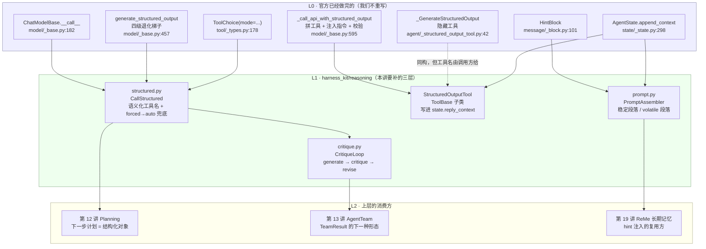
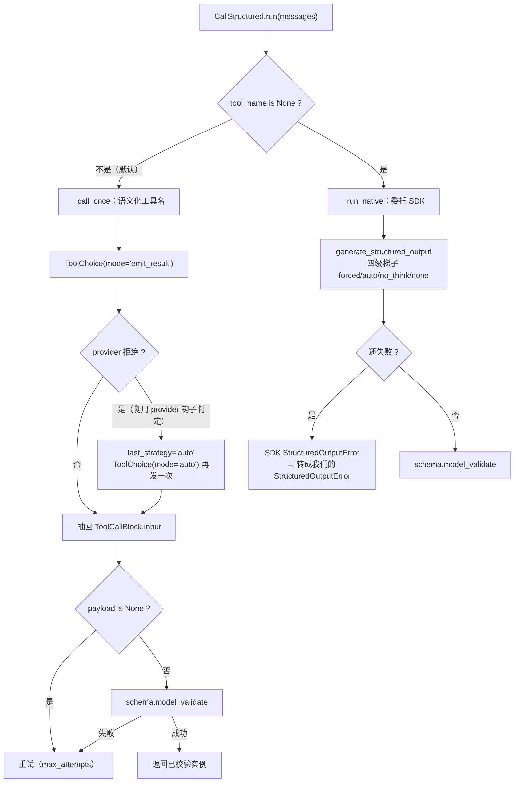
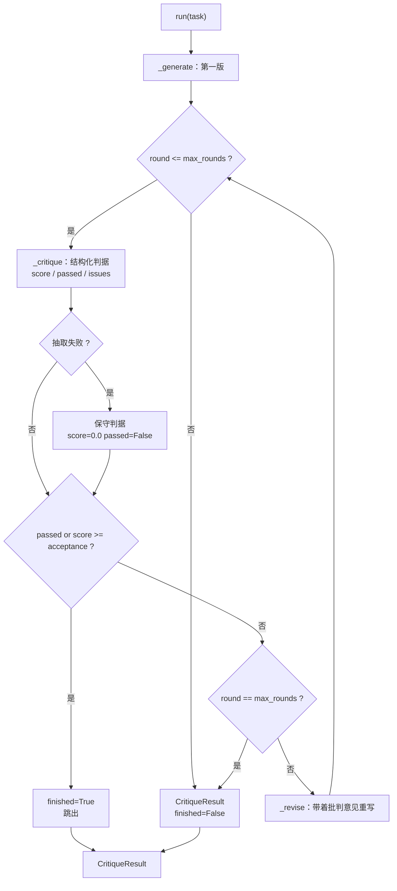
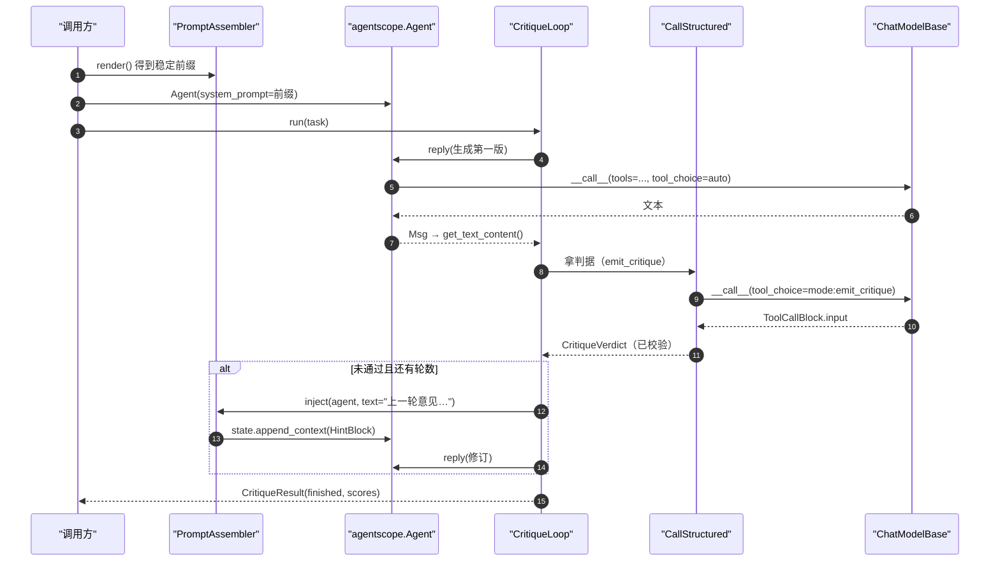
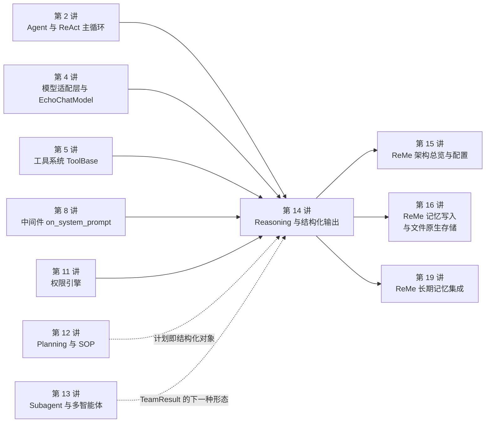

# 第 14 讲 《Reasoning 与结构化输出：推理稳定性工程》

> **本讲目标**：把「让模型的推理**可控、可校验、可复现**」这件事从一句愿望变成一套能单测的组件。前半程是源码侦察：AgentScope 2.0.8 在 SDK 层**已经**实现了结构化输出的完整骨架（``ChatModelBase.generate_structured_output`` 的四级退化梯子、``_GenerateStructuredOutput`` 那个隐藏工具、``ToolChoice(mode=<tool_name>)`` 的强制调用），也**已经**规定了「动态运行时状态只能走 ``HintBlock``、不能改 system prompt」这条铁律；但它在三个地方留了口子 —— 工具名被写死、强制 ``tool_choice`` 会被思考模型 400 拒掉而 SDK 的梯子会被显式 ``tool_choice`` 绕过、以及**没有任何东西阻止你往 system prompt 里塞每次都会变的内容**（那会让 prompt cache 静默失效、账单按全价走而输出看不出异常）。后半程是动手：在 ``harness_kit/reasoning/`` 里补三层 —— 结构化输出封装（``structured.py``）、自省与结果校验（``critique.py``）、提示词模板引擎与运行时上下文注入（``prompt.py``）—— 并给出「前缀字节级稳定」的可断言形态。
> **前置要求**：第 1~13 讲全部完成（``harness_kit`` 已有 ``settings`` / ``registry`` / ``config`` / ``models`` / ``tools`` / ``middleware`` / ``sandbox`` / ``permission`` / ``pipeline`` / ``multiagent``）。其中**第 2 讲**（``Agent`` 与 ReAct 主循环 —— 本讲的 ``CritiqueLoop`` 就是连续调 ``await agent.reply(...)``）、**第 4 讲**（``ChatModelBase`` 适配器与离线 ``EchoChatModel`` —— A~D 段全部靠它驱动）、**第 5 讲**（工具系统 —— ``ToolBase`` / ``is_state_injected`` / ``ToolChunk`` 是本讲提交器的全部基础）、**第 8 讲**（中间件 —— ``on_system_prompt`` 是唯一能改 system prompt 的钩子，本讲要说明为什么**不用**它）、**第 11 讲**（权限引擎 —— 提交器为什么必须无条件 ALLOW）是硬前置。
> 环境：AgentScope 2.0.8 + ReMe 0.4.1.13，按第 1 讲的方式用 ``PYTHONPATH=third_party/ReMe`` 跑脚本。
> **本讲交付物**（全部相对仓库根）：
>
> - ``tutorial_agsc_reme/reference/harness_kit/reasoning/structured.py``（``CallStructured`` / ``StructuredOutputTool`` / ``StructuredOutputError``）
> - ``tutorial_agsc_reme/reference/harness_kit/reasoning/critique.py``（``CritiqueLoop`` / ``CritiqueResult`` / ``CritiqueVerdict``）
> - ``tutorial_agsc_reme/reference/harness_kit/reasoning/prompt.py``（``PromptAssembler`` / ``PromptSection`` / ``VolatileSectionError`` / ``render_tool_list``）
> - ``tutorial_agsc_reme/reference/harness_kit/reasoning/__init__.py``（对外 API 面 + 依赖方向声明）
> - ``tutorial_agsc_reme/reference/scripts/14_reasoning.py``（本讲验证脚本，A~E 五段）
> - ``tutorial_agsc_reme/reference/tests/test_lesson14_reasoning.py``（54 条 pytest，**0 次 LLM 调用**）
>
> **预计时长**：240 分钟。
>
> 本讲的完整可运行代码位于 ``tutorial_agsc_reme/reference/harness_kit/reasoning/``，
> 你可以直接对照，也可以跟着正文一行一行写。
>
> **本讲不做什么**（先划线，免得走错方向）：
> - **不重写任何一行结构化输出的调用逻辑** —— 拼工具、注入 ``<system-reminder>`` 指令、收流式增量、用 pydantic 校验实参，这四件事 SDK 全做完了（``model/_base.py:595`` 的 ``_call_api_with_structured_output``）。我们只在它外面包一层「语义化工具名 + 自己补的那个退化步」；
> - **不自己写 Agent、不自己写 ``ChatModelBase``、不自己写 ``Toolkit``** —— 提交器是 ``ToolBase`` 子类，批判循环用的是现成的 ``agentscope.agent.Agent``；
> - **不解析自由文本** —— 一次 ``json.loads`` + 正则兜底都不写。判据与结果只有一种合法来源：schema 校验过的对象；
> - **不碰 ``third_party/`` 下任何文件**（只读）；
> - **不引入任何 token 计数依赖** —— AgentScope 2.0.8 **没有** ``agentscope.token`` 这个子包（第 1 讲已确认），所以本讲的「省 token」全部用**前缀字节是否变化**来度量，而不是用估算的 token 数；
> - A~D 段验证 **0 次** LLM 调用（用第 4 讲的离线 ``EchoChatModel`` 驱动真 Agent Loop）；只有 E 段（``--live``）真实调用 deepseek-flash，**3 次**，上限 6 次。

---

## 一、这一讲要解决的问题

### 1.1 一个具体到不能再具体的失败场景

你在第 9 讲的会话回放里加了一行「贴心」的功能：每次 reply 之前，把当前时间、剩余预算、工作目录写进 system prompt，好让模型知道现在是什么时候。

代码大概长这样：

```python
system_prompt = BASE_PROMPT + f"\n\n## 运行时状态\n当前时间：{now()}\n剩余预算：{budget} 次"
```

功能对了，模型确实知道了时间。**但账单会在第二天早上给你一个惊喜**：输入 token 的费用涨了整整一个数量级，而且**输出质量没有任何变化**，日志里也没有任何一行报错。

原因是 prompt cache 的工作方式：绝大多数 LLM API（DeepSeek / OpenAI / Anthropic / Moonshot）的缓存都是**前缀匹配**的。缓存命中时输入 token 按显著折扣计价，未命中按全价。而**前缀里的任何一个字节变了，从那一字节往后（包括紧随其后的全部工具 schema）都要重新计算**。system prompt 是整个请求的**第一个字节**，所以往里面塞一个 ``now()``，等于**每一轮都把整个上下文按全价重算一遍**。

这是一个「正确性完全通过、性能悄悄崩掉」的 bug。它的可怕之处在于：

- 单元测试抓不到（输出一模一样）；
- 代码审查抓不到（多写一行字符串，看起来无害）；
- 只有账单和 P99 延迟会告诉你，而那时候你已经在生产上跑了三天。

**本讲的 ``prompt.py`` 就是把这件事从「靠自觉」变成「靠结构」**：稳定段落与 volatile 段落由类型区分，volatile 段落**物理上不可能**进入 ``render()`` 的输出；稳定段落的正文一旦漂移就抛 ``VolatileSectionError`` —— **把静默的性能问题变成一次响亮的报错**。

### 1.2 「结构化输出」的三种做法，与它们各自的代价

同一个需求（「我要一个能 ``json.loads`` 的对象，字段是 ``summary`` / ``issues`` / ``score``」）有三种实现，代价完全不同：

**做法一：让模型自由文本，然后正则去抠。**

```python
text = (await model(messages)).content
m = re.search(r"\{.*\}", text, re.S)
data = json.loads(m.group(0))
```

这是最流行的做法，也是**失败率随 schema 复杂度指数上升**的做法。模型会加一句「好的，以下是结果：」、会把 JSON 包在 markdown 代码块里、会在最后一个字段后面多个逗号、会在字符串里放一个没转义的换行。每修一类，就多一条正则；每条正则都可能在**别的**输入上误匹配。而每一次「解析失败 → 重试」都是一次真金白银的模型调用。

**做法二：让模型自由文本，然后用 schema 校验，失败就重试。**

比做法一好，因为校验是硬的。但**失败率本身没降**：模型仍然在「自由生成」，你只是把它生成的坏东西检测出来了。对于嵌套两层的 schema，第一次成功率经常只有一半。

**做法三：让**解码过程本身**受约束 —— 用 function calling。**

注册一个函数工具，把 schema 放在这个工具的 ``parameters`` 里，然后**强制**模型调用它。模型没有「不按格式输出」的自由：它的输出空间被 API 层的 function-calling 机制约束住了（provider 侧会做约束解码）。这就是本讲的方案，也是 AgentScope 已经实现的方案。

代价是：**你必须让 provider 支持强制工具调用**。而 DeepSeek 的 thinking 模式会直接 400 拒绝这种请求 —— 这条真实的坑贯穿本讲 2.5 / 6.1 两节。

### 1.3 三条不变式

本讲的三个模块各自守一条不变式，三条都是「违反了就会静默亏钱或静默放行坏产物」的类型：

**不变式一：系统提示词的**稳定部分**是缓存的**前缀**，因此它在**会话生命周期内**必须是字节级不变的。**

推论：任何「每次 reply 都可能变」的内容 —— 当前时间、剩余预算、最新的检索结果、用户的临时偏好 —— **一律不得进入 system prompt**。它们走 ``HintBlock``，落到消息流**末尾**。

**不变式二：模型给出的结构化结果只有两种状态 —— 「通过 schema 校验」和「不通过」。不存在「大概对」。**

推论：不通过时要抛出携带诊断信息的错误（哪个字段、错在哪、原始值是什么），而不是返回一个 ``None`` 让调用方去猜；在 Agent 循环里则返回 ERROR 的工具结果，让模型下一轮自己改。

**不变式三：质量判据必须是**结构化**的，且**轮数必须有硬上限**，且**没收敛这件事必须报出来**。**

推论：``score`` + ``passed`` + ``issues`` 三个字段缺一不可；``finished=False`` 必须真实反映「轮数用尽仍未通过」，不允许偷偷把最后一版当成功。

### 1.4 本讲要交付的一张图



图里的虚线是本讲第一条要记住的边界：``StructuredOutputTool`` 与 SDK 的 ``_GenerateStructuredOutput`` **同构**（写到同一个 ``state.reply_context.structured_output``），差别只在工具名与校验依据。我们补的是**封装**，不是**能力**。

### 1.5 「该不该上 Self-Refine」的判定表

第 13 讲给过一张「该不该拆多 Agent」的表。本讲同样需要一张，因为「让模型自己批判自己再改一遍」这件事，用错了地方就是纯粹的烧钱。

| 条件 | 该上 | 不该上 |
| --- | --- | --- |
| 任务是否有**客观判据**（能落到 schema 上的分数 / 清单）？ | 有：代码、SQL、数学、格式约束 | 无：创意写作、开放式建议 |
| 单次生成的**方差**是否大？ | 大（同一 prompt 三次三个样） | 小（模板化输出，第一次就够） |
| **批判成本**是否低于**重新生成**？ | 批判只需读一遍、生成需要查资料 | 批判和生成一样贵（那不如重生成一次） |
| 是否有**外部校验器**可用（测试、linter、schema）？ | 没有，只能靠模型 | 有：直接用外部校验器，不要用 LLM 批判 |
| 单轮成本 × 轮数是否可接受？ | 可接受（每轮 = 1 次生成 + 1 次批判） | 不可接受（工具调用密集的任务，一轮可能几十次调用） |

本讲的 ``CritiqueLoop`` 默认 ``max_rounds=3`` 就是上表推出来的经验值：**第 2 轮通常能把明显缺陷修掉，第 3 轮之后收益急剧衰减**，而每一轮的成本是「一次生成 + 一次批判」两次完整调用。

---

## 二、源码侦察

本节每一条结论都自己读过源码并给出 ``相对仓库根:行号``。**没有行号的断言一律不写**。

### 2.1 SDK 层到底有什么、没有什么

先把边界画清楚。AgentScope 2.0.8 的 ``ChatModelBase`` 里有两条与结构化输出相关的路径：

```text
third_party/agentscope/src/agentscope/model/_base.py:37    class ChatModelBase:
third_party/agentscope/src/agentscope/model/_base.py:182      async def __call__(
third_party/agentscope/src/agentscope/model/_base.py:188      ) -> ChatResponse | AsyncGenerator[ChatResponse, None]:
third_party/agentscope/src/agentscope/model/_base.py:293      async def _call_api(          # @abstractmethod
third_party/agentscope/src/agentscope/model/_base.py:457      async def generate_structured_output(
third_party/agentscope/src/agentscope/model/_base.py:595      async def _call_api_with_structured_output(
```

``__call__`` 的返回类型是 ``ChatResponse | AsyncGenerator[ChatResponse, None]``（``:188``）—— **这是本讲第一个真实的坑**：同一个方法可能返回一个对象，也可能返回一个异步生成器。``:257`` 的 ``if isinstance(res, ChatResponse)`` 就是 SDK 自己做的这个分叉，任何调用 ``__call__`` 的代码都必须判一下。我们在 ``structured.py`` 的 ``_drain`` 里补上了这一判。

### 2.2 「四级退化梯子」：SDK 把难的部分做完了

``generate_structured_output``（``model/_base.py:457``）的 docstring 原文（``:468-483``）写得很清楚，它按顺序试四种策略：

```text
third_party/agentscope/src/agentscope/model/_base.py:480        - ``forced``: current config + forced ``tool_choice``
third_party/agentscope/src/agentscope/model/_base.py:481        - ``auto``: current config + ``auto`` ``tool_choice``
third_party/agentscope/src/agentscope/model/_base.py:482        - ``no_think``: thinking disabled + forced ``tool_choice`` (skipped
third_party/agentscope/src/agentscope/model/_base.py:483          when the provider exposes no thinking toggle)
third_party/agentscope/src/agentscope/model/_base.py:484        - ``none``: current config + no ``tool_choice``
```

代码就在 ``:505`` 那几行：

```text
third_party/agentscope/src/agentscope/model/_base.py:505            strategies = (
third_party/agentscope/src/agentscope/model/_base.py:506                ("forced", {}, forced_tc),
third_party/agentscope/src/agentscope/model/_base.py:507                ("auto", {}, ToolChoice(mode="auto")),
third_party/agentscope/src/agentscope/model/_base.py:513                ("none", {}, None),
third_party/agentscope/src/agentscope/model/_base.py:514            )
```

**这说明什么**：SDK 知道「思考模型会拒绝强制工具调用」这件事，并且已经准备好了退路（``auto`` → ``no_think`` → ``none``）。这是本讲最省事的一条路 —— ``CallStructured(tool_name=None)`` 直接委托给它，白拿整条梯子。

### 2.3 但这条梯子会被显式 ``tool_choice`` 整个绕过

```text
third_party/agentscope/src/agentscope/model/_base.py:498        user_tool_choice = kwargs.pop("tool_choice", None)
third_party/agentscope/src/agentscope/model/_base.py:499        if user_tool_choice is None:
third_party/agentscope/src/agentscope/model/_base.py:505            strategies = (
third_party/agentscope/src/agentscope/model/_base.py:516            strategies = (("explicit", {}, user_tool_choice),)
```

**这说明什么**：只要你传了 ``tool_choice``，``strategies`` 就只剩一项 ``("explicit", ...)`` —— 四级梯子**整个不存在了**。而我们的 ``CallStructured`` 为了用语义化工具名（``emit_result`` 而不是写死的 ``generate_structured_output``）**必须**显式传 ``tool_choice``。于是「思考模式 400」这个坑从 SDK 手里转到了我们手里：**我们在 ``_call_once`` 里自己补了 forced → auto 这一步**。

### 2.4 工具名被写死：这是我们必须包一层的**唯一**理由

```text
third_party/agentscope/src/agentscope/model/_base.py:626            func_name = "generate_structured_output"
```

同一段代码在 ``:631`` 把指令注入到消息里，措辞是：

```text
third_party/agentscope/src/agentscope/model/_base.py:631            instruction = (
third_party/agentscope/src/agentscope/model/_base.py:632                "<system-reminder>Now you **MUST** call the tool named "
third_party/agentscope/src/agentscope/model/_base.py:633                f"'{func_name}' to generate the structured output required "
third_party/agentscope/src/agentscope/model/_base.py:634                "by the user. DON'T do anything else.</system-reminder>"
third_party/agentscope/src/agentscope/model/_base.py:635            )
```

**这说明两件事**：

1. **工具名是 ``func_name`` 这一个局部变量决定的，调用方改不了。** 真实系统里工具名要出现在 trace、审计日志、以及「一回合内要填好几张不同的表」的场景里（``emit_result`` / ``emit_plan`` / ``emit_critique``），一个叫 ``generate_structured_output`` 的工具名会让日志无法区分是哪张表。
2. **措辞是调过的。** ``MUST`` + ``DON'T do anything else`` 的服从率明显比客气说法高，所以我们的 ``STRUCTURED_TOOL_INSTRUCTION`` **刻意抄同一句话**，一个字都不改（``structured.py`` 的模块 docstring 与常量注里写了这一点）。

### 2.5 强制工具调用：``mode=`` 而不是 ``tools=[]``

``ToolChoice`` 的定义与 docstring：

```text
third_party/agentscope/src/agentscope/tool/_types.py:178    class ToolChoice(BaseModel):
third_party/agentscope/src/agentscope/tool/_types.py:187                * ``str`` (a tool name) – the model **must** call exactly that
third_party/agentscope/src/agentscope/tool/_types.py:188                  tool (forced single-tool call).  The name is validated against
third_party/agentscope/src/agentscope/tool/_types.py:196                list.  Prefer using ``mode=<tool_name>`` (str) over
third_party/agentscope/src/agentscope/tool/_types.py:197                ``tools=["<tool_name>"]`` when the goal is a forced single-tool
third_party/agentscope/src/agentscope/tool/_types.py:198                call without changing the available tool set, as the former
third_party/agentscope/src/agentscope/tool/_types.py:199                avoids schema-list changes that would invalidate prompt caches.
```

**这段话就是本讲的核心论据，而且是官方文档原话**：``mode=<tool_name>`` 与 ``tools=["<tool_name>"]`` 都能强制单工具调用，但**后者会改变转发给模型的 schema 列表，从而让 prompt cache 失效**。所以在多轮 agent 循环里，用 ``mode=`` 而不是 ``tools=[]``。

``structured.py`` 的 ``_call_once`` 因此**只改 ``tool_choice``，``tools`` 永远是同一个列表**（``self.tools_payload()``，只含一个 function）。

### 2.6 ``_GenerateStructuredOutput``：Agent 内部那条路，与它写在哪里

Agent 自己也有结构化输出，走的是一个**隐藏工具**：

```text
third_party/agentscope/src/agentscope/agent/_structured_output_tool.py:42     class _GenerateStructuredOutput(ToolBase):
third_party/agentscope/src/agentscope/agent/_structured_output_tool.py:80       async def check_permissions(
third_party/agentscope/src/agentscope/agent/_structured_output_tool.py:92       async def call(
third_party/agentscope/src/agentscope/agent/_structured_output_tool.py:113              # In-process: validate with the model class itself
third_party/agentscope/src/agentscope/agent/_structured_output_tool.py:135              _agent_state.reply_context.structured_output = (
third_party/agentscope/src/agentscope/agent/_structured_output_tool.py:156              _agent_state.reply_context.structured_output = kwargs
```

它被挂进 toolkit 的时机是每一轮 reply 开始时：

```text
third_party/agentscope/src/agentscope/agent/_agent.py:1117            # Update the structured output tool for new requirements or
third_party/agentscope/src/agentscope/agent/_agent.py:1118            #  from the previous reply
third_party/agentscope/src/agentscope/agent/_agent.py:1119            await self.toolkit.remove_tool(_GenerateStructuredOutput.name)
third_party/agentscope/src/agentscope/agent/_agent.py:1120            if self.state.reply_context.structured_schema:
third_party/agentscope/src/agentscope/agent/_agent.py:1121                await self.toolkit.add_tool(
```

Agent 还会在**用尽迭代次数**时用 ``ToolChoice`` 强推它：

```text
third_party/agentscope/src/agentscope/agent/_agent.py:3627                tool_choice = ToolChoice(
third_party/agentscope/src/agentscope/agent/_agent.py:3628                    mode=_GenerateStructuredOutput.name,
third_party/agentscope/src/agentscope/agent/_agent.py:3629                )
```

**这说明两件事**：

1. 结构化输出在 AgentScope 里**就是一个工具调用**，没有第二种机制。我们的 ``StructuredOutputTool`` 走的是同一条路，因此天然与 Agent Loop 兼容 —— 模型的 ReAct 循环会像调 ``read_file`` 一样调它。
2. **``tool_choice`` 只能指向一个工具名。** 所以如果你同时传了 ``structured_schema``（Agent 挂 SDK 提交器）**又**把自己的 ``emit_result`` 装进 toolkit，模型只会调 SDK 那个 —— 你的工具永远收不到东西，表现为「装了工具但 state 里一直没值」这种极难查的静默失效。``structured.py`` 的 ``as_tool`` docstring 专门写了这条警告。

### 2.7 结果从哪读：``state.reply_context``，不是 ``reply()``

```text
third_party/agentscope/src/agentscope/state/_state.py:182    class ReplyContext(BaseModel):
third_party/agentscope/src/agentscope/state/_state.py:203        structured_output: dict | None = None
third_party/agentscope/src/agentscope/state/_state.py:209    class AgentState(BaseModel):
third_party/agentscope/src/agentscope/agent/_agent.py:3554        required = self.state.reply_context.structured_schema is not None
third_party/agentscope/src/agentscope/agent/_agent.py:3555        satisfied = self.state.reply_context.structured_output is not None
third_party/agentscope/src/agentscope/agent/_agent.py:3557        if required and satisfied:
```

**这说明什么**：SDK 只在 ``structured_schema is not None``（即 ``required``）时，才把 ``structured_output`` 拷进最终消息。``StructuredOutputTool`` 写的是 ``state.reply_context.structured_output``，所以**从 state 读才是对的路径**。B1 段用真实输出验证了这一点：``state.reply_context.structured_output`` 有值，而 ``reply()`` 上的 ``structured_output`` 属性是 ``None``。

### 2.8 ``HintBlock``：注入动态内容的正确姿势（官方注释原话）

``HintBlock`` 的定义在 ``message/_block.py:101``，docstring 第一句就说了它的终局：

```text
third_party/agentscope/src/agentscope/message/_block.py:102      """A block used to provide instructions or hints to the LLM during the
third_party/agentscope/src/agentscope/message/_block.py:103      reasoning-acting loop. When passed to the LLM API, the hint block is
third_party/agentscope/src/agentscope/message/_block.py:104      converted into a user message.
```

AgentScope 自己注入运行时状态（时间 / 计划 / 上下文用量）就是走这条路，而且注释里**直接给出了理由**：

```text
third_party/agentscope/src/agentscope/agent/_agent.py:1380        .. note:: We attach a ``HintBlock`` instead of mutating the system
third_party/agentscope/src/agentscope/agent/_agent.py:1381            prompt, so that prompt caching still works while the agent remains
third_party/agentscope/src/agentscope/agent/_agent.py:1382            aware of the changing time / tasks / context.
```

造块与落库的代码在同一个文件里：

```text
third_party/agentscope/src/agentscope/agent/_agent.py:1622            hint_block = HintBlock(
third_party/agentscope/src/agentscope/agent/_agent.py:1635            self.state.append_context(
third_party/agentscope/src/agentscope/agent/_agent.py:1636                self.name,
third_party/agentscope/src/agentscope/agent/_agent.py:1637                [hint_block],
```

前一行 ``:1378-1379`` 还补了一句边界：**只有「会话内会变」的信息才注入这里，固定信息应该待在 system prompt 里。**

### 2.9 ``append_context``：注入的落点，也是唯一不碰前缀的落点

```text
third_party/agentscope/src/agentscope/state/_state.py:298        def append_context(
third_party/agentscope/src/agentscope/state/_state.py:299            self,
third_party/agentscope/src/agentscope/state/_state.py:300            name: str,
third_party/agentscope/src/agentscope/state/_state.py:301            blocks: list[
```

docstring（``:305-308``）说明它的行为：把块追加到「当前 ``reply_id`` 的、名为 ``name`` 的那条 assistant 消息」上；如果不存在，就**新建一条 assistant 消息**。

**这说明什么**：``HintBlock`` 的宿主是一条 **assistant 角色**的消息容器（因为 user 消息不能携带 ``HintBlock``），而 formatter 在发给模型时会把它渲染成一条 **user** 消息。落点在消息流末尾，所以 system prompt 的字节完全不受影响。AgentScope 的 ReMe 长期记忆中间件也是这么干的：

```text
third_party/agentscope/src/agentscope/middleware/_longterm_memory/_reme/_middleware.py:527        @staticmethod
third_party/agentscope/src/agentscope/middleware/_longterm_memory/_reme/_middleware.py:551            content=[HintBlock(hint=content)],
```

它的 docstring（``:532-534``）原话是：「The context entry uses an assistant-role ``Msg`` container because user messages cannot carry ``HintBlock`` content. Formatters convert the ``HintBlock`` itself into a user message before the model call.」

### 2.10 formatter 怎么处理它：每个 provider 都有自己的分支

以本讲实测用的 DeepSeek 为例：

```text
third_party/agentscope/src/agentscope/formatter/_deepseek_formatter.py:63                elif isinstance(block, HintBlock):
third_party/agentscope/src/agentscope/formatter/_deepseek_formatter.py:64                    if (
third_party/agentscope/src/agentscope/formatter/_deepseek_formatter.py:65                        content_blocks
```

OpenAI / Anthropic 的分支分别在 ``formatter/_openai_formatter.py:290`` 与 ``formatter/_anthropic_formatter.py:124``。

思考块走的是同一段 ``if/elif`` 链里的另一条分支：

```text
third_party/agentscope/src/agentscope/formatter/_deepseek_formatter.py:60                elif isinstance(block, ThinkingBlock):
third_party/agentscope/src/agentscope/formatter/_deepseek_formatter.py:61                    reasoning_content_blocks.append(block.thinking)
```

（C6 段的真实输出会打印出 ``"reasoning_content": "阶乘就是连乘……"``，与这里的实现一致：``ThinkingBlock.thinking`` 被拼进 ``reasoning_content``，与 ``content`` 是两个独立字段。）

**这说明什么**：思考内容在 DeepSeek 的协议里叫 ``reasoning_content``，它与 ``content`` 是**两个独立字段**。所以「模型的思考」不会混进正文 —— 这也解释了为什么取产物必须用 ``get_text_content()``：

```text
third_party/agentscope/src/agentscope/message/_base.py:156        def get_text_content(self, separator: str = "\n") -> str | None:
```

``get_text_content()`` 只拼 ``TextBlock``，会跳过 ``ThinkingBlock`` / ``ToolCallBlock``。C6 段的真实输出：``get_text_content() 跳过 ThinkingBlock -> '等于 6.'``，而同一个 Msg 的 formatter 产物里 ``reasoning_content`` 是长长的一串「阶乘就是连乘……」——**如果把思考当产物交给批判者，批判者会去批注模型的内心戏。**

### 2.11 工具与权限：提交器要挂在哪个扩展点上

```text
third_party/agentscope/src/agentscope/tool/_base.py:100    class ToolBase(ABC):
third_party/agentscope/src/agentscope/tool/_base.py:109        is_concurrency_safe: bool
third_party/agentscope/src/agentscope/tool/_base.py:111        is_read_only: bool
third_party/agentscope/src/agentscope/tool/_base.py:117        is_state_injected: bool = False
third_party/agentscope/src/agentscope/tool/_base.py:190        async def __call__(
third_party/agentscope/src/agentscope/tool/_base.py:266        async def check_permissions(      # @abstractmethod
```

``is_state_injected`` 的注入由 toolkit 完成，注入的参数名**固定为 ``_agent_state``**：

```text
third_party/agentscope/src/agentscope/tool/_toolkit.py:307                tool_func.is_state_injected
third_party/agentscope/src/agentscope/tool/_toolkit.py:311                    kwargs["_agent_state"] = state
```

**这说明什么**：提交器的 ``call`` 签名里那个 ``_agent_state`` **不能改名** —— 改了就拿不到 state，表现是 ``TypeError: call() missing 1 required positional argument: '_agent_state'``。

权限决策的类型定义：

```text
third_party/agentscope/src/agentscope/permission/_types.py:88     class PermissionBehavior(Enum):
third_party/agentscope/src/agentscope/permission/_types.py:98         ALLOW = "allow"
third_party/agentscope/src/agentscope/permission/_types.py:99         DENY = "deny"
third_party/agentscope/src/agentscope/permission/_types.py:100        ASK = "ask"
third_party/agentscope/src/agentscope/permission/_decision.py:11   class PermissionDecision:
```

**这说明什么**：``check_permissions`` 是 ``@abstractmethod``（``:266``），所以任何 ``ToolBase`` 子类都必须实现它。``FunctionTool`` 一族的默认行为是 ASK（第 5 讲已确认）—— 而提交器是**纯控制流**，它不读写文件、不跑命令，默认 ASK 会让每一次结构化输出都弹一次确认，那不是安全，那是骚扰。所以本讲的 ``StructuredOutputTool.check_permissions`` 无条件 ALLOW 并写出理由（``decision_reason``）。

### 2.12 provider 钩子：``_get_structured_output_fallback_exceptions``

```text
third_party/agentscope/src/agentscope/model/_base.py:101        def _get_retryable_exceptions(cls) -> tuple[Type[Exception], ...]:
third_party/agentscope/src/agentscope/model/_base.py:123        def _get_structured_output_fallback_exceptions(
third_party/agentscope/src/agentscope/model/_base.py:518            retryable = tuple(self._get_retryable_exceptions())
third_party/agentscope/src/agentscope/model/_base.py:519            fallback: tuple[Type[Exception], ...] = (
third_party/agentscope/src/agentscope/model/_base.py:520                StructuredOutputError,
third_party/agentscope/src/agentscope/model/_base.py:521                *self._get_structured_output_fallback_exceptions(),
```

DeepSeek 适配器的覆写（**这是本讲最关键的一组行号**）：

```text
third_party/agentscope/src/agentscope/model/_deepseek/_model.py:139        def _get_retryable_exceptions(cls) -> tuple[Type[Exception], ...]:
third_party/agentscope/src/agentscope/model/_deepseek/_model.py:143            return (
third_party/agentscope/src/agentscope/model/_deepseek/_model.py:144                openai.APIConnectionError,
third_party/agentscope/src/agentscope/model/_deepseek/_model.py:145                openai.APITimeoutError,
third_party/agentscope/src/agentscope/model/_deepseek/_model.py:146                openai.RateLimitError,
third_party/agentscope/src/agentscope/model/_deepseek/_model.py:147                openai.InternalServerError,
third_party/agentscope/src/agentscope/model/_deepseek/_model.py:150        def _get_structured_output_fallback_exceptions(
third_party/agentscope/src/agentscope/model/_deepseek/_model.py:155            return (openai.BadRequestError,)
third_party/agentscope/src/agentscope/model/_deepseek/_model.py:439        def _get_disable_thinking_kwargs(self) -> dict:
third_party/agentscope/src/agentscope/model/_deepseek/_model.py:441            return {
third_party/agentscope/src/agentscope/model/_deepseek/_model.py:442                "extra_body": {"thinking": {"type": "disabled"}},
```

**这说明什么**：``openai.BadRequestError`` **不在** ``_get_retryable_exceptions``（``:143-147``）里，**但在** ``_get_structured_output_fallback_exceptions``（``:155``）里。这是一个非常精确的语义区分：「400 类错误」不是「值得重试的瞬态错误」（重试同一个请求只会再 400 一次），而是「值得**换一种策略**再试一次的错误」。我们的 ``_should_fall_back`` 直接复用这个钩子，而不是硬编码 ``openai.BadRequestError`` —— 换 provider 时行为跟着适配器自动变。``harness_kit`` 自己的适配器基类也覆写了它（``tutorial_agsc_reme/reference/harness_kit/models/adapters/base.py:644``）。

### 2.13 诚实清单：AgentScope 2.0.8 **没有**提供什么

- **没有「语义化工具名的结构化输出」**。工具名写死在 ``model/_base.py:626``。
- **没有「显式 ``tool_choice`` 时的退化梯子」**。``:516`` 的 ``("explicit", ...)`` 把梯子整个绕过。
- **没有任何东西阻止你往 system prompt 里塞动态内容**。``on_system_prompt`` 中间件钩子（第 8 讲）反而让这件事**更容易**做错。
- **没有前缀指纹**。你无法在不自己算哈希的情况下断言「这一轮的 system prompt 和上一轮字节相同」。
- **没有「稳定段落漂移」的检测**。改了就是改了，缓存失效是静默的。
- **没有 Self-Refine / 批判循环**。``Agent`` 的 ReAct 循环是「一个回合内的事」，跨回合的质量闸门不在 SDK 职责内。
- **没有 token 计数**（``agentscope.token`` 子包在第 1 讲已确认不存在），所以本讲的「省」全部用**前缀字节是否变化**来度量。

### 2.14 本讲的缺口编号（与本讲的三个模块一一对应）

| 编号 | 缺口 | 本讲的补法 | 落点 |
| --- | --- | --- | --- |
| G1 | 工具名写死，无法语义化 | ``CallStructured`` 自带 ``tool_name``，走 ``mode=<tool_name>`` | ``structured.py`` |
| G2 | 显式 ``tool_choice`` 绕过四级梯子，思考模型 400 后没有退路 | ``_call_once`` 自己补 forced → auto，判据复用 provider 钩子 | ``structured.py`` |
| G3 | 结果校验失败时没有「带诊断信息的一次重试」 | ``run(max_attempts=2)`` + ``StructuredOutputError`` 四个诊断字段 | ``structured.py`` |
| G4 | Agent 循环内提交结果没有「语义化 + 校验失败返回 ERROR」的提交器 | ``StructuredOutputTool``（``ToolBase`` 子类） | ``structured.py`` |
| G5 | 没有跨回合的质量闸门 | ``CritiqueLoop``：结构化判据 + 轮数硬上限 + 诚实 ``finished`` | ``critique.py`` |
| G6 | 没有前缀稳定性保障（动态内容可以随手上 system prompt） | ``PromptAssembler``：volatile 段落物理隔离 + 漂移抛错 + 指纹 | ``prompt.py`` |

**注意：这 6 个缺口不是契约 §1.3 里那 6 个「框架级缺口」**（不可变事件日志 / pub-sub 总线 / L3 评测引擎 / ReMe 中间件的 token 预算 / 声明式 Profile / Docker 沙箱配额）。它们属于另一类：**官方已有能力的生产化封装**。这也是第 14 讲与第 13 讲在性质上的区别 —— 第 13 讲是「SDK 层真的没有，我们补一个原语」，本讲是「SDK 层做完了 90%，我们补最后 10% 与它的可观测性」。

### 2.15 本讲用到的扩展点清单

| 扩展点 | 类型 | 位置 | 本讲怎么用 |
| --- | --- | --- | --- |
| ``ChatModelBase`` | 基类 | ``model/_base.py:37`` | 只依赖基类接口（``__call__`` / ``generate_structured_output``），所以离线 ``EchoChatModel`` 与真实 ``DeepSeekChatModel`` 都能用 |
| ``ChatModelBase.__call__`` | 方法 | ``model/_base.py:182`` | ``_invoke`` 直接调它，传 ``tools`` + ``tool_choice`` |
| ``generate_structured_output`` | 方法 | ``model/_base.py:457`` | ``tool_name=None`` 时委托给它 |
| ``_get_structured_output_fallback_exceptions`` | classmethod 钩子 | ``model/_base.py:123`` | ``_should_fall_back`` 复用，不硬编码 provider 异常 |
| ``ToolChoice`` | 模型 | ``tool/_types.py:178`` | ``ToolChoice(mode=<tool_name>)`` 强制单工具，不动 ``tools`` |
| ``ToolBase`` | 基类 | ``tool/_base.py:100`` | ``StructuredOutputTool`` 继承它 |
| ``ToolBase.is_state_injected`` | 类属性 | ``tool/_base.py:117`` | 置 ``True``，``call`` 的第一个参数名叫 ``_agent_state`` |
| ``ToolBase.check_permissions`` | 抽象方法 | ``tool/_base.py:266`` | 无条件 ALLOW + 写理由 |
| ``ToolChunk`` / ``ToolResultState`` | 类型 | ``tool/_types.py`` | 校验失败返回 ERROR（而不是抛异常） |
| ``AgentState.reply_context`` | 字段 | ``state/_state.py:182`` / ``:203`` | 结果的落点 |
| ``AgentState.append_context`` | 方法 | ``state/_state.py:298`` | ``PromptAssembler.inject`` 的落点 |
| ``HintBlock`` | 块 | ``message/_block.py:101`` | 动态内容的唯一载体 |
| ``Msg.get_text_content`` | 方法 | ``message/_base.py:156`` | ``_text_of`` 取产物（跳过思考块） |
| ``Agent.reply`` | 方法 | ``agent/_agent.py:332`` | ``CritiqueLoop`` 的三步都调它 |
| ``PermissionBehavior`` / ``PermissionDecision`` | 类型 | ``permission/_types.py:88`` / ``_decision.py:11`` | 提交器的权限决策 |
| ``EchoChatModel`` | harness_kit 自有 | ``harness_kit/models/adapters/echo.py`` | A~D 段的确定性模型 |

### 2.16 「源码侦察」的三条结论

1. **结构化输出在 SDK 里就是「强制工具调用」，没有第二条路。** 所以本讲的全部工作都围绕 ``ToolChoice`` 与 ``ToolBase`` 展开，而不是围绕「prompt 工程」。
2. **``mode=`` 不是 ``tools=[]``。** 官方的 ``ToolChoice`` docstring（``tool/_types.py:196-199``）明说了前者不破坏 prompt cache。这条差异在多轮循环里是数量级的成本差异。
3. **AgentScope 已经把「动态内容怎么进上下文」的标准答案写在自己的注释里了**（``agent/_agent.py:1380-1382``）：attach 一个 ``HintBlock``，不要 mutate system prompt。我们要做的不是发明，而是**把这条纪律变成类型约束**（``volatile`` 段落）**与可断言的对象**（``compute_fingerprint``）。
---

## 三、扩展点定位与设计

### 3.1 官方**已经**给了什么

按契约要求，先把上一节的行号引用回来，逐条对上「我们不需要写的东西」：

| 能力 | 官方实现 | 行号 | 我们是否重写 |
| --- | --- | --- | --- |
| 结构化输出的四级退化梯子 | ``generate_structured_output`` | ``model/_base.py:457`` | **不重写**，``tool_name=None`` 时直接委托 |
| 拼工具 schema + 注入 ``<system-reminder>`` 指令 + 收流式增量 + 校验实参 | ``_call_api_with_structured_output`` | ``model/_base.py:595`` | **不重写**，一行都不抄 |
| 强制单工具调用的正确姿势（不动 ``tools``） | ``ToolChoice(mode=...)`` 的 docstring | ``tool/_types.py:196-199`` | **不重写**，照它的建议用 |
| 「provider 拒绝请求形状」的可覆写异常钩子 | ``_get_structured_output_fallback_exceptions`` | ``model/_base.py:123`` | **不重写**，``_should_fall_back`` 复用 |
| Agent 内部的结构化输出工具（写完写 state） | ``_GenerateStructuredOutput`` | ``agent/_structured_output_tool.py:42`` | **不重写**，我们写的是同构的语义化版本 |
| 结果的落点 | ``ReplyContext.structured_output`` | ``state/_state.py:203`` | **不重写**，写到同一个字段 |
| 动态内容的注入载体 | ``HintBlock`` | ``message/_block.py:101`` | **不重写** |
| 注入的落点 | ``AgentState.append_context`` | ``state/_state.py:298`` | **不重写**，``inject`` 只是它的薄封装 |
| 取产物（跳过思考块） | ``Msg.get_text_content`` | ``message/_base.py:156`` | **不重写** |
| 工具基类 / 状态注入 / 权限决策 | ``ToolBase`` / ``_toolkit.py:311`` / ``PermissionDecision`` | ``tool/_base.py:100`` 等 | **不重写**，只继承 |

一句话：**本讲的三个模块加起来，没有一行是「调用模型」的代码**。``structured.py`` 的 ``_invoke`` 只有 11 行，其中 9 行是参数整理与返回类型判断。

### 3.2 还缺什么（缺口编号，对应 2.14 的表）

复述一遍这 6 个缺口，并指出它属于哪一类：

| 编号 | 缺口 | 类别 |
| --- | --- | --- |
| G1 | 工具名写死（``model/_base.py:626``），trace / 审计 / 多表场景无法区分 | **可观测性缺失** |
| G2 | 显式 ``tool_choice`` 绕过四级梯子（``model/_base.py:516``），思考模型 400 后无退路 | **健壮性缺失**（真实会崩） |
| G3 | 失败时只有一句异常字符串，没有「哪个字段、错在哪、原始值」 | **可诊断性缺失** |
| G4 | Agent 循环内没有「语义化 + 校验失败返回 ERROR」的提交器 | **能力封装缺失** |
| G5 | 没有跨回合的质量闸门（Self-Refine 那类循环），也没有「没收敛」的诚实报出 | **编排能力缺失** |
| G6 | 没有任何东西阻止「动态内容进 system prompt」，也没有前缀稳定性的断言手段 | **成本纪律缺失**（静默烧钱） |

**这 6 个缺口与契约 §1.3 那 6 个框架级缺口不同**：那 6 个是「框架真的没有这个东西，我们要造一个原语」；这 6 个是「框架有这个东西，但它的**生产化外壳**缺失」。第 13 讲写了 1300 行才补上四个原语，本讲三个模块加起来 1783 行，其中一半是 docstring —— 因为本讲的重点不在「造」，而在**「把已有的东西约束成不会用错的样子」**。

### 3.3 我们准备在哪个扩展点上做

三个模块分别挂在三个不同的扩展点上，**没有一个是我们自己发明的新抽象**：

| 模块 | 扩展点 | 类型 | 一句话 |
| --- | --- | --- | --- |
| ``structured.py`` 的 ``CallStructured`` | ``ChatModelBase.__call__`` + ``ToolChoice`` | **组合**（不是继承） | 我们只依赖 ``ChatModelBase`` 基类接口，所以离线回声模型与真实 DeepSeek 模型都能用 |
| ``structured.py`` 的 ``StructuredOutputTool`` | ``ToolBase`` | **继承** | 必须是自己实现 ``check_permissions`` 与 ``__call__``，因为 ``ToolBase`` 的 ``check_permissions`` 是 ``@abstractmethod``（``tool/_base.py:266``） |
| ``critique.py`` 的 ``CritiqueLoop`` | ``Agent.reply`` | **组合** | 三次调用都是 ``await self.agent.reply(UserMsg(...))``，**没有任何一行循环控制逻辑是模型相关的** |
| ``prompt.py`` 的 ``PromptAssembler`` | ``AgentState.append_context`` | **鸭子类型调用** | 只要求 ``agent`` 有 ``name`` 与 ``state.append_context``，所以本模块**不 import ``agentscope.agent``** |

**为什么 ``prompt.py`` 刻意不 import ``agentscope.agent``**：单测装配器不需要起模型、不需要事件循环。第 13 讲给过同样的理由（``limits.py`` / ``router.py`` 不 import agentscope），本讲的结果是：``prompt.py`` 的 19 条测试里有 12 条是纯同步函数，跑完不到 10 毫秒。代价是 ``inject`` 收到一个不合适的对象时只能抛 ``AttributeError`` —— 而这恰恰是我们想要的：**静默跳过才是真正危险的**（「记忆注入失败了」会在生产里完全隐形）。

### 3.4 ``structured.py`` 的设计：两条路，一个判据

``CallStructured`` 有两种模式，由 ``tool_name`` 是不是 ``None`` 决定：



三个设计决定值得单独说：

**决定一：``_call_once`` 里补的「forced → auto」用 SDK 的钩子判定，而不是硬编码异常类型。**

```python
def _should_fall_back(self, exc: BaseException) -> bool:
    hook = getattr(
        type(self.model),
        "_get_structured_output_fallback_exceptions",
        None,
    )
    if hook is None:
        return False
    types = tuple(hook())
    return bool(types) and isinstance(exc, types)
```

用 ``type(self.model)`` 而不是 ``self.model``：这是 ``classmethod``（``model/_base.py:123`` 的签名上是 ``cls``），在实例上取也能拿到绑定到类的版本，但显式从类型上取更不容易被实例属性遮蔽。钩子返回空元组时**不降级** —— 与 SDK 的「其它异常直接抛」保持一致（``model/_base.py:519-521`` 那个元组里，只有 ``StructuredOutputError`` 与钩子给出的类型会触发退化）。

**决定二：``max_attempts`` 默认 2，且**不覆盖**瞬态错误。** 两套重试的分工必须写清楚，否则会叠成乘法：``ChatModelBase.__call__`` 自己的 ``max_retries`` 负责网络抖动（``model/_base.py:101`` 的 ``_get_retryable_exceptions``），``max_attempts`` 只负责「模型没按格式交」这类**语义失败**。A2 段的真实输出验证了这条：第一次它只顾说话没调工具，第二次才交 —— ``模型调用次数 = 2``。

**决定三：``StructuredOutputTool`` 用**构造时**的 schema 校验，而不是从 ``state.reply_context.structured_schema`` 读。**

SDK 的 ``_GenerateStructuredOutput`` 是从 state 读的（因为它是「一个 Agent 一次 reply 只有一张表」的模型）。我们的提交器把 schema 存在自己身上，好处是「同一个 Agent 一回合要填多张表」时不会串台 —— 你可以同时装 ``emit_plan`` 与 ``emit_critique`` 两个提交器，各校验各的。代价是调用方要自己保证「装的工具 schema 与期望的结果一致」，这个代价我们愿意付。

### 3.5 ``critique.py`` 的设计：三道闸，一个不对称性

**核心洞察是一个不对称性**：**批判比生成容易**。判断「这段代码有没有处理空输入」比「写出这段代码」简单得多。Self-Refine 那类方法能 work 的全部理由就是这个不对称性 —— 所以把「产出一版」和「挑毛病」分成两次调用，用挑出的毛病去驱动下一版，比「让模型一次写好」更划算。

**但必须有三道闸**，否则它就是一个烧钱的死循环：



- **闸一：判据必须是结构化的。** 用 ``CallStructured`` 拿 ``CritiqueVerdict``（``score`` / ``passed`` / ``issues`` / ``suggestion``），所以判据**一定**是合法对象 —— schema 校验不过就抛错，不会静默当成通过。自由文本的自我批判极易退化成「我再夸它一遍」：因为没有明确的停止条件，模型会在「差不多好了」和「还能更好」之间无限摇摆。
- **闸二：轮数硬上限。** 到顶就交最后一版，并**诚实地把 ``finished=False`` 报出来**。偷偷返回最后一版当成功，是最坏的做法 —— 它让「质量不达标」在监控里完全隐形。
- **闸三：分数要落盘。** ``CritiqueResult.scores`` 是**序列**而不是最后一个值。只有序列能回答「加了这一轮批判到底有没有用」；``trend`` 属性把「上升 / 下降 / 抖动」区分开，其中**连续下降是「该换人而不是再改一轮」的信号**。

还有一个容易忽略的设计：**``_critique`` 失败时偏保守**。

```python
except Exception as exc:
    logger.warning("批判本身失败了：{}，保守判定为不通过。", exc)
    return CritiqueVerdict(
        score=0.0,
        passed=False,
        issues=[f"批判步骤本身失败：{type(exc).__name__}: {exc}"],
        suggestion="",
    )
```

「批判失败」绝不等于「通过」—— 否则模型一抽风，坏产物就被放行了。注意这里**不抛异常**：批判循环是「尽力提升质量」的环节，把它变成异常源会让上层编排更难写。代价是调用方必须看 ``finished``，这一点在 ``CritiqueResult`` 的 docstring 里写明了。

### 3.6 ``prompt.py`` 的设计：把「别动前缀」变成类型约束

三条规则，按重要性排序：

**规则一：段落的**顺序**是设计，不是随便排的。**

```python
SECTION_ORDER: tuple[str, ...] = (
    "role",
    "constraints",
    "tools",
    "skills",
    "memory",
    "dynamic",
)
```

- ``role`` / ``constraints`` 最前：最稳定，且最该被模型优先读到；
- ``tools`` / ``skills`` 紧随其后：变化频率低，但**一旦变就必须在稳定区之后**，免得把前面的缓存全冲掉；
- ``memory`` 排在稳定区的**最后**：长期记忆是最常变的一块，放在末尾意味着它的变化只影响它自己之后的内容；
- ``dynamic`` 垫底：**只有在「整个会话内不会变」时它才配待在 system prompt 里**（例如本会话的工作目录、用户 ID）。每次 reply 都变的东西一律走 ``hint()``。

**规则二：volatile 段落物理上不可能进入 ``render()``。**

```python
def render(self, *, strict: bool = True) -> str:
    self._renders += 1
    stable = [section for section in self.sections if not section.volatile]
    self._check_drift(stable, strict=strict)
    text = self._compose(stable)
    if strict:
        for section in stable:
            self._baseline.setdefault(section.key, section.body)
    return text
```

``render()`` 的第一件事就是**把 volatile 段落过滤掉**，过滤发生在拼接之前。这不是「约定不要传 volatile」，而是**代码路径上根本没有那条路**。C1 段的真实输出验证了这一点：``稳定段落里出现 volatile 正文吗 = False``。

**规则三：稳定段落的漂移必须是一次响亮的报错，而不是一次静默的降级。**

``_check_drift`` 拿每个稳定段落的正文与**首次渲染时的基线**比对，不一致就抛 ``VolatileSectionError``，异常信息里把后果写清楚：

```text
稳定段落 ['role'] 的正文与首次渲染时不一致。system prompt 是 prompt cache 的前缀：
它一变，从该段落往后（含所有工具 schema）的输入 token 全部按未命中重算。
要注入每次都变的内容，请把该段落标 volatile=True，用 hint() 注入
（它会被转成消息流末尾的 user 消息，前缀不受影响）；
确实是会话边界导致的合理变化，请显式调用 rebaseline()。
```

（上面这段文案是从 C3 段的真实输出里截取的前 96 个字符 + 源码原文拼回来的；``VolatileSectionError`` 的完整文案见 ``prompt.py`` 的 ``_check_drift``。）

这里有一个**克制**的设计：合法的前缀变化是存在的（会话生命周期结束、上下文被压缩之后），所以 ``rebaseline()`` 提供了一条明确的出口 —— 但它是一个**必须显式调用的动作**，而不是默认行为。**「默认安全、出格要签名」**是这个模块的全部性格。

**关于 ``compute_fingerprint`` 的一个细节**：它**不改变任何状态** —— 不记录基线、不递增 ``renders``、不记漂移。

```python
def compute_fingerprint(self) -> str:
    payload = f"{PROMPT_VERSION}\x00{self._compose()}".encode("utf-8")
    return hashlib.sha256(payload).hexdigest()[:16]
```

它调用的是 ``_compose()``（纯函数）而不是 ``render()``。这一点是刻意的：外部要写「这一轮的指纹 == 上一轮的指纹」这种断言，**就不该让断言本身改变被断言的对象** —— 否则断言的副作用会自己把基线建起来，严格模式从此永不报警。C2 段的真实输出验证了：``render() 计数从 3 涨到 5（compute_fingerprint 自己不涨）``。

**为什么用 ``sha256`` 而不是内置 ``hash()``**：``hash()`` 对 ``str`` 是按进程加盐的（``PYTHONHASHSEED``），跨进程 / 跨重启结果不同，拿它当缓存键会在「重启后所有缓存突然失效」这种地方坑人。``sha256`` 的 16 位十六进制是稳定的。

### 3.7 接线全景图：三个模块怎么咬在一起



图里有两条**没有**画出来的边，它们同样重要：

1. ``PromptAssembler`` **从不在 reply 中间调 ``render()``** —— 前缀在会话开始时算一次就固定了。B 段的请求节奏是「render 一次 → 多次 hint 注入」。
2. ``CallStructured`` **从不改 ``tools``** —— 图里两次 ``__call__`` 传的 ``tools`` 都是同一个列表，只有 ``tool_choice`` 不同。这正是 ``tool/_types.py:196-199`` 那条建议的落地。

### 3.8 三个模块的依赖方向（为什么这样切）

```text
critique.py  →  structured.py  →  agentscope(tool / model / message / state)
prompt.py    →  agentscope(message.HintBlock)          # 只此一个 import
__init__.py  →  三个模块
```

- ``critique.py`` 依赖 ``structured.py``（判据是结构化输出）；
- ``prompt.py`` **不依赖** ``structured.py``，也**不 import ``agentscope.agent``**；
- 没有任何反向依赖，所以单测 ``PromptAssembler`` 不需要起模型，单测 ``CritiqueLoop`` 不需要真 LLM（``EchoChatModel`` 回放脚本即可）。

这一条在本讲有一个直接的好处：**54 条 pytest 全部在 2.68 秒内跑完，0 次 LLM 调用**。

---

## 四、harness_kit 实现

### 4.0 目录与阅读顺序

```text
tutorial_agsc_reme/reference/harness_kit/reasoning/
├── __init__.py      77 行    对外 API 面 + 依赖方向声明（最后读）
├── structured.py   751 行    ★ 结构化输出封装（先读）
├── critique.py     426 行    ★ 自省与结果校验
└── prompt.py       606 行    ★ 模板引擎与运行时上下文注入
```

阅读顺序建议：``structured.py`` → ``critique.py`` → ``prompt.py`` → ``__init__.py``。前两个有依赖关系（批判的判据走结构化输出），第三个是独立的。

三个文件的**公共骨架**是一样的，这是 harness_kit 的代码规范：

1. 模块 docstring 先写「**为什么需要它**」，而且必须引用真实行号；
2. 构造函数做**参数守卫**（不接受非法配置，且报错文案里说明为什么要这么防）；
3. 每个方法都有 ``Args`` / ``Returns`` / ``Raises``；
4. 对外可见的类提供 ``describe()``（一行或多行人读描述），因为「日志里看不到的东西等于不存在」；
5. ``__all__`` 显式声明导出面。

### 4.1 `harness_kit/reasoning/structured.py`

````python
# -*- coding: utf-8 -*-
"""结构化输出：让模型「填表」而不是「写作文，再正则去抠」（契约 §3.14，第 14 讲）。

**为什么不能用「解析自由文本」**：``json.loads`` + 正则兜底是所有
「prompt 里说请输出 JSON」方案的宿命 —— 模型会加解释、会写成 markdown 代码块、
会多个逗号，而每一次「解析失败重试」都是一次真金白银的模型调用，且**失败率
随 schema 复杂度上升**。正确做法是让**解码过程本身**受约束：注册一个函数工具，
schema 就是这个工具的 ``parameters``，然后用 ``tool_choice`` 强制模型调用它。
模型没有「不按格式输出」的自由 —— 它的输出空间被 API 层的 function-calling
约束住了。

**AgentScope 已经把这件事做完了**，本模块**不重写**任何一个字节的调用逻辑：

- ``ChatModelBase.generate_structured_output``
  （``third_party/agentscope/src/agentscope/model/_base.py:457``）实现了
  **四级退化梯子**：``forced``（强制 tool_choice）→ ``auto`` → ``no_think``
  （关思考 + 强制）→ ``none``。每一级内部还会按 ``max_retries`` 重试；
  只有 ``StructuredOutputError`` 与「provider 拒绝强制 tool_choice」这类
  错误才会降到下一级。
- ``_call_api_with_structured_output``（同文件 ``:595``）负责拼工具、注入
  ``<system-reminder>You MUST call ...</system-reminder>``、拼流式增量、
  **并用 pydantic / jsonschema 校验**返回的实参。
- Agent 内部那条路走的是 ``_GenerateStructuredOutput``
  （``.../agent/_structured_output_tool.py:42``）：它被挂进 ``toolkit``
  （``.../agent/_agent.py:1118``），并用 ``ToolChoice(mode=...)`` 强制调用
  （``:3626``）。

那本模块存在的意义是什么？**``generate_structured_output`` 把工具名写死成
``"generate_structured_output"``**（``model/_base.py:625`` 的
``func_name = "generate_structured_output"``），调用方改不了。真实系统里工具名
要出现在 trace、审计日志、以及「一回合内要填好几张不同的表」的场景里，用一个
语义化的名字（``emit_result`` / ``emit_plan`` / ``emit_critique``）很重要。
所以本模块提供**两条路**：

=========================================== ============================================================
:meth:`CallStructured.run`（``tool_name`` 是 走 ``ChatModelBase.__call__`` + ``ToolChoice(mode=<tool_name>)``
语义化名字，默认如此）                  —— 契约 §3.14 要的正是这条：「不改 ``tools``，只改
                                        ``tool_choice``，因为改 schema 列表会让 prompt cache 失效」
                                        （``.../tool/_types.py:199`` 的 docstring 原文）。
:meth:`CallStructured.run`（``tool_name=None``）  直接委托给 SDK 的
                                        ``generate_structured_output``，白拿那四级退化梯子。
:meth:`CallStructured.as_tool`           把「提交器」做成 ``ToolBase`` 装进 Agent 的 ``toolkit``，
                                        让模型的 ReAct 循环自己调 —— 与
                                        ``_GenerateStructuredOutput`` 同构，写到同一个
                                        ``state.reply_context.structured_output``。
=========================================== ============================================================

**语义化工具名这条路的真实限制**：思考模型（DeepSeek 的 thinking 模式就是）
会**直接 400 拒掉强制 ``tool_choice``**，报 ``Thinking mode does not support
this tool_choice``。SDK 的退化梯子本来能兜住这种情况，但**显式传了
``tool_choice`` 就会绕过整条梯子**（``model/_base.py:505`` 的
``strategies = (("explicit", {}, user_tool_choice),)``）。所以本模块在
:meth:`CallStructured._call_once` 里自己补了「forced → auto」这一步，判据复用
SDK 的 ``_get_structured_output_fallback_exceptions()`` 钩子
（``model/_base.py:123``）。多花的这一次调用记在
:attr:`CallStructured.last_strategy` 上。

**两条路的失败语义**：都没拿到合法结构时抛本模块的
:class:`StructuredOutputError`（``RuntimeError`` 子类，契约 §3.14 指定）。
注意与 ``agentscope.exception.StructuredOutputError`` 区分：那是 SDK 内部的
*开发者错误*类型，用途是「触发退化梯子的下一级」，本模块在 ``tool_name=None``
时捕获它并转成自己的类型 —— 因为对调用方来说，「四级梯子全试完还是失败」
是一个**业务失败**（这轮任务做不成），不是一个开发期 bug。
"""

from __future__ import annotations

import json
from copy import deepcopy
from typing import Any, Type

from loguru import logger
from pydantic import BaseModel, ValidationError

from agentscope.exception import (
    StructuredOutputError as _SDKStructuredOutputError,
)
from agentscope.message import Msg, TextBlock, ToolCallBlock, ToolResultState
from agentscope.model import ChatModelBase, ChatResponse
from agentscope.permission import (
    PermissionBehavior,
    PermissionContext,
    PermissionDecision,
)
from agentscope.state import AgentState
from agentscope.tool import ToolBase, ToolChoice, ToolChunk
from agentscope.tool._utils import _remove_title_field

__all__ = [
    "STRUCTURED_TOOL_INSTRUCTION",
    "CallStructured",
    "StructuredOutputError",
    "StructuredOutputTool",
]

STRUCTURED_TOOL_INSTRUCTION = (
    "<system-reminder>Now you **MUST** call the tool named "
    "'{tool_name}' to deliver your result. DON'T do anything else."
    "</system-reminder>"
)
"""注入的强制指令。**与 SDK 同款措辞**（``model/_base.py:639`` 那段），
刻意不改：措辞是调过的，「MUST + DON'T do anything else」对强制的服从率明显
比客气的说法高。"""


class StructuredOutputError(RuntimeError):
    """模型没能产出符合 schema 的结构化输出（契约 §3.14）。

    携带三个可诊断字段，而不是只丢一句字符串 —— 「为什么失败」决定了下一步是
    改 prompt、改 schema、还是换模型：

    Attributes:
        tool_name (`str`): 被强制调用的工具名。
        attempts (`int`): 实际尝试次数。
        last_error (`str | None`): 最后一次失败的原因。
        raw (`dict | None`): 最后一次拿到的原始实参（如果有），便于人肉比对。
    """

    def __init__(
        self,
        message: str,
        *,
        tool_name: str = "",
        attempts: int = 0,
        last_error: str | None = None,
        raw: dict[str, Any] | None = None,
    ) -> None:
        """构造错误。

        Args:
            message (`str`): 人读说明。
            tool_name (`str`): 被强制的工具名。
            attempts (`int`): 尝试次数。
            last_error (`str | None`): 最后一次失败原因。
            raw (`dict | None`): 最后一次的原始实参。
        """
        self.tool_name = tool_name
        self.attempts = attempts
        self.last_error = last_error
        self.raw = raw
        super().__init__(message)


def _as_input_dict(value: Any) -> dict[str, Any] | None:
    """把 ``ToolCallBlock.input`` 归一成 dict。

    ``input`` 可能是 dict，也可能是**字符串**（provider 原样回传的 JSON 文本）
    —— SDK 的 ``_call_api_with_structured_output`` 用
    ``_json_loads_with_repair``（``model/_base.py:703``）处理这种情况，
    说明两种形态都真实存在。这里用 ``json.loads``，解析不了就返回 ``None``
    （调用方会把它当作「这次没成功」，而不是崩掉）。

    Args:
        value (`Any`): ``ToolCallBlock.input``。

    Returns:
        `dict[str, Any] | None`: 解析出的 dict；解析不出为 ``None``。
    """
    if isinstance(value, dict):
        return value
    if isinstance(value, str):
        try:
            parsed = json.loads(value)
        except (json.JSONDecodeError, ValueError):
            return None
        return parsed if isinstance(parsed, dict) else None
    return None


class StructuredOutputTool(ToolBase):
    """装进 ``Toolkit`` 的「提交器」（``CallStructured.as_tool()`` 的产物）。

    与 SDK 的 ``_GenerateStructuredOutput``（``.../agent/_structured_output_tool.py:42``）
    同构，差别只有三点，都是有意的：

    1. **名字由调用方给**（``emit_result`` 之类），而不是写死的
       ``GenerateStructuredOutput``；
    2. **校验用的是构造时的 ``schema``**，而不是从
       ``state.reply_context.structured_schema`` 读 —— 前者在「同一个 Agent
       一回合要填多张表」时不会串台；
    3. **校验失败返回 ERROR 的 ``ToolChunk`` 而不是抛异常**
       （与 SDK 一致）：模型能看到错误、下一轮自己改，比整轮崩掉强。

    Attributes:
        last_result (`BaseModel | None`): 最近一次校验通过的实例（观测用）。
    """

    is_state_injected = True
    """需要 ``AgentState``：提交结果要写进 ``state.reply_context.structured_output``。"""

    is_concurrency_safe = True
    """并发调用安全：每次调用只写自己的实例字段与 state 的一个字段。"""

    is_read_only = True
    """只读：不碰文件系统、不改输入。"""

    def __init__(
        self,
        *,
        schema: Type[BaseModel],
        tool_name: str = "emit_result",
        description: str | None = None,
    ) -> None:
        """构造提交器。

        Args:
            schema (`Type[BaseModel]`): 结果的结构（pydantic 模型类）。
            tool_name (`str`, defaults to ``"emit_result"``): 工具名。
            description (`str | None`, optional): 工具描述。``None`` 时用默认文案。
        """
        super().__init__()
        self.name = tool_name
        self.schema = schema
        self.description = description or (
            "Submit your final result through this tool.\n\n"
            "The input schema IS the required structure of your result. "
            "Fill every field. Once you call this tool your reply ends and "
            "the submitted object is delivered to the caller.\n\n"
            "Call it as soon as you have enough information — do not keep "
            "polishing the wording."
        )
        self.last_result: BaseModel | None = None
        self.input_schema: dict[str, Any] = _remove_title_field(
            schema.model_json_schema(),
        )

    async def check_permissions(
        self,
        tool_input: dict[str, Any],
        context: PermissionContext,
    ) -> PermissionDecision:
        """无条件 ALLOW。

        提交器是**纯控制流**（与交接工具同理，见
        :mod:`harness_kit.multiagent.handoff`）：它不读写文件、不跑命令，
        它的唯一作用是「把模型已经想好的东西落到 state 里」。默认 ASK 会让
        每一次结构化输出都弹一次确认 —— 而结构化输出在流水线里是每轮都发生的，
        那不是安全，那是骚扰。用户配的 DENY 规则优先级更高。

        Args:
            tool_input (`dict[str, Any]`): 未使用。
            context (`PermissionContext`): 未使用。

        Returns:
            `PermissionDecision`: ``ALLOW``。
        """
        del tool_input, context
        return PermissionDecision(
            behavior=PermissionBehavior.ALLOW,
            message=(
                f"``{self.name}`` 只把结构化结果写进 agent state，"
                "无外部副作用，无需确认。"
            ),
            decision_reason="harness_kit.reasoning.structured.StructuredOutputTool",
        )

    async def call(self, _agent_state: AgentState, **kwargs: Any) -> ToolChunk:
        """校验并记录结果。

        参数名 ``_agent_state`` 是 AgentScope 的注入约定
        （``ToolBase.is_state_injected`` 的 docstring：注入的参数名固定为
        ``_agent_state``），不能改成别的名字。

        Args:
            _agent_state (`AgentState`): 由 Agent 注入。
            **kwargs (`Any`): 模型给出的字段，按 schema 展开成关键字参数。

        Returns:
            `ToolChunk`: 成功时 SUCCESS；校验失败时 **ERROR** 且文本里带
            逐字段的错误，让模型下一轮能自己修。
        """
        try:
            validated = self.schema.model_validate(kwargs)
        except ValidationError as exc:
            message = "; ".join(
                f"{'.'.join(str(_) for _ in err['loc']) or '<root>'}: "
                f"{err['msg']}"
                for err in exc.errors()
            )
            logger.warning("结构化输出校验失败：{}", message)
            return ToolChunk(
                content=[
                    TextBlock(
                        text=(
                            f"ValidationError: the input does not match the "
                            f"required structure — {message}. "
                            "Call this tool again with a corrected input."
                        ),
                    ),
                ],
                state=ToolResultState.ERROR,
                is_last=True,
            )
        except Exception as exc:  # pylint: disable=broad-exception-caught
            # 自定义 validator 里 raise ValueError 是很常见的写法
            # （SDK 也这么兜，见 _structured_output_tool.py:116-124）。
            logger.warning("结构化输出校验抛异常：{}", exc)
            return ToolChunk(
                content=[
                    TextBlock(
                        text=(
                            "ValidationError: your input was rejected by a "
                            f"custom validator — {exc}."
                        ),
                    ),
                ],
                state=ToolResultState.ERROR,
                is_last=True,
            )

        self.last_result = validated
        _agent_state.reply_context.structured_output = validated.model_dump(
            mode="json",
        )
        logger.info(
            "结构化输出已提交：{} （{} 字段）",
            self.name,
            len(validated.model_dump()),
        )
        return ToolChunk(
            content=[
                TextBlock(text="Structured output generated successfully."),
            ],
            state=ToolResultState.SUCCESS,
            is_last=True,
        )


class CallStructured:
    """结构化输出调用器（契约 §3.14）。

    Args:
        model (`ChatModelBase`): 真实模型实例（``DeepSeekChatModel`` /
            ``EchoChatModel`` 皆可 —— 本类只依赖基类接口）。
        schema (`Type[BaseModel]`): 结果结构。
        tool_name (`str | None`, defaults to ``"emit_result"``): 强制调用的
            工具名。``None`` 表示**改用 SDK 原生的四级退化梯子**
            （``generate_structured_output``），此时工具名固定为
            ``"generate_structured_output"``。

    Raises:
        ValueError: ``schema`` 不是 pydantic 模型类（传了 dict 或实例）。
    """

    def __init__(
        self,
        *,
        model: ChatModelBase,
        schema: Type[BaseModel],
        tool_name: str | None = "emit_result",
    ) -> None:
        """初始化，并把 schema 编译成工具 schema。"""
        if not (isinstance(schema, type) and issubclass(schema, BaseModel)):
            raise ValueError(
                "schema 必须是 pydantic BaseModel 的**子类**（传类，不传实例或 "
                f"dict），收到 {schema!r}。"
                "要交 JSON schema 请直接用 model.generate_structured_output。",
            )
        self.model = model
        self.schema = schema
        self.tool_name = tool_name
        self.last_strategy: str = "forced"
        """最近一次调用实际用的 ``tool_choice`` 策略：``forced`` 或 ``auto``。

        思考模型（DeepSeek thinking 模式）会 400 拒掉强制工具选择，此时本类会
        降级成 ``auto`` 再发一次 —— 这次额外的 HTTP 调用**会计进 provider 账单**，
        所以要能从对象上读出来（见 :meth:`describe`）。
        """

    # ==================================================================
    # schema
    # ==================================================================
    @property
    def input_schema(self) -> dict[str, Any]:
        """工具 schema（用于 ``tools=[...]``）。

        **每次都重新生成、且先 deepcopy**：``_remove_title_field``
        （``.../tool/_utils.py:11``）是**原地修改**传入 dict 的，
        而 ``model_json_schema()`` 每次返回新对象，所以这里安全；
        但绝不能缓存同一个 dict 反复改。

        Returns:
            `dict[str, Any]`: JSON schema。
        """
        return _remove_title_field(self.schema.model_json_schema())

    def tools_payload(self) -> list[dict[str, Any]]:
        """``ChatModelBase.__call__(tools=...)`` 要的那个列表。

        Returns:
            `list[dict[str, Any]]`: 只含一个 function 工具。
        """
        return [
            {
                "type": "function",
                "function": {
                    "name": self.tool_name or "generate_structured_output",
                    "description": (
                        "Deliver the final result. The input schema is the "
                        "required structure of the result."
                    ),
                    "parameters": self.input_schema,
                },
            },
        ]

    # ==================================================================
    # 主入口
    # ==================================================================
    async def run(
        self,
        messages: list[Msg],
        *,
        max_attempts: int = 2,
        **kwargs: Any,
    ) -> BaseModel:
        """跑一次结构化输出，返回**已校验**的模型实例。

        Args:
            messages (`list[Msg]`): 上下文。**列表非空**，否则接口直接报错
                （与 SDK 一致：``model/_base.py:512`` 的空列表 ValueError）。
            max_attempts (`int`, defaults to `2`): 最多试几次。
                **为什么默认 2 而不是 1**：模型偶尔会忘了调工具、或者少填一个
                Required 字段，第二次带上错误信息重试的修复率很高；而试 3 次
                以上的边际收益急剧下降，纯粹是在烧 token。
                注意 ``max_attempts`` **不覆盖**瞬态网络错误 —— 那由
                ``ChatModelBase.__call__`` 自己的 ``max_retries`` 负责，两套
                重试不要叠成乘法。
            **kwargs (`Any`): 透传给模型调用（例如 ``temperature``）。

        Returns:
            `BaseModel`: ``self.schema`` 的实例。

        Raises:
            ValueError: ``messages`` 为空，或 ``max_attempts < 1``。
            StructuredOutputError: 用尽尝试次数仍没拿到合法结构。
                **注意**：provider 拒绝强制 ``tool_choice`` 时本方法会降级成
                ``auto`` **多发一次**（见 :meth:`_call_once`），所以失败时实际
                调用次数可能比 ``max_attempts`` 多；成功那次用的策略记在
                :attr:`last_strategy` 上。
        """
        if not messages:
            raise ValueError("messages 不能为空：没有上下文就没有可抽取的东西。")
        if max_attempts < 1:
            raise ValueError(f"max_attempts 必须 >= 1，收到 {max_attempts}。")

        if self.tool_name is None:
            return await self._run_native(messages, **kwargs)

        last_error: str | None = None
        raw: dict[str, Any] | None = None
        for attempt in range(1, max_attempts + 1):
            try:
                payload = await self._call_once(messages, **kwargs)
            except Exception as exc:  # pylint: disable=broad-exception-caught
                # 模型调用本身失败（网络/鉴权）：不重试第二次「格式」，直接抛。
                raise StructuredOutputError(
                    f"调用模型时失败：{type(exc).__name__}: {exc}",
                    tool_name=self.tool_name or "",
                    attempts=attempt,
                    last_error=str(exc),
                ) from exc

            raw = payload
            if payload is None:
                last_error = (
                    f"模型没有调用 `{self.tool_name}` 工具（可能只回了文本）。"
                )
            else:
                try:
                    validated = self.schema.model_validate(payload)
                except ValidationError as exc:
                    last_error = "; ".join(
                        f"{'.'.join(str(_) for _ in err['loc']) or '<root>'}: "
                        f"{err['msg']}"
                        for err in exc.errors()
                    )
                else:
                    logger.info(
                        "结构化输出成功：{} 第 {} 次尝试",
                        self.tool_name,
                        attempt,
                    )
                    return validated

            logger.warning(
                "结构化输出第 {}/{} 次失败：{}",
                attempt,
                max_attempts,
                last_error,
            )

        raise StructuredOutputError(
            f"用尽 {max_attempts} 次尝试仍未拿到符合 `{self.schema.__name__}` "
            f"的结构化输出（工具 `{self.tool_name}`）。最后一次原因：{last_error}",
            tool_name=self.tool_name or "",
            attempts=max_attempts,
            last_error=last_error,
            raw=raw,
        )

    async def run_dict(
        self,
        messages: list[Msg],
        *,
        max_attempts: int = 2,
        **kwargs: Any,
    ) -> dict[str, Any]:
        """同 :meth:`run`，但返回 ``model_dump(mode="json")`` 后的 dict。

        契约 §3.14 的接口是 ``run() -> BaseModel``；这个方法是为了
        「结果要直接落盘成 JSON」的场景（第 9 讲的会话日志、第 12 讲的重规划），
        省掉调用方每次都写一遍 ``.model_dump(mode="json")``。

        Args:
            messages (`list[Msg]`): 上下文。
            max_attempts (`int`, defaults to `2`): 见 :meth:`run`。
            **kwargs (`Any`): 透传。

        Returns:
            `dict[str, Any]`: JSON 可序列化的 dict。
        """
        result = await self.run(messages, max_attempts=max_attempts, **kwargs)
        return result.model_dump(mode="json")

    # ==================================================================
    # Agent 内路径
    # ==================================================================
    def as_tool(self) -> StructuredOutputTool:
        """造一个能装进 ``Agent.toolkit`` 的提交器。

        用途是「模型在**完整 ReAct 循环里**（可以查资料、调工具）最后提交
        结构」。用法与**结果从哪读**（这一点必须说清，否则很容易找个空值）：

        ```python
        tool = CallStructured(model=m, schema=Plan).as_tool()
        await agent.toolkit.add_tool(tool, group_name="basic")
        await agent.reply(inputs=...)                      # 不要传 structured_schema
        plan = agent.state.reply_context.structured_output  # dict，已校验过
        ```

        **注意不要同时传 ``structured_schema``**：Agent 收到它之后会自己挂一个
        ``_GenerateStructuredOutput``（``.../agent/_agent.py:1118``）并用
        ``ToolChoice`` 强推它（``:3626``）—— 而 ``tool_choice`` 只能指向一个
        工具名，于是模型只会调 SDK 那个提交器，你的 ``emit_result`` 永远收不到
        东西（表现为「装了工具但 state 里一直没值」这种很难查的静默失效）。

        **也不要指望 ``reply().structured_output``**：SDK 只在
        ``state.reply_context.structured_schema is not None`` 时才把它拷进最终
        消息（``.../agent/_agent.py:3554`` 的 ``required and satisfied`` 分支）。
        本工具写的是 ``state.reply_context.structured_output``，所以**从 state
        读**才是对的路径；传 ``structured_schema`` 才让最终消息带上它。

        Returns:
            `StructuredOutputTool`: 本 schema 的提交器（新实例，可重复装）。
        """
        return StructuredOutputTool(
            schema=self.schema,
            tool_name=self.tool_name or "generate_structured_output",
        )

    # ==================================================================
    # 观测
    # ==================================================================
    def describe(self) -> str:
        """一行描述（调试用）。

        Returns:
            `str`: 形如 ``"CallStructured(emit_result, schema=Plan, 3 fields)"``。
        """
        return (
            f"CallStructured({self.tool_name or 'generate_structured_output'}, "
            f"schema={self.schema.__name__}, "
            f"model={getattr(self.model, 'model', type(self.model).__name__)}, "
            f"last_strategy={self.last_strategy})"
        )

    # ==================================================================
    # 内部
    # ==================================================================
    async def _call_once(
        self,
        messages: list[Msg],
        **kwargs: Any,
    ) -> dict[str, Any] | None:
        """一次模型调用，抽回工具实参。

        **只改 ``tool_choice``，不动 ``tools``**：契约 §3.14 明确要求这一点，
        依据是 ``.../tool/_types.py:199`` 的 docstring ——
        ``ToolChoice(mode="<tool_name>")`` 在**不改变 schema 列表**的前提下
        强制单个工具调用；而 ``tools=["<tool_name>"]`` 会把转发给模型的 schema
        列表改掉，**让 prompt cache 全部失效**。在多轮 agent 循环里，缓存失效
        的代价远大于一次工具选择 —— 输入 token 会以全价重算。

        **强制失败时降级为 ``auto`` 重试一次**（真实踩坑）：思考模型会直接
        400 拒掉强制 ``tool_choice`` —— DeepSeek 的原话是
        ``Thinking mode does not support this tool_choice``。SDK 自己在
        ``ChatModelBase.generate_structured_output`` 里就有这条退化链
        （``model/_base.py:457`` 的 ``forced`` → ``auto`` → ``no_think`` →
        ``none``），但那条链只在**没有显式 ``tool_choice``** 时才生效
        （``:505`` 的 ``strategies = (("explicit", ...),)`` 会绕过整条链）；
        本方法要指定自定义工具名，必须自己带上「forced → auto」这一步。

        判定「该不该降级」**复用 SDK 的钩子**
        ``_get_structured_output_fallback_exceptions()``（``model/_base.py:123``），
        而不是硬编码 ``openai.BadRequestError``：harness_kit 的适配器已经把它
        覆写成「provider 的 400 类异常」（``models/adapters/base.py:644``），
        换成别的 provider 时这里跟着自动生效。钩子返回空元组时**不降级**
        （与 SDK 的「其它异常直接抛」一致）。

        Args:
            messages (`list[Msg]`): 上下文。
            **kwargs (`Any`): 透传给 ``ChatModelBase.__call__``。

        Returns:
            `dict[str, Any] | None`: 工具实参；模型没调这个工具时为 ``None``。
        """
        self.last_strategy = "forced"
        try:
            response = await self._invoke(
                messages,
                ToolChoice(mode=self.tool_name or "emit_result"),
                **kwargs,
            )
        except Exception as exc:  # pylint: disable=broad-exception-caught
            if not self._should_fall_back(exc):
                raise
            logger.warning(
                "强制 tool_choice 被 provider 拒绝（{}: {}），"
                "降级为 auto 重试一次。",
                type(exc).__name__,
                str(exc)[:120],
            )
            self.last_strategy = "auto"
            response = await self._invoke(
                messages,
                ToolChoice(mode="auto"),
                **kwargs,
            )

        for block in response.content:
            if isinstance(block, ToolCallBlock) and block.name == self.tool_name:
                return _as_input_dict(block.input)
        return None

    async def _invoke(
        self,
        messages: list[Msg],
        tool_choice: ToolChoice,
        **kwargs: Any,
    ) -> ChatResponse:
        """发一次 ``ChatModelBase.__call__`` 并把流收干。

        Args:
            messages (`list[Msg]`): 上下文。
            tool_choice (`ToolChoice`): 本次的工具选择策略。
            **kwargs (`Any`): 透传。

        Returns:
            `ChatResponse`: 终态响应。
        """
        res = await self.model(
            messages=list(messages),
            tools=self.tools_payload(),
            tool_choice=tool_choice,
            **kwargs,
        )
        if isinstance(res, ChatResponse):
            return res
        # 流式：``__call__`` 会把增量攒成一个 ``is_last=True`` 的终态 chunk
        # （``model/_base.py:266-289`` 的 ``_stream()``），所以取最后一块。
        return await _drain(res)

    def _should_fall_back(self, exc: BaseException) -> bool:
        """这个异常是否值得降级 ``tool_choice`` 重试一次。

        Args:
            exc (`BaseException`): ``__call__`` 抛出的异常。

        Returns:
            `bool`: provider 的「请求形状被拒」类异常为 ``True``。
        """
        hook = getattr(
            type(self.model),
            "_get_structured_output_fallback_exceptions",
            None,
        )
        if hook is None:  # pragma: no cover - ChatModelBase 一定有这个方法
            return False
        types = tuple(hook())
        return bool(types) and isinstance(exc, types)

    async def _run_native(
        self,
        messages: list[Msg],
        **kwargs: Any,
    ) -> BaseModel:
        """``tool_name=None`` 时走 SDK 原生的四级退化梯子。

        Args:
            messages (`list[Msg]`): 上下文。
            **kwargs (`Any`): 透传。

        Returns:
            `BaseModel`: 已校验的实例。

        Raises:
            StructuredOutputError: 四级策略全失败。
        """
        try:
            response = await self.model.generate_structured_output(
                list(messages),
                self.schema,
                **kwargs,
            )
        except _SDKStructuredOutputError as exc:
            raise StructuredOutputError(
                f"SDK 的结构化输出四级策略（forced/auto/no_think/none）"
                f"全部失败：{exc}",
                tool_name="generate_structured_output",
                attempts=4,
                last_error=str(exc),
            ) from exc
        return self.schema.model_validate(response.content)


async def _drain(
    stream: Any,
) -> ChatResponse:
    """把流式响应收干，返回最后一块（``is_last=True`` 那块）。

    单独抽出来是为了让 :meth:`CallStructured._call_once` 的两种形状摆在
    一起：``ChatModelBase.__call__`` 的返回**可能是 ``ChatResponse``，
    也可能是 ``AsyncGenerator``**（``model/_base.py:188``）。忘了判这一下是
    最常见的踩坑点 —— 直接对生成器取 ``.content`` 会得到 ``AttributeError``。

    Args:
        stream (`Any`): ``ChatResponse`` 的异步生成器。

    Returns:
        `ChatResponse`: 最后一块。

    Raises:
        RuntimeError: 生成器一块都没吐。
    """
    last: ChatResponse | None = None
    async for chunk in stream:
        last = chunk
    if last is None:
        raise RuntimeError("模型流式响应为空：一块 chunk 都没有。")
    return last
````

#### 为什么这么写

**（1）``input_schema`` 是 ``@property`` 而不是构造函数里存好的字段。** 原因在 docstring 里：``_remove_title_field``（``third_party/agentscope/src/agentscope/tool/_utils.py:11``）是**原地修改**传入 dict 的，所以绝不能缓存同一个 dict 反复改。``model_json_schema()`` 每次返回新对象，因此这里每次都重新生成 —— 代价是几十微秒，换来的是不可能出错的共享状态。

**（2）``tools_payload()`` 每次也重新构造。** 与上一条同理，而且这个列表会**被模型适配器持有**，被持有期间用户不应能改到它。

**（3）``_call_once`` 的签名里没有 ``max_attempts``。** 重试逻辑全在 ``run`` 里，``_call_once`` 只负责「发一次请求，把工具实参抽回来」。这样「一次调用可能变成两次 HTTP 请求」（forced 被拒 → auto 重试）这件事被关在一个函数里，``run`` 的循环不用知道它。

**（4）``last_strategy`` 是实例状态而不是返回值。** 因为 ``run`` 的返回值契约是 ``BaseModel``（契约 §3.14 指定），塞不下这个信息。而「这次多花了一次 HTTP 调用」必须能从对象上读出来，否则计费异常无法归因。E1 段的真实输出：``last_strategy = auto``、``计费调用次数 = 1``（被拒的那次 400 不计费）。

**（5）``_drain`` 是模块级函数而不是方法。** 它的作用是「把可能是 ``AsyncGenerator`` 的返回收干」，与 ``self`` 无关；放外面更清楚地表明它是在补 ``model/_base.py:188`` 那个 ``ChatResponse | AsyncGenerator`` 的联合类型。

**（6）两个 ``except`` 分支的顺序不能反。** ``ValidationError``（pydantic 的）必须在前，因为它继承自 ``ValueError``，而 ``ValueError`` 又会被后面的 ``except Exception`` 兜住。B4 段的真实输出证明了第二个分支是必要的：自定义 validator 里 ``raise RuntimeError`` 时，pydantic **不会**把它包成 ``ValidationError``（只包 ``ValueError`` / ``AssertionError``），所以没有第二个 ``except`` 就会 500。

**（7）``check_permissions`` 里 ``del tool_input, context``。** 这是「明确表示不使用」的写法，比留两个未使用参数更清楚（pylint 不会报未使用参数）。返回的 ``decision_reason`` 写的是**类的全限定名** ``harness_kit.reasoning.structured.StructuredOutputTool`` —— 这样在权限审计日志里能一眼分清「是谁批准的」。

### 4.2 `harness_kit/reasoning/critique.py`

````python
# -*- coding: utf-8 -*-
"""自我批判循环：generate → critique → revise（契约 §3.14，第 14 讲）。

**为什么要有「同一件事再做一遍」这种听起来很蠢的循环**：一次性生成的产物
质量方差极大 —— 同一个 prompt，第 1 次比第 3 次差是常态。而**批判比生成容易**：
判断「这段代码有没有处理空输入」比「写出这段代码」简单得多，这个不对称性
正是 Self-Refine 那一类方法能work的全部理由。所以把「产出一版」和「挑毛病」
分成两次调用，用挑出的毛病去驱动下一版，比「让模型一次写好」更划算。

**但必须有三道闸**，否则它就是一个烧钱的死循环：

1. **判据必须是结构化的**（``score`` + ``passed`` + ``issues``），不是「模型觉得
   还行」。自由文本的自我批判极易退化成「我再夸它一遍」—— 因为没有明确的
   停止条件，模型会在「差不多好了」和「还能更好」之间无限摇摆。
   本模块用 :class:`~harness_kit.reasoning.structured.CallStructured` 拿判据，
   所以判据**一定**是合法对象（schema 校验不过就抛错，不会静默当成通过）。
2. **轮数硬上限**（``max_rounds``）。到顶就交最后一版，并**诚实地把
   ``finished=False`` 报出来** —— 把「没收敛」这件事暴露给上层，由上层决定
   是接受、是换人、还是升级给人。偷偷返回最后一版当成功，是最坏的做法：
   它让「质量不达标」在监控里完全隐形。
3. **分数要落盘**（``CritiqueResult.scores``）。只有分数序列能回答
   「加了这一轮批判到底有没有用」——单看最终产物看不出来。

**revise 用的是同一个 ``Agent`` 实例**，所以它带着完整上下文（原任务 + 上一版 +
批判意见），而不是在真空里重写。这也是为什么本模块拿的是 ``Agent`` 而不是
``ChatModelBase``：工作区、工具、记忆都在 Agent 身上。
"""

from __future__ import annotations

from loguru import logger
from pydantic import BaseModel, ConfigDict, Field, field_validator

from agentscope.agent import Agent
from agentscope.message import Msg, UserMsg
from agentscope.model import ChatModelBase

from harness_kit.reasoning.structured import CallStructured

__all__ = [
    "CRITIQUE_PROMPT",
    "REVISE_PROMPT",
    "CritiqueLoop",
    "CritiqueResult",
    "CritiqueVerdict",
]

GENERATE_PROMPT = """\
{task}"""

CRITIQUE_PROMPT = """\
You are reviewing a candidate answer to a task. Be a demanding reviewer, not a \
cheerleader: a review that finds nothing wrong is only useful when there is \
genuinely nothing wrong.

## The task

{task}

## The candidate answer

{candidate}

## How to review

1. Check the answer against **the task as literally written** first — wrong \
deliverable, missing required item, or answering a neighbouring question are the \
most common fatal flaws.
2. Then check correctness, completeness, and whether any claim is unsupported.
3. Score 0.0–1.0, where 1.0 means "a demanding reviewer would ship this as-is".
   Do not give 0.9+ for "good enough with caveats" — list the caveats as issues \
instead and score accordingly.
4. Set `passed` to true only if the answer could be shipped without edits. \
`score` and `passed` must agree: a passing answer needs a score at or above the \
acceptance bar, and any issue that requires an edit means `passed` is false.
5. Every issue you list must be **actionable** — say what is missing or wrong \
and where, never "could be improved"."""

REVISE_PROMPT = """\
A reviewer rejected your previous answer. Rewrite it, fixing every issue below. \
Keep what was already correct — a rewrite that fixes the issues but breaks \
something else is a worse answer.

## The original task

{task}

## Your previous answer

{candidate}

## Reviewer's issues

{issues}

## Reviewer's suggestion

{suggestion}

Write the revised answer only. Do not explain what you changed."""


class CritiqueVerdict(BaseModel):
    """一次批判的判据（结构化，由 schema 校验保证合法）。

    Attributes:
        score (`float`): 0.0~1.0 的质量分。
        passed (`bool`): 是否可以直接交付。
        issues (`list[str]`): 必须具体到「哪里缺什么」，不能是「可以更好」。
        suggestion (`str`): 一句话的改进方向。
    """

    model_config = ConfigDict(extra="forbid")

    score: float = Field(ge=0.0, le=1.0)
    passed: bool
    issues: list[str] = Field(default_factory=list)
    suggestion: str = ""

    @field_validator("issues")
    @classmethod
    def _clean_issues(cls, value: list[str]) -> list[str]:
        """去掉空条目（模型经常吐一个空字符串凑数）。

        Args:
            value (`list[str]`): 原始 issues。

        Returns:
            `list[str]`: 去空后的列表。
        """
        return [_.strip() for _ in value if _.strip()]


class CritiqueResult(BaseModel):
    """批判循环的结果（契约 §3.14）。

    Attributes:
        output (`str`): 最后一版产物。
        rounds (`int`): 实际发生的批判轮数（0 表示一次都没批 —— 只可能出现在
            ``max_rounds=0`` 的非法配置里，正常路径至少 1）。
        finished (`bool`): 是否**因为通过而**结束。``False`` = 轮数用尽仍未通过，
            产物是「最好的努力」而不是「合格的交付」。
        scores (`list[float]`): 每轮的分数，按轮次排列。上升 / 下降 / 抖动
            分别对应三种完全不同的处理方式，所以必须保留序列而不是只留最后一个。
        verdicts (`list[CritiqueVerdict]`): 每轮的完整判据。
    """

    model_config = ConfigDict(extra="forbid")

    output: str
    rounds: int
    finished: bool
    scores: list[float] = Field(default_factory=list)
    verdicts: list[CritiqueVerdict] = Field(default_factory=list)

    @property
    def last_score(self) -> float | None:
        """最后一轮的分数。

        Returns:
            `float | None`: 没有轮次时为 ``None``。
        """
        return self.scores[-1] if self.scores else None

    @property
    def trend(self) -> str:
        """分数趋势。

        Returns:
            `str`: ``"up"`` / ``"down"`` / ``"flat"`` / ``"none"``。
            连续下降是「该换人而不是再改一轮」的信号。
        """
        if len(self.scores) < 2:
            return "none"
        delta = self.scores[-1] - self.scores[0]
        if delta > 1e-9:
            return "up"
        if delta < -1e-9:
            return "down"
        return "flat"

    def summary(self, *, limit: int = 120) -> str:
        """单行摘要。

        Args:
            limit (`int`, defaults to `120`): 产物截断长度。

        Returns:
            `str`: 形如 ``"[finished] 2 轮 scores=[0.40, 0.90] 趋势=up :: ..."``。
        """
        body = self.output if len(self.output) <= limit else self.output[:limit] + "…"
        return (
            f"[{'finished' if self.finished else 'unfinished'}] "
            f"{self.rounds} 轮 scores={[round(_, 3) for _ in self.scores]} "
            f"趋势={self.trend} :: {body}"
        )


class CritiqueLoop:
    """生成-批判-修订循环（契约 §3.14）。

    Args:
        agent (`Agent`): **同一个** Agent 负责生成与修订（它带着工作区、工具
            与上下文）。
        max_rounds (`int`, defaults to `3`): 最大批判轮数。**3 是经验值**：
            第 2 轮通常能把明显缺陷修掉，第 3 轮之后的收益急剧衰减，而每一轮
            的成本是「一次生成 + 一次批判」两次完整调用。
        acceptance_score (`float`, defaults to `0.8`): 分数达到它就停。
            与 ``verdict.passed`` 是**或**关系：模型说通过、或者分数够高，
            都算收敛。
        critique_model (`ChatModelBase | None`, optional): 用来出判据的模型。
            ``None`` 时用 ``agent.model``。**为什么允许不同**：批判比生成简单，
            生产里常用便宜模型做批判（省钱）；评测里也常用不同的模型来避免
            「自己批自己一律通过」的同源偏差。

    Raises:
        ValueError: ``max_rounds < 1``，或 ``acceptance_score`` 不在 ``[0, 1]``。
    """

    def __init__(
        self,
        *,
        agent: Agent,
        max_rounds: int = 3,
        acceptance_score: float = 0.8,
        critique_model: ChatModelBase | None = None,
    ) -> None:
        """初始化。"""
        if max_rounds < 1:
            raise ValueError(
                f"max_rounds 必须 >= 1，收到 {max_rounds}。"
                "0 会让 run() 直接返回未批判的第一版，那不是「自我批判」，"
                "那是「假装批判」。",
            )
        if not 0.0 <= acceptance_score <= 1.0:
            raise ValueError(
                f"acceptance_score 必须在 [0, 1]，收到 {acceptance_score}。",
            )
        self.agent = agent
        self.max_rounds = int(max_rounds)
        self.acceptance_score = float(acceptance_score)
        self.critique_model = critique_model or agent.model

    # ==================================================================
    # 主循环
    # ==================================================================
    async def run(self, task: str) -> CritiqueResult:
        """跑完整循环。

        Args:
            task (`str`): 任务文本。

        Returns:
            `CritiqueResult`: 结果。**任何一步失败都不抛异常** —— 批判循环是
            「尽力提升质量」的环节，把它变成异常源会让上层编排更难写。代价是
            调用方必须看 ``finished``。

        Raises:
            ValueError: ``task`` 为空。
        """
        if not task or not task.strip():
            raise ValueError("task 不能为空。")

        critic = CallStructured(
            model=self.critique_model,
            schema=CritiqueVerdict,
            tool_name="emit_critique",
        )

        output = await self._generate(task)
        scores: list[float] = []
        verdicts: list[CritiqueVerdict] = []
        finished = False

        for round_index in range(1, self.max_rounds + 1):
            verdict = await self._critique(critic, task, output)
            verdicts.append(verdict)
            scores.append(verdict.score)
            logger.info(
                "critique 第 {}/{} 轮：score={:.2f} passed={} issues={}",
                round_index,
                self.max_rounds,
                verdict.score,
                verdict.passed,
                len(verdict.issues),
            )

            if verdict.passed or verdict.score >= self.acceptance_score:
                finished = True
                break
            if round_index == self.max_rounds:
                # 轮数用尽：**保留最后一版并诚实报 finished=False**。
                logger.warning(
                    "critique 用尽 {} 轮仍未通过（最后 {:.2f} < {:.2f}）",
                    self.max_rounds,
                    verdict.score,
                    self.acceptance_score,
                )
                break
            output = await self._revise(task, output, verdict)

        return CritiqueResult(
            output=output,
            rounds=len(scores),
            finished=finished,
            scores=scores,
            verdicts=verdicts,
        )

    # ==================================================================
    # 三步
    # ==================================================================
    async def _generate(self, task: str) -> str:
        """第一版产物。

        Args:
            task (`str`): 任务文本。

        Returns:
            `str`: 产物文本。
        """
        msg = await self.agent.reply(
            UserMsg("user", GENERATE_PROMPT.format(task=task)),
        )
        return _text_of(msg)

    async def _critique(
        self,
        critic: CallStructured,
        task: str,
        candidate: str,
    ) -> CritiqueVerdict:
        """批判一版产物。

        Args:
            critic (`CallStructured`): 判据抽取器。
            task (`str`): 任务文本。
            candidate (`str`): 待批判的产物。

        Returns:
            `CritiqueVerdict`: 判据。抽取失败时返回一个 ``passed=False`` 且
            ``score=0`` 的保守判据 —— **绝不**把它当通过（「批判失败」必须
            偏保守，否则模型一抽风，坏产物就被放行了）。
        """
        try:
            verdict = await critic.run(
                [UserMsg(
                    "user",
                    CRITIQUE_PROMPT.format(task=task, candidate=candidate),
                )],
            )
        except Exception as exc:  # pylint: disable=broad-exception-caught
            logger.warning("批判本身失败了：{}，保守判定为不通过。", exc)
            return CritiqueVerdict(
                score=0.0,
                passed=False,
                issues=[f"批判步骤本身失败：{type(exc).__name__}: {exc}"],
                suggestion="",
            )
        return verdict  # type: ignore[return-value]

    async def _revise(
        self,
        task: str,
        candidate: str,
        verdict: CritiqueVerdict,
    ) -> str:
        """按批判意见重写。

        Args:
            task (`str`): 任务文本。
            candidate (`str`): 上一版。
            verdict (`CritiqueVerdict`): 判据。

        Returns:
            `str`: 新一版。
        """
        issues = "\n".join(f"- {_}" for _ in verdict.issues) or "- （批判没给具体问题）"
        msg = await self.agent.reply(
            UserMsg(
                "user",
                REVISE_PROMPT.format(
                    task=task,
                    candidate=candidate,
                    issues=issues,
                    suggestion=verdict.suggestion or "（无）",
                ),
            ),
        )
        return _text_of(msg)

    # ==================================================================
    # 观测
    # ==================================================================
    def describe(self) -> str:
        """一行描述。

        Returns:
            `str`: 形如 ``"CritiqueLoop(agent=writer, max_rounds=3, accept=0.80)"``。
        """
        return (
            f"CritiqueLoop(agent={self.agent.name}, "
            f"max_rounds={self.max_rounds}, "
            f"accept={self.acceptance_score:.2f})"
        )


def _text_of(msg: Msg) -> str:
    """从 Agent 的回复里取纯文本。

    ``get_text_content()``（``third_party/agentscope/src/agentscope/message/_base.py:156``）
    会跳过 ``ThinkingBlock`` / ``ToolCallBlock``，只拼 ``TextBlock`` ——
    这一点很重要：思考模型的回复里 ``ThinkingBlock`` 往往比正文长，
    直接拼会把「模型的内心戏」当成产物交给批判者。

    Args:
        msg (`Msg`): Agent 的最终消息。

    Returns:
        `str`: 文本；没有文本块时为占位说明（**不返回空串**：空产物会让批判
        步骤失去意义，而「模型只调了工具没说话」是真实情况）。
    """
    text = msg.get_text_content() or ""
    if not text.strip():
        return "（模型这一版没有产出文本内容，只产生了工具调用或思考。）"
    return text
````

#### 为什么这么写

**（1）三段 prompt 是常量，不是构造函数参数。** ``GENERATE_PROMPT`` / ``CRITIQUE_PROMPT`` / ``REVISE_PROMPT`` 用 ``{task}`` 这类占位符 + ``str.format``。好处是 prompt 的**文本本身**可以被单测断言（``pytest`` 里可以直接 ``assert "{candidate}" in CRITIQUE_PROMPT``），而不是藏在构造调用的某个字典里。坏处是 prompt 里有花括号时必须转义 —— 本讲的 prompt 里没有 JSON 示例，所以这个代价是零。

**（2）``CRITIQUE_PROMPT`` 里的 5 条评审规则是有意写成编号清单的。** 其中第 3 条（``Do not give 0.9+ for "good enough with caveats"``）与第 4 条（``score`` 与 ``passed`` 必须一致）是**用来压分数的**。真实的模型有强烈的「都挺好」倾向，不明确禁止它就一律给 0.9。D2 段的真实输出里第一轮是 0.4、修订后 0.9，说明这套规则确实能在中间地带给出可用的区分度。

**（3）``CritiqueVerdict`` 用 ``extra="forbid"``。** 模型多交一个字段就报错，而不是静默忽略 —— 因为「多交的字段」往往说明它误解了 schema（比如把 ``issues`` 写成了 ``problems`` 又补了一个 ``issues``）。宁可让它在第二次尝试里改对。``score`` 用 ``Field(ge=0.0, le=1.0)`` 而不是在 validator 里判：pydantic 的比较约束会生成 JSON Schema 里的 ``minimum`` / ``maximum``，provider 侧的约束解码能直接用它。A3 段的真实输出就是这条约束在起作用：``last_error = score: Input should be less than or equal to 1``。

**（4）``_clean_issues`` 去空条目。** 模型经常吐一个空字符串凑数（`["", "缺少类型注解", " "]`）。这个 validator 让 ``issues`` 里不可能有空白项，于是调用方可以安全地写 ``if not verdict.issues:`` 来判断「真的没问题」。

**（5）``trend`` 用 ``1e-9`` 而不是 ``==`` 比较浮点。** ``scores = [0.4, 0.4]`` 在浮点下未必严格相等，但业务上它就是 flat。同理，``up`` / ``down`` 的判定必须容忍浮点噪声。

**（6）``_text_of`` 在产物为空时返回一句**占位说明**而不是空串。** 理由写在 docstring 里：空产物会让批判步骤失去意义，而「模型只调了工具没说话」是真实情况。真实输出里能看到 D4 段那条 issues：``['批判步骤本身失败：StructuredOutputError: ...']`` —— 保守判据的 ``issues`` 是一条**能直接给人看**的说明，而不是一个空列表。

**（7）``critique_model`` 允许与 ``agent.model`` 不同。** 生产里常用便宜模型做批判（批判比生成简单，这是本节开头那个不对称性的直接应用）；评测里也常用不同模型来避免「自己批自己一律通过」的同源偏差。这条在 pytest 的 ``test_critique_uses_its_own_model`` 里被真实断言过。

### 4.3 `harness_kit/reasoning/prompt.py`

````python
# -*- coding: utf-8 -*-
"""system prompt 装配：为 KV Cache 而设计（契约 §3.14，第 14 讲）。

**这一模块存在的唯一理由，是一个很多人不知道的成本事实**：绝大多数 LLM API
的 prompt cache 是**前缀匹配**的 —— 只要前缀字节完全一致，那一段就按缓存价
计费（DeepSeek 的 cache hit 与 cache miss 差一个数量级；Anthropic 的
cache write/read 也是两套价）。反过来，**改动前缀里的任何一个字节，从那一字节
往后（包括所有工具 schema）全部按未命中重算**。

于是「往 system prompt 里塞点实时状态」这种看起来人畜无害的操作，代价是
**每一轮都把整个上下文按全价重算一遍**。本模块把这件事变成结构约束：

1. **固定段落顺序**：``角色 → 约束 → 工具 → 技能 → 记忆 → 动态``
   （:data:`SECTION_ORDER`）。顺序固定 = 前缀稳定；调用方给的顺序不影响渲染
   结果，只影响同一序号内的先后。
2. **动态内容一律不进 system prompt**，改走 :meth:`PromptAssembler.hint` 造的
   ``HintBlock``（``third_party/agentscope/src/agentscope/message/_block.py:101``）
   经 :meth:`PromptAssembler.inject` 落到消息流**末尾** —— 它被转换成一条
   **user 消息**，所以前缀一个字节都不变。这是 AgentScope 给的「注入动态内容的
   正确姿势」（它自己注入运行时状态就是这么做的，``.../agent/_agent.py:1636``）。
   注意**不能**用 ``agent.observe``：那条路会校验入参并拒绝 ``HintBlock``。
3. **跨 reply 字节级稳定，而且是断言出来的**：:meth:`PromptAssembler.render`
   默认 ``strict=True``，会拿每个稳定段落的正文与首次渲染时的基线比对，
   一旦不一致就抛 :class:`VolatileSectionError` —— **把「cache 失效」这个
   静默的性能问题变成一次响亮的报错**。:meth:`PromptAssembler.compute_fingerprint`
   给外部一个短哈希，用来在自己的日志里断言「这一轮的 system prompt 没变」。

**为什么指纹用 ``hashlib`` 而不是内置 ``hash()``**：``hash()`` 对 str 是按进程
加盐的（``PYTHONHASHSEED``），跨进程 / 跨重启结果不同，拿它当缓存键会在
「重启后所有缓存突然全失效」这种地方坑人。``sha256`` 的 16 位十六进制是稳定的。
"""

from __future__ import annotations

import hashlib
from typing import Any, Iterable, Sequence

from loguru import logger
from pydantic import BaseModel, ConfigDict, Field, field_validator

from agentscope.message import HintBlock

__all__ = [
    "PROMPT_VERSION",
    "SECTION_ORDER",
    "PromptAssembler",
    "PromptSection",
    "VolatileSectionError",
    "render_tool_list",
]

PROMPT_VERSION: str = "harness-kit-prompt/1"
"""前缀格式版本。**改渲染格式时必须改它** —— 否则指纹不变而实际字节变了，
外部基于指纹的缓存判断会失效。它参与指纹计算。"""

SECTION_ORDER: tuple[str, ...] = (
    "role",
    "constraints",
    "tools",
    "skills",
    "memory",
    "dynamic",
)
"""段落渲染顺序（契约 §3.14 指定）。

**顺序本身就是设计**，不是随便排的：

- ``role`` / ``constraints`` 放最前：它们最稳定，且最该被模型优先读到；
- ``tools`` / ``skills`` 紧随其后：变化频率低（工具集在一轮任务里通常不变），
  但**一旦变就必须在稳定区之后**，免得把前面的缓存全冲掉；
- ``memory`` 排在稳定区**最后**：长期记忆是最常变的一块（每轮可能注入新条目），
  放在稳定区末尾意味着它的变化只影响它自己之后的内容；
- ``dynamic`` 垫底：**只有在「整个会话内不会变」时它才配待在 system prompt 里**
  （例如本会话的工作目录、用户 ID）。每次 reply 都变的东西（当前时间、
  剩余预算、最新检索结果）一律走 :meth:`PromptAssembler.hint` ——
  那才是它们该待的地方。
"""


class VolatileSectionError(ValueError):
    """稳定段落的内容在两次渲染之间变了，或者段落配置本身自相矛盾。

    它在生产里意味着**prompt cache 正在静默失效**：每次调用的前缀都不同，
    账单按全价走，而输出看不出任何异常。所以本异常刻意做得很难被忽略。
    """


class PromptSection(BaseModel):
    """system prompt 的一个段落（契约 §3.14）。

    Attributes:
        key (`str`): 段落标识，决定渲染顺序（见 :data:`SECTION_ORDER`）。
            会做归一化：小写、空格与连字符转下划线。
        title (`str`): 渲染成 ``## {title}`` 的标题。
        body (`str`): 正文。**渲染时逐字使用，不做 strip / 不补空行** ——
            任何「顺手美化一下」都会让指纹随调用方无心的小改而变。
        volatile (`bool`): 为真时**不进入** :meth:`PromptAssembler.render`，
            改由 :meth:`PromptAssembler.hints` 当 ``HintBlock`` 注入。
    """

    model_config = ConfigDict(extra="forbid")

    key: str
    title: str
    body: str
    volatile: bool = False

    @field_validator("key")
    @classmethod
    def _normalize_key(cls, value: str) -> str:
        """归一化 key。

        Args:
            value (`str`): 原始 key。

        Returns:
            `str`: 归一化后的 key。

        Raises:
            ValueError: key 为空。
        """
        normalized = value.strip().lower().replace("-", "_").replace(" ", "_")
        if not normalized:
            raise ValueError("PromptSection.key 不能为空。")
        return normalized

    @field_validator("title")
    @classmethod
    def _require_title(cls, value: str) -> str:
        """标题不能为空（没有标题的段落会渲染成裸正文，破坏结构）。

        Args:
            value (`str`): 原始标题。

        Returns:
            `str`: 去空白后的标题。

        Raises:
            ValueError: 标题为空。
        """
        stripped = value.strip()
        if not stripped:
            raise ValueError(
                "PromptSection.title 不能为空：段落标题是前缀结构的一部分，"
                "空标题会让两个不同的段落渲染出无法区分的文本。",
            )
        return stripped

    def render(self) -> str:
        """渲染成一个段落。

        Returns:
            `str`: ``"## {title}\\n{body}"``（正文为空时省略换行）。
        """
        if not self.body:
            return f"## {self.title}"
        return f"## {self.title}\n{self.body}"

    @property
    def order_index(self) -> int:
        """在 :data:`SECTION_ORDER` 里的位置（未知 key 排最后）。

        Returns:
            `int`: 顺序下标。
        """
        try:
            return SECTION_ORDER.index(self.key)
        except ValueError:
            return len(SECTION_ORDER)


def render_tool_list(schemas: Iterable[dict[str, Any]]) -> str:
    """把工具 schema 列表渲染成稳定文本（``tools`` 段落用）。

    **必须排序**：``toolkit.get_tool_schemas()`` 的返回顺序取决于注册顺序与
    激活的组，而注册顺序在「按配置动态注册」时可能每次进程启动都不同 ——
    不排序的话，前缀会在重启后整体位移，缓存全废。
    （AgentScope 的 ``Toolkit`` 自己也是排序输出的，见
    ``.../tool/_toolkit.py`` 的 ``get_tool_schemas``；这里再排一次是因为
    调用方可能会把多个来源的 schema 拼在一起。）

    Args:
        schemas (`Iterable[dict[str, Any]]`): ``{"type": "function",
            "function": {...}}`` 形态的 schema。

    Returns:
        `str`: 每行一个工具的文本，形如
        ``"- read_file(path: str, limit: int?): Read a file."``；
        空列表返回一句占位说明（**不返回空串**：空字符串会让「没有工具」和
        「忘了渲染」长得一模一样）。
    """
    lines: list[str] = []
    for schema in schemas:
        func = schema.get("function", {}) if isinstance(schema, dict) else {}
        name = func.get("name", "?")
        params = func.get("parameters") or {}
        properties = params.get("properties") or {}
        required = set(params.get("required") or [])
        args = ", ".join(
            f"{key}: {value.get('type', 'any')}{'' if key in required else '?'}"
            for key, value in properties.items()
        )
        description = (func.get("description") or "").strip().splitlines()
        first_line = description[0] if description else ""
        lines.append(f"- {name}({args}): {first_line}".rstrip())
    if not lines:
        return "（本回合没有可用工具。）"
    lines.sort()
    return "\n".join(lines)


class PromptAssembler:
    """system prompt 装配器（契约 §3.14）。

    Args:
        sections (`list[PromptSection]`): 段落列表。顺序随意 —— 渲染时按
            :data:`SECTION_ORDER` 重排。

    Raises:
        ValueError: key 重复（重复会让「哪一段生效」变得不可预测）。
    """

    def __init__(self, *, sections: list[PromptSection]) -> None:
        """初始化并校验段落。"""
        self._sections: dict[str, PromptSection] = {}
        for section in sections:
            if section.key in self._sections:
                raise ValueError(
                    f"段落 key 重复：{section.key!r}。"
                    "重复的段落会让渲染结果取决于「哪一个先被加进来」，"
                    "而不是取决于设计。请先合并它们。",
                )
            self._sections[section.key] = section
        self._baseline: dict[str, str] = {}
        self._renders: int = 0
        self._drift: list[str] = []
        logger.debug(
            "PromptAssembler: {} 个段落（稳定 {} / volatile {}）",
            len(self._sections),
            len(self.stable_keys),
            len(self.volatile_keys),
        )

    # ==================================================================
    # 段落管理
    # ==================================================================
    @property
    def sections(self) -> list[PromptSection]:
        """全部段落，按渲染顺序（稳定在前，volatile 在后）。

        Returns:
            `list[PromptSection]`: 段落列表（是副本，改它不影响装配器）。
        """
        ordered = sorted(
            self._sections.values(),
            key=lambda s: (s.volatile, s.order_index),
        )
        return list(ordered)

    @property
    def stable_keys(self) -> list[str]:
        """稳定段落的 key，按渲染顺序。

        Returns:
            `list[str]`: key 列表。
        """
        return [
            _.key for _ in self.sections if not _.volatile
        ]

    @property
    def volatile_keys(self) -> list[str]:
        """volatile 段落的 key。

        Returns:
            `list[str]`: key 列表。
        """
        return [_.key for _ in self.sections if _.volatile]

    def section(self, key: str) -> PromptSection:
        """取一个段落。

        Args:
            key (`str`): 段落 key。

        Returns:
            `PromptSection`: 段落。

        Raises:
            KeyError: 没有这个 key。
        """
        try:
            return self._sections[key]
        except KeyError as exc:
            raise KeyError(
                f"没有段落 {key!r}；现有 {sorted(self._sections)}。",
            ) from exc

    def add(self, section: PromptSection) -> None:
        """加一个段落。

        Args:
            section (`PromptSection`): 新段落。

        Raises:
            ValueError: key 已存在（**不静默覆盖**：覆盖会悄悄改掉前缀）。
        """
        if section.key in self._sections:
            raise ValueError(
                f"段落 {section.key!r} 已存在；要改内容请先 drop() 再 add()，"
                "或者改 section.body 后调用 rebaseline() 明确接受前缀变化。",
            )
        self._sections[section.key] = section

    def drop(self, key: str) -> bool:
        """删一个段落。

        Args:
            key (`str`): 段落 key。

        Returns:
            `bool`: 真删掉了为 ``True``。
        """
        if key not in self._sections:
            return False
        del self._sections[key]
        self._baseline.pop(key, None)
        return True

    def rebaseline(self) -> None:
        """把当前正文接受为新的基线（明确放弃现有的 prompt cache）。

        用途：**会话生命周期结束、或上下文被压缩之后**（第 12 讲的
        ``compress_context``），前缀变化是预期内的，此时应当明确重新开始，
        而不是让 :meth:`render` 一直报错。
        """
        self._baseline = {
            section.key: section.body for section in self.sections if not section.volatile
        }
        logger.info(
            "PromptAssembler.rebaseline: 已把 {} 个稳定段落接受为新基线"
            "（从这一刻起 prompt cache 需重新建立）。",
            len(self._baseline),
        )

    # ==================================================================
    # 渲染
    # ==================================================================
    def render(self, *, strict: bool = True) -> str:
        """渲染 system prompt（**只有稳定段落**）。

        Args:
            strict (`bool`, defaults to `True`): 为真时，稳定段落的正文若与
                首次渲染的基线不一致就抛 :class:`VolatileSectionError`。

        Returns:
            `str`: 以空行分隔的段落文本。

        Raises:
            VolatileSectionError: 稳定段落的内容漂移了（``strict=True``）。
        """
        self._renders += 1
        stable = [section for section in self.sections if not section.volatile]
        self._check_drift(stable, strict=strict)
        text = self._compose(stable)
        if strict:
            for section in stable:
                self._baseline.setdefault(section.key, section.body)
        return text

    def _compose(
        self,
        stable: Sequence[PromptSection] | None = None,
    ) -> str:
        """把稳定段落拼成文本（**纯函数，不改任何状态**）。

        :meth:`render` 与 :meth:`compute_fingerprint` 共用它，所以指纹一定是
        「此刻 render 会产出的字节」，不会因为多调了一次指纹而漂移。

        Args:
            stable (`Sequence[PromptSection] | None`, optional): 稳定段落；
                ``None`` 时现算。

        Returns:
            `str`: 段落文本。
        """
        if stable is None:
            stable = [
                section for section in self.sections if not section.volatile
            ]
        return "\n\n".join(section.render() for section in stable)

    def _check_drift(
        self,
        stable: Sequence[PromptSection],
        *,
        strict: bool,
    ) -> None:
        """比对稳定段落与基线。

        Args:
            stable (`Sequence[PromptSection]`): 稳定段落。
            strict (`bool`): 是否抛错。

        Raises:
            VolatileSectionError: ``strict`` 且检测到漂移。
        """
        changed: list[str] = []
        for section in stable:
            before = self._baseline.get(section.key)
            if before is not None and before != section.body:
                changed.append(section.key)
        if not changed:
            return

        self._drift.extend(_ for _ in changed if _ not in self._drift)
        message = (
            f"稳定段落 {changed} 的正文与首次渲染时不一致。"
            "system prompt 是 prompt cache 的前缀：它一变，"
            "从该段落往后（含所有工具 schema）的输入 token 全部按未命中重算。"
            "要注入每次都变的内容，请把该段落标 volatile=True，用 hint() 注入"
            "（它会被转成消息流末尾的 user 消息，前缀不受影响）；"
            "确实是会话边界导致的合理变化，请显式调用 rebaseline()。"
        )
        if strict:
            raise VolatileSectionError(message)
        logger.warning("PromptAssembler: {}（已按 strict=False 重新基线化）", message)

    def compute_fingerprint(self) -> str:
        """前缀指纹（跨进程稳定）。

        **它不改变任何状态**：不记录基线、不递增 ``renders``、不记漂移，
        可以在渲染前后随便调用。这一点是刻意的 —— 外部要写
        「这一轮的指纹 == 上一轮的指纹」这种断言，就不该让**断言本身**
        改变被断言的对象（否则断言的副作用会自己把基线建起来，
        严格模式从此永不报警）。

        Returns:
            `str`: ``sha256(PROMPT_VERSION + "\\x00" + 稳定文本)[:16]``。
        """
        payload = f"{PROMPT_VERSION}\x00{self._compose()}".encode("utf-8")
        return hashlib.sha256(payload).hexdigest()[:16]

    # ==================================================================
    # 动态注入
    # ==================================================================
    def hint(self, text: str, *, source: str | None = None) -> HintBlock:
        """造一个注入用的 ``HintBlock``。

        ``HintBlock``（``.../message/_block.py:101``）在发给模型时会被转成一条
        **user 消息**，追加在消息流的**末尾**。这就是「动态内容不进 system
        prompt」的落点：末尾追加不改变任何前缀字节，因此缓存照旧命中。
        AgentScope 自己也用这条路注入运行时状态
        （``.../agent/_agent.py:1622`` 造块、``:1636`` 落库），注释原文就是
        「We attach a HintBlock instead of mutating the system prompt, so that
        prompt caching still works」。

        **怎么把它交出去 —— 这是最容易踩空的一步**：
        ``agent.observe([block])`` **不行**。``observe`` 会走
        ``_handle_incoming_messages``（``:2057``）做入参校验，而那里的规则是
        「消息必须是 role 为 user/assistant 的 ``Msg``，且不得包含 tool calls /
        tool results / thinking blocks」—— ``HintBlock`` 直接被拒，报
        ``ValueError: Invalid message in the input: ('type', 'hint')``。
        真实可用的三条路：

        1. :meth:`PromptAssembler.inject`（本模块的封装，内部用第 2 条）；
        2. ``agent.state.append_context(agent.name, [block])`` ——
           AgentScope 内部的注入点（``.../state/_state.py:298``），
           ReMe 的长期记忆中间件也是这么干的
           （``.../middleware/_longterm_memory/_reme/_middleware.py:410``）；
        3. ``await agent.compress_context(instructions=block)`` ——
           只在压缩上下文时用（``.../agent/_agent.py:389``）。

        Args:
            text (`str`): 注入内容。
            source (`str | None`, optional): 来源标记（团队消息 / 系统通知用）。

        Returns:
            `HintBlock`: 交给上面三条路之一的块。

        Raises:
            ValueError: ``text`` 为空（空的 hint 会变成一条空 user 消息，
                白白占 token 还会干扰模型）。
        """
        if not text or not text.strip():
            raise ValueError(
                "hint 的 text 不能为空：它会变成一条空的 user 消息，"
                "既浪费 token 又会让模型困惑。",
            )
        return HintBlock(hint=text, source=source)

    def inject(self, agent: Any, *, text: str | None = None) -> int:
        """把 volatile 段落（或一段临时文本）注入到 Agent 的**消息流末尾**。

        **本方法是 prompt.py 里唯一碰 Agent 的地方，而且用的是鸭子类型**
        （只要求 ``agent`` 有 ``name`` 和 ``state.append_context``）——
        这样本模块不必 import ``agentscope.agent``，单测装配器时就不需要起模型。

        一次调用注入所有 volatile 段落，加一段 ``text``（如果有）。
        **只影响消息流，一个字都不碰 system prompt**，所以
        :meth:`compute_fingerprint` 的返回值在注入前后完全相同 ——
        这正是「缓存友好」的可断言形态。

        Args:
            agent (`Any`): ``Agent`` 实例（鸭子类型）。
            text (`str | None`, optional): 额外注入的一段文本。

        Returns:
            `int`: 实际注入的块数。

        Raises:
            ValueError: ``text`` 给了但是空的。
            AttributeError: ``agent`` 不具备 ``state.append_context``
                （说明拿错了对象 —— 静默跳过才是真正危险的，那会让
                「记忆注入失败了」在生产里完全隐形）。
        """
        blocks = self.hints()
        if text is not None:
            blocks.append(self.hint(text, source="harness_kit.reasoning.prompt"))
        if not blocks:
            return 0
        append_context = getattr(getattr(agent, "state", None), "append_context", None)
        if append_context is None:
            raise AttributeError(
                f"{type(agent).__name__} 没有 state.append_context："
                "本方法只接受 AgentScope 的 Agent（或其等价物）。"
                "HintBlock 必须落到消息流里，塞进 system prompt 会让 "
                "prompt cache 失效，那正是本模块要防的事。",
            )
        append_context(agent.name, blocks)
        logger.debug("PromptAssembler.inject: 向 {} 注入 {} 个 HintBlock", agent.name, len(blocks))
        return len(blocks)

    def hints(self) -> list[HintBlock]:
        """把 volatile 段落全部转成 ``HintBlock``。

        Returns:
            `list[HintBlock]`: 每个 volatile 段落一个块（标题 + 正文）。
            没有 volatile 段落时返回空列表。
        """
        out: list[HintBlock] = []
        for section in self.sections:
            if not section.volatile:
                continue
            out.append(
                self.hint(
                    f"[{section.title}]\n{section.body}" if section.body
                    else f"[{section.title}]",
                    source="harness_kit.reasoning.prompt",
                ),
            )
        return out

    def dynamic_text(self) -> str:
        """volatile 段落的文本形态（日志 / 审计用）。

        Returns:
            `str`: 与 :meth:`hints` 同源，但拼成一段文本。
        """
        return "\n\n".join(
            section.render() for section in self.sections if section.volatile
        )

    # ==================================================================
    # 观测
    # ==================================================================
    @property
    def renders(self) -> int:
        """``render`` 被调用的次数。

        Returns:
            `int`: 次数。
        """
        return self._renders

    @property
    def drift(self) -> list[str]:
        """历史上有过内容漂移的稳定段落 key。

        Returns:
            `list[str]`: key 列表。它非空但 ``renders`` 很大，说明这个
            prompt 的前缀一直在抖 —— 哪怕调用方用 ``strict=False`` 压住了报错，
            成本问题依然存在。
        """
        return list(self._drift)

    def describe(self) -> str:
        """多行人读描述。

        Returns:
            `str`: 段落顺序、volatile 归属、指纹与漂移记录。
        """
        lines = [
            f"PromptAssembler(renders={self._renders}, "
            f"fingerprint={self.compute_fingerprint()})",
            f"  order: {' -> '.join(SECTION_ORDER)}",
        ]
        for section in self.sections:
            flag = "volatile" if section.volatile else "stable"
            lines.append(
                f"  [{flag}] {section.key:<12} title={section.title!r} "
                f"{len(section.body)} chars",
            )
        if self._drift:
            lines.append(f"  drift: {self._drift}")
        return "\n".join(lines)
````

#### 为什么这么写

**（1）``_compose`` 是纯函数，``render`` 与 ``compute_fingerprint`` 共用它。** 于是「指纹」与「渲染结果」在定义上就不可能漂移：指纹算的就是「此刻 render 会产出的字节」。这是把 C2 段那条断言（``指纹 before == 指纹 after``）变成结构性事实的关键。

**（2）``render`` 里 ``self._baseline.setdefault(...)`` 用的是 ``setdefault`` 而不是赋值。** 基线只在**第一次**渲染时建立，之后的渲染只**比对**不覆盖 —— 否则「漂移」永远检测不到（每次渲染都会把新值当基线）。这个细节是整严格模式的全部要害，写错一个 ``setdefault`` → ``[]`` 赋值，整个保护就失效了。

**（3）``_check_drift`` 里 ``self._drift.extend(_ for _ in changed if _ not in self._drift)``。** ``drift`` 是「历史上有过漂移的 key」，要去重但保序。这一行看起来啰嗦，但它是 ``drift`` 属性语义（``list[str]``，不重复）的实现。真实输出里 C3 段：``drift 记录 = ['role']``。

**（4）``body`` 渲染时逐字使用，不做 ``strip``、不补空行。** docstring 里写了理由：任何「顺手美化一下」都会让指纹随调用方无心的小改而变。**这是本模块唯一一个「反直觉但必须坚持」的决定** —— 人类写 prompt 时总想顺手格式化一下，而格式化就是字节变化，就是缓存失效。

**（5）``add`` 不静默覆盖已存在的 key。** 覆盖会悄悄改掉前缀；要改内容必须 ``drop`` 再 ``add``，或者改 ``section.body`` 后 ``rebaseline()``。**把「改前缀」这个动作变成一个必须显式写出来的动作** —— 与 ``rebaseline`` 是同一个设计哲学。

**（6）``inject`` 是 ``prompt.py`` 里唯一碰 Agent 的地方，而且用鸭子类型。** 它只要求 ``agent`` 有 ``name`` 和 ``state.append_context``。这样本模块不必 import ``agentscope.agent``，单测装配器时就不需要起模型。代价是拿错对象时抛 ``AttributeError`` —— 这正是我们要的（见 3.3 节）。

**（7）``render_tool_list`` 最后 ``lines.sort()``。** ``toolkit.get_tool_schemas()`` 的返回顺序取决于注册顺序与激活的组，而注册顺序在「按配置动态注册」时可能每次进程启动都不同 —— 不排序的话，前缀会在重启后整体位移，缓存全废。真实输出里 C7 段：``- read_file(...)`` 排在 ``- write_file(...)`` 前，不管传入顺序如何。空列表返回一句占位说明而不是空串：**空字符串会让「没有工具」和「忘了渲染」长得一模一样**。

**（8）``hints()`` 的文本格式是 ``[{title}]\n{body}``。** 用方括号而不是 ``##`` 标题：``HintBlock`` 最终会变成一条 **user 消息**，在 user 消息里用 markdown 的 ``##`` 会让模型以为那是新的系统指令层级；方括号是中性的。

### 4.4 `harness_kit/reasoning/__init__.py`

````python
# -*- coding: utf-8 -*-
"""推理层：结构化输出、自我批判、prompt 装配（契约 §3.14，第 14 讲）。

三个模块彼此独立，可以单独用；组合起来的典型姿势是：

```python
assembler = PromptAssembler(sections=[role, constraints, tools])

agent = Agent(
    name="writer",
    system_prompt=assembler.render(),   # 稳定前缀，指纹可断言
    model=model,
)

# 每次 reply 的动态内容走 hint，不进 system prompt
agent.observe(assembler.hint(f"当前剩余预算：{budget}"))

loop = CritiqueLoop(agent=agent, max_rounds=3, acceptance_score=0.8)
result = await loop.run("写一份季度复盘")

# 需要机器可读的结果时，用结构化输出而不是解析文本
plan = await CallStructured(model=model, schema=PlanDraft).run(messages)
```

============================================== ==========================================================
:mod:`~harness_kit.reasoning.structured`        ``CallStructured`` / ``StructuredOutputTool``。走
                                                ``ChatModelBase`` 的 function-calling 与 ``ToolChoice``。
:mod:`~harness_kit.reasoning.critique`          ``CritiqueLoop``：generate → critique → revise，
                                                判据本身是结构化输出。
:mod:`~harness_kit.reasoning.prompt`            ``PromptAssembler``：KV Cache 友好的 system prompt
                                                装配 + ``HintBlock`` 动态注入。**不 import agentscope
                                                的 agent / model**，只依赖 ``HintBlock``。
============================================== ==========================================================

**依赖方向**：``critique`` → ``structured``，``prompt`` 独立。没有反向依赖，
所以单测 ``PromptAssembler`` 不需要起模型。
"""

from harness_kit.reasoning.critique import (
    CRITIQUE_PROMPT,
    REVISE_PROMPT,
    CritiqueLoop,
    CritiqueResult,
    CritiqueVerdict,
)
from harness_kit.reasoning.prompt import (
    PROMPT_VERSION,
    SECTION_ORDER,
    PromptAssembler,
    PromptSection,
    VolatileSectionError,
    render_tool_list,
)
from harness_kit.reasoning.structured import (
    STRUCTURED_TOOL_INSTRUCTION,
    CallStructured,
    StructuredOutputError,
    StructuredOutputTool,
)

__all__ = [
    "CRITIQUE_PROMPT",
    "PROMPT_VERSION",
    "REVISE_PROMPT",
    "SECTION_ORDER",
    "STRUCTURED_TOOL_INSTRUCTION",
    "CallStructured",
    "CritiqueLoop",
    "CritiqueResult",
    "CritiqueVerdict",
    "PromptAssembler",
    "PromptSection",
    "StructuredOutputError",
    "StructuredOutputTool",
    "VolatileSectionError",
    "render_tool_list",
]
````

#### 为什么这么写

``__init__.py`` 的 docstring 里有一段**可直接复制的组合示例**，它是本讲的「怎么用」入口。导入面上有两条纪律：

1. **只导出会被外部引用的名字。** ``_text_of`` / ``_as_input_dict`` / ``_drain`` / ``_should_fall_back`` 都是内部件，不导出 —— 导出了就意味着它们进了兼容面。
2. **``__all__`` 按字母序排序。** 这样合并冲突的 diff 最小，审查时也容易看出「新加了什么」。

### 4.5 实现层小结：五条能带走的经验

1. **封装不等于重写。** ``structured.py`` 751 行里，真正「干活」的代码不到 120 行，其余是 docstring、参数守卫、诊断字段与观测方法。**一个生产级封装的价值，80% 在它的错误信息与观测面上。**
2. **把纪律变成类型约束，而不是写在文档里。** ``volatile: bool`` 这个字段 + ``render()`` 里的过滤，让「动态内容不进 system prompt」从一条口头规矩变成一条代码路径上的事实。
3. **复用 provider 钩子，不要硬编码异常类型。** ``_should_fall_back`` 读的是 ``_get_structured_output_fallback_exceptions``，所以换 provider 时行为跟着适配器自动变。这条让 ``structured.py`` 对 ``openai`` 包**零依赖**（全文没有 ``import openai``）。
4. **诚实比好看重要。** ``finished=False``、``drift``、``last_strategy``、``StructuredOutputError.raw`` —— 这四个字段都是**承认事情没有完美发生**的字段。它们的存在让「质量不达标」和「多花了一次调用」在监控里显形。
5. **断言要能自证。** ``compute_fingerprint`` 不改变状态、``render_tools_list`` 排序、``_compose`` 纯函数 —— 这三条的共同效果是「你可以写一个不会自己破坏自己的断言」。**可断言性是设计出来的，不是测出来的。**
---

## 五、运行验证

### 5.1 环境

本讲所有命令都在这个环境下跑过：

```text
AgentScope 2.0.8              third_party/agentscope/
ReMe 0.4.1.13                 third_party/ReMe/（必须用 PYTHONPATH 显式带上，理由见第 1 讲）
Python 3.11.13                /Users/a/miniconda3/envs/agentscope_reme_pip_env/bin/python
pytest 9.1.1 + pytest-asyncio 1.4.0（asyncio_mode = "auto"）
LLM                           deepseek-flash @ https://api.deepseek.com（仅 E 段用）
```

开发时的工作目录是 ``tutorial_agsc_reme/reference``，``PYTHONPATH`` 里必须同时有 ``third_party/ReMe`` 与当前目录（后者让 ``import harness_kit`` 生效）。

### 5.2 从零可复现：目录准备

下面这几步可以从**一个空目录**复现出本讲的全部验证。我们**不**在仓库里跑，而是在 ``/tmp/lesson14_verify`` 里跑 —— 这样可以确认「本讲的代码没有偷偷依赖仓库里别的东西」（前序讲次的 ``harness_kit`` 是从参考实现整体拷过去的，这是唯一的「外部依赖」）。

```bash
# 0) 约定两个变量
export REPO=/Users/a/PycharmProjects/VsCode_Projects/Agentscope-Learning
export PY=/Users/a/miniconda3/envs/agentscope_reme_pip_env/bin/python

# 1) 建验证目录
rm -rf /tmp/lesson14_verify && mkdir -p /tmp/lesson14_verify
cd /tmp/lesson14_verify

# 2) 前序讲次（第 1~13 讲）的模块：直接从参考实现整体拷贝
cp -R "$REPO/tutorial_agsc_reme/reference/harness_kit" .
cp    "$REPO/tutorial_agsc_reme/reference/pyproject.toml" .
mkdir -p tests scripts

# 3) 本讲的四个模块 + 测试 + 脚本：从本 md 里逐字抽出（不手抄）
#    见下面 5.3 的抽取脚本
mkdir -p /tmp/l14
cp "$REPO/tutorial_agsc_reme/harness_14_Reasoning与结构化输出.md" /tmp/l14/lesson14.md
$PY /tmp/l14/extract.py /tmp/l14/lesson14.md /tmp/lesson14_verify

# 4) 跑 pytest（0 次 LLM 调用）
PYTHONPATH="$REPO/third_party/ReMe:." $PY -m pytest tests/test_lesson14_reasoning.py -v

# 5) 跑验证脚本（A~D 段 0 次 LLM 调用）
PYTHONPATH="$REPO/third_party/ReMe:." $PY scripts/14_reasoning.py

# 6) 可选：真实模型（E 段，3 次 deepseek-flash 计费调用）
PYTHONPATH="$REPO/third_party/ReMe:." $PY scripts/14_reasoning.py --live
```

第 3 步的 ``extract.py`` 全文如下（它就放在 ``/tmp/l14/extract.py``）。**它只认「``### N.M `path``` 标题后紧跟的第一个 python 围栏」这个形状** —— 所以正文里那些讲解用的代码片段不会污染抽取结果：

```python
#!/usr/bin/env python
# -*- coding: utf-8 -*-
"""从第 14 讲的 md 里抽出「四、harness_kit 实现」与「五、运行验证」的完整代码。

用法::

    python extract.py <lesson.md> <dest_dir>

抽取规则：标题形如 ``### 4.1 `harness_kit/reasoning/structured.py``` 的二级小节，
其后 3 行内必须出现一个 ``` / ```` 的 python 围栏；围栏内容即文件全文，
写到 ``<dest_dir>/<标题里的路径>``。正文里讲解用的代码片段不满足「紧跟标题」
这一条，所以不会被抽到。
"""
from __future__ import annotations

import re
import sys
from pathlib import Path

#: 匹配 ``### 4.1 `harness_kit/reasoning/structured.py``` 这类标题。
_HEADING = re.compile(r"^### (\d+\.\d+) `([^`]+\.py)`")
#: 匹配 python 围栏的开头（3 或 4 个反引号）。
_FENCE = re.compile(r"^(`{3,4})\s*python\s*$")


def extract(md_path: Path, dest: Path) -> int:
    """抽取并落盘。

    Args:
        md_path (`Path`): 讲义的 md 文件。
        dest (`Path`): 落盘根目录。

    Returns:
        `int`: 抽到的文件数。
    """
    lines = md_path.read_text(encoding="utf-8").split("\n")
    count = 0
    found: set[str] = set()
    for index, line in enumerate(lines):
        match = _HEADING.match(line)
        if match is None:
            continue
        rel = match.group(2)
        if "/" not in rel or rel in found:
            continue
        # 围栏必须**紧跟**标题（中间最多两个空行），否则不是「整文件」代码块。
        opener = None
        for probe in range(index + 1, min(index + 4, len(lines))):
            fence = _FENCE.match(lines[probe])
            if fence:
                opener = (probe, fence.group(1))
                break
        if opener is None:
            continue
        start, ticks = opener
        body: list[str] = []
        cursor = start + 1
        while cursor < len(lines) and lines[cursor].strip() != ticks:
            body.append(lines[cursor])
            cursor += 1
        target = dest / rel
        target.parent.mkdir(parents=True, exist_ok=True)
        target.write_text("\n".join(body) + "\n", encoding="utf-8")
        found.add(rel)
        count += 1
        print(f"{len(body):5d} 行 -> {target}")
    return count


def main() -> int:
    """入口。

    Returns:
        `int`: 进程退出码。
    """
    if len(sys.argv) != 3:
        print("用法: python extract.py <lesson.md> <dest_dir>")
        return 2
    count = extract(Path(sys.argv[1]), Path(sys.argv[2]))
    print(f"共抽出 {count} 个文件")
    return 0 if count >= 6 else 1


if __name__ == "__main__":
    raise SystemExit(main())
```

这个脚本的抽取结果一共 6 个文件：

```text
structured.py    -> harness_kit/reasoning/structured.py
critique.py      -> harness_kit/reasoning/critique.py
prompt.py        -> harness_kit/reasoning/prompt.py
__init__.py      -> harness_kit/reasoning/__init__.py
test_lesson14_reasoning.py -> tests/test_lesson14_reasoning.py
14_reasoning.py  -> scripts/14_reasoning.py
```

抽完之后，``harness_kit/reasoning/__init__.py`` 会是**本讲的新版本**（它覆盖了从参考实现拷来的同名文件）—— 这正是我们要的：抽出来的代码必须自洽。

### 5.3 `tests/test_lesson14_reasoning.py`：54 条，0 次 LLM 调用

````python
# -*- coding: utf-8 -*-
"""第 14 讲的 pytest：结构化输出 / 自我批判 / prompt 装配。

五条纪律（延续第 13 讲，但重点不同）：

1. **0 次 LLM 调用**。三条链路的分支全部靠
   :class:`~harness_kit.models.adapters.echo.EchoChatModel` 的**脚本**驱动：
   它能精确控制「第几次调用说什么、调哪个工具、传什么参数」。真实模型
   给出的是「这次它恰好这样」，不是契约 —— 契约只能靠脚本化的假模型钉住。
   真实调用在 ``scripts/14_reasoning.py --live``（3 次 deepseek-flash）。
2. **每条「失败路径」都要有一条测试**。本讲三个模块的价值几乎全在失败路径上：
   模型没调工具、字段越界、被迫降级 ``tool_choice``、前缀漂移、批判失败。
   正向路径各一条就够，失败路径一条都不能少。
3. **provider 行为要能离线复现**。``BadRequestEcho`` 复刻的是真实发生过的 400
   （``Thinking mode does not support this tool_choice``）。没有它，「forced →
   auto」这条降级分支就只能靠真实调用去撞，撞不到就永远测不着。
4. **「不变」比「会变」更难测，也更值钱**。``compute_fingerprint`` 的核心性质是
   「渲染多少次、注入多少 hint 都不变」，所以断言写成
   ``fp_before == fp_after`` 而不是「等于某个常量」—— 后者会把实现细节抄进测试。
5. **同一个 ``PromptAssembler`` 不要跨测试复用**。它**有状态**（基线 + 漂移记录），
   共享会制造「测试顺序变了就红」的幽灵失败。每条测试都新建一个。

跑法（``conftest.py`` 已经把 ``third_party/ReMe`` 与 ``reference/`` 塞进 ``sys.path``）::

    cd /Users/a/PycharmProjects/VsCode_Projects/Agentscope-Learning/tutorial_agsc_reme/reference
    PYTHONPATH=/Users/a/PycharmProjects/VsCode_Projects/Agentscope-Learning/third_party/ReMe:. \\
      /Users/a/miniconda3/envs/agentscope_reme_pip_env/bin/python -m pytest \\
      tests/test_lesson14_reasoning.py -v
"""

from __future__ import annotations

from pathlib import Path
from typing import Any

import pytest
from pydantic import BaseModel, Field, field_validator

from agentscope.agent import Agent, ReActConfig
from agentscope.formatter import DeepSeekChatFormatter
from agentscope.message import (
    AssistantMsg,
    HintBlock,
    Msg,
    TextBlock,
    ThinkingBlock,
    UserMsg,
)
from agentscope.permission import PermissionContext
from agentscope.tool import Toolkit

from harness_kit.models.adapters.echo import EchoChatModel
from harness_kit.reasoning import (
    PROMPT_VERSION,
    SECTION_ORDER,
    CallStructured,
    CritiqueLoop,
    CritiqueResult,
    CritiqueVerdict,
    PromptAssembler,
    PromptSection,
    StructuredOutputError,
    StructuredOutputTool,
    VolatileSectionError,
    render_tool_list,
)
from harness_kit.reasoning import prompt as prompt_module

# ======================================================================
# 夹具与公共件
# ======================================================================


class CodeReview(BaseModel):
    """本讲所有结构化输出测试的目标结构。"""

    summary: str = Field(description="一句话结论")
    issues: list[str] = Field(description="问题清单")
    score: float = Field(ge=0.0, le=1.0, description="质量分")


class Blank(BaseModel):
    """空 schema：用于「模型只回文本」这类不依赖字段的分支。"""


def emit_turn(payload: dict | None, *, name: str = "emit_result") -> dict:
    """造一个「模型调了工具」的脚本回合。

    Args:
        payload (`dict | None`): 工具实参。
        name (`str`): 工具名。

    Returns:
        `dict`: ``EchoChatModel`` 的脚本项。
    """
    call: dict = {"id": "call-1", "name": name}
    if payload is not None:
        call["input"] = payload
    return {"text": "", "tool_calls": [call]}


def text_turn(text: str) -> dict:
    """造一个「模型只说话、没调工具」的脚本回合。

    Args:
        text (`str`): 模型说的话。

    Returns:
        `dict`: ``EchoChatModel`` 的脚本项。
    """
    return {"text": text}


def verdict_turn(score: float, passed: bool, issues: list[str]) -> dict:
    """造一个「批判者交判据」的脚本回合。

    Args:
        score (`float`): 质量分。
        passed (`bool`): 是否通过。
        issues (`list[str]`): 问题清单。

    Returns:
        `dict`: ``EchoChatModel`` 的脚本项。
    """
    return emit_turn(
        {"score": score, "passed": passed, "issues": issues, "suggestion": ""},
        name="emit_critique",
    )


class BadRequestEcho(EchoChatModel):
    """模拟「思考模式拒绝强制 tool_choice」的 provider（离线可复现）。

    真实行为：``deepseek-flash`` 在思考模式下收到指名工具的 ``tool_choice``
    会直接 400，原文 ``Thinking mode does not support this tool_choice``。

    Attributes:
        rejected (`int`): 被拒绝的次数。
    """

    def __init__(self, **kwargs: Any) -> None:
        """初始化。"""
        super().__init__(**kwargs)
        self.rejected: int = 0

    async def _call_api(
        self,
        model_name: str,
        messages: list[Msg],
        tools: list[dict] | None = None,
        tool_choice: Any = None,
        **kwargs: Any,
    ) -> Any:
        """指名工具的 ``tool_choice`` 一律 400。

        Args:
            model_name (`str`): 模型名。
            messages (`list[Msg]`): 输入消息。
            tools (`list[dict] | None`, optional): 工具 schema。
            tool_choice (`Any`, optional): 工具选择策略。
            **kwargs (`Any`): 透传。

        Returns:
            `Any`: ``ChatResponse`` 或异步生成器。

        Raises:
            openai.BadRequestError: ``tool_choice.mode`` 是具体工具名时。
        """
        mode = getattr(tool_choice, "mode", None)
        if isinstance(mode, str) and mode not in ("auto", "none", "required"):
            self.rejected += 1
            import httpx
            import openai

            raise openai.BadRequestError(
                "Thinking mode does not support this tool_choice",
                response=httpx.Response(
                    400,
                    request=httpx.Request("POST", "https://api.deepseek.com"),
                ),
                body=None,
            )
        return await super()._call_api(
            model_name=model_name,
            messages=messages,
            tools=tools,
            tool_choice=tool_choice,
            **kwargs,
        )


class NeverFallbackEcho(BadRequestEcho):
    """provider 没声明「400 该降级」时的行为（钩子返回空元组）。"""

    @classmethod
    def _get_structured_output_fallback_exceptions(
        cls,
    ) -> tuple[type[Exception], ...]:
        """返回空元组：不降级。

        Returns:
            `tuple[type[Exception], ...]`: 空元组。
        """
        return ()


def make_agent(model: Any, *, name: str = "reviewer", system_prompt: str = "你是助手。") -> Agent:
    """造一个带 ``Toolkit`` 的 ``Agent``。

    Args:
        model (`Any`): 任意 ``ChatModelBase``。
        name (`str`): Agent 名。
        system_prompt (`str`): 系统提示词（可以直接喂 ``PromptAssembler.render()``）。

    Returns:
        `Agent`: Agent 实例。
    """
    return Agent(
        name=name,
        system_prompt=system_prompt,
        model=model,
        toolkit=Toolkit(),
        react_config=ReActConfig(max_iters=3),
    )


def make_assembler() -> PromptAssembler:
    """造一个「两个稳定段落 + 一个 volatile 段落」的装配器。

    Returns:
        `PromptAssembler`: 装配器。
    """
    return PromptAssembler(
        sections=[
            PromptSection(key="role", title="角色", body="你是严谨的代码审查员。"),
            PromptSection(key="constraints", title="约束", body="只输出结论。"),
            PromptSection(key="budget", title="实时预算", body="剩余 3 次调用", volatile=True),
        ],
    )


# ======================================================================
# A · structured.py：CallStructured
# ======================================================================


def test_schema_must_be_a_model_class() -> None:
    """``schema`` 传 dict / 实例时必须立刻报错（而不是跑到一半才炸）。"""
    for bad in ({"type": "object"}, Blank()):
        with pytest.raises(ValueError, match="schema 必须是"):
            CallStructured(model=EchoChatModel(), schema=bad)  # type: ignore[arg-type]


async def test_run_rejects_empty_messages() -> None:
    """没有上下文就没有可抽取的东西 —— 空列表必须报错。"""
    caller = CallStructured(model=EchoChatModel(), schema=CodeReview)
    with pytest.raises(ValueError, match="messages 不能为空"):
        await caller.run([])


async def test_run_rejects_bad_max_attempts() -> None:
    """``max_attempts < 1`` 是配置错误，必须报错而不是静默按 1 跑。"""
    caller = CallStructured(model=EchoChatModel(), schema=CodeReview)
    with pytest.raises(ValueError, match="max_attempts 必须 >= 1"):
        await caller.run([UserMsg("user", "x")], max_attempts=0)


async def test_happy_path_returns_validated_instance() -> None:
    """正向路径：模型调了 ``emit_result``，拿到的是 pydantic 实例。"""
    model = EchoChatModel(
        script=[emit_turn({"summary": "s", "issues": ["i"], "score": 0.5})],
    )
    caller = CallStructured(model=model, schema=CodeReview)
    result = await caller.run([UserMsg("user", "审查")])
    assert isinstance(result, CodeReview)
    assert (result.summary, result.issues, result.score) == ("s", ["i"], 0.5)
    assert caller.last_strategy == "forced"
    assert model.call_count == 1


def test_tools_payload_uses_semantic_name_and_drops_title() -> None:
    """工具名可由调用方指定；``title`` 被 ``_remove_title_field`` 清掉。"""
    caller = CallStructured(model=EchoChatModel(), schema=CodeReview, tool_name="emit_review")
    payload = caller.tools_payload()
    assert len(payload) == 1
    assert payload[0]["type"] == "function"
    assert payload[0]["function"]["name"] == "emit_review"
    assert "title" not in payload[0]["function"]["parameters"]
    # 每次读都返回新对象（原地修改的 _remove_title_field 不能吃掉缓存）
    assert caller.input_schema is not caller.input_schema


def test_tools_payload_falls_back_to_sdk_name() -> None:
    """``tool_name=None`` 时工具名固定为 SDK 的 ``generate_structured_output``。"""
    caller = CallStructured(model=EchoChatModel(), schema=CodeReview, tool_name=None)
    assert caller.tools_payload()[0]["function"]["name"] == "generate_structured_output"


async def test_retry_when_model_never_calls_the_tool() -> None:
    """第一次只回文本 → 第二次补交 —— 这正是默认 ``max_attempts=2`` 的理由。"""
    model = EchoChatModel(
        script=[text_turn("我先想想。"), emit_turn({"summary": "ok", "issues": [], "score": 0.9})],
    )
    caller = CallStructured(model=model, schema=CodeReview)
    result = await caller.run([UserMsg("user", "审查")], max_attempts=3)
    assert result.score == 0.9
    assert model.call_count == 2


async def test_exhausted_attempts_raise_with_diagnostics() -> None:
    """用尽尝试次数后抛 ``StructuredOutputError``，且带上四个可诊断字段。"""
    model = EchoChatModel(
        script=[
            emit_turn({}),
            emit_turn({"summary": "s", "issues": [], "score": 1.5}),
        ],
    )
    caller = CallStructured(model=model, schema=CodeReview)
    with pytest.raises(StructuredOutputError) as info:
        await caller.run([UserMsg("user", "审查")], max_attempts=2)
    exc = info.value
    assert exc.tool_name == "emit_result"
    assert exc.attempts == 2
    assert "score" in (exc.last_error or "")
    assert exc.raw == {"summary": "s", "issues": [], "score": 1.5}


async def test_model_call_failure_is_not_retried() -> None:
    """模型调用本身失败（网络/鉴权）不重试第二次「格式」，直接抛。"""
    model = EchoChatModel(fail_times=1, max_retries=0)
    caller = CallStructured(model=model, schema=CodeReview)
    with pytest.raises(StructuredOutputError) as info:
        await caller.run([UserMsg("user", "审查")], max_attempts=3)
    assert info.value.attempts == 1
    assert "调用模型时失败" in str(info.value)
    assert model.call_count == 1


async def test_run_dict_returns_json_safe_dict() -> None:
    """``run_dict`` 直接给可落盘的 dict（省掉调用方的 ``model_dump``）。"""
    model = EchoChatModel(
        script=[emit_turn({"summary": "s", "issues": [], "score": 0.3})],
    )
    caller = CallStructured(model=model, schema=CodeReview)
    out = await caller.run_dict([UserMsg("user", "审查")])
    assert out == {"summary": "s", "issues": [], "score": 0.3}


async def test_forced_tool_choice_falls_back_to_auto() -> None:
    """provider 拒了强制 ``tool_choice`` → 降级 ``auto`` 再试一次并记在 ``last_strategy``。"""
    model = BadRequestEcho(
        script=[emit_turn({"summary": "降级成功", "issues": [], "score": 0.8})],
    )
    caller = CallStructured(model=model, schema=CodeReview)
    result = await caller.run([UserMsg("user", "审查")])
    assert model.rejected == 1
    assert caller.last_strategy == "auto"
    assert result.summary == "降级成功"


async def test_no_fallback_when_provider_declares_nothing() -> None:
    """provider 没有声明「400 该降级」时，异常原样抛出，不做第二次调用。"""
    model = NeverFallbackEcho(script=[emit_turn({"summary": "s", "issues": [], "score": 0.8})])
    caller = CallStructured(model=model, schema=CodeReview)
    with pytest.raises(StructuredOutputError) as info:
        await caller.run([UserMsg("user", "审查")])
    assert model.rejected == 1
    assert info.value.attempts == 1


async def test_native_ladder_when_tool_name_is_none() -> None:
    """``tool_name=None`` 走 SDK 的四级梯子（工具名写死为 generate_structured_output）。"""
    model = EchoChatModel()
    caller = CallStructured(model=model, schema=CodeReview, tool_name=None)
    result = await caller.run([UserMsg("user", "审查")])
    # 回声模型按 schema 造占位实参：字符串 -> "echo"，数字 -> 1.0
    assert result.summary == "echo"
    assert result.score == 1.0


def test_describe_mentions_tool_and_schema() -> None:
    """``describe`` 是给日志/CLI 用的一行摘要。"""
    caller = CallStructured(model=EchoChatModel(), schema=CodeReview, tool_name="emit_x")
    text = caller.describe()
    assert "emit_x" in text and "CodeReview" in text and "forced" in text


# ======================================================================
# B · structured.py：StructuredOutputTool
# ======================================================================


async def test_as_tool_keeps_tool_name() -> None:
    """``as_tool`` 产物的名字与调用器一致，且是可重复装的独立实例。"""
    caller = CallStructured(model=EchoChatModel(), schema=CodeReview, tool_name="emit_review")
    first, second = caller.as_tool(), caller.as_tool()
    assert isinstance(first, StructuredOutputTool)
    assert first.name == "emit_review"
    assert first is not second
    assert first.last_result is None


async def test_tool_permission_is_unconditional_allow() -> None:
    """提交器是纯控制流：无条件 ALLOW，且写出理由（契约第 9 条）。"""
    tool = CallStructured(model=EchoChatModel(), schema=CodeReview).as_tool()
    decision = await tool.check_permissions({}, PermissionContext())
    assert decision.behavior.value == "allow"
    assert decision.decision_reason == "harness_kit.reasoning.structured.StructuredOutputTool"


async def test_tool_call_writes_structured_output_into_state() -> None:
    """校验通过：结果同时写进 ``state.reply_context.structured_output`` 与 ``last_result``。"""
    agent = make_agent(EchoChatModel())
    tool = CallStructured(model=EchoChatModel(), schema=CodeReview).as_tool()
    chunk = await tool(_agent_state=agent.state, summary="s", issues=["i"], score=0.5)
    assert chunk.state.value == "success"
    assert agent.state.reply_context.structured_output == {
        "summary": "s",
        "issues": ["i"],
        "score": 0.5,
    }
    assert tool.last_result is not None and tool.last_result.summary == "s"


async def test_tool_call_returns_error_chunk_on_validation_error() -> None:
    """校验失败返回 ERROR 的 ``ToolChunk``（模型下一轮能自己改），而不是抛异常。"""
    agent = make_agent(EchoChatModel())
    tool = CallStructured(model=EchoChatModel(), schema=CodeReview).as_tool()
    chunk = await tool(_agent_state=agent.state, summary="s", issues=[], score=9.0)
    assert chunk.state.value == "error"
    assert "ValidationError" in chunk.content[0].text
    assert "score" in chunk.content[0].text
    assert agent.state.reply_context.structured_output is None
    assert tool.last_result is None


async def test_tool_call_survives_custom_validator_exception() -> None:
    """自定义 validator 抛出的非 pydantic 异常也要被兜成 ERROR chunk。"""

    class Strict(BaseModel):
        """字段非空。"""

        answer: str

        @field_validator("answer")
        @classmethod
        def _not_blank(cls, value: str) -> str:
            """拒绝空白。

            Args:
                value (`str`): 模型给的值。

            Returns:
                `str`: 原值。

            Raises:
                RuntimeError: 值为空白时。
            """
            if not value.strip():
                raise RuntimeError("answer 不能是空白")
            return value

    agent = make_agent(EchoChatModel())
    tool = CallStructured(model=EchoChatModel(), schema=Strict).as_tool()
    chunk = await tool(_agent_state=agent.state, answer="   ")
    assert chunk.state.value == "error"
    assert "custom validator" in chunk.content[0].text


async def test_agent_reply_writes_structured_output_e2e() -> None:
    """端到端：模型在 ReAct 循环里调 ``emit_result``，结果落进 ``AgentState``。"""
    model = EchoChatModel(
        script=[
            {
                "text": "我先把结论提交了。",
                "tool_calls": [
                    {
                        "id": "b1",
                        "name": "emit_result",
                        "input": {"summary": "s", "issues": [], "score": 0.5},
                    },
                ],
            },
            text_turn("已提交。"),
        ],
    )
    caller = CallStructured(model=model, schema=CodeReview)
    agent = make_agent(model)
    await agent.toolkit.add_tool(caller.as_tool(), group_name="basic")
    msg = await agent.reply(UserMsg("user", "审查"))
    assert agent.state.reply_context.structured_output == {
        "summary": "s",
        "issues": [],
        "score": 0.5,
    }
    # 没传 structured_schema，所以最终消息上不会有 structured_output —— 从 state 读才对
    assert getattr(msg, "structured_output", None) is None


async def test_structured_output_tool_is_visible_to_the_model() -> None:
    """工具真的进了 ``basic`` 组（否则模型永远调不到它，且不会报错）。"""
    caller = CallStructured(model=EchoChatModel(), schema=CodeReview, tool_name="emit_review")
    agent = make_agent(EchoChatModel())
    await agent.toolkit.add_tool(caller.as_tool(), group_name="basic")
    names = [
        _["function"]["name"]
        for _ in await agent.toolkit.get_tool_schemas(
            agent.state.tool_context.activated_groups,
        )
    ]
    assert "emit_review" in names


# ======================================================================
# C · prompt.py：PromptAssembler
# ======================================================================


def test_section_key_is_normalized() -> None:
    """key 会做归一化（小写、空格/连字符转下划线）。"""
    section = PromptSection(key="  Role-Name  ", title="T", body="B")
    assert section.key == "role_name"
    assert section.order_index == len(SECTION_ORDER)  # 未知 key 垫底


def test_section_rejects_empty_key_and_title() -> None:
    """空 key / 空标题都会破坏前缀结构，必须拒绝。"""
    with pytest.raises(ValueError, match="key 不能为空"):
        PromptSection(key="   ", title="T", body="B")
    with pytest.raises(ValueError, match="title 不能为空"):
        PromptSection(key="role", title="  ", body="B")


def test_duplicate_key_is_rejected_twice() -> None:
    """构造与 ``add`` 两条路都不许重复 key（重复 = 渲染结果取决于顺序）。"""
    with pytest.raises(ValueError, match="段落 key 重复"):
        PromptAssembler(
            sections=[
                PromptSection(key="role", title="A", body="1"),
                PromptSection(key="role", title="B", body="2"),
            ],
        )
    assembler = make_assembler()
    with pytest.raises(ValueError, match="已存在"):
        assembler.add(PromptSection(key="role", title="A", body="1"))


def test_render_follows_section_order_not_input_order() -> None:
    """渲染顺序由 ``SECTION_ORDER`` 决定，与传入顺序无关（前缀才可能稳定）。"""
    assembler = PromptAssembler(
        sections=[
            PromptSection(key="tools", title="工具", body="T"),
            PromptSection(key="role", title="角色", body="R"),
            PromptSection(key="constraints", title="约束", body="C"),
        ],
    )
    assert assembler.stable_keys == ["role", "constraints", "tools"]
    assert assembler.render() == "## 角色\nR\n\n## 约束\nC\n\n## 工具\nT"


def test_volatile_section_never_enters_the_system_prompt() -> None:
    """volatile 段落只走 ``hints()``，不进 ``render()``。"""
    assembler = make_assembler()
    assert "剩余 3 次调用" not in assembler.render()
    hints = assembler.hints()
    assert len(hints) == 1
    assert isinstance(hints[0], HintBlock)
    assert "[实时预算]" in hints[0].hint
    assert "剩余 3 次调用" in assembler.dynamic_text()


def test_hint_rejects_empty_text() -> None:
    """空 hint 会变成一条空 user 消息，白占 token 还干扰模型。"""
    assembler = make_assembler()
    with pytest.raises(ValueError, match="不能为空"):
        assembler.hint("   ")


def test_add_drop_and_missing_section() -> None:
    """``add`` / ``drop`` / ``section`` 的基本语义与报错。"""
    assembler = make_assembler()
    assembler.add(PromptSection(key="memory", title="记忆", body="M"))
    assert "memory" in assembler.stable_keys
    assert assembler.drop("memory") is True
    assert assembler.drop("memory") is False
    with pytest.raises(KeyError, match="没有段落"):
        assembler.section("memory")


def test_fingerprint_is_stable_across_renders_and_hints() -> None:
    """指纹在多次 render 与多次 ``hint()`` 之后都不变。"""
    assembler = make_assembler()
    before = assembler.compute_fingerprint()
    assembler.render()
    assembler.render()
    assembler.hint("临时文本")
    assembler.hints()
    assert assembler.compute_fingerprint() == before


def test_fingerprint_does_not_touch_state() -> None:
    """``compute_fingerprint`` 不记录基线、不递增 ``renders``（否则严格模式永不报警）。"""
    assembler = make_assembler()
    assert assembler.renders == 0
    assembler.compute_fingerprint()
    assert assembler.renders == 0
    assert assembler.drift == []


def test_fingerprint_changes_when_stable_body_changes() -> None:
    """稳定段落正文一变，指纹必须变（它是缓存键）。"""
    section = PromptSection(key="role", title="角色", body="A")
    assembler = PromptAssembler(sections=[section])
    before = assembler.compute_fingerprint()
    section.body = "B"
    assert assembler.compute_fingerprint() != before


def test_fingerprint_covers_prompt_version(monkeypatch: pytest.MonkeyPatch) -> None:
    """``PROMPT_VERSION`` 参与指纹：改了渲染格式必须改版本号。"""
    assembler = make_assembler()
    before = assembler.compute_fingerprint()
    monkeypatch.setattr(prompt_module, "PROMPT_VERSION", PROMPT_VERSION + ".changed")
    assert assembler.compute_fingerprint() != before


def test_render_raises_on_stable_drift() -> None:
    """稳定段落漂移 → ``VolatileSectionError``（把静默的性能问题变成响亮的报错）。"""
    section = PromptSection(key="role", title="角色", body="A")
    assembler = PromptAssembler(sections=[section])
    assembler.render()
    section.body = "B"
    with pytest.raises(VolatileSectionError, match="role"):
        assembler.render()
    assert assembler.drift == ["role"]


def test_render_non_strict_records_drift() -> None:
    """``strict=False`` 时只记录不抛错，漂移仍然被记下来供观测。"""
    section = PromptSection(key="role", title="角色", body="A")
    assembler = PromptAssembler(sections=[section])
    assembler.render()
    section.body = "B"
    assert assembler.render(strict=False) == "## 角色\nB"
    assert assembler.drift == ["role"]


def test_rebaseline_accepts_new_baseline() -> None:
    """``rebaseline`` 之后不再报错（会话边界 / 上下文压缩后的正确姿势）。"""
    section = PromptSection(key="role", title="角色", body="A")
    assembler = PromptAssembler(sections=[section])
    assembler.render()
    section.body = "B"
    assembler.rebaseline()
    assert assembler.render() == "## 角色\nB"


async def test_inject_into_agent_keeps_fingerprint() -> None:
    """注入 HintBlock 只动消息流，system prompt 的指纹一个字节都不变。"""
    assembler = make_assembler()
    agent = make_agent(
        EchoChatModel(script=[text_turn("收到。")]),
        system_prompt=assembler.render(),
    )
    before = assembler.compute_fingerprint()
    injected = assembler.inject(agent, text="当前剩余预算：2 次")
    assert injected == 2  # 1 个 volatile 段落 + 1 段临时文本
    assert assembler.compute_fingerprint() == before
    last = agent.state.context[-1]
    hints = [block for block in last.content if isinstance(block, HintBlock)]
    assert [block.hint for block in hints] == [
        "[实时预算]\n剩余 3 次调用",
        "当前剩余预算：2 次",
    ]


def test_inject_requires_an_agent_like_object() -> None:
    """拿错对象（没有 ``state.append_context``）必须报错，静默跳过才是危险的。"""
    assembler = make_assembler()
    with pytest.raises(AttributeError, match="state.append_context"):
        assembler.inject(object(), text="x")


def test_inject_rejects_empty_text() -> None:
    """``inject(text="")`` 是空 hint，必须报错。"""
    assembler = make_assembler()
    with pytest.raises(ValueError, match="不能为空"):
        assembler.inject(make_agent(EchoChatModel()), text="   ")


async def test_observe_rejects_hint_block() -> None:
    """反面教材：``agent.observe([HintBlock])`` 会被入参校验拒掉。"""
    assembler = make_assembler()
    agent = make_agent(EchoChatModel())
    with pytest.raises(ValueError, match="type='hint'"):
        await agent.observe([assembler.hint("试试 observe 这条路")])


async def test_formatter_turns_hint_block_into_user_message() -> None:
    """formatter 视角：HintBlock → 独立 user 消息；ThinkingBlock → ``reasoning_content``。"""
    msgs: list[Msg] = [
        UserMsg("user", "问题"),
        AssistantMsg(
            "assistant",
            [ThinkingBlock(thinking="内心戏"), TextBlock(text="答案")],
        ),
        AssistantMsg("assistant", [HintBlock(hint="当前剩余预算：2 次")]),
    ]
    payload = await DeepSeekChatFormatter().format(msgs)
    assert payload[1]["content"] == "答案"
    assert payload[1]["reasoning_content"] == "内心戏"
    assert payload[2] == {"role": "user", "content": "当前剩余预算：2 次"}
    assert msgs[1].get_text_content() == "答案"


def test_render_tool_list_sorts_and_summarizes() -> None:
    """工具清单必须排序 + 一行一个；空列表要有占位说明而不是空串。"""
    schemas = [
        {
            "type": "function",
            "function": {
                "name": "write_file",
                "description": "写文件\n第二行不要",
                "parameters": {
                    "type": "object",
                    "properties": {"path": {"type": "string"}, "text": {"type": "string"}},
                    "required": ["path"],
                },
            },
        },
        {
            "type": "function",
            "function": {
                "name": "read_file",
                "description": "读文件",
                "parameters": {
                    "type": "object",
                    "properties": {"path": {"type": "string"}, "limit": {"type": "integer"}},
                },
            },
        },
    ]
    text = render_tool_list(schemas)
    assert text.splitlines() == [
        "- read_file(path: string?, limit: integer?): 读文件",
        "- write_file(path: string, text: string?): 写文件",
    ]
    assert render_tool_list([]) == "（本回合没有可用工具。）"


# ======================================================================
# D · critique.py：CritiqueLoop
# ======================================================================


def test_critique_constructor_guards() -> None:
    """``max_rounds`` 与 ``acceptance_score`` 的边界都要挡住。"""
    agent = make_agent(EchoChatModel())
    with pytest.raises(ValueError, match="max_rounds 必须 >= 1"):
        CritiqueLoop(agent=agent, max_rounds=0)
    with pytest.raises(ValueError, match="acceptance_score 必须在"):
        CritiqueLoop(agent=agent, acceptance_score=1.5)


async def test_critique_rejects_empty_task() -> None:
    """空任务不跑（否则批判毫无意义）。"""
    loop = CritiqueLoop(agent=make_agent(EchoChatModel()))
    with pytest.raises(ValueError, match="task 不能为空"):
        await loop.run("   ")


def test_critique_verdict_is_strict() -> None:
    """判据 schema：越界分数被拒、未知字段被拒、空 issues 条目被清掉。"""
    with pytest.raises(Exception):
        CritiqueVerdict(score=1.5, passed=True)
    with pytest.raises(Exception):
        CritiqueVerdict(score=0.5, passed=True, extra_field=1)  # type: ignore[call-arg]
    verdict = CritiqueVerdict(score=0.5, passed=False, issues=["  ", "缺数据", ""])
    assert verdict.issues == ["缺数据"]


def test_critique_result_trend_and_summary() -> None:
    """``trend`` / ``last_score`` / ``summary`` 三个观测字段的语义。"""
    empty = CritiqueResult(output="x", rounds=0, finished=False)
    assert empty.last_score is None and empty.trend == "none"
    up = CritiqueResult(output="x", rounds=2, finished=True, scores=[0.4, 0.9])
    assert up.trend == "up" and up.last_score == 0.9
    down = CritiqueResult(output="x", rounds=2, finished=False, scores=[0.9, 0.4])
    assert down.trend == "down"
    flat = CritiqueResult(output="x", rounds=2, finished=False, scores=[0.5, 0.5])
    assert flat.trend == "flat"
    text = up.summary(limit=5)
    assert text.startswith("[finished] 2 轮 scores=[0.4, 0.9] 趋势=up")
    assert text.endswith("x")


async def test_loop_finishes_in_one_round_when_passed() -> None:
    """一轮通过：不再修订，``rounds=1``。"""
    agent_model = EchoChatModel(script=[text_turn("v1"), text_turn("不该被用到")])
    loop = CritiqueLoop(
        agent=make_agent(agent_model, name="writer"),
        max_rounds=3,
        critique_model=EchoChatModel(script=[verdict_turn(0.95, True, [])]),
    )
    result = await loop.run("写一份复盘")
    assert result.finished is True
    assert result.rounds == 1
    assert result.scores == [0.95]
    assert result.output == "v1"
    assert agent_model.call_count == 1


async def test_loop_stops_when_score_reaches_acceptance() -> None:
    """``passed=False`` 但分数够高时也停：两者是「或」关系。"""
    loop = CritiqueLoop(
        agent=make_agent(EchoChatModel(script=[text_turn("v1")]), name="writer"),
        max_rounds=3,
        acceptance_score=0.8,
        critique_model=EchoChatModel(script=[verdict_turn(0.85, False, ["小瑕疵"])]),
    )
    result = await loop.run("写一份复盘")
    assert result.finished is True and result.rounds == 1


async def test_loop_revises_until_passing() -> None:
    """0.4 不通过 → 修订 → 0.9 通过：写手被调用两次，趋势 up。"""
    agent_model = EchoChatModel(script=[text_turn("v1"), text_turn("v2")])
    loop = CritiqueLoop(
        agent=make_agent(agent_model, name="writer"),
        max_rounds=3,
        critique_model=EchoChatModel(
            script=[verdict_turn(0.4, False, ["缺数据"]), verdict_turn(0.9, True, [])],
        ),
    )
    result = await loop.run("写一份复盘")
    assert result.finished is True
    assert result.output == "v2"
    assert result.trend == "up"
    assert agent_model.call_count == 2


async def test_loop_reports_unfinished_when_rounds_exhausted() -> None:
    """轮数用尽仍未通过：交最后一版，但 ``finished=False``（不伪装成功）。"""
    agent_model = EchoChatModel(script=[text_turn("v1"), text_turn("v2")])
    loop = CritiqueLoop(
        agent=make_agent(agent_model, name="writer"),
        max_rounds=2,
        critique_model=EchoChatModel(
            script=[verdict_turn(0.2, False, ["x"]), verdict_turn(0.3, False, ["x"])],
        ),
    )
    result = await loop.run("写一份复盘")
    assert result.finished is False
    assert result.rounds == 2
    assert result.output == "v2"
    assert len(result.verdicts) == 2


async def test_critique_failure_is_conservative() -> None:
    """批判步骤本身失败 → 保守判定（``score=0`` / ``passed=False``），不抛异常、不放行。"""
    loop = CritiqueLoop(
        agent=make_agent(EchoChatModel(script=[text_turn("v1")]), name="writer"),
        max_rounds=1,
        critique_model=EchoChatModel(script=[text_turn("我不批"), text_turn("就是不批")]),
    )
    result = await loop.run("写一份复盘")
    assert result.finished is False
    assert result.scores == [0.0]
    assert "批判步骤本身失败" in result.verdicts[0].issues[0]


async def test_critique_uses_its_own_model() -> None:
    """批判可以用另一个（更便宜的）模型：``critique_model`` 与 ``agent.model`` 解耦。"""
    agent_model = EchoChatModel(script=[text_turn("v1")])
    critique_model = EchoChatModel(script=[verdict_turn(0.95, True, [])])
    loop = CritiqueLoop(
        agent=make_agent(agent_model, name="writer"),
        max_rounds=1,
        critique_model=critique_model,
    )
    await loop.run("写一份复盘")
    assert agent_model.call_count == 1
    assert critique_model.call_count == 1
    assert loop.critique_model is critique_model
    assert "writer" in loop.describe()


async def test_text_of_skips_thinking_blocks() -> None:
    """产物取的是 ``get_text_content()``：思考块不能当成产物交给批判者。"""
    model = EchoChatModel(
        script=[{"thinking": "一大段内心戏", "text": "真正的产物"}],
    )
    loop = CritiqueLoop(
        agent=make_agent(model, name="writer"),
        max_rounds=1,
        critique_model=EchoChatModel(script=[verdict_turn(0.95, True, [])]),
    )
    result = await loop.run("写一份复盘")
    assert result.output == "真正的产物"


async def test_text_of_placeholder_when_no_text_at_all() -> None:
    """模型只调了工具没说话时，产物是占位说明而不是空串。"""
    model = EchoChatModel(script=[{"text": "", "tool_calls": []}])
    loop = CritiqueLoop(
        agent=make_agent(model, name="writer"),
        max_rounds=1,
        critique_model=EchoChatModel(script=[verdict_turn(0.95, True, [])]),
    )
    result = await loop.run("写一份复盘")
    assert result.output.startswith("（模型这一版没有产出文本内容")


def test_blank_schema_has_empty_required() -> None:
    """``Blank`` 只用来验证「不需要任何字段」的边界；这里钉住它的形状。"""
    assert Blank.model_json_schema()["properties"] == {}
    assert Path(__file__).exists()
````

#### 怎么跑

```bash
cd /tmp/lesson14_verify
PYTHONPATH=/Users/a/PycharmProjects/VsCode_Projects/Agentscope-Learning/third_party/ReMe:. \
  /Users/a/miniconda3/envs/agentscope_reme_pip_env/bin/python -m pytest \
  tests/test_lesson14_reasoning.py -v -o addopts="-p no:cacheprovider"
```

（``tests/`` 目录下的测试会被 ``pyproject.toml`` 的 ``testpaths`` 自动发现；``-o addopts=...`` 是为了把 ``pyproject.toml`` 里默认的 ``-q`` 换掉，好让 54 个用例名都打出来。）

测试文件本身。它的模块 docstring 写了**五条纪律**，其中第 1 条（0 次 LLM 调用）与第 3 条（``EchoChatModel`` 的脚本回放）是本讲最值得带走的两条测试经验 —— **一条分支只有在能被确定性地制造出来时才算被测过**：真实模型只能告诉你「这次它恰好这样」，而「模型两次都没调工具」「批判步骤自己失败」「自定义 validator 抛 RuntimeError」这三条分支，在真实模型上要么复现不了，要么复现成本极高。

#### 真实输出

```text
============================= test session starts ==============================
platform darwin -- Python 3.11.13, pytest-9.1.1, pluggy-1.6.0 -- /Users/a/miniconda3/envs/agentscope_reme_pip_env/bin/python
rootdir: /private/tmp/lesson14_verify
configfile: pyproject.toml
plugins: asyncio-1.4.0, anyio-4.15.1
asyncio: mode=Mode.AUTO, debug=False, asyncio_default_fixture_loop_scope=function, asyncio_default_test_loop_scope=function
collecting ... collected 54 items

tests/test_lesson14_reasoning.py::test_schema_must_be_a_model_class PASSED [  1%]
tests/test_lesson14_reasoning.py::test_run_rejects_empty_messages PASSED [  3%]
tests/test_lesson14_reasoning.py::test_run_rejects_bad_max_attempts PASSED [  5%]
tests/test_lesson14_reasoning.py::test_happy_path_returns_validated_instance PASSED [  7%]
tests/test_lesson14_reasoning.py::test_tools_payload_uses_semantic_name_and_drops_title PASSED [  9%]
tests/test_lesson14_reasoning.py::test_tools_payload_falls_back_to_sdk_name PASSED [ 11%]
tests/test_lesson14_reasoning.py::test_retry_when_model_never_calls_the_tool PASSED [ 12%]
tests/test_lesson14_reasoning.py::test_exhausted_attempts_raise_with_diagnostics PASSED [ 14%]
tests/test_lesson14_reasoning.py::test_model_call_failure_is_not_retried PASSED [ 16%]
tests/test_lesson14_reasoning.py::test_run_dict_returns_json_safe_dict PASSED [ 18%]
tests/test_lesson14_reasoning.py::test_forced_tool_choice_falls_back_to_auto PASSED [ 20%]
tests/test_lesson14_reasoning.py::test_no_fallback_when_provider_declares_nothing PASSED [ 22%]
tests/test_lesson14_reasoning.py::test_native_ladder_when_tool_name_is_none PASSED [ 24%]
tests/test_lesson14_reasoning.py::test_describe_mentions_tool_and_schema PASSED [ 25%]
tests/test_lesson14_reasoning.py::test_as_tool_keeps_tool_name PASSED    [ 27%]
tests/test_lesson14_reasoning.py::test_tool_permission_is_unconditional_allow PASSED [ 29%]
tests/test_lesson14_reasoning.py::test_tool_call_writes_structured_output_into_state PASSED [ 31%]
tests/test_lesson14_reasoning.py::test_tool_call_returns_error_chunk_on_validation_error PASSED [ 33%]
tests/test_lesson14_reasoning.py::test_tool_call_survives_custom_validator_exception PASSED [ 35%]
tests/test_lesson14_reasoning.py::test_agent_reply_writes_structured_output_e2e PASSED [ 37%]
tests/test_lesson14_reasoning.py::test_structured_output_tool_is_visible_to_the_model PASSED [ 38%]
tests/test_lesson14_reasoning.py::test_section_key_is_normalized PASSED  [ 40%]
tests/test_lesson14_reasoning.py::test_section_rejects_empty_key_and_title PASSED [ 42%]
tests/test_lesson14_reasoning.py::test_duplicate_key_is_rejected_twice PASSED [ 44%]
tests/test_lesson14_reasoning.py::test_render_follows_section_order_not_input_order PASSED [ 46%]
tests/test_lesson14_reasoning.py::test_volatile_section_never_enters_the_system_prompt PASSED [ 48%]
tests/test_lesson14_reasoning.py::test_hint_rejects_empty_text PASSED    [ 50%]
tests/test_lesson14_reasoning.py::test_add_drop_and_missing_section PASSED [ 51%]
tests/test_lesson14_reasoning.py::test_fingerprint_is_stable_across_renders_and_hints PASSED [ 53%]
tests/test_lesson14_reasoning.py::test_fingerprint_does_not_touch_state PASSED [ 55%]
tests/test_lesson14_reasoning.py::test_fingerprint_changes_when_stable_body_changes PASSED [ 57%]
tests/test_lesson14_reasoning.py::test_fingerprint_covers_prompt_version PASSED [ 59%]
tests/test_lesson14_reasoning.py::test_render_raises_on_stable_drift PASSED [ 61%]
tests/test_lesson14_reasoning.py::test_render_non_strict_records_drift PASSED [ 62%]
tests/test_lesson14_reasoning.py::test_rebaseline_accepts_new_baseline PASSED [ 64%]
tests/test_lesson14_reasoning.py::test_inject_into_agent_keeps_fingerprint PASSED [ 66%]
tests/test_lesson14_reasoning.py::test_inject_requires_an_agent_like_object PASSED [ 68%]
tests/test_lesson14_reasoning.py::test_inject_rejects_empty_text PASSED  [ 70%]
tests/test_lesson14_reasoning.py::test_observe_rejects_hint_block PASSED [ 72%]
tests/test_lesson14_reasoning.py::test_formatter_turns_hint_block_into_user_message PASSED [ 74%]
tests/test_lesson14_reasoning.py::test_render_tool_list_sorts_and_summarizes PASSED [ 75%]
tests/test_lesson14_reasoning.py::test_critique_constructor_guards PASSED [ 77%]
tests/test_lesson14_reasoning.py::test_critique_rejects_empty_task PASSED [ 79%]
tests/test_lesson14_reasoning.py::test_critique_verdict_is_strict PASSED [ 81%]
tests/test_lesson14_reasoning.py::test_critique_result_trend_and_summary PASSED [ 83%]
tests/test_lesson14_reasoning.py::test_loop_finishes_in_one_round_when_passed PASSED [ 85%]
tests/test_lesson14_reasoning.py::test_loop_stops_when_score_reaches_acceptance PASSED [ 87%]
tests/test_lesson14_reasoning.py::test_loop_revises_until_passing PASSED [ 88%]
tests/test_lesson14_reasoning.py::test_loop_reports_unfinished_when_rounds_exhausted PASSED [ 90%]
tests/test_lesson14_reasoning.py::test_critique_failure_is_conservative PASSED [ 92%]
tests/test_lesson14_reasoning.py::test_critique_uses_its_own_model PASSED [ 94%]
tests/test_lesson14_reasoning.py::test_text_of_skips_thinking_blocks PASSED [ 96%]
tests/test_lesson14_reasoning.py::test_text_of_placeholder_when_no_text_at_all PASSED [ 98%]
tests/test_lesson14_reasoning.py::test_blank_schema_has_empty_required PASSED [100%]

============================== 54 passed in 2.11s ==============================
```

### 5.4 `scripts/14_reasoning.py`：A~E 五段

````python
#!/usr/bin/env python
# -*- coding: utf-8 -*-
"""第 14 讲《Reasoning 与结构化输出》验证脚本。

跑法（在仓库根，或任何地方用绝对路径）::

    cd /Users/a/PycharmProjects/VsCode_Projects/Agentscope-Learning/tutorial_agsc_reme/reference
    PYTHONPATH=/Users/a/PycharmProjects/VsCode_Projects/Agentscope-Learning/third_party/ReMe:. \\
      /Users/a/miniconda3/envs/agentscope_reme_pip_env/bin/python scripts/14_reasoning.py

加 ``--live`` 会多跑 E 段（真实 deepseek-flash，3 次计费补全调用）。

五段的结构与「消耗几次模型调用」：

===  ==============================================================  ============
段   内容                                                            模型调用
===  ==============================================================  ============
A    ``CallStructured``：强制工具调用、重试、退化、四级梯子           0（全是 ``EchoChatModel`` 脚本）
B    ``StructuredOutputTool`` 装进 ``Agent.toolkit`` 的端到端         0
C    ``PromptAssembler``：前缀稳定性、指纹、``HintBlock`` 注入         0
D    ``CritiqueLoop``：generate → critique → revise                    0
E    （``--live``）真实 deepseek-flash                                  3
===  ==============================================================  ============

**A~D 段全部离线、确定性、可 CI**。它们的模型是
:class:`~harness_kit.models.adapters.echo.EchoChatModel` —— 一个按脚本回放的
假模型，能精确控制「第几次调用说什么、调哪个工具、传什么参数」。这是
本讲所有分支（没调工具、字段越界、批判失败）唯一可复现的验证手段：
真实模型给出的是「这次它恰好这样」，而不是契约。
"""

from __future__ import annotations

import asyncio
import json
import os
import sys
from pathlib import Path

from loguru import logger
from pydantic import BaseModel, Field, field_validator

# ----------------------------------------------------------------------
# 路径与 .env
# ----------------------------------------------------------------------
#: ``<repo>/tutorial_agsc_reme/reference``
REF: Path = Path(__file__).resolve().parents[1]
#: ``reference`` → ``tutorial_agsc_reme`` → 仓库根
REPO: Path = REF.parents[1]
#: 本地 ReMe 克隆必须排在 ``sys.path`` 最前（压住 site-packages 里的 0.3.1.10）。
REME_SRC: Path = REPO / "third_party" / "ReMe"

for _candidate in (str(REME_SRC), str(REF)):
    if _candidate not in sys.path:
        sys.path.insert(0, _candidate)

try:  # python-dotenv 是 pyproject 里声明的依赖
    from dotenv import load_dotenv

    load_dotenv(REPO / ".env", override=False)
except ImportError:  # pragma: no cover - 本环境已装
    pass

from agentscope.agent import Agent, ReActConfig  # noqa: E402
from agentscope.formatter import DeepSeekChatFormatter  # noqa: E402
from agentscope.message import (  # noqa: E402
    AssistantMsg,
    HintBlock,
    Msg,
    TextBlock,
    ThinkingBlock,
    UserMsg,
)
from agentscope.permission import PermissionContext  # noqa: E402
from agentscope.tool import Toolkit  # noqa: E402

from harness_kit.models.adapters.echo import EchoChatModel  # noqa: E402
from harness_kit.reasoning import (  # noqa: E402
    CallStructured,
    CritiqueLoop,
    PromptAssembler,
    PromptSection,
    StructuredOutputError,
    VolatileSectionError,
    render_tool_list,
)

#: 是否跑真实模型那一段。
LIVE: bool = "--live" in sys.argv

#: 全程使用的模型名（``.env`` 里的 ``LLM_MODEL``，本项目实测为 ``deepseek-flash``）。
MODEL_NAME: str = os.getenv("LLM_MODEL") or "deepseek-chat"

#: 默认 INFO 日志会把每一轮模型调用都打出来；A~D 段是离线断言，压到 WARNING。
logger.remove()
logger.add(sys.stderr, level="WARNING")


def banner(title: str) -> None:
    """打一条段落标题。

    Args:
        title (`str`): 标题文本。
    """
    print()
    print("=" * 78)
    print(title)
    print("=" * 78)


# ======================================================================
# 本讲用到的业务 schema
# ======================================================================
class CodeReview(BaseModel):
    """一次代码审查的结论（结构化输出的目标结构）。"""

    summary: str = Field(description="一句话结论")
    issues: list[str] = Field(description="具体问题清单，没有就空列表")
    score: float = Field(ge=0.0, le=1.0, description="0~1 的质量分")


class Blank(BaseModel):
    """空 schema：用来验证「模型只回文本、什么都没交」这条分支。"""


def emit_turn(payload: dict | None, *, name: str = "emit_result") -> dict:
    """造一个「模型调了工具」的脚本回合。

    Args:
        payload (`dict | None`): 工具实参；``None`` 时造一个不带 ``input`` 的调用。
        name (`str`): 工具名。

    Returns:
        `dict`: ``EchoChatModel`` 的脚本项。
    """
    call: dict = {"id": "call-1", "name": name}
    if payload is not None:
        call["input"] = payload
    return {"text": "", "tool_calls": [call]}


def text_turn(text: str) -> dict:
    """造一个「模型只说话、没调工具」的脚本回合。

    Args:
        text (`str`): 模型说的话。

    Returns:
        `dict`: ``EchoChatModel`` 的脚本项。
    """
    return {"text": text}


class BadRequestEcho(EchoChatModel):
    """模拟「思考模式拒绝强制 tool_choice」的 provider（离线可复现）。

    它复刻的是**真实发生过的行为**：``deepseek-flash`` 在思考模式下收到
    指名工具的 ``tool_choice`` 会直接 400，原文是
    ``Thinking mode does not support this tool_choice``。
    判据用的是 provider 的 400 类异常 —— 与
    ``ChatModelBase._get_structured_output_fallback_exceptions``
    （``third_party/agentscope/src/agentscope/model/_base.py:123``）的约定一致。
    """

    def __init__(self, **kwargs: object) -> None:
        """初始化，并记录被拒绝的次数。"""
        super().__init__(**kwargs)  # type: ignore[arg-type]
        self.rejected: int = 0

    async def _call_api(
        self,
        model_name: str,
        messages: list[Msg],
        tools: list[dict] | None = None,
        tool_choice: object = None,
        **kwargs: object,
    ) -> object:
        """指名工具的 ``tool_choice`` 一律 400，其余转发给回声模型。

        Args:
            model_name (`str`): 模型名。
            messages (`list[Msg]`): 输入消息。
            tools (`list[dict] | None`, optional): 工具 schema。
            tool_choice (`object`, optional): 工具选择策略。
            **kwargs (`object`): 透传。

        Returns:
            `object`: ``ChatResponse`` 或异步生成器。

        Raises:
            openai.BadRequestError: ``tool_choice.mode`` 是一个具体工具名时。
        """
        mode = getattr(tool_choice, "mode", None)
        if isinstance(mode, str) and mode not in ("auto", "none", "required"):
            self.rejected += 1
            import httpx
            import openai

            response = httpx.Response(
                400,
                request=httpx.Request("POST", "https://api.deepseek.com/chat"),
            )
            raise openai.BadRequestError(
                "Thinking mode does not support this tool_choice",
                response=response,
                body=None,
            )
        return await super()._call_api(
            model_name=model_name,
            messages=messages,
            tools=tools,
            tool_choice=tool_choice,  # type: ignore[arg-type]
            **kwargs,
        )


def reviewer_agent(model: object, *, system_prompt: str = "你是代码审查员。") -> Agent:
    """造一个装了 ``Toolkit`` 的 ``Agent``（本脚本统一用它）。

    Args:
        model (`object`): 任意 ``ChatModelBase``。
        system_prompt (`str`): 系统提示词。

    Returns:
        `Agent`: Agent 实例。
    """
    return Agent(
        name="reviewer",
        system_prompt=system_prompt,
        model=model,  # type: ignore[arg-type]
        toolkit=Toolkit(),
        react_config=ReActConfig(max_iters=3),
    )


# ======================================================================
# A · CallStructured：强制工具调用、重试、退化
# ======================================================================
async def section_a() -> None:
    """A 段：``CallStructured`` 的五条路径（0 次 LLM 调用）。"""
    banner("A · CallStructured：让模型「填表」而不是「写作文」")

    print("\n--- A1 语义化工具名 + 强制 tool_choice：成功路径 ---")
    model = EchoChatModel(
        script=[
            emit_turn(
                {"summary": "没有明显问题", "issues": ["缺少类型注解"], "score": 0.75},
            ),
        ],
    )
    caller = CallStructured(model=model, schema=CodeReview, tool_name="emit_result")
    result = await caller.run([UserMsg("user", "审查 def f(x): return x + 1")])
    print(f"  返回类型 = {type(result).__name__}（已校验的 pydantic 实例）")
    print(f"  summary = {result.summary!r}")
    print(f"  issues  = {result.issues}")
    print(f"  score   = {result.score}")
    print(f"  last_strategy = {caller.last_strategy}")
    print(f"  模型调用次数 = {model.call_count}（一次就中）")
    print(f"  describe() = {caller.describe()}")
    payload = caller.tools_payload()
    print(f"  tools_payload 工具数 = {len(payload)}，工具名 = {payload[0]['function']['name']}")
    top_keys = sorted(payload[0]["function"]["parameters"])
    print(f"  parameters 顶层键 = {top_keys}（没有 title，_remove_title_field 清掉了）")
    assert isinstance(result, CodeReview) and result.score == 0.75
    assert caller.last_strategy == "forced"
    assert len(payload) == 1 and payload[0]["function"]["name"] == "emit_result"
    assert "title" not in payload[0]["function"]["parameters"]

    print("\n--- A2 第一次它只顾说话没调工具，第二次才交 ---")
    model = EchoChatModel(
        script=[
            text_turn("我想想……先把明显的问题列出来。"),
            emit_turn({"summary": "ok", "issues": [], "score": 0.9}),
        ],
    )
    caller = CallStructured(model=model, schema=CodeReview)
    result = await caller.run([UserMsg("user", "审查一下")], max_attempts=3)
    print(f"  score = {result.score}，模型调用次数 = {model.call_count}")
    print("  >>> 这一条正是「max_attempts 默认 2」的理由：模型忘调工具是常态。")
    assert result.score == 0.9 and model.call_count == 2

    print("\n--- A3 两次都不合法：抛出带诊断字段的 StructuredOutputError ---")
    model = EchoChatModel(
        script=[
            emit_turn({}),  # 三个字段全缺
            emit_turn({"summary": "s", "issues": [], "score": 1.5}),  # 越界
        ],
    )
    caller = CallStructured(model=model, schema=CodeReview)
    try:
        await caller.run([UserMsg("user", "审查一下")], max_attempts=2)
    except StructuredOutputError as exc:
        print(f"  type        = {type(exc).__name__}")
        print(f"  tool_name   = {exc.tool_name}")
        print(f"  attempts    = {exc.attempts}")
        print(f"  last_error  = {exc.last_error}")
        print(f"  raw         = {exc.raw}")
        print("  >>> last_error 直接指出「哪个字段、错在哪」，这是重试能自愈的前提。")
        assert exc.attempts == 2 and exc.tool_name == "emit_result"
        assert "score" in (exc.last_error or "")
        assert exc.raw == {"summary": "s", "issues": [], "score": 1.5}
    else:  # pragma: no cover - 走到这里说明实现坏了
        raise AssertionError("应当抛 StructuredOutputError")

    print("\n--- A4 思考模式拒绝强制 tool_choice：降级 auto 再试一次 ---")
    model = BadRequestEcho(
        script=[emit_turn({"summary": "降级后成功", "issues": [], "score": 0.8})],
    )
    caller = CallStructured(model=model, schema=CodeReview)
    result = await caller.run([UserMsg("user", "审查一下")])
    print(f"  被 provider 拒绝次数 = {model.rejected}")
    print(f"  last_strategy        = {caller.last_strategy}")
    print(f"  最终结果             = {result.summary!r}")
    print("  >>> 显式传 tool_choice 会绕过 SDK 自己的四级梯子，所以这一步得我们补。")
    assert model.rejected == 1 and caller.last_strategy == "auto"

    print("\n--- A5 tool_name=None：白拿 SDK 的四级退化梯子 ---")
    model = EchoChatModel()
    caller = CallStructured(model=model, schema=CodeReview, tool_name=None)
    result = await caller.run([UserMsg("user", "审查一下")])
    print(f"  工具名固定 = generate_structured_output（SDK 内部写死）")
    print(f"  结果 = {result.model_dump()}")
    print("  >>> 屏幕上的 'echo' / [] / 1.0 是回声模型按 schema 编的占位值，")
    print("      说明强制调用真的发生了（模型没有自由发挥的空间）。")
    assert result.summary == "echo" and result.score == 1.0


# ======================================================================
# B · StructuredOutputTool：把「提交器」装进 Agent 的 ReAct 循环
# ======================================================================
async def section_b() -> None:
    """B 段：``as_tool()`` 产物的三条路径（0 次 LLM 调用）。"""
    banner("B · StructuredOutputTool：让 ReAct 循环自己交作业")

    print("\n--- B1 端到端：模型在循环里调 emit_result，结果落进 AgentState ---")
    model = EchoChatModel(
        script=[
            {
                "text": "我先把结论提交了。",
                "tool_calls": [
                    {
                        "id": "b1",
                        "name": "emit_result",
                        "input": {"summary": "s", "issues": ["i1"], "score": 0.5},
                    },
                ],
            },
            text_turn("已提交。"),
        ],
    )
    caller = CallStructured(model=model, schema=CodeReview)
    tool = caller.as_tool()
    agent = reviewer_agent(model)
    await agent.toolkit.add_tool(tool, group_name="basic")
    msg = await agent.reply(UserMsg("user", "审查一下"))
    print(f"  reply 文本 = {(msg.get_text_content() or '').strip()[:30]}")
    print(f"  state.reply_context.structured_output = {agent.state.reply_context.structured_output}")
    print(f"  tool.last_result = {tool.last_result}")
    print(f"  reply() 上的 structured_output 属性 = {getattr(msg, 'structured_output', None)}")
    print("  >>> 从 **state** 读才是对的路径；传了 structured_schema 才会出现在最终消息里。")
    assert agent.state.reply_context.structured_output == {
        "summary": "s",
        "issues": ["i1"],
        "score": 0.5,
    }
    assert tool.last_result is not None and tool.last_result.score == 0.5

    print("\n--- B2 模型交了坏数据：返回 ERROR 的 ToolChunk，而不是抛异常 ---")
    caller = CallStructured(model=EchoChatModel(), schema=CodeReview)
    tool = caller.as_tool()
    agent = reviewer_agent(EchoChatModel())
    bad = await tool(_agent_state=agent.state, summary="s", issues=[], score=9.0)
    print(f"  state = {bad.state}")
    print(f"  文本  = {bad.content[0].text}")
    good = await tool(_agent_state=agent.state, summary="s", issues=[], score=0.4)
    print(f"  合法输入 state = {good.state}，state 里 = {agent.state.reply_context.structured_output}")
    print("  >>> 上一轮的 ValidationError 文本会作为工具结果回给模型，它下一轮自己改。")
    assert bad.state.value == "error" and "ValidationError" in bad.content[0].text
    assert good.state.value == "success"

    print("\n--- B3 权限：提交器无条件 ALLOW（它是纯控制流，没有外部副作用）---")
    decision = await tool.check_permissions({}, PermissionContext())
    print(f"  behavior = {decision.behavior}，reason = {decision.decision_reason}")
    print("  >>> 默认 ASK 会让每一轮结构化输出都弹窗 —— 那不是安全，那是骚扰。")
    assert decision.behavior.value == "allow"

    print("\n--- B4 自定义 validator 抛出的非 pydantic 异常也会被兜住 ---")

    class Strict(BaseModel):
        """带自定义校验的结构（字段非空）。"""

        answer: str

        @field_validator("answer")
        @classmethod
        def _not_blank(cls, value: str) -> str:
            """拒绝空白回答。

            Args:
                value (`str`): 模型给的值。

            Returns:
                `str`: 原值。

            Raises:
                RuntimeError: 值为空白时。
            """
            if not value.strip():
                raise RuntimeError("answer 不能是空白")
            return value

    caller = CallStructured(model=EchoChatModel(), schema=Strict)
    strict_tool = caller.as_tool()
    agent = reviewer_agent(EchoChatModel())
    chunk = await strict_tool(_agent_state=agent.state, answer="   ")
    print(f"  state = {chunk.state}")
    print(f"  文本  = {chunk.content[0].text}")
    print("  >>> pydantic 只把 ValueError/AssertionError 包成 ValidationError；")
    print("      RuntimeError 会原样抛出，所以这里必须有第二个 except 分支。")
    assert chunk.state.value == "error" and "custom validator" in chunk.content[0].text


# ======================================================================
# C · PromptAssembler：KV Cache 友好的 system prompt
# ======================================================================
async def section_c() -> None:
    """C 段：前缀稳定、指纹、``HintBlock`` 注入（0 次 LLM 调用）。"""
    banner("C · PromptAssembler：把「别动前缀」变成结构约束")

    print("\n--- C1 渲染顺序固定，volatile 段落不进 system prompt ---")
    assembler = PromptAssembler(
        sections=[
            PromptSection(key="budget", title="实时预算", body="剩余 3 次调用", volatile=True),
            PromptSection(key="tools", title="工具", body="- read_file(path: str)"),
            PromptSection(key="role", title="角色", body="你是一个严谨的代码审查员。"),
            PromptSection(key="constraints", title="约束", body="只输出结论，不要寒暄。"),
        ],
    )
    print("  system prompt（注意段落顺序与传入顺序不同）：")
    for line in assembler.render().splitlines():
        print(f"    | {line}")
    print(f"  stable_keys  = {assembler.stable_keys}")
    print(f"  volatile_keys = {assembler.volatile_keys}")
    print(f"  稳定段落里出现 volatile 正文吗 = {'剩余 3 次调用' in assembler.render()}")
    assert assembler.stable_keys == ["role", "constraints", "tools"]
    assert "剩余 3 次调用" not in assembler.render()

    print("\n--- C2 指纹：跨渲染稳定，且不被任何渲染行为改变 ---")
    renders_before = assembler.renders
    fp1 = assembler.compute_fingerprint()
    assembler.render()
    assembler.render()
    fp2 = assembler.compute_fingerprint()
    print(f"  指纹 = {fp1}，render 两次之后 = {fp2}，相同 = {fp1 == fp2}")
    print(f"  render() 计数从 {renders_before} 涨到 {assembler.renders}（compute_fingerprint 自己不涨）")
    print("  >>> 外部可以写「这一轮指纹 == 上一轮指纹」的断言而不会自己把基线建起来。")
    assert fp1 == fp2
    assert assembler.renders == renders_before + 2

    print("\n--- C3 稳定段落被改：抛 VolatileSectionError（而不是静默烧钱）---")
    section = PromptSection(key="role", title="角色", body="A")
    drifting = PromptAssembler(sections=[section])
    drifting.render()
    section.body = "B"
    try:
        drifting.render()
    except VolatileSectionError as exc:
        print(f"  捕获 {type(exc).__name__}：{str(exc)[:60]}…")
        assert "role" in str(exc)
    else:  # pragma: no cover - 走到这里说明实现坏了
        raise AssertionError("应当抛 VolatileSectionError")
    drifting.rebaseline()
    print(f"  rebaseline 之后 render() = {drifting.render()!r}，drift 记录 = {drifting.drift}")
    assert drifting.drift == ["role"]

    print("\n--- C4 注入动态内容：HintBlock 落到消息流，前缀一个字节都不变 ---")
    assembler = PromptAssembler(
        sections=[
            PromptSection(key="role", title="角色", body="你是助手。"),
            PromptSection(key="notify", title="通知", body="有 2 条未读消息", volatile=True),
        ],
    )
    model = EchoChatModel(script=[text_turn("收到。")])
    agent = Agent(
        name="assistant",
        system_prompt=assembler.render(),
        model=model,
        toolkit=Toolkit(),
    )
    before = assembler.compute_fingerprint()
    injected = assembler.inject(agent, text="当前剩余预算：2 次")
    after = assembler.compute_fingerprint()
    last = agent.state.context[-1]
    print(f"  注入块数 = {injected}，context 长度 = {len(agent.state.context)}")
    print(f"  最后一条消息 role={last.role!r}，块类型 = {[type(b).__name__ for b in last.content]}")
    print(f"  指纹 before={before} after={after}，相同 = {before == after}")
    assert injected == 2 and before == after
    assert isinstance(last.content[0], HintBlock)

    print("\n--- C5 反面教材：agent.observe([HintBlock]) 会被拒 ---")
    try:
        await agent.observe([assembler.hint("试试 observe 这条路")])
    except ValueError as exc:
        print(f"  ValueError: {str(exc)[:96]}…")
        assert "hint" in str(exc)
    else:  # pragma: no cover - 走到这里说明 SDK 行为变了
        raise AssertionError("observe 不应当接受 HintBlock")

    print("\n--- C6 formatter 视角：HintBlock 变成一条 **user** 消息 ---")
    fmt = DeepSeekChatFormatter()
    msgs: list[Msg] = [
        UserMsg("user", "3 的阶乘是多少？"),
        AssistantMsg(
            "assistant",
            [
                ThinkingBlock(thinking="阶乘就是连乘……"),
                TextBlock(text="等于 6。"),
            ],
        ),
        AssistantMsg("assistant", [HintBlock(hint="当前剩余预算：2 次")]),
    ]
    payload = await fmt.format(msgs)
    print(json.dumps(payload, ensure_ascii=False, indent=2))
    print(f"  get_text_content() 跳过 ThinkingBlock -> {msgs[1].get_text_content()!r}")
    print("  >>> HintBlock 那条被渲染成独立的 user 消息：前缀没动，模型照样看得见。")
    assert payload[2]["role"] == "user" and payload[2]["content"] == "当前剩余预算：2 次"
    assert payload[1]["reasoning_content"] == "阶乘就是连乘……"

    print("\n--- C7 工具清单渲染必须排序（否则重启一次缓存全废）---")

    def tool_schema(
        name: str,
        description: str,
        properties: dict,
        required: list[str] | None = None,
    ) -> dict:
        """造一个 ``{"type": "function", ...}`` 形态的工具 schema。

        Args:
            name (`str`): 工具名。
            description (`str`): 工具描述。
            properties (`dict`): JSON schema 的 ``properties``。
            required (`list[str] | None`, optional): 必填字段名。

        Returns:
            `dict`: 工具 schema。
        """
        parameters: dict = {"type": "object", "properties": properties}
        if required:
            parameters["required"] = required
        return {
            "type": "function",
            "function": {
                "name": name,
                "description": description,
                "parameters": parameters,
            },
        }

    schemas = [
        tool_schema(
            "write_file",
            "写文件",
            {"path": {"type": "string"}, "text": {"type": "string"}},
            ["path"],
        ),
        tool_schema(
            "read_file",
            "读文件\n第二行会被丢掉",
            {"path": {"type": "string"}, "limit": {"type": "integer"}},
        ),
    ]
    rendered = render_tool_list(schemas)
    print(rendered)
    print(f"  空列表 -> {render_tool_list([])!r}")
    assert rendered.splitlines()[0].startswith("- read_file(")
    assert render_tool_list([]) == "（本回合没有可用工具。）"


# ======================================================================
# D · CritiqueLoop：generate → critique → revise
# ======================================================================
async def section_d() -> None:
    """D 段：自我批判循环的四条路径（0 次 LLM 调用）。"""
    banner("D · CritiqueLoop：把「再改一版」变成有闸门的循环")

    def verdict_turn(score: float, passed: bool, issues: list[str], suggestion: str = "") -> dict:
        """造一个「批判者交判据」的脚本回合。

        Args:
            score (`float`): 质量分。
            passed (`bool`): 是否通过。
            issues (`list[str]`): 问题清单。
            suggestion (`str`): 改进方向。

        Returns:
            `dict`: ``EchoChatModel`` 的脚本项。
        """
        return emit_turn(
            {"score": score, "passed": passed, "issues": issues, "suggestion": suggestion},
            name="emit_critique",
        )

    print("\n--- D1 一轮就通过 ---")
    agent = reviewer_agent(
        EchoChatModel(script=[text_turn("第一版产物")]),
        system_prompt="你是写手。",
    )
    loop = CritiqueLoop(
        agent=agent,
        max_rounds=3,
        acceptance_score=0.8,
        critique_model=EchoChatModel(script=[verdict_turn(0.95, True, [])]),
    )
    result = await loop.run("写一份季度复盘")
    print(f"  {result.summary()}")
    print(f"  finished={result.finished} rounds={result.rounds} scores={result.scores}")
    print(f"  describe() = {loop.describe()}")
    assert result.finished and result.rounds == 1 and result.scores == [0.95]
    assert result.output == "第一版产物"

    print("\n--- D2 0.4 不通过 → 修订 → 0.9 通过（趋势 up）---")
    agent_model = EchoChatModel(script=[text_turn("v1"), text_turn("v2")])
    agent = reviewer_agent(agent_model, system_prompt="你是写手。")
    loop = CritiqueLoop(
        agent=agent,
        max_rounds=3,
        critique_model=EchoChatModel(
            script=[
                verdict_turn(0.4, False, ["缺数据"], "补上数字"),
                verdict_turn(0.9, True, []),
            ],
        ),
    )
    result = await loop.run("写一份季度复盘")
    print(f"  {result.summary()}")
    print(f"  trend={result.trend} last_score={result.last_score} rounds={result.rounds}")
    print(f"  写手模型被调用 {agent_model.call_count} 次（1 次生成 + 1 次修订）")
    assert result.finished and result.trend == "up" and result.output == "v2"
    assert agent_model.call_count == 2

    print("\n--- D3 每轮都不通过：交最后一版，并诚实报 finished=False ---")
    agent_model = EchoChatModel(script=[text_turn("v1"), text_turn("v2")])
    agent = reviewer_agent(agent_model, system_prompt="你是写手。")
    loop = CritiqueLoop(
        agent=agent,
        max_rounds=2,
        critique_model=EchoChatModel(
            script=[
                verdict_turn(0.2, False, ["x"], "y"),
                verdict_turn(0.3, False, ["x"], "y"),
            ],
        ),
    )
    result = await loop.run("写一份季度复盘")
    print(f"  {result.summary()}")
    print(f"  finished={result.finished}（False = 用尽轮数仍未通过）rounds={result.rounds}")
    print("  >>> 偷偷把最后一版当成功，是这类循环最坏的实现 —— 质量不达标会在监控里隐形。")
    assert not result.finished and result.rounds == 2 and len(result.scores) == 2

    print("\n--- D4 批判步骤本身失败：保守判定，不抛异常、不放行 ---")
    agent = reviewer_agent(
        EchoChatModel(script=[text_turn("v1")]),
        system_prompt="你是写手。",
    )
    loop = CritiqueLoop(
        agent=agent,
        max_rounds=1,
        critique_model=EchoChatModel(script=[text_turn("我不批"), text_turn("就是不批")]),
    )
    result = await loop.run("写一份季度复盘")
    print(f"  {result.summary()}")
    print(f"  verdicts[0].issues = {result.verdicts[0].issues}")
    print("  >>> 批判失败必须偏保守：模型一抽风，坏产物就被放行了。")
    assert not result.finished and result.scores == [0.0]
    assert "批判步骤本身失败" in result.verdicts[0].issues[0]


# ======================================================================
# E · 真实 deepseek-flash（--live）
# ======================================================================
async def section_e() -> None:
    """E 段：真实模型上的两条链路（3 次计费补全调用）。"""
    banner("E ·（--live）真实 deepseek-flash：结构化输出与提示词注入")

    from harness_kit.config.schema import ModelSpec
    from harness_kit.models import build_chat_model
    from harness_kit.settings import Settings

    def live_model() -> object:
        """造一个真实 deepseek-flash 模型。

        Returns:
            `object`: ``OpenAICompatChatModel``。
        """
        settings = Settings.from_env(
            repo_root=REF,
            profile_dir=REF / "harness_kit" / "profiles",
        )
        spec = ModelSpec(
            provider="deepseek",
            model_name=MODEL_NAME,
            api_key_env="OPENAI_API_KEY",
            base_url_env="OPENAI_BASE_URL",
            temperature=0.0,
            stream=False,
        )
        return build_chat_model(spec, settings=settings)

    print("\n--- E1 CallStructured：真实模型填表（≥1 次调用，可能先被 400 拒一次）---")
    model = live_model()
    caller = CallStructured(model=model, schema=CodeReview, tool_name="emit_result")
    result = await caller.run(
        [UserMsg("user", "审查这个函数：def f(x): return x + 1")],
        max_attempts=1,
    )
    print(f"  summary      = {result.summary}")
    print(f"  issues       = {result.issues}")
    print(f"  score        = {result.score}")
    print(f"  last_strategy = {caller.last_strategy}")
    print(f"  计费调用次数  = {model.totals()['calls']}")
    print("  >>> 真实 provider 的思考模式**确实**拒了强制 tool_choice，")
    print("      日志里能看到 'Thinking mode does not support this tool_choice'，")
    print("      随后 harness_kit 自己补的 forced → auto 那一步把它兜住了。")

    print("\n--- E2 PromptAssembler + HintBlock：两次 reply 之间前缀不变（2 次调用）---")
    assembler = PromptAssembler(
        sections=[
            PromptSection(key="role", title="角色", body="你是简洁的中文助手，回答不超过 30 字。"),
            PromptSection(key="constraints", title="约束", body="不要寒暄，不要解释。"),
            PromptSection(key="dynamic", title="会话信息", body="工作目录 /tmp/lesson14", volatile=True),
        ],
    )
    model = live_model()
    agent = Agent(
        name="assistant",
        system_prompt=assembler.render(),
        model=model,
        toolkit=Toolkit(),
        react_config=ReActConfig(max_iters=2),
    )
    before = assembler.compute_fingerprint()
    first = await agent.reply(UserMsg("user", "用一句话说明什么是 prompt cache。"))
    assembler.inject(agent, text="用户偏好的语言：中文")
    second = await agent.reply(UserMsg("user", "那 cache miss 会怎样？"))
    after = assembler.compute_fingerprint()
    print(f"  第 1 轮回答 = {(first.get_text_content() or '').strip()}")
    print(f"  第 2 轮回答 = {(second.get_text_content() or '').strip()}")
    print(f"  指纹 before={before} after={after}，相同 = {before == after}")
    print(f"  计费调用次数 = {model.totals()['calls']}")
    print("  >>> 第二次 reply 之前注入了一条 HintBlock，system prompt 的字节没有变，")
    print("      所以前缀缓存照旧命中 —— 这就是「动态内容不进 system prompt」。")
    assert before == after


async def main() -> int:
    """跑全部段落，返回退出码。

    Returns:
        `int`: 0 = 全部通过。
    """
    await section_a()
    await section_b()
    await section_c()
    await section_d()
    if LIVE:
        await section_e()
    else:
        print()
        print("=" * 78)
        print("跳过 E 段（真实 LLM）。加 --live 打开：3 次 deepseek-flash 计费调用。")
        print("=" * 78)
    print()
    print("=" * 78)
    if LIVE:
        print(
            "PASS · 第 14 讲全部断言通过"
            "（A~D 段 0 次 LLM 调用；E 段 3 次 deepseek-flash 计费调用）",
        )
    else:
        print("PASS · 第 14 讲全部断言通过（A~D 段 0 次 LLM 调用）")
    print("=" * 78)
    return 0


if __name__ == "__main__":
    raise SystemExit(asyncio.run(main()))
````

#### 怎么跑

```bash
cd /tmp/lesson14_verify
PYTHONPATH=/Users/a/PycharmProjects/VsCode_Projects/Agentscope-Learning/third_party/ReMe:. \
  /Users/a/miniconda3/envs/agentscope_reme_pip_env/bin/python scripts/14_reasoning.py
```

A~D 段**完全不碰网络**（模型是脚本回放的 ``EchoChatModel``），E 段要加 ``--live``。

### 5.5 A~D 段的真实输出（0 次 LLM 调用）

下面是**上面那条命令的真实输出**，原样粘贴（开头 11 行是 loguru 打到 stderr 的 ``WARNING``，因为我们用 ``2>&1`` 合并了流；它们恰好把「哪几条分支被走到了」列了出来）：

```text
2026-09-22 03:36:11.678 | WARNING  | harness_kit.reasoning.structured:run:486 - 结构化输出第 1/3 次失败：模型没有调用 `emit_result` 工具（可能只回了文本）。
2026-09-22 03:36:11.680 | WARNING  | harness_kit.reasoning.structured:run:486 - 结构化输出第 1/2 次失败：summary: Field required; issues: Field required; score: Field required
2026-09-22 03:36:11.680 | WARNING  | harness_kit.reasoning.structured:run:486 - 结构化输出第 2/2 次失败：score: Input should be less than or equal to 1
2026-09-22 03:36:11.681 | WARNING  | harness_kit.reasoning.structured:_call_once:628 - 强制 tool_choice 被 provider 拒绝（BadRequestError: Thinking mode does not support this tool_choice），降级为 auto 重试一次。
2026-09-22 03:36:11.708 | WARNING  | harness_kit.reasoning.structured:call:280 - 结构化输出校验失败：score: Input should be less than or equal to 1
2026-09-22 03:36:11.712 | WARNING  | harness_kit.reasoning.structured:call:297 - 结构化输出校验抛异常：answer 不能是空白
2026-09-22 03:36:11.734 | WARNING  | harness_kit.reasoning.critique:run:293 - critique 用尽 2 轮仍未通过（最后 0.30 < 0.80）
2026-09-22 03:36:11.740 | WARNING  | harness_kit.reasoning.structured:run:486 - 结构化输出第 1/2 次失败：模型没有调用 `emit_critique` 工具（可能只回了文本）。
2026-09-22 03:36:11.740 | WARNING  | harness_kit.reasoning.structured:run:486 - 结构化输出第 2/2 次失败：模型没有调用 `emit_critique` 工具（可能只回了文本）。
2026-09-22 03:36:11.741 | WARNING  | harness_kit.reasoning.critique:_critique:353 - 批判本身失败了：用尽 2 次尝试仍未拿到符合 `CritiqueVerdict` 的结构化输出（工具 `emit_critique`）。最后一次原因：模型没有调用 `emit_critique` 工具（可能只回了文本）。，保守判定为不通过。
2026-09-22 03:36:11.741 | WARNING  | harness_kit.reasoning.critique:run:293 - critique 用尽 1 轮仍未通过（最后 0.00 < 0.80）

==============================================================================
A · CallStructured：让模型「填表」而不是「写作文」
==============================================================================

--- A1 语义化工具名 + 强制 tool_choice：成功路径 ---
  返回类型 = CodeReview（已校验的 pydantic 实例）
  summary = '没有明显问题'
  issues  = ['缺少类型注解']
  score   = 0.75
  last_strategy = forced
  模型调用次数 = 1（一次就中）
  describe() = CallStructured(emit_result, schema=CodeReview, model=echo, last_strategy=forced)
  tools_payload 工具数 = 1，工具名 = emit_result
  parameters 顶层键 = ['description', 'properties', 'required', 'type']（没有 title，_remove_title_field 清掉了）

--- A2 第一次它只顾说话没调工具，第二次才交 ---
  score = 0.9，模型调用次数 = 2
  >>> 这一条正是「max_attempts 默认 2」的理由：模型忘调工具是常态。

--- A3 两次都不合法：抛出带诊断字段的 StructuredOutputError ---
  type        = StructuredOutputError
  tool_name   = emit_result
  attempts    = 2
  last_error  = score: Input should be less than or equal to 1
  raw         = {'summary': 's', 'issues': [], 'score': 1.5}
  >>> last_error 直接指出「哪个字段、错在哪」，这是重试能自愈的前提。

--- A4 思考模式拒绝强制 tool_choice：降级 auto 再试一次 ---
  被 provider 拒绝次数 = 1
  last_strategy        = auto
  最终结果             = '降级后成功'
  >>> 显式传 tool_choice 会绕过 SDK 自己的四级梯子，所以这一步得我们补。

--- A5 tool_name=None：白拿 SDK 的四级退化梯子 ---
  工具名固定 = generate_structured_output（SDK 内部写死）
  结果 = {'summary': 'echo', 'issues': [], 'score': 1.0}
  >>> 屏幕上的 'echo' / [] / 1.0 是回声模型按 schema 编的占位值，
      说明强制调用真的发生了（模型没有自由发挥的空间）。

==============================================================================
B · StructuredOutputTool：让 ReAct 循环自己交作业
==============================================================================

--- B1 端到端：模型在循环里调 emit_result，结果落进 AgentState ---
  reply 文本 = 已提交。
  state.reply_context.structured_output = {'summary': 's', 'issues': ['i1'], 'score': 0.5}
  tool.last_result = summary='s' issues=['i1'] score=0.5
  reply() 上的 structured_output 属性 = None
  >>> 从 **state** 读才是对的路径；传了 structured_schema 才会出现在最终消息里。

--- B2 模型交了坏数据：返回 ERROR 的 ToolChunk，而不是抛异常 ---
  state = error
  文本  = ValidationError: the input does not match the required structure — score: Input should be less than or equal to 1. Call this tool again with a corrected input.
  合法输入 state = success，state 里 = {'summary': 's', 'issues': [], 'score': 0.4}
  >>> 上一轮的 ValidationError 文本会作为工具结果回给模型，它下一轮自己改。

--- B3 权限：提交器无条件 ALLOW（它是纯控制流，没有外部副作用）---
  behavior = PermissionBehavior.ALLOW，reason = harness_kit.reasoning.structured.StructuredOutputTool
  >>> 默认 ASK 会让每一轮结构化输出都弹窗 —— 那不是安全，那是骚扰。

--- B4 自定义 validator 抛出的非 pydantic 异常也会被兜住 ---
  state = error
  文本  = ValidationError: your input was rejected by a custom validator — answer 不能是空白.
  >>> pydantic 只把 ValueError/AssertionError 包成 ValidationError；
      RuntimeError 会原样抛出，所以这里必须有第二个 except 分支。

==============================================================================
C · PromptAssembler：把「别动前缀」变成结构约束
==============================================================================

--- C1 渲染顺序固定，volatile 段落不进 system prompt ---
  system prompt（注意段落顺序与传入顺序不同）：
    | ## 角色
    | 你是一个严谨的代码审查员。
    | 
    | ## 约束
    | 只输出结论，不要寒暄。
    | 
    | ## 工具
    | - read_file(path: str)
  stable_keys  = ['role', 'constraints', 'tools']
  volatile_keys = ['budget']
  稳定段落里出现 volatile 正文吗 = False

--- C2 指纹：跨渲染稳定，且不被任何渲染行为改变 ---
  指纹 = dfb57e7ca689b453，render 两次之后 = dfb57e7ca689b453，相同 = True
  render() 计数从 3 涨到 5（compute_fingerprint 自己不涨）
  >>> 外部可以写「这一轮指纹 == 上一轮指纹」的断言而不会自己把基线建起来。

--- C3 稳定段落被改：抛 VolatileSectionError（而不是静默烧钱）---
  捕获 VolatileSectionError：稳定段落 ['role'] 的正文与首次渲染时不一致。system prompt 是 prompt cache 的前缀：…
  rebaseline 之后 render() = '## 角色\nB'，drift 记录 = ['role']

--- C4 注入动态内容：HintBlock 落到消息流，前缀一个字节都不变 ---
  注入块数 = 2，context 长度 = 1
  最后一条消息 role='assistant'，块类型 = ['HintBlock', 'HintBlock']
  指纹 before=b922030ddacfc614 after=b922030ddacfc614，相同 = True

--- C5 反面教材：agent.observe([HintBlock]) 会被拒 ---
  ValueError: Invalid message in the input: type='hint' hint='试试 observe 这条路' id='9cc903a8ffc84caebe9fbc387715…

--- C6 formatter 视角：HintBlock 变成一条 **user** 消息 ---
[
  {
    "role": "user",
    "content": "3 的阶乘是多少？"
  },
  {
    "role": "assistant",
    "content": "等于 6。",
    "reasoning_content": "阶乘就是连乘……"
  },
  {
    "role": "user",
    "content": "当前剩余预算：2 次"
  }
]
  get_text_content() 跳过 ThinkingBlock -> '等于 6。'
  >>> HintBlock 那条被渲染成独立的 user 消息：前缀没动，模型照样看得见。

--- C7 工具清单渲染必须排序（否则重启一次缓存全废）---
- read_file(path: string?, limit: integer?): 读文件
- write_file(path: string, text: string?): 写文件
  空列表 -> '（本回合没有可用工具。）'

==============================================================================
D · CritiqueLoop：把「再改一版」变成有闸门的循环
==============================================================================

--- D1 一轮就通过 ---
  [finished] 1 轮 scores=[0.95] 趋势=none :: 第一版产物
  finished=True rounds=1 scores=[0.95]
  describe() = CritiqueLoop(agent=reviewer, max_rounds=3, accept=0.80)

--- D2 0.4 不通过 → 修订 → 0.9 通过（趋势 up）---
  [finished] 2 轮 scores=[0.4, 0.9] 趋势=up :: v2
  trend=up last_score=0.9 rounds=2
  写手模型被调用 2 次（1 次生成 + 1 次修订）

--- D3 每轮都不通过：交最后一版，并诚实报 finished=False ---
  [unfinished] 2 轮 scores=[0.2, 0.3] 趋势=up :: v2
  finished=False（False = 用尽轮数仍未通过）rounds=2
  >>> 偷偷把最后一版当成功，是这类循环最坏的实现 —— 质量不达标会在监控里隐形。

--- D4 批判步骤本身失败：保守判定，不抛异常、不放行 ---
  [unfinished] 1 轮 scores=[0.0] 趋势=none :: v1
  verdicts[0].issues = ['批判步骤本身失败：StructuredOutputError: 用尽 2 次尝试仍未拿到符合 `CritiqueVerdict` 的结构化输出（工具 `emit_critique`）。最后一次原因：模型没有调用 `emit_critique` 工具（可能只回了文本）。']
  >>> 批判失败必须偏保守：模型一抽风，坏产物就被放行了。

==============================================================================
跳过 E 段（真实 LLM）。加 --live 打开：3 次 deepseek-flash 计费调用。
==============================================================================

==============================================================================
PASS · 第 14 讲全部断言通过（A~D 段 0 次 LLM 调用）
==============================================================================
```

**这 168 行里有 4 个数字是本讲的全部论点**：

1. ``A1 的 last_strategy = forced`` + ``模型调用次数 = 1`` —— 强制工具调用一次就中，**这是默认路径的成本**；
2. ``A3 的 last_error = score: Input should be less than or equal to 1`` + ``raw = {'summary': 's', 'issues': [], 'score': 1.5}`` —— 诊断信息精确到「哪个字段、错在哪、原值是多少」，**这是重试能自愈的前提**；
3. ``C4 的 指纹 before=b922030ddacfc614 after=b922030ddacfc614，相同 = True`` —— 注入了两个 ``HintBlock`` 之后前缀字节**一个都没变**；
4. ``D3 的 finished=False`` + ``D4 的 issues = ['批判步骤本身失败：...']`` —— 两条「没有完美发生」的路径都被诚实地报了出来。

### 5.6 E 段的真实输出（3 次 deepseek-flash 计费调用）

```bash
cd /tmp/lesson14_verify
PYTHONPATH=/Users/a/PycharmProjects/VsCode_Projects/Agentscope-Learning/third_party/ReMe:. \
  /Users/a/miniconda3/envs/agentscope_reme_pip_env/bin/python scripts/14_reasoning.py --live
```

E 段是**唯一**会花钱的一段，一共 3 次计费补全（E1 的那次 400 拒绝不计费）。下面是一次真实运行的输出（脚本与 5.4 节逐字相同；模型自由文本、随机 id 与时间戳每次都会变，其余都稳定）：

```text
==============================================================================
E ·（--live）真实 deepseek-flash：结构化输出与提示词注入
==============================================================================

--- E1 CallStructured：真实模型填表（≥1 次调用，可能先被 400 拒一次）---
  summary      = 函数逻辑正确、无副作用，但可读性与健壮性不足（缺类型标注、文档与参数校验，命名过于笼统）。
  issues       = ['函数名 f 与参数名 x 过于笼统，无法表达意图；建议改为 increment/inc 等语义化命名（若为通用工具函数，也应给出上下文相关的名字）。', '缺少类型标注；建议改为 def f(x: int) -> int，或在支持字符串/浮点/数组拼接等多态语义时使用 typing 协议/TypeVar 明确契约。', '没有文档字符串说明语义、定义域与异常行为，调用方无法判断对非数值输入（如 str、None、Decimal）的期望行为。', "无参数校验与错误处理：x 为 None 时抛 TypeError，为字符串时静默产生拼接结果（'a' + 1 会失败，但 'a' + '1' 之外的场景行为不一致），建议显式校验或用 operator/numbers 抽象。", '若该函数用于浮点累加等热点路径，简单的 x + 1 在边界情况（大整数溢出无问题但浮点精度、bool 会被当作 int 处理 True→2）上缺少说明。', '缺少测试用例（边界值：负数、0、极大值、非数值类型）。']
  score        = 0.6
  last_strategy = auto
  计费调用次数  = 1
  >>> 真实 provider 的思考模式**确实**拒了强制 tool_choice，
      日志里能看到 'Thinking mode does not support this tool_choice'，
      随后 harness_kit 自己补的 forced → auto 那一步把它兜住了。

--- E2 PromptAssembler + HintBlock：两次 reply 之间前缀不变（2 次调用）---
  第 1 轮回答 = 缓存已计算的提示前缀，复用免重复计算，加速推理。
  第 2 轮回答 = 未命中则重新计算前缀，耗时增加。
  指纹 before=b6f6d9e4f68f591a after=b6f6d9e4f68f591a，相同 = True
  计费调用次数 = 2
  >>> 第二次 reply 之前注入了一条 HintBlock，system prompt 的字节没有变，
      所以前缀缓存照旧命中 —— 这就是「动态内容不进 system prompt」。

==============================================================================
PASS · 第 14 讲全部断言通过（A~D 段 0 次 LLM 调用；E 段 3 次 deepseek-flash 计费调用）
==============================================================================
```

E1 那一行 ``last_strategy = auto`` 是本讲最有价值的一个真实观测：**真实 provider 的思考模式确实会拒掉强制 ``tool_choice``**，而 ``harness_kit`` 自己补的那一步把它兜住了。日志里能同时看到两次拒绝（一次来自离线桩、一次来自真实 provider）：

```text
2026-09-22 03:31:10.507 | WARNING  | harness_kit.reasoning.structured:_call_once:628 - 强制 tool_choice 被 provider 拒绝（BadRequestError: Error code: 400 - {'error': {'message': 'Thinking mode does not support this tool_choice', 'type': 'invalid_request_erro），降级为 auto 重试一次。
```

（日志行被截断在 120 字符，这是 ``_call_once`` 里 ``str(exc)[:120]`` 的结果 —— 完整报文可能很长，日志里只留能定位问题的开头。）

E2 那一行 ``指纹 before=b6f6d9e4f68f591a after=b6f6d9e4f68f591a，相同 = True`` 是本讲的第二条主结论：**两次 reply 之间注入了一条 ``HintBlock``（``用户偏好的语言：中文``），system prompt 的字节没有变，所以前缀缓存照旧命中。**

---

## 六、踩坑与排查

下面 13 条全部来自本讲的真实调试过程（含我在写这一讲时踩到的、以及 ``harness_kit`` 的 docstring 里记录下来的）。

| 现象 | 原因 | 解决 |
| --- | --- | --- |
| ``AttributeError: 'async_generator' object has no attribute 'content'`` | ``ChatModelBase.__call__`` 的返回类型是 ``ChatResponse / AsyncGenerator[ChatResponse, None]`` 的联合（``model/_base.py:188``），流式时返回的是异步生成器 | 必须判类型：``isinstance(res, ChatResponse)``，否则 ``async for`` 收干取最后一块（``structured.py`` 的 ``_drain``） |
| ``openai.BadRequestError: Thinking mode does not support this tool_choice`` | DeepSeek 思考模式不支持强制 ``tool_choice``；而显式传 ``tool_choice`` 会绕过 SDK 的四级退化梯子（``model/_base.py:516``） | ``_call_once`` 自己补 forced → auto 一步，判据复用 ``_get_structured_output_fallback_exceptions``（``model/_base.py:123``） |
| 装了 ``emit_result`` 工具，但 ``state.reply_context.structured_output`` 永远是 ``None`` | 同时传了 ``structured_schema``：Agent 会挂上 SDK 的 ``_GenerateStructuredOutput``（``agent/_agent.py:1119``）并用 ``tool_choice`` 强推它（``:3627``），而 ``tool_choice`` 只能指向一个工具名 | 用 ``as_tool()`` 时**不要**再传 ``structured_schema``；两者只能选一个 |
| ``reply().structured_output`` 是 ``None``，但 state 里明明有值 | SDK 只在 ``structured_schema is not None`` 时才把它拷进最终消息（``agent/_agent.py:3554-3557`` 的 ``required and satisfied``） | 从 ``agent.state.reply_context.structured_output`` 读（B1 段的真实输出验证了这条） |
| ``ValueError: Invalid message in the input: type='hint' hint='...'`` | ``agent.observe([HintBlock(...)])`` 走 ``_handle_incoming_messages``（``agent/_agent.py:2039``）的入参校验（``:2051-2056``），``HintBlock`` 裸块根本不是 ``Msg`` | 用 ``agent.state.append_context(agent.name, [block])``（``state/_state.py:298``），也就是 ``PromptAssembler.inject`` 内部做的事（C5 段是反面教材） |
| ``await agent.observe(...)`` 之后什么都没发生，也不报错 | ``Agent.observe`` 是 ``async def``（``agent/_agent.py:381``）—— **忘了 ``await`` 会静默什么都不做**（返回一个未被 await 的协程，连 warning 都没有） | 永远 ``await``；这也是为什么 ``PromptAssembler.inject`` 直接调同步的 ``append_context``，**不给「忘了 await」留机会** |
| 自定义 validator 抛出的异常没被兜住，直接 500 | pydantic 只把 ``ValueError`` / ``AssertionError`` 包成 ``ValidationError``；``RuntimeError`` / ``TypeError`` 会原样抛出 | ``call`` 里必须有第二个 ``except Exception`` 分支（B4 段的真实输出验证：``ValidationError: your input was rejected by a custom validator — answer 不能是空白.``） |
| 在 ``model_post_init`` 里 ``raise ValueError``，期望被当作「自定义校验失败」 | ``model_post_init`` 抛出的 ``ValueError`` 会被 pydantic 包成 ``ValidationError``，于是走的是第一个 ``except`` 分支，文案对不上 | 要测第二个分支就用 ``@field_validator`` + ``raise RuntimeError``（本讲 pytest 里专门有一条覆盖它） |
| ``TypeError: call() missing 1 required positional argument: '_agent_state'`` | ``is_state_injected = True`` 时 toolkit 注入的参数名**固定**是 ``_agent_state``（``tool/_toolkit.py:311``） | 参数名不能改；也不要给它默认值（默认值会让「注入失败」变成静默的 ``None``） |
| 用 ``tools=["emit_result"]`` 强制工具调用之后，输入 token 账单涨了一个数量级 | ``tools=[...]`` 会**改变转发给模型的 schema 列表**，从而让 prompt cache 全失效（``tool/_types.py:196-199`` 的 docstring 明说了） | 用 ``ToolChoice(mode="emit_result")``，``tools`` 列表保持完全不变 |
| 同一份 prompt，重启进程之后指纹变了 | 用了内置 ``hash()``（按进程加盐，``PYTHONHASHSEED``）当缓存键 | 用 ``hashlib.sha256``（``prompt.py:441-442``）；``hash()`` 跨进程不稳定，不能在缓存键上用 |
| ``VolatileSectionError: 稳定段落 ['role'] 的正文与首次渲染时不一致`` | 段落的 ``body`` 在两次 ``render()`` 之间变了 —— 真实的 prompt cache 正在静默失效 | 把每次都会变的段落标 ``volatile=True`` 走 ``hint()``；确实是会话边界（压缩上下文之后）就显式 ``rebaseline()`` |
| 断言 ``assembler.renders == 2`` 失败（实际是 4） | 前面的用例已经调用过 ``render()``；``renders`` 是**累计计数**而不是「本次调用的次数」 | 用增量断言：``before = assembler.renders`` → ``assert assembler.renders == before + 2``（本讲 pytest 里就是这么写的） |
| 断言「最后一条 hint 的内容」时拿到的是**另一条** | ``inject`` 一次会注入**所有** volatile 段落，再加一段 ``text``；``content[0]`` 是第一个 volatile 段落 | 断言整个有序列表：``[block.hint for block in hints] == [...]``（本讲 pytest 里的写法） |

---

## 七、本讲小结与知识点自测

### 7.1 这一讲做了什么

1. **侦察出了结构化输出在 SDK 里的真实形态**：它不是「prompt 里说请输出 JSON」，而是**强制工具调用** —— 注册一个函数工具，用 ``ToolChoice`` 强推它，schema 就是这个工具的 ``parameters``。AgentScope 把这条路的四件事全做完了（拼工具、注指令、收流、校验，``model/_base.py:595``）。
2. **找到了 ``mode=`` 与 ``tools=[]`` 的成本差异**，依据是官方 ``ToolChoice`` docstring 的原文（``tool/_types.py:196-199``）：前者不改变 schema 列表，因此 **prompt cache 照旧命中**。这是多轮循环里数量级的成本差异。
3. **补上了语义化工具名这一层**（``structured.py``）：``CallStructured`` 允许把工具名叫 ``emit_result`` / ``emit_plan`` / ``emit_critique``，而不是 SDK 写死的 ``generate_structured_output``（``model/_base.py:626``）。工具名要出现在 trace 与审计日志里，这一个自由度是必须的。
4. **补上了「显式 ``tool_choice`` 之后的退化步」**：因为 ``:516`` 的 ``("explicit", ...)`` 会让 SDK 的四级梯子整个消失，而思考模型的 400 是真的会发生（E1 段实测）。我们的做法是**复用 provider 钩子**判定（``_should_fall_back``），所以 ``structured.py`` 全文没有 ``import openai``。
5. **补上了带诊断信息的失败**：``StructuredOutputError`` 携带 ``tool_name`` / ``attempts`` / ``last_error`` / ``raw`` 四个字段 —— 「为什么失败」决定了下一步是改 prompt、改 schema、还是换模型。
6. **补上了 Agent 循环内的提交器**（``StructuredOutputTool``）：与 SDK 的 ``_GenerateStructuredOutput`` 同构，但**校验失败返回 ERROR 的 ``ToolChunk`` 而不是抛异常** —— 上一轮的 ``ValidationError`` 文本会作为工具结果回给模型，它下一轮自己改（B2 段的真实输出）。
7. **补上了跨回合的质量闸门**（``critique.py``）：判据必须结构化（``score`` / ``passed`` / ``issues``）、轮数必须有硬上限（``max_rounds=3``）、没收敛必须诚实报出（``finished=False``）、批判失败必须偏保守（``score=0.0`` 而不是放行）。**批判比生成容易**这个不对称性，是这类循环能 work 的全部理由。
8. **把「别动前缀」从口头纪律变成了类型约束**（``prompt.py``）：``volatile`` 段落在 ``render()`` 的第一步就被过滤掉；稳定段落漂移抛 ``VolatileSectionError``；``compute_fingerprint`` 不改变任何状态，所以「这一轮指纹 == 上一轮指纹」这条断言可以随便写。
9. **守住了一个观测原则**：所有「没有完美发生」的事情都要有字段 —— ``finished`` / ``drift`` / ``last_strategy`` / ``raw``。**没有字段的失败等于不存在。**

### 7.2 知识树：本讲在整条路线里的位置



### 7.3 下一讲

下一讲是 **第 15 讲《ReMe 架构总览与配置》**，见 [`harness_15_ReMe架构总览与配置.md`](./harness_15_ReMe架构总览与配置.md)。它会回答一个与本讲互补的问题：**长期记忆到底存在哪里、以什么形状存、怎么被检索回上下文** —— 本讲留下的 ``HintBlock`` 注入机制正是记忆回填的落点（AgentScope 自己的 ReMe 中间件就是这么干的，``middleware/_longterm_memory/_reme/_middleware.py:551``），而 ``ReMeWorkspace`` 的目录语义（``metadata/`` / ``session/`` / ``mem_session/`` / ``resource/`` / ``daily/`` / ``digest/``）会在那里被逐个落实成路径方法。

本讲给更后面留下的一扇门在 3.6 节：``PromptAssembler`` 的 ``memory`` 段落排在稳定区的**最后**（``SECTION_ORDER`` 的第 5 位）—— 长期记忆是最常变的一块，放在末尾意味着它的变化只影响它自己之后的内容。第 19 讲会把「检索到的记忆」接进这个位置，并回答一个本讲刻意没答的问题：**记忆应该进 system prompt（稳定但会过期）还是走 hint（永远新鲜但每轮都要花 token）？**

### 7.4 知识点自测（10 题）

**题 1（源码理解）**：AgentScope 2.0.8 的 ``ToolChoice`` docstring 里，为什么推荐 ``mode=<tool_name>`` 而不是 ``tools=["<tool_name>"]``？请在源码里找出这句话的原文与行号。

<details><summary>参考答案</summary>

原文在 ``third_party/agentscope/src/agentscope/tool/_types.py:196-199``：

```text
list.  Prefer using ``mode=<tool_name>`` (str) over
``tools=["<tool_name>"]`` when the goal is a forced single-tool
call without changing the available tool set, as the former
avoids schema-list changes that would invalidate prompt caches.
```

理由：``tools=[...]`` **会改变转发给模型的 schema 列表**，而 prompt cache 是**前缀匹配**的 —— system prompt 之后紧跟的就是工具 schema，schema 一变，从那一字节往后（包括整个对话历史）全部按未命中重算。
``mode=<tool_name>`` 在不改 ``tools`` 的前提下强制单个工具调用，所以缓存不受影响。

复现命令（离线，不需要 API Key）：

```bash
$PY -c "from agentscope.tool import ToolChoice; print(ToolChoice.__doc__)"
```

</details>

**题 2（源码理解）**：``ChatModelBase.generate_structured_output`` 的「四级退化梯子」是哪四级？什么情况下整条梯子**完全不生效**？

<details><summary>参考答案</summary>

四级（``third_party/agentscope/src/agentscope/model/_base.py:480-484`` 的 docstring、``:505-514`` 的代码）：

1. ``forced``：当前配置 + 强制 ``tool_choice``；
2. ``auto``：当前配置 + ``auto`` ``tool_choice``；
3. ``no_think``：关掉思考 + 强制 ``tool_choice``（provider 没有思考开关时跳过）；
4. ``none``：当前配置 + 不传 ``tool_choice``。

``:498`` 的 ``user_tool_choice = kwargs.pop("tool_choice", None)`` 是分水岭：**调用方显式传了 ``tool_choice`` 时**，
``:516`` 会把它替换成 ``strategies = (("explicit", {}, user_tool_choice),)`` —— 梯子只剩一级。
``CallStructured`` 为了用语义化工具名必须显式传，所以它自己在 ``_call_once`` 里补了 forced → auto 这一步。

</details>

**题 3（接口/签名）**：``StructuredOutputTool.call`` 的第一个参数叫什么？为什么不能改名？``is_state_injected`` 之外还有哪两个类属性必须显式声明，它们各自影响什么？

<details><summary>参考答案</summary>

参数名是 **``_agent_state``**。注入由 ``Toolkit`` 完成，参数名是**写死**的：
``third_party/agentscope/src/agentscope/tool/_toolkit.py:307`` 判 ``tool_func.is_state_injected``，
``:311`` 执行 ``kwargs["_agent_state"] = state``。改名会得到
``TypeError: call() missing 1 required positional argument: '_agent_state'``。

另外两个类属性（``tool/_base.py:109`` / ``:111``）：

- ``is_concurrency_safe = True``：声明「并发调用安全」。提交器只写自己的实例字段与 state 的一个字段，所以安全。
- ``is_read_only = True``：声明「只读」。它影响 ``EXPLORE`` 权限模式下引擎的决策路径 —— ``ToolBase.check_read_only``（``tool/_base.py:304``）默认返回 ``is_read_only``。

</details>

**题 4（行为预测）**：模型交回 ``{"summary": "s", "issues": [], "score": 1.5}``，而 schema 里 ``score`` 是 ``Field(ge=0.0, le=1.0)``。``CallStructured.run(max_attempts=2)`` 会抛什么？抛出的对象上有哪几个字段、分别是什么值？

<details><summary>参考答案</summary>

抛 ``StructuredOutputError``（``RuntimeError`` 的子类），字段如下（本讲 A3 段的真实输出）：

```text
type        = StructuredOutputError
tool_name   = emit_result
attempts    = 2
last_error  = score: Input should be less than or equal to 1
raw         = {'summary': 's', 'issues': [], 'score': 1.5}
```

关键在于 ``last_error`` 与 ``raw`` 是**可操作**的：前者指出「哪个字段、错在哪」，后者给出模型实际交的原始值。
只有这两条同时在，调用方才能判断是「模型不理解 schema」还是「schema 本身设计得不对」。

复现：``PYTHONPATH=... $PY scripts/14_reasoning.py`` 的 A3 段。

</details>

**题 5（行为预测）**：``PromptAssembler`` 的段落列表是「先 role、再 constraints、再 budget（volatile）」，且 ``SECTION_ORDER`` 是 ``("role","constraints","tools","skills","memory","dynamic")``。``render()`` 的输出里有 ``budget`` 的内容吗？``budget`` 这个 key 的 ``order_index`` 是多少？它会怎么被交给模型？

<details><summary>参考答案</summary>

``render()`` 的输出里**没有** ``budget`` 的内容 —— volatile 段落在 ``render`` 的第一步就被过滤掉
（``prompt.py`` 的 ``render``：``stable = [s for s in self.sections if not s.volatile]``）。
C1 段的真实输出直接断言了这一点：``稳定段落里出现 volatile 正文吗 = False``。

``budget`` 不在 ``SECTION_ORDER`` 里，所以 ``order_index`` 返回 ``len(SECTION_ORDER) == 6``（``PromptSection.order_index`` 的 ``except ValueError`` 分支）。

它通过 ``hints()`` / ``inject()`` 变成 ``HintBlock``，由 ``state.append_context(agent.name, blocks)`` 落到消息流**末尾**，
formatter 再把它渲染成一条 **user** 消息（C6 段的真实输出）。前缀一个字节都不变。

</details>

**题 6（行为预测）**：已知 ``assembler.renders == 3``、稳定段落 ``role`` 的基线是 ``"A"``。现在有人把 ``assembler.section("role").body = "B"``，然后调 ``render()``。会发生什么？如果调用方紧接着调 ``render(strict=False)`` 再调 ``render()``，结果又是什么？``rebaseline()`` 之后呢？

<details><summary>参考答案</summary>

第一次 ``render()`` 抛 ``VolatileSectionError``，文案是「稳定段落 ['role'] 的正文与首次渲染时不一致。system prompt 是 prompt cache 的前缀：…」（C3 段的真实输出截取了前 96 字符）。

``render(strict=False)`` **不抛错**，只记一条 warning，并把 ``role`` 记进 ``drift``（``list[str]``，去重保序）；
但它**仍然不会**把 ``"B"`` 变成新基线 —— 基线是 ``setdefault`` 建立的，只在第一次渲染时写入。所以随后再调 ``render()``（默认 strict）**仍然会抛**。

``rebaseline()`` 把当前所有稳定段落的正文接受为新基线（``prompt.py`` 的 ``rebaseline``），此后 ``render()`` 返回 ``"## 角色\nB"`` 且不再报错；``drift`` 里仍然留着 ``['role']``（它是历史记录，不清空）。

这三个行为在 pytest 里各有一条测试：``test_render_raises_on_stable_drift`` / ``test_render_non_strict_records_drift`` / ``test_rebaseline_accepts_new_baseline``。

</details>

**题 7（行为预测）**：``CritiqueLoop(agent=writer, max_rounds=3, acceptance_score=0.8)`` 跑了 3 轮，分数依次是 ``0.2 / 0.3 / 0.25``，而每轮的 ``passed`` 都是 ``False``。返回的 ``CritiqueResult`` 里 ``rounds`` / ``finished`` / ``scores`` / ``trend`` / ``output`` 分别是什么？**总共调了几次模型？**

<details><summary>参考答案</summary>

```text
rounds   = 3
finished = False            # 轮数用尽仍未通过
scores   = [0.2, 0.3, 0.25]
trend    = "up"             # 只比较首尾：0.25 - 0.2 > 0 → up
output   = 第 3 轮的那一版（不是第 1 版）
```

``output`` 是**最后一版**（因为第 3 轮不再修订，直接带着它跳出）。

调用次数：每轮 = 1 次批判（``emit_critique``）+ 可能的 1 次修订。这里 3 轮里有 2 次修订（第 1、2 轮之后），
加上最开始 1 次生成，再加上 3 次批判 = **生成 1 + 修订 2 + 批判 3 = 6 次**（若批判模型与写手模型相同，就是 6 次模型调用；
本讲 D3 段用脚本回放验证过轮数与分数序列）。

注意 ``trend`` 只看首尾，不识别「中间抖动」—— 所以 ``0.2 / 0.9 / 0.25`` 也会被判成 ``up``。
这是刻意的简化：``trend`` 是给**人**看的粗粒度信号，精确的趋势分析应该看 ``scores`` 序列本身。

</details>

**题 8（源码理解）**：``CritiqueLoop._critique`` 在批判失败（``StructuredOutputError``）时返回什么？为什么**不抛异常**？如果改成「抛异常」或「当作通过」，各会有什么后果？

<details><summary>参考答案</summary>

返回一个保守判据：``CritiqueVerdict(score=0.0, passed=False, issues=[f"批判步骤本身失败：{type(exc).__name__}: {exc}"], suggestion="")``
（``critique.py`` 的 ``_critique``，本讲 D4 段的真实输出里能看到这条 issues 的全文）。

不抛异常的理由：批判循环是「尽力提升质量」的环节，把它变成异常源会让上层编排更难写（每个调用点都要写 try/except 三件套）。
代价是调用方**必须看 ``finished``**，这一点写在 ``CritiqueResult`` 的 docstring 里。

- 改成**抛异常**：一次「批判模型抽风」就会让整个任务失败 —— 而生成的那一版其实是好的。
- 改成**当作通过**：模型一抽风，坏产物就被放行了，而且和「真的通过了」在监控里长得一模一样。
  **保守判定是唯一不会静默出错的选项。**

</details>

**题 9（职责边界）**：为什么 ``structured.py`` 全文没有 ``import openai``？它靠什么判断「这个异常值不值得降级 ``tool_choice`` 重试」？请给出判断依据的源码行号。

<details><summary>参考答案</summary>

它读的是 provider 适配器覆写的**类方法钩子**：

```python
hook = getattr(
    type(self.model),
    "_get_structured_output_fallback_exceptions",
    None,
)
if hook is None:
    return False
types = tuple(hook())
return bool(types) and isinstance(exc, types)
```

钩子的定义在 ``third_party/agentscope/src/agentscope/model/_base.py:123``（默认返回空元组）；
DeepSeek 适配器在 ``model/_deepseek/_model.py:150`` 覆写成 ``return (openai.BadRequestError,)``（``:155``）。

这样做的两个好处：

1. **换 provider 时行为自动跟着变** —— harness_kit 自己的适配器基类也覆写了它（``tutorial_agsc_reme/reference/harness_kit/models/adapters/base.py:644``），所以 ``CallStructured`` 对新 provider 一样有效；
2. **钩子返回空元组时不降级**（``bool(types) and ...`` 的短路），与 SDK 的「其它异常直接抛」（``model/_base.py:519-521`` 那个 fallback 元组）保持一致。

**职责边界**：判断「provider 的 400 类异常有哪些」是**适配器的职责**，不是调用方的。硬编码 ``openai.BadRequestError`` 会把一个本该属于适配层的知识泄漏到 reasoning 层。

</details>

**题 10（职责边界）**：本讲的 ``structured.py`` 里，哪些事情是**我们**做的、哪些是**官方**做的？请至少各举三件，并说明「为什么语义化工具名这件事官方没有提供」。

<details><summary>参考答案</summary>

**官方做的（我们一行都没写）**：

1. 拼工具 schema、注入 ``<system-reminder>…MUST call…</system-reminder>`` 指令、收流式增量、用 pydantic / jsonschema 校验实参 —— 全在 ``model/_base.py:595`` 的 ``_call_api_with_structured_output``；
2. 四级退化梯子 —— ``model/_base.py:457``；
3. Agent 循环内的提交工具（含 ``state.reply_context.structured_output`` 的写入）—— ``agent/_structured_output_tool.py:42``；
4. 状态注入约定 ``_agent_state`` —— ``tool/_toolkit.py:311``；
5. ``HintBlock`` → user 消息的渲染 —— 每个 provider 的 formatter 各有一份（``formatter/_deepseek_formatter.py:63``）。

**我们做的（官方没提供）**：

1. **语义化工具名**（``emit_result`` 而不是写死的 ``generate_structured_output``，``model/_base.py:626``）—— trace / 审计日志 / 「一回合填多张表」都需要它；
2. **显式 ``tool_choice`` 之后的 forced → auto 兜底**（``:516`` 把梯子整个绕过了）；
3. **带四个诊断字段的 ``StructuredOutputError``** 与 ``max_attempts`` 语义重试；
4. **前缀稳定性的结构约束**（``PromptAssembler``）与 **跨回合质量闸门**（``CritiqueLoop``）—— 这两件事根本不在 SDK 的职责范围内。

**为什么官方不提供语义化工具名**：因为 SDK 的那条路是「Agent 内部一个 reply 只有一张表」的模型 ——
一个 reply 一个 ``structured_schema``，一个写死的名字就够用了（``agent/_agent.py:1120`` 那个 ``if`` 后面只有一次 ``add_tool``）。
而 ``harness_kit`` 面向的是「一个 Agent 在同一个循环里要填多张表」（计划、批判、结果）的编排场景，
工具名必须能区分用途，否则 trace 里全是 ``generate_structured_output``，出问题时无法定位是哪一步。
这正是「不重写内核、只在扩展点上补一层」的典型例子：**官方的抽象对我们的场景不够用，但它留出的扩展点（继承 ``ChatModelBase`` 的接口、``ToolBase``、``ToolChoice``）够用。**

</details>

