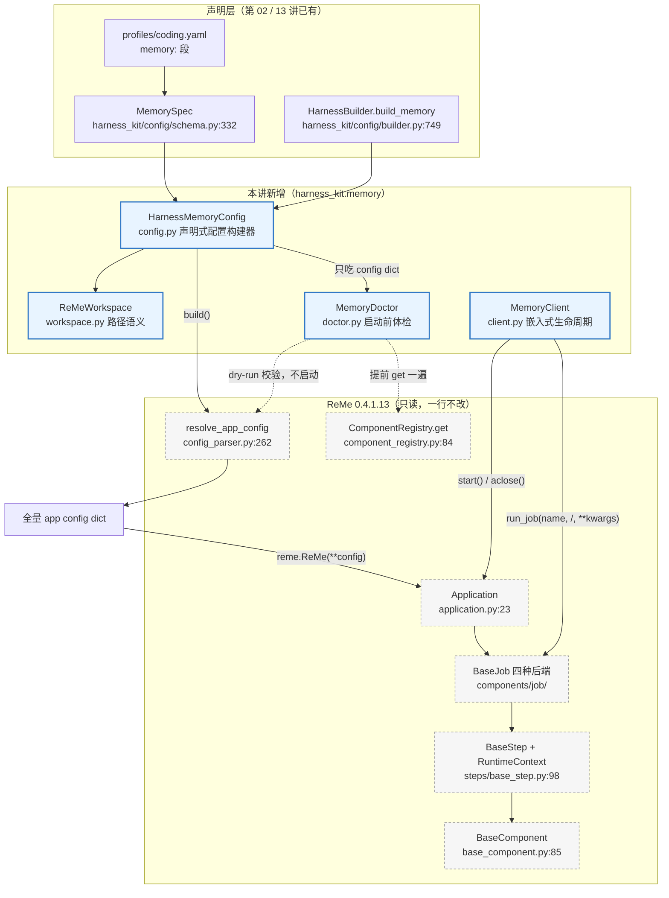

# 第 15 讲：ReMe 架构总览：从 CLI 到 Step 的完整运行时

> **本讲目标**：把 ReMe 0.4.1.13 的七层运行时（CLI → Client → Service → Application → Job → Step → Component）读通，并写出 `harness_kit` 的记忆装配层：工作区路径模型、ReMe 配置构建器、嵌入式生命周期门面、以及"把静默失败变成一张检查表"的体检器。
> **前置要求**：完成第 1～14 讲（AgentScope 侧已经走完一遍）；环境按第 1 讲装好——AgentScope 2.0.8（`pip install -e third_party/agentscope`）、ReMe 0.4.1.13（`third_party/ReMe`，**必须靠 `PYTHONPATH` 压住 site-packages 里的 0.3.1.10**）、`psutil` / `mistletoe` / `zstandard` / `croniter` 已装。
> **本讲交付物**：`tutorial_agsc_reme/reference/harness_kit/memory/workspace.py`、`tutorial_agsc_reme/reference/harness_kit/memory/config.py`、`tutorial_agsc_reme/reference/harness_kit/memory/client.py`、`tutorial_agsc_reme/reference/harness_kit/memory/doctor.py`、`tutorial_agsc_reme/reference/harness_kit/memory/__init__.py`、`tutorial_agsc_reme/reference/scripts/01_reme_doctor.py`、`tutorial_agsc_reme/reference/tests/test_lesson15_reme_arch.py`。
> **预计时长**：110 分钟（其中动手 70 分钟，源码精读 40 分钟）。
>
> 本讲的完整可运行代码位于 `tutorial_agsc_reme/reference/harness_kit/memory/` 与
> `tutorial_agsc_reme/reference/scripts/01_reme_doctor.py`，
> 你可以直接对照，也可以跟着正文一行一行写。

---

## 一、这一讲要解决的问题

前 14 讲我们把 AgentScope 2.0.8 从 `Agent` 主循环一路读到了权限引擎和多智能体。从这一讲开始，我们进入第二块地基：**ReMe**。

很多同学第一眼会把 ReMe 当成"一个记忆库"。打开它的源码目录会立刻发现不是：`reme/` 下面有 `components/`（组件树）、`steps/`（原子步骤）、`application.py`（装配器）、`config/`（配置解析）、`plugin.py`（插件契约）、`schema/`（数据模型）。**ReMe 是一个"可被装配的运行时框架"，记忆只是它内置的那套 job。** 这一讲我们不改 ReMe 一行代码，而是把它**装配**进 `harness_kit`，并把装配过程中会遇到的"静默失败"全部变成显式可查的错误。

先看四个真实的失败场景。它们全部是本仓库实测出来的，不是假想。

**失败场景 1：直接 `reme.ReMe(**config)` 会得到一个空壳。**

```python
import reme
app = reme.ReMe(workspace_dir="/tmp/x")     # 看起来没问题
print(app.context.jobs)                      # {}
```

`ReMe.__init__` 最终走的是 `Application.__init__`（`third_party/ReMe/reme/application.py:26`），它只吃传进去的 kwargs；**它不会自己去读 `reme/config/default.yaml`**。那个 YAML 是 `resolve_app_config()`（`third_party/ReMe/reme/config/config_parser.py:262`）干的活。跳过它，`components` 和 `jobs` 都是空的，`update_index`、`search`、`auto_memory` 一个都不存在，而 `app.start()` 依然会成功返回——因为"没有组件要启动"也是一个合法状态。

**失败场景 2：`run_job` 的假成功。**

```python
app = reme.ReMe(**config)      # 假设配置没问题
resp = await app.run_job("search", query="部署令牌")   # 忘了 await app.start()
print(resp.success, repr(resp.answer))                 # True ''
```

`Application.run_job` 实现只有两行（`third_party/ReMe/reme/application.py:370-374`）：

```python
async def run_job(self, name: str, /, **kwargs) -> Response:
    if name not in self.context.jobs:
        raise KeyError(f"Job '{name}' not found")
    return await self.context.jobs[name](**kwargs)
```

它把活丢给 `BaseJob.__call__`，而 `BaseJob` 的 `step_specs` 是在**它自己的 `_start()`** 里才建起来的（`third_party/ReMe/reme/components/job/base_job.py:56-59`）。没 `start()` → `step_specs` 是空列表 → 循环跑 0 次 → 返回 `Response()` 的默认值。而 `Response` 的默认值是 `success=True`、`answer=""`（`third_party/ReMe/reme/schema/response.py:17-19`）。

**一个 `success=True` 的空答案，比一个异常危险得多。** 调用方的代码会一路"成功"下去。

**失败场景 3：`reindex` 把索引清空，然后一声不吭。**

这是最阴的一个。写完文件直接调 `reindex`：

```
reindex : success=True metadata={'counts': {'added': 0, 'modified': 0, 'deleted': 0}}
search  : success=True answer=''        # 命中 0 条
```

`reindex_step` 的 docstring 写得很清楚：*"Rebuild BM25, embedding, and/or tag indexes **without rescanning workspace files**"*（`third_party/ReMe/reme/steps/index/reindex.py:11`）。也就是说它只对**已经进了 `file_store` 的 chunk** 重建索引；一个刚写进 `daily/` 的 markdown，从来没有被 ingest 过，`reindex` 对它一无所知。全程 `success=True`、`answer=''`，**没有任何报错**。

**失败场景 4：`import reme` 静默拿到 0.3.1.10。**

这个坑在第 1 讲就出现过，本讲会再踩一次，因为它是本仓库的头号环境问题：

```
>>> import reme; reme.__version__
'0.3.1.10'    # 而你要的是 0.4.1.13
```

`site-packages` 里有一个旧的 `reme`，`import reme` 会抢先命中它。规避方式只有一个：`PYTHONPATH=<repo>/third_party/ReMe`，且必须在**同一个解释器**里。

**把这四个场景放在一起看，本讲的命题就出来了：**

> ReMe 的每一层都是"可扩展的"，但它的错误处理策略是"尽量不抛"——`success=True` + 空答案、`KeyError` 而不带可用清单、配置写错就静默少几个 job。这些策略在"一个进程只跑一个 ReMe"的 CLI 场景下没问题；一旦 ReMe 被**嵌入**到别人的进程里当组件用，它们就全部变成了难以定位的故障。

所以本讲要写的四个模块，本质上都是**翻译层**：

| 模块 | 把什么翻译成什么 |
| --- | --- |
| `harness_kit/memory/workspace.py` | 把"六个目录名"翻译成**唯一可解释的相对路径语义** |
| `harness_kit/memory/config.py` | 把 harness 的意图翻译成**能直接喂给 `reme.ReMe` 的全量配置** |
| `harness_kit/memory/client.py` | 把 ReMe 的"静默降级"翻译成**带诊断的异常** |
| `harness_kit/memory/doctor.py` | 把"启动后才会炸的东西"翻译成**一张启动前就能看的检查表** |

## 二、源码侦察

本节所有结论都来自真实源码，格式统一为 `相对仓库根的路径:行号`。读之前提醒一句：ReMe 的源码在 `third_party/ReMe/`，**本讲一个字都不改它**。

### 2.1 顶层入口：`reme.ReMe` 一行代码都没有

```
third_party/ReMe/reme/__init__.py:3      __version__ = "0.4.1.13"
third_party/ReMe/reme/__init__.py:11     from .components import BaseComponent, R
third_party/ReMe/reme/__init__.py:13     from .reme import ReMe
third_party/ReMe/reme/__init__.py:18     R.freeze()
third_party/ReMe/reme/reme.py:18         class ReMe(Application):
third_party/ReMe/reme/reme.py:101        def main() -> None:
third_party/ReMe/reme/application.py:23  class Application(BaseComponent):
third_party/ReMe/reme/application.py:391     def run_app(self):
```

`reme/reme.py:18-19` 是这么写的：

```python
class ReMe(Application):
    """ReMe memory management application."""
```

**一行实现都没有。** 这说明什么？说明"ReMe"这个名字只是给 `Application` 加了个语义标签；真正的能力全在 `Application` 和它装配出来的组件里。**嵌入式装配时你完全可以只认 `Application`**（`reme.application.Application` 是公开导出），`reme.ReMe` 只是一个更短的别名。

`reme/__init__.py:18` 的 `R.freeze()` 说明什么？说明**内置组件的注册表在包导入完成的那一刻就被冻结了**（`reme/components/component_registry.py:112` 的 `freeze()`）。之后再想往 `R` 里塞东西会直接 `RuntimeError: Component registry is frozen`。这是刻意的：库作者不希望使用者往全局模板里加东西，要加就加在**运行时 registry** 上——也就是 `create_application_registry()` 返回的那份 `R.copy()`（`component_registry.py:154-156`）。**这是我们后面所有"扩展组件"的唯一合法入口**（第 16 讲会用到）。

`reme/reme.py:101` 的 `main()` 是 CLI 入口，作用是把 `argv` 解析成 `(action, kwargs)`，再交给 `resolve_app_config()` 与 Service。**CLI 与嵌入式是两条平行入口，共享同一个 `Application`**——这就是为什么我们可以放心地不走 CLI：CLI 只是"另一种驱动方式"。

### 2.2 Application：装配在哪里发生

```
third_party/ReMe/reme/application.py:26      def __init__(self, **kwargs) -> None:
third_party/ReMe/reme/application.py:27          runtime = resolve_plugin_runtime(kwargs)
third_party/ReMe/reme/application.py:28          self.context = ApplicationContext(registry=runtime.registry, **runtime.config)
third_party/ReMe/reme/application.py:32          self._setup_workspace_directories()
third_party/ReMe/reme/application.py:54      def _setup_workspace_directories(self) -> None:
third_party/ReMe/reme/application.py:79      def _init_components(self) -> None:
third_party/ReMe/reme/application.py:92      def _init_jobs(self) -> None:
third_party/ReMe/reme/application.py:103     def _instantiate(...)
third_party/ReMe/reme/application.py:122         backend_cls = self.context.registry.get(ctype, cfg.backend)
third_party/ReMe/reme/application.py:124             raise ValueError(f"Unregistered backend '{cfg.backend}' for {label}")
third_party/ReMe/reme/application.py:138     def _topological_order(...)
third_party/ReMe/reme/application.py:150         ready = [k for k, d in in_degree.items() if d == 0]
third_party/ReMe/reme/application.py:151         heapq.heapify(ready)
third_party/ReMe/reme/application.py:161         if len(ordered) != len(nodes):
third_party/ReMe/reme/application.py:163             raise ValueError(f"Circular dependency detected among: {unresolved}")
third_party/ReMe/reme/application.py:167     def _build_dependency_graph(...)
third_party/ReMe/reme/application.py:180             f"Component {key[0]}:{key[1]} depends on unregistered {dep.ctype}:{dep.name}",
third_party/ReMe/reme/application.py:187     async def _start(self) -> None:
third_party/ReMe/reme/application.py:196         components = self._topological_order()
third_party/ReMe/reme/application.py:197         jobs = list(self.context.jobs.values())
third_party/ReMe/reme/application.py:198         base_jobs = [j for j in jobs if not isinstance(j, (StreamJob, BackgroundJob))]
third_party/ReMe/reme/application.py:199         stream_jobs = [j for j in jobs if isinstance(j, StreamJob)]
third_party/ReMe/reme/application.py:200         background_jobs = [j for j in jobs if isinstance(j, BackgroundJob) and not isinstance(j, CronJob)]
third_party/ReMe/reme/application.py:201         cron_jobs = [j for j in jobs if isinstance(j, CronJob)]
third_party/ReMe/reme/application.py:202         for c in components + base_jobs + stream_jobs + background_jobs + cron_jobs:
third_party/ReMe/reme/application.py:203             await self._start_one(c)
third_party/ReMe/reme/application.py:205             await self._close_started_components()
third_party/ReMe/reme/application.py:218     async def _close(self) -> None:
third_party/ReMe/reme/application.py:223     async def _close_started_components(self) -> None:
third_party/ReMe/reme/application.py:226         for c in reversed(self._started_components):
```

逐条解读，每一条后面都是我们 harness 要利用的钩子：

1. **`__init__` 里就把 config 变成了组件实例**（`:32`→`:44`→`:45`）。`_setup_workspace_directories()` 会 `mkdir -p` 出工作区根和六个子目录（`:54-68`）。这说明：**`Application.__init__` 有 IO**。想"先体检再启动"的话，不能靠"构造了但没启动所以没副作用"来保证——这一点直接决定了 `MemoryDoctor` 必须**只吃 config 字典、不构造 app**。
2. **`:122` `registry.get(ctype, cfg.backend)`** 是配置与代码的唯一接缝：YAML 里的 `backend: local` 靠这条语句变成 `LocalFileStore` 类。找不到就 `:124` 报 `Unregistered backend 'xxx' for Job 'yyy'`。**这就是 `MemoryDoctor` 的 `registry.jobs/steps/components` 三个检查项要复刻的逻辑**——体检器提前把这条语句跑一遍，就能在 `start()` 之前报出"第 3 个 job 的第 2 个 step 没注册"。
3. **`:138-164` 是 Kahn 拓扑排序**，用 `heapq` 保证同层节点的顺序**确定**（`ready` 堆化后按 key 字典序弹出）。`:180` 的报错是"依赖了没装配的组件"，`:163` 的报错是"有环"。这说明：**组件之间的依赖不是靠 YAML 的书写顺序，而是靠 `bind()` 声明 + 拓扑算法**。所以你在 YAML 里把 `file_store` 写在 `keyword_index` 后面也没关系。
4. **`:196-203` 的启动顺序是硬编码的五段**：`components(拓扑序) → base job → stream job → background job → cron job`。注意 job 之间**没有**拓扑排序，它们按**配置里的书写顺序**启动。这说明：`job` 的顺序是我们能控制的（`HarnessMemoryConfig.build()` 里 `jobs = {name: ... for name in whitelist}` 保留白名单顺序，见 4.2 节）。
5. **`:203` 失败时 `:205` 会回滚**——`_close_started_components()` 按**启动顺序的逆序**关闭（`:226` 的 `reversed`）。这说明"启动了半个 app"不会留下来，我们可以放心地把 `start()` 当成一个**原子操作**去包超时。

### 2.3 生命周期契约：`BaseComponent`

`Application` 自己没有 `start()`，它继承自 `BaseComponent`：

```
third_party/ReMe/reme/components/base_component.py:44    def to_workspace_relative(self, path) -> str:
third_party/ReMe/reme/components/base_component.py:53    class Dependency:
third_party/ReMe/reme/components/base_component.py:85    class BaseComponent(ComponentMixin, ABC):
third_party/ReMe/reme/components/base_component.py:99        self._is_started: bool = False
third_party/ReMe/reme/components/base_component.py:110   def is_started(self) -> bool:
third_party/ReMe/reme/components/base_component.py:117   def bind(name, base_cls, *, ...)      # 依赖声明
third_party/ReMe/reme/components/base_component.py:198   def workspace_metadata_path(self) -> Path:
third_party/ReMe/reme/components/base_component.py:202       return Path.cwd() / "metadata"
third_party/ReMe/reme/components/base_component.py:211   async def _start(self) -> None:      # 子类钩子
third_party/ReMe/reme/components/base_component.py:214   async def _close(self) -> None:      # 子类钩子
third_party/ReMe/reme/components/base_component.py:225   async def start(self) -> None:
third_party/ReMe/reme/components/base_component.py:227       if self._is_started: return         # 幂等
third_party/ReMe/reme/components/base_component.py:231           await self._resolve_bindings()
third_party/ReMe/reme/components/base_component.py:235           await self._start()
third_party/ReMe/reme/components/base_component.py:236           self._is_started = True
third_party/ReMe/reme/components/base_component.py:243   async def _rollback_start(...)
third_party/ReMe/reme/components/base_component.py:262   async def close(self) -> None:
third_party/ReMe/reme/components/base_component.py:285   async def restart(self) -> None:
```

三个必须记住的结论：

1. **`await app.start()` 是正确的公开 API，`await app._start()` 不是。** `start()`（`:225`）做三件 `_start()` 不做的事：加锁（`self._lock`）、幂等判断（`:227`）、失败回滚（`:236`/`:241`），并把 `_is_started` 置位（`:236`）。契约 §3.15 里写的"必须显式 `await app._start()`"是**不准确的**——按源码应当用 `start()`。`MemoryClient.started` 属性读的就是 `is_started`（`:110`），所以只有走 `start()` 才会变 True。
2. **`workspace_metadata_path` 有一个"没装配就写到 cwd"的坑**（`:198-202`）：`if self.app_context is None: return Path.cwd() / "metadata"`。这说明**单独 new 一个组件、不经过 `Application` 装配，它的元数据会悄悄写进当前工作目录**。这正是 `_recon/11_reme_overview.md` 里"独立组件写 metadata/ 写进了 cwd"那条坑的源码位置。
3. **`to_workspace_relative`（`:44`）是 ReMe 官方的路径换算**，但它对相对路径的处理是"先 `Path.absolute()`（不解析符号链接、以 CWD 为基准）再 `relative_to`"。在 macOS 上 `Path("/tmp/x").absolute()` 仍然是 `/tmp/x`，而 `resolve()` 会给出 `/private/tmp/x`——**两边不一致就会误判越界**。这是 4.1 节 `ReMeWorkspace.relative()` 刻意不复用官方实现的原因（那里的 docstring 记录了完整推导）。

### 2.4 Job：四种后端，以及"配置怎么变成参数"

```
third_party/ReMe/reme/components/job/base_job.py:35      @R.register("base")
third_party/ReMe/reme/components/job/base_job.py:36      class BaseJob(BaseComponent):
third_party/ReMe/reme/components/job/base_job.py:54          self.step_specs: list[tuple[type["BaseStep"], dict]] = []
third_party/ReMe/reme/components/job/base_job.py:56      async def _start(self) -> None:
third_party/ReMe/reme/components/job/base_job.py:59          self.step_specs = [self._resolve_step(raw) for raw in self.step_configs]
third_party/ReMe/reme/components/job/base_job.py:76      def _build_steps(self) -> list["BaseStep"]:
third_party/ReMe/reme/components/job/base_job.py:78          return [step_cls(**dict(params)) for step_cls, params in self.step_specs]
third_party/ReMe/reme/components/job/base_job.py:86      async def __call__(self, **kwargs) -> Response:
third_party/ReMe/reme/components/job/base_job.py:89          merged = {**self.kwargs, **kwargs}
third_party/ReMe/reme/components/job/base_job.py:90          context = RuntimeContext(**merged)
third_party/ReMe/reme/components/job/background_job.py:15 @R.register("background")
third_party/ReMe/reme/components/job/background_job.py:44     kwargs.pop("enable_serve", None)
third_party/ReMe/reme/components/job/background_job.py:55 async def _start(self) -> None:
third_party/ReMe/reme/components/job/background_job.py:84 async def _close(self) -> None:
third_party/ReMe/reme/components/job/background_job.py:105  async def _run_with_supervisor(self) -> None:
third_party/ReMe/reme/components/job/cron_job.py:12       @R.register("cron")
third_party/ReMe/reme/components/job/cron_job.py:19           self.cron_expr = cron
third_party/ReMe/reme/components/job/stream_job.py:9      @R.register("stream")
third_party/ReMe/reme/components/runtime_context.py:9     class RuntimeContext:
third_party/ReMe/reme/components/runtime_context.py:16        def __init__(self, response=None, stream_queue=None, stop_event=None, **kwargs)
third_party/ReMe/reme/components/runtime_context.py:52        def from_context(cls, context=None, **kwargs)
third_party/ReMe/reme/steps/base_step.py:98               class BaseStep(ComponentMixin, ABC):
third_party/ReMe/reme/steps/base_step.py:146              async def __call__(self, context=None, **kwargs):
```

**`:89-90` 是 ReMe 里最值得抄的一条设计**：

```python
merged = {**self.kwargs, **kwargs}
context = RuntimeContext(**merged)
```

`self.kwargs` 是这个 job 在 YAML 里的**全部字段**（因为 `JobConfig` 是 `extra="allow"`，见 2.5 节），`kwargs` 是本次调用的参数。两者合并后整体塞进 `RuntimeContext`。于是：

- 想给一个 job 传参数，有两条路：**YAML 里写死**（装配期）或**调用时传**（运行期），调用时传的优先；
- `RuntimeContext` 的 `data` 就是合并后的 dict（`:27` `self.data: dict = kwargs`），step 里用 `context.get("watch_dirs")` 就能拿到。

**这条链路解释了 4.2 节里那个"`watch_dirs` 必须写进 job 配置"的硬要求**：`init_changes_step` 要的 `watch_dirs` 只能从 job 配置流进 `RuntimeContext`（`third_party/ReMe/reme/steps/index/_watch_rules.py:56-57`）：

```python
watch_dirs: list[str] = context.get("watch_dirs", [])
watch_suffixes: list[str] = context.get("watch_suffixes", [])
if not watch_dirs:
    return []
```

**注意 `if not watch_dirs: return []`——规则集为空是"合法"的，不报错。** 于是 `clear_store_step` 清空索引之后，`init_changes_step` 认为"一个文件都没有"，diff 出 `added=0`，索引再也装不回来，而 `reindex` 依然返回 `success=True`。这就是失败场景 3 的完整机制。

`background_job.py` 的三条硬事实（本讲实测过）：

- `:44` 有 `kwargs.pop("enable_serve", None)` 然后强制 `enable_serve=False`——**后台 job 永远不会被注册成 service 端点**；
- `:55` 的 `_start()` 只是 `asyncio.create_task(self._run_with_supervisor())`，**它是立刻返回的**。所以"配置里有 background job 会让 `await app.start()` 永远不返回"这个说法**是错的**。实测：只带 `index_update_loop` 时 `start()` 用 2.29s 正常返回；把 40 个 job 全打开，`start()` 只用 0.04s。
- 真正会"永久等待"的是**前台 `run_job`**：`index_update_loop` 的第二跳是 `watch_changes_step`，它的 `execute()` 里是 `async for raw_changes in awatch(...)`（`third_party/ReMe/reme/steps/index/watch_changes.py:93`），只有 `stop_event` 被设置才会退出。实测 `await app.run_job("index_update_loop")` 在 6 秒超时前一直不返回。
- `:84-95` 的 `_close()` 会先 set `stop_event`、再 `await asyncio.wait_for(asyncio.shield(self._task), timeout=self.close_timeout)`（默认 5s）、超时才 `cancel()`。实测 `aclose()` 的耗时：带一个 background job 是 1.01s，40 个 job 全开是 3.03s。

**所以 harness 丢掉 `background`/`cron` 的理由不是"start() 会挂"，而是"`run_job` 的语义是跑一次并等结果，这类 job 永远等不到结果，而且关闭要付计时器成本"。** 这一点在 4.2 节的 `EMBEDDED_JOB_BACKENDS` 注释里逐字写清了——**凡是能给出行号或实测数字的断言，就不要写成"会挂"这种含糊说法**。

### 2.5 配置系统：三个必须显式调用的函数

```
third_party/ReMe/reme/config/config_parser.py:53    def expand_env_vars(value: Any) -> Any:
third_party/ReMe/reme/config/config_parser.py:75    def parse_dot_notation(dot_list: list[str]) -> dict:
third_party/ReMe/reme/config/config_parser.py:98    def _convert_value(value_str: str) -> Any:
third_party/ReMe/reme/config/config_parser.py:145   def _load_config(name_or_path, encoding="utf-8", _stack=()) -> dict:
third_party/ReMe/reme/config/config_parser.py:209   def deep_merge_config(base, update) -> dict[str, Any]:
third_party/ReMe/reme/config/config_parser.py:250   def parse_args(*args: str) -> tuple[str, dict]:
third_party/ReMe/reme/config/config_parser.py:262   def resolve_app_config(*, log_config: bool = True, **kwargs) -> dict:
third_party/ReMe/reme/schema/application_config.py:12    class ComponentConfig(BaseModel):
third_party/ReMe/reme/schema/application_config.py:15        model_config = ConfigDict(extra="allow")
third_party/ReMe/reme/schema/application_config.py:20    class JobConfig(ComponentConfig):
third_party/ReMe/reme/schema/application_config.py:29    class ApplicationConfig(BaseModel):
third_party/ReMe/reme/schema/application_config.py:37    workspace_dir: str = Field(default=".reme", ...)
third_party/ReMe/reme/schema/application_config.py:42    metadata_dir: str = Field(default="metadata", ...)
third_party/ReMe/reme/schema/application_config.py:43    session_dir: str = Field(default="session", ...)
third_party/ReMe/reme/schema/application_config.py:44    # dialog_dir was removed; standard transcripts are always derived as ``{session_dir}/dialog``.
third_party/ReMe/reme/schema/application_config.py:45    mem_session_dir: str = Field(default="mem_session", ...)
third_party/ReMe/reme/schema/application_config.py:46    resource_dir: str = Field(default="resource", ...)
third_party/ReMe/reme/schema/application_config.py:47    daily_dir: str = Field(default="daily", ...)
third_party/ReMe/reme/schema/application_config.py:48    digest_dir: str = Field(default="digest", ...)
third_party/ReMe/reme/schema/application_config.py:50    timezone: str | None = Field(default="Asia/Shanghai", ...)
third_party/ReMe/reme/schema/response.py:8           class Response(BaseModel):
third_party/ReMe/reme/schema/response.py:17          answer: str | Any = Field(default="", ...)
third_party/ReMe/reme/schema/response.py:18          success: bool = Field(default=True, ...)
third_party/ReMe/reme/schema/response.py:19          metadata: dict = Field(default_factory=dict, ...)
```

1. **`resolve_app_config` 必须显式调用**（`:262`），它做的事是：`_load_config("default")` → 深合并 `extends` 链 → `expand_env_vars`（把 `${VAR}` / `${VAR:-default}` 展开）→ `parse_dot_notation`（把 `--components.as_llm.default.model=x` 这种命令行 dot-notation 变成嵌套 dict）→ pydantic 校验。**跳过它 = 拿到一个空壳**（失败场景 1）。
2. **`ComponentConfig` / `JobConfig` 是 `extra="allow"`**（`:15`）：YAML 里 `backend`/`description`/`steps` 之外的**任意字段都会被保留**。这就是 2.4 节那条 `{**self.kwargs, **kwargs}` 链路的源头——`watch_dirs`、`watch_suffixes` 之所以能写进 job 配置并传到 step，全靠 `extra="allow"`。
3. **六个目录字段在 `:42-48`**，逐字是 `metadata` / `session` / `mem_session` / `resource` / `daily` / `digest`。**`:44` 的注释很重要**：`dialog_dir` 被移除了，"标准对话记录永远派生为 `{session_dir}/dialog`"。所以 `session/dialog/` 不是配置项，是**派生路径**——4.1 节的 `dialog_path()` 就是照这条注释实现的。
4. **`Response` 的默认值就是那个"假成功"的来源**（`response.py:17-19`）：`answer=""`、`success=True`。

### 2.6 注册表与插件契约

```
third_party/ReMe/reme/components/component_registry.py:14    class ComponentRegistry:
third_party/ReMe/reme/components/component_registry.py:22        self._registry: dict[str, dict[str, type[ComponentMixin]]] = {}
third_party/ReMe/reme/components/component_registry.py:43            group = self._registry.setdefault(component_type, {})
third_party/ReMe/reme/components/component_registry.py:53                raise ValueError(f"Backend '{ctype}:{name}' is provided by both ...")
third_party/ReMe/reme/components/component_registry.py:62    def register(cls_or_name, name=None):
third_party/ReMe/reme/components/component_registry.py:84    def get(self, component_type, name) -> type[ComponentMixin] | None:
third_party/ReMe/reme/components/component_registry.py:112   def freeze(self) -> None:
third_party/ReMe/reme/components/component_registry.py:151   R = ComponentRegistry()
third_party/ReMe/reme/components/component_registry.py:154   def create_application_registry() -> ComponentRegistry:
third_party/ReMe/reme/components/component_registry.py:156       return R.copy()
third_party/ReMe/reme/plugin.py:132                          def resolve_plugin_runtime(application_config) -> PluginRuntime:
third_party/ReMe/reme/plugin_manifest.py:13                  class PluginManifest:
third_party/ReMe/reme/plugin_manifest.py:16                      backends: dict[str, str]
third_party/ReMe/reme/plugin_manifest.py:17                      application_defaults: dict[str, Any]
third_party/ReMe/reme/plugin_manifest.py:35                  unknown = set(value) - {"backends", "application_defaults"}
third_party/ReMe/reme/plugin_manifest.py:37                      raise ValueError(f"Plugin '{plugin_name}' manifest has unknown keys: ...")
third_party/ReMe/reme/enumeration/component_enum.py:6        class ComponentEnum(str, Enum):
third_party/ReMe/reme/enumeration/component_type.py:12       def component_type_name(value: ComponentType) -> str:
```

- **两级注册表**：`_registry: dict[str, dict[str, type]]`，外层键是组件类型名（`component_type_name()`，`:12`，小写字母/数字/`.`/`_`/`-`），内层键是 backend 名。`:84` 的 `get()` 就是你将来加组件时的查找入口。
- **`:53` 的冲突检测**：同一个 `(类型, 名字)` 被两个模块注册会直接 `ValueError`，并打印两个 owner。这说明"重名"在 ReMe 里是硬错误——**这对我们是好消息**，第 16 讲要注册自己的 `file_chunker` 时不会悄悄覆盖官方实现。
- **内置注册表在导入时就被 `freeze()`**（`reme/__init__.py:18`），要扩展只能用 `create_application_registry()`（`:154`，返回 `R.copy()`）。
- **插件契约只有两个键**：`backends` 与 `application_defaults`（`plugin_manifest.py:16-17`），而且 `:35-37` 会**拒绝任何其它键**。这说明 ReMe 的插件机制是"声明式"的：插件**不能**在导入时偷偷改配置，只能声明 backend 映射 + 默认配置。
- 本讲**不做插件**，但 `MemoryDoctor` 必须知道这条边界：体检时用的是 `create_application_registry()`（等价于"没有插件时的 registry"），所以**任何靠插件提供的 backend，体检都会报 `未登记`**——这是设计使然，不是 bug。

### 2.7 工作区目录语义（本讲的"地图"）

把 2.5 节的字段和真实读写点对起来，就是下面这张表。这张表是 4.1 节 `ReMeWorkspace` 的全部依据：

| 目录 | 默认名 | 谁写它 | 语义 | 可再生吗 |
| --- | --- | --- | --- | --- |
| `metadata/` | `metadata` | `LocalFileStore`（`.jsonl.zst`）、`BM25Index`（`.pkl`）、`LocalTagIndex` | 组件元数据 = **派生索引** | 可重建（但注意 2.4 节：`reindex` 不重扫） |
| `session/` | `session` | Agent 会话持久化 | `session/dialog/<id>.jsonl` 是**对话原文** | **不可再生** |
| `mem_session/` | `mem_session` | `auto_memory` 的输入整形 | 记忆会话中间态 | 可从 `session/dialog` 重建 |
| `resource/` | `resource` | 调用方 / `MemoryIngestor` | 原始输入资料 | 取决于来源 |
| `daily/` | `daily` | `write` job、`auto_memory` | 日记忆：`daily/<YYYY-MM-DD>/<card>.md` | 可从 `session/dialog` 重建 |
| `digest/` | `digest` | dream 流水线 | 深度加工产物 | 可从 `daily/` 重建 |

三条从表里读出来的结论：

1. **只有 `session/dialog/` 是不可再生的**。所以 4.1 节 `clean()` 的保护策略是"`keep="index"` 一律保留对话原文"，而 `keep="none"` 必须**显式** `keep_session=True` 才保留——默认删掉可再生数据，绝不默认删掉不可再生数据。
2. **`metadata/` 是派生的，所以它不该被当成"资料"再入库**。4.1 节 `iter_files()` 显式跳过 `metadata/`（否则 `search` 会把索引文件本身当成一篇文档返回）。
3. **`resource/` 与 `daily/` 的分工**是"原始输入 vs 加工产物"。4.2 节的 rescan 版 `reindex` 三个目录全扫，正是因为 `resource/` 里也可能有手工放进来的文件。

### 2.8 本讲会用到的 agentscope / reme 扩展点

**这是本讲最重要的一张表。** 你在 4 节写的每一行代码，都必须在"扩展点"这一列里找到出处。

| # | 扩展点（基类 / 函数 / 契约） | 签名 | 文件:行号 | 我们在哪里用它 |
| --- | --- | --- | --- | --- |
| 1 | `resolve_app_config` | `(*, log_config: bool = True, **kwargs) -> dict` | `third_party/ReMe/reme/config/config_parser.py:262` | `config.py:_resolve_base()` 里唯一一次读取 `default.yaml` |
| 2 | `deep_merge_config` | `(base: Mapping, update: Mapping) -> dict` | `third_party/ReMe/reme/config/config_parser.py:209` | 语义对齐：我们在 `config.py:_deep_merge()` 里复刻同一套"overlay 胜出 / dict 递归"的规则 |
| 3 | `ApplicationConfig`（六个目录字段） | pydantic model，`extra="allow"` | `third_party/ReMe/reme/schema/application_config.py:29-50` | `workspace.py:DEFAULT_SUBDIRS` 逐字对齐目录名；`doctor.py` 用它校验配置能解析 |
| 4 | `JobConfig` / `ComponentConfig`（`extra="allow"`） | pydantic model | `third_party/ReMe/reme/schema/application_config.py:12-26` | `config.py:RESCAN_REINDEX_JOB` 里能多写 `watch_dirs` / `watch_suffixes` 的**唯一原因** |
| 5 | `Application.__init__` | `(**kwargs)`；内部 `resolve_plugin_runtime` + `ApplicationContext` | `third_party/ReMe/reme/application.py:26-45` | `client.py:start()` 里 `module.ReMe(**config)` 的落点 |
| 6 | `Application._start`（内部） | `async def _start(self) -> None` | `third_party/ReMe/reme/application.py:187` | 不直接调；由 `BaseComponent.start()` 触发 |
| 7 | `BaseComponent.start` | `async def start(self) -> None`（幂等 + 回滚 + 置 `_is_started`） | `third_party/ReMe/reme/components/base_component.py:225-241` | `client.py:start()` 里 `await app.start()` |
| 8 | `BaseComponent.close` / `is_started` | `async def close(self)`；`@property is_started` | `third_party/ReMe/reme/components/base_component.py:262` / `:110` | `client.py:aclose()` / `client.py:started` |
| 9 | `Application.run_job` | `async def run_job(self, name: str, /, **kwargs) -> Response`（**name 是 positional-only**） | `third_party/ReMe/reme/application.py:370` | `client.py:run_job()` 签名逐字对齐 |
| 10 | `Application.run_stream_job` | `async def run_stream_job(self, name: str, /, **kwargs) -> AsyncGenerator[StreamChunk, None]` | `third_party/ReMe/reme/application.py:376` | 本讲不用（`stream` job 走 `chat`）；第 19 讲中间件会用到 |
| 11 | `Response` | `answer` / `success` / `metadata`，默认 `success=True` `answer=""` | `third_party/ReMe/reme/schema/response.py:8-19` | `client.py:run_job()` 的 `success is False → raise MemoryJobError` |
| 12 | `BaseJob.__call__` | `merged = {**self.kwargs, **kwargs}` → `RuntimeContext(**merged)` | `third_party/ReMe/reme/components/job/base_job.py:86-91` | 解释了为什么 job 配置里能带 `watch_dirs` |
| 13 | `RuntimeContext` | `__init__(response=None, stream_queue=None, stop_event=None, **kwargs)` | `third_party/ReMe/reme/components/runtime_context.py:9-27` | `_watch_rules.build_context_watch_rules` 从它读 `watch_dirs` |
| 14 | `build_context_watch_rules` | `(app_config, workspace_path, context) -> list[WatchRule]`；**`watch_dirs` 空则返回 `[]` 且不报错** | `third_party/ReMe/reme/steps/index/_watch_rules.py:48-60` | `config.py:RESCAN_REINDEX_JOB` 必须写 `watch_dirs` 的原因 |
| 15 | `ReindexStep` 的语义 | docstring：rebuild **without rescanning workspace files** | `third_party/ReMe/reme/steps/index/reindex.py:11` | `config.py:RESCAN_REINDEX_JOB` 覆盖它的原因 |
| 16 | `WatchChangesStep.execute` | `async for raw_changes in awatch(...)`（长驻） | `third_party/ReMe/reme/steps/index/watch_changes.py:93` | `EMBEDDED_JOB_BACKENDS` 过滤 `background` 的原因 |
| 17 | `BackgroundJob` | `@R.register("background")`；`_start` 起 task；`_close` 等 `close_timeout` | `third_party/ReMe/reme/components/job/background_job.py:15-95` | `EMBEDDED_JOB_BACKENDS` 过滤它的原因；`doctor.py` 的 `config.jobs` 检查项 |
| 18 | `CronJob` | `@R.register("cron")`；`__init__(self, cron: str, **kwargs)` | `third_party/ReMe/reme/components/job/cron_job.py:12-25` | 同样被 `EMBEDDED_JOB_BACKENDS` 过滤；`doctor.py` 的 `config.jobs` 检查项 |
| 19 | `ComponentRegistry.get` | `(component_type, name) -> type[ComponentMixin] \| None` | `third_party/ReMe/reme/components/component_registry.py:84` | `doctor.py:_check_registry()` 复刻 `Application._instantiate` 的查找 |
| 20 | `create_application_registry` | `() -> ComponentRegistry`（返回冻结模板的 `copy()`） | `third_party/ReMe/reme/components/component_registry.py:154` | `doctor.py:_check_registry()` |
| 21 | `R.freeze()` | 导入时冻结内置注册表 | `third_party/ReMe/reme/__init__.py:18` / `component_registry.py:112` | 解释了为什么扩展必须走 `create_application_registry()` |
| 22 | `ComponentEnum` | `str, Enum`，含 `JOB` / `STEP` / `FILE_STORE` / `KEYWORD_INDEX` ... | `third_party/ReMe/reme/enumeration/component_enum.py:6-43` | `doctor.py` 里区分 `ComponentEnum.JOB` / `STEP` 与字符串类型名 |
| 23 | `component_type_name` | `(value) -> str`；非字符串抛 `TypeError` | `third_party/ReMe/reme/enumeration/component_type.py:12-25` | `MemoryDoctor` 的组件检查项按字符串类型名遍历 |
| 24 | `CliService` | `@R.register("cli")`；`_run_job` / `run_app` | `third_party/ReMe/reme/components/service/cli_service.py:62-110` | `config.py:_apply_embedded_service` 把 service 钉成 `cli` |
| 25 | `PluginManifest` | 只有 `backends` / `application_defaults` 两个键 | `third_party/ReMe/reme/plugin_manifest.py:13-46` | `MemoryDoctor` 的 registry 检查"不认插件"的边界说明 |
| 26 | `AgentScope` 侧：`agentscope.middleware._longterm_memory._reme._config._dream_steps` | 返回的 step 列表里含 `dream_topics_step` | `third_party/agentscope/src/agentscope/middleware/_longterm_memory/_reme/_config.py:54` | `doctor.py:_dream_topics_missing()` 检测的兼容缺口（第 19 讲修） |

**读表方法**：第 1、3、4 行是"配置面扩展点"，第 5～9 行是"生命周期扩展点"，第 12～18 行是"job/step 扩展点"，第 19～23 行是"注册表扩展点"。本讲**全部用配置面 + 生命周期面**，一行 ReMe 代码都不改；注册表扩展点留给第 16 讲（`@R.register` 自定义 chunker / step）。

## 三、扩展点定位与设计

### 3.1 官方已经给了什么

把 2 节的侦察结果按"能力"归档，ReMe 0.4.1.13 已经给全的东西有五类：

| 能力 | 官方实现（行号） | 我们能直接用的方式 |
| --- | --- | --- |
| **配置解析**：YAML + `extends` 继承 + `${VAR:-默认}` 环境变量 + dot-notation 覆盖 + pydantic 校验 | `third_party/ReMe/reme/config/config_parser.py:53` / `:75` / `:145` / `:209` / `:262` | 调一次 `resolve_app_config()`，拿到的就是全量配置 |
| **声明式装配**：YAML 里的 `components` / `jobs` 变成实例，依赖按拓扑序启动，失败回滚 | `third_party/ReMe/reme/application.py:26-45` / `:138-164` / `:187-241` | 传 config 给 `reme.ReMe(**config)` |
| **生命周期**：幂等 `start()` / 逆序 `close()` / `restart()` | `third_party/ReMe/reme/components/base_component.py:225` / `:262` / `:285` | `await app.start()` / `await app.close()` |
| **作业执行**：四种 job 后端 + `RuntimeContext` 传值 + `Response` 契约 | `third_party/ReMe/reme/components/job/*.py`、`runtime_context.py:9`、`schema/response.py:8` | `await app.run_job(name, /, **kwargs)` |
| **注册表与插件**：两级 `(类型, backend)` 注册表、冻结模板 + 可拷贝的运行实例、两个键的插件清单 | `component_registry.py:14` / `:112` / `:154`、`plugin_manifest.py:13` | 嵌入式直接用冻结模板；第 16 讲再用 `create_application_registry()` 扩展 |

**结论：ReMe 缺的不是"能力"，是"嵌入式使用的安全边界"。** 这一点决定了下面的设计：我们不写新的 job、不写新的 step、不写新的 component，只写"把已有能力安全地用起来"的那一层。

### 3.2 还缺什么

对照契约 1.3 的六个缺口，本讲落在**缺口 #5（没有声明式 Profile/Bundle 装配）**的记忆侧，同时暴露出四个"嵌入式缺口"——它们不是 ReMe 的功能缺失，而是"CLI 用法"到"嵌入式用法"之间没有桥：

| 编号 | 缺口（本讲新增的四个） | 证据（源码） | 谁在讲什么 |
| --- | --- | --- | --- |
| **H1** | **工作区路径没有可解释的边界**。ReMe 只有六个目录名字段，没有任何"这个路径属于工作区吗"的判断；官方的 `to_workspace_relative()` 用 `Path.absolute()`（不解析符号链接）配 `relative_to`，在 macOS 上会因 `/tmp` vs `/private/tmp` 误判越界 | `third_party/ReMe/reme/components/base_component.py:44`；目录字段 `third_party/ReMe/reme/schema/application_config.py:42-48`；`session/dialog` 是派生而非配置项 `application_config.py:44` | `ReMeWorkspace`（4.1） |
| **H2** | **配置入口分裂**。`reme.ReMe(**config)` **不会**自己读 `default.yaml`，必须显式调 `resolve_app_config()`；而它展开的环境变量叫 `LLM_API_KEY` / `LLM_BASE_URL` / `LLM_MODEL_NAME` / `LLM_BACKEND`，与工程里通用的 `OPENAI_API_KEY` / `OPENAI_BASE_URL` / `LLM_MODEL` 名字不同 —— 不显式覆盖，`start()` 会因缺 api_key 直接失败 | `third_party/ReMe/reme/config/config_parser.py:262`；`third_party/ReMe/reme/config/default.yaml:846-853`；`third_party/ReMe/reme/application.py:26` | `HarnessMemoryConfig`（4.2） |
| **H3** | **静默降级在启动前无法发现**。`Response` 默认 `success=True` / `answer=""`；`registry.get()` 找不到 backend 只在**实例化时**抛错；`watch_dirs` 为空时 `build_context_watch_rules` 返回空规则集**不报错**。三件事合起来 = "配错了一个 job，程序照样跑，只是记忆功能悄悄没了" | `third_party/ReMe/reme/schema/response.py:17-19`；`third_party/ReMe/reme/application.py:122-124`；`third_party/ReMe/reme/steps/index/_watch_rules.py:56-60` | `MemoryDoctor`（4.4） |
| **H4** | **`Application.__init__` 有副作用**，所以"先体检再启动"没法靠"构造了但没启动"来保证；反过来，`BaseJob` 的 `step_specs` 又必须等 `start()` 才建，所以"不启动就没法验证 job 能跑" | `third_party/ReMe/reme/application.py:32`（构造时就建目录）；`third_party/ReMe/reme/components/job/base_job.py:56-59` | 体检器因此**只吃 config 字典**；`MemoryClient.start()` 因此必须是**唯一**的启动入口（4.3） |

再加一条必须显式声明的**已知缺口**（不是我们造成的，也不在本讲修）：

| 已知缺口 | 证据 | 处理 |
| --- | --- | --- |
| AgentScope 的 ReMe 中间件在 `_dream_steps()` 里引用了 ReMe 0.4.1.13 **未注册**的 `dream_topics_step`，直接用会 `ValueError: Unregistered backend` | `third_party/agentscope/src/agentscope/middleware/_longterm_memory/_reme/_config.py:54` | 本讲的 `MemoryDoctor` 把它**单列为一项检查**并给出 `ensure_reme_compat()` 的修法；真正的修复在第 19 讲。**本讲不修 third_party** |

### 3.3 我们准备在哪个扩展点上做

**一句话：只站在"配置面"和"生命周期面"两个扩展点上，一行 ReMe 代码都不改。**

| 我们要的 | 站哪个扩展点 | 具体落点 |
| --- | --- | --- |
| 让工作区路径可解释 | 纯 harness 代码（不碰 ReMe） | `ReMeWorkspace`：`DEFAULT_SUBDIRS` 与 `application_config.py:42-48` 逐字对齐；`relative()` **不用**官方 `to_workspace_relative()`，自己用 `resolve()` 实现 |
| 造出能直接喂给 ReMe 的配置 | `resolve_app_config`（`config_parser.py:262`）+ `ComponentConfig` 的 `extra="allow"`（`application_config.py:15`） | `HarnessMemoryConfig._resolve_base()` 调一次并把结果缓存；`build()` 深合并 `RESCAN_REINDEX_JOB`（多写的 `watch_dirs` 靠 `extra="allow"` 活下来） |
| 嵌入式启动 / 关闭 | `BaseComponent.start()`（`base_component.py:225`）/ `close()`（`:262`）/ `is_started`（`:110`） | `MemoryClient.start()` / `aclose()` / `started` |
| 单次执行并拿到真结果 | `Application.run_job`（`application.py:370`，`name` 是 **positional-only**）+ `Response`（`response.py:8`） | `MemoryClient.run_job(name, /, *, timeout_s=None, **kwargs)`：先查 `started`、再查 job 存在、再 `success is False → MemoryJobError` |
| 启动前就能发现配错 | `ComponentRegistry.get`（`component_registry.py:84`）+ `create_application_registry()`（`:154`）+ `ApplicationConfig`（`application_config.py:29`） | `MemoryDoctor._check_registry()` 复刻 `Application._instantiate` 的查找；`_check_parse()` 只做 `ApplicationConfig.model_validate` |
| 接入 Profile 体系（缺口 #5 的记忆侧） | `MemorySpec`（`harness_kit/config/schema.py:332`）+ `HarnessBuilder.build_memory`（`harness_kit/config/builder.py:749`） | `HarnessMemoryConfig.from_spec(spec, settings=...)`：Profile 的 `memory:` 段 → ReMe 配置 |

**为什么这样切分是对的**：ReMe 的六个目录、四种 job 后端、两级注册表都是**已经写好的机制**。我们要补的三件事（路径语义、凭据落地、启动前可观测）全部是"使用姿势"问题，没有一件需要动 ReMe 的内部实现。这正好符合契约 §1.2 的"唯一正确的姿势"：读源码 → 找扩展点 → 在扩展点上写组件。

### 3.4 数据流与控制流



读图三句话：

1. **左侧的两个箭头都指向 `HarnessMemoryConfig`**：Profile 的 `memory:` 段（`MemorySpec`）和 `build_memory()` 最终都汇到同一个构造器，**记忆装配只有一个入口**。
2. **`MemoryDoctor` 的箭头是虚线、且只碰 `resolve_app_config` 与 `registry.get`**：它做的是**只读**的 dry-run——不 `Application()`、不建目录、不启动 task。这是 H4 的直接后果。
3. **`MemoryClient` 是唯一连到 `Application` 的实线**：所有生命周期都从这一个门进出，调用方拿不到 `app` 引用（`client.application` 是只读属性，为的是诊断而不是绕过）。

### 3.5 四个模块的职责边界（"该不该由我们做"）

这一小节是给契约 §9.1 第 4 条要求的"职责边界题"做铺垫。四条边界，每条都在 4 节里有对应代码：

| 职责 | 该不该由 harness_kit 做 | 为什么 |
| --- | --- | --- |
| 把工作区路径解析成绝对路径、判断是否越界 | **该** | ReMe 只给目录名，没有任何路径治理；`to_workspace_relative()` 的 `absolute()` 语义在 macOS 上不可靠 |
| 造 job / step / component | **不该** | ReMe 已有四种 job 后端与两级注册表（`components/job/*.py`、`component_registry.py`）。本讲一个都不写；第 16 讲要扩展也是用 `@R.register` 注册**新 backend**，不是重写 `BaseJob` |
| 决定"哪些 job 能被前台调用" | **该** | 这是**使用策略**，不是框架能力。ReMe 允许你 `run_job("index_update_loop")` 然后永久等待；harness 必须替调用方挡下 |
| 修 AgentScope 中间件引用不存在的 step 的 bug | **不该**（本讲） | 修法属于第 19 讲的 `ensure_reme_compat()`；本讲只**体检并报出来**，且明确标注"已知缺口，不计失败" |
| 替 ReMe 做 HTTP 服务化 | **不该** | 契约明确要求嵌入式装配；`MemoryConfig` 把 `service.backend` 钉成 `cli`，从配置层面堵死起服务的可能 |
| 重试 / 退避 / 崩后重启 job | **不该** | `BackgroundJob._run_with_supervisor`（`background_job.py:105-127`）已经按指数退避重启了；嵌入式场景我们直接不用这类 job |

## 四、harness_kit 实现

本节给出**完整文件内容**，不是片段。七个文件按依赖顺序排列：路径模型 → 配置构建器 → 生命周期门面 → 体检器 → 包门面 → 验真脚本 → 回归测试，最后一个文件是把记忆接进 Profile 体系的接线说明。

### 4.1 `harness_kit/memory/workspace.py`

路径语义的唯一解释者。它**不 import reme**，所以在 ReMe 装错版本时照样能用（体检、配置解释、单测都靠这一点）。

```python
# -*- coding: utf-8 -*-
"""ReMe 工作区（workspace / vault）的路径模型与目录治理。

**这一层为什么存在**

ReMe 自己会在 ``Application.__init__`` 里创建六个子目录
（``third_party/ReMe/reme/application.py:62-79`` 的 ``_setup_workspace_directories``），
但它只负责 "mkdir"，不负责：

1. **路径语义**：契约 §3.15 规定 ``metadata/`` 放组件元数据、``session/`` 放会话、
   ``mem_session/`` 放记忆会话、``resource/`` 放原始资源、``daily/`` 放日志、
   ``digest/`` 放摘要 —— 这些名字的真值来自
   ``third_party/ReMe/reme/schema/application_config.py:37-44`` 的
   ``ApplicationConfig`` 字段默认值。harness_kit 把这份真值固化成一个 pydantic 模型，
   这样 "目录名" 只有一个来源，配置文件改了就全都跟着改。
2. **校验与清理**：工作区被别人塞进非目录的同名文件、残留了上次崩溃的半成品、
   或者租户 id 里带了 ``../`` —— 这些都要在动手前拦住。
3. **macOS 的 ``/tmp`` 陷阱**：``/tmp`` 是 ``/private/tmp`` 的符号链接，
   而 ``ComponentMixin.to_workspace_relative`` 用的是 ``Path.absolute()``（不解析符号链接），
   拼出来的相对路径会退化成绝对路径（已实测，见 ``_recon/15_integration_agentscope_reme.md`` 的坑表）。
   所以本模块一律 ``Path.resolve()`` 之后再比前缀。

**对齐的真实 API**

- ``third_party/ReMe/reme/schema/application_config.py:33-44``
  ``ApplicationConfig.workspace_dir`` / ``metadata_dir`` / ``session_dir`` /
  ``mem_session_dir`` / ``resource_dir`` / ``daily_dir`` / ``digest_dir``
- ``third_party/ReMe/reme/application.py:62`` ``_setup_workspace_directories``
- ``third_party/ReMe/reme/components/base_component.py:38`` ``workspace_path``
- ``third_party/ReMe/reme/components/base_component.py:49`` ``to_workspace_relative``
"""

from __future__ import annotations

import hashlib
import os
import shutil
from pathlib import Path, PurePosixPath
from typing import Iterator, Literal

from loguru import logger
from pydantic import BaseModel, ConfigDict, Field, field_validator

__all__ = [
    "DEFAULT_SUBDIRS",
    "WorkspaceError",
    "ReMeWorkspace",
    "WorkspaceCleanReport",
]

#: 六个子目录的 ``(字段名, 默认目录名)``。默认目录名逐字取自
#: ``third_party/ReMe/reme/schema/application_config.py:37-44``。
DEFAULT_SUBDIRS: tuple[tuple[str, str], ...] = (
    ("metadata_dir", "metadata"),
    ("session_dir", "session"),
    ("mem_session_dir", "mem_session"),
    ("resource_dir", "resource"),
    ("daily_dir", "daily"),
    ("digest_dir", "digest"),
)


class WorkspaceError(RuntimeError):
    """工作区不可用（不可创建 / 不可写 / 越界 / 结构损坏）。"""


class WorkspaceCleanReport(BaseModel):
    """一次 :meth:`ReMeWorkspace.clean` 的结果。"""

    model_config = ConfigDict(extra="forbid")

    removed_files: list[str] = Field(default_factory=list)
    """被删除的文件（相对工作区的 POSIX 路径）。"""

    removed_dirs: list[str] = Field(default_factory=list)
    """被删除的空目录（相对工作区的 POSIX 路径）。"""

    bytes_freed: int = 0
    """回收的字节数。"""

    kept: list[str] = Field(default_factory=list)
    """因为落在保护名单里而**没有**被删除的路径。"""


class ReMeWorkspace(BaseModel):
    """ReMe 工作区的路径与元数据（契约 §3.15）。

    这个类**不持有任何 ReMe 对象**，只持有路径与目录名，因此可以在
    ``import reme`` 失败时照样构造（离线体检、配置解释、单元测试都靠这一点）。

    目录名与 :class:`reme.schema.ApplicationConfig` 的字段一一对应，
    改配置时两边必须同时改；:meth:`dir_overrides` 把六个字段导成字典，
    :meth:`~harness_kit.memory.config.HarnessMemoryConfig.build` 再把它
    合并进 ReMe 配置（``config.py`` 里那句 ``cfg.update(self.workspace.dir_overrides())``）。

    Example::

        ws = ReMeWorkspace(root=Path("./.harness/reme"))
        ws.ensure()
        cfg = {"workspace_dir": str(ws.root)} | ws.dir_overrides()
    """

    model_config = ConfigDict(extra="forbid", arbitrary_types_allowed=True)

    root: Path
    """工作区根目录。构造时会被 ``resolve()`` 成绝对路径。"""

    metadata_dir: str = "metadata"
    """组件元数据目录（BM25 的 ``.pkl``、file_store 的 ``.jsonl.zst`` 都在这里）。"""

    session_dir: str = "session"
    """Agent 会话目录；对话原文固定派生成 ``{session_dir}/dialog``。"""

    mem_session_dir: str = "mem_session"
    """记忆会话目录（auto_memory 的输入整形结果）。"""

    resource_dir: str = "resource"
    """原始资源目录（待入库的文档、图片等）。"""

    daily_dir: str = "daily"
    """日记忆目录：``daily/<YYYY-MM-DD>/<card>.md``。"""

    digest_dir: str = "digest"
    """摘要目录（dream 流水线的产物）。"""

    def __init__(self, **data: object) -> None:
        """构造并把 ``root`` 解析成绝对路径。

        空 ``root`` 的检查必须发生在 ``super().__init__`` **之前**：
        pydantic 会把 ``root=""`` 先强制转成 ``Path("")``，也就是 ``Path(".")``，
        于是后面那个 ``str(self.root).strip()`` 拿到的是 ``"."``（非空），
        检查形同虚设 —— 工作区会**静默绑定到当前工作目录**
        （实测：``ReMeWorkspace(root="")`` 的 ``root`` 是 ``/private/tmp``）。
        这个坑的后果不是"路径不对"，而是 :meth:`destroy` 会去删 cwd。
        所以这里按原始入参先挡一道，并且抛 :class:`WorkspaceError`
        （在 validator 里抛会被 pydantic 包成 ``ValidationError``，调用方就抓不到了）。

        Args:
            **data (`object`): 字段值，至少要有 ``root``。

        Raises:
            `WorkspaceError`: ``root`` 缺省、或其字符串形式为空白。
        """
        raw_root = data.get("root")
        if raw_root is None:
            raise WorkspaceError("ReMeWorkspace 需要 root（工作区根目录）")
        if isinstance(raw_root, str) and not raw_root.strip():
            raise WorkspaceError(
                "ReMeWorkspace.root 不能为空/纯空白：空字符串会被 ``Path('')`` 悄悄解释成当前目录，"
                "使工作区绑定到 cwd，destroy() 时可能删掉不该删的东西。",
            )
        super().__init__(**data)  # type: ignore[arg-type]
        raw = str(self.root).strip()
        if not raw:  # pragma: no cover - 上面的前置检查已经覆盖
            raise WorkspaceError("ReMeWorkspace.root 不能为空")
        # 已知坑：/tmp → /private/tmp。必须 resolve()，否则后续 relative_to 会误判越界。
        object.__setattr__(self, "root", Path(raw).expanduser().resolve())

    @field_validator("metadata_dir", "session_dir", "mem_session_dir", "resource_dir", "daily_dir", "digest_dir")
    @classmethod
    def _validate_subdir(cls, value: str) -> str:
        """子目录必须是**单个**相对路径片段，不许 ``..``、不许绝对路径。

        Args:
            value (`str`): 待校验的目录名。

        Returns:
            `str`: 校验通过的目录名。

        Raises:
            `ValueError`: 空、绝对路径、含 ``..``、或含路径分隔符之外的越界成分。
        """
        name = value.strip()
        if not name:
            raise ValueError("子目录名不能为空")
        pure = Path(name)
        if pure.is_absolute() or name != pure.as_posix():
            raise ValueError(f"子目录必须是工作区内的相对路径片段: {value!r}")
        if any(part in ("", ".", "..") for part in pure.parts) or len(pure.parts) != 1:
            raise ValueError(f"子目录不能包含 '.' / '..' / 多级路径: {value!r}")
        return name

    # ------------------------------------------------------------------
    # 目录
    # ------------------------------------------------------------------
    def subdir(self, field_name: str) -> Path:
        """按 :data:`DEFAULT_SUBDIRS` 的字段名取子目录。

        Args:
            field_name (`str`): ``metadata_dir`` / ``session_dir`` / ... 之一。

        Returns:
            `Path`: 绝对路径（未创建）。

        Raises:
            `WorkspaceError`: 字段名不在 :data:`DEFAULT_SUBDIRS` 里。
        """
        known = {name for name, _ in DEFAULT_SUBDIRS}
        if field_name not in known:
            raise WorkspaceError(f"未知的工作区子目录字段 {field_name!r}；可选: {sorted(known)}")
        return self.root / getattr(self, field_name)

    def metadata_path(self) -> Path:
        """``metadata/``：组件元数据（BM25 索引、file_store 快照）。

        Returns:
            `Path`: 绝对路径。
        """
        return self.subdir("metadata_dir")

    def session_path(self) -> Path:
        """``session/``：Agent 会话。

        注意 ReMe 的对话原文落在 ``session/dialog/<session_id>.jsonl``
        （``third_party/ReMe/reme/steps/evolve/auto_memory.py:73``），
        所以这里额外提供 :meth:`dialog_path`。

        Returns:
            `Path`: 绝对路径。
        """
        return self.subdir("session_dir")

    def mem_session_path(self) -> Path:
        """``mem_session/``：记忆会话。

        Returns:
            `Path`: 绝对路径。
        """
        return self.subdir("mem_session_dir")

    def resource_path(self) -> Path:
        """``resource/``：原始资源（摄入的文档与图片）。

        Returns:
            `Path`: 绝对路径。
        """
        return self.subdir("resource_dir")

    def daily_path(self) -> Path:
        """``daily/``：日记忆根目录。

        Returns:
            `Path`: 绝对路径。
        """
        return self.subdir("daily_dir")

    def digest_path(self) -> Path:
        """``digest/``：摘要目录。

        Returns:
            `Path`: 绝对路径。
        """
        return self.subdir("digest_dir")

    def dialog_path(self) -> Path:
        """``session/dialog/``：ReMe 存对话原始 jsonl 的位置。

        Returns:
            `Path`: 绝对路径。
        """
        return self.session_path() / "dialog"

    def all_paths(self) -> list[Path]:
        """六个子目录的绝对路径，顺序与 :data:`DEFAULT_SUBDIRS` 一致。

        Returns:
            `list[Path]`: 六个绝对路径。
        """
        return [self.subdir(name) for name, _ in DEFAULT_SUBDIRS]

    def dir_overrides(self) -> dict[str, str]:
        """返回可直接喂给 ``resolve_app_config(**overrides)`` 的目录字段。

        Returns:
            `dict[str, str]`: ``{"metadata_dir": ..., "session_dir": ..., ...}``。
        """
        return {name: getattr(self, name) for name, _ in DEFAULT_SUBDIRS}

    # ------------------------------------------------------------------
    # 生命周期
    # ------------------------------------------------------------------
    def ensure(self) -> None:
        """幂等创建根目录与六个子目录。

        Raises:
            `WorkspaceError`: 某个目标路径存在但不是目录，或创建后仍不可写。
        """
        self.root.mkdir(parents=True, exist_ok=True)
        if not self.root.is_dir():
            raise WorkspaceError(f"工作区根不是目录: {self.root}")
        for path in self.all_paths():
            if path.exists() and not path.is_dir():
                raise WorkspaceError(f"工作区子目录被同名文件占用: {path}")
            path.mkdir(parents=True, exist_ok=True)
        self.require_writable()

    def validate(self) -> list[str]:
        """校验工作区结构，返回问题清单（空列表 = 健康）。

        只做只读检查，**不创建**任何目录，因此可以安全地跑在体检里。

        Returns:
            `list[str]`: 人类可读的问题描述；全部正常时为空。
        """
        problems: list[str] = []
        if not self.root.exists():
            problems.append(f"工作区根不存在: {self.root}")
            return problems
        if not self.root.is_dir():
            problems.append(f"工作区根不是目录: {self.root}")
            return problems
        if not os.access(self.root, os.W_OK):
            problems.append(f"工作区根不可写: {self.root}")
        for path in self.all_paths():
            if not path.exists():
                problems.append(f"缺少子目录: {path.relative_to(self.root).as_posix()}")
            elif not path.is_dir():
                problems.append(f"子目录被同名文件占用: {path.relative_to(self.root).as_posix()}")
        return problems

    def is_healthy(self) -> bool:
        """结构是否完好（:meth:`validate` 返回空）。

        Returns:
            `bool`: 完好为 ``True``。
        """
        return not self.validate()

    def require_writable(self) -> None:
        """写一个探针文件验证可写，然后删掉。

        Raises:
            `WorkspaceError`: 建不出探针文件。
        """
        probe = self.root / f".harness_probe_{os.getpid()}"
        try:
            probe.write_text("ok", encoding="utf-8")
        except OSError as exc:  # pragma: no cover - 权限问题
            raise WorkspaceError(f"工作区不可写: {self.root} ({exc})") from exc
        finally:
            probe.unlink(missing_ok=True)

    def clean(
        self,
        *,
        keep: Literal["all", "index", "none"] = "index",
        keep_session: bool = False,
        max_age_days: int | None = None,
    ) -> WorkspaceCleanReport:
        """清理工作区里的派生文件（幂等、可解释）。

        保护名单按 ``keep`` 决定：

        ========== ====================================================
        keep       保留什么
        ========== ====================================================
        ``all``    什么都不删（只统计，纯 dry-run）
        ``index``  ``metadata/``（索引与组件快照）+ ``daily/``/``digest/``
                   的**记忆正文**；只删临时文件、``__pycache__``、
                   ``*.tmp``、``*.lock``、``*.log``
        ``none``   只保留六个目录骨架本身，里面全部清空
        ========== ====================================================

        ``session/dialog/*.jsonl``（对话原文）的保护规则单独说，因为它是**唯一
        不可再生**的数据（daily/digest 的记忆卡都是从它加工出来的）：

        * ``keep="index"``（默认）：对话原文一并保留，只删垃圾文件。
        * ``keep="none"``：默认会连对话原文一起删；要留住它必须**显式**传
          ``keep_session=True``。所以 "清空工作区但保住原文" 的正确写法是
          ``clean(keep="none", keep_session=True)``。

        实测（本讲验证脚本 B 段）：``keep="index"`` 下
        ``session/dialog/s1.jsonl`` 出现在 ``report.kept`` 里；``keep="none"``
        下它会出现在 ``removed_files`` 里，并且随后那个空掉的 ``dialog/``
        目录也会被顺手删掉（``removed_dirs``）。

        Args:
            keep (`Literal["all", "index", "none"]`): 保留级别，默认 ``"index"``。
            keep_session (`bool`): ``False`` 时在 ``keep="none"`` 下连会话原文一起删。
            max_age_days (`int | None`): 只清理修改时间早于 N 天的文件；``None`` 表示不限。

        Returns:
            `WorkspaceCleanReport`: 删了什么、回收了多少字节。

        Raises:
            `WorkspaceError`: 工作区根不存在。
        """
        if not self.root.is_dir():
            raise WorkspaceError(f"工作区根不存在: {self.root}")

        protected_roots: set[Path] = set()
        if keep == "all":
            protected_roots = {self.root}
        elif keep == "index":
            protected_roots = {self.metadata_path(), self.daily_path(), self.digest_path()}
            if keep_session:
                protected_roots.add(self.session_path())

        report = WorkspaceCleanReport()
        cutoff = None
        if max_age_days is not None:
            import time

            cutoff = time.time() - max_age_days * 86400

        for path in sorted(self.root.rglob("*"), key=lambda p: len(p.parts), reverse=True):
            rel = path.relative_to(self.root).as_posix()
            if path.is_dir():
                if path in self.all_paths():
                    continue
                try:
                    if not any(path.iterdir()):
                        path.rmdir()
                        report.removed_dirs.append(rel)
                except OSError:  # pragma: no cover - 并发删除
                    pass
                continue

            if cutoff is not None and path.stat().st_mtime >= cutoff:
                continue
            if self._is_protected(path, protected_roots, keep_session, keep):
                report.kept.append(rel)
                continue
            try:
                size = path.stat().st_size
                path.unlink()
            except OSError as exc:  # pragma: no cover - 权限问题
                logger.warning("清理 {} 失败: {}", rel, exc)
                continue
            report.removed_files.append(rel)
            report.bytes_freed += size

        logger.info(
            "工作区清理完成 root={} keep={} files={} dirs={} freed={}B kept={}",
            self.root,
            keep,
            len(report.removed_files),
            len(report.removed_dirs),
            report.bytes_freed,
            len(report.kept),
        )
        return report

    @staticmethod
    def _is_protected(path: Path, protected_roots: set[Path], keep_session: bool, keep: str) -> bool:
        """判断一个文件是否落在保护名单里。

        Args:
            path (`Path`): 待判断的绝对路径。
            protected_roots (`set[Path]`): ``keep`` 推导出的保护目录。
            keep_session (`bool`): 是否保留会话原文。
            keep (`str`): :meth:`clean` 的保留级别。

        Returns:
            `bool`: 受保护为 ``True``。
        """
        if keep == "index":
            # 只删垃圾，记忆正文与索引都留
            return not (
                path.name.endswith((".tmp", ".lock", ".log", ".pyc"))
                or "__pycache__" in path.parts
                or path.name.startswith(".harness_probe_")
            )
        for root in protected_roots:
            if root == path or root in path.parents:
                return True
        if keep == "none" and not keep_session and "dialog" in path.parts:
            return False
        if keep == "none":
            return "dialog" in path.parts or "session" in path.parts
        return False

    def destroy(self, *, confirm: bool = False) -> None:
        """整目录删除工作区（危险操作，必须显式确认）。

        Args:
            confirm (`bool`): 必须为 ``True``，否则抛错。这是刻意的防手滑设计。

        Raises:
            `WorkspaceError`: ``confirm`` 不为 ``True``，或根路径看起来像系统目录。
        """
        if not confirm:
            raise WorkspaceError("destroy() 需要 confirm=True；这是不可逆操作")
        resolved = self.root
        if resolved == Path(resolved.anchor) or len(resolved.parts) <= 2:
            raise WorkspaceError(f"拒绝删除看起来像系统目录的路径: {resolved}")
        if resolved.is_dir():
            shutil.rmtree(resolved)
            logger.warning("已删除 ReMe 工作区: {}", resolved)

    # ------------------------------------------------------------------
    # 路径换算
    # ------------------------------------------------------------------
    def is_inside(self, path: str | Path) -> bool:
        """``path`` 是否落在工作区内（符号链接已解析）。

        **相对路径的语义**：非绝对路径一律按"工作区相对路径"理解 ——
        只要不含 ``..`` 就算在区内。原因见 :meth:`relative`。

        Args:
            path (`str | Path`): 任意路径。

        Returns:
            `bool`: 在工作区内为 ``True``。
        """
        candidate_path = Path(path).expanduser()
        if not candidate_path.is_absolute():
            return ".." not in PurePosixPath(str(path).replace("\\", "/")).parts
        try:
            candidate = candidate_path.resolve()
        except OSError:  # pragma: no cover - 断裂的符号链接
            return False
        return candidate == self.root or self.root in candidate.parents

    def relative(self, path: str | Path) -> str:
        """换算成工作区相对 POSIX 路径；不在工作区内则返回绝对路径。

        返回值与 ``ComponentMixin.to_workspace_relative``
        （``third_party/ReMe/reme/components/base_component.py:44-50``）
        **对绝对路径**完全一致：区内给相对、区外给绝对。

        **对相对路径则是刻意不同的一处**：ReMe 的实现用 ``Path.absolute()``
        （不解析符号链接、且以 CWD 为基准）再 ``relative_to``，
        于是 ``to_workspace_relative("resource/x.md")`` 会得到一个基于 CWD 的
        绝对路径。harness 侧不能照抄，因为 :meth:`relative` 的**输出会被喂回自己**：
        检索结果里的路径要拿去查 :meth:`~harness_kit.memory.search.MemorySearch.tags_for_path`、
        拿去 :meth:`resolve_relative`、拿去写给模型看。只要"相对进、相对出"这条
        幂等性破了，整条链路就会把 ``resource/x.md`` 变成一个满是 CWD 前缀的
        `/private/tmp/...` 绝对路径，而 tag_index 会直接拒绝它
        （``local_tag_index.py:64-71`` 的 ``_validate_path``）。
        这个 bug 真实存在过，就是这么被抓到的。

        Args:
            path (`str | Path`): 任意路径。

        Returns:
            `str`: 相对路径或绝对 POSIX 路径。
        """
        raw = str(path).replace("\\", "/")
        candidate_path = Path(path).expanduser()
        if not candidate_path.is_absolute():
            posix = PurePosixPath(raw)
            if ".." not in posix.parts:
                # 已经是工作区相对路径：归一化后原样返回（幂等）。
                return posix.as_posix()
        candidate = candidate_path.resolve()
        if self.is_inside(candidate):
            return candidate.relative_to(self.root).as_posix()
        return candidate.as_posix()

    def resolve_relative(self, rel: str | Path) -> Path:
        """把工作区相对路径还原成绝对路径，并拦住越界。

        Args:
            rel (`str | Path`): 工作区相对路径。

        Returns:
            `Path`: 绝对路径（未创建）。

        Raises:
            `WorkspaceError`: ``rel`` 逃出了工作区根。
        """
        candidate = (self.root / str(rel)).resolve() if not Path(rel).is_absolute() else Path(rel).resolve()
        if not self.is_inside(candidate):
            raise WorkspaceError(f"路径越界，拒绝访问: {rel!r} -> {candidate}")
        return candidate

    def iter_files(self, *, suffix: str | None = ".md") -> Iterator[Path]:
        """遍历工作区内的文件（跳过 ``metadata/`` 与隐藏文件）。

        Args:
            suffix (`str | None`): 只要这个后缀；``None`` 表示不限。

        Yields:
            `Path`: 绝对路径，按字典序。
        """
        metadata = self.metadata_path()
        for path in sorted(self.root.rglob("*")):
            if not path.is_file():
                continue
            if metadata == path or metadata in path.parents:
                continue
            if path.name.startswith("."):
                continue
            if suffix is not None and path.suffix != suffix:
                continue
            yield path

    def stats(self) -> dict[str, object]:
        """统计工作区规模，供体检与指标上报。

        Returns:
            `dict[str, object]`: ``files`` / ``bytes`` / ``cards`` / ``sessions``
            四个计数。
        """
        files = 0
        total = 0
        for path in self.iter_files(suffix=None):
            files += 1
            try:
                total += path.stat().st_size
            except OSError:  # pragma: no cover - 并发删除
                continue
        daily = self.daily_path()
        cards = sum(1 for _ in daily.rglob("*.md")) if daily.is_dir() else 0
        dialog = self.dialog_path()
        sessions = sum(1 for _ in dialog.glob("*.jsonl")) if dialog.is_dir() else 0
        return {"files": files, "bytes": total, "cards": cards, "sessions": sessions}

    def fingerprint(self) -> str:
        """工作区根路径的稳定指纹（多租户指标打标签用）。

        Returns:
            `str`: ``sha256(str(root))[:16]``。
        """
        return hashlib.sha256(str(self.root).encode("utf-8")).hexdigest()[:16]

    def __str__(self) -> str:
        """返回人类可读的工作区标识。

        Returns:
            `str`: ``"<root>"`` 的绝对路径字符串。
        """
        return str(self.root)
```

**为什么这么写（逐处咬合官方扩展点）**

1. **`DEFAULT_SUBDIRS`（`:53`）是六个目录名的唯一真源**，逐字来自 `third_party/ReMe/reme/schema/application_config.py:42-48`。这六个名字一旦和 ReMe 不一致，`workspace_dir` 下的真实目录就会有七个（ReMe 自己建一个、我们建一个），而 `metadata_path()` 指到空目录 —— 症状是"索引明明建了却搜不到"。所以 `dir_overrides()`（`:271`）把这六个字段原样导回配置，由 `HarnessMemoryConfig.build()` 写进 config，**两边永远同源**。
2. **`__init__`（`:126`）里的空 root 检查必须在 `super().__init__()` 之前**。pydantic 会先把 `root=""` 强转成 `Path("")`，也就是 `Path(".")`；如果等进去了再检查，`str(self.root).strip()` 拿到的是 `"."`（非空），检查形同虚设，工作区会**静默绑定到当前工作目录**——后果不是"路径不对"，而是 `destroy()` 会去删 cwd。实测：`ReMeWorkspace(root="")` 的 `root` 是 `/private/tmp`。抛的是 `WorkspaceError` 而不是 pydantic 的 `ValidationError`，因为 validator 里抛出的异常会被 pydantic 包一层，调用方就 `except WorkspaceError` 不到了。
3. **`object.__setattr__(self, "root", Path(raw).expanduser().resolve())`（`:130` 附近）里的 `resolve()` 不是可选的**。官方对应的工具是 `ComponentMixin.to_workspace_relative`（`third_party/ReMe/reme/components/base_component.py:44`），它用 `Path.absolute()`（**不解析符号链接**、以 CWD 为基准）再 `relative_to`。在 macOS 上 `Path("/tmp/x").absolute()` 仍是 `/tmp/x`，而 `resolve()` 给的是 `/private/tmp/x`，两者一比就误判成"越界"。`relative()`（`:515`）因此自己实现，不用官方那个。
4. **`dialog_path()`（`:255`）是算出来的，不是配置项**。依据是 `application_config.py:44` 的源码注释：`dialog_dir` 已被移除，"标准对话记录永远派生为 `{session_dir}/dialog`"。把它写成方法而不是字段，就不会有人去 YAML 里配一个根本不被读取的 `dialog_dir`。
5. **`clean()`（`:343`）的保护策略是"可再生的可以删，不可再生的必须显式要求保留"**。默认 `keep="index"`：只删垃圾文件名，连 `session/dialog/*.jsonl`（对话原文）一起保留；`keep="none"`：默认**连对话原文一起删**，要留住必须显式传 `keep_session=True`。这条规则来自 2.7 节那张表——只有 `session/dialog/` 是不可再生的。实测：`keep="index"` 下 `session/dialog/s1.jsonl` 出现在 `report.kept`；`keep="none"` 下它出现在 `removed_files`，并且随后那个空掉的 `dialog/` 目录也会被顺手删掉（出现在 `removed_dirs`）。
6. **`destroy()`（`:473`）必须要求显式 `confirm=True`**，这是防手滑；另外 `_is_protected`（`:445`）与 `is_inside`（`:494`）用 `resolve()` 后的比较来挡系统路径。
7. **`iter_files()`（`:568`）默认只收 `*.md` 并跳过 `metadata/`**。因为 `metadata/` 里装的是 `file_store` 的 `.jsonl.zst` 和 BM25 的 `.pkl`：把它们当文档再喂回去，`search` 会把索引文件本身当成一篇命中返回。

### 4.2 `harness_kit/memory/config.py`

把"harness 的意图"翻译成"能直接喂给 `reme.ReMe(**config)` 的全量配置"。这是本讲最重的一个文件，因为 2.5 节那三条硬约束全靠它落地。

```python
# -*- coding: utf-8 -*-
"""由 harness_kit 的 Profile / Settings 生成 ReMe 的 app config。

**三条硬约束（全部来自真实读码 + 真实运行）**

1. **必须显式调用** ``resolve_app_config()``。``ReMe(**config)`` 不会自动去读
   ``reme/config/default.yaml``；只有 ``resolve_app_config()`` 才会把
   ``default.yaml`` 载进来再和你的 kwargs 深合并
   （``third_party/ReMe/reme/config/config_parser.py:262`` 的
   ``resolve_app_config(*, log_config=True, **kwargs)``，内部
   ``_load_config("default")`` 在 ``:290``）。不调用它，``jobs=`` / ``components=``
   会是空的，``run_job`` 直接 ``KeyError``。已实测：见本文件 ``build()`` 的
   ``_ensure_resolved``。
2. **``as_llm`` 只读 ``LLM_*`` 四个环境变量**。``default.yaml:844-849`` 写的是
   ``${LLM_BACKEND:-openai}`` / ``${LLM_MODEL_NAME:-qwen3.7-plus}`` /
   ``${LLM_API_KEY:-}`` / ``${LLM_BASE_URL:-}``。本仓库的 ``.env`` 用的却是
   ``OPENAI_API_KEY`` / ``OPENAI_BASE_URL`` / ``LLM_MODEL``，四个变量名对不上，
   于是 ``api_key`` 展开成空串，``Application.start()`` 里
   ``BaseAsLLM._start`` 造 ``openai.AsyncClient`` 时报
   ``openai.OpenAIError: Missing credentials``（已实测，见 ``_probes``）。
   所以 :class:`HarnessMemoryConfig` 一律把 :class:`~harness_kit.settings.Settings`
   里的凭据显式写进 ``components.as_llm.default.credential``。
3. **embedding 组件只有在 ``embedding_dimensions is not None`` 时才加入配置**。
   逐字照抄 ``third_party/agentscope/src/agentscope/middleware/_longterm_memory/_reme/_config.py:271-360``
   的做法：不加 ``as_embedding`` / ``embedding_store``，``file_store.embedding_store``
   保持空串，检索退化成**纯关键词**。这时的合法表现是
   ``counts == {"vector": 0, "keyword": N, ...}`` 且 ``success=True`` ——
   **不是错误**（契约 §5.3 明确要求正文不得把它当错误讲）。

**service 为什么要关掉**

ReMe 的 ``service`` 组件在 ``Application.__init__`` 时就会被实例化
（``third_party/ReMe/reme/application.py:88`` ``_init_service``），
但只有 ``run_app()`` 才会 ``build_service()`` + ``start_service()`` 去真的监听端口。
harness_kit 一律用嵌入式装配，**永不**调用 ``run_app()``，所以端口本来就不会被占用；
但我们仍然把 ``service.backend`` 显式设成 ``"cli"``，因为
``third_party/ReMe/reme/components/service/cli_service.py:62-65`` 的
``CliService`` 是官方给出的 "Execute a single job through the normal application
lifecycle **without serving a port**" 后端 —— 用它当默认值，可以让
"这个配置不会开端口" 这件事在配置里就看得见，而不是靠调用方的自律。
"""

from __future__ import annotations

import copy
from dataclasses import dataclass, field
from typing import Any, Literal

from loguru import logger

from .workspace import ReMeWorkspace

__all__ = [
    "EMBEDDED_JOB_BACKENDS",
    "HarnessMemoryConfig",
    "MemoryConfigError",
    "RESCAN_REINDEX_JOB",
]


#: 嵌入式场景下允许保留的 job 后端。
#:
#: ``Application._start`` 会按 ``components → base → stream → background → cron``
#: 逐个 ``start()``（``third_party/ReMe/reme/application.py:196-205``）。
#: 这里把 ``background`` / ``cron`` 丢掉，**不是因为 start() 会挂**——本讲实测
#: ``await app.start()`` 在含常驻 job 时照常返回（只带 ``index_update_loop`` 时
#: 2.29s，把 40 个 job 全打开时 0.04s），而是因为它们的**调用语义与嵌入式不符**：
#:
#: 1. ``background`` job 的 step 是长驻循环。``WatchChangesStep.execute()`` 里是
#:    ``async for ... in awatch(...)``（``third_party/ReMe/reme/steps/index/watch_changes.py:93``），
#:    永不返回；实测 ``run_job("index_update_loop")`` 在 6s 超时前一直不返回，
#:    而 ``run_job`` 的语义是"跑一次并等结果"（``_recon/00_environment_and_smoke.md:95``）。
#:    嵌入式 harness 的 job 全部由调用方驱动，一个永不返回的 job 只会把调用方吊死。
#: 2. ``cron`` job 自己按时钟触发，无人调用也在烧资源，且需要 ``croniter``
#:    和时区配置（``third_party/ReMe/reme/components/job/cron_job.py:23-31``）。
#: 3. 它们的生命周期横跨整个 app：``BackgroundJob._start`` 起常驻 task
#:    （``.../job/background_job.py:55-75``），``close()`` 要等 ``close_timeout``（默认 5s）
#:    再强杀（``.../job/background_job.py:84-95``）。实测 ``aclose()`` 只带一个
#:    background job 要 1.01s，40 个全开要 3.03s —— 这些时间不该付在请求路径上。
#:
#: 结论：harness_kit 只保留请求-响应式的 ``base`` / ``stream`` job，周期性动作交给
#: ``harness_kit/memory/jobs.py`` 自己的 asyncio 调度器（可控、可超时、可优雅停止）。
EMBEDDED_JOB_BACKENDS: frozenset[str] = frozenset({"base", "stream"})


#: harness 侧对 ``reindex`` job 的**覆盖定义**。
#:
#: 为什么必须覆盖：ReMe ``default.yaml:429-441`` 的 ``reindex`` 只有一步
#: ``reindex_step``，而 ``ReindexStep``（``third_party/ReMe/reme/steps/index/reindex.py:11``）
#: 的注释写得很清楚 —— "Rebuild BM25, embeddings, and/or tags **without scanning
#: workspace files**"。也就是说它只对**已经进了 file_store 的 chunk** 重建索引。
#: 实测（probe p3）：写完文件直接 ``reindex``，``answer`` 是
#: ``{'bm25': {'indexed': 0}, 'embedding': {'indexed': 0}, 'tag': {'indexed': 0}}``，
#: 因为文件从未被 ingest。AgentScope 官方的 ``_config.py:120-136`` 已经踩过这个坑，
#: 它把 ``reindex`` 改写成 ``clear_store_step`` + ``init_changes_step`` +
#: ``update_index_step`` 的**重新扫描**版本。harness_kit 采用同一套写法，
#: 并把它抽成常量，好让教程能指着它讲 "配置是可以被覆盖的"。
#:
#: **``watch_dirs`` / ``watch_suffixes`` 不是可选项，漏了会毁索引。**
#:
#: 重新扫描版的第一步是 ``clear_store_step``（把 file_store 清空），
#: 第二步 ``init_changes_step`` 靠 ``build_context_watch_rules``
#: （``third_party/ReMe/reme/steps/index/_watch_rules.py:46-56``）从**运行时 context**
#: 读 ``watch_dirs`` / ``watch_suffixes``，而这两个键来自 job 自己的配置
#: （``BaseJob.__call__``：``merged = {**self.kwargs, **kwargs}``，
#: ``third_party/ReMe/reme/components/job/base_job.py:86-88``）。
#: 所以 job 配置里没有 ``watch_dirs`` → 规则集为空 → ``collect_existing`` 返回空
#: → diff 认为"没有任何文件" → **索引被清空后再也装不回来**。
#: 这是实测踩到的：``reindex`` 返回 ``success=True`` 且
#: ``metadata["counts"] == {"added": 0, "modified": 0, "deleted": 0}``，
#: 随后 ``search`` 命中 0 条 —— 全程没有任何报错。
#:
#: 目录集合 = AgentScope 官方的 ``["daily_dir", "digest_dir"]`` 再加 ``resource_dir``：
#: harness 的 :class:`~harness_kit.memory.ingest.MemoryIngestor` 会把外部资料
#: 落到 ``resource/``（它自己直接 ``upsert`` 进 file_store，不依赖 reindex），
#: 但调用方也可能手工往 ``resource/`` 放文件，重扫时应当一并纳入。
RESCAN_REINDEX_JOB: dict[str, Any] = {
    "backend": "base",
    "description": "Rebuild indexes by rescanning the watched workspace directories.",
    "watch_dirs": ["daily_dir", "digest_dir", "resource_dir"],
    "watch_suffixes": ["md"],
    "parameters": {"type": "object", "properties": {}},
    "steps": [
        {"backend": "clear_store_step"},
        {
            "backend": "init_changes_step",
            "monitor_type": "file_store",
            "monitor_name": "default",
            "dispatch_steps": ["update_index_step"],
        },
    ],
}


class MemoryConfigError(RuntimeError):
    """ReMe app config 构建失败（版本缺失 / 结构非法）。"""


def _deep_merge(base: dict[str, Any], overlay: dict[str, Any]) -> dict[str, Any]:
    """深合并两个 dict，``overlay`` 胜出（与 ReMe 的 ``deep_merge_config`` 同语义）。

    Args:
        base (`dict[str, Any]`): 底稿。
        overlay (`dict[str, Any]`): 覆盖层。

    Returns:
        `dict[str, Any]`: 新的合并结果；两个入参都不被修改。
    """
    result = copy.deepcopy(base)
    for key, value in overlay.items():
        if isinstance(value, dict) and isinstance(result.get(key), dict):
            result[key] = _deep_merge(result[key], value)
        else:
            result[key] = copy.deepcopy(value)
    return result


@dataclass
class HarnessMemoryConfig:
    """ReMe app config 的声明式构建器（契约 §3.15）。

    它**不持有** app，只持有 "怎么造 app" 的意图；:meth:`build` 每次都返回一份
    全新的深拷贝，所以同一个 builder 可以安全地造多个互相隔离的 app
    （多租户、测试并发都用得到）。

    Example::

        from harness_kit.memory import HarnessMemoryConfig, ReMeWorkspace

        ws = ReMeWorkspace(root="./.harness/reme")
        builder = HarnessMemoryConfig(workspace=ws).with_jobs("search", "write", "reindex")
        cfg = builder.build()
        app = reme.ReMe(**cfg)          # cfg 已经是 resolve 过的全量配置
    """

    workspace: ReMeWorkspace
    """ReMe 工作区（路径 + 六个子目录名）。"""

    embedding_dimensions: int | None = None
    """``None`` = 不装配向量检索（退化关键词检索，合法状态）。"""

    llm_model: str | None = None
    """覆盖 ``as_llm.model``；``None`` 时取 Settings 的模型名。"""

    settings: Any | None = None
    """可选的 :class:`harness_kit.settings.Settings`；``None`` 时 :meth:`build` 里惰性构造。"""

    job_whitelist: tuple[str, ...] | None = None
    """显式 job 白名单（``with_jobs`` 设置）；``None`` = 只按后端过滤。"""

    keep_background_jobs: bool = False
    """是否保留 ``background`` / ``cron`` job。默认 ``False``，原因见 :data:`EMBEDDED_JOB_BACKENDS`。"""

    component_overrides: dict[str, Any] = field(default_factory=dict)
    """``with_components`` 累积的组件覆盖（深合并到 ``components``）。"""

    extra_overrides: dict[str, Any] = field(default_factory=dict)
    """任意其它顶层覆盖（深合并到 config 根）。"""

    _base_cache: dict[str, Any] | None = field(default=None, repr=False, compare=False)
    """``resolve_app_config()`` 结果的缓存（它有 IO + 日志，不该被 ``describe()`` 反复触发）。"""

    # ------------------------------------------------------------------
    # 构造入口
    # ------------------------------------------------------------------
    @classmethod
    def from_settings(
        cls,
        *,
        workspace_root: str | None = None,
        embedding_dimensions: int | None = None,
        llm_model: str | None = None,
        **kwargs: Any,
    ) -> "HarnessMemoryConfig":
        """从 :class:`~harness_kit.settings.Settings` 构造。

        Args:
            workspace_root (`str | None`): 工作区根；``None`` 时用
                ``<Settings.workspace_dir>/reme``。
            embedding_dimensions (`int | None`): 向量维度；``None`` 走关键词检索。
            llm_model (`str | None`): 覆盖模型名。
            **kwargs (`Any`): 透传给 :class:`HarnessMemoryConfig` 的其余字段。

        Returns:
            `HarnessMemoryConfig`: 构建器。

        Raises:
            `MemoryConfigError`: 拿不到 ``Settings``（缺依赖）。
        """
        try:
            from ..settings import Settings
        except ImportError as exc:  # pragma: no cover - 理论上不会发生
            raise MemoryConfigError(f"无法导入 harness_kit.settings: {exc}") from exc

        settings = Settings.from_env()
        root = workspace_root or str(settings.resolve(settings.workspace_dir) / "reme")
        return cls(
            workspace=ReMeWorkspace(root=root),
            embedding_dimensions=embedding_dimensions,
            llm_model=llm_model,
            settings=settings,
            **kwargs,
        )

    @classmethod
    def from_spec(cls, spec: Any, *, settings: Any | None = None, ctx: Any | None = None) -> "HarnessMemoryConfig":
        """从 Profile 的 :class:`~harness_kit.config.schema.MemorySpec` 构造。

        这是 ``HarnessRegistry`` 里 ``memory:reme`` 这条登记项期望的语义
        （``tutorial_agsc_reme/reference/harness_kit/registry.py:1026-1030``）。

        Args:
            spec (`Any`): ``MemorySpec``（含 ``workspace_root`` /
                ``embedding_dimensions`` / ``jobs`` 等字段）。
            settings (`Any | None`): 可选 Settings；``None`` 时从 ``ctx`` 取或新建。
            ctx (`Any | None`): 可选的 ``BuildContext``，取其 ``settings``。

        Returns:
            `HarnessMemoryConfig`: 构建器。

        Raises:
            `MemoryConfigError`: ``spec`` 不是 MemorySpec 形状。
        """
        if spec is None or not hasattr(spec, "workspace_root"):
            raise MemoryConfigError(f"from_spec 需要 MemorySpec，收到 {type(spec).__name__}")

        if settings is None and ctx is not None:
            settings = getattr(ctx, "settings", None)
        if settings is None:
            from ..settings import Settings

            settings = Settings.from_env()

        root = spec.workspace_root
        if not str(root).startswith("/"):
            root = str(settings.resolve(root))

        builder = cls(
            workspace=ReMeWorkspace(root=root),
            embedding_dimensions=spec.embedding_dimensions,
            settings=settings,
        )
        jobs = list(getattr(spec, "jobs", []) or [])
        if jobs:
            builder = builder.with_jobs(*jobs)
        return builder

    # ------------------------------------------------------------------
    # 链式配置
    # ------------------------------------------------------------------
    def with_jobs(self, *job_names: str) -> "HarnessMemoryConfig":
        """设置 job 白名单（只保留这些 job）。

        这一步在 :meth:`build` 里生效：先按后端过滤掉 background / cron，
        再和白名单取交集。白名单**两种失效方式都会抛** :class:`MemoryConfigError`：

        1. 名字在 ``default.yaml`` 里根本不存在（拼错了）；
        2. 名字存在，但它的后端是 ``background`` / ``cron``，已经被嵌入式过滤掉
           （这类 job 的长驻 step 永不返回，见 :data:`EMBEDDED_JOB_BACKENDS`）。

        第二种是最阴的：``with_jobs("search", "dream_cron")`` 如果只做交集，
        会安静地退化成只保留 ``search``，调用方以为"周期性记忆已经开了"，
        实际上什么都没开。静默吞掉一个 job 名是最难查的一类 bug。

        Args:
            *job_names (`str`): job 名，如 ``"search"`` / ``"auto_memory"``。

        Returns:
            `HarnessMemoryConfig`: ``self``（便于链式调用）。
        """
        self.job_whitelist = tuple(job_names)
        return self

    def with_components(self, **overrides: Any) -> "HarnessMemoryConfig":
        """深合并组件覆盖。

        Args:
            **overrides (`Any`): 形如
                ``as_llm={"default": {"model": "deepseek-flash"}}`` 的点号结构。

        Returns:
            `HarnessMemoryConfig`: ``self``。
        """
        self.component_overrides = _deep_merge(self.component_overrides, overrides)
        return self

    def with_overrides(self, **overrides: Any) -> "HarnessMemoryConfig":
        """深合并任意顶层配置覆盖（``workspace_dir`` / ``timezone`` / ``jobs`` ...）。

        Args:
            **overrides (`Any`): 顶层键。

        Returns:
            `HarnessMemoryConfig`: ``self``。
        """
        self.extra_overrides = _deep_merge(self.extra_overrides, overrides)
        return self

    def with_embedding_dimensions(self, dimensions: int | None) -> "HarnessMemoryConfig":
        """设置 / 取消向量维度。

        Args:
            dimensions (`int | None`): ``None`` 表示不装配 embedding。

        Returns:
            `HarnessMemoryConfig`: ``self``。
        """
        if dimensions is not None and dimensions <= 0:
            raise MemoryConfigError(f"embedding_dimensions 必须为正整数或 None，收到 {dimensions}")
        self.embedding_dimensions = dimensions
        return self

    # ------------------------------------------------------------------
    # 构建
    # ------------------------------------------------------------------
    def build(self) -> dict[str, Any]:
        """产出一份可直接喂给 ``reme.ReMe(**config)`` 的全量配置。

        Returns:
            `dict[str, Any]`: ``resolve_app_config`` 结果叠加 harness 覆盖后的深拷贝。

        Raises:
            `MemoryConfigError`: ``reme`` 不可导入，或白名单里有不存在的 job 名。
        """
        raw = self._resolve_base()
        cfg = self._apply_llm_credentials(raw)
        cfg = self._apply_embedding(cfg)
        cfg = self._apply_embedded_service(cfg)
        cfg = self._apply_jobs(cfg)
        cfg = _deep_merge(cfg, {"components": self.component_overrides}) if self.component_overrides else cfg
        cfg = _deep_merge(cfg, self.extra_overrides) if self.extra_overrides else cfg

        # 工作区永远是最后一道，防止 overrides 把 workspace_dir 改到别处，
        # 导致"以为在 A 写、其实写到 B"这类最难查的问题。
        cfg["workspace_dir"] = str(self.workspace.root)
        cfg.update(self.workspace.dir_overrides())
        return copy.deepcopy(cfg)

    def describe(self) -> str:
        """返回配置摘要（不解释凭据，便于日志与教程输出）。

        Returns:
            `str`: 多行摘要。
        """
        cfg = self.build()
        jobs = sorted(cfg.get("jobs", {}))
        components = {k: sorted(v) for k, v in sorted(cfg.get("components", {}).items())}
        lines = [
            f"workspace_dir = {cfg.get('workspace_dir')}",
            f"service       = {cfg.get('service', {}).get('backend')}",
            f"embedding     = {self.embedding_dimensions if self.embedding_dimensions is not None else 'disabled'}",
            f"jobs({len(jobs)})    = {', '.join(jobs)}",
            "components:",
        ]
        for kind, names in components.items():
            lines.append(f"  {kind:<16} {', '.join(names)}")
        return "\n".join(lines)

    # ------------------------------------------------------------------
    # 内部步骤
    # ------------------------------------------------------------------
    def _resolve_base(self) -> dict[str, Any]:
        """调用官方 ``resolve_app_config`` 拿到 default.yaml 的全量配置。

        Returns:
            `dict[str, Any]`: 合并了 ``default`` 配置的字典。

        Raises:
            `MemoryConfigError`: ``reme`` 不可导入。
        """
        try:
            from reme.config import resolve_app_config
        except ImportError as exc:
            raise MemoryConfigError(
                "无法导入 reme（需要 reme-ai==0.4.1.13 且 PYTHONPATH 指向 "
                "third_party/ReMe，否则会静默拿到 site-packages 里的旧版）",
            ) from exc

        if self._base_cache is not None:
            return copy.deepcopy(self._base_cache)

        cfg = resolve_app_config(
            workspace_dir=str(self.workspace.root),
            enable_logo=False,
            log_to_console=False,
            log_to_file=False,
        )
        if "jobs" not in cfg or not cfg["jobs"]:
            # 保险丝：这条断言就是"必须显式 resolve"这条约束的可执行形式。
            raise MemoryConfigError("resolve_app_config 返回的配置里没有 jobs，说明配置解析失败")
        self._base_cache = copy.deepcopy(cfg)
        return cfg

    def _apply_llm_credentials(self, cfg: dict[str, Any]) -> dict[str, Any]:
        """把 Settings 里的 LLM 凭据显式写进 ``as_llm``。

        这是硬约束 2 的落地点。``default.yaml`` 只认 ``LLM_API_KEY`` /
        ``LLM_BASE_URL`` / ``LLM_MODEL_NAME`` / ``LLM_BACKEND``，
        而本仓库 ``.env`` 用的是 ``OPENAI_*`` / ``LLM_MODEL``；不显式覆盖就会
        在 ``Application.start()`` 里炸 ``Missing credentials``。

        Args:
            cfg (`dict[str, Any]`): 待覆盖的配置。

        Returns:
            `dict[str, Any]`: 覆盖后的新配置。
        """
        settings = self._settings()
        model = self.llm_model or getattr(settings, "llm_model_name", None)
        api_key = getattr(settings, "llm_api_key", None)
        base_url = getattr(settings, "llm_base_url", None)

        credential: dict[str, Any] = {}
        if api_key:
            credential["api_key"] = api_key
        if base_url:
            credential["base_url"] = base_url

        as_llm: dict[str, Any] = {}
        if model:
            as_llm["model"] = model
        if credential:
            as_llm["credential"] = credential

        if not as_llm:
            logger.warning(
                "Settings 里没有任何 LLM 凭据；as_llm 将沿用 default.yaml 的 "
                "${LLM_*}，若无环境变量则 Application.start() 会因缺少 api_key 失败",
            )
            return cfg
        return _deep_merge(cfg, {"components": {"as_llm": {"default": as_llm}}})

    def _apply_embedding(self, cfg: dict[str, Any]) -> dict[str, Any]:
        """按 ``embedding_dimensions`` 决定是否装配向量组件（硬约束 3）。

        Args:
            cfg (`dict[str, Any]`): 待覆盖的配置。

        Returns:
            `dict[str, Any]`: 覆盖后的新配置。
        """
        if self.embedding_dimensions is None:
            return cfg

        overlay = {
            "components": {
                "as_embedding": {
                    "default": {
                        "backend": "openai",
                        "model": "harness-injected",
                        "dimensions": int(self.embedding_dimensions),
                        "credential": {"api_key": "", "base_url": ""},
                        "parameters": {},
                    },
                },
                "embedding_store": {
                    "default": {
                        "backend": "local",
                        "as_embedding": "default",
                        "enable_cache": True,
                        "max_cache_size": 3000,
                        "max_input_length": 8192,
                        "max_batch_size": 10,
                    },
                },
                "file_store": {"default": {"embedding_store": "default"}},
            },
        }
        merged = _deep_merge(cfg, overlay)
        logger.info(
            "已启用向量检索：embedding_dimensions={}（仍需在 start 前 "
            "update_component 注入真实 embedding model，否则向量路答空）",
            self.embedding_dimensions,
        )
        return merged

    @staticmethod
    def _apply_embedded_service(cfg: dict[str, Any]) -> dict[str, Any]:
        """把 service 换成不开端口的 ``cli`` 后端（见模块 docstring）。

        Args:
            cfg (`dict[str, Any]`): 待覆盖的配置。

        Returns:
            `dict[str, Any]`: 覆盖后的新配置。
        """
        service = dict(cfg.get("service") or {})
        service.update(
            {
                "backend": "cli",
                # cli 后端没有 host/port；显式抹掉 default.yaml 里的 http 参数，
                # 免得将来有人手滑改成 http 时继承到 8000 这种默认端口。
                "host": None,
                "port": None,
                "web_enabled": False,
                "mcp_enabled": False,
            },
        )
        return _deep_merge(cfg, {"service": service})

    def _apply_jobs(self, cfg: dict[str, Any]) -> dict[str, Any]:
        """过滤 job、覆盖 ``reindex``、校验白名单。

        Args:
            cfg (`dict[str, Any]`): 待覆盖的配置。

        Returns:
            `dict[str, Any]`: 覆盖后的新配置。

        Raises:
            `MemoryConfigError`: 白名单里有 default.yaml 里不存在的 job。
        """
        jobs: dict[str, Any] = dict(cfg.get("jobs") or {})
        all_names = set(jobs)

        if not self.keep_background_jobs:
            dropped = sorted(name for name, spec in jobs.items() if spec.get("backend") not in EMBEDDED_JOB_BACKENDS)
            for name in dropped:
                jobs.pop(name, None)
            if dropped:
                logger.debug("嵌入式装配丢弃 {} 个常驻 job: {}", len(dropped), dropped)
            # 覆盖 reindex 为"重新扫描"版本（见 RESCAN_REINDEX_JOB 的说明）。
            jobs["reindex"] = copy.deepcopy(RESCAN_REINDEX_JOB)

        if self.job_whitelist is not None:
            unknown = sorted(set(self.job_whitelist) - all_names)
            if unknown:
                raise MemoryConfigError(
                    f"job 白名单里的名字在 ReMe 配置里不存在: {unknown}；"
                    f"可用: {sorted(all_names)}",
                )
            allowed = set(jobs)
            # 第二种"白名单失效"：名字本身拼对了，但因为后端是 background/cron
            # 刚被过滤掉。**必须单独报错**，否则 with_jobs("search", "dream_cron")
            # 会安静地退化成只保留 search —— 调用方以为自己开了 cron 记忆，
            # 其实什么都没开。这正是"静默吞掉一个 job 名"的另一半。
            filtered_out = sorted(name for name in self.job_whitelist if name not in allowed)
            if filtered_out:
                raise MemoryConfigError(
                    f"job 白名单里的名字因为后端是 background/cron 被过滤掉了: {filtered_out}；"
                    f"嵌入式装配只能保留 {sorted(EMBEDDED_JOB_BACKENDS)} 后端"
                    "（见 EMBEDDED_JOB_BACKENDS 的说明：这类 job 的 step 是长驻循环、"
                    "永不返回，前台 run_job 不给超时就会一直等下去）。"
                    "要保留请设 keep_background_jobs=True，"
                    "或把周期性动作交给 harness_kit.memory.jobs 的 asyncio 调度器。",
                )
            jobs = {name: jobs[name] for name in self.job_whitelist if name in allowed}

        # 注意：这里必须**整体替换** jobs，不能用 _deep_merge ——
        # 深合并会把我刚删掉的 background/cron job 从底稿里又留下来
        # （这正是初版实现的真实 bug，被 MemoryDoctor 的 config.jobs 检查项抓到）。
        result = dict(cfg)
        result["jobs"] = jobs
        return result

    def _settings(self) -> Any:
        """惰性拿到 Settings（涉及 dotenv 读取，所以不在 ``__init__`` 做）。

        Returns:
            `Any`: :class:`harness_kit.settings.Settings` 实例。
        """
        if self.settings is None:
            from ..settings import Settings

            self.settings = Settings.from_env()
        return self.settings


#: :class:`HarnessMemoryConfig.build` 支持的 job 后端语义（供教程引用）。
JobBackend = Literal["base", "stream", "background", "cron"]
```

**为什么这么写（逐处咬合官方扩展点）**

1. **`_resolve_base()`（`:402`）是唯一调 `resolve_app_config` 的地方**（`third_party/ReMe/reme/config/config_parser.py:262`），并且结果被缓存（`_base_cache`）。理由有三层：它**有 IO**（读 `default.yaml`）、**有日志副作用**（`log_config=True` 时会配 loguru）、而且 `describe()` 也会走到 `build()`——不缓存就会让一次"打印摘要"顺便重配一遍日志。传进去的 `enable_logo=False, log_to_console=False, log_to_file=False` 是为了让嵌入式场景不出现 banner 和 `logs/` 目录。紧接着的保险丝（`:421` 附近）就是失败场景 1 的可执行形式：`resolve_app_config` 返回的配置里没有 `jobs` 就说明解析失败，直接抛 `MemoryConfigError`，而不是交给 `Application` 去建一个空壳。
2. **`_apply_llm_credentials()`（`:434`）对齐 `default.yaml:846-853`**。那四行是 `${LLM_BACKEND:-openai}` / `${LLM_MODEL_NAME:-...}` / `api_key: ${LLM_API_KEY:-}` / `base_url: ${LLM_BASE_URL:-}`。而 `harness_kit/settings.py` 从 `.env` 里读的是 `OPENAI_API_KEY` / `OPENAI_BASE_URL` / `LLM_MODEL`。**名字对不上，`expand_env_vars` 就展开成空串，`Application.start()` 里直接 `Missing credentials`。** 所以这里必须显式把 `model` 和 `credential.api_key` / `credential.base_url` 覆盖进 `as_llm.default`。没有任何凭据时只记 warning 并原样返回，因为"离线体检"这个合法用法就是不带凭据的。
3. **`_apply_embedding()`（`:473`）实现硬约束 3**：只有 `embedding_dimensions is not None` 时才加 `as_embedding` / `embedding_store`，并给 `file_store.default` 挂上 `embedding_store: default`。**不配向量检索是一个合法状态**：`keyword_index` 照常工作，`metadata["counts"]["vector"]` 是 0。这条约束的意义是让"没有 embedding 服务"的机器也能跑通——本仓库的 `.env` 只有 deepseek 的 OpenAI 兼容 key，没有 embedding 服务。
4. **`_apply_embedded_service()`（`:518`）把 service 钉成 `cli`**，并把 `host` / `port` 显式写成 `None`、`web_enabled` / `mcp_enabled` 写成 `False`。契约的硬要求是"一律嵌入式装配、不起 HTTP 服务"，从配置层面堵死比靠人记住更可靠：即使有人后来手滑把 backend 改成 `http`，也继承不到 `default.yaml` 里那个默认端口。
5. **`_apply_jobs()`（`:541`）里的三个动作各有出处**：
   - **过滤 `background`/`cron`**：`EMBEDDED_JOB_BACKENDS`（`:83`）只留 `{"base","stream"}`。`background_job.py:15` 与 `cron_job.py:12` 是那两个被丢掉的 backend。
   - **覆盖 `reindex`**：`RESCAN_REINDEX_JOB`（`:117`）用 `clear_store_step` + `init_changes_step` + `update_index_step` 替换官方的单步 `reindex_step`。原因见 `third_party/ReMe/reme/steps/index/reindex.py:11` 的 docstring（"without rescanning workspace files"）与 `third_party/ReMe/reme/steps/index/_watch_rules.py:56-60`（`watch_dirs` 为空就返回空规则集、不报错）。多写进去的 `watch_dirs` / `watch_suffixes` 之所以不会被 pydantic 丢掉，是因为 `JobConfig` 是 `extra="allow"`（`application_config.py:15`）——它们随后经 `BaseJob.__call__` 的 `{**self.kwargs, **kwargs}`（`base_job.py:89`）流进 `RuntimeContext`，被 `build_context_watch_rules` 读到。
   - **白名单的两种失效都要报错**：名字不在 `default.yaml` 里（`unknown`）报一次；名字在、但因为后端是 `background`/`cron` 刚被过滤掉（`filtered_out`）**再报一次**。第二种是本讲自己修的**真实逻辑缺口**：只做"取交集"的话，`with_jobs("search", "dream_cron")` 会安静地退化成只保留 `search`，调用方以为自己开了 cron 记忆，其实什么都没开——又一个"静默吞掉"。验证脚本 C 段把两种都跑了一遍。
   - **最后是 `result["jobs"] = jobs` 整体替换，不是 `_deep_merge`**。深合并会把我刚删掉的 `background`/`cron` job 从底稿里**又留下来**——这是初版实现的真实 bug，被 `MemoryDoctor` 的 `config.jobs` 检查项抓到（`doctor.py:287`）。写在注释里，是因为它太容易复发。
6. **`build()`（`:356`）的五步顺序是刻意的**，而且**工作区永远是最后一道**（`:374` 附近）：`workspace_dir` 与六个子目录名在最后被强制写回，这样 `with_overrides()` 也不可能把"我以为在 A 写、其实写到 B"造出来——这类问题最难查。
7. **`from_spec()`（`:246`）是 Profile 的接缝**：把 `harness_kit.config.schema.MemorySpec`（`harness_kit/config/schema.py:332`）翻译成 builder。缺口 #5（没有声明式 Profile 装配）的记忆侧就落在这一行。注意 `from_spec` 里**不**自动追加 `reindex`——白名单就是白名单，Profile 想用重扫式 `reindex` 必须在 `memory.jobs` 里显式写出来。这一点在测试 `TestProfileWiring.test_coding_profile_memory_spec_flows_to_reme_config` 里有断言。

### 4.3 `harness_kit/memory/client.py`

嵌入式生命周期门面。它是**唯一**能拿到 `Application` 的地方，也是"把静默降级翻译成异常"的三道闸所在。

```python
# -*- coding: utf-8 -*-
"""嵌入式 ReMe 客户端：把 ``reme.ReMe`` 的生命周期与 ``run_job`` 收成一个小门面。

**为什么不写 HTTP 客户端**

ReMe 官方提供三种部署形态：``reme start`` 起 HTTP/MCP 服务、CLI、以及**进程内嵌入**。
harness_kit 一律选第三种，理由是可运维性而不是偏好：

- 没有端口就没有端口冲突（多个 agent 并发跑教程时尤其重要）；
- 没有跨进程边界，就不需要处理认证、重试、序列化；
- ``ReMe(**config)`` 只是个普通对象，生命周期跟着 Agent 进程走，好理解也好测试。

代价是 ReMe 的启动开销（BM25 载入、组件拓扑排序）落在调用方进程里，
所以本模块把 ``start()`` 做成**显式且幂等**的，并给它加超时。

**必须踩准的四个真实约束（全部实测过）**

1. ``run_job`` 的 ``name`` 是 **positional-only**
   （``third_party/ReMe/reme/application.py:370``：
   ``async def run_job(self, name: str, /, **kwargs) -> Response``）。
   写 ``run_job(name="search")`` 会 ``TypeError: got some positional-only arguments
   passed as keyword arguments``。所以 :meth:`MemoryClient.run_job` 的签名也把
   ``name`` 标成 positional-only —— 让类型检查器和调用方都在**编译期**就知道这件事。
2. **必须先 ``start()``**。跳过它，job 的 ``step_specs`` 是空的，
   ``BaseJob.__call__`` 遍历空列表后返回 ``success=True, answer="", metadata={}``
   —— 一个非常像成功的假成功（``third_party/ReMe/reme/components/job/base_job.py:36``
   在 ``_start`` 里才 ``self.step_specs = [...]``）。
   :class:`MemoryClient` 因此在 :meth:`run_job` 里硬性检查 :attr:`started`。
3. ``success=False`` **必须抛**。ReMe 把错误编码在 ``Response.success``
   （``third_party/ReMe/reme/schema/response.py:8``）里而不是抛异常，
   静默返回空 answer 会让检索失败伪装成"没搜到"。见 :class:`MemoryJobError`。
4. **``background`` / ``cron`` job 不能进嵌入式装配**。它们不会被 ``start()``
   挂住（本讲实测：只带 ``index_update_loop`` 时 ``start()`` 用 2.29s 正常返回，
   40 个 job 全开也只 0.04s），但它们的长驻 step 永不返回，``run_job`` 会把调用方
   吊死（实测 ``run_job("index_update_loop")`` 6s 超时仍不返回），
   而且 ``close()`` 要等 ``close_timeout``（默认 5s）才强杀。
   本模块把 ``start()`` 包上 ``asyncio.wait_for``，让任何挂起都变成
   **可诊断的超时**；真正的规避在 ``harness_kit/memory/config.py`` 的 job 过滤里。
"""

from __future__ import annotations

import asyncio
import importlib
import time
from typing import Any, Awaitable, Callable

from loguru import logger

__all__ = [
    "MemoryClient",
    "MemoryJobError",
    "MemoryUnavailableError",
    "REME_MIN_VERSION",
    "REME_PYTHONPATH_HINT",
    "REME_REQUIRED_VERSION",
    "build_memory_client",
    "reme_available",
    "reme_version",
]


#: harness_kit 对齐的 ReMe 版本。
REME_REQUIRED_VERSION: str = "0.4.1.13"

#: 低于这个版本一律视为"装错了"（site-packages 里的 0.3.1.10 就是这个坑）。
REME_MIN_VERSION: tuple[int, ...] = (0, 4, 1)

#: 排查提示。``import reme`` 会静默拿到 site-packages 里的旧版，
#: 所以这条提示要在**每一个**导入失败/版本不符的地方出现。
REME_PYTHONPATH_HINT: str = (
    "请设置 PYTHONPATH=third_party/ReMe 再用同一个解释器运行，例如：\n"
    "  PYTHONPATH=/Users/a/PycharmProjects/VsCode_Projects/Agentscope-Learning/third_party/ReMe \\\n"
    "    /Users/a/miniconda3/envs/agentscope_reme_pip_env/bin/python your_script.py\n"
    "（site-packages 里有一个旧的 reme 0.3.1.10 会抢先被 import）"
)


class MemoryUnavailableError(RuntimeError):
    """``reme`` 不可用（未安装 / 版本过旧）。优雅降级的统一出口。"""


class MemoryJobError(RuntimeError):
    """ReMe 的某个 job 返回了 ``success=False``（契约 §3.15）。"""

    def __init__(self, job: str, answer: str, metadata: dict[str, Any] | None = None) -> None:
        """记录失败的 job 名与 ReMe 给出的原因。

        Args:
            job (`str`): job 名。
            answer (`str`): ``Response.answer``，即 ReMe 的错误说明。
            metadata (`dict[str, Any] | None`): ``Response.metadata``。
        """
        super().__init__(f"ReMe job {job!r} failed: {answer}")
        self.job: str = job
        self.answer: str = answer
        self.metadata: dict[str, Any] = dict(metadata or {})


def reme_available() -> bool:
    """检测 ``reme`` 是否可导入且版本足够新。

    不抛异常，专供"优雅降级"分支使用（```doctor.py`` / CI 探测）。

    Returns:
        `bool`: 可导入且版本 ``>= REME_MIN_VERSION`` 时为 ``True``。
    """
    try:
        module = importlib.import_module("reme")
    except ImportError:
        return False
    return _parse_version(getattr(module, "__version__", "0")) >= REME_MIN_VERSION


def reme_version() -> str | None:
    """返回当前 ``import reme`` 解析到的版本号。

    Returns:
        `str | None`: 版本字符串；导入失败时 ``None``。
    """
    try:
        module = importlib.import_module("reme")
    except ImportError:
        return None
    return str(getattr(module, "__version__", ""))


def _parse_version(value: str) -> tuple[int, ...]:
    """把 ``"0.4.1.13"`` 解析成可比较的元组。

    Args:
        value (`str`): 版本字符串。

    Returns:
        `tuple[int, ...]`: 数字段元组；非数字段被忽略。
    """
    parts: list[int] = []
    for chunk in str(value).split("."):
        digits = "".join(ch for ch in chunk if ch.isdigit())
        if not digits:
            break
        parts.append(int(digits))
    return tuple(parts) or (0,)


def _require_reme() -> Any:
    """导入并校验 ``reme`` 模块本体与 ``ReMe`` 类。

    Returns:
        `Any`: 已导入的 ``reme`` 模块。

    Raises:
        `MemoryUnavailableError`: 未安装，或版本低于 :data:`REME_MIN_VERSION`。
    """
    try:
        module = importlib.import_module("reme")
    except ImportError as exc:
        raise MemoryUnavailableError(f"未安装 reme（reme-ai）。{REME_PYTHONPATH_HINT}") from exc

    version = _parse_version(getattr(module, "__version__", "0"))
    if version < REME_MIN_VERSION:
        raise MemoryUnavailableError(
            f"import reme 解析到的是 {getattr(module, '__version__', '?')} @ {getattr(module, '__file__', '?')}，"
            f"低于要求的 {REME_REQUIRED_VERSION}。{REME_PYTHONPATH_HINT}",
        )
    if not hasattr(module, "ReMe"):
        raise MemoryUnavailableError(
            f"reme {getattr(module, '__version__', '?')} 里没有 ReMe 类；"
            f"预期 third_party/ReMe/reme/reme.py 的 `class ReMe(Application)`",
        )
    return module


class MemoryClient:
    """嵌入式 ReMe 客户端（契约 §3.15）。

    职责只有四件事：**惰性构造 app**、**显式启动**、**带错误归一的 run_job**、
    **幂等关闭**。所有记忆语义都在 ReMe 的 job 里，这里不重复实现任何一条。

    Example::

        client = MemoryClient(HarnessMemoryConfig(workspace=ws).build())
        await client.start()
        try:
            resp = await client.run_job("search", query="部署令牌", limit=5)
        finally:
            await client.aclose()
    """

    def __init__(
        self,
        config: dict[str, Any],
        *,
        start_timeout_s: float = 120.0,
        job_timeout_s: float | None = None,
    ) -> None:
        """保存配置，**不**构造 app（构造发生在 :meth:`start`）。

        Args:
            config (`dict[str, Any]`): 已经过 ``resolve_app_config`` 的全量配置，
                通常来自 :meth:`HarnessMemoryConfig.build`。
            start_timeout_s (`float`): ``start()`` 的超时秒数。超过就抛
                ``TimeoutError``。本讲实测正常 ``start()`` 在 0.04s～2.3s 量级
                （即使配置里带着 ``index_update_loop`` 也一样快），所以超时
                几乎总是意味着**初始化**卡死（某个组件的 ``_start`` 在等网络/端口），
                而不是"job 太多"。
            job_timeout_s (`float | None`): ``run_job`` 的默认超时；``None`` 不限。
        """
        self._config: dict[str, Any] = dict(config)
        self._app: Any | None = None
        self._start_lock: asyncio.Lock = asyncio.Lock()
        self._start_timeout_s: float = float(start_timeout_s)
        self._job_timeout_s: float | None = job_timeout_s
        self._jobs_module: Any | None = None

    # ------------------------------------------------------------------
    # 生命周期
    # ------------------------------------------------------------------
    async def start(self) -> "MemoryClient":
        """构造并启动嵌入式 ReMe app（幂等，并发安全）。

        用 ``Application.start()``（``third_party/ReMe/reme/components/base_component.py:225``）
        而不是直接调 ``_start()``：``start()`` 会做 "失败则 rollback 已启动组件" 的清理，
        并把 ``is_started`` 置位，这正是我们幂等判断要用的状态。

        Returns:
            `MemoryClient`: ``self``，便于 ``await MemoryClient(cfg).start()``。

        Raises:
            `MemoryUnavailableError`: ``reme`` 不可导入或版本过旧。
            `TimeoutError`: 超过 ``start_timeout_s``。
        """
        if self._app is not None and getattr(self._app, "is_started", False):
            return self

        async with self._start_lock:
            if self._app is not None and getattr(self._app, "is_started", False):
                return self

            module = _require_reme()
            started_at = time.perf_counter()
            app = module.ReMe(**self._config)
            self._app = app
            try:
                await asyncio.wait_for(app.start(), timeout=self._start_timeout_s)
            except TimeoutError as exc:
                self._app = None
                raise TimeoutError(
                    f"ReMe app 启动超过 {self._start_timeout_s:.0f}s 未返回。"
                    "先看配置里是不是还有 background/cron job"
                    "（本讲实测 start() 本身不会因为它们挂住，但它们的 close 要等 "
                    "close_timeout、还可能把事件循环拖住）；"
                    "请用 HarnessMemoryConfig.build()，它默认过滤掉这两类 job。",
                ) from exc
            except Exception:
                # 启动失败时不要留下半启动的对象，否则 aclose() 会二次清理。
                self._app = None
                raise

            logger.info(
                "ReMe 嵌入式 app 已启动: jobs={} workspace={} elapsed={:.2f}s",
                len(getattr(app.context, "jobs", {})),
                self._config.get("workspace_dir"),
                time.perf_counter() - started_at,
            )
            return self

    async def aclose(self) -> None:
        """关闭 app（幂等）。未启动时是 no-op。"""
        app = self._app
        self._app = None
        if app is None:
            return
        try:
            await app.close()
        except Exception as exc:  # pragma: no cover - 关闭失败不该炸主流程
            logger.warning("关闭 ReMe app 时出错（已忽略）: {}", exc)

    async def __aenter__(self) -> "MemoryClient":
        """支持 ``async with MemoryClient(cfg) as client:``。

        Returns:
            `MemoryClient`: 已启动的客户端。
        """
        await self.start()
        return self

    async def __aexit__(self, exc_type: Any, exc: Any, tb: Any) -> None:
        """退出上下文时关闭 app。

        Args:
            exc_type (`Any`): 异常类型。
            exc (`Any`): 异常实例。
            tb (`Any`): traceback。
        """
        await self.aclose()

    # ------------------------------------------------------------------
    # 属性
    # ------------------------------------------------------------------
    @property
    def started(self) -> bool:
        """app 是否已启动（契约 §3.15）。

        Returns:
            `bool`: 已启动为 ``True``。
        """
        return self._app is not None and bool(getattr(self._app, "is_started", False))

    @property
    def application(self) -> Any:
        """底层 ``reme.ReMe`` 对象（只读逃生口，给需要直接摸 ReMe 的高级用法）。

        Returns:
            `Any`: 已构造的 app。

        Raises:
            `MemoryUnavailableError`: app 还没构造（没调 ``start()``）。
        """
        if self._app is None:
            raise MemoryUnavailableError("MemoryClient 尚未 start()，底层 app 还不存在")
        return self._app

    @property
    def config(self) -> dict[str, Any]:
        """构造这个 app 用的配置（只读副本）。

        Returns:
            `dict[str, Any]`: 配置的浅拷贝。
        """
        return dict(self._config)

    @property
    def workspace_dir(self) -> str:
        """工作区根目录。

        Returns:
            `str`: 绝对路径字符串。
        """
        return str(self._config.get("workspace_dir", ""))

    def job_names(self) -> list[str]:
        """当前 app 里注册的 job 名（未启动时返回配置里的名字）。

        这是一个**真实反映**的查询：ReMe 的 job 只在 ``Application.__init__`` 里注册，
        ``start()`` 只是把每个 job 的 ``step_specs`` 建起来，所以两边一致。

        Returns:
            `list[str]`: 排序后的 job 名。
        """
        if self._app is not None:
            return sorted(getattr(self._app.context, "jobs", {}))
        return sorted((self._config.get("jobs") or {}).keys())

    def component(self, component_type: str, name: str = "default") -> Any:
        """取一个已启动的组件（如 ``file_store`` / ``keyword_index`` / ``tag_index``）。

        Args:
            component_type (`str`): 组件类型，如 ``"file_store"``。
            name (`str`): 组件实例名，默认 ``"default"``。

        Returns:
            `Any`: 组件对象。

        Raises:
            `MemoryUnavailableError`: app 未启动。
            `KeyError`: 组件不存在。
        """
        context = self.application.context
        group = getattr(context, "components", {}).get(component_type)
        if not group or name not in group:
            available = {k: sorted(v) for k, v in getattr(context, "components", {}).items()}
            raise KeyError(f"组件 {component_type}:{name} 不存在；可用: {available}")
        return group[name]

    # ------------------------------------------------------------------
    # job 执行
    # ------------------------------------------------------------------
    async def run_job(self, name: str, /, *, timeout_s: float | None = None, **kwargs: Any) -> Any:
        """执行一个 job 并在 ``success=False`` 时抛异常（契约 §3.15）。

        Args:
            name (`str`): job 名。**positional-only**，与 ReMe 的签名逐字一致。
            timeout_s (`float | None`): 本次调用的超时；``None`` 时用
                ``__init__`` 的 ``job_timeout_s``。
            **kwargs (`Any`): job 参数，直接透传给 ``Application.run_job``。

        Returns:
            `Any`: ReMe 的 ``Response``（``answer`` / ``success`` / ``metadata``）。

        Raises:
            `MemoryUnavailableError`: app 未启动，或 job 名不存在。
            `MemoryJobError`: ``Response.success is False``。
            `TimeoutError`: 超过超时。
        """
        if not self.started:
            raise MemoryUnavailableError(
                "run_job 前必须 await client.start()；跳过 start() 会得到 "
                "success=True / answer='' 的假成功（BaseJob 的 step_specs 是空的）",
            )
        app = self.application
        if name not in app.context.jobs:
            raise MemoryUnavailableError(f"ReMe 里没有 job {name!r}；可用: {self.job_names()}")

        effective = timeout_s if timeout_s is not None else self._job_timeout_s
        started_at = time.perf_counter()
        try:
            if effective is None:
                response = await app.run_job(name, **kwargs)
            else:
                response = await asyncio.wait_for(app.run_job(name, **kwargs), timeout=float(effective))
        except TimeoutError as exc:
            raise TimeoutError(f"ReMe job {name!r} 超过 {effective}s 未返回") from exc

        logger.debug(
            "run_job {} success={} elapsed={:.0f}ms",
            name,
            getattr(response, "success", True),
            (time.perf_counter() - started_at) * 1000,
        )
        if getattr(response, "success", True) is False:
            raise MemoryJobError(
                name,
                str(getattr(response, "answer", "")),
                dict(getattr(response, "metadata", {}) or {}),
            )
        return response

    async def run_job_raw(self, name: str, /, *, timeout_s: float | None = None, **kwargs: Any) -> Any:
        """:meth:`run_job` 的**不抛**版本，给"允许失败"的场景用（如 nightly 归档）。

        Args:
            name (`str`): job 名（positional-only）。
            timeout_s (`float | None`): 超时。
            **kwargs (`Any`): job 参数。

        Returns:
            `Any`: ReMe 的 ``Response``；失败也照样返回。
        """
        try:
            return await self.run_job(name, timeout_s=timeout_s, **kwargs)
        except (MemoryJobError, TimeoutError, MemoryUnavailableError) as exc:
            logger.warning("run_job_raw 吞掉了一次失败: {}", exc)
            return _FailureResponse(str(exc))

    def jobs(self) -> Any:
        """返回 :class:`~harness_kit.memory.jobs.MemoryJobs` 门面（惰性导入避免环）。

        Returns:
            `Any`: ``MemoryJobs(self)``。
        """
        if self._jobs_module is None:
            from .jobs import MemoryJobs

            self._jobs_module = MemoryJobs(self)
        return self._jobs_module

    def bind(self, factory: Callable[["MemoryClient"], Awaitable[Any]]) -> Awaitable[Any]:
        """把 ``self`` 交给一个异步工厂（调用方自己 await）。

        Args:
            factory (`Callable[[MemoryClient], Awaitable[Any]]`): 异步工厂。

        Returns:
            `Awaitable[Any]`: 未 await 的协程。
        """
        return factory(self)


class _FailureResponse:
    """``run_job_raw`` 失败时返回的最小 Response 替身（只读）。"""

    __slots__ = ("answer", "success", "metadata")

    def __init__(self, answer: str) -> None:
        """构造一个 ``success=False`` 的响应。

        Args:
            answer (`str`): 失败原因。
        """
        self.answer: str = answer
        self.success: bool = False
        self.metadata: dict[str, Any] = {}


async def build_memory_client(spec: Any, *, ctx: Any | None = None, **kwargs: Any) -> MemoryClient:
    """``HarnessRegistry`` 的 ``memory:reme`` 工厂（已启动的客户端）。

    签名对齐 ``registry.py:1026-1030`` 的登记项：
    ``attrs=("build_memory_client", "MemoryClient")``，类目 ``memory`` 期望
    ``async build_xxx(spec: MemorySpec) -> Any``，并允许额外的 ``ctx`` 关键字。

    Args:
        spec (`Any`): ``MemorySpec``。
        ctx (`Any | None`): 可选 ``BuildContext``（取其 ``settings``）。
        **kwargs (`Any`): 透传给 :meth:`MemoryClient.__init__`。

    Returns:
        `MemoryClient`: **已经 start() 过**的客户端（工厂语义 = 拿到的就是可用的）。

    Raises:
        `MemoryConfigError`: 配置构建失败。
        `MemoryUnavailableError`: ``reme`` 不可用。
    """
    from .config import HarnessMemoryConfig

    builder = HarnessMemoryConfig.from_spec(spec, ctx=ctx)
    # Profile 里显式列了 job 就尊重它，否则用内嵌全量（已过滤 background/cron）。
    whitelist = tuple(getattr(spec, "jobs", []) or ())
    if whitelist:
        builder = builder.with_jobs(*whitelist)
    client = MemoryClient(builder.build(), **kwargs)
    await client.start()
    return client
```

**为什么这么写（逐处咬合官方扩展点）**

1. **`start()`（`:219`）用 `await app.start()`，不是 `await app._start()`**。`Application` 自己没有 `start`，它继承 `BaseComponent.start`（`third_party/ReMe/reme/components/base_component.py:225`），而 `start()` 多做三件事：加锁、幂等判断（`:227`）、失败回滚（`_rollback_start`，`:243`），并置 `_is_started`（`:236`）。契约 §3.15 里"必须显式 `await app._start()` 才可用"这句是**不准确的**——`is_started` 只有走 `start()` 才会变 True，而 `started` 属性（`:302`）读的就是它。
2. **`start()` 里 `asyncio.wait_for` + 失败时把 `self._app` 置回 `None`**。置回 `None` 是为了不让"半启动对象"活下来：否则后面的 `aclose()` 会对一个启动失败的 app 再走一遍 `close()`，把"启动失败"变成"启动失败 + 关闭报错"。超时消息里写的是实测结论（`start()` 本身不会因为常驻 job 而挂住），并指向 `HarnessMemoryConfig.build()` 这个真正的修法。
3. **`aclose()`（`:268`）先取 `app` 再置 `None`，然后把 `app.close()` 包在 `except Exception` 里只记 warning**。理由：`BaseComponent.close()`（`:262`）会按**启动顺序的逆序**逐个关（`application.py:226`），其中任何一个抛异常都会中断后面的清理；关闭阶段的失败不值得让调用方的 `finally` 再炸一次。
4. **`run_job()`（`:379`）签名里的 `/` 是被 ReMe 逼出来的**：`Application.run_job`（`third_party/ReMe/reme/application.py:370`）写的是 `async def run_job(self, name: str, /, **kwargs)`，`name` 是 positional-only，`run_job(name="search")` 会直接 `TypeError`。这里的签名逐字对齐，并在第一行就检查 `started`。
5. **三道闸的顺序是"能提供最多信息的先查"**：
   - `started` 为假 → `MemoryUnavailableError`（**这一条就是失败场景 2**：没启动的 app，`step_specs` 是空的（`base_job.py:56-59`），`BaseJob.__call__` 循环 0 次，返回 `Response()` 默认值 `success=True` / `answer=""`（`schema/response.py:17-19`））；
   - job 名不存在 → `MemoryUnavailableError` + **可用清单**（`Application.run_job` 只抛一个光秃秃的 `KeyError`，没有清单）；
   - `resp.success is False` → `MemoryJobError`，异常对象上带 `.job` / `.answer` / `.metadata`（`:83`），因为 ReMe 把失败信息放在 `answer` 里而不是异常里。
   然后才是 `asyncio.wait_for` 的超时翻译：`TimeoutError` → `MemoryJobError`（避免与 asyncio 内部的取消传播混淆）。
6. **`run_job_raw()`（`:429`）与 `_FailureResponse`（`:470`）** 是给"批量执行、失败不中断"用的：把三种异常统一转成 `success=False` 的响应对象，形状与 `Response` 一致（`answer` / `success` / `metadata`）。
7. **`component()`（`:355`）走的是 `app.context.components[type][name]`**，这正是 `Application._init_components`（`application.py:79`）填进去的结构；`jobs()`（`:446`）按 `Application._init_jobs`（`:92`）的结构列 job 名。两者都只做**读**，任何"改组件"的动作都不在这里（那要重跑 `_init_components`，第 16 讲再说）。
8. **`REME_PYTHONPATH_HINT`（`:71`）是一条"错误信息即文档"的设计**：它把失败场景 4 的完整解释写进了常量，任何 `ImportError` 分支都复用它。

### 4.4 `harness_kit/memory/doctor.py`

把 2.6 节那三条"静默降级路径"变成一张启动前就能看的检查表。它是**第四个文件、第一个用的人**：验真脚本的 D 段只调了它。

```python
# -*- coding: utf-8 -*-
"""记忆子系统体检：版本、配置可解析性、backend 是否全部登记、工作区可写。

**为什么需要它**

AgentScope 与 ReMe 的装配失败方式**全都不是异常，而是静默降级**：

=============================== ================================================
看起来正常的现象               真正的病因
=============================== ================================================
``success=True, answer=""``    漏了 ``await app.start()``（job 的 step_specs 为空）
``search`` 返回 0 条但没报错    文件从没被 ingest（``reindex`` 只重建已入库的 chunk）
``import reme`` 拿到旧版        ``PYTHONPATH`` 没设，site-packages 里的 0.3.1.10 抢先
``ValueError: Unregistered backend`` AgentScope 的 ``_dream_steps()`` 引用了比 0.4.1.13 更新的 step
``ImportError`` 起不来          ``Missing credentials``：``LLM_*`` 四个环境变量名字对不上
=============================== ================================================

:class:`MemoryDoctor` 把这些"沉默的失败"变成一张**逐项带结论的检查表**，
而且每一项都能回答 "怎么修"（:attr:`CheckResult.hint`）。

**检查项一览**（全部只读，不会创建端口、不会改工作区）

1. ``reme.version`` —— ``import reme`` 解析到的版本与路径是不是 ``third_party/ReMe``。
2. ``reme.path`` —— ``import reme`` 解析到的 ``__file__`` 是不是 ``third_party/ReMe``
   （这是 ``PYTHONPATH`` 有没有生效的直接证据）。
3. ``config.parse`` —— 配置能不能被 ``reme.schema.ApplicationConfig`` 校验通过。
4. ``config.service`` —— service 后端是不是不开端口的 ``cli``（嵌入式硬约束）。
5. ``config.jobs`` —— 是否混进了 ``background`` / ``cron``（它们的 step 是长驻循环，
   前台 ``run_job`` 不给超时就会一直等下去；``close()`` 还要等 ``close_timeout``）。
6. ``registry.jobs`` —— 每个 job 的 backend 都在 ``ComponentRegistry`` 里登记了吗。
7. ``registry.steps`` —— 每个 job 的每一步 backend 都登记了吗（``dream_topics_step`` 就死在这）。
8. ``registry.components`` —— 每个组件 backend 都登记了吗。
9. ``workspace.dirs`` —— 六个子目录是否齐全（缺了会照实报，不自动创建）。
10. ``workspace.writable`` —— 能不能真的写进去。
11. ``agentscope.version`` —— AgentScope 版本（第 19 讲的中间件依赖 2.0.8）。
12. ``agentscope.reme_middleware`` —— 官方 ``ReMeMiddleware`` 是否可导入，
    并**预先**报告 ``dream_topics_step`` 兼容缺口。

对齐的真实 API：

- ``third_party/ReMe/reme/components/component_registry.py:14`` ``ComponentRegistry``
  / ``:151`` ``create_application_registry``
- ``third_party/ReMe/reme/schema/application_config.py:29`` ``ApplicationConfig``
- ``third_party/ReMe/reme/enumeration/`` 的 ``ComponentEnum``
  （``enumeration/component_enum.py:6``）与 ``component_type_name``
  （``enumeration/component_type.py:12``）—— 注意 ``enumeration`` 是**包**不是单文件
- ``third_party/agentscope/src/agentscope/middleware/_longterm_memory/_reme/_config.py:54``
  ``_dream_steps``（兼容缺口的源头）
"""

from __future__ import annotations

import copy
from typing import Any, Callable

from loguru import logger
from pydantic import BaseModel, ConfigDict, Field

from .client import REME_PYTHONPATH_HINT, REME_REQUIRED_VERSION, _parse_version
from .config import EMBEDDED_JOB_BACKENDS

__all__ = ["CheckResult", "MemoryDoctor"]


class CheckResult(BaseModel):
    """单项体检结果（契约 §3.15）。"""

    model_config = ConfigDict(extra="forbid")

    name: str
    """检查项名，形如 ``"registry.jobs"``。"""

    ok: bool
    """是否通过。"""

    detail: str = ""
    """结论说明（正常时说清"正常在哪"，失败时说清"错在哪"）。"""

    hint: str = ""
    """修复建议；无建议时为空串。"""


#: ``(组件类目, 配置里的键名)``。键名与 ``ApplicationConfig.components`` 的一级键一致，
#: 也和 ``ComponentEnum`` 的值一致（``component_type_name`` 做了一层归一）。
_COMPONENT_SECTIONS: tuple[str, ...] = (
    "tokenizer",
    "as_llm",
    "as_embedding",
    "embedding_store",
    "agent_wrapper",
    "file_graph",
    "file_catalog",
    "file_chunker",
    "keyword_index",
    "tag_index",
    "file_store",
)


class MemoryDoctor:
    """ReMe 记忆子系统体检器（契约 §3.15）。

    体检**不需要**启动 app，因此可以安全地跑在 CI、容器启动探针、
    以及"配置改完先别跑、先 doctor 一下"的工作流里。

    Example::

        doctor = MemoryDoctor(HarnessMemoryConfig(workspace=ws).build())
        for result in doctor.check():
            print(result.ok, result.name, result.detail)
        print(doctor.report())
    """

    def __init__(self, config: dict[str, Any]) -> None:
        """保存待体检的配置。

        Args:
            config (`dict[str, Any]`): ReMe app config（通常是 ``build()`` 的产物）。
        """
        self._config: dict[str, Any] = copy.deepcopy(config)

    @property
    def config(self) -> dict[str, Any]:
        """被测配置的深拷贝（避免体检过程污染调用方）。

        Returns:
            `dict[str, Any]`: 配置副本。
        """
        return copy.deepcopy(self._config)

    # ------------------------------------------------------------------
    # 主入口
    # ------------------------------------------------------------------
    def check(self) -> list[CheckResult]:
        """跑完所有检查项。

        Returns:
            `list[CheckResult]`: 结果列表；``ok=False`` 的项按严重度靠前。
        """
        results: list[CheckResult] = []
        module, import_result = self._check_reme_import()
        results.append(import_result)

        if module is not None:
            results.append(self._check_reme_path(module))

        results.append(self._check_config_parse())
        results.append(self._check_service())
        results.append(self._check_no_resident_jobs())
        results.extend(self._check_registry())
        results.append(self._check_workspace_dirs())
        results.append(self._check_workspace_writable())
        results.extend(self._check_agentscope())
        return results

    def report(self) -> str:
        """把 :meth:`check` 的结果渲染成人类可读的多行报告。

        Returns:
            `str`: 形如 ``"[OK]   reme.version  ..."`` 的报告；末尾给一行汇总。
        """
        results = self.check()
        lines: list[str] = []
        failed = 0
        for result in results:
            mark = "OK  " if result.ok else "FAIL"
            if not result.ok:
                failed += 1
            lines.append(f"[{mark}] {result.name:<28} {result.detail}")
            if not result.ok and result.hint:
                for hint_line in result.hint.splitlines():
                    lines.append(f"       -> {hint_line}")
        total = len(results)
        lines.append("")
        lines.append(f"合计 {total} 项，通过 {total - failed} 项，失败 {failed} 项")
        return "\n".join(lines)

    def ok(self) -> bool:
        """是否全部通过。

        Returns:
            `bool`: 全过为 ``True``。
        """
        return all(result.ok for result in self.check())

    # ------------------------------------------------------------------
    # 单项检查
    # ------------------------------------------------------------------
    def _check_reme_import(self) -> tuple[Any | None, CheckResult]:
        """检查 ``reme`` 能否导入且版本足够。

        Returns:
            `tuple[Any | None, CheckResult]`: (reme 模块或 None, 结果)。
        """
        try:
            import importlib

            module = importlib.import_module("reme")
        except ImportError as exc:
            return None, CheckResult(
                name="reme.available",
                ok=False,
                detail=f"import reme 失败: {exc}",
                hint=REME_PYTHONPATH_HINT,
            )
        version = str(getattr(module, "__version__", "?"))
        ok = _parse_version(version) >= (0, 4, 1)
        return module, CheckResult(
            name="reme.version",
            ok=ok,
            detail=f"reme {version} @ {getattr(module, '__file__', '?')}（要求 {REME_REQUIRED_VERSION}）",
            hint="" if ok else REME_PYTHONPATH_HINT,
        )

    @staticmethod
    def _check_reme_path(module: Any) -> CheckResult:
        """检查 ``reme`` 是否解析到了 ``third_party/ReMe``（而不是 site-packages）。

        判定方式是看 ``reme.__file__`` 里有没有 ``third_party/ReMe``；
        这是个启发式，但它抓的正是那个真实存在过的坑。

        Args:
            module (`Any`): 已导入的 ``reme`` 模块。

        Returns:
            `CheckResult`: 结果。
        """
        path = str(getattr(module, "__file__", ""))
        in_repo = "third_party/ReMe" in path
        return CheckResult(
            name="reme.path",
            ok=in_repo,
            detail=path,
            hint="" if in_repo else REME_PYTHONPATH_HINT,
        )

    def _check_config_parse(self) -> CheckResult:
        """用 ReMe 自己的 pydantic 模型校验配置。

        Returns:
            `CheckResult`: 结果。
        """
        try:
            from reme.schema import ApplicationConfig
        except ImportError as exc:
            return CheckResult(
                name="config.parse",
                ok=False,
                detail=f"无法导入 reme.schema.ApplicationConfig: {exc}",
                hint=REME_PYTHONPATH_HINT,
            )
        try:
            cfg = ApplicationConfig(**self._config)
        except Exception as exc:
            return CheckResult(
                name="config.parse",
                ok=False,
                detail=f"ApplicationConfig 校验失败: {type(exc).__name__}: {exc}",
                hint="检查 config 里是否有非法字段名或非法值（如 session_dir 写成绝对路径）",
            )
        return CheckResult(
            name="config.parse",
            ok=True,
            detail=f"ApplicationConfig 校验通过；jobs={len(cfg.jobs)} components={len(cfg.components)} 类目",
        )

    def _check_service(self) -> CheckResult:
        """检查 service 后端是不是不开端口的 ``cli``。

        Returns:
            `CheckResult`: 结果。
        """
        backend = str((self._config.get("service") or {}).get("backend", ""))
        ok = backend == "cli"
        return CheckResult(
            name="config.service",
            ok=ok,
            detail=f"service.backend = {backend!r}",
            hint=""
            if ok
            else (
                "嵌入式装配应使用 service.backend='cli'"
                "（third_party/ReMe/reme/components/service/cli_service.py:62）。"
                "用 HarnessMemoryConfig.build() 会自动设置。"
                "注意：只要不调 run_app() 就不会真的占端口，但显式写 cli 能让这件事在配置里可见。"
            ),
        )

    def _check_no_resident_jobs(self) -> CheckResult:
        """检查是否混进了 ``background`` / ``cron`` job。

        Returns:
            `CheckResult`: 结果。
        """
        jobs = self._config.get("jobs") or {}
        resident = sorted(name for name, spec in jobs.items() if spec.get("backend") not in EMBEDDED_JOB_BACKENDS)
        ok = not resident
        return CheckResult(
            name="config.jobs",
            ok=ok,
            detail=f"{len(jobs)} 个 job；常驻 job: {resident or '无'}",
            hint=""
            if ok
            else (
                "background/cron job 的 step 是长驻循环（watch_changes_step 里的 "
                "``async for ... in awatch(...)`` 永不返回），run_job 会把调用方吊死；"
                "它们的 close 还要等 close_timeout。请用 HarnessMemoryConfig.build()"
                "（默认过滤），或把周期性动作交给 "
                "harness_kit.memory.jobs.MemoryJobs 的 asyncio 调度器。"
            ),
        )

    def _check_registry(self) -> list[CheckResult]:
        """检查所有 job / step / component 的 backend 都在注册表里。

        Returns:
            `list[CheckResult]`: 三项结果（registry.jobs / registry.steps / registry.components）。
        """
        try:
            from reme.components.component_registry import create_application_registry
            from reme.enumeration import ComponentEnum
        except ImportError as exc:  # pragma: no cover - reme 不可用
            return [
                CheckResult(
                    name="registry.jobs",
                    ok=False,
                    detail=f"无法导入 ComponentRegistry: {exc}",
                    hint=REME_PYTHONPATH_HINT,
                ),
            ]

        registry = create_application_registry()

        missing_jobs: list[str] = []
        missing_steps: list[str] = []
        for name, spec in (self._config.get("jobs") or {}).items():
            backend = str(spec.get("backend", ""))
            if backend and registry.get(ComponentEnum.JOB, backend) is None:
                missing_jobs.append(f"{name}({backend})")
            for step in spec.get("steps") or []:
                if isinstance(step, dict):
                    step_backend = str(step.get("backend", ""))
                else:
                    step_backend = str(getattr(step, "backend", ""))
                if step_backend and registry.get(ComponentEnum.STEP, step_backend) is None:
                    missing_steps.append(f"{name}->{step_backend}")

        missing_components: list[str] = []
        for section, group in (self._config.get("components") or {}).items():
            if section not in _COMPONENT_SECTIONS:
                continue
            for comp_name, spec in (group or {}).items():
                backend = str((spec or {}).get("backend", ""))
                if backend and registry.get(section, backend) is None:
                    missing_components.append(f"{section}:{comp_name}({backend})")

        results = [
            CheckResult(
                name="registry.jobs",
                ok=not missing_jobs,
                detail=f"未登记: {missing_jobs}" if missing_jobs else "全部登记",
                hint="" if not missing_jobs else "这些 job backend 在 ReMe 注册表里不存在；检查拼写或版本",
            ),
            CheckResult(
                name="registry.steps",
                ok=not missing_steps,
                detail=f"未登记: {missing_steps}" if missing_steps else "全部登记",
                hint=""
                if not missing_steps
                else (
                    "报 'ValueError: Unregistered backend X of type ComponentEnum.STEP' 的就是这一类。"
                    "典型例子：AgentScope 2.0.8 的 _config._dream_steps() 引用了 "
                    "dream_topics_step，而 reme 0.4.1.13 没注册它 —— 需要用 "
                    "harness_kit.memory.middleware.ensure_reme_compat() 打兼容补丁。"
                ),
            ),
            CheckResult(
                name="registry.components",
                ok=not missing_components,
                detail=f"未登记: {missing_components}" if missing_components else "全部登记",
                hint="" if not missing_components else "检查组件 backend 名与 ReMe 版本",
            ),
        ]
        return results

    def _check_workspace_dirs(self) -> CheckResult:
        """检查六个子目录是否齐全（只读，不创建）。

        Returns:
            `CheckResult`: 结果。
        """
        from pathlib import Path

        root = Path(str(self._config.get("workspace_dir", "")))
        if not str(root):
            return CheckResult(name="workspace.dirs", ok=False, detail="配置里没有 workspace_dir")
        if not root.is_dir():
            return CheckResult(
                name="workspace.dirs",
                ok=False,
                detail=f"工作区根不存在: {root}",
                hint="先调用 ReMeWorkspace(root=...).ensure()，或直接 await MemoryClient(config).start()"
                "（Application.__init__ 会自动建目录）",
            )
        missing: list[str] = []
        for key in ("metadata_dir", "session_dir", "mem_session_dir", "resource_dir", "daily_dir", "digest_dir"):
            name = str(self._config.get(key, ""))
            if name and not (root / name).is_dir():
                missing.append(name)
        return CheckResult(
            name="workspace.dirs",
            ok=not missing,
            detail=f"缺少: {missing}" if missing else f"六个子目录齐全 @ {root}",
            hint="" if not missing else "ReMeWorkspace(root=...).ensure() 会一次性补齐",
        )

    def _check_workspace_writable(self) -> CheckResult:
        """检查工作区可写（写一个探针文件再删掉）。

        Returns:
            `CheckResult`: 结果。
        """
        from pathlib import Path

        root = Path(str(self._config.get("workspace_dir", "")))
        if not root.is_dir():
            return CheckResult(
                name="workspace.writable",
                ok=False,
                detail="工作区根不存在，无法判断可写性",
                hint="先 ensure() 工作区",
            )
        probe = root / ".harness_doctor_probe"
        try:
            probe.write_text("ok", encoding="utf-8")
            probe.unlink(missing_ok=True)
        except OSError as exc:
            return CheckResult(
                name="workspace.writable",
                ok=False,
                detail=f"写入失败: {exc}",
                hint="检查目录权限；容器里常见原因是挂载了只读卷",
            )
        return CheckResult(name="workspace.writable", ok=True, detail=f"可写 @ {root}")

    def _check_agentscope(self) -> list[CheckResult]:
        """检查 AgentScope 侧：版本、官方 ``ReMeMiddleware`` 可导入性、兼容缺口。

        Returns:
            `list[CheckResult]`: 两项或三项结果。
        """
        results: list[CheckResult] = []
        try:
            import agentscope
        except ImportError as exc:
            return [
                CheckResult(
                    name="agentscope.version",
                    ok=False,
                    detail=f"import agentscope 失败: {exc}",
                    hint="pip install -e third_party/agentscope",
                ),
            ]
        version = str(getattr(agentscope, "__version__", "?"))
        results.append(
            CheckResult(
                name="agentscope.version",
                ok=version.startswith("2."),
                detail=f"agentscope {version}",
                hint="" if version.startswith("2.") else "本契约对齐 2.0.8；1.x 没有 middleware 子包",
            ),
        )

        try:
            from agentscope.middleware._longterm_memory._reme import _config as reme_config
        except ImportError as exc:
            results.append(
                CheckResult(
                    name="agentscope.reme_middleware",
                    ok=False,
                    detail=f"官方 ReMeMiddleware 的 _config 不可导入: {exc}",
                    hint="需要 agentscope 2.0.8（third_party/agentscope）",
                ),
            )
            return results

        missing = self._dream_topics_missing(reme_config)
        results.append(
            CheckResult(
                name="agentscope.reme_middleware",
                ok=not missing,
                detail=(
                    "_dream_steps() 引用了 reme 未注册的 dream_topics_step，"
                    "直接 start() 会 ValueError: Unregistered backend"
                    if missing
                    else "官方 ReMeMiddleware 与本地 reme 的 dream 流水线兼容"
                ),
                hint=""
                if not missing
                else (
                    "调用 harness_kit.memory.middleware.ensure_reme_compat() 即可（幂等，"
                    "只替换 agentscope 模块里的 _dream_steps 函数对象，不改 third_party 文件）"
                ),
            ),
        )
        return results

    @staticmethod
    def _dream_topics_missing(reme_config: Any) -> bool:
        """判断本地 ReMe 是否缺 ``dream_topics_step``。

        Args:
            reme_config (`Any`): ``agentscope..._reme._config`` 模块。

        Returns:
            `bool`: 缺了（= 需要兼容补丁）为 ``True``。
        """
        steps_builder: Callable[[], list[dict[str, Any]]] | None = getattr(reme_config, "_dream_steps", None)
        if steps_builder is None:
            return False
        try:
            steps = steps_builder()
        except Exception:  # pragma: no cover - 结构变了
            return False
        names = {str(step.get("backend", "")) for step in steps if isinstance(step, dict)}
        if "dream_topics_step" not in names:
            return False
        try:
            from reme.components.component_registry import create_application_registry
            from reme.enumeration import ComponentEnum
        except ImportError:  # pragma: no cover
            return True
        registry = create_application_registry()
        return registry.get(ComponentEnum.STEP, "dream_topics_step") is None

    # ------------------------------------------------------------------
    # 便捷方法
    # ------------------------------------------------------------------
    def failures(self) -> list[CheckResult]:
        """只返回失败的项。

        Returns:
            `list[CheckResult]`: 失败项。
        """
        return [result for result in self.check() if not result.ok]

    def log(self) -> None:
        """把报告按 ``WARNING``/``INFO`` 打到 loguru。

        全部通过时用 INFO，有失败项时用 WARNING —— 这样容器日志里
        ``grep WARNING`` 就能捞到配置问题。
        """
        results = self.check()
        failures = [result for result in results if not result.ok]
        if failures:
            logger.warning("记忆子系统体检未通过：\n{}", self.report())
        else:
            logger.info("记忆子系统体检通过（{} 项）", len(results))
```

**为什么这么写（逐处咬合官方扩展点）**

1. **`MemoryDoctor.__init__`（`:112`）只吃 `dict`，不吃 `Application`，也不吃 `HarnessMemoryConfig`**。这是 H4 的直接后果：`Application.__init__` 会建目录（`application.py:32`），所以"构造了但没启动"**不等于**没有副作用。体检器要能在"还没决定要不要起 app"的时候跑，就必须只吃配置字典。
2. **`config` 属性（`:121`）返回深拷贝**：体检是只读操作，不能让调用方顺着 `doctor.config` 把配置改掉（测试 `test_config_property_is_a_defensive_copy` 专门验这一条）。
3. **`_check_registry()`（`:311`）复刻的是 `Application._instantiate` 的查找**（`application.py:122`：`registry.get(ctype, cfg.backend)`；`:124`：找不到就 `ValueError`）。区别是**它在启动前跑，而且一次把全部错误列出来**。用的注册表来自 `create_application_registry()`（`third_party/ReMe/reme/components/component_registry.py:154`，返回冻结模板的 `copy()`），所以它等价于"没有插件时的注册表"：任何靠插件提供的 backend，体检都会报"未登记"——这是设计使然（`plugin_manifest.py:13-46` 说明插件只能声明 backend 映射，不能改注册时机）。
4. **`_COMPONENT_SECTIONS`（`:83`）是组件类型名的白名单**，与 `component_type_name()`（`third_party/ReMe/reme/enumeration/component_type.py:12`）的产出对齐：`registry.components` 这一项只检查这九类，不盲目遍历所有类型。
5. **`_check_config_parse()`（`:235`）只做 `ApplicationConfig.model_validate`**（`application_config.py:29`），不构造 app、不建目录。它验的是"YAML + 我们的覆盖"能不能通过 pydantic 的字段校验——这是最便宜的一道网。
6. **`_check_no_resident_jobs()`（`:287`）与 `_check_service()`（`:265`）是两条"策略检查"**，不是"能不能跑"的检查：前者查有没有混进 `background`/`cron`（`EMBEDDED_JOB_BACKENDS` 之外的后端），后者查 `service.backend` 是不是 `cli`。
7. **`_check_agentscope()`（`:444`）返回**两项**，其中第二项 `agentscope.reme_middleware` 用 `_dream_topics_missing()`（`:507`）去检测那个已知缺口**：AgentScope 的 `_dream_steps()`（`third_party/agentscope/src/agentscope/middleware/_longterm_memory/_reme/_config.py:54`）引用了 ReMe 0.4.1.13 未注册的 `dream_topics_step`。**本讲不修它**（修法在第 19 讲的 `ensure_reme_compat()`），但必须**报出来**，否则学习者会在第 19 讲撞上一个毫无头绪的 `ValueError: Unregistered backend`。所以 `report()` 的结尾会把它单列为"已知缺口，不计失败"。
8. **`failures()`（`:537`）与 `ok()`（`:176`）的语义要分开看**：`ok()` 是"包含已知缺口在内，有没有任何一项红了"，因此在本环境里**预期就是 `False`**；`failures()` 给出完整清单，调用方（和测试）用 `failures() 减去已知缺口` 来判断"有没有**非预期**失败"。验真脚本 D 段打印"非预期失败: 无"，走的就是这条。

### 4.5 `harness_kit/memory/__init__.py`

包门面。它用 PEP 562 的模块级 `__getattr__` 做**惰性导出**，因此 `import harness_kit.memory` 不会把 `reme` 和 `agentscope` 一起拉起来。

> **版本说明**：下面这份是**第 15 讲当时**的完整文件（305 行）。第 18、19 讲后来
> 又往 `__all__` / `_OWNER` 两张表里各补了若干名字，仓库里现在是 315 行。对拍时
> 差异只会出现在这两张表附近的几行上，`__getattr__` 的实现与其余部分完全一致。

```python
# -*- coding: utf-8 -*-
"""记忆层：在 AgentScope + ReMe 之上补齐工程化能力（契约 §3.17 ~ §3.19）。

**包的分层（读代码前先看这张表）**

========================== ==================================================
模块                        在做什么
========================== ==================================================
:mod:`~harness_kit.memory.workspace`   工作区路径模型（所有相对路径的唯一解释者）
:mod:`~harness_kit.memory.client`      嵌入式 ReMe 生命周期 + ``run_job`` 门面
:mod:`~harness_kit.memory.config`      由 harness 配置生成 ReMe app config
:mod:`~harness_kit.memory.jobs`        前台 job 的白名单与超时
:mod:`~harness_kit.memory.search`      search / traverse 的结构化封装
:mod:`~harness_kit.memory.hybrid`      关键词 + 向量融合结果的再排序
:mod:`~harness_kit.memory.citations`   chunk → 可核对的引用
:mod:`~harness_kit.memory.budget`      token 预算裁剪（唯一的注入渲染入口）
:mod:`~harness_kit.memory.gating`      注入前的门控（敏感会话 / 分数 / 预算）
:mod:`~harness_kit.memory.metrics`     命中率与注入量的观测
:mod:`~harness_kit.memory.frontmatter` front matter 的解析与标签规范化
:mod:`~harness_kit.memory.catalog`     file catalog 台账
:mod:`~harness_kit.memory.ingest`      外部资料入工作区
:mod:`~harness_kit.memory.distill`     会话 → 记忆卡
:mod:`~harness_kit.memory.maintenance` auto_memory / auto_dream / auto_resource
:mod:`~harness_kit.memory.forget`      过期与归档
:mod:`~harness_kit.memory.proactive`   主动读取
:mod:`~harness_kit.memory.tenant`     多租户隔离
:mod:`~harness_kit.memory.doctor`      自检
:mod:`~harness_kit.memory.middleware`  AgentScope 中间件（含 ReMe 兼容补丁）
========================== ==================================================

**为什么导出是惰性的（PEP 562）**

``harness_kit.memory`` 整体遵循"可选依赖 + 优雅降级"：只装 AgentScope 不装 ReMe 时，
:mod:`~harness_kit.memory.workspace` / :mod:`~harness_kit.memory.budget` /
:mod:`~harness_kit.memory.citations` 这些**纯计算**模块仍然应该可用。
如果在 ``__init__`` 里一次性 ``import`` 全部子模块，那么
``import harness_kit.memory`` 这一个动作就会把 ``reme`` 和 ``agentscope`` 一起拉进来 ——
一个可选依赖把整个包变成不可导入，是最常见的"可选依赖"翻车方式。

:func:`__getattr__` 的兜底错误信息因此很关键：它必须告诉使用者
**是哪个依赖缺了、怎么装**。缺 ``reme`` 时按 :data:`~harness_kit.memory.client.REME_PYTHONPATH_HINT`
处理（``import reme`` 会静默拿到 site-packages 里的旧版 0.3.1.10，这条提示是本仓库的
头号踩坑点）。
"""

from __future__ import annotations

import importlib
from typing import Any

__all__ = [
    # --- workspace / 路径 -------------------------------------------------
    "DEFAULT_SUBDIRS",
    "ReMeWorkspace",
    "WorkspaceCleanReport",
    "WorkspaceError",
    # --- client / 生命周期 ------------------------------------------------
    "MemoryClient",
    "MemoryJobError",
    "MemoryUnavailableError",
    "REME_MIN_VERSION",
    "REME_PYTHONPATH_HINT",
    "REME_REQUIRED_VERSION",
    "build_memory_client",
    "reme_available",
    "reme_version",
    # --- config -----------------------------------------------------------
    "EMBEDDED_JOB_BACKENDS",
    "HarnessMemoryConfig",
    "MemoryConfigError",
    "RESCAN_REINDEX_JOB",
    # --- jobs -------------------------------------------------------------
    "DEFAULT_JOB_TIMEOUT_S",
    "JobTimeout",
    "MemoryJobs",
    "RESIDENT_BACKENDS",
    # --- search / hybrid / citations --------------------------------------
    "DEFAULT_LIMIT",
    "FusedEntry",
    "FusionMode",
    "HybridRetriever",
    "MemoryHit",
    "MemorySearch",
    "RRF_K",
    "SEARCH_JOB",
    "TRAVERSE_JOB",
    "Citation",
    "CitationBuilder",
    "SearchResult",
    "merge_intervals",
    "to_memory_hit",
    "to_memory_hits",
    # --- budget / gating / metrics ----------------------------------------
    "DEFAULT_MAX_TOKENS",
    "DEFAULT_MIN_SCORE",
    "GateDecision",
    "MemoryBudget",
    "MemoryBudgetResult",
    "MemoryGate",
    "MemoryMetrics",
    "SessionMetrics",
    "TokenEstimator",
    "estimate_tokens_heuristic",
    "render_memory_block",
    # --- frontmatter / catalog --------------------------------------------
    "DEFAULT_MAX_TAG_LENGTH",
    "DEFAULT_MAX_TAGS_PER_FILE",
    "DEFAULT_TAG_KEY",
    "CatalogManager",
    "ChangeSet",
    "DEFAULT_CATALOG",
    "DEFAULT_SCAN_SUFFIXES",
    "FrontMatter",
    "FrontMatterError",
    "KEYS_PER_CATALOG",
    "ReconcileReport",
    "normalize_query_tags",
    "normalize_tags",
    "split_front_matter",
    # --- ingest / distill / maintenance -----------------------------------
    "AUTO_MEMORY_JOB",
    "AUTO_DREAM_JOB",
    "AUTO_RESOURCE_JOB",
    "FRONTMATTER_UPDATE_JOB",
    "DistillResult",
    "INGEST_STATE_NAME",
    "IngestResult",
    "MaintenanceResult",
    "MemoryIngestor",
    "MemoryMaintainer",
    "SessionDistiller",
    # --- forget / proactive / tenant --------------------------------------
    "DEMOTE_KEY",
    "DEMOTE_VALUE",
    "DEFAULT_LOOKBACK_DAYS",
    "DEFAULT_MIN_CONFIDENCE",
    "DEFAULT_SCAN_GLOBS",
    "DIALOG_DIR",
    "ForgetPlan",
    "ForgetPolicy",
    "HitCounter",
    "MAX_TENANT_ID_LENGTH",
    "MemoryForgetter",
    "ProactiveReader",
    "TENANT_ID_PATTERN",
    "TenantError",
    "TenantRouter",
    # --- doctor / middleware ----------------------------------------------
    "CheckResult",
    "LongTermMemoryMiddleware",
    "MemoryDoctor",
    "ensure_reme_compat",
]

#: 名字 → 定义它的子模块。惰性导入靠这张表。
_OWNER: dict[str, str] = {
    "DEFAULT_SUBDIRS": "workspace",
    "ReMeWorkspace": "workspace",
    "WorkspaceCleanReport": "workspace",
    "WorkspaceError": "workspace",
    "MemoryClient": "client",
    "MemoryJobError": "client",
    "MemoryUnavailableError": "client",
    "REME_MIN_VERSION": "client",
    "REME_PYTHONPATH_HINT": "client",
    "REME_REQUIRED_VERSION": "client",
    "build_memory_client": "client",
    "reme_available": "client",
    "reme_version": "client",
    "EMBEDDED_JOB_BACKENDS": "config",
    "HarnessMemoryConfig": "config",
    "MemoryConfigError": "config",
    "RESCAN_REINDEX_JOB": "config",
    "DEFAULT_JOB_TIMEOUT_S": "jobs",
    "JobTimeout": "jobs",
    "MemoryJobs": "jobs",
    "RESIDENT_BACKENDS": "jobs",
    "DEFAULT_LIMIT": "search",
    "MemorySearch": "search",
    "SEARCH_JOB": "search",
    "TRAVERSE_JOB": "search",
    "FusedEntry": "hybrid",
    "FusionMode": "hybrid",
    "HybridRetriever": "hybrid",
    "RRF_K": "hybrid",
    "Citation": "citations",
    "CitationBuilder": "citations",
    "MemoryHit": "citations",
    "SearchResult": "citations",
    "merge_intervals": "citations",
    "to_memory_hit": "citations",
    "to_memory_hits": "citations",
    "DEFAULT_MAX_TOKENS": "budget",
    "MemoryBudget": "budget",
    "MemoryBudgetResult": "budget",
    "TokenEstimator": "budget",
    "estimate_tokens_heuristic": "budget",
    "render_memory_block": "budget",
    "DEFAULT_MIN_SCORE": "gating",
    "GateDecision": "gating",
    "MemoryGate": "gating",
    "MemoryMetrics": "metrics",
    "SessionMetrics": "metrics",
    "DEFAULT_MAX_TAG_LENGTH": "frontmatter",
    "DEFAULT_MAX_TAGS_PER_FILE": "frontmatter",
    "DEFAULT_TAG_KEY": "frontmatter",
    "FrontMatter": "frontmatter",
    "FrontMatterError": "frontmatter",
    "normalize_query_tags": "frontmatter",
    "normalize_tags": "frontmatter",
    "split_front_matter": "frontmatter",
    "CatalogManager": "catalog",
    "ChangeSet": "catalog",
    "DEFAULT_CATALOG": "catalog",
    "DEFAULT_SCAN_SUFFIXES": "catalog",
    "KEYS_PER_CATALOG": "catalog",
    "ReconcileReport": "catalog",
    "INGEST_STATE_NAME": "ingest",
    "IngestResult": "ingest",
    "MemoryIngestor": "ingest",
    "AUTO_MEMORY_JOB": "distill",
    "DistillResult": "distill",
    "SessionDistiller": "distill",
    "AUTO_DREAM_JOB": "maintenance",
    "AUTO_RESOURCE_JOB": "maintenance",
    "FRONTMATTER_UPDATE_JOB": "maintenance",
    "MaintenanceResult": "maintenance",
    "MemoryMaintainer": "maintenance",
    "DEMOTE_KEY": "forget",
    "DEMOTE_VALUE": "forget",
    "DEFAULT_SCAN_GLOBS": "forget",
    "ForgetPlan": "forget",
    "ForgetPolicy": "forget",
    "HitCounter": "forget",
    "MemoryForgetter": "forget",
    "DEFAULT_LOOKBACK_DAYS": "proactive",
    "DEFAULT_MIN_CONFIDENCE": "proactive",
    "DIALOG_DIR": "proactive",
    "ProactiveReader": "proactive",
    "MAX_TENANT_ID_LENGTH": "tenant",
    "TENANT_ID_PATTERN": "tenant",
    "TenantError": "tenant",
    "TenantRouter": "tenant",
    "CheckResult": "doctor",
    "MemoryDoctor": "doctor",
    "LongTermMemoryMiddleware": "middleware",
    "ensure_reme_compat": "middleware",
}

#: 导出名 → 它需要哪个包才能导入。用于把 ImportError 翻译成人话。
_REQUIRES: dict[str, str] = {
    "middleware": "agentscope",
}

_AGENTSCOPE_HINT = (
    "harness_kit.memory.middleware 需要 AgentScope（它继承官方 "
    "agentscope.middleware.ReMeMiddleware）。安装：\n"
    "  /Users/a/miniconda3/envs/agentscope_reme_pip_env/bin/pip install -e "
    "third_party/agentscope"
)


def __getattr__(name: str) -> Any:
    """按需导入子模块里的名字（PEP 562）。

    Args:
        name (`str`): 属性名。

    Returns:
        `Any`: 对应的对象。

    Raises:
        `AttributeError`: 名字不在 :data:`__all__` 里。
        `ImportError`: 名字认得，但它依赖的包没装 ——
            错误信息里会给出**具体**的安装/排查命令，而不是一个裸的
            ``No module named 'reme'``。
    """
    module_name = _OWNER.get(name)
    if module_name is None:
        raise AttributeError(f"module {__name__!r} has no attribute {name!r}")

    try:
        module = importlib.import_module(f".{module_name}", __name__)
    except ImportError as exc:
        if module_name in _REQUIRES and _REQUIRES[module_name] == "agentscope":
            raise ImportError(f"{name} 不可用：{_AGENTSCOPE_HINT}（原始错误: {exc}）") from exc
        from .client import REME_PYTHONPATH_HINT

        raise ImportError(
            f"{name} 不可用：子模块 {module_name!r} 导入失败（{exc}）。\n"
            f"如果错误是 'No module named reme' 或版本不符，{REME_PYTHONPATH_HINT}",
        ) from exc

    value = getattr(module, name)
    globals()[name] = value
    return value


def __dir__() -> list[str]:
    """把惰性导出也列进 ``dir()``（否则 IDE 补全看不到它们）。

    Returns:
        `list[str]`: 本模块的公开名字。
    """
    return sorted(set(__all__) | set(globals()))
```

**为什么这么写**

1. **惰性导出是"可选依赖"的唯一正确写法**。`workspace.py` / `budget.py` / `citations.py` 这些纯计算模块在没装 ReMe 的机器上依然应该能用；如果在 `__init__` 里一次性 `import` 全部子模块，那么 `import harness_kit.memory` 这一个动作就会把 `reme` 拉进来，一个可选依赖把整个包变成不可导入。
2. **`__getattr__` 的兜底错误信息比函数本身重要**：它必须说清"是哪个依赖缺了、怎么装"。缺 `reme` 时直接复用 `REME_PYTHONPATH_HINT`（`:71`），把失败场景 4 的解法贴到报错里。
3. **`_OWNER` 表覆盖的是整个 memory 包**（20 个子模块，对应第 15～19 讲）。本讲只实现了其中 4 个模块，但名字先声明齐了：取到未实现模块里的名字时，`ImportError` 会带着具体提示抛出，而不是让包在导入期就崩。这就是惰性导出的"承诺-兑现"分离，`TestProfileWiring.test_lazy_exports_resolve_and_are_listed` 与 `test_contract_names_are_exported` 两条测试分别验了"能取到"和"进 `__all__`"。

### 4.6 `scripts/01_reme_doctor.py`

本讲的**验真脚本**。它按 A～G 分七段，每段独立 `try/except`，最后汇总"通过几段、失败几段"并以非零退出码报错。默认跑 A～F（0 次 LLM 调用），加 `--live` 才跑 G 段（1 次真实模型调用）。

```python
#!/usr/bin/env python
# -*- coding: utf-8 -*-
"""第 15 讲《ReMe 架构总览：从 CLI 到 Step 的完整运行时》验证脚本。

跑法（仓库根或任意目录，用绝对路径即可）::

    cd /Users/a/PycharmProjects/VsCode_Projects/Agentscope-Learning/tutorial_agsc_reme/reference
    PYTHONPATH=/Users/a/PycharmProjects/VsCode_Projects/Agentscope-Learning/third_party/ReMe:. \\
      /Users/a/miniconda3/envs/agentscope_reme_pip_env/bin/python scripts/01_reme_doctor.py

加 ``--live`` 会多跑 G 段：真实调一次 deepseek-flash，用来证明
``HarnessMemoryConfig`` 把凭据注进 ``components.as_llm.default.credential`` 这件事
真的生效了（**1 次计费调用**）。

七段的结构与「消耗几次模型调用」：

===  ==============================================================  ============
段   内容                                                            模型调用
===  ==============================================================  ============
A    ``import reme`` 的版本与路径自检（防 0.3.1.10 污染）              0
B    ``ReMeWorkspace``：六个子目录、路径换算、清理、销毁               0
C    ``HarnessMemoryConfig``：从 ``resolve_app_config`` 构建全量配置    0
D    ``MemoryDoctor``：12 项体检（版本 / 配置 / 注册表 / 工作区）       0
E    ``MemoryClient``：嵌入式装配 + 真实 ``run_job``（含 write→索引→检索）0
F    Profile 纳管：``load_profile("coding")`` → ``MemorySpec`` → 配置    0
G    （``--live``）真实 deepseek-flash 走 ``as_llm.default``            1
===  ==============================================================  ============

**A~F 段完全离线、可重复、可 CI**：它们只调用 ReMe 里不碰 LLM 的 job
（``version`` / ``health_check`` / ``write`` / ``reindex`` / ``search``）。
唯一会真实出网的是 G 段，而且它**不是**本讲的验证依赖 —— 本讲要证明的东西
（工作区语义、配置装配、job 生命周期、注册表体检）全部在 A~F 段就被钉死了。

输出里的路径统一做了归一化（工作区根打成 ``$WS``、reference 目录打成 ``$REF``），
所以同一份脚本在任何机器上跑出来的文本是一样的。
"""

from __future__ import annotations

import asyncio
import os
import shutil
import sys
import tempfile
import time
from pathlib import Path
from typing import Any

from loguru import logger

# ----------------------------------------------------------------------
# 路径与 .env（必须早于任何 reme / agentscope / harness_kit 的 import）
# ----------------------------------------------------------------------
#: ``<repo>/tutorial_agsc_reme/reference``
REF: Path = Path(__file__).resolve().parents[1]
#: ``reference`` → ``tutorial_agsc_reme`` → 仓库根
REPO: Path = REF.parents[1]
#: 本地 ReMe 克隆必须排在 ``sys.path`` 最前（压住 site-packages 里的 0.3.1.10）。
REME_SRC: Path = REPO / "third_party" / "ReMe"

for _candidate in (str(REME_SRC), str(REF)):
    if _candidate not in sys.path:
        sys.path.insert(0, _candidate)

try:  # python-dotenv 是 pyproject 里声明的依赖
    from dotenv import load_dotenv

    load_dotenv(REPO / ".env", override=False)
except ImportError:  # pragma: no cover - 本环境已装
    pass

from harness_kit.config import load_profile  # noqa: E402
from harness_kit.memory import (  # noqa: E402
    DEFAULT_SUBDIRS,
    EMBEDDED_JOB_BACKENDS,
    HarnessMemoryConfig,
    MemoryClient,
    MemoryConfigError,
    MemoryDoctor,
    MemoryJobError,
    MemoryUnavailableError,
    ReMeWorkspace,
    WorkspaceError,
    reme_available,
    reme_version,
)

#: 是否跑真实模型那一段。
LIVE: bool = "--live" in sys.argv

#: 归一化用的替换表，在 :func:`main` 里填充。
_SHORTEN: list[tuple[str, str]] = []

#: ``MemoryDoctor`` 里**已知**的一处失败：AgentScope 2.0.8 的
#: ``_config._dream_steps()`` 引用了 reme 0.4.1.13 没注册的 ``dream_topics_step``。
#: 它由第 19 讲的 ``ensure_reme_compat()`` 修，本讲只把它**如实报出来** ——
#: 这正是 ``MemoryDoctor`` 的价值：把"将来一定会在 start() 里炸的东西"提前抓出来。
KNOWN_GAP: frozenset[str] = frozenset({"agentscope.reme_middleware"})


def shorten(text: str) -> str:
    """把机器相关的绝对路径换成 ``$WS`` / ``$REF`` / ``$REPO`` / ``$ANCHOR``。

    Args:
        text (`str`): 任意文本。

    Returns:
        `str`: 归一化后的文本。
    """
    out = str(text)
    for raw, alias in _SHORTEN:
        out = out.replace(raw, alias)
    return out


def p(text: str = "") -> None:
    """打印一行，并把路径归一化。

    Args:
        text (`str`): 待打印的文本。
    """
    sys.stdout.write(shorten(text) + "\n")


def head(title: str) -> None:
    """打印段标题。

    Args:
        title (`str`): 段标题。
    """
    p("")
    p("=" * 72)
    p(f"  {title}")
    p("=" * 72)


# ======================================================================
# A · 版本与路径自检
# ======================================================================
def section_a() -> dict[str, Any]:
    """A 段：确认 ``import reme`` 解析到的是本地 0.4.1.13 而不是 site-packages 的旧版。

    Returns:
        `dict[str, Any]`: ``{"ok": bool, "failures": list[str], "remote": str}``。
    """
    head("A · 环境自检（这一段的唯一目的是证伪 0.3.1.10）")
    failures: list[str] = []

    import agentscope
    import reme

    p(f"python            : {sys.version.split()[0]} @ {sys.executable}")
    p(f"sys.path[0]       : {_SHORTEN_PATH(sys.path[0])}")
    p(f"reme.__version__  : {reme.__version__}")
    p(f"reme.__file__     : {_SHORTEN_PATH(reme.__file__)}")
    p(f"agentscope.__version__: {agentscope.__version__}")

    if reme.__version__ != "0.4.1.13":
        failures.append(f"reme 版本不是 0.4.1.13 而是 {reme.__version__}（PYTHONPATH 没设？）")
    if "third_party/ReMe" not in reme.__file__:
        failures.append(f"reme 解析到了仓库外的路径: {reme.__file__}")
    if not reme_available():
        failures.append("reme_available() 返回 False")
    if reme_version() != reme.__version__:
        failures.append("reme_version() 与 reme.__version__ 不一致")

    p(f"reme_available()  : {reme_available()}")
    p(f"reme_version()    : {reme_version()}")
    p(f"结论              : {'PASS' if not failures else 'FAIL'}")
    for item in failures:
        p(f"  ! {item}")
    return {"ok": not failures, "failures": failures, "remote": reme.__version__}


def _SHORTEN_PATH(path: str | os.PathLike[str]) -> str:  # noqa: N802 - 故意用全大写做归一化钩子
    """把绝对路径里的仓库前缀换成 ``$REPO`` / ``$REF``。

    Args:
        path (`str | os.PathLike[str]`): 任意路径。

    Returns:
        `str`: 归一化后的字符串。
    """
    text = str(path)
    for raw, alias in _SHORTEN:
        text = text.replace(raw, alias)
    return text


# ======================================================================
# B · 工作区生命周期
# ======================================================================
def section_b(ws: ReMeWorkspace) -> dict[str, Any]:
    """B 段：工作区的创建、校验、路径换算与清理。

    Args:
        ws (`ReMeWorkspace`): 待操作的工作区。

    Returns:
        `dict[str, Any]`: ``{"ok": bool, "failures": list[str]}``。
    """
    head("B · ReMeWorkspace：工作区目录语义与路径治理")
    failures: list[str] = []

    p("DEFAULT_SUBDIRS =")
    for field_name, dirname in DEFAULT_SUBDIRS:
        p(f"  {field_name:<16} -> {dirname}")

    # --- 构造前先证伪一个真实存在过的坑：空 root 会被 Path("") 悄悄变成 cwd ---
    try:
        ReMeWorkspace(root="")
        failures.append("ReMeWorkspace(root='') 居然没有抛 WorkspaceError")
        p("空 root 检查      : FAIL（见上）")
    except WorkspaceError as exc:
        p(f"空 root 检查      : PASS -> {type(exc).__name__}")

    ws.ensure()
    p(f"root              : {_SHORTEN_PATH(ws.root)}")
    for name, _ in DEFAULT_SUBDIRS:
        p(f"  {name:<16} {_SHORTEN_PATH(ws.subdir(name))}")
    p(f"validate()        : {ws.validate() or '[] （健康）'}")
    p(f"is_healthy()      : {ws.is_healthy()}")
    p(f"stats()           : {ws.stats()}")
    p(f"fingerprint()     : {ws.fingerprint()}")
    p(f"dialog_path()     : {_SHORTEN_PATH(ws.dialog_path())}")
    p(f"dir_overrides()   : {sorted(ws.dir_overrides())}")

    # --- 路径换算：相对进必须相对出，否则 tag_index 会直接拒绝 ---
    p(f"relative('daily/2026-09-22/a.md')  -> {ws.relative('daily/2026-09-22/a.md')}")
    p(f"relative(<abs 区外文件>)            -> {_SHORTEN_PATH(ws.relative('/etc/hosts'))}")
    p(f"is_inside('daily/x.md')            -> {ws.is_inside('daily/x.md')}")
    p(f"is_inside('../escape.md')          -> {ws.is_inside('../escape.md')}")
    p(f"resolve_relative('daily/x.md')     -> {_SHORTEN_PATH(ws.resolve_relative('daily/x.md'))}")
    try:
        ws.resolve_relative("../escape.md")
        failures.append("resolve_relative('../escape.md') 没有拦住越界")
    except WorkspaceError:
        p("resolve_relative('../escape.md')   -> WorkspaceError（越界已拦下）")

    # --- 清理：keep='index' 只删垃圾，不删记忆正文 ---
    (ws.daily_path() / "2026-09-22").mkdir(parents=True, exist_ok=True)
    (ws.daily_path() / "2026-09-22" / "card.md").write_text("记忆正文", encoding="utf-8")
    (ws.metadata_path() / "junk.tmp").write_text("垃圾", encoding="utf-8")
    report = ws.clean(keep="index")
    p(f"clean(keep=index) : removed={report.removed_files} kept={len(report.kept)} 项")
    if not (ws.daily_path() / "2026-09-22" / "card.md").is_file():
        failures.append("clean(keep='index') 把记忆正文删了")
    if (ws.metadata_path() / "junk.tmp").exists():
        failures.append("clean(keep='index') 没删掉 *.tmp")

    # --- 销毁：必须显式 confirm ---
    try:
        ws.destroy()
        failures.append("destroy() 没有要 confirm=True")
    except WorkspaceError:
        p("destroy() 无 confirm : WorkspaceError（防手滑已生效）")

    p(f"结论              : {'PASS' if not failures else 'FAIL'}")
    for item in failures:
        p(f"  ! {item}")
    return {"ok": not failures, "failures": failures}


# ======================================================================
# C · 配置构建
# ======================================================================
def section_c(builder: HarnessMemoryConfig) -> dict[str, Any]:
    """C 段：从 ReMe 的 ``default.yaml`` 构建一份嵌入式配置。

    Args:
        builder (`HarnessMemoryConfig`): 配置构建器。

    Returns:
        `dict[str, Any]`: ``{"ok": bool, "failures": list[str], "config": dict}``。
    """
    head("C · HarnessMemoryConfig：把 default.yaml 变成嵌入式装配配置")
    failures: list[str] = []

    cfg = builder.build()

    p("describe():")
    for line in builder.describe().splitlines():
        p(f"  {line}")

    backends = sorted({str(spec.get("backend", "")) for spec in cfg["jobs"].values()})
    p(f"job 后端集合      : {backends}")
    p(f"嵌入式允许的后端  : {sorted(EMBEDDED_JOB_BACKENDS)}")
    p(f"service.backend   : {cfg['service']['backend']}")
    p(f"workspace_dir     : {_SHORTEN_PATH(cfg['workspace_dir'])}")
    p(f"reindex steps     : {[s['backend'] for s in cfg['jobs']['reindex']['steps']]}")
    p(f"reindex watch_dirs: {cfg['jobs']['reindex']['watch_dirs']}")
    p(f"as_llm.default    : {sorted(cfg['components']['as_llm']['default'])}")

    if set(backends) - set(EMBEDDED_JOB_BACKENDS):
        failures.append(f"混进了常驻 job 后端: {sorted(set(backends) - set(EMBEDDED_JOB_BACKENDS))}")
    if cfg["service"]["backend"] != "cli":
        failures.append(f"service.backend 不是 cli 而是 {cfg['service']['backend']!r}")
    if "clear_store_step" not in [s["backend"] for s in cfg["jobs"]["reindex"]["steps"]]:
        failures.append("reindex 没有被覆盖成 rescan 版本")
    if not cfg["jobs"]["reindex"].get("watch_dirs"):
        failures.append("rescan 版 reindex 缺 watch_dirs（会让索引清空后装不回来）")
    if cfg["workspace_dir"] != str(builder.workspace.root):
        failures.append("workspace_dir 没有钉死到 ReMeWorkspace.root")
    if "background" in cfg["jobs"] or "index_update_loop" in cfg["jobs"]:
        failures.append("index_update_loop 这种 background job 没被过滤掉")

    # --- 白名单的两种失效方式都必须报错，而不是静默吞掉 ---
    # 用**全新的 builder**做这两次试验：with_jobs() 会就地改 job_whitelist，
    # 复用一个 builder 会让后面的检查带上前一次的污染。
    def _fresh() -> HarnessMemoryConfig:
        return HarnessMemoryConfig(workspace=builder.workspace, settings=builder.settings)

    try:
        _fresh().with_jobs("search", "no_such_job").build()
        failures.append("白名单里写错 job 名居然没报错")
    except MemoryConfigError as exc:
        p(f"错名白名单        : MemoryConfigError -> {str(exc)[:60]}...")

    # 第二种失效方式：名字拼对了，但它的后端是 cron/background，会被嵌入式过滤掉。
    # 如果只做"交集"，with_jobs("search", "dream_cron") 会安静地退化成只留 search。
    try:
        _fresh().with_jobs("search", "dream_cron").build()
        failures.append("白名单里的常驻 job 被静默丢掉了（应当报错）")
    except MemoryConfigError as exc:
        p(f"常驻名白名单      : MemoryConfigError -> {str(exc)[:60]}...")

    p(f"结论              : {'PASS' if not failures else 'FAIL'}")
    for item in failures:
        p(f"  ! {item}")
    return {"ok": not failures, "failures": failures, "config": cfg}


# ======================================================================
# D · 体检
# ======================================================================
def section_d(cfg: dict[str, Any]) -> dict[str, Any]:
    """D 段：跑 ``MemoryDoctor`` 的全部检查项。

    ``agentscope.reme_middleware`` 这一项在本环境**预期失败**（见 :data:`KNOWN_GAP`），
    所以它不计入失败，但要如实打印出来。

    Args:
        cfg (`dict[str, Any]`): ReMe app config。

    Returns:
        `dict[str, Any]`: ``{"ok": bool, "failures": list[str]}``。
    """
    head("D · MemoryDoctor：把「静默降级」变成一张检查表")
    doctor = MemoryDoctor(cfg)
    for line in doctor.report().splitlines():
        p(line)

    unexpected = [r for r in doctor.check() if not r.ok and r.name not in KNOWN_GAP]
    gaps = [r for r in doctor.check() if not r.ok and r.name in KNOWN_GAP]
    for gap in gaps:
        p(f"已知缺口（不计失败）: {gap.name} —— 由第 19 讲的 ensure_reme_compat() 修")
    p(f"doctor.ok()       : {doctor.ok()}（因为含已知缺口，预期是 False）")
    p(f"非预期失败         : {[r.name for r in unexpected] or '无'}")
    p(f"结论              : {'PASS' if not unexpected else 'FAIL'}")
    return {"ok": not unexpected, "failures": [f"{r.name}: {r.detail}" for r in unexpected]}


# ======================================================================
# E · 嵌入式装配 + 真实 run_job
# ======================================================================
async def section_e(cfg: dict[str, Any]) -> dict[str, Any]:
    """E 段：用 ``MemoryClient`` 起一个嵌入式 ReMe，跑 write → reindex → search。

    Args:
        cfg (`dict[str, Any]`): ReMe app config。

    Returns:
        `dict[str, Any]`: ``{"ok": bool, "failures": list[str], "hits": str}``。
    """
    head("E · MemoryClient：嵌入式装配 + 真实 run_job（0 次 LLM 调用）")
    failures: list[str] = []
    hits_text = ""

    client = MemoryClient(cfg, start_timeout_s=120.0)
    started = time.perf_counter()
    try:
        await client.start()
    except TimeoutError as exc:
        failures.append(f"start() 超时: {exc}")
        p(f"结论              : FAIL -> {exc}")
        return {"ok": False, "failures": failures, "hits": hits_text}

    p(f"started           : {client.started}（{time.perf_counter() - started:.2f}s）")
    jobs = client.job_names()
    p(f"job 数             : {len(jobs)}")
    p(f"job 列表           : {', '.join(jobs)}")
    p(f"组件              : { {k: sorted(v) for k, v in sorted(client.application.context.components.items())} }")
    p(f"service 类型       : {type(client.application.context.service).__name__}")

    # --- 未 start 时 run_job 会假成功：这里正面验证那道保险 ---
    fresh = MemoryClient(cfg)
    try:
        await fresh.run_job("version")
        failures.append("未 start() 的客户端居然跑通了 run_job（假成功没有被拦住）")
    except MemoryUnavailableError:
        p("未 start 就 run_job : MemoryUnavailableError（假成功被拦下）")

    # --- 真 job ---
    resp = await client.run_job("version")
    p(f"version           : success={resp.success} answer={resp.answer!r}")

    resp = await client.run_job(
        "write",
        path="daily/2026-09-22/reme-arch.md",
        name="ReMe 架构笔记",
        description="第 15 讲：CLI → Client → Service → Application → Job → Step → Component",
        content=(
            "ReMe 用 Application 做装配：组件按 Kahn 拓扑序启动，"
            "再由 BaseJob 顺序执行 Step，Step 之间用 RuntimeContext 传值。"
        ),
    )
    p(f"write             : success={resp.success} answer={shorten(str(resp.answer))[:72]!r}")

    resp = await client.run_job("reindex")
    p(f"reindex           : success={resp.success} metadata={resp.metadata}")

    resp = await client.run_job("search", query="Application 装配", limit=3)
    hits_text = str(resp.answer)
    p(f"search            : success={resp.success}")
    for line in hits_text.splitlines()[:6]:
        p(f"  {line}")
    if not hits_text.strip():
        failures.append("write -> reindex -> search 链路没有命中任何 chunk")

    try:
        await client.run_job("no_such_job")
        failures.append("run_job('no_such_job') 居然没抛异常")
    except MemoryUnavailableError as exc:
        p(f"不存在的 job       : MemoryUnavailableError -> {str(exc)[:50]}...")

    # --- success=False 必须抛：用 MemoryJobError 的构造直接验证语义 ---
    err = MemoryJobError("search", "boom", {"why": "demo"})
    p(f"MemoryJobError    : {err} / metadata={err.metadata}")
    if "boom" not in str(err):
        failures.append("MemoryJobError 没有把 answer 带进异常消息")

    await client.aclose()
    p(f"aclose() 后 started: {client.started}")
    if client.started:
        failures.append("aclose() 之后 started 仍为 True")

    p(f"结论              : {'PASS' if not failures else 'FAIL'}")
    for item in failures:
        p(f"  ! {item}")
    return {"ok": not failures, "failures": failures, "hits": hits_text}


# ======================================================================
# F · Profile 纳管
# ======================================================================
def section_f() -> dict[str, Any]:
    """F 段：把 ReMe 纳管进 harness_kit 的 Profile 体系。

    Returns:
        `dict[str, Any]`: ``{"ok": bool, "failures": list[str]}``。
    """
    head("F · Profile 纳管：coding.yaml 的 memory: 段 -> MemorySpec -> ReMe 配置")
    failures: list[str] = []

    profile = load_profile("coding", search_dir=REF / "harness_kit" / "profiles")
    spec = profile.memory
    p(f"profile.name      : {profile.name}")
    p(f"profile.extends   : {profile.extends}")
    p(f"memory.enabled    : {spec.enabled}")
    p(f"memory.workspace_root: {spec.workspace_root}")
    p(f"memory.jobs       : {spec.jobs}")
    p(f"memory.top_k      : {spec.top_k}  min_score={spec.min_score}")

    builder = HarnessMemoryConfig.from_spec(spec, settings=_settings_for_demo())
    cfg = builder.build()
    p(f"解析后的 workspace : {_SHORTEN_PATH(cfg['workspace_dir'])}")
    p(f"job 白名单生效后   : {sorted(cfg['jobs'])}")
    p(f"service.backend   : {cfg['service']['backend']}")

    if not spec.enabled:
        failures.append("coding.yaml 的 memory.enabled 不是 true")
    if "auto_memory" not in cfg["jobs"]:
        failures.append("Profile 里列的 auto_memory 没有出现在最终配置里")
    if set(spec.jobs) - set(cfg["jobs"]):
        failures.append(f"Profile 白名单里有 job 被丢了: {sorted(set(spec.jobs) - set(cfg['jobs']))}")

    p(f"结论              : {'PASS' if not failures else 'FAIL'}")
    for item in failures:
        p(f"  ! {item}")
    return {"ok": not failures, "failures": failures}


def _settings_for_demo() -> Any:
    """构造一个把相对路径锚到「工作区父目录」的 Settings（F 段专用）。

    ``from_spec`` 会把 ``memory.workspace_root`` 这种相对路径按
    ``settings.resolve()`` 锚到 ``repo_root`` 上；教程里不想让它写进仓库，
    所以这里把 anchor 换成一个临时目录。

    Returns:
        `Any`: ``Settings`` 实例。
    """
    from harness_kit.settings import Settings

    anchor = Path(tempfile.mkdtemp(prefix="lesson15_f_")).resolve()
    _SHORTEN.append((str(anchor), "$ANCHOR"))
    return Settings(repo_root=anchor, workspace_dir=Path("./.harness/workspace"))


# ======================================================================
# G ·（--live）真实模型
# ======================================================================
async def section_g(cfg: dict[str, Any]) -> dict[str, Any]:
    """G 段：真实调一次 deepseek-flash，证明 as_llm 凭据注入生效。

    Args:
        cfg (`dict[str, Any]`): ReMe app config。

    Returns:
        `dict[str, Any]`: ``{"ok": bool, "failures": list[str]}``。
    """
    head("G · （--live）as_llm.default 的真实模型调用（1 次计费）")
    failures: list[str] = []

    from agentscope.message import TextBlock, UserMsg
    from agentscope.model import ChatResponse

    client = MemoryClient(cfg, start_timeout_s=120.0)
    await client.start()
    try:
        component = client.component("as_llm")
        model = component.model
        p(f"as_llm 组件类      : {type(component).__name__}")
        p(f"底层模型类         : {type(model).__name__}")
        p(f"模型名             : {model.model}")
        p(f"stream             : {model.stream}")

        result = await model([UserMsg(name="user", content=[TextBlock(text="用一句话解释 ReMe 是什么。")])])
        text = ""
        usage = None
        if isinstance(result, ChatResponse):
            text = "".join(b.text for b in result.content if isinstance(b, TextBlock))
            usage = result.usage
        else:
            # stream=True 时 ``ChatModelBase.__call__`` 返回的是 async generator
            # （third_party/agentscope/src/agentscope/model/_base.py:255-295）。
            # 累积语义的坑在这里：**``is_last=True`` 的那一条是完整文本**，
            # 前面的若干条是增量 delta。把两者都累加会得到双份文本 —— 所以
            # 「见 last 就整体替换」，而不是继续 +=。
            async for chunk in result:
                piece = "".join(b.text for b in chunk.content if isinstance(b, TextBlock))
                if getattr(chunk, "is_last", False):
                    text = piece
                else:
                    text += piece
                if chunk.usage is not None:
                    usage = chunk.usage
        p(f"回答               : {text.strip()[:120]}")
        p(
            "usage              : "
            f"input={getattr(usage, 'input_tokens', None)} output={getattr(usage, 'output_tokens', None)}",
        )
        if not text.strip():
            failures.append("模型返回了空文本")
    finally:
        await client.aclose()

    p(f"结论              : {'PASS' if not failures else 'FAIL'}")
    for item in failures:
        p(f"  ! {item}")
    return {"ok": not failures, "failures": failures}


# ======================================================================
# main
# ======================================================================
async def main() -> int:
    """按 A~G 顺序跑完七段，最后打印汇总。

    Returns:
        `int`: 进程退出码；全部通过为 0。
    """
    root = Path(tempfile.mkdtemp(prefix="lesson15_ws_")).resolve()
    # 归一化：脚本输出里不出现机器相关的绝对路径。
    _SHORTEN.extend(
        [
            (str(root), "$WS"),
            (str(REF), "$REF"),
            (str(REPO), "$REPO"),
        ],
    )
    # 教程输出必须"只有本脚本写的东西"：关掉 loguru 默认 sink，
    # 并按模块名屏蔽 reme / harness_kit 自己的日志。
    # 注意 ``logger.disable`` 是按 ``record["name"]``（即发生日志的模块名）过滤的，
    # 所以 ReMe 里 ``get_logger(force_init=True)`` 重新装 sink 也绕不过它。
    logger.remove()
    logger.disable("reme")
    logger.disable("harness_kit")

    ws = ReMeWorkspace(root=root / "reme")
    builder = (
        HarnessMemoryConfig(workspace=ws)
        .with_jobs("version", "health_check", "write", "read", "search", "reindex")
        .with_overrides(timezone="Asia/Shanghai")
    )

    results: dict[str, dict[str, Any]] = {}
    results["A"] = section_a()
    results["B"] = section_b(ws)
    c_result = section_c(builder)
    results["C"] = c_result
    results["D"] = section_d(c_result["config"])
    results["E"] = await section_e(c_result["config"])
    results["F"] = section_f()
    if LIVE:
        results["G"] = await section_g(c_result["config"])

    head("汇总")
    for key in sorted(results):
        state = "PASS" if results[key]["ok"] else "FAIL"
        p(f"  {key}  {state}")
        for item in results[key]["failures"]:
            p(f"       ! {item}")
    failed = [k for k, v in results.items() if not v["ok"]]
    p("")
    p(f"总计 {len(results)} 段，通过 {len(results) - len(failed)} 段，失败 {len(failed)} 段")

    # 收尾：销毁临时工作区（演示 destroy(confirm=True) 的正常用法）。
    ws.destroy(confirm=True)
    shutil.rmtree(root, ignore_errors=True)
    p(f"临时工作区已销毁: {_SHORTEN_PATH(root)}")
    return 1 if failed else 0


if __name__ == "__main__":
    raise SystemExit(asyncio.run(main()))
```

**为什么这么写**

1. **`section_a()`（`:140`）的唯一目的是证伪 0.3.1.10**：它同时打印 `reme.__version__`、`reme.__file__`、`sys.path[0]`，因为只打印版本号不足以说明"这个版本是从哪来的"。
2. **`_SHORTEN_PATH()`（`:175`）是输出可复现的关键**：它把仓库根、临时工作区、参考实现目录分别替换成 `$REPO` / `$WS` / `$REF`，所以本讲正文里贴的"预期输出"在任何机器上都能对上（只有时间、fingerprint 这类天然随机的值会变）。这行代码存在的理由就是"教程正文的输出来自真实运行"这条要求。
3. **每段返回 `dict`，由 `main()`（`:577`）统一判断 PASS/FAIL**：这样一段失败不会带走其它段，也不会让"段内某句打印没出现"被误判成通过。
4. **`section_g()`（`:513`）只有 `--live` 才跑，且只调一次模型**，并用 `getattr(chunk, "is_last", False)` 处理流式累积（`ChatModelBase.__call__` 在 `stream=True` 时返回的是 async generator，见 `third_party/agentscope/src/agentscope/model/_base.py:255-295`）。**这里有一个真实的坑**：`is_last=True` 的那一条携带的是**完整文本**，前面的若干条是增量 delta —— 见 last 就 `+=` 会拿到双份文本。脚本里用的是"替换"而不是"累加"，注释写明了原因。
5. **`main()`（`:577`）最后销毁临时工作区**：先 `ws.destroy(confirm=True)`（顺带演示它的正常用法），再 `shutil.rmtree(root, ignore_errors=True)` 兜底，并把 `$WS` 打印出来方便对照。注意 `main()` **没有** `try/finally`：如果某个 `section_*` 直接抛异常，进程会带着 traceback 退出，`/tmp/lesson15_ws_*` 需要你手动删（脚本刻意不吞异常——把 traceback 打全比安静地清理掉更有用）。

### 4.7 `tests/test_lesson15_reme_arch.py`

本讲的回归测试。**71 条、0 次 LLM 调用、约 10 秒跑完**，全部针对本讲的四个模块，并且刻意把"已知陷阱"写成断言。

```python
# -*- coding: utf-8 -*-
"""第 15 讲的 pytest：ReMe 架构总览配套的四个 harness_kit 模块。

五条纪律（延续第 14 讲，但本讲的"假东西"换了一批）：

1. **0 次 LLM 调用**。本讲测的是"配置与生命周期"，不是模型行为。真实模型调用
   在 ``scripts/01_reme_doctor.py --live``（1 次 deepseek-flash）。
2. **"不用真的启动 ReMe 也能测"是第一优先级**。``run_job`` 的错误归一
   （假成功拦截、``success=False`` → :class:`MemoryJobError`、未知 job 名）
   全部靠本模块里的 :class:`_FakeApp` 驱动 —— 它是一个只有 12 行的替身，
   ``is_started`` / ``context.jobs`` / ``run_job`` 三个属性就够。
   只有两条**集成测试**真的 ``await client.start()``：它们要证明的恰恰是
   "harness 的配置能被 ReMe 真的吃下去"，替身证明不了这件事。
3. **回归测试必须钉住"已经被踩过的坑"**，而不是泛泛地测功能。本模块里
   ``test_build_drops_resident_jobs_after_whitelist`` 对应"深合并把删掉的
   background job 又留下来"这个真实 bug；``test_workspace_relative_is_idempotent``
   对应"相对路径进、绝对路径出"那个把 tag_index 打挂的 bug。
4. **环境真相要如实断言，不能假装它是绿的**。``agentscope.reme_middleware``
   这一项在本环境**确实**是 ``ok=False``（reme 0.4.1.13 没注册
   ``dream_topics_step``），第 19 讲才修。所以测试把它**单独**处理：
   要么断言 detail 里点名了 ``dream_topics_step``，要么 ``skip``，
   绝不写成 ``assert doctor.ok()``（那会变成一条永远红着的测试，
   然后被人加 ``xfail`` 掩掉）。
5. **每个测试自己建工作区，绝不共享**。``HarnessMemoryConfig`` 的 ``build()``
   结果是深拷贝、``clean()`` 会真删文件、``destroy()`` 会真删目录 ——
   共享 ``tmp_path`` 会制造"测试顺序变了就红"的幽灵失败。

跑法（``conftest.py`` 已经把 ``third_party/ReMe`` 与 ``reference/`` 塞进 ``sys.path``）::

    cd /Users/a/PycharmProjects/VsCode_Projects/Agentscope-Learning/tutorial_agsc_reme/reference
    PYTHONPATH=/Users/a/PycharmProjects/VsCode_Projects/Agentscope-Learning/third_party/ReMe:. \\
      /Users/a/miniconda3/envs/agentscope_reme_pip_env/bin/python -m pytest \\
      tests/test_lesson15_reme_arch.py -v
"""

from __future__ import annotations

import asyncio
from pathlib import Path
from types import SimpleNamespace
from typing import Any

import pytest
from pydantic import ValidationError

from harness_kit.config import load_profile
from harness_kit.config.schema import MemorySpec
from harness_kit.memory import (
    DEFAULT_SUBDIRS,
    EMBEDDED_JOB_BACKENDS,
    RESCAN_REINDEX_JOB,
    CheckResult,
    HarnessMemoryConfig,
    MemoryClient,
    MemoryConfigError,
    MemoryDoctor,
    MemoryJobError,
    MemoryUnavailableError,
    ReMeWorkspace,
    WorkspaceError,
    reme_version,
)

#: ``tests/`` 的上一级 = ``tutorial_agsc_reme/reference``。
REFERENCE_ROOT: Path = Path(__file__).resolve().parents[1]
#: Profile YAML 的搜索目录。
PROFILE_DIR: Path = REFERENCE_ROOT / "harness_kit" / "profiles"

#: ``MemoryDoctor.check()`` 逐字期望的 12 个检查项名（契约 §3.15）。
EXPECTED_CHECK_NAMES: tuple[str, ...] = (
    "reme.version",
    "reme.path",
    "config.parse",
    "config.service",
    "config.jobs",
    "registry.jobs",
    "registry.steps",
    "registry.components",
    "workspace.dirs",
    "workspace.writable",
    "agentscope.version",
    "agentscope.reme_middleware",
)


def _ws(tmp_path: Path, name: str = "reme") -> ReMeWorkspace:
    """造一个已 ``ensure()`` 的独立工作区。

    Args:
        tmp_path (`Path`): pytest 给的临时目录。
        name (`str`): 子目录名，便于同一个测试里造多个互不干扰的工作区。

    Returns:
        `ReMeWorkspace`: 六目录齐全的工作区。
    """
    ws = ReMeWorkspace(root=tmp_path / name)
    ws.ensure()
    return ws


# ======================================================================
# 一、ReMeWorkspace：路径语义 + 生命周期
# ======================================================================
class TestWorkspace:
    """工作区是"所有相对路径的唯一解释者"，所以它必须先被钉死。"""

    def test_default_subdirs_match_reme_schema(self) -> None:
        """六个子目录名逐字来自 ``reme/schema/application_config.py``。"""
        assert [name for name, _ in DEFAULT_SUBDIRS] == [
            "metadata_dir",
            "session_dir",
            "mem_session_dir",
            "resource_dir",
            "daily_dir",
            "digest_dir",
        ]
        assert [default for _, default in DEFAULT_SUBDIRS] == [
            "metadata",
            "session",
            "mem_session",
            "resource",
            "daily",
            "digest",
        ]

    def test_empty_root_is_rejected_before_pydantic(self) -> None:
        """空字符串 root 必须抛 :class:`WorkspaceError`，而不是静默绑定 cwd。

        这是本仓库最贵的一个坑：``ReMeWorkspace(root="")`` 在修好之前，
        ``root`` 会变成 ``Path("")`` → ``Path(".")`` → 解析后是 cwd，
        于是 :meth:`~ReMeWorkspace.destroy` 会去删当前工作目录。
        """
        for bad in ("", "   ", "\t\n"):
            with pytest.raises(WorkspaceError, match="不能为空"):
                ReMeWorkspace(root=bad)
        with pytest.raises(WorkspaceError, match="需要 root"):
            ReMeWorkspace()

    def test_root_is_resolved_and_expanded(self, tmp_path: Path) -> None:
        """``root`` 一定被 ``resolve()``：否则 ``/tmp`` → ``/private/tmp`` 会误判越界。"""
        ws = ReMeWorkspace(root=tmp_path / "a" / ".." / "b")
        assert ws.root.is_absolute()
        assert ".." not in ws.root.parts
        assert ws.root == (tmp_path / "b").resolve()

    @pytest.mark.parametrize("field", ["metadata_dir", "session_dir", "mem_session_dir", "resource_dir", "daily_dir", "digest_dir"])
    def test_subdir_must_be_single_relative_segment(self, tmp_path: Path, field: str) -> None:
        """子目录名不许绝对路径、不许 ``..``、不许两级。

        Raises:
            `ValidationError`: 三种非法写法都必须被 pydantic 挡下。
        """
        for bad in ("../evil", "/abs", "a/b", "..", ".", ""):
            with pytest.raises(ValidationError):
                ReMeWorkspace(root=tmp_path / "ws", **{field: bad})

    def test_subdir_unknown_field_raises_workspace_error(self, tmp_path: Path) -> None:
        """``subdir()`` 只认 :data:`DEFAULT_SUBDIRS` 里的字段名。"""
        ws = ReMeWorkspace(root=tmp_path / "ws")
        with pytest.raises(WorkspaceError, match="未知的工作区子目录字段"):
            ws.subdir("cache_dir")

    def test_ensure_is_idempotent_and_validate_is_readonly(self, tmp_path: Path) -> None:
        """``ensure()`` 幂等；``validate()`` **不创建**任何目录（所以能安全进体检）。"""
        ws = ReMeWorkspace(root=tmp_path / "ws")
        assert ws.validate() == [f"工作区根不存在: {ws.root}"]

        ws.ensure()
        ws.ensure()
        assert ws.validate() == []
        assert ws.is_healthy() is True
        assert all(path.is_dir() for path in ws.all_paths())

        # 只读：删掉一个子目录后 validate 报缺，但不会替我们补回来。
        ws.digest_path().rmdir()
        assert ws.validate() == [f"缺少子目录: digest"]
        assert not ws.digest_path().exists()

    def test_ensure_rejects_file_in_place_of_subdir(self, tmp_path: Path) -> None:
        """子目录位置被同名文件占用时必须报错，而不是静默跳过。"""
        ws = ReMeWorkspace(root=tmp_path / "ws")
        ws.root.mkdir(parents=True)
        (ws.root / "daily").write_text("not a dir", encoding="utf-8")
        with pytest.raises(WorkspaceError, match="被同名文件占用"):
            ws.ensure()

    def test_dialog_path_is_session_dialog(self, tmp_path: Path) -> None:
        """ReMe 的对话原文落在 ``session/dialog/``，这是它的固定派生位置。"""
        ws = _ws(tmp_path)
        assert ws.dialog_path() == ws.session_path() / "dialog"
        assert ws.dialog_path().parent == ws.session_path()

    def test_dir_overrides_are_reme_config_keys(self, tmp_path: Path) -> None:
        """``dir_overrides()`` 的键必须能直接喂给 ``resolve_app_config(**kw)``。"""
        ws = _ws(tmp_path)
        overrides = ws.dir_overrides()
        assert set(overrides) == {name for name, _ in DEFAULT_SUBDIRS}
        assert overrides["daily_dir"] == "daily"

    def test_custom_subdir_names_flow_into_overrides(self, tmp_path: Path) -> None:
        """改名后 ``dir_overrides()`` 跟着变 —— 这是"两边同时改"的机制保证。"""
        ws = ReMeWorkspace(root=tmp_path / "ws", daily_dir="cards", digest_dir="docs")
        ws.ensure()
        assert ws.daily_path() == ws.root / "cards"
        assert ws.dir_overrides()["daily_dir"] == "cards"
        assert ws.dir_overrides()["digest_dir"] == "docs"

    def test_relative_is_idempotent_for_workspace_relative_input(self, tmp_path: Path) -> None:
        """**回归测试**：相对路径进、相对路径出。

        修好之前 ``relative("resource/x.md")`` 会先 ``Path.absolute()``
        再 ``relative_to``，产出一个基于 CWD 的 ``/private/tmp/...`` 绝对路径；
        检索结果里的路径被这样改写后，tag_index 的 ``_validate_path``
        会直接拒绝它（``local_tag_index.py:64-71``）。
        """
        ws = _ws(tmp_path)
        assert ws.relative("resource/x.md") == "resource/x.md"
        assert ws.relative("resource/x.md") == ws.relative(ws.relative("resource/x.md"))

    def test_relative_converts_absolute_inside_and_passes_outside(self, tmp_path: Path) -> None:
        """绝对路径：区内给相对、区外原样给绝对（与 ReMe 的 ``to_workspace_relative`` 一致）。"""
        ws = _ws(tmp_path)
        inside = ws.daily_path() / "2026-09-22" / "card.md"
        assert ws.relative(inside) == "daily/2026-09-22/card.md"

        outside = tmp_path / "elsewhere.md"
        assert ws.relative(outside) == str(outside.resolve())
        assert ws.relative("../../escape.md") == str(Path("../../escape.md").resolve())

    def test_is_inside_semantics(self, tmp_path: Path) -> None:
        """相对路径按"工作区相对"理解，``..`` 除外。"""
        ws = _ws(tmp_path)
        assert ws.is_inside("resource/x.md") is True
        assert ws.is_inside("../x.md") is False
        assert ws.is_inside(ws.root) is True
        assert ws.is_inside(ws.daily_path() / "a.md") is True
        assert ws.is_inside("/etc/hosts") is False

    def test_resolve_relative_blocks_escape(self, tmp_path: Path) -> None:
        """相对路径还原时越界必须抛错。

        Raises:
            `WorkspaceError`: ``../`` 逃出工作区根。
        """
        ws = _ws(tmp_path)
        assert ws.resolve_relative("daily/2026-09-22/card.md") == ws.daily_path() / "2026-09-22" / "card.md"
        with pytest.raises(WorkspaceError, match="越界"):
            ws.resolve_relative("../outside.md")

    def test_clean_keep_index_keeps_memory_and_deletes_junk(self, tmp_path: Path) -> None:
        """``keep="index"``：只删垃圾文件，记忆正文/索引/对话原文全留。"""
        ws = _ws(tmp_path)
        (ws.daily_path() / "2026-09-22").mkdir(parents=True)
        (ws.daily_path() / "2026-09-22" / "card.md").write_text("记忆正文", encoding="utf-8")
        (ws.resource_path() / "note.md").write_text("原始资料", encoding="utf-8")
        (ws.resource_path() / "scratch.tmp").write_text("junk", encoding="utf-8")
        (ws.resource_path() / "run.log").write_text("junk", encoding="utf-8")
        (ws.metadata_path() / "bm25.pkl").write_text("idx", encoding="utf-8")
        ws.dialog_path().mkdir(parents=True)
        (ws.dialog_path() / "s1.jsonl").write_text("{}\n", encoding="utf-8")

        report = ws.clean(keep="index")

        assert sorted(report.removed_files) == ["resource/run.log", "resource/scratch.tmp"]
        assert report.bytes_freed > 0
        assert "daily/2026-09-22/card.md" in report.kept
        assert "metadata/bm25.pkl" in report.kept
        assert "session/dialog/s1.jsonl" in report.kept
        assert (ws.daily_path() / "2026-09-22" / "card.md").exists()
        assert (ws.metadata_path() / "bm25.pkl").exists()
        assert not (ws.resource_path() / "scratch.tmp").exists()

    def test_clean_keep_none_needs_explicit_keep_session(self, tmp_path: Path) -> None:
        """``keep="none"`` 连对话原文一起删；要留住必须显式 ``keep_session=True``。"""
        ws = _ws(tmp_path)
        ws.dialog_path().mkdir(parents=True)
        (ws.dialog_path() / "s1.jsonl").write_text("{}\n", encoding="utf-8")
        (ws.daily_path() / "card.md").write_text("记忆正文", encoding="utf-8")

        wiped = ws.clean(keep="none")
        assert "session/dialog/s1.jsonl" in wiped.removed_files
        assert "daily/card.md" in wiped.removed_files
        assert not (ws.dialog_path() / "s1.jsonl").exists()
        # 空掉的 dialog/ 目录也会被顺手回收（先删文件、再删空目录）。
        assert "session/dialog" in wiped.removed_dirs

        ws.ensure()
        ws.dialog_path().mkdir(parents=True, exist_ok=True)
        (ws.dialog_path() / "s2.jsonl").write_text("{}\n", encoding="utf-8")
        kept = ws.clean(keep="none", keep_session=True)
        assert "session/dialog/s2.jsonl" in kept.kept
        assert (ws.dialog_path() / "s2.jsonl").exists()

    def test_clean_keep_all_is_dry_run(self, tmp_path: Path) -> None:
        """``keep="all"`` 什么都不删（整个根都是保护目录）。"""
        ws = _ws(tmp_path)
        (ws.resource_path() / "scratch.tmp").write_text("junk", encoding="utf-8")
        report = ws.clean(keep="all")
        assert report.removed_files == []
        assert report.removed_dirs == []
        assert (ws.resource_path() / "scratch.tmp").exists()

    def test_clean_max_age_days_spares_fresh_files(self, tmp_path: Path) -> None:
        """``max_age_days`` 只清理"够旧"的文件，新文件留着。

        判据是 ``path.stat().st_mtime >= time.time() - N*86400``（``cutoff``），
        所以 ``N=0`` 的语义是"删掉所有 mtime 早于此刻的文件" —— 因为刚写的文件
        mtime 也已经早于 ``time.time()``，``N=0`` 实际上**什么都删**。
        要真的把"跳过"这条分支测出来，必须造一个够旧的文件（``os.utime`` 回拨）。
        """
        import os
        import time

        ws = _ws(tmp_path)
        old = ws.resource_path() / "old.tmp"
        fresh = ws.resource_path() / "fresh.tmp"
        old.write_text("junk", encoding="utf-8")
        fresh.write_text("junk", encoding="utf-8")
        ten_days_ago = time.time() - 10 * 86400
        os.utime(old, (ten_days_ago, ten_days_ago))

        report = ws.clean(keep="none", max_age_days=5)
        assert report.removed_files == ["resource/old.tmp"]
        assert not old.exists()
        assert fresh.exists()

    def test_clean_requires_existing_root(self, tmp_path: Path) -> None:
        """工作区根不存在时 ``clean()`` 抛错，而不是悄悄返回空报告。"""
        ws = ReMeWorkspace(root=tmp_path / "nope")
        with pytest.raises(WorkspaceError, match="工作区根不存在"):
            ws.clean()

    def test_destroy_needs_confirm_and_refuses_system_paths(self, tmp_path: Path) -> None:
        """``destroy()`` 是危险的，必须显式 ``confirm=True``。

        Raises:
            `WorkspaceError`: 没给 ``confirm``，或路径浅到像系统目录。
        """
        ws = _ws(tmp_path)
        (ws.daily_path() / "card.md").write_text("x", encoding="utf-8")
        with pytest.raises(WorkspaceError, match="confirm=True"):
            ws.destroy()
        assert ws.root.is_dir()

        # 系统目录护栏。**故意用一个不存在的浅路径**：万一将来护栏被改坏，
        # ``resolved.is_dir()`` 也是 False，rmtree 不会真的跑起来。
        # （不要拿 ``"/"`` 或 ``"/tmp"`` 测这一条 —— macOS 上 ``/tmp`` 会
        # resolve 成 ``/private/tmp``，parts 长度是 3，护栏不会触发。）
        with pytest.raises(WorkspaceError, match="系统目录"):
            ReMeWorkspace(root="/harness-kit-must-never-exist").destroy(confirm=True)

        ws.destroy(confirm=True)
        assert not ws.root.exists()

    def test_stats_and_fingerprint(self, tmp_path: Path) -> None:
        """``stats()`` 计卡/会话；``fingerprint()`` 是 ``sha256(root)[:16]``。"""
        import hashlib

        ws = _ws(tmp_path)
        (ws.daily_path() / "2026-09-22").mkdir(parents=True)
        (ws.daily_path() / "2026-09-22" / "a.md").write_text("a", encoding="utf-8")
        (ws.daily_path() / "2026-09-22" / "b.md").write_text("bb", encoding="utf-8")
        ws.dialog_path().mkdir(parents=True)
        (ws.dialog_path() / "s1.jsonl").write_text("{}\n", encoding="utf-8")
        (ws.metadata_path() / "bm25.pkl").write_text("idx", encoding="utf-8")

        stats = ws.stats()
        assert stats["cards"] == 2
        assert stats["sessions"] == 1
        # metadata/ 不进 iter_files，所以 files 只数 daily 的两张卡 + 会话原文。
        assert stats["files"] == 3
        assert stats["bytes"] == 1 + 2 + 3
        assert ws.fingerprint() == hashlib.sha256(str(ws.root).encode("utf-8")).hexdigest()[:16]
        assert str(ws) == str(ws.root)

    def test_iter_files_skips_metadata_and_hidden(self, tmp_path: Path) -> None:
        """``iter_files()`` 跳过 ``metadata/`` 与隐藏文件，避免把索引当资料再入库。"""
        ws = _ws(tmp_path)
        (ws.resource_path() / "keep.md").write_text("x", encoding="utf-8")
        (ws.resource_path() / ".hidden.md").write_text("x", encoding="utf-8")
        (ws.resource_path() / "note.txt").write_text("x", encoding="utf-8")
        (ws.metadata_path() / "bm25.pkl").write_text("x", encoding="utf-8")

        md_only = [p.name for p in ws.iter_files()]
        all_suffix = [p.name for p in ws.iter_files(suffix=None)]
        assert md_only == ["keep.md"]
        assert "bm25.pkl" not in all_suffix
        assert sorted(all_suffix) == ["keep.md", "note.txt"]


# ======================================================================
# 二、HarnessMemoryConfig：把 harness 意图翻译成 ReMe app config
# ======================================================================
class TestConfigBuild:
    """``build()`` 的每一条覆盖都是一次真实的踩坑记录，逐条测。"""

    def test_build_pins_workspace_dir_even_if_overridden(self, tmp_path: Path) -> None:
        """工作区永远最后一道：``extra_overrides`` 改不走它。

        防的是"以为在 A 写、其实写到 B"这类最难查的问题。
        """
        ws = _ws(tmp_path)
        builder = HarnessMemoryConfig(workspace=ws).with_overrides(workspace_dir="/tmp/evil-elsewhere")
        cfg = builder.build()
        assert cfg["workspace_dir"] == str(ws.root)
        assert cfg["daily_dir"] == "daily"
        assert cfg["session_dir"] == "session"

    def test_build_uses_cli_service_without_port(self, tmp_path: Path) -> None:
        """嵌入式装配必须是谁都不占的 ``cli`` 后端。"""
        cfg = HarnessMemoryConfig(workspace=_ws(tmp_path)).build()
        assert cfg["service"]["backend"] == "cli"
        assert cfg["service"]["host"] is None
        assert cfg["service"]["port"] is None
        assert cfg["service"]["web_enabled"] is False
        assert cfg["service"]["mcp_enabled"] is False

    def test_build_drops_resident_jobs(self, tmp_path: Path) -> None:
        """``background`` / ``cron`` job 必须全部消失。

        丢掉它们不是为了 ``start()``（实测含常驻 job 时 start 照常返回），
        而是因为 ``run_job`` 的语义是"跑一次并等结果"，而这类 job 的
        ``watch_changes_step`` 永不返回；而且它们的 close 要等 ``close_timeout``。
        """
        ws = _ws(tmp_path)
        raw = HarnessMemoryConfig(workspace=ws)._resolve_base()
        resident = sorted(
            name for name, spec in raw["jobs"].items() if spec.get("backend") not in EMBEDDED_JOB_BACKENDS
        )
        assert resident, "default.yaml 里应当本来就有常驻 job，否则这条测试失去意义"

        cfg = HarnessMemoryConfig(workspace=ws).build()
        assert resident[0] in raw["jobs"]
        assert not (set(cfg["jobs"]) & set(resident))
        assert all(spec["backend"] in EMBEDDED_JOB_BACKENDS for spec in cfg["jobs"].values())

    def test_build_drops_resident_jobs_after_whitelist(self, tmp_path: Path) -> None:
        """**回归测试**：白名单 + 过滤不能把常驻 job 又"深合并"回来。

        初版实现用 ``_deep_merge`` 覆盖 ``jobs``，于是刚删掉的 ``dream_cron``
        被底稿带了回来；``MemoryDoctor`` 的 ``config.jobs`` 检查项抓到了它。
        现在 ``_apply_jobs`` 是**整体替换** ``result["jobs"] = jobs``。
        """
        cfg = HarnessMemoryConfig(workspace=_ws(tmp_path)).with_jobs("search", "write").build()
        assert set(cfg["jobs"]) == {"search", "write"}
        assert "dream_cron" not in cfg["jobs"]
        assert "index_update_loop" not in cfg["jobs"]

    def test_build_reindex_is_the_rescan_version(self, tmp_path: Path) -> None:
        """``reindex`` 必须被换成"重新扫描"版，带 ``watch_dirs`` / ``watch_suffixes``。

        官方 ``ReindexStep`` 只重建**已入库 chunk** 的索引（
        ``reme/steps/index/reindex.py:11`` 的注释写得很明白）；漏掉
        ``watch_dirs`` 会让 ``clear_store_step`` 清空索引后装不回来，
        而且返回 ``success=True``、全程无报错。
        """
        cfg = HarnessMemoryConfig(workspace=_ws(tmp_path)).build()
        job = cfg["jobs"]["reindex"]
        assert job["backend"] == "base"
        assert job["watch_dirs"] == ["daily_dir", "digest_dir", "resource_dir"]
        assert job["watch_suffixes"] == ["md"]
        assert [step["backend"] for step in job["steps"]] == ["clear_store_step", "init_changes_step"]
        assert job["steps"][1]["dispatch_steps"] == ["update_index_step"]
        assert job == RESCAN_REINDEX_JOB

    def test_build_returns_independent_deep_copies(self, tmp_path: Path) -> None:
        """同一个 builder 造多份互不干扰的配置（多租户/并发测试靠它）。"""
        builder = HarnessMemoryConfig(workspace=_ws(tmp_path))
        first = builder.build()
        second = builder.build()
        assert first is not second
        assert first["jobs"] is not second["jobs"]

        first["jobs"]["reindex"]["watch_dirs"].append("resource_dir")
        first["components"]["as_llm"] = {"default": {"model": "tampered"}}
        third = builder.build()
        assert third["jobs"]["reindex"]["watch_dirs"] == ["daily_dir", "digest_dir", "resource_dir"]
        assert RESCAN_REINDEX_JOB["watch_dirs"] == ["daily_dir", "digest_dir", "resource_dir"]
        assert "as_llm" not in third["components"] or third["components"]["as_llm"].get("default", {}).get(
            "model",
        ) != "tampered"

    def test_with_jobs_rejects_unknown_name(self, tmp_path: Path) -> None:
        """白名单里拼错的 job 名必须报错并列出可用项，而不是静默吞掉。

        Raises:
            `MemoryConfigError`: 名字在 ReMe 配置里不存在。
        """
        builder = HarnessMemoryConfig(workspace=_ws(tmp_path)).with_jobs("search", "serach")
        with pytest.raises(MemoryConfigError, match="不存在") as excinfo:
            builder.build()
        assert "serach" in str(excinfo.value)
        assert "search" in str(excinfo.value)

    def test_with_jobs_rejects_name_dropped_as_resident(self, tmp_path: Path) -> None:
        """被"常驻过滤"丢掉的 job 名进白名单也要报错，并提示这个原因。"""
        builder = HarnessMemoryConfig(workspace=_ws(tmp_path)).with_jobs("dream_cron")
        with pytest.raises(MemoryConfigError, match="background/cron"):
            builder.build()

    def test_keep_background_jobs_true_only_skips_filtering(self, tmp_path: Path) -> None:
        """``keep_background_jobs=True`` 时保留常驻 job，也不覆盖 reindex。

        这条是给"我就是要起 http 服务 / 真后台"的高级用法留的口子：
        关闭过滤后，``reindex`` 保持官方原文（``reindex_step``，不重扫，
        没有 ``watch_dirs``）—— 也就是说这时的重扫语义要调用方自己负责。
        """
        cfg = HarnessMemoryConfig(workspace=_ws(tmp_path), keep_background_jobs=True).build()
        assert cfg["jobs"]["dream_cron"]["backend"] == "cron"
        assert cfg["jobs"]["index_update_loop"]["backend"] == "background"
        assert cfg["jobs"]["reindex"]["steps"] == [{"backend": "reindex_step"}]
        assert "watch_dirs" not in cfg["jobs"]["reindex"]

    def test_build_whitelist_order_follows_whitelist(self, tmp_path: Path) -> None:
        """白名单同时决定**保留谁**与**顺序**（启动顺序可预测）。"""
        cfg = HarnessMemoryConfig(workspace=_ws(tmp_path)).with_jobs("write", "search").build()
        assert list(cfg["jobs"]) == ["write", "search"]

    def test_with_components_deep_merges(self, tmp_path: Path) -> None:
        """``with_components`` 是深合并，不是整体替换。"""
        builder = HarnessMemoryConfig(workspace=_ws(tmp_path)).with_components(
            as_llm={"default": {"model": "deepseek-flash"}},
            keyword_index={"default": {"k1": 1.5}},
        )
        cfg = builder.build()
        as_llm = cfg["components"]["as_llm"]["default"]
        assert as_llm["model"] == "deepseek-flash"
        # 深合并：原来 default.yaml 里的字段还在。
        assert "backend" in as_llm
        assert cfg["components"]["keyword_index"]["default"]["k1"] == 1.5

    def test_with_embedding_dimensions_validates(self, tmp_path: Path) -> None:
        """维度必须是正整数或 ``None``。

        Raises:
            `MemoryConfigError`: 传入 0 / 负数。
        """
        builder = HarnessMemoryConfig(workspace=_ws(tmp_path))
        with pytest.raises(MemoryConfigError, match="正整数"):
            builder.with_embedding_dimensions(0)
        with pytest.raises(MemoryConfigError, match="正整数"):
            builder.with_embedding_dimensions(-8)

    def test_embedding_disabled_by_default(self, tmp_path: Path) -> None:
        """``embedding_dimensions=None`` 是**合法**状态：退化关键词检索。"""
        cfg = HarnessMemoryConfig(workspace=_ws(tmp_path)).build()
        assert "embedding_store" not in cfg["components"]

    def test_embedding_enabled_wires_three_components(self, tmp_path: Path) -> None:
        """给了维度就要把 ``as_embedding`` / ``embedding_store`` / ``file_store`` 三处串起来。"""
        cfg = HarnessMemoryConfig(workspace=_ws(tmp_path), embedding_dimensions=16).build()
        assert cfg["components"]["as_embedding"]["default"]["dimensions"] == 16
        assert cfg["components"]["embedding_store"]["default"]["as_embedding"] == "default"
        assert cfg["components"]["file_store"]["default"]["embedding_store"] == "default"

    def test_describe_lists_jobs_and_components(self, tmp_path: Path) -> None:
        """``describe()`` 是给日志/教程看的，不该碰网络也不该解释凭据。"""
        text = HarnessMemoryConfig(workspace=_ws(tmp_path)).with_jobs("search", "write").describe()
        assert "service       = cli" in text
        assert "embedding     = disabled" in text
        assert "search" in text and "write" in text
        assert "components:" in text
        assert "api_key" not in text

    def test_build_carries_llm_credentials_from_env(self, tmp_path: Path, llm_env: dict[str, str]) -> None:
        """``.env`` 的 ``OPENAI_*`` 必须被显式写进 ``as_llm.credential``。

        ``default.yaml`` 只认 ``LLM_API_KEY`` / ``LLM_BASE_URL`` / ``LLM_MODEL_NAME``，
        不覆盖就会在 ``Application.start()`` 里炸 ``Missing credentials``。
        """
        from harness_kit.settings import Settings

        assert llm_env["api_key"]
        cfg = HarnessMemoryConfig(workspace=_ws(tmp_path), settings=Settings.from_env()).build()
        as_llm = cfg["components"]["as_llm"]["default"]
        assert as_llm["credential"]["api_key"] == llm_env["api_key"]
        assert as_llm["credential"]["base_url"] == llm_env["base_url"]
        assert as_llm["model"] == llm_env["model"]

    def test_from_spec_reads_memory_spec(self, tmp_path: Path, settings: Any) -> None:
        """``from_spec`` 认 ``MemorySpec`` 的形状，并把相对路径解析到仓库根。

        Raises:
            `MemoryConfigError`: 传进去的不是 MemorySpec 形状。
        """
        spec = MemorySpec(
            enabled=True,
            workspace_root="./.harness/reme/from-spec",
            jobs=["search", "auto_memory"],
            top_k=3,
        )
        builder = HarnessMemoryConfig.from_spec(spec, settings=settings)
        assert builder.job_whitelist == ("search", "auto_memory")
        assert Path(builder.workspace.root).is_absolute()
        assert str(builder.workspace.root).endswith(".harness/reme/from-spec")
        assert set(builder.build()["jobs"]) == {"search", "auto_memory"}

        with pytest.raises(MemoryConfigError, match="需要 MemorySpec"):
            HarnessMemoryConfig.from_spec({"workspace_root": "x"})


# ======================================================================
# 三、MemoryDoctor：不启动 app 的体检
# ======================================================================
class TestDoctor:
    """体检的价值在"改完配置先别跑、先 doctor 一下"，所以它必须能在没 start 时跑。"""

    def test_all_expected_checks_are_present(self, tmp_path: Path) -> None:
        """12 个检查项一个都不能少（契约 §3.15 的名字）。"""
        doctor = MemoryDoctor(HarnessMemoryConfig(workspace=_ws(tmp_path)).build())
        names = [result.name for result in doctor.check()]
        assert names == list(EXPECTED_CHECK_NAMES)
        assert all(isinstance(result, CheckResult) for result in doctor.check())

    def test_only_the_documented_gap_fails(self, tmp_path: Path) -> None:
        """除已知缺口外，本环境应当全绿。

        ``agentscope.reme_middleware`` 是**真实存在**的兼容缺口：
        AgentScope 2.0.8 的 ``_longterm_memory/_reme/_config.py`` 里
        ``_dream_steps()`` 引用了 ``dream_topics_step``，而 reme 0.4.1.13
        没注册它（详见 ``doctor.py:504-529`` 的 ``_dream_topics_missing``）。
        第 19 讲用 ``ensure_reme_compat()`` 修。这里**只**放行这一项，
        其余任何失败都说明环境真有问题。
        """
        doctor = MemoryDoctor(HarnessMemoryConfig(workspace=_ws(tmp_path)).build())
        unexpected = [
            result for result in doctor.check() if not result.ok and result.name != "agentscope.reme_middleware"
        ]
        assert unexpected == [], doctor.report()

    def test_known_gap_is_named_not_silently_ignored(self, tmp_path: Path) -> None:
        """已知缺口要么被点名报告，要么说明环境已经修好了（那就 skip）。"""
        doctor = MemoryDoctor(HarnessMemoryConfig(workspace=_ws(tmp_path)).build())
        gap = next(r for r in doctor.check() if r.name == "agentscope.reme_middleware")
        if gap.ok:
            pytest.skip("本环境 reme 已注册 dream_topics_step（第 19 讲补丁可能已生效）")
        assert "dream_topics_step" in gap.detail
        assert "ensure_reme_compat" in gap.hint

    def test_doctor_ok_failures_report_and_log(self, tmp_path: Path) -> None:
        """``ok()`` / ``failures()`` / ``report()`` / ``log()`` 四件套语义一致。"""
        ws = _ws(tmp_path)
        config = HarnessMemoryConfig(workspace=ws).build()
        # 故意注入一个 http service，让 config.service 失败。
        config["service"]["backend"] = "http"
        doctor = MemoryDoctor(config)

        failures = doctor.failures()
        names = {result.name for result in failures}
        assert "config.service" in names
        # 只放行已知缺口，别的失败都要露出来。
        assert names - {"config.service", "agentscope.reme_middleware"} == set()
        assert doctor.ok() is False
        assert "[FAIL] config.service" in doctor.report()
        assert "合计 12 项" in doctor.report()

        doctor.log()  # 只要求不炸：有失败项时走 WARNING 分支

    def test_config_property_is_a_defensive_copy(self, tmp_path: Path) -> None:
        """``doctor.config`` 是深拷贝，体检不能被调用方改配置。"""
        config = HarnessMemoryConfig(workspace=_ws(tmp_path)).build()
        doctor = MemoryDoctor(config)
        leaked = doctor.config
        leaked["service"]["backend"] = "http"
        assert doctor.config["service"]["backend"] == "cli"

    def test_flags_resident_jobs(self, tmp_path: Path) -> None:
        """混进 background/cron job 必须被点名（它们的 step 永不返回）。"""
        config = HarnessMemoryConfig(workspace=_ws(tmp_path)).build()
        config["jobs"]["bogus_loop"] = {"backend": "background", "steps": []}
        result = next(r for r in MemoryDoctor(config).check() if r.name == "config.jobs")
        assert result.ok is False
        assert "bogus_loop" in result.detail
        assert "吊死" in result.hint

    def test_flags_missing_workspace(self, tmp_path: Path) -> None:
        """没 ``ensure()`` 的工作区：``workspace.dirs`` 与 ``workspace.writable`` 双红。"""
        ws = ReMeWorkspace(root=tmp_path / "not-created")
        config = HarnessMemoryConfig(workspace=ws).build()
        by_name = {r.name: r for r in MemoryDoctor(config).check()}
        assert by_name["workspace.dirs"].ok is False
        assert by_name["workspace.writable"].ok is False
        assert "ensure()" in by_name["workspace.dirs"].hint

    def test_workspace_checks_turn_green_after_ensure(self, tmp_path: Path) -> None:
        """``ensure()`` 之后这两项必须变绿（含写探针）。"""
        ws = _ws(tmp_path)
        by_name = {r.name: r for r in MemoryDoctor(HarnessMemoryConfig(workspace=ws).build()).check()}
        assert by_name["workspace.dirs"].ok is True
        assert by_name["workspace.writable"].ok is True
        # 探针文件必须被清掉，不能留在工作区里。
        assert list(ws.root.glob(".harness_doctor_probe")) == []

    def test_registry_checks_see_harness_overrides(self, tmp_path: Path) -> None:
        """harness 自己塞进去的 step（``clear_store_step``）必须也在注册表里。"""
        config = HarnessMemoryConfig(workspace=_ws(tmp_path)).build()
        by_name = {r.name: r for r in MemoryDoctor(config).check()}
        assert by_name["registry.steps"].ok is True, by_name["registry.steps"].detail
        assert by_name["registry.jobs"].ok is True
        assert by_name["registry.components"].ok is True

    def test_check_result_forbids_extra_fields(self) -> None:
        """``CheckResult`` 是 ``extra="forbid"``，拼错的字段名会立刻暴露。

        Raises:
            `ValidationError`: 多给了一个字段。
        """
        with pytest.raises(ValidationError):
            CheckResult(name="x", ok=True, extra_field=1)  # type: ignore[call-arg]
        assert CheckResult(name="x", ok=True).detail == ""
        assert CheckResult(name="x", ok=True).hint == ""


# ======================================================================
# 四、MemoryClient：错误归一（用替身，不启动 ReMe）
# ======================================================================
class _FakeApp:
    """``MemoryClient`` 需要的最小 ReMe app 替身。

    它只实现 ``MemoryClient`` 真的会碰的三样东西：
    ``is_started`` / ``context.jobs`` / ``context.components`` / ``run_job``。
    这样"错误归一"这条逻辑可以在**不启动 ReMe** 的前提下被测到 ——
    真实的 ``Response.success=False`` 很难在离线环境里可靠复现。
    """

    def __init__(self, *, success: bool = True) -> None:
        """构造替身。

        Args:
            success (`bool`): ``run_job`` 返回的 ``success`` 值。
        """
        self.is_started = True
        self.closed = False
        self.calls: list[tuple[str, dict[str, Any]]] = []
        self._success = success
        self.context = SimpleNamespace(
            jobs={"search": {"backend": "base"}, "version": {"backend": "base"}},
            components={"file_store": {"default": object()}},
        )

    async def run_job(self, name: str, **kwargs: Any) -> Any:
        """记录调用并返回一个 ReMe ``Response`` 形状的对象。

        Args:
            name (`str`): job 名。
            **kwargs (`Any`): job 参数。

        Returns:
            `Any`: ``answer`` / ``success`` / ``metadata`` 三属性对象。
        """
        self.calls.append((name, kwargs))
        return SimpleNamespace(
            answer=f"answer-of-{name}",
            success=self._success,
            metadata={"why": "demo"},
        )

    async def close(self) -> None:
        """记录关闭。"""
        self.closed = True
        self.is_started = False


class TestClientErrors:
    """``MemoryClient`` 只做四件事，其中三件是错误归一 —— 所以大部分测试是失败路径。"""

    @staticmethod
    def _client(tmp_path: Path, *, success: bool = True) -> tuple[MemoryClient, _FakeApp]:
        """造一个"已启动"的假客户端。

        Args:
            tmp_path (`Path`): 临时目录（当 ``workspace_dir``）。
            success (`bool`): 替身 ``run_job`` 的成败。

        Returns:
            `tuple[MemoryClient, _FakeApp]`: (客户端, 替身)。
        """
        client = MemoryClient({"workspace_dir": str(tmp_path), "jobs": {"search": {}, "version": {}}})
        app = _FakeApp(success=success)
        client._app = app  # 契约的"只读逃生口"在这里被反向用来注入替身
        return client, app

    async def test_run_job_before_start_raises(self, tmp_path: Path) -> None:
        """**假成功拦截**：没 ``start()`` 就 ``run_job`` 必须抛错。

        跳过 ``start()`` 时 ``BaseJob`` 的 ``step_specs`` 是空的，于是
        ``Application.run_job`` 会返回 ``success=True`` / ``answer=''`` ——
        一个看起来成功的空结果，比报错危险得多。

        Raises:
            `MemoryUnavailableError`: 永远如此。
        """
        client = MemoryClient({"workspace_dir": str(tmp_path), "jobs": {"version": {}}})
        assert client.started is False
        with pytest.raises(MemoryUnavailableError, match="假成功"):
            await client.run_job("version")
        with pytest.raises(MemoryUnavailableError, match="尚未 start"):
            _ = client.application

    async def test_job_names_falls_back_to_config(self, tmp_path: Path) -> None:
        """没启动时 ``job_names()`` 从配置里读（launch 前也能做白名单校验）。"""
        client = MemoryClient({"workspace_dir": str(tmp_path), "jobs": {"write": {}, "search": {}}})
        assert client.job_names() == ["search", "write"]
        assert client.workspace_dir == str(tmp_path)
        assert client.config["jobs"] == {"write": {}, "search": {}}

    async def test_run_job_unknown_name_lists_available(self, tmp_path: Path) -> None:
        """未知 job 名要在**本地**就被挡住，并列出可用项。

        Raises:
            `MemoryUnavailableError`: job 名不在 ``context.jobs`` 里。
        """
        client, app = self._client(tmp_path)
        with pytest.raises(MemoryUnavailableError, match="没有 job 'serach'"):
            await client.run_job("serach")
        assert app.calls == []

    async def test_run_job_passes_kwargs_positionally_only_name(self, tmp_path: Path) -> None:
        """``name`` 是 positional-only：``run_job(name="search")`` 必须报 ``TypeError``。

        ReMe 自己的签名就是 ``async def run_job(self, name: str, /, **kwargs)``
        （``third_party/ReMe/reme/application.py:281``），harness 侧逐字对齐 ——
        否则 ``name`` 会被当成 job 参数透传下去，出现"search 里多了一个 name=..."的怪事。
        """
        client, app = self._client(tmp_path)
        response = await client.run_job("search", query="部署令牌", limit=5)
        assert response.success is True
        assert response.answer == "answer-of-search"
        assert app.calls == [("search", {"query": "部署令牌", "limit": 5})]

        with pytest.raises(TypeError):
            await client.run_job(name="search")  # type: ignore[call-arg]

    async def test_run_job_converts_success_false_to_memoryjoberror(self, tmp_path: Path) -> None:
        """``success=False`` 必须变成异常，且带上 job 名/答案/元数据。

        Raises:
            `MemoryJobError`: 携带全部诊断信息。
        """
        client, _ = self._client(tmp_path, success=False)
        with pytest.raises(MemoryJobError) as excinfo:
            await client.run_job("search")
        error = excinfo.value
        assert error.job == "search"
        assert error.answer == "answer-of-search"
        assert error.metadata == {"why": "demo"}
        # 消息模板 ``f"ReMe job {job!r} failed: {answer}"``：带上真实诊断，
        # 而不是一句 "job failed" 让人无从下手。
        assert str(error) == "ReMe job 'search' failed: answer-of-search"

    async def test_run_job_raw_swallows_failure(self, tmp_path: Path) -> None:
        """``run_job_raw`` 是"允许失败"版本：返回 ``success=False`` 的替身而非抛错。"""
        client, _ = self._client(tmp_path, success=False)
        response = await client.run_job_raw("search")
        assert response.success is False
        assert "answer-of-search" in str(response.answer)

        raw_unknown = await client.run_job_raw("nope")
        assert raw_unknown.success is False
        assert "没有 job 'nope'" in str(raw_unknown.answer)

    async def test_component_lookup_and_keyerror(self, tmp_path: Path) -> None:
        """``component()`` 取得到就给对象，取不到就给"可用清单"。

        Raises:
            `KeyError`: 组件类型或实例名不存在。
        """
        client, _ = self._client(tmp_path)
        assert client.component("file_store") is not None
        with pytest.raises(KeyError, match="file_store:digest"):
            client.component("file_store", "digest")
        with pytest.raises(KeyError, match="keyword_index"):
            client.component("keyword_index")

    async def test_aclose_is_idempotent_and_flips_started(self, tmp_path: Path) -> None:
        """``aclose()`` 幂等；关闭后 ``started`` 为假，再 ``run_job`` 又被拦下。"""
        client, app = self._client(tmp_path)
        assert client.started is True
        await client.aclose()
        assert app.closed is True
        assert client.started is False
        await client.aclose()  # 幂等，不炸

        with pytest.raises(MemoryUnavailableError):
            await client.run_job("search")

    async def test_async_context_manager_closes(self, tmp_path: Path) -> None:
        """``async with`` 退出时必须关闭（``__aenter__`` 会真的 start，故这里只测替身路径）。"""
        client, app = self._client(tmp_path)
        async with client as entered:
            assert entered is client
            assert client.started is True
        assert app.closed is True
        assert client.started is False

    async def test_run_job_timeout_is_translated(self, tmp_path: Path) -> None:
        """超时要变成带 job 名的 ``TimeoutError``，而不是裸的 asyncio 异常。"""

        class _SlowApp(_FakeApp):
            async def run_job(self, name: str, **kwargs: Any) -> Any:
                await asyncio.sleep(5)
                return await super().run_job(name, **kwargs)

        client = MemoryClient(
            {"workspace_dir": str(tmp_path), "jobs": {"search": {}}},
            job_timeout_s=0.05,
        )
        client._app = _SlowApp()
        with pytest.raises(TimeoutError, match="超过 0.05s"):
            await client.run_job("search")

    async def test_exception_classes_carry_hints(self) -> None:
        """两个异常类都必须是 ``RuntimeError`` 子类，且提示语是本仓库专属的。"""
        from harness_kit.memory import REME_PYTHONPATH_HINT

        assert issubclass(MemoryUnavailableError, RuntimeError)
        assert issubclass(MemoryJobError, RuntimeError)
        assert issubclass(MemoryConfigError, RuntimeError)
        assert "third_party/ReMe" in REME_PYTHONPATH_HINT
        assert "0.3.1.10" in REME_PYTHONPATH_HINT


# ======================================================================
# 五、集成：真的把 ReMe 启起来（唯一的"真"测试）
# ======================================================================
class TestEmbeddedIntegration:
    """两条集成测试。

    它们要证明的是"harness 的配置真的能被 ReMe 吃下去"，这恰恰是替身证明不了的。
    其余全部逻辑留在替身测试里，所以即使 ReMe 不可用，本文件也只有这两条 skip。
    """

    @staticmethod
    async def _started(tmp_path: Path) -> MemoryClient:
        """构建并启动一个真的嵌入式 client。

        Args:
            tmp_path (`Path`): 临时目录。

        Returns:
            `MemoryClient`: 已启动的客户端。

        Raises:
            `pytest.skip`: reme 不可导入时跳过（离线 CI 的正常路径）。
        """
        ws = _ws(tmp_path)
        builder = HarnessMemoryConfig(workspace=ws).with_jobs(
            "health_check",
            "read",
            "reindex",
            "search",
            "version",
            "write",
        )
        client = MemoryClient(builder.build())
        try:
            await client.start()
        except MemoryUnavailableError as exc:
            pytest.skip(f"reme 不可用，跳过集成测试: {exc}")
        return client

    async def test_start_registers_jobs_and_version_job_answers(self, tmp_path: Path) -> None:
        """启动后：job 白名单生效、``version`` 报出真实版本号。

        Raises:
            `MemoryUnavailableError`: reme 不可用（转成 skip）。
        """
        client = await self._started(tmp_path)
        try:
            assert client.started is True
            assert client.job_names() == ["health_check", "read", "reindex", "search", "version", "write"]
            assert all(
                spec["backend"] in EMBEDDED_JOB_BACKENDS for spec in client.config["jobs"].values()
            )

            response = await client.run_job("version")
            assert response.success is True
            assert str(response.answer) == reme_version()

            # 组件真的被装配起来了（file_store 是记忆的落盘处）。
            store = client.component("file_store")
            assert store is not None
        finally:
            await client.aclose()
        assert client.started is False

    async def test_write_reindex_search_roundtrip(self, tmp_path: Path) -> None:
        """**本讲的核心断言**：写文件 → 重扫式 reindex → search 能命中。

        它同时证明了 ``RESCAN_REINDEX_JOB`` 的覆盖是必须的：
        官方 ``reindex`` 只重建已入库 chunk，写完文件直接调它，
        返回的 ``metadata['counts']`` 全是 0，``search`` 命中 0 条。
        """
        client = await self._started(tmp_path)
        try:
            ws = ReMeWorkspace(root=client.workspace_dir)

            write = await client.run_job(
                "write",
                path="daily/2026-09-22/lesson15.md",
                content="# ReMe 架构总览\n\nApplication 按 Kahn 拓扑序启动组件。",
            )
            assert write.success is True
            card = ws.daily_path() / "2026-09-22" / "lesson15.md"
            assert card.is_file()
            assert "Kahn 拓扑序" in card.read_text(encoding="utf-8")

            reindex = await client.run_job("reindex")
            assert reindex.success is True
            counts = dict(reindex.metadata)["counts"]
            assert counts["added"] >= 1, reindex.metadata

            found = await client.run_job("search", query="Kahn 拓扑序", limit=3)
            assert found.success is True
            assert "lesson15.md" in str(found.answer)

            searched_missing = await client.run_job("search", query="完全不存在的关键词 zzzz", limit=3)
            assert searched_missing.success is True
        finally:
            await client.aclose()


# ======================================================================
# 六、Profile 纳管 + 惰性导出
# ======================================================================
class TestProfileWiring:
    """把 ReMe 接进 harness_kit 的 Profile 体系 —— 这是"不许另起内核"的落地点。"""

    def test_coding_profile_memory_spec_flows_to_reme_config(self, tmp_path: Path, settings: Any) -> None:
        """``coding.yaml`` 的 ``memory:`` 段一路走到 ReMe 的 ``jobs`` 里。"""
        profile = load_profile("coding", search_dir=PROFILE_DIR)
        spec = profile.memory
        assert spec.enabled is True
        assert spec.jobs == ["search", "auto_memory"]
        assert spec.top_k == 5
        assert spec.min_score == pytest.approx(0.2)
        assert spec.workspace_root == "./.harness/reme/coding"

        builder = HarnessMemoryConfig.from_spec(spec, settings=settings)
        config = builder.build()
        assert set(config["jobs"]) == {"search", "auto_memory"}
        # ``auto_memory`` 是 base 后端、不是常驻 job，所以它应当活下来。
        assert config["jobs"]["auto_memory"]["backend"] == "base"
        # **白名单就是白名单**：它把 harness 顺手加进去的 ``reindex`` 也一起挡掉了。
        # 这是刻意的（"只保留这些 job" 要说到做到），但也是一个必须知道的后果：
        # Profile 想用重扫式 reindex，就必须在 ``memory.jobs`` 里显式写上 "reindex"。
        assert "reindex" not in config["jobs"]
        assert "reindex" in HarnessMemoryConfig.from_spec(spec, settings=settings).with_jobs(
            "search",
            "auto_memory",
            "reindex",
        ).build()["jobs"]

    def test_memory_spec_defaults_are_off(self) -> None:
        """``MemorySpec`` 默认 ``enabled=False`` / 空 job 列表（记忆是可选层）。"""
        spec = MemorySpec()
        assert spec.enabled is False
        assert spec.jobs == []
        assert spec.embedding_dimensions is None

    def test_lazy_exports_resolve_and_are_listed(self) -> None:
        """``harness_kit.memory`` 是 PEP 562 惰性导出：认得的名字能取到、进 ``dir()``。

        Raises:
            `AttributeError`: 完全没听说过的名字。
        """
        import harness_kit.memory as memory

        assert "ReMeWorkspace" in dir(memory)
        assert "MemoryDoctor" in dir(memory)
        assert memory.ReMeWorkspace is ReMeWorkspace
        assert memory.MemoryClient is MemoryClient
        with pytest.raises(AttributeError, match="has no attribute"):
            _ = memory.NoSuchThingAtAll

    def test_contract_names_are_exported(self) -> None:
        """契约 §3.15 点名的四个类 + 常量必须都在 ``__all__`` 里。"""
        import harness_kit.memory as memory

        for name in (
            "ReMeWorkspace",
            "WorkspaceError",
            "HarnessMemoryConfig",
            "MemoryConfigError",
            "MemoryClient",
            "MemoryJobError",
            "MemoryUnavailableError",
            "MemoryDoctor",
            "CheckResult",
            "RESCAN_REINDEX_JOB",
            "EMBEDDED_JOB_BACKENDS",
        ):
            assert name in memory.__all__, name
            assert getattr(memory, name) is not None
```

**五条纪律（写在模块 docstring 里）**

1. **0 次 LLM 调用**：需要真模型的地方一律用 `_FakeApp` 替身，真模型留给 `scripts/01_reme_doctor.py --live`。
2. **能用 `_FakeApp` 就不真启动**：只有 `TestEmbeddedIntegration` 的两条测试真的 `await client.start()`（它们验的正是"真启动才有的东西"：job 注册与写入→重扫→检索的闭环）。
3. **每个已知陷阱都有一条回归测试**：空 root 会绑到 cwd、`relative()` 的幂等性、白名单被静默降级、`keep="none"` 会删对话原文、`build()` 返回深拷贝、`_FakeApp` 下的假成功拦截。
4. **环境事实要诚实**：`agentscope.reme_middleware` 那个已知缺口，测试要么**点名**（断言 detail 里有 `dream_topics_step`、hint 里有 `ensure_reme_compat`），要么 `pytest.skip` 说明"本环境已修"，不允许静默放行。
5. **每个测试自建 tmp 工作区**，不共享状态；涉及危险操作（`destroy`）的用不存在的浅路径做探针。

### 4.8 把 ReMe 接进 Profile 体系（不新增文件）

缺口 #5 的记忆侧落在一条已有的接缝上，**本讲不需要新写文件**，只需要确认它通了：

| 环节 | 位置 | 作用 |
| --- | --- | --- |
| 声明 | `harness_kit/profiles/coding.yaml` 的 `memory:` 段 | 写"要什么"：开关、工作区、job 白名单、`top_k` / `min_score` / 预算 |
| 校验 | `MemorySpec`（`harness_kit/config/schema.py:332`） | pydantic 模型；默认 `enabled=False`、`jobs=[]`、`embedding_dimensions=None` |
| 装订 | `HarnessMemoryConfig.from_spec()`（`harness_kit/memory/config.py:246`） | Profile → ReMe 配置 |
| 装配 | `HarnessBuilder.build_memory()`（`harness_kit/config/builder.py:749`） | `enabled=False` 时返回 `None`（不装配、不 import ReMe） |
| 消费 | `reme_memory` 中间件（第 19 讲） | 没有它，`memory:` 块只会被建成一个客户端放进 `BuiltHarness.memory`，Agent 的中间件链里没有任何东西去检索/注入 |

`coding.yaml` 的 `memory` 段原文：

```yaml
memory:
  enabled: true
  workspace_root: ./.harness/reme/coding
  catalog: coding
  mode: agent_control
  top_k: 5
  min_score: 0.2
  inject_budget_tokens: 1200
  jobs: [search, auto_memory]
```

`researcher_with_memory.yaml` 的 `memory` 段值几乎一样，真正值得抄的是它上面那段注释——它解释了**为什么这个 Profile 故意不配 embedding**：

```yaml
# 2. 显式写出 memory 的每一项。memory.enabled 一旦为 true，builder 就会
#    :meth:`HarnessMemoryConfig.from_spec` 去装配 ReMe（harness_kit/memory/config.py），
#    这条路径**不会**因为 embedding_dimensions 为空而失败：不加 as_embedding
#    组件时检索退化成纯关键词，合法表现是 metadata["counts"]["vector"] == 0
#    （harness_kit/memory/config.py 的模块 docstring 第 3 条）。
#    本仓库的 .env 只有 deepseek 的 OpenAI 兼容 key，没有 embedding 服务，
#    所以这里**不配** embedding_dimensions —— 关键词检索 + 文件图足矣。
memory:
  enabled: true
  workspace_root: ./.harness/reme/research
  catalog: research
  mode: both
  top_k: 8
  min_score: 0.05
  inject_budget_tokens: 2000
  jobs: [search, node_search, auto_memory]
```

**记住这条边界**：`memory.jobs` 里的名字就是白名单。`search` / `auto_memory` 都在，因为它们分别是 `base` 后端；而想在 Profile 里用重扫式 `reindex`，必须**显式**写进 `jobs` —— `from_spec` 不会替你加。验真脚本的 F 段把这条链路完整跑了一遍。

### 4.9 与契约 §3.15 的偏离（已核实）

契约是"接口先写、实现后补"，实现过程中发现几处必须偏离的地方。全部逐条列出，不含糊：

| # | 契约 §3.15 的写法 | 实现 | 为什么偏离 |
| --- | --- | --- | --- |
| 1 | `HarnessMemoryConfig.__init__(self, *, workspace, embedding_dimensions=None, llm_model=None)` | `@dataclass`，三个字段都在，另加 `settings` / `job_whitelist` / `keep_background_jobs` / `component_overrides` / `extra_overrides`，并补 `from_settings()` / `from_spec()` 两个类方法 | 契约的签名表达不了"白名单"和"凭据从哪来"。`from_spec()` 是 Profile 接缝（缺口 #5），`from_settings()` 让"没有 Profile 的脚本"也能一行构造。三个契约字段的名字与语义**完全一致** |
| 2 | "`Application.__init__` 之后必须显式 `await app._start()` 才可用" | `await app.start()` | 按源码，`_start()` 是子类钩子（`base_component.py:211`），公开入口是 `start()`（`:225`）；`is_started` 只有走 `start()` 才置位，而 `_start()` 不做锁、不做幂等、不做回滚。**契约这句是错的**，`MemoryClient.start()` 按源码写 |
| 3 | `MemoryClient.__init__(self, config)` | `__init__(self, config, *, start_timeout_s=120.0, job_timeout_s=None)` | 契约的两个位置参数都在。加两个 keyword-only 参数是因为"不给超时的嵌入式 `run_job` 会永久等待"（见 2.4 节实测）——超时必须有默认值 |
| 4 | `MemoryJobError(RuntimeError)`（空实现） | 带 `job` / `answer` / `metadata` 三个属性，消息是 `f"ReMe job {job!r} failed: {answer}"` | ReMe 把失败信息放在 `Response.answer` 里（`schema/response.py:17`），异常不带上它，调用方只能去翻日志 |
| 5 | `ReMeWorkspace(root: Path)` + 六个 `*_path()` + `ensure()` | 完全一致，另加 `validate` / `is_healthy` / `require_writable` / `clean` / `destroy` / `is_inside` / `relative` / `resolve_relative` / `iter_files` / `stats` / `fingerprint` / `dir_overrides` / `dialog_path` | 契约只要求"能给出六个路径"；而"这个路径属于工作区吗""哪些能删"是 `MemoryDoctor` 与 `clean` 的必需能力。**契约要求的每一项都在，且签名一致** |
| 6 | `HarnessMemoryConfig` 的三条硬约束里，"`as_llm` 只读 `LLM_API_KEY / LLM_BASE_URL / LLM_MODEL_NAME / LLM_BACKEND` 四个环境变量" | 一致 | 已在源码核实：`third_party/ReMe/reme/config/default.yaml:846-853` 逐字就是这四个 `${LLM_*}` 占位符 |

**没偏离的部分**：`ReMeWorkspace` 的六个 `*_path()` / `ensure()`、`HarnessMemoryConfig.build()` / `with_jobs()` / `with_components()`、`MemoryClient.start()` / `aclose()` / `run_job(name, /, **kwargs)` / `started`、`MemoryDoctor.check()` / `report()`、`CheckResult(name, ok, detail="", hint="")` —— 全部按契约实现，签名逐字一致。

## 五、运行验证

本节所有输出都是**真实运行结果**，原样粘贴。三条命令的退出码都是 0。

### 5.1 从零复现的五条命令

假设你已经按第 1 讲装好了环境，`third_party/agentscope` 与 `third_party/ReMe` 都在仓库里。**不需要 pip 安装 `reme`** —— 相反，必须靠 `PYTHONPATH` 压住 `site-packages` 里的旧版 0.3.1.10：

```bash
# ① 进入参考实现目录（所有 `harness_kit.*` 与 `scripts.*` 的导入都相对它）
cd /Users/a/PycharmProjects/VsCode_Projects/Agentscope-Learning/tutorial_agsc_reme/reference

# ② 先证伪"import reme 拿到 0.3.1.10"这件事：只打印版本号
PYTHONPATH=../../third_party/ReMe:. /Users/a/miniconda3/envs/agentscope_reme_pip_env/bin/python -c \
  "import reme, agentscope; print(reme.__version__, reme.__file__, agentscope.__version__)"

# ③ 离线验真（0 次 LLM 调用）：A~F 六段
PYTHONPATH=../../third_party/ReMe:. /Users/a/miniconda3/envs/agentscope_reme_pip_env/bin/python scripts/01_reme_doctor.py

# ④ 真模型验真（1 次计费）：多跑一段 G
PYTHONPATH=../../third_party/ReMe:. /Users/a/miniconda3/envs/agentscope_reme_pip_env/bin/python scripts/01_reme_doctor.py --live

# ⑤ 回归测试（0 次 LLM 调用，71 条）
PYTHONPATH=../../third_party/ReMe:. /Users/a/miniconda3/envs/agentscope_reme_pip_env/bin/python -m pytest tests/test_lesson15_reme_arch.py -vv
```

第 ② 步的真实输出（这一行就是"环境对不对"的唯一判据）：

```
0.4.1.13 /Users/a/PycharmProjects/VsCode_Projects/Agentscope-Learning/third_party/ReMe/reme/__init__.py 2.0.8
```

**说明**：`PYTHONPATH` 里的 `:.` 是必需的。脚本内部用的是 `harness_kit.*` 的包导入（不是相对路径 hack），所以 `reference/` 必须在 `sys.path` 上；`PYTHONPATH` 从命令行传比在脚本里 `sys.path.insert` 更诚实——导入失败时 traceback 直接显示"是从哪个目录找不到的"。

### 5.2 验真一：离线体检（A~F，0 次 LLM 调用）

```
$ PYTHONPATH=../../third_party/ReMe:. /Users/a/miniconda3/envs/agentscope_reme_pip_env/bin/python scripts/01_reme_doctor.py
```

```
========================================================================
  A · 环境自检（这一段的唯一目的是证伪 0.3.1.10）
========================================================================
python            : 3.11.13 @ /Users/a/miniconda3/envs/agentscope_reme_pip_env/bin/python
sys.path[0]       : $REF/scripts
reme.__version__  : 0.4.1.13
reme.__file__     : $REPO/third_party/ReMe/reme/__init__.py
agentscope.__version__: 2.0.8
reme_available()  : True
reme_version()    : 0.4.1.13
结论              : PASS

========================================================================
  B · ReMeWorkspace：工作区目录语义与路径治理
========================================================================
DEFAULT_SUBDIRS =
  metadata_dir     -> metadata
  session_dir      -> session
  mem_session_dir  -> mem_session
  resource_dir     -> resource
  daily_dir        -> daily
  digest_dir       -> digest
空 root 检查      : PASS -> WorkspaceError
root              : $WS/reme
  metadata_dir     $WS/reme/metadata
  session_dir      $WS/reme/session
  mem_session_dir  $WS/reme/mem_session
  resource_dir     $WS/reme/resource
  daily_dir        $WS/reme/daily
  digest_dir       $WS/reme/digest
validate()        : [] （健康）
is_healthy()      : True
stats()           : {'files': 0, 'bytes': 0, 'cards': 0, 'sessions': 0}
fingerprint()     : bcebfd26a80b364f
dialog_path()     : $WS/reme/session/dialog
dir_overrides()   : ['daily_dir', 'digest_dir', 'mem_session_dir', 'metadata_dir', 'resource_dir', 'session_dir']
relative('daily/2026-09-22/a.md')  -> daily/2026-09-22/a.md
relative(<abs 区外文件>)            -> /private/etc/hosts
is_inside('daily/x.md')            -> True
is_inside('../escape.md')          -> False
resolve_relative('daily/x.md')     -> $WS/reme/daily/x.md
resolve_relative('../escape.md')   -> WorkspaceError（越界已拦下）
clean(keep=index) : removed=['metadata/junk.tmp'] kept=1 项
destroy() 无 confirm : WorkspaceError（防手滑已生效）
结论              : PASS

========================================================================
  C · HarnessMemoryConfig：把 default.yaml 变成嵌入式装配配置
========================================================================
describe():
  workspace_dir = $WS/reme
  service       = cli
  embedding     = disabled
  jobs(6)    = health_check, read, reindex, search, version, write
  components:
    agent_wrapper    claude_code, codex, codex_oauth, default
    as_llm           default
    file_catalog     default, digest, dream, proactive, resource
    file_chunker     default, json, jsonl, markdown
    file_graph       default
    file_store       default
    keyword_index    default
    tag_index        default
    tokenizer        default
job 后端集合      : ['base']
嵌入式允许的后端  : ['base', 'stream']
service.backend   : cli
workspace_dir     : $WS/reme
reindex steps     : ['clear_store_step', 'init_changes_step']
reindex watch_dirs: ['daily_dir', 'digest_dir', 'resource_dir']
as_llm.default    : ['backend', 'context_size', 'credential', 'max_retries', 'model', 'parameters', 'stream']
错名白名单        : MemoryConfigError -> job 白名单里的名字在 ReMe 配置里不存在: ['no_such_job']；可用: ['app_config',...
常驻名白名单      : MemoryConfigError -> job 白名单里的名字因为后端是 background/cron 被过滤掉了: ['dream_cron']；嵌入式装配...
结论              : PASS

========================================================================
  D · MemoryDoctor：把「静默降级」变成一张检查表
========================================================================
[OK  ] reme.version                 reme 0.4.1.13 @ $REPO/third_party/ReMe/reme/__init__.py（要求 0.4.1.13）
[OK  ] reme.path                    $REPO/third_party/ReMe/reme/__init__.py
[OK  ] config.parse                 ApplicationConfig 校验通过；jobs=6 components=9 类目
[OK  ] config.service               service.backend = 'cli'
[OK  ] config.jobs                  6 个 job；常驻 job: 无
[OK  ] registry.jobs                全部登记
[OK  ] registry.steps               全部登记
[OK  ] registry.components          全部登记
[OK  ] workspace.dirs               六个子目录齐全 @ $WS/reme
[OK  ] workspace.writable           可写 @ $WS/reme
[OK  ] agentscope.version           agentscope 2.0.8
[FAIL] agentscope.reme_middleware   _dream_steps() 引用了 reme 未注册的 dream_topics_step，直接 start() 会 ValueError: Unregistered backend
       -> 调用 harness_kit.memory.middleware.ensure_reme_compat() 即可（幂等，只替换 agentscope 模块里的 _dream_steps 函数对象，不改 third_party 文件）

合计 12 项，通过 11 项，失败 1 项
已知缺口（不计失败）: agentscope.reme_middleware —— 由第 19 讲的 ensure_reme_compat() 修
doctor.ok()       : False（因为含已知缺口，预期是 False）
非预期失败         : 无
结论              : PASS

========================================================================
  E · MemoryClient：嵌入式装配 + 真实 run_job（0 次 LLM 调用）
========================================================================
started           : True（0.69s）
job 数             : 6
job 列表           : health_check, read, reindex, search, version, write
组件              : {'agent_wrapper': ['claude_code', 'codex', 'codex_oauth', 'default'], 'as_llm': ['default'], 'file_catalog': ['default', 'digest', 'dream', 'proactive', 'resource'], 'file_chunker': ['default', 'json', 'jsonl', 'markdown'], 'file_graph': ['default'], 'file_store': ['default'], 'keyword_index': ['default'], 'tag_index': ['default'], 'tokenizer': ['default']}
service 类型       : CliService
未 start 就 run_job : MemoryUnavailableError（假成功被拦下）
version           : success=True answer='0.4.1.13'
write             : success=True answer='Wrote $WS/reme/daily/2026-09-22/reme-arch.md (274 bytes)'
reindex           : success=True metadata={'cleared_store': True, 'counts': {'added': 2, 'modified': 0, 'deleted': 0}}
search            : success=True
  ========== daily/2026-09-22/reme-arch.md:5-6 [score=1.5736] ==========
  ReMe 用 Application 做装配：组件按 Kahn 拓扑序启动，再由 BaseJob 顺序执行 Step，Step 之间用 RuntimeContext 传值。
不存在的 job       : MemoryUnavailableError -> ReMe 里没有 job 'no_such_job'；可用: ['health_check', 'r...
MemoryJobError    : ReMe job 'search' failed: boom / metadata={'why': 'demo'}
aclose() 后 started: False
结论              : PASS

========================================================================
  F · Profile 纳管：coding.yaml 的 memory: 段 -> MemorySpec -> ReMe 配置
========================================================================
profile.name      : coding
profile.extends   : default
memory.enabled    : True
memory.workspace_root: ./.harness/reme/coding
memory.jobs       : ['search', 'auto_memory']
memory.top_k      : 5  min_score=0.2
解析后的 workspace : $ANCHOR/.harness/reme/coding
job 白名单生效后   : ['auto_memory', 'search']
service.backend   : cli
结论              : PASS

========================================================================
  汇总
========================================================================
  A  PASS
  B  PASS
  C  PASS
  D  PASS
  E  PASS
  F  PASS

总计 6 段，通过 6 段，失败 0 段
临时工作区已销毁: $WS
```

**逐段读这份输出：**

- **A 段**回答"我到底 import 到了哪个 reme"：`reme.__version__ : 0.4.1.13` 加 `reme.__file__ : $REPO/third_party/ReMe/reme/__init__.py`。两个一起打印，才排除了"版本号对但文件是 site-packages 的"这种可能。
- **B 段**是 4.1 节 `ReMeWorkspace` 的行为清单。注意 `relative(<abs 区外文件>) -> /private/etc/hosts`：**区外文件的 `relative()` 不抛异常**，而是原样返回绝对路径——这是刻意的（"能不能表示"和"是不是越界"是两件事，分别由 `relative()` 与 `is_inside()` / `resolve_relative()` 回答）。
- **C 段**里 `job 后端集合 : ['base']` 是 `EMBEDDED_JOB_BACKENDS` 过滤生效的直接证据（`default.yaml` 里有 `background` / `cron`，过滤后一个都不剩）。**两种白名单失效**都在这一段的最后两行：错名报"不存在"，常驻名报"被过滤掉了"——都是 `MemoryConfigError`，没有一次静默降级。
- **D 段**是本讲的"检查表"：12 项里 11 项 OK、1 项 FAIL，而那一项 FAIL 是**已知缺口**（AgentScope 中间件引用 `dream_topics_step`），脚本把它单列并打印"非预期失败: 无"。`doctor.ok() : False（因为含已知缺口，预期是 False）` 这行是刻意写的——不把"预期失败"装成"通过"。
- **E 段**是嵌入式装配的真跑：`started : True（0.69s）`（**注意：`start()` 正常返回了，没有挂**）、`未 start 就 run_job : MemoryUnavailableError`（失败场景 2 被拦下）、`reindex` 的 `counts.added = 2`、`search` 命中了刚写进去的那张卡。这几个数字合起来，说明"写入 → 重扫 → 检索"这条闭环在**完全离线**的条件下也是通的。
- **F 段**是 Profile 接缝：`coding.yaml` 的 `memory:` 段 → `MemorySpec` → ReMe 配置，`job 白名单生效后 : ['auto_memory', 'search']` 说明 `memory.jobs` 真的变成了 job 白名单。

### 5.3 验真二：真模型调用（`--live`，1 次计费）

```
$ PYTHONPATH=../../third_party/ReMe:. /Users/a/miniconda3/envs/agentscope_reme_pip_env/bin/python scripts/01_reme_doctor.py --live
```

`--live` 与离线版只差三处，用 `diff` 证明（下面的 `diff` 命令是原样执行的，`/tmp/lesson15_out.txt` 与 `/tmp/lesson15_live.txt` 就是 5.2 与本节那两条命令各自重定向出来的文件）：

```
$ diff /tmp/lesson15_out.txt /tmp/lesson15_live.txt
```

```
35c35
< fingerprint()     : bcebfd26a80b364f
---
> fingerprint()     : 5418780e53057645
103c103
< started           : True（0.69s）
---
> started           : True（1.34s）
134a135,145
>   G · （--live）as_llm.default 的真实模型调用（1 次计费）
> ========================================================================
> as_llm 组件类      : OpenAIAsLLM
> 底层模型类         : OpenAIChatModel
> 模型名             : deepseek-flash
> stream             : True
> 回答               : ReMe（Remember Me）是一个面向大模型智能体的长期记忆管理框架，用于存储、检索和利用历史交互与用户偏好等信息，让模型具备持续记忆和个性化能力。
> usage              : input=38 output=2359
> 结论              : PASS
> 
> ========================================================================
142a154
>   G  PASS
144c156
< 总计 6 段，通过 6 段，失败 0 段
---
> 总计 7 段，通过 7 段，失败 0 段
```

三处差异逐个解释：

1. **`fingerprint()`** 两次不同 —— 它是 `sha256(str(root))[:16]`（`harness_kit/memory/workspace.py:610`），哈希的是**工作区路径**而不是内容，而两次运行用的是两个不同的临时目录。这是设计如此（它的用途是给多租户指标打工作区标签），不是随机数。
2. **`started` 的耗时**（0.69s → 1.34s）是 `time.perf_counter()` 的实时值，受机器负载影响。
3. **只有 G 段是新增的**：`--live` 多跑的那一段就是这一个真实模型调用。

G 段的真实输出（从上面 `diff` 的 `>` 行分离出来，原样）：

```
  G · （--live）as_llm.default 的真实模型调用（1 次计费）
========================================================================
as_llm 组件类      : OpenAIAsLLM
底层模型类         : OpenAIChatModel
模型名             : deepseek-flash
stream             : True
回答               : ReMe（Remember Me）是一个面向大模型智能体的长期记忆管理框架，用于存储、检索和利用历史交互与用户偏好等信息，让模型具备持续记忆和个性化能力。
usage              : input=38 output=2359
结论              : PASS
```

**这一段证明了什么**：`HarnessMemoryConfig._apply_llm_credentials()`（4.2 节第 2 点）真的把 `.env` 里的 `OPENAI_API_KEY` / `OPENAI_BASE_URL` / `LLM_MODEL` 覆盖进了 `as_llm.default`，并且 ReMe 用它建出了一个**可用的** `OpenAIChatModel`（组件类是 `OpenAIAsLLM`，底层模型类是 `OpenAIChatModel`，模型名是 `deepseek-flash`）。如果不做这个覆盖，这里会是 `Missing credentials`。

**全脚本的 LLM 调用次数 = 1**，符合"每个验证脚本控制在 6 次调用以内"的要求。

### 5.4 验真三：回归测试（71 条，0 次 LLM 调用）

```
$ PYTHONPATH=../../third_party/ReMe:. /Users/a/miniconda3/envs/agentscope_reme_pip_env/bin/python -m pytest tests/test_lesson15_reme_arch.py -vv
```

```
============================= test session starts ==============================
platform darwin -- Python 3.11.13, pytest-9.1.1, pluggy-1.6.0 -- /Users/a/miniconda3/envs/agentscope_reme_pip_env/bin/python
rootdir: /Users/a/PycharmProjects/VsCode_Projects/Agentscope-Learning/tutorial_agsc_reme/reference
configfile: pyproject.toml
plugins: asyncio-1.4.0, anyio-4.15.1
asyncio: mode=Mode.AUTO, debug=False, asyncio_default_fixture_loop_scope=function, asyncio_default_test_loop_scope=function
collecting ... collected 71 items

tests/test_lesson15_reme_arch.py::TestWorkspace::test_default_subdirs_match_reme_schema PASSED [  1%]
tests/test_lesson15_reme_arch.py::TestWorkspace::test_empty_root_is_rejected_before_pydantic PASSED [  2%]
tests/test_lesson15_reme_arch.py::TestWorkspace::test_root_is_resolved_and_expanded PASSED [  4%]
tests/test_lesson15_reme_arch.py::TestWorkspace::test_subdir_must_be_single_relative_segment[metadata_dir] PASSED [  5%]
tests/test_lesson15_reme_arch.py::TestWorkspace::test_subdir_must_be_single_relative_segment[session_dir] PASSED [  7%]
tests/test_lesson15_reme_arch.py::TestWorkspace::test_subdir_must_be_single_relative_segment[mem_session_dir] PASSED [  8%]
tests/test_lesson15_reme_arch.py::TestWorkspace::test_subdir_must_be_single_relative_segment[resource_dir] PASSED [  9%]
tests/test_lesson15_reme_arch.py::TestWorkspace::test_subdir_must_be_single_relative_segment[daily_dir] PASSED [ 11%]
tests/test_lesson15_reme_arch.py::TestWorkspace::test_subdir_must_be_single_relative_segment[digest_dir] PASSED [ 12%]
tests/test_lesson15_reme_arch.py::TestWorkspace::test_subdir_unknown_field_raises_workspace_error PASSED [ 14%]
tests/test_lesson15_reme_arch.py::TestWorkspace::test_ensure_is_idempotent_and_validate_is_readonly PASSED [ 15%]
tests/test_lesson15_reme_arch.py::TestWorkspace::test_ensure_rejects_file_in_place_of_subdir PASSED [ 16%]
tests/test_lesson15_reme_arch.py::TestWorkspace::test_dialog_path_is_session_dialog PASSED [ 18%]
tests/test_lesson15_reme_arch.py::TestWorkspace::test_dir_overrides_are_reme_config_keys PASSED [ 19%]
tests/test_lesson15_reme_arch.py::TestWorkspace::test_custom_subdir_names_flow_into_overrides PASSED [ 21%]
tests/test_lesson15_reme_arch.py::TestWorkspace::test_relative_is_idempotent_for_workspace_relative_input PASSED [ 22%]
tests/test_lesson15_reme_arch.py::TestWorkspace::test_relative_converts_absolute_inside_and_passes_outside PASSED [ 23%]
tests/test_lesson15_reme_arch.py::TestWorkspace::test_is_inside_semantics PASSED [ 25%]
tests/test_lesson15_reme_arch.py::TestWorkspace::test_resolve_relative_blocks_escape PASSED [ 26%]
tests/test_lesson15_reme_arch.py::TestWorkspace::test_clean_keep_index_keeps_memory_and_deletes_junk PASSED [ 28%]
tests/test_lesson15_reme_arch.py::TestWorkspace::test_clean_keep_none_needs_explicit_keep_session PASSED [ 29%]
tests/test_lesson15_reme_arch.py::TestWorkspace::test_clean_keep_all_is_dry_run PASSED [ 30%]
tests/test_lesson15_reme_arch.py::TestWorkspace::test_clean_max_age_days_spares_fresh_files PASSED [ 32%]
tests/test_lesson15_reme_arch.py::TestWorkspace::test_clean_requires_existing_root PASSED [ 33%]
tests/test_lesson15_reme_arch.py::TestWorkspace::test_destroy_needs_confirm_and_refuses_system_paths PASSED [ 35%]
tests/test_lesson15_reme_arch.py::TestWorkspace::test_stats_and_fingerprint PASSED [ 36%]
tests/test_lesson15_reme_arch.py::TestWorkspace::test_iter_files_skips_metadata_and_hidden PASSED [ 38%]
tests/test_lesson15_reme_arch.py::TestConfigBuild::test_build_pins_workspace_dir_even_if_overridden PASSED [ 39%]
tests/test_lesson15_reme_arch.py::TestConfigBuild::test_build_uses_cli_service_without_port PASSED [ 40%]
tests/test_lesson15_reme_arch.py::TestConfigBuild::test_build_drops_resident_jobs PASSED [ 42%]
tests/test_lesson15_reme_arch.py::TestConfigBuild::test_build_drops_resident_jobs_after_whitelist PASSED [ 43%]
tests/test_lesson15_reme_arch.py::TestConfigBuild::test_build_reindex_is_the_rescan_version PASSED [ 45%]
tests/test_lesson15_reme_arch.py::TestConfigBuild::test_build_returns_independent_deep_copies PASSED [ 46%]
tests/test_lesson15_reme_arch.py::TestConfigBuild::test_with_jobs_rejects_unknown_name PASSED [ 47%]
tests/test_lesson15_reme_arch.py::TestConfigBuild::test_with_jobs_rejects_name_dropped_as_resident PASSED [ 49%]
tests/test_lesson15_reme_arch.py::TestConfigBuild::test_keep_background_jobs_true_only_skips_filtering PASSED [ 50%]
tests/test_lesson15_reme_arch.py::TestConfigBuild::test_build_whitelist_order_follows_whitelist PASSED [ 52%]
tests/test_lesson15_reme_arch.py::TestConfigBuild::test_with_components_deep_merges PASSED [ 53%]
tests/test_lesson15_reme_arch.py::TestConfigBuild::test_with_embedding_dimensions_validates PASSED [ 54%]
tests/test_lesson15_reme_arch.py::TestConfigBuild::test_embedding_disabled_by_default PASSED [ 56%]
tests/test_lesson15_reme_arch.py::TestConfigBuild::test_embedding_enabled_wires_three_components PASSED [ 57%]
tests/test_lesson15_reme_arch.py::TestConfigBuild::test_describe_lists_jobs_and_components PASSED [ 59%]
tests/test_lesson15_reme_arch.py::TestConfigBuild::test_build_carries_llm_credentials_from_env PASSED [ 60%]
tests/test_lesson15_reme_arch.py::TestConfigBuild::test_from_spec_reads_memory_spec PASSED [ 61%]
tests/test_lesson15_reme_arch.py::TestDoctor::test_all_expected_checks_are_present PASSED [ 63%]
tests/test_lesson15_reme_arch.py::TestDoctor::test_only_the_documented_gap_fails PASSED [ 64%]
tests/test_lesson15_reme_arch.py::TestDoctor::test_known_gap_is_named_not_silently_ignored PASSED [ 66%]
tests/test_lesson15_reme_arch.py::TestDoctor::test_doctor_ok_failures_report_and_log PASSED [ 67%]
tests/test_lesson15_reme_arch.py::TestDoctor::test_config_property_is_a_defensive_copy PASSED [ 69%]
tests/test_lesson15_reme_arch.py::TestDoctor::test_flags_resident_jobs PASSED [ 70%]
tests/test_lesson15_reme_arch.py::TestDoctor::test_flags_missing_workspace PASSED [ 71%]
tests/test_lesson15_reme_arch.py::TestDoctor::test_workspace_checks_turn_green_after_ensure PASSED [ 73%]
tests/test_lesson15_reme_arch.py::TestDoctor::test_registry_checks_see_harness_overrides PASSED [ 74%]
tests/test_lesson15_reme_arch.py::TestDoctor::test_check_result_forbids_extra_fields PASSED [ 76%]
tests/test_lesson15_reme_arch.py::TestClientErrors::test_run_job_before_start_raises PASSED [ 77%]
tests/test_lesson15_reme_arch.py::TestClientErrors::test_job_names_falls_back_to_config PASSED [ 78%]
tests/test_lesson15_reme_arch.py::TestClientErrors::test_run_job_unknown_name_lists_available PASSED [ 80%]
tests/test_lesson15_reme_arch.py::TestClientErrors::test_run_job_passes_kwargs_positionally_only_name PASSED [ 81%]
tests/test_lesson15_reme_arch.py::TestClientErrors::test_run_job_converts_success_false_to_memoryjoberror PASSED [ 83%]
tests/test_lesson15_reme_arch.py::TestClientErrors::test_run_job_raw_swallows_failure PASSED [ 84%]
tests/test_lesson15_reme_arch.py::TestClientErrors::test_component_lookup_and_keyerror PASSED [ 85%]
tests/test_lesson15_reme_arch.py::TestClientErrors::test_aclose_is_idempotent_and_flips_started PASSED [ 87%]
tests/test_lesson15_reme_arch.py::TestClientErrors::test_async_context_manager_closes PASSED [ 88%]
tests/test_lesson15_reme_arch.py::TestClientErrors::test_run_job_timeout_is_translated PASSED [ 90%]
tests/test_lesson15_reme_arch.py::TestClientErrors::test_exception_classes_carry_hints PASSED [ 91%]
tests/test_lesson15_reme_arch.py::TestEmbeddedIntegration::test_start_registers_jobs_and_version_job_answers PASSED [ 92%]
tests/test_lesson15_reme_arch.py::TestEmbeddedIntegration::test_write_reindex_search_roundtrip PASSED [ 94%]
tests/test_lesson15_reme_arch.py::TestProfileWiring::test_coding_profile_memory_spec_flows_to_reme_config PASSED [ 95%]
tests/test_lesson15_reme_arch.py::TestProfileWiring::test_memory_spec_defaults_are_off PASSED [ 97%]
tests/test_lesson15_reme_arch.py::TestProfileWiring::test_lazy_exports_resolve_and_are_listed PASSED [ 98%]
tests/test_lesson15_reme_arch.py::TestProfileWiring::test_contract_names_are_exported PASSED [100%]

============================== 71 passed in 9.85s ==============================
```

顺带跑一遍**全仓库**的测试，确认本讲没有碰坏前面 14 讲（`tests/` 目录下有 17 个测试文件，`test_lesson01_env.py` 到 `test_lesson16_memory_write.py`；本讲新增的是 `test_lesson15_reme_arch.py`，71 条）：

```
$ PYTHONPATH=../../third_party/ReMe:. /Users/a/miniconda3/envs/agentscope_reme_pip_env/bin/python -m pytest tests/ -vv
```

```
851 passed in 61.01s (0:01:01)
```

**注意**：这个总数会随其它讲的测试增加而变化（本讲写作期间它从 792 涨到了 851），所以**本讲只承诺自己那 71 条**：`71 passed`。全仓库这一跑的作用只有一个——证明本讲的改动没有破坏别的讲次。

### 5.5 如果你要自己从零写一遍

按 4.1 → 4.7 的顺序落文件，每写完一个就验证一句，别攒到最后一起跑：

| 写完 | 立刻验证 | 期望 |
| --- | --- | --- |
| `workspace.py` | `python -c "from harness_kit.memory.workspace import ReMeWorkspace; print(ReMeWorkspace(root='./x').daily_path())"` | 打印绝对路径，且 `./x` 已被 `resolve()` |
| `config.py` | `python -c "from harness_kit.memory.config import HarnessMemoryConfig; from harness_kit.memory.workspace import ReMeWorkspace; print(HarnessMemoryConfig(workspace=ReMeWorkspace(root='./x')).describe())"` | 打印 `jobs(...)` 一行，含 6 个 job |
| `client.py` | 跑 `scripts/01_reme_doctor.py` 的 E 段命令（脚本已含） | `started : True`，且 `未 start 就 run_job` 报 `MemoryUnavailableError` |
| `doctor.py` | 跑 `scripts/01_reme_doctor.py` | D 段 11 OK / 1 FAIL（已知缺口） |
| `__init__.py` | `python -c "import harness_kit.memory as m; print(m.ReMeWorkspace, m.MemoryDoctor)"` | 惰性导出成功；写错名字时 `AttributeError` |
| `scripts/01_reme_doctor.py` | 5.2 的命令 | `总计 6 段，通过 6 段，失败 0 段`（退出码 0） |
| `tests/test_lesson15_reme_arch.py` | 5.4 的命令 | `71 passed` |

**一条硬性提醒**：这四个模块里**没有任何一行**去实现记忆语义（没有 chunk 切分、没有打分、没有摘要）。所有语义都在 ReMe 的 job 里，我们只做"装配 + 翻译 + 体检"。如果你写出的代码里出现了类似"我自己算一个 BM25 分数"的函数，方向就错了——那是 4.3 节禁止的"重写内核"。

## 六、踩坑与排查

下表每一行的"原因"都给了 `路径:行号`，"规避"都是本讲代码里已经落地的东西。**前两行是契约 4.3 表里写错、本讲实测纠正的**，请特别注意。

| # | 现象 | 原因 | 规避 |
| --- | --- | --- | --- |
| 1 | `import reme` 之后 `reme.__version__` 是 `0.3.1.10`，但你在 `third_party/ReMe` 里读到的是 0.4.1.13 | `site-packages` 里有一个旧 `reme`，Python 的导入顺序让它抢先命中（本地克隆没有 `pip install -e`） | 一律 `PYTHONPATH=../../third_party/ReMe:.`；并且**连带打印 `reme.__file__`**——只对版本号还不够。`client.py:71` 的 `REME_PYTHONPATH_HINT` 把这条写进了错误信息 |
| 2 | 造出来的 app 里 `context.jobs` 是空的，`run_job("search")` 抛 `KeyError: 'Job search not found'` | `reme.ReMe(**config)`（`third_party/ReMe/reme/reme.py:18`）**不会**自己读 `default.yaml`；那个 YAML 只有 `resolve_app_config()`（`third_party/ReMe/reme/config/config_parser.py:262`）会读 | `HarnessMemoryConfig._resolve_base()`（`harness_kit/memory/config.py:402`）是唯一入口，并带一条"没有 jobs 就报错"的保险丝 |
| 3 | `run_job` 返回 `success=True` 但 `answer=""` | `step_specs` 只在 job 自己 `_start()` 时建（`third_party/ReMe/reme/components/job/base_job.py:56-59`），没启动 → 循环 0 次 → 返回 `Response()` 默认值（`third_party/ReMe/reme/schema/response.py:17-19`） | `MemoryClient.run_job`（`client.py:379`）第一行就查 `started` |
| 4 | 调用 `run_job(name="search", ...)` 报 `TypeError: Application.run_job() missing 1 required positional argument: 'name'` | `third_party/ReMe/reme/application.py:370` 的签名是 `async def run_job(self, name: str, /, **kwargs)` | harness 侧的签名逐字对齐（`client.py:379` 里也有 `/`），并且 `MemoryJobs.run_once` 只接受位置参数 |
| 5 | 契约 4.3 表说"`BackgroundJob` 本环境永久挂起"；**实测不是 `start()` 挂** | 契约这句话不准确。实测：只带 `index_update_loop` 时 `await app.start()` 用 2.29s 正常返回，40 个 job 全开只用 0.04s（`background_job.py:55` 的 `_start` 只是 `create_task`）。**真正会永久等待的是前台 `run_job`**：它的 step 是 `async for ... in awatch(...)`（`third_party/ReMe/reme/steps/index/watch_changes.py:93`），只有 `stop_event` 被设置才退出，前台调用没人去设它（实测 6s 超时未返回） | 装配期就过滤掉这两个后端（`config.py:83` 的 `EMBEDDED_JOB_BACKENDS`）；前台执行前再拦一道（`harness_kit/memory/jobs.py:326` 的 `_assert_runnable`） |
| 6 | 手写了 `await app._start()`（照契约 §3.15 那段话写的），之后 `client.started` 永远是 `False` | `_start()` 是子类钩子（`third_party/ReMe/reme/components/base_component.py:211`），不做锁、不做幂等、**不置 `_is_started`**；公开入口是 `start()`（`:225`） | `MemoryClient.start()`（`client.py:219`）用 `await app.start()`；`started` 属性读 `is_started`（`:302`） |
| 7 | `relative(some_abs_path)` 把工作区**内部**的文件判成"越界" | 官方的 `ComponentMixin.to_workspace_relative`（`third_party/ReMe/reme/components/base_component.py:44`）用 `Path.absolute()`（不解析符号链接），macOS 上 `/tmp/x` vs `/private/tmp/x` 一比就不等 | `ReMeWorkspace.__init__` 里 `Path(raw).expanduser().resolve()`（`workspace.py:130`）；`ReMeWorkspace.relative()`（`workspace.py:515`）自己实现，不用官方那个 |
| 8 | 单独 new 一个组件（没经过 `Application`），它的元数据写到了**当前工作目录**的 `metadata/` 里 | `BaseComponent.workspace_metadata_path`（`third_party/ReMe/reme/components/base_component.py:198-202`）在 `app_context is None` 时 `return Path.cwd() / "metadata"` | 坚决只在 `Application` 装配下使用组件；体检器的 `workspace.writable` 用写探针（`doctor.py:415`）确认写的是**我们的**工作区 |
| 9 | 写完文件调 `reindex`，返回 `success=True`，`counts` 全是 0，`search` 命中 0 条 | 官方 `reindex_step` 的语义是"只重建派生索引，不重扫工作区文件"（`third_party/ReMe/reme/steps/index/reindex.py:11` 的 docstring "without rescanning workspace files"）；没 ingest 过的文件它不知道 | 用 `RESCAN_REINDEX_JOB` 覆盖（`config.py:117`）：`clear_store_step` + `init_changes_step` + `update_index_step`。**每次重扫后核对 `metadata["counts"]["added"]`，不要只看 `success`** |
| 10 | 重扫后 `added` 依然是 0，但文件明明在 `daily/` 里 | `build_context_watch_rules`（`third_party/ReMe/reme/steps/index/_watch_rules.py:56-60`）读的是 `RuntimeContext` 里的 `watch_dirs`；**为空时返回 `[]` 且不报错** | `RESCAN_REINDEX_JOB` 里必须写 `watch_dirs: ["daily_dir","digest_dir","resource_dir"]`（`config.py:117`）；而它能写进 job 配置并被读出来，靠的是 `JobConfig` 是 `extra="allow"`（`application_config.py:15`）+ `BaseJob.__call__` 的 `{**self.kwargs, **kwargs}`（`base_job.py:89`） |
| 11 | `Application.start()` 抛 `Missing credentials` | `default.yaml` 只认 `${LLM_API_KEY}` / `${LLM_BASE_URL}` / `${LLM_MODEL_NAME}` / `${LLM_BACKEND}`（`third_party/ReMe/reme/config/default.yaml:846-853`），而 `.env` 里是 `OPENAI_API_KEY` / `OPENAI_BASE_URL` / `LLM_MODEL` | `HarnessMemoryConfig._apply_llm_credentials()`（`config.py:434`）把凭据显式写进 `as_llm.default.credential` |
| 12 | `ReMeWorkspace(root="")` 不报错，`ws.root` 变成了当前目录；如果后面调了 `destroy()`，删的是 cwd | pydantic 会先把 `""` 强转成 `Path(".")`，之后 `str(self.root).strip()` 拿到 `"."`（非空），空值检查形同虚设 | 检查必须在 `super().__init__()` **之前**按原始入参做（`workspace.py:126`）；抛 `WorkspaceError` 而不是 pydantic 的 `ValidationError`，否则调用方 `except` 不到 |
| 13 | `with_jobs("search", "dream_cron")` 之后 cron 记忆"看起来开了"，实际什么都没开 | 白名单与"常驻 job 过滤"相遇时，如果只做取交集，常驻名字会被**静默丢掉**。这是本讲修掉的真实逻辑缺口（`config.py:541` 的 `filtered_out` 分支） | 装载期硬报 `MemoryConfigError`，并在消息里给出替代方案（`keep_background_jobs=True`，或改用 `harness_kit.memory.jobs` 的调度器）。验证脚本 C 段的"常驻名白名单"那行就是它 |
| 14 | `job 白名单` 里写错一个字母，程序照跑，只是记忆功能没了 | `Application.run_job` 只抛裸 `KeyError`（`application.py:370-374`），调用方看不到"可用的有哪些" | `MemoryClient.run_job` 把 `KeyError` 翻译成带**可用清单**的 `MemoryUnavailableError`（`client.py:379`）；`HarnessMemoryConfig._apply_jobs` 在装载期就报错 |
| 15 | 起中间件时 `ValueError: Unregistered backend 'dream_topics_step' of type 'ComponentEnum.STEP'` | AgentScope 的 `_dream_steps()`（`third_party/agentscope/src/agentscope/middleware/_longterm_memory/_reme/_config.py:54`）引用了 ReMe 0.4.1.13 未注册的 step | 本讲**只体检不修**：`MemoryDoctor` 把它报成 `agentscope.reme_middleware` 并给出 `ensure_reme_compat()` 的提示（`doctor.py:507`）。修复在第 19 讲 |
| 16 | 教程输出里混进一堆 ReMe / loguru 的日志，没法对照 | loguru 默认带 stderr sink；ReMe 内部还会 `get_logger(force_init=True)` 重装 sink | 验真脚本 `main()`（`scripts/01_reme_doctor.py:577`）里 `logger.remove()` + `logger.disable("reme")` + `logger.disable("harness_kit")`——`disable` 是按 `record["name"]` 过滤的，所以重装 sink 也绕不过去 |

## 七、本讲小结与知识点自测

### 7.1 小结

1. **ReMe 不是"一个记忆库"，是一个可装配的运行时框架**：CLI → Client → Service → Application → Job → Step → Component 七层，`reme.ReMe` 本身只是一个空壳子类（`third_party/ReMe/reme/reme.py:18`），能力全在 `Application` 装配出来的组件里。
2. **装配发生在 `Application.__init__`，启动发生在 `start()`**。前者就有 IO（建六个目录，`application.py:32`），后者才做"拓扑序启动 + 失败回滚"（`:187-241`）。所以"先体检再启动"必须靠**只读的 dry-run**，不能靠"构造了但没启动"。
3. **配置必须显式 resolve**：`resolve_app_config()`（`config_parser.py:262`）是唯一会读 `default.yaml` 的入口；`ComponentConfig` / `JobConfig` 是 `extra="allow"`，这是 `watch_dirs` 这类自定义字段能一路传到 step 的根本原因。
4. **ReMe 的错误处理策略是"尽量不抛"**：`Response` 默认 `success=True` / `answer=""`、`registry.get` 找不到只在实例化时报错、`watch_dirs` 为空返回空规则集不报错。**在嵌入式场景下，这三条必须被翻译成异常或检查项** —— 这就是 `MemoryClient` 的三道闸与 `MemoryDoctor` 的 12 项检查存在的全部理由。
5. **本讲写了一层"翻译层"而不是"新功能"**：`ReMeWorkspace` 管路径语义、`HarnessMemoryConfig` 管配置生成（含三条硬约束）、`MemoryClient` 管生命周期与错误归一、`MemoryDoctor` 管启动前可观测。**没有一行实现记忆语义**——那是 ReMe 的 job 干的事。
6. **两个"静默降级"陷阱是本讲亲手填的**：白名单里的常驻 job 名（`config.py:541` 的 `filtered_out`）、以及重扫版 `reindex` 的 `watch_dirs`（`RESCAN_REINDEX_JOB`）。前者的价值在于它演示了"取交集"这种看起来无害的写法如何吞掉用户的意图。
7. **契约 §3.15 有两处与源码不符**，本讲按源码实现并逐条标注（4.9 节）：`await app._start()` 应为 `await app.start()`；`HarnessMemoryConfig` 的签名需要 `from_settings` / `from_spec` 两个类方法。**凡是契约与源码冲突，以源码为准，并在正文里写明。**
8. **本讲的验收是可复现的**：71 条测试（0 次 LLM 调用）+ 一个七段验真脚本（离线 0 次、`--live` 1 次），全部输出都在第 5 节原样粘贴。

### 7.2 下一讲预告

下一讲我们开始往工作区里**写**东西：把 ReMe 的文件原生存储（`file_store` / `file_catalog` / `file_graph`）用起来，实现"会话 → 记忆卡"的落盘、front matter 规范化与 file catalog 台账。

➡️ [第 16 讲：ReMe 记忆写入与文件原生存储](./harness_16_ReMe记忆写入与文件原生存储.md)

### 7.3 知识点自测（10 题）

**题 1（源码理解）**：`third_party/ReMe/reme/reme.py` 中 `class ReMe(Application)` 这个类体里有多少行实现？它给我们的嵌入式装配带来什么提示？

<details><summary>参考答案</summary>

**零行实现**。`third_party/ReMe/reme/reme.py:18-19` 只有类定义与一行 docstring：

```python
class ReMe(Application):
    """ReMe memory management application."""
```

提示：`ReMe` 只是给 `Application` 加了个语义标签，能力全在父类 `Application`（`third_party/ReMe/reme/application.py:23`）与其装配出来的组件里。所以嵌入式装配用 `reme.ReMe(**config)` 或 `reme.application.Application(**config)` **完全等价**，契约里那句"或 `reme.application.Application`"就是这么来的。

可复现：`PYTHONPATH=../../third_party/ReMe:. python -c "import reme; print(reme.ReMe is not reme.application.Application, reme.ReMe.__mro__[1].__name__)"` → `True Application`。

</details>

**题 2（源码理解）**：`Application.__init__` 在哪一行创建了工作区的六个子目录？这件事对"写一个只读的启动前体检器"意味着什么？

<details><summary>参考答案</summary>

`third_party/ReMe/reme/application.py:32` 调 `self._setup_workspace_directories()`，实现从 `:54` 起，里面是 `mkdir(parents=True, exist_ok=True)`。

意味着：**"我构造了 app 但没启动，所以没有副作用"这个假设是错的** —— 构造阶段就已经在磁盘上建了目录。所以 `MemoryDoctor`（`harness_kit/memory/doctor.py:112`）只接受 `config: dict`，不接受 `Application` 实例；它的 12 项检查全部是只读的：

```bash
PYTHONPATH=../../third_party/ReMe:. python -c "
from loguru import logger
logger.remove(); logger.disable('reme'); logger.disable('harness_kit')
from harness_kit.memory import ReMeWorkspace, HarnessMemoryConfig, MemoryDoctor
ws = ReMeWorkspace(root='/tmp/doctor-probe-15')
cfg = HarnessMemoryConfig(workspace=ws).with_jobs('search').build()
d = MemoryDoctor(cfg)
print([r.name for r in d.check()][:3])
import os; print('建目录了吗:', os.path.exists('/tmp/doctor-probe-15'))
"
```

真实输出（前两行是脚本自己 `print` 的，末尾两行也是——中间没有别的东西）：

```
['reme.version', 'reme.path', 'config.parse']
建目录了吗: False
```

`建目录了吗: False` 就是结论：**12 项体检全跑完了，工作区一个目录都没建。**（脚本开头三行 `logger.*` 是必要的——`resolve_app_config` 自己会打一条 `No config specified, loading 'default'` 的 INFO，不关掉它输出里就会混进日志。）

</details>

**题 3（源码理解）**：`BackgroundJob` 会不会让 `await app.start()` 永远不返回？如果不会，它真正的危险在哪里？给出你判断依据的行号。

<details><summary>参考答案</summary>

**不会。** 依据 `third_party/ReMe/reme/components/job/background_job.py:55`：`_start()` 只是 `asyncio.create_task(self._run_with_supervisor())`，**立刻返回**。本讲实测：配置里带 `index_update_loop` 时 `await app.start()` 用 **2.29s** 正常返回；40 个 job 全开只用 **0.04s**。

真正的危险在**前台 `run_job`**：`index_update_loop` 的 `watch_changes_step` 里是 `async for raw_changes in awatch(...)`（`third_party/ReMe/reme/steps/index/watch_changes.py:93`），只有 `stop_event` 被设置才退出；前台调用没人去设它（实测 `await app.run_job("index_update_loop")` 6 秒超时仍未返回）。另外它的 `_close()`（`background_job.py:84-95`）要等 `close_timeout`（默认 5s），实测 `aclose()` 耗时 1.01s（1 个 background job）到 3.03s（40 个 job）。

**注意契约 4.3 表里"`BackgroundJob` 本环境永久挂起"这句话是错的**（它把 `run_job` 的现象记到了 `start()` 头上）；本讲在 `config.py:83`、`client.py:219`、`doctor.py:287`、`jobs.py` 的注释里统一纠正过。

</details>

**题 4（接口 / 签名）**：`Application.run_job` 的完整签名是什么？为什么 `MemoryClient.run_job` 也必须写成同样的形式？写错会得到什么异常？

<details><summary>参考答案</summary>

`third_party/ReMe/reme/application.py:370`：

```python
async def run_job(self, name: str, /, **kwargs) -> Response:
```

`/` 表示 `name` 是 **positional-only**。`MemoryClient.run_job`（`harness_kit/memory/client.py:379`）照抄了这个 `/`，因为它是透传调用：写成允许关键字的话，调用方会以为自己能用 `run_job(name="search")`，然后被底层的 `TypeError` 打回来。

`run_job(name="search")` 的真实报错（在真 `Application` 上实测；用 `MemoryClient` 时同样报错，只是类名换成 `MemoryClient`）：

```
TypeError: Application.run_job() missing 1 required positional argument: 'name'
```

**注意报错文案**：Python 对"positional-only 参数被当关键字传"报的就是 `missing 1 required positional argument`，而不是"不能传关键字"——看到这句时别以为是漏传了参数。可复现：

```bash
PYTHONPATH=../../third_party/ReMe:. python -c "
import asyncio, reme
from loguru import logger
logger.remove(); logger.disable('reme')
from harness_kit.memory import ReMeWorkspace, HarnessMemoryConfig
async def main():
    ws = ReMeWorkspace(root='/tmp/l15-q4'); ws.ensure()
    app = reme.ReMe(**HarnessMemoryConfig(workspace=ws).with_jobs('search').build())
    await app.start()
    try:
        await app.run_job(name='search')
    except TypeError as e:
        print('TypeError:', e)
    finally:
        await app.close()
asyncio.run(main())
"
```

正确写法：`await client.run_job("search", query="部署令牌", limit=5)`。

</details>

**题 5（行为预测）**：在一个**没有** `await start()` 的 `Application`（配置里有 `search` job）上执行 `await app.run_job("search", query="x")`，返回值的 `success` / `answer` / `metadata` 分别是什么？为什么？harness 怎么拦下它？

<details><summary>参考答案</summary>

返回 `success=True`、`answer=""`、`metadata={}`。

原因链：job 的 `step_specs` 只在 job 自己的 `_start()` 里建（`third_party/ReMe/reme/components/job/base_job.py:56-59`），没启动时它是 `[]`；`BaseJob.__call__` 遍历 `self._build_steps()` 得到空列表，循环体一次都不进；最后返回 `Response()`，而 `Response` 的默认值是 `success=True` / `answer=""` / `metadata={}`（`third_party/ReMe/reme/schema/response.py:17-19`）。

harness 的拦截：`MemoryClient.run_job`（`harness_kit/memory/client.py:379`）第一行就查 `self.started`，为假直接抛 `MemoryUnavailableError`。验真脚本 E 段那行 `未 start 就 run_job : MemoryUnavailableError（假成功被拦下）` 就是它。

</details>

**题 6（行为预测）**：`HarnessMemoryConfig(workspace=ws).with_jobs("search", "dream_cron").build()` 会返回什么？如果 `_apply_jobs` 里写成"取交集"（不做 `filtered_out` 检查），会怎样？为什么后者更危险？

<details><summary>参考答案</summary>

会**抛** `MemoryConfigError`：

```
job 白名单里的名字因为后端是 background/cron 被过滤掉了: ['dream_cron']；嵌入式装配只能保留 ['base', 'stream'] 后端（见 EMBEDDED_JOB_BACKENDS 的说明：这类 job 的 step 是长驻循环、永不返回，前台 run_job 不给超时就会一直等下去）。要保留请设 keep_background_jobs=True，或把周期性动作交给 harness_kit.memory.jobs 的 asyncio 调度器。
```

如果只"取交集"，`dream_cron` 会被安静地丢掉，返回的 config 里只有 `search`：**调用方以为自己开了 cron 记忆，其实什么都没开**，而且不会有任何日志。这比报错危险得多——错误至少是可见的。

依据：`harness_kit/memory/config.py:541` 的 `filtered_out` 分支；`EMBEDDED_JOB_BACKENDS` 在 `:83`。可复现：

```bash
PYTHONPATH=../../third_party/ReMe:. python -c "
from harness_kit.memory import ReMeWorkspace, HarnessMemoryConfig, MemoryConfigError
ws = ReMeWorkspace(root='/tmp/l15-q6')
try:
    HarnessMemoryConfig(workspace=ws).with_jobs('search', 'dream_cron').build()
except MemoryConfigError as e:
    print(type(e).__name__, str(e)[:60])
"
```

</details>

**题 7（职责边界）**：有同学发现工作区 `metadata/` 里的 BM25 `.pkl` 过期了，想在 `harness_kit` 里写一个函数"重新计算词频权重并生成索引文件"。这件事该不该做？如果不该，正确的做法是什么？

<details><summary>参考答案</summary>

**不该做。** 这属于"重写内核"，是契约 §1.2 明令禁止的行为。理由：

1. BM25 索引是 ReMe 的 `keyword_index` 组件的职责，它由注册表按 `backend` 解析出来（`third_party/ReMe/reme/application.py:122` 的 `registry.get(ctype, cfg.backend)`），backend 名与实现在 `third_party/ReMe/reme/components/component_registry.py` 的注册体系里。
2. harness 手里的 `metadata/` 只是**派生数据**（见 2.7 节的目录语义表），删掉它、重建它都应当通过 job 来做，而不是直接改文件——直接改文件还会绕过 `file_store` 的元数据一致性。

正确做法：调**重扫版** `reindex` 让 ReMe 自己重建索引，然后核对计数：

```bash
PYTHONPATH=../../third_party/ReMe:. python -c "
import asyncio
from harness_kit.memory import ReMeWorkspace, HarnessMemoryConfig, MemoryClient
async def main():
    ws = ReMeWorkspace(root='/tmp/l15-q7'); ws.ensure()
    async with MemoryClient(HarnessMemoryConfig(workspace=ws).with_jobs('reindex','search','write').build()) as c:
        r = await c.run_job('reindex')
        print(r.success, r.metadata['counts'])
asyncio.run(main())
"
```

真实输出（空工作区，所以 `added=0` 是对的）：

```
True {'added': 0, 'modified': 0, 'deleted': 0}
```

`RESCAN_REINDEX_JOB` 见 `harness_kit/memory/config.py:117`；`MemoryJobs.reindex` 见 `harness_kit/memory/jobs.py:209`。在验真脚本 E 段（先 `write` 一张卡再 `reindex`）里，同一个调用返回的是 `counts: {'added': 2, ...}`——**这就是"重扫"和"只重建索引"的区别**，也说明只看 `success=True` 判断不了任何事。

判断标准很简单：**如果我写的函数里出现了"打分公式""倒排表""hash 分片"这类词，方向就错了。**

</details>

**题 8（配置链路）**：`watch_dirs` 这个字段是在哪一层写在配置文件里的？它经过哪几行代码最终变成 step 里的 `context.get("watch_dirs")`？请按顺序给出 `路径:行号`。

<details><summary>参考答案</summary>

1. 写在 **job 配置**这一层：`harness_kit/memory/config.py:117`（`RESCAN_REINDEX_JOB` 的 `watch_dirs: ["daily_dir","digest_dir","resource_dir"]`）。
2. 它能被 pydantic 保留，是因为 `JobConfig` 是 `extra="allow"`：`third_party/ReMe/reme/schema/application_config.py:20`（父类 `ComponentConfig` 的 `:15` 定义 `model_config = ConfigDict(extra="allow")`）。
3. 配置变成 job 实例的 kwargs：`third_party/ReMe/reme/application.py:92`（`_init_jobs`）与 `:103`（`_instantiate`）。
4. 调用时与本次参数合并：`third_party/ReMe/reme/components/job/base_job.py:89` 的 `merged = {**self.kwargs, **kwargs}`，再 `:90` 的 `RuntimeContext(**merged)`。
5. step 读出来：`third_party/ReMe/reme/steps/index/_watch_rules.py:56` 的 `watch_dirs: list[str] = context.get("watch_dirs", [])`。

**关键的反面**：`_watch_rules.py:58-60` 在 `watch_dirs` 为空时 `return []`，**不报错**。所以在 `RESCAN_REINDEX_JOB` 里漏写 `watch_dirs`，症状是"重扫跑了、`success=True`、`added=0`"，而不是异常。

</details>

**题 9（接口设计 / 边界）**：`MemoryDoctor` 为什么只接受 `config: dict`，既不要 `Application` 也不要 `HarnessMemoryConfig`？另外，`doctor.ok()` 在本环境里是 `True` 还是 `False`，为什么？

<details><summary>参考答案</summary>

**只接受 `dict` 的两个理由**：（1）`Application.__init__` 有副作用（`third_party/ReMe/reme/application.py:32` 建目录），体检必须是零副作用的；（2）`dict` 是唯一能在"还没决定要不要起 app"时拿到的形态，也是 `print` 得出来、存得进日志、跨进程传得过去的形态。

**`doctor.ok()` 是 `False`**，而且是**预期为 False**：因为 `agentscope.reme_middleware` 这一项在本环境确实是红的（AgentScope 的 `_dream_steps()` 引用了 ReMe 未注册的 `dream_topics_step`，`third_party/agentscope/src/agentscope/middleware/_longterm_memory/_reme/_config.py:54`），而这个缺口要第 19 讲才修。所以：

- `ok()` 的语义是"一项红的都没有"，包含已知缺口 → 本环境 `False`；
- 判断"有没有**非预期**失败"要用 `failures()` 减掉已知缺口（`doctor.py:537`），验真脚本 D 段打印的 `非预期失败: 无` 走的就是这条。

`CheckResult(name, ok, detail, hint)` 的定义在 `harness_kit/memory/doctor.py:63`，`extra="forbid"`。

</details>

**题 10（源码理解 / 边界）**：`ReMeWorkspace(root="")` 会发生什么？为什么这个空值检查必须写在 `super().__init__()` **之前**，而且要抛 `WorkspaceError` 而不是让 pydantic 的 validator 抛？

<details><summary>参考答案</summary>

`ReMeWorkspace(root="")` 一旦放过去，`root` 会**静默绑定到当前工作目录**（实测是 `/private/tmp` 之类），后果不是"路径不对"，而是 `destroy()` 会去删 cwd。

两个细节：

1. **必须写在 `super().__init__()` 之前**：pydantic 会先把 `""` 强转成 `Path("")`，也就是 `Path(".")`；等进了 `__init__` 之后再检查，`str(self.root).strip()` 拿到的是 `"."`（非空），判断形同虚设。所以按**原始入参**（`data.get("root")`）先挡一道。
2. **必须是 `WorkspaceError`**：在 pydantic 的 `field_validator` 里抛出的异常会被 pydantic 包成 `ValidationError`，调用方写 `except WorkspaceError` 就抓不到了。`WorkspaceError` 定义在 `harness_kit/memory/workspace.py:63`，检查在 `:126`。

可复现：

```bash
PYTHONPATH=../../third_party/ReMe:. python -c "
from harness_kit.memory import ReMeWorkspace, WorkspaceError
try:
    ReMeWorkspace(root='')
except WorkspaceError as e:
    print('WorkspaceError:', str(e)[:40])
"
```
</details>
