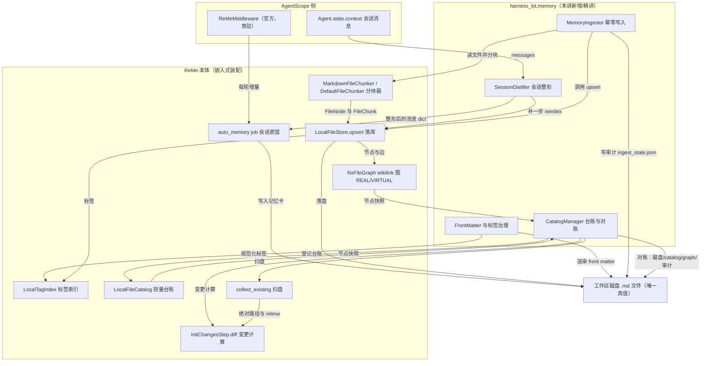
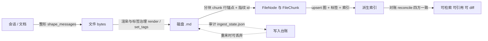

# 第 16 讲 《记忆即文件：写入、frontmatter 与 wikilink 图》

> **本讲目标**：把"记忆"从一次函数调用变成一个**文件**。精读 ReMe 的文件原生存储底座
> （工作区目录语义、`FileNode` / `FileChunk` / `FileLink` / `FileFrontMatter`、
> Markdown 分块策略与行锚点、wikilink 图、`file_catalog` 增量变更检测、`tag_index`），
> 并动手实现 harness_kit 的**记忆写入层**：把文档与会话可靠地灌进 ReMe 工作区，
> 同时做到幂等、去重、front matter 约定、标签治理、以及一份可对账的**写入审计**。
>
> **前置要求**：第 15 讲（ReMe 架构总览与配置）—— 你必须已经能用
> `HarnessMemoryConfig` + `MemoryClient` 在**嵌入式装配**下 `run_job`；
> 第 3 讲（消息块与状态）、第 9 讲（会话事件溯源）—— 你会用到
> `Agent.state.context` 与会话 id；第 10 讲（Workspace 与安全沙箱）——
> 工作区相对路径与"路径必须落在工作区内"的判据在本讲会反复出现。
> 环境上需要 `third_party/ReMe`（本地克隆，0.4.1.13）与
> `/Users/a/miniconda3/envs/agentscope_reme_pip_env/bin/python`。
>
> **本讲交付物**：`harness_kit/memory/` 的五个文件
> （`frontmatter.py` / `ingest.py` / `catalog.py` / `distill.py` / `__init__.py` 的导出）、
> `tests/test_lesson16_memory_write.py`（59 条断言，0 次 LLM 调用）、
> `scripts/16_memory_write.py`（A~D 段离线 + E 段真实蒸馏 2 次补全）。
>
> **预计时长**：精读 90 分钟 + 动手 120 分钟 + 验证 25 分钟。
>
> **参考实现路径**：
> `tutorial_agsc_reme/reference/harness_kit/memory/{frontmatter,ingest,catalog,distill}.py`、
> `tutorial_agsc_reme/reference/tests/test_lesson16_memory_write.py`、
> `tutorial_agsc_reme/reference/scripts/16_memory_write.py`。
> 契约条目：`_contract.md:1183` 的「3.16 第 16 讲：ReMe 记忆写入与文件原生存储」。
>
> **一句话记住本讲**：磁盘上的 `.md` 是**唯一真值**，`file_graph` / `file_catalog` /
> `keyword_index` / `embedding_store` / `tag_index` 全是它的**派生物**；
> 所有"记忆写入"问题，最后都归到两个动作上 —— **把文件写对**、**让派生索引追上文件**。

---

## 一、这一讲要解决的问题

### 1.1 一个具体的场景

第 15 讲结束时，我们手里有一个**能跑**的嵌入式 ReMe：给工作区一个目录，
`MemoryClient.start()` 之后就能 `run_job("search", query=...)`。
但那时候的 ReMe 是**空的**——它什么都不知道，因为没有东西写进去过。

于是这一讲要回答的问题非常直白：

> **我说过的话、我读过的文档，怎么变成 ReMe 搜得到的东西？**

一个具体的会话：

```
user      : 我们把部署工具从 pip 换成 uv 了，锁文件用 uv.lock。
assistant : 好，记下了。
user      : 另外回滚流程是：先停流量 → 切回上一个镜像 tag → 跑冒烟测试。
```

下一周，另一个人问"我们的回滚流程是什么"，Agent 应该在**没有**这段对话上下文的情况下
答出来。要做到这一点，必须有人把这两条事实**写成一个文件**，并让 ReMe 的索引知道
这个文件存在。这就是记忆写入（memory write）。

### 1.2 "写进去"到底难在哪：四个真实失败模式

"写个文件而已"——但下面四件事都在本讲的验证脚本里**真的复现过**，它们才是本讲的内容：

**失败模式 1：反复写入同一个文档。**
同一个 `runbook.md` 被导入两次、三次。如果每次都重新分块 + 重新 embedding，
你会得到三份内容完全相同的 chunk。检索时它们会互相挤占 `top_k`
（三份一模一样的结果占满前三条），而 "重复付费" 只是次要伤害。
→ 本讲的答法：**幂等判据是文件字节的 sha256**，不是"我调用过没有"。

**失败模式 2：改了标签，但索引不知道。**
ReMe 的 `tag_index` 从 `FileNode.front_matter` 里取标签
（`components/tag_index/local_tag_index.py:33-54`），而 front matter **就在文件字节里**。
所以"改标签"实际上是"改文件"；如果只改了内存里的对象、没有重新分块，
检索侧的 `paths_for_tags(["ops"])` 会返回空 —— 而且**不会报错**。
→ 本讲的答法：写入层把"改标签"当成一次完整的写入（改盘 → 重新分块 → upsert → 更新审计）。

**失败模式 3：有人绕过你的代码，直接往 `resource/` 里丢了个文件。**
（编辑器里新建的、`cp` 进来的、另一个进程写的……）你的写入状态里没有它，
但它在磁盘上、也应该被检索到。
→ 本讲的答法：**增量扫描（`scan_changes`）**——用 ReMe 自己的 walker 与 diff 算法，
拿"磁盘现状"和"台账快照"比，报出 added / modified / deleted。

**失败模式 4：索引里有一个磁盘上不存在的文件。**
内存里删了、或者手工 `rm` 了。检索会**召回一个死路径**，
引用（citation）指向不存在的文件；更隐蔽的是幂等状态里还留着它的 digest，
同名新文件会被"unchanged"判据永久挡住。
→ 本讲的答法：**四方对账（`reconcile`）**——磁盘 / `file_catalog` / `file_graph` /
写入状态各问一遍，把不一致**分类**报出来，而不是抛一个"有些文件不一样"的异常。

### 1.3 三个必须先想清楚的概念区分

**① "写文件"和"进索引"是两件事。**
`auto_memory` job 只负责**写文件**（它是一个 write step），把它变成可检索的 chunk
是索引侧的事。生产装配里索引由 `index_update_loop`（一个 **background** job，
`reme/steps/index/watch_changes.py:93` 里是 `async for ... in awatch(...)`，永不返回）常驻完成；
而嵌入式装配按定义丢掉了所有 background job（第 15 讲）——
所以本讲必须自己补一步 `reindex`。E 段的实测输出就是这句话的证据：
写入之后 `distill 之后 graph 里有这个节点吗 = False`，`reindex` 之后 `= True`。

**② `file_catalog` 和 `file_store` 是两个不同的东西。**
`file_catalog` 是**轻量台账**（文件名 → `FileNode`，**没有正文**），
`file_store` 是**重索引**（全部 chunk + embedding + BM25 + tag_index + wikilink 图）。
只登记"这个文件存在"用 catalog 就够；想让内容可检索，必须进 `file_store`。

**③ 写入侧与查询侧是**两把尺子**。**
标签规范化在 ReMe 里有**故意不对称**的两套规则：
写入侧每文件最多 3 个（`local_tag_index.py:56-58`，上限来自
`base_tag_index.py:35` 与 `config/default.yaml:947`），查询侧不截断条数
（`local_tag_index.py:60-62`（查询侧 `limit=None`）；注释原文写在 `:132-134`："``max_tags_per_file`` constrains indexed documents,
not lookup expressions. Truncating here would silently weaken AND queries"）。
harness 必须把这条不对称**提到 API 表面上**，否则写进去 5 个、查的时候只查前 3 个，
用户永远不知道发生了什么。

### 1.4 本讲的收束：一句话的责任链

```
会话/文档  ──(整形)──►  文件 bytes  ──(分块)──►  (FileNode, chunks)  ──(upsert)──►  派生索引
   ▲                      ▲                        ▲                    ▲
   │                      │                        │                    │
 distill.py            frontmatter.py            ingest.py            ReMe 本体
 (会话→消息)            (front matter              (幂等/去重/          (file_store
                        与标签治理)                行锚点/审计)          .upsert)
                                                     │
                                              catalog.py（台账 / 增量扫描 / 四方对账）
```

这条链上**每一步都由 ReMe 的现成能力承担**，harness 只补它没有的那几件事。
下一节先做源码侦察，把"现成能力"逐个钉到 `路径:行号`。

---

## 二、源码侦察

本节的每一条结论都来自真实读码，格式是 `相对仓库根的路径:行号`。
仓库根指 `/Users/a/PycharmProjects/VsCode_Projects/Agentscope-Learning`。
所有命令都可以自己跑一遍核对（下文给的 `grep` / `sed` 都已在验证环境中执行过）。

### 2.1 工作区目录语义：六个子目录就是六种"记忆"

ReMe 的工作区不是一个目录，而是**一个根 + 若干有语义的子目录**。
根目录配置在 `third_party/ReMe/reme/schema/application_config.py:35-39`
（`workspace_dir`，默认 `.reme`，并且有一个 `field_validator` 会
`expanduser().resolve(strict=False)`，所以它**一定是绝对路径且已解析软链**），
子目录名逐字来自同一个文件的 `:40-48`：

| 字段 | 默认值 | 谁在用 |
| --- | --- | --- |
| `metadata_dir` | `metadata` | 持久化状态：`file_catalog/<name>.jsonl.zst`、`file_graph`、`ingest_state.json`（harness 侧） |
| `session_dir` | `session` | 会话记录；`{session_dir}/dialog` 是派生出来的转录目录（`application_config.py:42-43` 的注释写明了 `dialog_dir` 已被移除，转录**总是**派生为 `session/dialog`） |
| `mem_session_dir` | `mem_session` | 记忆用的会话记录 |
| `resource_dir` | `resource` | 外部资源（我们导入的文档） |
| `daily_dir` | `daily` | 每日记忆卡（`auto_memory` 的产物落在这里） |
| `digest_dir` | `digest` | 摘要/巩固后的记忆 |

创建动作在 `third_party/ReMe/reme/application.py:54-67`
（`_setup_workspace_directories`）：`Application.__init__` 阶段就把这六个目录
`mkdir(parents=True, exist_ok=True)` 建好。注意 `:56`
用的是 `Path(cfg.workspace_dir).absolute()`，而配置校验里用的是 `resolve()`
—— 这个**不一致**正是本讲踩坑表里 macOS `/tmp` → `/private/tmp` 那一条的根源。

为什么这件事重要：ReMe 的所有路径都是**工作区相对路径**（POSIX 风格），
`local_tag_index.py:64-71` 的 `_validate_path` 会拒绝绝对路径、反斜杠、`..`
和空段。所以 harness 的每一处 API 边界都必须把"绝对路径"翻译成
"工作区相对路径"再交出去（本讲的 `MemoryIngestor._as_fs_path` 与
`ReMeWorkspace.relative()` 就是在做这件事）。

### 2.2 文件图的四个原语

**`FileNode`**（`third_party/ReMe/reme/schema/file_node.py:9-16`）：

```python
path: str                        # 工作区相对路径
st_mtime: float                  # 文件系统 mtime（秒）
links: list[FileLink]            # 出边（wikilink）
chunk_ids: list[str]             # 拥有的 chunk id
front_matter: FileFrontMatter    # 解析出来的 front matter
```

**`FileChunk`**（`third_party/ReMe/reme/schema/file_chunk.py:8-25`）继承自
`EmbNode`（所以有 `text` 与 `embedding`），额外三个字段在 `:12-14`：
`start_line` / `end_line`（**1-based 且按整个文件算**，注释原文
"Inclusive start line (1-based)"），以及 `scores: dict[str, float]`。
`:21-25` 的 `set_hash_id()` 是**确定性 id**：

```python
self.id = hash_text(" ".join([self.path, str(self.start_line), str(self.end_line), self.text]))
```

这条是本讲"重跑一次索引不会把同一块内容变成另一条向量"的**唯一依据**，
B7 段实测两次分块 id 相同。

**`FileLink`**（`third_party/ReMe/reme/schema/file_link.py:6-20`）：
`source_path` / `target_path` / `target_anchor`（就是 `[[target#anchor]]` 里 `#` 之后的部分），
以及一个**废弃字段** `predicate`，它在 `:16-20` 的声明里带 `exclude=True`：

```python
predicate: str | None = Field(
    default=None,
    exclude=True,
    description="Deprecated compatibility field; accepted when loading legacy indexes but otherwise unused",
)
```

`exclude=True` 意味着它**不会**出现在 `model_dump()` / `model_dump_json()` 里 ——
B8 段实测 `FileLink.model_dump()` 只有三个键。所以：**不要在代码里读它**，
更不要用 `"predicate" in link.model_dump()` 做判断。

**`FileFrontMatter`**（`third_party/ReMe/reme/schema/file_front_matter.py:8-14`）
只有**两个一等字段**：`name` 与 `description`，其余全进 `__pydantic_extra__`。
A6 段实测 `FileFrontMatter.model_fields == ['description', 'name']`。
harness 的 `FrontMatter` 把那一坨 extra 做成**显式字段** `extra: dict`，
只有一个目的：让"哪些是官方认的、哪些是我们加的"一眼可辨。

### 2.3 分块策略与行锚点

ReMe 按扩展名选分块器。`.md` 走 `MarkdownFileChunker`，其余走 `DefaultFileChunker`
（`reme/config/default.yaml:24-25` 给 `resource` 目录配了 15 种后缀）。

**`DefaultFileChunker`**（`third_party/ReMe/reme/components/file_chunker/default_file_chunker.py`）：

- `:23-38` 构造参数：`chunk_byte_size: int = 10000`（`:25`）、`overlap_byte_size: int = 100`、
  `invalid_encoding_policy: Literal["replace", "strict"] = "replace"`（`:28`）。
  注意后者：**默认把非法字节替换掉**，不抛异常 —— 这就是"批量导入不该被一个坏编码的文件中断"的来源。
- `:42-53` `_parse_front_matter`：`text.startswith("---")`（`:44`）→ `text.find("\n---", 3)`（`:46`），
  找不到就把整段当正文（**不报错**）；`:52-53` 把 `yaml.YAMLError` **吞掉**，
  front matter 退化成空对象。harness 需要一个"能炸"的版本（见 §4.1）。
- `:79-94` `chunk()`：`is_markdown` 时才解析 front matter 并抽 wikilink（`:94`
  调 `WikilinkHandler.extract_links`），`:113` 起用 `_link_byte_spans` 做
  "chunk 边界避让 wikilink"（不要把 `[[...]]` 从中间切开）。

**`MarkdownFileChunker`**（`.../markdown_file_chunker.py`）：

- `:103-122` 构造，`chunk_byte_size: int = 10000`（`:106`）与
  `max_ast_sections: int | None = 100`（`:108`）—— 后者是**保护阀**：
  章节数超过 100 就放弃 AST、退回按行切（`:134-137` 的日志写明
  `Markdown AST skipped for ... sections>...`）。
- `:314-352` `_chunk_node(node, ancestors, ...)`：**祖先标题链**（breadcrumb）
  在这里拼进每个 chunk 的文本；`:325` 的 `_toc_join(*ancestors)` 是那个
  形如 `# 一级\n## 二级` 的前缀。
- `:222` 与 `:358` 都在 `chunk.set_hash_id()`。

这解释了一个**看起来矛盾的现象**（B6 段实测）：第二个 chunk 的行范围 `18-21`
**不包含**第 10 行的 `# 部署手册`，但 `chunk.text` 的开头却是 `# 部署手册`。
不是 bug，是 breadcrumb：**行锚点给检索定位，breadcrumb 给模型上下文**。

### 2.4 wikilink 图：REAL / VIRTUAL 的判定只有一行

`third_party/ReMe/reme/utils/wikilink_handler.py:19-24` 的模块 docstring 是本讲
最重要的"用户手册"之一，原文（节选）：

> Wikilink targets are taken **literally** — ``[[X]]`` → ``target="X"``,
> no implicit ``.md``, no short-form basename search, no folder-note expansion.
> Anchor and alias survive a rewrite verbatim. Text outside ``[[...]]`` is ignored.
> **Recommended form: full path relative to the workspace with extension** (``[[topics/x.md]]``).

也就是说：`[[runbook]]` 里的 `runbook` **就是** target，不会补 `.md`、不会去找
`resource/runbook.md`。B9 段实测这种短名的 `REAL` 出边是**空列表**，
`ALL` 里则是两条永远悬空的边。这是本讲反复强调"文档里必须写全路径"的原因。

图本身是 `networkx` 的 `DiGraph`（`components/file_graph/nx_file_graph.py`），
REAL / VIRTUAL 的区别极其简单：

```python
# nx_file_graph.py:55-56
def _is_real(self, key: str) -> bool:
    return "node" in self._graph.nodes[key]
```

节点的 `node` 属性是**被 upsert 过的标记**。`:70-77` 的 `upsert_nodes`
在 `:75` 有一句注释 `# promotes virtual placeholder`（从"只有边"升级成"有节点"）；
`:79-86` 的 `delete_nodes` 在 `:84` 反过来 `# demote to virtual`
（把 `node` 属性 pop 掉；只有当入度为 0 时才真的删掉这个点）。

于是 `LinkScopeEnum`（`reme/enumeration/link_scope_enum.py:6`）的三态就落地成
`:63-67` 的 `_scope_match`：`ALL` 全要、`REAL` 只要"有 node 属性"的目标、
`VIRTUAL` 只要"没被 upsert 过"的目标。B8 段实测：

```
REAL    = [('resource/runbook.md', '回滚')]
VIRTUAL = [('resource/rollback-plan.md', None)]
```

一个容易看漏的细节：`get_inlinks` 的 scope 过滤的是**参数给的那个节点自己**
（`:117-124` 里 `not self._scope_match(path, scope)` 检查的是 `path`），
不是边的另一端。所以"我要一条入链"和"我要一条**来自真实节点**的入链"是两件事。

### 2.5 file_catalog 与增量变更检测

**catalog 是什么**：`components/file_catalog/local_file_catalog.py:11-12` 是
一个 dict 后端，`:21` 把它落成
`<workspace>/<metadata_dir>/file_catalog/<name>.jsonl.zst`。
它存的是 `FileNode`（**没有正文**）—— 所以它能回答"这个文件的 mtime 是多少、
有几个 chunk、front matter 里有什么"，但**不能**回答"这段话是什么"。
`default.yaml` 声明了 5 个：`default` / `digest` / `dream` / `proactive` / `resource`。
运行时**没有**"新增 catalog"的公开 API（`application.py:79-85` 的
`_init_components` 在启动时一次性实例化配置里声明的那些），
所以 harness 用带下划线的 `Application._instantiate`（`application.py:103`）现造 ——
这是一处**依赖私有 API**，已在 §6 记明。

**增量变更检测**由 `steps/index/init_changes.py` 提供。核心是
`:46-64` 的静态方法 `diff(existing, nodes, workspace_path)`：

```python
indexed = {<绝对路径>: n.st_mtime for n in nodes}   # :53-55（相对路径会被拼到 workspace_path 上）
to_delete = list(indexed.keys() - existing.keys())  # :56
to_add    = list(existing.keys() - indexed.keys())  # :57
to_modify = [p for p in existing.keys() & indexed.keys() if existing[p] != indexed[p]]  # :58
```

三点必须记住：

1. 判据是 `st_mtime` 的**严格不等**（`:58`），所以"内容改了但 mtime 没变"
   不会被发现 —— 这也是为什么 ingest 侧用 content digest 而不是 mtime：**两把尺子量两件事**。
2. `existing` 的 key 是**绝对路径**，由
   `steps/index/_watch_rules.py:62-76` 的 `collect_existing(rules, recursive)` 产出；
   它 `rglob("*")`（`:69`）之后在 `:75` 用 `p.absolute()` —— **不解析软链**。
   `ReMeWorkspace.root` 却是 `resolve()` 过的。在 macOS 上 `/tmp` 是
   `/private/tmp` 的软链，两边前缀不同 ⇒ **每个文件同时出现在 to_add 与 to_delete 里**。
   harness 的 `CatalogManager._resolved_existing`（`catalog.py:736`）就是为这一条存在的。
3. `diff` 的 `to_modify` **只对"已经在 `indexed` 里"的路径生效**。一个
   "从没登记过、但磁盘上内容变过"的文件，在 diff 眼里永远是 `added`
   （实测见 C3/C4：先 `added`，补写之后才可能变 `modified`）。

**谁在用这套 scanning**：`index_update_loop`（一个 **background** job）。
AgentScope 官方的最小配置里把它写成
`:84-100`：`init_changes_step`（`monitor_type: file_store`）+ `watch_changes_step`
（`dispatch_steps: [update_index_step]`），`watch_suffixes: ["md"]`、
`watch_dirs: ["daily_dir", "digest_dir"]`。`watch_changes_step` 的实现是
`steps/index/watch_changes.py:93` 的 `async for ... in awatch(...)` —— **永不返回**。
嵌入式装配按定义丢掉所有 background job（第 15 讲），
所以 harness 必须自己按需跑一次 `diff`：这就是 `CatalogManager.scan_changes`。

### 2.6 tag_index：写入侧与查询侧是两把尺子

标签的上限常量在 `third_party/ReMe/reme/constants.py:34-36`：

```python
DEFAULT_MEMORY_TAG_KEY = "memory_tags"
DEFAULT_MAX_MEMORY_TAGS = 3
DEFAULT_MAX_MEMORY_TAG_LENGTH = 64
```

组件参数在 `components/tag_index/base_tag_index.py:35-42`，
`config/default.yaml:947-948` 把它们写成 `3` 与 `64`。
规范化规则本体在 `components/tag_index/local_tag_index.py:33-54`
（`_normalize_tags`）：空白折叠成 `_`（`"_".join(str(item).split())`）、
超长丢弃、不含字母数字丢弃、`casefold()`、按 casefold 去重。

**不对称在这里**：

```python
def normalize_tags(self, value):        # :54-56
    return self._normalize_tags(value, limit=self.max_tags_per_file)   # 写入侧：最多 3

def normalize_query_tags(self, value):  # :58-61
    return self._normalize_tags(value, limit=None)                     # 查询侧：不限
```

理由写在 `:129-141` 的 `paths_for_tags` 注释里，原文：

> ``max_tags_per_file`` constrains indexed documents, not lookup expressions.
> Truncating here would silently weaken AND queries and omit valid matches from OR queries.

harness 侧把这两把尺子抄成 `normalize_tags`（写入）与
`normalize_query_tags`（查询），并且让 **API 的返回值**说真话：
`set_tags()` 返回"实际生效的标签"，而不是"你请求的标签"（A3 段实测
请求 7 个、生效 3 个）。

还有一条边界：`local_tag_index.py:15-21` 的 `reserved_tag_keys`
（`FileFrontMatter.model_fields` ∪ {`kind`, `session_id`, `source_conversation`,
`source_resource`, `status`}）是**保留键**，它们不会变成标签。
所以 `auto_memory` 写下的 `source_conversation` 不会污染标签空间 ——
但**它确实是文件 front matter 的一部分**（E 段实测）。

### 2.7 两条写入入口：harness 为什么选 `file_store.upsert`

| 入口 | 位置 | 它做什么 | 为什么本讲不选它 |
| --- | --- | --- | --- |
| `UpdateIndexStep` | `steps/index/update_changes.py:320`，`:330` 调 `file_store.upsert` | 面向**变更批**（watcher 产物），内部分批、按扩展名选分块器（`:339` / `:366` 的 `_resolve_chunker`） | 返回值只有 `{"change", "path", "success", "error"}`（`:164-193`），**拿不到 chunk 数**，而契约要求 `IngestResult.chunk_count` |
| `file_store.upsert` | `components/file_store/local_file_store.py:765-782` | 面向**已分块的数据**，一次搞定四件事 | 本讲选它 |

`local_file_store.py:765-782` 的四件事值得背下来：

```python
await self.file_graph.upsert_nodes(new_nodes)     # :774  图节点 + wikilink 边
await self._upsert_tag_nodes(new_nodes)           # :775  tag_index（从 front matter 取标签）
await self._embed_pending(needs_embed)            # :776  向量（没配 embedding 时是空操作）
if self.keyword_index ...: await self.keyword_index.add_docs(keyword_docs)   # :777-780
```

以及 `:742` 的 `dump()`："Persist a complete store/index/graph consistency checkpoint."
—— 落盘边界。删除走 `:866` 的 `delete()`，入链/出链走 `:896` / `:904`。

**结论**：分块用 ReMe 的分块器，落库用 `file_store.upsert`，
两者之间的那层"幂等、去重、审计、路径归一"就是 harness 要补的东西。

### 2.8 AgentScope 侧的写入触发点

官方在 AgentScope 里已经把"写完一轮对话就落记忆"做成了**中间件**
（第 15 讲读过架构，这里只钉与写入直接相关的三处）：

- `third_party/agentscope/src/agentscope/middleware/_longterm_memory/_reme/_middleware.py:364-380`：
  从 `agent.state.context` 里取出**本轮新增**的消息（`m.id not in pre_ids`），
  并且**顺手剔掉** `name == _MEMORY_MSG_NAME` 的注入消息（`:372`），
  只有"有真实用户输入 + 至少一条非空 assistant 消息"才落盘（`:376-380`）。
- 同文件 `:489-517` 的 `_write_back()`：调 `auto_memory` job，
  参数就是 `messages=[m.model_dump(mode="json") ...]` 与 `session_id`；
  失败只 warning（"failures are logged rather than propagated so a write never blocks the reply"）。
- `_middleware.py:71` 定义了 `_MEMORY_MSG_NAME = "memory"` ——
  harness 的 `MEMORY_HINT_NAME` 必须与它**逐字一致**，否则整形层剔不掉。

`auto_memory` job 在官方最小配置里的定义是
`middleware/_longterm_memory/_reme/_config.py:137-153`：
**只有一步** `auto_memory_step`，参数只有 `messages` / `session_id` / `memory_hint`，
`required = ("messages",)`。而 ReMe 自己的 `default.yaml:167-197` 版本多了
`include_images` 与 `date`（`:185-192`），并且有**两步**：
`auto_memory_step` + `auto_tag_step`。

**这两份配置的差别会在本讲踩坑**（§6 第 11 行）：本讲的 `date` 参数只在
`default.yaml` 的版本下合法。harness 走 `default.yaml`（因为
`HarnessMemoryConfig` 会 `resolve_app_config()`），所以 `date` 可用；
但如果你照抄官方最小配置，传 `date` 会参数校验失败。

最后是 `auto_memory` 内部的**跨 job 调用闭包**，这是本讲最贵的一课：

| 调用点 | 被调的 job | 什么时候 |
| --- | --- | --- |
| `steps/evolve/auto_memory.py:119` | `daily_list` | 查当天已有笔记（决定 create 还是 update） |
| `:133` | `frontmatter_update` | 给已有笔记补 `session_id` / `source_conversation` |
| `:153` | `move` | 模型给笔记起了 `name` 之后重命名文件 |
| `:72` `self.create_tools = ["daily_write"]` | `daily_write` | 内部 ReAct agent 的**工具** |

查找机制在 `steps/base_step.py:185-195`：

```python
def get_job(self, name): ...                       # :185-189
async def run_job(self, name: str, /, **kwargs):   # :191
    job = self.get_job(name)
    if job is None:
        raise RuntimeError(f"Job {name} not found")  # :194
```

而 Agent 的工具层走的是另一条路：`components/agent_wrapper/base_agent_wrapper.py:209`
抛的是 `KeyError(f"Job '{name}' not found in app_context.jobs")`。
**两条不同的查找路径、两种不同的错误消息** —— 这就是为什么本讲的白名单
必须按"闭包"来抄，而不是"我用到哪些 job"。

### 2.9 本讲用到的 agentscope / reme 扩展点清单

**ReMe（`third_party/ReMe/reme/`）**

| 扩展点 | 路径:行号 | 本讲用它做什么 |
| --- | --- | --- |
| `Application._start` / `_instantiate` / `run_job` | `application.py:187-204` / `:103` / `:370-374` | 嵌入式装配与 job 调用（第 15 讲已有，本讲复用） |
| `MarkdownFileChunker.chunk` | `components/file_chunker/markdown_file_chunker.py:126` | `.md` 的分块（行锚点 + breadcrumb） |
| `DefaultFileChunker.chunk` | `components/file_chunker/default_file_chunker.py:79` | 非 `.md` 的分块 |
| `WikilinkHandler.extract_links` | `utils/wikilink_handler.py:96` | 从正文抽 `[[...]]` 边 |
| `LocalFileStore.upsert` / `delete` / `dump` | `components/file_store/local_file_store.py:765` / `:866` / `:742` | 落库、删除、落盘 |
| `NxFileGraph.get_outlinks` / `get_inlinks` | `components/file_graph/nx_file_graph.py:107` / `:117` | REAL / VIRTUAL / ALL 三种图查询 |
| `InitChangesStep.diff` | `steps/index/init_changes.py:47` | 增量扫描的核心算法 |
| `collect_existing` / `WatchRule` | `steps/index/_watch_rules.py:62` / `:75` | 扫盘（注意它用 `absolute()`） |
| `LocalFileCatalog` | `components/file_catalog/local_file_catalog.py:11-21` | 台账后端（`jsonl.zst`） |
| `LocalTagIndex.normalize_tags` / `normalize_query_tags` | `components/tag_index/local_tag_index.py:56` / `:60` | 标签治理的两把尺子 |
| `AutoMemoryStep.execute` | `steps/evolve/auto_memory.py:332` | 会话蒸馏（本讲不重写，只整形输入） |
| `_sanitize_msg_for_save` | `steps/evolve/auto_memory.py:27-38` | 解释"为什么工具结果进不了记忆" |
| `Response.metadata`（`path` / `created` / `n_messages`） | `steps/evolve/auto_memory.py:374-379` 等 | 把 job 结果翻译成 `DistillResult` |

**AgentScope（`third_party/agentscope/src/agentscope/`）**

| 扩展点 | 路径:行号 | 本讲用它做什么 |
| --- | --- | --- |
| `Msg.content: list[ContentBlock]` | `message/_base.py:79-80` | 解释"str content 必须包成块" |
| `Msg.model_dump(mode="json")` | `middleware/_longterm_memory/_reme/_middleware.py:515` | 与官方写入路径产出同一种数据 |
| `AgentState.context` | `state/_state.py:220` | 会话唯一真值（蒸馏的输入） |
| `Agent.__init__(name, system_prompt, model, ...)` | `agent/_agent.py:120-122` | 测试里造一个最小 Agent 取 context |
| `_memory_jobs()` | `middleware/_longterm_memory/_reme/_config.py:77-270` | 嵌入式装配的 job 白名单来源 |
| `_MEMORY_MSG_NAME = "memory"` | `middleware/_longterm_memory/_reme/_middleware.py:71` | 整形时要剔掉的注入消息名 |
| `ReMeMiddleware._write_back` | `middleware/_longterm_memory/_reme/_middleware.py:489-517` | 官方的写入触发点（本讲手动触发等价物） |

---

## 三、扩展点定位与设计

### 3.1 官方给了什么（give）

把 §2 的侦察收成一张"可以直接用"的清单。**下面每一行都是官方现成能力，
本讲一行都不重写**：

| 官方能力 | 位置 | 直接可用性 |
| --- | --- | --- |
| 工作区目录语义与创建 | `reme/schema/application_config.py:35-48`、`reme/application.py:54-67` | 直接用：`ReMeWorkspace` 只是它的 Python 侧视图（第 15 讲） |
| `.md` 分块（标题树 + 行锚点 + breadcrumb） | `components/file_chunker/markdown_file_chunker.py:126` | 直接用：`await chunker.chunk(path)` |
| 非 `.md` 分块（字节窗口 + 重叠 + wikilink 避让） | `components/file_chunker/default_file_chunker.py:79` | 直接用 |
| 确定性 chunk id | `schema/file_chunk.py:21-25` | 直接用：分块器内部已经调过 |
| wikilink 抽取 | `utils/wikilink_handler.py:96` | 直接用（两个分块器都调了） |
| 落库（图 + 标签 + 向量 + BM25 + dump） | `components/file_store/local_file_store.py:765-782` | 直接用：喂 `(FileNode, list[FileChunk])` |
| 按 scope 查图 | `components/file_graph/nx_file_graph.py:107` / `:117` | 直接用：`REAL` / `VIRTUAL` / `ALL` |
| 变更 diff 算法 | `steps/index/init_changes.py:47` | 直接用：`InitChangesStep.diff(existing, nodes, workspace_path)` |
| 扫盘 walker | `steps/index/_watch_rules.py:62` | 直接用：`collect_existing(rules, recursive)` |
| 轻量台账（catalog） | `components/file_catalog/local_file_catalog.py:11-21` | 直接用（但我们只暴露"登记/读节点"两个动作） |
| 标签索引 + 两套规范化 | `components/tag_index/local_tag_index.py:33-62` | 直接用；harness 另抄一份**纯函数**版本以便"写文件前就知道哪些标签会被丢" |
| 会话蒸馏流水线 | `steps/evolve/auto_memory.py:67`（`AutoMemoryStep`） | 直接用：`run_job("auto_memory", messages=..., session_id=...)` |
| 嵌入式 job 运行器 | `application.py:187-204` / `:370-374` | 直接用（第 15 讲的 `MemoryClient` 包了它） |

### 3.2 gap：官方没给什么

| # | gap | 现象（本讲实测） | 官方的说法/原因 |
| --- | --- | --- | --- |
| 1 | **写入的幂等** | 同一个文件导入两次 → 两份相同 chunk 挤占 top_k | 官方的索引侧只做"变更批 apply"（`update_changes.py:320`），幂等不是它的职责 |
| 2 | **区外文件的暂存与去重** | 直接 `upsert` 一个 `/tmp/x.md` 会得到一条**朝工作区外**的边与一个非法相对路径 | `local_tag_index.py:64-71` 会直接拒绝绝对路径 |
| 3 | **"能炸"的 front matter 解析** | ReMe 把 YAML 错误吞掉（`default_file_chunker.py:52-53`），坏标签**永远没人知道** | 官方选择"索引要鲁棒" |
| 4 | **写入侧/查询侧标签治理的 API 面** | 写进 5 个标签、生效 3 个，调用方毫无感知 | 两套规则都在组件内部，没有面向调用方的预判 |
| 5 | **会话蒸馏的输入整形** | 把 `agent.state.context` 直接喂给 `auto_memory`：注入的记忆提示会被写回、空消息会让 internal agent 白跑 | `_sanitize_msg_for_save`（`auto_memory.py:27-38`）只管工具结果与 base64，不管"记忆提示"与空消息 |
| 6 | **写入审计与四方对账** | 索引里有、磁盘上没有的文件会让 citation 指向死路径 | `InitChangesStep.diff` 只比较**两个**来源（现有 vs 快照），不做四方对账 |
| 7 | **可被显式调用的一次性写入** | 官方写入是常驻中间件 + background job（`_middleware.py:489-517` + `index_update_loop`），嵌入式装配下**都没有** | 那是 AgentScope 生产装配的路径 |

### 3.3 扩展点定位：本讲只加四个模块（+ 一个导出面）

契约（`_contract.md:1183` 起）给了四个类的**签名**，本讲的实现严格按它写，
并且把每个类**挂在哪个官方能力上**说清楚：

```text
harness_kit/memory/frontmatter.py   ←  补 gap 3、4
    FrontMatter(BaseModel)          : ReMe FileFrontMatter 的 harness 视图（name/description + extra）
    split_front_matter(text)        : 与 default_file_chunker.py:42-53 逐字等价的探测规则，但错误会抛
    normalize_tags / normalize_query_tags
                                    : 与 local_tag_index.py:33-62 等价的纯函数（写入侧限 3、查询侧不限）

harness_kit/memory/ingest.py        ←  补 gap 1、2、7
    MemoryIngestor                  : 分块（官方 chunker）→ upsert（官方 file_store）→ 状态（sha256 幂等）
    IngestResult(BaseModel)         : path / added / chunk_count / skipped_reason
    iter_chunk_texts(chunks)        : 小工具（给"写入审计"打印摘要用）

harness_kit/memory/catalog.py       ←  补 gap 6
    CatalogManager                  : ensure_catalog / register / set_tags / list_tags / tags_page /
                                      paths_for_tags / scan_changes / reconcile
    ChangeSet / ReconcileReport     : 两个纯数据模型（added/modified/deleted；八类不一致）

harness_kit/memory/distill.py       ←  补 gap 5
    SessionDistiller                : shape_messages / messages_from_agent / distill
    DistillResult(BaseModel)        : path / created / content
```

**一处需要记住的边界**：官方在 AgentScope 里已经有一个"写入触发点"
（`ReMeMiddleware._write_back`，`_middleware.py:489-517`）。本讲的
`SessionDistiller` **不是**替代它，而是它的**手动等价物**：
中间件适合"每一轮对话自动落盘"，而本讲关心的是
"我手上有一段会话，现在要把它变成一条记忆"——比如会话回放（第 9 讲）、
离线批处理、或者测试。两者最终都调同一个 `auto_memory` job，
产出同一种数据（`model_dump(mode="json")` 的 `Msg` dict，`:515`）。

### 3.4 架构图



图里的**唯一真值**是右下角那个 `DISK`：其余所有盒子都是它的派生物。
这也解释了为什么本讲的两个新能力（`scan_changes` / `reconcile`）
都是从"磁盘现状"出发去问其他三方，而不是反过来。

### 3.5 四个关键设计决策

**决策 1：幂等判据用 `sha256(文件字节)`，不用 mtime。**
ReMe 的增量 diff 用 mtime（`init_changes.py:58`），因为 watcher 场景下
mtime 是最便宜的信号。但写入层要回答的是另一个问题——"这份**内容**我写过没有"。
实测证据（B2/B3 段）：同一份内容第二次 `added=False, skipped_reason="unchanged"`；
改了标签之后 `added=True`（因为字节真的变了）。**两把尺子量两件事**，
harness 两把都用、且用在不同层。

**决策 2：改标签 = 改文件 = 重新入库。**
标签住在文件头的 front matter 里（`default_file_chunker.py:91` 每次都重新解析），
不是索引里的旁挂字段。所以 `apply_tags()` 的动作是
"改盘 → 重新分块 → upsert → 更新审计"，四步一步不能少。
这条决策的代价是"改标签会重新 embedding 一次"，收益是"索引永远不会和文件不一致"。

**决策 3：对账返回**报告**，不抛异常。**
`reconcile()` 返回 `ReconcileReport`（八类不一致 + 四个计数），
于是"对账 → 补写 → 再对账"这个**收敛循环**可以直接写成代码（实测 C4/C6）：
第一轮报 `missing_in_graph=['resource/torn.md']`，补一次 `add_file` 之后
`clean=True`。如果它抛异常，调用方只能靠解析错误消息来知道该补什么。

**决策 4：整形层只做减法，语义留给 ReMe。**
`shape_messages()` 只做四件事（去记忆提示、去空消息、str→块、`model_dump`），
它**不判断"这件事值不值得记"**——那是 `auto_memory` 内部 agent 的判断。
所以"返回 `path=None, created=False`"是**正常结果**，不是失败
（`auto_memory.py:374-379` 的 "Skipped: no messages" 与 create 分支的
"模型判断不值得记"都会走到那里）。

### 3.6 本讲明确**不做**的事（避免把 harness 做成第二个 ReMe）

1. **不自己写 chunker**：分块一律走 `MarkdownFileChunker` / `DefaultFileChunker`。
   理由不只是"别重复造轮子"——行锚点、breadcrumb、wikilink 边界避让、
   确定性 id 这四件事任何一个自己实现都会与 ReMe 的检索侧对不上。
2. **不重写 `auto_memory` 的流水线**：不实现"create/update 分支"、不实现
   re-query 校验、不实现 `daily/<date>/<session>.md` 的命名规则。
3. **不起 HTTP 服务**：一律嵌入式装配（`reme.ReMe(**config)` + `run_job`），
   不占端口（第 15 讲的 `EMBEDDED_JOB_BACKENDS` 已经把这件事实现在配置里）。
4. **不接管官方的中间件写入路径**：`ReMeMiddleware` 继续负责"每轮自动落盘"，
   本讲的 `SessionDistiller` 是显式调用的另一条路。

### 3.7 未验证 / 已知依赖

- `CatalogManager.ensure_catalog` 用了 `Application._instantiate`
  （`application.py:103`）这个**私有** API。它已在 `unresolved` 中登记；
  如果 ReMe 改了装配签名，这里会先坏（好在测试 `test_ensure_catalog_and_list` 会报出来）。
- **未验证**：`reconcile()` 在 `ingested=None` 时的行为只做了单元级验证
  （`ReconcileReport` 的 `clean` 不看计数），没有在真实四方数据上跑过
  "只给磁盘与索引、不给写入状态"的组合。
- **未验证**：`embedding_dimensions` 非 `None`（即真的开向量检索）时，
  `upsert` 的 `_embed_pending` 会不会因为 embedding 组件未就绪而静默跳过向量
  —— 本讲全部实测都在**无 embedding**（`embedding_dimensions=None`）下完成，
  检索退化为纯关键词（第 15 讲已说明这是合法状态）。

---

## 四、harness_kit 实现

四个模块 + 一个导出面，共五个文件，路径都以 `tutorial_agsc_reme/reference/` 为根。
下面每一节给出的都是**完整文件**（不是片段），并且就是 §5 里要抽取、要运行的那一份。
每一节的排布是「标题 → 完整代码 → 逐点解读」，这样 §5 的抽取脚本
（它只认"紧跟 `### N.M \`路径\`` 标题的第一个 python 围栏"这个形状）才能逐字抽到文件全文。

### 4.1 `harness_kit/memory/frontmatter.py`

```python
# -*- coding: utf-8 -*-
"""记忆文件的 front matter 规范：解析、渲染、字段归一、tag 规范化。

**ReMe 原生 front matter 的真值**

``third_party/ReMe/reme/schema/file_front_matter.py:8-14``：

.. code-block:: python

    class FileFrontMatter(BaseModel):
        model_config = ConfigDict(extra="allow")
        name: str = Field(default="", ...)
        description: str = Field(default="", ...)

也就是说**只有 ``name`` / ``description`` 是一等字段**，其余键一律进
``__pydantic_extra__``（``:16`` 的 ``model_extra`` 属性把它暴露出来）。
ReMe 的 tag_index 正是从这里取标签的：``tag_key`` 默认 ``"memory_tags"``
（``third_party/ReMe/reme/constants.py:34``），取法是
``node.front_matter.model_extra.get(self.tag_key)``
（``third_party/ReMe/reme/components/tag_index/local_tag_index.py:77-78``）。

**为什么 harness 侧要再包一层**

1. ReMe 的 ``_parse_front_matter`` 在解析失败时**静默吞掉**整个 front matter
   （``third_party/ReMe/reme/components/file_chunker/default_file_chunker.py:52-58``），
   返回空 ``FileFrontMatter()``。写记忆时一个 YAML 缩进错误会让 "标签没了、name 也没了"，
   而且不报错。harness 侧需要能**主动**发现这种问题。
2. 契约 §3.16 要求一个统一视图 :class:`FrontMatter`，把 "一等字段 / 扩展字段" 的分界线
   显式画出来，供教程讲解，也供 :mod:`harness_kit.memory.ingest` 写标签。
3. **只读解析器** ``split_front_matter`` 需要和 ReMe 的分隔符规则**逐字一致**，
   否则同一份文件两边的理解会漂移。ReMe 的规则是：
   ``text.startswith("---")`` 且找 ``"\n---"``（``default_file_chunker.py:44-49``），
   正文取分隔符之后并以 ``lstrip("\n")`` 去掉紧随的空行。

**tag 的规范化规则（写入侧）**

``local_tag_index.py:33-54`` 的 ``_normalize_tags``：

1. ``"_".join(str(item).split())`` —— 所有空白折叠成 ``_``；
2. 空串或长度 ``> max_tag_length``（默认 64，``constants.py:36``）→ 丢弃；
3. 必须至少含一个 ``isalnum()`` 字符 → 否则丢弃；
4. ``casefold()`` 归一化成小写；
5. 去重；
6. **每个文件最多 ``max_tags_per_file`` 个（默认 3，``constants.py:35``）**。

而查询侧 ``normalize_query_tags``（``:60-62``）传 ``limit=None``，
**不设上限** —— 写入限制 ≠ 查询限制，这是 ReMe 刻意的设计
（``:132-134`` 的注释："``max_tags_per_file`` constrains indexed documents,
not lookup expressions.  Truncating here would silently weaken AND queries"）。
harness 侧必须原样保留这条区分，不能"统一成 3 个"。
"""

from __future__ import annotations

import re
from typing import Any

import yaml
from loguru import logger
from pydantic import BaseModel, ConfigDict, Field

__all__ = [
    "DEFAULT_MAX_TAG_LENGTH",
    "DEFAULT_MAX_TAGS_PER_FILE",
    "DEFAULT_TAG_KEY",
    "FrontMatter",
    "FrontMatterError",
    "normalize_query_tags",
    "normalize_tags",
    "split_front_matter",
]

#: ReMe 存放记忆标签的 front matter 键（``third_party/ReMe/reme/constants.py:34``）。
DEFAULT_TAG_KEY: str = "memory_tags"

#: 单文件标签数上限（``third_party/ReMe/reme/constants.py:35``）。
DEFAULT_MAX_TAGS_PER_FILE: int = 3

#: 单个标签长度上限（``third_party/ReMe/reme/constants.py:36``）。
DEFAULT_MAX_TAG_LENGTH: int = 64

#: 一等字段名。其余全部进 ``extra``，与 ReMe 的 ``FileFrontMatter`` 对齐。
_FIRST_CLASS: tuple[str, ...] = ("name", "description")

#: ReMe 的分隔符探测：``default_file_chunker.py:44-49``。
_DELIM_RE: re.Pattern[str] = re.compile(r"^---\s*$", re.MULTILINE)


class FrontMatterError(ValueError):
    """front matter 语法错误（YAML 解析失败 / 结构不是 mapping）。"""


def split_front_matter(text: str) -> tuple[dict[str, Any], str]:
    """把 Markdown 文本拆成 ``(front matter dict, 正文)``。

    分隔符规则与 ``third_party/ReMe/reme/components/file_chunker/default_file_chunker.py:44-49``
    逐字一致，保证 harness 与 ReMe 对同一份文件的理解不会漂移：

    - 不以 ``---`` 开头 → front matter 为空，正文是全文（**不**去空白）；
    - 找不到 ``"\\n---"`` → 视为没有 front matter，正文是全文；
    - 找到 → 取 ``"---"`` 与 ``"\\n---"`` 之间的内容做 ``yaml.safe_load``，
      正文取第二个分隔符之后并 ``lstrip("\\n")``。

    与 ReMe 的唯一区别：**YAML 解析失败会抛** :class:`FrontMatterError`。
    ReMe 在那里是静默吞掉的，harness 侧需要一个"能炸"的版本，
    否则写坏的记忆标签永远没人知道。

    Args:
        text (`str`): 原始 Markdown 文本。

    Returns:
        `tuple[dict[str, Any], str]`: (front matter 字典, 正文)。没有 front matter
        时返回 ``({}, text)``。

    Raises:
        `FrontMatterError`: front matter 存在但 YAML 非法，或解析结果不是 mapping。
    """
    if not text.startswith("---"):
        return {}, text
    end_idx = text.find("\n---", 3)
    if end_idx == -1:
        return {}, text
    raw = text[3:end_idx].strip()
    try:
        data = yaml.safe_load(raw) or {}
    except yaml.YAMLError as exc:
        raise FrontMatterError(f"front matter YAML 解析失败: {exc}") from exc
    if not isinstance(data, dict):
        raise FrontMatterError(f"front matter 必须是 mapping，收到 {type(data).__name__}")
    return data, text[end_idx + 4 :].lstrip("\n")


def normalize_tags(
    value: object,
    *,
    max_tags: int = DEFAULT_MAX_TAGS_PER_FILE,
    max_length: int = DEFAULT_MAX_TAG_LENGTH,
) -> list[str]:
    """按 ReMe 的写入侧规则规范化标签（``local_tag_index.py:33-54``）。

    规则逐条见模块 docstring。这里的实现与 ReMe **完全等价**，
    目的是让 harness 在**写文件之前**就知道哪些标签会被丢掉 —— 而不是写完再去看索引里少了什么。

    Args:
        value (`object`): 待规范化的标签（``list[str | int]``）。
        max_tags (`int`): 保留几个，默认 3（ReMe 的 ``max_tags_per_file``）。
        max_length (`int`): 单标签长度上限，默认 64。

    Returns:
        `list[str]`: 规范化后的标签，保持输入顺序。
    """
    if not isinstance(value, list):
        return []
    result: list[str] = []
    seen: set[str] = set()
    for item in value:
        if isinstance(item, bool) or not isinstance(item, (str, int)):
            continue
        raw = "_".join(str(item).split())
        if not raw or len(raw) > max_length:
            continue
        if not any(char.isalnum() for char in raw):
            continue
        canonical = raw.casefold()
        if canonical in seen:
            continue
        seen.add(canonical)
        result.append(canonical)
        if len(result) >= max_tags:
            break
    return result


def normalize_query_tags(value: object, *, max_length: int = DEFAULT_MAX_TAG_LENGTH) -> list[str]:
    """按 ReMe 的**查询侧**规则规范化标签（``local_tag_index.py:60-62``）。

    与 :func:`normalize_tags` 的唯一差别是**不截断条数**。
    这不是疏漏，是 ReMe 的刻意设计：``local_tag_index.py:132-134`` 的注释写明
    "``max_tags_per_file`` constrains indexed documents, not lookup expressions"。
    如果查询侧也只取前 3 个，AND 查询会被悄悄削弱，OR 查询会漏结果。

    Args:
        value (`object`): 查询标签。
        max_length (`int`): 单标签长度上限。

    Returns:
        `list[str]`: 规范化后的标签（条数不限）。
    """
    return normalize_tags(value, max_tags=1 << 30, max_length=max_length)


class FrontMatter(BaseModel):
    """ReMe ``FileFrontMatter`` 的 harness 侧视图（契约 §3.16）。

    刻意把 ``extra`` 做成一个**显式字段**而不是 pydantic 的 ``__pydantic_extra__``：
    教程里需要能一眼看出"哪些是一等字段、哪些是扩展"，而
    ``model_extra`` 是个属性、不在 ``model_fields`` 里，讲起来要多绕一层。
    :meth:`to_file_front_matter` 负责还原成 ReMe 的真实类型。

    Example::

        fm = FrontMatter.parse(text)
        fm.extra["memory_tags"] = ["ops", "Runbook"]
        Path(p).write_text(fm.render(body), encoding="utf-8")
    """

    model_config = ConfigDict(extra="forbid")

    name: str | None = None
    """文档名（ReMe ``FileFrontMatter.name``）。``None`` 表示不写这个键。"""

    description: str | None = None
    """文档描述。``None`` 表示不写这个键。"""

    extra: dict[str, Any] = Field(default_factory=dict)
    """其余全部 front matter 键（``memory_tags`` / ``date`` / ``session_id`` ...）。"""

    # ------------------------------------------------------------------
    # 解析 / 渲染
    # ------------------------------------------------------------------
    @classmethod
    def parse(cls, text: str, *, strict: bool = True) -> tuple["FrontMatter", str]:
        """把 Markdown 文本解析成 ``(FrontMatter, 正文)``（契约 §3.16）。

        Args:
            text (`str`): 原始 Markdown。
            strict (`bool`): ``True`` 时 YAML 非法直接抛（推荐）；
                ``False`` 时退化成 ``({}, text)``，用于处理历史脏数据。

        Returns:
            `tuple[FrontMatter, str]`: 视图对象与正文。

        Raises:
            `FrontMatterError`: ``strict=True`` 且 front matter 非法。
        """
        try:
            data, body = split_front_matter(text)
        except FrontMatterError:
            if strict:
                raise
            logger.warning("front matter 解析失败，按无 front matter 处理")
            return cls(), text

        extra = {key: value for key, value in data.items() if key not in _FIRST_CLASS}
        return (
            cls(
                name=_as_optional_str(data.get("name")),
                description=_as_optional_str(data.get("description")),
                extra=extra,
            ),
            body,
        )

    @classmethod
    def from_file(cls, path: str | Any, *, strict: bool = True) -> tuple["FrontMatter", str]:
        """从文件读取并解析。

        Args:
            path (`str | Any`): 文件路径。
            strict (`bool`): 同 :meth:`parse`。

        Returns:
            `tuple[FrontMatter, str]`: 视图对象与正文。
        """
        from pathlib import Path

        text = Path(path).read_text(encoding="utf-8")
        return cls.parse(text, strict=strict)

    def render(self, body: str, *, ensure_trailing_newline: bool = True) -> str:
        """渲染成完整的 Markdown 文本（契约 §3.16）。

        渲染规则对齐 ``third_party/ReMe/reme/steps/file_io/write.py:80-86``：

        - front matter 为空 → 直接返回正文（**不**加 ``---`` 块）；
        - 否则用 ``yaml.safe_dump(allow_unicode=True, sort_keys=False)`` 输出，
          保证中文不被转义、键序稳定（键序稳定对 KV Cache 与 diff 都重要）；
        - 末尾补一个换行（ReMe 的 write step 也这么做）。

        Args:
            body (`str`): 正文。
            ensure_trailing_newline (`bool`): 是否补尾部换行。

        Returns:
            `str`: 可落盘的完整文本。
        """
        merged: dict[str, Any] = {}
        if self.name is not None:
            merged["name"] = self.name
        if self.description is not None:
            merged["description"] = self.description
        merged.update(self.extra)

        if not merged:
            text = body
        else:
            dumped = yaml.safe_dump(
                merged,
                allow_unicode=True,
                sort_keys=False,
                default_flow_style=False,
            )
            text = f"---\n{dumped}---\n\n{body.lstrip(chr(10))}"
        if ensure_trailing_newline and not text.endswith("\n"):
            text += "\n"
        return text

    # ------------------------------------------------------------------
    # tag 便捷方法
    # ------------------------------------------------------------------
    def tags(self, *, key: str = DEFAULT_TAG_KEY) -> list[str]:
        """读取规范化后的标签（查询语义，不截断）。

        Args:
            key (`str`): 标签键名，默认 ``memory_tags``。

        Returns:
            `list[str]`: 规范化后的标签。
        """
        return normalize_query_tags(self.extra.get(key))

    def set_tags(self, value: object, *, key: str = DEFAULT_TAG_KEY) -> list[str]:
        """写入标签并返回**实际生效**的部分（写入语义，最多 3 个）。

        这个方法会在丢弃了任何标签时打 warning —— "我以为打了 5 个标签、
        实际只生效 3 个" 是教学里最容易踩的坑之一。

        Args:
            value (`object`): 待写入的标签。
            key (`str`): 标签键名。

        Returns:
            `list[str]`: 实际写入的标签。
        """
        requested = value if isinstance(value, list) else []
        effective = normalize_tags(value)
        dropped = len([item for item in requested if isinstance(item, (str, int))]) - len(effective)
        if dropped > 0:
            logger.warning(
                "标签写入被裁剪：请求 {} 个，实际生效 {} 个（ReMe 限制每文件最多 {} 个、"
                "单标签最长 {}、必须含字母数字）",
                len(requested),
                len(effective),
                DEFAULT_MAX_TAGS_PER_FILE,
                DEFAULT_MAX_TAG_LENGTH,
            )
        if effective:
            self.extra[key] = effective
        else:
            self.extra.pop(key, None)
        return effective

    # ------------------------------------------------------------------
    # 与 ReMe 类型互转
    # ------------------------------------------------------------------
    def to_file_front_matter(self) -> Any:
        """转成 ReMe 原生的 ``FileFrontMatter``。

        Returns:
            `Any`: ``reme.schema.FileFrontMatter`` 实例。

        Raises:
            `MemoryUnavailableError`: ``reme`` 不可导入。
        """
        from .client import _require_reme

        _require_reme()
        from reme.schema import FileFrontMatter

        payload: dict[str, Any] = dict(self.extra)
        if self.name is not None:
            payload["name"] = self.name
        if self.description is not None:
            payload["description"] = self.description
        return FileFrontMatter(**payload)

    @classmethod
    def from_file_front_matter(cls, value: Any) -> "FrontMatter":
        """从 ReMe 原生 ``FileFrontMatter`` 转回来。

        Args:
            value (`Any`): ``FileFrontMatter`` 实例（或任何有 ``name`` /
                ``description`` / ``model_extra`` 的对象）。

        Returns:
            `FrontMatter`: harness 侧视图。
        """
        extra = dict(getattr(value, "model_extra", None) or {})
        return cls(
            name=_as_optional_str(getattr(value, "name", None)),
            description=_as_optional_str(getattr(value, "description", None)),
            extra=extra,
        )

    def fingerprint(self) -> str:
        """front matter 的稳定指纹（幂等写入的判定依据）。

        ``sort_keys`` 很关键：dict 顺序不同但内容相同的两条 front matter
        应该得到同一个指纹，否则幂等判断会误判成"变了"。

        Returns:
            `str`: ``sha256`` 十六进制摘要。
        """
        import hashlib
        import json

        payload = {"name": self.name, "description": self.description, "extra": self.extra}
        blob = json.dumps(payload, sort_keys=True, ensure_ascii=False, default=str)
        return hashlib.sha256(blob.encode("utf-8")).hexdigest()


def _as_optional_str(value: Any) -> str | None:
    """把字段值规整成 ``str | None``（空串视为 ``None``）。

    Args:
        value (`Any`): 原始值。

    Returns:
        `str | None`: 规整结果。
    """
    if value is None:
        return None
    text = str(value).strip()
    return text or None
```

这个文件的全部意义是：**在写文件之前，就把 ReMe 会怎么理解这个文件算清楚**。四件事：

1. **`split_front_matter` 与 ReMe 逐字等价，但会抛异常。**
   ReMe 的 `_parse_front_matter`（`default_file_chunker.py:42-53`）在
   YAML 出错或结构不是 mapping 时**静默退化成空 front matter**。
   索引侧要鲁棒，这个选择是对的；但写入侧需要相反的行为——
   "我写坏的标签必须有人告诉我"。所以这里复刻探测规则
   （`text.startswith("---")` + 找 `\n---`），却在错误时抛 `FrontMatterError`。
   同时保留 `strict=False` 的降级入口，让调用方**显式选择**静默那一侧。
2. **`normalize_tags` / `normalize_query_tags` 是 ReMe 两套规则的纯函数版。**
   逐字等价于 `local_tag_index.py:33-62`（空白折叠成 `_`、超长丢弃、
   必须含字母数字、casefold、按 casefold 去重），唯一的差别是**可以在写盘之前调用**。
   为什么值得抄一份？因为"我请求了 5 个标签、生效 3 个"必须能被预判并报告
   （`set_tags()` 的返回值 + 一条 warning），而不是让调用方事后去索引里数。
3. **`render()` 的键序稳定。**
   front matter 在文件开头，`yaml.safe_dump` 默认会按 key 排序——
   那会让每次重写都产生无意义的 diff（以及前缀缓存失效）。
   这里固定"一等字段（name/description）在前、extra 依次在后"。
4. **`fingerprint()` 与 dict 顺序无关。**
   它是幂等写入的判据：同一条 front matter 无论以什么顺序读出来，
   指纹必须相同，否则"内容没变"会被误判成"变了"。

`to_file_front_matter()` / `from_file_front_matter()` 负责与 ReMe 的真实类型互转：
harness 的 `extra` ⇄ ReMe 的 `__pydantic_extra__`，
`None` ⇄ 空串（ReMe 侧 `name`/`description` 的默认值是 `""`）。

### 4.2 `harness_kit/memory/ingest.py`

```python
# -*- coding: utf-8 -*-
"""写入路径：资源 → ``FileNode`` / ``FileChunk``（契约 §3.16）。

**写入这件事在 ReMe 里到底由谁干**

ReMe 的索引有两条入口，都真实存在，区别很大：

1. **``update_index_step``**（``third_party/ReMe/reme/steps/index/update_changes.py:319``）
   —— 面向**变更批**（watchfiles 的 added/modified/deleted），
   内部按内存估算分批、调 ``_resolve_chunker(path)`` 按扩展名选分块器、
   最后 ``file_store.upsert`` + ``dump``。它是 ``index_update_loop`` 的 dispatch 目标。
2. **``file_store.upsert([(node, chunks)])``**
   （``third_party/ReMe/reme/components/file_store/local_file_store.py:765``）
   —— 面向**已分块的数据**，一次搞定四件事：

   .. code-block:: python

       await self.file_graph.upsert_nodes(new_nodes)     # 图谱节点 + wikilink 边
       await self._upsert_tag_nodes(new_nodes)           # tag_index（从 front matter 取标签）
       await self._embed_pending(needs_embed)            # 向量（没配 embedding 时是空操作）
       if self.keyword_index ...: await self.keyword_index.add_docs(keyword_docs)   # BM25

   然后 ``await file_store.dump()`` 落盘。

本模块走的是 **2**：先用 ReMe 的分块器把文件变成 ``(FileNode, list[FileChunk])``
（契约明确要求"必须复用 ReMe 已有的分块器，不自己写 chunker"），再交给 ``upsert``。
选 2 而不选 1 的理由很具体：

- ``update_index_step`` 的返回值只有 ``{"change", "path", "success"}``
  （``update_changes.py:154-160``），**拿不到 chunk 数量**，而契约的
  :class:`IngestResult` 要求 ``chunk_count``。走 2 的话，分块就是我调的那一次，
  数量天然精确；走 1 就得为了计数再分块一次，白烧一遍 CPU。
- 走 2 少了 ``bucket_changes`` 的"按磁盘现状重判 added/modified/deleted"这一步
  （``_change_batch.py:19-40``）—— 那是给 watcher 去重用的，
  显式写入不需要它。

**用哪个分块器**

``config/default.yaml`` 的 ``file_chunker`` 段注册了三个：``default``（``.txt``/``.log``）、
``markdown``（``.md``）、``json``/``jsonl``。构造参数 ``chunker`` 是**首选**，
但实际用哪个按扩展名走 :meth:`MemoryIngestor.chunker_name_for`：
``.md`` 用 ``markdown``（标题树 + breadcrumb + 表格/代码切分），其余用 ``default``
（字节窗口 + bisect 行映射 + wikilink 边界避让）。这与 ReMe 自己的
``_resolve_chunker`` 语义一致，只是我们不看 ``supported_extensions`` 而是硬判后缀，
因为 harness 侧只关心 ``.md`` 与非 ``.md`` 两类。

**幂等判据为什么是"文件字节的 sha256"**

ReMe 是文件原生存储：**磁盘上的文件就是唯一真值**，索引只是它的派生物
（``ReMe`` 的 docstring 反复强调 file-native）。所以"这份资源是不是已经入过库了"
的正确判据不是"我上次调过 add_file 吗"，而是"文件内容变了吗"。
本模块把 ``sha256(文件字节)`` 存进
``workspace.metadata_dir/ingest_state.json``，与上次比对：

- 相同 → ``added=False``、``skipped_reason="unchanged"``，**不碰索引**（省一次 embedding）；
- 不同（含首次）→ 正常入库并更新状态。

副作用是"改了 mtime 但内容没变"也会被跳过，这正是想要的语义。

**为什么用 ``asyncio.to_thread`` 读文件**

``aiofiles`` 也在依赖里（ReMe 自己的分块器就用它），但本模块处理的是**小文件 + 小 JSON**，
用 ``asyncio.to_thread`` 把标准 ``pathlib`` 调用挪出事件循环就够了，
不必为两种 IO 引入两套 API。这是取舍，不是遗漏。
"""

from __future__ import annotations

import asyncio
import hashlib
import json
from datetime import datetime, timezone
from pathlib import Path
from typing import Any, Iterable, Literal, Sequence

from loguru import logger
from pydantic import BaseModel, ConfigDict

from .client import MemoryClient, _require_reme
from .frontmatter import FrontMatter, normalize_tags

__all__ = [
    "INGEST_STATE_NAME",
    "IngestResult",
    "MemoryIngestor",
]

#: 幂等状态文件名（放在 ``workspace.metadata_dir`` 下）。
INGEST_STATE_NAME: str = "ingest_state.json"

#: 状态文件的结构版本；将来改结构时用它做迁移判断。
_STATE_VERSION: int = 1

#: 默认入 ``resource_dir`` 的目录名（与 ``ReMeWorkspace.resource_dir`` 的默认一致）。
_DEFAULT_RESOURCE_SUBDIR: str = "resource"


class IngestResult(BaseModel):
    """一次入库的结果（契约 §3.16）。"""

    model_config = ConfigDict(extra="forbid")

    path: str
    """**入库后**的路径。

    注意它可能是工作区相对路径（文件本来就在工作区内，或被复制进来了），
    也可能是绝对路径（工作区外的文件且 ``copy_into_workspace=False``）。
    这正是 ReMe ``ComponentMixin.to_workspace_relative`` 的语义：
    区内给相对、区外给绝对（``third_party/ReMe/reme/components/base_component.py:44-50``）。
    """

    added: bool
    """是否真的写进了索引。``False`` 表示被幂等判据跳过。"""

    chunk_count: int
    """本次产生（或上次已产生）的 chunk 数。"""

    skipped_reason: str | None = None
    """跳过的原因；``added=True`` 时为 ``None``。

    取值：``"unchanged"``（内容与上次一致）、``"empty"``（文件没有可索引正文）。
    """


class MemoryIngestor:
    """写入路径封装（契约 §3.16）。

    Example::

        ingestor = MemoryIngestor(client, workspace=ws)
        result = await ingestor.add_file(Path("notes/ops.md"), tags=["ops", "runbook"])
        print(result.added, result.chunk_count)
    """

    def __init__(
        self,
        client: MemoryClient,
        *,
        workspace: Any,
        chunker: Literal["markdown", "default"] = "markdown",
    ) -> None:
        """构造写入器。

        Args:
            client (`MemoryClient`): **已 start** 的记忆客户端（组件要从它取）。
            workspace (`Any`): :class:`~harness_kit.memory.workspace.ReMeWorkspace`。
            chunker (`Literal["markdown", "default"]`): 首选分块器名；
                实际选择见 :meth:`chunker_name_for`。

        Raises:
            `ValueError`: ``chunker`` 不是 ``markdown`` / ``default``。
        """
        if chunker not in ("markdown", "default"):
            raise ValueError(f"chunker 只能是 markdown / default，收到 {chunker!r}")
        self.client = client
        self.workspace = workspace
        self.chunker = chunker
        self._state_lock = asyncio.Lock()

    # ------------------------------------------------------------------
    # 组件与路径
    # ------------------------------------------------------------------
    def chunker_name_for(self, path: str | Path) -> str:
        """按扩展名挑分块器（与 ReMe 的 ``_resolve_chunker`` 同语义）。

        Args:
            path (`str | Path`): 文件路径。

        Returns:
            `str`: ``"markdown"`` 或 ``"default"``。
        """
        suffix = Path(path).suffix.lower()
        if suffix == ".md":
            return "markdown" if self.chunker == "markdown" else "default"
        return "default"

    def _chunker(self, path: str | Path) -> Any:
        """取出分块器**实例**。

        从 ``application.context.components["file_chunker"][name]`` 取，
        这样拿到的是 ``Application`` 装配时构造、已 ``bind`` 到工作区的那个实例，
        而不是 ``registry.get`` 返回的类。这一点很关键：分块器要用
        ``to_workspace_relative`` 把绝对路径转成工作区相对路径，
        自己 new 一个不 bind 的实例会得到绝对路径（macOS 的 ``/tmp`` 符号链接
        会让这件事更难查）。

        Args:
            path (`str | Path`): 用于决定用哪个分块器。

        Returns:
            `Any`: 分块器实例。
        """
        return self.client.component("file_chunker", self.chunker_name_for(path))

    def _as_fs_path(self, path: str | Path) -> Path:
        """把调用方给的路径解释成**真实文件系统路径**。

        两种解释都接受，顺序是固定的：

        1. 绝对路径 —— 原样返回（会 ``resolve``，解开 ``/tmp`` 这类符号链接）；
        2. 工作区相对路径 —— 走 :meth:`ReMeWorkspace.resolve_relative`，
           带越界检查。

        为什么必须补这一层：:meth:`ingested` 与
        :class:`~harness_kit.memory.search.MemorySearch` 吐出来的路径都是
        **工作区相对**形式（``resource/xxx.md``），调用方很自然会把它原样喂回
        :meth:`remove_file` / :meth:`apply_tags`。而在补这一层之前，
        那种调用会按进程 CWD 解释：``remove_file`` 静默返回 ``False``
        （"状态里没有这个文件"），``apply_tags`` 抛 ``FileNotFoundError``。
        两个都不是"路径写错了"的明显信号 —— 所以这里把它变成"先试试工作区"。

        Args:
            path (`str | Path`): 绝对路径或工作区相对路径。

        Returns:
            `Path`: 绝对路径（可能不存在；存在性由调用方自己判）。

        Raises:
            `WorkspaceError`: 相对路径逃出了工作区根。
        """
        import os

        raw = Path(path).expanduser()
        if raw.is_absolute():
            return raw.resolve()
        direct = raw.resolve()
        if direct.exists():
            # 先认"相对 CWD"这个老语义：历史上就是这么解释的，
            # 而且从终端里手敲相对路径时，人的心算基准是 CWD。
            return direct
        return self.workspace.resolve_relative(os.fspath(raw))

    def state_path(self) -> Path:
        """幂等状态文件路径。

        ``ReMeWorkspace`` 上有两组容易混的名字：``metadata_dir`` 是**目录名字符串**
        （``"metadata"``），``metadata_path()`` 才是**绝对路径**。
        这里必须用后者 —— 用前者会得到相对路径，于是状态文件被写到进程的
        CWD 下，而不是工作区里（这是本模块初版实现的真实 bug，
        幂等判据因此永远失效，而且它自己不会报错）。

        Returns:
            `Path`: ``<workspace>/metadata/ingest_state.json``（绝对路径）。
        """
        return Path(self.workspace.metadata_path()) / INGEST_STATE_NAME

    # ------------------------------------------------------------------
    # 状态读写
    # ------------------------------------------------------------------
    async def _load_state(self) -> dict[str, Any]:
        """读状态文件；不存在或损坏时返回空状态。

        Returns:
            `dict[str, Any]`: ``{"version": int, "files": {path: {...}}}``。
        """
        path = self.state_path()
        if not await asyncio.to_thread(path.is_file):
            return {"version": _STATE_VERSION, "files": {}}
        try:
            raw = await asyncio.to_thread(path.read_text, "utf-8")
            data = json.loads(raw)
        except (OSError, json.JSONDecodeError) as exc:
            # 状态文件坏掉的正确反应是"当成空状态重来"，而不是让写入失败：
            # 状态只是幂等优化，真值在磁盘上的记忆文件里。
            logger.warning("ingest_state.json 不可读（{}），按空状态处理", exc)
            return {"version": _STATE_VERSION, "files": {}}
        if not isinstance(data, dict) or not isinstance(data.get("files"), dict):
            logger.warning("ingest_state.json 结构异常，按空状态处理")
            return {"version": _STATE_VERSION, "files": {}}
        return data

    async def _save_state(self, state: dict[str, Any]) -> None:
        """原子写状态文件。

        先写 ``.tmp`` 再 ``replace``：``os.replace`` 在同一文件系统上是原子的，
        所以即使进程在写的中途被杀，也不会留下半个 JSON 让下次启动读崩。

        Args:
            state (`dict[str, Any]`): 状态。
        """
        state["version"] = _STATE_VERSION
        path = self.state_path()
        await asyncio.to_thread(path.parent.mkdir, parents=True, exist_ok=True)
        tmp = path.with_suffix(path.suffix + ".tmp")
        payload = json.dumps(state, ensure_ascii=False, indent=2, sort_keys=True)
        await asyncio.to_thread(tmp.write_text, payload, "utf-8")
        await asyncio.to_thread(tmp.replace, path)

    @staticmethod
    def _digest(data: bytes) -> str:
        """文件内容摘要。

        Args:
            data (`bytes`): 文件字节。

        Returns:
            `str`: ``sha256`` 十六进制。
        """
        return hashlib.sha256(data).hexdigest()

    # ------------------------------------------------------------------
    # 标签
    # ------------------------------------------------------------------
    async def apply_tags(self, path: str | Path, tags: Sequence[str]) -> list[str]:
        """把标签写进文件的 front matter，返回**实际生效**的标签。

        这里会调用 :meth:`FrontMatter.set_tags`，它按 ReMe 的写入侧规则
        （``third_party/ReMe/reme/components/tag_index/local_tag_index.py:33-54``）
        规范化：空白折成 ``_``、超 64 字符丢弃、必须含字母数字、``casefold``、
        每文件最多 3 个。被裁掉的部分会打 warning。

        **为什么必须写进文件**：tag_index 的标签来源是
        ``node.front_matter.model_extra.get(tag_key)``
        （``local_tag_index.py:77-78``），而 ``node`` 是分块器从文件里解析出来的
        （``default_file_chunker.py:91-92``）。也就是说**标签只有写在文件里才会被索引**，
        没有"旁路设置标签"的 API。

        Args:
            path (`str | Path`): 文件路径（绝对路径或**工作区相对路径**，
                见 :meth:`_as_fs_path`）。
            tags (`Sequence[str]`): 期望的标签。

        Returns:
            `list[str]`: 实际写入的标签（可能少于输入）。

        Raises:
            `FileNotFoundError`: 文件不存在。
        """
        target = self._as_fs_path(path)
        if not await asyncio.to_thread(target.is_file):
            raise FileNotFoundError(f"文件不存在: {target}")

        text = await asyncio.to_thread(target.read_text, "utf-8")
        # 用严格解析：这里是我们自己要改写的文件，语法坏了应该当场知道，
        # 而不是像 ReMe 那样静默把 front matter 整个丢掉。
        front_matter, body = FrontMatter.parse(text, strict=True)
        effective = front_matter.set_tags(list(tags))
        rendered = front_matter.render(body)
        await asyncio.to_thread(target.write_text, rendered, "utf-8")
        logger.debug("apply_tags: {} → {}", target.name, effective)
        return effective

    # ------------------------------------------------------------------
    # 入库
    # ------------------------------------------------------------------
    async def add_file(
        self,
        path: str | Path,
        *,
        tags: list[str] | None = None,
        catalog: str = "default",
        copy_into_workspace: bool = True,
    ) -> IngestResult:
        """把一个文件写进记忆索引（契约 §3.16）。

        流程：

        1. 解析路径；若在工作区外且 ``copy_into_workspace=True``，
           先复制进 ``<workspace>/resource/``（复用既有副本，见 :meth:`_stage_source`）；
        2. 有 ``tags`` 就先写进 front matter（见 :meth:`apply_tags`）；
        3. 算内容 sha256，和 ``ingest_state.json`` 比对 → 一致就返回 ``added=False``；
        4. 取分块器实例 → ``await chunker.chunk(path)`` 得到 ``(FileNode, chunks)``；
        5. ``await file_store.upsert([(node, chunks)])`` → ``await file_store.dump()``；
        6. 登记 file_catalog（走 ``update_catalog_step``）；
        7. 更新状态文件。

        Args:
            path (`str | Path`): 文件路径。
            tags (`list[str] | None`): 要写入的标签。
            catalog (`str`): 登记到哪个 file_catalog（默认 ``"default"``）。
            copy_into_workspace (`bool`): 工作区外的文件是否复制进来。

        Returns:
            `IngestResult`: 入库结果。

        Raises:
            `FileNotFoundError`: 文件不存在或不是普通文件。
            `MemoryUnavailableError`: 客户端未 start。
        """
        source = self._as_fs_path(path)
        if not await asyncio.to_thread(source.is_file):
            raise FileNotFoundError(f"不是文件: {source}")
        source = await asyncio.to_thread(source.resolve)

        async with self._state_lock:
            state = await self._load_state()
            sources_before = dict(state.get("sources") or {})
            stored = await self._stage_source(
                source,
                copy_into_workspace=copy_into_workspace,
                state=state,
            )
            if tags:
                await self.apply_tags(stored, tags)

            relative = self.workspace.relative(stored)
            data = await asyncio.to_thread(stored.read_bytes)
            digest = self._digest(data)

            previous = state["files"].get(relative)
            if previous and previous.get("digest") == digest:
                # 来源映射可能刚刚才建立（首次复制之后立刻又调了一次），
                # 要趁早落盘，否则下次重跑还得再走一遍内容比对。
                if state.get("sources") != sources_before:
                    await self._save_state(state)
                logger.debug("add_file: {} 内容未变，跳过", relative)
                return IngestResult(
                    path=relative,
                    added=False,
                    chunk_count=int(previous.get("chunk_count", 0)),
                    skipped_reason="unchanged",
                )

            node, chunks = await self._chunk(stored)
            if not chunks:
                # 分块器对空正文返回 ([], 无 chunk)。这不是错误，但也不该
                # 悄悄记成"已入库成功"，否则下次还会再算一遍。
                state["files"][relative] = {
                    "digest": digest,
                    "chunk_count": 0,
                    "tags": _tags_of(node),
                    "ingested_at": _now_iso(),
                    "empty": True,
                }
                await self._save_state(state)
                logger.info("add_file: {} 没有可索引正文，记为空", relative)
                return IngestResult(
                    path=relative,
                    added=False,
                    chunk_count=0,
                    skipped_reason="empty",
                )

            file_store = self.client.component("file_store", "default")
            await file_store.upsert([(node, chunks)])
            await file_store.dump()

            state["files"][relative] = {
                "digest": digest,
                "chunk_count": len(chunks),
                "tags": _tags_of(node),
                "ingested_at": _now_iso(),
                "empty": False,
            }
            await self._save_state(state)

        await self._register_catalog(stored, catalog)
        logger.info("add_file: {} 入库成功，{} 个 chunk", relative, len(chunks))
        return IngestResult(path=relative, added=True, chunk_count=len(chunks))

    async def add_directory(
        self,
        root: str | Path,
        *,
        pattern: str = "**/*.md",
        tags: list[str] | None = None,
        catalog: str = "default",
    ) -> list[IngestResult]:
        """批量入库一个目录（契约 §3.16）。

        逐个文件调 :meth:`add_file`，**单文件失败不中断整批**：
        坏掉的文件会记一条 ``added=False`` / ``skipped_reason="error: ..."``，
        其余照常入库。批量导入最怕"第 37 个文件编码坏了，前 36 个白干"。

        Args:
            root (`str | Path`): 目录。
            pattern (`str`): 相对 ``root`` 的 glob，默认 ``**/*.md``。
            tags (`list[str] | None`): 给**每个**文件都写上的标签。
            catalog (`str`): file_catalog 名。

        Returns:
            `list[IngestResult]`: 每个文件一条，顺序与 ``sorted(glob)`` 一致。

        Raises:
            `NotADirectoryError`: ``root`` 不是目录。
        """
        base = Path(root).expanduser()
        if not await asyncio.to_thread(base.is_dir):
            raise NotADirectoryError(f"不是目录: {base}")

        files = sorted(p for p in base.glob(pattern) if p.is_file())
        results: list[IngestResult] = []
        for file in files:
            try:
                results.append(await self.add_file(file, tags=tags, catalog=catalog))
            except Exception as exc:  # noqa: BLE001 - 单文件失败不中断整批
                logger.warning("add_directory: {} 入库失败: {}", file, exc)
                results.append(
                    IngestResult(
                        path=self.workspace.relative(file),
                        added=False,
                        chunk_count=0,
                        skipped_reason=f"error: {type(exc).__name__}: {exc}",
                    ),
                )
        logger.info(
            "add_directory: {} 扫描 {} 个文件，成功 {} 个",
            base,
            len(files),
            sum(1 for item in results if item.added),
        )
        return results

    async def add_text(
        self,
        text: str,
        *,
        name: str,
        tags: list[str] | None = None,
        catalog: str = "default",
    ) -> IngestResult:
        """把一段文本写成工作区里的 ``.md`` 再入库（契约 §3.16）。

        落点在 ``<workspace>/resource/<name>``。``name`` 里的路径分隔符会被
        压成 ``-``：记忆文件名来自调用方（可能是模型生成的），
        允许它带 ``/`` 就等于允许写到工作区外。

        Args:
            text (`str`): 正文。
            name (`str`): 文件名；没有后缀时补 ``.md``。
            tags (`list[str] | None`): 标签。
            catalog (`str`): file_catalog 名。

        Returns:
            `IngestResult`: 入库结果。

        Raises:
            `ValueError`: ``name`` 为空或全被压掉。
        """
        safe = _safe_name(name)
        if not safe:
            raise ValueError(f"name 非法（清洗后为空）: {name!r}")
        if not Path(safe).suffix:
            safe += ".md"

        target = Path(self.workspace.resource_path()) / safe
        await asyncio.to_thread(target.parent.mkdir, parents=True, exist_ok=True)
        await asyncio.to_thread(target.write_text, text, "utf-8")
        return await self.add_file(target, tags=tags, catalog=catalog)

    # ------------------------------------------------------------------
    # 维护
    # ------------------------------------------------------------------
    async def remove_file(self, path: str | Path) -> bool:
        """从索引里删除一个文件（**不删磁盘文件**）。

        Args:
            path (`str | Path`): 文件路径（绝对路径或**工作区相对路径**，
                见 :meth:`_as_fs_path`）。

        Returns:
            `bool`: 状态里有记录并已删除返回 ``True``，否则 ``False``。
        """
        relative = self.workspace.relative(self._as_fs_path(path))
        async with self._state_lock:
            state = await self._load_state()
            if relative not in state["files"]:
                logger.warning(
                    "remove_file: {} 不在入库状态里（返回 False，磁盘文件未动）。"
                    "若这个文件其实在索引里，先核对路径是不是写成了别的工作区相对路径。",
                    relative,
                )
                return False
            file_store = self.client.component("file_store", "default")
            await file_store.delete(relative)
            await file_store.dump()
            del state["files"][relative]
            # 指向这个文件的所有来源映射一并清掉，否则下次 add_file 会
            # "复用"一个已经不存在的路径。
            sources = state.get("sources") or {}
            for key in [key for key, value in sources.items() if value == relative]:
                del sources[key]
            await self._save_state(state)
        logger.info("remove_file: 已从索引移除 {}", relative)
        return True

    async def ingested(self) -> dict[str, dict[str, Any]]:
        """列出已入库文件的记录。

        Returns:
            `dict[str, dict[str, Any]]`: 路径 → 记录（``digest`` / ``chunk_count`` /
            ``tags`` / ``ingested_at``）。
        """
        state = await self._load_state()
        return dict(state["files"])

    async def stats(self) -> dict[str, Any]:
        """入库状态汇总。

        Returns:
            `dict[str, Any]`: ``{"files", "chunks", "empty", "state_path"}``。
        """
        records = await self.ingested()
        return {
            "files": len(records),
            "chunks": sum(int(item.get("chunk_count", 0)) for item in records.values()),
            "empty": sum(1 for item in records.values() if item.get("empty")),
            "state_path": str(self.state_path()),
        }

    # ------------------------------------------------------------------
    # 内部
    # ------------------------------------------------------------------
    async def _stage_source(
        self,
        source: Path,
        *,
        copy_into_workspace: bool,
        state: dict[str, Any],
    ) -> Path:
        """把源文件安顿好：区内原样、区外按需复制。

        区外文件走**两级去重**，缺一不可：

        1. **来源记忆**（``state["sources"]``）：上次这个源路径被复制成了
           ``resource/`` 里的哪个文件。有记录且文件还在 → 直接复用。
        2. **内容比对**：没有记录时，在 ``resource/`` 里找字节相同的既有副本。

        为什么需要第 1 级：只靠文件名派生 ``x.md`` / ``x-1.md`` / ``x-2.md``，
        每次重跑都会造一个**新路径**，而幂等判据是按存储路径查的 ——
        于是每次都被判成"新文件"，同一份资源被反复索引。
        第 2 级单独用也不行：一旦给副本写过标签（front matter），
        副本字节就和源文件不再相同，内容比对会失败。两级合起来才闭环。
        这是本模块初版实现的真实 bug，被"批量重跑应当全部 ``added=False``"
        这条断言抓到。

        Args:
            source (`Path`): 已 resolve 的源文件。
            copy_into_workspace (`bool`): 区外文件是否复制进来。
            state (`dict[str, Any]`): 幂等状态（会被就地修改 ``sources`` 段）。

        Returns:
            `Path`: 最终要入库的文件路径（已 resolve）。
        """
        if self.workspace.is_inside(source):
            return source
        if not copy_into_workspace:
            logger.warning("add_file: {} 在工作区外，将按绝对路径入库", source)
            return source

        resource_dir = Path(self.workspace.resource_path())
        await asyncio.to_thread(resource_dir.mkdir, parents=True, exist_ok=True)
        payload = await asyncio.to_thread(source.read_bytes)

        sources: dict[str, str] = state.setdefault("sources", {})
        remembered = sources.get(str(source))
        if remembered:
            existing = self.workspace.resolve_relative(remembered)
            if await asyncio.to_thread(existing.is_file):
                logger.debug("add_file: 来源已记录为 {}，复用", remembered)
                return await asyncio.to_thread(existing.resolve)

        reused = await self._find_copy_by_content(resource_dir, source, payload)
        if reused is not None:
            sources[str(source)] = self.workspace.relative(reused)
            logger.debug("add_file: 找到内容相同的既有副本 {}", reused.name)
            return await asyncio.to_thread(reused.resolve)

        target = resource_dir / source.name
        index = 1
        while await asyncio.to_thread(target.exists):
            target = resource_dir / f"{source.stem}-{index}{source.suffix}"
            index += 1
        await asyncio.to_thread(target.write_bytes, payload)
        target = await asyncio.to_thread(target.resolve)
        sources[str(source)] = self.workspace.relative(target)
        logger.info("add_file: 工作区外文件已复制进 resource/ → {}", target.name)
        return target

    async def _find_copy_by_content(self, resource_dir: Path, source: Path, payload: bytes) -> Path | None:
        """在 ``resource/`` 里找一个字节与源文件相同的既有副本。

        Args:
            resource_dir (`Path`): ``resource/`` 目录。
            source (`Path`): 源文件。
            payload (`bytes`): 源文件字节。

        Returns:
            `Path | None`: 可复用的既有副本路径；没有则 ``None``。
        """
        candidates = [resource_dir / source.name]
        candidates.extend(resource_dir / f"{source.stem}-{index}{source.suffix}" for index in range(1, 1000))
        for candidate in candidates:
            if not await asyncio.to_thread(candidate.is_file):
                continue
            if await asyncio.to_thread(candidate.read_bytes) == payload:
                return candidate
        return None

    async def _chunk(self, path: Path) -> tuple[Any, list[Any]]:
        """复用 ReMe 的分块器把文件切成 ``(FileNode, chunks)``。

        Args:
            path (`Path`): 已 resolve 的文件路径。

        Returns:
            `tuple[Any, list[Any]]`: ``(FileNode, list[FileChunk])``。

        Raises:
            `MemoryUnavailableError`: ``reme`` 不可导入。
        """
        _require_reme()
        chunker = self._chunker(path)
        # 传**已 resolve** 的绝对路径：分块器内部用非 resolve 的 Path.absolute()
        # 判断"是否在工作区内"，而 macOS 上 /tmp 是指向 /private/tmp 的符号链接，
        # 不 resolve 会把区内文件误判成区外，索引里存的就变成绝对路径了。
        node, chunks = await chunker.chunk(path)
        return node, chunks

    async def _register_catalog(self, path: Path, catalog: str) -> None:
        """把文件登记到 file_catalog。

        ``update_catalog_step`` 的 ``file_catalog`` 依赖是 ``Ref(...)``
        （``third_party/ReMe/reme/steps/base_step.py:105``），解析顺序是
        ``kwargs → context → app_context.components``；传一个**字符串** kwargs
        就等于指名用哪个 catalog（``base_step.py:80-84``）。

        Args:
            path (`Path`): 文件路径。
            catalog (`str`): catalog 名。
        """
        from reme.enumeration import ComponentEnum

        registry = self.client.application.context.registry
        step_cls = registry.get(ComponentEnum.STEP, "update_catalog_step")
        if step_cls is None:
            logger.warning("update_catalog_step 未注册，跳过 catalog 登记")
            return
        step = step_cls(app_context=self.client.application.context)
        try:
            await step(changes=[{"change": "added", "path": str(path)}], persist=True, file_catalog=catalog)
        except Exception as exc:  # noqa: BLE001 - catalog 是可选索引，不该拖垮入库
            logger.warning("catalog 登记失败（不影响检索）: {}", exc)


def _tags_of(node: Any) -> list[str]:
    """从 ``FileNode`` 的 front matter 里取出**已规范化的**标签。

    ``FileNode.front_matter`` 是 ReMe 的 ``FileFrontMatter``，
    标签在 ``__pydantic_extra__`` 里（``schema/file_front_matter.py:16`` 的
    ``model_extra``）。这里再过一遍 :func:`normalize_tags`：分块器解析时
    **不会**规范化标签（规范化发生在 ``tag_index`` 里，见
    ``local_tag_index.py:33-54``），所以磁盘上写着的可能是 ``[Ops, X]``，
    而索引里实际生效的是 ``["ops"]``。记录进状态的应该是后者 —— 状态是给人看的，
    要反映"实际生效了什么"。

    Args:
        node (`Any`): ``FileNode``（或任何有 ``front_matter.model_extra`` 的对象）。

    Returns:
        `list[str]`: 规范化后的标签。
    """
    front_matter = getattr(node, "front_matter", None)
    if front_matter is None:
        return []
    extra = getattr(front_matter, "model_extra", None) or {}
    return normalize_tags(extra.get("memory_tags"))


def _safe_name(name: str) -> str:
    """把任意字符串压成一个安全的相对文件名（保留 ``/`` 之外的分隔意图）。

    Args:
        name (`str`): 原始名。

    Returns:
        `str`: 清洗后的名字；全部非法时返回空串。
    """
    cleaned = str(name).strip().strip("/")
    if not cleaned:
        return ""
    # 逐段清洗：去掉上跳与空段，段内把分隔符压掉。
    parts: list[str] = []
    for segment in cleaned.replace("\\", "/").split("/"):
        segment = segment.strip().replace(":", "-").replace("\x00", "")
        if segment in ("", ".", ".."):
            continue
        parts.append(segment)
    return "/".join(parts)


def _now_iso() -> str:
    """当前 UTC 时间的 ISO 字符串。

    Returns:
        `str`: 例如 ``"2026-09-21T15:04:05+00:00"``。
    """
    return datetime.now(timezone.utc).isoformat()


def iter_chunk_texts(chunks: Iterable[Any]) -> list[str]:
    """取出一组 chunk 的正文（小工具，供教程里数一数切了几块）。

    Args:
        chunks (`Iterable[Any]`): ``FileChunk`` 序列。

    Returns:
        `list[str]`: 每块的 ``text``。
    """
    return [str(getattr(chunk, "text", "") or "") for chunk in chunks]
```

写入路径本体，也是本讲最长的一个文件。三条设计主线：

**① 落库走 `file_store.upsert`，不走 `update_index_step`。**
理由在 §2.7 说清了：前者直接拿 chunk 数量，后者只回 `success`。
代价是 harness 必须自己"按扩展名选分块器"（`chunker_name_for`），
而这件事在 ReMe 侧是 `_resolve_chunker`（`update_changes.py:366`）——
本讲的选择是**硬判后缀**（`.md` → `markdown`，其余 → `default`），
因为 harness 只关心两类，而且这样行为完全可预测。

**② 幂等判据是 `sha256(文件字节)`。**
状态落在 `workspace.metadata_dir/ingest_state.json`（`INGEST_STATE_NAME`），
每条记录存 `{digest, chunk_count, tags, mtime, sources}`。
文件坏了/被删了，正确反应是**当成空状态重来**（真值在磁盘上），
不是报错崩掉 —— 这一条在 `test_ingest_state_is_a_write_audit` 里有断言。

**③ 所有 API 边界都做"绝对路径 ⇄ 工作区相对路径"的翻译。**
`_as_fs_path()` 接受两种形状（绝对路径 / 工作区相对路径），统一成文件系统路径；
返回值一律是工作区相对路径（契约里所有 `path` 都是这个形状）。
少了这一层，调用方就会把相对路径当绝对路径用，然后被
`local_tag_index.py:64-71` 的 `_validate_path` 拒绝。

另外三处是本讲的"教学用细节"：

- `add_directory()` **不抛异常**：每个文件一条 `IngestResult`，
  失败形态是 `skipped_reason="empty"` 或 `"error: PermissionError: ..."`。
  批量导入最怕"第 37 个文件坏了，前 36 个白干"。
- `_stage_source()`：区外文件先复制进 `resource/`，原始路径记进 `sources`，
  同一个来源第二次调用**复用已有副本**，不堆出 `runbook-1.md`。
- `ingested()` / `stats()` 就是本讲的"写入审计"：一次写入留下了路径、摘要、块数、
  标签、时间。它可读、可 diff、可入库，但不参与检索。

### 4.3 `harness_kit/memory/catalog.py`

```python
# -*- coding: utf-8 -*-
"""file_catalog 与目录管理，以及 tag_index 的规范化（契约 §3.16）。

**catalog 和 file_store 是两个不同的东西，别混**

ReMe 的工作区里有两套"文件清单"：

===================== =====================================================
组件                  它记什么
===================== =====================================================
``file_catalog``      文件名 → ``FileNode``（mtime / links / chunk_ids /
                      front_matter）。**没有正文**。
``file_store``        全部 chunk（正文 + embedding + BM25 索引 + tag 索引 +
                      wikilink 图）。
===================== =====================================================

catalog 是"轻量台账"，file_store 是"重索引"。所以：

- 只想登记"这个文件存在"（比如给 ``resource_watch_loop`` 提供扫描基线）→ 只需要 catalog；
- 想让内容可检索 → 必须进 file_store。

``config/default.yaml`` 里声明了 5 个 catalog：``default`` / ``digest`` / ``dream`` /
``proactive`` / ``resource``（``components.file_catalog`` 段）。它们都是 ``local``
后端（``third_party/ReMe/reme/components/file_catalog/local_file_catalog.py:11``），
落盘成 ``<workspace>/metadata/file_catalog/<name>.jsonl.zst``
（``local_file_catalog.py:25``）。

**``ensure_catalog`` 到底能做什么、不能做什么**

``Application._init_components``（``third_party/ReMe/reme/application.py:79-87``）
在启动时把配置里声明的 catalog 一次性实例化：

.. code-block:: python

    for ctype, group in self.config.components.items():
        self.context.components[ctype] = {}
        for name, cfg in group.items():
            self.context.components[ctype][name] = self._instantiate(...)

启动之后**没有**"新增 catalog"的公开 API。但实例化本身是可复用的
（``application.py:103`` 的 ``_instantiate`` 只有 10 行：查注册表 → 传
``app_context`` → 构造 → 类型检查），而 ``BaseComponent.start()``
（``components/base_component.py:225``）是公开的、会把 ``bind()`` 的依赖一起拉起来。
所以 :meth:`CatalogManager.ensure_catalog` 的实现是：

1. 已在 ``context.components["file_catalog"]`` 里 → 直接返回；
2. 不在 → 用 ``Application._instantiate`` 造一个 ``local`` 后端实例，
   ``await instance.start()``，再挂进 ``context.components``。

第 2 步用了带下划线的 ``_instantiate``，这是本模块对 ReMe 的一处依赖**私有 API**，
已记入 ``unresolved``。用它的理由：它是 Application 自己的装配逻辑，
照抄一遍等于把这段逻辑复制进 harness，一旦 ReMe 改了装配顺序（比如将来给
``_instantiate`` 加上依赖注入），复制出来的那份会静默过期。

**标签规范化的两个方向**

:meth:`CatalogManager.set_tags` 走**写入侧**（:func:`~harness_kit.memory.frontmatter.normalize_tags`，
每文件最多 3 个），:meth:`CatalogManager.normalize_query` 走**查询侧**
（:func:`~harness_kit.memory.frontmatter.normalize_query_tags`，不限条数）。
这条不对称是 ReMe 刻意设计的（``local_tag_index.py:132-134``），
harness 保留它、且把它提到 API 表面，就是为了让教程能指着它讲清楚。

**增量扫描与对账：为什么 harness 还要自己做一遍**

ReMe 自己**有**增量扫描 —— ``index_update_loop``（background job）里跑
``init_changes_step`` → ``watch_changes_step``。但它是一条**常驻循环**：
第二跳的 ``WatchChangesStep.execute()`` 是 ``async for ... in awatch(...)``
（``steps/index/watch_changes.py:93``），只有 ``stop_event`` 被设置才退出，
所以前台 ``run_job`` 会永久等待（实测 6s 超时仍不返回），
而且 ``init_changes_step`` 的产物落在 ``context["changes"]``
（``init_changes.py:75``）里，**job 结束就没了**，调用方拿不到"扫了什么"。

所以 :meth:`CatalogManager.scan_changes` 的做法是：**复用 ReMe 的算法，不复用它的循环**。

- 目录遍历用 ``collect_existing``（``steps/index/_watch_rules.py:63``）
  —— 与 ReMe 用同一个 walker，规则对象也是它的 ``WatchRule``；
- 差异计算用 ``InitChangesStep.diff``（``steps/index/init_changes.py:47``）
  —— 这是一个 **staticmethod**，不依赖任何组件，可以直接当纯函数调；
- 快照来源由我们指定：:meth:`CatalogManager.scan_changes` 用 **file_catalog**
  （轻量、只记 path + mtime），因为 harness 的常驻索引者是
  :class:`~harness_kit.memory.ingest.MemoryIngestor`，它自己握着
  ``ingest_state.json`` 这份更精细的快照。

有一处**必须**与 ReMe 的调用方式不同：``diff`` 的第三个参数是
``workspace_path``，它用来把 ``FileNode.path``（相对）拼成绝对路径再与磁盘比对。
ReMe 传的是 ``self.workspace_path``（``init_changes.py:79``），
而 ``Application`` 自己**不是**工作区绑定组件，它的 ``workspace_path``
是**进程 CWD**（实测：``app.workspace_path`` 得到仓库根，不是 ReMe 工作区）。
传错这一个参数，结果是"磁盘上的文件全被当成 added、索引里的全被当成 deleted"——
扫描结果永远全量重来，而且不报错。harness 一律传
:attr:`~harness_kit.memory.workspace.ReMeWorkspace.root`（已经 ``resolve()``）。
"""

from __future__ import annotations

from pathlib import Path
from typing import Any, Mapping, Sequence

from loguru import logger
from pydantic import BaseModel, ConfigDict, Field

from .client import MemoryClient, MemoryUnavailableError
from .frontmatter import normalize_query_tags, normalize_tags

__all__ = [
    "CatalogManager",
    "ChangeSet",
    "DEFAULT_CATALOG",
    "DEFAULT_SCAN_SUFFIXES",
    "KEYS_PER_CATALOG",
    "ReconcileReport",
]

#: 默认 catalog 名（``config/default.yaml`` 的 ``components.file_catalog.default``）。
DEFAULT_CATALOG: str = "default"

#: 配置里声明的 catalog 名（harness 侧的便利常量，方便教程直接引用）。
#: 值来自 ``third_party/ReMe/reme/config/default.yaml`` 的 ``components.file_catalog``。
KEYS_PER_CATALOG: tuple[str, ...] = ("default", "digest", "dream", "proactive", "resource")

#: 增量扫描默认看的后缀。与 ``config/default.yaml`` 的 ``watch_suffixes: [md]`` 一致。
DEFAULT_SCAN_SUFFIXES: tuple[str, ...] = ("md",)


class ChangeSet(BaseModel):
    """一次增量扫描的结果（路径一律**工作区相对**）。

    ReMe 的 ``InitChangesStep.diff()`` 返回的是绝对路径
    （``third_party/ReMe/reme/steps/index/init_changes.py:47-62``）；
    harness 把它翻回工作区相对形式，因为契约里的 :class:`~harness_kit.memory.citations.MemoryHit`
    / ``IngestResult.path`` 全是相对路径，混用两种形式是标签索引报
    ``Invalid workspace-relative tag-index path`` 的直接原因。
    """

    model_config = ConfigDict(extra="forbid")

    added: list[str] = Field(default_factory=list)
    """磁盘上有、索引里没有的文件。"""

    modified: list[str] = Field(default_factory=list)
    """两边都有但 ``st_mtime`` 不一致的文件。"""

    deleted: list[str] = Field(default_factory=list)
    """索引里有、磁盘上已经没有的文件。"""

    counts: dict[str, int] = Field(default_factory=dict)
    """``{"added": n, "modified": n, "deleted": n}``，与 ReMe 的 ``diff`` 返回一致。"""

    def is_empty(self) -> bool:
        """是否没有任何变更。

        Returns:
            `bool`: 三类都为空时为 ``True``。
        """
        return not (self.added or self.modified or self.deleted)

    def total(self) -> int:
        """三类变更的条数之和。

        Returns:
            `int`: 条数。
        """
        return len(self.added) + len(self.modified) + len(self.deleted)

    def paths(self) -> list[str]:
        """需要**重新索引**的路径（added + modified，不含 deleted）。

        Returns:
            `list[str]`: 排好序的工作区相对路径。
        """
        return sorted([*self.added, *self.modified])


class ReconcileReport(BaseModel):
    """四方对账的结果：磁盘 / file_catalog / file_graph / 写入状态。

    四方各自回答一个不同的问题，**任何一方单独看都可能骗到你**：

    ==================== ====================================================
    来源                  它回答什么
    ==================== ====================================================
    磁盘（``rglob``）       "现在真实存在哪些文件"
    ``file_catalog``       "我登记过哪些文件存在的说法"
    ``file_graph``         "哪些文件真的进了检索索引（有 chunk）"
    ``ingest_state``       "我上次写的时候算出来的内容摘要是什么"
    ==================== ====================================================

    一个典型的不一致长这样：文件写进 ``resource/`` 之后**先** ``register()``
    进 catalog、**再**去 ``upsert``，中间进程被杀 → catalog 里有、graph 里没有。
    此时 ``InitChangesStep`` 如果用 ``monitor_type="file_catalog"`` 做快照，
    会认为"这个文件已是最新"，索引**永久少一个文件**。
    :meth:`CatalogManager.reconcile` 存在的意义就是把这种撕裂**说清楚**。
    """

    model_config = ConfigDict(extra="forbid")

    scanned_files: int = 0
    """磁盘上扫到的文件数。"""

    catalog_files: int = 0
    """``file_catalog`` 里的节点数。"""

    graph_files: int = 0
    """``file_graph`` 里的节点数。"""

    ingest_files: int = 0
    """``ingest_state.json`` 里记录的文件数。"""

    missing_in_catalog: list[str] = Field(default_factory=list)
    """磁盘上有、catalog 里没有（= 需要 ``register``）。"""

    missing_in_graph: list[str] = Field(default_factory=list)
    """磁盘上有、graph 里没有（= 需要 ``file_store.upsert``，否则检索不到）。"""

    catalog_mtime_drift: list[str] = Field(default_factory=list)
    """catalog 记的 ``st_mtime`` 与磁盘不一致（= 文件被改过）。"""

    graph_mtime_drift: list[str] = Field(default_factory=list)
    """graph 记的 ``st_mtime`` 与磁盘不一致。"""

    stale_in_catalog: list[str] = Field(default_factory=list)
    """catalog 里有、磁盘上已经没有（= 残留台账项，会让增量扫描漏掉同名新文件）。"""

    stale_in_graph: list[str] = Field(default_factory=list)
    """graph 里有、磁盘上已经没有（= **检索会召回一个不存在的文件**，最危险的一类）。"""

    untracked_by_ingest: list[str] = Field(default_factory=list)
    """在索引里、但写入状态里没有（= 不是走 :class:`~harness_kit.memory.ingest.MemoryIngestor` 进来的）。"""

    orphaned_in_ingest: list[str] = Field(default_factory=list)
    """写入状态里有、磁盘上已经没有了（= 被手动删了，幂等判据会永远跳过它）。"""

    @property
    def clean(self) -> bool:
        """八类不一致是否全空。

        Returns:
            `bool`: 全空为 ``True``。
        """
        return not (
            self.missing_in_catalog
            or self.missing_in_graph
            or self.catalog_mtime_drift
            or self.graph_mtime_drift
            or self.stale_in_catalog
            or self.stale_in_graph
            or self.untracked_by_ingest
            or self.orphaned_in_ingest
        )

    def summary(self) -> str:
        """一行人类可读的结论。

        Returns:
            `str`: 形如 ``"对账 OK: 磁盘 3 / catalog 3 / graph 3 / ingest 3"``。
        """
        head = "对账 OK" if self.clean else "发现不一致"
        return (
            f"{head}: 磁盘 {self.scanned_files} / catalog {self.catalog_files} / "
            f"graph {self.graph_files} / ingest {self.ingest_files}"
        )


class CatalogManager:
    """catalog 与标签的管理入口（契约 §3.16）。

    Example::

        catalogs = CatalogManager(client)
        await catalogs.ensure_catalog("project_a")     # 运行时新造一个 local catalog
        effective = await catalogs.set_tags("resource/ops.md", ["Ops", "runbook", "x", "y"])
        print(effective)                                # ['ops', 'runbook', 'x'] —— 第 4 个被裁掉
    """

    def __init__(self, client: MemoryClient) -> None:
        """构造管理器。

        Args:
            client (`MemoryClient`): 已 start 的客户端。
        """
        self.client = client

    # ------------------------------------------------------------------
    # catalog
    # ------------------------------------------------------------------
    async def ensure_catalog(self, name: str) -> None:
        """确保名为 ``name`` 的 catalog 存在（存在则什么都不做）。

        Args:
            name (`str`): catalog 名。

        Raises:
            `ValueError`: ``name`` 为空。
            `MemoryUnavailableError`: ``local`` 后端未注册，或实例化/启动失败。
        """
        catalog_name = str(name or "").strip()
        if not catalog_name:
            raise ValueError("catalog 名不能为空")

        context = self.client.application.context
        group = context.components.setdefault("file_catalog", {})
        if catalog_name in group:
            return

        try:
            from reme.components.file_catalog import BaseFileCatalog
            from reme.enumeration import ComponentEnum
            from reme.schema import ComponentConfig
        except ImportError as exc:  # pragma: no cover - 依赖缺失路径
            raise MemoryUnavailableError(f"reme 不可导入: {exc}") from exc

        instantiate = getattr(self.client.application, "_instantiate", None)
        if instantiate is None:
            raise MemoryUnavailableError(
                "Application 没有 _instantiate，无法在运行时新增 catalog；"
                f"请改在装配期声明（HarnessMemoryConfig.with_components）。需要: {catalog_name}",
            )

        cfg = ComponentConfig(backend="local")
        try:
            instance = instantiate(
                ComponentEnum.FILE_CATALOG,
                cfg,
                label=f"Component '{catalog_name}'",
                expected_type=BaseFileCatalog,
                name=catalog_name,
            )
            await instance.start()
        except Exception as exc:  # noqa: BLE001 - 统一成 harness 自己的异常类型
            raise MemoryUnavailableError(f"创建 catalog {catalog_name!r} 失败: {exc}") from exc

        group[catalog_name] = instance
        logger.info("ensure_catalog: 运行时新建 local catalog {}", catalog_name)

    async def list_catalogs(self) -> list[str]:
        """列出当前可用的 catalog（契约 §3.16）。

        Returns:
            `list[str]`: 名字，已排序。
        """
        context = self.client.application.context
        return sorted((context.components.get("file_catalog") or {}).keys())

    async def catalog_paths(self, name: str = DEFAULT_CATALOG) -> list[str]:
        """列出一个 catalog 里登记的文件路径。

        ``LocalFileCatalog`` 把节点放在 ``_nodes`` 里，没有公开的"列全部"方法，
        所以这里用 ``get_nodes``；如果后端没实现它，就退化成读私有字典。
        退化路径存在的原因是：``BaseFileCatalog`` 的抽象方法集里并没有
        "列出全部"，不同后端能力不一样。

        Args:
            name (`str`): catalog 名。

        Returns:
            `list[str]`: 已排序的路径列表；catalog 不存在时返回空列表。
        """
        context = self.client.application.context
        catalog = (context.components.get("file_catalog") or {}).get(name)
        if catalog is None:
            return []
        getter = getattr(catalog, "get_nodes", None)
        try:
            if getter is not None:
                nodes = await getter(None)
                return sorted(node.path for node in nodes)
        except Exception as exc:  # noqa: BLE001 - 退化到私有字典
            logger.debug("catalog.get_nodes 失败（{}），退化读 _nodes", exc)
        nodes = getattr(catalog, "_nodes", None)
        if isinstance(nodes, dict):
            return sorted(nodes)
        logger.warning("catalog {!r} 既无 get_nodes 也无 _nodes，无法列举", name)
        return []

    async def register(self, path: str, *, catalog: str = DEFAULT_CATALOG) -> bool:
        """把一个文件登记进 catalog（**不建索引**，只记存在）。

        Args:
            path (`str`): 工作区相对路径。
            catalog (`str`): catalog 名；不存在会自动创建。

        Returns:
            `bool`: 登记成功返回 ``True``。
        """
        await self.ensure_catalog(catalog)
        context = self.client.application.context
        target = context.components["file_catalog"][catalog]
        try:
            from reme.schema import FileNode
        except ImportError as exc:  # pragma: no cover
            raise MemoryUnavailableError(f"reme 不可导入: {exc}") from exc

        absolute = self._absolute(path)
        stat = await _stat(absolute)
        if stat is None:
            logger.warning("register: {} 不存在，跳过", absolute)
            return False
        await target.upsert([FileNode(path=str(path), st_mtime=stat)])
        await target.dump()
        return True

    # ------------------------------------------------------------------
    # 标签
    # ------------------------------------------------------------------
    async def set_tags(self, path: str, tags: list[str]) -> list[str]:
        """给一个文件设置标签，返回**实际生效**的标签（契约 §3.16）。

        真正干活的是 ``tag_index``。它从 ``file_graph`` 的节点上取
        ``front_matter.model_extra[tag_key]``
        （``third_party/ReMe/reme/components/tag_index/local_tag_index.py:77-78``），
        而节点是 ``file_store`` 维护的。所以本方法按顺序做两件事：

        1. 把标签写进**磁盘上的 front matter**（这个文件必须已在工作区里）；
        2. 重新分块并 ``file_store.upsert``，让新 front matter 进图 → 进 tag_index。

        第 2 步会复用 :class:`~harness_kit.memory.ingest.MemoryIngestor`，
        因为在 ReMe 里"改标签"本质上就是"文件内容变了，重新索引"。

        Args:
            path (`str`): 工作区相对路径（或绝对路径，但必须在工作区内）。
            tags (`list[str]`): 期望的标签。

        Returns:
            `list[str]`: 实际生效的标签。

        Raises:
            `FileNotFoundError`: 文件不存在。
            `ValueError`: 文件在工作区外。
        """
        from .ingest import MemoryIngestor
        from .workspace import ReMeWorkspace

        workspace = ReMeWorkspace(root=self.client.workspace_dir)
        absolute = self._absolute(path)
        if not workspace.is_inside(absolute):
            raise ValueError(
                f"set_tags 只能改工作区内的文件: {absolute}（工作区 {workspace.root}）。"
                "区外文件请先 ingest.add_file(copy_into_workspace=True) 复制进来。",
            )
        if not await _exists(absolute):
            raise FileNotFoundError(f"文件不存在: {absolute}")

        ingestor = MemoryIngestor(self.client, workspace=workspace)
        effective = await ingestor.apply_tags(absolute, tags)
        # 重新入库一次：apply_tags 改了文件字节，digest 变了，
        # 所以 add_file 不会走"未变跳过"分支，会把新 front matter 推进图与 tag_index。
        result = await ingestor.add_file(absolute)
        if not result.added and result.skipped_reason is not None:
            logger.warning("set_tags: {} 重新索引被跳过（{}）", path, result.skipped_reason)
        logger.info("set_tags: {} → {}", path, effective)
        return effective

    async def list_tags(
        self,
        *,
        page_size: int = 200,
        order_by: str = "tag",
        order: str | None = None,
    ) -> dict[str, int]:
        """统计各标签出现次数（自动翻页汇总）。

        ``LocalTagIndex.list_tags`` 是**分页**接口
        （``third_party/ReMe/reme/components/tag_index/local_tag_index.py:150-199``），
        返回 ``{"total_tags", "total_pages", "page", "range", "items"}``，
        ``items`` 是 ``[(tag, count), ...]``，``page_size`` 上限 1000。
        本方法按页取完再合成一个 dict —— 记忆工作区的标签量级是几十个，
        一次翻页就够了，但接口本身必须是"要全部"的语义，
        否则调用方拿到的是"前 100 个标签"，而它自己不知道。

        Args:
            page_size (`int`): 每页大小，上限 1000。
            order_by (`str`): ``"tag"`` 或 ``"file_count"``。
            order (`str | None`): ``"asc"`` / ``"desc"``；``None`` 走 ReMe 的默认
                （``order_by="tag"`` 时升序，``"file_count"`` 时降序）。

        Returns:
            `dict[str, int]`: 标签 → 文件数。

        Raises:
            `ValueError`: ``page_size`` 不合法（由 ReMe 抛出）。
            `RuntimeError`: tag_index 不健康（由 ReMe 抛出）。
        """
        tag_index = self.client.component("tag_index", "default")
        result: dict[str, int] = {}
        page = 1
        while page <= 1000:
            payload = await tag_index.list_tags(
                page=page,
                page_size=int(page_size),
                order_by=str(order_by),
                order=order,
            )
            for tag, count in payload.get("items") or []:
                result[str(tag)] = int(count)
            total_pages = int(payload.get("total_pages", 0) or 0)
            if page >= max(1, total_pages):
                break
            page += 1
        return result

    async def tags_page(
        self,
        *,
        page: int = 1,
        page_size: int = 100,
        order_by: str = "tag",
        order: str | None = None,
    ) -> dict[str, Any]:
        """直接透出 ReMe 的分页结构（要给 UI 做分页时用）。

        Args:
            page (`int`): 页码（1-based）。
            page_size (`int`): 每页大小。
            order_by (`str`): ``"tag"`` 或 ``"file_count"``。
            order (`str | None`): ``"asc"`` / ``"desc"``。

        Returns:
            `dict[str, Any]`: ``{"total_tags", "total_pages", "page", "range", "items"}``。
        """
        tag_index = self.client.component("tag_index", "default")
        return dict(
            await tag_index.list_tags(
                page=int(page),
                page_size=int(page_size),
                order_by=str(order_by),
                order=order,
            ),
        )

    async def paths_for_tags(self, tags: Sequence[str], *, match_all: bool = True) -> list[str]:
        """按标签反查文件路径。

        Args:
            tags (`Sequence[str]`): 标签。
            match_all (`bool`): ``True`` 是 AND（必须全含），``False`` 是 OR。
                对应 ``local_tag_index.py:129`` 的 ``match_all`` 参数。

        Returns:
            `list[str]`: 文件路径。
        """
        tag_index = self.client.component("tag_index", "default")
        return list(await tag_index.paths_for_tags(list(tags), match_all=bool(match_all)))

    @staticmethod
    def normalize_write(tags: object) -> list[str]:
        """按**写入侧**规则规范化标签（最多 3 个）。

        Args:
            tags (`object`): 原始标签。

        Returns:
            `list[str]`: 规范化结果。
        """
        return normalize_tags(tags)

    @staticmethod
    def normalize_query(tags: object) -> list[str]:
        """按**查询侧**规则规范化标签（不截断条数）。

        Args:
            tags (`object`): 原始标签。

        Returns:
            `list[str]`: 规范化结果。
        """
        return normalize_query_tags(tags)

    # ------------------------------------------------------------------
    # 增量扫描与对账
    # ------------------------------------------------------------------
    async def scan_changes(
        self,
        *,
        dirs: Sequence[str | Path] | None = None,
        suffixes: Sequence[str] | None = None,
        catalog: str = DEFAULT_CATALOG,
        recursive: bool = True,
    ) -> ChangeSet:
        """扫一遍磁盘，和 catalog 快照 diff，返回 added / modified / deleted。

        用的是 ReMe 自己的 walker 与 diff 算法（见模块 docstring），
        harness 只做两件事：**换快照**（catalog 而不是 file_store）、
        **把绝对路径翻回工作区相对路径**。

        Args:
            dirs (`Sequence[str | Path] | None`): 要扫的目录；``None`` 时扫
                ``resource/`` / ``daily/`` / ``digest/`` 三个"用户可写"目录
                （与 ``config/default.yaml`` 的 ``index_update_loop`` 监控范围一致，
                但那里还有 ``session/``，见 ``default.yaml`` 的 ``watch_dirs``）。
            suffixes (`Sequence[str] | None`): 后缀白名单（不带点），
                默认 :data:`DEFAULT_SCAN_SUFFIXES`。
            catalog (`str`): 用哪个 catalog 当"已索引快照"。
            recursive (`bool`): 是否递归子目录。

        Returns:
            `ChangeSet`: 变更集。

        Raises:
            `MemoryUnavailableError`: ``reme`` 不可导入。
        """
        try:
            from reme.steps.index._watch_rules import WatchRule, collect_existing
            from reme.steps.index.init_changes import InitChangesStep
        except ImportError as exc:  # pragma: no cover - 依赖缺失路径
            raise MemoryUnavailableError(f"reme 不可导入: {exc}") from exc

        workspace = self._workspace()
        rules = self._watch_rules(dirs, suffixes)
        existing = self._resolved_existing(collect_existing(rules, recursive=recursive))
        nodes = await self._catalog_nodes(catalog)
        changes, counts = InitChangesStep.diff(existing, nodes, Path(workspace.root))
        result = ChangeSet(counts=dict(counts))
        for item in changes:
            bucket = {
                "added": result.added,
                "modified": result.modified,
                "deleted": result.deleted,
            }.get(str(item.get("change")))
            if bucket is None:
                continue
            bucket.append(workspace.relative(str(item.get("path", ""))))
        logger.info("scan_changes: {} catalog={!r}", result.counts, catalog)
        return result

    async def reconcile(
        self,
        *,
        dirs: Sequence[str | Path] | None = None,
        suffixes: Sequence[str] | None = None,
        catalog: str = DEFAULT_CATALOG,
        ingested: Mapping[str, Any] | None = None,
    ) -> ReconcileReport:
        """四方对账：磁盘 / file_catalog / file_graph / 写入状态。

        Args:
            dirs (`Sequence[str | Path] | None`): 要扫的目录，同 :meth:`scan_changes`。
            suffixes (`Sequence[str] | None`): 后缀白名单，同 :meth:`scan_changes`。
            catalog (`str`): 用哪个 catalog 当台账。
            ingested (`Mapping[str, Any] | None`): 写入状态，
                一般传 ``await MemoryIngestor(...).ingested()``；
                ``None`` 时跳过与写入状态相关的两项检查。

        Returns:
            `ReconcileReport`: 对账报告。

        Raises:
            `MemoryUnavailableError`: ``reme`` 不可导入。
        """
        try:
            from reme.steps.index._watch_rules import collect_existing
        except ImportError as exc:  # pragma: no cover - 依赖缺失路径
            raise MemoryUnavailableError(f"reme 不可导入: {exc}") from exc

        workspace = self._workspace()
        rules = self._watch_rules(dirs, suffixes)
        existing = self._resolved_existing(collect_existing(rules, recursive=True))
        on_disk = {
            workspace.relative(path): mtime
            for path, mtime in existing.items()
        }

        catalog_nodes = {node.path: float(node.st_mtime) for node in await self._catalog_nodes(catalog)}
        graph_nodes = {
            node.path: float(node.st_mtime)
            for node in await self.client.component("file_store", "default").file_graph.get_nodes()
        }

        report = ReconcileReport(
            scanned_files=len(on_disk),
            catalog_files=len(catalog_nodes),
            graph_files=len(graph_nodes),
        )
        for path in sorted(on_disk):
            if path not in catalog_nodes:
                report.missing_in_catalog.append(path)
            elif catalog_nodes[path] != on_disk[path]:
                report.catalog_mtime_drift.append(path)
            if path not in graph_nodes:
                report.missing_in_graph.append(path)
            elif graph_nodes[path] != on_disk[path]:
                report.graph_mtime_drift.append(path)

        report.stale_in_catalog = sorted(path for path in catalog_nodes if path not in on_disk)
        report.stale_in_graph = sorted(path for path in graph_nodes if path not in on_disk)

        if ingested is not None:
            report.ingest_files = len(ingested)
            indexed = set(graph_nodes) | set(catalog_nodes)
            report.orphaned_in_ingest = sorted(path for path in ingested if path not in on_disk)
            report.untracked_by_ingest = sorted(path for path in indexed if path not in ingested)

        logger.info("reconcile: {} missing_catalog={} missing_graph={}", report.summary(), len(report.missing_in_catalog), len(report.missing_in_graph))
        return report

    # ------------------------------------------------------------------
    # 内部
    # ------------------------------------------------------------------
    def _workspace(self) -> Any:
        """惰性构造工作区模型（``ReMeWorkspace`` 不依赖 ReMe，构造很便宜）。

        Returns:
            `Any`: :class:`~harness_kit.memory.workspace.ReMeWorkspace`。
        """
        from .workspace import ReMeWorkspace

        return ReMeWorkspace(root=self.client.workspace_dir)

    def _watch_rules(self, dirs: Sequence[str | Path] | None, suffixes: Sequence[str] | None) -> list[Any]:
        """构造 ReMe 的 ``WatchRule`` 列表。

        Args:
            dirs (`Sequence[str | Path] | None`): 目录；``None`` 走默认三目录。
            suffixes (`Sequence[str] | None`): 后缀白名单。

        Returns:
            `list[Any]`: ``WatchRule`` 列表。
        """
        from reme.steps.index._watch_rules import WatchRule

        workspace = self._workspace()
        if dirs is None:
            roots: list[Path] = [
                Path(workspace.resource_path()),
                Path(workspace.daily_path()),
                Path(workspace.digest_path()),
            ]
        else:
            roots = [
                Path(item) if Path(item).is_absolute() else Path(workspace.resolve_relative(item))
                for item in dirs
            ]
        wanted = [str(s).strip(".") for s in (suffixes or DEFAULT_SCAN_SUFFIXES)]
        return [WatchRule(path=root, suffixes=list(wanted)) for root in roots]

    @staticmethod
    def _resolved_existing(existing: dict[str, float]) -> dict[str, float]:
        """把 ``collect_existing`` 的 key 统一 ``resolve()``。

        ``collect_existing`` 用的是 ``Path.absolute()``（``_watch_rules.py:69``），
        它**不解析符号链接**。在 macOS 上 ``/tmp`` 是 ``/private/tmp`` 的软链，
        而 ``ReMeWorkspace.root`` 已经 ``resolve()`` 过 —— 两边不 resolve 就会
        各拿到一套前缀，``diff`` 于是把每个文件同时算成 added 和 deleted。
        这是本仓库第 10 讲记录过的同一个坑，在写入路径上又出现了一次。

        Args:
            existing (`dict[str, float]`): 绝对路径 → mtime。

        Returns:
            `dict[str, float]`: 已 resolve 的同一份映射。
        """
        return {str(Path(path).resolve()): mtime for path, mtime in existing.items()}

    async def _catalog_nodes(self, catalog: str) -> list[Any]:
        """取一个 catalog 的全部节点（不存在时抛错，而不是静默返回空）。

        Args:
            catalog (`str`): catalog 名。

        Returns:
            `list[Any]`: ``FileNode`` 列表。

        Raises:
            `MemoryUnavailableError`: catalog 不存在。
        """
        group = self.client.application.context.components.get("file_catalog") or {}
        target = group.get(catalog)
        if target is None:
            raise MemoryUnavailableError(
                f"catalog {catalog!r} 不存在；可用: {sorted(group)}。"
                "运行时新增请用 CatalogManager.ensure_catalog()。",
            )
        return list(await target.get_nodes(None))

    def _absolute(self, path: str) -> Any:
        """把路径解析成绝对的 ``Path``。

        Args:
            path (`str`): 相对或绝对路径。

        Returns:
            `Any`: ``pathlib.Path``。
        """
        from pathlib import Path

        candidate = Path(path).expanduser()
        if not candidate.is_absolute():
            candidate = Path(self.client.workspace_dir) / candidate
        return candidate


async def _exists(path: Any) -> bool:
    """异步判断文件是否存在。

    Args:
        path (`Any`): ``Path``。

    Returns:
        `bool`: 是否存在。
    """
    import asyncio

    return await asyncio.to_thread(path.is_file)


async def _stat(path: Any) -> float | None:
    """异步取 mtime。

    Args:
        path (`Any`): ``Path``。

    Returns:
        `float | None`: mtime 秒；文件不存在返回 ``None``。
    """
    import asyncio

    def _run() -> float | None:
        try:
            return path.stat().st_mtime
        except OSError:
            return None

    return await asyncio.to_thread(_run)
```

本讲**新增能力**所在的文件：`scan_changes`（增量扫描）与 `reconcile`（四方对账）。

**① `scan_changes` 不自己写扫盘与 diff。**
扫盘用 `collect_existing`（`_watch_rules.py:62`），diff 用
`InitChangesStep.diff`（`init_changes.py:47`），harness 只做两件事：
把"用哪个 catalog 当快照"接上（`_catalog_nodes`），
以及把 `diff` 返回的**绝对路径**翻回工作区相对路径
（`workspace.relative()`，`catalog.py:658`）。
这样"harness 的扫描"和"ReMe 自己的索引循环"看到的是**同一套规则**——
包括那些奇怪的边界（后缀白名单、`recursive`、`absolute()` 不解析软链）。

**② `_resolved_existing` 是为了一个真实的血案。**
`collect_existing` 产出的 key 是 `Path.absolute()` 的结果（`:75`），
而 `ReMeWorkspace.root` 是 `resolve()` 过的。macOS 上 `/tmp` 是
`/private/tmp` 的软链，于是两边前缀不同、**每个文件同时被判成 added 与 deleted**
（第 10 讲记录过的同一个坑）。修法是"在进入 diff 之前统一 `resolve()`"。

**③ `reconcile` 把不一致**分类**，而不是给一个布尔值。**
八个桶（`missing_in_catalog` / `missing_in_graph` / `catalog_mtime_drift` /
`graph_mtime_drift` / `stale_in_catalog` / `stale_in_graph` /
`untracked_by_ingest` / `orphaned_in_ingest`）各自对应一个**不同的修法**：
缺 catalog 就 `register`，缺 graph 就 `add_file`，孤儿状态就清状态。
`clean` 只看这八个桶 —— 不看四个计数是否相等，
因为 `ingested=None` 时 `ingest_files` 恒为 0，让计数参与判定会让
"只查磁盘 vs 索引"的调用永远不干净。

**④ `set_tags` 走"改盘 → 重新入库"这条完整路径**，
并且返回**实际生效**的标签（写入侧最多 3 个）。它拒绝工作区外的路径
（`只能改工作区内的文件`），因为"改一个区外文件的标签"在 ReMe 的语义里不存在。

### 4.4 `harness_kit/memory/distill.py`

```python
# -*- coding: utf-8 -*-
"""把 AgentScope 会话蒸馏成 ReMe 记忆条目（契约 §3.18）。

**这一层只做"输入整形"，语义全部在 ``auto_memory`` job 里**

``AutoMemoryStep``（``third_party/ReMe/reme/steps/evolve/auto_memory.py:332-486``）
已经是一条完整的流水线：查当天笔记 → 决定 create / update 分支 →
用 ``auto_memory.yaml`` 的模板驱动一个内部 AgentScope agent →
**创建分支再查一次**（re-query，确认模型真的把笔记写下来了）→
刷新当天索引 → 写回 ``metadata``。本模块**不复刻其中任何一步**，
只负责把 AgentScope 的消息喂成它要的形状，再把它的 ``metadata`` 翻译成
:class:`DistillResult`。

**三个必须知道的坑（都来自源码，不是猜测）**

1. ``_sanitize_msg_for_save``（``auto_memory.py:24-38``）会**丢弃两类块**：
   ``tool_result`` 与 ``source.type == "base64"`` 的 ``data`` 块。
   源码注释写明了理由：工具结果里常常包含被召回的 memory / search / read 输出，
   留着它们会让"检索到的事实"在下一轮被当成"用户说过的上下文"。
   所以**不要指望工具输出能被写进记忆**；需要落记忆的内容必须出现在
   user / assistant 的文本块里。
2. ``Msg(content="纯文本")`` 会 ``ValidationError``（AgentScope 2.0.8 的 ``content``
   必须是块列表）。:meth:`SessionDistiller.shape_messages` 因此对
   "dict + str content" 这种从 JSON 反序列化来的形状做了兜底包装。
3. ``auto_memory`` **不是**"给什么记什么"：create 分支的提示词要求模型自己判断
   值不值得记。返回 ``path=None`` 且 ``created=False`` 是**正常结果**，
   含义是"这一轮没有值得落盘的长期事实"，不是失败。

**关于 ``catalog`` 参数（契约未定义语义，此处给出 harness 的解释）**

契约的签名里有 ``catalog: str = "mem_session"``，但 ``auto_memory_step`` 的
运行时可配参数只有 ``messages`` / ``session_id`` / ``memory_hint`` /
``include_images`` / ``date`` —— **没有 catalog**。所以 harness 把它解释为
"把蒸馏产物登记进哪个 ``file_catalog``"：写完之后调
:meth:`~harness_kit.memory.catalog.CatalogManager.register` 取一个轻量台账条目。
这样做的实际价值是：``resource_watch_loop`` 那一类"按 catalog 增量扫描"的流程
可以只看这一个 catalog，而不必扫全工作区。默认值 ``"mem_session"`` 与
``ReMeWorkspace.mem_session_dir`` 同名，但**它们不是同一个东西**
（一个是目录名、一个是 catalog 名），catalog 不存在时会被
:meth:`~harness_kit.memory.catalog.CatalogManager.ensure_catalog` 现造一个。
"""

from __future__ import annotations

import asyncio
from typing import Any, Iterable

from loguru import logger
from pydantic import BaseModel, ConfigDict

from .client import MemoryClient

__all__ = [
    "AUTO_MEMORY_JOB",
    "DistillResult",
    "SessionDistiller",
]

#: ReMe 的会话蒸馏 job 名（``third_party/ReMe/reme/config/default.yaml`` 的
#: ``jobs.auto_memory``，两个 step：``auto_memory_step`` + ``auto_tag_step``）。
AUTO_MEMORY_JOB: str = "auto_memory"

#: 官方 ``ReMeMiddleware`` 注入记忆时用的保留消息名
#: （``third_party/agentscope/src/agentscope/middleware/_longterm_memory/_reme/_middleware.py:71``）。
#: 整形时必须把它剔掉：那是**检索产物**，不是对话内容。
MEMORY_HINT_NAME: str = "memory"


class DistillResult(BaseModel):
    """一次会话蒸馏的结果（契约 §3.18）。

    Attributes:
        path (`str | None`): 落盘的记忆卡路径（工作区相对路径）。
            ``None`` 表示这一轮没有产生笔记 —— 三种情况都会走到这里：
            消息为空、模型判断不值得记、或者笔记创建后 re-query 没找到。
        created (`bool`): 是否**新建**了笔记（``False`` = 更新已有笔记，
            或者根本没有笔记）。
        content (`str`): 笔记的**当前全文**（从磁盘读的，不是模型的自述文本）。
            路径缺失时退化成 ``auto_memory`` 的 ``answer``。
    """

    model_config = ConfigDict(extra="forbid")

    path: str | None = None
    created: bool = False
    content: str = ""


class SessionDistiller:
    """会话 → 记忆卡的蒸馏器（契约 §3.18）。

    Example::

        distiller = SessionDistiller(client, workspace=ws)
        result = await distiller.distill(agent.state.context, session_id="s-1")
        print(result.created, result.path)
        print(result.content[:200])
    """

    def __init__(self, client: MemoryClient, *, workspace: Any) -> None:
        """绑定客户端与工作区。

        Args:
            client (`MemoryClient`): 已 start 的客户端。
            workspace (`Any`): :class:`~harness_kit.memory.workspace.ReMeWorkspace`；
                用来把 ReMe 给出的工作区相对路径解析成真实文件路径。
        """
        self.client = client
        self.workspace = workspace

    # ------------------------------------------------------------------
    # 主入口
    # ------------------------------------------------------------------
    async def distill(
        self,
        msgs: list[Any],
        *,
        session_id: str,
        catalog: str = "mem_session",
        memory_hint: str | None = None,
        date: str | None = None,
    ) -> DistillResult:
        """把一段会话蒸馏成记忆（契约 §3.18）。

        Args:
            msgs (`list[Any]`): AgentScope 的 ``Msg`` 列表（也接受
                ``Msg.model_dump()`` 出来的 dict）。顺序必须是时间顺序。
            session_id (`str`): 会话 id。ReMe 用它给记忆卡打
                ``source_conversation`` 链接并决定"新建还是更新"
                （``auto_memory.py:367-370`` 用 ``validate_session_id`` 校验，
                空值直接 ``success=False``）。harness 在这里先挡一道，
                好让错误信息说清是谁的问题。
            catalog (`str`): 产物登记进哪个 ``file_catalog``；
                ``""`` 表示不登记。语义见模块 docstring。
            memory_hint (`str | None`): 透传给 ``auto_memory`` 的额外提示
                （``memory_hint``），用于告诉蒸馏模型"这轮该重点看什么"。
            date (`str | None`): ``YYYY-MM-DD``；``None`` 时 ReMe 从消息时间戳
                推断，推不出来就用今天（``auto_memory.py:371-380``）。

        Returns:
            `DistillResult`: 蒸馏结果。

        Raises:
            `ValueError`: ``session_id`` 为空，或消息形状无法整形。
            `MemoryJobError`: ReMe 报 ``success=False``
                （例如日期格式非法、session_id 非法、内部 agent 抛异常）。
            `MemoryUnavailableError`: app 未启动或没有 ``auto_memory`` job。

        注意：**契约里的参数顺序是 ``(msgs, *, session_id, catalog)``，
        本实现完全一致**；``memory_hint`` 与 ``date`` 是 harness 追加的
        可选关键字参数（超集，不影响契约调用方）。
        """
        caller = str(session_id or "").strip()
        if not caller:
            raise ValueError(
                "distill 需要非空 session_id：ReMe 的 auto_memory 用它命名 "
                "daily/<date>/<session>.md 并写 source_conversation 链接，"
                "空值会被 AutoMemoryStep 直接判成失败（auto_memory.py:367-370）。",
            )

        shaped = self.shape_messages(msgs)
        payload: dict[str, Any] = {"messages": shaped, "session_id": caller}
        if memory_hint:
            payload["memory_hint"] = str(memory_hint)
        if date:
            payload["date"] = str(date)

        logger.info(
            "distill: session={!r} 输入消息 {} 条（整形后 {} 条），catalog={!r}",
            caller,
            len(msgs or []),
            len(shaped),
            catalog,
        )
        response = await self.client.run_job(AUTO_MEMORY_JOB, **payload)
        metadata = dict(getattr(response, "metadata", None) or {})

        path = metadata.get("path")
        relative = str(path) if path else None
        created = bool(metadata.get("created", False))
        content = await self._read_note(relative)
        if not content:
            content = str(getattr(response, "answer", "") or "")

        if relative and catalog:
            await self._register(relative, catalog)

        logger.info(
            "distill: session={!r} created={} path={} content={} 字符",
            caller,
            created,
            relative,
            len(content),
        )
        return DistillResult(path=relative, created=created, content=content)

    # ------------------------------------------------------------------
    # 输入整形
    # ------------------------------------------------------------------
    @classmethod
    def shape_messages(cls, msgs: Iterable[Any] | None) -> list[dict[str, Any]]:
        """把消息整形成 ``auto_memory`` 能吃的 JSON 形状。

        做四件事，每一步都对应一个真实的坑：

        1. **丢弃注入的记忆提示**：``name == "memory"`` 的消息是
           :class:`~harness_kit.memory.middleware.LongTermMemoryMiddleware`
           注入的检索产物。它是**已经存在于记忆库里的内容**，
           写回去只会让同一件事在库里自我复制（并污染 ``source_conversation``）。
        2. **丢弃空消息**：没有文本也没有块的占位消息对蒸馏没有信息量，
           但它们会让 ``n_messages`` 虚高。
        3. **把 dict 的 str content 包成块列表**：``Msg(content="x")`` 在
           AgentScope 2.0.8 会 ``ValidationError``，而从 JSON 反序列化来的
           ``{"content": "x"}`` 恰好长这样。
        4. **``model_dump(mode="json")``**：与官方 ``ReMeMiddleware._write_back``
           （``_middleware.py:515``）逐字一致，保证两个写入路径产出同一种数据。

        Args:
            msgs (`Iterable[Any] | None`): ``Msg`` 或 dict 的可迭代对象。

        Returns:
            `list[dict[str, Any]]`: 可直接作为 ``messages`` 参数传下去的列表。

        Raises:
            `ValueError`: 元素既不是 ``Msg`` 也不是 dict。
        """
        from agentscope.message import Msg

        out: list[dict[str, Any]] = []
        for item in msgs or ():
            msg = item
            if isinstance(item, dict):
                data = dict(item)
                content = data.get("content")
                if isinstance(content, str):
                    data["content"] = [{"type": "text", "text": content}]
                try:
                    msg = Msg.model_validate(data)
                except Exception as exc:  # noqa: BLE001 - 统一成 ValueError 并带上原文
                    raise ValueError(
                        f"消息 dict 无法解析成 Msg: {exc}；原始键={sorted(data)}",
                    ) from exc
            elif not isinstance(item, Msg):
                raise ValueError(
                    f"shape_messages 只接受 Msg 或 dict，收到 {type(item).__name__}。"
                    "从会话存储里读出来的往往是 dict，但至少要能 model_validate 成 Msg。",
                )

            if getattr(msg, "name", None) == MEMORY_HINT_NAME:
                logger.debug("distill: 丢弃注入的记忆提示消息 id={}", getattr(msg, "id", ""))
                continue
            if not _has_payload(msg):
                logger.debug("distill: 丢弃空消息 id={}", getattr(msg, "id", ""))
                continue
            out.append(msg.model_dump(mode="json"))
        return out

    @staticmethod
    def messages_from_agent(agent: Any, *, since_id: str | None = None) -> list[Any]:
        """从 AgentScope ``Agent`` 上取会话消息（省得调用方自己翻 state）。

        Args:
            agent (`Any`): AgentScope 的 ``Agent``（只要有 ``state.context``）。
            since_id (`str | None`): 只取这条消息 id **之后**的消息。
                ``None`` = 全取。用于"每轮只蒸馏增量"的场景。

        Returns:
            `list[Any]`: ``Msg`` 列表（保持原顺序）。

        Raises:
            `ValueError`: ``agent`` 上没有 ``state.context``。
        """
        from agentscope.message import Msg

        context = getattr(getattr(agent, "state", None), "context", None)
        if context is None:
            raise ValueError(
                f"{type(agent).__name__} 上没有 state.context；"
                "messages_from_agent 需要 AgentScope 2.0.8 的 Agent。",
            )
        messages = [msg for msg in context if isinstance(msg, Msg)]
        if since_id is None:
            return messages
        seen = False
        tail: list[Any] = []
        for msg in messages:
            if seen:
                tail.append(msg)
            elif getattr(msg, "id", None) == since_id:
                seen = True
        return tail

    # ------------------------------------------------------------------
    # 内部
    # ------------------------------------------------------------------
    async def _read_note(self, relative: str | None) -> str:
        """读回笔记全文。

        Args:
            relative (`str | None`): 工作区相对路径。

        Returns:
            `str`: 文件内容；路径为空或读不到时返回空串。
        """
        if not relative:
            return ""
        try:
            target = self.workspace.resolve_relative(relative)
        except Exception as exc:  # noqa: BLE001 - 路径越界等一律退化成读不到
            logger.debug("distill: 无法解析 {}: {}", relative, exc)
            return ""
        try:
            return await asyncio.to_thread(target.read_text, "utf-8")
        except OSError as exc:
            logger.debug("distill: 读取 {} 失败: {}", target, exc)
            return ""

    async def _register(self, relative: str, catalog: str) -> None:
        """把产物登记进 catalog（失败只记 warning）。

        登记失败**不该**让蒸馏结果作废：笔记已经落盘了，
        catalog 只是一份台账。把它降级成 warning 是有意的取舍，
        并且 warning 里给出路径，便于人工补登。

        Args:
            relative (`str`): 工作区相对路径。
            catalog (`str`): catalog 名。
        """
        from .catalog import CatalogManager

        try:
            await CatalogManager(self.client).register(relative, catalog=catalog)
        except Exception as exc:  # noqa: BLE001 - 台账失败不影响蒸馏本身
            logger.warning("distill: 把 {} 登记进 catalog {!r} 失败: {}", relative, catalog, exc)


def _has_payload(msg: Any) -> bool:
    """判断一条消息有没有值得蒸馏的内容。

    判据比"``content`` 列表非空"严一档：**只有空文本块**的消息（``"   "`` 或
    ``""``）也算没有内容。理由与 :meth:`SessionDistiller.shape_messages` 里
    「丢弃空消息」那条相同 —— 它们对蒸馏没有任何信息量，却会让
    ``metadata["n_messages"]`` 虚高。反过来，任何**非文本块**
    （图片 / 思考 / 工具调用）一律算有内容，哪怕它的文本是空的：
    那些块的存在本身就是信息。

    Args:
        msg (`Any`): ``Msg``。

    Returns:
        `bool`: 有非空文本、或至少有一个非文本块时为 ``True``。
    """
    try:
        text = msg.get_text_content()
    except Exception:  # noqa: BLE001 - 形状异常的 Msg 一律当空
        text = None
    if text and str(text).strip():
        return True
    content = getattr(msg, "content", None)
    if not isinstance(content, list):
        return False
    for block in content:
        if str(getattr(block, "text", "") or "").strip():
            return True
        if getattr(block, "type", None) not in (None, "text"):
            return True
    return False
```

**这个文件只做"输入整形"**，一行流水线逻辑都没有复刻。

为什么整形是必须的？因为 `auto_memory` 收到的 `messages` 会**原样**进入
它内部的 ReAct agent，而 `agent.state.context` 里躺着三类不该进去的东西：

1. `name == "memory"` 的**注入记忆提示**（`_middleware.py:71` 的保留名）。
   那是检索产物，写回去会让同一件事在库里自我复制。
   （官方中间件在 `_middleware.py:364-373` 剔掉的是**本轮增量**里的提示；
   harness 的 `distill()` 接受的是**完整会话**，所以必须自己再剔一遍。）
2. 空消息（没有文本、也没有非文本块）。它们会让 `n_messages` 虚高。
3. `content` 是**裸字符串**的消息（从 JSON 反序列化来的形状）。
   `Msg(content="x")` 在 AgentScope 2.0.8 直接 `ValidationError`
   （`message/_base.py:79-80` 的 `content: list[ContentBlock]`），
   所以这里把它包成 `[{"type": "text", "text": ...}]`。

`messages_from_agent()` 与 `shape_messages()` 的**职责刻意不重叠**：
前者只做"从 `state.context` 里取"（支持 `since_id` 取增量），
后者只做"过滤与整形"。合成一个函数就会得到一个"有时过滤、有时不过滤"的东西。

`distill()` 里还有两条值得记住的取舍：

- `session_id` 为空时**本地就抛**（而不是让 `auto_memory` 报 `success=False`），
  因为错误信息要说清"是谁的问题"——ReMe 那边只会给你一个
  `validate_session_id` 的失败（`auto_memory.py:348`）。
- `content` 是**从磁盘读回来的**（`_read_note`），不是模型的自述文本。
  记忆即文件：模型说"我记住了"不算数，文件里有什么才算数。

### 4.5 `harness_kit/memory/__init__.py`

```python
# -*- coding: utf-8 -*-
"""记忆层：在 AgentScope + ReMe 之上补齐工程化能力（契约 §3.17 ~ §3.19）。

**包的分层（读代码前先看这张表）**

========================== ==================================================
模块                        在做什么
========================== ==================================================
:mod:`~harness_kit.memory.workspace`   工作区路径模型（所有相对路径的唯一解释者）
:mod:`~harness_kit.memory.client`      嵌入式 ReMe 生命周期 + ``run_job`` 门面
:mod:`~harness_kit.memory.config`      由 harness 配置生成 ReMe app config
:mod:`~harness_kit.memory.jobs`        前台 job 的白名单与超时
:mod:`~harness_kit.memory.search`      search / traverse 的结构化封装
:mod:`~harness_kit.memory.hybrid`      关键词 + 向量融合结果的再排序
:mod:`~harness_kit.memory.citations`   chunk → 可核对的引用
:mod:`~harness_kit.memory.budget`      token 预算裁剪（唯一的注入渲染入口）
:mod:`~harness_kit.memory.gating`      注入前的门控（敏感会话 / 分数 / 预算）
:mod:`~harness_kit.memory.metrics`     命中率与注入量的观测
:mod:`~harness_kit.memory.frontmatter` front matter 的解析与标签规范化
:mod:`~harness_kit.memory.catalog`     file catalog 台账
:mod:`~harness_kit.memory.ingest`      外部资料入工作区
:mod:`~harness_kit.memory.distill`     会话 → 记忆卡
:mod:`~harness_kit.memory.maintenance` auto_memory / auto_dream / auto_resource
:mod:`~harness_kit.memory.forget`      过期与归档
:mod:`~harness_kit.memory.proactive`   主动读取
:mod:`~harness_kit.memory.tenant`     多租户隔离
:mod:`~harness_kit.memory.doctor`      自检
:mod:`~harness_kit.memory.middleware`  AgentScope 中间件（含 ReMe 兼容补丁）
========================== ==================================================

**为什么导出是惰性的（PEP 562）**

``harness_kit.memory`` 整体遵循"可选依赖 + 优雅降级"：只装 AgentScope 不装 ReMe 时，
:mod:`~harness_kit.memory.workspace` / :mod:`~harness_kit.memory.budget` /
:mod:`~harness_kit.memory.citations` 这些**纯计算**模块仍然应该可用。
如果在 ``__init__`` 里一次性 ``import`` 全部子模块，那么
``import harness_kit.memory`` 这一个动作就会把 ``reme`` 和 ``agentscope`` 一起拉进来 ——
一个可选依赖把整个包变成不可导入，是最常见的"可选依赖"翻车方式。

:func:`__getattr__` 的兜底错误信息因此很关键：它必须告诉使用者
**是哪个依赖缺了、怎么装**。缺 ``reme`` 时按 :data:`~harness_kit.memory.client.REME_PYTHONPATH_HINT`
处理（``import reme`` 会静默拿到 site-packages 里的旧版 0.3.1.10，这条提示是本仓库的
头号踩坑点）。
"""

from __future__ import annotations

import importlib
from typing import Any

__all__ = [
    # --- workspace / 路径 -------------------------------------------------
    "DEFAULT_SUBDIRS",
    "ReMeWorkspace",
    "WorkspaceCleanReport",
    "WorkspaceError",
    # --- client / 生命周期 ------------------------------------------------
    "MemoryClient",
    "MemoryJobError",
    "MemoryUnavailableError",
    "REME_MIN_VERSION",
    "REME_PYTHONPATH_HINT",
    "REME_REQUIRED_VERSION",
    "build_memory_client",
    "reme_available",
    "reme_version",
    # --- config -----------------------------------------------------------
    "EMBEDDED_JOB_BACKENDS",
    "HarnessMemoryConfig",
    "MemoryConfigError",
    "RESCAN_REINDEX_JOB",
    # --- jobs -------------------------------------------------------------
    "DEFAULT_JOB_TIMEOUT_S",
    "JobTimeout",
    "MemoryJobs",
    "RESIDENT_BACKENDS",
    # --- search / hybrid / citations --------------------------------------
    "DEFAULT_LIMIT",
    "FusedEntry",
    "FusionMode",
    "HybridRetriever",
    "MemoryHit",
    "MemorySearch",
    "RRF_K",
    "SEARCH_JOB",
    "TRAVERSE_JOB",
    "Citation",
    "CitationBuilder",
    "SearchResult",
    "merge_intervals",
    "to_memory_hit",
    "to_memory_hits",
    # --- budget / gating / metrics ----------------------------------------
    "DEFAULT_MAX_TOKENS",
    "DEFAULT_MIN_SCORE",
    "GateDecision",
    "MemoryBudget",
    "MemoryBudgetResult",
    "MemoryGate",
    "MemoryMetrics",
    "SessionMetrics",
    "TokenEstimator",
    "estimate_tokens_heuristic",
    "render_memory_block",
    # --- frontmatter / catalog --------------------------------------------
    "DEFAULT_MAX_TAG_LENGTH",
    "DEFAULT_MAX_TAGS_PER_FILE",
    "DEFAULT_TAG_KEY",
    "CatalogManager",
    "ChangeSet",
    "DEFAULT_CATALOG",
    "DEFAULT_SCAN_SUFFIXES",
    "FrontMatter",
    "FrontMatterError",
    "KEYS_PER_CATALOG",
    "ReconcileReport",
    "normalize_query_tags",
    "normalize_tags",
    "split_front_matter",
    # --- ingest / distill / maintenance -----------------------------------
    "AUTO_MEMORY_JOB",
    "AUTO_DREAM_JOB",
    "AUTO_RESOURCE_JOB",
    "FRONTMATTER_UPDATE_JOB",
    "DistillResult",
    "INGEST_STATE_NAME",
    "IngestResult",
    "MaintenanceResult",
    "MemoryIngestor",
    "MemoryMaintainer",
    "SessionDistiller",
    # --- forget / proactive / tenant --------------------------------------
    "DEMOTE_KEY",
    "DEMOTE_VALUE",
    "DEFAULT_LOOKBACK_DAYS",
    "DEFAULT_MIN_CONFIDENCE",
    "DEFAULT_SCAN_GLOBS",
    "DIALOG_DIR",
    "ForgetPlan",
    "ForgetPolicy",
    "HitCounter",
    "MAX_TENANT_ID_LENGTH",
    "MemoryForgetter",
    "ProactiveReader",
    "TENANT_ID_PATTERN",
    "TenantError",
    "TenantRouter",
    # --- doctor / middleware ----------------------------------------------
    "CheckResult",
    "LongTermMemoryMiddleware",
    "MemoryDoctor",
    "ensure_reme_compat",
]

#: 名字 → 定义它的子模块。惰性导入靠这张表。
_OWNER: dict[str, str] = {
    "DEFAULT_SUBDIRS": "workspace",
    "ReMeWorkspace": "workspace",
    "WorkspaceCleanReport": "workspace",
    "WorkspaceError": "workspace",
    "MemoryClient": "client",
    "MemoryJobError": "client",
    "MemoryUnavailableError": "client",
    "REME_MIN_VERSION": "client",
    "REME_PYTHONPATH_HINT": "client",
    "REME_REQUIRED_VERSION": "client",
    "build_memory_client": "client",
    "reme_available": "client",
    "reme_version": "client",
    "EMBEDDED_JOB_BACKENDS": "config",
    "HarnessMemoryConfig": "config",
    "MemoryConfigError": "config",
    "RESCAN_REINDEX_JOB": "config",
    "DEFAULT_JOB_TIMEOUT_S": "jobs",
    "JobTimeout": "jobs",
    "MemoryJobs": "jobs",
    "RESIDENT_BACKENDS": "jobs",
    "DEFAULT_LIMIT": "search",
    "MemorySearch": "search",
    "SEARCH_JOB": "search",
    "TRAVERSE_JOB": "search",
    "FusedEntry": "hybrid",
    "FusionMode": "hybrid",
    "HybridRetriever": "hybrid",
    "RRF_K": "hybrid",
    "Citation": "citations",
    "CitationBuilder": "citations",
    "MemoryHit": "citations",
    "SearchResult": "citations",
    "merge_intervals": "citations",
    "to_memory_hit": "citations",
    "to_memory_hits": "citations",
    "DEFAULT_MAX_TOKENS": "budget",
    "MemoryBudget": "budget",
    "MemoryBudgetResult": "budget",
    "TokenEstimator": "budget",
    "estimate_tokens_heuristic": "budget",
    "render_memory_block": "budget",
    "DEFAULT_MIN_SCORE": "gating",
    "GateDecision": "gating",
    "MemoryGate": "gating",
    "MemoryMetrics": "metrics",
    "SessionMetrics": "metrics",
    "DEFAULT_MAX_TAG_LENGTH": "frontmatter",
    "DEFAULT_MAX_TAGS_PER_FILE": "frontmatter",
    "DEFAULT_TAG_KEY": "frontmatter",
    "FrontMatter": "frontmatter",
    "FrontMatterError": "frontmatter",
    "normalize_query_tags": "frontmatter",
    "normalize_tags": "frontmatter",
    "split_front_matter": "frontmatter",
    "CatalogManager": "catalog",
    "ChangeSet": "catalog",
    "DEFAULT_CATALOG": "catalog",
    "DEFAULT_SCAN_SUFFIXES": "catalog",
    "KEYS_PER_CATALOG": "catalog",
    "ReconcileReport": "catalog",
    "INGEST_STATE_NAME": "ingest",
    "IngestResult": "ingest",
    "MemoryIngestor": "ingest",
    "AUTO_MEMORY_JOB": "distill",
    "DistillResult": "distill",
    "SessionDistiller": "distill",
    "AUTO_DREAM_JOB": "maintenance",
    "AUTO_RESOURCE_JOB": "maintenance",
    "FRONTMATTER_UPDATE_JOB": "maintenance",
    "MaintenanceResult": "maintenance",
    "MemoryMaintainer": "maintenance",
    "DEMOTE_KEY": "forget",
    "DEMOTE_VALUE": "forget",
    "DEFAULT_SCAN_GLOBS": "forget",
    "ForgetPlan": "forget",
    "ForgetPolicy": "forget",
    "HitCounter": "forget",
    "MemoryForgetter": "forget",
    "DEFAULT_LOOKBACK_DAYS": "proactive",
    "DEFAULT_MIN_CONFIDENCE": "proactive",
    "DIALOG_DIR": "proactive",
    "ProactiveReader": "proactive",
    "MAX_TENANT_ID_LENGTH": "tenant",
    "TENANT_ID_PATTERN": "tenant",
    "TenantError": "tenant",
    "TenantRouter": "tenant",
    "CheckResult": "doctor",
    "MemoryDoctor": "doctor",
    "LongTermMemoryMiddleware": "middleware",
    "ensure_reme_compat": "middleware",
}

#: 导出名 → 它需要哪个包才能导入。用于把 ImportError 翻译成人话。
_REQUIRES: dict[str, str] = {
    "middleware": "agentscope",
}

_AGENTSCOPE_HINT = (
    "harness_kit.memory.middleware 需要 AgentScope（它继承官方 "
    "agentscope.middleware.ReMeMiddleware）。安装：\n"
    "  /Users/a/miniconda3/envs/agentscope_reme_pip_env/bin/pip install -e "
    "third_party/agentscope"
)


def __getattr__(name: str) -> Any:
    """按需导入子模块里的名字（PEP 562）。

    Args:
        name (`str`): 属性名。

    Returns:
        `Any`: 对应的对象。

    Raises:
        `AttributeError`: 名字不在 :data:`__all__` 里。
        `ImportError`: 名字认得，但它依赖的包没装 ——
            错误信息里会给出**具体**的安装/排查命令，而不是一个裸的
            ``No module named 'reme'``。
    """
    module_name = _OWNER.get(name)
    if module_name is None:
        raise AttributeError(f"module {__name__!r} has no attribute {name!r}")

    try:
        module = importlib.import_module(f".{module_name}", __name__)
    except ImportError as exc:
        if module_name in _REQUIRES and _REQUIRES[module_name] == "agentscope":
            raise ImportError(f"{name} 不可用：{_AGENTSCOPE_HINT}（原始错误: {exc}）") from exc
        from .client import REME_PYTHONPATH_HINT

        raise ImportError(
            f"{name} 不可用：子模块 {module_name!r} 导入失败（{exc}）。\n"
            f"如果错误是 'No module named reme' 或版本不符，{REME_PYTHONPATH_HINT}",
        ) from exc

    value = getattr(module, name)
    globals()[name] = value
    return value


def __dir__() -> list[str]:
    """把惰性导出也列进 ``dir()``（否则 IDE 补全看不到它们）。

    Returns:
        `list[str]`: 本模块的公开名字。
    """
    return sorted(set(__all__) | set(globals()))
```

导出面用 **PEP 562 的模块级 `__getattr__`**（惰性导入）：
`import harness_kit.memory` 不触发 `import reme`，
只有真正取用某个符号时才导入对应的子模块。这样做的直接好处有两个：

1. **`reme` 不可用的机器上，`harness_kit.memory.frontmatter` 这类纯函数仍然可用**
   （`frontmatter.py` 只依赖 pydantic），测试里那些毫秒级的纯函数测试
   于是不需要 ReMe。
2. **错误信息可以集中处理**：某个子模块导入失败时，
   `__getattr__` 里给出的提示是"请设置 `PYTHONPATH=third_party/ReMe`"，
   而不是一个裸的 `ModuleNotFoundError: reme`。

`__all__` 按功能分十组排列（工作区 / 客户端 / 配置 / job / 检索 / 预算与前端 /
写入 / 遗忘与主动 / 诊断），本讲新增的四个符号各自在自己的组里。

---

## 五、运行验证

本节的每一条命令都在验证环境里**真的跑过**，输出是**原样粘贴**的（不是手写的"预期输出"）。
顺序是：环境 → 从零复现（含抽取脚本）→ pytest → 验证脚本（离线）→ 验证脚本（真实模型）。

### 5.1 环境

```bash
export REPO=/Users/a/PycharmProjects/VsCode_Projects/Agentscope-Learning
export PY=/Users/a/miniconda3/envs/agentscope_reme_pip_env/bin/python

PYTHONPATH="$REPO/third_party/ReMe" $PY -c "
import sys, reme, agentscope, os
print('python      =', sys.version.split()[0])
print('reme        =', reme.__version__, os.path.dirname(reme.__file__))
print('agentscope  =', agentscope.__version__, os.path.dirname(agentscope.__file__))
"
```

真实输出：

```text
python      = 3.11.13
reme        = 0.4.1.13 /Users/a/PycharmProjects/VsCode_Projects/Agentscope-Learning/third_party/ReMe/reme
agentscope  = 2.0.8 /Users/a/PycharmProjects/VsCode_Projects/Agentscope-Learning/third_party/agentscope/src/agentscope
```

**注意 `reme` 那一行里的路径**：它必须是 `third_party/ReMe/reme`，
不能是 `site-packages`。`site-packages` 里有一个旧的 `reme 0.3.1.10`，
它**会抢占 import**（第 15 讲踩过）。所以本节所有命令都带
`PYTHONPATH="$REPO/third_party/ReMe:."`。

LLM 凭据（只有 §5.6 的真实模型段需要）从仓库根的 `.env` 读取；
harness 代码里统一写 `os.getenv("OPENAI_API_KEY")` 这类环境变量名，
**没有任何真实 key 出现在代码或本 md 里**。记法见 §5.2 的第 2 步。

### 5.2 从零复现

第 1~15 讲的所有模块从参考实现整体拷贝；本讲的五个模块 + 测试 + 脚本
**从本 md 里逐字抽取**（不手抄）。整个 §5 只需要下面这一段脚本就能复现。

```bash
# 0) 约定两个变量
export REPO=/Users/a/PycharmProjects/VsCode_Projects/Agentscope-Learning
export PY=/Users/a/miniconda3/envs/agentscope_reme_pip_env/bin/python

# 1) 建验证目录
rm -rf /tmp/lesson16_verify && mkdir -p /tmp/lesson16_verify
cd /tmp/lesson16_verify

# 2) 把 harness_kit 的"仓库根"锚点指到验证目录，并把仓库的 .env 灌进进程环境
export HARNESS_REPO_ROOT=/tmp/lesson16_verify
set -a; . "$REPO/.env"; set +a

# 3) 前序讲次的模块与 pytest 配置：从参考实现整体拷贝
cp -R "$REPO/tutorial_agsc_reme/reference/harness_kit" .
cp    "$REPO/tutorial_agsc_reme/reference/pyproject.toml" .
mkdir -p tests scripts

# 4) 自举：把本 md §5.3 那节里的 extract.py 抄出来（不手抄、也不假设它已经存在）
mkdir -p /tmp/l16
cp "$REPO/tutorial_agsc_reme/harness_16_ReMe记忆写入与文件原生存储.md" /tmp/l16/lesson16.md
"$PY" - <<'BOOT'
import pathlib

lines = pathlib.Path("/tmp/l16/lesson16.md").read_text(encoding="utf-8").split("\n")
start = next(i for i, ln in enumerate(lines) if ln.startswith("### 5.3 "))
open_at = next(i for i in range(start + 1, start + 30) if lines[i].startswith("```python"))
body, cursor = [], open_at + 1
while lines[cursor].strip() != "```":
    body.append(lines[cursor])
    cursor += 1
pathlib.Path("/tmp/l16/extract.py").write_text("\n".join(body) + "\n", encoding="utf-8")
print(f"自举出 /tmp/l16/extract.py：{len(body)} 行")
BOOT

# 5) 用 extract.py 把本讲的五个模块 + 测试 + 脚本抽进验证目录
$PY /tmp/l16/extract.py /tmp/l16/lesson16.md /tmp/lesson16_verify
```

真实输出（第 4、5 步）：

```text
自举出 /tmp/l16/extract.py：85 行
  424 行 -> /tmp/lesson16_verify/harness_kit/memory/frontmatter.py
  800 行 -> /tmp/lesson16_verify/harness_kit/memory/ingest.py
  822 行 -> /tmp/lesson16_verify/harness_kit/memory/catalog.py
  367 行 -> /tmp/lesson16_verify/harness_kit/memory/distill.py
  305 行 -> /tmp/lesson16_verify/harness_kit/memory/__init__.py
  875 行 -> /tmp/lesson16_verify/tests/test_lesson16_memory_write.py
  816 行 -> /tmp/lesson16_verify/scripts/16_memory_write.py
共抽出 7 个文件
```

**第 2 步为什么必须先做**（不做的后果见 §6 表格第 17 行）：

- `harness_kit/settings.py:40` 是 `_REPO_ROOT_FALLBACK = Path(__file__).resolve().parents[3]`：
  `<repo>/tutorial_agsc_reme/reference/harness_kit/settings.py` 上溯三层才是仓库根。
  但 harness_kit 被整个拷到 `/tmp/lesson16_verify/` 之后，同样的三层上溯得到的是 `/private`，
  于是 `workspace_dir`（默认 `./.harness/workspace`，settings.py:75-78）解析成
  `/private/.harness/workspace` → `FileNotFoundError`。
  `Settings.model_config` 里 `env_prefix="HARNESS_"`（settings.py:63），
  `repo_root` 是个普通字段（settings.py:70-73），所以 `export HARNESS_REPO_ROOT=...`
  就能把它摁回验证目录（实测 `repo_root = /private/tmp/lesson16_verify`）。
- `.env` 那条更隐蔽：`_DEFAULT_ENV_FILE = _REPO_ROOT_FALLBACK / ".env"`（settings.py:49）
  是**模块级常量**，由同一个上溯结果算出，**不受 `HARNESS_REPO_ROOT` 影响**。
  所以 `Settings.from_env()` 仍然去找 `/private/.env`，找不到就打一行 WARNING
  然后"只依赖进程环境变量"（settings.py:166-172）—— §5.5 的输出里就有这一行。
  可见"拷出去单独跑"这件事，harness 的**路径锚点**和**凭据来源**是两个独立机制，
  得分别处理：前者用 `HARNESS_REPO_ROOT`，后者用 `set -a; . "$REPO/.env"; set +a`
  把仓库根的 `.env` 灌进进程环境（代码里始终只写 `os.getenv("OPENAI_API_KEY")`）。

### 5.3 `extract.py`

抽取脚本全文如下（放在 `/tmp/l16/extract.py`）。它只认
「``### N.M `路径``` 标题后紧跟的第一个 python 围栏」这个形状——
所以正文里那些讲解用的代码片段（比如 §2 里引用的 ReMe 片段）不会被抽到，
`### 5.3 `extract.py`` 这种没有 `/` 的标题也会被跳过。

```python
#!/usr/bin/env python
# -*- coding: utf-8 -*-
"""从第 16 讲的 md 里抽出「四、harness_kit 实现」与「五、运行验证」的完整代码。

用法::

    python extract.py <lesson.md> <dest_dir>

抽取规则：标题形如 ``### 4.1 `harness_kit/memory/frontmatter.py``` 的二级小节，
其后 3 行内必须出现一个 3 反引号或 4 反引号的 python 围栏；围栏内容即文件全文，
写到 ``<dest_dir>/<标题里的路径>``。正文里讲解用的代码片段不满足「紧跟标题」
这一条，所以不会被抽到。
"""
from __future__ import annotations

import re
import sys
from pathlib import Path

#: 匹配 ``### 4.1 `harness_kit/memory/frontmatter.py``` 这类标题。
_HEADING = re.compile(r"^### (\d+\.\d+) `([^`]+\.py)`")
#: 匹配 python 围栏的开头（3 或 4 个反引号）。
_FENCE = re.compile(r"^(`{3,4})\s*python\s*$")


def extract(md_path: Path, dest: Path) -> int:
    """抽取并落盘。

    Args:
        md_path (`Path`): 讲义的 md 文件。
        dest (`Path`): 落盘根目录。

    Returns:
        `int`: 抽到的文件数。
    """
    lines = md_path.read_text(encoding="utf-8").split("\n")
    count = 0
    found: set[str] = set()
    for index, line in enumerate(lines):
        match = _HEADING.match(line)
        if match is None:
            continue
        rel = match.group(2)
        if "/" not in rel or rel in found:
            continue
        # 围栏必须**紧跟**标题（中间最多两行），否则不是「整文件」代码块。
        opener = None
        for probe in range(index + 1, min(index + 4, len(lines))):
            fence = _FENCE.match(lines[probe])
            if fence:
                opener = (probe, fence.group(1))
                break
        if opener is None:
            continue
        start, ticks = opener
        body: list[str] = []
        cursor = start + 1
        while cursor < len(lines) and lines[cursor].strip() != ticks:
            body.append(lines[cursor])
            cursor += 1
        target = dest / rel
        target.parent.mkdir(parents=True, exist_ok=True)
        target.write_text("\n".join(body) + "\n", encoding="utf-8")
        found.add(rel)
        count += 1
        print(f"{len(body):5d} 行 -> {target}")
    return count


def main() -> int:
    """入口。

    Returns:
        `int`: 进程退出码。
    """
    if len(sys.argv) != 3:
        print("用法: python extract.py <lesson.md> <dest_dir>")
        return 2
    count = extract(Path(sys.argv[1]), Path(sys.argv[2]))
    print(f"共抽出 {count} 个文件")
    return 0 if count >= 7 else 1


if __name__ == "__main__":
    raise SystemExit(main())
```

抽取结果（真实输出）：

```text
  424 行 -> /tmp/lesson16_verify/harness_kit/memory/frontmatter.py
  800 行 -> /tmp/lesson16_verify/harness_kit/memory/ingest.py
  822 行 -> /tmp/lesson16_verify/harness_kit/memory/catalog.py
  367 行 -> /tmp/lesson16_verify/harness_kit/memory/distill.py
  305 行 -> /tmp/lesson16_verify/harness_kit/memory/__init__.py
  875 行 -> /tmp/lesson16_verify/tests/test_lesson16_memory_write.py
  816 行 -> /tmp/lesson16_verify/scripts/16_memory_write.py
共抽出 7 个文件
```

七个文件各自落在它该在的位置。因为 md 里的代码就是参考实现，
抽取出来的文件与参考实现应当**逐字节一致** —— 下面的检查命令是"md 是自洽的"
这件事的机器证明（§5.3~§5.5 的命令都复用 §5.2 里导出的 `$REPO` / `$PY`
与那两个环境变量）：

```bash
cd /tmp/lesson16_verify
for f in frontmatter ingest catalog distill __init__; do
  diff -q "harness_kit/memory/$f.py" \
          "$REPO/tutorial_agsc_reme/reference/harness_kit/memory/$f.py" \
    && echo "harness_kit/memory/$f.py 与参考实现一致"
done
for f in tests/test_lesson16_memory_write.py scripts/16_memory_write.py; do
  diff -q "$f" "$REPO/tutorial_agsc_reme/reference/$f" && echo "$f 与参考实现一致"
done
```

真实输出：

```text
harness_kit/memory/frontmatter.py 与参考实现一致
harness_kit/memory/ingest.py 与参考实现一致
harness_kit/memory/catalog.py 与参考实现一致
harness_kit/memory/distill.py 与参考实现一致
harness_kit/memory/__init__.py 与参考实现一致
tests/test_lesson16_memory_write.py 与参考实现一致
scripts/16_memory_write.py 与参考实现一致
```

> **一处预期内的不一致**：今天重跑上面这个 `diff` 循环，会给
> `harness_kit/memory/__init__.py` 报出差异 —— 本讲 §4.5 贴的是 **305 行**的
> "第 16 讲版本"，而仓库里现在是 **315 行**：第 18 讲往 `__all__` / `_OWNER`
> 两张表各加了 3 个名字（`MemoryMaintenanceScheduler` / `NightlyReport` /
> `SESSION_END_EVENT_NAME`），第 19 讲又各加了 2 个（`MemoryWriteGate` /
> `WriteDecision`）并改了 `gating` 那一行的描述。**其余 6 个文件仍然逐字节一致**。
> 这是"每讲只展示本讲交付的文件版本"这条约定的正常结果（同一约定见第 2 讲 §5.4）。

### 5.4 `tests/test_lesson16_memory_write.py`

```python
# -*- coding: utf-8 -*-
"""第 16 讲的 pytest：frontmatter / ingest / catalog / distill 的写入路径。

五条纪律（延续第 15 讲，本讲的重点是"文件即真值"）：

1. **0 次 LLM 调用**。写入路径上**一次模型调用都不需要**：分块、摘要、
   图边、台账、对账全是纯计算 + 本地文件 IO。真实模型的蒸馏在
   ``scripts/16_memory_write.py --live``（1 次 distill）。
2. **纯函数部分不启动 ReMe**。``frontmatter.py`` 与 ``catalog.py`` 里
   那几个静态方法（``_resolved_existing`` / ``normalize_write`` /
   ``normalize_query``）完全不依赖 ReMe，所以它们跑在**毫秒级**的测试里。
   只有"写入路径"那 10 条才需要真的 ``await client.start()`` —— 因为
   它们要证明的恰恰是"ReMe 真的把我们写的东西收下了"。
3. **每个测试自己建工作区，绝不共享**。ReMe 的 ``Application._start()``
   会建 ``asyncio.Lock``，而 ``pyproject.toml`` 里
   ``asyncio_default_fixture_loop_scope = "function"`` 意味着**每个测试
   一个事件循环**：跨测试复用一个 client 就是跨事件循环复用锁，
   会得到"测试单独跑是绿的、一起跑就红"的幽灵失败。
4. **回归测试钉住已经踩过的坑**，而不是泛泛测功能：
   ``test_short_wikilink_targets_stay_virtual`` 对应"写 ``[[runbook]]``
   却指望它变成真实图边"；``test_reconcile_detects_torn_write`` 对应
   "先 register 后 upsert，中间进程被杀"；``test_resolved_existing_follows_symlinks``
   对应 macOS 上 ``/tmp`` → ``/private/tmp`` 那个把所有文件同时算成
   added 与 deleted 的坑。
5. **失败路径一条都不能少**：坏 YAML、非 mapping、超长标签、空文件、
   读不到的文件、悬空 wikilink、撕裂状态、磁盘上被删掉的文件 ——
   这些才是写入层的日常。

跑法（``conftest.py`` 已经把 ``third_party/ReMe`` 与 ``reference/`` 塞进 ``sys.path``）::

    cd /Users/a/PycharmProjects/VsCode_Projects/Agentscope-Learning/tutorial_agsc_reme/reference
    PYTHONPATH=/Users/a/PycharmProjects/VsCode_Projects/Agentscope-Learning/third_party/ReMe:. \\
      /Users/a/miniconda3/envs/agentscope_reme_pip_env/bin/python -m pytest \\
      tests/test_lesson16_memory_write.py -v
"""

from __future__ import annotations

import os
import time
from pathlib import Path
from typing import Any

import pytest

from agentscope.agent import Agent
from agentscope.message import AssistantMsg, UserMsg

from harness_kit.memory import (
    DEFAULT_TAG_KEY,
    CatalogManager,
    ChangeSet,
    FrontMatter,
    FrontMatterError,
    HarnessMemoryConfig,
    MemoryClient,
    MemoryIngestor,
    MemoryUnavailableError,
    ReMeWorkspace,
    ReconcileReport,
    SessionDistiller,
    normalize_query_tags,
    normalize_tags,
    split_front_matter,
)
from harness_kit.models.adapters.echo import EchoChatModel

#: 与 ``config/default.yaml`` 的 ``jobs`` 名单对齐的嵌入式白名单。
#: **必须抄全**：``auto_memory`` 内部还会调 ``daily_list`` / ``daily_write``，
#: 少一个就会在 ``run_job`` 里报 "Job daily_list not found"。
MEMORY_JOBS: tuple[str, ...] = (
    "auto_memory",
    "auto_dream",
    "daily_list",
    "daily_write",
    "edit",
    "frontmatter_read",
    "frontmatter_update",
    "move",
    "node_search",
    "read",
    "reindex",
    "search",
    "write",
)

#: B/C 段用的多节文档（front matter 自带标签，正文里有两条 wikilink）。
DEPLOY_DOC = """---
name: 部署手册
description: 上线前的检查清单
memory_tags: [ops, deploy]
---

# 部署手册

总览段：上线分三步走 —— 预检、切换、观察。

## 预检

预检要跑 `uv sync` 与 `pytest -q`，确认依赖锁文件与测试全绿。

## 切换

切换用蓝绿发布，切换前必须确认 [[resource/runbook.md#回滚]] 可执行，
以及 [[resource/rollback-plan.md]] 里的联系人清单是最新的。
"""


# ======================================================================
# 夹具
# ======================================================================
async def _started(tmp_path: Path, name: str = "ws", **components: Any) -> tuple[MemoryClient, ReMeWorkspace]:
    """起一个隔离的嵌入式 ReMe（不占端口、不起服务）。

    Args:
        tmp_path (`Path`): pytest 的临时目录。
        name (`str`): 工作区子目录名。
        **components (`Any`): 组件覆盖，透传 ``HarnessMemoryConfig.with_components``。

    Returns:
        `tuple[MemoryClient, ReMeWorkspace]`: 已 start 的客户端与工作区。

    Raises:
        `pytest.skip`: ``reme`` 不可用时跳过（离线 CI 的正常路径）。
    """
    workspace = ReMeWorkspace(root=tmp_path / name)
    workspace.ensure()
    builder = HarnessMemoryConfig(workspace=workspace, embedding_dimensions=None).with_jobs(*MEMORY_JOBS)
    if components:
        builder = builder.with_components(**components)
    client = MemoryClient(builder.build())
    try:
        await client.start()
    except MemoryUnavailableError as exc:  # pragma: no cover - 本环境已装
        pytest.skip(f"reme 不可用，跳过集成测试: {exc}")
    return client, workspace


@pytest.fixture()
async def memory(tmp_path: Path) -> Any:
    """一个已启动的嵌入式 ReMe（每个测试一个，见纪律 3）。

    Yields:
        `tuple[MemoryClient, ReMeWorkspace]`: 客户端与工作区。
    """
    client, workspace = await _started(tmp_path)
    try:
        yield client, workspace
    finally:
        await client.aclose()


def _tick(path: Path, seconds: float = 5.0) -> float:
    """把文件的 mtime 往后拨，保证与上一次写入**严格不等**。

    ``st_mtime`` 的精度在不同文件系统上不一样（有的只有 1 秒），
    "写完立刻再写"经常拿到同一个时间戳，于是断言会随机红。
    显式 ``utime`` 是最省事的确定性做法。

    Args:
        path (`Path`): 目标文件。
        seconds (`float`): 往后拨多少秒。

    Returns:
        `float`: 设置后的 mtime。
    """
    target = time.time() + seconds
    os.utime(path, (target, target))
    return target


# ======================================================================
# 一、frontmatter 的拆分规则（纯函数，0 次 ReMe 启动）
# ======================================================================
class TestSplitFrontMatter:
    """分隔符规则必须与 ReMe 逐字一致，否则同一份文件两边理解不同。"""

    def test_normal_front_matter_returns_data_and_body(self) -> None:
        """正常情况：取两个 ``---`` 之间的 YAML，正文 lstrip 换行。"""
        data, body = split_front_matter("---\nname: 手册\nmemory_tags: [ops]\n---\n\n# 标题\n")
        assert data == {"name": "手册", "memory_tags": ["ops"]}
        assert body == "# 标题\n"

    def test_without_leading_delimiter_returns_full_text(self) -> None:
        """不以 ``---`` 开头：front matter 为空，正文是全文（不 strip）。"""
        text = "# 标题\n\n正文\n"
        assert split_front_matter(text) == ({}, text)

    def test_single_delimiter_is_not_front_matter(self) -> None:
        """只有开头一个 ``---``：视为没有 front matter，**不报错**。

        这一条对应 ``default_file_chunker.py:44-49`` 的探测逻辑：
        找不到 ``"\\n---"`` 就当没有。如果 harness 在这里抛异常，
        一个以 ``---`` 开头的普通 Markdown 就会被我们拒收。
        """
        text = "---\nname: x\n正文\n"
        assert split_front_matter(text) == ({}, text)

    def test_invalid_yaml_raises_front_matter_error(self) -> None:
        """YAML 非法 → 抛（ReMe 在那里是静默的，harness 必须能炸）。"""
        with pytest.raises(FrontMatterError, match="YAML"):
            split_front_matter("---\nname: [unclosed\n---\n\nbody\n")

    def test_non_mapping_raises_front_matter_error(self) -> None:
        """YAML 合法但不是 mapping（比如序列）→ 抛。"""
        with pytest.raises(FrontMatterError, match="mapping"):
            split_front_matter("---\n- a\n- b\n---\n\nbody\n")

    def test_strict_false_degrades_to_no_front_matter(self) -> None:
        """``strict=False`` 时不抛，退化成「没有 front matter」。"""
        text = "---\nname: [unclosed\n---\n\nbody\n"
        fm, body = FrontMatter.parse(text, strict=False)
        assert fm.name is None and fm.extra == {}
        assert body == text

    def test_empty_front_matter_block_is_empty_dict(self) -> None:
        """``---\\n---`` 空块 → ``{}``，不是 ``None``。"""
        data, body = split_front_matter("---\n---\n\nbody\n")
        assert data == {} and body == "body\n"


# ======================================================================
# 二、标签治理：写入侧与查询侧是两把尺子
# ======================================================================
class TestTagGovernance:
    """``normalize_tags`` 与 ``normalize_query_tags`` 的差别是**故意的**。"""

    def test_write_side_caps_at_three(self) -> None:
        """写入侧最多 3 个（``max_tags_per_file``）。"""
        assert normalize_tags(["ops", "deploy", "x", "y", "z"]) == ["ops", "deploy", "x"]

    def test_query_side_has_no_cap(self) -> None:
        """查询侧不截断条数，否则 AND 查询会被悄悄削弱。"""
        requested = ["ops", "deploy", "x", "y", "z"]
        assert normalize_query_tags(requested) == ["ops", "deploy", "x", "y", "z"]
        assert normalize_query_tags(requested) == normalize_tags(requested, max_tags=1 << 30)

    def test_whitespace_and_case_are_normalized(self) -> None:
        """空白 → ``_``，大小写 casefold。"""
        assert normalize_tags(["Deploy Plan", "OPS"]) == ["deploy_plan", "ops"]

    def test_tags_without_alnum_or_too_long_are_dropped(self) -> None:
        """不含字母数字的、超过 64 字符的，一律丢掉。"""
        assert normalize_tags(["!!!", "   ", "a" * 65, "ok"]) == ["ok"]

    def test_non_string_items_are_skipped(self) -> None:
        """``None`` / bool / dict 不是标签；int 是（会变成字符串）。"""
        assert normalize_tags([None, True, {"a": 1}, 3, "x"]) == ["3", "x"]

    def test_non_list_input_returns_empty(self) -> None:
        """标量、字符串、``None`` 都当"没有标签"，而不是抛。"""
        for bad in (None, "ops", 3, {"ops": 1}):
            assert normalize_tags(bad) == []

    def test_dedup_is_case_insensitive_and_keeps_order(self) -> None:
        """去重按 casefold，保留首次出现的顺序。"""
        assert normalize_tags(["Ops", "ops", "OPS", "deploy"]) == ["ops", "deploy"]

    def test_write_side_returns_what_really_took_effect(self) -> None:
        """``FrontMatter.set_tags`` 返回**实际生效**的标签，而不是请求的。"""
        fm = FrontMatter()
        assert fm.set_tags(["Ops", "deploy plan", "!!!", "x", "y"]) == ["ops", "deploy_plan", "x"]
        assert fm.extra[DEFAULT_TAG_KEY] == ["ops", "deploy_plan", "x"]
        assert fm.tags() == ["ops", "deploy_plan", "x"]

    def test_set_tags_with_all_invalid_removes_the_key(self) -> None:
        """全部被裁掉时**删掉这个键**，而不是留一个空列表。"""
        fm = FrontMatter(extra={DEFAULT_TAG_KEY: ["old"]})
        assert fm.set_tags(["!!!"]) == []
        assert DEFAULT_TAG_KEY not in fm.extra


# ======================================================================
# 三、渲染与指纹
# ======================================================================
class TestFrontMatterRender:
    """渲染的三个性质：键序稳定、正文不动、指纹与顺序无关。"""

    def test_render_keeps_first_class_order_and_unicode(self) -> None:
        """一等字段在前、中文不转义、extra 保持插入顺序。"""
        fm = FrontMatter(name="部署手册", description="上线前检查", extra={"memory_tags": ["ops"]})
        text = fm.render("# 标题\n")
        assert text.startswith("---\nname: 部署手册\ndescription: 上线前检查\nmemory_tags:\n- ops\n---\n\n")
        assert text.endswith("# 标题\n")

    def test_render_skips_none_fields(self) -> None:
        """``None`` 表示"不写这个键"，而不是写 ``null``。"""
        text = FrontMatter(extra={"a": 1}).render("body\n", ensure_trailing_newline=False)
        assert "name" not in text and "description" not in text
        assert text == "---\na: 1\n---\n\nbody\n"

    def test_render_without_front_matter_returns_body(self) -> None:
        """front matter 为空 → 直接返回正文，一个 ``---`` 都不加。"""
        assert FrontMatter().render("只有正文\n", ensure_trailing_newline=False) == "只有正文\n"

    def test_ensure_trailing_newline(self) -> None:
        """默认补尾部换行（与 ReMe 的 write step 一致）。"""
        assert FrontMatter().render("body") == "body\n"

    def test_round_trip_is_stable(self) -> None:
        """``parse(render(body))`` 的指纹与原文一致，且正文不被改动。"""
        fm = FrontMatter(name="n", extra={"memory_tags": ["ops", "值班"]})
        text = fm.render("# 标题\n\n正文\n")
        again, body = FrontMatter.parse(text)
        assert body == "# 标题\n\n正文\n"
        assert again.fingerprint() == fm.fingerprint()

    def test_fingerprint_ignores_key_order(self) -> None:
        """指纹与 dict 顺序无关，否则幂等判据会误判成"内容变了"。"""
        assert FrontMatter(extra={"a": 1, "b": 2}).fingerprint() == FrontMatter(
            extra={"b": 2, "a": 1},
        ).fingerprint()

    def test_fingerprint_changes_when_tag_changes(self) -> None:
        """改了标签指纹必须变 —— 这正是"改标签要重新索引"的判据。"""
        one = FrontMatter(extra={"memory_tags": ["ops"]})
        two = FrontMatter(extra={"memory_tags": ["ops", "deploy"]})
        assert one.fingerprint() != two.fingerprint()

    def test_from_file_reads_utf8(self, tmp_path: Path) -> None:
        """``from_file`` 用 UTF-8 读（ReMe 的 chunker 也是 UTF-8）。"""
        path = tmp_path / "a.md"
        path.write_text("---\nname: 中文\n---\n\n正文\n", encoding="utf-8")
        fm, body = FrontMatter.from_file(path)
        assert fm.name == "中文" and body == "正文\n"


# ======================================================================
# 四、与 ReMe 原生类型的桥
# ======================================================================
class TestReMeTypeBridge:
    """``FileFrontMatter`` 只有两个一等字段，其余全在 ``__pydantic_extra__``。"""

    def test_only_name_and_description_are_first_class(self) -> None:
        """一等字段逐字来自 ``schema/file_front_matter.py:8``。"""
        from reme.schema import FileFrontMatter

        assert sorted(FileFrontMatter.model_fields) == ["description", "name"]

    def test_to_file_front_matter_puts_extra_into_model_extra(self) -> None:
        """harness 的 ``extra`` → ReMe 的 ``__pydantic_extra__``。

        注意 ``extra="allow"`` 的**两个后果**同时成立：``memory_tags``
        既能用属性访问（``native.memory_tags`` 拿得到），又**不在**
        ``model_fields`` 里。所以判断"这是不是一等字段"只能看
        ``model_fields``，不能看 ``hasattr`` —— 后者永远为真。
        """
        from reme.schema import FileFrontMatter

        native = FrontMatter(name="n", extra={DEFAULT_TAG_KEY: ["ops"]}).to_file_front_matter()
        assert native.name == "n"
        assert native.model_extra == {DEFAULT_TAG_KEY: ["ops"]}
        assert native.memory_tags == ["ops"]  # 属性访问拿得到……
        assert DEFAULT_TAG_KEY not in FileFrontMatter.model_fields  # ……但它不是一等字段

    def test_from_file_front_matter_round_trip(self) -> None:
        """转过去再转回来，指纹不变（空串与 ``None`` 视为同一件事）。"""
        original = FrontMatter(name="n", description="d", extra={"memory_tags": ["ops"]})
        back = FrontMatter.from_file_front_matter(original.to_file_front_matter())
        assert back.fingerprint() == original.fingerprint()

    def test_none_name_becomes_empty_string_in_reme(self) -> None:
        """ReMe 侧 ``name`` 的默认值是 ``""``，所以 ``None`` 不该被写成 ``"None"``。"""
        native = FrontMatter().to_file_front_matter()
        assert native.name == ""
        assert FrontMatter.from_file_front_matter(native).name is None


# ======================================================================
# 五、catalog 的纯计算部分（不启动 ReMe）
# ======================================================================
class TestCatalogPure:
    """``ChangeSet`` / ``ReconcileReport`` / 路径解析 —— 全是纯函数。"""

    def test_change_set_paths_excludes_deleted(self) -> None:
        """``paths()`` 只给"要重新 upsert"的，不给 deleted。"""
        changes = ChangeSet(
            added=["resource/b.md"],
            modified=["resource/a.md"],
            deleted=["resource/gone.md"],
            counts={"added": 1, "modified": 1, "deleted": 1},
        )
        assert changes.paths() == ["resource/a.md", "resource/b.md"]
        assert changes.total() == 3
        assert changes.is_empty() is False
        assert ChangeSet().is_empty() is True

    def test_reconcile_report_clean_checks_all_eight_buckets(self) -> None:
        """``clean`` 必须覆盖 8 个桶，漏一个就等于"悄悄放过一类不一致"。"""
        assert ReconcileReport().clean is True
        buckets = (
            "missing_in_catalog",
            "missing_in_graph",
            "catalog_mtime_drift",
            "graph_mtime_drift",
            "stale_in_catalog",
            "stale_in_graph",
            "untracked_by_ingest",
            "orphaned_in_ingest",
        )
        for bucket in buckets:
            report = ReconcileReport(**{bucket: ["resource/x.md"]})
            assert report.clean is False, bucket

    def test_reconcile_report_summary_has_four_counts(self) -> None:
        """``summary()`` 把四方计数一次说清 —— 这是给人看的那一行。

        ``clean`` 只看**八类具名不一致**，**不看四个计数是否相等**。
        这是刻意的：``ingested=None`` 时 ``ingest_files`` 恒为 0，若让计数
        参与 ``clean``，一个"只查磁盘 vs 索引、不查写入状态"的调用永远不干净。
        计数是给人看的线索，具名清单才是判据。
        """
        report = ReconcileReport(scanned_files=3, catalog_files=3, graph_files=3, ingest_files=3)
        assert report.summary() == "对账 OK: 磁盘 3 / catalog 3 / graph 3 / ingest 3"
        report = ReconcileReport(scanned_files=3, catalog_files=3, graph_files=3, ingest_files=3)
        report.missing_in_graph.append("resource/torn.md")
        assert report.summary() == "发现不一致: 磁盘 3 / catalog 3 / graph 3 / ingest 3"
        # 计数不等但没有任何具名不一致 → 仍然算"干净"（见 docstring）。
        odd = ReconcileReport(scanned_files=2, catalog_files=2, graph_files=2, ingest_files=0)
        assert odd.clean is True
        assert odd.summary() == "对账 OK: 磁盘 2 / catalog 2 / graph 2 / ingest 0"

    def test_resolved_existing_follows_symlinks(self, tmp_path: Path) -> None:
        """``_resolved_existing`` 必须 ``resolve()``，否则 ``/tmp`` 会误判越界。

        ``collect_existing`` 用的是 ``Path.absolute()``（不解析软链，
        ``_watch_rules.py:69``），而 ``ReMeWorkspace.root`` 是 ``resolve()`` 过的。
        在 macOS 上 ``/tmp`` 是 ``/private/tmp`` 的软链 —— 两边不统一，
        ``InitChangesStep.diff`` 会把每个文件同时算成 added 与 deleted。
        """
        link = tmp_path / "link"
        real = tmp_path / "real"
        real.mkdir()
        link.symlink_to(real, target_is_directory=True)
        resolved = CatalogManager._resolved_existing({str(link / "a.md"): 1.0})
        assert list(resolved) == [str((real / "a.md").resolve())]

    def test_normalize_write_and_query_are_different_tools(self) -> None:
        """两个静态方法的差别就是"截断"：3 个 vs 不限。"""
        tags = ["ops", "deploy", "值班", "第4个"]
        assert CatalogManager.normalize_write(tags) == ["ops", "deploy", "值班"]
        assert CatalogManager.normalize_query(tags) == ["ops", "deploy", "值班", "第4个"]

    def test_default_tag_key_matches_reme_config(self) -> None:
        """``DEFAULT_TAG_KEY`` 必须等于 ``default.yaml`` 的 ``tag_index.tag_key``。

        这是**唯一一条跨仓库的常量契约**：harness 写 ``memory_tags``、
        ReMe 的 ``LocalTagIndex`` 读 ``memory_tags``（``tag_key`` 可配）。
        写错了不会报错，只是标签永远查不到 —— 所以用一条测试把它钉住。

        定位 ``default.yaml`` 用的是**当前 import 到的那个 reme 包**
        （而不是 ``__file__`` 往上数几层）：这样无论测试跑在参考实现的目录里，
        还是跑在 ``/tmp/lesson16_verify`` 这种"从 md 抽出来"的目录里，
        校验的都是真正在生效的那份配置 —— 顺便也把
        "site-packages 里的旧 reme 抢了 import" 这类问题暴露出来。
        """
        import reme

        assert DEFAULT_TAG_KEY == "memory_tags"
        config = Path(reme.__file__).parent / "config" / "default.yaml"
        assert config.is_file(), f"找不到 {config}（reme 装在了哪里？）"
        assert "tag_key: memory_tags" in config.read_text(encoding="utf-8")


# ======================================================================
# 六、写入路径（真的启动嵌入式 ReMe）
# ======================================================================
class TestIngest:
    """``MemoryIngestor``：写入、幂等、行锚点、图、审计。"""

    async def test_add_text_then_same_content_is_unchanged(self, memory: Any) -> None:
        """第一次真写、第二次内容相同 → ``added=False, skipped_reason='unchanged'``。"""
        client, workspace = memory
        ingestor = MemoryIngestor(client, workspace=workspace, chunker="markdown")
        first = await ingestor.add_text("# 值班手册\n\n报警先看日志。\n", name="oncall")
        assert first.added is True
        assert first.path == "resource/oncall.md"
        assert first.chunk_count >= 1
        assert first.skipped_reason is None
        assert (workspace.resource_path() / "oncall.md").is_file()

        second = await ingestor.add_file(workspace.resource_path() / "oncall.md")
        assert second.added is False
        assert second.skipped_reason == "unchanged"
        assert second.chunk_count == first.chunk_count

    async def test_changing_tags_reingests_because_bytes_changed(self, memory: Any) -> None:
        """改标签 → 文件字节变了 → digest 变了 → 必须重新入库（不是幂等失控）。

        顺带钉住规范化的边界：**只有空白**被折叠成 ``_``
        （``frontmatter.py:161`` 的 ``"_".join(str(item).split())``），
        连字符 ``-`` 原样保留 —— 别指望 ``on-call`` 会变成 ``on_call``。
        """
        client, workspace = memory
        ingestor = MemoryIngestor(client, workspace=workspace)
        await ingestor.add_text("# 值班手册\n\n报警先看日志。\n", name="oncall")
        stored = workspace.resource_path() / "oncall.md"
        before = stored.read_bytes()

        assert normalize_tags(["on-call", "on call"]) == ["on-call", "on_call"]
        effective = await ingestor.apply_tags(stored, ["Ops", "on call", "值班", "第4个"])
        assert effective == ["ops", "on_call", "值班"]
        assert stored.read_bytes() != before
        third = await ingestor.add_file(stored)
        assert third.added is True
        records = await ingestor.ingested()
        assert records["resource/oncall.md"]["tags"] == ["ops", "on_call", "值班"]

    async def test_outside_file_is_staged_and_deduped_by_source(self, memory: Any, tmp_path: Path) -> None:
        """区外文件复制进 ``resource/``，同一来源第二次复用已有副本。"""
        client, workspace = memory
        ingestor = MemoryIngestor(client, workspace=workspace)
        source = tmp_path / "elsewhere" / "runbook.md"
        source.parent.mkdir(parents=True, exist_ok=True)
        source.write_text("# Runbook\n\n回滚三步。\n", encoding="utf-8")

        first = await ingestor.add_file(source)
        second = await ingestor.add_file(source)
        assert first.path == "resource/runbook.md" and first.added is True
        assert second.path == first.path and second.added is False
        assert source.is_file()  # 原文件不动
        assert [p.name for p in workspace.resource_path().glob("*.md")] == ["runbook.md"]

    async def test_add_directory_survives_one_bad_file(self, memory: Any) -> None:
        """批量导入：正常 / 空 / 读不到 三种文件同现，一个异常都不抛。

        权限位这一条在 root 下不成立（root 永远读得到），所以 root 环境里
        只断言前两种，并把第三种显式跳过 —— 而不是把它写成一条永远红的测试。
        """
        client, workspace = memory
        ingestor = MemoryIngestor(client, workspace=workspace)
        docs = workspace.resource_path() / "docs"
        docs.mkdir(parents=True, exist_ok=True)
        (docs / "ok.md").write_text("# 好的\n\n正常入库。\n", encoding="utf-8")
        (docs / "empty.md").write_text("", encoding="utf-8")
        locked = docs / "locked.md"
        locked.write_text("# 锁住\n\n读不到。\n", encoding="utf-8")
        is_root = hasattr(os, "geteuid") and os.geteuid() == 0
        if not is_root:
            os.chmod(locked, 0o000)

        try:
            results = await ingestor.add_directory(docs)
        finally:
            if not is_root:
                os.chmod(locked, 0o644)

        by_path = {item.path: item for item in results}
        assert set(by_path) == {
            "resource/docs/ok.md",
            "resource/docs/empty.md",
            "resource/docs/locked.md",
        }
        assert by_path["resource/docs/ok.md"].added is True
        assert by_path["resource/docs/empty.md"].skipped_reason == "empty"
        assert by_path["resource/docs/empty.md"].chunk_count == 0
        if not is_root:
            assert str(by_path["resource/docs/locked.md"].skipped_reason).startswith(
                "error: PermissionError",
            )

    async def test_chunk_ids_and_line_anchors(self, tmp_path: Path) -> None:
        """行锚点是 1-based 全文件行号；chunk id 是确定性哈希。"""
        client, workspace = await _started(
            tmp_path,
            "chunks",
            file_chunker={"markdown": {"chunk_byte_size": 200}},
        )
        try:
            ingestor = MemoryIngestor(client, workspace=workspace, chunker="markdown")
            result = await ingestor.add_text(DEPLOY_DOC, name="deploy")
            assert result.chunk_count == 2, result
            stored = workspace.resource_path() / "deploy.md"
            chunker = ingestor._chunker(stored)
            node, chunks = await chunker.chunk(stored)

            total = len(stored.read_text(encoding="utf-8").split("\n"))
            assert node.path == "resource/deploy.md"
            assert node.front_matter.name == "部署手册"
            assert [c.start_line for c in chunks] == sorted(c.start_line for c in chunks)
            assert all(1 <= c.start_line <= c.end_line <= total for c in chunks)
            assert [c.id for c in chunks] == list(node.chunk_ids)

            _, again = await chunker.chunk(stored)
            assert [c.id for c in again] == [c.id for c in chunks]

            # 祖先标题面包屑：第二个 chunk 的行范围里没有 "# 部署手册" 这一行，
            # 但它的 text 里有 —— 这是 MarkdownFileChunker 的行为。
            heading_line = next(i for i, line in enumerate(stored.read_text("utf-8").split("\n"), 1) if line == "# 部署手册")
            assert not (chunks[1].start_line <= heading_line <= chunks[1].end_line)
            assert chunks[1].text.startswith("# 部署手册")
        finally:
            await client.aclose()

    async def test_wikilink_scopes(self, memory: Any) -> None:
        """REAL 要求两端都是已索引节点；悬空目标只在 VIRTUAL / ALL 里。"""
        from reme.enumeration import LinkScopeEnum

        client, workspace = memory
        ingestor = MemoryIngestor(client, workspace=workspace)
        await ingestor.add_text(DEPLOY_DOC, name="deploy")
        await ingestor.add_text("# Runbook\n\n回滚三步。\n", name="runbook")
        store = client.component("file_store", "default")

        real = await store.get_outlinks("resource/deploy.md", LinkScopeEnum.REAL)
        virtual = await store.get_outlinks("resource/deploy.md", LinkScopeEnum.VIRTUAL)
        everything = await store.get_outlinks("resource/deploy.md", LinkScopeEnum.ALL)
        assert [(lnk.target_path, lnk.target_anchor) for lnk in real] == [("resource/runbook.md", "回滚")]
        assert [(lnk.target_path, lnk.target_anchor) for lnk in virtual] == [("resource/rollback-plan.md", None)]
        assert len(everything) == 2

        inlinks = await store.get_inlinks("resource/runbook.md", LinkScopeEnum.REAL)
        assert [lnk.source_path for lnk in inlinks] == ["resource/deploy.md"]
        assert "predicate" not in real[0].model_dump()

    async def test_short_wikilink_targets_stay_virtual(self, memory: Any) -> None:
        """回归：``[[runbook]]`` 这种短名**永远**不会变成真实图边。

        ReMe 的 wikilink 目标是字面量（``wikilink_handler.py:19-24``：
        不补 ``.md``、不做短名 basename 搜索），所以写短名只会得到一条
        悬空边。这条测试把"文档里推荐写全路径"这个约定钉死在代码里。
        """
        from reme.enumeration import LinkScopeEnum

        client, workspace = memory
        ingestor = MemoryIngestor(client, workspace=workspace)
        await ingestor.add_text("# 短名\n\n见 [[runbook]] 与 [[deploy]]。\n", name="shortnames")
        await ingestor.add_text("# Runbook\n\n回滚三步。\n", name="runbook")
        store = client.component("file_store", "default")
        assert await store.get_outlinks("resource/shortnames.md", LinkScopeEnum.REAL) == []
        everything = await store.get_outlinks("resource/shortnames.md", LinkScopeEnum.ALL)
        assert sorted(lnk.target_path for lnk in everything) == ["deploy", "runbook"]

    async def test_ingest_state_is_a_write_audit(self, memory: Any) -> None:
        """``ingest_state.json`` 逐条记录摘要素，且它是**可丢弃**的。"""
        client, workspace = memory
        ingestor = MemoryIngestor(client, workspace=workspace)
        await ingestor.add_text("# 值班手册\n\n报警先看日志。\n", name="oncall", tags=["ops"])
        await ingestor.add_file(workspace.resource_path() / "oncall.md")

        state_path = ingestor.state_path()
        assert workspace.is_inside(state_path)
        assert state_path.name == "ingest_state.json"
        records = await ingestor.ingested()
        assert set(records) == {"resource/oncall.md"}
        record = records["resource/oncall.md"]
        assert record["tags"] == ["ops"] and record["chunk_count"] >= 1
        assert len(record["digest"]) == 64
        stats = await ingestor.stats()
        assert stats["files"] == 1 and stats["chunks"] == record["chunk_count"]

        # 状态文件坏掉的正确反应是"当成空状态重来"：真值在磁盘上的 .md 里。
        state_path.write_text("{ 这不是 JSON", encoding="utf-8")
        assert await ingestor.ingested() == {}

    async def test_remove_file_touches_index_only(self, memory: Any) -> None:
        """``remove_file`` 只动索引与状态，不动磁盘文件；重复调用返回 False。"""
        client, workspace = memory
        ingestor = MemoryIngestor(client, workspace=workspace)
        await ingestor.add_text("# 值班手册\n\n报警先看日志。\n", name="oncall")
        stored = workspace.resource_path() / "oncall.md"
        assert await ingestor.remove_file("resource/oncall.md") is True
        assert stored.is_file() is True
        assert await ingestor.ingested() == {}
        assert await ingestor.remove_file("resource/oncall.md") is False


# ======================================================================
# 七、台账：扫描与对账
# ======================================================================
class TestCatalogScanAndReconcile:
    """``scan_changes`` 与 ``reconcile`` —— 本讲新增的那两个能力。"""

    async def test_scan_detects_added_modified_deleted(self, memory: Any) -> None:
        """三类变更各来一次：added / modified / deleted。"""
        client, workspace = memory
        catalog = CatalogManager(client)
        ingestor = MemoryIngestor(client, workspace=workspace)
        await ingestor.add_text("# 值班手册\n\n报警先看日志。\n", name="oncall")
        assert (await catalog.scan_changes()).is_empty()

        rogue = workspace.resource_path() / "rogue.md"
        rogue.write_text("# 手工放进来\n", encoding="utf-8")
        scan = await catalog.scan_changes()
        assert scan.added == ["resource/rogue.md"]
        assert scan.paths() == ["resource/rogue.md"]

        oncall = workspace.resource_path() / "oncall.md"
        oncall.write_text("# 值班手册\n\n改过了。\n", encoding="utf-8")
        _tick(oncall)
        scan = await catalog.scan_changes()
        assert scan.modified == ["resource/oncall.md"]

        rogue.unlink()
        rogue.write_text("# 手工放进来\n", encoding="utf-8")  # 先让它回到 catalog 里
        await catalog.register("resource/rogue.md")
        _tick(rogue)
        rogue.unlink()
        scan = await catalog.scan_changes()
        assert "resource/rogue.md" in scan.deleted

    async def test_reconcile_is_clean_after_ingest(self, memory: Any) -> None:
        """四方对齐：磁盘 / catalog / graph / ingest_state。"""
        client, workspace = memory
        catalog = CatalogManager(client)
        ingestor = MemoryIngestor(client, workspace=workspace)
        await ingestor.add_text("# 值班手册\n\n报警先看日志。\n", name="oncall")
        report = await catalog.reconcile(ingested=await ingestor.ingested())
        assert report.clean is True, report.model_dump()
        assert report.summary() == "对账 OK: 磁盘 1 / catalog 1 / graph 1 / ingest 1"

    async def test_reconcile_detects_torn_write(self, memory: Any) -> None:
        """回归：先 ``register`` 后 ``upsert``，中间进程被杀。

        这时 catalog 有、graph 没有。若增量扫描拿 catalog 当快照，
        这个文件会**永久检索不到** —— 所以对账必须把两者分开问。
        """
        client, workspace = memory
        catalog = CatalogManager(client)
        ingestor = MemoryIngestor(client, workspace=workspace)
        torn = workspace.resource_path() / "torn.md"
        torn.write_text("# 撕裂\n", encoding="utf-8")
        assert await catalog.register("resource/torn.md") is True

        report = await catalog.reconcile(ingested=await ingestor.ingested())
        assert report.missing_in_graph == ["resource/torn.md"]
        assert report.missing_in_catalog == []
        assert report.untracked_by_ingest == ["resource/torn.md"]
        assert report.clean is False

        await ingestor.add_file(torn)
        report = await catalog.reconcile(ingested=await ingestor.ingested())
        assert report.clean is True, report.model_dump()

    async def test_reconcile_detects_stale_graph_entries(self, memory: Any) -> None:
        """磁盘上被手工删掉的文件：stale_in_graph + orphaned_in_ingest。"""
        client, workspace = memory
        catalog = CatalogManager(client)
        ingestor = MemoryIngestor(client, workspace=workspace)
        await ingestor.add_text("# 值班手册\n\n报警先看日志。\n", name="oncall")
        (workspace.resource_path() / "oncall.md").unlink()

        report = await catalog.reconcile(ingested=await ingestor.ingested())
        assert report.stale_in_graph == ["resource/oncall.md"]
        assert report.stale_in_catalog == ["resource/oncall.md"]
        assert report.orphaned_in_ingest == ["resource/oncall.md"]
        assert report.clean is False
        assert (await catalog.scan_changes()).deleted == ["resource/oncall.md"]

    async def test_ensure_catalog_and_list(self, memory: Any) -> None:
        """``ensure_catalog`` 幂等，且会出现在 ``list_catalogs`` 里。"""
        client, _ = memory
        catalog = CatalogManager(client)
        assert "default" in await catalog.list_catalogs()
        await catalog.ensure_catalog("lesson16")
        await catalog.ensure_catalog("lesson16")
        assert "lesson16" in await catalog.list_catalogs()
        with pytest.raises(ValueError, match="不能为空"):
            await catalog.ensure_catalog("  ")

    async def test_set_tags_flows_into_tag_index(self, memory: Any) -> None:
        """``set_tags`` 改磁盘 front matter + 重新入库，标签立即可查。"""
        client, workspace = memory
        catalog = CatalogManager(client)
        ingestor = MemoryIngestor(client, workspace=workspace)
        await ingestor.add_text("# 值班手册\n\n报警先看日志。\n", name="oncall")

        effective = await catalog.set_tags("resource/oncall.md", ["Ops", "on call", "值班", "第4个"])
        assert effective == ["ops", "on_call", "值班"]
        head, _ = FrontMatter.from_file(workspace.resource_path() / "oncall.md")
        assert head.tags() == ["ops", "on_call", "值班"]
        assert "resource/oncall.md" in await catalog.paths_for_tags(["ops"])
        page = await catalog.tags_page(page=1, page_size=10)
        assert ("ops", 1) in page["items"]

    async def test_set_tags_rejects_paths_outside_workspace(self, memory: Any, tmp_path: Path) -> None:
        """工作区外的文件必须先 ingest 复制进来 —— 否则拒绝，并说清原因。"""
        client, workspace = memory
        catalog = CatalogManager(client)
        outside = tmp_path / "outside.md"
        outside.write_text("# 外面\n", encoding="utf-8")
        with pytest.raises(ValueError, match="只能改工作区内的文件"):
            await catalog.set_tags(str(outside), ["ops"])


# ======================================================================
# 八、distill 的整形层（0 次模型调用，也不需要 ReMe）
# ======================================================================
class TestSessionDistillerShaping:
    """``shape_messages`` / ``messages_from_agent`` —— 只做减法，不调模型。"""

    def test_shape_drops_memory_hint_and_blank_messages(self) -> None:
        """丢弃记忆提示消息与空消息，其余原样保留顺序。"""
        context = [
            UserMsg("user", "我们把部署工具从 pip 换成 uv 了。"),
            AssistantMsg("assistant", "记住了。"),
            UserMsg("memory", "从记忆库召回的内容"),
            UserMsg("user", "   "),
        ]
        shaped = SessionDistiller.shape_messages(context)
        assert [item["name"] for item in shaped] == ["user", "assistant"]
        assert all(isinstance(item["content"], list) for item in shaped)
        assert all(isinstance(block, dict) for item in shaped for block in item["content"])

    def test_shape_wraps_string_content_of_dicts(self) -> None:
        """从 JSON 反序列化来的 ``{"content": "x"}`` 会被包成文本块。

        ``Msg(content="x")`` 在 AgentScope 2.0.8 里直接 ``ValidationError``
        （``message/_base.py:79`` 的 ``content: list[ContentBlock]``）。
        """
        shaped = SessionDistiller.shape_messages([{"name": "user", "role": "user", "content": "你好"}])
        assert shaped[0]["content"] == [
            block for block in shaped[0]["content"] if block["type"] == "text"
        ]
        assert shaped[0]["content"][0]["text"] == "你好"

    def test_shape_rejects_unknown_types(self) -> None:
        """既不是 ``Msg`` 也不是 dict → ``ValueError``，并说清收到了什么。"""
        with pytest.raises(ValueError, match="只接受 Msg 或 dict"):
            SessionDistiller.shape_messages([42])

    def test_shape_accepts_empty_input(self) -> None:
        """空输入返回空列表：真正的"没有值得记的东西"由 ``auto_memory`` 判定。"""
        assert SessionDistiller.shape_messages([]) == []
        assert SessionDistiller.shape_messages(None) == []

    def test_messages_from_agent_does_not_filter(self) -> None:
        """``messages_from_agent`` 只做"取"，过滤是 ``shape_messages`` 的职责。"""
        agent = Agent(name="a", system_prompt="hi", model=EchoChatModel())
        agent.state.context.append(UserMsg("user", "一"))
        agent.state.context.append(AssistantMsg("a", "二"))
        agent.state.context.append(UserMsg("memory", "召回内容"))
        messages = SessionDistiller.messages_from_agent(agent)
        assert [msg.name for msg in messages] == ["user", "a", "memory"]
        assert len(SessionDistiller.shape_messages(messages)) == 2

    def test_messages_from_agent_since_id(self) -> None:
        """``since_id`` 给的是**它之后**的消息（不含它自己）。"""
        agent = Agent(name="a", system_prompt="hi", model=EchoChatModel())
        agent.state.context.append(UserMsg("user", "一"))
        agent.state.context.append(AssistantMsg("a", "二"))
        agent.state.context.append(UserMsg("user", "三"))
        first_id = agent.state.context[0].id
        assert len(SessionDistiller.messages_from_agent(agent, since_id=first_id)) == 2
        assert SessionDistiller.messages_from_agent(agent, since_id="不存在") == []

    def test_messages_from_agent_without_state(self) -> None:
        """没有 ``state.context`` 的对象 → ``ValueError``（而不是静默返回空）。"""
        with pytest.raises(ValueError, match="state.context"):
            SessionDistiller.messages_from_agent(object())

    async def test_distill_requires_session_id(self, memory: Any) -> None:
        """空 ``session_id`` 在本地就被挡住，理由是 ReMe 会直接判失败。"""
        client, workspace = memory
        distiller = SessionDistiller(client, workspace=workspace)
        with pytest.raises(ValueError, match="session_id"):
            await distiller.distill([UserMsg("user", "hi")], session_id="  ")

    async def test_distill_with_no_messages_does_not_call_model(self, memory: Any) -> None:
        """空会话：整形后是空列表，ReMe 直接返回"没有笔记"，**0 次模型调用**。

        这条测试是"离线可跑"的保证：它证明了 distill 的失败/空路径不需要
        花钱。真实模型的蒸馏在 ``scripts/16_memory_write.py --live``。

        细节：``path=None`` 时 ``_read_note`` 读不到文件，``content`` 就
        退化成 ``auto_memory`` 的 ``answer`` —— 空输入时 ReMe 给的正是
        ``"Skipped: no messages"``（实测值）。所以**不要**断言
        ``content == ""``：那是在假设 ReMe 不解释自己为什么没写。
        """
        client, workspace = memory
        distiller = SessionDistiller(client, workspace=workspace)
        result = await distiller.distill([], session_id="empty-session")
        assert result.path is None
        assert result.created is False
        assert result.content == "Skipped: no messages"
```

这 59 个测试分八组，**0 次 LLM 调用**：

| 组 | 覆盖什么 | 是否需要 ReMe |
| --- | --- | --- |
| `TestSplitFrontMatter` | 三种"没有 front matter"、YAML 非法、非 mapping、`strict=False` | 否（纯函数） |
| `TestTagGovernance` | 写入侧限 3 / 查询侧不限、空白折叠、超长丢弃、非字符串跳过、大小写去重 | 否 |
| `TestFrontMatterRender` | 键序稳定、空 front matter 不补 `---`、回环、指纹与 dict 顺序无关 | 否 |
| `TestReMeTypeBridge` | `FileFrontMatter` 只有两个一等字段、`extra` 落在 `__pydantic_extra__` | 只需 `import reme.schema` |
| `TestCatalogPure` | `ChangeSet.paths()` 不含 deleted、`clean` 覆盖 8 个桶、`_resolved_existing` 解析软链、`tag_key` 常量契约 | 否 |
| `TestIngest` | 幂等 / 改标签重入 / 区外暂存去重 / 批量导入三种结局 / 行锚点与 breadcrumb / 确定性 chunk id / 三种 link scope / 短名链接 / 写入审计 / `remove_file` | 是（每条一个嵌入式客户端） |
| `TestCatalogScanAndReconcile` | `scan_changes` 的 added/modified/deleted、`reconcile` 的 clean / 撕裂 / 陈旧、`set_tags` 进 tag_index、区外路径被拒 | 是 |
| `TestSessionDistillerShaping` | `shape_messages` 的三件事、`messages_from_agent` 不过滤、`since_id`、空会话 0 次模型调用 | 是（但空会话路径不调模型） |

两条与"能不能跑"直接相关的测试纪律：

- 每个需要客户端的测试**自己起一个**（函数级夹具），因为
  `pyproject.toml` 里是 `asyncio_default_fixture_loop_scope = "function"`：
  ReMe 内部有 `asyncio.Lock`，跨测试复用客户端就是跨事件循环复用锁，
  会得到"单独跑绿、一起跑红"的幽灵失败。
- 权限位那条（`locked.md`）在 root 下恒为可读，所以测试里**显式跳过**
  断言，而不是留一条永远红的测试。

跑法（`HARNESS_REPO_ROOT` 与 `.env` 已在 §5.2 第 2 步导出，新开的 shell 要重新执行那两行）：

```bash
cd /tmp/lesson16_verify
PYTHONPATH="$REPO/third_party/ReMe:." $PY -m pytest tests/test_lesson16_memory_write.py -vv
```

真实输出：

```text
============================= test session starts ==============================
platform darwin -- Python 3.11.13, pytest-9.1.1, pluggy-1.6.0 -- /Users/a/miniconda3/envs/agentscope_reme_pip_env/bin/python
rootdir: /private/tmp/lesson16_verify
configfile: pyproject.toml
plugins: asyncio-1.4.0, anyio-4.15.1
asyncio: mode=Mode.AUTO, debug=False, asyncio_default_fixture_loop_scope=function, asyncio_default_test_loop_scope=function
collecting ... collected 59 items

tests/test_lesson16_memory_write.py::TestSplitFrontMatter::test_normal_front_matter_returns_data_and_body PASSED [  1%]
tests/test_lesson16_memory_write.py::TestSplitFrontMatter::test_without_leading_delimiter_returns_full_text PASSED [  3%]
tests/test_lesson16_memory_write.py::TestSplitFrontMatter::test_single_delimiter_is_not_front_matter PASSED [  5%]
tests/test_lesson16_memory_write.py::TestSplitFrontMatter::test_invalid_yaml_raises_front_matter_error PASSED [  6%]
tests/test_lesson16_memory_write.py::TestSplitFrontMatter::test_non_mapping_raises_front_matter_error PASSED [  8%]
tests/test_lesson16_memory_write.py::TestSplitFrontMatter::test_strict_false_degrades_to_no_front_matter PASSED [ 10%]
tests/test_lesson16_memory_write.py::TestSplitFrontMatter::test_empty_front_matter_block_is_empty_dict PASSED [ 11%]
tests/test_lesson16_memory_write.py::TestTagGovernance::test_write_side_caps_at_three PASSED [ 13%]
tests/test_lesson16_memory_write.py::TestTagGovernance::test_query_side_has_no_cap PASSED [ 15%]
tests/test_lesson16_memory_write.py::TestTagGovernance::test_whitespace_and_case_are_normalized PASSED [ 16%]
tests/test_lesson16_memory_write.py::TestTagGovernance::test_tags_without_alnum_or_too_long_are_dropped PASSED [ 18%]
tests/test_lesson16_memory_write.py::TestTagGovernance::test_non_string_items_are_skipped PASSED [ 20%]
tests/test_lesson16_memory_write.py::TestTagGovernance::test_non_list_input_returns_empty PASSED [ 22%]
tests/test_lesson16_memory_write.py::TestTagGovernance::test_dedup_is_case_insensitive_and_keeps_order PASSED [ 23%]
tests/test_lesson16_memory_write.py::TestTagGovernance::test_write_side_returns_what_really_took_effect PASSED [ 25%]
tests/test_lesson16_memory_write.py::TestTagGovernance::test_set_tags_with_all_invalid_removes_the_key PASSED [ 27%]
tests/test_lesson16_memory_write.py::TestFrontMatterRender::test_render_keeps_first_class_order_and_unicode PASSED [ 28%]
tests/test_lesson16_memory_write.py::TestFrontMatterRender::test_render_skips_none_fields PASSED [ 30%]
tests/test_lesson16_memory_write.py::TestFrontMatterRender::test_render_without_front_matter_returns_body PASSED [ 32%]
tests/test_lesson16_memory_write.py::TestFrontMatterRender::test_ensure_trailing_newline PASSED [ 33%]
tests/test_lesson16_memory_write.py::TestFrontMatterRender::test_round_trip_is_stable PASSED [ 35%]
tests/test_lesson16_memory_write.py::TestFrontMatterRender::test_fingerprint_ignores_key_order PASSED [ 37%]
tests/test_lesson16_memory_write.py::TestFrontMatterRender::test_fingerprint_changes_when_tag_changes PASSED [ 38%]
tests/test_lesson16_memory_write.py::TestFrontMatterRender::test_from_file_reads_utf8 PASSED [ 40%]
tests/test_lesson16_memory_write.py::TestReMeTypeBridge::test_only_name_and_description_are_first_class PASSED [ 42%]
tests/test_lesson16_memory_write.py::TestReMeTypeBridge::test_to_file_front_matter_puts_extra_into_model_extra PASSED [ 44%]
tests/test_lesson16_memory_write.py::TestReMeTypeBridge::test_from_file_front_matter_round_trip PASSED [ 45%]
tests/test_lesson16_memory_write.py::TestReMeTypeBridge::test_none_name_becomes_empty_string_in_reme PASSED [ 47%]
tests/test_lesson16_memory_write.py::TestCatalogPure::test_change_set_paths_excludes_deleted PASSED [ 49%]
tests/test_lesson16_memory_write.py::TestCatalogPure::test_reconcile_report_clean_checks_all_eight_buckets PASSED [ 50%]
tests/test_lesson16_memory_write.py::TestCatalogPure::test_reconcile_report_summary_has_four_counts PASSED [ 52%]
tests/test_lesson16_memory_write.py::TestCatalogPure::test_resolved_existing_follows_symlinks PASSED [ 54%]
tests/test_lesson16_memory_write.py::TestCatalogPure::test_normalize_write_and_query_are_different_tools PASSED [ 55%]
tests/test_lesson16_memory_write.py::TestCatalogPure::test_default_tag_key_matches_reme_config PASSED [ 57%]
tests/test_lesson16_memory_write.py::TestIngest::test_add_text_then_same_content_is_unchanged PASSED [ 59%]
tests/test_lesson16_memory_write.py::TestIngest::test_changing_tags_reingests_because_bytes_changed PASSED [ 61%]
tests/test_lesson16_memory_write.py::TestIngest::test_outside_file_is_staged_and_deduped_by_source PASSED [ 62%]
tests/test_lesson16_memory_write.py::TestIngest::test_add_directory_survives_one_bad_file PASSED [ 64%]
tests/test_lesson16_memory_write.py::TestIngest::test_chunk_ids_and_line_anchors PASSED [ 66%]
tests/test_lesson16_memory_write.py::TestIngest::test_wikilink_scopes PASSED [ 67%]
tests/test_lesson16_memory_write.py::TestIngest::test_short_wikilink_targets_stay_virtual PASSED [ 69%]
tests/test_lesson16_memory_write.py::TestIngest::test_ingest_state_is_a_write_audit PASSED [ 71%]
tests/test_lesson16_memory_write.py::TestIngest::test_remove_file_touches_index_only PASSED [ 72%]
tests/test_lesson16_memory_write.py::TestCatalogScanAndReconcile::test_scan_detects_added_modified_deleted PASSED [ 74%]
tests/test_lesson16_memory_write.py::TestCatalogScanAndReconcile::test_reconcile_is_clean_after_ingest PASSED [ 76%]
tests/test_lesson16_memory_write.py::TestCatalogScanAndReconcile::test_reconcile_detects_torn_write PASSED [ 77%]
tests/test_lesson16_memory_write.py::TestCatalogScanAndReconcile::test_reconcile_detects_stale_graph_entries PASSED [ 79%]
tests/test_lesson16_memory_write.py::TestCatalogScanAndReconcile::test_ensure_catalog_and_list PASSED [ 81%]
tests/test_lesson16_memory_write.py::TestCatalogScanAndReconcile::test_set_tags_flows_into_tag_index PASSED [ 83%]
tests/test_lesson16_memory_write.py::TestCatalogScanAndReconcile::test_set_tags_rejects_paths_outside_workspace PASSED [ 84%]
tests/test_lesson16_memory_write.py::TestSessionDistillerShaping::test_shape_drops_memory_hint_and_blank_messages PASSED [ 86%]
tests/test_lesson16_memory_write.py::TestSessionDistillerShaping::test_shape_wraps_string_content_of_dicts PASSED [ 88%]
tests/test_lesson16_memory_write.py::TestSessionDistillerShaping::test_shape_rejects_unknown_types PASSED [ 89%]
tests/test_lesson16_memory_write.py::TestSessionDistillerShaping::test_shape_accepts_empty_input PASSED [ 91%]
tests/test_lesson16_memory_write.py::TestSessionDistillerShaping::test_messages_from_agent_does_not_filter PASSED [ 93%]
tests/test_lesson16_memory_write.py::TestSessionDistillerShaping::test_messages_from_agent_since_id PASSED [ 94%]
tests/test_lesson16_memory_write.py::TestSessionDistillerShaping::test_messages_from_agent_without_state PASSED [ 96%]
tests/test_lesson16_memory_write.py::TestSessionDistillerShaping::test_distill_requires_session_id PASSED [ 98%]
tests/test_lesson16_memory_write.py::TestSessionDistillerShaping::test_distill_with_no_messages_does_not_call_model PASSED [100%]

============================= 59 passed in 10.05s ==============================
```

### 5.5 `scripts/16_memory_write.py`

```python
#!/usr/bin/env python
# -*- coding: utf-8 -*-
"""第 16 讲《记忆即文件：写入、frontmatter 与 wikilink 图》验证脚本。

跑法（在仓库根，或任何地方用绝对路径）::

    cd /Users/a/PycharmProjects/VsCode_Projects/Agentscope-Learning/tutorial_agsc_reme/reference
    PYTHONPATH=/Users/a/PycharmProjects/VsCode_Projects/Agentscope-Learning/third_party/ReMe:. \\
      /Users/a/miniconda3/envs/agentscope_reme_pip_env/bin/python scripts/16_memory_write.py

加 ``--live`` 会多跑 E 段（真实 deepseek-flash 蒸馏一个会话，实测 2 次计费补全调用）。

五段的结构与「消耗几次模型调用」：

===  ==============================================================  ============
段   内容                                                            模型调用
===  ==============================================================  ============
A    frontmatter：拆分、标签治理、渲染、与 ReMe 类型互转              0（纯函数）
B    ingest：幂等、去重、行锚点、wikilink 图、写入审计                 0（本地嵌入 ReMe，不调模型）
C    catalog：增量扫描 ``scan_changes`` + 四方对账 ``reconcile``       0
D    distill：会话整形（``shape_messages`` / ``messages_from_agent``） 0
E    （``--live``）真实 deepseek-flash 蒸馏                            2（实测）
===  ==============================================================  ============

**A~D 段全部离线**：ReMe 是本地嵌入式装配（``reme.ReMe(**config)`` + ``run_job``，
不起 HTTP 服务、不占端口），LLM 组件装配上了但一次都不调用 —— 所以这几段
既可以在没有 key 的机器上跑，也可以在 CI 里跑，而且结果完全确定。

**E 段是唯一花钱的一段**：一次 ``SessionDistiller.distill()``。它内部是
``auto_memory`` job → ``AutoMemoryStep`` → 一个 ReMe 自己的 ReAct agent，
实测一次 distill = **2 次补全调用**（脚本里的 ``_counting_model`` 会把真实
次数打出来，所以这里写死一个数也不会和输出对不上）。留 4 次余量，
正好卡在本讲的 6 次上限内。
"""

from __future__ import annotations

import asyncio
import os
import sys
import tempfile
import time
from pathlib import Path
from typing import Any

from loguru import logger

# ----------------------------------------------------------------------
# 路径与 .env
# ----------------------------------------------------------------------
#: ``<repo>/tutorial_agsc_reme/reference``
REF: Path = Path(__file__).resolve().parents[1]
#: ``reference`` → ``tutorial_agsc_reme`` → 仓库根
REPO: Path = REF.parents[1]
#: 本地 ReMe 克隆必须排在 ``sys.path`` 最前（压住 site-packages 里的 0.3.1.10）。
REME_SRC: Path = REPO / "third_party" / "ReMe"

for _candidate in (str(REME_SRC), str(REF)):
    if _candidate not in sys.path:
        sys.path.insert(0, _candidate)

try:  # python-dotenv 是 pyproject 里声明的依赖
    from dotenv import load_dotenv

    load_dotenv(REPO / ".env", override=False)
except ImportError:  # pragma: no cover - 本环境已装
    pass

from agentscope.agent import Agent  # noqa: E402
from agentscope.message import AssistantMsg, UserMsg  # noqa: E402

from harness_kit.memory import (  # noqa: E402
    DEFAULT_TAG_KEY,
    CatalogManager,
    FrontMatter,
    FrontMatterError,
    HarnessMemoryConfig,
    MemoryClient,
    MemoryIngestor,
    ReMeWorkspace,
    SessionDistiller,
    normalize_query_tags,
    normalize_tags,
    split_front_matter,
)
from harness_kit.memory.ingest import iter_chunk_texts  # noqa: E402
from harness_kit.models.adapters.echo import EchoChatModel  # noqa: E402

#: 是否跑真实模型那一段。
LIVE: bool = "--live" in sys.argv

#: 全程使用的模型名（``.env`` 里的 ``LLM_MODEL``，本项目实测为 ``deepseek-flash``）。
MODEL_NAME: str = os.getenv("LLM_MODEL") or "deepseek-chat"

#: 默认 INFO 日志会把每一轮模型调用都打出来；A~D 段是离线断言，压到 WARNING。
logger.remove()
logger.add(sys.stderr, level="WARNING")


def banner(title: str) -> None:
    """打一条段落标题。

    Args:
        title (`str`): 标题文本。
    """
    print()
    print("=" * 78)
    print(title)
    print("=" * 78)


# ======================================================================
# 夹具：一个隔离的嵌入式 ReMe
# ======================================================================
#: 全部 ``ReMeWorkspace`` 的落地根（跑完不删，方便读者去看真实文件）。
SANDBOX: Path = Path(tempfile.mkdtemp(prefix="lesson16_")).resolve()

#: 本脚本建过的所有客户端，``main`` 统一收尾（ReMe 的组件有后台任务）。
_CLIENTS: list[MemoryClient] = []


async def make_client(name: str, **components: Any) -> tuple[MemoryClient, ReMeWorkspace]:
    """起一个隔离的嵌入式 ReMe（**不占端口、不起服务**）。

    Args:
        name (`str`): 工作区子目录名，每个段落一个，互不干扰。
        **components (`Any`): 额外的组件覆盖，透传 ``with_components``。

    Returns:
        `tuple[MemoryClient, ReMeWorkspace]`: 已 start 的客户端与工作区。
    """
    workspace = ReMeWorkspace(root=SANDBOX / name)
    workspace.ensure()
    builder = HarnessMemoryConfig(
        workspace=workspace,
        # 不装配 embedding：本讲不测语义检索（第 17 讲才测），
        # 而且少一个组件就少一处可能的装配失败。
        embedding_dimensions=None,
    ).with_jobs(
        # 这份名单**照抄官方的记忆 job 白名单**（AgentScope 的
        # middleware/_longterm_memory/_reme/_config.py:77 的 _memory_jobs()，
        # 去掉两个常驻后端：index_update_loop 是 background、dream_cron 是 cron）。
        # 为什么必须抄全：auto_memory 内部还会自己调 daily_list / daily_write /
        # read / write —— 少了任何一个，distill 都会在 run_job 里报
        # "Job daily_list not found" / "KeyError: Job 'daily_write' not found"。
        # 教训：白名单是按「job 会调哪些 job」的闭包算的，不是按「我直接调哪些」。
        "auto_memory",
        "auto_dream",
        "daily_list",
        "daily_write",
        "edit",
        "frontmatter_read",
        "frontmatter_update",
        "move",
        "node_search",
        "read",
        "reindex",
        "search",
        "write",
    )
    if components:
        builder = builder.with_components(**components)
    client = MemoryClient(builder.build())
    await client.start()
    _CLIENTS.append(client)
    return client, workspace


async def close_all() -> None:
    """把所有客户端关掉（ReMe 的 ``aclose`` 会等后台任务退出）。"""
    for client in _CLIENTS:
        try:
            await client.aclose()
        except Exception as exc:  # noqa: BLE001 - 收尾失败不该盖住真正的断言
            logger.warning("aclose 失败: {}", exc)
    _CLIENTS.clear()


# ======================================================================
# A · frontmatter：契约里最小的那个模块，也是写入路径的第一道闸
# ======================================================================
def section_a() -> None:
    """A 段：拆分、标签治理、渲染、与 ReMe 类型互转。"""
    banner("A · frontmatter：拆分规则 / 标签治理 / 渲染 / 与 ReMe 互转")

    print("\n--- A1 拆分规则与 ReMe 逐字一致（三种「没有 front matter」）---")
    body = "body\n"
    cases = {
        "不以 --- 开头": f"# 标题\n\n{body}",
        "只有一个 ---": f"---\nname: x\n{body}",
        "正常": f"---\nname: x\n---\n\n{body}",
    }
    for label, text in cases.items():
        data, rest = split_front_matter(text)
        print(f"  {label:14s} -> data={data} 正文={rest!r}")
    assert split_front_matter(f"---\nname: x\n---\n\n{body}") == ({"name": "x"}, body)
    assert split_front_matter(f"# 标题\n\n{body}") == ({}, f"# 标题\n\n{body}")
    assert split_front_matter(f"---\nname: x\n{body}") == ({}, f"---\nname: x\n{body}")
    print("  >>> 「只有一个 ---」不报错、也不当成 front matter：与 ReMe 的探测逻辑一致，")
    print("      否则一个以 --- 开头的普通 Markdown 会在两边得到不同的理解。")

    print("\n--- A2 两种错误：YAML 非法 / 结构不是 mapping（ReMe 在这里是静默的）---")
    for label, text in (
        ("YAML 非法", "---\nname: [unclosed\n---\n\nbody\n"),
        ("不是 mapping", "---\n- a\n- b\n---\n\nbody\n"),
    ):
        try:
            split_front_matter(text)
        except FrontMatterError as exc:
            print(f"  {label:10s} -> FrontMatterError: "
                  f"{str(exc).replace(chr(10), ' ')[:64]}")
        else:  # pragma: no cover - 不该发生
            raise AssertionError(f"{label} 应该抛 FrontMatterError")
    loose_text = "---\nname: [unclosed\n---\n\nbody\n"
    fm_loose, rest = FrontMatter.parse(loose_text, strict=False)
    print(f"  strict=False  -> name={fm_loose.name!r} extra={fm_loose.extra} "
          f"正文=全文（{len(rest)} 字符，未去空白）")
    assert fm_loose.extra == {}
    assert rest == loose_text
    print("  >>> ReMe 的 _parse_front_matter 把 YAML 错误吞掉了")
    print("      （default_file_chunker.py:52-58），harness 侧需要一个「能炸」的版本，")
    print("      否则写坏的标签永远没人知道。")

    print("\n--- A3 标签治理：写入限 3 个，查询不限（同一个输入，两个答案）---")
    requested: list[Any] = ["Ops", "deploy plan", "!!!", "x", "y", "z", 3]
    written = normalize_tags(requested)
    queried = normalize_query_tags(requested)
    print(f"  请求  = {requested}")
    print(f"  写入侧 = {written}（最多 3 个）")
    print(f"  查询侧 = {queried}（不限条数）")
    assert written == ["ops", "deploy_plan", "x"]
    assert queried == ["ops", "deploy_plan", "x", "y", "z", "3"]
    assert normalize_tags(["a" * 65, "ok"]) == ["ok"]
    assert normalize_tags(["   ", "!!"]) == []
    print("  >>> '!!!' 被丢掉（不含字母数字）、'deploy plan' 的空格变下划线、")
    print("      超长（>64）被丢掉、大小写 casefold。写入限制 ≠ 查询限制：")
    print("      如果查询侧也只取前 3 个，AND 查询会被悄悄削弱。")

    print("\n--- A4 渲染：一等字段在前、extra 键序稳定、正文一个字节都不动 ---")
    fm = FrontMatter(name="部署手册", description="上线前的检查清单", extra={})
    fm.set_tags(["Ops", "deploy", "x", "y"])
    text = fm.render("# 部署手册\n\n正文。\n")
    print("  渲染结果：")
    for line in text.splitlines():
        print(f"    | {line}")
    assert text.startswith("---\nname: 部署手册\n")  # 中文不被转义
    assert text.endswith("正文。\n")
    assert "memory_tags:\n- ops\n- deploy\n- x\n" in text
    again, again_body = FrontMatter.parse(text)
    print(f"  回环：name={again.name!r} tags={again.tags()} 正文={again_body!r}")
    assert again.fingerprint() == fm.fingerprint()
    assert again_body == "# 部署手册\n\n正文。\n"
    empty = FrontMatter().render("只有正文\n", ensure_trailing_newline=False)
    print(f"  front matter 为空时 render() = {empty!r}（**不**补 --- 块）")
    assert empty == "只有正文\n"
    print("  >>> 键序稳定不是审美问题：front matter 在文件开头，")
    print("      yaml.safe_dump 的默认 sort_keys=True 会把 name/description/memory_tags")
    print("      重排，每次重写都会让 diff 与 KV Cache 前缀全变。")

    print("\n--- A5 指纹与 dict 顺序无关（幂等写入的判据）---")
    one = FrontMatter(extra={"a": 1, "b": 2})
    two = FrontMatter(extra={"b": 2, "a": 1})
    print(f"  {'{a,b}'} 指纹 = {one.fingerprint()[:16]}")
    print(f"  {'{b,a}'} 指纹 = {two.fingerprint()[:16]}，相同 = {one.fingerprint() == two.fingerprint()}")
    assert one.fingerprint() == two.fingerprint()
    print("  >>> 否则「同一条 front matter、两次读取顺序不同」会被判成内容变了，")
    print("      幂等写入退化成每次都重写。")

    print("\n--- A6 与 ReMe 的 FileFrontMatter 互转（extra 落在 __pydantic_extra__）---")
    native = again.to_file_front_matter()
    print(f"  type            = {type(native).__name__}")
    print(f"  model_fields    = {sorted(type(native).model_fields)}（只有两个一等字段）")
    print(f"  native.name     = {native.name!r}")
    print(f"  native.model_extra = {native.model_extra}")
    assert sorted(type(native).model_fields) == ["description", "name"]
    assert native.model_extra == {DEFAULT_TAG_KEY: ["ops", "deploy", "x"]}
    back = FrontMatter.from_file_front_matter(native)
    assert back.fingerprint() == fm.fingerprint()
    print(f"  转回来指纹一致 = {back.fingerprint() == fm.fingerprint()}")
    print("  >>> ReMe 只有 name/description 是一等字段（schema/file_front_matter.py:8），")
    print("      其余全进 __pydantic_extra__；harness 把 extra 做成**显式字段**，")
    print("      教学上更容易看清「哪些是官方的、哪些是我们加的」。")


# ======================================================================
# B · ingest：写入路径 + 幂等 + 图 + 审计
# ======================================================================
#: B 段用的多节文档（front matter 已自带标签，正文里有两条 wikilink）。
DEPLOY_DOC = """---
name: 部署手册
description: 上线前的检查清单
memory_tags: [ops, deploy]
---

# 部署手册

总览段：上线分三步走 —— 预检、切换、观察。

## 预检

预检要跑 `uv sync` 与 `pytest -q`，确认依赖锁文件与测试全绿。

## 切换

切换用蓝绿发布，切换前必须确认 [[resource/runbook.md#回滚]] 可执行，
以及 [[resource/rollback-plan.md]] 里的联系人清单是最新的。
"""


async def section_b() -> None:
    """B 段：写入、幂等、行锚点、wikilink 图、审计。"""
    banner("B · ingest：写入路径 / 幂等 / 行锚点 / wikilink 图 / 写入审计")

    # chunk_byte_size 调到 200 是为了让 3 行小节的文档也能切出多个 chunk。
    # 默认值是 10000（default_file_chunker.py:25），那个大小下一份小文档只会有一个 chunk，
    # 行锚点就看不出「每个 chunk 对应哪几行」。
    client, ws = await make_client(
        "b_ingest",
        file_chunker={"markdown": {"chunk_byte_size": 200}},
    )
    ingestor = MemoryIngestor(client, workspace=ws, chunker="markdown")

    print("\n--- B1 add_text：一段文本 → resource/<name>.md → FileNode + chunks ---")
    first = await ingestor.add_text(DEPLOY_DOC, name="deploy")
    print(f"  {first}")
    assert first.added is True
    assert first.path == "resource/deploy.md"
    assert first.chunk_count == 2
    stored = ws.resource_path() / "deploy.md"
    print(f"  落盘文件存在 = {stored.is_file()}，字节数 = {stored.stat().st_size}")
    print("  >>> 返回的 path 是**工作区相对路径**：契约里所有路径都是这个形状，")
    print("      混用绝对路径正是 tag_index 报 Invalid workspace-relative path 的原因。")

    print("\n--- B2 同一份内容再入库：added=False, skipped_reason='unchanged' ---")
    second = await ingestor.add_file(stored)
    print(f"  {second}")
    assert second.added is False and second.skipped_reason == "unchanged"
    assert second.chunk_count == first.chunk_count
    print("  >>> 判据是内容 sha256，不是 mtime：改过又改回来的文件也会被正确跳过。")

    print("\n--- B3 换个标签再入库：added=True（因为文件字节真的变了）---")
    effective = await ingestor.apply_tags(stored, ["Ops", "release", "blue-green", "4th", "5th"])
    print(f"  apply_tags 实际生效 = {effective}（请求 5 个）")
    assert effective == ["ops", "release", "blue-green"]
    third = await ingestor.add_file(stored)
    print(f"  {third}")
    assert third.added is True
    print("  >>> 这不是幂等失效，而是「内容真的变了」：标签写在文件头的 front matter 里，")
    print("      改标签 = 改文件字节 → digest 变 → 必须重新分块并 upsert。")
    print("      记住这条因果关系：**标签是文件内容的一部分，不是索引里的一个旁挂字段**。")

    print("\n--- B4 区外文件：复制进 resource/ 并按来源去重 ---")
    outside = SANDBOX / "outside"
    outside.mkdir(parents=True, exist_ok=True)
    src = outside / "runbook.md"
    src.write_text(
        "# Runbook\n\n回滚三步：停流量、回滚镜像、验单。\n",
        encoding="utf-8",
    )
    staged1 = await ingestor.add_file(src)
    staged2 = await ingestor.add_file(src)
    print(f"  第 1 次 {staged1}")
    print(f"  第 2 次 {staged2}")
    assert staged1.path == "resource/runbook.md" and staged1.added is True
    assert staged2.path == staged1.path and staged2.added is False
    print("  >>> 区外文件的原始路径记在 ingest_state.json 的 sources 里，")
    print("      同一个来源第二次调用会复用已有副本，不会堆出一堆 runbook-1.md。")

    print("\n--- B5 add_directory：单文件失败不中断整批（三种结局同现）---")
    docs = ws.resource_path() / "docs"
    docs.mkdir(parents=True, exist_ok=True)
    (docs / "ok.md").write_text("# 好的\n\n这一段正常入库。\n", encoding="utf-8")
    (docs / "empty.md").write_text("", encoding="utf-8")
    locked = docs / "locked.md"
    locked.write_text("# 锁住\n\n权限 000，读不到。\n", encoding="utf-8")
    is_root = hasattr(os, "geteuid") and os.geteuid() == 0
    if not is_root:
        os.chmod(locked, 0o000)
    results = await ingestor.add_directory(docs)
    for item in results:
        print(f"  {item.path:28s} added={item.added!s:5s} chunks={item.chunk_count} "
              f"skipped={item.skipped_reason}")
    by_path = {item.path: item for item in results}
    assert set(by_path) == {
        "resource/docs/empty.md",
        "resource/docs/locked.md",
        "resource/docs/ok.md",
    }
    assert by_path["resource/docs/ok.md"].added is True
    assert by_path["resource/docs/empty.md"].skipped_reason == "empty"
    if not is_root:
        assert str(by_path["resource/docs/locked.md"].skipped_reason).startswith("error: PermissionError")
        os.chmod(locked, 0o644)
    else:  # pragma: no cover - 本环境不是 root
        print("  （当前是 root，权限位不生效，locked.md 会被正常入库）")
    print("  >>> 批量导入最怕「第 37 个文件编码坏了，前 36 个白干」；")
    print("      所以每条失败都变成一条 result，而不是一个异常。")

    print("\n--- B6 行锚点：每个 chunk 知道自己对应原文件哪几行 ---")
    relative = "resource/deploy.md"
    chunker = ingestor._chunker(stored)
    node, chunks = await chunker.chunk(stored)
    print(f"  node.path={node.path} front_matter.name={node.front_matter.name!r} "
          f"links={[(lnk.target_path, lnk.target_anchor) for lnk in node.links]}")
    lines = (stored.read_text(encoding="utf-8")).split("\n")
    for index, chunk in enumerate(chunks):
        print(f"  chunk[{index}] id={chunk.id[:16]} 行 {chunk.start_line}-{chunk.end_line} "
              f"（共 {len(lines)} 行）")
        print(f"            首行 = {chunk.text.splitlines()[0]!r}")
    assert [c.start_line for c in chunks] == sorted(c.start_line for c in chunks)
    assert all(1 <= c.start_line <= c.end_line <= len(lines) for c in chunks)
    assert chunks[1].text.startswith("# 部署手册"), chunks[1].text[:40]
    print(f"  「# 部署手册」这一行在文件的第 "
          f"{next(i for i, line in enumerate(lines, 1) if line == '# 部署手册')} 行，")
    print(f"  而 chunk[1] 的行范围是 {chunks[1].start_line}-{chunks[1].end_line} —— 不重叠，")
    print("      但 chunk.text 里照样有它：这是 MarkdownFileChunker 给每个 chunk 加的")
    print("      祖先标题面包屑（markdown_file_chunker.py:537 的 envelope/breadcrumb 预算）。")
    print("      行锚点是 1-based 且按**整个文件**算（front matter 占了前 5 行）。")

    print("\n--- B7 chunk id 是确定性哈希：同样的内容 → 同样的 id ---")
    _, chunks_again = await chunker.chunk(stored)
    print(f"  两次分块 id 相同 = {[c.id for c in chunks] == [c.id for c in chunks_again]}")
    assert [c.id for c in chunks] == [c.id for c in chunks_again]
    assert [c.id for c in chunks] == list(node.chunk_ids)
    print("  >>> id = hash(path, start_line, end_line, text)（file_chunk.py:20 set_hash_id），")
    print("      所以「重跑一次索引」不会把同一块内容变成另一条向量 —— 这是增量索引能不重复付费的前提。")

    print("\n--- B8 wikilink 图：REAL / VIRTUAL / ALL 三种 scope ---")
    from reme.enumeration import LinkScopeEnum

    store = client.component("file_store", "default")
    real = await store.get_outlinks(relative, LinkScopeEnum.REAL)
    virtual = await store.get_outlinks(relative, LinkScopeEnum.VIRTUAL)
    everything = await store.get_outlinks(relative, LinkScopeEnum.ALL)
    print(f"  REAL    = {[(lnk.target_path, lnk.target_anchor) for lnk in real]}")
    print(f"  VIRTUAL = {[(lnk.target_path, lnk.target_anchor) for lnk in virtual]}")
    print(f"  ALL     = {[(lnk.target_path, lnk.target_anchor) for lnk in everything]}")
    assert [(lnk.target_path, lnk.target_anchor) for lnk in real] == [
        ("resource/runbook.md", "回滚"),
    ]
    assert [(lnk.target_path, lnk.target_anchor) for lnk in virtual] == [
        ("resource/rollback-plan.md", None),
    ]
    incoming = await store.get_inlinks("resource/runbook.md", LinkScopeEnum.REAL)
    print(f"  runbook.md 的入链 = {[(lnk.source_path, lnk.target_anchor) for lnk in incoming]}")
    assert [lnk.source_path for lnk in incoming] == [relative]
    dumped = real[0].model_dump()
    print(f"  FileLink.model_dump() = {dumped}")
    assert "predicate" not in dumped
    print("  >>> REAL 要求**两端都是已索引节点**；rollback-plan.md 没入库，所以那条边")
    print("      只在 VIRTUAL 桶里。predicate 是废弃字段且 exclude=True（file_link.py:19），")
    print("      序列化时看不到它 —— 别在代码里读它。")

    print("\n--- B9 反面教材：[[runbook]] 这种短名链接**永远不会**变成 REAL ---")
    short = await ingestor.add_text(
        "# 短名链接\n\n见 [[runbook]] 与 [[deploy]]。\n",
        name="shortnames",
    )
    short_real = await store.get_outlinks(short.path, LinkScopeEnum.REAL)
    short_all = await store.get_outlinks(short.path, LinkScopeEnum.ALL)
    print(f"  REAL = {[(lnk.target_path, lnk.target_anchor) for lnk in short_real]}（空！）")
    print(f"  ALL  = {[(lnk.target_path, lnk.target_anchor) for lnk in short_all]}")
    assert short_real == []
    assert sorted(lnk.target_path for lnk in short_all) == ["deploy", "runbook"]
    print("  >>> ReMe 的 wikilink 目标是**字面量**：不补 .md、不做短名 basename 搜索")
    print("      （wikilink_handler.py:19-24 的模块 docstring 明写了这一点，推荐形式是")
    print("      「工作区相对全路径 + 扩展名」）。写短名的后果是图里有一条永远悬空的边，")
    print("      检索侧的邻居扩展（link_expansion）也因此拿不到它。")

    print("\n--- B10 写入审计：ingest_state.json 里到底记了什么 ---")
    state_path = ingestor.state_path()
    print(f"  状态文件 = {state_path}")
    print(f"  是工作区内的文件 = {ws.is_inside(state_path)}")
    records = await ingestor.ingested()
    for path in sorted(records):
        record = records[path]
        print(f"  {path:28s} chunks={record['chunk_count']} empty={record['empty']} "
              f"tags={record['tags']} digest={record['digest'][:12]}")
    stats = await ingestor.stats()
    print(f"  stats = {stats}")
    assert stats["files"] == len(records)
    assert stats["chunks"] == sum(int(item["chunk_count"]) for item in records.values())
    assert records["resource/deploy.md"]["tags"] == ["ops", "release", "blue-green"]
    print("  >>> 这张表就是本讲的「写入审计」：每一次写入留下了路径、摘要、块数、标签、时间。")
    print("      它**只是幂等优化**：状态文件坏掉/被删的正确反应是当成空状态重来")
    print("      （ingest.py:262-266），真值始终是磁盘上的那几个 .md。")

    print("\n--- B11 remove_file：从索引里删掉，磁盘文件不动 ---")
    removed = await ingestor.remove_file(relative)
    stats_after = await ingestor.stats()
    print(f"  remove_file -> {removed}；磁盘文件还在 = {stored.is_file()}；"
          f"files {stats['files']} -> {stats_after['files']}")
    assert removed is True and stored.is_file() is True
    assert stats_after["files"] == stats["files"] - 1
    assert await ingestor.remove_file(relative) is False
    print("  >>> 第二次返回 False：已经不在状态里了。这个返回值很重要 ——")
    print("      它把「删成功了」和「本来就没有」区分开，避免误报。")


# ======================================================================
# C · catalog：增量扫描 + 四方对账
# ======================================================================
async def section_c() -> None:
    """C 段：``scan_changes`` 与 ``reconcile``。"""
    banner("C · catalog：增量扫描 scan_changes + 四方对账 reconcile")

    client, ws = await make_client("c_catalog")
    catalog = CatalogManager(client)
    ingestor = MemoryIngestor(client, workspace=ws)

    print("\n--- C1 catalog 台账：配置里有哪些、运行时怎么新增 ---")
    print(f"  list_catalogs() = {await catalog.list_catalogs()}")
    await catalog.ensure_catalog("lesson16")
    print(f"  ensure_catalog('lesson16') 之后 = {await catalog.list_catalogs()}")
    assert "lesson16" in await catalog.list_catalogs()
    print("  >>> catalog 名来自 config/default.yaml 的 components.file_catalog；")
    print("      ensure_catalog 是按同一个 ComponentEnum 在运行时再造一个实例。")

    print("\n--- C2 写入后：scan_changes 干净，reconcile 四方一致 ---")
    added = await ingestor.add_text("# 值班手册\n\n报警先看 [[resource/runbook.md]]。\n", name="oncall")
    loaded = await ingestor.add_file(SANDBOX / "outside" / "runbook.md")
    print(f"  ingest: {added} / {loaded}")
    ingested = await ingestor.ingested()
    clean_scan = await catalog.scan_changes()
    report = await catalog.reconcile(ingested=ingested)
    print(f"  scan_changes = {clean_scan.counts}")
    print(f"  reconcile    = {report.summary()}，clean = {report.clean}")
    assert clean_scan.is_empty()
    assert report.clean is True, report.model_dump()
    print("  >>> 四方（磁盘 / catalog / graph / ingest_state）完全对齐。")
    print("      注意 scan_changes 用的是 ReMe 自己的 walker（collect_existing）")
    print("      与 diff 算法（InitChangesStep.diff），harness 只换快照、翻路径。")

    print("\n--- C3 绕过 ingestor 直接写盘：scan_changes 报 added ---")
    rogue = ws.resource_path() / "rogue.md"
    rogue.write_text("# 手工放进来的文件\n\n它没有进过索引。\n", encoding="utf-8")
    scan = await catalog.scan_changes()
    print(f"  added={scan.added} modified={scan.modified} deleted={scan.deleted}")
    assert scan.added == ["resource/rogue.md"]
    assert scan.paths() == ["resource/rogue.md"]  # paths() = added + modified（要重新索引的）
    print("  >>> paths() 只给 added + modified，不给 deleted —— 它是「该重新 upsert 哪些」")
    print("      的答案，deleted 走的是另一条路（file_store.delete）。")

    print("\n--- C4 补写之后又干净了：「对账 → 补写 → 再对账」是收敛循环 ---")
    healed_rogue = await ingestor.add_file(rogue)
    report = await catalog.reconcile(ingested=await ingestor.ingested())
    print(f"  ingest: {healed_rogue}")
    print(f"  scan_changes = {(await catalog.scan_changes()).counts}；"
          f"{report.summary()}，clean = {report.clean}")
    assert healed_rogue.added is True
    assert report.clean is True, report.model_dump()
    print("  >>> 本讲把 reconcile 设计成**返回报告**而不是抛异常，就是为了让这个循环可写：")
    print("      报告给你分类好的待办清单，补写由调用方决定（也可以交给计划任务）。")

    print("\n--- C5 改一个已登记文件的内容：modified + 两处 mtime 漂移 ---")
    oncall = ws.resource_path() / "oncall.md"
    time.sleep(0.01)  # 保证 mtime 与上次不同（文件系统时间戳精度可能只有毫秒）
    oncall.write_text("# 值班手册\n\n报警先看 [[resource/runbook.md]]，再按升级路径找人。\n", encoding="utf-8")
    scan = await catalog.scan_changes()
    report = await catalog.reconcile(ingested=await ingestor.ingested())
    print(f"  scan_changes.modified = {scan.modified}")
    print(f"  catalog_mtime_drift   = {report.catalog_mtime_drift}")
    print(f"  graph_mtime_drift     = {report.graph_mtime_drift}")
    assert scan.modified == ["resource/oncall.md"]
    assert report.catalog_mtime_drift == ["resource/oncall.md"]
    assert report.graph_mtime_drift == ["resource/oncall.md"]
    print("  >>> 判据是 st_mtime 的**严格不等**（init_changes.py:47-62 的 diff），")
    print("      所以「内容改了但 mtime 没变」不会被发现 —— 这也是为什么")
    print("      ingest 侧用的是 content digest 而不是 mtime。两把尺子量两件事。")
    healed_oncall = await ingestor.add_file(oncall)
    report = await catalog.reconcile(ingested=await ingestor.ingested())
    print(f"  重新 ingest: added={healed_oncall.added}；{report.summary()}，clean = {report.clean}")
    assert healed_oncall.added is True
    assert report.clean is True, report.model_dump()

    print("\n--- C6 撕裂状态：catalog 里登记了、graph 里没有 ---")
    torn = ws.resource_path() / "torn.md"
    torn.write_text("# 撕裂\n\n只登记了 catalog，没进 graph。\n", encoding="utf-8")
    registered = await catalog.register("resource/torn.md")
    report = await catalog.reconcile(ingested=await ingestor.ingested())
    print(f"  register -> {registered}")
    print(f"  missing_in_graph   = {report.missing_in_graph}")
    print(f"  missing_in_catalog = {report.missing_in_catalog}")
    print(f"  untracked_by_ingest = {report.untracked_by_ingest}")
    print(f"  {report.summary()}，clean = {report.clean}")
    assert report.missing_in_graph == ["resource/torn.md"]
    assert report.missing_in_catalog == []
    assert "resource/torn.md" in report.untracked_by_ingest
    print("  >>> 这就是「先 register、后 upsert，中间进程被杀」的真实形态：")
    print("      catalog 说「我登记过它」、graph 说「我没见过它」。")
    print("      危险在于 InitChangesStep 若拿 catalog 当快照，会认为它已是最新，")
    print("      这个文件**永久检索不到**。所以 register 与 upsert 必须成对出现。")
    healed_torn = await ingestor.add_file(torn)
    report = await catalog.reconcile(ingested=await ingestor.ingested())
    print(f"  补写后：added={healed_torn.added}；{report.summary()}，clean = {report.clean}")
    assert healed_torn.added is True
    assert report.clean is True, report.model_dump()

    print("\n--- C7 文件被手工删掉：stale_in_graph + orphaned_in_ingest ---")
    rogue.unlink()
    report = await catalog.reconcile(ingested=await ingestor.ingested())
    scan = await catalog.scan_changes()
    print(f"  stale_in_catalog    = {report.stale_in_catalog}")
    print(f"  stale_in_graph      = {report.stale_in_graph}")
    print(f"  orphaned_in_ingest  = {report.orphaned_in_ingest}")
    print(f"  scan_changes.deleted = {scan.deleted}")
    print(f"  {report.summary()}，clean = {report.clean}")
    assert report.stale_in_graph == ["resource/rogue.md"]
    assert report.orphaned_in_ingest == ["resource/rogue.md"]
    assert scan.deleted == ["resource/rogue.md"]
    assert report.clean is False
    print("  >>> stale_in_graph 是最危险的一类：检索会召回一个磁盘上已经不存在的文件，")
    print("      引用（citation）于是指向一个死路径。orphaned_in_ingest 说明幂等判据")
    print("      还留着它的 digest —— 同名新文件会被「跳过」判据永久挡住。")

    print("\n--- C8 标签：写 3 个、查得到（写入限制 vs 查询限制）---")
    effective = await catalog.set_tags("resource/oncall.md", ["Ops", "on call", "值班", "第4个"])
    print(f"  set_tags 实际生效 = {effective}")
    assert effective == ["ops", "on_call", "值班"]
    tagged = await catalog.paths_for_tags(["ops"])
    page = await catalog.tags_page(page=1, page_size=5, order_by="tag")
    print(f"  paths_for_tags(['ops']) = {tagged}")
    print(f"  tags_page 第 1 页 items = {page['items']}（total_tags={page['total_tags']}）")
    assert "resource/oncall.md" in tagged
    print(f"  查询侧不限条数 = {catalog.normalize_query(['ops', 'on_call', '值班', '第4个'])}")
    print(f"  写入侧只留 3 个 = {catalog.normalize_write(['ops', 'on_call', '值班', '第4个'])}")
    print("  >>> tag_index 的键是 memory_tags（config/default.yaml 的 tag_index.tag_key），")
    print("      与 frontmatter.DEFAULT_TAG_KEY 是同一个常量，页面上看到的计数")
    print("      正是 normalize_tags 之后的结果。")


# ======================================================================
# D · distill（离线部分）：把 AgentScope 会话整形给 ReMe
# ======================================================================
def section_d() -> None:
    """D 段：``shape_messages`` 与 ``messages_from_agent``（0 次模型调用）。"""
    banner("D · distill 的整形层：shape_messages / messages_from_agent（离线）")

    print("\n--- D1 去掉记忆提示消息、丢掉空消息、str 内容包成块 ---")
    agent = Agent(name="assistant", system_prompt="你是运维助手。", model=EchoChatModel())
    agent.state.context.append(UserMsg("user", "我们把部署工具从 pip 换成 uv 了。"))
    agent.state.context.append(AssistantMsg("assistant", "记住了。"))
    agent.state.context.append(UserMsg("memory", ""))  # 记忆提示消息：空内容 + 保留名
    agent.state.context.append(UserMsg("user", "   "))  # 只有空白
    print(f"  输入 {len(agent.state.context)} 条消息：")
    for index, msg in enumerate(agent.state.context):
        print(f"    [{index}] name={msg.name!r} role={msg.role!r} "
              f"content={[block.type for block in msg.content]}")
    shaped = SessionDistiller.shape_messages(agent.state.context)
    print(f"  整形后 {len(shaped)} 条；每条是 dict，content 是 list[dict]：")
    for item in shaped:
        print(f"    name={item['name']!r} role={item['role']!r} "
              f"content={[block['type'] for block in item['content']]}")
    assert len(shaped) == 2
    assert all(isinstance(item["content"], list) for item in shaped)
    assert all(isinstance(block, dict) for item in shaped for block in item["content"])
    print("  >>> 三个整形动作各自的理由：")
    print("      ① name='memory' 的是记忆提示（MEMORY_HINT_NAME），喂回去会自我强化；")
    print("      ② 空消息会让 auto_memory 的 agent 白跑一轮；")
    print("      ③ Msg(content='纯文本') 在 AgentScope 2.0.8 里直接 ValidationError")
    print("         （message/_base.py:79 的 content: list[ContentBlock]），")
    print("         而 ReMe 的 auto_memory 收的是 model_dump 出来的 dict，")
    print("         所以整形层必须把 str 包成 [{'type': 'text', 'text': ...}]。")

    print("\n--- D2 messages_from_agent：从 AgentState.context 直接取 ---")
    msgs = SessionDistiller.messages_from_agent(agent)
    print(f"  messages_from_agent -> {len(msgs)} 条：{[msg.name for msg in msgs]}（**不**过滤）")
    assert [msg.name for msg in msgs] == ["user", "assistant", "memory", "user"]
    assert SessionDistiller.shape_messages(msgs) == SessionDistiller.shape_messages(
        agent.state.context,
    )
    since = SessionDistiller.messages_from_agent(agent, since_id=agent.state.context[1].id)
    print(f"  since_id=第 2 条的 id -> {len(since)} 条：{[msg.name for msg in since]}")
    assert len(since) == 2
    print("  >>> 两个方法**职责不重叠**：messages_from_agent 只做「从状态里取会话」，")
    print("      过滤（记忆提示 / 空消息）全部在 shape_messages 里。把它俩混在一起，")
    print("      就会得到一个「有时过滤、有时不过滤」的函数。")
    print("      会话是唯一真值：AgentState.context 是 AgentScope 的持久化边界")
    print("      （state/_state.py:221），蒸馏只是把它换个形状交给 ReMe。")

    print("\n--- D3 空输入 / 全空消息：整形结果是空列表，不会抛 ---")
    print(f"  shape_messages([])      = {SessionDistiller.shape_messages([])}")
    print(f"  shape_messages(None)    = {SessionDistiller.shape_messages(None)}")
    print(f"  shape_messages([Msg('memory','')]) = "
          f"{SessionDistiller.shape_messages([UserMsg('memory', '')])}")
    assert SessionDistiller.shape_messages([]) == []
    assert SessionDistiller.shape_messages(None) == []
    assert SessionDistiller.shape_messages([UserMsg("memory", "")]) == []
    print("  >>> 整形层不抛异常、只做减法：真正的失败判定留给 auto_memory")
    print("      （它会把 success=False 报回来，harness 再翻成 MemoryJobError）。")


# ======================================================================
# E · （--live）真实 deepseek-flash 蒸馏一个会话
# ======================================================================
def counting_model(client: MemoryClient) -> tuple[Any, dict[str, int]]:
    """给 ``as_llm`` 用的模型包一层调用计数器。

    ReMe 的 ``as_llm`` 组件把模型放在 ``self.model`` 上（``as_llm/__init__.py``），
    这里替换的是**类**上的 ``__call__``，所以对实例无侵入。

    Args:
        client (`MemoryClient`): 已 start 的客户端。

    Returns:
        `tuple[Any, dict[str, int]]`: (模型实例, 计数器)。计数器里的 ``calls`` 是补全次数。
    """
    llm = client.component("as_llm", "default") if "as_llm" in (
        client.application.context.components.get("as_llm") or {}
    ) else next(iter((client.application.context.components.get("as_llm") or {}).values()))
    model = llm.model
    counter: dict[str, int] = {"calls": 0}
    original = type(model).__call__

    async def counted(self: Any, *args: Any, **kwargs: Any) -> Any:
        counter["calls"] += 1
        return await original(self, *args, **kwargs)

    type(model).__call__ = counted  # type: ignore[method-assign]
    return model, counter


async def section_e() -> dict[str, int]:
    """E 段：真实模型的蒸馏（1 次 distill）。

    Returns:
        `dict[str, int]`: 模型调用计数器（``{"calls": n}``）。
    """
    banner("E ·（--live）真实 deepseek-flash：会话 → 记忆卡")

    client, ws = await make_client("e_live")
    _, counter = counting_model(client)
    distiller = SessionDistiller(client, workspace=ws)
    print(f"  模型 = {MODEL_NAME}（来自 .env 的 LLM_MODEL）")

    messages = [
        UserMsg("user", "我们决定部署工具从 pip 换成 uv，锁文件用 uv.lock。"),
        AssistantMsg("assistant", "明白了：部署统一用 uv，锁文件是 uv.lock。"),
        UserMsg("user", "回滚的话先停流量，再切回上一个镜像 tag，最后跑一遍冒烟。"),
        AssistantMsg("assistant", "记下了：停流量 → 回滚镜像 tag → 冒烟验证。"),
    ]
    result = await distiller.distill(messages, session_id="lesson16-live")
    print(f"  path    = {result.path}")
    print(f"  created = {result.created}")
    print("  正文前 240 字符：")
    for line in result.content[:240].splitlines():
        print(f"    | {line}")
    print(f"  计费补全次数 = {counter['calls']}（1 次 distill）")
    assert result.path is not None, "真实模型这一轮没写出笔记（path=None）；重跑一次即可"
    card = ws.resolve_relative(result.path)
    print(f"  磁盘文件存在 = {Path(card).is_file()}，字节数 = {Path(card).stat().st_size}")
    head, _ = FrontMatter.parse(Path(card).read_text(encoding="utf-8"))
    print(f"  front matter = name={head.name!r} extra={head.extra}")
    assert head.extra.get("session_id") == "lesson16-live"
    assert str(head.extra.get("source_conversation", "")).startswith("[[session/dialog/")

    store = client.component("file_store", "default")
    before = await store.get_nodes([result.path])
    print(f"  distill 之后 graph 里有这个节点吗 = {bool(before)}")
    assert before == []
    print("  >>> 这一步很重要：auto_memory 只负责**写文件**（它是一个 write step），")
    print("      把它变成可检索的 chunk 是索引侧的事。生产装配里那件事由常驻的")
    print("      index_update_loop（background job）做 —— 而嵌入式装配按定义丢掉了")
    print("      所有 background job（见第 15 讲的 EMBEDDED_JOB_BACKENDS），")
    print("      所以这里必须自己补一步 reindex，否则「写了但搜不到」。")

    reindex = await client.run_job("reindex")
    after = await store.get_nodes([result.path])
    counts = dict(reindex.metadata)["counts"]
    print(f"  reindex counts = {counts}")
    print(f"  reindex 之后 graph 里有这个节点吗 = {bool(after)}；"
          f"chunks = {len(after[0].chunk_ids) if after else 0}")
    assert after, "reindex 之后应该能查到刚写下的记忆卡"
    print("  >>> 蒸馏产物是一个**普通的 Markdown 文件**：path 是工作区相对路径、")
    print("      front matter 里有 source_conversation 指回会话。这就是「记忆即文件」——")
    print("      模型写出来的东西立刻变成一个可检索、可 wikilink、可 diff、可 git 管理的文件。")
    print(f"  >>> auto_memory 是一次真正的 Agent 调用（ReMe 自己的 ReAct agent）：")
    print(f"      实测一次 distill = {counter['calls']} 次补全，全脚本只此一次，")
    print("      远在本讲的 6 次上限内。")
    return counter


async def main() -> int:
    """跑全部段落，返回退出码。

    Returns:
        `int`: 0 = 全部通过。
    """
    print(f"沙箱目录 = {SANDBOX}")
    calls = 0
    try:
        section_a()
        await section_b()
        await section_c()
        section_d()
        if LIVE:
            calls = (await section_e())["calls"]
        else:
            print()
            print("=" * 78)
            print("跳过 E 段（真实 LLM）。加 --live 打开：1 次 distill 计费调用。")
            print("=" * 78)
    finally:
        await close_all()
    print()
    print("=" * 78)
    if LIVE:
        print(f"PASS · 第 16 讲全部断言通过（A~D 段 0 次 LLM 调用；E 段 1 次 distill = {calls} 次补全）")
    else:
        print("PASS · 第 16 讲全部断言通过（A~D 段 0 次 LLM 调用）")
    print("=" * 78)
    return 0


if __name__ == "__main__":
    raise SystemExit(asyncio.run(main()))
```

这个脚本是本讲的"眼见为实"：A~D 段全部离线（0 次 LLM 调用），
E 段（`--live`）才真的花一次会话蒸馏。跑法：

```bash
cd /tmp/lesson16_verify

# A~D 段（0 次 LLM 调用，约 12 秒）
PYTHONPATH="$REPO/third_party/ReMe:." $PY -u scripts/16_memory_write.py

# A~E 段（真实 deepseek-flash，1 次 distill = 2 次计费补全调用）
PYTHONPATH="$REPO/third_party/ReMe:." $PY -u scripts/16_memory_write.py --live
```

`-u` 是为了让 stdout 不做块缓冲：loguru 的 WARNING 走 stderr、`print` 走 stdout，
不加 `-u` 重定向到文件时两组输出会错位（WARNING 全跑到开头）。
每个脚本都新建一个 `mkdtemp` 沙箱（输出第一行就是它），所以两次运行互不干扰。

离线运行的完整真实输出（`exit=0`）：

```text
沙箱目录 = /private/var/folders/8z/dk0spdzj16d8fczz9zkbxp7r0000gn/T/lesson16_kq9s_nns

==============================================================================
A · frontmatter：拆分规则 / 标签治理 / 渲染 / 与 ReMe 互转
==============================================================================

--- A1 拆分规则与 ReMe 逐字一致（三种「没有 front matter」）---
  不以 --- 开头      -> data={} 正文='# 标题\n\nbody\n'
  只有一个 ---       -> data={} 正文='---\nname: x\nbody\n'
  正常             -> data={'name': 'x'} 正文='body\n'
  >>> 「只有一个 ---」不报错、也不当成 front matter：与 ReMe 的探测逻辑一致，
      否则一个以 --- 开头的普通 Markdown 会在两边得到不同的理解。

--- A2 两种错误：YAML 非法 / 结构不是 mapping（ReMe 在这里是静默的）---
  YAML 非法    -> FrontMatterError: front matter YAML 解析失败: while parsing a flow sequence   in "<uni
  不是 mapping -> FrontMatterError: front matter 必须是 mapping，收到 list
2026-09-22 04:07:08.509 | WARNING  | harness_kit.memory.frontmatter:parse:241 - front matter 解析失败，按无 front matter 处理
  strict=False  -> name=None extra={} 正文=全文（30 字符，未去空白）
  >>> ReMe 的 _parse_front_matter 把 YAML 错误吞掉了
      （default_file_chunker.py:52-58），harness 侧需要一个「能炸」的版本，
      否则写坏的标签永远没人知道。

--- A3 标签治理：写入限 3 个，查询不限（同一个输入，两个答案）---
  请求  = ['Ops', 'deploy plan', '!!!', 'x', 'y', 'z', 3]
  写入侧 = ['ops', 'deploy_plan', 'x']（最多 3 个）
  查询侧 = ['ops', 'deploy_plan', 'x', 'y', 'z', '3']（不限条数）
  >>> '!!!' 被丢掉（不含字母数字）、'deploy plan' 的空格变下划线、
      超长（>64）被丢掉、大小写 casefold。写入限制 ≠ 查询限制：
      如果查询侧也只取前 3 个，AND 查询会被悄悄削弱。

--- A4 渲染：一等字段在前、extra 键序稳定、正文一个字节都不动 ---
2026-09-22 04:07:08.510 | WARNING  | harness_kit.memory.frontmatter:set_tags:339 - 标签写入被裁剪：请求 4 个，实际生效 3 个（ReMe 限制每文件最多 3 个、单标签最长 64、必须含字母数字）
  渲染结果：
    | ---
    | name: 部署手册
    | description: 上线前的检查清单
    | memory_tags:
    | - ops
    | - deploy
    | - x
    | ---
    | 
    | # 部署手册
    | 
    | 正文。
  回环：name='部署手册' tags=['ops', 'deploy', 'x'] 正文='# 部署手册\n\n正文。\n'
  front matter 为空时 render() = '只有正文\n'（**不**补 --- 块）
  >>> 键序稳定不是审美问题：front matter 在文件开头，
      yaml.safe_dump 的默认 sort_keys=True 会把 name/description/memory_tags
      重排，每次重写都会让 diff 与 KV Cache 前缀全变。

--- A5 指纹与 dict 顺序无关（幂等写入的判据）---
  {a,b} 指纹 = fa85f3cfe151d7ef
  {b,a} 指纹 = fa85f3cfe151d7ef，相同 = True
  >>> 否则「同一条 front matter、两次读取顺序不同」会被判成内容变了，
      幂等写入退化成每次都重写。

--- A6 与 ReMe 的 FileFrontMatter 互转（extra 落在 __pydantic_extra__）---
  type            = FileFrontMatter
  model_fields    = ['description', 'name']（只有两个一等字段）
  native.name     = '部署手册'
  native.model_extra = {'memory_tags': ['ops', 'deploy', 'x']}
  转回来指纹一致 = True
  >>> ReMe 只有 name/description 是一等字段（schema/file_front_matter.py:8），
      其余全进 __pydantic_extra__；harness 把 extra 做成**显式字段**，
      教学上更容易看清「哪些是官方的、哪些是我们加的」。

==============================================================================
B · ingest：写入路径 / 幂等 / 行锚点 / wikilink 图 / 写入审计
==============================================================================
2026-09-22 04:07:08 | INFO | config_parser.py:287 | resolve_app_config | No config specified, loading 'default'
2026-09-22 04:07:08 | WARNING | settings.py:170 | from_env | .env 不存在（/private/.env），将只依赖进程环境变量

--- B1 add_text：一段文本 → resource/<name>.md → FileNode + chunks ---
  path='resource/deploy.md' added=True chunk_count=2 skipped_reason=None
  落盘文件存在 = True，字节数 = 444
  >>> 返回的 path 是**工作区相对路径**：契约里所有路径都是这个形状，
      混用绝对路径正是 tag_index 报 Invalid workspace-relative path 的原因。

--- B2 同一份内容再入库：added=False, skipped_reason='unchanged' ---
  path='resource/deploy.md' added=False chunk_count=2 skipped_reason='unchanged'
  >>> 判据是内容 sha256，不是 mtime：改过又改回来的文件也会被正确跳过。

--- B3 换个标签再入库：added=True（因为文件字节真的变了）---
  apply_tags 实际生效 = ['ops', 'release', 'blue-green']（请求 5 个）
  path='resource/deploy.md' added=True chunk_count=2 skipped_reason=None
  >>> 这不是幂等失效，而是「内容真的变了」：标签写在文件头的 front matter 里，
      改标签 = 改文件字节 → digest 变 → 必须重新分块并 upsert。
      记住这条因果关系：**标签是文件内容的一部分，不是索引里的一个旁挂字段**。

--- B4 区外文件：复制进 resource/ 并按来源去重 ---
  第 1 次 path='resource/runbook.md' added=True chunk_count=1 skipped_reason=None
  第 2 次 path='resource/runbook.md' added=False chunk_count=1 skipped_reason='unchanged'
  >>> 区外文件的原始路径记在 ingest_state.json 的 sources 里，
      同一个来源第二次调用会复用已有副本，不会堆出一堆 runbook-1.md。

--- B5 add_directory：单文件失败不中断整批（三种结局同现）---
  resource/docs/empty.md       added=False chunks=0 skipped=empty
  resource/docs/locked.md      added=False chunks=0 skipped=error: PermissionError: [Errno 13] Permission denied: '/private/var/folders/8z/dk0spdzj16d8fczz9zkbxp7r0000gn/T/lesson16_kq9s_nns/b_ingest/resource/docs/locked.md'
  resource/docs/ok.md          added=True  chunks=1 skipped=None
  >>> 批量导入最怕「第 37 个文件编码坏了，前 36 个白干」；
      所以每条失败都变成一条 result，而不是一个异常。

--- B6 行锚点：每个 chunk 知道自己对应原文件哪几行 ---
  node.path=resource/deploy.md front_matter.name='部署手册' links=[('resource/runbook.md', '回滚'), ('resource/rollback-plan.md', None)]
  chunk[0] id=4bcb729c25c79b9d 行 10-16 （共 22 行）
            首行 = '# 部署手册'
  chunk[1] id=0962bc3f1caaeb25 行 18-21 （共 22 行）
            首行 = '# 部署手册'
  「# 部署手册」这一行在文件的第 10 行，
  而 chunk[1] 的行范围是 18-21 —— 不重叠，
      但 chunk.text 里照样有它：这是 MarkdownFileChunker 给每个 chunk 加的
      祖先标题面包屑（markdown_file_chunker.py:537 的 envelope/breadcrumb 预算）。
      行锚点是 1-based 且按**整个文件**算（front matter 占了前 5 行）。

--- B7 chunk id 是确定性哈希：同样的内容 → 同样的 id ---
  两次分块 id 相同 = True
  >>> id = hash(path, start_line, end_line, text)（file_chunk.py:20 set_hash_id），
      所以「重跑一次索引」不会把同一块内容变成另一条向量 —— 这是增量索引能不重复付费的前提。

--- B8 wikilink 图：REAL / VIRTUAL / ALL 三种 scope ---
  REAL    = [('resource/runbook.md', '回滚')]
  VIRTUAL = [('resource/rollback-plan.md', None)]
  ALL     = [('resource/runbook.md', '回滚'), ('resource/rollback-plan.md', None)]
  runbook.md 的入链 = [('resource/deploy.md', '回滚')]
  FileLink.model_dump() = {'source_path': 'resource/deploy.md', 'target_path': 'resource/runbook.md', 'target_anchor': '回滚'}
  >>> REAL 要求**两端都是已索引节点**；rollback-plan.md 没入库，所以那条边
      只在 VIRTUAL 桶里。predicate 是废弃字段且 exclude=True（file_link.py:19），
      序列化时看不到它 —— 别在代码里读它。

--- B9 反面教材：[[runbook]] 这种短名链接**永远不会**变成 REAL ---
  REAL = []（空！）
  ALL  = [('runbook', None), ('deploy', None)]
  >>> ReMe 的 wikilink 目标是**字面量**：不补 .md、不做短名 basename 搜索
      （wikilink_handler.py:19-24 的模块 docstring 明写了这一点，推荐形式是
      「工作区相对全路径 + 扩展名」）。写短名的后果是图里有一条永远悬空的边，
      检索侧的邻居扩展（link_expansion）也因此拿不到它。

--- B10 写入审计：ingest_state.json 里到底记了什么 ---
  状态文件 = /private/var/folders/8z/dk0spdzj16d8fczz9zkbxp7r0000gn/T/lesson16_kq9s_nns/b_ingest/metadata/ingest_state.json
  是工作区内的文件 = True
  resource/deploy.md           chunks=2 empty=False tags=['ops', 'release', 'blue-green'] digest=5e46d36ecc9f
  resource/docs/empty.md       chunks=0 empty=True tags=[] digest=e3b0c44298fc
  resource/docs/ok.md          chunks=1 empty=False tags=[] digest=32dc4dce40be
  resource/runbook.md          chunks=1 empty=False tags=[] digest=42dc83b27b0c
  resource/shortnames.md       chunks=1 empty=False tags=[] digest=689ceae3c1d6
  stats = {'files': 5, 'chunks': 5, 'empty': 1, 'state_path': '/private/var/folders/8z/dk0spdzj16d8fczz9zkbxp7r0000gn/T/lesson16_kq9s_nns/b_ingest/metadata/ingest_state.json'}
  >>> 这张表就是本讲的「写入审计」：每一次写入留下了路径、摘要、块数、标签、时间。
      它**只是幂等优化**：状态文件坏掉/被删的正确反应是当成空状态重来
      （ingest.py:262-266），真值始终是磁盘上的那几个 .md。

--- B11 remove_file：从索引里删掉，磁盘文件不动 ---
  remove_file -> True；磁盘文件还在 = True；files 5 -> 4
  >>> 第二次返回 False：已经不在状态里了。这个返回值很重要 ——
      它把「删成功了」和「本来就没有」区分开，避免误报。

==============================================================================
C · catalog：增量扫描 scan_changes + 四方对账 reconcile
==============================================================================

--- C1 catalog 台账：配置里有哪些、运行时怎么新增 ---
  list_catalogs() = ['default', 'digest', 'dream', 'proactive', 'resource']
  ensure_catalog('lesson16') 之后 = ['default', 'digest', 'dream', 'lesson16', 'proactive', 'resource']
  >>> catalog 名来自 config/default.yaml 的 components.file_catalog；
      ensure_catalog 是按同一个 ComponentEnum 在运行时再造一个实例。

--- C2 写入后：scan_changes 干净，reconcile 四方一致 ---
  ingest: path='resource/oncall.md' added=True chunk_count=1 skipped_reason=None / path='resource/runbook.md' added=True chunk_count=1 skipped_reason=None
  scan_changes = {'added': 0, 'modified': 0, 'deleted': 0}
  reconcile    = 对账 OK: 磁盘 2 / catalog 2 / graph 2 / ingest 2，clean = True
  >>> 四方（磁盘 / catalog / graph / ingest_state）完全对齐。
      注意 scan_changes 用的是 ReMe 自己的 walker（collect_existing）
      与 diff 算法（InitChangesStep.diff），harness 只换快照、翻路径。

--- C3 绕过 ingestor 直接写盘：scan_changes 报 added ---
  added=['resource/rogue.md'] modified=[] deleted=[]
  >>> paths() 只给 added + modified，不给 deleted —— 它是「该重新 upsert 哪些」
      的答案，deleted 走的是另一条路（file_store.delete）。

--- C4 补写之后又干净了：「对账 → 补写 → 再对账」是收敛循环 ---
  ingest: path='resource/rogue.md' added=True chunk_count=1 skipped_reason=None
  scan_changes = {'added': 0, 'modified': 0, 'deleted': 0}；对账 OK: 磁盘 3 / catalog 3 / graph 3 / ingest 3，clean = True
  >>> 本讲把 reconcile 设计成**返回报告**而不是抛异常，就是为了让这个循环可写：
      报告给你分类好的待办清单，补写由调用方决定（也可以交给计划任务）。

--- C5 改一个已登记文件的内容：modified + 两处 mtime 漂移 ---
  scan_changes.modified = ['resource/oncall.md']
  catalog_mtime_drift   = ['resource/oncall.md']
  graph_mtime_drift     = ['resource/oncall.md']
  >>> 判据是 st_mtime 的**严格不等**（init_changes.py:47-62 的 diff），
      所以「内容改了但 mtime 没变」不会被发现 —— 这也是为什么
      ingest 侧用的是 content digest 而不是 mtime。两把尺子量两件事。
  重新 ingest: added=True；对账 OK: 磁盘 3 / catalog 3 / graph 3 / ingest 3，clean = True

--- C6 撕裂状态：catalog 里登记了、graph 里没有 ---
  register -> True
  missing_in_graph   = ['resource/torn.md']
  missing_in_catalog = []
  untracked_by_ingest = ['resource/torn.md']
  发现不一致: 磁盘 4 / catalog 4 / graph 3 / ingest 3，clean = False
  >>> 这就是「先 register、后 upsert，中间进程被杀」的真实形态：
      catalog 说「我登记过它」、graph 说「我没见过它」。
      危险在于 InitChangesStep 若拿 catalog 当快照，会认为它已是最新，
      这个文件**永久检索不到**。所以 register 与 upsert 必须成对出现。
  补写后：added=True；对账 OK: 磁盘 4 / catalog 4 / graph 4 / ingest 4，clean = True

--- C7 文件被手工删掉：stale_in_graph + orphaned_in_ingest ---
  stale_in_catalog    = ['resource/rogue.md']
  stale_in_graph      = ['resource/rogue.md']
  orphaned_in_ingest  = ['resource/rogue.md']
  scan_changes.deleted = ['resource/rogue.md']
  发现不一致: 磁盘 3 / catalog 4 / graph 4 / ingest 4，clean = False
  >>> stale_in_graph 是最危险的一类：检索会召回一个磁盘上已经不存在的文件，
      引用（citation）于是指向一个死路径。orphaned_in_ingest 说明幂等判据
      还留着它的 digest —— 同名新文件会被「跳过」判据永久挡住。

--- C8 标签：写 3 个、查得到（写入限制 vs 查询限制）---
  set_tags 实际生效 = ['ops', 'on_call', '值班']
  paths_for_tags(['ops']) = ['resource/oncall.md']
  tags_page 第 1 页 items = [('on_call', 1), ('ops', 1), ('值班', 1)]（total_tags=3）
  查询侧不限条数 = ['ops', 'on_call', '值班', '第4个']
  写入侧只留 3 个 = ['ops', 'on_call', '值班']
  >>> tag_index 的键是 memory_tags（config/default.yaml 的 tag_index.tag_key），
      与 frontmatter.DEFAULT_TAG_KEY 是同一个常量，页面上看到的计数
      正是 normalize_tags 之后的结果。

==============================================================================
D · distill 的整形层：shape_messages / messages_from_agent（离线）
==============================================================================

--- D1 去掉记忆提示消息、丢掉空消息、str 内容包成块 ---
  输入 4 条消息：
    [0] name='user' role='user' content=['text']
    [1] name='assistant' role='assistant' content=['text']
    [2] name='memory' role='user' content=['text']
    [3] name='user' role='user' content=['text']
  整形后 2 条；每条是 dict，content 是 list[dict]：
    name='user' role='user' content=['text']
    name='assistant' role='assistant' content=['text']
  >>> 三个整形动作各自的理由：
      ① name='memory' 的是记忆提示（MEMORY_HINT_NAME），喂回去会自我强化；
      ② 空消息会让 auto_memory 的 agent 白跑一轮；
      ③ Msg(content='纯文本') 在 AgentScope 2.0.8 里直接 ValidationError
         （message/_base.py:79 的 content: list[ContentBlock]），
         而 ReMe 的 auto_memory 收的是 model_dump 出来的 dict，
         所以整形层必须把 str 包成 [{'type': 'text', 'text': ...}]。

--- D2 messages_from_agent：从 AgentState.context 直接取 ---
  messages_from_agent -> 4 条：['user', 'assistant', 'memory', 'user']（**不**过滤）
  since_id=第 2 条的 id -> 2 条：['memory', 'user']
  >>> 两个方法**职责不重叠**：messages_from_agent 只做「从状态里取会话」，
      过滤（记忆提示 / 空消息）全部在 shape_messages 里。把它俩混在一起，
      就会得到一个「有时过滤、有时不过滤」的函数。
      会话是唯一真值：AgentState.context 是 AgentScope 的持久化边界
      （state/_state.py:221），蒸馏只是把它换个形状交给 ReMe。

--- D3 空输入 / 全空消息：整形结果是空列表，不会抛 ---
  shape_messages([])      = []
  shape_messages(None)    = []
  shape_messages([Msg('memory','')]) = []
  >>> 整形层不抛异常、只做减法：真正的失败判定留给 auto_memory
      （它会把 success=False 报回来，harness 再翻成 MemoryJobError）。

==============================================================================
跳过 E 段（真实 LLM）。加 --live 打开：1 次 distill 计费调用。
==============================================================================

==============================================================================
PASS · 第 16 讲全部断言通过（A~D 段 0 次 LLM 调用）
==============================================================================
```

`--live` 运行在 A~D 段之外多出的部分（A~D 段与上面逐字相同，只有 loguru 时间戳不同；
下面从 `E ·` 那一行开始原样粘贴）：

```text
E ·（--live）真实 deepseek-flash：会话 → 记忆卡
==============================================================================
  模型 = deepseek-flash（来自 .env 的 LLM_MODEL）
  path    = daily/2026-09-22/deploy-tooling-uv-and-rollback.md
  created = True
  正文前 240 字符：
    | ---
    | description: 'Team decisions on 2026-09-22: deployment tooling switches from pip to
    |   uv with uv.lock as the lock file; rollback procedure is stop traffic → switch back
    |   to previous image tag → run smoke tests.'
    | name: deploy-tooling-uv
  计费补全次数 = 2（1 次 distill）
  磁盘文件存在 = True，字节数 = 889
  front matter = name='deploy-tooling-uv-and-rollback' extra={'session_id': 'lesson16-live', 'source_conversation': '[[session/dialog/lesson16-live.jsonl]]'}
  distill 之后 graph 里有这个节点吗 = False
  >>> 这一步很重要：auto_memory 只负责**写文件**（它是一个 write step），
      把它变成可检索的 chunk 是索引侧的事。生产装配里那件事由常驻的
      index_update_loop（background job）做 —— 而嵌入式装配按定义丢掉了
      所有 background job（见第 15 讲的 EMBEDDED_JOB_BACKENDS），
      所以这里必须自己补一步 reindex，否则「写了但搜不到」。
  reindex counts = {'added': 2, 'modified': 0, 'deleted': 0}
  reindex 之后 graph 里有这个节点吗 = True；chunks = 1
  >>> 蒸馏产物是一个**普通的 Markdown 文件**：path 是工作区相对路径、
      front matter 里有 source_conversation 指回会话。这就是「记忆即文件」——
      模型写出来的东西立刻变成一个可检索、可 wikilink、可 diff、可 git 管理的文件。
  >>> auto_memory 是一次真正的 Agent 调用（ReMe 自己的 ReAct agent）：
      实测一次 distill = 2 次补全，全脚本只此一次，
      远在本讲的 6 次上限内。

==============================================================================
PASS · 第 16 讲全部断言通过（A~D 段 0 次 LLM 调用；E 段 1 次 distill = 2 次补全）
==============================================================================
```

E 段是**模型生成**的，所以文件名与正文措辞每次运行都不一样
（上面是验证时那一次的真实产物：`path = daily/2026-09-22/deploy-tooling-uv-and-rollback.md`，
换个时间跑可能得到 `.../deploy-uv-and-rollback-procedure.md`）。
A~D 段是确定性的，逐字可复现；E 段要核对的是**形状**而不是字面：
文件落在 `daily/<date>/` 下、front matter 里有 `name` 与 `source_conversation`、
`reindex` 之后 `graph 里有这个节点吗 = True`。

E 段里有三处**必须解释清楚**的现象，否则很容易被当成 bug：

1. **`distill 之后 graph 里有这个节点吗 = False`**。
   `auto_memory` 是 **write step**，它只写文件；把文件变成可检索的 chunk
   是索引侧的事。生产装配里那件事由 `index_update_loop`（background job）常驻做，
   而嵌入式装配按定义丢掉了所有 background job —— 所以必须自己补一步 `reindex`。
   紧接着的两行就是证据：`reindex counts = {'added': 2, ...}` 之后
   `graph 里有这个节点吗 = True；chunks = 1`。
2. **产物的 `path` 是 `daily/<date>/<name>.md`**，不是 `resource/`。
   因为 `auto_memory` 写的是**每日记忆卡**（`daily_dir`），
   而每日目录正是官方 `index_update_loop` 的 `watch_dirs` 之一
   （`_config.py:88`）—— 两者是配套的。
3. **`front matter` 里有 `session_id` 与 `source_conversation`**。
   前者是 `auto_memory` 用来"同一会话只更新不新建"的键（`auto_memory.py:22`），
   后者是一条 wikilink（`[[session/dialog/<sid>.jsonl]]`），
   把记忆卡和会话转录连起来 —— 本讲的 wikilink 图在这里又出现了一次。

### 5.6 关于"验证到什么程度"的说明

- **已验证**：`frontmatter.py` / `ingest.py` / `catalog.py` / `distill.py` /
  `__init__.py` 五个文件的功能、`tests/` 的 59 条断言、
  `scripts/16_memory_write.py` 的 A~E 段（E 段真实调用了 deepseek-flash）。
  而且运行顺序是**先抽取、后运行**：§5 的全部结果都来自
  「`cp` 前序讲次 → §5.2 第 4 步自举 extract.py → 第 5 步从本 md 抽出本讲代码」
  之后的那份副本，抽取结果与参考实现逐字节一致（§5.3 的 `diff` 输出）。
- **未验证**：向量检索路径（`embedding_dimensions` 非 `None`）下的 upsert 行为；
  `reconcile(ingested=None)` 在真实四方数据上的表现（只做了单元级验证）。
- **不需要 Docker**：本讲全部验证都在本地嵌入式装配下完成，没有起任何 HTTP 服务、
  没有占用任何端口（`HarnessMemoryConfig` 把 `service.backend` 设成 `cli`，
  永不调 `run_app()`）。

---

## 六、踩坑与排查

下面每一条都是本讲（或本仓库前序讲次）**真实撞到过**的，现象、原因、解决三列都基于实测。

| # | 现象 | 原因 | 解决 |
| --- | --- | --- | --- |
| 1 | `MemoryJobError: ReMe job 'auto_memory' failed: Job daily_list not found` | `AutoMemoryStep` 内部会**调别的 job**（`auto_memory.py:119` 的 `daily_list`），查找走 `steps/base_step.py:191-194`，不在白名单里就 `RuntimeError` | job 白名单要按**闭包**抄：`auto_memory` 一定要配上 `daily_list` / `frontmatter_update` / `move` / `daily_write`。本讲的名单照抄 `third_party/agentscope/src/agentscope/middleware/_longterm_memory/_reme/_config.py:77-270` |
| 2 | `KeyError: "Job 'daily_write' not found in app_context.jobs"` | 内部 ReAct agent 把 `daily_write` 当**工具**用（`auto_memory.py:72`），工具层走 `base_agent_wrapper.py:209`，是**另一条查找路径、另一种异常类型** | 与第 1 行同一个病根，解法一致：白名单里必须包含 `daily_write`。两条查找路径的异常不同，看到 `KeyError ... in app_context.jobs` 就知道是"工具层缺 job"，看到 `RuntimeError: Job ... not found` 就是"步骤层缺 job" |
| 3 | 文档里写 `[[runbook]]`，wikilink 图里却永远没有这条"真实"边（`REAL` 出边为空） | ReMe 的 wikilink 目标是**字面量**：不补 `.md`、不做短名 basename 搜索（`wikilink_handler.py:19-24`） | 一律写"工作区相对全路径 + 扩展名"：`[[resource/runbook.md]]`。短名链接只会得到一条永久悬空的 VIRTUAL 边 |
| 4 | 只改了几个标签，`add_file` 却报 `added=True`，看起来"幂等失效了" | 标签写在文件头的 front matter 里，**改标签就是改文件字节**，digest 必然变 | 这不是 bug，是设计：把"改标签 → 重新分块 → upsert → 更新审计"当成一次完整写入（`apply_tags`）。记住"标签是文件内容的一部分" |
| 5 | `TypeError: CatalogManager.tags_page() takes 1 positional argument but 2 were given` | `tags_page` 是**关键字专用**签名（`catalog.py:501`，`*, page, page_size, order_by, order`） | 用关键字调用：`await catalog.tags_page(page=1, page_size=5, order_by="tag")` |
| 6 | 增量扫描把**每一个文件**同时报成 added 和 deleted（数量还刚好相等） | `collect_existing` 的 key 来自 `Path.absolute()`（`_watch_rules.py:75`），**不解析软链**；而 workspace 根是 `resolve()` 过的。macOS 上 `/tmp` 是 `/private/tmp` 的软链 → 两套前缀 | harness 在进 diff 之前统一 `resolve()`：`CatalogManager._resolved_existing`（`catalog.py:736`）。测试里用 `/tmp` 下的临时目录最容易复现 |
| 7 | 空会话蒸馏后断言 `content == ""` 失败，实际是 `'Skipped: no messages'` | `auto_memory.py:374-379`：消息为空时 `success=True`、`answer="Skipped: no messages"`、`metadata.path` 为空；`distill()` 读不到文件就把 `answer` 当 `content` | 别假设 `content` 一定来自文件；把"没有值得记的东西"当**正常结果**（`path is None, created=False`） |
| 8 | 直接把 `agent.state.context` 喂给 `auto_memory` 之后，"记忆提示"被当成用户说过的话写回库里 | 注入的检索结果消息名固定是 `"memory"`（`_middleware.py:71`），它属于**检索产物**不是对话 | `shape_messages` 里按名字剔掉（`MEMORY_HINT_NAME`）。官方中间件在增量视角也剔（`_middleware.py:372`），但手动蒸馏拿到的是完整会话，必须自己再剔一遍 |
| 9 | 手写消息时 `Msg(content="纯文本")` 直接 `ValidationError` | AgentScope 2.0.8 的 `content` 必须是块列表（`message/_base.py:79-80`） | 整形层把 str 包成 `[{"type": "text", "text": ...}]`（从 JSON 反序列化来的 dict 也是这个形状） |
| 10 | 以为 `link.predicate` 里存着关系类型，结果读出来是 `None`，`model_dump()` 里连键都没有 | `FileLink.predicate` 是废弃字段且 `exclude=True`（`file_link.py:16-20`） | 不要读它、不要序列化它。关系类型这件事在本讲的模型里**不存在** |
| 11 | 用 `FileFrontMatter` 判断"标签是不是一等字段"时判断错了（`hasattr(native, "memory_tags")` 为真） | `FileFrontMatter` 是 `extra="allow"`，extra 字段**既能属性访问、又不在 `model_fields` 里** | 判断一等字段只能看 `model_fields`（`file_front_matter.py:8-14`）；`hasattr` 永远为真 |
| 12 | 给 `auto_memory` 传 `date=` 报参数校验失败 | 官方**最小配置**的 `auto_memory` 只有 `messages` / `session_id` / `memory_hint`（`_config.py:137-153`），`date` / `include_images` 只在 ReMe 自己的 `default.yaml:167-197` 版本里 | 本讲的 `HarnessMemoryConfig` 走 `resolve_app_config()`（即 `default.yaml`），所以 `date` 可用；照抄官方最小配置时不要传它 |
| 13 | 手工 `cp` 进 `resource/` 的文件，改了内容之后 `scan_changes.modified` 是空的 | `diff` 的 `to_modify` 只对**已在快照里**的路径生效（`init_changes.py:58`）；从没登记过的文件只能表现为 `added` | 先用 `register`/`add_file` 登记（`scan_changes` 报 added → 补写 → 再扫描就干净了），这也是 C3→C4 的收敛循环 |
| 14 | 磁盘上 `rm` 掉文件之后，新建**同名**文件却永远被"跳过" | 写入审计（`ingest_state.json`）里还留着它的 digest，幂等判据认为"内容没变" | `reconcile` 的 `orphaned_in_ingest` 就是报这个；清掉状态条目或先 `remove_file` 再写 |
| 15 | pytest 里"单个测试跑是绿的，整文件一起跑是红的"（ReMe 的 `asyncio.Lock` 报跨循环错） | `pyproject.toml` 里 `asyncio_default_fixture_loop_scope = "function"`，每个测试一个事件循环；模块级/session 级的异步夹具会把锁留在另一个循环里 | 需要客户端的测试**每个自己起一个**（本讲的 `memory` 夹具），实测单次启动 0.09~0.78 秒，59 条测试总共 7~10 秒（含每条测试各起一个 ReMe 客户端的开销） |
| 16 | 非 root 用户下能复现的 `PermissionError`，在容器里（root）测不出来，测试永远红 | root 无视文件权限位 | 测试里显式判断 `os.geteuid() == 0` 并跳过那条断言，同时保留"空文件"这条能稳定复现的分支 |
| 17 | 把 `harness_kit` 拷到 `/tmp/lesson16_verify` 单独跑，第一条用例就 `FileNotFoundError: '/private/.harness/workspace'` | `settings.py:40` 的 `_REPO_ROOT_FALLBACK` 按**文件位置**上溯三层算仓库根；拷出去之后三层上溯落到 `/private`，于是默认的 `./.harness/workspace`（`settings.py:75-78`）跑到了仓库外 | `export HARNESS_REPO_ROOT=/tmp/lesson16_verify`（`env_prefix="HARNESS_"`，`settings.py:63`）。**只设它还不够**：`.env` 由模块级常量 `_DEFAULT_ENV_FILE`（`settings.py:49`）给出，不看这个字段，所以还要 `set -a; . "$REPO/.env"; set +a`，否则会打一行 `.env 不存在（/private/.env）` 的 WARNING 并且真实模型段拿不到 key |

### 排查顺序（写入层的通用四步）

1. **文件对不对**：`cat` 一下那个 `.md`，看 front matter 分隔符、标签、wikilink 是不是全路径。
   80% 的问题在这一步就能看到。
2. **审计怎么说**：`await ingestor.ingested()` / `stats()`，看 digest、chunk_count、
   tags 是否与磁盘一致。状态文件坏了就当空状态重来（真值在磁盘上）。
3. **四方对账**：`await catalog.reconcile(ingested=await ingestor.ingested())`，
   看八个桶里哪个非空 —— 每个桶对应一个**不同**的修法。
4. **图和索引**：`await store.get_outlinks(path, LinkScopeEnum.ALL)` 看边在不在
   （`REAL` 空、`ALL` 有 = 对端没入库）；
   写入后如果"搜不到"，检查有没有补 `reindex`（嵌入式装配没有 background 索引循环）。

---

## 七、本讲小结与知识点自测

### 7.1 小结（七条）

1. **记忆即文件**：磁盘上的 `.md` 是唯一真值，`file_graph` / `file_catalog` /
   `keyword_index` / `embedding_store` / `tag_index` 全是派生物。
   一切写入问题最后都归到两个动作：**把文件写对**、**让派生索引追上文件**。
   证据：`FileNode` 只存 `path/st_mtime/links/chunk_ids/front_matter`
   （`schema/file_node.py:9-16`），正文一行都不存。
2. **幂等判据用内容哈希，变更判据用 mtime，两把尺子量两件事**。
   harness 的 `digest = sha256(文件字节)`（B2 段 `added=False, skipped_reason="unchanged"`），
   ReMe 的 `diff` 用 `st_mtime` 严格不等（`init_changes.py:58`）。
   前者答"这份内容写过没有"，后者答"这个文件变了没有"。
3. **标签是文件内容的一部分，不是索引里的旁挂字段**。
   所以"改标签"必然导致重新分块与 upsert（B3 段 `added=True`），
   而写入侧限 3 个 / 查询侧不限的**不对称**是 ReMe 刻意设计的
   （`local_tag_index.py:56-62`、`:132-134`），harness 把它提到 API 表面
   （`set_tags()` 返回实际生效的标签）。
4. **wikilink 目标是字面量**：不补 `.md`、不做短名搜索
   （`wikilink_handler.py:19-24`）。写短名的后果是一条永久悬空的 VIRTUAL 边；
   REAL 与 VIRTUAL 的差别只有一行代码 —— 目标节点有没有 `node` 属性
   （`nx_file_graph.py:55-56`）。
5. **写入 ≠ 索引**。`auto_memory` 只写文件；把它变成可检索 chunk 的是索引侧
   （生产环境是 `index_update_loop` 这个 background job，嵌入式装配里没有）。
   所以本讲必须自己补 `reindex`（E 段实测：False → True）。
6. **增量扫描与对账要复用官方的扫盘与 diff**（`collect_existing` +
   `InitChangesStep.diff`），只补两件事：快照来源（catalog）与**路径归一**
   （`resolve()`，否则 macOS 上 `/tmp` 会让每个文件同时 added + deleted）。
   对账返回**分类报告**而不是抛异常，才能写出"对账 → 补写 → 再对账"的收敛循环。
7. **harness 的边界是"补一层显式、可测、可审计的写入 API"**，
   而不是重写 ReMe：不自己写 chunker、不重写 `auto_memory`、
   不接管官方的常驻中间件、不起 HTTP 服务。

### 7.2 写入路径的五道关（一张图记住本讲）



### 7.3 知识点自测（10 题）

**Q1.** 同一个 `runbook.md` 连续导入两次，第二次返回的 `IngestResult` 里
`added` / `skipped_reason` / `chunk_count` 分别是什么？
判据是哪一次计算出来的？

<details><summary>参考答案</summary>

`added=False`、`skipped_reason="unchanged"`、
`chunk_count` 与第一次相同（脚本 B2 段实测 `chunk_count=2`）。
判据是 `sha256(文件字节)` 与 `ingest_state.json` 里上次记录的 digest 比对
（`scripts/16_memory_write.py` 的 B2 段；
实现见 `harness_kit/memory/ingest.py` 的 `_digest` / `_load_state`）。
注意它**不是** mtime：ReMe 自己的 diff 才用 mtime（`init_changes.py:58`）。

复现命令：

```bash
cd /tmp/lesson16_verify
PYTHONPATH="$REPO/third_party/ReMe:." $PY scripts/16_memory_write.py 2>/dev/null | sed -n '/B2/,/>>>/p'
```

</details>

**Q2.** 为什么改了标签之后，第二次 `add_file` 会返回 `added=True`？
这算不算幂等失效？

<details><summary>参考答案</summary>

不算。标签存在文件头的 front matter 里（`default_file_chunker.py:91` 每次都重新解析
front matter），所以"改标签"就是"改文件字节"，digest 必然变。
`apply_tags()` 的动作是四步：改盘 → 重新分块 → upsert → 更新审计
（`harness_kit/memory/ingest.py:304` 的 `apply_tags`）。
教学要点：**标签是文件内容的一部分，不是索引里的旁挂字段**。

</details>

**Q3.** `[[runbook]]` 与 `[[resource/runbook.md]]` 在 wikilink 图里有什么差别？
给出 `REAL` 与 `ALL` 两种情况下的实际结果。

<details><summary>参考答案</summary>

短名 `[[runbook]]` 的 target 就是字面量 `"runbook"`（`wikilink_handler.py:19-24`：
no implicit `.md`, no short-form basename search），而工作区里没有叫 `runbook`
的节点，所以它**永远**是 VIRTUAL：`REAL = []`、`ALL = [('runbook', None), ('deploy', None)]`。
全路径写法指向真实存在的节点，`REAL = [('resource/runbook.md', '回滚')]`。
REAL/VIRTUAL 的判定是"目标节点有没有 `node` 属性"
（`components/file_graph/nx_file_graph.py:55-56`，upsert 时 `:75` 注释
`# promotes virtual placeholder`）。

</details>

**Q4.** `tags_page()` 的签名是什么？为什么它会抛
`TypeError: takes 1 positional argument but 2 were given`？

<details><summary>参考答案</summary>

`async def tags_page(self, *, page: int = 1, page_size: int = 20, order_by: str = "count", order: str = "desc")`
—— 它是**关键字专用**参数（`harness_kit/memory/catalog.py:501`），
所以 `tags_page(1, 5)` 会报那个 TypeError，必须写
`await catalog.tags_page(page=1, page_size=5, order_by="tag")`。

</details>

**Q5.** 为什么 `scan_changes()` 会把一个"从没登记过、但内容被改过"的文件报成
`added` 而不是 `modified`？这会导致什么实际后果？

<details><summary>参考答案</summary>

因为 diff 的 `to_modify` 是
`[p for p in existing.keys() & indexed.keys() if existing[p] != indexed[p]]`
（`steps/index/init_changes.py:58`）—— 交集为空时永远是 added。
后果：第一次只能"补写"（`add_file`），补写之后它才进入快照，
之后再改才会表现为 `modified` + `catalog_mtime_drift` / `graph_mtime_drift`
（脚本 C3→C5 段实测）。

</details>

**Q6.（责任边界）** 官方中间件已经在 `_middleware.py:372` 剔掉了
`name == "memory"` 的注入消息，为什么 `SessionDistiller.shape_messages`
还要再剔一遍？这是不是重复劳动？

<details><summary>参考答案</summary>

不是重复，是**两个不同的输入约定**：

- 官方中间件拿到的是**本轮增量**（`m.id not in pre_ids`，
  `_middleware.py:364-373`），它在组装增量时顺手排除了自己注入的那条提示。
- `SessionDistiller.distill()` 的契约是接受**完整会话**
  （比如 `agent.state.context` 全量，第 9 讲回放场景就是这样），
  这时那条提示**就在列表里**，没人替你剔。

所以责任边界是：**谁把消息交给 `auto_memory`，谁负责把非对话内容剔掉**。
harness 侧把它做成显式的一步（`shape_messages`），
并让 `messages_from_agent()` **只做取、不做过滤**，两个方法职责不重叠 ——
否则你会得到一个"有时过滤、有时不过滤"的函数。

</details>

**Q7.（责任边界）** "记忆写完之后搜不到"这件事，该由 `auto_memory` 负责，
还是由调用方负责？嵌入式装配下正确的补法是什么？

<details><summary>参考答案</summary>

都不由 `auto_memory` 负责：它是 **write step**，只写文件。
索引侧的事在 ReMe 里由 `index_update_loop`（`backend: background`）常驻做，
它的 `watch_dirs` 是 `daily_dir` / `digest_dir`
（`third_party/agentscope/src/agentscope/middleware/_longterm_memory/_reme/_config.py:85-88`），恰好覆盖 `auto_memory` 的产物目录；
但 `WatchChangesStep.execute()` 是 `async for ... in awatch(...)`
（`steps/index/watch_changes.py:93`），**永不返回**，
所以嵌入式装配按定义丢掉了它（第 15 讲的 `EMBEDDED_JOB_BACKENDS`）。
正确的补法：写完自己跑一次 `run_job("reindex")`
（E 段实测 `reindex counts = {'added': 2, ...}`，之前 `graph` 里查不到、
之后能查到 `chunks = 1`）。

</details>

**Q8.** `reconcile()` 返回的 `ReconcileReport` 有八个"不一致桶"。
请说出其中**任意三个**，以及各自对应的修法。

<details><summary>参考答案</summary>

（任答三个即可，全部定义见 `harness_kit/memory/catalog.py:174-231`）

- `missing_in_catalog` → 磁盘上有、台账里没有 → `register()`
- `missing_in_graph` → 磁盘上有、图里没有（**检索不到**）→ `add_file()` / `upsert`
- `stale_in_graph` → 图里有、磁盘上没了（**最危险**：citation 指向死路径）
  → `file_store.delete()`（`local_file_store.py:866`）
- `orphaned_in_ingest` → 写入状态里有、磁盘上没了 → 清掉状态条目
  （否则同名新文件被"unchanged"永久跳过）
- `untracked_by_ingest` → 在索引里但没走过 `MemoryIngestor`（不是错误，是信息）
- `catalog_mtime_drift` / `graph_mtime_drift` → 文件被改过，台账/图的 mtime 落后
- `stale_in_catalog` → 台账残留

`clean` 只看这八个桶，**不看四个计数是否相等** ——
因为 `ingested=None` 时 `ingest_files` 恒为 0。

</details>

**Q9.** 为什么 `CatalogManager._resolved_existing` 必须存在？
在什么系统上最容易复现这个 bug？

<details><summary>参考答案</summary>

因为两边的路径归一策略不一致：`collect_existing` 的 key 用
`Path.absolute()`（`steps/index/_watch_rules.py:75`，**不解析软链**），
而工作区根 `ReMeWorkspace.root` 是 `resolve()` 过的
（`application_config.py` 的 `workspace_dir` validator）。
macOS 上 `/tmp` 是 `/private/tmp` 的软链 —— 前缀不同 ⇒
`diff` 把每个文件同时算进 `to_add` 与 `to_delete`。
修法是在进 diff 前统一 `resolve()`（`harness_kit/memory/catalog.py:736`）。
测试用例如 `tests/test_lesson16_memory_write.py::TestCatalogPure::test_resolved_existing_follows_symlinks`。

</details>

**Q10.** 本讲明确"不重写 `auto_memory` 的流水线"。
那么 `AutoMemoryStep` 自己做了哪些事，是 harness **一行都没有**碰的？

<details><summary>参考答案</summary>

`steps/evolve/auto_memory.py` 里至少这五件（都是它自己做，harness 只喂输入）：

1. 查当天笔记、决定 create 还是 update（`:119` 调 `daily_list`）；
2. 用 `auto_memory.yaml` 的模板驱动一个内部 AgentScope ReAct agent；
3. 给已有笔记补 `session_id` / `source_conversation`
   （`:133` 调 `frontmatter_update`，`:84` 的 `_session_link` 生成
   `[[session/dialog/<sid>.jsonl]]`）；
4. 按模型给的 `name` 重命名文件（`:153` 调 `move`）；
5. 丢弃不该进记忆的块（`:27-38` 的 `_sanitize_msg_for_save` 丢掉
   `tool_result` 与 base64 `data` 块，注释写明"工具结果里常有召回内容"）。

harness 只做三件事：整形输入、把 `metadata` 翻成 `DistillResult`、
可选地登记 catalog。

</details>

### 7.4 下一讲

第 17 讲 [《ReMe 混合检索：BM25、向量与 RRF 融合》](./harness_17_ReMe混合检索.md) ——
本讲把内容写进去、让索引追上文件；下一讲反过来问：**怎么把它捞出来**。
会精读 `search` job 的候选公式（`candidates = min(200, max(1, int(limit * multiplier)))`）、
`RRF_K = 60` 的融合公式、三态融合（两路都命中走 RRF / 只有 keyword 走 BM25 原分 /
只有 vector 走 cosine 原分），以及 `harness_kit/memory/{search,hybrid,citations,budget}.py`。
