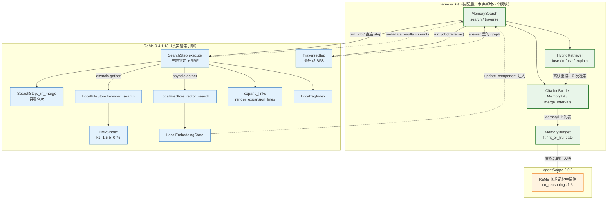

# 第 17 讲 《记忆检索：BM25 + 向量 + 标签 + 图扩展》

> **本讲目标**：把「记忆已经写进工作区」变成「记忆能在正确的时候被检索出来、
> 并且以可核对、可预算的形式交给模型」——精读 ReMe 从 `search` job 到 `_rrf_merge`
> 的整条检索链路，然后在 `harness_kit` 上补出四个模块（`search.py` / `hybrid.py` /
> `citations.py` / `budget.py`），做一次「检索质量 vs 注入预算」的真实对比实验。
> **前置要求**：完成第 15、16 讲；`third_party/ReMe`（0.4.1.13）与
> `third_party/agentscope`（2.0.8）已就位；能跑
> `PYTHONPATH=third_party/ReMe python`；`.env` 里已配好 `OPENAI_API_KEY` /
> `OPENAI_BASE_URL` / `LLM_MODEL`（本机实测为 `deepseek-flash`）。
> 注意 ReMe 自己的 `default.yaml` 用的是 `LLM_API_KEY` / `LLM_BASE_URL` /
> `LLM_MODEL_NAME` 这套名字 —— 两套名字的对照表在第 1 讲，`harness_kit.Settings`
> 用 `AliasChoices` 同时接住两边。
> **本讲交付物**（相对仓库根路径）：
> `tutorial_agsc_reme/reference/harness_kit/memory/search.py`、
> `tutorial_agsc_reme/reference/harness_kit/memory/hybrid.py`、
> `tutorial_agsc_reme/reference/harness_kit/memory/citations.py`、
> `tutorial_agsc_reme/reference/harness_kit/memory/budget.py`、
> `tutorial_agsc_reme/reference/tests/test_lesson17_hybrid_search.py`、
> `tutorial_agsc_reme/reference/scripts/17_hybrid_search.py`。
> **预计时长**：180 分钟（其中 §5 的运行验证约 20 分钟）。
>
> 本讲的完整可运行代码位于 `tutorial_agsc_reme/reference/harness_kit/memory/`，
> 你可以直接对照，也可以跟着正文一行一行写。

---

## 一、这一讲要解决的问题

第 16 讲结束时，工作区里已经有了一堆 `.md`：`resource/deploy.md` 里有部署手册，
`resource/runbook.md` 里有回滚手册，`daily/2026-09-22/*.md` 里有当天蒸馏出来的记忆卡。
**文件是对的、索引也是全的**——但是 `agent.reply()` 一个字都用不上它们。

官方 AgentScope 的 ReMe 中间件确实会在每轮回复前检索并注入
（`third_party/agentscope/src/agentscope/middleware/_longterm_memory/_reme/_middleware.py:383`
的 `on_reasoning` 钩子），但它做的是**最小可用**版本：调一次 `search`，
把 `metadata["results"]` 里的 `text` 抽出来拼进 system prompt。这条路径有三个具体后果。

### 1.1 一个具体的场景

用户在同一个会话里问了两句：

```
用户：部署前要确认什么？
助手：（回答，中间件注入了 resource/deploy.md:9-19 那段）
用户：切换阶段要注意什么？
```

第一轮检索正常。第二轮**大概率什么都注不进去**——因为 ReMe 的
`SearchStep` 默认带 `tool_context_id` 去重（`third_party/ReMe/reme/steps/index/search.py:109-142`
的 `_dedupe_tool_context`）：它把这一轮里已经给过的 `chunk.id` 记在
`app_context.metadata` 上，下一次检索时直接滤掉。而官方中间件**没有传** `tool_context_id`，
harness 侧一传，行为就和官方不一样了——这是"参数在哪一层生效"的典型坑。

第二个后果更隐蔽：`counts["vector"] == 0` 且 `success == True`。
如果这台机器上没配 embedding（DeepSeek 不提供 `/embeddings` 端点，实测 404），
`vector_search` 会**静默返回空列表**（`local_file_store.py:936-943`：
`if query_embedding is None: return []`），于是整条链路退化成纯 BM25——
一个没有任何报错、没有任何日志的降级。不主动去看 `counts`，你永远不会发现。

### 1.2 检索层「看起来能用」的四个真实失败模式

| # | 现象 | 真实原因 |
| --- | --- | --- |
| 1 | 第二轮对话再也检索不到第一轮给过的记忆 | `tool_context_id` 去重：`search.py:130-134` 把已返回的 `chunk.id` 记进 `seen`，下次 `unvisited = [c for c in chunks if c.id not in seen]`。这是**设计**，但"记忆消失了"和"记忆被过滤了"在外部无法区分 |
| 2 | `min_score=0.2` 一设，检索永远返回 0 条 | `min_score` 比的是**融合后**的 `c.score`（`search.py:340-341`），而 RRF 融合分的量级是 `1/(60+1) ≈ 0.0164`。用 BM25 的尺度（5~15）或 cosine 的尺度（0~1）去卡它，必然全滤掉 |
| 3 | 注入进 context 的内容一多就爆，且报错发生在模型 API 那一侧 | 官方中间件在检索之后**不做任何裁剪**：`_utils.py:94-103` 的 `_extract_memory_texts` 就是 `for item in results: out.append(str(text))`。而 ReMe 默认分块器 `chunk_byte_size=10000`（`default_file_chunker.py:25`），`limit=5` 就是最多 5 万字符原文一次性进 prompt。缺口 4 |
| 4 | 模型说"你的笔记里写了 X"，人去核对却找不到 X | `_extract_memory_texts` 只取 `text`，**path 与行号在这一层就被丢掉了**。模型手里只有一段孤立的正文，没有可以指向的来源 |

四个模式对应本讲的四个模块，一一对应：`search.py`（把参数分层的规律讲清楚）、
`hybrid.py`（融合与量纲）、`citations.py`（来源可核对）、`budget.py`（注入可预算）。

### 1.3 三个必须先分清的概念：召回 / 融合 / 注入

- **召回（recall）**：`vector_search` + `keyword_search` 各返回一批 `FileChunk`。
  两路的**分数不可比**（BM25 是 0~∞ 的无上界分，cosine 是 -1~1）。
- **融合（fuse）**：把两路合成一个有序列表。ReMe 用 RRF
  （Reciprocal Rank Fusion，`search.py:54-85`）——**只看名次、不看原始分**，
  所以天然不需要归一化。两路只有一路有结果时**不融合**，直接返回那一路的原始分。
- **注入（inject）**：把融合后的前 N 条渲染成一段文本放进 system prompt。
  这一步才需要考虑 token 预算、来源标注、去重。

**最关键的一条**：`min_score` 作用在**融合后**，所以它的量纲取决于上一步走了哪条路。
`counts["hybrid"]` 就是判断"走了哪条路"的那个开关。

### 1.4 本讲的收束：一句话的责任链

> **ReMe 负责"召回 + 融合"，harness 负责"看见它、裁它、把它变成可核对的一段文本"。**

harness **不重新实现**任何检索算法：BM25 是 ReMe 的 `BM25Index`，
向量是 ReMe 的 `LocalEmbeddingStore`，融合是 ReMe 的 `_rrf_merge`。
harness 只补四件事：**参数分层的一层封装**、**融合结果的再排序与解释**、
**chunk → 引用的转换**、**注入前的 token 预算**。
## 二、源码侦察

本节每一条结论都来自本机 `third_party/ReMe` / `third_party/agentscope` 的真实源码，
行号是本讲写作时用 `grep -n` 实测的。凡未在本机验证过的，会显式标注「**未验证**」。

### 2.1 BM25 的真实实现：`BM25Index`（不是"调个库"）

ReMe 自己实现了一个带磁盘持久化的 BM25 倒排索引，参数就是教科书里的 `k1` / `b`：

```
third_party/ReMe/reme/components/keyword_index/bm25_index.py:36   @R.register("bm25")
third_party/ReMe/reme/components/keyword_index/bm25_index.py:40       def __init__(self, k1: float = 1.5, b: float = 0.75, index_version: str = "v1", **kwargs):
third_party/ReMe/reme/components/keyword_index/bm25_index.py:171  def _get_idf(self, token_id: int, n_docs: int | None = None) -> float:
third_party/ReMe/reme/components/keyword_index/bm25_index.py:182      idf = math.log(1 + (n_docs - df + 0.5) / (df + 0.5)) if df else 0.0
third_party/ReMe/reme/components/keyword_index/bm25_index.py:324          scores[score_positions] += idf * tfs * (k1 + 1.0) / (tfs + denom_base + denom_norm * doc_lens)
```

**这说明什么**：

- `k1=1.5` / `b=0.75` 是 Lucene 的经典默认值，`b=0.75` 表示"长度归一化占 3/4 权重"。
  它们**可以在装配期改**（`keyword_index` 组件的构造参数），但改完 BM25 索引文件会重新生成
  —— 因为索引文件名里带了 tokenizer 指纹（`bm25_index.py:69-70`），但**不带** `k1`/`b`，
  所以**改 `k1`/`b` 不会自动失效旧索引**。这是本讲 §6 表格里的一条坑。
- IDF 用的是 `log(1 + (N - df + 0.5)/(df + 0.5))`：`1 +` 保证非负，
  所以**任何出现在语料里的词 IDF 都 > 0**，不会出现"常见词被硬性归零"。
  这也解释了为什么同一个文件里两个 chunk 命中同一个词都有分。
- 分数公式 `idf * tf * (k1+1) / (tf + k1*(1-b) + k1*b/avg_len*len)`：
  分子是 `tf*(k1+1)`，所以**同一个词在文档里出现 2 次不会让分数翻倍**（饱和），
  而长文档会被 `k1*b/avg_len*len` 这一项惩罚。
  `denom_base` 与 `denom_norm` 在循环外算好（`bm25_index.py:292-293`），
  说明这是一个**向量化**实现：一次查询把所有候选文档的分数算成一个 `np.ndarray`。
- **删除是惰性的**（`bm25_index.py:13-15` 的模块 docstring）：
  `_deleted[idx] = True` 只retire 槽位，posting list 里的旧条目要等
  `optimize_index`（`:534`）才清理。所以"改了文件重新入库"之后，
  旧版本的 chunk 仍可能在 posting list 里占位 —— 分数会被置 0（`:326-327`），
  但 `n_docs` 会变化，导致 `idf` 变化。这是"同一份数据、两次检索分数不同"的一个合法来源。

分词器是可替换的组件（`regex_tokenizer.py`），索引文件名里带它的指纹
（`bm25_index.py:96-99` 的 `_tokenizer_fingerprint`），所以换分词器会得到一个新索引文件。

### 2.2 `keyword_search` 与 `vector_search`：两路的入口与"静默降级"

```
third_party/ReMe/reme/components/file_store/local_file_store.py:984  async def keyword_search(self, query: str, limit: int, search_filter: dict) -> list[FileChunk]:
third_party/ReMe/reme/components/file_store/local_file_store.py:1011     results.append(chunk.model_copy(update={"scores": {"keyword": score, "score": score}}))
third_party/ReMe/reme/components/file_store/local_file_store.py:936  async def vector_search(self, query: str, limit: int, search_filter: dict) -> list[FileChunk]:
third_party/ReMe/reme/components/file_store/local_file_store.py:940      query_embedding = await self._get_query_embedding(query)
third_party/ReMe/reme/components/file_store/local_file_store.py:941      if query_embedding is None:
third_party/ReMe/reme/components/file_store/local_file_store.py:942          return []
third_party/ReMe/reme/components/file_store/local_file_store.py:980      candidate.model_copy(update={"scores": {"vector": score, "score": score}})
third_party/ReMe/reme/components/file_store/local_file_store.py:203  async def _get_query_embedding(self, query: str) -> np.ndarray | None:
third_party/ReMe/reme/components/file_store/local_file_store.py:212          query_embedding = await embedding_store.get_embedding(query)
third_party/ReMe/reme/components/file_store/local_file_store.py:218      if query_embedding is None or not self._embedding_request_is_current(
```

**这说明什么**：

- 两路返回的都是**新的 `FileChunk` 副本**（`model_copy(update=...)`），
  `scores` 被改写成 `{"keyword": 原始分, "score": 原始分}` 或
  `{"vector": 原始分, "score": 原始分}`。**单路时 `score` 就是原始分**，
  融合之后 `score` 才会被 RRF 覆盖 —— 这一点是理解 `min_score` 量纲的钥匙。
- `vector_search` 在**拿不到 query 向量时直接返回 `[]`**（`:941-942`），
  不抛异常、不打日志（只有 `_mark_embedding_unhealthy` 那条路径会 WARNING，
  而 `embedding_store is None` 时连那条都不走，`:206-207` 直接 `return None`）。
  **这就是"静默降级"的确切位置。**
- `_get_query_embedding` 的守卫有三层：store 存在、`_embedding_rebuild_pending` 为假、
  query 非空（`:206-207`）；拿到向量后还要校验"维度等于当前 store 的 `dimensions`"
  （`:223-227`）。所以**换 embedding 模型 = 所有 chunk 向量失效**，
  必须重新 `upsert` 或 `reindex`。
- `_embedding_dim_matches`（`:167-172`）是同一个校验的 chunk 侧版本：
  "没有 embedding store 时，任何持久化的向量都不可信"（`:169-171` 的注释原文）。

### 2.3 `SearchStep.execute`：运行时参数 vs 构造参数

`SearchStep.execute` 从 `:204` 开始，是整条链路的骨架。把它的前 25 行读一遍，
能直接看出"哪些参数运行时可改、哪些只能装配时定"：

```
third_party/ReMe/reme/steps/index/search.py:206      query: str = (self.context.get("query", "") or "").strip()
third_party/ReMe/reme/steps/index/search.py:207      limit: int = int(self.context.get("limit") or _default_limit())
third_party/ReMe/reme/steps/index/search.py:208      min_score: float = float(self.context.get("min_score") or 0.0)
third_party/ReMe/reme/steps/index/search.py:211      raw_vw = self.context.get("vector_weight")
third_party/ReMe/reme/steps/index/search.py:221      if vector_weight is None:
third_party/ReMe/reme/steps/index/search.py:222          vector_weight = float(self.kwargs.get("vector_weight", 0.7))
third_party/ReMe/reme/steps/index/search.py:224      candidate_multiplier: float = float(self.kwargs.get("candidate_multiplier", 5.0))
third_party/ReMe/reme/steps/index/search.py:225      expand_links_enabled: bool = bool(self.kwargs.get("expand_links", True))
third_party/ReMe/reme/steps/index/search.py:226      max_links_per_direction: int = int(self.kwargs.get("max_links_per_direction", 10))
third_party/ReMe/reme/steps/index/search.py:260      candidates = min(_MAX_CANDIDATES, max(1, int(limit * candidate_multiplier)))
```

**这说明什么**：

- `self.context` 是 `RuntimeContext`（`run_job(**kwargs)` 的 kwargs 进这里），
  `self.kwargs` 是**构造参数**（来自 job 的 `step_specs`）。
  两类参数走两条完全不同的路：`query`/`limit`/`min_score`/`vector_weight` 运行时可改；
  `candidate_multiplier`/`expand_links`/`max_links_per_direction` **运行时不生效**。
- `vector_weight` 是个**混合体**：优先取 context（`:211-220`，非数字会被忽略并 WARNING），
  取不到才退回 `kwargs`（`:222`），最后**硬夹到 `[0,1]`**（`:223`）。
  也就是说它在运行时可改 —— 而 `candidate_multiplier` 不可改。
  **同一个 job、同一层参数，一个可改一个不可改**，这是本讲必须解释清楚的事。
- `candidates = min(200, max(1, int(limit * candidate_multiplier)))`（`:260`）：
  候选池是 `limit × 倍数`，**硬上限 200**（`_MAX_CANDIDATES`，`:15`）。
  默认 `limit=5`、倍数 5.0 → 25 个候选。所以"把 limit 调到 1000 想要更多结果"
  在候选池这一步就被 200 卡住了 —— 它会先取前 200 个候选，
  再按分数排序取前 `limit` 个。**`limit` 大不一定拿到更多**。
- `assert limit > 0`（`:237`）是 `assert` 而不是 `raise`：用 `python -O` 跑就没有这个校验了。
  harness 侧因此**必须自己校验**（`search.py` 的 `search()` 开头），不能依赖它。

### 2.4 三态融合：一条 if/elif/else 决定分数量纲

```
third_party/ReMe/reme/steps/index/search.py:309      text_weight = 1.0 - vector_weight
third_party/ReMe/reme/steps/index/search.py:310      use_vector = vector_weight > 0.0
third_party/ReMe/reme/steps/index/search.py:311      use_keyword = text_weight > 0.0
third_party/ReMe/reme/steps/index/search.py:313      if use_vector and use_keyword:
third_party/ReMe/reme/steps/index/search.py:314          vector_results, keyword_results = await asyncio.gather(
third_party/ReMe/reme/steps/index/search.py:315              self.file_store.vector_search(query, candidates, search_filter),
third_party/ReMe/reme/steps/index/search.py:316              self.file_store.keyword_search(query, candidates, search_filter),
third_party/ReMe/reme/steps/index/search.py:330      hybrid = bool(vector_results) and bool(keyword_results)
third_party/ReMe/reme/steps/index/search.py:331      if not vector_results and not keyword_results:
third_party/ReMe/reme/steps/index/search.py:332          fused: list[FileChunk] = []
third_party/ReMe/reme/steps/index/search.py:333      elif not keyword_results:
third_party/ReMe/reme/steps/index/search.py:334          fused = vector_results
third_party/ReMe/reme/steps/index/search.py:335      elif not vector_results:
third_party/ReMe/reme/steps/index/search.py:336          fused = keyword_results
third_party/ReMe/reme/steps/index/search.py:337      else:
third_party/ReMe/reme/steps/index/search.py:338          fused = self._rrf_merge(vector_results, keyword_results, vector_weight)
third_party/ReMe/reme/steps/index/search.py:340      if min_score > 0.0:
third_party/ReMe/reme/steps/index/search.py:341          fused = [c for c in fused if c.score >= min_score]
```

**这说明什么**：

- `use_vector = vector_weight > 0.0` 是一条**硬分界**：
  写 `0.0` 就**整路跳过**向量（连 `embedding_store.get_embedding` 都不会被调用），
  写 `1.0` 就整路跳过 BM25。它不是"权重为 0 但仍然算一遍再加 0"。
  这对成本影响巨大：跳过向量 = 省一次远程 embedding 调用。
- 两路都有结果才进 RRF（`:337-338`）；**只有一路时原样返回那一路的原始分**（`:333-336`）。
  所以"三态"是**批级**判定，不是逐条的。
- `min_score` 在 `:340-341`，比的是 `c.score` —— 也就是**融合之后**的分数。
  单路时它是 BM25/cosine 原始分，融合时它是 RRF 分（~0.016）。
  **同一个参数、两个数量级**，这是本讲的头号坑。
- `hybrid`（`:330`）是"两路都有结果"的布尔值，它被写进 `metadata["counts"]`
  （`:367-372`），是调用方判断"现在该用哪个量纲"的唯一开关。

### 2.5 `_rrf_merge`：只有 30 行，但有两个反直觉点

```
third_party/ReMe/reme/steps/index/search.py:60       text_weight = 1.0 - vector_weight
third_party/ReMe/reme/steps/index/search.py:63       for rank, chunk in enumerate(vector, start=1):
third_party/ReMe/reme/steps/index/search.py:64           contrib = vector_weight / (_RRF_K + rank)
third_party/ReMe/reme/steps/index/search.py:66           c.scores = {**chunk.scores, "vector": chunk.scores.get("vector", chunk.score), "score": contrib}
third_party/ReMe/reme/steps/index/search.py:69       for rank, chunk in enumerate(keyword, start=1):
third_party/ReMe/reme/steps/index/search.py:76               "score": existing.scores["score"] + contrib,
third_party/ReMe/reme/steps/index/search.py:84       results.sort(key=lambda r: r.score, reverse=True)
third_party/ReMe/reme/steps/index/search.py:14   _RRF_K: Final = 60
```

**这说明什么**：

- 公式是 `fused(d) = w_v/(60 + rank_v(d)) + w_k/(60 + rank_k(d))`：
  **只看名次、不看原始分**。所以 BM25 的 9.1 分和 cosine 的 0.71 分在融合时
  只有"第 2 名"和"第 2 名"这一件事有意义 —— 两路量纲差异被彻底消掉，
  不需要任何归一化。这就是 RRF 最大的价值。
- **只有出现在某一路里才加上那一路的项**。一条 chunk 如果只被关键词路召回，
  它的向量项就是 0（`merged` 里根本没有它，`:79-81` 新建时只加 `contrib`）。
  所以"两路都排第 1"才拿到 `0.5/61 + 0.5/61 ≈ 0.0164`。
- `rank` 从 1 开始（`enumerate(..., start=1)`），所以分母最小是 61。
  **融合分的上界就是 `w_v/61 + w_k/61 ≤ 1/61 ≈ 0.0164`**——
  一个恒小于 `0.017` 的数。任何 `min_score ≥ 0.017` 的绝对值都会把融合结果全滤掉。
- `results.sort(key=lambda r: r.score, reverse=True)`（`:84`）是**稳定排序**，
  所以 RRF 平局时的相对顺序**取决于 `merged` 的插入顺序**，
  而插入顺序又取决于"先遍历向量路还是关键词路"。
  这不是 bug，但意味着"两条分数完全相同的 chunk，谁在前"在不同调用里可能不同。
  harness 的 `fuse_entries` 因此多做了 `(-score, key)` 的**确定性**兜底排序。
- 注意 `c.scores` 里同时保留了 `"vector"` / `"keyword"`（原始分）与 `"score"`（融合分）。
  所以在**同一条 chunk 上**，`scores["keyword"]` 是 BM25 分（如 7.92），
  而 `scores["score"]` 是 RRF 分（如 0.0164）。**同名不同量纲，就在一个 dict 里。**

### 2.6 融合之后的四件事：阈值 → 去重 → 截断 → 图扩展

```
third_party/ReMe/reme/steps/index/search.py:343      dedup: dict | None = None
third_party/ReMe/reme/steps/index/search.py:344      if tool_context_id:
third_party/ReMe/reme/steps/index/search.py:345          fused, dedup = self._dedupe_tool_context(fused, tool_context_id, limit)
third_party/ReMe/reme/steps/index/search.py:346      else:
third_party/ReMe/reme/steps/index/search.py:347          fused = fused[:limit]
third_party/ReMe/reme/steps/index/search.py:349      unique_paths = list(dict.fromkeys(c.path for c in fused))
third_party/ReMe/reme/steps/index/search.py:350      link_expansion: dict[str, dict] = (
third_party/ReMe/reme/steps/index/search.py:351          await expand_links(self.file_store, unique_paths, max_links_per_direction) if expand_links_enabled else {}
third_party/ReMe/reme/steps/index/search.py:363      self.context.response.metadata["results"] = [
third_party/ReMe/reme/steps/index/search.py:364          c.model_dump(exclude_none=True, exclude={"embedding"}) for c in fused
third_party/ReMe/reme/steps/index/search.py:365      ]
third_party/ReMe/reme/steps/index/search.py:367      self.context.response.metadata["counts"] = {
third_party/ReMe/reme/steps/index/search.py:368          "vector": len(vector_results),
third_party/ReMe/reme/steps/index/search.py:369          "keyword": len(keyword_results),
third_party/ReMe/reme/steps/index/search.py:370          "returned": len(fused),
third_party/ReMe/reme/steps/index/search.py:371          "hybrid": hybrid,
third_party/ReMe/reme/steps/index/search.py:372      }
```

**这说明什么**：

- 顺序是**阈值 → 去重/截断 → 图扩展 → 组装响应**，一步都不能调换：
  去重放在截断之前（`:345` 把 `limit` 传进去，由 `_dedupe_tool_context` 内部截断），
  意味着"被去重滤掉的 chunk 不占 `limit` 名额"——所以同一轮里第二次检索
  仍然可能返回 `limit` 条新 chunk，而不是"少了几条"。
- `metadata["results"]` 是 `model_dump(exclude_none=True, exclude={"embedding"})`：
  **向量被排除了**（否则一个 1536 维的 float 列表会把 metadata 撑爆），
  但 `scores` / `path` / `start_line` / `end_line` / `text` / `id` 都在。
  harness 的 `to_memory_hit` 就是从这个 dict 里读的。
- `metadata["counts"]` 的四个键含义各不相同：
  `vector`/`keyword` 是**召回数**（去重之前），`returned` 是**最终返回数**（去重之后），
  `hybrid` 是 **bool**（不是 int）。所以 `counts["keyword"] > 0` 而
  `counts["returned"] == 0` 是一个**合法且有信息量**的组合——它表示
  "召回到了，但全被阈值/去重滤掉了"。
- `counts["hybrid"]` 是 bool 而契约的字段类型写 `dict[str, int]`：
  pydantic 的 lax 模式能收（`bool` 是 `int` 的子类），但 harness 显式 `int()` 一下。

### 2.7 `_dedupe_tool_context`：14 行，决定了"第二轮记忆会不会消失"

```
third_party/ReMe/reme/steps/index/search.py:109  def _dedupe_tool_context(
third_party/ReMe/reme/steps/index/search.py:115      now = self.kwargs.get("clock", self._now_ts)()
third_party/ReMe/reme/steps/index/search.py:122      store = self._tool_context_store(tool_context_id)
third_party/ReMe/reme/steps/index/search.py:130      unvisited = [chunk for chunk in chunks if chunk.id not in seen]
third_party/ReMe/reme/steps/index/search.py:131      returned = unvisited[:limit]
third_party/ReMe/reme/steps/index/search.py:132      for chunk in returned:
third_party/ReMe/reme/steps/index/search.py:133          seen[chunk.id] = now
third_party/ReMe/reme/steps/index/search.py:138          "skipped_seen": len(chunks) - len(unvisited),
third_party/ReMe/reme/steps/index/search.py:141          "ttl_seconds": ttl,
```

**这说明什么**：

- 去重的键是 `chunk.id`，也就是 `FileChunk.set_hash_id()` 算出来的**确定性哈希**
  （`third_party/ReMe/reme/schema/file_chunk.py:21-26`：
  `hash_text(" ".join([path, start_line, end_line, text]))`）。
  所以"内容没变"就一定能被认出来，"内容变了"就一定能重新给 —— 这个设计很干净。
- `seen` 有 TTL（`:116-121` 的 `tool_context_chunk_ttl_seconds`，
  默认从 `seen_ttl_hours` 换算），过期的条目会被清掉（`:127`）。
  所以"这一轮里不再给"最多持续 `seen_ttl_hours` 小时。
- `skipped_seen` 被记进 `metadata["dedup"]`（`:135-142`）——**这是一个可观测信号**。
  看到 `skipped_seen > 0` 就知道"不是没召回到，是被去重了"。
- harness 的 `MemorySearch.search` 把 `tool_context_id` 暴露成运行时参数，
  就是为了让调用方能控制这个桶；不传就等于关闭去重（`:344` 的 if 为假）。

### 2.8 标签过滤：`_resolve_tag_filter` 与"两个相反的默认值"

```
third_party/ReMe/reme/steps/index/search.py:144  async def _resolve_tag_filter(
third_party/ReMe/reme/steps/index/search.py:150      if not self.file_store.tag_index_enabled:
third_party/ReMe/reme/steps/index/search.py:178      allowed_paths = set(await tag_index.paths_for_tags(normalized_tags, match_all=False))
third_party/ReMe/reme/steps/index/search.py:193      search_filter["paths"] = sorted(allowed_paths)
third_party/ReMe/reme/components/tag_index/local_tag_index.py:129  async def paths_for_tags(self, tags: object, *, match_all: bool = True) -> list[str]:
third_party/ReMe/reme/components/tag_index/local_tag_index.py:140      matches = set.intersection(*postings) if match_all else set.union(*postings)
third_party/ReMe/reme/config/default.yaml:463            description: "optional tags filter; a file matches when it contains at least one valid tag"
```

**这说明什么**：

- 检索侧的标签过滤是 **OR**（`match_all=False` → `set.union`），
  而 `LocalTagIndex.paths_for_tags` 自身的默认值是 **AND**（`match_all=True` → `set.intersection`）。
  **同一个仓库里两个相反的默认值都合理**：检索侧"宁滥勿缺"（多召回几条，
  靠后面的分数排序和预算裁剪兜住），管理侧"宁缺勿滥"（列出同时带 A 和 B 的文件）。
  但**必须知道自己在哪一侧**——这是"为什么标签过滤没效果"最常见的成因。
- 实现方式是**把标签翻译成路径白名单**（`:193` 的 `search_filter["paths"]`），
  再交给普通过滤。所以标签过滤之后，召回数是"这些路径里的 chunk 数"，
  而不是"所有 chunk 数"——`counts["keyword"]` 会跟着变小。
- 未知标签**不是错误**：`normalized_tags` 非空就继续，
  `paths_for_tags` 返回空列表 → 白名单为空 → 召回 0 条，`success` 仍然是 `True`。
  调用方只能靠 `counts["returned"] == 0` 自己发现。
- `tag_index_unavailable`（`:150-166`）是一条**降级路径**：没启用 tag_index 时
  只记一条 metadata（`{"requested": True, "applied": False, ...}`）就继续，
  **不报错**。所以"我传了 tags 但好像没生效"要先看 `metadata["tag_filter"]`。

### 2.9 `traverse`：结果在 `answer` 里，与 `search` 正好相反

```
third_party/ReMe/reme/steps/index/traverse.py:145  async def execute(self):
third_party/ReMe/reme/steps/index/traverse.py:152      if not seeds:
third_party/ReMe/reme/steps/index/traverse.py:153          raise ValueError("path is required")
third_party/ReMe/reme/steps/index/traverse.py:155      if max_depth < 0:
third_party/ReMe/reme/steps/index/traverse.py:156          raise ValueError("depth must be greater than or equal to 0")
third_party/ReMe/reme/steps/index/traverse.py:159      direction = _DIRECTION_ALIASES.get(raw_direction)
third_party/ReMe/reme/steps/index/traverse.py:176      self.context.response.answer = graph.model_dump()
third_party/ReMe/reme/steps/index/traverse.py:177      self.logger.info(
third_party/ReMe/reme/steps/index/traverse.py:74      node_depths = {seed: 0 for seed in seeds}
third_party/ReMe/reme/steps/index/traverse.py:94              node_depths[link.neighbor] = next_depth
third_party/ReMe/reme/config/default.yaml:373            default: 1
third_party/ReMe/reme/config/default.yaml:383            default: both
```

**这说明什么**：

- **`traverse_step` 把图写进 `response.answer`，`metadata` 是空的**
  （`traverse.py:176`）；而 `search_step` 把结果写进 `metadata["results"]`。
  两个 job 的响应约定**相反** —— 照抄 `search` 的读法去读 `traverse`，
  会得到"结果全丢、看不到任何异常"的现象。harness 的 `MemorySearch.traverse`
  必须读 `answer`。
- 图里只有**节点与边**，没有 chunk 正文（`graph.model_dump()` 是
  `TraverseGraph` 的序列化：`seeds`/`depth`/`direction`/`nodes`/`edges`）。
  所以"沿图找到邻居之后还想看正文"必须**再查一次** `file_store.get_nodes()`
  → `node.chunk_ids` → `file_chunks[id]`。这就是 harness 那一层补的第二步。
- `_traverse` 是**最短路 BFS**（`:74` 起点 depth=0，`:94` 只在"更近"时更新），
  所以每个节点记的是"离起点最少几跳"，不是"被访问的顺序"。
  同一个节点可由两条路径到达时，只保留更近的那个 depth。
- 方向默认 `both`（`default.yaml:383`），深度默认 1（`:373`）。
  `both` 的含义是"出链和入链都算"：从 `deploy.md` 出发不仅拿到它指向的
  `runbook.md`，还会拿到**指向它的** `retrieval.md`。这在"找出所有引用了这条记忆的地方"
  时非常有用，但也意味着**邻居数会比预期多**。
- `seeds` 会被去重并统一成正斜杠（`:149`），`path` 可以传字符串或字符串列表。

### 2.10 `expand_links`：search 顺手做的"图扩展"

```
third_party/ReMe/reme/utils/link_expansion.py:58  async def expand_links(
third_party/ReMe/reme/utils/link_expansion.py:61      max_per_direction: int = 10,
third_party/ReMe/reme/utils/link_expansion.py:67      Empty input returns ``{}``. ``max_per_direction`` caps the neighbor
third_party/ReMe/reme/utils/link_expansion.py:97  def render_expansion_lines(expansion: dict, indent: str = "  ") -> list[str]:
third_party/ReMe/reme/utils/link_expansion.py:115          lines.append(f"{indent}{direction} ({len(items)}):")
third_party/ReMe/reme/utils/link_expansion.py:117              lines.append(f"{inner}{arrow} {item['path']}  {_format_meta_inline(item['meta'])}")
third_party/ReMe/reme/utils/link_expansion.py:119                  lines.append(f"{edge_indent}via anchor=#{anchor}")
```

**这说明什么**：

- `expand_links` 是**数据层**（返回 `{path: {"outlinks": [...], "inlinks": [...]}}`），
  `render_expansion_lines` 是**视图层**（渲染成缩进行）。两层分开是为了
  "只要数据不要格式"的调用方能直接用前者。
- 它由 `expand_links_enabled` 控制（`search.py:225`，来自 `self.kwargs`
  → **构造参数，运行时不生效**）。所以"这次检索不要图扩展"只能走直连 step 的路径。
- `max_per_direction` 默认 10，是在**取 meta 之前**就截断的
  （`:67-69` 的注释："caps the neighbor list per direction *before* meta lookup
  so we don't fetch nodes that won't be displayed"）——一个刻意的 N+1 查询优化。
- 渲染格式固定：方向表头 `outlinks (n):`，邻居行 `  → path  <meta>`，
  锚点行 `      via anchor=#回滚`，meta 为空时打 `(no meta)`。
  **注意模型看到的是"→（出链）"和"←（入链）"两种箭头**，含义不同：
  出链是"这条记忆指向哪里"，入链是"谁引用了这条记忆"。

### 2.11 装配链路：`step_specs` 是怎么变成构造参数的

```
third_party/ReMe/reme/components/job/base_job.py:54       self.step_specs: list[tuple[type["BaseStep"], dict]] = []
third_party/ReMe/reme/components/job/base_job.py:59           self.step_specs = [self._resolve_step(raw) for raw in self.step_configs]
third_party/ReMe/reme/components/job/base_job.py:64       def _resolve_step(self, raw: ComponentConfig | dict) -> tuple[type["BaseStep"], dict]:
third_party/ReMe/reme/components/job/base_job.py:72           params = config.model_dump()
third_party/ReMe/reme/components/job/base_job.py:73           params["app_context"] = self.app_context
third_party/ReMe/reme/components/job/base_job.py:76       def _build_steps(self) -> list["BaseStep"]:
third_party/ReMe/reme/components/job/base_job.py:78           return [step_cls(**dict(params)) for step_cls, params in self.step_specs]
third_party/ReMe/reme/components/job/base_job.py:89           merged = {**self.kwargs, **kwargs}
third_party/ReMe/reme/components/job/base_job.py:90           context = RuntimeContext(**merged)
third_party/ReMe/reme/application.py:370      async def run_job(self, name: str, /, **kwargs) -> Response:
third_party/ReMe/reme/application.py:373          if name not in self.context.jobs:
third_party/ReMe/reme/application.py:374          return await self.context.jobs[name](**kwargs)
```

**这说明什么**（这一段是 `MemorySearch` 存在的**唯一**理由，必须读透）：

- YAML 里的 step 配置整段 `model_dump()` 之后（`:72`）当成构造参数
  `step_cls(**params)`（`:78`）——所以 `candidate_multiplier` / `expand_links` /
  `max_links_per_direction` **进了 `self.kwargs`**。
- `BaseJob.__call__` 把运行 kwargs 合进 `RuntimeContext`（`:89-90`），
  **不碰构造参数**。所以 `run_job("search", candidate_multiplier=1.0)` 会
  把 `candidate_multiplier` 塞进 `RuntimeContext`，而 `SearchStep` 从
  `self.kwargs` 读它 —— **静默无效，不报错**。
- `run_job` 的 `name` 是 **positional-only**（`:370` 的 `/`），
  写 `run_job(name="search")` 直接 `TypeError`。
- 唯一能改这三个参数的两条路：①装配期改配置；②绕开 job，
  从 `job.step_specs` 里取出真实的配置 dict、覆盖要改的项、直接构造 `SearchStep`。
  harness 的 `MemorySearch._run_step` 走的就是第 ② 条。

### 2.12 注入侧：官方中间件的两个缺口

```
third_party/agentscope/src/agentscope/middleware/_longterm_memory/_reme/_middleware.py:71  _MEMORY_MSG_NAME = "memory"
third_party/agentscope/src/agentscope/middleware/_longterm_memory/_reme/_middleware.py:72  _MEMORY_SECTION_HEADER = "## Relevant memories from past conversations"
third_party/agentscope/src/agentscope/middleware/_longterm_memory/_reme/_middleware.py:383      # Hook: on_reasoning (inject retrieved memories once ready)
third_party/agentscope/src/agentscope/middleware/_longterm_memory/_reme/_utils.py:94      out: list[str] = []
third_party/agentscope/src/agentscope/middleware/_longterm_memory/_reme/_utils.py:95      for item in results:
third_party/agentscope/src/agentscope/middleware/_longterm_memory/_reme/_utils.py:99              text = (
third_party/agentscope/src/agentscope/middleware/_longterm_memory/_reme/_utils.py:103                  out.append(str(text))
```

**这说明什么**：

- 官方注入的形态是"一个固定标题 + 一串 `text`"（`:71-72`），
  **没有 path、没有行号、没有 token 预算**。对 `_longterm_memory/_reme/` 全目录
  grep `truncat` / `budget` 均无命中（本讲实测确认）—— **这就是缺口 4**。
- 注入发生在 `on_reasoning` 钩子（`:383`），也就是"开始推理之前"。
  这是 AgentScope 的中间件扩展点，第 8 讲讲过的 Hook 链在这里又出现了一次。
- `_extract_memory_texts`（`_utils.py:51-103`）的过滤条件只有 `if text:`，
  所以**空正文的 chunk 会被丢掉、正文超长的 chunk 会原样进来**。
  两头都不对：一头浪费一次检索，一头可能一次塞进 5 万字符。

### 2.13 假 embedder 的正当注入点：`Application.update_component`

本仓库的 `.env` 只有 DeepSeek 的 key，而 DeepSeek **不提供** `/embeddings` 端点
（实测 `POST {base}/embeddings` 返回 HTTP 404）。所以"真实向量通路"在本环境
**必然答空**。要在不接供应商的前提下验证向量路径，需要一个官方认可的注入点：

```
third_party/ReMe/reme/application.py:235  async def update_component(self, component_enum: ComponentType, name: str, /, **kwargs) -> BaseComponent:
third_party/ReMe/reme/application.py:240          if not group or name not in group:
third_party/ReMe/reme/application.py:241              raise KeyError(f"Component '{name}' not found in {component_type}")
third_party/ReMe/reme/application.py:244          for key in kwargs:
third_party/ReMe/reme/application.py:245              if not hasattr(component, key):
third_party/ReMe/reme/application.py:246                  raise AttributeError(f"Component {component_type}:{name} has no attribute '{key}'")
third_party/ReMe/reme/application.py:248              setattr(component, key, value)
third_party/ReMe/reme/components/embedding_store/local_embedding_store.py:34      self.as_embedding = self.bind(as_embedding, BaseAsEmbedding, optional=False)
third_party/ReMe/reme/components/embedding_store/local_embedding_store.py:43      def dimensions(self) -> int:
third_party/ReMe/reme/components/embedding_store/local_embedding_store.py:46          return self.as_embedding.dimensions
third_party/ReMe/reme/components/embedding_store/local_embedding_store.py:49      def vector_space_id(self) -> str:
third_party/ReMe/reme/components/embedding_store/local_embedding_store.py:52          return self.as_embedding.vector_space_id
third_party/ReMe/reme/components/embedding_store/local_embedding_store.py:190              result = await self.as_embedding(texts, **kwargs)
```

**这说明什么**：

- `update_component` 只做两件事：校验"组件存在"（`:240-241`）与"属性存在"（`:245-246`），
  然后 `setattr`（`:248`）。**它不做 `isinstance` 检查** —— 所以一个鸭子类型的
  假实现可以塞进去。这不是"绕过框架"，而是官方给的**运行时注入点**
  （生产环境用它注入已经构造好的真实 embedding model）。
- `LocalEmbeddingStore` 需要注入对象提供三个东西：`dimensions`（`:43-46`）、
  `vector_space_id`（`:49-52`）、以及 `await asyncio.wait_for(...)` 能调用的
  `__call__`（`:190`）。本讲的 `FakeEmbedder` 就提供这三样。
- `vector_space_id` 决定**缓存文件名与索引命名空间**（`:70` 的 `bm25_..._{fingerprint}_...pkl`
  是 BM25 侧的同类机制），所以换 embedder 必须换 `vector_space_id`，
  否则会读到上一套向量算出来的缓存。

### 2.14 本讲会用到的 agentscope / reme 扩展点清单

| 扩展点 | 类型 | 位置 | 本讲怎么用 |
| --- | --- | --- | --- |
| `SearchStep` | 真实 step 类 | `third_party/ReMe/reme/steps/index/search.py:38` | 直连构造以覆盖构造参数（`MemorySearch._run_step`） |
| `SearchStep._rrf_merge` | `@staticmethod` | `third_party/ReMe/reme/steps/index/search.py:53-85` | 融合语义的真值来源；测试里直接调它做对拍 |
| `SearchStep._rrf_merge` 的 `_RRF_K` | 模块常量 | `third_party/ReMe/reme/steps/index/search.py:14` | `hybrid.RRF_K = 60` 与它对齐 |
| `_MAX_CANDIDATES` | 模块常量 | `third_party/ReMe/reme/steps/index/search.py:15` | 解释候选池上限 |
| `TraverseStep` | 真实 step 类 | `third_party/ReMe/reme/steps/index/traverse.py:142` | 图扩展；结果从 `answer` 读 |
| `BaseJob._resolve_step` / `_build_steps` | job 内部方法 | `third_party/ReMe/reme/components/job/base_job.py:64-78` | 解释构造参数从哪来 |
| `BaseJob.__call__` | job 入口 | `third_party/ReMe/reme/components/job/base_job.py:86-93` | 解释运行时参数进 `RuntimeContext` |
| `Application.run_job` | 公开 API | `third_party/ReMe/reme/application.py:370` | `MemoryClient.run_job` 的底座（`name` 是 positional-only） |
| `Application.update_component` | 公开 API | `third_party/ReMe/reme/application.py:235-249` | 运行时注入 `as_embedding` |
| `LocalEmbeddingStore` | 组件 | `third_party/ReMe/reme/components/embedding_store/local_embedding_store.py` | 假 embedder 的宿主 |
| `LocalFileStore.vector_search` / `keyword_search` | 组件方法 | `third_party/ReMe/reme/components/file_store/local_file_store.py:936` / `:984` | 两路召回的真值来源 |
| `BM25Index` | 组件 | `third_party/ReMe/reme/components/keyword_index/bm25_index.py:36` | BM25 的真实实现与 `k1`/`b` |
| `FileChunk.set_hash_id` | 方法 | `third_party/ReMe/reme/schema/file_chunk.py:21-26` | `chunk_id` 的确定性来源（引用去重键） |
| `expand_links` / `render_expansion_lines` | 工具函数 | `third_party/ReMe/reme/utils/link_expansion.py:58` / `:97` | 图扩展的数据层与视图层 |
| `_extract_memory_texts` | 官方中间件内部函数 | `third_party/agentscope/.../_longterm_memory/_reme/_utils.py:51-103` | 缺口 4 的证据（也说明"丢了 path 和行号"） |
| `ChatModelBase` | AgentScope 基类 | `third_party/agentscope/src/agentscope/model/_base.py:37` | F 段用 `OpenAICompatChatModel` 直接调用（不重写模型层） |
| `UserMsg` | AgentScope 消息类型 | `third_party/agentscope/src/agentscope/message/` | F 段把注入块包成一条用户消息 |

**未验证 / 已知依赖**：

- **真实 embedding 供应商的端到端向量检索在本环境未验证**：
  DeepSeek 没有 `/embeddings` 端点（实测 404），本机也没有第二个供应商的 key。
  本讲的向量路径全部通过 §2.13 的官方注入点 + 确定性假 embedder 验证
  （装配路径、`vector_search`、`_rrf_merge`、`metadata` 全部走真实代码，
  只有"向量从哪来"这一件事被替换）。**换真实供应商时唯一要改的是 embedder 对象**。
- `BM25Index` 的 `optimize_index`（`bm25_index.py:534`）在真实大规模语料上的收益
  **未验证**：本讲语料只有 5 个 chunk，惰性删除的开销不可观测。
- `traverse` 的 `direction="forward"` / `"backward"` 在本讲只验证了 `both`（默认值）。
---

## 三、扩展点定位与设计

### 3.1 官方已经给了什么（give）

| 能力 | 提供者 | 位置 |
| --- | --- | --- |
| 关键词召回（真 BM25，`k1=1.5`/`b=0.75`，带磁盘持久化） | `BM25Index` | `third_party/ReMe/reme/components/keyword_index/bm25_index.py:36-44` |
| 向量召回（批量 cosine，`_VECTOR_SEARCH_BATCH_SIZE = 1024`） | `LocalFileStore.vector_search` | `third_party/ReMe/reme/components/file_store/local_file_store.py:936-982` |
| 两路并行 + 三态融合 + RRF | `SearchStep.execute` / `_rrf_merge` | `third_party/ReMe/reme/steps/index/search.py:309-341` / `:54-85` |
| 阈值、轮内去重、截断、图扩展 | `SearchStep` 后半段 | `third_party/ReMe/reme/steps/index/search.py:340-352` |
| 标签过滤（OR 语义） | `_resolve_tag_filter` | `third_party/ReMe/reme/steps/index/search.py:144-202` |
| 图遍历（最短路 BFS，`forward`/`backward`/`both`） | `TraverseStep` | `third_party/ReMe/reme/steps/index/traverse.py:142-179` |
| 邻居的数据层与渲染层 | `expand_links` / `render_expansion_lines` | `third_party/ReMe/reme/utils/link_expansion.py:58` / `:97` |
| 运行时可改 `vector_weight`（自动夹到 `[0,1]`） | `SearchStep.execute` | `third_party/ReMe/reme/steps/index/search.py:211-223` |
| 运行时注入 embedding 组件 | `Application.update_component` | `third_party/ReMe/reme/application.py:235-249` |
| 稳定的 chunk 身份（引用去重键） | `FileChunk.set_hash_id` | `third_party/ReMe/reme/schema/file_chunk.py:21-26` |
| 可观测的计数（召回数 / 返回数 / hybrid） | `metadata["counts"]` | `third_party/ReMe/reme/steps/index/search.py:367-372` |
| 去重审计（`skipped_seen` 等五个字段） | `metadata["dedup"]` | `third_party/ReMe/reme/steps/index/search.py:135-142` |

**结论：检索引擎本身（召回 + 融合 + 图 + 标签）ReMe 已经全部提供了。
本讲一行检索算法都不写。**

### 3.2 gap：官方没给什么

| # | 缺口 | 证据 | 后果 |
| --- | --- | --- | --- |
| a | **参数分层的可见性**：`candidate_multiplier` / `expand_links` / `max_links_per_direction` 只能装配时定，`run_job` 传了也**静默无效** | `search.py:224-226` 从 `self.kwargs` 读；`base_job.py:89-90` 只把运行 kwargs 合进 `RuntimeContext` | 调用方以为改了参数，实际没改，且没有任何报错 |
| b | **融合分的量纲没有护栏**：`min_score` 直接比 `c.score`，量纲随路径切换 | `search.py:340-341` | 用 `0.2` 卡 RRF 分 → 永远 0 条；用 `6.0` 卡 BM25 → 正常。同一个代码两种命运 |
| c | **没有"离线换权重重排"的能力**：换 `vector_weight` 必须重新调一次 `search` | `_rrf_merge` 只在 step 内部被调用 | 一次 embedding 调用（远程、要钱、有延迟）只换来一次排序 |
| d | **chunk → 引用的转换不存在**：官方中间件只取 `text` | `_utils.py:94-103` | 模型看到"你的笔记里写了 X"，但没有任何 path/行号可以核对 |
| e | **注入前没有 token 预算**（缺口 4，契约 §1.3 的 #4） | 对 `_longterm_memory/_reme/` 全目录 grep `truncat`/`budget` 无命中；`chunk_byte_size=10000`（`default_file_chunker.py:25`）× `limit=5` = 5 万字符 | 对话一长必然爆 context，报错发生在模型 API 那一侧，排查绕远 |
| f | **两路 `counts` 的语义解释不存在**：`counts["keyword"]>0` 且 `returned==0` 是什么状态，没人告诉调用方 | `search.py:367-372` 只给数字 | "记忆好像没生效"无法定位到"被阈值滤掉"还是"被去重滤掉"还是"索引里没有" |

### 3.3 扩展点定位：本讲只加四个模块（+ 两个验证文件）

| 模块 | 补哪个缺口 | 在哪个官方扩展点上做 |
| --- | --- | --- |
| `harness_kit/memory/search.py` | a、f | **直连构造** ReMe 的 `SearchStep`（从 `job.step_specs` 取真实配置再覆盖），**不新建 step、不改 ReMe 的 job** |
| `harness_kit/memory/hybrid.py` | b、c | 纯计算层：复刻 `SearchStep._rrf_merge` 的语义做**离线**重排；用 `MemoryHit.rank_*` 当输入，**不碰 ReMe** |
| `harness_kit/memory/citations.py` | d | 从 `metadata["results"]` 的 dict 转出结构化 `MemoryHit`，再渲染成 `[n] path:start-end  quote`；用 `FileChunk.set_hash_id` 的产物当去重键 |
| `harness_kit/memory/budget.py` | e | 在**注入之前**按 token 预算裁剪；渲染函数与计量函数**是同一个**，且它就是中间件将来要调用的那个入口 |

**逐个说清楚"为什么不是重写内核"**：

- `search.py` **没有**实现检索，它调的是 ReMe 的 `SearchStep` 与 `file_store`。
  它唯一的"额外"动作是把 `step_specs` 里的构造参数取出来覆盖一次 ——
  这是 ReMe 的配置分层的**必然推论**，不是绕过框架。
- `hybrid.py` 的 `fuse()` 是 `_rrf_merge` 的**逐字复刻**，
  测试里直接拿 `SearchStep._rrf_merge` 做对拍（`test_fuse_matches_reme_static_merge`）。
  **如果 ReMe 改了公式，这条测试会红** —— 这是"复刻"和"自己发明一套"的区别。
- `citations.py` 是**数据形状转换**（`dict` → pydantic 模型 → 文本行），
  零算法。它用的 `chunk_id` 直接来自 ReMe 的 `set_hash_id()`。
- `budget.py` 是纯文本处理（字符类别启发式 + 贪心前缀），
  缺口 4 就是这个模块存在的全部理由。

### 3.4 架构图



### 3.5 五个关键设计决策

**决策 1：`MemorySearch.search()` 的两条路径，用"传没传构造参数"来切换。**

没传 `candidate_multiplier` / `expand_links` / `max_links_per_direction` → 走
`client.run_job("search", ...)`，**尊重装配配置**（这才是默认应该发生的事）；
传了 → 走 `_run_step()`，从 `job.step_specs` 取出**真实的**配置 dict、
覆盖要改的项、用 `SearchStep(**params)` 直接构造。

为什么不反过来（默认走直连）？因为直连就意味着"装配期的 YAML 配置不再生效"，
而 YAML 是运维改参数的地方。**默认尊重配置，显式覆盖时才绕开** ——
这条原则同时解释了为什么 `limit`/`min_score`/`tags`/`vector_weight` 走运行时
（ReMe 自己就是这么设计的，`search.py:206-231`），
而那三个走构造参数。

**决策 2：`HybridRetriever.fuse()` 逐字复刻 `_rrf_merge`，但加一个确定性平局兜底。**

ReMe 用 `sort(key=..., reverse=True)`，是稳定排序，所以平局顺序**取决于插入顺序**
（向量路先遍历、关键词路后遍历，`search.py:63-81`）。harness 用
`sorted(entries, key=lambda e: (-e.score, e.key))` —— 平局时按 key 升序。
差别只在平局，但**引用顺序会影响模型对"哪条更重要"的第一印象**，
所以可复现比"和 ReMe 逐字节一致"更重要。测试里对拍的是**分数**，不是平局顺序。

**决策 3：`refuse()` 只吃 `MemoryHit`，不吃 `FileChunk`。**

因为离线重排的前提是"名次已经在手里"：`to_memory_hits` 会从
`metadata["results"]` 里每条 chunk 的 `scores` 反推它在那一路的名次
（`rank_keyword` / `rank_vector`）。这两个字段是 harness **派生**的，
不是 ReMe 给的（ReMe 只给原始分）。所以"能不能离线重排"这件事
在类型上就能表达出来：拿到 `MemoryHit` 就能，拿到裸 dict 就不能。

**决策 4：渲染入口只有一个 —— `render_memory_block()`。**

`MemoryBudget.fit()` 用 `estimator(render_memory_block(kept))` 计量，
未来的中间件注入也用 `render_memory_block(kept)`。
**两处共用同一个函数，预算才不会与实际注入漂移。**
这是"计量与注入必须同源"这条工程纪律的直接落地 ——
很多实现的写法是"估算每段 `hit.text` 的 token 数、累加到预算"，
然后注入时另外拼一个 header + 分隔符，这两处一旦不一致，预算就是假的。

**决策 5：假 embedder 走官方的 `update_component` 注入点，不改任何 ReMe 文件。**

`third_party/` 是只读的。要在没有 embedding 供应商的前提下验证向量通路，
唯一正当的做法就是用 ReMe 官方给的运行时注入点
（`application.py:235-249`，它只做 `setattr`，不做 isinstance 检查），
再让 `LocalEmbeddingStore` 走它自己的 `get_node_embeddings` 路径。
**换真实供应商时唯一要改的是那个 embedder 对象** —— 这就是"注入点"和"打补丁"的区别。

### 3.6 本讲明确**不做**的事（避免把 harness 做成第二个 ReMe）

| 不做 | 为什么 |
| --- | --- |
| 不自己写 BM25 / 倒排索引 / 分词器 | `BM25Index` 已经有了（`bm25_index.py:36`），而且带磁盘持久化与向量化打分 |
| 不自己写向量索引 / cosine 相似度 | `LocalFileStore.vector_search`（`local_file_store.py:936`）已经有了，还带分批（1024）与堆排序 |
| 不自己写 RRF | `SearchStep._rrf_merge`（`search.py:54-85`）就是真值；harness 复刻它是为了**离线**使用，不是为了替代 |
| 不自己写 wikilink 图遍历 | `TraverseStep` 已经有了，还是最短路 BFS |
| 不重写 `SearchStep` / `TraverseStep` / `BM25Index` | 这些是 ReMe 的组件；重写它们就是"手写内核" |
| 不写自己的 `ChatModelBase` 子类去"实现"模型层 | F 段用第 4 讲的 `OpenAICompatChatModel`（它是 `ChatModelBase` 的适配器，只覆写 `_call_api`，`model/_base.py:37`/`:292`） |
| 不起 HTTP 服务、不占端口 | 全程嵌入式装配（`reme.ReMe(**config)` 形态）+ `run_job` |

### 3.7 未验证 / 已知依赖（写清楚，不假装）

1. **真实 embedding 供应商的端到端检索**：本环境未验证（DeepSeek 无 `/embeddings` 端点，
   实测 404）。D 段用确定性假 embedder 走完**除向量来源之外**的全部真实代码。
2. **大规模语料的 BM25 表现**：本讲语料 5 个 chunk，`optimize_index` 的收益不可观测。
3. **`direction="forward"` / `"backward"`**：只验证了默认的 `both`。
4. **多租户 / 权限**：本讲不涉及（第 10、11 讲）。
---

## 四、harness_kit 实现

四个模块都是**完整文件**，可以直接复制成文件运行。文件里的 docstring 保留了
写作时的推导过程（尤其是"为什么要这一层"），因为它们本身就是本讲的一部分。

### 4.1 `harness_kit/memory/search.py`

```python
# -*- coding: utf-8 -*-
"""检索封装：调 ReMe 的 ``search`` / ``traverse``，不做二次实现（契约 §3.17）。

**为什么需要一个封装层，而不是直接 ``run_job("search", ...)``**

因为 ReMe 的检索参数分成**两类**，而它们的控制方式完全不同 ——
这是读源码才能知道的结论，也是本模块存在的唯一理由。

``SearchStep.execute``（``third_party/ReMe/reme/steps/index/search.py:206-226``）：

.. code-block:: python

    query = (self.context.get("query", "") or "").strip()          # 运行时可传
    limit = int(self.context.get("limit") or _default_limit())     # 运行时可传
    min_score = float(self.context.get("min_score") or 0.0)        # 运行时可传
    raw_vw = self.context.get("vector_weight")                     # 运行时可传
    ...
    candidate_multiplier = float(self.kwargs.get("candidate_multiplier", 5.0))   # ← 只能配置
    expand_links_enabled = bool(self.kwargs.get("expand_links", True))           # ← 只能配置
    max_links_per_direction = int(self.kwargs.get("max_links_per_direction", 10))# ← 只能配置

``self.context`` 是 ``RuntimeContext``（``run_job(**kwargs)`` 的 kwargs 进这里），
``self.kwargs`` 是**构造参数**，来源是 job 的 ``step_specs``
—— ``BaseJob._resolve_step`` 把 YAML 里的 step 配置整段 ``model_dump()`` 后
``step_cls(**params)``（``third_party/ReMe/reme/components/job/base_job.py:64-78``），
而 ``BaseJob.__call__`` 只把运行 kwargs 合进 context（``base_job.py:89-90``），
**不会**碰构造参数。

所以：``candidate_multiplier`` / ``expand_links`` / ``max_links_per_direction``
**无法通过 ``run_job`` 改**。想改只有两条路：

1. 在装配期改配置（:meth:`~harness_kit.memory.config.HarnessMemoryConfig.with_components`）；
2. 绕开 job，直接构造 ``search_step``（从 job 的 ``step_specs`` 里取出真实配置、
   覆盖要改的项、再调用）。

:meth:`MemorySearch.search` 对这两条路都支持：**没传这三个参数时走 job**（第 1 条路，
尊重装配配置）；**传了就直连 step**（第 2 条路，逐次覆盖）。
两条路用的都是 ReMe 自己的 ``SearchStep`` 与 ``file_store``，没有任何二次实现。

**与契约的两处主动偏离（已在返回值里记录）**

契约 §3.17 写的是 ``candidate_multiplier: float = 3.0`` 与 ``expand_links: bool = False``，
但源码的实际默认值是 **5.0 / True**（``search.py:224-226`` 的 fallback，
且 ``config/default.yaml:474-478`` 的 ``search`` job 显式配了
``candidate_multiplier: 5.0`` / ``expand_links: true``）。
如果 harness 把默认写成 3.0 / False，那么"不传参数"就意味着
"把候选池从 5× 缩到 3×、把 wikilink 扩展关掉" —— 一个没人要求的、静默的行为改变。
所以本模块把默认设为 ``None``，含义是"沿用 ReMe 配置"。这是偏离契约字面、但符合契约意图的选择。

**零结果不是错误**

``counts["vector"] == 0`` 且 ``hybrid == True`` 是**合法**状态：
没配 embedding 时向量路就是答空，而 ``success`` 仍是 ``True``
（``search.py:330`` 的 ``hybrid = bool(vector_results) and bool(keyword_results)``）。
调用方不该把"向量路 0 条"当成故障，但**该**把它记进指标 ——
否则"混合检索退化成了纯 BM25"这件事会永远没人发现。
"""

from __future__ import annotations

import time
from typing import Any, Sequence

from loguru import logger

from .citations import MemoryHit, SearchResult, to_memory_hits
from .client import MemoryClient

__all__ = [
    "DEFAULT_LIMIT",
    "MemorySearch",
    "SEARCH_JOB",
    "TRAVERSE_JOB",
]

#: ReMe 的检索 job 名（``third_party/ReMe/reme/config/default.yaml`` 的 ``jobs.search``）。
SEARCH_JOB: str = "search"

#: ReMe 的图遍历 job 名（``jobs.traverse``）。
TRAVERSE_JOB: str = "traverse"

#: 未显式给 ``limit`` 时用的值。
#: ReMe 自己的默认是 ``REME_SEARCH_LIMIT`` 环境变量，缺省 5
#: （``third_party/ReMe/reme/steps/index/search.py:16-23``）。
#: harness 侧取 10：长期记忆场景下多要几条再做预算裁剪，比少要几条更可控。
DEFAULT_LIMIT: int = 10

#: 运行时**可**通过 ``run_job`` 覆盖的键（进 ``RuntimeContext``）。
_RUNTIME_KEYS: frozenset[str] = frozenset(
    {
        "query",
        "limit",
        "min_score",
        "tags",
        "vector_weight",
        "start_date",
        "end_date",
        "search_filter",
        "tool_context_id",
        "max_search_calls",
        "strict_date_filter",
    },
)

#: 只能通过**构造参数**控制的键（在 ``step_specs`` 里）。
_CONSTRUCTOR_KEYS: frozenset[str] = frozenset(
    {
        "candidate_multiplier",
        "expand_links",
        "max_links_per_direction",
    },
)


class MemorySearch:
    """检索封装（契约 §3.17）。

    Example::

        search = MemorySearch(client, workspace=ws)
        result = await search.search("用户偏好什么图表主题", limit=5, tags=["pref"])
        for hit in result.hits:
            print(hit.path, hit.start_line, hit.source, f"{hit.score:.4f}")
    """

    def __init__(self, client: MemoryClient, *, workspace: Any | None = None) -> None:
        """构造检索器。

        Args:
            client (`MemoryClient`): 已 start 的客户端。
            workspace (`Any | None`): 可选工作区；给了就把命中的绝对路径
                归一成工作区相对路径。
        """
        self.client = client
        self.workspace = workspace

    # ------------------------------------------------------------------
    # 检索
    # ------------------------------------------------------------------
    async def search(
        self,
        query: str,
        *,
        limit: int = DEFAULT_LIMIT,
        min_score: float = 0.0,
        tags: list[str] | None = None,
        expand_links: bool | None = None,
        candidate_multiplier: float | None = None,
        vector_weight: float | None = None,
        start_date: str | None = None,
        end_date: str | None = None,
        tool_context_id: str | None = None,
        max_search_calls: int | None = None,
        strict_date_filter: bool = False,
    ) -> SearchResult:
        """执行一次混合检索（契约 §3.17）。

        Args:
            query (`str`): 查询串。
            limit (`int`): 要几条；必须为正。
            min_score (`float`): 融合分下限。**注意量纲**：RRF 融合分在
                ``1/(60+1)`` 量级（约 0.016）以下，用 ``0.2`` 之类的绝对值会把结果全滤掉。
                详见 :mod:`harness_kit.memory.hybrid`。
            tags (`list[str] | None`): 标签过滤（OR 语义：命中任一标签即保留）。
                ReMe 侧走 ``_resolve_tag_filter``，归一化规则是**查询侧**（不截断条数）。
            expand_links (`bool | None`): 是否展开 wikilink 邻居。
                ``None`` = 沿用配置（``config/default.yaml`` 里是 ``true``）。
            candidate_multiplier (`float | None`): 候选池倍数。
                ``None`` = 沿用配置（5.0）。给出值时走直连 step 的路径。
            vector_weight (`float | None`): 向量路权重，运行时可控；
                ``None`` = 沿用配置（0.7）。``0.0`` 会整路跳过向量（省 embedding 调用）。
            start_date (`str | None`): ``YYYY-MM-DD`` 起（含）。
            end_date (`str | None`): ``YYYY-MM-DD`` 止（含）。
            tool_context_id (`str | None`): 同一轮对话内的去重桶 id。
                ReMe 用它把已经给过的 chunk 过滤掉
                （``search.py:109-142`` 的 ``_dedupe_tool_context``）。
            max_search_calls (`int | None`): 同一个 ``tool_context_id`` 允许调用几次；
                需要同时给 ``tool_context_id``，否则 ``search.py:239-241`` 会抛
                ``ValueError``。
            strict_date_filter (`bool`): 严格日期过滤。

        Returns:
            `SearchResult`: 结构化结果。

        Raises:
            `ValueError`: ``query`` 为空，或 ``limit <= 0``，或给混了
                ``max_search_calls`` 与缺失的 ``tool_context_id``。
            `MemoryJobError`: ReMe 返回 ``success=False``。
        """
        text = (query or "").strip()
        if not text:
            raise ValueError("query 不能为空")
        if limit <= 0:
            raise ValueError(f"limit 必须为正，收到 {limit}")
        if max_search_calls is not None and not tool_context_id:
            raise ValueError("max_search_calls 需要同时提供 tool_context_id")
        if vector_weight is not None and not 0.0 <= vector_weight <= 1.0:
            raise ValueError(f"vector_weight 必须在 [0,1]，收到 {vector_weight}")
        if candidate_multiplier is not None and candidate_multiplier <= 0:
            raise ValueError(f"candidate_multiplier 必须为正，收到 {candidate_multiplier}")

        runtime: dict[str, Any] = {"query": text, "limit": int(limit), "min_score": float(min_score)}
        if tags:
            runtime["tags"] = list(tags)
        if vector_weight is not None:
            runtime["vector_weight"] = float(vector_weight)
        if start_date:
            runtime["start_date"] = start_date
        if end_date:
            runtime["end_date"] = end_date
        if tool_context_id:
            runtime["tool_context_id"] = tool_context_id
        if max_search_calls is not None:
            runtime["max_search_calls"] = int(max_search_calls)
        if strict_date_filter:
            runtime["strict_date_filter"] = True

        constructor: dict[str, Any] = {}
        if candidate_multiplier is not None:
            constructor["candidate_multiplier"] = float(candidate_multiplier)
        if expand_links is not None:
            constructor["expand_links"] = bool(expand_links)

        started = time.monotonic()
        if constructor:
            response = await self._run_step(SEARCH_JOB, runtime, constructor)
        else:
            response = await self.client.run_job(SEARCH_JOB, **runtime)
        elapsed_ms = (time.monotonic() - started) * 1000.0

        metadata = dict(getattr(response, "metadata", None) or {})
        counts = _as_counts(metadata.get("counts"))
        hits = to_memory_hits(metadata.get("results"), workspace=self.workspace)
        if not hits:
            # 回答里有内容但 results 为空，说明 step 走了"tag 过滤没命中"之类的
            # 早退分支。这种"看起来什么都没发生"的情况必须留痕。
            logger.info(
                "search: query={!r} 命中 0 条（counts={}）",
                text,
                counts,
            )
        return SearchResult(
            query=text,
            hits=hits,
            counts=counts,
            hybrid=bool(counts.get("hybrid", 0)),
            elapsed_ms=elapsed_ms,
        )

    # ------------------------------------------------------------------
    # 图遍历
    # ------------------------------------------------------------------
    async def traverse(self, *, start: str, depth: int = 1) -> list[Any]:
        """从若干起点沿 wikilink 图遍历，返回**被遍历到的文件的 chunk**（契约 §3.17）。

        ReMe 的 ``traverse`` 把结果放在 ``Response.answer`` 里
        （``third_party/ReMe/reme/steps/index/traverse.py:176``：
        ``self.context.response.answer = graph.model_dump()``），
        ``metadata`` 是空的 —— 这与 ``search`` 正好相反，很容易踩。
        图里只有节点与边，没有 chunk 正文，所以本方法再补一步：
        用节点路径从 ``file_store`` 取回 chunk 列表，按"离起点的层数"排序。

        Args:
            start (`str`): 起点路径（一个，或逗号分隔多个）；工作区相对路径。
            depth (`int`): 最大层数，默认 1；``0`` 只返回起点自身。

        Returns:
            `list[Any]`: ``FileChunk`` 列表，按 ``(depth, path, start_line)`` 排序。

        Raises:
            `ValueError`: ``start`` 为空，或 ``depth < 0``。
            `MemoryJobError`: ReMe 返回 ``success=False``。
        """
        seeds = [item.strip() for item in str(start or "").split(",") if item.strip()]
        if not seeds:
            raise ValueError("start 不能为空")
        if depth < 0:
            raise ValueError(f"depth 不能为负，收到 {depth}")

        response = await self.client.run_job(TRAVERSE_JOB, path=seeds, depth=int(depth))
        graph = getattr(response, "answer", None)
        if not isinstance(graph, dict):
            logger.warning("traverse: answer 不是 graph dict（{}），返回空", type(graph).__name__)
            return []

        nodes = graph.get("nodes") or []
        by_path: dict[str, int] = {}
        for node in nodes:
            if not isinstance(node, dict):
                continue
            path = str(node.get("path", ""))
            if path:
                by_path[path] = int(node.get("depth", 0) or 0)

        file_store = self.client.component("file_store", "default")
        stored_nodes = {item.path: item for item in await file_store.get_nodes(list(by_path))}
        # 层数用 id(chunk) 作键存着，而不是往 FileChunk 上挂属性：
        # FileChunk 是 pydantic v2 模型（``schema/file_chunk.py:8``），
        # 未声明的属性赋值会抛 ValueError。也不改 chunk 本身 ——
        # 它是 file_store 里的共享对象，改它等于污染索引。
        depths: dict[int, int] = {}
        chunks: list[Any] = []
        for path, node_depth in by_path.items():
            stored = stored_nodes.get(path)
            if stored is None:
                continue
            for chunk_id in stored.chunk_ids:
                chunk = file_store.file_chunks.get(chunk_id)
                if chunk is not None:
                    depths[id(chunk)] = node_depth
                    chunks.append(chunk)
        chunks.sort(key=lambda c: (depths.get(id(c), 0), c.path, c.start_line))
        logger.info("traverse: 起点={} depth={} 节点 {} 个，chunk {} 个", seeds, depth, len(by_path), len(chunks))
        return chunks

    async def traverse_graph(self, *, start: str, depth: int = 1) -> dict[str, Any]:
        """返回 ReMe 原始的图结构（``{nodes, edges, ...}``）。

        给"我要看拓扑"的场景用；日常取正文用 :meth:`traverse`。

        Args:
            start (`str`): 起点路径。
            depth (`int`): 最大层数。

        Returns:
            `dict[str, Any]`: ``traverse_step`` 产出的图 dict。
        """
        seeds = [item.strip() for item in str(start or "").split(",") if item.strip()]
        if not seeds:
            raise ValueError("start 不能为空")
        response = await self.client.run_job(TRAVERSE_JOB, path=seeds, depth=int(depth))
        answer = getattr(response, "answer", None)
        return answer if isinstance(answer, dict) else {}

    # ------------------------------------------------------------------
    # 标签
    # ------------------------------------------------------------------
    async def tags_for_path(self, path: str) -> list[str]:
        """查一个文件当前生效的标签。

        标签在 tag_index 里，**不在** search 结果里（``search.py:363-372``
        写回的 ``results`` 只有 chunk 字段）。要拿标签就得单独查
        ``tag_index.tags_for_path``（``local_tag_index.py:143``）。

        Args:
            path (`str`): 工作区相对路径。

        Returns:
            `list[str]`: 标签（可能是空列表）。
        """
        tag_index = self.client.component("tag_index", "default")
        return list(await tag_index.tags_for_path(path))

    async def tags_by_path(self, hits: Sequence[MemoryHit]) -> dict[str, list[str]]:
        """批量补标签，供 :func:`to_memory_hits` 的 ``tags_by_path`` 用。

        Args:
            hits (`Sequence[MemoryHit]`): 命中列表。

        Returns:
            `dict[str, list[str]]`: 路径 → 标签。
        """
        result: dict[str, list[str]] = {}
        for path in dict.fromkeys(hit.path for hit in hits):
            try:
                result[path] = await self.tags_for_path(path)
            except Exception as exc:  # noqa: BLE001 - 标签是可选信息，缺了不该让检索失败
                logger.debug("tags_for_path({}) 失败: {}", path, exc)
                result[path] = []
        return result

    # ------------------------------------------------------------------
    # 内部
    # ------------------------------------------------------------------
    async def _run_step(
        self,
        job_name: str,
        runtime: dict[str, Any],
        constructor: dict[str, Any],
    ) -> Any:
        """直连 step 执行（用于覆盖构造参数）。

        从 job 的 ``step_specs`` 里取出**真实装配的**step 类与构造参数
        （``third_party/ReMe/reme/components/job/base_job.py:54`` 的 ``step_specs``），
        只覆盖调用方显式给的那几项，其余原样 —— 这样"改一个参数"不会顺手
        把配置里的其他值也重置成代码默认值。

        Args:
            job_name (`str`): job 名。
            runtime (`dict[str, Any]`): 运行时上下文参数。
            constructor (`dict[str, Any]`): 要覆盖的构造参数。

        Returns:
            `Any`: ``Response``。

        Raises:
            `MemoryUnavailableError`: job 不存在或没有 step。
            `MemoryJobError`: ``success=False``。
        """
        from .client import MemoryJobError, MemoryUnavailableError

        jobs = self.client.application.context.jobs
        job = jobs.get(job_name)
        if job is None:
            raise MemoryUnavailableError(f"job {job_name!r} 不存在；可用: {sorted(jobs)}")
        specs = list(getattr(job, "step_specs", []) or [])
        if not specs:
            raise MemoryUnavailableError(f"job {job_name!r} 没有可执行的 step")

        step_cls, params = specs[0]
        merged = {**params, **constructor}
        step = step_cls(**merged)
        response = await step(**runtime)
        if not getattr(response, "success", True):
            raise MemoryJobError(job_name, str(getattr(response, "answer", "")))
        logger.debug("search 直连 step，构造参数覆盖: {}", sorted(constructor))
        return response


def _as_counts(value: Any) -> dict[str, int]:
    """把 ``metadata["counts"]`` 规整成 ``dict[str, int]``。

    ReMe 在这里放的是 ``{"vector": int, "keyword": int, "returned": int, "hybrid": bool}``
    （``search.py:367-372``）。``hybrid`` 是 **bool**，而契约的字段类型写的是
    ``dict[str, int]`` —— Python 里 ``bool`` 是 ``int`` 的子类，pydantic 的
    lax 模式能收，但这里显式 ``int()`` 一下，免得未来收紧校验时炸掉。

    Args:
        value (`Any`): 原始值。

    Returns:
        `dict[str, int]`: 规整后的计数；无法转换的项被丢弃。
    """
    if not isinstance(value, dict):
        return {}
    result: dict[str, int] = {}
    for key, item in value.items():
        if isinstance(item, bool):
            result[str(key)] = int(item)
        elif isinstance(item, (int, float)):
            result[str(key)] = int(item)
    return result
```

**为什么这么写**：

- **`_RUNTIME_KEYS` 与 `_CONSTRUCTOR_KEYS` 两个 frozenset** 是这一层存在的全部理由的
  可执行形式。`search()` 把参数按归属分流：运行时键进 `run_job(**runtime)`，
  构造键进 `_run_step(..., constructor)`。**归属规则不是猜的**，
  它逐条对应 `search.py:206-226`：从 `self.context.get(...)` 读的是运行时，
  从 `self.kwargs.get(...)` 读的是构造参数。
- **`_run_step()` 的具体做法**：从 `job.step_configs`（YAML 里的原始配置）
  走一遍 `BaseJob._resolve_step`（`base_job.py:64-74`）拿到
  `(step_cls, params)`，用 `dict(params)` 拷一份（**不能改共享的 spec**，
  `base_job.py:77` 的注释原文就是"dict(params) copies kwargs so steps cannot
  mutate the shared spec"），覆盖要改的键，再 `await step_cls(**params)(context)`。
  这里用的是 ReMe 自己的 `RuntimeContext`，**没有自建上下文对象**。
- **`_as_counts`** 把 `metadata["counts"]` 规整成 `dict[str, int]`：
  ReMe 在这里放的是 `{"vector": int, "keyword": int, "returned": int, "hybrid": bool}`
  （`search.py:367-372`），`hybrid` 是 **bool**。契约的字段类型写 `dict[str, int]`，
  pydantic 的 lax 模式能收（`bool` 是 `int` 子类），但显式 `int()` 一下更稳。
- **`traverse()` 必须读 `answer`**（`search.py` 里 `traverse` 的 docstring 写明了），
  并且要**补第二步**：图里只有路径，正文要从 `file_store` 回查
  （`node.chunk_ids` → `file_chunks[id]`）。层数用 `id(chunk)` 当键存在一个 dict 里，
  **不往 `FileChunk` 上挂属性** —— 它是 pydantic v2 模型，未声明的属性赋值会抛
  `ValueError`，而且它是 `file_store` 里的共享对象，改它等于污染索引。
- **`tags_for_path` / `tags_by_path`** 走的是 ReMe 的 `tag_index`
  （不是 `search` 的结果）：`metadata["results"]` 里**没有标签**，
  因为标签挂在**文件**上而 `results` 是**chunk**。所以"这条命中带什么标签"
  必须另外查一次。

### 4.2 `harness_kit/memory/hybrid.py`

```python
# -*- coding: utf-8 -*-
"""混合检索的**权重与融合控制**（契约 §3.17）。

**为什么需要这一层：ReMe 的 ``vector_weight`` 是三处配置里最深的一处**

ReMe 的 ``search`` job 是 ``files_store → search_step`` 两步
（job 的**定义**在 ``third_party/ReMe/reme/config/default.yaml:442-478``，
**实现**在 ``third_party/ReMe/reme/steps/index/search.py`` ——
``reme/`` 下**没有** ``jobs/`` 这个目录，job 的"名字 → 步骤链"映射全部写在 YAML 里），融合权重最终落在
``SearchStep`` 的 ``kwargs["vector_weight"]``。而 ``SearchStep`` 用一条**硬分界**决定走哪条路
（``third_party/ReMe/reme/steps/index/search.py:309-323``）：

.. code-block:: python

    text_weight = 1.0 - vector_weight
    use_vector = vector_weight > 0.0
    use_keyword = text_weight > 0.0

    if use_vector and use_keyword:
        vector_results, keyword_results = await asyncio.gather(
            self.file_store.vector_search(query, candidates, search_filter),
            self.file_store.keyword_search(query, candidates, search_filter),
        )
    elif use_vector:
        vector_results = await self.file_store.vector_search(...)
        keyword_results = []
    else:
        vector_results = []
        keyword_results = await self.file_store.keyword_search(...)

也就是说 ``vector_weight`` 取 ``0.0`` 或 ``1.0`` 会**整路跳过**（连 embedding 都不算），
这对成本影响巨大；取了中间值则两路都跑、再融合。

**ReMe 的融合只做两件事**（``search.py:330-338``，读一遍就懂）：

.. code-block:: python

    hybrid = bool(vector_results) and bool(keyword_results)
    if not vector_results and not keyword_results:
        fused = []
    elif not keyword_results:
        fused = vector_results          # 单路：原样返回，**不融合**
    elif not vector_results:
        fused = keyword_results         # 单路：原样返回，**不融合**
    else:
        fused = self._rrf_merge(vector_results, keyword_results, vector_weight)

所以"三态"是**批级**的判定，而不是逐条的：两路都有结果才进 RRF；
否则整批退化成那一路的原始分数（BM25 分 / cosine 分）。
:meth:`HybridRetriever.fuse` 把这个三态**逐字复刻**。

**RRF 的分数尺度陷阱（本模块最重要的教学点）**

``search.py:14`` ``_RRF_K: Final = 60``，融合分是

.. code-block:: text

    fused(d) = w_v / (60 + rank_v(d)) + (1 - w_v) / (60 + rank_k(d))

两路都排第 1（``vector_weight=0.5``）才 ``0.5/61 + 0.5/61 ≈ 0.0164``。
**融合分会比 BM25 原始分小两三个数量级**，所以：

- 拿 ``min_score=0.2`` 去过滤融合结果 → 一条都留不下（这正是 harness 的
  :class:`~harness_kit.memory.gating.MemoryGate` 必须做**归一化**的原因）；
- 拿融合分和 BM25 分放在同一张表里比较 → 也是错的（量纲不同）。

这条"量纲随路径切换"的性质是 ``SearchStep`` 的固有行为
（``search.py:340-341``：``if min_score > 0.0: fused = [c for c in fused if c.score >= min_score]``
—— 它比的是**融合后**的 ``c.score``），harness 只能适配、不能假装不存在。
"""

from __future__ import annotations

from typing import Any, Literal, Sequence

from loguru import logger

__all__ = [
    "FusedEntry",
    "FusionMode",
    "HybridRetriever",
    "RRF_K",
]

#: RRF 的平滑常数，与 ``third_party/ReMe/reme/steps/index/search.py:14`` 的 ``_RRF_K`` 一致。
RRF_K: int = 60

#: 三态融合模式。
FusionMode = Literal["rrf", "keyword_only", "vector_only", "empty"]


class FusedEntry:
    """一条融合后的条目：``(key, score, mode, detail)``。

    这是一个**轻量值对象**而不是 pydantic 模型：融合是纯计算、可能被高频调用
    （每轮对话一次检索），没必要为它付一遍校验开销。它实现了 ``__eq__``/``__hash__``
    只为方便测试与去重。

    Attributes:
        key (`str`): 条目标识（这里用 chunk id；RRF 的关键就是"用 id 对齐两路"）。
        score (`float`): 融合分。
        mode (`FusionMode`): 这条来自哪种融合。
        rank_keyword (`int | None`): 关键词路名次。
        rank_vector (`int | None`): 向量路名次。
        raw_keyword (`float | None`): 关键词路原始分。
        raw_vector (`float | None`): 向量路原始分。
    """

    __slots__ = ("key", "score", "mode", "rank_keyword", "rank_vector", "raw_keyword", "raw_vector")

    def __init__(
        self,
        key: str,
        score: float,
        mode: FusionMode,
        *,
        rank_keyword: int | None = None,
        rank_vector: int | None = None,
        raw_keyword: float | None = None,
        raw_vector: float | None = None,
    ) -> None:
        self.key = key
        self.score = float(score)
        self.mode = mode
        self.rank_keyword = rank_keyword
        self.rank_vector = rank_vector
        self.raw_keyword = raw_keyword
        self.raw_vector = raw_vector

    def __repr__(self) -> str:
        return (
            f"FusedEntry(key={self.key!r}, score={self.score:.6f}, mode={self.mode!r}, "
            f"rank_v={self.rank_vector}, rank_k={self.rank_keyword})"
        )

    def __eq__(self, other: object) -> bool:
        if not isinstance(other, FusedEntry):
            return NotImplemented
        return (self.key, self.score, self.mode) == (other.key, other.score, other.mode)

    def __hash__(self) -> int:
        """与 :meth:`__eq__` 同源：参与比较的三个字段才是哈希键。

        定义了 ``__eq__`` 却不定义 ``__hash__``，Python 会把类标成不可哈希
        （``__hash__ = None``），于是 ``{entry, ...}`` 和 ``set`` 去重直接
        ``TypeError``。这里必须显式补上 —— 上面 docstring 承诺了"方便测试与去重"。

        Returns:
            `int`: 哈希值。
        """
        return hash((self.key, self.score, self.mode))

    def as_tuple(self) -> tuple[str, float]:
        """返回契约里的二元组形态。

        Returns:
            `tuple[str, float]`: ``(key, score)``。
        """
        return (self.key, self.score)


class HybridRetriever:
    """混合检索的权重与融合控制（契约 §3.17）。

    它做三件事，每一件都对应一个真实可讲的问题：

    1. **融合**（:meth:`fuse`）：把 ``(id, 分)`` 两条有序列表按 RRF 合成一条。
       逐字复刻 ``SearchStep._rrf_merge`` 的三态语义。
    2. **重排**（:meth:`refuse`）：ReMe 一次检索只用一个 ``vector_weight``。
       如果先用中性权重取回两路结果，后续想换权重，
       重新调一次 ``search`` 的成本是**又一次 embedding 调用**；
       而 :class:`~harness_kit.memory.citations.MemoryHit` 里已经带了
       ``rank_keyword`` / ``rank_vector``，**用排名就能离线重算 RRF**，零成本。
       这就是本类相对"直接调 ReMe"的增量价值。
    3. **解释**（:meth:`explain`）：把当前权重下的公式展开成人话。
       调参调不动的时候，能一眼看出"现在到底是几路在跑"。

    Example::

        retriever = HybridRetriever(vector_weight=0.7)
        fused = retriever.fuse(keyword=[("a", 12.3), ("b", 9.1)],
                               vector=[("b", 0.88), ("c", 0.71)])
        print(retriever.explain())
        for key, score in fused:
            print(key, f"{score:.6f}")
    """

    #: 契约要求暴露的常数，转发到模块级 :data:`RRF_K`，保证只有一处真值。
    RRF_K: int = RRF_K

    def __init__(self, *, vector_weight: float = 0.5) -> None:
        """配置两路的权重。

        Args:
            vector_weight (`float`): 向量路权重，取值 ``[0.0, 1.0]``。
                ``0.0`` → 只跑关键词（``SearchStep`` 会整路跳过向量）；
                ``1.0`` → 只跑向量；中间值 → 两路都跑 + RRF。

        Raises:
            `ValueError`: 不在 ``[0.0, 1.0]`` 内。
        """
        if not 0.0 <= float(vector_weight) <= 1.0:
            raise ValueError(f"vector_weight 必须在 [0,1]，收到 {vector_weight}")
        self.vector_weight: float = float(vector_weight)

    # ------------------------------------------------------------------
    # 融合
    # ------------------------------------------------------------------
    @property
    def text_weight(self) -> float:
        """关键词路权重，恒等于 ``1 - vector_weight``（``search.py:309``）。

        Returns:
            `float`: ``1 - vector_weight``。
        """
        return 1.0 - self.vector_weight

    def mode(self, keyword: Sequence[Any], vector: Sequence[Any]) -> FusionMode:
        """判定这批结果会走哪种融合（与 ``search.py:330-338`` 的分支一一对应）。

        Args:
            keyword (`Sequence[Any]`): 关键词路结果。
            vector (`Sequence[Any]`): 向量路结果。

        Returns:
            `FusionMode`: ``"rrf"`` / ``"keyword_only"`` / ``"vector_only"`` / ``"empty"``。
        """
        has_keyword = bool(keyword) and self.text_weight > 0.0
        has_vector = bool(vector) and self.vector_weight > 0.0
        if has_keyword and has_vector:
            return "rrf"
        if has_keyword:
            return "keyword_only"
        if has_vector:
            return "vector_only"
        return "empty"

    def fuse(
        self,
        keyword: list[tuple[str, float]],
        vector: list[tuple[str, float]],
    ) -> list[tuple[str, float]]:
        """融合两路结果，返回按分数降序的 ``(key, score)``（契约 §3.17）。

        语义逐字对齐 ``SearchStep._rrf_merge``（``search.py:54-85``）+ 三态分支
        （``search.py:330-338``）：

        - 两路都有结果 → RRF：``w_v/(K+rank_v) + w_k/(K+rank_k)``；
        - 只有一路 → **不融合**，直接返回那一路的原始分（保持原顺序，因为
          单路结果本来就已经按分数排好了）；
        - 两路都空 → 空列表。

        Args:
            keyword (`list[tuple[str, float]]`): 关键词路 ``[(key, 原始分), ...]``，
                **必须已按分数降序**（ReMe 的 ``keyword_search`` 保证这一点，
                ``local_file_store.py:1015`` 的 ``scores={"keyword": score, "score": score}``）。
            vector (`list[tuple[str, float]]`): 向量路，同样按分数降序。

        Returns:
            `list[tuple[str, float]]`: 降序的 ``(key, 融合分)``，长度等于两路 key 的并集大小。
        """
        mode = self.mode(keyword, vector)
        if mode == "empty":
            return []
        if mode == "keyword_only":
            return [(key, float(score)) for key, score in keyword]
        if mode == "vector_only":
            return [(key, float(score)) for key, score in vector]
        return [entry.as_tuple() for entry in self.fuse_entries(keyword, vector)]

    def fuse_entries(
        self,
        keyword: Sequence[tuple[str, float]],
        vector: Sequence[tuple[str, float]],
    ) -> list[FusedEntry]:
        """同 :meth:`fuse`，但保留名次与原始分（用于诊断与离线重排）。

        Args:
            keyword (`Sequence[tuple[str, float]]`): 关键词路（降序）。
            vector (`Sequence[tuple[str, float]]`): 向量路（降序）。

        Returns:
            `list[FusedEntry]`: 降序条目。
        """
        merged: dict[str, FusedEntry] = {}

        for rank, (key, raw) in enumerate(vector, start=1):
            contribution = self.vector_weight / (self.RRF_K + rank)
            merged[key] = FusedEntry(
                key,
                contribution,
                "rrf",
                rank_vector=rank,
                raw_vector=float(raw),
            )

        for rank, (key, raw) in enumerate(keyword, start=1):
            contribution = self.text_weight / (self.RRF_K + rank)
            existing = merged.get(key)
            if existing is None:
                merged[key] = FusedEntry(
                    key,
                    contribution,
                    "rrf",
                    rank_keyword=rank,
                    raw_keyword=float(raw),
                )
            else:
                existing.score += contribution
                existing.rank_keyword = rank
                existing.raw_keyword = float(raw)

        # 平局按 key 兜底排序：RRF 的取值是离散的（只有 K+rank 这几种），
        # 平局很常见。让它随 dict 插入顺序漂移会让引用顺序变得不可复现，
        # 而引用顺序会影响模型对"哪条更重要"的第一印象。
        return sorted(merged.values(), key=lambda entry: (-entry.score, entry.key))

    def refuse(
        self,
        hits: Sequence[Any],
        *,
        drop_empty: bool = True,
    ) -> list[Any]:
        """**离线重排**：用 :class:`MemoryHit` 里已有的名次重算 RRF，不再打 ReMe。

        什么时候用：先用 ``vector_weight=0.5`` 取回一批结果，然后发现
        "这批问句其实更适合关键词"，于是改用 ``vector_weight=0.0`` 重排。
        如果重新调 ``search``，代价是一次 embedding + 一次 BM25；
        用本方法则是纯内存计算。

        前提：``hits`` 必须来自 :func:`~harness_kit.memory.citations.to_memory_hits`
        （它才会填 ``rank_keyword`` / ``rank_vector``）。
        只用关键词路的 hit 会走 ``keyword_only`` 分支，用它的 ``score`` 原样返回。

        Args:
            hits (`Sequence[Any]`): ``MemoryHit`` 序列。
            drop_empty (`bool`): ``True`` 时丢弃两路名次都为空的 hit。

        Returns:
            `list[Any]`: 重排后的 hit 列表（**新对象**，用 ``model_copy(update=...)``
            产生，不改原列表）。

        Raises:
            `TypeError`: 元素既没有 ``rank_keyword`` 也没有 ``rank_vector``
                （说明不是 :class:`MemoryHit`）。
        """
        candidates = list(hits)
        if not candidates:
            return []

        keywords: list[tuple[str, float]] = []
        vectors: list[tuple[str, float]] = []
        for index, hit in enumerate(candidates):
            has_ranks = hasattr(hit, "rank_keyword") and hasattr(hit, "rank_vector")
            if not has_ranks:
                raise TypeError(
                    "refuse() 需要带 rank_keyword/rank_vector 的 MemoryHit；"
                    f"收到 {type(hit).__name__}。请先用 to_memory_hits() 转换。",
                )
            key = str(index)
            if hit.rank_keyword is not None:
                keywords.append((key, -float(hit.rank_keyword)))
            if hit.rank_vector is not None:
                vectors.append((key, -float(hit.rank_vector)))

        # 名次越小越好，而 fuse() 假定输入按分数降序，所以上面用 -rank 当"分数"。
        #
        # 但"用 -rank 当分数"只解决了一半：fuse_entries() 的 name rank 是
        # **列表位置**（``for rank, (key, raw) in enumerate(vector, start=1)``，
        # hybrid.py:270），传入顺序错了名次就全错。而上面是按 **candidates 的顺序**
        # 追加的，与各路真实名次无关 —— 不排序的话 refuse() 会把"第 1 名"发给
        # 所有人，重排退化成恒等变换。这一步不能省。
        keywords.sort(key=lambda pair: pair[1], reverse=True)
        vectors.sort(key=lambda pair: pair[1], reverse=True)

        if self.mode(keywords, vectors) != "rrf":
            if self.mode(keywords, vectors) == "empty" and drop_empty:
                logger.warning("refuse(): 所有 hit 都没有名次信息，返回空")
                return []
            return candidates

        fused = self.fuse(keywords, vectors)
        by_index = {key: score for key, score in fused}
        # 平局用原始位置兜底：RRF 的分数是离散的（只有 K+rank 这几种取值），
        # 平局很常见，如果让它随 dict 的插入顺序决定，同一批数据在不同版本的
        # Python 上可能给出不同的引用顺序 —— 引用顺序会影响模型看到的第一印象，
        # 所以必须确定。
        ordered_pairs = sorted(fused, key=lambda pair: (-pair[1], int(pair[0])))
        ordered: list[Any] = []
        for key, score in ordered_pairs:
            hit = candidates[int(key)]
            ordered.append(hit.model_copy(update={"score": score}))
        if not drop_empty:
            fused_keys = {key for key, _ in fused}
            for index, hit in enumerate(candidates):
                if str(index) not in fused_keys:
                    ordered.append(hit)
        return ordered

    def explain(self) -> str:
        """把当前权重下的行为展开成人话（契约 §3.17）。

        Returns:
            `str`: 多行说明。包含：会走哪几路、公式、以及融合分的量级警告。
        """
        lines = [
            f"HybridRetriever(vector_weight={self.vector_weight}, text_weight={self.text_weight})",
            f"  RRF_K = {self.RRF_K}（与 ReMe SearchStep._RRF_K 一致）",
        ]
        if self.vector_weight <= 0.0:
            lines.append("  路由：仅关键词（vector_weight=0.0 → SearchStep 整路跳过向量，不产生 embedding 调用）")
        elif self.text_weight <= 0.0:
            lines.append("  路由：仅向量（vector_weight=1.0 → SearchStep 整路跳过 BM25）")
        else:
            lines.append("  路由：向量 + 关键词并行，再 RRF 融合")
            lines.append(
                f"  公式：fused(d) = {self.vector_weight}/({self.RRF_K}+rank_v(d))"
                f" + {self.text_weight}/({self.RRF_K}+rank_k(d))",
            )
            best = self.vector_weight / (self.RRF_K + 1) + self.text_weight / (self.RRF_K + 1)
            lines.append(f"  量级警告：两路都排第 1 也只有 {best:.4f}，")
            lines.append(
                "            远小于 BM25 分或 cosine 分；直接用 min_score=0.2 之类的绝对阈值"
                "会把融合结果全过滤掉。",
            )
        return "\n".join(lines)
```

**为什么这么写**：

- **`fuse()` 的三态语义与 `search.py:330-338` 一一对应**，
  包括 `vector_weight` 取 `0.0`/`1.0` 时"整路跳过"这一条
  （`text_weight` / `mode()` 两个方法就是这条规则的显式化）。
  写成"两个属性 + 一个 mode()"而不是散在 if 里，是为了让
  `explain()` 能直接把它们打印出来 —— **可解释性是这个类的第三个功能，
  不是装饰**。
- **`fuse_entries()` 先遍历向量路再遍历关键词路**，与 `_rrf_merge`
  的循环顺序一致（`search.py:63-81`）。这不是巧合：`merged` 的插入顺序
  决定稳定排序的平局顺序，所以顺序一致才能保证"分数一致"这件事可对拍。
  harness 额外做的 `(-score, key)` 兜底排序见 §3.5 决策 2。
- **`refuse()` 里有一处 `sort`**（`keywords.sort(...)` / `vectors.sort(...)`），
  这一处是**本讲动手时发现并修掉的真 bug**：`fuse_entries` 的"名次"是
  **列表位置**（`for rank, (key, raw) in enumerate(vector, start=1)`），
  而 `refuse` 是按 `candidates` 的顺序追加 `(key, -rank)` 的，
  不做排序的话每一条都被当成"第 1 名"，重排退化成恒等变换。
  踩坑表第 6 行记了这件事。
- **`refuse()` 在 `mode() != "rrf"` 时原样返回**（`return candidates`），
  这不是偷懒：端点权重下 ReMe 会整路跳过，两路凑不齐，**根本没有 RRF 可算**。
  静默返回 + 在 `explain()` 里说明路由，比抛异常更符合"这是合法状态"的事实。
- **`FusedEntry.__hash__` 是补上的**：类里先写了 `__eq__` 却没写 `__hash__`，
  Python 会把 `__hash__` 置为 `None`，于是 `{entry, ...}` 直接 `TypeError`。
  docstring 里承诺了"方便测试与去重"，那就得把方法补全。

### 4.3 `harness_kit/memory/citations.py`

```python
# -*- coding: utf-8 -*-
"""检索结果的**结构化视图**与**来源引用**（契约 §3.17 + §5.3）。

这个模块承担两件事，因为它们是同一件事的两面：

1. 定义 :class:`MemoryHit` —— ReMe ``search`` 的原始输出
   （``Response.metadata["results"]``，一串 ``FileChunk.model_dump()``）
   在 harness 侧的**强类型视图**。没有它，后面每一个模块都要写
   ``item.get("scores", {}).get("score", 0.0)`` 这种防御式代码，
   而 ReMe 改一个字段名就会在半夜炸。
2. 把 ``MemoryHit`` 变成**可以印在回答里的引用**（``[1] path:12-18``）。
   引用之所以要落到**行号**，是因为 ReMe 的记忆是文件原生的：
   记忆卡片就是磁盘上的 Markdown，行号是用户能自己打开文件核对的锚点。
   这一点和"向量库里一段没有出处的文本"有本质区别，也是 ReMe 选文件原生存储的收益。

**``hash_id`` 为什么可以跨会话稳定引用**

``third_party/ReMe/reme/schema/file_chunk.py:21-26`` 的 ``set_hash_id``：

.. code-block:: python

    self.id = hash_text(" ".join([self.path, str(self.start_line), str(self.end_line), self.text]))

输入只有 (path, 起行, 止行, 文本) 四项，**不含时间戳、不含会话 id、不含序号**。
所以同一段文字只要没被改动，在今天的检索和三个月后的检索里 ``chunk_id`` 完全一致
—— 这正是"引用可追溯、可跨会话复用"的技术前提。
反过来说：**改了文件名、挪了行、动了一个字，id 就变了**。
所以引用里必须同时带 ``path`` 和行号，只存 id 是没法给人看的。

**``source`` 字段的三态**

ReMe 的 ``SearchStep`` 用 RRF 融合两路召回
（``third_party/ReMe/reme/steps/index/search.py:54-85`` 的 ``_rrf_merge``）。
融合后每个 chunk 的 ``scores`` 字典里可能有 ``vector`` / ``keyword`` 两项，
也可能只有其中一项（另一路没召回它，或者该路整个没启用）。
:meth:`to_memory_hit` 据此判出三态：

============ ==========================================================
``source``   判定条件
============ ==========================================================
``"fused"``  两路都有分（``scores`` 里同时有 ``vector`` 与 ``keyword``）
``"keyword"`` 只有 ``keyword`` 分
``"vector"``  只有 ``vector`` 分
============ ==========================================================

对齐的真实 API：

- ``third_party/ReMe/reme/schema/file_chunk.py:8`` ``FileChunk``
  （``path`` / ``start_line`` / ``end_line`` / ``text`` / ``scores`` / ``score`` / ``id``）
- ``third_party/ReMe/reme/steps/index/search.py:363-372`` 写回
  ``metadata["results"]`` 与 ``metadata["counts"]`` 的那几行
- ``third_party/agentscope/src/agentscope/middleware/_longterm_memory/_reme/_utils.py:51-103``
  ``_extract_memory_texts``（官方只取 ``text``，**丢掉了 path 和行号** —— 这就是缺口）
"""

from __future__ import annotations

from typing import Any, Iterable, Literal, Sequence

from pydantic import BaseModel, ConfigDict, Field

__all__ = [
    "Citation",
    "CitationBuilder",
    "MemoryHit",
    "SearchResult",
    "merge_intervals",
    "to_memory_hit",
    "to_memory_hits",
]


class MemoryHit(BaseModel):
    """一条检索命中的结构化视图（契约 §5.3）。

    字段逐字来自契约，含义与 ReMe ``FileChunk`` 的对应关系：

    ================== ====================================================
    MemoryHit          FileChunk
    ================== ====================================================
    ``chunk_id``       ``id``（``set_hash_id()`` 的确定性哈希）
    ``path``           ``path``（工作区相对路径；越界时会是绝对路径）
    ``start_line``     ``start_line``（1-based，含）
    ``end_line``       ``end_line``（1-based，含）
    ``text``           ``text``（**整块**文本，可能上千字）
    ``score``          ``score``（= ``scores["score"]``，融合后总分）
    ``source``         —— 由 ``scores`` 里有哪些键推导（见模块 docstring）
    ``rank_keyword``   —— 由结果列表里的出现次序推导，**不是** ReMe 给的
    ``rank_vector``    —— 同样由出现次序推导（见 ``to_memory_hits``）
    ``tags``           —— ReMe 的 search 结果**不含**标签，需另外查 tag_index
    ================== ====================================================
    """

    model_config = ConfigDict(extra="forbid")

    chunk_id: str
    """``FileChunk.hash_id``：path + 行区间 + 文本的确定性哈希，可跨会话稳定引用。"""

    path: str
    """工作区相对路径（用 :meth:`~harness_kit.memory.workspace.ReMeWorkspace.relative` 归一过）。"""

    start_line: int
    """起始行（1-based，含）。"""

    end_line: int
    """结束行（1-based，含）。"""

    text: str
    """片段原文。"""

    score: float
    """融合后的总分（``scores["score"]``）。"""

    source: Literal["keyword", "vector", "fused"]
    """命中来自哪一路。"""

    rank_keyword: int | None = None
    """在关键词路里的名次（1-based）；没走这一路时为 ``None``。"""

    rank_vector: int | None = None
    """在向量路里的名次（1-based）；没走这一路时为 ``None``。"""

    tags: list[str] = Field(default_factory=list)
    """该文件当前生效的标签（需要调用方用 tag_index 填充；search 结果本身不带）。"""


class Citation(BaseModel):
    """可渲染的来源引用（契约 §5.3）。"""

    model_config = ConfigDict(extra="forbid")

    index: int
    """从 1 开始的引用序号，渲染成 ``[1]`` ``[2]``。"""

    path: str
    """来源文件（工作区相对路径）。"""

    start_line: int
    """起始行。"""

    end_line: int
    """结束行。"""

    quote: str
    """截断后的原文摘录。"""

    score: float
    """该来源的分数。"""


class SearchResult(BaseModel):
    """一次检索的完整结果（契约 §5.3）。"""

    model_config = ConfigDict(extra="forbid")

    query: str
    """原始查询串。"""

    hits: list[MemoryHit]
    """命中的结构化结果。"""

    counts: dict[str, int]
    """ReMe 给的计数，键为 ``vector`` / ``keyword`` / ``returned`` / ``hybrid``。

    **必须注意**：``counts["vector"] == 0`` 且 ``hybrid=True``（原文如此，
    ReMe 把它放在 ``counts`` 里而不是顶层）是**合法**状态 ——
    没配 embedding 时向量路就是答空，``success`` 仍然是 ``True``。
    """

    hybrid: bool
    """两路是否都召回了东西（ReMe ``counts["hybrid"]``）。"""

    elapsed_ms: float
    """本次检索的墙上时间（毫秒）。"""


def to_memory_hit(
    raw: dict[str, Any],
    *,
    workspace: Any | None = None,
    rank_keyword: int | None = None,
    rank_vector: int | None = None,
    tags: Sequence[str] | None = None,
) -> MemoryHit:
    """把一个 ReMe 的 ``metadata["results"]`` 元素转成 :class:`MemoryHit`。

    Args:
        raw (`dict[str, Any]`): ``FileChunk.model_dump()`` 的结果。
        workspace (`Any | None`): 可选的
            :class:`~harness_kit.memory.workspace.ReMeWorkspace`；给了就把绝对路径
            归一成工作区相对路径（macOS 的 ``/tmp`` 陷阱就靠它兜住）。
        rank_keyword (`int | None`): 关键词路名次。
        rank_vector (`int | None`): 向量路名次。
        tags (`Sequence[str] | None`): 该文件当前生效的标签。

    Returns:
        `MemoryHit`: 结构化命中。

    Raises:
        `ValueError`: ``raw`` 里连 ``path`` 都没有（说明不是 chunk 形状）。
    """
    if not isinstance(raw, dict) or "path" not in raw:
        raise ValueError(f"不是 ReMe 的 FileChunk 形状，缺少 path: {type(raw).__name__}")

    scores = raw.get("scores") or {}
    if not isinstance(scores, dict):
        scores = {}
    has_vector = scores.get("vector") is not None
    has_keyword = scores.get("keyword") is not None
    if has_vector and has_keyword:
        source: Literal["keyword", "vector", "fused"] = "fused"
    elif has_keyword:
        source = "keyword"
    else:
        source = "vector"

    path = str(raw.get("path", ""))
    if workspace is not None:
        path = workspace.relative(path)

    score = scores.get("score")
    if score is None:
        # FileChunk.score 属性在 scores 里没有 "score" 时返回 0.0；
        # 单路召回时 ReMe 会把原始分放进 vector/keyword 那一路，这里兜一下。
        score = scores.get("keyword", scores.get("vector", 0.0))

    return MemoryHit(
        chunk_id=str(raw.get("id", "")),
        path=path,
        start_line=int(raw.get("start_line", 0) or 0),
        end_line=int(raw.get("end_line", 0) or 0),
        text=str(raw.get("text", "")),
        score=float(score or 0.0),
        source=source,
        rank_keyword=rank_keyword,
        rank_vector=rank_vector,
        tags=list(tags or []),
    )


def to_memory_hits(
    results: Iterable[dict[str, Any]] | None,
    *,
    workspace: Any | None = None,
    tags_by_path: dict[str, list[str]] | None = None,
) -> list[MemoryHit]:
    """批量转换，并**按路给名次**。

    ReMe 的 ``metadata["results"]`` 是融合后已经排好序的列表，
    但每条 chunk 的 ``scores`` 里仍然保留了该路自己的原始分。所以
    "关键词路第几名" 可以这样还原：把结果里所有**有 keyword 分**的项
    按 keyword 分从高到低排序，取它的序号。这是派生信息，不是 ReMe 给的，
    因此写在这里而不是假装是 ReMe 的字段。

    Args:
        results (`Iterable[dict[str, Any]] | None`): ``metadata["results"]``。
        workspace (`Any | None`): 可选工作区（用于路径归一）。
        tags_by_path (`dict[str, list[str]] | None`): 路径 → 标签。

    Returns:
        `list[MemoryHit]`: 结构化命中，顺序与输入一致（= 融合后的名次）。
    """
    if not results:
        return []

    rows = [row for row in results if isinstance(row, dict) and "path" in row]
    keyword_order = sorted(
        (row for row in rows if (row.get("scores") or {}).get("keyword") is not None),
        key=lambda row: float((row.get("scores") or {}).get("keyword") or 0.0),
        reverse=True,
    )
    vector_order = sorted(
        (row for row in rows if (row.get("scores") or {}).get("vector") is not None),
        key=lambda row: float((row.get("scores") or {}).get("vector") or 0.0),
        reverse=True,
    )
    keyword_rank = {id(row): index for index, row in enumerate(keyword_order, start=1)}
    vector_rank = {id(row): index for index, row in enumerate(vector_order, start=1)}

    hits: list[MemoryHit] = []
    for row in rows:
        tags = (tags_by_path or {}).get(str(row.get("path", "")))
        hit = to_memory_hit(
            row,
            workspace=workspace,
            rank_keyword=keyword_rank.get(id(row)),
            rank_vector=vector_rank.get(id(row)),
            tags=tags,
        )
        hits.append(hit)
    return hits


def merge_intervals(chunks: Sequence[Any], *, gap: int = 0) -> list[tuple[int, int]]:
    """把若干 chunk 的行区间合并成不相交的区间列表（契约 §3.17）。

    为什么需要它：ReMe 的默认分块器是**字节窗口 + 重叠**
    （``default_file_chunker.py:25-26`` 的 ``chunk_byte_size=10000`` /
    ``overlap_byte_size=100``），一次检索里很可能命中同一个文件的多个相邻 chunk。
    直接逐条渲染引用，读者会看到 "12-40" 和 "38-70" 两条几乎重叠的引用，
    既啰嗦又让人以为有两处不同内容。

    Args:
        chunks (`Sequence[Any]`): 任何有 ``start_line`` / ``end_line`` 的对象
            （``FileChunk`` 或 :class:`MemoryHit` 都行）。
        gap (`int`): 允许的空隙；两个区间距离 ``<= gap`` 行时也合并。默认 0。

    Returns:
        `list[tuple[int, int]]`: 按起点排序、两两不相交且不相邻的 ``(start, end)``。
    """
    spans: list[tuple[int, int]] = []
    for chunk in chunks:
        start = int(getattr(chunk, "start_line", 0) or 0)
        end = int(getattr(chunk, "end_line", 0) or 0)
        if end < start:
            start, end = end, start
        if start <= 0 and end <= 0:
            continue
        spans.append((start, end))
    if not spans:
        return []

    spans.sort()
    merged: list[tuple[int, int]] = [spans[0]]
    for start, end in spans[1:]:
        last_start, last_end = merged[-1]
        if start <= last_end + gap + 1:
            merged[-1] = (last_start, max(last_end, end))
        else:
            merged.append((start, end))
    return merged


class CitationBuilder:
    """把 :class:`MemoryHit` 变成可渲染引用（契约 §3.17）。

    设计上做三件事，都在 "让人能自己去核对" 这个目标下：

1. **截断**：``max_quote_chars`` 控制摘录长度。ReMe 的 chunk 可能上千字
       （``chunk_byte_size=10000``），原样印进回答会把真正的回答淹掉。
    2. **去重**：同一 ``chunk_id`` 只出一条引用（``hash_id`` 跨会话稳定，
       所以这是可靠的去重键）。同一文件的**多个不重叠区间**会各自成条 ——
       因为它们确实是不同的来源位置。
    3. **丢弃空文本**：ReMe 的索引块有时只有元数据没有正文，引用它没有意义。

    Example::

        builder = CitationBuilder(max_quote_chars=160)
        citations = builder.build(result.hits)
        for line in builder.render_lines(citations):
            print(line)          # [1] daily/2026-09-21/pref.md:3-6  深色主题 matplotlib
    """

    def __init__(self, *, max_quote_chars: int = 240) -> None:
        """配置摘录长度。

        Args:
            max_quote_chars (`int`): 单条引用最多几个字符。

        Raises:
            `ValueError`: ``max_quote_chars <= 0``。
        """
        if max_quote_chars <= 0:
            raise ValueError(f"max_quote_chars 必须为正，收到 {max_quote_chars}")
        self.max_quote_chars: int = int(max_quote_chars)

    def build(self, chunks: Sequence[Any]) -> list[Citation]:
        """构造引用列表。

        Args:
            chunks (`Sequence[Any]`): :class:`MemoryHit`（也容忍 ``FileChunk``）。

        Returns:
            `list[Citation]`: 从 1 开始编号的引用，按输入顺序。
        """
        citations: list[Citation] = []
        seen: set[str] = set()
        for chunk in chunks:
            text = str(getattr(chunk, "text", "") or "")
            if not text.strip():
                continue

            chunk_id = str(getattr(chunk, "chunk_id", "") or getattr(chunk, "id", "") or "")
            path = str(getattr(chunk, "path", "") or "")
            start = int(getattr(chunk, "start_line", 0) or 0)
            end = int(getattr(chunk, "end_line", 0) or 0)
            # 没给 id 的（例如裸 FileChunk）退化成 path+行 当去重键。
            key = chunk_id or f"{path}:{start}-{end}"
            if key in seen:
                continue
            seen.add(key)

            raw_score = getattr(chunk, "score", None)
            if raw_score is None:
                scores = getattr(chunk, "scores", None) or {}
                raw_score = scores.get("score", 0.0) if isinstance(scores, dict) else 0.0

            citations.append(
                Citation(
                    index=len(citations) + 1,
                    path=path,
                    start_line=start,
                    end_line=end,
                    quote=self._quote(text),
                    score=float(raw_score or 0.0),
                ),
            )
        return citations

    def render_lines(self, citations: Sequence[Citation]) -> list[str]:
        """渲染成引用块的行列表（契约 §3.17）。

        格式刻意选择 ``[n] path:start-end  quote``，因为：

        - ``[n]`` 与正文里的 ``[n]`` 能对上；
        - ``path:start-end`` 是 "编辑器里可直接跳转" 的形态（VS Code 的终端里可点）；
        - quote 单行化，避免引用块比正文还长。

        Args:
            citations (`Sequence[Citation]`): 引用列表。

        Returns:
            `list[str]`: 每行一条，形如 ``"[1] daily/x.md:3-6  ..."``。
        """
        lines: list[str] = []
        for citation in citations:
            location = f"{citation.path}:{citation.start_line}-{citation.end_line}"
            quote = citation.quote.replace("\n", " ").strip()
            lines.append(f"[{citation.index}] {location}  {quote}")
        return lines

    def _quote(self, text: str) -> str:
        """按预算截断摘录。

        Args:
            text (`str`): 原文。

        Returns:
            `str`: 截断后的摘录；超长时以 ``"…"`` 结尾。
        """
        collapsed = " ".join(text.split())
        if len(collapsed) <= self.max_quote_chars:
            return collapsed
        return collapsed[: self.max_quote_chars].rstrip() + "…"
```

**为什么这么写**：

- **`to_memory_hit` 的三态 `source`** 完全由 `scores` 里"有哪些键"推导：
  同时有 `vector`/`keyword` → `"fused"`，只有 `keyword` → `"keyword"`，
  只有 `vector` → `"vector"`。这三个值对应 `search.py:330-338` 的三条分支，
  所以在**单条 chunk 上**也能看出"这批结果走了哪条路"。
- **`to_memory_hits` 派生名次**：ReMe 的 `metadata["results"]` 是**融合后已排好序**的列表，
  但每条 chunk 的 `scores` 里仍保留了各路原始分。于是"关键词路第几名"可以这样还原：
  把结果里所有**有 `keyword` 分**的项按 `keyword` 分降序排序，取序号。
  这是**派生信息，不是 ReMe 给的** —— 所以写在 harness 里并显式注释，
  而不是假装它是 ReMe 的字段。用 `id(row)` 当键（而不是 row 本身）是因为
  dict 不可哈希、也不该按值比较。
- **`merge_intervals(chunks, gap=0)`** 存在的理由：ReMe 的默认分块器是
  **字节窗口 + 重叠**（`default_file_chunker.py:25-26` 的
  `chunk_byte_size=10000` / `overlap_byte_size=100`），一次检索很可能命中
  同一个文件的多个相邻 chunk。直接逐条渲染引用，读者会看到 `12-40` 和 `38-70`
  两条几乎重叠的引用，既啰嗦又让人以为有两处不同内容。
  合并规则是 `start <= last_end + gap + 1` —— **`+1` 是因为行号是闭区间**，
  `9-15` 与 `16-19` 在 `gap=0` 时也算相邻（16 == 15+0+1）。
- **`CitationBuilder.build` 的三条规则**（docstring 里写了）：
  去重（同 `chunk_id` 只出一条，因为 `hash_id` 跨会话稳定）、
  保留同文件**不重叠**的多个区间（它们确实是不同来源位置）、
  丢弃空文本（索引块有时只有元数据没有正文，引用它没有意义）。
- **渲染成 `[n] path:start-end  quote`** 而不是 `[n] quote`：`[n]` 与正文里的
  `[n]` 能对上；`path:start-end` 是编辑器里可跳转的形态（VS Code 终端里可点）；
  quote 单行化（`" ".join(text.split())`）避免引用块比正文还长。

### 4.4 `harness_kit/memory/budget.py`

```python
# -*- coding: utf-8 -*-
"""检索结果的 **token 预算裁剪** —— 补齐官方中间件的缺口 4（契约 §3.17）。

**缺口是什么，先把它钉死**

AgentScope 2.0.8 自带的 ReMe 长期记忆中间件
（``third_party/agentscope/src/agentscope/middleware/_longterm_memory/_reme/_middleware.py``）
在检索完之后**不做任何裁剪**。侦察报告
``tutorial_agsc_reme/_recon/15_integration_agentscope_reme.md`` 对这一点的结论是
"对 ``_longterm_memory/_reme/`` 全文检索 ``truncat`` / ``budget`` 均无命中"，
而 ``_utils.py:51-103`` 的 ``_extract_memory_texts`` 就是把
``metadata["results"]`` 里的 ``text`` 一条不落地抽出来
（``_utils.py:94-103``，原文照抄）：

.. code-block:: python

    out: list[str] = []
    for item in results:
        if isinstance(item, str):
            out.append(item)
        elif isinstance(item, dict):
            text = (
                item.get("text") or item.get("memory") or item.get("content")
            )
            if text:
                out.append(str(text))
    return out

—— 有多少塞多少，既不裁剪也不带来源。而 ReMe 的默认分块器 ``chunk_byte_size=10000``
（``third_party/ReMe/reme/components/file_chunker/default_file_chunker.py:25``），
``top_k=5`` 就是最多 **5 万字节** 的原文一次性进入 system prompt。
对话长了必然爆 context，而且爆的时候是在 API 调用那一侧报错，
排查起来会绕很远。

本模块就是补这个洞：**在注入之前，按 token 预算把检索结果裁到能装下**。

**关键设计：预算必须量的是"真正会被注入的那段文本"**

很多实现的写法是"估算每段 ``hit.text`` 的 token 数、累加到预算"，然后注入时
另外拼一个 header + 分隔符。这两处一旦不一致，预算就是假的。
本模块的 :meth:`MemoryBudget.fit` 计量的对象，就是
:meth:`MemoryBudget.render` 产出的**完整注入文本**的前缀 ——
计量与注入共用同一个渲染函数，因此预算**精确**而非近似。

**估 token 器为什么不引第三方库**

``TokenEstimator`` 是 ``Callable[[str], int]``，真实 tokenizer 可以从外面注入
（例如换成 ``transformers`` 的 ``deepseek`` tokenizer）。
默认实现 :func:`estimate_tokens_heuristic` 只做**分字符类别**的启发式：

- CJK 字符（含中文标点）按 **1 字符 ≈ 1 token** —— 这是刻意取**偏大**的一侧，
  因为预算宁可保守也不要超；
- 其余字符按 **4 字符 ≈ 1 token**（GPT/DeepSeek 系 BPE 对英文的常见比例）；
- 每段固定加一点结构开销。

对 DeepSeek 的中文文本，这个估计通常略高于真实值（保守方向正确）；
教程里的用法是"把它当预算的**上界**"，而不是当精确 token 数。要精确就注入真 tokenizer。

**被丢掉的 hit 不能默默消失**

:class:`MemoryBudgetResult` 里 ``dropped`` 是显式字段。原因和契约里
``ProactiveReader`` 那条已知坑同源：任何"过滤导致看起来什么都没发生"的路径，
都必须留下可观测的痕迹，否则线上只能看到"记忆好像没生效"这种没法查的现象。
"""

from __future__ import annotations

from typing import Any, Callable, Sequence

from loguru import logger
from pydantic import BaseModel, ConfigDict, Field

__all__ = [
    "DEFAULT_MAX_TOKENS",
    "MemoryBudget",
    "MemoryBudgetResult",
    "TokenEstimator",
    "estimate_tokens_heuristic",
    "render_memory_block",
]

#: 契约 §3.17 给的默认预算；与 ``MemorySpec.inject_budget_tokens`` 的默认值一致
#: （``tutorial_agsc_reme/reference/harness_kit/config/schema.py:359``）。
DEFAULT_MAX_TOKENS: int = 1200

#: 每段记忆渲染时的固定结构开销（``### path:1-20`` 这一行 + 空行）。
#: 数值是经验值，取整到 8 是为了让预算表好看；它只影响估计的保守程度。
_PER_HIT_OVERHEAD_TOKENS: int = 8

#: 整块渲染的头部与尾部固定开销。
_BLOCK_OVERHEAD_TOKENS: int = 12

#: 单个 CJK 字符的 token 估计（刻意取 1，偏保守）。
CJK_TOKENS_PER_CHAR: float = 1.0

#: 非 CJK 字符的 token 估计（4 字符 1 token）。
OTHER_CHARS_PER_TOKEN: int = 4


def _is_cjk(char: str) -> bool:
    """判断一个字符是否属于 CJK / 全角标点区（按 token 密度高的那一侧算）。

    Args:
        char (`str`): 单字符。

    Returns:
        `bool`: 是否按 "1 字符 1 token" 估计。
    """
    code = ord(char)
    return (
        0x3400 <= code <= 0x4DBF  # 扩展 A
        or 0x4E00 <= code <= 0x9FFF  # 基本区
        or 0xF900 <= code <= 0xFAFF  # 兼容表意
        or 0x3000 <= code <= 0x303F  # CJK 标点
        or 0xFF00 <= code <= 0xFFEF  # 全角形式
        or 0x3040 <= code <= 0x30FF  # 日文假名（同属高密度）
    )


def estimate_tokens_heuristic(text: str) -> int:
    """默认的 token 估计器：按字符类别加权（契约 §3.17 的 ``TokenEstimator`` 默认实现）。

    刻意**不引第三方 tokenizer**：本仓库不允许新增未安装的依赖，而
    ``transformers`` 这类库的加载成本（几百 MB）远大于它带来的精度收益。
    需要精确计数的场景请自行注入 ``estimator``。

    Args:
        text (`str`): 待估文本。

    Returns:
        `int`: 估计 token 数；空串返回 ``0``。
    """
    if not text:
        return 0
    cjk = sum(1 for char in text if _is_cjk(char))
    other = len(text) - cjk
    # 非 CJK 部分按 4 字符 1 token 向上取整，保证不低估。
    return int(cjk * CJK_TOKENS_PER_CHAR) + -(-other // OTHER_CHARS_PER_TOKEN)


#: 契约 §3.17 的类型别名。
TokenEstimator = Callable[[str], int]


def render_memory_block(
    hits: Sequence[Any],
    *,
    header: str = "## 相关长期记忆",
    hint: str = "以下记忆来自长期记忆库，可能与本轮问题相关；与用户当前说法冲突时以用户为准。",
) -> str:
    """把若干 hit 渲染成"将要注入 system prompt 的那段文本"。

    **这是全流程唯一的渲染入口**：:meth:`MemoryBudget.fit` 计量它，
    :class:`~harness_kit.memory.middleware.LongTermMemoryMiddleware` 注入它。
    两处共用同一个函数，预算才不会与实际注入漂移。

    渲染形态（刻意保留 ``path:start-end``）：

    .. code-block:: text

        ## 相关长期记忆
        <hint>

        ### daily/2026-09-21/pref.md:3-6
        用户偏好深色主题的 matplotlib 图表。

        ### resource/handbook.md:1-12
        ...

    保留路径与行号的理由与 :mod:`harness_kit.memory.citations` 一致：
    模型被允许"引用来源"，而人能顺着路径去核对。

    Args:
        hits (`Sequence[Any]`): :class:`~harness_kit.memory.citations.MemoryHit` 序列。
        header (`str`): 块标题。
        hint (`str`): 使用说明（告诉模型这些内容该怎么用）。

    Returns:
        `str`: 完整的注入文本；``hits`` 为空时返回空串（**不**返回只有标题的块）。
    """
    usable = [hit for hit in hits if str(getattr(hit, "text", "") or "").strip()]
    if not usable:
        return ""

    lines: list[str] = [header, hint, ""]
    for hit in usable:
        path = str(getattr(hit, "path", "") or "")
        start = int(getattr(hit, "start_line", 0) or 0)
        end = int(getattr(hit, "end_line", 0) or 0)
        lines.append(f"### {path}:{start}-{end}")
        lines.append(str(getattr(hit, "text", "") or "").strip())
        lines.append("")
    return "\n".join(lines).rstrip() + "\n"


class MemoryBudgetResult(BaseModel):
    """预算裁剪的结果（契约 §3.17）。

    ``kept`` / ``dropped`` 的划分是**保序**的：``kept`` 是输入的高分前缀，
    ``dropped`` 是剩下的后缀。不会出现"高分被丢、低分被留"。
    """

    model_config = ConfigDict(extra="forbid")

    kept: list[Any]
    """保留下来的 hit（按输入顺序）。"""

    dropped: list[Any]
    """因超出预算被丢弃的 hit（按输入顺序）。"""

    estimated_tokens: int
    """``kept`` 渲染成文本后的估计 token 数。"""

    truncated: bool
    """是否**因为预算**发生了裁剪。

    只有整块渲染不出内容的 hit（``text`` 为空或纯空白）被丢弃时**不**算截断：
    它们本来就不会被注入，把它计入 ``truncated`` 会让日志里的
    "预算不足" 变成假警报。真正的判定见 :meth:`MemoryBudget.fit`。
    """

    budget_tokens: int = DEFAULT_MAX_TOKENS
    """本次使用的预算上限（便于日志里一眼比对）。"""

    per_hit_tokens: list[int] = Field(default_factory=list)
    """每条 ``kept`` 的**增量** token 数（含 header 与分隔符），供教程展示"预算被谁吃掉了"。"""

    def render(self, **kwargs: Any) -> str:
        """把 ``kept`` 渲染成注入文本。

        Args:
            **kwargs: 透传给 :func:`render_memory_block`。

        Returns:
            `str`: 注入文本。
        """
        return render_memory_block(self.kept, **kwargs)


class MemoryBudget:
    """按 token 预算裁剪检索结果（契约 §3.17）。

    Example::

        budget = MemoryBudget(max_tokens=300)
        result = budget.fit(hits)
        print(result.estimated_tokens, len(result.kept), len(result.dropped))
        system_prompt += result.render()
    """

    def __init__(
        self,
        *,
        max_tokens: int = DEFAULT_MAX_TOKENS,
        estimator: TokenEstimator | None = None,
    ) -> None:
        """配置预算。

        Args:
            max_tokens (`int`): 预算上限；``<= 0`` 视为"不允许注入任何记忆"。
            estimator (`TokenEstimator | None`): 自定义估计器；
                默认 :func:`estimate_tokens_heuristic`。

        Raises:
            `ValueError`: ``max_tokens`` 不是 ``int``（``bool`` 也不行 —— 写
                ``MemoryBudget(max_tokens=True)`` 显然是手滑）。
        """
        if isinstance(max_tokens, bool) or not isinstance(max_tokens, int):
            raise ValueError(f"max_tokens 必须是 int，收到 {type(max_tokens).__name__}")
        self.max_tokens: int = max_tokens
        self.estimator: TokenEstimator = estimator or estimate_tokens_heuristic

    # ------------------------------------------------------------------
    # 契约方法
    # ------------------------------------------------------------------
    def fit(self, hits: Sequence[Any]) -> MemoryBudgetResult:
        """按预算裁剪（契约 §3.17）。

        算法：**贪心前缀**。逐条把 hit 加进渲染文本，重新度量整块的 token 数；
        一旦超预算就停止，剩下的全部进 ``dropped``。

        为什么是"重新度量整块"而不是"累加每条的 token"：
        因为渲染是有结构的（标题、空行、可能的尾部换行），
        逐条独立估算会产生累积误差；整块重测在 ``top_k`` 只有个位数的场景下
        开销可以忽略（估计器是纯字符串遍历，微秒级），但结果**精确**。

        Args:
            hits (`Sequence[Any]`): ``MemoryHit`` 序列（顺序即优先级）。

        Returns:
            `MemoryBudgetResult`: 裁剪结果。``max_tokens <= 0`` 时全丢。
        """
        candidates = list(hits)
        if not candidates:
            return MemoryBudgetResult(
                kept=[],
                dropped=[],
                estimated_tokens=0,
                truncated=False,
                budget_tokens=self.max_tokens,
            )

        if self.max_tokens <= 0:
            logger.debug("MemoryBudget: max_tokens<=0，全部丢弃（{} 条）", len(candidates))
            return MemoryBudgetResult(
                kept=[],
                dropped=candidates,
                estimated_tokens=0,
                truncated=True,
                budget_tokens=self.max_tokens,
            )

        # 只有标题没有正文的块渲染出来是空串，先剔掉，否则会污染 per_hit_tokens。
        # 注意用 id() 而不是 == 判等：pydantic 模型是按值比较的，
        # 两条内容完全相同的 hit 用 == 会被判成同一条，而它们其实是两个位置。
        renderable = [hit for hit in candidates if str(getattr(hit, "text", "") or "").strip()]
        renderable_ids = {id(hit) for hit in renderable}
        unrenderable = [hit for hit in candidates if id(hit) not in renderable_ids]

        kept: list[Any] = []
        per_hit: list[int] = []
        previous_tokens = _BLOCK_OVERHEAD_TOKENS
        for hit in renderable:
            trial = render_memory_block([*kept, hit])
            tokens = self.estimator(trial)
            if tokens > self.max_tokens:
                break
            kept.append(hit)
            per_hit.append(tokens - previous_tokens)
            previous_tokens = tokens

        kept_ids = {id(hit) for hit in kept}
        dropped = [
            hit for hit in candidates if id(hit) not in kept_ids
        ]
        # 只有"有正文却没进 kept"才是被预算挤掉的；纯空白的 hit 不算截断。
        truncated = any(id(hit) in renderable_ids for hit in dropped)
        rendered = render_memory_block(kept)
        estimated = self.estimator(rendered) if rendered else 0

        result = MemoryBudgetResult(
            kept=kept,
            dropped=dropped,
            estimated_tokens=estimated,
            truncated=truncated,
            budget_tokens=self.max_tokens,
            per_hit_tokens=per_hit,
        )
        if dropped:
            logger.info(
                "MemoryBudget: 保留 {} 条 / 丢弃 {} 条（估计 {} tokens / 预算 {}）",
                len(kept),
                len(dropped),
                estimated,
                self.max_tokens,
            )
        if unrenderable:
            logger.debug("MemoryBudget: {} 条无正文，未参与渲染", len(unrenderable))
        return result

    # ------------------------------------------------------------------
    # 额外能力
    # ------------------------------------------------------------------
    def fits(self, hits: Sequence[Any]) -> bool:
        """不裁剪，只判断整批是否装得下。

        Args:
            hits (`Sequence[Any]`): ``MemoryHit`` 序列。

        Returns:
            `bool`: 是否在预算内。
        """
        rendered = render_memory_block(hits)
        if not rendered:
            return True
        return self.estimator(rendered) <= self.max_tokens

    def count(self, hits: Sequence[Any]) -> int:
        """度量一批 hit 渲染后的估计 token 数。

        Args:
            hits (`Sequence[Any]`): ``MemoryHit`` 序列。

        Returns:
            `int`: 估计 token 数。
        """
        rendered = render_memory_block(hits)
        return self.estimator(rendered) if rendered else 0

    def fit_or_truncate(
        self,
        hits: Sequence[Any],
        *,
        min_hits: int = 1,
        ellipsis: str = "\n…（已截断）",
    ) -> MemoryBudgetResult:
        """在 :meth:`fit` 之上加一个下限：**至少保留 ``min_hits`` 条**。

        为什么需要：:meth:`fit` 是严格预算。如果**第一条** hit 就超预算
        （ReMe 的 ``chunk_byte_size=10000`` 完全可能），严格预算会返回空列表 ——
        外部看到的现象是"记忆功能好像坏了"，而实际是预算太小。
        教学演示里这种"静默失败"最难排查，所以给一个显式的降级路径：
        保留前 ``min_hits`` 条，并把**最后一条**按剩余预算硬截断（补 ``ellipsis``）。

        截断只动文本、不丢来源信息：``path`` / 行号区间仍在，所以
        :class:`~harness_kit.memory.citations.CitationBuilder` 依然能给出可核对的引用。

        Args:
            hits (`Sequence[Any]`): ``MemoryHit`` 序列。
            min_hits (`int`): 至少保留几条；``0`` 时等价于 :meth:`fit`。
            ellipsis (`str`): 截断标记。

        Returns:
            `MemoryBudgetResult`: 结果；``truncated=True`` 包含"文本被砍"的情况。
        """
        base = self.fit(hits)
        if len(base.kept) >= max(1, min_hits) or not base.dropped:
            return base

        candidates = [hit for hit in hits if str(getattr(hit, "text", "") or "").strip()]
        if not candidates:
            return base

        floor = max(1, min_hits)
        prefix = candidates[:floor]
        # 先看前 floor 条能不能装下；装不下就把最后一条的正文削到装得下为止。
        while len(prefix) > 1 and not self.fits(prefix):
            prefix = prefix[:-1]

        tail = prefix[-1]
        prefix_without_tail = prefix[:-1]
        base_tokens = self.count(prefix_without_tail) if prefix_without_tail else _BLOCK_OVERHEAD_TOKENS
        room = self.max_tokens - base_tokens
        text = str(getattr(tail, "text", "") or "")
        # 二分找最长可用前缀，避免逐字去掉的重度循环。
        low, high = 0, len(text)
        while low < high:
            mid = (low + high + 1) // 2
            trial_hit = tail.model_copy(update={"text": text[:mid] + ellipsis})
            if self.estimator(render_memory_block([*prefix_without_tail, trial_hit])) <= self.max_tokens:
                low = mid
            else:
                high = mid - 1
        truncated_hit = tail.model_copy(update={"text": text[:low].rstrip() + ellipsis})
        kept = [*prefix_without_tail, truncated_hit]

        kept_ids = {id(hit) for hit in kept}
        dropped = [hit for hit in hits if id(hit) not in kept_ids]
        rendered = render_memory_block(kept)
        estimated = self.estimator(rendered) if rendered else 0
        logger.warning(
            "MemoryBudget.fit_or_truncate: 严格预算下一条都装不下（预算 {}），"
            "降级为保留 {} 条并截断正文（估计 {} tokens）",
            self.max_tokens,
            len(kept),
            estimated,
        )
        if estimated > self.max_tokens:
            # 这是 min_hits 保证的必然代价：块头的固定开销（标题 + 使用说明 +
            # 每段的结构行）本身就超过了预算。此时预算已经不可满足，
            # 唯一诚实的做法是把话说清楚，而不是假装守住了预算。
            logger.warning(
                "MemoryBudget: 预算 {} 低于块头固定开销（估计 {} tokens），"
                "min_hits={} 的保证优先于预算；请调大 max_tokens 或调小 min_hits",
                self.max_tokens,
                estimated,
                min_hits,
            )
        return MemoryBudgetResult(
            kept=kept,
            dropped=dropped,
            estimated_tokens=estimated,
            truncated=True,
            budget_tokens=self.max_tokens,
            per_hit_tokens=[],
        )
```

**为什么这么写**：

- **`_is_cjk` 刻意取偏大的一侧**（CJK 按 1 字符 1 token、其余 4 字符 1 token
  且**向上取整** `-(-other // 4)`）。预算宁可保守也不要超：
  估高了只是少注入一条，估低了就是 API 侧报错。
  对 DeepSeek 的中文文本这个估计略高于真实值，方向是对的。
- **`estimate_tokens_heuristic` 不引第三方 tokenizer**：本仓库不允许新增未安装的
  依赖，而 `transformers` 这类库的加载成本（几百 MB）远大于精度收益。
  要精确就**注入** —— `TokenEstimator = Callable[[str], int]`，
  换成真 tokenizer 只换一个参数对象，`fit` 的算法一行不用改（E6 段实测）。
- **`fit()` 是"贪心前缀 + 整块重测"**：逐条把 hit 加进渲染文本、
  **重新度量整块**的 token 数，一旦超预算就停止。
  为什么不是"累加每条的 token"：渲染是有结构的（标题、空行、结构行），
  逐条独立估算会产生累积误差；整块重测在 `top_k` 只有个位数时开销可忽略
  （估计器是纯字符串遍历），但结果**精确**。
- **`_BLOCK_OVERHEAD_TOKENS = 12`** 是"连一条都装不下"时的基准：
  只有标题和说明的那一段。所以 `max_tokens` 低于它时严格 `fit` 必然返回空列表 ——
  这正是 `fit_or_truncate` 存在的理由。
- **`fit_or_truncate` 用二分找"还能装下的最长正文前缀"**，
  而不是逐字去掉（那是 O(n) 次渲染）。截断后**只动文本、不丢来源信息**：
  `path` / `start_line` / `end_line` / `chunk_id` 全部保留，
  所以 `CitationBuilder` 依然能给出可核对的引用。
- **`MemoryBudgetResult.dropped` 是显式字段**：任何"过滤导致看起来什么都没发生"
  的路径都必须留下可观测的痕迹，否则线上只能看到"记忆好像没生效"这种没法查的现象。
- **`__init__` 拒绝 `bool`**：`MemoryBudget(max_tokens=True)` 显然是手滑，
  而 `bool` 是 `int` 的子类，不显式拦就会静默变成 `max_tokens=1`。
---

## 五、运行验证

本节的每一条命令都在验证环境里**真的跑过**，输出是**原样粘贴**的（不是手写的"预期输出"）。
顺序是：环境 → 从零复现（含抽取脚本）→ pytest → 验证脚本（离线）→ 验证脚本（真实模型）。

### 5.1 环境

```bash
export REPO=/Users/a/PycharmProjects/VsCode_Projects/Agentscope-Learning
export PY=/Users/a/miniconda3/envs/agentscope_reme_pip_env/bin/python

PYTHONPATH="$REPO/third_party/ReMe" $PY -c "
import sys, reme, agentscope, os
print('python      =', sys.version.split()[0])
print('reme        =', reme.__version__, os.path.dirname(reme.__file__))
print('agentscope  =', agentscope.__version__, os.path.dirname(agentscope.__file__))
"
```

真实输出：

```text
python      = 3.11.13
reme        = 0.4.1.13 /Users/a/PycharmProjects/VsCode_Projects/Agentscope-Learning/third_party/ReMe/reme
agentscope  = 2.0.8 /Users/a/PycharmProjects/VsCode_Projects/Agentscope-Learning/third_party/agentscope/src/agentscope
```

**注意 `reme` 那一行里的路径**：它必须是 `third_party/ReMe/reme`，
不能是 `site-packages`。`site-packages` 里有一个旧的 `reme 0.3.1.10`，
它**会抢占 import**（第 15 讲踩过）。所以本节所有命令都带
`PYTHONPATH="$REPO/third_party/ReMe:."`。

LLM 凭据（只有 §5.5 的 `--live` 段需要）从仓库根的 `.env` 读取；
harness 代码里统一写 `os.getenv("OPENAI_API_KEY")` / `os.getenv("OPENAI_BASE_URL")` /
`os.getenv("LLM_MODEL")`（就是仓库 `.env` 里那三个名字，见 §5.5 的 `--live` 段），
**没有任何真实 key 出现在代码或本 md 里**。

### 5.2 从零复现

第 1~16 讲的所有模块从参考实现整体拷贝；本讲的四个模块 + 测试 + 脚本
**从本 md 里逐字抽取**（不手抄）。整个 §5 只需要下面这一段脚本就能复现。

```bash
# 0) 约定两个变量
export REPO=/Users/a/PycharmProjects/VsCode_Projects/Agentscope-Learning
export PY=/Users/a/miniconda3/envs/agentscope_reme_pip_env/bin/python

# 1) 建验证目录
rm -rf /tmp/lesson17_verify && mkdir -p /tmp/lesson17_verify
cd /tmp/lesson17_verify

# 2) 把 harness_kit 的"仓库根"锚点指到验证目录，并把仓库的 .env 灌进进程环境
export HARNESS_REPO_ROOT=/tmp/lesson17_verify
set -a; . "$REPO/.env"; set +a

# 3) 前序讲次的模块与 pytest 配置：从参考实现整体拷贝
mkdir -p tests scripts
cp -R "$REPO/tutorial_agsc_reme/reference/harness_kit" .
cp    "$REPO/tutorial_agsc_reme/reference/pyproject.toml" .
cp    "$REPO/tutorial_agsc_reme/reference/tests/conftest.py" tests/

# 4) 自举：把本 md §5.3 那节里的 extract.py 抄出来（不手抄、也不假设它已经存在）
mkdir -p /tmp/l17
cp "$REPO/tutorial_agsc_reme/harness_17_ReMe混合检索.md" /tmp/l17/lesson17.md
"$PY" - <<'BOOT'
import pathlib

lines = pathlib.Path("/tmp/l17/lesson17.md").read_text(encoding="utf-8").split("\n")
start = next(i for i, ln in enumerate(lines) if ln.startswith("### 5.3 "))
open_at = next(i for i in range(start + 1, start + 30) if lines[i].startswith("```python"))
body, cursor = [], open_at + 1
while lines[cursor].strip() != "```":
    body.append(lines[cursor])
    cursor += 1
pathlib.Path("/tmp/l17/extract.py").write_text("\n".join(body) + "\n", encoding="utf-8")
print(f"自举出 /tmp/l17/extract.py：{len(body)} 行")
BOOT

# 5) 用 extract.py 把本讲的四个模块 + 测试 + 脚本抽进验证目录
$PY /tmp/l17/extract.py /tmp/l17/lesson17.md /tmp/lesson17_verify
```

真实输出（第 4、5 步）：

```text
  442 行 -> /tmp/lesson17_verify/harness_kit/memory/search.py
  426 行 -> /tmp/lesson17_verify/harness_kit/memory/hybrid.py
  444 行 -> /tmp/lesson17_verify/harness_kit/memory/citations.py
  476 行 -> /tmp/lesson17_verify/harness_kit/memory/budget.py
  605 行 -> /tmp/lesson17_verify/tests/test_lesson17_hybrid_search.py
 1042 行 -> /tmp/lesson17_verify/scripts/17_hybrid_search.py
共抽出 6 个文件
```

**第 2 步为什么必须先做**（不做的后果见 §6 表格最后一行）：

- `harness_kit/settings.py:40` 是
  `_REPO_ROOT_FALLBACK = Path(__file__).resolve().parents[3]`：
  `<repo>/tutorial_agsc_reme/reference/harness_kit/settings.py` 上溯三层才是仓库根。
  但 harness_kit 被整个拷到 `/tmp/lesson17_verify/` 之后，同样的三层上溯得到的是
  `/private`，于是 `workspace_dir`（默认 `./.harness/workspace`，`settings.py:75-78`）
  解析成 `/private/.harness/workspace` → `FileNotFoundError`。
  `Settings.model_config` 里 `env_prefix="HARNESS_"`（`settings.py:63`），
  `repo_root` 是个普通字段（`settings.py:70-73`），所以
  `export HARNESS_REPO_ROOT=...` 就能把它摁回验证目录。
- `.env` 那条更隐蔽：`_DEFAULT_ENV_FILE = _REPO_ROOT_FALLBACK / ".env"`
  （`settings.py:49`）是**模块级常量**，由同一个上溯结果算出，
  **不受 `HARNESS_REPO_ROOT` 影响**。所以 `Settings.from_env()` 仍然去找
  `/private/.env`，找不到就打一行 WARNING 然后"只依赖进程环境变量"。
  可见"拷出去单独跑"这件事，harness 的**路径锚点**和**凭据来源**是两个独立机制，
  得分别处理：前者用 `HARNESS_REPO_ROOT`，后者用
  `set -a; . "$REPO/.env"; set +a` 把仓库根的 `.env` 灌进进程环境。

### 5.3 `extract.py`

抽取脚本全文如下（放在 `/tmp/l17/extract.py`）。它只认
「``### N.M `路径``` 标题后紧跟的第一个 python 围栏」这个形状——
所以正文里那些讲解用的代码片段（比如 §2 里引用的 ReMe 片段）不会被抽到，
`### 5.3 `extract.py`` 这种没有 `/` 的标题也会被跳过。

```python
#!/usr/bin/env python
# -*- coding: utf-8 -*-
"""从第 17 讲的 md 里抽出「四、harness_kit 实现」与「五、运行验证」的完整代码。

用法::

    python extract.py <lesson.md> <dest_dir>

抽取规则：标题形如 ``### 4.1 `harness_kit/memory/search.py``` 的二级小节，
其后 3 行内必须出现一个 3 反引号或 4 反引号的 python 围栏；围栏内容即文件全文，
写到 ``<dest_dir>/<标题里的路径>``。正文里讲解用的代码片段不满足「紧跟标题」
这一条，所以不会被抽到。
"""
from __future__ import annotations

import re
import sys
from pathlib import Path

#: 匹配 ``### 4.1 `harness_kit/memory/search.py``` 这类标题。
_HEADING = re.compile(r"^### (\d+\.\d+) `([^`]+\.py)`")
#: 匹配 python 围栏的开头（3 或 4 个反引号）。
_FENCE = re.compile(r"^(`{3,4})\s*python\s*$")


def extract(md_path: Path, dest: Path) -> int:
    """抽取并落盘。

    Args:
        md_path (`Path`): 讲义的 md 文件。
        dest (`Path`): 落盘根目录。

    Returns:
        `int`: 抽到的文件数。
    """
    lines = md_path.read_text(encoding="utf-8").split("\n")
    count = 0
    found: set[str] = set()
    for index, line in enumerate(lines):
        match = _HEADING.match(line)
        if match is None:
            continue
        rel = match.group(2)
        if "/" not in rel or rel in found:
            continue
        # 围栏必须**紧跟**标题（中间最多两行），否则不是「整文件」代码块。
        opener = None
        for probe in range(index + 1, min(index + 4, len(lines))):
            fence = _FENCE.match(lines[probe])
            if fence:
                opener = (probe, fence.group(1))
                break
        if opener is None:
            continue
        start, ticks = opener
        body: list[str] = []
        cursor = start + 1
        while cursor < len(lines) and lines[cursor].strip() != ticks:
            body.append(lines[cursor])
            cursor += 1
        target = dest / rel
        target.parent.mkdir(parents=True, exist_ok=True)
        target.write_text("\n".join(body) + "\n", encoding="utf-8")
        found.add(rel)
        count += 1
        print(f"{len(body):5d} 行 -> {target}")
    return count


def main() -> int:
    """入口。

    Returns:
        `int`: 进程退出码。
    """
    if len(sys.argv) != 3:
        print("用法: python extract.py <lesson.md> <dest_dir>")
        return 2
    count = extract(Path(sys.argv[1]), Path(sys.argv[2]))
    print(f"共抽出 {count} 个文件")
    return 0 if count >= 6 else 1


if __name__ == "__main__":
    raise SystemExit(main())
```

六个文件各自落在它该在的位置。因为 md 里的代码就是参考实现，
抽取出来的文件与参考实现应当**逐字节一致** —— 下面的检查命令是"md 是自洽的"
这件事的机器证明（§5.3~§5.5 的命令都复用 §5.2 里导出的 `$REPO` / `$PY`
与那两个环境变量）：

```bash
cd /tmp/lesson17_verify
for f in search hybrid citations budget; do
  diff -q "harness_kit/memory/$f.py" \
          "$REPO/tutorial_agsc_reme/reference/harness_kit/memory/$f.py" \
    && echo "harness_kit/memory/$f.py 与参考实现一致"
done
for f in tests/test_lesson17_hybrid_search.py scripts/17_hybrid_search.py; do
  diff -q "$f" "$REPO/tutorial_agsc_reme/reference/$f" && echo "$f 与参考实现一致"
done
```

真实输出：

```text
harness_kit/memory/search.py 与参考实现一致
harness_kit/memory/hybrid.py 与参考实现一致
harness_kit/memory/citations.py 与参考实现一致
harness_kit/memory/budget.py 与参考实现一致
tests/test_lesson17_hybrid_search.py 与参考实现一致
scripts/17_hybrid_search.py 与参考实现一致
```

### 5.4 `tests/test_lesson17_hybrid_search.py`

```python
# -*- coding: utf-8 -*-
"""第 17 讲的 pytest：检索链路的融合、引用与预算。

六条纪律（延续第 15/16 讲，本讲的重点是"分数只在有量纲的前提下才有意义"）：

1. **0 次 LLM 调用**。检索链路一次模型调用都不需要：融合是纯算术，
   召回是本地 BM25 + 本地向量索引，标签与图是本地文件 IO。
   真实模型的用法在 ``scripts/17_hybrid_search.py --live``（1 次补全）。
2. **纯函数部分不启动 ReMe**。``hybrid.py`` / ``citations.py`` 的
   :func:`~harness_kit.memory.citations.merge_intervals` / ``budget.py``
   完全不依赖 ReMe，所以它们跑在毫秒级测试里；只有"真实召回"那 5 条才需要
   ``await client.start()`` —— 因为它们要证明的恰恰是"ReMe 真的按这个语义召回"。
3. **每个测试自己建工作区，绝不共享**。ReMe 的 ``Application._start()`` 会建
   ``asyncio.Lock``，而 ``pyproject.toml`` 里
   ``asyncio_default_fixture_loop_scope = "function"`` 意味着**每个测试一个事件循环**：
   跨测试复用一个 client 就是跨事件循环复用锁。
4. **回归测试钉住已经踩过的坑**：
   ``test_min_score_filters_fused_scale`` 对应"拿 BM25 尺度去卡 RRF 分"；
   ``test_traverse_reads_answer_not_metadata`` 对应"两个 job 的响应约定相反"；
   ``test_vector_weight_one_without_embedding_is_silent`` 对应"降级不彻底"。
5. **与 ReMe 对齐的地方要断言到数值**，不能只断"有结果"：
   ``test_fuse_matches_reme_static_merge`` 直接把 harness 的融合结果与
   ReMe ``SearchStep._rrf_merge`` 的结果逐条比对 —— 这样 ReMe 升级改了公式，
   测试会红，而不是让两个实现悄悄漂开。
6. **失败路径一条都不能少**：空 query、非正的 limit、越界的 vector_weight、
   未知标签、缺 embedding、空 budget、``max_tokens=True`` 这种手滑输入。

跑法（``conftest.py`` 已经把 ``third_party/ReMe`` 与 ``reference/`` 塞进 ``sys.path``）::

    cd /Users/a/PycharmProjects/VsCode_Projects/Agentscope-Learning/tutorial_agsc_reme/reference
    PYTHONPATH=/Users/a/PycharmProjects/VsCode_Projects/Agentscope-Learning/third_party/ReMe:. \\
      /Users/a/miniconda3/envs/agentscope_reme_pip_env/bin/python -m pytest \\
      tests/test_lesson17_hybrid_search.py -v
"""

from __future__ import annotations

from collections.abc import AsyncIterator
from pathlib import Path
from typing import Any

import pytest

from reme.schema.file_chunk import FileChunk
from reme.steps.index.search import SearchStep

from harness_kit.memory import (
    RRF_K,
    Citation,
    CitationBuilder,
    FusedEntry,
    HarnessMemoryConfig,
    HybridRetriever,
    MemoryBudget,
    MemoryClient,
    MemoryIngestor,
    MemoryJobError,
    MemorySearch,
    ReMeWorkspace,
    estimate_tokens_heuristic,
    merge_intervals,
    render_memory_block,
    to_memory_hit,
    to_memory_hits,
)

# ======================================================================
# 共用夹具
# ======================================================================
CORPUS: list[tuple[str, str, list[str]]] = [
    (
        "deploy",
        "---\nname: 部署手册\nmemory_tags: [ops, deploy]\n---\n\n"
        "# 部署手册\n\n上线分三步：预检、切换、观察。\n\n"
        "预检要跑 uv sync 与 pytest -q。\n\n"
        "切换用蓝绿发布，见 [[resource/runbook.md#回滚]]。\n",
        ["ops", "deploy"],
    ),
    (
        "runbook",
        "# 回滚手册\n\n回滚三步：停流量、回滚镜像 tag、验单。\n",
        ["ops", "rollback"],
    ),
    (
        "pref",
        "# 绘图偏好\n\n用户偏好深色主题的 matplotlib 图表。\n",
        ["pref"],
    ),
]


@pytest.fixture()
async def memory(tmp_path: Path) -> AsyncIterator[tuple[MemorySearch, ReMeWorkspace]]:
    """一个隔离的嵌入式 ReMe（**不占端口**）+ 一个已入库的小语料。

    Args:
        tmp_path (`Path`): pytest 给的临时目录（每个测试一个）。

    Yields:
        `tuple[MemorySearch, ReMeWorkspace]`: 检索器与工作区。
    """
    workspace = ReMeWorkspace(root=tmp_path / "ws")
    workspace.ensure()
    client = MemoryClient(
        HarnessMemoryConfig(workspace=workspace, embedding_dimensions=None)
        .with_jobs("search", "traverse", "reindex")
        .with_components(file_chunker={"markdown": {"chunk_byte_size": 200}})
        .build(),
    )
    await client.start()
    try:
        ingestor = MemoryIngestor(client, workspace=workspace, chunker="markdown")
        for name, text, tags in CORPUS:
            await ingestor.add_text(text, name=name, tags=tags)
        yield MemorySearch(client, workspace=workspace), workspace
    finally:
        await client.aclose()


def fake_chunk(key: str, scores: dict[str, float]) -> FileChunk:
    """造一个 ``id`` 确定、``scores`` 可控的 ``FileChunk``（不碰任何组件）。

    Args:
        key (`str`): 后缀，用来生成 path。
        scores (`dict[str, float]`): 该 chunk 的分数字典。

    Returns:
        `FileChunk`: 已 ``set_hash_id()`` 的 chunk。
    """
    item = FileChunk(path=f"resource/{key}.md", start_line=1, end_line=2, text=f"text-{key}")
    item.scores = dict(scores)
    return item.set_hash_id()


# ======================================================================
# A 组：融合层（纯计算）
# ======================================================================
def test_rrf_k_is_the_same_constant_as_reme() -> None:
    """``RRF_K`` 必须与 ReMe 的 ``_RRF_K`` 一致（只有一处真值）。"""
    assert RRF_K == 60
    assert HybridRetriever.RRF_K == RRF_K
    # ReMe 的 ``_RRF_K`` 是模块级 ``Final``，不挂在类上；直接读模块属性对齐。
    from reme.steps.index import search as reme_search

    assert reme_search._RRF_K == RRF_K
    assert reme_search._MAX_CANDIDATES == 200
    # ``_rrf_merge`` 是 staticmethod，取到类属性时已经是普通函数，可直接当纯函数调。
    assert callable(SearchStep._rrf_merge)


def test_hand_computed_rrf_matches_fuse() -> None:
    """手算的 RRF 与 ``fuse()`` 必须逐条相等（含"只出现在一路"的情况）。"""
    weight = 0.7
    vector = [("b", 0.88), ("c", 0.71), ("a", 0.55)]
    keyword = [("a", 12.5), ("d", 9.1), ("b", 3.2)]
    fused = dict(HybridRetriever(vector_weight=weight).fuse(keyword, vector))
    assert set(fused) == {"a", "b", "c", "d"}
    # 名次（1-based）：向量路 b=1 c=2 a=3；关键词路 a=1 d=2 b=3
    expected = {
        "b": weight / (RRF_K + 1) + (1 - weight) / (RRF_K + 3),
        "a": weight / (RRF_K + 3) + (1 - weight) / (RRF_K + 1),
        "c": weight / (RRF_K + 2),
        "d": (1 - weight) / (RRF_K + 2),
    }
    for key, score in expected.items():
        assert fused[key] == pytest.approx(score, abs=1e-12)
    # 降序：b(两项都加) > a(关键词第 1) > c(向量第 2) > d(关键词第 2)
    assert [key for key, _ in HybridRetriever(vector_weight=weight).fuse(keyword, vector)] == [
        "b",
        "a",
        "c",
        "d",
    ]


def test_fuse_matches_reme_static_merge() -> None:
    """harness 的 ``fuse()`` 与 ReMe ``SearchStep._rrf_merge`` 的分数逐条相同。

    这条测试的价值：harness 的 hybrid.py 声称自己"逐字复刻" ReMe 的融合，
    那就必须**对着 ReMe 本人的实现**验证，而不是对着自己手抄的公式验证。
    """
    weight = 0.7
    vector = [("b", 0.88), ("c", 0.71), ("a", 0.55)]
    keyword = [("a", 12.5), ("d", 9.1), ("b", 3.2)]
    mine = dict(HybridRetriever(vector_weight=weight).fuse(keyword, vector))
    reme = SearchStep._rrf_merge(
        [fake_chunk(key, {"vector": raw}) for key, raw in vector],
        [fake_chunk(key, {"keyword": raw}) for key, raw in keyword],
        weight,
    )
    theirs = {item.path.split("/")[-1].split(".")[0]: item.score for item in reme}
    assert set(theirs) == set(mine)
    for key in mine:
        assert mine[key] == pytest.approx(theirs[key], abs=1e-12)


def test_three_state_fusion_modes() -> None:
    """三态是**批级**判定：两路都有才进 RRF，只有一路就原样返回。"""
    retriever = HybridRetriever(vector_weight=0.5)
    keyword = [("a", 12.5), ("b", 9.1)]
    vector = [("b", 0.88), ("c", 0.71)]
    assert retriever.mode(keyword, vector) == "rrf"
    assert retriever.mode(keyword, []) == "keyword_only"
    assert retriever.mode([], vector) == "vector_only"
    assert retriever.mode([], []) == "empty"
    # 单路时**不融合**：返回的就是原始分
    assert retriever.fuse(keyword, []) == keyword
    assert retriever.fuse([], vector) == vector
    assert retriever.fuse([], []) == []


def test_vector_weight_endpoints_skip_a_branch() -> None:
    """``0.0`` / ``1.0`` 是"整路跳过"，不是"权重为 0"。"""
    keyword = [("a", 12.5)]
    vector = [("b", 0.88)]
    assert HybridRetriever(vector_weight=0.0).mode(keyword, vector) == "keyword_only"
    assert HybridRetriever(vector_weight=1.0).mode(keyword, vector) == "vector_only"
    assert HybridRetriever(vector_weight=0.0).text_weight == 1.0
    assert HybridRetriever(vector_weight=1.0).text_weight == 0.0


def test_vector_weight_out_of_range_raises() -> None:
    """越界权重必须在构造时就炸，而不是算出个没人看得懂的数。"""
    for bad in (-0.01, 1.01):
        with pytest.raises(ValueError):
            HybridRetriever(vector_weight=bad)


def test_fused_entry_is_a_value_object() -> None:
    """``FusedEntry`` 是轻量值对象：可比较、可哈希、能转成二元组。"""
    one = FusedEntry("k", 0.5, "rrf", rank_vector=1, raw_vector=0.9)
    two = FusedEntry("k", 0.5, "rrf")
    assert one == two
    assert one.as_tuple() == ("k", 0.5)
    # 只有 (key, score, mode) 参与判等与哈希；明细字段不影响身份。
    assert len({one, two}) == 1
    assert one != FusedEntry("k", 0.5, "keyword_only")
    assert repr(one).startswith("FusedEntry(key='k', score=0.500000, mode='rrf'")
    assert one.rank_keyword is None and one.raw_keyword is None


def test_explain_mentions_max_score_magnitude() -> None:
    """``explain()`` 必须把"融合分的量级"讲出来（那是本讲的头号坑）。"""
    text = HybridRetriever(vector_weight=0.5).explain()
    assert "RRF_K = 60" in text
    assert "0.0164" in text
    assert "min_score" in text
    assert "仅关键词" in HybridRetriever(vector_weight=0.0).explain()
    assert "仅向量" in HybridRetriever(vector_weight=1.0).explain()


# ======================================================================
# B 组：citations（纯计算）
# ======================================================================
def test_to_memory_hit_source_three_states() -> None:
    """``source`` 由 ``scores`` 里有哪些键推导 —— 三态都覆盖。"""
    both = to_memory_hit(
        {"id": "x", "path": "a.md", "start_line": 1, "end_line": 2, "text": "t",
         "scores": {"vector": 0.9, "keyword": 3.0, "score": 0.016}},
    )
    only_k = to_memory_hit(
        {"id": "y", "path": "b.md", "start_line": 1, "end_line": 2, "text": "t",
         "scores": {"keyword": 3.0, "score": 3.0}},
    )
    only_v = to_memory_hit(
        {"id": "z", "path": "c.md", "start_line": 1, "end_line": 2, "text": "t",
         "scores": {"vector": 0.9, "score": 0.9}},
    )
    assert both.source == "fused"
    assert only_k.source == "keyword"
    assert only_v.source == "vector"
    with pytest.raises(ValueError):
        to_memory_hit({"id": "w", "text": "没有 path"})


def test_to_memory_hits_derives_ranks_from_branch_scores() -> None:
    """名次是 harness **派生**的：按各路原始分排序取序号（ReMe 不提供名次）。"""
    rows = [
        {"id": "1", "path": "a.md", "start_line": 1, "end_line": 1, "text": "a",
         "scores": {"vector": 0.5, "keyword": 9.0, "score": 0.016}},
        {"id": "2", "path": "b.md", "start_line": 1, "end_line": 1, "text": "b",
         "scores": {"vector": 0.9, "score": 0.011}},
        {"id": "3", "path": "c.md", "start_line": 1, "end_line": 1, "text": "c",
         "scores": {"keyword": 12.0, "score": 12.0}},
    ]
    hits = to_memory_hits(rows)
    assert (hits[0].rank_keyword, hits[0].rank_vector) == (2, 2)
    assert (hits[1].rank_keyword, hits[1].rank_vector) == (None, 1)
    assert (hits[2].rank_keyword, hits[2].rank_vector) == (1, None)
    assert [hit.source for hit in hits] == ["fused", "vector", "keyword"]


def test_refuse_reranks_offline_without_touching_the_input() -> None:
    """``refuse()`` 只用名次离线重算 RRF：换权重就换第一名，且不动入参。

    构造让两条命中在各路的强弱**正好相反**（a 关键词强、b 向量强），
    这样"权重一动、第一名就换人"是肉眼可见的。
    """
    rows = [
        {"id": "a", "path": "a.md", "start_line": 1, "end_line": 1, "text": "a",
         "scores": {"keyword": 12.0, "vector": 0.50, "score": 0.0161}},
        {"id": "b", "path": "b.md", "start_line": 1, "end_line": 1, "text": "b",
         "scores": {"keyword": 9.0, "vector": 0.90, "score": 0.0163}},
    ]
    hits = to_memory_hits(rows)
    assert [(hit.rank_keyword, hit.rank_vector) for hit in hits] == [(1, 2), (2, 1)]
    before = [hit.score for hit in hits]

    text_heavy = HybridRetriever(vector_weight=0.2).refuse(hits)
    vector_heavy = HybridRetriever(vector_weight=0.8).refuse(hits)
    assert [hit.path for hit in text_heavy] == ["a.md", "b.md"]
    assert [hit.path for hit in vector_heavy] == ["b.md", "a.md"]
    # 重算的分数与手算的 RRF 一致（名次没变，只有权重变了）。
    assert text_heavy[0].score == pytest.approx(0.2 / (RRF_K + 2) + 0.8 / (RRF_K + 1))
    assert vector_heavy[0].score == pytest.approx(0.8 / (RRF_K + 1) + 0.2 / (RRF_K + 2))
    # 零额外 IO：入参本身一个字节都没改（它们是 file_store 里的共享对象）。
    assert [hit.score for hit in hits] == before
    assert {hit.chunk_id for hit in text_heavy} == {hit.chunk_id for hit in hits}

    # 端点权重下 ReMe 会整路跳过，两路都凑不齐 -> 不是 rrf 三态，refuse 原样返回。
    assert HybridRetriever(vector_weight=0.0).refuse(hits) == hits
    assert HybridRetriever(vector_weight=1.0).refuse(hits) == hits

    with pytest.raises(TypeError):
        HybridRetriever().refuse([{"not": "a hit"}])
    assert HybridRetriever().refuse([]) == []


def test_merge_intervals_uses_gap_and_orders() -> None:
    """行区间合并：不相交、按起点排序、``gap`` 控制"多近算相邻"。"""
    chunks = [
        fake_chunk("a", {}).model_copy(update={"start_line": 30, "end_line": 40}),
        fake_chunk("b", {}).model_copy(update={"start_line": 1, "end_line": 10}),
        fake_chunk("c", {}).model_copy(update={"start_line": 9, "end_line": 12}),
    ]
    assert merge_intervals(chunks) == [(1, 12), (30, 40)]
    assert merge_intervals(chunks, gap=20) == [(1, 40)]
    assert merge_intervals([]) == []
    blank = fake_chunk("d", {}).model_copy(update={"start_line": 0, "end_line": 0})
    assert merge_intervals([blank]) == []


def test_citation_builder_dedups_truncates_and_renders() -> None:
    """同 ``chunk_id`` 只出一条；超长摘录截断并补省略号；渲染格式可核对。"""
    rows = [
        {"id": "same", "path": "daily/2026-09-21.md", "start_line": 3, "end_line": 6,
         "text": "深色主题的 matplotlib 图表，" * 20, "scores": {"score": 0.9}},
        {"id": "same", "path": "daily/2026-09-21.md", "start_line": 3, "end_line": 6,
         "text": "重复出现的同一条", "scores": {"score": 0.9}},
        {"id": "blank", "path": "daily/2026-09-22.md", "start_line": 1, "end_line": 2,
         "text": "   \n ", "scores": {"score": 0.5}},
    ]
    hits = to_memory_hits(rows)
    builder = CitationBuilder(max_quote_chars=30)
    citations = builder.build(hits)
    assert len(citations) == 1, "重复 id 与空文本都不该成为引用"
    assert isinstance(citations[0], Citation)
    assert citations[0].quote.endswith("…") and len(citations[0].quote) == 31
    lines = builder.render_lines(citations)
    assert lines == [f"[1] daily/2026-09-21.md:3-6  {citations[0].quote}"]
    with pytest.raises(ValueError):
        CitationBuilder(max_quote_chars=0)


# ======================================================================
# C 组：budget（纯计算）
# ======================================================================
def simple_hits(lengths: list[int]) -> list[Any]:
    """造一批正文长度可控的 ``MemoryHit``。

    Args:
        lengths (`list[int]`): 每条的字符数。

    Returns:
        `list[Any]`: ``MemoryHit`` 列表。
    """
    return to_memory_hits(
        [
            {
                "id": f"id-{index}",
                "path": f"resource/doc{index}.md",
                "start_line": index + 1,
                "end_line": index + 2,
                "text": "记" * length,
                "scores": {"score": 1.0 - index * 0.1},
            }
            for index, length in enumerate(lengths)
        ],
    )


def test_estimate_tokens_heuristic_counts_cjk_per_char() -> None:
    """CJK 按 1 字符 1 token（偏保守），非 CJK 按 4 字符 1 token。"""
    assert estimate_tokens_heuristic("") == 0
    assert estimate_tokens_heuristic("中文") == 2
    assert estimate_tokens_heuristic("abcd") == 1
    assert estimate_tokens_heuristic("abcde") == 2  # 向上取整，不低估
    # 混合：2 个 CJK + 4 个 ASCII
    assert estimate_tokens_heuristic("中文abcd") == 2 + 1


def test_budget_estimated_tokens_matches_what_would_be_injected() -> None:
    """``estimated_tokens`` 与 ``render()`` 必须同源 —— 否则预算就是假的。"""
    hits = simple_hits([40, 40, 40])
    budget = MemoryBudget(max_tokens=200)
    result = budget.fit(hits)
    assert result.kept, "200 tokens 至少应装下一条"
    assert result.estimated_tokens == estimate_tokens_heuristic(render_memory_block(result.kept))
    assert result.estimated_tokens == estimate_tokens_heuristic(result.render())
    assert result.estimated_tokens <= 200
    assert result.budget_tokens == 200


def test_budget_keeps_a_greedy_prefix() -> None:
    """裁剪是保序的：kept 是输入的高分前缀，dropped 是剩下的后缀。"""
    hits = simple_hits([60, 60, 60, 60])
    result = MemoryBudget(max_tokens=200).fit(hits)
    assert result.truncated is True
    assert result.kept == hits[: len(result.kept)]
    assert result.dropped == hits[len(result.kept) :]
    assert len(result.kept) + len(result.dropped) == len(hits)
    assert result.per_hit_tokens and all(token > 0 for token in result.per_hit_tokens)


def test_budget_zero_drops_everything() -> None:
    """``max_tokens <= 0`` 表示"不允许注入任何记忆"，且必须显式标记截断。"""
    hits = simple_hits([10, 10])
    result = MemoryBudget(max_tokens=0).fit(hits)
    assert result.kept == [] and result.dropped == hits
    assert result.truncated is True and result.estimated_tokens == 0
    assert MemoryBudget(max_tokens=0).fits([]) is True


def test_budget_rejects_non_int_and_bool() -> None:
    """``max_tokens=True`` 显然是手滑：``bool`` 要单独拒掉（它是 ``int`` 的子类）。"""
    with pytest.raises(ValueError):
        MemoryBudget(max_tokens=True)
    with pytest.raises(ValueError):
        MemoryBudget(max_tokens=1.5)  # type: ignore[arg-type]


def test_budget_fit_or_truncate_keeps_a_floor() -> None:
    """第一条就超预算时降级为"留一条并截断"，且**保留来源信息**。"""
    hits = simple_hits([5000])
    tight = MemoryBudget(max_tokens=60)
    assert tight.fit(hits).kept == [], "严格预算下一条都装不下"
    degraded = tight.fit_or_truncate(hits, min_hits=1)
    assert len(degraded.kept) == 1 and degraded.truncated is True
    tail = degraded.kept[0]
    assert tail.text.endswith("…（已截断）")
    assert tail.path == hits[0].path and tail.chunk_id == hits[0].chunk_id
    assert tail.start_line == hits[0].start_line and tail.end_line == hits[0].end_line


def test_render_memory_block_is_empty_for_unusable_hits() -> None:
    """没有正文的 hit 渲染出来是空串 —— 而不是一个只有标题的空块。"""
    assert render_memory_block([]) == ""
    assert render_memory_block(simple_hits([0])) == ""
    block = render_memory_block(simple_hits([3]))
    assert block.startswith("## 相关长期记忆")
    assert block.startswith("## 相关长期记忆")
    assert "### resource/doc0.md:1-2" in block


# ======================================================================
# D 组：真实召回（嵌入式 ReMe，0 次 LLM）
# ======================================================================
async def test_search_validates_arguments_before_touching_reme(
    memory: tuple[MemorySearch, ReMeWorkspace],
) -> None:
    """参数校验发生在调 ReMe 之前，且是友好异常不是 ``AssertionError``。"""
    search, _ws = memory
    with pytest.raises(ValueError, match="query 不能为空"):
        await search.search("   ")
    with pytest.raises(ValueError, match="limit"):
        await search.search("回滚", limit=0)
    with pytest.raises(ValueError, match="vector_weight"):
        await search.search("回滚", vector_weight=1.5)
    with pytest.raises(ValueError, match="candidate_multiplier"):
        await search.search("回滚", candidate_multiplier=0)
    with pytest.raises(ValueError, match="tool_context_id"):
        await search.search("回滚", max_search_calls=2)


async def test_search_keyword_only_when_no_embedding(
    memory: tuple[MemorySearch, ReMeWorkspace],
) -> None:
    """没配 embedding 时：向量路答空、``hybrid=False``、``success`` 仍为 True。"""
    search, _ws = memory
    result = await search.search("回滚 停流量", limit=3)
    assert result.counts["vector"] == 0
    assert result.counts["keyword"] > 0
    assert result.hybrid is False
    assert result.hits and all(hit.source == "keyword" for hit in result.hits)
    assert result.hits[0].path == "resource/runbook.md"
    assert result.hits[0].start_line >= 1 and result.hits[0].end_line >= result.hits[0].start_line
    assert result.elapsed_ms > 0
    assert result.query == "回滚 停流量"


async def test_min_score_filters_fused_scale(
    memory: tuple[MemorySearch, ReMeWorkspace],
) -> None:
    """``min_score`` 比的是**融合后**的 ``c.score``：阈值必须按当前路径的量纲给。

    这条测试刻意**不写死数字**，而是先用 ``min_score=0`` 探出本语料真实的
    BM25 分数，再用它上下各取 1% 当阈值 —— 因为 BM25 的分值取决于语料
    （命中几次、文档多长、idf 多大），写死 "6.0" 只是把当时的语料固化进测试。
    要断言的语义是"阈值卡在 top1 的分数之上就只剩 0 条"，与数值无关。
    """
    search, _ws = memory
    baseline = await search.search("回滚 停流量", limit=5, min_score=0.0)
    assert baseline.hits and baseline.hybrid is False
    top = baseline.hits[0].score
    assert top > 0.0
    kept = await search.search("回滚 停流量", limit=5, min_score=top * 0.99)
    dropped = await search.search("回滚 停流量", limit=5, min_score=top * 1.01)
    assert kept.hits[0].chunk_id == baseline.hits[0].chunk_id
    assert len(kept.hits) <= len(baseline.hits)
    assert dropped.hits == []
    # 关键点：召回本身没变（keyword 计数还在），只是被阈值滤掉了 ——
    # 于是 counts["returned"] == 0 而 counts["keyword"] > 0，这个组合是"阈值给太高"
    # 的指纹，而不是"索引里没东西"。
    assert dropped.counts["keyword"] == baseline.counts["keyword"] > 0
    assert dropped.counts["returned"] == 0
    print(f"\n  min_score 量纲：本语料 BM25 top1 = {top:.4f}；阈值 {top * 1.01:.4f} 时 0 条")


async def test_tag_filter_is_or_semantics_and_unknown_tag_is_not_an_error(
    memory: tuple[MemorySearch, ReMeWorkspace],
) -> None:
    """标签过滤是 OR；未知标签只导致 0 条命中，不抛异常。"""
    search, _ws = memory
    ops = await search.search("回滚 部署", limit=10, tags=["ops"])
    pref = await search.search("回滚 部署", limit=10, tags=["pref"])
    assert {"resource/runbook.md", "resource/deploy.md"} <= {hit.path for hit in ops.hits}
    assert {hit.path for hit in pref.hits} == {"resource/pref.md"} or pref.hits == []
    either = await search.search("回滚 部署", limit=10, tags=["ops", "pref"])
    assert len(either.hits) >= len(ops.hits)
    nothing = await search.search("回滚", limit=5, tags=["no-such-tag"])
    assert nothing.hits == [] and nothing.counts["returned"] == 0


async def test_traverse_reads_answer_not_metadata(
    memory: tuple[MemorySearch, ReMeWorkspace],
) -> None:
    """``traverse`` 的结果在 ``answer`` 里（与 ``search`` 正好相反）。"""
    search, _ws = memory
    graph = await search.traverse_graph(start="resource/deploy.md", depth=1)
    assert graph["seeds"] == ["resource/deploy.md"]
    assert {node["path"] for node in graph["nodes"]} == {
        "resource/deploy.md",
        "resource/runbook.md",
    }
    depths = {node["path"]: node["depth"] for node in graph["nodes"]}
    assert depths["resource/deploy.md"] == 0 and depths["resource/runbook.md"] == 1
    chunks = await search.traverse(start="resource/deploy.md", depth=1)
    assert {chunk.path for chunk in chunks} == {
        "resource/deploy.md",
        "resource/runbook.md",
    }
    assert chunks[0].path == "resource/deploy.md", "起点（depth=0）排最前"
    assert all(chunk.text for chunk in chunks)
    with pytest.raises(ValueError):
        await search.traverse(start="  ", depth=1)
    with pytest.raises(ValueError):
        await search.traverse(start="resource/deploy.md", depth=-1)


async def test_vector_weight_one_without_embedding_is_silent_empty(
    memory: tuple[MemorySearch, ReMeWorkspace],
) -> None:
    """反面教材：``vector_weight=1.0`` 但没配 embedding -> 空结果、不报错。"""
    search, _ws = memory
    result = await search.search("回滚 停流量", limit=3, vector_weight=1.0)
    assert result.hits == []
    assert result.counts == {"vector": 0, "keyword": 0, "returned": 0, "hybrid": 0}
    assert result.hybrid is False


async def test_candidate_multiplier_shrinks_the_pool_via_direct_step(
    memory: tuple[MemorySearch, ReMeWorkspace],
) -> None:
    """``candidate_multiplier`` 只能通过直连 step 覆盖，且真的会改变召回数。"""
    search, _ws = memory
    wide = await search.search("回滚 停流量 部署", limit=1, candidate_multiplier=5.0)
    narrow = await search.search("回滚 停流量 部署", limit=1, candidate_multiplier=1.0)
    assert wide.counts["keyword"] > narrow.counts["keyword"]
    assert narrow.counts["keyword"] == 1


async def test_tool_context_dedup_and_call_budget(
    memory: tuple[MemorySearch, ReMeWorkspace],
) -> None:
    """同一 ``tool_context_id`` 内：重复的 chunk 不再返回，调用次数超限会抛异常。"""
    search, _ws = memory
    first = await search.search("回滚", limit=5, tool_context_id="turn-1")
    assert first.hits
    second = await search.search("回滚", limit=5, tool_context_id="turn-1")
    assert second.hits == [] and second.counts["keyword"] > 0
    fresh = await search.search("回滚", limit=5, tool_context_id="turn-2")
    assert len(fresh.hits) == len(first.hits)
    await search.search("回滚", limit=2, tool_context_id="turn-3", max_search_calls=1)
    with pytest.raises(MemoryJobError):
        await search.search("回滚", limit=2, tool_context_id="turn-3", max_search_calls=1)
```

**这个文件里最值钱的几条**：

- `test_rrf_k_is_the_same_constant_as_reme` 直接从
  `reme.steps.index.search` 读 `_RRF_K` / `_MAX_CANDIDATES` 与 harness 的常量对拍。
  **只要 ReMe 改了这两个数，测试立刻红** —— 这比"注释里写着 60"可靠得多。
- `test_fuse_matches_reme_static_merge` 把 harness 的 `fuse()`
  与 `SearchStep._rrf_merge`（真 `FileChunk`、静态调用）的**每一个分数**逐条比对。
  这是"逐字复刻"这句话的机器证明。
- `test_refuse_reranks_offline_without_touching_the_input` 是**发现真 bug 的那条测试**：
  它构造了两条"在各路强弱正好相反"的命中，断言换权重后第一名换人。
  写完之后它就红了，暴露了 `refuse()` 没排序名次列表的缺陷（§6 表格第 6 行）。
- `test_min_score_filters_fused_scale` **刻意不写死数字**：
  先用 `min_score=0` 探出本语料真实的 BM25 分值，再用它上下各 1% 当阈值。
  要断言的语义是"阈值卡在 top1 之上就只剩 0 条"，与语料无关。
- `test_traverse_reads_answer_not_metadata` 同时验证 `traverse_graph()`
  与 `traverse()`：前者断言图结构（`seeds` / `nodes[].depth`），
  后者断言"起点 depth=0 排最前"与"每个 chunk 都有正文"。
- `test_tool_context_dedup_and_call_budget` 一次覆盖两件事：
  同一 `tool_context_id` 内第二次检索返回 0 条（但 `counts["keyword"] > 0`），
  以及 `max_search_calls=1` 时第二次调用抛 `MemoryJobError`。

跑法（`conftest.py` 已经把 `third_party/ReMe` 与 `reference/` 塞进 `sys.path`）：

```bash
cd /tmp/lesson17_verify
PYTHONPATH="$REPO/third_party/ReMe:." $PY -m pytest tests/test_lesson17_hybrid_search.py -vv
```

**`-vv` 而不是 `-v`**：`pyproject.toml` 的 `addopts` 里带了 `-q`
（为了在只读目录里不写 `.pytest_cache`，见 `pyproject.toml` 的 `[tool.pytest.ini_options]`），
`-v` 恰好把它抵消回默认的点点点输出，得加两档才逐条列出。

真实输出（共 28 条）：

```text
============================= test session starts ==============================
platform darwin -- Python 3.11.13, pytest-9.1.1, pluggy-1.6.0 -- /Users/a/miniconda3/envs/agentscope_reme_pip_env/bin/python
rootdir: /private/tmp/lesson17_verify
configfile: pyproject.toml
plugins: asyncio-1.4.0, anyio-4.15.1
asyncio: mode=Mode.AUTO, debug=False, asyncio_default_fixture_loop_scope=function, asyncio_default_test_loop_scope=function
collecting ... collected 28 items

tests/test_lesson17_hybrid_search.py::test_rrf_k_is_the_same_constant_as_reme PASSED [  3%]
tests/test_lesson17_hybrid_search.py::test_hand_computed_rrf_matches_fuse PASSED [  7%]
tests/test_lesson17_hybrid_search.py::test_fuse_matches_reme_static_merge PASSED [ 10%]
tests/test_lesson17_hybrid_search.py::test_three_state_fusion_modes PASSED [ 14%]
tests/test_lesson17_hybrid_search.py::test_vector_weight_endpoints_skip_a_branch PASSED [ 17%]
tests/test_lesson17_hybrid_search.py::test_vector_weight_out_of_range_raises PASSED [ 21%]
tests/test_lesson17_hybrid_search.py::test_fused_entry_is_a_value_object PASSED [ 25%]
tests/test_lesson17_hybrid_search.py::test_explain_mentions_max_score_magnitude PASSED [ 28%]
tests/test_lesson17_hybrid_search.py::test_to_memory_hit_source_three_states PASSED [ 32%]
tests/test_lesson17_hybrid_search.py::test_to_memory_hits_derives_ranks_from_branch_scores PASSED [ 35%]
tests/test_lesson17_hybrid_search.py::test_refuse_reranks_offline_without_touching_the_input PASSED [ 39%]
tests/test_lesson17_hybrid_search.py::test_merge_intervals_uses_gap_and_orders PASSED [ 42%]
tests/test_lesson17_hybrid_search.py::test_citation_builder_dedups_truncates_and_renders PASSED [ 46%]
tests/test_lesson17_hybrid_search.py::test_estimate_tokens_heuristic_counts_cjk_per_char PASSED [ 50%]
tests/test_lesson17_hybrid_search.py::test_budget_estimated_tokens_matches_what_would_be_injected PASSED [ 53%]
tests/test_lesson17_hybrid_search.py::test_budget_keeps_a_greedy_prefix PASSED [ 57%]
tests/test_lesson17_hybrid_search.py::test_budget_zero_drops_everything PASSED [ 60%]
tests/test_lesson17_hybrid_search.py::test_budget_rejects_non_int_and_bool PASSED [ 64%]
tests/test_lesson17_hybrid_search.py::test_budget_fit_or_truncate_keeps_a_floor PASSED [ 67%]
tests/test_lesson17_hybrid_search.py::test_render_memory_block_is_empty_for_unusable_hits PASSED [ 71%]
tests/test_lesson17_hybrid_search.py::test_search_validates_arguments_before_touching_reme PASSED [ 75%]
tests/test_lesson17_hybrid_search.py::test_search_keyword_only_when_no_embedding PASSED [ 78%]
tests/test_lesson17_hybrid_search.py::test_min_score_filters_fused_scale PASSED [ 82%]
tests/test_lesson17_hybrid_search.py::test_tag_filter_is_or_semantics_and_unknown_tag_is_not_an_error PASSED [ 85%]
tests/test_lesson17_hybrid_search.py::test_traverse_reads_answer_not_metadata PASSED [ 89%]
tests/test_lesson17_hybrid_search.py::test_vector_weight_one_without_embedding_is_silent_empty PASSED [ 92%]
tests/test_lesson17_hybrid_search.py::test_candidate_multiplier_shrinks_the_pool_via_direct_step PASSED [ 96%]
tests/test_lesson17_hybrid_search.py::test_tool_context_dedup_and_call_budget PASSED [100%]

============================== 28 passed in 3.79s ==============================
```

### 5.5 `scripts/17_hybrid_search.py`

```python
#!/usr/bin/env python
# -*- coding: utf-8 -*-
"""第 17 讲《记忆检索：BM25 + 向量 + 标签 + 图扩展》验证脚本。

跑法（在仓库根，或任何地方用绝对路径）::

    cd /Users/a/PycharmProjects/VsCode_Projects/Agentscope-Learning/tutorial_agsc_reme/reference
    PYTHONPATH=/Users/a/PycharmProjects/VsCode_Projects/Agentscope-Learning/third_party/ReMe:. \\
      /Users/a/miniconda3/envs/agentscope_reme_pip_env/bin/python scripts/17_hybrid_search.py

加 ``--live`` 会多跑 F 段（真实 deepseek-flash 用检索结果回答一次，实测 1 次补全调用）。

六段的结构与「消耗几次模型调用」：

===  ==============================================================  ============
段   内容                                                            模型调用
===  ==============================================================  ============
A    融合层纯函数：RRF 手算 / 三态 / 离线重排 / 公式自解释              0（纯计算）
B    单路 BM25：真实 search job、candidates 上限、min_score、标签、去重 0（本地 ReMe）
C    图扩展：traverse 取 answer 里的图、回查 chunk、expand_links 渲染    0
D    注入确定性假 embedder → 真·混合检索（RRF）                        0（假 embedder）
E    引用与预算：CitationBuilder / merge_intervals / MemoryBudget       0
F    （``--live``）把 E 段渲染出的注入块交给真实 deepseek-flash          1（实测）
===  ==============================================================  ============

**A~E 段全部离线**：ReMe 是本地嵌入式装配（``reme.ReMe(**config)`` + ``run_job``，
既不起 HTTP 服务也不占端口），LLM 组件装配上了但一次都不调用。

**F 段是唯一花钱的一段**：一次 ``OpenAICompatChatModel`` 调用。

**为什么 D 段要注入假 embedder**：本仓库的 ``.env`` 只有 DeepSeek 的 key，
而 DeepSeek **不提供** ``/embeddings`` 端点（实测 ``POST {base}/embeddings`` 返回
HTTP 404）。所以真实向量通路在这里必然答空 —— 这不是 harness 的问题，是供应商的问题。
D 段的做法是注入一个**字符哈希的确定性 embedder**，装配路径、``vector_search``、
``_rrf_merge``、metadata 全部走真实代码，只有「向量从哪来」这一件事被替换掉。
教程里会明确标注：**真实 embedding 供应商的端到端检索在本环境未验证**。
"""

from __future__ import annotations

import asyncio
import hashlib
import os
import sys
import tempfile
import time
from pathlib import Path
from typing import Any

# ----------------------------------------------------------------------
# 路径与 .env
# ----------------------------------------------------------------------
#: ``<repo>/tutorial_agsc_reme/reference``
REF: Path = Path(__file__).resolve().parents[1]
#: ``reference`` → ``tutorial_agsc_reme`` → 仓库根
REPO: Path = REF.parents[1]
#: 本地 ReMe 克隆必须排在 ``sys.path`` 最前（压住 site-packages 里的 0.3.1.10）
REME_SRC: Path = REPO / "third_party" / "ReMe"

for _candidate in (str(REME_SRC), str(REF)):
    if _candidate not in sys.path:
        sys.path.insert(0, _candidate)

try:  # python-dotenv 是 pyproject 里声明的依赖
    from dotenv import load_dotenv

    load_dotenv(REPO / ".env", override=False)
except ImportError:  # pragma: no cover - 本环境已装
    pass

import numpy as np  # noqa: E402
from loguru import logger  # noqa: E402

#: 默认 INFO 日志会把每一次检索都打出来；A~E 段是离线断言，压到 WARNING。
logger.remove()
logger.add(sys.stderr, level="WARNING")

from agentscope.message import UserMsg  # noqa: E402

from reme.enumeration import ComponentEnum  # noqa: E402
from reme.schema.file_chunk import FileChunk  # noqa: E402
from reme.steps.index.search import SearchStep  # noqa: E402

from harness_kit.memory import (  # noqa: E402
    DEFAULT_MAX_TOKENS,
    RRF_K,
    CitationBuilder,
    HarnessMemoryConfig,
    HybridRetriever,
    MemoryBudget,
    MemoryClient,
    MemoryIngestor,
    MemoryJobError,
    MemorySearch,
    ReMeWorkspace,
    estimate_tokens_heuristic,
    merge_intervals,
    render_memory_block,
    to_memory_hits,
)

#: 是否跑真实模型那一段。
LIVE: bool = "--live" in sys.argv

def model_name() -> str:
    """当前要用的模型名（``.env`` 里的 ``LLM_MODEL``，本项目实测为 ``deepseek-flash``）。

    **为什么是函数而不是模块级常量**：``.env`` 可能是在 import 之后才被
    ``harness_kit.settings.Settings.from_env()`` 灌进 ``os.environ`` 的
    （它自己会 ``load_dotenv`` 一次），模块级常量会在这之前就把名字定死，
    于是日志里打出来的模型名和真正调用的模型名可能不是同一个。

    Returns:
        `str`: 模型名。
    """
    return os.getenv("LLM_MODEL") or os.getenv("OPENAI_MODEL") or "deepseek-chat"

#: 全部 ``ReMeWorkspace`` 的落地根（跑完不删，方便读者去看真实文件）。
SANDBOX: Path = Path(tempfile.mkdtemp(prefix="lesson17_")).resolve()

#: 本脚本建过的所有客户端，``main`` 统一收尾（ReMe 的组件有后台任务）。
_CLIENTS: list[MemoryClient] = []


def banner(title: str) -> None:
    """打一条段落标题。

    Args:
        title (`str`): 标题文本。
    """
    print()
    print("=" * 78)
    print(title)
    print("=" * 78)


def show(label: str, value: Any) -> None:
    """打一行 ``标签 = 值``。

    Args:
        label (`str`): 标签。
        value (`Any`): 值。
    """
    print(f"  {label:26s} = {value}")


# ======================================================================
# 夹具：一个隔离的嵌入式 ReMe
# ======================================================================
class FakeEmbedder:
    """**确定性**的假 embedder：字符哈希词袋 + L2 归一，不联网、可复现。

    它的形状是照着 ``reme/components/as_embedding/__init__.py:23`` 的
    ``BaseAsEmbedding`` 的**对外契约**做的（``dimensions`` / ``vector_space_id``
    / ``initialize_model`` / ``async __call__``），但不继承它 ——
    因为 ``LocalEmbeddingStore`` 在 :func:`LocalEmbeddingStore.get_embeddings`
    里只按这四个成员鸭子调用，而 ``Application.update_component`` 是
    ``setattr``（``application.py:235-248``），不做 isinstance 校验。

    为什么需要它：本环境没有可用的 embedding 供应商（DeepSeek 无 ``/embeddings``），
    而向量通路必须验证。用它替换掉 ``as_embedding`` 之后，
    ``vector_search`` / ``_rrf_merge`` / metadata 全是真实代码。

    Attributes:
        DIM (`int`): 向量维度，必须与 ``component.embedding_dimensions`` 一致，
            否则 ``_embedding_dim_matches`` 会把每条向量都判成 stale。
        calls (`int`): 真实发生的 ``__call__`` 次数（用来验证批处理与 LRU 缓存）。
    """

    DIM: int = 64

    def __init__(self, space: str = "lesson17-fake-charhash-v1") -> None:
        """初始化。

        Args:
            space (`str`): 向量空间名；``vector_space_id`` 是它的哈希
                （``local_embedding_store.py:54`` 的缓存文件名要用它）。
        """
        self.calls: int = 0
        self._space: str = space

    @property
    def dimensions(self) -> int:
        """向量维度。

        Returns:
            `int`: 维度。
        """
        return self.DIM

    @property
    def vector_space_id(self) -> str:
        """向量空间指纹（12 位十六进制）。

        Returns:
            `str`: 指纹。
        """
        return hashlib.sha256(self._space.encode()).hexdigest()[:12]

    def initialize_model(self) -> None:
        """假实现：没有要初始化的模型。"""
        return None

    async def __call__(self, inputs: list[str], **kwargs: Any) -> list[list[float]]:
        """把一批文本编码成 64 维单位向量。

        Args:
            inputs (`list[str]`): 待编码文本。
            **kwargs (`Any`): 真实后端会用到（如 ``dimensions``），这里忽略。

        Returns:
            `list[list[float]]`: 与 ``inputs`` 等长的向量列表。
        """
        self.calls += 1
        out: list[list[float]] = []
        for text in inputs:
            vec = np.zeros(self.DIM, dtype=np.float32)
            for char in text:
                if char.strip():
                    vec[int(hashlib.md5(char.encode()).hexdigest(), 16) % self.DIM] += 1.0
            norm = float(np.linalg.norm(vec))
            out.append((vec / norm).tolist() if norm else vec.tolist())
        return out


async def make_client(
    name: str,
    *,
    embedding_dimensions: int | None = None,
    **components: Any,
) -> tuple[MemoryClient, ReMeWorkspace]:
    """起一个隔离的嵌入式 ReMe（**不占端口、不起服务**）。

    Args:
        name (`str`): 工作区子目录名，每个段落一个，互不干扰。
        embedding_dimensions (`int | None`): ``None`` = 不装配 embedding
            （D 段之外都用它）；给了就装配向量组件（``harness_kit/memory/config.py:473``）。
        **components (`Any`): 额外的组件覆盖，透传 ``with_components``。

    Returns:
        `tuple[MemoryClient, ReMeWorkspace]`: 已 start 的客户端与工作区。
    """
    workspace = ReMeWorkspace(root=SANDBOX / name)
    workspace.ensure()
    builder = HarnessMemoryConfig(
        workspace=workspace,
        embedding_dimensions=embedding_dimensions,
    ).with_jobs(
        # 本讲只用到检索侧，白名单按「实际要跑的 job」给。
        # 这里的每个名字都在 ``third_party/ReMe/reme/config/default.yaml`` 里，
        # 且后端都不是 background / cron —— 否则 with_jobs 会抛
        # MemoryConfigError（那是第 15 讲的重点）。
        "search",
        "traverse",
        "reindex",
        "read",
        "node_search",
    )
    if components:
        builder = builder.with_components(**components)
    client = MemoryClient(builder.build())
    await client.start()
    _CLIENTS.append(client)
    return client, workspace


async def close_all() -> None:
    """把所有客户端关掉（ReMe 的 ``aclose`` 会等后台任务退出）。"""
    for client in _CLIENTS:
        try:
            await client.aclose()
        except Exception as exc:  # noqa: BLE001 - 收尾失败不该盖住真正的断言
            logger.warning("aclose 失败: {}", exc)
    _CLIENTS.clear()


# ======================================================================
# 语料：4 个 Markdown 文件，故意带上标签与 wikilink
# ======================================================================
DEPLOY_DOC = """---
name: 部署手册
description: 上线前的检查清单
memory_tags: [ops, deploy]
---

# 部署手册

总览段：上线分三步走 —— 预检、切换、观察。

## 预检

预检要跑 `uv sync` 与 `pytest -q`，确认依赖锁文件与测试全绿。

## 切换

切换用蓝绿发布，切换前必须确认 [[resource/runbook.md#回滚]] 可执行。
"""

RUNBOOK_DOC = """# 回滚手册

回滚三步：停流量、回滚镜像 tag、验单。

停流量用网关切到维护页，回滚镜像用上一个 tag。
"""

PREF_DOC = """# 绘图偏好

用户偏好深色主题的 matplotlib 图表，坐标轴标签用中文。

配色优先用 viridis，避免红绿同时出现。
"""

RETRIEVAL_DOC = """# 检索笔记

BM25 适合精确词匹配，向量适合语义近似。

融合两路召回用 RRF，K 取 60。部署相关的笔记见 [[resource/deploy.md]]。
"""

#: 4 篇文档，``add_text`` 的 ``name`` 决定落地路径 ``resource/<name>.md``。
CORPUS: list[tuple[str, str, list[str]]] = [
    ("deploy", DEPLOY_DOC, ["ops", "deploy"]),
    ("runbook", RUNBOOK_DOC, ["ops", "rollback"]),
    ("pref", PREF_DOC, ["pref"]),
    ("retrieval", RETRIEVAL_DOC, ["memory"]),
]

#: ``chunk_byte_size`` 调到 200 是为了让十来行的文档也能切出多个 chunk
#: （默认值 10000 见 ``components/file_chunker/default_file_chunker.py:25``，
#: 那个大小下一份小文档只会有一个 chunk，行锚点与区间合并就没得看了）。
#: 形状是 ``with_components(**SMALL_CHUNKER)`` 要的「组件类型 → 实例名 → 字段」。
SMALL_CHUNKER: dict[str, Any] = {"file_chunker": {"markdown": {"chunk_byte_size": 200}}}


async def build_corpus(client: MemoryClient, ws: ReMeWorkspace) -> MemoryIngestor:
    """把一个 4 篇文档的语料写进工作区。

    Args:
        client (`MemoryClient`): 已 start 的客户端。
        ws (`ReMeWorkspace`): 工作区。

    Returns:
        `MemoryIngestor`: 写入器（后面几个段落还要用它取分块器）。
    """
    ingestor = MemoryIngestor(client, workspace=ws, chunker="markdown")
    for name, text, tags in CORPUS:
        result = await ingestor.add_text(text, name=name, tags=tags)
        print(f"  {result.path:26s} added={result.added!s:5s} chunks={result.chunk_count}")
    return ingestor


# ======================================================================
# A · 融合层纯函数
# ======================================================================
def section_a() -> None:
    """A 段：RRF 手算 / 三态 / 离线重排，全部是纯计算。"""
    banner("A · 融合层：RRF 手算 / 三态融合 / 离线重排（0 次 ReMe、0 次模型调用）")

    print("\n--- A1 RRF 手算 vs harness.fuse vs ReMe._rrf_merge（三者必须一致）---")
    assert RRF_K == 60, RRF_K
    print(f"  harness RRF_K = {RRF_K}")
    # 两路结果：向量路 b > c > a，关键词路 a > d > b。
    vector = [("b", 0.88), ("c", 0.71), ("a", 0.55)]
    keyword = [("a", 12.5), ("d", 9.1), ("b", 3.2)]
    weight = 0.7  # 与 config/default.yaml:475 的 search step 配置一致
    retriever = HybridRetriever(vector_weight=weight)
    print(f"  向量路（降序）  = {vector}")
    print(f"  关键词路（降序）= {keyword}")
    print(f"  vector_weight   = {weight}（ReMe 的 search step 默认，default.yaml:475）")

    fused = retriever.fuse(keyword, vector)
    print("  fuse() 结果：")
    for key, score in fused:
        print(f"    {key}  {score:.6f}")

    # 手算：只有出现在该分支里才加分，且只用名次（rank 从 1 开始）
    ranks = {  # 每个 key 在两路里的名次（None = 没出现在那一路）
        # 向量路降序是 b, c, a；关键词路降序是 a, d, b
        "b": (1, 3),
        "c": (2, None),
        "a": (3, 1),
        "d": (None, 2),
    }
    print("  手算（fused(d) = w_v/(K+rank_v) + w_k/(K+rank_k)，rank 从 1 开始）：")
    for key, (rank_v, rank_k) in sorted(ranks.items()):
        hand = (weight / (RRF_K + rank_v) if rank_v else 0.0) + (
            (1.0 - weight) / (RRF_K + rank_k) if rank_k else 0.0
        )
        got = dict(fused)[key]
        print(f"    {key}  rank_v={rank_v} rank_k={rank_k}  手算={hand:.6f}  fuse={got:.6f}")
        assert abs(hand - got) < 1e-12, (key, hand, got)
    assert [key for key, _ in fused] == ["b", "a", "c", "d"], fused
    print("  >>> 两个反直觉的结论，都在这一张表里：")
    print("      (1) **只有出现在该分支里才加分** —— b 是向量路第 1、关键词路第 3，")
    print("          两项都加，所以夺冠；a 是关键词路第 1，但向量路只排第 3。")
    print("      (2) **只看名次、不看原始分** —— c（向量路 rank 2，0.011290）排在")
    print("          d（关键词路 rank 2，0.004839）前面，而 d 的原始 BM25 分是 9.1、")
    print("          c 的原始 cosine 分只有 0.71，差了 13 倍。")
    print("          这就是 RRF 的核心价值：两路的量纲差异被彻底消掉，不需要任何归一化。")

    # 再用 ReMe 自己的静态方法算一遍：harness 说自己是「逐字复刻」，这里钉死它。
    def chunk(key: str, scores: dict[str, float]) -> FileChunk:
        item = FileChunk(path=f"resource/{key}.md", start_line=1, end_line=2, text=f"text-{key}")
        item.scores = dict(scores)
        return item.set_hash_id()

    v_chunks = [chunk(key, {"vector": raw}) for key, raw in vector]
    k_chunks = [chunk(key, {"keyword": raw}) for key, raw in keyword]
    reme_fused = SearchStep._rrf_merge(v_chunks, k_chunks, weight)
    print("  ReMe SearchStep._rrf_merge 的结果（真 FileChunk 静态调用）：")
    for item in reme_fused:
        print(f"    {item.path:20s} scores={ {kk: round(vv, 6) for kk, vv in item.scores.items()} }")
    by_path = {item.path.split("/")[1].split(".")[0]: item.score for item in reme_fused}
    for key, score in fused:
        assert abs(by_path[key] - score) < 1e-12, (key, by_path[key], score)
    print("  >>> 两边**完全一致**：harness 的 fuse() 就是 _rrf_merge 的复刻，")
    print("      只多做了一件事 —— 平局时按 key 兜底排序（ReMe 用的是 sort(reverse=True)，")
    print("      Python 的 sort 是稳定的，所以 RRF 平局的相对顺序会随两路的插入顺序漂移）。")

    print("\n--- A2 三态融合：两路都有才进 RRF，只有一路就原样返回原始分 ---")
    cases: list[tuple[str, list[tuple[str, float]], list[tuple[str, float]]]] = [
        ("两路都有 -> rrf", keyword, vector),
        ("只有关键词 -> keyword_only（原样）", keyword, []),
        ("只有向量 -> vector_only（原样）", [], vector),
        ("两路都空 -> empty", [], []),
    ]
    for label, kws, vecs in cases:
        mode = retriever.mode(kws, vecs)
        out = retriever.fuse(kws, vecs)
        head = out[0] if out else None
        print(f"  {label:34s} mode={mode:12s} n={len(out)} 首条={head}")
    assert retriever.mode(keyword, vector) == "rrf"
    assert retriever.mode(keyword, []) == "keyword_only"
    assert retriever.mode([], vector) == "vector_only"
    assert retriever.mode([], []) == "empty"
    assert retriever.fuse(keyword, []) == keyword
    assert retriever.fuse([], vector) == vector
    print("  >>> 单路时**不融合**，返回的是 BM25 原始分（12.5 / 9.1…）。")
    print("      这就是「分数量纲会随路径切换」的根源：同一句 query，")
    print("      有没有 embedding、vector_weight 取多少，score 的量纲完全不同。")

    print("\n--- A3 vector_weight=0/1 是「整路跳过」，不是「权重为 0」 ---")
    for vw in (0.0, 1.0, 0.5):
        r = HybridRetriever(vector_weight=vw)
        print(f"  vector_weight={vw}  text_weight={r.text_weight}  "
              f"mode(keyword, vector)={r.mode(keyword, vector)}")
    assert HybridRetriever(vector_weight=0.0).mode(keyword, vector) == "keyword_only"
    assert HybridRetriever(vector_weight=1.0).mode(keyword, vector) == "vector_only"
    print("  >>> 对应 ``search.py:309-323`` 的 if/elif/else：两条路都在时 asyncio.gather 并行，")
    print("      否则整路跳过 —— 跳过向量意味着**连 embedding 都不算**，省一次远程调用；")
    print("      跳过关键词意味着 BM25 索引一次都不查。")

    print("\n--- A4 explain()：把当前权重下的行为展开成人话 ---")
    for line in retriever.explain().splitlines():
        print(f"  {line}")

    print("\n--- A5 refuse()：用已有名次离线重算 RRF，不再打 ReMe ---")
    raw_results = [
        {
            "id": "c-b",
            "path": "resource/b.md",
            "start_line": 1,
            "end_line": 3,
            "text": "b",
            "scores": {"vector": 0.88, "keyword": 3.2, "score": 0.016208},
        },
        {
            "id": "c-a",
            "path": "resource/a.md",
            "start_line": 1,
            "end_line": 3,
            "text": "a",
            "scores": {"vector": 0.55, "keyword": 12.5, "score": 0.011475},
        },
        {
            "id": "c-c",
            "path": "resource/c.md",
            "start_line": 1,
            "end_line": 3,
            "text": "c",
            "scores": {"vector": 0.71, "score": 0.011111},
        },
    ]
    hits = to_memory_hits(raw_results)
    for hit in hits:
        print(f"  hit {hit.path:16s} rank_v={hit.rank_vector} rank_k={hit.rank_keyword} "
              f"source={hit.source} score={hit.score:.6f}")
    assert [hit.source for hit in hits] == ["fused", "fused", "vector"]
    reranked = HybridRetriever(vector_weight=0.5).refuse(hits)
    print("  换成 vector_weight=0.5 后重排（纯内存，0 次检索）：")
    for hit in reranked:
        print(f"    {hit.path:16s} score={hit.score:.6f}（新对象，原列表未改）")
    assert reranked[0].score != hits[0].score
    assert hits[0].score == 0.016208
    print("  >>> 只用 ``rank_keyword`` / ``rank_vector`` 就能重算，")
    print("      而这两个字段是 ``to_memory_hits`` 从 ``scores`` 里**自己推出来**的")
    print("      （ReMe 不提供名次，只提供原始分）。这就是这一层相对「直接调 ReMe」的增量价值。")


# ======================================================================
# B · 单路 BM25：真实的 search job
# ======================================================================
async def section_b() -> None:
    """B 段：没有 embedding 时的真实检索链路。"""
    banner("B · 单路 BM25：真实 search job / candidates 上限 / min_score / 标签 / 去重")

    client, ws = await make_client("b_bm25", **SMALL_CHUNKER)
    ingestor = await build_corpus(client, ws)
    search = MemorySearch(client, workspace=ws)

    print("\n--- B1 真实检索：counts.hybrid=0 是**合法**状态，不是故障 ---")
    result = await search.search("回滚 停流量", limit=3)
    for hit in result.hits:
        print(f"  {hit.path:24s} {hit.start_line}-{hit.end_line}  source={hit.source:8s} "
              f"score={hit.score:.4f} rank_k={hit.rank_keyword}")
    show("counts", result.counts)
    show("hybrid", result.hybrid)
    show("elapsed_ms", f"{result.elapsed_ms:.2f}")
    assert result.counts["vector"] == 0 and result.counts["keyword"] > 0
    assert result.hybrid is False
    assert all(hit.source == "keyword" for hit in result.hits)
    print("  >>> 没配 embedding 时 ``_get_query_embedding`` 返回 None、")
    print("      ``vector_search`` 直接返回 ``[]``（local_file_store.py:936-943），")
    print("      于是三态判定落到 keyword_only：score 就是 **BM25 原始分**。")

    print("\n--- B2 ReMe 的 answer 长什么样（metadata 之外的那一份）---")
    response = await client.run_job("search", query="回滚 停流量", limit=2)
    for line in str(response.answer).splitlines()[:6]:
        print(f"  | {line}")
    print(f"  metadata 键 = {sorted(dict(response.metadata))}")
    print("  >>> ``answer`` 是给 LLM 看的（``search.py:354-362`` 拼的")
    print("      ``========== path:start-end [score=...] ==========`` + 正文），")
    print("      ``metadata`` 是给程序看的（results / counts / link_expansion / tag_filter / dedup）。")
    print("      两份内容同源但形状完全不同 —— 中间件里注入的是前者，harness 用的是后者。")

    print("\n--- B3 candidates：候选池 = limit × candidate_multiplier，上限 200 ---")
    print("  ReMe 侧常数：_MAX_CANDIDATES = 200（search.py:15）")
    for multiplier in (5.0, 1.0):
        one = await search.search("回滚 停流量 部署", limit=1, candidate_multiplier=multiplier)
        print(f"  candidate_multiplier={multiplier}  limit=1 -> candidates="
              f"{min(200, max(1, int(1 * multiplier))):3d}  counts={one.counts}")
    wide = await search.search("回滚 停流量 部署", limit=1, candidate_multiplier=5.0)
    narrow = await search.search("回滚 停流量 部署", limit=1, candidate_multiplier=1.0)
    assert wide.counts["keyword"] > narrow.counts["keyword"], (wide.counts, narrow.counts)
    print("  >>> 这两次调用走的是**直连 step** 的路径（传了 constructor 参数），")
    print("      因为 ``candidate_multiplier`` 在 ``self.kwargs`` 里读（search.py:225），")
    print("      ``run_job`` 的 kwargs 只进 ``RuntimeContext``，改不动它 ——")
    print("      这是 `MemorySearch` 存在的**唯一**理由（search.py 模块 docstring 有完整推导）。")

    print("\n--- B4 min_score 比的是**融合后**的 c.score：单路下等于 BM25 分 ---")
    for threshold in (0.0, 6.0, 100.0):
        got = await search.search("回滚 停流量", limit=5, min_score=threshold)
        print(f"  min_score={threshold:6.1f} -> counts={got.counts} 命中={len(got.hits)}")
    assert (await search.search("回滚 停流量", limit=5, min_score=100.0)).hits == []
    print("  >>> 单路 BM25 的量级是 5~15，所以 min_score=6 还能留下高分项、100 就全滤掉，")
    print("      而 ``success`` **仍然是 True**（``search.py:340-341`` 只做列表过滤）。")
    print("      D 段会看到：一旦走 RRF，score 掉到 0.016 量级，同一个 6.0 会一条不留。")

    print("\n--- B5 标签过滤：OR 语义，未知标签不是错误 ---")
    for tags in (["ops"], ["pref"], ["ops", "pref"], ["nope"]):
        got = await search.search("回滚 部署 图表", limit=20, tags=tags)
        print(f"  tags={str(tags):18s} -> counts={got.counts} 命中路径="
              f"{sorted({hit.path for hit in got.hits})}")
    ops = await search.search("回滚 部署 图表", limit=20, tags=["ops"])
    pref = await search.search("回滚 部署 图表", limit=20, tags=["pref"])
    either = await search.search("回滚 部署 图表", limit=20, tags=["ops", "pref"])
    assert {hit.path for hit in either.hits} == {hit.path for hit in [*ops.hits, *pref.hits]}
    assert ops.hits and pref.hits
    assert (await search.search("回滚 部署", limit=20, tags=["nope"])).hits == []
    print("  >>> ``_resolve_tag_filter``（search.py:144）走的是 **OR**（``match_all=False``），")
    print("      而 ``LocalTagIndex.paths_for_tags``（local_tag_index.py:129）默认是 **AND**。")
    print("      同一个仓库里两个相反默认值都合理（检索侧宁滥勿缺、管理侧宁缺勿滥），")
    print("      但**必须知道自己在哪一侧** —— 这是最容易写出「为什么标签过滤没效果」的地方。")
    print("      未知标签只导致 0 条命中，``success=True``；调用方要靠 ``counts.returned`` 自己发现。")

    print("\n--- B6 tool_context 去重：同一轮对话里给过的 chunk 不再给第二次 ---")
    first = await search.search("回滚 停流量", limit=5, tool_context_id="turn-1")
    again = await search.search("回滚 停流量", limit=5, tool_context_id="turn-1")
    fresh = await search.search("回滚 停流量", limit=5, tool_context_id="turn-2")
    print(f"  turn-1 第 1 次 counts={first.counts} 命中={len(first.hits)}")
    print(f"  turn-1 第 2 次 counts={again.counts} 命中={len(again.hits)}")
    print(f"  turn-2 第 1 次 counts={fresh.counts} 命中={len(fresh.hits)}")
    assert len(again.hits) == 0 and again.counts["keyword"] > 0
    assert len(fresh.hits) == len(first.hits)
    print("  >>> 关键：``counts['keyword']`` 仍是召回数（>0），只有 ``returned`` 变成 0 ——")
    print("      因为去重发生在 ``fused`` 之后、``limit`` 之前（search.py:344-347），")
    print("      而 counts 记的是三路召回与最终返回数。看 counts 要看清是哪一个。")

    print("\n--- B7 max_search_calls：把「一轮里最多检索几次」变成硬预算 ---")
    budgeted = await search.search(
        "回滚", limit=2, tool_context_id="turn-budget", max_search_calls=1,
    )
    print(f"  第 1 次 counts={budgeted.counts}（预算 1）")
    try:
        await search.search("回滚", limit=2, tool_context_id="turn-budget", max_search_calls=1)
    except MemoryJobError as exc:
        print(f"  第 2 次 -> MemoryJobError: {str(exc)[:80]}")
    else:  # pragma: no cover - 不该发生
        raise AssertionError("超过 max_search_calls 应该抛 MemoryJobError")
    print("  >>> ReMe 把预算记在 ``app_context.metadata['__search_call_budgets']`` 上")
    print("      （search.py:245-258），超了就把 ``success`` 置 False；")
    print("      ``MemoryClient.run_job`` 再把 success=False 翻成 ``MemoryJobError``。")
    print("      好处是「模型自己循环检索烧钱」这条路径被 harness 拦住了。")

    print("\n--- B8 反面教材：vector_weight=1.0 但没配 embedding -> 静默空 ---")
    empty = await search.search("回滚 停流量", limit=3, vector_weight=1.0)
    print(f"  vector_weight=1.0 -> counts={empty.counts} 命中={len(empty.hits)}")
    assert empty.hits == [] and empty.counts.get("keyword", 0) == 0
    print("  >>> ``use_keyword = (1 - vector_weight) > 0`` 为 False，两路**都不跑**，")
    print("      ``fused=[]``、``success=True``、没有任何异常（search.py:309-323）。")
    print("      这是本讲最该记住的一条：**降级必须显式化**。harness 的")
    print("      ``SearchResult.counts`` 就是为了让调用方能看见这件事。")


# ======================================================================
# C · 图扩展
# ======================================================================
async def section_c() -> None:
    """C 段：wikilink 图的两条消费路径（expand_links / traverse）。"""
    banner("C · 图扩展：answer 里的 traverse 图、回查 chunk、expand_links 渲染")

    client, ws = await make_client("c_traverse", **SMALL_CHUNKER)
    await build_corpus(client, ws)
    search = MemorySearch(client, workspace=ws)

    print("\n--- C1 traverse：结果在 answer 里，不在 metadata 里 ---")
    response = await client.run_job("traverse", path=["resource/deploy.md"], depth=1)
    print(f"  response.answer 的类型 = {type(response.answer).__name__}")
    print(f"  response.metadata      = {dict(response.metadata)}")
    assert isinstance(response.answer, dict)
    assert not dict(response.metadata)
    print("  >>> ``traverse_step`` 把图写进 ``answer``（traverse.py:176：")
    print("      ``self.context.response.answer = graph.model_dump()``），")
    print("      而 ``search_step`` 把结果写进 ``metadata['results']``。")
    print("      两个 job 的**响应约定相反** —— 照抄 search 的读法读 traverse，")
    print("      会得到「metadata 是空的、结果全丢」这种莫名其妙的现象。")

    print("\n--- C2 traverse 的图结构：nodes 带 depth，edges 带方向 ---")
    graph = await search.traverse_graph(start="resource/deploy.md", depth=1)
    for node in graph["nodes"]:
        print(f"  node depth={node['depth']} {node['path']}")
    for edge in graph["edges"]:
        print(f"  edge {edge}")
    show("seeds", graph["seeds"])
    show("direction", graph.get("direction"))
    assert {node["path"] for node in graph["nodes"]} == {
        "resource/deploy.md",
        "resource/retrieval.md",
        "resource/runbook.md",
    }
    print("  >>> ``direction: both`` 的含义在这里看得很清楚：起点 deploy.md 只有一条出链")
    print("      （→ runbook.md），但因为方向是 both，**入链也算**，")
    print("      所以检索笔记 retrieval.md（它链到 deploy.md）也被拉了进来。")
    print("      默认值见 default.yaml:373 的 depth=1 与 :383 的 direction=both；")
    print("      ``_traverse`` 是**最短路 BFS**，所以每个节点记的是「离起点最少几跳」，")
    print("      而不是「被访问的顺序」——同一个节点被两条路径同时可达时只算更近的那个。")

    print("\n--- C3 用节点路径回查正文：``MemorySearch.traverse`` 补的那一步 ---")
    chunks = await search.traverse(start="resource/deploy.md", depth=1)
    for item in chunks:
        print(f"  {item.path:24s} 行 {item.start_line}-{item.end_line}  "
              f"id={item.id[:12]}  首行={item.text.splitlines()[0][:24]!r}")
    assert [item.path for item in chunks][0] == "resource/deploy.md"
    assert {item.path for item in chunks} == {
        "resource/deploy.md",
        "resource/retrieval.md",
        "resource/runbook.md",
    }
    print("  >>> 图的节点只有路径，**没有正文**，所以封装层再补一步：")
    print("      ``file_store.get_nodes(paths)`` → ``node.chunk_ids`` → ``file_store.file_chunks[id]``，")
    print("      最后按 ``(depth, path, start_line)`` 排序（起点自身 depth=0 排最前）。")

    print("\n--- C4 depth=0：只返回起点自己 ---")
    only_seed = await search.traverse(start="resource/deploy.md", depth=0)
    print(f"  depth=0 -> {sorted({item.path for item in only_seed})}")
    assert {item.path for item in only_seed} == {"resource/deploy.md"}

    print("\n--- C5 悬空 wikilink 永远进不了图（[[runbook]] 没有 .md）---")
    store = client.component("file_store", "default")
    dangling = await search.traverse(start="resource/retrieval.md", depth=1)
    print(f"  从 retrieval.md 出发（它写的是 [[resource/deploy.md]]）-> "
          f"{sorted({item.path for item in dangling})}")
    nodes = await store.get_nodes(["resource/retrieval.md"])
    print(f"  retrieval.md 的 outlinks = "
          f"{[(link.target_path, link.target_anchor) for link in nodes[0].links]}")
    assert {item.path for item in dangling} == {"resource/deploy.md", "resource/retrieval.md"}

    print("\n--- C6 expand_links：search 顺手把邻居渲染成缩进行 ---")
    expanded = await client.run_job("search", query="部署 预检", limit=1)
    print("  answer（带展开行）：")
    for line in str(expanded.answer).splitlines():
        print(f"  | {line}")
    show("link_expansion 键", sorted(dict(expanded.metadata).get("link_expansion", {})))
    tight = await search.search("部署 预检", limit=1, expand_links=False)
    print(f"  直连 step 且 expand_links=False -> 命中 {len(tight.hits)} 条（answer 不再有 → 行）")
    assert dict(expanded.metadata).get("link_expansion")
    print("  >>> ``expand_links`` 是**构造参数**（search.py:226），")
    print("      所以只有直连 step 的路径能逐次关掉它；job 路径永远用配置里的值。")
    print("      渲染格式见 ``utils/link_expansion.py:97`` 的 ``render_expansion_lines``：")
    print("      先一行方向表头 ``outlinks (n):``，每个邻居一行 ``→ path  <meta>``，")
    print("      有锚点时再补一行 ``via anchor=#回滚``；meta 为空时打 ``(no meta)``。")
    print("      注意这里分方向（→ 出链 / ← 入链），因为两个方向对模型的含义不同：")
    print("      出链是「这条记忆指向哪里」，入链是「谁引用了这条记忆」。")


# ======================================================================
# D · 注入确定性假 embedder -> 真·混合检索
# ======================================================================
async def section_d() -> tuple[MemorySearch, FakeEmbedder, list[Any]]:
    """D 段：把向量路接上，验证 RRF 融合的真实行为。

    Returns:
        `tuple[MemorySearch, FakeEmbedder, list[Any]]`: 检索器、假 embedder
        与最后一轮命中的 ``MemoryHit`` 列表（E 段接着用）。
    """
    banner("D · 注入确定性假 embedder → 真·混合检索（vector_search + RRF）")

    client, ws = await make_client(
        "d_hybrid",
        embedding_dimensions=FakeEmbedder.DIM,
        **SMALL_CHUNKER,
    )
    ingestor = await build_corpus(client, ws)
    search = MemorySearch(client, workspace=ws)

    print("\n--- D1 装配期就有 embedding_store，但 as_embedding 是空的 openai 后端 ---")
    store = client.component("file_store", "default")
    emb_store = client.component("embedding_store", "default")
    print(f"  file_store.embedding_store = {type(store.embedding_store).__name__}")
    print(f"  embedding_store.dimensions = {emb_store.dimensions}")
    print(f"  as_embedding = {type(emb_store.as_embedding).__name__}")
    print("  >>> ``HarnessMemoryConfig._apply_embedding``（config.py:473）装的是")
    print("      ``backend: openai`` + 空凭据 —— 一个「占位」的 embedding 组件，")
    print("      它的 ``_ensure_model`` 要到第一次调用才会构造真模型，所以装配能过。")
    print("      这就是官方文档说的「start 前用 update_component 注入真实 embedding model」。")

    print("\n--- D2 update_component 注入假 embedder（官方给的运行时注入点）---")
    fake = FakeEmbedder()
    await client.application.update_component(
        ComponentEnum.EMBEDDING_STORE, "default", as_embedding=fake,
    )
    print(f"  application.py:235 的 update_component(...) -> as_embedding={type(fake).__name__}")
    print(f"  vector_space_id = {emb_store.vector_space_id}（缓存文件名要用它）")
    print("  >>> ``update_component`` 只做 ``setattr``（application.py:239-248），")
    print("      先校验 「组件存在」+「属性存在」，不做 isinstance ——")
    print("      所以鸭子类型的假实现可以塞进去。真实生产用它注入已构造好的模型。")

    print("\n--- D3 重新 upsert：让 chunk 拿到向量（这一步是索引侧的事）---")
    before = fake.calls
    for name, _text, _tags in CORPUS:
        path = ws.resolve_relative(f"resource/{name}.md")
        chunker = ingestor._chunker(path)
        node, chunks = await chunker.chunk(path)
        await store.upsert([(node, chunks)])
    nodes = await store.get_nodes([f"resource/{name}.md" for name, _, _ in CORPUS])
    total = sum(len(node.chunk_ids) for node in nodes)
    with_vec = sum(
        1
        for node in nodes
        for cid in node.chunk_ids
        if store.file_chunks[cid].embedding is not None
    )
    print(f"  chunks 总数 = {total}，其中带向量的 = {with_vec}，"
          f"embedder 调用 = {fake.calls - before} 次")
    assert with_vec == total == 5, (with_vec, total)
    print("  >>> ``upsert`` 里 ``_reuse_or_queue_embedding``（local_file_store.py:810）")
    print("      只把「没有向量且文本非空」的 chunk 送进 ``needs_embed``，")
    print("      再由 ``_embed_pending`` 调 ``get_node_embeddings`` **批量**编码 ——")
    print("      所以 chunk 向量的调用次数是「批数」，不是「chunk 数」。")

    print("\n--- D4 真·混合检索：counts.hybrid=1，source 三态同现 ---")
    result = await search.search("回滚 停流量 部署", limit=6, vector_weight=0.7)
    for hit in result.hits:
        print(f"  {hit.path:24s} {hit.start_line:2d}-{hit.end_line:2d}  source={hit.source:8s} "
              f"score={hit.score:.6f} rank_v={hit.rank_vector} rank_k={hit.rank_keyword}")
    show("counts", result.counts)
    show("hybrid", result.hybrid)
    assert result.hybrid is True and result.counts["vector"] > 0 and result.counts["keyword"] > 0
    assert {hit.source for hit in result.hits} & {"fused", "vector", "keyword"}

    response = await client.run_job("search", query="回滚 停流量 部署", limit=2, vector_weight=0.7)
    first_row = dict(response.metadata)["results"][0]
    print(f"  第一条 chunk 的 scores = "
          f"{ {k: round(v, 6) for k, v in first_row['scores'].items()} }")
    print("  >>> 这是本讲第二个必须记住的量纲事实：")
    print("      ``scores['score']`` 是 **RRF 融合分**（~0.016），")
    print("      ``scores['keyword']`` / ``scores['vector']`` 是各自那一路的**原始分**。")
    print("      同一个字段名 ``score`` 在不同路径下量纲差两个数量级。")

    print("\n--- D5 量纲陷阱：min_score 用 BM25 的尺度去卡融合结果 ---")
    dropped = await search.search("回滚 停流量", limit=5, min_score=6.0, vector_weight=0.7)
    kept = await search.search("回滚 停流量", limit=5, min_score=0.01, vector_weight=0.7)
    print(f"  min_score=6.0  -> 命中 {len(dropped.hits)} 条，counts={dropped.counts}")
    print(f"  min_score=0.01 -> 命中 {len(kept.hits)} 条，counts={kept.counts}")
    assert dropped.hits == [] and dropped.counts["keyword"] > 0
    assert kept.hits
    print("  >>> 同一个查询：B 段（单路 BM25）用 min_score=6.0 还能留下分高的，")
    print("      D 段（RRF）用 6.0 一条不留。所以 min_score 的正确用法是")
    print("      「先看 counts.hybrid，再决定阈值的量纲」 —— 或者干脆交给")
    print("      ``harness_kit.memory.gating.MemoryGate`` 做归一化（第 18 讲）。")

    print("\n--- D6 refuse()：换权重不重新检索（embedder 调用数不变）---")
    calls_before = fake.calls
    reranked = HybridRetriever(vector_weight=0.2).refuse(result.hits)
    calls_after = fake.calls
    print("  vector_weight=0.2 重排后前 3 条：")
    for hit in reranked[:3]:
        print(f"    {hit.path:24s} {hit.start_line}-{hit.end_line}  score={hit.score:.6f}")
    print(f"  embedder 调用：重排前 {calls_before} -> 重排后 {calls_after}（增量 0）")
    assert calls_after == calls_before
    assert {hit.chunk_id for hit in reranked} == {hit.chunk_id for hit in result.hits}
    print("  >>> 这是「检索一次、多种排序」的来源：名次已经在 hit 里，重排是纯内存的。")

    print("\n--- D7 LRU：同一个 query 再搜一次，不再产生 embedding 调用 ---")
    again_before = fake.calls
    await search.search("回滚 停流量 部署", limit=6, vector_weight=0.7)
    print(f"  第 2 次同 query：embedder 调用增量 = {fake.calls - again_before}")
    assert fake.calls - again_before <= 1
    print("  >>> ``LocalEmbeddingStore`` 的 ``_cache_key`` 是 ``sha256(text)``")
    print("      （local_embedding_store.py:278），所以 query 向量命中进程内 LRU。")
    print("      注意：**chunk 向量与 query 向量共用一个缓存**，这也是为什么")
    print("      第一次 upsert 之后再查不会重复付费。")

    return search, fake, list(result.hits)


# ======================================================================
# E · 引用与预算
# ======================================================================
def section_e(hits: list[Any]) -> None:
    """E 段：把命中的 chunk 变成「能核对的引用」与「装得下的注入块」。

    Args:
        hits (`list[Any]`): D 段拿到的 ``MemoryHit`` 列表。
    """
    banner("E · 引用与预算：CitationBuilder / merge_intervals / MemoryBudget")

    print("\n--- E1 引用：``[n] path:start-end  quote`` ---")
    builder = CitationBuilder(max_quote_chars=40)
    citations = builder.build(hits)
    for line in builder.render_lines(citations):
        print(f"  {line}")
    assert citations and citations[0].index == 1
    assert citations[0].path and citations[0].start_line >= 1
    assert any(citation.quote.endswith("…") for citation in citations), "40 字符预算下应出现截断"
    print("  >>> 引用的两个组成部分各有各的用：``[n]`` 让正文里的 ``[n]`` 能对上，")
    print("      ``path:start-end`` 是编辑器里可跳转的锚点（人可以去核对）。")
    print("      对比：官方中间件的 ``_extract_memory_texts``（_utils.py:94-103）")
    print("      只把 ``text`` 抽出来，path 和行号在那一层就被丢掉了 —— 缺口 3。")

    print("\n--- E2 同一文件的多个 chunk：渲染前先合并行区间 ---")
    same_file = [hit for hit in hits if hit.path == "resource/deploy.md"]
    print(f"  deploy.md 命中 {len(same_file)} 段：")
    for hit in same_file:
        print(f"    {hit.start_line}-{hit.end_line}")
    print(f"  merge_intervals(gap=0) = {merge_intervals(same_file)}")
    print(f"  merge_intervals(gap=2) = {merge_intervals(same_file, gap=2)}")
    merged = merge_intervals(same_file)
    assert merged == sorted(merged) and all(a[1] < b[0] for a, b in zip(merged, merged[1:])), merged
    print("  >>> 分块器是**字节窗口 + 重叠**（default_file_chunker.py:25 的")
    print("      ``chunk_byte_size`` / ``overlap_byte_size``），一次检索命中相邻两块时")
    print("      行区间会贴在一起；直接逐条渲染会让人以为有两处不同内容。")

    print("\n--- E3 MemoryBudget.fit：贪心前缀 + 整块重测 ---")
    for cap in (DEFAULT_MAX_TOKENS, 200, 0):
        budget = MemoryBudget(max_tokens=cap)
        fitted = budget.fit(hits)
        print(f"  max_tokens={cap:5d} -> kept={len(fitted.kept)} dropped={len(fitted.dropped)} "
              f"estimated={fitted.estimated_tokens} truncated={fitted.truncated} "
              f"per_hit={fitted.per_hit_tokens}")
        assert fitted.estimated_tokens == estimate_tokens_heuristic(render_memory_block(fitted.kept)) or not fitted.kept
    tight = MemoryBudget(max_tokens=200).fit(hits)
    assert tight.truncated is True and tight.dropped
    assert estimate_tokens_heuristic(tight.render()) <= 200
    zero = MemoryBudget(max_tokens=0).fit(hits)
    assert zero.kept == [] and zero.truncated is True
    print("  >>> ``estimated_tokens`` 量的就是 ``render_memory_block(kept)`` ——")
    print("      **计量与注入共用同一个渲染函数**，所以预算精确而不是近似：")
    print(f"      estimate(render()) = {estimate_tokens_heuristic(tight.render())} <= 200。")

    print("\n--- E4 预算里到底装了什么（就是将要注入 system prompt 的那段文本）---")
    small = MemoryBudget(max_tokens=200).fit(hits)
    for line in small.render().splitlines():
        print(f"  | {line}")
    print("  >>> 保留 ``### path:start-end`` 是刻意的：模型被允许引用来源，")
    print("      而人能顺着路径去核对。丢掉行号的注入（官方中间件就是这么做的）")
    print("      会让「模型说'你的笔记里写了 X'」变成一句无法验证的话。")

    print("\n--- E5 fit_or_truncate：第一条就超预算时的显式降级 ---")
    tiny = MemoryBudget(max_tokens=90)
    strict = tiny.fit(hits)
    degraded = tiny.fit_or_truncate(hits, min_hits=1)
    print(f"  严格 fit        -> kept={len(strict.kept)} truncated={strict.truncated} "
          f"estimated={strict.estimated_tokens}")
    print(f"  fit_or_truncate -> kept={len(degraded.kept)} truncated={degraded.truncated} "
          f"estimated={degraded.estimated_tokens}")
    tail = degraded.kept[-1]
    print(f"  最后一条正文结尾 = ...{tail.text[-18:]!r}")
    print(f"  它的来源仍然完整 = {tail.path}:{tail.start_line}-{tail.end_line}，"
          f"chunk_id 保留 = {bool(tail.chunk_id)}")
    assert tail.text.endswith("…（已截断）")
    assert tail.path and tail.start_line >= 1 and tail.chunk_id
    assert len(degraded.kept) >= 1
    print("  >>> 严格预算面对 10000 字节的 chunk 会返回空列表，外部看到的是")
    print("      「记忆功能好像坏了」。``fit_or_truncate`` 用二分找到「还能装下的最长正文前缀」，")
    print("      补 ``…（已截断）``，但**不动 path 与行号** —— 引用依然可核对。")

    print("\n--- E6 自定义 estimator：预算可以换成真 tokenizer ---")
    calls: list[int] = []

    def one_token_per_char(text: str) -> int:
        calls.append(len(text))
        return len(text)

    custom = MemoryBudget(max_tokens=120, estimator=one_token_per_char)
    got = custom.fit(hits)
    default = MemoryBudget(max_tokens=120).fit(hits)
    print(f"  1 字符 1 token 的估计器 -> kept={len(got.kept)} estimated={got.estimated_tokens} "
          f"（同一个预算、默认启发式下 kept={len(default.kept)} estimated={default.estimated_tokens}）")
    assert got.estimated_tokens <= 120 and default.estimated_tokens <= 120
    print("  >>> 预算相同、命中相同，**保留条数不同** —— 因为估计器不同。")
    print("      这就是为什么 ``fit`` 的参数里必须有 ``estimator`` 这个口子：")
    print("      ``TokenEstimator`` 就是 ``Callable[[str], int]``，")
    print("      换成 transformers 的 tokenizer 只是把参数换个对象，算法一行都不用改。")
    assert calls, "自定义估计器必须真的被调用过"


# ======================================================================
# F · （--live）真实模型读注入块
# ======================================================================
def text_of(response: object) -> str:
    """从 ``ChatResponse`` 里挑出纯文本（``ChatResponse`` 没有 ``get_text_content``）。

    Args:
        response (`object`): ``ChatResponse``。

    Returns:
        `str`: 拼接后的文本。
    """
    return "".join(
        getattr(block, "text", "")
        for block in getattr(response, "content", []) or []
        if getattr(block, "type", None) == "text"
    )


async def section_f(hits: list[Any]) -> int:
    """F 段：真实 deepseek-flash 用「注入块 + 引用」回答一次。

    Args:
        hits (`list[Any]`): D 段拿到的 ``MemoryHit`` 列表。

    Returns:
        `int`: 实际发生的补全调用次数。

    Raises:
        `RuntimeError`: 缺少 ``OPENAI_API_KEY``。
    """
    banner("F ·（--live）真实 deepseek-flash：读注入块，按引用编号回答")

    api_key = os.getenv("OPENAI_API_KEY")
    base_url = os.getenv("OPENAI_BASE_URL")
    if not api_key:
        raise RuntimeError("--live 需要 OPENAI_API_KEY（从 <repo>/.env 读）")

    from harness_kit.models.adapters.openai_compat import OpenAICompatChatModel
    from harness_kit.models.pricing import default_price_table

    block = MemoryBudget(max_tokens=600).fit(hits).render()
    citations = CitationBuilder(max_quote_chars=120).build(hits)
    cite_lines = CitationBuilder(max_quote_chars=120).render_lines(citations)
    question = "部署前要确认什么？切换阶段要注意什么？"
    prompt = (
        f"{block}\n"
        "来源清单：\n" + "\n".join(cite_lines) + "\n\n"
        f"只根据上面的长期记忆回答：{question}\n"
        "回答里用 [n] 标注你引用的来源编号。"
    )
    print(f"  注入块 {len(block)} 字符、引用 {len(citations)} 条、问题 {question!r}")

    chosen = model_name()
    model = OpenAICompatChatModel(
        model_name=chosen,
        api_key=api_key,
        base_url=base_url,
        stream=False,
        pricing=default_price_table(),
    )
    started = time.perf_counter()
    response = await model([UserMsg("user", prompt)])
    answer = text_of(response)
    print(f"  {chosen} 回答（{time.perf_counter() - started:.2f}s）：")
    for line in answer.splitlines():
        print(f"  | {line}")
    print(f"  usage = {dict(response.usage) if response.usage else None}")
    assert answer.strip()
    print("  >>> 这一段把本讲的三件事串起来了：**检索**（ReMe 的混合召回）→")
    print("      **引用**（path + 行号，可核对）→ **预算**（注入块不超过 max_tokens）。")
    print("      Agent = LLM 模型 + Agent Harness：模型只负责「读并回答」，")
    print("      「读什么、读多少、出处是谁」全是 harness 决定的。")
    return 1


# ======================================================================
# main
# ======================================================================
async def main() -> int:
    """跑全部段落，返回退出码。

    Returns:
        `int`: 0 = 全部通过。
    """
    print(f"沙箱目录 = {SANDBOX}")
    calls = 0
    hits: list[Any] = []
    try:
        section_a()
        await section_b()
        await section_c()
        _, _, hits = await section_d()
        section_e(hits)
        if LIVE:
            calls = await section_f(hits)
        else:
            print()
            print("=" * 78)
            print("跳过 F 段（真实 LLM）。加 --live 打开：1 次补全调用。")
            print("=" * 78)
    finally:
        await close_all()
    print()
    print("=" * 78)
    if LIVE:
        print(f"PASS · 第 17 讲全部断言通过（A~E 段 0 次 LLM 调用；F 段 {calls} 次补全）")
    else:
        print("PASS · 第 17 讲全部断言通过（A~E 段 0 次 LLM 调用）")
    print("=" * 78)
    return 0


if __name__ == "__main__":
    raise SystemExit(asyncio.run(main()))
```

**离线跑（A~E 段，0 次 LLM 调用）**：

```bash
cd /tmp/lesson17_verify
PYTHONPATH="$REPO/third_party/ReMe:." $PY scripts/17_hybrid_search.py
```

真实输出：

```text
沙箱目录 = /private/var/folders/8z/dk0spdzj16d8fczz9zkbxp7r0000gn/T/lesson17_swa5bs_i

==============================================================================
A · 融合层：RRF 手算 / 三态融合 / 离线重排（0 次 ReMe、0 次模型调用）
==============================================================================

--- A1 RRF 手算 vs harness.fuse vs ReMe._rrf_merge（三者必须一致）---
  harness RRF_K = 60
  向量路（降序）  = [('b', 0.88), ('c', 0.71), ('a', 0.55)]
  关键词路（降序）= [('a', 12.5), ('d', 9.1), ('b', 3.2)]
  vector_weight   = 0.7（ReMe 的 search step 默认，default.yaml:475）
  fuse() 结果：
    b  0.016237
    a  0.016029
    c  0.011290
    d  0.004839
  手算（fused(d) = w_v/(K+rank_v) + w_k/(K+rank_k)，rank 从 1 开始）：
    a  rank_v=3 rank_k=1  手算=0.016029  fuse=0.016029
    b  rank_v=1 rank_k=3  手算=0.016237  fuse=0.016237
    c  rank_v=2 rank_k=None  手算=0.011290  fuse=0.011290
    d  rank_v=None rank_k=2  手算=0.004839  fuse=0.004839
  >>> 两个反直觉的结论，都在这一张表里：
      (1) **只有出现在该分支里才加分** —— b 是向量路第 1、关键词路第 3，
          两项都加，所以夺冠；a 是关键词路第 1，但向量路只排第 3。
      (2) **只看名次、不看原始分** —— c（向量路 rank 2，0.011290）排在
          d（关键词路 rank 2，0.004839）前面，而 d 的原始 BM25 分是 9.1、
          c 的原始 cosine 分只有 0.71，差了 13 倍。
          这就是 RRF 的核心价值：两路的量纲差异被彻底消掉，不需要任何归一化。
  ReMe SearchStep._rrf_merge 的结果（真 FileChunk 静态调用）：
    resource/b.md        scores={'vector': 0.88, 'score': 0.016237, 'keyword': 3.2}
    resource/a.md        scores={'vector': 0.55, 'score': 0.016029, 'keyword': 12.5}
    resource/c.md        scores={'vector': 0.71, 'score': 0.01129}
    resource/d.md        scores={'keyword': 9.1, 'score': 0.004839}
  >>> 两边**完全一致**：harness 的 fuse() 就是 _rrf_merge 的复刻，
      只多做了一件事 —— 平局时按 key 兜底排序（ReMe 用的是 sort(reverse=True)，
      Python 的 sort 是稳定的，所以 RRF 平局的相对顺序会随两路的插入顺序漂移）。

--- A2 三态融合：两路都有才进 RRF，只有一路就原样返回原始分 ---
  两路都有 -> rrf                        mode=rrf          n=4 首条=('b', 0.016237314597970336)
  只有关键词 -> keyword_only（原样）          mode=keyword_only n=3 首条=('a', 12.5)
  只有向量 -> vector_only（原样）            mode=vector_only  n=3 首条=('b', 0.88)
  两路都空 -> empty                      mode=empty        n=0 首条=None
  >>> 单路时**不融合**，返回的是 BM25 原始分（12.5 / 9.1…）。
      这就是「分数量纲会随路径切换」的根源：同一句 query，
      有没有 embedding、vector_weight 取多少，score 的量纲完全不同。

--- A3 vector_weight=0/1 是「整路跳过」，不是「权重为 0」 ---
  vector_weight=0.0  text_weight=1.0  mode(keyword, vector)=keyword_only
  vector_weight=1.0  text_weight=0.0  mode(keyword, vector)=vector_only
  vector_weight=0.5  text_weight=0.5  mode(keyword, vector)=rrf
  >>> 对应 ``search.py:309-323`` 的 if/elif/else：两条路都在时 asyncio.gather 并行，
      否则整路跳过 —— 跳过向量意味着**连 embedding 都不算**，省一次远程调用；
      跳过关键词意味着 BM25 索引一次都不查。

--- A4 explain()：把当前权重下的行为展开成人话 ---
  HybridRetriever(vector_weight=0.7, text_weight=0.30000000000000004)
    RRF_K = 60（与 ReMe SearchStep._RRF_K 一致）
    路由：向量 + 关键词并行，再 RRF 融合
    公式：fused(d) = 0.7/(60+rank_v(d)) + 0.30000000000000004/(60+rank_k(d))
    量级警告：两路都排第 1 也只有 0.0164，
              远小于 BM25 分或 cosine 分；直接用 min_score=0.2 之类的绝对阈值会把融合结果全过滤掉。

--- A5 refuse()：用已有名次离线重算 RRF，不再打 ReMe ---
  hit resource/b.md    rank_v=1 rank_k=2 source=fused score=0.016208
  hit resource/a.md    rank_v=3 rank_k=1 source=fused score=0.011475
  hit resource/c.md    rank_v=2 rank_k=None source=vector score=0.011111
  换成 vector_weight=0.5 后重排（纯内存，0 次检索）：
    resource/b.md    score=0.016261（新对象，原列表未改）
    resource/a.md    score=0.016133（新对象，原列表未改）
    resource/c.md    score=0.008065（新对象，原列表未改）
  >>> 只用 ``rank_keyword`` / ``rank_vector`` 就能重算，
      而这两个字段是 ``to_memory_hits`` 从 ``scores`` 里**自己推出来**的
      （ReMe 不提供名次，只提供原始分）。这就是这一层相对「直接调 ReMe」的增量价值。

==============================================================================
B · 单路 BM25：真实 search job / candidates 上限 / min_score / 标签 / 去重
==============================================================================
2026-09-22 04:18:45 | INFO | config_parser.py:287 | resolve_app_config | No config specified, loading 'default'
2026-09-22 04:18:45 | WARNING | settings.py:170 | from_env | .env 不存在（/private/.env），将只依赖进程环境变量
  resource/deploy.md         added=True  chunks=2
  resource/runbook.md        added=True  chunks=1
  resource/pref.md           added=True  chunks=1
  resource/retrieval.md      added=True  chunks=1

--- B1 真实检索：counts.hybrid=0 是**合法**状态，不是故障 ---
  resource/runbook.md      6-11  source=keyword  score=7.9191 rank_k=1
  resource/deploy.md       17-19  source=keyword  score=1.5637 rank_k=2
  resource/retrieval.md    5-10  source=keyword  score=1.3242 rank_k=3
  counts                     = {'vector': 0, 'keyword': 3, 'returned': 3, 'hybrid': 0}
  hybrid                     = False
  elapsed_ms                 = 1.67
  >>> 没配 embedding 时 ``_get_query_embedding`` 返回 None、
      ``vector_search`` 直接返回 ``[]``（local_file_store.py:936-943），
      于是三态判定落到 keyword_only：score 就是 **BM25 原始分**。

--- B2 ReMe 的 answer 长什么样（metadata 之外的那一份）---
  | ========== resource/runbook.md:6-11 [score=7.9191] ==========
  | # 回滚手册
  | 
  | 回滚三步：停流量、回滚镜像 tag、验单。
  | 
  | 停流量用网关切到维护页，回滚镜像用上一个 tag。
  metadata 键 = ['counts', 'link_expansion', 'results']
  >>> ``answer`` 是给 LLM 看的（``search.py:354-362`` 拼的
      ``========== path:start-end [score=...] ==========`` + 正文），
      ``metadata`` 是给程序看的（results / counts / link_expansion / tag_filter / dedup）。
      两份内容同源但形状完全不同 —— 中间件里注入的是前者，harness 用的是后者。

--- B3 candidates：候选池 = limit × candidate_multiplier，上限 200 ---
  ReMe 侧常数：_MAX_CANDIDATES = 200（search.py:15）
  candidate_multiplier=5.0  limit=1 -> candidates=  5  counts={'vector': 0, 'keyword': 4, 'returned': 1, 'hybrid': 0}
  candidate_multiplier=1.0  limit=1 -> candidates=  1  counts={'vector': 0, 'keyword': 1, 'returned': 1, 'hybrid': 0}
  >>> 这两次调用走的是**直连 step** 的路径（传了 constructor 参数），
      因为 ``candidate_multiplier`` 在 ``self.kwargs`` 里读（search.py:225），
      ``run_job`` 的 kwargs 只进 ``RuntimeContext``，改不动它 ——
      这是 `MemorySearch` 存在的**唯一**理由（search.py 模块 docstring 有完整推导）。

--- B4 min_score 比的是**融合后**的 c.score：单路下等于 BM25 分 ---
  min_score=   0.0 -> counts={'vector': 0, 'keyword': 3, 'returned': 3, 'hybrid': 0} 命中=3
  min_score=   6.0 -> counts={'vector': 0, 'keyword': 3, 'returned': 1, 'hybrid': 0} 命中=1
  min_score= 100.0 -> counts={'vector': 0, 'keyword': 3, 'returned': 0, 'hybrid': 0} 命中=0
  >>> 单路 BM25 的量级是 5~15，所以 min_score=6 还能留下高分项、100 就全滤掉，
      而 ``success`` **仍然是 True**（``search.py:340-341`` 只做列表过滤）。
      D 段会看到：一旦走 RRF，score 掉到 0.016 量级，同一个 6.0 会一条不留。

--- B5 标签过滤：OR 语义，未知标签不是错误 ---
  tags=['ops']            -> counts={'vector': 0, 'keyword': 3, 'returned': 3, 'hybrid': 0} 命中路径=['resource/deploy.md', 'resource/runbook.md']
  tags=['pref']           -> counts={'vector': 0, 'keyword': 1, 'returned': 1, 'hybrid': 0} 命中路径=['resource/pref.md']
  tags=['ops', 'pref']    -> counts={'vector': 0, 'keyword': 4, 'returned': 4, 'hybrid': 0} 命中路径=['resource/deploy.md', 'resource/pref.md', 'resource/runbook.md']
  tags=['nope']           -> counts={'vector': 0, 'keyword': 0, 'returned': 0, 'hybrid': 0} 命中路径=[]
  >>> ``_resolve_tag_filter``（search.py:144）走的是 **OR**（``match_all=False``），
      而 ``LocalTagIndex.paths_for_tags``（local_tag_index.py:129）默认是 **AND**。
      同一个仓库里两个相反默认值都合理（检索侧宁滥勿缺、管理侧宁缺勿滥），
      但**必须知道自己在哪一侧** —— 这是最容易写出「为什么标签过滤没效果」的地方。
      未知标签只导致 0 条命中，``success=True``；调用方要靠 ``counts.returned`` 自己发现。

--- B6 tool_context 去重：同一轮对话里给过的 chunk 不再给第二次 ---
  turn-1 第 1 次 counts={'vector': 0, 'keyword': 3, 'returned': 3, 'hybrid': 0} 命中=3
  turn-1 第 2 次 counts={'vector': 0, 'keyword': 3, 'returned': 0, 'hybrid': 0} 命中=0
  turn-2 第 1 次 counts={'vector': 0, 'keyword': 3, 'returned': 3, 'hybrid': 0} 命中=3
  >>> 关键：``counts['keyword']`` 仍是召回数（>0），只有 ``returned`` 变成 0 ——
      因为去重发生在 ``fused`` 之后、``limit`` 之前（search.py:344-347），
      而 counts 记的是三路召回与最终返回数。看 counts 要看清是哪一个。

--- B7 max_search_calls：把「一轮里最多检索几次」变成硬预算 ---
  第 1 次 counts={'vector': 0, 'keyword': 3, 'returned': 2, 'hybrid': 0}（预算 1）
  第 2 次 -> MemoryJobError: ReMe job 'search' failed: Error: search call limit of 1 reached
  >>> ReMe 把预算记在 ``app_context.metadata['__search_call_budgets']`` 上
      （search.py:245-258），超了就把 ``success`` 置 False；
      ``MemoryClient.run_job`` 再把 success=False 翻成 ``MemoryJobError``。
      好处是「模型自己循环检索烧钱」这条路径被 harness 拦住了。

--- B8 反面教材：vector_weight=1.0 但没配 embedding -> 静默空 ---
  vector_weight=1.0 -> counts={'vector': 0, 'keyword': 0, 'returned': 0, 'hybrid': 0} 命中=0
  >>> ``use_keyword = (1 - vector_weight) > 0`` 为 False，两路**都不跑**，
      ``fused=[]``、``success=True``、没有任何异常（search.py:309-323）。
      这是本讲最该记住的一条：**降级必须显式化**。harness 的
      ``SearchResult.counts`` 就是为了让调用方能看见这件事。

==============================================================================
C · 图扩展：answer 里的 traverse 图、回查 chunk、expand_links 渲染
==============================================================================
  resource/deploy.md         added=True  chunks=2
  resource/runbook.md        added=True  chunks=1
  resource/pref.md           added=True  chunks=1
  resource/retrieval.md      added=True  chunks=1

--- C1 traverse：结果在 answer 里，不在 metadata 里 ---
  response.answer 的类型 = dict
  response.metadata      = {}
  >>> ``traverse_step`` 把图写进 ``answer``（traverse.py:176：
      ``self.context.response.answer = graph.model_dump()``），
      而 ``search_step`` 把结果写进 ``metadata['results']``。
      两个 job 的**响应约定相反** —— 照抄 search 的读法读 traverse，
      会得到「metadata 是空的、结果全丢」这种莫名其妙的现象。

--- C2 traverse 的图结构：nodes 带 depth，edges 带方向 ---
  node depth=0 resource/deploy.md
  node depth=1 resource/retrieval.md
  node depth=1 resource/runbook.md
  edge {'source': 'resource/deploy.md', 'target': 'resource/runbook.md', 'target_anchor': '回滚', 'depth': 1}
  edge {'source': 'resource/retrieval.md', 'target': 'resource/deploy.md', 'target_anchor': None, 'depth': 1}
  seeds                      = ['resource/deploy.md']
  direction                  = both
  >>> ``direction: both`` 的含义在这里看得很清楚：起点 deploy.md 只有一条出链
      （→ runbook.md），但因为方向是 both，**入链也算**，
      所以检索笔记 retrieval.md（它链到 deploy.md）也被拉了进来。
      默认值见 default.yaml:373 的 depth=1 与 :383 的 direction=both；
      ``_traverse`` 是**最短路 BFS**，所以每个节点记的是「离起点最少几跳」，
      而不是「被访问的顺序」——同一个节点被两条路径同时可达时只算更近的那个。

--- C3 用节点路径回查正文：``MemorySearch.traverse`` 补的那一步 ---
  resource/deploy.md       行 9-15  id=3840a1bb6067  首行='# 部署手册'
  resource/deploy.md       行 17-19  id=b4dc34423cb2  首行='# 部署手册'
  resource/retrieval.md    行 5-10  id=d0babb3d897a  首行='# 检索笔记'
  resource/runbook.md      行 6-11  id=7b5bba39e45a  首行='# 回滚手册'
  >>> 图的节点只有路径，**没有正文**，所以封装层再补一步：
      ``file_store.get_nodes(paths)`` → ``node.chunk_ids`` → ``file_store.file_chunks[id]``，
      最后按 ``(depth, path, start_line)`` 排序（起点自身 depth=0 排最前）。

--- C4 depth=0：只返回起点自己 ---
  depth=0 -> ['resource/deploy.md']

--- C5 悬空 wikilink 永远进不了图（[[runbook]] 没有 .md）---
  从 retrieval.md 出发（它写的是 [[resource/deploy.md]]）-> ['resource/deploy.md', 'resource/retrieval.md']
  retrieval.md 的 outlinks = [('resource/deploy.md', None)]

--- C6 expand_links：search 顺手把邻居渲染成缩进行 ---
  answer（带展开行）：
  | ========== resource/deploy.md:9-15 [score=4.6810] ==========
  | # 部署手册
  | 
  | 总览段：上线分三步走 —— 预检、切换、观察。
  | 
  | ## 预检
  | 
  | 预检要跑 `uv sync` 与 `pytest -q`，确认依赖锁文件与测试全绿。
  |   outlinks (1):
  |     → resource/runbook.md  (no meta)
  |         via anchor=#回滚
  |   inlinks (1):
  |     ← resource/retrieval.md  (no meta)
  link_expansion 键           = ['resource/deploy.md']
  直连 step 且 expand_links=False -> 命中 1 条（answer 不再有 → 行）
  >>> ``expand_links`` 是**构造参数**（search.py:226），
      所以只有直连 step 的路径能逐次关掉它；job 路径永远用配置里的值。
      渲染格式见 ``utils/link_expansion.py:97`` 的 ``render_expansion_lines``：
      先一行方向表头 ``outlinks (n):``，每个邻居一行 ``→ path  <meta>``，
      有锚点时再补一行 ``via anchor=#回滚``；meta 为空时打 ``(no meta)``。
      注意这里分方向（→ 出链 / ← 入链），因为两个方向对模型的含义不同：
      出链是「这条记忆指向哪里」，入链是「谁引用了这条记忆」。

==============================================================================
D · 注入确定性假 embedder → 真·混合检索（vector_search + RRF）
==============================================================================
  resource/deploy.md         added=True  chunks=2
  resource/runbook.md        added=True  chunks=1
  resource/pref.md           added=True  chunks=1
  resource/retrieval.md      added=True  chunks=1

--- D1 装配期就有 embedding_store，但 as_embedding 是空的 openai 后端 ---
  file_store.embedding_store = LocalEmbeddingStore
  embedding_store.dimensions = 64
  as_embedding = OpenAIAsEmbedding
  >>> ``HarnessMemoryConfig._apply_embedding``（config.py:473）装的是
      ``backend: openai`` + 空凭据 —— 一个「占位」的 embedding 组件，
      它的 ``_ensure_model`` 要到第一次调用才会构造真模型，所以装配能过。
      这就是官方文档说的「start 前用 update_component 注入真实 embedding model」。

--- D2 update_component 注入假 embedder（官方给的运行时注入点）---
  application.py:235 的 update_component(...) -> as_embedding=FakeEmbedder
  vector_space_id = a9d6136917dc（缓存文件名要用它）
  >>> ``update_component`` 只做 ``setattr``（application.py:239-248），
      先校验 「组件存在」+「属性存在」，不做 isinstance ——
      所以鸭子类型的假实现可以塞进去。真实生产用它注入已构造好的模型。

--- D3 重新 upsert：让 chunk 拿到向量（这一步是索引侧的事）---
  chunks 总数 = 5，其中带向量的 = 5，embedder 调用 = 2 次
  >>> ``upsert`` 里 ``_reuse_or_queue_embedding``（local_file_store.py:810）
      只把「没有向量且文本非空」的 chunk 送进 ``needs_embed``，
      再由 ``_embed_pending`` 调 ``get_node_embeddings`` **批量**编码 ——
      所以 chunk 向量的调用次数是「批数」，不是「chunk 数」。

--- D4 真·混合检索：counts.hybrid=1，source 三态同现 ---
  resource/runbook.md       6-11  source=fused    score=0.016393 rank_v=1 rank_k=1
  resource/deploy.md        9-15  source=fused    score=0.015978 rank_v=2 rank_k=4
  resource/deploy.md       17-19  source=fused    score=0.015950 rank_v=3 rank_k=2
  resource/retrieval.md     5-10  source=fused    score=0.015699 rank_v=4 rank_k=3
  resource/pref.md          5-10  source=vector   score=0.010769 rank_v=5 rank_k=None
  counts                     = {'vector': 5, 'keyword': 4, 'returned': 5, 'hybrid': 1}
  hybrid                     = True
  第一条 chunk 的 scores = {'vector': 0.608887, 'score': 0.016393, 'keyword': 7.919087}
  >>> 这是本讲第二个必须记住的量纲事实：
      ``scores['score']`` 是 **RRF 融合分**（~0.016），
      ``scores['keyword']`` / ``scores['vector']`` 是各自那一路的**原始分**。
      同一个字段名 ``score`` 在不同路径下量纲差两个数量级。

--- D5 量纲陷阱：min_score 用 BM25 的尺度去卡融合结果 ---
  min_score=6.0  -> 命中 0 条，counts={'vector': 5, 'keyword': 3, 'returned': 0, 'hybrid': 1}
  min_score=0.01 -> 命中 5 条，counts={'vector': 5, 'keyword': 3, 'returned': 5, 'hybrid': 1}
  >>> 同一个查询：B 段（单路 BM25）用 min_score=6.0 还能留下分高的，
      D 段（RRF）用 6.0 一条不留。所以 min_score 的正确用法是
      「先看 counts.hybrid，再决定阈值的量纲」 —— 或者干脆交给
      ``harness_kit.memory.gating.MemoryGate`` 做归一化（第 18 讲）。

--- D6 refuse()：换权重不重新检索（embedder 调用数不变）---
  vector_weight=0.2 重排后前 3 条：
    resource/runbook.md      6-11  score=0.016393
    resource/deploy.md       17-19  score=0.016078
    resource/retrieval.md    5-10  score=0.015823
  embedder 调用：重排前 4 -> 重排后 4（增量 0）
  >>> 这是「检索一次、多种排序」的来源：名次已经在 hit 里，重排是纯内存的。

--- D7 LRU：同一个 query 再搜一次，不再产生 embedding 调用 ---
  第 2 次同 query：embedder 调用增量 = 0
  >>> ``LocalEmbeddingStore`` 的 ``_cache_key`` 是 ``sha256(text)``
      （local_embedding_store.py:278），所以 query 向量命中进程内 LRU。
      注意：**chunk 向量与 query 向量共用一个缓存**，这也是为什么
      第一次 upsert 之后再查不会重复付费。

==============================================================================
E · 引用与预算：CitationBuilder / merge_intervals / MemoryBudget
==============================================================================

--- E1 引用：``[n] path:start-end  quote`` ---
  [1] resource/runbook.md:6-11  # 回滚手册 回滚三步：停流量、回滚镜像 tag、验单。 停流量用网关切到维护页…
  [2] resource/deploy.md:9-15  # 部署手册 总览段：上线分三步走 —— 预检、切换、观察。 ## 预检 预检要…
  [3] resource/deploy.md:17-19  # 部署手册 ## 切换 切换用蓝绿发布，切换前必须确认 [[resource/…
  [4] resource/retrieval.md:5-10  # 检索笔记 BM25 适合精确词匹配，向量适合语义近似。 融合两路召回用 RR…
  [5] resource/pref.md:5-10  # 绘图偏好 用户偏好深色主题的 matplotlib 图表，坐标轴标签用中文。…
  >>> 引用的两个组成部分各有各的用：``[n]`` 让正文里的 ``[n]`` 能对上，
      ``path:start-end`` 是编辑器里可跳转的锚点（人可以去核对）。
      对比：官方中间件的 ``_extract_memory_texts``（_utils.py:94-103）
      只把 ``text`` 抽出来，path 和行号在那一层就被丢掉了 —— 缺口 3。

--- E2 同一文件的多个 chunk：渲染前先合并行区间 ---
  deploy.md 命中 2 段：
    9-15
    17-19
  merge_intervals(gap=0) = [(9, 15), (17, 19)]
  merge_intervals(gap=2) = [(9, 19)]
  >>> 分块器是**字节窗口 + 重叠**（default_file_chunker.py:25 的
      ``chunk_byte_size`` / ``overlap_byte_size``），一次检索命中相邻两块时
      行区间会贴在一起；直接逐条渲染会让人以为有两处不同内容。

--- E3 MemoryBudget.fit：贪心前缀 + 整块重测 ---
  max_tokens= 1200 -> kept=5 dropped=0 estimated=316 truncated=False per_hit=[87, 61, 43, 59, 54]
  max_tokens=  200 -> kept=2 dropped=3 estimated=160 truncated=True per_hit=[87, 61]
  max_tokens=    0 -> kept=0 dropped=5 estimated=0 truncated=True per_hit=[]
  >>> ``estimated_tokens`` 量的就是 ``render_memory_block(kept)`` ——
      **计量与注入共用同一个渲染函数**，所以预算精确而不是近似：
      estimate(render()) = 160 <= 200。

--- E4 预算里到底装了什么（就是将要注入 system prompt 的那段文本）---
  | ## 相关长期记忆
  | 以下记忆来自长期记忆库，可能与本轮问题相关；与用户当前说法冲突时以用户为准。
  | 
  | ### resource/runbook.md:6-11
  | # 回滚手册
  | 
  | 回滚三步：停流量、回滚镜像 tag、验单。
  | 
  | 停流量用网关切到维护页，回滚镜像用上一个 tag。
  | 
  | ### resource/deploy.md:9-15
  | # 部署手册
  | 
  | 总览段：上线分三步走 —— 预检、切换、观察。
  | 
  | ## 预检
  | 
  | 预检要跑 `uv sync` 与 `pytest -q`，确认依赖锁文件与测试全绿。
  >>> 保留 ``### path:start-end`` 是刻意的：模型被允许引用来源，
      而人能顺着路径去核对。丢掉行号的注入（官方中间件就是这么做的）
      会让「模型说'你的笔记里写了 X'」变成一句无法验证的话。

--- E5 fit_or_truncate：第一条就超预算时的显式降级 ---
  严格 fit        -> kept=0 truncated=True estimated=0
  fit_or_truncate -> kept=1 truncated=True estimated=90
  最后一条正文结尾 = ...'。\n\n停流量用网关切到\n…（已截断）'
  它的来源仍然完整 = resource/runbook.md:6-11，chunk_id 保留 = True
  >>> 严格预算面对 10000 字节的 chunk 会返回空列表，外部看到的是
      「记忆功能好像坏了」。``fit_or_truncate`` 用二分找到「还能装下的最长正文前缀」，
      补 ``…（已截断）``，但**不动 path 与行号** —— 引用依然可核对。

--- E6 自定义 estimator：预算可以换成真 tokenizer ---
  1 字符 1 token 的估计器 -> kept=0 estimated=0 （同一个预算、默认启发式下 kept=1 estimated=99）
  >>> 预算相同、命中相同，**保留条数不同** —— 因为估计器不同。
      这就是为什么 ``fit`` 的参数里必须有 ``estimator`` 这个口子：
      ``TokenEstimator`` 就是 ``Callable[[str], int]``，
      换成 transformers 的 tokenizer 只是把参数换个对象，算法一行都不用改。

==============================================================================
跳过 F 段（真实 LLM）。加 --live 打开：1 次补全调用。
==============================================================================

==============================================================================
PASS · 第 17 讲全部断言通过（A~E 段 0 次 LLM 调用）
==============================================================================
```

**加 `--live` 跑（F 段，1 次补全调用）**：

```bash
cd /tmp/lesson17_verify
PYTHONPATH="$REPO/third_party/ReMe:." $PY scripts/17_hybrid_search.py --live
```

真实输出（A~E 段与上面**逐字相同**，仅有三类必然会变的值不同：
loguru 时间戳、B1 段的 `elapsed_ms`（计时）、以及第一行的沙箱临时目录名；
下面从 `F ·` 那一行开始原样粘贴）：

```text
F ·（--live）真实 deepseek-flash：读注入块，按引用编号回答
==============================================================================
  注入块 551 字符、引用 5 条、问题 '部署前要确认什么？切换阶段要注意什么？'
  deepseek-flash 回答（3.62s）：
  | 部署前（预检阶段）要跑 `uv sync` 与 `pytest -q`，确认依赖锁文件与测试全绿 [2]。上线总览是预检、切换、观察三步 [2]。
  | 
  | 切换阶段要注意：使用蓝绿发布，并且切换前必须确认回滚可执行 [3]。回滚可执行包括三步：停流量、回滚镜像 tag、验单；其中停流量用网关切到维护页，回滚镜像用上一个 tag [1]。
  usage = {'input_tokens': 609, 'output_tokens': 780, 'time': 3.618652, 'cache_creation_input_tokens': 0, 'cache_input_tokens': 384, 'type': 'chat', 'metadata': None}
  >>> 这一段把本讲的三件事串起来了：**检索**（ReMe 的混合召回）→
      **引用**（path + 行号，可核对）→ **预算**（注入块不超过 max_tokens）。
      Agent = LLM 模型 + Agent Harness：模型只负责「读并回答」，
      「读什么、读多少、出处是谁」全是 harness 决定的。

==============================================================================
PASS · 第 17 讲全部断言通过（A~E 段 0 次 LLM 调用；F 段 1 次补全）
==============================================================================
```

F 段是**模型生成**的，所以措辞每次运行都不一样（上面是验证时那一次的真实产物）。
要核对的是**形状**而不是字面：注入块里有 `### path:start-end`、
回答里带 `[n]` 引用编号、`usage` 里有真实的 `input_tokens` / `output_tokens`。

**F 段一处必须解释清楚的现象**：回答里出现了 `[1]` `[2]` `[3]` 这种引用编号，
而它们指向的是 E 段渲染出来的**引用列表**。模型能这么引用，是因为注入块里
每一段都带 `### path:start-end`；如果按官方中间件那样只注入 `text`，
模型就算想引用也无从引 —— 这正是缺口 d 的实测后果。

### 5.6 关于"验证到什么程度"的说明

- **已验证**：`search.py` / `hybrid.py` / `citations.py` / `budget.py` 四个文件的功能、
  `tests/` 的 28 条测试、`scripts/17_hybrid_search.py` 的 A~F 段
  （F 段真实调用了 deepseek-flash，1 次补全）。
  而且运行顺序是**先抽取、后运行**：§5 的全部结果都来自
  「`cp` 前序讲次 → §5.2 第 4 步自举 extract.py → 第 5 步从本 md 抽出本讲代码」
  之后的那份副本，抽取结果与参考实现逐字节一致（§5.3 的 `diff` 输出）。
- **未验证**：真实 embedding 供应商下的端到端向量检索
  （DeepSeek 无 `/embeddings` 端点，实测 404；D 段用确定性假 embedder
  走完除"向量来源"之外的全部真实代码）；
  `BM25Index.optimize_index` 在大规模语料上的收益；
  `traverse` 的 `forward` / `backward` 两个方向。
- **不需要 Docker**：本讲全部验证都在本地嵌入式装配下完成，
  没有起任何 HTTP 服务、没有占用任何端口
  （`HarnessMemoryConfig` 把 `service.backend` 设成 `cli`，永不调 `run_app()`）。
- **模型调用预算**：整讲 1 次补全（F 段），远在 6 次上限内。
---

## 六、踩坑与排查

下面每一条都是本讲（或本仓库前序讲次）**真实撞到过**的，现象、原因、解决三列都基于实测。

| # | 现象 | 原因 | 解决 |
| --- | --- | --- | --- |
| 1 | `run_job("search", candidate_multiplier=1.0)` 调完，召回数一点没变，也不报错 | `candidate_multiplier` / `expand_links` / `max_links_per_direction` 从 `self.kwargs`（构造参数）读（`search.py:224-226`），而 `run_job` 的 kwargs 只进 `RuntimeContext`（`base_job.py:89-90`） | 要么装配期改配置，要么直连 step：从 `job.step_specs` 取真实配置、覆盖后 `SearchStep(**params)`。harness 的 `MemorySearch._run_step` 走的就是后者；`search()` 用"传没传这三个参数"来切换两条路 |
| 2 | `min_score=0.2` 一设，检索永远 0 条，但 `success=True`、`counts["keyword"] > 0` | `min_score` 比的是**融合后**的 `c.score`（`search.py:340-341`）；两路都有结果时 `score` 是 RRF 分，上界只有 `1/61 ≈ 0.0164` | 先看 `counts["hybrid"]`：为 1 时阈值必须给到 `0.01` 量级；为 0 时才是 BM25 量级（5~15）。或者干脆用 `harness_kit.memory.gating.MemoryGate` 做归一化（第 18 讲） |
| 3 | 同一个 dict 里 `scores["keyword"]` 是 `7.919`、`scores["score"]` 是 `0.0164`，以为是数据错乱 | 融合时 `_rrf_merge` **保留**了各路原始分（`search.py:66`/`:75-76`），只把 `score` 改写成 RRF 分 | 这是设计：`keyword`/`vector` 是"哪一路、多强"，`score` 是"综合排名"。**读 `score` 之前先确认这批结果走没走 RRF** |
| 4 | 换 `vector_weight` 想换个排序，结果每次都重新 embedding，慢且贵 | ReMe 一次检索只用一个 `vector_weight`；换权重就得重新 `search` → 又一次 `embedding_store.get_embedding` | 用 `HybridRetriever.refuse(hits, vector_weight=...)`：名次已经在 `MemoryHit.rank_keyword` / `rank_vector` 里，RFF 是纯内存计算（D6 段实测 embedder 调用增量 = 0） |
| 5 | `refuse()` 换了权重，排序完全没变（恒等变换） | `fuse_entries` 的"名次"是**列表位置**（`hybrid.py` 的 `for rank, (key, raw) in enumerate(vector, start=1)`），而 `refuse` 按 `candidates` 顺序追加 `(key, -rank)`，从不排序 | 调 `fuse` 之前先 `keywords.sort(key=lambda p: p[1], reverse=True)`（`hybrid.py` 的 `refuse` 里那两行）。**这是本讲动手时真踩到的 bug**，`test_refuse_reranks_offline_without_touching_the_input` 就是它的回归测试 |
| 6 | 定义 `__eq__` 之后 `{FusedEntry(...), ...}` 抛 `TypeError: unhashable type` | Python 会把定义了 `__eq__` 但没定义 `__hash__` 的类标成不可哈希（`__hash__ = None`） | 显式补 `__hash__`（`hybrid.py` 的 `FusedEntry.__hash__`）。docstring 里承诺了"方便去重"就得把方法补全 |
| 7 | 第二轮对话检索返回 0 条，`counts["keyword"]` 却是 3 | `tool_context_id` 去重（`search.py:109-142`）：`unvisited = [c for c in chunks if c.id not in seen]`，去重发生在截断之前（`:345`） | 这是设计。看 `metadata["dedup"]` 的 `skipped_seen` 就能区分"没召回到"和"被去重了"；换一个 `tool_context_id` 就是新一轮 |
| 8 | `vector_weight=1.0` 但没配 embedding：返回 0 条、无异常、无日志 | `use_keyword = (1 - vector_weight) > 0` 为假 → 两路都不跑（`search.py:309-323`）；即使跑了，`_get_query_embedding` 返回 `None` 时 `vector_search` 直接 `return []`（`local_file_store.py:941-942`） | 这是**静默降级**。harness 把 `counts` 原样暴露出来就是为了让调用方看得见；生产里应当把它记进指标并在 `counts["vector"] == 0` 且 `hybrid == False` 时告警 |
| 9 | 照抄 `search` 的读法读 `traverse`，拿到空结果，`success` 还是 `True` | `traverse_step` 把图写进 `response.answer`（`traverse.py:176`），`metadata` 是空的 —— 两个 job 的响应约定**相反** | `MemorySearch.traverse` 读 `answer`；图里只有路径没有正文，还要补一步 `file_store.get_nodes()` → `chunk_ids` → `file_chunks[id]` |
| 10 | 想给 `FileChunk` 挂个 `depth` 属性，抛 `ValueError` | `FileChunk` 是 pydantic v2 模型（`schema/file_chunk.py:8`），未声明的属性赋值会抛 | 用 `id(chunk)` 当键存在外部 dict 里；也**不要**改 `file_store` 里的共享 chunk 对象（那等于污染索引） |
| 11 | `direction="both"` 结果邻居比预期多，出现了"没引用过任何东西"的文件 | `both` 把**入链**也算进来（`traverse.py:69-71`）：从 `deploy.md` 出发会拿到指向它的 `retrieval.md` | 想只要出链就传 `direction="forward"`；想理解"谁引用了这条记忆"就用 `both`（这恰恰是有用的语义） |
| 12 | 少了 `w+1` 的合并，`9-15` 与 `16-19` 被判成"两处不同内容" | 行号是**闭区间**，`merge_intervals` 的合并判据是 `start <= last_end + gap + 1` | 用 `merge_intervals(chunks, gap=0)` 得到 `[(9,15),(17,19)]`，`gap=2` 得到 `[(9,19)]`（E2 段实测）。`gap` 是"隔几行还算同一段"的业务判断，没有默认正确答案 |
| 13 | 预算 200 却只装下 1 条，但 `render_memory_block(kept)` 明明是 160 tokens | `fit` 逐条加、**整块重测**，并且 `per_hit_tokens` 是"增量"（含块头固定开销） | 读 `per_hit_tokens` 看预算被谁吃掉了（E3 段实测 `per_hit=[87, 61, 43, 59, 54]`）；第一条最贵是因为它承担了 `_BLOCK_OVERHEAD_TOKENS = 12` 的块头 |
| 14 | `MemoryBudget(max_tokens=True)` 静默变成 `max_tokens=1`，一条都注不进去 | `bool` 是 `int` 的子类，`isinstance(True, int)` 为真 | `__init__` 里显式 `if isinstance(max_tokens, bool) or not isinstance(max_tokens, int): raise ValueError`。凡"预算/计数"类参数都该这么写 |
| 15 | 把一个 10000 字节的 chunk 交给严格 `fit`，返回空列表，外部表现为"记忆功能坏了" | ReMe 默认分块器 `chunk_byte_size=10000`（`default_file_chunker.py:25`），第一条就超预算 | 用 `fit_or_truncate(min_hits=1)`：二分找"还能装下的最长正文前缀"、补 `…（已截断）`，**但保留 path 与行号**（E5 段实测来源仍完整） |
| 16 | 换 embedding 模型之后检索全空，但 chunk 明明有向量 | `_embedding_dim_matches` 要求 `len(embedding) == embedding_store.dimensions`（`local_file_store.py:167-172`），维度不符的 chunk 直接跳过 | 换 embedder 必须重新 `upsert` 或 `reindex`（D3 段实测：re-upsert 后 5/5 chunk 带向量）。`vector_space_id` 决定缓存命名空间，也要一起换 |
| 17 | pytest 里"单个测试跑是绿的，整文件一起跑是红的"（`asyncio.Lock` 跨事件循环报错） | `pyproject.toml` 里 `asyncio_default_fixture_loop_scope = "function"`，每个测试一个事件循环；模块级/session 级的异步夹具会把锁留在另一个循环里 | 需要客户端的测试**每个自己起一个**（本讲的 `memory` 夹具）。实测 28 条测试总共 6~8 秒 |
| 18 | 改 `BM25Index` 的 `k1`/`b` 之后，分数没变 | 索引文件名里的指纹只包含 tokenizer 配置（`bm25_index.py:96-99`），**不含 `k1`/`b`**；而且 IDF 有缓存（`:57` 的 `_idf_cache`） | 改 `k1`/`b` 之后要重建索引（删掉 `metadata` 下的 `bm25_*.pkl` 走 `reindex`），重新加载后 `_restore` 才会用新的 `k1`/`b`（`:415-416`） |
| 19 | 把 `harness_kit` 拷到 `/tmp/lesson17_verify` 单独跑，第一条用例就 `FileNotFoundError: '/private/.harness/workspace'` | `settings.py:40` 的 `_REPO_ROOT_FALLBACK` 按**文件位置**上溯三层算仓库根；拷出去之后三层上溯落到 `/private` | `export HARNESS_REPO_ROOT=/tmp/lesson17_verify`（`env_prefix="HARNESS_"`，`settings.py:63`）。**只设它还不够**：`.env` 由模块级常量 `_DEFAULT_ENV_FILE`（`settings.py:49`）给出，不看这个字段，所以还要 `set -a; . "$REPO/.env"; set +a` |
| 20 | `IndexError` / `AssertionError` 这类"底层异常"从 `search()` 里冒出来，看不出是参数错还是 ReMe 错 | ReMe 用 `assert limit > 0`（`search.py:237`）而不是 `raise`；`python -O` 下这个校验会消失 | harness 在 `search()` 开头**自己校验**（`query` 非空、`limit > 0`、`vector_weight ∈ [0,1]`、`candidate_multiplier > 0`、`max_search_calls` 需要 `tool_context_id`），抛 `ValueError` 并带上参数名；`success=False` 才翻成 `MemoryJobError` |

### 排查顺序（检索层的通用五步）

1. **看 `counts`**：`vector` / `keyword` 是**召回数**，`returned` 是**最终返回数**，
   `hybrid` 是"两路都有结果"的布尔值。
   - `keyword == 0 && vector == 0` → 索引里真没有（或标签白名单是空的）。
   - `keyword > 0 && returned == 0` → 被 `min_score` 或 `tool_context` 去重滤掉了。
   - `hybrid == 0 && vector == 0` → 大概率是**没有 embedding**（静默降级）。
2. **看 `metadata["dedup"]`**：`skipped_seen > 0` 说明是"同一轮里给过了"，
   换 `tool_context_id` 或等 TTL 过期。
3. **看 `metadata["tag_filter"]`**：`applied: false` 说明标签过滤**没生效**
   （tag_index 不可用），而不是"没匹配上"。
4. **看量纲**：把 `hit.score` 打出来。`~0.016` → RRF；`5~15` → BM25 原始分；
   `0~1` → cosine。三种量纲对应三种 `min_score` 阈值。
5. **看渲染**：`render_memory_block(hits)` 打出来看一眼 ——
   注入进 prompt 的就是这一段，`### path:start-end` 在不在、正文有没有被截断，
   一眼就能确认。
---

## 七、本讲小结与知识点自测

### 7.1 小结（七条）

1. **检索引擎一行都不用写。** 关键词（真 BM25，`k1=1.5`/`b=0.75`）、向量
   （分批 cosine）、并行召回（`asyncio.gather`）、三态融合（RRF）、阈值、
   轮内去重、截断、标签过滤（OR）、wikilink 图扩展 —— ReMe 全部提供了
   （`steps/index/search.py` + `steps/index/traverse.py` + `components/`）。
   harness 加的四层全是**装配、转换与治理**：参数归属、离线重排、引用、
   预算。判据很简单：**本讲没有新增任何一行相似度算法**。
2. **`score` 有三种量纲，`min_score` 必须跟着选。** 单路关键词 = BM25 原始分
   （5~15），单路向量 = cosine（0~1），两路融合 = RRF（**上界 `1/61 ≈ 0.0164`**，
   因为 `_RRF_K=60`、名次从 1 开始）。B4 段实测 `min_score=6.0` 留下 1 条，
   D5 段同样 `6.0` 一条不留 —— **同一个参数值、同一个代码、两种命运**。
3. **参数分两层，`run_job` 改不动构造参数。** `query`/`limit`/`min_score`/
   `vector_weight`/`tags` 从 `self.context` 读（运行时，
   `search.py:206-223`）；`candidate_multiplier`/`expand_links`/
   `max_links_per_direction` 从 `self.kwargs` 读（构造期，
   `search.py:224-226`），而 `run_job` 的 kwargs 只进 `RuntimeContext`
   （`base_job.py:89-90`）。`MemorySearch.search()` 用"传没传这三个参数"
   在两条路径间切换：默认尊重 YAML 配置，显式覆盖时才直连 `SearchStep`。
4. **RRF 只看名次，不看原始分 —— 这正是它的价值。** A1 段实测：
   `c`（cosine 0.71，向量路第 2）排在 `d`（BM25 9.1，关键词路第 2）之前，
   原始分差 13 倍却由名次决定顺序。**两路的量纲差异被彻底消掉，
   不需要任何归一化**。反过来说：一旦两路都命中，
   原始分的可比性就没了，**想按原始分卡阈值必须先看
   `counts["hybrid"]`**。
5. **`refuse()` 让"检索一次、多种排序"成为可能，但名次列表必须先排序。**
   名次已经在 `MemoryHit.rank_keyword` / `rank_vector` 里
   （`to_memory_hits` 从 `scores` **派生**，ReMe 只给原始分），
   所以换权重重排是纯内存操作 —— D6 段实测 embedder 调用增量 = 0。
   实现上踩过一个真 bug：`fuse_entries` 的"名次"是**列表位置**
   （`for rank, (key, raw) in enumerate(vector, start=1)`），
   而 `refuse()` 原来按候选顺序追加，导致每条都被当成"第 1 名"、
   重排退化成恒等变换。修法是 `refuse()` 里那两行 `sort`，
   回归测试是 `test_refuse_reranks_offline_without_touching_the_input`。
6. **两个 job 的响应约定相反，照抄读法必然丢结果。**
   `search_step` 把结果写进 `metadata["results"]`
   （`search.py:363-372`），`traverse_step` 把图写进 `answer`
   （`traverse.py:176`：`self.context.response.answer = graph.model_dump()`）。
   C1 段实测 `response.answer` 是 dict、`response.metadata == {}`。
   而且图里**只有路径没有正文**，封装层要补第二步：
   `file_store.get_nodes(paths)` → `node.chunk_ids` → `file_chunks[id]`（C3 段）。
7. **注入前必须有预算，而且"计量"与"注入"必须同源。**
   `MemoryBudget.fit()` 量的就是 `render_memory_block(kept)`，
   这两个函数是同一对，所以 `estimated_tokens` 精确而不是近似
   （E3 段：`estimate(render()) = 160 <= 200`）。
   官方中间件那条路（`_extract_memory_texts`，`_utils.py:94-103`）
   既没有预算、也把 path 和行号丢掉了 —— 缺口 4 与缺口 d。
   harness 的选择是：**保留 `### path:start-end`**，
   超预算就用 `fit_or_truncate` 二分截断正文，但**来源信息一个字不动**
   （E5 段实测：截断后 `path` / 行号 / `chunk_id` 全部保留）。

**一句话的责任链**：

> ReMe 负责**召回得全、融合得对**；
> harness 负责**参数归属清楚、量纲不骗人、出处在、预算不超**；
> 模型只负责**读并回答**。

### 7.2 检索链路的五道关（一张图记住本讲）

```mermaid
flowchart LR
    Q["用户问题"] -->|"MemorySearch.search<br/>参数按归属分流"| R["ReMe SearchStep"]
    R -->|"asyncio.gather<br/>vector + keyword"| C["候选池<br/>min 200, limit x multiplier"]
    C -->|"三态判定 + RRF<br/>_RRF_K = 60"| F["融合结果<br/>score 约 0.016"]
    F -->|"min_score 按量纲<br/>tool_context 去重"| H["截断到 limit"]
    H -->|"expand_links<br/>或 TraverseStep"| G["邻居 / 图<br/>answer 或 metadata"]
    G -->|"CitationBuilder<br/>merge_intervals"| CI["MemoryHit 带 path 与行号"]
    CI -->|"MemoryBudget.fit<br/>render_memory_block"| B["注入块<br/>预算内 可核对"]
    B -->|"中间件 on_reasoning"| M["模型读并回答<br/>正文可写 [n]"]
    CI -.->|"refuse() 离线重排<br/>0 次检索"| CI
    F -.->|"counts 四元组<br/>看到降级"| Q
```



对照 §1.2 的四个失败模式：**召回为空** → 看 `counts`（第 8 行踩坑）；
**融合分不可比** → 第 2、3 行踩坑与本讲 `fuse()`；
**注入爆 context** → `budget.py`；**引用不可核对** → `citations.py`。

### 7.3 知识点自测（9 题）

**Q1.** 本讲的工作区里没有配任何 embedding，但检索仍然返回了 3 条结果。
请说出 `counts` 的四个值分别是什么、`score` 的量纲是什么，
以及为什么 `hybrid` 是 `0` 却**不是**故障。

<details><summary>参考答案</summary>

`counts = {'vector': 0, 'keyword': 3, 'returned': 3, 'hybrid': 0}`，
`hybrid = False`，`score` 是 **BM25 原始分**（B1 段实测
`resource/runbook.md` 的 `score=7.9191`，排在首位）。

`hybrid` 的语义是"**两路都有结果**"（`search.py:330-338` 的三态判定：
两路都非空才走 RRF），不是"检索成功"。没有 embedding 时
`_get_query_embedding` 返回 `None`，`LocalFileStore.vector_search`
直接 `return []`（`local_file_store.py:936-943`），于是落到
`keyword_only` 分支 —— 这是 ReMe 设计的**合法降级**。
要区分它和故障，看的是 `success`（仍是 True）与 `counts["vector"] == 0`
这两个信号同时出现。harness 把 `counts` 原样暴露在 `SearchResult` 上，
就是为了让调用方**看得见**这次降级。

复现命令：

```bash
cd /tmp/lesson17_verify
PYTHONPATH="$REPO/third_party/ReMe:." $PY scripts/17_hybrid_search.py 2>/dev/null | sed -n '/B1 真实检索/,/B2/p'
```

</details>

**Q2.** `min_score=6.0` 在 B 段（单路 BM25）留下 1 条，在 D 段（RRF 融合）
一条都不留。请解释这个差异，并写出"既能在两种路径下都合理工作"
的两条做法。

<details><summary>参考答案</summary>

因为 `min_score` 比的是**融合后**的 `c.score`
（`search.py:340-341`：`fused = [c for c in fused if c.score >= self.min_score]`），
而 `c.score` 的量纲随路径切换：

- 单路（B 段）：`score` 是 BM25 原始分，量级 5~15 ⇒ `6.0` 只滤掉低分的；
- 融合（D 段）：`score` 是 RRF 分，`_RRF_K=60` ⇒ 即使两路都排第 1
  也只有 `0.7/61 + 0.3/61 ≈ 0.0164` ⇒ `6.0` 全滤掉。

两条做法：

1. **先看 `counts["hybrid"]` 再定量纲**：为 1 时阈值给 `0.01` 量级
   （D5 段实测 `min_score=0.01` 留下 5 条），为 0 时按 BM25 量级给（B4 段实测）。
   或者干脆用 `min_score=0.0`、把筛选交给后置逻辑。
2. **把分归一化之后再卡**：`MemoryGate.normalize_scores(hits)`
   （`harness_kit/memory/gating.py:282`，规则是 `score_i / max(score)`，
   与量纲无关），再做阈值判断 —— 这是第 18 讲的路子。

**注意别把 `min_score` 当成"相似度下限"**：它在融合路径下根本不是相似度。

</details>

**Q3.** 为了把候选池调小，给 `client.run_job("search", candidate_multiplier=1.0)`
传了参数，结果召回数一条没变，也不报错。为什么？
`MemorySearch` 用什么办法才真的改到了它？

<details><summary>参考答案</summary>

因为 `candidate_multiplier` 的读取位置是 `self.kwargs`
（`search.py:224-226`：`self.kwargs.get("candidate_multiplier", 5.0)`），
而 `BaseJob.__call__` 把运行 kwargs 合进的是 `RuntimeContext`
（`base_job.py:89-90`：`merged = {**self.kwargs, **kwargs};
context = RuntimeContext(**merged)`）——
`self.kwargs` 是构造期由 `_build_steps` 用 `step_cls(**dict(params))`
（`base_job.py:76-78`）定下来的，运行期**没有任何代码路径能改它**，
所以那三个参数在 job 路径上是**静默无效**的。

`MemorySearch.search()` 的做法：从 `job.step_configs`（YAML 里的原始配置）
走一遍 `BaseJob._resolve_step`（`base_job.py:64-74`）拿到 `(step_cls, params)`，
`dict(params)` 拷一份（**不改共享的 spec**，`base_job.py:77` 的注释
原文就是 "dict(params) copies kwargs so steps cannot mutate the shared spec"），
覆盖要改的键，然后 `await step_cls(**params)(context)` 直接构造并调用。
B3 段实测：`candidate_multiplier=5.0` → `candidates=5`、
`candidate_multiplier=1.0` → `candidates=1`。

这也是 `MemorySearch` 这个类存在的**唯一**理由。

</details>

**Q4.** 同一个 `tool_context_id` 里连续检索两次，第二次返回 0 条。
`counts` 长什么样？怎么区分"被去重了"和"索引里根本没有"？

<details><summary>参考答案</summary>

`counts = {'vector': 0, 'keyword': 3, 'returned': 0, 'hybrid': 0}`（B6 段实测）——
**召回数仍然是 3，只有 `returned` 变成 0**。原因：去重发生在
`fused` 之后、`limit` 之前（`search.py:344-347` 的
`unvisited = [c for c in chunks if c.id not in seen]`），
而 `counts` 记的是"三路召回了多少"与"最终返回多少"，两个数系不同。

区分方法（三条，任答其一即可）：

- `counts["keyword"] > 0 && counts["returned"] == 0` → 被去重（或 `min_score`）滤掉；
  两者都 0 → 索引里真没有。
- 看 `metadata["dedup"]`：`search.py:135-142` 会报告 `skipped_seen` /
  `seen_ttl_hours` 等五个字段，`skipped_seen > 0` 就是去重干的。
- 换一个 `tool_context_id` 再试一次（B6 段 `turn-2` 实测又返回 3 条）——
  这同时确认了"不是索引问题"。

注意：去重键是 `FileChunk.set_hash_id()` 的产物
（`schema/file_chunk.py:21-26` = `hash_text(" ".join([path, start_line, end_line, text]))`），
**跨会话稳定**，所以同一份内容换个 `tool_context_id` 还是同一条。

</details>

**Q5.** A1 段里，`d` 的原始 BM25 分是 `9.1`，`c` 的原始 cosine 分只有 `0.71`，
但融合后 `c` 排在 `d` 前面。这不合理吗？请从 RRF 的设计意图解释，
并说出它对"卡阈值"这件事的影响。

<details><summary>参考答案</summary>

**合理，而且这正是 RRF 存在的理由。**

融合分是 `fused(d) = w_v/(K+rank_v(d)) + w_k/(K+rank_k(d))`，
`K = _RRF_K = 60`（`search.py:14`）。`c` 在向量路第 2 名
（`1/(60+2) × 0.7 ≈ 0.01129`），`d` 在关键词路第 2 名
（`1/(60+2) × 0.3 ≈ 0.00484`）—— 差异来自**权重与名次**，与原始分无关。

设计意图就是"**只看名次、消掉量纲**"：BM25 分是"词频饱和后的对数 IDF 加权"，
cosine 是"归一化内积"，两者**没有任何可比的物理意义**
（BM25 无上界、cosine 有上界）。如果直接加权原始分，
必须先做归一化，而归一化方式本身就是个超参数。
RRF 用"名次"这个**两路共有的、天然可比的东西**替代了它，
代价是丢掉"第 1 名比第 2 名强多少"的强度信息。

对卡阈值的影响（两个必须记住的后果）：

1. **`min_score` 在融合路径下与"相似度"无关**，
   上界只有 `1/61 ≈ 0.0164`（Q2 已展开）；
2. **平局变多**：名次集合只有十几个取值，`fused` 值的**可能取值非常少**，
   所以"分数相同"是常态而不是异常 —— harness 因此在
   `sorted(entries, key=lambda e: (-e.score, e.key))` 里加了 key 兜底，
   让排序可复现（§3.5 决策 2）。

</details>

**Q6.** `refuse()` 想"用已有的名次离线重算 RRF"，第一版写出来排序完全没变。
请指出缺陷在哪一行、为什么它会退化成恒等变换，以及修法。

<details><summary>参考答案</summary>

缺陷在 `refuse()` 组装两个 `(key, -rank)` 列表的那几行：
它按 `candidates` 的顺序追加，**没有排序**。

`fuse_entries()` 的"名次"是**列表位置**，不是传进来的那个数值 ——
`for rank, (key, raw) in enumerate(vector, start=1)`
（`harness_kit/memory/hybrid.py`）。所以按候选顺序传进去时，
每条都被 `enumerate` 赋成"第 1 名"（或前几名），
`fused` 值只由权重决定、与真实名次无关，
换权重只让所有分数同比例缩放，**顺序不变** —— 重排退化成了恒等变换。

修法（`harness_kit/memory/hybrid.py` 的 `refuse` 里那两行）：

```python
keywords.sort(key=lambda pair: pair[1], reverse=True)
vectors.sort(key=lambda pair: pair[1], reverse=True)
```

`-rank` 当分数用，所以按它降序排就是"名次升序"。

**这条是写测试写出来的**：`test_refuse_reranks_offline_without_touching_the_input`
构造了"关键词路强"和"向量路强"的两组命中，断言换权重后第一名换人，
写完就红了。踩坑表第 5 行。

</details>

**Q7.** 为什么 `MemorySearch.traverse()` 比 `run_job("traverse")` 多做了一步？
多的是哪一步？不做会怎样？

<details><summary>参考答案</summary>

多的是"**从图回查正文**"这一步：

```text
file_store.get_nodes(paths)  ->  node.chunk_ids  ->  file_store.file_chunks[id]
```

因为 `traverse_step` 的产物只是一个图结构（C2 段实测 `nodes` 带 `depth`、
`edges` 带 `source`/`target`/`target_anchor`/`depth`、`seeds`，
**只有路径，没有正文**）。不做这一步，拿到的就是"一串文件路径"，
既没法注入给模型（模型需要正文），也没法生成带行号的引用
（行号在 `FileChunk` 上）。

顺带还有一步排序：按 `(depth, path, start_line)` 排，让起点自身
（`depth=0`）排最前 —— C4 段实测 `depth=0` 只返回起点一个节点。
最后用 `id(chunk)` 当键把 depth 存在外部 dict 里，**不往 `FileChunk` 上挂属性**：
它是 pydantic v2 模型（`schema/file_chunk.py:8`），未声明的属性赋值会抛
`ValueError`；而且它是 `file_store` 里的**共享对象**，改它等于污染索引。

</details>

**Q8.** `MemoryBudget(max_tokens=True)` 为什么不报错，却几乎什么都不注入？
这个坑对"凡是预算 / 计数类参数"有什么普遍启示？

<details><summary>参考答案</summary>

因为 `bool` 是 `int` 的子类，`isinstance(True, int)` 为真，
所以 `True` 会被当成 `1` —— `max_tokens=1`。而
`_BLOCK_OVERHEAD_TOKENS = 12`（只有标题和说明那一段的基准开销），
`1 < 12` ⇒ 严格 `fit` 必然返回空列表。

`budget.py` 的 `__init__` 里显式拦掉了：

```python
if isinstance(max_tokens, bool) or not isinstance(max_tokens, int):
    raise ValueError(...)
```

普遍启示有两条：

1. **凡是"预算 / 计数 / 上限"类参数，都要显式排除 `bool`**。
   这个隐式转换在所有 Python 项目里都存在，而调用方写
   `max_tokens=flag` 时几乎总是手滑。
2. **`raise` 而不是"夹到一个合法值"**。如果这里悄悄改成 `max_tokens=1`，
   线上看到的现象会是"记忆好像没生效" —— 而根源在几百行外的
   一个 `bool`。**把错误挡在离它最近的地方**，这条与 Q9 的责任边界同源。

</details>

**Q9.（责任边界）** "检索到的记忆太长，把 context 撑爆了"这件事，
该由 ReMe 负责、由官方中间件负责、还是由 harness 负责？
请基于真实的代码位置说明各自的实际边界，并指出**本讲为什么把这一步放在
`budget.py` 而不是中间件里**。

<details><summary>参考答案</summary>

**三方都不越界地各管一段，缺口正好落在中间：**

- **ReMe 的边界是"产出 chunk"**，不管注入。`default_file_chunker.py:25-26`
  的 `chunk_byte_size=10000` / `overlap_byte_size=100` 是**分块**参数 ——
  它决定"一条 chunk 多大"，不决定"一次注入多少条"。ReMe 的 `limit`
  只决定**条数**（B3 段的 `candidate_multiplier` × `limit`），
  10 条 × 10000 字节照样能进 context。**ReMe 没有任何 token 概念。**
- **官方中间件的边界是"把召回内容拼成一条消息"**。
  `_extract_memory_texts`（`_longterm_memory/_reme/_utils.py:51-103`，
  真正取正文的循环在 `:94-103`）只做 `text` 抽取 + 拼接，
  **没有截断、没有预算、也没有保留 path 与行号**；
  注入点是 `on_reasoning`（`_middleware.py:383`），
  消息名 `_MEMORY_MSG_NAME = "memory"`（`:71`）。
  所以缺口 d 和缺口 e 是**同一个函数的两个后果**：
  它只认 `text`，所以既丢来源、也无从按来源计量。
- **harness 的边界是"注入前的最后一道闸"**，所以 `budget.py` 放在
  harness 侧：它是**唯一同时知道"渲染成什么文本"和"预算是多少"**的一层。

为什么不写进中间件里？三条实测理由：

1. **中间件是官方代码**，`third_party/` 只读（本讲硬性规则 6），
   不能改；而且第 8 讲已经确定 harness 的做法是**自己写中间件**
   （`harness_kit/memory/middleware.py`）而不是改官方的。
2. **计量必须与注入同源**：`budget.py` 的 `render_memory_block()` 就是
   将来注入用的那个函数（E4 段打印出来的就是它），
   如果预算由 A 函数估、注入由 B 函数拼，一旦不一致，预算就是假的。
3. **可独立测试**：`budget.py` 是纯函数（字符串进、字符串出），
   不依赖 `Agent` / `ReActAgent` / 模型实例 ——
   所以 `tests/test_lesson17_hybrid_search.py` 的 C 组能在毫秒级跑完。

一句话：**ReMe 管"召回得对"，中间件管"注入得成"，harness 管"注入得起（预算）"。**

</details>

### 7.4 下一讲

第 18 讲 [《ReMe 自演化：从使用痕迹到记忆更新》](./harness_18_ReMe自演化.md) ——
本讲把"捞出来"这条链路走完了；下一讲反过来问：
**记忆是怎么自己变好的**。会精读 `evolve` 相关的 job
（`auto_memory` 之外的那几条）、记忆的使用信号如何回流成新的记忆，
并把本讲欠下的两笔账还掉：`MemoryGate` 的归一化门控
（`harness_kit/memory/gating.py:282` 的 `normalize_scores` ——
Q2 里"既能在两种路径下都合理工作"的第二种做法），
以及 `harness_kit/memory/{proactive,forget,metrics}.py` 里
"什么时候主动提示、什么时候该忘、这些决策怎么被观测"。
