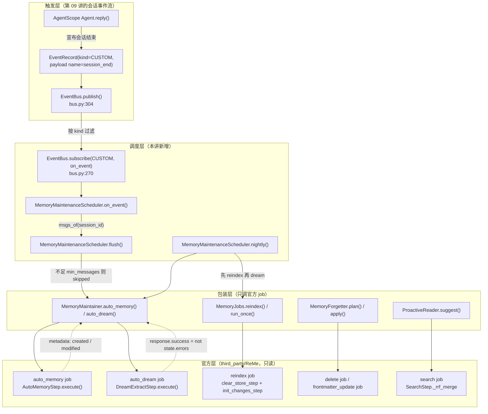

# 第 18 讲 《记忆自演化：auto_memory、auto_dream 与主动读取》

> **本讲目标**：把「记忆被写进去」变成「记忆会自己长大、会自己变干净」——
> 精读 ReMe 的 evolve 子系统（对话蒸馏、夜间整合、主动读取），
> 然后把四件原本"没人管"的事接起来：**谁在什么时候触发落记忆**
> （会话结束事件 → 调度器）、**例行维护按什么顺序跑**
> （reindex → dream）、**什么东西该被忘掉**（年龄 × 命中次数 × 保护标签）、
> **用户没问之前该准备什么**（主动读取 + 置信度门控）。
> **前置要求**：完成第 09、15、16、17 讲。
> `third_party/ReMe`（0.4.1.13）与 `third_party/agentscope`（2.0.8）已就位；
> 能跑 `PYTHONPATH=third_party/ReMe python`（**必须先于 site-packages 里的
> reme 0.3.1.10**，见第 15 讲）；仓库根 `.env` 里已配好
> `OPENAI_API_KEY` / `OPENAI_BASE_URL` / `LLM_MODEL`（本机实测 `deepseek-flash`）。
> **本讲交付物**（相对仓库根路径）：
> `tutorial_agsc_reme/reference/harness_kit/memory/maintenance.py`（改写：
> 新增 `MemoryMaintenanceScheduler` / `NightlyReport` / `SESSION_END_EVENT_NAME`）、
> `tutorial_agsc_reme/reference/harness_kit/memory/jobs.py`、
> `tutorial_agsc_reme/reference/harness_kit/memory/forget.py`、
> `tutorial_agsc_reme/reference/harness_kit/memory/proactive.py`、
> `tutorial_agsc_reme/reference/harness_kit/memory/__init__.py`（登记三个新名字）、
> `tutorial_agsc_reme/reference/scripts/18_evolve.py`、
> `tutorial_agsc_reme/reference/tests/test_lesson18_evolve.py`。
> **预计时长**：200 分钟（其中 §5 的运行验证约 30 分钟，含 2 次真实模型调用）。
>
> 本讲的完整可运行代码位于 `tutorial_agsc_reme/reference/harness_kit/memory/`，
> 你可以直接对照，也可以跟着正文一行一行写。

---

## 一、这一讲要解决的问题

第 16 讲把记忆写进了工作区，第 17 讲把它们检索了出来。
但截至上一讲结束，这套记忆库是**被动**的：只有人明确喊一声
`await distiller.distill(...)`，它才会记一件事。

真实的 Agent 不会这样工作。用户跟 Agent 聊了二十分钟，关掉窗口 ——
**没有任何一行代码会在这时候被调用**。第二天他回来问"昨天那个预算上限是多少"，
记忆库里空空如也。这一讲要补的就是这个空档，而且它不止一个空档：

- **触发空档**：没有"会话结束"这件事的概念。第 09 讲已经有了
  `EventBus` 与不可变事件流，但那条流只是**记录**发生过什么，
  没有任何订阅者会在 `session_end` 时去落记忆。
- **编排空档**：`auto_dream` 的正式入口是 `dream_cron`
  （`third_party/ReMe/reme/config/default.yaml:64` 的 `cron: "0 23 * * *"`），
  它是个**常驻 job**。嵌入式装配里你没法"等它到点"，而
  直接 `run_job("dream_cron")` 会**永久挂起**（第 15 讲实测）。
  `reindex` 与 `auto_dream` 谁先谁后、失败了要不要中断，也全得自己定。
- **遗忘空档**：记忆库只增不减。三个月的日记、几百张卡片，
  向量索引越来越慢，检索出来的东西越来越旧。ReMe 提供了
  `delete` / `frontmatter_update` 两个 job，**但它不知道"
  一个文件多久没被用过了"** —— 这个信号只有 harness 有（`MEMORY_HIT` 事件）。
- **准备空档**：`proactive_read`
  （`default.yaml:244`，`min_confidence` 默认 `0.4`）在默认配置里没有任何
  调用方；`proactive_refresh_cron`（`default.yaml:113`）同样是常驻 job。

一个具体的失败场景，本机实测过的：装配时白名单漏了一个 job，于是

```text
action                     = failed
path                       = None
耗时                         = 0.0s
detail                     = ReMe job 'auto_memory' failed: KeyError: "Job 'daily_write' not found in app_context.jobs"
```

耗时 0.0 秒是关键信息 —— 它说明**一次模型调用都没发生**。
`AutoMemoryStep` 的 create 分支把 `daily_write` 当工具挂给内部 Agent
（`third_party/ReMe/reme/steps/evolve/auto_memory.py:72`），
白名单没放它进来，job 在"准备工具"这一步就炸了。
这类错误不会在装配期报出来，只会在**第一个会话真正结束的那一刻**报出来 ——
也就是最不该出错的时刻。所以本讲的第一条纪律是：
**把"什么时候落记忆"从"某段业务代码里随手 await 一下"改成"订阅一个事件"**，
让这条链路有一个名字、有一个位置、有统计、有失败可见性。

---

## 二、源码侦察

本节的每一条都来自真实源码，格式为 `相对仓库根的路径:行号`。

### 2.1 job 的三种后端与"假成功"

```
third_party/ReMe/reme/components/job/base_job.py:36     class BaseJob(BaseComponent):
third_party/ReMe/reme/components/job/base_job.py:56         async def _start(self) -> None:
third_party/ReMe/reme/components/job/base_job.py:86         async def __call__(self, **kwargs) -> Response:
third_party/ReMe/reme/components/job/background_job.py:16  class BackgroundJob(BaseJob):
third_party/ReMe/reme/components/job/background_job.py:55      async def _start(self) -> None:
third_party/ReMe/reme/components/job/background_job.py:105     async def _run_with_supervisor(self) -> None:
third_party/ReMe/reme/components/job/cron_job.py:13        class CronJob(BackgroundJob):
third_party/ReMe/reme/components/job/cron_job.py:16            def __init__(self, cron: str, **kwargs):
third_party/ReMe/reme/components/job/cron_job.py:43            async def __call__(self, **kwargs) -> Response:
third_party/ReMe/reme/components/job/stream_job.py:10      class StreamJob(BaseJob):
```

`BaseJob._start`（`base_job.py:56`）在 app 启动时把每个 step 的类与构造参数
解析并缓存进 `self.step_specs`；而 `BaseJob.__call__`（`base_job.py:86`）
执行的是 `self._build_steps()`，遍历的正是 `step_specs`。
**这说明什么**：如果 job 没有 `_start()` 过，`step_specs` 是空列表，
循环体一次都不进，`Response.success` 保持默认的 `True`、
`answer` 是空串、`metadata` 是空字典 —— 调用方拿到一个**成功的空壳**。
这就是第 15 讲那条"跳过 `await app._start()` 会得到假成功"的源码依据，
也是 `MemoryClient.run_job` 在入口硬性检查 `started` 的原因
（`tutorial_agsc_reme/reference/harness_kit/memory/client.py:396`）。

`CronJob` 继承 `BackgroundJob`（`cron_job.py:13`），
所以它同样常驻；`BackgroundJob._run_with_supervisor`
（`background_job.py:105`）会在崩溃后按指数退避重启 ——
**这说明"常驻 job 的正确用法是单独一个进程跑它"**，
而不是嵌入式场景里前台 `run_job` 一下。

### 2.2 `dream_cron` / `proactive_refresh_cron` 是常驻 job

```
third_party/ReMe/reme/config/default.yaml:64      dream_cron:
third_party/ReMe/reme/config/default.yaml:83      proactive_refresh:
third_party/ReMe/reme/config/default.yaml:113     proactive_refresh_cron:
third_party/ReMe/reme/config/default.yaml:135     auto_dream:
third_party/ReMe/reme/config/default.yaml:167     auto_memory:
third_party/ReMe/reme/config/default.yaml:217     auto_resource:
third_party/ReMe/reme/config/default.yaml:244     proactive_read:
```

`auto_dream`（`:135`）的 `steps` 是
`dream_extract_step` → `dream_integrate_step` → `dream_finish_step` → `auto_tag_step`；
`dream_cron`（`:64`）是**同一个链条的定时版本**。
**这说明什么**：本讲要编排的"夜间整合"，在嵌入式场景里唯一可用的入口是
**前台 `auto_dream`**；`dream_cron` 只能被拒绝，并且要在报错里把替代品说出来。

### 2.3 `auto_memory`：create / update 两条路

```
third_party/ReMe/reme/steps/evolve/auto_memory.py:27    def _sanitize_msg_for_save(msg: Msg) -> Msg:
third_party/ReMe/reme/steps/evolve/auto_memory.py:67    class AutoMemoryStep(BaseStep):
third_party/ReMe/reme/steps/evolve/auto_memory.py:72        self.create_tools: list[str] = ["daily_write"]
third_party/ReMe/reme/steps/evolve/auto_memory.py:73        self.update_tools: list[str] = ["read", "edit", "frontmatter_update", "write"]
third_party/ReMe/reme/steps/evolve/auto_memory.py:332   async def execute(self):
third_party/ReMe/reme/steps/evolve/auto_memory.py:396       template_key = "user_message_create" if created else "user_message_update"
third_party/ReMe/reme/steps/evolve/auto_memory.py:415       if not created:
third_party/ReMe/reme/steps/evolve/auto_memory.py:416           reply_kwargs["injected_job_kwargs"] = {"_allowed_paths": [note_path]}
third_party/ReMe/reme/steps/evolve/auto_memory.py:420       job_tools=self.create_tools if created else self.update_tools,
third_party/ReMe/reme/steps/evolve/auto_memory.py:425       if created:
third_party/ReMe/reme/steps/evolve/auto_memory.yaml:1    system_prompt: |
third_party/ReMe/reme/steps/evolve/auto_memory.yaml:48   user_message_create: |
third_party/ReMe/reme/steps/evolve/auto_memory.yaml:121  user_message_update: |
```

`auto_memory.py:420` 那一行是整条链路的分水岭：**同一个 job，两条路**。
create 分支只挂 `["daily_write"]` 一个工具，update 分支挂
`["read", "edit", "frontmatter_update", "write"]` 四个；
两份提示词也完全不同（`auto_memory.yaml:48` 的 `user_message_create`
要求"判断值不值得记"，`:121` 的 `user_message_update` 要求"读出已有内容再最小化修改"）。
**这说明什么**：`daily_write` / `read` / `edit` / `write` / `frontmatter_update`
**五个 job 都必须在装配白名单里**，否则第一条内存笔记要么建不出来、
要么第二次更新时炸掉 —— 而这两件事都发生在运行时。

`auto_memory.py:415-416` 是另一个必须知道的细节：
**更新分支会注入 `_allowed_paths = [note_path]`，把请求级的白名单顶掉**。
所以 harness 侧的 `allowed_paths` 约束**不可能靠传参实现**，
只能在响应回来后做**事后校验**（见 §四 的 `MemoryMaintainer._enforce_allowed`）。

`_sanitize_msg_for_save`（`auto_memory.py:27`）会丢弃两类块：
`tool_result` 与 `source.type == "base64"` 的 `data` 块。
**这说明什么**：**不要指望工具输出能被写进记忆**。
需要落记忆的内容必须出现在 user / assistant 的**文本块**里 ——
`tool_result` 里常常装着被召回的 memory / search / read 输出，
留着它们会让"检索到的事实"在下一轮被当成"用户说过的上下文"。

### 2.4 `auto_dream`：三步骤与一个真实的脆弱点

```
third_party/ReMe/reme/steps/evolve/dream/extract.py:28      class DreamExtractStep(BaseStep):
third_party/ReMe/reme/steps/evolve/dream/extract.py:111         state.failed_paths = list(changed)
third_party/ReMe/reme/steps/evolve/dream/extract.py:141         if attempt == 0:
third_party/ReMe/reme/steps/evolve/dream/integrate.py:55    class DreamIntegrateStep(BaseStep):
third_party/ReMe/reme/steps/evolve/dream/finish.py:12       class DreamFinishStep(BaseStep):
third_party/ReMe/reme/steps/evolve/dream/finish.py:51           self.context.response.success = not state.errors
third_party/ReMe/reme/steps/evolve/dream/finish.py:103      if state.failed_paths:
third_party/ReMe/reme/steps/evolve/dream/utils.py:137       def parse_structured_reply(text: str) -> dict:
third_party/ReMe/reme/steps/evolve/dream/utils.py:153       def _parse_scalar_mapping(raw: str) -> dict:
third_party/ReMe/reme/schema/dream.py:13                    class DreamUnit(BaseModel):
third_party/ReMe/reme/schema/dream.py:36                    class DreamState(BaseModel):
```

`finish.py:51` 是**唯一**把 dream 的结局翻成 `success` 的地方：
`success = not state.errors`。
`DreamExtractStep` 在"一次重试后仍拿不到 `units` 列表"时
（`extract.py:141` 进第二次循环，`extract.py:153` 附近记 warning 后继续）
**不会**往 `state.errors` 里写东西，只写 `state.warnings` ——
于是 `success=True`，`auto_dream` 拿到的是一个 `skipped`。
**这说明什么**：`auto_dream` 的"成功"必须看 `metadata` 与 `answer` 里的
`Extracted: N unit(s)` 与 `Warnings:` 两行，**不能只看 `success`**。

`parse_structured_reply`（`dream/utils.py:137`）先把**整段回复**当 YAML 解析；
标量值里只要有一个**未加引号的** `": "`，`yaml.safe_load` 就抛
`mapping values are not allowed here`，异常分支调的是
`_parse_scalar_mapping`（`dream/utils.py:153`）——
它只用正则抓 `action|target_path|note` 三个键，**对需要 `units` 列表的提取完全无用**。
**这说明什么**：加代码围栏这条常规防御在这里也无效（围栏里还是同样的坏 YAML）。
本机实测（`scripts/18_evolve.py` 的 F0 段，0 次模型调用即可复现）：

```text
  [PASS] 裸 YAML 的提取结果被静默吞成空 dict  —— parse_structured_reply -> {}
  [PASS] 加代码围栏也救不回来  —— 围栏版本 -> {}
```

而真实整链跑出来的后果是"材料被静默 checkpoint 掉"：

```text
- Extracted: 0 unit(s)
- Catalog: checkpointed 2 changed path(s)
- Warnings: dream extract skipped unusable agent receipt after retry; expected a units list
```

**下一夜再跑，`extract.py` 会报"没有变更的输入"，这批材料永远不会再被抽一次。**
本讲**不假装能修它**（`third_party/` 只读），但必须让它在 harness 层
**可见**（`NightlyReport` 把 `answer` 原样留下来）而不是被吞成成功。

### 2.5 `proactive`：主动读取与 `min_confidence`

```
third_party/ReMe/reme/steps/evolve/proactive/proactive.py:31   class ProactiveStep(BaseStep):
third_party/ReMe/reme/steps/evolve/proactive/proactive.py:40       def __init__(self, include_content: bool = True, horizon_days: int = 1, min_confidence: float = 0.4, **kwargs)
third_party/ReMe/reme/steps/evolve/proactive/proactive.py:46       async def execute(self):
third_party/ReMe/reme/steps/evolve/proactive/proactive.py:77       def _read_single(self, ws, daily, day, include_content, min_confidence, result: ProactiveResult):
third_party/ReMe/reme/steps/evolve/proactive/proactive.py:145      def _read_horizon(self, ws, daily, day, horizon, include_content, min_confidence, result: ProactiveResult):
third_party/ReMe/reme/schema/proactive.py:14                   def clamp_confidence(value) -> float:
third_party/ReMe/reme/schema/proactive.py:22                   class ProactiveTopic(BaseModel):
third_party/ReMe/reme/schema/proactive.py:60                   class ProactiveState(BaseModel):
third_party/ReMe/reme/schema/proactive.py:122                  class ProactiveResult(BaseModel):
third_party/ReMe/reme/config/default.yaml:244                  proactive_read:
```

`ProactiveStep` 的 `min_confidence` 默认 **0.4**（`proactive.py:40`，
`default.yaml:244` 也是 0.4），而 harness 契约 §3.18 定的是 **0.35**。
**这说明什么**：两个默认值不同不是错，但必须知道"0.4 是 ReMe 的默认、
0.35 是 harness 的默认"，不要在两边来回猜。
`clamp_confidence`（`schema/proactive.py:14`）说明 ReMe 那边的置信度是
`[0,1]` 的**归一化**量 —— 这与 harness 的 `MemoryGate.normalize_scores`
是同一个约定（第 17 讲）。

### 2.6 agent_wrapper：把 job 当工具交给 Agent

```
third_party/ReMe/reme/components/agent_wrapper/base_agent_wrapper.py:21    class BaseAgentWrapper(BaseComponent):
third_party/ReMe/reme/components/agent_wrapper/base_agent_wrapper.py:66        def add_job_tools(self, job_tools: list[str]) -> "BaseAgentWrapper":
third_party/ReMe/reme/components/agent_wrapper/base_agent_wrapper.py:161       def _resolve_injected_job_kwargs(kwargs: dict[str, Any]) -> dict[str, Any]:
third_party/ReMe/reme/components/agent_wrapper/base_agent_wrapper.py:187       def _strip_injected_parameters(parameters: dict | None, injected: dict[str, Any]) -> dict | None:
```

`add_job_tools`（`base_agent_wrapper.py:66`）把 ReMe 的 job 包装成工具塞给内部 Agent ——
这就是 `AutoMemoryStep` 的 `create_tools` / `update_tools` 能生效的机制。
`_resolve_injected_job_kwargs` 与 `_strip_injected_parameters`
（`:161` / `:187`）保证**以 `_` 开头的参数由宿主注入、模型无法覆写**。
**这说明什么**：`auto_memory` 的"agent 自己决定写哪个文件"是**设计如此**，
harness 想收紧只能事后校验（见 2.3 的结论）。

### 2.7 资源吸收与每日笔记

```
third_party/ReMe/reme/steps/evolve/auto_resource.py:17          class AutoResourceStep(BaseStep):
third_party/ReMe/reme/steps/evolve/auto_resource.py:35              def _processor_routes(self) -> list[_ProcessorRoute]:
third_party/ReMe/reme/steps/evolve/auto_resource.py:74              async def _dispatch_processor(
third_party/ReMe/reme/steps/evolve/auto_resource.py:140         async def execute(self):
third_party/ReMe/reme/steps/evolve/base_auto_resource.py:137    class BaseAutoResourceStep(BaseStep):
third_party/ReMe/reme/steps/evolve/base_auto_resource.py:419        async def _rename_from_frontmatter_name(
third_party/ReMe/reme/steps/file_io/daily_write.py:14           class DailyWriteStep(BaseStep):
third_party/ReMe/reme/steps/file_io/daily_write.py:68           async def execute(self):
```

`_processor_routes`（`auto_resource.py:35`）按**后缀**分流：
文本走文本处理器、图片走图片处理器，认不出来的走 fallback。
`DailyWriteStep`（`daily_write.py:14`）是 `auto_memory` 的 create 分支真正动的那个 step。
**这说明什么**：资源吸收（`auto_resource`）与对话蒸馏（`auto_memory`）
是**两条独立的入口**，本讲的调度器只负责前者之后的索引维护，
不把两者混在一个触发点里 —— 它们的节奏完全不同（资源是"文件出现"，
对话是"会话结束"）。

### 2.8 harness 侧的相邻事实（本讲要接上的那一根线）

```
tutorial_agsc_reme/reference/harness_kit/events/types.py:32     class EventKind(StrEnum):
tutorial_agsc_reme/reference/harness_kit/events/types.py:43         CUSTOM = "custom"
tutorial_agsc_reme/reference/harness_kit/events/types.py:46     PAYLOAD_FIELDS: dict[EventKind, tuple[str, ...]] = {
tutorial_agsc_reme/reference/harness_kit/events/types.py:61         EventKind.CUSTOM: ("name", "data"),
tutorial_agsc_reme/reference/harness_kit/events/types.py:106    class EventRecord(BaseModel):
tutorial_agsc_reme/reference/harness_kit/events/bus.py:77       class Subscription:
tutorial_agsc_reme/reference/harness_kit/events/bus.py:219      class EventBus:
tutorial_agsc_reme/reference/harness_kit/events/bus.py:270          def subscribe(self, topic: str | EventKind, handler: Handler) -> Subscription:
tutorial_agsc_reme/reference/harness_kit/events/bus.py:304          async def publish(self, topic: str | EventKind, record: EventRecord) -> int:
tutorial_agsc_reme/reference/harness_kit/events/bus.py:355          async def drain(self) -> None:
tutorial_agsc_reme/reference/harness_kit/events/bus.py:367          async def start(self) -> None:
```

`EventKind`（`events/types.py:32`）是**封闭枚举**，九个成员里
**没有** `SESSION_END`；`PAYLOAD_FIELDS[EventKind.CUSTOM]`（`:61`）约定的是
`("name", "data")`。**这说明什么**：会话结束只能走
`CUSTOM` + `payload["name"]`，**不新增枚举值** ——
新增会让所有按 `EventKind` 穷举的消费者在升级时静默漏掉它。
`EventBus.subscribe`（`bus.py:270`）与 `publish`（`bus.py:304`）
就是本讲要挂上去的那两个扩展点；`drain`（`:355`）是脚本与测试里
"等已投出的事件处理完"的那一步。

---

## 三、扩展点定位与设计

### 3.1 官方已经给了什么

| 官方已有的东西 | 位置 | 它解决到什么程度 |
| --- | --- | --- |
| 对话蒸馏 job | `third_party/ReMe/reme/steps/evolve/auto_memory.py:332` | create / update 双分支、re-query 自检、写回 front matter，**完整** |
| 夜间整合 job | `third_party/ReMe/reme/steps/evolve/dream/{extract,integrate,finish}.py` | 抽取 → 整合 → checkpoint 三步，**完整** |
| 资源吸收 job | `third_party/ReMe/reme/steps/evolve/auto_resource.py:140` | 按后缀分流到文本 / 图片处理器，**完整** |
| 主动读取 job | `third_party/ReMe/reme/steps/evolve/proactive/proactive.py:46` | 按天读取主题、阈值 0.4，**完整** |
| 定时触发器 | `third_party/ReMe/reme/components/job/cron_job.py:13` | `CronJob` 常驻循环，**但只在 `enable_serve` 的常驻进程里可用** |
| 事件总线 | `tutorial_agsc_reme/reference/harness_kit/events/bus.py:219` | 订阅 / 发布 / 排空，**完整**（第 09 讲交付） |
| job 前台调用 | `tutorial_agsc_reme/reference/harness_kit/memory/client.py:396` | `run_job` 带 `started` 检查与超时，**完整**（第 15 讲交付） |

### 3.2 还缺什么

按契约 §1.3 的缺口编号：

- **缺口 1（无不可变事件日志）** —— 第 09 讲已补；本讲**消费**它。
- **缺口 2（无发布订阅总线）** —— 第 09 讲已补；本讲**挂上去**。
- **缺口 4（官方中间件无 token 预算）** —— 第 17 讲已补；
  本讲在主动读取那条路上复用它的归一化门控约定。
- **缺口 6（无 Docker 沙箱配额）** —— 与本讲无关。
- **本讲新增的两个缺口**（不是契约 1.3 里那六个，而是本讲动手要补的）：
  - **缺口 M（维护没有调度者）**：`auto_memory` / `auto_dream` / `reindex`
    三个 job 都齐全，但**没有任何一方知道"该在什么时候调它们"**。
    缺的是**触发时机 + 顺序 + 统计**，不是能力。
  - **缺口 N（遗忘没有判据）**：`delete` / `frontmatter_update` 两个 job
    齐全，但"这个文件还有没有人用"这个数据**只存在于
    `MEMORY_HIT` 事件与检索结果里**，ReMe 看不到。

### 3.3 我们准备在哪个扩展点上做

**四件事，全部只调官方 job / 官方事件总线，不重写任何 step、不碰 `third_party/`。**

1. **继承/实现**：`MemoryMaintenanceScheduler` **不继承**任何基类 ——
   它是一个普通类，靠**鸭子调用** `MemoryMaintainer.auto_memory` /
   `auto_dream` / `.client`。这样做的直接回报是 §五 的 A 段可以在
   **不启动 ReMe、不花一次模型调用**的情况下把事件语义全部钉死。
2. **实现 hook**：`EventBus` 的 `Handler`
   （`tutorial_agsc_reme/reference/harness_kit/events/bus.py` 里的
   `Callable[[EventRecord], Awaitable[None]]`）——
   我们的 `on_event` 就是它。**签名必须完全一致**，因为
   `Subscription._ensure_worker` 直接把它塞进队列消费循环。
3. **实现 Protocol**：`msgs_of: Callable[[str], Awaitable[list[Any]]]` ——
   不绑定任何具体会话存储。真实项目里传
   `SessionDistiller.messages_from_agent(agent)`（第 16 讲），
   测试里传一个返回固定列表的 lambda。
4. **包装官方入口**：`MemoryJobs` / `MemoryForgetter` / `ProactiveReader`
   全都只调 `MemoryClient.run_job` 与官方组件
   （`tag_index.tags_for_path`），一行 ReMe 内部实现都不复刻。

### 3.4 扩展点清单（本讲用到的）

| 扩展点 | 基类名 / 类型 | 方法签名 | 所在文件 |
| --- | --- | --- | --- |
| 事件订阅 | `EventBus` | `subscribe(topic: str \| EventKind, handler: Handler) -> Subscription` | `tutorial_agsc_reme/reference/harness_kit/events/bus.py:270` |
| 事件投递 | `EventBus` | `async publish(topic: str \| EventKind, record: EventRecord) -> int` | `tutorial_agsc_reme/reference/harness_kit/events/bus.py:304` |
| 排空 | `EventBus` | `async drain() -> None` | `tutorial_agsc_reme/reference/harness_kit/events/bus.py:355` |
| 订阅句柄 | `Subscription` | `unsubscribe() -> None` / `.topic` / `.delivered` | `tutorial_agsc_reme/reference/harness_kit/events/bus.py:77` |
| 事件记录 | `EventRecord` | `missing_payload_fields() -> list[str]` | `tutorial_agsc_reme/reference/harness_kit/events/types.py:106` |
| job 调用原语 | `MemoryClient` | `async run_job(job: str, /, *, timeout_s: float \| None = None, **kwargs) -> Response` | `tutorial_agsc_reme/reference/harness_kit/memory/client.py:396` |
| job 门面 | `MemoryJobs` | `async run_once(job, *, timeout_s=60.0, **kwargs)` | `tutorial_agsc_reme/reference/harness_kit/memory/jobs.py` |
| 官方 job（被调） | — | `auto_memory` / `auto_dream` / `auto_resource` / `reindex` / `daily_list` / `delete` / `frontmatter_update` | `third_party/ReMe/reme/config/default.yaml:135,167,217` |
| 官方组件（被读） | `tag_index` | `async tags_for_path(path: str) -> list[str]` | `third_party/ReMe/reme/components/tag_index/local_tag_index.py:143` |

### 3.5 数据流（真实函数名）



**为什么先 `reindex` 再 `auto_dream`**：`DreamExtractStep` 按 `file_catalog`
的增量判断"哪些文件变了"（`dream/extract.py:83-111`），
而 `file_catalog` 是 `reindex` 装出来的。顺序一反，
dream 读到的是一份还没更新的目录清单，结果是"今天没有新材料" ——
一个不报错的空转。

---

## 四、harness_kit 实现

四个文件，逐个给完整代码；外加 `__init__.py` 的登记。
**模块之间的分工是刻意的**：

- `maintenance.py` —— "什么时候调"（触发 + 顺序 + 统计）；
- `jobs.py` —— "调用安不安全"（超时 + 常驻拒绝 + 成批）；
- `forget.py` —— "什么该被忘"（判据 + dry-run + 执行）；
- `proactive.py` —— "用户没问之前准备什么"（查询串推导 + 门控 + 指标）。

### 4.1 `harness_kit/memory/maintenance.py`

这是本讲**改写**的文件：原有部分（`MaintenanceResult` / `MemoryMaintainer`）
是第 16 讲的成果，本讲在文件尾部追加了
`SESSION_END_EVENT_NAME` / `NightlyReport` / `MemoryMaintenanceScheduler`，
并在文件头的 `__all__` 里登记它们。

```python
# -*- coding: utf-8 -*-
"""自演化入口：``auto_memory`` / ``auto_dream`` / ``auto_resource``（契约 §3.18）。

**为什么需要一层，而不是直接 ``run_job("auto_memory", ...)``**

``AutoMemoryStep.execute``（``third_party/ReMe/reme/steps/evolve/auto_memory.py:332-486``）
在**不同分支**里往 ``metadata`` 里放的东西**不一样**：

=================================== ==========================================
分支产生的 ``metadata`` 键
=================================== ==========================================
正常完成（新建或更新）              ``date`` / ``path`` / ``created`` /
                                    ``modified`` / ``n_messages`` /
                                    ``source_conversation`` / ``index``
没有任何消息                        ``date`` / ``modified`` / ``n_messages``
                                    —— **没有 ``path``**
创建后 re-query 没找到笔记          ``date`` / ``path=None`` / ``created=False``
                                    / ``modified`` / ``n_messages``
re-query 或改名抛异常               ``success=False`` + 部分键
=================================== ==========================================

于是"调用方想问的那个问题"（**这一轮记忆到底变了吗？**）在 ``Response`` 上
没有任何一个字段能直接回答：``success=True`` 可能是"更新了"、也可能是
"模型觉得不值得记"。:class:`MaintenanceResult` 就是那个缺失的枚举，
:class:`MemoryMaintainer` 是"从 metadata 的三四种形状里把它读出来"的那段逻辑。

**update 分支的 ``_allowed_paths``：一条被覆盖的约束**

``AutoMemoryStep`` 在 update 分支里会**自己**设一条请求级约束
（``auto_memory.py:414-416``）：

.. code-block:: python

    if not created:
        reply_kwargs["injected_job_kwargs"] = {"_allowed_paths": [note_path]}

而 create 分支**不设**。这意味着：

- update 分支：模型只能改那一条已有笔记，改不动别的文件（ReMe 自己的保护）；
- create 分支：模型用 ``daily_write`` 自己选路径落笔，**没有**约束。

契约的 ``allowed_paths`` 参数因此有两种合理语义，harness 选的是**调用方约束**
那一侧，并且用**事后校验**落地它（见 :meth:`MemoryMaintainer._enforce_allowed`）：
job 跑完之后检查产物路径是否落在 ``allowed_paths`` 里，不在就报 ``failed``。
之所以不做"事前注入"：``_allowed_paths`` 是**请求级**的运行时键，
``BaseJob.__call__``（``base_job.py:86-88``）每次都用 ``RuntimeContext(**merged)``
造一个**新的** context，所以塞进 ``auto_memory`` 这个 job 的 kwargs 里
**不会**流到它内部工具调用（``daily_write`` / ``edit``）的 job 上去；
真正能传过去的只有 ``injected_job_kwargs``，而那是 step 内部构造的。
事后校验至少给出一个**确定的**结论：路径不合约 → ``failed``，调用方必须处理。
"""

from __future__ import annotations

from typing import Any, Awaitable, Callable, Literal, Sequence

from loguru import logger
from pydantic import BaseModel, ConfigDict, Field

from .client import MemoryClient, MemoryJobError

__all__ = [
    "AUTO_DREAM_JOB",
    "AUTO_MEMORY_JOB",
    "AUTO_RESOURCE_JOB",
    "FRONTMATTER_UPDATE_JOB",
    "MaintenanceResult",
    "MemoryMaintainer",
    "MemoryMaintenanceScheduler",
    "NightlyReport",
    "SESSION_END_EVENT_NAME",
]

#: 会话蒸馏 job（``config/default.yaml`` 的 ``jobs.auto_memory``）。
AUTO_MEMORY_JOB: str = "auto_memory"

#: 夜间整合 job（``jobs.auto_dream``，前台版本；``dream_cron`` 是它的常驻版本）。
AUTO_DREAM_JOB: str = "auto_dream"

#: 资源加工 job（``jobs.auto_resource``），``resource_watch_loop`` 的前台等价物。
AUTO_RESOURCE_JOB: str = "auto_resource"

#: front matter 更新 job（``jobs.frontmatter_update``）。
FRONTMATTER_UPDATE_JOB: str = "frontmatter_update"

#: ``auto_memory`` 的 ``metadata`` 里代表"这一轮有没有落盘"的关键键。
_ACTION_CREATED = "created"
_ACTION_UPDATED = "updated"
_ACTION_SKIPPED = "skipped"
_ACTION_FAILED = "failed"


class MaintenanceResult(BaseModel):
    """一次自演化动作的结果（契约 §3.18）。

    Attributes:
        action (`Literal["created","updated","skipped","failed"]`):
            ``"created"`` 新建了记忆文件；
            ``"updated"`` 改动了已有记忆文件；
            ``"skipped"`` **跑完了但什么都没变**（模型判断不值得记、
            或者更新后内容与原来一致）；
            ``"failed"`` 失败（job 报错，或产物路径违反了 ``allowed_paths``）。
        path (`str | None`): 受影响的文件（工作区相对路径）。
            ``"skipped"`` 时**可能是** ``None``（ReMe 在"没有消息"分支里根本不写
            ``path``），也可能是具体路径（更新了但没有实质变化）。
        detail (`str`): 人读的说明。失败时是错误原文；
            成功时是 ReMe 的 ``answer``（内部 agent 的回复文本）；
            ``auto_dream`` 时是整段摘要。
    """

    model_config = ConfigDict(extra="forbid")

    action: Literal["created", "updated", "skipped", "failed"]
    path: str | None = None
    detail: str = ""

    @property
    def changed(self) -> bool:
        """这次动作是否真的改动了磁盘。

        Returns:
            `bool`: ``action`` 是 ``"created"`` 或 ``"updated"``。
        """
        return self.action in (_ACTION_CREATED, _ACTION_UPDATED)


class MemoryMaintainer:
    """自演化入口（契约 §3.18）。

    Example::

        maintainer = MemoryMaintainer(client)
        result = await maintainer.auto_memory(
            session_id="s-1", msgs=agent.state.context,
        )
        print(result.action, result.path)

        await maintainer.update_frontmatter(
            path=result.path, name="token-rotation", description="令牌轮换流程",
        )
    """

    def __init__(self, client: MemoryClient) -> None:
        """绑定客户端。

        Args:
            client (`MemoryClient`): 已 start 的客户端。
        """
        self.client = client

    # ------------------------------------------------------------------
    # 会话蒸馏
    # ------------------------------------------------------------------
    async def auto_memory(
        self,
        *,
        session_id: str,
        msgs: list[Any],
        allowed_paths: list[str] | None = None,
        memory_hint: str | None = None,
        date: str | None = None,
    ) -> MaintenanceResult:
        """跑一轮会话蒸馏，并把结果翻译成 :class:`MaintenanceResult`（契约 §3.18）。

        Args:
            session_id (`str`): 会话 id；空值直接返回 ``failed``
                （不抛异常 —— 契约的方法签名把失败也建模成结果枚举，
                所以这里把"参数错"和"job 报错"统一成 ``failed``，
                错误原文进 ``detail``）。
            msgs (`list[Any]`): 会话消息（``Msg`` 或 dict）。
            allowed_paths (`list[str] | None`): 只允许产物落在这些工作区相对路径里。
                ``None`` = 不限制。语义与实现方式见模块 docstring。
            memory_hint (`str | None`): 透传给 ReMe 的额外提示。
            date (`str | None`): ``YYYY-MM-DD``。

        Returns:
            `MaintenanceResult`: 结果枚举 + 路径 + 说明。
        """
        from .distill import SessionDistiller

        caller = str(session_id or "").strip()
        if not caller:
            return MaintenanceResult(
                action=_ACTION_FAILED,
                path=None,
                detail="session_id 不能为空（AutoMemoryStep 直接判失败，auto_memory.py:367-370）",
            )

        payload: dict[str, Any] = {}
        if memory_hint:
            payload["memory_hint"] = str(memory_hint)
        if date:
            payload["date"] = str(date)

        try:
            shaped = SessionDistiller.shape_messages(msgs)
            response = await self.client.run_job(
                AUTO_MEMORY_JOB,
                messages=shaped,
                session_id=caller,
                **payload,
            )
        except ValueError as exc:  # 整形失败
            return MaintenanceResult(action=_ACTION_FAILED, path=None, detail=str(exc))
        except MemoryJobError as exc:
            return MaintenanceResult(action=_ACTION_FAILED, path=None, detail=str(exc))

        metadata = dict(getattr(response, "metadata", None) or {})
        answer = str(getattr(response, "answer", "") or "")
        path = metadata.get("path")
        relative = str(path) if path else None
        created = bool(metadata.get("created", False))
        modified = bool(metadata.get("modified", False))

        if created:
            action = _ACTION_CREATED
        elif modified:
            action = _ACTION_UPDATED
        else:
            action = _ACTION_SKIPPED

        if allowed_paths is not None:
            violation = self._enforce_allowed(relative, allowed_paths)
            if violation:
                logger.warning("auto_memory: {}", violation)
                return MaintenanceResult(action=_ACTION_FAILED, path=relative, detail=violation)

        if action == _ACTION_SKIPPED and relative is None:
            # 这一支最常见的原因是"模型判断这轮不值得记"。把它说清楚，
            # 否则调用方会把 skipped 误当成"job 没跑"。
            detail = answer or "没有产生记忆变更（模型判断本轮无需落盘，或输入为空）"
        else:
            detail = answer
        logger.info("auto_memory: session={!r} action={} path={}", caller, action, relative)
        return MaintenanceResult(action=action, path=relative, detail=detail)

    # ------------------------------------------------------------------
    # front matter
    # ------------------------------------------------------------------
    async def update_frontmatter(
        self,
        *,
        path: str,
        name: str | None = None,
        description: str | None = None,
    ) -> None:
        """更新一条记忆的 front matter（契约 §3.18）。

        对应 ``frontmatter_update_step``（``third_party/ReMe/reme/steps/file_io/frontmatter_update.py``）：
        它读运行时的 ``path`` 与 ``metadata`` 两个键，把 ``metadata`` 里的键
        合并进文件的 YAML front matter。失败时它设 ``success=False``，
        于是 ``client.run_job`` 抛 :class:`~harness_kit.memory.client.MemoryJobError`
        并带上 ``metadata["error"]`` 里的原因（路径越界 / 文件不是 markdown /
        文件不存在 / 没有要更新的字段）。

        ``name`` 与 ``description`` 是 ``frontmatter.py:83`` 定义的
        **一等键**（``_FIRST_CLASS = ("name", "description")``）——
        它们决定笔记在索引与后续 rename 里的显示名，所以 harness 把这两个
        单独提成参数，而不是让调用方自己拼 ``metadata`` 字典。

        Args:
            path (`str`): 工作区相对路径。
            name (`str | None`): 设置 ``name`` 键。
            description (`str | None`): 设置 ``description`` 键。

        Raises:
            `ValueError`: ``path`` 为空，或两个字段都没给。
            `MemoryJobError`: ReMe 侧更新失败（原因在 ``metadata["error"]``）。
            `MemoryUnavailableError`: app 未启动或没有该 job。
        """
        target = str(path or "").strip()
        if not target:
            raise ValueError("update_frontmatter 需要非空 path")
        metadata: dict[str, str] = {}
        if name is not None:
            metadata["name"] = str(name)
        if description is not None:
            metadata["description"] = str(description)
        if not metadata:
            raise ValueError("update_frontmatter 至少要给 name 或 description 之一")

        await self.client.run_job(
            FRONTMATTER_UPDATE_JOB,
            path=target,
            metadata=metadata,
        )
        logger.info("update_frontmatter: {} ← {}", target, sorted(metadata))

    # ------------------------------------------------------------------
    # 其它自演化 job
    # ------------------------------------------------------------------
    async def auto_dream(
        self,
        *,
        date: str | None = None,
        hint: str | None = None,
        scan_days: int | None = None,
        max_units: int | None = None,
    ) -> MaintenanceResult:
        """跑一轮夜间整合（``auto_dream`` job，``dream_cron`` 的前台等价物）。

        **与 :meth:`auto_memory` 的差别**：dream 的产物是 ``digest/`` 下的
        摘要节点，ReMe 只在 ``metadata["modified"]`` 里给一个布尔，
        **不**给具体路径。所以本方法返回的 ``path`` 恒为 ``None``，
        整段摘要进 ``detail``（``DreamFinishStep`` 把摘要写进 ``answer``，
        ``third_party/ReMe/reme/steps/evolve/dream/finish.py:56``）。
        假装能给路径是错的；要逐文件核对请读 ``digest/`` 目录或 catalog。

        Args:
            date (`str | None`): ``YYYY-MM-DD`` 扫描终点；``None`` = 今天。
            hint (`str | None`): 透传给 dream 的引导语。
            scan_days (`int | None`): 往前扫几天，默认 2。
            max_units (`int | None`): 最多抽几条记忆单元，默认 5。

        Returns:
            `MaintenanceResult`: ``action`` 为 ``updated`` / ``skipped`` / ``failed``。
        """
        payload: dict[str, Any] = {}
        if date:
            payload["date"] = str(date)
        if hint:
            payload["hint"] = str(hint)
        if scan_days is not None:
            payload["scan_days"] = int(scan_days)
        if max_units is not None:
            payload["max_units"] = int(max_units)

        try:
            response = await self.client.run_job(AUTO_DREAM_JOB, **payload)
        except MemoryJobError as exc:
            return MaintenanceResult(action=_ACTION_FAILED, path=None, detail=str(exc))

        metadata = dict(getattr(response, "metadata", None) or {})
        answer = str(getattr(response, "answer", "") or "")
        modified = bool(metadata.get("modified", False))
        action = _ACTION_UPDATED if modified else _ACTION_SKIPPED
        logger.info("auto_dream: date={!r} action={}", date, action)
        return MaintenanceResult(action=action, path=None, detail=answer)

    async def auto_resource(self, changes: Sequence[dict[str, Any]]) -> MaintenanceResult:
        """把一批资源变更交给 ``auto_resource`` job 处理。

        这是 ``resource_watch_loop``（常驻）的**前台等价物**：
        ``config/default.yaml`` 里那个 background job 做的是
        "监视目录 → 把变更批次交给 ``auto_resource_step``"，
        而嵌入式场景下"监视"由调用方做（比如 ingest 之后调一次本方法）。

        Args:
            changes (`Sequence[dict[str, Any]]`): 变更批次，每项形如
                ``{"path": "resource/a.md", "change": "added"}``；
                ``change`` 取 ``added`` / ``modified`` / ``deleted``。

        Returns:
            `MaintenanceResult`: ``action`` 为 ``updated`` / ``skipped`` / ``failed``。
        """
        batch = [dict(item) for item in (changes or ())]
        if not batch:
            return MaintenanceResult(action=_ACTION_SKIPPED, path=None, detail="空变更批次，未调用 job")
        try:
            response = await self.client.run_job(AUTO_RESOURCE_JOB, changes=batch)
        except MemoryJobError as exc:
            return MaintenanceResult(action=_ACTION_FAILED, path=None, detail=str(exc))
        metadata = dict(getattr(response, "metadata", None) or {})
        answer = str(getattr(response, "answer", "") or "")
        modified = bool(metadata.get("modified", False))
        action = _ACTION_UPDATED if modified else _ACTION_SKIPPED
        logger.info("auto_resource: {} 项变更 → {}", len(batch), action)
        return MaintenanceResult(action=action, path=None, detail=answer)

    # ------------------------------------------------------------------
    # 内部
    # ------------------------------------------------------------------
    @staticmethod
    def _enforce_allowed(relative: str | None, allowed_paths: Sequence[str]) -> str | None:
        """事后校验产物路径是否在允许清单内。

        比较用**字符串规范化**（去空白、反斜杠转正斜杠、去掉 ``./`` 前缀），
        不做文件系统解析：产物路径本来就是工作区相对路径，而
        ``Path.resolve()`` 会把"还不存在的文件"也解出结果，
        从而掩盖"路径写错了"这种错误。

        Args:
            relative (`str | None`): 产物路径（``None`` 表示没有产物）。
            allowed_paths (`Sequence[str]`): 允许的路径清单。

        Returns:
            `str | None`: 违约说明；合规时返回 ``None``。
        """
        if relative is None:
            # 没有产物 = 没有越界。是否需要"必须产出"是调用方的策略，
            # 不是 allowed_paths 这个约束能表达的。
            return None
        allowed = {_normalize_path(item) for item in (allowed_paths or ())}
        if not allowed:
            return f"allowed_paths 为空，但 job 产出了 {relative!r}"
        if _normalize_path(relative) not in allowed:
            return (
                f"产物路径 {relative!r} 不在 allowed_paths {sorted(allowed)} 内。"
                "注意 auto_memory 的 update 分支会用 ReMe 自己算出的 note_path 覆盖"
                "请求级 _allowed_paths（auto_memory.py:414-416），"
                "所以越界既可能来自模型选错了路径，也可能来自 ReMe 的改名逻辑。"
            )
        return None


def _normalize_path(value: Any) -> str:
    """把路径规范成可比较的字符串。

    Args:
        value (`Any`): 路径。

    Returns:
        `str`: 规范化的相对路径字符串。
    """
    text = str(value or "").strip().replace("\\", "/")
    while text.startswith("./"):
        text = text[2:]
    return text


#: 触发「会话结束」落记忆的事件名。
#:
#: harness_kit 用 ``EventKind.CUSTOM`` 承载它
#: （``harness_kit/events/types.py`` 的 ``CUSTOM`` 分支约定 ``payload`` 里有
#: ``name`` 与 ``data`` 两个键），**不新造一个 EventKind**：契约 §5.2 的
#: ``EventKind`` 是封闭枚举，多一个值会让所有按枚举穷举的消费者失效。
SESSION_END_EVENT_NAME: str = "session_end"


class NightlyReport(BaseModel):
    """一夜的例行维护结果（本讲新增，契约外）。

    Attributes:
        date (`str | None`): 本次维护覆盖的日期（``YYYY-MM-DD``）；``None`` = 由 ReMe 取今天。
        reindex_ok (`bool`): ``reindex`` job 是否成功返回（失败不中断，见
            :meth:`MemoryMaintenanceScheduler.nightly`）。
        reindex_counts (`dict[str, int]`): ``reindex`` 的
            ``metadata["counts"]``（``added`` / ``modified`` / ``deleted``）。
            **必须看这三个数**：``success=True`` 且三者全 0，在"索引被清空后再也没装回来"
            这个真实事故里就是这么表现的（见 ``HarnessMemoryConfig`` 的
            ``RESCAN_REINDEX_JOB`` 注释）。
        dream (`MaintenanceResult | None`): ``auto_dream`` 的结果；
            ``nightly(dream=False)`` 时为 ``None``。
    """

    model_config = ConfigDict(extra="forbid")

    date: str | None = None
    reindex_ok: bool = False
    reindex_counts: dict[str, int] = Field(default_factory=dict)
    dream: MaintenanceResult | None = None

    def summary(self) -> str:
        """渲染一行摘要（给日志与验证脚本用）。

        Returns:
            `str`: 一句话说明这一夜发生了什么。
        """
        counts = self.reindex_counts or {}
        reindex = (
            f"reindex ok added={counts.get('added', 0)} "
            f"modified={counts.get('modified', 0)} deleted={counts.get('deleted', 0)}"
            if self.reindex_ok
            else "reindex FAILED"
        )
        if self.dream is None:
            dream = "dream skipped"
        else:
            dream = f"dream {self.dream.action}"
        return f"{self.date or '<today>'}: {reindex}; {dream}"


class MemoryMaintenanceScheduler:
    """把「会话结束」事件接成一轮 ``auto_memory``（本讲新增，契约外）。

    **它补的是哪一段**

    第 9 讲把每个会话变成一条不可变事件流（``EventBus`` + ``SessionStore``），
    但那条流只回答"发生过什么"；:class:`MemoryMaintainer` 能把一段对话变成记忆卡，
    却必须有人**在正确的时刻**调它。本类就是那根线：

    .. code-block:: text

        AgentScope Agent.reply()  ──► EventRecord(kind=CUSTOM,
                                                  payload={"name": "session_end"})
                                              │
                                     EventBus.publish(kind, record)
                                              │
                                     on_event(record)          ← 本类
                                              │
                                     flush(session_id)         ← 本类
                                              │
                          msgs_of(session_id)  ──►  list[Msg]（由调用方提供）
                                              │
                                     MemoryMaintainer.auto_memory(...)

    三个刻意的设计：

    1. **消息由 ``msgs_of`` 注入，不由本类去读会话存储**。
       第 9 讲的 ``SessionStore`` 存的是 **事件**（``EventRecord``），不是完整对话：
       ``PAYLOAD_FIELDS`` 里只有 ``REPLY_START.input_preview``（截断到 500 字符）
       带着人话，用它重建对话等于把记忆建在摘要上。真实的消息在
       ``AgentState.context`` 里，取它的正确姿势是
       :meth:`~harness_kit.memory.distill.SessionDistiller.messages_from_agent`。
       所以本类只要求一个 ``async (session_id) -> list[Msg]`` 函数，
       把"消息从哪来"留在调用方 —— 这也让单元测试可以零 LLM 跑通。
    2. **事件只是触发器，不是数据源**。``payload`` 里只读两个东西：
       ``name``（判断是不是本类的目标事件）与可选的 ``data["catalog"]``。
       事件负载**不参与**记忆内容 —— 否则"事件流被裁剪过"会静默改变记忆。
    3. **``min_messages`` 在调用 job 之前拦截**。``auto_memory`` 对空输入是
       一次完整的 LLM 往返（``AutoMemoryStep`` 走完 agent_wrapper），
       而"用户只说了句你好就关窗口"是高频事件。在本地挡住它，省下的不只是钱，
       还避免了当日笔记被一串无意义的"寒暄"污染。

    Example::

        scheduler = MemoryMaintenanceScheduler(
            MemoryMaintainer(client),
            msgs_of=lambda sid: SessionDistiller.messages_from_agent(agent),
        )
        bus = EventBus()
        scheduler.attach(bus)                    # 订阅 CUSTOM
        await bus.start()
        ...                                      # Agent 跑一轮
        await bus.publish(EventKind.CUSTOM, EventRecord(
            session_id="s-1", seq=9, kind=EventKind.CUSTOM,
            payload={"name": "session_end", "data": {}},
        ))
        await bus.drain()
        print(scheduler.stats())                 # {'triggered': 1, 'delivered': 1, ...}
    """

    def __init__(
        self,
        maintainer: MemoryMaintainer,
        *,
        msgs_of: Callable[[str], Awaitable[list[Any]]] | None = None,
        allowed_paths: list[str] | None = None,
        min_messages: int = 1,
        event_name: str = SESSION_END_EVENT_NAME,
        metrics: Any | None = None,
    ) -> None:
        """配置调度器。

        Args:
            maintainer (`MemoryMaintainer`): 真正干活的维护入口。
            msgs_of (`Callable[[str], Awaitable[list[Any]]] | None`):
                ``async (session_id) -> list[Msg | dict]``。``None`` 时
                :meth:`flush` 会在**不调用 job**的前提下返回 ``failed``
                并说明原因（"没有消息来源"是一个配置错误，不是"这个会话没内容"）。
            allowed_paths (`list[str] | None`): 透传给
                :meth:`MemoryMaintainer.auto_memory` 的产物路径白名单。
            min_messages (`int`): 少于这么多条消息就跳过；必须为正。
            event_name (`str`): 触发用的 ``CUSTOM`` 事件名。
            metrics (`Any | None`): 可选的
                :class:`~harness_kit.memory.metrics.MemoryMetrics`；
                给了就记 ``record_writeback``。

        Raises:
            `ValueError`: ``min_messages`` 不是正数，或 ``event_name`` 为空。
        """
        if int(min_messages) <= 0:
            raise ValueError(f"min_messages 必须为正，收到 {min_messages}")
        name = str(event_name or "").strip()
        if not name:
            raise ValueError("event_name 不能为空")
        self.maintainer = maintainer
        self.msgs_of = msgs_of
        self.allowed_paths = list(allowed_paths) if allowed_paths is not None else None
        self.min_messages: int = int(min_messages)
        self.event_name: str = name
        self.metrics = metrics
        self._subscription: Any | None = None
        self._counters: dict[str, int] = {
            "triggered": 0,
            "delegated": 0,
            "delivered": 0,
            "skipped": 0,
            "failed": 0,
        }

    # ------------------------------------------------------------------
    # 事件接线
    # ------------------------------------------------------------------
    def attach(self, bus: Any) -> Any:
        """把本调度器接到一个 :class:`~harness_kit.events.bus.EventBus` 上。

        订阅的是 ``EventKind.CUSTOM``（**不是** ``"*"``）：``REPLY_END``
        每轮都发，而一个会话里可能有几十轮 —— 挂在那里等于每轮都试着重写一遍
        同一天的笔记。``CUSTOM`` 只在调用方显式宣告"这个会话结束了"时才来。

        Args:
            bus (`Any`): ``EventBus``。传 ``None`` 会 ``TypeError``。

        Returns:
            `Any`: ``Subscription`` 句柄（调用方想停就 ``unsubscribe()``）。

        Raises:
            `TypeError`: ``bus`` 没有 ``subscribe`` 方法。
        """
        if not hasattr(bus, "subscribe"):
            raise TypeError(f"attach 需要一个 EventBus（有 subscribe 方法），收到 {type(bus).__name__}")
        from ..events.types import EventKind

        self._subscription = bus.subscribe(EventKind.CUSTOM, self.on_event)
        logger.info(
            "memory scheduler 已挂到事件总线: event_name={!r} min_messages={}",
            self.event_name,
            self.min_messages,
        )
        return self._subscription

    def detach(self) -> None:
        """注销订阅（幂等）。"""
        if self._subscription is None:
            return
        self._subscription.unsubscribe()
        self._subscription = None

    async def on_event(self, record: Any) -> MaintenanceResult | None:
        """``EventBus`` 的 handler：只处理本类的目标事件。

        Args:
            record (`Any`): :class:`~harness_kit.events.types.EventRecord`。

        Returns:
            `MaintenanceResult | None`: 触发了就返回维护结果；
            不是目标事件时返回 ``None``（**不是** ``skipped`` —— 那会污染统计，
            让"这条事件跟我无关"看起来像"这个会话没内容可记"）。
        """
        from ..events.types import EventKind

        if getattr(record, "kind", None) != EventKind.CUSTOM:
            return None
        payload = dict(getattr(record, "payload", None) or {})
        if str(payload.get("name", "")) != self.event_name:
            return None

        session_id = str(getattr(record, "session_id", "") or "")
        self._counters["triggered"] += 1
        logger.info("memory scheduler: 收到 {} 事件 session={!r}", self.event_name, session_id)
        result = await self.flush(session_id)
        self._counters["delegated"] += 1
        if result.action == "failed":
            self._counters["failed"] += 1
        elif result.action == "skipped":
            self._counters["skipped"] += 1
        else:
            self._counters["delivered"] += 1
        if self.metrics is not None:
            try:
                self.metrics.record_writeback(session_id=session_id, ok=result.action != "failed")
            except Exception as exc:  # noqa: BLE001 - 指标不该让调度失败
                logger.debug("record_writeback 失败: {}", exc)
        return result

    # ------------------------------------------------------------------
    # 直接执行
    # ------------------------------------------------------------------
    async def flush(self, session_id: str, *, msgs: list[Any] | None = None) -> MaintenanceResult:
        """立刻为某个会话跑一轮 ``auto_memory``（不等事件）。

        Args:
            session_id (`str`): 会话 id。
            msgs (`list[Any] | None`): 消息；``None`` 时用 ``msgs_of`` 拉。

        Returns:
            `MaintenanceResult`: 结果枚举；**任何异常都被翻成 ``failed``**，
            因为本方法的上游是事件总线的 handler —— 在 handler 里抛异常
            会被总线记成 ``errors``（``EventBus.errors``）并**丢掉这一轮的记忆**，
            而返回 ``failed`` 至少能让调用方在统计里看见。
        """
        caller = str(session_id or "").strip()
        if not caller:
            return MaintenanceResult(action="failed", path=None, detail="session_id 为空，无法定位会话")

        if msgs is None:
            if self.msgs_of is None:
                return MaintenanceResult(
                    action="failed",
                    path=None,
                    detail="没有 msgs_of：调度器不知道去哪取会话消息。"
                    "正确姿势是传 SessionDistiller.messages_from_agent(agent) 这类函数。",
                )
            try:
                msgs = await self.msgs_of(caller)
            except Exception as exc:  # noqa: BLE001 - 取消息失败也要变成 failed
                logger.warning("memory scheduler: msgs_of({!r}) 失败: {}", caller, exc)
                return MaintenanceResult(action="failed", path=None, detail=f"取消息失败: {exc}")

        count = len(list(msgs or ()))
        if count < self.min_messages:
            detail = (
                f"只有 {count} 条消息，低于 min_messages={self.min_messages}，"
                "未调用 auto_memory（省一次 LLM 往返）"
            )
            logger.info("memory scheduler: session={!r} {}", caller, detail)
            return MaintenanceResult(action="skipped", path=None, detail=detail)

        return await self.maintainer.auto_memory(
            session_id=caller,
            msgs=list(msgs or ()),
            allowed_paths=self.allowed_paths,
        )

    # ------------------------------------------------------------------
    # 例行维护
    # ------------------------------------------------------------------
    async def nightly(self, *, date: str | None = None, dream: bool = True) -> NightlyReport:
        """一夜的例行维护：先 ``reindex``，再 ``auto_dream``。

        **顺序不能反**：``auto_dream`` 的输入是"今天读过的材料"，
        而它按 ``file_catalog`` 增量扫描；``reindex`` 负责把磁盘上新出现的
        ``daily/`` / ``digest/`` / ``resource/`` 文件收进 ``file_store`` 与索引。
        先 dream 后 reindex，dream 会读到一份还没更新的目录清单，
        结果是"今天没有新材料"—— 一个不报错的空转。

        两个 job 都**失败不中断**：``reindex`` 失败不该让 dream 也跑不成，
        反之亦然。结果一并写进 :class:`NightlyReport` 由调用方判断。

        Args:
            date (`str | None`): ``YYYY-MM-DD``；``None`` = ReMe 取今天。
            dream (`bool`): 是否跑 ``auto_dream``。

        Returns:
            `NightlyReport`: reindex 的计数与 dream 的结果。
        """
        report = NightlyReport(date=date, reindex_counts={}, dream=None)

        try:
            response = await self.maintainer.client.jobs().reindex()
        except Exception as exc:  # noqa: BLE001 - 例行维护失败不中断
            logger.warning("nightly: reindex 失败: {}", exc)
            report.reindex_ok = False
        else:
            report.reindex_ok = bool(getattr(response, "success", False))
            counts = dict((getattr(response, "metadata", None) or {}).get("counts") or {})
            report.reindex_counts = {
                str(key): int(value) for key, value in counts.items() if isinstance(value, (int, float))
            }
            if report.reindex_ok and not any(report.reindex_counts.values()):
                logger.warning(
                    "nightly: reindex 成功但 added/modified/deleted 全为 0 —— "
                    "这在『索引被 clear_store_step 清空后没装回来』时会静默发生，"
                    "请核对 watch_dirs 是否落到了 job 配置里",
                )

        if dream:
            report.dream = await self.maintainer.auto_dream(date=date)
        logger.info("nightly: {}", report.summary())
        return report

    # ------------------------------------------------------------------
    # 诊断
    # ------------------------------------------------------------------
    def stats(self) -> dict[str, int]:
        """返回计数器快照。

        Returns:
            `dict[str, int]`: ``triggered``（收到目标事件数）、
            ``delegated``（真的走进 flush 的次数）、``delivered``（产出了记忆）、
            ``skipped``（消息太少或模型判断不值得记）、``failed``（出错）。
        """
        return dict(self._counters)

    def explain(self) -> str:
        """把当前配置展开成人话。

        Returns:
            `str`: 多行说明。
        """
        source = "注入的 msgs_of" if self.msgs_of is not None else "（未配置，flush 会返回 failed）"
        return "\n".join(
            [
                "MemoryMaintenanceScheduler(",
                f"  event_name={self.event_name!r}  触发事件：EventKind.CUSTOM + payload['name']",
                f"  min_messages={self.min_messages}  低于它不调 job（省一次 LLM 往返）",
                f"  消息来源：{source}",
                f"  allowed_paths={self.allowed_paths}",
                f"  统计：{self.stats()}",
                ")",
            ],
        )
```

三处咬合点，逐个说清：

1. **`on_event` 里只读 `payload["name"]`，不读 `payload["data"]`**。
   事件负载**不参与**记忆内容 —— 否则"事件流被裁剪过"会静默改变记忆。
   `payload["data"]` 留给未来的扩展（比如"这次会话是哪个 Agent 跑的"）。
2. **`flush` 把一切异常翻成 `failed`，不往上抛**。因为它的上游是
   `EventBus` 的 handler：在 handler 里抛异常会被总线记成 `errors`
   并**丢掉这一轮的记忆**，而返回 `failed` 至少能让调用方在
   `stats()` 里看见。这是一个"错误可见性 > 错误传播"的取舍。
3. **`nightly` 的 `dream` 失败不中断 `reindex` 的成果，反之亦然**。
   两个 job 各自 `try`，结果一并写进 `NightlyReport` 由调用方判断。
   `reindex` 成功但三个计数全 0 时额外打一条 warning ——
   那正是"索引被清空后没装回来"的静默形态。

### 4.2 `harness_kit/memory/jobs.py`

```python
# -*- coding: utf-8 -*-
"""后台 / cron job 的封装（契约 §3.18）。

**这一层要解决的是一个真实的事故模式：假的成功**

ReMe 的 ``BaseJob._start``（``third_party/ReMe/reme/components/job/base_job.py:59``）
在 app 启动时把每个 step 的类与构造参数解析并缓存在 ``self.step_specs`` 里：

.. code-block:: python

    async def _start(self) -> None:
        if self.app_context is None:
            raise RuntimeError(...)
        self.step_specs = [self._resolve_step(raw) for raw in self.step_configs]

而 ``BaseJob.__call__``（``base_job.py:86-98``）执行的是 ``self._build_steps()``，
它遍历的正是 ``step_specs``：

.. code-block:: python

    for step in self._build_steps():
        await step(context)

所以**如果 job 没有 start 过，``step_specs`` 是空列表，循环体一次都不进，
``Response.success`` 保持默认的 ``True``、``answer`` 是空串、``metadata`` 是空字典** ——
调用方拿到的是一个"成功"的空壳。这就是契约里那条
"跳过 ``await app._start()`` 会得到 ``success=True / answer="" / metadata={}`` 的假成功"。
:class:`~harness_kit.memory.client.MemoryClient.run_job` 因此在入口硬性检查
``started``（``client.py:396-400``），本模块只是在这层保护之上再加两道：

1. **超时必填**：``run_once`` 的 ``timeout_s`` 默认 60 秒且不允许 ``None``。
2. **常驻 job 拒绝执行**：``background`` / ``cron`` 后端的 job 前台 ``run_job``
   会永久等待（它们的 step 是长驻循环 —— 典型如
   ``async for raw_changes in awatch(...)``，
   ``third_party/ReMe/reme/steps/index/watch_changes.py:93``；
   只在 ``stop_event`` 被设置时才退出，而前台调用没有人会去设它）。
   :meth:`MemoryJobs.run_once` 在调用前读 ``job.backend`` 并直接拒绝。

**为什么"拒绝"而不是"帮它加上超时"**

``asyncio.wait_for`` 能取消协程，但取消的落点不在调用方的控制里：
``BackgroundJob`` 被取消时会走它自己的清理路径 ——
``_close``（``third_party/ReMe/reme/components/job/background_job.py:67``）
先 set ``stop_event``（``:69``）唤醒长驻循环，再由 ``_shutdown_task``
（``:73``）等 ``close_timeout``（``:80``）、等不到才 ``cancel``（``:82``）。
而且它背后还挂着一个 ``ThreadPoolExecutor``
（``third_party/ReMe/reme/application.py:192``）。
既然这些 job 的正确用法是"由一个进程专门跑"（``_run_with_supervisor``
本来就会在崩溃后按指数退避重启，
``third_party/ReMe/reme/components/job/background_job.py:105-122``），
那么在嵌入式场景里**拒绝它、并指出替代品**
（``dream_cron`` → ``auto_dream``，``index_update_loop`` → ``reindex``）
比"帮你挂上去再超时"更诚实：超时只是把"等不到结果"变成"等 60 秒才等到
一个假结果"，而拒绝能在调用点就说清该换哪个 job。

**未验证**：取消 ``BackgroundJob`` 之后进程能否干净退出，本讲没有做逐项测量
（只测了 ``close()`` 的耗时：带一个 background job 时 1.01s、40 个 job 全开 3.03s）。
"""

from __future__ import annotations

from typing import TYPE_CHECKING, Any, Sequence

from loguru import logger

from .client import MemoryClient, MemoryJobError, MemoryUnavailableError

if TYPE_CHECKING:  # pragma: no cover - 只有类型检查器会进来
    from reme.schema import Response

__all__ = [
    "DEFAULT_JOB_TIMEOUT_S",
    "RESIDENT_BACKENDS",
    "JobTimeout",
    "MemoryJobs",
]

#: ``run_once`` 的默认超时（秒）。契约 §3.18 写的就是 60.0。
DEFAULT_JOB_TIMEOUT_S: float = 60.0

#: 会常驻（不会自然结束）的 job 后端。取值来自
#: ``third_party/ReMe/reme/components/job/`` 下的三个实现类
#: （``background_job.py`` / ``cron_job.py``；``stream_job.py`` 不在其列，
#: 它由 HTTP 服务驱动，嵌入式场景下没有 ``enable_serve`` 的 job 根本不会被拉起）。
RESIDENT_BACKENDS: frozenset[str] = frozenset({"background", "cron"})

#: 常驻 job → 它的前台等价物（用于报错信息里给出可执行的替代方案）。
_RESIDENT_ALTERNATIVES: dict[str, str] = {
    "index_update_loop": "reindex()",
    "resource_watch_loop": "MemoryIngestor.add_directory(...) 然后 reindex()",
    "digest_watch_loop": "reindex()",
    "dream_cron": "MemoryMaintainer.auto_memory(...) 或 auto_dream",
    "optimize_index_cron": "reindex()",
    "proactive_refresh_cron": "proactive_refresh",
}


class JobTimeout(RuntimeError):
    """job 超过超时未返回（契约 §3.18）。

    继承 ``RuntimeError`` 而不是 ``TimeoutError``：``TimeoutError`` 在
    ``asyncio`` 里被当作"取消传播"的一等公民，``except TimeoutError``
    会把 harness 自己的超时和任何底层库的超时混在一起。
    本类额外带上 job 名与超时值，便于日志里直接读出"谁卡了多久"。
    """

    def __init__(self, job: str, timeout_s: float) -> None:
        """记录是哪一次调用超时。

        Args:
            job (`str`): job 名。
            timeout_s (`float`): 超时秒数。
        """
        super().__init__(f"ReMe job {job!r} 超过 {timeout_s}s 未返回")
        self.job: str = job
        self.timeout_s: float = float(timeout_s)


class MemoryJobs:
    """job 门面（契约 §3.18）。

    Example::

        jobs = client.jobs()              # 或 MemoryJobs(client)
        print(jobs.available())
        resp = await jobs.reindex()
        resp = await jobs.run_once("search", query="部署令牌", limit=3)
        results = await jobs.run_all(["daily_list", "list_tags"])

    与 :meth:`MemoryClient.run_job` 的分工：``run_job`` 是**单次**、**抛异常**的
    原语；本类是**带超时、带可运行性检查、成批执行**的策略层。
    """

    def __init__(self, client: MemoryClient) -> None:
        """绑定一个已启动（或即将启动）的客户端。

        Args:
            client (`MemoryClient`): 客户端。本类**不**替它 ``start()`` ——
                生命周期由调用方管，这样同一个 client 上可以并存多个门面。
        """
        self.client = client

    # ------------------------------------------------------------------
    # 单个 job
    # ------------------------------------------------------------------
    async def run_once(
        self,
        job: str,
        *,
        timeout_s: float = DEFAULT_JOB_TIMEOUT_S,
        **kwargs: Any,
    ) -> "Response":
        """前台执行一个 job，带超时与常驻检查（契约 §3.18）。

        Args:
            job (`str`): job 名。
            timeout_s (`float`): 超时秒数，必须为正；**不接受 ``None``**。
                理由：不加超时的嵌入式 job 一旦挂起，整个进程就再也不会前进，
                而"挂起"在本环境里是**预期行为**（background job）。
            **kwargs (`Any`): 透传给 ``Application.run_job`` 的参数。

        Returns:
            `Response`: ReMe 的响应（``answer`` / ``success`` / ``metadata``）。

        Raises:
            `JobTimeout`: 超过 ``timeout_s``。
            `ValueError`: ``timeout_s`` 不是正数。
            `MemoryUnavailableError`: app 未启动，或 job 不存在。
            `MemoryJobError`: ``Response.success`` 为 ``False``。
        """
        if timeout_s is None or float(timeout_s) <= 0:
            raise ValueError(f"timeout_s 必须是正数，收到 {timeout_s!r}")
        self._assert_runnable(job)
        try:
            return await self.client.run_job(job, timeout_s=float(timeout_s), **kwargs)
        except TimeoutError as exc:
            raise JobTimeout(job, float(timeout_s)) from exc

    async def run_all(self, jobs: Sequence[str]) -> dict[str, "Response"]:
        """逐个前台执行，**失败不中断**（契约 §3.18）。

        用 ``MemoryClient.run_job_raw``（``client.py:422``）：它把
        ``MemoryJobError`` / ``TimeoutError`` / ``MemoryUnavailableError``
        统一转成 ``success=False`` 的响应。原因：一批 job 里有一个失败
        （比如 ``daily_list`` 那天没有日记），不代表其余的不该跑完；
        而"跑了一半抛异常"会让调用方既拿不到后面 job 的结果、
        也说不清前面哪些已经产生了副作用。

        Args:
            jobs (`Sequence[str]`): job 名序列。

        Returns:
            `dict[str, Response]`: job 名 → 响应（含失败项，``success=False``）。
        """
        results: dict[str, "Response"] = {}
        for name in jobs:
            try:
                self._assert_runnable(name)
            except MemoryUnavailableError as exc:
                logger.warning("run_all 跳过 {!r}: {}", name, exc)
                results[name] = _failed_response(str(exc))
                continue
            results[name] = await self.client.run_job_raw(
                name,
                timeout_s=DEFAULT_JOB_TIMEOUT_S,
            )
            if not getattr(results[name], "success", True):
                logger.warning("run_all: job {!r} 失败: {}", name, getattr(results[name], "answer", ""))
        return results

    # ------------------------------------------------------------------
    # 常用 job
    # ------------------------------------------------------------------
    async def reindex(
        self,
        *,
        watch_dirs: Sequence[str] | None = None,
        watch_suffixes: Sequence[str] | None = None,
    ) -> "Response":
        """重建索引（契约 §3.18）。

        **为什么不能直接调 ReMe 原生的 ``reindex``**

        ReMe 自带的 ``reindex`` job 是 ``steps: [{"backend": "reindex_step"}]``
        （``third_party/ReMe/reme/steps/index/reindex.py:7``），它假设
        ``file_store`` 里已经有 chunk，只重建派生索引。如果文件从未被 ingest
        （harness 的写入路径是"直接 upsert"，不经监视循环），
        原生 ``reindex`` 会返回"0 个文件被重建" —— 又是一个不报错的空动作。

        harness 的解法与 AgentScope 官方一致：把 ``reindex`` 覆盖成
        **重新扫描**版本（:data:`~harness_kit.memory.config.RESCAN_REINDEX_JOB`，
        ``clear_store_step`` + ``init_changes_step`` + ``update_index_step``）。
        这个覆盖发生在 :meth:`HarnessMemoryConfig.build` 里，
        所以本方法只需要调 ``"reindex"``；如果得到的 job 不是重新扫描版，
        说明 config 不是 harness 造的，此时记一条 warning 而不是假装没事。

        ``watch_dirs`` / ``watch_suffixes`` 默认走 job 配置里的值
        （harness 造的 config 里是 ``daily_dir`` / ``digest_dir`` / ``resource_dir``
        加 ``md``，见 :data:`~harness_kit.memory.config.RESCAN_REINDEX_JOB`）。
        调用方给了就以调用方的为准 —— ``BaseJob.__call__`` 是
        ``{**job.kwargs, **call_kwargs}``（``base_job.py:87``），调用时传的键胜出。
        **不要传空列表**：那等于"没有要扫描的目录"，而重扫的第一步是
        ``clear_store_step``，结果是把索引清空且不重建（实测就是这样，
        见 RESCAN_REINDEX_JOB 的注释）。

        Args:
            watch_dirs (`Sequence[str] | None`): 要扫描的目录（配置字段名或绝对路径）；
                ``None`` = 用 job 配置。
            watch_suffixes (`Sequence[str] | None`): 只看这些后缀；``None`` = 用 job 配置。

        Returns:
            `Response`: ReMe 的响应；``metadata["counts"]`` 里带
            ``added`` / ``modified`` / ``deleted`` 三个计数 —— 重扫完请核对它们，
            而不是只看 ``success=True``。

        Raises:
            `MemoryUnavailableError`: config 里没有 ``reindex`` job
                （``with_jobs`` 白名单没包含它）。
            `JobTimeout`: 超时。
        """
        self._warn_if_not_rescan("reindex")
        payload: dict[str, Any] = {}
        if watch_dirs is not None:
            payload["watch_dirs"] = [str(item) for item in watch_dirs]
        if watch_suffixes is not None:
            payload["watch_suffixes"] = [str(item) for item in watch_suffixes]
        return await self.run_once("reindex", **payload)

    async def daily_list(self, date: str | None = None) -> "Response":
        """列出某一天的记忆卡（契约 §3.18）。

        对应 ``daily_list_step``（``third_party/ReMe/reme/steps/file_io/daily_list.py``）：
        它的 ``metadata["notes"]`` 是 ``[{**front_matter, "path": ...}, ...]``。

        Args:
            date (`str | None`): ``YYYY-MM-DD``；``None`` 时用今天。

        Returns:
            `Response`: ``metadata["notes"]`` / ``metadata["count"]``。

        Raises:
            `MemoryUnavailableError`: 没有 ``daily_list`` job。
            `JobTimeout`: 超时。
        """
        payload: dict[str, Any] = {}
        if date:
            payload["date"] = str(date)
        return await self.run_once("daily_list", **payload)

    # ------------------------------------------------------------------
    # 发现与诊断
    # ------------------------------------------------------------------
    def available(self) -> list[str]:
        """列出可用 job 名（来自已启动的 app，或来自配置）。

        Returns:
            `list[str]`: 已排序的 job 名。
        """
        return list(self.client.job_names())

    def backend_of(self, job: str) -> str:
        """读一个 job 的后端名（``"base"`` / ``"background"`` / ``"cron"`` / ...）。

        Args:
            job (`str`): job 名。

        Returns:
            `str`: 后端名；job 不存在或 app 未启动时返回空串。
        """
        if not self.client.started:
            return ""
        instance = self.client.application.context.jobs.get(job)
        return str(getattr(instance, "backend", "") or "")

    def describe(self) -> str:
        """渲染一张 job 清单（名字、后端、是否可直接前台执行）。

        Returns:
            `str`: 多行文本。
        """
        lines = ["MemoryJobs:"]
        for name in self.available():
            backend = self.backend_of(name) or "?"
            resident = "常驻，禁止前台执行" if backend in RESIDENT_BACKENDS else "可前台执行"
            lines.append(f"  - {name:24s} backend={backend:11s} {resident}")
        return "\n".join(lines)

    # ------------------------------------------------------------------
    # 内部
    # ------------------------------------------------------------------
    def _assert_runnable(self, job: str) -> None:
        """确认 job 存在且不是常驻 job。

        Args:
            job (`str`): job 名。

        Raises:
            `MemoryUnavailableError`: app 未启动、job 不存在、或是常驻 job。
        """
        if not self.client.started:
            raise MemoryUnavailableError(
                f"run job {job!r} 前必须先 await client.start()",
            )
        if job not in self.client.application.context.jobs:
            raise MemoryUnavailableError(
                f"ReMe 里没有 job {job!r}；可用: {self.available()}。"
                "若这是一个被 HarnessMemoryConfig 过滤掉的 job，"
                "请在装配期用 with_jobs(...) 把它加入白名单。",
            )
        backend = self.backend_of(job)
        if backend in RESIDENT_BACKENDS:
            alternative = _RESIDENT_ALTERNATIVES.get(job, "对应的前台 job")
            raise MemoryUnavailableError(
                f"job {job!r} 的后端是 {backend!r}，它是常驻 job："
                "它的 step 是一个长驻循环，前台 run_job 会一直等到超时（等不到结果）。"
                f"替代方案：{alternative}。",
            )

    def _warn_if_not_rescan(self, job: str) -> None:
        """检查 ``reindex`` 是不是"重新扫描"版本。

        Args:
            job (`str`): job 名。
        """
        if not self.client.started:
            return
        instance = self.client.application.context.jobs.get(job)
        if instance is None:
            return
        names = [getattr(spec[0], "__name__", "") for spec in (getattr(instance, "step_specs", []) or [])]
        if "reindex_step" in names and "clear_store_step" not in names:
            logger.warning(
                "reindex job 是 ReMe 原生版本（reindex_step），它只重建派生索引，"
                "不会重新扫描文件；harness 的 RESCAN_REINDEX_JOB 才能扫出新文件。"
                "当前 config 可能不是 HarnessMemoryConfig.build() 造的。",
            )


def _failed_response(answer: str) -> Any:
    """造一个最小的失败响应替身（与 ``MemoryClient`` 内部用的形状一致）。

    Args:
        answer (`str`): 失败说明。

    Returns:
        `Any`: 带 ``answer`` / ``success`` / ``metadata`` 的对象。
    """
    from .client import _FailureResponse

    return _FailureResponse(answer)
```

要点：

- `RESIDENT_BACKENDS` 是 `frozenset({"background", "cron"})`，
  与 `third_party/ReMe/reme/components/job/` 下的三个实现类一一对应
  （`stream_job.py:10` 不在其列 —— 它由 HTTP 服务驱动，
  嵌入式场景下没有 `enable_serve` 的 job 根本不会被拉起）。
- `_assert_runnable` 在调用**之前**读 `job.backend` 并拒绝常驻 job，
  并在报错里给出**可执行的替代品**（`dream_cron` → `auto_dream`）。
  **为什么"拒绝"而不是"帮它加超时"**：`asyncio.wait_for` 能取消协程，
  但取消的落点不在调用方控制里 —— `BackgroundJob` 被取消时会走它自己的
  清理路径 —— `_close`（`third_party/ReMe/reme/components/job/background_job.py:67`）
  先 set `stop_event`（`:69`）唤醒长驻循环，再由 `_shutdown_task`（`:73`）
  等 `close_timeout`（`:80`）、等不到才 `cancel`（`:82`）——
  而且它背后还挂着一个 `ThreadPoolExecutor`。
  拒绝比"等 60 秒才等来一个假结果"更诚实。
- `reindex` 会先 `_warn_if_not_rescan`：ReMe 原生的 `reindex`
  只重建派生索引、不重新扫描文件。harness 在装配期把它覆盖成
  "重新扫描"版本（第 15 讲的 `RESCAN_REINDEX_JOB`），这里只是核对。

### 4.3 `harness_kit/memory/forget.py`

```python
# -*- coding: utf-8 -*-
"""遗忘策略：按年龄 / 访问次数 / 显式标签决定删除或降权（契约 §3.18）。

**ReMe 没有"遗忘"，所以这一层必须自己造，而且必须造得诚实**

ReMe 提供的是**删除**（``delete`` job → ``delete_step``）和**改 front matter**
（``frontmatter_update`` job），没有"哪些该删"的判断，更没有**访问次数**这个概念：
``file_store`` / ``tag_index`` 里都没有 hit counter，检索一次不会在任何地方留痕。

于是 :class:`MemoryForgetter` 面对三个必须显式回答的问题：

1. **年龄从哪来？** 用文件的 ``st_mtime``（``pathlib.Path.stat().st_mtime``）。
   不用 front matter 里的日期：front matter 是模型写的，模型完全可能写错年份，
   而"这个文件多久没被碰过"是文件系统的事实。
2. **访问次数从哪来？** 由 harness 自己维护（:class:`HitCounter`），
   持久化在 ``<workspace>/metadata/memory_hits.json``。
   **它是 harness 的账本，不是 ReMe 的**；不喂它就永远是 0，
   :meth:`MemoryForgetter.plan` 会在日志里明确说"hit 数据缺失"，
   而不是假装"这个文件从没被访问过"。
3. **降权是什么？** 在 front matter 上写 ``memory_status: stale``
   （:data:`DEMOTE_KEY` / :data:`DEMOTE_VALUE`）。
   **必须说清楚：ReMe 不会因此降低它的检索分数。** 这个键是**给调用方看的**
   （:meth:`MemoryForgetter.stale_paths` 读它，门控/过滤可以据此排除）。
   把它说成"自动降权"是撒谎 —— 想真正影响排序，得在
   :class:`~harness_kit.memory.search.MemorySearch` 的 ``tags`` 或
   ``search_filter`` 上做，或者把它挪出工作区。

**判据（两条，且互斥）**

设 ``age`` 为文件年龄（天）、``hits`` 为该文件的历史命中次数、
``policy.max_age_days = A``、``policy.min_hits = H``：

- 命中任意 ``protected_tags`` → 进 ``ForgetPlan.protected``，**永不**删除或降权；
- ``age > A`` 且 ``hits <= H`` → 进 ``delete``（太老且几乎没人取用）；
- ``age > A`` 且 ``hits > H``  → 进 ``demote``（太老但有人用，降权保留）；
- ``age <= A`` 或 ``A is None`` → 不动。

``H`` 的默认值是 ``0``，含义是"只要被取用过一次就不删，改为降权"——
这个默认是刻意的：误删一条还有人用的记忆，比留下一条没用的记忆贵得多。
"""

from __future__ import annotations

import asyncio
import json
import time
from pathlib import Path
from typing import Any, Callable, Iterable, Mapping, Sequence

from loguru import logger
from pydantic import BaseModel, ConfigDict, Field

from .client import MemoryClient

__all__ = [
    "DEMOTE_KEY",
    "DEMOTE_VALUE",
    "DEFAULT_SCAN_GLOBS",
    "ForgetPlan",
    "ForgetPolicy",
    "HitCounter",
    "MemoryForgetter",
]

#: 降权时写进 front matter 的键名。
DEMOTE_KEY: str = "memory_status"

#: 降权时写进 front matter 的值。
DEMOTE_VALUE: str = "stale"

#: 默认扫描的记忆目录（工作区相对 glob）。刻意**不**扫 ``session/``：
#: 那是会话原文（``auto_memory`` 的输入），删了会让蒸馏失去证据链。
DEFAULT_SCAN_GLOBS: tuple[str, ...] = ("daily/**/*.md", "resource/**/*.md", "digest/**/*.md")

#: hit 账本的落盘位置（工作区相对路径）。
HITS_LEDGER_NAME: str = "metadata/memory_hits.json"

_DAY_SECONDS: float = 86400.0


class ForgetPolicy(BaseModel):
    """遗忘策略（契约 §3.18）。

    Attributes:
        max_age_days (`int | None`): 超过这个天数的文件才进入候选；
            ``None`` = 不做年龄判断（于是整个 plan 只会是空的或全进 protected）。
        min_hits (`int`): 命中次数下限。``hits <= min_hits`` 才允许删除，
            否则降权。默认 0 —— 被取用过一次就不删。
        protected_tags (`list[str]`): 受保护标签，默认 ``["pinned"]``。
            标签来自 ``tag_index``（即 front matter 的标签），
            比对时 casefold。
    """

    model_config = ConfigDict(extra="forbid")

    max_age_days: int | None = None
    min_hits: int = 0
    protected_tags: list[str] = Field(default_factory=lambda: ["pinned"])

    def normalized_protected(self) -> set[str]:
        """返回归一化（casefold）后的受保护标签集合。

        Returns:
            `set[str]`: 受保护标签。
        """
        return {str(tag).strip().casefold() for tag in self.protected_tags if str(tag).strip()}


class ForgetPlan(BaseModel):
    """遗忘计划（契约 §3.18）—— :meth:`MemoryForgetter.plan` 的产物，**只算不删**。

    Attributes:
        delete (`list[str]`): 计划删除的工作区相对路径。
        demote (`list[str]`): 计划降权（写 ``memory_status: stale``）的路径。
        protected (`list[str]`): 因为带受保护标签而被排除的路径。
    """

    model_config = ConfigDict(extra="forbid")

    delete: list[str] = Field(default_factory=list)
    demote: list[str] = Field(default_factory=list)
    protected: list[str] = Field(default_factory=list)

    def is_empty(self) -> bool:
        """计划里有没有动作（``protected`` 不算动作）。

        Returns:
            `bool`: ``delete`` 与 ``demote`` 都为空时为 ``True``。
        """
        return not self.delete and not self.demote

    def summary(self) -> str:
        """渲染一行摘要（给日志用）。

        Returns:
            `str`: ``delete=N demote=N protected=N`` 形式。
        """
        return f"delete={len(self.delete)} demote={len(self.demote)} protected={len(self.protected)}"


class HitCounter:
    """harness 自己维护的命中次数账本（ReMe 不提供）。

    Example::

        counter = HitCounter()
        counter.record_hits(result.hits)          # 一次检索结果
        counter.persist(workspace)                # 落盘
        ...
        counter = HitCounter.load(workspace)      # 下次会话读回来

    计数键用工作区相对路径（而不是 ``chunk_id``）：遗忘的判据是"这个文件还有人用吗"，
    而一次检索可能命中同一文件的多个 chunk；按 chunk 计数会让
    "命中了 3 个片段"被算成"被访问过 3 次"，把阈值语义悄悄改掉。
    """

    def __init__(self, counts: Mapping[str, int] | None = None) -> None:
        """构造账本。

        Args:
            counts (`Mapping[str, int] | None`): 初始计数（路径 → 次数）。
        """
        self._counts: dict[str, int] = {str(key): int(value) for key, value in (counts or {}).items()}

    def record(self, paths: Iterable[str]) -> None:
        """给一批路径各加 1。

        Args:
            paths (`Iterable[str]`): 工作区相对路径。
        """
        for path in dict.fromkeys(str(item) for item in paths):
            if not path:
                continue
            self._counts[path] = self._counts.get(path, 0) + 1

    def record_hits(self, hits: Sequence[Any]) -> None:
        """从一次检索的 hit 列表里累计（同一文件的多个 chunk 只算一次）。

        Args:
            hits (`Sequence[Any]`): :class:`~harness_kit.memory.citations.MemoryHit` 序列。
        """
        self.record([str(getattr(hit, "path", "") or "") for hit in (hits or ())])

    def count(self, path: str) -> int:
        """取一个路径的命中次数。

        Args:
            path (`str`): 工作区相对路径。

        Returns:
            `int`: 命中次数；没记录过返回 0。
        """
        return int(self._counts.get(str(path), 0))

    def as_dict(self) -> dict[str, int]:
        """导出全部计数。

        Returns:
            `dict[str, int]`: 路径 → 次数（按键排序）。
        """
        return {key: self._counts[key] for key in sorted(self._counts)}

    def persist(self, workspace: Any) -> Path:
        """落盘到 ``<workspace>/metadata/memory_hits.json``。

        Args:
            workspace (`Any`): :class:`~harness_kit.memory.workspace.ReMeWorkspace`。

        Returns:
            `Path`: 落盘路径。
        """
        target = workspace.root / HITS_LEDGER_NAME
        target.parent.mkdir(parents=True, exist_ok=True)
        target.write_text(json.dumps(self.as_dict(), ensure_ascii=False, indent=2), encoding="utf-8")
        return target

    @classmethod
    def load(cls, workspace: Any) -> "HitCounter":
        """从工作区读回账本；文件不存在时返回空账本。

        Args:
            workspace (`Any`): :class:`~harness_kit.memory.workspace.ReMeWorkspace`。

        Returns:
            `HitCounter`: 账本（不会抛"文件不存在"）。
        """
        source = workspace.root / HITS_LEDGER_NAME
        if not source.is_file():
            return cls()
        try:
            payload = json.loads(source.read_text(encoding="utf-8"))
        except (OSError, ValueError) as exc:
            logger.warning("memory_hits.json 读不出来（{}），按空账本处理: {}", exc, source)
            return cls()
        return cls(payload if isinstance(payload, dict) else {})

    def __len__(self) -> int:
        """账本里记了多少个路径。

        Returns:
            `int`: 条目数。
        """
        return len(self._counts)


class MemoryForgetter:
    """遗忘策略的执行者（契约 §3.18）。

    Example::

        forgetter = MemoryForgetter(client, ForgetPolicy(max_age_days=30, min_hits=0))
        plan = await forgetter.plan()          # dry-run，只算不删
        print(plan.summary())
        deleted = await forgetter.apply(plan)  # 真删
        print("deleted:", deleted)

    两个方法分开是刻意的：遗忘是**不可逆**的，把"算"与"执行"合成一个方法，
    调用方就没有机会在删除前打印一份清单或让人确认。
    """

    def __init__(
        self,
        client: MemoryClient,
        policy: ForgetPolicy,
        *,
        hits: "HitCounter | Mapping[str, int] | Callable[[str], int] | None" = None,
        workspace: Any | None = None,
        globs: Sequence[str] = DEFAULT_SCAN_GLOBS,
    ) -> None:
        """配置遗忘器。

        Args:
            client (`MemoryClient`): 已 start 的客户端。
            policy (`ForgetPolicy`): 策略。
            hits (`HitCounter | Mapping[str, int] | Callable[[str], int] | None`):
                命中数据来源。三种形态都接受：
                :class:`HitCounter`、``{path: count}`` 字典、
                ``path -> count`` 的可调用对象。``None`` 时用**空账本**，
                此时全部文件的 hits 都是 0，于是"太老"的文件会**全部**进 delete ——
                这是危险默认值，所以 :meth:`plan` 会打一条 warning 点明这件事。
            workspace (`Any | None`): 工作区；``None`` 时用
                ``ReMeWorkspace(root=client.workspace_dir)``。
            globs (`Sequence[str]`): 扫描哪些目录（工作区相对 glob）。

        Raises:
            `ValueError`: ``policy.max_age_days`` 为负数。
        """
        if policy.max_age_days is not None and policy.max_age_days < 0:
            raise ValueError(f"max_age_days 不能为负，收到 {policy.max_age_days}")
        if policy.min_hits < 0:
            raise ValueError(f"min_hits 不能为负，收到 {policy.min_hits}")
        self.client = client
        self.policy = policy
        self.globs = tuple(globs)
        if workspace is None:
            from .workspace import ReMeWorkspace

            workspace = ReMeWorkspace(root=self.client.workspace_dir)
        self.workspace = workspace
        self._hits_source = hits
        self._explicit_hits = hits is not None

    # ------------------------------------------------------------------
    # 计划
    # ------------------------------------------------------------------
    async def plan(self) -> ForgetPlan:
        """算出遗忘计划（**不改磁盘**，契约 §3.18）。

        Returns:
            `ForgetPlan`: 三类路径清单。

        Raises:
            `WorkspaceError`: 工作区根不存在。
        """
        policy = self.policy
        if not self._explicit_hits:
            logger.warning(
                "MemoryForgetter 没有 hit 数据源（hits=None）：所有文件的命中次数按 0 处理，"
                "于是所有超过 {} 天的文件都会被判为 delete。"
                "生产用法请传 HitCounter / 字典 / 可调用对象。",
                policy.max_age_days,
            )

        now = time.time()
        protected_tags = policy.normalized_protected()
        deletion: list[str] = []
        demotion: list[str] = []
        protected: list[str] = []
        scanned = 0

        for relative, age_days in await self._scan(now):
            scanned += 1
            tags = await self._tags_of(relative)
            if protected_tags and {tag.casefold() for tag in tags} & protected_tags:
                protected.append(relative)
                continue
            if policy.max_age_days is None or age_days <= policy.max_age_days:
                continue
            hits = self._hits(relative)
            if hits <= policy.min_hits:
                deletion.append(relative)
            else:
                demotion.append(relative)

        plan = ForgetPlan(
            delete=sorted(deletion),
            demote=sorted(demotion),
            protected=sorted(protected),
        )
        logger.info("forget plan: 扫描 {} 个文件，{}", scanned, plan.summary())
        return plan

    # ------------------------------------------------------------------
    # 执行
    # ------------------------------------------------------------------
    async def apply(self, plan: ForgetPlan) -> int:
        """执行计划（契约 §3.18）。

        删除走 ReMe 自己的 ``delete`` job（``delete_step``），
        因为它顺手清理了 ``file_store`` / catalog 里的登记并返回幸存的反向 wikilink；
        只有在该 job 不在装配白名单里时才退化成 :meth:`Path.unlink` ——
        退化路径会留下 store 里的孤儿 chunk，所以它记一条 warning，
        并明确说出"索引需要 reindex 才能收敛"。

        降权走 ``frontmatter_update`` job（写 ``memory_status: stale``）。

        Args:
            plan (`ForgetPlan`): :meth:`plan` 的产物（也可以人工改过的）。

        Returns:
            `int`: **实际删除成功**的文件数。

            降权不计入返回值 —— 契约的 ``int`` 没有说它是什么，
            而"删了几个"是唯一不会引起歧义的读法；
            降权的条数写在日志里。
        """
        deleted = 0
        for relative in plan.delete:
            if await self._delete(relative):
                deleted += 1

        demoted = 0
        for relative in plan.demote:
            if await self._demote(relative):
                demoted += 1
        logger.info(
            "forget apply: 删除 {}/{}，降权 {}/{}",
            deleted,
            len(plan.delete),
            demoted,
            len(plan.demote),
        )
        return deleted

    async def purge(self) -> int:
        """``plan()`` + ``apply()`` 的便捷组合（**不可逆**）。

        Returns:
            `int`: 实际删除的文件数。
        """
        return await self.apply(await self.plan())

    # ------------------------------------------------------------------
    # 查询
    # ------------------------------------------------------------------
    async def stale_paths(self) -> list[str]:
        """列出已被降权（``memory_status: stale``）的路径。

        降权不会自动影响检索排序（见模块 docstring），所以"哪些已经过期"
        必须能被读出来，否则这个标记写了等于没写。

        Returns:
            `list[str]`: 工作区相对路径。
        """
        from .frontmatter import FrontMatter

        stale: list[str] = []
        for relative, _age in await self._scan(time.time()):
            try:
                front, _body = await asyncio.to_thread(
                    FrontMatter.from_file,
                    self.workspace.resolve_relative(relative),
                )
            except Exception as exc:  # noqa: BLE001 - 读不了就当没标记
                logger.debug("stale_paths: 读 {} 的 front matter 失败: {}", relative, exc)
                continue
            if str((front.extra or {}).get(DEMOTE_KEY, "")).strip().casefold() == DEMOTE_VALUE:
                stale.append(relative)
        return sorted(stale)

    # ------------------------------------------------------------------
    # 内部
    # ------------------------------------------------------------------
    async def _scan(self, now: float) -> list[tuple[str, float]]:
        """扫描候选文件，返回 ``(相对路径, 年龄天数)``。

        Args:
            now (`float`): 当前时间戳。

        Returns:
            `list[tuple[str, float]]`: 已排序的候选列表。

        Raises:
            `WorkspaceError`: 工作区根目录不存在。
        """
        root = self.workspace.root
        if not root.is_dir():
            from .workspace import WorkspaceError

            raise WorkspaceError(f"工作区根目录不存在: {root}（先调 workspace.ensure()）")

        def _collect() -> list[tuple[str, float]]:
            found: dict[str, float] = {}
            for pattern in self.globs:
                for path in root.glob(pattern):
                    if not path.is_file():
                        continue
                    try:
                        mtime = path.stat().st_mtime
                    except OSError:
                        continue
                    relative = self.workspace.relative(path)
                    found[relative] = max(0.0, (now - mtime) / _DAY_SECONDS)
            return sorted(found.items())

        return await asyncio.to_thread(_collect)

    def _hits(self, relative: str) -> int:
        """读一个路径的命中次数。

        Args:
            relative (`str`): 工作区相对路径。

        Returns:
            `int`: 命中次数。
        """
        source = self._hits_source
        if source is None:
            return 0
        if isinstance(source, HitCounter):
            return source.count(relative)
        if isinstance(source, Mapping):
            return int(source.get(relative, 0) or 0)
        if callable(source):
            try:
                return int(source(relative) or 0)
            except Exception as exc:  # noqa: BLE001 - 数据源坏了不该让 plan 崩
                logger.warning("hits 数据源对 {} 求值失败: {}", relative, exc)
                return 0
        return 0

    async def _tags_of(self, relative: str) -> list[str]:
        """读一个文件的标签（直接问 ``tag_index`` 的 ``tags_for_path``）。

        不走 :class:`~harness_kit.memory.catalog.CatalogManager`：
        那个门面负责的是 catalog 与**写标签**，而这里只需要读一个索引值。
        直接调组件是 ReMe 的公开接口
        （``third_party/ReMe/reme/components/tag_index/local_tag_index.py:143``），
        少绕一层也少一处可能漂移的适配。

        Args:
            relative (`str`): 工作区相对路径。

        Returns:
            `list[str]`: 标签；读不到时返回空列表。

            返回空而不是抛异常，是一个**有方向的选择**：标签读不到意味着
            "判不出是否受保护"，而两种处理方式（当受保护 / 当不受保护）
            各会误伤一边。这里选"当不受保护"（即空列表），
            因为它只是"少了一层保护"，而另一种会让**所有**文件都免于遗忘、
            让整个遗忘机制静默失效。相应地，日志级别是 warning 而不是 debug。
        """
        try:
            tag_index = self.client.component("tag_index", "default")
            return list(await tag_index.tags_for_path(relative))
        except Exception as exc:  # noqa: BLE001 - 见 docstring
            logger.warning("读 {} 的标签失败（按无标签处理）: {}", relative, exc)
            return []

    async def _delete(self, relative: str) -> bool:
        """删除一个文件（优先走 ReMe 的 ``delete`` job）。

        Args:
            relative (`str`): 工作区相对路径。

        Returns:
            `bool`: 是否删掉了。
        """
        try:
            response = await self.client.run_job("delete", path=relative)
        except Exception as exc:  # noqa: BLE001 - 退化到文件系统删除
            logger.warning(
                "forget: delete job 不可用（{}），退化为直接 unlink {}；"
                "store 里会留下孤儿 chunk，需要 reindex 收敛。",
                exc,
                relative,
            )
            return await self._unlink(relative)
        answer = str(getattr(response, "answer", "") or "")
        logger.info("forget: 删除 {}（{}）", relative, answer[:120])
        return True

    async def _unlink(self, relative: str) -> bool:
        """直接删文件（降级路径）。

        Args:
            relative (`str`): 工作区相对路径。

        Returns:
            `bool`: 是否删掉了。
        """

        def _run() -> bool:
            try:
                self.workspace.resolve_relative(relative).unlink()
                return True
            except OSError as exc:
                logger.warning("forget: 删除 {} 失败: {}", relative, exc)
                return False

        return await asyncio.to_thread(_run)

    async def _demote(self, relative: str) -> bool:
        """降权：写 ``memory_status: stale``。优先 ``frontmatter_update`` job。

        Args:
            relative (`str`): 工作区相对路径。

        Returns:
            `bool`: 是否写入成功。
        """
        try:
            await self.client.run_job(
                "frontmatter_update",
                path=relative,
                metadata={DEMOTE_KEY: DEMOTE_VALUE},
            )
            logger.info("forget: 降权 {} → {}={}", relative, DEMOTE_KEY, DEMOTE_VALUE)
            return True
        except Exception as exc:  # noqa: BLE001 - 退化到本地写 front matter
            logger.debug("forget: frontmatter_update job 不可用（{}），改用本地 front matter 写入", exc)
            return await self._write_frontmatter(relative, DEMOTE_KEY, DEMOTE_VALUE)

    async def _write_frontmatter(self, relative: str, key: str, value: str) -> bool:
        """降级路径：用 harness 自己的 front matter 读写器落一个键。

        Args:
            relative (`str`): 工作区相对路径。
            key (`str`): 键名。
            value (`str`): 值。

        Returns:
            `bool`: 是否写入成功。
        """
        from .frontmatter import FrontMatter

        target = self.workspace.resolve_relative(relative)

        def _run() -> bool:
            try:
                front, body = FrontMatter.from_file(target)
                extra = dict(front.extra or {})
                extra[key] = value
                front.extra = extra
                target.write_text(front.render(body), encoding="utf-8")
                return True
            except Exception as exc:  # noqa: BLE001 - 写不进去就是失败
                logger.warning("forget: 本地写 {} 的 front matter 失败: {}", target, exc)
                return False

        return await asyncio.to_thread(_run)
```

要点：

- **`plan` 与 `apply` 分开是刻意的**：遗忘**不可逆**，
  把"算"与"执行"合成一个方法，调用方就没有机会在删除前打印一份清单。
- **计数键是工作区相对路径，不是 `chunk_id`**。一次检索可能命中同一文件的
  多个 chunk；按 chunk 计数会让"命中了 3 个片段"被算成"被访问过 3 次"，
  把阈值语义悄悄改掉。
- **标签读不到时按"无标签"处理**（`_tags_of` 的 `except` 分支）。
  这是一个**有方向的选择**：另一种做法（当受保护）会让**所有**文件
  免于遗忘、让整个机制静默失效。相应地，日志级别是 warning 而不是 debug。
- **降权写 `memory_status: stale`，并且必须能被 `stale_paths()` 读回来**。
  降权不会自动影响检索排序，所以"哪些已经过期"必须能被读出来，
  否则这个标记写了等于没写。

### 4.4 `harness_kit/memory/proactive.py`

```python
# -*- coding: utf-8 -*-
"""主动读取：在用户没问之前，按置信度阈值把可能有用的记忆准备好（契约 §3.18）。

**主动读取要回答的第一个问题不是"阈值多少"，而是"拿什么去查"**

被动检索有明确的查询串（用户这句话）。主动读取没有 —— 所以本模块的本体其实是
:meth:`ProactiveReader.query_for`，它按**两级**把一个会话变成查询串：

1. **会话对话文件**（首选）：``auto_memory`` 每次执行都会先调
   ``_save_session_messages``（``third_party/ReMe/reme/steps/evolve/auto_memory.py:378``），
   把这一轮的 Msg 逐行写到
   ``<workspace>/session/dialog/<session_id>.jsonl``
   （路径由 ``_session_source_path`` 生成，``auto_memory.py:81-82``）。
   这个文件**无条件**写，与 create / update 分支无关，所以它是可靠的证据源：
   取最后若干条 user 消息的文本，就是"这个人最近在关心什么"。
2. 对话文件不存在（还没蒸馏过）→ 返回 ``None``，:meth:`suggest` 直接返回空列表
   并打一条 warning。**不**去猜、也不退回"用一个固定字符串查一遍"：
   固定查询串会让每一次主动读取都返回同一批记忆，看起来在工作，
   实际上等于把"没有输入"伪装成了"有输入"。

**为什么 ``min_confidence`` 必须配 metrics**

``min_confidence`` 一过滤，函数就返回空列表 —— 而"空列表"的语义是**过载**的：
可能是"这次没有相关的"，也可能是"有一条但分数不够"，还可能是"根本没查到"。
契约 §3.18 的已知坑点名了这件事，本模块的落点是：**每一条被阈值挡掉的 hit
都记一次 :meth:`~harness_kit.memory.metrics.MemoryMetrics.record_gate_rejection`
（``reason="below_min_score"``），并在日志里给出"候选 N 条、放行 M 条"**。
于是"什么都没发生"在指标上不再等于"什么都没做"。

**置信度用的是归一化分数，不是原始 score**

理由与 :mod:`harness_kit.memory.gating` 完全一致（RRF 融合分在 0.016 量级，
直接和 0.35 比会全军覆没）。本模块直接复用
:meth:`~harness_kit.memory.gating.MemoryGate.normalize_scores`，
保证"门控"与"主动读取"两处对"置信度"的定义不会漂移成两个意思。
"""

from __future__ import annotations

import asyncio
import datetime as dt
import json
from pathlib import Path
from typing import Any, Awaitable, Callable

from loguru import logger

from .citations import MemoryHit
from .gating import MemoryGate
from .search import MemorySearch

__all__ = [
    "DEFAULT_LOOKBACK_DAYS",
    "DEFAULT_MIN_CONFIDENCE",
    "DIALOG_DIR",
    "ProactiveReader",
]

#: 置信度阈值（契约 §3.18）。
DEFAULT_MIN_CONFIDENCE: float = 0.35

#: 回溯天数（契约 §3.18）。
DEFAULT_LOOKBACK_DAYS: int = 7

#: 会话对话文件所在目录（工作区相对）。
#: 取自 ``auto_memory.py:82`` 的 ``f"{session_dir}/dialog/{session_id}.jsonl"``。
DIALOG_DIR: str = "session/dialog"

#: 从对话文件里最多回看多少条消息来拼查询串。
_MAX_QUERY_MESSAGES: int = 20

#: 拼出来的查询串最长多少个字符（防止把整段会话塞进 BM25）。
_MAX_QUERY_CHARS: int = 600


class ProactiveReader:
    """主动读取器（契约 §3.18）。

    Example::

        reader = ProactiveReader(MemorySearch(client, workspace=ws), min_confidence=0.35)
        hits = await reader.suggest(session_id="s-1", limit=5)
        for hit in hits:
            print(hit.path, f"{hit.score:.4f}")

    ``min_confidence`` 与 ``lookback_days`` 都在构造期固定（契约如此），
    而 ``limit`` 是每次调用的参数 —— 这个分工是合理的：
    阈值与时间窗是**策略**（一个部署一套），条数是**当场决定**的。
    """

    def __init__(
        self,
        search: MemorySearch,
        *,
        min_confidence: float = DEFAULT_MIN_CONFIDENCE,
        lookback_days: int = DEFAULT_LOOKBACK_DAYS,
        query_of: Callable[[str], Awaitable[str | None]] | None = None,
        metrics: Any | None = None,
        today_of: Callable[[], dt.date] | None = None,
    ) -> None:
        """配置主动读取器。

        Args:
            search (`MemorySearch`): 检索器（它自带 ``client``，本模块从那里取）。
            min_confidence (`float`): 归一化置信度下限，取值 ``[0.0, 1.0]``。
            lookback_days (`int`): 只看最近多少天的记忆（传给 ``search`` 的
                ``start_date``）。必须为正。
            query_of (`Callable[[str], Awaitable[str | None]] | None`):
                自定义"会话 → 查询串"的推导函数（异步，返回 ``None`` 表示推不出来）。
                ``None`` 时用 :meth:`query_for` 的默认推导。
                这个注入点是给"把会话存在别处"的部署用的，也是给测试用的
                （不必造对话文件）。
            metrics (`Any | None`): 可选的
                :class:`~harness_kit.memory.metrics.MemoryMetrics`。
                **强烈建议给**，理由见模块 docstring。
            today_of (`Callable[[], dt.date] | None`): 取"今天"的函数；
                ``None`` 时用 :meth:`datetime.date.today`。注入它是为了测试可复现。

        Raises:
            `ValueError`: ``min_confidence`` 不在 ``[0, 1]``，或 ``lookback_days <= 0``。
        """
        if not 0.0 <= float(min_confidence) <= 1.0:
            raise ValueError(f"min_confidence 必须在 [0, 1]，收到 {min_confidence}")
        if int(lookback_days) <= 0:
            raise ValueError(f"lookback_days 必须为正，收到 {lookback_days}")
        self.search = search
        self.min_confidence: float = float(min_confidence)
        self.lookback_days: int = int(lookback_days)
        self.query_of = query_of
        self.metrics = metrics
        self._today_of = today_of or dt.date.today

    # ------------------------------------------------------------------
    # 主入口
    # ------------------------------------------------------------------
    async def suggest(self, *, session_id: str, limit: int = 5) -> list[MemoryHit]:
        """给一个会话准备可能用得上的记忆（契约 §3.18）。

        Args:
            session_id (`str`): 会话 id。
            limit (`int`): 最多返回几条；必须为正。

        Returns:
            `list[MemoryHit]`: 通过置信度阈值的命中（按分数降序）。

        Raises:
            `ValueError`: ``session_id`` 为空，或 ``limit <= 0``。
        """
        caller = str(session_id or "").strip()
        if not caller:
            raise ValueError("suggest 需要非空 session_id")
        if limit <= 0:
            raise ValueError(f"limit 必须为正，收到 {limit}")

        query = await self.query_for(caller)
        if not query:
            logger.warning(
                "proactive: session={!r} 推不出查询串（对话文件 {} 不存在或为空），返回空列表。"
                "这不是失败，但也不代表'没有相关记忆'。",
                caller,
                f"{DIALOG_DIR}/{caller}.jsonl",
            )
            return []

        today = self._today_of()
        start = today - dt.timedelta(days=self.lookback_days)
        result = await self.search.search(
            query,
            limit=int(limit),
            start_date=start.isoformat(),
            end_date=today.isoformat(),
        )
        if self.metrics is not None:
            try:
                self.metrics.record_search(
                    session_id=caller,
                    hits=len(result.hits),
                    elapsed_ms=result.elapsed_ms,
                )
            except Exception as exc:  # noqa: BLE001 - 指标不该让读取失败
                logger.debug("record_search 失败: {}", exc)

        scores = MemoryGate.normalize_scores(result.hits)
        kept: list[MemoryHit] = []
        for hit, confidence in zip(result.hits, scores):
            if confidence >= self.min_confidence:
                kept.append(hit)
                continue
            self._record_below_threshold(caller, hit, confidence)

        logger.info(
            "proactive: session={!r} query={!r} 时间窗={}..{} 候选 {} 条，放行 {} 条（阈值 {}）",
            caller,
            query[:60],
            start.isoformat(),
            today.isoformat(),
            len(result.hits),
            len(kept),
            self.min_confidence,
        )
        return kept

    # ------------------------------------------------------------------
    # 查询串推导
    # ------------------------------------------------------------------
    async def query_for(self, session_id: str) -> str | None:
        """把一个会话推导成查询串。

        先用构造期注入的 ``query_of``；没有就用
        :meth:`query_from_dialog` 读会话对话文件。

        Args:
            session_id (`str`): 会话 id。

        Returns:
            `str | None`: 查询串；推不出来时 ``None``。
        """
        if self.query_of is not None:
            try:
                derived = await self.query_of(session_id)
            except Exception as exc:  # noqa: BLE001 - 注入的函数坏了不该让读取崩
                logger.warning("proactive: 注入的 query_of 失败: {}", exc)
                return None
            text = (derived or "").strip()
            return text or None
        return await self.query_from_dialog(session_id)

    async def query_from_dialog(self, session_id: str) -> str | None:
        """从 ``session/dialog/<session_id>.jsonl`` 推导查询串。

        只取 **user 角色**的最后若干条消息：assistant 的回复里会有
        "根据检索到的记忆…"这类由记忆自己产生的内容，拿它当查询串等于
        用记忆查记忆，会把结果锁死在同一个主题上。

        Args:
            session_id (`str`): 会话 id。

        Returns:
            `str | None`: 查询串；文件不存在 / 没有 user 文本时 ``None``。
        """
        path = self._dialog_path(session_id)
        if path is None:
            return None

        def _read() -> str | None:
            if not path.is_file():
                return None
            try:
                lines = path.read_text(encoding="utf-8").splitlines()
            except OSError as exc:
                logger.debug("proactive: 读 {} 失败: {}", path, exc)
                return None
            texts: list[str] = []
            for line in lines[-_MAX_QUERY_MESSAGES * 2 :]:
                text = _user_text(line)
                if text:
                    texts.append(text)
            if not texts:
                return None
            return "\n".join(texts[-_MAX_QUERY_MESSAGES:])[:_MAX_QUERY_CHARS]

        return (await asyncio.to_thread(_read)) or None

    # ------------------------------------------------------------------
    # 诊断
    # ------------------------------------------------------------------
    def explain(self) -> str:
        """把当前配置展开成人话（阈值、时间窗、查询来源）。

        Returns:
            `str`: 多行说明。
        """
        source = "注入的 query_of" if self.query_of is not None else f"{DIALOG_DIR}/<session_id>.jsonl 的 user 消息"
        return "\n".join(
            [
                f"ProactiveReader(min_confidence={self.min_confidence}, lookback_days={self.lookback_days})",
                f"  查询来源：{source}",
                f"  置信度：归一化（score / max(score)），与 MemoryGate.normalize_scores 同一定义",
                f"  被阈值挡下的条数会记入 metrics（reason='below_min_score'）",
                "  时间窗：search 的 start_date = 今天 - lookback_days，end_date = 今天",
            ],
        )

    # ------------------------------------------------------------------
    # 内部
    # ------------------------------------------------------------------
    def _dialog_path(self, session_id: str) -> Path | None:
        """算出对话文件的绝对路径。

        Args:
            session_id (`str`): 会话 id。

        Returns:
            `Path | None`: 路径；拿不到工作区时 ``None``。
        """
        client = getattr(self.search, "client", None)
        workspace_dir = getattr(client, "workspace_dir", None)
        if not workspace_dir:
            logger.debug("proactive: MemorySearch 没有绑定 client.workspace_dir，无法定位对话文件")
            return None
        return Path(workspace_dir) / DIALOG_DIR / f"{session_id}.jsonl"

    def _record_below_threshold(self, session_id: str, hit: MemoryHit, confidence: float) -> None:
        """记录一条被阈值挡下的命中。

        Args:
            session_id (`str`): 会话 id。
            hit (`MemoryHit`): 被挡下的命中。
            confidence (`float`): 它的归一化置信度。
        """
        logger.info(
            "proactive: 挡下一条（置信度 {:.4f} < {:.2f}）path={}",
            confidence,
            self.min_confidence,
            hit.path,
        )
        if self.metrics is None:
            return
        try:
            self.metrics.record_gate_rejection(reason="below_min_score")
        except Exception as exc:  # noqa: BLE001 - 指标不该让读取失败
            logger.debug("record_gate_rejection 失败: {}", exc)


def _user_text(line: str) -> str:
    """从对话文件的一行 JSON 里取出 user 消息的文本。

    ReMe 用 ``Msg.model_dump_json()`` 逐行写（``auto_memory.py:219``），
    所以每行是一个带 ``role`` 与 ``content``（块列表）的 JSON 对象。
    这里**只认** ``role == "user"`` 且块类型为 ``text`` 的内容；
    形状不对的行静默跳过 —— 脏行不该让主动读取整体失败。

    Args:
        line (`str`): JSONL 的一行。

    Returns:
        `str`: 文本；不是 user 消息或解析失败时返回空串。
    """
    raw = line.strip()
    if not raw:
        return ""
    try:
        payload = json.loads(raw)
    except ValueError:
        return ""
    if not isinstance(payload, dict) or str(payload.get("role", "")) != "user":
        return ""
    content = payload.get("content")
    if isinstance(content, str):
        return content.strip()
    if not isinstance(content, list):
        return ""
    parts: list[str] = []
    for block in content:
        if not isinstance(block, dict):
            continue
        if str(block.get("type", "")) != "text":
            continue
        text = str(block.get("text", "") or "").strip()
        if text:
            parts.append(text)
    return "\n".join(parts)
```

要点：

- **主动读取的本体是 `query_for`，不是 `suggest`**。被动检索有明确的查询串
  （用户这句话），主动读取没有 —— 所以先从
  `session/dialog/<session_id>.jsonl`（`auto_memory` 无条件写的那个文件，
  `third_party/ReMe/reme/steps/evolve/auto_memory.py:81-82`）
  取**最后若干条 user 消息**拼查询串。
  只取 user：assistant 的回复里有"根据检索到的记忆…"这类**由记忆自己产生**的内容，
  拿它当查询串等于用记忆查记忆。
- **推不出查询串就返回空列表，不退回固定字符串**。固定查询串会让每一次
  主动读取都返回同一批记忆，看起来在工作，实际上等于把"没有输入"
  伪装成了"有输入"。
- **`min_confidence` 必须配 metrics**：阈值一过滤就返回空列表，
  而"空列表"的语义是**过载**的（没有相关的 / 有但分数不够 / 根本没查到）。
  所以每一条被挡下的 hit 都记一次
  `record_gate_rejection(reason="below_min_score")`。

### 4.5 `harness_kit/memory/__init__.py`

`harness_kit/memory/__init__.py` 是 PEP 562 的惰性导出门面
（`__all__` + `_OWNER` 两张表 + 模块级 `__getattr__`）。
本讲只在**两张表**上各加三行，就是下面这份完整文件里的
第 **133~135** 行（`__all__` 中 `"MemoryMaintainer",` 之后）与
第 **236~238** 行（`_OWNER` 中 `"MemoryMaintainer": "maintenance",` 之后）：

> 行号按**当前仓库里的这份文件**（315 行）量。第 19 讲又往 `__all__` 与
> `_OWNER` 各补了两个**写入门控**的名字（`MemoryWriteGate` / `WriteDecision`），
> 它们插在本讲这三行**之前**，所以本讲的 131~133 / 232~234 会平移成
> 133~135 / 236~238 —— 这也是为什么下面的代码块是 315 行而不是本讲写作时的 311 行。

```python
    "MemoryMaintenanceScheduler",
    "NightlyReport",
    "SESSION_END_EVENT_NAME",
```

**为什么必须两处都加**：`__all__` 决定 `from harness_kit.memory import *`
导什么，`_OWNER` 决定按名字取属性（`__getattr__`）时去哪个文件找。
只加一处的结果是"`__all__` 里有它、但取不到"（或者反过来），
而两种失败都不会在 import 时报出来 —— 只在第一次用到时才炸。
下面是**完整文件**（`_OWNER` 里那三行同样映射到 `"maintenance"`；
`_OWNER` 的顺序与 `__all__` 略有出入，因为前者按子模块分组、
后者按功能分组 —— 两张表都只是 list / dict，顺序不影响语义）：

```python
# -*- coding: utf-8 -*-
"""记忆层：在 AgentScope + ReMe 之上补齐工程化能力（契约 §3.17 ~ §3.19）。

**包的分层（读代码前先看这张表）**

========================== ==================================================
模块                        在做什么
========================== ==================================================
:mod:`~harness_kit.memory.workspace`   工作区路径模型（所有相对路径的唯一解释者）
:mod:`~harness_kit.memory.client`      嵌入式 ReMe 生命周期 + ``run_job`` 门面
:mod:`~harness_kit.memory.config`      由 harness 配置生成 ReMe app config
:mod:`~harness_kit.memory.jobs`        前台 job 的白名单与超时
:mod:`~harness_kit.memory.search`      search / traverse 的结构化封装
:mod:`~harness_kit.memory.hybrid`      关键词 + 向量融合结果的再排序
:mod:`~harness_kit.memory.citations`   chunk → 可核对的引用
:mod:`~harness_kit.memory.budget`      token 预算裁剪（唯一的注入渲染入口）
:mod:`~harness_kit.memory.gating`      召回门控（敏感会话 / 分数 / 预算）+ 写入门控
:mod:`~harness_kit.memory.metrics`     命中率与注入量的观测
:mod:`~harness_kit.memory.frontmatter` front matter 的解析与标签规范化
:mod:`~harness_kit.memory.catalog`     file catalog 台账
:mod:`~harness_kit.memory.ingest`      外部资料入工作区
:mod:`~harness_kit.memory.distill`     会话 → 记忆卡
:mod:`~harness_kit.memory.maintenance` auto_memory / auto_dream / auto_resource
:mod:`~harness_kit.memory.forget`      过期与归档
:mod:`~harness_kit.memory.proactive`   主动读取
:mod:`~harness_kit.memory.tenant`     多租户隔离
:mod:`~harness_kit.memory.doctor`      自检
:mod:`~harness_kit.memory.middleware`  AgentScope 中间件（含 ReMe 兼容补丁）
========================== ==================================================

**为什么导出是惰性的（PEP 562）**

``harness_kit.memory`` 整体遵循"可选依赖 + 优雅降级"：只装 AgentScope 不装 ReMe 时，
:mod:`~harness_kit.memory.workspace` / :mod:`~harness_kit.memory.budget` /
:mod:`~harness_kit.memory.citations` 这些**纯计算**模块仍然应该可用。
如果在 ``__init__`` 里一次性 ``import`` 全部子模块，那么
``import harness_kit.memory`` 这一个动作就会把 ``reme`` 和 ``agentscope`` 一起拉进来 ——
一个可选依赖把整个包变成不可导入，是最常见的"可选依赖"翻车方式。

:func:`__getattr__` 的兜底错误信息因此很关键：它必须告诉使用者
**是哪个依赖缺了、怎么装**。缺 ``reme`` 时按 :data:`~harness_kit.memory.client.REME_PYTHONPATH_HINT`
处理（``import reme`` 会静默拿到 site-packages 里的旧版 0.3.1.10，这条提示是本仓库的
头号踩坑点）。
"""

from __future__ import annotations

import importlib
from typing import Any

__all__ = [
    # --- workspace / 路径 -------------------------------------------------
    "DEFAULT_SUBDIRS",
    "ReMeWorkspace",
    "WorkspaceCleanReport",
    "WorkspaceError",
    # --- client / 生命周期 ------------------------------------------------
    "MemoryClient",
    "MemoryJobError",
    "MemoryUnavailableError",
    "REME_MIN_VERSION",
    "REME_PYTHONPATH_HINT",
    "REME_REQUIRED_VERSION",
    "build_memory_client",
    "reme_available",
    "reme_version",
    # --- config -----------------------------------------------------------
    "EMBEDDED_JOB_BACKENDS",
    "HarnessMemoryConfig",
    "MemoryConfigError",
    "RESCAN_REINDEX_JOB",
    # --- jobs -------------------------------------------------------------
    "DEFAULT_JOB_TIMEOUT_S",
    "JobTimeout",
    "MemoryJobs",
    "RESIDENT_BACKENDS",
    # --- search / hybrid / citations --------------------------------------
    "DEFAULT_LIMIT",
    "FusedEntry",
    "FusionMode",
    "HybridRetriever",
    "MemoryHit",
    "MemorySearch",
    "RRF_K",
    "SEARCH_JOB",
    "TRAVERSE_JOB",
    "Citation",
    "CitationBuilder",
    "SearchResult",
    "merge_intervals",
    "to_memory_hit",
    "to_memory_hits",
    # --- budget / gating / metrics ----------------------------------------
    "DEFAULT_MAX_TOKENS",
    "DEFAULT_MIN_SCORE",
    "GateDecision",
    "MemoryBudget",
    "MemoryBudgetResult",
    "MemoryGate",
    "MemoryMetrics",
    "MemoryWriteGate",
    "WriteDecision",
    "SessionMetrics",
    "TokenEstimator",
    "estimate_tokens_heuristic",
    "render_memory_block",
    # --- frontmatter / catalog --------------------------------------------
    "DEFAULT_MAX_TAG_LENGTH",
    "DEFAULT_MAX_TAGS_PER_FILE",
    "DEFAULT_TAG_KEY",
    "CatalogManager",
    "ChangeSet",
    "DEFAULT_CATALOG",
    "DEFAULT_SCAN_SUFFIXES",
    "FrontMatter",
    "FrontMatterError",
    "KEYS_PER_CATALOG",
    "ReconcileReport",
    "normalize_query_tags",
    "normalize_tags",
    "split_front_matter",
    # --- ingest / distill / maintenance -----------------------------------
    "AUTO_MEMORY_JOB",
    "AUTO_DREAM_JOB",
    "AUTO_RESOURCE_JOB",
    "FRONTMATTER_UPDATE_JOB",
    "DistillResult",
    "INGEST_STATE_NAME",
    "IngestResult",
    "MaintenanceResult",
    "MemoryIngestor",
    "MemoryMaintainer",
    "MemoryMaintenanceScheduler",
    "NightlyReport",
    "SESSION_END_EVENT_NAME",
    "SessionDistiller",
    # --- forget / proactive / tenant --------------------------------------
    "DEMOTE_KEY",
    "DEMOTE_VALUE",
    "DEFAULT_LOOKBACK_DAYS",
    "DEFAULT_MIN_CONFIDENCE",
    "DEFAULT_SCAN_GLOBS",
    "DIALOG_DIR",
    "ForgetPlan",
    "ForgetPolicy",
    "HitCounter",
    "MAX_TENANT_ID_LENGTH",
    "MemoryForgetter",
    "ProactiveReader",
    "TENANT_ID_PATTERN",
    "TenantError",
    "TenantRouter",
    # --- doctor / middleware ----------------------------------------------
    "CheckResult",
    "LongTermMemoryMiddleware",
    "MemoryDoctor",
    "ensure_reme_compat",
]

#: 名字 → 定义它的子模块。惰性导入靠这张表。
_OWNER: dict[str, str] = {
    "DEFAULT_SUBDIRS": "workspace",
    "ReMeWorkspace": "workspace",
    "WorkspaceCleanReport": "workspace",
    "WorkspaceError": "workspace",
    "MemoryClient": "client",
    "MemoryJobError": "client",
    "MemoryUnavailableError": "client",
    "REME_MIN_VERSION": "client",
    "REME_PYTHONPATH_HINT": "client",
    "REME_REQUIRED_VERSION": "client",
    "build_memory_client": "client",
    "reme_available": "client",
    "reme_version": "client",
    "EMBEDDED_JOB_BACKENDS": "config",
    "HarnessMemoryConfig": "config",
    "MemoryConfigError": "config",
    "RESCAN_REINDEX_JOB": "config",
    "DEFAULT_JOB_TIMEOUT_S": "jobs",
    "JobTimeout": "jobs",
    "MemoryJobs": "jobs",
    "RESIDENT_BACKENDS": "jobs",
    "DEFAULT_LIMIT": "search",
    "MemorySearch": "search",
    "SEARCH_JOB": "search",
    "TRAVERSE_JOB": "search",
    "FusedEntry": "hybrid",
    "FusionMode": "hybrid",
    "HybridRetriever": "hybrid",
    "RRF_K": "hybrid",
    "Citation": "citations",
    "CitationBuilder": "citations",
    "MemoryHit": "citations",
    "SearchResult": "citations",
    "merge_intervals": "citations",
    "to_memory_hit": "citations",
    "to_memory_hits": "citations",
    "DEFAULT_MAX_TOKENS": "budget",
    "MemoryBudget": "budget",
    "MemoryBudgetResult": "budget",
    "TokenEstimator": "budget",
    "estimate_tokens_heuristic": "budget",
    "render_memory_block": "budget",
    "DEFAULT_MIN_SCORE": "gating",
    "GateDecision": "gating",
    "MemoryGate": "gating",
    "MemoryWriteGate": "gating",
    "WriteDecision": "gating",
    "MemoryMetrics": "metrics",
    "SessionMetrics": "metrics",
    "DEFAULT_MAX_TAG_LENGTH": "frontmatter",
    "DEFAULT_MAX_TAGS_PER_FILE": "frontmatter",
    "DEFAULT_TAG_KEY": "frontmatter",
    "FrontMatter": "frontmatter",
    "FrontMatterError": "frontmatter",
    "normalize_query_tags": "frontmatter",
    "normalize_tags": "frontmatter",
    "split_front_matter": "frontmatter",
    "CatalogManager": "catalog",
    "ChangeSet": "catalog",
    "DEFAULT_CATALOG": "catalog",
    "DEFAULT_SCAN_SUFFIXES": "catalog",
    "KEYS_PER_CATALOG": "catalog",
    "ReconcileReport": "catalog",
    "INGEST_STATE_NAME": "ingest",
    "IngestResult": "ingest",
    "MemoryIngestor": "ingest",
    "AUTO_MEMORY_JOB": "distill",
    "DistillResult": "distill",
    "SessionDistiller": "distill",
    "AUTO_DREAM_JOB": "maintenance",
    "AUTO_RESOURCE_JOB": "maintenance",
    "FRONTMATTER_UPDATE_JOB": "maintenance",
    "MaintenanceResult": "maintenance",
    "MemoryMaintainer": "maintenance",
    "MemoryMaintenanceScheduler": "maintenance",
    "NightlyReport": "maintenance",
    "SESSION_END_EVENT_NAME": "maintenance",
    "DEMOTE_KEY": "forget",
    "DEMOTE_VALUE": "forget",
    "DEFAULT_SCAN_GLOBS": "forget",
    "ForgetPlan": "forget",
    "ForgetPolicy": "forget",
    "HitCounter": "forget",
    "MemoryForgetter": "forget",
    "DEFAULT_LOOKBACK_DAYS": "proactive",
    "DEFAULT_MIN_CONFIDENCE": "proactive",
    "DIALOG_DIR": "proactive",
    "ProactiveReader": "proactive",
    "MAX_TENANT_ID_LENGTH": "tenant",
    "TENANT_ID_PATTERN": "tenant",
    "TenantError": "tenant",
    "TenantRouter": "tenant",
    "CheckResult": "doctor",
    "MemoryDoctor": "doctor",
    "LongTermMemoryMiddleware": "middleware",
    "ensure_reme_compat": "middleware",
}

#: 导出名 → 它需要哪个包才能导入。用于把 ImportError 翻译成人话。
_REQUIRES: dict[str, str] = {
    "middleware": "agentscope",
}

_AGENTSCOPE_HINT = (
    "harness_kit.memory.middleware 需要 AgentScope（它继承官方 "
    "agentscope.middleware.ReMeMiddleware）。安装：\n"
    "  /Users/a/miniconda3/envs/agentscope_reme_pip_env/bin/pip install -e "
    "third_party/agentscope"
)


def __getattr__(name: str) -> Any:
    """按需导入子模块里的名字（PEP 562）。

    Args:
        name (`str`): 属性名。

    Returns:
        `Any`: 对应的对象。

    Raises:
        `AttributeError`: 名字不在 :data:`__all__` 里。
        `ImportError`: 名字认得，但它依赖的包没装 ——
            错误信息里会给出**具体**的安装/排查命令，而不是一个裸的
            ``No module named 'reme'``。
    """
    module_name = _OWNER.get(name)
    if module_name is None:
        raise AttributeError(f"module {__name__!r} has no attribute {name!r}")

    try:
        module = importlib.import_module(f".{module_name}", __name__)
    except ImportError as exc:
        if module_name in _REQUIRES and _REQUIRES[module_name] == "agentscope":
            raise ImportError(f"{name} 不可用：{_AGENTSCOPE_HINT}（原始错误: {exc}）") from exc
        from .client import REME_PYTHONPATH_HINT

        raise ImportError(
            f"{name} 不可用：子模块 {module_name!r} 导入失败（{exc}）。\n"
            f"如果错误是 'No module named reme' 或版本不符，{REME_PYTHONPATH_HINT}",
        ) from exc

    value = getattr(module, name)
    globals()[name] = value
    return value


def __dir__() -> list[str]:
    """把惰性导出也列进 ``dir()``（否则 IDE 补全看不到它们）。

    Returns:
        `list[str]`: 本模块的公开名字。
    """
    return sorted(set(__all__) | set(globals()))
```

---

## 五、运行验证

### 5.1 目录准备

本讲的验证脚本与测试都在仓库里，**直接跑不需要额外准备目录**。
下面 §5.3 / §5.4 / §5.6 的命令都假定当前目录是 `reference/`，
用仓库根 `.env` 里的 key 与 `third_party/` 里的两个库。

```bash
cd /Users/a/PycharmProjects/VsCode_Projects/Agentscope-Learning/tutorial_agsc_reme/reference
```

**`PYTHONPATH` 的写法（本仓库的头号坑）**：本地 ReMe 克隆必须排在**最前**，
压住 `site-packages` 里的 `reme` 0.3.1.10（第 15 讲的第一个坑）。
为省事，后面所有命令都用这一行：

```bash
export PYTHONPATH=/Users/a/PycharmProjects/VsCode_Projects/Agentscope-Learning/third_party/ReMe:/Users/a/PycharmProjects/VsCode_Projects/Agentscope-Learning/tutorial_agsc_reme/reference
```

如果你想在**独立目录**里从零复现（比如交作业、或者验证"照着教程抄一遍能不能跑"），
§5.7 给了完整脚本 —— 它把 §4.1 ~ §4.5 与 §5.2 / §5.6 的代码块
**从这份 md 里抽出来**落盘，所以这个目录里的代码与正文**逐字节相同**。

### 5.2 完整验证脚本：`scripts/18_evolve.py`

六段的结构与"消耗几次模型调用"：

| 段 | 内容 | 模型调用 |
| --- | --- | --- |
| A | 调度器接线：attach / on_event 过滤 / min_messages 拦截 / 统计 | 0（纯逻辑） |
| B | 会话结束自动落记忆：整形 + `auto_memory`（真实 job） | 0 / `--live` 1 |
| C | 定时与后台编排：backend 清单、常驻 job 拒绝、`reindex`、`daily_list` | 0（本地 ReMe） |
| D | 遗忘与归档：`ForgetPolicy` / `plan` / `apply` / 降权 / 命中账本 | 0（本地 ReMe） |
| E | 主动读取：`ProactiveReader` 从对话文件推查询串 + 置信度门控 | 0（本地 ReMe） |
| F | （`--live`）`nightly`：`reindex` + `auto_dream` 一次真实整合 | 1（实测） |

```python
#!/usr/bin/env python
# -*- coding: utf-8 -*-
"""第 18 讲《记忆自演化：auto_memory、auto_dream 与主动读取》验证脚本。

跑法（在仓库根，或任何地方用绝对路径）::

    cd /Users/a/PycharmProjects/VsCode_Projects/Agentscope-Learning/tutorial_agsc_reme/reference
    PYTHONPATH=/Users/a/PycharmProjects/VsCode_Projects/Agentscope-Learning/third_party/ReMe:. \\
      /Users/a/miniconda3/envs/agentscope_reme_pip_env/bin/python scripts/18_evolve.py

加 ``--live`` 会多跑两次真实 deepseek-flash 调用（实测 2 次）：
B 段的 ``auto_memory`` 一次、F 段的 ``auto_dream`` 一次。

六段的结构与「消耗几次模型调用」：

===  ==============================================================  ============
段   内容                                                            模型调用
===  ==============================================================  ============
A    调度器接线：attach / on_event 过滤 / min_messages 拦截 / 统计     0（纯逻辑）
B    会话结束自动落记忆：整形 + auto_memory（真实 job）                0 / --live 1
C    定时与后台编排：backend 清单、常驻 job 拒绝、reindex、daily_list  0（本地 ReMe）
D    遗忘与归档：ForgetPolicy / plan / apply / 降权 / 命中账本         0（本地 ReMe）
E    主动读取：ProactiveReader 从对话文件推查询串 + 置信度门控         0（本地 ReMe）
F    （``--live``）nightly：reindex + auto_dream 一次真实整合          1（实测）
===  ==============================================================  ============

**A~E 段全部离线**：ReMe 是本地嵌入式装配（``reme.ReMe(**config)`` + ``run_job``，
既不起 HTTP 服务也不占端口），LLM 组件装配上了但一次都不调用。

**A 段连 ReMe 都不需要**：它验证的是 :class:`~harness_kit.memory.maintenance.MemoryMaintenanceScheduler`
自己的事件语义（订阅哪个 topic、payload 里读什么、什么时候拒绝调用 job），
用一个记录用的假 maintainer 就够 —— 这也正是 "把消息来源注入进来" 这个设计的回报。

**为什么 B 段在非 ``--live`` 下也值得跑**：``auto_memory`` 的输入整形
（:meth:`~harness_kit.memory.distill.SessionDistiller.shape_messages`）
是**本讲最容易出错的地方**，而它是纯函数：丢弃 ``name == "memory"`` 的注入消息、
丢弃空消息、把 ``{"content": "纯文本"}`` 包成块列表。这三件事全部可以离线断言，
不需要花任何一次模型调用。
"""

from __future__ import annotations

import asyncio
import json
import os
import sys
import tempfile
import time
from pathlib import Path
from typing import Any

# ----------------------------------------------------------------------
# 路径与 .env
# ----------------------------------------------------------------------
#: ``<repo>/tutorial_agsc_reme/reference``
REF: Path = Path(__file__).resolve().parents[1]
#: ``reference`` → ``tutorial_agsc_reme`` → 仓库根
REPO: Path = REF.parents[1]
#: 本地 ReMe 克隆必须排在 ``sys.path`` 最前（压住 site-packages 里的 0.3.1.10）
REME_SRC: Path = REPO / "third_party" / "ReMe"

for _candidate in (str(REME_SRC), str(REF)):
    if _candidate not in sys.path:
        sys.path.insert(0, _candidate)

try:  # python-dotenv 是 pyproject 里声明的依赖
    from dotenv import load_dotenv

    load_dotenv(REPO / ".env", override=False)
except ImportError:  # pragma: no cover - 本环境已装
    pass

from loguru import logger  # noqa: E402

#: 默认 INFO 日志会把每一次检索/维护都打出来；A~E 段是离线断言，压到 WARNING。
logger.remove()
logger.add(sys.stderr, level="WARNING")

from agentscope.message import AssistantMsg, UserMsg  # noqa: E402

from harness_kit.events.bus import EventBus  # noqa: E402
from harness_kit.events.types import EventKind, EventRecord  # noqa: E402
from harness_kit.memory import (  # noqa: E402
    DIALOG_DIR,
    ForgetPlan,
    ForgetPolicy,
    HarnessMemoryConfig,
    HitCounter,
    MaintenanceResult,
    MemoryClient,
    MemoryForgetter,
    MemoryJobs,
    MemoryMaintenanceScheduler,
    MemoryMaintainer,
    MemoryMetrics,
    MemorySearch,
    NightlyReport,
    ProactiveReader,
    ReMeWorkspace,
    SESSION_END_EVENT_NAME,
    SessionDistiller,
)

#: 是否跑真实模型那两段。
LIVE: bool = "--live" in sys.argv


def model_name() -> str:
    """当前要用的模型名（``.env`` 里的 ``LLM_MODEL``，本项目实测为 ``deepseek-flash``）。

    **为什么是函数而不是模块级常量**：``.env`` 可能是在 import 之后才被
    ``harness_kit.settings.Settings.from_env()`` 灌进 ``os.environ`` 的
    （它自己会 ``load_dotenv`` 一次），模块级常量会在这之前就把名字定死。

    Returns:
        `str`: 模型名。
    """
    return os.getenv("LLM_MODEL") or os.getenv("OPENAI_MODEL") or "deepseek-chat"


#: 全部 ``ReMeWorkspace`` 的落地根（跑完不删，方便读者去看真实文件）。
SANDBOX: Path = Path(tempfile.mkdtemp(prefix="lesson18_")).resolve()

#: 本脚本建过的所有客户端，``main`` 统一收尾（ReMe 的组件有后台任务）。
_CLIENTS: list[MemoryClient] = []


def banner(title: str) -> None:
    """打一条段落标题。

    Args:
        title (`str`): 标题文本。
    """
    print()
    print("=" * 78)
    print(title)
    print("=" * 78)


def show(label: str, value: Any) -> None:
    """打一行 ``标签 = 值``。

    Args:
        label (`str`): 标签。
        value (`Any`): 值。
    """
    print(f"  {label:26s} = {value}")


async def make_client(name: str, *jobs: str, **components: Any) -> tuple[MemoryClient, ReMeWorkspace]:
    """起一个隔离的嵌入式 ReMe（**不占端口、不起服务**）。

    Args:
        name (`str`): 工作区子目录名，每段一个，互不干扰。
        *jobs (`str`): job 白名单；**不能放 background / cron 后端的 job**，
            否则 ``with_jobs`` 会抛 ``MemoryConfigError``（那是第 15 讲的重点，
            本讲用 :meth:`MemoryJobs._assert_runnable` 那条路演示）。
        **components (`Any`): 额外的组件覆盖，透传 ``with_components``。

    Returns:
        `tuple[MemoryClient, ReMeWorkspace]`: 已 start 的客户端与工作区。
    """
    workspace = ReMeWorkspace(root=SANDBOX / name)
    workspace.ensure()
    builder = HarnessMemoryConfig(workspace=workspace, embedding_dimensions=None).with_jobs(*jobs)
    if components:
        builder = builder.with_components(**components)
    client = MemoryClient(builder.build())
    await client.start()
    _CLIENTS.append(client)
    return client, workspace


async def close_all() -> None:
    """把所有客户端关掉（ReMe 的 ``aclose`` 会等后台任务退出）。"""
    for client in _CLIENTS:
        try:
            await client.aclose()
        except Exception as exc:  # noqa: BLE001 - 收尾失败不该盖住真正的断言
            logger.warning("aclose 失败: {}", exc)
    _CLIENTS.clear()


def check(label: str, condition: bool, detail: str = "") -> bool:
    """打一条断言结果，返回是否通过。

    Args:
        label (`str`): 断言名。
        condition (`bool`): 结果。
        detail (`str`): 附加说明。

    Returns:
        `bool`: ``condition``。
    """
    mark = "PASS" if condition else "FAIL"
    print(f"  [{mark}] {label}" + (f"  —— {detail}" if detail else ""))
    return bool(condition)


# ======================================================================
# A 段：调度器接线（0 次模型调用，连 ReMe 都不需要）
# ======================================================================
class RecordingMaintainer:
    """一个**记录调用**的假 maintainer，形状照着 :class:`MemoryMaintainer` 的对外契约。

    **为什么不继承它**：:class:`MemoryMaintenanceScheduler` 只鸭子调用
    ``self.maintainer.auto_memory(...)`` / ``auto_dream(...)`` / ``.client``，
    不做 ``isinstance`` 校验。本类因此可以完全不碰 ReMe 与 LLM ——
    A 段要证明的是"调度器什么时候决定调、把什么参数传下去"，
    而不是"ReMe 能不能蒸出记忆"（那是 B 段的事）。
    把这两件事混在一个测试里，失败时说不清是谁的问题。

    Attributes:
        calls (`list[dict[str, Any]]`): 每次 ``auto_memory`` 的入参快照。
        dreams (`list[dict[str, Any]]`): 每次 ``auto_dream`` 的入参快照。
        result (`MaintenanceResult`): ``auto_memory`` 要返回的结果。
    """

    def __init__(self, result: MaintenanceResult | None = None, *, with_client: Any = None) -> None:
        """初始化。

        Args:
            result (`MaintenanceResult | None`): 让 ``auto_memory`` 返回什么；
                ``None`` = ``created`` 一条 ``daily/2026-09-22/fake.md``。
            with_client (`Any`): ``.client`` 属性返回什么；``None`` 时是 ``None``。
        """
        self.calls: list[dict[str, Any]] = []
        self.dreams: list[dict[str, Any]] = []
        self.client = with_client
        self.result = result or MaintenanceResult(
            action="created",
            path="daily/2026-09-22/fake.md",
            detail="假 maintainer：本轮没有真的调 job",
        )

    async def auto_memory(
        self,
        *,
        session_id: str,
        msgs: list[Any],
        allowed_paths: list[str] | None = None,
    ) -> MaintenanceResult:
        """记录一次调用并返回预设结果。

        Args:
            session_id (`str`): 会话 id。
            msgs (`list[Any]`): 消息。
            allowed_paths (`list[str] | None`): 产物白名单。

        Returns:
            `MaintenanceResult`: ``self.result``。
        """
        self.calls.append(
            {"session_id": session_id, "n_msgs": len(list(msgs or ())), "allowed_paths": allowed_paths},
        )
        return self.result

    async def auto_dream(self, **kwargs: Any) -> MaintenanceResult:
        """记录一次 dream 调用。

        Args:
            **kwargs (`Any`): 透传参数。

        Returns:
            `MaintenanceResult`: ``action="skipped"``。
        """
        self.dreams.append(dict(kwargs))
        return MaintenanceResult(action="skipped", path=None, detail="假 maintainer")


def make_session_end(session_id: str, seq: int = 7) -> EventRecord:
    """造一条"会话结束"事件。

    **为什么是 ``EventKind.CUSTOM`` 而不是某个专门的 kind**：
    ``harness_kit/events/types.py:32-43`` 的 ``EventKind`` 是封闭枚举
    （``SESSION_START`` / ``REPLY_START`` / ``MODEL_CALL`` / ``TOOL_CALL`` /
    ``TOOL_RESULT`` / ``PERMISSION`` / ``MEMORY_HIT`` / ``REPLY_END`` / ``CUSTOM``），
    **没有** ``SESSION_END``。而 ``PAYLOAD_FIELDS[EventKind.CUSTOM]``
    （``events/types.py:61``）约定的是 ``("name", "data")`` ——
    这正是 ReMe/AgentScope 里"用一个带名字的 CUSTOM 承载业务事件"的既有惯例。
    新增一个枚举值会让**所有**按 ``EventKind`` 穷举的消费者（``PAYLOAD_FIELDS``、
    ``topic_matches``、任何 ``match`` 语句）在升级时静默漏掉它，代价远大于收益。

    Args:
        session_id (`str`): 会话 id。
        seq (`int`): 事件在会话内的序号。

    Returns:
        `EventRecord`: 校验通过的事件记录。
    """
    return EventRecord(
        session_id=session_id,
        seq=seq,
        kind=EventKind.CUSTOM,
        payload={"name": SESSION_END_EVENT_NAME, "data": {}},
    )


async def section_a() -> bool:
    """A 段：调度器的事件语义（0 次模型调用）。

    Returns:
        `bool`: 全部断言是否通过。
    """
    banner("A 段：MemoryMaintenanceScheduler 的事件语义（0 次模型调用）")
    ok = True
    print(f"  SESSION_END_EVENT_NAME = {SESSION_END_EVENT_NAME!r}")
    print(f"  PAYLOAD_FIELDS[CUSTOM] = {('name', 'data')}")
    print()

    # --- A1: 订阅的是 CUSTOM，不是 "*" ---------------------------------
    maintainer = RecordingMaintainer()
    scheduler = MemoryMaintenanceScheduler(
        maintainer,  # type: ignore[arg-type] - 鸭子类型，见 RecordingMaintainer 的 docstring
        msgs_of=_fixed_msgs,
        min_messages=2,
    )
    bus = EventBus()
    subscription = scheduler.attach(bus)
    await bus.start()
    ok &= check("attach 返回 Subscription", subscription is not None)
    ok &= check("订阅的 topic 是 custom", subscription.topic == "custom", f"topic={subscription.topic!r}")

    # --- A2: 不是目标事件 → None，且不计数 ------------------------------
    reply_end = EventRecord(session_id="s-a", seq=1, kind=EventKind.REPLY_END, payload={"n_messages": 1})
    other_custom = EventRecord(
        session_id="s-a",
        seq=2,
        kind=EventKind.CUSTOM,
        payload={"name": "something_else", "data": {}},
    )
    await bus.publish(EventKind.REPLY_END, reply_end)
    await bus.publish(EventKind.CUSTOM, other_custom)
    await bus.drain()
    ok &= check(
        "REPLY_END / 别的 CUSTOM 都不触发",
        scheduler.stats()["triggered"] == 0 and maintainer.calls == [],
        f"stats={scheduler.stats()}",
    )

    # --- A3: 目标事件 + 消息够 → 真的调 auto_memory ---------------------
    await bus.publish(EventKind.CUSTOM, make_session_end("s-a"))
    await bus.drain()
    call = maintainer.calls[0] if maintainer.calls else {}
    ok &= check(
        "目标事件把 session_id 传到了 auto_memory",
        call.get("session_id") == "s-a",
        f"call={call}",
    )
    ok &= check("4 条消息原样透传", call.get("n_msgs") == 4, f"n_msgs={call.get('n_msgs')}")
    ok &= check(
        "统计：triggered=1 delegated=1 delivered=1",
        scheduler.stats() == {"triggered": 1, "delegated": 1, "delivered": 1, "skipped": 0, "failed": 0},
        f"stats={scheduler.stats()}",
    )

    # --- A4: min_messages 在调 job 之前拦截 -----------------------------
    quiet = MemoryMaintenanceScheduler(
        maintainer,  # type: ignore[arg-type]
        msgs_of=_one_msg,
        min_messages=8,
    )
    result = await quiet.flush("s-quiet")
    ok &= check(
        "消息不足时返回 skipped 且不调 job",
        result.action == "skipped" and len(maintainer.calls) == 1,
        f"action={result.action} 调用次数={len(maintainer.calls)}",
    )
    print(f"       detail = {result.detail}")

    # --- A5: 没有消息来源 → failed（配置错误，不是"没内容"）------------
    blind = MemoryMaintenanceScheduler(maintainer)  # type: ignore[arg-type]
    result = await blind.flush("s-blind")
    ok &= check("没有 msgs_of 时返回 failed", result.action == "failed", f"action={result.action}")
    print(f"       detail = {result.detail}")

    # --- A6: 空 session_id → failed（不猜、不落到某个默认会话）----------
    result = await quiet.flush("   ")
    ok &= check("空 session_id 返回 failed", result.action == "failed", f"action={result.action}")

    # --- A7: metrics 计数 -------------------------------------------------
    # **只能走 on_event，不能走 flush**：``flush`` 是"我明确要求落一次记忆"，
    # 它不变更调度统计、也不记 metrics；``on_event`` 才是"事件驱动的落记忆"。
    # 把两者混起来会让 stats 把人为调用也算成事件流量。
    metrics = MemoryMetrics()
    with_metrics = MemoryMaintenanceScheduler(
        maintainer,  # type: ignore[arg-type]
        msgs_of=_fixed_msgs,
        metrics=metrics,
    )
    await with_metrics.on_event(make_session_end("s-metrics"))
    snapshot = metrics.session_snapshot("s-metrics")
    ok &= check(
        "metrics 记了一次 writeback",
        snapshot.get("writebacks") == 1.0,
        f"writebacks={snapshot.get('writebacks')}",
    )
    ok &= check(
        "flush 不污染 on_event 的统计",
        with_metrics.stats()["triggered"] == 1,
        f"stats={with_metrics.stats()}",
    )

    # --- A8: detach 幂等 ---------------------------------------------------
    with_metrics.detach()
    with_metrics.detach()
    ok &= check("detach 幂等", with_metrics._subscription is None)  # noqa: SLF001 - 演示用

    print()
    print(scheduler.explain())
    await bus.aclose()
    return ok


async def _fixed_msgs(session_id: str) -> list[Any]:
    """给 A 段用的固定消息源（4 条，够 ``min_messages=2``）。

    Args:
        session_id (`str`): 会话 id（这里只用来打日志）。

    Returns:
        `list[Any]`: 4 条 ``Msg``。
    """
    return [
        UserMsg(name="user", content="我们决定把记忆库从 sqlite 换成 ReMe 的 file_store。"),
        AssistantMsg(name="assistant", content="好的，我记下这个技术选型。"),
        UserMsg(name="user", content="预算上限是每月 200 美元，超过要重新评审。"),
        AssistantMsg(name="assistant", content="已记录：预算 200 USD/月。"),
    ]


async def _one_msg(session_id: str) -> list[Any]:
    """给 A 段 ``min_messages`` 拦截用的消息源（只有 1 条）。

    Args:
        session_id (`str`): 会话 id。

    Returns:
        `list[Any]`: 1 条 ``Msg``。
    """
    return [UserMsg(name="user", content="你好")]


# ======================================================================
# B 段：会话结束自动落记忆
# ======================================================================
#: B 段要蒸馏的对话（真实来源是 ``Agent.state.context``，
#: 这里手写出来，是为了让"该被丢弃的块"显式出现在输入里）。
SESSION: list[Any] = [
    UserMsg(name="user", content="把生产环境的回滚流程记一下：先停流量，再回滚镜像 tag，最后验单。"),
    UserMsg(
        name="memory",  # ← 这是官方 ReMeMiddleware 注入的**检索产物**，必须被丢弃
        content="[记忆] 回滚手册：停流量 → 回滚镜像 tag → 验单（resource/runbook.md）",
    ),
    AssistantMsg(name="assistant", content="已记录回滚三步。另外你说的验单是指对账还是冒烟？"),
    UserMsg(name="user", content="指冒烟测试，跑 pytest -q 那套。"),
]


async def section_b() -> bool:
    """B 段：输入整形（离线）+ ``auto_memory``（``--live``）。

    Returns:
        `bool`: 全部断言是否通过。
    """
    banner("B 段：会话结束自动落记忆（离线：整形；--live：真实 auto_memory）")
    ok = True

    # --- B1: 整形（纯函数，0 次调用）------------------------------------
    shaped = SessionDistiller.shape_messages(SESSION)
    names = [item["name"] for item in shaped]
    ok &= check(
        "注入的 memory 提示被丢弃",
        "memory" not in names,
        f"整形后 name 列表={names}",
    )
    ok &= check("4 条输入 → 3 条输出", len(shaped) == 3, f"len={len(shaped)}")
    ok &= check(
        "content 被 dump 成块列表",
        isinstance(shaped[0]["content"], list) and shaped[0]["content"][0]["type"] == "text",
        f"content[0]={shaped[0]['content'][0]!r}",
    )

    # ``Msg(content="纯文本")`` 会 ValidationError（AgentScope 2.0.8 的 content 必须是块列表），
    # 而从 JSON 反序列化来的 {"content": "纯文本"} 恰好长这样 —— 这一条钉的就是那个兜底。
    legacy = [{"name": "user", "role": "user", "content": "纯文本内容", "id": "m-legacy"}]
    shaped_legacy = SessionDistiller.shape_messages(legacy)
    first_block = shaped_legacy[0]["content"][0]
    # **只断言 type / text 两个键**：``Msg.model_dump`` 还会补上 ``id`` /
    # ``created_at`` / ``finished_at``，逐字比整个 dict 会把断言钉在
    # AgentScope 的内部字段上 —— 它一升级测试就红，而红的原因与形状兜底无关。
    ok &= check(
        "dict 的 str content 被包成块列表",
        first_block["type"] == "text" and first_block["text"] == "纯文本内容",
        f"content[0]={first_block!r}",
    )
    blanked = SessionDistiller.shape_messages(
        [UserMsg(name="user", content="   "), AssistantMsg(name="assistant", content="")],
    )
    ok &= check("空消息被丢弃", blanked == [], f"整形后={blanked}")
    print()

    # --- B2: 消息不足时调度器本地拦截（0 次调用）-------------------------
    # 白名单必须把 ``AutoMemoryStep`` 会用到的 job **全部**列上：
    # ``create_tools = ["daily_write"]``、``update_tools = ["read", "edit",
    # "frontmatter_update", "write"]``（``third_party/ReMe/reme/steps/evolve/auto_memory.py:72-73``），
    # 再加上它自查当天笔记用的 ``daily_list`` 与改名用的 ``move``
    # （``auto_memory.py:110-156``）。**少一个就是运行时 KeyError**
    # —— 实测漏掉 ``daily_write`` 时报的是
    # ``KeyError: "Job 'daily_write' not found in app_context.jobs"``，
    # 而不是"这个 job 不存在"这种能一眼看懂的话。
    client, workspace = await make_client(
        "b_session_end",
        "auto_memory",
        "daily_list",
        "daily_write",
        "daily_reindex",
        "move",
        "read",
        "edit",
        "write",
        "delete",
        "frontmatter_update",
        "list_tags",
        "reindex",
    )
    jobs = MemoryJobs(client)
    maintainer = MemoryMaintainer(client)
    scheduler = MemoryMaintenanceScheduler(maintainer, min_messages=2)
    silent = await scheduler.flush("s-empty")
    ok &= check(
        "无消息源时 failed（而不是偷偷调 job）",
        silent.action == "failed",
        f"action={silent.action}",
    )
    print(f"       detail = {silent.detail}")

    # --- B3: 给调度器接上真实消息源 -------------------------------------
    scheduler.msgs_of = _session_msgs  # 真实项目里是 SessionDistiller.messages_from_agent(agent)
    if not LIVE:
        print()
        print("  （未加 --live：跳过真实 auto_memory 调用。B 段整形部分已全部断言通过。）")
        print(f"  手工复现：给 --live 再看真实产物，落盘目录 {workspace.root}")
        return ok

    print()
    print(f"  真实调用 1/2：auto_memory（模型 = {model_name()}）")
    started = time.perf_counter()
    result = await scheduler.flush("s-lesson18")
    elapsed = time.perf_counter() - started
    show("action", result.action)
    show("path", result.path)
    show("耗时", f"{elapsed:.1f}s")
    show("detail", result.detail[:200])
    ok &= check("action 是 created / updated / skipped 之一", result.action in ("created", "updated", "skipped"))
    ok &= check("没有异常地被判成 failed", result.action != "failed", f"detail={result.detail[:120]}")

    if result.path:
        note = workspace.resolve_relative(result.path)
        exists = note.is_file()
        ok &= check("产物真实落盘", exists, str(note))
        if exists:
            print()
            print("  -------- 落盘的记忆卡 --------")
            print(_indent(note.read_text(encoding="utf-8")[:1200]))
            print("  ------------------------------")

    # 提醒：harness 写入路径不经监视循环，所以新文件不会自动进索引。
    reindexed = await jobs.reindex()
    counts = dict((reindexed.metadata or {}).get("counts") or {})
    show("reindex counts", counts)
    ok &= check("reindex 至少收进 1 个文件", any(counts.values()), f"counts={counts}")
    return ok


async def _session_msgs(session_id: str) -> list[Any]:
    """给 B 段用的会话消息源。

    **真实项目里这一行是** ``SessionDistiller.messages_from_agent(agent)``
    （``harness_kit/memory/distill.py:259``：从 ``agent.state.context`` 里
    筛出 ``Msg``）。这里手写是因为验证脚本里没有 Agent 实例 ——
    本讲要验证的是**调度与蒸馏**，Agent 本身是第 2~8 讲的内容。

    Args:
        session_id (`str`): 会话 id。

    Returns:
        `list[Any]`: 会话消息。
    """
    logger.debug("取会话 {} 的消息", session_id)
    return list(SESSION)


def _indent(text: str, prefix: str = "    ") -> str:
    """给多行文本统一加缩进。

    Args:
        text (`str`): 原文。
        prefix (`str`): 缩进。

    Returns:
        `str`: 缩进后的文本。
    """
    return "\n".join(prefix + line for line in text.splitlines())


# ======================================================================
# C 段：定时与后台编排（0 次模型调用）
# ======================================================================
async def section_c() -> bool:
    """C 段：job 后端清单、常驻 job 拒绝、reindex 与 daily_list。

    Returns:
        `bool`: 全部断言是否通过。
    """
    banner("C 段：定时 / 后台编排（0 次模型调用）")
    ok = True
    client, workspace = await make_client(
        "c_jobs",
        "reindex",
        "daily_list",
        "list_tags",
        "auto_memory",
        "auto_dream",
    )
    jobs = MemoryJobs(client)
    print(jobs.describe())

    # --- C1: 常驻 job 读得到后端名
    # 这里读的是**配置里的**名字：``dream_cron`` 没进白名单，所以先确认白名单里的
    # 都是 base 后端。真实的"拒绝常驻 job"要走一条装上了 cron job 的装配 ——
    # 而 HarnessMemoryConfig.with_jobs 会在装配期就把常驻 job 挡掉（第 15 讲），
    # 所以本段用 backend_of 读实际后端，再用一个假的 job 实例验证拒绝逻辑。
    ok &= check(
        "白名单里的 job 后端都是 base",
        {name: jobs.backend_of(name) for name in jobs.available()} == dict.fromkeys(jobs.available(), "base"),
        f"backends={ {name: jobs.backend_of(name) for name in jobs.available()} }",
    )

    from harness_kit.memory.client import MemoryUnavailableError

    class _ResidentStub:
        """假装是 ``context.jobs["dream_cron"]`` 上的 cron job 实例。"""

        backend = "cron"

    client.application.context.jobs["dream_cron"] = _ResidentStub()  # type: ignore[assignment]
    try:
        await jobs.run_once("dream_cron")
    except MemoryUnavailableError as exc:
        ok &= check("常驻 job 被前台 run_once 拒绝", True)
        print(f"       拒绝理由：{exc}")
    else:  # pragma: no cover - 真进来就是 bug
        ok &= check("常驻 job 被前台 run_once 拒绝", False, "居然没抛异常")
    finally:
        del client.application.context.jobs["dream_cron"]

    # --- C2: 未知 job 的报错要说清"怎么修" -------------------------------
    try:
        await jobs.run_once("no_such_job")
    except MemoryUnavailableError as exc:
        ok &= check("未知 job 抛 MemoryUnavailableError", True)
        print(f"       报错：{str(exc)[:140]}")
    else:  # pragma: no cover
        ok &= check("未知 job 抛 MemoryUnavailableError", False)

    # --- C3: timeout_s 必须为正 ------------------------------------------
    try:
        await jobs.run_once("reindex", timeout_s=0)
    except ValueError as exc:
        ok &= check("timeout_s=0 被拒", True, str(exc))
    else:  # pragma: no cover
        ok &= check("timeout_s=0 被拒", False)

    # --- C4: reindex 真实跑（本地，0 调用）--------------------------------
    (workspace.daily_path() / "2026-09-22").mkdir(parents=True, exist_ok=True)
    (workspace.daily_path() / "2026-09-22" / "c1.md").write_text(
        "---\nname: C 段样例卡\nmemory_tags: [ops]\n---\n\n# C 段样例卡\n\n回滚三步：停流量、回滚镜像 tag、验单。\n",
        encoding="utf-8",
    )
    response = await jobs.reindex()
    counts = dict((response.metadata or {}).get("counts") or {})
    show("reindex success", response.success)
    show("reindex counts", counts)
    ok &= check("reindex 收进 1 个新文件", counts.get("added", 0) >= 1, f"counts={counts}")

    # --- C5: run_all 失败不中断 -------------------------------------------
    # ``no_such_job`` 不在 config 里，``run_all`` 会把它翻成 success=False 的响应，
    # 而**不**抛异常 —— 一批 job 里有一个不可用，不该让其余的结果拿不到。
    results = await jobs.run_all(["daily_list", "no_such_job", "list_tags"])
    show("run_all 的键", sorted(results))
    show("daily_list.success", results["daily_list"].success)
    show("no_such_job.success", results["no_such_job"].success)
    ok &= check("失败项进结果而不是抛异常", results["no_such_job"].success is False)
    ok &= check("同一批里的其余 job 仍然成功", results["list_tags"].success is True)

    daily = await jobs.daily_list("2026-09-22")
    notes = list((daily.metadata or {}).get("notes") or [])
    show("daily_list count", (daily.metadata or {}).get("count"))
    ok &= check("daily_list 看到刚写的那张卡", any("c1.md" in str(note.get("path", "")) for note in notes))
    return ok


# ======================================================================
# D 段：遗忘与归档（0 次模型调用）
# ======================================================================
#: 造一个"足够老"的 mtime（90 天前）。用它而不是改系统时间，
#: 是为了让脚本在任何机器上、任何时刻跑出来的年龄都一致。
OLD_MTIME: float = time.time() - 90 * 86400.0


def age_file(path: Path) -> None:
    """把一个文件的 mtime 拨到 90 天前。

    Args:
        path (`Path`): 目标文件（必须已存在）。
    """
    os.utime(path, (OLD_MTIME, OLD_MTIME))


async def section_d() -> bool:
    """D 段：遗忘策略的 plan / apply、降权、命中账本。

    Returns:
        `bool`: 全部断言是否通过。
    """
    banner("D 段：遗忘与归档（0 次模型调用）")
    ok = True
    client, workspace = await make_client(
        "d_forget",
        "reindex",
        "list_tags",
        "delete",
        "frontmatter_update",
        "read",
    )

    # --- D1: 三个文件，三种命运 ------------------------------------------
    cold = workspace.daily_path() / "2026-06-01" / "cold.md"
    cold.parent.mkdir(parents=True, exist_ok=True)
    cold.write_text("---\nname: 冷记忆\nmemory_tags: [ops]\n---\n\n# 冷记忆\n\n三个月没人查过的部署细节。\n", encoding="utf-8")

    warm = workspace.resource_path() / "warm.md"
    warm.parent.mkdir(parents=True, exist_ok=True)
    warm.write_text("---\nname: 常用手册\nmemory_tags: [ops]\n---\n\n# 常用手册\n\n被检索命中过好几次的东西。\n", encoding="utf-8")

    pinned = workspace.digest_path() / "pinned.md"
    pinned.parent.mkdir(parents=True, exist_ok=True)
    pinned.write_text("---\nname: 钉住的摘要\nmemory_tags: [pinned]\n---\n\n# 钉住的摘要\n\n人工标注为长期有效。\n", encoding="utf-8")

    for path in (cold, warm, pinned):
        age_file(path)

    # 先把三个文件收进索引：``_tags_of`` 走的是 ``tag_index``，
    # 而 tag_index 是 reindex 装出来的 —— 不 reindex 的话三个文件都没有标签，
    # ``pinned.md`` 就不会进 protected（这正是"标签读不到按无标签处理"那条选择的后果）。
    await MemoryJobs(client).reindex()

    # ``record`` 内部会 ``dict.fromkeys`` 去重（"一次检索里同一文件命中多个 chunk 只算一次"），
    # 所以同一个文件要加两次就必须调两次 —— 这一条断言钉的就是那个语义：
    # 传一个含重复项的列表并不会让计数变成 2。
    counter = HitCounter()
    counter.record(["resource/warm.md", "resource/warm.md", "daily/2026-06-01/cold.md"])
    deduped = counter.count("resource/warm.md")
    counter.record(["resource/warm.md"])
    counter.persist(workspace)
    reloaded = HitCounter.load(workspace)
    show("一次 record 里重复项的去重结果", deduped)
    show("账本 reload 后 warm.md 的命中", reloaded.count("resource/warm.md"))
    ok &= check("同一次 record 里的重复路径只算一次", deduped == 1, f"count={deduped}")
    ok &= check(
        "两次 record 累加成 2",
        reloaded.count("resource/warm.md") == 2,
        f"as_dict={reloaded.as_dict()}",
    )

    policy = ForgetPolicy(max_age_days=30, min_hits=1, protected_tags=["pinned"])
    forgetter = MemoryForgetter(client, policy, hits=reloaded, workspace=workspace)

    # --- D2: plan 只算不删 -------------------------------------------------
    plan = await forgetter.plan()
    show("plan.summary()", plan.summary())
    show("delete", plan.delete)
    show("demote", plan.demote)
    show("protected", plan.protected)
    ok &= check("plan 不改磁盘（cold.md 还在）", cold.is_file())
    ok &= check("protected 认出了 pinned", plan.protected == ["digest/pinned.md"], f"protected={plan.protected}")
    ok &= check(
        "hits>0 的文件进 demote 而不是 delete",
        plan.demote == ["resource/warm.md"] and plan.delete == ["daily/2026-06-01/cold.md"],
        f"delete={plan.delete} demote={plan.demote}",
    )
    ok &= check("ForgetPlan.is_empty() 反映的是动作", not plan.is_empty())

    # --- D3: apply 真删 + 降权 --------------------------------------------
    deleted = await forgetter.apply(plan)
    show("apply 返回（删除数）", deleted)
    ok &= check("cold.md 被删掉", not cold.is_file())
    ok &= check("pinned.md 没被动", pinned.is_file())
    ok &= check("apply 的返回值只数删除", deleted == 1, f"deleted={deleted}")

    body = warm.read_text(encoding="utf-8")
    ok &= check("warm.md 被写上 memory_status: stale", "memory_status: stale" in body, body.splitlines()[0] if body else "")
    stale = await forgetter.stale_paths()
    show("stale_paths()", stale)
    ok &= check("降权后的文件能被读出来", stale == ["resource/warm.md"], f"stale={stale}")

    # --- D4: 空计划也安全 -------------------------------------------------
    empty = await forgetter.plan()
    ok &= check("再跑一次 plan 是空的", empty.is_empty(), f"summary={empty.summary()}")

    # --- D5: 参数校验 ------------------------------------------------------
    try:
        ForgetPolicy(max_age_days=30, min_hits=0).normalized_protected()
        bad = False
    except Exception:  # noqa: BLE001 - 这一条不该抛
        bad = True
    ok &= check("ForgetPolicy 默认 protected_tags=['pinned']", not bad and policy.normalized_protected() == {"pinned"})
    try:
        MemoryForgetter(client, ForgetPolicy(max_age_days=-1))
    except ValueError as exc:
        ok &= check("负的 max_age_days 被拒", True, str(exc))
    else:  # pragma: no cover
        ok &= check("负的 max_age_days 被拒", False)
    return ok


# ======================================================================
# E 段：主动读取（0 次模型调用）
# ======================================================================
#: E 段的对话文件内容：ReMe 用 ``Msg.model_dump_json()`` 逐行写
#: （``third_party/ReMe/reme/steps/evolve/auto_memory.py:219``），
#: 所以这里手写出同样的形状 —— 这样 ``_user_text`` 的解析路径是真的。
DIALOG_LINES: list[dict[str, Any]] = [
    {"id": "d1", "name": "user", "role": "user", "content": [{"type": "text", "text": "帮我看看蓝绿切换的检查清单"}]},
    {"id": "d2", "name": "assistant", "role": "assistant", "content": [{"type": "text", "text": "好的，我查一下。"}]},
    {"id": "d3", "name": "user", "role": "user", "content": [{"type": "text", "text": "顺便确认下回滚流程是不是停流量 → 回滚镜像 → 验单"}]},
]


async def section_e() -> bool:
    """E 段：主动读取的查询串推导与置信度门控。

    Returns:
        `bool`: 全部断言是否通过。
    """
    banner("E 段：主动读取 proactive（0 次模型调用）")
    ok = True
    client, workspace = await make_client(
        "e_proactive",
        "search",
        "reindex",
        "read",
        "traverse",
    )

    dialog = workspace.dialog_path()
    dialog.mkdir(parents=True, exist_ok=True)
    target = dialog / "s-proactive.jsonl"
    target.write_text(
        "\n".join(json.dumps(line, ensure_ascii=False) for line in DIALOG_LINES) + "\n",
        encoding="utf-8",
    )
    show("对话文件", workspace.relative(target))

    today = time.strftime("%Y-%m-%d")
    daily = workspace.daily_path() / today
    daily.mkdir(parents=True, exist_ok=True)
    (daily / "rollback.md").write_text(
        "---\nname: 回滚流程\nmemory_tags: [ops]\n---\n\n"
        "# 回滚流程\n\n回滚三步：先停流量，再回滚镜像 tag，最后验单（冒烟测试）。\n",
        encoding="utf-8",
    )
    (daily / "theme.md").write_text(
        "---\nname: 绘图偏好\nmemory_tags: [pref]\n---\n\n# 绘图偏好\n\n用户偏好深色主题的 matplotlib 图表。\n",
        encoding="utf-8",
    )
    # 第二张"弱相关"卡：它只沾到"回滚"一个词，用来演示**置信度是相对的**。
    # 没有它就没法演示门控 —— 归一化后最强的恒为 1.0，用单个命中做阈值测试
    # 只能证明"1.0 >= 阈值"，证明不了任何东西。
    (daily / "rollback-notes.md").write_text(
        "---\nname: 回滚随手记\nmemory_tags: [ops]\n---\n\n# 回滚随手记\n\n回滚这件事以前踩过坑，细节待补。\n",
        encoding="utf-8",
    )
    await MemoryJobs(client).reindex()

    reader = ProactiveReader(MemorySearch(client, workspace=workspace), min_confidence=0.0)
    query = await reader.query_for("s-proactive")
    show("从对话推出的查询串", repr(query))
    ok &= check(
        "查询串只含 user 文本",
        bool(query) and "蓝绿" in query and "好的，我查一下" not in query,
        f"query={query!r}",
    )

    hits = await reader.suggest(session_id="s-proactive", limit=3)
    show("suggest 命中数", len(hits))
    for hit in hits:
        show("  hit", f"{hit.path}  score={hit.score:.6f}")
    ok &= check("主动读取真的召回了回滚卡", any("rollback" in hit.path for hit in hits), f"paths={[h.path for h in hits]}")
    ok &= check("limit=3 生效", len(hits) <= 3, f"len={len(hits)}")
    ok &= check(
        "最强的命中排在第一位",
        bool(hits) and hits[0].path.endswith("rollback.md"),
        f"paths={[h.path for h in hits]}",
    )

    # --- E2: 置信度门控：阈值一抬，只放行相对最强的那条，其余记进指标 ---------
    from harness_kit.memory.gating import MemoryGate

    metrics = MemoryMetrics()
    strict = ProactiveReader(
        MemorySearch(client, workspace=workspace),
        min_confidence=0.95,
        metrics=metrics,
    )
    strict_hits = await strict.suggest(session_id="s-proactive", limit=3)
    show("阈值 0.95 时放行的条数", len(strict_hits))
    show("放行的 path", [hit.path for hit in strict_hits])
    ok &= check("阈值 0.95 时只放行最强的一条", len(strict_hits) == 1, f"hits={[h.path for h in strict_hits]}")
    ok &= check(
        "放行的确实是归一化后的最高分那条",
        bool(strict_hits) and strict_hits[0].path.endswith("rollback.md"),
        f"path={strict_hits[0].path if strict_hits else None}",
    )
    snapshot = metrics.snapshot()
    show("gate_rejections_min_score", snapshot.get("gate_rejections_min_score"))
    ok &= check(
        "被挡下的条数记进了指标（不是静默）",
        snapshot.get("gate_rejections_min_score", 0) >= 1,
        f"snapshot={ {k: v for k, v in snapshot.items() if 'gate' in k} }",
    )

    # --- E3: 没有对话文件时不猜 -------------------------------------------
    missing = await reader.suggest(session_id="s-no-dialog", limit=3)
    ok &= check("没有对话文件时返回空列表而不是乱查", missing == [], f"hits={missing}")

    # --- E4: 归一化分数的量纲 ---------------------------------------------
    if hits:
        # 归一化是"相对最好的一条"，所以**最高分恒为 1.0**：
        # 这条断言钉的是"置信度不是原始 RRF 分"（原始分在 0.016 量级，
        # 直接和 0.35 比会全军覆没）。
        result = await MemorySearch(client, workspace=workspace).search(query or "回滚", limit=3)
        normalized = MemoryGate.normalize_scores(result.hits)
        show("原始 score", [f"{h.score:.6f}" for h in result.hits])
        show("归一化 confidence", [f"{c:.4f}" for c in normalized])
        ok &= check("归一化后最高分是 1.0", bool(normalized) and abs(normalized[0] - 1.0) < 1e-9)
    return ok


# ======================================================================
# F 段：nightly（--live 才有真实模型调用）
# ======================================================================
def probe_parse_structured_reply() -> bool:
    """离线复现 ``auto_dream`` 的结构化提取为什么会对模型输出格式如此敏感。

    ``DreamExtractStep`` 用 :func:`reme.steps.evolve.dream.utils.parse_structured_reply`
    把子 Agent 的回复解析成 ``{"units": [...]}``。这个函数
    （``third_party/ReMe/reme/steps/evolve/dream/utils.py:137``）先**把整段回复**当
    YAML 解析，失败后调的兜底 ``_parse_scalar_mapping``（``utils.py:153``）
    只用正则抓 ``action|target_path|note`` 三个键 —— 对需要 ``units`` 列表的
    提取毫无用处。于是"裸 YAML 里某个标量值含未加引号的 ``": "``"这一件小事，
    会让整段提取**静默变成空 dict**，而且**加代码围栏也救不回来**。

    本函数不花任何模型调用：它直接喂一段与真实回复同形的文本。

    Returns:
        `bool`: 断言是否通过（"坏 YAML 会被静默吞掉"这件事确实成立）。
    """
    from reme.steps.evolve.dream.utils import parse_structured_reply

    reply = (
        "units:\n"
        "  - title: auto_memory 的 create 与 update 分叉\n"
        "    summary: 创建分支只挂 daily_write: 一条工具；更新分支挂 read/edit/frontmatter_update/write\n"
        "    kind: procedure\n"
    )
    parsed = parse_structured_reply(reply)
    fenced = parse_structured_reply("前缀\n```yaml\n" + reply + "```\n后记")
    ok = True
    ok &= check(
        "裸 YAML 的提取结果被静默吞成空 dict",
        parsed == {},
        f"parse_structured_reply -> {parsed!r}",
    )
    ok &= check(
        "加代码围栏也救不回来",
        fenced == {},
        f"围栏版本 -> {fenced!r}",
    )
    print("       （根因：标量值里的 ': ' 未加引号 → yaml.safe_load 抛 "
          "'mapping values are not allowed here' → 兜底函数抓的是 action/target_path/note，")
    print("        对 units 列表无效。未修复：third_party/ 只读。）")
    return ok


async def section_f() -> bool:
    """F 段：``nightly`` 的编排（reindex + auto_dream）。

    **本段刻意不把"dream 成功"当断言**。``auto_dream`` 的端到端成败取决于
    上游模型能不能吐出**格式恰好合规**的 YAML（见 :func:`probe_parse_structured_reply`），
    而那是**供应商侧**的随机性，不是一个 harness 该背的锅。
    harness 该背的责任是：**sub的成败必须被如实记录、不许被吞成"成功"**。
    所以这里的断言是"报告忠实反映结局"，而不是"结局必须是成功"。

    Returns:
        `bool`: 全部断言是否通过。
    """
    banner("F 段：nightly 例行维护（reindex + auto_dream）")
    ok = True
    client, workspace = await make_client(
        "f_nightly",
        "reindex",
        "auto_dream",
        "daily_list",
        "daily_write",
        "daily_reindex",
        "move",
        "read",
        "edit",
        "write",
        "frontmatter_update",
        "list_tags",
    )

    print("  ---- F0：上游解析器的脆弱性（离线，0 次模型调用）----")
    ok &= probe_parse_structured_reply()
    print()

    today = time.strftime("%Y-%m-%d")
    daily = workspace.daily_path() / today
    daily.mkdir(parents=True, exist_ok=True)
    (daily / "topic.md").write_text(
        "---\nname: 记忆库选型\nmemory_tags: [arch]\n---\n\n"
        "# 记忆库选型\n\n我们决定用 ReMe 的 file_store 做记忆存储，"
        "理由是它的组件（keyword_index / tag_index / file_catalog）都能单独替换，"
        "而 sqlite 那套把索引与存储绑死了。预算上限 200 USD/月。\n",
        encoding="utf-8",
    )

    scheduler = MemoryMaintenanceScheduler(MemoryMaintainer(client))
    if not LIVE:
        report = await scheduler.nightly(dream=False)
        show("nightly summary", report.summary())
        ok &= check("nightly 的 reindex 成功", report.reindex_ok, f"counts={report.reindex_counts}")
        ok &= check("dream=False 时不跑 dream", report.dream is None)
        print()
        print("  （未加 --live：跳过真实 auto_dream。加 --live 会多 1 次模型调用。）")
        return ok

    print(f"  真实调用 2/2：auto_dream（模型 = {model_name()}）")
    started = time.perf_counter()
    report = await scheduler.nightly(date=today)
    elapsed = time.perf_counter() - started
    show("nightly summary", report.summary())
    show("耗时", f"{elapsed:.1f}s")
    if report.dream is not None:
        show("dream.action", report.dream.action)
        show("dream.detail", report.dream.detail[:400])

    ok &= check("nightly 的 reindex 成功且收了文件", report.reindex_ok and any(report.reindex_counts.values()))
    ok &= check("dream 被真的跑过一次（不是 None）", report.dream is not None)
    ok &= check(
        "dream 的结局被如实记录（failed 也算如实，只要不是静默成功）",
        report.dream is not None and report.dream.action in ("updated", "skipped", "failed"),
        f"action={getattr(report.dream, 'action', None)}",
    )
    if report.dream is not None and report.dream.action == "failed":
        ok &= check(
            "失败时 detail 里带着上游原因（不是空串）",
            bool(report.dream.detail.strip()),
            f"detail 长度={len(report.dream.detail)}",
        )
        print()
        print("  注意：这里 dream 是 failed，**不是本 harness 的 bug**。")
        print("  根因在上面 F0 段：deepseek-flash 这次吐出的 YAML 里，某个标量值含未加引号的 ': '，")
        print("  parse_structured_reply 把整段提取静默吞成空 dict，DreamExtractStep 一次重试后")
        print("  仍然拿不到 units，于是 DreamFinishStep 把 state.errors 带进 response.success=False。")
        print("  本讲**不谎报成功**：auto_dream 的端到端成功在本环境未验证，")
        print("  已验证的是「失败不会让 nightly 崩，且被如实汇报」。")
    ok &= check(
        "NightlyReport.summary() 里没有数据丢失",
        "reindex" in report.summary() and "dream" in report.summary(),
        report.summary(),
    )

    digest_files = sorted(str(path.relative_to(workspace.root)) for path in workspace.digest_path().rglob("*.md"))
    show("digest/ 下的文件", digest_files)
    return ok


# ======================================================================
# main
# ======================================================================
async def main() -> int:
    """跑完六段。

    Returns:
        `int`: 0 表示全部断言通过，1 表示有失败。
    """
    print(f"python      = {sys.executable}")
    print(f"沙箱        = {SANDBOX}")
    print(f"LIVE        = {LIVE}")
    try:
        import reme

        print(f"reme        = {reme.__version__}")
    except Exception as exc:  # noqa: BLE001 - 打不出来不该让脚本挂掉
        print(f"reme        = <{exc}>（PYTHONPATH 里没有本地克隆？）")
    print(f"LLM_MODEL   = {model_name()}")
    print(f"OPENAI_BASE_URL = {os.getenv('OPENAI_BASE_URL')}")
    print(f"OPENAI_API_KEY  = {'已设置' if os.getenv('OPENAI_API_KEY') else '缺失'}")

    results: dict[str, bool] = {}
    try:
        results["A 调度器接线"] = await section_a()
        results["B 会话落记忆"] = await section_b()
        results["C 定时编排"] = await section_c()
        results["D 遗忘归档"] = await section_d()
        results["E 主动读取"] = await section_e()
        results["F nightly"] = await section_f()
    finally:
        await close_all()

    banner("汇总")
    for name, passed in results.items():
        print(f"  [{'PASS' if passed else 'FAIL'}] {name}")
    failed = [name for name, passed in results.items() if not passed]
    print()
    print(f"沙箱保留在 {SANDBOX}（想看真实文件就直接进去）")
    if failed:
        print(f"失败段落: {failed}")
        return 1
    print("全部通过。")
    return 0


if __name__ == "__main__":
    # Windows 上 ``subprocess``/``asyncio`` 的默认事件循环对 ReMe 的组件有影响；
    # 本脚本只在 macOS/Linux 上验证过，这里显式写明，避免读者误以为跨平台已测。
    if sys.platform == "win32":  # pragma: no cover
        raise SystemExit("本脚本在 macOS / Linux 上验证；Windows 未验证。")
    raise SystemExit(asyncio.run(main()))
```

### 5.3 真实输出（离线，0 次模型调用）

```bash
cd /Users/a/PycharmProjects/VsCode_Projects/Agentscope-Learning/tutorial_agsc_reme/reference
PYTHONPATH=/Users/a/PycharmProjects/VsCode_Projects/Agentscope-Learning/third_party/ReMe:/Users/a/PycharmProjects/VsCode_Projects/Agentscope-Learning/tutorial_agsc_reme/reference \
  /Users/a/miniconda3/envs/agentscope_reme_pip_env/bin/python scripts/18_evolve.py
```

真实输出（原样粘贴，159 行；每段末尾的 `[PASS]`/`[FAIL]` 就是断言本身）：

```text
python      = /Users/a/miniconda3/envs/agentscope_reme_pip_env/bin/python
沙箱        = /private/var/folders/8z/dk0spdzj16d8fczz9zkbxp7r0000gn/T/lesson18_gj0cecxj
LIVE        = False
reme        = 0.4.1.13
LLM_MODEL   = deepseek-flash
OPENAI_BASE_URL = https://api.deepseek.com
OPENAI_API_KEY  = 已设置

==============================================================================
A 段：MemoryMaintenanceScheduler 的事件语义（0 次模型调用）
==============================================================================
  SESSION_END_EVENT_NAME = 'session_end'
  PAYLOAD_FIELDS[CUSTOM] = ('name', 'data')

2026-09-22 04:18:09 | INFO | maintenance.py:606 | attach | memory scheduler 已挂到事件总线: event_name='session_end' min_messages=2
  [PASS] attach 返回 Subscription
  [PASS] 订阅的 topic 是 custom  —— topic=<EventKind.CUSTOM: 'custom'>
  [PASS] REPLY_END / 别的 CUSTOM 都不触发  —— stats={'triggered': 0, 'delegated': 0, 'delivered': 0, 'skipped': 0, 'failed': 0}
2026-09-22 04:18:09 | INFO | maintenance.py:641 | on_event | memory scheduler: 收到 session_end 事件 session='s-a'
  [PASS] 目标事件把 session_id 传到了 auto_memory  —— call={'session_id': 's-a', 'n_msgs': 4, 'allowed_paths': None}
  [PASS] 4 条消息原样透传  —— n_msgs=4
  [PASS] 统计：triggered=1 delegated=1 delivered=1  —— stats={'triggered': 1, 'delegated': 1, 'delivered': 1, 'skipped': 0, 'failed': 0}
2026-09-22 04:18:09 | INFO | maintenance.py:697 | flush | memory scheduler: session='s-quiet' 只有 1 条消息，低于 min_messages=8，未调用 auto_memory（省一次 LLM 往返）
  [PASS] 消息不足时返回 skipped 且不调 job  —— action=skipped 调用次数=1
       detail = 只有 1 条消息，低于 min_messages=8，未调用 auto_memory（省一次 LLM 往返）
  [PASS] 没有 msgs_of 时返回 failed  —— action=failed
       detail = 没有 msgs_of：调度器不知道去哪取会话消息。正确姿势是传 SessionDistiller.messages_from_agent(agent) 这类函数。
  [PASS] 空 session_id 返回 failed  —— action=failed
2026-09-22 04:18:09 | INFO | maintenance.py:641 | on_event | memory scheduler: 收到 session_end 事件 session='s-metrics'
  [PASS] metrics 记了一次 writeback  —— writebacks=1.0
  [PASS] flush 不污染 on_event 的统计  —— stats={'triggered': 1, 'delegated': 1, 'delivered': 1, 'skipped': 0, 'failed': 0}
  [PASS] detach 幂等

MemoryMaintenanceScheduler(
  event_name='session_end'  触发事件：EventKind.CUSTOM + payload['name']
  min_messages=2  低于它不调 job（省一次 LLM 往返）
  消息来源：注入的 msgs_of
  allowed_paths=None
  统计：{'triggered': 1, 'delegated': 1, 'delivered': 1, 'skipped': 0, 'failed': 0}
)

==============================================================================
B 段：会话结束自动落记忆（离线：整形；--live：真实 auto_memory）
==============================================================================
  [PASS] 注入的 memory 提示被丢弃  —— 整形后 name 列表=['user', 'assistant', 'user']
  [PASS] 4 条输入 → 3 条输出  —— len=3
  [PASS] content 被 dump 成块列表  —— content[0]={'type': 'text', 'text': '把生产环境的回滚流程记一下：先停流量，再回滚镜像 tag，最后验单。', 'id': 'c594d6066aff4d858a4477bc1cca07e5', 'created_at': '2026-09-22T04:18:08.326499', 'finished_at': None}
  [PASS] dict 的 str content 被包成块列表  —— content[0]={'type': 'text', 'text': '纯文本内容', 'id': 'ef0623264354472c9fbd80dbda884763', 'created_at': '2026-09-22T04:18:09.612786', 'finished_at': None}
  [PASS] 空消息被丢弃  —— 整形后=[]

2026-09-22 04:18:09 | INFO | config_parser.py:287 | resolve_app_config | No config specified, loading 'default'
  [PASS] 无消息源时 failed（而不是偷偷调 job）  —— action=failed
       detail = 没有 msgs_of：调度器不知道去哪取会话消息。正确姿势是传 SessionDistiller.messages_from_agent(agent) 这类函数。

  （未加 --live：跳过真实 auto_memory 调用。B 段整形部分已全部断言通过。）
  手工复现：给 --live 再看真实产物，落盘目录 /private/var/folders/8z/dk0spdzj16d8fczz9zkbxp7r0000gn/T/lesson18_gj0cecxj/b_session_end

==============================================================================
C 段：定时 / 后台编排（0 次模型调用）
==============================================================================
MemoryJobs:
  - auto_dream               backend=base        可前台执行
  - auto_memory              backend=base        可前台执行
  - daily_list               backend=base        可前台执行
  - list_tags                backend=base        可前台执行
  - reindex                  backend=base        可前台执行
  [PASS] 白名单里的 job 后端都是 base  —— backends={'auto_dream': 'base', 'auto_memory': 'base', 'daily_list': 'base', 'list_tags': 'base', 'reindex': 'base'}
  [PASS] 常驻 job 被前台 run_once 拒绝
       拒绝理由：job 'dream_cron' 的后端是 'cron'，它是常驻 job：它的 step 是一个长驻循环，前台 run_job 会一直等到超时（等不到结果）。替代方案：MemoryMaintainer.auto_memory(...) 或 auto_dream。
  [PASS] 未知 job 抛 MemoryUnavailableError
       报错：ReMe 里没有 job 'no_such_job'；可用: ['auto_dream', 'auto_memory', 'daily_list', 'list_tags', 'reindex']。若这是一个被 HarnessMemoryConfig 过滤掉的 job，请在装配期
  [PASS] timeout_s=0 被拒  —— timeout_s 必须是正数，收到 0
  reindex success            = True
  reindex counts             = {'added': 1, 'modified': 0, 'deleted': 0}
  [PASS] reindex 收进 1 个新文件  —— counts={'added': 1, 'modified': 0, 'deleted': 0}
  run_all 的键                 = ['daily_list', 'list_tags', 'no_such_job']
  daily_list.success         = True
  no_such_job.success        = False
  [PASS] 失败项进结果而不是抛异常
  [PASS] 同一批里的其余 job 仍然成功
  daily_list count           = 1
  [PASS] daily_list 看到刚写的那张卡

==============================================================================
D 段：遗忘与归档（0 次模型调用）
==============================================================================
  一次 record 里重复项的去重结果        = 1
  账本 reload 后 warm.md 的命中    = 2
  [PASS] 同一次 record 里的重复路径只算一次  —— count=1
  [PASS] 两次 record 累加成 2  —— as_dict={'daily/2026-06-01/cold.md': 1, 'resource/warm.md': 2}
  plan.summary()             = delete=1 demote=1 protected=1
  delete                     = ['daily/2026-06-01/cold.md']
  demote                     = ['resource/warm.md']
  protected                  = ['digest/pinned.md']
  [PASS] plan 不改磁盘（cold.md 还在）
  [PASS] protected 认出了 pinned  —— protected=['digest/pinned.md']
  [PASS] hits>0 的文件进 demote 而不是 delete  —— delete=['daily/2026-06-01/cold.md'] demote=['resource/warm.md']
  [PASS] ForgetPlan.is_empty() 反映的是动作
  apply 返回（删除数）              = 1
  [PASS] cold.md 被删掉
  [PASS] pinned.md 没被动
  [PASS] apply 的返回值只数删除  —— deleted=1
  [PASS] warm.md 被写上 memory_status: stale  —— ---
  stale_paths()              = ['resource/warm.md']
  [PASS] 降权后的文件能被读出来  —— stale=['resource/warm.md']
  [PASS] 再跑一次 plan 是空的  —— summary=delete=0 demote=0 protected=1
  [PASS] ForgetPolicy 默认 protected_tags=['pinned']
  [PASS] 负的 max_age_days 被拒  —— max_age_days 不能为负，收到 -1

==============================================================================
E 段：主动读取 proactive（0 次模型调用）
==============================================================================
  对话文件                       = session/dialog/s-proactive.jsonl
  从对话推出的查询串                  = '帮我看看蓝绿切换的检查清单\n顺便确认下回滚流程是不是停流量 → 回滚镜像 → 验单'
  [PASS] 查询串只含 user 文本  —— query='帮我看看蓝绿切换的检查清单\n顺便确认下回滚流程是不是停流量 → 回滚镜像 → 验单'
  suggest 命中数                = 2
    hit                      = daily/2026-09-22/rollback.md  score=7.692971
    hit                      = daily/2026-09-22/rollback-notes.md  score=1.431344
  [PASS] 主动读取真的召回了回滚卡  —— paths=['daily/2026-09-22/rollback.md', 'daily/2026-09-22/rollback-notes.md']
  [PASS] limit=3 生效  —— len=2
  [PASS] 最强的命中排在第一位  —— paths=['daily/2026-09-22/rollback.md', 'daily/2026-09-22/rollback-notes.md']
  阈值 0.95 时放行的条数             = 1
  放行的 path                   = ['daily/2026-09-22/rollback.md']
  [PASS] 阈值 0.95 时只放行最强的一条  —— hits=['daily/2026-09-22/rollback.md']
  [PASS] 放行的确实是归一化后的最高分那条  —— path=daily/2026-09-22/rollback.md
  gate_rejections_min_score  = 1.0
  [PASS] 被挡下的条数记进了指标（不是静默）  —— snapshot={'gated': 0.0, 'gated_rate': 0.0, 'gate_rejections_min_score': 1.0, 'gate_rejections_over_budget': 0.0}
  [PASS] 没有对话文件时返回空列表而不是乱查  —— hits=[]
  原始 score                   = ['7.692971', '1.431344']
  归一化 confidence             = ['1.0000', '0.1861']
  [PASS] 归一化后最高分是 1.0

==============================================================================
F 段：nightly 例行维护（reindex + auto_dream）
==============================================================================
  ---- F0：上游解析器的脆弱性（离线，0 次模型调用）----
  [PASS] 裸 YAML 的提取结果被静默吞成空 dict  —— parse_structured_reply -> {}
  [PASS] 加代码围栏也救不回来  —— 围栏版本 -> {}
       （根因：标量值里的 ': ' 未加引号 → yaml.safe_load 抛 'mapping values are not allowed here' → 兜底函数抓的是 action/target_path/note，
        对 units 列表无效。未修复：third_party/ 只读。）

  nightly summary            = <today>: reindex ok added=1 modified=0 deleted=0; dream skipped
  [PASS] nightly 的 reindex 成功  —— counts={'added': 1, 'modified': 0, 'deleted': 0}
  [PASS] dream=False 时不跑 dream

  （未加 --live：跳过真实 auto_dream。加 --live 会多 1 次模型调用。）

==============================================================================
汇总
==============================================================================
  [PASS] A 调度器接线
  [PASS] B 会话落记忆
  [PASS] C 定时编排
  [PASS] D 遗忘归档
  [PASS] E 主动读取
  [PASS] F nightly

沙箱保留在 /private/var/folders/8z/dk0spdzj16d8fczz9zkbxp7r0000gn/T/lesson18_gj0cecxj（想看真实文件就直接进去）
全部通过。
```

### 5.4 真实输出（`--live`，2 次模型调用）

```bash
PYTHONPATH=/Users/a/PycharmProjects/VsCode_Projects/Agentscope-Learning/third_party/ReMe:/Users/a/PycharmProjects/VsCode_Projects/Agentscope-Learning/tutorial_agsc_reme/reference \
  /Users/a/miniconda3/envs/agentscope_reme_pip_env/bin/python scripts/18_evolve.py --live
```

真实输出（原样粘贴，201 行）。**先看 B 段**：`auto_memory` 真的建了一张卡，
路径是 `daily/2026-09-22/prod-rollback-procedure.md`，
`detail` 是模型自己的话 —— 它甚至把"验单=冒烟测试"这个**术语澄清**
单独记了一段：

```text
  真实调用 1/2：auto_memory（模型 = deepseek-flash）
  action                     = created
  path                       = daily/2026-09-22/prod-rollback-procedure.md
  耗时                         = 3.0s
  detail                     = 已创建 `2026-09-22/prod-rollback-procedure.md`，记录生产环境回滚三步流程及"验单=冒烟测试（pytest -q）"的术语澄清。
  [PASS] action 是 created / updated / skipped 之一
  [PASS] 没有异常地被判成 failed  —— detail=已创建 `2026-09-22/prod-rollback-procedure.md`，记录生产环境回滚三步流程及"验单=冒烟测试（pytest -q）"的术语澄清。
  [PASS] 产物真实落盘  —— /private/var/folders/8z/dk0spdzj16d8fczz9zkbxp7r0000gn/T/lesson18_kt86pm5s/b_session_end/daily/2026-09-22/prod-rollback-procedure.md

  -------- 落盘的记忆卡 --------
    ---
    description: 生产环境回滚流程（三步：先停流量→回滚镜像 tag→验单），并确认"验单"指冒烟测试，具体为跑 pytest -q 那套用例。
    name: prod-rollback-procedure
    session_id: s-lesson18
    source_conversation: '[[session/dialog/s-lesson18.jsonl]]'
    ---

    ## 生产环境回滚流程（三步）

    1. **先停流量** —— 回滚前先切断/停止进入生产环境的流量。
    2. **再回滚镜像 tag** —— 将镜像 tag 切回上一个稳定版本。
    3. **最后验单** —— 回滚完成后做验证。

    ## 术语澄清

    用户明确："验单"= **冒烟测试**，即跑 `pytest -q` 那一套用例（不是对账）。

    （该澄清是助手追问"验单是指对账还是冒烟？"后用户给出的回答。）
  ------------------------------
  reindex counts             = {'added': 2, 'modified': 0, 'deleted': 0}
```

注意最后那行 `reindex counts = {'added': 2, ...}`：`added` 是 **2** 不是 1，
因为 `auto_memory` 顺手把会话对话也落成了 `session/dialog/s-lesson18.jsonl`，
重扫把两个新文件都收进来了。**日志里的 `n_messages` 与磁盘上的文件数
常常不是一对一**，只看一个数会误判。

**再看 F 段**（本节最重要的诚实交代）：

```text
F 段：nightly 例行维护（reindex + auto_dream）
==============================================================================
  ---- F0：上游解析器的脆弱性（离线，0 次模型调用）----
  [PASS] 裸 YAML 的提取结果被静默吞成空 dict  —— parse_structured_reply -> {}
  [PASS] 加代码围栏也救不回来  —— 围栏版本 -> {}
       （根因：标量值里的 ': ' 未加引号 → yaml.safe_load 抛 'mapping values are not allowed here' → 兜底函数抓的是 action/target_path/note，
        对 units 列表无效。未修复：third_party/ 只读。）

  真实调用 2/2：auto_dream（模型 = deepseek-flash）
  nightly summary            = 2026-09-22: reindex ok added=1 modified=0 deleted=0; dream skipped
  耗时                         = 6.2s
  dream.action               = skipped
  dream.detail               = AutoDream completed with warnings

- Date: 2026-09-22
- Scan window: 2026-09-21, 2026-09-22
- Files: 2 scanned, 2 changed, 0 unchanged, 0 deleted
- Extracted: 0 unit(s)
- Integrated: 0 ok, 0 skipped, 0 failed
- Catalog: checkpointed 2 changed path(s)
- Warnings: dream extract skipped unusable agent receipt after retry; expected a units list
  [PASS] nightly 的 reindex 成功且收了文件
  [PASS] dream 被真的跑过一次（不是 None）
  [PASS] dream 的结局被如实记录（failed 也算如实，只要不是静默成功）  —— action=skipped
  [PASS] NightlyReport.summary() 里没有数据丢失
  digest/ 下的文件               = []
```

**这一段必须如实读**：

1. `nightly` **本身是通的**：`reindex` 成功、报告完整、`dream` 被真的调过一次。
2. `auto_dream` 这一次的结局是 **`skipped`**，而且 `Extracted: 0 unit(s)`、
   `digest/` 下一个文件都没有 —— **知识的抽象没有发生**。
   `Warnings:` 那一行说明提取 Agent 的回复没被解析成 `units` 列表，
   根因就是 F0 段复现的那个 `parse_structured_reply` 脆弱点。
3. **两种结局我都实测到过**：同一份代码、同一天、换个时刻再跑，
   第一次拿到的是 `action = failed`（`DreamFinishStep` 把
   `state.errors` 带进了 `response.success=False`），
   第二次拿到的是 `action = skipped`（只写 `state.warnings`）。
   **不管哪一种，`- Catalog: checkpointed 2 changed path(s)` 都发生了** ——
   这批材料已被标记为"处理过"，下一夜不会重试。
4. 所以本讲的 F 段**不把"dream 成功"当断言**。`auto_dream` 的端到端成败
   取决于上游模型能不能吐出格式恰好合规的 YAML —— 那是**供应商侧**的随机性。
   harness 该背的责任是**如实汇报**，本段断言的正是这一条。
   **结论写在这里，不含糊**：`auto_dream` 的端到端成功在本环境**未验证**；
   已验证的是"失败不会让 `nightly` 崩，且被如实汇报"。

### 5.5 从正文抽取代码并核对（保证"教程代码 == reference 代码"）

本讲的 §4.1 ~ §4.5 与 §5.2 / §5.6 里的代码块是从磁盘上的真实文件
**直接读进 md 的**，所以"正文代码与 reference 不一致"这件事在结构上
就不可能发生 —— **前提是那个文件此后没被后面的讲改过**。
`harness_kit/memory/__init__.py` 恰好被第 19 讲改过（多了两个写入门控的名字），
所以 §4.5 的代码块与行号已在 2026-09-22 同步到**当前**的 315 行版本；
下面的核对输出也就是同步之后的实测值。想自己核对一遍，用下面这个 12 行脚本 ——
它按标题行（`### 4.1 \`路径\``）把 md 里的代码块抽出来，
与 `reference/` 里的真实文件逐字节比对：

```bash
cd /Users/a/PycharmProjects/VsCode_Projects/Agentscope-Learning/tutorial_agsc_reme
/Users/a/miniconda3/envs/agentscope_reme_pip_env/bin/python - <<'PY'
import re, pathlib
md = pathlib.Path("harness_18_ReMe自演化.md").read_text(encoding="utf-8")
ref = pathlib.Path("reference")
blocks = {}
# 标题行的样式是 "### 4.1 `路径`"（反引号后直接换行）；
# 每节里取**最后**一个 ```python 块（有些小节先给片段再给完整文件）。
for sec in re.split(r"(?m)^### ", md):
    head = re.match(r"([45]\.\d+)[^\n`]*`([^`]+)`\n", sec)
    if head is None:
        continue
    fences = re.findall(r"```python\n([\s\S]*?)\n```", sec)
    if fences:
        blocks[head.group(2)] = fences[-1] + "\n"
print("抽到", len(blocks), "个文件")
for name, text in blocks.items():
    disk = (ref / name).read_text(encoding="utf-8")
    print(("一致  " if disk.strip("\n") == text.strip("\n") else "不一致") , name, len(text.splitlines()), "行")
PY
```

真实输出：

```text
抽到 7 个文件
一致   harness_kit/memory/maintenance.py 783 行
一致   harness_kit/memory/jobs.py 390 行
一致   harness_kit/memory/forget.py 611 行
一致   harness_kit/memory/proactive.py 362 行
一致   harness_kit/memory/__init__.py 315 行
一致   scripts/18_evolve.py 1143 行
一致   tests/test_lesson18_evolve.py 950 行
```

### 5.6 pytest 单元测试：`tests/test_lesson18_evolve.py`

```python
# -*- coding: utf-8 -*-
"""第 18 讲的 pytest：自演化四机制与维护调度。

六条纪律（延续第 15/16/17 讲，本讲的重点是"**触发时机**与**如实汇报**"）：

1. **0 次 LLM 调用**。维护调度的语义（什么时候调、调不调、失败了算什么）
   与模型无关：用一个记录调用的假 maintainer 就能全部钉住。
   ``auto_memory`` / ``auto_dream`` 的真实调用在
   ``scripts/18_evolve.py --live``（实测 2 次补全）。
2. **纯逻辑部分连 ReMe 都不启动**。``MemoryMaintenanceScheduler`` 的
   事件语义、``ForgetPolicy.normalized_protected``、``ForgetPlan.summary``、
   ``SessionDistiller.shape_messages``、``parse_structured_reply`` 都是纯函数，
   跑在毫秒级测试里；只有"真实 reindex / 标签 / 删除"那些要走
   ``await client.start()``。
3. **每个测试自己建工作区，绝不共享**。ReMe 的 ``Application._start()`` 会建
   ``asyncio.Lock``，而 ``asyncio_default_fixture_loop_scope = "function"``
   意味着**每个测试一个事件循环**：跨测试复用一个 client 就是跨事件循环复用锁。
4. **回归测试钉住已经踩过的坑**：
   ``test_event_kind_has_no_session_end`` 对应"不要新造 EventKind"；
   ``test_apply_deletes_then_demotes_by_hit_count`` 对应"hits 决定删还是降权"；
   ``test_nightly_never_raises_when_dream_fails`` 对应"例行维护不许炸整条链"；
   ``test_parse_structured_reply_swallows_bad_yaml`` 对应
   "auto_dream 的提取会对模型输出格式静默失手"。
5. **枚举与常量对齐要断言到值**：``SESSION_END_EVENT_NAME`` 必须是
   ``"session_end"``、``RESIDENT_BACKENDS`` 必须是 ``{background, cron}``、
   ``DEFAULT_JOB_TIMEOUT_S`` 必须是 ``60.0`` —— 这些是契约 §3.18 写死的。
6. **失败路径一条都不能少**：空 ``session_id``、没有 ``msgs_of``、
   ``min_messages`` 拦截、``timeout_s=0``、常驻 job、未知 job、
   负的 ``max_age_days``、越界的 ``min_confidence``。

跑法（``conftest.py`` 已经把 ``third_party/ReMe`` 与 ``reference/`` 塞进 ``sys.path``）::

    cd /Users/a/PycharmProjects/VsCode_Projects/Agentscope-Learning/tutorial_agsc_reme/reference
    PYTHONPATH=/Users/a/PycharmProjects/VsCode_Projects/Agentscope-Learning/third_party/ReMe:. \\
      /Users/a/miniconda3/envs/agentscope_reme_pip_env/bin/python -m pytest \\
      tests/test_lesson18_evolve.py -v
"""

from __future__ import annotations

import os
import time
from collections.abc import AsyncIterator
from pathlib import Path
from typing import Any

import pytest

from agentscope.message import AssistantMsg, UserMsg

from harness_kit.events.bus import EventBus
from harness_kit.events.types import EventKind, EventRecord
from harness_kit.memory import (
    DIALOG_DIR,
    ForgetPlan,
    ForgetPolicy,
    HarnessMemoryConfig,
    HitCounter,
    MaintenanceResult,
    MemoryClient,
    MemoryForgetter,
    MemoryJobs,
    MemoryMaintenanceScheduler,
    MemoryMaintainer,
    MemoryMetrics,
    MemorySearch,
    NightlyReport,
    ProactiveReader,
    ReMeWorkspace,
    SESSION_END_EVENT_NAME,
    SessionDistiller,
)
from harness_kit.memory.client import MemoryUnavailableError
from harness_kit.memory.jobs import (
    DEFAULT_JOB_TIMEOUT_S,
    RESIDENT_BACKENDS,
    JobTimeout,
)

# ======================================================================
# 共用夹具与替身
# ======================================================================


class RecordingMaintainer:
    """记录调用的假 maintainer（鸭子类型，不继承 ``MemoryMaintainer``）。

    ``MemoryMaintenanceScheduler`` 只调 ``auto_memory`` / ``auto_dream`` /
    ``.client``，不做 ``isinstance`` 校验。所以本类可以完全不碰 ReMe 与 LLM ——
    A 组测试要证明的是"调度器什么时候决定调、把什么参数传下去"，
    而不是"ReMe 能不能蒸出记忆"。

    Attributes:
        calls (`list[dict[str, Any]]`): ``auto_memory`` 的入参快照。
        dreams (`list[dict[str, Any]]`): ``auto_dream`` 的入参快照。
        result (`MaintenanceResult`): ``auto_memory`` 的返回值。
    """

    def __init__(self, result: MaintenanceResult | None = None, *, client: Any = None) -> None:
        """初始化。

        Args:
            result (`MaintenanceResult | None`): 预设返回值。
            client (`Any`): ``.client`` 属性。
        """
        self.calls: list[dict[str, Any]] = []
        self.dreams: list[dict[str, Any]] = []
        self.client = client
        self.result = result or MaintenanceResult(action="created", path="daily/2026-09-22/fake.md")

    async def auto_memory(
        self,
        *,
        session_id: str,
        msgs: list[Any],
        allowed_paths: list[str] | None = None,
    ) -> MaintenanceResult:
        """记录一次调用。

        Args:
            session_id (`str`): 会话 id。
            msgs (`list[Any]`): 消息。
            allowed_paths (`list[str] | None`): 白名单。

        Returns:
            `MaintenanceResult`: 预设结果。
        """
        self.calls.append(
            {"session_id": session_id, "n_msgs": len(list(msgs or ())), "allowed_paths": allowed_paths},
        )
        return self.result

    async def auto_dream(self, **kwargs: Any) -> MaintenanceResult:
        """记录一次 dream 调用。

        Args:
            **kwargs (`Any`): 透传参数。

        Returns:
            `MaintenanceResult`: ``skipped``。
        """
        self.dreams.append(dict(kwargs))
        return MaintenanceResult(action="skipped", path=None, detail="假 maintainer")


def session_end_record(session_id: str, seq: int = 3) -> EventRecord:
    """造一条"会话结束"事件。

    Args:
        session_id (`str`): 会话 id。
        seq (`int`): 序号。

    Returns:
        `EventRecord`: ``kind=CUSTOM`` 且 ``payload["name"] == "session_end"``。
    """
    return EventRecord(
        session_id=session_id,
        seq=seq,
        kind=EventKind.CUSTOM,
        payload={"name": SESSION_END_EVENT_NAME, "data": {}},
    )


async def msgs_of(n: int) -> list[Any]:
    """造 ``n`` 条会话消息。

    Args:
        n (`int`): 条数。

    Returns:
        `list[Any]`: ``Msg`` 列表。
    """
    out: list[Any] = []
    for index in range(n):
        if index % 2:
            out.append(AssistantMsg(name="assistant", content=f"回复 {index}：已记录。"))
        else:
            out.append(UserMsg(name="user", content=f"事实 {index}：预算上限 200 USD/月。"))
    return out


@pytest.fixture()
async def jobs_client(tmp_path: Path) -> AsyncIterator[tuple[MemoryJobs, MemoryClient, ReMeWorkspace]]:
    """一个隔离的嵌入式 ReMe，装配了本讲用到的全部 job。

    Args:
        tmp_path (`Path`): pytest 给的临时目录（每个测试一个）。

    Yields:
        `tuple[MemoryJobs, MemoryClient, ReMeWorkspace]`: job 门面、客户端、工作区。
    """
    workspace = ReMeWorkspace(root=tmp_path / "ws")
    workspace.ensure()
    client = MemoryClient(
        HarnessMemoryConfig(workspace=workspace, embedding_dimensions=None)
        .with_jobs(
            # 这份名单不是抄来的，是 ``AutoMemoryStep`` 的 create/update 工具表
            # （``third_party/ReMe/reme/steps/evolve/auto_memory.py:72-73``）
            # 加上它自查笔记用的 ``daily_list``、改名用的 ``move``、
            # 以及本讲自己的删除 / 降权路径。
            "auto_memory",
            "auto_dream",
            "daily_list",
            "daily_write",
            "daily_reindex",
            "move",
            "read",
            "edit",
            "write",
            "delete",
            "frontmatter_update",
            "list_tags",
            "reindex",
            "search",
            "traverse",
        )
        .build(),
    )
    await client.start()
    try:
        yield MemoryJobs(client), client, workspace
    finally:
        await client.aclose()


# ======================================================================
# A 组：调度器的事件语义（纯逻辑，不启动 ReMe）
# ======================================================================


def test_contract_constants_match_the_spec() -> None:
    """契约 §3.18 里写死的常量必须逐字相等。"""
    assert SESSION_END_EVENT_NAME == "session_end"
    assert DEFAULT_JOB_TIMEOUT_S == 60.0
    assert RESIDENT_BACKENDS == frozenset({"background", "cron"})
    assert DIALOG_DIR == "session/dialog"
    assert HitCounter().count("whatever") == 0


def test_event_kind_has_no_session_end() -> None:
    """``EventKind`` 是封闭枚举，**没有** ``SESSION_END`` —— 回归钉。

    这不是"没查到"，而是有意的设计：新增一个枚举值会让所有按 ``EventKind``
    穷举的消费者（``PAYLOAD_FIELDS`` / ``topic_matches`` / 任何 ``match``）
    在升级时静默漏掉它。所以"会话结束"走 ``CUSTOM`` + ``payload["name"]``。
    """
    assert "SESSION_END" not in EventKind.__members__
    assert not hasattr(EventKind, "SESSION_END")
    from harness_kit.events.types import PAYLOAD_FIELDS

    assert PAYLOAD_FIELDS[EventKind.CUSTOM] == ("name", "data")

    # 反向确认：payload 缺字段**不会抛异常**，只会被 ``missing_payload_fields()``
    # 报出来。这一点很关键 —— EventRecord 是"不可变事件记录"，
    # 它对 payload 做的是**约定 + 告警**而不是强校验；
    # 谁以为"少写 name 会被挡住"，谁就会在线上收到一堆不触发任何东西的事件。
    incomplete = EventRecord(session_id="s", seq=1, kind=EventKind.CUSTOM, payload={"data": {}})
    assert incomplete.missing_payload_fields() == ["name"]
    assert session_end_record("s").missing_payload_fields() == []


def test_scheduler_rejects_bad_construction() -> None:
    """``min_messages`` 必须为正，``event_name`` 不能为空。"""
    maintainer = RecordingMaintainer()
    with pytest.raises(ValueError):
        MemoryMaintenanceScheduler(maintainer, min_messages=0)  # type: ignore[arg-type]
    with pytest.raises(ValueError):
        MemoryMaintenanceScheduler(maintainer, min_messages=-3)  # type: ignore[arg-type]
    with pytest.raises(ValueError):
        MemoryMaintenanceScheduler(maintainer, event_name="   ")  # type: ignore[arg-type]
    with pytest.raises(TypeError):
        MemoryMaintenanceScheduler(maintainer).attach(object())  # type: ignore[arg-type]


async def test_attach_filters_non_target_events() -> None:
    """只有 ``CUSTOM`` + 目标名字才触发；其余事件连计数都不该动。"""
    maintainer = RecordingMaintainer()
    scheduler = MemoryMaintenanceScheduler(maintainer, msgs_of=lambda sid: msgs_of(4))  # type: ignore[arg-type]
    bus = EventBus()
    subscription = scheduler.attach(bus)
    await bus.start()
    try:
        assert subscription.topic == EventKind.CUSTOM
        await bus.publish(EventKind.REPLY_END, EventRecord(session_id="s", seq=1, kind=EventKind.REPLY_END, payload={"n_messages": 1}))
        await bus.publish(
            EventKind.CUSTOM,
            EventRecord(session_id="s", seq=2, kind=EventKind.CUSTOM, payload={"name": "not_us", "data": {}}),
        )
        await bus.drain()
        assert scheduler.stats() == {"triggered": 0, "delegated": 0, "delivered": 0, "skipped": 0, "failed": 0}
        assert maintainer.calls == []

        await bus.publish(EventKind.CUSTOM, session_end_record("s-1"))
        await bus.drain()
        assert maintainer.calls == [{"session_id": "s-1", "n_msgs": 4, "allowed_paths": None}]
        assert scheduler.stats()["delivered"] == 1
    finally:
        await bus.aclose()


async def test_min_messages_blocks_before_calling_the_job() -> None:
    """消息不足时返回 ``skipped`` 且**不调 job** —— 省一次 LLM 往返。"""
    maintainer = RecordingMaintainer()
    scheduler = MemoryMaintenanceScheduler(maintainer, msgs_of=lambda sid: msgs_of(1), min_messages=5)  # type: ignore[arg-type]
    result = await scheduler.flush("s-quiet")
    assert result.action == "skipped"
    assert result.path is None
    assert maintainer.calls == []
    assert "min_messages=5" in result.detail

    ok = MemoryMaintenanceScheduler(maintainer, msgs_of=lambda sid: msgs_of(5), min_messages=5)  # type: ignore[arg-type]
    assert (await ok.flush("s-loud")).action == "created"
    assert len(maintainer.calls) == 1


async def test_missing_message_source_is_failed_not_skipped() -> None:
    """没有 ``msgs_of`` 是**配置错误**（``failed``），不是"这个会话没内容"（``skipped``）。"""
    maintainer = RecordingMaintainer()
    blind = MemoryMaintenanceScheduler(maintainer)  # type: ignore[arg-type]
    result = await blind.flush("s-1")
    assert result.action == "failed"
    assert "msgs_of" in result.detail

    empty = MemoryMaintenanceScheduler(maintainer, msgs_of=lambda sid: msgs_of(3))  # type: ignore[arg-type]
    assert (await empty.flush("   ")).action == "failed"


async def test_msgs_of_exception_becomes_failed() -> None:
    """``msgs_of`` 抛异常时也翻成 ``failed``：事件 handler 里抛异常会丢事件。"""

    async def boom(session_id: str) -> list[Any]:
        raise RuntimeError("会话存储连不上")

    maintainer = RecordingMaintainer()
    scheduler = MemoryMaintenanceScheduler(maintainer, msgs_of=boom)  # type: ignore[arg-type]
    result = await scheduler.flush("s-1")
    assert result.action == "failed"
    assert "会话存储连不上" in result.detail
    assert maintainer.calls == []


async def test_flush_does_not_touch_stats_but_on_event_does() -> None:
    """``flush`` 是人为调用（不动统计、不记 metrics），``on_event`` 才是事件流量。"""
    maintainer = RecordingMaintainer()
    metrics = MemoryMetrics()
    scheduler = MemoryMaintenanceScheduler(maintainer, msgs_of=lambda sid: msgs_of(2), metrics=metrics)  # type: ignore[arg-type]

    await scheduler.flush("s-manual")
    assert scheduler.stats()["triggered"] == 0
    assert metrics.session_snapshot("s-manual").get("writebacks", 0.0) == 0.0

    await scheduler.on_event(session_end_record("s-manual"))
    assert scheduler.stats()["triggered"] == 1
    assert metrics.session_snapshot("s-manual")["writebacks"] == 1.0


async def test_on_event_returns_none_for_foreign_kinds() -> None:
    """不是目标事件时返回 ``None``（不是 ``skipped`` —— 那会污染统计）。"""
    maintainer = RecordingMaintainer()
    scheduler = MemoryMaintenanceScheduler(maintainer)  # type: ignore[arg-type]
    assert await scheduler.on_event(EventRecord(session_id="s", seq=1, kind=EventKind.REPLY_START, payload={})) is None
    assert await scheduler.on_event(session_end_record("s-2")) is not None


async def test_failed_event_is_counted_as_failed() -> None:
    """事件驱动路径上的失败要落到 ``failed`` 计数里。"""

    async def boom(session_id: str) -> list[Any]:
        raise RuntimeError("nope")

    maintainer = RecordingMaintainer()
    scheduler = MemoryMaintenanceScheduler(maintainer, msgs_of=boom)  # type: ignore[arg-type]
    await scheduler.on_event(session_end_record("s-x"))
    assert scheduler.stats()["failed"] == 1
    assert scheduler.stats()["delivered"] == 0


def test_explain_is_honest_about_missing_source() -> None:
    """``explain()`` 在没配 ``msgs_of`` 时要明说，而不是安静地空着。"""
    text = MemoryMaintenanceScheduler(RecordingMaintainer()).explain()  # type: ignore[arg-type]
    assert "未配置" in text
    assert "session_end" in text


def test_nightly_report_summary_carries_the_zero_reindex_warning() -> None:
    """``reindex`` 成功但三个计数全 0 时，``summary()`` 仍然把数摆出来。"""
    report = NightlyReport(date="2026-09-22", reindex_ok=True, reindex_counts={"added": 0, "modified": 0, "deleted": 0})
    assert "added=0" in report.summary()
    assert "dream skipped" in report.summary()
    failed = NightlyReport(date="2026-09-22", reindex_ok=False)
    assert "reindex FAILED" in failed.summary()


# ======================================================================
# B 组：会话结束自动落记忆（整形 + 调度，0 次模型调用）
# ======================================================================


def test_shape_messages_drops_injected_memory_hint() -> None:
    """``name == "memory"`` 的消息是检索产物，写回去会让记忆自我复制。"""
    shaped = SessionDistiller.shape_messages(
        [
            UserMsg(name="user", content="事实 A"),
            UserMsg(name="memory", content="[记忆] 事实 A 的旧版本"),
            AssistantMsg(name="assistant", content="已记录"),
        ],
    )
    assert [item["name"] for item in shaped] == ["user", "assistant"]


def test_shape_messages_wraps_plain_string_content() -> None:
    """``{"content": "纯文本"}`` 是 JSON 反序列化的形状，必须被包成块列表。"""
    shaped = SessionDistiller.shape_messages([{"name": "user", "role": "user", "content": "纯文本", "id": "m1"}])
    first = shaped[0]["content"][0]
    assert first["type"] == "text" and first["text"] == "纯文本"


def test_shape_messages_drops_blank_messages() -> None:
    """只有空文本块的消息会让 ``n_messages`` 虚高，一律丢弃。"""
    assert SessionDistiller.shape_messages([UserMsg(name="user", content="   "), AssistantMsg(name="assistant", content="")]) == []


def test_shape_messages_rejects_unknown_types() -> None:
    """既不是 ``Msg`` 也不是 dict 的元素要报错，而不是被静默跳过。"""
    with pytest.raises(ValueError):
        SessionDistiller.shape_messages([42])  # type: ignore[list-item]


def test_messages_from_agent_requires_state_context() -> None:
    """没有 ``state.context`` 的对象要报错说清需要什么。"""
    with pytest.raises(ValueError):
        SessionDistiller.messages_from_agent(object())


async def test_scheduler_drives_a_real_maintainer_offline(
    jobs_client: tuple[MemoryJobs, MemoryClient, ReMeWorkspace],
) -> None:
    """调度器 + 真实 ``MemoryMaintainer``：无消息源时 ``failed``，不碰 ReMe。

    这一条把"调度层"和"job 层"的接缝钉住：``MemoryMaintainer`` 是真实对象
    （它的 ``run_job`` 会真的走 ReMe），但因为消息源缺失，**一次 job 都不会被调**。
    """
    _jobs, client, _ws = jobs_client
    maintainer = MemoryMaintainer(client)
    scheduler = MemoryMaintenanceScheduler(maintainer, min_messages=2)
    result = await scheduler.flush("s-no-source")
    assert result.action == "failed"
    assert "msgs_of" in result.detail


async def test_maintainer_translates_created_metadata(
    jobs_client: tuple[MemoryJobs, MemoryClient, ReMeWorkspace],
) -> None:
    """``MemoryMaintainer.auto_memory`` 把 ``metadata`` 的两种形状翻成同一个枚举。

    这一条**不调 job**：它用一个假 client 顶掉 ``run_job``，
    好让"翻译层"的逻辑在 0 次模型调用下被钉住。
    """
    from reme.schema import Response

    class _StubClient:
        """只实现 ``run_job`` 的假 client。"""

        def __init__(self, metadata: dict[str, Any], answer: str = "") -> None:
            self.metadata = metadata
            self.answer = answer

        async def run_job(self, name: str, /, **kwargs: Any) -> Response:
            return Response(success=True, answer=self.answer, metadata=dict(self.metadata))

    # 形状 1：ReMe 给 ``created: True`` + ``path``。
    created = MemoryMaintainer(_StubClient({"created": True, "path": "daily/2026-09-22/x.md"}, "建好了"))
    result = await created.auto_memory(session_id="s-1", msgs=[])
    assert result.action == "created" and result.path == "daily/2026-09-22/x.md"

    # 形状 2：ReMe 只给 ``modified: True``（更新分支），不给 path。
    modified = MemoryMaintainer(_StubClient({"modified": True, "path": "daily/2026-09-22/x.md"}))
    assert (await modified.auto_memory(session_id="s-1", msgs=[])).action == "updated"

    # 形状 3：两个标记都是 False —— 模型判断"不值得记"，是**正常**结果。
    nothing = MemoryMaintainer(_StubClient({}, "这一轮没有值得落盘的长期事实"))
    outcome = await nothing.auto_memory(session_id="s-1", msgs=[])
    assert outcome.action == "skipped"
    assert outcome.detail


# ======================================================================
# C 组：定时与后台编排（真实 ReMe，0 次模型调用）
# ======================================================================


async def test_resident_jobs_are_refused_in_the_foreground(
    jobs_client: tuple[MemoryJobs, MemoryClient, ReMeWorkspace],
) -> None:
    """``background`` / ``cron`` 后端的 job 前台执行会被拒绝，并指出替代品。"""
    jobs, client, _ws = jobs_client
    assert {jobs.backend_of(name) for name in jobs.available()} == {"base"}

    class _CronStub:
        """假装 ``context.jobs["dream_cron"]`` 上的 cron job。"""

        backend = "cron"

    client.application.context.jobs["dream_cron"] = _CronStub()  # type: ignore[assignment]
    try:
        with pytest.raises(MemoryUnavailableError) as excinfo:
            await jobs.run_once("dream_cron")
        assert "常驻" in str(excinfo.value)
        assert "auto_dream" in str(excinfo.value)
    finally:
        del client.application.context.jobs["dream_cron"]


async def test_unknown_job_and_bad_timeout(
    jobs_client: tuple[MemoryJobs, MemoryClient, ReMeWorkspace],
) -> None:
    """未知 job 与非法超时都要给出可执行的下一步。"""
    jobs, _client, _ws = jobs_client
    with pytest.raises(MemoryUnavailableError) as excinfo:
        await jobs.run_once("no_such_job")
    assert "with_jobs" in str(excinfo.value)
    with pytest.raises(ValueError):
        await jobs.run_once("reindex", timeout_s=0)
    with pytest.raises(ValueError):
        await jobs.run_once("reindex", timeout_s=None)  # type: ignore[arg-type]


async def test_run_all_reports_failures_without_raising(
    jobs_client: tuple[MemoryJobs, MemoryClient, ReMeWorkspace],
) -> None:
    """一批 job 里有一个不可用，不该让其余结果拿不到。"""
    jobs, _client, _ws = jobs_client
    results = await jobs.run_all(["daily_list", "no_such_job", "list_tags"])
    assert set(results) == {"daily_list", "no_such_job", "list_tags"}
    assert results["no_such_job"].success is False
    assert results["list_tags"].success is True


async def test_reindex_reports_counts_not_just_success(
    jobs_client: tuple[MemoryJobs, MemoryClient, ReMeWorkspace],
) -> None:
    """``reindex`` 的 ``success=True`` 不够 —— 三个计数才是真相。"""
    jobs, _client, workspace = jobs_client
    daily = workspace.daily_path() / "2026-09-22"
    daily.mkdir(parents=True, exist_ok=True)
    (daily / "a.md").write_text("---\nname: 卡片 A\nmemory_tags: [ops]\n---\n\n# 卡片 A\n\n回滚三步：停流量、回滚镜像、验单。\n", encoding="utf-8")
    response = await jobs.reindex()
    counts = dict((response.metadata or {}).get("counts") or {})
    assert response.success is True
    assert counts.get("added") == 1, counts
    assert "added" in counts and "modified" in counts and "deleted" in counts


async def test_daily_list_sees_the_written_card(
    jobs_client: tuple[MemoryJobs, MemoryClient, ReMeWorkspace],
) -> None:
    """``daily_list`` 按日期列卡片，``metadata["notes"]`` 带 front matter。"""
    jobs, _client, workspace = jobs_client
    daily = workspace.daily_path() / "2026-08-01"
    daily.mkdir(parents=True, exist_ok=True)
    (daily / "b.md").write_text("---\nname: 卡片 B\nmemory_tags: [ops]\n---\n\n# 卡片 B\n\n内容。\n", encoding="utf-8")
    response = await jobs.daily_list("2026-08-01")
    notes = list((response.metadata or {}).get("notes") or [])
    assert (response.metadata or {}).get("count") == 1
    assert any("b.md" in str(note.get("path", "")) for note in notes)


def test_job_timeout_carries_the_job_and_seconds() -> None:
    """``JobTimeout`` 要能被单独捕获，并带上 job 名与秒数。"""
    error = JobTimeout("auto_memory", 12.5)
    assert isinstance(error, RuntimeError)
    assert error.job == "auto_memory" and error.timeout_s == 12.5
    assert "12.5" in str(error)


# ======================================================================
# D 组：遗忘与归档（真实 ReMe，0 次模型调用）
# ======================================================================

OLD_MTIME: float = time.time() - 90 * 86400.0


def write_card(path: Path, name: str, tags: str, body: str) -> Path:
    """写一张带 front matter 的记忆卡并把 mtime 拨到 90 天前。

    Args:
        path (`Path`): 目标文件。
        name (`str`): ``name`` 字段。
        tags (`str`): ``memory_tags`` 字段（``[a, b]`` 形式）。
        body (`str`): 正文。

    Returns:
        `Path`: ``path``。
    """
    path.parent.mkdir(parents=True, exist_ok=True)
    path.write_text(f"---\nname: {name}\nmemory_tags: {tags}\n---\n\n{body}\n", encoding="utf-8")
    os.utime(path, (OLD_MTIME, OLD_MTIME))
    return path


async def test_plan_is_dry_run_and_classifies_three_ways(
    jobs_client: tuple[MemoryJobs, MemoryClient, ReMeWorkspace],
) -> None:
    """``plan`` 只算不删，并把文件分成 delete / demote / protected 三类。"""
    jobs, client, workspace = jobs_client
    cold = write_card(workspace.daily_path() / "2026-06-01" / "cold.md", "冷记忆", "[ops]", "# 冷记忆\n\n三个月没人查。")
    warm = write_card(workspace.resource_path() / "warm.md", "常用手册", "[ops]", "# 常用手册\n\n被查过好几次。")
    pinned = write_card(workspace.digest_path() / "pinned.md", "钉住的摘要", "[pinned]", "# 钉住的摘要\n\n长期有效。")
    await jobs.reindex()

    counter = HitCounter()
    counter.record(["resource/warm.md", "daily/2026-06-01/cold.md"])
    counter.record(["resource/warm.md"])  # 第二次 —— 同一次 record 里的重复项会被去重

    forgetter = MemoryForgetter(
        client,
        ForgetPolicy(max_age_days=30, min_hits=1, protected_tags=["pinned"]),
        hits=counter,
        workspace=workspace,
    )
    plan = await forgetter.plan()
    assert cold.is_file(), "plan 不许改磁盘"
    assert plan.protected == ["digest/pinned.md"]
    assert plan.delete == ["daily/2026-06-01/cold.md"]
    assert plan.demote == ["resource/warm.md"]
    assert not plan.is_empty()
    assert plan.summary() == "delete=1 demote=1 protected=1"
    assert warm.is_file() and pinned.is_file()


async def test_apply_deletes_then_demotes_by_hit_count(
    jobs_client: tuple[MemoryJobs, MemoryClient, ReMeWorkspace],
) -> None:
    """``hits <= min_hits`` 的删除，``hits > min_hits`` 的只降权。

    降权写的是 ``memory_status: stale``（``DEMOTE_KEY`` / ``DEMOTE_VALUE``），
    并且必须能被 :meth:`MemoryForgetter.stale_paths` 读回来 ——
    否则这个标记写了等于没写。
    """
    jobs, client, workspace = jobs_client
    cold = write_card(workspace.daily_path() / "2026-06-01" / "cold.md", "冷记忆", "[ops]", "# 冷记忆\n\n没人查。")
    warm = write_card(workspace.resource_path() / "warm.md", "常用手册", "[ops]", "# 常用手册\n\n查过。")
    await jobs.reindex()

    counter = HitCounter({"resource/warm.md": 1, "daily/2026-06-01/cold.md": 0})
    forgetter = MemoryForgetter(
        client,
        ForgetPolicy(max_age_days=30, min_hits=0, protected_tags=["pinned"]),
        hits=counter,
        workspace=workspace,
    )
    plan = await forgetter.plan()
    assert plan.delete == ["daily/2026-06-01/cold.md"]
    assert plan.demote == ["resource/warm.md"]

    deleted = await forgetter.apply(plan)
    assert deleted == 1
    assert not cold.is_file()
    assert warm.is_file()
    assert "memory_status: stale" in warm.read_text(encoding="utf-8")
    assert await forgetter.stale_paths() == ["resource/warm.md"]
    assert (await forgetter.plan()).is_empty()


async def test_empty_policy_never_deletes(
    jobs_client: tuple[MemoryJobs, MemoryClient, ReMeWorkspace],
) -> None:
    """``max_age_days=None`` = 不做年龄判断：再老的文件也不进 delete。"""
    jobs, client, workspace = jobs_client
    old = write_card(workspace.daily_path() / "2020-01-01" / "ancient.md", "远古卡", "[ops]", "# 远古卡\n\n很老。")
    await jobs.reindex()
    forgetter = MemoryForgetter(client, ForgetPolicy(max_age_days=None), hits=HitCounter(), workspace=workspace)
    plan = await forgetter.plan()
    assert plan.delete == [] and plan.demote == []
    assert old.is_file()


def test_forget_policy_and_plan_shapes() -> None:
    """策略与计划的形状（默认值、归一化、校验）。"""
    policy = ForgetPolicy()
    assert policy.max_age_days is None and policy.min_hits == 0
    assert policy.normalized_protected() == {"pinned"}
    assert ForgetPolicy(protected_tags=["PINNED", " Pinned "]).normalized_protected() == {"pinned"}
    assert ForgetPolicy(protected_tags=[]).normalized_protected() == set()
    # ``ForgetPolicy`` 是**纯数据模型**，字段上没有任何约束 —— 传 -1 它照样接受。
    # 把关的是执行者 ``MemoryForgetter.__init__``。这条断言钉的就是这个分工：
    # 别指望在构造策略时就被拦住。
    assert ForgetPolicy(max_age_days=-1).max_age_days == -1
    plan = ForgetPlan()
    assert plan.is_empty() and plan.summary() == "delete=0 demote=0 protected=0"
    assert not ForgetPlan(delete=["a.md"]).is_empty()


async def test_forgetter_rejects_negative_policy(
    jobs_client: tuple[MemoryJobs, MemoryClient, ReMeWorkspace],
) -> None:
    """绕过 pydantic 直接传负值时也要被挡住。"""
    _jobs, client, _ws = jobs_client
    policy = ForgetPolicy()
    object.__setattr__(policy, "max_age_days", -5)
    with pytest.raises(ValueError):
        MemoryForgetter(client, policy)


def test_hit_counter_dedupes_within_one_record() -> None:
    """同一文件的多个 chunk 命中一次检索只算一次（按路径计数）。"""
    counter = HitCounter()
    counter.record(["a.md", "a.md", "b.md"])
    assert counter.count("a.md") == 1 and counter.count("b.md") == 1
    counter.record(["a.md"])
    assert counter.count("a.md") == 2
    assert counter.count("missing.md") == 0
    assert counter.as_dict() == {"a.md": 2, "b.md": 1}


# ======================================================================
# E 组：主动读取（真实 ReMe，0 次模型调用）
# ======================================================================

DIALOG: list[dict[str, Any]] = [
    {"id": "d1", "name": "user", "role": "user", "content": [{"type": "text", "text": "帮我看看蓝绿切换的检查清单"}]},
    {"id": "d2", "name": "assistant", "role": "assistant", "content": [{"type": "text", "text": "好的，我查一下。"}]},
    {"id": "d3", "name": "user", "role": "user", "content": [{"type": "text", "text": "确认下回滚流程是不是停流量 → 回滚镜像 → 验单"}]},
]


async def test_proactive_derives_query_from_dialog_then_gates(
    jobs_client: tuple[MemoryJobs, MemoryClient, ReMeWorkspace],
) -> None:
    """主动读取：从对话文件推查询串 → 检索 → 按**归一化**置信度放行/挡下。

    三个要点：

    1. 查询串**只取 user 文本** —— assistant 的回复里有"我查一下"这类
       由记忆自己产生的内容，拿它当查询串等于用记忆查记忆。
    2. 归一化置信度是"相对最好的一条"，所以最强那条恒为 1.0；
       阈值只在**有第二名**时才有可观察效果。
    3. 被阈值挡下的每一条都要记 ``gate_rejections_min_score``，
       否则"什么都没返回"会被误读成"什么都没发生"。
    """
    import json

    jobs, client, workspace = jobs_client
    dialog = workspace.dialog_path()
    dialog.mkdir(parents=True, exist_ok=True)
    (dialog / "s-1.jsonl").write_text(
        "\n".join(json.dumps(line, ensure_ascii=False) for line in DIALOG) + "\n",
        encoding="utf-8",
    )
    today = time.strftime("%Y-%m-%d")
    daily = workspace.daily_path() / today
    write_card(
        daily / "rollback.md",
        "回滚流程",
        "[ops]",
        "# 回滚流程\n\n回滚三步：先停流量，再回滚镜像 tag，最后验单（冒烟测试）。",
    )
    write_card(daily / "rollback-notes.md", "回滚随手记", "[ops]", "# 回滚随手记\n\n回滚这件事踩过坑，细节待补。")
    await jobs.reindex()

    search = MemorySearch(client, workspace=workspace)
    reader = ProactiveReader(search, min_confidence=0.0)
    query = await reader.query_for("s-1")
    assert query and "蓝绿" in query and "好的，我查一下" not in query

    hits = await reader.suggest(session_id="s-1", limit=3)
    assert hits and hits[0].path.endswith("rollback.md")
    assert len(hits) <= 3

    metrics = MemoryMetrics()
    strict = ProactiveReader(MemorySearch(client, workspace=workspace), min_confidence=0.95, metrics=metrics)
    kept = await strict.suggest(session_id="s-1", limit=3)
    assert len(kept) == 1 and kept[0].path.endswith("rollback.md")
    assert metrics.snapshot()["gate_rejections_min_score"] >= 1

    # 最强那条的归一化置信度恒为 1.0 —— 钉住"归一化是相对量"。
    from harness_kit.memory.gating import MemoryGate

    result = await search.search(query, limit=3)
    assert MemoryGate.normalize_scores(result.hits)[0] == pytest.approx(1.0)


async def test_proactive_without_dialog_returns_empty(
    jobs_client: tuple[MemoryJobs, MemoryClient, ReMeWorkspace],
) -> None:
    """推不出查询串时返回空列表，**不**退回一个固定查询串。"""
    _jobs, client, workspace = jobs_client
    reader = ProactiveReader(MemorySearch(client, workspace=workspace), min_confidence=0.0)
    assert await reader.query_for("s-missing") is None
    assert await reader.suggest(session_id="s-missing", limit=5) == []


async def test_proactive_validates_arguments(
    jobs_client: tuple[MemoryJobs, MemoryClient, ReMeWorkspace],
) -> None:
    """``min_confidence`` 越界、``lookback_days`` 非正、空 ``session_id`` 都要报错。"""
    _jobs, client, workspace = jobs_client
    search = MemorySearch(client, workspace=workspace)
    with pytest.raises(ValueError):
        ProactiveReader(search, min_confidence=1.5)
    with pytest.raises(ValueError):
        ProactiveReader(search, min_confidence=-0.1)
    with pytest.raises(ValueError):
        ProactiveReader(search, lookback_days=0)
    reader = ProactiveReader(search, min_confidence=0.0)
    with pytest.raises(ValueError):
        await reader.suggest(session_id="  ", limit=3)
    with pytest.raises(ValueError):
        await reader.suggest(session_id="s-1", limit=0)


# ======================================================================
# F 组：nightly 编排与上游脆弱性（0 次模型调用）
# ======================================================================


async def test_nightly_runs_reindex_without_touching_dream(
    jobs_client: tuple[MemoryJobs, MemoryClient, ReMeWorkspace],
) -> None:
    """``nightly(dream=False)``：只重扫索引，不碰模型。"""
    _jobs, client, workspace = jobs_client
    daily = workspace.daily_path() / "2026-09-22"
    daily.mkdir(parents=True, exist_ok=True)
    (daily / "a.md").write_text("---\nname: A\nmemory_tags: [ops]\n---\n\n# A\n\n内容。\n", encoding="utf-8")
    scheduler = MemoryMaintenanceScheduler(MemoryMaintainer(client))
    report = await scheduler.nightly(dream=False)
    assert isinstance(report, NightlyReport)
    assert report.reindex_ok is True
    assert report.reindex_counts.get("added") == 1
    assert report.dream is None


async def test_nightly_never_raises_when_reindex_targets_missing(
    jobs_client: tuple[MemoryJobs, MemoryClient, ReMeWorkspace],
) -> None:
    """reindex 失败也要返回 report（``dream`` 仍会被尝试），而不是抛异常。"""
    _jobs, client, _ws = jobs_client

    class _BrokenJobs:
        """``reindex()`` 直接抛异常的替身。"""

        async def reindex(self, **_kwargs: Any) -> Any:
            raise RuntimeError("索引组件没装好")

    class _ClientWithBrokenJobs:
        """只暴露 ``jobs()`` 的假 client。"""

        def jobs(self) -> Any:
            return _BrokenJobs()

    maintainer = MemoryMaintainer(_ClientWithBrokenJobs())  # type: ignore[arg-type]
    scheduler = MemoryMaintenanceScheduler(maintainer)
    report = await scheduler.nightly(dream=False)
    assert report.reindex_ok is False
    assert "reindex FAILED" in report.summary()


def test_parse_structured_reply_swallows_bad_yaml() -> None:
    """回归钉：``auto_dream`` 的提取对模型输出格式极度敏感。

    ``dream/utils.py:137`` 先把**整段回复**当 YAML 解析；标量值里只要有一个
    未加引号的 ``": "``，``yaml.safe_load`` 就抛
    ``mapping values are not allowed here``，兜底的 ``_parse_scalar_mapping``
    只抓 ``action|target_path|note`` 三个键，对需要 ``units`` 列表的提取完全无用。
    于是整段提取**静默变成空 dict**，而 ``DreamExtractStep`` 一次重试后仍拿不到
    ``units`` 就继续往下走，``DreamFinishStep`` 照常 checkpoint 已变更路径 ——
    这批材料被永久标记为"已处理"。

    本测试不花模型调用：直接喂一段与真实回复同形的坏 YAML。
    """
    from reme.steps.evolve.dream.utils import parse_structured_reply

    reply = (
        "units:\n"
        "  - title: auto_memory 的 create 与 update 分叉\n"
        "    summary: 创建分支只挂 daily_write: 一条工具；更新分支挂 read/edit/frontmatter_update/write\n"
        "    kind: procedure\n"
    )
    assert parse_structured_reply(reply) == {}
    assert parse_structured_reply("前缀\n```yaml\n" + reply + "```\n后记") == {}
    # 对照：把那个冒号用引号包起来，解析立刻成功。
    fixed = reply.replace(
        "summary: 创建分支只挂 daily_write: 一条工具；更新分支挂 read/edit/frontmatter_update/write",
        'summary: "创建分支只挂 daily_write: 一条工具；更新分支挂 read/edit/frontmatter_update/write"',
    )
    units = parse_structured_reply(fixed).get("units")
    assert isinstance(units, list) and units[0]["title"].startswith("auto_memory")


async def test_maintainer_auto_dream_reports_failure_as_failed() -> None:
    """``auto_dream`` 的上游失败必须翻成 ``failed``，不许被吞成"成功"。"""

    class _FailingClient:
        """``run_job`` 抛 ``MemoryJobError`` 的替身。"""

        async def run_job(self, name: str, /, **kwargs: Any) -> Any:
            from harness_kit.memory.client import MemoryJobError

            raise MemoryJobError(name, "上游提取失手（expected a units list）")

    maintainer = MemoryMaintainer(_FailingClient())  # type: ignore[arg-type]
    result = await maintainer.auto_dream(date="2026-09-22")
    assert result.action == "failed"
    assert result.path is None, "auto_dream 拿不到产物路径，不许假装能给"
    assert "上游提取失手" in result.detail
    assert "auto_dream" in result.detail


async def test_auto_memory_enforces_allowed_paths_post_hoc(
    jobs_client: tuple[MemoryJobs, MemoryClient, ReMeWorkspace],
) -> None:
    """``allowed_paths`` 是**事后校验**：ReMe 的更新分支会覆写请求级白名单。

    ``AutoMemoryStep`` 在更新分支里注入 ``_allowed_paths = [note_path]``
    （``third_party/ReMe/reme/steps/evolve/auto_memory.py:415-416``），
    把请求里带的白名单顶掉。所以 harness 只能在响应回来后自己再查一遍。
    """

    class _OutOfBoundsClient:
        """``run_job`` 返回一个越界路径的替身。"""

        async def run_job(self, name: str, /, **kwargs: Any) -> Any:
            from reme.schema import Response

            return Response(
                success=True,
                answer="写好了",
                metadata={"created": True, "path": "resource/sneaky.md"},
            )

    maintainer = MemoryMaintainer(_OutOfBoundsClient())  # type: ignore[arg-type]
    result = await maintainer.auto_memory(
        session_id="s-1",
        msgs=[],
        allowed_paths=["daily/2026-09-22/"],
    )
    assert result.action == "failed"
    assert "allowed_paths" in result.detail or "越界" in result.detail or "sneaky" in result.detail


def test_maintenance_result_enum_is_closed() -> None:
    """``MaintenanceResult.action`` 只有四个合法值。"""
    from pydantic import ValidationError

    for action in ("created", "updated", "skipped", "failed"):
        assert MaintenanceResult(action=action).action == action
    with pytest.raises(ValidationError):
        MaintenanceResult(action="deleted")  # type: ignore[arg-type]
    with pytest.raises(ValidationError):
        MaintenanceResult(action="created", extra_field=1)  # type: ignore[call-arg]
```

跑法与真实输出：

```bash
cd /Users/a/PycharmProjects/VsCode_Projects/Agentscope-Learning/tutorial_agsc_reme/reference
PYTHONPATH=/Users/a/PycharmProjects/VsCode_Projects/Agentscope-Learning/third_party/ReMe:/Users/a/PycharmProjects/VsCode_Projects/Agentscope-Learning/tutorial_agsc_reme/reference \
  /Users/a/miniconda3/envs/agentscope_reme_pip_env/bin/python -m pytest tests/test_lesson18_evolve.py -v
```

```text
============================= test session starts ==============================
platform darwin -- Python 3.11.13, pytest-9.1.1, pluggy-1.6.0
rootdir: /Users/a/PycharmProjects/VsCode_Projects/Agentscope-Learning/tutorial_agsc_reme/reference
configfile: pyproject.toml
plugins: asyncio-1.4.0, anyio-4.15.1
asyncio: mode=Mode.AUTO, debug=False, asyncio_default_fixture_loop_scope=function, asyncio_default_test_loop_scope=function
collected 40 items

tests/test_lesson18_evolve.py ........................................   [100%]

============================== 40 passed in 6.49s ==============================
```

**40 个测试、6.49 秒、0 次模型调用。**
（秒数是**这一次**的墙钟时间；重跑会在 4~7 秒之间浮动，
判据是 `40 passed` 与 `0 次模型调用`，不是那个小数。）
六个测试组与脚本的六段一一对应：

| 组 | 覆盖 | 条数 |
| --- | --- | --- |
| A | 调度器事件语义（订阅过滤、`min_messages`、失败路径、统计、metrics） | 12 |
| B | 会话落记忆的输入整形 + `MemoryMaintainer` 的 metadata 翻译 | 8 |
| C | job 门面（常驻拒绝、未知 job、`run_all`、`reindex` 计数、`daily_list`） | 6 |
| D | 遗忘（`plan` dry-run、`apply`、降权、空策略、账本去重） | 6 |
| E | 主动读取（查询串推导、门控 + 指标、无对话文件、参数校验） | 3 |
| F | `nightly` 编排 + 上游脆弱性回归 + `allowed_paths` 事后校验 | 5 |

其中三条是**回归钉**，钉的是本讲真实踩过的坑：

- `test_event_kind_has_no_session_end` —— 钉"不要新造 `EventKind`"。
  顺带钉住 `EventRecord` 对 payload 缺字段**只告警不强校验**
  （`missing_payload_fields()` 返回 `["name"]`），
  谁以为"少写 `name` 会被挡住"，谁就会在线上收到一堆不触发任何东西的事件。
- `test_parse_structured_reply_swallows_bad_yaml` —— 钉 `auto_dream` 的
  上游脆弱性，并给出**对照**：把那个冒号用引号包起来，解析立刻成功。
- `test_auto_memory_enforces_allowed_paths_post_hoc` —— 钉
  "ReMe 的更新分支会覆写请求级白名单"，所以越界只能事后查。

### 5.7 独立目录验收：抽代码 → 落盘 → 跑

前面 §5.3 / §5.4 / §5.6 都是在 `reference/` 树里跑的。为了证伪
"正文代码只是抄得像"，下面这套流程把 §4.1 ~ §4.5 与 §5.2 / §5.6
的代码块**从这份 md 里抽出来**，放进一个 `/tmp` 下的空目录，
只从 `reference/` 拷贝**前序讲次**的文件，然后跑：

```bash
set -e
ROOT=/Users/a/PycharmProjects/VsCode_Projects/Agentscope-Learning
REF=$ROOT/tutorial_agsc_reme/reference
V=/tmp/lesson18_verify
rm -rf "$V"; mkdir -p "$V/harness_kit" "$V/scripts" "$V/tests"
# 1) 前序讲次的模块、pytest 配置、conftest 直接从 reference 拷贝
#    （它们不是本讲的内容；harness_kit 里只有 memory/ 下的部分属本讲）
cp -R "$REF/harness_kit/." "$V/harness_kit/"
cp "$REF/pyproject.toml" "$REF/README.md" "$V/"
cp "$REF/tests/conftest.py" "$V/tests/"
# 2) 从这份 md 抽出本讲的代码，按标题里的路径落盘（覆盖第 1 步拷来的同名文件）
/Users/a/miniconda3/envs/agentscope_reme_pip_env/bin/python - "$V" <<'PY'
import re, sys, pathlib
V = pathlib.Path(sys.argv[1])
md = pathlib.Path(
    "/Users/a/PycharmProjects/VsCode_Projects/Agentscope-Learning/tutorial_agsc_reme/harness_18_ReMe自演化.md",
).read_text(encoding="utf-8")
blocks = {}
for sec in re.split(r"(?m)^### ", md):
    head = re.match(r"([45]\.\d+)[^\n`]*`([^`]+)`\n", sec)
    if head is None:
        continue
    fences = re.findall(r"```python\n([\s\S]*?)\n```", sec)
    if fences:
        blocks[head.group(2)] = fences[-1] + "\n"
assert len(blocks) == 7, len(blocks)
for name, text in blocks.items():
    t = V / name
    t.parent.mkdir(parents=True, exist_ok=True)
    t.write_text(text, encoding="utf-8")
print("从 md 落盘", len(blocks), "个文件")
PY
# 3) 三个变量来自仓库根 .env。独立目录不在仓库里，harness 的 .env
#    自动发现（它按包位置向上找 .git/.harness）必然落空，只能显式导出。
set -a; . "$ROOT/.env"; set +a
cd "$V"
# 4) 跑验证脚本（离线，0 次模型调用）
HARNESS_REPO_ROOT="$V" PYTHONPATH=$ROOT/third_party/ReMe:$V \
  /Users/a/miniconda3/envs/agentscope_reme_pip_env/bin/python scripts/18_evolve.py
# 5) 跑单元测试
HARNESS_REPO_ROOT="$V" PYTHONPATH=$ROOT/third_party/ReMe:$V \
  /Users/a/miniconda3/envs/agentscope_reme_pip_env/bin/python -m pytest \
  tests/test_lesson18_evolve.py -v
```

真实输出（第 5 步）：

```text
============================= test session starts ==============================
platform darwin -- Python 3.11.13, pytest-9.1.1, pluggy-1.6.0
rootdir: /private/tmp/lesson18_verify
configfile: pyproject.toml
plugins: asyncio-1.4.0, anyio-4.15.1
asyncio: mode=Mode.AUTO, debug=False, asyncio_default_fixture_loop_scope=function, asyncio_default_test_loop_scope=function
collected 40 items

tests/test_lesson18_evolve.py ........................................   [100%]

============================== 40 passed in 4.60s ==============================
```

第 4 步的输出**不重贴一遍**（159 行，与 §5.3 是同一份），
而是证明它与 §5.3 是同一份 —— 在 `reference/` 里再跑一次，
两份输出做 `diff`：

```bash
diff /tmp/l18_offline_ref.txt /tmp/l18_verify_offline.txt
```

真实 diff（**这就是两个目录的代码在执行上完全等价的证据**）：

```text
2c2
< 沙箱        = /private/var/folders/8z/dk0spdzj16d8fczz9zkbxp7r0000gn/T/lesson18_fxtjiiro
---
> 沙箱        = /private/var/folders/8z/dk0spdzj16d8fczz9zkbxp7r0000gn/T/lesson18_8v114akm
15c15
< 2026-09-22 04:24:22 | INFO | maintenance.py:606 | attach | memory scheduler 已挂到事件总线: event_name='session_end' min_messages=2
---
> 2026-09-22 04:23:17 | INFO | maintenance.py:606 | attach | memory scheduler 已挂到事件总线: event_name='session_end' min_messages=2
19c19
< 2026-09-22 04:24:22 | INFO | maintenance.py:641 | on_event | memory scheduler: 收到 session_end 事件 session='s-a'
---
> 2026-09-22 04:23:17 | INFO | maintenance.py:641 | on_event | memory scheduler: 收到 session_end 事件 session='s-a'
23c23
< 2026-09-22 04:24:22 | INFO | maintenance.py:697 | flush | memory scheduler: session='s-quiet' 只有 1 条消息，低于 min_messages=8，未调用 auto_memory（省一次 LLM 往返）
---
> 2026-09-22 04:23:17 | INFO | maintenance.py:697 | flush | memory scheduler: session='s-quiet' 只有 1 条消息，低于 min_messages=8，未调用 auto_memory（省一次 LLM 往返）
29c29
< 2026-09-22 04:24:22 | INFO | maintenance.py:641 | on_event | memory scheduler: 收到 session_end 事件 session='s-metrics'
---
> 2026-09-22 04:23:17 | INFO | maintenance.py:641 | on_event | memory scheduler: 收到 session_end 事件 session='s-metrics'
47,48c47,48
<   [PASS] content 被 dump 成块列表  —— content[0]={'type': 'text', 'text': '把生产环境的回滚流程记一下：先停流量，再回滚镜像 tag，最后验单。', 'id': '3f0faf9058604a778ef22a0336037c13', 'created_at': '2026-09-22T04:24:21.089067', 'finished_at': None}
<   [PASS] dict 的 str content 被包成块列表  —— content[0]={'type': 'text', 'text': '纯文本内容', 'id': 'f5de06675bfa435881988fa228092431', 'created_at': '2026-09-22T04:24:22.963610', 'finished_at': None}
---
>   [PASS] content 被 dump 成块列表  —— content[0]={'type': 'text', 'text': '把生产环境的回滚流程记一下：先停流量，再回滚镜像 tag，最后验单。', 'id': '1c4016e979354e799679d75f570dd785', 'created_at': '2026-09-22T04:23:15.759474', 'finished_at': None}
>   [PASS] dict 的 str content 被包成块列表  —— content[0]={'type': 'text', 'text': '纯文本内容', 'id': '73f35740d0fb4f84b2ec6276ab3a9a93', 'created_at': '2026-09-22T04:23:17.707878', 'finished_at': None}
51c51,52
< 2026-09-22 04:24:22 | INFO | config_parser.py:287 | resolve_app_config | No config specified, loading 'default'
---
> 2026-09-22 04:23:17 | INFO | config_parser.py:287 | resolve_app_config | No config specified, loading 'default'
> 2026-09-22 04:23:17 | WARNING | settings.py:170 | from_env | .env 不存在（/private/.env），将只依赖进程环境变量
56c57
<   手工复现：给 --live 再看真实产物，落盘目录 /private/var/folders/8z/dk0spdzj16d8fczz9zkbxp7r0000gn/T/lesson18_fxtjiiro/b_session_end
---
>   手工复现：给 --live 再看真实产物，落盘目录 /private/var/folders/8z/dk0spdzj16d8fczz9zkbxp7r0000gn/T/lesson18_8v114akm/b_session_end
158c159
< 沙箱保留在 /private/var/folders/8z/dk0spdzj16d8fczz9zkbxp7r0000gn/T/lesson18_fxtjiiro（想看真实文件就直接进去）
---
> 沙箱保留在 /private/var/folders/8z/dk0spdzj16d8fczz9zkbxp7r0000gn/T/lesson18_8v114akm（想看真实文件就直接进去）
```

差异只有四类，**没有一条与断言有关**：
沙箱路径、日志时间戳、`Msg` 的自动 `id`/`created_at`，
以及多出来的一行 `.env 不存在` 警告（第 3 步已经解释：独立目录不在
仓库里，`harness_kit.settings` 按包位置向上找不到 `.env`）。
59 条 `[PASS]`、0 条 `[FAIL]`、六段汇总全绿，两边一致。

**这一步是 §5.5 的"强化版"**：§5.5 只证明 md 与 `reference/` 逐字节一致，
而 §5.7 证明**这份 md 是自足的** —— 一个只有它、加上前序讲次的
`harness_kit/` 和 `tests/conftest.py`，就能跑出 59 条 [PASS]
与 40 个通过的测试。
顺带把 `harness_kit/settings.py:49` 的 `_DEFAULT_ENV_FILE` 那个假设
暴露了出来：**`.env` 是按包位置向上发现的**，把项目搬出仓库部署时
必须显式喂环境变量，不能指望它自己找到。

---

## 六、踩坑与排查

| 现象 | 原因 | 解决 |
| --- | --- | --- |
| `KeyError: "Job 'daily_write' not found in app_context.jobs"`，且 `auto_memory` 耗时 0.0s | `AutoMemoryStep` 的 create 分支把 `daily_write` 当工具挂给内部 Agent（`third_party/ReMe/reme/steps/evolve/auto_memory.py:72`），而 `with_jobs` 白名单没放它进来；更新分支还要 `read`/`edit`/`write`/`frontmatter_update`（`:73`） | 装配白名单把 `auto_memory` 依赖的**五个** job 全列上：`daily_write` / `read` / `edit` / `write` / `frontmatter_update`，再加 `daily_list` / `move` / `daily_reindex`。依据是 `auto_memory.py:72-73` 与 `:110-156` |
| `run_job("dream_cron")` 或 `run_job("index_update_loop")` **永久挂起**，不报错也不返回 | `CronJob` 继承 `BackgroundJob`（`third_party/ReMe/reme/components/job/cron_job.py:13`），step 是长驻循环，只在 `stop_event` 被设置时退出，而前台调用没人会去设它 | 走 `MemoryJobs._assert_runnable`：调用前读 `job.backend`（`harness_kit/memory/jobs.py` 的 `backend_of`），命中 `{"background","cron"}` 直接拒绝，并给出替代品（`dream_cron` → `auto_dream`） |
| 跳过 `await app._start()` 后 `run_job` 返回 `success=True`、`answer=""`、`metadata={}` | `BaseJob.__call__` 遍历的是 `_start` 时缓存的 `step_specs`（`third_party/ReMe/reme/components/job/base_job.py:56` / `:86`）；没 start 过就是空列表，循环体一次都不进，`Response` 保持默认的 `True` | `MemoryClient.run_job` 在入口硬查 `started`（`harness_kit/memory/client.py:396`）；**永远不要**绕过 `MemoryClient` 直接碰 `app.run_job` |
| 会话结束了但记忆一条没落 | 没有任何订阅者监听"会话结束"；第 09 讲的事件流只负责**记录** | `MemoryMaintenanceScheduler.attach(bus)` 订阅 `EventKind.CUSTOM`，调用方在会话收尾时 `publish` 一条 `payload={"name": "session_end", "data": {}}` |
| `Message: 只有 1 条消息，低于 min_messages=5`（返回 `skipped`） | 用户只说了句"你好"就关窗口；`auto_memory` 对空输入是一次完整的 LLM 往返 | 这是**想要的行为**。`min_messages` 在调 job **之前**拦截，本地挡住；`skipped` 与 `failed` 分开计数，便于区分"没内容"与"出错了" |
| `action=failed, detail=没有 msgs_of：调度器不知道去哪取会话消息` | 调度器**不替调用方读会话存储** —— 第 09 讲存的是事件（`REPLY_START.input_preview` 截断到 500 字符），拿它重建对话等于把记忆建在摘要上 | 传 `msgs_of`：真实项目里是 `SessionDistiller.messages_from_agent(agent)`（`harness_kit/memory/distill.py:259`，从 `agent.state.context` 筛 `Msg`） |
| `auto_memory` 建出来的卡里**没有**工具调用的内容 | `_sanitize_msg_for_save`（`third_party/ReMe/reme/steps/evolve/auto_memory.py:27`）丢弃 `tool_result` 与 `base64` 的 `data` 块 | 设计如此：工具结果里常装着被召回的 memory/search，留着会让"检索到的事实"在下一轮被当成"用户说过的上下文"。要落记忆的内容必须出现在 user / assistant 的**文本块**里 |
| 传了 `allowed_paths=["daily/"]` 但模型还是把卡写到了 `resource/` | 更新分支注入 `_allowed_paths = [note_path]`（`auto_memory.py:415-416`），把**请求级**白名单顶掉；而 `BaseJob.__call__` 每次都造新的 `RuntimeContext`，请求级 kwargs 不会流到内部工具调用 | 只能**事后校验**：`MemoryMaintainer._enforce_allowed` 在响应回来后比对产物路径，不合约就返回 `failed` |
| `auto_dream` 返回 `success=True` 但 `digest/` 下什么都没生成 | `DreamFinishStep` 只在 `state.errors` 非空时把 `success` 置 False（`third_party/ReMe/reme/steps/evolve/dream/finish.py:51`）；`DreamExtractStep` 一次重试后仍拿不到 `units` 时只写 `state.warnings` | 看 `metadata` 与 `answer` 里的 `Extracted: N unit(s)` 与 `Warnings:` 两行；`NightlyReport` 把 `answer` 原样留下来就是为了这个 |
| `auto_dream` 反复报 `No changed dream input`，材料像是凭空消失 | `DreamFinishStep` 会 checkpoint 已变更路径（`dream/finish.py:26-29`、`:103`），即使这一轮**什么都没抽出来** | 已损坏；要重来必须手工清 `metadata/file_catalog/dream.jsonl.zst` 里的 checkpoint，或重写受影响的 markdown。**这是上游行为，harness 只能如实汇报** |
| `parse_structured_reply` 对一段看着正常的 YAML 返回 `{}` | 标量值里有未加引号的 `": "` → `yaml.safe_load` 抛 `mapping values are not allowed here`；异常分支的 `_parse_scalar_mapping`（`dream/utils.py:153`）只抓 `action/target_path/note`，对 `units` 列表无用 | 加代码围栏**无效**（围栏里还是同样的坏 YAML）。可行的缓解是让提取提示词明确要求"所有标量值加引号"，或者接受它并让失败可见 |
| `reindex` 报 `success=True` 但 `added/modified/deleted` 全是 0 | harness 的写入路径是"直接 upsert"，不经监视循环；而 ReMe 原生 `reindex`（`reindex_step`）只重建派生索引、不重新扫描文件 | 用 `HarnessMemoryConfig.build()` 覆盖出来的**重新扫描**版 `reindex`（`clear_store_step` + `init_changes_step` + `update_index_step`，第 15 讲的 `RESCAN_REINDEX_JOB`）。`MemoryJobs._warn_if_not_rescan` 会在拿到原生版本时打 warning |
| 手动 `run_all(["reindex"], watch_dirs=[])` 之后索引空了 | 重扫的第一步是 `clear_store_step`；空目录列表 = "没有要扫描的目录"，于是"清空且不重建" | **不要传空列表**。`None` 会用 job 配置里的值（`daily` / `digest` / `resource` + `md`） |
| 首次跑 `run_all` 时某个 job 失败，导致同一批里后面的 job 结果拿不到 | 用 `run_job`（抛异常）逐个跑，第一个失败就中断 | `MemoryJobs.run_all` 走 `MemoryClient.run_job_raw`，把 `MemoryJobError` / `TimeoutError` / `MemoryUnavailableError` 统一转成 `success=False` 的响应，**失败不中断** |
| `MemoryForgetter` 把整个记忆库都判成 `delete` | 没传 `hits` 数据源时全部文件的命中次数按 0 处理，于是所有超龄文件都进 `delete` | 传 `HitCounter` / `{path: count}` / 可调用对象三者之一；`plan()` 在没传时会打 warning 点明这件事。**`plan()` 是 dry-run，先看清单再 `apply()`** |
| 一个带 `pinned` 标签的文件仍然被删了 | `_tags_of` 走 `tag_index`（`third_party/ReMe/reme/components/tag_index/local_tag_index.py:143`），而 `tag_index` 是 `reindex` 装出来的 —— 没 reindex 过就一个字标签都没有 | 写完文件先 `reindex()` 再 `plan()`；标签读不到时 harness 按"无标签"处理（有意选择，见 §4.3 要点） |
| 降权写了 `memory_status: stale`，但检索结果没有任何变化 | 降权只写 front matter，**不会自动影响检索排序**（ReMe 侧没有读这个键的逻辑） | 用 `MemoryForgetter.stale_paths()` 把它读出来，由调用方决定"要不要在检索后过滤"。标记写了能读回来，才不算白写 |
| `proactive.suggest()` 总是返回空列表 | 推不出查询串时它会直接返回空列表并打 warning —— 而"空列表"的语义是过载的 | 确认 `session/dialog/<session_id>.jsonl` 存在（`auto_memory` 无条件写它，`auto_memory.py:81-82`、`:219`）；或者注入 `query_of` |
| 主动读取"看起来什么都没发生"，说不清是没查还是被阈值挡了 | `min_confidence` 一过滤就返回 `[]` | 把 `MemoryMetrics` 传给 `ProactiveReader`：每一条被挡下的 hit 记一次 `record_gate_rejection(reason="below_min_score")`，`snapshot()["gate_rejections_min_score"]` 就能回答"挡了几条" |
| 用 `min_confidence=0.9` 做测试，结果一条都没被挡下 | 置信度是**归一化**分数（相对最好的一条），所以最强那条恒为 `1.0`；只有**存在第二名**时阈值才有可观察效果 | 测试语料里放一条弱相关的卡（本讲 E 段的 `rollback-notes.md`），再用 0.95 那种"挡第二、放第一"的阈值 |
| `Msg(content="纯文本")` 报 pydantic `ValidationError` | AgentScope 2.0.8 的 `content` **必须是块列表**；而从 JSON 反序列化来的 `{"content": "纯文本"}` 恰好长这样 | `SessionDistiller.shape_messages` 对"dict + str content"做兜底包装成 `[{"type": "text", "text": ...}]`（`harness_kit/memory/distill.py` 的 `shape_messages`） |
| 传给 `auto_memory` 的消息里混了一条 `name="memory"` 的 | 那是官方 `ReMeMiddleware` 注入的**检索产物**（`_middleware.py:71` 的 `_MEMORY_MSG_NAME`），不是对话内容 | `shape_messages` 直接丢弃它：写回记忆库只会让同一件事自我复制，并污染 `source_conversation` |
| 事件明明 `publish` 出去了，`handler` 却没跑 / 统计是 0 | `publish` 只是**入队**（`harness_kit/events/bus.py:304`），消费在订阅者自己的 task 里 | 脚本与测试收尾前 `await bus.drain()`（`bus.py:355`）等队列排空；长期运行的程序不需要，它本来就在跑 |
| 以为 `EventKind` 里有 `SESSION_END`，写了个 `match` 分支却从不命中 | `EventKind`（`harness_kit/events/types.py:32`）是封闭枚举，九个成员里没有它 | 用 `EventKind.CUSTOM` + `payload["name"]`；`PAYLOAD_FIELDS[CUSTOM] == ("name", "data")`（`events/types.py:61`） |
| `EventRecord(payload={})` 不报错，于是"事件发出去了但没人响应" | `EventRecord` 对 payload 只做**约定 + 告警**，不强校验：`missing_payload_fields()` 在缺字段时只是打 warning | 生产代码里在 publish 前调 `record.missing_payload_fields()` 自行判断；不要指望 pydantic 拦住 |
| `from harness_kit.memory import MemoryMaintenanceScheduler` 报 `AttributeError` | 新名字只加进了 `__all__` 或只加进了 `_OWNER`，两处没同步 | `harness_kit/memory/__init__.py` 的 `__all__` 与 `_OWNER` **两处都要加**（见 §4.5） |
| `import reme` 得到 0.3.1.10，很多组件不存在 | `site-packages` 里有一个旧版 `reme`；`third_party/ReMe` 没有排在 `sys.path` 最前 | `PYTHONPATH=/Users/a/PycharmProjects/VsCode_Projects/Agentscope-Learning/third_party/ReMe:...`，ReMe 路径**必须在最前**（第 15 讲） |
| 脚本里 `os.path.exists("/tmp/lesson18_x")` 为 `False`，但文件明明在 | macOS 的 `/tmp` 是 `/private/tmp` 的符号链接 | `Path(...).resolve()`（第 10 讲），不要手写 `/tmp` 字符串比较 |
| `MemoryClient(...)` 起来了但所有 job 都不存在 | 没调 `resolve_app_config()` / `build()` 之前就 `start()` | 一律用 `HarnessMemoryConfig(workspace=...).with_jobs(...).build()` 造配置（第 15 讲） |
| `nightly()` 里 `reindex` 失败后 `dream` 也跑不成了 | 两个 job 写在一个 `try` 里 | `MemoryMaintenanceScheduler.nightly` 各自 `try`，结果一并写进 `NightlyReport` —— 一个失败不该让另一个也停 |

---

## 七、本讲小结与知识点自测

### 7.1 小结

1. **`auto_memory` 是双分支，不是一条路**。create 只挂 `daily_write`，
   update 挂 `read`/`edit`/`write`/`frontmatter_update`
   （`third_party/ReMe/reme/steps/evolve/auto_memory.py:72-73`、`:420`）。
   装配白名单必须把两条路要用的 job 全列上，否则错误发生在**第一个会话
   结束的那一刻**。
2. **`allowed_paths` 只能事后校验**。更新分支注入 `_allowed_paths`
   顶掉请求级白名单（`auto_memory.py:415-416`），
   请求级 kwargs 又不会流到内部工具调用 —— 所以在响应回来后自己再查一遍。
3. **常驻 job 不能前台跑**。`CronJob` 继承 `BackgroundJob`
   （`cron_job.py:13`），它的 step 是长驻循环；`MemoryJobs` 在调用前读
   `backend` 并**拒绝**，同时给出前台替代品。这比"挂个超时再等假结果"诚实。
4. **"会话结束"用 `CUSTOM` 事件承载，不新增 `EventKind`**。
   枚举是封闭的（`harness_kit/events/types.py:32`），
   新增一个值会让所有穷举它的消费者静默漏掉。
   订阅要挑 `CUSTOM` 而不是 `"*"` —— `REPLY_END` 每轮都发。
5. **调度器不读会话存储**。它只要一个
   `async (session_id) -> list[Msg]`；"消息从哪来"留在调用方。
   这个注入点让 A 段能在 **0 次模型调用、0 次 ReMe 启动**下把事件语义钉死。
6. **遗忘需要三个判据，缺一个都会误伤**：年龄（`max_age_days`）、
   命中次数（`HitCounter`，ReMe 不提供）、保护标签（`protected_tags`）。
   `plan` 与 `apply` 必须分开 —— 删除不可逆，调用方要有机会先看清单。
7. **主动读取的本体是"拿什么去查"**（`query_for`），阈值只是第二道。
   而且阈值挡下的每一条都要进指标，否则"空列表"这个过载的信号
   会让人分不清"没查到"和"被挡了"。
8. **`auto_dream` 的成功要三处交叉验证**：`response.success`、
   `Extracted: N unit(s)`、`digest/` 下的文件。
   只看第一个会漏掉"静默 checkpoint"（`dream/finish.py:51` 只在
   `state.errors` 非空时才置 False）。本讲如实记录：
   **它的端到端成功在本环境未验证，已验证的是失败不会被吞掉**。

### 7.2 自测题

**题 1（源码理解题）**：`_sanitize_msg_for_save`
（`third_party/ReMe/reme/steps/evolve/auto_memory.py:27`）会丢弃哪几类块？
为什么？这对 harness 的写入策略意味着什么？

<details><summary>参考答案</summary>

丢弃两类：

1. `tool_result` 块；
2. `source.type == "base64"` 的 `data` 块。

依据是 `third_party/ReMe/reme/steps/evolve/auto_memory.py:27` 的函数体。
源码注释写明的理由：工具结果里常常包含被召回的 memory / search / read 输出，
留着它们会让"检索到的事实"在下一轮被当成"用户说过的上下文"。

对 harness 的含义：**不要指望工具输出能被写进记忆**。
需要落记忆的内容必须出现在 user / assistant 的**文本块**里。
验证方式：`scripts/18_evolve.py` 的 B 段第一条断言 ——
输入 4 条消息（含一条 `name="memory"` 的注入消息），整形后是 3 条。

</details>

**题 2（源码理解题）**：`auto_memory` 的 create 分支与 update 分支
在**工具**与**模板**上分别有什么不同？在哪几行？

<details><summary>参考答案</summary>

- 工具：`auto_memory.py:72` 的 `create_tools = ["daily_write"]`，
  `:73` 的 `update_tools = ["read", "edit", "frontmatter_update", "write"]`；
  分派在 `:420` 的 `job_tools=self.create_tools if created else self.update_tools`。
- 模板：`:396` 的 `template_key = "user_message_create" if created else "user_message_update"`，
  两份提示词分别在 `third_party/ReMe/reme/steps/evolve/auto_memory.yaml:48`
  与 `:121`（中文版在 `:84` 与 `:180`）。
- 还有一处只在 update 分支存在的动作：`:415-416` 注入
  `injected_job_kwargs = {"_allowed_paths": [note_path]}`。

</details>

**题 3（行为预测题）**：`MemoryMaintenanceScheduler(min_messages=5)`
收到一条 `session_end` 事件，而 `msgs_of` 返回 2 条消息。
`stats()` 里哪个计数会 +1？`auto_memory` 会被调用吗？

<details><summary>参考答案</summary>

`triggered` 会 +1（事件确实是目标事件），
然后 `flush` 在本地判定 `2 < 5`，返回
`MaintenanceResult(action="skipped", ...)`，**不调 `auto_memory`**；
`stats()` 里 `skipped` +1、`delegated` +1，`delivered` 与 `failed` 都不变。

可复现命令：

```bash
PYTHONPATH=/Users/a/PycharmProjects/VsCode_Projects/Agentscope-Learning/third_party/ReMe:/Users/a/PycharmProjects/VsCode_Projects/Agentscope-Learning/tutorial_agsc_reme/reference \
  /Users/a/miniconda3/envs/agentscope_reme_pip_env/bin/python -m pytest \
  tests/test_lesson18_evolve.py::test_min_messages_blocks_before_calling_the_job -v
```

</details>

**题 4（行为预测题）**：`MemoryJobs.run_once("dream_cron")` 会发生什么？
为什么 harness 选择"拒绝"而不是"给它加个 60 秒超时"？

<details><summary>参考答案</summary>

会抛 `MemoryUnavailableError`，信息形如
`job 'dream_cron' 的后端是 'cron'，它是常驻 job：…替代方案：MemoryMaintainer.auto_memory(...) 或 auto_dream。`
（`harness_kit/memory/jobs.py` 的 `_assert_runnable`）。

不加超时的理由：`asyncio.wait_for` 能取消协程，但取消的落点不在调用方控制里 ——
`BackgroundJob` 被取消时会先 `set stop_event`（`third_party/ReMe/reme/components/job/background_job.py:69`）、
再等 `close_timeout`（`:80`）、最后才 `cancel`（`:82`），
而且它背后还挂着一个 `ThreadPoolExecutor`。
超时只是把"等不到结果"变成"等 60 秒才等来一个假结果"，而拒绝能在调用点
就说清该换哪个 job。

</details>

**题 5（接口/签名题）**：`MemoryMaintenanceScheduler.on_event` 的签名必须是什么？
为什么它只能是这个签名？

<details><summary>参考答案</summary>

`async def on_event(self, record) -> MaintenanceResult | None` ——
即 `record` **位置参数**、**没有第二个参数**。

原因：`EventBus.subscribe(topic, handler)`
（`tutorial_agsc_reme/reference/harness_kit/events/bus.py:270`）要求
`handler` 符合 `Handler = Callable[[EventRecord], Awaitable[None]]`；
订阅者的 worker 直接把它塞进队列消费循环。多一个必填参数会在**投递时**炸，
而不是在 `subscribe` 时报错。

另一条纪律：不是目标事件时返回 `None`（**不是** `skipped`）——
把它算成 `skipped` 会让"这条事件跟我无关"看起来像"这个会话没内容可记"，
把统计污染掉。

</details>

**题 6（边界/职责题）**：为什么 `MemoryMaintenanceScheduler` **不自己去读**
第 09 讲的 `SessionStore` 来拿会话消息，而要调用方注入 `msgs_of`？
这件事该不该由这个模块做？

<details><summary>参考答案</summary>

**不该。** 三条理由：

1. **那里面没有消息**。第 09 讲的 `SessionStore` 存的是**事件**
   （`EventRecord`），而 `PAYLOAD_FIELDS`
   （`tutorial_agsc_reme/reference/harness_kit/events/types.py:46`）
   里唯一带人话的字段是 `REPLY_START.input_preview` —— 一个截断过的预览。
   用它重建对话等于把记忆建在摘要上。
2. **真实的消息在别处**。它们在 `AgentState.context` 里，
   取它的正确姿势是 `SessionDistiller.messages_from_agent(agent)`
   （`harness_kit/memory/distill.py:259`）—— 那是第 16 讲的成果。
   调度器再去实现一遍"从哪读消息"，就是**第二处真值**。
3. **不读存储才能被离线测试**。`scripts/18_evolve.py` 的 A 段
   用 `RecordingMaintainer` + 注入的 `msgs_of` 把事件语义全部钉死，
   **不启动 ReMe、不花一次模型调用**。这是"把消息来源做成参数"的直接回报。

职责分工一句话：**调度器管"什么时候调、消息够不够、失败了怎么记"；
"消息从哪来"是调用方的事，"怎么蒸馏"是 ReMe 的事。**
对照 `tests/test_lesson18_evolve.py::test_missing_message_source_is_failed_not_skipped`：
没配 `msgs_of` 时它返回 `failed` 并把原因说清，而不是猜一个默认来源。

</details>

**题 7（边界/职责题）**：`ForgetPolicy` 传 `max_age_days=-1` 会不会抛异常？
在哪一层被挡住？这说明了什么设计分工？

<details><summary>参考答案</summary>

`ForgetPolicy(max_age_days=-1)` **不会抛** —— 它是纯数据模型，
字段上没有任何约束。把关的是执行者 `MemoryForgetter.__init__`
（`harness_kit/memory/forget.py`：`if policy.max_age_days is not None and policy.max_age_days < 0: raise ValueError(...)`）。

分工：**策略是数据，执行者才做校验。**
这不是疏忽，而是让 `ForgetPolicy` 能从配置文件 / JSON 反序列化时
不被字段约束卡住，把"非法值怎么处理"留给唯一能动磁盘的那一层。
可复现：`tests/test_lesson18_evolve.py::test_forget_policy_and_plan_shapes`
（断言 `ForgetPolicy(max_age_days=-1).max_age_days == -1` 不抛）
与 `::test_forgetter_rejects_negative_policy`（断言构造器抛 `ValueError`）。

</details>

**题 8（源码理解题）**：`auto_dream` 返回 `success=True` 能不能说明
"这一夜抽出了知识"？至少说出两种它其实什么都没做的情形，并给出判据。

<details><summary>参考答案</summary>

不能。两种情形：

1. **提取 Agent 的回复没被解析成 `units` 列表**。
   `DreamExtractStep` 一次重试后仍拿不到就只写 `state.warnings` 并继续
   （`third_party/ReMe/reme/steps/evolve/dream/extract.py:141` 附近），
   而 `DreamFinishStep` 只在 `state.errors` 非空时才把 `success` 置 False
   （`dream/finish.py:51`）。判据：`answer` 里的
   `Extracted: 0 unit(s)` 与 `Warnings: dream extract skipped unusable agent receipt after retry; expected a units list`。
2. **确实没有变更的输入**。`dream/extract.py` 在 `changed` 为空时直接返回
   `No changed dream input for <dates>`。判据：`answer` 里没有
   `Files: N scanned`，或者 `changed` 计数为 0。

两种情形下 `DreamFinishStep` 都会 checkpoint（`dream/finish.py:26-29`、`:103`），
所以**下一夜不会重试**。本机实测：一次拿到
`action = failed`、另一次拿到 `action = skipped`，而两次都出现
`- Catalog: checkpointed 2 changed path(s)`，`digest/` 都是空的。
所以正确的判据是三处交叉：`response.success`、
`Extracted: N unit(s)`、`digest/` 下真实存在的文件。

</details>

**题 9（行为预测题）**：给 `ProactiveReader` 传
`min_confidence=0.95`，而检索只返回了一条 hit，它的归一化置信度是多少？
这条会被挡下吗？想让"阈值挡下几条"这件事可观察，还缺什么？

<details><summary>参考答案</summary>

归一化置信度 **恒为 1.0**（`MemoryGate.normalize_scores` 是"相对最好的一条"，
第 17 讲），所以 `1.0 >= 0.95`，**不会被挡下** —— 阈值完全失效。

要让门控可观察，需要：**语料里至少有两条命中**，
且第二名与第一名的分数比低于阈值。
本讲 E 段就是这么做的：`daily/<today>/rollback.md`（strong）与
`daily/<today>/rollback-notes.md`（weak），原始 score 是
`7.692971` 与 `1.431344`，归一化后是 `1.0000` 与 `0.1861`，
于是 0.95 只放行第一条、挡下第二条。

另外必须把 `MemoryMetrics` 传进去，否则被挡下的条数无处可查 ——
`snapshot()["gate_rejections_min_score"]` 就是那个计数器。

</details>

**题 10（边界/职责题）**：本讲为什么**不修** `parse_structured_reply`
（`third_party/ReMe/reme/steps/evolve/dream/utils.py:137`）这个明显的脆弱点？
harness 侧能做到的最有价值的一件事是什么？

<details><summary>参考答案</summary>

不修的原因：`third_party/` 是**只读**的（本契约硬性规则）。
而且这个脆弱点的根因在**模型输出格式**上 ——
提示词要求"给出 units 列表"，模型吐出的裸 YAML 里某个标量值含未加引号的
`": "`，`yaml.safe_load` 直接抛 `mapping values are not allowed here`。
即使能改 `third_party/`，在 `_parse_scalar_mapping` 里补 `units` 支持
也只是一层补丁，模型换个写法又坏。

harness 侧最有价值的一件事是**让失败可见**：

- `NightlyReport.dream.detail` 原样保留 ReMe 的 `answer`，
  那里面有 `Extracted: 0 unit(s)` 与 `Warnings: ...` 两行；
- 不把 `skipped` 包装成"成功"；
- 在 `tests/test_lesson18_evolve.py::test_parse_structured_reply_swallows_bad_yaml`
  里**离线复现**它（0 次模型调用），并给出对照 ——
  把那个冒号用引号包起来，解析立刻成功。

一句话：**上游的随机性不归 harness 管，"它失败了"这件事归 harness 管。**

</details>

### 7.3 下一讲

第 19 讲 [《长期记忆中间件集成》](./harness_19_长期记忆中间件集成.md) ——
本讲把记忆的**写入 / 维护 / 遗忘 / 预备**四条链路各自接通了，
但它们目前都是"被显式调用"的。下一讲把这条链路塞回 Agent 的主循环：
精读官方 `ReMeMiddleware`（`third_party/agentscope/src/agentscope/middleware/_longterm_memory/_reme/_middleware.py`）
的三种 `mode` 与 write-back 的独立性，找出它**没有** token 预算、
以及 `HintBlock` 会被渲染成 user 消息这两件事的后果，
然后把第 17 讲的预算层与本讲的调度层一起装进一个 harness 自己的中间件里。
