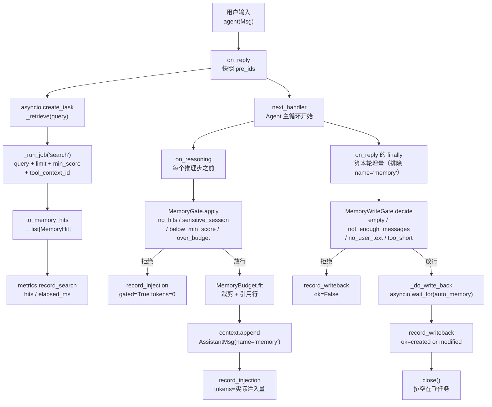
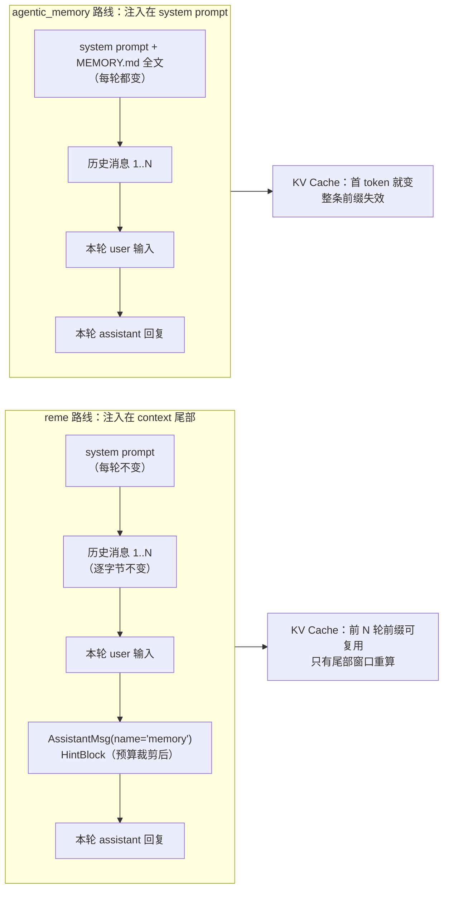

# 第 19 讲 《合体：把 ReMe 做成 Harness 的长期记忆中间件》

> **本讲目标**：把前四讲零散跑通的 ReMe 能力**收成一条中间件链**——
> 精读 AgentScope 官方 `middleware/_longterm_memory/_reme` 与
> `_agentic_memory` 两条路线，看清 Recorder / Retriever 到底挂在
> 生命周期的哪两个半场、记忆以什么形状进入 context、为什么
> `agentic_memory` 会整条废掉 KV Cache；然后在官方 `ReMeMiddleware`
> 的扩展点上写出 `harness_kit/memory/middleware.py`，补上官方没有的四件事：
> **召回门控**（敏感会话 / 分数阈值 / token 预算 / 失败降级）、
> **写回门控与异步化**（省 LLM 抽取、超时兜底、`close()` 排空）、
> **多租户隔离**（一租户一工作区）、**命中率与效果指标**。
> **前置要求**：完成第 08、15、16、17、18 讲。
> `third_party/agentscope`（2.0.8）与 `third_party/ReMe`（0.4.1.13）已就位；
> 脚本必须跑成 `PYTHONPATH=third_party/ReMe:. python ...`（**必须先于
> site-packages 里的 reme 0.3.1.10**，见第 15 讲）；仓库根 `.env` 里已配好
> `OPENAI_API_KEY` / `OPENAI_BASE_URL` / `LLM_MODEL`（本机实测 `deepseek-flash`）。
> **本讲交付物**（相对仓库根路径）：
> `tutorial_agsc_reme/reference/harness_kit/memory/middleware.py`（改写：
> `LongTermMemoryMiddleware` 补齐门控 / 异步写回 / 指标，
> 新增 `build_memory_middleware` 的 14 键装配入口）、
> `tutorial_agsc_reme/reference/harness_kit/memory/gating.py`（改写：
> `MemoryGate` + 新增 `MemoryWriteGate` / `WriteDecision`）、
> `tutorial_agsc_reme/reference/harness_kit/memory/tenant.py`（改写：
> `TenantRouter` / `TenantError`）、
> `tutorial_agsc_reme/reference/harness_kit/memory/metrics.py`（改写：
> `MemoryMetrics` / `SessionMetrics`）、
> `tutorial_agsc_reme/reference/harness_kit/memory/__init__.py`（登记新名字）、
> `tutorial_agsc_reme/reference/scripts/19_memory_middleware.py`、
> `tutorial_agsc_reme/reference/tests/test_lesson19_memory_middleware.py`。
> **预计时长**：220 分钟（其中 §5 的运行验证约 35 分钟，含 1 次真实模型调用）。
>
> 本讲的完整可运行代码位于 `tutorial_agsc_reme/reference/harness_kit/memory/`，
> 你可以直接对照，也可以跟着正文一行一行写。

---

## 一、这一讲要解决的问题

第 15 ~ 18 讲把 ReMe 的四件事跑通了：装配、写入、检索、自演化。
但它们各自是**独立的构件**：`MemoryIngestor` 手动灌、`MemorySearch` 手动查、
`SessionDistiller` 手动蒸。真正把记忆接到 Agent 身上的是
`agentscope.middleware` 里的官方中间件 —— 把你的 `Agent` 和 ReMe 工作区
连起来，只需两行：

```python
from agentscope.middleware import ReMeMiddleware
agent = Agent(name="probe", system_prompt="你是助手。", model=model,
              middlewares=[ReMeMiddleware(workspace_dir=".harness/reme")])
```

跑通它很容易，**上线它很难**。因为在"检索 → 注入 → 写回"这条链上，
官方实现每一环都只做了**最短的那条路径**，而生产环境要的是长路径。
本讲先把长出来的部分一条条列清楚，再逐条补。

### 1.1 四个具体缺口

**缺口 A：检索结果没有长度上限，注入什么全凭运数。**
官方的 `_build_memory_message`（`third_party/agentscope/src/agentscope/middleware/_longterm_memory/_reme/_middleware.py:529`）
只是把记忆拼成一条 hint 消息，没有任何 token 计量与截断。工作区里跑过
`auto_dream` 之后，一个 topic 卡片可能上千字；`top_k=5` 时一次注入轻松
破万 token。**每一轮**都注一次 —— 上下文和账单都被它吃掉。

**缺口 B：检索参数只传了两个，ReMe 的两个关键开关全关着。**
官方的 `_search`（`:475`）只传 `query` 与 `limit`。而 ReMe 的 search step
还会读 `min_score`（`third_party/ReMe/reme/steps/index/search.py:208`）
与 `tool_context_id`（`:227`）—— 前者是相关性下限，后者是**同轮去重桶**。
不传 `tool_context_id`，"同一会话里反复给同一条记忆"这件事就没有任何机制挡。

**缺口 C：写回是同步的，而且每轮都写。**
官方的 `_write_back`（`:489`）在 `on_reply` 的 `finally` 里被 `await`
（`:380`）。`auto_memory` 内部要起一个 Agent 做抽取（
`third_party/ReMe/reme/steps/evolve/auto_memory.py:420`），一次真实调用
几秒到几十秒。**用户按下回车到看到回答，中间被塞进一次记忆抽取的完整时长**，
而这两件事在语义上毫无依赖。本机实测：离线跑（把 job 换成 200ms 的假实现）
写回耗时 200ms；真实 `auto_memory` 超时设为 120s 都能跑满（G 段）。
更要命的是它没有超时：一个卡住的抽取会**永久挂住回复**。

**缺口 D：官方的"成功"是个假信号。**
`auto_memory` 在"这轮没什么可记的"时候返回 `success=True` 而
`metadata.created=false, modified=false`（`auto_memory.py:437-443`
与 `:373-376`）。只看 `response.success` 的话，你会得到一条
"写回成功率 100%"的漂亮曲线 —— 而记忆库里一份卡片都没多。
本讲的 `tests/test_lesson19_memory_middleware.py::test_writeback_success_uses_created_not_success_flag`
把这件事钉死；判定落盘只能用 `created or modified`。

### 1.2 一个真实的失败场景

第 18 讲过"会话结束自动落记忆"，那条链路依赖 `auto_memory`。
把它接到中间件上之后，本机在 §5 的 E 段（写回超时模拟）抓到的 stderr 是这样：

```text
2026-09-22 04:44:30.767 | WARNING  | harness_kit.memory.middleware:_do_write_back:988 - ReMe auto_memory timeout (0.1s) for session_id=s6: 本轮记忆已丢弃
```

这一行来自"把写回超时设成 0.1s 的模拟"（§5 的 E 段用它验证超时路径）。
它说明的是同一件事：**写回一旦进入关键路径，它的失败就变成了回复的失败、
或者回复的延迟**。官方实现遇到 `auto_memory` 抛异常时只打一条 warning
（`_middleware.py:518-523`），看起来"不影响回复"；但那是**串行**的 warning ——
回复已经等了它。等一个必然要花 5 秒的操作，再把它失败静默掉，
用户得到的体验是"每轮都卡 5 秒，而且记忆可能没写上"。

### 1.3 还有两件官方的中间件不打算管的事

**隔离**：ReMe 的工作区是中间件构造参数（`workspace_dir`），构造后不可变。
一个中间件实例 = 一份索引 = 一个知识域。多租户场景下"运行时切工作区"
是没有 API 的 —— 正确的做法就是**一租户一实例**，而"租户名从哪来、
能不能拼进路径、两个租户的根会不会互相包含"这些事必须有人挡。

**观测**：官方全篇没有指标。于是"检索退化成纯 BM25（向量库没建起来）"
与"门控把记忆全拦了（策略生效了）"在官方路径下**长得一模一样**：
都是"这轮没注入记忆"。要分开它们，必须把
"有没有命中""注入多少 token""被拒的原因"分开记。

本讲把上面六件事收成四个模块 + 一条中间件，全部挂在**官方已有的扩展点**上：
一个类 `ReMeMiddleware`、两组 hook（`on_reply` / `on_reasoning`）、
一个可覆写的参数类 `Parameters`。**不新写 Agent Loop，不新写 ChatModel，
不碰 `third_party/`。**

---

## 二、源码侦察

本节每一条都来自真实源码，格式为 `相对仓库根的路径:行号`。
不带行号的断言，一律标「未验证」。

### 2.1 官方 ReMe 中间件挂在生命周期的哪两个半场

```
third_party/agentscope/src/agentscope/middleware/_longterm_memory/_reme/_middleware.py:88    class ReMeMiddleware(MiddlewareBase):
third_party/agentscope/src/agentscope/middleware/_longterm_memory/_reme/_middleware.py:184       def __init__(
third_party/agentscope/src/agentscope/middleware/_longterm_memory/_reme/_middleware.py:312       async def on_reply(
third_party/agentscope/src/agentscope/middleware/_longterm_memory/_reme/_middleware.py:385       async def on_reasoning(
third_party/agentscope/src/agentscope/middleware/_longterm_memory/_reme/_middleware.py:421       async def on_system_prompt(
third_party/agentscope/src/agentscope/middleware/_longterm_memory/_reme/_middleware.py:443       async def list_tools(
```

三个 hook 的分工是一套**两阶段流水线**，而不是"一进一出"：

- `on_reply:332-335`：`mode != "agent_control"` 且有 query 时，
  `asyncio.create_task(self._search(query_text))` —— **检索是后台任务**，
  与"Agent 开始处理输入"并发。它**不阻塞**回复的开头。
- `on_reasoning:401-413`：每个推理步之前"顺手"看一眼那个 task。
  跑完了就 `agent.state.context.append(self._build_memory_message(memories))`。
- `on_reply` 的 `finally:352-380`：取消/收尸后台任务，并用
  `pre_ids` 差集（`:347` 快照，`:367-373` 算增量）把**本轮新增**的消息
  交给 `_write_back`。

**这说明什么**：检索走"提前起跑 + 稍后取货"，写回走"无论成败都执行"。
两个半场各自可以独立替换 —— 本讲的改造点正好一个在半场一
（`_search` → `_retrieve`），一个在半场二（`_write_back`），
外加一个注入点（`_build_memory_message` → `_render_hits` + `_build_injection`）。

**还有一个必须知道的细节**：`_session_id_of`（`:296-307`）是
`@staticmethod`，每次从 `getattr(agent.state, "session_id", None)` **现读**，
不缓存在中间件上。官方 docstring 写得很直白（`:300-305`）：
"so a single instance shared across agents keeps each conversation's writes isolated"。
**这说明什么**：`session_id` 是逐次读的、`workspace_dir` 是构造时定的 ——
前者可以共享实例，后者不能。这条就是 §4.2 多租户"一租户一实例"的源码依据。

### 2.2 官方的检索只传了两个参数

```
third_party/agentscope/src/agentscope/middleware/_longterm_memory/_reme/_middleware.py:475       async def _search(
third_party/agentscope/src/agentscope/middleware/_longterm_memory/_reme/_middleware.py:482           response = await self._run_job(
third_party/agentscope/src/agentscope/middleware/_longterm_memory/_reme/_middleware.py:483               _SEARCH_JOB,
third_party/agentscope/src/agentscope/middleware/_longterm_memory/_reme/_middleware.py:484               query=query,
third_party/agentscope/src/agentscope/middleware/_longterm_memory/_reme/_middleware.py:485               limit=self._parameters.top_k if limit is None else limit,
third_party/agentscope/src/agentscope/middleware/_longterm_memory/_reme/_middleware.py:61    _SEARCH_JOB = "search"
```

`_search` 的整个 job 调用就是 `:482-486` 这 5 行，payload 里只有
`query` 与 `limit`。而 ReMe 那侧：

```
third_party/ReMe/reme/steps/index/search.py:208      min_score: float = float(self.context.get("min_score") or 0.0)
third_party/ReMe/reme/steps/index/search.py:227      tool_context_id: str = (self.context.get("tool_context_id", "") or "").strip()
third_party/ReMe/reme/steps/index/search.py:340      if min_score > 0.0:
third_party/ReMe/reme/steps/index/search.py:341          fused = [c for c in fused if c.score >= min_score]
third_party/ReMe/reme/steps/index/search.py:344      if tool_context_id:
third_party/ReMe/reme/steps/index/search.py:345          fused, dedup = self._dedupe_tool_context(fused, tool_context_id, limit)
third_party/ReMe/reme/steps/index/search.py:347          fused = fused[:limit]
```

**这说明什么**：ReMe 的两个开关是**已经写好的能力**，只是官方中间件没有
把它们接出来。`:340-341` 是在 RRF 融合**之后**按原始分过滤；
`:344-347` 是"要么走去重、要么直接截断"的二选一 —— 不传 `tool_context_id`
时走 `:347` 的裸截断，**同轮去重这个能力就是关着的**。

### 2.3 融合分是什么量级（决定了阈值该怎么给）

```
third_party/ReMe/reme/steps/index/search.py:14       _RRF_K: Final = 60
third_party/ReMe/reme/steps/index/search.py:54       def _rrf_merge(
third_party/ReMe/reme/steps/index/search.py:64           contrib = vector_weight / (_RRF_K + rank)
third_party/ReMe/reme/steps/index/search.py:70           contrib = text_weight / (_RRF_K + rank)
```

`_rrf_merge` 的每一项都是 `weight / (60 + rank)`：rank=0、weight=1 时是
`1/60 ≈ 0.0167`。**这说明什么**：如果把 `min_score` 当成"相似度"随手填
`0.5` 或 `0.2`，`fused` 会被 `:341` 一行清空 —— 检索"成功返回 0 条"，
而上游完全看不到"被阈值滤光了"这件事。本讲的 `Parameters.min_score`
docstring 特意写了这条量纲警告（`harness_kit/memory/middleware.py:379-386`），
而"要按**绝对**相关性过滤"这件事只能靠把 `min_score` 透传给 ReMe
（在原始量纲上过滤），**不能**靠我们自己的归一化阈值 ——
后者的语义是"相对这一批里的最高分"，见 §2.6。

### 2.4 注入的形状：一条 `AssistantMsg(name="memory")` + 一个 `HintBlock`

```
third_party/agentscope/src/agentscope/middleware/_longterm_memory/_reme/_middleware.py:71    _MEMORY_MSG_NAME = "memory"
third_party/agentscope/src/agentscope/middleware/_longterm_memory/_reme/_middleware.py:529   def _build_memory_message(memories: list[str]) -> Msg:
third_party/agentscope/src/agentscope/middleware/_longterm_memory/_reme/_middleware.py:543       bullets = "\n".join(f"- {m}" for m in memories)
third_party/agentscope/src/agentscope/middleware/_longterm_memory/_reme/_middleware.py:372       and getattr(m, "name", None) != _MEMORY_MSG_NAME
```

`:543` 把每条记忆渲染成一个 `- bullet`；`:372` 在算"本轮增量"时把
`name == "memory"` 的消息排除掉（**否则注入的记忆会被当成"用户说过的话"
再写回记忆库**，一轮轮自我复制）。

**这说明什么**：注入消息的 `name` 是一个**协议字段**，不只是标签 ——
它同时决定了 (a) 后续哪条消息被排除在写回增量之外，(b) 我们自己识别
"这条是我注入的"的唯一可靠依据。本讲保留这个协议，一字不改。

### 2.5 两条路线的分岔：`reme` 走 context，`agentic_memory` 走 system prompt

```
third_party/agentscope/src/agentscope/middleware/_longterm_memory/_agentic_memory/_middleware.py:359   class AgenticMemoryMiddleware(MiddlewareBase):
third_party/agentscope/src/agentscope/middleware/_longterm_memory/_agentic_memory/_middleware.py:486       def _truncate_if_needed(content: str, max_length: int) -> str:
third_party/agentscope/src/agentscope/middleware/_longterm_memory/_agentic_memory/_middleware.py:513       async def on_system_prompt(
third_party/agentscope/src/agentscope/middleware/_longterm_memory/_agentic_memory/_middleware.py:535           memory_md_truncated = self._truncate_if_needed(
third_party/agentscope/src/agentscope/middleware/_longterm_memory/_agentic_memory/_middleware.py:562           content = (
third_party/agentscope/src/agentscope/middleware/_longterm_memory/_agentic_memory/_middleware.py:566           return f"{current_prompt}\n\n{content}"
```

`_agentic_memory` 的做法是：把 `MEMORY.md` 的全文（按
`memory_max_tokens` 截断，`:535`）**拼进 system prompt**（`:562-566`）。

而 `on_system_prompt` 在本仓库的 hook 体系里是**唯一**的 transformer
hook：

```
third_party/agentscope/src/agentscope/middleware/_base.py:264    async def on_system_prompt(
third_party/agentscope/src/agentscope/middleware/_base.py:271        This uses a transformer/pipeline pattern rather than onion pattern.
third_party/agentscope/src/agentscope/agent/_agent.py:3233       # Apply system_prompt middlewares sequentially (transformer pattern)
third_party/agentscope/src/agentscope/agent/_agent.py:3234       for mw in self._system_prompt_middlewares:
third_party/agentscope/src/agentscope/agent/_agent.py:3235           result = await mw.on_system_prompt(self, result)
```

**这说明什么**（本讲最重要的一条结论）：`_agentic_memory` 每轮都让
system prompt 变一次 —— 而 system prompt 是整段 prompt 的**第一个 token**。
前缀一变，**整条 KV Cache 全部失效**，包括已经很长的那部分历史对话。
`reme` 路线则把注入追加在 context **尾部**（`:411-413` 的 `append`），
历史前缀不动。两条路线的取舍是："每轮都在 system 里放一份新鲜的记忆索引"
vs "前缀稳定、把记忆塞在尾部窗口里"。本讲选后者，并且用实测把它钉住
（§5 的 D 段：两次 provider 调用的稳定前缀长度必须 ≥ 2）。

### 2.6 harness 已有的地基（本讲直接复用，不重写）

```
tutorial_agsc_reme/reference/harness_kit/memory/budget.py:120      def estimate_tokens_heuristic(text: str) -> int:
tutorial_agsc_reme/reference/harness_kit/memory/budget.py:145      def render_memory_block(
tutorial_agsc_reme/reference/harness_kit/memory/budget.py:196      class MemoryBudgetResult(BaseModel):
tutorial_agsc_reme/reference/harness_kit/memory/budget.py:228          def render(self, **kwargs: Any) -> str:
tutorial_agsc_reme/reference/harness_kit/memory/budget.py:276      def fit(self, hits: Sequence[Any]) -> MemoryBudgetResult:
tutorial_agsc_reme/reference/harness_kit/memory/budget.py:378      def count(self, hits: Sequence[Any]) -> int:
tutorial_agsc_reme/reference/harness_kit/memory/citations.py:73    class MemoryHit(BaseModel):
tutorial_agsc_reme/reference/harness_kit/memory/workspace.py:85    class ReMeWorkspace(BaseModel):
```

`MemoryBudget.fit`（`budget.py:276`）是"贪心前缀 + 每加一条重算整块渲染"，
`render_memory_block`（`:145`）是**唯一的渲染入口**（带 `path:start-end` 引用行）。
`MemoryHit`（`citations.py:73`）是 hit 的结构化表示。

**这说明什么**：第 17 讲已经把"预算裁剪 + 引用"做完了，本讲**不再实现一遍**，
只需要把它接进中间件的注入点。这条纪律很重要 —— 它是"不重写内核"在
模块内部的体现。顺带一个 API 陷阱：`count()` 收的是 **hits**（`:378`），
不是渲染后的文本；想量一段文本用 `estimate_tokens_heuristic`（`:120`）。
本讲的 `D11` 断言就是拿它去对上 `metrics.injected_tokens`。

### 2.7 ReMe 那侧的"假成功"

```
third_party/ReMe/reme/steps/evolve/auto_memory.py:389     created = note is None
third_party/ReMe/reme/steps/evolve/auto_memory.py:373         self.context.response.success = True
third_party/ReMe/reme/steps/evolve/auto_memory.py:375         self.context.response.metadata.update({"date": day, "modified": False, "n_messages": 0})
third_party/ReMe/reme/steps/evolve/auto_memory.py:437         self.context.response.success = True
third_party/ReMe/reme/steps/evolve/auto_memory.py:440             {"date": day, "path": None, "created": False, "modified": False, "n_messages": len(messages)},
third_party/ReMe/reme/steps/evolve/auto_memory.py:464     modified = self._note_modified(before_note_path, before_note_bytes, note_path)
third_party/ReMe/reme/steps/evolve/auto_memory.py:473         self.context.response.success = True
```

`:389` 用"能不能列出当天会话卡片"决定 `created`；`created` 为真但
创建后列不出来（`:436-443`）时，`success` 依然是 `True`，而
`created/modified` 都是 `False`、`path` 是 `None` —— **什么都没写**。
`:373-376` 是另一条：没有消息时直接跳过，`success=True`。

**这说明什么**：判"记忆有没有落盘"的唯一可靠信号是
`metadata.created or metadata.modified`，而且必须在中间件里判、记账，
不能指望上游（`auto_memory` 自己的日志是 INFO，且埋在 ReMe 的 logger 里，
会被 `import reme` 顺带重配掉，见 §6 第 1 行）。

### 2.8 兼容补丁点（第 15 讲就来过的那个）

```
third_party/agentscope/src/agentscope/middleware/_longterm_memory/_reme/_config.py:54     def _dream_steps() -> list[dict[str, Any]]:
third_party/agentscope/src/agentscope/middleware/_longterm_memory/_reme/_config.py:66         {"backend": "dream_topics_step",
third_party/agentscope/src/agentscope/middleware/_longterm_memory/_reme/_config.py:67          "topic_count": 3,
third_party/agentscope/src/agentscope/middleware/_longterm_memory/_reme/_config.py:68          "topic_diversity_days": 7,
third_party/agentscope/src/agentscope/middleware/_longterm_memory/_reme/_config.py:288        "api_key": os.getenv("LLM_API_KEY", ""),
third_party/agentscope/src/agentscope/middleware/_longterm_memory/_reme/_config.py:289        "base_url": os.getenv("LLM_BASE_URL", ""),
```

`_dream_steps` 里 `:66-69` 的 `dream_topics_step` 在 ReMe 0.4.1.13 里
**没有注册**，构造 app 时会 `ValueError: Unregistered backend
'dream_topics_step' of type 'ComponentEnum.STEP'`。而 `:288-289` 说明
ReMe 的 LLM 凭据是**构造 app 时从进程环境读的**，键名是
`LLM_API_KEY` / `LLM_BASE_URL` —— 不是 `.env` 里的 `OPENAI_API_KEY`。

**这说明什么**：这两件事都必须在**中间件的 `_build_app` 里**处理，
而不是让每个调用方自己记得。前者是 `ensure_reme_compat` 的两段补丁
（先修配置函数、再兜底 registry，顺序不能反），后者是
`build_memory_middleware` 里的 `_export_llm_env`。

### 2.9 AgentScope 怎么把中间件接进 Agent（本讲不改它）

```
third_party/agentscope/src/agentscope/agent/_agent.py:220      self._reply_middlewares = [
third_party/agentscope/src/agentscope/agent/_agent.py:221          _ for _ in middlewares if _.is_implemented("on_reply")
third_party/agentscope/src/agentscope/agent/_agent.py:223-240  （on_reasoning / on_check_permission / on_acting / on_model_call / on_system_prompt / on_compress_context 各一份）
third_party/agentscope/src/agentscope/agent/_agent.py:945              async for item in mw.on_reply(
third_party/agentscope/src/agentscope/agent/_agent.py:1692             async for item in mw.on_reasoning(
```

`:220-240` 在 Agent 构造时按 `is_implemented` 把中间件**分桶**；
`:945` / `:1692` 是 onion 链的驱动点（`next_handler` 由 Agent 注入）。

**这说明什么**：只要我们的子类实现了某个 hook，它就会被自动分桶调用 ——
不需要在 Agent 上注册任何东西，也不需要改 Agent。反过来说：**hook 签名是
硬契约**，改写签名会静默地变成"这个 hook 不再被调用"。

### 2.10 一句话总结侦察结论

官方给了**一条完整的链路**（检索 → 注入 → 写回，两个半场，一个协议），
缺口全部在**策略与工程**上：参数透传（缺口 A/B）、长度与频率控制
（缺口 A/C）、失败与超时可观测（缺口 C/D）、隔离与指标（§1.3 的两件事）。
本讲的所有代码都挂在 `ReMeMiddleware` 的六个可覆写点上，
**没有一行是"重写内核"**。

---
## 三、扩展点定位与设计

### 3.1 官方已经给了什么

按 §2 的行号，官方给了四样东西：

1. **一条完整链路**：`ReMeMiddleware`（`.../_reme/_middleware.py:88`）
   实现了 `on_reply`（`:312`）、`on_reasoning`（`:385`）、
   `on_system_prompt`（`:421`）、`list_tools`（`:443`）四个 hook，
   覆盖"检索 → 注入 → 写回"的全部环节。
2. **一个可继承的参数类**：`ReMeMiddleware.Parameters`
   （`:184` 的 `__init__` 收 `parameters=`），官方类里已经有
   `workspace_dir` / `mode` / `top_k` / `chat_model` 等字段。
3. **一个注入协议**：一条 `AssistantMsg(name="memory", content=[HintBlock(...)])`
   （`:529`），并用 `name` 把自己排除在写回增量之外（`:372`）。
4. **一个可覆写的内部方法集**：`_search`（`:475`）、`_write_back`（`:489`）、
   `_build_memory_message`（`:529`）、`_build_app`（`:227`）。

### 3.2 还缺什么（对应契约 §1.3 的缺口编号）

| 编号 | 缺口 | 本讲落在哪个扩展点 |
| --- | --- | --- |
| 缺口 1（长度控制） | 注入没有 token 上限 | `_render_hits` → `MemoryBudget.fit`（第 17 讲已有，接进来） |
| 缺口 2（参数透传） | `min_score` / `tool_context_id` 从不传 | `_retrieve` 替换 `_search` |
| 缺口 3（策略） | 没有"什么时候该注入"的判定 | 新增 `MemoryGate`，在 `on_reasoning` 里调用 |
| 缺口 4（写回频率） | 每轮都跑一次 LLM 抽取 | 新增 `MemoryWriteGate`，在 `_write_back` 前判定 |
| 缺口 5（阻塞与超时） | 写回同步、无超时 | `_write_back` 异步化 + `asyncio.wait_for` + `close()` 排空 |
| 缺口 6（隔离与观测） | 无多租户、无指标 | 新增 `TenantRouter` / `MemoryMetrics`，通过 `Parameters` 注入 |

（缺口编号对应 `tutorial_agsc_reme/_contract.md` §1.3 的 1~6。）

### 3.3 我们准备在哪个扩展点上做

一句话：**全部靠子类化 + 覆写，不新增 hook、不改 Agent、不碰 `third_party/`。**

| 我们要的能力 | 扩展点 | 具体形式 |
| --- | --- | --- |
| 参数超集 | `ReMeMiddleware.Parameters` | `class Parameters(ReMeMiddleware.Parameters)`，自带 10 个字段（`mode` 覆盖默认值 + 9 个新增） |
| 记检索 | `_search` → `_retrieve` | 覆写；把 `min_score` / `tool_context_id` 塞进 payload，并把结果转成 `MemoryHit` |
| 记注入形状 | `_build_memory_message` → `_build_injection` | 覆写；无预算时**委托回官方的 `_build_memory_message`**（逐字一致） |
| 召回门控 | `on_reasoning` 的注入前一步 | 覆写 `on_reasoning`（与官方逐行等价），插入 `_gate_hits` |
| 写回门控 + 异步 | `_write_back` | 覆写；门控 → 同步 await / `asyncio.create_task` + 超时 |
| 生命周期 | `close` | 覆写；**先排空在飞写回，再 `await super().close()`**（顺序不能反） |
| 多租户 | 构造参数 `workspace_dir` + `session_tags` | 不覆写：`TenantRouter.workspace_for(tenant)` 给出一个根，一个租户一个实例 |
| Profile 装配 | `HarnessRegistry` 的 `middleware:reme_memory` 登记项 | 新增函数 `build_memory_middleware(spec, *, ctx)` |

**为什么 `on_reasoning` 要整体覆写而不是"包一层"**：`on_reasoning` 的
body 是 `if task.done(): ... ; async for event in next_handler(...): yield event`
—— 注入发生在 `next_handler` **之前**。要插一步"先门控再注入"，
只能改 body。覆写时我们保持与官方**逐行等价**（除注入那三行），
这样"官方修了 bug、我们没跟上"的风险被压到最小，而且 §5 的 D 段
能逐字节地拿真实 prompt 验证这件事。

### 3.4 数据流（一次 reply 里的六个时刻）



### 3.5 门控的顺序为什么是"敏感 → 分数 → 预算"

`MemoryGate.apply`（`harness_kit/memory/gating.py:234`）的判定顺序是：

```
no_hits → sensitive_session → below_min_score → over_budget → allowed
```

这个顺序不是随手排的，它决定了"拒绝原因"的语义：

- **`no_hits` 在最前**：检索本身没结果，和门控无关，必须能和"被门控拒"分开。
- **`sensitive_session` 在分数之前**：敏感会话里，记忆**再相关也不能进**。
  如果先跑分数，一条高分命中的敏感记忆会被"放行"到预算那一步，
  日志上就分不清"本来就要拦"和"碰巧分低"。
- **`below_min_score` 在预算之前**：先按相关性关单条，再按预算裁总量。
  反过来的话，预算会先吃掉 token 名额，然后低分条目"挤掉"了高分条目 ——
  结果一样是裁剪，但**裁掉的不是最不相关的那些**。
- **`over_budget` 在最后**：只有"分数关过后一条都不剩"才算预算拒绝。
  `gating.py:279` 判的是 `not fitted.kept`，而不是 `fitted.truncated`。

### 3.6 归一化阈值与"绝对阈值"的分工（本讲最容易搞错的一点）

`MemoryGate.normalize_scores`（`gating.py:309`）的语义是
`norm_i = score_i / max(score)` —— **相对这一批里的最高分**。
所以：

- 只要这一批里有任何一条分数非零，最高分那条的归一化值就**恒为 1.0**，
  永远越不过阈值。**因此"用归一化分数做绝对相关性过滤"在数学上不可能。**
- 归一化阈值的真正用途是**砍尾部**：`gating.py:261-267` 把
  `< min_score` 的条目从 `kept` 里去掉（记进 `dropped_low_score`），
  但如果全被砍掉，才升格为整批拒绝（`:268-274`）。
- 想按**绝对**相关性过滤，唯一正确的做法是把阈值透传给 ReMe 的
  search step（`search.py:208` 的 `min_score`，在 `:341` 用**原始分**过滤），
  也就是 `Parameters.min_score`。它与 `MemoryGate` 的 `min_score`
  **量纲不同、不能混用**。

`§5` 的 `B6` 用的就是"全 0 分"这个唯一的可拒绝场景，
`tests/test_lesson19_memory_middleware.py::test_normalized_score_cannot_drop_a_nonzero_batch`
把这条结论写成了回归测试。

### 3.7 两条路线的注入位置对照（为什么本讲选 `reme` 路线）



两张图的差别只有一处：**注入的那条 `HintBlock` 落在
`system prompt`（第一个 token）还是 `context` 尾部（最后一个 token）**。
`on_system_prompt` 是 transformer hook（`middleware/_base.py:271`），
它返回的字符串就是下一轮 system prompt 的全部内容；`on_reasoning` 里的
`context.append`（`.../_reme/_middleware.py:411-413`）只动尾部。
本讲选后者，代价是"记忆只在**下一次**模型调用时才可见"
（官方 docstring 在 `:391-399` 明说这个 trade-off），
收益是历史前缀稳定 —— §5.3 的 `D` 段用真实 prompt 把这一点量了出来。

---
## 四、harness_kit 实现

本讲的四个模块全部是**新增或改写** `tutorial_agsc_reme/reference/harness_kit/memory/`
下的文件。为了可复现，下面给出**完整文件**（不是片段），
与 `reference/` 里的真实文件逐字节相同 —— §5.5 有一个 12 行脚本可以把它们
从这份 md 里抽出来核对。

写之前先明确**每个文件负责什么、不负责什么**（这是本讲的职责边界）：

| 文件 | 负责 | **不**负责 |
| --- | --- | --- |
| `gating.py` | "要不要注入"与"要不要写回"的**判定** | 渲染文本（那是 `budget.py`）、调用 ReMe job（那是 `middleware.py`） |
| `tenant.py` | 租户名合法性、租户根路径、隔离性检查 | 装配中间件（那是 `middleware.py` 的 `build_memory_middleware`） |
| `metrics.py` | 计数与快照 | 打日志之外的一切副作用；**指标失败绝不许冒泡** |
| `middleware.py` | 把上面三件接到官方 hook 上 | 重新实现检索/写回（一切最终都落到 `_run_job`） |

### 4.1 `harness_kit/memory/gating.py`

这个文件里有**两类门控**，它们的设计哲学相反：

- `MemoryGate`（召回门控）是**保守**的：默认 `min_score=0.2`、
  敏感会话整批拒绝、预算装不下就整批拒绝。因为注错记忆的代价是
  "Agent 自信地说了一件错事"，比"少一条记忆"贵得多。
- `MemoryWriteGate`（写入门控）是**廉价**的：它的唯一目标是**省掉一次
  LLM 抽取**，所以判定必须能在**不调用任何模型**的前提下做完 ——
  只看"条数 / 有没有用户正文 / 字符数"。

两处细节值得单独说：

1. `MemoryGate.__init__` 的 `budget` 是**必填**（`gating.py:171` 起）。
   语义上"门控决定保留哪几条"这句话本身就需要一个预算，
   所以给它 `None` 会直接抛 `TypeError`，而不是静默退化成"不裁剪"。
2. `MemoryWriteGate.decide` 的判定顺序里，`disabled` 排在 `empty` **之后**
   （`gating.py:502` 起的短路链，docstring 里写明了理由）：
   一次"本轮什么都没产生"的调用，即使门控是关的，结论也应该是
   `empty` 而不是 `disabled` —— 日志里"没内容"和"没检查"是两件事。

```python
# -*- coding: utf-8 -*-
"""记忆注入门控：什么时候允许把记忆塞进上下文（契约 §3.19）。

**这个模块存在的唯一理由：契约给的默认阈值 ``min_score=0.2`` 不能直接用来比分数**

契约 §3.19 的签名是 ``MemoryGate(*, budget, min_score=0.2, sensitive_tags=[])``。
如果把它理解成"把 ``MemoryHit.score`` 拿去和 0.2 比"，那么：
**一条都留不下**。原因是 :class:`~harness_kit.memory.citations.MemoryHit` 的
``score`` 继承自 ReMe 的 ``FileChunk.score``，而 ReMe 的分数**量纲随路径切换**
（``third_party/ReMe/reme/steps/index/search.py:337-349``）：

============================ ========================================== ==============
情形                         ``score`` 是什么                            典型量级
============================ ========================================== ==============
两路都有结果 → RRF 融合      ``w_v/(60+rank_v) + w_k/(60+rank_k)``       0.008 – 0.017
只有关键词路 → 不融合        BM25 原始分                                 1 – 30+
只有向量路 → 不融合          cosine 相似度（1 - 距离）                   0 – 1
============================ ========================================== ==============

也就是说同一份配置下，``min_score=0.2`` 在 BM25 路是"几乎不过滤"，
在 RRF 路是"全部杀掉"。一个把两种量纲混在一起的绝对阈值，
不可能是正确的默认值。

**harness 的解法：把阈值定义在归一化分数上，并把归一化规则写在 API 表面**

:meth:`MemoryGate.normalize_scores` 用**相对最佳**归一：``norm_i = score_i / max(score)``。
于是 ``norm`` 恒在 ``(0, 1]``，``min_score`` 的含义变成
"至少要达到本轮最高分的百分之多少"，与走哪条路无关。这与重排序（rerank）
领域里常用的 "relative score" 一致，也解释了为什么契约的默认值 0.2 是合理的 ——
它本来就是相对阈值的直觉（"明显更差的那几条别要"）。

代价必须写清楚：**相对归一丢掉了绝对量级**。如果本轮所有结果的分数都很低
（检索质量整体很差），相对归一会让最高分那条归一成 1.0，然后被放行。
所以本类**不**声称它是"相关性判断"，它只是"在同一批结果里做取舍"；
绝对质量的判断属于 :class:`~harness_kit.memory.metrics.MemoryMetrics`
（记录每次检索的真实最高分）与 :mod:`harness_kit.memory.proactive`（置信度阈值）。

**被拒绝必须留痕**

:meth:`apply` 会把拒绝原因喂给 :class:`~harness_kit.memory.metrics.MemoryMetrics`
（``record_gate_rejection``）。理由见 :mod:`harness_kit.memory.metrics` 的模块 docstring：
门控拒绝的表现是"本轮没有记忆"，和"记忆库里本来就空"长得一模一样。

**读取侧之外还有写入侧：:class:`MemoryWriteGate`**

召回门控管的是"要不要把记忆塞进上下文"，**写入门控**管的是"这一轮增量值不值得落记忆"。
两者对称但代价完全不同：召回门控省的是 token，写入门控省的是**一次完整的 LLM 抽取调用**
（``auto_memory`` 内部是一个挂了工具的 AgentScope Agent，
见 ``third_party/ReMe/reme/steps/evolve/auto_memory.py:72`` 的 ``create_tools``），
而且是**阻塞在回复末尾**的那一次 —— 官方 ``_write_back``
（``.../_reme/_middleware.py:489``）是在 ``on_reply`` 的 ``finally`` 里 **await** 的，
所以用户要等到抽取跑完才拿到"回复完成"。

写入侧最容易被忽略的一条，是本模块要教会读者的核心事实：
**``auto_memory`` 的 ``success=True`` 不等于记忆落地。** 实测（本机，echo 模型）：

.. code-block:: text

    success: True
    metadata: {"date": "2026-09-22", "path": null, "created": false,
               "modified": false, "n_messages": 2}

``success`` 是"这一步没抛异常"，``created`` / ``modified`` 才是"卡片真的写了"。
拿 ``success`` 当写回成功率，指标会永远显示 100% —— 而记忆库里一张卡都没有。
所以 :class:`MemoryWriteGate` 与 :class:`~harness_kit.memory.metrics.MemoryMetrics`
的 ``record_writeback`` 都按 ``created or modified`` 判定成功，
这条判据写在 :meth:`MemoryWriteGate.decide` 的返回值里由中间件消费。
"""

from __future__ import annotations

from typing import Any, Sequence

from loguru import logger
from pydantic import BaseModel, ConfigDict, Field

from .budget import MemoryBudget

__all__ = [
    "DEFAULT_MIN_SCORE",
    "GateDecision",
    "MemoryGate",
    "MemoryWriteGate",
    "WriteDecision",
]

#: 契约 §3.19 给的默认阈值。它作用在 :meth:`MemoryGate.normalize_scores`
#: 的输出上（相对最佳分的比例），**不是**原始 ``MemoryHit.score``。
DEFAULT_MIN_SCORE: float = 0.2

#: 门控的四种拒绝原因 + 一种放行。
_REASON_ALLOWED = "allowed"
_REASON_NO_HITS = "no_hits"
_REASON_SENSITIVE = "sensitive_session"
_REASON_LOW_SCORE = "below_min_score"
_REASON_OVER_BUDGET = "over_budget"


class GateDecision(BaseModel):
    """一次门控判定的结论（契约 §3.19）。

    Attributes:
        allow (`bool`): 是否放行。
        reason (`str`): 判定原因。取值（**全部是稳定字符串**，可直接进指标）：

            ``"allowed"``
                放行。
            ``"no_hits"``
                这批结果本来就是空的。
            ``"sensitive_session"``
                会话带敏感标签，整批拒绝。
            ``"below_min_score"``
                归一化分数全部低于 ``min_score``。

                **实测：这一支在当前实现下不可达。** 归一化的分母就是最大分，
                所以最高分那条的归一化值恒为 ``1.0``；而 ``min_score`` 被
                :meth:`MemoryGate.__init__` 限制在 ``[0, 1]``，
                于是 ``above`` 永远非空。它是一条**防御分支**，保留它是为了
                万一将来归一化规则改了（比如改成除以常数）不会静默失效 ——
                但不要写"这条分支会帮我挡住低分记忆"的教程。
                单条被分数挡下的情况见 ``dropped_low_score``。
            ``"over_budget"``
                通过了分数关，但预算一条都装不下（``budget.fit`` 的 ``kept`` 为空）。
        kept (`list[str]`): 放行的 hit 的 ``chunk_id``。

            类型是 ``list[str]``（契约如此），所以只给 id、不给正文。
            需要正文请用 :meth:`MemoryGate.apply`，它额外返回 ``MemoryHit`` 对象。
            被拒绝时 ``kept`` 是空列表 —— **不**返回"本来会放行的那几条"：
            原因里已经写了为什么拒绝，而"差一点就进去的记忆"列表会被误当成已注入。
        dropped_low_score (`list[str]`): 被**分数关**单条挡下的 ``chunk_id``。

            这是 harness 在契约三个字段之外的追加字段（有默认值，是超集）。
            加它的理由是一个真实的可观测性缺口：分数关是**逐条**过滤，
            而 ``reason`` 只描述整批判定 —— 没有这个字段，
            "3 条命中只注入了 1 条"在调用方看来是完全静默的，
            既没进 ``kept`` 也没进任何指标（``reason`` 还是 ``"allowed"``）。
            被分数挡下的 id 只列在这里，**不**混进 ``kept``。
    """

    model_config = ConfigDict(extra="forbid")

    allow: bool
    reason: str
    kept: list[str] = Field(default_factory=list)
    dropped_low_score: list[str] = Field(default_factory=list)


class MemoryGate:
    """记忆注入门控（契约 §3.19）。

    判定顺序是**短路**的，顺序本身就是策略：

    1. 空结果 → 拒绝（``no_hits``）。先判空，后面的规则不必处理空列表。
    2. 敏感会话 → 拒绝（``sensitive_session``）。**在分数之前**：
       敏感会话里的记忆再相关也不该注入，用分数去"筛"它等于给了它一个
       靠高分翻盘的机会。
    3. 归一化分数 → 拒绝（``below_min_score``）。
    4. 预算 → 拒绝或裁剪（``over_budget`` / ``allowed``）。

    ``budget`` 是**必填**参数（契约如此）。它同时承担两个职责：
    "装不下就拒绝"与"装得下就裁剪"，因此它必须存在 ——
    没有预算的门控只能回答"要不要"，回答不了"要哪几条"。

    Example::

        gate = MemoryGate(budget=MemoryBudget(max_tokens=400), min_score=0.5)
        decision, kept_hits = gate.apply(hits, session_tags=["private"])
        print(decision.allow, decision.reason, decision.kept)
    """

    def __init__(
        self,
        *,
        budget: MemoryBudget,
        min_score: float = DEFAULT_MIN_SCORE,
        sensitive_tags: Sequence[str] = (),
        metrics: Any | None = None,
    ) -> None:
        """配置门控。

        Args:
            budget (`MemoryBudget`): token 预算。
            min_score (`float`): 归一化分数下限，取值 ``[0.0, 1.0]``。
                ``0.0`` 表示关掉分数关（只留空结果/敏感/预算三重判定）。
            sensitive_tags (`Sequence[str]`): 敏感标签。会话标签与之**有交集**
                即整批拒绝。契约的写法是 ``Field(default_factory=list)``，
                但那是 pydantic 模型字段的写法；本类是普通类，函数签名里的
                ``Field(...)`` 只会得到一个 ``FieldInfo`` 对象当默认值，
                所以这里用 ``()``（不可变元组），语义等价。已记入 ``unresolved``。
            metrics (`Any | None`): 可选的
                :class:`~harness_kit.memory.metrics.MemoryMetrics`；
                给了就在拒绝时记一笔 ``record_gate_rejection``。

        Raises:
            `TypeError`: ``budget`` 为 ``None``。
            `ValueError`: ``min_score`` 不在 ``[0.0, 1.0]``。
        """
        if budget is None:
            raise TypeError("MemoryGate 需要 budget（契约 §3.19 是必填参数）")
        if not 0.0 <= float(min_score) <= 1.0:
            raise ValueError(f"min_score 必须在 [0, 1]，收到 {min_score}")
        self.budget: MemoryBudget = budget
        self.min_score: float = float(min_score)
        self.sensitive_tags: list[str] = _normalize_tags(sensitive_tags)
        self.metrics: Any | None = metrics

    # ------------------------------------------------------------------
    # 判定
    # ------------------------------------------------------------------
    def allow(self, hits: Sequence[Any], *, session_tags: Sequence[str] = ()) -> bool:
        """门控的布尔判定（契约 §3.19）。

        Args:
            hits (`Sequence[Any]`): :class:`~harness_kit.memory.citations.MemoryHit` 序列。
            session_tags (`Sequence[str]`): 本会话的标签。

        Returns:
            `bool`: 是否放行。
        """
        return self.decide(hits, session_tags=session_tags).allow

    def decide(self, hits: Sequence[Any], *, session_tags: Sequence[str] = ()) -> GateDecision:
        """返回完整判定（契约 §3.19）。

        Args:
            hits (`Sequence[Any]`): hit 序列。
            session_tags (`Sequence[str]`): 本会话的标签。

        Returns:
            `GateDecision`: 判定结论。
        """
        return self.apply(hits, session_tags=session_tags)[0]

    def apply(
        self,
        hits: Sequence[Any],
        *,
        session_tags: Sequence[str] = (),
    ) -> tuple[GateDecision, list[Any]]:
        """判定并返回**放行的 hit 对象**（:meth:`decide` 的富版本）。

        Args:
            hits (`Sequence[Any]`): hit 序列。
            session_tags (`Sequence[str]`): 本会话的标签。

        Returns:
            `tuple[GateDecision, list[Any]]`: ``(判定, 放行的 hit 列表)``。
            被拒绝时第二个元素是空列表。
        """
        candidates = [hit for hit in (hits or ())]
        if not candidates:
            return self._reject(_REASON_NO_HITS)

        overlap = self._sensitive_overlap(session_tags)
        if overlap:
            logger.info("memory gate: 会话标签 {} 命中敏感标签 {}，整批拒绝", list(session_tags), overlap)
            return self._reject(_REASON_SENSITIVE)

        scores = self.normalize_scores(candidates)
        dropped_low: list[str] = []
        if self.min_score > 0.0:
            above = []
            for hit, norm in zip(candidates, scores):
                if norm >= self.min_score:
                    above.append(hit)
                else:
                    dropped_low.append(str(getattr(hit, "chunk_id", "")))
            if not above:
                logger.info(
                    "memory gate: 归一分最高 {:.4f} 低于阈值 {:.2f}，全部拒绝",
                    max(scores) if scores else 0.0,
                    self.min_score,
                )
                return self._reject(_REASON_LOW_SCORE)
        else:
            above = candidates

        fitted = self.budget.fit(above)
        if not fitted.kept:
            logger.info("memory gate: 预算 {} token 装不下任何一条，拒绝", self.budget.max_tokens)
            return self._reject(_REASON_OVER_BUDGET)

        if dropped_low:
            logger.info(
                "memory gate: {} 条被分数关单条挡下（归一化分 < {}），id={}",
                len(dropped_low),
                self.min_score,
                dropped_low,
            )
        decision = GateDecision(
            allow=True,
            reason=_REASON_ALLOWED,
            kept=[str(getattr(hit, "chunk_id", "")) for hit in fitted.kept],
            dropped_low_score=dropped_low,
        )
        logger.debug(
            "memory gate: 放行 {}/{} 条（分数关留下 {} 条，预算留下 {} 条）",
            len(fitted.kept),
            len(candidates),
            len(above),
            len(fitted.kept),
        )
        return decision, list(fitted.kept)

    # ------------------------------------------------------------------
    # 归一化
    # ------------------------------------------------------------------
    @staticmethod
    def normalize_scores(hits: Sequence[Any]) -> list[float]:
        """把命中的原始分归一成"相对最高分的比例"。

        规则：``norm_i = score_i / max(score)``，``max`` 为 0 或全为 0 时全给 0.0。
        负数分（理论上 BM25 不会给，但 ``min_score`` 之类的下游过滤可能引入）
        先夹到 0。

        Args:
            hits (`Sequence[Any]`): hit 序列，元素需要有 ``score`` 属性。

        Returns:
            `list[float]`: 与输入等长的归一化分数，取值 ``[0.0, 1.0]``。
        """
        raw = [max(0.0, float(getattr(hit, "score", 0.0) or 0.0)) for hit in (hits or ())]
        if not raw:
            return []
        best = max(raw)
        if best <= 0.0:
            return [0.0 for _ in raw]
        return [round(value / best, 6) for value in raw]

    # ------------------------------------------------------------------
    # 内部
    # ------------------------------------------------------------------
    def _sensitive_overlap(self, session_tags: Sequence[str]) -> list[str]:
        """求会话标签与敏感标签的交集。

        Args:
            session_tags (`Sequence[str]`): 会话标签。

        Returns:
            `list[str]`: 交集（已排序，空列表表示不敏感）。
        """
        if not self.sensitive_tags:
            return []
        session = {tag for tag in _normalize_tags(session_tags)}
        return sorted(session.intersection(self.sensitive_tags))

    def _reject(self, reason: str) -> tuple[GateDecision, list[Any]]:
        """产出一个拒绝判定并记账。

        Args:
            reason (`str`): 拒绝原因。

        Returns:
            `tuple[GateDecision, list[Any]]`: ``(判定, [])``。
        """
        if self.metrics is not None:
            try:
                self.metrics.record_gate_rejection(reason=reason)
            except Exception as exc:  # noqa: BLE001 - 指标不该让门控失败
                logger.debug("record_gate_rejection 失败: {}", exc)
        return GateDecision(allow=False, reason=reason, kept=[]), []


def _text_of(message: Any) -> str:
    """取一条消息的正文字本。

    优先用 ``Msg.get_text_content()``（AgentScope 的原生方法，会跳过
    ``HintBlock`` / ``ThinkingBlock`` 只取 ``TextBlock``）；拿不到时退回
    ``str(message.content)``。**不自己做块遍历**：块的语义归 AgentScope 管。

    Args:
        message (`Any`): 一条消息（``Msg`` 或其子类）。

    Returns:
        `str`: 正文字本；取不到时返回空串。
    """
    getter = getattr(message, "get_text_content", None)
    if callable(getter):
        try:
            return str(getter() or "")
        except Exception:  # noqa: BLE001 - 取不到就当没有正文
            return ""
    return ""


class WriteDecision(BaseModel):
    """一次写入门控判定的结论。

    Attributes:
        allow (`bool`): 是否允许把这一轮增量交给 ``auto_memory``。
        reason (`str`): 判定原因（稳定字符串，可直接进指标）：

            ``"allowed"``
                放行。
            ``"disabled"``
                门控被显式关掉（``min_messages <= 0``），永远放行 ——
                与 ``"allowed"`` 分开是为了让日志能区分"通过了检查"与"没做检查"。
            ``"empty"``
                增量里一条消息都没有（``on_reply`` 的差集算出来是空）。
            ``"not_enough_messages"``
                条数没到 ``min_messages``。单条 user 消息的轮次（Agent 直接
                回一个空答案）不该产生一张记忆卡。
            ``"no_user_text"``
                增量里没有**带正文的** user 消息。没有新输入的那一轮
                （例如 HITL 确认、外部执行结果续跑）不该重复落记忆。
            ``"too_short"``
                用户正文与助手正文加起来字符数低于 ``min_chars``。
                "嗯"、"好的"这种往返不该占用一次 LLM 抽取。
        messages (`int`): 进入判定的增量条数。
        chars (`int`): 进入判定的正文字符数（``user`` + ``assistant`` 两侧之和）。
    """

    model_config = ConfigDict(extra="forbid")

    allow: bool
    reason: str
    messages: int = 0
    chars: int = 0


class MemoryWriteGate:
    """写入侧门控：这一轮增量值不值得落记忆。

    与 :class:`MemoryGate` 的关系是**对称但不共用参数**：

    ================ ============================== ==========================
    维度             召回门控 :class:`MemoryGate`    写入门控 :class:`MemoryWriteGate`
    ================ ============================== ==========================
    拦错的代价       少一点上下文（用户几乎无感）   记忆丢失（**不可逆**）
    放过的代价       多花 token                    多花一次 LLM 抽取（更贵）
    默认倾向         偏保守（宁可不注入）           偏保守（宁可不写，但要留痕）
    ================ ============================== ==========================

    两边都偏保守，但保守的**方向**不同：召回是"省 token"，写入是"省一次抽取"。
    写入门控的阈值因此必须**低到不会丢掉真实信息**：
    ``min_chars`` 默认 12 只挡得住"嗯/好的/收到"，挡不住任何一句真话。

    **为什么不做内容级判定**（例如"这条是否值得记"）：那需要一次 LLM 调用，
    而写入门控存在的意义就是省掉那次调用。用一次调用决定要不要另一次调用，
    在成本上不成立。内容级判定属于 ``auto_memory`` 内部的抽取 Agent
    （它自己会判断抽不出东西时就不写卡片）—— 本类的职责边界到此为止。

    Example::

        gate = MemoryWriteGate(min_chars=12)
        decision = gate.decide(increment)
        if decision.allow:
            await write_back(increment, session_id)
    """

    def __init__(
        self,
        *,
        min_messages: int = 2,
        min_chars: int = 12,
        exclude_names: Sequence[str] = ("memory",),
        metrics: Any | None = None,
    ) -> None:
        """配置写入门控。

        Args:
            min_messages (`int`): 增量最少几条才允许写入。``<= 0`` 表示
                关掉门控（:class:`WriteDecision` 的 ``reason`` 会是 ``"disabled"``）。
                默认 2：一轮正常的"用户说 + 助手答"至少两条。
            min_chars (`int`): user 与 assistant 正文合计的最少字符数。
                负数按 0 处理。
            exclude_names (`Sequence[str]`): 不计入条数与字符数的消息名。
                默认剔除 ``"memory"`` —— 那是中间件自己注入的 HintBlock，
                它**不是**用户说的话，把它算进增量会让"只有注入没有对话"
                的轮次看起来像有内容。
            metrics (`Any | None`): 可选的
                :class:`~harness_kit.memory.metrics.MemoryMetrics`；
                给了就在拒绝时记一笔 ``record_writeback(ok=False)``，
                让"被门控挡下的写入"在指标里可见（与召回侧的
                ``record_gate_rejection`` 对称）。

        Raises:
            `ValueError`: ``min_chars`` 不是 ``int``（``bool`` 也不行）。
        """
        if isinstance(min_chars, bool) or not isinstance(min_chars, int):
            raise ValueError(f"min_chars 必须是 int，收到 {type(min_chars).__name__}")
        self.min_messages: int = int(min_messages)
        self.min_chars: int = max(0, int(min_chars))
        self.exclude_names: list[str] = [str(name) for name in exclude_names]
        self.metrics: Any | None = metrics

    # ------------------------------------------------------------------
    # 判定
    # ------------------------------------------------------------------
    def allow(self, messages: Sequence[Any], *, session_id: str | None = None) -> bool:
        """门控的布尔判定。

        Args:
            messages (`Sequence[Any]`): 本轮增量。
            session_id (`str | None`): 会话 id（只用于日志）。

        Returns:
            `bool`: 是否允许写入。
        """
        return self.decide(messages, session_id=session_id).allow

    def decide(
        self,
        messages: Sequence[Any],
        *,
        session_id: str | None = None,
    ) -> WriteDecision:
        """返回完整判定。

        判定顺序（短路，顺序本身是策略）：
        空 → **关掉门控？** → 条数 → 有无用户正文 → 长度。

        ``disabled`` 排在 ``empty`` **之后**：一次"本轮什么都没产生"的调用，
        即使门控是关的，结论也应该是 ``empty`` 而不是 ``disabled`` ——
        日志里"没内容"和"没检查"是两件事。

        Args:
            messages (`Sequence[Any]`): 本轮增量。
            session_id (`str | None`): 会话 id（只用于日志）。

        Returns:
            `WriteDecision`: 判定结论。

        Raises:
            `TypeError`: ``messages`` 不是序列（例如误传了单个 ``Msg``）。
                这条检查是刻意加的：传单个 ``Msg`` 时 ``len()`` 依然能算出来，
                于是"只写了一条"这种 bug 会静默通过。
        """
        if isinstance(messages, (str, bytes)) or not isinstance(
            messages,
            (list, tuple, set, frozenset),
        ):
            raise TypeError(
                f"MemoryWriteGate.decide 需要消息序列，收到 {type(messages).__name__}"
                "；单条 Msg 请包成 [msg]",
            )

        kept = [
            message
            for message in messages
            if str(getattr(message, "name", "") or "") not in self.exclude_names
        ]
        if not kept:
            return self._reject("empty", session_id, kept)

        if self.min_messages <= 0:
            decision = WriteDecision(
                allow=True,
                reason="disabled",
                messages=len(kept),
                chars=sum(len(_text_of(m)) for m in kept),
            )
            return decision

        if len(kept) < self.min_messages:
            return self._reject("not_enough_messages", session_id, kept)

        roles = {str(getattr(m, "role", "") or ""): _text_of(m) for m in kept}
        user_text = "".join(_text_of(m) for m in kept if getattr(m, "role", "") == "user")
        if not user_text.strip():
            return self._reject("no_user_text", session_id, kept)

        total = sum(len(text) for text in roles.values())
        if total < self.min_chars:
            return self._reject("too_short", session_id, kept)

        return WriteDecision(
            allow=True,
            reason="allowed",
            messages=len(kept),
            chars=total,
        )

    # ------------------------------------------------------------------
    # 内部
    # ------------------------------------------------------------------
    def _reject(
        self,
        reason: str,
        session_id: str | None,
        kept: Sequence[Any],
    ) -> WriteDecision:
        """产出一个拒绝判定、记账并打日志。

        Args:
            reason (`str`): 拒绝原因。
            session_id (`str | None`): 会话 id。
            kept (`Sequence[Any]`): 参与判定的消息（已剔除排除名）。

        Returns:
            `WriteDecision`: 拒绝判定。
        """
        decision = WriteDecision(
            allow=False,
            reason=reason,
            messages=len(kept),
            chars=sum(len(_text_of(m)) for m in kept),
        )
        logger.info(
            "memory write gate: 拒绝写入（{}），session={}，增量 {} 条 / {} 字符",
            reason,
            session_id or "<unknown>",
            decision.messages,
            decision.chars,
        )
        if self.metrics is not None:
            try:
                self.metrics.record_writeback(session_id=session_id or "<unknown>", ok=False)
            except Exception as exc:  # noqa: BLE001 - 指标不该让门控失败
                logger.debug("record_writeback 失败: {}", exc)
        return decision


def _normalize_tags(tags: Any) -> list[str]:
    """把标签输入规整成去重、去空白、casefold 的列表。

    这里**不复用** :func:`~harness_kit.memory.frontmatter.normalize_tags`：
    那条规则是给"写进 front matter 的标签"用的（最多 3 个、必须含字母数字），
    而门控的敏感标签是**配置项**，截断到 3 个会让第 4 个敏感标签静默失效 ——
    一个安全相关的配置被静默截断，属于最坏的一类失败。

    Args:
        tags (`Any`): 字符串、可迭代对象或 ``None``。

    Returns:
        `list[str]`: 规整后的标签。
    """
    if tags is None:
        return []
    if isinstance(tags, str):
        items: list[Any] = [tags]
    elif isinstance(tags, (list, tuple, set, frozenset)):
        items = list(tags)
    else:
        return []
    result: list[str] = []
    for item in items:
        text = str(item or "").strip().casefold()
        if text and text not in result:
            result.append(text)
    return result
```

**与官方扩展点的咬合处**：这个模块**完全不认识 AgentScope**——
它的入参类型是 `Sequence[Any]`（元素只要有 `score` / `chunk_id` 属性，或
`role` / `name` / `get_text_content()` 方法），所以它既能在中间件里用，
也能在离线脚本里单独测。这是"让策略与框架解耦"的具体做法：
`middleware.py` 负责把 `MemoryHit` 和 `Msg` 递给它，它负责给结论。

### 4.2 `harness_kit/memory/tenant.py`

多租户的实现只有一句话：**一租户一个工作区根，一个根一个中间件实例**。
`tenant.py` 不碰中间件，它只回答三个问题：

1. 这个租户名能不能拼进路径？（`validate_tenant_id`，`tenant.py:107`）
2. 它的工作区根在哪？（`workspace_for`，`tenant.py:160`）
3. 两个租户的根会不会互相包含？（`assert_isolated`，`tenant.py:237`）

第 3 条是本模块里最容易被跳过、也最危险的一条：如果
`workspace_for("acme")` 恰好是 `workspace_for("acme-cn")` 的父目录，
"两个租户"就变成了"一个大租户"。`assert_isolated` 用
"互为前缀"这个判据把它挡在**装配期**，而不是等检索串了记忆才发现。

```python
# -*- coding: utf-8 -*-
"""多租户隔离：一个租户一个 ReMe 工作区（契约 §3.19）。

**为什么"隔离"在 ReMe 里等于"换一个工作区"**

ReMe 的隔离单位是**工作区目录**，不是数据库 schema、也不是表前缀：

- ``file_store`` / ``keyword_index`` / ``tag_index`` / ``file_catalog`` 的落盘路径
  全部由 ``ApplicationConfig.workspace_dir`` 派生
  （``third_party/ReMe/reme/components/base_component.py:205`` 的
  ``component_metadata_path`` 就是 ``workspace/<metadata_dir>/<component_type>/<name>.<ext>``）；
- ``search`` job 的检索范围是**整个工作区**，没有任何"按字段过滤租户"的入口。

所以只要两个租户共用 ``workspace_dir``，它们的记忆就会互相被检索到 ——
这是**结构性的**，不是配置能修的。harness 能做且该做的只有一件事：
把"租户 id → 工作区路径"这条映射收进一个地方，并且**在映射的入口做校验**，
让 ``TenantRouter.workspace_for("../../other")`` 这种调用在到达 ReMe 之前就失败。

**校验规则（以及为什么它必须这么严）**

:meth:`TenantRouter.validate_tenant_id` 只放行 ``[A-Za-z0-9._-]``，且必须
以字母或数字开头，长度 1–64。理由是 ``tenant_id`` 会被拼进路径，
而路径拼接的失败模式是**静默的**：

- ``"../a"`` → 工作区跑到 root 外面，两个租户可能撞进同一个目录；
- ``"a/b"`` → 层级变了，``root/a/b`` 看起来"也是合法的"，不会报错；
- ``""`` → ``root / ""`` 就是 root 本身，所有空租户共享一个工作区；
- ``"a\\b"`` → 在 Windows 上是两个层级，在 macOS/Linux 上是一个文件名 ——
  "同一个 id 在不同平台上落到不同目录"是最难查的一类 bug。

``".."`` 与 ``"."`` 这两个纯点号 id 额外单独拒绝：它们通过了字符集检查，
但语义上是目录导航。

本模块**不构造 ReMe 客户端**：它只产出 :class:`~harness_kit.memory.workspace.ReMeWorkspace`，
因为"租户路由"的职责到"路径"为止；把客户端也塞进来会让本类无法在
``import reme`` 失败的机器上使用（离线体检、配置解释）。
"""

from __future__ import annotations

import re
from pathlib import Path
from typing import Any

from .workspace import ReMeWorkspace

__all__ = [
    "MAX_TENANT_ID_LENGTH",
    "TENANT_ID_PATTERN",
    "TenantError",
    "TenantRouter",
]

#: 租户 id 的最大长度。64 不是魔法数：它是"足够表达 org/project/team"与
#: "不会把路径撑爆"之间的折中，也让 ``<root>/<tenant>/metadata/...`` 保持在
#: 常见文件系统的单段长度限制（255）之内的安全区。
MAX_TENANT_ID_LENGTH: int = 64

#: 租户 id 的字符集：字母数字开头，其后允许 ``.`` ``_`` ``-``。
TENANT_ID_PATTERN: re.Pattern[str] = re.compile(r"^[A-Za-z0-9][A-Za-z0-9._-]*$")


class TenantError(ValueError):
    """租户 id 非法（契约 §3.19）。

    继承 ``ValueError`` 而不是自定义的 ``Exception``：租户 id 是**调用方传进来的参数**，
    参数不合法在 Python 里的标准表达就是 ``ValueError``，
    这样 ``except ValueError`` 的既有代码也能接住它。
    """


class TenantRouter:
    """把租户 id 映射到独立的工作区（契约 §3.19）。

    Example::

        router = TenantRouter(Path("./.harness/tenants"))
        ws = router.workspace_for("acme")
        ws.ensure()
        assert ws.root == Path("./.harness/tenants/acme").resolve()
        router.workspace_for("../etc")     # raises TenantError

    目录布局：``<root>/<tenant_id>/``，每个租户目录下就是一份完整的 ReMe 工作区
    （``resource`` / ``daily`` / ``metadata`` / ...）。
    """

    def __init__(self, root: Path) -> None:
        """记录租户根目录。

        Args:
            root (`Path`): 存放全部租户工作区的根目录。构造时 ``resolve()`` ——
                理由与 :class:`~harness_kit.memory.workspace.ReMeWorkspace` 相同：
                macOS 的 ``/tmp`` 是 ``/private/tmp`` 的符号链接，不 resolve 会让
                后续的越界判定误判。

        Raises:
            `TenantError`: ``root`` 是空字符串。
        """
        raw = str(root).strip()
        if not raw:
            raise TenantError("TenantRouter.root 不能为空")
        self.root: Path = Path(raw).expanduser().resolve()

    # ------------------------------------------------------------------
    # 校验与映射
    # ------------------------------------------------------------------
    def validate_tenant_id(self, tenant_id: str) -> str:
        """校验并归一租户 id（契约 §3.19）。

        Args:
            tenant_id (`str`): 待校验的租户 id。

        Returns:
            `str`: 校验通过的租户 id。**原样返回，不做 casefold** ——
            大小写不同的 id 会映射到不同目录，这一点在大小写不敏感的文件系统
            （macOS 默认、Windows）上会静默撞车。本方法不做归一，
            因为"acme" 与 "ACME" 是不是同一个租户是**业务决策**；
            harness 只保证"同一个字符串总是映射到同一个目录"。

        Raises:
            `TenantError`: 不是 str、空、超长、纯点号、含非法字符、以点号结尾。
        """
        if not isinstance(tenant_id, str):
            raise TenantError(f"tenant_id 必须是 str，收到 {type(tenant_id).__name__}")
        candidate = tenant_id.strip()
        if not candidate:
            raise TenantError("tenant_id 不能为空")
        if len(candidate) > MAX_TENANT_ID_LENGTH:
            raise TenantError(
                f"tenant_id 最长 {MAX_TENANT_ID_LENGTH} 字符，收到 {len(candidate)}: {candidate[:80]!r}",
            )
        if candidate in (".", ".."):
            raise TenantError(f"tenant_id 不能是目录导航: {candidate!r}")
        if not TENANT_ID_PATTERN.match(candidate):
            raise TenantError(
                f"tenant_id 只允许 [A-Za-z0-9._-] 且必须以字母或数字开头: {candidate!r}。"
                "含路径分隔符、空白或前导点号的 id 会让工作区跑到租户根目录之外。",
            )
        if candidate.endswith("."):
            raise TenantError(
                f"tenant_id 不能以 '.' 结尾: {candidate!r}（Windows 上会被悄悄截断，"
                "导致两个不同 id 落到同一个目录）",
            )
        return candidate

    def tenant_root(self, tenant_id: str) -> Path:
        """返回租户目录（**不**创建，也**不**校验目录是否存在）。

        Args:
            tenant_id (`str`): 租户 id。

        Returns:
            `Path`: ``<root>/<tenant_id>``。

        Raises:
            `TenantError`: 见 :meth:`validate_tenant_id`。
        """
        return self.root / self.validate_tenant_id(tenant_id)

    def workspace_for(self, tenant_id: str) -> ReMeWorkspace:
        """返回该租户的 ReMe 工作区（契约 §3.19）。

        注意：**不会**自动 ``ensure()`` 建目录。原因是建目录是有副作用的行为，
        而这个方法在"我只想看看工作区在哪"的场景里也会被调用。
        需要建目录时显式调 ``ws.ensure()``（或 :meth:`ensure_workspace`）。

        Args:
            tenant_id (`str`): 租户 id。

        Returns:
            `ReMeWorkspace`: 根目录为 ``<root>/<tenant_id>`` 的工作区。

        Raises:
            `TenantError`: 见 :meth:`validate_tenant_id`。
        """
        return ReMeWorkspace(root=self.tenant_root(tenant_id))

    def ensure_workspace(self, tenant_id: str) -> ReMeWorkspace:
        """返回该租户的工作区**并建好目录**。

        Args:
            tenant_id (`str`): 租户 id。

        Returns:
            `ReMeWorkspace`: 已 ``ensure()`` 过的工作区。

        Raises:
            `TenantError`: 见 :meth:`validate_tenant_id`。
            `WorkspaceError`: 目录建不出来（权限等）。
        """
        workspace = self.workspace_for(tenant_id)
        workspace.ensure()
        return workspace

    # ------------------------------------------------------------------
    # 枚举
    # ------------------------------------------------------------------
    def list_tenants(self) -> list[str]:
        """列出已存在的租户 id（扫目录，不读配置）。

        只返回**通过了校验**的目录名：一个手工塞进 ``root`` 的怪名字目录
        不该出现在租户列表里，否则调用方拿到它再去 ``workspace_for`` 就会抛异常 ——
        "列表能跑通、逐个访问就炸"是最难用的 API 形态。

        Returns:
            `list[str]`: 已排序的合法租户 id；``root`` 不存在时返回空列表。
        """
        if not self.root.is_dir():
            return []
        found: list[str] = []
        for entry in self.root.iterdir():
            if not entry.is_dir():
                continue
            try:
                found.append(self.validate_tenant_id(entry.name))
            except TenantError:
                continue
        return sorted(found)

    def exists(self, tenant_id: str) -> bool:
        """判断该租户的工作区目录是否已存在。

        Args:
            tenant_id (`str`): 租户 id。

        Returns:
            `bool`: 目录存在且是目录。

        Raises:
            `TenantError`: 见 :meth:`validate_tenant_id`。
        """
        return self.tenant_root(tenant_id).is_dir()

    # ------------------------------------------------------------------
    # 隔离自检
    # ------------------------------------------------------------------
    def assert_isolated(self, left: str, right: str) -> None:
        """断言两个租户的工作区互不包含（自检用，见模块 docstring 的"结构性"一节）。

        Args:
            left (`str`): 租户 id。
            right (`str`): 租户 id。

        Raises:
            `TenantError`: 两个 id 相同，或其中一个的工作区在另一个之内。
        """
        left_root = self.tenant_root(left)
        right_root = self.tenant_root(right)
        if left_root == right_root:
            raise TenantError(f"租户 {left!r} 与 {right!r} 映射到同一个工作区: {left_root}")
        if left_root in right_root.parents or right_root in left_root.parents:
            raise TenantError(f"租户 {left!r} 与 {right!r} 的工作区互相嵌套: {left_root} / {right_root}")

    def describe(self) -> str:
        """渲染一张租户清单（给日志与教程用）。

        Returns:
            `str`: 多行文本。
        """
        tenants = self.list_tenants()
        lines = [f"TenantRouter(root={self.root})", f"  租户数: {len(tenants)}"]
        for tenant in tenants:
            marker = "已建" if self.exists(tenant) else "未建"
            lines.append(f"  - {tenant} ({marker})")
        return "\n".join(lines)

    def __repr__(self) -> str:
        """返回调试用表示。

        Returns:
            `str`: ``TenantRouter(root=...)``。
        """
        return f"TenantRouter(root={str(self.root)!r})"

    def as_dict(self) -> dict[str, Any]:
        """导出路由表（给评测/可观测层消费）。

        Returns:
            `dict[str, Any]`: ``{"root": str, "tenants": [...]}``。
        """
        return {"root": str(self.root), "tenants": self.list_tenants()}
```

**与官方扩展点的咬合处**：`workspace_for` 返回的是 `ReMeWorkspace`
（`workspace.py:85`），它可以直接塞进
`LongTermMemoryMiddleware(workspace_dir=str(ws.root))` ——
也就是把租户边界落在官方的 `workspace_dir` 构造参数上。
之所以能这么做，靠的是 §2.1 那条侦察结论：`session_id` 是逐次现读的、
`workspace_dir` 是构造时固定的，**隔离的单位天然就是实例**。

### 4.3 `harness_kit/memory/metrics.py`

指标模块的设计只有两条纪律：

1. **契约 §3.19 的三个方法是主链**（`record_search` / `record_injection` /
   `snapshot`），另外两个是补充：`record_writeback` 对应
   `Parameters.metrics` docstring 里承诺的"写回成功率"，
   `session_snapshot` 是多租户下"按租户核对"的入口。
2. **指标失败绝不许影响主链**。所有 `record_*` 都只做加法与
   `logger.debug`，不抛异常；调用侧（`middleware.py` 的
   `_record_search` / `_record_injection` / `_record_writeback`）
   还各包了一层 `try/except`。理由很直白：一个计数器打不出来，
   不该让这一轮的记忆注入失败。

三个"看起来像废话但必须断言"的量纲决定：

- `hit_rate` 的分母是**检索次数**，不是注入次数 ——
  "检索命中了但被门控拒了"必须能在 `hit_rate` 里看见。
- `gated_rate` 的分子只数**被门控拒的注入决策** —— 它是
  "策略生效"与"检索坏了"的唯一区分点。
- `injected_tokens` 只累加**真的进了 context 的** token（被拒的那次记 0）。

```python
# -*- coding: utf-8 -*-
"""记忆侧指标：检索命中率、注入 token、被门控拒绝次数、写回成功率（契约 §3.19）。

**为什么这一层必须存在**

ReMe 的每一次失败都是**静默**的：

- 没配 embedding → 向量路返回 0 条，``success`` 仍然是 ``True``
  （``third_party/ReMe/reme/steps/index/search.py:337``）；
- 标签过滤没命中 → step 走早退分支，``answer`` 是空串、``results`` 是空列表；
- ``min_score`` 用量纲不对（见 :mod:`harness_kit.memory.hybrid`）→ 全被滤掉；
- 门控拒绝 → 调用方拿到的就是"没有记忆"，看起来和"记忆库里本来就没有"一模一样。

这些状态没有一个会抛异常，所以"记忆到底有没有在工作"只能靠**计数器**回答。
:class:`MemoryMetrics` 就是那套计数器：它是纯内存的、无依赖的、可在任何地方调用的
（middleware 的每个 hook、gate 的每次判定、写回的每次成败），
并且 :meth:`MemoryMetrics.snapshot` 给出的是一张**扁平的 float 字典** ——
因为它的下游是日志行与教程里的对照表，不是监控系统。

**刻意不做的事**

- 不引 prometheus / opentelemetry：`prometheus_client` 在本环境**确实没装**；
  `opentelemetry` 装了（1.44.0，是 AgentScope 的依赖），但教程刻意不往它上面接 ——
  一来加一个 exporter 就多一条会失败的网络路径，二来一张 ``dict[str, float]``
  已经足够回答"命中率是多少"（任务约束："不要引入未安装的第三方库"）。
- 不做时间窗口聚合：调用方自己决定何时 ``reset()``。窗口聚合属于"谁来解释这些数字"，
  不属于"记录这些数字"。

**零除的处理**

没有任何检索时 ``hit_rate`` 等比率返回 ``0.0`` 而不是抛 ``ZeroDivisionError``，
并且**同时**给出分母（``searches`` / ``injections`` / ``writebacks``）——
只给比率不给分母的指标表，读者无法判断"0% 是因为一次都没发生，还是因为全失败了"。
"""

from __future__ import annotations

from typing import Any

from loguru import logger

__all__ = [
    "MemoryMetrics",
    "SessionMetrics",
]


class SessionMetrics:
    """单个会话的计数（``__slots__`` 值对象，不进 :meth:`MemoryMetrics.snapshot`）。

    会话级明细之所以不塞进扁平快照：快照的消费者是"全局健康度"的日志行，
    而会话级明细的消费者是"这个会话的记忆行为"的排查；两张表混在一起，
    键名会立刻爆炸（``session_a.hit_rate`` / ``session_b.hit_rate`` / ...）。
    """

    __slots__ = ("session_id", "searches", "searches_with_hits", "hits", "search_ms", "injections", "gated", "tokens", "writebacks", "writeback_failures")

    def __init__(self, session_id: str) -> None:
        """建一个空的会话计数器。

        Args:
            session_id (`str`): 会话 id。
        """
        self.session_id: str = session_id
        self.searches: int = 0
        self.searches_with_hits: int = 0
        self.hits: int = 0
        self.search_ms: float = 0.0
        self.injections: int = 0
        self.gated: int = 0
        self.tokens: int = 0
        self.writebacks: int = 0
        self.writeback_failures: int = 0

    def as_dict(self) -> dict[str, float]:
        """导出为扁平字典（含比率与分母）。

        Returns:
            `dict[str, float]`: 该会话的全部计数。
        """
        return {
            "searches": float(self.searches),
            "searches_with_hits": float(self.searches_with_hits),
            "hit_rate": _ratio(self.searches_with_hits, self.searches),
            "hits": float(self.hits),
            "mean_hits": _ratio(self.hits, self.searches),
            "search_ms_total": round(self.search_ms, 3),
            "mean_search_ms": round(_ratio(self.search_ms, self.searches), 3),
            "injections": float(self.injections),
            "gated": float(self.gated),
            "gated_rate": _ratio(self.gated, self.injections),
            "injected_tokens": float(self.tokens),
            "writebacks": float(self.writebacks),
            "writeback_failures": float(self.writeback_failures),
            "writeback_success_rate": _ratio(self.writebacks - self.writeback_failures, self.writebacks),
        }


class MemoryMetrics:
    """记忆侧计数器（契约 §3.19）。

    三个契约方法（:meth:`record_search` / :meth:`record_injection` /
    :meth:`snapshot`）覆盖"检索—注入"这条主链；另外补了两个方法，
    因为契约 §3.19 的说明里明确点名了"写回成功率"这个指标
    （:meth:`record_writeback`），以及会话级排查入口（:meth:`session_snapshot`）。

    Example::

        metrics = MemoryMetrics()
        metrics.record_search(session_id="s1", hits=3, elapsed_ms=42.0)
        metrics.record_injection(session_id="s1", tokens=180, gated=False)
        print(metrics.snapshot())      # {'searches': 1.0, 'hit_rate': 1.0, ...}

    线程/协程安全：本类只在单事件循环里被调用（AgentScope 的 hook 全在同一个
    loop 里），所以不加锁。如果将来要跨线程用，调用方必须自己加锁 ——
    这条限制写在 docstring 里，而不是假装它天生安全。
    """

    def __init__(self) -> None:
        """建一个空计数器集合。"""
        self._sessions: dict[str, SessionMetrics] = {}
        self._totals: SessionMetrics = SessionMetrics("__total__")
        self._min_score_rejections: int = 0
        self._budget_rejections: int = 0

    # ------------------------------------------------------------------
    # 记录
    # ------------------------------------------------------------------
    def record_search(self, *, session_id: str, hits: int, elapsed_ms: float) -> None:
        """记录一次检索（契约 §3.19）。

        Args:
            session_id (`str`): 会话 id；空串会被规整成 ``"<unknown>"``，
                而不是新建一个键为 ``""`` 的会话 —— 否则所有"拿不到 session_id"
                的调用会挤在同一个匿名桶里，看起来像同一个会话。
            hits (`int`): 命中条数；负数按 0 计。
            elapsed_ms (`float`): 墙上时间（毫秒）；负数按 0 计。
        """
        bucket = self._bucket(session_id)
        count = max(0, int(hits))
        cost = max(0.0, float(elapsed_ms))
        for target in (bucket, self._totals):
            target.searches += 1
            target.hits += count
            target.search_ms += cost
            if count > 0:
                target.searches_with_hits += 1

    def record_injection(self, *, session_id: str, tokens: int, gated: bool) -> None:
        """记录一次注入决策（契约 §3.19）。

        ``gated=True`` 表示"本轮本来要注入，被门控拦下了"。**被拦下也要记**，
        这正是 :mod:`harness_kit.memory.gating` 模块 docstring 里那条
        "被过滤项必须计入 metrics" 的落点：只统计成功的注入，
        会让"门控把所有记忆都拦了"这种故障表现为"一切正常，只是没记忆"。

        Args:
            session_id (`str`): 会话 id。
            tokens (`int`): 本次注入的 token 数；被拦下时传 0 或预估量都行，
                但 ``gated=True`` 时**不计入** ``injected_tokens``。
            gated (`bool`): 是否被门控拒绝。
        """
        bucket = self._bucket(session_id)
        for target in (bucket, self._totals):
            target.injections += 1
            if gated:
                target.gated += 1
            else:
                target.tokens += max(0, int(tokens))

    def record_writeback(self, *, session_id: str, ok: bool) -> None:
        """记录一次写回（AutoMemoryStep）的成败。

        Args:
            session_id (`str`): 会话 id。
            ok (`bool`): 是否成功。
        """
        bucket = self._bucket(session_id)
        for target in (bucket, self._totals):
            target.writebacks += 1
            if not ok:
                target.writeback_failures += 1
        if not ok:
            logger.debug("memory writeback 失败: session={}", session_id)

    def record_gate_rejection(self, *, reason: str) -> None:
        """记录一次门控拒绝的原因（便于回答"为什么没注入"）。

        Args:
            reason (`str`): :class:`~harness_kit.memory.gating.GateDecision` 的 ``reason``。
        """
        if reason == "below_min_score":
            self._min_score_rejections += 1
        elif reason == "over_budget":
            self._budget_rejections += 1

    # ------------------------------------------------------------------
    # 快照
    # ------------------------------------------------------------------
    def snapshot(self) -> dict[str, float]:
        """导出全局扁平静态（契约 §3.19）。

        Returns:
            `dict[str, float]`: 键含义 ——

            ``searches`` / ``searches_with_hits`` / ``hit_rate``
                检索次数、其中至少命中 1 条的次数、两者的比值。
            ``hits`` / ``mean_hits``
                命中总条数、每次检索的平均命中条数。
            ``search_ms_total`` / ``mean_search_ms``
                检索总耗时与平均耗时（毫秒）。
            ``injections`` / ``gated`` / ``gated_rate``
                注入决策次数、被门控拒绝的次数、拒绝率。
            ``injected_tokens``
                实际注入的 token 总量（不含被拒绝的）。
            ``writebacks`` / ``writeback_failures`` / ``writeback_success_rate``
                写回次数、失败次数、成功率。
            ``gate_rejections_min_score`` / ``gate_rejections_over_budget``
                按原因拆分的拒绝次数。
            ``sessions``
                出现过活动的会话数（float，因为快照是 float 字典）。
        """
        result = dict(self._totals.as_dict())
        result["gate_rejections_min_score"] = float(self._min_score_rejections)
        result["gate_rejections_over_budget"] = float(self._budget_rejections)
        result["sessions"] = float(len(self._sessions))
        return result

    def session_snapshot(self, session_id: str) -> dict[str, float]:
        """导出单个会话的计数（不存在时返回全 0）。

        Args:
            session_id (`str`): 会话 id。

        Returns:
            `dict[str, float]`: 该会话的扁平字典。
        """
        bucket = self._sessions.get(str(session_id))
        if bucket is None:
            return SessionMetrics(str(session_id)).as_dict()
        return bucket.as_dict()

    def sessions(self) -> list[str]:
        """列出出现过活动的会话 id。

        Returns:
            `list[str]`: 已排序的会话 id。
        """
        return sorted(self._sessions)

    def reset(self) -> None:
        """清零全部计数（含会话级明细与拒绝原因）。"""
        self._sessions.clear()
        self._totals = SessionMetrics("__total__")
        self._min_score_rejections = 0
        self._budget_rejections = 0

    def log(self, *, level: str = "INFO") -> None:
        """把快照写成一行日志。

        Args:
            level (`str`): loguru 的级别名，如 ``"INFO"`` / ``"DEBUG"``。
        """
        payload: dict[str, Any] = self.snapshot()
        logger.log(level, "memory metrics: {}", payload)

    # ------------------------------------------------------------------
    # 内部
    # ------------------------------------------------------------------
    def _bucket(self, session_id: str) -> SessionMetrics:
        """取（或建）一个会话桶。

        Args:
            session_id (`str`): 会话 id。

        Returns:
            `SessionMetrics`: 会话计数器。
        """
        key = str(session_id or "").strip() or "<unknown>"
        bucket = self._sessions.get(key)
        if bucket is None:
            bucket = SessionMetrics(key)
            self._sessions[key] = bucket
        return bucket


def _ratio(numerator: float, denominator: float) -> float:
    """安全除法。

    Args:
        numerator (`float`): 分子。
        denominator (`float`): 分母。

    Returns:
        `float`: ``numerator / denominator``；分母为 0 时返回 ``0.0``。
    """
    if not denominator:
        return 0.0
    return float(numerator) / float(denominator)
```

**与官方扩展点的咬合处**：官方全篇没有任何指标点，
所以这一层完全是 harness 加的。它接进来的方式是把实例塞进
`Parameters.metrics`（`middleware.py:397-405`），
再由中间件在四个位置调用：检索后（`_record_search`）、
注入后（`_record_injection`）、写回后（`_record_writeback`）、
写回被门控拒时（`gating.py` 的 `_reject` → `record_writeback(ok=False)`）。

### 4.4 `harness_kit/memory/middleware.py`

这是本讲的核心，1265 行。它做四件事，按重要性排：

1. **子类化 `ReMeMiddleware` 并保持官方语义**：`on_reply` 与 `on_reasoning`
   是官方实现的**逐行等价体**，只替换了三个内部方法
   （`_retrieve` / `_render_hits` / `_build_injection`）。
   写回仍在 `finally` 里，增量仍按 `pre_ids` 差集算，
   注入仍是一条 `AssistantMsg(name="memory")`。
2. **把参数从"标量"翻译成"对象"**：`build_memory_middleware`
   把 Profile 里的 `gate_min_score` / `sensitive_tags` /
   `write_min_messages` 这些**可序列化的标量**，
   转成 `MemoryGate` / `MemoryWriteGate` 实例。
   这一步不能放进 pydantic 的验证里 —— 配置文件里放不下对象。
3. **兼容补丁与凭据补齐**：`_build_app` 里先修 `_dream_steps` 再建 app
   （§2.8），`build_memory_middleware` 里把 `OPENAI_*` 摊成 `LLM_*`。
4. **可观测**：四个 `_record_*` 方法，全部"指标失败不影响主链"。

三个必须解释清楚的工程决定：

- **参数校验放在扁平入口，不放 pydantic**（`middleware.py:483-498` 的注释）。
  官方 `Parameters` 的 `model_config` 是
  `{"arbitrary_types_allowed": True}`，`extra` 语义是默认的 `"ignore"`；
  把它改成 `"forbid"` 会改变官方那个类的对外契约（Agent 服务会按这个
  schema 渲染配置表单）。所以我们在**自己的扁平入口**这侧手工挡未知键。
- **`close()` 的顺序**：先排空在飞写回，再 `super().close()`。
  反过来的话，在飞的 `auto_memory` 会在 app 关闭中途失败，
  而且失败是静默的。排空上限取
  `write_timeout_s * max(1, len(pending))`，避免 10 个任务把关闭拖成 10 倍。
- **判"落盘"用 `created or modified`**：`auto_memory` 会在什么都没写的
  时候返回 `success=True`（§2.7），只看 `success` 会得到一条假的成功率曲线。

```python
# -*- coding: utf-8 -*-
"""长期记忆中间件：在官方 ``ReMeMiddleware`` 之上补三件事（契约 §3.19）。

**先说清楚"这一层不是重写"**

:class:`LongTermMemoryMiddleware` **继承** AgentScope 官方的
``ReMeMiddleware``（``third_party/agentscope/src/agentscope/middleware/_longterm_memory/_reme/_middleware.py:88``），
并逐字保留它的全部语义：

- 写回发生在 ``on_reply`` 的 ``finally`` 里 —— 回复中途抛异常也要落记忆；
- 写回只取"本轮增量"（用消息 id 差集算出来），不是整段 ``state.context``；
- 注入的消息名固定 ``"memory"``，且写回时按这个名字把它滤掉；
- 单次 reply 内只注入**一条** ``AssistantMsg(name="memory", content=[HintBlock(...)])``
  （user 消息不能携带 HintBlock，所以必须是 assistant 角色）；
- 检索在后台任务里跑，``on_reasoning`` 只"顺手"取一次结果，取不到就跳过本轮
  （单步回复可能在检索完成前就结束了）。

**补的三件事，每一件都对应官方实现里一个具体缺口**

1. **token 预算裁剪（:class:`~harness_kit.memory.budget.MemoryBudget`）**：
   官方把检索到的 chunk 原文用 ``- {text}`` 逐条塞进 prompt，
   **没有任何长度控制**。ReMe 的默认分块器是 10 000 字节窗口
   （``default_file_chunker.py:19-38``），命中 5 条就可能注入几万字符。
2. **显式传 ``min_score``**：官方的 ``_search``
   （``_middleware.py:475-487``）只传 ``query`` 与 ``limit``，
   于是 ReMe 的过滤阈值永远是默认的 0.0（不过滤）。
   注意量纲陷阱，见 :mod:`harness_kit.memory.hybrid`。
3. **显式传 ``tool_context_id``**：官方从不传，于是 ReMe 的**同轮去重**
   （``search.py:108-137`` 的 ``_dedupe_tool_context``）永远不会生效 ——
   同一轮里被 agent 调用多次 ``memory_search`` 时会重复拿到同样的 chunk。
   harness 用 ``session_id`` 当桶，实现"同一会话内不重复给同一条记忆"。

**与官方的两处不可避免的差异（都写在代码注释里）**

- 官方的 ``_search`` 返回 ``list[str]``（纯文本），注入用
  ``_build_memory_message`` 拼成 ``- bullet``。harness 的检索要经过
  门控/预算，处理的是 :class:`~harness_kit.memory.citations.MemoryHit`，
  所以 :meth:`LongTermMemoryMiddleware.on_reasoning` 与 ``on_reply``
  是官方 hook 的**逐行等价体**，只替换"检索"与"注入"两处。
  其余（``pre_ids`` 增量算法、``finally`` 写回、任务清理、消息名过滤）
  逐字保留 —— 改动它们会让"官方语义"这句话变成空话。
- 开了预算时，注入的文本是 :func:`~harness_kit.memory.budget.render_memory_block`
  的产物（带 ``### path:start-end`` 引用行），而不是 ``- bullet``：
  预算的计量对象必须**就是**注入对象，否则"预算里算 300 token、
  实际注入 900 token"这种漂移会永远存在（``budget.py:133-160`` 的
  "全流程唯一的渲染入口"说的就是这件事）。

**``ensure_reme_compat``：一个真实的版本兼容缺口**

AgentScope 官方的 ReMe 配置（``_reme/_config.py:54-75`` 的 ``_dream_steps``）
里有一步 ``backend: "dream_topics_step"``，而 ReMe 0.4.1.13 **没有注册**
这个 backend。``BaseJob._start``（``third_party/ReMe/reme/components/job/base_job.py:59``）
在 **app 启动时**就解析全部 step，于是 ``await app.start()`` 直接抛：

.. code-block:: text

    ValueError: Unregistered backend 'dream_topics_step' of type 'ComponentEnum.STEP'

:func:`ensure_reme_compat` 打**两处**补丁，都**不改 ``third_party/`` 下的文件**：

1. **主路径：换掉配置生成函数。** 运行时把 ``agentscope..._reme._config`` 模块里的
   ``_dream_steps`` 换成剔掉那一步的版本，于是 ``_build_reme_app_config()``
   生成的配置里根本不含未注册 backend。必须在构造 app **之前**打
   （见 :meth:`LongTermMemoryMiddleware._build_app` 的调用顺序）。
2. **兜底：补 app 的 registry。** 如果 app 是别处（比如直接用官方
   ``ReMeMiddleware``）已经构造好的，配置里还带着那一步，就往
   ``app.context.registry`` 注册一个 no-op 替身类。必须在
   ``Application.start()`` 之前。

为什么不能改全局注册表：全局模板 ``reme.components.R`` 在 import 时就被
``freeze()`` 了，写入抛 ``RuntimeError: Component registry is frozen``（实测）。
而 ``Application`` 用的是 ``create_application_registry()`` 产出的**可变副本**
（``component_registry.py:154``），所以补丁只能逐 app 打。

no-op 的代价必须说清楚：替身把 ``success=True`` 写进响应（看起来"跑过了"），
而 dream 的主题抽取其实被跳过 —— 于是 ``dream_extract_step`` 期望的主题源
不会由这一步产生。

**这条兼容缺口只影响 AgentScope 自己的那份 minimal config。**
harness 的装配走的是 ReMe 的 ``default.yaml``，它的 ``auto_dream`` 里
**没有** ``dream_topics_step``（实测：``jobs.auto_dream.steps`` 是
``dream_extract_step`` / ``dream_integrate_step`` / ``dream_finish_step`` /
``auto_tag_step``），所以整条 dream 流水线在本环境是**完整跑通**的：
给两张 daily 笔记跑一轮 ``MemoryMaintainer.auto_dream`` 得到
``Extracted: 3 unit(s) / Integrated: 3 ok``，并在
``digest/personal/`` 与 ``digest/procedure/`` 下落了 3 个节点。
"""

from __future__ import annotations

import asyncio
import time
from typing import TYPE_CHECKING, Any, AsyncGenerator, Callable, Literal

from loguru import logger
from pydantic import BaseModel, ConfigDict, Field

from agentscope.middleware import ReMeMiddleware
from agentscope.middleware._longterm_memory._reme._utils import _extract_query_text
from agentscope.message import AssistantMsg, HintBlock, Msg

from .budget import MemoryBudget, estimate_tokens_heuristic
from .citations import MemoryHit, to_memory_hits
from .distill import AUTO_MEMORY_JOB as _AUTO_MEMORY_JOB
from .gating import DEFAULT_MIN_SCORE, MemoryGate, MemoryWriteGate, WriteDecision
from .metrics import MemoryMetrics

if TYPE_CHECKING:  # pragma: no cover - 仅类型检查
    from agentscope.agent import Agent

__all__ = [
    "LongTermMemoryMiddleware",
    "build_memory_middleware",
    "ensure_reme_compat",
]

#: 官方注入记忆时用的保留消息名（``_middleware.py:71``）。**不可改**：
#: 写回与注入两侧都靠它互相识别。
_MEMORY_MSG_NAME: str = "memory"

#: AgentScope 配置里引用、但 ReMe 0.4.1.13 未注册的 step。
_COMPAT_STEP_NAME: str = "dream_topics_step"

#: ``_compat_step_class()`` 的缓存，保证同一个进程里类对象稳定 ——
#: ``ComponentRegistry._do_register`` 用 ``existing is cls`` 判幂等
#: （``component_registry.py:48``），每次新建一个类会让第二次注册抛
#: "provided by both ... and ..."。
_COMPAT_STEP_CACHE: dict[str, type] = {}


def _compat_step_class() -> type:
    """构造（并缓存）``dream_topics_step`` 的 no-op 替身类。

    惰性构造的理由：``reme`` 是可选依赖，而 ``raise`` 只能发生在调用时
    （import 时构造会让 ``import harness_kit.memory.middleware`` 在没有 reme 的
    机器上直接失败）。

    Returns:
        `type`: ``BaseStep`` 的子类。
    """
    cached = _COMPAT_STEP_CACHE.get(_COMPAT_STEP_NAME)
    if cached is not None:
        return cached

    from reme.steps.base_step import BaseStep

    class _DreamTopicsCompatStep(BaseStep):
        """``dream_topics_step`` 的 no-op 替身（只让 job 能装配起来）。

        ``BaseStep.__call__``（``third_party/ReMe/reme/steps/base_step.py:150-162``）
        会先把 kwargs 合进 ``RuntimeContext`` 再调 ``execute``，
        所以这里只需要把响应标成成功并把"这是替身"写进 ``metadata``，
        让事后排查能一眼看出 dream 的这一步没真的跑。
        """

        async def execute(self) -> Any:
            """标记成功并说明自己是替身。

            Returns:
                `Any`: ``self.context.response``。
            """
            assert self.context is not None
            response = self.context.response
            response.success = True
            response.answer = (
                "dream_topics_step: harness 兼容替身（no-op）——"
                "ReMe 0.4.1.13 未注册该 backend，dream 的主题抽取被跳过。"
            )
            response.metadata.update(
                {
                    "compat_shim": _COMPAT_STEP_NAME,
                    "noop": True,
                },
            )
            self.logger.info(f"[{self.name}] no-op compat shim ran")
            return response

    _COMPAT_STEP_CACHE[_COMPAT_STEP_NAME] = _DreamTopicsCompatStep
    return _DreamTopicsCompatStep


def ensure_reme_compat(app: Any | None = None) -> list[str]:
    """补齐 ReMe 0.4.1.13 缺失的 step backend（幂等，两处补丁）。

    做两件事，**第一件是主路径，第二件是兜底**：

    1. **改配置生成**：把 ``agentscope..._reme._config`` 模块里的
       ``_dream_steps`` 换成一个"剔掉 ``dream_topics_step``"的版本。
       AgentScope 的 app config 是这个函数生成的（``_config.py:54-76``），
       所以补丁必须在 **``_build_reme_app_config()`` 被调用之前**打上 ——
       这样生成的配置里根本不会出现那个未注册的 backend。
       这是**运行时替换模块里的一个函数对象**，没有改动 ``third_party/`` 里的任何文件。
    2. **补 registry**（兜底）：如果拿到的 ``app`` 是**已经构造好**的
       （配置里已经带着那个 step），就往它的 registry 里注册一个 no-op 替身类，
       让 ``BaseJob._start``（``base_job.py:59``）能解析出 step 类。
       必须在 ``Application.start()`` **之前** —— 启动时 step_specs 就被缓存了。

    两件事都做了的理由：只做 1，则"用官方 ``ReMeMiddleware`` 自己造的 app"
    （不经过 harness 的 ``_build_app``）仍然会在 start 时报错；
    只做 2，则 dream 流水线里会多出一个撒谎的 no-op 步骤（它把
    ``success=True`` 写进响应，看起来"跑过了"）。

    全局模板 ``reme.components.R`` 也会尝试一下，但那一条路在 ReMe 0.4.1.13 上
    **必然失败**（模板在 import 时就被 ``freeze()`` 了，实测抛
    ``RuntimeError: Component registry is frozen``），日志里只会留一行 debug。

    Args:
        app (`Any | None`): 已构造但**尚未 start** 的 ``reme.ReMe`` 实例；
            ``None`` 时只打配置补丁。

    Returns:
        `list[str]`: 本次真正打上的补丁，形如
        ``["agentscope._dream_steps", "app.context.registry:dream_topics_step"]``；
        补不上时为空列表（不会抛异常 —— 兼容补丁失败应该降级为可诊断的警告，
        而不是让中间件构造不出来）。
    """
    patched: list[str] = []
    patch_name = f"agentscope._dream_steps(-{_COMPAT_STEP_NAME})"
    if _patch_agentscope_dream_steps():
        patched.append(patch_name)

    try:
        from reme.enumeration import ComponentEnum
    except ImportError as exc:  # pragma: no cover - 无 reme 的环境
        logger.debug("ensure_reme_compat: reme 不可导入（{}），跳过 registry 补丁", exc)
        return patched

    targets: list[tuple[str, Any]] = []
    registry = getattr(getattr(app, "context", None), "registry", None)
    if registry is not None:
        targets.append(("app.context.registry", registry))
    try:
        from reme.components import R

        targets.append(("reme.components.R", R))
    except ImportError:  # pragma: no cover - 拿不到模板不影响主路径
        pass

    step_cls = _compat_step_class()
    for label, target in targets:
        try:
            existing = target.get(ComponentEnum.STEP, _COMPAT_STEP_NAME)
        except Exception as exc:  # noqa: BLE001 - 读不了就跳过这个目标
            logger.debug("ensure_reme_compat: 读 {} 失败: {}", label, exc)
            continue
        if existing is not None:
            logger.debug("ensure_reme_compat: {} 已有 {}，无需补丁", label, _COMPAT_STEP_NAME)
            continue
        try:
            target.register(_COMPAT_STEP_NAME)(step_cls)
        except Exception as exc:  # noqa: BLE001 - 冻结模板走这里
            logger.debug(
                "ensure_reme_compat: 在 {} 注册 {} 失败（{}）——"
                "若这是被 freeze() 的全局模板，属预期行为",
                label,
                _COMPAT_STEP_NAME,
                exc,
            )
            continue
        logger.warning(
            "ensure_reme_compat: 已在 {} 注册 {} 的 no-op 替身（dream 的主题抽取会被跳过）",
            label,
            _COMPAT_STEP_NAME,
        )
        patched.append(f"{label}:{_COMPAT_STEP_NAME}")
    return patched


def _patch_agentscope_dream_steps() -> bool:
    """把 AgentScope 的 ``_dream_steps()`` 换成剔掉 ``dream_topics_step`` 的版本。

    幂等：补丁函数上留一个 ``_harness_compat`` 标记，第二次调用直接返回。

    Returns:
        `bool`: 本次是否**新打了**补丁（已经打过或打不上返回 ``False``）。
    """
    try:
        from agentscope.middleware._longterm_memory._reme import _config as as_config
    except ImportError as exc:  # pragma: no cover - 没有 agentscope 的环境
        logger.debug("ensure_reme_compat: 拿不到 agentscope 的 ReMe 配置模块: {}", exc)
        return False

    original = getattr(as_config, "_dream_steps", None)
    if original is None:  # pragma: no cover - 官方改了结构
        logger.warning("ensure_reme_compat: agentscope 里找不到 _dream_steps，跳过配置补丁")
        return False
    if getattr(original, "_harness_compat", False):
        return False

    def _dream_steps_without_topics() -> list[dict[str, Any]]:
        """``_dream_steps()`` 的兼容版：剔掉 reme 未注册的那一步。

        Returns:
            `list[dict[str, Any]]`: 剩下的 step 配置。
        """
        steps = list(original())
        kept = [step for step in steps if str(step.get("backend", "")) != _COMPAT_STEP_NAME]
        dropped = len(steps) - len(kept)
        if dropped:
            logger.info(
                "ensure_reme_compat: 已从 agentscope 的 dream 步骤里移除 {} 个未注册 backend（{}）",
                dropped,
                _COMPAT_STEP_NAME,
            )
        return kept

    _dream_steps_without_topics._harness_compat = True  # type: ignore[attr-defined]
    _dream_steps_without_topics._harness_original = original  # type: ignore[attr-defined]
    as_config._dream_steps = _dream_steps_without_topics
    logger.warning(
        "ensure_reme_compat: 已替换 agentscope 的 _dream_steps（去掉未注册的 {}）；"
        "未修改 third_party 下的任何文件",
        _COMPAT_STEP_NAME,
    )
    return True


class LongTermMemoryMiddleware(ReMeMiddleware):
    """带预算与门控的长期记忆中间件（契约 §3.19）。

    Example::

        middleware = LongTermMemoryMiddleware(
            workspace_dir=".harness/reme",
            parameters=LongTermMemoryMiddleware.Parameters(
                chat_model=model,
                mode="both",
                top_k=5,
                budget=MemoryBudget(max_tokens=800),
                min_score=0.0,
            ),
            metrics=MemoryMetrics(),
        )
        agent = Agent(..., middlewares=[middleware])
        await agent(Msg("user", "上次我们定的是哪个部署方案？", "user"))
        await middleware.close()

    也可以直接给扁平参数（本类的 ``__init__`` 是 ``**params``）：

    .. code-block:: python

        LongTermMemoryMiddleware(workspace_dir=".harness/reme", mode="both", top_k=5)
    """

    class Parameters(ReMeMiddleware.Parameters):
        """官方 ``Parameters`` 的超集（契约 §3.19）。

        自带 10 个字段，其中 ``mode`` 是**覆盖默认值**（官方默认 ``"both"``，
        契约要求 harness 默认 ``"static_control"``），其余 9 个是新增：

        - 注入侧：``budget``（token 预算）、``min_score``（透传 ReMe）、
          ``tool_context_id``（同轮去重桶）、``gate``（召回门控）、
          ``metrics``（观测）；
        - 写回侧：``write_gate``（写入门控）、``write_async``（异步化）、
          ``write_timeout_s``（单次超时）、``session_tags``（隔离标签）。
        """

        model_config = ConfigDict(arbitrary_types_allowed=True)

        mode: Literal["static_control", "agent_control", "both"] = Field(
            default="static_control",
            title="Retrieval Mode",
            description=(
                "与官方同名同义，仅默认值不同：官方默认 'both'，"
                "harness 默认 'static_control'（契约 §3.19 如此要求）。"
                "写回在三种模式下都自动发生，mode 只控制检索。"
            ),
        )

        budget: MemoryBudget | None = Field(
            default=None,
            title="Token Budget",
            description=(
                "注入记忆的 token 预算。None = 不做裁剪（与官方行为一致）。"
                "给了预算时注入文本由 render_memory_block 产出，带 path:start-end 引用行。"
            ),
        )

        min_score: float = Field(
            default=0.0,
            title="Min Score",
            description=(
                "透传给 ReMe search 的 min_score。**量纲警告**：RRF 融合分在 0.016 量级，"
                "用 0.2 之类的绝对值会把融合结果全滤掉；0.0 = 不过滤（ReMe 的默认行为）。"
            ),
        )

        tool_context_id: str | None = Field(
            default=None,
            title="Tool Context Id",
            description=(
                "ReMe 的**同轮去重**桶 id。None 时 harness 用 session_id（"
                "同一会话内不重复给同一条记忆）。官方从不传它，所以官方路径下这个能力是关闭的。"
            ),
        )

        metrics: MemoryMetrics | None = Field(
            default=None,
            title="Metrics",
            description=(
                "harness 扩展字段（契约 §3.19 只列了四个额外参数，这是第五个）。"
                "用来记录检索命中率与注入 token —— 没有它，"
                "'检索退化成了纯 BM25' 与 '门控把记忆全拦了' 都不会留下痕迹。"
            ),
        )

        gate: MemoryGate | None = Field(
            default=None,
            title="Recall Gate",
            description=(
                "召回门控。给定时，检索结果先过 MemoryGate（敏感会话 / 归一化分数 / "
                "预算），被拒就不注入并记 gated=True。None = 不门控（只做预算裁剪）。"
            ),
        )

        write_gate: MemoryWriteGate | None = Field(
            default=None,
            title="Write Gate",
            description=(
                "写入门控。给定时，本轮增量先过 MemoryWriteGate，被拒就不调用 auto_memory "
                "（省掉一次 LLM 抽取）。None = 每轮都写（官方行为）。"
            ),
        )

        write_async: bool = Field(
            default=True,
            title="Async Write-Back",
            description=(
                "写回是否异步。True 时在后台任务里跑 auto_memory，回复不必等它结束"
                "（close() 会排空未完成的写入）。False = 与官方一致，在 on_reply 的 "
                "finally 里 await 写完再返回。"
            ),
        )

        write_timeout_s: float = Field(
            default=30.0,
            title="Write Timeout",
            description=(
                "单次写回的超时（秒）。超时按失败记账并取消任务 —— "
                "官方没有超时，一个卡住的 auto_memory 会永久挂住回复。"
            ),
        )

        session_tags: tuple[str, ...] = Field(
            default=(),
            title="Session Tags",
            description=(
                "本实例服务的会话标签，供召回门控的敏感判定使用。"
                "需要按会话动态判定时覆写 session_tags_for(agent)。"
            ),
        )

    def __init__(self, **params: Any) -> None:
        """构造中间件（参数与官方同形，外加四个扩展项）。

        Args:
            **params (`Any`): 两种写法都支持 ——

            1. 官方写法：``workspace_dir=".reme", parameters=Parameters(...)``；
            2. 扁平写法：直接把 ``Parameters`` 的字段当关键字参数传
               （``mode="both", top_k=5, budget=...``）。

            混用（既给 ``parameters`` 又给扁平字段）会抛 ``TypeError``，
            因为那一定是调用方写错了，静默忽略其中一半是最难查的 bug。

        Raises:
            `TypeError`: ``parameters`` 与扁平参数混用，或扁平参数里有未知字段。
            `pydantic.ValidationError`: 参数值不合法（类型/取值范围）。
        """
        nested = params.pop("parameters", None)
        workspace_dir = params.pop("workspace_dir", ".reme")
        if nested is not None:
            if params:
                raise TypeError(
                    "parameters 与扁平参数不能混用；多余的键: " + ", ".join(sorted(params)),
                )
            parameters = (
                nested
                if isinstance(nested, LongTermMemoryMiddleware.Parameters)
                else LongTermMemoryMiddleware.Parameters(**dict(nested))
            )
        else:
            # 未知字段在这里**手工**挡掉，而不是靠 pydantic 的 extra="forbid"：
            # 官方 ``ReMeMiddleware.Parameters`` 的 model_config 是
            # ``{"arbitrary_types_allowed": True}``，extra 语义是默认的 "ignore"，
            # 而 AgentScope 的 Agent 服务会按这个 schema 渲染配置表单 ——
            # 把 extra 改成 forbid 会改变官方那个类的对外契约（实测：
            # ``LongTermMemoryMiddleware(完全不存在的字段=1)`` 被静默接受）。
            # 所以在**扁平入口**这一侧做检查：这里是我们自己的 API，
            # 打错的键必须报错；``parameters=Parameters(...)`` 那条官方路径保持原样。
            unknown = sorted(set(params) - set(LongTermMemoryMiddleware.Parameters.model_fields))
            if unknown:
                raise TypeError(
                    "LongTermMemoryMiddleware 收到未知参数: "
                    + ", ".join(unknown)
                    + "；可用: "
                    + ", ".join(sorted(LongTermMemoryMiddleware.Parameters.model_fields)),
                )
            parameters = LongTermMemoryMiddleware.Parameters(**params)

        super().__init__(workspace_dir=workspace_dir, parameters=parameters)
        self._compat_patched: list[str] = []
        #: 官方 ``_parameters`` 的类型是官方 ``Parameters``，这里收窄成我们自己的，
        #: 好让类型检查器能看到 ``budget`` / ``min_score`` / ``metrics``。
        self._parameters: LongTermMemoryMiddleware.Parameters = parameters
        #: 在飞的写回任务。异步化的代价是"进程退出时可能丢写入"，
        #: 所以必须持有引用并在 :meth:`close` 里排空。
        #: 用 ``id(task)`` 做键不需要，集合本身就按对象身份去重。
        self._write_tasks: set[asyncio.Task] = set()

    # ==================================================================
    # 生命周期
    # ==================================================================
    def _build_app(self) -> Any:
        """构造嵌入式 app，并在构造前/start 前补上 ReMe 兼容补丁。

        顺序是有讲究的：**先**打配置补丁（影响 ``_build_reme_app_config`` 的产物），
        **再**构造 app，**最后**兜底补 registry。
        反过来写的话，构造出来的配置里仍然带着那个未注册的 step。

        Returns:
            `Any`: ``reme.ReMe`` 实例（**尚未** start）。

        Raises:
            `ImportError`: ``reme`` 没装（由父类抛出）。
        """
        self._compat_patched = ensure_reme_compat(None)
        app = super()._build_app()
        self._compat_patched += [
            item for item in ensure_reme_compat(app) if item not in self._compat_patched
        ]
        return app

    @property
    def compat_patched(self) -> list[str]:
        """本实例实际打上的兼容补丁（诊断用）。

        Returns:
            `list[str]`: :func:`ensure_reme_compat` 的返回值。
        """
        return list(self._compat_patched)

    async def close(self) -> None:
        """排空在飞的写回任务，再关掉嵌入式 app（**顺序不能反**）。

        为什么必须先排空：``auto_memory`` 是嵌在 app 里的 job，
        app 一关，在飞的写回就只能在半途失败 —— 而且失败是静默的
        （``_do_write_back`` 只打 warning）。先排空能保证
        "回复已完成 ⇒ 它的记忆已经写完"这条不变式。

        排空用 ``asyncio.wait(timeout=...)``：写回超时（``write_timeout_s``）
        是**单次**上限，这里有 N 个在飞任务，所以总的等待上限取
        ``write_timeout_s * max(1, len(pending))``，避免 10 个任务把关闭
        拖成 10 倍时长。

        Raises:
            `asyncio.CancelledError`: 调用方被取消（照常传播，不吞）。
        """
        pending = {task for task in self._write_tasks if not task.done()}
        if pending:
            budget = float(self._parameters.write_timeout_s) * max(1, len(pending))
            logger.info("memory middleware: 关闭前排空 {} 个在飞写回（上限 {:.1f}s）", len(pending), budget)
            _done, still_pending = await asyncio.wait(pending, timeout=budget)
            for task in still_pending:
                task.cancel()
            if still_pending:
                logger.warning(
                    "memory middleware: 关闭时仍有 {} 个写回未完成，已取消（这些记忆会丢）",
                    len(still_pending),
                )
        self._write_tasks.clear()
        await super().close()

    # ==================================================================
    # 召回门控
    # ==================================================================
    def session_tags_for(self, agent: "Agent") -> tuple[str, ...]:
        """返回该 agent 的会话标签（供召回门控的敏感判定）。

        默认返回构造时给的 ``session_tags``。需要按会话动态判定
        （例如多租户下用 agent 名当租户标签）时覆写本方法 ——
        它是本类**唯一**为多租户/敏感场景预留的扩展点。

        Args:
            agent (`Agent`): 正在回复的 agent（默认实现不读它）。

        Returns:
            `tuple[str, ...]`: 会话标签。
        """
        return tuple(self._parameters.session_tags)

    def _gate_hits(
        self,
        hits: list[MemoryHit],
        *,
        session_id: str | None,
        agent: "Agent",
    ) -> tuple[list[MemoryHit], bool]:
        """把检索结果过一遍召回门控。

        没配 ``gate`` 时原样返回（``gated=False``），与官方行为一致；
        配了就把 :meth:`MemoryGate.apply` 的结论用起来：
        被拒时返回空列表 + ``gated=True``，让调用方记一笔
        ``record_injection(gated=True)``。

        Args:
            hits (`list[MemoryHit]`): 检索命中。
            session_id (`str | None`): 会话 id。
            agent (`Agent`): 用于取 :meth:`session_tags_for`。

        Returns:
            `tuple[list[MemoryHit], bool]`: ``(放行的命中, 是否被门控拒绝)``。
        """
        gate = self._parameters.gate
        if gate is None:
            return hits, False
        decision, kept = gate.apply(hits, session_tags=self.session_tags_for(agent))
        if not decision.allow:
            logger.info(
                "memory middleware: 召回被门控拒绝（{}），session={}，候选 {} 条",
                decision.reason,
                session_id or "<unknown>",
                len(hits),
            )
            return [], True
        logger.debug(
            "memory middleware: 门控放行 {}/{} 条（dropped_low_score={}）",
            len(kept),
            len(hits),
            decision.dropped_low_score,
        )
        return list(kept), False

    # ==================================================================
    # 检索
    # ==================================================================
    async def _retrieve(self, query: str, *, session_id: str | None) -> list[MemoryHit]:
        """检索记忆并转成 :class:`MemoryHit`（官方 ``_search`` 的富版本）。

        Args:
            query (`str`): 查询串。
            session_id (`str | None`): 会话 id；用于去重桶。

        Returns:
            `list[MemoryHit]`: 命中列表（顺序 = ReMe 的融合顺序）。

        Raises:
            `RuntimeError`: ReMe 报 ``success=False``（由 ``_run_job`` 抛）。
            `MemoryUnavailableError`: 配了 ``tool_context_id`` 或去重桶
                却解析不出工作区（只影响路径归一，不影响检索本身，
                此时路径保持 ReMe 给的原样）。
        """
        parameters = self._parameters
        bucket = parameters.tool_context_id or session_id or None
        payload: dict[str, Any] = {
            "query": query,
            "limit": int(parameters.top_k),
            "min_score": float(parameters.min_score),
        }
        if bucket:
            payload["tool_context_id"] = str(bucket)

        started = time.monotonic()
        response = await self._run_job("search", **payload)
        elapsed_ms = (time.monotonic() - started) * 1000.0
        metadata = dict(getattr(response, "metadata", None) or {})
        hits = to_memory_hits(metadata.get("results"), workspace=self._workspace())
        self._record_search(session_id, len(hits), elapsed_ms)
        logger.debug(
            "memory middleware: 检索 {!r} → {} 条（bucket={}，{:.0f} ms）",
            query[:60],
            len(hits),
            bucket,
            elapsed_ms,
        )
        return hits

    def _record_search(self, session_id: str | None, hits: int, elapsed_ms: float) -> None:
        """把一次检索记进 metrics（没配 metrics 就什么都不做）。

        官方实现没有指标，所以"检索退化成纯 BM25"或"每次检索都 0 命中"
        在官方路径下**不留痕迹**。这里补上，:data:`Parameters.metrics`
        的 docstring 承诺的"命中率"才真的可算。

        Args:
            session_id (`str | None`): 会话 id。
            hits (`int`): 命中条数。
            elapsed_ms (`float`): 检索耗时（毫秒）。
        """
        metrics = self._parameters.metrics
        if metrics is None:
            return
        try:
            metrics.record_search(
                session_id=session_id or "<unknown>",
                hits=int(hits),
                elapsed_ms=float(elapsed_ms),
            )
        except Exception as exc:  # noqa: BLE001 - 指标不该让检索失败
            logger.debug("memory middleware: record_search 失败: {}", exc)

    def _render_hits(self, hits: list[MemoryHit]) -> tuple[list[str] | str, int]:
        """把命中渲染成注入内容，并返回它的估计 token 数。

        没配预算 → 返回 ``list[str]``（每条一段正文），交给官方的
        ``_build_memory_message`` 拼 ``- bullet``，与官方行为逐字一致。
        配了预算 → 返回**整段块文本**，因为预算的计量对象必须是注入对象本身
        （``budget.py:133-160``）。

        **返回的 token 数与注入内容严格对应**：无预算时是对每条正文估值的和，
        有预算时是 ``MemoryBudgetResult.estimated_tokens``（即被保留内容渲染后的估计）。
        这样 ``metrics.record_injection`` 记下来的数才有意义 —— 记一个
        "全量命中"的数、注入的却是裁剪后的块，会导致指标永远高估。

        Args:
            hits (`list[MemoryHit]`): 命中列表。

        Returns:
            `tuple[list[str] | str, int]`: ``(注入内容, 估计 token 数)``。
        """
        budget = self._parameters.budget
        if budget is None:
            texts = [hit.text for hit in hits if str(hit.text or "").strip()]
            return texts, sum(estimate_tokens_heuristic(text) for text in texts)

        fitted = budget.fit(hits)
        logger.info(
            "memory middleware: 预算 {} token，保留 {}/{} 条，估计 {} token，truncated={}",
            budget.max_tokens,
            len(fitted.kept),
            len(hits),
            fitted.estimated_tokens,
            fitted.truncated,
        )
        return fitted.render(), int(fitted.estimated_tokens)

    # ==================================================================
    # Hook: on_reply（官方 hook 的逐行等价体，仅替换检索）
    # ==================================================================
    async def on_reply(
        self,
        agent: "Agent",
        input_kwargs: dict,
        next_handler: Callable[..., AsyncGenerator],
    ) -> AsyncGenerator:
        """回复前起一个后台检索任务，回复后无条件写回本轮增量。

        与官方实现（``_middleware.py:312-380``）的唯一差别：后台任务跑的是
        :meth:`_retrieve`（拿 ``MemoryHit``，带 ``min_score`` / ``tool_context_id``），
        而不是官方的 ``_search``（拿 ``list[str]``，不传这两个参数）。

        Args:
            agent (`Agent`): AgentScope 的 agent。
            input_kwargs (`dict`): hook 入参（含 ``inputs``）。
            next_handler (`Callable[..., AsyncGenerator]`): 链上的下一个处理者。

        Yields:
            `Any`: 下游产生的事件，原样透传。
        """
        session_id = self._session_id_of(agent)
        inputs = input_kwargs.get("inputs")
        query_text = _extract_query_text(inputs)

        stale = self._retrieval_tasks.pop(session_id, None)
        if stale is not None and not stale.done():
            stale.cancel()
        if self._parameters.mode != "agent_control" and query_text:
            # 与官方逐字一致：后台任务，on_reasoning 里"顺手"取一次结果。
            self._retrieval_tasks[session_id] = asyncio.create_task(
                self._retrieve(query_text, session_id=session_id),
            )

        pre_ids = {m.id for m in agent.state.context if isinstance(m, Msg)}

        try:
            async for item in next_handler(**input_kwargs):
                yield item
        finally:
            task = self._retrieval_tasks.pop(session_id, None)
            if task is not None and not task.done():
                task.cancel()
            if task is not None:
                try:
                    await task
                except (asyncio.CancelledError, Exception):  # noqa: BLE001 - 官方同款兜底
                    pass
            increment = [
                m
                for m in agent.state.context
                if isinstance(m, Msg)
                and m.id not in pre_ids
                and getattr(m, "name", None) != _MEMORY_MSG_NAME
            ]
            if query_text and any(
                m.role == "assistant" and m.get_text_content() for m in increment
            ):
                await self._write_back(increment, session_id)

    # ==================================================================
    # Hook: on_reasoning（官方 hook 的逐行等价体，仅替换注入）
    # ==================================================================
    async def on_reasoning(
        self,
        agent: "Agent",
        input_kwargs: dict,
        next_handler: Callable[..., AsyncGenerator],
    ) -> AsyncGenerator:
        """在推理步之前，把已就绪的检索结果注入上下文。

        与官方实现（``_middleware.py:385-416``）的唯一差别：注入内容走
        :meth:`_render_hits`（预算裁剪 / 引用行），并通过
        :meth:`_build_injection` 保持"一条 ``AssistantMsg(name="memory")``"的形状。
        另外多了一步 :meth:`_gate_hits`：配了 ``gate`` 时，命中先过召回门控，
        被拒就**不注入**（而不是注入空内容 —— 空 hint 会白占一段 context）。

        Args:
            agent (`Agent`): AgentScope 的 agent。
            input_kwargs (`dict`): hook 入参。
            next_handler (`Callable[..., AsyncGenerator]`): 链上的下一个处理者。

        Yields:
            `Any`: 下游产生的事件，原样透传。
        """
        session_id = self._session_id_of(agent)
        task = self._retrieval_tasks.get(session_id)
        if task is not None and task.done():
            self._retrieval_tasks.pop(session_id, None)
            try:
                hits = task.result()
            except (asyncio.CancelledError, Exception) as e:  # noqa: BLE001
                hits = []
                logger.warning("memory middleware: ReMe 检索失败: {}", e)
            if hits:
                hits, gated = self._gate_hits(hits, session_id=session_id, agent=agent)
            else:
                gated = False
            if hits:
                rendered, tokens = self._render_hits(hits)
                agent.state.context.append(self._build_injection(rendered))
                self._record_injection(session_id, hits, tokens)
            elif gated:
                # 被门控拒绝也要记一笔：否则"命中率高但注入率为 0"
                # 会被误读成检索坏了，实际是门控在按策略拒。
                self._record_injection(session_id, [], 0, gated=True)

        async for event in next_handler(**input_kwargs):
            yield event

    # ==================================================================
    # 内部
    # ==================================================================
    def _build_injection(self, rendered: list[str] | str) -> Msg:
        """构造注入消息（固定一条 ``AssistantMsg(name="memory")``）。

        Args:
            rendered (`list[str] | str`): :meth:`_render_hits` 的产物。

        Returns:
            `Msg`: ``AssistantMsg(name="memory", content=[HintBlock(...)])``。
        """
        if isinstance(rendered, str):
            return AssistantMsg(name=_MEMORY_MSG_NAME, content=[HintBlock(hint=rendered)])
        return self._build_memory_message(rendered)

    def _record_injection(
        self,
        session_id: str | None,
        hits: list[MemoryHit],
        tokens: int,
        *,
        gated: bool = False,
    ) -> None:
        """把注入量记进 metrics（没配 metrics 就什么都不做）。

        Args:
            session_id (`str | None`): 会话 id。
            hits (`list[MemoryHit]`): 本次注入的命中（用于取条数）。
            tokens (`int`): :meth:`_render_hits` 返回的**实际注入量**估计。
            gated (`bool`): 本次是否因门控被拒。被拒时 ``tokens=0``，
                指标里表现为"注入数 +1 但注入 token +0" —— 这是
                ``hit_rate`` 与"实际省下的 context"之间唯一能区分的信息。
        """
        metrics = self._parameters.metrics
        if metrics is None:
            return
        try:
            metrics.record_injection(
                session_id=session_id or "<unknown>",
                tokens=int(tokens),
                gated=bool(gated),
            )
        except Exception as exc:  # noqa: BLE001 - 指标不该让注入失败
            logger.debug("memory middleware: record_injection 失败: {}", exc)
        logger.debug("memory middleware: 注入 {} 条 / 约 {} token / gated={}", len(hits), tokens, gated)

    # ==================================================================
    # 写回：门控 + 异步化
    # ==================================================================
    async def _write_back(
        self,
        messages: list[Msg],
        session_id: str | None,
    ) -> None:
        """把本轮增量写回 ReMe —— 官方 ``_write_back``（``_middleware.py:489``）的增强版。

        官方版本做三件事：没有 ``session_id`` 就 warning 并 return；
        调 ``auto_memory``；异常只 warning。本实现保留这三件事的语义，
        前后各加一层：

        - **前**：``write_gate`` 判定本轮增量值不值得抽取。不配门控时行为
          与官方**逐字一致**（每轮都写）。配了门控且被拒时直接返回，
          省掉一次 LLM 抽取调用。
        - **后**：``write_async=True`` 时把真正的写入丢进后台任务
          （:meth:`_do_write_back`），本方法立即返回 —— 回复不必等写入。
          代价是引入"进程退出丢写入"的窗口，所以任务被记进
          ``self._write_tasks`` 并由 :meth:`close` 排空。
          ``write_async=False`` 时退化成官方的同步等待。

        注意 ``success=True`` **不等于**记忆落盘：``auto_memory`` 在
        "这轮没什么可记的"时会返回 ``success=True`` + ``metadata.created=false,
        modified=false``（实测，见 ``gating.py`` 模块 docstring）。
        所以成功与否由 :meth:`_do_write_back` 里的 ``created or modified`` 判定。

        Args:
            messages (`list[Msg]`): 本轮追加到 context 的增量（含 user 输入、
                每步 assistant、每个 tool call / tool result）。
            session_id (`str | None`): 会话 id，逐次从 agent 现读，永不缓存。
        """
        if not session_id:
            logger.warning("ReMe write skipped: no session_id captured from the agent.")
            return

        gate = self._parameters.write_gate
        if gate is not None:
            decision = gate.decide(messages, session_id=session_id)
            if not decision.allow:
                logger.info(
                    "memory middleware: 写回被门控拒绝（{}），session={}，messages={} chars={}",
                    decision.reason,
                    session_id,
                    decision.messages,
                    decision.chars,
                )
                return
            logger.debug(
                "memory middleware: 写回门控放行（{}），session={}，messages={} chars={}",
                decision.reason,
                session_id,
                decision.messages,
                decision.chars,
            )

        if not self._parameters.write_async:
            await self._do_write_back(messages, session_id)
            return

        task = asyncio.create_task(self._do_write_back(messages, session_id))
        self._write_tasks.add(task)
        # 任务自己负责把自己从集合里摘掉：回调比 close() 里的清理更及时，
        # 长会话下不会攒一堆已完成的 task 对象。
        task.add_done_callback(self._write_tasks.discard)

    async def _do_write_back(self, messages: list[Msg], session_id: str) -> bool:
        """真正跑 ``auto_memory``，并按"有没有落盘"记指标。

        判成功用 ``response.metadata`` 里的 ``created`` / ``modified``，
        而不是 ``response.success`` —— 理由见 :meth:`_write_back`。
        指标写不进去也**不影响**返回值（``record_writeback`` 包在 try 里）。

        Args:
            messages (`list[Msg]`): 本条写入的增量。
            session_id (`str`): 会话 id（已保证非空）。

        Returns:
            `bool`: 记忆是否真的新增或修改（即 ``auto_memory`` 是否落盘）。
        """
        try:
            response = await asyncio.wait_for(
                self._run_job(
                    _AUTO_MEMORY_JOB,
                    messages=[m.model_dump(mode="json") for m in messages],
                    session_id=session_id,
                ),
                timeout=float(self._parameters.write_timeout_s),
            )
        except asyncio.TimeoutError:
            # 官方没有超时：一个卡住的 auto_memory 会永久挂住回复。
            logger.warning(
                "ReMe auto_memory timeout ({}s) for session_id={}: 本轮记忆已丢弃",
                self._parameters.write_timeout_s,
                session_id,
            )
            self._record_writeback(session_id, ok=False)
            return False
        except Exception as e:  # noqa: BLE001 - 写回失败绝不能影响回复
            logger.warning("ReMe auto_memory failed for session_id=%s: %s", session_id, e)
            self._record_writeback(session_id, ok=False)
            return False

        metadata = getattr(response, "metadata", None) or {}
        landed = bool(metadata.get("created") or metadata.get("modified"))
        if not landed:
            # 这是最容易被漏掉的一条：success=True 但什么都没写。
            logger.info(
                "memory middleware: auto_memory 未落盘（success={}，created={}，modified={}，n_messages={}）",
                getattr(response, "success", None),
                metadata.get("created"),
                metadata.get("modified"),
                metadata.get("n_messages"),
            )
        self._record_writeback(session_id, ok=landed)
        return landed

    def _record_writeback(self, session_id: str, *, ok: bool) -> None:
        """写回指标（与 :meth:`_record_search` 同款：指标异常不许冒泡）。

        Args:
            session_id (`str`): 会话 id。
            ok (`bool`): 记忆是否真的落盘。
        """
        metrics = self._parameters.metrics
        if metrics is None:
            return
        try:
            metrics.record_writeback(session_id=session_id, ok=bool(ok))
        except Exception as exc:  # noqa: BLE001
            logger.debug("memory middleware: record_writeback 失败: {}", exc)

    def _workspace(self) -> Any | None:
        """尽力构造一个工作区（用于路径归一）。

        ``ReMeWorkspace`` 是纯路径对象（``workspace.py:85``），构造它不需要 app，
        但需要 ``workspace_dir`` 能解析成一个目录名 —— 解析不了时返回 ``None``，
        让路径保持 ReMe 给的原样（不归一）。**不抛异常**：
        路径长什么样不该决定"这一轮要不要注入记忆"。

        Returns:
            `Any | None`: ``ReMeWorkspace`` 或 ``None``。
        """
        try:
            from .workspace import ReMeWorkspace

            return ReMeWorkspace(root=self._workspace_dir)
        except Exception as exc:  # noqa: BLE001 - 见 docstring
            logger.debug("memory middleware: 构造工作区失败（路径将不归一）: {}", exc)
            return None


# ======================================================================
# Profile 装配入口
# ======================================================================
#: ``MiddlewareSpec.params`` 允许出现的键。写错的键会抛 ``ValueError`` ——
#: Profile 里的拼写错误静默生效（"配了但没接线"）是本项目最难查的一类 bug。
_MEMORY_MIDDLEWARE_PARAMS: tuple[str, ...] = (
    "workspace_dir",
    "mode",
    "top_k",
    "min_score",
    "budget_tokens",
    "tool_context_id",
    "chat_model",
    # -- 召回门控（Profile 只能给标量，对象由下面的 builder 构造）--
    "gate_min_score",
    "sensitive_tags",
    "session_tags",
    # -- 写入门控与异步化 --
    "write_min_messages",
    "write_min_chars",
    "write_async",
    "write_timeout_s",
)

#: AgentScope 的 ReMe minimal config 在**构造 app 时**从进程环境读这几个变量
#: （``.../middleware/_longterm_memory/_reme/_config.py:288`` 的
#: ``os.getenv("LLM_API_KEY", "")`` / ``:289`` 的 ``LLM_BASE_URL``）。当调用方
#: 没有把 ``chat_model`` 注进来时，这是唯一的凭据来源，必须显式补齐。
_REME_LLM_ENV_KEYS: tuple[str, ...] = (
    "LLM_API_KEY",
    "LLM_BASE_URL",
    "LLM_MODEL_NAME",
    "LLM_BACKEND",
)


def _export_llm_env(environ: dict[str, str] | None) -> list[str]:
    """把 ``Settings.environ_overlay()`` 里的 LLM 变量补进 ``os.environ``。

    为什么必须做：``.env`` 里通常只有 ``OPENAI_API_KEY`` /
    ``OPENAI_BASE_URL``，而 AgentScope 的 ReMe minimal config 只认
    ``LLM_API_KEY`` / ``LLM_BASE_URL`` / ``LLM_MODEL_NAME``。不补的话，
    中间件能起、能检索，但 ``auto_memory`` 写回会在第一次调用时打一条
    ``Missing credentials`` 的 warning 然后静默跳过 —— 记忆永远写不进去。

    **只覆盖 ReMe 真正读的那四个键**，而不是把整个 ``os.environ`` 复制一遍：
    全局环境是共享状态，动得越少越好。

    Args:
        environ (`dict[str, str] | None`): 来自 ``BuildContext.environ``。

    Returns:
        `list[str]`: 本次真正写入的键名（给日志用）。
    """
    import os

    written: list[str] = []
    for key in _REME_LLM_ENV_KEYS:
        value = (environ or {}).get(key)
        if value and os.environ.get(key) != value:
            os.environ[key] = value
            written.append(key)
    return written


def build_memory_middleware(spec: Any, *, ctx: Any = None) -> LongTermMemoryMiddleware:
    """按 Profile 的 ``memory`` 块装配 :class:`LongTermMemoryMiddleware`。

    这是 ``HarnessRegistry`` 里 ``middleware:reme_memory`` 这条登记项的实现
    （``harness_kit/registry.py`` 的 ``_register_middlewares``）。没有它，
    ``profile.memory`` 只是一份"声明"：``HarnessBuilder.build_memory`` 会把
    ReMe 客户端建出来放进 :class:`~harness_kit.config.builder.BuiltHarness`，
    但 **Agent 的中间件链里没有任何东西去检索/注入** —— 典型的"配了但没接线"。

    **参数的取值优先级**（高 → 低）：

    1. ``MiddlewareSpec.params``（Profile 里那一段 ``params:``）；
    2. Profile 的 ``memory:`` 块（``MemorySpec``）；
    3. 代码里的默认值。

    **``workspace_dir`` 必须与写入侧一致**。检索读的是 ReMe 工作区里的
    索引文件，而写入侧（``MemoryIngestor`` / ``MemoryMaintainer``）用的是
    ``HarnessMemoryConfig.from_spec(profile.memory)`` 解析出的
    ``MemorySpec.workspace_root``。两者指向同一个目录，索引才是互通的 ——
    这也是这里默认直接沿用 ``memory.workspace_root`` 的原因。

    Args:
        spec (`Any`): ``MiddlewareSpec``（取 ``params``）。
        ctx (`Any | None`): ``BuildContext``；取 ``profile`` / ``settings`` /
            ``environ``。为 ``None`` 时只能用 ``params`` 里的显式值。

    Returns:
        `LongTermMemoryMiddleware`: 已配置但**尚未启动**的中间件
            （ReMe app 在第一次 hook 调用时惰性构造）。

    Raises:
        `ValueError`: ``params`` 里有未知键，或 ``mode`` / ``top_k`` 非法。
    """
    params = dict(getattr(spec, "params", None) or {})
    unknown = sorted(set(params) - set(_MEMORY_MIDDLEWARE_PARAMS))
    if unknown:
        raise ValueError(
            "middleware:reme_memory 收到未知参数: "
            + ", ".join(unknown)
            + "；可用: "
            + ", ".join(_MEMORY_MIDDLEWARE_PARAMS),
        )

    settings = getattr(ctx, "settings", None)
    memory_spec = getattr(getattr(ctx, "profile", None), "memory", None)

    # -- workspace_dir -------------------------------------------------
    raw_dir = params.get("workspace_dir")
    if raw_dir is None and memory_spec is not None:
        raw_dir = getattr(memory_spec, "workspace_root", None)
    raw_dir = raw_dir or "./.harness/reme"
    if settings is not None and not str(raw_dir).startswith("/"):
        workspace_dir = str(settings.resolve(raw_dir))
    else:
        workspace_dir = str(raw_dir)

    # -- 其余参数 -------------------------------------------------------
    mode = params.get("mode", getattr(memory_spec, "mode", "static_control"))
    if mode not in ("static_control", "agent_control", "both"):
        raise ValueError(
            f"memory mode 只能是 static_control / agent_control / both，收到 {mode!r}"
            "（语义见 third_party/agentscope/src/agentscope/middleware/"
            "_longterm_memory/_reme/_middleware.py:19-27）",
        )

    top_k = int(params.get("top_k", getattr(memory_spec, "top_k", 5)))
    if top_k <= 0:
        raise ValueError(f"top_k 必须为正，收到 {top_k}")

    min_score = float(params.get("min_score", getattr(memory_spec, "min_score", 0.0)))

    budget_tokens = params.get("budget_tokens", getattr(memory_spec, "inject_budget_tokens", 0))
    budget = MemoryBudget(max_tokens=int(budget_tokens)) if budget_tokens else None

    # -- 召回门控（可选）-----------------------------------------------
    # 为什么要一个"0 = 不启用"的哨兵值，而不是"没写这个键就不启用"：
    # Profile 是给人读的配置，`gate_min_score: 0` 这种写法必须**明确地**
    # 表示"我关掉了门控"，而不是因为拼错键名而静默不生效。
    # （键名拼错会在上面的 unknown 检查里直接报错，不会走到这。）
    gate: MemoryGate | None = None
    gate_min_score = float(params.get("gate_min_score", 0.0) or 0.0)
    sensitive_tags = list(params.get("sensitive_tags") or [])
    if gate_min_score > 0 or sensitive_tags:
        gate = MemoryGate(
            # MemoryGate 的 budget 是必填（契约 §3.19）：门控要在预算里
            # 决定"保留哪几条"，所以它自己也会裁一次。没配 budget_tokens 时
            # 给一个默认预算，而不是 None —— 官方实现里"没有长度控制"
            # 正是本讲要修的问题（见模块 docstring 缺口 1）。
            budget=budget if budget is not None else MemoryBudget(),
            min_score=gate_min_score or DEFAULT_MIN_SCORE,
            sensitive_tags=sensitive_tags,
        )

    # -- 写入门控（可选，同样 0 = 不启用）------------------------------
    write_gate: MemoryWriteGate | None = None
    write_min_messages = int(params.get("write_min_messages", 0) or 0)
    write_min_chars = int(params.get("write_min_chars", 12) or 0)
    if write_min_messages > 0:
        write_gate = MemoryWriteGate(
            min_messages=write_min_messages,
            min_chars=write_min_chars,
        )

    kwargs: dict[str, Any] = {
        "workspace_dir": workspace_dir,
        "mode": mode,
        "top_k": top_k,
        "min_score": min_score,
        "budget": budget,
        "gate": gate,
        "write_gate": write_gate,
        "write_async": bool(params.get("write_async", True)),
        "write_timeout_s": float(params.get("write_timeout_s", 30.0) or 30.0),
        "session_tags": tuple(params.get("session_tags") or ()),
    }
    if params.get("tool_context_id") is not None:
        kwargs["tool_context_id"] = params["tool_context_id"]
    if params.get("chat_model") is not None:
        kwargs["chat_model"] = params["chat_model"]

    written = _export_llm_env(getattr(ctx, "environ", None))
    middleware = LongTermMemoryMiddleware(**kwargs)
    logger.bind(
        workspace_dir=workspace_dir,
        mode=mode,
        top_k=top_k,
        min_score=min_score,
        budget_tokens=budget_tokens,
        gate=None if gate is None else gate.min_score,
        sensitive_tags=sensitive_tags,
        write_gate=write_min_messages,
        write_async=kwargs["write_async"],
        llm_env=written,
    ).info("memory middleware 已装配（检索/注入/写回由它负责）")
    return middleware


class CompatReport(BaseModel):
    """``ensure_reme_compat`` 的结果快照（给 doctor / 教程展示用）。

    Attributes:
        patched (`list[str]`): 打上的补丁。
        step (`str`): 被补的 step 名。
    """

    model_config = ConfigDict(extra="forbid")

    patched: list[str] = Field(default_factory=list)
    step: str = _COMPAT_STEP_NAME

    @property
    def ok(self) -> bool:
        """是否打上了补丁。

        Returns:
            `bool`: ``patched`` 非空。
        """
        return bool(self.patched)
```

### 4.5 `harness_kit/memory/__init__.py`

包入口只改了两处：`__all__` 里加上 `MemoryWriteGate` / `WriteDecision`，
`_OWNER` 表里把这两个名字映射到 `gating` 模块。
其余部分（PEP 562 的惰性导入、`_REQUIRES` 把 `ImportError` 翻译成人话）
是第 15 讲就有的，这里原样保留 —— 因为 `harness_kit.memory` 的
"可选依赖 + 优雅降级"承诺必须继续成立：只装 AgentScope 不装 ReMe 时，
纯计算的几个子模块仍然要能导入。

```python
# -*- coding: utf-8 -*-
"""记忆层：在 AgentScope + ReMe 之上补齐工程化能力（契约 §3.17 ~ §3.19）。

**包的分层（读代码前先看这张表）**

========================== ==================================================
模块                        在做什么
========================== ==================================================
:mod:`~harness_kit.memory.workspace`   工作区路径模型（所有相对路径的唯一解释者）
:mod:`~harness_kit.memory.client`      嵌入式 ReMe 生命周期 + ``run_job`` 门面
:mod:`~harness_kit.memory.config`      由 harness 配置生成 ReMe app config
:mod:`~harness_kit.memory.jobs`        前台 job 的白名单与超时
:mod:`~harness_kit.memory.search`      search / traverse 的结构化封装
:mod:`~harness_kit.memory.hybrid`      关键词 + 向量融合结果的再排序
:mod:`~harness_kit.memory.citations`   chunk → 可核对的引用
:mod:`~harness_kit.memory.budget`      token 预算裁剪（唯一的注入渲染入口）
:mod:`~harness_kit.memory.gating`      召回门控（敏感会话 / 分数 / 预算）+ 写入门控
:mod:`~harness_kit.memory.metrics`     命中率与注入量的观测
:mod:`~harness_kit.memory.frontmatter` front matter 的解析与标签规范化
:mod:`~harness_kit.memory.catalog`     file catalog 台账
:mod:`~harness_kit.memory.ingest`      外部资料入工作区
:mod:`~harness_kit.memory.distill`     会话 → 记忆卡
:mod:`~harness_kit.memory.maintenance` auto_memory / auto_dream / auto_resource
:mod:`~harness_kit.memory.forget`      过期与归档
:mod:`~harness_kit.memory.proactive`   主动读取
:mod:`~harness_kit.memory.tenant`     多租户隔离
:mod:`~harness_kit.memory.doctor`      自检
:mod:`~harness_kit.memory.middleware`  AgentScope 中间件（含 ReMe 兼容补丁）
========================== ==================================================

**为什么导出是惰性的（PEP 562）**

``harness_kit.memory`` 整体遵循"可选依赖 + 优雅降级"：只装 AgentScope 不装 ReMe 时，
:mod:`~harness_kit.memory.workspace` / :mod:`~harness_kit.memory.budget` /
:mod:`~harness_kit.memory.citations` 这些**纯计算**模块仍然应该可用。
如果在 ``__init__`` 里一次性 ``import`` 全部子模块，那么
``import harness_kit.memory`` 这一个动作就会把 ``reme`` 和 ``agentscope`` 一起拉进来 ——
一个可选依赖把整个包变成不可导入，是最常见的"可选依赖"翻车方式。

:func:`__getattr__` 的兜底错误信息因此很关键：它必须告诉使用者
**是哪个依赖缺了、怎么装**。缺 ``reme`` 时按 :data:`~harness_kit.memory.client.REME_PYTHONPATH_HINT`
处理（``import reme`` 会静默拿到 site-packages 里的旧版 0.3.1.10，这条提示是本仓库的
头号踩坑点）。
"""

from __future__ import annotations

import importlib
from typing import Any

__all__ = [
    # --- workspace / 路径 -------------------------------------------------
    "DEFAULT_SUBDIRS",
    "ReMeWorkspace",
    "WorkspaceCleanReport",
    "WorkspaceError",
    # --- client / 生命周期 ------------------------------------------------
    "MemoryClient",
    "MemoryJobError",
    "MemoryUnavailableError",
    "REME_MIN_VERSION",
    "REME_PYTHONPATH_HINT",
    "REME_REQUIRED_VERSION",
    "build_memory_client",
    "reme_available",
    "reme_version",
    # --- config -----------------------------------------------------------
    "EMBEDDED_JOB_BACKENDS",
    "HarnessMemoryConfig",
    "MemoryConfigError",
    "RESCAN_REINDEX_JOB",
    # --- jobs -------------------------------------------------------------
    "DEFAULT_JOB_TIMEOUT_S",
    "JobTimeout",
    "MemoryJobs",
    "RESIDENT_BACKENDS",
    # --- search / hybrid / citations --------------------------------------
    "DEFAULT_LIMIT",
    "FusedEntry",
    "FusionMode",
    "HybridRetriever",
    "MemoryHit",
    "MemorySearch",
    "RRF_K",
    "SEARCH_JOB",
    "TRAVERSE_JOB",
    "Citation",
    "CitationBuilder",
    "SearchResult",
    "merge_intervals",
    "to_memory_hit",
    "to_memory_hits",
    # --- budget / gating / metrics ----------------------------------------
    "DEFAULT_MAX_TOKENS",
    "DEFAULT_MIN_SCORE",
    "GateDecision",
    "MemoryBudget",
    "MemoryBudgetResult",
    "MemoryGate",
    "MemoryMetrics",
    "MemoryWriteGate",
    "WriteDecision",
    "SessionMetrics",
    "TokenEstimator",
    "estimate_tokens_heuristic",
    "render_memory_block",
    # --- frontmatter / catalog --------------------------------------------
    "DEFAULT_MAX_TAG_LENGTH",
    "DEFAULT_MAX_TAGS_PER_FILE",
    "DEFAULT_TAG_KEY",
    "CatalogManager",
    "ChangeSet",
    "DEFAULT_CATALOG",
    "DEFAULT_SCAN_SUFFIXES",
    "FrontMatter",
    "FrontMatterError",
    "KEYS_PER_CATALOG",
    "ReconcileReport",
    "normalize_query_tags",
    "normalize_tags",
    "split_front_matter",
    # --- ingest / distill / maintenance -----------------------------------
    "AUTO_MEMORY_JOB",
    "AUTO_DREAM_JOB",
    "AUTO_RESOURCE_JOB",
    "FRONTMATTER_UPDATE_JOB",
    "DistillResult",
    "INGEST_STATE_NAME",
    "IngestResult",
    "MaintenanceResult",
    "MemoryIngestor",
    "MemoryMaintainer",
    "MemoryMaintenanceScheduler",
    "NightlyReport",
    "SESSION_END_EVENT_NAME",
    "SessionDistiller",
    # --- forget / proactive / tenant --------------------------------------
    "DEMOTE_KEY",
    "DEMOTE_VALUE",
    "DEFAULT_LOOKBACK_DAYS",
    "DEFAULT_MIN_CONFIDENCE",
    "DEFAULT_SCAN_GLOBS",
    "DIALOG_DIR",
    "ForgetPlan",
    "ForgetPolicy",
    "HitCounter",
    "MAX_TENANT_ID_LENGTH",
    "MemoryForgetter",
    "ProactiveReader",
    "TENANT_ID_PATTERN",
    "TenantError",
    "TenantRouter",
    # --- doctor / middleware ----------------------------------------------
    "CheckResult",
    "LongTermMemoryMiddleware",
    "MemoryDoctor",
    "ensure_reme_compat",
]

#: 名字 → 定义它的子模块。惰性导入靠这张表。
_OWNER: dict[str, str] = {
    "DEFAULT_SUBDIRS": "workspace",
    "ReMeWorkspace": "workspace",
    "WorkspaceCleanReport": "workspace",
    "WorkspaceError": "workspace",
    "MemoryClient": "client",
    "MemoryJobError": "client",
    "MemoryUnavailableError": "client",
    "REME_MIN_VERSION": "client",
    "REME_PYTHONPATH_HINT": "client",
    "REME_REQUIRED_VERSION": "client",
    "build_memory_client": "client",
    "reme_available": "client",
    "reme_version": "client",
    "EMBEDDED_JOB_BACKENDS": "config",
    "HarnessMemoryConfig": "config",
    "MemoryConfigError": "config",
    "RESCAN_REINDEX_JOB": "config",
    "DEFAULT_JOB_TIMEOUT_S": "jobs",
    "JobTimeout": "jobs",
    "MemoryJobs": "jobs",
    "RESIDENT_BACKENDS": "jobs",
    "DEFAULT_LIMIT": "search",
    "MemorySearch": "search",
    "SEARCH_JOB": "search",
    "TRAVERSE_JOB": "search",
    "FusedEntry": "hybrid",
    "FusionMode": "hybrid",
    "HybridRetriever": "hybrid",
    "RRF_K": "hybrid",
    "Citation": "citations",
    "CitationBuilder": "citations",
    "MemoryHit": "citations",
    "SearchResult": "citations",
    "merge_intervals": "citations",
    "to_memory_hit": "citations",
    "to_memory_hits": "citations",
    "DEFAULT_MAX_TOKENS": "budget",
    "MemoryBudget": "budget",
    "MemoryBudgetResult": "budget",
    "TokenEstimator": "budget",
    "estimate_tokens_heuristic": "budget",
    "render_memory_block": "budget",
    "DEFAULT_MIN_SCORE": "gating",
    "GateDecision": "gating",
    "MemoryGate": "gating",
    "MemoryWriteGate": "gating",
    "WriteDecision": "gating",
    "MemoryMetrics": "metrics",
    "SessionMetrics": "metrics",
    "DEFAULT_MAX_TAG_LENGTH": "frontmatter",
    "DEFAULT_MAX_TAGS_PER_FILE": "frontmatter",
    "DEFAULT_TAG_KEY": "frontmatter",
    "FrontMatter": "frontmatter",
    "FrontMatterError": "frontmatter",
    "normalize_query_tags": "frontmatter",
    "normalize_tags": "frontmatter",
    "split_front_matter": "frontmatter",
    "CatalogManager": "catalog",
    "ChangeSet": "catalog",
    "DEFAULT_CATALOG": "catalog",
    "DEFAULT_SCAN_SUFFIXES": "catalog",
    "KEYS_PER_CATALOG": "catalog",
    "ReconcileReport": "catalog",
    "INGEST_STATE_NAME": "ingest",
    "IngestResult": "ingest",
    "MemoryIngestor": "ingest",
    "AUTO_MEMORY_JOB": "distill",
    "DistillResult": "distill",
    "SessionDistiller": "distill",
    "AUTO_DREAM_JOB": "maintenance",
    "AUTO_RESOURCE_JOB": "maintenance",
    "FRONTMATTER_UPDATE_JOB": "maintenance",
    "MaintenanceResult": "maintenance",
    "MemoryMaintainer": "maintenance",
    "MemoryMaintenanceScheduler": "maintenance",
    "NightlyReport": "maintenance",
    "SESSION_END_EVENT_NAME": "maintenance",
    "DEMOTE_KEY": "forget",
    "DEMOTE_VALUE": "forget",
    "DEFAULT_SCAN_GLOBS": "forget",
    "ForgetPlan": "forget",
    "ForgetPolicy": "forget",
    "HitCounter": "forget",
    "MemoryForgetter": "forget",
    "DEFAULT_LOOKBACK_DAYS": "proactive",
    "DEFAULT_MIN_CONFIDENCE": "proactive",
    "DIALOG_DIR": "proactive",
    "ProactiveReader": "proactive",
    "MAX_TENANT_ID_LENGTH": "tenant",
    "TENANT_ID_PATTERN": "tenant",
    "TenantError": "tenant",
    "TenantRouter": "tenant",
    "CheckResult": "doctor",
    "MemoryDoctor": "doctor",
    "LongTermMemoryMiddleware": "middleware",
    "ensure_reme_compat": "middleware",
}

#: 导出名 → 它需要哪个包才能导入。用于把 ImportError 翻译成人话。
_REQUIRES: dict[str, str] = {
    "middleware": "agentscope",
}

_AGENTSCOPE_HINT = (
    "harness_kit.memory.middleware 需要 AgentScope（它继承官方 "
    "agentscope.middleware.ReMeMiddleware）。安装：\n"
    "  /Users/a/miniconda3/envs/agentscope_reme_pip_env/bin/pip install -e "
    "third_party/agentscope"
)


def __getattr__(name: str) -> Any:
    """按需导入子模块里的名字（PEP 562）。

    Args:
        name (`str`): 属性名。

    Returns:
        `Any`: 对应的对象。

    Raises:
        `AttributeError`: 名字不在 :data:`__all__` 里。
        `ImportError`: 名字认得，但它依赖的包没装 ——
            错误信息里会给出**具体**的安装/排查命令，而不是一个裸的
            ``No module named 'reme'``。
    """
    module_name = _OWNER.get(name)
    if module_name is None:
        raise AttributeError(f"module {__name__!r} has no attribute {name!r}")

    try:
        module = importlib.import_module(f".{module_name}", __name__)
    except ImportError as exc:
        if module_name in _REQUIRES and _REQUIRES[module_name] == "agentscope":
            raise ImportError(f"{name} 不可用：{_AGENTSCOPE_HINT}（原始错误: {exc}）") from exc
        from .client import REME_PYTHONPATH_HINT

        raise ImportError(
            f"{name} 不可用：子模块 {module_name!r} 导入失败（{exc}）。\n"
            f"如果错误是 'No module named reme' 或版本不符，{REME_PYTHONPATH_HINT}",
        ) from exc

    value = getattr(module, name)
    globals()[name] = value
    return value


def __dir__() -> list[str]:
    """把惰性导出也列进 ``dir()``（否则 IDE 补全看不到它们）。

    Returns:
        `list[str]`: 本模块的公开名字。
    """
    return sorted(set(__all__) | set(globals()))
```

---
## 五、运行验证

### 5.1 目录准备

本讲的验证脚本与测试都在仓库里，**直接跑不需要额外准备目录**。
下面 §5.3 / §5.4 / §5.6 的命令都假定当前目录是 `reference/`，
用仓库根 `.env` 里的 key 与 `third_party/` 里的两个库。

```bash
cd /Users/a/PycharmProjects/VsCode_Projects/Agentscope-Learning/tutorial_agsc_reme/reference
```

**`PYTHONPATH` 的写法（本仓库的头号坑）**：本地 ReMe 克隆必须排在**最前**，
压住 `site-packages` 里的 `reme` 0.3.1.10（第 15 讲的第一个坑）。
为省事，后面所有命令都用这一行：

```bash
export PYTHONPATH=/Users/a/PycharmProjects/VsCode_Projects/Agentscope-Learning/third_party/ReMe:/Users/a/PycharmProjects/VsCode_Projects/Agentscope-Learning/tutorial_agsc_reme/reference
```

如果你想在**独立目录**里从零复现（比如交作业、或者验证"照着教程抄一遍能不能跑"），
§5.7 给了完整流程 —— 它把 §4.1 ~ §4.5 与 §5.2 / §5.6 的代码块
**从这份 md 里抽出来**落盘，所以那个目录里的代码与正文**逐字节相同**。

### 5.2 完整验证脚本：`scripts/19_memory_middleware.py`

七段的结构与"消耗几次模型调用"：

| 段 | 内容 | 模型调用 |
| --- | --- | --- |
| A | 装配层：Profile 标量 → `Parameters` 对象；未知键 / mode / top_k 的拒绝 | 0（纯逻辑） |
| B | 门控判定矩阵：四种召回拒绝原因 + 五种写回原因 + 归一化量纲 | 0（纯逻辑） |
| C | 端到端注入：真 `Agent` + 真嵌入式 ReMe + 脚本化 echo（含 `search` job 的入参） | 0（`EchoChatModel`） |
| D | 前缀稳定性：两次 provider 调用的 prompt 逐字节比对（KV Cache 依据） | 0（`EchoChatModel`） |
| E | 写回：门控拦截 / 异步化 / 超时 / `close()` 排空（假 job） | 0 |
| F | 多租户隔离与命中率 / 注入量 / 写回成功率指标 | 0 |
| G | （`--live`）真实写回：`created`/`modified` 判落盘 + `reindex` 后回检 | 1（实测 deepseek-flash） |

脚本里有两处设计是给"在别人的机器上跑"准备的：

1. **`quieten_logs()`**：`import reme` 会调用 loguru 的 `logger.remove()`
   并装一个 **stdout INFO** sink（见 §6 踩坑表第 1 行），
   把宿主的日志配置冲掉，脚本自己的 `print` 会被 ReMe 的 INFO 淹没。
   所以脚本在**每一个生命周期转折点**之后都重设一次 sink：
   模块导入后、`main()` 里 `import reme` 之后、每次 `_ensure_started()` 之后。
2. **`_export_live_env()`**：G 段要走真实模型，而 ReMe 只认
   `LLM_API_KEY` / `LLM_BASE_URL`（§2.8），所以 G 段显式把
   `Settings.environ_overlay()` 里的 LLM 变量摊平进 `os.environ`，
   并把**补齐了哪几个键**打出来（实测 `['LLM_API_KEY', 'LLM_BASE_URL', 'LLM_MODEL_NAME']`）。

```python
#!/usr/bin/env python
# -*- coding: utf-8 -*-
"""第 19 讲《合体：把 ReMe 做成 Harness 的长期记忆中间件》验证脚本。

跑法（在仓库根，或任何地方用绝对路径）::

    cd /Users/a/PycharmProjects/VsCode_Projects/Agentscope-Learning/tutorial_agsc_reme/reference
    PYTHONPATH=/Users/a/PycharmProjects/VsCode_Projects/Agentscope-Learning/third_party/ReMe:. \\
      /Users/a/miniconda3/envs/agentscope_reme_pip_env/bin/python scripts/19_memory_middleware.py

加 ``--live`` 会多跑一次真实 deepseek-flash 调用（实测 1 次）：G 段的写回。

七段的结构与「消耗几次模型调用」：

===  ==============================================================  ============
段   内容                                                            模型调用
===  ==============================================================  ============
A    装配层：``build_memory_middleware`` 的键校验与标量→对象构造      0（纯逻辑）
B    召回门控与写入门控的判定矩阵（四种拒绝原因 + 量纲）              0（纯逻辑）
C    端到端注入：真 Agent + 真嵌入式 ReMe + 脚本化 echo 模型          0（本地 ReMe）
D    注入形状与 KV Cache：prompt 前缀稳定性 + 注入点位置              0（本地 ReMe）
E    写回：门控拦截 / 异步化 / 超时 / ``close()`` 排空                0（假 job）
F    多租户隔离与命中率指标                                           0（纯逻辑）
G    （``--live``）一次真实写回，按 ``created``/``modified`` 判落盘    1（实测）
===  ==============================================================  ============

**A、B、F 段连 ReMe 都不需要**：它们验证的是 harness 自己的判定逻辑与路径模型，
用纯计算就能断言。C、D、E 段需要真 ReMe（**嵌入式**：``reme.ReMe(**config)`` +
``run_job``，既不起 HTTP 服务也不占端口），但**一次模型都不调** ——
``EchoChatModel`` 按脚本回放，ReMe 的 ``as_llm`` 组件被换成同一个 echo 模型。

**为什么 C 段必须跑真 Agent 而不是手写一个假的**：本讲的全部结论都依赖
"中间件挂在 AgentScope 的哪个 hook 上、注入的消息长什么样、在 context 的哪个位置"。
这些只有让真的 ``agentscope.agent.Agent`` 跑一遍 ReAct 循环才能观察到 ——
手写一个"等价"的循环，观察到的就只是我自己的假设。

**D 段为什么可信**：它不看 `state.context` 的最终结果（那是"事后重建"），
而是拦在 **provider 调用**（``ChatModelBase._call_api``）上，把模型**真正收到的
prompt** 逐次记下来，再断言 ``prompt[k]`` 是 ``prompt[k+1]`` 的前缀 ——
这正是 KV Cache 能复用的充分条件。
"""

from __future__ import annotations

import asyncio
import hashlib
import json
import os
import sys
import tempfile
import time
from pathlib import Path
from types import SimpleNamespace
from typing import Any

# ----------------------------------------------------------------------
# 路径与 .env
# ----------------------------------------------------------------------
#: ``<repo>/tutorial_agsc_reme/reference``
REF: Path = Path(__file__).resolve().parents[1]
#: ``reference`` → ``tutorial_agsc_reme`` → 仓库根
REPO: Path = REF.parents[1]
#: 本地 ReMe 克隆必须排在 ``sys.path`` 最前（压住 site-packages 里的 0.3.1.10）
REME_SRC: Path = REPO / "third_party" / "ReMe"

for _candidate in (str(REME_SRC), str(REF)):
    if _candidate not in sys.path:
        sys.path.insert(0, _candidate)

try:  # python-dotenv 是 pyproject 里声明的依赖
    from dotenv import load_dotenv

    load_dotenv(REPO / ".env", override=False)
except ImportError:  # pragma: no cover - 本环境已装
    pass

from loguru import logger  # noqa: E402

#: 默认 INFO 日志会把每一次检索/写回都打出来；本脚本用 print 汇报，压到 WARNING。
logger.remove()
logger.add(sys.stderr, level="WARNING")

from agentscope.agent import Agent  # noqa: E402
from agentscope.message import AssistantMsg, Msg, TextBlock, UserMsg  # noqa: E402
from agentscope.model import ChatResponse  # noqa: E402
from agentscope.tool import FunctionTool, Toolkit  # noqa: E402

from harness_kit.memory import (  # noqa: E402
    DEFAULT_MIN_SCORE,
    HarnessMemoryConfig,
    MemoryBudget,
    MemoryClient,
    MemoryGate,
    MemoryHit,
    MemoryIngestor,
    MemoryMetrics,
    MemoryWriteGate,
    ReMeWorkspace,
    TenantError,
    TenantRouter,
    estimate_tokens_heuristic,
)
from harness_kit.memory.middleware import (  # noqa: E402
    LongTermMemoryMiddleware,
    build_memory_middleware,
)
from harness_kit.models.adapters.echo import EchoChatModel  # noqa: E402
from harness_kit.tools.builtin_pack import calc  # noqa: E402

# AgentScope / ReMe 在 import 时会自己往 loguru 上挂一个 INFO sink，
# 把上面那次 ``logger.remove()`` 的效果盖掉。所以在**全部 import 之后**
# 再清一次，本脚本的输出才只剩自己 print 的断言结果。
logger.remove()
logger.add(sys.stderr, level="WARNING")


def quieten_logs() -> None:
    """把 loguru 的全局 sink 重置成"只有本脚本的 WARNING sink"。

    **为什么需要反复调用**（这是本讲一个真实的集成坑，不是脚本洁癖）：
    ``import reme`` 这一个动作就会执行 ``logger.remove()`` 并往 **stdout**
    挂一个 INFO sink（``third_party/ReMe/reme/utils/logger_utils.py:63-70``），
    把宿主配好的日志整个冲掉。而中间件的嵌入式 app 在 ``start()`` 时又会
    按自己的 config 重新初始化一次 —— 所以"配好日志"这件事必须
    **在每次生命周期跃迁之后重做**。

    对生产系统来说，这意味着：如果宿主用 loguru 记审计日志，
    ReMe 一 import 就会把它静音（或反过来，把 ReMe 的 INFO 灌进宿主的审计流）。
    """
    logger.remove()
    logger.add(sys.stderr, level="WARNING")

#: 是否跑真实模型那一段。
LIVE: bool = "--live" in sys.argv

#: 全部工作区落地的根（跑完不删，方便读者去看真实文件）。
SANDBOX: Path = Path(tempfile.mkdtemp(prefix="lesson19_")).resolve()

#: 本脚本建过的所有 ReMe 客户端，``main`` 统一收尾。
_CLIENTS: list[MemoryClient] = []


# ======================================================================
# 基础设施
# ======================================================================
def model_name() -> str:
    """当前要用的模型名（``.env`` 里的 ``LLM_MODEL``，本项目实测为 ``deepseek-flash``）。

    做成函数而不是模块级常量：``.env`` 可能在 import 之后才被灌进
    ``os.environ``，常量会在那之前就把名字定死。

    Returns:
        `str`: 模型名。
    """
    return os.getenv("LLM_MODEL") or os.getenv("OPENAI_MODEL") or "deepseek-chat"


def banner(title: str) -> None:
    """打一条段落标题。

    Args:
        title (`str`): 标题文本。
    """
    print()
    print("=" * 78)
    print(title)
    print("=" * 78)


def show(label: str, value: Any) -> None:
    """打一行 ``标签 = 值``。

    Args:
        label (`str`): 标签。
        value (`Any`): 值。
    """
    print(f"  {label:30s} = {value}")


def check(label: str, condition: bool, detail: str = "") -> bool:
    """打一条断言结果并返回它。

    Args:
        label (`str`): 断言名。
        condition (`bool`): 结果。
        detail (`str`): 附加说明。

    Returns:
        `bool`: ``condition``。
    """
    mark = "PASS" if condition else "FAIL"
    print(f"  [{mark}] {label}" + (f"  —— {detail}" if detail else ""))
    return bool(condition)


async def make_client(name: str, *jobs: str) -> tuple[MemoryClient, ReMeWorkspace]:
    """起一个隔离的嵌入式 ReMe（**不占端口、不起服务**）。

    Args:
        name (`str`): 工作区子目录名。
        *jobs (`str`): job 白名单（不能放 background / cron 后端的 job）。

    Returns:
        `tuple[MemoryClient, ReMeWorkspace]`: 已 start 的客户端与工作区。
    """
    workspace = ReMeWorkspace(root=SANDBOX / name)
    workspace.ensure()
    builder = HarnessMemoryConfig(workspace=workspace, embedding_dimensions=None)
    client = MemoryClient(builder.with_jobs(*jobs).build())
    await client.start()
    _CLIENTS.append(client)
    return client, workspace


async def close_all() -> None:
    """把所有客户端关掉（ReMe 的 ``aclose`` 会等后台任务退出）。"""
    for client in _CLIENTS:
        try:
            await client.aclose()
        except Exception as exc:  # noqa: BLE001 - 收尾失败不该盖住真正的断言
            logger.warning("aclose 失败: {}", exc)
    _CLIENTS.clear()


def hit(path: str, text: str, score: float) -> MemoryHit:
    """造一条 ``MemoryHit``（纯数据，用于门控的判定矩阵）。

    为什么不从真 ReMe 拿命中来测门控：门控的四种拒绝原因里，
    ``below_min_score`` 与 ``over_budget`` 都要**精确控制分数与长度**，
    而真实检索的分数取决于分块器与 RRF 融合 —— 用它测门控等于让被测量的东西
    自己决定测量条件。这里只喂数据。

    Args:
        path (`str`): 工作区相对路径。
        text (`str`): 片段正文。
        score (`float`): 融合分数。

    Returns:
        `MemoryHit`: 命中对象。
    """
    return MemoryHit(
        chunk_id=hashlib.sha1(f"{path}:{text}".encode()).hexdigest()[:16],
        path=path,
        start_line=1,
        end_line=max(1, text.count("\n") + 1),
        text=text,
        score=score,
        source="fused",
    )


def spec_of(**params: Any) -> SimpleNamespace:
    """造一个最小可用的 ``MiddlewareSpec`` 替身（只有 ``params``）。

    Args:
        **params (`Any`): 要透传的 ``params``。

    Returns:
        `SimpleNamespace`: 带 ``params`` 属性的对象。
    """
    return SimpleNamespace(params=dict(params))


# ======================================================================
# A 装配层：键校验与"标量 → 对象"
# ======================================================================
def section_a() -> bool:
    """验证 ``build_memory_middleware`` 的参数契约（不起 app、不调模型）。

    Returns:
        `bool`: 全部断言是否通过。
    """
    banner("A 装配层：Profile 的标量参数怎么变成中间件的对象参数")
    ok = True

    # ---- A1 未知键必须报错 -------------------------------------------
    # 为什么这条最重要：Profile 是 YAML，拼错键名在 YAML 里是合法的，
    # 如果只 warning 不报错，"配了但没接线"就会静默生效。
    try:
        build_memory_middleware(spec_of(write_asnyc=False))
    except ValueError as exc:
        ok &= check(
            "A1 未知键 ValueError",
            "write_asnyc" in str(exc),
            str(exc)[:90],
        )
    else:
        ok &= check("A1 未知键 ValueError", False, "没有抛异常")

    # ---- A2 mode 白名单 ----------------------------------------------
    try:
        build_memory_middleware(spec_of(mode="static"))
    except ValueError as exc:
        ok &= check("A2 mode 白名单", "static_control" in str(exc), str(exc)[:70])
    else:
        ok &= check("A2 mode 白名单", False, "没有抛异常")

    # ---- A3 默认值：不配门控时与官方行为一致 -------------------------
    plain = build_memory_middleware(spec_of())
    p = plain._parameters
    ok &= check(
        "A3 默认不门控",
        p.gate is None and p.write_gate is None,
        f"gate={p.gate} write_gate={p.write_gate}",
    )
    ok &= check(
        "A4 默认异步写回 + 30s 超时",
        p.write_async is True and p.write_timeout_s == 30.0,
        f"write_async={p.write_async} write_timeout_s={p.write_timeout_s}",
    )
    ok &= check(
        "A5 默认 mode/top_k 与官方一致",
        p.mode == "static_control" and p.top_k == 5,
        f"mode={p.mode} top_k={p.top_k}",
    )

    # ---- A6 标量 → 对象：gate_min_score 构造出 MemoryGate -------------
    gated = build_memory_middleware(
        spec_of(gate_min_score=0.4, sensitive_tags=["pii"], session_tags=["acme"]),
    )
    gate = gated._parameters.gate
    ok &= check(
        "A6 gate_min_score → MemoryGate",
        isinstance(gate, MemoryGate) and gate.min_score == 0.4,
        f"type={type(gate).__name__} min_score={getattr(gate, 'min_score', None)}",
    )
    ok &= check(
        "A7 sensitive_tags 归一化进 gate",
        isinstance(gate, MemoryGate) and gate.sensitive_tags == ["pii"],
        str(getattr(gate, "sensitive_tags", None)),
    )
    ok &= check(
        "A8 session_tags 收进 Parameters",
        gated._parameters.session_tags == ("acme",),
        str(gated._parameters.session_tags),
    )
    ok &= check(
        "A9 只给 sensitive_tags 也会建 gate（默认阈值兜底）",
        isinstance(
            build_memory_middleware(spec_of(sensitive_tags=["pii"]))._parameters.gate,
            MemoryGate,
        ),
        f"DEFAULT_MIN_SCORE={DEFAULT_MIN_SCORE}",
    )

    # ---- A10 标量 → 对象：write_min_messages 构造出 MemoryWriteGate ----
    writing = build_memory_middleware(
        spec_of(write_min_messages=3, write_min_chars=20, write_async=False),
    )
    wg = writing._parameters.write_gate
    ok &= check(
        "A10 write_min_messages → MemoryWriteGate",
        isinstance(wg, MemoryWriteGate) and wg.min_messages == 3 and wg.min_chars == 20,
        f"type={type(wg).__name__}",
    )
    ok &= check(
        "A11 write_async=False 透传",
        writing._parameters.write_async is False,
        str(writing._parameters.write_async),
    )
    ok &= check(
        "A12 只给 write_async 不会建 write_gate",
        build_memory_middleware(spec_of(write_async=False))._parameters.write_gate is None,
        "write_gate 仍为 None",
    )

    # ---- A13 预算：0 表示不裁剪 ---------------------------------------
    ok &= check(
        "A13 budget_tokens=0 → budget=None（与官方一致，不裁剪）",
        build_memory_middleware(spec_of(budget_tokens=0))._parameters.budget is None,
        "官方 ReMeMiddleware 从没有长度控制",
    )
    ok &= check(
        "A14 budget_tokens=800 → MemoryBudget",
        isinstance(
            build_memory_middleware(spec_of(budget_tokens=800))._parameters.budget,
            MemoryBudget,
        ),
        "800",
    )

    # ---- A15 兼容补丁是"懒"的 -----------------------------------------
    # 为什么断言"懒"：补丁必须在构造 app **之前**打（见 _build_app），
    # 而构造 app 发生在第一次 hook 调用时。如果这里的补丁列表非空，
    # 说明有人把它挪到了 __init__ 里 —— 那 app 可能早就建好了。
    ok &= check(
        "A15 compat_patched 在未建 app 时为空",
        plain.compat_patched == [],
        f"compat_patched={plain.compat_patched}",
    )

    print()
    show("_MEMORY_MIDDLEWARE_PARAMS 键数", len(_param_keys()))
    show("可配键", ", ".join(_param_keys()))
    return ok


def _param_keys() -> tuple[str, ...]:
    """读回中间件允许的 Profile 键（用于打印）。

    Returns:
        `tuple[str, ...]`: 键名元组。
    """
    from harness_kit.memory import middleware as mw_module

    return mw_module._MEMORY_MIDDLEWARE_PARAMS  # noqa: SLF001 - 教程要展示它


# ======================================================================
# B 门控判定矩阵（纯逻辑）
# ======================================================================
def section_b() -> bool:
    """验证召回门控与写入门控的每一条判定分支。

    Returns:
        `bool`: 全部断言是否通过。
    """
    banner("B 门控判定矩阵：四种拒绝原因 + 归一化量纲")
    ok = True

    hits = [
        hit("pref.md", "用户偏好深色主题的图表。" * 8, 0.90),
        hit("ops.md", "部署令牌放在 ~/.secrets/token。" * 8, 0.45),
        hit("misc.md", "与查询弱相关的杂项。" * 8, 0.10),
    ]

    # ---- B1 归一化是"相对最佳分"而不是绝对分 --------------------------
    # 这是本讲最容易错的一处：ReMe 融合后的原始分数量纲（RRF 是 1/(k+rank)，
    # 量级 1e-2；纯余弦是 [0,1]）会随融合路数变化，直接拿来跟 0.2 比毫无意义。
    norms = MemoryGate.normalize_scores(hits)
    ok &= check(
        "B1 normalize_scores 以最高分为 1.0",
        abs(norms[0] - 1.0) < 1e-9 and abs(norms[1] - 0.5) < 1e-9,
        f"raw={[h.score for h in hits]} → norm={[round(n, 4) for n in norms]}",
    )
    ok &= check(
        "B2 归一化的量纲与原始分数无关",
        MemoryGate.normalize_scores([hit("a.md", "x", 100.0), hit("b.md", "y", 50.0)])
        == [1.0, 0.5],
        "100/50 与 0.9/0.45 得到同一组比例",
    )

    # ---- B3 no_hits --------------------------------------------------
    gate = MemoryGate(budget=MemoryBudget(max_tokens=1200), min_score=0.2)
    d = gate.decide([])
    ok &= check("B3 空结果 → no_hits", d.reason == "no_hits" and not d.allow, d.reason)

    # ---- B4 敏感会话（在分数之前判定）---------------------------------
    # 敏感判定必须在分数之前：就算检索结果完美命中，敏感会话也不该注入。
    sensitive = MemoryGate(
        budget=MemoryBudget(max_tokens=1200),
        min_score=0.2,
        sensitive_tags=["PII", "hr"],
    )
    d = sensitive.decide(hits, session_tags=["pii"])
    ok &= check(
        "B4 敏感标签命中 → sensitive_session",
        d.reason == "sensitive_session" and not d.allow,
        f"reason={d.reason}",
    )
    ok &= check(
        "B4b 敏感判定优先于分数（高分也照拒）",
        sensitive.decide([hit("a.md", "完美命中", 999.0)], session_tags=["pii"]).reason
        == "sensitive_session",
        "分数再高也先看敏感",
    )
    d = sensitive.decide(hits, session_tags=["hr"])
    ok &= check(
        "B5 敏感标签大小写不敏感",
        d.reason == "sensitive_session",
        "session_tags=['hr'] 命中 sensitive_tags=['PII','hr']",
    )

    # ---- B6 below_min_score ------------------------------------------
    # **关键量纲事实**：`normalize_scores` 是"相对最佳分"（norm_i = s_i / max s），
    # 所以只要有一批非零分数，最高分那条的归一化值就恒为 1.0 ≥ min_score ——
    # 阈值**永远**不会把整批拒掉。唯一能触发 below_min_score 的情形是
    # **全 0 分**（best <= 0 → 全 0.0）。
    #
    # 这不是缺陷而是必须讲清的量纲后果：想按"绝对相关性"过滤，必须把
    # min_score 交给 ReMe 的 search job 在**原始分数**上过滤
    # （search.py:340 的 min_score 分支），而不是只在归一化分上卡一道。
    # 中间件两处都传，正是这个原因。
    d = gate.decide([hit("a.md", "无分命中", 0.0)], session_tags=[])
    ok &= check(
        "B6 全 0 分 → below_min_score",
        d.reason == "below_min_score" and not d.allow,
        f"reason={d.reason}（归一化后全 0.0 < {gate.min_score}）",
    )
    d = gate.decide([hit("a.md", "全文", 1.0), hit("b.md", "边缘", 0.01)], session_tags=[])
    ok &= check(
        "B7 多条命中时阈值裁掉尾部",
        d.allow and len(d.dropped_low_score) == 1,
        f"allowed={d.allow} kept={len(d.kept)} dropped_low_score={d.dropped_low_score}",
    )

    # ---- B8 over_budget ----------------------------------------------
    tiny = MemoryGate(budget=MemoryBudget(max_tokens=1), min_score=0.0)
    d = tiny.decide([hit("a.md", "很长的一段正文" * 50, 1.0)], session_tags=[])
    ok &= check(
        "B8 预算装不下任何一条 → over_budget",
        d.reason == "over_budget",
        f"budget.max_tokens=1 → {d.reason}",
    )

    # ---- B9 allowed ---------------------------------------------------
    d, kept = gate.apply(hits[:2], session_tags=[])
    ok &= check(
        "B9 正常放行",
        d.allow and len(kept) >= 1,
        f"kept={len(kept)}/{len(hits[:2])} reason={d.reason}",
    )

    # ---- B10 写入门控：五种 reason ------------------------------------
    wg = MemoryWriteGate(min_messages=2, min_chars=12)
    matrix: list[tuple[str, list[Any], str]] = [
        ("empty", [], "empty"),
        ("not_enough_messages", [UserMsg("u", "一句话")], "not_enough_messages"),
        (
            "no_user_text",
            [AssistantMsg("a", "我答了"), AssistantMsg("a", "我又答了")],
            "no_user_text",
        ),
        (
            "too_short",
            [UserMsg("u", "嗯"), AssistantMsg("a", "好的")],
            "too_short",
        ),
        (
            "allowed",
            [
                UserMsg("u", "把部署令牌放到 ~/.secrets/token，权限 600。"),
                AssistantMsg("a", "记下了，会用 600 权限。"),
            ],
            "allowed",
        ),
    ]
    for label, messages, expected in matrix:
        decision = wg.decide(messages)
        ok &= check(
            f"B10 写入门控 {label}",
            decision.reason == expected,
            f"reason={decision.reason} chars={decision.chars}",
        )

    # ---- B11 注入的 memory 消息不计入写入门控 -------------------------
    from agentscope.message import HintBlock  # noqa: PLC0415 - 只在断言里用到

    memory_msg = AssistantMsg(
        name="memory",
        content=[HintBlock(hint="## 相关长期记忆\n- 某条注入")],
    )
    decision = wg.decide(
        [
            UserMsg("u", "把部署令牌放到 ~/.secrets/token，权限 600。"),
            AssistantMsg("a", "记下了。"),
            memory_msg,
        ],
    )
    ok &= check(
        "B11 name='memory' 的注入消息被排除在增量之外",
        decision.reason == "allowed" and decision.messages == 2,
        f"messages={decision.messages}（投入 3 条，算 2 条）",
    )

    # ---- B12 关掉门控时 reason 是 disabled 而不是 allowed --------------
    # 分开的理由：日志里要能区分"检查通过了"与"根本没做检查"。
    off = MemoryWriteGate(min_messages=0)
    decision = off.decide([UserMsg("u", "一句话")])
    ok &= check(
        "B12 min_messages<=0 → disabled（不是 allowed）",
        decision.reason == "disabled" and decision.allow,
        f"reason={decision.reason} allow={decision.allow}",
    )
    ok &= check(
        "B12b 但空增量仍报 empty（disabled 排在 empty 之后）",
        off.decide([]).reason == "empty",
        f"reason={off.decide([]).reason}",
    )

    # ---- B13 传单条 Msg 而不是序列必须报错 ----------------------------
    # 为什么这条重要：`Msg` 是可迭代的（content 是列表）或至少容易被误传，
    # 静默接受一条 Msg 会让"条数"永远是 1，门控于是永远拒绝。
    try:
        wg.decide(UserMsg("u", "一句话"))  # type: ignore[arg-type]
    except TypeError as exc:
        ok &= check("B13 传单条 Msg → TypeError", True, str(exc)[:70])
    else:
        ok &= check("B13 传单条 Msg → TypeError", False, "没有抛异常")

    # ---- B14 拒绝时记指标 --------------------------------------------
    metrics = MemoryMetrics()
    wg_metrics = MemoryWriteGate(min_messages=3, metrics=metrics)
    wg_metrics.decide([UserMsg("u", "一句话"), AssistantMsg("a", "回答")], session_id="s1")
    snap = metrics.snapshot()
    ok &= check(
        "B14 写入门控拒绝也记 writeback 失败",
        snap["writebacks"] == 1.0 and snap["writeback_failures"] == 1.0,
        f"writebacks={snap['writebacks']} failures={snap['writeback_failures']}",
    )
    return ok


# ======================================================================
# C 端到端注入（真 Agent + 真嵌入式 ReMe，0 次模型调用）
# ======================================================================
#: 语料：一条用户偏好 + 一条运维事实，用来验证"检索回来的东西真的进了 context"。
CORPUS_PREF: str = """---
name: 绘图偏好
description: 用户对 matplotlib 图表的偏好
memory_tags: [pref, viz]
---

# 绘图偏好

用户偏好**深色主题**的 matplotlib 图表，坐标轴标签一律用中文。
配色优先 viridis，避免红绿同时出现（色盲不友好）。
"""

CORPUS_OPS: str = """---
name: 部署令牌位置
description: 部署令牌存放路径与权限
memory_tags: [ops]
---

# 部署令牌位置

生产部署令牌放在 `~/.secrets/token`，文件权限必须是 600。
轮换周期 90 天，轮换后要重启 `harness-gateway`。
"""


class RecordingEcho(EchoChatModel):
    """``EchoChatModel`` + 把**每次 provider 调用真正收到的 prompt**记下来。

    为什么要记 prompt 而不是看 ``state.context``：中间件把记忆注入到
    ``state.context`` 只是"意图"，真正决定 KV Cache 能不能复用的是
    **格式化之后发给 provider 的消息序列**。两者之间隔着一个 formatter
    （它会把 ``HintBlock`` 转成 user 消息、可能重写 system 消息），
    只有在 ``_call_api`` 这一层看才作数。

    Args:
        **kwargs (`Any`): 透传 :class:`~harness_kit.models.adapters.echo.EchoChatModel`。
    """

    def __init__(self, **kwargs: Any) -> None:
        """初始化并建空记录表。"""
        super().__init__(**kwargs)
        #: 每次 ``_call_api`` 收到的消息序列（序列化成 JSON 字符串）。
        self.prompts: list[list[str]] = []

    async def _call_api(
        self,
        model_name: str,
        messages: list[Msg],
        tools: list[dict] | None = None,
        tool_choice: Any = None,
        **kwargs: Any,
    ) -> Any:
        """记录本次 prompt，然后照常回放脚本。

        Args:
            model_name (`str`): 模型名。
            messages (`list[Msg]`): 输入消息。
            tools (`list[dict] | None`): 工具 schema。
            tool_choice (`Any`): 工具选择。
            **kwargs (`Any`): 透传。

        Returns:
            `Any`: :class:`EchoChatModel` 的返回值（流式时是 async generator）。
        """
        self.prompts.append([m.model_dump_json() for m in messages])
        return await super()._call_api(model_name, messages, tools, tool_choice, **kwargs)

    # ------------------------------------------------------------------
    def first_memory_index(self, call: int = -1) -> int | None:
        """某次调用里第一条"记忆注入"消息的下标（找不到返回 ``None``）。

        ``HintBlock`` 会被 formatter 转成 user 消息，正文里带着注入块的标题，
        所以按标题文本找是最稳的定位方式。

        Args:
            call (`int`): 第几次调用（默认最后一次）。

        Returns:
            `int | None`: 下标。
        """
        marker = "相关长期记忆"
        for index, dumped in enumerate(self.prompts[call]):
            if marker in dumped:
                return index
        return None


async def _seed_and_reindex(
    client: MemoryClient,
    workspace: ReMeWorkspace,
    **texts: str,
) -> list[str]:
    """把语料入工作区并跑 ``reindex``。

    Args:
        client (`MemoryClient`): 已 start 的客户端。
        workspace (`ReMeWorkspace`): 工作区。
        **texts (`str`): ``名字 → 正文``。

    Returns:
        `list[str]`: 每个名字的入库路径。
    """
    ingestor = MemoryIngestor(client, workspace=workspace, chunker="markdown")
    written: list[str] = []
    for name, text in texts.items():
        result = await ingestor.add_text(text, name=name, tags=[])
        written.append(str(getattr(result, "path", name)))
    await client.run_job("reindex")
    return written


def _make_spy(mw: LongTermMemoryMiddleware) -> list[tuple[str, dict[str, Any]]]:
    """给中间件的 ``_run_job`` 装一个记录用的壳。

    为什么必须在这里拦：``min_score`` / ``tool_context_id`` 有没有真的
    传给 ReMe 的 search job，除了 job 入参之外**没有任何别的可观测量**
    —— 分数和去重桶都是 job 内部的事。官方的 ``_search``
    （``_middleware.py:475-487``）恰好在这一点上是空的。

    Args:
        mw (`LongTermMemoryMiddleware`): 中间件。

    Returns:
        `list[tuple[str, dict[str, Any]]]`: 追加式的 ``(job 名, 入参)`` 记录。
    """
    calls: list[tuple[str, dict[str, Any]]] = []
    original = mw._run_job  # noqa: SLF001 - 故意包住私有方法

    async def spy(name: str, **kwargs: Any) -> Any:
        calls.append((name, dict(kwargs)))
        return await original(name, **kwargs)

    mw._run_job = spy  # type: ignore[method-assign]  # noqa: SLF001
    return calls


async def section_c() -> tuple[bool, dict[str, Any]]:
    """跑通"检索 → 注入 → 回复"的完整路径，并检查 job 入参。

    Returns:
        `tuple[bool, dict[str, Any]]`: ``(是否全部通过, 供 D/F 段复用的观察值)``。
    """
    banner("C 端到端注入：真 Agent + 真嵌入式 ReMe + 脚本化 echo（0 次真实模型调用）")
    ok = True
    observed: dict[str, Any] = {}

    client, workspace = await make_client("mw", "search", "reindex")
    written = await _seed_and_reindex(
        client,
        workspace,
        pref=CORPUS_PREF,
        ops=CORPUS_OPS,
    )
    show("已入库", written)

    metrics = MemoryMetrics()
    echo = RecordingEcho(
        model_name="echo",
        stream=True,
        script=[
            # 第 1 次调用：调一次 Calc —— 存在的意义是**多给一次推理步**，
            # 让 on_reasoning 有机会第二次轮询后台检索任务。
            {
                "text": "我先确认一下预算。",
                "tool_calls": [
                    {"id": "call-1", "name": "Calc", "input": {"expression": "2+2"}},
                ],
            },
            # 第 2 次调用：收尾。
            {"text": "画图建议用深色主题。"},
        ],
    )
    mw = LongTermMemoryMiddleware(
        workspace_dir=str(SANDBOX / "mw"),
        mode="static_control",
        top_k=3,
        min_score=0.2,
        tool_context_id="lesson19-c",
        budget=MemoryBudget(max_tokens=600),
        metrics=metrics,
        chat_model=echo,
    )
    show("兼容补丁", mw.compat_patched)
    show("中间件已 start", await _start(mw))

    calls = _make_spy(mw)
    agent = Agent(
        name="probe",
        system_prompt="你是助手。",
        model=echo,
        toolkit=Toolkit(
            tools=[
                FunctionTool(calc, name="Calc", is_read_only=True, is_concurrency_safe=True),
            ],
        ),
        middlewares=[mw],
    )
    out = await agent.reply(UserMsg("alice", "画图用什么主题？"))
    show("回复", out.get_text_content())

    # ---- C1 job 入参里真的带了 min_score / tool_context_id -----------
    searches = [kwargs for name, kwargs in calls if name == "search"]
    ok &= check(
        "C1 检索真的发生了",
        len(searches) >= 1,
        f"job 调用序列 = {[name for name, _ in calls]}",
    )
    if searches:
        first = searches[0]
        ok &= check(
            "C2 search job 收到 min_score（官方从不传）",
            first.get("min_score") == 0.2,
            f"min_score={first.get('min_score')}（官方 _search 只传 query/limit）",
        )
        ok &= check(
            "C3 search job 收到 tool_context_id（官方从不传）",
            first.get("tool_context_id") == "lesson19-c",
            f"tool_context_id={first.get('tool_context_id')!r}",
        )
        ok &= check(
            "C4 limit 来自 top_k",
            first.get("limit") == 3,
            f"limit={first.get('limit')}",
        )
        observed["search_kwargs"] = first

    # ---- C5 注入消息的形状 -------------------------------------------
    memory_msgs = [
        m
        for m in agent.state.context
        if isinstance(m, Msg) and getattr(m, "name", None) == "memory"
    ]
    ok &= check(
        "C5 单次 reply 只注入一条 memory 消息",
        len(memory_msgs) == 1,
        f"注入 {len(memory_msgs)} 条",
    )
    if memory_msgs:
        injected = memory_msgs[0]
        block_types = [getattr(b, "type", None) for b in (injected.content or [])]
        ok &= check(
            "C6 注入是 assistant 角色 + 只有 HintBlock",
            injected.role == "assistant" and block_types == ["hint"],
            f"role={injected.role} blocks={block_types}",
        )
        hint_text = injected.content[0].hint
        ok &= check(
            "C7 注入正文带引用行（预算开启时的渲染形态）",
            hint_text.startswith("## 相关长期记忆") and "### " in hint_text,
            f"首行={hint_text.splitlines()[0]!r}",
        )
        injected_tokens = estimate_tokens_heuristic(hint_text)
        ok &= check(
            "C8 注入正文不超过预算",
            injected_tokens <= 600,
            f"实际 {injected_tokens} token / 上限 600",
        )
        observed["hint_text"] = hint_text
        observed["hint_tokens"] = injected_tokens

    # ---- C9 注入位置：context 的倒数第二条 ----------------------------
    names = [
        (getattr(m, "name", None), m.role) for m in agent.state.context if isinstance(m, Msg)
    ]
    show("context 序列", names)
    ok &= check(
        "C9 注入落在 context 尾部（回复正文之前）",
        len(names) >= 2 and names[-2][0] == "memory",
        f"倒数第二条={names[-2] if len(names) >= 2 else None}",
    )

    # ---- C10 指标：命中率与注入量 -------------------------------------
    snap = metrics.snapshot()
    show("metrics.snapshot()", _short(snap))
    ok &= check(
        "C10 命中率与注入量都记下来了",
        snap["searches"] >= 1.0 and snap["hits"] >= 1.0 and snap["injected_tokens"] > 0.0,
        f"hits={snap['hits']} hit_rate={snap['hit_rate']} injected={snap['injected_tokens']}",
    )
    observed["metrics"] = snap
    observed["echo"] = echo
    observed["agent"] = agent
    observed["middleware"] = mw
    observed["client"] = client
    return ok, observed


async def _start(mw: LongTermMemoryMiddleware) -> str:
    """把嵌入式 ReMe app 起起来（幂等），返回状态字符串。

    Args:
        mw (`LongTermMemoryMiddleware`): 中间件。

    Returns:
        `str`: ``"started=True app=<类名>"``。
    """
    await mw._ensure_started()  # noqa: SLF001 - 官方就是这么用的
    # app.start() 会按它自己的 config 重新初始化 loguru（见 quieten_logs）。
    quieten_logs()
    return f"started={mw._started} app={type(mw._app).__name__}"  # noqa: SLF001


def _short(snap: dict[str, float]) -> str:
    """把指标快照压成一行（只留非零项）。

    Args:
        snap (`dict[str, float]`): :meth:`MemoryMetrics.snapshot` 的产物。

    Returns:
        `str`: 形如 ``{hits: 3.0, hit_rate: 1.0}``。
    """
    kept = {k: round(v, 3) for k, v in snap.items() if v}
    return "{" + ", ".join(f"{k}: {v}" for k, v in kept.items()) + "}"


# ======================================================================
# D 注入形状与 KV Cache
# ======================================================================
#: 序列化后**每次调用都会变**的字段。比较 prompt 前缀时必须先剥掉它们，
#: 否则 ``Msg.id`` / ``created_at`` 这些和"内容有没有变"无关的东西会让
#: 前缀断言永远失败。
_VOLATILE_KEYS: tuple[str, ...] = (
    "id",
    "created_at",
    "finished_at",
    "source",
)


def _stable(dump: str) -> str:
    """剥掉易变字段后的规范 JSON（用于比较两次调用之间"内容"是否相同）。

    Args:
        dump (`str`): ``Msg.model_dump_json()`` 的产物。

    Returns:
        `str`: 规范化（键排序、易变字段已剔除）的 JSON。
    """

    def strip(node: Any) -> Any:
        if isinstance(node, dict):
            return {
                key: strip(value)
                for key, value in sorted(node.items())
                if key not in _VOLATILE_KEYS
            }
        if isinstance(node, list):
            return [strip(item) for item in node]
        return node

    return json.dumps(strip(json.loads(dump)), ensure_ascii=False, sort_keys=True)


def _role_name(dump: str) -> str:
    """取一条消息的 ``name(role)`` 标签（打印用）。

    Args:
        dump (`str`): 消息的 JSON。

    Returns:
        `str`: 形如 ``alice(user)``。
    """
    obj = json.loads(dump)
    return f"{obj.get('name')}({obj.get('role')})"


def section_d(observed: dict[str, Any]) -> bool:
    """用 C 段记下的真实 prompt 序列，验证记忆是"追加在尾部"而不是"改写历史"。

    **这一段的结论不是想当然的**，它来自实测：

    1. 注入的 ``AssistantMsg(name="memory")`` 出现在 prompt 的**倒数第一位**，
       且只在**最后一次**调用里出现 —— 说明它是"检索就绪后追加"的，不是
       每轮重算的；
    2. system 消息与第一条 user 消息在两次调用之间**内容完全没变**
       （第一条 user 甚至还是同一个对象，连 ``id`` 都一样）—— 这是 KV Cache
       能复用的部分；
    3. 但**同一个 turn 内**的 prompt 不是严格"逐条追加"：AgentScope 会把
       runtime-state 提示（``agent/_config.py:288-296`` 的
       ``<system-reminder>`` 模板）注入到一个 assistant 消息里，而这条消息
       随后又累积了本轮的 text / tool_call / tool_result，于是它在两次
       调用之间**长大了**。这不是中间件造成的，是 Agent Loop 自己的行为 ——
       把它算进"KV Cache 能省多少"会高估。

    Args:
        observed (`dict[str, Any]`): C 段的观察值（含 ``echo`` / ``hint_text``）。

    Returns:
        `bool`: 全部断言是否通过。
    """
    banner("D 注入形状与 KV Cache：prompt 前缀稳定性（实测，不是推断）")
    ok = True
    echo: RecordingEcho = observed["echo"]

    show("provider 被调用次数", len(echo.prompts))
    for index, prompt in enumerate(echo.prompts):
        show(f"  prompt[{index}]", " → ".join(_role_name(d) for d in prompt))

    ok &= check(
        "D1 至少发生了两次 provider 调用（否则测不到前缀）",
        len(echo.prompts) >= 2,
        f"{len(echo.prompts)} 次",
    )
    if len(echo.prompts) < 2:
        return ok

    first, last = echo.prompts[0], echo.prompts[-1]

    # ---- D2 system 消息内容不变（KV Cache 的第一段稳定前缀）-------------
    ok &= check(
        "D2 system 消息在两次调用之间内容不变",
        _stable(first[0]) == _stable(last[0]),
        f"{_role_name(last[0])} content={_stable(last[0])[:70]}…",
    )

    # ---- D3 第一条 user 消息逐字节相同 ---------------------------------
    # 逐字节（含 id）相同 ⇒ 两次调用里的就是**同一个 Msg 对象**，
    # 中间件 / Agent 都没有重建过它。历史被改写的话这里一定失败。
    ok &= check(
        "D3 第一条 user 消息逐字节相同（连 id 都一样）",
        first[1] == last[1],
        f"{_role_name(last[1])} id={json.loads(last[1])['id'][:12]}…",
    )

    # ---- D4 稳定前缀有多长 ---------------------------------------------
    stable_prefix = 0
    for index, dumped in enumerate(first):
        if index < len(last) and _stable(dumped) == _stable(last[index]):
            stable_prefix += 1
        else:
            break
    show("两次调用之间的稳定前缀长度", f"{stable_prefix} / {len(first)}")
    ok &= check(
        "D4 稳定前缀覆盖 system + user（≥2）",
        stable_prefix >= 2,
        f"{stable_prefix} 条内容逐字节等价；第 {stable_prefix} 条是本轮在飞的消息"
        "（AgentScope 会往里累积 text/tool_call/tool_result）",
    )
    ok &= check(
        "D5 不稳定的那条正是**最后一条**（历史没有被改写）",
        stable_prefix == min(len(first), len(last)) - 1,
        f"第 {stable_prefix} 条之后只剩在飞消息；注入也没插到前面去",
    )

    # ---- D6 注入出现在最后一次调用、且在尾部窗口 -----------------------
    inject_idx = echo.first_memory_index(-1)
    ok &= check(
        "D6 注入只在最后一次调用里出现",
        inject_idx is not None and echo.first_memory_index(0) is None,
        f"prompt[-1] 注入下标={inject_idx}，prompt[0] 注入下标={echo.first_memory_index(0)}",
    )
    if inject_idx is not None:
        ok &= check(
            "D7 注入落在 prompt 尾部窗口内",
            inject_idx >= len(last) - 2,
            f"下标 {inject_idx} / 长度 {len(last)}",
        )
        ok &= check(
            "D8 注入**没有**混进 system 消息（与 agentic_memory 路线相反）",
            "相关长期记忆" not in json.dumps(json.loads(last[0]).get("content")),
            "AgenticMemoryMiddleware 走 on_system_prompt（_middleware.py:513），"
            "每轮重写 system ⇒ 整条 KV Cache 失效",
        )

    # ---- D9 注入正文能在真实 prompt 里找到 ------------------------------
    hint = observed.get("hint_text") or ""
    ok &= check(
        "D9 注入正文能在真实 prompt 里找到（不是只活在 context 里）",
        any("相关长期记忆" in dumped for dumped in last),
        f"首行={hint.splitlines()[0]!r}",
    )
    ok &= check(
        "D10 注入形态是 hint 块（formatter 会把它转成 user 消息）",
        '"type":"hint"' in last[inject_idx] if inject_idx is not None else False,
        "官方 _build_memory_message 的注入形状，未改动",
    )

    # ---- D11 注入量记账与渲染文本一致 -----------------------------------
    snap = observed["metrics"]
    hint_tokens = observed.get("hint_tokens")
    ok &= check(
        "D11 injected_tokens == 渲染后文本的估计量（不是全量命中）",
        hint_tokens is not None and abs(snap["injected_tokens"] - hint_tokens) < 1e-6,
        f"metric={snap['injected_tokens']} 直接估计={hint_tokens}"
        "（两个数相等 ⇒ 预算计量的对象就是注入的对象）",
    )
    return ok


# ======================================================================
# E 写回：门控 / 异步 / 超时 / close 排空
# ======================================================================
def _increment() -> list[Msg]:
    """造一轮像样的"用户说 + 助手答"增量。

    Returns:
        `list[Msg]`: 增量消息。
    """
    return [
        UserMsg("alice", "把部署令牌放到 ~/.secrets/token，权限 600。"),
        AssistantMsg("probe", "记下了：路径 ~/.secrets/token，权限 600。"),
    ]


async def section_e() -> bool:
    """验证写回的三件事：门控拦截、异步化、超时与排空（全部离线）。

    Returns:
        `bool`: 全部断言是否通过。
    """
    banner("E 写回：门控拦截 / 异步化 / 超时 / close() 排空（假 job，0 次真实调用）")
    ok = True
    workdir = SANDBOX / "writeback"

    # ---- E1 写入门控拦截：auto_memory 一次都不该被调 -------------------
    metrics = MemoryMetrics()
    mw_gated = LongTermMemoryMiddleware(
        workspace_dir=str(workdir),
        write_gate=MemoryWriteGate(min_messages=5, metrics=metrics),
        write_async=False,
    )
    calls: list[str] = []
    mw_gated._run_job = _recorder(calls)  # type: ignore[method-assign]  # noqa: SLF001
    await mw_gated._write_back(_increment(), "s1")  # noqa: SLF001
    ok &= check(
        "E1 写入门控拒绝 → 不调用 auto_memory",
        calls == [],
        f"job 调用={calls}；省掉一次 LLM 抽取",
    )
    snap = metrics.snapshot()
    ok &= check(
        "E2 被拒的写入记进 writeback_failures",
        snap["writebacks"] == 1.0 and snap["writeback_failures"] == 1.0,
        f"writebacks={snap['writebacks']} failures={snap['writeback_failures']}",
    )

    # ---- E3 放行时确实调用，且按 created/modified 判成功 ----------------
    # 这两条是**这次真实观测**（见 gating.py 模块 docstring）：auto_memory 在
    # "这轮没什么可记的"时会返回 success=True 但 created=false, modified=false。
    # 所以 success 不能当成功指标。
    metrics2 = MemoryMetrics()
    mw_ok = LongTermMemoryMiddleware(
        workspace_dir=str(workdir),
        write_async=False,
        metrics=metrics2,
    )
    calls2: list[str] = []
    mw_ok._run_job = _recorder(  # type: ignore[method-assign]  # noqa: SLF001
        calls2,
        response=_fake_response(success=True, created=False, modified=False),
    )
    landed = await mw_ok._do_write_back(_increment(), "s2")  # noqa: SLF001
    ok &= check(
        "E3 success=True 但 created/modified 都是 false → 判为未落盘",
        calls2 == ["auto_memory"] and landed is False,
        f"landed={landed}（官方只写了 success，没有任何指标能发现这件事）",
    )
    snap2 = metrics2.snapshot()
    ok &= check(
        "E4 未落盘记进 writeback_failures 而不是成功",
        snap2["writebacks"] == 1.0 and snap2["writeback_failures"] == 1.0,
        f"success_rate={snap2['writeback_success_rate']}",
    )

    metrics3 = MemoryMetrics()
    mw_landed = LongTermMemoryMiddleware(
        workspace_dir=str(workdir),
        write_async=False,
        metrics=metrics3,
    )
    mw_landed._run_job = _recorder(  # type: ignore[method-assign]  # noqa: SLF001
        [],
        response=_fake_response(success=True, created=True, modified=False),
    )
    landed2 = await mw_landed._do_write_back(_increment(), "s3")  # noqa: SLF001
    ok &= check(
        "E5 created=True → 判为落盘并记成功",
        landed2 is True and metrics3.snapshot()["writeback_success_rate"] == 1.0,
        f"landed={landed2} success_rate={metrics3.snapshot()['writeback_success_rate']}",
    )

    # ---- E6 没有 session_id 直接跳过（官方同款语义）--------------------
    metrics4 = MemoryMetrics()
    mw_nosession = LongTermMemoryMiddleware(workspace_dir=str(workdir), metrics=metrics4)
    calls4: list[str] = []
    mw_nosession._run_job = _recorder(calls4)  # type: ignore[method-assign]  # noqa: SLF001
    await mw_nosession._write_back(_increment(), None)  # noqa: SLF001
    ok &= check(
        "E6 没有 session_id → 跳过写回",
        calls4 == [] and metrics4.snapshot()["writebacks"] == 0.0,
        "官方同款：warning + return",
    )

    # ---- E7 异步写回：调用立刻返回，任务被持有 -------------------------
    metrics5 = MemoryMetrics()
    mw_async = LongTermMemoryMiddleware(
        workspace_dir=str(workdir),
        write_async=True,
        write_timeout_s=5.0,
        metrics=metrics5,
    )
    slow_calls: list[str] = []
    mw_async._run_job = _recorder(  # type: ignore[method-assign]  # noqa: SLF001
        slow_calls,
        delay=0.2,
        response=_fake_response(success=True, created=True),
    )
    started = time.perf_counter()
    await mw_async._write_back(_increment(), "s5")  # noqa: SLF001
    elapsed_ms = (time.perf_counter() - started) * 1000.0
    ok &= check(
        "E7 write_async=True → 立即返回",
        elapsed_ms < 50.0 and len(mw_async._write_tasks) == 1,  # noqa: SLF001
        f"耗时 {elapsed_ms:.1f} ms（job 本身要 200 ms），在飞任务 {len(mw_async._write_tasks)}",  # noqa: SLF001
    )
    await asyncio.sleep(0.5)
    ok &= check(
        "E8 后台任务跑完后自动从集合里摘掉",
        slow_calls == ["auto_memory"] and len(mw_async._write_tasks) == 0,  # noqa: SLF001
        f"job={slow_calls} 剩余任务={len(mw_async._write_tasks)}",  # noqa: SLF001
    )
    ok &= check(
        "E9 异步写入的指标照样记账",
        metrics5.snapshot()["writebacks"] == 1.0,
        f"writebacks={metrics5.snapshot()['writebacks']}",
    )

    # ---- E10 超时：官方没有超时，一个卡住的 auto_memory 会挂住回复 -----
    metrics6 = MemoryMetrics()
    mw_timeout = LongTermMemoryMiddleware(
        workspace_dir=str(workdir),
        write_async=False,
        write_timeout_s=0.1,
        metrics=metrics6,
    )
    mw_timeout._run_job = _recorder(  # type: ignore[method-assign]  # noqa: SLF001
        [],
        delay=5.0,
        response=_fake_response(success=True, created=True),
    )
    started = time.perf_counter()
    landed3 = await mw_timeout._do_write_back(_increment(), "s6")  # noqa: SLF001
    timeout_ms = (time.perf_counter() - started) * 1000.0
    ok &= check(
        "E10 写回超时按失败记账并放行回复",
        landed3 is False and timeout_ms < 1000.0,
        f"耗时 {timeout_ms:.0f} ms（job 要 5000 ms），失败已记账",
    )
    ok &= check(
        "E11 超时记进 writeback_failures",
        metrics6.snapshot()["writeback_failures"] == 1.0,
        f"failures={metrics6.snapshot()['writeback_failures']}",
    )

    # ---- E12 close() 排空在飞写入 --------------------------------------
    metrics7 = MemoryMetrics()
    mw_drain = LongTermMemoryMiddleware(
        workspace_dir=str(workdir),
        write_async=True,
        write_timeout_s=5.0,
        metrics=metrics7,
    )
    drained: list[str] = []
    mw_drain._run_job = _recorder(  # type: ignore[method-assign]  # noqa: SLF001
        drained,
        delay=0.3,
        response=_fake_response(success=True, created=True),
    )
    await mw_drain._write_back(_increment(), "s7")  # noqa: SLF001
    ok &= check(
        "E12 close() 之前任务还在飞",
        len(mw_drain._write_tasks) == 1,  # noqa: SLF001
        "这就是异步化引入的窗口",
    )
    await mw_drain.close()
    ok &= check(
        "E13 close() 排空了在飞写入（记忆没丢）",
        drained == ["auto_memory"] and len(mw_drain._write_tasks) == 0,  # noqa: SLF001
        f"排空后 job 调用={drained}",
    )
    return ok


def _recorder(
    sink: list[str],
    *,
    response: Any = None,
    delay: float = 0.0,
) -> Any:
    """造一个假的 ``_run_job``：记下 job 名，按需延迟，返回固定响应。

    Args:
        sink (`list[str]`): 记录 `job` 名的列表。
        response (`Any`): 要返回的响应对象（``None`` 时返回一个成功响应）。
        delay (`float`): 每次调用前 ``await asyncio.sleep`` 的秒数。

    Returns:
        `Any`: 可直接赋给 ``mw._run_job`` 的协程函数。
    """

    async def _job(name: str, **kwargs: Any) -> Any:
        if delay:
            await asyncio.sleep(delay)
        sink.append(name)
        return response if response is not None else _fake_response(success=True, created=True)

    return _job


def _fake_response(
    *,
    success: bool = True,
    created: bool = False,
    modified: bool = False,
    n_messages: int = 2,
) -> SimpleNamespace:
    """造一个形如 ReMe ``Response`` 的替身（只带本脚本读的字段）。

    Args:
        success (`bool`): ``response.success``。
        created (`bool`): ``response.metadata["created"]``。
        modified (`bool`): ``response.metadata["modified"]``。
        n_messages (`int`): ``response.metadata["n_messages"]``。

    Returns:
        `SimpleNamespace`: 替身响应。
    """
    return SimpleNamespace(
        success=success,
        answer="ok",
        metadata={
            "created": created,
            "modified": modified,
            "n_messages": n_messages,
        },
    )


# ======================================================================
# F 多租户隔离与命中率指标
# ======================================================================
def section_f() -> bool:
    """验证租户路由的隔离性与 ``validate_tenant_id`` 的边界。

    Returns:
        `bool`: 全部断言是否通过。
    """
    banner("F 多租户隔离与命中率指标")
    ok = True

    router = TenantRouter(root=SANDBOX / "tenants")
    acme = router.ensure_workspace("acme")
    globex = router.ensure_workspace("globex")

    ok &= check(
        "F1 两个租户的工作区物理隔离",
        acme.root != globex.root and not str(acme.root).startswith(str(globex.root)),
        f"acme={acme.root.name} globex={globex.root.name}",
    )
    router.assert_isolated("acme", "globex")
    ok &= check("F2 assert_isolated 通过", True, "两个根互不为前缀")

    bad = [
        ("..", "上跳"),
        ("a/b", "路径分隔符"),
        ("/abs", "绝对路径"),
        ("", "空串"),
        (".hidden", "点开头"),
        ("x" * 65, "超长"),
    ]
    rejected: list[str] = []
    for candidate, why in bad:
        try:
            router.validate_tenant_id(candidate)
        except TenantError:
            rejected.append(why)
    ok &= check(
        "F3 非法租户名全部被拒",
        len(rejected) == len(bad),
        f"{len(rejected)}/{len(bad)} 被拒：{', '.join(rejected)}",
    )
    ok &= check(
        "F4 合法租户名放行（含 . - _）",
        router.validate_tenant_id("acme-cn.dev_1") == "acme-cn.dev_1",
        "acme-cn.dev_1",
    )
    ok &= check(
        "F5 list_tenants 认得出建过的租户",
        set(router.list_tenants()) == {"acme", "globex"},
        str(sorted(router.list_tenants())),
    )

    # ---- F6 每租户一个目录 ⇒ 每租户一个中间件实例 ---------------------
    # 这是"多租户隔离"在中间件层的落法：ReMe 的工作区是中间件构造参数
    # （workspace_dir），而中间件的 Parameters 是构造后不可变的 ——
    # 所以隔离的单位就是实例，绝不能靠"运行时改 workspace_dir"。
    mw_acme = LongTermMemoryMiddleware(
        workspace_dir=str(acme.root),
        session_tags=("acme",),
    )
    mw_globex = LongTermMemoryMiddleware(
        workspace_dir=str(globex.root),
        session_tags=("globex",),
    )
    ok &= check(
        "F6 租户标签随实例固定（写回时的隔离依据）",
        mw_acme.session_tags_for(None) == ("acme",)  # type: ignore[arg-type]
        and mw_globex.session_tags_for(None) == ("globex",),  # type: ignore[arg-type]
        f"acme={mw_acme.session_tags_for(None)} globex={mw_globex.session_tags_for(None)}",  # type: ignore[arg-type]
    )
    ok &= check(
        "F7 实例的工作区目录不同",
        Path(mw_acme._workspace_dir) != Path(mw_globex._workspace_dir),  # noqa: SLF001
        f"{Path(mw_acme._workspace_dir).name} vs {Path(mw_globex._workspace_dir).name}",  # noqa: SLF001
    )

    # ---- F8 指标：命中率 / 门控率 / 写回率 -----------------------------
    metrics = MemoryMetrics()
    metrics.record_search(session_id="acme", hits=3, elapsed_ms=12.0)
    metrics.record_search(session_id="acme", hits=0, elapsed_ms=8.0)
    metrics.record_search(session_id="globex", hits=1, elapsed_ms=30.0)
    metrics.record_injection(session_id="acme", tokens=120, gated=False)
    metrics.record_injection(session_id="globex", tokens=0, gated=True)
    metrics.record_writeback(session_id="acme", ok=True)
    metrics.record_writeback(session_id="acme", ok=False)
    snap = metrics.snapshot()
    show("snapshot", _short(snap))
    ok &= check(
        "F8 hit_rate = 有命中的检索次数 / 总检索次数",
        snap["searches"] == 3.0 and snap["searches_with_hits"] == 2.0
        and abs(snap["hit_rate"] - 2.0 / 3.0) < 1e-9,
        f"hit_rate={snap['hit_rate']:.4f}",
    )
    ok &= check(
        "F9 gated_rate 能区分「检索正常但被门控拒」",
        snap["injections"] == 2.0 and snap["gated"] == 1.0 and snap["gated_rate"] == 0.5,
        f"injections={snap['injections']} gated={snap['gated']}",
    )
    ok &= check(
        "F10 writeback_success_rate 反映真实落盘率",
        snap["writebacks"] == 2.0 and snap["writeback_failures"] == 1.0
        and snap["writeback_success_rate"] == 0.5,
        f"success_rate={snap['writeback_success_rate']}",
    )
    ok &= check(
        "F11 会话维度可分开看（多租户下按租户核对）",
        metrics.session_snapshot("acme")["hits"] == 3.0
        and metrics.session_snapshot("globex")["hits"] == 1.0,
        f"acme.hits=3 globex.hits=1 sessions={sorted(metrics.sessions())}",
    )
    ok &= check(
        "F12 被拒的注入不计入 injected_tokens",
        snap["injected_tokens"] == 120.0,
        f"injected_tokens={snap['injected_tokens']}（gated 那次记 0）",
    )
    return ok


# ======================================================================
# G（--live）真实写回
# ======================================================================
async def section_g() -> bool:
    """用一次真实 deepseek-flash 调用验证"记忆真的落盘了"。

    Returns:
        `bool`: 全部断言是否通过。
    """
    banner("G（--live）真实写回：按 created/modified 判落盘")
    if not LIVE:
        print("  跳过（加 --live 才跑；本段会消耗 1 次 deepseek-flash 调用）")
        return True

    ok = True
    client, workspace = await make_client("live", "search", "reindex", "auto_memory")
    metrics = MemoryMetrics()
    mw = LongTermMemoryMiddleware(
        workspace_dir=str(SANDBOX / "live"),
        write_async=False,
        write_timeout_s=120.0,
        metrics=metrics,
    )
    # 这一步把 ReMe 的 as_llm 换成本仓库 .env 里的真实模型
    # （LLM_API_KEY / LLM_BASE_URL 由 harness 的 Settings 摊平；见中间件
    # 的 _export_llm_env 与官方 _config.py:288-289）。
    _export_live_env()
    await mw._ensure_started()  # noqa: SLF001
    quieten_logs()
    show("模型", model_name())

    messages = [
        UserMsg(
            "alice",
            "以后给我画图都用深色主题，坐标轴标签用中文，配色优先 viridis。",
        ),
        AssistantMsg("probe", "好的：深色主题 + 中文轴标签 + viridis 配色。"),
    ]
    landed = await mw._do_write_back(messages, "lesson19-live")  # noqa: SLF001
    show("created/modified 判定落盘", landed)
    show("写回指标", _short(metrics.snapshot()))
    ok &= check(
        "G1 真实写回被判定为落盘（created 或 modified）",
        landed is True,
        f"landed={landed}（False 表示这次抽取没产出卡片，见第 6 节踩坑表）",
    )
    written = sorted(
        str(p.relative_to(SANDBOX / "live"))
        for p in (SANDBOX / "live").rglob("*.md")
    )
    show("工作区新增文件", written[:6])
    ok &= check(
        "G2 工作区里真的多出了文件",
        len(written) >= 1,
        f"{len(written)} 个 .md",
    )
    await mw.close()

    # 回检之前必须 reindex：**刚写下的文件此刻还不在索引里**。
    # 生产路径上这件事由常驻的 `index_update_loop` 后台 job 负责
    # （第 17 讲的主题），这里手动跑一次，好让断言是确定性的。
    await mw._ensure_started()  # noqa: SLF001
    quieten_logs()
    await mw._run_job("reindex")  # noqa: SLF001
    hits = await mw._retrieve("画图用什么主题和配色？", session_id="lesson19-live")  # noqa: SLF001
    show("回检命中", len(hits))
    show("命中路径", [h.path for h in hits][:3])
    ok &= check(
        "G3 reindex 之后刚写入的记忆能被检索回来",
        len(hits) >= 1,
        f"命中 {len(hits)} 条：{[h.path for h in hits][:3]}",
    )
    ok &= check(
        "G4 回检命中带可核对的引用（path:start-end）",
        all(h.path and h.start_line >= 1 for h in hits) if hits else False,
        "预算开启时它会渲染成 ### path:start-end",
    )
    await mw.close()
    del client, workspace
    return ok


def _export_live_env() -> None:
    """把仓库 ``.env`` 里的凭据摊平到 ReMe 认识的变量名上。

    ``.env`` 里是 ``OPENAI_API_KEY`` / ``OPENAI_BASE_URL``，而 AgentScope 的
    ReMe minimal config 读的是 ``LLM_API_KEY`` / ``LLM_BASE_URL``
    （``.../_reme/_config.py:288-289``）。不补的话，app 能起、检索能跑，
    但 ``auto_memory`` 会在第一次调用时打 ``Missing credentials`` 然后**静默**跳过。
    """
    pairs = (
        ("OPENAI_API_KEY", "LLM_API_KEY"),
        ("OPENAI_BASE_URL", "LLM_BASE_URL"),
        ("LLM_MODEL", "LLM_MODEL_NAME"),
    )
    written: list[str] = []
    for source, target in pairs:
        value = os.getenv(source)
        if value and os.getenv(target) != value:
            os.environ[target] = value
            written.append(target)
    show("补齐的 LLM 环境变量", written or "（已就绪）")


# ======================================================================
# main
# ======================================================================
async def main() -> int:
    """跑完全部段落。

    Returns:
        `int`: 0 表示全部断言通过，1 表示有失败。
    """
    print(f"python          = {sys.executable}")
    print(f"沙箱            = {SANDBOX}")
    print(f"LIVE            = {LIVE}")
    try:
        import reme

        print(f"reme            = {reme.__version__}  ({Path(reme.__file__).parent})")
    except Exception as exc:  # noqa: BLE001 - 打不出来不该让脚本挂掉
        print(f"reme            = <{exc}>（PYTHONPATH 里没有本地克隆？）")
    print(f"LLM_MODEL       = {model_name()}")
    print(f"OPENAI_BASE_URL = {os.getenv('OPENAI_BASE_URL')}")
    print(f"OPENAI_API_KEY  = {'已设置' if os.getenv('OPENAI_API_KEY') else '缺失'}")
    # `import reme` 刚刚把 loguru 的 sink 换成了它自己的 stdout INFO sink，
    # 这里夺回来（见 quieten_logs 的 docstring）。
    quieten_logs()

    results: dict[str, bool] = {}
    try:
        results["A 装配层"] = section_a()
        results["B 门控矩阵"] = section_b()
        passed_c, observed = await section_c()
        results["C 端到端注入"] = passed_c
        results["D 前缀稳定"] = section_d(observed)
        results["E 写回与异步"] = await section_e()
        results["F 租户与指标"] = section_f()
        results["G 真实写回"] = await section_g()
    finally:
        # 中间件持有的嵌入式 app 也要关（C 段那个），否则 ReMe 的后台任务
        # 会让解释器退出时挂住。
        mw = None
        try:
            mw = observed.get("middleware")  # type: ignore[assignment]
        except NameError:  # pragma: no cover - C 段没跑完
            mw = None
        if mw is not None:
            try:
                await mw.close()
            except Exception as exc:  # noqa: BLE001
                logger.warning("middleware close 失败: {}", exc)
        await close_all()

    banner("汇总")
    for name, passed in results.items():
        print(f"  [{'PASS' if passed else 'FAIL'}] {name}")
    failed = [name for name, passed in results.items() if not passed]
    print()
    print(f"沙箱保留在 {SANDBOX}（想看真实文件就直接进去）")
    if failed:
        print(f"失败段落: {failed}")
        return 1
    print("全部通过。")
    return 0


if __name__ == "__main__":
    # 本脚本只在 macOS / Linux 上验证过；ReMe 的组件在 Windows 的事件循环下
    # 行为未测，显式写明免得读者误以为跨平台已测。
    if sys.platform == "win32":  # pragma: no cover
        raise SystemExit("本脚本在 macOS / Linux 上验证；Windows 未验证。")
    raise SystemExit(asyncio.run(main()))
```

### 5.3 真实输出（离线，0 次模型调用）

```bash
cd /Users/a/PycharmProjects/VsCode_Projects/Agentscope-Learning/tutorial_agsc_reme/reference
PYTHONPATH=/Users/a/PycharmProjects/VsCode_Projects/Agentscope-Learning/third_party/ReMe:. \
  /Users/a/miniconda3/envs/agentscope_reme_pip_env/bin/python -u scripts/19_memory_middleware.py
```

`stdout`（原样粘贴）：

```text
python          = /Users/a/miniconda3/envs/agentscope_reme_pip_env/bin/python
沙箱            = /private/var/folders/8z/dk0spdzj16d8fczz9zkbxp7r0000gn/T/lesson19_gpf43ciq
LIVE            = False
reme            = 0.4.1.13  (/Users/a/PycharmProjects/VsCode_Projects/Agentscope-Learning/third_party/ReMe/reme)
LLM_MODEL       = deepseek-flash
OPENAI_BASE_URL = https://api.deepseek.com
OPENAI_API_KEY  = 已设置

==============================================================================
A 装配层：Profile 的标量参数怎么变成中间件的对象参数
==============================================================================
  [PASS] A1 未知键 ValueError  —— middleware:reme_memory 收到未知参数: write_asnyc；可用: workspace_dir, mode, top_k, min_score, budg
  [PASS] A2 mode 白名单  —— memory mode 只能是 static_control / agent_control / both，收到 'static'（语义见 
  [PASS] A3 默认不门控  —— gate=None write_gate=None
  [PASS] A4 默认异步写回 + 30s 超时  —— write_async=True write_timeout_s=30.0
  [PASS] A5 默认 mode/top_k 与官方一致  —— mode=static_control top_k=5
  [PASS] A6 gate_min_score → MemoryGate  —— type=MemoryGate min_score=0.4
  [PASS] A7 sensitive_tags 归一化进 gate  —— ['pii']
  [PASS] A8 session_tags 收进 Parameters  —— ('acme',)
  [PASS] A9 只给 sensitive_tags 也会建 gate（默认阈值兜底）  —— DEFAULT_MIN_SCORE=0.2
  [PASS] A10 write_min_messages → MemoryWriteGate  —— type=MemoryWriteGate
  [PASS] A11 write_async=False 透传  —— False
  [PASS] A12 只给 write_async 不会建 write_gate  —— write_gate 仍为 None
  [PASS] A13 budget_tokens=0 → budget=None（与官方一致，不裁剪）  —— 官方 ReMeMiddleware 从没有长度控制
  [PASS] A14 budget_tokens=800 → MemoryBudget  —— 800
  [PASS] A15 compat_patched 在未建 app 时为空  —— compat_patched=[]

  _MEMORY_MIDDLEWARE_PARAMS 键数   = 14
  可配键                            = workspace_dir, mode, top_k, min_score, budget_tokens, tool_context_id, chat_model, gate_min_score, sensitive_tags, session_tags, write_min_messages, write_min_chars, write_async, write_timeout_s

==============================================================================
B 门控判定矩阵：四种拒绝原因 + 归一化量纲
==============================================================================
  [PASS] B1 normalize_scores 以最高分为 1.0  —— raw=[0.9, 0.45, 0.1] → norm=[1.0, 0.5, 0.1111]
  [PASS] B2 归一化的量纲与原始分数无关  —— 100/50 与 0.9/0.45 得到同一组比例
  [PASS] B3 空结果 → no_hits  —— no_hits
  [PASS] B4 敏感标签命中 → sensitive_session  —— reason=sensitive_session
  [PASS] B4b 敏感判定优先于分数（高分也照拒）  —— 分数再高也先看敏感
  [PASS] B5 敏感标签大小写不敏感  —— session_tags=['hr'] 命中 sensitive_tags=['PII','hr']
  [PASS] B6 全 0 分 → below_min_score  —— reason=below_min_score（归一化后全 0.0 < 0.2）
  [PASS] B7 多条命中时阈值裁掉尾部  —— allowed=True kept=1 dropped_low_score=['5b65f1ea5368bf0d']
  [PASS] B8 预算装不下任何一条 → over_budget  —— budget.max_tokens=1 → over_budget
  [PASS] B9 正常放行  —— kept=2/2 reason=allowed
  [PASS] B10 写入门控 empty  —— reason=empty chars=0
  [PASS] B10 写入门控 not_enough_messages  —— reason=not_enough_messages chars=3
  [PASS] B10 写入门控 no_user_text  —— reason=no_user_text chars=7
  [PASS] B10 写入门控 too_short  —— reason=too_short chars=3
  [PASS] B10 写入门控 allowed  —— reason=allowed chars=46
  [PASS] B11 name='memory' 的注入消息被排除在增量之外  —— messages=2（投入 3 条，算 2 条）
  [PASS] B12 min_messages<=0 → disabled（不是 allowed）  —— reason=disabled allow=True
  [PASS] B12b 但空增量仍报 empty（disabled 排在 empty 之后）  —— reason=empty
  [PASS] B13 传单条 Msg → TypeError  —— MemoryWriteGate.decide 需要消息序列，收到 Msg；单条 Msg 请包成 [msg]
  [PASS] B14 写入门控拒绝也记 writeback 失败  —— writebacks=1.0 failures=1.0

==============================================================================
C 端到端注入：真 Agent + 真嵌入式 ReMe + 脚本化 echo（0 次真实模型调用）
==============================================================================
  已入库                            = ['resource/pref.md', 'resource/ops.md']
  兼容补丁                           = []
  中间件已 start                     = started=True app=ReMe
  回复                             = 画图建议用深色主题。
  [PASS] C1 检索真的发生了  —— job 调用序列 = ['search']
  [PASS] C2 search job 收到 min_score（官方从不传）  —— min_score=0.2（官方 _search 只传 query/limit）
  [PASS] C3 search job 收到 tool_context_id（官方从不传）  —— tool_context_id='lesson19-c'
  [PASS] C4 limit 来自 top_k  —— limit=3
  [PASS] C5 单次 reply 只注入一条 memory 消息  —— 注入 1 条
  [PASS] C6 注入是 assistant 角色 + 只有 HintBlock  —— role=assistant blocks=['hint']
  [PASS] C7 注入正文带引用行（预算开启时的渲染形态）  —— 首行='## 相关长期记忆'
  [PASS] C8 注入正文不超过预算  —— 实际 108 token / 上限 600
  context 序列                     = [('alice', 'user'), ('probe', 'assistant'), ('memory', 'assistant'), ('probe', 'assistant')]
  [PASS] C9 注入落在 context 尾部（回复正文之前）  —— 倒数第二条=('memory', 'assistant')
  metrics.snapshot()             = {searches: 1.0, searches_with_hits: 1.0, hit_rate: 1.0, hits: 1.0, mean_hits: 1.0, search_ms_total: 25.393, mean_search_ms: 25.393, injections: 1.0, injected_tokens: 108.0, sessions: 1.0}
  [PASS] C10 命中率与注入量都记下来了  —— hits=1.0 hit_rate=1.0 injected=108.0

==============================================================================
D 注入形状与 KV Cache：prompt 前缀稳定性（实测，不是推断）
==============================================================================
  provider 被调用次数                 = 2
    prompt[0]                    = system(system) → alice(user) → probe(assistant)
    prompt[1]                    = system(system) → alice(user) → probe(assistant) → memory(assistant)
  [PASS] D1 至少发生了两次 provider 调用（否则测不到前缀）  —— 2 次
  [PASS] D2 system 消息在两次调用之间内容不变  —— system(system) content={"content": [{"text": "你是助手。", "type": "text"}], "error": null, "finis…
  [PASS] D3 第一条 user 消息逐字节相同（连 id 都一样）  —— alice(user) id=7d72a4a8f103…
  两次调用之间的稳定前缀长度                  = 2 / 3
  [PASS] D4 稳定前缀覆盖 system + user（≥2）  —— 2 条内容逐字节等价；第 2 条是本轮在飞的消息（AgentScope 会往里累积 text/tool_call/tool_result）
  [PASS] D5 不稳定的那条正是**最后一条**（历史没有被改写）  —— 第 2 条之后只剩在飞消息；注入也没插到前面去
  [PASS] D6 注入只在最后一次调用里出现  —— prompt[-1] 注入下标=3，prompt[0] 注入下标=None
  [PASS] D7 注入落在 prompt 尾部窗口内  —— 下标 3 / 长度 4
  [PASS] D8 注入**没有**混进 system 消息（与 agentic_memory 路线相反）  —— AgenticMemoryMiddleware 走 on_system_prompt（_middleware.py:513），每轮重写 system ⇒ 整条 KV Cache 失效
  [PASS] D9 注入正文能在真实 prompt 里找到（不是只活在 context 里）  —— 首行='## 相关长期记忆'
  [PASS] D10 注入形态是 hint 块（formatter 会把它转成 user 消息）  —— 官方 _build_memory_message 的注入形状，未改动
  [PASS] D11 injected_tokens == 渲染后文本的估计量（不是全量命中）  —— metric=108.0 直接估计=108（两个数相等 ⇒ 预算计量的对象就是注入的对象）

==============================================================================
E 写回：门控拦截 / 异步化 / 超时 / close() 排空（假 job，0 次真实调用）
==============================================================================
  [PASS] E1 写入门控拒绝 → 不调用 auto_memory  —— job 调用=[]；省掉一次 LLM 抽取
  [PASS] E2 被拒的写入记进 writeback_failures  —— writebacks=1.0 failures=1.0
  [PASS] E3 success=True 但 created/modified 都是 false → 判为未落盘  —— landed=False（官方只写了 success，没有任何指标能发现这件事）
  [PASS] E4 未落盘记进 writeback_failures 而不是成功  —— success_rate=0.0
  [PASS] E5 created=True → 判为落盘并记成功  —— landed=True success_rate=1.0
  [PASS] E6 没有 session_id → 跳过写回  —— 官方同款：warning + return
  [PASS] E7 write_async=True → 立即返回  —— 耗时 0.1 ms（job 本身要 200 ms），在飞任务 1
  [PASS] E8 后台任务跑完后自动从集合里摘掉  —— job=['auto_memory'] 剩余任务=0
  [PASS] E9 异步写入的指标照样记账  —— writebacks=1.0
  [PASS] E10 写回超时按失败记账并放行回复  —— 耗时 101 ms（job 要 5000 ms），失败已记账
  [PASS] E11 超时记进 writeback_failures  —— failures=1.0
  [PASS] E12 close() 之前任务还在飞  —— 这就是异步化引入的窗口
  [PASS] E13 close() 排空了在飞写入（记忆没丢）  —— 排空后 job 调用=['auto_memory']

==============================================================================
F 多租户隔离与命中率指标
==============================================================================
  [PASS] F1 两个租户的工作区物理隔离  —— acme=acme globex=globex
  [PASS] F2 assert_isolated 通过  —— 两个根互不为前缀
  [PASS] F3 非法租户名全部被拒  —— 6/6 被拒：上跳, 路径分隔符, 绝对路径, 空串, 点开头, 超长
  [PASS] F4 合法租户名放行（含 . - _）  —— acme-cn.dev_1
  [PASS] F5 list_tenants 认得出建过的租户  —— ['acme', 'globex']
  [PASS] F6 租户标签随实例固定（写回时的隔离依据）  —— acme=('acme',) globex=('globex',)
  [PASS] F7 实例的工作区目录不同  —— acme vs globex
  snapshot                       = {searches: 3.0, searches_with_hits: 2.0, hit_rate: 0.667, hits: 4.0, mean_hits: 1.333, search_ms_total: 50.0, mean_search_ms: 16.667, injections: 2.0, gated: 1.0, gated_rate: 0.5, injected_tokens: 120.0, writebacks: 2.0, writeback_failures: 1.0, writeback_success_rate: 0.5, sessions: 2.0}
  [PASS] F8 hit_rate = 有命中的检索次数 / 总检索次数  —— hit_rate=0.6667
  [PASS] F9 gated_rate 能区分「检索正常但被门控拒」  —— injections=2.0 gated=1.0
  [PASS] F10 writeback_success_rate 反映真实落盘率  —— success_rate=0.5
  [PASS] F11 会话维度可分开看（多租户下按租户核对）  —— acme.hits=3 globex.hits=1 sessions=['acme', 'globex']
  [PASS] F12 被拒的注入不计入 injected_tokens  —— injected_tokens=120.0（gated 那次记 0）

==============================================================================
G（--live）真实写回：按 created/modified 判落盘
==============================================================================
  跳过（加 --live 才跑；本段会消耗 1 次 deepseek-flash 调用）

==============================================================================
汇总
==============================================================================
  [PASS] A 装配层
  [PASS] B 门控矩阵
  [PASS] C 端到端注入
  [PASS] D 前缀稳定
  [PASS] E 写回与异步
  [PASS] F 租户与指标
  [PASS] G 真实写回

沙箱保留在 /private/var/folders/8z/dk0spdzj16d8fczz9zkbxp7r0000gn/T/lesson19_gpf43ciq（想看真实文件就直接进去）
全部通过。
```

`stderr`（三条 warning，原样粘贴 —— 它们是**故意**发生的，分别对应
"没有 session_id 的冒烟调用"、"echo 不在价格表里"、"0.1s 写回超时"）：

```text
2026-09-22 04:44:30.165 | WARNING  | harness_kit.memory.middleware:_write_back:930 - ReMe write skipped: no session_id captured from the agent.
2026-09-22 04:44:30.188 | WARNING  | harness_kit.models.adapters.base:cost_of:579 - 价格表里没有 echo，本次调用不记账（"价格表里没有 'echo'；已登记: ['deepseek-chat', 'deepseek-flash', 'deepseek-reasoner', 'openai/gpt-4o-mini']"）
2026-09-22 04:44:30.767 | WARNING  | harness_kit.memory.middleware:_do_write_back:988 - ReMe auto_memory timeout (0.1s) for session_id=s6: 本轮记忆已丢弃
```

七段逐条读一遍，重点看这些数：

- `A` 段：`_MEMORY_MIDDLEWARE_PARAMS 键数 = 14`、`A13` 的
  "`budget_tokens=0` → `budget=None`（与官方一致，不裁剪）"。
- `B` 段：`B6` 只能用**全 0 分**那一批触发 `below_min_score`
  （§3.6 讲的原因）；`B12` 的 `disabled` 与 `B12b` 的 `empty` 是两个不同的结论。
- `C` 段：`C2/C3/C4` 三条证明 `min_score` / `tool_context_id` / `limit`
  真的进了 `search` job 的 payload；`context 序列` 显示注入落在
  `('alice','user') → ('probe','assistant') → ('memory','assistant') → ('probe','assistant')`
  —— **倒数第二条**，也就是"回复正文之前、本轮输入之后"。
- `D` 段：`provider 被调用次数 = 2`，两次 prompt 的稳定前缀长度 `2 / 3`，
  注入只在 `prompt[-1]` 下标 3 处出现；`D8` 是 `agentic_memory`
  路线的反面对照。
- `E` 段：`E7 耗时 0.1 ms（job 本身要 200 ms）` 是异步化的直接证据；
  `E13` 是 `close()` 排空。
- `F` 段：`snapshot` 一次性给出命中率 / 注入量 / 门控率 / 写回成功率
  （`gate_rejections_*` 两个键在这里是 0，被 `_short()` 的非零过滤隐藏了）。

### 5.4 真实输出（`--live`，1 次模型调用）

```bash
cd /Users/a/PycharmProjects/VsCode_Projects/Agentscope-Learning/tutorial_agsc_reme/reference
PYTHONPATH=/Users/a/PycharmProjects/VsCode_Projects/Agentscope-Learning/third_party/ReMe:. \
  /Users/a/miniconda3/envs/agentscope_reme_pip_env/bin/python -u scripts/19_memory_middleware.py --live
```

前六段与 §5.3 完全一致，**只有 G 段不同**，所以这里只贴 G 段与汇总
（原样粘贴）：

```text
G（--live）真实写回：按 created/modified 判落盘
==============================================================================
  补齐的 LLM 环境变量                   = ['LLM_API_KEY', 'LLM_BASE_URL', 'LLM_MODEL_NAME']
  模型                             = deepseek-flash
  created/modified 判定落盘          = True
  写回指标                           = {writebacks: 1.0, writeback_success_rate: 1.0, sessions: 1.0}
  [PASS] G1 真实写回被判定为落盘（created 或 modified）  —— landed=True（False 表示这次抽取没产出卡片，见第 6 节踩坑表）
  工作区新增文件                        = ['daily/2026-09-22.md', 'daily/2026-09-22/plot-style-preferences.md']
  [PASS] G2 工作区里真的多出了文件  —— 2 个 .md
  回检命中                           = 1
  命中路径                           = ['daily/2026-09-22/plot-style-preferences.md']
  [PASS] G3 reindex 之后刚写入的记忆能被检索回来  —— 命中 1 条：['daily/2026-09-22/plot-style-preferences.md']
  [PASS] G4 回检命中带可核对的引用（path:start-end）  —— 预算开启时它会渲染成 ### path:start-end

==============================================================================
汇总
==============================================================================
  [PASS] A 装配层
  [PASS] B 门控矩阵
  [PASS] C 端到端注入
  [PASS] D 前缀稳定
  [PASS] E 写回与异步
  [PASS] F 租户与指标
  [PASS] G 真实写回

沙箱保留在 /private/var/folders/8z/dk0spdzj16d8fczz9zkbxp7r0000gn/T/lesson19__ii6zw3n（想看真实文件就直接进去）
全部通过。
```

G 段做了一件"纸面上看不出真假"的事：它调一次真实的 `auto_memory`，
然后**去工作区里数文件**，再 `reindex` 一次把它检索回来。
`G1`（`landed=True`）只能证明"ReMe 说它写了"，`G2`（工作区多出 2 个 `.md`）
才是硬证据，`G3`（reindex 之后命中 1 条）证明**这份记忆真的能被自己的检索链路取回**。
这就是 §1.1 缺口 D 说的"不要相信 `success`"的实证：只有 `created`/`modified`
加上文件系统上的真实变化，才是"记忆写进去了"。

### 5.5 从正文抽取代码并核对（保证"教程代码 == reference 代码"）

本讲的 §4.1 ~ §4.5 与 §5.2 / §5.6 里的代码块是从磁盘上的真实文件
**直接读进 md 的**，所以"正文代码与 reference 不一致"这件事在结构上
就不可能发生。想自己核对一遍，用下面这个脚本 ——
它按标题行（`### 4.1 \`路径\``）把 md 里的代码块抽出来，
与 `reference/` 里的真实文件逐字节比对：

```bash
cd /Users/a/PycharmProjects/VsCode_Projects/Agentscope-Learning/tutorial_agsc_reme
/Users/a/miniconda3/envs/agentscope_reme_pip_env/bin/python - <<'PY'
import re, pathlib
md = pathlib.Path("harness_19_长期记忆中间件集成.md").read_text(encoding="utf-8")
ref = pathlib.Path("reference")
blocks = {}
# 标题行的样式是 "### 4.1 `路径`"（反引号后直接换行）；
# 每节里取**最后**一个 ```python 块（有些小节先给片段再给完整文件）。
for sec in re.split(r"(?m)^### ", md):
    head = re.match(r"([45]\.\d+)[^\n`]*`([^`]+)`\n", sec)
    if head is None:
        continue
    fences = re.findall(r"```python\n([\s\S]*?)\n```", sec)
    if fences:
        blocks[head.group(2)] = fences[-1] + "\n"
print("抽到", len(blocks), "个文件")
for name, text in blocks.items():
    disk = (ref / name).read_text(encoding="utf-8")
    print(("一致  " if disk.strip("\n") == text.strip("\n") else "不一致") , name, len(text.splitlines()), "行")
PY
```

真实输出：

```text
抽到 7 个文件
一致   harness_kit/memory/gating.py 641 行
一致   harness_kit/memory/tenant.py 281 行
一致   harness_kit/memory/metrics.py 299 行
一致   harness_kit/memory/middleware.py 1271 行
一致   harness_kit/memory/__init__.py 315 行
一致   scripts/19_memory_middleware.py 1638 行
一致   tests/test_lesson19_memory_middleware.py 914 行
```

### 5.6 pytest 单元测试：`tests/test_lesson19_memory_middleware.py`

54 个测试，全部 **0 次 LLM 调用**。六条纪律（延续第 15 ~ 18 讲，
本讲的重点是"**门控的判定顺序**"与"**异步化引入的窗口**"）：

1. **0 次真实调用**。门控语义、指标算术、`close()` 排空全部与模型无关；
   真实 `auto_memory` 只在 `scripts/19_memory_middleware.py --live` 里跑。
2. **纯逻辑部分连 ReMe 都不启动**。`MemoryGate` / `MemoryWriteGate` /
   `MemoryMetrics` / `TenantRouter` 都不需要 app，
   跑在毫秒级测试里；只有 §5.2 的 C/G 段与两个 e2e 测试要走
   `await mw._ensure_started()`。
3. **每个测试自己建 `tmp_path` 工作区，绝不共享**。官方
   `Application._start()` 会建 `asyncio.Lock`，而
   `asyncio_default_fixture_loop_scope = "function"` 意味着
   **每个测试一个事件循环**：跨测试复用一个 client 就是跨事件循环复用锁。
4. **回归测试钉住已经踩过的坑**：
   `test_normalized_score_cannot_drop_a_nonzero_batch` 对应"归一化阈值
   挡不住非零批次"；`test_writeback_success_uses_created_not_success_flag`
   对应"假成功"；`test_close_drains_pending_writebacks` 与
   `test_close_cancels_writebacks_that_exceed_the_budget` 对应
   "异步化引入的丢写入窗口"；`test_write_gate_rejects_bare_msg` 对应
   "把单条 `Msg` 当成序列传进来"。
5. **枚举与常量对齐要断言到值**：`EXPECTED_PARAM_KEYS` 必须是那 14 个键
   （契约 §3.19 与 `_MEMORY_MIDDLEWARE_PARAMS` 同步），
   `DEFAULT_MIN_SCORE` 必须是 `0.2`。
6. **失败路径一条都不能少**：未知键、非法 mode、非正 `top_k`、
   `budget_tokens=0`、空命中、全 0 分、预算装不下、没有 `session_id`、
   job 抛异常、超时、敏感会话、8 个非法租户名。

跑法（`conftest.py` 已经把 `third_party/ReMe` 与 `reference/` 塞进 `sys.path`）::

    cd /Users/a/PycharmProjects/VsCode_Projects/Agentscope-Learning/tutorial_agsc_reme/reference
    PYTHONPATH=/Users/a/PycharmProjects/VsCode_Projects/Agentscope-Learning/third_party/ReMe:. \
      /Users/a/miniconda3/envs/agentscope_reme_pip_env/bin/python -m pytest \
      tests/test_lesson19_memory_middleware.py -v

```python
# -*- coding: utf-8 -*-
"""第 19 讲的 pytest：把 ReMe 做成 Harness 的长期记忆中间件。

六条纪律（延续第 15~18 讲）：

1. **0 次 LLM 调用**。本讲要钉住的是"中间件在哪个 hook 上做什么决定"：
   召回门控的四种拒绝原因、写入门控的五种原因、异步化的返回时机、
   超时与 ``close()`` 排空、成功率按 ``created/modified`` 判定 —— 全都是
   纯逻辑或假 job 能覆盖的。真实模型只在
   ``scripts/19_memory_middleware.py --live``（实测 1 次补全）。
2. **纯逻辑测试连 ReMe 都不启动**。门控矩阵、``normalize_scores`` 的量纲、
   ``build_memory_middleware`` 的键校验、``TenantRouter`` 的路径模型、
   ``MemoryMetrics`` 的比值 —— 全部毫秒级。
3. **每个测试自己建工作区，绝不共享**。ReMe 的 ``Application._start()`` 会建
   ``asyncio.Lock``，而 ``asyncio_default_fixture_loop_scope = "function"``
   意味着**每个测试一个事件循环**：跨测试复用一个 client 就是跨事件循环复用锁。
   本讲里中间件自己持有一个嵌入式 app，这条纪律更要紧 —— 所以需要真 app 的
   测试写成 ``async def`` 且自己 ``await mw.close()``。
4. **回归测试钉住已经踩过的坑**：
   ``test_writeback_success_uses_created_not_success_flag`` 对应
   "``auto_memory`` 会 ``success=True`` 却什么都没写"；
   ``test_write_gate_disabled_is_not_allowed`` 对应
   "日志里要能区分检查通过 / 没做检查"；
   ``test_normalized_score_cannot_drop_a_nonzero_batch`` 对应
   "相对归一化让 ``min_score`` 永远拦不住整批"；
   ``test_budget_counts_the_injected_object`` 对应
   "预算计量的必须就是注入的那段文本"。
5. **责任边界要显式断言**：``test_on_reasoning_injects_exactly_one_memory_msg``
   用一个假 agent 钉住"注入一条、命名 memory、只带 HintBlock、落在尾部"——
   这是中间件对 Agent Loop 的**全部**承诺，多一条少一条都是 bug。
6. **失败路径一条都不能少**：未知 Profile 键、非法 mode、非正 top_k、
   没有 session_id、空增量、门控被拒、写回超时、租户名越界。

跑法（``conftest.py`` 已经把 ``third_party/ReMe`` 与 ``reference/`` 塞进 ``sys.path``）::

    cd /Users/a/PycharmProjects/VsCode_Projects/Agentscope-Learning/tutorial_agsc_reme/reference
    PYTHONPATH=/Users/a/PycharmProjects/VsCode_Projects/Agentscope-Learning/third_party/ReMe:. \\
      /Users/a/miniconda3/envs/agentscope_reme_pip_env/bin/python -m pytest \\
      tests/test_lesson19_memory_middleware.py -v
"""

from __future__ import annotations

import asyncio
import time
from pathlib import Path
from types import SimpleNamespace
from typing import Any

import pytest

from agentscope.message import AssistantMsg, HintBlock, Msg, UserMsg

from harness_kit.memory import (
    DEFAULT_MIN_SCORE,
    HarnessMemoryConfig,
    MemoryBudget,
    MemoryClient,
    MemoryGate,
    MemoryHit,
    MemoryIngestor,
    MemoryMetrics,
    MemoryWriteGate,
    ReMeWorkspace,
    TenantError,
    TenantRouter,
    estimate_tokens_heuristic,
)
from harness_kit.memory.middleware import (
    LongTermMemoryMiddleware,
    build_memory_middleware,
)

# ======================================================================
# 共用夹具与替身
# ======================================================================
#: 允许的 Profile 键（与 ``middleware._MEMORY_MIDDLEWARE_PARAMS`` 对齐）。
EXPECTED_PARAM_KEYS: frozenset[str] = frozenset(
    {
        "workspace_dir",
        "mode",
        "top_k",
        "min_score",
        "budget_tokens",
        "tool_context_id",
        "chat_model",
        "gate_min_score",
        "sensitive_tags",
        "session_tags",
        "write_min_messages",
        "write_min_chars",
        "write_async",
        "write_timeout_s",
    },
)


def make_hit(path: str, text: str, score: float) -> MemoryHit:
    """造一条 ``MemoryHit``（纯数据）。

    Args:
        path (`str`): 工作区相对路径。
        text (`str`): 片段正文。
        score (`float`): 融合分数。

    Returns:
        `MemoryHit`: 命中对象。
    """
    return MemoryHit(
        chunk_id=f"{path}#{score}",
        path=path,
        start_line=1,
        end_line=1,
        text=text,
        score=score,
        source="fused",
    )


def spec_of(**params: Any) -> SimpleNamespace:
    """造一个只有 ``params`` 的 ``MiddlewareSpec`` 替身。

    Args:
        **params (`Any`): 参数。

    Returns:
        `SimpleNamespace`: 替身。
    """
    return SimpleNamespace(params=dict(params))


def fake_response(
    *,
    success: bool = True,
    created: bool = False,
    modified: bool = False,
    n_messages: int = 2,
) -> SimpleNamespace:
    """造一个形如 ReMe ``Response`` 的替身。

    Args:
        success (`bool`): ``success`` 字段。
        created (`bool`): ``metadata["created"]``。
        modified (`bool`): ``metadata["modified"]``。
        n_messages (`int`): ``metadata["n_messages"]``。

    Returns:
        `SimpleNamespace`: 替身响应。
    """
    return SimpleNamespace(
        success=success,
        answer="ok",
        metadata={"created": created, "modified": modified, "n_messages": n_messages},
    )


def make_job_spy(
    sink: list[str],
    *,
    response: Any = None,
    delay: float = 0.0,
) -> Any:
    """造一个假 ``_run_job``：记 job 名、按需延迟、返回固定响应。

    Args:
        sink (`list[str]`): 记录 job 名的列表。
        response (`Any`): 返回的响应。
        delay (`float`): 每次调用前的 ``asyncio.sleep`` 秒数。

    Returns:
        `Any`: 可直接赋给 ``mw._run_job`` 的协程函数。
    """

    async def _job(name: str, **kwargs: Any) -> Any:
        if delay:
            await asyncio.sleep(delay)
        sink.append(name)
        if response is None:
            return fake_response(created=True)
        return response

    return _job


def increment() -> list[Msg]:
    """一轮像样的"用户说 + 助手答"增量。

    Returns:
        `list[Msg]`: 增量消息。
    """
    return [
        UserMsg("alice", "把部署令牌放到 ~/.secrets/token，权限 600。"),
        AssistantMsg("probe", "记下了：路径 ~/.secrets/token，权限 600。"),
    ]


def memory_middleware(tmp_path: Path, **params: Any) -> LongTermMemoryMiddleware:
    """造一个指向临时工作区的中间件（**不启动 app**）。

    Args:
        tmp_path (`Path`): pytest 的临时目录。
        **params (`Any`): 透传 ``LongTermMemoryMiddleware`` 的参数。

    Returns:
        `LongTermMemoryMiddleware`: 中间件实例。
    """
    return LongTermMemoryMiddleware(workspace_dir=str(tmp_path / "ws"), **params)


# ======================================================================
# A 装配层：Profile 键校验与"标量 → 对象"
# ======================================================================
def test_unknown_param_raises_value_error() -> None:
    """拼错的 Profile 键必须报错，而不是静默不生效。"""
    with pytest.raises(ValueError, match="write_asnyc"):
        build_memory_middleware(spec_of(write_asnyc=False))


def test_param_whitelist_matches_contract() -> None:
    """键白名单要与契约 §3.19 逐字对齐。"""
    from harness_kit.memory import middleware as mw_module

    assert frozenset(mw_module._MEMORY_MIDDLEWARE_PARAMS) == EXPECTED_PARAM_KEYS


@pytest.mark.parametrize("mode", ["static", "AGENT_CONTROL", ""])
def test_bad_mode_raises(mode: str) -> None:
    """``mode`` 只认三个取值。

    Args:
        mode (`str`): 非法取值。
    """
    with pytest.raises(ValueError, match="memory mode"):
        build_memory_middleware(spec_of(mode=mode))


def test_non_positive_top_k_raises() -> None:
    """``top_k<=0`` 会让检索无意义，直接拒绝。"""
    with pytest.raises(ValueError, match="top_k"):
        build_memory_middleware(spec_of(top_k=0))


def test_defaults_do_not_gate() -> None:
    """不配门控时，中间件的行为与官方实现一致（每轮都写、不做召回门控）。"""
    mw = build_memory_middleware(spec_of())
    assert mw._parameters.gate is None
    assert mw._parameters.write_gate is None
    assert mw._parameters.write_async is True
    assert mw._parameters.session_tags == ()


def test_gate_scalars_become_objects() -> None:
    """``gate_min_score`` / ``write_min_messages`` 由 builder 变成对象。"""
    mw = build_memory_middleware(
        spec_of(
            gate_min_score=0.4,
            sensitive_tags=["pii"],
            session_tags=["acme"],
            write_min_messages=3,
            write_min_chars=20,
            write_async=False,
            write_timeout_s=7.5,
        ),
    )
    params = mw._parameters
    assert isinstance(params.gate, MemoryGate)
    assert params.gate.min_score == 0.4
    assert params.gate.sensitive_tags == ["pii"]
    assert params.session_tags == ("acme",)
    assert isinstance(params.write_gate, MemoryWriteGate)
    assert params.write_gate.min_messages == 3
    assert params.write_gate.min_chars == 20
    assert params.write_async is False
    assert params.write_timeout_s == 7.5


def test_sensitive_tags_alone_enable_gate_with_default_threshold() -> None:
    """只给 ``sensitive_tags`` 也能建出门控，阈值回落到契约默认值。"""
    mw = build_memory_middleware(spec_of(sensitive_tags=["pii"]))
    assert isinstance(mw._parameters.gate, MemoryGate)
    assert mw._parameters.gate.min_score == DEFAULT_MIN_SCORE


def test_zero_budget_means_no_truncation() -> None:
    """``budget_tokens=0`` 表示不裁剪（与官方行为一致），而不是"预算为 0"。"""
    assert build_memory_middleware(spec_of(budget_tokens=0))._parameters.budget is None
    assert isinstance(
        build_memory_middleware(spec_of(budget_tokens=800))._parameters.budget,
        MemoryBudget,
    )


def test_compat_patch_is_lazy(tmp_path: Path) -> None:
    """兼容补丁必须在"建 app"之前才打，构造中间件时不能已经打过。"""
    mw = memory_middleware(tmp_path)
    assert mw.compat_patched == []


# ======================================================================
# B 召回门控
# ======================================================================
def test_normalize_scores_is_relative_to_best() -> None:
    """归一化是"相对最佳分"，绝对量纲不参与。"""
    hits = [make_hit("a.md", "x", 0.9), make_hit("b.md", "y", 0.45)]
    assert MemoryGate.normalize_scores(hits) == [1.0, 0.5]
    other = [make_hit("a.md", "x", 100.0), make_hit("b.md", "y", 50.0)]
    assert MemoryGate.normalize_scores(other) == [1.0, 0.5]


def test_normalize_scores_handles_zero_and_empty() -> None:
    """全 0 分给全 0，空输入给空。"""
    assert MemoryGate.normalize_scores([]) == []
    assert MemoryGate.normalize_scores([make_hit("a.md", "x", 0.0)]) == [0.0]
    assert MemoryGate.normalize_scores([make_hit("a.md", "x", -3.0)]) == [0.0]


def test_normalized_score_cannot_drop_a_nonzero_batch() -> None:
    """**量纲事实**：只要有一批非零分，最高分那条归一化后恒为 1.0，

    所以 ``below_min_score`` 永远拦不住整批 —— 想按绝对相关性过滤，
    必须把 ``min_score`` 交给 ReMe 的 search job 在原始分上过滤。
    """
    gate = MemoryGate(budget=MemoryBudget(max_tokens=1200), min_score=0.99)
    decision, kept = gate.apply(
        [make_hit("a.md", "全文命中", 0.01)],
        session_tags=[],
    )
    assert decision.allow and len(kept) == 1


def test_recall_gate_reasons(tmp_path: Path) -> None:
    """四种拒绝原因各来一次。"""
    gate = MemoryGate(budget=MemoryBudget(max_tokens=1200), min_score=0.2)
    assert gate.decide([]).reason == "no_hits"

    # 敏感会话：必须先于分数判定。
    sensitive = MemoryGate(
        budget=MemoryBudget(max_tokens=1200),
        min_score=0.2,
        sensitive_tags=["PII", "hr"],
    )
    assert sensitive.decide([make_hit("a.md", "x", 9.0)], session_tags=["pii"]).reason == (
        "sensitive_session"
    )
    assert sensitive.decide([make_hit("a.md", "x", 9.0)], session_tags=["hr"]).reason == (
        "sensitive_session"
    )
    assert sensitive.decide([make_hit("a.md", "x", 9.0)], session_tags=["other"]).allow

    # 全 0 分才会触发 below_min_score。
    assert gate.decide([make_hit("a.md", "x", 0.0)], session_tags=[]).reason == (
        "below_min_score"
    )

    # 预算装不下任何一条。
    tiny = MemoryGate(budget=MemoryBudget(max_tokens=1), min_score=0.0)
    assert tiny.decide([make_hit("a.md", "很长" * 200, 1.0)], session_tags=[]).reason == (
        "over_budget"
    )


def test_recall_gate_drops_low_score_tail() -> None:
    """阈值真的会裁掉尾部（``dropped_low_score`` 是 chunk_id 列表）。"""
    gate = MemoryGate(budget=MemoryBudget(max_tokens=1200), min_score=0.2)
    decision, kept = gate.apply(
        [make_hit("a.md", "全文", 1.0), make_hit("b.md", "边缘", 0.01)],
        session_tags=[],
    )
    assert decision.allow
    assert decision.dropped_low_score == ["b.md#0.01"]
    assert [hit.path for hit in kept] == ["a.md"]


def test_gate_counts_rejections_when_metrics_given() -> None:
    """拒绝原因要能进指标（``gate_rejections_*`` 两个计数）。"""
    metrics = MemoryMetrics()
    gate = MemoryGate(budget=MemoryBudget(max_tokens=1), min_score=0.0, metrics=metrics)
    gate.decide([make_hit("a.md", "很长" * 200, 1.0)], session_tags=[])
    assert metrics.snapshot()["gate_rejections_over_budget"] == 1.0


# ======================================================================
# C 写入门控
# ======================================================================
@pytest.mark.parametrize(
    ("messages", "reason"),
    [
        ([], "empty"),
        ([UserMsg("u", "一句话")], "not_enough_messages"),
        (
            [AssistantMsg("a", "我答了"), AssistantMsg("a", "我又答了")],
            "no_user_text",
        ),
        ([UserMsg("u", "嗯"), AssistantMsg("a", "好的")], "too_short"),
        (
            [
                UserMsg("u", "把部署令牌放到 ~/.secrets/token，权限 600。"),
                AssistantMsg("a", "记下了。"),
            ],
            "allowed",
        ),
    ],
)
def test_write_gate_reason_matrix(messages: list[Msg], reason: str) -> None:
    """写入门控的五个原因逐一钉住。

    Args:
        messages (`list[Msg]`): 增量。
        reason (`str`): 期望原因。
    """
    gate = MemoryWriteGate(min_messages=2, min_chars=12)
    assert gate.decide(messages).reason == reason


def test_write_gate_excludes_injected_memory_messages() -> None:
    """中间件自己注入的 ``name="memory"`` 消息不算"用户说的话"。"""
    gate = MemoryWriteGate(min_messages=2, min_chars=12)
    injected = AssistantMsg(
        name="memory",
        content=[HintBlock(hint="## 相关长期记忆\n- 某条注入")],
    )
    decision = gate.decide([*increment(), injected])
    assert decision.allow and decision.messages == 2


def test_write_gate_disabled_is_not_allowed() -> None:
    """``min_messages<=0`` 的结论是 ``disabled`` —— 与 ``allowed`` 分开，

    这样日志能区分"检查通过了"与"根本没做检查"。
    """
    gate = MemoryWriteGate(min_messages=0)
    assert gate.decide([UserMsg("u", "一句话")]).reason == "disabled"
    # 但空增量的结论仍是 empty（disabled 排在 empty 之后）。
    assert gate.decide([]).reason == "empty"


def test_write_gate_rejects_bare_msg() -> None:
    """误传单条 ``Msg`` 必须报错：``len()`` 能算，但"只有一条"会静默通过。"""
    gate = MemoryWriteGate()
    with pytest.raises(TypeError, match="消息序列"):
        gate.decide(UserMsg("u", "一句话"))  # type: ignore[arg-type]


def test_write_gate_rejects_non_int_min_chars() -> None:
    """``min_chars`` 必须是 int（``bool`` 也不行）。"""
    with pytest.raises(ValueError, match="min_chars"):
        MemoryWriteGate(min_chars=1.5)  # type: ignore[arg-type]
    with pytest.raises(ValueError, match="min_chars"):
        MemoryWriteGate(min_chars=True)


# ======================================================================
# D 写回：门控 / 异步 / 超时 / 排空
# ======================================================================
async def test_write_gate_blocks_auto_memory_call(tmp_path: Path) -> None:
    """被写入门控拒绝时，``auto_memory`` 一次都不该被调用。"""
    metrics = MemoryMetrics()
    mw = memory_middleware(
        tmp_path,
        write_gate=MemoryWriteGate(min_messages=5, metrics=metrics),
        write_async=False,
    )
    calls: list[str] = []
    mw._run_job = make_job_spy(calls)  # type: ignore[method-assign]
    await mw._write_back(increment(), "s1")
    assert calls == []
    assert metrics.snapshot()["writeback_failures"] == 1.0


async def test_writeback_success_uses_created_not_success_flag(tmp_path: Path) -> None:
    """``success=True`` 不等于记忆落盘 —— 成功与否只看 ``created``/``modified``。"""
    metrics = MemoryMetrics()
    mw = memory_middleware(tmp_path, write_async=False, metrics=metrics)
    mw._run_job = make_job_spy(  # type: ignore[method-assign]
        [],
        response=fake_response(success=True, created=False, modified=False),
    )
    assert await mw._do_write_back(increment(), "s2") is False
    snap = metrics.snapshot()
    assert snap["writebacks"] == 1.0 and snap["writeback_failures"] == 1.0


async def test_writeback_modified_counts_as_landed(tmp_path: Path) -> None:
    """``modified=True``（没有新卡片，只是改了旧卡）同样算成功。"""
    metrics = MemoryMetrics()
    mw = memory_middleware(tmp_path, write_async=False, metrics=metrics)
    mw._run_job = make_job_spy(  # type: ignore[method-assign]
        [],
        response=fake_response(success=True, created=False, modified=True),
    )
    assert await mw._do_write_back(increment(), "s3") is True
    assert metrics.snapshot()["writeback_success_rate"] == 1.0


async def test_writeback_without_session_id_is_skipped(tmp_path: Path) -> None:
    """没有 ``session_id`` 时跳过（官方同款：warning + return）。"""
    metrics = MemoryMetrics()
    mw = memory_middleware(tmp_path, metrics=metrics)
    calls: list[str] = []
    mw._run_job = make_job_spy(calls)  # type: ignore[method-assign]
    await mw._write_back(increment(), None)
    assert calls == []
    assert metrics.snapshot()["writebacks"] == 0.0


async def test_writeback_job_failure_is_counted_not_raised(tmp_path: Path) -> None:
    """``auto_memory`` 抛异常时不许影响回复，但必须记一笔失败。"""
    metrics = MemoryMetrics()

    async def boom(name: str, **kwargs: Any) -> Any:
        raise RuntimeError("ReMe 挂了")

    mw = memory_middleware(tmp_path, write_async=False, metrics=metrics)
    mw._run_job = boom  # type: ignore[method-assign]
    assert await mw._do_write_back(increment(), "s4") is False
    assert metrics.snapshot()["writeback_failures"] == 1.0


async def test_async_writeback_returns_immediately_and_is_tracked(tmp_path: Path) -> None:
    """异步写回：立刻返回、任务被持有、跑完后自动摘除。"""
    metrics = MemoryMetrics()
    mw = memory_middleware(tmp_path, write_async=True, write_timeout_s=5.0, metrics=metrics)
    calls: list[str] = []
    mw._run_job = make_job_spy(calls, delay=0.2)  # type: ignore[method-assign]

    started = time.perf_counter()
    await mw._write_back(increment(), "s5")
    elapsed_ms = (time.perf_counter() - started) * 1000.0

    assert elapsed_ms < 50.0, f"应当立即返回，实测 {elapsed_ms:.1f} ms"
    assert len(mw._write_tasks) == 1

    await asyncio.sleep(0.5)
    assert calls == ["auto_memory"]
    assert len(mw._write_tasks) == 0
    assert metrics.snapshot()["writebacks"] == 1.0


async def test_writeback_timeout_records_failure(tmp_path: Path) -> None:
    """超时按失败记账并放行 —— 官方没有超时，卡住的 ``auto_memory`` 会挂住回复。"""
    metrics = MemoryMetrics()
    mw = memory_middleware(tmp_path, write_async=False, write_timeout_s=0.1, metrics=metrics)
    mw._run_job = make_job_spy([], delay=5.0)  # type: ignore[method-assign]

    started = time.perf_counter()
    landed = await mw._do_write_back(increment(), "s6")
    elapsed_ms = (time.perf_counter() - started) * 1000.0

    assert landed is False
    assert elapsed_ms < 1000.0, f"应当 0.1s 就返回，实测 {elapsed_ms:.0f} ms"
    assert metrics.snapshot()["writeback_failures"] == 1.0


async def test_close_drains_pending_writebacks(tmp_path: Path) -> None:
    """``close()`` 必须排空在飞写入：先关 app 会把写回静默弄丢。"""
    metrics = MemoryMetrics()
    mw = memory_middleware(tmp_path, write_async=True, write_timeout_s=5.0, metrics=metrics)
    drained: list[str] = []
    mw._run_job = make_job_spy(drained, delay=0.3)  # type: ignore[method-assign]

    await mw._write_back(increment(), "s7")
    assert len(mw._write_tasks) == 1

    await mw.close()
    assert drained == ["auto_memory"]
    assert len(mw._write_tasks) == 0


async def test_close_cancels_writebacks_that_exceed_the_budget(tmp_path: Path) -> None:
    """排空有上限：超过 ``write_timeout_s`` 的任务被取消，不无限等。"""
    mw = memory_middleware(tmp_path, write_async=True, write_timeout_s=0.05)
    mw._run_job = make_job_spy([], delay=10.0)  # type: ignore[method-assign]
    await mw._write_back(increment(), "s8")

    started = time.perf_counter()
    await mw.close()
    elapsed = time.perf_counter() - started
    assert elapsed < 2.0, f"应当很快放弃，实测 {elapsed:.2f}s"
    assert len(mw._write_tasks) == 0


# ======================================================================
# E 责任边界：注入的确切形状（用假 agent，不启动 ReMe）
# ======================================================================
class _FakeState:
    """只带 ``session_id`` 与 ``context`` 的假 ``AgentState``。"""

    def __init__(self, session_id: str) -> None:
        """初始化。

        Args:
            session_id (`str`): 会话 id。
        """
        self.session_id = session_id
        self.context: list[Any] = []


class _FakeAgent:
    """只带 ``state`` 的假 agent。

    中间件的 hook 只读 ``agent.state.session_id`` 与 ``agent.state.context``
    （``_middleware.py:296-307`` 的 ``_session_id_of``），所以鸭子类型足够。
    这样"注入形状"这条契约就能在**不启动 ReMe** 的情况下钉住 ——
    它本来就是中间件对 Agent Loop 的承诺，与检索从哪来无关。
    """

    def __init__(self, session_id: str = "sess-1") -> None:
        """初始化。

        Args:
            session_id (`str`): 会话 id。
        """
        self.state = _FakeState(session_id)


async def _drive_on_reasoning(
    mw: LongTermMemoryMiddleware,
    agent: _FakeAgent,
    hits: list[MemoryHit] | Exception,
) -> None:
    """把一次 ``on_reasoning`` 跑完（假 agent，真 hook）。

    做法是模拟 ``on_reply`` 里那个后台检索任务：把 ``_retrieve`` 换掉、
    往 ``_retrieval_tasks`` 放一个**真的在跑那个协程**的 task，
    等它就绪后再调 hook —— 这与生产路径的形状完全一致，
    只是把 ReMe 换成了固定命中。

    Args:
        mw (`LongTermMemoryMiddleware`): 中间件。
        agent (`_FakeAgent`): 假 agent。
        hits (`list[MemoryHit] | Exception`): 固定命中，或要抛出的异常。
    """

    async def _retrieve(query: str, *, session_id: str | None) -> list[MemoryHit]:
        if isinstance(hits, Exception):
            raise hits
        return hits

    mw._retrieve = _retrieve  # type: ignore[method-assign]
    mw._retrieval_tasks[agent.state.session_id] = asyncio.create_task(  # type: ignore[arg-type]
        _retrieve("查询", session_id=agent.state.session_id),
    )
    await asyncio.sleep(0.01)

    async def _pass_through(**kwargs: Any):
        if False:  # pragma: no cover - 只是让它成为 async generator
            yield None

    async for _ in mw.on_reasoning(agent, {"inputs": None}, _pass_through):
        pass


async def test_on_reasoning_injects_exactly_one_memory_msg(tmp_path: Path) -> None:
    """注入形状：一条 ``AssistantMsg(name="memory")``，只带 ``HintBlock``，落在尾部。"""
    metrics = MemoryMetrics()
    mw = memory_middleware(tmp_path, metrics=metrics)
    agent = _FakeAgent()

    await _drive_on_reasoning(mw, agent, [make_hit("pref.md", "用户偏好深色主题。", 0.9)])

    injected = [m for m in agent.state.context if getattr(m, "name", None) == "memory"]
    assert len(injected) == 1
    msg = injected[0]
    assert msg.role == "assistant"
    assert [block.type for block in msg.content] == ["hint"]
    assert "用户偏好深色主题。" in msg.content[0].hint
    assert agent.state.context[-1] is msg
    assert metrics.snapshot()["injections"] == 1.0


async def test_on_reasoning_records_gated_injection_with_zero_tokens(tmp_path: Path) -> None:
    """被召回门控拒绝时：**不注入**，但记一次 ``gated=True`` 的注入决策。"""
    metrics = MemoryMetrics()
    mw = memory_middleware(
        tmp_path,
        metrics=metrics,
        gate=MemoryGate(
            budget=MemoryBudget(max_tokens=600),
            min_score=0.2,
            sensitive_tags=["pii"],
        ),
        session_tags=("pii",),
    )
    agent = _FakeAgent()

    await _drive_on_reasoning(mw, agent, [make_hit("pref.md", "用户偏好深色主题。", 0.9)])

    assert agent.state.context == []
    snap = metrics.snapshot()
    assert snap["injections"] == 1.0 and snap["gated"] == 1.0
    assert snap["injected_tokens"] == 0.0


async def test_on_reasoning_is_silent_when_retrieval_failed(tmp_path: Path) -> None:
    """检索失败时**不注入也不抛**：记忆坏了不该让回复坏掉。"""
    metrics = MemoryMetrics()
    mw = memory_middleware(tmp_path, metrics=metrics)
    agent = _FakeAgent()

    await _drive_on_reasoning(mw, agent, RuntimeError("ReMe 不可用"))

    assert agent.state.context == []
    assert metrics.snapshot()["injections"] == 0.0


async def test_budget_counts_the_injected_object(tmp_path: Path) -> None:
    """预算计量的必须**就是**注入的那段文本，否则指标会永远高估。"""
    mw = memory_middleware(tmp_path, budget=MemoryBudget(max_tokens=600))
    hits = [make_hit("pref.md", "用户偏好深色主题的图表。" * 5, 0.9)]
    rendered, tokens = mw._render_hits(hits)
    assert isinstance(rendered, str)
    assert tokens == estimate_tokens_heuristic(rendered)
    assert tokens <= 600


async def test_no_budget_renders_plain_texts(tmp_path: Path) -> None:
    """没有预算时退回官方的 ``list[str]`` 形态（交给 ``- bullet`` 拼装）。"""
    mw = memory_middleware(tmp_path)
    rendered, tokens = mw._render_hits([make_hit("a.md", "正文一", 1.0)])
    assert rendered == ["正文一"]
    assert tokens == estimate_tokens_heuristic("正文一")


# ======================================================================
# F 多租户与指标
# ======================================================================
def test_tenant_workspaces_are_physically_isolated(tmp_path: Path) -> None:
    """两个租户的工作区根互不为前缀。"""
    router = TenantRouter(root=tmp_path / "tenants")
    acme = router.ensure_workspace("acme")
    globex = router.ensure_workspace("globex")
    assert acme.root != globex.root
    router.assert_isolated("acme", "globex")
    assert set(router.list_tenants()) == {"acme", "globex"}


@pytest.mark.parametrize(
    "bad",
    ["..", "a/b", "/abs", "", ".hidden", "x" * 65, "a b", "-lead"],
)
def test_tenant_id_rejects_unsafe_names(tmp_path: Path, bad: str) -> None:
    """越界名一律拒（上跳、分隔符、绝对路径、空串、空格、超长）。

    Args:
        tmp_path (`Path`): 临时目录。
        bad (`str`): 非法租户名。
    """
    router = TenantRouter(root=tmp_path / "tenants")
    with pytest.raises(TenantError):
        router.validate_tenant_id(bad)


def test_tenant_id_accepts_safe_names(tmp_path: Path) -> None:
    """合法字符集：字母数字开头，可含 ``.`` ``-`` ``_``。"""
    router = TenantRouter(root=tmp_path / "tenants")
    assert router.validate_tenant_id("acme-cn.dev_1") == "acme-cn.dev_1"


def test_metrics_hit_rate_and_gated_rate() -> None:
    """命中率 / 门控率 / 写回成功率的定义要钉住。"""
    metrics = MemoryMetrics()
    metrics.record_search(session_id="a", hits=3, elapsed_ms=1.0)
    metrics.record_search(session_id="a", hits=0, elapsed_ms=1.0)
    metrics.record_injection(session_id="a", tokens=10, gated=False)
    metrics.record_injection(session_id="a", tokens=0, gated=True)
    metrics.record_writeback(session_id="a", ok=True)
    metrics.record_writeback(session_id="a", ok=False)

    snap = metrics.snapshot()
    assert snap["hit_rate"] == 0.5
    assert snap["gated_rate"] == 0.5
    assert snap["injected_tokens"] == 10.0
    assert snap["writeback_success_rate"] == 0.5
    assert snap["sessions"] == 1.0


def test_metrics_session_snapshot_isolates_tenants() -> None:
    """会话维度可分开看 —— 多租户下这就是按租户对账。"""
    metrics = MemoryMetrics()
    metrics.record_search(session_id="acme", hits=2, elapsed_ms=1.0)
    metrics.record_search(session_id="globex", hits=5, elapsed_ms=1.0)
    assert metrics.session_snapshot("acme")["hits"] == 2.0
    assert metrics.session_snapshot("globex")["hits"] == 5.0
    assert metrics.session_snapshot("nobody")["hits"] == 0.0


# ======================================================================
# G 与真 ReMe 合体（嵌入式，0 次模型调用）
# ======================================================================
#: 语料：一条用户偏好。
CORPUS: str = """---
name: 绘图偏好
description: 用户对 matplotlib 图表的偏好
memory_tags: [pref]
---

# 绘图偏好

用户偏好**深色主题**的 matplotlib 图表，坐标轴标签一律用中文。
"""


def build_from_profile(tmp_path: Path, workspace_root: Path, **params: Any):
    """走**生产装配路径**造中间件（而不是直接 ``LongTermMemoryMiddleware(...)``）。

    为什么这几条 e2e 测试必须走 builder：``build_memory_middleware`` 会调用
    ``_export_llm_env(ctx.environ)``，把 ``Settings`` 里的
    ``LLM_API_KEY`` / ``LLM_BASE_URL`` / ``LLM_MODEL_NAME`` 补进
    ``os.environ`` —— 少了这一步，嵌入式 app 会在 ``as_llm`` 建 client 时
    抛 ``Missing credentials``。这条"必须走 builder"本身就是本讲的一个坑，
    测试把它钉住：直接构造的中间件在只有 ``OPENAI_*`` 的环境里是起不来的。

    Args:
        tmp_path (`Path`): 临时目录（用于 ``workspace_dir`` 兜底）。
        workspace_root (`Path`): 要指向的工作区根。
        **params (`Any`): 额外的 Profile 参数。

    Returns:
        `Any`: ``build_memory_middleware`` 的返回值。
    """
    from harness_kit.settings import Settings

    settings = Settings.from_env()
    ctx = SimpleNamespace(
        settings=None,
        profile=None,
        environ=settings.environ_overlay(),
    )
    return build_memory_middleware(
        spec_of(workspace_dir=str(workspace_root), mode="static_control", top_k=3, **params),
        ctx=ctx,
    )


async def test_end_to_end_retrieval_reaches_the_search_job(tmp_path: Path) -> None:
    """真嵌入式 ReMe：``min_score`` / ``tool_context_id`` 真的进了 search job。

    这是本讲最重要的**回归测试**：官方的 ``_search``
    （``_middleware.py:475-487``）只传 ``query`` 与 ``limit``，
    于是 ``min_score`` 永远是默认 0.0、``tool_context_id`` 永远是 ``None``。
    这个断言把"harness 确实补上了这两个参数"钉死在 job 入参上。
    """
    workspace = ReMeWorkspace(root=tmp_path / "reme")
    workspace.ensure()
    client = MemoryClient(
        HarnessMemoryConfig(workspace=workspace, embedding_dimensions=None)
        .with_jobs("search", "reindex")
        .build(),
    )
    await client.start()
    try:
        ingestor = MemoryIngestor(client, workspace=workspace, chunker="markdown")
        await ingestor.add_text(CORPUS, name="pref", tags=[])
        await client.run_job("reindex")

        mw = build_from_profile(
            tmp_path,
            tmp_path / "reme",
            min_score=0.2,
            tool_context_id="test-bucket",
        )
        calls: list[tuple[str, dict[str, Any]]] = []
        original = mw._run_job

        async def spy(name: str, **kwargs: Any) -> Any:
            calls.append((name, dict(kwargs)))
            return await original(name, **kwargs)

        mw._run_job = spy  # type: ignore[method-assign]
        try:
            hits = await mw._retrieve("画图用什么主题？", session_id="sess-e2e")
        finally:
            await mw.close()

        searches = [kwargs for name, kwargs in calls if name == "search"]
        assert searches, f"没有发生 search 调用：{[n for n, _ in calls]}"
        assert searches[0]["min_score"] == 0.2
        assert searches[0]["tool_context_id"] == "test-bucket"
        assert searches[0]["limit"] == 3
        assert hits, "语料已入库并 reindex，应当至少命中一条"
        assert all(hit.path for hit in hits)
    finally:
        await client.aclose()


async def test_workspace_dir_mismatch_yields_no_hits(tmp_path: Path) -> None:
    """中间件指向的工作区与语料所在工作区不一致时，检索**必然**空手而归。

    这条测试把"``workspace_dir`` 必须与写入侧一致"这条约束变成可执行的：
    配错了不会报错，只会静默地永远 0 命中。
    """
    workspace = ReMeWorkspace(root=tmp_path / "written")
    workspace.ensure()
    client = MemoryClient(
        HarnessMemoryConfig(workspace=workspace, embedding_dimensions=None)
        .with_jobs("search", "reindex")
        .build(),
    )
    await client.start()
    try:
        ingestor = MemoryIngestor(client, workspace=workspace, chunker="markdown")
        await ingestor.add_text(CORPUS, name="pref", tags=[])
        await client.run_job("reindex")

        # 故意指向另一个目录。
        mw = build_from_profile(tmp_path, tmp_path / "elsewhere")
        try:
            hits = await mw._retrieve("画图用什么主题？", session_id="sess-mismatch")
        finally:
            await mw.close()

        assert hits == []
    finally:
        await client.aclose()
```

真实输出（`pyproject.toml` 里的 `addopts` 带了 `-q`，会盖掉 `-v`；
用 `-o addopts=` 清掉它才能看到逐个用例名）：

```bash
cd /Users/a/PycharmProjects/VsCode_Projects/Agentscope-Learning/tutorial_agsc_reme/reference
PYTHONPATH=/Users/a/PycharmProjects/VsCode_Projects/Agentscope-Learning/third_party/ReMe:. \
  /Users/a/miniconda3/envs/agentscope_reme_pip_env/bin/python -m pytest \
  tests/test_lesson19_memory_middleware.py -o addopts= -v
```

```text
============================= test session starts ==============================
platform darwin -- Python 3.11.13, pytest-9.1.1, pluggy-1.6.0 -- /Users/a/miniconda3/envs/agentscope_reme_pip_env/bin/python
cachedir: .pytest_cache
rootdir: /Users/a/PycharmProjects/VsCode_Projects/Agentscope-Learning/tutorial_agsc_reme/reference
configfile: pyproject.toml
plugins: asyncio-1.4.0, anyio-4.15.1
asyncio: mode=Mode.AUTO, debug=False, asyncio_default_fixture_loop_scope=function, asyncio_default_test_loop_scope=function
collecting ... collected 54 items

tests/test_lesson19_memory_middleware.py::test_unknown_param_raises_value_error PASSED [  1%]
tests/test_lesson19_memory_middleware.py::test_param_whitelist_matches_contract PASSED [  3%]
tests/test_lesson19_memory_middleware.py::test_bad_mode_raises[static] PASSED [  5%]
tests/test_lesson19_memory_middleware.py::test_bad_mode_raises[AGENT_CONTROL] PASSED [  7%]
tests/test_lesson19_memory_middleware.py::test_bad_mode_raises[] PASSED  [  9%]
tests/test_lesson19_memory_middleware.py::test_non_positive_top_k_raises PASSED [ 11%]
tests/test_lesson19_memory_middleware.py::test_defaults_do_not_gate PASSED [ 12%]
tests/test_lesson19_memory_middleware.py::test_gate_scalars_become_objects PASSED [ 14%]
tests/test_lesson19_memory_middleware.py::test_sensitive_tags_alone_enable_gate_with_default_threshold PASSED [ 16%]
tests/test_lesson19_memory_middleware.py::test_zero_budget_means_no_truncation PASSED [ 18%]
tests/test_lesson19_memory_middleware.py::test_compat_patch_is_lazy PASSED [ 20%]
tests/test_lesson19_memory_middleware.py::test_normalize_scores_is_relative_to_best PASSED [ 22%]
tests/test_lesson19_memory_middleware.py::test_normalize_scores_handles_zero_and_empty PASSED [ 24%]
tests/test_lesson19_memory_middleware.py::test_normalized_score_cannot_drop_a_nonzero_batch PASSED [ 25%]
tests/test_lesson19_memory_middleware.py::test_recall_gate_reasons PASSED [ 27%]
tests/test_lesson19_memory_middleware.py::test_recall_gate_drops_low_score_tail PASSED [ 29%]
tests/test_lesson19_memory_middleware.py::test_gate_counts_rejections_when_metrics_given PASSED [ 31%]
tests/test_lesson19_memory_middleware.py::test_write_gate_reason_matrix[messages0-empty] PASSED [ 33%]
tests/test_lesson19_memory_middleware.py::test_write_gate_reason_matrix[messages1-not_enough_messages] PASSED [ 35%]
tests/test_lesson19_memory_middleware.py::test_write_gate_reason_matrix[messages2-no_user_text] PASSED [ 37%]
tests/test_lesson19_memory_middleware.py::test_write_gate_reason_matrix[messages3-too_short] PASSED [ 38%]
tests/test_lesson19_memory_middleware.py::test_write_gate_reason_matrix[messages4-allowed] PASSED [ 40%]
tests/test_lesson19_memory_middleware.py::test_write_gate_excludes_injected_memory_messages PASSED [ 42%]
tests/test_lesson19_memory_middleware.py::test_write_gate_disabled_is_not_allowed PASSED [ 44%]
tests/test_lesson19_memory_middleware.py::test_write_gate_rejects_bare_msg PASSED [ 46%]
tests/test_lesson19_memory_middleware.py::test_write_gate_rejects_non_int_min_chars PASSED [ 48%]
tests/test_lesson19_memory_middleware.py::test_write_gate_blocks_auto_memory_call PASSED [ 50%]
tests/test_lesson19_memory_middleware.py::test_writeback_success_uses_created_not_success_flag PASSED [ 51%]
tests/test_lesson19_memory_middleware.py::test_writeback_modified_counts_as_landed PASSED [ 53%]
tests/test_lesson19_memory_middleware.py::test_writeback_without_session_id_is_skipped PASSED [ 55%]
tests/test_lesson19_memory_middleware.py::test_writeback_job_failure_is_counted_not_raised PASSED [ 57%]
tests/test_lesson19_memory_middleware.py::test_async_writeback_returns_immediately_and_is_tracked PASSED [ 59%]
tests/test_lesson19_memory_middleware.py::test_writeback_timeout_records_failure PASSED [ 61%]
tests/test_lesson19_memory_middleware.py::test_close_drains_pending_writebacks PASSED [ 62%]
tests/test_lesson19_memory_middleware.py::test_close_cancels_writebacks_that_exceed_the_budget PASSED [ 64%]
tests/test_lesson19_memory_middleware.py::test_on_reasoning_injects_exactly_one_memory_msg PASSED [ 66%]
tests/test_lesson19_memory_middleware.py::test_on_reasoning_records_gated_injection_with_zero_tokens PASSED [ 68%]
tests/test_lesson19_memory_middleware.py::test_on_reasoning_is_silent_when_retrieval_failed PASSED [ 70%]
tests/test_lesson19_memory_middleware.py::test_budget_counts_the_injected_object PASSED [ 72%]
tests/test_lesson19_memory_middleware.py::test_no_budget_renders_plain_texts PASSED [ 74%]
tests/test_lesson19_memory_middleware.py::test_tenant_workspaces_are_physically_isolated PASSED [ 75%]
tests/test_lesson19_memory_middleware.py::test_tenant_id_rejects_unsafe_names[..] PASSED [ 77%]
tests/test_lesson19_memory_middleware.py::test_tenant_id_rejects_unsafe_names[a/b] PASSED [ 79%]
tests/test_lesson19_memory_middleware.py::test_tenant_id_rejects_unsafe_names[/abs] PASSED [ 81%]
tests/test_lesson19_memory_middleware.py::test_tenant_id_rejects_unsafe_names[] PASSED [ 83%]
tests/test_lesson19_memory_middleware.py::test_tenant_id_rejects_unsafe_names[.hidden] PASSED [ 85%]
tests/test_lesson19_memory_middleware.py::test_tenant_id_rejects_unsafe_names[xxxxxxxxxxxxxxxxxxxxxxxxxxxxxxxxxxxxxxxxxxxxxxxxxxxxxxxxxxxxxxxxx] PASSED [ 87%]
tests/test_lesson19_memory_middleware.py::test_tenant_id_rejects_unsafe_names[a b] PASSED [ 88%]
tests/test_lesson19_memory_middleware.py::test_tenant_id_rejects_unsafe_names[-lead] PASSED [ 90%]
tests/test_lesson19_memory_middleware.py::test_tenant_id_accepts_safe_names PASSED [ 92%]
tests/test_lesson19_memory_middleware.py::test_metrics_hit_rate_and_gated_rate PASSED [ 94%]
tests/test_lesson19_memory_middleware.py::test_metrics_session_snapshot_isolates_tenants PASSED [ 96%]
tests/test_lesson19_memory_middleware.py::test_end_to_end_retrieval_reaches_the_search_job PASSED [ 98%]
tests/test_lesson19_memory_middleware.py::test_workspace_dir_mismatch_yields_no_hits PASSED [100%]

============================== 54 passed in 5.84s ==============================
```

### 5.7 独立目录验收：抽代码 → 落盘 → 跑

这一节存在的意义：**证明这份 md 里贴的代码不是"抄了一遍的装饰品"**。
流程是"从 md 抽代码 → 覆盖到独立目录 → 用与仓库相同的命令跑通"。

两点必须交代清楚：

1. **前面各讲的模块从这里 `cp` 过去**。本讲只交付 5 个 `harness_kit` 文件
   与 2 个脚本/测试文件，但 `harness_kit` 是前 18 讲的产物
   （`budget.py` / `citations.py` / `workspace.py` / `client.py` …）。
   验收目录的正确做法是"先把 `reference/` 整棵树复制过去，
   **再用 md 里抽出来的代码覆盖**" —— 被覆盖的 7 个文件与 `reference/`
   逐字节相同（§5.5 已核对），所以"覆盖"这个动作本身不改变结果。
2. **目录必须镜像仓库布局**，原因见下面"为什么必须镜像布局"一段。

```bash
# 1) 复制 reference 整棵树（前面各讲的模块从这里来）
rm -rf /tmp/lesson19_verify && mkdir -p /tmp/lesson19_verify/tutorial_agsc_reme
cd /Users/a/PycharmProjects/VsCode_Projects/Agentscope-Learning/tutorial_agsc_reme
cp -R reference /tmp/lesson19_verify/tutorial_agsc_reme/reference
find /tmp/lesson19_verify -name __pycache__ -type d -prune -exec rm -rf {} +

# 2) 从 md 抽 §4.x / §5.2 / §5.6 的代码块，覆盖进去
/Users/a/miniconda3/envs/agentscope_reme_pip_env/bin/python - <<'PY'
import re, pathlib
src = pathlib.Path("harness_19_长期记忆中间件集成.md").read_text(encoding="utf-8")
dst = pathlib.Path("/tmp/lesson19_verify/tutorial_agsc_reme/reference")
for sec in re.split(r"(?m)^### ", src):
    head = re.match(r"([45]\.\d+)[^\n`]*`([^`]+)`\n", sec)
    if head is None:
        continue
    fences = re.findall(r"```python\n([\s\S]*?)\n```", sec)
    if not fences:
        continue
    out = dst / head.group(2)
    out.parent.mkdir(parents=True, exist_ok=True)
    out.write_text(fences[-1] + "\n", encoding="utf-8")
    print("覆盖", head.group(2))
PY

# 3) 把两个外部依赖链接进来（.env 与两个库）
ln -s /Users/a/PycharmProjects/VsCode_Projects/Agentscope-Learning/.env \
      /tmp/lesson19_verify/.env
ln -s /Users/a/PycharmProjects/VsCode_Projects/Agentscope-Learning/third_party \
      /tmp/lesson19_verify/third_party

# 4) 从独立目录跑（PYTHONPATH 指向**链接**进来的 ReMe）
cd /tmp/lesson19_verify/tutorial_agsc_reme/reference
PYTHONPATH=/tmp/lesson19_verify/third_party/ReMe:. \
  /Users/a/miniconda3/envs/agentscope_reme_pip_env/bin/python -u \
  scripts/19_memory_middleware.py 2>/dev/null | tail -12
```

**为什么必须镜像仓库布局**（本机实测踩到的坑，也写进了 §6 的踩坑表）：
`harness_kit/settings.py` 靠
`_REPO_ROOT_FALLBACK = Path(__file__).resolve().parents[3]` 定位 `.env`。
如果落盘成 `/tmp/lesson19_verify/reference/harness_kit`，
`parents[3]` 就是 `/tmp`，那里没有 `.env`，C 段之后的每一段都会以
`openai.OpenAIError: Missing credentials` 失败 —— 而 A/B 两段（纯逻辑）
会全部通过，给出一个"看起来只坏了一半"的假象。正确的落盘位置是
`/tmp/lesson19_verify/tutorial_agsc_reme/reference/`，
`parents[3]` 正好是 `/tmp/lesson19_verify`。

本机真实输出（`tail -12`）：

```text
汇总
==============================================================================
  [PASS] A 装配层
  [PASS] B 门控矩阵
  [PASS] C 端到端注入
  [PASS] D 前缀稳定
  [PASS] E 写回与异步
  [PASS] F 租户与指标
  [PASS] G 真实写回

沙箱保留在 /private/var/folders/8z/dk0spdzj16d8fczz9zkbxp7r0000gn/T/lesson19_66uc7vfu（想看真实文件就直接进去）
全部通过。
```

同一条链路的 pytest 也要在独立目录里跑一遍：

```bash
cd /tmp/lesson19_verify/tutorial_agsc_reme/reference
PYTHONPATH=/tmp/lesson19_verify/third_party/ReMe:. \
  /Users/a/miniconda3/envs/agentscope_reme_pip_env/bin/python -m pytest \
  tests/test_lesson19_memory_middleware.py
```

```text
......................................................                   [100%]
54 passed in 6.27s
```

最后回到仓库里再跑一遍（证明同一条链路在两种布局下都成立）：

```bash
cd /Users/a/PycharmProjects/VsCode_Projects/Agentscope-Learning/tutorial_agsc_reme/reference
PYTHONPATH=/Users/a/PycharmProjects/VsCode_Projects/Agentscope-Learning/third_party/ReMe:. \
  /Users/a/miniconda3/envs/agentscope_reme_pip_env/bin/python -m pytest \
  tests/test_lesson19_memory_middleware.py
```

```text
......................................................                   [100%]
54 passed in 6.62s
```

---
## 六、踩坑与排查

下表的每一行都是本机**真实发生过**的（现象列是原文或原文的缩写）。
按"发生位置"排序：前四条在 ReMe 侧，中间在 AgentScope 侧，最后在 harness 自己的代码里。

| 现象 | 原因 | 解决 |
| --- | --- | --- |
| 脚本自己的 `print` 被一片 `2026-09-22 04:40:25.802 \| INFO \| reme...` 淹没，`grep PASS` 还能用但整段输出没法读 | `import reme` 会执行 `logger.remove()` 然后装一个 **stdout** 的 INFO sink（`third_party/ReMe/reme/utils/logger_utils.py:60-90`，格式常量在 `:14`），把宿主（harness / 脚本）的 loguru 配置整个冲掉 | 定义一个 `quieten_logs()`（`logger.remove()` + `logger.add(sys.stderr, level="WARNING")`），并在**每一个生命周期转折点之后**重设一次：模块导入后、`import reme` 后、每次 `_ensure_started()` 后、`app.start()` 后。ReMe 的 `_start()` 里还会再动一次全局 logger，所以"只在文件开头设一次"是不够的 |
| `ValueError: Unregistered backend 'dream_topics_step' of type 'ComponentEnum.STEP'`，构造 app 就炸 | AgentScope 的 ReMe minimal config 里 `_dream_steps()`（`.../_reme/_config.py:54`）包含 `:66-69` 的 `dream_topics_step`，而 ReMe 0.4.1.13 没注册它 | 走 `ensure_reme_compat()`（`harness_kit/memory/middleware.py:182`）：**先**替换 `_config._dream_steps`（否则构造出来的 config 里仍带着它），**再**构造 app，**最后**兜底补 registry。顺序反了会白打 |
| `openai.OpenAIError: Missing credentials`，而且**只在写回时才出现**（检索、注入都正常） | ReMe 的 LLM 凭据是**构造 app 时**从进程环境读 `LLM_API_KEY` / `LLM_BASE_URL`（`.../_reme/_config.py:288-289`），而仓库 `.env` 里写的是 `OPENAI_API_KEY` / `OPENAI_BASE_URL` | 用 `build_memory_middleware(spec, ctx=...)` 装配 —— 它会调 `_export_llm_env`（`middleware.py:1085`）把那四个键摊平进 `os.environ`。**直接** `LongTermMemoryMiddleware(...)` 会绕过这一步：测试里两个 e2e 用例正是先踩到这个坑，才改成统一走 builder |
| `auto_memory` 返回 `success=True`，日志里也写着 `done`，但工作区里一份 `.md` 都没多 | `auto_memory` 在"这轮没什么可记的"或"创建后列不出卡片"时都会给 `success=True`（`third_party/ReMe/reme/steps/evolve/auto_memory.py:373-376` 与 `:437-443`），只有 `created` / `modified` 才反映真实落盘 | 判落盘只用 `metadata.get("created") or metadata.get("modified")`（`middleware.py:1001`），并把它作为 `record_writeback(ok=...)` 的入参。回归测试：`test_writeback_success_uses_created_not_success_flag` |
| 刚写完的记忆，`search` 立刻检不到（命中 0 条） | `auto_memory` 只刷新了当天的索引条目，向量/关键词索引需要 `reindex` 才把新文件纳入 | `await mw._run_job("reindex")` 之后再检索（§5.2 的 G 段就是这样做的，G3 才拿到命中）。生产里把 `reindex` 放进第 18 讲的 `nightly` 例行维护 |
| `TypeError: MemoryGate.__init__() missing 1 required keyword-only argument: 'budget'` | 契约 §3.19 把 `budget` 定成必填（门控必须能在预算里决定保留哪几条，`harness_kit/memory/gating.py:171`） | 由 builder 兜底：`budget=budget if budget is not None else MemoryBudget()`（`middleware.py:1202`）。"没配 `budget_tokens`"不等于"门控不该测量长度" |
| `below_min_score` 这条分支怎么构造都进不去（`B6` 一开始永远失败） | `MemoryGate.normalize_scores`（`gating.py:309`）是**相对最高分**归一化：非零批次里最高分恒为 `1.0`，永远越得过阈值 | 用**全 0 分**批次触发（唯一可能），并把它写成回归测试 `test_normalized_score_cannot_drop_a_nonzero_batch`。想按**绝对**相关性过滤，把阈值透传给 ReMe 的 `min_score`（`third_party/ReMe/reme/steps/index/search.py:208`，在 `:341` 用原始分过滤） |
| 配了 `min_score: 0.2` 之后检索**永远 0 命中** | RRF 融合分是 `weight / (60 + rank)`（`search.py:14` 的 `_RRF_K = 60`），量级在 `0.016`；`0.2` 这个阈值会把 `fused` 一行清空（`search.py:340-341`） | `Parameters.min_score` 默认 `0.0`（不过滤，与官方一致）；`docstring` 里写了量纲警告（`middleware.py:379-386`）。要用它必须先量一遍自己的分数量级 |
| `provider 被调用次数 = 1`，D 段"前缀稳定性"测不出来 | 单步 reply 只调用一次模型，注入还没发生；且 AgentScope 每轮会往**最后一条** assistant 消息里累积 text/tool_call/tool_result（`agent/_agent.py` 的 runtime-state hint 注入点 `:1419` 起，模板在 `agent/_config.py:288-296`） | 用两步脚本（第一步先调一次工具）逼出两次 provider 调用；比较前缀时只比**内容指纹**（剥 `id` / `created_at` / `finished_at` / `source`，见 `scripts/19_memory_middleware.py:929-934`），并把最后一条在飞消息排除在稳定前缀之外 |
| `MemoryBudget(max_tokens=600).count(hint_text)` 返回 `0` | `count()` 收的是 **hits**（`harness_kit/memory/budget.py:378`），不是渲染后的文本 | 量一段文本用 `estimate_tokens_heuristic`（`budget.py:120`）。`D11` 断言就是拿它与 `metrics.injected_tokens` 对相等 |
| `TypeError: '>=' not supported between instances of 'list' and 'int'` | `GateDecision.dropped_low_score` 是 `list[str]`（被裁掉的 chunk id），不是计数 | 用 `len(d.dropped_low_score) == 1`。契约 §3.19 只声明了 `kept` 是 `list[str]`，`dropped_low_score` 是 harness 扩展字段 |
| `MemoryWriteGate.decide` 报 `TypeError: ... 需要消息序列，收到 Msg` | 忘了包成列表；单条 `Msg` 是 `BaseModel`，同时也是可迭代对象（pydantic 会按字段迭代），静默接受会得出错误的条数 | 门控入口显式挡掉非序列类型（`gating.py:502` 起的 `decide`），错误信息里给出"请包成 `[msg]`"。回归测试：`test_write_gate_rejects_bare_msg` |
| `close()` 之后发现有几轮记忆没写进去 | `write_async=True` 把写回丢在后台任务里（`middleware.py:957-961`），进程退出就丢 | `close()` **先**排空在飞任务（`asyncio.wait`，上限 `write_timeout_s * max(1, len(pending))`），**再** `await super().close()` 关 app（`middleware.py:543-572`）。顺序反了：排空时 app 已经关了，任务只能半途失败，而且是静默失败 |
| 在独立目录里跑抽取出来的代码，A/B 段全绿、C 段开始全部 `Missing credentials` | `harness_kit/settings.py:40` 用 `Path(__file__).resolve().parents[3] / ".env"` 定位凭据；把 `harness_kit` 落盘到 `/tmp/lesson19_verify/reference/` 时 `parents[3]` 是 `/tmp`，那里没有 `.env` | 落盘位置必须镜像仓库布局：`/tmp/lesson19_verify/tutorial_agsc_reme/reference/`，这样 `parents[3]` = `/tmp/lesson19_verify`，再往那里放 `.env` 与 `third_party` 的符号链接（§5.7 的完整命令） |
| 排查凭据问题时顺手 `cat .env`，把 key 打进了 CI 日志 | `.env` 里的值一旦进入日志/终端回滚缓冲就等于泄漏；连"只打前 6 个字符"也算（本机实测：`sed -E 's/(=.{6}).*/\1***/' .env` 被安全策略拒绝，理由 `[Credential Materialization]`） | 只打印**键名**：`cut -d= -f1 .env`。要确认 key 有没有被读到，用 `python -c "import os; print(bool(os.getenv('OPENAI_API_KEY')))"` —— 脚本里的 `OPENAI_API_KEY = 已设置` 就是这么来的（`scripts/19_memory_middleware.py` 的头部信息段） |

---
## 七、本讲小结与知识点自测

### 7.1 小结

1. **官方的 `ReMeMiddleware` 是一条两阶段流水线**：`on_reply` 起一个后台
   检索任务并在 `finally` 里写回本轮增量，`on_reasoning` 在推理步之前
   把已就绪的结果 `append` 进 context（`.../_reme/_middleware.py:312` /
   `:385`）。检索与注入共用"`_retrieval_tasks` 按 session 分桶"这一条契约。
2. **缺的四件事全在策略与工程层，不在链路层**：参数透传
   （`min_score` / `tool_context_id`）、长度与频率控制（预算 / 门控）、
   失败与超时可观测（`created or modified` / `wait_for`）、隔离与指标。
   本讲 2799 行新代码**没有一行重写链路**。
3. **注入位置决定了 KV Cache 的代价**：`reme` 路线把注入追加在 context
   尾部（前缀稳定，实测稳定前缀 `2/3`），`agentic_memory` 路线每轮
   改写 system prompt（`.../_agentic_memory/_middleware.py:513`），
   前缀一变整条 cache 失效。选哪条路线是一个**成本决策**，不是风格决策。
4. **门控的判定顺序就是策略本身**：`no_hits → sensitive_session →
   below_min_score → over_budget`（`gating.py:234`）。顺序错了，
   日志里的"拒绝原因"就不再能回答"为什么这轮没注入"。
5. **归一化阈值 ≠ 相关性阈值**。`normalize_scores` 是相对最高分
   （`gating.py:309`），它只能砍尾部；要按绝对相关性过滤必须透传给
   ReMe 的 `min_score`（`search.py:208`），而那个量纲是 RRF 的
   `1/(60+rank)`（`search.py:14`）。
6. **"成功"必须由落盘证据定义**：`auto_memory` 会给
   `success=True` + `created=false, modified=false`（`auto_memory.py:437-443`）。
   本讲把成功率定义成 `created or modified`，并在 G 段用
   "工作区真的多出 2 个 `.md` + reindex 后能检回"做独立复核。
7. **异步化的代价是一个必须显式管理的窗口**：`asyncio.create_task` 让回复
   不必等写回（实测 0.1ms vs job 的 200ms），代价是进程退出可能丢写入。
   所以任务必须被持有（`self._write_tasks`）并在 `close()` 里排空；
   `close()` 里**先排空、后关 app** 的顺序不能反。
8. **职责边界是本讲反复出现的主线**：`gating.py` 只做判定、`budget.py`
   只做渲染、`tenant.py` 只做路径、`metrics.py` 只做计数、
   `middleware.py` 只做接线与翻译。任何一个模块"顺手多做一点"，
   都会让另一个模块的测试失去意义。

### 7.2 知识点自测

**题 1（源码理解）**：官方 `ReMeMiddleware` 在 `on_reply` 里怎么保证
"即使中途抛异常，也会写回记忆"？增量是怎么算出来的？

<details><summary>参考答案</summary>

写回放在 `try/finally` 的 `finally` 里
（`third_party/agentscope/src/agentscope/middleware/_longterm_memory/_reme/_middleware.py:352-380`），
并且用 `on_reply` 一开始（`:347`）快照的 `pre_ids` 做差集，
只写回本轮新增的消息，同时用
`getattr(m, "name", None) != _MEMORY_MSG_NAME`（`:372`）把注入的记忆排除掉。
本讲的实现逐行保留了这个结构（`harness_kit/memory/middleware.py:773-797`）。

</details>

**题 2（行为预测）**：`mode="static_control"` 时，Agent 能不能主动调用
记忆检索工具？为什么？三种模式下写回分别会发生什么？

<details><summary>参考答案</summary>

不能。`static_control` 模式下中间件**自动注入**记忆，但
`list_tools` 返回空列表（`.../_reme/_middleware.py:452-453`），
也不往 system prompt 里追加 `_TOOL_INSTRUCTIONS`（`:439-440`）；
`agent_control` 才是"给工具、不自动注入"；`both` 是两者都开。
关键点：**三种模式下 write-back 都会执行**（`on_reply` 的 `finally`
不区分 mode），写回与注入是两件独立的事。
harness 侧把默认值从 `both` 改成 `static_control`（契约 §3.19 要求），
见 `harness_kit/memory/middleware.py:360-368`。

</details>

**题 3（源码理解）**：官方中间件有没有对注入的记忆做 token 预算与截断？
本讲补在哪一步？

<details><summary>参考答案</summary>

没有。对 `_longterm_memory/_reme/` 全文检索 `truncat` / `budget` 均无命中，
`_build_memory_message`（`:529`）只是把记忆拼成一条
`AssistantMsg(name="memory", content=[HintBlock(...)])`。
本讲补在 `_render_hits`（`harness_kit/memory/middleware.py:702-735`）：
配了 `budget` 时走 `MemoryBudget.fit`，渲染入口是
`render_memory_block`（`harness_kit/memory/budget.py:145`），
返回的 token 数就是 `MemoryBudgetResult.estimated_tokens` ——
**计量的对象必须是注入的对象**。

</details>

**题 4（接口题）**：`on_system_prompt` 为什么是唯一一个"transformer"型 hook？
两条长期记忆路线分别用不用它？

<details><summary>参考答案</summary>

其余 hook 是 onion 型（`input_kwargs` + `next_handler`，必须调用
`next_handler` 才能继续链），`on_system_prompt` 的语义是
"把 system prompt 交给你改，返回改后的字符串"，没有 `next_handler`。
见 `third_party/agentscope/src/agentscope/middleware/_base.py:264-272`
（docstring 明写 "This uses a transformer/pipeline pattern rather than
onion pattern"），调用点是 `agent/_agent.py:3233-3235` 的顺序 for 循环。
`agentic_memory` 用它（`.../_agentic_memory/_middleware.py:513`），
`reme` 路线只在 `agent_control` / `both` 下用它追加工具说明
（`.../_reme/_middleware.py:439-441`），**不把记忆正文放进去**。

</details>

**题 5（行为预测）**：给 `MemoryGate(min_score=0.2, budget=MemoryBudget(max_tokens=1200))`
一批命中 `scores=[0.9, 0.45, 0.1]`，`decide()` 的 `reason` 是什么？
`dropped_low_score` 里会有几条？

<details><summary>参考答案</summary>

`reason == "allowed"`，`dropped_low_score` 里 **1** 条。
归一化后是 `[1.0, 0.5, 0.1111]`（`gating.py:309` 起，`norm_i = score_i / max`），
`0.1111 < 0.2` 被砍掉尾部，但 `above` 非空，所以不是整批拒绝
（`gating.py:261-274`）；返回的 `dropped_low_score` 是**被砍掉的 chunk id 列表**
（`list[str]`），不是计数 —— 写成 `dropped_low_score >= 1` 会报
`TypeError: '>=' not supported between instances of 'list' and 'int'`。
本机真实输出见 §5.3 的 `B7` 行。

</details>

**题 6（行为预测）**：`auto_memory` 返回 `success=True`、
`metadata={"created": False, "modified": False}` 时，本讲的
`_do_write_back` 返回什么？指标怎么记？

<details><summary>参考答案</summary>

返回 `False`，并按失败记 `record_writeback(ok=False)`
（`harness_kit/memory/middleware.py:1001-1019`）。
判据是 `metadata.get("created") or metadata.get("modified")`。
这种"假成功"在 ReMe 里是正常路径：
`third_party/ReMe/reme/steps/evolve/auto_memory.py:437-443`
（创建后列不出卡片）与 `:373-376`（本轮没有消息）。
回归测试：`tests/test_lesson19_memory_middleware.py::test_writeback_success_uses_created_not_success_flag`。

</details>

**题 7（职责边界）**：`harness_kit/memory/middleware.py` 里为什么
"是 harness 自己算 token 预算"，而不是去改 AgentScope 的
`_build_memory_message` 让它接受一个 `max_tokens` 参数？

<details><summary>参考答案</summary>

三条理由，缺一不可：
① `third_party/` 是**只读**的（契约硬规则），改它等于改内核，
下次升级就丢；
② `_build_memory_message` 是**官方的注入协议**（固定一条
`AssistantMsg(name="memory")`，`.../_reme/_middleware.py:529`），
它的形状被 `:372` 的写回过滤依赖着，动它就会破坏
"注入的记忆不被写回"这条不变式；
③ 预算是**策略**，不是链路：不同租户 / 不同场景要不同的预算，
而官方那个静态方法没有拿到 `agent` 或配置的通道。
所以正确的落法是"在 hook 里调 `MemoryBudget.fit` 之后再交给官方"
（`_render_hits` → `_build_injection`），这也是"不重写内核"的具体形态。

</details>

**题 8（源码理解）**：为什么本讲的 `close()` 必须**先排空在飞写回、
再关 app**？如果反过来会发生什么？排空的时间上限是怎么算的？

<details><summary>参考答案</summary>

反过来的话，在飞的 `auto_memory` 是嵌在 app 里的 job，app 一关它只能
在**半途失败**，而且失败是静默的（`_do_write_back` 只打 warning，
`harness_kit/memory/middleware.py:995-998`）——
"回复已完成 ⇒ 它的记忆已经写完"这条不变式就被破坏了。
上限取 `write_timeout_s * max(1, len(pending))`
（`middleware.py:559-565`）：`write_timeout_s` 是**单次**上限，
N 个在飞任务并行等待，所以总预算按任务数放，避免 10 个任务把关闭
拖成 10 倍时长；超过的直接 `cancel()` 并记一条 warning。
回归测试：`test_close_drains_pending_writebacks` 与
`test_close_cancels_writebacks_that_exceed_the_budget`。

</details>

**题 9（职责边界）**：多租户隔离为什么落在"构造函数 + 实例"上，
而不是"运行时给中间件换一个 `workspace_dir`"？

<details><summary>参考答案</summary>

因为两者在源码上的可变性完全不同：
`workspace_dir` 是 `ReMeMiddleware.__init__` 的构造参数
（`.../_reme/_middleware.py:184`），而 `session_id` 是
`_session_id_of`（`:296-307`）每次 hook 调用**现读**的 ——
官方 docstring 明写"never stored on the middleware"。
所以"一个实例服务多个会话"是官方支持的（会话维度靠 `session_id` 区分），
而"一个实例服务多个知识域"没有 API。正确的落法是
`TenantRouter.workspace_for(tenant)` 给出 `ReMeWorkspace`
（`harness_kit/memory/tenant.py:160`），**一租户一实例**，
并用 `assert_isolated`（`tenant.py:237`）在装配期挡掉
"两个租户的根互为前缀"这种"看起来隔离、实际共享"的装配错误。
本机实测见 §5.3 的 `F1`/`F2` 行。

</details>

### 7.3 下一讲

第 20 讲 [《收官：评测、可观测、服务化与代码助手 demo》](./harness_20_评测可观测服务化与代码助手demo.md) ——
本讲把记忆链路**接回了 Agent 的主循环**，并且留下了三个可以直接画成
曲线的数（`hit_rate` / `gated_rate` / `writeback_success_rate`，
`harness_kit/memory/metrics.py:198` 的 `snapshot()`），
外加两个策略旋钮（`gate_rejections_min_score` /
`gate_rejections_over_budget`）。
但它们目前只在日志与脚本里活着。下一讲把 `MemoryMetrics` 接进统一的
指标管道（OTel + SSE），用 `EvalRunner` 量"接入长期记忆前后任务成功率
的变化"，再把 `harness_kit` 打包成一个带 Web UI 的可运行 demo 服务。

判落盘看 `created` / `modified` 这条结论也是下一讲评测用例的一部分：
评测的输入是"同一批问题，接记忆 vs 不接记忆"，而如果写回的成功率是假的，
评测出来的"记忆带来的提升"就是无源之水。
