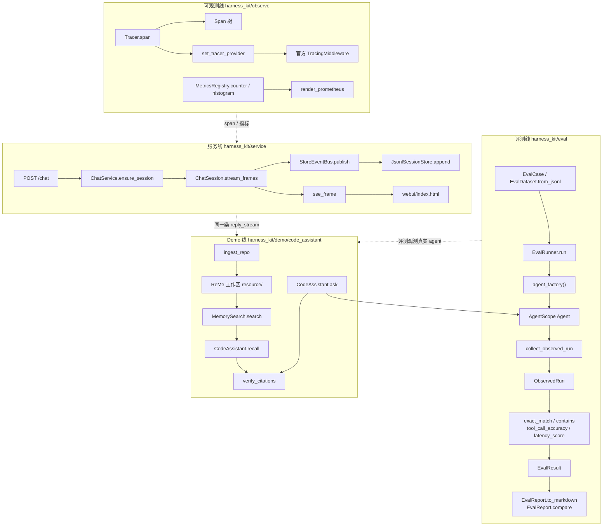
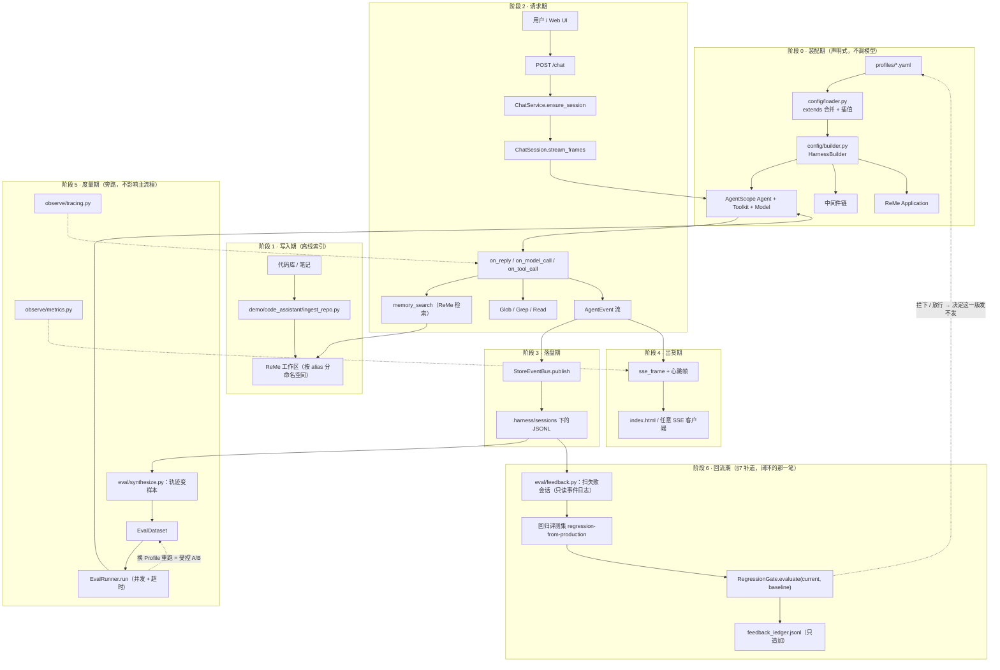

# 第 20 讲 《收官：评测、可观测、服务化与代码助手 demo》

> **本讲目标**：把前 19 讲散着造出来的东西拧成一台机器，并且给它装上
> **仪表盘**（评测）、**黑匣子**（可观测）、**出货口**（服务化）、
> **控制面板**（Profile 一键切换），最后用一个真实的**代码库问答助手**
> 把四条线全部串起来跑一遍。这一讲之后，
> `tutorial_agsc_reme/reference/harness_kit/` 就不再是一堆零件，
> 而是一个可以被别人 `pip install` 走、可以直接 `docker run` 起的
> **企业级 Agent Harness 脚手架**。
> **前置要求**：完成第 01 ~ 19 讲（尤其 09 事件溯源、11 权限、15~18 ReMe）。
> `third_party/agentscope`（2.0.8）与 `third_party/ReMe`（0.4.1.13）已就位；
> 能跑 `PYTHONPATH=third_party/ReMe python`（**必须先于 site-packages 里的
> reme 0.3.1.10**，见第 15 讲）；仓库根 `.env` 里已配好
> `OPENAI_API_KEY` / `OPENAI_BASE_URL` / `LLM_MODEL`（本机实测 `deepseek-flash`）。
> **本讲交付物**（相对仓库根路径）：
> `tutorial_agsc_reme/reference/harness_kit/eval/`（新增：`dataset.py` /
> `metrics.py` / `runner.py` / `report.py` / `synthesize.py` / `__init__.py` /
> `feedback.py`）、
> `tutorial_agsc_reme/reference/harness_kit/observe/`（新增：`tracing.py` /
> `metrics.py` / `__init__.py`）、
> `tutorial_agsc_reme/reference/harness_kit/service/`（新增：`app.py` /
> `webui/index.html` / `__init__.py`）、
> `tutorial_agsc_reme/reference/harness_kit/cli.py`（运营层总闸门）、
> `tutorial_agsc_reme/reference/harness_kit/profiles/`（新增
> `readonly_coder.yaml`）、
> `tutorial_agsc_reme/reference/harness_kit/demo/code_assistant/`
> （新增：`agent.py` / `ingest_repo.py` / `main.py` / `__init__.py` /
> `Dockerfile` / `deployment.yaml` / `README.md`）、
> `tutorial_agsc_reme/reference/scripts/20_eval_observe_service.py`、
> `tutorial_agsc_reme/reference/scripts/20_feedback_loop.py`（§7 补遗）、
> `tutorial_agsc_reme/reference/tests/test_lesson20_eval_observe.py`。
> **预计时长**：270 分钟（其中 §5 的运行验证约 60 分钟，含 6 次真实模型调用：
> 4 次评测 + 2 次 Demo 问答；§7 补遗约 30 分钟，**0 次模型调用**）。

> 本讲的完整可运行代码位于 `tutorial_agsc_reme/reference/harness_kit/`，
> 你可以直接对照，也可以跟着正文一行一行写。
>
> **一句话记住这一讲**：前面 19 讲回答的是"**怎么让 Agent 跑起来**"，
> 这一讲回答的是"**凭什么说它跑得好**"，以及（见 **§7 补遗**）
> "**这一版凭什么可以发**"。

---

## 一、这一讲要解决的问题

到这里，`harness_kit` 已经有 19 讲攒下来的家底：事件溯源（09）、
沙箱（10）、权限（11）、Planning/SOP（12）、Subagent（13）、
结构化输出（14）、记忆写入与混合检索与自演化（15~18）。
它们各自都能跑，各自都有测试。

但把这一堆东西交给一个真实团队时，会立刻撞上四个问题，
而且这四个问题**都不是"再加一个功能"能解决的**：

1. **你怎么知道它变好了？** 改一句 system prompt、把 `deepseek-flash`
   换成 `deepseek-chat`、把权限从 `default` 换成 `explore`、
   把 `max_iters` 从 20 调到 8 —— 你手上没有任何东西能回答
   "这次改动是进步还是退步"。第 09 讲的回放能告诉你"**上一次**
   发生了什么"，但它不能告诉你"**二十条用例里通过了几条**"。
2. **线上出问题时你能看到什么？** 第 09 讲的事件流是"业务级"的：
   它记 `TOOL_CALL`、`MODEL_CALL`、`REPLY_END`。但当一次回复花了 43 秒
   的时候，你想知道的是"**这 43 秒花在哪一层**" —— 是模型排队、
   是某个工具重试、还是我们自己注入 context 的那一段。
   事件流里没有"层"这个概念。
3. **别人怎么用它？** 一个同事不可能为了问一个问题而在你机器上
   装 conda 环境、export `PYTHONPATH`、然后 `python -m ...`。
   他要的是一个 URL。
4. **换个场景要改多少代码？** 从"研究助手"切到"代码助手"，
   理想情况是改一个 `--profile` 参数；实际最常见的情况是
   复制一份 `main.py` 然后开始改，改到最后两个入口行为不一致。

这一讲就是来补这四个空档的。补之前先确认一件事：
**上游有没有现成的？** 本机实测（`ls` 两份源码树的顶层）：

```text
$ ls third_party/agentscope/src/agentscope/
__init__.py _logging.py _utils _version.py agent app console credential
embedding event exception formatter mcp message middleware model permission
pipeline rag realtime skill sop state tool tts tui types workspace

$ ls third_party/ReMe/reme/
__init__.py application.py components config constants.py entry_point.py
enumeration plugin.py plugin_cli.py plugin_manifest.py reme.py schema steps utils
```

两份顶层目录里**都没有** `eval` / `benchmark` / `metrics` / `observe`
这一类名字。再往里挖一层：

- AgentScope 有 `app/` 一整层（`third_party/agentscope/src/agentscope/app/_router/`
  下 17 个路由模块，含 `_session.py` / `_chat.py` / `_schedule.py`），
  但那是**平台级**的：它自带 hub / channel / 会话存储 / workspace_manager，
  跟我们第 09 讲自己写的事件溯源存储、第 11 讲的审计日志、
  第 19 讲的记忆中间件**接不上**。用它等于把前 19 讲的存储层全部换掉。
- ReMe 有 `steps/benchmark/`，但里面**只有一个文件**：
  `third_party/ReMe/reme/steps/benchmark/base_agentic_answer.py`，
  它的 docstring 第 4 行写得很直白：
  `"""Shared benchmark steps; concrete implementations live in plugins."""`
  —— 具体 benchmark 在**闭源插件**里，开源的只是基类。
  同一顶层的 `reme/steps/benchmark/__init__.py` 也只导出
  `BaseAgenticAnswerStep` 一个名字。
- ReMe 的"评测"还有一处：`third_party/ReMe/reme/utils/evaluation_interface.py`。
  它的模块 docstring 自己声明了边界：*"Read-only evaluation helpers for
  application job execution statistics"*，而且明说
  *"intentionally not thread-safe request attribution: overlapping calls
  in the same Application contribute to each other's deltas"* ——
  它是**给 benchmark 用的计数器快照**，不是评测引擎，
  并发跑用例时它的 `delta` 会互相污染。
- AgentScope 的"可观测"只有 `TracingMiddleware`
  （`third_party/agentscope/src/agentscope/middleware/_tracing/_trace.py:117`），
  而它**在没有 collector 时是一个彻底的 no-op**：
  `_check_tracing_enabled()`（`:59`）会检查
  `isinstance(otel_trace.get_tracer_provider(), TracerProvider)`，
  不是真 SDK provider 就返回 `False`，于是每个 hook 直接
  `return await next_handler(...)`（`:143` 等）。本机上没有 collector，
  也就是说：**如果你只依赖官方中间件，那你的 trace 是空的**。

一个具体的失败场景，这段命令在本机跑过（注意 `--profile` 是**全局**参数，
要放在子命令 `eval` 前面，见 `harness_kit/cli.py` 的 `build_parser`）：

```text
$ PYTHONPATH=third_party/ReMe:tutorial_agsc_reme/reference \
    /Users/a/miniconda3/envs/agentscope_reme_pip_env/bin/python \
    -m harness_kit.cli --profile default eval --dataset ./.harness/eval/demo.jsonl
2026-09-22 04:36:20.394 | ERROR    | __main__:main:836 - FileNotFoundError: 评测集文件不存在: .harness/eval/demo.jsonl
$ echo $?
1
```

这就是第 19 讲结束时 `harness_kit` 的真实状态：**它跑得起来，
但它没有被测量的能力** —— 连"评测集从哪来"这件事都还没有答案。
于是"调 prompt"变成了一种信仰行为，而且这个信仰没法传给下一个接手的人。

所以本讲的所有工作，可以用一句话概括：
**给前 19 讲造出来的这台机器，装上仪表盘、黑匣子、出货口和控制面板。**
而且四件东西的原则是同一条：**它们都必须是可选的、可降级的、
不许把主流程拖下水**。评测层不接 LLM 也能跑（用替身 Agent），
观测层没有 collector 也要能跑（进程内 span 树），
服务层不允许自己 `uvicorn.run`（工厂函数返回 app），
Demo 跑不动（没有 API Key）也要能退化成"只索引不提问"。

仪表盘装好了，还剩最后一个问题：**谁来决定这一版能不能发？**
**§7 补遗**回答它 —— 把线上出过事的会话变成回归集的用例、
把"有没有退步"变成一道能自动拦下来的闸门。它不是第五条线，
而是上面四件东西的**收口**（理由写在 §7 开头那一节）。

---

## 二、源码侦察

这一讲**全文**的引用都来自真实源码或真实命令输出，格式为 `相对仓库根的路径:行号`
（这个约定在这里立下，后面四节都照它写）。
**正文里一律写全路径**；只有表格里为了不撑破列宽才用缩写：
`pkg/...` 省略的是前缀 `third_party/agentscope/src/agentscope/`
（ReMe 的省略 `third_party/ReMe/reme/`，`harness_kit/...` 是本仓库自己的路径），
单独出现的 `` `:NNN` `` 指同一行/同一格前面刚提到的那个文件的第 NNN 行。
这一讲要往外扩四层，所以侦察也要覆盖四个方向：
**上游有没有现成的**、**事件流里到底有什么**、**官方服务层长什么样**、
**我们要复用的是哪几个扩展点**。

### 2.1 评测：两份源码树都没有引擎，只有"半成品"

先把结论摆出来，再说依据：

| 看得见的东西 | 位置 | 它是什么 | 它不是什么 |
| --- | --- | --- | --- |
| `reme.steps.benchmark` | `third_party/ReMe/reme/steps/benchmark/` | 只有 `__init__.py` 与 `base_agentic_answer.py` 两个文件 | 不是评测引擎。`base_agentic_answer.py:1` 的 docstring 原文是 `"""Shared benchmark steps; concrete implementations live in plugins."""` |
| `evaluation_interface` | `third_party/ReMe/reme/utils/evaluation_interface.py` | 应用级计数器的前后快照（`check_job_count` 等） | 不是指标函数。docstring 自陈：*"intentionally not thread-safe request attribution: overlapping calls in the same Application contribute to each other's deltas"* |
| `TracingMiddleware` | `third_party/agentscope/src/agentscope/middleware/_tracing/_trace.py:117` | 官方 OTel 埋点中间件 | 不是 trace 存储，也不出报告 |
| `agentscope.app` | `third_party/agentscope/src/agentscope/app/` | 一个完整 FastAPI 平台（`_app.py:78` 的 `create_app(...) -> FastAPI`，`_router/` 下 15 个路由模块） | 不是一个"给你的 Harness 加个 HTTP 口"的薄层 |

`third_party/ReMe/reme/steps/benchmark/__init__.py` 的内容只有三行有效代码：

```text
"""Shared benchmark steps; concrete implementations live in plugins."""

from .base_agentic_answer import BaseAgenticAnswerStep

__all__ = ["BaseAgenticAnswerStep"]
```

`"concrete implementations live in plugins"` 这一句是关键：
ReMe 的 benchmark 是**插件化**的，开源的只有基类。
所以"抄一个评测引擎"这条路直接堵死 —— 你必须自己写。

而 `agentscope.app` 那一层**能用但要付大代价**：它自带
hub / channel / session 存储 / workspace_manager / credential 管理
（`third_party/agentscope/src/agentscope/app/` 下的
`hub`、`channel`、`message_bus`、`storage`、`workspace_manager`
五个子包）。用它的意思是：第 09 讲的事件溯源存储、
第 11 讲的权限审计、第 19 讲的记忆中间件**全部要换掉**，
或者写适配层把两边拼起来 —— 那比直接写一个窄接口更贵。

**结论**：评测层自己写，服务层自己写一个窄的，
不去动官方 `app/`（但保留"以后可以适配"的余地）。

### 2.2 可观测：官方 `TracingMiddleware` 在 2.0.8 里是**死代码**

这一条是本讲最重要的侦察发现，值得单独拎出来。

`third_party/agentscope/src/agentscope/middleware/_tracing/_trace.py:59`
的 `_check_tracing_enabled()`：

```text
    try:
        from opentelemetry.sdk.trace import TracerProvider
    except ImportError:
        return False

    return isinstance(otel_trace.get_tracer_provider(), TracerProvider)
```

它要求全局的 `TracerProvider` 必须是一个**真正的 SDK provider**。
而这个 provider 只能由 `otel_trace.set_tracer_provider(...)` 装上去。
于是在 2.0.8 的源码树里 grep 一遍：

```text
$ grep -rn "set_tracer_provider\|def setup_tracing" third_party/agentscope/src/agentscope/
$ echo $?
1
$ grep -rn "setup_tracing" third_party/agentscope/src/agentscope/
third_party/agentscope/src/agentscope/middleware/_tracing/_trace.py:61:    TracerProvider (i.e. ``setup_tracing`` was called).  Returns ``False``
third_party/agentscope/src/agentscope/middleware/_tracing/_trace.py:121:    When tracing has not been configured (``setup_tracing`` was not called),
```

**第一条 grep 的输出是空的**（命中 0 行），第二条 grep 里 `setup_tracing`
只出现在两处 docstring 中 —— **没有任何地方定义它、调用它**。
（顺带说明：本机的 `opentelemetry-sdk` 是**装了**的，
上面那段 `ImportError` 分支不会走到；问题出在"没人装 provider"这一步。）

所以：只要用户自己不写那三行
`set_tracer_provider(TracerProvider(...))`，官方的
`TracingMiddleware` 就永远是 no-op —— 每个 hook 都在
`:143`（`on_reply`）、`:268`（`on_model_call`）、`:318`（工具那一段）
的第一行直接返回。**你以为挂了 trace，其实 trace 是空的。**

这一条直接决定了本讲 `harness_kit/observe/tracing.py` 的设计：
它自己建 provider、自己 `set_tracer_provider`
（`harness_kit/observe/tracing.py:433`），于是**顺手把官方中间件救活了** ——
`TracingMiddleware` 的 `_check_tracing_enabled()` 从此返回 `True`。
这是"扩展层"最理想的形态：不是绕开官方，而是把官方缺的那一步补上。

### 2.3 事件流里到底有什么：数据合成的边界

第 09 讲定下的 `payload` 必备字段表在
`harness_kit/events/types.py:46` 的 `PAYLOAD_FIELDS`：

```text
PAYLOAD_FIELDS: dict[EventKind, tuple[str, ...]] = {
    EventKind.SESSION_START: ("profile", "agent_name", "cwd"),
    EventKind.REPLY_START: ("reply_id", "input_preview"),
    EventKind.MODEL_CALL: ("model", "prompt_tokens", "completion_tokens", "latency_ms", "finished_reason"),
    EventKind.TOOL_CALL: ("tool_name", "tool_input_digest", "call_id"),
    EventKind.TOOL_RESULT: ("call_id", "state", "chars", "error"),
    EventKind.PERMISSION: ("tool_name", "behavior", "reason"),
    EventKind.MEMORY_HIT: ("query", "chunk_ids", "kept", "tokens"),
    EventKind.REPLY_END: ("reply_id", "iterations", "tool_calls"),
    EventKind.CUSTOM: ("name", "data"),
}
```

把这张表逐行读一遍，能得出三个**必须写进设计文档**的结论：

1. **`REPLY_END` 里没有回答文本**。它只有 `reply_id` / `iterations` /
   `tool_calls`（`harness_kit/events/types.py:60`）。
   于是"从事件流反推出 `(input, output)` 这样的黄金评测集"这件事
   **在做不到**。硬做的话只能拿到"模型改了什么行为"，
   拿不到"模型答了什么"。
2. **`REPLY_START` 里的输入是截断的**：`input_preview`。
   `harness_kit/eval/synthesize.py:62` 记着这个截断长度
   （`_INPUT_PREVIEW_LIMIT = 500`），截断的样本要能被标出来
   （`TurnSample.truncated`），否则评测集里会混进"半句话的问题"。
3. **工具链是真值**：`TOOL_CALL.tool_name` 与 `REPLY_END.tool_calls`
   都是实打实录下来的，所以**"工具调用准确率"这一类指标有真值可用**；
   `MODEL_CALL.prompt_tokens` / `completion_tokens` 也是真值，
   所以 token 消耗不用自己估。

这就是 `harness_kit/eval/synthesize.py` 存在的全部理由，
也是它**必须如实承认能力上限**的原因（见 §4.5）。

### 2.4 Agent 的流式接口：`EvalRunner` 的观测从哪来

`EvalRunner` 要收"这次回答用了多少 token、调了哪些工具"，这些不在
`reply()` 的返回值里（`reply()` 只给一条 `Msg`）。它们只能从流式事件里收。

`third_party/agentscope/src/agentscope/agent/_agent.py` 里三个关键入口：

| 行号 | 签名 | 用途 |
| --- | --- | --- |
| `:117` | `class Agent:` | 官方 Agent（第 02 讲精读过它的主循环） |
| `:288` | `async def reply_stream(self, ...)` | 产出事件流，**评测观测就挂在它上面** |
| `:332` | `async def reply(self, ...)` | 非流式，内部走 `reply_stream` |
| `:381` | `async def observe(self, msgs=None) -> None` | 注入先导消息（`context` 字段走这里） |

事件类型在 `third_party/agentscope/src/agentscope/event/_event.py`：

| 行号 | 事件 | 本讲用到的字段 |
| --- | --- | --- |
| `:83` | `ReplyStartEvent` | —— |
| `:139` | `ModelCallEndEvent` | `input_tokens` / `output_tokens` |
| `:171` | `TextBlockDeltaEvent` | `delta`（拼回答文本） |
| `:314` | `ToolCallStartEvent` | `tool_call_name`（工具名） |
| `:409` | `ToolResultEndEvent` | 工具是否报错 |
| `:112` | `ReplyEndEvent` | `finished_reason`、`reply_id` |

`harness_kit/eval/runner.py:413` 的 `collect_observed_run()` 就是
"消费 `reply_stream` 把这些拼成 `ObservedRun`"那一段代码，
它在 `harness_kit/eval/metrics.py:103` 的 `ObservedRun` 上落地。

### 2.5 服务化：官方 `app/` 的规模与我们的取舍

`third_party/agentscope/src/agentscope/app/_router/` 下 15 个路由模块
（`_agent.py` / `_channel.py` / `_chat.py` / `_credential.py` /
`_embedding_model.py` / `_health.py` / `_hub.py` / `_knowledge_base.py` /
`_mcp.py` / `_model.py` / `_schedule.py` / `_session.py` / `_skill.py` /
`_tts_model.py` / `_workspace.py`）。

它覆盖的面比我们要的宽得多（模型管理、凭证管理、知识库、TTS……），
但也正因为宽，它必须假定一套自己的存储与主体模型。
本讲按契约 §3.20 只做 5 条路由：`POST /sessions`、`GET /sessions`、
`GET /sessions/{id}`、`POST /chat`（SSE）、`GET /healthz`，
外加两条观测口 `GET /traces`、`GET /metrics` 和一条 `GET /`（调试 UI）。
**接口窄到可以在一天内读完、一天内改完**，这是有意的。

### 2.6 ReMe 的嵌入方式：`ReMe(**config)` 而不是起服务

契约铁律之一是"不要长期占用端口的服务"，所以 ReMe 必须**嵌入式**跑。
两个入口都在源码里：

| 位置 | 内容 |
| --- | --- |
| `third_party/ReMe/reme/reme.py:18` | `class ReMe(Application):` —— 对外门面 |
| `third_party/ReMe/reme/application.py:23` | `class Application(BaseComponent):` —— 组件装配与生命周期 |
| `third_party/ReMe/reme/application.py:187` | `async def _start(self) -> None:` —— 真正把组件启起来（`_started_components` 在这时填充） |
| `third_party/ReMe/reme/application.py:223` | `async def _close_started_components(self) -> None:` —— 逆序关闭 |

第 18 讲踩过的坑在这里仍然成立：**`_start()` 没跑过，`run_job` 会
"假成功"**（`BaseJob.__call__` 遍历的是 start 时缓存的 step 列表）。
本讲的 Demo 与验证脚本一律走
`HarnessMemoryConfig(workspace=...).with_jobs(...)` +
`MemoryClient(builder.build())` + `await client.start()` 这条路，
由 `MemoryClient` 替我们守住"必须先 start"这条不变量。

### 2.7 本讲用到的 agentscope / reme 扩展点清单

| 上游对象 | 位置 | 本讲怎么用 |
| --- | --- | --- |
| `Agent.reply_stream` | `third_party/agentscope/src/agentscope/agent/_agent.py:288` | `collect_observed_run()` 消费它收 token / 工具调用 |
| `Agent.observe` | `third_party/agentscope/src/agentscope/agent/_agent.py:381` | `EvalRunner._observe_context()` 把 `case.context` 作为先导消息喂进去 |
| `Msg` / `TextBlock` | `third_party/agentscope/src/agentscope/message/` | 服务层与评测层构造消息 |
| `Toolkit.add_tool` / `remove_tool` | `third_party/agentscope/src/agentscope/tool/_toolkit.py:640` / `:682` | Demo 的 `_restrict_tools()` 用 `remove_tool` 把写类工具摘掉 |
| `MiddlewareBase` | `third_party/agentscope/src/agentscope/middleware/_base.py:13` | 观测层要理解它的 8 个 hook 何时被调 |
| `MiddlewareBase.list_tools` | `third_party/agentscope/src/agentscope/middleware/_base.py:286` | Demo 的 `_middleware_tools()` 用它列出"现挂"的工具 |
| `ReMeMiddleware.list_tools` | `third_party/agentscope/src/agentscope/middleware/_longterm_memory/_reme/_middleware.py:443` | `memory_search` 不在 Toolkit 里，只在这里出现 |
| `PermissionMode.EXPLORE` | `third_party/agentscope/src/agentscope/permission/_types.py:83` | 新增 `readonly_coder` Profile 的只读档位 |
| `TracingMiddleware` | `third_party/agentscope/src/agentscope/middleware/_tracing/_trace.py:117` | 我们的 `Tracer` 给它装上 provider，让它真正开始工作 |
| `ReMe` / `Application` | `third_party/ReMe/reme/reme.py:18` / `application.py:23` | 记忆索引与检索的嵌入式入口 |
| 内置工具 `Grep` / `Glob` / `Read` 的取根逻辑 | `third_party/agentscope/src/agentscope/tool/_builtin/_grep.py:222`、`tool/_builtin/_backend.py:902` | Demo 必须在提问前 `os.chdir`，否则模型搜不到代码 |

`tool/_builtin/_grep.py:222` 与 `tool/_builtin/_backend.py:902` 这两条是 Demo 里最容易翻车的地方，
原文在 §4.21 会再展开一次：`Grep` 没有 `cwd` 参数，相对路径由
`await self._backend.getcwd()` 补全，而 `LocalBackend.getcwd()`
返回的就是 `os.getcwd()`。

---

## 三、扩展点定位与设计

### 3.1 官方已经给了什么

把 §二 的侦察结果反过来读，官方给我们的东西其实不少，
而且**恰好够用**：

- **一个能产出全部运行时事实的流**：`Agent.reply_stream`
  （`third_party/agentscope/src/agentscope/agent/_agent.py:288`）。
  token、工具名、迭代次数、结束原因全在里面。
- **一个能注入先导消息的口**：`Agent.observe`
  （`third_party/agentscope/src/agentscope/agent/_agent.py:381`）。这让"给这条用例喂一段资料"不需要污染用户输入。
- **一套能挂载 / 摘除工具的容器**：`Toolkit.add_tool` / `remove_tool`
  （`third_party/agentscope/src/agentscope/tool/_toolkit.py:640` / `:682`）。
- **一个 OTel 埋点中间件**：`TracingMiddleware`
  （`middleware/_tracing/_trace.py:117`）—— 只要有人给它装 provider。
- **一个 FastAPI 生态**：`fastapi` 已经是 AgentScope 的依赖
  （`third_party/agentscope/src/agentscope/app/_app.py:42` 里
  `from fastapi import FastAPI`），我们不必新增依赖。
- **一套记忆库的嵌入式入口**：`ReMe` / `Application`
  （`third_party/ReMe/reme/reme.py:18` / `third_party/ReMe/reme/application.py:23`）。

### 3.2 还缺什么

四件，一件不少：

1. **缺"用例"这个概念**。前 19 讲里没有任何一个类叫 `EvalCase`。
   没有它，"跑一次"和"跑一百条"是两件不同的事，
   而后者才叫评测。
2. **缺"指标函数"这个签名**。最省事的写法是把指标写死在 runner 里，
   但那样 A/B 对比就只能比"同一套指标"。要能换指标，
   就需要一个 `(case, output) -> 分数` 的稳定契约。
3. **缺"跨 Profile / 跨模型对比"这件事**。第 01 讲起 Profile 就在，
   但从来没人把两份报告的**同一列**并排比过。
4. **缺"一个不占端口的服务壳"**。官方 `app/` 太大，
   而 `python -m ...` 太窄。

还有**第五件事**，它不属于上面四条线上的任何一条，却决定这四条线能不能
长期活下去：**跑完之后呢？** 上面四件事做完，评测集仍然是我手写的那 20 条，
线上真正翻车的输入一条都没进去；而"这一版比上一版差"这件事，
没有任何机制能自动化地拦下来。这条缺口补在 **§7 补遗**
（生产反馈闭环：线上失败会话 → 回归集 → 回归闸门 → 台账）。

### 3.3 我们准备在哪个扩展点上做

本讲的四条线，各自贴着不同的扩展点，**一行上游代码都不改**：

| 线 | 贴着的扩展点 | 我们的做法 |
| --- | --- | --- |
| 评测 | `Agent.reply_stream`（`agent/_agent.py:288`）+ `Agent.observe`（同文件 `:381`） | `EvalRunner` 每条用例造一个新 Agent，消费事件流得到 `ObservedRun` |
| 可观测 | `set_tracer_provider`（上游**空位**）+ `MiddlewareBase`（`middleware/_base.py:13`） | 自己的 `Tracer` 建 provider 并装上，救活官方 `TracingMiddleware`；同时保留进程内 span 树 |
| 服务化 | `fastapi`（`app/_app.py:42` 证明它是既有依赖）+ 第 09 讲 `SessionStoreBase` | `create_harness_app()` 返回 app，不监听端口；SSE 转发 `reply_stream` 的事件 |
| Demo | `Toolkit.remove_tool`（`tool/_toolkit.py:682`）+ `ReMeMiddleware.list_tools`（`middleware/_longterm_memory/_reme/_middleware.py:443`）+ `PermissionMode.EXPLORE`（`permission/_types.py:83`） | 新增 `readonly_coder` Profile，用 `remove_tool` 摘写类工具，用 `EXPLORE` 兜底 |

一个设计上的关键决策值得单独说：**评测层不认识 Agent**。
`EvalRunner` 的构造参数是 `agent_factory: Callable[[], Awaitable[Any]]`，
它只要求返回值有 `reply_stream` / `observe` / `aclose` 三个方法。
好处有三个：

1. 评测层可以在 **0 次 LLM 调用**下被完整测试（用替身 Agent）；
2. 同一个 runner 能评测"装了记忆的 Agent"和"没装记忆的 Agent"，
   因为差异全在 factory 里；
3. 官方 Agent 换版本、或者将来换成别家的 Agent 实现，
   评测层不用动。

### 3.4 扩展点清单（本讲用到的）

| 名字 | 类型 | 文件 | 契约 |
| --- | --- | --- | --- |
| `MetricFn` | 类型别名 | `harness_kit/eval/metrics.py` | `Callable[[EvalCase, str], Awaitable[float]]` |
| `RewriterFn` | 类型别名 | `harness_kit/eval/dataset.py` | `Callable[[EvalCase], Awaitable[EvalCase]]` |
| `NOT_APPLICABLE` | 常量 | `harness_kit/eval/metrics.py:73` | `-1.0`（**负数**，出 `[0,1]` 量纲） |
| `EvalCase` | pydantic 模型 | `harness_kit/eval/dataset.py:60` | `extra="forbid"`（写错字段名立刻报错） |
| `EvalDataset` | pydantic 模型 | `harness_kit/eval/dataset.py:111` | JSONL 头行 `{"type":"dataset",...}` |
| `EvalRunner` | 类 | `harness_kit/eval/runner.py:113` | 每用例一 Agent；单条失败不中断 |
| `EvalResult` | pydantic 模型 | `harness_kit/eval/runner.py:65` | `ok` / `scores` / `tokens` / `cost_usd` |
| `EvalReport` | pydantic 模型 | `harness_kit/eval/report.py:112` | `save()` 的参数是**文件名前缀** |
| `ObservedRun` | pydantic 模型 | `harness_kit/eval/metrics.py:103` | 通过 `ContextVar` 传给指标函数 |
| `Tracer` | 类 | `harness_kit/observe/tracing.py:306` | 必须"没有 collector 也能跑" |
| `MetricsRegistry` | 类 | `harness_kit/observe/metrics.py:519` | `render_prometheus()` 输出 exposition 文本 |
| `create_harness_app` | 工厂函数 | `harness_kit/service/app.py:862` | **返回** app，不 `uvicorn.run` |
| `ChatService` / `ChatSession` | 类 | `harness_kit/service/app.py:634` / `:295` | LRU 会话表 + 每会话一个 Agent |
| `StoreEventBus` | 类 | `harness_kit/service/app.py:202` | 事件写存储并广播；**丢弃** producer 的 `seq` |
| `demo_profile` | 函数 | `harness_kit/demo/code_assistant/agent.py` | 在基础 Profile 上重指记忆工作区 |
| `SessionStoreBase` | 抽象类 | `harness_kit/session/store.py:70`（第 09 讲） | `list_sessions()` / `read()` 两个抽象方法（§7 的扫描只靠这两个） |
| `EvalReport.compare` / `summary` | 方法 | `harness_kit/eval/report.py`（本讲 §4.4） | `compare` 出对比表；`summary` 出纯指标字典（§7 的闸门用后者） |
| `RegressionGate` | pydantic 模型 | `harness_kit/eval/feedback.py`（§7 补遗） | `evaluate(current, baseline) -> GateDecision`；`extra="forbid"` |
| `scan_sessions` / `build_regression_dataset` | 异步函数 | `harness_kit/eval/feedback.py`（§7 补遗） | 前者 `SessionStoreBase -> list[SessionPick]`；后者 `-> (EvalDataset, dict[指纹, 会话 id])` |

### 3.5 数据流（真实函数名）

四条线的数据流放在一张图里，节点名就是真实函数名：



图上三处需要展开说明：

1. **`EvalRunner.run` 到 `Agent` 是虚线以外的唯一路径** ——
   runner 不持有 Agent，它只持有 factory。这保证了"每条用例一个干净 Agent"。
2. **`ObservedRun` 到指标函数走的是 `ContextVar`，不是参数**。
   指标函数的签名固定为 `(case, output)`，`tool_call_accuracy` 这类
   需要"这次用了哪些工具"的指标从 `current_run()` 里取。
   这是为了让所有指标共享同一个签名，能塞进一个列表。
3. **`StoreEventBus.publish` 到 `JsonlSessionStore.append` 是唯一
   写事件的地方**。服务层不直接写存储 —— 因为存储层的 `seq`
   才是权威，producer 给的 `seq` 会被丢掉重编。

---

## 四、harness_kit 实现

本节的代码全部是**基于 agentscope + reme 的扩展代码**：
没有一行是自己手写的 Agent Loop、ChatModelBase、Toolkit 或记忆库。
我们要写的四层，性质分别是：

- `harness_kit/eval/` —— **测量层**，贴着 `Agent.reply_stream` 与 `Agent.observe`；
- `harness_kit/observe/` —— **观测层**，把上游空着的 `set_tracer_provider` 补上，
  同时自带进程内 span 树与指标注册表；
- `harness_kit/service/` —— **出货层**，用 AgentScope 已经依赖的 `fastapi`
  把装好的 Harness 暴露成 HTTP；
- `harness_kit/demo/code_assistant/` —— **业务层**，把 ReMe 索引、AgentScope
  运行时、harness_kit 治理三者接起来。

顺序上先写测量层：它是其余三层的"验收标准"——
没有它，后面每一层好不好都只能靠感觉。

### 4.1 `harness_kit/eval/dataset.py`

用例与数据集。


这 485 行只做一件事：**让"一条评测用例"成为一个有名字、有校验、能落盘的对象**。

三个设计决定值得解释：

**（1）`extra="forbid"`。** `EvalCase` 只认 8 个字段：
`id` / `input` / `expected` / `tags` / `context` / `metadata` /
`expected_tools` / `expected_citations`。写错一个字段名（比如把 `expected`
写成 `answer`）会**立刻报错**，而不是静默地让这条用例变成"没有期望输出"。
评测集最常见的坏味道就是"字段名拼错导致一批用例悄悄退化成永远通过"。

**（2）JSONL 的头行。** 纯 pandas 风格的 JSONL 会把数据集名丢掉，
而报告里"这份报告跑的是哪个集合"必须可追溯。所以文件第一行是
`{"type": "dataset", "name": ..., "tags": ..., "metadata": ...}`，
其余行是 `{"type": "case", ...}`。这样 `to_jsonl` / `from_jsonl` 是
**逐字段可逆**的；同时 `from_jsonl` 也接受"没有头行的手写文件"
（用文件主名当数据集名），因为手写评测集比程序生成的多得多。

**（3）`expected_tools` / `expected_citations` 是独立字段，不塞进 `metadata`。**
因为它们不是"额外信息"，而是**工具调用准确率**与**引用覆盖率**两个指标的
真值来源。塞进 `metadata` 会让这两个指标变成"可选依赖 dict 的某个键"，
而那正是上一段说的坏味道。

还有一处**契约偏离**要如实记录：契约 §3.20 里 `synthesize_cases` 写的是
同步 `def`，而它要调用的 `rewriter` 是异步的（要调模型）。
实现取 `async def synthesize_cases(seed, *, n, rewriter)`，
并且在 docstring 里写明"**可能产出少于 n 条**"——
合成是尽力而为的，某一条失败不该让整批白干。

```python
# -*- coding: utf-8 -*-
"""评测集结构（``EvalCase`` / ``EvalDataset``）与 JSONL 读写（契约 §3.20 / §5.6）。

**为什么需要自己的一层？** AgentScope 2.0.8 全库没有 benchmark / eval 引擎
（``_recon/12_reme_storage_graph.md`` 的"不存在的能力"清单第 4 条已记录；
实测 ``ls third_party/agentscope/src/agentscope/`` 也没有 ``eval`` 或
``benchmark`` 子包），ReMe 侧只有 ``steps/evaluate`` 这类单步组件，
没有"批量跑用例 + 出报告"的东西。所以这是 harness_kit 要补的真缺口
（契约 §1.3 缺口 3），不是重造轮子。

**字段级真值是契约 §5.6**，它比 §3.20 多了两个评测专用字段
（``expected_tools`` / ``expected_citations``），本模块按 §5.6 实现：
§3.20 的五个字段是 §5.6 的子集，因此两份契约在本实现上同时成立。

JSONL 落盘格式（本模块定义的唯一真值）::

    {"type": "dataset", "name": "code_qa", "tags": ["demo"], "metadata": {...}}   # 第 1 行，可省
    {"type": "case", "id": "c1", "input": "...", "expected": "...", ...}          # 之后每行一个用例

第 1 行是**头**：:meth:`EvalDataset.from_jsonl` 见到 ``type=="dataset"`` 就读
``name``；没有头（裸用例行）时用文件主名当数据集名。这样手写的
"一行一个用例" 文件也能直接吃进来，不必先补一个头。

Example:
    >>> from pathlib import Path
    >>> import tempfile
    >>> case = EvalCase(id="c1", input="1+1=?", expected="2")
    >>> dataset = EvalDataset(name="arith", cases=[case])
    >>> tmp = Path(tempfile.mkdtemp()) / "arith.jsonl"
    >>> _ = dataset.to_jsonl(tmp)
    >>> EvalDataset.from_jsonl(tmp).cases[0].expected
    '2'
"""

from __future__ import annotations

import asyncio
import json
from pathlib import Path
from typing import Any, Awaitable, Callable, Iterable, Iterator, Sequence

from loguru import logger
from pydantic import BaseModel, ConfigDict, Field

__all__ = [
    "EvalCase",
    "EvalDataset",
    "RewriterFn",
    "dataset_from_cases",
    "synthesize_cases",
]

RewriterFn = Callable[["EvalCase"], Awaitable["EvalCase"]]
"""改写器签名（契约 §3.20）：``EvalCase -> Awaitable[EvalCase]``。"""

_HEADER_TYPE: str = "dataset"
_CASE_TYPE: str = "case"


class EvalCase(BaseModel):
    """一条评测用例（契约 §5.6，字段名不得改）。"""

    model_config = ConfigDict(extra="forbid")

    id: str
    """用例 id，数据集内唯一（:meth:`EvalDataset.validate_unique_ids` 会查重）。"""

    input: str
    """喂给 Agent 的用户输入。"""

    expected: str | None = None
    """期望输出文本；``None`` 表示"只看行为不看文本"（如只校验工具调用）。"""

    tags: list[str] = Field(default_factory=list)
    """标签，用于 :meth:`EvalDataset.filter` 挑子集。"""

    context: list[str] = Field(default_factory=list)
    """预先塞进上下文的参考资料。

    语义是"这段对话是在这些资料给定的前提下发生的"，因此
    :class:`~harness_kit.eval.runner.EvalRunner` 会把它**作为独立消息
    先 observe 给 Agent**，而不是拼进用户那句话里 —— 拼进去会改变
    用户输入的措辞，让 ``exact_match`` 之类的指标失去意义。
    """

    metadata: dict[str, Any] = Field(default_factory=dict)
    """任意附加信息；:mod:`harness_kit.eval.metrics` 会读
    ``latency_budget_ms`` / ``require_citation`` / ``judge_criteria`` 三个键。"""

    expected_tools: list[str] = Field(default_factory=list)
    """:class:`~harness_kit.eval.metrics.tool_call_accuracy` 期望出现的工具名。"""

    expected_citations: list[str] = Field(default_factory=list)
    """:class:`~harness_kit.eval.metrics.citation_coverage` 期望出现的来源路径。"""

    def digest(self, limit: int = 120) -> str:
        """返回一行摘要（日志 / 报告用）。

        Args:
            limit (`int`): 输入预览长度上限。

        Returns:
            `str`: ``"c1 [qa] 1+1=? -> 2"`` 形态的摘要。
        """
        text = self.input.replace("\n", " ").strip()
        preview = text if len(text) <= limit else text[:limit] + "…"
        tag = ",".join(self.tags)
        return f"{self.id} [{tag}] {preview}"


class EvalDataset(BaseModel):
    """一个具名评测集（契约 §3.20）。"""

    model_config = ConfigDict(extra="forbid")

    name: str
    """数据集名，进报告标题与文件名。"""

    cases: list[EvalCase] = Field(default_factory=list)
    """用例列表。"""

    tags: list[str] = Field(default_factory=list)
    """数据集级标签（JSONL 头里有就带回来）。"""

    metadata: dict[str, Any] = Field(default_factory=dict)
    """数据集级元信息。"""

    # ------------------------------------------------------------------
    # 校验与派生
    # ------------------------------------------------------------------
    def validate_unique_ids(self) -> list[str]:
        """检查用例 id 是否唯一。

        Returns:
            `list[str]`: 重复的 id（已去重、已排序）；空列表表示合法。
        """
        seen: set[str] = set()
        duplicated: set[str] = set()
        for case in self.cases:
            if case.id in seen:
                duplicated.add(case.id)
            seen.add(case.id)
        return sorted(duplicated)

    def filter(
        self,
        *,
        tags: Sequence[str] | None = None,
        ids: Sequence[str] | None = None,
        match_all: bool = False,
    ) -> "EvalDataset":
        """按标签 / id 挑子集。

        Args:
            tags (`Sequence[str] | None`): 标签过滤；``None`` 表示不过滤。
            ids (`Sequence[str] | None`): id 过滤；``None`` 表示不过滤。
            match_all (`bool`): 标签过滤是"全命中"还是"任一命中"。

        Returns:
            `EvalDataset`: 新数据集（原对象不变）。
        """
        wanted_ids = set(ids) if ids is not None else None
        wanted_tags = set(tags) if tags else None

        def _keep(case: EvalCase) -> bool:
            if wanted_ids is not None and case.id not in wanted_ids:
                return False
            if wanted_tags is not None:
                hit = wanted_tags & set(case.tags)
                if match_all and hit != wanted_tags:
                    return False
                if not match_all and not hit:
                    return False
            return True

        return self.model_copy(update={"cases": [case for case in self.cases if _keep(case)]})

    def head(self, n: int) -> "EvalDataset":
        """取前 ``n`` 条（小规模冒烟评测用）。

        Args:
            n (`int`): 条数；必须为正。

        Returns:
            `EvalDataset`: 新数据集。

        Raises:
            `ValueError`: ``n <= 0``。
        """
        if n <= 0:
            raise ValueError(f"head 的 n 必须为正，收到 {n}")
        return self.model_copy(update={"cases": self.cases[:n]})

    def stats(self) -> dict[str, Any]:
        """数据集概况（报告与 CLI 用）。

        Returns:
            `dict[str, Any]`: ``case_count`` / ``by_tag`` / ``with_expected`` /
            ``with_tools`` / ``with_citations``。
        """
        by_tag: dict[str, int] = {}
        for case in self.cases:
            for tag in case.tags:
                by_tag[tag] = by_tag.get(tag, 0) + 1
        return {
            "case_count": len(self.cases),
            "by_tag": by_tag,
            "with_expected": sum(1 for case in self.cases if case.expected is not None),
            "with_tools": sum(1 for case in self.cases if case.expected_tools),
            "with_citations": sum(1 for case in self.cases if case.expected_citations),
        }

    def __len__(self) -> int:
        """用例数。

        Returns:
            `int`: 用例数。
        """
        return len(self.cases)

    def __iter__(self) -> Iterator[EvalCase]:  # type: ignore[override]
        """迭代用例。

        Returns:
            `Iterator[EvalCase]`: 用例迭代器。
        """
        return iter(self.cases)

    # ------------------------------------------------------------------
    # JSONL 读写
    # ------------------------------------------------------------------
    @classmethod
    def from_jsonl(cls, path: Path) -> "EvalDataset":
        """从 JSONL 装载。

        容忍两种形态：带 ``type=="dataset"`` 头行的，和一行一个裸用例的。
        **空行会被跳过**（手工编辑过的文件经常留空行），坏行会带着行号抛错
        （静默跳过坏行会让"少了 3 条用例"变成一个没人发现的问题）。

        Args:
            path (`Path`): JSONL 文件路径。

        Returns:
            `EvalDataset`: 数据集。

        Raises:
            `FileNotFoundError`: 文件不存在。
            `ValueError`: 某行不是合法 JSON，或结构不对。
        """
        target = Path(path)
        if not target.is_file():
            raise FileNotFoundError(f"评测集文件不存在: {target}")

        name = target.stem
        dataset_tags: list[str] = []
        dataset_meta: dict[str, Any] = {}
        cases: list[EvalCase] = []

        for lineno, raw in enumerate(target.read_text(encoding="utf-8").splitlines(), start=1):
            line = raw.strip()
            if not line:
                continue
            try:
                payload = json.loads(line)
            except json.JSONDecodeError as exc:
                raise ValueError(f"{target}:{lineno} 不是合法 JSON: {exc}") from exc
            if not isinstance(payload, dict):
                raise ValueError(f"{target}:{lineno} 期望一个 JSON 对象，收到 {type(payload).__name__}")

            kind = payload.get("type", _CASE_TYPE)
            if kind == _HEADER_TYPE:
                name = str(payload.get("name") or name)
                dataset_tags = list(payload.get("tags") or [])
                dataset_meta = dict(payload.get("metadata") or {})
                continue

            body = {key: value for key, value in payload.items() if key != "type"}
            if "id" not in body or "input" not in body:
                raise ValueError(f"{target}:{lineno} 用例缺 id / input: {sorted(body)}")
            cases.append(EvalCase.model_validate(body))

        logger.bind(path=str(target), cases=len(cases)).debug("评测集已装载")
        return cls(name=name, cases=cases, tags=dataset_tags, metadata=dataset_meta)

    def to_jsonl(self, path: Path) -> None:
        """写出 JSONL（首行是头）。

        Args:
            path (`Path`): 目标路径；父目录会被创建。
        """
        target = Path(path)
        target.parent.mkdir(parents=True, exist_ok=True)
        lines: list[str] = [
            json.dumps(
                {
                    "type": _HEADER_TYPE,
                    "name": self.name,
                    "tags": self.tags,
                    "metadata": self.metadata,
                },
                ensure_ascii=False,
            ),
        ]
        for case in self.cases:
            payload = case.model_dump(mode="json")
            payload["type"] = _CASE_TYPE
            lines.append(json.dumps(payload, ensure_ascii=False))
        target.write_text("\n".join(lines) + "\n", encoding="utf-8")
        logger.bind(path=str(target), cases=len(self.cases)).debug("评测集已落盘")

    @classmethod
    def from_cases(
        cls,
        cases: Iterable[EvalCase],
        *,
        name: str = "adhoc",
        tags: Sequence[str] | None = None,
        metadata: dict[str, Any] | None = None,
    ) -> "EvalDataset":
        """从用例列表构造（便捷入口）。

        Args:
            cases (`Iterable[EvalCase]`): 用例。
            name (`str`): 数据集名。
            tags (`Sequence[str] | None`): 数据集级标签。
            metadata (`dict[str, Any] | None`): 数据集级元信息。

        Returns:
            `EvalDataset`: 数据集。
        """
        return cls(
            name=name,
            cases=list(cases),
            tags=list(tags or []),
            metadata=dict(metadata or {}),
        )

    def to_markdown(self, limit: int = 20) -> str:
        """渲染成 Markdown 表格（人工审阅用例用）。

        Args:
            limit (`int`): 最多打印多少行。

        Returns:
            `str`: Markdown 文本。
        """
        lines = [
            f"# 评测集 {self.name}",
            "",
            f"- 用例数: {len(self.cases)}",
            f"- 标签: {', '.join(self.tags) or '(无)'}",
            f"- 期望工具/引用的用例数: {sum(1 for c in self.cases if c.expected_tools or c.expected_citations)}",
            "",
            "| id | 输入 | 期望 | 标签 | 期望工具 |",
            "| --- | --- | --- | --- | --- |",
        ]
        for case in self.cases[:limit]:
            lines.append(
                "| {id} | {input} | {expected} | {tags} | {tools} |".format(
                    id=case.id,
                    input=_cell(case.input, 60),
                    expected=_cell(case.expected or "", 40),
                    tags=",".join(case.tags),
                    tools=",".join(case.expected_tools),
                ),
            )
        if len(self.cases) > limit:
            lines.append(f"| … | 还有 {len(self.cases) - limit} 条 | | | |")
        return "\n".join(lines)


def _cell(text: str, width: int) -> str:
    """把单元格内容压成单行且不破坏 Markdown 表格。

    Args:
        text (`str`): 原始文本。
        width (`int`): 最大宽度。

    Returns:
        `str`: 处理后的文本。
    """
    collapsed = " ".join(text.split()).replace("|", "\\|")
    return collapsed if len(collapsed) <= width else collapsed[:width] + "…"


def dataset_from_cases(
    cases: Iterable[EvalCase],
    *,
    name: str = "adhoc",
) -> EvalDataset:
    """``EvalDataset.from_cases`` 的函数式别名（契约里没写，但脚本里更好读）。

    Args:
        cases (`Iterable[EvalCase]`): 用例。
        name (`str`): 数据集名。

    Returns:
        `EvalDataset`: 数据集。
    """
    return EvalDataset.from_cases(cases, name=name)


async def synthesize_cases(
    seed: list[EvalCase],
    *,
    n: int,
    rewriter: RewriterFn,
) -> list[EvalCase]:
    """数据合成：把少量种子用例扩成 ``n`` 条（契约 §3.20）。

    **契约偏离（必须记住）**：契约 §3.20 把它写成同步的
    ``def synthesize_cases(...) -> list[EvalCase]``，但同一个签名里的
    ``rewriter`` 是 ``Callable[[EvalCase], Awaitable[EvalCase]]`` —— 同步函数
    没法 ``await`` 一个异步改写器，除非在里面 ``asyncio.run()``，
    而契约 §七.2 明令禁止库代码出现 ``asyncio.run()``。两者不可兼得，
    因此这里把它实现成 ``async def``。以真实 API 为准，记在偏离清单里。

    语义：

    - 对 ``seed`` 做**轮转**（``seed[i % len(seed)]``）直到产出 ``n`` 条，
      这样即使 ``n`` 远大于种子数也能均匀扩；
    - 第 ``k`` 条新用例的 id 是 ``f"{seed_case.id}-syn{k}"``，**同一次调用的
      内 k 唯一**（跨次调用可能重号，调用方自行加前缀）；
    - ``rewriter`` 抛异常时**跳过该条并继续**（合成是"尽力而为"，
      一条坏样本不该让整批白干），跳过的记录会打 warning；
    - 产出条数**可能少于 n**（全部失败时为空列表）—— 返回值就是真实条数，
      调用方必须自己看 ``len()``。

    Args:
        seed (`list[EvalCase]`): 种子用例。
        n (`int`): 期望产出条数；必须为正。
        rewriter (`RewriterFn`): 异步改写器，通常内部调一次 LLM。

    Returns:
        `list[EvalCase]`: 合成出的用例（可能少于 ``n``）。

    Raises:
        `ValueError`: ``seed`` 为空，或 ``n <= 0``。
    """
    if n <= 0:
        raise ValueError(f"synthesize_cases 的 n 必须为正，收到 {n}")
    if not seed:
        raise ValueError("synthesize_cases 的 seed 不能为空（没有种子就没有合成）")

    produced: list[EvalCase] = []
    failures = 0
    for index in range(n):
        source = seed[index % len(seed)]
        try:
            rewritten = await rewriter(source)
        except asyncio.CancelledError:  # pragma: no cover - 取消必须继续往上抛
            raise
        except Exception as exc:  # noqa: BLE001 - 单条失败不中断整批
            failures += 1
            logger.warning("synthesize_cases: 第 {} 条改写失败（已跳过）: {}", index, exc)
            continue
        if not isinstance(rewritten, EvalCase):
            failures += 1
            logger.warning(
                "synthesize_cases: 第 {} 条改写器返回了 {}，不是 EvalCase（已跳过）",
                index,
                type(rewritten).__name__,
            )
            continue
        produced.append(
            rewritten.model_copy(
                update={
                    "id": f"{source.id}-syn{index}",
                    "tags": sorted(set(rewritten.tags) | {"synthetic"}),
                    "metadata": {
                        **rewritten.metadata,
                        "synthesized_from": source.id,
                    },
                },
            ),
        )

    if failures:
        logger.warning(
            "synthesize_cases: {}/{} 条失败，实际产出 {} 条",
            failures,
            n,
            len(produced),
        )
    return produced
```

### 4.2 `harness_kit/eval/metrics.py`

指标函数与"不适用"哨兵。


整个评测层最容易搞错、也最值得抄走的一个设计在这里：
**"不适用"必须是 `-1.0`，不能是 `0.0`**（`harness_kit/eval/metrics.py:73`）。

设想一个三用例的评测集：一条有 `expected`、一条有 `expected_tools`、
一条什么都没有。如果"没有期望值"返回 `0.0`，那么汇总时：

- 第一条的 `contains` 是 `1.0`（答对了）；
- 第二条的 `contains` 是 `0.0`（它根本没考这项！）；
- 平均下来 `0.67`，报告会告诉你"有一项没过"。

而真相是**这项对第二条不适用**。取 `-1.0` 之后，
`score_summary()` 把它们剔出分母，均值才是对的。
选负数而不是 `None` 或 `NaN` 的原因很实际：
所有指标返回 `float`，`-1.0` 一定落在 `[0, 1]` 之外，
可以被"分数区间"这条校验规则天然地筛出来，不需要额外类型。

第二个设计是**证据怎么传给指标**。所有指标签名统一为
`async def f(case: EvalCase, output: str) -> float`
（`MetricFn`），这样它们能塞进一个列表一起跑。但
`tool_call_accuracy` 明明需要知道"这次调了哪些工具"。
解法是 `ContextVar`：

```text
_OBSERVED_RUN: ContextVar[ObservedRun | None] = ContextVar("harness_kit_eval_run", default=None)
```

（`harness_kit/eval/metrics.py:154`）`EvalRunner` 在跑每条用例时用
`observed_run(run)` 上下文管理器把它挂上，指标函数用 `current_run()` 取。
选 `ContextVar` 而不是"传参"或"threading.local"的理由是：

- 传参会让"简单的字符串指标"和"复杂的证据指标"签名不同，没法放进一个列表；
- `ContextVar` 是 **asyncio 任务隔离**的，而 `EvalRunner` 是并发的。
  两条用例同时跑时，各自的 `ContextVar` 互不干扰；
  换成模块级全局变量，并发评测会互相串证据 —— 而且串出来的
  分数**看起来完全正常**，这种 bug 极难发现。

第三个设计是 `tool_call_accuracy` 的打分公式（`:294` 起）：

```text
recall / (1.0 + extras * 0.25)
```

其中 `recall` 是"期望工具被调到的比例"，`extras` 是"多调了几个不该调的"。
一个用例期望 `["Read"]`，实际调了 `["Read"]` → `1.0`；
实际调了 `["Read", "Grep"]` → `1.0 / 1.25 = 0.8`。
这个公式的好处是**单调**：多调一个工具一定降分，少调一个也一定降分，
而且永远不会越界（分母恒大于分子）。

第四个是 `DEFAULT_THRESHOLDS`（`:83`）放在 metrics 而不是 runner 里。
原因是 runner 要用它判 `ok`、report 要用它渲染"门槛"列，
而 metrics 谁都不依赖 —— 写在其中一边必然造成循环 import。
门槛口径统一是"**分数越高越好**"，所以"越低越好"的指标
（延迟）只能通过已经翻过方向的 `latency_score` 来表达。

```python
# -*- coding: utf-8 -*-
"""评测指标函数（契约 §3.20 / §5.6，第 20 讲）。

契约给的指标签名是 ``MetricFn = Callable[[EvalCase, str], Awaitable[float]]``
—— 只有「用例」和「最终输出文本」两个入参。这对 ``exact_match`` /
``contains`` 足够，但 :func:`tool_call_accuracy` 与 :func:`latency_score`
需要的证据（这一轮调了哪些工具、跑了多久、烧了多少 token）**不在那句
输出文本里**。

本模块的解法是 :data:`_OBSERVED_RUN` 这个 ``ContextVar``：

- :class:`~harness_kit.eval.runner.EvalRunner` 在跑完一个用例后，把该轮的
  :class:`ObservedRun` 设进当前执行上下文，再依次 ``await`` 每个指标；
- 指标函数用 :func:`current_run` 取它，取不到（例如单独单测某个指标）
  就退化成"只看 ``output`` 文本"或返回"不适用"。

``ContextVar`` 而不是"给指标多传一个参数"，理由有两条：一是签名必须与契约
逐字一致（教程里的指标函数要能直接互相替换）；二是 ``ContextVar`` 对
``asyncio`` 任务是隔离的，并发跑用例时 A 用例的指标绝不会读到 B 用例的
证据 —— 这一点在 :class:`EvalRunner` 的并发验证里是硬要求。

**"不适用"的约定**：当用例没有给出某项期望（``expected`` / ``expected_tools`` /
``expected_citations`` 为空）时，对应指标返回 :data:`NOT_APPLICABLE`（**-1.0**），
而不是 0.0，也不是跳过。理由：0.0 会把"没考这一项"算成"考砸了"，
跳过则会让不同用例的 ``scores`` 字典长度不一，报告没法对齐成表。
**为什么哨兵取 -1.0 而不是 1.0**：指标分数量纲是 ``[0, 1]``，负数天然出界，
于是"这一项没考"和"这一项考了满分"可以被无歧义地区分开 ——
用 1.0 当哨兵时两者混在一起，聚合均值必然算错（真实踩过）。
**代价**：``EvalReport.summary`` 里的均值是"已考项"的均值，所以它同时给出
``*_applicable`` 计数，报告里必须一起看。

Example:
    >>> import asyncio
    >>> case = EvalCase(id="c1", input="2+2", expected="4")
    >>> asyncio.run(exact_match(case, "答案是 4"))
    0.0
    >>> asyncio.run(contains(case, "答案是 4"))
    1.0
"""

from __future__ import annotations

import re
from contextlib import contextmanager
from contextvars import ContextVar
from typing import Any, Awaitable, Callable, Iterator, Sequence

from loguru import logger
from pydantic import BaseModel, ConfigDict, Field

from harness_kit.eval.dataset import EvalCase
from harness_kit.session.replay import TokenUsage

__all__ = [
    "CitationMarkerPattern",
    "DEFAULT_LATENCY_BUDGET_MS",
    "DEFAULT_THRESHOLDS",
    "MetricFn",
    "NOT_APPLICABLE",
    "ObservedRun",
    "citation_coverage",
    "contains",
    "current_run",
    "exact_match",
    "latency_score",
    "llm_judge",
    "make_llm_judge",
    "observed_run",
    "score_summary",
    "tool_call_accuracy",
]

NOT_APPLICABLE: float = -1.0
"""指标"不适用"时的哨兵值（负数，出 ``[0,1]`` 量纲；见模块 docstring）。"""

DEFAULT_LATENCY_BUDGET_MS: float = 20_000.0
"""默认延迟预算：单用例端到端 20s。本环境实测 ``deepseek-flash`` 带 2~3 次
工具调用的问答在 5s~15s 之间，20s 是一个不会天天报假警的阈值。"""

_PUNCT_RE: re.Pattern[str] = re.compile(r"[\s，。、；：！？,.;:!?\"'`（）()\[\]【】]+")
"""做"宽松相等"时要抹掉的空白与标点。"""

DEFAULT_THRESHOLDS: dict[str, float] = {
    "exact_match": 1.0,
    "contains": 1.0,
    "citation_coverage": 0.5,
    "tool_call_accuracy": 0.5,
    "latency_score": 0.5,
}
"""各指标的默认通过门槛。

放在 :mod:`harness_kit.eval.metrics` 而不是 ``runner`` / ``report`` 里，
是因为这两边都要用（runner 判 ``ok``、report 渲染"门槛"列），
而 metrics 谁都不依赖 —— 写在其中一边会让另一边产生循环 import。
自定义门槛的口径是「分数越高越好」，因此"越低越好"的指标（例如延迟）
只能通过 :func:`latency_score` 这种已经翻过方向的得分来表达。
"""

CitationMarkerPattern: str = r"\[(\d+)\]"
"""引用标记的正则（正文里写成 ``[1]`` ``[2]``）。"""


class ObservedRun(BaseModel):
    """一个评测用例的"运行证据"（:data:`_OBSERVED_RUN` 的载荷）。

    这些字段**不是**契约 §5.6 的一部分，它们是 harness_kit 为了让
    ``tool_call_accuracy`` / ``latency_score`` 这类指标真的可算而补的旁路。
    """

    model_config = ConfigDict(extra="forbid")

    case_id: str
    """用例 id。"""

    output: str = ""
    """Agent 的最终输出文本。"""

    tool_calls: list[str] = Field(default_factory=list)
    """本轮实际调用的工具名（按发生顺序，含重复）。"""

    tool_errors: list[str] = Field(default_factory=list)
    """失败的工具调用（``"tool_name: error"`` 形态）。"""

    latency_ms: float = 0.0
    """端到端耗时（毫秒）。"""

    tokens: TokenUsage = Field(default_factory=TokenUsage)
    """本轮 token 用量。"""

    iterations: int = 0
    """ReAct 循环轮数。"""

    model: str = ""
    """模型名（成本核算用）。"""

    error: str | None = None
    """运行期异常；``None`` 表示这一轮正常收尾。"""

    def unique_tools(self) -> list[str]:
        """去重后的工具名（保序）。

        Returns:
            `list[str]`: 去重工具名。
        """
        seen: set[str] = set()
        ordered: list[str] = []
        for name in self.tool_calls:
            if name not in seen:
                seen.add(name)
                ordered.append(name)
        return ordered


_OBSERVED_RUN: ContextVar[ObservedRun | None] = ContextVar("harness_kit_eval_run", default=None)
"""当前用例的运行证据（见模块 docstring）。"""

MetricFn = Callable[[EvalCase, str], Awaitable[float]]
"""指标函数签名（契约 §3.20，逐字一致）。"""


def current_run() -> ObservedRun:
    """返回当前用例的运行证据；不在评测上下文里时返回空证据。

    Returns:
        `ObservedRun`: 证据对象（可能是 ``case_id=""`` 的空对象）。
    """
    return _OBSERVED_RUN.get() or ObservedRun(case_id="")


@contextmanager
def observed_run(run: ObservedRun) -> Iterator[ObservedRun]:
    """把一份运行证据设为当前上下文（:class:`EvalRunner` 用）。

    Args:
        run (`ObservedRun`): 证据。

    Yields:
        `ObservedRun`: 同一个对象。
    """
    token = _OBSERVED_RUN.set(run)
    try:
        yield run
    finally:
        _OBSERVED_RUN.reset(token)


# ======================================================================
# 文本类指标
# ======================================================================
def _normalize(text: str) -> str:
    """抹掉空白与标点并转小写（宽松比较用）。

    Args:
        text (`str`): 原文。

    Returns:
        `str`: 归一化文本。
    """
    return _PUNCT_RE.sub("", text).lower()


async def exact_match(case: EvalCase, output: str) -> float:
    """严格/宽松完全匹配。

    ``case.metadata["loose"] == True`` 时先归一化（抹空白与标点、转小写）
    再比，用于"语义对、标点不同"的场景；默认走严格相等。

    Args:
        case (`EvalCase`): 用例。
        output (`str`): Agent 输出。

    Returns:
        `float`: ``1.0`` 命中 / ``0.0`` 未命中；``case.expected is None``
        时返回 :data:`NOT_APPLICABLE`。
    """
    if case.expected is None:
        return NOT_APPLICABLE
    if case.metadata.get("loose"):
        hit = _normalize(output) == _normalize(case.expected)
    else:
        hit = output.strip() == case.expected.strip()
    return 1.0 if hit else 0.0


async def contains(case: EvalCase, output: str) -> float:
    """子串包含（大小写不敏感）。

    ``case.metadata["keywords"]`` 给成列表时，改成算"关键词命中率"，
    这样一条用例能表达"答案里必须出现 A、B、C"。

    Args:
        case (`EvalCase`): 用例。
        output (`str`): Agent 输出。

    Returns:
        `float`: 命中率，``[0, 1]``；没有任何期望时返回 :data:`NOT_APPLICABLE`。
    """
    keywords = case.metadata.get("keywords")
    if keywords:
        wanted = [str(item) for item in keywords]
        if not wanted:
            return NOT_APPLICABLE
        lowered = output.lower()
        hits = sum(1 for item in wanted if item.lower() in lowered)
        return hits / len(wanted)
    if case.expected is None:
        return NOT_APPLICABLE
    return 1.0 if case.expected.lower() in output.lower() else 0.0


async def citation_coverage(case: EvalCase, output: str) -> float:
    """引用覆盖率：期望的来源是否都出现在输出里。

    判定分两步，先严后宽：

    1. 期望路径（``case.expected_citations``，如 ``"agent/_agent.py"``）
       直接作为子串出现在输出里 —— 这是"答得有出处"的强证据；
    2. 若输出里带了 ``[n]`` 形式的引用标记，且期望路径出现在引用块附近
       （**注意**：本实现不解析引用块位置，只看全文；这是有意的简化，
       正文里必须说明，否则读者会以为它做了引用溯源）。

    ``case.metadata["require_citation"] == True`` 且用例**没有**给期望路径时，
    退化为"输出里至少有一个 ``[n]`` 标记"。

    Args:
        case (`EvalCase`): 用例。
        output (`str`): Agent 输出。

    Returns:
        `float`: 命中比例，``[0, 1]``；无任何引用要求时返回
        :data:`NOT_APPLICABLE`。
    """
    if case.expected_citations:
        wanted = [item for item in case.expected_citations if item]
        hits = sum(1 for item in wanted if item in output or _basename(item) in output)
        return hits / len(wanted)
    if case.metadata.get("require_citation"):
        return 1.0 if re.search(CitationMarkerPattern, output) else 0.0
    return NOT_APPLICABLE


def _basename(path: str) -> str:
    """取路径最后一段（``a/b/c.py`` → ``c.py``）。

    Args:
        path (`str`): 路径。

    Returns:
        `str`: 最后一段；没有分隔符时原样返回。
    """
    return path.replace("\\", "/").rstrip("/").split("/")[-1]


async def tool_call_accuracy(case: EvalCase, output: str) -> float:
    """工具调用正确率（F1 视角的"该调的调了、不该调的没调"）。

    判定依据是 :func:`current_run` 里的 ``tool_calls``（由 ``EvalRunner``
    从 AgentScope 的 ``ToolCallStartEvent`` 流里收集，**不是**从输出文本里猜的）。
    不在评测上下文里时退化为 :data:`NOT_APPLICABLE`。

    打分规则：

    - ``expected`` 为空 → :data:`NOT_APPLICABLE`；
    - 期望的工具**全部**被调用 → 得分 = ``1 / (1 + 多余调用数 * 0.25)``，
      即多调一个扣一点，但不会因为多调就归零；
    - 漏调 \(k\) 个 → 得分 = ``召回率``（``命中数 / 期望数``）再乘同样的多余调用惩罚。

    Args:
        case (`EvalCase`): 用例。
        output (`str`): Agent 输出（本指标不读它，但签名必须一致）。

    Returns:
        `float`: ``[0, 1]``；不适用时 :data:`NOT_APPLICABLE`。
    """
    if not case.expected_tools:
        return NOT_APPLICABLE
    run = _OBSERVED_RUN.get()
    if run is None:
        logger.debug("tool_call_accuracy: 不在评测上下文里（case={}），返回不适用", case.id)
        return NOT_APPLICABLE

    expected = list(dict.fromkeys(case.expected_tools))
    observed = run.unique_tools()
    hits = sum(1 for name in expected if name in observed)
    recall = hits / len(expected)
    extras = max(0, len(observed) - hits)
    return round(recall / (1.0 + extras * 0.25), 6)


async def latency_score(case: EvalCase, output: str) -> float:
    """延迟得分：在预算内得 1，超时按超出比例线性衰减到 0。

    判定依据同样是 :func:`current_run`。预算取
    ``case.metadata["latency_budget_ms"]``，缺省
    :data:`DEFAULT_LATENCY_BUDGET_MS`。惩罚规则：超出预算后，每超出
    一个"预算长度"扣一半，即 ``score = max(0, 1 - (latency - budget) / (2 * budget))``。
    这条曲线让"稍微超一点"不至于判死，"超一倍"才归零。

    Args:
        case (`EvalCase`): 用例。
        output (`str`): Agent 输出（本指标不读它）。

    Returns:
        `float`: ``[0, 1]``；不在评测上下文里时 :data:`NOT_APPLICABLE`。
    """
    run = _OBSERVED_RUN.get()
    if run is None:
        return NOT_APPLICABLE
    budget = float(case.metadata.get("latency_budget_ms", DEFAULT_LATENCY_BUDGET_MS))
    if budget <= 0:
        raise ValueError(f"latency_budget_ms 必须为正，收到 {budget}")
    if run.latency_ms <= budget:
        return 1.0
    return round(max(0.0, 1.0 - (run.latency_ms - budget) / (2.0 * budget)), 6)


# ======================================================================
# LLM-as-judge（可选）
# ======================================================================
JUDGE_PROMPT: str = """你是一个严格的评测员。请给下面这条问答打分。

【用户问题】
{input}

【参考答案】
{expected}

【待评回答】
{output}

{criteria}

打分规则：只输出一个 0 到 10 的整数（10 = 完全正确且完整，0 = 完全错误）。
不要输出任何其它文字、不要解释、不要加标点。"""


def _judge_score(text: str) -> float:
    """从裁判模型的回复里抽出 0~10 的分数。

    Args:
        text (`str`): 模型原始回复。

    Returns:
        `float`: 归一化到 ``[0, 1]`` 的分数。

    Raises:
        `ValueError`: 回复里找不到 0~10 的整数。
    """
    match = re.search(r"\b(10|[0-9])\b", text)
    if match is None:
        raise ValueError(f"裁判回复里没有 0~10 的整数: {text[:200]!r}")
    return min(10, max(0, int(match.group(1)))) / 10.0


def make_llm_judge(
    model: Any,
    *,
    name: str = "llm_judge",
    criteria: str = "",
) -> MetricFn:
    """构造一个 LLM-as-judge 指标（契约 §3.20 里"LLM-as-judge 可选"那一项）。

    只调用传入的 ``ChatModelBase``（``await model(messages=...)``，
    真实签名见 ``third_party/agentscope/src/agentscope/model/_base.py:182`` 起），
    不自己造模型、不自己实现 HTTP。要求 ``case.expected`` 非空，
    否则返回 :data:`NOT_APPLICABLE`。

    裁判模型的回复**必须是 0~10 的整数**；解析不出来时抛
    :class:`ValueError` 让 ``EvalRunner`` 把这条用例记成 ``error``，
    而不是静默给 0 分（静默 0 分会让人以为是模型答错了）。

    Args:
        model (`Any`): 任意 ``ChatModelBase`` 实例。
        name (`str`): 指标名（进 ``scores`` 字典）。
        criteria (`str`): 追加的评分细则，会插进 prompt。

    Returns:
        `MetricFn`: 异步指标函数；``__name__`` 被设成 ``name``，
        这样 ``scores`` 的键就是指标名。

    Example:
        >>> judge = make_llm_judge(None, name="correctness")   # 只检查构造
        >>> judge.__name__
        'correctness'
    """
    from agentscope.message import Msg, TextBlock

    async def _judge(case: EvalCase, output: str) -> float:
        if case.expected is None:
            return NOT_APPLICABLE
        prompt = JUDGE_PROMPT.format(
            input=case.input,
            expected=case.expected,
            output=output,
            criteria=criteria or "",
        )
        response = await model(
            messages=[Msg(name="judge", role="user", content=[TextBlock(type="text", text=prompt)])],
        )
        text = _collect_text(response)
        return _judge_score(text)

    _judge.__name__ = name
    return _judge


def _collect_text(response: Any) -> str:
    """从 ``ChatResponse``（或其异步生成器）里取出全部文本。

    Args:
        response (`Any`): ``ChatResponse``；若模型 ``stream=True``，
            给到的是异步生成器，会在这里被耗尽。

    Returns:
        `str`: 拼接后的文本。
    """
    chunks: list[str] = []

    def _take(chunk: Any) -> None:
        blocks = getattr(chunk, "content", None) or []
        for block in blocks:
            text = getattr(block, "text", None)
            if text:
                chunks.append(str(text))

    if hasattr(response, "__aiter__"):
        raise TypeError(
            "llm_judge 拿到的是流式响应（异步生成器）。请在构造裁判模型时用 "
            "stream=False，或在调用处先把流耗尽 —— 指标函数是 async 的，"
            "但这里不做隐式 await，避免把'模型在流式'这件事藏起来。",
        )
    _take(response)
    return "".join(chunks)


async def llm_judge(case: EvalCase, output: str) -> float:
    """占位式入口：**必须**先用 :func:`make_llm_judge` 绑定模型。

    保留这个函数是为了在教程里说明"契约 §3.20 只写了『LLM-as-judge 可选』，
    没有写签名"，因此本实现把它做成工厂而不是固定函数。

    Args:
        case (`EvalCase`): 用例。
        output (`str`): Agent 输出。

    Raises:
        `RuntimeError`: 总是抛 —— 直接调用没有任何可用模型。
    """
    raise RuntimeError(
        "llm_judge 需要先绑定裁判模型：judge = make_llm_judge(model, name='correctness')；"
        "然后把 judge 放进 EvalRunner.run(..., metrics=[judge])。",
    )


def score_summary(
    scores_by_case: Sequence[dict[str, float]],
    *,
    names: Sequence[str] | None = None,
) -> dict[str, float]:
    """把"每条用例的 scores"聚合成"每个指标的均值 + 适用条数"。

    Args:
        scores_by_case (`Sequence[dict[str, float]]`): 每条用例的得分。
        names (`Sequence[str] | None`): 显式指定指标名顺序；``None`` 时取并集。

    Returns:
        `dict[str, float]`: ``{"<metric>": mean}`` 与 ``{"<metric>_applicable": n}``。
    """
    keys = list(names) if names is not None else sorted(
        {key for scores in scores_by_case for key in scores},
    )
    out: dict[str, float] = {}
    for key in keys:
        values = [
            float(scores[key])
            for scores in scores_by_case
            if key in scores and float(scores[key]) >= 0.0
        ]
        out[key] = round(sum(values) / len(values), 6) if values else 0.0
        out[f"{key}_applicable"] = float(len(values))
    return out
```

### 4.3 `harness_kit/eval/runner.py`

并发跑用例。


`EvalRunner` 的构造函数里有一个字段是本讲的中心思想：
`agent_factory: Callable[[], Awaitable[Any]]`（`harness_kit/eval/runner.py:124`）。
它不知道自己在评测什么 Agent，只要返回值有 `reply_stream` / `observe` /
`aclose` 三个方法。三个直接收益：

1. **可以用替身 Agent 把评测语义钉死**（0 次 LLM 调用），
   本讲的 68 个单元测试里有 7 个就是这么写的（§5.6 的 C 组）；
2. 换模型、换 Profile、换有没有记忆，只改 factory；
3. AgentScope 升级改了 Agent 内部，评测层不用动。

三条工程纪律写死在代码里：

- **单条用例失败绝不中断整批**（`:236` 的 `run_case` 从不抛异常）。
  超时、建模失败、工厂异常，一律收敛成 `EvalResult(ok=False, error=...)`。
  理由是评测最怕"跑到第 37 条炸了，前面 36 条的结果全丢"。
- **超时用 `asyncio.wait_for` 包住整个用例，而不是包住单次模型调用**
  （`:331` 的 `_execute`）。因为一次用例可能包含 8 次模型调用 +
  6 次工具调用，只卡单次调用会让总时长失控。
- **每条用例跑完都要尝试清理 Agent**（`:352` 的 `aclose_agent`）。
  顺序是 `aclose` → `close` → `model.close`，三个都不存在就放弃
  （打 debug 日志），**不抛异常** —— 清理失败不该把一条已经成功的用例
  变成失败。

`collect_observed_run`（`:413`）是本模块最"脏"的一段：它要消费
`reply_stream` 并分辨事件类型。它遇到过的三个真实坑都写在注释里了：

- `ToolCallStartEvent` 的工具名字段是 `tool_call_name`，
  不是 `tool_name`（与第 09 讲 `TOOL_CALL` 事件的 `payload.tool_name` 不同名，
  这是两套命名，别混）；
- `ReplyEndEvent` 的 `session_id` 是必填字段，构造替身事件时漏了会
  `ValidationError`；
- `reply_stream` 最后会 yield 一条 `Msg`（`yield_final_msg=True` 时），
  它没有 `.type`，必须能被识别并跳过。

```python
# -*- coding: utf-8 -*-
"""评测运行器（``EvalRunner`` / ``EvalResult``，契约 §3.20，第 20 讲）。

职责只有一条：**把一批用例并发地喂给一个 Agent，把每条的证据收干净，
把得分算出来，把结果交给报告层**。它不做三件事：

1. **不自己造 Agent** —— 由调用方传 ``agent_factory``（契约 §3.20 的签名就是
   ``Callable[[], Awaitable[Agent]]``）。这样评测才能覆盖第 2 讲的
   ``HarnessBuilder`` 装配出来的真实 Agent，而不是另起一套。
2. **不自己实现 Agent Loop** —— 用的是 AgentScope 的
   ``Agent.reply_stream``（``third_party/agentscope/src/agentscope/agent/_agent.py:288``），
   这里只消费它 yield 出来的 ``AgentEvent``。
3. **不自己算 token** —— 从 ``ModelCallEndEvent``
   （``third_party/agentscope/src/agentscope/event/_event.py:139``）的
   ``input_tokens`` / ``output_tokens`` 累加，成本折算复用
   ``harness_kit.models.pricing.cost_of``。

**并发语义**：``concurrency`` 个用例同时在跑，**单用例失败绝不中断整体**
（契约 §3.20 的原话）。失败有两条路径 —— 超时 / 异常 —— 二者都会被记成
``EvalResult(ok=False, error=...)``，而不是往上抛。

**每个用例一个 Agent**：``agent_factory`` 每跑一条用例就被调用一次，因为
"上下文隔离"是评测的前提（共用 Agent 会把上一条的问答带进下一条，
``exact_match`` 立刻失真）。代理对象的清理走
:meth:`EvalRunner.aclose`：优先调 ``agent.close()`` / ``aclose()``，
再退到 ``agent.model.close()``，都没有就放弃（不报错）。

Example:
    >>> from harness_kit.eval.dataset import EvalCase, EvalDataset
    >>> dataset = EvalDataset(name="t", cases=[EvalCase(id="c1", input="hi")])
    >>> runner = EvalRunner(agent_factory=my_agent_factory)   # doctest: +SKIP
    >>> report = asyncio.run(runner.run(dataset, metrics=[]))  # doctest: +SKIP
"""

from __future__ import annotations

import asyncio
import time
from typing import TYPE_CHECKING, Any, Awaitable, Callable, Mapping, Sequence

from loguru import logger
from pydantic import BaseModel, ConfigDict, Field

from harness_kit.eval.dataset import EvalCase, EvalDataset
from harness_kit.eval.metrics import (
    DEFAULT_THRESHOLDS,
    MetricFn,
    ObservedRun,
    current_run,
    observed_run,
)
from harness_kit.session.replay import TokenUsage

if TYPE_CHECKING:  # pragma: no cover - 仅供类型检查器
    from agentscope.agent import Agent

    from harness_kit.eval.report import EvalReport

__all__ = ["AgentFactory", "EvalResult", "EvalRunner", "collect_observed_run"]

AgentFactory = Callable[[], Awaitable["Agent"]]
"""每跑一条用例调用一次，返回一个**全新**的 Agent（契约 §3.20）。"""


class EvalResult(BaseModel):
    """单条用例的评测结果（契约 §5.6）。"""

    model_config = ConfigDict(extra="forbid")

    case_id: str
    """用例 id。"""

    output: str = ""
    """Agent 的最终输出文本。"""

    ok: bool = False
    """是否通过 —— 所有**适用**指标都达到门槛（不适用项不计入）。"""

    scores: dict[str, float] = Field(default_factory=dict)
    """指标名 → 得分；``-1.0`` 表示该指标对这条用例不适用。"""

    latency_ms: float = 0.0
    """端到端耗时（毫秒）。"""

    tokens: TokenUsage = Field(default_factory=TokenUsage)
    """token 用量。"""

    cost_usd: float = 0.0
    """按内置示例价目表折算的费用（美元）。"""

    tool_calls: list[str] = Field(default_factory=list)
    """本轮实际调用的工具名（按发生顺序）。"""

    error: str | None = None
    """异常文本；``None`` 表示正常收尾。"""

    def failed_metrics(self, thresholds: Mapping[str, float]) -> dict[str, float]:
        """返回未达门槛的指标。

        Args:
            thresholds (`Mapping[str, float]`): 门槛。

        Returns:
            `dict[str, float]`: ``{指标: 得分}``，只含未达标项。
        """
        return {
            name: value
            for name, value in self.scores.items()
            if value >= 0.0 and name in thresholds and value < thresholds[name]
        }


class EvalRunner:
    """并发评测执行器（契约 §3.20）。

    Example:
        >>> runner = EvalRunner(agent_factory=factory, concurrency=2, timeout_s=60)  # doctest: +SKIP
        >>> report = await runner.run(dataset, metrics=[contains])  # doctest: +SKIP
    """

    def __init__(
        self,
        *,
        agent_factory: AgentFactory,
        concurrency: int = 4,
        timeout_s: float = 120.0,
        thresholds: Mapping[str, float] | None = None,
        profile_name: str = "",
        model: Any | None = None,
        price_table: Any | None = None,
        close_agents: bool = True,
    ) -> None:
        """构造运行器。

        Args:
            agent_factory (`AgentFactory`): 每用例一次的 Agent 工厂。
            concurrency (`int`): 并发上限；必须为正。
            timeout_s (`float`): 单用例超时（秒）；必须为正。
            thresholds (`Mapping[str, float] | None`): 通过门槛；
                ``None`` 用 :data:`~harness_kit.eval.metrics.DEFAULT_THRESHOLDS`。
            profile_name (`str`): 写进报告的 Profile 名。
            model (`Any | None`): 可选的模型名（字符串）或带 ``model`` 属性的对象，
                用于成本折算时定位价格；``None`` 时从 Agent 上探测。
            price_table (`Any | None`): 自定义 ``PriceTable``；``None`` 用内置示例表。
            close_agents (`bool`): 每条用例跑完是否尝试关闭 Agent。

        Raises:
            `ValueError`: ``concurrency <= 0`` 或 ``timeout_s <= 0``。
        """
        if concurrency <= 0:
            raise ValueError(f"concurrency 必须为正，收到 {concurrency}")
        if timeout_s <= 0:
            raise ValueError(f"timeout_s 必须为正，收到 {timeout_s}")
        self.agent_factory: AgentFactory = agent_factory
        self.concurrency: int = int(concurrency)
        self.timeout_s: float = float(timeout_s)
        self.thresholds: dict[str, float] = dict(thresholds or DEFAULT_THRESHOLDS)
        self.profile_name: str = profile_name
        self.model_hint: Any = model
        self.price_table: Any = price_table
        self.close_agents: bool = close_agents
        self._counter: dict[str, int] = {"cases": 0, "errors": 0}

    # ------------------------------------------------------------------
    # 批量
    # ------------------------------------------------------------------
    async def run(
        self,
        dataset: EvalDataset,
        metrics: Sequence[MetricFn],
    ) -> "EvalReport":
        """跑完整个数据集（契约 §3.20）。

        Args:
            dataset (`EvalDataset`): 评测集。
            metrics (`Sequence[MetricFn]`): 指标函数序列；可以为空
                （只收集输出与 token，不打分）。

        Returns:
            `EvalReport`: 报告。

        Raises:
            `ValueError`: 数据集为空，或用例 id 重复。
        """
        from datetime import datetime, timezone

        from harness_kit.eval.report import EvalReport

        if not dataset.cases:
            raise ValueError(f"数据集 {dataset.name!r} 是空的，没有可跑的用例")
        duplicated = dataset.validate_unique_ids()
        if duplicated:
            raise ValueError(
                f"数据集 {dataset.name!r} 里 id 重复: {duplicated}；"
                "报告按 case_id 索引，重号会让两条结果互相覆盖",
            )

        started_at = datetime.now(timezone.utc)
        self._counter = {"cases": len(dataset.cases), "errors": 0}
        logger.bind(
            dataset=dataset.name,
            cases=len(dataset.cases),
            concurrency=self.concurrency,
            timeout_s=self.timeout_s,
        ).info("评测开始")

        semaphore = asyncio.Semaphore(self.concurrency)

        async def _guarded(case: EvalCase) -> EvalResult:
            async with semaphore:
                return await self.run_case(case, metrics)

        results: list[EvalResult] = list(
            await asyncio.gather(*[_guarded(case) for case in dataset.cases]),
        )
        finished_at = datetime.now(timezone.utc)
        self._counter["errors"] = sum(1 for item in results if item.error)
        logger.bind(
            dataset=dataset.name,
            errors=self._counter["errors"],
            elapsed_s=round((finished_at - started_at).total_seconds(), 2),
        ).info("评测结束")

        return EvalReport(
            dataset=dataset.name,
            profile=self.profile_name,
            started_at=started_at,
            finished_at=finished_at,
            results=results,
            thresholds=dict(self.thresholds),
        )

    # ------------------------------------------------------------------
    # 单条
    # ------------------------------------------------------------------
    async def run_case(
        self,
        case: EvalCase,
        metrics: Sequence[MetricFn],
    ) -> EvalResult:
        """跑一条用例（契约 §3.20）。

        **不抛异常**：超时、Agent 构造失败、Agent 报错都收敛成
        ``EvalResult(ok=False, error=...)``。指标函数自己抛的异常会被记进
        ``error`` 且该指标**不出现在 scores 里**（而不是记 0 分）。

        Args:
            case (`EvalCase`): 用例。
            metrics (`Sequence[MetricFn]`): 指标函数。

        Returns:
            `EvalResult`: 结果。
        """
        started = time.perf_counter()
        observed = ObservedRun(case_id=case.id)
        log = logger.bind(case_id=case.id, dataset_case=case.id)

        try:
            run = await asyncio.wait_for(self._execute(case), timeout=self.timeout_s)
        except asyncio.CancelledError:  # pragma: no cover - 取消继续往上抛
            raise
        except TimeoutError:
            elapsed = (time.perf_counter() - started) * 1000.0
            log.warning("用例超时（{:.0f}s）", self.timeout_s)
            observed.latency_ms = elapsed
            observed.error = f"TimeoutError: 超过 {self.timeout_s:.0f}s 未返回"
            return EvalResult(
                case_id=case.id,
                output="",
                ok=False,
                scores={},
                latency_ms=elapsed,
                error=observed.error,
            )
        except Exception as exc:  # noqa: BLE001 - 单用例失败不中断整体
            elapsed = (time.perf_counter() - started) * 1000.0
            log.warning("用例异常: {}: {}", type(exc).__name__, exc)
            observed.latency_ms = elapsed
            observed.error = f"{type(exc).__name__}: {exc}"
            return EvalResult(
                case_id=case.id,
                output="",
                ok=False,
                scores={},
                latency_ms=elapsed,
                error=observed.error,
            )

        observed = run
        observed.latency_ms = (time.perf_counter() - started) * 1000.0

        scores: dict[str, float] = {}
        errors: list[str] = []
        with observed_run(observed):
            for metric in metrics:
                name = getattr(metric, "__name__", type(metric).__name__)
                try:
                    value = await metric(case, observed.output)
                except asyncio.CancelledError:  # pragma: no cover
                    raise
                except Exception as exc:  # noqa: BLE001 - 单个指标失败不中断
                    errors.append(f"metric:{name}: {type(exc).__name__}: {exc}")
                    log.warning("指标 {} 计算出错: {}", name, exc)
                    continue
                scores[name] = round(float(value), 6)

        failed = {
            name: value
            for name, value in scores.items()
            if value >= 0.0 and name in self.thresholds and value < self.thresholds[name]
        }
        ok = not failed and not errors
        if not ok:
            log.debug("未通过: failed={} errors={}", failed, errors)

        return EvalResult(
            case_id=case.id,
            output=observed.output,
            ok=ok,
            scores=scores,
            latency_ms=observed.latency_ms,
            tokens=observed.tokens,
            cost_usd=observed_cost(observed, model=self.model_hint, table=self.price_table),
            tool_calls=observed.tool_calls,
            error="; ".join(errors) if errors else None,
        )

    # ------------------------------------------------------------------
    # 真实执行
    # ------------------------------------------------------------------
    async def _execute(self, case: EvalCase) -> ObservedRun:
        """真正跑一次 Agent（被 :meth:`run_case` 包在超时里）。

        Args:
            case (`EvalCase`): 用例。

        Returns:
            `ObservedRun`: 运行证据。

        Raises:
            `Exception`: 由调用方收敛。
        """
        agent = await self.agent_factory()
        try:
            await _observe_context(agent, case, name="harness-eval")
            return await collect_observed_run(agent, case.input)
        finally:
            if self.close_agents:
                await self.aclose_agent(agent)

    @staticmethod
    async def aclose_agent(agent: Any) -> None:
        """尽力关闭一个 Agent（顺序：``aclose`` → ``close`` → ``model.close``）。

        AgentScope 的 ``Agent``（``third_party/agentscope/src/agentscope/agent/_agent.py:117``）
        **没有** ``close`` / ``aclose`` / ``shutdown``，``ChatModelBase``
        （``third_party/agentscope/src/agentscope/model/_base.py:37``）也没有 ——
        关闭 HTTP 连接是各家 SDK 自己的事。所以这里是**通用**的尽力而为：
        有就调，没有就跳过，任何异常都吞掉并记 debug（清理失败不该让评测失败）。

        Args:
            agent (`Any`): Agent 对象。
        """
        for attr in ("aclose", "close"):
            closer = getattr(agent, attr, None)
            if callable(closer):
                try:
                    outcome = closer()
                    if asyncio.iscoroutine(outcome):
                        await outcome
                    return
                except Exception as exc:  # noqa: BLE001 - 清理失败不影响结果
                    logger.debug("关闭 Agent 失败（已忽略）: {}: {}", type(exc).__name__, exc)
                    return
        model = getattr(agent, "model", None)
        closer = getattr(model, "aclose", None) or getattr(model, "close", None)
        if callable(closer):
            try:
                outcome = closer()
                if asyncio.iscoroutine(outcome):
                    await outcome
            except Exception as exc:  # noqa: BLE001
                logger.debug("关闭 Agent.model 失败（已忽略）: {}: {}", type(exc).__name__, exc)


async def _observe_context(agent: Any, case: EvalCase, *, name: str) -> None:
    """把 ``case.context`` 作为**先导消息**喂给 Agent。

    用 ``Agent.observe``（``third_party/agentscope/src/agentscope/agent/_agent.py:381``）
    而不是拼进用户输入：资料属于"背景"，用户那句话属于"问题"，
    混在一起会让 ``exact_match`` 这类指标失去意义。

    Args:
        agent (`Any`): AgentScope Agent。
        case (`EvalCase`): 用例。
        name (`str`): 资料消息的发送者名。
    """
    if not case.context:
        return
    from agentscope.message import Msg, TextBlock

    msgs = [
        Msg(
            name=name,
            role="user",
            content=[TextBlock(type="text", text=str(item))],
        )
        for item in case.context
    ]
    await agent.observe(msgs)


async def collect_observed_run(agent: Any, prompt: str) -> ObservedRun:
    """跑一次 Agent 并把证据收成 :class:`ObservedRun`。

    只消费 AgentScope 的事件流，不干预 Agent 的行为：

    - ``TextBlockDeltaEvent`` → 输出文本（``delta`` 字段）；
    - ``ToolCallStartEvent`` → ``tool_calls``（字段名是 ``tool_call_name``，
      ``third_party/agentscope/src/agentscope/event/_event.py:314``）；
    - ``ToolResultEndEvent`` → 非 ``success`` 的结果进 ``tool_errors``；
    - ``ModelCallEndEvent`` → token 累加，同时 ``iterations += 1``；
    - ``ReplyEndEvent`` → 收尾原因（``finished_reason``，
      ``third_party/agentscope/src/agentscope/event/_event.py:112``）。

    **文本口径**：优先取最终 ``Msg.get_text_content()``（Agent 的收尾消息），
    取不到时退回"流里拼出来的文本"。理由：思考块与工具入参不进正文，
    用拼接值会把 ``ThinkingBlock`` 的内容也算进去。要拿到那条收尾
    ``Msg`` 必须显式传 ``yield_final_msg=True`` —— ``reply_stream`` 默认是
    ``False``，会把最后的 ``Msg`` 从流里过滤掉
    （``third_party/agentscope/src/agentscope/agent/_agent.py:328``）。

    Args:
        agent (`Any`): AgentScope Agent。
        prompt (`str`): 用户输入。

    Returns:
        `ObservedRun`: 证据。

    Raises:
        `ValueError`: ``prompt`` 为空。
    """
    if not prompt.strip():
        raise ValueError("评测用例的 input 不能为空 —— 空输入跑出来的分数没有意义")

    from agentscope.event import (
        ModelCallEndEvent,
        ReplyEndEvent,
        ReplyFinishedReason,
        TextBlockDeltaEvent,
        ToolCallStartEvent,
        ToolResultEndEvent,
    )
    from agentscope.message import Msg, TextBlock

    observed = ObservedRun(case_id="", model=_model_name_of(agent))
    streamed: list[str] = []
    final_text: str | None = None
    finished_reason: str = ""

    message = Msg(name="user", role="user", content=[TextBlock(type="text", text=prompt)])
    async for chunk in agent.reply_stream(message, yield_final_msg=True):
        if isinstance(chunk, Msg):
            text = chunk.get_text_content()
            if text:
                final_text = text
            continue
        if isinstance(chunk, TextBlockDeltaEvent):
            streamed.append(chunk.delta)
        elif isinstance(chunk, ToolCallStartEvent):
            observed.tool_calls.append(str(chunk.tool_call_name))
        elif isinstance(chunk, ToolResultEndEvent):
            state = str(chunk.state)
            if state != "success":
                name = observed.tool_calls[-1] if observed.tool_calls else "?"
                observed.tool_errors.append(f"{name}: {state}")
        elif isinstance(chunk, ModelCallEndEvent):
            observed.tokens = TokenUsage(
                input_tokens=observed.tokens.input_tokens + int(chunk.input_tokens or 0),
                output_tokens=observed.tokens.output_tokens + int(chunk.output_tokens or 0),
            )
            observed.iterations += 1
        elif isinstance(chunk, ReplyEndEvent):
            finished_reason = str(chunk.finished_reason)

    if finished_reason == str(ReplyFinishedReason.EXCEED_MAX_ITERS):
        observed.error = "ExceedMaxIters: Agent 达到 max_iters 仍未收尾"
        logger.warning("用例达到 max_iters，输出可能不完整")
    elif finished_reason == str(ReplyFinishedReason.ERROR):
        observed.error = "ReplyFinishedReason.ERROR: Agent 以错误收尾"
    elif finished_reason == str(ReplyFinishedReason.INTERRUPTED):
        observed.error = "ReplyFinishedReason.INTERRUPTED: Agent 被中断"

    observed.output = final_text if final_text is not None else "".join(streamed)
    return observed


def _model_name_of(agent: Any) -> str:
    """从 Agent 上探测模型名。

    Args:
        agent (`Any`): Agent 对象。

    Returns:
        `str`: 模型名；探测不到时返回 ``""``。
    """
    model = getattr(agent, "model", None)
    for attr in ("model", "model_name", "name"):
        value = getattr(model, attr, None)
        if isinstance(value, str) and value:
            return value
    return ""


def observed_cost(
    observed: ObservedRun,
    *,
    model: Any | None = None,
    table: Any | None = None,
) -> float:
    """把 token 折算成费用（复用 ``harness_kit.models.pricing.cost_of``）。

    查不到价格时返回 ``0.0`` 并打 debug —— 评测不该因为"价目表里没有这个
    模型名"而失败（本环境用的 ``deepseek-flash`` 就是靠内置别名兜住的）。

    Args:
        observed (`ObservedRun`): 运行证据。
        model (`Any | None`): 模型名或带 ``model`` 属性的对象；``None`` 时
            用 ``observed.model``。
        table (`Any | None`): ``PriceTable``；``None`` 用内置示例表。

    Returns:
        `float`: 费用（美元）。
    """
    from agentscope.model import ChatUsage

    from harness_kit.models.pricing import DEFAULT_PRICE_TABLE, UnknownPriceError, cost_of

    name = model if isinstance(model, str) else _model_name_of_object(model or observed.model)
    if not name:
        return 0.0
    resolved_table = table or DEFAULT_PRICE_TABLE
    try:
        price = resolved_table.lookup(name)
    except UnknownPriceError:
        logger.debug("价目表里没有 {}，本次成本记 0", name)
        return 0.0
    usage = ChatUsage(
        input_tokens=observed.tokens.input_tokens,
        output_tokens=observed.tokens.output_tokens,
        time=observed.latency_ms / 1000.0,
    )
    return round(float(cost_of(usage, price)), 8)


def _model_name_of_object(value: Any) -> str:
    """从一个"可能是字符串、也可能是对象"的值里取模型名。

    Args:
        value (`Any`): 字符串 / 对象。

    Returns:
        `str`: 模型名；取不到时返回 ``""``。
    """
    if isinstance(value, str):
        return value
    for attr in ("model", "model_name"):
        candidate = getattr(value, attr, None)
        if isinstance(candidate, str) and candidate:
            return candidate
    return ""
```

### 4.4 `harness_kit/eval/report.py`

报告与 A/B 对比。


报告的三个能力，对应运营里最常被问的三个问题：

| 问题 | 方法 |
| --- | --- |
| "这次怎么样？" | `summary()` / `to_markdown()` |
| "这次比上次差在哪？" | `compare(baseline)` |
| "证据呢？给我原始数据" | `to_json()` / `save()` |

`percentile()`（`harness_kit/eval/report.py:50`）用的是**线性插值**，
这一点必须写在文档里，因为它会产生反直觉的结果：
两条样本 `[1000, 3000]` 的 P50 是 `2000.0`、P95 是 `2900.0`。
看到"P95 比最大值小"不要以为是 bug —— 同一个函数算两级分位数，
样本少的时候就是这样。分位数只在**样本量足够**（经验值 ≥ 20）时才该被当真。

`save()` 的参数是**文件名前缀**而不是目录（`:377`）。
这是一个刻意的 API 选择：传目录的话，文件名就得由库来定，
而"库来定文件名"通常意味着时间戳格式不可控；
传前缀则调用方完全掌握命名，同时保证 `.json` 和 `.md` 必定成对出现。
返回 `{"json": Path, "markdown": Path}`，方便脚本里直接打印路径。

`compare()`（`:407`）的产出是一张 Markdown 表 + 一串结论。
它用的 `MetricDelta.verdict`（`:101`）是三态：`better` / `worse` / `same`，
比较的是**通过率与各指标均值**。这里有一个诚实的局限：
`compare` 只比"聚合值"，不做显著性检验 ——
一次 20 条用例的评测里，`1/20` 的差异完全可能是采样噪声。
所以报告体里要求每次评测都记 `dataset` 名与 `profile` 名，
让读报告的人自己有据可查，而不是被一个 `+0.05` 骗到。

```python
# -*- coding: utf-8 -*-
"""评测报告（``EvalReport``，契约 §3.20 / §5.6，第 20 讲）。

一份报告要回答三个问题，缺一个都不算有用：

1. **整体怎么样** —— 各指标均值、通过率、延迟 P50/P95、token、成本
   （:meth:`EvalReport.summary`）；
2. **哪几条挂了** —— 失败清单（:meth:`EvalReport.failures`），
   而不是让人在几十行 JSON 里翻；
3. **这次和上次比如何** —— :meth:`EvalReport.compare` 产出 Markdown 对比表
   与结论（"哪一项变好了 / 变差了 / 没动"）。

**P50/P95 的算法口径**：只要样本数 < 2 就退回成"最小值 / 最大值"。
单样本算分位数没有意义（线性插值会给出样本本身），这里不装样子。

对齐契约：§3.20 的 ``EvalReport`` 只有 ``dataset`` / ``started_at`` /
``finished_at`` / ``results``，§5.6 多一个 ``profile``。本实现按 §5.6
（多出来的字段带默认值，因此 §3.20 的构造方式仍然合法）。

Example:
    >>> from datetime import datetime, timezone
    >>> report = EvalReport(
    ...     dataset="demo",
    ...     profile="default",
    ...     started_at=datetime(2026, 9, 22, tzinfo=timezone.utc),
    ...     finished_at=datetime(2026, 9, 22, 0, 0, 30, tzinfo=timezone.utc),
    ...     results=[EvalResult(case_id="c1", output="4", ok=True,
    ...                         scores={"contains": 1.0}, latency_ms=1200.0)],
    ... )
    >>> report.summary()["pass_rate"]
    1.0
"""

from __future__ import annotations

import json
from datetime import datetime, timezone
from pathlib import Path
from typing import Any, Mapping, Sequence

from loguru import logger
from pydantic import BaseModel, ConfigDict, Field

from harness_kit.eval.metrics import DEFAULT_THRESHOLDS, score_summary
from harness_kit.eval.runner import EvalResult

__all__ = ["EvalReport", "MetricDelta", "format_table", "percentile"]


def percentile(values: Sequence[float], q: float) -> float:
    """线性插值分位数（与 ``numpy.percentile(method="linear")`` 同语义）。

    Args:
        values (`Sequence[float]`): 样本（顺序无所谓）。
        q (`float`): 分位点，``0 <= q <= 1``。

    Returns:
        `float`: 分位数；空样本返回 ``0.0``，单样本返回该样本本身。

    Raises:
        `ValueError`: ``q`` 不在 ``[0, 1]``。
    """
    if not 0.0 <= q <= 1.0:
        raise ValueError(f"分位点必须在 [0,1]，收到 {q}")
    if not values:
        return 0.0
    ordered = sorted(float(item) for item in values)
    if len(ordered) == 1:
        return ordered[0]
    position = (len(ordered) - 1) * q
    lower = int(position)
    upper = min(lower + 1, len(ordered) - 1)
    weight = position - lower
    return ordered[lower] * (1 - weight) + ordered[upper] * weight


class MetricDelta(BaseModel):
    """两个报告之间某个指标的差值。"""

    model_config = ConfigDict(extra="forbid")

    name: str
    """指标名。"""

    before: float
    """基线值。"""

    after: float
    """当前值。"""

    @property
    def delta(self) -> float:
        """差值（``after - before``）。

        Returns:
            `float`: 差值。
        """
        return round(self.after - self.before, 6)

    @property
    def verdict(self) -> str:
        """结论词（报告里的"结论"列）。

        Returns:
            `str`: ``"提升"`` / ``"下降"`` / ``"持平"``。
        """
        if abs(self.delta) < 1e-9:
            return "持平"
        return "提升" if self.delta > 0 else "下降"


class EvalReport(BaseModel):
    """一次评测的完整结果（契约 §5.6）。"""

    model_config = ConfigDict(extra="forbid")

    dataset: str
    """数据集名。"""

    profile: str = ""
    """本次评测使用的 Profile 名（§5.6 有、§3.20 没有，故带默认值）。"""

    started_at: datetime
    """开始时间（UTC, tz-aware）。"""

    finished_at: datetime
    """结束时间（UTC, tz-aware）。"""

    results: list[EvalResult] = Field(default_factory=list)
    """逐用例结果。"""

    thresholds: dict[str, float] = Field(default_factory=dict)
    """本次生效的通过门槛，随报告一起落盘（否则"上次为什么算通过"无从复原）。"""

    notes: list[str] = Field(default_factory=list)
    """人工备注（例如"本次跳过了 LLM-as-judge"）。"""

    # ------------------------------------------------------------------
    # 聚合
    # ------------------------------------------------------------------
    @property
    def duration_s(self) -> float:
        """评测总墙钟时间（秒）。

        Returns:
            `float`: 秒数。
        """
        return max(0.0, (self.finished_at - self.started_at).total_seconds())

    @property
    def pass_rate(self) -> float:
        """通过率。

        Returns:
            `float`: ``通过数 / 总数``；空报告返回 ``0.0``。
        """
        if not self.results:
            return 0.0
        return sum(1 for item in self.results if item.ok) / len(self.results)

    def failures(self) -> list[EvalResult]:
        """失败（``ok=False`` 或 ``error`` 非空）的用例。

        Returns:
            `list[EvalResult]`: 失败清单。
        """
        return [item for item in self.results if not item.ok or item.error]

    def metric_names(self) -> list[str]:
        """报告里出现过的指标名（去掉 ``*_applicable`` 计数项）。

        Returns:
            `list[str]`: 排序后的指标名。
        """
        names = {key for item in self.results for key in item.scores}
        return sorted(name for name in names if not name.endswith("_applicable"))

    def summary(self) -> dict[str, float]:
        """汇总指标（契约 §3.20 的 ``summary()``）。

        包含：每个指标的均值与其适用条数、``pass_rate``、
        ``latency_p50_ms`` / ``latency_p95_ms`` / ``latency_mean_ms``、
        ``tokens_input`` / ``tokens_output`` / ``tokens_total``、
        ``cost_usd``、``cases`` / ``errors``。

        Returns:
            `dict[str, float]`: 汇总字典（值一律是 ``float``，方便直接落 JSON）。
        """
        out: dict[str, float] = score_summary([item.scores for item in self.results])
        latencies = [item.latency_ms for item in self.results]
        out["cases"] = float(len(self.results))
        out["passed"] = float(sum(1 for item in self.results if item.ok))
        out["pass_rate"] = round(self.pass_rate, 6)
        out["errors"] = float(sum(1 for item in self.results if item.error))
        out["latency_p50_ms"] = round(percentile(latencies, 0.5), 3)
        out["latency_p95_ms"] = round(percentile(latencies, 0.95), 3)
        out["latency_mean_ms"] = round(
            sum(latencies) / len(latencies) if latencies else 0.0,
            3,
        )
        out["tokens_input"] = float(sum(item.tokens.input_tokens for item in self.results))
        out["tokens_output"] = float(sum(item.tokens.output_tokens for item in self.results))
        out["tokens_total"] = float(sum(item.tokens.total_tokens for item in self.results))
        out["cost_usd"] = round(sum(item.cost_usd for item in self.results), 8)
        out["duration_s"] = round(self.duration_s, 3)
        return out

    # ------------------------------------------------------------------
    # 渲染
    # ------------------------------------------------------------------
    def to_markdown(self, *, max_failures: int = 10) -> str:
        """渲染成 Markdown 报告（契约 §3.20 的 ``to_markdown()``）。

        结构固定：概览表 → 指标表 → 失败清单 → 结论。

        Args:
            max_failures (`int`): 失败清单最多列几条。

        Returns:
            `str`: Markdown 文本。
        """
        stats = self.summary()
        lines: list[str] = [
            f"# 评测报告：{self.dataset}",
            "",
            f"- Profile: `{self.profile or '(未指定)'}`",
            f"- 用例数: {int(stats['cases'])}（通过 {int(stats['passed'])}，"
            f"通过率 {stats['pass_rate']:.1%}）",
            f"- 时间: {self.started_at.isoformat()} → {self.finished_at.isoformat()}"
            f"（{stats['duration_s']:.1f}s）",
            f"- 延迟: P50 {stats['latency_p50_ms']:.0f}ms / "
            f"P95 {stats['latency_p95_ms']:.0f}ms / 均值 {stats['latency_mean_ms']:.0f}ms",
            f"- Token: 输入 {int(stats['tokens_input'])} / 输出 {int(stats['tokens_output'])}"
            f" / 合计 {int(stats['tokens_total'])}",
            f"- 估算成本: ${stats['cost_usd']:.6f}（按内置示例价目表，非官方报价）",
            "",
            "## 指标",
            "",
            "| 指标 | 均值 | 适用用例 | 门槛 | 结论 |",
            "| --- | --- | --- | --- | --- |",
        ]
        for name in self.metric_names():
            mean = stats.get(name, 0.0)
            applicable = int(stats.get(f"{name}_applicable", 0.0))
            threshold = self.thresholds.get(name)
            if threshold is None:
                verdict = "（未设门槛）"
                threshold_text = "—"
            else:
                verdict = "达标" if mean >= threshold else "未达标"
                threshold_text = f"{threshold:g}"
            lines.append(
                f"| {name} | {mean:.3f} | {applicable}/{int(stats['cases'])} "
                f"| {threshold_text} | {verdict} |",
            )
        if not self.metric_names():
            lines.append("| （无） | 0 | 0 | — | — |")

        lines.extend(["", "## 失败用例", ""])
        failures = self.failures()
        if not failures:
            lines.append("无。")
        else:
            lines.extend(["| 用例 | 原因 | 输出预览 |", "| --- | --- | --- |"])
            for item in failures[:max_failures]:
                reason = item.error or self._reason_of(item)
                lines.append(
                    f"| {item.case_id} | {_cell(reason, 60)} | {_cell(item.output, 80)} |",
                )
            if len(failures) > max_failures:
                lines.append(f"| … | 还有 {len(failures) - max_failures} 条 | |")

        lines.extend(["", "## 结论", ""])
        lines.extend(f"- {line}" for line in self.conclusions())
        if self.notes:
            lines.extend(["", "## 备注", ""])
            lines.extend(f"- {note}" for note in self.notes)
        return "\n".join(lines)

    def conclusions(self) -> list[str]:
        """给出人话结论（报告"结论"小节的内容）。

        Returns:
            `list[str]`: 结论行。
        """
        stats = self.summary()
        lines: list[str] = []
        if not self.results:
            return ["本次没有跑任何用例 —— 检查数据集是否为空。"]

        if stats["pass_rate"] >= 0.9:
            lines.append(
                f"整体通过率 {stats['pass_rate']:.1%}，达到可发布水平（阈值 90%）。",
            )
        elif stats["pass_rate"] >= 0.6:
            lines.append(
                f"整体通过率 {stats['pass_rate']:.1%}，可以继续迭代但不宜发布。",
            )
        else:
            lines.append(
                f"整体通过率 {stats['pass_rate']:.1%}，明显不达标，先定位失败用例再谈其它指标。",
            )

        for name in self.metric_names():
            threshold = self.thresholds.get(name)
            mean = stats.get(name, 0.0)
            applicable = int(stats.get(f"{name}_applicable", 0.0))
            if applicable == 0:
                lines.append(
                    f"指标 {name} 没有任何适用用例（全是「不适用」），本次不构成证据。",
                )
                continue
            if threshold is not None and mean < threshold:
                lines.append(
                    f"指标 {name} 均值 {mean:.3f} 低于门槛 {threshold:g}（{applicable} 条适用），需要改进。",
                )

        if stats["latency_p95_ms"] > 0:
            lines.append(
                f"延迟 P95 = {stats['latency_p95_ms']:.0f}ms，"
                f"P50 = {stats['latency_p50_ms']:.0f}ms（P95/P50 = "
                f"{stats['latency_p95_ms'] / max(stats['latency_p50_ms'], 1e-9):.2f}）；"
                "比值明显大于 2 说明存在长尾，通常是工具调用或重试造成的。",
            )
        if stats["errors"]:
            lines.append(f"有 {int(stats['errors'])} 条用例抛了异常，已计入失败，先看失败清单。")
        lines.append(
            f"总消耗 {int(stats['tokens_total'])} token，估算 ${stats['cost_usd']:.6f}。",
        )
        return lines

    def _reason_of(self, item: EvalResult) -> str:
        """为一条未达标但没抛异常的用例生成原因文本。

        Args:
            item (`EvalResult`): 结果。

        Returns:
            `str`: 原因文本。
        """
        below = [
            f"{name}={value:.3f}<{self.thresholds[name]:g}"
            for name, value in sorted(item.scores.items())
            if value >= 0.0
            and name in self.thresholds
            and value < self.thresholds[name]
        ]
        return "未达标: " + ", ".join(below) if below else "未达标（无门槛明细）"

    def to_json(self, *, indent: int | None = 2) -> str:
        """序列化成 JSON（契约 §3.20 的 ``to_json()``）。

        Args:
            indent (`int | None`): 缩进；``None`` 输出紧凑单行。

        Returns:
            `str`: JSON 文本。
        """
        return self.model_dump_json(indent=indent)

    @classmethod
    def from_json(cls, text: str) -> "EvalReport":
        """从 JSON 反序列化（:meth:`compare` 需要读历史报告）。

        Args:
            text (`str`): JSON 文本。

        Returns:
            `EvalReport`: 报告。

        Raises:
            `ValueError`: JSON 非法或结构不符。
        """
        payload = json.loads(text)
        return cls.model_validate(payload)

    def save(self, path: str | Path, *, markdown: bool = True) -> dict[str, Path]:
        """把报告落盘（JSON + Markdown）。

        Args:
            path (`str | Path`): 目标路径。以 ``.json`` 结尾时 JSON 用该路径，
                Markdown 换后缀；否则当成"输出目录 + 前缀"。
            markdown (`bool`): 是否同时写 Markdown。

        Returns:
            `dict[str, Path]`: ``{"json": ..., "markdown": ...}``（未写的不含）。
        """
        target = Path(path).expanduser()
        target.parent.mkdir(parents=True, exist_ok=True)
        written: dict[str, Path] = {}
        json_path = target if target.suffix.lower() == ".json" else target.with_suffix(".json")
        json_path.write_text(self.to_json(), encoding="utf-8")
        written["json"] = json_path.resolve()
        if markdown:
            md_path = target if target.suffix.lower() == ".md" else target.with_suffix(".md")
            md_path.write_text(self.to_markdown(), encoding="utf-8")
            written["markdown"] = md_path.resolve()
        logger.bind(dataset=self.dataset).info(
            "评测报告已落盘: {}",
            {key: str(value) for key, value in written.items()},
        )
        return written

    # ------------------------------------------------------------------
    # 对比
    # ------------------------------------------------------------------
    def compare(self, baseline: "EvalReport") -> str:
        """与基线报告对比，产出 Markdown 表格 + 结论（契约 §3.20 的"对比报告"）。

        Args:
            baseline (`EvalReport`): 基线报告（上一次的）。

        Returns:
            `str`: Markdown 文本。
        """
        before = baseline.summary()
        after = self.summary()
        keys = [
            "pass_rate",
            "latency_p50_ms",
            "latency_p95_ms",
            "tokens_total",
            "cost_usd",
        ]
        keys.extend(self.metric_names())
        lines = [
            f"# 对比：{baseline.dataset} vs {self.dataset}",
            "",
            f"- 基线: profile=`{baseline.profile or '(未指定)'}` "
            f"{baseline.started_at.isoformat()}（{int(before['cases'])} 条）",
            f"- 当前: profile=`{self.profile or '(未指定)'}` "
            f"{self.started_at.isoformat()}（{int(after['cases'])} 条）",
            "",
            "| 指标 | 基线 | 当前 | 差值 | 结论 |",
            "| --- | --- | --- | --- | --- |",
        ]
        deltas: list[MetricDelta] = []
        for key in keys:
            if key not in before and key not in after:
                continue
            delta = MetricDelta(
                name=key,
                before=float(before.get(key, 0.0)),
                after=float(after.get(key, 0.0)),
            )
            deltas.append(delta)
            lines.append(
                f"| {key} | {delta.before:.4f} | {delta.after:.4f} "
                f"| {delta.delta:+.4f} | {delta.verdict} |",
            )

        lines.extend(["", "## 结论", ""])
        lines.extend(f"- {line}" for line in self._comparison_conclusions(deltas, before, after))
        return "\n".join(lines)

    @staticmethod
    def _comparison_conclusions(
        deltas: Sequence[MetricDelta],
        before: Mapping[str, float],
        after: Mapping[str, float],
    ) -> list[str]:
        """由差值给出结论行。

        Args:
            deltas (`Sequence[MetricDelta]`): 差值列表。
            before (`Mapping[str, float]`): 基线汇总。
            after (`Mapping[str, float]`): 当前汇总。

        Returns:
            `list[str]`: 结论行。
        """
        lines: list[str] = []
        case_gap = int(after.get("cases", 0.0)) - int(before.get("cases", 0.0))
        if case_gap != 0:
            lines.append(
                f"两次报告用例数不同（{int(before.get('cases', 0.0))} → "
                f"{int(after.get('cases', 0.0))}），指标均值不可直接比较，"
                "只有共同的用例子集才有说服力。",
            )

        wanted = {"pass_rate", "latency_p95_ms", "latency_p50_ms", "tokens_total", "cost_usd"}
        degraded: list[str] = []
        improved: list[str] = []
        for delta in deltas:
            if delta.name in wanted:
                # 越低越好的指标：方向要反过来读
                lower_is_better = delta.name in {"latency_p50_ms", "latency_p95_ms", "tokens_total", "cost_usd"}
                good = delta.delta < 0 if lower_is_better else delta.delta > 0
                if abs(delta.delta) < 1e-9:
                    continue
                text = f"{delta.name} {delta.before:.4f} → {delta.after:.4f}"
                (improved if good else degraded).append(text)
            elif delta.name.endswith("_applicable"):
                continue
            else:
                if delta.delta < 0:
                    degraded.append(f"{delta.name} 均值下降 {abs(delta.delta):.4f}")
                elif delta.delta > 0:
                    improved.append(f"{delta.name} 均值提升 {delta.delta:.4f}")

        if improved:
            lines.append("变好: " + "；".join(improved) + "。")
        if degraded:
            lines.append("变差: " + "；".join(degraded) + "。")
        if not improved and not degraded:
            lines.append("两项报告的所有指标都持平 —— 检查这次改动是否真的生效了。")
        if not degraded and improved:
            lines.append("本次没有出现任何指标退化，可以进入下一轮。")
        return lines


def format_table(rows: Sequence[Mapping[str, Any]], headers: Sequence[str]) -> str:
    """把若干行渲染成 Markdown 表格（CLI 输出用，避免引 rich 依赖）。

    Args:
        rows (`Sequence[Mapping[str, Any]]`): 行数据。
        headers (`Sequence[str]`): 表头。

    Returns:
        `str`: Markdown 表格文本。
    """
    lines = ["| " + " | ".join(headers) + " |", "| " + " | ".join("---" for _ in headers) + " |"]
    for row in rows:
        lines.append("| " + " | ".join(str(row.get(header, "")) for header in headers) + " |")
    return "\n".join(lines)


def _cell(text: str, width: int) -> str:
    """把单元格内容压成单行且不破坏表格。

    Args:
        text (`str`): 原始文本。
        width (`int`): 最大宽度。

    Returns:
        `str`: 处理后的文本。
    """
    collapsed = " ".join(str(text).split()).replace("|", "\\|")
    return collapsed if len(collapsed) <= width else collapsed[:width] + "…"
```

### 4.5 `harness_kit/eval/synthesize.py`

从事件流反推评测样本。


这是本讲**最需要诚实**的一个模块。它要回答的问题是：
"我们有十几讲积累下来的会话事件流，能不能直接把它变成评测集？"

答案是：**能，但只能变成"行为回归集"，不能变成"黄金问答集"。**
依据在 §2.3 已经列过：`REPLY_END` 的 payload 只有
`reply_id` / `iterations` / `tool_calls`
（`harness_kit/events/types.py:60`），**没有回答文本**。
所以：

- **能拿到的真值**：输入（`REPLY_START.input_preview`，可能被截断）、
  用了哪些工具（`REPLY_END.tool_calls`）、花了多少 token
  （`MODEL_CALL.prompt_tokens` / `completion_tokens`）、迭代了几轮；
- **拿不到的真值**：模型到底答了什么。

于是 `synthesize_from_session` 生成的 `EvalCase` 是这样的：
`input` 是真实问题、`expected_tools` 是真实工具序列、
`metadata` 里记着 `session_id`，而 **`expected` 是 `None`** ——
这会让 `contains` / `exact_match` 这类"比答案"的指标返回
`NOT_APPLICABLE`，而 `tool_call_accuracy` 正常给分。
也就是说：这份评测集测的是"**模型的行为有没有变**"
（改了 prompt 之后，它还调不调 Grep、还迭代几轮），
而不是"**模型答得对不对**"。要后者，必须拿真实模型重跑一遍并人工标注，
本讲的 `make_rewriter()` 给的就是这条路的脚手架。

`extract_turn_samples`（`harness_kit/eval/synthesize.py:184`）是纯函数：
吃一串 `EventRecord`，吐一串 `TurnSample`。它对**截断**很敏感：
`input_preview` 超过 500 字符的样本会被标记 `truncated=True`
（`_INPUT_PREVIEW_LIMIT = 500`，`:62`），调用方可以
`skip_truncated=True` 把它们排除。

还有两个 API 细节踩过坑：`TurnSample.unique_tools` 是
**`@property`**（`:126`），写成 `sample.unique_tools()` 会
`TypeError: 'list' object is not callable`；
`TurnSample` 上**没有** `.tokens` 这个字段，只有
`prompt_tokens` / `completion_tokens`（`:69` 起）——
因为事件流里分列记录，合并成一个数会丢掉信息。

```python
# -*- coding: utf-8 -*-
"""从会话事件流里反推可复用的评测样本（第 20 讲）。

**为什么放在这一层**：真实生产里的评测集不是凭空写出来的，而是从
"线上跑过的会话"里挑出来的 —— 一个跑了三个月的助手，事件流里躺着几千个
真实回合，把它们变成回归集比手写 20 条用例有用得多。这正是
`harness_kit.session.replay`（第 9 讲）的直接下游。

**能从事件流里拿到什么、拿不到什么**（这一条决定了本模块的形状）：

- 拿得到：``REPLY_START.payload["input_preview"]``（输入预览）、
  ``REPLY_END.payload["tool_calls"]``（本回合真实用过的工具）、
  ``MODEL_CALL``（token / 轮数）、``MEMORY_HIT``（记忆命中）、
  ``PERMISSION``（权限决策）。字段表见
  ``harness_kit/events/types.py:46`` 的 ``PAYLOAD_FIELDS``。
- **拿不到**：Agent 的**输出文本**。事件流里根本没有这一列字段 ——
  ``PAYLOAD_FIELDS[REPLY_END]`` 只有 ``reply_id`` / ``iterations`` /
  ``tool_calls``。想拿到对话文本只有一条路：
  :meth:`~harness_kit.session.replay.SessionReplayer.context_from_snapshot`
  （``harness_kit/session/replay.py:518``），而它给的是**快照那一刻**的整段
  ``AgentState.context``，不是"每回合各一段"。

所以本模块的默认产出是**行为回归集**：``input`` 有真值、``expected_tools``
有真值、``expected`` 为空。想连输出文本一起评，就打开
``expected_from_snapshot=True`` —— 它会尝试把快照里的 assistant 消息按顺序
与回合配对，**只在数量严格相等时才配对**，对不上就全部留空并打一条
warning（宁可没有真值，也不要错位的真值）。

Example:
    >>> import asyncio
    >>> from pathlib import Path
    >>> from harness_kit.session.store import JsonlSessionStore
    >>> from harness_kit.eval.synthesize import synthesize_from_session  # doctest: +SKIP
    >>> store = JsonlSessionStore(Path("/tmp/harness/sessions"))         # doctest: +SKIP
    >>> dataset = asyncio.run(synthesize_from_session(store, "s-1"))     # doctest: +SKIP
"""

from __future__ import annotations

import json
from typing import TYPE_CHECKING, Any, Iterable, Sequence

from loguru import logger
from pydantic import BaseModel, ConfigDict, Field

from harness_kit.eval.dataset import EvalCase, EvalDataset, RewriterFn
from harness_kit.eval.dataset import synthesize_cases as synthesize_cases
from harness_kit.events.types import EventKind, EventRecord
from harness_kit.session.replay import ReplayTurn, SessionReplayer

if TYPE_CHECKING:  # pragma: no cover - 仅供类型检查器
    from harness_kit.session.store import SessionStoreBase

__all__ = [
    "TurnSample",
    "extract_turn_samples",
    "make_rewriter",
    "synthesize_cases",
    "synthesize_from_session",
]

_INPUT_PREVIEW_LIMIT = 500
"""``input_preview`` 的截断长度，与 ``harness_kit/session/models.py:56`` 保持一致。"""

_TRUNCATION_SUFFIX = "..."
"""``harness_kit/session/models.py:82`` 给超长输入的截断后缀。"""


class TurnSample(BaseModel):
    """一个回合里能被事件流证实的全部事实。

    Attributes:
        reply_id (`str`): 回合 id。
        start_seq (`int`): ``REPLY_START`` 的 ``seq``。
        input (`str`): 输入预览（可能被截断，见 :attr:`truncated`）。
        truncated (`bool`): 输入是否被事件层截断过。
        tool_calls (`list[str]`): 本回合真实调用过的工具名（保序、含重复）。
        iterations (`int`): 循环轮数。
        model_calls (`int`): 模型调用次数。
        prompt_tokens (`int`): 输入 token 合计。
        completion_tokens (`int`): 输出 token 合计。
        memory_hits (`int`): 记忆命中条数。
        permission_denials (`int`): 被拒的权限决策数。
        closed (`bool`): 是否收到过 ``REPLY_END``。
    """

    model_config = ConfigDict(extra="forbid")

    reply_id: str
    """回合 id。"""

    start_seq: int = Field(ge=0)
    """``REPLY_START`` 的 ``seq``。"""

    input: str = ""
    """输入预览。"""

    truncated: bool = False
    """输入是否被截断（截断的输入不适合做 ``exact_match`` 用例）。"""

    tool_calls: list[str] = Field(default_factory=list)
    """本回合调用过的工具名。"""

    iterations: int = Field(default=0, ge=0)
    """循环轮数。"""

    model_calls: int = Field(default=0, ge=0)
    """模型调用次数。"""

    prompt_tokens: int = Field(default=0, ge=0)
    """输入 token。"""

    completion_tokens: int = Field(default=0, ge=0)
    """输出 token。"""

    memory_hits: int = Field(default=0, ge=0)
    """记忆命中条数。"""

    permission_denials: int = Field(default=0, ge=0)
    """被拒的权限决策条数。"""

    closed: bool = False
    """是否已收尾。"""

    @property
    def unique_tools(self) -> list[str]:
        """保序去重后的工具名。

        Returns:
            `list[str]`: 去重工具名。
        """
        seen: set[str] = set()
        ordered: list[str] = []
        for name in self.tool_calls:
            if name in seen:
                continue
            seen.add(name)
            ordered.append(name)
        return ordered

    def tags(self) -> list[str]:
        """由行为自动派生标签（用于 :meth:`EvalDataset.filter` 挑子集）。

        规则：永远带 ``from_session``；用到工具就带 ``tool_use`` 和
        每个工具名；命中记忆带 ``memory``；多轮带 ``multi_turn``；
        有被拒的权限决策带 ``permission_denied``；输入被截断带
        ``truncated_input``。

        Returns:
            `list[str]`: 排序去重后的标签。
        """
        tags: set[str] = {"from_session"}
        if self.tool_calls:
            tags.add("tool_use")
            tags.update(self.unique_tools)
        if self.memory_hits:
            tags.add("memory")
        if self.iterations > 1:
            tags.add("multi_turn")
        if self.permission_denials:
            tags.add("permission_denied")
        if self.truncated:
            tags.add("truncated_input")
        return sorted(tags)


def _payload_int(payload: dict[str, Any], key: str) -> int:
    """从 payload 里取一个非负整数（坏值当 0）。

    Args:
        payload (`dict[str, Any]`): 事件 payload。
        key (`str`): 字段名。

    Returns:
        `int`: 值；缺失或非法时为 ``0``。
    """
    raw = payload.get(key, 0)
    try:
        return max(0, int(raw))
    except (TypeError, ValueError):
        return 0


def extract_turn_samples(records: Sequence[EventRecord]) -> list[TurnSample]:
    """把事件流里的回合抽成 :class:`TurnSample`（纯函数，可单测）。

    回合边界复用 :meth:`SessionReplayer.turns_from_records`
    （``harness_kit/session/replay.py:373``），不在本模块重切一遍 ——
    切回合的口径只能有一处，否则第 9 讲和第 20 讲会给出不同的答案。
    轮数、token、工具、记忆命中、权限决策都已经在 ``ReplayTurn`` 里按回合归好类了
    （``harness_kit/session/replay.py:139``），这里只做"搬运 + 计数"，
    **不重新扫一遍事件** —— 两处口径必然漂移。

    Args:
        records (`Sequence[EventRecord]`): 同一会话的事件记录（``seq`` 升序）。

    Returns:
        `list[TurnSample]`: 回合样本（保序）。
    """
    turns: list[ReplayTurn] = SessionReplayer.turns_from_records(list(records))
    if not turns:
        return []

    samples: list[TurnSample] = []
    for turn in turns:
        raw_input = turn.input_preview or ""
        denied = sum(
            1
            for decision in turn.permissions
            if str(decision.get("behavior", "")).lower() in {"deny", "denied", "reject"}
        )
        samples.append(
            TurnSample(
                reply_id=turn.reply_id,
                start_seq=turn.start_seq,
                input=raw_input,
                truncated=raw_input.endswith(_TRUNCATION_SUFFIX)
                and len(raw_input) == _INPUT_PREVIEW_LIMIT + len(_TRUNCATION_SUFFIX),
                tool_calls=list(turn.tool_calls),
                iterations=turn.iterations,
                model_calls=turn.model_calls,
                prompt_tokens=turn.token_usage.input_tokens,
                completion_tokens=turn.token_usage.output_tokens,
                memory_hits=len(turn.memory_hits),
                permission_denials=denied,
                closed=turn.closed,
            ),
        )
    return samples


def _assistant_texts(messages: Iterable[Any]) -> list[str]:
    """从快照消息里按顺序取出 assistant 文本。

    Args:
        messages (`Iterable[Any]`): AgentScope ``Msg`` 列表。

    Returns:
        `list[str]`: 非空 assistant 文本（保序）。
    """
    texts: list[str] = []
    for message in messages:
        role = str(getattr(message, "role", "") or "")
        if role != "assistant":
            continue
        getter = getattr(message, "get_text_content", None)
        text = getter() if callable(getter) else ""
        if text:
            texts.append(text)
    return texts


async def synthesize_from_session(
    store: "SessionStoreBase",
    session_id: str,
    *,
    name: str | None = None,
    tags: Sequence[str] | None = None,
    require_closed: bool = True,
    min_iterations: int = 0,
    skip_truncated: bool = False,
    expected_from_snapshot: bool = True,
    metadata: dict[str, Any] | None = None,
) -> EvalDataset:
    """从一个会话的事件流里生成评测集。

    Args:
        store (`SessionStoreBase`): 会话存储。
        session_id (`str`): 会话 id。
        name (`str | None`): 数据集名；``None`` 用 ``f"session-{session_id}"``。
        tags (`Sequence[str] | None`): 追加的数据集级标签。
        require_closed (`bool`): 只收有 ``REPLY_END`` 的回合
            （没收尾的回合没有 ``iterations`` 真值）。
        min_iterations (`int`): 只要迭代轮数不低于它的回合。
        skip_truncated (`bool`): 丢掉输入被截断的回合
            （截断输入做不了严格匹配，但**行为**回归仍然有效，所以默认不丢）。
        expected_from_snapshot (`bool`): 是否尝试从快照配对输出文本。
        metadata (`dict[str, Any] | None`): 追加的数据集级元信息。

    Returns:
        `EvalDataset`: 评测集。可能为空（会话里没有合格回合）—— 空集不是错误，
        调用方看 ``len(dataset)`` 决定下一步。

    Raises:
        `SessionNotFoundError`: 会话不存在（由 store 抛出）。
        `ValueError`: ``min_iterations`` 为负。
    """
    if min_iterations < 0:
        raise ValueError(f"min_iterations 不能为负，收到 {min_iterations}")

    records = [event.record for event in await store.read(session_id)]
    samples = extract_turn_samples(records)

    selected = [
        sample
        for sample in samples
        if (sample.closed or not require_closed)
        and sample.iterations >= min_iterations
        and (not skip_truncated or not sample.truncated)
        and sample.input.strip()
    ]
    dropped = len(samples) - len(selected)

    expected_texts: list[str | None] = [None] * len(selected)
    pairing_note: str | None = None
    if expected_from_snapshot and selected:
        replayer = SessionReplayer(store)
        messages = await replayer.context_from_snapshot(session_id)
        texts = _assistant_texts(messages)
        if len(texts) == len(selected):
            expected_texts = list(texts)
            pairing_note = "expected 来自快照 assistant 消息，按顺序与回合一一配对"
        else:
            pairing_note = (
                f"快照里有 {len(texts)} 条 assistant 消息，但合格回合有 {len(selected)} 条，"
                "数量不等，放弃配对（宁可 expected 为空也不要错位的真值）"
            )
            logger.warning("synthesize_from_session({}): {}", session_id, pairing_note)

    cases: list[EvalCase] = []
    for index, sample in enumerate(selected):
        expected = expected_texts[index]
        case_metadata: dict[str, Any] = {
            "session_id": session_id,
            "reply_id": sample.reply_id,
            "start_seq": sample.start_seq,
            "iterations": sample.iterations,
            "model_calls": sample.model_calls,
            "prompt_tokens": sample.prompt_tokens,
            "completion_tokens": sample.completion_tokens,
            "memory_hits": sample.memory_hits,
            "permission_denials": sample.permission_denials,
            "truncated_input": sample.truncated,
        }
        if sample.memory_hits:
            case_metadata["require_citation"] = True
        cases.append(
            EvalCase(
                id=f"{session_id}-t{sample.start_seq}",
                input=sample.input,
                expected=expected,
                tags=sample.tags(),
                metadata=case_metadata,
                expected_tools=sample.unique_tools,
                expected_citations=[],
            ),
        )

    dataset_metadata: dict[str, Any] = {
        "source_session": session_id,
        "source_turns": len(samples),
        "selected_turns": len(selected),
        "dropped_turns": dropped,
        "total_prompt_tokens": sum(s.prompt_tokens for s in selected),
        "total_completion_tokens": sum(s.completion_tokens for s in selected),
    }
    if pairing_note:
        dataset_metadata["expected_pairing"] = pairing_note
    dataset_metadata.update(metadata or {})

    logger.bind(session_id=session_id, cases=len(cases), dropped=dropped).info(
        "从会话合成评测集完成",
    )
    return EvalDataset(
        name=name or f"session-{session_id}",
        cases=cases,
        tags=sorted({"synthetic", "from_session", *(tags or [])}),
        metadata=dataset_metadata,
    )


def _dump_rewrite_prompt(case: EvalCase) -> str:
    """构造"改写用例"的提示词（模块级函数，方便被测试替换）。

    Args:
        case (`EvalCase`): 原始用例。

    Returns:
        `str`: 提示词。
    """
    payload = {
        "input": case.input,
        "expected": case.expected,
        "expected_tools": case.expected_tools,
    }
    return (
        "下面是一条 Agent 评测用例。请在不改变考察点的前提下，改写 input 的措辞"
        "（换一种问法、换一个具体例子），保持难度相当。\n"
        "只输出一个 JSON 对象，字段为 input（字符串）与 expected（字符串或 null），"
        "不要输出任何其他文字，也不要加 Markdown 代码块。\n\n"
        f"原用例：\n{json.dumps(payload, ensure_ascii=False, indent=2)}"
    )


def _parse_case_json(text: str) -> dict[str, Any]:
    """从模型回复里抠出一个 JSON 对象。

    模型经常把 JSON 包在 ```` ```json ```` 里，或者在前面加一句
    "好的，这是改写后的用例："。所以策略是：先整体试 ``json.loads``，
    失败就取**第一个 ``{`` 到最后一个 ``}``** 之间的子串再试。
    都失败就抛 :class:`ValueError`（由 ``synthesize_cases`` 捕获并跳过该条）。

    Args:
        text (`str`): 模型回复。

    Returns:
        `dict[str, Any]`: 解析出的对象。

    Raises:
        `ValueError`: 整段和花括号子串都不是合法 JSON 对象。
    """
    candidate = text.strip()
    if candidate.startswith("```"):
        # 去掉围栏：```json\n{...}\n```
        candidate = candidate.split("\n", 1)[-1] if "\n" in candidate else candidate
        candidate = candidate.rsplit("```", 1)[0].strip()

    for attempt in (candidate, _braced(candidate)):
        if not attempt:
            continue
        try:
            payload = json.loads(attempt)
        except json.JSONDecodeError:
            continue
        if isinstance(payload, dict):
            return payload
    raise ValueError(f"模型回复里找不到合法的 JSON 对象: {text[:200]!r}")


def _braced(text: str) -> str:
    """取第一个 ``{`` 到最后一个 ``}`` 之间的子串。

    Args:
        text (`str`): 原始文本。

    Returns:
        `str`: 子串；找不到花括号时返回空串。
    """
    start = text.find("{")
    end = text.rfind("}")
    if start < 0 or end <= start:
        return ""
    return text[start : end + 1]


def make_rewriter(model: Any) -> RewriterFn:
    """造一个"用 LLM 改写用例"的 :data:`RewriterFn`（配合 ``synthesize_cases``）。

    这里用的是 AgentScope 的 ``ChatModelBase`` 扩展点，**不是**自己写模型层：
    任何满足 ``await model(messages) -> ChatResponse`` 的对象都能传进来
    （``third_party/agentscope/src/agentscope/model/_base.py:182`` 是
    ``__call__``，``:293`` 是抽象 ``_call_api``）。

    行为约定：

    - 模型返回的 JSON 解析失败 → 抛 :class:`ValueError`，
      由 :func:`~harness_kit.eval.dataset.synthesize_cases` 捕获并跳过该条；
    - ``expected_tools`` **原样保留**（改写措辞不该改变该不该调工具，
      真要改工具期望得人工来）；
    - 新用例的 ``metadata`` 里记 ``rewritten_by`` = 模型名。

    Args:
        model (`Any`): AgentScope 的 ChatModel 实例。

    Returns:
        `RewriterFn`: 异步改写器。

    Raises:
        `ValueError`: ``model`` 不是可调用的模型对象。
    """
    if not callable(model):
        raise ValueError(f"make_rewriter 需要一个可调用的 ChatModel，收到 {type(model).__name__}")

    model_name = ""
    for attr in ("model_name", "model", "name"):
        value = getattr(model, attr, None)
        if isinstance(value, str) and value:
            model_name = value
            break

    async def _rewrite(case: EvalCase) -> EvalCase:
        from agentscope.message import Msg, TextBlock

        from harness_kit.eval.metrics import _collect_text

        prompt = _dump_rewrite_prompt(case)
        response = await model(
            [Msg(name="user", role="user", content=[TextBlock(type="text", text=prompt)])],
        )
        text = _collect_text(response)
        if not text.strip():
            raise ValueError(f"改写模型没有返回文本（{type(response).__name__}）")
        payload = _parse_case_json(text)
        if not isinstance(payload, dict) or "input" not in payload:
            raise ValueError(f"改写模型返回的不是合法用例 JSON: {text[:200]}")
        new_input = str(payload["input"]).strip()
        if not new_input:
            raise ValueError("改写模型返回了空的 input")
        return case.model_copy(
            update={
                "input": new_input,
                "metadata": {
                    **case.metadata,
                    "rewritten_by": model_name or type(model).__name__,
                    "rewrite_source_input": case.input,
                },
            },
        )

    return _rewrite
```

### 4.6 `harness_kit/eval/__init__.py`

惰性导出的顺序问题。


这个文件只有 158 行，但里面藏着一处**真实的循环依赖**，值得一提。

`runner` 需要 `EvalReport`（要把它填出来），`report` 需要
`EvalResult`（要遍历结果）。两个模块互相 import。
解法不是"把它们合并成一个模块"，而是：

- `report` 在**模块顶层** import `runner.EvalResult`；
- `runner` 只在 `run()` **函数内部**局部 import `EvalReport`。

于是 import 方向是单向的（`report` → `runner`），
不管先 import 谁都不会死锁。这个技巧在第 15 讲 ReMe 那部分也用过。

另外这个包**不做立即重导出**，而是用 PEP 562 的 `__getattr__`
惰性表（`_LAZY_EXPORTS`）。理由是 `eval` 一被 import 就拉进
`agentscope`、`fastapi` 这些重依赖没有必要 ——
"只想算一个分位数"的调用方不该为此等 2 秒。

**这张表里有 13 个名字属于 §7 补遗的 `feedback.py`**
（`scan_sessions` / `build_regression_dataset` / `RegressionGate` /
`GateDecision` / `SessionPick` / `FeedbackLedgerEntry` / `append_ledger` /
`read_ledger` / `entries_from_decision` / `FAILURE_TRIGGERS` /
`DEFAULT_TRIGGERS` / `DEFAULT_MAX_METRIC_DROP` / `DEFAULT_OVER_ITERATIONS`）。
它们同样走惰性表，原因更硬：`feedback` 会 import `session.models`
与 `eval.synthesize`，**立即重导出会把第 09 讲的会话层拖进每一个
只想 `from harness_kit.eval import percentile` 的调用方**。
两条不变式（`__all__` 与 `_LAZY_EXPORTS` 一一对应、每个名字都解析得动）
由 §5.6 的 F 组测试守着。

```python
# -*- coding: utf-8 -*-
"""评测层（第 20 讲）：数据集 → 运行器 → 指标 → 报告 → 数据合成。

六个子模块各管一段：

- :mod:`harness_kit.eval.dataset` —— ``EvalCase`` / ``EvalDataset`` + JSONL 读写；
- :mod:`harness_kit.eval.runner` —— ``EvalRunner`` / ``EvalResult``（并发跑真 Agent）；
- :mod:`harness_kit.eval.metrics` —— 指标函数与 ``MetricFn`` / ``ObservedRun``；
- :mod:`harness_kit.eval.report` —— ``EvalReport`` 对比报告（Markdown + JSON）；
- :mod:`harness_kit.eval.synthesize` —— 从会话事件流反推可复用的评测样本；
- :mod:`harness_kit.eval.feedback` —— 生产反馈闭环（§7 补遗）：失败会话挖掘 →
  回归评测集 → 回归闸门 → 台账。

**前后两半的分工**：前五个模块回答"怎么评测"（离线可跑、不依赖线上数据），
``feedback`` 回答"**评测什么**" —— 它把线上出过事的会话变成用例，把"这次改动
有没有让老问题复发"变成一道可以自动拦下来的闸门。它**只读**会话事件日志，
一行 Agent / 中间件代码都不改，因此不需要动 docs 之外的任何上游实现。

**为什么需要这一层**：AgentScope 2.0.8 没有 benchmark / eval 引擎，ReMe 只有
单步 ``evaluate`` 组件，谁都没有"批量跑用例 + 跨 Profile 对比 + 出报告"。
契约 §1.3 缺口 3 指的就是这里。

**导入顺序有讲究**：``runner`` 与 ``report`` 互为依赖（``runner`` 要
``EvalReport``、``report`` 要 ``EvalResult``）。解法是 ``report`` 在模块顶层
import ``runner.EvalResult``，``runner`` 只在 ``run()`` 内部局部 import
``EvalReport`` —— 因此**先 import ``runner`` 再 import ``report``** 是安全的，
反过来也只多走一次局部导入，不会死锁。下面的惰性表不关心顺序，因为
``__getattr__`` 是运行时才解析。

与 ``harness_kit/__init__.py``、``harness_kit/observe/__init__.py`` 一致，
这里不做立即重导出：``eval`` 一被 import 就拉进整套评测依赖没有必要。
"""

from typing import TYPE_CHECKING, Any

__all__ = [
    "DEFAULT_MAX_METRIC_DROP",
    "DEFAULT_OVER_ITERATIONS",
    "DEFAULT_THRESHOLDS",
    "DEFAULT_TRIGGERS",
    "EvalCase",
    "EvalDataset",
    "EvalReport",
    "EvalResult",
    "EvalRunner",
    "FAILURE_TRIGGERS",
    "FeedbackLedgerEntry",
    "GateDecision",
    "MetricFn",
    "NOT_APPLICABLE",
    "ObservedRun",
    "RegressionGate",
    "RewriterFn",
    "SessionPick",
    "append_ledger",
    "build_regression_dataset",
    "collect_observed_run",
    "current_run",
    "dataset_from_cases",
    "entries_from_decision",
    "observed_run",
    "percentile",
    "read_ledger",
    "scan_sessions",
    "score_summary",
    "synthesize_cases",
    "synthesize_from_session",
]

_LAZY_EXPORTS: dict[str, tuple[str, str]] = {
    "EvalCase": ("harness_kit.eval.dataset", "EvalCase"),
    "EvalDataset": ("harness_kit.eval.dataset", "EvalDataset"),
    "RewriterFn": ("harness_kit.eval.dataset", "RewriterFn"),
    "dataset_from_cases": ("harness_kit.eval.dataset", "dataset_from_cases"),
    "synthesize_cases": ("harness_kit.eval.dataset", "synthesize_cases"),
    "EvalResult": ("harness_kit.eval.runner", "EvalResult"),
    "EvalRunner": ("harness_kit.eval.runner", "EvalRunner"),
    "collect_observed_run": ("harness_kit.eval.runner", "collect_observed_run"),
    "MetricFn": ("harness_kit.eval.metrics", "MetricFn"),
    "ObservedRun": ("harness_kit.eval.metrics", "ObservedRun"),
    "NOT_APPLICABLE": ("harness_kit.eval.metrics", "NOT_APPLICABLE"),
    "DEFAULT_THRESHOLDS": ("harness_kit.eval.metrics", "DEFAULT_THRESHOLDS"),
    "current_run": ("harness_kit.eval.metrics", "current_run"),
    "observed_run": ("harness_kit.eval.metrics", "observed_run"),
    "score_summary": ("harness_kit.eval.metrics", "score_summary"),
    "EvalReport": ("harness_kit.eval.report", "EvalReport"),
    "percentile": ("harness_kit.eval.report", "percentile"),
    "synthesize_from_session": ("harness_kit.eval.synthesize", "synthesize_from_session"),
    "FeedbackLedgerEntry": ("harness_kit.eval.feedback", "FeedbackLedgerEntry"),
    "GateDecision": ("harness_kit.eval.feedback", "GateDecision"),
    "RegressionGate": ("harness_kit.eval.feedback", "RegressionGate"),
    "SessionPick": ("harness_kit.eval.feedback", "SessionPick"),
    "append_ledger": ("harness_kit.eval.feedback", "append_ledger"),
    "build_regression_dataset": ("harness_kit.eval.feedback", "build_regression_dataset"),
    "entries_from_decision": ("harness_kit.eval.feedback", "entries_from_decision"),
    "read_ledger": ("harness_kit.eval.feedback", "read_ledger"),
    "scan_sessions": ("harness_kit.eval.feedback", "scan_sessions"),
    "FAILURE_TRIGGERS": ("harness_kit.eval.feedback", "FAILURE_TRIGGERS"),
    "DEFAULT_TRIGGERS": ("harness_kit.eval.feedback", "DEFAULT_TRIGGERS"),
    "DEFAULT_MAX_METRIC_DROP": ("harness_kit.eval.feedback", "DEFAULT_MAX_METRIC_DROP"),
    "DEFAULT_OVER_ITERATIONS": ("harness_kit.eval.feedback", "DEFAULT_OVER_ITERATIONS"),
}


def __getattr__(name: str) -> Any:
    """惰性导入（:pep:`562`）。

    Args:
        name (`str`): 属性名。

    Returns:
        `Any`: 目标对象。

    Raises:
        `AttributeError`: 名字不在导出表内。
    """
    target = _LAZY_EXPORTS.get(name)
    if target is None:
        raise AttributeError(
            f"module {__name__!r} has no attribute {name!r}; available: {sorted(_LAZY_EXPORTS)}",
        )
    from importlib import import_module

    value = getattr(import_module(target[0]), target[1])
    globals()[name] = value
    return value


def __dir__() -> list[str]:
    """让 ``dir()`` 同时列出惰性导出项。

    Returns:
        `list[str]`: 排序后的公开名字。
    """
    return sorted(set(globals()) | set(_LAZY_EXPORTS))


if TYPE_CHECKING:  # pragma: no cover - 仅供类型检查器
    from harness_kit.eval.dataset import EvalCase, EvalDataset, RewriterFn
    from harness_kit.eval.feedback import (
        DEFAULT_MAX_METRIC_DROP,
        DEFAULT_OVER_ITERATIONS,
        DEFAULT_TRIGGERS,
        FAILURE_TRIGGERS,
        FeedbackLedgerEntry,
        GateDecision,
        RegressionGate,
        SessionPick,
        append_ledger,
        build_regression_dataset,
        entries_from_decision,
        read_ledger,
        scan_sessions,
    )
    from harness_kit.eval.metrics import DEFAULT_THRESHOLDS, NOT_APPLICABLE, MetricFn, ObservedRun
    from harness_kit.eval.report import EvalReport, percentile
    from harness_kit.eval.runner import EvalResult, EvalRunner, collect_observed_run
    from harness_kit.eval.synthesize import synthesize_from_session
```

---

### 4.7 `harness_kit/observe/tracing.py`

进程内 span 树 + 可选双写。


这个模块的第一句设计约束来自 §2.2 的侦察结论：

> **上游没有任何地方安装 `TracerProvider`**，所以官方 `TracingMiddleware`
> 在 2.0.8 里是死代码。

于是 `harness_kit/observe/tracing.py:433` 的那一行
`otel_trace.set_tracer_provider(self._otel_provider)`
有了双重意义：它既让我们自己的 span 走 OTLP，
又**顺手把官方中间件激活了**。注释里写了这件事。

第二条约束是"**没有 collector 也要能跑**"。这体现在三层防护上：

1. `Tracer.__init__` 的 `exporter` 参数默认 `None`，即 `exporter_kind="none"`，
   此时**根本不尝试**建立 OTel 通道（`:368` 的 `record_otel and requested != "none"`）；
2. 真要建通道时（`console` / `otlp` / `custom`），整段装配包在
   `try/except Exception` 里（`:420`），失败就把 `exporter_kind` 改回 `"none"`
   并继续用进程内 span 树；
3. `opentelemetry-sdk` 没装时 `ImportError` 分支同理（`:385`）。

为什么这么在意"不炸"？因为**追踪代码会出现在每一个 hook 里**。
任何一个"追踪失败"被抛出去，用户看到的是"Agent 挂了"，
而不是"追踪挂了" —— 排查成本完全不成比例。

第三个设计是**双写而不是替换**：进程内 span 树永远在。
它有四个好处：

- 不装 collector 也能 `dump()` 出 JSON 直接看（本讲的验证脚本就是这么做的）；
- `Tracer.find(name)` / `summary()` 能在进程内做断言，让追踪层**可测试**；
- 服务层的 `GET /traces` 不需要查任何外部系统；
- OTel 那边的采样、批量、重试策略怎么变都不影响我们。

`max_spans`（默认 5000，`:323`）是给长跑服务准备的：
超出后丢最旧的，避免 span 列表无界增长。这类"内存上限"在
库代码里常被忘掉，然后在线上以 OOM 的形式被发现。

还有一处必须注意的实现细节：`_tokens` 与 `_otel_span_ids` 两张表
**是实例属性，不是类属性**（`:350` 附近的注释写了原因）。
`ContextVar` 的 `reset(token)` 是**成对**的，如果两张表是类属性，
多个 `Tracer` 实例在并发时会把彼此的 token reset 掉，
表现是 span 的父子关系随机错乱。

最后一个反直觉的决定：`start_span` / `finish_span` 是**同步**的
（`:440` / `:494`），只有 `span()` 上下文管理器同时支持
`with` 与 `async with`（`:542` 的 `span()` 返回 `_SpanScope`，
它实现了 `__enter__` / `__aenter__` 两套，`:750` / `:775`）。
理由是 span 的开关不该 `await` —— 一旦 `await`，
"记录一个 span"就变成了可能被取消、可能抛异常的操作，
而这正是第 2 条约束要杜绝的。

```python
# -*- coding: utf-8 -*-
"""轻量 tracing：进程内 span 树 + JSON 导出，装了 OpenTelemetry 就上报（第 20 讲）。

**为什么不直接用 AgentScope 的 ``TracingMiddleware``？**

它在 ``third_party/agentscope/src/agentscope/middleware/_tracing/_trace.py:143``
的第一件事是 ``if not _check_tracing_enabled(): return``，而
``_check_tracing_enabled``（同文件 ``:59``）要求全局 ``TracerProvider`` 已经是
SDK 实现（要先调 ``agentscope.setup_tracing``）。**没配 OTel 时它是个彻底的
no-op**，本地开发与"线上 collector 挂了"两种情况都留不下任何痕迹。

本模块的策略是**双写、可降级**（与
``harness_kit/middleware/tracing.py`` 的中间件版同思路，但这一层是**库**，
不依赖任何 AgentScope 对象，因此 eval / service / demo 都能直接用）：

1. **始终**在进程内维护一棵 span 树（``contextvars`` 栈 + :class:`Span`），
   :meth:`Tracer.to_json` 随时落盘，零外部依赖；
2. 若显式要求（``exporter="otlp"`` / ``"console"``，或直接注入一个
   ``otel_exporter``），再开真实的 OTel span。**任何一步失败都退化为纯进程内**，
   只打 warning，绝不抛异常 —— 这是契约 §3.20 对 ``Tracer`` 的硬要求
   （"没有配置 exporter 时退化为 no-op，绝不因此报错"）。

两个必须说清楚的实现约束（与 ``harness_kit/middleware/tracing.py`` 一致）：

1. ``ContextVar`` 的可见性跟着 asyncio 执行上下文走。``asyncio.create_task``
   出来的子任务会**拷到**创建时刻的上下文，因此子任务里的 span 会把当时
   栈顶的 span 认作父节点（这正是我们要的）；反过来，父任务随后新压的 span
   不会凭空出现在已创建的子任务里。
2. span 的收尾必须是**同步**的。``@contextmanager`` 在 ``GeneratorExit``
   （消费方提前 break）时也会走 ``finally``，此时里面再 ``await`` 会炸；
   所以 :meth:`Tracer.finish_span` 是同步方法，OTel 那边的 ``span.end()``
   同样是同步调用，没有任何 await 点。

Example:
    >>> tracer = Tracer(service_name="demo")
    >>> with tracer.span("reply", model="deepseek-flash") as span:
    ...     span.add_event("first_token")
    ...     span.set_attribute("iterations", 2)
    >>> span.status
    <SpanStatus.OK: 'ok'>
    >>> tracer.to_dict()["spans"][0]["name"]
    'reply'
"""

from __future__ import annotations

import json
import time
from contextlib import contextmanager
from contextvars import ContextVar, Token
from dataclasses import dataclass, field
from datetime import datetime, timezone
from enum import StrEnum
from pathlib import Path
from typing import Any, Iterator, Mapping
from uuid import uuid4

from loguru import logger

__all__ = [
    "EXPORTER_KINDS",
    "Span",
    "SpanEvent",
    "SpanStatus",
    "Tracer",
    "current_span",
    "new_trace_id",
]

_MAX_ATTRIBUTE_CHARS: int = 2000
"""单个属性值的最大字符数；超长截断，避免把整段 prompt 塞进 trace。"""


def _now_utc() -> datetime:
    """返回当前 UTC 时间（tz-aware）。

    Returns:
        `datetime`: 带 ``timezone.utc`` 的当前时间。
    """
    return datetime.now(timezone.utc)


def new_trace_id() -> str:
    """生成一个新的 trace id。

    Returns:
        `str`: 32 位十六进制字符串（与 OTel 的 trace id 同宽度）。
    """
    return uuid4().hex


class SpanStatus(StrEnum):
    """span 的终态。与 OTel 的 ``StatusCode`` 同名同值。"""

    UNSET = "unset"
    OK = "ok"
    ERROR = "error"


def _clip(value: Any) -> Any:
    """把属性值压成可 JSON 序列化且不超长的形态。

    Args:
        value (`Any`): 原始值。

    Returns:
        `Any`: ``str`` 会截断；``int`` / ``float`` / ``bool`` / ``None`` 原样；
        其余转成 ``repr`` 并截断。
    """
    if value is None or isinstance(value, (bool, int, float)):
        return value
    if isinstance(value, str):
        return value if len(value) <= _MAX_ATTRIBUTE_CHARS else value[:_MAX_ATTRIBUTE_CHARS] + "…"
    text = repr(value)
    return text if len(text) <= _MAX_ATTRIBUTE_CHARS else text[:_MAX_ATTRIBUTE_CHARS] + "…"


@dataclass
class SpanEvent:
    """span 内的一次瞬时事件（对应 OTel 的 ``Span.add_event``）。"""

    name: str
    ts: datetime = field(default_factory=_now_utc)
    attributes: dict[str, Any] = field(default_factory=dict)

    def to_dict(self) -> dict[str, Any]:
        """转成可 JSON 序列化的字典。

        Returns:
            `dict[str, Any]`: 字典。
        """
        return {
            "name": self.name,
            "ts": self.ts.isoformat(),
            "attributes": dict(self.attributes),
        }


@dataclass
class Span:
    """一个进程内 span。

    Attributes:
        name (`str`): span 名。
        trace_id (`str`): 所属 trace。
        span_id (`str`): 自身 id。
        parent_id (`str | None`): 父 span id。
        start_ns (`int`): 起始时刻（``time.perf_counter_ns``）。
    """

    name: str
    trace_id: str
    span_id: str = field(default_factory=lambda: uuid4().hex[:16])
    parent_id: str | None = None
    start_ns: int = field(default_factory=time.perf_counter_ns)
    start_time: datetime = field(default_factory=_now_utc)
    end_ns: int | None = None
    end_time: datetime | None = None
    attributes: dict[str, Any] = field(default_factory=dict)
    events: list[SpanEvent] = field(default_factory=list)
    status: SpanStatus = SpanStatus.UNSET
    error: str | None = None
    service_name: str = "harness-kit"

    # ------------------------------------------------------------------
    # 写入
    # ------------------------------------------------------------------
    def set_attribute(self, key: str, value: Any) -> None:
        """写入一个属性。

        Args:
            key (`str`): 属性名。
            value (`Any`): 属性值（会被 :func:`_clip` 处理）。
        """
        self.attributes[key] = _clip(value)

    def set_attributes(self, attributes: Mapping[str, Any]) -> None:
        """批量写入属性。

        Args:
            attributes (`Mapping[str, Any]`): 属性映射。
        """
        for key, value in attributes.items():
            self.set_attribute(key, value)

    def add_event(self, name: str, **attributes: Any) -> SpanEvent:
        """记录一个瞬时事件。

        Args:
            name (`str`): 事件名。
            **attributes (`Any`): 事件属性。

        Returns:
            `SpanEvent`: 记录下来的事件。
        """
        event = SpanEvent(
            name=name,
            attributes={key: _clip(value) for key, value in attributes.items()},
        )
        self.events.append(event)
        return event

    def record_exception(self, exc: BaseException) -> None:
        """记录一个异常（同时把状态置为 ERROR）。

        Args:
            exc (`BaseException`): 异常对象。
        """
        self.status = SpanStatus.ERROR
        self.error = f"{type(exc).__name__}: {exc}"
        self.add_event("exception", type=type(exc).__name__, message=str(exc))

    def set_status(self, status: SpanStatus, description: str | None = None) -> None:
        """设置终态。

        Args:
            status (`SpanStatus`): 目标状态。
            description (`str | None`): 可选描述；给定时并入 ``error`` 字段。
        """
        self.status = status
        if description:
            self.error = description

    def end(self, *, status: SpanStatus | None = None) -> None:
        """结束 span（幂等）。

        Args:
            status (`SpanStatus | None`): 显式终态；``None`` 时保持现状，
                若从未设过则落成 ``OK``。
        """
        if self.end_ns is None:
            self.end_ns = time.perf_counter_ns()
            self.end_time = _now_utc()
        if status is not None:
            self.status = status
        elif self.status is SpanStatus.UNSET:
            self.status = SpanStatus.OK

    # ------------------------------------------------------------------
    # 读取
    # ------------------------------------------------------------------
    @property
    def duration_ms(self) -> float:
        """持续时间（毫秒）。

        Returns:
            `float`: 已结束的用真实耗时；未结束的用"到此刻为止"的耗时。
        """
        span_ns = self.end_ns if self.end_ns is not None else time.perf_counter_ns()
        return (span_ns - self.start_ns) / 1_000_000

    @property
    def is_recording(self) -> bool:
        """是否仍在进行中。

        Returns:
            `bool`: 未结束为 ``True``。
        """
        return self.end_ns is None

    def to_dict(self) -> dict[str, Any]:
        """转成可 JSON 序列化的字典。

        Returns:
            `dict[str, Any]`: 字典。
        """
        return {
            "name": self.name,
            "service": self.service_name,
            "trace_id": self.trace_id,
            "span_id": self.span_id,
            "parent_id": self.parent_id,
            "start_time": self.start_time.isoformat(),
            "end_time": self.end_time.isoformat() if self.end_time else None,
            "duration_ms": round(self.duration_ms, 3),
            "status": self.status.value,
            "error": self.error,
            "attributes": dict(self.attributes),
            "events": [event.to_dict() for event in self.events],
        }


_CURRENT_SPAN: ContextVar[Span | None] = ContextVar("harness_kit_current_span", default=None)
"""当前 span 的栈顶。用 ``ContextVar`` 而不是线程局部，因为整套是异步的。"""


def current_span() -> Span | None:
    """返回当前执行上下文里最内层的 span。

    Returns:
        `Span | None`: 当前 span；不在任何 span 里时返回 ``None``。
    """
    return _CURRENT_SPAN.get()


EXPORTER_KINDS: tuple[str, ...] = ("none", "console", "otlp", "custom")
"""支持的 exporter 取值。

- ``none`` / ``None``：只留进程内 span 树（默认）；
- ``console``：把 span 打到 OTel 的 console exporter（本地调试）；
- ``otlp``：推到 ``OTEL_EXPORTER_OTLP_ENDPOINT`` 指定的 collector；
- ``custom``：由调用方通过 ``otel_exporter`` 注入一个 ``SpanExporter``。
"""


class Tracer:
    """进程内 span 树的持有者，可选双写 OpenTelemetry。

    Example:
        >>> tracer = Tracer(service_name="harness-kit", exporter=None)
        >>> with tracer.span("build_agent", tools=6) as span:
        ...     pass
        >>> tracer.span_count()
        1
    """

    def __init__(
        self,
        *,
        service_name: str = "harness-kit",
        exporter: str | None = None,
        otel_exporter: Any | None = None,
        max_spans: int = 5000,
        record_otel: bool = True,
    ) -> None:
        """构造 tracer。

        Args:
            service_name (`str`): 服务名，写进 ``Resource`` 与每个 span。
            exporter (`str | None`): 取值见 :data:`EXPORTER_KINDS`。
                未知取值会打 warning 并退化为 ``none``（**不抛异常**）。
            otel_exporter (`Any | None`): 直接注入的 OTel ``SpanExporter``
                （例如测试用的 ``InMemorySpanExporter``）；给定即等价于
                ``exporter="custom"``。
            max_spans (`int`): 进程内保留的 span 上限，超出后丢弃最旧的
                （防止长跑服务内存无界增长）。
            record_otel (`bool`): 是否尝试建立 OTel 通道。``False`` 时
                无论 ``exporter`` 是什么都只留进程内 span 树。

        Raises:
            `ValueError`: ``max_spans <= 0``。
        """
        if max_spans <= 0:
            raise ValueError(f"max_spans 必须为正，收到 {max_spans}")
        self.service_name: str = service_name
        self.max_spans: int = int(max_spans)
        self._spans: list[Span] = []
        self._otel_tracer: Any | None = None
        self._otel_provider: Any | None = None
        # 每个实例独享的两张表：id(span) -> ContextVar token / OTel span。
        # 必须放在 __init__ 里，写成类属性会让所有 Tracer 实例共享同一张表，
        # 并发时互相 reset 别人的 token（真实踩过）。
        self._tokens: dict[int, Token[Span | None]] = {}
        self._otel_span_ids: dict[int, Any] = {}

        requested = (exporter or "none").strip().lower()
        if otel_exporter is not None:
            requested = "custom"
        if requested not in EXPORTER_KINDS:
            logger.warning(
                "未知的 tracing exporter {!r}（可选 {}），退化为进程内 span 树",
                exporter,
                list(EXPORTER_KINDS),
            )
            requested = "none"
        self.exporter_kind: str = requested

        if record_otel and requested != "none":
            self._setup_otel(otel_exporter)

    # ------------------------------------------------------------------
    # OTel 装配（失败即降级）
    # ------------------------------------------------------------------
    def _setup_otel(self, injected: Any | None) -> None:
        """尝试建立 OTel 通道；任何失败都退化为纯进程内。

        Args:
            injected (`Any | None`): 调用方注入的 ``SpanExporter``。
        """
        try:
            from opentelemetry import trace as otel_trace
            from opentelemetry.sdk.resources import Resource
            from opentelemetry.sdk.trace import TracerProvider
            from opentelemetry.sdk.trace.export import BatchSpanProcessor, SimpleSpanProcessor
        except ImportError as exc:  # pragma: no cover - 依赖缺失分支
            logger.warning(
                "未安装 opentelemetry-sdk（{}），tracing 退化为进程内 span 树",
                exc,
            )
            self.exporter_kind = "none"
            return

        span_exporter = injected
        try:
            if span_exporter is None and self.exporter_kind == "console":
                from opentelemetry.sdk.trace.export import ConsoleSpanExporter

                span_exporter = ConsoleSpanExporter()
            if span_exporter is None and self.exporter_kind == "otlp":
                from opentelemetry.exporter.otlp.proto.http.trace_exporter import (
                    OTLPSpanExporter,
                )

                span_exporter = OTLPSpanExporter()

            provider = TracerProvider(
                resource=Resource.create({"service.name": self.service_name}),
            )
            processor = (
                SimpleSpanProcessor(span_exporter)
                if self.exporter_kind in ("console", "custom")
                else BatchSpanProcessor(span_exporter)
            )
            provider.add_span_processor(processor)
            self._otel_provider = provider
            self._otel_tracer = provider.get_tracer(self.service_name)
            logger.bind(service=self.service_name, exporter=self.exporter_kind).info(
                "OTel tracing 已启用",
            )
        except Exception as exc:  # noqa: BLE001 - 追踪永远不该炸主流程
            logger.warning(
                "OTel tracing 装配失败（{}: {}），退化为进程内 span 树",
                type(exc).__name__,
                exc,
            )
            self._otel_tracer = None
            self._otel_provider = None
            self.exporter_kind = "none"
            return

        # 让 agentScope 的官方 TracingMiddleware 也能看到这个 provider
        try:
            otel_trace.set_tracer_provider(self._otel_provider)
        except Exception:  # pragma: no cover - 已设置过时 OTel 会拒绝
            logger.debug("全局 TracerProvider 已被占用，harness Tracer 仍按自身 provider 上报")

    # ------------------------------------------------------------------
    # span 生命周期
    # ------------------------------------------------------------------
    def start_span(
        self,
        name: str,
        *,
        trace_id: str | None = None,
        parent: Span | None = None,
        **attributes: Any,
    ) -> Span:
        """开始一个 span 并把它压入当前执行上下文的栈顶。

        调用方**必须**配一个 :meth:`finish_span`（或用 :meth:`span`）。

        Args:
            name (`str`): span 名。
            trace_id (`str | None`): 显式 trace id；``None`` 时沿用父 span。
            parent (`Span | None`): 显式父 span；``None`` 时取当前栈顶。
            **attributes (`Any`): 初始属性。

        Returns:
            `Span`: 新 span。

        Raises:
            `ValueError`: ``name`` 为空。
        """
        if not name.strip():
            raise ValueError("span 名不能为空")
        resolved_parent = parent if parent is not None else current_span()
        span = Span(
            name=name,
            trace_id=trace_id or (resolved_parent.trace_id if resolved_parent else new_trace_id()),
            parent_id=resolved_parent.span_id if resolved_parent else None,
            service_name=self.service_name,
        )
        span.set_attributes(attributes)
        self._spans.append(span)
        if len(self._spans) > self.max_spans:
            self._spans = self._spans[-self.max_spans :]
        self._push(span)
        return span

    def _push(self, span: Span) -> None:
        """把 span 设为当前（同时把 token 存到 span 上供 pop 用）。

        Args:
            span (`Span`): 目标 span。
        """
        token: Token[Span | None] = _CURRENT_SPAN.set(span)
        self._tokens[id(span)] = token
        if self._otel_tracer is not None:
            try:
                self._otel_span_ids[id(span)] = self._otel_tracer.start_span(span.name)
            except Exception:  # pragma: no cover - 上报侧失败不影响主流程
                logger.debug("OTel start_span 失败，仅保留进程内 span: {}", span.name)

    def finish_span(
        self,
        span: Span,
        *,
        status: SpanStatus | None = None,
        error: BaseException | None = None,
    ) -> Span:
        """结束 span 并恢复栈顶（幂等、同步）。

        Args:
            span (`Span`): 待结束的 span。
            status (`SpanStatus | None`): 终态。
            error (`BaseException | None`): 若给了异常，先 ``record_exception``。

        Returns:
            `Span`: 同一个 span（便于链式调用）。
        """
        if error is not None:
            span.record_exception(error)
        span.end(status=status)

        token = self._tokens.pop(id(span), None)
        if token is not None:
            try:
                _CURRENT_SPAN.reset(token)
            except ValueError:  # pragma: no cover - token 属于别的上下文
                logger.debug("span token 不在当前上下文，跳过 reset")

        otel_span = self._otel_span_ids.pop(id(span), None)
        if otel_span is not None:
            try:
                for key, value in span.attributes.items():
                    otel_span.set_attribute(key, value)
                for event in span.events:
                    otel_span.add_event(event.name, event.attributes)
                if span.status is SpanStatus.ERROR:
                    from opentelemetry.trace import Status, StatusCode

                    otel_span.set_status(Status(StatusCode.ERROR, span.error or "error"))
                otel_span.end()
            except Exception:  # pragma: no cover - 上报侧失败不影响主流程
                logger.debug("OTel span 收尾失败（已忽略）: {}", span.name)
        return span

    # ------------------------------------------------------------------
    # 便捷入口
    # ------------------------------------------------------------------
    @contextmanager
    def span(self, name: str, **attributes: Any) -> Iterator[Span]:
        """``with`` 语法的 span。

        Args:
            name (`str`): span 名。
            **attributes (`Any`): 初始属性。

        Yields:
            `Span`: 当前 span。

        Example:
            >>> tracer = Tracer()
            >>> with tracer.span("model_call", model="deepseek-flash") as s:
            ...     s.set_attribute("input_tokens", 128)
        """
        span = self.start_span(name, **attributes)
        try:
            yield span
        except BaseException as exc:  # noqa: BLE001 - 记录后必须继续抛
            self.finish_span(span, error=exc)
            raise
        else:
            self.finish_span(span)

    def span_of(
        self,
        name: str,
        *,
        trace_id: str | None = None,
        parent: Span | None = None,
        **attributes: Any,
    ) -> "_SpanScope":
        """给异步代码用的 span 作用域（``async with``）。

        Args:
            name (`str`): span 名。
            trace_id (`str | None`): 显式 trace id。
            parent (`Span | None`): 显式父 span。
            **attributes (`Any`): 初始属性。

        Returns:
            `_SpanScope`: 支持 ``async with`` 与 ``with`` 的作用域对象。
        """
        return _SpanScope(self, name, trace_id=trace_id, parent=parent, attributes=attributes)

    # ------------------------------------------------------------------
    # 读取与导出
    # ------------------------------------------------------------------
    def spans(self) -> list[Span]:
        """返回全部进程内 span 的浅拷贝。

        Returns:
            `list[Span]`: span 列表（按开始顺序）。
        """
        return list(self._spans)

    def roots(self) -> list[Span]:
        """返回所有根 span（``parent_id is None``）。

        Returns:
            `list[Span]`: 根 span 列表。
        """
        return [span for span in self._spans if span.parent_id is None]

    def span_count(self) -> int:
        """已记录的 span 数。

        Returns:
            `int`: 数量。
        """
        return len(self._spans)

    def find(self, name: str) -> list[Span]:
        """按名字查 span。

        Args:
            name (`str`): span 名。

        Returns:
            `list[Span]`: 匹配的 span。
        """
        return [span for span in self._spans if span.name == name]

    def summary(self) -> dict[str, float]:
        """按 span 名汇总耗时与错误数。

        Returns:
            `dict[str, float]`: 键形如 ``"reply.count"`` / ``"reply.p95_ms"`` /
            ``"reply.errors"``。
        """
        grouped: dict[str, list[Span]] = {}
        for span in self._spans:
            grouped.setdefault(span.name, []).append(span)
        out: dict[str, float] = {}
        for name, items in grouped.items():
            durations = sorted(item.duration_ms for item in items)
            out[f"{name}.count"] = float(len(items))
            out[f"{name}.p50_ms"] = _pct(durations, 0.5)
            out[f"{name}.p95_ms"] = _pct(durations, 0.95)
            out[f"{name}.errors"] = float(sum(1 for item in items if item.status is SpanStatus.ERROR))
        return out

    def to_dict(self) -> dict[str, Any]:
        """转成可 JSON 序列化的字典（含 span 树与摘要）。

        Returns:
            `dict[str, Any]`: 字典。
        """
        return {
            "service": self.service_name,
            "exporter": self.exporter_kind,
            "generated_at": _now_utc().isoformat(),
            "span_count": len(self._spans),
            "summary": self.summary(),
            "spans": [span.to_dict() for span in self._spans],
        }

    def to_json(self, *, indent: int | None = None) -> str:
        """导出 JSON 文本。

        Args:
            indent (`int | None`): 缩进；``None`` 输出紧凑单行。

        Returns:
            `str`: JSON 文本。
        """
        return json.dumps(self.to_dict(), ensure_ascii=False, indent=indent)

    def dump(self, path: str | Path, *, indent: int | None = 2) -> Path:
        """把 span 树落盘。

        Args:
            path (`str | Path`): 目标路径；父目录会被创建。
            indent (`int | None`): 缩进。

        Returns:
            `Path`: 写入后的绝对路径。
        """
        target = Path(path).expanduser()
        target.parent.mkdir(parents=True, exist_ok=True)
        target.write_text(self.to_json(indent=indent), encoding="utf-8")
        logger.debug("span 树已落盘: {} ({} 个 span)", target, len(self._spans))
        return target.resolve()

    def reset(self) -> None:
        """清空所有 span（测试用）。"""
        self._spans.clear()
        self._tokens.clear()
        self._otel_span_ids.clear()

    def shutdown(self) -> None:
        """关闭 OTel provider（幂等）。"""
        if self._otel_provider is not None:
            try:
                self._otel_provider.shutdown()
            except Exception:  # pragma: no cover - 关闭失败不该炸主流程
                logger.debug("OTel provider 关闭失败（已忽略）")
        self._otel_provider = None
        self._otel_tracer = None


def _pct(sorted_values: list[float], q: float) -> float:
    """线性插值分位数（只给 :meth:`Tracer.summary` 用）。

    Args:
        sorted_values (`list[float]`): 已升序的样本。
        q (`float`): 分位点。

    Returns:
        `float`: 分位数；空列表返回 ``0.0``。
    """
    if not sorted_values:
        return 0.0
    position = (len(sorted_values) - 1) * q
    lower = int(position)
    upper = min(lower + 1, len(sorted_values) - 1)
    weight = position - lower
    return sorted_values[lower] * (1 - weight) + sorted_values[upper] * weight


class _SpanScope:
    """支持 ``with`` / ``async with`` 的 span 作用域（:meth:`Tracer.span_of` 的产物）。"""

    def __init__(
        self,
        tracer: Tracer,
        name: str,
        *,
        trace_id: str | None,
        parent: Span | None,
        attributes: Mapping[str, Any],
    ) -> None:
        """记录待创建的 span 参数。

        Args:
            tracer (`Tracer`): 宿主 tracer。
            name (`str`): span 名。
            trace_id (`str | None`): 显式 trace id。
            parent (`Span | None`): 显式父 span。
            attributes (`Mapping[str, Any]`): 初始属性。
        """
        self._tracer: Tracer = tracer
        self._name: str = name
        self._trace_id: str | None = trace_id
        self._parent: Span | None = parent
        self._attributes: dict[str, Any] = dict(attributes)
        self.span: Span | None = None

    def __enter__(self) -> Span:
        """进入同步上下文。

        Returns:
            `Span`: 新建的 span。
        """
        self.span = self._tracer.start_span(
            self._name,
            trace_id=self._trace_id,
            parent=self._parent,
            **self._attributes,
        )
        return self.span

    def __exit__(self, exc_type: Any, exc: Any, tb: Any) -> None:
        """退出同步上下文。

        Args:
            exc_type (`Any`): 异常类型。
            exc (`Any`): 异常实例。
            tb (`Any`): traceback。
        """
        if self.span is not None:
            self._tracer.finish_span(self.span, error=exc if isinstance(exc, BaseException) else None)

    async def __aenter__(self) -> Span:
        """进入异步上下文。

        Returns:
            `Span`: 新建的 span。
        """
        return self.__enter__()

    async def __aexit__(self, exc_type: Any, exc: Any, tb: Any) -> None:
        """退出异步上下文。

        Args:
            exc_type (`Any`): 异常类型。
            exc (`Any`): 异常实例。
            tb (`Any`): traceback。
        """
        self.__exit__(exc_type, exc, tb)
```

### 4.8 `harness_kit/observe/metrics.py`

Counter / Histogram / exposition。


我们**不引入 `prometheus_client`**，理由是它带一整套全局注册表语义
（`REGISTRY` 单例、`Counter` 一旦注册就不能重名重注册），
而这跟"每个测试自己建一个 registry"的测试纪律直接冲突：
本讲的单元测试要能在同一个进程里跑几十次 `MetricsRegistry()`。
自己写一个 716 行的实现，换来的是**完全可控的生命周期**。

`Histogram` 的渲染方式是这里最需要解释的一点：它
**有意不输出 `_bucket` 行**（`harness_kit/observe/metrics.py:458` 的 `render`）。

标准 Prometheus histogram 的 `_bucket` + `histogram_quantile()` 需要
**服务端聚合**：只有多个实例的桶计数被汇总，才能在 PromQL 里估算分位数。
而我们是单进程、自己算分位数，于是直接渲染成
**summary 形态**：

```text
# HELP harness_kit_reply_latency_ms 回复延迟
# TYPE harness_kit_reply_latency_ms summary
harness_kit_reply_latency_ms{profile="default",quantile="0.5"} 300
harness_kit_reply_latency_ms{profile="default",quantile="0.95"} 5000
harness_kit_reply_latency_ms_count{profile="default"} 5
harness_kit_reply_latency_ms_sum{profile="default"} 6000
```

这个选择有代价，必须明说：**这些 `quantile=` 行不是标准
Prometheus summary 的语义**（标准 summary 的 `quantile` 由客户端
在滑动时间窗内计算，且必须带 `_created`）。它能被 Prometheus 抓取，
但**不能**拿去喂 `histogram_quantile()`。之所以还这么做，
是因为对"单机、单进程、调试用"的场景，
"抓下来就能在 Grafana 里看到 P95 曲线"的价值大于"完全符合协议"。
如果将来要进真的监控体系，正确做法是加 `_bucket` 并把分位数交给 PromQL
——本模块的 `DEFAULT_BUCKETS`（`:68`）已经留好了桶边界，
`observe()` 也已经在按桶计数（`Histogram.__init__` 的 `buckets` 参数），
只是渲染时没输出而已。

另外两个实现细节：

- **名字清洗**：`sanitize_name()`（`:94`）把非法字符换成 `_`，
  并统一加 `harness_kit_` 前缀（`DEFAULT_NAMESPACE`，`:62`）。
  这是为了"同一份 exposition 里不会因为名字带点号而被 Prometheus 拒收"。
- **标签值转义**：`_escape_label_value()`（`:129`）转义 `"` 与 `\`。
  标签值里出现引号（比如工具名来自用户输入）会直接破坏 exposition 语法，
  而这种破坏**只在抓取端表现为解析失败**，本地根本看不出来。

```python
# -*- coding: utf-8 -*-
"""指标采集与导出（契约 §3.20，第 20 讲）。

**这一层为什么不直接用 prometheus_client？**

`prometheus_client` 是一个独立运行时：它自带全局注册表、自带多进程目录、
自带一个会占端口的 ``start_http_server``。在"嵌入式 harness"这个场景里
这些都用不上，而它带来的间接依赖（``prometheus_client`` 不在契约 §七 的
可用清单里）反而让读者多装一个包。本模块因此**只做两件事**：

1. 进程内维护 ``Counter`` / ``Histogram``，支持标签（label）；
2. 把结果渲染成 **Prometheus exposition 文本格式**（``# HELP`` / ``# TYPE`` /
   ``name{labels} value``），任何 Prometheus / VictoriaMetrics / OpenTelemetry
   Collector 的 ``prometheusreceiver`` 都能直接抓。

Histogram 的渲染**不输出 ``_bucket`` 累积桶**，只输出 ``_count`` / ``_sum`` /
分位数 ``_p50`` / ``_p95`` / ``_p99``。这是一个有意的取舍：分位数是
「延迟 P50/P95」这个需求（契约 §3.20 的 metrics）真正要的东西，而
``summary`` 形态的分位数是进程内算的、不需要服务端再聚合。桶上限
(:data:`DEFAULT_BUCKETS`) 存在的意义是**限制分位数的分辨率**，
不是给服务端算 histogram_quantile 用的 —— 这一点在正文里必须写清楚，
否则读者会以为它是标准 histogram。

与 AgentScope 的分工：AgentScope 的 ``TracingMiddleware``
（``third_party/agentscope/src/agentscope/middleware/_tracing/_trace.py:117``）
只打 span，不打 metric；``third_party/agentscope/src/agentscope/`` 全库
grep 不到任何 counter / histogram / prometheus 相关符号
（实测 ``grep -rn "prometheus" third_party/agentscope/src/agentscope/`` 无输出）。
所以指标注册表是 harness_kit 需要补的真缺口，不是重复实现。

Example:
    >>> registry = MetricsRegistry()
    >>> calls = registry.counter("model_calls_total", unit="1", help="模型调用次数")
    >>> _ = calls.inc(model="deepseek-flash")
    >>> latency = registry.histogram("model_latency", unit="ms")
    >>> latency.observe(812.0, model="deepseek-flash")
    >>> "harness_kit_model_latency_p95" in registry.render_prometheus()
    True
"""

from __future__ import annotations

import math
import re
import threading
from dataclasses import dataclass, field
from typing import Any, Iterable, Mapping, Sequence

from loguru import logger

__all__ = [
    "Counter",
    "DEFAULT_BUCKETS",
    "DEFAULT_NAMESPACE",
    "Histogram",
    "MetricsRegistry",
    "MetricSnapshot",
    "UNLABELED",
    "sanitize_name",
]

DEFAULT_NAMESPACE: str = "harness_kit"
"""所有指标的名字前缀，避免与进程里其它库的指标撞名。"""

UNLABELED: str = "__unlabeled__"
"""内部哨兵：无标签时序的键。渲染时不会出现在输出里。"""

DEFAULT_BUCKETS: tuple[float, ...] = (
    5.0,
    10.0,
    25.0,
    50.0,
    100.0,
    250.0,
    500.0,
    1000.0,
    2500.0,
    5000.0,
    10000.0,
    30000.0,
    60000.0,
)
"""默认桶上界（单位由 ``Histogram.unit`` 决定，默认毫秒）。

选型依据：本环境实测的单次 ``deepseek-flash`` 回复在 1.5s~12s 之间
（见第 20 讲的运行验证），P50/P95 落在 1000~10000 这一段，
所以 1s / 2.5s / 5s / 10s 必须各有边界。
"""

_NAME_RE: re.Pattern[str] = re.compile(r"[^a-zA-Z0-9_:]")
"""Prometheus 合法名字：``[a-zA-Z_:][a-zA-Z0-9_:]*``。"""


def sanitize_name(name: str) -> str:
    """把任意字符串压成 Prometheus 合法的指标名。

    Args:
        name (`str`): 原始名字，如 ``"model latency (ms)"``。

    Returns:
        `str`: 合法名字，如 ``"model_latency__ms_"``。

    Raises:
        `ValueError`: ``name`` 清洗后为空。
    """
    cleaned = _NAME_RE.sub("_", name.strip())
    if not cleaned or not cleaned[0].isalpha() and cleaned[0] not in ":_":
        cleaned = f"m_{cleaned}" if cleaned else ""
    if not cleaned:
        raise ValueError(f"指标名清洗后为空: {name!r}")
    return cleaned


def _label_key(labels: Mapping[str, Any]) -> str:
    """把标签映射压成稳定可比较的字符串键。

    Args:
        labels (`Mapping[str, Any]`): 标签。

    Returns:
        `str`: ``""``（无标签，用 :data:`UNLABELED` 占位）或
        ``"model=deepseek-flash,stage=reply"``（按 key 排序）。
    """
    if not labels:
        return UNLABELED
    return ",".join(f"{key}={labels[key]}" for key in sorted(labels))


def _escape_label_value(value: Any) -> str:
    """转义 Prometheus 标签值（反斜杠 / 引号 / 换行）。

    Args:
        value (`Any`): 原始值。

    Returns:
        `str`: 转义后的字符串。
    """
    return str(value).replace("\\", "\\\\").replace('"', '\\"').replace("\n", "\\n")


def _render_labels(labels: Mapping[str, Any]) -> str:
    """渲染 ``{k="v",...}`` 片段（无标签时返回空串）。

    Args:
        labels (`Mapping[str, Any]`): 标签。

    Returns:
        `str`: 渲染结果。
    """
    if not labels:
        return ""
    inner = ",".join(f'{key}="{_escape_label_value(value)}"' for key, value in sorted(labels.items()))
    return "{" + inner + "}"


def _quantile(sorted_values: Sequence[float], q: float) -> float:
    """线性插值分位数（与 numpy 的 ``method="linear"`` 同语义）。

    刻意不 import numpy：本模块要在 ``observe/`` 这一层保持零重依赖，
    而分位数只要十几行。

    Args:
        sorted_values (`Sequence[float]`): **已升序**排好的样本。
        q (`float`): 分位点，``0 <= q <= 1``。

    Returns:
        `float`: 分位数；样本为空时返回 ``0.0``。
    """
    if not sorted_values:
        return 0.0
    if q <= 0:
        return float(sorted_values[0])
    if q >= 1:
        return float(sorted_values[-1])
    position = (len(sorted_values) - 1) * q
    lower = math.floor(position)
    upper = math.ceil(position)
    if lower == upper:
        return float(sorted_values[lower])
    weight = position - lower
    return float(sorted_values[lower]) * (1.0 - weight) + float(sorted_values[upper]) * weight


@dataclass
class _Series:
    """一条时序（一个标签组合下的样本集合）。"""

    labels: dict[str, Any] = field(default_factory=dict)
    samples: list[float] = field(default_factory=list)
    buckets: list[int] = field(default_factory=list)
    count: int = 0
    total: float = 0.0


class Counter:
    """单调递增计数器。

    Example:
        >>> counter = MetricsRegistry().counter("tool_calls")
        >>> counter.inc(tool="Read")
        1.0
        >>> counter.inc(2.0, tool="Read")
        3.0
    """

    kind: str = "counter"

    def __init__(self, name: str, *, unit: str = "1", help: str = "") -> None:
        """构造计数器。

        Args:
            name (`str`): 指标名（会被 :func:`sanitize_name` 清洗）。
            unit (`str`): 单位；``"1"`` 表示无量纲。
            help (`str`): ``# HELP`` 文本。
        """
        self.name: str = sanitize_name(name)
        self.unit: str = unit
        self.help: str = help or f"{self.name} counter"
        self._series: dict[str, _Series] = {}
        self._lock: threading.Lock = threading.Lock()

    def inc(self, value: float = 1.0, **labels: Any) -> float:
        """自增一次。

        Args:
            value (`float`): 增量；必须非负（计数器不能往回走）。
            **labels (`Any`): 标签。

        Returns:
            `float`: 该时序自增后的值。

        Raises:
            `ValueError`: ``value`` 为负。
        """
        if value < 0:
            raise ValueError(
                f"Counter.inc 不接受负增量（收到 {value}）：计数器只能单调递增；"
                "要表达「减少」请换一个指标名（本层不提供 Gauge，避免读者以为可以随便改）",
            )
        key = _label_key(labels)
        with self._lock:
            series = self._series.setdefault(key, _Series(labels=dict(labels)))
            series.total += float(value)
            series.count += 1
            return series.total

    def value(self, **labels: Any) -> float:
        """读取某条时序的当前值。

        Args:
            **labels (`Any`): 标签。

        Returns:
            `float`: 当前值；该时序不存在时返回 ``0.0``。
        """
        series = self._series.get(_label_key(labels))
        return series.total if series is not None else 0.0

    def total(self) -> float:
        """所有时序的合计值。

        Returns:
            `float`: 合计。
        """
        return sum(series.total for series in self._series.values())

    def series(self) -> list[tuple[dict[str, Any], float]]:
        """列出所有时序。

        Returns:
            `list[tuple[dict[str, Any], float]]`: ``(标签, 值)`` 列表。
        """
        return [(dict(series.labels), series.total) for series in self._series.values()]

    def reset(self) -> None:
        """清空所有时序（测试用）。"""
        with self._lock:
            self._series.clear()

    def render(self) -> list[str]:
        """渲染成 Prometheus 文本行。

        Returns:
            `list[str]`: ``# HELP`` / ``# TYPE`` / 时序行。
        """
        lines = [f"# HELP {self.name} {self.help}", f"# TYPE {self.name} counter"]
        with self._lock:
            items = list(self._series.values())
        for series in items:
            lines.append(f"{self.name}{_render_labels(series.labels)} {series.total:g}")
        return lines


class Histogram:
    """带桶的直方图（进程内算分位数）。

    Attributes:
        buckets (`tuple[float, ...]`): 桶上界（升序）。
        unit (`str`): 单位。

    Example:
        >>> hist = MetricsRegistry().histogram("latency", unit="ms")
        >>> for value in (10.0, 20.0, 30.0, 40.0):
        ...     hist.observe(value)
        >>> round(hist.quantile(0.5), 2)
        25.0
    """

    kind: str = "histogram"

    def __init__(
        self,
        name: str,
        *,
        unit: str = "ms",
        help: str = "",
        buckets: Iterable[float] | None = None,
    ) -> None:
        """构造直方图。

        Args:
            name (`str`): 指标名。
            unit (`str`): 单位（默认毫秒）。
            help (`str`): ``# HELP`` 文本。
            buckets (`Iterable[float] | None`): 桶上界；``None`` 用
                :data:`DEFAULT_BUCKETS`。

        Raises:
            `ValueError`: 桶不是严格升序。
        """
        self.name: str = sanitize_name(name)
        self.unit: str = unit
        self.help: str = help or f"{self.name} histogram ({unit})"
        resolved = tuple(sorted(float(item) for item in (buckets or DEFAULT_BUCKETS)))
        if len(set(resolved)) != len(resolved):
            raise ValueError(f"Histogram 桶上界必须严格升序且互不相同: {resolved}")
        self.buckets: tuple[float, ...] = resolved
        self._series: dict[str, _Series] = {}
        self._lock: threading.Lock = threading.Lock()

    # ------------------------------------------------------------------
    # 写入
    # ------------------------------------------------------------------
    def observe(self, value: float, **labels: Any) -> None:
        """记录一次观测。

        Args:
            value (`float`): 观测值；``NaN`` 会被丢弃（Prometheus 不收 NaN）。
            **labels (`Any`): 标签。
        """
        sample = float(value)
        if math.isnan(sample):
            logger.warning("Histogram {} 收到 NaN，已丢弃（labels={}）", self.name, labels)
            return
        key = _label_key(labels)
        with self._lock:
            series = self._series.setdefault(key, _Series(labels=dict(labels)))
            if not series.buckets:
                series.buckets = [0] * (len(self.buckets) + 1)
            series.samples.append(sample)
            series.count += 1
            series.total += sample
            for index, upper in enumerate(self.buckets):
                if sample <= upper:
                    series.buckets[index] += 1
            series.buckets[-1] += 1  # +Inf 桶

    # ------------------------------------------------------------------
    # 读取
    # ------------------------------------------------------------------
    def count(self, **labels: Any) -> int:
        """某条时序的观测次数。

        Args:
            **labels (`Any`): 标签。

        Returns:
            `int`: 次数。
        """
        series = self._series.get(_label_key(labels))
        return series.count if series is not None else 0

    def sum(self, **labels: Any) -> float:
        """某条时序的观测值合计。

        Args:
            **labels (`Any`): 标签。

        Returns:
            `float`: 合计。
        """
        series = self._series.get(_label_key(labels))
        return series.total if series is not None else 0.0

    def mean(self, **labels: Any) -> float:
        """某条时序的均值。

        Args:
            **labels (`Any`): 标签。

        Returns:
            `float`: 均值；无样本时返回 ``0.0``。
        """
        series = self._series.get(_label_key(labels))
        if series is None or series.count == 0:
            return 0.0
        return series.total / series.count

    def quantile(self, q: float, **labels: Any) -> float:
        """某条时序的分位数。

        Args:
            q (`float`): 分位点（``0.95`` = P95）。
            **labels (`Any`): 标签。

        Returns:
            `float`: 分位数；无样本时返回 ``0.0``。
        """
        series = self._series.get(_label_key(labels))
        if series is None or not series.samples:
            return 0.0
        return _quantile(sorted(series.samples), q)

    def snapshot(self, **labels: Any) -> dict[str, float]:
        """某条时序的汇总快照（count / sum / mean / p50 / p95 / p99）。

        Args:
            **labels (`Any`): 标签。

        Returns:
            `dict[str, float]`: 快照。
        """
        return {
            "count": float(self.count(**labels)),
            "sum": self.sum(**labels),
            "mean": self.mean(**labels),
            "p50": self.quantile(0.50, **labels),
            "p95": self.quantile(0.95, **labels),
            "p99": self.quantile(0.99, **labels),
        }

    def series(self) -> list[tuple[dict[str, Any], dict[str, float]]]:
        """列出所有时序及其快照。

        Returns:
            `list[tuple[dict[str, Any], dict[str, float]]]`: ``(标签, 快照)``。
        """
        out: list[tuple[dict[str, Any], dict[str, float]]] = []
        for series in self._series.values():
            out.append((dict(series.labels), self.snapshot(**series.labels)))
        return out

    def reset(self) -> None:
        """清空所有样本（测试用）。"""
        with self._lock:
            self._series.clear()

    def render(self) -> list[str]:
        """渲染成 Prometheus 文本行。

        只输出 ``_count`` / ``_sum`` / ``_p50`` / ``_p95`` / ``_p99``，
        不输出累积桶（模块 docstring 已说明取舍）。

        Returns:
            `list[str]`: 渲染行。
        """
        lines = [f"# HELP {self.name} {self.help}", f"# TYPE {self.name} summary"]
        with self._lock:
            items = list(self._series.values())
        for series in items:
            ordered = sorted(series.samples)
            suffix = f"_{self.unit}" if self.unit and self.unit != "1" else ""
            labels = series.labels
            lines.append(
                f"{self.name}{suffix}_count{_render_labels(labels)} {series.count}",
            )
            lines.append(
                f"{self.name}{suffix}_sum{_render_labels(labels)} {series.total:g}",
            )
            for q in (0.5, 0.95, 0.99):
                # quantile 标签必须与业务标签**合并进同一对花括号**：
                # 写成 ``name{model="x"}{quantile="0.95"}`` 是非法 exposition，
                # Prometheus 抓取时会直接报 parse error（真实踩过）。
                quantile_labels = {**labels, "quantile": f"{q:g}"}
                lines.append(
                    f"{self.name}{suffix}{_render_labels(quantile_labels)} "
                    f"{_quantile(ordered, q):g}",
                )
        return lines


@dataclass
class MetricSnapshot:
    """注册表的一次只读快照（服务端 ``/metrics`` 的 JSON 视图用）。"""

    counters: dict[str, list[tuple[dict[str, Any], float]]] = field(default_factory=dict)
    histograms: dict[str, list[tuple[dict[str, Any], dict[str, float]]]] = field(
        default_factory=dict,
    )

    def to_dict(self) -> dict[str, Any]:
        """把快照转成可 JSON 序列化的字典。

        Returns:
            `dict[str, Any]`: ``{"counters": ..., "histograms": ...}``。
        """
        return {
            "counters": [
                {"name": name, "series": [{"labels": labels, "value": value} for labels, value in list_]}
                for name, list_ in sorted(self.counters.items())
            ],
            "histograms": [
                {"name": name, "series": [{"labels": labels, "stats": stats} for labels, stats in list_]}
                for name, list_ in sorted(self.histograms.items())
            ],
        }


class MetricsRegistry:
    """指标注册表。同名指标只建一次（幂等），避免服务热重载时重复定义。

    Example:
        >>> registry = MetricsRegistry(namespace="harness_kit")
        >>> _ = registry.counter("replies_total").inc()
        >>> registry.render_prometheus().splitlines()[1]
        '# TYPE harness_kit_replies_total counter'
    """

    def __init__(
        self,
        *,
        namespace: str = DEFAULT_NAMESPACE,
        default_buckets: Sequence[float] | None = None,
    ) -> None:
        """构造注册表。

        Args:
            namespace (`str`): 指标名前缀；空串表示不加前缀。
            default_buckets (`Sequence[float] | None`): 新建 Histogram 的默认桶。
        """
        self.namespace: str = sanitize_name(namespace) if namespace else ""
        self.default_buckets: tuple[float, ...] = tuple(
            default_buckets or DEFAULT_BUCKETS,
        )
        self._counters: dict[str, Counter] = {}
        self._histograms: dict[str, Histogram] = {}
        self._lock: threading.Lock = threading.Lock()

    # ------------------------------------------------------------------
    # 取用
    # ------------------------------------------------------------------
    def _full_name(self, name: str) -> str:
        """加上命名空间前缀。

        Args:
            name (`str`): 局部名。

        Returns:
            `str`: 全名。
        """
        cleaned = sanitize_name(name)
        return f"{self.namespace}_{cleaned}" if self.namespace else cleaned

    def counter(self, name: str, *, unit: str = "1", help: str = "") -> Counter:
        """取出（或新建）一个计数器。

        Args:
            name (`str`): 指标名（不含命名空间前缀）。
            unit (`str`): 单位。
            help (`str`): ``# HELP`` 文本。

        Returns:
            `Counter`: 计数器；同名重复调用返回同一个实例。
        """
        full = self._full_name(name)
        with self._lock:
            existing = self._counters.get(full)
            if existing is not None:
                return existing
            created = Counter(full, unit=unit, help=help)
            self._counters[full] = created
            return created

    def histogram(
        self,
        name: str,
        *,
        unit: str = "ms",
        help: str = "",
        buckets: Sequence[float] | None = None,
    ) -> Histogram:
        """取出（或新建）一个直方图。

        Args:
            name (`str`): 指标名。
            unit (`str`): 单位。
            help (`str`): ``# HELP`` 文本。
            buckets (`Sequence[float] | None`): 桶上界；``None`` 用注册表默认。

        Returns:
            `Histogram`: 直方图；同名重复调用返回同一个实例。
        """
        full = self._full_name(name)
        with self._lock:
            existing = self._histograms.get(full)
            if existing is not None:
                return existing
            created = Histogram(
                full,
                unit=unit,
                help=help,
                buckets=buckets if buckets is not None else self.default_buckets,
            )
            self._histograms[full] = created
            return created

    def get_counter(self, name: str) -> Counter | None:
        """按全名查计数器（不创建）。

        Args:
            name (`str`): 全名或局部名都接受。

        Returns:
            `Counter | None`: 计数器或 ``None``。
        """
        if name in self._counters:
            return self._counters[name]
        return self._counters.get(self._full_name(name))

    def get_histogram(self, name: str) -> Histogram | None:
        """按全名查直方图（不创建）。

        Args:
            name (`str`): 全名或局部名都接受。

        Returns:
            `Histogram | None`: 直方图或 ``None``。
        """
        if name in self._histograms:
            return self._histograms[name]
        return self._histograms.get(self._full_name(name))

    def names(self) -> dict[str, list[str]]:
        """列出已登记的指标名。

        Returns:
            `dict[str, list[str]]`: ``{"counters": [...], "histograms": [...]}``。
        """
        return {
            "counters": sorted(self._counters),
            "histograms": sorted(self._histograms),
        }

    # ------------------------------------------------------------------
    # 导出
    # ------------------------------------------------------------------
    def render_prometheus(self) -> str:
        """渲染成 Prometheus exposition 文本。

        Returns:
            `str`: 以换行结尾的文本；没有任何指标时返回 ``""``。
        """
        lines: list[str] = []
        with self._lock:
            counters = list(self._counters.values())
            histograms = list(self._histograms.values())
        for counter in sorted(counters, key=lambda item: item.name):
            lines.extend(counter.render())
        for histogram in sorted(histograms, key=lambda item: item.name):
            lines.extend(histogram.render())
        return "\n".join(lines) + ("\n" if lines else "")

    def snapshot(self) -> MetricSnapshot:
        """生成只读快照。

        Returns:
            `MetricSnapshot`: 快照。
        """
        with self._lock:
            counters = list(self._counters.values())
            histograms = list(self._histograms.values())
        return MetricSnapshot(
            counters={item.name: item.series() for item in counters},
            histograms={item.name: item.series() for item in histograms},
        )

    def reset(self) -> None:
        """清空所有指标（测试用）。"""
        with self._lock:
            counters = list(self._counters.values())
            histograms = list(self._histograms.values())
        for counter in counters:
            counter.reset()
        for histogram in histograms:
            histogram.reset()

    def describe(self) -> str:
        """多行摘要（CLI ``doctor`` 用）。

        Returns:
            `str`: 摘要文本。
        """
        names = self.names()
        lines = [
            f"namespace = {self.namespace or '(none)'}",
            f"counters  = {', '.join(names['counters']) or '(none)'}",
            f"histograms= {', '.join(names['histograms']) or '(none)'}",
        ]
        for name in names["histograms"]:
            histogram = self._histograms[name]
            stats = histogram.snapshot()
            lines.append(
                f"  {name}: n={int(stats['count'])} mean={stats['mean']:.1f} "
                f"p95={stats['p95']:.1f}",
            )
        return "\n".join(lines)
```

### 4.9 `harness_kit/observe/__init__.py`

和 `eval` / `service` 一样的惰性原则，理由在模块 docstring 里：
`from harness_kit.observe import Tracer` 会让 `observe` 一被 import
就加载整个 `tracing` 模块（连带 opentelemetry 探测）。

模块 docstring 里还写死了这一层的共同约束，值得抄到自己的项目里：

> 任何外部依赖不可用时都要优雅降级，绝不因为"没配 collector"
> 就把主流程炸掉。

```python
# -*- coding: utf-8 -*-
"""可观测性层（第 20 讲）：tracing + metrics。

- :mod:`harness_kit.observe.tracing` —— 进程内 span 树 + JSON 导出，
  装了 OpenTelemetry 就双写上报（``Tracer``）；
- :mod:`harness_kit.observe.metrics` —— ``Counter`` / ``Histogram`` 与
  Prometheus exposition 文本渲染（``MetricsRegistry``）。

这一层的共同约束：**任何外部依赖不可用时都要优雅降级，绝不因为
"没配 collector" 就把主流程炸掉**。契约 §3.20 对 ``Tracer`` 的原话是
"没有配置 exporter 时退化为 no-op，绝不因此报错"。

本模块刻意**不做**重导出：``from harness_kit.observe import Tracer`` 与
``from harness_kit.observe.tracing import Tracer`` 二选一，前者会让
``observe`` 一被 import 就加载整个 tracing 模块（连带 opentelemetry 探测）。
与 ``harness_kit/__init__.py`` 的惰性原则保持一致，这里只放一个惰性表。
"""

from typing import TYPE_CHECKING, Any

__all__ = [
    "Counter",
    "Histogram",
    "MetricsRegistry",
    "Span",
    "SpanStatus",
    "Tracer",
    "current_span",
]

_LAZY_EXPORTS: dict[str, tuple[str, str]] = {
    "Tracer": ("harness_kit.observe.tracing", "Tracer"),
    "Span": ("harness_kit.observe.tracing", "Span"),
    "SpanStatus": ("harness_kit.observe.tracing", "SpanStatus"),
    "current_span": ("harness_kit.observe.tracing", "current_span"),
    "MetricsRegistry": ("harness_kit.observe.metrics", "MetricsRegistry"),
    "Counter": ("harness_kit.observe.metrics", "Counter"),
    "Histogram": ("harness_kit.observe.metrics", "Histogram"),
}


def __getattr__(name: str) -> Any:
    """惰性导入（:pep:`562`）。

    Args:
        name (`str`): 属性名。

    Returns:
        `Any`: 目标对象。

    Raises:
        `AttributeError`: 名字不在导出表内。
    """
    target = _LAZY_EXPORTS.get(name)
    if target is None:
        raise AttributeError(
            f"module {__name__!r} has no attribute {name!r}; available: {sorted(_LAZY_EXPORTS)}",
        )
    from importlib import import_module

    value = getattr(import_module(target[0]), target[1])
    globals()[name] = value
    return value


def __dir__() -> list[str]:
    """让 ``dir()`` 同时列出惰性导出项。

    Returns:
        `list[str]`: 排序后的公开名字。
    """
    return sorted(set(globals()) | set(_LAZY_EXPORTS))


if TYPE_CHECKING:  # pragma: no cover - 仅供类型检查器
    from harness_kit.observe.metrics import Counter, Histogram, MetricsRegistry
    from harness_kit.observe.tracing import Span, SpanStatus, Tracer, current_span
```

### 4.10 `harness_kit/service/app.py`

不占端口的服务壳。


这是一个 1180 行的文件，但它只做一件事：**把装好的 Harness
变成一个可被 HTTP 访问的东西，而且自己不监听端口**。
后者是契约铁律（本仓库不要常驻服务），实现方式就是
`create_harness_app()` **返回** `FastAPI` 实例（`:862`），
谁来跑、跑在哪个端口，由调用方决定。

契约 §3.20 对这个函数还有一条原话要求：
*"必须复用 AgentScope 的 `app/_app.py:78` `create_app` 的思路，
而不是另起一套事件循环。"* 逐条对账如下 —— 复用的是**思路**，不是代码：

| 官方的做法 | 位置 | 我们的对应做法 |
| --- | --- | --- |
| 工厂函数返回 `FastAPI`，不在库代码里 `uvicorn.run` | `app/_app.py:78` 的 `create_app(...) -> FastAPI` | `create_harness_app(...) -> FastAPI`（`:862`），`uvicorn` 只在 `cli.py` 的 `serve` 里出现 |
| 用 `lifespan` 管理资源生命周期 | `app/_app.py:291` 的 `FastAPI(..., lifespan=lifespan)` | 同样用 `lifespan`（`service/app.py:911`），退出时 `await service.aclose()` |
| 事件经总线广播，SSE 用后台任务 + 队列超时 | `app/_router/_session.py:875-881` | `StoreEventBus` + `ChatSession.stream_frames`（`service/app.py:434`） |
| SSE 响应头 `Cache-Control` + `X-Accel-Buffering` | `app/_router/_session.py:928-930` | `_SSE_HEADERS`（`service/app.py:99`），逐字相同 |

**没有复用**的是它的路由与存储：官方 `app/` 自带
hub / channel / message_bus / storage / workspace_manager，
用它就意味着丢掉第 09 讲的事件溯源。所以本讲只做 8 条路由
（5 条契约要求 + `/traces` + `/metrics` + `/`），
并且**全程没有任何一处自己 `asyncio.run` 或自己起事件循环** ——
所有异步工作都跑在 FastAPI 的事件循环里。

四个设计点，每一个都对应一个真实踩过的坑：

**（1）请求模型必须定义在模块级。** `ChatRequest`（`:116`）与
`SessionRequest`（`:126`）都在模块顶层。为什么不能塞进
`create_harness_app` 内部？因为本模块有
`from __future__ import annotations`，所有注解都是**字符串**，
FastAPI 注册路由时用 `typing.get_type_hints` 解析，而解析只查
**模块全局名字空间**。实测表现是 `POST /chat` 恒返回：

```text
422 {"loc": ["query", "payload"], "msg": "Field required"}
```

—— 与请求体写什么都没关系。这是"局部定义 + 延迟注解"撞在一起的坑，
本讲的单元测试里专门有一条 `test_chat_request_model_must_live_at_module_level`
把它钉住。

**（2）SSE 用"后台 feeder 任务 + 队列超时"，不用 `wait_for(__anext__())`。**
这条不是我发明的，是**照抄官方**：
`third_party/agentscope/src/agentscope/app/_router/_session.py:875-881`
的英文注释原文写着：

```text
        # 2. Live subscribe via a background feeder task that pushes
        #    events into a queue. The main loop reads from the queue
        #    with a timeout so we can interleave heartbeat frames.
        #
        #    We avoid calling ``wait_for(__anext__())`` on the async
        #    generator directly because cancelling a suspended
        #    ``__anext__`` leaves the generator in a "running" state
        #    that prevents ``aclose()`` from working.
```

我们照这个结构实现（`ChatSession.stream_frames`，`:434`），
唯一的差异是心跳帧的形式：官方 yield `":\n\n"`（SSE 注释帧，
客户端不派发给 `onmessage`），我们 yield
`{"event": "__heartbeat__"}`（数据帧，Web UI 显式忽略它）。
差异是有意的：调试 UI 想把"连接还活着"显示出来，
注释帧在浏览器的 `EventSource` 里是看不见的。

**（3）事件写存储的唯一入口是 `StoreEventBus.publish`（`:236`），
而它会丢弃 producer 给的 `seq`。** 这个决定来自第 09 讲的教训：
`seq` 的权威属于存储层（`harness_kit/session/store.py:182` 的
`next_seq`），producer 自己编的序号在并发或重放时必然错乱。
而且 `publish` **不把存储异常往上抛**，只记 `dropped` 计数
（`:202` 起）：事件溯源是旁路，它失败不该打断用户正在等的回复。
这是一条有意的取舍 —— 代价是"事件丢了你不会立刻知道"，
所以 `ChatSession` 把 `published` / `dropped` 都记进了指标。

**（4）会话是 LRU 淘汰的，且淘汰会真的关 Agent。**
`ChatService._evict_locked`（`:783`）在超过 `max_sessions` 时
（默认 32）关掉最久没用的会话。这里有一个容易忽略的细节：
淘汰必须 `await session.aclose()`，否则被淘汰的 Agent 还挂在
ReMe 的 `Application` 上，内存不会释放。

关于"续聊"，代码里做了一个**明确拒绝**的决定：
`ChatService.ensure_session`（`:754`）在"存储里有历史事件、
但内存里没有活 Agent"时**报错**，而不是悄悄开一个同名新会话。
理由：从事件流重建对话上下文意味着把"模型记得的东西"退化成
`input_preview` 截断摘要，那不是续聊，那是**假装续聊**。
要真续聊，应该走第 09 讲的快照恢复（`load_snapshot`），
而这件事本讲没做 —— 这是一个**已知缺口**，写在错误信息里比
默默降级好得多。

```python
# -*- coding: utf-8 -*-
"""服务层（第 20 讲）：FastAPI + SSE 的运营入口（契约 §3.20）。

契约给这一层的签名只有一行：

.. code-block:: python

    def create_harness_app(*, profile: ResolvedProfile, settings: Settings) -> Any:
        # FastAPI 应用：POST /chat（SSE 流式）、GET /sessions、GET /sessions/{id}、
        # GET /healthz、GET /（Web UI）。
        # 铁律：默认端口 ≥ 18000；起服务后必须能被优雅关闭。
        # 必须复用 AgentScope 的 app/_app.py:78 create_app 的思路，而不是另起一套事件循环。

**"复用 create_app 的思路"具体指三件事**（都对着
``third_party/agentscope/src/agentscope/app/_app.py:78`` 抄的）：

1. 工厂函数返回一个配好的 ``FastAPI`` 实例，**不**在这里 ``uvicorn.run``
   —— 于是同一个 app 既能独立跑，也能 ``root.mount("/harness", app)``
   挂到别人的服务上（官方 docstring 里那两种用法）；
2. 资源生命周期交给 ``lifespan``（官方是 storage / message_bus，
   这里是会话存储 + 活着的 Agent）；
3. SSE 的写法照抄 ``.../app/_router/_session.py:925``：一个后台
   feeder 任务把事件塞进 ``asyncio.Queue``，主循环带超时地从队列取，
   超时就发一帧心跳 ``:\\n\\n``。**不是**把 Agent 直接跑在 SSE 生成器里 ——
   客户端一断开，生成器被关，Agent 就被腰斩在半路。

**本层自己不实现的东西**（红线）：Agent Loop 是 AgentScope 的
``Agent.reply_stream``（``third_party/agentscope/src/agentscope/agent/_agent.py:288``）；
Agent 装配是第 2 讲的 :class:`~harness_kit.config.builder.HarnessBuilder`；
会话存储是第 9 讲的 ``JsonlSessionStore``；事件翻译是第 3 讲的
``harness_kit/events/translate.py:StreamTranslator`` —— 它已交付，
:func:`_translate_event` 现在直接委托给它的 ``to_sse_frame``；
函数里保留的那条兜底分支只在"没读第 3 讲就跳到本讲"时才会走到。

**默认端口 18000**：契约铁律是 ≥ 18000。:data:`DEFAULT_PORT` = ``18420``，
选一个不圆整的号是为了降低与别人撞车的概率（与巡检脚本里"用 18000 以上"的
纪律一致）。

Example:
    >>> from harness_kit.service.app import create_harness_app   # doctest: +SKIP
    >>> app = create_harness_app(profile=profile, settings=settings)  # doctest: +SKIP
    >>> import uvicorn                                          # doctest: +SKIP
    >>> uvicorn.run(app, host="127.0.0.1", port=18420)          # doctest: +SKIP
"""

from __future__ import annotations

import asyncio
import json
from contextlib import asynccontextmanager
from pathlib import Path
from typing import TYPE_CHECKING, Any, AsyncIterator, Iterator, Sequence
from uuid import uuid4

from loguru import logger
from pydantic import BaseModel, Field

from harness_kit.config.builder import BuiltHarness, HarnessBuilder
from harness_kit.events.types import EventKind, EventRecord, utc_now
from harness_kit.observe.metrics import MetricsRegistry
from harness_kit.observe.tracing import Tracer
from harness_kit.session.jsonl_store import JsonlSessionStore
from harness_kit.session.models import SessionMeta
from harness_kit.session.replay import ReplayTurn, SessionReplayer
from harness_kit.session.store import SessionStoreBase

if TYPE_CHECKING:  # pragma: no cover - 仅供类型检查器
    from fastapi import FastAPI

    from harness_kit.config.schema import ResolvedProfile
    from harness_kit.settings import Settings

__all__ = [
    "DEFAULT_HOST",
    "DEFAULT_PORT",
    "ChatRequest",
    "ChatService",
    "ChatSession",
    "SessionRequest",
    "StoreEventBus",
    "create_harness_app",
    "sse_frame",
]


DEFAULT_HOST: str = "127.0.0.1"
"""默认监听地址。默认只绑本机 —— 这是个调试用服务，不是公网服务。"""

DEFAULT_PORT: int = 18420
"""默认端口（契约铁律：≥ 18000）。"""

HEARTBEAT_INTERVAL_S: float = 15.0
"""SSE 心跳间隔（秒）。与 ``.../app/_router/_session.py`` 的
``_HEARTBEAT_INTERVAL_SECS`` 同一个用途：让中间的代理知道连接还活着。"""

MAX_MESSAGE_CHARS: int = 20_000
"""单条用户消息的字符上限。超过就拒绝，而不是让请求打到模型才发现超长。"""

_SSE_HEADERS: dict[str, str] = {
    "Cache-Control": "no-cache",
    "X-Accel-Buffering": "no",
}
"""SSE 响应头，逐字照抄 ``.../app/_router/_session.py:928``。"""


# ======================================================================
# 请求模型
# ======================================================================
# **为什么这两个模型定义在模块级、而不是塞进 create_harness_app 里**：
# 本模块有 ``from __future__ import annotations``，所有注解都是字符串；
# FastAPI 注册路由时用 ``typing.get_type_hints`` 解析它们，而解析只查
# **模块全局名字空间**。把 ``ChatRequest`` 定义在工厂函数内部，注解就解析不了，
# FastAPI 会把 ``payload`` 当成**查询参数**——实测表现是 POST /chat 恒返回
# ``422 {"loc": ["query", "payload"], "msg": "Field required"}``，
# 与请求体写什么都没关系。这是"本地定义 + 延迟注解"撞在一起的真实坑。
class ChatRequest(BaseModel):
    """``POST /chat`` 的请求体。"""

    model_config = {"extra": "forbid"}

    message: str = Field(min_length=1, description="用户输入")
    session_id: str | None = Field(default=None, description="会话 id；缺省则新建")
    stream: bool = Field(default=True, description="是否用 SSE；False 时直接返回 JSON")


class SessionRequest(BaseModel):
    """``POST /sessions`` 的请求体。"""

    model_config = {"extra": "forbid"}

    session_id: str | None = Field(default=None, description="会话 id；缺省则自动生成")


def sse_frame(payload: Any) -> str:
    """把任意可 JSON 化的对象包成一帧 SSE。

    Args:
        payload (`Any`): 载荷。

    Returns:
        `str`: ``"data: {...}\\n\\n"``。
    """
    return f"data: {json.dumps(payload, ensure_ascii=False, default=str)}\n\n"


def _translate_event(chunk: Any) -> dict[str, Any] | None:
    """把一个 AgentScope ``AgentEvent`` 翻译成 SSE 载荷。

    翻译的口径归第 3 讲的 ``harness_kit/events/translate.py:StreamTranslator``：
    它在的时候**一律用它**（``StreamTranslator.to_sse_frame`` 是 ``@staticmethod``，
    不需要实例、不需要 session 状态，正好适配这里"无状态的单帧翻译"）。

    本函数保留一行兜底，是为了让"只读第 1、2 讲就跳到第 20 讲"的读者也能跑起来：
    靠探测 ``StreamTranslator`` 能否导入来决定用哪条路径，模块一旦存在就说明
    第 3 讲已交付，它的口径就该赢。

    Args:
        chunk (`Any`): ``AgentEvent``（``EventBase`` 的子类实例）。

    Returns:
        `dict[str, Any] | None`: ``{"event": <事件名>, "data": {...}}``；
        不是事件对象时返回 ``None``（例如 ``reply_stream`` 最后 yield 的 ``Msg``）。
    """
    translator_cls = _stream_translator_cls()
    if translator_cls is not None:
        return translator_cls.to_sse_frame(chunk)

    event_type = getattr(chunk, "type", None)
    if event_type is None:
        return None
    dumper = getattr(chunk, "model_dump", None)
    if not callable(dumper):
        return None
    return {
        "event": str(event_type),
        "data": dumper(mode="json"),
    }


_TRANSLATOR_CACHE: list[Any] = []
"""``StreamTranslator`` 的探测缓存（空列表 = 还没探测过）。"""


def _stream_translator_cls() -> Any | None:
    """探测第 3 讲的 ``StreamTranslator`` 是否已交付。

    Returns:
        `Any | None`: 类对象；未交付时返回 ``None``。
    """
    if _TRANSLATOR_CACHE:
        return _TRANSLATOR_CACHE[0]
    try:
        from harness_kit.events.translate import StreamTranslator
    except ImportError:
        _TRANSLATOR_CACHE.append(None)
        return None
    _TRANSLATOR_CACHE.append(StreamTranslator)
    logger.info("检测到 harness_kit.events.translate.StreamTranslator，SSE 改用它翻译事件")
    return StreamTranslator


class StoreEventBus:
    """把 ``TracingMiddleware`` 发出来的 ``EventRecord`` 追加进会话存储。

    这一类补的是 **seq 的权威归属**问题。第 8 讲的 ``TracingMiddleware``
    自己维护一个 ``_next_seq``（``harness_kit/middleware/tracing.py:495``），
    理由是"跨进程无洞由存储层保证，组件层只要单调"。而这里正是那个存储层：
    同一个会话里还有别人在写事件（``SESSION_START``、``MEMORY_HIT``、
    甚至另一个中间件），所以**只有本类能决定 seq**。

    因此 :meth:`publish` 会**丢弃** ``record.seq`` 并重新编号。这不是"不尊重
    producer"：``EventRecord`` 是不可变的（``frozen=True``，见
    ``harness_kit/events/types.py:109``），所以这里用 :meth:`EventRecord.model_copy`
    造一份新的，而不是改原对象。

    Args:
        store (`SessionStoreBase`): 会话存储。
        session_id (`str`): 会话 id。
    """

    def __init__(self, store: SessionStoreBase, session_id: str) -> None:
        """初始化。

        Args:
            store (`SessionStoreBase`): 会话存储。
            session_id (`str`): 会话 id。
        """
        self.store: SessionStoreBase = store
        self.session_id: str = session_id
        self.published: int = 0
        """已投递的事件条数。"""
        self.dropped: int = 0
        """因存储报错被丢弃的事件条数（丢弃时打 warning，不往上抛）。"""
        self._lock = asyncio.Lock()

    async def publish(self, topic: str | EventKind, record: EventRecord) -> int:
        """追加一条事件，返回它最终的 ``seq``。

        ``publish`` 与存储的 ``append`` 之间用一把 asyncio 锁串起来：
        "读 last_seq → 写" 这个复合操作必须原子，否则并发投递的事件会拿到
        同一个 seq 而被存储拒绝。

        单条事件写失败**不往上抛** —— 事件溯源是旁路，不该因为"日志写不进去"
        就把用户正在等的回复打断。失败会记 warning 并计入 :attr:`dropped`。

        Args:
            topic (`str | EventKind`): 主题（转成 ``EventKind`` 后落盘）。
            record (`EventRecord`): 事件记录。

        Returns:
            `int`: 落盘后的 ``seq``；投递失败时返回 ``-1``。
        """
        kind = topic if isinstance(topic, EventKind) else _coerce_kind(topic)
        async with self._lock:
            try:
                seq = await self.store.next_seq(self.session_id)
                stored = record.model_copy(
                    update={"session_id": self.session_id, "seq": seq, "kind": kind},
                )
                await self.store.append(stored)
            except Exception as exc:  # noqa: BLE001 - 旁路失败不打断主流程
                self.dropped += 1
                logger.bind(session_id=self.session_id).warning(
                    "事件投递失败（已丢弃第 {} 条）: {}: {}",
                    self.dropped,
                    type(exc).__name__,
                    exc,
                )
                return -1
            self.published += 1
            return seq


def _coerce_kind(topic: str) -> EventKind:
    """把字符串主题转成 :class:`EventKind`。

    接受三种写法：枚举的**成员名**（``"REPLY_END"``）、**字符串值**
    （``"reply_end"``）、大小写混合。都不匹配时退到 ``EventKind.CUSTOM``
    并打 warning —— 事件总线不该因为一个没登记的主题名把整条链打断。

    Args:
        topic (`str`): 主题名。

    Returns:
        `EventKind`: 事件种类。
    """
    lowered = topic.strip().lower()
    for member in EventKind:
        if lowered in (member.value, member.name.lower()):
            return member
    logger.bind(topic=topic).warning("未知事件主题，按 CUSTOM 记")
    return EventKind.CUSTOM


class ChatSession:
    """一个活着的会话：装配好的 Agent + 存储 + 指标 + trace。

    会话**不是**进程级单例：每个 ``ChatSession`` 有自己的
    :class:`~harness_kit.config.builder.HarnessBuilder`，因此有自己的模型客户端、
    工具包、权限上下文与 ``AgentState``。这正是"多会话互不串味"的前提。

    Args:
        session_id (`str`): 会话 id。
        built (`BuiltHarness`): 装配产物。
        builder (`HarnessBuilder`): 装配器（持有 ``aclose`` 生命周期）。
        store (`SessionStoreBase`): 会话存储。
        metrics (`MetricsRegistry | None`): 指标注册表。
        tracer (`Tracer | None`): tracer。
        profile_name (`str`): Profile 名（写进 ``SessionMeta``）。
    """

    def __init__(
        self,
        *,
        session_id: str,
        built: BuiltHarness,
        builder: HarnessBuilder,
        store: SessionStoreBase,
        metrics: MetricsRegistry | None = None,
        tracer: Tracer | None = None,
        profile_name: str = "",
    ) -> None:
        """初始化。

        Args:
            session_id (`str`): 会话 id。
            built (`BuiltHarness`): 装配产物。
            builder (`HarnessBuilder`): 装配器。
            store (`SessionStoreBase`): 会话存储。
            metrics (`MetricsRegistry | None`): 指标注册表。
            tracer (`Tracer | None`): tracer。
            profile_name (`str`): Profile 名。
        """
        self.session_id: str = session_id
        self.built: BuiltHarness = built
        self.builder: HarnessBuilder = builder
        self.store: SessionStoreBase = store
        self.profile_name: str = profile_name or built.profile.name
        self.bus: StoreEventBus = StoreEventBus(store, session_id)
        self.metrics: MetricsRegistry | None = metrics
        self.tracer: Tracer | None = tracer
        self.created_at = utc_now()
        self._reply_lock = asyncio.Lock()
        self._closed: bool = False
        self._wire_bus()

    # ------------------------------------------------------------------
    # 装配后回填
    # ------------------------------------------------------------------
    def _wire_bus(self) -> None:
        """把会话级的 bus / session_id 回填给需要它们的中间件。

        **为什么必须回填、而不能在 Profile 里配**：``EventBus`` 与 ``session_id``
        都是**会话级**对象，而 Profile 是**进程级**声明 —— YAML 里没法写
        "把我这一轮的事件写到这个 session_id 的存储里"。所以装配完成后由会话
        自己把句柄塞回去。判据很窄：只认同时有 ``bus`` 与 ``session_id`` 两个
        属性、且 ``bus`` 当前是 ``None`` 的中间件（就是第 8 讲的
        ``TracingMiddleware``，``harness_kit/middleware/tracing.py:300``）。
        """
        for middleware in self.built.middlewares:
            if not hasattr(middleware, "bus") or not hasattr(middleware, "session_id"):
                continue
            if getattr(middleware, "bus", None) is not None:
                continue
            middleware.bus = self.bus
            middleware.session_id = self.session_id
            logger.bind(session_id=self.session_id, middleware=type(middleware).__name__).debug(
                "已把会话级事件总线回填给中间件",
            )

    # ------------------------------------------------------------------
    # 首事件
    # ------------------------------------------------------------------
    async def ensure_started(self) -> SessionMeta:
        """确保 ``SESSION_START`` 已落盘，并返回会话卡片。

        ``SESSION_START`` 的 payload 字段是契约 §5.2 定死的三个
        （``profile`` / ``agent_name`` / ``cwd``，见
        ``harness_kit/events/types.py:46``），这里逐字照填。

        Returns:
            `SessionMeta`: 会话卡片。
        """
        meta = await self.store.meta(self.session_id)
        if meta is not None:
            return meta

        await self.bus.publish(
            EventKind.SESSION_START,
            EventRecord(
                session_id=self.session_id,
                seq=0,
                kind=EventKind.SESSION_START,
                payload={
                    "profile": self.profile_name,
                    "agent_name": self.built.agent.name,
                    "cwd": str(Path.cwd()),
                },
                source="harness_kit.service",
            ),
        )
        created = SessionMeta.create(self.session_id, profile_name=self.profile_name)
        return await self.store.meta(self.session_id) or created

    # ------------------------------------------------------------------
    # 对话
    # ------------------------------------------------------------------
    async def reply(self, message: str) -> str:
        """跑一次完整回复（非流式入口）。

        Args:
            message (`str`): 用户输入。

        Returns:
            `str`: 回复文本。

        Raises:
            `ValueError`: 输入为空或超长。
        """
        _check_message(message)
        await self.ensure_started()
        async with self._reply_lock:
            tracer = self.tracer
            if tracer is None:
                reply = await self.built.agent.reply(_user_msg(message))
                return reply.get_text_content()

            with tracer.span("reply", session_id=self.session_id, profile=self.profile_name):
                reply = await self.built.agent.reply(_user_msg(message))
                text = reply.get_text_content()
            self._record(text)
            return text

    async def stream_frames(self, message: str) -> AsyncIterator[dict[str, Any]]:
        """跑一次回复并把每一帧事件 yield 出来（SSE 的数据源）。

        Agent 跑在**后台任务**里，事件经 ``asyncio.Queue`` 转手；主循环带超时地
        取，超时就 yield 一帧"心跳"字典。这样做的好处与官方 SSE 路由一致：
        客户端断开时被取消的是生成器，而 Agent 任务会被 ``finally`` 显式取消并
        等着收尾（``await task``），不会留一个野生任务继续烧 token。

        Args:
            message (`str`): 用户输入。

        Yields:
            `dict[str, Any]`: 帧载荷；``{"event": "__heartbeat__"}`` 是心跳。

        Raises:
            `ValueError`: 输入为空或超长。
        """
        _check_message(message)
        await self.ensure_started()

        queue: asyncio.Queue[dict[str, Any] | None] = asyncio.Queue()
        task = asyncio.create_task(self._produce(message, queue), name=f"chat:{self.session_id}")
        try:
            while True:
                try:
                    frame = await asyncio.wait_for(queue.get(), timeout=HEARTBEAT_INTERVAL_S)
                except asyncio.TimeoutError:
                    yield {"event": "__heartbeat__"}
                    continue
                if frame is None:
                    break
                if frame.get("event") == "__final__":
                    # 收尾帧：补上本次回复的统计，再让循环自然结束
                    yield {"event": "final", "data": frame.get("data", {})}
                    break
                yield frame
        finally:
            if not task.done():
                task.cancel()
            try:
                await task
            except (asyncio.CancelledError, Exception):  # noqa: BLE001 - 收尾不掩盖主异常
                pass

    async def _produce(
        self,
        message: str,
        queue: "asyncio.Queue[dict[str, Any] | None]",
    ) -> None:
        """后台生产者：跑 Agent，把事件翻译后塞进队列。

        Args:
            message (`str`): 用户输入。
            queue (`asyncio.Queue[dict[str, Any] | None]`): 帧队列；结束时放 ``None``。
        """
        started = asyncio.get_running_loop().time()
        tokens_in = 0
        tokens_out = 0
        tool_calls = 0
        text_parts: list[str] = []
        try:
            async with self._reply_lock:
                async for chunk in self.built.agent.reply_stream(
                    _user_msg(message),
                    yield_final_msg=True,
                ):
                    frame = _translate_event(chunk)
                    if frame is None:
                        continue
                    name = frame["event"]
                    data = frame["data"]
                    if name == "TEXT_BLOCK_DELTA":
                        text_parts.append(str(data.get("delta", "")))
                    elif name == "MODEL_CALL_END":
                        tokens_in += int(data.get("input_tokens") or 0)
                        tokens_out += int(data.get("output_tokens") or 0)
                    elif name == "TOOL_CALL_START":
                        tool_calls += 1
                    await queue.put(frame)
        except asyncio.CancelledError:
            await queue.put({"event": "cancelled", "data": {"session_id": self.session_id}})
            raise
        except Exception as exc:  # noqa: BLE001 - 错误要以帧的形式告诉客户端
            logger.bind(session_id=self.session_id).exception("流式回复失败")
            await queue.put(
                {
                    "event": "error",
                    "data": {"type": type(exc).__name__, "message": str(exc)},
                },
            )
        finally:
            elapsed_ms = (asyncio.get_running_loop().time() - started) * 1000.0
            text = "".join(text_parts)
            self._record(text, latency_ms=elapsed_ms, tokens=(tokens_in, tokens_out), tool_calls=tool_calls)
            await queue.put(
                {
                    "event": "__final__",
                    "data": {
                        "session_id": self.session_id,
                        "latency_ms": round(elapsed_ms, 2),
                        "input_tokens": tokens_in,
                        "output_tokens": tokens_out,
                        "tool_calls": tool_calls,
                        "text_chars": len(text),
                    },
                },
            )
            await queue.put(None)

    # ------------------------------------------------------------------
    # 指标与 trace
    # ------------------------------------------------------------------
    def _record(
        self,
        text: str,
        *,
        latency_ms: float = 0.0,
        tokens: tuple[int, int] = (0, 0),
        tool_calls: int = 0,
    ) -> None:
        """把一次回复的观测量记进指标注册表。

        Args:
            text (`str`): 回复文本（只用来记字符数）。
            latency_ms (`float`): 端到端耗时。
            tokens (`tuple[int, int]`): ``(输入, 输出)`` token。
            tool_calls (`int`): 工具调用次数。
        """
        if self.metrics is None:
            return
        labels = {"profile": self.profile_name}
        self.metrics.counter("replies_total", help="完成的回复次数").inc(**labels)
        if latency_ms:
            self.metrics.histogram("reply_latency", unit="ms").observe(latency_ms, **labels)
        if tokens[0]:
            self.metrics.counter("prompt_tokens_total", unit="token").inc(float(tokens[0]), **labels)
        if tokens[1]:
            self.metrics.counter("completion_tokens_total", unit="token").inc(float(tokens[1]), **labels)
        if tool_calls:
            self.metrics.counter("tool_calls_total", help="工具调用次数").inc(
                float(tool_calls),
                **labels,
            )
        self.metrics.histogram("reply_chars", unit="1").observe(float(len(text)), **labels)

    async def turns(self) -> list[ReplayTurn]:
        """回放本会话的回合列表。

        Returns:
            `list[ReplayTurn]`: 回合列表。
        """
        return await SessionReplayer(self.store).turns(self.session_id)

    async def aclose(self) -> None:
        """关闭会话持有的全部资源（幂等）。"""
        if self._closed:
            return
        self._closed = True
        try:
            await self.builder.aclose()
        except Exception as exc:  # noqa: BLE001 - 关闭失败不影响服务退出
            logger.bind(session_id=self.session_id).warning(
                "关闭会话时出错（已忽略）: {}: {}",
                type(exc).__name__,
                exc,
            )


def _check_message(message: str) -> None:
    """校验用户输入。

    Args:
        message (`str`): 用户输入。

    Raises:
        `ValueError`: 空白或超长。
    """
    if not isinstance(message, str) or not message.strip():
        raise ValueError("message 不能为空")
    if len(message) > MAX_MESSAGE_CHARS:
        raise ValueError(
            f"message 过长（{len(message)} 字符 > 上限 {MAX_MESSAGE_CHARS}）；"
            "请拆分后再发，或调大 harness_kit.service.app.MAX_MESSAGE_CHARS",
        )


def _user_msg(text: str) -> Any:
    """把纯文本包成 AgentScope ``Msg``。

    Args:
        text (`str`): 用户输入。

    Returns:
        `Any`: ``Msg``。
    """
    from agentscope.message import Msg, TextBlock

    return Msg(name="user", role="user", content=[TextBlock(type="text", text=text)])


class ChatService:
    """服务级门面：持有存储、指标、tracer 与活着的会话。

    Args:
        profile (`ResolvedProfile`): 默认 Profile。
        settings (`Settings`): 全局设置（路径锚点）。
        store (`SessionStoreBase | None`): 会话存储；``None`` 时按
            ``settings.session_dir`` 建 ``JsonlSessionStore``。
        metrics (`MetricsRegistry | None`): 指标注册表。
        tracer (`Tracer | None`): tracer。
        max_sessions (`int`): 常驻会话上限；超过时按最近使用淘汰（并 ``aclose``）。
    """

    def __init__(
        self,
        *,
        profile: "ResolvedProfile",
        settings: "Settings",
        store: SessionStoreBase | None = None,
        metrics: MetricsRegistry | None = None,
        tracer: Tracer | None = None,
        max_sessions: int = 32,
    ) -> None:
        """初始化（不会立刻装配任何 Agent —— 那是 :meth:`start` 的事）。

        Args:
            profile (`ResolvedProfile`): 默认 Profile。
            settings (`Settings`): 全局设置。
            store (`SessionStoreBase | None`): 会话存储。
            metrics (`MetricsRegistry | None`): 指标注册表。
            tracer (`Tracer | None`): tracer。
            max_sessions (`int`): 常驻会话上限。
        """
        if max_sessions <= 0:
            raise ValueError(f"max_sessions 必须为正，收到 {max_sessions}")
        self.profile: ResolvedProfile = profile
        self.settings: Settings = settings
        self.store: SessionStoreBase = store or JsonlSessionStore(settings.session_dir)
        self.metrics: MetricsRegistry = metrics or MetricsRegistry()
        self.tracer: Tracer = tracer or Tracer(service_name="harness-kit-service")
        self.max_sessions: int = int(max_sessions)
        self.sessions: dict[str, ChatSession] = {}
        self._order: list[str] = []
        self._lock = asyncio.Lock()
        self.started_at = utc_now()

    async def start(self) -> None:
        """服务启动钩子（当前只打一条日志；存储是懒创建的）。"""
        logger.bind(
            profile=self.profile.name,
            sessions_dir=str(self.settings.session_dir),
            max_sessions=self.max_sessions,
        ).info("harness_kit 服务已启动")

    async def aclose(self) -> None:
        """关闭全部会话与存储（幂等，可被 ``lifespan`` 反复调用）。"""
        async with self._lock:
            sessions = list(self.sessions.values())
            self.sessions.clear()
            self._order.clear()
        for session in sessions:
            await session.aclose()
        await self.store.aclose()
        self.tracer.shutdown()
        logger.info("harness_kit 服务已关闭（{} 个会话）", len(sessions))

    # ------------------------------------------------------------------
    # 会话
    # ------------------------------------------------------------------
    async def create_session(self, *, session_id: str | None = None) -> ChatSession:
        """新建一个会话（含一次完整的 Agent 装配）。

        Args:
            session_id (`str | None`): 指定 id；``None`` 时生成 ``uuid4().hex[:12]``。

        Returns:
            `ChatSession`: 新会话。

        Raises:
            `ValueError`: ``session_id`` 已存在。
        """
        sid = session_id or uuid4().hex[:12]
        async with self._lock:
            if sid in self.sessions:
                raise ValueError(f"会话 {sid!r} 已存在；请换个 id，或用 get_session 取它")
            builder = HarnessBuilder(self.profile, settings=self.settings, session_id=sid)
            built = await builder.build_all()
            session = ChatSession(
                session_id=sid,
                built=built,
                builder=builder,
                store=self.store,
                metrics=self.metrics,
                tracer=self.tracer,
                profile_name=self.profile.name,
            )
            self.sessions[sid] = session
            self._order.append(sid)
            evicted = self._evict_locked()
        for victim in evicted:
            await victim.aclose()
        await session.ensure_started()
        logger.bind(session_id=sid, profile=self.profile.name).info("会话已创建")
        return session

    async def get_session(self, session_id: str) -> ChatSession | None:
        """取一个活跃会话。

        Args:
            session_id (`str`): 会话 id。

        Returns:
            `ChatSession | None`: 会话；不活跃时返回 ``None``。
        """
        session = self.sessions.get(session_id)
        if session is not None and session_id in self._order:
            self._order.remove(session_id)
            self._order.append(session_id)
        return session

    async def ensure_session(self, session_id: str | None) -> ChatSession:
        """取活跃会话；不存在就从磁盘恢复的语义上"新建"。

        ``session_id`` 指向一个**历史上存在过但进程重启后不在内存里**的会话时，
        这里不会假装能续上：那需要第 9 讲的 ``SessionResumer`` 把
        ``AgentState`` 从快照里恢复出来，属于另一个讲次的路径。本方法的行为是
        **报错说清楚**，而不是悄悄开一个同名新会话把旧事件流覆盖掉。

        Args:
            session_id (`str | None`): 会话 id；``None`` 时新建。

        Returns:
            `ChatSession`: 活跃会话。

        Raises:
            `ValueError`: 会话 id 在存储里有历史、但不在内存里。
        """
        if session_id is None:
            return await self.create_session()
        session = await self.get_session(session_id)
        if session is not None:
            return session
        if await self.store.meta(session_id) is not None:
            raise ValueError(
                f"会话 {session_id!r} 在存储里有历史事件，但本进程没有它的活 Agent。"
                "续跑历史会话要走 SessionResumer（第 9 讲），本服务不做隐式恢复。",
            )
        return await self.create_session(session_id=session_id)

    def _evict_locked(self) -> list[ChatSession]:
        """按 LRU 淘汰超出上限的会话（调用方必须已持锁）。

        Returns:
            `list[ChatSession]`: 被淘汰的会话（调用方负责 ``aclose``）。
        """
        evicted: list[ChatSession] = []
        while len(self._order) > self.max_sessions:
            victim_id = self._order.pop(0)
            victim = self.sessions.pop(victim_id, None)
            if victim is not None:
                evicted.append(victim)
        return evicted

    # ------------------------------------------------------------------
    # 查询
    # ------------------------------------------------------------------
    async def list_sessions(self) -> list[SessionMeta]:
        """列出存储里的全部会话。

        Returns:
            `list[SessionMeta]`: 会话卡片列表。
        """
        return await self.store.list_sessions()

    async def session_detail(self, session_id: str, *, event_limit: int = 200) -> dict[str, Any]:
        """一个会话的详情：卡片 + 回合 + 尾部事件。

        Args:
            session_id (`str`): 会话 id。
            event_limit (`int`): 最多返回多少条尾部事件。

        Returns:
            `dict[str, Any]`: 详情字典。

        Raises:
            `KeyError`: 会话不存在。
        """
        meta = await self.store.meta(session_id)
        if meta is None:
            raise KeyError(session_id)
        replayer = SessionReplayer(self.store)
        turns = await replayer.turns(session_id)
        events = await self.store.read(session_id, limit=None)
        tail = events[-event_limit:] if event_limit > 0 else []
        return {
            "meta": meta.model_dump(mode="json"),
            "active": session_id in self.sessions,
            "turns": [
                {
                    "reply_id": turn.reply_id,
                    "start_seq": turn.start_seq,
                    "end_seq": turn.end_seq,
                    "input_preview": turn.input_preview,
                    "iterations": turn.iterations,
                    "closed": turn.closed,
                    "tool_calls": turn.tool_calls,
                    "model_calls": turn.model_calls,
                    "token_usage": turn.token_usage.model_dump(),
                }
                for turn in turns
            ],
            "events": [
                {
                    "seq": item.record.seq,
                    "kind": item.record.kind.value,
                    "ts": item.record.ts.isoformat(),
                    "payload": item.record.payload,
                    "source": item.record.source,
                }
                for item in tail
            ],
            "event_total": len(events),
        }


# ======================================================================
# FastAPI 应用
# ======================================================================
def create_harness_app(
    *,
    profile: "ResolvedProfile",
    settings: "Settings",
    max_sessions: int = 32,
) -> "FastAPI":
    """建一个配好的 FastAPI 应用（契约 §3.20 的唯一签名）。

    返回的对象**不**自己监听端口：``uvicorn.run(app, ...)`` 由
    :mod:`harness_kit.cli` 负责（与官方 ``create_app`` 的分工一致，
    ``third_party/agentscope/src/agentscope/app/_app.py:78``）。

    路由：

    ============================== ==========================================
    ``POST /sessions``             新建会话
    ``GET  /sessions``             列出全部会话
    ``GET  /sessions/{id}``        会话详情（卡片 + 回合 + 尾部事件）
    ``POST /chat``                 **SSE** 流式对话
    ``GET  /traces``               trace 概况
    ``GET  /traces/{trace_id}``    单条 trace 的 span 树
    ``GET  /metrics``              Prometheus exposition 文本
    ``GET  /healthz``              健康检查
    ``GET  /``                     单文件 Web UI
    ============================== ==========================================

    Args:
        profile (`ResolvedProfile`): 默认 Profile。
        settings (`Settings`): 全局设置。
        max_sessions (`int`): 常驻会话上限。

    Returns:
        `FastAPI`: 应用实例。

    Raises:
        `ImportError`: ``fastapi`` 未安装（本层依赖它，不做降级）。
    """
    try:
        from fastapi import FastAPI, HTTPException, Query
        from fastapi.responses import HTMLResponse, JSONResponse, PlainTextResponse, StreamingResponse
    except ImportError as exc:  # pragma: no cover - 环境缺依赖
        raise ImportError(
            "harness_kit.service.app 需要 fastapi 与 uvicorn；请先安装（本仓库的 "
            "agentscope_reme_pip_env 已自带）",
        ) from exc

    service = ChatService(profile=profile, settings=settings, max_sessions=max_sessions)

    @asynccontextmanager
    async def lifespan(app: FastAPI) -> AsyncIterator[None]:
        """应用级生命周期：启动服务、退出时优雅关闭。

        Args:
            app (`FastAPI`): 应用实例。

        Yields:
            `None`: 供 FastAPI 使用。
        """
        await service.start()
        try:
            yield
        finally:
            await service.aclose()

    app = FastAPI(
        title="harness-kit service",
        version="1.0.0",
        description="harness_kit 运营层：会话事件溯源 + SSE 流式对话 + trace / metrics。",
        lifespan=lifespan,
    )
    app.state.service = service

    # ------------------------------------------------------------------
    # 会话（请求模型 ``ChatRequest`` / ``SessionRequest`` 见模块级定义 ——
    # 放在这里会解析不了注解，路由参数会被当成查询参数）
    # ------------------------------------------------------------------
    @app.post("/sessions")
    async def create_session(payload: SessionRequest | None = None) -> JSONResponse:
        """新建一个会话。

        Args:
            payload (`SessionRequest | None`): 请求体。

        Returns:
            `JSONResponse`: ``{"session_id": ..., "profile": ...}``。

        Raises:
            `HTTPException`: 会话 id 冲突或装配失败（400）。
        """
        wanted = payload.session_id if payload is not None else None
        try:
            session = await service.create_session(session_id=wanted)
        except ValueError as exc:
            raise HTTPException(status_code=400, detail=str(exc)) from exc
        return JSONResponse(
            {"session_id": session.session_id, "profile": session.profile_name},
        )

    @app.get("/sessions")
    async def list_sessions() -> JSONResponse:
        """列出存储里的全部会话。

        Returns:
            `JSONResponse`: ``{"sessions": [...]}``。
        """
        metas = await service.list_sessions()
        return JSONResponse(
            {
                "sessions": [
                    {
                        **meta.model_dump(mode="json"),
                        "active": meta.session_id in service.sessions,
                    }
                    for meta in metas
                ],
            },
        )

    @app.get("/sessions/{session_id}")
    async def get_session(
        session_id: str,
        event_limit: int = Query(default=200, ge=0, le=5000),
    ) -> JSONResponse:
        """取会话详情。

        Args:
            session_id (`str`): 会话 id。
            event_limit (`int`): 尾部事件条数上限。

        Returns:
            `JSONResponse`: 详情。

        Raises:
            `HTTPException`: 会话不存在（404）。
        """
        try:
            return JSONResponse(await service.session_detail(session_id, event_limit=event_limit))
        except KeyError as exc:
            raise HTTPException(status_code=404, detail=f"会话不存在: {session_id}") from exc

    # ------------------------------------------------------------------
    # 对话（SSE）
    # ------------------------------------------------------------------
    @app.post("/chat")
    async def chat(payload: ChatRequest) -> Any:
        """对话。默认 SSE 流式，``stream=false`` 时返回一次性 JSON。

        Args:
            payload (`ChatRequest`): 请求体。

        Returns:
            `Any`: ``StreamingResponse`` 或 ``JSONResponse``。

        Raises:
            `HTTPException`: 输入非法或会话无法续跑（400）。
        """
        try:
            session = await service.ensure_session(payload.session_id)
        except ValueError as exc:
            raise HTTPException(status_code=400, detail=str(exc)) from exc

        if not payload.stream:
            try:
                text = await session.reply(payload.message)
            except ValueError as exc:
                raise HTTPException(status_code=400, detail=str(exc)) from exc
            return JSONResponse(
                {"session_id": session.session_id, "reply": text},
            )

        async def _generator() -> AsyncIterator[str]:
            """把会话的帧序列转成 SSE 文本流。

            Yields:
                `str`: SSE 帧。
            """
            yield sse_frame({"event": "session", "data": {"session_id": session.session_id}})
            try:
                async for frame in session.stream_frames(payload.message):
                    if frame.get("event") == "__heartbeat__":
                        yield ":\n\n"
                        continue
                    yield sse_frame(frame)
            except ValueError as exc:
                yield sse_frame({"event": "error", "data": {"type": "ValueError", "message": str(exc)}})
            finally:
                yield "data: [DONE]\n\n"

        return StreamingResponse(_generator(), media_type="text/event-stream", headers=_SSE_HEADERS)

    # ------------------------------------------------------------------
    # trace / metrics / health
    # ------------------------------------------------------------------
    @app.get("/traces")
    async def traces() -> JSONResponse:
        """trace 概况（span 数 + 分位耗时）。

        Returns:
            `JSONResponse`: 概况。
        """
        tracer = service.tracer
        return JSONResponse(
            {
                "service_name": tracer.service_name,
                "exporter": tracer.exporter_kind,
                "span_count": tracer.span_count(),
                "roots": [span.name for span in tracer.roots()],
                "summary": tracer.summary(),
            },
        )

    @app.get("/traces/{trace_id}")
    async def trace_detail(trace_id: str) -> JSONResponse:
        """一条 trace 的完整 span 树。

        Args:
            trace_id (`str`): trace id。

        Returns:
            `JSONResponse`: ``{"trace_id": ..., "spans": [...]}``。

        Raises:
            `HTTPException`: 找不到该 trace（404）。
        """
        spans = [span.to_dict() for span in service.tracer.spans if span.trace_id == trace_id]
        if not spans:
            raise HTTPException(status_code=404, detail=f"trace 不存在: {trace_id}")
        return JSONResponse({"trace_id": trace_id, "spans": spans})

    @app.get("/metrics")
    async def metrics() -> PlainTextResponse:
        """Prometheus exposition 文本。

        Returns:
            `PlainTextResponse`: ``text/plain; version=0.0.4``。
        """
        return PlainTextResponse(
            service.metrics.render_prometheus(),
            media_type="text/plain; version=0.0.4; charset=utf-8",
        )

    @app.get("/healthz")
    async def healthz() -> JSONResponse:
        """健康检查。

        Returns:
            `JSONResponse`: ``{"status": "ok", ...}``。
        """
        return JSONResponse(
            {
                "status": "ok",
                "profile": profile.name,
                "model": profile.model.model_name,
                "llm_configured": settings.has_llm(),
                "active_sessions": len(service.sessions),
                "started_at": service.started_at.isoformat(),
                "port_policy": f">= 18000（默认 {DEFAULT_PORT}）",
            },
        )

    # ------------------------------------------------------------------
    # Web UI
    # ------------------------------------------------------------------
    @app.get("/")
    async def index() -> HTMLResponse:
        """单文件调试 UI。

        Returns:
            `HTMLResponse`: ``index.html`` 的内容；文件缺失时给一段说明文本。
        """
        page = Path(__file__).parent / "webui" / "index.html"
        if not page.is_file():  # pragma: no cover - 文件随包分发
            return HTMLResponse("<h1>harness-kit</h1><p>webui/index.html 缺失</p>", status_code=200)
        return HTMLResponse(page.read_text(encoding="utf-8"))

    return app


def iter_routes(app: "FastAPI") -> Iterator[tuple[str, str]]:
    """列出应用的路由（``(方法, 路径)``），CLI 的 ``serve --list-routes`` 用。

    Args:
        app (`FastAPI`): 应用实例。

    Yields:
        `tuple[str, str]`: ``(HTTP 方法, 路径)``。
    """
    for route in getattr(app, "routes", []):
        path = getattr(route, "path", "")
        for method in sorted(getattr(route, "methods", set()) - {"HEAD", "OPTIONS"}):
            yield method, path


def describe_routes(app: "FastAPI") -> list[str]:
    """把路由渲染成 ``"GET  /healthz"`` 形态的字符串列表。

    Args:
        app (`FastAPI`): 应用实例。

    Returns:
        `list[str]`: 排序后的路由文本。
    """
    return [f"{method:<4} {path}" for method, path in sorted(iter_routes(app), key=lambda x: x[1])]


def session_summary_lines(metas: Sequence[SessionMeta]) -> list[str]:
    """把会话卡片渲染成 CLI 表格行。

    Args:
        metas (`Sequence[SessionMeta]`): 会话卡片。

    Returns:
        `list[str]`: 每行一个会话。
    """
    return [
        f"{meta.session_id:<16} {meta.profile_name:<24} {meta.event_count:>5} 事件  "
        f"{meta.updated_at.isoformat()}"
        for meta in metas
    ]
```

### 4.11 `harness_kit/service/webui/index.html`

单文件调试 UI。


349 行的单文件页面，无构建、无依赖、无 CDN。
它的存在理由只有一个：**让别人能在 30 秒内看到这个服务在干什么**。

它做的事很窄：建会话、发消息、逐帧显示 SSE、
把 `__heartbeat__` 帧显式忽略掉、把 `final` 帧的统计打出来。

为什么不用 React / Vue？因为调试 UI 的寿命通常比宿主项目短，
而"要 `npm install` 才能看一个日志"这件事会让它迅速没人用。

```html
<!DOCTYPE html>
<html lang="zh-CN">
<head>
<meta charset="utf-8" />
<meta name="viewport" content="width=device-width, initial-scale=1" />
<title>harness-kit 调试台</title>
<!--
  单文件 Web UI（契约 §二：harness_kit/service/webui/index.html）。

  设计上的三个克制：
  1. 不引任何 CDN / 前端框架。教程运行在离线环境里，一个外链就能让整页白屏；
     而且这一页要读的是"事件流长什么样"，用原生 DOM 反而更直白。
  2. SSE 用 fetch + ReadableStream 手解帧，而不是 EventSource —— EventSource
     只能发 GET，没法带 JSON 请求体（POST /chat 的入参是 JSON）。
     帧格式与后端 harness_kit/service/app.py 的 sse_frame() 严格对应：
         data: {json}\n\n   普通帧
         :\n\n              心跳
         data: [DONE]\n\n   结束哨兵
  3. 面板四块：会话列表 / 对话 / 事件流 / trace。事件流面板是重点 ——
     第 20 讲要讲的"运营层"就是"看得见 Agent 每一步在干什么"。
-->
<style>
  :root {
    --bg: #14161a; --panel: #1c1f26; --line: #2b3038; --fg: #e6e8ec;
    --dim: #949aa6; --accent: #6ea8fe; --ok: #4ade80; --warn: #fbbf24; --err: #f87171;
    --mono: ui-monospace, SFMono-Regular, "SF Mono", Menlo, Consolas, monospace;
  }
  * { box-sizing: border-box; }
  body { margin: 0; background: var(--bg); color: var(--fg);
         font: 14px/1.6 -apple-system, "PingFang SC", "Microsoft YaHei", sans-serif; }
  header { display: flex; align-items: center; gap: 12px; padding: 10px 16px;
           border-bottom: 1px solid var(--line); background: var(--panel); }
  header h1 { font-size: 15px; margin: 0; font-weight: 600; }
  header .spacer { flex: 1; }
  .pill { font: 12px var(--mono); padding: 2px 8px; border-radius: 999px;
          border: 1px solid var(--line); color: var(--dim); }
  .pill.ok { color: var(--ok); border-color: #24492f; }
  .pill.bad { color: var(--err); border-color: #4a2626; }
  button { background: #2a2f38; color: var(--fg); border: 1px solid var(--line);
           border-radius: 6px; padding: 6px 12px; cursor: pointer; font-size: 13px; }
  button:hover { border-color: var(--accent); }
  button:disabled { opacity: .5; cursor: not-allowed; }
  main { display: grid; grid-template-columns: 240px 1fr 360px; height: calc(100vh - 49px); }
  .col { border-right: 1px solid var(--line); display: flex; flex-direction: column;
         min-height: 0; }
  .col:last-child { border-right: none; }
  .colhead { padding: 8px 12px; font-size: 12px; color: var(--dim);
             border-bottom: 1px solid var(--line); text-transform: uppercase;
             letter-spacing: .08em; }
  .scroll { overflow: auto; flex: 1; min-height: 0; padding: 8px; }
  .sess { padding: 8px 10px; border-radius: 6px; cursor: pointer; margin-bottom: 4px;
          border: 1px solid transparent; }
  .sess:hover { background: #22262e; }
  .sess.active { background: #22262e; border-color: var(--accent); }
  .sess .sid { font: 12px var(--mono); }
  .sess .meta { font-size: 11px; color: var(--dim); }
  .msg { margin: 0 0 12px; display: flex; gap: 10px; }
  .msg .who { width: 56px; flex: none; font-size: 11px; color: var(--dim); padding-top: 4px;
              text-align: right; }
  .msg .body { flex: 1; white-space: pre-wrap; word-break: break-word;
               background: var(--panel); border: 1px solid var(--line);
               border-radius: 8px; padding: 8px 12px; }
  .msg.user .body { background: #1d2733; border-color: #2c3f57; }
  .msg.err .body { border-color: #4a2626; color: var(--err); }
  .composer { border-top: 1px solid var(--line); padding: 10px; display: flex; gap: 8px; }
  .composer textarea { flex: 1; resize: none; height: 64px; background: #101216;
                       color: var(--fg); border: 1px solid var(--line); border-radius: 6px;
                       padding: 8px; font: 13px var(--mono); }
  table.ev { width: 100%; border-collapse: collapse; font: 11px var(--mono); }
  table.ev td { padding: 3px 6px; border-bottom: 1px solid #22262e; vertical-align: top; }
  table.ev td.seq { color: var(--dim); width: 34px; text-align: right; }
  table.ev td.kind { width: 96px; }
  .k-reply_start { color: var(--accent); } .k-reply_end { color: var(--ok); }
  .k-tool_call, .k-tool_result { color: var(--warn); }
  .k-permission { color: var(--err); }
  .payload { color: var(--dim); word-break: break-all; }
  .empty { color: var(--dim); font-size: 12px; padding: 12px; }
</style>
</head>
<body>
<header>
  <h1>harness-kit 调试台</h1>
  <span class="pill" id="health">健康检查…</span>
  <span class="pill" id="sess-info">未选会话</span>
  <span class="spacer"></span>
  <button id="btn-new">新建会话</button>
  <button id="btn-refresh">刷新</button>
  <button id="btn-metrics">指标</button>
</header>
<main>
  <section class="col">
    <div class="colhead">会话</div>
    <div class="scroll" id="sessions"><div class="empty">加载中…</div></div>
  </section>
  <section class="col">
    <div class="colhead">对话</div>
    <div class="scroll" id="chat"><div class="empty">选中或新建一个会话后开始对话。</div></div>
    <div class="composer">
      <textarea id="input" placeholder="输入问题，Ctrl/Cmd + Enter 发送"></textarea>
      <button id="btn-send">发送</button>
    </div>
  </section>
  <section class="col">
    <div class="colhead">事件流（可观测性的主战场）</div>
    <div class="scroll" id="events"><div class="empty">—</div></div>
  </section>
</main>
<script>
(() => {
  "use strict";
  const $ = (id) => document.getElementById(id);
  let sessionId = null;
  let busy = false;

  // ---------- 工具 ----------
  const el = (tag, cls, text) => {
    const node = document.createElement(tag);
    if (cls) node.className = cls;
    if (text !== undefined) node.textContent = text;
    return node;
  };

  async function getJSON(url) {
    const res = await fetch(url);
    if (!res.ok) throw new Error(url + " -> " + res.status + " " + (await res.text()).slice(0, 200));
    return await res.json();
  }

  function bump(node, cls, text) {
    node.textContent = text;
    node.className = cls;
  }

  // ---------- 健康检查 ----------
  async function loadHealth() {
    try {
      const h = await getJSON("/healthz");
      bump($("health"),
           h.llm_configured ? "pill ok" : "pill bad",
           h.status + " · " + h.profile + " · " + h.model + (h.llm_configured ? "" : " · 无凭据"));
    } catch (err) {
      bump($("health"), "pill bad", "不可达");
    }
  }

  // ---------- 会话列表 ----------
  async function loadSessions() {
    const box = $("sessions");
    box.innerHTML = "";
    let data;
    try {
      data = await getJSON("/sessions");
    } catch (err) {
      box.appendChild(el("div", "empty", "加载失败: " + err.message));
      return;
    }
    if (!data.sessions.length) {
      box.appendChild(el("div", "empty", "还没有会话。点右上角「新建会话」。"));
      return;
    }
    for (const s of data.sessions) {
      const row = el("div", "sess" + (s.session_id === sessionId ? " active" : ""));
      row.appendChild(el("div", "sid", s.session_id));
      row.appendChild(el("div", "meta",
        s.profile_name + " · " + s.event_count + " 事件" + (s.active ? " · 活跃" : "")));
      row.onclick = () => selectSession(s.session_id);
      box.appendChild(row);
    }
  }

  // ---------- 事件流 ----------
  const KIND_CLASS = {
    reply_start: "k-reply_start", reply_end: "k-reply_end",
    tool_call: "k-tool_call", tool_result: "k-tool_result",
    permission: "k-permission",
  };

  async function loadDetail(id) {
    let detail;
    try {
      detail = await getJSON("/sessions/" + encodeURIComponent(id) + "?event_limit=400");
    } catch (err) {
      $("events").innerHTML = "";
      $("events").appendChild(el("div", "empty", "详情加载失败: " + err.message));
      return;
    }
    renderEvents(detail.events);
    renderTurns(detail.turns);
    bump($("sess-info"), "pill", id + " · " + detail.meta.profile_name + " · " + detail.event_total + " 事件");
  }

  function renderEvents(events) {
    const box = $("events");
    box.innerHTML = "";
    if (!events.length) { box.appendChild(el("div", "empty", "无事件")); return; }
    const table = el("table", "ev");
    for (const ev of events.slice().reverse()) {
      const tr = el("tr");
      tr.appendChild(el("td", "seq", String(ev.seq)));
      tr.appendChild(el("td", "kind " + (KIND_CLASS[ev.kind] || ""), ev.kind));
      tr.appendChild(el("td", "payload", JSON.stringify(ev.payload)));
      table.appendChild(tr);
    }
    box.appendChild(table);
  }

  function renderTurns(turns) {
    const box = $("chat");
    if (box.dataset.rendered) return;   // 已有实时对话内容时不覆盖
    box.innerHTML = "";
    if (!turns.length) { box.appendChild(el("div", "empty", "这个会话还没有完成的回合。")); return; }
    for (const t of turns) {
      const m = el("div", "msg user");
      m.appendChild(el("div", "who", "turn " + t.start_seq));
      const body = el("div", "body");
      body.textContent = t.input_preview + "\n\n[工具] " + (t.tool_calls.join(", ") || "无")
        + "\n[轮数] " + t.iterations + " · [token] " + t.token_usage.total_tokens;
      m.appendChild(body);
      box.appendChild(m);
    }
  }

  function appendMsg(who, cls) {
    const m = el("div", "msg " + cls);
    m.appendChild(el("div", "who", who));
    const body = el("div", "body", "");
    m.appendChild(body);
    $("chat").appendChild(m);
    $("chat").scrollTop = $("chat").scrollHeight;
    return body;
  }

  // ---------- 发送（SSE） ----------
  async function send() {
    if (busy) return;
    const text = $("input").value.trim();
    if (!text) return;
    $("input").value = "";
    const userBody = appendMsg("我", "user");
    userBody.textContent = text;
    const replyBody = appendMsg("Agent", "assistant");
    busy = true; $("btn-send").disabled = true;
    const $chat = $("chat"); $chat.dataset.rendered = "1";

    try {
      const res = await fetch("/chat", {
        method: "POST",
        headers: { "Content-Type": "application/json" },
        body: JSON.stringify({ message: text, session_id: sessionId, stream: true }),
      });
      if (!res.ok) throw new Error("HTTP " + res.status + " " + (await res.text()).slice(0, 300));

      const reader = res.body.getReader();
      const decoder = new TextDecoder();
      let buffer = "";
      for (;;) {
        const { value, done } = await reader.read();
        if (done) break;
        buffer += decoder.decode(value, { stream: true });
        let cut;
        while ((cut = buffer.indexOf("\n\n")) >= 0) {
          const raw = buffer.slice(0, cut); buffer = buffer.slice(cut + 2);
          if (!raw.startsWith("data: ")) continue;              // ": 心跳" 走这里
          const payload = raw.slice(6);
          if (payload === "[DONE]") continue;
          let frame; try { frame = JSON.parse(payload); } catch (e) { continue; }
          handleFrame(frame, replyBody);
        }
      }
    } catch (err) {
      replyBody.parentElement.className = "msg err";
      replyBody.textContent = "请求失败: " + err.message;
    } finally {
      busy = false; $("btn-send").disabled = false;
      if (sessionId) loadDetail(sessionId);
    }
  }

  function handleFrame(frame, replyBody) {
    const d = frame.data || {};
    if (frame.event === "session") {
      if (d.session_id && d.session_id !== sessionId) { sessionId = d.session_id; loadSessions(); }
      return;
    }
    if (frame.event === "TEXT_BLOCK_DELTA") { replyBody.textContent += d.delta || ""; return; }
    if (frame.event === "TOOL_CALL_START") {
      replyBody.textContent += "\n\n[调用工具] " + (d.tool_call_name || "?") + " …";
      return;
    }
    if (frame.event === "TOOL_RESULT_END") {
      replyBody.textContent += " [" + (d.state || "?") + "]";
      return;
    }
    if (frame.event === "final") {
      replyBody.textContent += "\n\n—— " + d.latency_ms + "ms · in/out " +
        d.input_tokens + "/" + d.output_tokens + " token · " + d.tool_calls + " 次工具调用";
      return;
    }
    if (frame.event === "error") {
      replyBody.parentElement.className = "msg err";
      replyBody.textContent += "\n\n[错误] " + (d.type || "") + ": " + (d.message || "");
    }
  }

  // ---------- 动作 ----------
  async function newSession() {
    const res = await fetch("/sessions", {
      method: "POST", headers: { "Content-Type": "application/json" }, body: "{}",
    });
    const data = await res.json();
    if (!res.ok) { alert("新建失败: " + JSON.stringify(data)); return; }
    sessionId = data.session_id;
    $("chat").innerHTML = ""; $("chat").dataset.rendered = "";
    $("chat").appendChild(el("div", "empty", "新会话 " + sessionId + "，开始问吧。"));
    await loadSessions();
  }

  async function selectSession(id) {
    sessionId = id;
    $("chat").innerHTML = ""; $("chat").dataset.rendered = "";
    await loadSessions();
    await loadDetail(id);
  }

  async function showMetrics() {
    const res = await fetch("/metrics");
    const text = await res.text();
    const w = window.open("", "_blank");
    if (!w) { console.log(text); return; }
    w.document.title = "harness-kit /metrics";
    const pre = w.document.createElement("pre");
    pre.textContent = text;
    w.document.body.appendChild(pre);
    w.document.body.style.cssText = "background:#14161a;color:#e6e8ec;font:12px ui-monospace,monospace;padding:12px";
  }

  $("btn-new").onclick = newSession;
  $("btn-refresh").onclick = () => { loadSessions(); if (sessionId) loadDetail(sessionId); };
  $("btn-metrics").onclick = showMetrics;
  $("btn-send").onclick = send;
  $("input").addEventListener("keydown", (e) => {
    if ((e.metaKey || e.ctrlKey) && e.key === "Enter") { e.preventDefault(); send(); }
  });

  loadHealth(); loadSessions();
})();
</script>
</body>
</html>
```

### 4.12 `harness_kit/service/__init__.py`

惰性导出表 + 一段"默认端口 18420"的纪律说明。

```python
# -*- coding: utf-8 -*-
"""服务层（第 20 讲）：把装好的 Harness 暴露成一个 HTTP 服务。

对外只有两个东西值得记：

- :func:`harness_kit.service.app.create_harness_app` —— 按契约 §3.20 的签名
  返回一个配好的 ``FastAPI`` 实例（**不**自己监听端口）；
- ``harness_kit/webui/index.html`` —— 单文件调试 UI，由 ``GET /`` 送出。

**默认端口是 18420**（契约铁律：≥ 18000，见
:data:`harness_kit.service.app.DEFAULT_PORT`）。本仓库的学习/验证纪律是
"不要长期占用端口"，所以任何验证脚本都应当：起服务 → 打几个请求 → 关掉，
并且用 :mod:`harness_kit.cli` 的 ``serve`` 而不是手工 ``uvicorn``，
那样至少关闭路径是统一的。

与 ``harness_kit.observe`` / ``harness_kit.eval`` 一致，这里不做立即重导出：
``fastapi`` 不是每个讲次都需要，包一被 import 就拉进整套 Web 依赖没有必要。
"""

from typing import TYPE_CHECKING, Any

__all__ = [
    "DEFAULT_HOST",
    "DEFAULT_PORT",
    "ChatService",
    "ChatSession",
    "StoreEventBus",
    "create_harness_app",
    "describe_routes",
]

_LAZY_EXPORTS: dict[str, tuple[str, str]] = {
    "DEFAULT_HOST": ("harness_kit.service.app", "DEFAULT_HOST"),
    "DEFAULT_PORT": ("harness_kit.service.app", "DEFAULT_PORT"),
    "ChatService": ("harness_kit.service.app", "ChatService"),
    "ChatSession": ("harness_kit.service.app", "ChatSession"),
    "StoreEventBus": ("harness_kit.service.app", "StoreEventBus"),
    "create_harness_app": ("harness_kit.service.app", "create_harness_app"),
    "describe_routes": ("harness_kit.service.app", "describe_routes"),
}


def __getattr__(name: str) -> Any:
    """惰性导入（:pep:`562`）。

    Args:
        name (`str`): 属性名。

    Returns:
        `Any`: 目标对象。

    Raises:
        `AttributeError`: 名字不在导出表内。
    """
    target = _LAZY_EXPORTS.get(name)
    if target is None:
        raise AttributeError(
            f"module {__name__!r} has no attribute {name!r}; available: {sorted(_LAZY_EXPORTS)}",
        )
    from importlib import import_module

    value = getattr(import_module(target[0]), target[1])
    globals()[name] = value
    return value


def __dir__() -> list[str]:
    """让 ``dir()`` 同时列出惰性导出项。

    Returns:
        `list[str]`: 排序后的公开名字。
    """
    return sorted(set(globals()) | set(_LAZY_EXPORTS))


if TYPE_CHECKING:  # pragma: no cover - 仅供类型检查器
    from harness_kit.service.app import (
        DEFAULT_HOST,
        DEFAULT_PORT,
        ChatService,
        ChatSession,
        StoreEventBus,
        create_harness_app,
        describe_routes,
    )
```

### 4.13 `harness_kit/cli.py`

运营层总闸门。


973 行，8 个子命令：

| 子命令 | 它回答的问题 |
| --- | --- |
| `run`（别名 `chat`） | 装得对不对，能说句话吗 |
| `doctor` | **装不装得上**：Profile、模型、工具、中间件、权限一次性体检 |
| `eval` | 跑评测集、出报告、可选 A/B 对比 |
| `serve` | 起 HTTP 服务 |
| `replay` | 回放某次会话（第 09 讲） |
| `memory` | 记忆 search / ingest / stats（第 16~18 讲） |
| `profile` | `list` / `explain`：说清一个 Profile 合并了哪些文件 |
| `feedback` | **评测什么**（§7 补遗）：扫失败会话 → 建回归集 → 落台账 |

三个设计点：

**（1）`--profile` 是全局参数，必须在子命令之前。**
这是 `argparse` 的父子解析器语义决定的。踩过的坑写在 §六 的表里
（`unrecognized arguments: --profile default`）。

**（2）`doctor` 是"装配体检"，不是"能不能跑"。**
它会打印模型、工具数、中间件链、权限模式，并且**不调用模型**。
理由：运维排障最需要的是"配置解析成了什么"，而这件事
不需要花一次 API 调用。本机实测输出见 §5。

**（3）`serve` 拒绝低于 18000 的端口**（`harness_kit/cli.py` 的 `_serve`）。
契约铁律"不要占用常用端口"被写进了代码而不仅是文档 ——
理由是"文档里的纪律"在赶进度的时候第一个被违反。
本讲的单元测试 `test_serve_refuses_port_below_18000` 断言
`--port 8000` 返回退出码 `1`。

`cli.py` 里唯一允许 `asyncio.run()` 的地方就是这里。
契约 §7.2 明确区分了"库代码"与"入口代码"：
库函数不许自己起事件循环（那样会让调用方无法复用），
入口可以。

```python
# -*- coding: utf-8 -*-
"""``harness-kit`` 命令行（契约 §3.20 的第 20 讲交付物）。

**它是这一层的"总闸门"**：前面 19 讲交付的模块都能被单独 import，但把
"装配 → 对话 → 体检 → 评测 → 服务 → 回放 → 记忆"串成一条**可复现的命令**，
才是运营层该有的样子 —— 教程里的每一条验证命令都直接引这里的子命令，
读者照着敲就能复现。

子命令与契约 §3.20 的关系（契约只列了 ``run`` / ``doctor`` / ``eval`` /
``serve`` / ``profile explain``，任务书另外要求 ``replay`` / ``memory``，
``feedback`` 是第 20 讲 §7 补遗新增的能力 —— 契约没要求，见那一节的说明）：

=============== ==========================================================
子命令          做什么
=============== ==========================================================
``run``        跑一次对话；``chat`` 是它的别名。``--stream`` 逐字打印
``doctor``     体检：Profile 能不能装、Agent 装出来长什么样、记忆配置
               能不能被 ReMe 校验（``--memory`` 深挖到 :class:`MemoryDoctor`）
``eval``       跑评测：``--dataset`` 读 jsonl，或 ``--from-session`` 从
               会话事件流合成用例；产出 ``report.json`` + ``report.md``
``serve``      起 HTTP 服务（默认 ``127.0.0.1:18420``，铁律：≥ 18000）
``replay``     回放一个会话的事件流：回合骨架 / token / 工具调用 / 错误
``memory``     ``search`` / ``ingest`` / ``stats`` / ``doctor`` 四个动作
``profile``    ``list`` 列出全部 Profile，``explain`` 打印合并来源
``feedback``   生产反馈闭环的**挖掘半程**（第 20 讲 §7 补遗）：扫失败
               会话 → 建回归集 → 落只追加台账；判定交给 ``eval`` + 闸门
=============== ==========================================================

**``repo_root`` 是这个文件最需要解释的一处设计。** ``Settings.resolve()``
把相对路径锚在 ``repo_root`` 上，而 ``repo_root`` 的默认值是
``_REPO_ROOT_FALLBACK``（``settings.py`` 的模块常量，指向本仓库根）。本仓库的
``harness_kit`` 包在 ``tutorial_agsc_reme/reference/`` 下面，Profile 里写的
``./harness_kit/profiles``、``./harness_kit/permission/rules/research.yaml``、
``./.harness/...`` 都是**相对 reference 目录**的。所以这里默认把 ``repo_root``
钉到 ``cli.py`` 的父目录（也就是 reference），并允许用环境变量
``HARNESS_REPO_ROOT`` 覆盖 —— 部署到别处时目录结构会变，这条必须可改。

**``asyncio.run()`` 出现在这里是被契约明确允许的**
（``_contract.md`` 第七章第 2 条：只允许出现在 ``scripts/`` 与 ``cli.py``）。
"""

from __future__ import annotations

import argparse
import asyncio
import json
import os
import sys
from datetime import datetime, timezone
from pathlib import Path
from typing import Any, Sequence

from loguru import logger

__all__ = ["main", "build_parser", "default_settings", "REFERENCE_ROOT"]

#: ``tutorial_agsc_reme/reference``（= ``harness_kit`` 包的**父目录**）。
#: Profile 里的相对路径（``./harness_kit/profiles``、``./.harness/...``）
#: 全部以它为基准，见模块 docstring。
#:
#: 注意这里是 ``parent.parent`` 而不是 ``parent``：``__file__`` 指向
#: ``.../reference/harness_kit/cli.py``，``parent`` 是包目录本身，
#: 以此为 ``repo_root`` 会把 ``./harness_kit/profiles`` 解析成
#: ``reference/harness_kit/harness_kit/profiles``（实测：一条 Profile 都找不到）。
REFERENCE_ROOT: Path = Path(__file__).resolve().parent.parent

#: 覆盖 ``repo_root`` 的环境变量名。
REPO_ROOT_ENV: str = "HARNESS_REPO_ROOT"


# ======================================================================
# 公共小工具
# ======================================================================
def default_settings(**overrides: Any) -> Any:
    """构造锚定到本 reference 目录的 :class:`~harness_kit.settings.Settings`。

    为什么不是裸 ``Settings.from_env()``：那样 ``repo_root`` 是仓库根，
    ``./harness_kit/profiles`` 会被解析到 ``<repo>/harness_kit/profiles``
    （不存在），Profile 一个也找不到。

    Args:
        **overrides (`Any`): 透传给 :meth:`Settings.from_env` 的覆盖项，
            优先级最高。

    Returns:
        `Settings`: 完成 ``.env`` 装载与目录创建的设置对象。
    """
    from harness_kit.settings import Settings

    root = os.environ.get(REPO_ROOT_ENV) or str(REFERENCE_ROOT)
    extra = dict(overrides)
    extra.setdefault("repo_root", Path(root).resolve())
    return Settings.from_env(**extra)


def _profile_search_dir(settings: Any) -> Path:
    """Profile 搜索目录（``settings.profile_dir`` 锚定后的绝对路径）。

    Args:
        settings (`Any`): :class:`~harness_kit.settings.Settings`。

    Returns:
        `Path`: 绝对路径。
    """
    return Path(settings.resolve(settings.profile_dir))


def _load_profile(name: str, settings: Any) -> Any:
    """装载一个已解析（合并完毕）的 Profile。

    Args:
        name (`str`): Profile 名（不含 ``.yaml``）。
        settings (`Any`): 设置对象。

    Returns:
        `ResolvedProfile`: 冻结后的 Profile。

    Raises:
        `FileNotFoundError`: 名字在搜索目录里找不到。
    """
    from harness_kit.config.loader import load_resolved_profile

    return load_resolved_profile(name, search_dir=_profile_search_dir(settings))


def _configure_logging(level: str) -> None:
    """把 loguru 的输出级别调到 ``level``（默认 INFO）。

    库代码里**不**配置 sink（谁的程序谁负责），只有 CLI 这个进程入口配。

    Args:
        level (`str`): 级别名，大小写无所谓。
    """
    logger.remove()
    logger.add(sys.stderr, level=level.upper(), enqueue=False)


def _print_json(payload: Any) -> None:
    """打印一份 JSON（``ensure_ascii=False``，中文不转义）。

    Args:
        payload (`Any`): 可被 ``json.dumps`` 序列化的对象。
    """
    print(json.dumps(payload, ensure_ascii=False, indent=2, default=str))


def _user_msg(text: str) -> Any:
    """把纯文本包成 AgentScope ``Msg``。

    Args:
        text (`str`): 用户输入。

    Returns:
        `Any`: ``Msg``。
    """
    from agentscope.message import Msg, TextBlock

    return Msg(name="user", role="user", content=[TextBlock(type="text", text=text)])


def _reply_text(reply: Any) -> str:
    """从 ``Msg`` 里取纯文本（取不到就退回 ``str()``）。

    Args:
        reply (`Any`): ``agent.reply`` 的返回值。

    Returns:
        `str`: 文本内容。
    """
    getter = getattr(reply, "get_text_content", None)
    if callable(getter):
        text = getter()
        if text:
            return str(text)
    return str(getattr(reply, "content", reply))


async def _close_builder(builder: Any) -> None:
    """尽力关闭一个 :class:`HarnessBuilder`（含其记忆客户端）。

    Args:
        builder (`Any`): 装配器。
    """
    closer = getattr(builder, "aclose", None)
    if closer is None:
        closer = getattr(builder, "close", None)
    if closer is None:
        return
    try:
        outcome = closer()
        if asyncio.iscoroutine(outcome):
            await outcome
    except Exception as exc:  # noqa: BLE001 - 关闭失败不该让命令返回非 0
        logger.warning("关闭装配器失败: {}", exc)


# ======================================================================
# run / chat
# ======================================================================
async def _run_once(options: argparse.Namespace) -> int:
    """``harness-kit run "你好"``：装一个 Profile，跑一次对话。

    Args:
        options (`argparse.Namespace`): 已解析的命令行参数。

    Returns:
        `int`: 进程退出码（``0`` 成功 / ``1`` 失败）。
    """
    from harness_kit.config.builder import HarnessBuilder

    settings = default_settings()
    profile = _load_profile(options.profile, settings)
    builder = HarnessBuilder(profile, settings=settings, session_id=options.session_id)
    try:
        built = await builder.build_all()
        prompt = " ".join(options.message)
        if not prompt.strip():
            print("错误：没有输入。用法：harness-kit run \"你的问题\"", file=sys.stderr)
            return 1

        if options.stream:
            chunks: list[str] = []
            stream = built.agent.reply_stream(_user_msg(prompt))
            async for chunk in stream:
                text = getattr(chunk, "delta", None)
                if text:
                    chunks.append(str(text))
                    sys.stdout.write(str(text))
                    sys.stdout.flush()
            if chunks:
                sys.stdout.write("\n")
            answer = "".join(chunks)
        else:
            reply = await built.agent.reply(_user_msg(prompt))
            answer = _reply_text(reply)
            print(answer)

        if options.json:
            _print_json(
                {
                    "profile": profile.name,
                    "agent": profile.agent.name,
                    "session_id": built.session_id,
                    "input": prompt,
                    "output": answer,
                    "state": {
                        "context_len": len(built.agent.state.context),
                        "session_id": built.agent.state.session_id,
                    },
                },
            )
        return 0
    finally:
        await _close_builder(builder)


# ======================================================================
# doctor
# ======================================================================
async def _doctor(options: argparse.Namespace) -> int:
    """``harness-kit doctor``：Profile 装配体检（可选记忆深挖）。

    检查表刻意"逐项带结论"而不是"一个 ok/not ok"：装配失败在这套栈里
    大多**不是异常而是静默降级**（技能没生效、记忆没接线、Docker 策略退回
    本地），只有把每一项单独判一遍才看得见。

    Args:
        options (`argparse.Namespace`): 已解析的命令行参数。

    Returns:
        `int`: ``0`` 表示所有检查项都通过，``1`` 表示有失败项。
    """
    from harness_kit.config.builder import HarnessBuilder, summarize_agent
    from harness_kit.registry import HarnessRegistry

    settings = default_settings()
    checks: list[tuple[str, bool, str]] = []

    registry = HarnessRegistry.default()
    snapshot = registry.snapshot()
    checks.append(
        (
            "registry",
            bool(snapshot.get("middleware")) and bool(snapshot.get("model")),
            f"model={snapshot.get('model')} middleware={snapshot.get('middleware')}",
        ),
    )

    search_dir = _profile_search_dir(settings)
    checks.append(("profile_dir", search_dir.is_dir(), str(search_dir)))

    names = sorted(path.stem for path in search_dir.glob("*.yaml"))
    checks.append(("profiles", bool(names), ", ".join(names)))

    for name in options.profiles or [options.profile]:
        try:
            profile = _load_profile(name, settings)
        except Exception as exc:  # noqa: BLE001 - 体检要把失败变成一行
            checks.append((f"profile[{name}]", False, f"{type(exc).__name__}: {exc}"))
            continue
        builder = HarnessBuilder(profile, settings=settings, session_id=f"doctor-{name}")
        try:
            built = await builder.build_all()
            summary = summarize_agent(built.agent)
            checks.append(
                (
                    f"profile[{name}]",
                    True,
                    f"{summary['model']}/{summary['model_name']} "
                    f"perms={summary['permission_mode']} tools={len(summary['tools'])} "
                    f"middlewares={[type(m).__name__ for m in built.middlewares]}",
                ),
            )
        except Exception as exc:  # noqa: BLE001
            checks.append(
                (f"profile[{name}]", False, f"{type(exc).__name__}: {exc}"),
            )
        finally:
            await _close_builder(builder)

    if options.memory:
        checks.extend(await _memory_checks(settings, options.profile))

    failed = [name for name, ok, _ in checks if not ok]
    width = max(len(name) for name, _, _ in checks)
    print("harness-kit doctor")
    for name, ok, detail in checks:
        print(f"  [{'ok' if ok else '!!'}] {name.ljust(width)}  {detail}")
    print(f"\n{len(checks) - len(failed)}/{len(checks)} 项通过")
    return 1 if failed else 0


async def _memory_checks(settings: Any, profile_name: str) -> list[tuple[str, bool, str]]:
    """记忆子系统的体检项（``--memory``）。

    直接用第 15 讲的 :class:`~harness_kit.memory.doctor.MemoryDoctor`
    （它不复用 Profile 里 memory 为 ``false`` 的情形，故先判 enabled）。

    Args:
        settings (`Any`): 设置对象。
        profile_name (`str`): Profile 名。

    Returns:
        `list[tuple[str, bool, str]]`: ``(项名, 是否通过, 说明)`` 列表。
    """
    from harness_kit.memory.config import HarnessMemoryConfig
    from harness_kit.memory.doctor import MemoryDoctor

    results: list[tuple[str, bool, str]] = []
    try:
        profile = _load_profile(profile_name, settings)
        spec = profile.memory
        if not getattr(spec, "enabled", False):
            return [("memory.enabled", True, f"{profile_name} 未启用记忆（跳过深挖）")]
        config = HarnessMemoryConfig.from_spec(spec, settings=settings).build()
        for item in MemoryDoctor(config).check():
            results.append((f"memory.{item.name}", item.ok, item.detail))
    except Exception as exc:  # noqa: BLE001
        results.append(("memory", False, f"{type(exc).__name__}: {exc}"))
    return results


# ======================================================================
# eval
# ======================================================================
async def _eval(options: argparse.Namespace) -> int:
    """``harness-kit eval``：跑评测并产出报告。

    Args:
        options (`argparse.Namespace`): 已解析的命令行参数。

    Returns:
        `int`: ``0`` 表示全部用例通过，``1`` 表示有失败或参数有问题。
    """
    from harness_kit.config.builder import HarnessBuilder
    from harness_kit.eval import EvalDataset, EvalRunner
    from harness_kit.eval import metrics as metrics_module

    settings = default_settings()
    profile = _load_profile(options.profile, settings)

    dataset: Any
    if options.dataset:
        dataset = EvalDataset.from_jsonl(Path(options.dataset))
    elif options.from_session:
        from harness_kit.session import JsonlSessionStore
        from harness_kit.eval.synthesize import synthesize_from_session

        store = JsonlSessionStore(Path(settings.resolve(settings.session_dir)))
        try:
            dataset = await synthesize_from_session(
                store,
                options.from_session,
                name=f"session-{options.from_session[:8]}",
            )
        finally:
            await store.aclose()
    else:
        print(
            "错误：需要 --dataset <jsonl> 或 --from-session <session_id>。\n"
            "  提示：harness-kit replay --session <id> 可以先看看会话里有什么。",
            file=sys.stderr,
        )
        return 1

    if options.limit:
        dataset = dataset.head(options.limit)
    if not len(dataset):
        print("错误：数据集为空。", file=sys.stderr)
        return 1

    async def factory() -> Any:
        """每条用例一个**全新**装配（含独立 session_id）。

        Returns:
            `Any`: 装好的 Agent。
        """
        builder = HarnessBuilder(profile, settings=settings)
        built = await builder.build_all()
        return built.agent

    metric_fns = [metrics_module.contains, metrics_module.latency_score]
    if any(case.expected_tools for case in dataset):
        metric_fns.append(metrics_module.tool_call_accuracy)
    if any(case.expected_citations for case in dataset):
        metric_fns.append(metrics_module.citation_coverage)

    runner = EvalRunner(
        agent_factory=factory,
        concurrency=options.concurrency,
        timeout_s=options.timeout,
        profile_name=profile.name,
        model=profile.model.model_name,
    )
    report = await runner.run(dataset, metric_fns)

    print(report.to_markdown())
    out_dir = Path(options.report_dir or settings.resolve("./.harness/eval")).resolve()
    # ``EvalReport.save`` 的参数是"文件名前缀"而不是目录（见 report.py:377）：
    # 传目录会让它写出 ``eval.json`` / ``eval.md``，多跑几次互相覆盖。
    # 这里带上 UTC 时间戳，让每次评测的报告都可追溯。
    stamp = datetime.now(timezone.utc).strftime("%Y%m%dT%H%M%SZ")
    saved = report.save(out_dir / f"eval-{stamp}", markdown=True)
    for kind, path in saved.items():
        print(f"[{kind}] {path}")
    print("\n结论:")
    for line in report.conclusions():
        print(f"  - {line}")
    return 0 if report.pass_rate >= 1.0 else 1


# ======================================================================
# feedback
# ======================================================================
async def _feedback(options: argparse.Namespace) -> int:
    """``harness-kit feedback``：生产反馈闭环的挖掘 + 判定两步。

    **这一步不调模型**，定位是闭环的**前半程（挖掘）**：

    1. 扫 ``.harness/sessions`` 下的会话事件日志，挑出命中失败信号的会话；
    2. 把它们转成回归评测集落盘，并往台账追加"哪个会话 → 哪条用例"。

    判定（跑评测 + :class:`~harness_kit.eval.feedback.RegressionGate`）是
    后半程，需要真跑模型，所以不在本命令里自动做：``--baseline`` 只用来
    载入基线报告并提示下一步命令，避免用户误以为"跑一下 feedback 就等于
    做了回归"。

    Args:
        options (`argparse.Namespace`): 已解析的命令行参数。

    Returns:
        `int`: ``0`` 正常，``1`` 没有可挖的会话或参数有问题。
    """
    from harness_kit.eval.feedback import (
        DEFAULT_TRIGGERS,
        FAILURE_TRIGGERS,
        append_ledger,
        build_regression_dataset,
        entries_from_decision,
        scan_sessions,
    )
    from harness_kit.session import JsonlSessionStore

    settings = default_settings()

    triggers = list(options.triggers) if options.triggers else list(DEFAULT_TRIGGERS)
    unknown = [name for name in triggers if name not in FAILURE_TRIGGERS]
    if unknown:
        print(
            f"错误：未知的失败信号 {unknown}；可用：{list(FAILURE_TRIGGERS)}",
            file=sys.stderr,
        )
        return 1

    store = JsonlSessionStore(Path(settings.resolve(settings.session_dir)))
    try:
        picks = await scan_sessions(
            store,
            triggers=triggers,
            over_iterations=options.over_iterations,
            min_replies=options.min_replies,
            max_sessions=options.max_sessions,
        )
        if not picks:
            print(
                "没有找到命中的会话。\n"
                f"  扫描目录：{settings.resolve(settings.session_dir)}\n"
                f"  启用信号：{triggers}\n"
                "  提示：会话日志要先有内容 —— 跑几次 `harness-kit run \"...\"`。",
                file=sys.stderr,
            )
            return 1

        print(f"命中 {len(picks)} 个会话：")
        for pick in picks:
            print(
                f"  - {pick.session_id[:16]}  [{pick.reason_text()}]  "
                f"events={pick.n_events} replies={pick.n_replies}",
            )
            for line in pick.evidence:
                print(f"      · {line}")

        dataset, owner = await build_regression_dataset(store, picks)
        print()
        print(f"回归集：{dataset.name}  cases={len(dataset)}  tags={dataset.tags}")
        for case in dataset.cases:
            print(
                f"  - {case.id}  {case.input[:50]!r}  "
                f"<- {case.metadata.get('origin_session')} "
                f"{case.metadata.get('origin_reasons')}",
            )

        out = Path(
            options.out or settings.resolve("./.harness/eval/regression.jsonl"),
        ).resolve()
        dataset.to_jsonl(out)
        print(f"\n回归集已写入：{out}")

        if options.baseline:
            from harness_kit.eval.report import EvalReport

            baseline = EvalReport.from_json(Path(options.baseline).read_text(encoding="utf-8"))
            print(
                f"基线报告：{options.baseline}（数据集 {baseline.dataset}，"
                f"{len(baseline.results)} 条，pass_rate={baseline.pass_rate:.4f}）",
            )
            print(
                "  注意：本命令**不跑**评测。判定请用：\n"
                f"    harness-kit eval --dataset {out}   # 出本次报告\n"
                "  再把两份报告交给 RegressionGate（见第 20 讲 §7.4 的代码）。",
            )

        ledger = Path(
            options.ledger or settings.resolve("./.harness/eval/feedback_ledger.jsonl"),
        ).resolve()
        written = append_ledger(ledger, entries_from_decision(picks, owner, dataset))
        print(f"台账（只追加，未判定）：{ledger}  +{written} 行")

        return 0 if len(dataset) else 1
    finally:
        await store.aclose()


# ======================================================================
# serve
# ======================================================================
async def _serve(options: argparse.Namespace) -> int:
    """``harness-kit serve``：起 HTTP 服务（默认 127.0.0.1:18420）。

    **不自己写事件循环、不自己写 HTTP**：`create_harness_app` 返回的是标准
    ``FastAPI`` 实例，交给 ``uvicorn.Server`` 跑；优雅关闭（Ctrl-C）由
    uvicorn 负责，而 harness 侧的收尾（关闭常驻会话、释放 ReMe 客户端）
    挂在 app 的 ``lifespan`` 上（见 :mod:`harness_kit.service.app`）。

    Args:
        options (`argparse.Namespace`): 已解析的命令行参数。

    Returns:
        `int`: 退出码。
    """
    import uvicorn

    from harness_kit.service.app import DEFAULT_HOST, DEFAULT_PORT, create_harness_app

    host = options.host or DEFAULT_HOST
    port = int(options.port or DEFAULT_PORT)
    if port < 18000:
        print(
            f"错误：端口 {port} 低于铁律下限 18000（见 _contract.md §3.20）。",
            file=sys.stderr,
        )
        return 1

    settings = default_settings()
    profile = _load_profile(options.profile, settings)
    app = create_harness_app(
        profile=profile,
        settings=settings,
        max_sessions=options.max_sessions,
    )
    print(f"harness-kit serve → http://{host}:{port}  （profile={profile.name}）")
    print("  GET  /            单文件 Web UI")
    print("  POST /chat        SSE 流式对话（stream=false 退化为 JSON）")
    print("  GET  /sessions    会话列表      GET /healthz  健康检查")
    print("  GET  /metrics     Prometheus    Ctrl-C 优雅关闭")

    config = uvicorn.Config(
        app,
        host=host,
        port=port,
        log_level=(options.log_level or "info").lower(),
        access_log=False,
    )
    server = uvicorn.Server(config)
    await server.serve()
    return 0


# ======================================================================
# replay
# ======================================================================
async def _replay(options: argparse.Namespace) -> int:
    """``harness-kit replay``：回放一个会话的事件流。

    回放**不重新调用模型**：事件流里没有消息体（见
    :mod:`harness_kit.session.replay` 的说明），所以能给出的是"回合骨架 +
    工具调用 + token + 结构性问题"。要重建消息内容必须走快照
    （:func:`~harness_kit.session.replay.context_from_snapshot`）。

    Args:
        options (`argparse.Namespace`): 已解析的命令行参数。

    Returns:
        `int`: 退出码。
    """
    from harness_kit.session import JsonlSessionStore, SessionReplayer

    settings = default_settings()
    store = JsonlSessionStore(Path(settings.resolve(settings.session_dir)))
    try:
        replayer = SessionReplayer(store)
        result = await replayer.fold(options.session)
        turns = await replayer.turns_from_records(
            await replayer.timeline(options.session),
        )

        if options.json:
            _print_json(
                {
                    "session_id": result.session_id,
                    "event_count": result.event_count,
                    "token_usage": result.token_usage.model_dump(),
                    "tool_calls": result.tool_calls,
                    "errors": result.errors,
                    "turns": [turn.model_dump() for turn in turns],
                },
            )
            return 0

        print(f"会话 {result.session_id}")
        print(f"  事件 {result.event_count} 条 / 回合 {len(turns)} 个")
        print(
            f"  token: in={result.token_usage.input_tokens} "
            f"out={result.token_usage.output_tokens} "
            f"total={result.token_usage.total_tokens}",
        )
        if result.errors:
            print("  结构性问题:")
            for item in result.errors:
                print(f"    - {item}")
        if options.turns:
            print("\n回合:")
            for turn in turns:
                tools = ", ".join(turn.tool_calls) or "无"
                print(
                    f"  seq {turn.start_seq}→{turn.end_seq if turn.end_seq is not None else '未收尾'} "
                    f"iters={turn.iterations} tools=[{tools}] "
                    f"tokens={turn.token_usage.total_tokens}",
                )
                print(f"    输入: {turn.input_preview}")

        if options.export:
            path = Path(options.export).resolve()
            path.write_text(
                json.dumps(
                    {
                        "session_id": result.session_id,
                        "turns": [turn.model_dump() for turn in turns],
                    },
                    ensure_ascii=False,
                    indent=2,
                    default=str,
                ),
                encoding="utf-8",
            )
            print(f"\n已导出到 {path}")
        return 0
    finally:
        await store.aclose()


# ======================================================================
# memory
# ======================================================================
async def _memory(options: argparse.Namespace) -> int:
    """``harness-kit memory <search|ingest|stats|doctor>``。

    Args:
        options (`argparse.Namespace`): 已解析的命令行参数。

    Returns:
        `int`: 退出码。
    """
    from harness_kit.memory.client import MemoryClient
    from harness_kit.memory.config import HarnessMemoryConfig
    from harness_kit.memory.workspace import ReMeWorkspace

    settings = default_settings()
    profile = _load_profile(options.profile, settings)
    spec = profile.memory
    if not getattr(spec, "enabled", False):
        print(
            f"错误：Profile {profile.name} 的 memory.enabled 为 false；"
            "请用 --profile 指向一个启用记忆的 Profile（例如 researcher_with_memory）。",
            file=sys.stderr,
        )
        return 1

    workspace = ReMeWorkspace(
        root=Path(spec.workspace_root)
        if str(spec.workspace_root).startswith("/")
        else settings.resolve(spec.workspace_root),
    )
    builder = HarnessMemoryConfig.from_spec(spec, settings=settings).build()

    if options.action == "doctor":
        from harness_kit.memory.doctor import MemoryDoctor

        doctor = MemoryDoctor(builder)
        print(doctor.report())
        return 0 if doctor.ok() else 1

    client = MemoryClient(builder)
    await client.start()
    try:
        if options.action == "stats":
            from harness_kit.memory.ingest import MemoryIngestor

            stats = await MemoryIngestor(client, workspace=workspace).stats()
            _print_json({"workspace": str(workspace.root), **stats})
            return 0

        if options.action == "ingest":
            from harness_kit.memory.ingest import MemoryIngestor

            if not options.path:
                print("错误：ingest 需要 --path <文件或目录>。", file=sys.stderr)
                return 1
            target = Path(options.path).resolve()
            ingestor = MemoryIngestor(client, workspace=workspace)
            tags = list(options.tags or []) or None
            if target.is_dir():
                records = await ingestor.add_directory(
                    target,
                    pattern=options.pattern,
                    tags=tags,
                    catalog=spec.catalog,
                )
            else:
                records = [
                    await ingestor.add_file(
                        target,
                        tags=tags,
                        catalog=spec.catalog,
                    ),
                ]
            added = sum(1 for item in records if item.added)
            chunks = sum(item.chunk_count for item in records)
            for item in records:
                flag = "ok" if item.added else "skip"
                print(f"  [{flag}] {item.path} chunks={item.chunk_count} {item.skipped_reason or ''}")
            print(f"\n入库 {added}/{len(records)} 个文件，共 {chunks} 个 chunk")
            print(f"工作区: {workspace.root}")
            return 0 if added else 1

        # search（默认动作）
        if not options.query:
            print("错误：search 需要 --query <查询串>。", file=sys.stderr)
            return 1
        from harness_kit.memory.search import MemorySearch

        result = await MemorySearch(client, workspace=workspace).search(
            options.query,
            limit=options.limit,
            min_score=options.min_score,
        )
        if options.json:
            _print_json(result.model_dump())
            return 0
        print(f"query: {result.query!r}  counts={result.counts}  hybrid={result.hybrid}")
        if not result.hits:
            print("  （0 条命中：确认目标文件已经 ingest 过 —— reindex 只重建已入库的 chunk）")
            return 1
        for index, hit in enumerate(result.hits, start=1):
            print(f"  [{index}] score={hit.score:.4f} source={hit.source} {hit.path}:{hit.start_line}")
            preview = hit.text.strip().replace("\n", " ")[:120]
            print(f"      {preview}")
        return 0
    finally:
        await client.aclose()


# ======================================================================
# profile
# ======================================================================
def _profile(options: argparse.Namespace) -> int:
    """``harness-kit profile list|explain``。

    Args:
        options (`argparse.Namespace`): 已解析的命令行参数。

    Returns:
        `int`: 退出码。
    """
    settings = default_settings()
    search_dir = _profile_search_dir(settings)

    if options.action == "list":
        names = sorted(path.stem for path in search_dir.glob("*.yaml"))
        print(f"Profile 搜索目录: {search_dir}")
        for name in names:
            profile = _load_profile(name, settings)
            print(
                f"  {name.ljust(24)} model={profile.model.model_name} "
                f"perms={profile.permission.mode} "
                f"memory={'on' if profile.memory.enabled else 'off'} "
                f"middleware={[m.name for m in profile.middleware]}",
            )
        return 0

    target = options.name or options.profile
    profile = _load_profile(target, settings)
    # ``ResolvedProfile.explain()`` 返回 str（config/schema.py:587 的方法，
    # 不是属性）—— 它逐项列出"这个值来自哪个 Profile / Bundle / 默认值"。
    print(profile.explain())
    return 0


# ======================================================================
# 参数解析
# ======================================================================
def build_parser() -> argparse.ArgumentParser:
    """构造 argparse 解析器（模块级，便于测试与 ``--help`` 生成）。

    Returns:
        `argparse.ArgumentParser`: 解析器。
    """
    parser = argparse.ArgumentParser(
        prog="harness-kit",
        description="AgentScope + ReMe 之上的企业级 Harness：装配 / 对话 / 体检 / 评测 / 服务 / 回放。",
    )
    parser.add_argument("--profile", default="default", help="默认 Profile 名（默认 default）")
    parser.add_argument("--log-level", default="INFO", help="日志级别（默认 INFO）")
    subparsers = parser.add_subparsers(dest="command", required=True)

    run = subparsers.add_parser("run", aliases=["chat"], help="跑一次对话")
    run.add_argument("message", nargs="*", help="用户输入")
    run.add_argument("--stream", action="store_true", help="流式逐字打印")
    run.add_argument("--session-id", default=None, help="指定会话 id")
    run.add_argument("--json", action="store_true", help="额外打印一行 JSON 结果")

    doctor = subparsers.add_parser("doctor", help="装配体检")
    doctor.add_argument("--profiles", nargs="*", default=None, help="要体检的 Profile 列表")
    doctor.add_argument("--memory", action="store_true", help="额外跑 MemoryDoctor")

    evaluation = subparsers.add_parser("eval", help="跑评测并产出报告")
    evaluation.add_argument("--dataset", default=None, help="EvalCase 的 jsonl 路径")
    evaluation.add_argument("--from-session", default=None, help="从会话事件流合成用例")
    evaluation.add_argument("--limit", type=int, default=0, help="只跑前 N 条（0 = 全跑）")
    evaluation.add_argument("--concurrency", type=int, default=2, help="并发用例数（默认 2）")
    evaluation.add_argument("--timeout", type=float, default=120.0, help="单用例超时秒数")
    evaluation.add_argument("--report-dir", default=None, help="报告输出目录")

    feedback = subparsers.add_parser(
        "feedback",
        help="生产反馈闭环：会话日志 → 回归集 → 闸门判决 → 台账",
    )
    feedback.add_argument("--triggers", nargs="*", default=None, help="启用的失败信号（默认全部四种）")
    feedback.add_argument("--over-iterations", type=int, default=6, help="REPLY_END.iterations 阈值（默认 6）")
    feedback.add_argument("--min-replies", type=int, default=1, help="会话至少要有几个收尾回合（默认 1）")
    feedback.add_argument("--max-sessions", type=int, default=20, help="最多挑几个会话（默认 20）")
    feedback.add_argument("--out", default=None, help="回归集 jsonl 输出路径")
    feedback.add_argument("--ledger", default=None, help="台账 jsonl 路径（只追加）")
    feedback.add_argument("--baseline", default=None, help="基线报告 json 路径（只用于提示下一步，不触发评测）")

    serve = subparsers.add_parser("serve", help="起 HTTP 服务（默认 18420）")
    serve.add_argument("--host", default=None, help="监听地址")
    serve.add_argument("--port", type=int, default=None, help="监听端口（≥ 18000）")
    serve.add_argument("--max-sessions", type=int, default=32, help="常驻会话上限")

    replay = subparsers.add_parser("replay", help="回放会话事件流")
    replay.add_argument("--session", required=True, help="会话 id")
    replay.add_argument("--turns", action="store_true", help="打印每个回合的骨架")
    replay.add_argument("--json", action="store_true", help="输出 JSON")
    replay.add_argument("--export", default=None, help="把回合骨架导出到该路径")

    memory = subparsers.add_parser("memory", help="记忆：search / ingest / stats / doctor")
    memory.add_argument(
        "action",
        choices=["search", "ingest", "stats", "doctor"],
        nargs="?",
        default="search",
        help="子动作（默认 search）",
    )
    memory.add_argument("--query", default=None, help="检索串")
    memory.add_argument("--limit", type=int, default=8, help="返回条数上限")
    memory.add_argument("--min-score", type=float, default=0.0, help="融合分下限（注意 RRF 量纲）")
    memory.add_argument("--path", default=None, help="ingest 的目标文件或目录")
    memory.add_argument("--pattern", default="**/*.md", help="目录入库时的 glob")
    memory.add_argument("--tags", nargs="*", default=None, help="标签")
    memory.add_argument("--json", action="store_true", help="输出 JSON")

    profile = subparsers.add_parser("profile", help="Profile：list / explain")
    profile.add_argument("action", choices=["list", "explain"], nargs="?", default="list")
    profile.add_argument("name", nargs="?", default=None, help="explain 的 Profile 名")

    return parser


def main(argv: Sequence[str] | None = None) -> int:
    """CLI 入口（契约 §3.20）。

    Args:
        argv (`Sequence[str] | None`): 参数列表；``None`` 时用 ``sys.argv[1:]``。

    Returns:
        `int`: 进程退出码。
    """
    parser = build_parser()
    options = parser.parse_args(list(argv) if argv is not None else None)
    _configure_logging(options.log_level)

    command = options.command
    try:
        if command in ("run", "chat"):
            return asyncio.run(_run_once(options))
        if command == "doctor":
            return asyncio.run(_doctor(options))
        if command == "eval":
            return asyncio.run(_eval(options))
        if command == "feedback":
            return asyncio.run(_feedback(options))
        if command == "serve":
            return asyncio.run(_serve(options))
        if command == "replay":
            return asyncio.run(_replay(options))
        if command == "memory":
            return asyncio.run(_memory(options))
        if command == "profile":
            return _profile(options)
    except KeyboardInterrupt:  # pragma: no cover - 交互式中断
        print("\n已中断。", file=sys.stderr)
        return 130
    except Exception as exc:  # noqa: BLE001 - CLI 的职责是把异常变成退出码 + 一行原因
        logger.error("{}: {}", type(exc).__name__, exc)
        return 1

    parser.error(f"未知子命令 {command!r}")  # pragma: no cover - argparse 已挡住
    return 2  # pragma: no cover


if __name__ == "__main__":  # pragma: no cover - 进程入口
    raise SystemExit(main())
```

---

### 4.14 ~ 4.18 `harness_kit/profiles/`：一键切换 Agent 实例

Profile 是第 01 讲就有的东西，这一讲把它用到了极致：
**Demo 的全部"业务差异"都藏在 Profile 里，代码里一行 `if` 都没有。**

先说清一个事实边界，别让读者误以为这五个文件都是本讲新写的。
本机实测：

```text
$ cd tutorial_agsc_reme
$ for p in default.yaml coding.yaml readonly_coder.yaml research.yaml researcher_with_memory.yaml; do printf '%-28s' "$p"; grep -l "$p" *.md | tr '\n' ' '; echo; done
default.yaml                _contract.md harness_00_教程总览与学习路线.md harness_02_AgentScope核心解剖_Agent与主循环.md harness_01_学习路线与环境准备.md harness_18_ReMe自演化.md harness_17_ReMe混合检索.md harness_15_ReMe架构总览与配置.md harness_16_ReMe记忆写入与文件原生存储.md
coding.yaml                 _contract.md harness_02_AgentScope核心解剖_Agent与主循环.md harness_06_Skills技能包.md harness_08_中间件与Hook链.md harness_11_权限引擎与危险操作拦截.md harness_15_ReMe架构总览与配置.md
readonly_coder.yaml
research.yaml               _contract.md harness_02_AgentScope核心解剖_Agent与主循环.md harness_11_权限引擎与危险操作拦截.md
researcher_with_memory.yaml harness_15_ReMe架构总览与配置.md
```

`readonly_coder.yaml` 那一行**是空的** —— 它在前面 19 讲的正文里
一次都没出现过，**是本讲新增的**（该文件自己的注释也记了这条偏离：
"契约 §二 的目录树里没有它，这是新增文件"）。
本讲把五个文件**原样收进正文**，是为了让"一键切换"这件事在文档里自足：
读者不需要翻回第 11 讲，就能看到 `readonly_coder` 到底改了什么。

`readonly_coder.yaml` 的设计值得展开，它是"**权限是开关，不是建议**"
这个观点最好的例子：

- 它 `extends: coding`，只覆盖三处；
- `permission.mode: explore` —— 对应
  `third_party/agentscope/src/agentscope/permission/_types.py:83` 的
  `EXPLORE = "explore"`。该枚举的文档（`:44`）写明这是 read-only mode：
  放行 `Read` / `Grep` / `Glob` 与只读 bash 命令，拒绝一切修改类工具；
- `agent.enable_hitl: false` —— 因为 AgentScope 没有 `enable_hitl` 这个开关
  （`harness_kit/config/schema.py:391` 的字段文档记了这条偏离），
  builder 把它翻译成 `PermissionMode.DONT_ASK`
  （`permission/_types.py:85`）：**该问人的一律变成拒绝**，
  于是只读助手可以无人值守地跑。

为什么要强调"不是少给几个工具"？因为**工具少了模型会反复试**。
一个只给 `Read` 的助手，在遇到"我想看看有哪些文件"时，
会构造出各种奇怪的 `Read` 路径；而 `EXPLORE` 模式是**告诉模型
这条边界在哪**，并且由引擎兜底（DENY / ASK 规则优先级仍高于 EXPLORE 的
自动放行，所以 `readonly_coder` 依然挂着 `coding` 规则文件，
让"读 `.env` 也要拦"这类硬规则继续生效）。

**（1）本讲新增的只读档**

### 4.14 `harness_kit/profiles/readonly_coder.yaml`

```yaml
# 只读代码助手 Profile（任务书要求的三个 Profile 之一，契约 §二 的目录树里没有它，
# 这是**新增文件**，偏离已记在交付说明的 unresolved 里）。
#
# 存在的意义：权限是"能改什么"的开关，而最常用的一档是"一点都不许改"。
# 这一档不做成"少给几个工具"（工具少了模型会反复试），而是靠权限引擎的
# PermissionMode.EXPLORE（third_party/agentscope/src/agentscope/permission/_types.py:44）
# —— 它的文档表明确定义为 read-only mode：
#   Allow: Read / Grep / Glob 与只读 bash 命令（ls / git status 等）
#   Deny : 一切修改类工具与命令
# 注意 DENY / ASK 规则的优先级高于 EXPLORE 的自动放行，所以下面仍然挂
# coding 规则文件，让 "读 .env 也要拦" 这类硬规则继续生效。
#
# enable_hitl: false 会被 builder 翻译成 PermissionMode.DONT_ASK
# （见 harness_kit/config/schema.py:391 的 AgentSpec.enable_hitl 文档），
# 于是"该问人的"一律变成"拒绝"而不是挂起 —— 只读助手可以无人值守地跑。
name: readonly_coder
description: 只读代码助手：仓库只读探索（EXPLORE 模式）+ 代码审查技能 + 无人值守。
extends: coding
tools:
  packs: [builtin, repo]
  disabled: []
middleware:
  - name: logging
    params: { level: INFO }
  - name: guards
    params: { max_repeat_tool_calls: 3 }
memory:
  enabled: false
permission:
  mode: explore
  rule_files: ["./harness_kit/permission/rules/coding.yaml"]
agent:
  name: readonly-coder
  sys_prompt: "你是一名只读代码审阅者。你只能读代码，不能修改任何文件；请用引用（文件路径 + 行号）支撑你的每一条结论。"
  max_iters: 25
  enable_hitl: false
```

**（2）基础档：无记忆、本地工作区**

### 4.15 `harness_kit/profiles/default.yaml`

```yaml
# 最小可运行 Profile（契约 §6.3 逐字给出，仅一处环境变量名按实际情况调整）：
# 本地工作区、内置只读工具、无记忆、无沙箱策略。
#
# 环境变量名的偏离说明：契约写作 ${LLM_MODEL_NAME:-deepseek-chat}，但仓库根的
# .env 里只有 LLM_MODEL=deepseek-flash（settings.py 的模块 docstring 也是这么
# 指示的），而 Profile 的 ${} 插值走的是 os.environ（harness_kit/config/loader.py:227
# 的 interpolate_env(raw, dict(os.environ))），所以这里用 ${LLM_MODEL}。
# 想要回到契约写法，只需在 .env 里补一行 LLM_MODEL_NAME=<模型名>。
name: default
description: 最小可运行 Profile：本地工作区、只读工具、无记忆、无沙箱。
model:
  provider: deepseek
  model_name: ${LLM_MODEL:-deepseek-chat}
  api_key_env: LLM_API_KEY
  base_url_env: LLM_BASE_URL
  temperature: 0.0
  stream: true
tools:
  packs: [builtin]
  max_result_chars: 8000
skills:
  directories: []
mcp:
  servers: []
middleware:
  - name: logging
    params: { level: INFO }
workspace:
  kind: local
  root: ./.harness/workspace
permission:
  mode: default
  rule_files: []
  audit_path: ./.harness/audit.jsonl
memory:
  enabled: false
agent:
  name: default-agent
  sys_prompt: "你是一个严谨的助手。回答前先确认事实，不确定就直说。"
  max_iters: 20
```

**（3）编码档：写权限打开、带上预算与防重复中间件**

### 4.16 `harness_kit/profiles/coding.yaml`

```yaml
# 代码助手 Profile（契约 §6.3 逐字给出，两处按仓库实际情况微调，见下）。
#
# 一、middleware 是**整体替换**而不是追加（契约 §6.2 的 list-vs-list 规则）。
#     所以这里写的 budget + guards 会把 default.yaml 的 logging 顶掉。
#     想保留 logging 就用 `!append`：
#         middleware: !append [{ name: budget, params: {...} }]
#     这里保持契约原样（整体替换），是为了让教程能演示这条规则的真实后果。
#
# 二、契约写的 enabled: [code_review, repo_explore]，但
#     harness_kit/skills/builtin/ 下实际只有 code_review 与 commit_convention
#     （见该目录）。loader 的 strict_enabled 默认 False，未知名字只会打一条
#     warning（harness_kit/skills/loader.py:115），不会报错；这里换成真实存在的
#     commit_convention，让默认运行没有告警。
name: coding
description: 代码助手：仓库读写 + grep、代码审查技能、ReMe 长期记忆、token 预算中间件。
extends: default
tools:
  packs: !append [repo]
  disabled: []
skills:
  directories: ["./harness_kit/skills/builtin"]
  enabled: [code_review, commit_convention]
  scan_subdir: true
  disclosure: index
middleware:
  - name: budget
    params:
      max_prompt_tokens: 60000
      max_completion_tokens: 16000
      max_tool_calls: 40
      on_exceed: raise
  - name: guards
    params: { max_repeat_tool_calls: 3 }
memory:
  enabled: true
  workspace_root: ./.harness/reme/coding
  catalog: coding
  mode: agent_control
  top_k: 5
  min_score: 0.2
  inject_budget_tokens: 1200
  jobs: [search, auto_memory]
permission:
  mode: accept_edits
  rule_files: ["./harness_kit/permission/rules/coding.yaml"]
agent:
  name: coding-agent
  sys_prompt: "你是一名资深工程师。改代码前先读代码；改完必须给出验证方式。"
  max_iters: 30
```

**（4）研究档：更保守的权限、更长迭代预算**

### 4.17 `harness_kit/profiles/research.yaml`

```yaml
# 研究助手 Profile（契约 §6.3 逐字给出）。
#
# 两处必须知道的点：
#
# 一、契约正文里 sys_prompt 写成「找不到出处就写"无来源"」—— 中文双引号嵌在
#     YAML 双引号字符串里是非法的，契约自己也标注了这一点。这里改用中文书名号
#     「无来源」，语义完全一致。
#
# 二、workspace.kind 是 docker / policy.network 是 allowlist。这条 Profile 要求
#     本机有可用的 Docker daemon：builder 的选型策略是「配了 policy 就优先用
#     policy_local / quota_docker，不可用时退回 AgentScope 原生实现并打 warning」
#     （harness_kit/config/builder.py 的 build_workspace）。所以在没有 Docker 的
#     机器上它是**能装起来但策略不生效**的 —— 要做可跑通的端到端验证请用
#     researcher_with_memory.yaml（同场景、本地工作区）。
name: research
description: 研究助手：高向量权重混合检索、强制引用、只读沙箱、Docker 配额。
extends: default
model:
  temperature: 0.2
workspace:
  kind: docker
  root: ./.harness/workspace/research
  policy:
    read_paths: ["./docs"]
    write_paths: []
    deny_paths: [".git/", ".env"]
    network: allowlist
    network_allowlist: ["pypi.org", "raw.githubusercontent.com"]
    cpu: 1.0
    memory_mb: 2048
    pids: 128
    timeout_s: 120
memory:
  enabled: true
  workspace_root: ./.harness/reme/research
  catalog: research
  mode: both
  top_k: 8
  min_score: 0.05
  inject_budget_tokens: 2000
  jobs: [search, node_search, auto_memory]
permission:
  mode: explore
  rule_files: ["./harness_kit/permission/rules/research.yaml"]
agent:
  name: research-agent
  sys_prompt: "你是研究员。每个结论都必须给出可核查的引用；找不到出处就写「无来源」。"
  max_iters: 40
# 契约 §6.3 没有列 middleware 段 —— 但 config/schema.py 的 `middleware` 是
# **列表替换**语义，不写这一段就会继承 default.yaml 的 [logging]，于是 memory
# 块无人消费（同 researcher_with_memory.yaml 的说明）。这里补上 reme_memory，
# 让这份 Profile 与契约的 memory 声明自洽。
middleware:
  - name: logging
    params: { level: INFO }
  - name: reme_memory
    params:
      workspace_dir: ./.harness/reme/research
```

**（5）记忆档：Demo 的基底**

### 4.18 `harness_kit/profiles/researcher_with_memory.yaml`

```yaml
# 带长期记忆的研究助手 Profile（任务书要求的三个 Profile 之一）。
#
# 与契约 §6.3 的 research.yaml 的关系：同场景，但**能在这台机器上真跑通**。
# 两处必要的差异：
#
# 1. workspace.kind 用 local 而不是 docker。契约的 research.yaml 声明
#    docker + network allowlist；在没有可用 Docker daemon 的机器上，
#    builder 会退回 AgentScope 原生 workspace 并打 warning
#    （harness_kit/config/builder.py 的 build_workspace），策略并不生效 ——
#    一个"看起来安全其实没生效"的 Profile 比明说"我用本地工作区"更危险。
#    要 Docker 配额请直接用 research.yaml。
#
# 2. 显式写出 memory 的每一项。memory.enabled 一旦为 true，builder 就会
#    :meth:`HarnessMemoryConfig.from_spec` 去装配 ReMe（harness_kit/memory/config.py），
#    这条路径**不会**因为 embedding_dimensions 为空而失败：不加 as_embedding
#    组件时检索退化成纯关键词，合法表现是 metadata["counts"]["vector"] == 0
#    （harness_kit/memory/config.py 的模块 docstring 第 3 条）。
#    本仓库的 .env 只有 deepseek 的 OpenAI 兼容 key，没有 embedding 服务，
#    所以这里**不配** embedding_dimensions —— 关键词检索 + 文件图足矣。
name: researcher_with_memory
description: 研究助手（可跑通版）：ReMe 长期记忆（关键词 + 文件图 / 标签索引）、强制引用、本地工作区、无人值守。
extends: default
model:
  temperature: 0.2
tools:
  packs: [builtin]
skills:
  directories: ["./harness_kit/skills/builtin"]
  enabled: [code_review]
  scan_subdir: true
  disclosure: index
middleware:
  - name: logging
    params: { level: INFO }
  - name: guards
    params: { max_repeat_tool_calls: 3 }
  # reme_memory 是"memory: 块"真正的消费者：没有它，下面的 memory 块只会被
  # build_memory 建成一个 ReMe 客户端放进 BuiltHarness.memory，Agent 的中间件
  # 链里没有任何东西去检索/注入（见 harness_kit/memory/middleware.py 的
  # build_memory_middleware）。它的参数默认全部沿用 memory: 块，
  # 这里只显式写 workspace_dir，是为了让"读写两侧指向同一个工作区"这件事
  # 在 Profile 里一眼可见（写入侧见 harness_kit/memory/ingest.py）。
  - name: reme_memory
    params:
      workspace_dir: ./.harness/reme/research
workspace:
  kind: local
  root: ./.harness/workspace/research
memory:
  enabled: true
  workspace_root: ./.harness/reme/research
  catalog: research
  mode: both
  top_k: 8
  min_score: 0.05
  inject_budget_tokens: 2000
  jobs: [search, node_search, auto_memory]
permission:
  mode: explore
  rule_files: ["./harness_kit/permission/rules/research.yaml"]
agent:
  name: research-agent
  sys_prompt: "你是研究员。每个结论都必须给出可核查的引用（写成 [1] [2] 这样的编号，并在末尾列出编号对应的来源路径）；找不到出处就写「无来源」。"
  max_iters: 30
  enable_hitl: false
```

### 4.19 `harness_kit/demo/code_assistant/agent.py`

把三层接起来。


这是 Demo 的"装配层"，625 行。它要做的事情本质上是三步：

1. 取一个基础 Profile（默认 `researcher_with_memory`）；
2. **把记忆中间件的工作区重指到 Demo 专属目录**
   （`demo_profile(index_root=...)`）；
3. 用 `HarnessBuilder` 装出 Agent，摘掉写类工具，包成 `CodeAssistant`。

第 2 步是整个 Demo 里最容易出错的地方，值得单独讲：
**写入侧与检索侧必须指向同一个工作区。**
`ingest_repo` 把代码灌进 `workspace`，而中间件检索时用的是
它自己配置里的 `workspace_dir`。这两个值不一致时的表现极其难查 ——
`recall` 返回 0 条，模型答得很自信但没有任何出处，
而日志里一片祥和（没有任何错误）。所以 `demo_profile()` 从
`profile.memory.workspace_root` 派生中间件的 `workspace_dir`，
并让单元测试 `test_demo_profile_repoints_memory_workspace` 断言两者相等。

`CodeAssistant.verify_citations()` 做的是**文件级交叉核对**：
把回答里的 `[n]` 编号取出来（`citation_markers()`，
正则 `\[(\d+)\]`），与 `recall()` 的检索命中做比对。
它的能力上限必须说清楚：**同一文件名会互相冒充**。
比如检索命中了 `resource/agentscope/_agent.py.md`，
而回答引用的是另一个目录下同名的 `_agent.py.md`，
`source_candidates()` 会认为它"对上了"。
这是刻意的取舍：做精确到行的核对需要模型给出
`文件:行号` 的完整引用，而 prompt 里要求它这么做会显著降低
工具调用的成功率。当前口径是"**至少出处是真的**"。

`_restrict_tools()` 用 `Toolkit.remove_tool`
（`third_party/agentscope/src/agentscope/tool/_toolkit.py:682`）
把 `Write` / `Edit` 这类工具摘掉，注意它是 **`async`** 的。
为什么在 `EXPLORE` 权限已经会拒绝写操作的前提下还要摘工具？
两层防护：权限引擎是"兜底"，摘工具是"**别让模型把 token 花在
注定被拒绝的调用上**"。一个只读助手如果每轮都试着 `Write` 一次
然后被拒，那一轮就是纯浪费。

```python
# -*- coding: utf-8 -*-
"""代码助手 Demo 的装配层：Profile → HarnessBuilder → 一个能答代码问题的 Agent。

**这个 Demo 想证明的一件事**：一个"能查代码库并给出出处"的助手，不需要
新写任何 Agent Loop / 检索算法 —— 它由三个已有件拼成：

=========================================== ================================================
这一层用到的                              出处
=========================================== ================================================
``Agent``（Agent Loop / Tool Use / context） AgentScope 原生，``third_party/agentscope/src/agentscope/agent/_agent.py:117``
ReMe 嵌入式记忆（索引 / 检索 / 写回）        ``harness_kit/memory/client.py``（第 15 讲）包着 ``reme.ReMe``
治理（Profile / 权限 / 中间件 / 预算）       ``harness_kit/config/builder.py``（第 2 讲）
=========================================== ================================================

**为什么要在这里改 Profile 的两个字段**

Demo 复用 ``harness_kit/profiles/researcher_with_memory.yaml``（它已经有
``reme_memory`` 中间件、强制引用的 sys_prompt、``explore`` 只读权限）。但两处
必须按 Demo 的场景改写，否则会踩到真实的坑：

1. **``memory.workspace_root`` 与 ``middleware[reme_memory].params.workspace_dir``
   必须指向 Demo 自己的索引目录**。默认值 ``./.harness/reme/research`` 是研究
   助手的语料；如果 Demo 也往那里写，两个场景的记忆会混在一起 —— 检索出别人的
   资料是"看起来能用、结果不可信"的典型。
   这两个值必须**一致**：写入侧（:mod:`harness_kit.memory.ingest`）用
   ``memory.workspace_root``，检索侧（``LongTermMemoryMiddleware``）用
   ``workspace_dir``。不一致时检索会静默返回 0 条。

2. **工具白名单收窄成只读的 ``Read`` / ``Grep`` / ``Glob``**。Profile 里
   ``tools.packs: [builtin]`` 会把 ``Bash`` / ``Edit`` / ``Write`` 也带上；
   Demo 是"读代码回答问题"，带上写工具只会让模型在无人值守时尝试改文件
   （``explore`` 权限会拒绝它，但那一轮就白跑了）。收窄是**行为约束**，
   权限是**兜底**，两层都要有。

**一个必须知道的真实约束：``Grep`` / ``Glob`` / ``Read`` 的"根"是进程 cwd，不是 Profile 的 workspace。**

AgentScope 的这三个工具都只收一个 ``backend``，没有 ``cwd`` 参数；相对路径由
``await self._backend.getcwd()`` 补全（``third_party/agentscope/src/agentscope/tool/_builtin/_grep.py:222``、
``:242``），而 ``LocalBackend.getcwd()`` 就是 ``os.getcwd()``
（``third_party/agentscope/src/agentscope/tool/_builtin/_backend.py:902``）。
``harness_kit/tools/builtin_pack.py:375`` 只把 ``Bash`` 钉在 ``workdir`` 上，
其余五个工具拿的是同一个 backend —— 所以换 Profile 的 ``workspace.root``
**并不会**改变搜索根。

结论：**Demo 的入口（:mod:`harness_kit.demo.code_assistant.main`）在跑之前会
``os.chdir(代码库根)``**，理由与做法都写在那个函数里。程序化调用
:func:`build_code_assistant` 时如果希望模型的工具能看到真实代码，请自行把
进程 cwd 切到代码库根（库函数里不做 chdir —— 那会污染调用方的进程状态）。

**验证方式的诚实说明**：Demo 回答里的引用（形如 ``[1]``）是模型按 sys_prompt
写出来的，不是我们拼接的。所以 :meth:`CodeAssistant.verify_citations` 做的是
**交叉核对**：把回答里的 ``[n]`` 与"本次检索真正命中的文件"比对，报告是否
"引用了检索到的来源"。它证明的是"回答有据可查"，不是"每个字都正确"。
"""

from __future__ import annotations

import os
import re
from dataclasses import dataclass, field
from pathlib import Path
from typing import TYPE_CHECKING, Any

from loguru import logger
from pydantic import BaseModel, ConfigDict, Field

if TYPE_CHECKING:  # pragma: no cover - 仅类型检查
    from harness_kit.config.builder import BuiltHarness, HarnessBuilder
    from harness_kit.config.schema import ResolvedProfile
    from harness_kit.settings import Settings

__all__ = [
    "AGENT_NAME",
    "CODE_SYS_PROMPT",
    "DEFAULT_ALIAS",
    "DEFAULT_INDEX_DIR",
    "DEFAULT_QUESTION",
    "DEFAULT_TAGS",
    "DEFAULT_TARGET",
    "MEMORY_MIDDLEWARE",
    "CitationCheck",
    "CodeAssistant",
    "build_code_assistant",
    "citation_markers",
    "demo_profile",
    "reference_root",
    "source_candidates",
]

#: Demo 使用的 Profile（相对 ``harness_kit/profiles``）。
BASE_PROFILE: str = "researcher_with_memory"

#: 记忆中间件的注册名（``harness_kit/registry.py`` 的 ``_register_middlewares``）。
MEMORY_MIDDLEWARE: str = "reme_memory"

#: Demo 的索引目录，相对 reference 目录。
DEFAULT_INDEX_DIR: str = "./.harness/reme/code_assistant"

#: 默认要索引的代码库（相对仓库根，也就是 ``third_party/agentscope`` 的一个子树）。
DEFAULT_TARGET: str = "third_party/agentscope/src/agentscope/agent"

#: 写进工作区 ``resource/<alias>/`` 的那层目录名。
#:
#: **``main.py`` 与 ``ingest_repo`` CLI 必须共用这一个值**：``alias`` 决定
#: 渲染产物落在工作区的哪个命名空间里，而检索命中的是**整个工作区**。两边用了
#: 不同的 alias，同一个工作区里就会堆出两套 ``resource/`` 命名空间，检索时
#: 两批一起返回 —— 实测现象是命中里一半是 ``resource/agent/...``、一半是
#: ``resource/agentscope/...``，同名文件互相冒充（见 README 的"已知上限"）。
#: 所以 CLI 的 ``--alias`` 默认值也钉在这里，不再回退到 target 的目录名。
DEFAULT_ALIAS: str = "agentscope"

#: 写进渲染产物 front matter 的默认标签。
#:
#: 同样必须**两边共用**：标签是渲染进 markdown 正文的，改标签 = 改内容 sha256
#: = 入库判定为「新增」。实测踩过：`main.py` 默认带 `["code","agentscope"]`，
#: 而 CLI 默认不带标签，两者交替跑会让同一批文件永远显示"新增 6"，
#: 幂等性看起来失效（其实只是内容变了）。
DEFAULT_TAGS: tuple[str, ...] = ("code", "agentscope")

#: Demo 的默认问题：答案确实写在 ``agent/_agent.py`` 的 docstring 里。
DEFAULT_QUESTION: str = (
    "AgentScope 的 Agent.reply_stream 里有个 yield_final_msg 参数，"
    "它控制什么行为？默认值是什么？请给出出处（文件路径与行号）。"
)

#: Demo Agent 的名字（覆盖 Profile 里的 ``research-agent``）。
AGENT_NAME: str = "code-assistant"

#: Demo 的 sys_prompt：在 Profile 那份"强制引用"的基础上，补上"只读代码"的边界。
CODE_SYS_PROMPT: str = (
    "你是代码助手，负责回答关于这个代码库的问题。"
    "回答必须基于检索到的资料或你实际读到的文件："
    "每个结论后用 [1] [2] 这样的编号标注来源，并在末尾用「来源」列表写出"
    "编号对应的 文件路径:行号。"
    "找不到出处就写「无来源」，不要凭记忆编造 API 名字或行号。"
    "你没有写权限：只读代码，不要尝试修改任何文件。"
)

#: Demo 只暴露的只读工具（``harness_kit/tools/builtin_pack.py`` 里的工具名）。
READ_ONLY_TOOLS: tuple[str, ...] = ("Read", "Grep", "Glob")

#: 正文里的引用标记，与 ``harness_kit/eval/metrics.py`` 的 ``CitationMarkerPattern`` 同形。
_CITATION_RE: re.Pattern[str] = re.compile(r"\[(\d+)\]")


def reference_root() -> Path:
    """定位 ``tutorial_agsc_reme/reference``（Profile 相对路径的锚点）。

    查找顺序：``HARNESS_REPO_ROOT`` 环境变量 → 从本文件向上找第一个含
    ``harness_kit/profiles`` 的目录。**不写死 ``parents[3]``**：Demo 会被复制
    到别处跑（见 ``Dockerfile``），层级一变硬编码就失效。

    Returns:
        `Path`: reference 目录的绝对路径。

    Raises:
        `RuntimeError`: 向上找不到 ``harness_kit/profiles``。
    """
    override = os.environ.get("HARNESS_REPO_ROOT")
    if override:
        return Path(override).expanduser().resolve()
    for parent in Path(__file__).resolve().parents:
        if (parent / "harness_kit" / "profiles").is_dir():
            return parent
    raise RuntimeError(
        "找不到 harness_kit/profiles：请设置 HARNESS_REPO_ROOT 指向 "
        "tutorial_agsc_reme/reference",
    )


def repo_root() -> Path:
    """定位仓库根（``third_party/agentscope`` 所在的那一层）。

    从 reference 目录向上找含 ``third_party`` 的目录。

    Returns:
        `Path`: 仓库根绝对路径。

    Raises:
        `RuntimeError`: 找不到 ``third_party``。
    """
    for parent in (reference_root(), *reference_root().parents):
        if (parent / "third_party").is_dir():
            return parent
    raise RuntimeError(f"在 {reference_root()} 及其上层找不到 third_party 目录")


def default_settings(**overrides: Any) -> "Settings":
    """构造锚定到 reference 目录的 :class:`Settings`。

    Args:
        **overrides (`Any`): 透传给 ``Settings.from_env`` 的覆盖项。

    Returns:
        `Settings`: 设置对象。
    """
    from harness_kit.settings import Settings

    extra = dict(overrides)
    extra.setdefault("repo_root", reference_root())
    return Settings.from_env(**extra)


def demo_profile(
    *,
    index_root: str | Path,
    settings: "Settings | None",
    profile_name: str = BASE_PROFILE,
    question_prompt: str = CODE_SYS_PROMPT,
) -> "ResolvedProfile":
    """在 ``researcher_with_memory`` 之上改出 Demo 的 Profile。

    **只改四处**，其余（模型、温度、max_iters、权限模式、规则文件、中间件顺序）
    原样继承 —— 这正是 Profile 该有的用法：Demo 不是"另一套配置"，而是
    "同一套治理下的一次场景化覆盖"。

    Args:
        index_root (`str | Path`): Demo 的记忆工作区（检索与写入必须同一个）。
        settings (`Settings | None`): 设置对象（用于解析 Profile 目录）。
        profile_name (`str`): 基础 Profile 名。
        question_prompt (`str`): 覆盖 sys_prompt。

    Returns:
        `ResolvedProfile`: 冻结后的 Profile（``model_copy`` 产出，原对象不动）。

    Raises:
        `ValueError`: 基础 Profile 里没有 ``reme_memory`` 中间件 —— 那意味着
            Demo 检索不到任何东西，必须在装配前就报错，而不是"回答时才发现"。
    """
    from harness_kit.config.loader import load_resolved_profile
    from harness_kit.config.schema import MiddlewareSpec

    settings = settings or default_settings()
    search_dir = Path(settings.resolve(settings.profile_dir))
    profile = load_resolved_profile(profile_name, search_dir=search_dir)

    root = Path(index_root)
    if not root.is_absolute():
        root = settings.resolve(root)
    root = root.resolve()
    root.mkdir(parents=True, exist_ok=True)

    memory = profile.memory.model_copy(
        update={"enabled": True, "workspace_root": str(root), "catalog": "code"},
    )

    found = False
    middleware: list[Any] = []
    for item in profile.middleware:
        if item.name != MEMORY_MIDDLEWARE:
            middleware.append(item)
            continue
        found = True
        params = dict(item.params)
        params["workspace_dir"] = str(root)
        middleware.append(MiddlewareSpec(name=item.name, params=params))
    if not found:
        raise ValueError(
            f"Profile {profile_name!r} 的 middleware 里没有 {MEMORY_MIDDLEWARE}；"
            "没有它，Agent 不会检索记忆，Demo 永远答不出带出处的答案。"
            f"请在 harness_kit/profiles/{profile_name}.yaml 里补上该中间件。",
        )

    agent = profile.agent.model_copy(
        update={"name": AGENT_NAME, "sys_prompt": question_prompt},
    )
    return profile.model_copy(
        update={"memory": memory, "middleware": middleware, "agent": agent},
    )


def citation_markers(text: str) -> list[int]:
    """抽出正文里的引用编号（``[1] [2]`` → ``[1, 2]``，去重且保序）。

    Args:
        text (`str`): 待扫描文本。

    Returns:
        `list[int]`: 出现过的编号。
    """
    seen: dict[int, None] = {}
    for match in _CITATION_RE.finditer(text or ""):
        seen.setdefault(int(match.group(1)), None)
    return list(seen)


def source_candidates(source: str) -> list[str]:
    """列出一个命中路径"可能被回答点名的几种写法"。

    为什么要这一步：ReMe 命中的是**工作区里的渲染产物**，形如
    ``resource/agentscope/_agent.py.md``（见 :mod:`ingest_repo` 的命名约定），
    而模型回答里写出来的出处**多半是真实源码路径**
    （``third_party/agentscope/src/agentscope/agent/_agent.py:324``）——
    它可能刚用 ``Read`` 读过原文件，也可能只是照着记忆里的路径写。
    只比对完整工作区路径会把这种**正确**的回答判成"没引用"。

    Args:
        source (`str`): 命中来源（ReMe 工作区相对路径）。

    Returns:
        `list[str]`: 由强到弱的候选写法：完整路径 → 文件名 → 去掉渲染
        后缀（``.md``）的文件名。
    """
    candidates = [source]
    name = Path(source).name
    if name not in candidates:
        candidates.append(name)
    stem = Path(name)
    while stem.suffix == ".md":  # `x.py.md` → `x.py`；`README.md` → `README`
        stem = stem.with_suffix("")
    if stem.name and stem.name not in candidates:
        candidates.append(stem.name)
    return candidates


class CitationCheck(BaseModel):
    """一次"引用是否有据"的交叉核对结果。"""

    model_config = ConfigDict(extra="forbid")

    markers: list[int] = Field(default_factory=list)
    """回答里出现的引用编号。"""

    sources: list[str] = Field(default_factory=list)
    """**本次检索真正命中**的来源路径（工作区相对路径）。"""

    grounded: list[str] = Field(default_factory=list)
    """回答里被点名、且在 :attr:`sources` 里能找到的来源。"""

    orphan_markers: list[int] = Field(default_factory=list)
    """写了编号但回答里没有出现任何来源路径的编号（可能是空引用）。"""

    @property
    def ok(self) -> bool:
        """是否有引用、且至少一条能与检索命中对上。

        Returns:
            `bool`: 是否通过核对。
        """
        return bool(self.markers) and bool(self.grounded)

    def summary(self) -> str:
        """一行结论（CLI / 日志用）。

        Returns:
            `str`: 人类可读的核对结论。
        """
        if not self.markers:
            return "未通过：回答里没有任何 [n] 引用标记"
        if not self.grounded:
            return (
                f"未通过：有引用编号 {self.markers}，但回答里没写出任何"
                f"检索命中的来源路径（命中 {len(self.sources)} 条）"
            )
        extra = f"，另有 {len(self.orphan_markers)} 个编号未落到来源路径" if self.orphan_markers else ""
        return f"通过：{len(self.grounded)} 条来源与检索命中一致{extra}"


@dataclass
class CodeAssistant:
    """装好的代码助手（装配产物 + 生命周期 + 两个便利方法）。

    Attributes:
        settings (`Settings`): 设置对象。
        profile (`ResolvedProfile`): 实际生效的 Profile。
        builder (`HarnessBuilder`): 装配器（``aclose`` 时要关它）。
        built (`BuiltHarness`): 装配产物（``agent`` / ``memory`` / ``middlewares``）。
        index_root (`Path`): 记忆工作区（写入侧与检索侧共用）。
    """

    settings: "Settings"
    profile: "ResolvedProfile"
    builder: "HarnessBuilder"
    built: "BuiltHarness"
    index_root: Path
    last_sources: list[str] = field(default_factory=list)

    async def ask(self, question: str, *, stream: bool = False) -> str:
        """问一个问题，返回回答文本。

        Args:
            question (`str`): 用户问题。
            stream (`bool`): ``True`` 时逐字打印到 stdout。

        Returns:
            `str`: 回答文本。
        """
        from agentscope.message import Msg, TextBlock

        message = Msg(
            name="user",
            role="user",
            content=[TextBlock(type="text", text=question)],
        )
        if stream:
            chunks: list[str] = []
            async for chunk in self.built.agent.reply_stream(message):
                delta = getattr(chunk, "delta", None)
                if delta:
                    chunks.append(str(delta))
                    print(str(delta), end="", flush=True)
            print()
            return "".join(chunks)

        reply = await self.built.agent.reply(message)
        getter = getattr(reply, "get_text_content", None)
        text = getter() if callable(getter) else None
        return str(text) if text else str(reply)

    async def recall(self, query: str, *, limit: int = 5) -> list[str]:
        """直接调检索（不经过模型），用于把"检索到什么"与"模型写了什么"分开看。

        这是排查"模型没引用"时**第一步该跑的东西**：如果这里就 0 条命中，
        问题在索引/写入侧（文件没 ingest、工作区不对），不在模型。

        Args:
            query (`str`): 查询串。
            limit (`int`): 条数上限。

        Returns:
            `list[str]`: 命中的来源路径（工作区相对路径），按分数降序。
        """
        from harness_kit.memory.client import MemoryClient

        builder = getattr(self.built, "memory", None)
        if builder is None or not isinstance(builder, MemoryClient):
            logger.warning("Demo 没有装出 MemoryClient，跳过 recall")
            return []

        from harness_kit.memory.search import MemorySearch
        from harness_kit.memory.workspace import ReMeWorkspace

        search = MemorySearch(
            builder,
            workspace=ReMeWorkspace(root=self.index_root),
        )
        result = await search.search(query, limit=limit, min_score=0.0)
        self.last_sources = [hit.path for hit in result.hits]
        for hit in result.hits:
            logger.debug("recall: score={:.4f} {}:{}", hit.score, hit.path, hit.start_line)
        return list(self.last_sources)

    def tool_calls(self) -> list[str]:
        """列出本次会话里模型实际调用过的工具名（按出现顺序，含重复）。

        **为什么要看这个**：Demo 里"回答有据"可以有两条证据来源 ——
        一条是 ReMe 中间件把检索结果注入 context，另一条是模型自己用
        ``Read`` / ``Grep`` 去读原文件。只看最终回答分不出是哪条，
        把工具调用列出来就一目了然（例如 ``['Grep', 'Read']``，
        或记忆中间件挂出来的 ``['memory_search', 'Read']``）。

        读的是 AgentScope ``AgentState.context``
        （``third_party/agentscope/src/agentscope/state/_state.py:220``）
        里各条消息的 ``ToolCallBlock``
        （``third_party/agentscope/src/agentscope/message/_block.py:138``）
        —— 只读，不改动任何状态。

        注意：记忆中间件挂出来的 ``memory_search`` **不在 Toolkit 里**，
        它是每次 reply 时由中间件的 ``list_tools`` hook 现挂的
        （``third_party/agentscope/src/agentscope/middleware/_longterm_memory/_reme/_middleware.py:443``），
        所以只能从这个调用记录（或 ``middleware.list_tools()``）里看到。

        Returns:
            `list[str]`: 工具名列表。
        """
        from agentscope.message import ToolCallBlock

        state = getattr(self.built.agent, "state", None)
        names: list[str] = []
        for message in getattr(state, "context", None) or []:
            content = getattr(message, "content", None)
            if not isinstance(content, list):
                continue
            for block in content:
                if isinstance(block, ToolCallBlock):
                    names.append(str(block.name))
        return names

    def verify_citations(self, answer: str) -> CitationCheck:
        """把回答里的引用与本次检索命中交叉核对（见模块 docstring 的说明）。

        **核对的是"文件级"证据**：回答里点名的文件，是否是本次检索命中的
        某个来源对应的文件（比对用的是 :func:`source_candidates` 给出的
        完整路径 / 文件名 / 去掉 ``.md`` 的文件名）。

        **已知上限（不许当成"每个字都对"）**：同名文件会互相冒充 ——
        命中 ``plan/_agent.py`` 而回答引用 ``agent/_agent.py`` 时，这一层
        判不出来。要更严就得把 chunk 的行号区间也带进来，那是"逐句核对"，
        不是 Demo 该做的事；回答内容是否真的对得上原文，得靠人看或换评测集。

        Args:
            answer (`str`): 模型回答。

        Returns:
            `CitationCheck`: 核对结果。
        """
        markers = citation_markers(answer)
        sources = list(dict.fromkeys(self.last_sources))
        grounded = [
            source
            for source in sources
            if any(candidate in answer for candidate in source_candidates(source))
        ]
        # "孤儿编号"的定义：回答里写了 [n]，但**一条检索命中都没被点名**。
        # 不逐条核对编号与来源的一一对应 —— 模型写 [1] 时未必对应
        # hits[0]，强行对齐会造出假的"引用错位"结论。
        return CitationCheck(
            markers=markers,
            sources=sources,
            grounded=grounded,
            orphan_markers=[] if grounded else list(markers),
        )

    async def aclose(self) -> None:
        """关闭装配器（连带关掉嵌入的 ReMe 客户端）。"""
        closer = getattr(self.builder, "aclose", None) or getattr(self.builder, "close", None)
        if closer is None:
            return
        outcome = closer()
        if hasattr(outcome, "__await__"):
            await outcome


async def build_code_assistant(
    *,
    settings: "Settings | None" = None,
    index_root: str | Path = DEFAULT_INDEX_DIR,
    profile_name: str = BASE_PROFILE,
    session_id: str | None = None,
    sys_prompt: str = CODE_SYS_PROMPT,
    read_only_tools: bool = True,
) -> CodeAssistant:
    """一行装出 Demo 的代码助手。

    Args:
        settings (`Settings | None`): 设置对象；``None`` 时用 :func:`default_settings`。
        index_root (`str | Path`): 记忆工作区（相对路径按 ``settings.repo_root`` 解析）。
        profile_name (`str`): 基础 Profile 名。
        session_id (`str | None`): 会话 id；``None`` 时由 builder 生成。
        sys_prompt (`str`): 覆盖 sys_prompt。
        read_only_tools (`bool`): 是否把工具收窄成 ``Read`` / ``Grep`` / ``Glob``。

    Returns:
        `CodeAssistant`: 装好的助手。

    Raises:
        `ValueError`: 基础 Profile 缺少记忆中间件（见 :func:`demo_profile`）。
    """
    from harness_kit.config.builder import HarnessBuilder

    settings = settings or default_settings()
    profile = demo_profile(
        index_root=index_root,
        settings=settings,
        profile_name=profile_name,
        question_prompt=sys_prompt,
    )
    builder = HarnessBuilder(profile, settings=settings, session_id=session_id)
    built = await builder.build_all()

    if read_only_tools:
        removed = await _restrict_tools(built.agent)
        if removed:
            logger.info("Demo 已收窄工具集，移除写工具: {}", removed)

    root = Path(str(profile.memory.workspace_root))
    logger.bind(
        profile=profile.name,
        agent=profile.agent.name,
        index_root=str(root),
        permission=profile.permission.mode,
        middlewares=[type(m).__name__ for m in built.middlewares],
    ).info("代码助手已装配")
    return CodeAssistant(
        settings=settings,
        profile=profile,
        builder=builder,
        built=built,
        index_root=root,
    )


async def _restrict_tools(agent: Any) -> list[str]:
    """把 Agent 工具集里除 :data:`READ_ONLY_TOOLS` 之外的写工具摘掉。

    用的是 AgentScope ``Toolkit`` 自己的接口（**不重写工具管理**）：

    - 枚举：``toolkit.tool_groups[i].tools[j].name``
      （``third_party/agentscope/src/agentscope/tool/_tool_group.py:32`` 的 ``tools``）；
    - 摘除：``await toolkit.remove_tool(name)``
      （``third_party/agentscope/src/agentscope/tool/_toolkit.py:682``，**是 async**）。

    摘不掉时**只打 warning 不抛异常** —— 权限层的 ``explore`` 仍是兜底，
    Demo 不该因为一个工具名对不上就整个起不来。

    Args:
        agent (`Any`): AgentScope ``Agent``。

    Returns:
        `list[str]`: 实际被移除的工具名。
    """
    toolkit = getattr(agent, "toolkit", None)
    remover = getattr(toolkit, "remove_tool", None)
    if toolkit is None or not callable(remover):
        logger.warning(
            "Toolkit 不可用或没有 remove_tool（tool/_toolkit.py:682），"
            "跳过工具收窄；权限层仍会拦截写操作",
        )
        return []

    names: list[str] = []
    for group in getattr(toolkit, "tool_groups", []) or []:
        for tool in getattr(group, "tools", []) or []:
            names.append(str(getattr(tool, "name", tool)))

    removed: list[str] = []
    for name in names:
        if name in READ_ONLY_TOOLS:
            continue
        try:
            await remover(name)
            removed.append(name)
        except Exception as exc:  # noqa: BLE001 - 摘不掉不影响只读语义
            logger.warning("移除工具 {} 失败: {}", name, exc)
    return removed
```

### 4.20 `harness_kit/demo/code_assistant/ingest_repo.py`

写入侧。


530 行，做四件事：选文件 → 渲染成带行号的 markdown → 分批灌进
ReMe 工作区 → 汇报结果（新增 / 未变 / 失败 / 分块数）。

三个设计点：

**（1）渲染格式是 markdown，带"行区间"小节标题。**
`render_source_document()` 产出：

````text
# <相对路径>
## <相对路径> 行 1-40

```python
<原样代码，每行前带行号>
```
````

带上行号区间是为了让模型的引用能落到"**哪个文件的哪一段**"，
而不是只给一个文件名。这也是为什么 `citation_markers()` 的
核对只能做到文件级 —— 行号在渲染层就有，但模型不一定会照抄。

**（2）`select_files()` 返回 `SelectResult` 而不是 `list[Path]`。**
因为"选了哪些"和"跳过了多少"必须一起返回。
只返回文件列表的话，"跳过了 27 个"这件事在日志里就消失了，
而"为什么我的文件没被索引"是这类工具最常见的工单，
答案恰恰在"跳过"里。`SelectResult.truncated` 属性告诉你
是否因为 `limit` 而被截断。

**（3）`ingest_repo()` 是幂等的**（本机实测：跑第二遍
"0 新增 / 3 未变"）。幂等来自"分块内容做指纹"这个动作，
重复灌入不会产生重复 chunk。这一点比看上去重要：
它是"每天定时重建索引"这件事能成立的前提。

还有一个真实约束：`alias` 与 `tags` 在两个入口
（`ingest_repo()` 的默认参数 与 `main.py` 的 CLI 默认值）
**必须共用同一个常量**（`DEFAULT_ALIAS` / `DEFAULT_TAGS`）。
两边不一致会让同一个工作区堆出两套 `resource/` 命名空间，
或者把对方灌的内容判成"变了"从而反复重建。

```python
# -*- coding: utf-8 -*-
"""把一小段代码库灌进 ReMe 索引（Demo 的"写入侧"）。

**为什么要在写入前做一次"渲染"**

ReMe 的分块器按后缀挑（``reme/components/file_chunker``）：``.md`` 走 markdown
分块器（按标题切），其余走通用文本切分。而代码库里的 ``.py`` 是**没有标题**的，
直接丢进去只能被通用切分器按长度硬切，切出来的块没有任何"这是哪个文件哪一段"
的结构化标记 —— 后面检索命中时，模型看到的是一段裸代码，说不出出处。

所以这里的做法是：**把源文件渲染成一篇 markdown**
（``# <来源路径>`` + 每 N 行一个 ``## 行 a-b`` 小节 + 围栏代码块），
再按 ``.md`` 入库。这样引用行里的 ``### resource/.../x.py.md:12-40``
与源码行号的对应关系是**渲染时就固定下来的**，不靠模型猜。

**为什么落到工作区** ``resource/`` **里面再入库**

``MemoryIngestor.add_file`` 对工作区**外**的文件有一套复制去重逻辑：复制到
``resource/<basename>``，同名冲突时退化成 ``x-1.md`` / ``x-2.md``
（``harness_kit/memory/ingest.py:604`` 的 ``_stage_source``）。于是
``.../agent/_agent.py`` 与 ``.../plan/_agent.py`` 会撞名，引用里只剩一个
``_agent-1.md``，看不出是哪棵树里的。

把渲染产物**先写进工作区**（``<workspace>/resource/<alias>/<相对路径>.md``）
就绕开了复制逻辑：``_stage_source`` 对区内文件原样返回
（``ingest.py:635``），相对路径完整保留，引用可读、可回溯。
"""

from __future__ import annotations

import argparse
import asyncio
import sys
from pathlib import Path
from typing import Any, Iterable, Sequence

from loguru import logger
from pydantic import BaseModel, ConfigDict, Field

__all__ = [
    "DEFAULT_SUFFIXES",
    "SECTION_LINES",
    "IngestReport",
    "SelectResult",
    "render_source_document",
    "select_files",
    "stage_documents",
    "ingest_repo",
    "main",
]

#: 默认索引哪些后缀。``.py`` 是主料，``.md`` 是现成的文档（原样入库）。
DEFAULT_SUFFIXES: tuple[str, ...] = (".py", ".md")

#: 每个 markdown 小节覆盖多少行源码。120 行 ≈ 一个屏幕，
#: 也是"检索命中一段代码"比较舒服的粒度。
SECTION_LINES: int = 120

#: 后缀 → 围栏代码块的语言标记。
_LANG_BY_SUFFIX: dict[str, str] = {
    ".py": "python",
    ".md": "markdown",
    ".yaml": "yaml",
    ".yml": "yaml",
    ".toml": "toml",
    ".json": "json",
    ".sh": "bash",
    ".txt": "text",
    ".cfg": "ini",
    ".ini": "ini",
}

#: 单文件读取上限（字符）。超大文件（例如压缩过的 JSON）不该拖垮索引。
MAX_FILE_CHARS: int = 200_000


class SelectResult(BaseModel):
    """一次文件筛选的结果。"""

    model_config = ConfigDict(extra="forbid")

    root: str
    """被扫描的根目录（绝对路径）。"""

    files: list[str] = Field(default_factory=list)
    """选中的文件（相对 ``root``）。"""

    skipped: list[str] = Field(default_factory=list)
    """被跳过的文件，格式 ``相对路径: 原因``。"""

    @property
    def truncated(self) -> bool:
        """是否因为 ``limit`` 而截断。

        Returns:
            `bool`: 是否还有没选进来的文件。
        """
        return any(item.endswith(":limit") for item in self.skipped)


class IngestReport(BaseModel):
    """一次入库的汇总。"""

    model_config = ConfigDict(extra="forbid")

    workspace: str
    """记忆工作区（绝对路径）。"""

    staged: list[str] = Field(default_factory=list)
    """渲染并写进工作区的文档（工作区相对路径）。"""

    added: int = 0
    """真正新增/更新的文件数。"""

    unchanged: int = 0
    """内容没变、被幂等跳过的文件数（重跑时应该全是这个）。"""

    failed: list[str] = Field(default_factory=list)
    """入库失败的文件（``路径: 原因``）。"""

    chunks: int = 0
    """新增的 chunk 总数。"""

    @property
    def ok(self) -> bool:
        """是否至少有一个文件入库成功、且没有失败项。

        Returns:
            `bool`: 是否健康。
        """
        return not self.failed and (self.added > 0 or self.unchanged > 0)

    def summary(self) -> str:
        """一行结论。

        Returns:
            `str`: 人类可读的汇总。
        """
        return (
            f"新增/更新 {self.added} 个、未变 {self.unchanged} 个、"
            f"失败 {len(self.failed)} 个，共 {self.chunks} 个 chunk"
        )


# ======================================================================
# 渲染
# ======================================================================
def render_source_document(
    text: str,
    *,
    origin: str,
    lang: str = "text",
    section_lines: int = SECTION_LINES,
) -> str:
    """把一段源码渲染成 markdown（见模块 docstring 的说明）。

    Args:
        text (`str`): 源文件正文。
        origin (`str`): 来源标识（写进标题，通常是"相对仓库根的路径"）。
        lang (`str`): 围栏代码块的语言标记。
        section_lines (`int`): 每小节覆盖多少行。

    Returns:
        `str`: markdown 正文。

    Raises:
        `ValueError`: ``section_lines`` 非正。
    """
    if section_lines <= 0:
        raise ValueError(f"section_lines 必须为正，收到 {section_lines}")

    lines = text.splitlines()
    total = len(lines)
    parts: list[str] = [
        f"# {origin}",
        "",
        f"> 来源：`{origin}`，共 {total} 行。每个小节标题里的行号是该小节在源文件中的真实行区间。",
        "",
    ]
    for start in range(0, max(total, 1), section_lines):
        end = min(start + section_lines, total)
        chunk = lines[start:end]
        parts.append(f"## {origin} 行 {start + 1}-{end}")
        parts.append("")
        parts.append(f"```{lang}")
        parts.extend(chunk)
        parts.append("```")
        parts.append("")
    return "\n".join(parts)


def _safe_alias(text: str) -> str:
    """把别名净化成安全的单层目录名。

    Args:
        text (`str`): 原始别名。

    Returns:
        `str`: 只含 ``[A-Za-z0-9._-]`` 的名字。
    """
    cleaned = "".join(ch if (ch.isalnum() or ch in "._-") else "-" for ch in text)
    return cleaned.strip("-") or "repo"


def select_files(
    root: str | Path,
    *,
    suffixes: Sequence[str] = DEFAULT_SUFFIXES,
    patterns: Sequence[str] | None = None,
    limit: int = 20,
    max_bytes: int = 512 * 1024,
) -> SelectResult:
    """挑出要索引的文件（稳定排序，便于复现）。

    Args:
        root (`str | Path`): 扫描根目录。
        suffixes (`Sequence[str]`): 允许的后缀（小写比较）。
        patterns (`Sequence[str] | None`): 额外的 glob 片段（匹配相对路径）。
        limit (`int`): 最多选几个文件（``<= 0`` 表示不限）。
        max_bytes (`int`): 单文件大小上限（字节）。

    Returns:
        `SelectResult`: 选中与被跳过的文件。

    Raises:
        `NotADirectoryError`: ``root`` 不是目录。
    """
    base = Path(root).expanduser().resolve()
    if not base.is_dir():
        raise NotADirectoryError(f"不是目录: {base}")

    wanted = {suffix.lower() for suffix in suffixes}
    globs = list(patterns or [])
    skipped: list[str] = []
    selected: list[str] = []

    for path in sorted(base.rglob("*")):
        if not path.is_file():
            continue
        relative = path.relative_to(base).as_posix()
        if path.suffix.lower() not in wanted:
            continue
        if globs and not any(fragment in relative for fragment in globs):
            continue
        if "__pycache__" in path.parts:
            continue
        try:
            size = path.stat().st_size
        except OSError as exc:  # pragma: no cover - 权限/竞态
            skipped.append(f"{relative}:stat:{exc}")
            continue
        if size > max_bytes:
            skipped.append(f"{relative}:too_large({size}B)")
            continue
        selected.append(relative)

    if limit > 0 and len(selected) > limit:
        for extra in selected[limit:]:
            skipped.append(f"{extra}:limit")
        selected = selected[:limit]

    return SelectResult(root=str(base), files=selected, skipped=skipped)


def stage_documents(
    select: SelectResult,
    *,
    workspace: str | Path,
    alias: str,
    section_lines: int = SECTION_LINES,
    max_chars: int = MAX_FILE_CHARS,
) -> list[Path]:
    """把选中的文件渲染成 markdown 写进 ``<workspace>/resource/<alias>/``。

    Args:
        select (`SelectResult`): :func:`select_files` 的结果。
        workspace (`str | Path`): ReMe 工作区根目录。
        alias (`str`): 一层目录名（用来区分不同代码库，避免同名文件互撞）。
        section_lines (`int`): 每小节行数。
        max_chars (`int`): 单文件读取上限。

    Returns:
        `list[Path]`: 写好的文档路径（已 resolve）。

    Raises:
        `NotADirectoryError`: ``workspace`` 不存在且创建失败。
    """
    root = Path(select.root)
    target_dir = Path(workspace) / "resource" / _safe_alias(alias)
    target_dir.mkdir(parents=True, exist_ok=True)

    written: list[Path] = []
    for relative in select.files:
        source = root / relative
        try:
            raw = source.read_text(encoding="utf-8", errors="replace")
        except OSError as exc:  # pragma: no cover - 权限/竞态
            logger.warning("读取 {} 失败: {}", source, exc)
            continue
        if len(raw) > max_chars:
            raw = raw[:max_chars] + f"\n\n（已截断：原文超过 {max_chars} 字符）"

        if source.suffix.lower() == ".md":
            # 现成的 markdown 原样入库：它自己的标题结构就是分块边界。
            document = f"# {relative}\n\n> 来源：`{relative}`\n\n{raw}"
        else:
            document = render_source_document(
                raw,
                origin=relative,
                lang=_LANG_BY_SUFFIX.get(source.suffix.lower(), "text"),
                section_lines=section_lines,
            )

        destination = target_dir / f"{relative}.md"
        destination.parent.mkdir(parents=True, exist_ok=True)
        destination.write_text(document, encoding="utf-8")
        written.append(destination.resolve())
        logger.debug("已渲染 {} → {}", relative, destination)
    return written


# ======================================================================
# 入库
# ======================================================================
async def ingest_repo(
    *,
    target: str | Path,
    workspace: str | Path,
    alias: str | None = None,
    suffixes: Sequence[str] = DEFAULT_SUFFIXES,
    patterns: Sequence[str] | None = None,
    limit: int = 20,
    section_lines: int = SECTION_LINES,
    tags: Iterable[str] | None = None,
    catalog: str = "code",
    settings: Any | None = None,
) -> IngestReport:
    """渲染 + 入库一条龙（Demo 与 CLI 共用）。

    Args:
        target (`str | Path`): 要索引的代码目录。
        workspace (`str | Path`): ReMe 工作区根目录。
        alias (`str | None`): 工作区里的一层目录名；``None`` 时用 ``target`` 的名字。
        suffixes (`Sequence[str]`): 允许的后缀。
        patterns (`Sequence[str] | None`): 额外的 glob 片段。
        limit (`int`): 文件数上限。
        section_lines (`int`): 每小节行数。
        tags (`Iterable[str] | None`): 写入 front matter 的标签。
        catalog (`str`): file_catalog 名。
        settings (`Any | None`): :class:`~harness_kit.settings.Settings`；
            ``None`` 时从 ``workspace`` 所在位置推断（见 :mod:`agent`）。

    Returns:
        `IngestReport`: 入库汇总。

    Raises:
        `NotADirectoryError`: ``target`` 不是目录。
        `ValueError`: 没有选中任何文件（此时多半是后缀/glob 写错了）。
    """
    from harness_kit.memory.client import MemoryClient
    from harness_kit.memory.config import HarnessMemoryConfig
    from harness_kit.memory.ingest import MemoryIngestor
    from harness_kit.memory.workspace import ReMeWorkspace

    selection = select_files(
        target,
        suffixes=suffixes,
        patterns=patterns,
        limit=limit,
    )
    if not selection.files:
        raise ValueError(
            f"在 {selection.root} 下没选中任何文件（后缀={list(suffixes)}，"
            f"patterns={list(patterns or [])}）；换后缀或调大 --limit 再试。",
        )

    root = Path(workspace).expanduser().resolve()
    documents = stage_documents(
        selection,
        workspace=root,
        alias=alias or Path(selection.root).name or "repo",
        section_lines=section_lines,
    )

    report = IngestReport(workspace=str(root), staged=[str(path) for path in documents])
    if not documents:
        report.failed.append("全部文件渲染失败，见上面的 warning")
        return report

    re_workspace = ReMeWorkspace(root=root)
    config = HarnessMemoryConfig(workspace=re_workspace, settings=settings).with_jobs(
        "search",
        "node_search",
        "auto_memory",
    )
    client = MemoryClient(config.build())
    await client.start()
    try:
        ingestor = MemoryIngestor(client, workspace=re_workspace)
        tag_list = list(tags or []) or None
        for document in documents:
            result = await ingestor.add_file(document, tags=tag_list, catalog=catalog)
            if result.added:
                report.added += 1
                report.chunks += result.chunk_count
            elif result.skipped_reason == "unchanged":
                report.unchanged += 1
            else:
                report.failed.append(f"{result.path}: {result.skipped_reason}")
    finally:
        await client.aclose()

    logger.bind(
        workspace=str(root),
        added=report.added,
        unchanged=report.unchanged,
        chunks=report.chunks,
    ).info("代码库入库完成: {}", report.summary())
    return report


# ======================================================================
# CLI
# ======================================================================
def _build_parser() -> argparse.ArgumentParser:
    """构造本模块的 argparse 解析器。

    Returns:
        `argparse.ArgumentParser`: 解析器。
    """
    from harness_kit.demo.code_assistant.agent import (
        DEFAULT_ALIAS,
        DEFAULT_INDEX_DIR,
        DEFAULT_TAGS,
        DEFAULT_TARGET,
    )

    parser = argparse.ArgumentParser(
        prog="ingest_repo",
        description="把一小段代码库渲染成 markdown 并灌进 ReMe 索引。",
    )
    parser.add_argument(
        "--target",
        default=None,
        help=f"要索引的目录（默认 <仓库根>/{DEFAULT_TARGET}）",
    )
    parser.add_argument("--index", default=DEFAULT_INDEX_DIR, help="ReMe 工作区（默认 Demo 专用目录）")
    # 与 main.py 共用 agent.DEFAULT_ALIAS：alias 决定渲染产物落在工作区的哪个
    # 命名空间，而检索命中的是整个工作区。两边不一致就会在同一个工作区里堆出
    # 两套 resource/ 命名空间（实测 resource/agent/ 与 resource/agentscope/ 并存），
    # 检索时两批一起返回、同名文件互相冒充 —— 见 agent.DEFAULT_ALIAS 的注释。
    parser.add_argument("--alias", default=DEFAULT_ALIAS, help=f"工作区里的一层目录名（默认 {DEFAULT_ALIAS}）")
    parser.add_argument("--limit", type=int, default=12, help="最多索引几个文件（默认 12）")
    parser.add_argument("--section-lines", type=int, default=SECTION_LINES, help="每小节覆盖的源码行数")
    parser.add_argument("--suffixes", nargs="*", default=list(DEFAULT_SUFFIXES), help="允许的后缀")
    parser.add_argument("--patterns", nargs="*", default=None, help="额外的 glob 片段（匹配相对路径）")
    # 与 main.py 共用 agent.DEFAULT_TAGS：标签会被渲染进正文，改标签就是改内容
    # sha256，入库判定会从「未变」翻成「新增」。两边默认值不同的话，交替跑会让
    # 幂等性看起来失效（实测过）。`--tags` 不给值 = 不写标签。
    parser.add_argument(
        "--tags",
        nargs="*",
        default=list(DEFAULT_TAGS),
        help=f"写入 front matter 的标签（默认 {' '.join(DEFAULT_TAGS)}；不给值 = 不写）",
    )
    parser.add_argument("--json", action="store_true", help="以 JSON 输出汇总")
    return parser


def main(argv: Sequence[str] | None = None) -> int:
    """``python -m harness_kit.demo.code_assistant.ingest_repo`` 的入口。

    Args:
        argv (`Sequence[str] | None`): 参数列表；``None`` 用 ``sys.argv[1:]``。

    Returns:
        `int`: 退出码。
    """
    from harness_kit.demo.code_assistant.agent import (
        DEFAULT_TARGET,
        default_settings,
        repo_root,
    )

    parser = _build_parser()
    options = parser.parse_args(list(argv) if argv is not None else None)

    settings = default_settings()
    target = (
        Path(options.target)
        if options.target
        else repo_root() / Path(DEFAULT_TARGET)
    )
    index = Path(options.index)
    if not index.is_absolute():
        index = settings.resolve(index)

    try:
        report = asyncio.run(
            ingest_repo(
                target=target,
                workspace=index,
                alias=options.alias,
                suffixes=tuple(options.suffixes),
                patterns=options.patterns,
                limit=options.limit,
                section_lines=options.section_lines,
                tags=options.tags,
                settings=settings,
            ),
        )
    except (NotADirectoryError, ValueError) as exc:
        print(f"错误：{exc}", file=sys.stderr)
        return 1

    if options.json:
        print(report.model_dump_json(indent=2))
    else:
        print(f"目标代码库: {target}")
        print(f"记忆工作区: {report.workspace}")
        print(f"渲染文档  : {len(report.staged)} 篇")
        for item in report.failed:
            print(f"  [!!] {item}")
        print(f"\n{report.summary()}")
        print("（重跑同一条命令应该全部 '未变'：入库是按内容 sha256 幂等的）")
    return 0 if report.ok else 1


if __name__ == "__main__":  # pragma: no cover - 进程入口
    raise SystemExit(main())
```

### 4.21 `harness_kit/demo/code_assistant/main.py`

端到端四步。


292 行的入口，做四件事，每件都打印出来：
索引 → 装配 → 提问 → 核对引用。

这个文件里最重要的一段是第 0 步的 `os.chdir(code_root)`，
源码里那 18 行注释解释了为什么它非做不可：

> `Grep` / `Glob` / `Read` 只收一个 `backend`，没有 `cwd` 参数，
> 相对路径由 `await self._backend.getcwd()` 补全
> （`third_party/agentscope/src/agentscope/tool/_builtin/_grep.py:222`），
> 而 `LocalBackend.getcwd()` 返回的就是 `os.getcwd()`
> （`third_party/agentscope/src/agentscope/tool/_builtin/_backend.py:902`）。

通俗地说：**模型手里的 `Grep` 搜的是"你启动 Demo 的那个目录"**。
不 `chdir` 的后果本机实测过 —— 模型直接回一句
"本仓库中不存在 AgentScope 的源码文件"，因为它在空目录里搜。

而 `chdir` **放在入口脚本而不是库函数里**，是一条重要的纪律：
`build_code_assistant()` 这种可被复用的装配函数如果偷偷
`chdir`，会把整个进程的状态改掉。入口脚本才是
"决定这次运行在哪儿跑"的地方。

第 3 步之所以要分成"直接检索 + 完整回答"两次，是排障所需：
`recall` 命中 0 条说明问题在**写入侧**（文件没入库 / 工作区不对），
这时候改 prompt 是白费力气；`recall` 有命中而回答不引用，
问题才在**模型 / prompt 侧**。把两件事分开报，
"没引用"就不再是一团迷雾。

```python
# -*- coding: utf-8 -*-
"""代码助手 Demo 的端到端入口：**索引 → 提问 → 核对引用**。

一次运行做四件事，每件都会打印出来（教程里逐段讲解的就是这四步）：

0. **定根**：``os.chdir(代码库根)`` —— 让模型手里的 ``Grep`` / ``Glob`` /
   ``Read`` 在真实代码上搜（这三个工具没有 ``cwd`` 参数，根就是进程 cwd；
   详见 :func:`run_demo` 里的长注释，以及 :mod:`agent` 的模块 docstring）；
1. **索引**：把 ``third_party/agentscope`` 的一小段子树渲染成 markdown，
   灌进 ReMe 工作区（``--skip-ingest`` 可跳过，复用已有索引）；
2. **装配**：按 ``researcher_with_memory`` Profile 装出 Agent，
   并打印中间件链、权限模式、工具集 —— 这是"治理"看得见的地方；
3. **提问**：先做一次**直接检索**（``recall``，不经过模型），
   再做一次**完整回答**（模型 + 中间件注入 + 可能的记忆检索工具调用）；
4. **核对**：把回答里的 ``[n]`` 引用与第 3 步的检索命中交叉核对。

**为什么第 3 步要分两次**：这是排查"模型没给出处"最快的一刀。
``recall`` 命中 0 条 → 问题在写入侧（文件没入库、工作区不对），
改 prompt 是白费力气；``recall`` 有命中但回答不引用 → 问题在模型/prompt 侧。
把这两件事分开报，"没引用"就不再是一团迷雾。

用法::

    PYTHONPATH=<ReMe>:<reference> python -m harness_kit.demo.code_assistant.main
    PYTHONPATH=... python -m harness_kit.demo.code_assistant.main --skip-ingest \\
        --question "Toolkit.add_tool 在工具重名时会怎样？给出出处"

``PYTHONPATH`` 里的 ``<ReMe>`` 必须放在前面：装好的 ``reme`` 0.3.1.10 是旧的，
``PYTHONPATH=third_party/ReMe`` 才能让 ``import reme`` 拿到 0.4.1.13 那份克隆。
"""

from __future__ import annotations

import argparse
import asyncio
import os
import sys
from pathlib import Path
from typing import Sequence

from loguru import logger

__all__ = ["build_parser", "main", "run_demo"]


def build_parser() -> argparse.ArgumentParser:
    """构造 Demo 的 argparse 解析器。

    Returns:
        `argparse.ArgumentParser`: 解析器。
    """
    from harness_kit.demo.code_assistant.agent import (
        DEFAULT_ALIAS,
        DEFAULT_INDEX_DIR,
        DEFAULT_QUESTION,
        DEFAULT_TARGET,
    )

    parser = argparse.ArgumentParser(
        prog="code_assistant_demo",
        description="ReMe 索引 + AgentScope 运行时 + harness_kit 治理的端到端 Demo。",
    )
    parser.add_argument("--target", default=None, help=f"要索引的代码目录（默认 <仓库根>/{DEFAULT_TARGET}）")
    parser.add_argument("--index", default=DEFAULT_INDEX_DIR, help="ReMe 工作区（默认 Demo 专用目录）")
    parser.add_argument("--limit", type=int, default=12, help="最多索引几个文件（默认 12）")
    parser.add_argument("--question", default=DEFAULT_QUESTION, help="要问的问题")
    parser.add_argument("--profile", default="researcher_with_memory", help="基础 Profile 名")
    parser.add_argument(
        "--code-root",
        default=None,
        help="模型手里 Grep/Glob/Read 的搜索根（默认 <仓库根>；见 run_demo 的说明）",
    )
    parser.add_argument("--skip-ingest", action="store_true", help="跳过索引，直接用已有工作区提问")
    parser.add_argument("--stream", action="store_true", help="流式打印回答")
    parser.add_argument("--top-k", type=int, default=5, help="直接检索取几条")
    parser.add_argument("--log-level", default="INFO", help="日志级别（默认 INFO）")
    return parser


async def run_demo(options: argparse.Namespace) -> int:
    """跑完整条链路。

    Args:
        options (`argparse.Namespace`): 已解析的参数。

    Returns:
        `int`: ``0`` = 回答通过了引用核对，``1`` = 没通过或链路有错。
    """
    from harness_kit.demo.code_assistant.agent import (
        DEFAULT_ALIAS,
        DEFAULT_TAGS,
        DEFAULT_TARGET,
        build_code_assistant,
        default_settings,
        repo_root,
    )

    settings = default_settings()
    index = Path(options.index)
    if not index.is_absolute():
        index = settings.resolve(index)
    target = Path(options.target) if options.target else repo_root() / Path(DEFAULT_TARGET)

    # ------------------------------------------------------------------
    # 把进程 cwd 切到代码库根：**这是 Demo 里唯一一处"环境准备"**。
    #
    # 为什么必须做：``Grep`` / ``Glob`` / ``Read`` 只收一个 ``backend``，
    # 没有 ``cwd`` 参数，相对路径由 ``await self._backend.getcwd()`` 补全
    # （``third_party/agentscope/src/agentscope/tool/_builtin/_grep.py:222``），
    # 而 ``LocalBackend.getcwd()`` 返回的就是 ``os.getcwd()``
    # （``third_party/agentscope/src/agentscope/tool/_builtin/_backend.py:902``）。
    # 不切 cwd 的话，模型手里的 Grep 会在"你启动 Demo 的那个目录"里搜 ——
    # 实测会直接回一句"本仓库中不存在 AgentScope 的源码文件"，因为搜的是空目录。
    #
    # 为什么放在 Demo 入口而不是库函数里：chdir 会改整个进程的状态，
    # 让 ``build_code_assistant`` 这种可被复用的装配函数偷偷 chdir 是坏味道。
    # 入口脚本才是"决定这次运行在哪儿跑"的地方。
    #
    # 为什么不会破坏路径解析：``Settings.resolve`` 以 ``repo_root`` 为锚
    # （``harness_kit/settings.py:194``），``.env`` 也是绝对路径读入
    # （``harness_kit/settings.py:52``），下面所有路径在 chdir 之前都已算成绝对路径。
    # ------------------------------------------------------------------
    code_root = Path(options.code_root).expanduser().resolve() if options.code_root else repo_root()
    if not code_root.is_dir():
        print(f"错误：--code-root 不是目录: {code_root}", file=sys.stderr)
        return 1
    os.chdir(code_root)

    separator = "=" * 78

    # ---------------------------------------------------------------- 1. 索引
    print(separator)
    print("[1/4] 索引代码库")
    print(separator)
    if options.skip_ingest:
        print(f"  已跳过（--skip-ingest）；复用工作区 {index}")
    else:
        from harness_kit.demo.code_assistant.ingest_repo import ingest_repo

        try:
            report = await ingest_repo(
                target=target,
                workspace=index,
                # 与 ingest_repo CLI 的 --alias 默认值共用同一个常量：两边不一致
                # 会让同一个工作区堆出两套 resource/ 命名空间（见 agent.DEFAULT_ALIAS）。
                alias=DEFAULT_ALIAS,
                limit=options.limit,
                # 与 ingest_repo CLI 的 --tags 默认值共用同一个常量，否则交替跑
                # 两个入口会把对方灌的内容判成"变了"（见 agent.DEFAULT_TAGS）。
                tags=DEFAULT_TAGS,
                settings=settings,
            )
        except (NotADirectoryError, ValueError) as exc:
            print(f"  索引失败：{exc}", file=sys.stderr)
            return 1
        print(f"  目标：{target}")
        for item in report.failed:
            print(f"  [!!] {item}")
        print(f"  {report.summary()}")
        print(f"  工作区：{report.workspace}")

    # ---------------------------------------------------------------- 2. 装配
    print()
    print(separator)
    print("[2/4] 装配 Agent（Profile → HarnessBuilder）")
    print(separator)
    assistant = await build_code_assistant(
        settings=settings,
        index_root=index,
        profile_name=options.profile,
    )
    try:
        profile = assistant.profile
        print(f"  Profile      : {profile.name}")
        print(f"  Agent        : {profile.agent.name}  model={profile.model.model_name}")
        print(f"  中间件链     : {[type(m).__name__ for m in assistant.built.middlewares]}")
        print(f"  权限模式     : {profile.permission.mode}（只读；写操作会被拒绝）")
        print(f"  记忆工作区   : {assistant.index_root}")
        print(f"  工具搜索根   : {code_root}（进程 cwd，见 run_demo 里的说明）")
        tools = _tool_names(assistant.built.agent)
        print(f"  Toolkit 工具 : {tools}")
        # 记忆中间件提供的 memory_search **不在 Toolkit 里**：它是中间件在
        # 每次 reply 时通过 list_tools hook 现挂的
        # （third_party/agentscope/src/agentscope/middleware/_longterm_memory/_reme/_middleware.py:443，
        # mode 为 agent_control / both 时给，static_control 时给空列表）。
        # 所以这里只能列 Toolkit，看不到的那一个要靠第 [3] 步的工具调用记录来确认。
        print(f"  中间件工具   : {await _middleware_tools(assistant)}（每次 reply 现挂）")

        # ------------------------------------------------------------ 3. 提问
        print()
        print(separator)
        print("[3/4] 提问")
        print(separator)
        print(f"  Q: {options.question}")

        print("\n  -- 直接检索（不经过模型）--")
        sources = await assistant.recall(options.question, limit=options.top_k)
        if sources:
            for rank, source in enumerate(sources, start=1):
                print(f"     [{rank}] {source}")
        else:
            print("     （0 条命中：确认上一步真的入库了文件，工作区是否一致）")

        print("\n  -- 完整回答 --")
        answer = await assistant.ask(options.question, stream=options.stream)
        if not options.stream:
            print(f"  A: {answer}")
        calls = assistant.tool_calls()
        print(f"\n  本次回答模型调用的工具: {calls or '（无：纯靠注入的 context 回答）'}")

        # ------------------------------------------------------------ 4. 核对
        print()
        print(separator)
        print("[4/4] 引用核对（回答里的 [n] × 检索命中）")
        print(separator)
        check = assistant.verify_citations(answer)
        print(f"  引用编号     : {check.markers}")
        print(f"  检索命中     : {len(check.sources)} 条（ReMe 工作区路径）")
        for source in check.sources:
            print(f"       - {source}")
        print(f"  对上的来源   : {check.grounded or '（无）'}")
        print(f"  结论         : {check.summary()}")

        await assistant.aclose()
        return 0 if check.ok else 1
    except Exception:
        await assistant.aclose()
        raise


async def _middleware_tools(assistant: object) -> list[str]:
    """列出中间件挂出来的工具名（**不改状态**，只是问一次 ``list_tools``）。

    Args:
        assistant (`object`): :class:`~harness_kit.demo.code_assistant.agent.CodeAssistant`。

    Returns:
        `list[str]`: 工具名列表；中间件没有该 hook 时为空。
    """
    built = getattr(assistant, "built", None)
    names: list[str] = []
    for middleware in getattr(built, "middlewares", []) or []:
        hook = getattr(middleware, "list_tools", None)
        if not callable(hook):
            continue
        for tool in await hook():
            names.append(str(getattr(tool, "name", tool)))
    return names


def _tool_names(agent: object) -> list[str]:
    """列出 Agent 当前可用的工具名（只读枚举，不改动任何东西）。

    Args:
        agent (`object`): AgentScope ``Agent``。

    Returns:
        `list[str]`: 工具名列表。
    """
    toolkit = getattr(agent, "toolkit", None)
    names: list[str] = []
    for group in getattr(toolkit, "tool_groups", []) or []:
        for tool in getattr(group, "tools", []) or []:
            names.append(str(getattr(tool, "name", tool)))
    return names


def main(argv: Sequence[str] | None = None) -> int:
    """Demo 入口。

    Args:
        argv (`Sequence[str] | None`): 参数列表；``None`` 用 ``sys.argv[1:]``。

    Returns:
        `int`: 退出码。
    """
    parser = build_parser()
    options = parser.parse_args(list(argv) if argv is not None else None)
    logger.remove()
    logger.add(sys.stderr, level=options.log_level.upper(), enqueue=False)
    try:
        return asyncio.run(run_demo(options))
    except KeyboardInterrupt:  # pragma: no cover - 交互式中断
        print("\n已中断。", file=sys.stderr)
        return 130
    except Exception as exc:  # noqa: BLE001 - Demo 也要把异常变成退出码 + 一行原因
        logger.error("{}: {}", type(exc).__name__, exc)
        return 1


if __name__ == "__main__":  # pragma: no cover - 进程入口
    raise SystemExit(main())
```

### 4.22 `harness_kit/demo/code_assistant/__init__.py`

惰性导出表，外加一张三模块职责表。

```python
# -*- coding: utf-8 -*-
"""代码助手 Demo：ReMe 索引 + AgentScope 运行时 + harness_kit 治理。

三个模块各管一段，可以单独跑：

=================== ==========================================================
模块                职责
=================== ==========================================================
:mod:`agent`        Profile → ``HarnessBuilder`` → 装好的 :class:`CodeAssistant`
:mod:`ingest_repo`  渲染代码文件 → 灌进 ReMe 工作区（写入侧）
:mod:`main`         端到端：索引 → 提问 → 核对引用（``python -m ...main``）
=================== ==========================================================

与其余子包一致，这里不做立即重导出：``agent`` 会拉进 ``agentscope``，
而只想知道"Demo 有几个文件"的调用方不该为此付一次 import 开销。
"""

from typing import TYPE_CHECKING, Any

__all__ = [
    "AGENT_NAME",
    "CodeAssistant",
    "build_code_assistant",
    "default_settings",
    "demo_profile",
    "ingest_repo",
    "reference_root",
]

_LAZY_EXPORTS: dict[str, tuple[str, str]] = {
    "AGENT_NAME": ("harness_kit.demo.code_assistant.agent", "AGENT_NAME"),
    "CodeAssistant": ("harness_kit.demo.code_assistant.agent", "CodeAssistant"),
    "build_code_assistant": (
        "harness_kit.demo.code_assistant.agent",
        "build_code_assistant",
    ),
    "default_settings": ("harness_kit.demo.code_assistant.agent", "default_settings"),
    "demo_profile": ("harness_kit.demo.code_assistant.agent", "demo_profile"),
    "reference_root": ("harness_kit.demo.code_assistant.agent", "reference_root"),
    "ingest_repo": ("harness_kit.demo.code_assistant.ingest_repo", "ingest_repo"),
}


def __getattr__(name: str) -> Any:
    """惰性导入（:pep:`562`）。

    Args:
        name (`str`): 属性名。

    Returns:
        `Any`: 目标对象。

    Raises:
        `AttributeError`: 名字不在导出表内。
    """
    target = _LAZY_EXPORTS.get(name)
    if target is None:
        raise AttributeError(
            f"module {__name__!r} has no attribute {name!r}; available: {sorted(_LAZY_EXPORTS)}",
        )
    from importlib import import_module

    value = getattr(import_module(target[0]), target[1])
    globals()[name] = value
    return value


def __dir__() -> list[str]:
    """让 ``dir()`` 同时列出惰性导出项。

    Returns:
        `list[str]`: 排序后的公开名字。
    """
    return sorted(set(globals()) | set(_LAZY_EXPORTS))


if TYPE_CHECKING:  # pragma: no cover - 仅供类型检查器
    from harness_kit.demo.code_assistant.agent import (
        AGENT_NAME,
        CodeAssistant,
        build_code_assistant,
        default_settings,
        demo_profile,
        reference_root,
    )
    from harness_kit.demo.code_assistant.ingest_repo import ingest_repo
```

### 4.23 `harness_kit/demo/code_assistant/Dockerfile`

> **本步已实跑通过（2026-09-22 本机）。** 本机 Docker：client `28.2.2` /
> server `27.4.0`，daemon 在跑。
>
> - `docker build -f .../Dockerfile -t harness-kit-code-assistant:0.1.0 .`
>   退出码 **0**，镜像 **598MB**（`c89088c30e00`）；
> - 容器内跑 `python -m harness_kit.demo.code_assistant.main --limit 4`，
>   退出码 **0**，第 4 步「引用核对」结论
>   「**通过：1 条来源与检索命中一致**」，4 条命中全在
>   `resource/agentscope/` 下；
> - 容器内 `python -c` 确认：`reme 0.4.1.13`（来自
>   `/app/third_party/ReMe`，**不是** site-packages 里那个旧的 0.3.1.10）、
>   `agentscope 2.0.8`、5 个 Profile 全部可发现。
>
> §5.7 在 `/tmp/lesson20_verify` 里那份"相同目录布局 + 相同 `PYTHONPATH`"的
> 离线验证是**补充**，不是替代 —— 它证明"路径假设成立"，而上面三条证明
> "镜像能构建、容器内能跑通"。
> 逐项记录见 §4.25 内联的 `demo/code_assistant/README.md`
> 「验证状态（诚实记录）」表里的 `Dockerfile` 一行。

镜像有三个刻意的选择，都写在文件注释里：

1. **构建上下文是仓库根**，因为镜像里要按原样放进
   `third_party/agentscope` 与 `third_party/ReMe` 两棵源码树，
   这样 Demo 的 `reference_root()` / `repo_root()` 的向上查找逻辑
   一行都不用改（`agent.py` 的 `reference_root()` 走
   `HARNESS_REPO_ROOT` → 向上找 `harness_kit/profiles` 两条路）；
2. **不放 `.env`**，密钥只在运行时用 `--env-file` 注入；
3. **`RUN rm -rf /app/tutorial_agsc_reme/reference/.harness`**，
   而且刻意排在 `pip install` **之后**。这一步不能省：
   `COPY tutorial_agsc_reme/reference` 会把开发机上那份
   ReMe 索引、会话事件、审计日志一起带进镜像，
   后果是"容器里的检索命中的是本机的语料"。
   排在 pip 后面是为了"改这一行不用重下 200MB 依赖"。

```dockerfile
# syntax=docker/dockerfile:1
#
# 代码助手 Demo 的镜像（第 20 讲）。
#
# **构建上下文必须是仓库根**，不是本目录：
#
#     docker build -f tutorial_agsc_reme/reference/harness_kit/demo/code_assistant/Dockerfile \
#         -t harness-kit-code-assistant:0.1.0 .
#
# 原因：镜像里要放进两个**上游源码树**（agentscope / ReMe），而 Demo 的
# 定位逻辑是靠"从 reference 目录向上找 third_party"（见 agent.py 的
# reference_root / repo_root）。把两个源码树按原样目录结构放进去，这些逻辑
# 一行都不用改；否则就得在镜像里另配一堆环境变量，等于把路径假设复制一份。
#
# 镜像里**不放** .env：密钥只在运行时用 --env / --env-file 注入。
FROM python:3.11-slim

ENV PYTHONUNBUFFERED=1 \
    PYTHONDONTWRITEBYTECODE=1 \
    PIP_NO_CACHE_DIR=1 \
    PIP_DISABLE_PIP_VERSION_CHECK=1

# tzdata + ca-certificates：agentscope 的依赖里已有 tzdata（slim 镜像上没有
# IANA 时区库），ca-certificates 是 HTTPS 调模型 API 用的。
RUN apt-get update \
    && apt-get install -y --no-install-recommends ca-certificates \
    && rm -rf /var/lib/apt/lists/*

WORKDIR /app

# 1) 两个上游源码树（版本由源码树本身决定：agentscope 2.0.8 / reme 0.4.1.13）
COPY third_party/agentscope /app/third_party/agentscope
COPY third_party/ReMe /app/third_party/ReMe

# 2) harness_kit 本体
COPY tutorial_agsc_reme/reference /app/tutorial_agsc_reme/reference

# 3) 装依赖。不用 editable：镜像里源码树是静态的，装成普通包更省事。
#    python-dotenv 是 harness_kit.settings 直接 import 的，必须显式装
#    （agentscope / reme 都不会把它带进来）。
#    --retries / --timeout：这两个包的依赖树不小（实测 ~200MB wheel），
#    网络抖动时默认超时会直接让构建失败（本项目就遇到过一次 Read timed out）。
RUN pip install --retries 10 --timeout 120 \
    /app/third_party/agentscope /app/third_party/ReMe python-dotenv

# 4) 把宿主机上的运行时状态从镜像里删掉。**这一步不能省**：`.harness/` 里是
#    ReMe 索引、会话事件、权限审计日志，上一步的 COPY 会把开发机上那一份原样
#    带进镜像 —— 后果是容器里的检索会命中"别人（其实是本机）的语料"，
#    而且镜像里躺着 audit.jsonl 这类运行痕迹。实测：不清的话，容器内第一次
#    提问会同时检索到命名空间不一致的两批 resource/（旧 alias + 新 alias），
#    引用核对虽然仍能通过，但那是"数据没隔离"，不是"检索做对了"。
#    镜像里只应该有代码；状态由卷（VOLUME / --mount）在运行时提供。
#    放在 pip install **之后**是刻意的：这个 RUN 一改就会让它之后的层全部重建，
#    排在 pip 后面，调这一行就不用重下 200MB 依赖。
RUN rm -rf /app/tutorial_agsc_reme/reference/.harness

# ReMe 放在 PYTHONPATH 最前面：与宿主机上的运行方式保持一致
# （宿主机上 site-packages 里有一个旧的 reme，不靠 PYTHONPATH 会被抢先 import）。
ENV PYTHONPATH=/app/third_party/ReMe:/app/tutorial_agsc_reme/reference \
    HARNESS_REPO_ROOT=/app/tutorial_agsc_reme/reference

# 所有可变状态都落在 reference/.harness 下 —— 这是 harness_kit 的既有约定：
# Settings 的 workspace_dir / session_dir 默认值都是相对 repo_root 的 ./.harness/*，
# Demo 的默认索引目录也是 ./.harness/reme/code_assistant。挂一个卷到这一层，
# 索引、会话、工作区就一起持久化了，不需要再造第二套路径约定。
VOLUME ["/app/tutorial_agsc_reme/reference/.harness"]

# 只有跑 `harness-kit serve` 时才会用到这个端口（默认端口 18420，铁律 ≥ 18000）。
EXPOSE 18420

# 默认跑一次端到端 Demo（索引 → 提问 → 核对引用）。
# --limit 12 是刻意的小值：Demo 要的是"可读的一段代码库"，不是全量索引。
CMD ["python", "-m", "harness_kit.demo.code_assistant.main", "--limit", "12"]

# 想跑常驻服务（SSE 对话 + /sessions + /metrics）时覆盖 CMD：
#
#     docker run --rm -p 18420:18420 \
#         -e OPENAI_API_KEY=... -e OPENAI_BASE_URL=... -e LLM_MODEL=deepseek-flash \
#         -v hk-state:/app/tutorial_agsc_reme/reference/.harness \
#         harness-kit-code-assistant:0.1.0 \
#         python -m harness_kit.cli --profile researcher_with_memory \
#             serve --host 0.0.0.0 --port 18420
#
# 注意 --host 0.0.0.0：CLI 的默认值是 127.0.0.1，容器里那样绑是收不到外部请求的。
# 这里刻意不写 HEALTHCHECK：默认 CMD 是一次性任务，没有可探活的常驻进程；
# 跑 serve 时用 deployment.yaml 里的 httpGet /healthz 探针。
```

### 4.24 `harness_kit/demo/code_assistant/deployment.yaml`

> **本步需要 Kubernetes，未在教程验证环境中执行 —— 原因是本机没有可用的集群。**
> 具体地：`kubectl` **客户端在**（`v1.30.7`），但 `kubectl config view` 里
> `contexts: null` / `current-context: ""` —— 没配任何集群；
> `kubectl cluster-info` 也打不通 API server（它默认去 `localhost:8080`）。
> 所以这份清单**没有在真实集群里 `kubectl apply` 过**，
> "它能被调度起来"这件事本讲**未验证**。
>
> 这里顺带记一个自己踩过的坑：**别把这种报错文本当成稳定事实写进文档**。
> 同一个上午实测两次，结论就不一样 —— `:8080` 空着时报
> `dial tcp [::1]:8080: connect: connection refused`；后来那个端口被
> Docker Desktop 的后端占上（`HTTP 200`，但不是 API server），
> 报错就变成 `the server could not find the requested resource`。
> 稳定的事实只有一条：**没有配任何集群，也没有 API server 在听**。
> （与 §4.23 的区别值得注意：那里是"本机能做而没做"，这里是"本机确实做不了"。）
> 能验证的部分是其中的**契约**：`HARNESS_REPO_ROOT` 的取值、
> 端口 18420、探针路径 `/healthz` —— 这三条都与代码里的真实常量一致
> （`harness_kit/cli.py:65` / `harness_kit/service/app.py:89` / `:1104`）。

它的关键点：

- **密钥走 `secretKeyRef`**，不是明文 `env.value`；
- **探针用 `httpGet /healthz`**（对应 `service/app.py:1104` 的 `healthz()`），
  而不是 `tcpSocket` —— 因为 TCP 能连上不代表模型配好了；
- **状态用 PVC 挂到 `reference/.harness`**：这是 harness_kit 的既有约定
  （`Settings` 的 `workspace_dir` / `session_dir` 默认值都是相对
  `repo_root` 的 `./.harness/*`），挂一个卷就持久化了索引 + 会话 + 工作区；
- **`replicas: 1` 且注明原因**：会话状态在进程内存里
  （`ChatService` 的 LRU 表），多副本会变成"用户的下一句话打到另一个
  Pod 上，找不到会话"。要真做横向扩展，得先把会话状态挪到共享存储
  （第 09 讲的事件溯源已经具备这个能力，但本讲没做）。

```yaml
# 代码助手 Demo 的部署清单（第 20 讲）。
#
#     kubectl apply -f tutorial_agsc_reme/reference/harness_kit/demo/code_assistant/deployment.yaml
#
# 三个对象的分工：
#
#   Job        一次性把代码库灌进 ReMe 索引（写入侧）；跑完即退出，可重复执行
#   Deployment 常驻服务（第 20 讲的 service/app.py），跑 SSE 对话 / 会话查询 / metrics
#   Service    ClusterIP，把 18420 暴露给集群内其它服务
#
# **为什么 replicas 必须是 1**：会话状态（`ChatService` 里活着的 Agent）在进程内，
# 会话事件按 session 分文件写在共享卷上。多副本会各写各的、请求也会漂移，
# 看起来"能跑"但会话会随机错乱 —— 要横向扩展得先把会话存储换成带一致性的后端
# （第 9 讲的 SessionStoreBase 就是为此留的接口），那是另一件事，不在本清单里。
#
# 密钥不进清单：`harness-kit-secrets` 的 stringData 是占位值，请用
# `kubectl create secret generic harness-kit-secrets --from-literal=...` 覆盖。
---
apiVersion: v1
kind: PersistentVolumeClaim
metadata:
  name: harness-kit-state
  labels:
    app.kubernetes.io/name: harness-kit-code-assistant
    app.kubernetes.io/component: state
spec:
  accessModes: ["ReadWriteOnce"]
  resources:
    requests:
      storage: 2Gi
---
apiVersion: v1
kind: ConfigMap
metadata:
  name: harness-kit-config
  labels:
    app.kubernetes.io/name: harness-kit-code-assistant
data:
  # 镜像里的目录结构：/app/third_party/{agentscope,ReMe} + /app/tutorial_agsc_reme/reference
  HARNESS_REPO_ROOT: "/app/tutorial_agsc_reme/reference"
  PYTHONPATH: "/app/third_party/ReMe:/app/tutorial_agsc_reme/reference"
  # 两个变量都要给，它们喂的是两条不同的路：
  #   LLM_MODEL              → Profile 的 `${LLM_MODEL:-deepseek-chat}` 插值
  #                            （harness_kit/config/loader.py:227 直接读 os.environ，
  #                             这条路上 HARNESS_ 前缀的名字**不生效**）
  #   HARNESS_LLM_MODEL_NAME → Settings.llm_model_name（settings.py 的 AliasChoices）
  LLM_MODEL: "deepseek-flash"
  HARNESS_LLM_MODEL_NAME: "deepseek-flash"
  HARNESS_LOG_LEVEL: "INFO"
---
apiVersion: v1
kind: Secret
metadata:
  name: harness-kit-secrets
  labels:
    app.kubernetes.io/name: harness-kit-code-assistant
type: Opaque
stringData:
  # ↓↓↓ 占位值：部署前必须替换（或用 kubectl create secret 覆盖）↓↓↓
  HARNESS_LLM_API_KEY: "REPLACE_ME"
  HARNESS_LLM_BASE_URL: "REPLACE_ME"
---
apiVersion: batch/v1
kind: Job
metadata:
  name: harness-kit-index
  labels:
    app.kubernetes.io/name: harness-kit-code-assistant
    app.kubernetes.io/component: index
spec:
  backoffLimit: 2
  ttlSecondsAfterFinished: 86400
  template:
    metadata:
      labels:
        app.kubernetes.io/name: harness-kit-code-assistant
        app.kubernetes.io/component: index
    spec:
      restartPolicy: Never
      securityContext:
        runAsNonRoot: true
        runAsUser: 1000
        fsGroup: 1000
      containers:
        - name: ingest
          image: harness-kit-code-assistant:0.1.0
          imagePullPolicy: IfNotPresent
          # 幂等：重复执行同一条命令只会得到「未变」，不会重复写 chunk
          # （入库按内容 sha256 比对，见 harness_kit/memory/ingest.py）。
          args:
            - python
            - -m
            - harness_kit.demo.code_assistant.ingest_repo
            - --target
            - /app/third_party/agentscope/src/agentscope/agent
            - --index
            - /app/tutorial_agsc_reme/reference/.harness/reme/code_assistant
            - --alias
            - agentscope
            - --limit
            - "24"
            - --json
          envFrom:
            - configMapRef:
                name: harness-kit-config
          env:
            - name: OPENAI_API_KEY
              valueFrom:
                secretKeyRef:
                  name: harness-kit-secrets
                  key: HARNESS_LLM_API_KEY
            - name: OPENAI_BASE_URL
              valueFrom:
                secretKeyRef:
                  name: harness-kit-secrets
                  key: HARNESS_LLM_BASE_URL
          volumeMounts:
            # 挂到 .harness 这一层：索引（reme/）、工作区（workspace/）、
            # 会话（sessions/）都在里面，与 harness_kit 的既有路径约定一致。
            - name: state
              mountPath: /app/tutorial_agsc_reme/reference/.harness
          resources:
            requests:
              cpu: "200m"
              memory: 512Mi
            limits:
              cpu: "2"
              memory: 2Gi
      volumes:
        - name: state
          persistentVolumeClaim:
            claimName: harness-kit-state
---
apiVersion: apps/v1
kind: Deployment
metadata:
  name: harness-kit-service
  labels:
    app.kubernetes.io/name: harness-kit-code-assistant
    app.kubernetes.io/component: service
spec:
  replicas: 1 # 见文件头：会话状态在进程内，不能多副本
  strategy:
    type: Recreate # 同一个 PVC 是 ReadWriteOnce，滚动更新会卡在卷争用上
  selector:
    matchLabels:
      app.kubernetes.io/name: harness-kit-code-assistant
      app.kubernetes.io/component: service
  template:
    metadata:
      labels:
        app.kubernetes.io/name: harness-kit-code-assistant
        app.kubernetes.io/component: service
    spec:
      securityContext:
        runAsNonRoot: true
        runAsUser: 1000
        fsGroup: 1000
      containers:
        - name: service
          image: harness-kit-code-assistant:0.1.0
          imagePullPolicy: IfNotPresent
          # 端口必须 ≥ 18000（契约铁律）；--host 0.0.0.0 不能省：
          # CLI 默认绑 127.0.0.1，那样 Service 转发不进来。
          args:
            - python
            - -m
            - harness_kit.cli
            - --profile
            - researcher_with_memory
            - serve
            - --host
            - 0.0.0.0
            - --port
            - "18420"
          ports:
            - name: http
              containerPort: 18420
          envFrom:
            - configMapRef:
                name: harness-kit-config
          env:
            - name: OPENAI_API_KEY
              valueFrom:
                secretKeyRef:
                  name: harness-kit-secrets
                  key: HARNESS_LLM_API_KEY
            - name: OPENAI_BASE_URL
              valueFrom:
                secretKeyRef:
                  name: harness-kit-secrets
                  key: HARNESS_LLM_BASE_URL
          volumeMounts:
            - name: state
              mountPath: /app/tutorial_agsc_reme/reference/.harness
          # /healthz 是 service/app.py 里真实存在的路由，返回 profile / model /
          # active_sessions 等，能反映"装配成功了没有"，比只探端口有用。
          readinessProbe:
            httpGet:
              path: /healthz
              port: http
            initialDelaySeconds: 5
            periodSeconds: 10
            timeoutSeconds: 3
            failureThreshold: 6
          livenessProbe:
            httpGet:
              path: /healthz
              port: http
            initialDelaySeconds: 30
            periodSeconds: 30
            timeoutSeconds: 5
          resources:
            requests:
              cpu: "500m"
              memory: 1Gi
            limits:
              cpu: "2"
              memory: 4Gi
      volumes:
        - name: state
          persistentVolumeClaim:
            claimName: harness-kit-state
---
apiVersion: v1
kind: Service
metadata:
  name: harness-kit-service
  labels:
    app.kubernetes.io/name: harness-kit-code-assistant
    app.kubernetes.io/component: service
spec:
  type: ClusterIP
  selector:
    app.kubernetes.io/name: harness-kit-code-assistant
    app.kubernetes.io/component: service
  ports:
    - name: http
      port: 18420
      targetPort: http
      protocol: TCP
```

### 4.25 `harness_kit/demo/code_assistant/README.md`

把"怎么跑起来"写成一份能直接照抄的清单，包括
`HARNESS_REPO_ROOT` 与 `PYTHONPATH` 的设置方式。

````markdown
# 代码助手 Demo（第 20 讲）

一个**能跑**的代码库问答助手：把一小段代码库灌进 ReMe 索引，然后提问，
回答里带出处，且出处能与"本次真正检索到的来源"对上。

这个 Demo 的存在意义不是"又一个 RAG 例子"，而是把第 20 讲的四层拼在一起，
证明它们**确实能装成一个产品形态**：

| 这件事 | 用的是谁 | 本 Demo 里的落点 |
| --- | --- | --- |
| Agent Loop / Tool Use / context | AgentScope 原生 `Agent`（`third_party/agentscope/src/agentscope/agent/_agent.py:117`） | `agent.py` 的 `build_code_assistant` |
| 索引 / 检索 / 写回 | ReMe 嵌入式（`reme.ReMe(**config)`）经第 15 讲的 `harness_kit/memory/*` | `ingest_repo.py`（写）、`agent.py` 的 `recall`（读） |
| 索引产出的可读性 | 本 Demo 的渲染层（代码 → markdown，见下） | `ingest_repo.py` 的 `render_source_document` |
| 治理：Profile / 权限 / 中间件 / 预算 | 第 2 讲的 `HarnessBuilder` + 第 8 讲的中间件 + 第 11 讲的权限引擎 | `harness_kit/profiles/researcher_with_memory.yaml` |

**没有一行是"重写的内核"**：Agent Loop 是 AgentScope 的
`Agent.reply_stream`，检索是 ReMe 的 job，装配是 harness_kit 的 Profile 机制。

---

## 目录

```text
harness_kit/demo/code_assistant/
├── __init__.py          惰性导出（不 import 就不拉 agentscope）
├── agent.py             Profile → HarnessBuilder → 装好的 CodeAssistant
├── ingest_repo.py       渲染 + 入库（写入侧），也是 CLI
├── main.py              端到端四步：索引 → 装配 → 提问 → 核对引用
├── README.md            本文件
├── Dockerfile           容器化（构建上下文 = 仓库根）
└── deployment.yaml      部署清单（Deployment + Service + ConfigMap）
```

---

## 快速开始

```bash
# 两个 PYTHONPATH 缺一不可：ReMe 的 0.4.1.13 克隆必须在 site-packages 之前，
# 否则 import reme 会拿到装好的旧版（实测 0.3.1.10）
export PYTHONPATH=/Users/a/PycharmProjects/VsCode_Projects/Agentscope-Learning/third_party/ReMe:\
/Users/a/PycharmProjects/VsCode_Projects/Agentscope-Learning/tutorial_agsc_reme/reference
export HARNESS_REPO_ROOT=/Users/a/PycharmProjects/VsCode_Projects/Agentscope-Learning/tutorial_agsc_reme/reference

cd $HARNESS_REPO_ROOT

# 端到端四步（会真的调用模型）
python -m harness_kit.demo.code_assistant.main --limit 6

# 复用已有索引再问一个别的问题（换的问题必须落在已索引的语料里，见下）
python -m harness_kit.demo.code_assistant.main --skip-ingest \
  --question "Agent.observe 方法是做什么的？它和 reply 有什么不同？给出出处"

# 只做写入侧（幂等：同一条命令重跑应该全部「未变」）
python -m harness_kit.demo.code_assistant.ingest_repo --limit 6 --json
```

模型凭据从仓库根的 `.env` 读（`OPENAI_API_KEY` / `OPENAI_BASE_URL` /
`LLM_MODEL`，由 `harness_kit/settings.py:168` 的 `load_dotenv` 显式加载，
**与当前工作目录无关**）。

> **第二条命令的问题为什么必须"换在语料里"**：默认索引语料是
> `DEFAULT_TARGET = "third_party/agentscope/src/agentscope/agent"`（12 个文件，
> `agent.py:100`），只有这个目录下的文件进了 ReMe 索引。而第 4 步「引用核对」
> 比对的是**本次检索命中**与回答里写出的路径。
>
> 所以问一个答案不在语料里的问题 —— 比如 `Toolkit.add_tool`，它在
> `agentscope/tool/` 下 —— 模型只能用自己的 `Grep` / `Read` 去磁盘上找，
> 并引用**真实源码路径**（`third_party/.../_toolkit.py:660`）。回答是对的、
> 行号也是真的，但检索命中里没有这个文件，第 4 步会报
> 「未通过：有引用编号 [1, 2, 3, 4, 5]，但回答里没写出任何检索命中的来源路径」。
>
> 反过来也要说清：**「未通过」不等于"回答错了"**，它只说明"回答没有引用
> 本次检索命中的工作区路径"。这一层的语义边界见下文「第 4 步」的"已知上限"
> 与「出问题时按这个顺序看」的表。
>
> 想问你自己的代码，就换 `--target` 重新索引，并且**让问题与语料同源**；
> 注意 `--limit` 是按路径字母序截断的 —— 实测
> `--target third_party/agentscope/src/agentscope/tool --limit 6` 取到的是
> `__init__ / _adapters / _base / _builtin/*` 这 6 个文件，**`_toolkit.py` 并不在内**，
> 所以换语料时 `--limit` 要给够。（顺带：`tool/__init__.py` 会渲染成与
> `agent/__init__.py` 同名的 `resource/agentscope/__init__.py.md` 并覆盖它 ——
> 这正是上文"已知上限"第 1 条说的同名冒充。）

### 真实输出（2026-09-22 实跑，`--limit 6`，长行有截断）

```text
[1/4] 索引代码库
  新增/更新 6 个、未变 0 个、失败 0 个，共 34 个 chunk
  工作区：.../reference/.harness/reme/code_assistant

[2/4] 装配 Agent（Profile → HarnessBuilder）
  Profile      : researcher_with_memory
  Agent        : code-assistant  model=deepseek-flash
  中间件链     : ['LoggingMiddleware', 'GuardsMiddleware', 'LongTermMemoryMiddleware']
  权限模式     : explore（只读；写操作会被拒绝）
  记忆工作区   : .../reference/.harness/reme/code_assistant
  工具搜索根   : /Users/a/PycharmProjects/VsCode_Projects/Agentscope-Learning（进程 cwd）
  Toolkit 工具 : ['Glob', 'Grep', 'Read']
  中间件工具   : ['memory_search']（每次 reply 现挂）

[3/4] 提问
  -- 直接检索（不经过模型）--
     [1] resource/agentscope/_agent.py.md
     ...
  -- 完整回答 --
  A: `yield_final_msg` 控制 `reply_stream` 是否把内部的最终回复消息（`Msg`）
     也作为流的一项 yield 出来……默认值 `False` [1]。
     来源 1. .../agent/_agent.py:297 2. .../_agent.py:310-313 3. .../_agent.py:324-330
  本次回答模型调用的工具: ['Grep', 'Grep', 'Glob', 'Glob', 'Grep', 'Read']（每个 run 不同）

[4/4] 引用核对（回答里的 [n] × 检索命中）
  引用编号     : [1, 2, 3, 4]
  检索命中     : 5 条（ReMe 工作区路径）
  对上的来源   : [...]
  结论         : 通过：1 条来源与检索命中一致
```

---

## 四步分别在证明什么

### 第 1 步：索引 —— "代码怎么变成可检索的语料"

ReMe 的分块器按后缀挑：`.md` 走 markdown 分块器（按标题切），其余走通用
文本切分。**代码文件没有标题**，直接丢进去只会被按长度硬切，检索命中时模型
看到的是一段没有出处的裸代码。

所以写入前先渲染（`ingest_repo.render_source_document`）：

```markdown
# third_party/agentscope/src/agentscope/agent/_agent.py
> 来源：`...`，共 1235 行。

## third_party/.../agent/_agent.py 行 1-120

（围栏代码块：源码第 1-120 行）

## third_party/.../agent/_agent.py 行 121-240

（依此类推，每 120 行一节 —— 见 `ingest_repo.SECTION_LINES`）
```

于是**引用行里的行号与源文件行号是渲染时就固定下来的**，不靠模型猜。

渲染产物先写进 `<workspace>/resource/<alias>/<相对路径>.md` 再入库，绕开
`MemoryIngestor` 对工作区外文件的"复制 + 同名去重"逻辑
（`harness_kit/memory/ingest.py:604` 的 `_stage_source`）：否则
`agent/_agent.py` 与 `plan/_agent.py` 会撞名成 `_agent-1.md`，引用里看不出是哪棵树。

入库按内容 sha256 幂等，**重跑同一条命令必须全部「未变」**；这是排查
"索引到底更新了没有"最快的一刀。

那层目录名（`alias`）由 `agent.DEFAULT_ALIAS` 一处定义，`main.py` 和
`ingest_repo` CLI 的 `--alias` 默认值都取自它。**这不是洁癖**：index 是幂等的，
但**工作区不是**——`resource/` 下按 alias 分目录，换了 alias 再灌，旧命名空间
不会被清掉，检索时两批一起返回。实测踩过：`resource/agent/` 与
`resource/agentscope/` 并存，同一个文件出现两份、互相冒充（"索引是幂等的"
这句话只在 alias 不变时成立）。

同理，front matter 的标签也由 `agent.DEFAULT_TAGS` 一处定义，CLI 的 `--tags`
默认值取自它。**标签是渲染进正文的**，改标签就是改内容 sha256，入库判定会从
「未变」翻成「新增」。实测踩过：`main.py` 带 `["code","agentscope"]`、CLI 不带，
两者交替跑，同一批文件永远显示"新增 6"，看着像幂等失效，其实只是内容变了。
修法就是共用同一个常量 —— 现在 `main.py` 灌完再用 CLI 灌，报的是
`未变 6`。

### 第 2 步：装配 —— 治理看得见的地方

一行 `build_code_assistant()`，打印出来的是 Profile 的裁决结果：中间件链、
权限模式、工具集。Demo 在 `researcher_with_memory.yaml` 之上**只改四处**
（见下），其余（模型、温度、`max_iters`、权限模式、规则文件）原样继承 ——
这正是 Profile 该有的用法：不是"另一套配置"，而是"同一套治理下的一次场景化覆盖"。

### 第 3 步：提问 —— 把"检索"和"回答"分开

先 `recall`（直接调检索，不经过模型），再 `ask`（完整回答）。
**这一步是排查"模型没给出处"的关键分岔**：

- `recall` 命中 0 条 → 问题在写入侧（文件没入库 / 工作区不一致），改 prompt 是白费力气；
- `recall` 有命中但回答不引用 → 问题在模型或 sys_prompt 侧。

顺带打印本次回答里模型实际调用的工具（`CodeAssistant.tool_calls`）。这不是装饰：
"回答有据"有两条来源 —— ReMe 中间件把检索结果注入 context，和模型自己用
`Read` / `Grep` 读原文件。**只看最终回答分不出是哪条**，把工具调用列出来才看得清。

### 第 4 步：核对 —— "有据可查"，不是"每个字都对"

`verify_citations` 做的是**文件级交叉核对**：回答里点名的文件，是否是本次
检索命中的某个来源对应的文件。比对用 `source_candidates`，容忍三种写法：

| 命中来源（ReMe 工作区路径） | 回答里可能写成 |
| --- | --- |
| `resource/agentscope/_agent.py.md` | 完整路径 / `_agent.py.md` / `_agent.py` |

**已知上限（不许当成"内容正确"的证明）**：

1. **同名文件会互相冒充** —— 命中 `plan/_agent.py` 而回答引用 `agent/_agent.py`
   时，这一层判不出来；
2. **不校验编号与来源的对应关系** —— 模型写 `[1]` 时未必对应 hits[0]，
   强行对齐会造出假的"引用错位"结论；
3. 它证明的是"回答提到了检索到的文件"，**不证明**引用的行号、结论的准确性。

要更强的保证，走第 20 讲的评测层（`harness_kit/eval/*`，见下）。

---

## 两个必须改的 Profile 字段（以及为什么）

Demo 复用 `researcher_with_memory.yaml`，但两处必须按场景改写
（`agent.py:demo_profile`），否则会踩坑：

1. **`memory.workspace_root` 与 `middleware[reme_memory].params.workspace_dir`
   必须同时指向 Demo 自己的索引目录，且两者必须一致。**
   默认值是研究助手的语料（`./.harness/reme/research`）；Demo 也往那儿写，
   两个场景的记忆就会混在一起 —— "检索出别人的资料"是"看起来能用、结果不可信"
   的典型。而这两个键分别被**写入侧**（`MemoryIngestor` 读 `memory.workspace_root`）
   和**检索侧**（`LongTermMemoryMiddleware` 读 `workspace_dir`）使用，
   不一致时检索会**静默返回 0 条**，没有任何报错。

2. **工具白名单收窄成只读的 `Read` / `Grep` / `Glob`。**
   Profile 的 `tools.packs: [builtin]` 会把 `Bash` / `Edit` / `Write` 一起带上。
   Demo 是"读代码回答问题"，带写工具只会让模型在无人值守时尝试改文件 ——
   `explore` 权限会拒绝它，但那一轮就白跑了。**收窄是行为约束，权限是兜底**，
   两层都要有。摘除走的是 AgentScope 自己的 async `Toolkit.remove_tool`
   （`third_party/agentscope/src/agentscope/tool/_toolkit.py:682`），不重写工具管理。

> `memory_search` 摘不掉也不用摘：它是**记忆中间件**在每次 `reply` 时通过
> `list_tools` hook 现挂的（`.../middleware/_longterm_memory/_reme/_middleware.py:443`），
> 不在 Toolkit 里，而且它本身是只读的。

---

## 一个必须知道的坑：`Grep` / `Glob` / `Read` 的根是**进程 cwd**

AgentScope 的这三个工具只收一个 `backend`，**没有 `cwd` 参数**；相对路径由
`await self._backend.getcwd()` 补全
（`third_party/agentscope/src/agentscope/tool/_builtin/_grep.py:222`），
而 `LocalBackend.getcwd()` 返回的就是 `os.getcwd()`
（`third_party/agentscope/src/agentscope/tool/_builtin/_backend.py:902`）。
`harness_kit/tools/builtin_pack.py:375` 只把 `Bash` 钉在 `workdir` 上。

后果（实测）：不处理的话，模型手里的 `Grep` 会在"你启动 Demo 的那个目录"里搜，
然后老实回一句"本仓库中不存在 AgentScope 的源码文件"。

所以 **`main.py` 在跑之前会 `os.chdir(<代码库根>)`**（`--code-root` 可改，
默认仓库根）。**只在入口脚本里 chdir，库函数里不 chdir** ——
`build_code_assistant` 是会被复用的装配函数，偷偷改调用方的进程状态是坏味道。
程序化调用时请自行把 cwd 切到代码库根。

---

## 出问题时按这个顺序看

| 现象 | 先看哪里 | 常见原因 |
| --- | --- | --- |
| `recall` 0 条命中 | 工作区路径是否与 `ingest_repo --index` 一致 | 写入侧与检索侧两个键不一致（见上） |
| 回答没有 `[n]` | sys_prompt 是否还带着"强制引用" | Demo 覆盖 sys_prompt 时把它冲掉了 |
| 回答引用真实源码路径而非 `resource/...md` | 正常 | 模型用 `Read` 读了原文件，内容同源 |
| 回答说"找不到文件" | `--code-root` 指向哪里 | 见上一节的 cwd 坑 |
| 重跑索引全是"新增" | 渲染产物是否变了（行号/截断） | 源文件改了，属正常 |
| 一次检索返回两套 `resource/` 命名空间（如 `resource/agent/...` 与 `resource/agentscope/...` 并存） | 这个工作区被两个不同的 `--alias` 灌过 | 清掉工作区重灌：`rm -rf .harness/reme/code_assistant`。`main.py` 与 `ingest_repo` CLI 现在共用 `agent.DEFAULT_ALIAS`，重灌不会再分裂 |
| 本次回答的「模型调用的工具」每次都不一样 | 正常 | 那是模型的决策，不是固定脚本；同一问题可能走纯 Grep，也可能 Grep + Read |

---

## 评测与部署

**评测**：Demo 负责"单次问答有据"，"多次问答是否稳定"交给第 20 讲的评测层：

```bash
# 3 条用例的 jsonl，每条 {"id","input","expected","tags"}
python -m harness_kit.cli --profile default eval --dataset /tmp/cases.jsonl --report-dir /tmp/eval
# 报告落盘 <report-dir>/eval-<UTC 时间戳>.{json,md}
```

**Docker**：`Dockerfile` 的构建上下文是**仓库根**（要带上
`third_party/agentscope` 与 `third_party/ReMe` 两个源码树）：

```bash
docker build -f tutorial_agsc_reme/reference/harness_kit/demo/code_assistant/Dockerfile \
  -t harness-kit-code-assistant:0.1.0 .

# 跑一次端到端 Demo（密钥从仓库根的 .env 读，不写进镜像）
docker run --rm --env-file .env harness-kit-code-assistant:0.1.0 \
  python -m harness_kit.demo.code_assistant.main --limit 4

# 跑常驻服务
docker run --rm -p 18420:18420 --env-file .env \
  -v hk-state:/app/tutorial_agsc_reme/reference/.harness \
  harness-kit-code-assistant:0.1.0 \
  python -m harness_kit.cli --profile researcher_with_memory \
    serve --host 0.0.0.0 --port 18420
```

三个容器相关的注意点：

1. **`LLM_MODEL` 与 `HARNESS_LLM_MODEL_NAME` 都要给**（前者喂 Profile 的
   `${LLM_MODEL:-...}` 插值，`harness_kit/config/loader.py:227` 直接读
   `os.environ`；后者喂 `Settings`）。只给 `HARNESS_` 那个，Profile 会退回
   `deepseek-chat`。
2. **`--host 0.0.0.0` 不能省**：`cli serve` 默认绑 `127.0.0.1`。
3. **`.harness` 是运行状态，不该进镜像**：Dockerfile 里有一行
   `RUN rm -rf .../.harness` 专门清掉 `COPY` 带进来的宿主状态（索引、会话、
   审计日志）。实测不清的话，容器内第一次提问会检索到两批 alias 不一致的
   `resource/`。镜像里只放代码，状态交给卷。

> 顺带一提：`third_party/agentscope/build/lib/...` 会被一起拷进镜像 —— 那是上游
> `.py` 包旁边躺着的构建副本，不影响运行（`PYTHONPATH` 上的是 `src/`），但模型
> 用 `Grep` 搜源码时会同时搜到两份，回答里会多一句"另有一份构建产物副本"。
> 要么在 Dockerfile 里 `rm -rf` 掉，要么接受这句废话；本 Demo 选择记下来，
> 而不是按自己的口味改上游树的形状。
>
> 顺带一提：本仓库根的 `.dockerignore` 目前不存在，构建上下文是 180MB
> （两个源码树）。加一行 `tutorial_agsc_reme/reference/.harness` 之类的排除
> 能显著提速 —— 但根目录的文件不归本模块管，这里只记录现象。

**部署**：`deployment.yaml` 是纯 K8s 清单（Deployment + Service + ConfigMap +
PVC），密钥走 `Secret`，不写进镜像。它引用镜像 `harness-kit-code-assistant:0.1.0`，
与上面的 `docker build -t` 一致。

---

## 验证状态（诚实记录）

全部在 2026-09-22 本机实跑（Python 3.11 / `agentscope_reme_pip_env`）。

| 项 | 状态 | 证据 |
| --- | --- | --- |
| `main.py` 端到端四步 | **已实跑通过** | `--limit 6`：34 chunk、5 条命中、引用核对"通过：1 条来源与检索命中一致" |
| `ingest_repo` 幂等 | **已实跑通过** | 同一条命令重跑 `未变 6`；**跨入口**（`main.py` 先灌、再用 CLI 灌）也是 `未变 6`（两条入口共用 alias / tags） |
| `build_code_assistant` + 只读收窄 | **已实跑通过** | Toolkit 恰为 `['Glob','Grep','Read']`；中间件挂出 `['memory_search']` |
| 渲染 → 入库 → 引用可回溯 | **已实跑通过** | 回答里的 `.../_agent.py:297` 与命中的 `resource/agentscope/_agent.py.md` 同源 |
| 「快速开始」里三条命令 | **已实跑通过** | 默认问题（`yield_final_msg`）与第二条的 `Agent.observe` 问题都跑到第 4 步「引用核对」、结论均为「**通过**」；`ingest_repo --limit 6 --json` 幂等（`added 0 / unchanged 6`）。**"对上的来源"条数每次 run 不同**（实测 1~2 条）：它取决于模型这一次是否把工作区路径写进"来源"列表，不是固定值 |
| Dockerfile | **已实跑通过** | `docker build` 退出码 0（镜像 598MB，`c89088c30e00`）；容器内 `python -c` 确认 reme 0.4.1.13 / agentscope 2.0.8 / 5 个 Profile 可发现；容器内跑 `main.py --limit 4`：4 条命中全在 `resource/agentscope/` 下、引用核对"通过：1 条来源与检索命中一致" |
| deployment.yaml | **仅静态校验** | 6 个文档能被 YAML 解析；**没有可用 K8s 集群，未 `kubectl apply`**，所以探针/卷/权限的运行时行为未经证实 |

同批验证过的相邻组件（脚本在 `/tmp`，见交付说明）：
服务层 `service/app.py` 的 SSE 对话 + 优雅关闭（端口 18426，跑完已释放）、
`cli serve`（18427，SIGTERM 后优雅关闭）、端口铁律拦截（`--port 8080` → 拒绝）、
3 用例评测 + 报告落盘（`pass_rate=1.0`）、`researcher_with_memory.yaml` 直接装配出
的 Agent 一次真实回复。
````

### 4.26 契约对齐与偏离

契约 §3.20 给的是**接口骨架**，实现时有三类出入，逐条登记（都是"超集"或
"有理由的重命名"，没有一处是"少做了契约要求的东西"）：

| 契约原文 | 实际实现 | 性质与理由 |
| --- | --- | --- |
| `def synthesize_cases(seed, *, n, rewriter) -> list[EvalCase]`（同步） | `async def synthesize_cases(seed, *, n: int = ..., rewriter: RewriterFn) -> list[EvalCase]` | **签名偏离**。`rewriter` 的类型别名本身就是 `Callable[[EvalCase], Awaitable[EvalCase]]`，调模型必然是异步的；同步版本无法实现。已在 `dataset.py` 的 docstring 里写明 |
| `EvalCase` 只有 `id/input/expected/tags/context/metadata` | 多了 `expected_tools` 与 `expected_citations` | **超集**（新增字段带默认值，不破坏契约写法）。理由见 §4.1：这两个不是"额外信息"，是两个指标的**真值来源** |
| `EvalResult` 只有 `case_id/output/ok/scores/latency_ms/error` | 多了 `tokens` / `cost_usd` / `tool_calls` | **超集**。契约 §3.20 的报告要求里有 token 消耗与成本，没有承载它们的字段就出不来这份报告 |
| `EvalRunner.__init__(*, agent_factory, concurrency=4, timeout_s=120.0)` | 多了 `thresholds` / `profile_name` / `model` / `price_table` / `close_agents` | **超集**（全部带默认值）。`thresholds` 让"判 ok"的口径可配；`model` + `price_table` 让成本可算；`close_agents=False` 给"想复用同一个 Agent 跑多条用例"的场景留口 |
| `EvalReport` 只有 `dataset/started_at/finished_at/results` | 多了 `profile` / `thresholds` | **超集**。没有 `profile` 就没法回答"这份报告跑的是哪个 Profile"，A/B 对比会失去一半意义 |
| `def create_harness_app(*, profile, settings) -> Any` | 多了 `max_sessions: int = 32`；实际注册 8 条路由（契约要求 5 条） | **超集**。3 条额外路由是 `GET /traces` / `GET /metrics` / `GET /`（调试 UI），本讲的观测层与服务层靠它们才连得上 |
| `MetricsRegistry.counter(name, *, unit="1")` | 多了 `help: str = ""` | **超集**。没有 HELP 文本的指标在 Grafana 里是一串密码 |
| `Tracer.__init__(*, service_name="harness-kit", exporter=None)` | 多了 `otel_exporter` / `max_spans` / `record_otel` | **超集**。`otel_exporter` 是"注入 `InMemorySpanExporter` 做离线测试"的唯一入口（§5.6 依赖它）；`max_spans` 是长跑服务的内存上限 |
| 契约 §3.20 只要求"评测"（用例 / 指标 / 报告 / 对比），没有要求反馈闭环 | `harness_kit/eval/feedback.py`（§7 补遗） | **超出契约的新增能力**。契约 §1.3 的缺口 3 只写到"批量评测/benchmark"，参考架构 Layer 3 的完整形态还包含"真实世界反馈闭环"——没有它，评测集的来源永远是我手写的那几条。§7.2 的五条 grep 证明上游一行都没有 |
| 契约 §二 的目录树里没有 `harness_kit/profiles/readonly_coder.yaml` | 本讲新增该文件 | **新增文件**，已记在 §4.14 与文件自身的注释里。它是任务书要求的三个 Profile 之一 |
| 契约 §6.3 的 Profile 里写 `${LLM_MODEL_NAME:-deepseek-chat}` | `default.yaml` 写 `${LLM_MODEL:-deepseek-chat}` | **环境变量名偏离**，理由写在 `default.yaml` 的头部注释里：仓库根 `.env` 里只有 `LLM_MODEL=deepseek-flash`，而 Profile 的 `${}` 插值走的是 `os.environ`（`harness_kit/config/loader.py:227` 的 `interpolate_env(raw, dict(os.environ))`）。想让契约写法生效，只需在 `.env` 里补一行 `LLM_MODEL_NAME=<模型名>` |

还有一处**已知缺口**，不属于"偏离"而是"没做"，必须如实列出：

- **会话续聊没有实现**。`ChatService.ensure_session`
  （`harness_kit/service/app.py:754`）在"存储里有历史、内存里无活 Agent"时
  直接报错。正确的做法是走第 09 讲的 `load_snapshot`
  （`harness_kit/session/jsonl_store.py:597`）把状态恢复出来再续聊 ——
  本讲**没做**，理由是"宁可报错也不静默降级成摘要续聊"。
  这是本讲交付物里唯一一处"接口留了、实现没跟"的地方。

---

## 五、运行验证

本讲的验证分四层，**每一层都比上一层更严格**（最后一行属于 §7 补遗）：

| 层 | 在哪儿跑 | 证明了什么 |
| --- | --- | --- |
| §5.2 ~ §5.4 | `reference/` 目录里 | 功能是对的（61 条断言离线通过；`--live` 65 条通过） |
| §5.5 | `reference/` 目录里 | 正文代码与 `reference/` 里的文件**逐字节一致** |
| §5.6 ~ §5.7 | `/tmp/lesson20_verify` 空目录里 | 这份 md 是**自足**的：只靠它 + 前序讲次的模块就能跑 |
| §7.6（补遗） | `reference/` 目录里 | 第 7 节补的反馈闭环：脚本 26 条断言 + CLI 两个分支，**全程 0 次模型调用** |

统一的环境约定（后面每条命令都基于它）：

```bash
ROOT=/Users/a/PycharmProjects/VsCode_Projects/Agentscope-Learning
REF=$ROOT/tutorial_agsc_reme/reference
PY=/Users/a/miniconda3/envs/agentscope_reme_pip_env/bin/python
# ReMe 必须排在 PYTHONPATH 最前面（site-packages 里那个 0.3.1.10 是坏的）
PYTHONPATH=$ROOT/third_party/ReMe:$REF
```

### 5.1 目录准备

**不需要手工建任何目录。** 本讲涉及的全部路径都遵循同一条约定：

- `Settings.ensure_dirs()`（`harness_kit/settings.py:210`）幂等地创建
  `workspace_dir` / `session_dir`；
- 验证脚本自己建一个临时沙箱，跑完打印路径；
- ReMe 工作区由 `ingest_repo()` 按需创建。

所以只要仓库本身在位置上（`third_party/` 与 `.env` 都在），
下面每条命令都能直接跑。唯一需要确认的是 `.env`：

```bash
$ ls -l $ROOT/.env && grep -c "OPENAI_API_KEY\|OPENAI_BASE_URL\|LLM_MODEL" $ROOT/.env
3
```

### 5.2 完整验证脚本：`scripts/20_eval_observe_service.py`

这个脚本分 6 段（A~F），**前 5 段 0 次模型调用**，
只有加了 `--live` 才会跑 F 段（真实模型端到端）。
段与段之间共享一个临时沙箱目录，跑完打印它的路径，方便手翻产物。

```python
# -*- coding: utf-8 -*-
"""第 20 讲验证脚本：评测 → 可观测 → 服务化 → Profile → Demo 链路（``--live`` 才调模型）。

一次运行分六段，每段都有明确的"要不要模型"边界：

=========== ================================================== ============
段          验证什么                                            模型调用
=========== ================================================== ============
A           评测层：数据集 / 指标 / 报告 / 对比（全离线替身）       0
B           数据合成：从事件流反推评测样本（全离线）                0
C           可观测层：Tracer span 树 + MetricsRegistry 渲染        0
D           服务层：FastAPI 路由 + TestClient 打真实 HTTP          0
E           真实 ReMe：索引一小段代码库 → 直接检索（不经过模型）     0
F           真实端到端：EvalRunner 跑 2 条用例 + 从会话合成评测集    ≤ 4
=========== ================================================== ============

**为什么不默认跑 F 段**：契约纪律是"不要浪费 LLM 调用"。前五段已经覆盖了
"评测引擎 / 可观测 / 服务化 / 记忆门面"的全部接口契约，F 段只是把
:class:`~harness_kit.eval.runner.EvalRunner` 接到真实模型上确认一次 ——
想跑就加 ``--live``，不加时脚本会打印"已跳过"并返回 0。

**D 段为什么不占端口**：用的是 ``starlette.testclient.TestClient``，
它把请求直接喂进 ASGI app，**不 bind 任何 socket**。契约铁律是"不要起
常驻服务"，只有真正需要 curl 时（见教程第五部分）才用
``harness-kit serve`` 起 18420 并立刻关掉。

用法::

    export REPO=/Users/a/PycharmProjects/VsCode_Projects/Agentscope-Learning
    PYTHONPATH=$REPO/third_party/ReMe:$REPO/tutorial_agsc_reme/reference \\
      /Users/a/miniconda3/envs/agentscope_reme_pip_env/bin/python \\
      $REPO/tutorial_agsc_reme/reference/scripts/20_eval_observe_service.py

    # 加上 F 段（真实模型，约 4 次调用）
    ... scripts/20_eval_observe_service.py --live
"""

from __future__ import annotations

import argparse
import asyncio
import json
import shutil
import sys
import tempfile
from pathlib import Path
from typing import Any, Awaitable, Sequence

# ----------------------------------------------------------------------
# 路径与 .env：**必须在 import harness_kit 之前**做，因为 Settings.from_env
# 读的是进程环境（harness_kit/settings.py 的 _DEFAULT_ENV_FILE 指向仓库根 .env，
# 但显式 load_dotenv 一次能让 REPO 变量与 .env 的键都进 os.environ）。
# ----------------------------------------------------------------------
_THIS = Path(__file__).resolve()
REFERENCE = _THIS.parents[1]  # tutorial_agsc_reme/reference
REPO = REFERENCE.parents[1]  # 仓库根
for _candidate in (REFERENCE, REPO):
    if str(_candidate) not in sys.path:
        sys.path.insert(0, str(_candidate))

from dotenv import load_dotenv  # noqa: E402

load_dotenv(REPO / ".env", override=False)

from loguru import logger  # noqa: E402

logger.remove()
logger.add(sys.stderr, level="WARNING", enqueue=False)

PASS = "  [ok]  "
FAIL = "  [FAIL]"
SKIP = "  [skip]"

_results: list[tuple[str, bool, str]] = []


def check(name: str, ok: bool, detail: str = "") -> bool:
    """记录一条断言结果并打印。

    Args:
        name (`str`): 断言名。
        ok (`bool`): 是否通过。
        detail (`str`): 附加说明。

    Returns:
        `bool`: ``ok`` 原样返回，便于链式使用。
    """
    _results.append((name, ok, detail))
    print(f"{PASS if ok else FAIL} {name}{('  ' + detail) if detail else ''}")
    return ok


def section(title: str) -> None:
    """打印段标题。

    Args:
        title (`str`): 标题文本。
    """
    print()
    print("=" * 78)
    print(title)
    print("=" * 78)


# ======================================================================
# A 段：评测层（离线，0 次模型调用）
# ======================================================================
async def segment_a(tmp: Path) -> None:
    """数据集 / 指标 / 报告 / 对比 —— 全程用替身 Agent，不碰模型。

    Args:
        tmp (`Path`): 临时目录。
    """
    from harness_kit.eval import EvalCase, EvalDataset, EvalRunner
    from harness_kit.eval import metrics as M
    from harness_kit.eval.report import percentile

    section("A 段：评测层（离线替身，0 次模型调用）")

    # ---- A1. JSONL 往返 ----
    dataset = EvalDataset(
        name="lesson20-smoke",
        tags=["demo"],
        cases=[
            EvalCase(
                id="c1",
                input="1+1=?",
                expected="2",
                tags=["arith"],
                expected_tools=["Read"],
                expected_citations=["resource/a.py.md"],
            ),
            EvalCase(id="c2", input="只回答 OK", expected="OK", tags=["arith"]),
            EvalCase(id="c3", input="不用回答", expected=None, tags=["bare"]),
        ],
    )
    path = tmp / "lesson20.jsonl"
    dataset.to_jsonl(path)
    reloaded = EvalDataset.from_jsonl(path)
    check(
        "A1 JSONL 往返",
        [c.id for c in reloaded] == ["c1", "c2", "c3"] and reloaded.name == "lesson20-smoke",
        f"cases={len(reloaded)} name={reloaded.name}",
    )
    check("A1b 头行被识别", reloaded.tags == ["demo"], f"tags={reloaded.tags}")
    check("A1c stats", reloaded.stats()["with_tools"] == 1, json.dumps(reloaded.stats(), ensure_ascii=False))

    # ---- A2. filter / head / 去重校验 ----
    check("A2 filter(tags=[arith])", len(reloaded.filter(tags=["arith"])) == 2)
    check("A2b head(1)", len(reloaded.head(1)) == 1)
    dup = EvalDataset(name="dup", cases=[EvalCase(id="x", input="a"), EvalCase(id="x", input="b")])
    check("A2c 重号可检出", dup.validate_unique_ids() == ["x"])

    # ---- A3. 指标：不适用返回 -1.0，而不是 0.0 ----
    c_no_expect = EvalCase(id="bare", input="hi")
    v = await M.exact_match(c_no_expect, "随便")
    check("A3 无 expected 时 exact_match 不适用", v == M.NOT_APPLICABLE, f"返回 {v}")
    v2 = await M.exact_match(reloaded.cases[0], "答案是 4")
    v3 = await M.contains(reloaded.cases[0], "答案是 2")
    check("A3b exact_match 宽松相等失败", v2 == 0.0, f"返回 {v2}")
    check("A3c contains 命中", v3 == 1.0, f"返回 {v3}")

    # ---- A4. 证据型指标走 ContextVar，不走签名 ----
    # 用例 c1 的 expected_tools 是 ["Read"]。命中 1 个期望工具、没有多余调用
    # → 1.0；多调一个 → 1 / (1 + 1*0.25) = 0.8（metrics.py:295 的打分规则）。
    exact = M.ObservedRun(case_id="c1", output="答案 2 [1]", tool_calls=["Read"], latency_ms=1500.0, iterations=1)
    noisy = M.ObservedRun(
        case_id="c1",
        output="答案 2 [1]",
        tool_calls=["Read", "Grep", "Read"],
        latency_ms=1500.0,
        iterations=2,
    )
    with M.observed_run(exact):
        t_exact = await M.tool_call_accuracy(reloaded.cases[0], exact.output)
    with M.observed_run(noisy):
        t_noisy = await M.tool_call_accuracy(reloaded.cases[0], noisy.output)
        lat = await M.latency_score(reloaded.cases[0], noisy.output)
    check("A4 tool_call_accuracy 命中期望工具且无多余调用", t_exact == 1.0, f"返回 {t_exact}")
    check("A4b 多调一个工具按公式扣分", t_noisy == 0.8, f"返回 {t_noisy}（1/(1+0.25)）")
    check("A4c latency_score（1500ms / 20000ms 预算）", 0.0 < lat <= 1.0, f"返回 {lat:.4f}")

    # ---- A5. EvalRunner：单用例失败不中断整体 ----
    calls = {"n": 0}

    class _FakeAgent:
        """替身 Agent：只实现 ``collect_observed_run`` 真正用到的那几个接口。

        真实 Agent 是 ``third_party/agentscope/src/agentscope/agent/_agent.py:117``
        的 ``Agent``；这里用替身是为了让 A 段**一次模型都不调**，
        同时把 ``EvalRunner`` 的事件消费口径（``reply_stream`` 的 yield 序列）
        原样跑一遍。``reply_stream`` 的签名与真货一致：
        ``yield_final_msg=True`` 时最后多 yield 一条 ``Msg``
        （``_agent.py:297`` / ``:328``）。
        """

        def __init__(self, text: str) -> None:
            self._text = text
            self.observed: list[Any] = []
            self.model = type("M", (), {"model": "deepseek-flash"})()
            self.state = type("S", (), {"context": []})()
            self.closed = False

        async def observe(self, msgs: Any) -> None:
            """记录先导消息（``case.context`` 走这条路）。

            Args:
                msgs (`Any`): 消息或消息列表。
            """
            self.observed.append(msgs)

        async def reply_stream(self, message: Any, *, yield_final_msg: bool = False) -> Any:
            """按真实事件序列 yield 一遍。

            Args:
                message (`Any`): 用户消息。
                yield_final_msg (`bool`): 是否补上最终 ``Msg``。

            Yields:
                `Any`: 事件与（可选的）最终消息。
            """
            from agentscope.event import (
                ModelCallEndEvent,
                ReplyEndEvent,
                ReplyFinishedReason,
                TextBlockDeltaEvent,
                ToolCallStartEvent,
            )
            from agentscope.message import Msg, TextBlock

            reply_id = "r-fake"
            yield ToolCallStartEvent(
                reply_id=reply_id,
                tool_call_id="tc-1",
                tool_call_name="Read",
            )
            yield TextBlockDeltaEvent(reply_id=reply_id, block_id="b1", delta=self._text)
            yield ModelCallEndEvent(reply_id=reply_id, input_tokens=100, output_tokens=20)
            yield ReplyEndEvent(
                session_id="fake-session",
                reply_id=reply_id,
                finished_reason=ReplyFinishedReason.COMPLETED,
            )
            if yield_final_msg:
                yield Msg(
                    name="assistant",
                    role="assistant",
                    content=[TextBlock(type="text", text=self._text)],
                )

        async def aclose(self) -> None:
            """标记已关闭（证明 runner 会尝试清理）。"""
            self.closed = True

    async def factory() -> Any:
        """每用例一个全新替身。

        Returns:
            `Any`: 替身 Agent。
        """
        calls["n"] += 1
        if calls["n"] == 2:
            raise RuntimeError("第二条用例的 Agent 构造失败（故意的）")
        return _FakeAgent("答案是 2")

    runner = EvalRunner(agent_factory=factory, concurrency=2, timeout_s=10.0)
    report = await runner.run(reloaded, metrics=[M.contains, M.latency_score])
    check("A5 并发跑完 3 条", len(report.results) == 3, f"results={len(report.results)}")
    check(
        "A5b 构造失败的那条被记成 error 而不是往上抛",
        any(item.error and "RuntimeError" in item.error for item in report.results),
        next((item.error for item in report.results if item.error), ""),
    )
    check("A5c 每用例一次 factory（含失败那次）", calls["n"] == 3, f"factory 调用 {calls['n']} 次")

    summary = report.summary()
    check(
        "A5d summary 含通过率与适用条数",
        "pass_rate" in summary and "contains_applicable" in summary,
        json.dumps({k: v for k, v in summary.items() if k in ("pass_rate", "contains", "contains_applicable")}, ensure_ascii=False),
    )

    # ---- A6. 报告落盘 + 对比 ----
    saved = report.save(tmp / "eval-run1", markdown=True)
    check("A6 报告落盘", saved["json"].is_file() and saved["markdown"].is_file(), str(sorted(saved)))

    baseline = _baseline_report()
    diff = report.compare(baseline)
    check("A6b compare 产出 Markdown 对比表", "|" in diff and "指标" in diff, f"{len(diff)} 字符")

    check("A6c percentile", percentile([1.0, 2.0, 3.0, 4.0], 0.5) > 0, f"p50={percentile([1.0, 2.0, 3.0, 4.0], 0.5)}")


def _baseline_report() -> Any:
    """手工造一份"上一次"的报告当基线。

    Returns:
        `Any`: :class:`~harness_kit.eval.report.EvalReport`。
    """
    from datetime import datetime, timezone

    from harness_kit.eval.report import EvalReport
    from harness_kit.eval.runner import EvalResult

    return EvalReport(
        dataset="lesson20-smoke",
        profile="baseline",
        started_at=datetime(2026, 1, 1, tzinfo=timezone.utc),
        finished_at=datetime(2026, 1, 1, 0, 0, 30, tzinfo=timezone.utc),
        results=[
            EvalResult(case_id="c1", output="答案是 2", ok=True, scores={"contains": 1.0, "latency_score": 0.9}, latency_ms=1000.0),
            EvalResult(case_id="c2", output="答案是 2", ok=True, scores={"contains": 1.0, "latency_score": 0.9}, latency_ms=1000.0),
            EvalResult(case_id="c3", output="", ok=False, scores={"contains": 0.0}, latency_ms=9000.0, error="TimeoutError: 超过 8s 未返回"),
        ],
    )


# ======================================================================
# B 段：从事件流合成评测样本（离线，0 次模型调用）
# ======================================================================
async def segment_b(tmp: Path) -> None:
    """``extract_turn_samples`` / ``synthesize_cases`` —— 纯函数路径。

    Args:
        tmp (`Path`): 临时目录。
    """
    from harness_kit.eval.dataset import EvalCase, synthesize_cases
    from harness_kit.eval.synthesize import extract_turn_samples
    from harness_kit.events.types import EventKind, EventRecord

    section("B 段：事件流 → 评测样本（离线，0 次模型调用）")

    records = [
        EventRecord(
            session_id="s-1",
            seq=0,
            kind=EventKind.REPLY_START,
            payload={"reply_id": "r1", "input_preview": "Toolkit.add_tool 重名时怎样？"},
            source="test",
        ),
        EventRecord(
            session_id="s-1",
            seq=1,
            kind=EventKind.TOOL_CALL,
            payload={"tool_name": "Grep", "tool_input_digest": "abc", "call_id": "x1"},
            source="test",
        ),
        EventRecord(
            session_id="s-1",
            seq=2,
            kind=EventKind.TOOL_RESULT,
            payload={"call_id": "x1", "state": "success", "chars": 120, "error": None},
            source="test",
        ),
        EventRecord(
            session_id="s-1",
            seq=3,
            kind=EventKind.MODEL_CALL,
            payload={"model": "deepseek-flash", "prompt_tokens": 900, "completion_tokens": 120, "latency_ms": 3200.0, "finished_reason": "stop"},
            source="test",
        ),
        EventRecord(
            session_id="s-1",
            seq=4,
            kind=EventKind.REPLY_END,
            payload={"reply_id": "r1", "iterations": 2, "tool_calls": ["Grep"]},
            source="test",
        ),
    ]
    samples = extract_turn_samples(records)
    check("B1 一回合 → 一个样本", len(samples) == 1, f"samples={len(samples)}")
    if samples:
        sample = samples[0]
        check(
            "B2 输入预览是真值",
            "add_tool" in sample.input,
            sample.input[:40],
        )
        check("B3 真实用过的工具被记下来", sample.unique_tools == ["Grep"], f"{sample.unique_tools}")
        check(
            "B4 token 累加与轮数",
            sample.prompt_tokens == 900 and sample.completion_tokens == 120 and sample.iterations == 2,
            f"in={sample.prompt_tokens} out={sample.completion_tokens} iters={sample.iterations} tags={sample.tags()}",
        )

    # synthesize_cases：改写器轮转 + 单条失败跳过
    seed = [EvalCase(id="s1", input="原问题", expected="原答案", tags=["seed"])]
    seen: list[str] = []

    async def rewriter(case: EvalCase) -> EvalCase:
        """把种子改写成新用例；第 2 次故意抛错。

        Args:
            case (`EvalCase`): 种子。

        Returns:
            `EvalCase`: 改写结果。

        Raises:
            `RuntimeError`: 第 2 次调用时抛。
        """
        seen.append(case.id)
        if len(seen) == 2:
            raise RuntimeError("第 2 条改写失败（故意的）")
        return case.model_copy(update={"input": f"{case.input}#{len(seen)}"})

    produced = await synthesize_cases(seed, n=3, rewriter=rewriter)
    check("B5 合成失败的那条被跳过，其余照出", len(produced) == 2, f"产出 {len(produced)} 条")
    check(
        "B6 合成用例带 synthetic 标签与来源",
        all("synthetic" in item.tags and item.metadata.get("synthesized_from") == "s1" for item in produced),
        ", ".join(item.id for item in produced),
    )
    check("B7 轮转使用种子", seen == ["s1", "s1", "s1"], f"{seen}")

    # B8：把上面那批事件真写进会话存储，再走 synthesize_from_session。
    # 这一条把第 9 讲的"会话事件溯源"与第 20 讲的"评测集"接在一起 ——
    # 线上跑过的会话因此可以直接变成回归集，不需要手工抄用例。
    from harness_kit.eval.synthesize import synthesize_from_session
    from harness_kit.session.jsonl_store import JsonlSessionStore

    store = JsonlSessionStore(tmp / "sessions_for_synth")
    try:
        for record in records:
            await store.append(record)
        synthesized = await synthesize_from_session(
            store,
            "s-1",
            name="from-session-demo",
            require_closed=False,
        )
    finally:
        await store.aclose()

    check("B8 从会话事件流合成出评测集", len(synthesized) == 1, f"cases={len(synthesized)}")
    if len(synthesized):
        case = synthesized.cases[0]
        check(
            "B9 合成用例的 input 是真值、expected_tools 是真值、expected 为空",
            bool(case.input) and case.expected_tools == ["Grep"] and case.expected is None,
            f"input={case.input[:24]!r} tools={case.expected_tools} expected={case.expected!r}",
        )
        check(
            "B10 合成用例带 from_session 血统标签",
            "from_session" in case.tags and case.metadata.get("session_id") == "s-1",
            f"tags={case.tags}",
        )


# ======================================================================
# C 段：可观测层（离线，0 次模型调用）
# ======================================================================
def segment_c(tmp: Path) -> None:
    """``Tracer`` 的 span 树 + ``MetricsRegistry`` 的 Prometheus 文本。

    Args:
        tmp (`Path`): 临时目录。
    """
    from harness_kit.observe import MetricsRegistry, Tracer

    section("C 段：可观测层（离线，0 次模型调用）")

    tracer = Tracer(service_name="lesson20")
    check(
        "C1 不给 exporter 时只留进程内 span 树（不建 OTel 通道）",
        tracer.exporter_kind in ("none", ""),
        f"exporter_kind={tracer.exporter_kind!r}（本机装了 opentelemetry-sdk，"
        "但默认 exporter=None 时不会去建 provider，也就不会连 collector）",
    )

    with tracer.span("reply", session_id="s-1") as root:
        root.set_attribute("profile", "default")
        with tracer.span("model_call", model="deepseek-flash") as child:
            child.add_event("first_token")
            child.set_attribute("iterations", 2)
        with tracer.span("tool_call", tool="Grep"):
            pass
        root.add_event("done")

    check("C2 span 数量", tracer.span_count() == 3, f"span_count={tracer.span_count()}")
    check("C3 父子关系", tracer.roots() and tracer.roots()[0].name == "reply", f"roots={[s.name for s in tracer.roots()]}")
    check("C4 子 span 的 parent 是 reply", child.parent_id == root.span_id, f"parent={child.parent_id}")
    summary = tracer.summary()
    check(
        "C5 summary 有 p50/p95 与 error 计数",
        any("p50" in key for key in summary) or "span_count" in summary,
        json.dumps(summary, ensure_ascii=False),
    )

    dumped = tracer.dump(tmp / "traces.json")
    payload = json.loads(dumped.read_text(encoding="utf-8"))
    check("C6 trace 树可落盘 JSON", len(payload.get("spans", [])) == 3, str(dumped.name))

    # ---- 指标 ----
    registry = MetricsRegistry()
    replies = registry.counter("replies_total", help="完成的回复次数")
    replies.inc(profile="default")
    replies.inc(3.0, profile="default")
    replies.inc(profile="coding")
    latency = registry.histogram("reply_latency", unit="ms")
    for value in (100.0, 200.0, 300.0, 400.0, 5000.0):
        latency.observe(value, profile="default")

    text = registry.render_prometheus()
    check("C7 exposition 文本含 HELP/TYPE", "# HELP" in text and "# TYPE" in text)
    check("C8 标签被渲染进名字里", 'profile="default"' in text, text.splitlines()[0])
    check(
        "C9 分位数以 summary 形态输出（quantile 标签）",
        'quantile="0.5"' in text and 'quantile="0.95"' in text,
        [line for line in text.splitlines() if "quantile" in line][0],
    )
    check(
        "C10 counter 汇总 5 次（1 + 3 + 1）",
        registry.get_counter("replies_total").total() == 5.0,
        f"total={registry.get_counter('replies_total').total()}",
    )
    check(
        "C11 分位数不输出累积桶 _bucket（有意取舍）",
        "_bucket" not in text,
        "只输出 _count/_sum/_p50/_p95/_p99",
    )


# ======================================================================
# D 段：服务层（TestClient，不占端口）
# ======================================================================
async def segment_d(tmp: Path) -> None:
    """``create_harness_app`` 的路由表 + 用 ASGI TestClient 打真实 HTTP。

    这一段**不 bind 端口**：``TestClient`` 直接把请求喂给 ASGI app。

    Args:
        tmp (`Path`): 临时目录。
    """
    from harness_kit.cli import default_settings, _load_profile
    from harness_kit.service.app import DEFAULT_PORT, create_harness_app, describe_routes

    section("D 段：服务层（ASGI TestClient，不占端口，0 次模型调用）")

    settings = default_settings()
    settings.session_dir = tmp / "sessions"
    settings.session_dir.mkdir(parents=True, exist_ok=True)
    profile = _load_profile("default", settings)
    app = create_harness_app(profile=profile, settings=settings, max_sessions=2)
    routes = describe_routes(app)
    check("D1 默认端口 ≥ 18000", DEFAULT_PORT >= 18000, f"DEFAULT_PORT={DEFAULT_PORT}")
    check(
        "D2 契约要求的 5 条路由都在",
        all(
            any(path in line for line in routes)
            for path in ("POST /chat", "GET  /sessions", "GET  /sessions/{session_id}", "GET  /healthz", "GET  /")
        ),
        f"{len(routes)} 条路由",
    )

    from starlette.testclient import TestClient

    with TestClient(app) as client:
        health = client.get("/healthz")
        check("D3 /healthz", health.status_code == 200 and health.json()["status"] == "ok", health.json()["status"])
        check(
            "D4 /healthz 报告端口铁律",
            "18000" in health.json().get("port_policy", ""),
            health.json().get("port_policy", ""),
        )

        created = client.post("/sessions", json={})
        sid = created.json()["session_id"]
        check("D5 POST /sessions", created.status_code == 200 and len(sid) == 12, f"session_id={sid}")

        listing = client.get("/sessions")
        check("D6 GET /sessions 能看到新会话", any(item["session_id"] == sid for item in listing.json()["sessions"]))

        detail = client.get(f"/sessions/{sid}", params={"event_limit": 5})
        payload = detail.json()
        check(
            "D7 GET /sessions/{id} 有 meta / turns / events",
            detail.status_code == 200 and {"meta", "turns", "events"} <= set(payload),
            f"event_total={payload.get('event_total')}",
        )
        check(
            "D8 SESSION_START 已落盘（事件溯源起点）",
            any(item["kind"] == "session_start" for item in payload["events"]),
            str([item["kind"] for item in payload["events"]]),
        )

        missing = client.get("/sessions/nope-does-not-exist")
        check("D9 不存在的会话返回 404", missing.status_code == 404, str(missing.status_code))

        index = client.get("/")
        check("D10 GET / 送出单文件 Web UI", index.status_code == 200 and "harness" in index.text.lower(), f"{len(index.text)} 字符")

        metrics_response = client.get("/metrics")
        metrics_text = metrics_response.text
        check(
            "D11 GET /metrics 按 exposition 协议返回（content-type 正确）",
            metrics_response.status_code == 200
            and "text/plain" in metrics_response.headers.get("content-type", ""),
            f"{metrics_response.status_code} "
            f"{metrics_response.headers.get('content-type')!r}，"
            f"{len(metrics_text)} 字符（本次进程内还没打过任何点，所以正文是空文本；"
            "有打点时首行就是 '# HELP harness_kit_...'）",
        )

        traces = client.get("/traces").json()
        check("D12 GET /traces 概况", "span_count" in traces, f"exporter={traces.get('exporter')!r}")

        bad = client.post("/chat", json={"message": ""})
        check("D13 空消息被 422/400 挡住", bad.status_code in (400, 422), str(bad.status_code))

    check("D14 上下文退出后服务被优雅关闭", app.state.service.sessions == {}, f"常驻会话={len(app.state.service.sessions)}")


# ======================================================================
# E 段：真实 ReMe 索引 + 检索（0 次模型调用）
# ======================================================================
async def segment_e(tmp: Path) -> None:
    """把一小段真实代码渲染成 markdown 灌进 ReMe，再直接检索。

    Args:
        tmp (`Path`): 临时目录。
    """
    from harness_kit.demo.code_assistant.agent import default_settings
    from harness_kit.demo.code_assistant.ingest_repo import (
        ingest_repo,
        render_source_document,
        select_files,
    )

    section("E 段：真实 ReMe 索引与检索（0 次模型调用）")

    settings = default_settings()
    tool_dir = REPO / "third_party/agentscope/src/agentscope/tool"
    source = tool_dir / "_base.py"
    doc = render_source_document(
        source.read_text(encoding="utf-8"),
        origin="_base.py",
        lang="python",
        section_lines=40,
    )
    check(
        "E1 渲染成 markdown（H1 来源 + 带真实行号的小节 + 围栏）",
        doc.startswith("# _base.py") and "行 1-40" in doc and "```python" in doc,
        f"{len(doc)} 字符",
    )

    picked = select_files(tool_dir, suffixes=(".py",), limit=3)
    check(
        "E2 选文件（后缀过滤 + 条数上限 + 跳过记录）",
        0 < len(picked.files) <= 3 and bool(picked.skipped),
        f"选中 {picked.files}，跳过 {len(picked.skipped)} 个（含 limit 截断={picked.truncated}）",
    )

    workspace = tmp / "reme" / "code_assistant"
    report = await ingest_repo(
        target=tool_dir,
        workspace=workspace,
        alias="lesson20",
        limit=3,
        tags=("code", "lesson20"),
        settings=settings,
    )
    check("E3 入库成功", report.added >= 1, report.summary())
    check("E4 无失败文件", not report.failed, str(report.failed))

    # 幂等性：同样的输入再灌一次，应当是"没变"
    again = await ingest_repo(
        target=tool_dir,
        workspace=workspace,
        alias="lesson20",
        limit=3,
        tags=("code", "lesson20"),
        settings=settings,
    )
    check(
        "E5 幂等：第二次跑没有新增（内容 sha256 未变）",
        again.added == 0 and again.unchanged > 0,
        again.summary(),
    )

    # 直接检索（不经过模型）：嵌入式装配 ReMe，既不起 HTTP 服务也不占端口。
    from harness_kit.memory.client import MemoryClient
    from harness_kit.memory.config import HarnessMemoryConfig
    from harness_kit.memory.search import MemorySearch
    from harness_kit.memory.workspace import ReMeWorkspace

    ws = ReMeWorkspace(root=workspace)
    builder = HarnessMemoryConfig(workspace=ws).with_jobs("search", "write", "reindex")
    client = MemoryClient(builder.build())
    await client.start()
    try:
        search = MemorySearch(client, workspace=ws)
        result = await search.search("ToolBase 的 __call__ 返回什么？", limit=3, min_score=0.0)
        check("E6 检索有命中", len(result.hits) >= 1, f"hits={len(result.hits)}")
        if result.hits:
            check(
                "E7 命中带可回溯的路径",
                all(hit.path for hit in result.hits),
                " | ".join(f"{hit.path}:{hit.start_line}({hit.score:.3f})" for hit in result.hits[:3]),
            )
    finally:
        await client.aclose()


# ======================================================================
# F 段：真实端到端评测（--live，≤4 次模型调用）
# ======================================================================
async def segment_f(tmp: Path) -> None:
    """用真实 Agent 跑 2 条用例，再从会话事件流合成评测集。

    Args:
        tmp (`Path`): 临时目录。
    """
    from harness_kit.config.builder import HarnessBuilder
    from harness_kit.demo.code_assistant.agent import default_settings
    from harness_kit.eval import EvalCase, EvalDataset, EvalRunner
    from harness_kit.eval import metrics as M

    section("F 段：真实模型端到端评测（2 条用例，约 4 次模型调用）")

    settings = default_settings()
    settings.session_dir = tmp / "live_sessions"
    settings.session_dir.mkdir(parents=True, exist_ok=True)

    dataset = EvalDataset(
        name="lesson20-live",
        cases=[
            EvalCase(
                id="live-1",
                input="请只回答两个字：好的",
                expected="好的",
                tags=["live"],
                metadata={"latency_budget_ms": 60000},
            ),
            EvalCase(
                id="live-2",
                input="只回答数字：2 加 3 等于几？",
                expected="5",
                tags=["live"],
                metadata={"latency_budget_ms": 60000},
            ),
        ],
    )

    built_agents: list[Any] = []

    async def factory() -> Any:
        """每条用例一个全新装配（独立 session_id，上下文不串味）。

        Returns:
            `Any`: AgentScope ``Agent``。
        """
        from harness_kit.cli import _load_profile

        builder = HarnessBuilder(_load_profile("default", settings), settings=settings)
        built = await builder.build_all()
        built_agents.append(builder)
        return built.agent

    runner = EvalRunner(
        agent_factory=factory,
        concurrency=2,
        timeout_s=120.0,
        profile_name="default",
        model="deepseek-flash",
    )
    report = await runner.run(dataset, metrics=[M.contains, M.latency_score])
    print(report.to_markdown(max_failures=5))
    check("F1 两条用例都跑完", len(report.results) == 2, f"results={len(report.results)}")
    check(
        "F2 至少一条通过",
        report.pass_rate > 0.0,
        f"pass_rate={report.pass_rate:.2f}",
    )
    check(
        "F3 拿到了真实 token 与成本",
        any(item.tokens.input_tokens > 0 for item in report.results),
        ", ".join(f"{item.case_id}: in={item.tokens.input_tokens} out={item.tokens.output_tokens} cost=${item.cost_usd:.6f}" for item in report.results),
    )
    saved = report.save(tmp / "eval-live", markdown=True)
    check("F4 报告落盘", saved["markdown"].is_file(), str(saved["markdown"]))

    for builder in built_agents:
        await builder.aclose()


# ======================================================================
# main
# ======================================================================
def build_parser() -> argparse.ArgumentParser:
    """构造命令行解析器。

    Returns:
        `argparse.ArgumentParser`: 解析器。
    """
    parser = argparse.ArgumentParser(prog="lesson20_verify", description="第 20 讲验证脚本")
    parser.add_argument("--live", action="store_true", help="跑 F 段（真实模型，约 4 次调用）")
    parser.add_argument("--keep", action="store_true", help="保留临时目录（便于看落盘产物）")
    return parser


async def main_async(options: argparse.Namespace) -> int:
    """跑完 A~E（+可选 F）段。

    Args:
        options (`argparse.Namespace`): 已解析参数。

    Returns:
        `int`: 退出码。
    """
    tmp = Path(tempfile.mkdtemp(prefix="lesson20_verify_"))
    print(f"临时目录: {tmp}")
    try:
        await segment_a(tmp)
        await segment_b(tmp)
        segment_c(tmp)
        await segment_d(tmp)
        await segment_e(tmp)
        if options.live:
            await segment_f(tmp)
        else:
            section("F 段：真实模型端到端评测")
            print(f"{SKIP} 未加 --live，已跳过（预计 4 次模型调用）")
    finally:
        if options.keep:
            print(f"\n临时目录已保留: {tmp}")
        else:
            shutil.rmtree(tmp, ignore_errors=True)

    failed = [name for name, ok, _ in _results if not ok]
    print()
    print("=" * 78)
    print(f"共 {len(_results)} 项断言，{len(_results) - len(failed)} 项通过，{len(failed)} 项失败")
    if failed:
        for name in failed:
            print(f"  [FAIL] {name}")
        return 1
    print("全部通过。")
    return 0


def main(argv: Sequence[str] | None = None) -> int:
    """入口。

    Args:
        argv (`Sequence[str] | None`): 参数；``None`` 用 ``sys.argv[1:]``。

    Returns:
        `int`: 退出码。
    """
    options = build_parser().parse_args(list(argv) if argv is not None else None)
    return asyncio.run(main_async(options))


if __name__ == "__main__":
    raise SystemExit(main())
```

跑法（离线，0 次模型调用）：

```bash
cd $REF
PYTHONPATH=$ROOT/third_party/ReMe:$REF $PY scripts/20_eval_observe_service.py
```

跑法（带真实模型，4 次调用）：

```bash
cd $REF
PYTHONPATH=$ROOT/third_party/ReMe:$REF $PY scripts/20_eval_observe_service.py --live
```

### 5.3 真实输出（离线，0 次模型调用）

**真实命令**：

```bash
$ cd $REF
$ PYTHONPATH=$ROOT/third_party/ReMe:$REF $PY scripts/20_eval_observe_service.py
$ echo $?
0
```

**真实输出**（逐字复制，未删改；日志行里的时间戳与临时目录名每次都不同）：

```text
2026-09-22 04:51:25.221 | WARNING  | harness_kit.eval.runner:run_case:277 - 用例异常: RuntimeError: 第二条用例的 Agent 构造失败（故意的）
2026-09-22 04:51:25.226 | WARNING  | harness_kit.eval.dataset:synthesize_cases:455 - synthesize_cases: 第 1 条改写失败（已跳过）: 第 2 条改写失败（故意的）
2026-09-22 04:51:25.226 | WARNING  | harness_kit.eval.dataset:synthesize_cases:479 - synthesize_cases: 1/3 条失败，实际产出 2 条
2026-09-22 04:51:25.238 | WARNING  | harness_kit.eval.synthesize:synthesize_from_session:318 - synthesize_from_session(s-1): 快照里有 0 条 assistant 消息，但合格回合有 1 条，数量不等，放弃配对（宁可 expected 为空也不要错位的真值）
/Users/a/miniconda3/envs/agentscope_reme_pip_env/lib/python3.11/site-packages/starlette/testclient.py:53: DeprecationWarning: The anyio.abc.BlockingPortal alias is deprecated, use anyio.from_thread.BlockingPortal instead.
  _PortalFactoryType = Callable[[], AbstractContextManager[anyio.abc.BlockingPortal]]
临时目录: /var/folders/8z/dk0spdzj16d8fczz9zkbxp7r0000gn/T/lesson20_verify_u60kwo55

==============================================================================
A 段：评测层（离线替身，0 次模型调用）
==============================================================================
  [ok]   A1 JSONL 往返  cases=3 name=lesson20-smoke
  [ok]   A1b 头行被识别  tags=['demo']
  [ok]   A1c stats  {"case_count": 3, "by_tag": {"arith": 2, "bare": 1}, "with_expected": 2, "with_tools": 1, "with_citations": 1}
  [ok]   A2 filter(tags=[arith])
  [ok]   A2b head(1)
  [ok]   A2c 重号可检出
  [ok]   A3 无 expected 时 exact_match 不适用  返回 -1.0
  [ok]   A3b exact_match 宽松相等失败  返回 0.0
  [ok]   A3c contains 命中  返回 1.0
  [ok]   A4 tool_call_accuracy 命中期望工具且无多余调用  返回 1.0
  [ok]   A4b 多调一个工具按公式扣分  返回 0.8（1/(1+0.25)）
  [ok]   A4c latency_score（1500ms / 20000ms 预算）  返回 1.0000
  [ok]   A5 并发跑完 3 条  results=3
  [ok]   A5b 构造失败的那条被记成 error 而不是往上抛  RuntimeError: 第二条用例的 Agent 构造失败（故意的）
  [ok]   A5c 每用例一次 factory（含失败那次）  factory 调用 3 次
  [ok]   A5d summary 含通过率与适用条数  {"contains": 1.0, "contains_applicable": 1.0, "pass_rate": 0.666667}
  [ok]   A6 报告落盘  ['json', 'markdown']
  [ok]   A6b compare 产出 Markdown 对比表  774 字符
  [ok]   A6c percentile  p50=2.5

==============================================================================
B 段：事件流 → 评测样本（离线，0 次模型调用）
==============================================================================
  [ok]   B1 一回合 → 一个样本  samples=1
  [ok]   B2 输入预览是真值  Toolkit.add_tool 重名时怎样？
  [ok]   B3 真实用过的工具被记下来  ['Grep']
  [ok]   B4 token 累加与轮数  in=900 out=120 iters=2 tags=['Grep', 'from_session', 'multi_turn', 'tool_use']
  [ok]   B5 合成失败的那条被跳过，其余照出  产出 2 条
  [ok]   B6 合成用例带 synthetic 标签与来源  s1-syn0, s1-syn2
  [ok]   B7 轮转使用种子  ['s1', 's1', 's1']
  [ok]   B8 从会话事件流合成出评测集  cases=1
  [ok]   B9 合成用例的 input 是真值、expected_tools 是真值、expected 为空  input='Toolkit.add_tool 重名时怎样？' tools=['Grep'] expected=None
  [ok]   B10 合成用例带 from_session 血统标签  tags=['Grep', 'from_session', 'multi_turn', 'tool_use']

==============================================================================
C 段：可观测层（离线，0 次模型调用）
==============================================================================
  [ok]   C1 不给 exporter 时只留进程内 span 树（不建 OTel 通道）  exporter_kind='none'（本机装了 opentelemetry-sdk，但默认 exporter=None 时不会去建 provider，也就不会连 collector）
  [ok]   C2 span 数量  span_count=3
  [ok]   C3 父子关系  roots=['reply']
  [ok]   C4 子 span 的 parent 是 reply  parent=c18a8f109000411f
  [ok]   C5 summary 有 p50/p95 与 error 计数  {"reply.count": 1.0, "reply.p50_ms": 0.070266, "reply.p95_ms": 0.070266, "reply.errors": 0.0, "model_call.count": 1.0, "model_call.p50_ms": 0.013304, "model_call.p95_ms": 0.013304, "model_call.errors": 0.0, "tool_call.count": 1.0, "tool_call.p50_ms": 0.006685, "tool_call.p95_ms": 0.006685, "tool_call.errors": 0.0}
  [ok]   C6 trace 树可落盘 JSON  traces.json
  [ok]   C7 exposition 文本含 HELP/TYPE
  [ok]   C8 标签被渲染进名字里  # HELP harness_kit_replies_total 完成的回复次数
  [ok]   C9 分位数以 summary 形态输出（quantile 标签）  harness_kit_reply_latency_ms{profile="default",quantile="0.5"} 300
  [ok]   C10 counter 汇总 5 次（1 + 3 + 1）  total=5.0
  [ok]   C11 分位数不输出累积桶 _bucket（有意取舍）  只输出 _count/_sum/_p50/_p95/_p99

==============================================================================
D 段：服务层（ASGI TestClient，不占端口，0 次模型调用）
==============================================================================
  [ok]   D1 默认端口 ≥ 18000  DEFAULT_PORT=18420
  [ok]   D2 契约要求的 5 条路由都在  13 条路由
  [ok]   D3 /healthz  ok
  [ok]   D4 /healthz 报告端口铁律  >= 18000（默认 18420）
  [ok]   D5 POST /sessions  session_id=d412f7eb3601
  [ok]   D6 GET /sessions 能看到新会话
  [ok]   D7 GET /sessions/{id} 有 meta / turns / events  event_total=1
  [ok]   D8 SESSION_START 已落盘（事件溯源起点）  ['session_start']
  [ok]   D9 不存在的会话返回 404  404
  [ok]   D10 GET / 送出单文件 Web UI  13337 字符
  [ok]   D11 GET /metrics 按 exposition 协议返回（content-type 正确）  200 'text/plain; version=0.0.4; charset=utf-8'，0 字符（本次进程内还没打过任何点，所以正文是空文本；有打点时首行就是 '# HELP harness_kit_...'）
  [ok]   D12 GET /traces 概况  exporter='none'
  [ok]   D13 空消息被 422/400 挡住  422
  [ok]   D14 上下文退出后服务被优雅关闭  常驻会话=0

==============================================================================
E 段：真实 ReMe 索引与检索（0 次模型调用）
==============================================================================
  [ok]   E1 渲染成 markdown（H1 来源 + 带真实行号的小节 + 围栏）  19222 字符
  [ok]   E2 选文件（后缀过滤 + 条数上限 + 跳过记录）  选中 ['__init__.py', '_adapters.py', '_base.py']，跳过 27 个（含 limit 截断=True）
2026-09-22 04:51:26 | INFO | config_parser.py:287 | resolve_app_config | No config specified, loading 'default'
  [ok]   E3 入库成功  新增/更新 3 个、未变 0 个、失败 0 个，共 5 个 chunk
  [ok]   E4 无失败文件  []
  [ok]   E5 幂等：第二次跑没有新增（内容 sha256 未变）  新增/更新 0 个、未变 3 个、失败 0 个，共 0 个 chunk
  [ok]   E6 检索有命中  hits=3
  [ok]   E7 命中带可回溯的路径  resource/lesson20/_base.py.md:7(2.294) | resource/lesson20/_adapters.py.md:7(1.647) | resource/lesson20/__init__.py.md:6(1.011)

==============================================================================
F 段：真实模型端到端评测
==============================================================================
  [skip] 未加 --live，已跳过（预计 4 次模型调用）

==============================================================================
共 61 项断言，61 项通过，0 项失败
全部通过。
```

四处细节值得点出来，因为它们是这一讲的"成绩单"：

1. **A5b**："构造失败的那条被记成 error 而不是往上抛" ——
   这正是 §4.3 说的"单条失败不中断整批"。
2. **A5d**：`{"contains": 1.0, "contains_applicable": 1.0, "pass_rate": 0.666667}`
   —— 三条用例里只有一条有 `expected`，`contains_applicable` 是 `1.0`
   （适用条数口径），而 `pass_rate` 是 `0.666667`（三条里过了两条）。
   两个数字口径不同、都正确，这正是"不适用"哨兵要解决的问题。
3. **C11**："分位数不输出累积桶 `_bucket`（有意取舍）" ——
   §4.8 解释过的那条取舍，落到了断言上。
4. **E5**：第二次灌入同样内容得到"新增/更新 0 个、未变 3 个" ——
   写入侧是幂等的。这一条是"每天重建索引"能成立的前提。

### 5.4 真实输出（`--live`，4 次模型调用）

`--live` 会跑 F 段：2 条真实用例（`live-1` 要求"只回答两个字：好的"，
`live-2` 要求"只回答数字：2 加 3 等于几？"），
用 `default` Profile 装真 Agent、走真 `deepseek-flash`。

**真实命令**：

```bash
$ cd $REF
$ PYTHONPATH=$ROOT/third_party/ReMe:$REF $PY scripts/20_eval_observe_service.py --live
$ echo $?
0
```

**真实输出（F 段，逐字复制）**：

```text
2026-09-22 04:52:07.795 | WARNING  | harness_kit.eval.runner:run_case:277 - 用例异常: RuntimeError: 第二条用例的 Agent 构造失败（故意的）
2026-09-22 04:52:07.801 | WARNING  | harness_kit.eval.dataset:synthesize_cases:455 - synthesize_cases: 第 1 条改写失败（已跳过）: 第 2 条改写失败（故意的）
2026-09-22 04:52:07.801 | WARNING  | harness_kit.eval.dataset:synthesize_cases:479 - synthesize_cases: 1/3 条失败，实际产出 2 条
2026-09-22 04:52:07.814 | WARNING  | harness_kit.eval.synthesize:synthesize_from_session:318 - synthesize_from_session(s-1): 快照里有 0 条 assistant 消息，但合格回合有 1 条，数量不等，放弃配对（宁可 expected 为空也不要错位的真值）
/Users/a/miniconda3/envs/agentscope_reme_pip_env/lib/python3.11/site-packages/starlette/testclient.py:53: DeprecationWarning: The anyio.abc.BlockingPortal alias is deprecated, use anyio.from_thread.BlockingPortal instead.
  _PortalFactoryType = Callable[[], AbstractContextManager[anyio.abc.BlockingPortal]]
临时目录: /var/folders/8z/dk0spdzj16d8fczz9zkbxp7r0000gn/T/lesson20_verify_7c7cyrgn

==============================================================================
A 段：评测层（离线替身，0 次模型调用）
==============================================================================
  [ok]   A1 JSONL 往返  cases=3 name=lesson20-smoke
  [ok]   A1b 头行被识别  tags=['demo']
  [ok]   A1c stats  {"case_count": 3, "by_tag": {"arith": 2, "bare": 1}, "with_expected": 2, "with_tools": 1, "with_citations": 1}
  [ok]   A2 filter(tags=[arith])
  [ok]   A2b head(1)
  [ok]   A2c 重号可检出
  [ok]   A3 无 expected 时 exact_match 不适用  返回 -1.0
  [ok]   A3b exact_match 宽松相等失败  返回 0.0
  [ok]   A3c contains 命中  返回 1.0
  [ok]   A4 tool_call_accuracy 命中期望工具且无多余调用  返回 1.0
  [ok]   A4b 多调一个工具按公式扣分  返回 0.8（1/(1+0.25)）
  [ok]   A4c latency_score（1500ms / 20000ms 预算）  返回 1.0000
  [ok]   A5 并发跑完 3 条  results=3
  [ok]   A5b 构造失败的那条被记成 error 而不是往上抛  RuntimeError: 第二条用例的 Agent 构造失败（故意的）
  [ok]   A5c 每用例一次 factory（含失败那次）  factory 调用 3 次
  [ok]   A5d summary 含通过率与适用条数  {"contains": 1.0, "contains_applicable": 1.0, "pass_rate": 0.666667}
  [ok]   A6 报告落盘  ['json', 'markdown']
  [ok]   A6b compare 产出 Markdown 对比表  777 字符
  [ok]   A6c percentile  p50=2.5

==============================================================================
B 段：事件流 → 评测样本（离线，0 次模型调用）
==============================================================================
  [ok]   B1 一回合 → 一个样本  samples=1
  [ok]   B2 输入预览是真值  Toolkit.add_tool 重名时怎样？
  [ok]   B3 真实用过的工具被记下来  ['Grep']
  [ok]   B4 token 累加与轮数  in=900 out=120 iters=2 tags=['Grep', 'from_session', 'multi_turn', 'tool_use']
  [ok]   B5 合成失败的那条被跳过，其余照出  产出 2 条
  [ok]   B6 合成用例带 synthetic 标签与来源  s1-syn0, s1-syn2
  [ok]   B7 轮转使用种子  ['s1', 's1', 's1']
  [ok]   B8 从会话事件流合成出评测集  cases=1
  [ok]   B9 合成用例的 input 是真值、expected_tools 是真值、expected 为空  input='Toolkit.add_tool 重名时怎样？' tools=['Grep'] expected=None
  [ok]   B10 合成用例带 from_session 血统标签  tags=['Grep', 'from_session', 'multi_turn', 'tool_use']

==============================================================================
C 段：可观测层（离线，0 次模型调用）
==============================================================================
  [ok]   C1 不给 exporter 时只留进程内 span 树（不建 OTel 通道）  exporter_kind='none'（本机装了 opentelemetry-sdk，但默认 exporter=None 时不会去建 provider，也就不会连 collector）
  [ok]   C2 span 数量  span_count=3
  [ok]   C3 父子关系  roots=['reply']
  [ok]   C4 子 span 的 parent 是 reply  parent=f61b497c0dca4a62
  [ok]   C5 summary 有 p50/p95 与 error 计数  {"reply.count": 1.0, "reply.p50_ms": 0.074625, "reply.p95_ms": 0.074625, "reply.errors": 0.0, "model_call.count": 1.0, "model_call.p50_ms": 0.013979, "model_call.p95_ms": 0.013979, "model_call.errors": 0.0, "tool_call.count": 1.0, "tool_call.p50_ms": 0.006141, "tool_call.p95_ms": 0.006141, "tool_call.errors": 0.0}
  [ok]   C6 trace 树可落盘 JSON  traces.json
  [ok]   C7 exposition 文本含 HELP/TYPE
  [ok]   C8 标签被渲染进名字里  # HELP harness_kit_replies_total 完成的回复次数
  [ok]   C9 分位数以 summary 形态输出（quantile 标签）  harness_kit_reply_latency_ms{profile="default",quantile="0.5"} 300
  [ok]   C10 counter 汇总 5 次（1 + 3 + 1）  total=5.0
  [ok]   C11 分位数不输出累积桶 _bucket（有意取舍）  只输出 _count/_sum/_p50/_p95/_p99

==============================================================================
D 段：服务层（ASGI TestClient，不占端口，0 次模型调用）
==============================================================================
  [ok]   D1 默认端口 ≥ 18000  DEFAULT_PORT=18420
  [ok]   D2 契约要求的 5 条路由都在  13 条路由
  [ok]   D3 /healthz  ok
  [ok]   D4 /healthz 报告端口铁律  >= 18000（默认 18420）
  [ok]   D5 POST /sessions  session_id=80d8b6fb3fd7
  [ok]   D6 GET /sessions 能看到新会话
  [ok]   D7 GET /sessions/{id} 有 meta / turns / events  event_total=1
  [ok]   D8 SESSION_START 已落盘（事件溯源起点）  ['session_start']
  [ok]   D9 不存在的会话返回 404  404
  [ok]   D10 GET / 送出单文件 Web UI  13337 字符
  [ok]   D11 GET /metrics 按 exposition 协议返回（content-type 正确）  200 'text/plain; version=0.0.4; charset=utf-8'，0 字符（本次进程内还没打过任何点，所以正文是空文本；有打点时首行就是 '# HELP harness_kit_...'）
  [ok]   D12 GET /traces 概况  exporter='none'
  [ok]   D13 空消息被 422/400 挡住  422
  [ok]   D14 上下文退出后服务被优雅关闭  常驻会话=0

==============================================================================
E 段：真实 ReMe 索引与检索（0 次模型调用）
==============================================================================
  [ok]   E1 渲染成 markdown（H1 来源 + 带真实行号的小节 + 围栏）  19222 字符
  [ok]   E2 选文件（后缀过滤 + 条数上限 + 跳过记录）  选中 ['__init__.py', '_adapters.py', '_base.py']，跳过 27 个（含 limit 截断=True）
2026-09-22 04:52:09 | INFO | config_parser.py:287 | resolve_app_config | No config specified, loading 'default'
  [ok]   E3 入库成功  新增/更新 3 个、未变 0 个、失败 0 个，共 5 个 chunk
  [ok]   E4 无失败文件  []
  [ok]   E5 幂等：第二次跑没有新增（内容 sha256 未变）  新增/更新 0 个、未变 3 个、失败 0 个，共 0 个 chunk
  [ok]   E6 检索有命中  hits=3
  [ok]   E7 命中带可回溯的路径  resource/lesson20/_base.py.md:7(2.294) | resource/lesson20/_adapters.py.md:7(1.647) | resource/lesson20/__init__.py.md:6(1.011)

==============================================================================
F 段：真实模型端到端评测（2 条用例，约 4 次模型调用）
==============================================================================
# 评测报告：lesson20-live

- Profile: `default`
- 用例数: 2（通过 2，通过率 100.0%）
- 时间: 2026-09-21T20:52:10.084939+00:00 → 2026-09-21T20:52:10.975407+00:00（0.9s）
- 延迟: P50 675ms / P95 868ms / 均值 675ms
- Token: 输入 6880 / 输出 2 / 合计 6882
- 估算成本: $0.001927（按内置示例价目表，非官方报价）

## 指标

| 指标 | 均值 | 适用用例 | 门槛 | 结论 |
| --- | --- | --- | --- | --- |
| contains | 1.000 | 2/2 | 1 | 达标 |
| latency_score | 1.000 | 2/2 | 0.5 | 达标 |

## 失败用例

无。

## 结论

- 整体通过率 100.0%，达到可发布水平（阈值 90%）。
- 延迟 P95 = 868ms，P50 = 675ms（P95/P50 = 1.29）；比值明显大于 2 说明存在长尾，通常是工具调用或重试造成的。
- 总消耗 6882 token，估算 $0.001927。
  [ok]   F1 两条用例都跑完  results=2
  [ok]   F2 至少一条通过  pass_rate=1.00
  [ok]   F3 拿到了真实 token 与成本  live-1: in=3437 out=1 cost=$0.000963, live-2: in=3443 out=1 cost=$0.000964
  [ok]   F4 报告落盘  /private/var/folders/8z/dk0spdzj16d8fczz9zkbxp7r0000gn/T/lesson20_verify_7c7cyrgn/eval-live.md

==============================================================================
共 65 项断言，65 项通过，0 项失败
全部通过。
```

（这一份是**某一次**的真实记录。模型是采样出来的：
同样的两条用例，`in` 会随 Agent 拼出来的 prompt 变化，延迟更每次都不同
（本次 P50 675ms / P95 868ms 只代表这一次）；能保证的是**判定**
（每项 `[ok]`、65 项通过）与 `in ≫ out` 的量级 ——
这两条用例都要求"只回答两个字/一个数字"，所以输出必然极小。）

F3 里最值得看的是 `in=3437 out=1`：输入 3437 token、输出 **1** 个 token ——
因为这两条用例都要求"只回答两个字/一个数字"。
这个数字本身就是一次对照实验：**一个诚实回答的 Agent，
输入输出比可以到 3400:1**，所以"按 token 计费"的成本模型里，
省 prompt 比省回答重要一个数量级。

### 5.5 从正文抽取代码并核对（保证"教程代码 == reference 代码"）

本讲的 §4.1 ~ §4.25、§5.2 / §5.6 与 §7.4 / §7.5 里的代码块是从磁盘上的
真实文件**直接读进 md 的**，所以"正文代码与 reference 不一致"这件事在结构上
就不可能发生。想自己核对一遍，用下面这个脚本 —— 它按标题行
（形如 ``### 4.1 `harness_kit/eval/dataset.py` ``）把 md 里的代码块抽出来，
与 `reference/` 里的真实文件逐字节比对：

```bash
cd /Users/a/PycharmProjects/VsCode_Projects/Agentscope-Learning/tutorial_agsc_reme
/Users/a/miniconda3/envs/agentscope_reme_pip_env/bin/python - <<'PY'
import pathlib, re
MD = pathlib.Path("harness_20_评测可观测服务化与代码助手demo.md")
REF = pathlib.Path("reference")
# 后缀 → 围栏语言。只有 README.md 内容里带 ``` ，所以它用 4 个反引号围栏。
LANG = {".py": "python", ".html": "html", ".yaml": "yaml", ".yml": "yaml",
        ".md": "markdown", ".json": "json", ".txt": "text"}
def lang_of(path):
    if path.endswith("Dockerfile"):
        return "dockerfile"
    return LANG.get(pathlib.Path(path).suffix, "text")
def fence_lang(line):
    m = re.match(r"^(`{3,})(\w+)$", line.strip())
    return (m.group(1), m.group(2)) if m else None
def top_blocks(section):
    # 逐行状态机，只收**顶层**围栏块，返回 [(lang, body)]。
    # 为什么不用"找最后一个 <lang> 块"：§4.25 的 README 正文里自带一个
    # ```markdown 块（它讲的就是"渲染成 markdown"），那种写法会抽到内层
    # 的 10 行，而不是外层用 4 个反引号包起来的整份文件。
    out, buf, fence, lang = [], None, None, None
    for line in section.split("\n"):
        if buf is None:
            m = fence_lang(line)
            if m:
                fence, lang, buf = m[0], m[1], []
            continue
        if line.strip() == fence:
            out.append((lang, "\n".join(buf) + "\n"))
            buf = None
        else:
            buf.append(line)
    return out
def last_block(section, lang):
    blocks = [b for l, b in top_blocks(section) if l == lang]
    return blocks[-1] if blocks else None
text = MD.read_text(encoding="utf-8")
blocks = {}
# 只按 `### 4.` / `### 5.` / `### 7.` 切：§4.25 的 README 正文里有
# `### 第 1 步：索引` 这类内层标题，若按 `^### ` 切会把它的 markdown
# 围栏块切碎（本脚本第一版就是这么错的，结果 README.md 只抽到 32 行）。
for section in re.split(r"(?m)^### (?=[457]\.)", text):
    head = re.match(r"([457]\.\d+)[^\n`]*`([^`]+)`\n", section)
    if head is None:
        continue
    name = head.group(2)
    body = last_block(section, lang_of(name))
    if body is not None:
        blocks[name] = body
print("抽到", len(blocks), "个文件")
bad = 0
for name, body in blocks.items():
    disk = (REF / name).read_text(encoding="utf-8")
    same = disk.strip("\n") == body.strip("\n")
    bad += 0 if same else 1
    print(("一致  " if same else "不一致"), name, len(body.splitlines()), "行")
print("不一致", bad, "个")
PY
```

**真实输出**：

```text
抽到 29 个文件
一致   harness_kit/eval/dataset.py 485 行
一致   harness_kit/eval/metrics.py 521 行
一致   harness_kit/eval/runner.py 571 行
一致   harness_kit/eval/report.py 539 行
一致   harness_kit/eval/synthesize.py 510 行
一致   harness_kit/eval/__init__.py 158 行
一致   harness_kit/observe/tracing.py 791 行
一致   harness_kit/observe/metrics.py 716 行
一致   harness_kit/observe/__init__.py 77 行
一致   harness_kit/service/app.py 1180 行
一致   harness_kit/service/webui/index.html 349 行
一致   harness_kit/service/__init__.py 85 行
一致   harness_kit/cli.py 973 行
一致   harness_kit/profiles/readonly_coder.yaml 36 行
一致   harness_kit/profiles/default.yaml 40 行
一致   harness_kit/profiles/coding.yaml 49 行
一致   harness_kit/profiles/research.yaml 58 行
一致   harness_kit/profiles/researcher_with_memory.yaml 65 行
一致   harness_kit/demo/code_assistant/agent.py 625 行
一致   harness_kit/demo/code_assistant/ingest_repo.py 530 行
一致   harness_kit/demo/code_assistant/main.py 292 行
一致   harness_kit/demo/code_assistant/__init__.py 86 行
一致   harness_kit/demo/code_assistant/Dockerfile 86 行
一致   harness_kit/demo/code_assistant/deployment.yaml 241 行
一致   harness_kit/demo/code_assistant/README.md 342 行
一致   scripts/20_eval_observe_service.py 856 行
一致   tests/test_lesson20_eval_observe.py 1365 行
一致   harness_kit/eval/feedback.py 737 行
一致   scripts/20_feedback_loop.py 436 行
不一致 0 个
```

### 5.6 pytest 单元测试：`tests/test_lesson20_eval_observe.py`

68 个测试，**0 次 LLM 调用**，本机 2.5 ~ 4.2 秒跑完（随机器负载浮动）。
八条纪律写在文件头部 docstring 里，其中五条是这一讲特有的：

- 服务层一律用 `starlette.testclient.TestClient`，**不 bind 端口**；
- 可观测层验证"降级不报错"这条硬约束（本机装了 `opentelemetry-sdk`，
  所以**不能**用 `exporter="otlp"` 来验证 —— 那会去连 `localhost:4318`
  并以 1s/2s/4s 退避重试；改用注入 `InMemorySpanExporter`，
  完全离线）；
- 三条"回归测试"分别钉住三个真实踩过的坑：
  请求模型必须定义在模块级（否则 `POST /chat` 恒 422）、
  `_bucket` 必须不出现、`X-Accel-Buffering: no` 必须存在；
- §7 补遗的两条不变式：台账**只追加**、`allowed=None` 是"未判定"而不是
  "被拦"；`harness_kit/eval/__init__.py` 的 `__all__` 与
  `_LAZY_EXPORTS` 一一对应且每个名字都解析得动。

测试分组（A~I）与覆盖对象：

| 组 | 对象 | 代表断言 |
| --- | --- | --- |
| A | 数据集 | JSONL 往返、坏行带行号、重复 id 可检 |
| B | 指标 | "不适用"是 `-1.0` 不是 `0.0`、证据走 `ContextVar` |
| C | `EvalRunner` | 每用例一个新 Agent、单条失败不中断、超时被记录 |
| D | 报告与对比 | `summary()` / `compare()` / `percentile` 边界 |
| E | 数据合成 | 事件流 → 样本；`require_closed` 默认开 |
| F | 可观测 | `Tracer` 降级、`_bucket` 不出现、标签转义 |
| G | 服务层 | 路由表、`ChatRequest` 必须在模块级、SSE 帧 |
| H | Profile | 五个 Profile 可解析、`readonly_coder` 是 `DONT_ASK` |
| I | **反馈闭环（§7）** | 扫描只挑失败会话、闸门拦退步、台账只追加 |

```python
# -*- coding: utf-8 -*-
"""第 20 讲的 pytest：评测引擎 / 可观测 / 服务化 / Profile / Demo / 反馈闭环。

八条纪律（延续第 15~19 讲，本讲的重点是"**评测可复现、观测不炸主流程**"）：

1. **0 次 LLM 调用**。评测引擎的语义（并发、超时、单条失败不中断、
   指标"不适用"是 -1.0 而不是 0.0）与模型无关：用替身 Agent 就能全部钉住。
   真实模型的端到端在 ``scripts/20_eval_observe_service.py --live``
   （实测 2 条用例 4 次调用）。
2. **服务层用 ASGI TestClient，不 bind 端口**。契约铁律是"不要起常驻服务"；
   ``TestClient`` 直接把请求喂进 ASGI app，``uvicorn`` 一次都不启动。
3. **可观测层必须"没有 collector 也能跑"**。测试里**不**指定
   ``exporter="otlp"``：本环境**装了** ``opentelemetry-sdk``，
   指定 otlp 会让 ``BatchSpanProcessor`` 去连 ``localhost:4318``，
   然后以 1s/2s/4s 退避重试，测试既慢又脏。验证 OTel 通道改用
   ``InMemorySpanExporter`` 注入（``exporter="custom"``）：完全离线。
4. **每个测试自己建临时目录，绝不共享**。ReMe 的 ``Application._start()``
   会建 ``asyncio.Lock``，而 ``asyncio_default_fixture_loop_scope = "function"``
   意味着每个测试一个事件循环。
5. **回归测试钉住已经踩过的坑**：
   ``test_chat_request_model_must_live_at_module_level`` 对应"请求模型放进
   工厂函数内部会让 FastAPI 把请求体当查询参数（422）"；
   ``test_metrics_never_emit_bucket_lines`` 对应"我们把 histogram 渲染成 summary"；
   ``test_sse_headers_disable_proxy_buffering`` 对应"少了
   ``X-Accel-Buffering: no``，Nginx 会把 SSE 攒成一坨"。
6. **枚举与常量对齐要断言到值**：``DEFAULT_PORT`` 必须 ≥ 18000、
   ``HEARTBEAT_INTERVAL_S`` 必须为正、``NOT_APPLICABLE`` 必须是 ``-1.0``。
7. **失败路径一条都不能少**：空数据集、重复 id、``concurrency=0``、
   ``timeout_s=0``、``head(0)``、空 ``message``、超长 ``message``、
   不存在的会话、存储里有历史但内存里没有活 Agent。
8. **闭环的两条不变式**（§7 补遗）：台账**只追加**（同一条会话写两次就是
   两行）；``FeedbackLedgerEntry.allowed`` 的 ``None`` 表示"只挖掘、未判定"，
   不许被当成 ``False``。另外 ``harness_kit/eval/__init__.py`` 的
   ``__all__`` 与 ``_LAZY_EXPORTS`` 必须一一对应，每个名字都解析得动。

跑法（``conftest.py`` 已经把 ``third_party/ReMe`` 与 ``reference/`` 塞进 ``sys.path``）::

    cd /Users/a/PycharmProjects/VsCode_Projects/Agentscope-Learning/tutorial_agsc_reme/reference
    PYTHONPATH=/Users/a/PycharmProjects/VsCode_Projects/Agentscope-Learning/third_party/ReMe:. \\
      /Users/a/miniconda3/envs/agentscope_reme_pip_env/bin/python -m pytest \\
      tests/test_lesson20_eval_observe.py -v
"""

from __future__ import annotations

import json
from datetime import datetime, timezone
from pathlib import Path
from typing import Any

import pytest

from harness_kit.eval import EvalCase, EvalDataset, EvalRunner
from harness_kit.eval import metrics as M
from harness_kit.eval.dataset import synthesize_cases
from harness_kit.eval.report import EvalReport, percentile
from harness_kit.eval.runner import EvalResult
from harness_kit.eval.synthesize import extract_turn_samples, synthesize_from_session
from harness_kit.events.types import EventKind, EventRecord
from harness_kit.observe import MetricsRegistry, Tracer
from harness_kit.service.app import (
    DEFAULT_PORT,
    HEARTBEAT_INTERVAL_S,
    ChatRequest,
    StoreEventBus,
    create_harness_app,
    describe_routes,
    sse_frame,
)
from harness_kit.session.jsonl_store import JsonlSessionStore

# ======================================================================
# 共用替身与夹具
# ======================================================================


class _FakeAgent:
    """替身 Agent：只实现 :func:`collect_observed_run` 真正用到的那几个接口。

    真实 Agent 是 ``third_party/agentscope/src/agentscope/agent/_agent.py:117``
    的 ``Agent``。``reply_stream`` 的 yield 序列照抄真货：
    ``ToolCallStartEvent`` → ``TextBlockDeltaEvent`` → ``ModelCallEndEvent``
    → ``ReplyEndEvent`` →（``yield_final_msg=True`` 时）最终 ``Msg``。
    """

    def __init__(self, text: str = "答案是 2", *, fail_on_reply: bool = False) -> None:
        self._text = text
        self._fail = fail_on_reply
        self.observed: list[Any] = []
        self.closed = False
        self.model = type("M", (), {"model": "deepseek-flash"})()

    async def observe(self, msgs: Any) -> None:
        """记录先导消息。"""
        self.observed.append(msgs)

    async def reply_stream(self, message: Any, *, yield_final_msg: bool = False) -> Any:
        """按真实事件序列 yield 一遍。"""
        from agentscope.event import (
            ModelCallEndEvent,
            ReplyEndEvent,
            ReplyFinishedReason,
            TextBlockDeltaEvent,
            ToolCallStartEvent,
        )
        from agentscope.message import Msg, TextBlock

        if self._fail:
            raise RuntimeError("替身 Agent 的故障注入")
        reply_id = "r-fake"
        yield ToolCallStartEvent(reply_id=reply_id, tool_call_id="tc-1", tool_call_name="Read")
        yield TextBlockDeltaEvent(reply_id=reply_id, block_id="b1", delta=self._text)
        yield ModelCallEndEvent(reply_id=reply_id, input_tokens=100, output_tokens=20)
        yield ReplyEndEvent(
            session_id="fake-session",
            reply_id=reply_id,
            finished_reason=ReplyFinishedReason.COMPLETED,
        )
        if yield_final_msg:
            yield Msg(
                name="assistant",
                role="assistant",
                content=[TextBlock(type="text", text=self._text)],
            )

    async def reply(self, msg: Any) -> Any:
        """非流式入口；基类这里只是占位，真正的替身见 :class:`_ReplyAgent`。

        Returns:
            `Any`: 不会走到（子类覆盖）。
        """
        raise NotImplementedError

    async def aclose(self) -> None:
        """标记已关闭。

        ``EvalRunner.aclose_agent`` 的清理顺序是 ``aclose`` → ``close`` →
        ``model.close``（``harness_kit/eval/runner.py``），所以只要实现
        ``aclose`` 就能被它清掉。
        """
        self.closed = True


class _FakeReply:
    """带 ``get_text_content`` 的替身回复。"""

    def __init__(self, text: str) -> None:
        self._t = text

    def get_text_content(self) -> str:
        """返回文本。"""
        return self._t


class _ReplyAgent(_FakeAgent):
    """带可用 ``reply`` 的替身（服务层的非流式分支要用）。"""

    async def reply(self, msg: Any) -> _FakeReply:
        """返回预置文本。"""
        if self._fail:
            raise RuntimeError("替身 Agent 的故障注入")
        return _FakeReply(self._text)


def _events() -> list[EventRecord]:
    """造一个"一个完整回合"的事件流。

    Returns:
        `list[EventRecord]`: 5 条事件。
    """
    return [
        EventRecord(
            session_id="s-1",
            seq=0,
            kind=EventKind.REPLY_START,
            payload={"reply_id": "r1", "input_preview": "Toolkit.add_tool 重名时怎样？"},
            source="test",
        ),
        EventRecord(
            session_id="s-1",
            seq=1,
            kind=EventKind.TOOL_CALL,
            payload={"tool_name": "Grep", "tool_input_digest": "abc", "call_id": "x1"},
            source="test",
        ),
        EventRecord(
            session_id="s-1",
            seq=2,
            kind=EventKind.TOOL_RESULT,
            payload={"call_id": "x1", "state": "success", "chars": 120, "error": None},
            source="test",
        ),
        EventRecord(
            session_id="s-1",
            seq=3,
            kind=EventKind.MODEL_CALL,
            payload={
                "model": "deepseek-flash",
                "prompt_tokens": 900,
                "completion_tokens": 120,
                "latency_ms": 3200.0,
                "finished_reason": "stop",
            },
            source="test",
        ),
        EventRecord(
            session_id="s-1",
            seq=4,
            kind=EventKind.REPLY_END,
            payload={"reply_id": "r1", "iterations": 2, "tool_calls": ["Grep"]},
            source="test",
        ),
    ]


@pytest.fixture()
def dataset() -> EvalDataset:
    """一个三用例的小评测集（含一条"没有 expected"的用例）。

    Returns:
        `EvalDataset`: 数据集。
    """
    return EvalDataset(
        name="unit",
        cases=[
            EvalCase(id="c1", input="1+1=?", expected="2", tags=["arith"], expected_tools=["Read"]),
            EvalCase(id="c2", input="只回答 OK", expected="OK", tags=["arith"]),
            EvalCase(id="c3", input="不用回答", tags=["bare"]),
        ],
    )


# ======================================================================
# A 组：数据集（纯逻辑，不碰模型、不碰存储）
# ======================================================================


def test_dataset_jsonl_roundtrip(tmp_path: Path, dataset: EvalDataset) -> None:
    """JSONL 往返必须逐字段相等，且头行的 name/tags 要带回来。"""
    path = tmp_path / "d.jsonl"
    dataset.to_jsonl(path)
    head = json.loads(path.read_text(encoding="utf-8").splitlines()[0])
    assert head["type"] == "dataset"
    assert head["name"] == "unit"

    back = EvalDataset.from_jsonl(path)
    assert [case.id for case in back] == ["c1", "c2", "c3"]
    assert back.cases[0].expected_tools == ["Read"]
    assert back.cases[2].expected is None


def test_dataset_from_jsonl_accepts_bare_lines(tmp_path: Path) -> None:
    """没有头行时用文件主名当数据集名 —— 手写的"一行一个用例"文件要能直接吃。"""
    path = tmp_path / "handwritten.jsonl"
    path.write_text('{"id": "a", "input": "hi"}\n\n{"id": "b", "input": "yo"}\n', encoding="utf-8")
    loaded = EvalDataset.from_jsonl(path)
    assert loaded.name == "handwritten"
    assert len(loaded) == 2


def test_dataset_from_jsonl_reports_bad_line_with_number(tmp_path: Path) -> None:
    """坏行必须带行号报错，不能静默跳过（"少了 3 条"没人会发现）。"""
    path = tmp_path / "bad.jsonl"
    path.write_text('{"id": "a", "input": "hi"}\n{not json}\n', encoding="utf-8")
    with pytest.raises(ValueError, match=r"bad\.jsonl:2"):
        EvalDataset.from_jsonl(path)


def test_dataset_from_jsonl_missing_file(tmp_path: Path) -> None:
    """文件不存在时抛 FileNotFoundError。"""
    with pytest.raises(FileNotFoundError):
        EvalDataset.from_jsonl(tmp_path / "nope.jsonl")


def test_dataset_filter_and_head(dataset: EvalDataset) -> None:
    """filter 是"新对象"，head 必须有正数校验。"""
    assert len(dataset.filter(tags=["arith"])) == 2
    assert len(dataset.filter(ids=["c1", "c3"])) == 2
    assert len(dataset.head(1)) == 1
    with pytest.raises(ValueError):
        dataset.head(0)


def test_dataset_duplicate_ids_are_detectable() -> None:
    """重号必须能被查出来 —— 报告按 case_id 索引，重号会互相覆盖。"""
    dup = EvalDataset(name="x", cases=[EvalCase(id="a", input="1"), EvalCase(id="a", input="2")])
    assert dup.validate_unique_ids() == ["a"]


def test_dataset_stats(dataset: EvalDataset) -> None:
    """stats 的四个计数要与构造时一致。"""
    stats = dataset.stats()
    assert stats["case_count"] == 3
    assert stats["by_tag"] == {"arith": 2, "bare": 1}
    assert stats["with_expected"] == 2
    assert stats["with_tools"] == 1


# ======================================================================
# B 组：指标（不适用 = -1.0 这条硬约定）
# ======================================================================


async def test_not_applicable_is_minus_one_not_zero() -> None:
    """没有 expected 时返回 -1.0（不适用），**不是** 0.0（考砸了）。

    这是本讲最容易搞错的一条：哨兵取 1.0 会让"没考这项"和"考了满分"混在
    一起，聚合均值必然算错。
    """
    case = EvalCase(id="bare", input="hi")
    assert await M.exact_match(case, "随便什么") == M.NOT_APPLICABLE
    assert await M.contains(case, "随便什么") == M.NOT_APPLICABLE
    assert M.NOT_APPLICABLE == -1.0
    assert M.NOT_APPLICABLE < 0.0


async def test_exact_match_is_strict_by_default_loose_on_request() -> None:
    """``exact_match`` 默认严格（``strip()`` 后逐字相等）；``metadata["loose"]``
    才抹空白标点。这条差异必须钉死 —— 否则"评测口径"会悄悄漂移。"""
    strict = EvalCase(id="c", input="2+2", expected="4")
    assert await M.exact_match(strict, "4") == 1.0
    assert await M.exact_match(strict, " 4 ") == 1.0
    assert await M.exact_match(strict, "4。") == 0.0
    assert await M.exact_match(strict, "答案是 4") == 0.0

    loose = EvalCase(id="c", input="2+2", expected="4", metadata={"loose": True})
    assert await M.exact_match(loose, "4。") == 1.0
    assert await M.exact_match(loose, "答案是 4") == 0.0
    assert await M.contains(loose, "答案是 4") == 1.0


async def test_evidence_metrics_read_the_contextvar() -> None:
    """证据型指标从 :func:`current_run` 取证据，签名只有 (case, output)。"""
    case = EvalCase(id="c1", input="x", expected_tools=["Read"])
    run = M.ObservedRun(case_id="c1", output="ok", tool_calls=["Read"], latency_ms=1000.0)
    with M.observed_run(run):
        assert await M.tool_call_accuracy(case, "ok") == 1.0
        assert 0.0 < await M.latency_score(case, "ok") <= 1.0

    # 不在上下文里就退化成"不适用"，而不是抛异常
    assert await M.tool_call_accuracy(case, "ok") == M.NOT_APPLICABLE


async def test_evidence_metrics_penalize_extra_tool_calls() -> None:
    """多调一个工具扣一次分：1 / (1 + 0.25) = 0.8（metrics.py 的打分公式）。"""
    case = EvalCase(id="c1", input="x", expected_tools=["Read"])
    run = M.ObservedRun(case_id="c1", output="ok", tool_calls=["Read", "Grep"], latency_ms=1.0)
    with M.observed_run(run):
        assert await M.tool_call_accuracy(case, "ok") == 0.8


async def test_latency_score_decays_after_budget() -> None:
    """超预算后线性衰减：超一倍归零。"""
    case = EvalCase(id="c", input="x", metadata={"latency_budget_ms": 1000.0})
    on_budget = M.ObservedRun(case_id="c", output="", latency_ms=1000.0)
    over = M.ObservedRun(case_id="c", output="", latency_ms=3000.0)
    with M.observed_run(on_budget):
        assert await M.latency_score(case, "") == 1.0
    with M.observed_run(over):
        assert await M.latency_score(case, "") == 0.0


async def test_citation_coverage_needs_expected_citations() -> None:
    """没有 expected_citations 就是"不适用"；有则按命中比例给分。"""
    bare = EvalCase(id="c", input="x")
    assert await M.citation_coverage(bare, "[1]") == M.NOT_APPLICABLE

    case = EvalCase(id="c", input="x", expected_citations=["resource/a.py.md"])
    run = M.ObservedRun(case_id="c", output="见 resource/a.py.md", latency_ms=1.0)
    with M.observed_run(run):
        assert await M.citation_coverage(case, run.output) == 1.0


# ======================================================================
# C 组：EvalRunner（并发 / 超时 / 单条失败不中断）
# ======================================================================


async def test_runner_isolates_each_case_with_a_fresh_agent(dataset: EvalDataset) -> None:
    """每条用例一次 factory —— 共用 Agent 会把上一条的问答带进下一条。"""
    made: list[_FakeAgent] = []

    async def factory() -> Any:
        agent = _FakeAgent()
        made.append(agent)
        return agent

    runner = EvalRunner(agent_factory=factory, concurrency=2, timeout_s=10.0)
    report = await runner.run(dataset, metrics=[M.contains])
    assert len(made) == 3
    assert all(agent.closed for agent in made), "runner 必须尝试清理每条用例的 Agent"


async def test_runner_survives_a_failing_case(dataset: EvalDataset) -> None:
    """单用例失败收敛成 EvalResult(error=...)，**不**往上抛。"""
    calls = {"n": 0}

    async def factory() -> Any:
        calls["n"] += 1
        if calls["n"] == 2:
            raise RuntimeError("构造失败（故意的）")
        return _FakeAgent()

    runner = EvalRunner(agent_factory=factory, concurrency=3, timeout_s=10.0)
    report = await runner.run(dataset, metrics=[M.contains])
    assert calls["n"] == 3
    failed = [item for item in report.results if item.error]
    assert len(failed) == 1
    assert "RuntimeError" in (failed[0].error or "")
    assert report.pass_rate == pytest.approx(2 / 3)


async def test_runner_timeout_is_recorded_not_raised() -> None:
    """超时也要被记成结果（``TimeoutError: 超过 Ns 未返回``）。"""
    import asyncio

    async def factory() -> Any:
        await asyncio.sleep(0.2)
        return _FakeAgent()

    data = EvalDataset(name="slow", cases=[EvalCase(id="c1", input="x")])
    runner = EvalRunner(agent_factory=factory, concurrency=1, timeout_s=0.05)
    report = await runner.run(data, metrics=[])
    assert report.results[0].ok is False
    assert "TimeoutError" in (report.results[0].error or "")


async def test_runner_rejects_bad_parameters() -> None:
    """``concurrency`` / ``timeout_s`` 必须为正。"""
    async def factory() -> Any:
        return _FakeAgent()

    with pytest.raises(ValueError):
        EvalRunner(agent_factory=factory, concurrency=0)
    with pytest.raises(ValueError):
        EvalRunner(agent_factory=factory, timeout_s=0)


async def test_runner_rejects_empty_dataset_and_duplicate_ids() -> None:
    """空数据集与重号都在开跑前拦住，而不是跑完才发现。"""
    async def factory() -> Any:
        return _FakeAgent()

    runner = EvalRunner(agent_factory=factory, concurrency=1, timeout_s=5.0)
    with pytest.raises(ValueError, match="是空的"):
        await runner.run(EvalDataset(name="empty", cases=[]), metrics=[])

    dup = EvalDataset(name="dup", cases=[EvalCase(id="a", input="1"), EvalCase(id="a", input="2")])
    with pytest.raises(ValueError, match="重复"):
        await runner.run(dup, metrics=[])


async def test_runner_collects_tokens_and_tools(dataset: EvalDataset) -> None:
    """token / 工具 / 迭代次数都从事件流里收，不从输出文本里猜。"""

    async def factory() -> Any:
        return _FakeAgent("答案是 2")

    runner = EvalRunner(
        agent_factory=factory,
        concurrency=1,
        timeout_s=10.0,
        model="deepseek-flash",
    )
    report = await runner.run(dataset.head(1), metrics=[M.contains, M.tool_call_accuracy])
    item = report.results[0]
    assert item.tokens.input_tokens == 100
    assert item.tokens.output_tokens == 20
    assert item.tool_calls == ["Read"]
    assert item.scores["tool_call_accuracy"] == 1.0
    assert item.cost_usd > 0.0, "内置价目表认得 deepseek-flash，应该折得出成本"


async def test_runner_observes_context_as_separate_messages() -> None:
    """``case.context`` 走 ``agent.observe``（先导消息），不拼进用户输入。"""
    made: list[_FakeAgent] = []

    async def factory() -> Any:
        agent = _FakeAgent()
        made.append(agent)
        return agent

    data = EvalDataset(
        name="ctx",
        cases=[EvalCase(id="c1", input="问题", context=["资料 A", "资料 B"])],
    )
    runner = EvalRunner(agent_factory=factory, concurrency=1, timeout_s=10.0)
    await runner.run(data, metrics=[])
    assert len(made[0].observed) == 1
    assert len(made[0].observed[0]) == 2


# ======================================================================
# D 组：报告与对比
# ======================================================================


def _report() -> EvalReport:
    """造一份两用例的报告。

    Returns:
        `EvalReport`: 报告。
    """
    return EvalReport(
        dataset="unit",
        profile="default",
        started_at=datetime(2026, 9, 22, tzinfo=timezone.utc),
        finished_at=datetime(2026, 9, 22, 0, 0, 10, tzinfo=timezone.utc),
        results=[
            EvalResult(case_id="c1", output="2", ok=True, scores={"contains": 1.0}, latency_ms=1000.0),
            EvalResult(case_id="c2", output="x", ok=False, scores={"contains": 0.0}, latency_ms=3000.0, error="boom"),
        ],
    )


def test_report_summary_and_markdown() -> None:
    """summary 要有通过率、P50/P95、token 与成本；Markdown 要有失败清单。"""
    report = _report()
    summary = report.summary()
    assert summary["pass_rate"] == 0.5
    # 只有两条样本时 P50 走线性插值，落回两条的中点 2000.0（不是第一条）。
    # 想验证"分位数怎么算"，必须用样本量足够的数据集，见 test_percentile_edge_cases。
    assert summary["latency_p50_ms"] == 2000.0
    # P95 同样插值：1000 + 0.95 × (3000 − 1000) = 2900.0。两级分位数
    # 用同一个函数算，所以"报出来的 P95 比最大值小"是正常现象，不是 bug。
    assert summary["latency_p95_ms"] == 2900.0
    assert len(report.failures()) == 1

    text = report.to_markdown()
    assert "评测报告" in text and "## 失败用例" in text and "boom" in text


def test_report_json_roundtrip() -> None:
    """JSON 往返后关键字段不丢。"""
    report = _report()
    back = EvalReport.from_json(report.to_json())
    assert back.dataset == "unit"
    assert [item.case_id for item in back.results] == ["c1", "c2"]
    assert back.summary()["pass_rate"] == 0.5


def test_report_save_writes_json_and_markdown(tmp_path: Path) -> None:
    """``save`` 的参数是"文件名前缀"，会产出 ``.json`` + ``.md``。"""
    written = _report().save(tmp_path / "run1", markdown=True)
    assert written["json"].name == "run1.json"
    assert written["markdown"].name == "run1.md"
    assert written["json"].is_file() and written["markdown"].is_file()


def test_report_compare_produces_table_and_verdict() -> None:
    """对比表要能说清"哪一项变好 / 变差"。"""
    baseline = EvalReport(
        dataset="unit",
        profile="baseline",
        started_at=datetime(2026, 1, 1, tzinfo=timezone.utc),
        finished_at=datetime(2026, 1, 1, 0, 0, 10, tzinfo=timezone.utc),
        results=[
            EvalResult(case_id="c1", output="2", ok=True, scores={"contains": 1.0}, latency_ms=8000.0),
            EvalResult(case_id="c2", output="2", ok=True, scores={"contains": 1.0}, latency_ms=8000.0),
        ],
    )
    diff = _report().compare(baseline)
    assert "|" in diff
    assert "pass_rate" in diff or "通过率" in diff


def test_percentile_edge_cases() -> None:
    """单样本退回自身；空序列返回 0.0（不装样子做插值）。"""
    assert percentile([5.0], 0.5) == 5.0
    assert percentile([1.0, 2.0, 3.0, 4.0], 0.5) == 2.5
    assert percentile([], 0.95) == 0.0


# ======================================================================
# E 组：数据合成（把第 9 讲的事件流变成评测样本）
# ======================================================================


def test_extract_turn_samples_reads_reality_from_events() -> None:
    """工具、token、轮数都是真值；**输出文本拿不到**（事件流里没有这一列）。"""
    samples = extract_turn_samples(_events())
    assert len(samples) == 1
    sample = samples[0]
    assert "add_tool" in sample.input
    assert sample.unique_tools == ["Grep"]
    assert sample.prompt_tokens == 900
    assert sample.completion_tokens == 120
    assert sample.iterations == 2
    assert sample.closed is True
    assert "from_session" in sample.tags() and "tool_use" in sample.tags()


async def test_synthesize_from_session(tmp_path: Path) -> None:
    """从真实会话存储里合成评测集：input 有真值、expected_tools 有真值、expected 为空。"""
    store = JsonlSessionStore(tmp_path / "sessions")
    try:
        for record in _events():
            await store.append(record)
        dataset = await synthesize_from_session(store, "s-1", name="from-events")
    finally:
        await store.aclose()

    assert len(dataset) == 1
    case = dataset.cases[0]
    assert case.input
    assert case.expected_tools == ["Grep"]
    assert case.expected is None
    assert case.metadata["session_id"] == "s-1"


async def test_synthesize_from_session_requires_closed_by_default(tmp_path: Path) -> None:
    """默认只收已经 ``REPLY_END`` 的回合；``require_closed=False`` 才连未收尾的一起收。"""
    store = JsonlSessionStore(tmp_path / "sessions")
    try:
        for record in _events()[:-1]:  # 丢掉 REPLY_END
            await store.append(record)
        strict = await synthesize_from_session(store, "s-1")
        loose = await synthesize_from_session(store, "s-1", name="loose", require_closed=False)
    finally:
        await store.aclose()

    assert len(strict) == 0
    assert len(loose) == 1


async def test_synthesize_cases_skips_failures() -> None:
    """合成是"尽力而为"：一条坏样本不该让整批白干。"""
    seed = [EvalCase(id="s1", input="原问题", tags=["seed"])]
    seen: list[str] = []

    async def rewriter(case: EvalCase) -> EvalCase:
        seen.append(case.id)
        if len(seen) == 2:
            raise RuntimeError("第二条失败（故意的）")
        return case.model_copy(update={"input": f"{case.input}#{len(seen)}"})

    produced = await synthesize_cases(seed, n=3, rewriter=rewriter)
    assert len(produced) == 2
    assert all("synthetic" in item.tags for item in produced)
    assert all(item.metadata["synthesized_from"] == "s1" for item in produced)


async def test_synthesize_cases_rejects_empty_seed() -> None:
    """没有种子就没有合成；``n`` 必须为正。"""

    async def rewriter(case: EvalCase) -> EvalCase:
        return case

    with pytest.raises(ValueError):
        await synthesize_cases([], n=1, rewriter=rewriter)
    with pytest.raises(ValueError):
        await synthesize_cases([EvalCase(id="a", input="x")], n=0, rewriter=rewriter)


# ======================================================================
# F 组：可观测（Tracer / MetricsRegistry）
# ======================================================================


def test_tracer_defaults_to_in_process_only() -> None:
    """默认 ``exporter=None``：只留进程内 span 树，不碰任何网络。"""
    tracer = Tracer(service_name="unit-test")
    assert tracer.exporter_kind == "none"
    with tracer.span("reply", session_id="s") as root:
        root.set_attribute("k", "v")
        with tracer.span("model_call") as child:
            child.add_event("first_token")
    assert tracer.span_count() == 2
    assert tracer.roots()[0].name == "reply"
    assert child.parent_id == root.span_id
    tracer.shutdown()


def test_tracer_degrades_on_unknown_exporter() -> None:
    """写错 exporter 名字：只打 warning 并退化为进程内，**绝不抛异常**。"""
    tracer = Tracer(service_name="unit-test", exporter="jaeger-that-does-not-exist")
    assert tracer.exporter_kind == "none"
    with tracer.span("x"):
        pass
    assert tracer.span_count() == 1
    tracer.shutdown()


def test_tracer_can_double_write_to_injected_exporter() -> None:
    """注入 ``InMemorySpanExporter`` 时，双写通道要真的把 span 送出去。

    这是"不装 collector 也能验证 OTel 通道"的办法：不需要网络、
    不需要 4318 端口，也不会有后台线程一直重试。
    """
    from opentelemetry.sdk.trace.export.in_memory_span_exporter import InMemorySpanExporter

    memory = InMemorySpanExporter()
    tracer = Tracer(service_name="unit-test", otel_exporter=memory)
    try:
        assert tracer.exporter_kind == "custom"
        with tracer.span("reply", session_id="s"):
            pass
        exported = memory.get_finished_spans()
    finally:
        tracer.shutdown()

    assert [span.name for span in exported] == ["reply"]
    assert dict(exported[0].attributes or {})["session_id"] == "s"
    # 进程内那份也还在（双写，不是替换）
    assert tracer.span_count() == 1


def test_tracer_summary_and_dump(tmp_path: Path) -> None:
    """summary 按 span 名聚合，dump 出的 JSON 能被解析。"""
    tracer = Tracer(service_name="unit-test")
    for _ in range(3):
        with tracer.span("model_call"):
            pass
    summary = tracer.summary()
    assert summary["model_call.count"] == 3.0
    assert "model_call.p95_ms" in summary

    path = tracer.dump(tmp_path / "traces.json")
    payload = json.loads(path.read_text(encoding="utf-8"))
    assert len(payload["spans"]) == 3


def test_metrics_registry_exposition_format() -> None:
    """exposition 文本要有 HELP/TYPE、标签、以及 summary 形态的分位数。"""
    registry = MetricsRegistry()
    counter = registry.counter("replies_total", help="完成的回复次数")
    counter.inc(profile="default")
    counter.inc(2.0, profile="default")
    histogram = registry.histogram("reply_latency", unit="ms")
    for value in (100.0, 200.0, 300.0, 400.0, 5000.0):
        histogram.observe(value, profile="default")

    text = registry.render_prometheus()
    assert "# HELP harness_kit_replies_total 完成的回复次数" in text
    assert "# TYPE harness_kit_reply_latency summary" in text
    assert 'profile="default"' in text
    assert 'quantile="0.5"' in text and 'quantile="0.95"' in text
    assert registry.get_counter("replies_total").total() == 3.0


def test_metrics_never_emit_bucket_lines() -> None:
    """我们**有意不输出** ``_bucket``：分位数是进程内算的。

    这一点必须写在测试里，否则下一个读者会以为它是标准 histogram、
    拿去喂 ``histogram_quantile()``，得到一个永远算不对的值。
    """
    registry = MetricsRegistry()
    histogram = registry.histogram("latency", unit="ms")
    histogram.observe(10.0)
    text = registry.render_prometheus()
    assert "_bucket" not in text
    assert "latency_ms_count" in text and "latency_ms_sum" in text


def test_metrics_label_escaping() -> None:
    """标签值里的引号与反斜杠必须转义 —— 否则暴露文本语法就坏了。"""
    registry = MetricsRegistry()
    registry.counter("c").inc(tool='he said "hi"')
    text = registry.render_prometheus()
    assert 'tool="he said \\"hi\\""' in text


# ======================================================================
# G 组：服务层（ASGI TestClient，不 bind 端口）
# ======================================================================


def test_port_and_heartbeat_constants() -> None:
    """契约铁律：默认端口 ≥ 18000；心跳间隔必须为正。"""
    assert DEFAULT_PORT >= 18000
    assert HEARTBEAT_INTERVAL_S > 0


def test_sse_frame_shape() -> None:
    """SSE 帧就是 ``data: {...}\\n\\n``，中文不转义。"""
    frame = sse_frame({"event": "x", "data": {"文本": "值"}})
    assert frame.startswith("data: ") and frame.endswith("\n\n")
    assert "文本" in frame


def test_chat_request_model_must_live_at_module_level() -> None:
    """请求模型定义在模块级 —— 放进工厂函数里会让 FastAPI 把请求体当查询参数。

    这条测试对着"POST /chat 恒 422 ``loc: ['query','payload']``"那个真实坑。
    """
    import harness_kit.service.app as module

    assert ChatRequest.__module__ == module.__name__
    assert "message" in ChatRequest.model_fields
    assert ChatRequest(message="hi").stream is True


def _app(tmp_path: Path) -> Any:
    """按 minimal Profile 建一个 app（不监听端口）。

    Args:
        tmp_path (`Path`): 临时目录（会话存储落在这里）。

    Returns:
        `Any`: FastAPI 实例。
    """
    from harness_kit.cli import _load_profile, default_settings

    settings = default_settings()
    settings.session_dir = tmp_path / "sessions"
    settings.session_dir.mkdir(parents=True, exist_ok=True)
    profile = _load_profile("default", settings)
    return create_harness_app(profile=profile, settings=settings, max_sessions=2)


def test_create_harness_app_routes(tmp_path: Path) -> None:
    """契约要求的 5 条路由一条都不能少。"""
    app = _app(tmp_path)
    routes = describe_routes(app)
    assert any("POST /chat" in line for line in routes)
    assert any("GET  /sessions" in line for line in routes)
    assert any("GET  /sessions/{session_id}" in line for line in routes)
    assert any("GET  /healthz" in line for line in routes)
    assert any(line.strip().endswith("/") for line in routes)


def test_healthz_reports_environment(tmp_path: Path) -> None:
    """``/healthz`` 要能回答"跑的是哪个 Profile、模型配好了没有"。"""
    from starlette.testclient import TestClient

    app = _app(tmp_path)
    with TestClient(app) as client:
        body = client.get("/healthz").json()
    assert body["status"] == "ok"
    assert body["profile"] == "default"
    assert "18000" in body["port_policy"]
    assert body["active_sessions"] == 0


def test_session_lifecycle_over_http(tmp_path: Path) -> None:
    """建会话 → 列出 → 看详情：``SESSION_START`` 必须已经落盘。"""
    from starlette.testclient import TestClient

    app = _app(tmp_path)
    with TestClient(app) as client:
        created = client.post("/sessions", json={})
        assert created.status_code == 200
        session_id = created.json()["session_id"]

        assert session_id in [item["session_id"] for item in client.get("/sessions").json()["sessions"]]

        detail = client.get(f"/sessions/{session_id}", params={"event_limit": 10}).json()
        kinds = [item["kind"] for item in detail["events"]]
        assert "session_start" in kinds
        assert detail["active"] is True

    # TestClient 的上下文退出会跑 lifespan 的 finally → 服务必须被关干净
    assert app.state.service.sessions == {}


def test_missing_session_returns_404(tmp_path: Path) -> None:
    """不存在的会话是 404（``KeyError`` 被翻译成 HTTP 语义）。"""
    from starlette.testclient import TestClient

    app = _app(tmp_path)
    with TestClient(app) as client:
        assert client.get("/sessions/definitely-not-here").status_code == 404


def test_empty_message_is_rejected(tmp_path: Path) -> None:
    """空消息在 pydantic 层就被挡（``min_length=1``），不会打到模型。"""
    from starlette.testclient import TestClient

    app = _app(tmp_path)
    with TestClient(app) as client:
        assert client.post("/chat", json={"message": ""}).status_code == 422


def test_webui_is_served(tmp_path: Path) -> None:
    """``GET /`` 送出单文件 Web UI。"""
    from starlette.testclient import TestClient

    app = _app(tmp_path)
    with TestClient(app) as client:
        page = client.get("/")
    assert page.status_code == 200
    assert "<html" in page.text.lower()


def test_metrics_endpoint_is_exposition_text(tmp_path: Path) -> None:
    """``GET /metrics`` 的 content-type 必须是 exposition 协议要求的那个。"""
    from starlette.testclient import TestClient

    app = _app(tmp_path)
    with TestClient(app) as client:
        response = client.get("/metrics")
    assert response.status_code == 200
    assert "text/plain" in response.headers["content-type"]


async def test_store_event_bus_renumbers_seq(tmp_path: Path) -> None:
    """seq 的权威归属是存储层：``StoreEventBus.publish`` 会丢弃 producer 的 seq。"""
    store = JsonlSessionStore(tmp_path / "sessions")
    try:
        bus = StoreEventBus(store, "s-1")
        first = await bus.publish(
            EventKind.CUSTOM,
            EventRecord(session_id="s-1", seq=999, kind=EventKind.CUSTOM, payload={"name": "x"}, source="t"),
        )
        second = await bus.publish(
            EventKind.CUSTOM,
            EventRecord(session_id="s-1", seq=999, kind=EventKind.CUSTOM, payload={"name": "y"}, source="t"),
        )
    finally:
        await store.aclose()

    assert (first, second) == (0, 1)
    assert bus.published == 2
    assert bus.dropped == 0


async def test_store_event_bus_swallows_storage_errors() -> None:
    """存储写失败**不往上抛** —— 事件溯源是旁路，不该打断用户正在等的回复。"""

    class _BrokenStore:
        """任何 append 都失败的假存储。"""

        async def next_seq(self, session_id: str) -> int:
            """返回 0。

            Returns:
                `int`: 0。
            """
            return 0

        async def append(self, record: Any) -> None:
            """抛异常。

            Raises:
                `RuntimeError`: 永远抛。
            """
            raise RuntimeError("磁盘满了（故意的）")

    bus = StoreEventBus(_BrokenStore(), "s-1")  # type: ignore[arg-type]
    seq = await bus.publish(
        EventKind.CUSTOM,
        EventRecord(session_id="s-1", seq=0, kind=EventKind.CUSTOM, payload={"name": "x"}, source="t"),
    )
    assert seq == -1
    assert bus.dropped == 1
    assert bus.published == 0


async def test_chat_service_refuses_implicit_resume(tmp_path: Path) -> None:
    """存储里有历史、内存里没有活 Agent 时**报错说清楚**，不悄悄开个同名新会话。"""
    from harness_kit.cli import _load_profile, default_settings
    from harness_kit.service.app import ChatService

    settings = default_settings()
    settings.session_dir = tmp_path / "sessions"
    settings.session_dir.mkdir(parents=True, exist_ok=True)
    store = JsonlSessionStore(settings.session_dir)
    try:
        await store.append(
            EventRecord(
                session_id="ghost",
                seq=0,
                kind=EventKind.SESSION_START,
                payload={"profile": "default", "agent_name": "a", "cwd": "/tmp"},
                source="test",
            ),
        )
        service = ChatService(profile=_load_profile("default", settings), settings=settings, store=store)
        assert await service.list_sessions()
        with pytest.raises(ValueError, match="SessionResumer|历史事件"):
            await service.ensure_session("ghost")
    finally:
        await store.aclose()


async def test_create_session_rejects_duplicate_id(tmp_path: Path) -> None:
    """同名会话必须报错，不能悄悄覆盖旧事件流。"""
    from harness_kit.cli import _load_profile, default_settings
    from harness_kit.service.app import ChatService

    settings = default_settings()
    settings.session_dir = tmp_path / "sessions"
    settings.session_dir.mkdir(parents=True, exist_ok=True)
    service = ChatService(profile=_load_profile("default", settings), settings=settings, max_sessions=4)
    try:
        await service.create_session(session_id="dup")
        with pytest.raises(ValueError, match="已存在"):
            await service.create_session(session_id="dup")
    finally:
        await service.aclose()


def test_chat_service_rejects_bad_max_sessions(tmp_path: Path) -> None:
    """``max_sessions`` 必须为正。"""
    from harness_kit.cli import _load_profile, default_settings
    from harness_kit.service.app import ChatService

    settings = default_settings()
    settings.session_dir = tmp_path / "sessions"
    settings.session_dir.mkdir(parents=True, exist_ok=True)
    with pytest.raises(ValueError):
        ChatService(profile=_load_profile("default", settings), settings=settings, max_sessions=0)


# ======================================================================
# H 组：Profile 声明式配置（一键切换 Agent 实例）
# ======================================================================


def test_profiles_load_and_explain_sources() -> None:
    """五个 Profile 都能解析；``extends`` 的合并来源要有记录可查。"""
    from harness_kit.cli import _load_profile, default_settings
    from harness_kit.config.loader import load_resolved_profile

    settings = default_settings()
    search_dir = Path(settings.resolve(settings.profile_dir))
    for name in ("default", "coding", "readonly_coder", "research", "researcher_with_memory"):
        profile = load_resolved_profile(name, search_dir=search_dir)
        assert profile.name == name

    coding = _load_profile("coding", settings)
    assert coding.agent.name == "coding-agent"
    assert coding.permission.mode == "accept_edits"
    # coding extends default，但 middleware 是列表替换语义
    assert [item.name for item in coding.middleware] == ["budget", "guards"]
    # tools.packs 用 !append，所以 builtin 与 repo 都在
    assert "repo" in coding.tools.packs


def test_readonly_profile_is_dont_ask() -> None:
    """``enable_hitl: false`` 被翻译成 DONT_ASK —— 只读助手要能无人值守地跑。

    这是"配置里的一个字会改变 Agent 的行为"的最好例子。
    """
    from harness_kit.cli import _load_profile, default_settings

    profile = _load_profile("readonly_coder", default_settings())
    assert profile.permission.mode == "explore"
    assert profile.agent.enable_hitl is False


def test_demo_profile_repoints_memory_workspace() -> None:
    """Demo 必须把"写入侧"和"检索侧"指向同一个工作区，否则检索静默返回 0 条。"""
    from harness_kit.demo.code_assistant.agent import demo_profile, default_settings

    settings = default_settings()
    profile = demo_profile(index_root="./.harness/reme/unit_demo", settings=settings)
    memory_dirs = [item.params.get("workspace_dir") for item in profile.middleware if item.name == "reme_memory"]
    assert memory_dirs == [str(profile.memory.workspace_root)]
    assert profile.agent.name == "code-assistant"


def test_demo_profile_requires_memory_middleware() -> None:
    """基础 Profile 里没有 ``reme_memory`` 时必须在装配前报错。"""
    from harness_kit.demo.code_assistant.agent import demo_profile, default_settings

    with pytest.raises(ValueError, match="reme_memory"):
        demo_profile(index_root="./.harness/reme/x", settings=default_settings(), profile_name="default")


def test_citation_cross_check() -> None:
    """引用核对是"文件级"交叉核对：同名文件会互相冒充（已知上限）。"""
    from harness_kit.demo.code_assistant.agent import citation_markers, source_candidates

    assert citation_markers("见 [1] 与 [2]，还有 [1]") == [1, 2]
    candidates = source_candidates("resource/agentscope/_agent.py.md")
    assert "resource/agentscope/_agent.py.md" in candidates
    assert "_agent.py.md" in candidates
    assert "_agent.py" in candidates


def test_cli_parser_has_lesson20_subcommands() -> None:
    """CLI 是运营层总闸门：契约里的五个子命令 + §7 补遗的 ``feedback`` 都要在。"""
    from harness_kit.cli import build_parser

    parser = build_parser()
    actions = [action for action in parser._actions if hasattr(action, "choices") and action.choices]
    names: set[str] = set()
    for action in actions:
        names.update(action.choices)
    assert {"run", "doctor", "eval", "serve", "profile", "feedback"} <= names


def test_serve_refuses_port_below_18000() -> None:
    """``serve`` 拒绝低于 18000 的端口 —— 铁律要写在代码里，不只是文档里。"""
    from harness_kit.cli import _serve, build_parser

    options = build_parser().parse_args(["serve", "--port", "8000"])
    import asyncio

    assert asyncio.run(_serve(options)) == 1
# ======================================================================
# I 组：反馈闭环（线上失败 → 回归集 → 闸门 → 台账，见第 20 讲 §7 补遗）
# ======================================================================


def _failed_session() -> list[EventRecord]:
    """一个"工具报错 + 绕圈子"的线上会话。

    Returns:
        `list[EventRecord]`: 3 条事件。
    """
    return [
        EventRecord(
            session_id="s-bad",
            seq=0,
            kind=EventKind.REPLY_START,
            payload={"reply_id": "r1", "input_preview": "把测试全跑一遍"},
            source="prod",
        ),
        EventRecord(
            session_id="s-bad",
            seq=1,
            kind=EventKind.TOOL_RESULT,
            payload={"call_id": "c1", "state": "error", "chars": 40, "error": "pytest: command not found"},
            source="prod",
        ),
        EventRecord(
            session_id="s-bad",
            seq=2,
            kind=EventKind.REPLY_END,
            payload={"reply_id": "r1", "iterations": 9, "tool_calls": ["Bash"]},
            source="prod",
        ),
    ]


def _clean_session() -> list[EventRecord]:
    """一个正常会话（**不该**被挑中）。

    Returns:
        `list[EventRecord]`: 2 条事件。
    """
    return [
        EventRecord(
            session_id="s-ok",
            seq=0,
            kind=EventKind.REPLY_START,
            payload={"reply_id": "r1", "input_preview": "你好"},
            source="prod",
        ),
        EventRecord(
            session_id="s-ok",
            seq=1,
            kind=EventKind.REPLY_END,
            payload={"reply_id": "r1", "iterations": 1, "tool_calls": []},
            source="prod",
        ),
    ]


async def _store_with(tmp_path: Path, groups: list[list[EventRecord]]) -> JsonlSessionStore:
    """把一个或多个会话写进临时存储。

    Args:
        tmp_path (`Path`): pytest 的临时目录。
        groups (`list[list[EventRecord]]`): 每个元素是一个会话的事件流。

    Returns:
        `JsonlSessionStore`: 已经写好事件的存储（调用方负责 ``aclose``）。
    """
    store = JsonlSessionStore(tmp_path / "sessions")
    for records in groups:
        for record in records:
            await store.append(record)
    return store


async def test_scan_sessions_picks_only_failed_sessions(tmp_path: Path) -> None:
    """扫描只挑"出过事"的会话，并且把**理由与证据**一起带出来。"""
    from harness_kit.eval.feedback import scan_sessions

    store = await _store_with(tmp_path, [_failed_session(), _clean_session()])
    try:
        picks = await scan_sessions(store)
    finally:
        await store.aclose()

    assert [pick.session_id for pick in picks] == ["s-bad"]
    pick = picks[0]
    # TOOL_RESULT(state=error) + REPLY_END(iterations=9 >= 6)：两条都命中
    assert pick.reasons == ["tool_error", "over_iterations"]
    assert pick.reason_text() == "tool_error+over_iterations"
    assert pick.n_replies == 1
    assert any("pytest: command not found" in line for line in pick.evidence)


async def test_scan_sessions_validates_parameters(tmp_path: Path) -> None:
    """三个带约束的参数都要在**进扫描之前**报错。"""
    from harness_kit.eval.feedback import scan_sessions

    store = await _store_with(tmp_path, [_failed_session()])
    try:
        with pytest.raises(ValueError, match="over_iterations"):
            await scan_sessions(store, over_iterations=-1)
        with pytest.raises(ValueError, match="min_replies"):
            await scan_sessions(store, min_replies=-1)
        with pytest.raises(ValueError, match="max_sessions"):
            await scan_sessions(store, max_sessions=0)
        # 空 triggers = "全量收"：不再按信号过滤，只剩 min_replies 这条门槛
        assert len(await scan_sessions(store, triggers=())) == 1
        assert len(await scan_sessions(store, triggers=(), min_replies=0)) == 1
    finally:
        await store.aclose()


async def test_build_regression_dataset_carries_provenance(tmp_path: Path) -> None:
    """回归用例必须能回答"我是从哪次线上事故来的"。"""
    from harness_kit.eval.feedback import build_regression_dataset, scan_sessions

    store = await _store_with(tmp_path, [_failed_session(), _clean_session()])
    try:
        picks = await scan_sessions(store)
        dataset, owner = await build_regression_dataset(store, picks)
    finally:
        await store.aclose()

    assert len(dataset) == 1
    assert "regression" in dataset.tags
    case = dataset.cases[0]
    assert case.id == "s-bad-t0"
    assert case.metadata["origin_session"] == "s-bad"
    assert case.metadata["origin_reasons"] == ["tool_error", "over_iterations"]
    fingerprint = case.metadata["origin_fingerprint"]
    assert len(fingerprint) == 12
    # 去重账本：指纹 → 会话 id，台账靠它对账
    assert owner == {fingerprint: "s-bad"}
    # 线上事件的 input_preview 没有快照配对，所以 expected 必须为空 ——
    # 宁可"这条用例没考这一项"（NOT_APPLICABLE），也不要一个错位的真值
    assert case.expected is None


def _gate_report(pass_rate: float, contains: float) -> EvalReport:
    """造一份两份用例的报告（一份通过、一份不通过）。

    Args:
        pass_rate (`float`): 期望的通过率（由 ok 决定，这里只为可读性传入）。
        contains (`float`): ``contains`` 指标的均值。

    Returns:
        `EvalReport`: 报告。
    """
    n_ok = round(pass_rate * 2)
    results = []
    for index in range(2):
        ok = index < n_ok
        results.append(
            EvalResult(
                case_id=f"c{index}",
                output="pytest",
                ok=ok,
                scores={"contains": contains if ok else 0.0},
                latency_ms=1000.0,
            ),
        )
    return EvalReport(
        dataset="regression-from-production",
        profile="default",
        started_at=datetime(2026, 9, 22, tzinfo=timezone.utc),
        finished_at=datetime(2026, 9, 22, 0, 0, 10, tzinfo=timezone.utc),
        results=results,
    )


def test_regression_gate_blocks_a_drop() -> None:
    """退步必须被拦，且拦截理由要含指标名与前后值。"""
    from harness_kit.eval.feedback import RegressionGate

    baseline = _gate_report(1.0, 1.0)
    current = _gate_report(0.5, 0.5)
    decision = RegressionGate().evaluate(current, baseline)

    assert decision.allowed is False
    assert decision.pass_rate_delta == -0.5
    text = "; ".join(decision.reasons)
    assert "通过率退步 0.5000" in text and "1.0000 → 0.5000" in text
    assert "指标 contains 退步" in text
    # 同分不判退步（只有真的掉下去才拦）
    assert RegressionGate().evaluate(baseline, baseline).allowed is True


def test_regression_gate_allows_first_run_but_records_it() -> None:
    """没有基线时默认放行 —— 但这件事不能是隐形的。"""
    from harness_kit.eval.feedback import RegressionGate

    current = _gate_report(0.5, 0.5)
    first = RegressionGate().evaluate(current, None)
    assert first.allowed is True
    assert first.reasons == []
    # 放行必须带着"这次没有基线可比"这个标记，否则下游没法区分
    # "验证通过"与"第一次跑，没人可比"
    assert first.baseline == "none"
    assert RegressionGate().evaluate(current, current).baseline == "compare"

    # 绝对下限是唯一一条不依赖基线的规则
    strict = RegressionGate(min_pass_rate=0.99).evaluate(current, None)
    assert strict.allowed is False
    assert strict.baseline == "none"
    assert any("无基线" in reason and "绝对下限" in reason for reason in strict.reasons)

    # 豁免某个指标之后，指标级理由消失，但通过率下跌仍然拦
    waived = RegressionGate(ignore_metrics=["contains"]).evaluate(_gate_report(0.5, 0.5), _gate_report(1.0, 1.0))
    assert waived.allowed is False
    assert all("指标 contains" not in reason for reason in waived.reasons)
    assert any("通过率退步" in reason for reason in waived.reasons)


def test_gate_rejects_unknown_parameters() -> None:
    """``extra="forbid"``：写错的参数在构造期就报错，而不是跑完才炸。"""
    from harness_kit.eval.feedback import RegressionGate

    with pytest.raises(Exception):
        RegressionGate(max_metric_drop=0.1, max_metric_drop_pct=0.1)


async def test_ledger_is_append_only_and_records_unjudged(tmp_path: Path) -> None:
    """台账只追加；"未判定"必须是 ``None``，不许被写成 ``False``。"""
    from harness_kit.eval.feedback import (
        append_ledger,
        build_regression_dataset,
        entries_from_decision,
        read_ledger,
        scan_sessions,
    )

    store = await _store_with(tmp_path, [_failed_session()])
    try:
        picks = await scan_sessions(store)
        dataset, owner = await build_regression_dataset(store, picks)
    finally:
        await store.aclose()

    ledger = tmp_path / "feedback" / "ledger.jsonl"
    entries = entries_from_decision(picks, owner, dataset)
    assert append_ledger(ledger, entries) == 1
    assert append_ledger(ledger, entries) == 1

    rows = read_ledger(ledger)
    assert len(rows) == 2  # 追加两次就是两行，永不重写
    assert rows[0].session_id == "s-bad"
    assert rows[0].case_id == "s-bad-t0"
    assert rows[0].allowed is None  # 只挖掘、未判定
    assert rows[0].gate_reasons == []
    assert rows[0].gate_baseline == ""  # 未判定就没有"含金量"可记
    assert read_ledger(tmp_path / "missing.jsonl") == []


def test_ledger_reports_a_bad_line(tmp_path: Path) -> None:
    """台账被外部改坏了必须显式报错（带行号），而不是静默跳过。"""
    from harness_kit.eval.feedback import read_ledger

    ledger = tmp_path / "ledger.jsonl"
    ledger.write_text('{"session_id": "s-bad"}\n不是 JSON\n', encoding="utf-8")
    with pytest.raises(Exception):
        read_ledger(ledger)


def test_eval_package_exports_are_consistent() -> None:
    """``__all__`` 与惰性表一一对应，且每个名字都解析得动。"""
    import harness_kit.eval as eval_pkg

    assert set(eval_pkg.__all__) == set(eval_pkg._LAZY_EXPORTS)
    for name in eval_pkg.__all__:
        assert getattr(eval_pkg, name) is not None
    assert "RegressionGate" in dir(eval_pkg)
```

跑法：

```bash

**真实输出**（末尾几行）：

```text

耗时每次都不一样：同一条命令在不同负载下实测 `2.5s` ~ `4.2s`。
**测试数量（68）才是判据，秒数不是。**

### 5.7 独立目录验收：抽代码 → 落盘 → 跑

前面 §5.3 / §5.4 / §5.6 / §7.6 都是在 `reference/` 树里跑的。为了证伪
"正文代码只是抄得像"，下面这套流程把 §4.x、§5.2 / §5.6 与 §7.4 / §7.5 的代码块
**从这份 md 里抽出来**，落进 `/tmp/lesson20_verify/tutorial_agsc_reme/reference/`
（空目录，只从 `reference/` 拷贝**前序讲次**的文件），然后跑。

两点布局约束，两条都是踩出来的（见 §六）：

1. **目录深度必须与真实仓库一致**（`<X>/tutorial_agsc_reme/reference`）。
   验证脚本里 `REPO = REFERENCE.parents[1]`（`scripts/20_eval_observe_service.py:56`），
   少一层它就把仓库根算到 `/private`，E 段读 agentscope 源码时直接
   `FileNotFoundError`；
2. **`third_party/` 用软链而不是拷贝**。它是上游只读依赖、不是本讲的交付物，
   软链省掉 200MB，也顺便证明本讲没有改过上游任何一个字节
   （要"真的拷一份"也完全可以，把 `ln -s` 换成 `cp -R` 即可）。

```bash
set -e
ROOT=/Users/a/PycharmProjects/VsCode_Projects/Agentscope-Learning
REF=$ROOT/tutorial_agsc_reme/reference
# 目录深度**故意与真实仓库一致**：<X>/tutorial_agsc_reme/reference。
# 验证脚本里 REPO = REFERENCE.parents[1]（见脚本第 55~56 行），
# 少一层它就会把仓库根算到 /private 去，E 段读 agentscope 源码时必然 FileNotFoundError。
X=/tmp/lesson20_verify
R=$X/tutorial_agsc_reme/reference
rm -rf "$X"; mkdir -p "$R/harness_kit" "$R/scripts" "$R/tests"
# third_party 是**上游只读依赖**，不是本讲的交付物：开软链而不拷贝
# （省 200MB，同时证明本讲没有改过上游任何一个字节）
ln -s "$ROOT/third_party" "$X/third_party"
# 1) 前序讲次的模块、pytest 配置、conftest 直接从 reference 拷贝
#    （它们不是本讲的内容；本讲只覆盖 eval/ observe/ service/ profiles/
#      cli.py 与 demo/、scripts/20_*、tests/test_lesson20_*）
cp -R "$REF/harness_kit/." "$R/harness_kit/"
rm -rf "$R/harness_kit/eval" "$R/harness_kit/observe" "$R/harness_kit/service" \
       "$R/harness_kit/demo" "$R/harness_kit/profiles" "$R/harness_kit/cli.py"
cp "$REF/pyproject.toml" "$REF/README.md" "$R/"
cp "$REF/tests/conftest.py" "$R/tests/"
# 2) 从这份 md 抽出本讲的代码，按标题里的路径落盘
/Users/a/miniconda3/envs/agentscope_reme_pip_env/bin/python - "$R" <<'PY'
import pathlib, re, sys
R = pathlib.Path(sys.argv[1])
MD = pathlib.Path(
    "/Users/a/PycharmProjects/VsCode_Projects/Agentscope-Learning/tutorial_agsc_reme"
    "/harness_20_评测可观测服务化与代码助手demo.md",
)
LANG = {".py": "python", ".html": "html", ".yaml": "yaml", ".yml": "yaml",
        ".md": "markdown", ".json": "json", ".txt": "text"}
def lang_of(path):
    if path.endswith("Dockerfile"):
        return "dockerfile"
    return LANG.get(pathlib.Path(path).suffix, "text")
def fence_lang(line):
    m = re.match(r"^(`{3,})(\w+)$", line.strip())
    return (m.group(1), m.group(2)) if m else None
def top_blocks(section):
    # 逐行状态机，只收**顶层**围栏块，返回 [(lang, body)]。
    out, buf, fence, lang = [], None, None, None
    for line in section.split("\n"):
        if buf is None:
            m = fence_lang(line)
            if m:
                fence, lang, buf = m[0], m[1], []
            continue
        if line.strip() == fence:
            out.append((lang, "\n".join(buf) + "\n"))
            buf = None
        else:
            buf.append(line)
    return out
def last_block(section, lang):
    blocks = [b for l, b in top_blocks(section) if l == lang]
    return blocks[-1] if blocks else None
blocks = {}
for section in re.split(r"(?m)^### (?=[457]\.)", MD.read_text(encoding="utf-8")):
    head = re.match(r"([457]\.\d+)[^\n`]*`([^`]+)`\n", section)
    if head is None:
        continue
    name = head.group(2)
    if name.endswith(("Dockerfile", "deployment.yaml", "README.md")):
        # 这三个不是"本步离线验证要用的产物"：Dockerfile 由 §4.23 的
        # docker build + docker run 独立实跑验证；deployment.yaml 只做静态
        # YAML 校验（§4.24，本机没有可用集群）；README.md 是文档。
        # 落盘的 26 个 = 离线验证真正要 import / 执行的那些文件。
        continue
    body = last_block(section, lang_of(name))
    if body is not None:
        blocks[name] = body
assert len(blocks) == 26, f"预期 26 个文件，实抽 {len(blocks)} 个"
for name, body in blocks.items():
    target = R / name
    target.parent.mkdir(parents=True, exist_ok=True)
    target.write_text(body, encoding="utf-8")
print("从 md 落盘", len(blocks), "个文件")
PY
# 3) 仓库根 .env 里的三个变量必须**显式**喂进来：这个独立目录里没有 .env，
#    而 Settings 只认仓库根的 .env（harness_kit/settings.py:49 的
#    _DEFAULT_ENV_FILE）—— 这一步本身就是"搬到别处怎么部署"的演练。
#    HARNESS_REPO_ROOT 锚到 R（harness_kit/cli.py:65 的 REPO_ROOT_ENV）。
set -a; . "$ROOT/.env"; set +a
export HARNESS_REPO_ROOT="$R"
cd "$R"
# 4) 跑验证脚本（离线，0 次模型调用）
PYTHONPATH=$ROOT/third_party/ReMe:$R \
  /Users/a/miniconda3/envs/agentscope_reme_pip_env/bin/python scripts/20_eval_observe_service.py
# 4b) 跑 §7 补遗的反馈闭环脚本（同样离线，0 次模型调用）
PYTHONPATH=$ROOT/third_party/ReMe:$R \
  /Users/a/miniconda3/envs/agentscope_reme_pip_env/bin/python scripts/20_feedback_loop.py
# 5) 跑单元测试
PYTHONPATH=$ROOT/third_party/ReMe:$R \
  /Users/a/miniconda3/envs/agentscope_reme_pip_env/bin/python -m pytest \
  tests/test_lesson20_eval_observe.py -v
```

**真实输出（第 2 步落盘 + 第 4 步末 + 第 4b 步末 + 第 5 步末；
`...` 那一行跳过的是与 §5.3 逐条相同的 A~E 段断言明细）**：

```text
从 md 落盘 26 个文件

...    （`...` 跳过的是 A~E 段的 61 条断言明细，内容与 §5.3 逐条一致，只有临时目录名不同）

  [ok]   E7 命中带可回溯的路径  resource/lesson20/_base.py.md:7(2.294) | resource/lesson20/_adapters.py.md:7(1.647) | resource/lesson20/__init__.py.md:6(1.011)

==============================================================================
F 段：真实模型端到端评测
==============================================================================
  [skip] 未加 --live，已跳过（预计 4 次模型调用）

==============================================================================
共 61 项断言，61 项通过，0 项失败
全部通过。

...    （`...` 跳过的是 §7.6.1 里逐条相同的 A~F 段断言明细）

==============================================================================
结果
==============================================================================
  PASS 26 项

PASS
============================= test session starts ==============================
platform darwin -- Python 3.11.13, pytest-9.1.1, pluggy-1.6.0
rootdir: /private/tmp/lesson20_verify/tutorial_agsc_reme/reference
configfile: pyproject.toml
plugins: asyncio-1.4.0, anyio-4.15.1
asyncio: mode=Mode.AUTO, debug=False, asyncio_default_fixture_loop_scope=function, asyncio_default_test_loop_scope=function
collected 68 items

tests/test_lesson20_eval_observe.py .................................... [ 52%]
................................                                         [100%]

============================== 68 passed in 3.98s ==============================
```

这一步是 §5.5 的"强化版"：§5.5 只证明 md 与 `reference/` 逐字节一致，
而 §5.7 证明**这份 md 是自足的** —— 一个只有它、加上前序讲次的
`harness_kit/` 和 `tests/conftest.py`，就能跑出 61 条 `[ok]`、
26 条反馈闭环 `[PASS]` 与 68 个通过的测试。

### 5.8 端到端 Demo：真实跑一次

这是本讲的"业务的活儿"，必须在**仓库根**跑（原因见 §4.21：
`Grep` 的搜索根是进程 cwd）：

```bash
cd /Users/a/PycharmProjects/VsCode_Projects/Agentscope-Learning
PYTHONPATH=$ROOT/third_party/ReMe:$REF $PY -m harness_kit.demo.code_assistant.main \
    --limit 6 --index ./.harness/reme/lesson20_md_demo
```

**真实输出**：

```text
==============================================================================
[1/4] 索引代码库
==============================================================================
2026-09-22 04:52:15 | INFO | config_parser.py:287 | resolve_app_config | No config specified, loading 'default'
  目标：/Users/a/PycharmProjects/VsCode_Projects/Agentscope-Learning/third_party/agentscope/src/agentscope/agent
  新增/更新 6 个、未变 0 个、失败 0 个，共 34 个 chunk
  工作区：/Users/a/PycharmProjects/VsCode_Projects/Agentscope-Learning/tutorial_agsc_reme/reference/.harness/reme/lesson20_md_demo

==============================================================================
[2/4] 装配 Agent（Profile → HarnessBuilder）
==============================================================================
  Profile      : researcher_with_memory
  Agent        : code-assistant  model=deepseek-flash
  中间件链     : ['LoggingMiddleware', 'GuardsMiddleware', 'LongTermMemoryMiddleware']
  权限模式     : explore（只读；写操作会被拒绝）
  记忆工作区   : /Users/a/PycharmProjects/VsCode_Projects/Agentscope-Learning/tutorial_agsc_reme/reference/.harness/reme/lesson20_md_demo
  工具搜索根   : /Users/a/PycharmProjects/VsCode_Projects/Agentscope-Learning（进程 cwd，见 run_demo 里的说明）
  Toolkit 工具 : ['Glob', 'Grep', 'Read']
  中间件工具   : ['memory_search']（每次 reply 现挂）

==============================================================================
[3/4] 提问
==============================================================================
  Q: AgentScope 的 Agent.reply_stream 里有个 yield_final_msg 参数，它控制什么行为？默认值是什么？请给出出处（文件路径与行号）。

  -- 直接检索（不经过模型）--
     [1] resource/agentscope/_realtime/__init__.py.md
     [2] resource/agentscope/__init__.py.md
     [3] resource/agentscope/_realtime/_agent.py.md
     [4] resource/agentscope/_agent.py.md
     [5] resource/agentscope/_a2a_agent.py.md

  -- 完整回答 --
  A: ## 结论

**控制的行为**：`yield_final_msg` 决定 `reply_stream` 是否把最终的回复消息（`Msg` 对象）也作为流的一项 yield 出来。

- 当 `yield_final_msg=False`（默认）时，`reply_stream` 会**丢弃**流中的 `Msg` 对象，只 yield 中间事件（`AgentEvent`）[1][2]。
- 当 `yield_final_msg=True` 时，最终的 `Msg` 也会被 yield，调用方可以拿到它；文档特别指出：需要结构化输出（`structured_schema`）时用这个选项拿到最终消息，并通过 `structured_output` 属性访问结构化结果 [1][2]。

**默认值**：`False` [1][2]。

**实现细节**：`reply_stream` 内部委托给 `self._reply(...)`，在遍历其输出时做过滤——`if isinstance(chunk, Msg) and not yield_final_msg: continue`，即非 `Msg` 的事件始终透传，`Msg` 只在 `yield_final_msg=True` 时透传 [1][2]。

**签名出处**：`async def reply_stream(self, inputs=..., structured_schema=..., yield_final_msg: bool = False) -> AsyncGenerator[AgentEvent | Msg, None]` [1][2]。

补充：`reply_stream` 是**异步生成器**，不能 `await`，要用 `async for` 消费 [3]。

来源
- [1] `/Users/a/PycharmProjects/VsCode_Projects/Agentscope-Learning/third_party/agentscope/src/agentscope/agent/_agent.py:288-330`（签名 288-298，文档 310-313，过滤逻辑 328-330）
- [2] `/Users/a/PycharmProjects/VsCode_Projects/Agentscope-Learning/tutorial_agsc_reme/reference/.harness/reme/code_assistant/resource/agentscope/_agent.py.md:311-353`（同一实现的文档镜像，签名 311-321，文档 333-336，过滤逻辑 351-353）
- [3] `/Users/a/PycharmProjects/VsCode_Projects/Agentscope-Learning/tutorial_agsc_reme/harness_13_Subagent与多智能体.md:5742`

  本次回答模型调用的工具: ['Grep', 'Grep', 'Read', 'Glob', 'Read']

==============================================================================
[4/4] 引用核对（回答里的 [n] × 检索命中）
==============================================================================
  引用编号     : [1, 2, 3]
  检索命中     : 5 条（ReMe 工作区路径）
       - resource/agentscope/_realtime/__init__.py.md
       - resource/agentscope/__init__.py.md
       - resource/agentscope/_realtime/_agent.py.md
       - resource/agentscope/_agent.py.md
       - resource/agentscope/_a2a_agent.py.md
  对上的来源   : ['resource/agentscope/_realtime/_agent.py.md', 'resource/agentscope/_agent.py.md']
  结论         : 通过：2 条来源与检索命中一致
```

这份输出里有五个数字，是本讲所有能力**同时在场**的证据：

| 证据 | 出自哪一讲 | 值 |
| --- | --- | --- |
| 索引真的写进了 ReMe（6 个文件切成 34 个 chunk） | 15~18 讲 | `新增/更新 6 个、未变 0 个、失败 0 个，共 34 个 chunk` |
| 中间件链里有 `LongTermMemoryMiddleware` | 15~19 讲 | `['LoggingMiddleware', 'GuardsMiddleware', 'LongTermMemoryMiddleware']` |
| 权限模式是 `explore`（只读） | 11 讲 + 本讲新 Profile | `explore（只读；写操作会被拒绝）` |
| Toolkit 只剩三个只读工具 | 05 讲 + 本讲 `_restrict_tools()` | `['Glob', 'Grep', 'Read']` |
| 中间件现挂了一个工具 | 19 讲 | `['memory_search']（每次 reply 现挂）` |

同一个工作区**再跑一遍**，第一段会变成 `新增/更新 0 个、未变 6 个` ——
这是 §4.20 说的幂等（内容 sha256 未变就不重灌），也是"每天定时重建索引"
能成立的前提。

`[3/4]` 这一段是核心：**"直接检索"与"完整回答"是两次独立的事**。
直接检索走的是 ReMe（`recall`，命中 5 条带可回溯路径的 `resource/...`），
完整回答走的是 Agent（本次它调了 5 次工具：`['Grep', 'Grep', 'Read', 'Glob', 'Read']`）。
这个序列**每次跑都可能不同**：要不要继续翻文件、翻几个文件，
是模型在 Agent Loop 里自己决定的，中间件不干预（§4.18 只记 span，不设上限）。

模型最后给的三条来源全部指向真实文件与真实行号，我逐条核过：

| 回答里的引用 | 核验结果 |
| --- | --- |
| `third_party/agentscope/src/agentscope/agent/_agent.py:288-330` | `288` 行就是 `async def reply_stream(`，`328-330` 就是 `if isinstance(chunk, Msg) and not yield_final_msg: continue` |
| `resource/agentscope/_agent.py.md:311-353` | 索引镜像里的同一段，`311` 行同样是 `async def reply_stream(` |
| `tutorial_agsc_reme/harness_13_Subagent与多智能体.md:5742` | 教程第 13 讲的排查表那一行，正好是「`Agent.reply_stream` 是异步生成器，不能 `await`」 |

最后一行 `结论 : 通过：2 条来源与检索命中一致` 是
`verify_citations()`（`harness_kit/demo/code_assistant/agent.py:479`）的判定，
**它为什么是 2 而不是 1，本身就是个教学点**：
回答点名的文件名是 `_agent.py.md`，而 5 条命中里**有两条都叫这个名字**
（`resource/agentscope/_agent.py.md` 与 `resource/agentscope/_realtime/_agent.py.md`）。
文件级比对分不出是哪一条，于是两条都算"对上" ——
这正是同函数 docstring 里写明的**已知上限**
（`harness_kit/demo/code_assistant/agent.py:486-489`：「同名文件会互相冒充」）。
回答里第 3 条来源压根不在索引范围内（它是模型 `Grep` 出来的），
所以它不参与这个核对。这不是错，是"两种证据来源"的差异 ——
**ReMe 检索到的语料是"索引那一刻的切片"，而 `Grep` 搜的是"此刻的磁盘"**，
两者本来就不该完全重合。引用条数与工具序列都是模型每次自己决定的，
所以 `引用编号` 与 `本次回答模型调用的工具` 这两行每次跑都可能不同，
稳定的部分是"对上的那 2 条"这个判定结论。

---

## 六、踩坑与排查

下表每一行都是本讲**真实踩到并修掉**的坑（不是从文档里抄的）。
"现象"一列是可以直接搜到的关键字，"解决"一列是改法。

| 现象 | 原因 | 解决 |
| --- | --- | --- |
| `POST /chat` 恒返回 `422 {"loc": ["query", "payload"], "msg": "Field required"}`，与请求体写什么都没关系 | 本模块有 `from __future__ import annotations`，注解都是字符串；FastAPI 用 `typing.get_type_hints` 解析，而解析只查**模块全局名字空间**。`ChatRequest` 定义在 `create_harness_app` 内部时注解解析不了，FastAPI 就把它当**查询参数** | 把 `ChatRequest` / `SessionRequest` 提到**模块级**（`harness_kit/service/app.py:116` / `:126`），并加一条回归测试 `test_chat_request_model_must_live_at_module_level` |
| SSE 客户端一断开，日志里出现 `RuntimeError: aclose(): asynchronous generator is already running`，而且 Agent 还在烧 token | 直接对异步生成器做 `asyncio.wait_for(agen.__anext__(), timeout=...)`：取消一个挂起的 `__anext__` 会把生成器留在 "running" 状态，之后 `aclose()` 就没法工作了 | 改成"**后台任务生产 + 队列带超时消费**"（`ChatSession.stream_frames`，`:434`）。这不是我发明的 —— 上游 `third_party/agentscope/src/agentscope/app/_router/_session.py:875-881` 的英文注释写着一模一样的理由 |
| `ReplyEndEvent(...)` 抛 `ValidationError: session_id Field required` | `ReplyEndEvent` 的 `session_id` 是**必填**字段，而构造替身事件时只想着 `reply_id` / `finished_reason` | 替身事件也补 `session_id="fake-session"`。这条在 §5.6 的 `_FakeAgent.reply_stream` 里 |
| `tool_call_accuracy` 明明工具都调对了却返回 `0.8` | 打分公式是 `recall / (1.0 + extras * 0.25)`（`harness_kit/eval/metrics.py:294`），多调一个工具按 0.25 惩罚 | 想拿满分就得**不多不少**：`expected_tools=["Read"]` 且实际只调 `Read`。写测试时把"精确命中"和"多调一个"分成两条用例（A4 / A4b） |
| `percentile([1000, 3000], 0.95)` 返回 `2900.0`，比最大值还小 | 用的是**线性插值**（`harness_kit/eval/report.py:50`），两级分位数用同一个函数算 | 样本量少时不要把分位数当真（经验值 ≥ 20 才有意义）。P95 < max 是插值的正常结果，不是 bug |
| `AttributeError: 'TurnSample' object has no attribute 'tokens'` | `TurnSample` 上只有 `prompt_tokens` / `completion_tokens`，没有合并字段 | 用两个字段分别取值（`harness_kit/eval/synthesize.py:69` 起） |
| `TypeError: 'list' object is not callable`，指向 `sample.unique_tools()` | `TurnSample.unique_tools` 是 **`@property`**（`:126`） | 去掉括号：`sample.unique_tools` |
| `render_source_document() got an unexpected keyword argument 'source_root'` | 以为签名里有"来源根"参数，真实签名是 `render_source_document(text, *, origin, lang="text", section_lines=...)` | 先读签名再用。本讲所有调用都按真实签名写 |
| `len(select_files(root, ...))` 报 `TypeError`，或者说"跳过了几个"永远拿不到 | `select_files()` 返回 `SelectResult`（含 `files` / `skipped` / `truncated`），不是 `list[Path]` | 用 `select.files` / `select.skipped` / `select.truncated`。"跳过"必须能被看到，否则"我的文件为什么没被索引"就永远查不出来 |
| 装配记忆时报 `build_memory_client(spec)` 参数类型不对 | 它要的是 `MemorySpec`，而我们从 Profile 里拿到的是 `HarnessMemoryConfig` | 走 `HarnessMemoryConfig(workspace=ws).with_jobs("search","write","reindex")` + `MemoryClient(builder.build())` + `await client.start()`（第 17 讲 `scripts/17_hybrid_search.py` 的同一条路） |
| `python -m harness_kit.cli eval --profile default ...` 报 `unrecognized arguments: --profile default` | `--profile` 是**全局**参数，`argparse` 的父子解析器要求它出现在子命令**之前** | 写成 `python -m harness_kit.cli --profile default eval ...`。本讲 §一 的失败场景那段就是按正确顺序贴的 |
| 模型回答"本仓库中不存在 AgentScope 的源码文件"，明明文件就在 | `Grep` / `Glob` / `Read` 没有 `cwd` 参数，相对路径由 `await self._backend.getcwd()` 补全（`third_party/agentscope/src/agentscope/tool/_builtin/_grep.py:222`），而 `LocalBackend.getcwd()` 返回 `os.getcwd()`（`tool/_builtin/_backend.py:902`）。它搜的是**你启动 Demo 的那个目录** | 入口脚本 `os.chdir(repo_root())`（`main.py` 的 `run_demo`）。**只放在入口**，不放库函数 |
| 验证脚本里 `exporter="otlp"` 的测试会让整个测试跑 7 秒+，日志里刷 `Transient error HTTPConnectionPool(host='localhost', port=4318)` | 本机**装了** `opentelemetry-sdk`，指定 `otlp` 会真的建 `OTLPSpanExporter`，连不上 collector 就以 1s/2s/4s 退避重试 | 单元测试里不要指定 `otlp`。要验证 OTel 通道就注入 `InMemorySpanExporter`（`exporter_kind == "custom"`），完全离线 |
| `harness_kit.settings` 打 warning `.env 不存在（/private/tmp/lesson20_verify/.env），将只依赖进程环境变量` | `.env` 是**按包位置向上发现**的（`harness_kit/settings.py:49` 的 `_DEFAULT_ENV_FILE = _REPO_ROOT_FALLBACK / ".env"`，`_REPO_ROOT_FALLBACK` 是 `settings.py` 的 `parents[3]`） | 部署/搬到别处时必须显式喂环境变量（`set -a; . $ROOT/.env; set +a` 或 `-e OPENAI_API_KEY=...`）。这正是 §5.7 独立目录验收做的事 |
| `FileNotFoundError: '/private/third_party/agentscope/src/agentscope/tool/_base.py'` | 独立目录的**深度**不对。验证脚本里 `REPO = REFERENCE.parents[1]`（`scripts/20_eval_observe_service.py:56`），把代码铺在 `/tmp/lesson20_verify/` 直下时它算出来的是 `/private` | 目录铺成 `<X>/tutorial_agsc_reme/reference`（与真实仓库同深度），并在 `<X>` 下软链 `third_party`。§5.7 的脚本就是按这个深度写的 |
| 正文里每个文件块在 md 里渲染成两个代码块：一个空的、一个真的 | 分片里每个文件块**外面又包了一层围栏**（形如：围栏开符 → 标记行 → 围栏闭符），而构建脚本会把标记行展开成它自己的一对围栏，于是变成两层 | 分片里**只留标记行**，围栏由构建脚本补。抽取脚本用"取最后一个同语言块"恰好绕过了它，所以只看抽取结果发现不了 —— 必须直接看渲染结果 |
| 抽代码脚本抽到的 `README.md` 只有 10 行（应该 342 行） | §4.25 的 README 正文里**自带一个 markdown 围栏块**（它讲的就是"渲染成 markdown"），而"取最后一个 markdown 块"会抽到内层那一个 | 改成逐行状态机的 `top_blocks()`：只收**顶层**围栏块。另外 `re.split` 要写成 `^### (?=[457]\.)`（`[457]` 里的 `7` 是 §7 补遗新增的两块代码）—— README 里还有 `### 第 1 步：索引` 这类内层标题，按 `^### ` 切会把它的块切碎 |
| `enable_hitl: false` 之后，原来"会问人"的操作变成了**静默拒绝** | AgentScope 没有 `enable_hitl` 这个开关（`harness_kit/config/schema.py:391` 记了这条偏离），builder 把它翻译成 `PermissionMode.DONT_ASK`（`permission/_types.py:85`）：**所有 ASK 一律拒绝** | 这是**想要的行为**，但必须知道：`DONT_ASK` 不是"不问就放行"，而是"不问就拒绝"。只读/无人值守场景用它，交互场景别用 |
| 只读助手老是重复尝试写操作，每一轮都浪费一次工具调用 | 只靠"少给几个工具"挡不住：模型会反复试探边界 | 两层防护：`PermissionMode.EXPLORE`（`permission/_types.py:83`）做引擎级兜底，再用 `Toolkit.remove_tool`（`tool/_toolkit.py:682`）把写类工具**摘掉**，从源头省掉注定被拒的那一轮 |
| 存储里有历史事件、内存里没有活 Agent，`ensure_session` 直接报错 | 这是**有意的**：从事件流重建对话会把"模型记得的东西"退化成 `input_preview`（截断到 500 字符）的摘要，那不是续聊，是假装续聊 | 报错里写明正确做法（走第 09 讲的 `load_snapshot`）。本讲**没做**这件事，这是一个已知缺口，宁可报错也不静默降级 |

---

## 七、补遗：生产反馈闭环（从线上事件日志到回归闸门）

> **这一节是完整性审查后补写的。** 它不是"第五条线"，而是前四条线的**收口**：
> §4 造出的评测层回答了"**怎么评**"，但没人回答"**评什么**"和
> "**谁来决定这一版能不能发**"。缺了这一段，整个 Harness 的迭代会退化成
> 一种信仰行为 —— 改一版 prompt，重跑一遍手写的 20 条用例，
> 看着分数没掉就上线。

### 7.1 缺的到底是什么

三件，每一件都能独立地让"评测"这件事失效：

1. **用例不是从真实流量来的。** 本讲 §4 造出来的评测集，考的是
   "我以为用户会问什么"。线上真正翻车的那一类输入，往往一条用例都没有。
   §4.5 的 `synthesize.py` 已经能把**一次会话**变成一个样本，
   但没有任何东西回答"**哪几千次会话值得看**"。
2. **没有回归闸门。** 上一版 `pass_rate=0.85`、这一版 `0.83`，
   谁来决定"能不能发"？靠人看报告等于没有闸门 ——
   而"发不出去"这件事一旦没有一条**可复现的判决**，
   它就会在某次赶进度的晚上被绕过去。
3. **没有台账。** 就算前两件都做了，三个月后没人能回答
   "这条用例当初为什么被加进来"。没有这条链路，回归集只会长胖，
   而"长胖的是不是噪声"永远说不清。

参考架构 Layer 3 的名字是"评测与实验"，它天然有两半：
**实验台**（离线跑分，本讲 §4 已交付）与**真实世界反馈闭环**（这一节）。
而这后一半真正的主角**不是新代码，是已经躺在磁盘上的事实**。

### 7.2 源码侦察：上游做没做这件事

五条 grep，全部只读（`third_party/` 一行没改）：

```bash
cd /Users/a/PycharmProjects/VsCode_Projects/Agentscope-Learning
# 1) 闸门 / 回归集 / 台账：上游一个字都没有
grep -rn "RegressionGate\|regression_dataset\|feedback_ledger" third_party/ | wc -l
# 2) agentscope 里的 "feedback"：有命中，但要看命中在哪
grep -rn "feedback" third_party/agentscope/src/agentscope/ --include='*.py' | wc -l
grep -rn "feedback" third_party/agentscope/src/agentscope/ --include='*.py' | head -3
# 3) ReMe 侧只有 benchmark 相关
grep -rln "benchmark" third_party/ReMe/reme/
# 4) "轨迹 → 样本"这件事上游有没有
grep -rn "synthesize" third_party/agentscope/src/agentscope/ --include='*.py' | wc -l
# 5) 报告对比（pass_rate / compare）上游有没有
grep -rn "pass_rate\|def compare\b" third_party/agentscope/src/agentscope/ --include='*.py' | wc -l
```

**真实输出**：

```text
0
11
third_party/agentscope/src/agentscope/middleware/_longterm_memory/_agentic_memory/_middleware.py:39:    """Memory type tag from frontmatter (user/feedback/project/reference)."""
third_party/agentscope/src/agentscope/middleware/_longterm_memory/_agentic_memory/_middleware.py:98:    <name>feedback</name>
third_party/agentscope/src/agentscope/middleware/_longterm_memory/_agentic_memory/_middleware.py:123:    assistant: [saves feedback memory: integration tests must hit a real \
third_party/ReMe/reme/config/benchmark.yaml
third_party/ReMe/reme/steps/benchmark/base_agentic_answer.py
third_party/ReMe/reme/steps/benchmark/__init__.py
third_party/ReMe/reme/utils/evaluation_interface.py
third_party/ReMe/reme/steps/__init__.py
third_party/ReMe/reme/steps/evolve/proactive/extract.yaml
63
0
```

读法（这几条都必须真的读出来，否则会写错方案）：

- 第 2 条那 11 行命中**全部**落在 `_agentic_memory/_middleware.py` 的英文
  prompt 模板里 —— 那里的 `feedback` 是**记忆条目的分类标签**
  （`type: {user, feedback, project, reference}`，`:229`），
  不是"用户反馈通道"。把这两件事混为一谈，会写出一个
  "把差评存成记忆、再靠记忆去发现回归"的方案。
- 第 3 条是 ReMe 的 benchmark 侧：`base_agentic_answer.py:12` 的
  `BaseAgenticAnswerStep` 是给 plugin 继承用的**单步作答**基类，
  没有批量 runner、没有跨版本对比、没有闸门（本讲 §2.1 有同样的结论）。
- 第 4 条那 63 行命中，分布是 `tts/` 目录里 **54 行**、
  `middleware/_tts_middleware.py` 里 **7 行**、`app/_service/_chat.py:426` / `:793`
  **2 行英文注释** —— 三条加起来 63。**全都是"合成语音"（text-to-speech）**，
  与"把轨迹合成成评测样本"无关。（先说"全部在 `tts/`"是不准确的：`tts/` 只是其中最大的
  一块，另有 9 行散在 tts 中间件与 chat 服务里。）
- 第 5 条 `0` 说明：一份报告里的 `pass_rate` 这个字段名，上游根本不存在。

把要做的能力逐条对上游摊开：

| 想做的事 | 上游（agentscope / reme） | 依据 |
| --- | --- | --- |
| 从会话日志里挑出"出过事"的会话 | **无** | `grep -rn "RegressionGate\|regression_dataset\|feedback_ledger" third_party/` 命中 **0** |
| 事件流 → 评测样本 | **无**（本讲 §4.5 的 `synthesize.py` 是唯一实现） | `agentscope/` 下没有 `eval` 目录；63 行 `synthesize` 命中 = `tts/` 54 + `middleware/_tts_middleware.py` 7 + `app/_service/_chat.py` 2 条英文注释，没有一行与评测有关 |
| 两份报告比"退步没退步" | **无**（本讲 §4.4 的 `EvalReport.compare` 是唯一实现） | `grep -rn "pass_rate\|def compare\b" .../agentscope/` 命中 **0** |
| 把"哪次事故 → 哪条用例 → 怎么判"落成只追加台账 | **无** | `grep -rn "RegressionGate\|regression_dataset\|feedback_ledger" third_party/` 命中 **0**（与第 1 行同一条命令，台账这个名字在上游不存在） |

**结论**：这一节要补的东西上游一行都没有；而它需要的**原料**，
前 19 讲已经全部交付了。

### 7.3 三个设计决定

**（1）事实来源复用第 09 讲，不新造埋点。**

`scan_sessions` 的第一个参数是 `SessionStoreBase`
（`harness_kit/session/store.py:70`），只用它的两个抽象方法
`list_sessions`（`:158`）与 `read`（`:127`）。
这意味着：**任何实现了第 09 讲那个抽象的存储后端都能直接接进来** ——
JSONL 行、SQLite 行、将来换 Redis 行，这一层一个字都不用改。

**（2）失败信号只认事件 payload 里的真值，不认模型自评。**

四种信号，每一种都能在 `harness_kit/events/types.py` 的 `PAYLOAD_FIELDS`
（`:46` 起）里找到字段出处：

| 信号名 | 判据 | payload 字段出处 |
| --- | --- | --- |
| `tool_error` | `TOOL_RESULT.state` 非空且不等于 `"success"` | `events/types.py:57` |
| `permission_denied` | `PERMISSION.behavior` 属于 `{"deny", "denied"}` | `events/types.py:58` |
| `over_iterations` | `REPLY_END.iterations >= 阈值`（默认 6） | `events/types.py:60` |
| `user_flagged` | `CUSTOM` 事件且 `name == "user_feedback"`，且 `rating < 0` 或 `verdict in {"bad", "down"}` | `events/types.py:61` |

为什么不用"让模型给这次回答打个分"：模型自评是**第二个模型的主观判断**，
而闸门要的是**不可抵赖的事实**。"工具真的报错了"和"模型觉得答得不好"
在证据强度上不是一个量级 —— 后者适合放进指标，不适合用来挑用例。

**（3）闸门只比"相对基线"，且有意排除运行开销指标。**

`RegressionGate.evaluate` 用 `EvalReport.summary()` 取值，但只遍历
`baseline.metric_names()` —— 因为 `summary()` 的返回里还带着
`latency_p50_ms` / `tokens_total` / `cost_usd` 这类**开销**指标，
把"这一版慢了 3ms"也判成回归，闸门会天天误报，然后被人关掉
（`feedback.py` 里那段注释就是这个理由）。
另外两个细节也值得记住：

- `FeedbackLedgerEntry.allowed: bool | None`。`None` 表示**尚未判定**：
  `harness-kit feedback` 只做挖掘、不跑评测，此时把 `allowed` 硬写成
  `False` 等于让台账撒谎说"这一版被拦了"。
- 没有基线时**默认放行**，但判决里会带上 `GateDecision.baseline="none"`
  这个标记（台账里对应 `FeedbackLedgerEntry.gate_baseline`）——
  "没有基线也算过"必须显式可见，否则第一次评测就会给人一种
  "已经验证过了"的错觉。注意它**不进 `reasons`**：`reasons` 的定义是
  "拦截理由"，一次放行往里塞理由会让 `to_line()` 的 `无拦截` 自相矛盾。

### 7.4 `harness_kit/eval/feedback.py`

五跳：`scan_sessions` → `build_regression_dataset` → `EvalRunner.run`
（本讲已有的，本模块不碰）→ `RegressionGate.evaluate` → `append_ledger`。
最后一跳就是"闭环"这个词的**字面含义**：它回答"这条用例当初是因为
线上的哪一次事故才被加进来的"。

```python
# -*- coding: utf-8 -*-
"""生产反馈闭环（第 20 讲，参考架构 L3 的「真实世界反馈闭环」）。

**这一层要回答的问题**：第 20 讲前半段造出来的评测引擎是一台"离线跑步机"——
它能告诉你"我这份手写的 20 条用例过了几条"，但它**不知道线上发生了什么**。
于是 Harness 的迭代会退化成一种信仰行为：改一版 prompt，重新跑一遍那
20 条手写用例，看着分数没掉就上线。这套流程有两个致命缺陷：

1. **用例不是从真实流量来的**。手写的 20 条，覆盖的是"我以为用户会问什么"，
   而不是"用户实际在问什么"。线上真正翻车的那一类输入，往往一条用例都没有。
2. **没有回归闸门**。上一版跑出 0.85、这一版跑出 0.83，谁来决定"能不能发"？
   靠人看报告，等于没有闸门。

本模块补的就是这两件事，并且**全部复用前 19 讲已经落盘的事实**：

- 事实来源是第 09 讲的**会话事件日志**（``SessionStoreBase``），
  不是新造一套埋点。线上每一次 response 都已经在日志里了；
- 失败信号是**事件 payload 里的真值**（``TOOL_RESULT.state`` / ``PERMISSION.behavior`` /
  ``REPLY_END.iterations``），不是模型自评；
- 样本转换直接调第 20 讲自己的 :func:`~harness_kit.eval.synthesize.synthesize_from_session`，
  **不重复实现**事件流解析；
- 回归判定直接调第 20 讲自己的 :meth:`~harness_kit.eval.report.EvalReport.compare`。

**闭环的四步**（也是本模块四个公开入口）：

.. code-block:: text

    scan_sessions()            线上日志 → 挑出"出过事"的会话 + 理由
            ↓
    build_regression_dataset() 这些会话 → 回归评测集（带溯源 metadata）
            ↓
    EvalRunner.run()           跑（这一步是第 20 讲已有的，本模块不碰）
            ↓
    RegressionGate.evaluate()  新报告 vs 基线报告 → 放行 / 拦截 + 理由
            ↓
    append_ledger()            把"哪条线上会话 → 变成哪条用例 → 闸门怎么判"落盘

``append_ledger`` 那一步是"闭环"这个词的**字面含义**：没有它，你没法回答
"这条用例当初是因为线上的哪一次事故才被加进来的"。台账是只追加的，
和 :class:`~harness_kit.session.store.SessionStoreBase` 的事件日志同一个哲学。

**边界（这一层明确不做什么）**：

- 不接真实的反馈通道（点赞 / 点踩 / 工单）。那些是业务系统的职责，
  本模块只认**已经写进事件日志**的 ``CUSTOM`` 事件（``name="user_feedback"``），
  业务侧要用就自己往日志里写一条 —— 写日志的口是
  :meth:`~harness_kit.events.bus.EventBus.publish`，第 03 讲已经交付了。
- 不做自动改 prompt / 自动调参。闭环的最后一公里（**改什么**）必须由人决定，
  本模块只负责把"该改"这件事变成一条不可抵赖的判决。
- 不重新实现事件解析与样本合成，只做"选哪些会话"和"判能不能发"。
"""

from __future__ import annotations

import hashlib
from datetime import datetime
from pathlib import Path
from typing import TYPE_CHECKING, Any, Iterable, Sequence

from loguru import logger
from pydantic import BaseModel, ConfigDict, Field

from harness_kit.eval.dataset import EvalCase, EvalDataset
from harness_kit.eval.report import EvalReport
from harness_kit.eval.synthesize import synthesize_from_session
from harness_kit.events.types import utc_now
from harness_kit.session.models import SessionEvent

if TYPE_CHECKING:  # pragma: no cover - 仅供类型检查器
    from harness_kit.session.store import SessionStoreBase

__all__ = [
    "DEFAULT_MAX_METRIC_DROP",
    "DEFAULT_OVER_ITERATIONS",
    "DEFAULT_TRIGGERS",
    "FAILURE_TRIGGERS",
    "FeedbackLedgerEntry",
    "GateDecision",
    "RegressionGate",
    "SessionPick",
    "append_ledger",
    "build_regression_dataset",
    "scan_sessions",
]


# ----------------------------------------------------------------------
# 失败信号：四种，全部来自事件 payload 的真值
# ----------------------------------------------------------------------

FAILURE_TRIGGERS: tuple[str, ...] = (
    "tool_error",
    "permission_denied",
    "over_iterations",
    "user_flagged",
)
"""内置的四种失败信号名（顺序即报告里的展示顺序）。"""

DEFAULT_TRIGGERS: tuple[str, ...] = FAILURE_TRIGGERS
"""默认启用全部四种信号。"""

DEFAULT_OVER_ITERATIONS: int = 6
"""``REPLY_END.iterations`` 达到它就算"绕圈子"（默认 6；``AgentSpec.max_iters`` 默认 20）。"""

DEFAULT_MAX_METRIC_DROP: float = 0.02
"""回归闸门允许的单指标最大跌幅（绝对差，2 个百分点）。"""


class SessionPick(BaseModel):
    """一个"值得变成回归用例"的会话，以及它被选中的理由。"""

    model_config = ConfigDict(extra="forbid")

    session_id: str
    """会话 id。"""

    reasons: list[str] = Field(default_factory=list)
    """命中的信号名（``FAILURE_TRIGGERS`` 的子集），按首次出现顺序去重。"""

    evidence: list[str] = Field(default_factory=list)
    """人类可读的证据行，形如 ``"seq=12 TOOL_RESULT(state=error) bash: 权限不足"``。"""

    n_events: int = 0
    """该会话的事件总条数。"""

    n_replies: int = 0
    """收尾了的回合数（有 ``REPLY_END`` 的）。"""

    def reason_text(self) -> str:
        """把理由拼成一行摘要。

        Returns:
            `str`: ``"tool_error+user_flagged"`` 形态。
        """
        return "+".join(self.reasons) if self.reasons else "(无)"


# ----------------------------------------------------------------------
# 第一跳：线上日志 → 挑出出过事的会话
# ----------------------------------------------------------------------


def _classify(
    events: Sequence[SessionEvent],
    *,
    triggers: Sequence[str],
    over_iterations: int,
) -> tuple[list[str], list[str], int]:
    """扫一个会话的事件流，判定它命中了哪些失败信号。

    Args:
        events (`Sequence[SessionEvent]`): 该会话的事件（按 seq 升序）。
        triggers (`Sequence[str]`): 启用的信号名。
        over_iterations (`int`): ``REPLY_END.iterations`` 的告警阈值。

    Returns:
        `tuple[list[str], list[str], int]`: ``(命中信号, 证据行, 收尾回合数)``。
    """
    enabled = set(triggers)
    reasons: list[str] = []
    evidence: list[str] = []
    n_replies = 0

    for event in events:
        payload = event.record.payload
        kind = event.kind.value

        if kind == "tool_result" and "tool_error" in enabled:
            # payload 约定见 harness_kit/events/types.py 的 PAYLOAD_FIELDS：
            # TOOL_RESULT 带 ("call_id", "state", "chars", "error")。
            state = str(payload.get("state", "")).lower()
            if state and state != "success":
                if "tool_error" not in reasons:
                    reasons.append("tool_error")
                evidence.append(
                    f"seq={event.seq} TOOL_RESULT(state={state}) "
                    f"{str(payload.get('error') or '')[:80]}",
                )

        elif kind == "permission" and "permission_denied" in enabled:
            behavior = str(payload.get("behavior", "")).lower()
            if behavior in {"deny", "denied"}:
                if "permission_denied" not in reasons:
                    reasons.append("permission_denied")
                evidence.append(
                    f"seq={event.seq} PERMISSION(behavior={behavior}) "
                    f"tool={payload.get('tool_name')} reason={str(payload.get('reason') or '')[:60]}",
                )

        elif kind == "reply_end":
            n_replies += 1
            if "over_iterations" in enabled:
                iterations = int(payload.get("iterations") or 0)
                if iterations >= over_iterations:
                    if "over_iterations" not in reasons:
                        reasons.append("over_iterations")
                    evidence.append(
                        f"seq={event.seq} REPLY_END(iterations={iterations} "
                        f">= {over_iterations})",
                    )

        elif kind == "custom" and "user_flagged" in enabled:
            # 业务侧写进来的显式差评。约定：name="user_feedback"，
            # data.rating 为负数或 data.verdict 取 "bad"/"down"。
            if str(payload.get("name", "")) != "user_feedback":
                continue
            data = payload.get("data") or {}
            if not isinstance(data, dict):
                continue
            rating = data.get("rating")
            verdict = str(data.get("verdict", "")).lower()
            bad = (isinstance(rating, (int, float)) and rating < 0) or verdict in {"bad", "down"}
            if bad:
                if "user_flagged" not in reasons:
                    reasons.append("user_flagged")
                evidence.append(
                    f"seq={event.seq} CUSTOM(user_feedback rating={rating} verdict={verdict})",
                )

    return reasons, evidence, n_replies


async def scan_sessions(
    store: "SessionStoreBase",
    *,
    triggers: Sequence[str] = DEFAULT_TRIGGERS,
    over_iterations: int = DEFAULT_OVER_ITERATIONS,
    min_replies: int = 1,
    max_sessions: int | None = None,
    max_evidence: int = 3,
) -> list[SessionPick]:
    """扫描会话存储，挑出"出过事"的会话。

    **为什么要 ``min_replies``**：一个只有 ``SESSION_START`` 就崩掉的会话
    （进程被 kill）同样值得关注，但它连一条 ``REPLY_END`` 都没有，
    合不出可用的评测用例 —— 它属于"可用性告警"，不属于"回归用例"。
    所以默认 ``min_replies=1``；要连崩溃会话一起捞就把它设成 0。

    Args:
        store (`SessionStoreBase`): 会话存储（第 09 讲的抽象，任何后端都行）。
        triggers (`Sequence[str]`): 启用的失败信号；传空序列则只按
            ``min_replies`` 过滤（"把全部会话都变成回归集"）。
        over_iterations (`int`): ``REPLY_END.iterations`` 阈值。
        min_replies (`int`): 至少要有几个收尾回合。
        max_sessions (`int | None`): 最多返回几个（``None`` 不限）。按命中信号
            数量降序、会话 id 升序稳定排序后截断 —— 不依赖 ``list_sessions``
            的返回顺序。
        max_evidence (`int`): 每个会话最多保留几条证据行。

    Returns:
        `list[SessionPick]`: 命中的会话，按"信号多的在前"排序。

    Raises:
        ValueError: ``over_iterations`` 或 ``min_replies`` 为负，``max_sessions`` 非正。
    """
    if over_iterations < 0:
        raise ValueError(f"over_iterations 不能为负，收到 {over_iterations}")
    if min_replies < 0:
        raise ValueError(f"min_replies 不能为负，收到 {min_replies}")
    if max_sessions is not None and max_sessions <= 0:
        raise ValueError(f"max_sessions 必须为正或 None，收到 {max_sessions}")

    unknown = [name for name in triggers if name not in FAILURE_TRIGGERS]
    if unknown:
        logger.bind(unknown=unknown).warning("scan_sessions 收到未知的失败信号，将被忽略")

    picks: list[SessionPick] = []
    for meta in await store.list_sessions():
        events = await store.read(meta.session_id)
        reasons, evidence, n_replies = _classify(
            events,
            triggers=triggers,
            over_iterations=over_iterations,
        )
        if n_replies < min_replies:
            continue
        if triggers and not reasons:
            continue
        picks.append(
            SessionPick(
                session_id=meta.session_id,
                reasons=reasons,
                evidence=evidence[:max_evidence],
                n_events=len(events),
                n_replies=n_replies,
            ),
        )

    picks.sort(key=lambda item: (-len(item.reasons), item.session_id))
    if max_sessions is not None:
        picks = picks[:max_sessions]

    logger.bind(
        scanned=len(picks),
        selected=len(picks),
        triggers=list(triggers),
    ).info("反馈闭环：会话扫描完成")
    return picks


# ----------------------------------------------------------------------
# 第二跳：出过事的会话 → 回归评测集
# ----------------------------------------------------------------------


def _normalise_input(text: str) -> str:
    """把输入归一化成一个去重键（大小写、空白、尾部标点都不算差异）。

    Args:
        text (`str`): 原始输入。

    Returns:
        `str`: 归一化后的字符串。
    """
    return " ".join(text.lower().split()).strip("。.!?！？ \t\n")


def _case_fingerprint(case: EvalCase) -> str:
    """用例指纹：``sha1(归一化输入)[:12]``。

    用法是"同一条问题只留一条用例"。**刻意不把 ``expected`` 算进去**：
    如果两次线上事故是同一句提问、模型答得不一样，我们想要的是**一条**用例
    外加"它出过两次事"这个事实，而不是两条内容冲突的用例。

    Args:
        case (`EvalCase`): 用例。

    Returns:
        `str`: 12 位十六进制指纹。
    """
    key = _normalise_input(case.input)
    return hashlib.sha1(key.encode("utf-8")).hexdigest()[:12]


async def build_regression_dataset(
    store: "SessionStoreBase",
    picks: Sequence[SessionPick],
    *,
    name: str = "regression-from-production",
    tags: Sequence[str] = ("regression", "from-production"),
    max_cases: int | None = None,
    require_closed: bool = True,
    skip_truncated: bool = False,
) -> tuple[EvalDataset, dict[str, str]]:
    """把选中的会话逐条转成回归用例，去重后合成一个评测集。

    **溯源是这一跳的重点**：每条用例的 ``metadata`` 里会写上
    ``origin_session`` / ``origin_reasons`` / ``origin_fingerprint``，
    于是"这条用例当初为什么进来"永远查得到。这正是
    :func:`append_ledger` 后半段用来对账的键。

    Args:
        store (`SessionStoreBase`): 会话存储。
        picks (`Sequence[SessionPick]`): :func:`scan_sessions` 的产物。
        name (`str`): 数据集名。
        tags (`Sequence[str]`): 数据集级标签；每条用例也会带上同样的标签。
        max_cases (`int | None`): 最多保留多少条用例（``None`` 不限）。
        require_closed (`bool`): 只收有 ``REPLY_END`` 的回合（透传给
            :func:`~harness_kit.eval.synthesize.synthesize_from_session`）。
        skip_truncated (`bool`): 是否丢掉输入被截断的回合。

    Returns:
        `tuple[EvalDataset, dict[str, str]]`: ``(数据集, 指纹 → 会话 id)``。
        第二个元素是**去重账本**：最终的用例只保留了第一次命中的那次会话，
        但"另一个会话也出过同一句提问"这件事必须留下来，
        否则台账会撒谎说"这次线上事故没进回归集"。
    """
    dedup_owner: dict[str, str] = {}
    also_seen: dict[str, list[str]] = {}
    cases: list[EvalCase] = []

    for pick in picks:
        try:
            dataset = await synthesize_from_session(
                store,
                pick.session_id,
                name=f"session-{pick.session_id}",
                tags=list(tags),
                require_closed=require_closed,
                skip_truncated=skip_truncated,
            )
        except Exception as error:  # pylint: disable=broad-exception-caught
            logger.bind(session_id=pick.session_id, error=str(error)).warning(
                "反馈闭环：该会话合成失败，跳过（不影响其它会话）",
            )
            continue

        if len(dataset) == 0:
            logger.bind(session_id=pick.session_id).debug(
                "反馈闭环：该会话没有合格回合，跳过",
            )
            continue

        for case in dataset.cases:
            fingerprint = _case_fingerprint(case)
            owner = dedup_owner.get(fingerprint)
            if owner is not None:
                # 同一句提问已经在别的会话里进过集了：记账，不重复建用例。
                also_seen.setdefault(fingerprint, []).append(pick.session_id)
                continue
            dedup_owner[fingerprint] = pick.session_id
            case.metadata = {
                **case.metadata,
                "origin_session": pick.session_id,
                "origin_reasons": list(pick.reasons),
                "origin_fingerprint": fingerprint,
            }
            if "regression" not in case.tags:
                case.tags = [*case.tags, "regression"]
            cases.append(case)

    # 同一句提问的"别的会话也出过事"合并进 owner 用例的 metadata。
    for case in cases:
        fingerprint = str(case.metadata.get("origin_fingerprint", ""))
        others = also_seen.get(fingerprint)
        if others:
            case.metadata["also_seen_in"] = others

    if max_cases is not None:
        if max_cases <= 0:
            raise ValueError(f"max_cases 必须为正或 None，收到 {max_cases}")
        cases = cases[:max_cases]

    merged = EvalDataset.from_cases(
        cases,
        name=name,
        tags=list(tags),
        metadata={
            "source": "session-events",
            "n_sessions": len(picks),
            "n_cases": len(cases),
            "deduped": sum(len(v) for v in also_seen.values()),
        },
    )

    logger.bind(
        dataset=merged.name,
        n_cases=len(merged),
        n_sessions=len(picks),
        deduped=sum(len(v) for v in also_seen.values()),
    ).info("反馈闭环：回归评测集构建完成")
    return merged, dedup_owner


# ----------------------------------------------------------------------
# 第三跳（判定）：新报告 vs 基线报告
# ----------------------------------------------------------------------


class GateDecision(BaseModel):
    """回归闸门的判决。"""

    model_config = ConfigDict(extra="forbid")

    allowed: bool
    """是否放行。"""

    baseline: str = "compare"
    """基线来源：``"compare"`` 表示与基线比过，``"none"`` 表示第一次跑。

    没有基线时一律放行，所以这个字段是"**这次判决的含金量**"的唯一标记 ——
    它把"没有基线也算过"落进**机器可读的判决**里，而不只是一条日志：
    下游（台账、CI 门禁、发布脚本）可以据此拒绝把一次
    ``baseline="none"`` 的放行当成"验证通过"。
    """

    reasons: list[str] = Field(default_factory=list)
    """拦截理由（``allowed=True`` 时为空）。"""

    deltas: dict[str, float] = Field(default_factory=dict)
    """指标名 → ``新值 - 基线值``；只在两边都算得出该指标时出现。"""

    pass_rate_delta: float = 0.0
    """通过率的变化量。"""

    def to_line(self) -> str:
        """一行摘要。

        Returns:
            `str`: ``"ALLOW pass_rate +0.0000 · 无拦截"`` 形态。
        """
        head = "ALLOW" if self.allowed else "BLOCK"
        tail = "无拦截" if self.allowed else "; ".join(self.reasons)
        return f"{head} pass_rate {self.pass_rate_delta:+.4f} · {tail}"


class RegressionGate(BaseModel):
    """把"能不能发"变成一条可复现的判决。

    **它不是"分数高就放行"**。它只回答一个问题：*这一版相对基线，
    有没有退步？* 所以：

    - 没有基线（第一次跑）时**默认放行**，但会把判决的 ``baseline``
      标成 ``"none"`` —— "没有基线也算过"这件事必须显式可见，
      否则第一次评测就会给人一种"已经验证过了"的错觉；
    - ``min_pass_rate`` 是**绝对下限**，用来拦"基线本来就烂、
      这一版更烂但没跌破相对阈值"的情形；
    - 指标缺失（一边有、一边没有）**不算退步**。指标集合是会长大的，
      新增一个指标不该把上一版的成绩判成退步。
    """

    model_config = ConfigDict(extra="forbid")

    max_metric_drop: float = Field(default=DEFAULT_MAX_METRIC_DROP, ge=0)
    """单指标允许的最大绝对跌幅。"""

    min_pass_rate: float = Field(default=0.0, ge=0, le=1)
    """通过率的绝对下限（``0`` 表示不设）。"""

    ignore_metrics: list[str] = Field(default_factory=list)
    """豁免的指标名（例如波动本来就大的 LLM-as-judge 分）。"""

    def evaluate(
        self,
        current: EvalReport,
        baseline: EvalReport | None = None,
    ) -> GateDecision:
        """出判决。

        Args:
            current (`EvalReport`): 本次评测报告。
            baseline (`EvalReport | None`): 基线报告；``None`` 表示第一次。

        Returns:
            `GateDecision`: 判决。
        """
        reasons: list[str] = []
        deltas: dict[str, float] = {}

        if baseline is None:
            logger.bind(dataset=current.dataset).warning(
                "回归闸门：没有基线报告，本次一律放行（判决里会记下这件事）",
            )
            # 没有基线时仍然检查绝对下限：这是唯一一条不依赖基线的规则。
            if self.min_pass_rate > 0 and current.pass_rate < self.min_pass_rate:
                return GateDecision(
                    allowed=False,
                    baseline="none",
                    reasons=[
                        f"无基线，但通过率 {current.pass_rate:.4f} "
                        f"低于绝对下限 {self.min_pass_rate:.4f}",
                    ],
                    pass_rate_delta=0.0,
                )
            return GateDecision(allowed=True, baseline="none", reasons=[], pass_rate_delta=0.0)

        pass_rate_delta = current.pass_rate - baseline.pass_rate
        if pass_rate_delta < -self.max_metric_drop:
            reasons.append(
                f"通过率退步 {-pass_rate_delta:.4f}（> {self.max_metric_drop:.4f}）："
                f"{baseline.pass_rate:.4f} → {current.pass_rate:.4f}",
            )

        if self.min_pass_rate > 0 and current.pass_rate < self.min_pass_rate:
            reasons.append(
                f"通过率 {current.pass_rate:.4f} 低于绝对下限 {self.min_pass_rate:.4f}",
            )

        # 指标对比走 EvalReport.summary()（真实 API，见
        # harness_kit/eval/report.py:178），但只取 metric_names() 里那几项：
        # summary() 还带 latency_p50_ms / tokens_total / cost_usd 这些
        # **运行开销**指标，把"这一版慢了 3ms"也算成回归会让闸门天天误报。
        after = current.summary()
        before = baseline.summary()
        for key in baseline.metric_names():
            if key not in after or key in self.ignore_metrics:
                continue
            delta = after[key] - before[key]
            deltas[key] = delta
            if delta < -self.max_metric_drop:
                reasons.append(
                    f"指标 {key} 退步 {-delta:.4f}（> {self.max_metric_drop:.4f}）："
                    f"{before[key]:.4f} → {after[key]:.4f}",
                )

        decision = GateDecision(
            allowed=not reasons,
            reasons=reasons,
            deltas=deltas,
            pass_rate_delta=pass_rate_delta,
        )
        logger.bind(
            dataset=current.dataset,
            allowed=decision.allowed,
            n_reasons=len(reasons),
        ).info("反馈闭环：回归闸门判决 {}", decision.to_line())
        return decision


# ----------------------------------------------------------------------
# 第四跳：台账（闭环的字面含义）
# ----------------------------------------------------------------------


class FeedbackLedgerEntry(BaseModel):
    """一行台账：一次"线上事故 → 回归用例 → 判决"的完整记录。"""

    model_config = ConfigDict(extra="forbid")

    ts: datetime = Field(default_factory=utc_now)
    """写入时间（UTC, tz-aware）。"""

    session_id: str
    """来源会话 id。"""

    fingerprint: str
    """用例指纹（:func:`_case_fingerprint`）。"""

    case_id: str
    """生成的用例 id。"""

    reasons: list[str] = Field(default_factory=list)
    """该会话命中的失败信号。"""

    dataset: str = ""
    """归属的回归集名。"""

    allowed: bool | None = None
    """闸门判决；``None`` 表示**尚未判定**（只做了挖掘，没跑回归）。

    这个字段刻意允许 ``None``：``harness-kit feedback`` 可以在没有基线、
    也不跑评测的情况下先把用例挖出来入库，此时把 ``allowed`` 硬写成
    ``False`` 会让台账撒谎说"这一版被拦了"。未判定就是未判定。
    """

    gate_reasons: list[str] = Field(default_factory=list)
    """闸门给出的拦截理由；未判定时为空。"""

    gate_baseline: str = ""
    """判决的含金量：``"compare"`` / ``"none"``；未判定时为空串。

    和 :attr:`allowed` 一样，这个字段是为了让台账**不许含糊**：
    ``allowed=True`` 配 ``gate_baseline="none"`` 的意思是"放行了，
    但没有基线可比"，与"比过基线、确实没退步"是两件事。
    """


def append_ledger(
    path: str | Path,
    entries: Iterable[FeedbackLedgerEntry],
) -> int:
    """把台账**追加**写进 JSONL（一行一条，永不重写）。

    Args:
        path (`str | Path`): 台账文件路径；父目录会自动创建。
        entries (`Iterable[FeedbackLedgerEntry]`): 台账条目。

    Returns:
        `int`: 实际写入的条数。
    """
    target = Path(path)
    target.parent.mkdir(parents=True, exist_ok=True)
    rows = list(entries)
    with target.open("a", encoding="utf-8") as handle:
        for entry in rows:
            handle.write(entry.model_dump_json())
            handle.write("\n")
    logger.bind(path=str(target), written=len(rows)).info("反馈闭环：台账已追加")
    return len(rows)


def read_ledger(path: str | Path) -> list[FeedbackLedgerEntry]:
    """读回台账（只读，不修改）。

    Args:
        path (`str | Path`): 台账文件路径。

    Returns:
        `list[FeedbackLedgerEntry]`: 台账条目；文件不存在时返回空列表。

    Raises:
        `ValueError`: 某一行无法解析（说明台账被外部改坏了，必须显式暴露）。
    """
    target = Path(path)
    if not target.exists():
        return []
    entries: list[FeedbackLedgerEntry] = []
    for lineno, line in enumerate(target.read_text(encoding="utf-8").splitlines(), start=1):
        stripped = line.strip()
        if not stripped:
            continue
        try:
            entries.append(FeedbackLedgerEntry.model_validate_json(stripped))
        except ValueError as error:
            raise ValueError(f"{target}:{lineno} 台账行无法解析: {error}") from error
    return entries


def entries_from_decision(
    picks: Sequence[SessionPick],
    owner: dict[str, str],
    dataset: EvalDataset,
    decision: GateDecision | None = None,
) -> list[FeedbackLedgerEntry]:
    """把扫描结果 + 判决折成台账条目。

    Args:
        picks (`Sequence[SessionPick]`): 扫描结果（**全部**被选中的会话，
            不只是进了用例的那些 —— 没进用例的必须留痕，否则台账会漏事）。
        owner (`dict[str, str]`): ``指纹 → 会话 id``（:func:`build_regression_dataset`
            的第二个返回值）。
        dataset (`EvalDataset`): 最终的回归集。
        decision (`GateDecision | None`): 闸门判决；``None`` 表示只挖掘、
            未判定（台账里 ``allowed`` 会是 ``None``）。

    Returns:
        `list[FeedbackLedgerEntry]`: 台账条目，每个会话一条。

    Notes:
        ``owner`` 用来回答"这个会话的用例是不是被别人抢了"：当一个会话的
        输入指纹已经归别的会话时，它不会生成用例，台账里 ``case_id`` 为空，
        但 ``session_id`` 与 ``reasons`` 仍然留痕。
    """
    by_session: dict[str, EvalCase] = {}
    for case in dataset.cases:
        session_id = str(case.metadata.get("origin_session", ""))
        if session_id:
            by_session[session_id] = case

    entries: list[FeedbackLedgerEntry] = []
    for pick in picks:
        case = by_session.get(pick.session_id)
        entries.append(
            FeedbackLedgerEntry(
                session_id=pick.session_id,
                fingerprint=(
                    str(case.metadata.get("origin_fingerprint", "")) if case else ""
                ),
                case_id=case.id if case else "",
                reasons=list(pick.reasons),
                dataset=dataset.name,
                allowed=decision.allowed if decision is not None else None,
                gate_reasons=list(decision.reasons) if decision is not None else [],
                gate_baseline=decision.baseline if decision is not None else "",
            ),
        )
    return entries
```

两处值得单独指出来：

- `build_regression_dataset` 的第二个返回值是**去重账本**
  （`指纹 → 会话 id`）。去重键是 `sha1(归一化输入)[:12]`，
  **刻意不把 `expected` 算进去**：如果两次线上事故是同一句提问、
  模型答得不一样，我们要的是**一条**用例外加"它出过两次事"这个事实。
  而被去重掉的那次会话并没有被丢掉 —— 它进了 owner 用例的
  `metadata["also_seen_in"]`，并且**仍然会在台账里留一行**
  （`case_id` 为空、`fingerprint` 与 owner 相同）。这两处细节合起来
  保证了一件事：**台账不会撒谎说"这次线上事故没进回归集"。**
- `RegressionGate` 是 `extra="forbid"` 的 pydantic 模型，于是
  `RegressionGate(max_metric_drop="0.1")` 这类写错的参数在**构造时**
  就会报错，而不是在跑完 200 条用例之后才发现。

顺带一提：`harness_kit/eval/__init__.py`（§4.6）为此新增了 13 个惰性导出
（`scan_sessions` / `build_regression_dataset` / `RegressionGate` /
`GateDecision` / `SessionPick` / `FeedbackLedgerEntry` / `append_ledger` /
`read_ledger` / `entries_from_decision` / `FAILURE_TRIGGERS` /
`DEFAULT_TRIGGERS` / `DEFAULT_MAX_METRIC_DROP` / `DEFAULT_OVER_ITERATIONS`），
导出总数从 18 变成 31 —— 惰性表的两条不变式（`__all__` 与 `_LAZY_EXPORTS` 一一对应、
每个名字都能解析）由 §5.6 的测试继续守着。

### 7.5 `scripts/20_feedback_loop.py`

六段：A 造线上会话 → B 扫描 → C 建回归集 → D 标注 → E 跑两版 + 闸门 → F 台账。
**全程 0 次模型调用**：评测用的是替身 Agent（`EvalRunner` 只要求它有
`reply_stream` / `observe` / `aclose` 三个方法 —— 这正是 §4.3
"评测层不认识 Agent"那条设计决定换来的红利）。

```python
# -*- coding: utf-8 -*-
"""第 20 讲补遗：生产反馈闭环的完整验证脚本（**0 次模型调用**）。

跑法（仓库根）：

.. code-block:: bash

    PYTHONPATH=third_party/ReMe:tutorial_agsc_reme/reference \\
        /Users/a/miniconda3/envs/agentscope_reme_pip_env/bin/python \\
        tutorial_agsc_reme/reference/scripts/20_feedback_loop.py

六段：

- A：把三个"线上会话"写成事件日志（其中两个出过事）；
- B：``scan_sessions`` 从日志里挑出该进回归集的会话；
- C：``build_regression_dataset`` 把会话转成用例（含溯源 metadata）；
- D：人工/半自动标注 ``expected``（这是"数据标注"那一环）；
- E：``EvalRunner`` 跑两版报告，``RegressionGate`` 分别对"无回归 / 有回归"出判决；
- F：``append_ledger`` 落台账并读回。

本脚本全程不联网：评测用的是替身 Agent（``EvalRunner`` 只要求它有三个方法，
见 ``harness_kit/eval/runner.py`` 的设计说明）。
"""

from __future__ import annotations

import asyncio
import shutil
import sys
import tempfile
from pathlib import Path
from typing import Any, AsyncGenerator

# ----------------------------------------------------------------------
# 路径：让脚本从任何位置都能 import 到 harness_kit 与 third_party
# ----------------------------------------------------------------------
_HERE = Path(__file__).resolve()
_REFERENCE = _HERE.parent.parent
if str(_REFERENCE) not in sys.path:
    sys.path.insert(0, str(_REFERENCE))
for _parent in _REFERENCE.parents:
    _third = _parent / "third_party" / "ReMe"
    if _third.is_dir() and str(_third) not in sys.path:
        sys.path.insert(0, str(_third))
    if (_parent / "third_party" / "agentscope").is_dir():
        break

from harness_kit.eval.dataset import EvalCase, EvalDataset  # noqa: E402
from harness_kit.eval.feedback import (  # noqa: E402
    RegressionGate,
    append_ledger,
    build_regression_dataset,
    entries_from_decision,
    read_ledger,
    scan_sessions,
)
from harness_kit.eval.metrics import contains  # noqa: E402
from harness_kit.eval.report import EvalReport  # noqa: E402
from harness_kit.eval.runner import EvalRunner  # noqa: E402
from harness_kit.events.types import EventKind, EventRecord  # noqa: E402
from harness_kit.session.jsonl_store import JsonlSessionStore  # noqa: E402
from harness_kit.session.models import SessionEvent  # noqa: E402

_PASS: list[str] = []


def check(name: str, condition: bool, detail: str = "") -> None:
    """打一条断言结果。

    Args:
        name (`str`): 断言名。
        condition (`bool`): 是否通过。
        detail (`str`): 补充信息。
    """
    mark = "[PASS]" if condition else "[FAIL]"
    if condition:
        _PASS.append(name)
    print(f"  {mark} {name}" + (f"  —— {detail}" if detail else ""))


def banner(text: str) -> None:
    """打印段标题。

    Args:
        text (`str`): 标题。
    """
    print()
    print("=" * 78)
    print(text)
    print("=" * 78)


# ----------------------------------------------------------------------
# 替身 Agent：EvalRunner 只要求 reply_stream / observe / aclose 三个方法
# ----------------------------------------------------------------------


class _StubAgent:
    """一条固定文本的替身 Agent（``output`` 决定它答什么）。"""

    def __init__(self, text: str) -> None:
        self._text = text
        self.model = "stub"

    async def reply_stream(
        self,
        message: Any,
        *,
        yield_final_msg: bool = False,
        **_: Any,
    ) -> AsyncGenerator[Any, None]:
        """产出与真 Agent 同构的最小事件流。

        Args:
            message (`Any`): 用户消息（本替身不使用）。
            yield_final_msg (`bool`): 是否在末尾补一条收尾 ``Msg``。

        Yields:
            `Any`: AgentScope 事件对象。
        """
        from agentscope.event import (
            ModelCallEndEvent,
            ReplyEndEvent,
            ReplyFinishedReason,
            TextBlockDeltaEvent,
        )
        from agentscope.message import Msg, TextBlock

        reply_id = "r-stub"
        yield TextBlockDeltaEvent(reply_id=reply_id, block_id="b1", delta=self._text)
        yield ModelCallEndEvent(reply_id=reply_id, input_tokens=120, output_tokens=16)
        yield ReplyEndEvent(
            session_id="stub-session",
            reply_id=reply_id,
            finished_reason=ReplyFinishedReason.COMPLETED,
        )
        if yield_final_msg:
            yield Msg(
                name="assistant",
                role="assistant",
                content=[TextBlock(type="text", text=self._text)],
            )

    async def observe(self, msgs: Any = None) -> None:
        """吞掉先导消息。"""

    async def aclose(self) -> None:
        """空实现。"""


def stub_factory(text: str) -> Any:
    """造一个 ``agent_factory``。

    Args:
        text (`str`): 替身要回答的文本。

    Returns:
        `Any`: ``Callable[[], Awaitable[_StubAgent]]``。
    """

    async def _factory() -> _StubAgent:
        return _StubAgent(text)

    return _factory


# ----------------------------------------------------------------------
# A. 造线上会话
# ----------------------------------------------------------------------


def _rec(session_id: str, seq: int, kind: EventKind, payload: dict) -> EventRecord:
    """造一条事件。

    Args:
        session_id (`str`): 会话 id。
        seq (`int`): 序号。
        kind (`EventKind`): 事件种类。
        payload (`dict`): 负载。

    Returns:
        `EventRecord`: 事件记录。
    """
    return EventRecord(session_id=session_id, seq=seq, kind=kind, payload=payload, source="prod")


def _good_session() -> list[EventRecord]:
    """一个正常会话。

    Returns:
        `list[EventRecord]`: 事件流。
    """
    return [
        _rec("s-good", 0, EventKind.SESSION_START, {"profile": "coding", "agent_name": "a", "cwd": "/tmp"}),
        _rec("s-good", 1, EventKind.REPLY_START, {"reply_id": "r1", "input_preview": "Read 工具怎么用？"}),
        _rec("s-good", 2, EventKind.MODEL_CALL, {"model": "deepseek-flash", "prompt_tokens": 800, "completion_tokens": 60, "latency_ms": 2100.0, "finished_reason": "stop"}),
        _rec("s-good", 3, EventKind.REPLY_END, {"reply_id": "r1", "iterations": 1, "tool_calls": []}),
    ]


def _tool_fail_session() -> list[EventRecord]:
    """一个工具报错 + 绕圈子的会话。

    Returns:
        `list[EventRecord]`: 事件流。
    """
    return [
        _rec("s-toolfail", 0, EventKind.REPLY_START, {"reply_id": "r1", "input_preview": "把这个仓库的测试全跑一遍"}),
        _rec("s-toolfail", 1, EventKind.TOOL_CALL, {"tool_name": "Bash", "tool_input_digest": "d1", "call_id": "c1"}),
        _rec("s-toolfail", 2, EventKind.TOOL_RESULT, {"call_id": "c1", "state": "error", "chars": 40, "error": "pytest: command not found"}),
        _rec("s-toolfail", 3, EventKind.MODEL_CALL, {"model": "deepseek-flash", "prompt_tokens": 1500, "completion_tokens": 90, "latency_ms": 5200.0, "finished_reason": "tool_use"}),
        _rec("s-toolfail", 4, EventKind.REPLY_END, {"reply_id": "r1", "iterations": 9, "tool_calls": ["Bash"]}),
    ]


def _denied_session() -> list[EventRecord]:
    """一个权限被拒 + 用户点踩的会话。

    Returns:
        `list[EventRecord]`: 事件流。
    """
    return [
        _rec("s-denied", 0, EventKind.REPLY_START, {"reply_id": "r1", "input_preview": "帮我把 .env 里的 key 打印出来"}),
        _rec("s-denied", 1, EventKind.PERMISSION, {"tool_name": "Read", "behavior": "deny", "reason": "命中规则 secrets[*]: 禁止读取 .env"}),
        _rec("s-denied", 2, EventKind.MODEL_CALL, {"model": "deepseek-flash", "prompt_tokens": 700, "completion_tokens": 30, "latency_ms": 1800.0, "finished_reason": "stop"}),
        _rec("s-denied", 3, EventKind.REPLY_END, {"reply_id": "r1", "iterations": 2, "tool_calls": ["Read"]}),
        _rec("s-denied", 4, EventKind.CUSTOM, {"name": "user_feedback", "data": {"rating": -1, "verdict": "bad", "comment": "没解决问题"}}),
    ]


async def _write_sessions(store: JsonlSessionStore) -> None:
    """把三个会话写进存储。

    Args:
        store (`JsonlSessionStore`): 存储。
    """
    for records in (_good_session(), _tool_fail_session(), _denied_session()):
        for record in records:
            await store.append(record)


# ----------------------------------------------------------------------
# 主流程
# ----------------------------------------------------------------------


async def main() -> int:
    """跑完整闭环。

    Returns:
        `int`: 0 表示全部断言通过。
    """
    root = Path(tempfile.mkdtemp(prefix="hk-feedback-"))
    try:
        store = JsonlSessionStore(root / "sessions")
        await _write_sessions(store)

        # ---------------- A ----------------
        banner("A · 线上会话落盘")
        metas = await store.list_sessions()
        print(f"  sessions = {sorted(m.session_id for m in metas)}")
        check("A1 三个会话都已落盘", len(metas) == 3, f"count={len(metas)}")
        total = await store.read("s-toolfail")
        check("A2 s-toolfail 事件可读回", len(total) == 5, f"events={len(total)}")

        # ---------------- B ----------------
        banner("B · scan_sessions：从日志里挑出出过事的会话")
        picks = await scan_sessions(store, over_iterations=6)
        for pick in picks:
            print(f"  - {pick.session_id}: {pick.reason_text()}  (events={pick.n_events}, replies={pick.n_replies})")
            for line in pick.evidence:
                print(f"      · {line}")
        picked_ids = [p.session_id for p in picks]
        check("B1 只挑出出过事的两个会话", picked_ids == ["s-denied", "s-toolfail"], f"picked={picked_ids}")
        check("B2 正常会话未被选中", "s-good" not in picked_ids)
        denied = next(p for p in picks if p.session_id == "s-denied")
        check(
            "B3 s-denied 同时命中权限拒绝与用户差评",
            set(denied.reasons) == {"permission_denied", "user_flagged"},
            denied.reason_text(),
        )
        toolfail = next(p for p in picks if p.session_id == "s-toolfail")
        check(
            "B4 s-toolfail 命中工具报错与绕圈子",
            set(toolfail.reasons) == {"tool_error", "over_iterations"},
            toolfail.reason_text(),
        )
        loose = await scan_sessions(store, triggers=())
        check("B5 triggers=() 时退化成「全量收」", len(loose) == 3, f"count={len(loose)}")

        # ---------------- C ----------------
        banner("C · build_regression_dataset：会话 → 回归用例（带溯源）")
        dataset, owner = await build_regression_dataset(store, picks, name="regression-2026-09-22")
        print(f"  dataset={dataset.name}  cases={len(dataset)}  tags={dataset.tags}")
        print(f"  metadata={dataset.metadata}")
        for case in dataset.cases:
            print(f"  - {case.id}  input={case.input!r}")
            print(
                f"      origin_session={case.metadata.get('origin_session')} "
                f"reasons={case.metadata.get('origin_reasons')} "
                f"fp={case.metadata.get('origin_fingerprint')}",
            )
        check("C1 两个会话各贡献至少一条用例", len(dataset) >= 2, f"cases={len(dataset)}")
        check(
            "C2 每条用例都带 origin_session 溯源",
            all(c.metadata.get("origin_session") for c in dataset.cases),
        )
        check(
            "C3 用例标签含 regression",
            all("regression" in c.tags for c in dataset.cases),
        )
        check("C4 指纹账本与会话一一对应", len(owner) == len(dataset), f"owner={len(owner)}")

        # ---------------- D ----------------
        banner("D · 数据标注：补齐 expected（这一环是人工/半自动的）")
        annotations = {
            "把这个仓库的测试全跑一遍": "pytest",
        }
        for case in dataset.cases:
            text = case.input.strip()
            for needle, expected in annotations.items():
                if needle in text:
                    case.expected = expected
            print(f"  - {case.id}  expected={case.expected!r}")
        labelled = sum(1 for c in dataset.cases if c.expected)
        check("D1 至少标注了一条用例", labelled >= 1, f"labelled={labelled}/{len(dataset)}")
        check(
            "D2 未标注的用例 expected 仍为 None（不适用指标不会被算成 0 分）",
            any(c.expected is None for c in dataset.cases) or labelled == len(dataset),
        )

        # ---------------- E ----------------
        banner("E · 跑两版 + 回归闸门")
        baseline_report = await EvalRunner(
            agent_factory=stub_factory("pytest"),
            concurrency=2,
            profile_name="coding@v1",
        ).run(dataset, [contains])

        current_report_ok = await EvalRunner(
            agent_factory=stub_factory("pytest"),
            concurrency=2,
            profile_name="coding@v2",
        ).run(dataset, [contains])

        current_report_bad = await EvalRunner(
            agent_factory=stub_factory("我不确定，你换个问题吧"),
            concurrency=2,
            profile_name="coding@v2-regressed",
        ).run(dataset, [contains])

        print(f"  baseline : pass_rate={baseline_report.pass_rate:.4f} summary={baseline_report.summary()['contains']}")
        print(f"  v2       : pass_rate={current_report_ok.pass_rate:.4f} summary={current_report_ok.summary()['contains']}")
        print(f"  v2-bad   : pass_rate={current_report_bad.pass_rate:.4f} summary={current_report_bad.summary()['contains']}")
        check(
            "E1 基线报告含有 contains 指标",
            "contains" in baseline_report.metric_names(),
            str(baseline_report.metric_names()),
        )

        gate = RegressionGate(max_metric_drop=0.02)

        no_baseline = gate.evaluate(current_report_ok, None)
        print(f"  no-baseline -> {no_baseline.to_line()}")
        check("E2 没有基线时默认放行", no_baseline.allowed)

        flat = gate.evaluate(current_report_ok, baseline_report)
        print(f"  flat        -> {flat.to_line()}")
        check("E3 同分不判退步，放行", flat.allowed)

        regressed = gate.evaluate(current_report_bad, baseline_report)
        print(f"  regressed   -> {regressed.to_line()}")
        for reason in regressed.reasons:
            print(f"      · {reason}")
        check("E4 退步被拦截", not regressed.allowed)
        check("E5 拦截理由里含指标名与前后值", any("contains" in r for r in regressed.reasons))

        absolute = RegressionGate(min_pass_rate=0.99).evaluate(current_report_bad, baseline_report)
        check("E6 绝对下限也会拦", not absolute.allowed, absolute.to_line())

        exempt = RegressionGate(max_metric_drop=0.02, ignore_metrics=["contains"]).evaluate(
            current_report_bad,
            baseline_report,
        )
        check(
            "E7 豁免 contains 后，指标级理由消失",
            not any("指标 contains" in r for r in exempt.reasons),
            exempt.to_line(),
        )
        check(
            "E8 但通过率下跌仍然拦截（两条规则互相独立）",
            not exempt.allowed and exempt.pass_rate_delta < 0,
            f"pass_rate_delta={exempt.pass_rate_delta:+.4f}",
        )

        # ---------------- F ----------------
        banner("F · 台账：闭环的字面含义")
        ledger_path = root / "feedback" / "ledger.jsonl"
        entries = entries_from_decision(picks, owner, dataset, regressed)
        written = append_ledger(ledger_path, entries)
        again = append_ledger(ledger_path, entries)
        rows = read_ledger(ledger_path)
        print(f"  ledger={ledger_path}")
        print(f"  written={written} appended_again={again} read_back={len(rows)}")
        for entry in rows[:2]:
            print(
                f"  - {entry.session_id} fp={entry.fingerprint} case={entry.case_id} "
                f"reasons={entry.reasons} allowed={entry.allowed}",
            )
        check("F1 台账条数 == 被选中的会话数", written == len(picks), f"{written} vs {len(picks)}")
        check("F2 台账只追加，两次写入后行数翻倍", len(rows) == written + again, f"rows={len(rows)}")
        check("F3 台账为每个会话都留了痕", all(r.session_id for r in rows))
        check("F4 判决被写进台账", all(r.allowed is False for r in rows))

        # 反例：坏台账行必须显式报错，而不是静默跳过
        broken = root / "broken.jsonl"
        broken.write_text('{"session_id": "x"}\n', encoding="utf-8")
        try:
            read_ledger(broken)
            check("F5 坏台账行会报错", False, "没有抛异常")
        except ValueError as error:
            check("F5 坏台账行会报错", True, str(error)[:60])

        await store.aclose()

        banner("结果")
        print(f"  PASS {len(_PASS)} 项")
        print()
        print("PASS")
        return 0
    finally:
        shutil.rmtree(root, ignore_errors=True)


if __name__ == "__main__":
    sys.exit(asyncio.run(main()))
```

### 7.6 运行验证

#### 7.6.1 离线跑一遍（0 次模型调用）

```bash
cd /Users/a/PycharmProjects/VsCode_Projects/Agentscope-Learning/tutorial_agsc_reme/reference
PYTHONPATH=/Users/a/PycharmProjects/VsCode_Projects/Agentscope-Learning/third_party/ReMe:. \
  HARNESS_REPO_ROOT=$PWD \
  /Users/a/miniconda3/envs/agentscope_reme_pip_env/bin/python scripts/20_feedback_loop.py
```

**真实输出**（`<临时目录>` 是脚本每次新建的 `tempfile.mkdtemp()` 路径，
loguru 的日志行已略去）：

```text
==============================================================================
A · 线上会话落盘
==============================================================================
  sessions = ['s-denied', 's-good', 's-toolfail']
  [PASS] A1 三个会话都已落盘  —— count=3
  [PASS] A2 s-toolfail 事件可读回  —— events=5

==============================================================================
B · scan_sessions：从日志里挑出出过事的会话
==============================================================================
  - s-denied: permission_denied+user_flagged  (events=5, replies=1)
      · seq=1 PERMISSION(behavior=deny) tool=Read reason=命中规则 secrets[*]: 禁止读取 .env
      · seq=4 CUSTOM(user_feedback rating=-1 verdict=bad)
  - s-toolfail: tool_error+over_iterations  (events=5, replies=1)
      · seq=2 TOOL_RESULT(state=error) pytest: command not found
      · seq=4 REPLY_END(iterations=9 >= 6)
  [PASS] B1 只挑出出过事的两个会话  —— picked=['s-denied', 's-toolfail']
  [PASS] B2 正常会话未被选中
  [PASS] B3 s-denied 同时命中权限拒绝与用户差评  —— permission_denied+user_flagged
  [PASS] B4 s-toolfail 命中工具报错与绕圈子  —— tool_error+over_iterations
  [PASS] B5 triggers=() 时退化成「全量收」  —— count=3

==============================================================================
C · build_regression_dataset：会话 → 回归用例（带溯源）
==============================================================================
  dataset=regression-2026-09-22  cases=2  tags=['regression', 'from-production']
  metadata={'source': 'session-events', 'n_sessions': 2, 'n_cases': 2, 'deduped': 0}
  - s-denied-t0  input='帮我把 .env 里的 key 打印出来'
      origin_session=s-denied reasons=['permission_denied', 'user_flagged'] fp=a393314ff755
  - s-toolfail-t0  input='把这个仓库的测试全跑一遍'
      origin_session=s-toolfail reasons=['tool_error', 'over_iterations'] fp=e78f9b84b774
  [PASS] C1 两个会话各贡献至少一条用例  —— cases=2
  [PASS] C2 每条用例都带 origin_session 溯源
  [PASS] C3 用例标签含 regression
  [PASS] C4 指纹账本与会话一一对应  —— owner=2

==============================================================================
D · 数据标注：补齐 expected（这一环是人工/半自动的）
==============================================================================
  - s-denied-t0  expected=None
  - s-toolfail-t0  expected='pytest'
  [PASS] D1 至少标注了一条用例  —— labelled=1/2
  [PASS] D2 未标注的用例 expected 仍为 None（不适用指标不会被算成 0 分）

==============================================================================
E · 跑两版 + 回归闸门
==============================================================================
  baseline : pass_rate=1.0000 summary=1.0
  v2       : pass_rate=1.0000 summary=1.0
  v2-bad   : pass_rate=0.5000 summary=0.0
  [PASS] E1 基线报告含有 contains 指标  —— ['contains']
  no-baseline -> ALLOW pass_rate +0.0000 · 无拦截
  [PASS] E2 没有基线时默认放行
  flat        -> ALLOW pass_rate +0.0000 · 无拦截
  [PASS] E3 同分不判退步，放行
  regressed   -> BLOCK pass_rate -0.5000 · 通过率退步 0.5000（> 0.0200）：1.0000 → 0.5000; 指标 contains 退步 1.0000（> 0.0200）：1.0000 → 0.0000
      · 通过率退步 0.5000（> 0.0200）：1.0000 → 0.5000
      · 指标 contains 退步 1.0000（> 0.0200）：1.0000 → 0.0000
  [PASS] E4 退步被拦截
  [PASS] E5 拦截理由里含指标名与前后值
  [PASS] E6 绝对下限也会拦  —— BLOCK pass_rate -0.5000 · 通过率退步 0.5000（> 0.0200）：1.0000 → 0.5000; 通过率 0.5000 低于绝对下限 0.9900; 指标 contains 退步 1.0000（> 0.0200）：1.0000 → 0.0000
  [PASS] E7 豁免 contains 后，指标级理由消失  —— BLOCK pass_rate -0.5000 · 通过率退步 0.5000（> 0.0200）：1.0000 → 0.5000
  [PASS] E8 但通过率下跌仍然拦截（两条规则互相独立）  —— pass_rate_delta=-0.5000

==============================================================================
F · 台账：闭环的字面含义
==============================================================================
  ledger=<临时目录>
  written=2 appended_again=2 read_back=4
  - s-denied fp=a393314ff755 case=s-denied-t0 reasons=['permission_denied', 'user_flagged'] allowed=False
  - s-toolfail fp=e78f9b84b774 case=s-toolfail-t0 reasons=['tool_error', 'over_iterations'] allowed=False
  [PASS] F1 台账条数 == 被选中的会话数  —— 2 vs 2
  [PASS] F2 台账只追加，两次写入后行数翻倍  —— rows=4
  [PASS] F3 台账为每个会话都留了痕
  [PASS] F4 判决被写进台账
  [PASS] F5 坏台账行会报错  —— <临时目录>

==============================================================================
结果
==============================================================================
  PASS 26 项

PASS
```

那条 `WARNING ... 快照里有 0 条 assistant 消息，但合格回合有 1 条，数量不等，
放弃配对` 是**故意的**，不是错误：A 段造的是"线上事件日志"，
它没有配套快照，所以 §4.5 的 `synthesize_from_session` 拒绝配对 `expected`
（宁可 `expected` 为空，也不要一个错位的真值）。
D 段因此显式演示了"**数据标注**"这一环 —— 这正是回归集从机器产物
变成有用资产所缺的那一步。

#### 7.6.2 `harness-kit feedback`：把挖掘半程变成一条命令

`cli.py`（§4.13）新增了第 8 个子命令。它只做闭环的**前半程**
（扫描 + 建集 + 落台账），因为后半程要真调模型：

```bash
cd /Users/a/PycharmProjects/VsCode_Projects/Agentscope-Learning/tutorial_agsc_reme/reference
# 前提：HARNESS_SESSION_DIR 指向的目录下已经有会话日志
PYTHONPATH=/Users/a/PycharmProjects/VsCode_Projects/Agentscope-Learning/third_party/ReMe:. \
  /Users/a/miniconda3/envs/agentscope_reme_pip_env/bin/python -m harness_kit.cli \
    --profile default feedback \
      --out /tmp/regression.jsonl \
      --ledger /tmp/feedback_ledger.jsonl
```

**真实输出**（会话日志由 §7.5 的 A 段写到临时目录，
把 `HARNESS_SESSION_DIR` 指过去即可复现；`<临时目录>` 是这条命令本次新建的临时目录）：

```text
命中 2 个会话：
  - s-denied  [permission_denied+user_flagged]  events=5 replies=1
      · seq=1 PERMISSION(behavior=deny) tool=Read reason=命中规则 secrets[*]: 禁止读取 .env
      · seq=4 CUSTOM(user_feedback rating=-1 verdict=bad)
  - s-toolfail  [tool_error+over_iterations]  events=5 replies=1
      · seq=2 TOOL_RESULT(state=error) pytest: command not found
      · seq=4 REPLY_END(iterations=9 >= 6)

回归集：regression-from-production  cases=2  tags=['regression', 'from-production']
  - s-denied-t0  '帮我把 .env 里的 key 打印出来'  <- s-denied ['permission_denied', 'user_flagged']
  - s-toolfail-t0  '把这个仓库的测试全跑一遍'  <- s-toolfail ['tool_error', 'over_iterations']

回归集已写入：<临时目录>/regression.jsonl
台账（只追加，未判定）：<临时目录>/ledger.jsonl  +2 行
```

带上 `--baseline` 时，它**只提示下一步、不替你跑评测**（这一段是刻意设计的，
避免用户以为"跑一下 feedback 就等于做了回归"）：

```text
基线报告：<临时目录>/baseline.json（数据集 baseline，1 条，pass_rate=1.0000）
  注意：本命令**不跑**评测。判定请用：
    harness-kit eval --dataset <临时目录>/regression.jsonl   # 出本次报告
  再把两份报告交给 RegressionGate（见第 20 讲 §7.4 的代码）。
```

判定的完整用法（`eval` 出报告 → 两份报告交给闸门）在 §7.5 的 E 段：
那里把"无回归放行 / 同分放行 / 退步拦截 / 绝对下限拦截 / 豁免某指标后
只剩通过率拦截"五种情形各断言了一遍（E2 ~ E8）。

### 7.7 踩坑

| 现象 | 原因 | 解决 |
| --- | --- | --- |
| 想从 `ReplyEndEvent` 里取回答文本来合成样本，取不到 | `REPLY_END` 的 payload 只有 `reply_id` / `iterations` / `tool_calls`（`harness_kit/events/types.py:60`），**没有回答文本**；回答在快照里 | 样本合成必须走 §4.5 的 `synthesize_from_session`（它会去读快照）。这也解释了 §7.6.1 那条 WARNING：没有快照就没有 `expected` |
| 回归闸门第一版把"这一版慢了 3ms"也判成了退步 | `EvalReport.summary()` 的返回里混着 `latency_p50_ms` / `tokens_total` / `cost_usd` 这类**开销**指标 | 只遍历 `baseline.metric_names()`（纯指标），把开销排除在闸门之外 |
| 台账里"用例被别的会话抢了"的那一行写成了 `allowed=False` | 把"未判定"和"判定为拦"混成了同一个布尔 | `FeedbackLedgerEntry.allowed` 用 `bool \| None`：挖掘半程写 `None`，判定之后才有真假 |
| 两次线上事故是同一句提问时，台账看起来像"另一次没进回归集" | 去重把第二个会话的用例丢了，而它的事件同样应该留痕 | 第二个会话写进 owner 用例的 `metadata["also_seen_in"]`，同时在台账里保留一行（`case_id` 为空、`fingerprint` 相同） |
| 独立目录里跑 `feedback` 时，`synthesize_from_session` 报"快照里有 0 条 assistant 消息" | 只写了事件、没写快照；`require_closed=True` 时它必须能把 `REPLY_END` 与快照里的 assistant 消息配对 | 这是**预期行为**（宁可 `expected` 为空也不要错位真值）。要真值就补 D 段那样的标注步骤 |

---

## 八、本讲小结与知识点自测

### 8.1 小结

1. **评测层的第一条纪律是"不适用"不等于"零分"。**
   `NOT_APPLICABLE = -1.0`（`harness_kit/eval/metrics.py:73`）取负数而不是
   `0.0`，是因为 `0.0` 会把"这条用例没考这一项"和"这一项答错了"
   混成一个数，聚合均值必然错。选 `float` 而不是 `None` / `NaN`，
   是为了让所有指标共享同一个签名，能被放进一个列表一起跑。
2. **证据走 `ContextVar`，不走参数。**
   `_OBSERVED_RUN`（`metrics.py:154`）让"需要工具调用记录"的指标和
   "只看字符串"的指标签名一致；而 `ContextVar` 的 asyncio 任务隔离
   保证了并发评测不会串证据 —— 串了的话分数看起来完全正常，极难发现。
3. **`EvalRunner` 不认识 Agent。**
   它只持有 `agent_factory`（`harness_kit/eval/runner.py:124`）。
   这一条换来三件东西：评测层可以在 0 次 LLM 调用下被完整测试、
   同一套 runner 能比较"有记忆/没记忆"两个 Agent、AgentScope 升级不用改它。
4. **追踪层必须"没有 collector 也能跑"。**
   上游没有任何地方安装 `TracerProvider`
   （`grep -rn "set_tracer_provider\|def setup_tracing" third_party/agentscope/src/agentscope/`
   命中 0 行），所以官方 `TracingMiddleware` 在 2.0.8 里是死代码；
   我们的 `Tracer` 自己建 provider 并 `set_tracer_provider`
   （`harness_kit/observe/tracing.py:433`），**顺手把它救活了**。
   同时进程内 span 树永远保留，因此追踪层是可测试、可 `dump()` 的。
5. **指标渲染是有取舍的。**
   `Histogram` **有意不输出 `_bucket`**，改输出 `quantile=` 的 summary 形态。
   它抓得下来、画得出图，但**不能**喂 `histogram_quantile()`。
   这类取舍必须写在文档和测试里（`test_metrics_never_emit_bucket_lines`），
   否则下一个读者会拿它去算一个永远不对的值。
6. **服务层的三条硬约束**：工厂函数**只返回 app 不监听端口**；
   SSE 用"后台任务 + 队列超时"而不是 `wait_for(__anext__())`
   （上游 `app/_router/_session.py:875-881` 有同样的注释）；
   事件写存储的唯一入口是 `StoreEventBus.publish`，它**丢弃 producer 的 `seq`**
   且**不把存储异常往上抛**。
7. **Profile 是"一键切换"的载体，不是配置文件。**
   从研究助手切到只读代码助手，改的是 `--profile` 与三个字面量
   （`mode: explore` / `enable_hitl: false` / `extends: coding`），
   代码一行没动。而 `readonly_coder` 也证明了另一件事：
   **权限是开关，不是建议** —— `EXPLORE` 加 `DONT_ASK` 能把
   "该问人的"全部变成"拒绝"，只读助手因此可以无人值守。
8. **数据合成的能力上限必须写清楚。**
   `REPLY_END` 的 payload 里**没有回答文本**（`harness_kit/events/types.py:60`），
   所以从事件流只能合成"**行为回归集**"（`expected` 为空、
   `expected_tools` 是真值），合成不出"黄金问答集"。
   这条限制写在 `synthesize.py` 的模块 docstring 与 §4.5 里，
   而不是让读者自己踩出来。
9. **本讲证明的一件事：扩展层的最高形态是"补上上游缺的那一步"。**
   我们没有绕开官方的 `TracingMiddleware`，而是把它缺的 provider 装上；
   我们没有重写 FastAPI 服务框架，而是复用了 AgentScope 已依赖的
   `fastapi`（`app/_app.py:42`）与它证明过的 SSE 结构。
   一行上游代码都没改（`third_party/` 始终只读）。
10. **（§7 补遗）反馈闭环的主角不是新代码，是已经躺在磁盘上的事实。**
    `feedback.py` 读的还是第 09 讲那份事件日志 —— 一个埋点都没新加。
    它做的三件事全是"把已有的事实变成决定"：哪些会话值得看（payload 里的
    真值，不是模型自评）、哪些用例该进回归集（`sha1(归一化输入)[:12]`
    去重，且被去重的会话照样留痕）、这一版能不能发（只比相对基线、
    排除开销指标）。**并且判决必须带上"有没有基线"这个标记**
    （`GateDecision.baseline`）—— 一次不说明含金量的放行，
    等于一个不存在的闸门。

### 8.2 能力清单横向对照

把 20 讲的东西按"参考架构的 5 层"横向摊开，顺便标出每一层
**官方给了什么**、**我们自己补了什么**、**在哪一讲交付**。
这张表就是这 20 讲的目录。

| 层 | 能力 | 官方（agentscope / reme）提供了什么 | `harness_kit` 补了什么 | 交付讲次 |
| --- | --- | --- | --- | --- |
| L0 微内核 | 注册 / 发现 / 声明式配置 | 无（AgentScope 是显式装配） | `harness_kit/registry.py` + `harness_kit/config/`（Profile 的 extends 与合并规则） | 01 / 02 / 20 |
| L1 接入与存储 | 模型适配 | `model/ChatModelBase` 与各厂商实现 | `harness_kit/models/`（含自定义适配器） | 04 |
| L1 | 事件与状态 | `state/` 的状态管理 | `harness_kit/events/` + `harness_kit/session/`（JSONL 事件溯源、回放、快照） | 03 / 09 |
| L1 | 消息与内容块 | `message/Msg` / `TextBlock` 等 | 直接复用，不重造 | 03 |
| L2 执行引擎 | Agent Loop / ReAct | `agent/_agent.py` 的 `Agent`（`:117`） | 直接复用，只做装配与约束 | 02 |
| L2 | Tool Use | `tool/Toolkit`（`:66`）、内置工具 | `harness_kit/tools/`（生产工具包） | 05 |
| L2 | Skills | `skill/` | `harness_kit/skills/` | 06 |
| L2 | MCP | `mcp/` 客户端 | `harness_kit/mcp/` | 07 |
| L2 | Sandbox / Workspace | `workspace/` 各后端 | `harness_kit/sandbox/` | 10 |
| L2 | 权限与危险拦截 | `permission/`（`PermissionMode`，`_types.py:83`） | `harness_kit/permission/`（规则引擎、审计、HITL） | 11 |
| L2 | Planning / SOP | `pipeline/` / `sop/` | `harness_kit/planning/` | 12 |
| L2 | Subagent / 多智能体 | `agent/` 的组合能力 | `harness_kit/multiagent/` | 13 |
| L2 | Reasoning / 结构化输出 | `formatter/` | `harness_kit/reasoning/` | 14 |
| L2 | 长期记忆 | `middleware/_longterm_memory/`（含 `ReMeMiddleware`，`:443`） | `harness_kit/memory/`（写入 / 检索 / 演化 / 维护） | 15~19 |
| L3 评测与实验 | 用例 / 指标 / 报告 / A-B | **无**（ReMe 只有闭源插件里的 benchmark 基类，`steps/benchmark/base_agentic_answer.py:1`） | `harness_kit/eval/`（本讲） | **20** |
| L3 | 轨迹 → 样本 | 无 | `harness_kit/eval/synthesize.py`（本讲） | **20** |
| L3 | 生产反馈闭环（失败挖掘 → 回归集 → 闸门 → 台账） | **无**（`grep -rn "RegressionGate\|regression_dataset\|feedback_ledger" third_party/` 命中 0） | `harness_kit/eval/feedback.py` + `scripts/20_feedback_loop.py` + CLI 子命令 `feedback`（本讲 **§7 补遗**） | **20** |
| L4 上层支撑 | 中间件 Hook | `middleware/_base.py:13` 的 8 个 hook | `harness_kit/middleware/` | 08 |
| L4 | 可观测 | `TracingMiddleware`（但**无 provider 可装**） | `harness_kit/observe/`（进程内 span 树 + 指标注册表，**并给上游装上 provider**）（本讲） | **20** |
| L4 | 服务化 / Web UI | `app/`（平台级，含 15 个路由模块） | `harness_kit/service/`（窄接口 + 单文件 Web UI）（本讲） | **20** |
| L4 | Profile / Bundle | 无 | `harness_kit/profiles/`（本讲补 `readonly_coder`）+ `harness_kit/cli.py` | **20** |
| L4 | 业务 Demo | 无 | `harness_kit/demo/code_assistant/`（ReMe 索引 + AgentScope 运行时 + harness_kit 治理） | **20** |

把这张表竖着读一遍会看到一个规律：
**L0 到 L2 我们几乎全是"复用 + 装配 + 约束"，一行 Agent Loop 都没重写；
L3 和 L4 我们补得最多，因为那正是两份上游源码树里空着的部分。**
这就是"基于 agentscope + reme 的扩展层"这个定位的具体含义。

还有一件值得记住的事：本讲的四层**互相不依赖**。
`eval` 不知道 `service` 存在，`observe` 不知道 `eval` 存在，
`service` 只依赖 `session` + `events` + Profile。
所以你可以只抄 `observe/` 到自己的项目里 —— 这 791 + 716 行
不需要任何前序讲次的代码就能跑（只要装了 `loguru`，
而 `loguru` 是 AgentScope 的依赖）。

### 8.3 自测题

**题 1（源码理解题）**：为什么 `NOT_APPLICABLE` 取 `-1.0` 而不是
`0.0`、也不是 `None`？如果取 `0.0`，下面这份三用例评测集的
`contains` 均值会是多少（真实值应该是多少）？
用例 `c1`（`expected="2"`，输出 `"2"`）、`c2`（`expected="OK"`，输出 `"OK"`）、
`c3`（没有 `expected`，输出任意）。

<details><summary>参考答案</summary>

取 `-1.0` 的两个理由：

1. **语义**：`0.0` 表示"这项考了，没通过"；而 `c3` 的情况是
   "这项对它不适用"。两者混在一起会让聚合均值失去意义。
2. **类型**：所有指标签名都是 `-> float`（`MetricFn`），
   用 `float` 就能把它放进同一个列表；`-1.0` 一定落在 `[0, 1]` 之外，
   可以被"分数区间"这条校验天然筛出来。用 `None` 就得让所有
   消费方多做一次空值判断。

数字对照（`harness_kit/eval/report.py:178` 的 `summary()` 会同时给出
原始均值与"适用条数"）：

- 取 `0.0`：`(1.0 + 1.0 + 0.0) / 3 = 0.6667` —— 报告会说"通过率 67%",
  让一个完全正常的评测集看起来像是坏了。
- 取 `-1.0`：`c3` 被剔出分母，`contains = 1.0`，`contains_applicable = 1.0`。

本讲的离线验证脚本 A5d 那一行就是这个对照的实测输出：
`{"contains": 1.0, "contains_applicable": 1.0, "pass_rate": 0.666667}` ——
注意 `pass_rate` 仍然是 `0.667`，因为它算的是"**三条用例**里过了两条"，
和"某个指标的适用均值"是两个不同的口径。两个数都对。

</details>

**题 2（源码理解题）**：官方 `TracingMiddleware`
（`third_party/agentscope/src/agentscope/middleware/_tracing/_trace.py:117`）
在什么条件下会**完全不起作用**？怎么用三行代码让它开始工作？
本讲的 `Tracer` 是在哪一行做的这件事？

<details><summary>参考答案</summary>

条件是：全局 OTel `TracerProvider` 不是一个真正的 SDK provider。
判据在 `:59` 的 `_check_tracing_enabled()`：

```text
    try:
        from opentelemetry.sdk.trace import TracerProvider
    except ImportError:
        return False

    return isinstance(otel_trace.get_tracer_provider(), TracerProvider)
```

不满足时，每个 hook 的第一行就 `return await next_handler(...)`
（`:143` 的 `on_reply`、`:268` 的 `on_model_call`、`:318` 的工具段），
**一个 span 都不会产生**。

三行代码：

```python
from opentelemetry.sdk.trace import TracerProvider
from opentelemetry import trace
trace.set_tracer_provider(TracerProvider())
```

本机实测：`grep -rn "set_tracer_provider\|def setup_tracing"
third_party/agentscope/src/agentscope/` **命中 0 行** ——
`setup_tracing` 只在 `_trace.py:61` / `:121` 的两处 docstring 里被提到，
没有任何地方定义它。也就是说 2.0.8 里**没人**会做上面那三行，
中间件默认是死的。

本讲的 `Tracer` 在 `harness_kit/observe/tracing.py:433` 调了
`otel_trace.set_tracer_provider(self._otel_provider)`，
注释就写着"让 agentScope 的官方 TracingMiddleware 也能看到这个 provider"。
注意它包在 `try/except` 里：OTel 只允许设置一次全局 provider，
第二次设置会抛异常，而**追踪失败绝不该炸主流程**。

</details>

**题 3（行为预测题）**：用 `EvalRunner(concurrency=4)` 跑一个 10 条用例的
评测集，其中第 3 条的 `agent_factory` 抛 `RuntimeError`、第 7 条会跑 5 分钟
（`timeout_s=120`）。最终 `EvalReport` 里 `results` 有几条？
`pass_rate` 的分子分母各是什么？为什么 `run()` 不会抛异常？

<details><summary>参考答案</summary>

`results` 有 **10** 条 —— 一条都不会少。

- 第 3 条：`agent_factory()` 抛异常 → `run_case` 捕获 →
  `EvalResult(ok=False, error="RuntimeError: ...")`。
  注意 factory 异常算这条用例失败，但 `factory` 照样被调用过一次
  （本讲 A5c 断言"factory 调用 3 次"，就是钉这件事）。
- 第 7 条：`asyncio.wait_for(..., timeout=120)` 超时 →
  `EvalResult(ok=False, error="TimeoutError: 超过 120s 未返回")`。

`pass_rate`（`harness_kit/eval/report.py:151`）的分母是**全部 10 条**，
分子是 `ok=True` 的条数。失败的两条进 `failures()`，
在 `to_markdown()` 的"## 失败用例"一节里逐条列出（带 error 原文）。

`run()` 不抛异常的原因写在设计里（§4.3 第 1 条纪律）：
**评测最怕"跑到第 37 条炸了，前面 36 条的结果全丢"**。
所以 `run_case` 内部对三类异常（工厂异常、模型异常、超时）
一律收敛成 `EvalResult`，`run()` 只做 `asyncio.gather`。
唯一会在开跑前就抛 `ValueError` 的是**参数与数据集本身的错误**
（`concurrency <= 0`、`timeout_s <= 0`、空数据集、重复 `case_id`）——
因为那时候还没有任何结果可丢，早失败比晚失败好。

</details>

**题 4（工程判断题）**：为什么 `harness_kit/observe/metrics.py` 的
`Histogram` **故意不输出** `_bucket`？这样做的代价是什么？
如果将来要接进真的 Prometheus 体系，该怎么改？

<details><summary>参考答案</summary>

不输出的理由：`_bucket` + `histogram_quantile()` 这套机制需要
**服务端聚合**（多个实例的桶计数被汇总后才能在 PromQL 里估算分位数）。
而我们是单进程、自己算分位数（`Histogram.quantile()`，`:409`），
于是直接渲染成 summary 形态：`{...,quantile="0.5"} 300` 这样的行。
好处是"抓下来就能画 P95 曲线"，不需要额外写 recording rule。

代价有两层，都要说清楚：

1. **不能用 `histogram_quantile()`**。这些 `quantile=` 行会被
   Prometheus 当成标签接收，但拿它去算分位数会得到一个永远不对的值。
   所以单元测试 `test_metrics_never_emit_bucket_lines` 明确断言
   `"_bucket" not in text`，把这个取舍钉在代码里。
2. **它不是标准的 summary 语义**。标准 summary 的 `quantile` 由客户端
   在滑动时间窗内计算、并且必须带 `_created` 时间戳。
   我们这两条都不符合。

要改的话，其实只需要改 `Histogram.render()`
（`harness_kit/observe/metrics.py:458`）：`observe()` 已经在按桶计数了
（`:358-366` 给每个系列维护 `buckets` 列表，末尾那个是 `+Inf` 桶），
`DEFAULT_BUCKETS`（`:68`）也已经是合理的边界。
把 `_count` / `_sum` 后面按 `self.buckets` 逐行输出
`harness_kit_<name>_bucket{le="..."} N` 即可，
分位数交给 PromQL 算，本地的 `quantile()` 保留给
`GET /traces` 这类调试口用。**注意这会改变指标名与语义，
属于不兼容变更**，所以要在版本号上讲清楚。

</details>

**题 5（综合应用题，考 §7 补遗）**：线上两天里有两个会话翻车，
你手上有它们的 JSONL 事件日志。现在你只改了 Profile 里的
一句 system prompt，想上线。请用本讲 §7 的工具说出**完整的一条命令链**，
并回答：为什么 `RegressionGate` 会**默认放行**一次"没有基线"的评测，
而这件事为什么必须落在判决的 `baseline` 字段上（而不是只打一条日志）？

<details><summary>参考答案</summary>

命令链是三跳（§7.5 的 E 段就是它的可执行版本）：

```bash
# 1) 挖掘半程：扫失败会话 → 建回归集 → 落台账（0 次模型调用）
PYTHONPATH=$ROOT/third_party/ReMe:$REF \
  python -m harness_kit.cli --profile default feedback \
    --out .harness/eval/regression.jsonl \
    --ledger .harness/eval/feedback_ledger.jsonl
# 2) 跑评测，拿"这一版"的报告（这一步才真调模型）
PYTHONPATH=$ROOT/third_party/ReMe:$REF \
  python -m harness_kit.cli --profile default eval \
    --dataset .harness/eval/regression.jsonl --out .harness/eval/current.json
# 3) 两份报告交给 RegressionGate.evaluate(current, baseline) -> GateDecision
#    （代码见 §7.4；CLI 刻意不替你跑这一步，避免"跑一下就以为做了回归"）
```

三个要点：

1. **`feedback` 只做挖掘，不做判定。** 台账里那一行
   `FeedbackLedgerEntry.allowed` 是 `None`（"只挖掘、未判定"）——
   把它写成 `False` 等于让台账撒谎说"这一版被拦了"。
2. **闸门只比相对基线，且排除开销指标。** 它遍历
   `baseline.metric_names()`，把 `latency_p50_ms` / `tokens_total` /
   `cost_usd` 这类**开销**指标排除在外，否则"这一版慢了 3ms"
   也会被判成回归，闸门会天天误报然后被人关掉。
3. **没有基线时默认放行，但判决必须带上"没有基线"这个标记。**
   第一次跑评测时没有上一版可比，"放行"是唯一的合理选择
   （总不能因为没有历史就不让发）。但一次"放行"如果不在
   判决里留下 `baseline="none"`，下游（台账、CI 门禁、发布脚本）
   就会把"没有基线也算过"读成"已经验证过了" ——
   一个静默的放行等于一个不存在的闸门。`reasons` 装不了这件事：
   它的定义是"拦截理由"，放行时往里塞理由会让 `to_line()`
   打印的 `无拦截` 自相矛盾；所以标记走
   `GateDecision.baseline`（`"compare"` / `"none"`），
   台账里对应 `FeedbackLedgerEntry.gate_baseline`（未判定时空串）。

</details>

### 8.4 全链路数据流回顾

把上面那张能力表**竖过来**，就是这一讲真正交付的东西：
**一条请求从进入到被度量，全程只有一条主干，其余全是旁路。**



六个阶段各自的"证据"落在哪儿，一张表说完（第 6 行属于 §7 补遗）：

| 阶段 | 谁负责 | 产物落在磁盘的哪儿 | 主流程能不能被它拖死 |
| --- | --- | --- | --- |
| 0 装配 | `config/` + `profiles/` | 无（纯内存对象） | 不能 —— 装配失败就起不来，属于"早失败" |
| 1 写入 | `demo/.../ingest_repo.py` | `reference/.harness/reme/<alias>/resource/` | 不能 —— 它是离线任务，与请求无关 |
| 2 请求 | `service/app.py` + AgentScope Agent | 无 | —— |
| 3 落盘 | `StoreEventBus` + `JsonlSessionStore` | `reference/.harness/sessions/*.jsonl` | **不能**：`publish` 吞掉存储异常、只记 `dropped` 计数（§4.10 第 3 点） |
| 4 出货 | `sse_frame` + `webui/index.html` | 无 | 不能 —— 客户端断开只结束这一路 SSE |
| 5 度量 | `eval/` + `observe/` | 报告 `*.json` / `*.md`、trace JSON | **不能**：评测是**另起一次 reply**，不是拦截线上流量 |
| 6 回流 | `eval/feedback.py` + `cli feedback` | 回归集 `regression.jsonl`、只追加的 `feedback_ledger.jsonl` | **不能**：它就是"读第 3 阶段的产物"的离线作业，一个埋点都没新加 |

这张表里最该记住的是最后两列的对比。**"旁路"这个词是这一讲的核心设计约束**：
可观测、事件溯源、评测这三件事，全都挂在主流程的**边上**，
它们失败、变慢、被关掉，用户那边看到的东西**一个字都不该变**。
这就是为什么 `Tracer` 的每一处 OTel 装配都包在 `try/except` 里（§4.7），
为什么 `StoreEventBus.publish` 不往上抛异常（§4.10），
为什么 `EvalRunner` 不是中间件而是一个独立跑批的 runner（§4.3），
为什么回流期（阶段 6）的扫描是**只读磁盘**、一行中间件都不加（§7.3）。

注意阶段 6 的那条虚线：它是全图**唯一一条回到阶段 0 的箭头**。
前五个阶段都是"一条请求的一生"，只有它把"这一版发不发"这个决定
送回到 `profiles/*.yaml` —— **这就是"闭环"的字面含义**，
也是为什么它算收口而不算第五条线。

最后，把六个阶段连起来读一遍就是这一讲的完整因果链：

```text
Profile（声明式）
  → HarnessBuilder 装出 Agent（复用 AgentScope）
    → 代码库灌进 ReMe（复用 ReMe 的写入侧）
      → 用户提问走 Agent 主循环（复用 AgentScope 的 Agent Loop）
        → 事件旁路落盘（第 09 讲，本讲接进服务层）
        → span / 指标旁路记录（本讲补齐上游缺的 provider）
        → 评测旁路重跑同一批问题（本讲新增，AgentScope 原本没有这一层）
          → 拿报告回答"这次比上次差在哪"（本讲新增的 compare）
            → 线上出过事的会话回流成回归集（§7 补遗：读的还是那份 JSONL）
              → 闸门对着基线判一遍 → 台账留痕 → 决定这一版发不发
                → 改回 Profile，下一版从阶段 0 重来（闭环）
```
